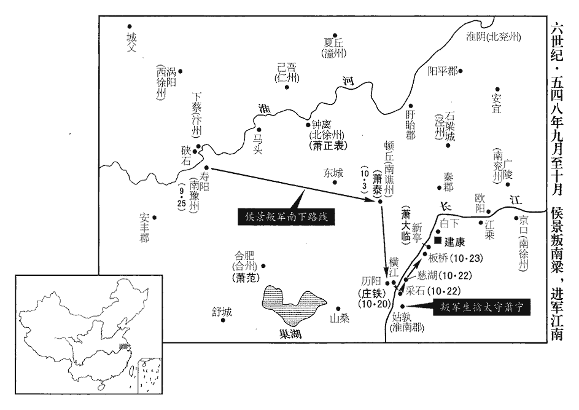
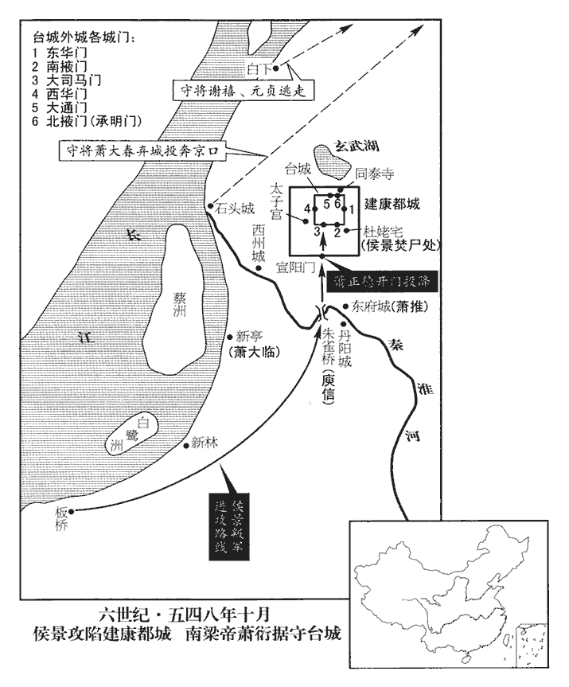
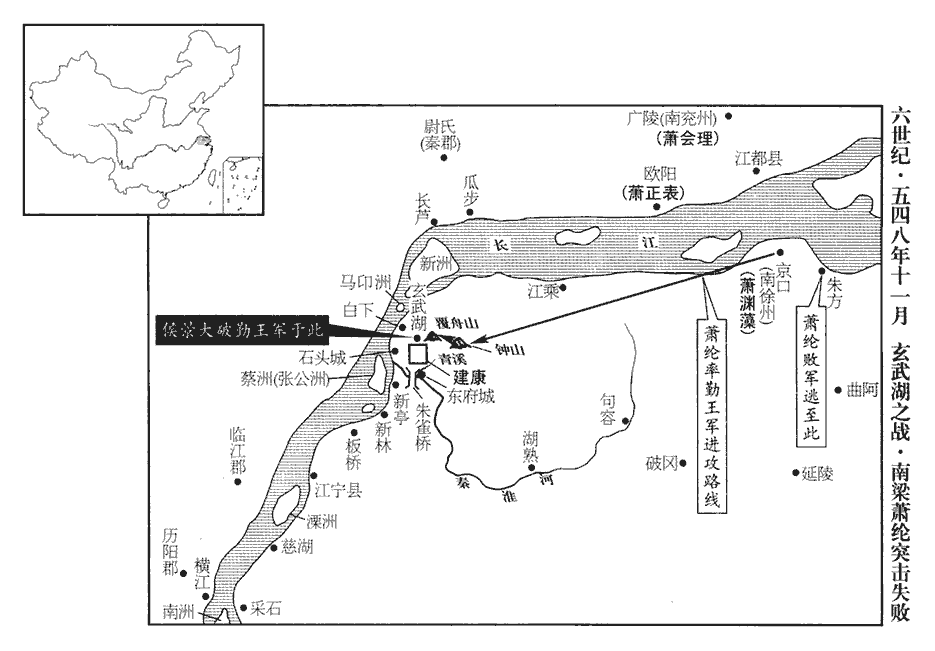
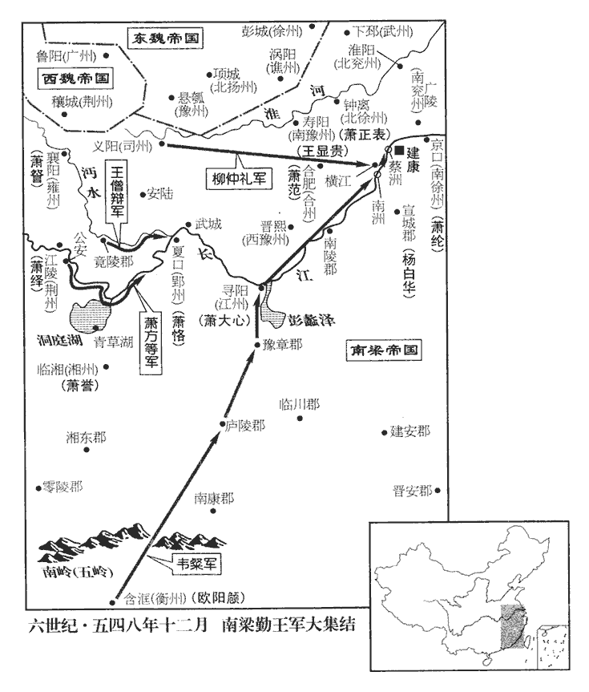

 梁紀十七著雍執徐（戊辰），一年。

# 高祖武皇帝十七

## 太清二年（戊辰、五四八）

1春，正月，己亥‹七›，慕容紹宗以鐵騎五千夾擊侯景，承上卷上年紹宗與景相持事，故不書東魏。景誑其眾曰：「汝輩家屬，已為高澄所殺。」衆信之。蓋前乎此時，景以此言誑眾也。誑，居況翻。紹宗遙呼曰：呼，火故翻。「汝輩家屬並完，若歸，官勳如舊。」歸，謂復歸東魏。官者，各人先所居之官。勳，勳階也。被髮向北斗為誓。質北斗為誓，以明其言之不欺。被，皮義翻。景士卒不樂南渡，樂，音洛。其將暴顯等各帥所部降於紹宗。暴顯去年春為侯景所執。將，即亮翻。帥，讀曰率。降，戶江翻。景眾大潰，爭赴渦水‹淮河支流，流经安徽省蒙城县北›，渦，音戈。水為之不流。為，于偽翻。景與腹心數騎自硤石‹安徽省凤台县西南淮河北岸›濟淮，稍收散卒，得步騎八百人，騎，奇寄翻。南過小城，人登陴詬之曰：「跛奴！侯景右足偏短，故詬為跛奴。陴pī，頻彌翻。詬，苦候翻。跛，普我翻。欲何為邪！」景怒，破城，殺詬者而去。晝夜兼行，追軍不敢逼。考異曰：典略云：「晝息夜行，追軍漸逼。」今從梁書。使謂紹宗曰：「景若就擒，公復何用！」紹宗乃縱之。人臣苟有才，必養寇以自資，東魏之世，彭樂、慕容紹宗同一轍耳。復，扶又翻。

〖译文〗 [1]春季，正月，已亥（初七），东魏慕容绍宗带领五千精锐骑兵前后夹击侯景的军队。侯景欺骗他的士兵们说：“你们这些人的家属，已经被高澄杀掉了。”侯景手下的士兵都相信了他的话。慕容绍宗从远方高喊着：“你们的家属都平安无事，如果你们回归，官职和勋爵会象从前一样封给你们。”说完，他披散着头发面向北斗星发誓。侯景的士兵们不愿意南渡，他的将领暴显等人各自统率自己的部队投降了慕容绍宗。侯景的人马全面溃败，士兵们争相抢渡涡水，河水都被败兵们阻断、不再奔流了。侯景与自己的几个心腹之人骑马从硖石渡过了淮河。他们逐渐收集了一些溃散的士兵，步兵、骑兵共有八百人。他们向南经过一座小城时，有人登上了城墙上面呈凸凹形的短墙对侯景谩骂道：“跛脚的奴才，看你还想做什么！”侯景听完恼羞成怒，攻破了这座小城，杀掉了骂他的人之后带兵离去。他们昼夜兼行，追击他们的东魏军队不敢逼近。侯景派人对慕容绍宗说：“侯景如果被抓去，您还有什么用呢？”慕容绍宗于是便放过了他。

2辛丑‹九›，以尚書僕射謝舉為尚書令，守吏部尚書王克為僕射。

〖译文〗 [2]辛丑（初九），梁武帝任命尚书仆射谢举为尚书令，守吏部尚书王克为仆射。

3甲辰‹十二›，豫州‹府设悬瓠河南省汝南县›刺史羊鴉仁以東魏軍漸逼，稱糧運不繼，棄懸瓠，還義陽‹河南省信阳市›；殷州‹府设项城河南省沈丘县›刺史羊思達亦棄項城走；去年，使羊鴉仁鎮懸瓠，羊思達鎮項城。考異曰：典略在六月，今從梁帝紀。東魏人皆據之。上‹萧衍，本年八十五岁›怒，責讓鴉仁；鴉仁懼，啟申後期，頓軍淮上。不敢歸義陽。

〖译文〗 [3]甲辰（十二日），豫州刺史羊鸦仁因东魏军队逐渐逼近，声称粮草运输接济不上，舍弃了悬瓠城，回到了义阳；殷州刺史羊思达也丢弃了项城逃走。这些地方都被东魏军队占领了。梁武帝十分恼怒，斥责了羊鸦仁，羊鸦仁很害怕，启奏梁武帝申请宽限一段时期，并把军队驻扎在淮河上游。

4侯景既敗，不知所適，時鄱陽王範除南豫州‹府设寿阳安徽省寿县›刺史，未至。去年，遣蕭淵明攻彭城，以範代鎮壽陽，時猶未至。馬頭‹安徽省怀远县南马城›戍主劉神茂，素為監州事韋黯所不容，監，工銜翻。聞景至，故往候之，有意見之為故。鄭玄曰：古者謂候為進。孔穎達曰：古時謂迎客為進，漢時謂迎客為候。今按經、傳，迎客為進，則「進使者而問故」之類是也。迎客為候，則鄭註周禮候人云，「候，候迎賓客之來」是也。景問曰：「壽陽去此不遠，城池險固，欲往投之，韋黯其納我乎？」神茂曰：「黯雖據城，是監州耳。王若馳至近郊，彼必出迎，因而執之，可以集事。得城之後，徐以啟聞，朝廷喜王南歸，必不責也。」景執其手曰：「天教也。」神茂請帥步騎百人先為鄉導。帥，讀曰率。鄉，讀曰嚮。壬子‹二十›，景夜至壽陽城下；韋黯以為賊也，授甲登陴。陴，頻彌翻。景遣其徒告曰：「河南王戰敗來投此鎮，願速開門！」黯曰：「既不奉敕，不敢聞命。」景謂神茂曰：「事不諧矣。」神茂曰：「黯懦而寡智，可說下也。」說，式芮翻。乃遣壽陽徐思玉入見黯曰：徐思玉本壽陽人，仕於東魏，今隨侯景南來。「河南王，朝廷所重，君所知也。今失利來投，何得不受？」黯曰：「吾之受命，唯知守城；河南自敗，何預吾事！」思玉曰：「國家付君以閫外之略，今君不肯開城，若魏兵來至，河南為魏所殺，君豈能獨存！【章：十二行本「存」下有「縱使或存」四字；乙十一行本同；孔本同；退齋校同；張校同，云「獨守」無註本作「獨存」，是張據校本「存」作「守」。】何顏以見朝廷？」黯然之。思玉出報，景大悅曰：「活我者，卿也。」癸丑‹二十一›，黯開門納景，景遣其將分守四門，詰責黯，將斬之；將，即亮翻；下同。詰，去吉翻。既而撫手大笑，置酒極歡。黯，叡之子也。合肥之役，黯請叡下城避箭，其懦闇可知矣。然使黯能拒景，梁朝亦將敕黯納之。

〖译文〗 [4]侯景战败后，不知道该投奔哪里。这时鄱阳王萧范被任命为南豫州刺史，还没有上任。马头戍主刘神茂，平素不被监州事韦黯所容。当他听说侯景来到，便前去迎候侯景。侯景问他：“寿阳离这个地方路途不远，城池险要、坚固。我想要前往投奔，韦黯他能接纳我吗？”刘神茂回答说：“韦黯虽然占据着寿阳城，但他只是监州官罢了。如果您率兵到了寿阳近郊，韦黯一定会出来迎接，趁此机会拘捕他，事情就可以成功。得到寿阳城之后，再慢慢地启奏皇上，让皇上知道此事。朝廷对大王南来归顺很高兴，一定不会责怪你的。”崐侯景听完握住刘神茂的手说：“真是天教我也。”刘神茂请求率领一百名步兵和骑兵先去做向导。壬子（二十日）。侯景夜间来到了寿阳城下。韦黯以为是贼盗来了，披上铠甲登上了城墙。侯景派手下人告诉韦黯说：“河南王侯景战败前来投奔此镇，希望赶快打开城门！”韦黯说：“我因为没有接到皇帝的圣旨，不敢听从你的命令。”侯景对刘神茂说：“事情不妙了。”刘神茂回答说：“韦黯懦弱并且缺少智谋，可以让人劝说他改变主意。”于是，侯景派寿阳人徐思玉进城拜见韦黯说：“河南王是朝廷所器重的人，您是知道的。现在他失利前来投奔你，怎么能不接纳他呢？”韦黯说：“我所接受的命令，只知道要守卫寿阳城，河南王战败了，与我有什么相干！”徐思玉说：“国家付予你统兵在外的权力，现在你不肯打开城门，如西魏的军队追来，河南王被西魏人杀掉，你怎能独自生存呢！你还有什么脸去见朝廷？”韦黯认为徐思玉说得很对。徐思玉出城秉报了侯景，侯景非常高兴地说：“救活我的人，正是你啊。”癸丑（二十一日），韦黯打开了城门接纳侯景。侯景派他的将领分别把守四个城门。他斥责韦黯不马上接纳他，要斩杀韦黯。不久，侯景又拍手放声大笑起来，摆出酒宴，尽情欢乐。韦黯是韦睿的儿子。

朝廷聞景敗，未得審問；或云：「景與將士盡沒。」上下咸以為憂。侍中、太子詹事何敬容詣東宮，太子‹萧纲›曰：「淮北始更有信，侯景定得身免，不如所傳。」敬容曰：「得景遂死，深為朝廷之福。」太子失色，問其故，敬容曰：「景翻覆叛臣，終當亂國。」太子於玄圃自講老、莊，自蕭齊以來，東宮有玄圃。崑崙之山三級，下曰樊桐，二曰玄圃，三曰層城，太帝之所居。東宮次於帝居，故立玄圃。敬容謂學士吳孜曰：梁祕書省有撰史學士。「昔西晉祖尚玄虛，使中原淪於胡、羯。事見晉紀。今東宮復爾，江南亦將為戎乎！」何敬容雖不能優游於文義，其識則過於梁朝諸臣矣。復，扶又翻；下景復、復敕、乃復、故復同。

〖译文〗 朝廷听说侯景战败，没有能详细地查问。有人说：“侯景与他的将士全军覆没了。”朝廷上上下下都为此而担忧。侍中、太子詹事何敬容来到东宫，太子说：“淮河北面又有消息了，侯景一定会免于身亡，并不象人们所传说的那样。”何敬容说：“得知侯景终于死了，这实在是朝廷的福分啊。“太子听完大惊失色。问他为什么这样说。何敬容说：“侯景是个反复无常的叛臣，他将会使国家大乱。”太子在玄圃亲自讲读《老子》、《庄子》，何敬容对学士吴孜说：“昔日，西晋始祖崇尚玄妙、虚无之说，结果使中原沦丧在胡人、羯人手中。现在东宫太子又这样做，江南恐怕也将成为胡人的天下了吧！”

甲寅‹二十二›，景遣儀同三司于子悅馳以敗聞，併自求貶削；優詔不許。景復求資給，上以景兵新破，未忍移易。乙卯‹二十三›，即以景為南豫州牧，本官如故；更以鄱陽王範為合州‹府设合肥安徽省合肥市›刺史，鎮合肥。更，工衡翻。光祿大夫蕭介上表諫曰：「竊聞侯景以渦陽敗績，隻馬歸命，渦，音戈。陛下不悔前禍，復敕容納。臣聞凶人之性不移，天下之惡一也。昔呂布殺丁原以事董卓，終誅董而為賊；事見漢靈、獻二帝紀。劉牢反王恭以歸晉，還背晉以構妖。事見晉安帝紀。妖，於驕翻。何者？狼子野心，終無馴狎之性，養虎之喻，必見飢噬之禍矣。侯景以凶狡之才，荷高歡卵翼之遇，左傳：楚令尹子西曰：「勝如卵，予翼而長之。」荷，下可翻。位忝台司，任居方伯，然而高歡墳土未乾，乾，音干。即還反噬。逆力不逮，乃復逃死關西；宇文不容，故復投身於我。陛下前者所以不逆細流，李斯上秦王書曰：江海不擇細流，故能就其深。正欲比屬國降胡以討匈奴，漢邊郡置屬國以處降胡，使偵伺匈奴。降，戶江翻。冀獲一戰之效耳；今既亡師失地，直是境上之匹夫，陛下愛匹夫而棄與國。【章：十二行本「國」下有「臣竊不取也」五字；乙十一行本同；孔本同；張校同；退齋校同。】與國，謂東魏。若國家猶待其更鳴之辰，歲暮之效，臣竊惟侯景必非歲暮之臣；惟，思也。棄鄉國如脫屣xǐ，背君親如遺芥，背，蒲妹翻。豈知遠慕聖德，為江、淮之純臣乎！事迹顯然，無可致惑。臣朽老疾侵，不應干預朝政；朝，直遙翻。但楚囊將死，有城郢‹湖北省江陵县›之忠，左傳：楚令尹子囊將死，遺言子庚必城郢。君子謂子囊忠，將死不忘衛社稷。衛魚臨亡，亦有尸諫之節。孔子家語曰：衛大夫蘧qú伯玉賢，靈公不用；彌子瑕不肖，反任之。史魚驟諫不從，將卒，命其子曰：「吾不能進蘧伯玉，退彌子瑕，是不能正君也。生不能正君，死無以成禮，我死，汝置屍牖下，於我畢矣。」其子從之。靈公弔焉，怪而問之，其子以告。公曰：「是寡人之過也。」命之殯於客位，進蘧伯玉，退彌子瑕。孔子聞之曰：「古之烈諫者，死則已矣，未有若史魚死而屍諫，忠感其君者也。」臣忝為宗室遺老，敢忘劉向之心！」劉向事見三十卷漢成帝陽朔二年。上歎息其忠，然不能用。介，思話之孫也。宋元嘉間，蕭思話歷當方任。按新唐書宰相世系表，介與帝同十三世祖後漢中山相苞。

〖译文〗 甲寅（二十二日），侯景派遣仪同三司于子悦飞马返回建康，把自己战败的事启奏朝廷，并且自己请求革职贬官。梁武帝下诏没有答应。侯景又请求为他补充财物和给养，梁武帝因为侯景的军队刚刚被打败，没有忍心把他调动。乙卯（二十三日），梁武帝就让侯景担任南豫州牧，他原来的官职还依然保持；又任命鄱阳王萧范为合州刺史，镇守合肥。光禄大夫萧介上表进谏说：“我私下听说侯景在涡阳打了败仗，单枪匹马前来归顺。陛下您不追悔他从前造成的灾难，又敕免并容纳了他。我听说恶人的秉性不会改变，天下的恶人是一样的。昔日吕布杀死了丁原，来侍奉董卓，而最终又杀死了董卓，成为叛贼。刘牢反叛王恭，归附晋朝，但又背弃了晋朝，制造邪恶事端。为什么呢？因为狼子野心，最终也不会有驯服、顺从的秉性，以喂养老虎为例，一定会出现被饥饿的老虎吃掉的祸患。侯景凭借着他的凶狠与狡猾的才能，受高欢的豢养和保护，身居高位独据一方，然而，高欢死后坟土还未干，他就反叛了高氏。只是因为叛逆的力量还不足，他才又逃奔到了关西。宇文泰没有收容他，所以他崐才投靠了我们。陛下您以往这所以不拒细流，接纳了侯景，正是为了象汉代在边境上设置属国安投降的胡人来对会匈奴那样，欲让侯景来对付东魏，希望他同东魏打一仗；而现在侯景既然亡师失地，吃了败仗，那么他便只是边境上的一个平常之人，陛下您舍不得区区一个侯景，却失去了与友好国家的和睦，如果国家还等待他自新之时，晚年效力，我私下认为侯景必定不是晚年效力的臣子。他抛弃家国象脱掉鞋一样轻率，背弃国君、亲人象丢掉草芥一样容易，他怎么会懂得远慕圣德而来，做我们梁朝纯贞的臣子呢！他的所作所为很明显，没有人会感到迷惑不解。我已经衰老，又受疾病侵扰，本不应该干预朝廷政事。但是楚国令尹子囊在临死时，还叮嘱子庚修筑郢都的城墙，不忘保护社稷。卫国的史鱼将死之时，尚有让儿子置尸窗下进谏卫灵公之举。我身为皇族遗老，怎么敢忘记刘向的一片忠心！”梁武帝魏很赞赏萧介的一片忠心，但是却不能听从他的忠告。萧介是萧思话的孙子。

5己未‹二十七›，東魏大將軍澄朝于鄴。朝，直遙翻；下同。

〖译文〗 [5]己未（二十七日），东魏大将军高澄来到邺城朝拜国主。

6魏以開府儀同三司趙貴為司空。

〖译文〗 [6]西魏任命开府仪同三司赵贵为司空。

7魏‹元宝炬，本年四十二岁›皇孫生，大赦。

〖译文〗 [7]西魏文帝的孙子降生，大赦天下。

8二月，東魏殺其南兗州‹府设谯城安徽省亳州市›刺史石長宣，討侯景之黨也；石長宣書官者，表其以南兗州附侯景也，不可以春秋書法觀之。其餘為景所脅從者，皆赦之。

〖译文〗 [8]二月，东魏杀掉了南兖州刺史石长宣，这是讨伐侯景的同党。其余被侯景所威胁，迫不得已随从他反叛的人都被赦免了。

9東魏既得懸瓠‹河南省汝南县›、項城‹河南省沈丘县›，悉復舊境。大將軍澄數遣書移，移，謂移檄也。數，所角翻。復求通好；朝廷未之許。澄謂貞陽侯淵明曰：「先王與梁主和好，十有餘年。復，扶又翻。好，呼到翻；下舊好同。聞彼禮佛文云：『奉為魏主，并及先王，』為，于偽翻。言為魏主君臣祈福也。此乃梁主厚意；不謂一朝失信，致此紛擾，知非梁主本心，當是侯景扇動耳，宜遣使諮論。使，疏吏翻；下同。若梁主不忘舊好，吾亦不敢違先王之意，諸人並即遣還，侯景家屬亦當同遣。」淵明乃遣省事夏侯僧辯奉啟於上，稱「勃海王弘厚長者，若更通好，當聽淵明還。」上‹萧衍›得啟，流涕，此所謂婦人之仁也。帝於是墮高澄數中矣。與朝臣議之。右衛將軍朱异、御史中丞張綰等皆曰：「靜寇息民，和實為便。」司農卿傅岐獨曰：「高澄何事須和？必是設間，异，羊至翻。間，古莧翻。故命貞陽遣使，欲令侯景自疑；景意不安，必圖禍亂。若許通好，正墮其計中。」侯景之反覆，何敬容、蕭介知之；髙澄之姦詐，傅岐知之；梁朝非果無人也，武帝不能決擇而用之耳。异等固執宜和，上亦厭用兵，乃從异言，賜淵明書曰：「知高大將軍禮汝不薄，省啟，甚以慰懷。當別遣行人，重敦鄰睦。」省，悉景翻。重，直龍翻。

〖译文〗 [9]东魏得到了悬瓠、项城后，完全恢复了有的疆土区域。大将军高澄多次派人送交国书，再次请求与梁朝通和、友好。朝廷没有允许。高澄对贞阳侯萧渊明说：“先王与梁主和睦相处，有十多年了。听说他拜佛的文字中写着，为魏国国主奉佛，同时也提到先王。这是梁主的真情厚意，没想到一朝失信，竟导致如此纷乱。我知道这并不是梁主的本意，一定是侯景煽动罢了。我们应该派遣使者去商讨一下，如果梁主没有忘记旧日两国这间的友好关系，我也不敢违背先王的意愿与梁朝为敌。我会立即遣返留在北方的人，侯景的家属也会同时得到遣返。”萧渊明于是派遣省事夏侯僧辩向梁武帝呈递了奏书，声称：“勃海王高澄是宽宏大量、十分厚道的长者，如果梁朝再次与东魏关系友好的话，高澄会允许我回到梁朝的。”梁武帝看到萧渊明的启奏后，流下了眼泪。便与朝中大臣们共同商议此事。右卫将军朱异、御史中丞张绾等人都说：“平息敌寇，安息百姓，讲和对于我们来说确实很好。”只有司农卿傅岐认为；“高澄为什么要和我们讲和？这一定是他设下的离间计，之所以让贞阳侯萧渊明派来使者，目的是想让侯景自己产生猜疑。侯景的心神不定，心里不安宁，就一定会图谋叛乱引起灾祸。如果您答应与东魏友好往来，就正好堕入了高澄的圈套，中了他的奸计。”朱异等人固执地主张应该与东魏和好，梁武帝也厌倦了战争，于是便同意了朱异的意见，赐给萧渊明一封信，信上说：“知道高大将军待你不错，我看了你的奏折，心里感到很宽慰。自当另外派遣使者到魏国，以便重新建立两国之间的和睦友好关系。”

僧辯還，過壽陽，侯景竊訪知之，攝問，具服。攝問，收錄其人而問之也。乃寫答淵明之書，陳啟於上曰：「高氏心懷鴆毒，怨盈北土，人願天從，歡身殞越。謂人所祝願，天從而殺之。子澄嗣惡，計滅待時，所以昧此一勝者，謂渦陽之勝也。蓋天蕩澄心以盈凶毒耳。左傳：楚武王將死，告其夫人鄧曼曰：「余心蕩」。鄧曼曰：「王祿盡乎！盈而蕩，天之道也。」杜預註曰：蕩，動散也。澄苟行合天心，行，下孟翻，又如字。腹心無疾，又何急急奉璧求和？豈不以秦兵扼其喉，秦兵，謂西魏之兵。西魏據有關西，故曰秦兵。胡騎迫其背，胡騎，謂柔然之兵。故甘辭厚幣，取安大國。臣聞『一日縱敵，數世之患，』晉先軫之言。何惜高澄一豎，以棄億兆之心！竊以北魏安強，莫過天監之始，鍾離‹安徽省凤阳县东北临淮关›之役，匹馬不歸。鍾離之戰，見一百四十六卷天監六年。當其強也，陛下尚伐而取之；及其弱也，反慮而和之。舍已成之功，縱垂死之虜，使其假命強梁，以遺後世，舍，讀曰捨。遺，于季翻。非直愚臣扼腕，實亦志士痛心。昔伍相奔吳，楚邦卒滅；左傳：楚殺伍奢，其子奔吳，吳王闔閭用之，破楚入郢。腕，烏貫翻。相，息亮翻。卒，子恤翻。陳平去項，劉氏用興；見漢高帝紀。臣雖才劣古人，心同往事。誠知高澄忌賈在翟，惡會居秦，左傳：晉靈公‹姬夷皋›之初，賈季奔翟‹陕西省北部›，隨會奔秦，秦人用其謀，晉人患之。六卿相見於諸浮，趙宣子曰：「隨會在秦，賈季在翟，難日至矣。將若之何？」翟，與狄同。惡，烏路翻。求盟請和，冀除其患。若臣死有益，萬殞無辭；唯恐千載，有穢良史。」觀景此言，其氣悖矣。景又致書於朱异，餉金三百兩；异納金而不通其啟。史言朱异昧利而不顧患。

〖译文〗 夏侯僧辩返回东魏，路过寿阳城。侯景私下查访知道了这件事，便拘捕了他，向他寻问情况。夏侯僧辩把一切都告诉了侯景。侯景于是写了一封回复萧渊明的书信向梁武帝陈述启奏说：“高氏内心象毒酒一样狠毒，北方人民对怨恨至极。天从人愿，高欢终于死去。他的儿子高澄继承了他父亲的恶毒，灭亡的时间已经不长了。高澄侥幸打胜了涡汤战役的原因，大概是上天要动荡其心，好让他恶贯满盈吧。高澄的行为如果合乎上天的意愿，心腹要害如果没有毛病，又为什么要急急忙忙地捧璧求和呢？还不是因为关中的军队卡住了他的咽喉，柔然的军队在他的背后步步逼的缘故，所以他才用甜言蜜语，丰厚的钱财，来换取同我朝之间关系的安定。我听说‘一天放纵敌人，就会成为几代人的祸患’，您何必要怜悯高澄这小子，而背弃亿万人民的心愿呢！我私下认为北魏安定强大的时期，莫过于天监初年，但钟离战役，北魏却片甲未回。当其强大之时，陛下尚且还讨伐并战胜了它，现在东魏力量薄弱了，您反而顾虑重重与它讲和。舍弃已经成就的功业，去放纵东魏这个濒临死亡的人，使它能托命强梁，把祸患留给后世。这不仅让我扼腕叹息，也让有志之士感到痛心啊。以前，楚国的伍了胥投奔了吴国，楚国终于被吴国灭掉；陈平离开项羽，刘邦任用了他从而使国家兴盛起来。我虽然比古人才疏学浅，但是，我的忠心却和他们一样。我知道高澄是忌恨我投奔梁朝，就象忌恨贾季投翟，随会投奔秦一样。他请求讲和结成盟国，只是希望除掉他的心腹之患。如果我死了能对国家有益，我万死不辞。只恐怕千百年后，在史册上留下陛下的污点。”侯景又写信给朱异，并赠给朱异三百两黄金。朱异收下了侯景的钱财却没有把侯景的奏折向梁武帝呈递。

己卯‹十七›，上遣使弔澄。景又啟曰：「臣與高氏，釁隙已深，仰憑威靈，期雪讎恥；今陛下復與高氏連和，使臣何地自處！此乃侯景由衷之言。使，疏吏翻。釁，許覲翻。復，扶又翻。處，昌呂翻。乞申後戰，宣暢皇威！」上報之曰：「朕與公大義已定，豈有成而相納，敗而相棄乎！今高氏有使求和，朕亦更思偃武。進退之宜，國有常制，公但清靜自居，無勞慮也！」景又啟曰：「臣今蓄糧聚眾，秣馬潛戈，指日計期，克清趙、魏，不容軍出無名，故願以陛下為主耳。觀景此言，亦那可忍。今陛下棄臣遐外，南北復通，將恐微臣之身，不免高氏之手。」景言至此，辭意迫切，獸窮則搏，能無及乎！復，扶又翻；下勞復同。上又報曰：「朕為萬乘之主，豈可失信於一物！想公深得此心，不勞復有啟也。」既斷來章，景又生心矣。乘，繩證翻。

〖译文〗 己卯（十七日），梁武帝派遣使者去慰问高澄，吊唁高欢。侯景又向梁武帝奏说：“我与高氏父子之间的嫌隙和仇恨已经很深，我仰仗您的威灵，期待着报仇雪耻。现在陛下又与高氏修好讲和，让我何处安身呢？请求您让我再次与高澄交战，来显示梁朝的皇威！”梁武帝写信回答侯景说：“我与你之间君臣大义已定，怎会有你打了胜仗就接纳你，打了败仗就抛弃你的道理呢？现在，高澄派遣使者来求和，我也想停止干戈。应该进还是应该退，国家有正常的制度，你只管清静自居就行了，无需费心去考虑这些！”侯景又向梁武帝启奏说：“我现在已贮备了粮草，聚集了士兵，喂了战马，藏好了武器，不日便可收复北方。我不能出师无名，所以希望陛下您能为我做主。现在陛下把我弃这在外，南北双方又开始互相沟通，只怕微臣的性命，将难免死在高澄之手。”梁武帝又写信给侯景说：“我是大国这君，怎么可以失信于人呢！我想你深深知道我的这番心，你不必再启奏了。”

景乃詐為鄴中書，求以貞陽侯易景，上將許之。舍人傅岐曰：傅岐先兼中書通事舍人，累遷太僕、司農卿，兼舍人如故。「侯景以窮歸義，棄之不祥；且百戰之餘，寧肯束手就縶！」謝舉、朱异曰：「景奔敗之將，一使之力耳。」將，即亮翻。使，疏吏翻。上從之，復書曰：「貞陽旦至，侯景夕返。」景謂左右曰：「我固知吳老公薄心腸！」帝之情態於此畢露，而帝不自知也，嗚呼！王偉說景曰：「今坐聽亦死，言坐而聽梁朝所為，亦必至於死。說，式芮翻。舉大事亦死，唯王圖之！」於是始為反計：屬城居民，悉召募為軍士，輒停責市估及田租，市估，應商旅之物入市者，估其直而收稅。田租，計畝所出常租。百姓子女，悉以配將士。景之反謀彰灼如此，梁之君臣若罔聞知，其亡宜矣。

〖译文〗 侯景于是假造了一封来自东魏都城邺城的书信，信中写道要用贞阳侯崐萧渊明交换侯景。梁武帝打算答应这一要求。舍人傅岐说：“侯景顺为山穷水尽才归至正道，投奔梁朝，舍弃了他是不吉祥的。况且侯景也身经百战，他怎么肯束手就擒呢！”谢举、朱异说：“侯景是败军之将，用一个使者就会把他召回来。”梁武帝听从了谢举、朱异的话，给邺城回信说：“贞阳侯早一到，侯景晚上会押送回去。”侯景对左右的人说：“我就知道这个老家伙是个薄情寡义之人！”王伟对侯景劝说道：“现在，我们等着听候梁国安排也是死，图谋大业也不过一死，希望大王您考虑一下这件事！”于是侯景才开始有把叛之计：将寿阳城内所有的居民，都招募为军队的士兵。立即停止收取市场税及田租。百姓之女，都被分派给将士们。

10三月，癸巳‹二›，東魏以太尉襄城王旭為大司馬，旭，吁玉翻。開府儀同三司高岳為太尉。辛亥‹二十›，大將軍澄南臨黎陽‹河南省浚县›，自虎牢‹河南省荥阳市汜水镇西›濟河至洛陽‹河南省洛阳市东白马寺东›。魏同軌‹河南省洛宁县›防長史裴寬與東魏將彭樂等戰，為樂所擒，澄禮遇甚厚，寬得間逃歸。將，即亮翻。間，古莧翻。澄由太行‹河南省沁阳市西›返晉陽。行，戶剛翻。

〖译文〗 [10]三月，癸巳（初二），东魏任命太尉襄城王旭为大司马，任命开府仪同三司高岳为太尉。辛亥（二十日），大将军高澄南巡至黎阳，从虎牢渡过黄河到达了洛阳。西魏同轨防长史裴宽与东魏乐等人交战，被彭乐抓获，高澄以礼相待，待他很优厚，裴宽找了个机会逃回了西魏。高澄由太行出发，返回了晋阳。

11屈獠洞斬李賁，賁竄屈獠洞，見一百五十九卷中大同元年。獠，魯皓翻。考異曰：陳高祖紀云「太清元年」，蓋謂破賁之年。今從梁帝紀。按通鑑破賁書於中大同元年。傳首建康。賁兄天寶遁入九真‹越南清化市›，收餘兵二萬圍愛州‹府九真›，五代志：九真郡，梁置愛州。交州‹府设龙编越南河内市东北北宁府›司馬陳霸先帥眾討平之。帥，讀曰率。詔以霸先為西江‹珠江›督護、高要‹广东省肇庆市›太守、督七郡諸軍事。

〖译文〗 [11]在屈獠洞有人将李贲斩杀了，他的首级被送到建康城。李贲的哥哥李天宝逃到了九真郡，收聚剩余的二万人马包围了爱州，交州司马陈霸先率领军队讨伐并扫平了李天宝。梁武帝下诏任命陈霸先为西江督护、高要太守、督七郡诸军事。

12夏，四月，甲子‹三›，東魏吏部令史張永和等偽假人官，事覺，糾檢、首者六萬餘人。糾檢，官所糾檢而發之者也。首，自首者也。史言喪亂之際，吏因為姦，濫冒者不勝其多。首，手又翻。

〖译文〗 [12]夏季，四月，甲子（初三），东魏吏部令史张永和等人伪造任官文书授人官职，事情败露之后，由别人纠查、检举出的人以及自首的人达六万多。

13甲戌‹十三›，東魏遣太尉高岳、行臺慕容紹宗、大都督劉豐生等將步騎十萬攻魏王思政於潁川‹河南省长葛县›。王思政守潁川事始上卷上年。將，即亮翻。騎，奇寄翻。思政命臥鼓偃旗，若無人者。岳恃其眾，四面陵城。思政選驍勇開門出戰，驍，堅堯翻。岳兵敗走。岳更築土山，晝夜攻之，思政隨方拒守，奪其土山，置樓堞以助防守。堞dié，徒協翻。守，式又翻。

〖译文〗 [13]甲戌（十三日），东魏派遣太尉高岳、行台慕容绍宗、大都督刘丰生等人，率领十万步兵和骑后到颍川攻打西魏王思政的军队。王思政命令部队把战鼓和军旗都放倒在地，好象没有人一样。高岳自恃人马众多，从四个方向攻打颍川城。王思政挑选了一些骁勇善战的将士打开城门出去应战，高岳的军队被打败逃走了。高岳改变了战术，又修筑了一座土山，日夜不停地攻城。王思政随机应变守卫颍川城，并且夺取了土山，在土山上修筑了岗楼和低矮的城墙来辅助颍川的防守。

14五月，魏以丞相泰為太師，廣陵王欣為太傅，李弼為大宗伯，趙貴為大司寇，于謹為大司空。宇文相魏，倣成周之制建官。太師泰奉太子巡撫西境，登隴，至原州‹府设高平宁夏固原县›，歷北長城，此蓋秦所築長城也。東趣五原‹内蒙古包头市›，至蒲州‹府设蒲坂山西省永济县›，自五原還至蒲州也。五代志：河東郡，後魏置秦州，後周改曰蒲州，因蒲坂為名也。趣，七喻翻。聞魏主不豫而還。還，從宣翻，又如字。及至，已愈，泰還華州‹府设武乡陕西省大荔县›。華，戶化翻。

〖译文〗 [14]五月，西魏文帝任命丞相宇文泰为太师，任命广陵王元欣为太傅，任命李弼为大宗伯，任命赵贵为大司寇，任命于谨为大司空。太师宇文泰侍奉太子巡抚西部边境地区。他们选进入陇地，然后到达了原州，经过了北长城。向东至五原，至达了蒲州。后来他们听说西魏文帝身体不适就返回了国都。等回到都城后，西魏文帝的身体已经痊愈了。宇文泰便返回了华州。

15上遣建康令謝挺、散騎常侍徐陵等聘于東魏，按梁官制，建康令秩千石，散騎常侍秩二千石。謝挺不當在徐陵之上，蓋徐陵將命而使，謝挺特輔行耳。散，悉亶翻。騎，奇寄翻。復脩前好。復，扶又翻。好，呼到翻。陵，摛chī之子也。徐摛見一百五十五卷中大通三年。摛，丑知翻。

〖译文〗 [15]梁武帝派遣建康令谢挺、散骑常侍徐陵等人到东魏去聘问。恢复从前的友好关系。徐陵是徐的儿子。

16六月，東魏大將軍澄巡北邊。

〖译文〗 [16]六月，东魏大将军高澄到北部边境地区巡视。

17秋，七月，庚寅朔‹一›，日有食之。

〖译文〗 [17]秋季，七月，庚寅朔（初一），这一天有日食现象。

18乙卯‹二十六›，東魏大將軍澄朝于鄴。朝，直遙翻。以道士多偽濫，始罷南郊道壇。魏太武帝崇信寇謙之，置南郊道壇。八月，庚寅‹二›，澄還晉陽，遣尚書辛術帥諸將略江、淮之北，凡獲二十三州。侯景既亂梁，明年，東魏始盡有淮南之地，史究其終言之。帥，讀曰率。將，即亮翻。

〖译文〗 [18]乙卯（二十六日），东魏大将军高澄到邺城上朝。因为道士中有许多是假冒的，东魏便将南郊的道坛废除了。八月，庚寅（初二），高澄返回晋阳，他派尚书辛术统率诸将夺取长江、淮河以北的地区，一共占领了二十三个州。

19侯景自至壽陽，徵求無已，朝廷未嘗拒絕。景請娶於王、謝，上曰：「王、謝門高非偶，可於朱、張以下訪之。」朱、張，謂朱异、張綰wǎn之族也。景恚恚，於避翻。曰：「會將吳兒女配奴！」又啟求錦萬匹為軍人作袍，中領軍朱异議以青布給之。又以臺所給仗多不能精，啟請東冶鍛工，欲更營造。【章：十二行本「造」下有「敕並給之」四字；乙十一行本同；孔本同；張校同；退齋校同。】鍛，丁貫翻。景以安北將軍夏侯夔之子譒為長史，譒bò，補過翻。徐思玉為司馬，譒遂去「夏」稱「侯」，託為族子。夏侯詳為梁朝佐命功臣，其子亶、夔皆宣力邊陲，並著聲績，至譒不克負荷矣。

〖译文〗 [19]侯景自从来到寿阳，就不断地提出要求，朝廷都未曾拒绝过他。侯景请求梁武帝，要娶王家或谢家的女子为妻。梁武帝说：“王和谢家门第高贵，你与他们不相配，你可以从朱、张以下的家族中寻访、聘娶。”侯景为此心中十分怨恨梁武帝，说：“将来，我要让吴人的女儿许配给奴仆！”他又向梁武帝启奏，要求朝廷赐给他一成匹锦缎，给官兵制作战袍。中领军朱异建议给侯景青布。侯景又以武器不精良为理由，向梁武帝启奏请求派来东治的锻造工人，打算再营造一些武器。侯景任命安北将军夏侯夔的儿子夏侯为长史，任命徐思玉为司马。夏侯于是去掉了姓氏中的“夏”字，只称“侯”字，假托是侯景的同族子孙。

上既不用景言，與東魏和親，是後景表疏稍稍悖慢；悖，蒲內翻，又蒲沒翻。又聞徐陵等使魏，反謀益甚。使，疏吏翻。元貞知景有異志，累啟還朝。景求輔貞見上卷上年。朝，直遙翻。景謂曰：「河北事雖不果，江南何慮失之，何不小忍！」貞懼，逃歸建康，具以事聞；上以貞為始興‹广东省韶关市›內史，亦不問景。帝既不問景，又不為之備，蓋耄期倦勤，直付之無可柰何。

〖译文〗 梁武帝既然没有采纳侯景的意见，与东魏友好往来，和睦相亲，这以后，侯景写给梁武帝的奏折态度渐渐不恭傲慢起来。后来他又听说徐陵等人出使东魏，心里反叛的念头就更强烈了。元贞知道侯景对梁朝有异心，多次向侯景请求返回朝廷。侯景对元贞说：“黄河北边的事虽然没有成功，长江南又何必担心会失掉呢，何不稍稍忍耐一下！”元贞听后十分恐惧，逃回了建康城，把这些事都告诉了梁武帝。梁武帝任命元贞为始兴内史，也没有再追问侯景这些事。

臨賀王正德，所至貪暴不法，屢得罪於上，正德既奔魏而逃歸，上復其本封。正德志行無悛，常公行劫掠；及隨豫章王北侵，又委軍而走，為有司所奏。上詔曰：「汝往年在蜀，昵近小人，猶謂少年情志未定。更於吳郡‹江苏省苏州市›殺戮無辜，劫盜財物。及還京師，專為逋逃，乃至江乘‹江苏省南京市东北›要道，湖頭斷路，奪人妻妾，略人子女。我每加覆掩，冀汝自新，了無悛革，怨讎逾甚，匹馬奔亡，志懷反噬。汝既來歸，又令仗節董戎前驅。豈謂汝狼心不改，志欲覆敗國計以快汝心。今宥汝以遠。」於是免官削爵，徙臨海‹浙江省台州市西北章安镇›；未至徙所，追赦之；復以朱异之言封臨賀王。為丹楊尹，坐所部多劫盜去職。出為南兗州‹府设广陵·江苏省扬州市›，在任苛刻，人不堪命。從是黜廢，轉增憤恨。由是憤恨，陰養死士，儲米積貨，幸國家有變；景知之。正德在北與徐思玉相知，謂奔魏時也。景遣思玉致牋於正德曰：「今天子年尊，姦臣亂國，以景觀之，計日禍敗。大王屬當儲貳，中被廢黜，詳見一百四十九卷普通三年。被，皮義翻。四海業業，歸心大王。景雖不敏，實思自效，願王允副蒼生，鑒斯誠款！」正德大喜曰：「侯公之意，闇與吾同，天授我也！」報之曰：「朝廷之事，如公所言。僕之有心，為日久矣。今僕為其內，公為其外，何有不濟！機事在速，今其時矣。」

〖译文〗 临贺王萧正德，无论到哪里都贪婪残暴，不遵守法令，多次受到梁武帝的怪罪。因为这些萧正德心里对梁武帝十分愤恨。他暗中豢养一批肯为他效忠的敢死之人，储存粮食，积攒财物，希望家发生意外事变。侯景知道萧正德的心意。萧正德在北方时与徐思玉是知己，侯景于是便派徐思玉给萧正德送去了一封书信。信上说：“现在天子上纪已大。奸臣乱国，依我看梁朝没有多少日子就会出现灾祸，遭到失败。大王你实属是君位的继承人，中途却被废黜，四海之人都归心于您。侯景虽不聪敏，实在想亲自为您效劳，希望大王您答应百姓的要求，上天可鉴我的诚心！”萧正德喜形于色地说：“侯公的心愿，正好与我相同，这真是天授我也！”于是给侯景回信说：“朝廷中的事，正如你所讲的那样，我有这个打算已很久了。今天，我在朝廷里面，你在朝廷外面，我们相互呼应，一定会成功！事不宜迟，现在正是好时机。”

鄱陽王範密啟景謀反。時上以邊事專委朱异，動靜皆關之，异以為必無此理。上報範曰：「景孤危寄命，譬如嬰兒仰人乳哺，仰，牛向翻。以此事勢，安能反乎！」範重陳之曰：「不早翦撲，禍及生民。」重，直用翻。撲，普卜翻。上曰：「朝廷自有處分，不須汝深憂也。」此亦報範之言，非面語之也。處，昌呂翻。分，扶問翻。範復請以合肥之眾討之，上不許。範非景敵也。使上許範而進兵討景，肉投餒něi虎耳。復，扶又翻；下不復同。朱异謂範使曰：「鄱陽王遂不許朝廷有一客！」自是範啟，异不復為通。使，疏吏翻；下同。為，于偽翻。

〖译文〗 鄱阳王萧范秘密启奏梁武帝，告诉他侯景要密谋反叛。当时，梁武帝把有关边境方面的事全都委托给了朱异，边境有什么动静都直通朱异。朱异认为萧范所说的一定没有道理。梁武帝于是给萧写回信说：“侯景孤单一人，境况危险才寄身于我们。这好象是刚出生的婴儿要仰仗人的乳汁来哺育一样。由此看来，他怎么能反叛呢！”萧范再次向梁武帝陈术说：“如果不早些把他消灭就崐会给百姓带来灾祸。”梁武帝回答说：“朝廷对这件事自有处置，你不必再过多忧虑此事了。”萧范又请求梁武帝动用合肥的军队去讨伐侯景，梁武帝没有同意。朱异对萧范的使者说：“鄱阳王竟不允许朝廷养一个食客！”从此以后，萧范给梁武帝的奏表，朱异便不再为他呈递梁武帝了。

景邀羊鴉仁同反，鴉仁執其使以聞。羊鴉仁自懸瓠還，頓軍淮上‹淮河上游›。异曰：「景數百叛虜，何能為！」敕以使者付建康獄，俄解遣之。景益無所憚，啟上曰：「若臣事是實，應罹國憲；如蒙照察，請戮鴉仁！」考異曰：梁書、南史皆云「並抑不奏」。典略，「朱异拒之」云云。今從太清紀。景又言：「高澄狡猾，寧可全信！陛下納其詭語，求與連和，臣亦竊所笑也。臣寧堪粉骨，投命讎門，讎門，謂高氏也。乞江西‹安徽省中部及湖北省东部›一境，受臣控督。如其不許，即帥甲騎，臨江上，向閩、越‹福建省及广东省›，非唯朝廷自恥，亦是三公旰食。」帥，讀曰率。騎，奇寄翻。旰gàn，古按翻。上使朱异宣語答景使曰：「譬如貧家，畜十客、五客，尚能得意；畜，吁玉翻。朕唯有一客，致有忿言，亦朕之失也。」益加賞賜錦綵錢布，信使相望。史言帝養成侯景之禍以敗國亡身。

〖译文〗 侯景邀羊鸦仁一同反叛梁朝，羊雅仁拘捕了侯景派劝他反叛的信使，并把这件事报告了朝廷。朱异说：“侯景的反叛军队只有几百人，能有什么作为！”梁武帝命令把侯景的信使送到建康的监狱里，不久，又释放了他。侯景更加肆无忌惮，向梁武帝启奏说：“如果我的事是事实，我应该受到国家法律的制裁。如果我能承蒙你的关照和详察，请您杀掉羊鸦仁！”侯景又启奏说：“高澄为人十分狡猾，怎么可以完全相信他的话！陛下听信了他的谎言，力求与他和好，我在私下里对这件事也感到魏可笑。我怎敢冒粉身碎骨的危险，投身我的仇人高澄呢，请求您将长江西部的一块地区，划归我控制。如果您不答应我一这要求，我就统率兵马，来到长江之上，杀向闽、越地区。这样，不仅朝廷蒙受耻辱，也会使三公大臣们顾不上吃饭。”梁武帝让朱异代替他向侯景的信使回答说：“比如一个贫寒的家庭，蓄着了十个、五个食客，还有让他们满意，我只有一个客人，就招致了你这些愤慨的话，这也是我的过失啊！”这之后，梁武帝对侯景的赏赐更多了，赏给了他许多鲜艳华美的彩帛及钱币，信使往来不断，道路相望。

戊戌‹十›，景反於壽陽，以誅中領軍朱异、少府卿徐驎、太子右衛率陸驗、制局監周石珍為名。驎，離珍翻。李延壽曰：制局小司，專典兵力，雲陛天啟，亘設蘭錡，羽林精卒，重屯廣衛。至於元戎啟轍，武候遮迾，清道晨行，按轡督察，往來馳騖。輦轂驅投，分部親承几案，領護所攝，手揔成規。蕭子顯曰：尚書外司領武官，有制局監，監內器仗兵役，亦用寒人之被恩倖者。率，所律翻。异等皆以姦佞驕貪，蔽主弄權，為時人所疾，故景託以興兵。驎、驗，吳郡人；石珍，丹楊人。驎、驗迭為少府丞，以苛刻為務，百賈怨之，賈，音古。异尤與之暱，暱，尼質翻。世人謂之「三蠹」。

〖译文〗 戊戌（衬十），侯景在寿阳反叛。他以杀掉中领军朱异、少府卿徐、太子右卫率陆验、制局监周石珍为借口反叛了梁朝。朱异等人由于为人奸诈、善于花言语阿谀奉承，骄奢淫逸而又贪婪，欺骗梁武帝、玩弄权术，被当时的人所痛恨，因此侯景以此为借口起兵叛乱。徐、陆检是吴郡人。周石珍是丹杨人。除与陆检曾轮流担任少府丞。因为他们做事苛刻，商人们都他恨他们。朱异与他俩的关系尤其亲昵，因此，世上的人都称他们三个是“三蠹”。

司農卿傅岐，梗直士也，嘗謂异曰：「卿任參國鈞，榮寵如此。比日所聞，比，毗至翻。鄙穢狼籍，若使聖主發悟，欲免得乎！」异曰：「外間謗黷，知之久矣。心苟無愧，何恤人言！」岐謂人曰：「朱彥和將死矣。朱异，字彥和。恃諂以求容，肆辯以拒諫，聞難而不懼，難，乃旦翻。知惡而不改，天奪之鑒，其能久乎！」

〖译文〗 司农卿傅岐，是个为人耿直的官吏。他曾对朱异说：“你掌握朝政大权，得到的荣誉和受到的宠幸如此多。近来传闻都是些污秽、狼藉之事。如果让圣明的君主发现以后明白过来，你能免于罪责吗！”朱异回答说：“外面对我的诽谤和玷污，我很久以前就知道了，如果我心里没有惭愧，又何必忧虑别人讲些什么呢！”傅岐事后对别人说：“朱异快要完了。他仗着自己能巴结奉承来求得欢心，肆意为自己狡辩，拒绝别人的劝告，他听到灾难要降临而不怕，知道自己的罪恶，却不思改悔，上天要惩罚他，他还能活得长么！”

景西攻馬頭，景自渦陽之敗，南走馬頭，戍主劉神茂迎候之以入壽陽，當塗之馬頭也。今又自壽陽西攻馬頭，則此馬頭在壽陽之西，當淮津濟渡之要，縛馬頭以登舟，又非當塗之馬頭也。當塗之馬頭郡在壽陽東。考異曰：梁書云：「執太守劉神茂」。按神茂素附於景，無煩攻執。今從太清紀、典略。遣其將宋子仙東攻木柵，木柵在荊山西。執戍主曹璆等。璆qiú，音求，又渠幽翻。上聞之，笑曰：是何能為！吾折箠笞之。」此即朱异謂「景數百叛虜何能為」之說也。君驕昏而臣貪昧，禍至不懼，以自取敗亡。折，之舌翻。敕購斬景者，封三千戶公，除州刺史。甲辰‹十六›，詔以合州刺史鄱陽王範為南道都督，北徐州‹府设钟离安徽省凤阳县东北临淮关›刺史封山侯正表為北道都督，五代志，封山縣屬合浦郡。司州‹府设义阳河南省信阳市›刺史柳仲禮為西道都督，通直散騎常侍裴之高為東道都督，以侍中開府儀同三司邵陵王綸持節董督眾軍以討景。正表，宏之子；仲禮，慶遠之孫；之高，邃之兄子也。宏，上之弟；正表、正德兄弟，皆其子也。柳慶遠、裴邃，皆天監名臣。

〖译文〗 侯景向西进攻马头，派遣他的将领宋子仙向东去攻打木栅，并捉住了戍主曹等人。梁武帝听说这件事以后，笑着说：“这些人能干出什么！我折断一根木棍就把能鞭打他。”梁武帝下令悬赏，能杀掉侯景的人，封为三千户公并授崐予州刺史之职。甲辰（十六日），梁武帝下诏，任命合州刺史鄱阳王萧范为南道都督，北徐州刺史封山侯萧正表为北道都督，司州刺史柳仲礼为西道都督，通直散骑常侍裴之高为东道都督，侍中开府仪同三司、邵陵王萧纶持节监督各路军队以讨伐侯景。萧正表是萧宏的儿子。柳仲礼是柳庆远的孙子，裴之高是裴邃哥哥的儿子。

20九月，東魏濮陽武公婁昭卒。濮，博木翻。

〖译文〗 [20]九月，东魏濮阳武公娄昭去世。

21侯景聞臺軍討之，問策於王偉，偉曰：「邵陵若至，彼眾我寡，必為所困。不如棄淮南，壽陽，古淮南郡治所。決志東向，帥輕騎直掩建康；帥，讀曰率。臨賀反其內，大王攻其外，天下不足定也。兵貴拙速，宜即進路。」景乃留外弟中軍大都督王顯貴守壽陽；癸未‹二十五›，詐稱遊獵，出壽陽，人不之覺。冬，十月，庚寅‹三›，景揚聲趣合肥，而實襲譙州‹府设顿丘侨县·安徽省滁州市›，此譙州非渦陽之譙州。魏收志：梁置譙州於新昌城，領高塘、臨徐、南梁、新昌郡。其地當在唐廬、和二州之間。宋白曰：梁大同三年，割北徐州之新昌、南譙州之北譙，立為南譙州，居桑根山西，今滁州城是也。助防董紹先開城降之。考異曰：太清紀云：「十三年，陷譙城。」下又云：「十三日，以王質巡江遏防。」典略上作「庚戌」，下作「庚子」。按此月戊子朔，蓋三日庚寅也。執刺史豐城侯泰。泰、範之弟也；先為中書舍人，先，悉薦翻。傾財以事時要，超授譙州刺史。至州，徧發民丁，使擔腰輿、扇、繖等物，腰輿者，人舉之而行，其高纔至腰。繖sǎn，蘇旰翻，又蘇旱翻，蓋也。不限士庶；恥為之者，重加杖責，多輸財者，即縱免之，由是人皆思亂。及侯景至，人無戰心，故敗。

〖译文〗 [21]侯景听说官军前讨伐他，便向王伟询问策略，王伟说：“邵陵王的军队如果到来，他们人多，我们人少，一定会被他的军队所围困。我们不如放弃淮南，专心一意向东进军，统率轻装骑兵直袭建康。临贺王萧正德在建康内部反叛，大王你在建康城外发动攻势，天下不难平定！军队贵在行动速迅，您应该马上上路。”侯景于是让自己的表弟中军大都督王显贵守卫寿阳城。癸未（二十五日），侯景诈称出外巡游、打猎，出了寿阳城，人们都没有发觉这件事。冬季，十月，庚寅（初三），侯景杨言要到合肥，便实际上却袭击谯州。谯州助防先打开城门，投降了侯景。侯景拘捕了史丰城侯萧泰。萧泰是萧范的弟弟。他以前曾担任中书舍人，花费了大量钱财贿赂当时的达官贵人，被破格提拔为谯州刺史。到了谯州，他到处征发民夫，为他抬着高到人腰部的轿子，手持障尘蔽日的扇，以及雨伞等器物，不论是土族还是庶族，如果谁耻于做这些事，就会遭到木棍的加重毒打。谁多送给他钱财，就免除谁的劳役。由于这些，人们都希望天下大乱，等到侯景来到谯州时，人人都没有作战的愿望。所以战败了。

庚子‹十三›，詔遣寧遠將軍王質帥眾三千巡江防遏。景攻歷陽‹安徽省和县›太守莊鐵，丁未‹二十›，鐵以城降。降，戶江翻。因說景曰：「國家承平歲久，人不習戰，聞大王舉兵，內外震駭，宜乘此際速趨建康，說，式芮翻。趨，七喻翻。可兵不血刃而成大功。若使朝廷徐得為備，內外小安，遣羸兵千人直據采石‹安徽省马鞍山市西南›，羸，倫為翻。大王雖有精甲百萬，不得濟矣。」景乃留儀同三司田英、郭駱守歷陽，以鐵為導，引兵臨江。江上鎮戍相次啟聞。上問討景之策於都官尚書羊侃，侃請「以二千人急據采石，令邵陵王襲取壽陽；使景進不得前，退失巢穴，烏合之眾，自然瓦解。」朱异曰：「景必無渡江之志。」遂寢其議。侃曰：「今茲敗矣！」

〖译文〗 庚子（十三日），梁武帝下诏派遣宁远将军王质统率三千人马沿长江防卫和阻止侯景的进攻。侯景向历阳太守庄铁的军队发动了进攻。丁未（二十日）庆铁率全城军民投降了侯景。并对侯景说：“国家连续安定许多年了，人们都已不习惯作战，听说大王您起兵，朝廷内外都感到很震惊和害怕。应该乘机迅速逼近建康，那样，不经过流血打仗就能取得成功。如果让朝廷渐渐有所防备，朝廷内外也稍稍安定一些，只要派遗一千名瘦弱的士兵径直占据采石的话，大王虽然有百万精锐军队，也不会成功。”侯景于是留下了仪同三司国英以及郭骆守卫历阳，让庄铁担任向导，带领军队来到了长江边上。防卫长江的官员相继依次把侯景反叛的近事启奏给了梁武帝。梁武帝向都官尚书羊侃寻问讨伐侯景的计策。羊侃则请求：“派二千人马快速占据采石，并命令邵陵王袭击、夺取寿阳，让侯景不能前进，退又失去巢穴。这些乌合之众，自然也就土崩瓦解了。”朱异却说：“侯景一定没有渡过长江的打算。”于是，没有采纳羊侃的建议，羊侃说：“现在梁朝就要败亡了。”

戊申‹二十一›，以臨賀王正德為平北將軍，都督京師諸軍事，屯丹楊郡。盧循之寇建康也，徐赤特敗於張侯橋，循兵大上，至丹楊郡。則丹楊郡治蓋近江渚。正德遣大船數十艘，詐稱載荻，密以濟景。艘，蘇遭翻。荻，音狄。景將濟，慮王質為梗，使諜視之。會臨川‹江西省南城县›大守陳昕啟稱：「采石急須重鎮，王質水軍輕弱，恐不能濟。」恐其不能濟國事也。諜，徒協翻。昕，許斤翻。上以昕為雲旗將軍，代質戍采石，徵質知丹楊尹事。昕，慶之之子也。陳慶之有入洛之功。質去采石。而昕猶未下渚。諜告景云：「質已退。」未下渚者，未下秦淮渚也。諜，徒協翻。景使折江東樹枝為驗，諜如言而返，景大喜曰：「吾事辦矣！」己酉‹二十二›，自横江‹安徽省和县东南长江渡口›濟于采石，有馬數百匹，兵八千人。是夕，朝廷始命戒嚴。

〖译文〗 戊申（二十一日），梁武帝任命临贺王萧正德为平北将军、都督京师诸军事，把军队驻扎在丹杨郡。萧正德派遣了几十艘大船，欺骗别人说这些船是用来运芦苇的，而暗中却用来载侯景的军队过江。侯景将要渡过江时，担心王质从中作梗，便派间谍观察监视他。正好这时临川太守陈昕向梁武帝启奏说：“采石急需重兵把守，王质的水军力量薄弱，恐怕不能顶事。”梁武帝于是任命陈昕为云旗将军，代替王质守卫采石。征调王质到丹杨任丹杨尹。陈昕，是陈庆之的儿子。王质离开了采石，而陈昕还没有去采石就任。间谍把这一情况告诉了侯景：“王质已经离开采石。”侯景让间谍把长江东岸的树枝折断进行验证，间谍按照他的吩咐做了之后返回。侯景非常高兴地说：“我的事能成了！”己酉（二十二日），侯景从横江渡过长江到达采石，一共有几百匹马和八千士兵。这天夜里，朝廷才下令实行戒严。

景分兵襲姑孰‹安徽省当涂县›，執淮南‹府姑孰›太守文成侯寧。晉成帝初於姑孰僑立淮南郡。五代志：丹楊郡當塗縣，舊置淮南郡。南津‹南州津·安徽省当涂县西长江渡口›校尉江子一帥舟師千餘人，欲於下流邀景；帥，讀曰率。其副董桃生，家在江北，與其徒先潰走。子一收餘眾，步還建康。子一，子四之兄也。

〖译文〗 侯景分几路人马袭击姑孰城，抓住了淮南太守文侯萧宁。南津校尉江子一统率千余水军，想在长江下流拦击侯景的军队。江子一的副将董桃生，家住在长江北面，他与手下人率先溃败逃走。江子一聚集了剩下的人马，徒步回到了建康。江子一是江子四的哥哥。

 

太子見事急，戎服入見上，入見，賢遍翻。稟受方略，上曰：「此自汝事，何更問為！內外軍事，悉以付汝。」考異曰：太清紀云：「太宗見事急，乃入，面啟高祖曰：『請以軍事並以垂付，願不勞聖心。』南史云：「帝曰『此自汝事，何更問為！』今從典略。太子乃停中書省，指授軍事，物情惶駭，莫有應募者。朝廷猶不知臨賀王正德之情，命正德屯朱雀門，寧國公大臨屯新亭‹建康城西南›，大府卿韋黯屯六門，繕脩宮城，為受敵之備。大臨，大器之弟也。大臨、大器，皆太子綱之子。

〖译文〗 太子见情况紧急，便身穿戎装进入皇宫见梁武帝，领受梁武帝的指示，梁武帝对他说：“这些事是你自己的事，又何必问我呢？朝廷内外的军政事务，我全都交给你了。”太子于是进驻中书省，指挥布置军事事务。人们情绪惶惶不安，没有人敢应募出征。朝廷还不知道临贺王萧正德已暗中投降了侯景这一情况，仍命令萧正德驻兵把守朱雀门，命宁国公萧大临驻守新亭，大府卿韦黯率兵驻守六个城门、修缮皇宫的城墙，为一旦遭受敌人进攻做好准备。萧大临是萧大器的弟弟。

己酉‹二十二›，景至慈湖‹安徽省马鞍山市北›。建康大駭，御街人更相劫掠，更，工衡翻。不復通行。復，扶又翻。赦東•西冶、尚方錢署及建康繫囚，以揚州刺史宣城王大器都督城內諸軍事，以羊侃為軍師將軍副之，南浦侯推守東府‹宰相府·建康城南›，劉禪建興八年，立南浦縣，屬巴東郡。西豐公大春守石頭，沈約曰：吳立豐縣，屬臨川郡；晉武帝太康元年，更名西豐。輕車長史謝禧、始興太守元貞守白下‹建康城北›，韋黯與右衛將軍柳津等分守宮城諸門及朝堂。朝，直遙翻。推，秀之子；安成王秀，上弟也。大春，大臨之弟；津，仲禮之父也。攝諸寺庫公藏錢，聚之德陽堂，以充軍實。攝，收也。諸寺，謂十二寺也。藏，徂浪翻。天監六年，改閱武堂為德陽堂，在南闕前。

〖译文〗 己酉（二十二日），侯景的军队到达了慈湖。建康全城都非常惊恐，御街上人们互相抢夺虏掠，街道已不能通行。朝廷敕免了东西冶、尚方钱署以及建康城拘押的囚犯。任命扬州刺史宣城王萧大器为都督城内诸军事，任命羊侃担任军师将军，辅助萧大器。命南浦侯萧推守卫东府，命西丰公萧大春守卫石头，命轻车长史谢禧、始兴太守元贞守卫白下，命韦黯与右卫将军柳津等人分别守卫宫城的各个城门以及朝廷的殿堂。萧推是萧秀的儿子。萧大春是萧大临的弟弟，柳津是柳仲礼的父亲。梁武帝把各官署仓库里贮藏的钱财聚集起来，集中在德阳堂，用来补充军需。

庚戌‹二十三›，侯景至板橋‹江苏省江宁县西›，張舜民曰：出秦淮西南行，循東岸，行小夾中，十里過板橋店。遣徐思玉來求見上，實欲觀城中虛實。上召問之。思玉詐稱叛景請間陳事，上將屏左右，屏，必郢翻。舍人高善寶曰：「思玉從賊中來，情偽難測，安可使獨在殿上！」朱异侍坐，曰：「徐思玉豈刺客邪！」思玉出景啟，言「异等弄權，乞帶甲入朝，除君側之惡。」异甚慚悚。朝，直遙翻。景又請遣了事舍人出相領解，了事，猶言曉事也。領，總錄也；解，分判也；領解，言總錄景所欲言之事而分判是非也。凡此皆侯景詭言，以怠梁朝君臣，使無戰心。上遣中書舍人賀季、主書郭寶亮隨思玉勞景于板橋。勞，力到翻。景北面受敕，季曰：「今者之舉何名？」景曰：「欲為帝也！」王偉進曰：「朱异等亂政，除姦臣耳。」景既出惡言，遂留季，獨遣寶亮還宮。

〖译文〗 庚戌（二十三日），侯景的军队到达了板桥。他派遣徐思玉前来拜见梁武帝，实际上是想探听一下建康城里的虚实。梁武帝召见了他并问了他一些事。徐思玉假称他背叛了侯景，请求单独向梁武帝报告情况。梁武帝要屏退左右，舍人高善宝说；“徐思玉从叛贼那里来，真假难以推测，怎么可以让他单独崐留在殿堂之上！”朱异正坐在梁武帝身边侍奉，他说：“徐思玉难道是刺客吗！”徐思玉拿出了侯景的启奏，上面写道：“朱异等人玩弄权术，我请求带兵入朝，除掉国君身边的坏人。”朱异感到非常惭愧和恐惧。侯景又请求梁武帝派一名懂得事理的舍人出来总录侯景要说的事并且分辨是非。梁武帝于是派中书舍人贺季、主书郭宝亮跟随徐思玉一起到板桥来慰劳侯景，侯景面向北方承接了诏书。贺季问：“你现在的举动到底要干什么？”侯景回答说：“是想称皇帝。”王伟上前说道：“朱异等人搞乱了国家政务，我们是要除掉奸臣的。”侯景已经说出了他的罪恶目的，于是便拘留了贺季，只打发郭宝亮返回皇宫。

百姓聞景至，競入城，公私混亂，無復次第，復，扶又翻。羊侃區分防擬，皆以宗室間之。間，古莧翻。軍人爭入武庫，自取器甲，所司不能禁，所司，謂武庫令之屬。侃命斬數人，方止。是時，梁興四十七年，天監十八，普通七，大通二，中大通六，大同十一，中大同一，至是年太清二年，通四十七年。境內無事，公卿在位及閭里士大夫罕見兵甲，賊至猝迫，公私駭震。宿將已盡，後進少年並出在外，將，即亮翻。少，詩照翻。軍旅指撝huī，一決於侃，侃膽力俱壯，太子深仗之。仗，除兩翻，憑仗也。

〖译文〗 百姓听说侯景的军队来到，争相逃入城里。官员与百姓混杂在一起，不再有秩序。羊侃布置防守计划，每处都安排皇室成员来监督。军队的官兵争相进入武器库，自己拿兵器和盔甲，掌管武器库的人不能禁止，羊侃下令斩杀了几个人，才制止了这种混乱。这年，是梁朝建立后的第四十七年，国内一直平安无事，在职的公卿以及闾里士大夫都很少见到兵器和铠甲。现在，叛贼突然来到，形势紧迫，官员与百姓都很震惊。朝廷中的老将已经没有了，后来晋升的青年将领都正在外面征战或防守边境，军队的指挥权，完全由羊侃一人决定。羊侃有胆有谋，太子深深地仰仗于他。

辛亥‹二十四›，景至朱雀桁‹建康城南秦淮河浮桥›南，桁，戶剛翻。太子以臨賀王正德守宣陽門，東宮學士新野‹河南省新野县›庾信守朱雀門，帥宮中文武三千餘人營桁北。太子命信開大桁以挫其鋒，正德曰：「百姓見開桁，必大驚駭，可且安物情。」太子從之。俄而景至，信帥眾開桁，始除一舶，帥，讀曰率；下同。舶，旁陌翻。大舟曰舶。見景軍皆著鐵面，著，陟略翻。退隱于門。信方食甘蔗，甘蔗，生於南方，狀如紫竹，圍數寸，高丈餘。以刀去皮切食，其味甘冷，解煩析酲。楚辭所謂「泰尊柘漿析朝酲」，司馬相如子虚賦所謂「諸柘」者也。蔗，之夜翻。有飛箭中門柱，信手甘蔗，應弦而落，遂棄軍走。南塘‹秦淮河南›遊軍沈子睦，臨賀王正德之黨也，復閉桁渡景。景至秦淮南岸，子睦領遊軍在南塘，庾信既走，北岸無兵，子睦因得閉桁以渡景兵。中，竹仲翻。復，扶又翻。太子使王質將精兵三千援信，至領軍府，遇賊，未陳而走。正德帥眾於張侯橋迎景，馬上交揖，既入宣陽門，望闕而拜，歔欷流涕，隨景渡淮。景軍皆著青袍，正德軍並著絳袍，碧裏，陳，讀曰陣。歔，音虛。欷，許既翻，又音希。著，陟略翻。既與景合，悉反其袍。景乘勝至闕下，城中恟懼，恟，許拱翻。羊侃詐稱得射書云：「邵陵王、西昌侯援兵已至近路。」邵陵王綸兵時已渡江向鍾離‹安徽省凤阳县东北临淮关›。西昌侯淵藻時鎮京口‹江苏省镇江市›。眾乃小安。西豐公大春棄石頭，奔京口；謝禧、元貞棄白下走；津主彭文粲等以石頭城降景，降，戶江翻。景遣其儀同三司于子悅守之。

〖译文〗 辛亥（二十四日），侯景来到朱雀门浮桥的南面，太子命临贺王萧正德把守宣阳门，命东宫学士新野人庾信把守朱雀门，统率皇宫中的三千多名文武官员在浮桥北面安营扎寨。太子命令庾信断开浮桥以挫折侯景部队的锋芒。萧正德说：“百姓看到断开浮桥，一定会非常惊恐，应该暂且先安抚百姓的情绪。”太子采纳了萧正德的意见。一会儿，侯景的部队来到。庾信率领人马断开了浮桥，刚除掉了一艘大船，看到侯景的士兵都戴着铁面具，于是便后退，隐藏到城门楼上。庚信正在吃甘蔗，一枝箭飞来射中了城门柱子。庚信手中的甘蔗随着弓弦的响声坠落到了地上。于是，他抛弃了军队逃走了。南塘游军沈子睦，是临贺王萧正德的同党。他们趁机闭合了浮桥，让侯景渡河。太子派遣王质率领三千精兵去增援庾信。王质的军队到了领军府，遭遇到了侯景的军队，王质的军队还没有摆开阵势就逃走了。萧正德率领他的人马在张侯桥迎接侯景。他们在马上相互作揖。进入宣阳门后，萧正德面向后宫叩拜，哽咽流泪，跟随侯景一起渡过秦淮河。侯景部队的士兵都穿青色战袍，萧正德部队的士兵都穿红色战袍，战袍里子是青绿色的。与侯景部队会合后，萧正德就命令他的士兵全部将战袍衬里朝外反过来穿。侯景乘胜进军来到城楼下面，城里的人十分恐惧。羊侃谎称得到了一封射进来的书信，书信上说：“邵陵王和西昌侯的援兵已经到达附近”。大家这才稍稍安定下来。西丰公萧大春放弃了石头，逃奔京口；谢禧、元贞等人放弃了白下逃走；津主彭文粲等人率石头城军民投降了侯景，侯景便派遣他的仪同三司于子悦来守卫石头城。

壬子‹二十五›，景列兵繞臺城，旛旗皆黑，射啟於城中曰：射，而亦翻。「朱异等蔑弄朝權，輕作威福，朝，直遙翻。臣為所陷，欲加屠戮。陛下若誅朱异等，臣則斂轡北歸。」上問太子‹萧纲›：「有是乎？」對曰：「然。」上將誅之。太子曰：「賊以异等為名耳；今日殺之，無救於急，適足貽笑，將來俟賊平，誅之未晚。」上乃止。

〖译文〗 壬子（二十五日），侯景让士兵列队围绕在台城周围，他的战旗都是黑色。他叫人向城内射去了一封书信，信上说：“朱异等人专权，作威作福，我被他所陷害，想杀掉我。如果陛下您杀掉朱异等人，那么我就收兵回北方。”梁武帝问太子：“有这样的事吗？”太子回答说：“有”。梁武帝于是要斩杀朱异。太子对梁武帝说：“侯景这个叛贼只是以杀朱异等人为借口罢了，今天您即使杀掉了朱异，对当前的紧急情况也无济于事，只会被后人耻笑，等到平定侯景之后再来杀掉他也不晚！”梁武帝于是才没有杀掉朱异。

景繞城既帀，帀zā，作答翻，周也。百道俱攻，鳴鼓吹脣，喧聲震地。縱火燒大司馬、東•西華諸門。羊侃使鑿門上為竅，竅，苦弔翻，空也，穴也。下水沃火；太子自捧銀鞍，往賞戰士；直閤將軍朱思帥戰士數人，踰城出外灑水，久之方滅。賊又以長柯斧斫東掖門，門將開，羊侃鑿扇為孔，扇，門扇也。以槊刺殺二人，斫者乃退。刺，七亦翻。景據公車府，蕭子顯齊志：公車令，屬領軍，以受天下章奏。梁制，公車令屬衛尉，其署舍在臺城門外，故景得據之。府者，署舍之通稱。正德據左衛府，景黨宋子仙據東宮，范桃棒據同泰寺。棒，部項翻。景取東宮妓數百，分給軍士。妓，渠綺翻，女樂也。東宮近城，近臺城也。景眾登其牆射城內。射，而亦翻；下臨射、亦射、弓射同。至夜，景於東宮置酒奏樂，太子遣人焚之，臺殿及所聚圖書皆盡。景又燒乘黃廄、士林館、太府寺。大同中，於臺城西立士林館，使朱异、顧琛、孔子袪等遞互講述。乘，繩證翻。癸丑‹二十六›，景作木驢數百攻城，城上投石碎之。景更作尖項木驢，石不能破。更，工衡翻。杜佑曰：以木為脊，長一丈，徑一尺五寸，下安六腳，下闊而上尖，高七尺，內可容六人，以濕牛皮蒙之，人蔽其下舁yú，直抵城下，木石鐵火所不能敗，用以攻城，謂之木驢。羊侃使作雉尾炬，灌以膏蠟，叢擲焚之，俄盡。杜佑曰：鷰尾炬，縛葦草為之，分為兩岐，如鷰尾狀，以油蠟灌之，加火，從城墜下，使人騎木驢而燒之。侃之作雉尾炬也，施鐵鏃，以油灌之，擲驢上焚之。景又作登城樓，高十餘丈，欲臨射城中。高，居傲翻。射，而亦翻。侃曰：「車高塹虛，彼來必倒，可臥而觀之。」及車動，果倒。塹，七豔翻。

〖译文〗 侯景将城包围起来后，各处一齐攻城。他们敲着战鼓，吹起了口哨，喧嚣的声音震撼了大地。侯景叫人放火烧大司马、以及东华、西华等门。羊侃派人在门上凿出一些洞，用水灌入其中去浇灭火焰。太子亲自捧着银制的马鞍，前去犒赏那些勇敢杀敌的战士。直将军朱思率领几名士兵翻过宫墙到外面去洒水。过了很久火才被浇灭。侯景又让人用长柄斧子吹东掖门，门快要被砍开了，羊侃叫人在门扇上凿出小孔，用槊刺杀了两名敌人，砍门的士兵才退了回去。侯景占领了公车府，萧正德占领了左卫府，侯景的党羽宋子仙占领了东宫，范桃棒占领了同泰寺。侯景把东宫里的几百名歌女分给了他手下的官兵。东宫靠近台城，侯景的士兵登上了东宫城墙向台城内射箭。到了夜晚，侯景在东宫摆设酒宴，奏起音乐。太子叫人用火烧东宫，台殿以及殿内收藏的图书全部化为灰烬。侯景又派人去焚烧乘黄厩、士林馆以及太府寺。癸丑（二十七日），侯景制作了几百个木驴用来攻打皇城，城上的人向木驴投掷石块它们击碎了。侯景又改制了一种尖颈的木驴，石头无法将它砸破，羊侃让人制作了一种象雉尾形状的火炬，点上火一起投向木驴，很快木驴就全部被烧掉了。侯景又制造了一种攀登城墙的高楼战车，高十多丈，想用它居高临下向城里射箭。羊侃说：“战车很高，地上的壕沟土很虚，战车一来一定会倒下，我们可以埋伏起来观看它。”等到战车一动，果然倒下了。

 

景攻既不克，士卒死傷多，乃築長圍以絕內外，又啟求誅朱异等。城中亦射賞格出外曰：射，而亦翻；下同。「有能送景首者，授以景位，并錢一億萬，布絹各萬匹。」朱异、張綰議出兵擊之，上問羊侃，侃曰：「不可。今出人若少，少，詩沼翻。不足破賊，徒挫銳氣；若多，則一旦失利，門隘橋小，必大致失亡。」异等不從，使千餘人出戰；鋒未及交，退走，爭橋赴水死者大半。

〖译文〗 侯景既然攻城没有成功，死亡、受伤的士兵又很多，于是便修筑起一条长长的围子来隔断皇城内外，同时又向梁武帝启奏请求杀掉朱异等人。皇城里也向城外射出赏格，上面写道：“有能把侯景的首级送来的，就把侯景的爵位授与他，并赏赐一亿万钱，一万匹布，一万匹绢。”朱异、张绾商议要出兵攻打侯景，征询羊侃的意见，羊侃说：“不可以。现在，如果派出少量人马，不能攻破贼兵，只会白白挫伤自己的锐气；如果派出的人马很多，一旦失利，城门狭窄、浮桥又小，一定会导致重大伤亡！”朱异等人不听从羊侃的劝告，派遣一千多人出去与侯景的军队作战；还没交锋，就退了回来，在争着过桥时掉进水中淹死的人有半数以上。

侃子鷟，為景所獲，鷟zhuó，士角翻。執至城下，以示侃，侃曰：「我傾宗報主，猶恨不足，豈計一子，幸早殺之！」數日，復持來，復，扶又翻。侃謂鷟曰：「久以汝為死矣，猶在邪！」引弓射之。景以其忠義，亦不之殺。

〖译文〗 羊侃的儿子羊被侯景俘获，侯景把他带到了城墙下面给羊侃看。羊侃说：“我羊氏豁出整个宗族报效君主，尚不够，怎么会在乎一个儿子，希望你早点杀掉他！”几天以后，侯景又把羊侃的儿子押来。羊侃对羊说：“我还以为你早就死了，怎么还活着呢！”于是使拉弓射羊。侯景因羊侃是个忠义崐之人，也没有杀掉羊。

莊鐵慮景不克，託稱迎母，與左右數十人趣歷陽，趣，七喻翻。先遣書紿田英、郭駱曰：紿dài，待多翻。「侯王已為臺軍所殺，國家使我歸鎮。」駱等大懼，棄城奔壽陽，鐵入城，不敢守，奉其母奔尋陽‹江西省九江市›。

〖译文〗 庄铁担收侯景不能攻克皇城，便推托说要去迎接母亲，同手下几下人一起奔向历阳。他先给田英、郭骆发了封信说：“侯王已经被官兵杀死，朝廷派我回来镇守历阳。”郭骆等人看到信后大惊失色，丢弃了历阳城逃奔寿阳。庄铁进入历阳城后，不敢据守，便侍奉他的母亲一起逃往寻阳。

十一月，戊午朔‹一›，刑白馬，祀蚩尤於太極殿前。應劭曰：蚩尤亦古天子，好五兵，故祭之求福祥。薛瓚曰：蚩尤，庶人之貪者，非天子也。管仲曰：割廬山發而出水，金從之，蚩尤受之，以作劍戟。

〖译文〗 十一月，戊午朔（初一），梁武帝让人杀死一匹白马，在太极殿前祭礼战神尤。

臨賀王正德即帝位於儀賢堂，天監六年，改聽訟堂為儀賢堂，在南闕前。下詔稱：「普通以來，姦邪亂政，上久不豫，社稷將危。河南王景，釋位來朝，左傳：王子朝曰：「諸侯釋位以間王政。」朝，直遙翻。猥用朕躬，紹茲寶位，可大赦，改元正平。」立其世子見理為皇太子，以景為丞相，妻以女，妻，七細翻。并出家之寶貨悉助軍費。

〖译文〗 临贺王萧正德在仪贤堂即皇帝位，下诏：“从普通年间以来，奸佞小人扰乱了朝政，皇上长期患病，国家危难将至。河南王侯景，离开自己的封邑来到朝廷，扶持我继承了皇位，今实行大赦，改年号为‘正平’。”萧正德立自己的长子萧见理为皇太子，任命侯景为丞相，把自己的女儿嫁给了侯景，并将家中财宝全部拿出来，资助军需。

於是景營於闕前，分其兵二千人攻東府；南浦侯推拒之，三日，不克。景自往攻之，矢石雨下，宣城王防閤許伯眾潛引景眾登城。宣城王大器，太子之長子也。許伯眾為其防閤，在東府，故得為景內應。姚思廉梁書作「許鬱華」，時為東府東北樓主。辛酉‹四›，克之；殺南浦侯推及城中戰士三千人，載其尸聚於杜姥宅，遙語城中人曰：語，牛倨翻。「若不早降，正當如此！」降，戶江翻。

〖译文〗 于是，侯景在皇城前安营扎寨，分兵二千攻打东府；南浦侯萧推带兵抵抗侯景，侯景的部队进攻了三天，没有攻克东府。侯景便亲自带兵攻打东府，箭和石块象雨点一般地落下，宣城王防许伯众暗中引导侯景的军队登上了城墙。辛酉（初四），攻克了东府。侯景杀死了南浦侯萧推以及守城战士三千人，把他们的尸体用车拉到杜姥宅堆积起来，从远处向城里的人喊道：“如果不早点投降，便是这样下场！”

景聲言上‹萧衍›已晏駕，雖城中亦以為然。壬戌‹五›，太子請上巡城，上幸大司馬門，城上聞蹕聲，皆鼓譟流涕，眾心粗安。粗，坐五翻。

〖译文〗 侯景声称梁武帝已经去世，就连城里的人也以为侯景的话是真的。壬戌（初五），太子请梁武帝巡视全城，梁武帝巡幸到大司马门时，城上的守军听到皇帝来到，都喧噪起来，流下了眼泪。军心这才稍稍安定下来。

江子一之敗還也，謂自采石下流敗還之時。上責之。子一拜謝曰：「臣以身許國，常恐不得其死；今所部皆棄臣去，臣以一夫安能擊賊！若賊遂能至此，臣誓當碎首以贖前罪，不死闕前，當死闕後。」乙【章：十二行本「乙」作「癸」；乙十一行本同；孔本同。】亥‹六›，子一啟太子，與弟尚書左丞子四、東宮主帥子五帥所領百餘人開承明門出戰。主帥，所類翻。五帥，讀曰率。子一直抵賊營，賊伏兵不動。未測其情，故不動。子一呼曰：「賊輩何不速出！」久之，賊騎出，夾攻之。子一徑前，引槊刺賊；從者莫敢繼，賊解其肩而死‹年六十二岁›。子四、子五相謂曰：「與兄俱出，何面獨旋！」皆免冑赴賊。子四中矟，洞胸而死；呼，火故翻。刺，七亦翻。從，才用翻。中，竹仲翻。矟，與槊同，色角翻。子五傷脰dòu，還至塹，一慟而絕。江子一兄弟駢肩以死於闕下，而不足以衛社稷，悲夫！古人所以重折衝千里之外者也。塹，七豔翻。

〖译文〗 江子一战败回到了朝廷，梁武帝责怪他。江子一向梁武帝叩拜谢罪说：“我以身许国，常担心不能为国尽忠而死，现在，我的下属都背弃我离去，我一个人怎么能迎战侯景！如果侯景竟能攻打到这儿来的话，我发誓会粉身碎骨以赎前罪，我不死在皇宫前面，也会死在皇宫后面。”乙亥（十八日），江了一向太子启奏，要求与他的弟弟尚书左丞江子四、东宫主帅江子五一起率领一百多人打开承明门出战贼兵。江子一带领人马一直抵达到侯景的军营，贼兵按兵不动。江子一高呼：“你们这些叛贼为什么不快些出来应战！”过了很久，侯景的骑兵出来了，从两面夹击江子一。江子一径直向前冲，挥槊杀敌；随同江子一一起来的人不敢随他继续向前冲，敌人砍下了江子一的肩膀把他杀死了。江子四、江子五相互说道：“我们和哥哥一起出来，有什么脸面独自回去呢？”于是，他们俩都脱下甲胄冲向敌人。江子四被敌人的长矛穿透了胸膛而死。江子五被刺伤了颈项，回到战壕时，大哭一场也死去了。

景初至建康，謂朝夕可拔，號令嚴整，士卒不敢侵暴。及屢攻不克，人心離沮。景恐援兵四集，一旦潰去；又食石頭常平諸倉既盡，軍中乏食；乃縱士卒掠奪民米及金帛子女。是後米一升至七、八萬錢，人相食，餓死者什五六。

〖译文〗 侯景刚到建康时，以为很快就能攻克建康，所以当初他的军队号令严格，仪容整齐，士兵们不敢侵扰、陵暴百姓。等到多次攻打建康城都没有攻克时，人心开始离散、沮丧。侯景担心救援建康的军队从四面八方汇集到这里，迟早会有溃退的一天。另外，由于石头城备用粮仓的粮食已经吃完了，军队缺乏食物。于是，侯景便纵容他的士兵去掠夺百姓的米粮以及金银、丝织品和百姓的儿女。从这以后，大米的价格一升涨到七八万钱，以致造成人吃人的情况，被饿死的人达到十分之五六。

乙丑‹八›，景於城東、西起土山，驅迫士民，不限貴賤，亂加毆捶，疲羸者因殺以填山，號哭動地。毆，烏口翻。捶，止蘂翻。羸，倫為翻。號，戶刀翻。民不敢竄匿，並出從之，旬日間，眾至數萬。城中亦築土山以應之。太子、宣城王已下，皆親負土，執畚鍤，畚běn，布袞翻，所以盛土。鍤chā，側洽翻，所以鍬土。於山上起芙蓉層樓，高四丈，飾以錦罽，芙蓉層樓，下施㭿áng栱gǒng，層層疊出，若芙蓉花然。錦，綵帛。罽，毳布也，織毛為之。高，居傲翻。罽jì，音居例翻。募敢死士二千人，厚衣袍鎧，謂之「僧騰客」，衣，於既翻；下衣錦同。分配二山，二山，謂東土山、西土山也。晝夜交戰不息。會大雨，城內土山崩；賊乘之，垂入，苦戰不能禁。羊侃令多擲火，為火城以斷其路，斷，音短。徐於內築城，賊不能進。

〖译文〗 乙丑（初八），侯景在城东、城西堆起两座土山，他驱赶、逼迫百姓去劳动，不论以前身份高贵或低贱，都乱加棒打、拳击。那些疲惫不堪、瘦弱生病的人就被杀掉、填入土山中。百姓的哭喊嚎叫声惊天动地。百姓们不敢逃走或隐藏起来，全出来顺从了侯景。十天的时间，人数达到几万。建康城中也建造起土山对付侯景建造的土山。太子、宣城王以下的人都亲自背土，手握簸箕与铁锹挖土和装土，在土山上筑起了几层芙蓉高楼。楼有四丈高，用彩帛和毳布装饰起来。朝廷又招募了二千名敢于拼死战斗的士兵，给他们穿上厚厚的战袍和铠甲，称之为“僧腾客”。朝廷把这些战士分配在东土山和西土山上，他们日夜不停地与侯景的军队交战。这时，赶上大雨滂沱，城内的土山崩溃了，贼兵趁此机会，从高处往城内垂吊士兵。朝廷的士兵与贼兵浴血奋战，但也没有能拦住敌人。羊侃命令部队多多投掷火把，形成一道火墙以切断贼兵的来路，接着在城内筑起城墙，侯景的军队无法攻进来。

景募人奴降者，悉免為良；降，戶江翻。得朱异奴，以為儀同三司，异家貲產悉與之。奴乘良馬，衣錦袍，於城下仰詬异曰：詬，苦候翻。「汝五十年仕宦，方得中領軍；我始事侯王，已為儀同矣！」於是三日之中，群奴出就景者以千數，景皆厚撫以配軍，人人感恩，為之致死。凡為奴者，皆群不逞也；一旦免之為良，固已踴躍，況又資之以金帛，安得不為賊致死乎！士大夫承平之時，虐用奴婢，豈特誤其身，誤其家，亦以誤國事，可不戒哉！為，于偽翻。

〖译文〗 侯景招募那些身为奴仆而投降了他的人，免除了他们的奴仆身份，让他们成为平民。侯景得以朱异的奴仆后任命他为仪同三司，并把朱异家的资产都赏赐给了他。这个奴仆骑着好马，穿着锦袍，在载墙下仰头骂朱异：“你做了五十年的官，才只作到中领军，我刚投降侯王，就已经担任仪同了。”这样一来，三天之内，数以千计的奴仆都出城投奔了侯景。侯景都给予他们丰厚的赏赐，并把他们分配在自己的军队中。这些奴仆人人感激侯景的大恩，愿意为他拼死效力。

荊州‹府设江陵湖北省江陵县›刺史湘東王繹聞景圍臺城，丙寅‹九›，戒嚴，移檄所督湘州‹府设临湘湖南省长沙市›刺史河東王譽、雍州‹府设襄阳湖北省襄樊市›刺史岳陽王詧、雍，於用翻。江州刺史當陽公大心、郢州‹府设夏口湖北省武汉市›刺史南平王恪等，發兵入援。大心，大器之弟；恪，偉之子也。南平王偉，上弟也。

〖译文〗 荆州刺史湘东王萧绎听说侯景包围了台城，丙寅（初九），实行了戒严。他写了檄文派人送给他所管辖的湘州刺史河东王萧誉、雍州刺史岳阳王萧、江州刺史当阳公萧大心，郢州刺史南平王萧等人，让他们派遣军队进京救援。萧大心是萧大器的弟弟，萧是萧伟的儿子。

朱异遺景書，為陳禍福。遺，于季翻。為，于偽翻。景報書，并告城中士民，以為：「梁自近歲以來，權倖用事，割剝齊民，以供嗜欲。如曰不然，公等試觀：今日國家池苑，王公第宅，僧尼寺塔；及在位庶僚，姬姜百室，僕從數千，不耕不織，從，才用翻。錦衣玉食；不奪百姓，從何得之！景書及此，异等其何辭以對！僕所以趨赴闕庭，指誅權佞，非傾社稷。今城中指望四方入援，吾觀王侯、諸將，志在全身，誰能竭力致死，與吾爭勝負哉！將，即亮翻。長江天險，二曹所歎，事見魏文帝紀。吾一葦航之，詩國風曰：誰謂河廣，一葦杭之。註：杭，渡也。箋云：誰謂河水廣歟？一葦加之則可以渡之。喻狹也。日明氣淨。自非天人允協，何能如是！幸各三思，自求元吉！」

〖译文〗 朱异让人送给侯景一封书信，向侯景陈述了当前的祸福利害。侯景给朱异回了信，并且告诉城中的官兵，信中说：“梁朝最近几年来，奸臣当权，搜刮平民，以满足他们自己的嗜好和欲望。如果你们认为不是这样，请你们来看看这些：今天国家的园林，王公贵族的住宅、僧侣尼姑的寺塔，还有那些在位的崐官员，他们妻妾成群、随从和仆人达几千人，他们既不耕作、又不织布，穿的却是锦绣衣服，吃的是珍贵食物。如果他们不掠夺百姓，从哪儿会得到这些东西呢我之所以来到都城，是旨在杀掉掌权的奸佞之人，并不是想推翻国家。现在城中的人指望四方的援兵，我看这些王侯、诸将，他们的心意只在于保全自己，谁会竭尽全力、战斗到死，与我争夺胜负呢！长江天险，连曹操、曹丕都感叹无能为力，我像用一根芦苇一样轻易渡过，扫除尘雾，重见光明。如果不是上天保佑、百姓协助，怎会如此！希望各位三思而行，自求吉祥。”

景又奉啟於東魏主‹元善见，本年二十五岁›，稱：「臣進取壽春，暫欲停憩。而蕭衍識此運終，自辭寶位；臣軍未入其國，已投同泰捨身。去月二十九日，去月，謂前此月也。届此建康。江海未蘇，干戈暫止，永言故鄉，人馬同戀。尋當整轡，以奉聖顏。臣之母、弟，久謂屠滅，近奉明敕，始承猶在。承，猶奉也。言奉近敕，始知母弟尚在也。斯乃陛下寬仁，大將軍恩念，臣之弱劣，知何仰報！今輒齎啟迎臣母、弟、妻、兒，伏願聖慈，特賜裁放！」景欲卑辭以迎其家，高澄兄弟詎能墮其數中邪！

〖译文〗 侯景又向东魏孝静帝启奏说：“我进攻并已夺取了寿春，想暂时停下来休息一下。但萧衍知道他的气数已尽，自己辞掉了皇帝的宝座；我的军队没有进入梁都，他就已舍身同泰寺了。上月二十九日，我军来到建康。天下未平，战事暂停。谈起故乡，人、马都很依恋。不久，我就要整顿队伍，回到北方朝拜皇上。我的母亲和弟弟，很早就听人说被杀害了，最近收到皇上的诏书，才知道母亲和弟弟还在人间。这是因为陛下待人宽厚、仁慈，高大将军念日旧恩，我能力弱劣，不知道该如何报答！今天特地送去奏折想接我的母亲、弟弟、妻子、儿女，希望圣上大发慈悲，释放他们。”

己巳‹十二›，湘東王繹遣司馬吳曄、天門‹湖南省石门县›太守樊文皎等將兵發江陵。

〖译文〗 乙巳（十三日），湘东王萧绎派遣司马吴晔、天门太守樊文皎等人率领军队从江陵出发。

陳昕為景所擒，景與之極飲，使昕收集部曲，欲用之。昕不可，景使其儀同三司范桃棒囚之。昕因說桃棒，說，式芮翻。使帥所部襲殺王偉、宋子仙，詣城降。桃棒從之，潛遣昕夜縋入城。帥，讀曰率。降，戶江翻；下同。縋，馳偽翻。上‹萧衍›大喜、敕鐫銀券賜桃棒曰：鐫，子全翻，刻也，雕也。「事定之日，封汝河南王，即有景眾，并給金帛女樂。」太子‹萧纲›恐其詐，猶豫不決，上怒曰：「受降常理，何忽致疑！」太子召公卿會議，朱异、傅岐曰：「桃棒降必非謬。桃棒既降，賊景必驚，乘此擊之，可大破也。」太子曰：「吾堅城自守以俟外援，援兵既至，賊豈足平！此萬全策也。今開門納桃棒，桃棒之情，何易可知！易，以豉翻。萬一為變，悔無所及；社稷事重，須更詳之。」异曰：「殿下若以社稷之急，宜納桃棒；如其猶豫，非异所知。」太子終不能決。桃棒又使昕啟曰：「今止將所領五百人，若至城門，皆自脫甲，乞朝廷開門賜容。事濟之後，保擒侯景。」考異曰：太清紀、南史皆云：「桃棒求以甲士二千人來降，以景首應購。」今從典略。太子見其懇切，愈疑之。朱异撫膺曰：「失此，社稷事去矣！」太子綱固多疑少斷，朱异拊膺於此時，何其晚也！俄而桃棒為部下所告，景拉殺之。拉，盧合翻。拉其幹而殺之。陳昕不知，如期而出，景邀得之，逼使射書城中曰：射，而亦翻。「桃棒且輕將數十人先入。」將，即亮翻。景欲衷甲隨之，昕不肯，期以必死，乃殺之。

〖译文〗 陈昕被侯景抓获。侯景与陈昕一起畅饮，侯景想任用陈昕，让他聚集起部曲，陈昕没有答应。侯景便派他的仪同三司范桃棒把陈昕关押起来。陈昕便趁机劝说范桃棒，让他率自己的部下袭击王伟、宋子仙并杀掉他们，然后到建康城去投降。范桃棒听从了陈昕的劝说，夜间暗中将陈昕用绳子缒到建康城内。梁武帝知道了这一情况后非常高兴，下令赐给范桃棒银券，上面刻着：“事情成功的那天，封你为河南王，立即拥有侯景的人马，并且赐给你金银、绢帛以及歌伎！”太子担心陈昕欺骗梁武帝，对此事犹豫不决。梁武帝生气地说：“接受对方投降是常理之中的事，你为什么突然又疑神疑鬼的！“太子召集公卿大臣们开会商议此事，朱异、傅岐说：“范桃棒投降梁朝一定不是假的，范桃棒投降后，叛贼侯景一定会惊慌，乘此机会攻击他，可以大败叛贼。”太子说：“我们坚守城池，等侯外面的援兵，援兵到来后，叛贼何悉不平！这才是万全之策。现在如果打开城门接纳范桃棒，范桃棒的情况，怎么会那么容易就能知道！万一情况发生变故，后悔莫及；事关江山社稷，必须再仔细地考虑。”朱异说：“殿下若以国家危机为重就应该接纳范桃棒；如果您犹豫不决，我不知道结果会怎样。”太子始终不能下定决心，范桃棒又派陈昕启奏说：“现在，我只率领我的部下五百人前来，如果到达城门时，我们会全部自动脱下铠甲，请朝廷开门接纳我们。事情成功之后，我何证抓获侯景。”太子看到范桃棒很恳切地要求进城，就更加怀疑他。朱异捶胸感叹道：“失去这次机会，国家就完了！”不久，范桃棒被他的部下告发了，侯景把他吹去四肢杀掉了。陈昕崐不知道范桃棒已经被杀死，仍按照原定日期从城内射一封书信，信上说：“范桃棒暂且轻装率领几十人先进入建康。”侯景想把铠甲穿在里面跟随这些人进入建康城，陈昕不肯答应，决心一死，侯景就把他杀掉了。

景使蕭見理與儀同三司盧暉略戍東府。見理凶險，夜，與群盜剽劫於大桁，中流矢而死。剽，匹妙翻。中，竹仲翻。

〖译文〗 侯景派遣萧见理和仪同三司卢晖略一起镇守东府。萧见理为人凶恶、阴险。夜里，他与一群强盗一起到大桁去抢劫，被飞来的流箭射中死去。

邵陵王綸行至鍾離‹安徽省凤阳县东北临淮关›，聞侯景已渡采石，綸晝夜兼道，旋軍入援，濟江‹应在欧阳江苏省仪征市东闸口›渡江，中流風起，人馬溺者什一二。盧循之亂，劉裕冒風濟江而風止。侯景之亂，綸濟江而風起，豈天之欲亡梁邪！是以善觀人之國者，必觀之天人祐助之際也。遂帥寧遠將軍西豐公大春、沈約志：西豐縣屬臨川郡，吳立。新塗公大成、帥，讀曰率。「新塗」或作「新淦gàn」，沈約志：新淦縣，漢屬豫章郡。永安侯確、安南侯駿、是皆以古縣名為侯國。吳分烏程、餘杭立永安縣，晉已改為武康。晉武帝分江安立安南縣，五代志無之。前譙州刺史趙伯超、武州‹府设下邳江苏省睢宁县北古邳镇›刺史蕭弄璋等，武陵郡，梁置武州。步騎三萬自京口西上。上，時掌翻。大成，大春之弟；確，綸之子；駿，懿之孫也。

〖译文〗 邵陵王萧纶走到了钟离，听说侯景已经从采石渡过了长江，萧纶便日夜兼程，回军建康救援朝廷。渡过长江时，船到了江中心却刮起风来，落入水里淹死的人、马有十分之一二。于是，萧纶便率领宁远将军西丰公萧大春、新涂公萧大成、永安侯萧确、安南侯萧骏、前谯州刺史赵伯超、武州刺史萧弄璋等人及三万步兵、骑兵从京口向西进军。萧大成是萧大春的弟弟。萧确是萧纶的儿子。萧骏是萧懿的孙子。

景遣軍至江乘‹江苏省南京市东北›拒綸軍。趙伯超曰：「若從黃城‹江苏省镇江市西›大路，必與賊遇，不如徑指鍾山‹建康城东›，鍾山，即蔣山，吳孫權立蔣子文廟於是山，又以其祖諱鍾，改名蔣山。突據廣莫門，出賊不意，城圍必解矣。」綸從之，夜行失道，迂二十餘里，迂，音于，又音紆，曲也，遠也。庚辰‹二十三›旦，營于蔣山。景見之大駭，悉送所掠婦女、珍貨於石頭，具舟欲走。分兵三道攻綸，綸與戰，破之。時山巔寒雪，乃引軍下愛敬寺。帝事文皇帝、獻皇后孝於鍾山，造大愛敬寺以資福。景陳兵於覆舟山‹建康城北›北，乙酉‹二十八›，綸進軍玄武湖側，考異曰：太清紀云：「二十九日」，典略云：「壬午」，今從梁帝紀。與景對陳，不戰。陳，讀曰陣。至暮，景更約明日會戰，綸許之。安南侯駿見景軍退，以為走，即與壯士逐之；景旋軍擊之，駿敗走，趣綸軍。趙伯超望見，亦引兵走，景乘勝追擊之，諸軍皆潰。綸收餘兵近千人，近，其靳翻。入天保寺；景追之，縱火燒寺。綸奔朱方‹江苏省镇江市东南›，丹徒，春秋朱方之地，時為蘭陵武進縣。士卒踐冰雪，往往墮足。景悉收綸輜重，重，直用翻。生擒西豐公大春、安前司馬莊丘慧、主帥霍俊等而還。帝置二百四十號將軍，有安前將軍，置長史、司馬。帥，所類翻。還，從宣翻，又如字。考異曰：典略作「廣陵令崔俊。」南史作「直閤將軍胡子約，廣陵令霍雋。」今從太清紀。丙戌‹二十九›，景陳所獲綸軍首虜鎧仗及大春等於城下，使言曰：「邵陵王‹萧纶›已為亂兵所殺。」霍俊獨曰：「王小失利，已全軍還京口。城中但堅守，援軍尋至。」賊以刀毆其背，毆，烏口翻。俊辭色彌厲；景義而釋之，臨賀王正德殺之。

〖译文〗 侯景派遣军队来到江乘阻击萧纶的军队。赵伯超对萧纶说：“如果从黄城的大路上去，一定会与敌人相遇，我们不如径直进军钟山，突然占领广莫门，出其不意出现在敌人面前，建康城之围一定会解除。”萧纶采纳了赵伯超的建议，夜间行军，迷失了道路，多走了二十多里地。庚辰（二十三日）早上，在蒋山安营扎寨。侯景见到这种情况十分惊恐，把他所掠夺来的妇女和珍宝全部运送到石头城，他准备好了船只想逃走。同时又分兵三路攻打萧纶，萧纶的军队与侯景把军队交战，打败了侯景的军队。这时，山峰上还有寒冷的积雪，萧纶便把军队带到了爱敬寺。侯景把军队布置在覆舟山北面。乙酉（二十八日），萧纶进军到了玄武湖畔，与侯景对面地摆开战阵，但没有交战。到了黄昏，侯景提出改到明天再交战，萧纶答应了。安南萧骏看到侯景退兵了，以为他逃跑，就与精壮的士兵一起追赶侯景的军队。侯景回转军队攻击萧骏的人马，萧骏战败逃走，奔向萧纶的军营。赵伯超看见了这一情况，也带领军队逃跑，侯景乘胜追击，梁军全部溃败。萧纶收集了将近一千残兵，逃进了天保寺。侯景步步追。放火焚烧了天保寺。萧纶逃往朱方，士兵们踩着冰雪前进，有很多人冻坏了脚。侯景把萧纶的物资全部收缴，活捉了西丰公萧大春、安前司马庄丘慧和主帅霍俊等人返回原地。丙戌（二十九日），侯景把他所抓获的俘虏和斩杀的首级、铠甲、武器以及萧大春等人带到建康城下向城内展示，并让人对城里人说：“邵陵王已经被乱兵杀死！”只有霍俊反驳说：“邵陵王只是遇到了小小的挫折，他已经率领全部军队返回京口。城中的士兵只要坚守城池，援军很快就会到来。”贼兵用刀殴打霍俊的后背，霍的言辞更尖锐，脸色更严厉。侯景认为霍俊是位义士便释放了他，临贺王萧正德把他杀害了。

是日晚，鄱陽王範遣其世子嗣與西豫州‹府设晋熙安徽省潜山县›刺史裴之高、建安‹福建省建瓯市›太守趙鳳舉晉安帝分廬江郡立晉熙郡及懷寧縣，梁置西豫州，隋為同安郡，唐為舒州。五代志：沔陽郡竟陵縣，舊有京山縣，齊置建安郡。但其地在漢陽，與舒州勢不相接。壽陽、義陽之間有建安戍，蕭子顯齊志及五代志皆不言於此置郡。五代志又云：黃州麻城縣，梁置建寧郡。或者史以建寧為建安歟？更考。各將兵入援，軍于蔡洲‹江苏省南京市西南长江中小岛›，將，即亮翻。考異曰：梁帝紀作「張公洲」。今從太清紀。以待上流諸軍，範以之高督江右‹江西·安徽省›援軍事。景悉驅南岸居民於水北，此謂秦淮水也。焚其廬舍，大街已西，掃地俱盡。

〖译文〗 这天晚上，鄱阳王萧范派遣他的长子萧嗣与西豫州刺史裴之高、建安太守崐赵凤举等人各自率军救援建康，军队驻扎在蔡州，等待长江上游的各路人马。萧范让裴之高统领长江右边援军的军务。侯景把住在秦淮河南岸的居民全部赶到了秦淮河北岸，烧毁了他们的房屋，沿河大街以西的居民房产全部被清除掉了。

 

北徐州刺史封山侯正表‹“正”字辈是临川王萧宏萧衍之弟›的儿子，“渊”字辈是萧懿萧衍之兄的儿子，“糸”字旁是萧衍的儿子，“大”字辈是太子萧纲的儿子，“方”字辈是湘东王萧绎的儿子鎮鍾離，隋志有封山縣，屬合浦郡，蓋梁置也。上‹萧衍›召之入援，正表託以船糧未集，不進。景以正表為南兗州‹府设广陵江苏省扬州市›刺史，封南郡王。正表乃於歐陽‹江苏省仪征市东闸口›立柵以斷援軍，斷，音短。水經註：邗溝水上承歐陽，引江入埭dài，六十里至廣陵城。以地望考之，此歐陽在今真州界。按江、淮之間地名歐陽，見於史者非一處：裴邃移長孫稚欲營歐陽，在壽春境上；吳喜使蕭道成留軍歐陽，在淮陰界。帥眾一萬，聲言入援，實欲襲廣陵。密書誘廣陵令劉詢，使燒城為應，誘，音酉。詢以告南兗州刺史南康王會理。十二月，會理使詢帥步騎千人夜襲正表，大破之；帥，讀曰率。騎，奇寄翻；下同。正表走還鍾離。詢收其兵糧，歸就會理，與之入援。

〖译文〗 北徐州刺史封山侯萧正表镇守钟离。梁武帝征召他前来援救朝廷，萧正表推托说船只和粮草还没收集起来，不肯派兵前去。侯景任命萧正表为南兖州刺史，封他为南郡王。萧正表于是在欧阳设立栅栏以阻断增援朝廷的军队。他率领一万人马，表面上声称是进兵援救建康，实际上想要偷袭广陵。他写了封密信引诱广陵县令刘询，让他烧毁广陵城作为内应。刘询把此事告诉了南兖州刺史南康王萧会理。十二月，萧会理派遣刘询率领步兵、骑兵一千人夜间偷袭萧正表，把萧正表的军队打得一败涂地。萧正表逃回钟离。刘询收集了萧正表残兵和粮食武器，把它们交给了萧会理，并和他一起率领军队去救援建康城。

癸巳‹七›，侍中、都官尚書羊侃卒‹年五十四岁›，城中益懼。侯景大造攻具，陳於闕前，大車高數丈，一車二十輪，丁酉‹十一›，復進攻城，高，居報翻。復，扶又翻。以蝦hā蟇má車運土填塹。

〖译文〗 癸巳（初七），侍中、都官尚书羊侃去世，建康城里更是人心惶恐。侯景大造攻城器具，并把这些器具陈列在城楼前。高大的占车高达几丈，一辆车有二十个车轮。丁酉（十一日），侯景又向皇城发动进攻，用蛤蟆车运土填平战壕。

湘東王繹遣世子方等將步騎一萬入援建康，將，即亮翻；下同。庚子‹十四›，發公安‹湖北省公安县›。繹又遣竟陵‹湖北省潜江市›太守王僧辯將舟師萬人，出自漢川，載糧東下。漢水逕竟陵郡入江。考異曰：太清紀云：「僧辯將精卒二萬。」今從梁書。方等有俊才，善騎射，每戰，親犯矢石，以死節自任。為人臣子，固當以身許國，然存其身者，所以存國也。兩陳相向，勝負未分，危機交急，親犯矢石以帥厲將士，可一用之耳，豈可以為常哉！方等以死節自任，以親犯矢石為常，此其所以敗死於湘川也。若方等者，謂之必死之將可也；若論臣子大節，則全其身以全國家，斯得謂之忠孝矣。

〖译文〗 湘东王萧绎派遣他的长子萧方等率领一万步兵、骑兵前来建康救援，庚子（十四日），援兵从公安出发。萧绎又派遣竟陵太守王僧辩率领一万名水军，从汉川出发，用船运载粮食顺水东下。萧方等才智过人，擅长骑马射箭。每次与敌人交战，他都亲自冒着箭林石雨杀敌，以为节义而死为己任。

壬寅‹十六›，侯景以火車焚臺城東南樓。材官吳景，有巧思，思，相吏翻。於城內構地為樓，火纔滅，新樓即立，賊以為神。景因火起，潛遣人於其下穿城。城將崩，乃覺之；詳觀上下文，「景因火起」作「賊因火起」則於當時事勢文理為明順。蓋侯景與吳景殽亂也，讀者難以明辨。吳景於城內更築迂城，迂，憂俱翻，迃yū曲也。狀如卻月以擬之，兼擲火，焚其攻具，賊乃退走。

〖译文〗 壬寅（十六日），侯景用载有火种的车烧皇城东南楼。材官吴景心灵手巧，他让人在皇城里面的地上建起一座楼。大火刚灭新建的楼就立起，贼兵认为是神助建立的楼。侯景趁大火燃烧起来的时候，偷偷派人从下面凿城挖洞。城将要崩塌时，城内的人才发觉。吴景让人们在城内修造了迂回曲折的城墙，它的形状好似半圆形的月亮。同时，还向敌人扔掷火把，焚烧了他们的进攻器具。贼兵这才退兵。

太子遣洗馬元孟恭將千人自大司馬門出盪，孟恭與左右奔降於景。

〖译文〗 太子派遣洗马元孟恭率领一千人马从大司马门冲杀出去，元孟恭与随从人员主动投降了侯景。

己酉‹二十三›，景土山稍逼城樓，柳津命作地道以取其土，外山崩，壓賊且盡。又於城內作飛橋，懸罩二土山。景眾見飛橋逈jiǒng出，崩騰而走；城內擲雉尾炬，焚其東山，樓柵蕩盡，賊積死於城下。死於城下者，豈真賊哉？侯景驅民以攻城，以其黨迫蹙於後，攻城之人，退則死於賊手，進則死於矢石。嗚呼！積死於城下者，得非梁之赤子乎！乃棄土山不復脩，自焚其攻具。復，扶又翻。材官將軍宋嶷降於景，嶷，魚力翻。降，戶江翻。教之引玄武湖水以灌臺城，闕前皆為洪流。

〖译文〗 己酉（二十三日），侯景修筑的土山逐渐逼近皇城城楼。柳津命令土兵挖地道来掏空土山下面的土。城外的土山崩塌了，山四周的敌人几乎全被压死了。柳津又让人在城内修筑了一座飞桥，飞桥悬空笼罩在两座土山上。侯景的人马一见有座飞桥远远地伸出，一片混乱，争着逃走了。城里的人又向城外投掷雉尾火炬，焚烧了东土山，东土山的楼和栅栏全部被烧尽。敌人尸体积压在城下。于是，侯景放弃了土山，不再修建它，并自己把进攻用的器具烧毁了。材官将军宋嶷投降了侯景，并出主意让他引玄湖水来淹灌台城，宫门前都是洪水。

上‹萧衍›徵衡州‹府设含洭广东省英德市西北浛洸镇›刺史韋粲為散騎常侍，吳孫亮太平二年，分長沙東部都尉立湘東郡，今之衡州。按五代志，梁置衡州於南海郡含洭縣；湘東之衡州，隋平陳始置。以都督長沙‹湖南省长沙市›歐陽頠wěi監州事。粲，放之子也，韋放見一百五十一卷大通元年。監，工銜翻。還，至廬陵‹江西省吉水县›，聞侯景亂，粲簡閱部下，得精兵五千，倍道赴援。至豫章‹江西省南昌市›，聞景已出橫江‹安徽省和县东南长江渡口›，粲就內史劉孝儀謀之，孝儀曰：「必如此，當有敕。豈可輕信人言，妄相驚動！或恐不然。」時孝儀置酒，粲怒，以杯抵地曰：「賊已渡江，便逼宮闕，水陸俱斷，何暇有報！假令無敕，豈得自安！韋粲今日何情飲酒！」即馳馬出部分。將發，分，扶問翻。會江州刺史當陽公大心遣使邀粲，使，疏吏翻。粲乃馳往見大心曰：「上游藩鎮，江州去京最近，按沈約志，江州去京水行一千四百里。殿下情計誠宜在前。但中流任重，當須應接，不可闕鎮。今宜且張聲勢，移鎮湓pén城‹寻阳城东›，張，知亮翻。遣偏將賜隨，將，即亮翻；下在將同。於事便足。」大心然之，遣中兵柳昕帥兵二千人隨粲，粲至南洲‹安徽省当涂县西长江中小岛›，外弟司州刺史柳仲禮亦帥步騎萬餘人至橫江，帥，讀曰率。粲即送糧仗贍給之，并散私金帛以賞其戰士。

〖译文〗 梁武帝征调衡州刺史韦粲担任散骑常侍，任命都督长沙人欧阳为监州事。韦粲是韦放的儿子。当韦粲回到庐陵时，听说侯景叛乱，韦粲简拔部下，率领五千精锐士兵，加倍赶路前去援救朝廷。部队来到豫章，听说侯景已经出了横江，韦粲便到内史刘孝仪那里与他商议。刘孝仪说：“如果情况真的是这样的话，皇上应该有命令传达下来。怎么可以轻信别人说的话，轻率地行动起来自相惊扰呢！或许事情并不是这样。”这时刘孝仪设置了洒宴，韦粲听完他的话勃然大怒，把酒杯摔在地上说：“叛贼已经渡过了长江，就要逼近皇宫了。水上、陆地的交通已全部被阻断，朝廷么会有空闲向我们通报情况呢？假如朝廷无法发出命令，难道我们自己能够安心么！韦粲今天哪儿有情绪饮酒！”于是，他就骑着马飞快地出去布置军事行运。将要出发时，正赶上江州刺史当阳公萧大心派遗使者前来邀请韦粲。韦粲于是骑着快马前去会见萧大心。他对萧大心说：“长江上游的藩镇，江州离京城最近，殿下按情理来说，应该行动在前面的。但您是中流砥柱，身负重任，应做后应，不能没有主将。现在，我们应该暂且虚张声势，移军镇守湓城，派遗你的副将随我一同去，就足够了。”萧大心同意了他的建议，便派遣中兵柳昕率领二千人马跟随韦粲一同前去。韦粲到达南洲时，他的表弟司州刺史柳仲礼也率领一万多步兵、骑兵到了横江。韦粲于是把粮食、武器提供给柳仲礼，并且把自己的金银、绢帛散发给柳仲礼的士兵用来奖赏他们。

西豫州‹府设晋熙安徽省潜山县›刺史裴之高自張公洲遣船渡仲禮，考之粲傳，張公洲蓋即蔡洲。丙辰‹三十›夜，粲、仲禮及宣猛將軍李孝欽、考異曰：梁帝紀作「李遷仕」，今從太清紀。前司州刺史羊鴉仁、南陵‹安徽省贵池市›太守陳文徹，五代志：宣州南陵縣，梁置南陵郡。合軍屯新林‹江苏省江宁县西›王遊苑。粲議推仲禮為大都督，報下流眾軍；下流眾軍，張公洲之兵也。裴之高‹本年六十九岁›自以年位，恥居其下，議累日不決。粲‹韦粲本年五十三岁›抗言於眾曰：「今者同赴國難，難，乃旦翻。義在除賊。所以推柳司州者，正以久捍邊疆，先為侯景所憚；且士馬精銳，無出其前。若論位次，柳在粲下，語其年齒，亦少於粲，直以社稷之計，不得復論。今日形勢，貴在將和，若人心不同，大事去矣。裴公朝之舊德，豈應復挾私情以沮大計！粲請為諸軍解之。」語，牛倨翻。少，詩照翻。復，扶又翻。沮，在呂翻。為，于偽翻。乃單舸至之高營，切讓之曰：舸，古我翻。「今二宮危逼，猾寇滔天，臣子當戮力同心，豈可自相矛楯！韓非子：有鬻矛楯者曰：「吾矛之利，物無不陷也。」又曰：「吾楯之堅，物莫能陷也。」或問之曰：「以子之矛，陷子之楯，可乎？」鬻者不能對。後世矛楯之說祖此。豫州必欲立異，鋒鏑便有所歸。」言將攻之高也。之高垂泣致謝，遂推仲禮為大都督。

〖译文〗 西豫州刺史裴之高自张公洲派出船只把柳仲礼的军队渡过江。丙辰（三十日）夜里，韦粲、柳仲礼以及宣猛将军李孝钦、前司州刺史羊鸦仁、南陵太守陈文彻等人的军队会合在一起，驻扎在新林的王游苑。韦粲提议推举柳仲礼担任大都督，告知下游的军队。裴之高自认为年龄和官位比别人高，耻于居柳仲礼之下，韦粲的提议多日没有决定下来。韦粲高声对众人说：“今天我们共赴国难，为了铲除叛贼。我之所以推举柳司州，只是因为他长期守卫边疆，以前曾让侯景害怕。况且他的人马精锐，没有人能超过他。如果论地位、资格，柳仲礼在我下面，如果论年龄大小，他也比我年少。只是为国家考虑才这样做，大家不要再争论了。现在的形势，贵在将领团结。如果人心不统一，大事就完了。裴公是朝廷中的有德望的老臣，怎么能夹带个人情感，败坏国家大计呢！我韦粲请求为各路军队解决这件事。”于是，韦粲一个人乘船来到裴之高的军营，他语重心长地责备裴之高道：“现在，皇上和太子危在旦夕，狡诈的敌人罪恶滔天，做臣子的应该齐心协力，怎么能自相矛盾，裴豫州一定要与大家离心异志的话，刀锋箭就要有所指了。”裴之高流下了眼泪向韦粲谢罪，于是大家推举柳仲礼为大都督。

 

宣城‹安徽省宣州市›內史楊白華遣其子雄將郡兵繼至，華，讀曰花。將，即亮翻；下同。援軍大集，眾十餘萬，緣淮樹柵，景亦於北岸樹柵以應之。

〖译文〗 宣城内史杨白华派遣他的儿子杨雄率领郡里的士兵随后赶来，众多援军汇集在一起，达十万多人。他们沿着秦淮河竖立栅栏，侯景也在河北岸竖立栅栏来对付援军。

裴之高與弟之橫以舟師一萬屯張公洲。景囚之高弟、姪、子、孫，臨水陳兵，連鏁suǒ列於陳前，以鼎鑊、刀鋸隨其後，謂曰：「裴公不降，今即烹之。」於陳，讀曰陣。降，戶江翻。之高召善射者使射其子，再發，皆不中。使射，而亦翻。中，竹仲翻。

〖译文〗 裴之高与他的弟弟裴之横率一万水军驻扎在张公洲，侯景把裴之高的弟弟、侄子、儿子、孙子关押起来，临河水摆开了战阵，把裴之高的亲属锁在一起押在队列前面，将鼎镬、刀锯放在他们身后，然后对裴之高说：“裴公如果不投降，今天就把他们煮了。”裴之高把善于射箭的人召来，让他用弓箭射中自己的儿子，射了两次，都没有射中。

景帥步騎萬人於後渚挑戰，據韋粲傳，後渚在中興寺前。挑，徒了翻。仲禮欲出擊之。韋粲曰：「日晚我勞，未可戰也。」仲禮乃堅壁不出，景亦引退。

〖译文〗 侯景率领一万名步兵骑兵在后渚向援军挑战，柳仲礼想带兵出去攻打他，韦粲劝他说：“天色已晚，我军又很疲劳，不能应战。”柳仲礼于是坚守营垒不出来应战，侯景也领兵退了回去。

湘東王繹將銳卒三萬發江陵，留其子綏寧侯方諸居守，守，手又翻。沈約志：廣州南海郡有綏寧縣，宋文帝立。諮議參軍劉之迡chí等三上牋請留，答教不許。湘東王繹非有自將入援之志也，陽為不許耳。迡，與遲同，又音奴計翻。

〖译文〗 湘东王萧绎率领三万名精锐的士兵从江陵出发，让他的儿子绥宁侯萧方诸留守江陵。谘议参军刘之等人多次向萧绎上书请求留下，萧绎不同意。

鄱陽王範遣其將梅伯龍攻王顯貴於壽陽，克其羅城；攻中城，不克而退，範益其眾，使復攻之。復，扶又翻。

〖译文〗 鄱阳王萧范派遣他的将领梅伯龙在寿阳攻打王显贵的军队。攻克了外城，接着又攻打内城，没能攻克，便退了回来。萧范为他增加了军队，让他再次攻打寿阳。

22東魏大將軍澄患民錢濫惡，議不禁民私鑄；但懸稱市門，稱，尺證翻。錢不重五銖，毋得入市。朝議以為年穀不登，請俟他年，乃止。朝，直遙翻。

〖译文〗 东魏大将军高澄担心民间货币太粗劣、分量不足，便考虑不禁止百姓自己铸造钱。但在市场门口挂上秤，凡是不够五铢重的钱，一律不能入市场流通。朝廷官员商议后认为今年粮食欠收，请等其它年份再实行这一政策，高澄便没有实施此项措施。

23魏太師泰殺安定國臣王茂而非其罪。泰封安定公，故有國臣。尚書左丞柳慶諫，泰怒曰：「卿黨罪人，亦當坐！」執慶於前。慶辭色不撓，撓，奴教翻。曰：「慶聞君蔽於事為不明，臣知而不爭為不忠。慶既竭忠，不敢愛死，但懼公為不明耳。」泰寤，亟使赦茂，不及，乃賜茂家錢帛，曰：「以旌吾過。」

〖译文〗 [23]西魏太师宇文泰要杀他的封地臣属王茂，但他并没有死罪。尚书左丞柳庆向宇文泰提出不同意见，宇文泰恼怒地说：“你偏袒罪人，也应当被治罪。”便把柳庆拘捕起来。柳庆言语神色毫不屈服，他说道：“柳庆我听说，做国君的被事情的假象蒙蔽就是不明，做臣子的知道事情真相而不支争辩就是不忠。我然竭尽全力为国进忠了，不敢吝惜自己的生命，只是我怕你不明啊。”宇文泰这才醒悟，急忙派人传令赦免王茂。结果没有得及。于是，宇文泰便赐给王茂的家属很多的钱帛说：“用它来表明我的过失吧。”

24丙辰晦‹三十›，柳仲禮夜入韋粲營，部分眾軍。分，扶問翻。旦日，會戰，諸將各有據守，令粲頓青塘‹玄武湖水南下注入秦淮河处，在建康城东南›。粲以青塘當石頭中路，粲傳曰：青塘迫近淮渚。據陳霸先之言，青塘即青溪塘也。賊必爭之，頗憚之。仲禮曰：「青塘要地，非兄不可；若疑兵少，當更遣軍相助。」乃使直閤將軍劉叔胤助之。為下韋粲敗死張本。少，詩沼翻。

〖译文〗 [24]丙辰晦（三十日），柳仲礼夜间进入韦的军营，部署各路军队。第二天早上，与侯景的军队交战。各个将领各有自己要把守的地方。柳仲礼命令韦粲屯驻在青塘。由于青塘处于通往石头的道路正中，叛贼一定会争夺此地，韦粲很害怕屯驻在那里。柳仲礼对韦粲说：“青塘是战略要地，非得老兄你去不可。如果你担心兵力少的话，我会再派军队协助你。”于是，柳仲礼便派遣直将军刘叔胤协助韦粲。

