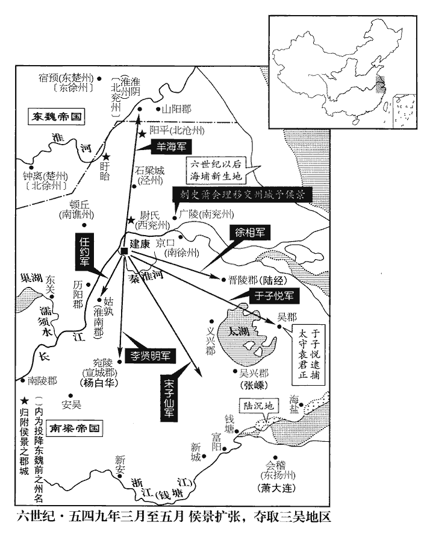
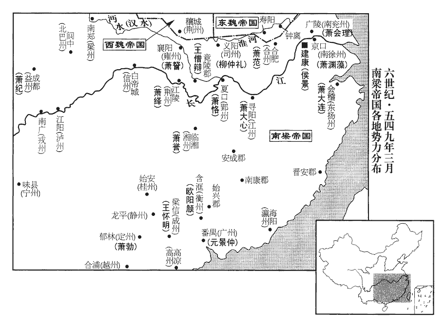
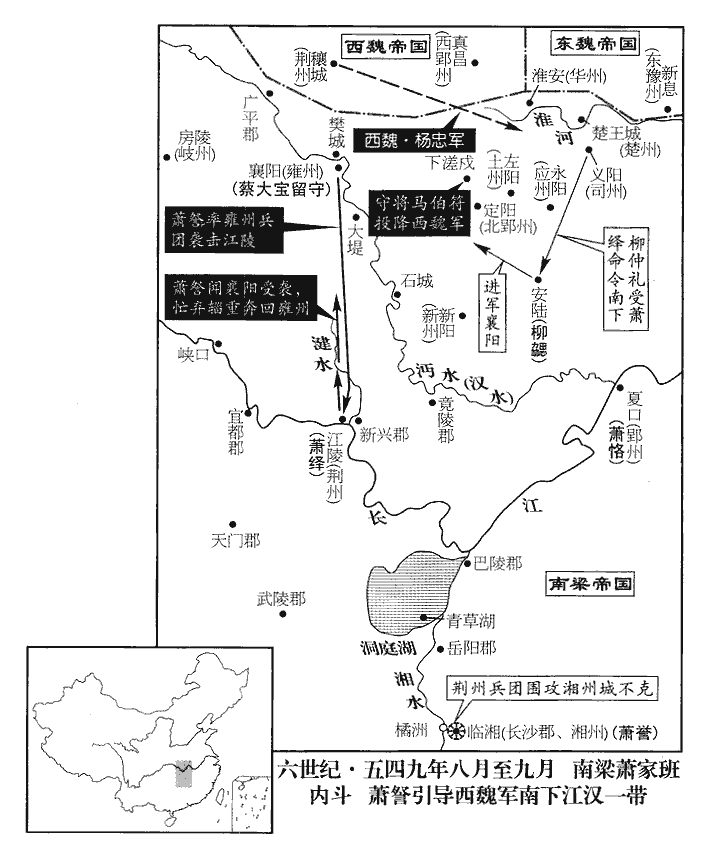
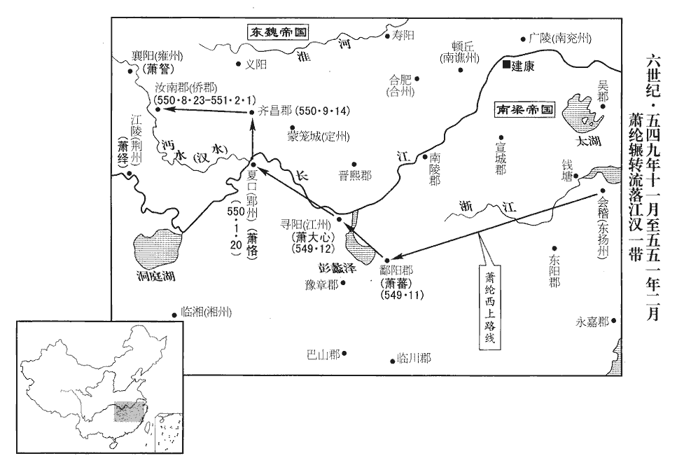

 梁紀十八屠維大荒落（己巳），一年。

# 高祖武皇帝十八

## 太清三年（己巳，五四九）

1春，正月，丁巳朔‹一›，柳仲禮自新亭‹建康城西南›徙營大桁‹秦淮河浮桥南›。會大霧，韋粲軍迷失道，比及青塘‹玄武湖水南下注入秦淮河处，在建康城东南›，比，必利翻。夜已過半，立柵未合，侯景望見之，亟帥銳卒攻粲。過，工禾翻。帥，讀曰率。粲使軍主鄭逸逆擊之，命劉叔胤以舟師截其後，截其渡淮之路。叔胤畏懦不敢進，逸遂敗。景乘勝入粲營，左右牽粲避賊，粲不動，叱子弟力戰，遂與子尼及三弟助、警、構、從弟昂皆戰死‹韦粲年五十四岁›，從，才用翻。親戚死者數百人。史言韋粲忠勇。仲禮方食，投箸被甲，與其麾下百騎馳往救之，箸，竹助翻。被，皮義翻。騎，奇寄翻。與景戰於青塘，大破之，斬首數百級，沈淮水死者千餘人。沈，持林翻。仲禮矟將及景，矟，色角翻。而賊將支伯仁自後斫仲禮，中肩，馬陷于淖，「支伯仁」，當作「支化仁」，將，即亮翻；下同。中，竹仲翻。淖，奴教翻，泥也。賊聚矟刺之，騎將郭山石救之，得免。仲禮被重瘡，會稽‹浙江省绍兴市›人惠臶jiàn吮瘡斷血，刺，七亦翻。被，皮義翻。臶，徂悶翻。吮，徂兗翻。故得不死。自是景不敢復濟南岸，復，扶又翻；下不復、綸復同。仲禮亦氣索，索，蘇各翻。不復言戰矣。

〖译文〗 [1]春季，正月，丁巳朔（初一），柳仲礼将新亭的军营迁往大桁。这一天遇上有大雾，书粲的军队的在路上迷失了方向，等他们到达青塘的时候，已经过了半夜。军营外围扎下的栅栏还没来得及合拢，侯景就已经望见，他迅速率领精锐部队前来攻打。韦粲派军主郑逸进行迎击，又命令刘叔胤带着乘船的部队从后面截击。刘叔胤心里害怕不敢前进，郑逸于是遭到了失败。侯景乘胜攻进韦粲的军营，韦粲身边的下属都拉韦粲躲避贼兵，韦粲一动不动，大声命令子弟奋力战斗，最后他与儿子韦尼以及三个弟弟韦助、韦警、韦构，还有堂弟韦昂一起战死了，同时死去的亲戚共有几百人。战斗开始时，柳仲礼正在吃饭，他扔下筷子，穿上盔甲，与他的一百来名下属骑马赶去救援，在青塘和侯景展开激战，将侯景的部队打得大败，斩敌人首级数百，敌人淹死在秦淮河的达一千多人。柳仲礼的槊眼看就要扎到侯景，正在这时，叛贼将领支伯仁从后面挥刀砍中柳仲礼的肩膀，柳仲礼骑的马陷入泥淖里，贼兵的长矛集中向他刺去，幸好骑兵将领郭山石赶上去救援，柳仲礼才得免一死。见到柳仲礼身受重伤，会稽人惠为他吸吮伤口止血，所以柳仲礼最后没有死去。从此，侯景不敢再渡河到南岸，柳仲礼也失去了原来的气势，不再提要和对方交战了。

邵陵王綸復收散卒，邵陵王綸敗走見上卷上年。與東揚州‹府设会稽›刺史臨城公大連、新淦公大成等自東道並至；淦，古暗翻。庚申‹四›，列營于桁南，亦推柳仲禮為大都督。大連，大臨之弟也。

〖译文〗 邵陵王萧纶重新聚集逃散的士兵，与东扬州刺史临城公萧大连、新淦公萧大成等人一起从东边赶到了；庚申（初四），他们在大桁的南面排列起营垒，也推举柳仲礼为大都督。萧大连是萧大临的弟弟。

朝野以侯景之禍共尤朱异，朝，直遙翻。异慙憤發疾，庚申‹四›，卒‹年六十七岁›。考異曰：梁帝紀作「乙丑」。今從太清紀、典略。故事：尚書官不以為贈，上‹萧衍，本年八十六岁›痛惜异，特贈尚書右僕射。

〖译文〗 梁朝朝廷内外都因为侯景造成的祸患而责怪朱异，朱异愤恨、惭愧，渐渐发病，庚申（初四），去世。以往的制度规定：尚书官不能作为追封，梁武帝对朱异的死感到痛惜，特地追封他为尚书右仆射。

甲子‹八›，湘東世子方等及王僧辯軍至。考異曰：梁帝紀作「戊辰」。今從太清紀。

〖译文〗 甲子（初八），梁朝湘东王的嫡长子萧方等以及王僧辩的部队赶到。

2戊辰‹十二›，封山侯正表以北徐州‹府设钟离安徽省凤阳县东北临淮关›降東魏‹都邺城河北省临漳县西南邺镇›，東魏徐州‹府设彭城江苏省徐州市›刺史高歸彥遣兵赴之。歸彥，歡之族弟也。

〖译文〗 [2]戊辰（十二日），梁朝封山侯萧正表带领北徐州军民投降了东魏，东魏徐州刺史高归彦派遗部队赶到北徐州。高归彦是高欢的同族弟弟。

3己巳‹十三›，太子遷居永福省。永福省在禁中，自宋以來，太子居之，取其福國於有永也。高州‹府设高凉广东省阳江市›刺史李遷仕、五代志：高涼郡，梁置高州。天門‹湖南省石门县›太守樊文皎將援兵萬餘人至城下。臺城與援軍信命久絕，有羊車兒獻策，作紙鴟，紙鴟，即紙鳶也，今俗謂之紙鷂。鴟chī，丑之翻。繫以長繩，寫敕於內，放以從風，冀達眾軍，題云：「得鴟送援軍，賞銀百兩。」太子自出太極殿前乘西北風縱之，賊怪之，以為厭勝，射而下之。厭，於協翻。射，而亦翻。援軍募人能入城送啟者，鄱陽世子嗣左右李朗請先受鞭，詐為得罪，叛投賊，因得入城，城中方知援兵四集，舉城鼓譟。上以朗為直閤將軍，賜金遣之。朗緣鍾山之後，宵行晝伏，積日乃達。

〖译文〗 [3]己巳（十三日），梁朝的皇太子搬到永福省居住。高州刺史李迁仕、天门太守樊文皎率领一万多名援兵赶到城下。朝廷与援军之间的书信往来已经中断很久，有一位叫羊车儿的人出了一个主意，按照这一主意做了一只纸鸢，在上面系上长绳，将敕令写在里头，顺风放出去，希望它能到达援军中的任何崐一支部队里。为了保证成功，纸鸢上还题上这样几个字：“如果得到纸鸢后把它送给援军，将赏一百两银子。”皇太子亲自走到太极殿的前面，乘着西北风放出纸鸢，贼兵见了觉得奇怪，以为这是一种能以诅咒制服人的巫术用品，就把它射了下来，援军那一边也在招募能进入都城呈送文书的人，鄱阳王嫡长子萧嗣身边的下属李朗主动请求先打自己一顿鞭子，然后假装得罪了上司，叛逃到贼兵那里，因此得到机会进入城中，城中的军民这才知道援军已经聚集在周围，全城上下高兴得又是擂鼓又是呐喊。梁武帝任命李朗为直将军，赏赐他金银后又派他出城。李朗沿着钟山的后面，晚上行走白天潜伏，几天之后才到达援军的营垒。

癸未‹二十七›，鄱陽世子嗣、永安侯確、莊鐵、羊鴉仁、柳敬禮、李遷仕、樊文皎將兵渡淮，攻東府‹宰相府·建康城南›前柵，焚之；侯景退。眾軍營於青溪‹玄武湖支流，南下注入秦淮河›之東，遷仕、文皎帥銳卒五千獨進帥，讀曰率。深入，所向摧靡。至菰首橋東，橋在青溪上。菰，音孤。菰首，今人謂之茭白。景將宋子仙伏兵擊之，將，即亮翻；下同。文皎戰死，遷仕遁還。敬禮，仲禮之弟也。

〖译文〗 癸未（二十七日），鄱阳王的嫡长子萧嗣、永安侯萧确、庄铁、羊鸦仁、柳敬礼、李迁仕、樊文皎率领部队渡过秦淮河，攻打并焚烧了东府前面的栅栏；侯景向后退却。援军的大部队在青溪的东面安营扎寨，李迁仕、樊文皎率领五千名精锐的士兵单独前进，一直深入到敌军营地，每到一个地方，都把敌人打得一败涂地。打到菰首桥东面的时候，侯景手下的将领宋子仙埋伏的部队袭击了他们，樊文皎战死，李迁仕逃了回去，柳敬礼是柳钟礼的弟弟。

仲禮神情傲狠，陵蔑諸將，邵陵王綸每日執鞭至門，亦移時弗見，凡部將見主帥，執鞭以為禮。狠，戶墾翻。由是與綸及臨城公大連深相仇怨。大連又與永安侯確有隙，永安，本漢彘縣，順帝陽嘉元年，更名永安，魏、晉屬平陽郡。江左僑立南河東郡，併僑立永安縣，屬荊州。註又見前。諸軍互相猜阻，莫有戰心。援軍初至，建康士民扶老攜幼以候之，纔過淮，即縱兵剽掠。剽，匹妙翻。由是士民失望，賊中有謀應官軍者，聞之，亦止。史言臺城覆陷之由。

〖译文〗 柳仲礼看上去总是一副傲慢狠毒的样子，平时经常欺侮怠慢各位将领，邵陵王萧纶按照部将求见主帅时的礼节，每天拿着鞭子来到他的门口，他也好长时间不见。由于这一点，他与萧纶以及临城公萧大连结下了深深的仇怨。萧大连又和永安侯萧确有矛盾，这些部队之间互相猜疑，给对方设置障碍，都没有打仗的心思。。援军刚到的时候，建康的老百姓纷纷扶老携幼出来迎接，可是部队刚刚渡过秦淮河，就放纵将士们抢劫掠夺。老百姓们因此都感到失望，叛贼里面一些人原来打算响应官军，听到这一情况之后，也停止了自己的行动。

4王顯貴以壽陽‹安徽省寿县›降東魏。侯景命王顯貴守壽陽，見上卷上年。

〖译文〗 [4]王显贵率领寿阳军民投降了东魏。

5臨賀王記室吳郡‹江苏省苏州市›顧野王起兵討侯景，二月，己丑‹三›，引兵來至。初，臺城之閉也，公卿以食為念，男女貴賤並出負米，得四十萬斛，收諸府藏錢帛五十萬億，並聚德陽堂，藏，徂浪翻。而不備薪芻、魚鹽。至是，壞尚書省為薪。撤薦，剉以飼馬，薦盡，又食以飯。薦以藁秸為之，所以藉寢。壞，音怪。飼、食，並祥吏翻。軍士無膎，膎xié，戶皆翻，脯也，又肉食肴。或煮鎧、熏鼠、捕雀而食之。鎧，可亥翻。御甘露廚有乾苔，味酸鹹，分給戰士。釋氏謂營膳之所曰甘露廚。乾，音干。苔生於海，其形如髮，春二、三月間，海人採取之成片，納土窖中，出而曬之令乾，南人多食之。軍人屠馬於殿省間，雜以人肉，食者必病。侯景眾亦飢，抄掠無所獲；抄，楚交翻。東城有米，可支一年，東城，即東府城。援軍斷其路。斷，音短。又聞荊州‹府设江陵湖北省江陵县›兵將至，景甚患之。王偉曰：「今臺城不可猝拔，援兵日盛，吾軍乏食，若偽求和以緩其勢，東城之米，足支一年，因求和之際，運米入石頭，援軍必不得動，然後休士息馬，繕脩器械，伺其懈怠擊之，一舉可取也。」伺，相吏翻。景從之，遣其將任約、于子悅至城下，拜表求和，乞復先鎮。將，即亮翻。任，音壬。先鎮，謂壽陽時已降齊矣。太子‹萧纲›以城中窮困，白上，請許之。上怒曰：「和不如死！」太子固請曰：「侯景圍逼已久，援軍相仗不戰，仗，除兩翻。宜且許其和，更為後圖。」上遲回久之，乃曰：「汝自圖之，勿令取笑千載。」遂報許之。太子綱疑范桃棒之來降而信侯景之請和，何其昧也！載，子亥翻。景乞割江右四州之地，江右四州：南豫‹府设寿阳›、西豫‹府设晋熙·安徽省潜山县›、合州‹府设合肥·安徽省合肥市›、光州‹府设光城·河南省光山县›。并求宣城王大器出送，然後濟江。中領軍傅岐固爭曰：「豈有賊舉兵圍宮闕而更與之和乎！此特欲卻援軍耳。戎狄獸心，必不可信。且宣城嫡嗣之重，國命所繫，豈可為質！」梁之智士唯傅岐一人而已。質，音致；下同。上乃以大器之弟石城公大款為侍中，出質於景。又敕諸軍不得復進，復，扶又翻。下詔曰：「善兵不戰，止戈為武。可以景為大丞相，都督江西四州諸軍事，豫州牧、河南王如故。」己亥‹十三›，設壇於西華門外，遣僕射王克、上甲侯韶、吏部郎蕭瑳韶，帝室也，封上甲侯。宋白曰：江州德安縣，本蒲塘場，晉建興初，始以為郡，領尋陽、上甲、柴桑、九江等縣；義熙中，以尋陽入柴桑，上甲入彭澤。瑳cuō，七何翻，又七可翻。與于子悅、任約、王偉登壇共盟。太子詹事柳津出西華門，景出柵門，遙相對，更殺牲歃血為盟。更，工衡翻。歃，色甲翻。既盟，而景長圍不解，專脩鎧仗，鎧，可亥翻。託云「無船，不得即發」，又云「恐南軍見躡」，援軍時皆屯秦淮南岸，故謂之南軍。遣石城公還臺，求宣城王出送；邀求稍廣，了無去志。太子知其詐言，猶羈縻不絕。韶，懿之孫也。

〖译文〗 [5]南梁临贺王的记室，吴郡人顾野王拉起队伍讨伐侯景，二月，己丑（崐初三），顾野王率部队赶到了京城。当初，台城关闭城门的时候，公卿们将粮食问题记挂在自己的心上，男的、女的、尊贵的、低贱的都出来背米，一共得到四十万斛粮食，同时还收集了各个府第贮藏的钱和帛达五十万亿，它们全都集中在德阳堂，但是他们并没有储备柴禾、牲口草料，以及鱼、盐。到了此时，只好拆除尚书省的建筑作木柴，拿掉垫席，磨碎了以后喂马，垫席用光了，又把米饭喂马。士兵们没有肉吃之后，有的人都煮甲衣上的皮革，烤老鼠，捕捉鸟雀来吃。皇室的厨房里有一种干的海苔，味道又酸又咸，不得已拿出来分给战士。军人们在皇宫与各省的办公地点之间杀马，煮的马肉中还夹杂着人肉，吃得人无不得病。侯景的部队也很饥饿，四处搜寻掠夺没有取得什么收获。东府城里有不少大米，可以供应部队整整一年，可是去那里的路被援军切断了。在这种情况下，侯景又听说荆州的部队将要赶到，心里非常害怕。王伟对他说：“现在看来，台城不可能迅速攻克，对方的援军力量日益强大，而我们的部队缺少粮食，如果我们假装向他们求和的话，可以缓解他们逼近的势头，东城的大米，足够让我们吃一年，趁着求和的时候，把大米运进石头城，援军一定不敢行动，然后我们使将士与战马都得到休息，修理好有关器械，看到对方懈怠下来再攻击他们，一下子就可以夺取台城。”侯景接受了他的建议，派遣手下的将领任约、于子悦来到台城下面，恭敬地递上文书求和，请皇上允许他去恢复原先镇守的失地。皇太子考虑到城里已穷困不堪，就将此事禀报给梁武帝，请他答应侯景的要求。梁武帝愤怒地说道：“跟侯景和好，还不如死！”皇太子再三请求说：“侯景围困逼迫我们已经很久，我们的援军又相互推诿不投入战斗，应该暂且答应与侯景媾和，以后再作其它打算。”梁武帝犹豫了很久才说：“你自己考虑吧，不要让千载以下的人讥笑。”于是派人告诉侯景，说皇上已答应他的请求。侯景乞求朝廷割让长江西面的四个州给他，又表示得让宣城王萧大器出来相送，然后他才渡过长江。中领军傅岐态度坚决地争辩说：“哪有叛贼兴兵包围宫殿，而我们转过头来跟他们媾和的道理！侯景现在的这一行动是想让援军撤走而已。戎狄侯景人面兽心，绝对不能相信。况且宣城王是皇上的直系后裔，地位重要，国家的命运维系在他的身上，怎么可以叫他去当人质！”梁武帝于是便任命萧大器的弟弟，石城公萧大款为侍中，派他去侯景部做人质。他又命令各路援军一律不得再前进，同时还颁下这样的诏书：“善于用兵的人不必以刀兵定胜负，止与戈两字合成为‘武’。我可以再任命侯景为大丞相，统管江西四个州诸军事，仍照旧担任豫州牧、河南王之职。”己亥（十三日），梁武帝在西华门外设立神坛，派遣仆射王克、上甲侯萧韶、吏部郎萧与于子悦、任约、王伟一同登上神坛订立盟约。太子詹事柳津来到西华门外，侯景则来到栅门外，遥遥相对，双方再屠宰牲畜，口中含血，订立盟誓。盟约订立以后，侯景却长时间地不解除原来的包围，集中精力专门修缮铠甲与兵器，还找借口说：“没有船只，不能立即出发。”又说：“害怕那些屯驻在秦淮河南岸的援军追击我们。”他叫石城公返回台城，要宣城王出来相送，提的要求越来越多，丝毫没有离去的意思。皇太子明知他说的都假话，却还是不停地笼络他。萧韶是萧懿的孙子。

庚子‹十四›，前南兗州‹府设广陵江苏省扬州市›刺史南康王會理、前青•冀二州‹府设郁洲江苏省连云港市东沉积小岛›刺史湘潭侯退、西昌侯世子彧眾合三萬，至于馬卬洲‹江苏省南京市北长江中小岛，在白下对面江中›，馬卬洲，蓋即今王家沙、老鸛觜一帶。考異曰：梁帝紀作「丁未」。今從太清紀、典略。典略云：「至于琅邪。」今從太清紀、梁帝紀。按晉置琅邪郡於江乘蒲洲上，即前所謂今王家沙地。景慮其自白下而上，上，時掌翻。啟云：「請【章：十二行本「請」下有「敕」字；乙十一行本同；孔本同；張校同。】北軍聚還南岸，以地望言之，馬卬洲在臺城之北，故云北軍。南岸，即謂秦淮南岸。不爾，妨臣濟江。」太子即勒會理自白下城移軍江潭苑。考異曰：梁帝紀作「蘭亭苑」。今從太清紀、典略。退，恢之子也。

〖译文〗 庚子（十四日），前南兖州刺史、南康王萧会理，前青冀二州刺史、湘谭侯萧退，西昌侯的嫡长子萧率领合起来数量为三万的人马来到马洲。侯景担心他们从白下攻打上来，就向梁武帝呈交奏折，说，“请让驻扎在北面马洲的部队聚集起来，回到南岸去，如果不这样的话，就会妨碍我们渡长江。”皇太子便命萧会理将部队从白下城转移到江潭苑。萧退是萧恢的儿子。

辛丑‹十五›，以邵陵王綸為司空，鄱陽王範為征北將軍，柳仲禮為侍中、尚書右僕射。景以于子悅、任約、傅士悊皆為儀同三司，悊，與哲同。夏侯譒為豫州‹府设悬瓠河南省汝南县›刺史，譒bò，補過翻。董紹先為東徐州‹府设宿预江苏省宿迁市›刺史，徐思玉為北徐州刺史，王偉為散騎常侍。散，悉覽翻。騎，奇寄翻。上以偉為侍中。

〖译文〗 辛丑（十五日），梁武帝任命邵陵王萧纶为司空，鄱阳王萧范为征北将军，柳仲礼为侍中，尚书右仆射。侯景任命于子悦、任约、傅士三人为仪同三司，夏侯为豫州刺史，董绍先为东徐州刺史，徐思玉为北徐州刺史，王伟为散骑常侍。梁武帝又任命王伟为侍中。

乙卯‹十六›，景又啟曰：「適有西岸信至，大江西岸，即歷陽‹安徽省和县›。高澄已得壽陽、鍾離，臣今無所投足，求借廣陵并譙州‹府设顿丘侨县·安徽省滁州市›，俟得壽陽，即奉還朝廷。」又云：「援軍既在南岸，須於京口‹江苏省镇江市›渡江。」太子並答許之。

〖译文〗 乙卯（疑误），侯景又启奏梁武帝，说：“刚才我接到一封来自西岸的信，上面说高澄已经取得了寿阳、钟离这两地方，我现在没有地方可以立足，请求皇上将广陵和谯州借给我，等我夺取了寿阳，马上会把广陵和谯州奉还给朝廷。”又说：“援军既然在南岸，我军说必须在京口渡江。”对这些要求，皇太子全都答应了。

癸卯‹十七›，大赦。

〖译文〗 癸卯（十七日），梁朝大赦天下。

庚戌‹二十四›，景又啟曰：「永安侯確、直閤趙威方頻隔柵見詬云：『天子自與汝盟，我終當破汝。』乞召侯及威方入，即當引路。」言引兵就路還北。詬，古候翻，又許候翻。上遣吏部尚書張綰召確，辛亥‹二十五›，以確為廣州‹府设番禺广东省广州市›刺史，威方為盱眙‹江苏省盱眙县›太守。盱眙，音吁怡。守，手又翻。確累啟固辭，不入，上不許。確先遣威方入城，因欲南奔。確蓋欲南奔荊、江二鎮。邵陵王綸泣謂確曰：「圍城既久，聖上憂危，臣子之情，切於湯火，故欲且盟而遣之，更申後計。成命已決，何得拒違！」時臺使周石珍、東宮主書左法生在綸所，使，疏吏翻；下同。確謂之曰：「侯景雖云欲去，而不解長圍，意可見也。今召僕入城，何益於事！」石珍曰：「敕旨如此，郎那得辭！」確意尚堅，綸大怒，謂趙伯超曰：「譙州為我斬之！為，于偽翻。持其首去！」伯超揮刃眄確眄miǎn，眠見翻，目斜視也。曰：「伯超識君侯，刀不識也。」確乃流涕入城。景凡所請，上父子無不從，求以卻其攻，乃所以速其攻也。

〖译文〗 庚戌（二十四日），侯景又递上奏折，说：“永安侯萧确，直赵威方频繁地隔着栅栏骂我说：‘皇上同你订立盟约是他自己的事，我反正终究要打败你。’我乞求皇上叫永安侯与赵威方入城，我将立即指挥部队上路返回北方。”梁武帝派遗吏部尚书张绾去召回萧确。辛亥（二十五日），梁武帝任命萧确为广州刺史，赵威方为盱眙太守。萧确屡次启奏梁武帝，坚决推辞，不进台城，但是梁武帝没有答应。萧确先派遣赵威方进城，自己想奔向南面的荆、江二镇。邵陵王萧纶流着眼泪对萧确说：“台城已经被围困很久，皇上的处境危险，让人忧虑，作为臣下和儿子的心情，就跟沸水与大火差不多，所以我们想暂且与侯景订立盟约，打发他离开。以后再作其它打算。这一决定已经作出，怎么能够抗拒与违反？”此时，台使周石珍，东宫主书左法生正在萧纶的住所，萧确对他们说：“侯景虽然说要撤离，但又不解除长长的包围圈，他的意图由此可见。现在皇上叫我进城，对现在的局势能有什么好处呀？”周石珍回答说：“皇上的圣旨叫你这么做，你哪能推辞？”萧确的主意还是不动摇，萧纶非常愤怒，对赵伯超说道：“你替我把他杀了，提着他的头颅进城！”赵伯超挥起腰刀斜眼看着萧确说：“我本人认识君侯您，可是手中的刀却不认识你。”萧确这才流着眼泪进入台城。

上常蔬食，及圍城日久，上廚蔬茹皆絕，乃食雞子。綸因使者蹔通，上雞子數百枚，上雞，時掌翻。上手自料簡，料，音聊。歔欷哽咽。歔，音虛。欷，許既翻，又音希。哽，古杏翻。

〖译文〗 梁武帝平时经常吃蔬菜，随着台城被包围的时间一长，皇帝专用厨房里的蔬菜都吃光了，他就开始吃鸡蛋。萧纶趁着使者能够与台城取得短时间的联系的机会，呈送给梁武帝几百个鸡蛋，梁武帝一边亲手料理，一边哽咽抽泣。

湘東王繹軍於郢州‹府设夏口湖北省武汉市›之武城‹湖北省黄陂县东南›，水經註：武口水上通安陸之延頭，南至武城入大江，吳舊屯所在，荊州界盡此。蓋今之沙武口即其地。湘州‹府设临湘湖南省长沙市›刺史河東王譽軍於青草湖‹洞庭湖东南一小湖，水满时与洞庭›湖合而为一，水經註：湘水自汨羅口西北逕壘石山，西北對青草湖。祝穆曰：青草湖，一名巴丘湖，北洞庭，南瀟湘，東納汨羅之水，自昔與洞庭並稱。按一湖之內，南名青草，北名洞庭，中有沙洲間之，所謂重湖也。信州‹府设白帝城重庆市奉节县东›刺史桂陽王慥軍於西峽口，五代志：巴東郡，梁置信州，唐之夔州也。水經註：江水自巴東魚復縣東逕廣溪峽，斯乃三峽首也。峽中有瞿塘、黃龕二灘。慥zào，七到翻。託云俟四方援兵，淹留不進。中記室參軍蕭賁，骨鯁士也，以繹不早下，心非之，嘗與繹雙六，食子未下，賁曰：「殿下都無下意。」雙六，亦博之一名。續事始云：陳思王製雙六局，置骰子二；唐末有葉子之戲，遂加至六。戰國策曰：博之所以貴梟者，便則食，不便則止。可以食子而未下者，擬議其便否也。賁因其未下，借雙六以諷其不下救君父。繹深銜之。及得上敕，繹欲旋師，賁曰：「景以人臣舉兵向闕，今若放兵，未及渡江，童子能斬之矣，必不為也。大王以十萬之眾，未見賊而退，柰何！」繹不悅，未幾，因事殺之。幾，居豈翻。慥，懿之孫也。

〖译文〗 湘东王萧绎的部队驻扎在郢州的武城。湘州刺史河东王萧誉的部队驻扎在青草湖，信州刺史桂阳王萧的部队驻扎在西峡口，他们都借口要等待四面来的援兵，久留在原地不前进。中记室参军萧贲是位耿直的人，看到萧绎不尽早向下游进发，心里反感。他曾经和萧绎玩一种叫做双六的赌博游戏，吃了子却不拿下，对萧绎说：“殿下您全然没有下的意思。”萧绎深深地恨上了萧贲。等得到梁武帝诏书，萧绎准备回师原地，萧贲对他说：“侯景以臣子的身份带兵攻打皇宫，现在他如果放下武器，那么等不到渡江，一个小孩子就能杀掉他，所以他必定不会这么做。大王您拥有十万大军，还没看见叛贼就撤退，这是为什么？”萧绎听了很不高兴，没有多久，就找了一个理由杀掉了萧贲。萧是萧懿的孙子。

6東魏河內‹河南省沁阳市›民四千餘家，以魏‹都长安陕西省西安市›北徐州‹侨州·州政府设温县河南省温县›刺史司馬裔，其鄉里也，相帥歸之。帥，讀曰率；下同。丞相泰欲封裔，裔固辭曰：「士大夫遠歸皇化，裔豈能帥之！賣義士以求榮，非所願也。」據周書，裔，司馬楚之之後。司馬氏本河內溫人，魏孝武西遷，裔始歸鄉里，於溫城起義，附西魏。與東魏交戰，頻有克獲，授河內郡守，尋加持節、平東將軍、北徐州刺史。帥，讀曰率。

〖译文〗 [6]东魏河内地区有四千多家百姓，因为西魏的北徐州刺史司马裔是他们的同乡，所以都相互领着归附了他。丞相宇文泰想要授司马裔爵位，司马裔坚决推辞，说：“读书人远道而来归附到皇上的政令、教化所能达到的地方，我司马裔哪里能够率领他们！出卖忠义之士以追求荣华富贵，不是我愿意做的事情。”

7侯景運東府米入石頭，既畢，王偉聞荊州軍退，謂湘東王繹旋師也。援軍雖多，不相統壹，乃說景曰：「王以人臣舉兵，圍守宮闕，逼辱妃主，殘穢宗廟，擢王之髮，不足數罪。用史記須賈之言。擢，拔也。說，式芮翻。數，所具翻。今日持此，欲安所容身乎！背盟而捷，自古多矣，背，蒲妹翻。願且觀其變。」臨賀王正德亦謂景曰：「大功垂就，豈可棄去！」景遂上啟，陳帝十失，且曰：「臣方事睽違，所以冒陳讜直。讜，音黨。陛下崇飾虛誕，惡聞實錄，上，時掌翻。惡，烏路翻。以祅怪為嘉禎，祅yāo，於驕翻。禎，音貞，祥也。以天譴為無咎。敷演六藝，排擯前儒，王莽之法也。以鐵為貨，輕重無常，公孫之制也。漢公孫述據蜀，用鐵錢。爛羊鐫印，朝章鄙雜，更始、趙倫之化也。漢更始濫授官爵，長安為之語曰：「爛羊胃，騎都尉；爛羊頭，關內侯。」晉趙王倫篡位，貂蟬盈坐，時人為之語曰：「貂不足，狗尾續。」朝，直遙翻。更，工衡翻。豫章以所天為血讎，見一百五十卷普通六年。邵陵以父存而冠布，事見同上。冠，古玩翻，又如字。石虎之風也。石虎父子事見晉成帝紀。脩建浮圖，百度糜費，使四民飢餒，笮融、姚興之代也。」笮融事佛事見漢獻帝紀。姚興事佛事見晉安帝紀。笮zé，在各翻。又言：「建康宮室崇侈，陛下唯與主書參斷萬機，政以賄成，諸閹豪盛，眾僧殷實。皇太子珠玉是好，酒色是耽，斷，丁亂翻。好，呼到翻。吐言止於輕薄，賦詠不出桑中；桑中，見詩衛國風，淫放之詩也。邵陵所在殘破；湘東群下貪縱；南康、定襄之屬，皆如沐猴而冠耳。南康王會理，帝子續之子，時鎮廣陵。定襄侯祗，南平王偉之子，時鎮淮陰。沐猴而冠，用漢書語。親為孫姪，位則藩屏，屏，必郢翻。臣至百日，誰肯勤王！此而靈長，未之有也。昔鬻拳兵諫，王卒改善，左傳：鬻拳強諫楚子‹文王芈熊赀›，楚子弗從，臨之以兵，懼而從之。卒，子恤翻。今日之舉，復奚罪乎！復，扶又翻。伏願陛下小懲大戒，引易大傳之言，指斥甚矣！放讒納忠，使臣無再舉之憂，陛下無嬰城之辱，則萬姓幸甚！」

〖译文〗 [7]侯景将东府的大米运进石头城，事情办完之后，王伟听说来自荆州的部队已经撤退，援军的人数虽然多，但是相互不统一，于是就劝侯景道：“大王您以臣子的身份发动兵变，包围皇宫，逼迫污辱妃嫔，毁坏弄脏宗庙，犯下的罪行之多，就是拔掉大王您的头发来数也不够。今天弄到这种地步，您还想平平安安地呆在一个地方吧？背弃盟约而取得胜利这类事情，自古以来就很多，希望您暂且观察事态的发展。”临贺王萧正德也对侯景说：“大功眼看就要告成，怎么可以放弃呢？”侯景于是上书梁武帝，陈述梁武帝的十大过失，并且说：“我正要准备离去，所以冒昧地陈述以下谠直之言。陛下您喜欢崇饰虚诞，恶闻实录，将妖怪视为呈祥的象征，而对上天的谴责却置若罔闻。您解说六艺，排斥前儒之说，这是王莽的做法。您用铁来铸造货币，轻重时常变化，这是公孙述所采用的办法。您还滥授官爵，乱刻官印，使官职象烂羊头，烂羊胃一样不值钱，弄得朝纲混乱，这是汉朝更始年间、晋代司马伦篡位时期的风气。豫章王萧综将父皇视为仇敌，邵陵王萧纶在父皇在世之时，便把一个老头装扮成自己的父亲而加以捶打，这是晋代石虎的作法。您还大肆建造佛塔，造成极大的浪费，使得四方的百姓饥饿不堪，这分明又是当年笮融、姚兴佞佛的再演。”侯景又说：“建康的皇宫中移崇奢侈的风气，陛下您只跟主书一道决断各种机要大事，政务要通过贿赂才能办成，宦官们豪奢富足，僧人们产业殷实。皇太子一味喜好珠宝，沉湎于洒宴与女色之中，说出的都是轻薄的话语，撰写与呤咏的都是淫荡的诗赋；邵陵王到处残害百姓，湘东王的官员们贪婪放纵；南康王、定襄王的下属个个沐猴而冠，象孙子、侄子一类的亲人，都封王封侯，我到这里都一百天了，又有谁真的前来保卫王室？象这样而能国运绵长，以前从来未曾有过。昔日鬻拳以武器强谏楚王，楚王最终改正了自己的错误，我今天的举动，又有什么罪过呢？我希望陛下您受到这次小的惩罚之后，能够进一步警戒自己，放逐那些谗佞小人，接纳忠贞的臣子，这样就能使我不用忧虑再次发动兵变，陛下您也不用蒙受被围困在城中的耻辱了，这对百姓来说也是非常幸运的！”

上覽啟，且慙且怒。言皆指實而無如之何，有慙怒而已。三月，丙辰朔‹一›，立壇於太極殿前，告天地，以景違盟，舉烽鼓譟。初，閉城之日，男女十餘萬，擐甲者二萬餘人；考異曰：南史作「三萬」。今從典略。被圍既久，人多身腫氣急，氣急，上氣喘急也。被，皮義翻。死者什八九，乘城者不滿四千人，率皆羸喘。橫尸滿路，不可瘞埋，羸，倫為翻。喘，昌兗翻。瘞yì，於計翻。爛汁滿溝。而眾心猶望外援。柳仲禮唯娶妓妾、置酒作樂，妓，渠綺翻。諸將日往請戰，仲禮不許。安南侯駿說邵陵王綸曰：說，式芮翻。考異曰：典略云：綸已下咸說柳仲禮如此。今從太清紀。「城危如此，而都督不救，若萬一不虞，殿下何顏自立於世！今宜分軍為三道，出賊不意攻之，可以得志。」綸不從。柳津登城謂仲禮曰：「汝君父在難，難，乃旦翻。不能竭力，百世之後，謂汝為何！」仲禮亦不以為意。上問策於津，對曰：「陛下有邵陵，臣有仲禮，不忠不孝，賊何由平！」考異曰：典略云：「柳仲禮族兄暉謂仲禮曰：『天下事勢如此，何不自取富貴？』仲禮曰：『兄今若為取之？』暉曰：『正當堅營不戰，使賊平臺城，囚天子，徐而縱兵，既破之後，復挾天子令諸侯也。』仲禮納之。」按景既克城，則人情皆去，援軍自散，仲禮安能帥以破景！仲禮閉壁不出，自為重傷而懼耳，非用暉計也。今從太清紀及南史。太清紀又云：「景嘗登朱雀門樓，與之語。又遺以金，自是以後，閉壁不戰。」典略云：「景遺以金鐶」，亦又近誣，今不取。

〖译文〗 梁武帝阅读着这份文书，又羞惭又愤怒。三月，丙辰朔（初一），他下令在太极殿前设立祭坛，禀告天地，以侯景违背盟约为由，举起烽火擂鼓呐喊，准备与侯景继续战斗。当初，城门关闭的时候，城里有男男女女十几万人，披盔带甲的将士有二万多人；被围困的时间一长，大多数人身体浮肿，气喘吁吁，十个人中有八九个死亡，登上城墙的不满四千人，他们都瘦弱不堪。城里的道路到处横躺着尸体，无法掩埋，腐料后的尸体流出的汁液积满了沟渠。在这样的时刻，大家将希望还寄托在外面的援军身上。柳仲礼只知聚集歌舞妓女，终日设洒宴寻欢作乐，将领们天天去向他请战，他都没有答应。安南侯萧骏劝说邵陵王萧纶道：“台城面临的危险已经如此严重，但是都督却还不去救援，如果万一真的发生了料想不到的事，那么殿下您还有什么脸面在这个世界上立身？现在我们应该把部队分成三路，出其不意地攻打叛贼，一定可以取胜。”萧纶没有听从他们的意见。柳津登上城楼对柳仲礼说：”你的君王与父亲正在受难，而你却不能竭尽全力救援，百世以后，人们将会把你说成什么人？”柳仲礼听了也不在意。梁武帝向柳津询问计策，柳津回答说：“陛下您有邵陵王这样的儿子，我有柳仲礼这样的儿子，他们不忠又不孝，叛贼怎能平定呢？”

戊午‹三›，南康王會理與羊鴉仁、趙伯超等進營於東府城北，約夜渡軍。既而鴉仁等曉猶未至，景眾覺之，營未立，景使宋子仙擊之，趙伯超望風退走。寒山之敗，玄武湖側之敗及此時之敗，皆趙伯超為之也。會理等兵大敗，戰及溺死者五千人。溺，奴狄翻。景積其首於闕下，以示城中。

〖译文〗 戊午（初三），南康王萧会理与羊鸦仁、赵伯超等人把军营推进到东府城的北面，约定晚上指挥部队渡江。到了拂晓，羊鸦仁等人还未到指定地点，侯景的部队就已发现。没等援军建立营地，侯景便派遣宋子仙前来攻击，赵伯超望风而逃。萧会理等人的部队遭到惨重的失败，战死以及淹死的达五千人。侯景把这些人的头颅堆到宫门下面，向城里人展示。

景又使于子悅求和，上使御史中丞沈浚至景所。景實無去志，謂浚曰：「今天時方熱，軍未可動，乞且留京師立效。」浚發憤責之，景不對，橫刀叱之。示將殺浚也。浚曰：「負恩忘義，違棄詛盟，詛，莊助翻。固天地所不容！沈浚五十之年，常恐不得死所，何為以死相懼邪！」因徑去不顧。景以其忠直，捨之。

〖译文〗 侯景又派于子悦向梁武帝求和。梁武帝派御史中丞沈浚来到侯景处。侯景实际上并没有离去的想法，他对沈浚说：“现在天气正是炎热的时候，我们的部队无法行动，请让我们暂且留在就城立功效力。”听罢，沈浚愤怒地遣责起侯景，侯景不作正面回答，而是横刀喝斥沈浚，示意要杀掉他。沈浚说道：“你忘恩负义，违背盟誓，本身就被天地所不容！我沈浚已经五十岁，经常担心自己不能死得其所，你何必要用死来吓唬我？”说着，他头也不回就径直离去。侯景敬佩他忠诚正直，放掉了他。

於是景決石闕前水，石闕前水，景決玄武湖以灌城者也。百道攻城，晝夜不息。邵陵世子堅屯太陽門，太陽門，臺城六門之一也。終日蒱飲，蒱音蒲。蒱飲，摴蒱且飲酒也。不恤吏士，其書佐董勛、熊曇朗恨之。考之南史，此熊曇朗非後來為盜於豫章之熊曇朗也。南史侯景傳作「白曇朗」。曇，徒含翻。丁卯‹十二›，夜向曉，勛、曇朗於城西北樓引景眾登城，永安侯確力戰，不能卻，乃排闥入啟上云：「城已陷。」上安臥不動，曰：「猶可一戰乎？」確曰：「不可。」上歎曰：「自我得之，自我失之，亦復何恨！」因謂確曰：「汝速去，語汝父：勿以二宮為念。」因使慰勞在外諸軍。復，扶又翻。語，牛倨翻。勞，力到翻。

〖译文〗 侯景于是挖开皇宫石门前的玄武湖，引出里面的湖水灌城，开始从各处攻城，昼夜不停。邵陵王的嫡长子萧坚屯驻在太阳门，终日不是赌博就是饮洒，不体恤手下官史与将士的疾苦，他的书佐董勋、能昙朗恨透了他。丁卯（十二日），下半夜临近拂晓的时候，董勋、熊昙朗从台城的西北楼引导侯景的人马攀登上来，永安侯萧确奋力拼搏，不能打退敌人，就推开宫中的小门启禀梁武帝道：“台城已经陷落了。”梁武帝平静地躺着不动，问道：“还可以打一仗吗？”萧确回答说：“已经不行了。”梁武帝叹了一口气说道：“从我这儿得到的，又从我这儿失去，还有什么可遗憾的呢！”他于是对萧确说道：“你快些离开，告诉你的父亲不要记挂我和太子。”于是便派萧确慰劳在外面的各路援军。

俄而景遣王偉入文德殿奉謁，上命褰簾開戶引偉入，偉拜呈景啟，稱：「為姦佞所蔽，領眾入朝，朝，直遙翻。驚動聖躬，今詣闕待罪。」上問：「景何在？可召來。」景入見於太極東堂，以甲士五百人自衛。景稽顙殿下，典儀引就三公榻。典儀，典朝儀者也。至唐猶有典儀之職，掌殿上贊唱之節及設殿庭服位之次。見，賢遍翻。稽，音啟。上神色不變，問曰：「卿在軍中日久，無乃為勞！」景不敢仰視，汗流被面。被，皮義翻。又曰：「卿何州人，而敢至此，妻子猶在北邪？」景皆不能對。任約從旁代對曰：「臣景妻子皆為高氏所屠，唯以一身歸陛下。「自此以上，上問景，景猶慴shè伏。上又問：「初渡江有幾人？」景曰：「千人。」「圍臺城幾人？」曰：「十萬。」「今有幾人？」曰：「率土之內，莫非己有。」自此以上，景之辭氣悖矣。上俛fǔ首不言。上辭窮勢屈，故俛首不言，嗚呼！

〖译文〗 没有多久，侯景派遣三伟来到文德殿拜见梁武帝，梁武帝下令揭起帘幕，打开房门带王伟进来，王伟跪拜之后，将侯景的文书呈交给梁武帝，声称：“我们受到一些奸佞的蒙蔽，带领人马进入朝堂，惊动了皇上，现在特地到宫中等候降罪。”梁武帝问道：“侯景在什么地方？你可以把他叫来。”侯景来太极殿的东堂晋见梁武帝，随身带了五百多顶盔带甲的武士保护自己。侯景在大殿下面跪拜，以额触地，典仪带着他走到三公坐的榻前。梁武帝神色不变，问侯景道：“你在军队里的时间很长，真是劳苦功高呀？”侯景不敢抬头正视梁武帝，汗水流了一脸。梁武又问道：“你是哪个州的人，敢到这里来，你的妻儿还在北方吗？”对这些问题侯景都不能回答。任约在旁边代替侯景回答说：“臣下侯景的妻儿都被高家屠杀光了，只有我单身一人投靠了陛下您。”梁武帝又问道：“当初你渡江过来的时候有多少人？”侯景说道：“一千人。”再问道：“包围台城时共有多少人？”回答说：“十万人。”问：“现在共有多少人？”回答说：“十万人。”问：“现在共有多人？”回答：“四海之内没有不属于我的人。”梁武帝低下头去不再说话。

景復至永福省見太子，太子亦無懼容。侍衛皆驚散，唯中庶子徐摛、太子中庶子，職如侍中。摛chī，丑知翻。通事舍人陳郡殷不害側侍。東宮通事舍人，職如中書通事舍人。摛謂景曰：「侯王當以禮見，見，賢遍翻。何得如此！」景乃拜。荀子曰：善敗者不亡。帝父子於此亦亡而不失其守者，悲夫！太子與言，又不能對。

〖译文〗 侯景又到永福省去拜见皇太子，皇太子也没有表现出害怕的神情。皇太子身边的侍卫都已惊慌地逃散了，唯独中庶子徐、通事舍人陈郡人殷不害在一旁侍奉。徐对侯景说：“你来拜见应遵守礼节，怎么可以象现在这样？”侯景听了就跪下参拜。皇太子与侯景说话，侯景又不能回答。

景退，謂其廂公王僧貴曰：景之親貴隆重者號曰左右廂公。「吾常跨鞍對陳，陳，讀曰陣。矢刃交下，而意氣安緩，了無怖心；今見蕭公，使人自慴，怖，普布翻。慴，之涉翻。豈非天威難犯！吾不可以再見之。」於是悉撤兩宮侍衛，兩宮，謂上臺及東宮。縱兵掠乘輿、服御、宮人皆盡。收朝士、王侯送永福省，乘，繩證翻。朝，直遙翻。使王偉守武德殿，于子悅屯太極東堂。矯詔大赦，自加大都督中外諸軍、錄尚書事。考異曰：梁帝紀無赦，加景官在庚午。今從太清紀。

〖译文〗 侯景离开之后，对他的厢公王僧贵说道：“我经常跨上马鞍与敌人对阵，面临刀丛箭雨，心绪平稳如常，一点也不害怕；今天见到萧公，心里竟然不由自主地恐慌起来，这岂不是天子的威严难以触犯吗？我不能再见他们了。”于是他把两宫的侍卫都撤掉，放纵将士把皇帝及后妃使用的车辆、服装，还有宫女都抢得一干二净。又将朝上、王侯们捉了送到永福省，派王伟守卫武德殿，于子悦屯驻在太极殿的东堂。侯景接着又伪造梁武帝的诏书，下令大赦天下，还加封自己为都督中外诸军、录尚书事。

建康士民逃難四出。難，乃旦翻。太子洗馬蕭允洗，悉薦翻。至京口，端居不行，曰：「死生有命，如何可逃！禍之所來，皆生於利；苟不求利，禍從何生！」

〖译文〗 建康的老百姓往四面八方逃难。太子洗马萧允来到京口时，端正地坐着不走，说道：“死生都是命中注定，怎么可以逃掉呢？灾祸都是由利面生的，如果不追求利益，灾祸怎会产生？”

己巳‹十四›，景遣石城公大款以詔命解外援軍。五代志：宣城郡秋浦縣，舊曰石城。考異曰：典略在庚午，梁帝紀在辛未。今從太清紀。柳仲禮召諸將議之，將，即亮翻。邵陵王綸曰：「今日之命，委之將軍。」仲禮熟視不對。裴之高、王僧辯曰：「將軍擁眾百萬，致宮闕淪沒，正當悉力決戰，何所多言！」仲禮竟無一言，諸軍乃隨方各散。言諸軍各隨所來之方散去也。南兗州刺史臨成公大連、按姚思廉梁書：大連封臨城縣公。自東揚州入援，臺城既陷，復還會稽。參考通鑑前後所書皆然。此誤以東揚州為南兗州，當書「南兗州刺史南康王會理、東揚州刺史臨城公大連」。蓋傳寫逸「南康王會理、東揚州刺史」十字。湘東世子方等、鄱陽世子嗣、北兗州刺史湘潭侯退、亦當書「北兗州刺史定襄侯祗、前青•冀二州刺史湘潭侯退」。五代志：衡山郡有湘潭縣。吳郡太守袁君正、晉陵‹江苏省常州市›太守陸經等各還本鎮。君正，昂之子也。帝平建康，袁昂以節義見褒，位至台司。邵陵王綸奔會稽。會，工外翻。仲禮及弟敬禮、羊鴉仁、王僧辯、趙伯超並開營降，降，戶江翻；下同。軍士莫不歎憤。仲禮等入城，先拜景而後見上；見，賢遍翻；下見父同。上不與言。仲禮見父津，津慟哭曰：「汝非我子，何勞相見！」

〖译文〗 己巳（十四日），侯景派遣石城公萧大款带上梁武帝的诏书，去下令解散外面的救援部队。柳仲礼召集各位将领商议此事，邵陵王萧纶对柳仲礼说道：“今天该下什么样的命令，我们都听将军您了。”柳仲礼注目细看萧纶不作回答。裴之高、王僧辩说道：“将军您拥有百万人马，却致使皇宫沦陷，眼下正崐是应该投入全部力量决一死战的时候，何必多言呢？”柳仲礼竟然绐终不发一言，各路援军于是只好分散，回到各自原来驻守的地方去了。南兖州刺史临成公萧大连、湘东王嫡长子萧方等、鄱阳王嫡长子萧嗣、北兖州刺史湘潭侯萧退、吴郡太守袁君正、晋陵太守陆经等人都返回本来镇守的州郡。袁君正是袁昂的儿子。邵陵王萧纶逃往会稽。柳仲礼和他的弟弟柳敬礼，还有羊鸦仁、王僧辩、赵伯超一道打开营门向侯景投降，将士们没有不叹息愤恨的。柳仲礼等人进入京城之后，先拜会侯景然后才晋见梁武帝，梁武帝不跟他们说话。柳仲礼见到了父亲柳津，柳津痛哭道：“你不是我的儿子，何必来跟我相见！”

湘東王繹使全威將軍會稽王琳送米二十萬石以饋軍，至姑孰‹安徽省当涂县›，聞臺城陷，沈米於江而還。沈，持林翻。

〖译文〗 湘东王萧绎派遣全威将军会稽人王琳运送二十万石大米来馈赠援军，到达姑孰时，他们听说台城又经陷落，就将大米沉到江中，然后回去了。

景命燒臺內積尸，病篤未絕者未絕，謂猶有餘息者。亦聚而焚之。

〖译文〗 侯景下令焚烧掉宫殿内堆积的尸体，那些病重但是还没有断气的人，也都被堆集在一块烧掉了。

庚午‹十五›，詔征鎮牧守可復本任。景留柳敬禮、羊鴉仁，而遣柳仲禮歸司州‹府设义阳河南省信阳市›，王僧辯歸竟陵‹湖北省潜江市›。王僧辯得歸竟陵，為湘東王繹用之以平侯景張本。初，臨賀王正德與景約，平城之日，不得全二宮。及城開，正德帥眾揮刀欲入，帥，讀曰率。景先使其徒守門，故正德不果入。景更以正德為侍中、大司馬，百官皆復舊職。正德入見上，更，工衡翻。見，賢遍翻。拜且泣。上曰：「『啜其泣矣，何嗟及矣！』」詩中谷有蓷tuī之辭。啜，張劣翻。啜者，泣多而不止也，讀如輟。

〖译文〗 庚午（十五日），朝廷颁下诏书征召原来的镇牧守，可以回到他们过去的任所去。侯景留下了柳敬礼、羊鸦仁，而派遣柳仲礼返回司州，王僧辩回归竟陵。当初，临贺王萧正德与侯景约定：平定台城的那一天，不得保全皇上与太子。等到城门打开时，萧正德率领人马挥着刀准备进去，侯景称派手下的士兵把守大门，所以萧正德最终没能达到目的。侯景让萧正德改任侍中、大司马，文武百官都恢复了的原来的职务。萧正德进入皇宫晋见梁武帝，一边跪拜一边哭泣。梁武帝说道：“你眼泪流个不停，是感叹不能再跟他在一起了吧？”

秦郡‹侨郡·江苏省六合县›、陽平‹侨郡·江苏省洪泽县›、盱眙‹江苏省盱眙县›三郡皆降景，沈約曰：晉武帝分扶風為秦國，中原亂，其民南流，寄居堂邑。堂邑本為縣，西漢屬臨淮郡，後漢屬廣陵國。晉惠帝永興元年，以臨淮淮陵立堂邑郡，安帝改堂邑為秦郡。五代志曰：江都郡六合縣，舊曰尉氏，置秦郡；又有安宜縣，梁置陽平郡。景改陽平為北滄州，改秦郡為西兗州。

〖译文〗 秦郡、阳平、盱眙三个郡都向侯景投降了，侯景把阳平改为北沧州，把秦郡改为西兖州。

8東徐州‹府设宿预江苏省宿迁市›刺史湛海珍、北青州‹府设黄郭戍江苏省赣榆县›刺史王奉伯五代志：東海郡懷仁縣，梁置南、北二青州。下邳郡，梁置東徐州。考異曰：「北青州」，典略作「南冀州」。今從太清紀。並【章：十二行本「並」上有「淮陽太守王瑜」六字；乙十一行本同；孔本同；張校同；退齋校同。】以地降東魏。青州刺史明少遐、山陽‹江苏省淮安市›太守蕭鄰棄城走，五代志：海州懷仁縣，梁置南、北二青州。江都郡山陽縣，舊置山陽郡。考異曰：梁帝紀在四月。今從太清紀。東魏據其地。

〖译文〗 [8]东徐州刺史湛海珍、北青州刺史王奉伯都率领全城投降了东魏，青州刺史明少遐、山阳太守萧邻弃城逃跑，东魏占据了这些地方。

9侯景以儀同三司蕭邕為南徐州‹府设京口›刺史，代西昌侯淵藻鎮京口。又遣其將徐相攻晉陵，將，即亮翻。陸經以郡降之。

〖译文〗 [9]侯景任命仪同三司萧邕为南徐州刺史，代替西昌侯萧渊藻镇守京口。又派遣手下的将领徐相攻打晋陵郡，郡守陆经率领全郡军民投降。

10初，上以河東王譽為湘州刺史，徙湘州刺史張纘為雍州‹府设襄阳湖北省襄樊市›刺史，代岳陽王詧chá，纘恃其才望，輕譽少年，迎候有闕。譽至，檢括州府付度事，付度者，前刺史以州府之若事若物付度後刺史。雍，於用翻。少，詩照翻。留纘不遣；聞侯景作亂，頗陵蹙纘。纘恐為所害，輕舟夜遁，將之雍部，復慮詧拒之。復，扶又翻。纘與湘東王繹有舊，欲因之以殺譽兄弟，乃如江陵。及臺城陷，諸王各還州鎮，譽自湖口‹湘江注入洞庭湖口·湖南省湘阴县北›歸湘州。洞庭、青草共為一湖。湖口在巴陵。桂陽王慥以荊州督府湘東王繹以荊州刺史都督荊、雍等九州，慥、譽、詧皆其屬也。留軍江陵，欲待繹至拜謁，乃還信州。纘遺繹書曰：「河東戴檣上水，欲襲江陵，檣，船上桅竿也，所以掛帆，帆汎風則船行。自洞庭至江陵，泝江而上，故曰上水。遺，于季翻。上，時掌翻。岳陽在雍，共謀不逞。」江陵遊軍主朱榮遊軍主，領遊軍之將也。亦遣使告繹云：「桂陽留此，欲應譽、詧」使，疏吏翻。繹懼，鑿船，沈米，斬纜，沈，持林翻。纜，盧闞翻，維舟索也。自蠻中步道馳歸江陵，囚慥，殺之。繹與譽、詧自此隙矣。

〖译文〗 [10]当初，梁武帝任河东王萧誉为湘州刺史，调湘州刺史张缵任雍州刺史，取代岳阳王萧。张缵依仗自己有一定的才能与名望，轻视萧誉年轻，在迎候对方时缺少应有的礼节。萧誉在到任之后，检查州府的交接事宜，留下了张缵没有让他走；他听到侯景犯上作乱的消息后，便常欺侮逼迫张缵。张缵害怕自己被萧誉害死，于是乘上轻捷的小船趁着夜色逃跑了，将要到达雍州时，他又担心萧会拒绝接受他。张缵与湘东王萧绎过去有交情，便想通过他来杀掉萧誉兄弟，于是来到了江陵。等到台城陷落后，藩王们都回到各自镇守的州郡，萧誉也从湖口返回了湘州。桂阳王萧因为荆州都督府的部队留在江陵，准备等萧绎来了之后，拜见了他，再回到信州。张缵送了一封书信给萧绎，说：“河东王和部队乘着挂帆的船只向上游开来，准备袭击江陵，岳阳王在岳州，他们两崐人一同密谋起事。”江陵的机动部队将领朱荣也派人告诉萧绎说：“桂阳王留在这里，是准备响应萧誉、萧。”萧绎很害怕，下令凿沉船只，将大米沉到江底，又砍断了缆绳，从蛮人地区的陆路上骑马赶回江陵，把萧囚禁起来，接着又杀掉了他。

侯景以前臨江‹重庆市忠县›太守董紹先為江北行臺，五代志：歷陽郡烏江縣，梁置臨江郡。董紹先降侯景，見上卷上年。使齎上手敕，召南兗州刺史南康王會理。壬午‹二十七›，紹先至廣陵，眾不滿二百，皆積日飢疲，會理士馬甚盛，僚佐說會理曰：說，式芮翻。「景已陷京邑，欲先除諸藩，然後篡位。若四方拒絕，立當潰敗，柰何委全州之地以資寇手！不如殺紹先，發兵固守，與魏連和，以待其變。」會理素懦，即以城授之。紹先既入，眾莫敢動。會理弟通理請先還建康，謂其姊曰：「事既如此，豈可闔家受斃！前途亦思立效，但未知天命如何耳。」紹先悉收廣陵文武部曲、鎧仗、金帛，鎧，可亥翻。遣會理單馬還建康。為會理兄弟謀誅王偉不克而死張本。

〖译文〗 侯景任命前临江太守董绍先为江北行台，派他带着梁武帝的敕令，前去召请南兖州刺史南康王萧会理。壬午（二十七日），董绍先到达广陵，他带的人马不满二百，由于连日赶路，都又累又饿，萧会理的人马却非常强盛。僚佐们劝萧会理：“侯景已经攻占了京城，如今准备先除去各位藩王，然后再篡夺皇位。如果四面八方都反对他，他立即就会溃败，怎么能把全州的土地交到强盗手里，使他的力量得以壮大呢？我们不如杀掉董绍先，派兵固守我们的地盘，再和魏国联合起来，等待形势发生变化。”萧会理一向懦弱，立即将全城交给了董绍先，董绍先进城之后，大家都不敢轻举妄动。萧会理的弟萧通理请求先返回建康，对他的姐姐说：“事情既然已经如此，怎么可以让全家被人杀光？我以后也想为国家效力，只是不知道天命到底怎样而已。”董绍先将广陵的文武官员的部曲、铠甲兵器、金银绢帛都接管过来，派萧会理单人匹马回到建康。

 

11湘潭侯退與北兗州刺史定襄侯祗出奔東魏。侯景以蕭弄璋為北兗州刺史，州民發兵拒之；景遣直閤將軍羊海將兵助之，海以其眾降東魏，將，即亮翻；下同。降，戶江翻。東魏遂據淮陰、祗，偉之子也。

〖译文〗 [11]湘潭侯萧退与北兖州刺史、定襄侯萧祗逃出来投奔了东魏。侯景任命萧弄璋为北兖州刺史，该州的百姓组成队伍将他挡在城外；侯景派遣直阁将军羊海统率部队前来相助，羊海却带领自己的人马投降了东魏，东魏于是占据了淮阴。萧祗是萧伟的儿子。

12癸未‹二十八›，侯景遣于子悅等將羸兵數百東略吳郡。羸，倫為翻。新城戍主戴僧逷有精甲五千，沈約曰：浙江西南，名曰相溪，吳立為新城縣，屬吳郡。今杭州新城縣即其地。逷，他歷翻。說太守袁君正曰：說，式芮翻。「賊今乏食，臺中所得，不支一旬，若閉關拒守，立可餓死。」土豪陸映公恐不能勝而資產被掠，皆勸君正迎之。被，皮義翻。君正素怯，載米及牛酒郊迎。子悅執君正，掠奪財物、子女，東人皆立堡拒之。景又以任約為南道行臺，鎮姑孰。任，音壬。

〖译文〗 [12]癸未（二十八日），侯景派遣于子悦等人率领几百名疲弱的士兵去东方强夺吴郡。新城县的戍卒主将戴僧逖拥有五千名精锐士兵，他劝太守袁君正道：“贼兵现在缺乏粮食，他们从台中所得到的不够支持十天，如果我们闭关防守，抗拒他们，他们马上就会饿死。”当地豪强陆映公害怕不能取得胜利，自己的资产遭到掠夺，便和其他人一道劝说袁君正去迎候于子悦。袁君正一向怯懦无能，于是就载着米、牛、酒到郊外迎接。于子悦扣押了袁君正，大肆掠夺该城百姓的财产、子女，东部的人都建起城堡抵抗他。侯景又任命任约为南道行台，镇守姑孰。

 

13夏，四月，湘東世子方等至江陵，湘東王繹始知臺城不守，命於江陵四旁七里樹木為柵，掘塹三重而守之。塹，七豔翻。重，直龍翻。

〖译文〗 [13]夏季，四月，湘东王的嫡长子萧方等来到江陵，湘东王萧绎这才知道城已经陷落，就下令砍伐江陵周围七里之内的树木设立栅栏，又挖掘三道壕沟进行防守。

14東魏高岳等攻魏潁川‹长社·河南省长葛县›，不克。大將軍澄益兵助之，道路相繼，踰年猶不下。去年四月，高岳等攻潁川。山鹿忠武公劉豐生建策，堰洧水‹颍水支流，流经长社城北›以灌之，五代志：朔方郡長澤縣，後魏置闡熙郡及山鹿縣。水經：洧水出河南密縣西南馬領山，東南過長社縣北。堰，於扇翻。城多崩頹，岳悉眾分休迭進。言分兵為十數部，甲休則乙進，乙休則丙進，丙休則丁進，至於癸休，則甲復進矣；攻者得番休而應者不勝其勞也。王思政身當矢石，與士卒同勞苦，城中泉涌，懸釜而炊。太師泰遣大將軍趙貴，督東南諸州兵救之，自長社以北，皆為陂澤，兵至穰‹西魏荆州州政府所在城·河南省邓州市›，穰，即穰城。不得前。東魏使善射者乘大艦臨城射之，艦，戶黯翻。射之，而亦翻；下射殺同。城垂陷；燕郡景惠公慕容紹宗與劉豐生臨堰視之，燕，因肩翻。見東北塵起，同入艦坐避之。俄而暴風至，遠近晦冥，纜斷，飄船徑向城；纜，盧瞰翻。城上人以長鉤牽船，弓弩亂發，紹宗赴水溺死‹年四十九岁›，溺，奴狄翻。豐生游上，向土山，浮水而行曰游。上，時掌翻。城上人射殺之。

〖译文〗 [14]东魏的高岳等人攻打西魏的颍川，没有成功。大将军高澄增派兵力前崐去相助，在通往颍川的道路上不断有东魏的援军行进，一年过去了，还是没有攻克颍川。山鹿忠武公刘丰生想出一个办法，在洧水之上建起拦河堰，提高水位灌城，致使该城的许多地方崩塌了，高岳将部队分成十几部分，轮番休息与进攻。王思政亲自在箭石横飞的情况下指挥作战，与士兵一起同甘共苦。城里到处水如泉涌，他们就把锅挂起来做饭。西魏的太师宇文泰派遣大将军赵贵督率东南各州的部队赶来救援，但是长社以北的地区都成了河泽，部队到达穰城之后便无法继续前进了。东魏派箭术高超的人乘着大舰靠近颍川城发射羽箭，颍川城眼看着就要陷落；燕郡景惠公慕容绍宗与刘丰生一起来到拦河堰前视察，看见东北方向尘土飞扬，便都到舰上坐下躲避，一会儿暴风刮了起来，远近一片昏黑，缆绳被刮断了，船一直向颍川城飘去；城上的人用长钩拉住船，羽箭胡乱射出，慕容绍宗跳到水里淹死了，刘丰生浮在水面向土山游去，城上的人将他射死了。

15甲辰‹十九›，東魏進大將軍勃海王澄位相國，封齊王，加殊禮。時令澄贊拜不名，入朝不趨，劍履上殿。丁未‹二十二›，澄入朝于鄴，固辭；不許。澄召將佐密議之，皆勸澄宜膺朝命；朝，直遙翻。獨散騎常侍陳元康以為未可，澄由是嫌之，崔暹乃薦陸元規為大行臺郎，以分元康之權。

〖译文〗 [15]甲辰（十九日），东魏晋升大将军、勃海王高澄为相国，并加封他为齐王，给予他特殊的礼遇。丁未（二十二日），高澄来到邺城朝拜孝静帝，坚决推辞，但是孝静帝没有同意。商澄召集手下的将领及其他辅佐官员秘密商议此事，大家都劝高澄应该接受朝廷的任命；唯独散骑常侍陈元康认为不可以这么做，高澄从此开始嫌恶他，崔暹就推荐陆元规出任大行台郎，以分陈元康之权。

16湘東王繹之入援也，令所督諸州皆發兵，雍州刺史岳陽王詧遣府司馬劉方貴將兵出漢口‹汉水注入长江处·湖北省武汉市›；雍，於用翻。將，即亮翻；下同。繹召詧使自行，詧不從。方貴潛與繹相知，謀襲襄陽，未發；會詧以他事召方貴，方貴以為謀泄，遂據樊城‹湖北省襄樊市汉水北岸›拒命，詧遣軍攻之。繹厚資遣張纘使赴鎮，纘至大堤‹湖北省宜城县›，沈約志：華山郡治大隄。五代志：襄陽郡漢南縣，宋置華山郡；唐併漢南入宜城縣。九域志：宜城在襄州南九十里。曾鞏曰：宋武帝築宜城之大隄為城，今縣治是也。詧已拔樊城，斬方貴。纘至襄陽，詧推遷未去，但以城西白馬寺處之；處，昌呂翻。詧猶總軍府之政，聞臺城陷，遂不受代。助防杜岸紿纘曰：「觀岳陽勢不容使君，不如且往西山以避禍。」西山，謂萬山以西，中廬縣諸山也。紿，待亥翻。岸既襄陽豪族，兄弟九人，皆以驍勇著名。杜氏兄弟，嵩、岑、嶷yí、岌、巘yǎn、岸、崱zè、嵷sǒng、幼安，凡九人。驍，堅堯翻。纘乃與岸結盟，著婦人衣，著，陟略翻。乘青布輿，逃入西山。詧使岸將兵追擒之，纘乞為沙門，更名法纘，詧許之。張纘間構譽、詧兄弟於湘東，凶于而身，害于而國。更，工衡翻。

〖译文〗 [16]湘东王萧绎去京城救援的时候，命令他所统管的各州都派兵，雍州刺史兵阳王萧派遣府司马刘方贵带领人马发兵汉口，萧绎叫萧本人也出征，萧没有服从。刘方贵与萧绎暗地里有很深的交情，密谋袭击襄阳，但是没等出兵，就遇上萧为了别的事召见刘方贵，刘方贵以为计划泄露了，于是占据了樊城拒绝接受命令，萧就派遣部队攻打樊城。萧绎用很多财物资助张缵，叫他赶往雍州。张缵到达大堤时，萧已经攻占了樊城，并杀死了刘方贵。张缵来到襄阳，萧推三阻四不愿离开，只给了城西的白马寺让他住下；萧自己仍统管着军府的政务，他听到台城陷落的消息后，便不接受由张缵取代他官职的命令。助防杜岸欺骗张缵说：“看岳阳王这边的势头，他是不会容下您的，您不如暂时到西山去躲避灾祸。”杜岸一家是襄阳的豪门大族，兄弟九人都以骁勇著名。张缵于是与杜岸结成同盟，自己穿上女人的衣服，乘上青布围起来的车子，逃进了西山。萧派杜岸带领人马追上捉住了他。张缵请求让自己入寺为僧，把名字改为法缵，萧同意了。

17荊州長史王沖等上牋於湘東王繹，請以太尉、都督中外諸軍事承制主盟；主盟者，主諸藩之盟。繹不許。丙辰‹二›，又請以司空主盟；亦不許。

〖译文〗 [17]荆州长史王冲等人向湘东王萧绎呈上书信，请他以太尉、都督中外诸军事的身份，秉承皇帝的意志，出任由各位藩王组成的联盟的盟主，萧绎没有答应。丙辰（疑误），他们又请他以司空的身份出任盟主，萧绎也没有同意。

18上雖外為侯景所制，而內甚不平。景欲以宋子仙為司空，上曰：「調和陰陽，安用此物！」三公燮理陰陽，言宋子仙非其人也。景又請以其黨二人為便殿主帥，梁禁中諸殿皆有主帥。杜佑曰：凡言便殿者，皆非正大之處。又曰：便殿，寢側之別殿。帥，所類翻。上不許。景不能強，強，其兩翻。心甚憚之。太子入，泣諫，上曰：「誰令汝來！若社稷有靈，猶當克復；如其不然，何事流涕！」景使其軍士入直省中，或驅驢馬，帶弓刀，出入宮庭，上怪而問之，直閤將軍周石珍對曰：「侯丞相甲士。」上大怒，叱石珍曰：「是侯景，何謂丞相！」左右皆懼。是後上所求多不遂志，飲膳亦為所裁節，憂憤成疾。太子以幼子大圜屬湘東王繹，屬，之欲翻，託也。并剪爪髮以寄之。五月，丙辰‹二›，上臥淨居殿，口苦，索蜜不得，索，山客翻。再曰「荷！荷！」荷，下可翻。遂殂。年八十六。景祕不發喪，遷殯於昭陽殿，侯景時居昭陽殿。迎太子‹萧纲›於永福省，使如常入朝。朝，直遙翻。王偉、陳慶皆侍太子，太子嗚咽流涕，不敢泄聲，殿外文武皆莫之知。

〖译文〗 [18]梁武帝虽然表面上被侯景控制，但是他的心里却非常不平。侯景想让宋子仙出任司空，梁武帝说道：“三公是要调和阴阳的，怎么可以任用宋子仙这种人？”侯景又请求让他的两位同党出任便殿主帅，梁武帝没有同意。侯景不能强迫梁武帝，心里非常害怕他，皇太子进来，流着眼泪劝告梁武帝，梁武帝说道：“谁让你来的！如果国家的神灵还在，还可以恢复；如果不是这样，何必流泪！”侯景派手下的士兵到几个省里值勤，有的人赶着驴马，带着弓刀，在宫廷中出出进进。梁武帝感到奇怪，询问这是怎么回事，直将军周石珍回答说：“这是侯丞相的卫兵。”梁武帝听了非常愤怒，斥责周石珍道：“是侯景，为什么管他叫丞相？”旁边的人都很害怕。从此以后梁武帝所提出的要求大多数都不能满足，饮料与膳食也被减少，在忧虑与气愤交加的情况下他病倒了。皇太子把小儿子萧大圜托咐给了湘东王萧绎，并且将剪下的头发与指甲寄给他。五月，丙辰（初二），梁武帝躺在净居殿，嘴里发苦，要喝蜂蜜却没人拿来，发出了两声”荷！荷！”的声音，便死去了。享年八十六岁，侯景封锁消息不发丧，将梁武帝的遗体收殓后移到了昭阳殿，又从永福省接来皇太子，叫他象平常一样入朝。王伟、陈庆都在旁边监视皇太子，皇太子呜咽着泪流满面，不敢发出声音，殿堂外的文武百官都不知道这件事。

19東魏高岳既失慕容紹宗等，志氣沮喪，不敢復逼長社城。杜佑曰：許州長葛縣故長社城，王思政所守也。沮，在呂翻。喪，息浪翻。復，扶又翻。陳元康言於大將軍澄曰：「王自輔政以來，未有殊功，雖破侯景，本非外賊。太清元年，高澄輔政，次年破侯景。今潁川垂陷，願王自以為功。」澄從之。戊寅‹二十四›，自將步騎十萬攻長社，將，即亮翻。騎，奇寄翻。親臨作堰，堰三決，澄怒，推負土者及囊并塞之。推，吐雷翻。塞，悉則翻。

〖译文〗 [19]东魏的高岳失去了慕容绍宗等人以后，变得沮丧失去斗志，不敢再进攻长社城。陈元康对大将军高澄说道：“大王您自从辅佐皇上执政以来，还没有建立突出的功勋，虽然曾经打败过侯景，但是他本来就不是外贼。现在颖川快要陷落，希望大王您亲自去建立这一功业。”高澄采纳了这一建议。戊寅（二十四日），高澄自己率领步兵与骑兵共十万人攻打长社城，还亲自督造拦河堰，拦河堰三次决口，高澄大为恼怒，把背土的人以及袋子一齐推下去堵塞缺口。

20辛巳‹二十七›，發高祖喪，帝殂二十六日而後發喪。升梓宮於太極殿。是日，太子即皇帝位‹萧纲，本年四十七岁›，大赦，侯景出屯朝堂，分兵守衛。景自昭陽殿出屯朝堂。朝堂，蓋在太極殿左右。朝，直遙翻。

〖译文〗 [20]辛巳（二十七日），侯景为梁武帝发丧，将棺材抬到太极殿。这一天，皇太子登上了皇位，大赦天下，侯景出屯朝堂，把士兵派到各处守卫。

21壬午‹二十八›，詔北人在南為奴婢者，皆免之，所免萬計；景或更加超擢，冀收其力。

〖译文〗 [21]壬午（二十八日），梁简文帝颁下诏书，指明凡是在南朝当奴婢的北方人，都免去他们的奴隶身份，被免的人数以万计；侯景对他们中的有些人还大提拔，希望能笼络他们。

高祖之末，建康士民服食、器用，爭尚豪華，糧無半年之儲，常資四方委輸。毛晃曰：漢有三輔委輸官，掌委輸者也。凡以物送之曰輸，則音平聲；指所送之物曰輸，則音去聲。委輸之委，亦音去聲。自景作亂，道路斷絕，數月之間，人至相食，猶不免餓死，存者百無一二。金陵記曰：梁都之時，戶二十八萬。西石頭城，東至倪塘，南至石子岡，北過蔣山，南北各四十里。侯景之亂至于陳時，中外人物不迨宋、齊之半。貴戚、豪族皆自出採稆，稆，音呂。禾不因播種而生曰稆。填委溝壑，不可勝紀。勝，音升。

〖译文〗 梁武帝末年，建康城的官民在吃、穿、用方面都争相崇尚豪华，储存的粮食不够半年用的，常常要各地运来粮食。自从侯景叛乱以来，道路断绝了，几个月内，便发展到了人吃人的地步，仍免不了有饿死之人，一百个人里面活下来的不到一二。那些皇亲国戚、豪门大族都自己出来采割野生的稻子，一时间因饿死而埋在沟壑中的人，数不胜数。

癸未‹二十九›，景遣儀同三司來亮入宛陵‹安徽省宣州市›，宛陵縣，漢屬丹楊郡，晉分為宣城郡治所。五代志：宣城郡治宣城縣，舊曰宛陵。宣城‹府设宛陵›太守楊白華誘而斬之。甲申‹三十›，景遣其將李賢明攻之，不克。華，讀曰花。誘，音酉。將，即亮翻；下同。考異曰：典略在四月。今從太清紀。景又遣中軍侯子鑒入吳郡，中軍，中軍都督也。以廂公蘇單于為吳郡太守，單，音蟬。遣儀同宋子仙等將兵東屯錢塘‹浙江省杭州市›，新城戍主戴僧逷拒【章：十二行本「拒」上有「據縣」二字；乙十一行本同；孔本同；退齋校同。】之。御史中丞沈浚避難東歸，難，乃旦翻。至吳興‹浙江省湖州市›，太守張嵊shèng與之合謀，舉兵討景。嵊，稷之子也。嵊，石證翻。張稷弒齊東昏侯，後死於鬱洲。東揚州刺史臨城公大連，亦據州不受景命。五代志：會稽郡，梁置東揚州。景號令所行，唯吳郡以西、南陵‹安徽省贵池市›以北而已。

〖译文〗 癸未（二十九日），侯景派遣仪同三司萧来亮来到宛陵县，宣城太守杨白华将萧来亮诱而杀之。甲申（三十日），侯景派手下的将领李贤明攻打宣城，未能成功。侯景又派遣中军侯子鉴进入吴郡，任命厢公苏单于为吴郡太守，派遣仪同宋子仙等人率领兵马屯驻在东部的钱塘，新城戍主戴僧逖带兵进行抵抗。御崐史中丞沈浚为了避难来到东部，到达吴兴县时，太守张嵊同他合谋，发兵讨代侯景。张嵊是张稷的儿子。东扬州刺史临城公萧大连也占据东扬州不接受侯景的命令。侯景号令能够得到执行的，仅限于吴郡以西，南陵以北的地区而已。

22魏詔：「太和中代人改姓者皆復其舊。」改姓，見一百四十卷齊明帝建武三年。

〖译文〗 [22]西魏文帝颁下诏书：“太和年间代郡人改姓的都恢复的姓氏。”

23六月，丙戌‹二›，以南康王會理為侍中、司空。考異曰：梁紀作「戊戌」。今從太清紀。

〖译文〗 [23]六月，丙戍（初二），梁朝任命南康王萧会理为侍中、司空。

24丁亥‹三›，立宣城王大器‹年二十六岁›為皇太子。考異曰：太清紀云「七日」。今從梁帝紀及典略。

〖译文〗 [24]丁亥（初三），梁简文帝立宣城王萧大器为皇太子。

25初，侯景將使太常卿南陽劉之遴授臨賀王正德璽綬，之遴剃髮僧服而逃之。遴，良刃翻。璽，斯氏翻。綬，音受。剃，他計翻。之遴博學能文，嘗為湘東王繹長史；將歸江陵，繹素嫉其才，己丑‹五›，之遴至夏口，繹密送藥殺之，夏，戶雅翻。而自為誌銘，厚其賻贈。賻fù，音附。

〖译文〗 [25]当初，侯景要派太常卿南阳刘之遴去把印玺授给临贺王萧正德，刘之遴剃了头发，穿上和尚服装逃跑了。刘之遴学识广博，文才出众，曾经担任湘东王萧绎的长史。这次他准备回到江陵，但是萧绎一向妒嫉他的才能，己丑（初三），刘之遴到达夏口，萧绎暗中送药过去毒死了他。刘之遴死后，萧绎又亲自为他撰写墓志铭，还出了一大笔钱给他办丧事。

26壬辰‹八›，封皇子大心為尋陽王，大款為江陵王，大臨為南海王，大連為南郡王，大春為安陸王，大成為山陽王，大封為宜都王。考異曰：太清紀、典略並與立太子同日。今從梁帝紀。

〖译文〗 [26]壬辰（初八），梁简文帝封皇子萧大心为寻阳王，萧大款为江陵王，萧大临为南海王，萧大连为南郡王，萧大春为安陆王，萧大成为山阳王，萧大封为宜都王。

27長社城中無鹽，人病攣腫，攣luán，呂緣翻。死者什八九。大風從西北起，吹水入城，城壞。東魏大將軍澄令城中曰：「有能生致王大將軍者封侯；若大將軍身有損傷，親近左右皆斬。」太清元年，西魏授王思政大將軍，故以稱之。王思政帥眾據土山，東魏築土山以攻潁川，思政奪而據之。帥，讀曰率。告之曰：「吾力屈計窮，唯當以死謝國。」因仰天大哭，西向再拜，欲自刎，刎，扶粉翻。都督駱訓曰：「公常語訓等：語，牛倨翻。『汝齎我頭出降，降，戶江翻。非但得富貴，亦完一城人。』今高相既有此令，相，息亮翻。公獨不哀士卒之死乎！」眾共執之，不得引決。澄遣通直散騎趙彥深就土山遺以白羽扇，遺，于季翻。執手申意，牽之以下。澄不令拜，延而禮之。思政初入潁川，將士八千人，將，即亮翻；下同。及城陷，纔三千人，卒無叛者。卒，子恤翻。澄悉散配其將卒於遠方，改潁州為鄭州，按魏收志：潁州本治長社，既改鄭州，徙治潁陰城‹河南省临颍县西北›，領許昌、潁川、陽翟郡。禮遇思政甚重。西閤祭酒盧潛曰：後齊之制，三師、二大、三公，各置東西閤祭酒。二大，大司馬、大將軍也。「思政不能死節，何足可重！」澄謂左右曰：「我有盧潛，乃是更得一王思政。」潛，度世之曾孫也。盧度世，事魏太武帝。

〖译文〗 [27]长社城里没有盐吃，人人痉挛、浮肿，死的人有十分之八九。大风从西北方刮了起来，把水吹到了城里，城被冲坏了。东魏的大将军高澄向城里的人宣布：“有能够把王大将军王思政活捉送来的人，就封他为侯；如果王大将军身上受伤，那么他的亲属以及他身边的人都得被杀掉。”王思政率领人马占据了东魏人堆起的土山，告诉东魏人：“我的力气已经使尽，计策也已经用光，只能以一死来报答国家了。”说着他就仰面朝天大哭起来，向西面拜了两拜，然后准备自刎。都督骆训对他说道：“您常常对我们说：‘你们带着我的头颅出去投降，非但能得到富贵，也能使全城的人保全性命。’现在高相国既然有这样的命令，您难道就不哀怜士兵们因您而死吗？”大家一起上去抓住王思政，王思政因此没能自杀成。高澄派了通直散骑赵彦深来到土山上，送给王思政白羽扇，握住他的手说明自己的意图，又把他拉了下来。高澄没有叫王思政下拜，对他彬彬有礼。王思政当初进入颍川的时候，手下的将士共有八千人，等到长社城陷落，才剩下三千人，但是他们中间最终没有一个叛变的。高澄把这些将士分散开来，,都安排到遥远的地方，又将颍州改为郑州，给了王思政很高的礼遇。西祭洒卢潜说道：“王思政没能以死来保全气节，有什么值得看重的？”高澄对旁的人说道：“我有了卢潜，如同又得了一个王思政。”卢潜是卢度世的曾孙。

初，思政屯襄城‹河南省襄城县›，欲以長社為行臺治所，遣使者魏仲啟陳於太師泰，使，疏吏翻。并致書於淅州‹府设修阳河南省西峡县北›刺史崔猷yóu。魏收志：淅州領脩陽、朱陽、南上洛、淅陽、固郡。五代志：淅陽郡，西魏置淅州。唐志：鄧州內鄉縣本淅陽郡治。猷復書曰：「襄城控帶京、洛，寔當今之要地，如有動靜，易相應接。潁川既鄰寇境，又無山川之固，賊若潛來，徑至城下。莫若頓兵襄城，為行臺之所；潁川置州，遣良將鎮守，則表裏膠固，人心易安，將，即亮翻。易，弋豉翻。縱有不虞，豈能為患！」仲見泰，具以啟聞。具以思政所請，崔猷所報，二者皆啟聞也。泰令依猷策。思政固請，且約：「賊水攻期年、期，讀曰朞。陸攻三年之內，朝廷不煩赴救。」泰乃許之。及長社不守，泰深悔之。猷，孝芬之子也。崔孝芬為高歡所殺，子猷入關，事見一百五十六卷中大通六年。

〖译文〗 当初，王思政在襄城时，想把长社定为行台所在地，他派遣使者魏仲去向太师宇文泰请求批准，并且给淅州的刺史崔猷写了一封信。崔猷在回信中说道：“襄城控制连接着京、洛地区，实在是当今的战略要地，要是有什么变故，很容易相互接应。而颍川既邻近敌寇占领的地方，又没有山川之险，敌人如果悄悄过来，可以直接到达城下。不如让部队屯驻在襄城，将襄城作为行台所在地；再在颍川设置州，派优秀的将领前去镇守，这样里里外外就都牢固了，人心也容易安定，纵然出现意想不到的情况，也不会有什么祸患。”魏仲见到宇文泰，把王思政的意见向他作了汇报。宇文泰下令按照崔猷策略去做。王思政再三请求，并且约定：“敌人如果在一年之内从水上进攻，如果在三年之内从陆地上进攻，朝廷都不必派兵赶来救授。”宇文泰这才答应。等到长社城陷落，宇文泰对此深感后悔。崔猷是崔孝芬的儿子。

侯景之南叛也，事見一百六十卷元年。丞相泰恐東魏復取景所部地，復，扶又翻。使諸將分守諸城。及潁川陷，泰以諸城道路阻絕，皆令拔軍還。史言宇文泰不求廣地之名而審計利害之實。

〖译文〗 侯景叛逃梁朝之后，西魏丞相宇文泰害怕东魏又来夺取侯景原来管辖的地方，就派将领们分别把守各城。等到颍川陷落，各城的道路都被隔断，宇文泰便下令叫将领们率领部队返回。

28上甲侯韶自建康出奔江陵，稱受高祖密詔徵兵，考異曰：梁帝紀在五月。今從太清紀。以湘東王繹為侍中、假黃鉞、大都督中外諸軍事、司徒、承制，自餘藩鎮並加位號。

〖译文〗 [28]梁朝的上甲侯萧韶从建康逃奔到江陵，声称他是拿着梁武帝的秘密诏书来征兵的，任命湘东王萧绎为侍中、假黄、大都督中外诸军事、司徒、承制，其余的藩王也都增加了职位与名号。

29宋子仙圍戴僧逷，不克。丙午‹二十二›，吳盜陸緝等考異曰：典略作「戊子」、「陸黯」。今從太清紀、南史。起兵襲吳郡，殺蘇單于，推前淮南太守文成侯寧為主。

〖译文〗 [29]宋子仙包围了戴僧逖，但没有打垮对方。丙午（二十二日），吴郡的强盗陆缉等人起兵攻打吴郡，杀掉了苏单于，推举前淮南太守、文成侯萧宁为他们的首领。

30臨賀王正德怨侯景賣己，密書召鄱陽王範，使以兵入；景遮得其書，癸丑‹二十九›，縊殺正德。縊，於賜翻，又於計翻。考異曰：典略：「五月，正德死。」今從太清紀、南史。景以儀同三司郭元建為尚書僕射、北道行臺、總江北諸軍事，鎮新秦‹秦郡·江苏省六合县›；舊置秦郡於六合。新秦即秦郡也。簡文帝之廢也，元建自秦郡馳還諫景，此可證也。封元羅等諸元十餘人皆為王。考異曰：太清紀在八月二十八日。今從典略。景愛永安侯確之勇，常寘左右。邵陵王綸潛遣人呼之，確曰：「景輕佻，佻，吐彫翻。一夫力耳，我欲手刃之，正恨未得其便，卿還啟家王，勿以確為念。」景與確遊鍾山，引弓射鳥，因欲射景，射，而亦翻。弦斷，不發，景覺而殺之。考異曰：太清紀，確死在九月。今從典略。

〖译文〗 [30]梁朝的临贺王萧正德怨恨侯景出卖自己，秘密写信召请鄱阳王萧范，叫他带兵前来；侯景截住了这封信，癸丑（二十九日），勒死了萧正德。侯景任命仪同三司郭元建为尚书仆射、北道行台、总江北诸军事，让他镇守新秦；又封元罗等十几位元姓人为王。侯景很欣赏永安侯萧确的勇敢，经常把他安排在自己的身边。邵陵王萧纶秘密派人叫萧确回去，他对来人说：“侯景为人轻佻，一夫之勇而已,我想亲手用刀杀掉他，只是恨没有便于下手的机会。你回去告诉我的父王，叫他不要把我挂在心上。”侯景与萧确一同游览钟山，拉弓射鸟，萧确就准备射死侯景，不料弓弦拉断，箭没有射出去，侯景发觉了萧确的企图，于是杀掉了他。

31湘東王繹娶徐孝嗣孫女‹徐昭佩›為妃，生世子方等。妃醜而妬，又多失行，行，下孟翻；下穢行同。繹二、三年一至其室。妃聞繹當至，以繹目眇，為半面妝以待之，繹怒而出，故方等亦無寵。及自建康還江陵，繹見其御軍和整，始歎其能，入告徐妃，妃不對，垂泣而退。繹怒，疏其穢行，牓于大閤，方等見之，益懼。湘州刺史河東王譽，驍勇得士心，繹將討侯景，遣使督其糧眾，驍，堅堯翻。使，疏吏翻；下同。譽曰：「各自軍府，何忽隸人！」使者三返，譽不與。方等請討之，繹乃以少子安南侯方矩為湘州刺史，使方等將精卒二萬送之。少，詩照翻。將，即亮翻。考異曰：太清紀云：「初，上遣諮議參軍周弘直往湘州，報河東王譽云：『侯景既須撲滅，今欲遣荊州兵力，使汝東往，但使諸蕭有一人能匡國難，吾無所惜。』譽對弘直攘袂云：『身始至鎮，百度俱闕，征伐之任，便未能行。』又遣舍人虞預至譽所曰：『周弘直還，知汝必不能自出師，吾今便長驅席卷，還望三湘兵糧以相資給。』譽又拒絕，意色殊憤。上又遣錄事參軍劉瑴jué往雍，宣旨於岳陽王詧曰：『吾舟艦足乘，唯糧仗闕少。湘州有米，已就譽求；雍部精兵，必能分遣；行留之計，爾自擇之。』詧答曰：『兵馬蕃扞所須，非敢減撤；襄陽形勝之地，豈可蹔虛！』瑴出，謂雍州別駕甄玄成曰：『觀殿下辭色，曾無匡復之意；卿是股肱所寄，可相毗贊邪？』答曰：『樊、沔衝要，皇業所基，人情驍勇，山川險固，君其雅識，寧俟多言！』瑴曰：『本論東討，共征獯xūn逆；義異西伯，非敢聞命。』於是湘、雍二蕃成亂謀矣。是月，上遣世子方等往湘州，具陳軍國之計，誡方等曰：『吾近累遣使往湘，並未相脣齒，今故令汝至彼，必望申吾意，若能得相隨下，可留王沖權知州事。』譽遂不受命，潛圖構逆。」此皆蕭韶為元帝隱惡飾辭耳。今從梁書、南史。方等將行，謂所親曰：「是行也，吾必死之；死得其所，吾復奚恨！」方等不死於救臺城之時，而死於伐湘州之日，可謂得其死乎！復，扶又翻。

〖译文〗 [31]湘东王萧绎娶了徐孝嗣的孙女为王妃，生下了嫡长子萧方等。徐妃容貌丑陋又性好妒嫉，行为还常常有失检点，萧绎要过二三年才去徐妃房间一次。徐妃听说萧绎要来，因为他瞎了一只眼，于是便仅仅在自己的半边脸上化了妆，等他前来，萧绎发现后愤怒地离开了徐妃的房间，所以萧方等也不受萧绎的宠信。等到萧方等从建康返回江陵，萧绎见他驾御部队有条有理，这才称叹崐赏赞他有能力。萧绎进去把这一情况告诉了徐妃，徐妃没有回答，只是流着眼泪转身离开。萧绎愤怒起来，陈述徐妃的肮脏行为，在大中张榜公布，萧方等见了之后，更加害怕。湘州刺史河东王萧誉骁勇善战，很得士兵们的拥戴，萧绎将要讨伐侯景，派遣使者去督察他的粮食和人马。萧誉说道：“各自有各自军府，为什么忽然来督率看人？”使者往返了多次，萧誉就是不给粮食与人马。萧方等请求讨伐萧誉，萧绎于是任命他的小儿子安南侯萧方矩为湘州刺史，派萧方等率领二万名精兵护送他上任。萧方等临行之前，对他亲近的人说道：“这次出行，我一定会死；但是死得其所，我又有什么可遗憾的呢？”

32侯景以趙威方為豫章‹江西省南昌市›太守，江州‹府设寻阳江西省九江市›刺史尋陽王大心遣軍拒之，擒威方，繫州獄，威方逃還建康。

〖译文〗 [32]侯景任命赵威方为豫章太守，江州刺史寻阳王萧大心派部队进行抵抗，活捉了赵威方，把他关在该州的监狱里，后来赵威方又逃回了建康。

33湘東世子方等軍至麻溪‹湖南省长沙市北·浏阳河注入湘水处›，據水經註，麻溪水口在臨湘縣北瀏口戍南。河東王譽將七千人擊之，方等軍敗，溺死‹年二十二岁›。溺，奴狄翻。安南侯方矩收餘眾還江陵，湘東王繹無戚容。繹寵姬王氏，生子方諸。王氏卒，繹疑徐妃為之，疑其毒殺之。逼令自殺，妃赴井死，葬以庶人禮，不聽諸子制服。史言湘東猜薄。

〖译文〗 [33]湘东王的嫡长子萧方等的部队到达麻溪时，河东王萧誉率领七千人马攻击他，萧方等的部队遭到了失败，他本人淹死。安南侯萧方矩收拾剩余的人马返回江陵，湘东王萧绎没有任何悲戚的表情。萧绎宠爱的姬妾王氏，生下了儿子萧方诸。王氏去世，萧绎疑心是徐妃下毒杀害的，逼迫徐妃自杀，徐妃就投井而死。萧绎用对庶人的礼仪埋葬了徐妃，不让儿子们为她穿丧服。

34西江督護陳霸先欲起兵討侯景，景使人誘廣州刺史元景仲，許奉以為主，元景仲，法僧之子，普通六年，父子歸梁。誘，音酉。景仲由是附景，陰圖霸先。霸先知之，與成州‹府设梁信广东省封开县›刺史王懷明等集兵南海‹郡政府与广州州政府同设番禺›，五代志：蒼梧郡，梁置成州。南海郡，即廣州治所。馳檄以討景仲曰：「元景仲與賊合從，從，子容翻。朝廷遣曲陽侯勃為刺史，軍已頓朝亭。」酈道元曰：廣州城東北三十里有朝臺，昔尉佗因岡作臺，北面朝漢，圓基千步，直峭百丈，頂上三畝，複道環迴，逶迤曲折，朔望升拜，名曰朝臺。朝，直遙翻。景仲所部聞之，皆棄景仲而散。秋，七月，甲寅‹一›，景仲縊於閤下。縊，於賜翻。霸先迎定州‹南定州·州政府设郁林广西桂平县›刺史蕭勃鎮廣州。

〖译文〗 [34]西江督护陈霸先打算带兵讨代侯景，侯景派人诱劝广州刺史元景仲，答应要拥戴他为道领，元景仲因此归附侯景，阴谋算计陈霸先。陈霸先知道了这件事，便与成州刺史王怀明等在南海郡集中部队，然后传布声讨元景仲的檄文，说：“元景仲与叛贼勾结，朝廷任命曲阳侯萧勃为广州刺史，现在部队已经屯驻在朝亭。”元景仲的部属们听说之后，都离弃元景仲逃散了。秋季，七月，甲寅（初一），元景仲在下上吊自杀。陈霸先迎来定州刺史萧勃镇守广州。

前高州刺史蘭裕，欽之弟也，五代志：高涼郡，梁置高州。蘭欽見一百五十七卷大同元年。與其諸弟扇誘始興‹广东省韶关市›等十郡，攻監衡州‹府设含洭广东省英德市西北浛洸镇›事歐陽頠。誘，音酉。監，工銜翻；下同。頠wěi，魚毀翻。勃使霸先救之，悉擒裕等，考異曰：太清紀擒裕在八月。今從陳書。勃因以霸先監始興郡事。

〖译文〗 前高州刺史兰裕是兰青的弟弟，他与他的弟弟们煽动引诱始兴等十郡，一起攻打监衡州事欧阳。萧勃派遣陈霸先赶去久远，将兰裕等人全都抓获了，萧勃便委派陈霸先为监始兴郡事。

35湘東王繹遣竟陵太守王僧辯、信州刺史東海鮑泉擊湘州，分給兵糧，刻日就道。僧辯以竟陵部下未盡至，欲俟眾集然後行，與泉入白繹，求申期。申，重也；重為期日。繹疑僧辯觀望，按劍厲聲曰：「卿憚行拒命，欲同賊邪？今日唯有死耳！」因斫僧辯，中其左髀bì，中，竹仲翻。悶絕，久之方蘇，即送獄。泉震怖，不敢言。怖，普布翻。僧辯母徒行流涕入謝，自陳無訓，繹意解，賜以良藥，故得不死。丁卯‹十四›，鮑泉獨將兵伐湘州。將，即亮翻。考異曰：太清紀作「八日」。或者八日受命，丁卯乃行也。

〖译文〗 [35]梁朝湘东王萧绎派遗竟陵太守王僧辩、信州刺史东海人鲍泉攻打湘州，分别给予他们人马与粮食，叫他们在指定日期上路。王僧辩考虑到他在竟陵的部下还没有到齐，打算等到部队全部集中之后再出兵，就和鲍泉来到江陵向萧绎反映情况，要求延缓行动日期。萧绎怀疑王僧辩是要采取观望态度，就按住剑柄厉声说道：“你害怕出兵，抗拒命令，是想和叛结成一伙吗？今天你只有死路一条！”说道拔出佩剑朝王僧辩砍去，砍中了他的左大腿，王僧辩昏厥过去，很久才苏醒过来，接着马上送进临狱。鲍泉很震惊、巩惧，不敢说一句话。王僧辩的母亲流着眼泪徒步来到萧绎的府第谢罪，陈说自己平时对儿子缺乏训导。萧绎心中的不快这才解开，赐给王僧辩一些好药，因此王僧辩才没有死去，丁卯（十四日），鲍泉单独率领人马讨伐湘州。

36陸緝等競為暴掠，吳人不附，宋子仙自錢塘旋軍擊之。時宋子仙攻戴僧逷，屯錢塘。壬戌‹九›，緝棄城奔海鹽‹浙江省海盐县›，吳記曰：海鹽，本名武原鄉，秦以為縣，屬吳郡，今屬嘉興府，在府東南八十里。子仙復據吳郡。復，扶又翻。戊辰‹十五›，侯景置吳州於吳郡，以安陸王大春為刺史。

〖译文〗 [36]陆缉等人竞相掠夺，制造暴行，吴郡一带的百姓都不归附他们，宋子仙从钱塘率领部队调头对他们发起了攻击。壬戌（初九），陆缉放弃郡城逃到海盐，宋子仙重新占据了吴郡。戊辰（十五日），侯景在吴郡设置了吴州，任命安陆王萧大春为刺史。

37庚午‹十七›，以南康王會理兼尚書令。考異曰：太清紀在八月二十六日。今從典略。

〖译文〗 [37]庚午（十七日），梁朝任命南康王萧会理兼任尚书令。

38鄱陽王範聞建康不守，戒嚴，欲入，僚佐或說之曰：「今魏人己據壽陽，大王移足，則虜騎必窺合肥。前賊未平，後城失守，說，式芮翻。守，式又翻。將若之何！不如待四方兵集，使良將將精卒赴之，將，即亮翻；下同。進不失勤王，退可固本根。」範乃止。會東魏大將軍澄遣西兗州‹府设左城山东省定陶县西›刺史李伯穆逼合肥，又使魏收為書諭範。範方謀討侯景，藉東魏為援，乃帥戰士二萬出東關‹安徽省含山县西南›，以合州輸伯穆，帥，讀曰率。并遣諮議劉靈議送二子勤、廣為質于東魏以乞師。諮議者，諮議參軍。質，音致。範屯濡須‹东关·安徽省含山县西南›以待上游之軍，遣世子嗣將千餘人守安樂柵，安樂柵者，範所立柵，以安樂名之。然臺城覆陷，父兄蒙塵，此子弟沫血枕戈之時，以安樂名柵，非名也。樂，音洛。上游諸軍皆不下，範糧乏，采苽gū稗、菱藕以自給。苽，與菰同，音孤。雕菰米，本草又謂之茭白，歲久中心生白臺，謂之菰米；其臺中有黑者，謂之茭鬱，至後結實，乃雕胡黑米也。稗，蒲賣翻。稗者，似稻，其實尖圓而細。勤、廣至鄴，東魏人竟不為出師。為，于偽翻。範進退無計，進則孤羸之軍不足以制侯景，退則合肥已為東魏人所據。乃泝流西上，上，時掌翻。軍于樅陽‹安徽省枞阳县›。樅陽縣，漢屬廬江郡。晉書、五代志，同安郡同安縣，舊曰樅陽，并置樅陽郡。師古曰：樅，七容翻。景出屯姑孰，範將裴之悌以眾降之。降，戶江翻。之悌，之高之弟也。

〖译文〗 [38]梁朝的鄱阳王萧范听到建康失守的消息，下令戒严，准备打进建康，他的僚佐中有人劝他：“现在魏人已经占据了寿阳，大王您一旦动身离开，这些胡骑一定会窥伺合服。前面的贼兵还没有平定，后面的州城又失守，那将怎么办？不如等四面的部队集中之后，派良将率领精锐的士兵赶赴建康，这样进不耽误卫国勤王，退可以巩固自己的根基。”萧范听到这才放弃了原来的念头。这时刚好遇上东魏的大将军高澄派遣西兖州刺史李伯穆带兵逼迫合肥，高澄又叫魏收写信把情况告诉萧范。萧范这才谋划讨代侯景，借助东魏的人马，使他们成为援助自己的力量。于是萧范率领二万人马从东关出发，同时把合州献给李伯穆，还派遣咨议刘灵议将自己的两个儿子萧勤、萧广送到东魏当人质，以此作为请求东魏出兵的条件。萧范屯驻在濡须，等待上游的部队到来，又派遣嫡长子萧嗣带领一千多人守卫安乐栅，可是上游的各路部队都不下来，萧范的粮食开始缺乏，只好采摘蘑菇、稗子、菱角、莲藕为食。萧勤、萧广到达邺城之后，东魏竟然不为萧范出兵，萧范进退两难，无计可施，于是只好溯江西上，驻扎在枞阳。侯景出兵屯驻在姑孰，萧范的部将裴之悌率领大队人马投降了他，裴之悌是裴之高的弟弟。

39東魏大將軍澄詣鄴，辭爵位殊禮，且請立太子。澄謂濟陰王暉業曰：「比讀何書？」暉業曰：「數尋伊、霍之傳，不讀曹、馬之書。」謂伊、霍輔少主，曹、馬篡國也。濟，子禮翻。比，毗至翻。數，所角翻。傳，直戀翻。

〖译文〗 [39]东魏的大将军高澄来到邺城，要辞去孝静帝授予他的爵位和特殊待遇，并且请求立皇太子。他问济阴王晖业：“近来你读了什么书？”元晖业回答说：“我读了许多遍伊尹、霍光的传记，不读曹氏、司马氏的书。”

40八月，甲申朔‹一›，侯景遣其中軍都督侯子鑒等擊吳興。

〖译文〗 [40]八月，甲申朔（初一），侯景派遣他的中军都督侯子鉴等人攻打吴兴。

41己亥‹十六›，鮑泉軍于石椁guǒ寺‹应在长沙市北›，河東王譽逆戰而敗；辛丑‹十八›，又敗于橘洲‹长沙市湘江中小岛›，晏公類要曰：橘洲，在長沙西南四十里。湘江中四洲，橘洲其一也。水經註：沅水東逕龍陽縣之汎洲，洲長二十里，吳丹楊太守李衡植柑於其上，臨死，敕其子曰：「吾州里有木奴千頭，不責衣食，歲絹千疋。」今洲上猶有遺枿niè。余按汎洲乃柑洲，非橘洲。水經註又云：湘水北過臨湘縣西，又北過南津城西，西對橘洲，此則是也。類要亦指此。張舜民郴行錄：橘洲東對潭州城。戰及溺死者萬餘人。溺，奴狄翻。譽退保長沙，眾【章：十二行本「眾」作「泉」；乙十一行本同；孔本同；退齋校同；熊校同。】引軍圍之。

〖译文〗 [41]己亥（十六日），鲍泉的部队驻扎在石椁寺，河东王萧誉进行反击失败；辛丑（十八日），又在桔州战败，战死和溺死的有一万多人。萧誉只好向后撤退以保卫长沙，鲍泉等将领指挥部队包围了长沙。

42辛卯‹八›，東魏立皇子長仁為太子。

〖译文〗 [42]辛卯（初二），东魏立皇子元长仁为皇太子。

勃海文襄王澄以其弟太原公洋次長，次長，言於兄弟行，澄居長而洋次之。長，竹丈翻。意常忌之。洋深自晦匿，言不出口，常自貶退，與澄言，無不順從。澄輕之，常曰：「此人亦得富貴，相書亦何可解！」相，息亮翻。古之唐舉、許負，皆相視人之骨法、狀貌，以知吉凶貴賤，有相書傳於世。解，戶買翻。洋為其夫人趙郡‹河北省赵县›李氏‹李祖娥›營服玩小佳，為，于偽翻；下為爾同。澄輒奪取之；夫人或恚未與，恚，於避翻。洋笑曰：「此物猶應可求，兄須，何容吝惜！」須者，意所欲，亦求也。澄或愧不取，洋即受之，亦無飾讓。每退朝還第，朝，直遙翻。輒閉閤靜坐，雖對妻子，能竟日不言。或時袒跣奔躍，夫人‹李祖娥›問其故，洋曰：「為爾漫戲。」漫戲，言漫爾作戲。其實蓋欲習勞也。

〖译文〗 勃海文襄王高澄由于他的弟弟太原公高洋在兄弟中年龄仅次于自己，心里常忌恨他。高洋处处倍加小心、谨慎，有话也不轻易说出来，常常自己贬低自己，与高澄说话，无不顺从高澄的意志。高澄很轻视高洋，经常对人说：“这个人也能享受到荣华富贵，相书上怎么解释得通呀？”高洋经常为他的夫人赵郡人李氏做一些精巧的衣服玩物，高澄见了总是要占为己有；高洋的夫人有时很崐气愤，不想给高澄，高洋笑着对她说：“这种东西还可以再弄到，现在兄长需要，我们怎能如此吝啬呢？”高澄有时也很惭愧，便不要，高洋就拿了过来，也不做出谦让的样子。每次退朝之后，高洋一回到自己的府第，就关闭楼阁的门在里面静坐，即便对自己的妻子，也能整天不说一句话。有时候人他还赤着脚又跑又跳，夫人问他为什么这么做，高洋回答说：“随便给你作作游戏。”其实他是要锻炼身体。

澄獲徐州刺史蘭欽子京，以為膳奴，蘭欽仕梁，為徐州刺史。考異曰：陳元康傳作「蘭固成」。今從北齊帝紀。欽請贖之，不許；京屢自訴，澄杖之，曰：「更訴，當殺汝！」京與其黨六人謀作亂。澄在鄴，居北城東柏堂，嬖琅邪公主，琅邪公主事始見一百五十九卷大同十一年。欲其往來無間，間，古莧翻。侍衛者常遣出外。辛卯‹八›，澄與散騎常侍陳元康、吏部尚書侍中楊愔、黃門侍郎崔季舒屏左右，謀受魏禪，愔，於今翻。屏，必郢翻。署擬百官。蘭京進食，澄卻之，謂諸人曰：「昨夜夢此奴斫我，當急殺之。」京聞之，置刀盤下，冒言進食，澄怒曰：「我未索食，索，山客翻，求也。何為遽來！」京揮刀曰：「來殺汝！」澄自投傷足，入于牀下，賊去床，弒之‹年二十八岁›。去，羌呂翻。愔狼狽走，遺一靴；靴，許戈翻。季舒匿于廁中；元康以身蔽澄，與賊爭刀被傷，腸出；被，皮義翻；下同。庫直王紘冒刃禦賊；紇奚舍樂鬬死。時變起倉猝，內外震駭。太原公洋‹本年二十一岁›在城東雙堂，聞之，顏色不變，指揮部分，分，扶問翻。入討群賊，斬而臠之，臠，力兗翻，割切其肉也。徐出，曰：「奴反，大將軍被傷，無大苦也。」內外莫不驚異。洋素自晦匿，今遇變而不為之變，故皆驚而異之。洋祕不發喪。陳元康手書辭母，口占使功曹參軍祖珽作書陳便宜，珽，待鼎翻。至夜而卒‹年四十三岁›；洋殯之第中，詐云出使，使，疏吏翻。虛除元康中書令。并祕陳元康死問，亦所以鎮安人情。以王紘為領左右都督。紘，基之子也。王基見一百五十六卷中大通六年。

〖译文〗 高澄抓获了徐州刺史兰钦的儿子兰京，让他充当服侍自己用餐的奴仆，兰钦请求用钱财赎兰京出去，但是高澄不答应。兰京自己多次提出请求，高澄就用木杖打他，对他说：“你要是再求诉的话，就杀掉你！”兰京与他的六个同伙密谋犯上作乱，高澄呆在邺城，住在北城东侧的柏堂，很宠幸琅邪公主，他为了使自己与公主之间的来往方便，经常把侍卫们派到外面。辛卯（初八），高澄与散骑常侍陈元康，吏部尚书侍中杨、黄门侍郎崔季舒一起打发走身边的人，密谋逼东魏皇帝禅让皇位给高澄，还议定了对文武百官的安排。兰京送来食品，高澄叫他退下，对众人说：“昨天夜里，我梦见这个奴才用刀砍我，应该赶快把他杀掉。”兰京听到这句话，便将刀子放在盘子底下，假装说要送食物过来，高澄恼怒地说道：“我没要食物，你为什么突然进来？”兰京挥着刀说道：“是来杀你！”高澄扑过去，不料自己的脚受了伤，他就钻到了床下，兰京把床掀开杀掉了他。杨狼猾逃走，一只靴子还丢在房间里；崔季舒藏到了厕所里面；陈元康用自己的身体掩护高澄，在和兰京争夺刀子时被砍伤，肠子流了出来；库直王迎着刀刃抵御叛贼；纥奚舍乐在搏斗中死去。当时这一事变发生得很突然，朝廷内外都感到震惊、害怕。太原公高洋正在城东的双堂，听到这一消息，而不改色，立即指挥部队到出事地点讨伐这群叛贼，把他们杀死并将尸体切成了肉块。接着慢慢地走出来说道：“奴才造反，大将军受了伤，但是伤势不严重。”朝廷内外都对高洋的镇定自若感到惊异。高洋封锁了高澄的死讯，秘不发丧。陈元康亲笔给母亲写了封诀别信，又向功曹参军祖口授，叫他整理出论述国家当务之急的文书，到了夜里，陈元康便死了。高洋把陈元康收殓在自己的府第里，假装说派他出使到外地了，还授予他中书令的职务。高洋任命王为领左右都督。王是王基的儿子。

勳貴以重兵皆在并州，勸洋早如晉陽，洋從之。夜，召大將軍督護太原唐邕，使部分將士，鎮遏四方；分，扶問翻。邕支配須臾而畢，支，分也。配，隷也。支配，猶今人言品配。洋由是重之。

〖译文〗 功臣权贵们考虑到大部队都在并州，劝高洋尽快赶到晋阳，高洋接受了这一意见。连夜召来大将军督护太原人唐邕，叫唐邕部署安排将士们镇守四方；唐邕很快分配安排完毕，高洋从此很器重唐邕。

癸巳‹十›，洋諷東魏主‹元善见›以立太子大赦。託建儲大赦，以安蘭京之黨心懷反側者。澄死問漸露，東魏主竊謂左右曰：「大將軍今死，似是天意，威權當復歸帝室矣！」復，扶又翻；下可復同。洋留太尉高岳、太保高隆之、開府儀同三司司馬子如、侍中楊愔守鄴，餘勳貴皆自隨。甲午‹十一›，入謁東魏主於昭陽殿，從甲士八千人，登階者二百餘人，皆攘袂扣刃，若對嚴敵。令主者傳奏曰：「臣有家事，須詣晉陽。」主者，主朝儀者也。再拜而出。東魏主失色，目送之曰：「此人又似不相容，朕不知死在何日！」晉陽舊臣、宿將素輕洋；及至，大會文武，神彩英暢，言辭敏洽，眾皆大驚。晉陽文武之驚洋，猶鄴城內外也。澄政令有不便者，洋皆改之。高隆之、司馬子如等惡度支尚書崔暹，惡，烏路翻。奏暹及崔季舒過惡，鞭二百徙邊。二人素為澄所親任，故隆之等惡之。

〖译文〗 癸巳（初十），高洋劝说东魏国主孝静帝以立了太子的名义大赦天下。高澄的死讯渐渐透露出来，孝静帝悄悄地对身边的人说：“现在大将军死了，似乎是崐天意，权威应当重新归于皇室了！”高洋留下太尉高岳、太保高隆之、开府仪同三司司马子如、侍中杨守卫邺城，其余的功臣权贵都让他们跟随着自己。甲午（十一日），高洋来到昭阳殿拜见孝静帝，身后跟着八千名披甲戴盔的士兵，登上宫殿台阶的就有二百多人，他们都捋着袖子按住刀剑，就象面对厉害的敌人一样。高洋叫主持朝仪的官员向孝静帝转报：“我有一些家事，必须直到晋阳。”说完，他拜了两拜离开皇宫。孝静帝大惊失色，他目送着高洋远去的身影说道：“此人看来还是不能容纳我的，我真不知道会死在哪一天？”晋阳原来的文官武将们一向轻视高洋，等到高洋抵达晋阳，他们看到高洋大会文武官员，神采英伟不凡，言语敏锐周到，都觉得非常吃惊。高澄以往制订的政策、下达的命令中有不便于执行的。高洋都作了修改。高隆之、司马子如等人憎恨度支尚书崔暹，向上汇报他与崔季舒的过失与罪恶，结果他们都被打了二百鞭子，然后给发配到边远地区了。

43侯景以宋子仙為司徒、郭子建【章：十二行本「子」作「元」；乙十一行本同；孔本同。】為尚書左僕射，與領軍任約等四十人並開府儀同三司，仍詔：「自今開府儀同不須更加將軍。」梁制，雖三公亦加將軍號，今開府儀同三司亦不加。是後開府儀同至多，不可復記矣。

〖译文〗 [43]侯景任命宋子仙为司徒，郭子建为尚书左仆射，与领军任约等四十个人一起任开府仪同三司，还下达诏书：“从今以后开府仪同不必再增加将军名号。”此后开府仪同多得数不胜数。

44鄱陽王範自樅陽‹安徽省枞阳县›遣信告江州刺史尋陽王大心，樅，七容翻。大心遣信邀之。範引兵詣江州，大心以湓城‹九江市寻阳东›處之。一棲不兩雄，為範與大心互相猜忌張本。處，昌呂翻。

〖译文〗 [44]鄱阳王萧范从枞阳派人送信给江州刺史寻阳王萧大心，告诉他有关情况，萧大心闻讯后就派人带着信前去邀请萧范。萧范带领人马到达江州，萧大心将湓城让给他屯驻。

45吳興兵力寡弱，張嵊shèng書生，不閑軍旅；閑，習也。或勸嵊效袁君正以郡迎侯子鑒。嵊歎曰：「袁氏世濟忠貞，袁氏自淑至顗、粲及昂，皆以忠貞著節。不意君正一旦隳之。吾豈不知吳郡既沒，吳興勢難久全；但以身許國，有死無貳耳！」九月，癸丑朔‹一›，子鑒軍至吳興，嵊戰敗，還府，整服安坐，子鑒執送建康。侯景嘉其守節，欲活之，嵊曰：「吾忝任專城，朝廷傾危，不能匡復，今日速死為幸。」景猶欲全其一子，嵊曰：「吾一門已在鬼錄，魏文帝書曰：觀其姓名，已為鬼錄。錄，籍也。不就爾虜求恩！」景怒，盡殺之‹张嵊年六十二岁›；張嵊闔門死義，以雪其父弒君之醜，血祀絕矣。并殺沈浚。沈浚責侯景之時，視死如歸，其後與張嵊起兵，豈望生邪！

〖译文〗 [45]吴兴兵员少力量弱，张嵊是一介书生，不熟习军中事务；有人劝张嵊仿效袁君正，也率领全郡军民迎接侯子鉴。张嵊叹道：“袁家世世代代都以忠贞著称，没想到这名声被袁君正毁于一旦。我难道不知道吴郡陷落之后，吴兴也就势必难以长久保全的道理吗？只是我既然已经把一切都献给了国家，那么我就只能选择这么一条死路罢了！”九月，癸丑朔（初一），侯子鉴的部队到达吴兴，张嵊迎战失败，返回府中，空戴整齐然后安然坐着，侯子鉴将他捉信，押送到建康。侯景赞许张嵊能够守节，想保全他的性命。张嵊却说道：“我有愧于担任吴兴郡守，在朝廷危亡之际，不能进行挽救，使之转危为安，今天我只求马上死，也算是一件幸事。”侯景还想留下他的一个儿子，张嵊说道：“我们一家人都已经上了鬼藉，我才不会向你胡虏乞求恩惠呢！”侯景听了大为恼怒，杀光了他全家老小，并且还杀掉了沈浚。

46河東王譽告急於岳陽王詧，詧留諮議參軍濟陽蔡大寶守襄陽，帥眾二萬、騎二千伐江陵以救湘州。濟，子禮翻。帥，讀曰率。騎，奇寄翻。湘東王繹大懼，遣左右就獄中問計於王僧辯，僧辯具陳方略，繹乃赦之，以為城中都督。乙卯‹三›，詧至江陵，作十三營以攻之；會大雨，平地水深四尺，深，式浸翻。詧軍氣沮。沮，在呂翻。繹與新興‹侨郡·湖北省荆沙市›太守杜崱有舊，漢獻帝建安十二年，省雲中、定襄、五原、朔方四郡，郡立一縣，合為新興郡，屬并州。晉江左僑立於荊州界，領定襄、廣牧等縣。五代志：南郡安興縣，舊置廣牧定襄縣，唐省安興縣入江陵，則新興固荊州所統矣，何待繹以舊好密邀崱哉！蓋崱雖帶新興太守，實從軍在襄陽也。崱zè，士力翻。密邀之。乙丑‹十三›，崱與兄岌、岸、弟幼安、兄子龕各帥所部降于繹。岌，魚及翻。龕，苦含翻。降，戶江翻。岸請以五百騎襲襄陽，晝夜兼行；去襄陽三十里，城中覺之，蔡大寶奉詧母龔保林保林，宮中女官，自漢以來有之。顏師古曰：保，安也，言其可安眾如林也。齊高帝建元三年，太子宮置三內職，良娣比開國侯，保林比五等侯，才人比駙馬都尉。登城拒戰。詧聞之，夜遁，棄糧食、金帛、鎧仗於湕水‹建阳河，发源于湖北省荆门市南，流入长江›，不可勝紀。鎧，可亥翻。丁度曰：湕，紀偃切，水名，出南郡。今荊門軍北百里有建水，蓋即此水也。勝，音升。張纘病足，詧載以隨軍；及敗走，守者恐為追兵所及，殺之‹年五十一岁›，棄尸而去。考異曰：太清紀云：「詧使制文檄，纘曰：『吾蒙朝廷不世之榮，又荷湘東王國士之眷，今日雖死，義無操筆。』及軍敗，將殺之，纘曰：『若使南師必振，北賊將亡，吾雖死無所恨。』遂殺之，棄尸於江陵北湖。」又云：「諸將並欲追躡，上以如子之情，情所未忍，曰：『彼不應來而來，明其為逆；我應逐不逐，見我之弘。』」此蓋亦蕭韶之虛美。今從南史。詧至襄陽，岸奔廣平‹侨郡·湖北省丹江口市›，依其兄南陽太守巚yǎn。晉渡江南，僑立廣平郡於襄陽；宋以漢南陽郡之朝陽縣為實土。水經註：古朝陽縣在新野縣西。巚，與巘同，魚蹇翻。

〖译文〗 [46]河东王萧誉向岳阳王萧告急，萧留下谘议参军济阳人蔡大宝守卫襄阳，自己统率两万兵众，两千名骑兵，计伐江陵以授救湘州。湘东王萧绎非常害怕，派身边的人来到狱中向王僧辩询问对策，王僧辩详细地陈述了用兵策略，萧绎于是赦免了王僧辩，叫他担任城中的都督。乙卯（初三），萧赶到江陵，安置了十三个军营，向守城的部队发起了进攻；正好遇上大雨，平地上都积起四尺深的水，萧的部队士气低落。萧绎与新兴太守杜过去有交情，暗中请他赶来援助。乙丑（十三日），杜与他的哥哥杜岌、杜岸崐、弟弟杜幼安、侄子杜龛各自率领部属投降了萧绎。杜岸请求带领五百名骑兵去袭击襄阳，征得同意后，就夜以继日地赶路。当他们距离襄阳三十里的时候，城里的人发现了他们，蔡大宝帮着萧的母亲龚保林登上城墙进行防守。萧听到这一消息，连夜逃跑，丢弃在水中的粮食、金银、绢帛、铠甲、兵器，数不胜数。张缵脚上有伤，萧绎用车马载上他，让他跟随部队行动；等他们败逃的时候，看守张缵的人恐怕让追兵赶上，就把张赞杀了，然后丢下他的尸体离开了。萧一到襄阳，杜岸就逃到广平，依附他的哥哥南阳太守杜去了。

47湘東王繹以鮑泉圍長沙久不克，怒之，以平南將軍王僧辯代為都督，數泉十罪，數，所具翻。命舍人羅重懽與僧辯偕行。重，直龍翻。泉聞僧辯來，愕然曰：「得王竟陵來助我，賊不足平。」拂席待之。僧辯入，背泉而坐，背，蒲妹翻。曰：「鮑郎，卿有罪，令旨使我鎖卿，時繹下書於所部稱令，故曰令旨。卿勿以故意見期。」使重懽宣令，鎖之牀側。泉為啟自申，申，明也，理也。且謝淹緩之罪，繹怒解，遂釋之。

〖译文〗 [47]湘东王萧绎因鲍泉包围长沙后，很长时间都没把它打下来，对此感到很愤怒，就让平南将军王僧辩代替鲍泉为都督，还列举了鲍泉十条罪状，命令舍人罗重权与王僧辩同行。鲍泉听到王僧辩来的消息，惊愕地说道：“王竟陵能够来帮助我，贼兵就不愁不能平定了。”然后他便掸净席子等待王僧辩。王僧辩走进屋里，背着鲍泉坐了下来，说道：“鲍郎，你有罪，有命令叫我把你锁起来，你可不要认为我是有意的。”说着他就叫罗重权宣读萧绎的命令，然后将鲍泉锁在床边。鲍泉为自己的罪责申辩，并且请求对自己进展缓慢进行处罚，萧绎的怒气平息下来，于是就释放了他。

 

48冬，十月，癸未朔‹一›，東魏以開府儀同三司潘相樂為司空。

〖译文〗 [48]冬季，十月，癸未朔（初一），东魏任命开府仪同三司潘相乐为司空。

49初，歷陽太守莊鐵帥眾歸尋陽王大心，鐵歸大心見一百六十一卷太清二年。帥，讀曰率。大心以為豫章內史。鐵至郡即叛，推觀寧侯永為主。永，範之弟也。丁酉‹十五›，鐵引兵襲尋陽，大心遣其將徐嗣徽逆擊，破之。鐵走，至建昌‹江西省永修县›，建昌縣，漢和帝永元十六年，分海昏立，屬豫章郡。光遠將軍韋構邀擊之，鐵失其母弟妻子，單騎還南昌，南昌，漢舊縣，豫章郡治所。大心遣構將兵追討之。

〖译文〗 [49]当初，历阳太守庄铁率领人马归附了寻阳王萧大心，萧大心任命他为豫章内史。庄铁到达郡城之后就叛变了，推举观宁侯萧永为首领。萧永是萧范的弟弟。丁酉（十五日），庄铁指挥部队袭击寻阳，萧大心派遣手下的将领徐嗣徽进行迎击，打垮了庄铁。庄铁逃到了建昌，光远将军韦构半道拦击，这一仗庄铁失去了母亲、弟弟以及妻儿，单骑返回南昌，萧大心派遣韦构率领人马继续追击庄铁。

50宋子仙自吳郡趣錢塘。劉神茂自吳興趣富陽‹浙江省富阳市›，前武州刺史富陽孫國恩以城降之。趣，七喻翻。降，戶江翻；下同。

〖译文〗 [50]宋子仙从吴郡赶向钱塘。刘神茂从吴兴赶向富阳，前武州刺史富阳人孙国恩打开城门向他投降。

51十一月，乙卯‹四›，葬武皇帝‹萧衍›于脩陵‹江苏省丹阳市东›，考異曰：太清紀云：「十四日，梓宮達于脩陵，」今從梁書。廟號高祖。

〖译文〗 [51]十一月，乙卯（初四），梁武帝被安葬在陵，庙号高祖。

52百濟‹首都泗沘朝鲜半岛扶馀市›遣使入貢，使，疏吏翻。見城闕荒圮，圮pǐ，部鄙翻，毀也。異於曏來，毛晃曰：昔來謂之曏來。哭於端門；端門，臺城正南門之中門。侯景怒，錄送莊嚴寺，錄，拘也，收也。莊嚴寺，近建康南郊壇。不聽出。

〖译文〗 [52]百济派遣使者来到建康进贡，使者看到城关已经荒废毁坏，同以前大不一样，就在端门前哭了起来；侯景闻讯后大怒，扣留了使者，把他押送到庄严寺，不让他出城。

53壬戌‹十一›，宋子仙急攻錢塘，戴僧逷降之。

〖译文〗 [53]壬戌（十一日），宋子仙向钱塘发起迅猛的攻击，戴僧逖投降了宋子仙。

54岳陽王詧使將軍薛暉攻廣平，拔之，獲杜岸，送襄陽。詧拔其舌，鞭其面，支解而烹之。又發其祖父墓，焚其骸而揚之，以其頭為漆椀。

〖译文〗 [54]岳阳王萧派将军薛晖攻打广平，薛晖占领了该城，并俘虏了杜岸，将他送到了襄阳。萧拔掉了杜岸的舌头，用鞭子抽打他的面孔。然后将他肢解烹煮了。接着萧又挖开杜岸祖父和父亲的坟墓，烧掉了他们的遗赅，扔掉了剩下的骨灰，还把死者的头盖骨做成漆碗。

詧既與湘東王繹為敵，恐不能自存，遣使求援於魏，請為附庸。鄭康成曰：附庸，以國事附於大國也。丞相泰令東閤祭酒榮權使於襄陽，繹使司州刺史柳仲禮鎮竟陵以圖詧，詧懼，遣其妃王氏及世子嶚為質於魏。嶚liáo，力么翻。質，音致。丞相泰欲經略江、漢，以開府儀同三司楊忠都督三荊等十五州諸軍事，鎮穰城。仲禮至安陸‹湖北省安陆市›，安陸太守柳【章：十二行本「柳」作「沈」；乙十一行本同；孔本同；退齋校同。】勰以城降之。勰，音協。仲禮留長史馬岫xiù與其弟子禮守之，帥眾一萬趣襄陽，泰遣楊忠及行臺僕射長孫儉將兵擊仲禮以救詧。為西魏因詧而并繹張本。

〖译文〗 萧与湘东王萧绎为敌之后，害怕自己难以生存，就派出使者去向西魏求援，请求充当西魏的附庸。西魏的丞相宇文泰命令东阁祭酒荣权出使襄阳，萧绎派遣司州刺史柳仲礼镇守竟陵，图谋对付萧。萧害怕了，就派他的妃子王氏以及他的嫡子萧到西魏当人质。丞相宇文泰想占领江、汉地区，使任命开府仪同三司杨忠为都督三荆等十五州诸军事，镇守穰城。柳仲礼到达安陆，安陆的太守柳勰打开城门向他投降。柳仲礼留下长史马岫与自己的弟弟柳子礼一道镇守该城，然后率领一万人马赶往襄阳，宇文泰派遣杨忠和行台仆射长孙俭带领人马袭击柳仲礼，以援救萧。

55宋子仙乘勝渡浙江‹钱塘江›，至會稽。會，工外翻。邵陵王綸聞錢塘已敗，出奔鄱陽‹江西省波阳县›，考異曰：南史云：「東土皆附綸，臨城公大連懼將害己，乃圖之，綸覺之，乃去。」今從典略。鄱陽內史開建侯蕃以兵拒之，五代志：開建縣屬熙平郡，隋以熙平郡為連州。範進擊蕃，破之。「範」，當作「綸」。

〖译文〗 [55]宋子仙乘胜渡过浙江，到达会稽。邵陵王萧纶听说钱塘的部队已经失败，就出逃至鄱阳，鄱阳内史、开建侯萧蕃带兵拒绝萧纶入城，萧纶进军攻击萧蕃，打败了对方。

56魏楊忠將至義陽，太守馬伯符以下溠zhà城‹湖北省随州市西北唐镇›降之，五代志：漢東郡唐城縣，後魏曰㵐西，置義陽郡，西魏改㵐西為下溠。杜佑曰：下溠戍，在漢東郡棗陽縣東南百餘里。九域志：唐城在隨州西北八十五里。左傳：楚人除道梁溠，營軍臨隨。即此溠水。溠zhà，音側駕翻，字林壯加翻。忠以伯符為鄉導。鄉，讀曰嚮。伯符，岫之子也。

〖译文〗 [56]西魏的杨忠将要到达义阳的时候，太守马伯符率下城军民向他投降，杨忠让马伯符充当向导。马伯符是马岫的儿子。

57南郡王大連為東揚州刺史。時會稽豐沃，勝兵數萬，會，工外翻。勝，音升。糧仗山積，東土人懲侯景殘虐，咸樂為用，樂，音洛。而大連朝夕酣飲，不恤軍事；司馬東陽‹浙江省金华市›留異，凶狡殘暴，為眾所患，大連悉以軍事委之。十二月，庚寅‹九›，宋子仙攻會稽，大連棄城走，異奔還鄉里，尋以其眾降於子仙。大連欲奔鄱陽，異為子仙鄉導，追及大連於信安‹浙江省衢州市›，漢獻帝初平二年，分太末立新安縣，晉武帝太康元年，更名信安。五代志，東陽郡信安縣有江山，即今江山縣也。宋白曰：信安縣，漢太末縣地，漢末為新安，晉為信安，唐為衢州治所。唐又分信安之南川為江山縣。考異曰：典略云：「十二月，庚子朔，擒大連。」按是月壬午朔。今從太清紀。執送建康，【章：十二行本「康」下有「大連猶醉不之知」七字；乙十一行本同；孔本同；張校同；退齋校同。】帝‹萧纲›聞之，引帷自蔽，掩袂而泣。不忍見其子之俘執也。於是三吳盡沒於景，公侯在會稽者，俱南度嶺。景以留異為東陽太守，為後留異據東陽張本。收其妻子為質。質，音致。

〖译文〗 [57]南郡王萧大连担任东扬州刺史，当时会稽物产丰富，土地肥沃，能够负担几万兵员，粮食、兵器堆成了山，东部地区的人苦于侯景的残酷暴虐，都乐意为萧大连效力，可是萧大连整天大量喝酒，对军事一点也不用心；司马东阳人留异凶狠、狡诈、残暴，大家都很痛恨他，萧大连却将军事大权都交给了他。十二月，庚寅（初九），宋子仙向会稽发起进攻，萧大连弃城逃跑了，留异逃回家乡，很快率其部众投降了宋子仙。萧大连准备逃到鄱阳，留异充当宋子仙的向导，在信安追上了萧大连，将他活捉后押送到建康。简文帝听到这一消息，拉起帷幕躲在里面，用袖子捂住脸哭泣。于是三吴地区都被侯景占领，在会稽的公侯们都越过南岭避难而逃。侯景任命留异为东阳太守，但把他的妻儿留下充当人质。

58乙酉‹二十八›，東魏以幷州刺史彭樂為司徒。

〖译文〗 [58]乙酉（初四），东魏任命并州刺史彭乐为司徒。

 

59邵陵王綸進至九江，尋陽王大心以江州讓之，綸不受，引兵西上。上，時掌翻。

〖译文〗 [59]邵陵王萧纶进军到九江，寻阳王萧大心将江州让给他，萧纶没有接受，又指挥部队沿江西上。

60始興太守陳霸先結郡中豪傑欲討侯景，郡人侯安都、張偲等各帥眾千餘人歸之。偲cāi，新茲翻，又倉才翻。霸先遣主帥杜僧明將二千人頓於嶺上，大庾嶺也。帥，所類翻。將，即亮翻。廣州刺史蕭勃遣人止之曰：「侯景驍雄，天下無敵，驍，堅堯翻。前者援軍十萬，士馬精強，猶不能克，謂柳仲禮等。君以區區之眾，將何所之！如聞嶺北王侯又皆鼎沸，親尋干戈，謂荊、雍、湘三州。以君疏外，詎可暗投！漢鄒陽曰：明月之珠，夜光之璧，以暗投人於道路，人無不按劍而相眄者，無因而至前也。未若且留始興，遙張聲勢，保太山之安也。」霸先曰：「僕荷國恩，往聞侯景渡江，即欲赴援，遭值元、蘭梗我中道。荷，下可翻。元、蘭，謂元景仲及蘭裕也。今京都覆沒，君辱臣死，誰敢愛命！君侯體則皇枝，蕭勃，武帝從弟吳平侯昺之子，故云然。任重方岳，遣僕一軍，猶賢乎已，猶賢乎已，用孔子語。已，止也。此言猶勝乎止而不遣軍也。乃更止之乎！」乃遣使間道詣江陵，受湘東王繹節度。使，疏吏翻。間，古莧翻。時南康‹江西省赣州市›土豪蔡路養起兵據郡，勃乃以腹心譚世遠為曲江‹始兴郡郡政府所在县›令，曲江縣，漢屬桂陽郡，吳屬始興郡，唐為韶州。與路養相結，同遏霸先。為陳霸先破蔡路養張本。

〖译文〗 [60]始兴太守陈霸先集结郡中豪杰，准备讨伐侯景，郡人侯安都、张等各自率领一千多人来归附他。陈霸先派遣主帅僧明率两千人到大庾岭上屯驻，广州刺史萧勃派人来制止他说：“侯景骁勇强悍有力，天下无敌，前一段时间，来援救朝廷的部队多达十万人，兵强马壮，尚且不能打败他，现在您只有这么一点人，能对他怎么样呢？听说岭北地区的王侯那里局势又很不稳定，这些崐皇亲之间都互相开战，您只不过是跟萧家没什么关系的外人，怎么可以明珠暗投呢？您不如暂且留在始兴，远远地张扬自己的声势，可以像泰山一般保证安全。”陈霸先回答说：“我蒙受国恩，以前听到侯景渡江的消息，我就准备前去救援，可是在途中让元仲景与兰裕给阻拦住了。如今国都沦陷，国君受到污辱，做臣子的就应为国君而死，谁还敢顾惜自己的性命？君侯您是皇亲国戚，承担着一个方面的重任，您派我带领一支军队去讨伐国贼，还比不派要好得多，怎么又来制止我呢？”于是他就派使者抄小路赶到江陵，表示接受湘东王萧绎的指挥调度。当时南康的当地豪强蔡路养拉起武装占据了郡城，萧勃就派自己的心腹谭世远出任曲江县令，与蔡路养联合起来，共同遏制陈霸先。

61魏楊忠拔隨郡，執太守桓和。五代志：漢東郡隨縣，舊置隨郡。

〖译文〗 [61]西魏的杨忠攻占了随郡，活捉了太守桓和。

62東魏使金門公潘樂等將兵五萬襲司州，刺史夏侯強降之。於是東魏盡有淮南之地。太清二年，東魏使辛術略江、淮之北，至是方盡有淮南之地。

〖译文〗 [62]东魏派金门公潘乐等人率领五万人马袭击司州，司州刺史夏侯强投降了东魏。于是东魏占据了淮河以南的所有土地。

