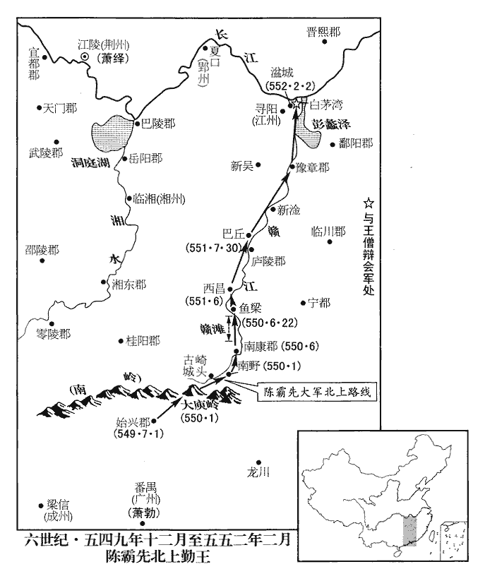
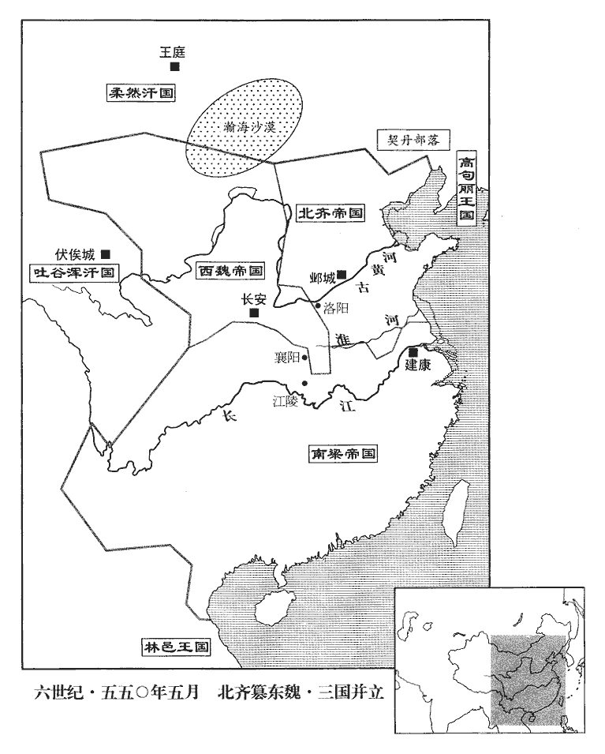
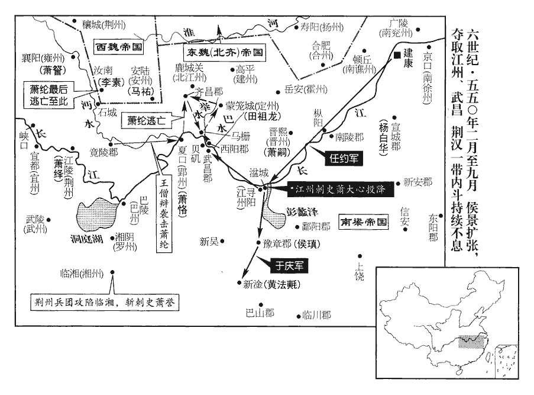

 梁紀十九上章敦牂（庚午），一年。

# 太宗簡文皇帝上諱綱，字世讚，小字六通。武帝第三子，昭明太子母弟也。謚法：平易不訾曰簡，學勤好問曰文。

## 大寶元年（庚午、五五零）

1春，正月，辛亥朔‹一›，大赦，改元。

〖译文〗 [1]春季，正月，辛亥朔（初一），梁朝大赦天下，改年号为大宝。

2陳霸先發始興‹广东省韶关市›，至大庾嶺‹南岭›，大庾嶺，在今南安軍大庾縣西南二十里。吳錄：南野縣有大庾山，自嶺嶠九嶝二里，至嶺下，平行十里，至平亭。蔡路養將二萬人軍於南野‹江西省南康市南›以拒之。南野縣，漢屬豫章郡，晉屬南康郡。劉昫曰：唐韶州始興縣，漢南野縣地。宋白曰：虔州之南康大庾嶺，南雄州之始興，皆漢南野縣地。輿地志：今虔州龍南縣，漢南野縣地。將，即亮翻。路養妻姪蘭陵‹南兰陵·江苏省镇江市境›蕭摩訶，年十三，單騎出戰，無敢當者。杜僧明馬被傷，騎，奇寄翻。被，皮義翻。陳霸先救之，授以所乘馬；僧明上馬復戰，上，時掌翻。復，扶又翻。眾軍因而乘之，路養大敗，脫身走。霸先進軍南康，考異曰：太清紀在二月。今從陳帝紀。湘東王繹承制授霸先明威將軍、交州刺史。

〖译文〗 [2]陈霸先率军从始兴出发，抵达大庾岭。蔡路养统率两万人驻扎在南野进行抵抗。蔡路养的妻侄兰陵人萧摩诃，年方十三，单骑出战，没人敢抵挡他。杜僧明的战马受了伤，陈霸先救了他，并把自己骑的马给他；杜僧明跃上马又投入战斗，众军乘着他的气势勇猛进击，蔡路养大败，脱身逃跑了。陈霸先于是进军南康，湘东王萧绎以皇帝之令授予陈霸先明威将军、交州刺史。

3戊辰‹十八›，東魏進太原公高洋位丞相、都督中外諸軍、錄尚書事、大行臺、齊郡王。

〖译文〗 [3]戊辰（十八日），东魏晋升太原公高洋为丞相、都督中外诸军、录尚书事、大行台、齐郡王。

 

4庚午‹二十›，邵陵王綸至江夏‹夏口·湖北省武汉市›，郢州‹府夏口›刺史南康王恪郊迎，「南康」當作「南平」，參考前後及梁書可見。夏，戶雅翻。以州讓之，綸不受；乃推綸為假黃鉞，都督中外諸軍事，承制置百官。考異曰：太清紀云：「三月，綸逼奪恪州，徙恪於郡廨。」今從梁書、典略。

〖译文〗 [4]庚午（二十日），邵陵王萧纶率人马到达江夏，郢州刺史南平王萧恪带人到郊外恭迎，并表示要把郢州让给他。萧纶不接受；于是推举萧纶为假黄钺、都督中外诸军事，以皇帝的旨意设置百官。

5魏楊忠圍安陸‹湖北省安陆市›，柳仲禮馳歸救之，去年仲禮將兵趣襄陽。諸將恐仲禮至則安陸難下，請急攻之，將，即亮翻；下同。忠曰：「攻守勢殊，未可猝拔；若引日勞師，表裏受敵，非計也。南人多習水軍，不閑野戰，仲禮師在近路，吾出其不意，以奇兵襲之，彼怠我奮，一舉可克。克仲禮，則安陸不攻自拔，諸城可傳檄定也。」乃選騎二千，銜枚夜進，敗仲禮於漴chóng頭‹安陆市西北十千米›，敗，補邁翻。杜佑曰：漴，音崇。水所衝曰漴。考異曰：太清紀作「潼頭」在去年十二月。今從典略。獲仲禮及其弟子禮，盡俘其眾。馬岫以安陸、別將王叔孫以竟陵，皆降於忠。降，戶江翻。於是漢東之地盡入于魏。

〖译文〗 [5]西魏杨忠围攻安陆，柳仲礼急忙率军驰归救援。诸将担心柳仲礼的援兵抵达后安陆就难以攻克了，都要求赶快加紧进攻。杨忠说：“攻和守所处的情势很不相同，安陆是不能一下子就攻克的；如果我军拖延时日，久攻疲劳，援兵一来，里外受敌，这可不是好办法。南方人大都习惯于水战，对陆地野战不熟悉。柳仲礼的军队就在附近，我军出其不意，以奇兵突袭，敌军懈怠，我军奋勇，一举可克。打败了柳仲礼，那么安陆就不攻自破了，诸城也就可以传檄而定。”于是精选两千骑兵，为了防止喧嚣而暴露意图，令所有的人口中衔着小木棍，乘夜偷袭，在3378头把柳仲礼打败了，促获了柳仲礼和他弟弟柳子礼，把他的军队全部俘虏了。马岫献出了安陆，别将王叔孙献出了竟陵，都投降了杨忠。从此汉东之地全部归于西魏。

6廣陵‹江苏省扬州市›人來嶷，嶷，魚力翻。說前廣陵太守祖皓曰：「董紹先輕而無謀，輕，牽正翻。人情不附，襲而殺之，此壯士之任也。今欲糾帥義勇，奉戴府君。帥，讀曰率；下同。若其克捷，可立桓、文之勳，必天未悔禍，猶足為梁室忠臣。」皓曰：「此僕所願也。」乃相與糾合勇士，得百餘人。癸酉‹二十三›，襲廣陵，斬南兗州‹府广陵›刺史董紹先；據城，馳檄遠近，推前太子舍人蕭勔為刺史，勔，彌兗翻。仍結東魏為援。皓，暅之子；祖暅見一百四十七卷武帝天監十二年，諸本作「暅之之子」者，衍一「之」字。暅xuǎn，古鄧翻。勔，勃之兄也。乙亥‹二十五›，景遣郭元建帥眾奄至，皓嬰城固守。

〖译文〗 [6]广陵人来嶷去游说前广陵太守祖皓说：“董绍先为人轻慢而缺乏谋略，人心不归附他，如果您发兵袭击并歼灭他，这可是壮士应有的义举呀。现在我想召集率领义勇之士，尊奉拥戴您去做这件大事。如果这件事成功了，可以建立齐桓公、晋文公那样的千古勋业；即使他气数未尽，此事未成，也足以表示您是梁室的忠臣。”祖皓说：“这正是我的心愿。”于是和来嶷一起策划纠合勇士一百余人，癸酉（二十三日），袭击广陵，杀了南兖州刺史董绍先；占据南兖州，向远近各方发布告示，推举前太子舍人萧勔为刺史，仍与东魏联合。祖皓是祖暅的儿子。萧勔是萧勃的哥哥。乙亥（二十五日），侯景派郭元建带兵攻打南兖州，祖皓环城固守。

7二月，魏楊忠乘勝至石城‹湖北省钟祥市›，五代志：竟陵郡長壽縣，後周置石城郡。欲進逼江陵‹湖北省江陵县›，湘東王繹遣舍人庾恪說忠曰：「詧來伐叔說，式芮翻。來伐事見上卷上年。而魏助之，何以使天下歸心！」忠遂停湕北‹建阳河，长江支流›。湕水之北也。湕，紀偃翻。繹遣舍人王孝祀等送子方略為質以求和，魏人許之。繹與忠盟曰：「魏以石城為封，梁以安陸為界，請同附庸，并送質子，貿遷有無，質，音致。貿，易也；遷，徙也；徙有之無以相貿易。貿，音茂。永敦鄰睦。」忠乃還。還，從宣翻，又如字。

〖译文〗 [7]二月，西魏杨忠乘胜率兵抵达石城，意欲进逼江陵。湘东王萧绎派舍人庾恪去劝说杨忠，说：“萧詧目无尊长，竟然进攻叔父，而魏国帮助他，这怎么能使天下归心！”杨忠听了，就停兵于湕北。萧绎派舍人王孝祀送儿子萧方略为人质以求和，西魏人答应了。萧绎与杨忠订立盟约，约定“魏国以石城为封疆，梁国以安陆为国界，请求按照附庸关系，互送儿子为人质，发展贸易以通有无，永远作为邻邦和睦相处。”

8宕昌‹甘肃省宕昌县›王梁彌定宕，徒浪翻。為其宗人獠甘所襲，彌定奔魏，獠甘自立。羌酋傍乞鐵悤據渠株川‹甘肃省岷县›，獠，魯皓翻。酋，慈秋翻。與渭州‹府设襄武甘肃省陇西县›民鄭五醜合諸羌以叛魏。丞相泰使大將軍宇文貴、涼州‹府设姑臧甘肃省武威市›刺史史寧討之，擒斬鐵悤、五醜。寧別擊獠甘，破之，獠甘將百騎奔生羌鞏廉玉。生羌，遠在塞外，不羈屬於魏者。騎，奇寄翻。寧復納彌定於宕昌，置岷州於渠株川，五代志，臨洮郡臨洮縣，西魏置溢樂縣，並置岷州。復，扶又翻。進擊鞏廉玉，斬獠甘，虜廉玉送長安。

〖译文〗 [8]宕昌王梁弥定被他宗族里的人獠甘所袭击，梁弥定奔逃到西魏，獠甘自立为王。羌族酋长傍乞铁匆盘据渠株川，与谓州人郑五醜纠合诸羌起兵背叛西魏。丞相宇文泰派大将军宇文贵、凉州刺史史宁发兵征讨，擒斩傍乞铁匆和郑五醜。史宁又移兵攻打獠甘，打败了他，獠甘带领百名骑兵投奔远在塞外而不辖属于西魏的羌族首领巩廉玉。史宁重新迎立梁弥定为宕昌王，在渠株川设置岷州，派兵进击巩廉玉，斩獠甘，俘虏了巩廉玉，把他送往长安。

9侯景遣任約、于慶等帥眾二萬攻諸藩。諸藩，謂梁之宗室分任藩維者。任，音壬。帥，讀曰率。

〖译文〗 [9]侯景派任约、于庆等带兵两万攻打梁室诸蕃王。

10邵陵王綸欲救河東王譽而兵糧不足，乃致書於湘東王繹曰：「天時、地利，不及人和，用孟子之言。況於手足肱支，豈可相害！今社稷危恥，創巨痛深，禮記三年問曰：創巨者其疾久，痛甚者其愈遲。三年者，稱情而立文，所以為至痛極也。斬衰、苴杖、居倚廬、食粥、寢苫、枕塊，所以為至痛飾也。創，初良翻。唯應剖心嘗膽，泣血枕戈，越王句踐臥薪嘗膽，求以報吳。晉劉琨枕戈待旦，志梟逆虜。枕，之任翻。子執親喪，泣血三年。孔穎達曰：說文：哭，哀聲也。泣，無聲出淚也。則無聲謂之泣矣。連言血者，以淚出於目，猶血出於體，故以淚比血。禮記曰：子羔執親之喪，泣血三年。註曰：無聲而血出，是也。其餘小忿，或宜容貰。貰shì，貸也。若外難未除，家禍仍構，料今訪古，難，乃旦翻。料，音聊。未或不亡。夫征戰之理，唯求克勝；至於骨肉之戰，愈勝愈酷，捷則非功，敗則有喪，喪，息浪翻。勞兵損義，虧失多矣。侯景之軍所以未窺江外者，荊州治江陵，在江北，故曰江外。良為藩屏盤固，宗鎮強密。為，于偽翻。屏，必郢翻。弟若陷洞庭，湘州之地，襟帶洞庭，故謂湘州為洞庭。不戢兵刃，雍州疑迫，何以自安，必引進魏軍以求形援。以綸之昏狂，猶能言及於此，蓋勢有所必至也。戢jí，阻立翻。雍，於用翻。弟若不安，家國去矣。必希解湘州之圍，存社稷之計。」繹復書，陳譽過惡不赦，言其過大惡極，法所不赦。且曰：「詧引楊忠來相侵逼，頗遵談笑，用卻秦軍，魯仲連談笑而卻秦軍，繹引此以為大言。曲直有在，不復自陳。復，扶又翻。臨湘旦平，臨湘縣自漢以來屬長沙郡，時為州郡治所。隋改臨湘縣曰長沙縣。暮便即路。」即路，就路也。承上文而言，若欲攻襄陽；考之下文，蓋謂討侯景。綸得書，投之於案，慷慨流涕曰：「天下之事，一至於斯，湘州若敗，吾亡無日矣！」綸知繹兵東下，必將圖己，故云然。使在京口之時能思及此，則何亡國喪身之有！古人所以重居安慮危，居寵思畏者也。史為綸北奔張本。

〖译文〗 [10]邵陵王萧纶想救援河东王萧誉，但兵粮不足，于是写信给湘东王萧绎说：“天时、地利也比不上人和，何况弟兄犹如手足股肱，岂可相互损害！现在国家处于危难，蒙受耻辱，创伤巨大，痛苦殊深，我辈只有剖心尝胆，泣血枕戈，发奋救危雪耻，其余的小怨恨，应该能互相谅解才是。如果外难未除，仍然在家族中构祸不止，观今鉴古，没有不灭亡的道理。战争的道理是不顾一切，只求能胜；至于骨肉相残的战争，则愈是获胜愈加残酷，大捷也不是什么功劳，战败则必然有所损失。动用武力，损害人伦道义，亏失实在是太多了。侯景的军队之所以未敢进犯长江以北，实在是因为我们梁朝诸藩互为屏护，象磐石一样牢固，宗室的镇守强大而严密。您如果攻陷洞庭而不约束兵刃，雍州方面必然怀疑您将要进逼，无以自安，势必引进西魏的军队以为援手。这样必将给您造成威胁。您如果感到不安定，那么梁朝的天下就完了。请您一定解除湘州之围，以保存国家社稷。”萧绎复信，逐条陈述萧誉过大恶极，法所不赦，并且说：“萧詧如果勾引杨忠来相侵逼的话，那我将象鲁仲连谈笑而却秦军一样轻而易举地打败他们。是非曲直明摆着，我就不再自陈了。临湘早上被攻下，晚上我就上路。”萧纶收到信，看后扔到案几上，慷慨流涕地说：“天下之事，竟然糟到这个地步！湘州如果陷落，我就快灭亡了！”

11侯景遣侯子鑒帥舟師八千，自帥徒兵一萬，徒兵，步兵也。帥，讀曰率；下同。攻廣陵，三日，克之，執祖皓，縛而射之，箭徧體，然後車裂以徇；城中無少長皆埋之於地，馳馬射而殺之。射，而亦翻。少，詩照翻。長，知兩翻。考異曰：太清紀曰：「城中數百人，」典略曰：「死者八千人，」今從南史。以子鑒為南兗州刺史，鎮廣陵。廣陵之人既殲矣，子鑒所鎮者空城耳。景還建康。

〖译文〗 [11]侯景派侯子鉴率领水军八千人，自率步兵一万人，攻打广陵。打了三天，城破，抓住了祖皓，把他缚住用箭射他，箭镞丛集遍体，然后再把他车裂示众。城中民众不分老少都被埋在地里，让士兵来回纵马奔驰，射而杀之。侯景任命侯子鉴当南兖州刺史，镇守广陵，他自己回建康。

12丙戌‹六›，以安陸王大春為東揚州‹府设会稽浙江省绍兴市›刺史。省吳州‹府设吴县江苏省苏州市›。景置吳州見上卷上年。

〖译文〗 [12]丙戌（初六），侯景任命安陆王侯大春为东扬州刺史，裁省吴州。

13乙巳‹二十五›，以尚書僕射王克為左僕射。

〖译文〗 [13]乙巳（二十五日），侯景任命尚书仆射王克为左仆射。

14庚寅‹十›，東魏以尚書令高隆之為太保。

〖译文〗 [14]庚寅（疑误），东魏任命尚书令高隆之为太保。

15宣城‹安徽省宣州市›內史楊白華進據安吳‹安徽省泾县西南›，孫吳立安吳縣，屬宣城郡；隋省安吳入涇縣。侯景遣于子悅帥眾攻之，不克。

〖译文〗 [15]宣城内史杨白华进据安吴。侯景派遣于子悦率众攻打安吴，没打下。

16東魏行臺辛術將兵入寇，圍陽平‹侨郡·江苏省洪泽县›，不克。

〖译文〗 [16]东魏行台辛术带兵入境进犯，围困阳平，没打下。

17侯景納上‹萧纲，本年四十八岁›女溧陽公主，甚愛之。溧，音栗。三月，甲申，景請上禊xì宴於樂遊苑，禊宴，因祓fú禊而開宴。禊，胡計翻。樂遊苑，在玄武湖南。帳飲三日。上還宮，景與公主共據御牀，南面並坐，群臣文武列坐侍宴。

〖译文〗 [17]侯景娶简文帝的女儿溧阳公主，非常喜爱她。三月，甲申（疑误），侯景请皇上修褉宴集于乐游苑，在帐幕里宴饮三天。简文帝还宫后，侯景与溧阳公主一起占据御床，南面并坐，让群臣文武列坐侍宴。

18庚申‹十一›，東魏進丞相洋爵為齊王。

〖译文〗 [18]庚申（十一日），东魏晋升丞相高洋为齐王。

19臨川‹江西省南城县›內史始興王𣪣等擊莊鐵，王𣪣，始興人；𣪣即「毅」字，後人傳寫，變「立」為「彐jì」耳。鄱陽王範遣其將巴西‹北巴西·四川省阆中市›侯瑱救之，瑱tiàn，他甸翻。𣪣等敗死。

〖译文〗 [19]临川内史始兴人王毅等进攻庄铁。鄱阳王萧范派他的部将巴西人侯瑱去救援，王毅等兵败身死。

20鄱陽世子嗣與任約戰於三章，約敗走；嗣因徙鎮三章，謂之安樂柵。去年鄱陽王範西上，使世子嗣守安樂柵，今移柵三章，亦以安樂名柵。樂，音洛。

〖译文〗 [20]鄱阳世子萧嗣与任约在三章开战，任约败走；萧嗣乘势迁移，镇守三章，称之为“安乐栅”。

21夏，四月，庚辰朔‹一›，湘東王繹以上甲侯韶為長沙王。上甲侯韶奔江陵，見上卷上年。按梁書，長沙王懿子淵業嗣封；卒，子孝儼嗣封；又卒，子眘嗣封。眘shèn，懿曾孫也，時在建康。湘東以韶歸之，遂以為長沙王，非禮也。

〖译文〗 [21]夏季，四月，庚辰朔（初一），湘东王萧绎任命上甲侯萧韶为长沙王。

22丙午‹二十七›，侯景請上‹萧纲›幸西州‹建康城西›，上御素輦，侍衛四百餘人，景浴鐵數千，翼衛左右。浴鐵者，言鐵甲堅滑，若以水浴之也。上聞絲竹，悽然泣下，命景起舞；景亦請上起舞。酒闌坐散，坐，徂臥翻。上抱景于牀曰：「我念丞相。」景曰：「陛下如不念臣，臣何得至此！」逮夜乃罷。

〖译文〗 [22]丙午（二十七日），侯景请简文帝巡视西州，简文帝乘坐不加雕漆的素辇，带四百多名侍卫人员。而侯景则率几千名铁甲铮亮的武士，翼卫在左右。简文帝听到丝竹之声，凄然流泪，传命侯景起舞；侯景也请简文帝起舞。酒阑人散，简文帝在床上抱着侯景说：“我心里念着丞相。”侯景回答说：“陛下如不念顾我，我哪能得到现在的地位！”直到夜色降临才分手。

時江南連年旱蝗，江‹江西省及福建省›、揚‹京畿›尤甚，百姓流亡，相與入山谷、江湖，采草根、木葉，菱芡而食之，菱，芰也。芡，巨險翻；說文曰：雞頭也。方言曰：南楚謂之雞頭，北燕謂之䓈，青、徐、淮、泗之間謂之芡。所在皆盡，死者蔽野。富室無食，皆鳥面鵠形，衣羅綺，懷珠玉，俯伏牀帷，待命聽終。千里絕烟，衣，於既翻。烟，與煙同。人迹罕見，白骨成聚，如丘隴焉。

〖译文〗 这时江南连年闹旱灾、蝗灾，江州、扬州尤其严重，老百姓流离失所，成群结队逃入山谷之中，江湖之滨，采集草根、树叶、菱角、鸡头为食物。饥民所至，这些东西一扫而空，饿死的人横陈田野，比比皆是，富裕人家也没有吃的，一个个饿得鸟面鹄形，穿着罗绮衣裳，怀里藏着珍珠美玉，俯伏在床帷之间，等待死亡。千里之内，炊烟断绝，人迹罕见，白骨成堆，象丘陇一样。

景性殘酷，於石頭立大碓，碓，都內翻。有犯法者擣dǎo殺之。常戒諸將曰：「破柵平城，當淨殺之，使天下知吾威名。」故諸將每戰勝，專以焚掠為事，斬刈人如草芥，以資戲笑。由是百姓雖死，終不附之。史言侯景將敗。又禁人偶語，犯者刑及外族。男子謂舅家為外家，婦人謂父母之家為外家。外族，外家之族。為其將帥者，悉稱行臺，來降附者，悉稱開府，其親寄隆重者曰左右廂公，勇力兼人者曰庫直都督。南史侯景傳作「庫真部督」。誤也。

〖译文〗 侯景生性残酷，他在石头城设立大碓，犯法的人被抓住，就用大碓捣杀。平常总是告诫诸将说：“一旦攻破栅栏，踏平城市，就杀它个干干净净，使天下人知道我的厉害！”所以他手下的诸将每次战胜，就专门以烧杀抢掠为能事，杀人如刈草芥，以此作为游戏取乐。因此老百姓即使死，也绝不归附他。侯景又禁止人民在一起交头接耳，有违犯的刑罚株连到他的外族。当他的将帅的，都称为行台；来投降归附他的，都称为开府。他所特别亲信看重的称为左右厢公，勇气力量超人的称为库直都督。

23魏‹元宝炬，本年四十四岁›封皇子儒為燕王，公為吳王。

〖译文〗 [23]西魏封皇子元儒为燕王，元公为吴王。

24侯景召宋子仙還京口。去年宋子仙克東揚州，今召還京口。

〖译文〗 [24]侯景召宋子仙回京口。

25邵陵王綸在郢州，以聽事為正陽殿，內外齋閤，悉加題署。其部下陵暴軍府，郢州将佐莫不怨之。諮議參軍江仲舉，南平王恪之謀主也，說恪圖綸，說，式芮翻。恪驚曰：「若我殺邵陵，寧靜一鎮，荊、益兄弟必皆內喜，帝既蒙塵，綸於兄弟之次當立。恪若除綸，則人望歸於荊、益，必當內以為喜。時湘東王繹在荊州，武陵王紀在益州。海內若平，則以大義責我矣。且巨逆未梟，巨逆，謂侯景。梟，謂梟其首。梟，堅堯翻。骨肉相殘，自亡之道也。卿且息之。」仲舉不從，部分諸將，分，扶問翻。刻日將發，謀泄，綸壓殺之。恪狼狽往謝，綸曰：「群小所作，非由兄也。兇黨已斃，兄勿深憂！」南平王恪，偉之子也，於綸為兄。

〖译文〗 [25]邵陵王萧纶在郢州，把厅堂称为正阳殿，内外斋门閤门，都题上匾名。他的部下在军府里作威作福，郢州将士官佐没有不怨恨的，谘议参军江仲举，是南平王萧恪的主要谋士，他鼓励萧恪反对萧纶，取而代之。萧恪大惊，说：“如果我杀了邵陵王，郢州也许可以宁静，但荆州、益州的宗室兄弟必然内心窃喜。海内如果平定，他们就会以君臣大义责备我。而且最大的逆贼没有杀掉，就骨肉相残，这是自取灭亡之道。你的想法不妥，还是算了吧。”但江仲举不听，他安排部署手下的将领们，定好日子就要举事，但是事情泄漏，萧纶把他们统统压死。萧恪非常狼狈不安地前往谢罪，萧纶说：“这都是一群小人所干的，不是由您策划的。凶党已经消灭，您不必深忧！”

26王僧辯急攻長沙，辛巳‹二›，克之。執河東王譽，斬之，傳首江陵，湘東王繹反其首而葬之。反其首於長沙，與身俱葬。初，世子方等之死，見上卷上年。臨蒸‹湖南省衡阳市›周鐵虎功最多，吳立臨蒸縣，以縣臨蒸水而名，屬衡陽郡，晉屬湘東郡。酈道元曰：臨蒸即故酃縣，縣即湘東郡。劉昫曰：隋改臨蒸為衡陽縣，今衡州所治衡陽縣是也。衡州志：吳分酃縣立臨蒸縣，俯臨蒸水，其氣如蒸。姚思廉陳書曰：周鐵虎，不知何許人，梁世南渡，事河東王譽，為臨蒸令。如此，則通鑑逸「令」字。譽委遇甚重。僧辯得鐵虎，命烹之，呼曰：呼，火故翻。「侯景未滅，柰何殺壯士！」僧辯奇其言而釋之，還其麾下。繹以僧辯為左衛將軍，加侍中、鎮西長史。

〖译文〗 [26]王僧辩猛烈地进攻长沙，辛巳（初二），攻破城池，抓住了河东王萧誉，杀了他，并把首级送到江陵。湘东王萧绎让人把首级送回长沙，和身子合在一起安葬。当初，世子方等被杀死，临蒸人周铁虎功劳最大，萧誉对他委任恩遇很重。王僧辩抓获周铁虎，命令手下烹杀他。周铁虎大叫：“侯景未灭，为什么杀壮士？”王僧辩觉得他吐言奇伟，就释放了他，让他回到军帐下。萧绎任命王僧辩为左卫将军，加侍中、镇西长史。

繹自去歲聞高祖之喪，以長沙未下，故匿之。壬寅‹二十三›，始發喪，刻檀為高祖‹萧衍›像，置於百福殿，事之甚謹，動靜必咨焉。繹以為天子制於賊臣，不肯從大寶之號，猶稱太清四年。丙午‹二十七›，繹下令大舉討侯景，移檄遠近。

〖译文〗 萧绎自去年就听到了梁武帝驾崩的消息，因为当时长沙还没打下，所以加以封锁。壬寅（二十三日），才发丧，用檀木雕刻梁武帝像，安放在百福殿里，朝拜很恭谨，一举一动都前往咨求。萧绎认为天子被贼臣挟制，所以不肯采用大宝的年号，还是照旧年号称太清四年。丙午（二十七日），萧绎下令大举讨伐侯景，檄文传遍远近。

27鄱陽王範至湓城‹江西省九江市寻阳东›，以晉熙‹安徽省潜山县›為晉州，晉安帝分廬江郡立晉熙郡。五代志：同安郡懷寧縣舊置晉熙郡。唐以同安郡為舒州。遣其世子嗣為刺史，江州郡縣多輒改易。改易郡縣守令也。尋陽王大心，政令所行，不出一郡。惟尋陽一郡而已。大心遣兵擊莊鐵，嗣與鐵素善，請發兵救之，範遣侯瑱帥精甲五千助鐵。瑱，他甸翻，又音鎮。帥，讀曰率；下同。由是二鎮互相猜忌，無復討賊之志。復，扶又翻。大心使徐嗣徽帥眾二千，築壘稽亭‹九江市东湓城东›以備範，據齊書晉安王子懋傳：子懋謀舉兵於江州，宣城王遣裴叔業襲取湓城，子懋先已具船於稽亭渚，聞叔業得湓城，乃據州自衛。則稽亭渚在江州城東也。帥，讀曰率。市糴不通，範數萬之眾，無所得食，多餓死。範憤恚，疽發於背，五月，乙卯‹七›，卒‹萧范，年五十二岁›。恚，於避翻。考異曰：典略作「己酉」。今從太清紀。範眾祕不發喪，奉範弟安南侯恬為主，有眾數千人。

〖译文〗 [27]鄱阳王萧范率众进抵湓城，把晋熙郡改为晋州，派他的长子萧嗣为晋州刺史，江州所属郡县守令大部分都改换了。寻阳王萧大心，政令所行，不出寻阳一郡之外。萧大心派兵进击庄铁，萧嗣与庄铁一向关系很好，就请求萧范发兵救援他。萧范派侯瑱率领精锐甲兵五千人去帮助庄铁。从此鄱阳、寻阳二镇互相猜忌，再也没有讨贼的心思了。萧大心让徐嗣徽率众二千，在稽亭筑垒以防备萧范，这一来切断了鄱阳的粮食流通，萧范数万军队，没地方找到粮食，大多饿死。萧范愤恨大怒，背上痈疽破裂，五月，乙卯（初七），去世。萧范的部下秘不发丧，推举萧范的弟弟安南侯萧恬为主帅，有部众数千人。

28丙辰‹八›，侯景以元思虔為東道大行臺，鎮錢唐‹浙江省杭州市›。丁巳‹九›，以侯子鑒為南兗州刺史。

〖译文〗 [28]丙辰（初八），侯景任命元思虔为东道大行台，镇守钱唐。丁巳（初崐九），任命侯子鉴为南兖州刺史。

29東魏齊王洋之為開府也，洋為開府，見一百五十七卷武帝大同元年。勃海‹河北省东光县›高德政為管記，管記，即記室參軍之職。由是親昵，言無不盡。昵，尼質翻。金紫光祿大夫丹楊‹江苏省南京市›徐之才、北平‹河北省卢龙县北›太守廣宗‹河北省威县东›宋景業，漢、晉以來，中山有北平縣，後魏孝昌中，分置北平郡，屬定州。廣宗縣，漢屬鉅鹿郡，後屬安平國，後魏太和二十一年，分置廣宗郡；時屬司州。皆善圖讖，讖，楚譖翻。以為太歲在午，當有革命，因德政以白洋，勸之受禪。洋以告婁太妃‹娄昭君›，太妃曰：「汝父如龍，兄如虎，猶以天位不可妄據，終身北面，汝獨何人，欲行舜、禹之事乎！」洋以告之才，之才曰：「正為不及父兄，為，于偽翻。故宜早升尊位耳。」洋鑄像卜之而成，乃使開府儀同三司段韶問肆州‹府设九原山西省忻州市›刺史斛律金，金來見洋，固言不可，以宋景業首陳符命，請殺之。洋與諸貴議於太妃前，太妃‹娄昭君›曰：「吾兒懦直，必無此心，高德政樂禍，教之耳。」樂，音洛。洋以人心不壹，遣高德政如鄴察公卿之意，未還；洋擁兵而東，至平都城‹山西省和顺县西›，九域志：遼州遼山縣有平城鎮。宋白曰：遼州平城縣本漢湼縣地，晉置武鄉縣，此地屬焉。隋開皇十六年，於趙簡子所立平都故城置平城縣。召諸勳貴議之，莫敢對。長史杜弼曰：「關西，國之勍敵，謂宇文氏也。勍，渠京翻。若受魏禪，恐彼挾天子，自稱義兵而東向，此天子，謂西魏主。王何以待之！」徐之才曰：「今與王爭天下者，彼亦欲為王所為，縱其屈強，屈，其勿翻。強，其兩翻。不過隨我稱帝耳。」弼無以應。高德政至鄴，諷公卿，莫有應者。司馬子如逆洋於遼陽‹山西省左权县›，遼陽縣自漢末以來屬樂平郡，隋開皇十一年，改曰遼山縣，我朝為遼州治所。固言未可。洋欲還，倉丞李集曰：北齊之制，太倉及水次諸倉皆有令、丞。北齊紀作「尚食丞李集」。「王來為何事，而今欲還？」為，于偽翻。洋偽使於東門殺之，而別令賜綃十匹，遂還晉陽。自是居常不悅。徐之才、宋景業等日陳陰陽雜占，云宜早受命。高德政亦敦勸不已。洋使術士李密卜之，遇大橫，曰：「漢文之卦也。」大橫見十三卷漢高后八年。又使宋景業筮之，遇乾之鼎，乾之初九、九五二爻，動變而之鼎。曰：「乾，君也。鼎，五月卦也。宜以仲夏受禪。或曰：「五月不可入官，犯之，終於其位。」陰陽家之說，上官忌正月、五月、九月。景業曰：「王為天子，無復下期，復，扶又翻。豈得不終於其位乎！」洋大悅，乃發晉陽。

〖译文〗 [29]东魏齐王高洋在设置官署的时候，任命勃海人高德政为管记，因此两人关系很亲密，什么话都可以交谈。金紫光禄大夫丹杨人徐之才、北平太守广宗人宋景业，都精通图谶占验之术。他们看到太岁星在午，认为这意味着帝室不祥，会有改朝换代的事发生，就把这种预言通过高德政告诉高洋，劝他接受禅让。高洋把这事禀告娄太妃，太妃说：“你父亲和哥哥都是如龙似虎一样的英才，尚且认为皇位天授，不能妄图窃据，终其一生，北面事君，你是何等样人，想效法舜、禹禅让的事吗？”高洋把娄太妃的话告诉徐之才，徐之才说：“正因为您的才能都比不上父兄，所以才应该早日升上尊位呀！”高洋通过铸铜像进行占卜，于是让开府仪同三司段韶去征求肆州刺史斛律金的意见，斛律金听了后来求见高洋，坚决地认为这件事干不得，并以宋景业带头宣讲符命惑主为由，要求高洋杀了他。高洋和各位贵戚一起在娄太妃面前商议这件事，娄太妃说：“我儿子懦弱直爽，肯定不会有这种念头，高德政喜欢弄出祸端，唯恐天下不乱，这都是他教唆的呀！”高洋因为人心不能一致，就派高德政去邺州观察公卿大臣们的意向，去了后还没返回，高洋就率军队向东进发，抵达平都城，召集诸位元勋重臣一起商议，但没有人敢吱声。长史杜弼说：“关西宇文氏，是我国的强敌，如果您接受魏的禅让，恐怕宇文氏会挟持天子，自称为勤王义兵而向东讨伐，大王拿什么来对付他们呢？”徐之才说：“现在和大王争天下的人，他也是想做大王所做的事的，即使他倔强不顺从，不过也随着大王的样子自己称帝罢了。”杜弼听了，无言以对。高德政抵达邺州，把高洋准备接受禅让的事暗示给公卿大臣，但没有响应的。司马子如到辽阳去迎接高洋，坚决地认为这事行不得。高洋想返回晋阳，仓丞李集说：“大王来这一趟是干什么的，难道您忘了，现在就想回去？”高洋假装把他在东门杀了，同时另外发令，赏赐他十匹绡，于是返回到晋阳。从此高洋日常起居总是郁郁不乐。徐之才、宋景业等每天在他耳边讲陈阴阳之理、占验之事，嘀嘀咕咕说应该早点接受禅让，应承天命。高德政也使劲劝说个没完。高洋让术士李密占卜这件事，结果得到大横卦。李密说：“这可是汉孝文帝得到过的吉卦呀。”高洋又让宋景业用筮草占卜，结果占到乾卦，乾卦又变化为鼎卦。宋景业说：“乾卦，意味着君主之象。鼎卦，是说在五月发生变化。您在仲夏受禅让最适宜了。”有人进言说：“按阴阳家的说法，五月不能入居官位，如果违犯这一条，就会死在官位上。”宋景业说：“大王贵为天子，当然没有下台离位的时候，哪能不死在自己的皇位上呢！”高洋听了非常高兴，于是又从晋阳向东进发了。

高德政錄在鄴諸事，條進於洋，洋令左右陳山提馳驛齎事條，并密書與楊愔。愔，於今翻。是月，山提至鄴，楊愔即召太常卿邢邵議造儀注，祕書監魏收草九錫、禪讓、勸進諸文；凡禪代皆奉表三讓，百僚三表勸進而後即位，故令收預草諸文。引魏宗室諸王入北宮，留於東齋。甲寅‹六›，東魏進洋位相國，總百揆，備九錫。洋行至前亭‹山西省和顺县西›，前亭，在晉陽之東，平都城之西。所乘馬忽倒，意甚惡之，至平都城‹前亭东›，不復肯進。惡，烏路翻。復，扶又翻。高德政、徐之才苦請曰：「山提先去，恐其漏泄。」即命司馬子如、杜弼馳驛續入，觀察物情。子如等至鄴，眾人以事勢已決，無敢異言。洋至鄴，召夫夫，民夫也。齎築具，集城南。高隆之請曰：「用此何為？」洋作色曰：「我自有事，君何問為！欲族滅邪！」隆之謝而退。於是作圜丘，備法物。

〖译文〗 高德政把在邺州察访到的情况、动向逐条记录下来，呈送给高洋。高洋命令身边的侍从陈山提沿驿路驰马急行，带着高德政进呈的事条和一封密信去给杨愔。就在这个月，陈山提抵达邺州，杨愔就召集太常卿邢邵负责商议制定礼仪制度，秘书监魏收起草加九锡、禅让、劝进等文告，并召集东魏宗室诸王进入北宫，留宿东斋。甲寅（初六），东魏拥戴高洋位居相国，总领百官，加九锡。高洋行进到前亭时，他所乘骑的马忽然倒下。高洋很厌恶这件事，抵达平都城后，就不肯再前进了。高德政、徐之才苦苦请求说：“陈山提已经先去邺城了，我们若不前进，时间拖长了，怕他会泄漏消息。”高洋听了，就命令司马子如、杜弼沿驿道跟着奔驰入邺，以观察事态发展，人心动向。司马子如等人抵达邺城以后，众人以为大势已定，没有敢表示异议的。高洋抵达邺城，召集民夫带着建筑工具集中在城南。高隆之问道：“召集民夫干什么？”高洋勃然作色，说：“我自然有事，你问这干什么？难道想自取灭族吗？”高隆之连声谢罪，唯唯而退。于是众民夫开始修筑祭天用的圆形高坛，准备登基大典用的法器物事。

丙辰‹八›，司空潘樂、侍中張亮、黃門郎趙彥深等求入啟事，東魏孝靜帝‹元善见›在昭陽殿見之。亮曰：「五行遞運，有始有終，謂五德之運，以木代水，以火代木，以土代火，以金代土，以水代金也。齊王聖德欽明，萬方歸仰，願陛下遠法堯、舜。」帝斂容曰：「此事推挹已久，推，吐雷翻。挹yì，遜也。謹當遜避。」又曰：「若爾，須作制書。」中書郎崔劼jié、裴讓之曰：劼，丘八翻。「制已作訖。」使侍中楊愔進之。東魏主既署，曰：「居朕何所？」愔對曰：「北城別有館宇。」乃下御坐，步就東廊，坐，徂臥翻。詠范蔚宗後漢書贊曰：「獻生不辰，身播國屯，終我四百，永作虞賓。」范曄，字蔚宗，作後漢書。此其贊獻帝之辭也。賢註曰：辰，時也。播，遷也。言獻帝生不逢時，身既播遷，國又屯難也。漢有天下四百年而運終。虞賓，謂虞以堯子丹朱為賓。書曰：虞賓在位。蔚，紆勿翻。屯，陟倫翻。所司請發，所司，謂掌禪代事者；請發者，請出宮居別邸也。此實楊愔等使人請之。帝曰：「古人念遺簪弊履，朕欲與六宮別，可乎？」高隆之曰：「今日天下猶陛下之天下，況在六宮。」帝步入，與妃嬪已下別，舉宮皆哭。趙國‹河北省赵县›李嬪誦陳思王詩云：「王其愛玉體，俱享黃髮期。」曹植，魏武帝之子，封陳王，諡曰思。嬪，毗賓翻。直長趙道德以【章：十二行本「以」下有「故犢」二字；乙十一行本同；孔本同；張校同。】車一乘候於東閤，直長，官名。凡殿中諸局各有奉御，有直長。趙道德蓋尚乘直長也，亦高氏之私人。東閤，即東閤門。長，竹兩翻。乘，繩證翻。帝登車，道德超上抱之，上，時掌翻。帝叱之曰：「朕自畏天順人，何物奴敢逼人如此！」道德猶不下。出雲龍門，王公百僚拜辭，高隆之灑泣。遂入北城，居司馬子如南宅，司馬子如有宅在太原，故謂鄴城之宅為南宅。遣太尉彭城王韶等奉璽綬，禪位于齊。璽，斯氏翻。綬，音受。東魏十六年而亡。考異曰：北齊書、北史高德政傳云：「五月六日，留咸陽王坦等。七日，司馬子如等至鄴。九日，文宣至城南頓。」按後魏書、北史帝紀皆云，「辛亥，王如鄴；甲寅，加九錫；丙辰，魏主遜位；戊午，王即帝位。」典略：「辛亥，王還鄴。」以長曆推之，此月己酉朔，皆不與德政傳日相應。蓋辛亥始自晉陽如鄴，非到鄴之日也。

〖译文〗 丙辰（初八），司空潘乐、侍中张亮、黄门郎赵彦深等要求入宫奏事，东魏孝静帝在昭阳殿召见他们。张亮说：“金木水火土五行互相递代地运行，帝命有始有终，这是天意。齐王高洋天资圣明，道德崇高，天下归心，万众钦仰，希望陛下效法尧、舜，把帝位禅让给齐王。”孝静帝神色凝重地说：“这件事推让很久了，我谨遵众意，理当逊位让贤。”又说：“如果是这样，必须写成正式诏书。”中书郎崔劼、裴让之说：“诏书已经准备好了。”便让侍中杨愔把让位的诏书进呈孝静帝。孝静帝签署之后，说：“退位之后，让我住到哪去？”杨愔回答说：“北城另外有一套楼馆房舍。”于是孝静帝走下御座，步行走向东廊，口里吟咏着范晔所作的《后汉书》中对汉献帝的一段赞辞：“献帝生不逢辰，身既播迁，国又遭难，到我为止，汉祚四百年终结了，让我永远充当虞的宾客尧子丹朱的角色吧！”掌管禅位事宜的人要孝静帝马上出发到为他准备的别馆去，孝静帝说：“古人有顾念遗簪敝履的遗风，我想效法，和六宫的妃嫔们告别一下，可以吗？”高隆之说：“今天天下还是陛下的，何况六宫呢？”孝静帝步行进宫，与妃嫔及其下属告别，整个皇宫都痛哭失声。赵国人李嫔诵读陈思王曹植的诗：“王其爱玉体，俱享黄发期。”直长赵道德准备好一乘牛车于东阁门，孝静帝登车，赵道德赶上车去抱住他，孝静帝喝斥他说：“我自己畏天命，顺人心，让出帝位，你是什么东西，敢这样肆无忌惮地逼我！”赵道德仍然不下车。孝静帝出云龙门，王公大臣们向他拜辞，高隆之流泪哭泣。就这样孝静帝进入了北城，住在司马子如的南宅。派太尉彭城王元韶等人捧着玉玺印绶，把皇位禅让给齐王。

戊午‹十›，齊王‹高洋，本年二十二岁›即皇帝位于南郊，帝諱洋，字子進，勃海王高歡第二子，澄之母弟也。歡以勃海王贈齊王，洋又進爵齊王；且高氏本勃海人，勃海故齊地也，國遂號曰齊。大赦，改元天保。自魏敬宗以來，百官絕祿，至是始復給之。復，扶又翻。己未‹十一›，封東魏主‹元善见›為中山王，待以不臣之禮。追尊齊獻武王‹高欢›為獻武皇帝，廟號太祖，後改為高祖；文襄王‹高澄›為文襄皇帝，廟號世宗。辛酉‹十三›，尊王太后婁氏‹娄昭君›為皇太后。乙丑‹十七›，降魏朝封爵有差，其宣力霸朝自高歡起兵以來諸勳貴，皆宣力霸朝者也。朝，直遙翻。及西、南投化者，不在降限。謂自關西及江南來投者。

〖译文〗 戊午（初十），齐王高洋在邺城南郊即皇帝位，宣布大赦天下，改年号为天保。自魏孝庄帝以来，朝廷百官都断了俸禄，到这时候才又给了。己未（十一日），北齐封孝静帝为中山王，让他可以不用臣下之礼。同时追尊齐献武王为献武皇帝，庙号太祖，后来又改称为高祖；追尊文襄王为文襄皇帝，庙号世宗。辛酉（十三日），尊王太后娄氏为皇太后。乙丑（十七日），北齐把原来魏朝给大臣们的封爵按不同情况降了级，但其中随高欢起兵以来有过功勋的大臣以及关西和江南来投降归附的臣子不在降级之列。

 

30文成侯寧起兵於吳‹江苏省苏州市›，有眾萬人，己巳‹二十一›，進攻吳郡；吳郡帶吳縣。寧蓋起兵於吳縣界，進攻吳郡城也。按侯景傳：寧起兵於吳西鄉。去年陸緝等推寧據吳郡，宋子仙擊之敗走，今復起兵於西鄉。行吳郡事侯子榮逆擊，殺之。寧，範之弟也。子榮因縱兵大掠郡境。

〖译文〗 [30]文成侯萧宁在吴县起兵，拥有士兵一万余人，己巳（二十一日），进攻吴郡，代理吴郡政事的侯子荣出兵迎击，杀了萧宁。萧宁是萧范的弟弟。侯子荣因此纵容士兵在吴郡境内大肆抢掠。

自晉氏渡江，三吳‹太湖流域及钱塘江流域›最為富庶，貢賦商旅，皆出其地。及侯景之亂，掠金帛既盡，乃掠人而食之，或賣於北境，遺民殆盡矣。

〖译文〗 自从晋朝司马氏渡过长江以来，三吴之地是天下最为富庶的地区，供给朝廷的贡品、租赋，以及客商行旅，都出在这个地区。到侯景作乱时，乱军把民间的金银财帛抢掠一空，接着就抢掠人口，有的杀了吃掉，有的卖到北方去，三吴之地的老百姓所剩无几了。

是時，唯荊、益‹府设成都四川省成都市›所部尚完實，太尉、益州刺史武陵王紀移告征、鎮，使世子圓照帥兵三萬受湘東王節度。帥，讀曰率。圓照軍至巴水‹嘉陵江下游，在重庆市注入长江›，巴郡巴縣有巴水，水折三迴如巴字。巴郡，唐為渝州。考異曰：南史云：「六月辛酉，紀遣圓照東下。」按六月，己卯朔，無辛酉。典略在五月，或者五月辛酉歟？繹授以信州‹府设白帝城重庆市奉节县东›刺史，令屯白帝，梁置信州於白帝，唐改夔州。未許東下。

〖译文〗 这时候，只有荆州、益州所管辖的地区还比较完整充实。太尉、益州刺史武陵王萧纪移文通告各征、镇，让世子萧圆照率兵三万接受湘东王指挥。萧圆照的军队抵达巴水时，萧绎授给他信州刺史之职，命令他驻扎在白帝城，不许他继续东下。

31六月，辛巳‹三›，以南郡王大連行揚州事。

〖译文〗 [31]六月，辛巳（初三），梁朝任命南郡王萧大连掌管扬州政事。

32江夏王大款、山陽王大成、宜都王大封自信安‹浙江省衢州市›間道奔江陵。間，古莧翻。

〖译文〗 [32]江夏王萧大款、山阳王萧大成、宜都王萧大封从信安抄小路投奔江陵。

33齊主封宗室高岳等十人、功臣庫狄干等七人皆為王。高岳及隆之、歸彥、思宗、長弼、普子瑗yuàn、顯、國、叡、孝緒凡十人。庫狄干、斛律金、賀拔仁、韓軌，可朱渾道元、彭樂、潘相樂凡七人。癸未‹五›，封弟浚為永安王，淹為平陽王，浟為彭城王，演為常山王，渙為上黨王，淯為襄城王，湛為長廣王，湝為任城王，浟yōu，以周翻。淯，音育。湝jiē，戶皆翻。湜shí為高陽王，濟為博陵王，𤁒為新平王，潤為馮翊王，洽為漢陽王。

〖译文〗 [33]北齐国主高洋封皇室高岳等十人、功臣库狄干等七人为王。癸未（初五），封弟弟高浚为永安王，高淹为平阳王，高浟为彭城王，高演为常山王，高涣为上党王，高淯为襄城王，高湛为长广王，高湝为任城王，高湜为高阳王，高济为博陵王，高凝为新平王，高润为冯翊王，高洽为汉阳王。

34鄱陽王範既卒，侯瑱往依莊鐵，鐵忌之；瑱不自安，丙戌‹八›，詐引鐵謀事，因殺之，自據豫章。

〖译文〗 [34]鄱阳王萧范死了以后，侯瑱去依附庄铁，庄铁对他心怀猜忌，侯瑱心里不安稳，丙戌（初八），假称约庄铁一块商量事情，乘机杀害了他，自己占据了豫章。

35尋陽王大心遣徐嗣徽夜襲湓城，安南侯恬、裴之橫等擊走之。

〖译文〗 [35]寻阳王萧大心派徐嗣徽乘夜袭击湓城，安南侯萧恬、裴之横等把他打跑了。

36齊主娶趙郡‹河北省赵县›李希宗之女，生子殷及紹德；又納段韶之妹。及將建中宮，高隆之、高德政欲結勳貴之援，乃言「漢婦人不可為天下母，宜更擇美配。」帝‹高洋›不從。丁亥‹九›，立李氏‹李祖娥›為皇后，考異曰：典略在五月乙丑。今從北齊帝紀。以段氏為昭儀，子殷為皇太子‹高殷，本年六岁›。庚寅‹十二›，以庫狄干為太宰，彭樂為太尉，潘相樂為司徒，司馬子如為司空。辛卯‹十三›，以清河王岳為司州牧。

〖译文〗 [36]北齐国主高洋娶了赵郡人李希宗的女儿，生下儿子高殷、高绍德。又把段韶的妹妹纳为妃子。等到要确立中宫之主的时候，高隆之、高德政想勾结勋贵以为援手，就进言说：“汉族妇女不能当天下之母，应该另外选择美人为元配。”高洋没有采纳这种意见。丁亥（初九），高洋立李希宗之女为皇后，以段韶之妹为昭仪，立皇子高殷为皇太子。庚寅（十二日），任命库狄干为崐太宰，彭乐为太尉，潘相乐为司徒，司马子如为司空。辛卯（十三日），任命清河王高岳为司州牧。

37侯景以羊鴉仁為五兵尚書。庚子‹二十二›，鴉仁出奔江西，將赴江陵，至東莞，南徐州有東莞郡，不在江西，意者東莞其東關之誤歟？盜疑其懷金，邀殺之。考異曰：太清紀在十月。今從梁帝紀、典略。

〖译文〗 [37]侯景任命羊鸦仁为五兵尚书。庚子（二十二日），羊鸦仁出奔到江西，将奔赴江陵，走到东莞时，强盗怀疑他带着重金，拦击把他杀死。

38魏人欲令岳陽王詧發哀嗣位，詧辭，不受。丞相泰使榮權冊命詧為梁王，始建臺，置百官。詧，字理孫，武帝之孫，昭明太子之第二子。

〖译文〗 [38]西魏人想让岳阳王萧詧发丧示哀，继承梁朝帝位，萧詧推辞了，没有接受。丞相宇文泰派遣荣权为使者，册封萧詧为梁王，萧詧这才建立台省，设置百官。

39陳霸先脩崎頭‹江西省大余县东›古城，徙居之。崎，渠希翻。曲岸曰崎。九域志：南安軍治大庾縣，古南野也，有南康古城，又有峽頭鎮。

〖译文〗 [39]陈霸先重修了崎头古城，搬到那儿住下。

40初，燕‹首都和龙辽宁省朝阳市›昭成帝‹冯弘›奔高麗‹首都平壤朝鲜平壤市›，見一百二十三卷宋文帝元嘉十三年。麗，力知翻。使其族人馮業以三百人浮海奔宋，因留新會‹广东省江门市›。晉恭帝元熙二年，分南海郡立新會郡；隋、唐為新會縣，屬廣州。九域志：新會縣在廣州之西南三百三十里。自業至孫融，世為羅州‹府设石龙广东省化州市›刺史，五代志：高涼郡石龍縣舊置羅州。我朝為化州治所。融子寶為高涼‹广东省阳江市›太守。高涼縣，漢屬合浦郡；獻帝建安二十二年，吳分立高涼郡，梁置高州。高涼洗氏，洗，音銑；丁度集韻：姺shēn，國名，或作「䢾xiǎn」；姓氏韻纂又音綿。考異曰：典略作「沈氏」。今從隋書。世為蠻酋，酋，慈秋翻。部落十餘萬家，有女，多籌略，善用兵，諸洞皆服其信義；融聘以為寶婦。融雖累世為方伯，非其土人，號令不行；洗氏約束本宗，使從民禮，每與寶參決辭訟，首領有犯，雖親戚無所縱舍，舍，讀曰捨。由是馮氏始得行其政。

〖译文〗 [40]当初，燕国昭成帝投奔高句丽，派他的同宗族的人冯业带三百人渡海投奔宋国，因此冯业及其部属就留在新会。从冯业到他的孙子冯融，世代都任罗州刺史。冯融的儿子冯宝任高凉太守。高凉洗氏，世代都是蛮族的酋长，拥有部落十余万家。洗氏有一个女儿，很懂得运筹韬略，善于用兵，各部落的蛮族都佩服她的信义。冯融聘她为冯宝的妻子。冯融虽然世世为一方之长，但因自己不是土著，因此号令行不通。洗氏和冯宝结婚后，约束本宗族的人，使他们遵守老百姓应遵守的礼仪。她常常和冯宝一起研究诉讼之事，参与判决意见时，如果蛮族首领有犯法之处，虽然是自己的亲戚也毫不宽贷。从此之后冯氏的政令才得以实施。

高州‹府高凉，广东省阳江市›刺史李遷仕據大皋口，五代志：高涼郡，梁置高州。遣使召寶，使，疏吏翻；下同。寶欲往，洗氏止之曰：「刺史無故不應召太守，必欲詐君共反耳。」寶曰：「何以知之？」洗氏曰：「刺史被召援臺，被，皮義翻。乃稱有疾，鑄兵聚眾而後召君；此必欲質君以發君之兵也，質，音致。願且無往以觀其變。」數日，遷仕果反，遣主帥杜平虜將兵入灨石‹江西省赣州市至万安县间赣江险滩›，城魚梁‹江西省万安县›以逼南康‹江西省赣州市›，帥，所類翻。魚梁亦地名，近灨石。灨gàn，古暗翻。霸先使周文育擊之。洗氏謂寶曰：「平虜，驍將也，驍，堅堯翻。將，即亮翻；下同。今入灨石與官軍相拒，勢未得還，遷仕在州，無能為也。君若自往，必有戰鬬，宜遣使卑辭厚禮告之曰：『身未敢出，欲遣婦參。』彼聞之，必憙而無備。憙，與喜同。我將千餘人，步擔雜物，唱言輸賧dǎn，擔，都甘翻。賧，吐濫翻。得至柵下，破之必矣。」寶從之。遷仕果不設備，洗氏襲擊，大破之，遷仕走保寧都‹江西省宁都县›。吳分漢贛縣立陽都縣，晉武太康元年，更名寧都。五代志：南康虔化縣，舊曰寧都。文育亦擊走平虜，據其城。洗氏與霸先會于灨石，還，謂寶曰：「陳都督非常人也，甚得眾心，必能平賊，君宜厚資之。」

〖译文〗 高州刺史李迁仕占据大皋口，派使者去召见冯宝。冯宝想应召而行，洗氏夫人制止他说：“刺史无缘无故不应该召见太守，这次召见，一定是要骗您一块去谋反。”冯问道：“你怎么知道的？”洗氏夫人说：“刺史受诏令去支援朝廷，但他声称自己有病不去，同时又铸造兵器，聚集队伍，然后又召您去。这一定是要拿您做人质好协逼您的军队一起出发去作乱。希望您先别去，观察一下事态的变化之后再说。”过了几天，李迁仕果然反叛了，他派主帅杜平虏带兵攻人灨石，在鱼梁修城以威胁南康。陈霸先派周文育去进攻他。洗氏夫人对冯宝说：“杜平虏可是一员勇猛善战的将领，现在进据灨与官军相对抗，看这形势他一时是回不去了。他回不去，李迁仕一个人在高州是不能有什么作为的，您要是自己带兵前去，一定有一场猛烈的战斗，所以不如派使者带着厚礼，用谦卑的言辞对他说：‘我自己不敢出头露面，想派我的妻子去参加您的义举。’他一听这话，肯定大喜过望而没有戒备。那时，我带一千余人，步行挑担，带上各种杂物，声言是要去交纳财物以抵罪愆，这样进到他们军营的栅栏，突然发起攻击，破敌那是必然的。”冯宝听从了她的计策，李迁仕果然不曾戒备，洗氏夫人挥兵袭击，大破李军。李迁仕逃跑到宁都自保。同时，周文育也击退了杜平虏，占据了他的城堡。洗氏夫人与陈霸先在灨石会面，回来后，对冯宝说：“陈都督可不是一般的平庸之辈，他很得人心，肯定能够平定贼寇，您可得多给他一些军资，和他结好关系。”

湘東王繹以霸先為豫州刺史，領豫章內史。

〖译文〗 湘东王萧绎任命陈霸先为豫州刺史，兼领豫章内史的职务。

41辛丑‹二十三›，裴之橫攻稽亭，徐嗣徽擊走之。

〖译文〗 [41]辛丑（二十三日），裴之横攻打稽亭，徐嗣徽打跑了他。

42秋，七月，辛亥‹三›，齊立世宗妃元氏為文襄皇后，后，東魏孝靜帝女。宮曰靜德。又封世宗子孝琬為河間王，孝瑜為河南王。乙卯‹七›，以尚書令封隆之錄尚書事，尚書左僕射平陽王淹為尚書令。

〖译文〗 [42]秋，七月，辛亥（初三），北齐国主高洋立文襄帝的妃子元氏为文襄皇后，宫名静德。又封文襄帝的儿子高孝琬为河间王，高孝瑜为河南王。乙卯，任命尚书令封隆之为录尚书事，尚书左仆射平阳王高淹为尚书令。

43辛酉‹十三›，梁王詧入朝于魏。自此魏益厚詧矣。朝，直遙翻。

〖译文〗 [43]辛酉（十四日），梁王萧詧去西魏朝见西魏国主。

44初，東魏遣儀同武威‹甘肃省武威市›牒雲洛等「雲」，當作「云」。牒云，虜複姓。柔然阿那瓌之求附於魏也，魏遣牒云具仁往使，牒云之為姓尚矣。迎鄱陽世子嗣，使鎮皖城‹古皖城·安徽省潜山县›。劉昫曰：懷寧、宿松、望江、太湖等縣，皆漢皖縣地。蓋此城即皖縣古城也。皖，戶板翻。嗣未及行，任約軍至，洛等引去；嗣遂失援，出戰，敗死。約遂略地至湓城，尋陽王大心遣司馬韋質出戰而敗，帳下猶有戰士千餘人，咸勸大心走保建州‹府设高平河南省商城县东›；後漢汝南郡有苞信縣，江左僑置於弋陽界。五代志：弋陽郡殷城縣，舊曰苞信，梁置義城郡及建州。帳下勸大心走保之者，便於入齊也。九域志：殷城縣併入固始。大心不能用，戊辰‹二十›，以江州降約。先是，大心使太子洗馬韋臧鎮建昌‹江西省永修县›，降，戶江翻；下同。先，悉薦翻，洗亦同音。有甲士五千，聞尋陽不守，欲帥眾奔江陵，帥，讀曰率；下同。未發，為麾下所殺。臧，粲之子也。太清三年，青塘之戰，韋粲死之。

〖译文〗 [44]当初，东魏曾派遣仪同武威人牒云洛等人迎接鄱阳王的世子萧嗣，让他镇守皖城。萧嗣还没来得及出发，任约的军队就到了。牒云洛等人抽身退走了，萧嗣失去援助，出兵迎战任约，兵败身死。任约于是把地盘扩大到湓城，寻阳王萧大心派司马韦质出战，战败，手下还剩下士兵一千余人，众人都劝说萧大心退保建州，萧大心不采纳众人的意见，戊辰（二十一日），献出江州投降任约。早先，萧大心让太子洗马韦臧镇守建昌，拥有带甲的士兵五千人。韦臧听说寻阳已经失守，想率这支军队投奔江陵，但是还没出发，就被部下杀死了。韦臧，是韦粲的儿子。

45于慶略地至豫章，侯瑱力屈，降之，慶送瑱於建康。景以瑱同姓，待之甚厚，留其妻子及弟為質，質，音致。遣瑱隨慶徇蠡南諸郡，蠡南，謂彭蠡湖以南也。以瑱為湘州刺史。考異曰：太清紀在十一月。今從典略。

〖译文〗 [45]于庆把地盘扩大到豫章一带，侯瑱兵力不济，就投降了于庆，于庆送侯瑱去建康。侯景因为侯瑱与自己同姓，所以对待他很优厚，把他的妻子、儿子和弟弟留为人质，派他随于庆去夺取彭蠡湖以南诸郡，并任命他为湘州刺史。

46初，巴山‹江西省崇仁县›人去黃法𣰰qú，有勇力，五代志：臨川郡崇仁縣，梁置巴山郡。劉昫曰：吳分臨汝為新建縣；梁置巴山郡。𣰰，巨俱翻。侯景之亂，合徒眾保鄉里。太守賀詡下江州，自巴山順流赴江州為下。命法𣰰監郡事。監，工銜翻。法𣰰屯新淦‹江西省樟树市›，于慶自豫章分兵襲新淦，新淦縣，漢屬豫章郡；五代志屬廬陵郡。淦gàn，古暗翻。法𣰰敗之。敗，補邁翻。陳霸先使周文育進軍擊慶，法𣰰引兵會之。

〖译文〗 [46]当初，巴山人黄法氍，勇猛有力，侯景作乱时，他纠合徒众自保乡里。太守贺诩乘船下江州，命令黄法氍留下来监管郡中政事。黄法氍驻扎在新淦，于庆从豫章出发，分兵袭击新淦，黄法氍击败了他。陈霸先派周文育进军攻打于庆，黄法氍带领军队和他会合。

47邵陵王綸聞任約將至，使司馬蔣思安將精兵五千襲之，約眾潰；思安不設備，約收兵襲之，思安敗走。

〖译文〗 [47]邵陵王萧纶听说任约的军队要来进犯，便派司马蒋思安率精兵五千人去袭击，任约的军队被打散。蒋思安以为已经胜利了，故不加戒备，任约把溃散的士兵收集起来，反垸来袭击蒋军，蒋思安败退了。

48湘東王繹改宜都‹湖北省枝城市›為宜州，沈約曰：劉備分南郡立宜都郡；梁以宜都郡置宜州；隋并宜都入夷陵郡。以王琳為刺史。

〖译文〗 [48]湘东王萧绎把宜都改为宜州，派王琳当刺史。

49是月，以南郡王大連為江州刺史。

〖译文〗 [49]这一月，梁朝派南郡王萧大连为江州刺史。

 

50魏丞相泰以齊主稱帝，帥諸軍討之。帥，讀曰率；下同。以齊王廓鎮隴右，徵秦州‹府设上封甘肃省天水市›刺史宇文導為大將軍、都督二十三州諸軍事，屯咸陽‹陕西省泾阳县›，鎮關中‹陕西省中部›。

〖译文〗 [50]西魏丞相宇文泰因为北齐国主高洋称帝，就率各路人马去征讨他。西魏命令齐王元廓镇守陇右，征召秦州刺史宇文导为大将军，都督二十三州诸军事，驻扎在咸阳，镇守关中。

51益州沙門孫天英帥徒數千人夜攻州城‹成都›，武陵王紀與戰，斬之。

〖译文〗 [51]益州和尚孙天英率徒弟几千人乘夜攻打州城，武陵王萧纪与他交战，杀了他。

52邵陵王綸大脩鎧仗，將討侯景。湘東王繹惡之，惡綸由此兵力益強，將不利於己也。惡，烏路翻。八月，甲午‹十七›，遣左衛將軍王僧辯、信州刺史鮑泉等帥舟師一萬東趣江、郢。趣，七喻翻。考異曰：典略云：「九月戊申朔，繹遣僧辯。」按太清紀事在八月末。今從梁簡文帝紀。聲言拒任約，且云迎邵陵王還江陵，授以湘州。

〖译文〗 [52]邵陵王萧纶大修铠甲器仗，准备讨伐侯景。湘东王萧绎担心萧纶兵力增大，很厌恶他。八月，甲午（十七日），萧绎派左卫将军王僧辩、信州刺史鲍泉等率领水军一万人东赴江州、郢州一带，声言是为了抵抗任约进犯，而且说要迎接邵陵王萧纶回江陵，准备把湘州授给他。

53齊主初立，勵精為治。治，直吏翻。趙道德以事屬黎陽‹河南省浚县›太守清河‹山东省临清市›房超，屬，之欲翻；下請屬同。守，式又翻。超不發書，棓殺其使；魏收志：孝昌中，分汲郡置黎陽郡，屬司州，治黎陽城。棓bàng，步項翻。使，疏吏翻；下同。齊主善之，命守宰各設棓以誅屬請之使。久之，都官中郎【張：「中郎」作「郎中」。】宋軌奏曰：「中郎」當作「郎中」。五代志：都官郎中，掌畿內非違得失事。此齊制也。「若受使請賕，猶致大戮，身為枉法，何以加罪！」乃罷之。

〖译文〗 [53]北齐国主高洋刚刚登基，励精图治。赵道德为了私事派人暗暗投书求助于黎阳太守清河人房超，房超不看求情信，而且用木杖打死使者。高洋知道了此事，很是称许，并命令各地地方官各设木杖，以杀敢于请托的使者。过了很久，都官中郎宋轨向高洋启奏说：“奉命去行贿，还要受到诛杀，贪脏枉法的本人又怎么治罪呢！”高洋听了，才废除了这一重刑。

司都功曹張老上書請定齊律，司都功曹，司州之功曹也。時都鄴，以鄴為司州治所。按北齊主或居晉陽，不常居鄴也。詔右僕射薛琡等取魏麟趾格，更討論損益之。麟趾格，見一百五十八卷武帝大同七年。琡shū，昌六翻。

〖译文〗 司都功曹张老给高洋上书请求制定北齐法律。高洋下诏命令右仆射薛琡等人拿北魏律书《麟趾格》为底本，在此基础上增减而成。

齊主簡練六坊之人，每一人必當百人，任其臨陳必死，魏、齊之間，六軍宿衛之士，分為六坊。任，保任也。陳，讀曰陣。然後取之，謂之「百保鮮卑」。百保，言其勇可保一人當百人也。高氏以鮮卑創業，當時號為健鬬，故衛士皆用鮮卑，猶今北人謂勇士為霸都魯也。又簡華人之勇力絕倫者，謂之「勇士」，以備邊要。邊要，邊上要害之地。

〖译文〗 北齐国主高洋精选六坊的宿卫之士，每一个人要能抵挡一百个人，要求他们作战抱有必死的决心，起名为“百保鲜卑”。又精选汉人中勇气力量超凡绝伦的人，叫做“勇士”，以充实边境要害之地。

始立九等之戶，戶有上中下三等，每等又分上中下，是為九等。富者稅其錢，貧者役其力。

〖译文〗 开始设立户分九等的制度，富户纳税交钱，贫户任役出力。

54九月，丁巳‹十›，魏軍發長安。發長安而東伐齊。

〖译文〗 [54]九月，丁巳（初十），西魏军队从长安出发伐北齐。

55王僧辯軍至鸚鵡洲‹湖北省武汉市北长江中小岛›，鸚鵡洲在江夏江中，昔黃祖使禰衡賦鸚鵡賦於此洲，因以得名，洲之下即黃鵠磯。郢州司馬劉龍虎等潛送質於僧辯，質，音致。邵陵王綸聞之，遣其子威正侯礩將兵擊之，礩zhì，職日翻。龍虎敗，奔于僧辯。綸以書責僧辯曰：「將軍前年殺人之姪，謂殺河東王譽也。今歲伐人之兄，綸於繹兄也。以此求榮，恐天下不許！」僧辯送書於湘東王繹，繹命進軍。辛酉‹十四›，綸集其麾下於西園‹武汉市西›，園在郢城西偏，故曰西園。又有東園，在城東東湖上。涕泣言曰：「我本無他，志在滅賊，湘東常謂與之爭帝，遂爾見伐。今日欲守則交絕糧儲，欲戰則取笑千載，載，子亥翻。不容無事受縛，當於下流避之。」麾下壯士爭請出戰，綸不從，與礩自倉門登舟北出。據姚思廉梁書，倉門，郢城北門，帶江阻險。僧辯入據郢州。繹以南平王恪為尚書令、開府儀同三司，世子方諸為郢州刺史，王僧辯為領軍將軍。

〖译文〗 [55]王僧辩的部队抵达鹦鹉洲，郢州司马刘龙虎等偷偷地送人质到王僧辩那儿以表示友好，邵陵王萧纶听到此事，派他的儿子威正侯萧3390率兵去攻打他们，刘龙虎兵败，逃到王僧辩那儿。萧纶写信责备王僧辩，信里说：“将军前年杀了人家的侄儿萧誉，今后又讨伐人家的兄长，这样去邀功求荣，恐怕天下之人都不会允许的吧！”王僧辩把信送到湘东王萧绎那儿，萧绎命令他别理睬，继续进军。辛酉（十四日），萧纶把他的部下集中在西园，泪流满面地说：“我其实别无所图，一心只想消灭侯景乱贼。湘东王常常以为我要和他争帝位，于是就被他兴兵讨伐。今天如想坚守城池则储存粮食的道路已经断绝，想作战则遗笑千古。无缘无故被俘受缚是我无法接受的，我还是逃往长江下游避避锋头吧。”萧纶部下的壮士争着请求出战，萧纶不允许他们妄动，终于与萧3390登船从郢城北门逃走了。王僧辩进占了郢州。萧绎任命南平王萧恪为尚书令、开府仪同三司，任命世子萧方诸为郢州刺史，王僧辩为领军将军。

綸遇鎮東將軍裴之高於道，之高之子畿掠其軍器，綸與左右輕舟奔武昌‹湖北省鄂州市›澗飲寺，武昌，今壽昌軍是也。僧法馨匿綸於巖穴之下。綸長史韋質、司馬姜律等聞綸尚存，馳往迎之，說七柵流民以求糧仗。時流民於北江州結七柵以相保。說，式芮翻。綸出營巴水‹巴河·经湖北省黄州市东注入长江›，流民八、九千人附之，稍收散卒，屯于齊昌‹此是北江州所辖之齐昌郡，今湖北省黄陂县北›。據魏收志：梁武帝置北江州，治鹿城關，領義陽、齊昌、新昌、梁安、齊興、光城郡。五代志：黃州木蘭縣，梁曰梁安郡。又有義陽郡，後齊置湘州，後改曰北江州。則齊昌亦當在木蘭縣界，唐省木蘭入黃岡縣。宋白曰：吳置蘄qí春郡，晉惠帝改西陽郡，南齊、北齊改西陽為齊昌郡，唐為蘄州。遣使請和【章：十二行本「和」作「降」；乙一行本同；孔本同。】于齊，使，疏吏翻。齊以綸為梁王。

〖译文〗 萧纶在逃亡路上遇到镇东将军裴之高，裴之高的儿子裴畿把萧纶的军队装备抢走了，萧纶与他的左右乘轻舟逃奔武昌涧饮寺，僧人法馨把萧纶藏在一个岩洞之中。萧纶的长史韦质、司马姜律等听说萧纶还活着，驰马前往迎接他，并游说北江州结七栅以自保的流民为萧纶提供粮草兵器。萧纶从岩穴出来，在崐巴水结营，有八九千流民依附他，又慢慢收集了一部分散失的士卒，在齐昌屯驻下来。萧纶派使者向北齐求和，北齐封萧纶为梁王。

56湘東王繹改封皇子大款為臨川王，大成為桂陽王，大封為汝南王。

〖译文〗 [56]湘东王萧绎改封皇子萧大款为临川王，萧大成为桂阳王，萧大封为汝南王。

57癸亥‹十六›，魏軍至潼關‹陕西省潼关县›。

〖译文〗 [57]癸亥（十二日），西魏军队进至潼关。

58庚午‹二十三›，齊主如晉陽，命太子殷居涼風堂監國。據北史齊樂陵王百年傳：涼風堂在鄴宮玄都苑。監，工銜翻。

〖译文〗 [58]庚午（十九日），北齐国主驾临晋阳，命令太子殷住入凉风堂监守国都。

59南郡王中兵參軍張彪等南郡王大連之鎮會稽也，以張彪為中兵參軍。起兵於若邪山‹浙江省绍兴市南›，若邪山，在今越州東南四十里。攻破浙‹钱塘江›東諸縣，有眾數萬。吳郡人陸令公等說太守南海王大臨往依之，說，式芮翻。大臨曰：「彪若成功，不資我力；如其橈敗，橈，奴教翻。杜預曰：橈，曲也。勢屈為橈。以我自解，言將歸罪於大臨以自解於侯景。不可往也。」

〖译文〗 [59]南郡王中兵参军张彪等人在若邪山起兵，一气攻破浙东好几个县，拥有数万人马。吴郡人陆令公等人游说太守南海王萧大临去依附张彪。萧大临说：“张彪如果成功，并没依靠我的力量；如果他遭到挫败，却可以以我不中用为由来自我开脱责任。我不能去依附他。”

60任約進寇西陽‹湖北省黄州市›、武昌。初，寧州‹府设味县云南省曲靖市›刺史彭城‹江苏省徐州市›徐文盛募兵數萬人討侯景，湘東王繹以為秦州‹侨州·州政府设南郑陕西省汉中市›刺史，五代志：江都郡六合縣，舊置秦郡，後齊置秦州。抑梁已置之歟？使將兵東下，與約遇於武昌。繹以廬陵王應為江州刺史，以文盛為長史行府州事，督諸將拒之。將，即亮翻；下同。應，續之子也。廬陵王續，卒於武帝太清元年。邵陵王綸引齊兵未至，移營馬柵‹湖北省黄州市北›，距西陽‹黄州市›八十里，西陽，即今黃州黃岡縣，古之邾城也。任約聞之，遣儀同叱羅子通等將鐵騎二百襲之，叱羅，虜複姓。騎，奇寄翻。綸不為備，策馬亡走。時湘東王繹亦與齊連和，故齊人觀望，不助綸。定州‹府设蒙笼城湖北省麻城市北›刺史田祖龍迎綸，綸以祖龍為繹所厚，懼為所執，復歸齊昌‹湖北省黄陂县北›。復，扶又翻。行至汝南‹侨郡·湖北省钟祥市北›，魏所署汝南城主李素，綸之故吏也，開城納之，魏收志：郢州有汝南郡，治上蔡縣。五代志：竟陵郡舊置郢州，所領有漢東縣，舊曰上蔡。則汝南城即漢東縣城也。又按姚思廉梁書：汝南治安陸重城。宋白曰：晉汝南郡人流寓夏口，因僑立汝南郡汝南縣於潼口。荊湘記云：金水北岸有汝南舊城是也。任約遂據西陽、武昌。考異曰：梁帝紀在十一月。今從太清紀。

〖译文〗 [60]任约进犯西阳、武昌。当初，宁州刺史彭城人徐文盛曾招募士兵几万人去讨伐侯景，湘东王萧绎任命他为秦州刺史，让他带兵东下，与任约会师于武昌。萧绎任命庐陵王萧应为江州刺史，任命徐文盛为长史行府州事，统驭诸将抵抗任约。萧应，是萧续的儿子。邵陵王萧纶引领的齐兵还没抵达，自己移动军营到了马栅，这个地方距离西阳八十里。任约听到消息，派仪同叱罗子通等带铁骑二百人去袭击萧纶。萧纶毫无准备，扬鞭催马逃跑了。这时湘东王萧绎也和北齐联合，所以北齐人站在一边观望，不发兵帮助萧纶。定州刺史田祖龙出迎萧纶，但萧纶认为田祖龙被萧绎所厚待，害怕被他抓住，所以又回齐昌去了。当他走到汝南时，西魏所封的汝南城长官李素原是萧纶的老部下，所以开城门接纳了他。任约于是占据了西阳、武昌。

61裴之高帥子弟部曲千餘人至夏首‹汉水注入长江处›，帥，讀曰率。夏，戶雅翻。湘東王繹召之，以為新興‹侨郡·湖北省荆沙市›、永寧‹侨郡·湖北省荆门市西北›二郡太守。新興郡置於江陵縣界，永寧郡置於襄陽南漳縣界。又以南平王恪為武州‹府设武陵湖南省常德市›刺史，鎮武陵。武陵，唐為朗州，至我朝改為鼎州。

〖译文〗 [61]裴之高率领子弟部属一千余人行进到夏首，湘东王萧绎如见他，任命他为新兴，永宁二郡太守。又任命南平王萧恪为武州刺史，镇守武陵。

62初，邵陵王綸以衡陽王獻為齊州‹府设齐昌非萧纶停留的齐昌，湖北省蕲春县›刺史，鎮齊昌，任約擊擒之，送建康，殺之。考異曰：梁帝紀在十一月。今從太清紀。獻，暢之孫也。暢，武帝之弟。

〖译文〗 [62]当初，邵陵王萧纶任命衡阳王萧献为齐州刺史，镇守齐昌，任约进攻并捉住了他，送到建康，杀了他。萧献是萧畅的孙子。

63乙亥‹二十八›，進侯景位相國，封二十郡，為漢王，加殊禮。

〖译文〗 [63]乙亥（二十四日），晋升侯景位居相国，封二十郡，为汉王，给以特殊礼遇。

64岳陽王詧還襄陽。自朝魏而還也。前已書詧梁王矣，今復書詧舊爵，以義例言之，合改正。

〖译文〗 [64]岳阳王萧詧回到襄阳。

65黎州‹府设晋寿四川省广元市›民攻刺史張賁，賁棄城走。五代志：義城郡，梁曰黎州，唐之利州是也。州民引氐酋北益州‹府设白水四川省青川县东沙州乡›刺史楊法琛據黎州，魏以武興為東益州，氐王楊氏居之。梁蓋以為北益州。按下卷，楊法琛治平興，則梁置北益州於平興也。酋，慈秋翻。命王、賈二姓詣武陵王紀，請法琛為刺史。紀深責之，囚法琛質子崇顒、崇虎。質，音致。顒yóng，魚容翻。冬，十月，丁丑朔‹一›，法琛遣使附魏。使，疏吏翻。

〖译文〗 [65]黎州老百姓聚众攻打刺史张贲，张贲弃城逃跑。黎州民众引领氐族酋长北益州刺史杨法琛占据黎州，派王、贾两姓的人去求见武陵王萧纪，请求让杨法琛当黎州刺史。萧纪很严厉地斥责这种要求，把杨法琛的两个当人质的儿子杨崇颙、杨崇虎抓了起来。冬季，十月，丁丑朔（初一），杨法琛派使者去对西魏表示依附。

66己卯‹三›，齊主‹高洋›至晉陽宮。晉陽宮，齊獻武王所置。唐志：晉陽宮，在北都之西北，宮城周二千五百二十步。都城左汾右晉，潛丘在中，長四千三百二十一步，廣三千一百二十二步，周萬五千一百五十三步。汾東曰東城。廣武王長弼與并州刺史段韶不協，齊主將如晉陽，長弼言於帝‹高洋›曰：「韶擁強兵在彼，恐不如人意，言恐韶為變。豈可徑往投之！」帝不聽。既至，以長弼語告之，曰：「如君忠誠，人猶有讒，況其餘乎！」長弼，永樂之弟也。高永樂不內高昂，使之喪元，長弼又讒段韶，高歡父子為失刑矣。乙酉‹九›，以特進元韶為尚書左僕射，段韶為右僕射。

〖译文〗 [66]已卯（初三），北齐国主高洋到了晋阳宫。当初，广武王高长弼与并州刺史段韶不和，高洋将去晋阳，高长弼对高洋说：“段韶在晋阳拥有强大的兵力，恐怕他的行动会出人意料之外，岂可直接去他那里！”高洋不听。等到抵达晋阳，把高长弼的谗言告诉段韶，说：“象您这样忠诚的臣子，人们尚且有馋言，何况其他人呢！”高长弼是高永乐的弟弟。乙酋（初九），北齐任命特进元韶为尚书左仆射，段韶为右仆射。

67乙未‹十九›，侯景自加宇宙大將軍、都督六合諸軍事，以詔文呈上。上‹萧纲›驚曰：「將軍乃有宇宙之號乎！」

〖译文〗 [67]乙未（十九日），侯景给自己加封宇宙大将军、都督六合诸军事等职，写成诏书呈给简文帝看。简文帝惊讶地说：“将军里竟有宇宙这样的称号吗！”

68立皇子大鈞為西陽王，大威為武寧王，大球為建安王，大昕為義安王，蕭子顯齊志，寧蠻府所領有義安郡。大摯為綏建王，沈約志：宋文帝元嘉十三年，立綏建郡於漢南海郡四會縣地。大圜為樂梁王。樂梁，史無所考。此時諸王所封，皆郡名也，當在大同中所分二十餘州，不知處所之數。考異曰：太清紀在十一月十四日。今從梁帝紀。

〖译文〗 [68]简文帝册立皇子萧大钧为西阳王，萧大威为武宁王，萧大球为建安王，萧大昕为义安王，萧大挚为绥建王，萧大圜为乐梁王。

69齊東徐州‹府设下邳江苏省睢宁县北古邳镇›刺史行臺辛術鎮下邳。十一月，侯景徵租入建康，術帥眾渡淮斷之，帥，讀曰率。斷，音短。燒其穀百萬石，遂圍陽平‹侨郡·江苏省洪泽县›，景行臺郭元建引兵救之。壬戌‹十六›，術略三千餘家，還下邳。

〖译文〗 [69]北齐东徐州刺史行台辛术镇守下邳。十一月，侯景为征收租赋进入建康，辛术率军队渡过淮河以断其后路，烧掉他的粮食百万石，并包围了阳平。侯景手下的行台郭无建带兵去救援。壬戌（十六日），辛术抢掠了三千余户人家，回到下邳。

70武陵王紀帥諸軍發成都，考異曰：南史云「十一月壬寅。」按是月壬子朔，無壬寅。湘東王繹遣使以書止之曰：「蜀人勇悍，易動難安，使，疏吏翻。易，弋豉翻。弟可鎮之，吾自當滅賊。」又別紙曰：「地擬孫、劉，各安境界；情深魯、衛，書信恆通。」地擬孫、劉，欲吳、蜀各為一國也；情深魯、衛，謂兄弟也。恆，戶登翻。

〖译文〗 [70]武陵王萧纪率领各路人马从成都进发，意欲进攻侯景。湘东王萧绎派使者送一封信劝止他。信中说：“蜀地民性勇猛骠悍，容易骚动而难以安定，老弟你要好好镇守成都，我自己有能力消灭乱贼。”又用另一张纸写道：“我们之间疆界依照当年孙权、刘备各自的疆界来划分即可，我们之间的情谊则象春秋时鲁国、卫国的友谊那样深厚，希望常通书信。”

71甲子‹十八›，南平王恪帥文武拜牋推湘東王繹為相國，總百揆；繹不許。

〖译文〗 [71]甲子（十八日），南平王萧恪率文武官员共进奏章推举湘东王萧绎为相国，总领百宫，萧绎不许可。

72魏丞相泰自弘農‹河南省三门峡市›為橋，濟河，至建州‹府设高都山西省晋城市›。丙寅‹二十›，齊主自將出頓東城。即晉陽之東城也。將，即亮翻。泰聞其軍容嚴盛，歎曰：「高歡不死矣！」會久雨，自秋及冬，魏軍畜產多死，乃自蒲阪‹山西省永济县›還。於是河‹黄河›南自洛陽‹河南省洛阳市东白马寺东›，河‹黄河›北自平陽‹山西省临汾市›已東，皆入于齊。邊民見魏師無功，齊能自立，心無反側，疆埸遂定。

〖译文〗 [72]西魏丞相宇文泰在弘农建桥，跨黄河，到达建州。丙寅（二十日），北齐国主高洋亲率军队出发驻扎于晋阳之东城。宇文泰听说高洋军容严整，军威强盛，不禁感叹说：“高欢并没有死去呵！”当时正逢久雨成灾，从秋天到冬天，西魏军队中的战马死了不少，于是只好从蒲坂撤退。从此黄河以南从洛阳往东、黄河以北从平阳往东，都纳入了北齐的版图。

73丁卯‹二十一›，徐文盛軍貝磯‹湖北省黄州市西长江南岸›，任約帥水軍逆戰，帥，讀曰率。文盛大破之，斬叱羅子通、趙威方，仍進軍大舉口‹湖北省黄州市西北·举水注入长江处›。水經註：江水東過邾縣南，東逕白虎磯北，又東逕貝磯北，又東逕黎磯北。北岸烽火洲，即舉洲也，北對舉口。舉水出龜頭山，逕梁定州城南，又逕梁司、豫州城東，又南歷齊安郡西，又東南歷赤亭，下分為二水，南流注于江。侯景遣宋子仙等將兵二萬助約，將，即亮翻。以約守西陽，久不能進，自出屯晉熙。考異曰：典略：「七月，景軍次濡須，使梁仲宣知留府事。」按典略，「九月，景請梁妃主同宴，」梁帝紀，「十月，乙未，景逼太宗幸西州。」不容七月已在濡須。今因南康王會理事見之。太清紀、梁書、典略，「晉熙」皆作「皖口」，今從南史。

〖译文〗 [73]丁卯（二十一日），徐文盛驻军于贝矶，任约率水师迎战，徐文盛把他打得大败，杀了叱罗子通、赵威方，并继续进军大举口。侯景派宋子仙等率兵二万人去帮助任约。因为任约驻守西阳，久久不能前进，侯景自己出兵屯驻于晋熙。

南康王會理以建康空虛，與太子左衛將軍柳敬禮、西鄉侯勸、東鄉侯勔勔，彌兗翻。謀起兵誅王偉。安樂侯乂理出奔長蘆‹江苏省六合县南长江南岸›，今真州六合縣有長蘆鎮及長蘆寺。淳熙十二年，徙寺於滁口山之東。張舜民曰：長蘆鎮在滁河西南。集眾得千餘人。建安侯賁、中宿世子子邕知其謀，中宿世子，中宿侯之世子也。沈約曰：中宿，漢舊縣，屬南海郡，吳度屬始興郡。以告偉。偉收會理、敬禮、勸、勔及會理弟祁陽侯通理，俱殺之。沈約曰：祁陽縣，吳立，屬零陵郡。考異曰：典略云：「十二月癸未，建安侯賁等告會理，」梁帝紀：「十月壬寅，景害會理。」今從太清紀。乂理為左右所殺。錢塘褚冕，以會理故舊，捶掠千計，捶，止蘂翻。掠，音亮。終無異言。會理隔壁謂之曰：「褚郎，卿豈不為我致此，為，于偽翻。卿雖忍死明我，我心實欲殺賊！」冕竟不服，景乃宥之。勸，昺之子；賁，正德之弟子；子邕，憺之孫也。昺，音丙。憺dàn，徒敢翻，又徒濫翻。

〖译文〗 南康王萧会理见建康空虚，就与太子左卫将军柳敬礼、西乡侯萧劝、东乡侯萧勔等人密谋起兵杀掉王伟。安乐侯萧勔理出逃到长芦，集结军队一千余人等待举事。建安侯萧贲、中宿世子萧子邕得知他们的密谋，就向王伟告发。王伟抓住了萧会理、柳敬礼、萧劝、萧勔以及萧会理的弟弟祁阳侯萧通理，把他们全都杀了。萧勔理则被身边部下杀死。钱塘人褚冕，因为是萧会理的故交旧友，虽然被王伟拷打得死去活来，到底也没有说出告发萧会理的话来。萧会理在隔壁对褚冕说：“褚郎，你是为了我才被打成这样的啊，你虽然忍受着死亡的威胁想开脱我，但我是真想杀贼除乱啊！”褚冕终于没有屈服，侯景看拿他没办法，就放了他。萧劝是萧勔的儿子。萧贲是萧正德的弟弟的儿子。萧子邕是萧勔的孙子。

帝‹萧纲›自即位以來，景防衛甚嚴，外人莫得進見，見，賢遍翻。唯武林侯諮及僕射王克、舍人殷不害，並以文弱得出入臥內，帝與之講論而已。及會理死，克、不害懼禍，稍自疏。諮獨不離帝，離，力智翻。朝請無絕；景惡之，使其仇人刁戍刺殺諮於廣莫門外。朝，直遙翻。惡，烏路翻。刺，七亦翻。考異曰：太清紀在會理死前。今從南史。

〖译文〗 简文帝自从即帝位以来，侯景对他防卫很严密，外人没法得到进见的机会。只有武林侯萧谘和仆射王克、舍人殷不害三人，因为他们身体文弱才得以在皇上居处进进出出。简文帝和他们也只是闲谈而已。待到萧会理被杀死，王克、殷不害害怕自己也惹祸，就慢慢和简文帝疏远了。只有萧谘不离开简文帝，每天上朝问安，从不停止。侯景为此很厌恶他，指使他的仇人刁戍把萧谘刺杀在广莫门外。

帝之即位也，景與帝登重雲殿，據梁紀，重雲殿在華林園。項安世曰：梁華林園重雲殿前置銅儀。重，直龍翻。禮佛為誓云：「自今君臣兩無猜貳，臣固不負陛下。陛下亦不得負臣。」及會理謀泄，景疑帝知之，故殺諮。帝自知不久，指所居殿謂殷不害曰：「龐涓當死此下。」

〖译文〗 当简文帝即位的时候，侯景和他一起登上重云殿，向着佛像行礼发誓说：从今天起我们君臣两人互相不能有猜忌和二心，我固然不应有负于陛下，陛下也不能有负于我。”待到萧会理的密谋泄漏，侯景怀疑简文帝知道这件事，所以就杀死萧谘以示警告。简文帝知道自己也活不长了，指着自己居住的宫殿对殷不害说：“庞涓将死在这里。”

景自帥眾討楊白華于宣城‹安徽省宣州市›，白華力屈而降，景以其北人，楊白華，大眼之子，魏胡太后私幸之，白華懼禍奔梁。帥，讀曰率。華，讀曰花。降，戶江翻。全之，以為左民尚書，誅其兄子彬以報來亮之怨。楊白華殺來亮見上卷太清三年。

〖译文〗 侯景自己亲率军队在宣城讨伐杨白华，杨白华兵败力竭，就投降了，侯景因为他是北方人，就留了他一条命，还任命他当左民尚书，只是杀了杨白华哥哥的儿子杨彬，算是报了杨白华杀来亮的仇。

十二月，丙子朔‹一›，景封建安侯賁為竟陵王，中宿世子子邕為隨王，仍賜姓侯氏。侯景賞其告會理之功也。

〖译文〗 十二月，丙子朔（初一），侯景封建安侯萧贲为竟陵王，中宿世子萧子邕为随王，仍然赐他们姓侯。

74辛丑‹二十六›，齊主‹高洋›還鄴。自晉陽還也。

〖译文〗 [74]辛丑（二十六日），北齐国主高洋从晋阳回到邺城。

75邵陵王綸在汝南，脩城池，集士卒，將圖安陸。魏安州刺史馬祐以告丞相泰，五代志：安陸郡，梁置南司州，西魏改曰安州，今為德安府。泰遣楊忠將萬人救安陸。將，即亮翻。

〖译文〗 [75]邵陵王萧纶在汝南修筑城池召集士兵，准备夺取安陆。西魏安州刺史马祐把这一动向报告了丞相宇文泰。宇文泰派杨忠带领一万人去救安陆。

76武陵王紀遣潼州‹府设涪城四川省绵阳市›刺州楊乾運、南梁州‹府设阆中四川省阆中市›刺史譙淹合兵二萬討楊法琛，元和郡縣志：梓潼郡，梁置潼州。潼，音同。法琛發兵據劍閣‹四川省剑阁县北剑门关›以拒之。

〖译文〗 [76]武陵王萧纪派潼州刺史杨乾运、南梁州刺史谯淹两人合兵二万去讨伐杨法琛，杨法琛派兵占据剑阁以抵抗他们。

77侯景還建康。自晉熙還也。

〖译文〗 [77]侯景从晋熙回到建康。

78初，魏敬宗‹元子攸›以爾朱榮為柱國大將軍，柱國大將軍，魏初官也，世祖以加太尉長孫嵩。位在丞相上，榮敗，此官遂廢。大統三年，文帝復以丞相泰為之。復，扶又翻。其後功參佐命，望實俱重者，亦居此官，凡八人，曰安定公宇文泰，廣陵王欣，趙郡公李弼，隴西公李虎，河內公獨孤信，南陽公趙貴，常山公于謹，彭城公侯莫陳崇，謂之八柱國。泰始籍民之才力者為府兵，身租庸調，一切蠲juān之，唐府兵之法本諸此。凡受田之丁，歲輸粟，謂之租。隨鄉所出，每丁歲輸絹綾絁shī布緜麻，非蠶鄉則歲輸銀，謂之調。用人之力，歲二十日，閏加二日，不役者日為絹三尺，謂之庸。調，徒弔翻。以農隙講閱戰陳，馬畜糧備，六家供之；合為百府，每府一郎將主之，將，即亮翻。分屬二十四軍。泰任總百揆，督中外諸軍；欣以宗室宿望，從容禁闥而已。陳，讀曰陣。從，千容翻。餘六人各督二大將軍，凡十二大將軍，廣平王元贊，淮王元育，齊王元廓，章武郡公宇文導，平原郡公侯莫陳順，高陽郡公達奚武，陽平公李遠，范陽公豆盧寧，化政公宇文貴，博陵公賀蘭祥，陳留公楊忠，武威公王雄，凡十二人，皆使持節大將軍。每大將軍各統開府二人，開府各領一軍。是後功臣位至柱國大將軍、開府儀同三司、儀同三司者甚眾，率為散官，無所統御，雖有繼掌其事者，聞望皆出諸公之下云。散，悉亶翻。聞，音問。

〖译文〗 [78]当初，孝庄帝任命尔朱荣为柱国大将军，地位在丞相之上。尔朱荣势败之后，这个官职也就废止了。大统三年，西魏文帝又任命丞相宇文泰当柱国大将军，这以后凡是有辅佐皇帝之功，名望和实绩并重的大臣，也给封上这个官职。共有八个人当过柱国大将军，即安定公宇文泰，广陵王元欣，赵郡公李弼，陇西公李虎，河内公独孤信，南阳公赵贵，常山公于谨，彭城公侯莫陈崇，统称为八柱国。宇文泰开始选才智力气出众的人为府兵，一当府兵，本该交纳的租粮、帛、银，该服的劳役，一切都免去了。入籍的府兵在农闲时学习操练战斗本领及战争阵法，他所需要的马匹粮草，由六个家庭负责供给。全国设置一百个府，每府委派一个郎将当头领，分别隶属于二十四军。宇文泰自任总百揆，督中外诸军。元欣是皇帝宗室中资格老声望高的人物，不过是在皇宫内\]从容优游地出入而已。其他六个人每个人各统率二个大将军，共有十二个大将军。每个大将军又各统率开府二人，每个开府各领一军。从这以后有功之臣官职升到柱国大将军、开府仪同三司、仪同三司的很多，但大抵都是闲散之官，没有统率军队。虽然也有继续掌管军队的，可是其声名威望都在这八柱国之下。

79齊主‹高洋›命散騎侍郎宋景業造天保曆，行之。時齊主命景業叶圖讖，造天保曆，景業奏依《握誠圖》及《元命包》，言齊受祿之期，當魏終之紀，得乘三十五以為蔀bù，應六百七十六以為章。齊主大悅，乃施用之。

〖译文〗 [79]北齐国主高洋命令散骑侍郎宋景业制定《天保历》，并颁布实行。

