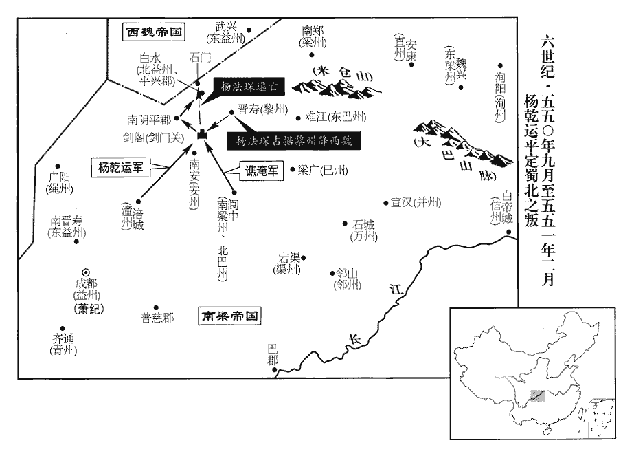
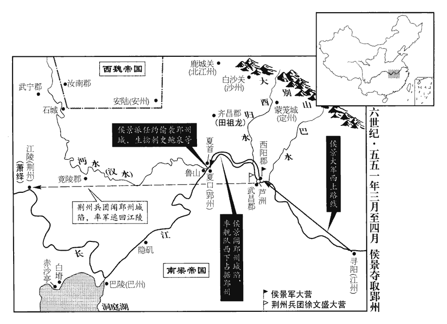
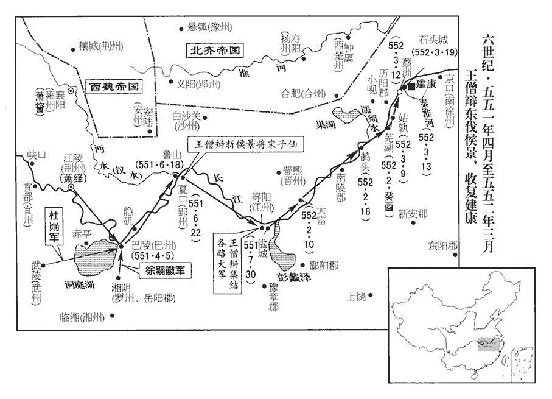
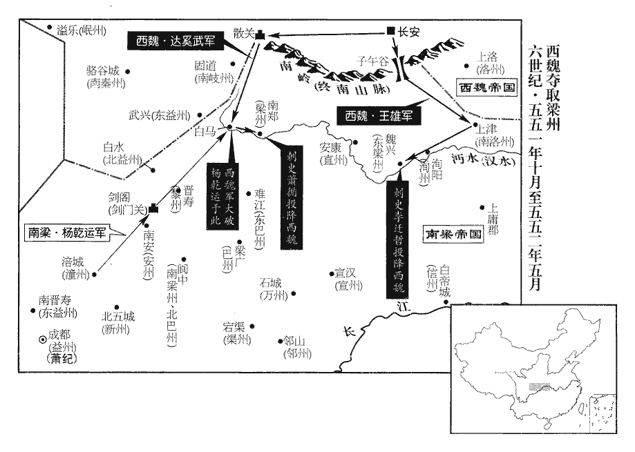
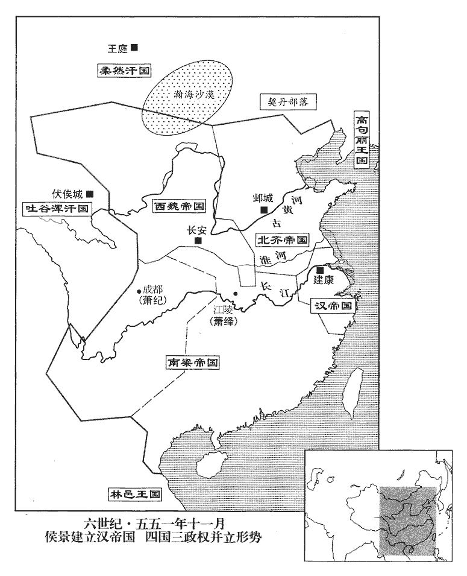
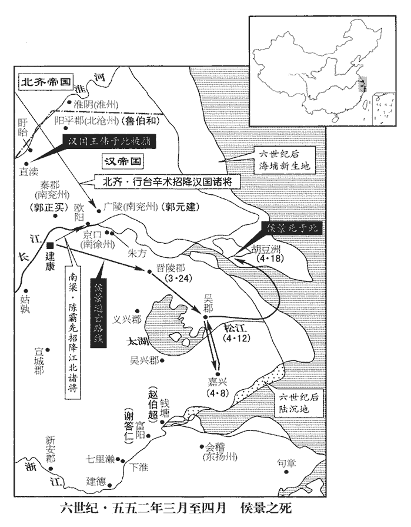
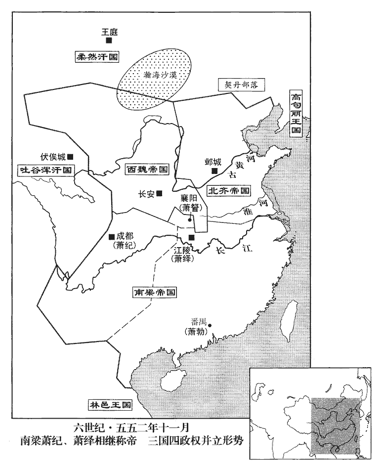
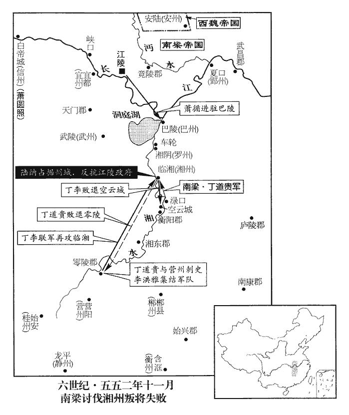

 梁紀二十起重光協洽（辛未），盡玄黓涒灘（壬申），凡二年。

# 太宗簡文皇帝下

## 大寶二年（辛未、五五一）

1春，正月，新吳‹江西省奉新县›余孝頃舉兵拒侯景，漢靈帝中平中，立新吳縣，屬豫章郡，隋省新吳入建昌縣。景遣于慶攻之，不克。

〖译文〗 [1]春季，正月，新吴人余孝顷率领军队抵抗侯景。侯景派于庆去攻打他，没有打赢。

2庚戌‹五›，湘東王繹遣護軍將軍尹悅、安東將軍杜幼安、巴州‹府设巴陵湖南省岳阳市›刺史王珣將兵二萬自江夏‹夏口·湖北省武汉市›趣武昌‹湖北省鄂州市›，江夏，今鄂州。武昌，今壽昌軍。將，即亮翻。夏，戶雅翻。趣，七喻翻。考異曰：典略在去年十一月。今從太清紀。受徐文盛節度。

〖译文〗 [2]庚戌（初五），湘东王萧绎派护军将军尹悦、安东将军杜幼安、巴州刺史王率兵二万从江夏急行军去武昌，接受徐文盛指挥。

3楊乾運攻拔劍閣‹四川省剑阁县北剑门关›，楊法昌【章：乙十一行本「昌」作𬍯，按本卷三葉作「琛」。】退保石門‹四川省广元市西北›，去年，武陵王紀遣楊乾運討楊法琛。祝穆曰：大劍山在今劍門關之劍門縣，大劍山西北三十里有小劍山。輿地廣記曰：山有小石門，穿山通道，六丈有餘，即秦所通石牛道也。又魏收志：武都郡治石門縣，隋為將利縣。魏志：東益州武興郡有石門縣。仇池郡有西石門縣。輿地紀勝：龍州江油縣東百里有石門戍。杜佑曰：龍州治江油縣，有石門山，與氐分界。蓋蜀多山險，地之以石門名者多矣。唐志，利州景谷縣西有石門關，此蓋楊法昌退保之地。乾運據南陰平‹四川省剑阁县西北三十千米›。晉永嘉流寓，置南陰平於緜竹之萇楊。楊乾運既拔劍閣，無緣棄險退據緜竹。五代志，南梁州有陰平縣，宋之北陰平郡也。九域志，劍州東北五十五里有劍門縣，西北百六十里有陰平縣。乾運所據，其此陰平歟？若漢志之陰平道，則今之文州是也。又在西北，故以此為南陰平。

〖译文〗 [3]杨乾运攻下了剑阁，杨法琛退却守卫石门，杨乾运进据南阴平。

 

4辛亥‹六›，齊‹首都邺城河北省临漳县西南邺镇›主‹高洋，本年二十三岁›祀圜丘。

〖译文〗 [4]辛亥（初六），北齐国主高洋在圜丘祭天。

5張彪遣其將趙稜圍錢塘‹浙江省杭州市›，孫鳳圍富春‹富阳·浙江省富阳市›，侯景遣儀同三司田遷、趙伯超救之，稜、鳳敗走。考異曰：典略：去年十一月，「彪自圍錢塘，與趙伯超戰敗于臨平，死者八萬餘人，走還剡shàn。伯超兄子稜在彪軍中，謀殺彪，僞請與彪盟，引小刀披心出血自歃。彪信之，亦取刀刺血報之，刀適至心，稜以手按之，刀斜入不深，彪頓絕。稜謂已死，出外告彪諸將云：『彪已死，當共求富貴。』彪左右韓武入視之，彪已蘇，細聲謂曰：『我尚活，可與手。』武遂誅稜。彪復奉表於湘東王繹。」今從太清紀。稜，伯超之兄子也。

〖译文〗 [5]张彪派他的部将赵棱包围钱塘，孙凤包围富春，侯景派仪同三司田迁、赵伯超去救援，赵棱、孙凤兵败逃跑。赵棱，是赵伯超哥哥的儿子。

6癸亥‹十八›，齊主‹高洋›耕藉田。乙丑‹二十›，享太廟。

〖译文〗 [6]癸亥（十七日），北齐国主高洋去藉田举行耕种仪式。乙丑（十九日），祭祀太庙。

7魏楊忠圍汝南‹侨郡·湖北省钟祥市北›，李素戰死。李素納邵陵王綸見上卷上年。二月，乙亥‹一›，城陷，執邵陵攜王綸，殺之，考異曰：太清紀云：「宇文泰遣忠襲綸，詐稱來相禮接，綸白服與相見，執而害之。」今從梁書、南史。投尸江岸；岳陽王詧chá取而葬之。

〖译文〗 [7]西魏杨忠围困汝南，李素战死。二月，乙亥（初一），汝南城被攻破，杨忠抓住了邵陵携王萧纶，杀了他，把他的尸体扔在江岸边。岳阳王萧取回尸体予以埋葬。

8或告齊太尉彭樂謀反；壬辰‹十八›，樂坐誅。

〖译文〗 [8]有人告发北齐太尉彭乐阴谋造反。壬辰（十八日），彭乐因此而获罪被杀。

9齊遣散騎常侍曹文皎使于江陵‹湖北省江陵县›，散，悉亶翻。騎，奇寄翻。使，疏吏翻。考異曰：典略在正月丙午朔。今從太清紀。湘東王繹使兼散騎常侍王子敏報之。

〖译文〗 [9]北齐派散骑常侍曹文皎出使江陵，湘东王萧绎派兼散骑常侍王子敏回访。

10侯景以王克為太師，宋子仙為太保，元羅為太傅，郭元建為太尉，張化仁為司徒，或曰：張化仁即支化仁。【章：乙十一行本正作「支」；退齋校同。按胡刻本卷八葉作「支」。】任約為司空，王偉為尚書左僕射，索超世為右僕射，索，蘇各翻。景置三公官，動以十數，儀同尤多。以子仙、元建、化仁為佐命元功，偉、超世為謀主，于子悅、彭雋主擊斷，斷，丁亂翻。陳慶、呂季略、盧暉略、丁和等為爪牙。梁人為景用者，則故將軍趙伯超，前制局監周石珍，內監嚴亶，內監，領內器仗。邵陵王記室伏知命。自餘王克、元羅及侍中殷不害、太常周弘正等，景從人望，加以尊位，非腹心之任也。

〖译文〗 [10]侯景任命王克为太师，宋子仙为太保，元罗为太傅，郭元建为太尉，张化仁为司徒，任约为司空，王伟为尚书左仆射，索超世为尚书右仆射。侯景设置三公一级的官，一次任命的人数往往以十人计，而任命为仪同的官员则尤其多。侯景把宋子仙、郭元建、张化仁视为辅佐王命的第一等功臣，让王伟、索超世当军师负责谋略，让于子悦、彭隽掌管军事上的决策，陈庆、吕季略、卢晖略、丁和等人充当爪牙。梁朝旧人被侯景重用的，有从前的将军赵伯超、前制局监周石珍、内监严、邵陵王的记室伏知命。其他的如王克、元罗以及侍中殷不害、太常周弘正等人，侯景由于他们深孚众望，因此给予尊位，但不让他们担任要害职务。

11北兗州‹府设淮阴江苏省淮阴市›刺史蕭邕謀降魏，侯景殺之。

〖译文〗 [11]北兖州刺史萧邕密谋投降西魏，侯景杀了他。

12楊乾運進據平興，平興者，楊法琛所治也。法琛退保魚石洞‹四川省广元市西北›，乾運焚平興而歸。五代志：義城郡景谷縣，舊曰白水，置平興郡。唐志：武德四年，以利州之景谷及龍州之方維置沙州，貞觀元年，州廢，省方維為鎮，以景谷還屬利州。西有石門關，西北有白埧jù、魚老二鎮城。九域志：文州曲水縣有方維鎮。劉昫曰：利州景谷縣，漢白水縣地，宋置平興縣，隋為景谷縣。

〖译文〗 [12]杨乾运的部队进据平兴。平兴是杨法琛治理的地盘。杨法琛退却保卫鱼石洞，杨乾运烧毁平兴城后收兵返回。

13李遷仕收眾還擊南康‹江西省赣州市›，去年李遷仕敗走，保寧都。陳霸先遣其將杜僧明等拒之，將，即亮翻。生擒遷仕，斬之。考異曰：太清紀在四月，云「遷仕追霸先於雩yú都縣，連營相持百餘日。是月，廣州刺史蕭勃遣歐陽隗水步萬餘人來援，隗與戰，大破之，斬遷仕首，餘黨悉降。霸先引軍前進。」今從陳書。湘東王繹使霸先進兵取江州，以為江州刺史。

〖译文〗 [13]李迁仕收罗部下，重整军队，回师进攻南康。陈霸先派他的部将杜僧明等迎战，活捉了李迁仕，砍了他的头。湘东王萧绎派陈霸先进兵攻取江州，任命他为江州刺史。

14三月，丙午‹二›，齊襄城王淯卒。

〖译文〗 [14]三月，丙午（初二），齐国襄城王萧去世。

15庚戌‹六›，魏文帝‹元宝炬›殂，年四十五。太子欽立。欽，文帝之長子也，母乙弗后。

〖译文〗 [15]庚戌（初六），西魏文帝元宝炬去世，太子元钦立为皇帝。

16乙卯‹十一›，徐文盛等克武昌，進軍蘆洲。蘆洲在武昌西。昔伍胥去楚出關，於江上求渡，漁父歌曰：「灼灼兮已私，與子期兮蘆之漪。」子胥既渡，解劍與之，辭不受，漁父遂覆舟而死，即其處。水經註：漢邾縣故城，南對蘆洲。蘇軾曰：武昌縣劉郎洑正與蘆洲相對，伍子胥奔吳所從渡江也；亦曰伍洲。

〖译文〗 [16]乙卯（十一日），徐文盛等攻克武昌，进军芦州。

17己未‹十五›，齊以湘東王繹為梁相國，建梁臺，總百揆，承制。

〖译文〗 [17]己未（十五日），北齐任命湘东王萧绎为梁国的相国，设置梁国台省，总领百官，秉承皇帝的命令办事。

18齊司空司馬子如自求封王，齊主怒，庚子‹十六›，免子如官。

〖译文〗 [18]北齐司空司马子如自己要求封王，国主高洋勃然大怒，庚子（疑误），撤掉了司马子如的官职。

19任約告急，侯景自帥眾西上，攜太子大器從軍以為質，帥，讀曰率。上，時掌翻。質，音致。留王偉居守。守，手又翻。閏月，景發建康，考異曰：梁帝紀，「三月，丁未，景發京師。」典略云「閏三月，丁未。」按乙卯，徐文盛克武昌，不容丁未景已發建康。閏三月甲戌朔，無丁未，蓋字誤也。自石頭‹建康城西北›至新林‹江苏省江宁县西›，舳艫相接。舳zhú，音逐。艫，音盧。約分兵襲破定州‹府设蒙笼城湖北省麻城市东›刺史田龍祖於齊安‹湖北省黄陂县北›。上卷作「田祖龍」，此作「田龍祖」，必有一誤。五代志：黃州黃岡縣，齊曰南安，置齊安郡。九域志：黃岡縣有齊安鎮。壬寅‹二十九›，景軍至西陽‹湖北省黄州市›，與徐文盛夾江築壘。癸卯‹三十›，文盛擊破之，射其右丞庫狄式和，墜水死，射，而亦翻。景遁走還營。

〖译文〗 [19]任约报告他那儿军情危急，侯景亲自率领军队向西进发，携带太子萧大器作为人质随军出发，把王伟留下来守卫建康。闰月，侯景的军队从建康出发，从石头到新林，兵船密密麻麻，头尾相连。任约分出一支部队在齐安袭击打败了定州刺史田龙祖。壬寅（二十九日），侯景的军队抵达西阳地界，与徐文盛的部队对峙，双方在大江两岸修筑营垒。癸卯（三十日），徐文盛发动攻击，大破侯军，用箭射中了侯景的右丞库狄式和，使他坠水淹死。侯景逃跑回到兵营。

20夏，四月，甲辰‹一›，魏葬文帝于永陵‹陕西省富平县东南›。

〖译文〗 [20]夏季，四月，甲辰（初一），西魏把魏文帝安葬在永陵。

21郢州‹府设夏口›刺史蕭方諸，年十五，以行事鮑泉和弱，常侮易之，易，以豉翻。或使伏牀，騎背為馬；恃徐文盛軍在近，不復設備，日以蒱酒為樂。復，扶又翻。蒱酒，摴chū蒱飲酒也。樂，音洛。侯景聞江夏‹夏口›空虛，夏，戶雅翻。乙巳‹二›，使宋子仙、任約帥精騎四百，由淮內襲郢州。自西陽至江夏百五十餘里，景使宋子仙等蓋由蘆洲上流渡兵以襲之。帥，讀曰率。騎，奇寄翻；下同。丙午‹三›，大風疾雨，天色晦冥，有登陴望見賊者，告泉曰：「虜騎至矣！」泉曰：「徐文盛大軍在下，賊何由得至！當是王珣軍人還耳。」既而走告者稍眾，始命閉門，子仙等已入城。方諸方踞泉腹，以五色綵辮其髯；辮，補典翻，交結也。見子仙至，方諸迎拜，泉匿于牀下；子仙俯窺見泉素髯間綵，間，古莧翻。驚愕，遂擒之，及司馬虞豫，送於景所。景因便風，中江舉帆，遂越文盛等軍，丁未‹四›，入江夏。文盛眾懼而潰，與長沙王韶等逃歸江陵‹湖北省江陵县›。上甲侯韶，去年繹封為長沙王。王珣、杜幼安以家在江夏，遂降於景。降，戶江翻。

〖译文〗 [21]郢州刺史萧方诸，年十五岁，行事鲍泉由于生性平和软弱，所以常常被萧方诸侮慢轻视，有时让他伏在床上，拿他当马骑。萧方诸仗着徐文盛的部队在近旁，就不再设防，每天以玩樗争输赢和喝酒来寻欢作乐。侯景听说江夏守备空虚，乙巳（初二），派宋子仙、任约率领精锐骑兵四百人，从淮河以南偷袭郢州。丙午（初三），刮着大风，下着暴雨，天色阴沉，郢州城里有人登上土坡望见贼兵已到，急忙报告鲍泉说：“敌人的骑兵来了！”鲍泉说：“徐文盛的大军就在城下，贼兵哪能飞到这里？可能是王手下的士兵回来了。”过了一阵，跑来报告军情危急的人多起来了，鲍泉才命令关上城门，但门未关上，宋子仙等人已经进城。这时，萧方诸刚刚坐在鲍泉肚子上，用五色彩线编结着鲍泉的胡子。看到宋子仙来了，萧方诸跪拜着迎接，而鲍泉则躲在床下。宋子仙低下头一探，看到鲍泉的白胡子间夹杂着彩线，感到很惊讶。于是把鲍泉抓起来，连同抓获的司马虞豫，一块送到侯景住的地方去。侯景因为遇到顺风，在长江中流扬帆急驶，这样就超越了徐文盛等人的军队，丁未（初四），进占江夏。徐文盛的军队因害怕一下子就溃散了。徐文盛和长沙王萧韶等人一起逃回江陵。王、杜幼安因为家在江夏，就投降了侯景。

湘東王繹以王僧辯為大都督，帥巴州刺史丹楊淳于量、定州‹南定州·州政府设郁林广西桂平县›刺史杜龕、宜州‹府设宜都湖北省枝城市›刺史王琳、郴州‹府设郴县湖南省郴州市›刺史裴之橫東擊景，五代志：巴陵郡，梁置巴州。夷陵郡，梁置宜州。桂陽郡，梁置郴州。龕，苦含翻。郴，丑林翻。徐文盛以下並受節度。戊申‹五›，僧辯等軍至巴陵，自江陵至巴陵四百一十里；自巴陵至江夏三百五十里。聞郢州已陷，因留戍之。繹遺僧辯書曰：「賊既乘勝，必將西下，遺，于季翻。自江夏指江陵，當作「西上」。不勞遠擊；但守巴丘，巴丘，即巴陵，有巴丘山。以逸待勞，無慮不克。」又謂將佐曰：「賊若水步兩道，直指江陵，此上策也。據夏首‹夏口›，積兵糧，中策也。悉力攻巴陵，下策也。巴陵城小而固。僧辯足可委任。景攻城不拔，野無所掠，暑疫時起，食盡兵疲，破之必矣。」湘東安能料敵如此，當時作史者為之辭耳。將，即亮翻。夏，戶雅翻。乃命羅州‹府设湘阴湖南省湘阴县北›刺史徐嗣徽自岳陽‹府同设湘阴›、武州‹府设武陵湖南省常德市›刺史杜崱自武陵，引兵會僧辯。五代志：湘陰縣，梁置羅州及岳陽郡。湘陰，隋屬巴陵郡。又梁置武州於武陵郡。崱zè，士力翻。

〖译文〗 湘东王萧绎任命王僧辩为大都督，率领巴州刺史丹阳人淳于量、定州刺史杜龛、宜州刺史王琳、郴州刺史裴之横向东出发进攻侯景，徐文盛以下的将领一并受王僧辩指挥。戊申（初五），王僧辩等人率领的军队抵达巴陵，听说郢州已经陷落，于是，就在巴陵驻扎下来。萧绎写信给王僧辩说：“贼兵凭借着胜利的气势，必然会向西进攻。我军不用远出奔袭，只要守住巴陵，以逸待劳，不用担心打败不了敌人。”同时萧绎又对身边的将领谋士们说：“贼兵如果水陆两路齐头并进，直扑江陵，这是上策；如果据守夏首，蓄兵积粮，这是中策。如果他们尽力攻打巴陵，这是下策。巴陵城很小但很坚固，易守难攻，王僧辩足以胜任守城之职。侯景攻城不下，野外又没有什么可抢掠的东西，酷暑季节流行疾病不时发生，军粮吃完，士兵疲惫，我们打败他是必然的事！”于是命令罗州刺史徐嗣徽从岳阳出发，武州刺史杜从武陵出发，各率军队和王僧辩会合。

 

景使丁和將兵五千守夏首，宋子仙將兵一萬為前驅，趣巴陵，趣，七喻翻。分遣任約直指江陵，景帥大兵水步繼進。於是緣江戍邏，望風請服，景拓邏至于隱磯‹湖南省临湘市东北›。拓，斥開也。邏，遮也，巡也。拓開巡邏以張兵勢。邏，魯可翻，又魯佐翻。水經：江水自公安而東，過下雋縣北，又東逕彭城磯北。彭城磯北對隱磯，二磯之間，大江之中也。僧辯乘城固守，偃旗臥鼓，安若無人。壬戌‹十九›，景眾濟江，自隱磯濟江。考異曰：梁帝紀作「甲子」。今從太清紀。遣輕騎至城下，問：「城內為誰？」答曰：「王領軍。」騎曰：「何不早降？」降，戶江翻。僧辯曰：「大軍但向荊州，此城自當非礙。」言兵若向荊州，此城當非遮礙。騎去。頃之，執王珣等至城下，使說其弟琳。琳曰：「兄受命討賊，不能死難，說，式芮翻。難，乃旦翻。曾不內慙，翻欲賜誘！」取弓射之，珣慙而退。誘，音酉。射，而亦翻。景肉薄百道攻城，薄，伯各翻。城中鼓譟，矢石雨下，景士卒死者甚眾，乃退。僧辯遣輕兵出戰，凡十餘返，皆捷。景被甲在城下督戰，被，皮義翻。僧辯著綬、乘輿、奏鼓吹巡城，著，陟略翻。綬，音受。吹，昌瑞翻。景望之，服其膽勇。

〖译文〗 侯景派丁和带兵五千人守卫夏首，宋子仙带兵一万人为先锋，进逼巴陵，又另外派任约挥师直指江陵，自己则率大军从水陆两路齐头并进。于是萧绎部下沿着长江戍卫巡逻的士兵，纷纷请求归降。侯景又把巡逻的范围扩大到隐矶。王僧辩依城固守，他命令卷起旗帜，藏起战鼓，城内安静得象没有人一样。壬戌（十九日），侯景的军队渡过了长江，派轻骑兵来到城下，问道：“城内守将是谁？”城内士兵回答：“是王领军。”轻骑兵高声喝问：“为什么不早早投降？”王僧辩从容回答：“大军尽管指向荆州，我这城池自然不会构成遮碍。”轻骑兵听罢拍马回去了。过了一阵，侯景派军人把王等人抓到城下来，让他向城里的守将、弟弟王琳劝降。王琳高声对王喊道：“哥哥接受命令讨伐贼兵，不能以身殉难，竟然不知内疚，反而要来诱我投降！”说着拿过弓箭就射，王惭愧地退回去了。侯景派士卒从很多通道肉搏攻打城池，城中鼓声大作，呐喊震天，飞箭、巨石象雨点一样打下来，侯景手下的士卒死去很多，不得不退下去。王僧辩又派轻便迅捷的小部队出城袭击，打胜了就跑，这样出击了十几次，都获得胜利。侯景披着铠甲在城下亲自督战，王僧辩身系绶带、坐着轿子，奏着鼓乐，吹吹打打地巡视守城将士。侯景远远看着他，不禁叹服他的大胆勇敢。

 

岳陽王詧聞侯景克郢州，遣蔡大寶將兵一萬進據武寧‹湖北省荆门市北›，五代志：竟陵郡樂鄉縣，舊置武寧郡。劉昫曰：樂鄉，漢鄀縣也，其地當在今郢州長壽縣西北。宋白曰：桓玄立武寧郡於故編縣城，其屬有長林縣，與郡俱立，分編縣所置也。遣使至江陵，詐稱赴援。使，疏吏翻。眾議欲答以侯景已破，令其退軍。湘東王繹曰：「今語以退軍，語，牛倨翻。是趣之令進也。」趣，讀曰促。乃使謂大寶曰：「岳陽累啟連和，不相侵犯，卿那忽據武寧？今當遣天門‹湖南省石门县›太守胡僧祐精甲二萬、鐵馬五千頓湕水‹建阳河，源于湖北省荆门市北，注入长江›，待時進軍。」詧聞之，召其軍還。湕，居偃翻。還，從宣翻，又如字。僧祐，南陽‹河南省南阳市›人也。

〖译文〗 岳阳王萧听到侯景攻下郢州的消息，派蔡大宝率领一万军队进占了武宁，并派使者来到江陵，假装说要前来支援。众谋士商议后，建议以侯景已被打败为理由，让萧退兵。湘东王萧绎听了后说：“倘若让他退兵，就等于催促他进军。”于是派使者去见蔡大宝，说：“岳阳王萧多次表白要和我们联合友好，互不侵犯，你为什么突然进占武宁？我军准备马上派天门太守胡僧带精锐甲兵二万、铁甲骑兵五千驻扎水，等候时机进军。”萧听了后，就把蔡大宝的军队召回了。胡僧是南阳人。

22五月，魏隴西襄公李虎卒。

〖译文〗 [22]五月，西魏陇西襄公李虎去世。

23侯景晝夜攻巴陵，不克，軍中食盡，疾疫死傷太半。湘東王繹遣晉州‹府设晋熙安徽省潜山县›刺史蕭惠正將兵援巴陵，惠正辭不堪，舉胡僧祐自代。僧祐時坐謀議忤旨繫獄，據梁書胡僧祐傳：時西沮蠻反，使僧祐討之，令盡誅其渠帥，僧祐諫，忤旨下獄。忤，五故翻。繹即出之，拜武猛將軍，令赴援，戒之曰：「賊若水戰，但以大艦臨之，必克。艦，戶黯翻。若欲步戰，自可鼓棹直就巴丘，不須交鋒也。」僧祐至湘浦‹湘水注入洞庭湖处·湖南省湘阴县北›，湘水入湖之口曰浦。景遣任約帥銳卒五千據白塉‹应在湖南省华容县境›以待之。塉jí，及尺翻。僧祐由他路西上，上，時掌翻。約謂其畏己，急追之，及於芊口，據姚思廉梁書，芊口在南平郡安南縣界。呼僧祐曰：「吳兒，何不早降，降，戶江翻。走何所之！」僧祐不應，潛引兵至赤沙亭‹湖南省南县›；水經註：灃澧水過作唐縣北而東，逕安南縣南，又東與赤湖水會。二縣皆屬南平郡。巴陵志：洞庭湖在巴丘西，西吞赤沙，南連青草，橫亘七八百里。又有赤亭城，三面臨水，即胡僧祐所據。杜佑曰：巴陵郡西華容界有赤亭城，城近赤亭湖，因名，任約擒於此。會信州‹府设白帝城重庆市奉节县东›刺史陸法和至，與之合軍。法和有異術，隱於江陵百里洲‹湖北省枝江市南长江中小岛›，盛弘之荊州記曰：百里洲在枝江縣，縣左右有數十洲，槃布川中，百里洲最為大。衣食居處，一如苦行沙門，苦行沙門，謂沙門能清苦守戒行者也。處，昌呂翻。行，下孟翻。或豫言吉凶，多中，中，竹仲翻。人莫能測。侯景之圍臺城也，或問之曰：「事將何如？」法和曰：「凡人取果，宜待熟時，不撩自落。」撩，落雕翻，攏取物也。固問之，法和曰：「亦克亦不克。」亦克，謂侯景取臺城；不克，謂景終於敗也。法和若設為兩端之言，使人莫之測，而卒之言驗。及任約向江陵，法和自請擊之，繹許之。

〖译文〗 [23]侯景日夜不停地攻打巴陵城，攻不下来，军队没有吃的，又染上了疾病，死伤了一大半。湘东王萧绎派晋州刺史萧惠正率兵支援巴陵，萧惠正以自己担当不了这一重任为由推辞了，举荐胡僧代替自己。当时胡僧因为犯了进谏忤旨的罪正关在监狱里，萧绎就把他释放了，封他为武猛将军，命令他去救援巴陵。临走之时，萧绎告诫他说：“贼兵如果水战，你只管用大兵舰去对付它，一定能击败它。如果贼兵要在陆上以步兵作战，那你可以开船直抵巴丘，不必与之交锋。”胡僧抵达湘浦，侯景派任约率五千名精锐士卒据守白阻击他。胡僧避开任约，由别的路径直西进，任约以为他害怕自己，急忙挥师追赶，追到芊口之时，对胡僧呼喊：“吴儿，为什么不早早投降？要逃到哪里去？”胡僧不理睬他，偷偷把队伍带到赤沙亭，正好信州刺史陆法和也到了，两下里合成一军。陆法和有奇异的法术，隐居在江陵百里洲，衣食居处，一切都象苦行的和尚。有时预言吉凶祸福，往往应验，一般人不能测知其奥妙。侯景包围台城时，有人去问他：“事情将会怎样？”陆法和不作正面回答，却说：“人要是想摘果子，最好等待果子成熟的时候，那时不去碰它，它自己就掉下来。”问的人再三追问一定要他明言，陆法和高深莫测地回答：“也能胜也不能胜。”待到任约进攻江陵时、陆法和自动请缨，要求去攻打任约，萧绎答应了。

壬寅‹三十›，約至赤亭。六月，甲辰‹二›，僧祐、法和縱兵擊之，約兵大潰，殺溺死者甚眾，溺，奴狄翻。擒約送江陵。景聞之，乙巳‹三›，焚營宵遁。以丁和為郢州刺史，留宋子仙等，眾號二萬，戍郢城；別將支化仁鎮魯山‹湖北省武汉市汉水南岸›，考異曰：梁帝紀作「魏司徒張化仁」。按魏司徒安得為景守城！今從典略。范希榮行江州事，考異曰：典略云「江州刺史」。今從太清紀。儀同三司任延和、晉州刺史夏侯威生守晉州。梁於晉熙郡置晉州。景與麾下兵數千，順流而下。丁和以大石磕殺鮑泉及虞預，沈於黃鶴磯‹湖北省武汉市长江东岸›。磕kē，古盍翻。沈，持林翻。祝穆曰：黃鶴山，一名黃鵠山，在江夏縣東九里，近縣西北二里有黃鶴磯。水經註：黃鵠山東北對夏口城。黃鵠磯直鸚鵡洲之下尾。任約至江陵，繹赦之。徐文盛坐怨望，下獄死。下，遐嫁翻；下東下同。巴州刺史余孝頃遣兄子僧重將兵救鄱陽‹江西省波阳县›，于慶退走。余孝頃起於新吳，梁授以巴州刺史。考異曰：長曆，六月癸卯朔。太清紀，「一日慶走，二日擒任約，三日景走。」今從梁帝紀。

〖译文〗 壬寅（三十日），任约抵达赤亭。六月，甲辰（初二），胡僧、陆法和指挥军队发动进攻，打得任约的士兵四处逃散，被杀被淹死的很多，任约被抓住送往江陵。侯景听到兵败消息，乙巳（初三），烧掉营帐，连夜逃跑了。侯景任命丁和为郢州刺史，留下宋子仙等人率领二万部属，驻守郢城。又派别将支化仁镇守鲁山，范希荣代理江州事务，仪同三司任延和和晋州刺史夏侯威生守晋州。侯景与部下兵卒几千人，顺流而下。丁和用大石头砸死了鲍泉和虞预，把尸体沉在黄鹤矶。任约被抓到江陵，萧绎赦免了他。徐文盛因心怀怨恨而获罪，下狱死去。巴州刺史余孝顷派他哥哥的儿子余僧重带兵去救鄱阳，于庆退兵逃跑。

繹以王僧辯為征東將軍、尚書令，胡僧祐等皆進位號，使引兵東下。陸法和請還，既至，謂繹曰：「侯景自然平矣，蜀賊將至，請守險以待之。」法和知武陵王紀必東下。乃引兵屯峽口‹西陵峡口·湖北省宜昌市西›。巫峽之口也。庚申‹十八›，王僧辯至漢口‹汉水注入长江处·湖北省武汉市›，先攻魯山，擒支化仁送江陵。辛酉‹十九›，攻郢州，克其羅城，斬首千級。宋子仙退據金城，僧辯四面起土山，攻之。

〖译文〗 萧绎任命王僧辩为征东将军、尚书令，对胡僧等人也都晋位封号，让他们带兵东下。陆法和要求回江陵，到达后，对萧绎说：“侯景乱党，自然很快就会被平定，不必挂心了。但蜀地的贼兵将到了，请派兵遣将守卫险要之地，等待贼兵到来。”于是他就带兵驻守峡口。庚申（十八日），王僧辩抵达汉口，先攻下鲁山，抓获了支化仁送往江陵。辛酉（十九日），攻打郢州，攻克外城，斩首一千名。宋子仙退守金城，王僧辩在城四周堆起土山，猛烈攻城。

豫州刺史荀朗自巢湖出濡須‹东关·安徽省含山县西南›邀景，破其後軍，荀朗起兵據巢湖，帝密詔授豫州刺史，使討景。景奔歸，船前後相失。太子船入樅陽浦‹枞阳河注入长江处·安徽省枞阳县›，樅，七容翻。船中腹心皆勸太子因此入北，太子曰：「自國家喪敗，志不圖生，主上蒙塵，寧忍違離左右！喪，息浪翻。離，力智翻。吾今若去，是乃叛父，非避賊也。」因涕泗嗚咽，即命前進。毛詩註：自目曰涕，自鼻曰泗。史言哀太子之孝。

〖译文〗 豫州刺史荀朗从巢湖出兵到濡须一带阻截侯景，击败侯景的后卫部队，侯景逃跑回来，船只前后失去了联络。太子乘坐的船进了枞阳浦，在船上心腹左右都劝太子从这里投奔北方，太子说：“自从亡国以来，我就立志报国，不图生存。现在皇上遭难，我怎么忍心离开他而去投奔北方！现在我如果跑了，就是背叛父亲，而不是躲避乱贼。”一边说一边痛哭流涕，同时命令继续前进。

甲子‹二十二›，宋子仙等困蹙，乞輸郢城，身還就景；王僧辯偽許之，命給船百艘以安其意。艘，蘇刀翻。子仙謂為信然，浮舟將發，僧辯命杜龕帥精勇千人攀堞而上，龕，苦含翻。帥，讀曰率；下同。堞dié，達協翻。上，時掌翻。鼓譟奄進，水軍主宋遙帥樓船，暗江雲合。言樓船四合如雲，江為之暗。子仙且戰且走，至白楊浦，白楊浦蓋去郢城未遠。大破之，周鐵虎生擒子仙及丁和，送江陵，殺之。

〖译文〗 甲子（二十二日），宋子仙等感到困难窘迫，要求献出郢城，允许他们回到侯景那里。王僧辩装作答应他们的要求，命令给他们一百只船以稳定他们的情绪。宋子仙信以为真，准备上船要走，王僧辩命令杜龛率领精兵勇士一千人攀着城墙上的女墙爬了上去，边呐喊边袭击，水军主帅宋遥率领楼船进攻，楼船四合如云，长江水面为之变暗。宋子仙边战边逃，到白杨浦，被彻底打败了，周铁虎活捉了宋子仙和丁和，送到江陵，杀了他们。

24庚午‹二十八›，齊主以司馬子如，高祖之舊，復以為太尉。是年三月，齊主免子如官。復，扶又翻。

〖译文〗 [24]庚午（二十八日），北齐国主高洋因为司马子如是神武帝高欢的旧臣，重新任命他为太尉。

25江安侯圓正為西陽太守，宋白曰：江安縣，本漢江陽縣地。寬和好施，好，呼到翻。施，式智翻。歸附者眾，有兵一萬。湘東王繹欲圖之，署為平南將軍。及至，弗見，使南平王恪與之飲，醉，因囚之內省，分其部曲，使人告其罪。荊、益之釁自此起矣。圓正，武陵王紀第二子也，為紀東下攻繹張本。釁，許覲翻。

〖译文〗 [25]江安侯萧圆正任西阳太守，他为人宽容和气，喜欢施舍，慕名去归附他的人很多，以致手中拥有一万军队。湘东王萧绎想吞并他，封他为平南将军。等他前来晋见时，又不见他，而让南平王萧恪陪他喝酒，等他喝醉了，就把他关在内省，却把他的部曲分散编入别的部队，又指使人告发他的罪行。这一来，荆州与益州之间，萧绎与萧纪之间的战端就开始了。

26陳霸先引兵發南康，灨石舊有二十四灘，會水暴漲數丈，三百里間，巨石皆沒，霸先進頓西昌‹江西省泰和县›。章貢圖經曰：東江發源於汀州界之新樂山，經雩yú都而會于章水。西江導源於南安大庾縣之聶都山，與貢水合，會于贛水。二水合而為贛，在州治後，北流一百八十里至萬安縣界。由萬安而上，為灘十有八，怪石如精鐵，突兀廉厲，錯峙波面。自贛水而上，信豐、寧都俱有石磧qì，險阻視十八灘，故俚俗以為上下三百里贛石。吳立西昌縣，屬廬陵郡，今在吉州太和縣界。

〖译文〗 [26]陈霸先带兵从南康出发，江上的怪石过去形成二十四滩，但这时刚好碰上水位暴涨了好几丈，三百里间，巨石都被水淹没了。陈霸先进驻了西昌。

27鐵勒‹蒙古国北部›將伐柔然‹瀚海沙漠群›，突厥‹新疆东北部›酋長土門邀擊，破之，盡降其眾五萬餘落。厥，九勿翻。酋，慈秋翻。長，知兩翻。降，戶江翻。土門恃其強盛，求婚於柔然，柔然頭兵可汗大怒，使人詈辱之曰：「爾，我之鍛奴也，突厥本柔然鐵工，故云然。可，從刊入聲。汗，音寒。詈lì，力智翻。何敢發是言！」土門亦怒，殺其使者，遂與之絕，而求婚於魏；魏丞相泰以長樂公主妻之。使，疏吏翻。樂，音洛。妻，七細翻。

〖译文〗 [27]敕勒将要讨伐柔然国，突厥族酋长土门发兵截击，打败了敕勒，他属下的五万多部落全部降服。土门仗着自己强盛，就向柔然国求婚，柔然头兵可汗勃然大怒，派人去责骂羞辱土门，说：“你本来是我的打铁的奴才，怎么胆敢说出这种求婚的话！”土门也勃然大怒，把柔然的使者杀了，从此与柔然绝交，转而求婚于西魏，西魏丞相宇文泰便把长乐公主嫁给了他。

28秋，七月，乙亥‹四›，湘東王繹以長沙王韶監郢州事。監，工銜翻。丁亥‹十六›，侯景還至建康。考異曰：典略作「六月壬戌」。太清紀作「七月二十日」。今從梁帝紀。于慶自鄱陽還豫章，侯瑱閉門拒之，慶走江州，據郭默城‹湖北省黄梅县南›。走，音奏。晉將郭默反時所築城也。瑱，他甸翻，又音鎮。繹以瑱為兗州刺史。據瑱傳，授南兗州刺史。景悉殺瑱子弟。侯景留瑱子弟為質，見上卷上年。

〖译文〗 [28]秋季，七月，乙亥（初四），湘东王萧绎任命长沙王萧韶监理郢州政事。丁亥（十六日），侯景回到建康。于庆从鄱阳回豫章，侯关上城门不让他进。于庆跑到江州，占据了郭默城。萧绎任命侯为兖州刺史。侯景把侯的子弟全部杀了。

辛丑‹三十›，王僧辯乘勝下湓城‹江西省九江市寻阳东›，下，遐嫁翻。陳霸先帥所部三萬人將會之，屯于巴丘‹江西省峡江县›。此吳所置巴丘縣也，屬廬陵郡界。帥，讀曰率。西軍乏食，王僧辯之軍自荊州來，故謂之西軍。霸先有糧五十萬石，分三十萬石以資之。八月，壬寅朔‹一›，王僧辯前軍襲于慶，慶棄郭默城走，范希榮亦棄尋陽城走。晉熙王僧振等起兵圍郡城，僧辯遣沙州‹府设白沙关河南省新县南›刺史丁道貴助之，魏收志：梁武帝置沙州，治白沙關城，領建寧齊安郡，當在黃州黃岡縣界。任延和等棄城走。任，音壬。湘東王繹命僧辯且頓尋陽以待儲軍之集。

〖译文〗 辛丑（三十日），王僧辩乘胜攻下湓城，陈霸先率部属三万人将要和他会师，屯驻在巴丘。王僧辩率领的西路军缺乏军粮，陈霸先有粮食五十万石，分崐出三十万石支援西路军。八月，壬寅朔（初一），王僧辩前锋部队袭击于庆，于庆扔掉郭默城逃跑，范希荣也扔下寻阳城逃跑。晋熙人王僧振等起兵围攻郡城，王僧辩派沙州刺史丁道贵去帮助他们。湘东王萧绎命令王僧辩暂且停顿在寻阳，等待各路大军汇集。

29初，景既克建康，常言吳兒怯弱，易以掩取，易，弋豉翻。當須拓定中原，然後為帝。景尚帝‹萧纲›女溧陽公主，嬖之，妨於政事，溧，音栗。嬖，卑義翻，又博計翻。王偉屢諫景，景以告主，主有惡言，偉恐為所讒，因說景除帝。說，式芮翻。及景自巴陵敗歸，猛將多死，謂宋子仙之屬。將，即亮翻。自恐不能久存，欲早登大位。王偉曰：「自古移鼎，武王克商，遷九鼎于洛邑；故後之奪人之國者，率謂之移鼎。必須廢立，既示我威權，且絕彼民望。」景從之。使前壽光殿學士謝昊為詔書，以為「弟姪爭立，弟，謂湘東王繹、武陵王紀；姪，謂河東王譽、岳陽王詧。星辰失次，皆由朕非正緒，召亂致災，宜禪位於豫章王棟。」使呂季略齎入，逼帝‹萧纲›書之。棟，歡之子也。華容公歡，昭明太子之子。

〖译文〗 [29]当初，侯景攻下建康之后，常常说吴儿生性胆怯软弱，很容易乘其不备就收拾掉，不足为患，所以重要的是收复、平定中原地区，然后当皇帝。侯景娶简文帝的女儿溧阳公主，很宠爱她，因而妨碍了处理政事。王伟多次劝谏侯景不要贪恋女色，侯景把这话告诉了溧阳公主，公主很不高兴，口吐恶言，王伟恐怕被她的谗言所害，就极力劝说侯景除去简文帝。等到侯景从巴陵兵败逃回，手下的猛将大部分战死了，自己担心活不长，想早日登上皇帝大位。王伟说：“自古以来，凡是要夺取别人的政权，必须有废有立，这样既显示我方的威权，又断了对方的民望。”侯景听从了他的建议，让前寿光殿学士谢昊起草诏书，诏书说：“我们梁朝出现皇弟们和皇侄们争夺帝位的自相残杀，星辰的运行也失去正常的秩序，这都是由于我不是正统的继承人，才招来这样的动乱和灾难，理应由我禅位给豫章王萧栋。”又派吕季略把诏书带入宫内，逼着简文帝抄写出来。豫章王萧栋是华容公萧欢的儿子。

戊午‹十七›，景遣衛尉卿彭雋等帥兵入殿，廢帝為晉安王，幽於永福省，悉撤內外侍衛，使突騎左右守之，牆垣悉布枳棘。枳，似橘而多刺；棘，似棗而多刺。帥，讀曰率。騎，奇寄翻。枳zhǐ，諸氏翻。庚申‹十九›，下詔迎豫章王棟。棟時幽拘，廩餼甚薄，餼xì，許氣翻。仰蔬茹為食。方與妃張氏鉏葵，葵，菜也。法駕奄至，棟驚，不知所為，泣而升輦。

〖译文〗 戊午（十七日），侯景派卫尉卿彭隽等人率领士兵进入宫殿，把简文帝废了，改封为晋安王，将其幽禁在永福省，还把他的内侍和卫兵都撤了，派精锐的骑兵把他严密看守起来，并在墙头插上枳、棘一类多刺的树枝。庚申（十九日），侯景下达诏书迎立豫章王萧栋。萧栋那时正被关在暗室里，饮食很差，每天吃的是蔬菜薯类。一天，他正与妃子张氏一起锄葵菜，迎接他即位的辇车突然来了，萧栋大吃一惊，不知道是怎么回事，哭着登上了车。

景殺哀太子大器、尋陽王大心、西陽王大鈞、建平王大球、義安王大昕及王侯在建康者二十餘人。太子神明端嶷，嶷，魚力翻。於景黨未嘗屈意，所親竊問之，太子曰：「賊若於事義，未須見殺，事義，猶言事宜也。吾雖陵慢呵叱，終不敢言。若見殺時至，雖一日百拜，亦無所益。」又曰：「殿下今居困阨，而神貌怡然，不貶平日，何也？」貶，損也。太子曰：「吾自度死日必在賊前，度，徒洛翻。若諸叔能滅賊，賊必先見殺，然後就死。若其不然，賊亦殺我以取富貴，安能以必死之命為無益之愁乎！」及難，難，乃旦翻。太子顏色不變。徐曰：「久知此事，嗟其晚耳！」刑者將以衣帶絞之，太子曰：「此不能見殺，」命取帳繩絞之而絕‹年二十八岁›。

〖译文〗 侯景杀了哀太子萧大器、寻阳王萧大心、西阳王萧大钧、建平王萧大球、义安王萧大昕，以及在建康居住的王侯二十多人。太子萧大器神色端严凝重，在侯景乱党面前从没屈意逢迎过，他的身边人私下里问他为什么要这样，太子说：“贼党如果明白事理，不一定就要杀掉我，所以我虽然对他们傲慢轻蔑，乃至呵叱他们，这班人也不敢说什么。如果杀我的时候到来了，我即使对他们一天跪拜一百次，也没有什么用处。”左右亲信们又问：“殿下如今处于困难艰危的境地中，但神色气度显得那么平静轻松，也不比平日差，这是为什么？”太子萧大器说：“我自己估计，我一定会死在贼人前头。因为，如果皇叔们能消灭贼党，贼人一定先把我杀了，然后自己再去死；如果贼党没有被消灭，贼人也会杀害我以换取富贵。既然这样，我怎么能用这一定会死的生命去作无益的犯愁呢？”临死时，太子萧大器果然神色泰然不变。他慢慢地说：“老早就知道会有这样的结果，我不过感叹它来得太晚了！”刽子手要用较软的衣带绞死他，太子萧大器说：“这带子太软，不能让我气绝。”他让刽子手拿系帐幕的绳子来绞死自己。

壬戌‹二十一›，棟即帝位。考異曰：典略作「壬辰」，誤。今從太清紀。大赦，改元天正。太尉郭元建聞之，自秦郡‹江苏省六合县›馳還，謂景曰：「主上先帝太子，既無愆失，何得廢之！」景曰：「王偉勸吾，云『早除民望』。吾故從之以安天下。」元建曰：「吾挾天子，令諸侯，猶懼不濟，無故廢之，乃所以自危，何安之有！」景欲迎帝復位，以棟為太孫。王偉曰：「廢立大事，豈可數改邪！」乃止。數，所角翻。

〖译文〗 壬戌（二十一日），萧栋登上皇帝位。大赦天下，改换年号为天正。太尉郭元建听到这个消息，从秦郡急忙赶回建康，质问侯景：“皇上是先帝的亲生太子，一向没有什么罪过，怎么能随便就废了他！”侯景回答说：“王伟劝我这样做的，他对我说：‘早点消除梁室在老百姓中的声望。’我这才听从了他的意见，以便安定天下。”郭元建说：“我们现在挟持天子，用他的名义命令诸侯，还总担心不能成功，可是现在无缘无故把简文帝废了，这是自取危亡，有什么安定可言！”侯景听了，又想迎接简文帝回来复位，让萧栋当太孙。王伟说：“废旧帝立新主是国家大事，怎么可以来回改变主意！”侯景这才作罢。

乙丑‹二十四›，景又使殺南海王大臨於吳郡，南郡王大連於姑孰‹安徽省当涂县›，考異曰：太清紀云「於九江」。今從梁書。安陸王大春於會稽‹浙江省绍兴市›，高唐王大壯於京口‹江苏省镇江市›。大臨時為吳郡太守。大連時為江州刺史，在姑熟。大春時為東揚州刺史。姚思廉梁書「大壯」作「大莊」，始封高唐郡公，後進封新興王，時為南徐州刺史。皆就殺之。會，工外翻。以太子妃賜郭元建，元建曰：「豈有皇太子妃乃為人妾乎！」竟不與相見，聽使入道。

〖译文〗 乙丑（二十四日），侯景又派人在吴郡杀了南海王萧大临，在姑孰杀了南郡王萧大连，在会稽杀了安陆王萧大春，在京口杀了高唐王萧大壮。侯景还把太子萧大器的妃子赐给郭元建。郭元建说：“哪里有皇太子的妃子可以充当人家侍妾的道理！”竟不和她见面，由她的意愿去当道姑。

丙寅‹二十五›，追尊昭明太子‹萧统›為昭明皇帝，豫章安王‹萧欢›為安皇帝，華容公歡進封豫章王，薨，諡曰安。金華敬妃為敬太皇太后，昭明太子妃蔡氏，昭明既薨，武帝為妃別立金華宮，供侍一同常儀，薨，諡曰敬。按敬妃已薨，只當追諡皇后以從夫，曰太皇太后，非也。豫章太妃王氏為皇太后，妃張氏為皇后。以劉神茂為司空。

〖译文〗 丙寅（二十五日），新皇帝萧栋追尊昭明太子为昭明皇帝，豫章安王为安皇帝，金华敬妃为敬太皇太后，豫章太妃王氏为皇太后，妃子张氏为皇后。又任命刘神茂为司空。

30九月，癸巳‹二十三›，齊主如趙‹殷州·州政府设广阿河北省隆尧县›、定‹府设中山河北省定州市›二州，五代志：趙郡大陸縣，舊曰廣同，置殷州及南鉅鹿郡，後改為南趙郡，改殷州為定州，治中山。遂如晉陽。

〖译文〗 [30]九月，癸巳（二十三日），北齐国主高洋到赵州、定州去巡视，接着又到晋阳去巡视。

31己亥‹二十九›，湘東王繹以尚書令王僧辯為江州‹府设寻阳江西省九江市›刺史，江州刺史陳霸先為東揚州‹府设会稽›刺史。

〖译文〗 [31]己亥（二十九日），湘东王萧绎任命尚书令王僧辩为江州刺史，任命江州刺史陈霸先为东扬州刺史。

32王偉說侯景弒太宗‹萧纲›以絕眾心，侯景尊帝廟號曰高宗，元帝追諡曰簡文皇帝，廟號太宗。說，式芮翻。景從之。冬，十月，壬寅‹二›夜，偉與左衛將軍彭雋、王脩纂進酒於太宗曰：「丞相以陛下幽憂既久，使臣等來上壽。」上，時掌翻。太宗‹萧纲›笑曰：「已禪帝位，何得言陛下！此壽酒，將不盡此乎！」言壽將盡於此酒。於是雋等齎曲項琵琶，杜佑曰：傅玄琵琶賦云：漢遣公主嫁烏孫，念其行道思慕，故使工人裁箏筑為馬上之樂。今觀其器，中虛外實，天地象也；盤圓柄直，陰陽敘也；柱十有二，配律呂也；四絃，法四時也。以方俗語之曰琵琶，取其易傳於外國也。風俗通云：以手琵琶，因以為名。釋名曰：推手前曰㧙bì，引手卻曰把。杜摯云：秦人苦長城之役，絃鼗táo而鼓之。並未詳孰是。今清樂奏琵琶，俗謂之秦漢子，圓頭脩頸而小，疑是絃鼗之遺制。傅玄云：體圓柄直，柱十有二，其他皆兌上銳下，曲項，形制稍大，本出胡中，俗傳是漢制。兼用兩制者，謂之秦、漢。據此事，則南朝似無曲項琵琶。劉昫曰：琵琶四絃。曲項琵琶，五絃，出胡中。與太宗極飲。太宗知將見殺，因盡醉，曰：「不圖為樂之至於斯也！」樂，音洛。既醉而寢。偉乃出，雋進土囊，脩纂坐其上而殂。年四十九。偉撤門扉為棺，遷殯於城北酒庫中。太宗自幽縶之後，無復侍者及紙，復，扶又翻。乃書壁及板障，柱間不為壁，以板為障，施以丹漆，因謂之板障。為詩及文數百篇，辭甚悽愴。愴，丑亮翻。景諡曰明皇帝，廟號高宗。

〖译文〗 [32]王伟劝说侯景弑杀简文帝以断绝众人之心，侯景听从了。冬季，十月，壬寅（初二）夜，王伟和左卫将军彭隽、王纂献酒给简文帝，说：“丞相侯景因为想到陛下心情忧郁已经很久了，特派我们来为陛下祝寿。”简文帝苦笑着说：“我已经把帝位禅让出去了，怎么还称我为陛下呢？这送来的寿酒，恐怕会命尽于此吧！”于是彭隽等人拿出带来的弯脖子琵琶弹奏起来，和简文帝尽情痛饮。简文帝知道自己将被杀害，就喝得酩酊大醉，说：“没想到今天能痛饮取乐到这种程度！”醉倒后就入睡了。王伟退了出来，彭隽带进一个盛了土的大口袋压在简文帝面上，王纂坐在口袋上，把简文帝活活憋死了。王伟把门板卸下来当棺材，把简文帝的尸体搬到城北酒库中小殓和停柩。简文帝自从被关在暗室之后，再也没有侍者和纸张，于是他就把字写在墙壁和隔板上，写了几百篇诗文，辞意非常凄惨悲怆。侯景给简文帝的谥号是明皇帝，庙号为高宗。

33侯景之逼江陵也，湘東王繹求援於魏，命梁、秦二州‹府设南郑陕西省汉中市›刺史宜豐侯循以南鄭與魏，晉志：豫章郡有宜豐縣。召循還江陵。循以無故輸城，非忠臣之節，考異曰：南史作「宜豐侯脩」。今從梁書。報曰：「請待改命。」魏太師泰遣大將軍達奚武將兵三萬取漢中，將，即亮翻。又遣大將軍王雄出子午谷‹陕西省宁陕县›，攻上津‹南梁南洛州·湖北省郧西县西北›。五代志：西城郡豐利縣，梁置南上洛郡，西魏改郡曰豐利，後周省郡入上津郡。唐以上津為縣，屬商州。循遣記室參軍沛‹安徽省萧县›人劉璠求援於武陵王紀，璠fán，孚袁翻。紀遣潼州刺史楊乾運救之。循，恢之子也。鄱陽王恢，武帝‹萧衍›之弟。

〖译文〗 [33]侯景的军队逼近江陵的时候，湘东王萧绎向西魏求援，命令梁、秦二州刺史宜丰侯萧循把南郑城割让给西魏，把萧循召回江陵。萧循因为无缘无故献出城池，不符合忠臣的节义，就向上报告说：“请让我等待一下，我要求修改成命。”西魏太师宇文泰派遣大将军达奚武率领三万军队去打汉中，又派大将军王雄兵发子午谷攻打上津。萧循派记室参军沛人刘向武陵王萧纪求援，萧纪派潼州刺史杨乾运去救援他。萧循是萧恢的儿子。

王僧辯等聞太宗殂，丙辰‹十六›，啓湘東王繹，請上尊號。上，時掌翻。下復上同。考異曰：典略作「乙卯」，今從太清紀。繹弗許。

〖译文〗 王僧辩等听到简文帝已死，丙辰（十六日），启禀湘东王萧绎，请他给简文帝进献尊号。萧绎没有允许。

34司空、東道行臺劉神茂聞侯景自巴丘‹湖南省岳阳市西南巴丘山›敗還，陰謀叛景，吳中‹东吴·太湖流域及钱塘江流域›士大夫咸勸之；乃與儀同三司尹思合、劉歸義、王曄、雲麾將軍元頵等，據東陽‹浙江省金华市›以應江陵，頵jūn，居筠翻，又紆綸翻。遣頵及別將李占下據建德江口‹浙江省建德市·兰江与新安江会合处›。五代志：東陽郡金華縣，隋廢建德縣入焉。唐武德四年，復置建德縣，分為睦州治所。今東陽江、新安江合於州城南十里。將，即亮翻。張彪攻永嘉‹浙江省温州市›，克之。新安‹浙江省淳安县›民程靈洗起兵據郡以應神茂。於是浙江‹钱塘江›以東皆附江陵。湘東王繹以靈洗為譙州刺史，領新安太守。程靈洗，字玄滌。洗，讀如字。湘東以刺史寵靈洗，實領新安太守職。

〖译文〗 [34]司空、东道行台刘神茂听说侯景从巴丘兵败逃回，便阴谋背叛侯景，而吴中的士大夫们都鼓励他，于是刘神茂就和仪同三司尹思合、刘归义、王晔、云麾将军元等人占据东阳以呼应江陵，又派元和别将李占到下游占据建德江的江口。张彪攻打永嘉，取得了胜利。新安的平民程灵洗起兵占据新安郡以响应刘神茂，于是浙江以东都依附了江陵。湘东王萧绎任命程灵洗为谯州刺史，兼新安太守。

 

35十一月，乙亥‹五›，王僧辯等復上表勸進，復，扶又翻。湘東王繹不許。戊寅‹八›，繹以湘州刺史安南侯方矩為中衛將軍以自副。考異曰：梁書在八月辛亥。今從太清紀。方矩，方諸之弟也。以南平王恪為湘州刺史。侯景以趙伯超為東道行臺，據錢塘；以田遷為軍司，據富春；以李慶緒為中軍都督，謝答仁為右廂都督，李遵為左廂都督，以討劉神茂。

〖译文〗 [35]十一月，乙亥（初五），王僧辩等人又一次上表劝萧绎就皇帝位。湘东王萧绎不允许。戊寅（初八），萧绎任命湘州刺史安南侯萧方矩为中卫将军，充当自己的助手。萧方矩是萧方诸的弟弟。还任命南平王萧恪为湘州刺史。侯景任命赵伯超为东道行台，据占钱塘；任命田迁为军司，占据富春；任命李庆绪为中军都督，谢答仁为右厢都督，李遵为左厢都督，让他们一起出兵讨伐刘神茂。

36己卯‹九›，加侯景九錫，漢國置丞相以下官。己丑‹十九›，豫章王棟禪位于景，景即皇帝位于南郊。還，登太極殿，其黨數萬，皆吹脣呼譟而上。上，時掌翻。大赦，改元太始。封棟為淮陰王，并其二弟橋、樛同鎖於密室。樛jiū，居蚪翻。

〖译文〗 [36]己卯（初九），豫章王萧栋加封侯景九锡，汉国设置丞相以下的官职。己丑（十九日），豫章王萧栋把皇位禅让给侯景，侯景在南郊举行登基大典登上皇帝位。侯景从南郊回来之后，登上了太极殿，他的党徒好几万人，都欢喜若狂，喧喊不已，争先恐后地趋前朝拜。侯景下令大赦天下，改年号为大始。侯景封萧栋为淮阴王，把他和他的两个弟弟萧桥、萧一起关进密室之中。

王偉請立七廟，景曰：「何謂七廟？」偉曰：「天子祭七世祖考。」并請七世諱，景曰：「前世吾不復記，唯記我父名標；且彼在朔州‹府设怀朔城内蒙古固阳县›，那得來噉dàn此！」侯景本懷朔鎮人，魏改懷朔鎮為朔州。眾咸笑之。景黨有知景祖名乙羽周者；自外皆王偉制其名位，追尊父標為元皇帝。

〖译文〗 王伟启奏要求建立七庙，侯景问：“什么叫七庙？”王伟说：“天子对自己的祖先要往上祭祀七代。”并请侯景说出他上七代祖先的名讳。侯景说：“上几辈子的祖先名字我不记得了，只记得我父亲名叫标，而且他在朔州，那能跑到这儿来吃祭饭！”大家都把这当笑话。侯景党徒中有人知道侯景的祖父名叫乙羽周，再往上就都由王伟制定他们的名位，追尊侯景父亲侯标为元皇帝。

景之作相也，以西州‹建康城西›為府，文武無尊卑皆引接；及居禁中，非故舊不得見，由是諸將多怨望。將，即亮翻。景好獨乘小馬，彈射飛鳥，好，呼到翻。彈射飛鳥，北俗也。彈，徒丹翻。射，而亦翻。王偉每禁止之，不許輕出。景鬱鬱不樂，樂，音洛。更成失志，曰：「吾無事為帝，與受擯不殊。」擯bìn，棄也。擯斥者不得預人事，故景以為言。

〖译文〗 当侯景作丞相时，以西州为自己的府第，对文武百官，无论尊卑都接见交往。但是等到他当了皇帝，住在禁苑之中后，不是故旧不得参见，于是将领们都开始抱怨。侯景喜欢独自骑坐小马，用弹弓射杀飞鸟。王伟老是禁止他，不许他轻易出去。侯景行动不自由，郁郁不乐，更加深了失望情绪，便自言自语崐说：“我无端地当了这个皇帝，和受到摈弃没什么两样！”

37壬辰‹二十二›，湘東王‹萧绎›以長沙王韶為郢州刺史。

〖译文〗 [37]壬辰（二十二日），湘东王任命长沙王萧韶为郢州刺史。

38益州長史劉孝勝等勸武陵王紀稱帝，紀雖未許，而大造乘輿車服。乘輿車服，天子之車服也。乘，繩證翻。

〖译文〗 [38]益州长史刘孝胜等劝武陵王萧纪称帝，萧纪虽然口头上还未允许，但却开始大举制造御用的乘舆车服等。

 

39十二月，丁未‹八›，謝答仁、李慶緒攻建德‹浙江省建德市›，擒元頵、李占送建康，景截其手足以徇，經日乃死。

〖译文〗 [39]十二月，丁未（初八），谢答仁、李庆绪攻打建德，活捉了元、李占并送到建康，侯景把他们的手、脚砍下来示众，过了几天才死去。

40齊主‹高洋›每出入，常以中山王‹元善见›自隨，王妃太原公主恆為之飲【章：十二行本「飲」上有「嘗」字；乙十一行本同；孔本同；張校同。】食，護視之。太原公主，勃海王歡之女。恆，戶登翻。為，于偽翻。飲，於禁翻；下同。食，祥吏翻。是月，齊主飲公主酒，使人鴆中山王，殺之‹元善见年二十八岁›，并其三子，諡王曰魏孝靜皇帝，葬於鄴西漳北。其後齊主忽掘其陵，投梓宮於漳水。齊主初受禪，魏神主悉寄於七帝寺，以寄魏七廟神主，故謂之七帝寺。至是，亦取焚之。

〖译文〗 [40]北齐国主高洋每次进进出出，常常让中山王即原东魏孝静帝跟着自己当随从，中山王的妃子太原公主经常为中山王准备饮食，看护监视。本月，北齐国主请太原公主喝酒，派人用毒酒害死了中山王，他的三个儿子也一并被害。给中山王的谥号是魏孝静皇帝，把他埋在邺城西边，漳水以北。后来高洋忽然又挖开他的陵墓，把棺材扔进漳水。高洋刚接受禅让时，北魏宗室祖先的神主牌位都寄放在七帝寺，到了这时候，也都拿出来烧了。

彭城公元韶以高氏壻，元韶娶魏孝武帝‹元修›后，高歡之女也。寵遇異於諸元。開府儀同三司美陽公元暉業魏濟陰王暉業，齊受禪，降封美陽公。以位望隆重，又志氣不倫，尤為齊主所忌，從齊主在晉陽。暉業於宮門外罵韶曰：「爾不及一老嫗，負璽與人。嫗，威遇翻。韶奉璽於齊，見上卷上年。璽，斯氏翻。何不擊碎之！我出此言，知即死，爾亦詎得幾時！」齊主聞而殺之，及臨淮公元孝友，皆鑿汾水冰，沈其尸。孝友，彧之弟也。彧，魏臨淮王。沈，持林翻。齊主嘗剃元韶鬢鬚，加之粉黛以自隨，曰：「吾以彭城為嬪御。」言其懦弱如婦人也。剃，他計翻。嬪，毗賓翻。懦，奴亂翻。

〖译文〗 彭城公元韶因为当了高欢的女婿，所以受到其他元姓成员不同的恩宠礼遇。开府仪同三司美阳公元晖业，因为位高望重，而且志向气概超群出众，所以特别为高洋所猜忌。他在晋阳跟随着高洋。一次，元晖业在宫门外骂元韶：“你还不如一个老村妇，竟能背着皇帝玉玺送给人家。那时你为什么不击碎它！我说出这话，知道死期马上就到，但你又能苟活几时呢！”高洋听到这话，就杀了元晖业，还杀了临淮公元孝友，把他们的尸体都扔进汾河上凿开的冰窟窿里。元孝友是临淮王元的弟弟。高洋曾把元韶的鬓发胡须剃光，让他涂脂抹粉描画一番，作自己的随从，还说：“我拿彭城王当我的嫔妃。”意思是说他懦弱得象妇女一样。

# 世祖孝元皇帝上諱繹，字世誠，小字七符，武帝第七子也。

## 承聖元年（壬申、五五二）是年十一月方即位改元。

1春，正月，湘東王以南平內史王褒為吏部尚書。褒，騫之孫也。王騫，儉之子。

〖译文〗 [1]春季，正月，湘东王任命南平内史王褒为吏部尚书。王褒是王骞的孙子。

2齊人屢侵侯景邊地。甲戌‹五›，景遣郭元建帥歩軍趣小峴‹安徽省含山县西北›，帥，讀曰率，下同。趣，七喻翻。峴，戸典翻。侯子鑒帥舟師向濡須‹东关·安徽省含山县西南›，己卯‹十›，至合肥。考異曰：典略：「二月庚子，子鑒等圍合肥，克其羅城。」今從太清紀。齊人閉門不出，乃引還。

〖译文〗 [2]北齐军队多次侵犯侯景的边疆地区，甲戌（初五），侯景派郭元建率领步兵进军小岘，侯子鉴率领水军向濡须进发，己卯（初十），抵达合肥。北齐人关着城门，不出来迎战，郭元建、侯子鉴只好引兵退回。

3丙申‹二十七›，齊主‹高洋，本年二十四岁›伐庫莫奚‹内蒙古西拉木伦河上游›，大破之，俘獲四千人，雜畜十餘萬。畜，許又翻。

〖译文〗 齐主连年出塞，给事中兼中书舍人唐邕练习军书，自督将以降劳效本末及四方军士强弱多少，番代往还，器械精粗，粮储虚实，靡不谙悉。或于帝前简阅，虽数千人，不执文簿，唱其姓名，未尝谬误。帝常曰：“唐邕强干，一人当千。”又曰：“邕每有军事，手作文书，口且处分，耳又听受，实异人也！”宠待赏赐，群臣莫及。

齊主連年出塞，給事中兼中書舍人唐邕，練習軍書，自督將以降，勞効本末，及四方軍士彊弱多少，番代往還，器械精粗，將，即亮翻。少，詩沼翻。粗，倉呼翻。糧儲虚實，靡不諳悉。諳，烏含翻。或於帝前簡閱，雖數千人，不執文簿，唱其姓名，未嘗謬誤。帝嘗曰：「唐邕彊幹，一人當千。」又曰：「邕毎有軍事，手作文書，口且處分，處，昌呂翻。分，扶問翻。耳又聽受，實異人也！」寵待賞賜，羣臣莫及。

〖译文〗 北齐国主文宣帝高洋连年出塞用兵，给事中兼中书舍人唐邕钻研谙习兵书，举凡军队中自督将以下的将领们效劳军队的经历以及四方军士战斗力强弱、崐人数多少、轮流驻防调动往返情况、兵器精良与否、粮草储备多少，等等，没有不熟谙于心的。有时在文宣帝高洋面前检阅军队，虽然有好几千人，但他不拿文簿，高声点名，从没出过差错。文宣帝常说：“唐邕精明强干，一个人顶一千人用。”又说：“唐邕每当处理军中事务时，手里写着文书，口里条分缕析地说着处理意见，耳朵又听着汇报，手嘴耳并用，实在是异人呀！”因此，对唐邕特别恩宠赏赐，其他臣子们没有比得上的。

4魏將王雄取上津‹南洛州·湖北省郧西县西北›、魏興‹陕西省安康市›，東梁州‹府魏兴›刺史安康‹陕西省石泉县›李遷哲軍敗，降之。五代志：西城郡安康縣，舊曰寧都，齊置安康郡，後魏置東梁州。按蕭子顯齊書，安康、寧都二縣，皆齊所置。魏收曰：安康縣，漢時漢中郡之安陽縣也。將，即亮翻。降，戶江翻。

〖译文〗 [4]西魏将领王雄攻取了上津、魏兴，东梁州刺史安康人李迁哲战败，投降了王雄。

5突厥‹新疆东北部›土門襲擊柔然‹瀚海沙漠群›，大破之。柔然頭兵可汗自殺，厥，居勿翻。可，從刊入聲。汗，音寒。其太子菴ān羅辰及阿那瓌guī從弟登注俟利、登注子庫提並帥眾奔齊，餘眾復立登注次子鐵伐為主。從，才用翻。帥，讀曰率；下同。復，扶又翻。土門自號伊利可汗，號其妻為可賀敦，子弟謂之特勒，考異曰：諸書或作「特勤」。今從劉昫舊唐書及宋祁新唐書。別將兵者皆謂之設。

〖译文〗 [5]突厥人土门袭击柔然国，大获全胜，柔然头兵可汗自杀，他的太子庵罗辰和阿那的堂弟登注俟利，还有登注俟利的儿子登注库提一起率领部落民众投奔北齐。剩下的部落民众又拥立登注俟利的次子登注铁伐为头领。土门自加封号为伊利可汗，给他妻子的封号是可贺敦，子弟们则叫做特勒，其他带兵的人都叫做设。

6湘東王命王僧辯等東擊侯景。二月，庚子‹二›，諸軍發尋陽‹江西省九江市›，舳艫數百里。陳霸先帥甲士三萬，舟艦二千，自南江‹赣江›出湓口‹江西省九江市寻阳东›，會僧辯於白茅灣‹江西省九江市东北›，贛水，謂之南江，過彭澤縣，西注于彭蠡，北入于江。白茅灣在桑落州西。南史王僧辯傳：霸先帥眾五萬，出自南江，前軍五千，行至湓口。蓋水陸俱下也。帥，讀曰率。築壇歃血，歃，色甲翻。共讀盟文，流涕慷慨。癸卯‹五›，僧辯使侯瑱‹时驻豫章郡江西省南昌市›襲南陵‹安徽省贵池市›、鵲頭‹安徽省铜陵市北›二戍、克之。戊申‹十›，僧辯等軍于大雷‹安徽省望江县›；丙辰‹十八›，發鵲頭。戊午‹二十›，侯子鑒還至戰鳥‹安徽省繁昌县长江中小岛›，子鑒蓋自合肥還。杜佑曰：宣州南陵縣有鵲洲，有戰鳥圻qí，孤在江中，本名孤圻。昔桓溫舉兵東下，住此圻，中宵鳥驚，溫謂官軍圍之，既而定。以群鳥驚噪，因名戰鳥。唐顧況集有題靈山寺詩，下註：戰鳥蓋戰鳥圻，後為靈山寺。西軍奄至，子鑒驚懼，奔還淮南‹姑孰·安徽省当涂县›。淮南，今太平州當塗之地。

〖译文〗 [6]湘东王命令王僧辩等向东进军，攻击侯景。二月，庚子（二十六日），各路大军从寻阳出发，兵船从头到尾达几百里。陈霸先率甲兵三万，舟舰二千只，从南江出湓口，和王僧辩会师于白茅湾。两军将士筑坛歃血，一起宣读盟文，人人都慷慨激昂，涕下沾衣。癸卯（初四），王僧辩派侯袭击南陵、鹊头这两个敌军的戍所，取得了胜利。戊申（初九），王僧辩等驻扎在大雷，丙辰（十七日），从鹊头出发。戊午（十九日），侯子鉴率军从合肥回到战鸟，发现西边的湘东王萧绎的大军已经突然来了，他又惊又怕，赶快逃回了淮南。

7侯景儀同三司謝答仁，攻劉神茂於東陽‹浙江省金华市›，程靈洗、張彪皆勒兵將救之，神茂欲專其功，不許，營於下淮‹浙江省富阳市西南›。或謂神茂曰：「賊長於野戰，下淮地平，四面受敵，不如據七里瀨‹浙江省桐庐县严陵山西›。七里瀨在桐廬縣；距建德四十餘里，與嚴陵瀨相接。賊必不能進。」不從。神茂偏裨多北人，不與神茂同心，別將王曄、酈通並據外營，降於答仁，劉歸義、尹思合等棄城走。神茂孤危，辛未，亦降於答仁，降，戶江翻。答仁送之建康。

〖译文〗 [7]侯景手下的仪同三司谢答仁在东阳攻打刘神茂，程灵洗、张彪都督率将士去救援。刘神茂想独占战功，就不许他们去援救，自己在下淮扎营。有人对刘神茂说：“贼兵最擅长野外作战，下淮地势平坦，易攻难守，四面受敌，不如占据七里濑为好。占了七里濑，贼兵肯定不能打进来。”但刘神茂不听。刘神茂手下的副将大多是北方人，和刘神茂不同心协力。别将王晔、郦通一起占据外营，投降了谢答仁。刘归义、尹思合等人弃城逃跑。刘神茂孤军陷入危境，辛未（疑误），也投降了谢答仁。谢答仁把他押往建康。

8癸酉，王僧辯等至蕪湖‹安徽省芜湖市›，侯景守將張黑棄城走。景聞之，甚懼，下詔赦湘東王繹、王僧辯之罪，眾咸笑之。侯子鑒據姑孰南洲‹当涂县西长江中小岛›以拒西師，景遣其黨史安和等將兵二千助之。三月，己巳朔‹一›，景下詔欲自至姑孰‹安徽省当涂县›，又遣人戒子鑒曰：「西人善水戰，勿與爭鋒；往年任約之敗，良為此也。去年景與徐文盛水戰，亦敗走，不特任約也，以故畏之。為，于偽翻。若得步騎一交，必當可破，汝但結營岸上，引船入浦以待之。」子鑒乃捨舟登岸，閉營不出。僧辯等停軍蕪湖十餘日，景黨大喜，告景曰：「西師畏吾之強，勢將遁矣，不擊，且失之。」景乃復命子鑒為水戰之備。復，扶又翻。

〖译文〗 [8]癸酉（疑误），王僧辩等抵达芜湖，侯景守将张黑弃城逃跑。侯景听到消息，很害怕，连忙发布诏书赦免湘东王萧绎、王僧辩之罪，对此大家都暗自嘲笑。侯子鉴据守姑孰、南洲以抵抗萧绎的军队，侯景派他的党羽史安和等带二千名士兵前去助战。三月，己巳朔（初一），侯景发布诏书要亲自到姑孰前线去，又派人告诫侯子鉴说：“西边的士兵善于水战，你别和他们在水上争输赢。往年任约吃败仗，就因为和他们拼水战。如果能设法在陆地上和他们打崐一仗，就一定可以破敌。所以，你只须在岸上安营扎寨，把船只摆在水边等待他们前来就是了。”侯子鉴听了告诫，就舍舟登岸，关闭军营大门，不轻易出来。王僧辩等人在芜湖停兵十几天，侯景党徒大喜，告诉侯景说：“西边来的军队害怕我军强大的实力，看样子要逃跑，如不出击，就会让他们溜了。”于是侯景又命令侯子鉴作水战的准备。

丁丑‹九›，僧辯至姑孰，子鑒帥步騎萬餘人渡洲，於岸挑戰，又以鵃zhōu䑠liǎo千艘載戰士。類篇曰：鵃䑠，船長貌。玉篇曰：鵃䑠，小船也。集韻：鵃，丁了翻。䑠，朗鳥翻。按王僧辯傳：鵃䑠，其中載士，兩邊悉八十棹zhào，棹手皆越人，去來趣襲，捷過風電。蓋今之水哨馬即其類。考異曰：典略作「烏鵲舫千艘」。今從梁書。僧辯麾細船皆令退縮，留大艦夾泊兩岸。子鑒之眾謂水軍欲退，爭出趨之；趨，七喻翻。大艦斷其歸路，斷，音短。鼓譟大呼，合戰中江，呼，火故翻。子鑒大敗，士卒赴水死者數千人。子鑒僅以身免，收散卒走還建康，據東府‹宰相府·建康城南›。僧辯留虎臣將軍莊丘慧達鎮姑孰，引軍而前，歷陽‹安徽省和县›戍迎降。降，戶江翻。景聞子鑒敗，大懼，涕下覆面，覆，敷又翻。引衾而臥，良久方起，歎曰：「誤殺乃公！」

〖译文〗 丁丑（初九），王僧辩等抵达姑孰，侯子鉴率领步、骑兵一万余人渡过水洲，在岸上挑战，又用狭长的船千艘装载战士。王僧辩指挥小船，让它们都退缩到后头去，只留大兵舰在两岸夹江停泊。侯子鉴的士兵们以为敌军水师要退却了，争着出来追赶。这时，王僧辩指挥大兵舰截断了侯军的归路，呐喊鼓噪，从两边夹击侯子鉴的部队，在长江中间作战。侯子鉴大败，士兵跳入水里淹死的有几千人。侯子鉴只身一人逃脱，收罗溃散的残兵逃回建康，据守东府。王僧辩留下虎臣将军庄丘慧达镇守姑孰，自己带兵乘胜挺进，历阳戍所的守将出迎而降。侯景听到侯子鉴大败的消息，大惊失色，泪流满面，拉过被子躺下，过了很久才起来，叹息着说：“侯子鉴，你可把老子给坑了！”

庚辰‹十二›，僧辯督諸軍至張公洲‹即蔡洲·江苏省南京市西南长江中小岛›，張公洲，即蔡州。考異曰：典略作「戊寅」。今從太清紀。辛巳‹十三›，乘潮入淮‹秦淮河›，進至禪靈寺前。禪靈寺，齊武帝‹萧赜›所建。景召石頭津‹建康城西北›主張賓，使引淮中舣yǐ䑰bù及海艟chōng，舣，音义。䑰，蒲故翻。方言。船短而深謂之䑰。艟，尺庸翻。以石縋之，塞淮口‹秦淮河口›；縋，馳偽翻。塞，悉則翻。緣淮作城，自石頭至于朱雀街，十餘里中，樓堞相接。堞，達協翻。僧辯問計於陳霸先，霸先曰：「前柳仲禮數十萬兵隔水而坐，韋粲在青溪‹玄武湖水注入秦淮河小溪，在建康城东南›，竟不渡岸，賊登高望之，表裏俱盡，故能覆我師徒。事見一百六十二卷武帝太清三年。今圍石頭，須渡北岸。諸將若不能當鋒，霸先請先往立柵。」壬午‹十四›，霸先於石頭西落星山築柵，考異曰：陳書云，「橫隴立柵」。今從典略。眾軍次連八城，直出石頭西北。景恐西州‹建康城西›路絕，自帥侯子鑒等亦於石頭東北築五城以遏大路。帥，讀曰率。景使王偉守臺城‹宫城›。乙酉‹十七›，景殺湘東王世子方諸、前平東將軍杜幼安。

〖译文〗 庚辰（十二日），王僧辩督率各路水兵抵达张公洲。辛巳（十三日），乘潮涨进入秦淮河，挺进到禅灵寺前面。侯景召来石头津的首领张宾，让他集中秦淮河的大小船只和出海的巨舰，装满石头沉入江里，堵塞住秦淮河口。然后指挥军队凭借秦淮河防线修筑城墙，自石头到朱雀街，十几里长的防线，城墙和守望楼密密相连。王僧辩向陈霸先请教破敌之计。陈霸先说：“从前柳仲礼几十万大军隔水而坐，屯兵不前，韦粲驻在青溪，也竟然不渡河登岸进攻。这样，贼兵登高眺望，里里外外一览无遗，所以能打败我们的军队。现在我军要包围石头，一定得渡河到北岸去才能合围。诸位将领如果不能抵挡敌军的锋芒，我要求先去北岸扎营立栅。”壬午（十四日），陈霸先在石头城西面落星山扎营筑栅，其他军队依次接连修了八个城堡，一直沿伸到整个石头城西北面，形成包围之势。侯景担心西州退路被截断，亲自率领侯子鉴等也在石头城东北面筑起五个城堡以扼守大路。侯景派王伟守台城。乙酉（十七日），侯景杀了湘东王的长子萧方诸和前平东将军杜幼安。

9劉神茂至建康，丙戌‹十八›，景命為大剉碓，先進其足，寸寸斬之，以至於頭。劉神茂始導侯景取壽陽，及其渡江，又為爪牙，東南之禍，神茂實為之，其死晚矣！大剉碓者，為大剉刀，發機如碓，使之踏之。碓，都內翻。留異外同神茂而潛通於景，故得免禍。

〖译文〗 [9]刘神茂被押送到建康，丙戌（十八日），侯景命令准备一口大铡刀，先把刘神茂的脚塞进去，一寸一寸地铡他，一直铡到头。刘留异表面上与刘神茂合伙而实际上偷偷与侯景相通，所以能够免遭这场灾祸。

10丁亥‹十九›，王僧辯進軍招提寺北，招提寺在石頭城北。侯景帥眾萬餘人、鐵騎八百餘匹陳於西州之西。陳，讀曰陣；下志陳、衝陳、陳皆同。陳霸先曰：「我眾賊寡，應分其兵勢，以強制弱；何故聚其鋒銳，令致死於我！」乃命諸將分處置兵。景衝將軍王僧志陳，僧志小縮，霸先遣將軍安陸‹湖北省安陆市›徐度將弩手二千橫截其後，弩矢之力，可以及遠，橫截其後，箭鋒所到，敵必驚卻。景兵乃卻。霸先與王琳、杜龕等以鐵騎乘之，僧辯以大兵繼進，景兵敗退，據其柵。龕，岸之兄子也。杜岸死於太清三年荊、雍構難之時。龕，岸兄岑之子。龕，苦含翻。景儀同三司盧暉略守石頭城，開北門降，降，戶江翻。僧辯入據之。景與霸先殊死戰，景帥百餘騎，棄矟執刀，左右衝陳；矟，色角翻。陳不動，眾遂大潰，諸軍逐北至西明門。西明門，建康外城西中門。

〖译文〗 [10]丁亥（十九日），王僧辩向招提寺北面进军，侯景率领士兵一万余人，铁甲骑兵八百余骑排列在西州的西边严阵以待。陈霸先说：“我军兵力多，崐贼党兵力少，应该设法分散贼兵的兵势，达到以强制弱的目的。为什么要让贼兵把精锐力量集中在一起，让它们来把我军致于死地呢！”于是命令将领们分头到几个地方布置部队。侯景冲击将军王僧志的战阵，王僧志有意稍稍退却，陈霸先派将军安陆人徐度带领弓箭手二千人横截敌军的后路，于是侯景的部队惊慌而退。侯景军退却时，陈霸先和王琳、杜龛等用铁甲骑兵迅速追击，王僧辩指挥大军跟进，侯景的士兵败退下去，缩入营栅固守。杜龛是杜岸的哥哥。侯景手下的仪同三司卢晖略负责守石头城，他打开北门投降，王僧辩长驱直入，占据了石头城。侯景与陈霸先展开了白刃战以决生死，侯景亲率一百多骑兵，扔了长矛，手执短刀，左冲右突地冲击陈霸先的阵脚，但冲击不动，侯景的兵众于是彻底崩溃，陈霸先指挥各路兵马追击败兵，一直追到西明门。

景至闕下，不敢入臺，召王偉責之曰：「爾令我為帝，今日誤我！」偉不能對，繞闕而藏。景欲走，偉執鞚諫曰：鞚，苦貢翻。「自古豈有叛天子邪！宮中衛士，猶足一戰，棄此，將欲安之！」景曰：「我昔敗賀拔勝，見一百五十六卷武帝中大通六年。敗，補邁翻。破葛榮，見一百五十二卷大通二年。揚名河、朔，渡江平臺城，降柳仲禮如反掌；見一百六十有二卷太清三年。降，戶江翻。今日天亡我也！」因仰觀石闕，歎息久之。以皮囊盛其江東所生二子，盛，時征翻。景至建康所生子也。掛之鞍後，與房世貴等百餘騎東走，欲就謝答仁於吳‹江苏省苏州市›。侯子鑒、王偉、陳慶奔朱方‹江苏省镇江市东南›。

〖译文〗 侯景逃到宫阙下，不敢入台，把王伟叫来责备他说：“你劝我称帝，你看，今天可让你害苦了！”王伟无言以对，绕着宫阙躲闪着。侯景要逃跑，王伟抓住他的鞍蹬劝他说：“自古以来哪里有什么叛逆天子！宫中卫士很多，还足够再决一死战，扔下这地方，你将跑到哪儿去安身！”侯景叹息说：“我过去打败贺拔胜，击破葛荣，扬名黄河、朔方，渡长江南下后又平定台城，降服柳仲礼几十万大军易如反掌。今天是天要亡我啊！”于是仰头看着石阙，久久地叹息不已。然后，侯景用皮袋子把他到建康后生的两个儿子装好，挂在马鞍后头，就带着房世贵等一百余骑兵逃跑了，想去吴地投奔谢答仁。侯子鉴、王伟、陈庆逃走投奔了朱方。

僧辯命裴之橫、杜龕屯杜姥宅，杜崱入據臺城。僧辯不戢軍士，剽掠居民。男女裸露，姥，莫補翻。崱，士力翻。戢，則立翻。剽，匹妙翻。裸，郎果翻。自石頭至于東城，號泣滿道。號，戶刀翻。是夜，軍士遺火，焚太極殿及東西堂，寶器、羽儀、輦輅lù無遺。史言王僧辯御軍無法，失伐罪弔民、肅清禁輦之意。

〖译文〗 王僧辩命令裴之横、杜龛屯守杜姥宅，杜攻入并占据台城。王僧辩对士兵不加约束，放任他们抢劫掠夺建康居民。全城男女，衣服被剥光，裸露着被赶出家门，从石头城一直到东城，哭爹喊娘，一路上全是难民。当天晚上，士兵失火，烧毁了太极殿和东西堂，宫殿中的珍宝神器、仪仗羽饰、车辆等，全被烧得干干净净。

戊子‹二十›，僧辯命侯瑱等帥精甲五千追景。王克、元羅等帥臺內舊臣迎僧辯於道，僧辯勞克曰：勞，力到翻。「甚苦，事夷狄之君。」克不能對。又問：「璽紱何在？」璽，斯氏翻。紱，音弗。克良久曰：「趙平原持去。」侯景侍中趙思賢兼平原太守。僧辯曰：「王氏百世卿族，一朝而墜。」僧辯迎太宗‹萧纲›梓宮升朝堂，帥百官哭踊如禮。朝，直遙翻。

〖译文〗 戊子（二十日），王僧辩命令侯等率领精锐甲兵五千人追赶侯景。王克、元罗等率领朝中旧臣在道路两旁迎接王僧辩，王僧辩嘲讽地慰劳王克说：“您侍奉夷狄君主可是辛苦了啊。”王克无言以对。王僧辩又问：“玉玺印绶在什么地方？”王克呆了好一会才回答说：“赵平原给拿走了。”王僧辩说：“王氏一家，百代都是公卿士族，今天到你这儿算是完了。”王僧辩把简文帝的棺材迎放在朝堂上，率百官按礼仪痛哭跪拜。

己丑‹二十一›，僧辯等上表勸進，上，時掌翻。考異曰：梁帝紀：「戊子，王以賊平，告明堂、太社。己丑，僧辯等奉表。」按表文云：「眾軍以戊子總集建康，」豈是日告捷，即能達江陵乎！蓋僧辯等以己丑日發表勸進耳。且迎都建業。湘東王‹萧绎›答曰：「淮海長鯨，雖云授首；襄陽短狐，未全革面。禹貢曰：淮海惟揚州。長鯨，謂侯景。古者伐國，取其鯨鯢以為大戮。岳陽王詧據襄陽，與湘東為敵，故斥為短狐。短狐，蜮也，含沙射人，中之者死。易曰：小人革面。太平玉燭，爾乃議之。」爾雅：春為青陽，夏為朱明，秋為白藏，冬為玄英；四時和謂之玉燭。釋云：此釋太平之時，四氣和暢，以致嘉祥之事也。云春為青陽者，言春之氣和則青而溫陽也。云夏為朱明者，言夏之氣和則赤而光明也。云秋為白藏者，言秋之氣和則白而收藏也。云冬為玄英者，言冬之氣和則黑而清英也。四時和謂之玉燭者，言四時和氣，溫潤明照，故謂之玉燭。李巡云：人君德美如玉而明若燭。聘義：君子比德於玉焉。是時人君若德輝動於內，則和氣應於外，統而言之，謂之玉燭。

〖译文〗 己丑（二十一日），王僧辩等人上表劝萧绎即皇帝位，并建议迎接萧绎来建康建都。湘东王萧绎回答说：“现在，盘据淮海的大鲸鱼侯景，虽说将要被杀；但占据襄阳的短尾妖狐萧，却还没有洗心革面地归降。登基的事，等天下真正太平了，四时和畅，玉烛生辉时再说吧！”

庚寅‹二十二›，南兗州刺史郭元建，秦郡‹侨郡·江苏省六合县›戍主郭正買，侯景以廣陵為南兗州，因南朝之舊也。陽平‹侨郡·江苏省洪泽县›戍主魯伯和，行南徐州‹府设京口江苏省镇江市›事郭子仲，並據城降。降，戶江翻。

〖译文〗 庚寅（二十二日），南兖州刺史郭元建，秦郡戍主郭正买，阳平戍主鲁伯和，行南徐州事郭子仲，都纷纷献出自己镇守的城池归降。

僧辯之發江陵‹湖北省江陵县›也，啟湘東王曰：「平賊之後，嗣君萬福，未審何以為禮？」王曰：「六門之內，自極兵威。」臺城六門：大司馬門、萬春門、東華門、西華門、太陽門、承明門。僧辯曰：「討賊之謀，臣為己任，成濟之事，請別舉人。」成濟弒魏高貴鄉公。王僧辯欲避弒君之惡名，故云。王乃密諭宣猛將軍朱買臣，使為之所。及景敗，太宗已殂，豫章王棟及二弟橋、樛相扶出於密室，樛jiū，居蚪翻。逢杜崱於道，為去其鎖。二弟曰：「今日始免橫死矣！」為，于偽翻。去，羌呂翻。橫，戶孟翻。棟曰：「倚伏難知，吾猶有懼！」賈誼鵩fú賦曰：禍兮福所倚，福兮禍所伏。辛卯‹二十三›，遇朱買臣，呼之，就船共飲，未竟，並沈於水。沈，持林翻。

〖译文〗 当初，王僧辩出发到江陵去的时候，对湘东王萧绎说：“平定侯景乱贼之后，继承君位的人康强万福，不知应该奉行什么礼仪？”湘东王回答道：“台城六门之内，任你充分发挥兵威。”王僧辩说：“讨伐侯景乱贼的谋略战术，我义不容辞视为己任；至于象成济弑魏君那样的事，请另外推举别人去干。”于是，湘东王就秘密地告诉宣猛将军朱买臣，要他届时去简文帝宫中执行任务。待到侯景兵败，简文帝也死了，豫章王萧栋和他的两个弟弟萧桥、萧互相搀扶着从密室走出来，正好在路上碰上杜，杜为他们去掉锁链。两个弟弟说：“今天才算免了横死的灾祸了！”萧栋说：“祸与福互为倚伏，变化难知，我还有深深的恐惧！”辛卯（二十三日），三个人遇到朱买臣，朱买臣喊他们到船上一块饮酒，没到席散，三个人全被沉入水中。

僧辯遣陳霸先將兵向廣陵，受郭元建等降，又遣使者往安慰之。將，即亮翻。降，戶江翻。使，疏吏翻。諸將多私使別索馬仗，索，山客翻。會侯子鑒渡江至廣陵，謂元建等曰：「我曹，梁之深讎，何顏復見其主！復，扶又翻。不若投北，可得還鄉。」遂皆降齊。霸先至歐陽‹江苏省仪征市东闸口›，齊行臺辛術已據廣陵。

〖译文〗 王僧辩派陈霸先带兵去广陵接受郭元建等人的投降，又派使者去安慰他们。将领们都向使者私通关节想另外多勒索一些战马武器。这时正好是侯子鉴渡江逃到广陵，他对郭元建说：“我们这些人，是梁朝的宿敌深仇，有什么面目再见到梁朝的主子！不如投奔北方，还可以得到还乡的机会。”于是全都投降了北齐。当陈霸先行军抵达欧阳的时候，北齐行台辛术已经占据了广陵。

王偉與侯子鑒相失，直瀆‹江苏省盱眙县南›戍主黃公喜獲之，送建康。孫盛晉春秋曰：直瀆在方山。王安石詩：「山蟠直瀆輸淮口。」陸游曰：直瀆，吳孫氏所開。溫庭筠過吳景帝陵詩：「虛開直瀆三千里，青蓋何曾到洛陽。」按侯子鑒、王偉已渡江，此非方山之直瀆也。沈約志：盱眙太守管下有直瀆，今晉安帝立縣。王僧辯問曰：「卿為賊相，不能死節，而求活草間邪？」偉曰：「廢興，命也。使漢帝早從偉言，明公豈有今日！」謂臺城之破，僧辯已降，侯景縱還竟陵，使有今日。偉之此言，亦以愧僧辯也。尚書左丞虞騭嘗為偉所辱，乃唾其面。偉曰：「君不讀書，不足與語。」騭慙而退。騭，之日翻。唾，吐臥翻。僧辯命羅州‹府设湘阴湖南省湘阴县北›刺史徐嗣徽鎮朱方。

〖译文〗 王伟在逃跑路上和侯子鉴跑散了，直渎戍所的守将黄公喜抓住了他，把他押到建康。王僧辩审问他时问：“你身为贼党丞相，不能为贼党守节，还想在草野间求条活命吗？”王伟回答说：“朝代的废兴，这是天命。假使汉帝侯景早听从我的话，当年不放了你的话，你那能还有今天！”尚书左丞虞骘过去曾经被王伟羞辱过，趁这机会过来把唾味吐在他面上。王伟讽刺他说：“你是个不读书的人，我不值得和你说话。”虞骘惭愧地退下来。王僧辩任命罗州刺史徐嗣徽镇守朱方。

壬辰‹二十四›，侯景至晉陵‹江苏省常州市›，得田遷餘兵，田遷東攻劉神茂，有餘兵在晉陵。因驅掠居民，東趨吳郡。趨，七喻翻。

〖译文〗 壬辰（二十四日），侯景逃到晋陵，收集了田迁剩下的士兵，对居民大肆驱掠一番之后，就往东去了吴郡。

11夏，四月，齊主使大都督潘樂與郭元建將兵五萬攻陽平，拔之。

〖译文〗 [11]夏季，四月，北齐国主高洋派大都督潘乐与郭元建带兵五万人攻打阳平，并加以占领。

12王僧辯啟陳霸先鎮京口。考異曰：陳紀：「高祖應接郭元建還，僧辯啟高祖鎮京口。」按是時徐嗣徽為南徐州刺史；蓋霸先但領兵戍京口耳，未為刺史也。

〖译文〗 [12]王僧辩经请示让陈霸先镇守京口。

13益州‹府设成都四川省成都市›刺史、太尉武陵王紀，頗有武略，在蜀十七年，南開寧州‹府设味县云南省曲靖市›、越雟‹四川省西昌市›，西通資陵、吐谷渾‹青海省›，內脩耕桑鹽鐵之政，外通商賈遠方之利，雟xī，音髓。吐，從暾入聲。谷，音浴。賈，音古。故能殖其財用，器甲殷積，有馬八千匹。聞侯景陷臺城，湘東王將討之，謂僚佐曰：「七官文士，豈能匡濟！」湘東於兄弟次第七，故呼為七官。內寢柏殿柱繞節生花，紀以為己瑞。乙巳‹八›，即皇帝位，改元天正，立子圓照為皇太子，圓正為西陽王，圓滿為竟陵王，圓普為譙王，圓肅為宜都王。以巴西、梓潼二郡‹府同设涪城四川省绵阳市›太守永豐侯撝為征西大將軍、益州刺史，封秦郡王。吳立永豐縣，屬始安郡。撝huī，吁為翻。司馬王僧略、直兵參軍徐怦固諫，不從。怦pēng，普耕翻。僧略，僧辯之弟；怦，勉之從子也。徐勉，梁初賢相。從，才用翻。

〖译文〗 [13]益州刺史、太尉武陵王萧纪，很有武艺韬略。他治理蜀地十七年，向南开发了宁州、越，向西打通了资陵、吐谷浑。对内努力兴办农业、纺织、食盐、冶铁等经济事业，对外发展与远方的通商贸易。所以蜀地财富增殖很快，兵器衣甲积累了很多，共拥有八千匹战马。萧纪听到侯景攻陷台城，湘东王萧绎将要出兵讨伐他的消息，就对身边官吏说：“七官（萧绎）是个文人，那能匡扶社稷，救济黎民！”萧纪住的宫殿里柏木做的殿柱环绕树节的地方开了崐花，他以为是应在自己身上的祥瑞。乙巳（初八），萧纪登基即皇位，改年号为天正，把大儿子萧圆照立为皇太子，并封儿子萧元正为西阳王，萧圆满为竟陵王，萧元普为谯王，萧元肃为宜都王。他又任命巴西、梓潼二郡的太守永丰侯萧为征西大将军、益州刺史，封为秦郡王。司马王僧略、直兵参军徐怦苦苦劝止，但萧纪不听。王僧略是王僧辩的弟弟。徐怦是徐勉的侄子。

初，臺城之圍，怦勸紀速入援，紀意不欲行，內銜之。會蜀‹四川省成都市›人費合告怦反，怦有與將帥書云：「事事往人口具。」紀即以為反徵，費，扶沸翻。將，即亮翻。帥，所類翻。徵，讀曰證。謂怦曰：「以卿舊情，當使諸子無恙。」恙，余亮翻。對曰：「生兒悉如殿下，留之何益！」以譏切紀不能救君父。紀乃盡誅之，梟首於市，梟，堅堯翻。亦殺王僧略。永豐侯撝歎曰：「王事不成矣！善人，國之基也，今先殺之，不亡何待！」

〖译文〗 当初，台城被侯景包围时，徐怦劝萧纪赶快去援救。萧纪的意思是不想去，心里不免怪徐怦多事，因此对徐怦暗暗怀恨。正好蜀人费合告发徐怦造反，证据是徐怦有一封写给将帅的信，其中有一句说：“一件件事情都由来人当面陈说！”萧纪就用这句话作为他想造反的证明。萧纪把徐怦抓起来，对他说：“因为和你有些旧交情，所以我会让你的儿子们安然无恙的。”徐怦回答说：“我的儿子都很象殿下，父亲有难竟在一边坐视不救、留下这些儿子有什么用处呢？”萧纪于是把他和儿子们全杀了，并割下首级在集市上示众。同时也杀了劝阻他登帝位的王僧略。永丰侯萧为此长叹说：“武陵王的帝业看样子不成了。善良的人，是国家的基础，而现在先杀了一批善人，不灭亡更待何时！”

紀徵宜豐侯諮議參軍劉璠為中書侍郎，璠fán，孚袁翻。使者八反，乃至。紀令劉孝勝深布腹心，璠苦求還。中記室韋登私謂璠曰：「殿下忍而蓄憾，足下不留，將致大禍，孰若共構大夏，【章：十二行本作「廈」；乙十一行本同；孔本同。】使身名俱美哉！」夏，戶雅翻。璠正色曰：「卿欲緩頰於我邪？緩頰，說也。漢高帝謂酈食其曰：緩頰往說魏王豹。我與府侯分義已定，府侯，謂宜豐侯循。分，扶問翻。豈以夷險易其心乎！殿下方布大義於天下，終不逞志於一夫。」紀知必不為己用，乃厚禮遣之。以宜豐侯循為益州刺史，封隨郡王，以璠為循府長史、蜀郡太守。

〖译文〗 萧纪征召宜丰侯萧循手下的谘议参军萧为中书侍郎，使者去了八趟，才把他请来。萧纪派刘孝胜去和他谈，把心里最机密的话全都对他说了，但刘苦苦要求放他回去。中记室韦登私下对刘说：“殿下这个人残忍而且记仇，你这次不留下为他效劳，必将会惹来杀身大祸，何必不和他一起成就帝业，使自己身贵名美，这多好呀！”萧严肃地说：“你想到我这儿当说客吗？我和宜丰侯之间的名分已定，难道能因为险易祸福而改变初心吗？殿下正要播扬大义于天下，我想不至于在我这一介武夫身上发泄自己骄纵之志吧！”萧纪知道他肯定不能为自己所用了，就赠以厚礼，放他回去。同时任命宜丰侯萧循为益州刺史，封为随郡王，任命萧为萧循王府里的长史、蜀郡太守。

14謝答仁討劉神茂還，至富陽‹浙江省富阳市›，聞侯景敗走，帥萬人欲北出候之，帥，讀曰率。趙伯超據錢塘‹浙江省杭州市›拒之。侯景進至嘉興‹浙江省嘉兴市›，沈約曰：嘉興，本名長水，秦改曰由拳。吳孫權黃龍四年，由拳縣生嘉禾，改曰禾興；孫皓避父名，改曰嘉興；今秀州是也，北至吳郡一百五十五里。聞伯超叛之，乃退據吳。己酉‹十二›，侯瑱追及景於松江‹吴淞江›，松江，在今吳縣，一名笠澤，在吳縣南四十里。景猶有船二百艘，眾數千人，艘，蘇遭翻。瑱進擊，敗之，敗，補邁翻。擒彭雋、田遷、房世貴、蔡壽樂、王伯醜。樂，音洛。瑱生剖雋腹，抽其腸，雋猶不死，手自收之，乃斬之。

〖译文〗 [14]谢答仁讨伐刘神茂后回来，军队行至富阳时，听到侯景兵败逃跑的消息，就率领一万人马想从北边出兵去等候侯景。赵伯超据守钱塘，阻止侯景残兵前进。侯景行进到嘉兴，听到赵伯超背叛他的消息，就退回据守吴郡。己酉（十二日），侯在松江追上了侯景，这时侯景还有二百只船，兵力数千人。侯发动进攻，打败了侯景残部，抓获了彭隽、田迁、房世贵、蔡寿乐、王伯。侯把彭隽活活剖腹，抽出他的肠子，彭隽还没死，用手扯回肠子，于是侯就用刀砍死了他。

景與腹心數十人單舸走，推墮二子於水，舸，古我翻。推，吐雷翻。將入海，瑱遣副將焦僧度追之。將，即亮翻。景納羊侃之女為小妻，以其兄鵾為庫直都督，待之甚厚；鵾隨景東走，與景所親王元禮、謝葳蕤密圖之。葳蕤，答仁之弟也。景下海，欲向蒙山‹山东省蒙阴县南›，景自滬瀆下海。魏收志：東安郡新泰縣有蒙山。景欲浮海趣山東，復入北也。葳，音威。蕤，如佳翻。己卯‹十八›，景晝寢；鵾語海師：海師，習知海道者也。語，牛倨翻。「此中何處有蒙山，汝但聽我處分。」處，昌呂翻。分，扶問翻。遂直向京口。至胡豆洲，景覺，大驚；問岸上人，云「郭元建猶在廣陵」，景大憙，覺，古孝翻。憙，與喜同。將依之。鵾拔刀，叱海師向京口，考異曰：典略云，「舟人李橫文紿景向南徐州」，今從梁書。因謂景曰：「吾等為王効力多矣，為，于偽翻。今至於此，終無所成，欲就乞頭以取富貴。」景未及答，白刃交下。景欲投水，鵾以刀斫之。景走入船中，以佩刀抉船底，抉船底，欲入水。抉jué，一決翻。鵾以矟刺殺之。矟，色角翻。刺，七亦翻。尚書右僕射索超世在別船，葳蕤以景命召而執之。南徐州刺史徐嗣徽斬超世，王偉、索超世，景之謀主也。索，蘇各翻。以鹽內景腹中，送其尸於建康。僧辯傳首江陵，截其手，使謝葳蕤送於齊；暴景尸於市，士民爭取食之，并骨皆盡；溧陽公主‹侯景妻›亦預食焉。考異曰：典略云，「復烹溧陽公主」，今從南史。初，景之五子在北齊，世宗‹高澄›剝其長子面而烹之，幼者皆下蠶室。長，知兩翻。下，遐嫁翻。齊顯祖‹高洋›即位，夢獼猴坐其御牀，乃盡烹之。趙伯超、謝答仁皆降於侯瑱，瑱并田遷等送建康。王僧辯斬房世貴於市，送王偉、呂季略、周石珍、嚴亶、趙伯超、伏知命於江陵。

〖译文〗 侯景与身边的亲信几十人乘一只小船逃跑，人多船小，他把两个儿子推到水中淹死了。小船将要入海时，侯派副将焦僧度去追击。当初，侯景娶羊侃的女儿为妾，任命她哥哥羊为库直都督，对待他很优厚。羊跟着侯景往东跑，和侯景所信任的王元礼、谢葳蕤秘密商议反叛侯景。谢葳蕤是谢答仁的弟弟。侯景下海后，想逃回蒙山，己卯（十八日），侯景白天正睡觉，羊对海上的向导说：“这海中哪里有蒙山，你别管，只听我调度指挥。”于是就让船直接驶向京口。船行进到胡豆洲时，侯景发现方向不对，大吃一惊。向岸上的人打听情况，他们说：“郭元建还在广陵呢！”侯景听了心中大喜，就准备去投奔郭元建。羊拔刀威胁海上向导，喝斥他，让他把船开往京口。并对侯景说：“我们为大王出过不少力，现在到了这个地步，终于一事无成，想借借你的头来换点富贵享用。”侯景还没有回答，好几把白晃晃的刀争着砍下来。侯景想跳海，羊用刀砍他。侯景窜入船里，用自己佩的刀去撬船的底板，羊用长矛把他刺死了。尚书右仆射索超世在别的船上，谢葳蕤假传侯景的命令召他来议事，等他来了就把他捆起来。南徐州刺史徐嗣徽杀了索超世，又用盐填入侯景肚子里，把他的尸体送到建康。王僧辩把侯景的首级传送到江陵去，又砍下他的手，派谢葳蕤送到北齐去。然后把侯景尸体扔在市集上，士兵民众争着去挖他的肉来吃，连骨头都被抢光了。侯景宠爱过的溧阳公主也参加了吃侯景肉的行列。当初，侯景有五个儿子留在北齐，高澄把他长子的面皮剥下来然后用油锅烹了，其他四个小儿子都下蚕室割去生殖器。文宣帝高洋即位之后，梦见猕猴坐在他的御床上，于是把侯景的几个幼子全部下了油锅。赵伯超、谢答仁都投降了侯，侯把他们和田迁等人押送到建康。王僧辩把房世贵斩首于市，另把王伟、吕季略、周石珍、严、赵伯超、伏知命等人押送到江陵。

 

丁巳‹二十›，湘東王‹萧绎›下令解嚴。

〖译文〗 丁巳（二十日），湘东王萧绎下令解除戒严。

15乙丑‹二十八›，葬簡文帝‹萧纲›于莊陵‹江苏省丹阳市东三城港›，廟號太宗。

〖译文〗 [15]乙丑（二十八日），梁朝把简文帝埋葬在庄陵，定庙号为太宗。

16侯景之敗也，以傳國璽自隨，璽，斯氏翻。使其侍中兼平原太守趙思賢掌之，曰：「若我死，宜沈於江，勿令吳兒復得之。」思賢自京口濟江，遇盜，從者棄之草間，沈，持林翻。復，扶又翻。從，才用翻。至廣陵，以告郭元建。元建取之，以與辛術，壬申，術送之至鄴。

〖译文〗 [16]侯景兵败时，自己携带着传国玉玺，让他的侍中兼平原太守赵思贤掌管，交代他说：“如果我死了，就把它扔到江里去，别让吴儿们又得到它！”赵思贤从京口渡江时，遇到盗贼，他的随从慌乱之中把传国玉玺扔在草中。他到达广陵之后，把这事告诉了郭元建。郭元建派人去找了回来，把它交给辛术。壬申（疑误），辛术把玉玺送到了邺城。

17甲申，齊以吏部尚書楊愔為右僕射，以太原公主妻之。愔，於今翻。妻，七亦翻。公主‹高欢的女儿›，即魏孝靜帝‹元善见›之后也。

〖译文〗 [17]甲申（疑误），北齐任命吏部尚书杨为右仆射，把太原公主嫁给他。太原公主就是北魏孝静帝的皇后。

18楊乾運至劍北，劍北，劍閣‹四川省剑阁县北剑门关›之北也。魏達奚武逆擊之，大破乾運於白馬‹陕西省勉县西›，陳其俘馘guó於南鄭‹陕西省汉中市›城下，且遣人辱宜豐侯循。循怒，出兵與戰，都督楊紹伏兵擊之，殺傷殆盡。劉璠還至白馬西，劉璠自成都還。魏收志：華陽郡沔陽縣有白馬城。宜豐侯循傳：璠見禽於嶓bō冢。嶓冢縣亦屬華陽郡。五代志：漢中郡西縣舊曰嶓冢。為武所獲，送長安。太師泰素聞其名，待之如舊交。時南鄭久不下，武請屠之，泰將許之。璠請之於朝，朝，謂魏朝也。朝，直遙翻。泰怒，不許；璠泣請不已，泰曰：「事人當如是。」乃從其請。

〖译文〗 [18]杨乾运率军队抵达剑北，西魏达奚武迎头阻击他，在白马把杨乾运打得大败，把斩获的首级陈列在南郑城下，而且派人去侮辱宜丰侯萧循。萧循大怒，出兵去和达奚武交战，都督杨绍设伏兵截击他，把他的军队连杀带伤，几乎消灭光。刘回到白马西边，被达奚武捉获，押送到了长安。西魏太师宇文泰平时就知道刘的名声，对待他象对待老朋友一样。当时南郑城久攻不下，达奚武要求城破后实行屠城，宇文泰准备答应他。刘请求宇文泰不要批准，宇文泰大怒，不答应；刘哭着不停地请求，宇文泰感叹地说：“臣子侍奉主崐子就应该这样。”于是听从了他的请求。

19五月，庚午‹三›，司空南平王恪等復勸進，復，扶又翻。湘東王‹萧绎›猶不受，遣侍中豐城侯泰謁山陵，沈約志：豫章豐城縣，吳立，曰富城，晉武帝更名。考異曰：梁書在四月，官為司空。太清紀在此月，官太宰。今從梁書。脩復廟社。

〖译文〗 [19]五月庚午（初三），司空南平王萧恪等人又劝萧绎即帝位，湘东王萧绎还是不接受，派侍中丰城侯萧泰去拜谒祖先陵墓，重新修复宗庙神社。

戊寅‹十一›，侯景首至江陵，梟之於市三日，梟，堅堯翻。煮而漆之，以付武庫。庚辰‹十三›，以南平王恪為揚州刺史。甲申‹十七›，以王僧辯為司徒、鎮衛將軍，封長寧公。鎮衛將軍，梁定二百四十號，其班穹矣。僧辯元功，必封長寧郡公。長寧郡，晉安帝置，屬荊州。陳霸先為征虜將軍、開府儀同三司，封長城縣侯。賞平侯景之功也。霸先，長城縣人也。杜佑曰：湖州長城縣，吳王闔閭遣弟夫槩築城，狹而長，晉武帝太康三年置。

〖译文〗 戊寅（十一日），侯景的首级被送到江陵，被挂在市上示众三天之后，又用火烤干，并油漆了后交付武库保管。庚辰（十三日），梁朝任命南平王萧恪为杨州刺史。甲申（十七日），任命王僧辩为司徒、镇卫将军，封为长宁公。任命陈霸先为征虏将军、开府仪同三司，封为长城县侯。

乙酉‹十八›，誅侯景所署尚書僕射王偉、左民尚書呂季略、少府周石珍、舍人嚴亶於市。趙伯超、伏知命餓死於獄。以謝答仁不失禮於太宗‹萧纲›，特宥之。王偉於獄中上五百言詩，五百言詩，今之五十韻詩也。上，時掌翻。湘東王愛其才，欲宥之；有嫉之者，言於王曰：「前日偉作檄文甚佳。」王求而視之，檄云：「項羽重瞳，尚有烏江之敗；重，直龍翻。湘東一目，寧為赤縣所歸！」王大怒，釘其舌於柱，釘，丁定翻。剜腹、臠肉而殺之。剜，烏丸翻。王偉，侯景之所取計者也；自圍臺城以至於移梁祚，屠蕭氏以及其臣民，皆偉之謀。帝忘其父子兄弟之讎，乃愛其才而欲宥之，發怒於檄文而後誅之，失刑甚矣！

〖译文〗 乙酉（十八日），侯景所任命的尚书仆射王伟、左民尚书吕季略、少府周石珍、舍人严等人被斩首于市。赵伯超、伏知命饿死在监狱之中。因为谢答仁对简文帝不失臣子之礼，所以特别下令赦免了他。王伟在狱中献了一首五百字的长诗，湘东王萧绎爱他的才华，想宽宥他。但是有妒嫉王伟的人跑去告诉萧绎，说：“前些日子王伟作了一篇檄文，也很好。”萧绎让人找来看看，檄文中写道：“项羽眼珠中两个瞳孔，尚且有乌江之败；湘东王只有一只眼睛，怎么能使赤县民心归顺！”萧绎看了大怒，就把王伟的舌头钉在柱子上，将他剖腹，又一片片切他的肉，就这样杀了他。

20丙戌‹十九›，齊合州‹府设合肥›刺史斛斯昭攻歷陽，拔之。

〖译文〗 [20]丙戌（十九日），北齐的合州刺吏斛斯昭攻打历阳，攻克了它。

21丁亥‹二十›，下令，以「王偉等既死，自餘衣冠舊貴，被逼偷生，被，皮義翻。猛士勳豪，和光苟免者，皆不問。」

〖译文〗 [21]丁亥（二十日），萧绎下令说：“王伟等人既然已经死了，其他的士大夫旧贵族中被逼依附苟且偷生的人，还有勇猛有功勋的豪杰为了免去一死而跟着跑的人，都不再追究了。”

22扶風‹侨郡·湖北省穀城县›民魯悉達，糾合鄉人以保新蔡‹南新蔡·湖北省黄梅县西南›，陳書：魯悉達，扶風人，祖父至悉達皆仕於齊、梁。沈約宋志：江州所部有南新蔡郡，不言僑置之地，但云去京都水行一千三百七十六里有餘。以水程約言之，南新蔡郡當置於今蘄州界。五代志：蘄州黃梅縣，舊曰永興，隋開皇初，改曰新蔡，蓋因南新蔡郡以名縣也。劉昫曰：黃梅縣，宋分置新蔡郡。力田蓄穀。時江東饑亂，餓死者什八九，遺民攜老幼歸之。悉達分給糧廩，全濟甚眾，招集晉熙‹安徽省潜山县›等五郡，盡有其地。使其弟廣達將兵從王僧辯討侯景，將，即亮翻；下同。景平，以悉達為北江州‹府设鹿城关湖北省黄陂县北›刺史。魏收志：梁武帝置北江州，治鹿城關，領義陽、齊昌、新昌、梁安、齊興郡。五代志：黃州木蘭縣，梁置北江州，唐併木蘭入黃岡縣。

〖译文〗 [22]扶风有一个平民叫鲁悉达，他把乡人纠合起来保卫新蔡，又组织农民努力种田，积蓄粮食。当时江东一带闹饥荒，社会动乱，百姓十个有八九个饿死，活下来的老百姓扶老携幼去归顺他。鲁悉达对投奔他的人，都分给粮食，救济了很多人，这样就把晋熙等五郡的人民都召集在了他的周围，这五郡的土地也都归他管理了。他还派自己的弟弟带兵跟随王僧辩去讨伐侯景。侯景之乱被平定之后，萧绎任命鲁悉达为北江州刺史。

23齊主使其散騎常侍曹文皎等來聘，湘東王使散騎常侍柳暉等報之，且告平侯景；亦遣舍人魏彥告于魏。

〖译文〗 [23]北齐国主高洋派他的散骑常侍曹文皎等人出使梁朝聘问，湘东王萧绎派散骑常侍柳晖等为使节回访，而且把平定侯景之乱的情况通报对方。同时也派舍人魏彦把这事通报给西魏。

24齊主使潘樂、郭元建將兵圍秦郡，行臺尚書辛術諫曰：「朝廷與湘東王信使不絕。使，疏吏翻。陽平，侯景之土，取之可也；今王僧辯已遣嚴超達守秦郡，於義何得復爭之！復，扶又翻。且水潦方降，不如班師。」弗從。陳霸先命別將徐度引兵助秦郡固守。齊眾七萬，攻之甚急。王僧辯使左衛將軍杜崱救之，霸先亦自歐陽來會；與元建大戰於士林，大破之，士林在六合縣界。斬首萬餘級，生擒千餘人。元建收餘眾北遁；猶以通好，不窮追也。好，呼到翻。

〖译文〗 [24]北齐国主高洋派潘乐、郭元建率兵去包围秦郡，行台尚书辛术进谏说：“我朝现在和湘东王之间和睦友好，信使往来不绝。阳平，是侯景的地盘，拿下它是可以的。而秦郡就不同了。现在王僧辩已经派严超达去守秦郡，从道义上讲怎么能再去争夺这个城市呢？而且现在正当雨季，天下大雨，地上积水，道路难走，所以不如班师回朝。”但高洋不听从。陈霸先命令别将徐度带兵去协助秦郡的防务，要求他们固守城池。北齐军队有七万之众，攻打得很猛烈。王僧辩派左卫将军杜去救援，陈霸先也亲自从欧阳赶来会师。他们和郭元建在士林大战一场，把郭元建打得惨败，斩下首级一万多，俘虏了一千多人。郭元建收拾残兵败将向北逃窜。因为双方还在讲友好，互通信使，所以就没有穷追不舍。

辛術遷吏部尚書。自魏遷鄴以後，大選之職，知名者數人，吏部選為大選。選，須絹翻。互有得失：齊世宗‹高澄›少年高朗，所弊者疏；袁叔德沈密謹厚，所傷者細；少，詩照翻。沈，持林翻。楊愔風流辯給，取士失於浮華。唯術性尚貞明，取士必以才器，循名責實，新舊參舉，管庫必擢，門閥不遺，閥，音伐。說文：閥閱，自序也。史記：明其等曰閥，積其功曰閱。此所謂門閥者，直言世家子弟門地素高者耳。又說：門在左曰閥，在右曰閱。考之前後，最為折衷。衷，陟仲翻。

〖译文〗 辛术升任吏部尚书。自东魏迁都到邺城以后，吏部负责选官的人，知名于时的有几个人，他们各有长短优劣：齐世宗年少有为，志高气扬，但他的缺点是有些草率疏忽；袁叔德作风沉着细致，谨慎忠厚，他的缺点是有点琐细；杨文采风流，口齿伶俐，但他在录用人才时偏好浮华。只有辛术生性崇尚忠贞清明，录用人才一定看其才具器识，根据他的名望去责求他的实际品质、本领，新人和旧人都匀着提拔，即使管仓库的如有才能也一定提升，世家子弟也不遗漏。考察他前后选人的情况，是最为折衷允当的了。

25魏達奚武遣尚書左丞柳帶韋入南鄭，說宜豐侯循曰：說，式芮翻。「足下所固者險，所恃者援，所保者民。今王旅深入，所憑之險不足固也；白馬破走，酋豪不進，謂楊乾運也。酋，慈秋翻。所望之援不可恃也；長圍四合，所部之民不可保也。且足下本朝喪亂，社稷無主，欲誰為為忠乎？朝，直遙翻。喪，息浪翻。誰為之為，于偽翻。豈若轉禍為福，使慶流子孫邪！」循乃請降。降，戶江翻。帶韋，慶之子也。柳慶見一百六十一卷武帝太清二年。開府儀同三司賀蘭德願聞城中食盡，請攻之，大都督赫連達曰：「不戰而獲城，策之上者，豈可利其子女，貪其貨財，而不愛民命乎！且觀其士馬猶強，城池尚固，攻之縱克，則彼此俱傷；如困獸猶鬬，左傳吳夫槩王之言。則成敗未可知也。」武曰：「公言是也。」乃受循降，獲男女二萬口而還，還，從宣翻，又如字。於是劍北皆入於魏。

〖译文〗 [25]西魏达奚武派尚书左丞柳带韦到南郑去游说，对宜丰侯萧循说：“您所固守的是险要之地，所依恃的是外援，所要保护的是老百姓。现在我们朝廷的军队已深入腹地，你所凭借的险要地势就不那么有用了；杨乾运在白马被打败逃跑了，酋长强豪们畏葸不前，你所盼望的外援也靠不住了；我军将南郑城四面包围，密不透风，您所管辖的百姓也就保不住了。而且，您的朝廷动乱不已，社稷无主，您想尽忠，可忠于谁呢？所以还不如改变主意，转祸为福，使子孙后代也得到您这一决策的好处！”箫循听了，觉得有理，就请求投降。柳带韦是柳庆的儿子。开府仪同三司贺兰德愿听说城里吃的东西已经没了，要求发动进攻，大都督赫连达说：“不打仗而能得到城池，这是上策，怎么可以看中城里的子女，贪图货物财产，而不珍惜百姓的生命呢？而且据我观察，萧循的兵马还强壮，城池还坚固，我们攻城即使攻下来，也是彼此都大有伤亡。万一萧循来个困兽犹斗，拼命一搏，那么成败就很难说了。”达奚武称许说：“您说的道理很对。”于是接受萧循投降，俘获男女人口二万人，然后凯旋而归，从此剑北一带全部归入了西魏的版图。

26六月，丁未‹十一›，齊主‹高洋›還鄴。乙卯‹十九›，復如晉陽‹山西省太原市›。復，扶又翻。

〖译文〗 [26]六月，丁未（十一日），北齐国主高洋回到邺城。乙卯（十九日），又去到晋阳。

27庚寅，立安南侯方矩為王太子。

〖译文〗 [27]庚寅（疑误），萧绎立安南侯萧方矩为王太子。

28齊遣散騎常侍謝季卿來賀平侯景。

〖译文〗 [28]北齐派散骑常侍谢季卿来祝贺平定侯景之乱的胜利。

29衡州‹府设含洭广东省英德市西北浛洸镇›刺史王懷明作亂，廣州‹府设番禺广东省广州市›刺史蕭勃討平之。

〖译文〗 [29]衡州刺史王怀明犯上作乱，广州刺史萧勃发兵讨伐，平定了动乱。

30齊政煩賦重，江北之民不樂屬齊，其豪傑數請兵於王僧辯，僧辯以與齊通好，皆不許。樂，音洛。數，所角翻。好，呼到翻。秋，七月，廣陵僑人朱盛等僑人，本非廣陵人而僑居廣陵者。潛聚黨數千人，謀襲殺齊刺史溫仲邕，遣使求援於陳霸先，使，疏吏翻；下使未同。云已克其外城。霸先使告僧辯，僧辯曰：「人之情偽，未易可測，易，弋豉翻。若審克外城，亟須應援，如其不爾，無煩進軍。」使未報，霸先已濟江，僧辯乃命武州‹府设武陵湖南省常德市›刺史杜崱等助之。會盛等謀泄，霸先因進軍圍廣陵。

〖译文〗 [30]北齐政令繁多，赋税很重，长江以北的人民不愿意归属于北齐，其中崐的豪杰之士多次请求王僧辩出兵，王僧辩因为国家正和北齐发展友好关系，每次都没有允许。秋季，七月，侨居广陵的朱盛等人，暗中纠集党徒好几千人，阴谋袭击杀死北齐刺史温仲邕，派使者向陈霸先求援，要他作外应，并说已经攻下了外城。陈霸先派人报告王僧辩，王僧辩说：“人的诚意有真有假，很难看破。如果确实已攻下了外城，那倒很有必要去支援一下，如果没有这回事，就别劳师动众地进军了。”使者还没回去转达王僧辩的意见，陈霸先已经渡过长江了，王僧辩只好派武州刺史杜等出兵去协助他。正在这时，朱盛等人的秘谋泄漏了，陈霸先乘此进军并包围了广陵。

31八月，魏安康人黃眾寶反，攻魏興，執太守柳檜，進圍東梁州。梁置南梁州於西城郡，西魏改曰東梁州；西城，古魏興郡治所。魏收志：後魏太延五年，別置魏興郡於上洛郡界，帶陽亭縣，屬洛州；洛州，後改為商州。令檜誘說城中，誘，音酉。說，式芮翻。檜不從而死。檜，虯之弟也。柳虯，柳慶之兄，見一百五十一卷武帝大同三年。太師泰遣王雄與驃騎大將軍武川‹内蒙古武川县›宇文虯討之。驃，匹妙翻。騎，奇寄翻。

〖译文〗 [31]八月，西魏安康人黄众宝反叛，攻打魏兴，抓住了太守柳桧，又进而围困东梁州。黄众宝让柳桧向城里守将诱降，柳桧不服从命令，被杀。柳桧是柳虬的弟弟。太师宇文泰派王雄和骠骑大将军武川人宇文虬去讨伐黄众宝。

32武陵王紀舉兵由外水‹岷江›東下，以永豐侯撝為益州刺史，守成都，使其子宜都王圓肅副之。

〖译文〗 [32]武陵王萧纪发兵从外水向东进发，他任命永丰侯萧为益州刺史，留守成都，让自己的儿子宜都王萧圆肃做萧的副职。

33九月，甲戌‹九›，司空南平王恪卒。甲申‹十九›，以王僧辯為揚州刺史。

〖译文〗 [33]九月，甲戌（初九），司空南平王萧恪去世。甲申（十九日），萧绎任命王僧辩为扬州刺史。

34齊主‹高洋›使告王僧辯、陳霸先曰：「請釋廣陵之圍，必歸廣陵、歷陽兩城。」霸先引兵還京口，江北之民從霸先濟江者萬餘口。湘東王‹萧绎›以霸先為征北大將軍、開府儀同三司、南徐州刺史，徵霸先世子昌霸先封長城縣侯，昌為世子。及兄子頊詣江陵，以昌為散【章：十二行本「散」上有「員外」二字；乙十一行本同；孔本同；張校同。】騎常侍，頊為領直。梁宿衛之官有四廂領直，蓋領直衛之士，因以名官。為昌、頊陷魏張本。

〖译文〗 [34]北齐国主高洋派使者去向王僧辩、陈霸先讲和，说：“请贵军撤了包围广陵的人马，我方一定把广陵、历阳两城还给你们。”陈霸先听了，就带兵回京口，江北的人民跟着陈霸先渡江的有一万多人。湘东王萧绎任命陈霸先为征北大将军、开府仪同三司、南徐州刺史，征召陈霸先的长子陈昌、侄子陈顼到江陵来朝见，任命陈昌为散骑常侍，陈顼为领直。

35宜豐侯循之降魏也，丞相泰許其南還，久而未遣，從容問劉璠曰：從，千容翻。「我於古誰比？」對曰：「璠常以公為湯、武，今日所見，曾桓、文之不如！」泰曰：「我安敢比湯、武，庶幾望伊、周，何至不如桓、文！」對曰：「齊桓存三亡國，左傳：宋司馬子魚曰：齊桓存三亡國以屬諸侯。杜預註曰：三亡國，魯、衛、邢。晉文公不失信於伐原‹河南省济源市›。」語未竟，泰撫掌曰：「我解爾意，解，戶買翻。欲激我耳。」乃謂循曰：「王欲之荊，為之益？」武陵王紀封循為隨郡王，故以王稱之。循請還江陵，泰厚禮遣之。考異曰：典略云：「十月，乙未朔，太祖謂循」云云。按太清紀，是月循至江陵，今從之。循以文武千家自隨，湘東王疑之，遣使覘察，相望於道；使，疏吏翻。覘，丑廉翻，又丑豔翻。始至之夕，命劫竊其財，及旦，循啟輸馬仗，王乃安之，引入，對泣，以循為侍中、驃騎將軍、開府儀同三司。

〖译文〗 [35]宜丰侯萧循投降西魏时，丞相宇文泰曾答应放他回南方，过了很久也没有放。一次，宇文泰从容地问刘说：“我能和古人中的什么人相比？”刘很不客气地说：“过去我常常拿您和商汤、周武王相比，现在看来，您连齐桓公、晋文公也够不上！”宇文泰听了一楞，忙说：“我怎么敢和商汤、周武相比！我自己觉得自己大概可以与伊尹、周公相比，怎么连齐桓公、晋文公也比不上呢？”刘回答说：“齐桓公使三个灭亡的小国重新存在下去，晋文公对讨伐原国的事没有失信。”刘话还没说完，宇文泰就双手一拍说：“我知道你话里的意思了。这是想激我呀！”于是对萧循说：“您想去荆州，还是去益州？”萧循表示要回江陵，宇文泰就赠送了厚礼，让他走了。萧循带着手下文武官员一千家一同回去，湘东王萧绎有点怀疑，就派一个又一个使者在道途打探侦察情况。在萧循到江陵的当天晚上，又派人去偷他的财物，第二天一早，萧循要求把兵器马匹献出来，萧绎这才放心了，让人把萧循带进来，相对而流泪。萧绎任命萧循为待中、骠骑将军、开府仪同三司。

36冬，十月，齊主自晉陽如離石‹西汾州·山西省离石县›，自黃櫨嶺‹山西省汾阳县西北›起長城，北至社平戍‹山西省五寨县·长城沿吕梁山脉而建›，四百餘里，置三十六戍。此長城葢起於唐石州，北抵武州之境。櫨，音盧。「社平」，齊紀作「社子」。按斛律金傳：黄櫨嶺在烏突戍東。

〖译文〗 [36]冬季，十月，北齐国主高洋从晋阳到离石去督修长城。从黄栌岭开始修长城，向北修到社平戍所，共四百多里长，设置三十六个戍所。

37戊申‹十四›，湘東王執湘州刺史王琳於殿中，殺其副將殷晏。

〖译文〗 [37]戊申（十四日），湘东王萧绎在宫殿上把湘州刺史王琳抓起来，杀了他的副将殷晏。

琳本會稽兵家，將，即亮翻。會，工外翻。其姊妹皆入王宮，故琳少在王‹萧绎›左右。琳好勇，王以為將帥。琳傾身下士，少，詩照翻。好，呼到翻。帥，所類翻。下，遐嫁翻；下王下同。所得賞賜，不以入家。麾下萬人，多江、淮群盜，從王僧辯平侯景，與杜龕功居第一。龕，苦含翻。在建康，恃寵縱暴，僧辯不能禁。僧辯以宮殿之燒，謂軍人遺火焚太極殿及東、西堂也。恐得罪，欲以琳塞責，塞，悉則翻。乃密啟王，請誅琳。王以琳為湘州，琳自疑及禍，使長史陸納帥部曲赴湘州，帥，讀曰率。身詣江陵陳謝，謂納等曰：「吾若不返，子將安之？」之，往也。咸曰：「請死之。」相泣而別。至江陵，王‹萧绎›下琳吏。

〖译文〗 王琳本来是会稽的兵家子弟，他的姐妹都被送入宫中，所以王琳自小在湘东王身边长大。王琳喜欢逞勇力，湘东王让他当将帅。王琳能屈身礼遇才智之士，所得到的赏赐也不拿回家里。他手下有一万人马，大多是长江、淮河上盗贼出身的人。王琳跟随王僧辩去平定侯景，与杜龛并列，功居第一。在建康时，他仗恃自己受宠，放纵各种暴行，连王僧辩也无法禁止他。王僧辩因为士兵失火烧了太极殿及东、西堂的事，恐怕会得罪，就想用王琳的过失来推卸自己的责任，于是就秘密向湘东王汇报了王琳的过失，要求杀掉王琳。湘东王命令王琳离开建康，到湘州去，王琳怀疑自己会遭祸，就派长史陆纳率领部曲去湘州，自己亲身到江陵表达谢恩之情。走前，他对陆纳等人说：“我要是回不来，你将要去哪里？”大家都说：“跟你一块死。”大家相对而泣，然后分别了。王琳到了江陵，湘东王就把他抓起交给官吏处理。

辛酉‹二十七›，以王子方略為湘州刺史，又以廷尉黃羅漢為長史，使與太舟卿張載至巴陵‹湖南省岳阳市›，先據琳軍。五代志：太舟卿，梁初為都水臺使者，天監七年改焉，位視中書郎，列卿之最末者也，主舟航、堤渠。載有寵於王，而御下峻刻，荊州人疾之如讎。羅漢等至琳軍，陸納及士卒並哭，不肯受命，執羅漢及載。王遣宦者陳旻mín往諭之，納對旻刳載腹，抽腸以繫馬足，使繞而走，腸盡氣絕。又臠割，出其心，向之抃舞，抃舞，拊手而舞。焚其餘骨。以黃羅漢清謹而免之。納與諸將引兵襲湘州，時州中無主，納遂據之。

〖译文〗 辛酉（二十七日），萧绎任命王子萧方略为湘州刺史，又任命廷尉黄罗汉为长史，派他和太舟卿张载到巴陵去，先把王琳的军队接管过来。张载很得湘东王宠爱，但他管理手下部属很严厉苛刻，荆州人恨他象恨仇人一样。黄罗汉等人到了王琳的军队中，陆纳和士兵都痛哭流涕，不肯被收编，把黄罗汉、张载抓了起来。湘东王派宫中宦官陈去做说服工作，陆纳当着陈的面把张载的肚子剖开，抽出他的肠子系在马的脚上，让马绕来绕去走，直到肠子拽完气绝而死。又一片片割张载的肉，挖出他的心肝，向着尸体拍手跳舞，再把剩下的骨头全烧了。黄罗汉由于清廉谨严而免予加害。陆纳和将领们带兵袭击湘州，当时州里没有主事人，陆纳就占据了湘州。

38公卿藩鎮數勸進於湘東王，數，所角翻。十一月，丙子‹十二›，世祖‹萧绎›即皇帝位於江陵，改元，大赦。改太清為承聖。是日，帝不升正殿，公卿陪列而已。史言帝不能正其始。

〖译文〗 [38]公卿大臣，各路军事头领多次劝湘东王登帝位。十一月，丙子（十二日），元帝萧绎在江陵登上皇帝位，改换年号，大赦天下。这一天，皇帝没有升坐正殿，只是让公卿大臣左右排列一下而已。

39丁丑‹十三›，以宜豐侯循為湘州刺史。

〖译文〗 [39]丁丑（十三日），梁元帝萧绎任命宜丰侯萧循为湘州刺史。

40己卯‹十五›，立王太子方矩為皇太子，更名元良。更，工行翻。皇子方智為晉安王，方略為始安王，方等之子莊為永嘉王。方等伐湘州，戰敗而死。追尊母阮脩容為文宣皇后。脩容，魏文帝所制，自晉以來，位列九嬪。

〖译文〗 [40]己卯（十五日），萧绎立王太子萧方矩为皇太子，把他的名字改叫萧元良。皇子萧方智封为晋安王，萧方略封为始安王，已战死的萧方等的儿子萧庄封为永嘉王。追尊母亲阮容为文宣皇后。

 

侯景之亂，州郡太半入魏，自巴陵以下至建康，以長江為限，荊州界北盡武寧‹湖北省荆门市北›，西拒硤口‹西陵峡峡口·湖北省宜昌市西›，北盡武寧，與岳陽王詧分界。西拒峽口，與武陵王紀分界。「硤」，當作「峽」。嶺‹南岭›南復為蕭勃所據，復，扶又翻。詔令所行，千里而近，民戶著籍，不盈三萬而已。著，直略翻。史言荊州管內蕭條。

〖译文〗 侯景之乱以来，梁朝的州郡有一大半被并入西魏，自巴陵以下至建康这一线治理范围只在长江以南，荆州境内北边到武宁为止，西边到硖口为止，岭南又被萧勃占据着。朝廷诏令所到的地方，不过方圆千里以内，百姓户口登记在簿册上的，还不满三万户。

41陸納襲擊衡州刺史丁道貴於淥lù口‹渌水注入湘水处·湖南省株洲县›，破之。衡州，治衡陽縣。縣東二十里有酃líng湖，其水湛然綠色，取以釀酒，甘美，謂之酃淥。淥口，即酃湖口也。唐志：潭州有淥口戍。丁度曰：湘東有淥水。張舜民郴行錄：嘉魚縣口舟行七十餘里，至淥溪口。南北對境圖，自岳州沿江東北下，過侯敬港、神林港、象湖港、新打口、石頭口、得淥溪口。按郴行錄、對境圖之淥溪口，皆非丁道貴敗處，唯唐志之潭州淥口戍為是。淥，音綠。道貴奔零陵‹湖南省永州市›，其眾悉降於納。降，戶江翻。上聞之，遣使徵司徒王僧辯、右衛將軍杜崱、平北將軍裴之橫與宜豐侯循共討納。循軍巴陵以待之。侯景之亂，零陵人李洪雅據其郡，上即以為營州‹府设营阳湖南省道县›刺史。營陽郡，亦漢零陵郡之地，故因置營州，隋為永州。洪雅請討陸納，上許之。丁道貴收餘眾與之俱。納遣其將吳藏襲擊，破之，洪雅等退保空雲城‹湖南省株洲县南›，姚思廉梁書作「空靈灘」。水經註：長沙建寧縣故城，南有空泠峽，湘水所經也，驚浪雷奔，濬同三峽。張舜民郴行錄曰：自醴陵江口南行十餘里，有空靈岸。考異曰：典略作「空零城」，今從梁書。余謂「空零」蓋「空靈」之誤也。藏引兵圍之。頃之，納請降，求送妻子，送妻子為質，以示誠款。上遣陳旻至納所，納眾皆泣，曰：「王郎被囚，被，皮義翻。故我曹逃罪於湘州，非有他志也。」乃出妻子付旻。旻至巴陵，循曰：「此詐也，必將襲我。」乃密為之備。納果夜以輕兵繼旻後，約至城下鼓譟。十二月，壬午‹十九›晨，去巴陵‹湖南省岳阳市›十里，言納兵夜行至晨，距巴陵相去十里。眾謂已至，即鼓譟，軍中皆驚。循坐胡牀，於壘門望之，納乘水來攻，矢下如雨，循方食甘蔗，略無懼色，蔗，之夜翻。徐部分將士擊之，分，扶問翻。獲其一艦；艦，戶黯翻。納退保長沙。

〖译文〗 [41]陆纳在渌口袭击衡州刺史丁道贵，击败了他。丁道贵逃奔到零陵，他的部众全部投降了陆纳。元帝听到消息之后，派使者征召司徒王僧辩、右卫将军杜、平北将军裴之横和宜丰侯萧循，命令他们一起讨伐陆纳。萧循的部队驻扎在巴陵等待截击敌军。侯景之乱时，零陵人李洪雅占据了该郡，元帝就此任命他为营州刺史。李洪雅请求参加讨伐陆纳，元帝答应了。丁道贵收拾残兵跟他一起出发。陆纳派他的将领吴藏袭击了他们，击溃了他们的军队，李洪雅等人只好退却进入空云城以自保，吴藏带兵把空云城包围了起来。过一阵子，陆纳要求投降，请求送妻子、儿子到江陵为人质。元帝派陈到陆纳那里，陆纳等人都大哭，说：“王琳被抓起来，因此我们才到湘州去逃罪，不是有什么别的野心。”于是把妻子儿子交给陈带回。陈回到巴陵时，萧循听到消息，说：“这里有诈，他一定会来袭击我军。”于是秘密地作了充分准备。陆纳果然乘着黑夜掩护，派一支轻装士兵跟在陈后头，约好到巴陵城下一齐大声喧哗，乘其不备攻城。十二月，壬午（疑误）晨，陆纳的军队离巴陵还有十里路，大家以为已经到巴陵了，就大声喧呼起来，萧循军中无不受惊。萧循坐在胡床上，从垒门里望出去，只见陆纳乘着水势来发动进攻，箭头象雨一样飞来，而萧循正啃着甘蔗，一点害怕的神色也没有，慢慢指挥将士去截击，缴获了敌军一条兵舰。陆纳只好退守长沙。

 

42壬午‹十九›，齊主‹高洋›還鄴；戊午‹二十五›，復如晉陽。復，扶又翻。

〖译文〗 [42]壬午（疑误），北齐国主高洋回到邺城。戊午（疑误），又去到晋阳。

