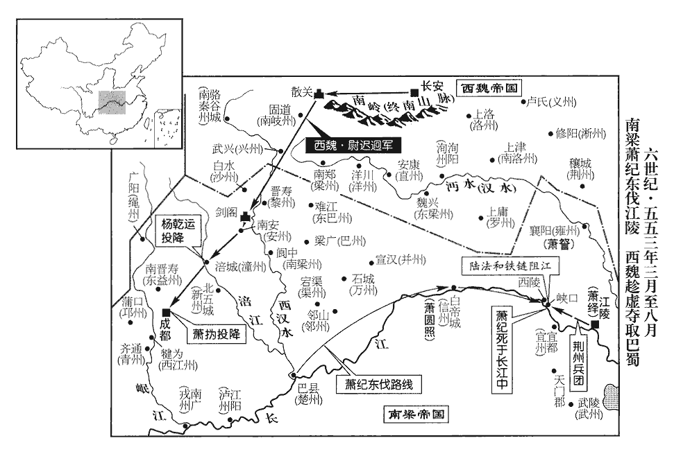
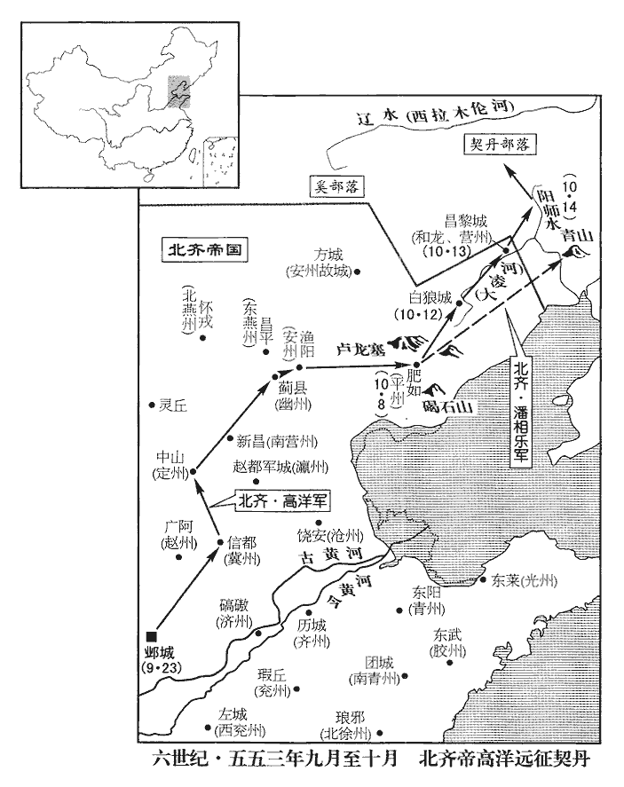
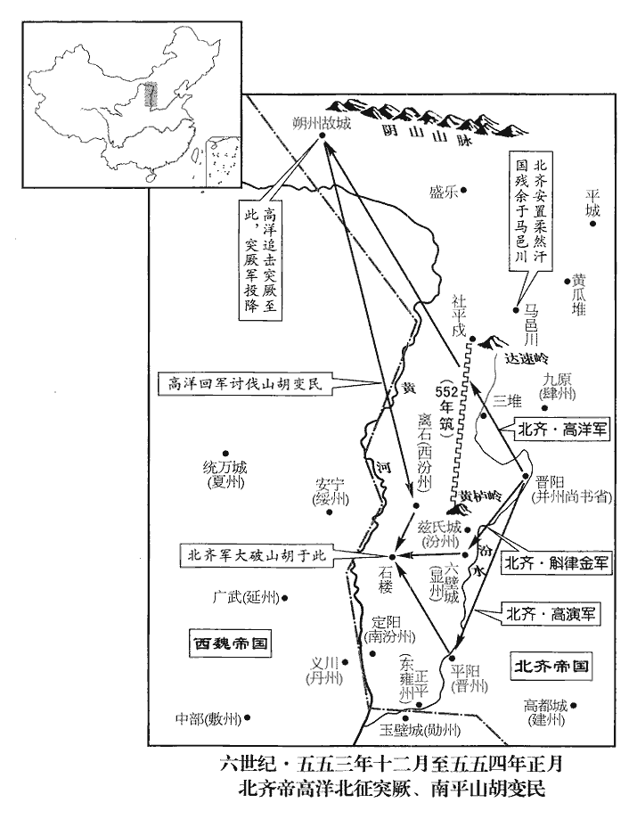
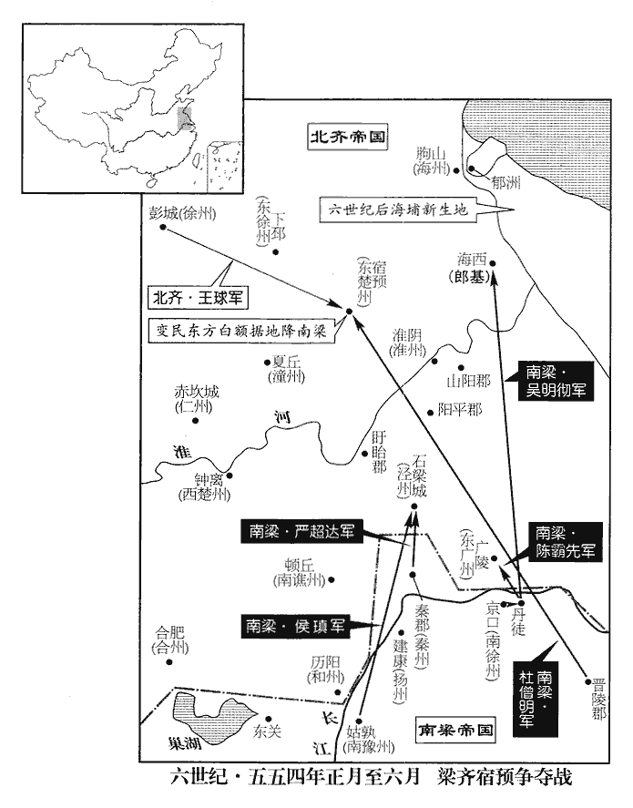
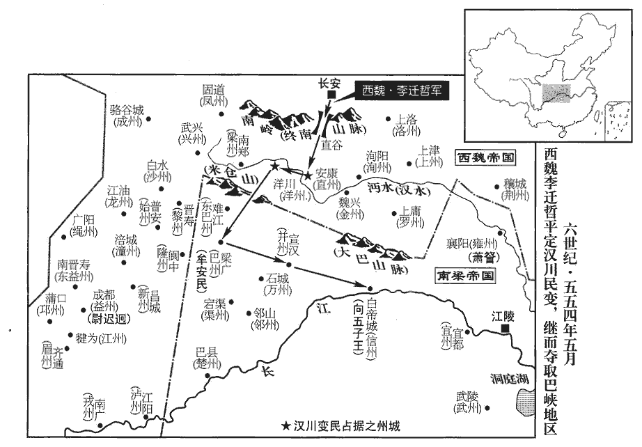
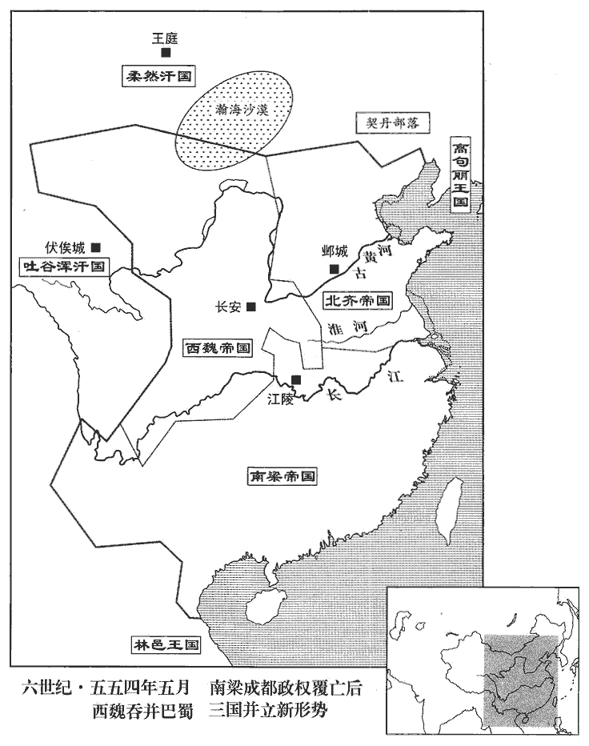
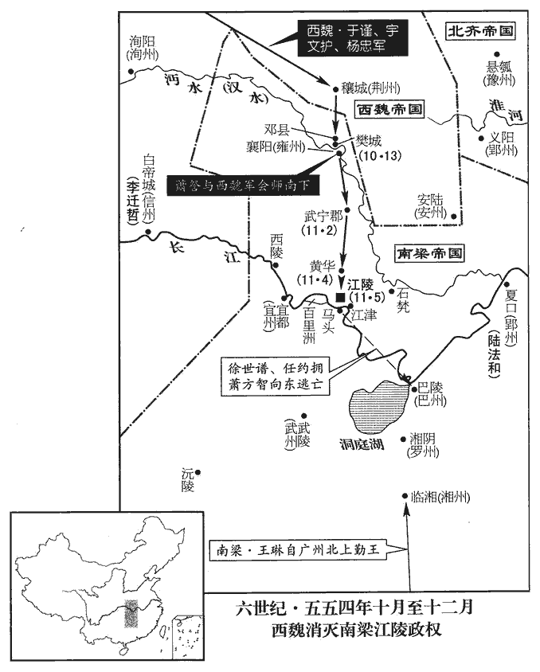

 梁紀二十一起昭陽作噩（癸酉），盡閼逢閹茂（甲戌），凡二年。

# 世祖孝元皇帝下

## 承聖二年（癸酉、五五三）

1春，正月，王僧辯發建康，承制，使陳霸先代鎮揚州‹府设建康江苏省南京市›。使陳霸先自京口代鎮揚州。

〖译文〗 [1]春季，正月，王僧辩从建康出发，按照诏旨让陈霸先从京口回来替代他镇守扬州。

2丙子‹十三›，山胡‹吐京胡·山西省石楼县匈奴部落›圍齊‹首都邺城河北省临漳县西南邺镇›離石‹山西省离石县›。戊寅‹十五›，齊主‹高洋，本年二十五岁›討之，未至，胡已走，因巡三堆‹山西省静乐县›，魏收地形志：永安郡平寇縣，魏真君七年併三堆屬焉。隋鴈門郡崞guō縣有平寇縣。大獵而歸。

〖译文〗 [2]丙子（十三日），山胡包围了北齐的离石城。戊寅（十五日），北齐国主高洋出兵讨伐，还没到离石，山胡已经跑了，于是乘便巡视了三堆一带，痛快地打了一场猎后回来。

3以吏部尚書王褒為左僕射。

〖译文〗 [3]梁元帝任命吏部尚书王褒为左仆射。

4己丑‹二十六›，齊改鑄錢，文曰「常平五銖」。五代志：齊文宣除魏永安五銖，改鑄常平五銖，重如其文，其錢甚貴，且制造甚精。

〖译文〗 [4]己丑（二十六日），北齐修改铸钱的图样，上面铸的字为“常平五铢”。

5二月，庚子‹七›，李洪雅力屈，以空雲城‹湖南省株洲县南›降陸納。去年吳藏攻李洪雅。降，戶江翻；下同。納囚洪雅，殺丁道貴。納以沙門寶誌詩讖有「十八子」，以為李氏當王，天監中，寶誌為讖云：「太歲龍，將無理。蕭經霜，草應死。餘人散，十八子。」時言蕭氏當滅，李氏代興。讖，楚譖翻。甲辰‹十一›，推洪雅為主，號大將軍，使乘平肩輿，列鼓吹，納帥眾數千，左右翼從。吹，尺瑞翻。帥，讀曰率；下同。從，才用翻。

〖译文〗 [5]二月，庚子（初七），李洪雅兵力不济，献出空云城投降陆纳。陆纳把李洪雅关起来，杀了丁道贵。陆纳因为僧人宝志写的诗谶中有“十八子”字样，以为姓李的会当皇帝，便于甲辰（十一日），推举李洪雅为主子，封号为大将军，让他坐在平肩舆上，左右排列鼓吹乐队，自己则率领几千士兵在左右护卫。

6魏太師泰去丞相、大行臺，去，羌呂翻。為都督中外諸軍事。

〖译文〗 [6]西魏太师宇文泰辞去丞相、大行台等职，出任都督中外诸军事。

7王雄至東梁州‹府设魏兴陕西省安康市›，黃眾寶帥眾降。黃眾寶反見上卷上年。太師泰赦之，遷其豪帥於雍州‹京畿›。帥，所類翻。雍，於用翻。

〖译文〗 [7]王雄进军东梁州，黄众宝率众投降。太师宇文泰赦免了黄众宝，把他手下骁勇的将领迁到了雍州。

8齊主送柔然可汗鐵伐之父登注及兄庫提還其國。登注等奔齊見上卷上年。可，從刊入聲。汗，音寒。鐵伐尋為契丹‹内蒙古西辽河上游›所殺，契，欺訖翻，又音喫。國人立登注為可汗。登注復為其大人阿富提所殺，復，扶又翻。國人立庫提。

〖译文〗 [8]北齐国主高洋送柔然可汗铁伐的父亲登注和哥哥库提回到了他们的国家。铁伐不久被契丹人杀害，其国人又立登注为可汗，登注又被头人阿富提杀死，国人又立库提为可汗。

9突厥‹新疆东北部›伊利可汗卒，子科羅立，號乙息記可汗；厥，君勿翻。考異曰：顏師古隋書突厥傳云：「弟逸可汗立。」今從周書及北史。三月，遣使獻馬五萬于魏。使，疏吏翻。柔然別部又立阿那瓌叔父鄧叔子為可汗；考異曰：魏書、北史蠕蠕傳皆云「立鐵伐為可汗」，突厥傳皆云「立鄧叔子為可汗」。蓋諸部分散，各有所立也。乙息記擊破鄧叔子於沃野‹内蒙古五原县›北木賴山‹阴山山脉一峰›。乙息記卒，捨其子攝圖而立其弟俟斤，號木杆可汗。俟，渠之翻。杆，公旦翻。為後佗鉢卒、攝圖爭國張本。考異曰：周書作「木汗」，隋書作「俟斗木杆」。今從北史。木杆狀貌奇異，性剛勇，多智略，善用兵，鄰國畏之。

〖译文〗 [9]突厥伊利可汗去世，其子科罗立为可汗，号为乙息记可汗。三月，科罗派使者献马匹五万给西魏。柔然另一个部落又立阿那的叔父邓叔子为可汗。乙息记可汗在沃野北边木赖山一带把邓叔子打得大败。乙息记去世，没有立他的儿子摄图而立他的弟弟俟斤为可汗，号为木杆可汗。木杆可汗相貌形状颇为奇特怪异，性格刚强勇猛，足智多谋，善于用兵打仗，邻国都怕他。

10上‹萧绎，本年四十六岁›聞武陵王紀東下，使方士畫版為紀像，畫，與𦘕同。親釘支體以厭之，釘，丁定翻。厭，於叶翻。又執侯景之俘以報紀。初，紀之舉兵，皆太子圓照之謀也。圓照時鎮巴東‹白帝城·重庆市奉节县东›，巴東，信州。執留使者，啟紀云：「侯景未平，宜急進討；已聞荊鎮為景所破。」紀信之，趣兵東下。使，疏吏翻。趣，讀曰促。

〖译文〗 [10]元帝听到武陵王萧纪出兵东下的消息，就派会妖术的方士在木版上画上萧纪的图像，亲自往图像的躯体四肢上钉钉子，以为可以把他诅死。又把侯景的俘虏押送到萧纪那儿，告诉他侯景已平。当初，萧纪举兵东进，全是太子萧圆照的主意。萧圆照这时镇守巴东，截获了使者，派人报告萧纪说：“侯景还没平定，应该赶快进军声讨。我已听到荆州被侯景攻破的消息。”萧纪信以为真，就火速率兵东下。

上甚懼，與魏書曰：「『子糾，親也，請君討之。』」左傳：齊無知弒其君，雍廩殺無知。公子小白自莒入于齊。魯莊公伐齊，納子糾，魯師敗績。齊鮑叔帥師來言曰：「子糾，親也，請君討之。」乃殺子糾。太師泰曰：「取蜀制梁，在茲一舉。」諸將咸難之。咸以為難也。大將軍代人尉遲迥jiǒng，泰之甥也，迥傳：其先魏之別種，號尉遲部，因氏焉。尉，紆勿翻。獨以為可克。泰問以方略，迥曰：「蜀與中國隔絕百有餘年，恃其險，【章：十二行本「險」下有「遠」字；乙十一行本同；孔本同；張校同。】不虞我至，若以鐵騎兼行襲之，無不克矣。」騎，奇寄翻；下同。泰乃遣迥督開府儀同三司原珍等六軍，甲士萬二千，騎萬匹，自散關‹陕西省宝鸡市西南›伐蜀。考異曰：典略在正月戊辰。今從周紀。

〖译文〗 元帝很害怕，就写信给西魏求援，信中引用了《左传》中鲍叔所说的“子纠，是我的亲族，请你不必顾虑，出兵讨伐他”，让宇文泰出兵打萧纪。太师宇文泰说：“夺取蜀地，制伏梁朝，就在这一次了。”但是，将领们都感到困难。大将军代京人尉迟迥是宇文泰的外甥，只有他以为能打下来。宇文泰问他有什么方法谋略，尉迟迥说：“蜀地和中原别的地区隔绝有一百多年了，仗恃其地险要，从来不曾担心我军会去攻打，如果我们用铁甲骑兵，昼夜兼行去偷袭，没有打不下来的。”宇文泰深以为然，就派尉迟迥率领开府仪同三司原珍等六支部队，甲士一万二千人，骑兵一万，从散关进发讨伐蜀地。

11陸納遣其將吳藏、潘烏黑、李賢明等下據車輪‹湖南省湘阴县北›。將，即亮翻；下同。按下文，陸納夾岸為城。甲子，王僧辯攻拔之，乙丑，進圍長沙。則車輪之地，蓋據湘江之要，去長沙不遠也。考異曰：梁紀云「二月丙子」。按長曆，二月無丙子。梁紀誤。王僧辯至巴陵‹湖南省岳阳市›，考異曰：典略云「三月辛酉」。按長曆，是月癸亥朔，無辛酉。典略誤。宜豐侯循讓都督於僧辯，考異曰：僧辯傳云「與陳霸先讓都督」。今從典略。僧辯弗受。上乃以僧辯、循為東、西都督。夏，四月，丙申‹四›，僧辯軍于車輪。考異曰：典略作「甲子」，非也。今從梁紀。

〖译文〗 [11]陆纳派他的部将关藏、潘乌黑、李贤明等人占据了车轮。王僧辩到了巴陵，宜丰侯萧循把都督让给王僧辩，王僧辩不接受。元帝就任命王僧辩、萧循为东西都督。夏季，四月，丙申（初四），王僧辩把军队驻扎在车轮。

12吐谷渾可汗夸呂，雖通使於魏而寇抄不息，吐，從暾入聲。谷，音浴。使，疏吏翻；下同。抄，楚交翻。宇文泰將騎三萬踰隴‹陇山›，至姑臧‹甘肃省武威市›，討之。夸呂懼，請服；既而復通使於齊。涼州‹府姑臧›刺史史寧覘知其還，襲之於赤泉‹武威市境›，唐志：涼州姑臧縣有赤水軍，本赤烏鎮，有赤烏泉，因名，幅員五千一百八十里，軍之最大者也。復，扶又翻。覘，丑鹽翻，又丑豔翻。獲其僕射乞伏觸狀。【嚴：「狀」改「拔」。】

〖译文〗 [12]吐谷浑可汗夸吕，虽然和西魏互派使者修好，但仍然在西魏边境抢劫进犯不止，宇文泰带骑兵三万人越过陇地，抵达姑臧去讨伐夸吕。夸吕害怕了，请求降服，但不久又派使者去联通北齐。凉州刺史史宁侦察到夸吕回来了，就在赤泉设伏兵袭击了他，抓获了他的仆射乞伏触壮。

13陸納夾岸為城，以拒王僧辯。納士卒皆百戰之餘，僧辯憚之，不敢輕進，稍作連城以逼之。納以僧辯為怯，不設備；五月，甲子‹三›，僧辯命諸軍水陸齊進，急攻之，僧辯親執旗鼓，宜豐侯循親受矢石，拔其二城；納眾大敗，步走，保長沙。乙丑‹四›，僧辯進圍之。僧辯坐壟上視築圍壘，吳藏、李賢明帥銳卒千人開門突出，蒙楯直進，趨僧辯。帥，讀曰率。楯，食尹翻。趨，七喻翻。時杜崱、杜龕並侍左右，甲士衛者止百餘人，力戰拒之。崱，士力翻。龕，苦含翻。僧辯據胡牀不動，裴之橫從旁擊藏等，藏等敗退，賢明死，李賢明，本侯景將也，景敗，歸王琳。藏脫走入城。

〖译文〗 [13]陆纳夹江岸修筑城垒，以抵抗王僧辩。陆纳的士兵都是身经百战的精锐，王僧辩有点害怕，因此不敢大意轻进，慢慢修筑相连的城垒来逼近陆纳的部队。陆纳以为王僧辩胆怯，所以一点也不防备。五月，甲子（初三），王僧辩命令水陆各路兵马齐头并进，猛烈发动进攻。王僧辩亲自举旗擂鼓，宜丰侯萧循亲自迎着飞箭乱石，从而攻下了陆纳的两座城垒。陆纳的队伍大败，步行逃跑退保长沙。乙丑（初四），王僧辩挥师进逼并把陆纳包围起来。王僧辩坐在土岸上督察兵士修筑围垒，吴藏、李贤明突然率领精锐将士一千人开门冲出来，拿着盾牌挥矛直进，朝王僧辩冲去。这时杜、杜龛两人都侍立在王僧辩身边，甲士、警卫人员只有一百多人，拼死抵抗。战斗异常激烈，但王僧辩坐在胡床上不动。裴之横从旁边率军袭击吴藏等人，吴藏才败退下去。李贤明战死，吴藏逃脱跑入城里。

14武陵王紀至巴郡‹重庆市›，聞有魏兵，遣前梁州‹府设南郑陕西省汉中市›刺史巴西‹四川省阆中市›譙淹還軍救蜀‹四川省成都市›。初，楊乾運求為梁州刺史，紀以為潼州‹府设涪城四川省绵阳市›刺史；【章：十二行本無「刺史」二字；乙十一行本同；張校同，云無註本亦無。】五代志：金山郡，西魏置潼州。蓋梁已置此州也，治涪城。楊法琛求為黎州‹府设晋寿四川省广元市›刺史，以為沙州‹原北益州·州政府设白水四川省青川县东沙州乡›：蓋即以平興為沙州也。潼，音同。琛，丑林翻。二人皆不悅。乾運兄子略說乾運曰：「今侯景初平，宜同心戮力，說，式芮翻。戮，音留，又音六，并力也。保國寧民，而兄弟尋戈，左傳，子產曰：「昔高辛氏有二子，伯曰閼伯，季曰實沈，不相能也，日尋干戈，以相征討。」此自亡之道也。夫木朽不雕，論語，孔子曰：「朽木不可雕也。」世衰難佐，不如送款關中，可以功名兩全。」乾運然之，令略將二千人鎮劍閣‹四川省剑阁县北剑门关›，又遣其壻樂廣鎮安州‹府设南安四川省剑阁县›，五代志：普安郡，梁置南安州，後改為安州。普安舊曰南安，西魏改普安。將，即亮翻。與法琛皆潛通於魏。魏太師泰密賜乾運鐵券，授驃騎大將軍、開府儀同三司、梁州刺史。西魏之官，驃騎大將軍、開府儀同三司，位次柱國大將軍。驃，匹妙翻。尉遲迥以開府儀同三司侯呂陵始為前軍，侯呂陵，虜三字姓。至劍閣，略退就樂廣，翻城應始，始入據安州。

〖译文〗 [14]武陵王萧纪的军队抵达巴郡，听说有西魏的士兵出现，就派前梁州刺史巴西人谯淹掉头回师救蜀。当初，杨乾运要求当梁州刺史，萧纪任命他为潼州刺史；杨法琛要求当黎州刺史，萧纪任命他为沙州刺史，两人都不高兴。杨崐乾运的侄子杨略向杨乾运进言说：“现在侯景之乱刚刚平定，应该同心协力，保卫国家，安抚黎民，而萧纪却起兵与萧绎争帝，兄弟打仗，争斗不已，这是自我灭亡的行为。人们说木头朽烂了就不能雕刻，世道衰颓了就难以扶救。我看不如和西魏联络一下，派人到关中去表示归附的心迹，这样可以功名两全。”杨乾运深以为然，命令杨略带兵二千去镇守剑阁，又派他女婿乐广去镇守安州，连同杨法琛一起，暗暗和西魏打通了关系。西魏太师宇文泰秘密地把铁券踢给杨乾运，并授予他骠骑大将军、开府仪同三司、梁州刺史的职位。西魏尉迟迥以开府仪同三司侯吕陵始为前军，抵达剑阁，杨略有意弃城退却，去投靠乐广，他从城墙翻出来接应侯吕陵始，这样，侯吕陵始就轻而易举地占据了安州。甲戌（十三日），尉迟迥进军到涪水，杨乾运献出潼州投降。尉迟迥分出一部分军队守潼州，大军继续挺进，袭击成都。这时成都的守军剩下不满一万人，仓库空虚，粮草兵器都用完了，永丰侯萧环城防守，尉迟迥把成都包围起来。谯淹派江州刺史景欣、幽州刺史赵拔扈带兵去救援成都。尉迟迥派原珍等人击跑了他们。

 

甲戌‹十三›，迥至涪水‹嘉陵江支流，流经涪城西南›，涪水自龍州入潼州界。潼州治涪，其城西臨涪水。涪，音浮。乾運以州降。降，戶江翻。迥分軍守之，進襲成都。時成都見兵不滿萬人，見，賢遍翻。倉庫空竭，永豐侯撝嬰城自守，迥圍之。譙淹遣江州‹西江州·州政府设犍为四川省彭山县›刺史景欣、幽州刺史趙拔扈援成都，五代志：隆山郡隆山縣，舊曰犍為縣，置江州。迥使原珍等擊走之。

〖译文〗 武陵王萧纪进军到巴东时，才听说侯景之乱已经平定，于是感到后悔，就把太子萧元照找来，责备他。但萧元照回答说：“侯景之乱虽平，但江陵方面湘东王并没有臣服呀！”萧纪也认为自己既然已经称帝，就不能再臣服别人，于是就想继续东进。但是，他军中的将士们日夜思念故土，想回老家，他手下的江州刺史王开业认为应该回去，救援成都，巩固根本，慢慢再考虑今后的发展。将领们也都觉得这种想法是对的。只有萧元照和刘孝胜固执地说不行，必须继续东进。萧纪听从了这两人的意见，当众宣布说：“敢再多说的就处死！”乙丑（疑误），萧纪的军队到达西陵，军势看起来很强盛，战船把江面都遮蔽了。江陵方面派护军陆法和在峡口修筑了两座城堡，运来很多大石头填江，同时拉上铁索把江面航道切断。

武陵王紀至巴東，聞侯景已平，乃自悔，召太子圓照責之，對曰：「侯景雖平，江陵未服。」紀亦以既稱尊號，紀稱尊號，見上卷上年。不可復為人下，復，扶又翻；下上復、復送、乃復、無復同。欲遂東進。將卒日夜思歸，其江州刺史王開業以為宜還救根本，更思後圖；諸將皆以為然。將，即亮翻。圓照及劉孝勝固言不可，紀從之，宣言於眾曰：「敢諫者死！」乙丑‹二十八›，紀至西陵‹湖北省宜昌市›，軍勢甚盛，舳艫翳川。舳zhú，音逐。艫，音廬。翳，蔽也。護軍陸法和築二城於峽口‹西陵峡口·宜昌市西›兩岸，運石填江，鐵鎖斷之。斷，音短。

〖译文〗 元帝把任约从监狱里放出来，任命地为晋安王司马，让他协助陆法和抵抗萧纪，并对他说：“你本来是该得死罪的，我不杀你，就是为了今天让你戴罪立功。”于是，把宫庭警卫部队也撤销了，把他们发配给任约指挥。元帝仍然答应任约把庐陵王萧续的女儿嫁给他，还派宣猛将军刘和他一块儿出发。

帝拔任約於獄，以為晉安王司馬，帝封子方智為晉安王。任，音壬。使助法和拒紀，赤亭之戰，法和活約，是有舊恩，故使助之。謂之曰：「汝罪不容誅，我不殺，本為今日！」因撤禁兵以配之，仍許妻以廬陵王續之女，使宣猛將軍劉棻與之俱。為，于偽翻。妻，七細翻。棻fēn，符分翻。

〖译文〗 [15]庚辰（十九日），巴州刺史余孝顷带兵一万去长沙和王僧辩会合。

15庚辰‹十九›，巴州‹府设巴陵湖南省岳阳市›刺史余孝頃將兵萬人會王僧辯於長沙。將，即亮翻；下同。

〖译文〗 [16]豫章太守观宁侯萧永，糊涂而缺少决断事情的魄力，把事情一概托给身边的亲信武蛮奴来掌管，军主文重对此很痛恨。萧永带兵去讨伐陆纳，抵达宫亭湖时，文重杀了武蛮奴，萧永的军队溃败下来，逃跑回江陵。文重带着他的部众投奔开建侯萧蕃，萧蕃杀了文重，而吞并了他的军队。

16豫章‹江西省南昌市›太守觀寧侯永，昏而少斷，少，詩沼翻。斷，丁亂翻。左右武蠻奴用事，軍主文重疾之。永將兵討陸納，至宮亭湖‹鄱阳湖南半湖称宫亭湖›，重殺蠻奴，永軍潰，奔江陵。重將其眾奔開建侯蕃，蕃殺之而有其眾。開建侯蕃時鎮鄱陽‹江西省波阳县›。沈約曰：宋文帝分臨賀郡之封陽縣立開建縣。

〖译文〗 [17]六月，壬辰（初一），武陵王萧纪修筑互相连接的城垒，攻断了拦江的铁锁，陆法和连连向江陵告急。元帝又把谢答仁从监狱里放出来，任命他为步兵校尉，配以士兵，让他去协助陆法和。又派使者送王琳去陆纳那里，让他去劝说陆纳归顺。乙未（初四），王琳到了长沙，王僧辩派人送他去前线，崐把他指给陆纳看，陆纳等部众都拜倒在地哭泣不止。陆纳派人对王僧辩说：“朝廷如果赦免了王琳，请你放他到城里来。”王僧辩不允许，又把王琳送回江陵。陆法和不断求救，元帝想把在长沙的王僧辩的军队调动来使用，又怕失去陆纳，于是又派王琳去，允许他到陆纳占据的城里去劝降。王琳进了城，陆纳就投降了，湘州从此被平定了。元帝恢复了王琳的官职爵位，让他带兵向西去支援峡口。

17六月，壬辰‹一›，武陵王紀築連城，攻絕鐵鎖，陸法和告急相繼。上‹萧绎›復拔謝答仁於獄，去年侯景敗，得謝答仁，不殺而囚之。以為步兵校尉，梁東宮有步兵等三校尉。校，戶教翻。配兵使助法和；又遣使送王琳，令說諭陸納。使，疏吏翻。說，式芮翻。乙未‹四›，琳至長沙，僧辯使送示之，納眾悉拜且泣，使謂僧辯曰：「朝廷若赦王郎，乞聽入城。」僧辯不許，復送江陵。陸法和求救不已，上欲召長沙兵，恐失陸納，乃復遣琳許其入城。琳既入，納遂降，湘州平。降，戶江翻。考異曰：梁紀：「乙酉，湘州平。」按長曆，是月無乙酉。梁紀誤。上復琳官爵，使將兵西援峽口。將，即亮翻。

〖译文〗 [18]甲辰（十三日），北齐章武景王库狄干去世。

18甲辰‹十三›，齊章武景王庫狄干卒。

〖译文〗 [19]武陵王萧纪派将军侯睿带领七千人修筑城堡和陆法和对抗。元帝派使者送信给萧纪，准许他带头回蜀，可以专制一方。萧纪不听从，回信用兄弟之礼相称，不用君臣之礼。陆纳被平定后，湘州各路人马相继向西开来，元帝再次写信给萧纪，说：“我年纪比你大，又有平定侯景的功劳，荣幸被众人心悦诚服地推举，登基称帝的事实乃天意。倘若你这时看清形势，派使者来朝见称臣，这正是我等待的。如果不这样做，那么就此扔下笔动刀兵吧！兄弟之间，本该友好，因为大家形体虽分，血脉气质却是相通的。汉代赵孝自愿代替瘦弱的弟弟去死，情深谊厚，但我们之间却不再有相见的时候，孔融对兄长让枣推梨，欢乐愉悦，已经一去不返。兄弟之爱存于我心，文字是不能完全表达的。”萧纪看到军队屯驻日久，频繁地打仗，都不顺利，又听说西魏的军队深入后方，成都处于孤立而危险的态势之中，于是忧愁愤懑，不知该怎么办好。于是，他派手下的度支尚书乐奉业去江陵向萧绎求和，请求按照以前萧绎信中说的回师蜀地。乐奉业看到萧纪必败无疑，就报告元帝说：“蜀军缺乏粮食，士兵死亡很多，全军灭亡，指日可待。”元帝听到这个情况，就不允许萧纪求和了。

19武陵王紀遣將軍侯叡，將眾七千築壘，與陸法和相拒。上遣使與紀書，許其還蜀，專制一方；紀不從，報書如家人禮。不肯定君臣之分，而用兄弟之禮。使，疏吏翻；下同。陸納既平，湘州諸軍相繼西上，上，時掌翻。上復與紀書曰：「吾年為一日之長，屬有平亂之功，膺此樂推，事歸當璧。長，陟丈翻。屬，之欲翻。樂，音洛。左傳：楚共王‹芈审›無冢適，有寵子五人，無適立焉。乃大有事於群望，而祈曰：「請神擇於五人者，使主社稷。」乃徧以璧見于群望曰：「當璧而拜者，神所立也。」既乃密埋璧於大室之庭，使五人者齊而長入拜，康王‹芈昭›跨之，靈王‹芈围›肘加焉，子干、子晳皆遠之。平王‹芈弃疾›弱，抱以入，再拜，皆厭紐。後平王卒有楚國。儻遣使乎，良所遲也。遲，直利翻，待也。如曰不然，於此投筆。友于兄弟，分形共氣，兄肥弟瘦，無復相見之期，讓棗推梨，永罷懽愉之日。漢孔融兄弟七人，融第六，四歲時，與諸兄共食梨棗，輒引小者。人問其故，答曰：「我小兒，法當取小者。」人皆異之。推，吐雷翻。心乎愛矣，書不盡言。」言兄弟之愛存之於心，非書翰之間所能盡言也。紀頓兵日久，頻戰不利，又聞魏寇深入，成都孤危，憂懣不知所為。懣，音悶，又音滿。乃遣其度支尚書樂奉業詣江陵求和，請依前旨還蜀。度，徒洛翻。奉業知紀必敗，啟上曰：「蜀軍乏糧，士卒多死，危亡可待。」上遂不許其和。史言上兄弟皆阻兵而安忍。

〖译文〗 萧纪用一斤黄金做成一个饼，一百个黄金饼装为一箱，积下的黄金共有一百箱，银子五百箱，其他锦缎、缯一类的东西也很多。每次作战，他都把这些东西挂起来让将士们看，但不用它作奖赏之物。宁州刺史陈智祖要求把这些财物分发给军队，以招募勇士，但萧纪不听，陈智祖情知这样下去，必败无疑，终于痛哭而死。有事情要求见的，萧纪推说自己病了，不予接见，因此军队将士离心离德，逐渐解体。

紀以黃金一斤為餅，餅百為篋qiè，至有百篋，銀五倍於金，錦罽、繒綵稱是，每戰，懸示將士，不以為賞。罽，音計。繒，慈陵翻。稱，尺證翻。將，即亮翻；下同。寧州‹府设味县云南省曲靖市›刺史陳智祖請散之以募勇士，弗聽，智祖哭而死。有請事者，紀稱疾不見，由是將卒解體。秋，七月，辛未‹十一›，巴東民苻昇等斬峽口城主公孫晃，降於王琳。將，即亮翻。降，戶江翻。考異曰：典略作「丙戌」。今從梁書。謝答仁、任約進攻侯叡，破之，拔其三壘。於是兩岸十四城俱降。紀不獲退，諸城已降，江陵兵斷道，故不獲退。順流東下，遊擊將軍【章：十二行本「軍」下有「南陽」二字；乙十一行本同；孔本同；退齋校同。】樊猛追擊之，紀眾大潰，赴水死者八千餘人，猛圍而守之。上密敕猛曰：「生還，不成功也。」猛引兵至紀所，紀在舟中繞牀而走，以金囊擲猛曰：「以此雇卿，送我一見七官。」猛曰：「天子何由可見！殺足下，金將安之！」之，往也。遂斬紀‹年四十六岁›及其幼子圓滿。陸法和收太子圓照兄弟三人送江陵。上絶紀屬籍，賜姓饕餮氏。饕，他刀翻。餮，他結翻。貪財為饕，貪食為餮，以帝鴻氏不才子比紀也。下劉孝勝獄，已而釋之。紀之稱帝舉兵，劉孝勝實鼓成之，此而不誅，亦失刑也。下，遐嫁翻。上使謂江安侯圓正曰：「西軍已敗，汝父不知存亡。」意欲使其自裁。圓正見囚，見上卷簡文帝大寶二年。圓正聞之號哭，稱世子不絕聲。咎圓照之誤紀也。號，戶刀翻。上頻使覘之，知不能死，移送廷尉獄，見圓照，曰：「兄何乃亂人骨肉，使痛酷如此！」圓照唯云「計誤」。上並命絕食於獄，至齧niè臂啖之，十三日而死，遠近聞而悲之。覘，丑廉翻，又丑豔翻。齧，魚結翻。啖，徒敢翻，又徒濫翻。

〖译文〗 秋季，七月，辛未（十一日），巴东平民符升等人杀了峡口城守将公孙晃，投降了王琳。谢答仁、任约进攻侯睿，大获全胜，攻下了他的三座堡垒，于是长江两岸十四座城市全部投降了。萧纪后路被切断，没有退路了，只好顺流东下。游击将军南阳人樊猛派兵去追击，萧纪的部众分崩离析，四处溃逃，跳崐到水里淹死的有八千多人。樊猛把萧纪密密包围起来，严守着不让他逃脱。元帝秘密地派人送旨令给樊猛，说：“如果让萧纪生还，那就是不成功。”樊猛带兵到达了萧纪的住处，萧纪在船上绕床而跑，用装金子的口袋扔向樊猛，说：“我用这袋金子雇你，送我去和七官（萧绎）见一面。”樊猛拒绝说：“天子怎么能随便见面，杀了你，金子能跑到哪儿去呢？”于是就杀了萧纪和他的小儿子萧圆满。陆法和押送太子萧圆照兄弟三人去江陵。元帝取消了萧纪的族籍，另赐他姓饕餮氏。元帝把刘孝胜投入监狱，后来又释放了他。元帝派人对江安侯萧圆正说：“西边的军队已经失败，你父亲不知死活。”意思是想让他自杀。圆正听了后大声号哭，口里连连抱怨太子萧圆照，说他误了萧纪，替萧纪引错了路。元帝不断派人去观察他，知道他没有自杀的意思，就把他移送到廷尉管的大狱里。在监狱，萧圆正见了萧圆照，说：“哥哥何必鼓动父亲，使他们兄弟骨肉相残，弄出这样痛苦残酷的结局呢？”萧圆照只是说：“计策有误。”元帝断绝了他们在监狱里的食物，让他们饿得咬自己的臂膀，过了十三天终于死了。远近听到消息，都为他们感到悲伤。

乙未‹五›，王僧辯還江陵。詔諸軍各還所鎮。

〖译文〗 乙未（疑误），王僧辩回到江陵。元帝下诏让各路兵马都回到各自的镇所去。

20魏尉遲迥圍成都五旬，永豐侯撝屢出戰，皆敗，乃請降。諸將欲不許，迥曰：「降之則將士全，遠人悅；攻之則將士傷，遠人懼。」遂受之。八月，戊戌‹八›，撝與宜都王圓肅帥文武詣軍門降，撝huī，許韋翻。降，戶江翻。將，即亮翻。帥，讀曰率。迥以禮接之，與盟於益州‹府成都›城北。吏民皆復其業，唯收奴婢及儲積以賞將士，軍無私焉。史言尉遲迥能凝蜀人之心。魏以撝及圓肅並為開府儀同三司，以迥為大都督益•潼等十二州諸軍事、益州刺史。

〖译文〗 [20]西魏尉迟迥把成都包围了五十天，永丰侯萧多次出城迎战，都失败了，于是请求投降。但是尉迟迥手下的将领们不允许，尉迟迥说：“接受他投降，则我军将士完好无死伤，远方百姓也高兴。继续进攻则将士必有伤亡，远方百姓会害怕。”于是就接受了萧的投降。八月，戊戌（初八），萧和宜都王萧圆肃带着文武官员到尉迟迥军营前投降，尉迟迥按礼仪迎接了他，和他在益州城北订立了受降盟约。凡官吏百姓都各安其业，只没收奴婢和仓库积粮赏赐给将士们，军队中没有人敢私下抢掠的。西魏任命萧和萧圆肃一并为开府仪同三司，任命尉迟迥为大都督益、潼等十二诸州军事，益州刺史。

21庚子‹十›，下詔將還建康，領軍將軍胡僧祐、太府卿黃羅漢、吏部尚書宗懍、懍lǐn，力荏翻，又巨禁翻。御史中丞劉瑴瑴jué，訖岳翻。諫曰：「建業王氣已盡，與虜正隔一江，若有不虞，悔無及也！建業與齊止隔一江，固也。獨不思江陵介在江北，逼近襄陽，岳陽有復讎之志，宇文有啟疆之思乎！且古老相承云：『荊州洲數滿百，當出天子。』今枝江‹湖北省枝江市›生洲，百數已滿，盛弘之荊州記曰：自枝江縣西至上明，東及江津，其中有九十九洲。楚諺云：洲不百，故不出王者。陛下龍飛，是其應也。」上令朝臣議之。朝，直遙翻。黃門侍郎周弘正、尚書右僕射王褒曰：「今百姓未見輿駕入建康，謂是列國諸王；願陛下從四海之望。」時群臣多荊州人，皆曰：「弘正等東人也，周顗yǐ、王導自南渡以來世居建康，故謂為東人。志願東下，恐非良計。」弘正面折之曰：折，之舌翻。「東人勸東，謂非良計，西【章：十二行本「西」上有「君等」二字；乙十一行本同。】人欲西，豈成長策？」上笑。又議於後堂，會者五百人，上問之曰：「吾欲還建康，諸卿以為如何？」眾莫敢先對。上曰：「勸吾去者左袒。」左袒者過半。武昌‹湖北省鄂州市›太守朱買臣言於上曰：「建康舊都，山陵所在；梁氏自簡文以上葬建康，武帝以上葬晉陵。守，式又翻。荊鎮邊疆，非王者之宅。荊州被邊，自晉以來為重鎮。願陛下勿疑，以致後悔。臣家在荊州，豈不願陛下居此，但恐是臣富貴，非陛下富貴耳！」上使術士杜景豪卜之，不吉，對上曰：「未去。」退而言曰：「此兆為鬼賊所留也。」上以建康彫殘，江陵全盛，意亦安之，卒從僧祐等議。史言上懷居違卜，以成亡國之禍。卒，子恤翻。

〖译文〗 [21]庚子（初十），元帝下诏令，准备回建康。领军将军胡僧、太府卿黄罗汉、吏部尚书宗懔、御史中丞刘等人进谏劝止，说：“建康那地方王气已尽，而且和敌虏只隔一条长江，如果有什么不测之灾，后悔就来不及了！况且从古至今，就相传说：‘荆州的沙洲满一百时，定会出天子’。现在枝江生出了一个新的沙洲，荆洲的沙洲已经满一百了，所以陛下云腾龙飞，乘势而起，正是其应验呀。”元帝让朝廷大臣讨论这件事。黄门侍郎周弘正、尚书右仆射王褒说：“现在老百姓还没看见皇上车辆仪仗进入建康，因此以为皇上还是列国诸王之一。希望陛下依从四海黎民的瞩望，回建康定都。”当时群臣大多是荆州人，都说：“周弘正等是东边的人，当然一心要回东边去，他们的主张恐怕不是什么好主意。”周弘正当面争辩说：“东边的人劝皇上去东边，就说不是好主意；西边的人想去西边，难道倒成了妙策？”元帝听着他们争论，不禁笑了。定都建康的问题又在后堂进行讨论，与会者共五百人。元帝问大家：崐“我想回建康定都，各位大臣，你们对这件事有什么看法？”众人谁也不敢先回答。元帝看大家都不吱声，就说：“劝我去建康的把左肩膀袒露出来。”结果袒露左肩的人过了一半。武昌太守朱买臣向元帝进言，说：“建康是我们梁朝的旧都，是帝室祖宗陵墓的所在地。而荆州是边疆军事重镇，不是帝王居住的地方。希望陛下下决心回建康，不要怀疑犹豫，以至将来后悔。我家就住在荆州，难道不愿陛下住在这儿？但这样做恐怕是臣下富贵之计，不是陛下富贵之计了！”元帝又让术士杜景豪占卜吉凶，结果不吉利，因此杜景豪对元帝说：“别去建康。”退朝后他又说：“这个征兆是鬼贼所留下的。”元帝认为建康凋蔽残破，而江陵正处于全盛之时，心里的意思也是安于此地，于是听从了胡僧等人的意见，留在江陵。

22以湘州刺史王琳為衡州刺史。

〖译文〗 [22]元帝任命湘州刺史王琳为衡州刺史。

23九月，庚午‹十一›，詔王僧辯還鎮建康，陳霸先復還京口。復，扶又翻。丙子‹十七›，以護軍將軍陸法和為郢州‹府设夏口湖北省武汉市›刺史。法和為政，不用刑獄，專以沙門法及西域幻術幻，胡辦翻。教化，部曲數千人，通謂之弟子。

〖译文〗 [23]九月，庚午（十一日），元帝下诏命令王僧辩回建康镇守，陈霸先再回京口。丙子（十七日）任命护军将军陆法和为郢州刺史。陆法和处理政事，不用刑法，不用断狱，专门用佛法和西域传来的幻术搞教化，他的部曲几千人，都称为弟子。

24契丹‹内蒙古西辽河上游›寇齊邊。契，欺訖翻。壬午‹二十三›，齊主北巡冀‹府设信都河北省冀县›、定‹府设中山河北省定州市›、幽‹府设蓟县北京市›、安‹侨州·州政府设渔阳北京市通县›，冀、定、幽、安，四州名。遂伐契丹。

〖译文〗 [24]契丹族在北齐边境虏掠。壬午（二十三日），北齐国主高洋到北方巡视冀州、定州、幽州、安州，于是决定讨伐契丹。

25齊主使郭元建治水軍二萬餘人於合肥，治，直之翻。將襲建康，納湘潭侯退，退北奔見一百六十二卷武帝太清二年。又遣將軍邢景遠、步大汗薩帥眾繼之。步大汗，虜三字姓。汗，音寒。薩，桑葛翻。考異曰：梁書作「邢杲gǎo遠，步六汗薩。」今從北齊書、北史。陳霸先在建康聞之，白上；上詔王僧辯鎮姑孰以禦之。

〖译文〗 [25]北齐国主派郭元建在合肥训练水军二万余人，准备袭击建康。北齐接受了湘潭侯萧退的投降，又派将军邢景远、步大汗萨率领部众跟进。陈霸先在建康听到消息，就向元帝报告。元帝下诏调王僧辩镇守姑孰进行抵抗。

26冬，十月，丁酉‹八›，齊主至平州‹府设肥如河北省卢龙县北›，從西道趣長塹，曹操征烏桓，出盧龍塞‹河北省迁安县西北长城喜峰口›，塹山堙yīn谷五百餘里，後人因謂之長塹。趣，七喻翻。塹，七豔翻。使司徒潘相樂帥精騎五千，自東道趣青山‹辽宁省义县东›。辛丑‹十二›，至白狼城‹辽宁省喀喇沁左翼蒙古族自治县西南›；壬寅‹十三›，至昌黎城‹和龙城·辽宁省朝阳市›，使安德王韓軌帥精騎四千東斷契丹走路；魏收地形志：營州統內建德郡治白狼城。中興初，分樂陵置安德郡，治般縣。帥，讀曰率。騎，奇寄翻。癸卯‹十四›，至陽師水‹地望应是发源于辽宁省阜新市，南流注入大凌河的细河›，唐志：貞觀三年，以契丹、室韋部落置師州及陽師縣於營州之廢陽師鎮，即此。倍道兼行，掩襲契丹。齊主露髻肉袒，晝夜不息，行千餘里，踰越山嶺，為士卒先，唯食肉飲水，壯氣彌厲。甲辰‹十五›，與契丹遇，奮擊，大破之，虜獲十餘萬口，雜畜數百萬頭。畜，許救翻。潘相樂又於青山破契丹別部。丁未‹十八›，齊主還至營州‹府设和龙城›。

〖译文〗 [26]冬季，十月，丁酉（初八），北齐国主高洋抵达平州，又从西边的道路去到长堑，派司徒潘相乐率领精锐骑兵五千人从东边的道路逼近青山。辛丑（十二日），北齐军队抵达白狼城；壬寅（十三日），抵达昌黎城，并派安德王韩轨率领精锐骑兵四千人切断了契丹东边的逃跑道路。癸卯（十四日），抵达阳师水，一路上以加倍的速度前进，昼夜兼行，奔袭契丹。北齐国主高洋露着发髻，光着膀子，昼夜不息，一气行军一千多里，爬山越岭，走在前面给士卒作榜样，一路上只是大块吃肉，痛饮泉水，因此军中杀敌定边的壮志越来越高昂。甲辰（十五日），北齐军队与契丹相遇，契丹人大败，俘虏十余万人，缴获各种牧畜几百万头。潘相乐又在青山打败另一支契丹军队。丁未（十八日），北齐国主高洋回到营州。

 

27己酉‹二十›，王僧辯至姑孰，遣婺wù州‹府设东阳浙江省金华市›刺史侯瑱、東陽郡，梁置婺州。瑱，他甸翻，又音鎮。吳郡太守張彪、吳興‹浙江省湖州市›太守裴之橫築壘東關‹安徽省含山县西南›，以待齊師。

〖译文〗 [27]己酉（二十日）王僧辩到姑孰，派遣婺州刺史侯、吴郡太守张彪、吴兴太守裴之横在东关筑营垒，以等待北齐的军队。

28丁巳‹二十八›，齊主登碣石山‹河北省昌黎县北›，臨滄海‹渤海›，遂如晉陽。以肆州‹府设九原山西省忻州市›刺史斛律金為太師，乃【章：十二行本「乃」作「召」；乙十一行本同；孔本同。】還晉陽，拜其子豐樂為武衛大將軍，樂，音洛。命其孫武都尚義寧公主，寵待之厚，群臣莫及。金子羨，字豐樂。武都，光之子也。樂，音洛。

〖译文〗 [28]丁巳（二十八日），北齐国主高洋登上碣石山，东望沧海，然后就返回晋阳去。高洋任命肆州刺史斛律金为太师，回到晋阳后，又任命斛律金的儿子斛律丰乐为武卫大将军。他还让斛律金的孙子斛律武都娶了义宁公主，对他的宠爱优待之厚，其他群臣均无法相比。

29閏月，丁丑‹十九›，南豫州刺史侯瑱南豫州時治姑孰。瑱，他甸翻，又音鎮。與郭元建戰於東關‹安徽省含山县西南›，齊師大敗，溺死者萬計。溺，奴狄翻。湘潭侯退，復歸于鄴，復，扶又翻。王僧辯還建康。

〖译文〗 [29]闰月，丁丑（疑误），南豫州刺史侯与郭元建交战于东关，北齐军队大败，淹死的士兵数以万计。湘潭侯萧退又退回到邺城，王僧辩回建康。

30吳州‹府设鄱阳›刺史開建侯蕃，恃其兵強，貢獻不入，五代志：鄱陽郡，梁置吳州。上密令其將徐佛受圖之。將，即亮翻。佛受使其徒詐為訟者，詣蕃，遂執之。上以佛受為建安‹福建省建瓯市›太守，以侍中王質為吳州刺史。質至鄱陽，佛受置之金城，自據羅城，掌門管，左傳：秦杞子曰：「鄭人使我掌北門之管。」杜預註曰：管，籥也。繕治舟艦甲兵，治，直之翻。艦，戶黯翻。質不敢與爭。故開建侯部曲數千人攻佛受，佛受奔南豫州，侯瑱殺之，質始得行州事。

〖译文〗 [30]吴州刺史开建侯萧蕃，仗恃自己兵力强大，不向朝廷进贡。元帝秘密命令他的将领徐佛受算计他。徐佛受派他的党徒假装成打官司的人，去求见萧蕃，趁机把萧蕃抓起来。元帝任命徐佛受为建安太守，任命侍中王质为吴州刺史。王质到了鄱阳，徐佛受把他安置在金城，自己占据罗城，掌握城门钥匙，致力于修缮船只，训练士兵。王质不敢和他争权。原来属于开建侯萧蕃的部曲几千人哗变，进攻徐佛受，徐佛受逃往南豫州，侯把他杀了，这样，王质才开始得以行使州政大权。

31十一月，戊戌，以尚書右僕射王褒為左僕射，湘東‹湖南省衡阳市›太守張綰wǎn為右僕射。

〖译文〗 [31]十一月，戊戌（疑误），元帝任命尚书右仆射王褒为左仆射，湘东太守张绾为右仆射。

 

32己未‹二›，突厥‹新疆东北部›復攻柔然，柔然舉國奔齊。復，扶又翻。

〖译文〗 [32]己未（初一）突厥人又进攻柔然，柔然全国都投奔了北齐。

33癸亥‹六›，齊主自晉陽北擊突厥，迎納柔然，廢其可汗庫提，立阿那瓌子菴羅辰為可汗，置之馬邑川‹山西省朔州市›，給其廩餼繒帛；餼xì，許氣翻。繒，慈陵翻。親追突厥於朔州‹府设怀朔城内蒙古固阳县›，突厥請降，降，戶江翻；下同。許之而還。還，從宣翻，又如字。自是貢獻相繼。

〖译文〗 [33]癸亥（初五），北齐国主高洋从晋阳向北进攻突厥人，迎接并接受柔然的投靠。他把柔然可汗库提废了，另立阿那的儿子庵罗辰为可汗，把他们安置在马邑川，供给他们俸禄、粮食、缯帛。北齐国主高洋亲自在朔州追击突厥人，突厥人请求投降，高洋答应了，于是回师。从此之后，突厥人就年年进贡了。

34魏尚書元烈謀殺宇文泰，事泄，泰殺之。宇文泰於此獨不書其官，因舊史成文也。

〖译文〗 [34]西魏尚书元烈阴谋杀害宇文泰，事情泄漏，宇文泰杀了他。

35丙寅‹九›，上使侍中王琛使於魏。琛chēn，丑林翻。使，疏吏翻。太師泰陰有圖江陵之志，梁‹首府襄阳湖北省襄樊市›王詧聞之，益重其貢獻。梁王詧欲倚魏以報河東王譽之讎。通鑑至此復書梁王詧。

〖译文〗 [35]丙寅（初八），元帝派侍中王琛出使西魏。太师宇文泰暗地里有夺取江陵的野心，梁王萧听到这消息，给西魏的贡品越发多了。

36十二月，齊宿預‹东徐州·江苏省宿迁市›民東方白額以城降，江西‹安徽省中部及湖北省东北部›州郡皆起兵應之。江、淮之民苦於齊之虐政，欲相率而歸江南。

〖译文〗 [36]十二月，北齐宿预的平民东方白额献出宿预城投降梁朝，江西各州郡都起兵响应东方白额。

## 三年（甲戌，五五四）

1春，正月，癸巳‹六›，齊‹首都邺城河北省临漳县西南邺镇›主‹高洋，本年二十六岁›自離石‹西汾州州政府所在城·山西省离石县›道討山胡‹山西省石楼县匈奴部落›，遣斛律金從顯州‹府设六壁山西省孝义县›道，魏收地形志：永安中，置顯州，治汾州六壁城。蓋在隋西河郡界。常山王演從晉州‹府设平阳山西省临汾市›道夾攻，大破之，男子十三以上皆斬，考異曰：北史作「十二以上。」今從典略。女子及幼弱以賞軍，遂平石樓‹吐京·山西省石楼县›。石樓絕險，自魏世所不能至，水經：河水東逕蒲川石樓山南，又南逕蒲城東。蓋其地在蒲子縣西。五代志，汾州樓山縣有北石樓山；又有石樓縣，舊置吐京郡。宋白曰：石樓縣本漢土軍縣，後魏置吐京郡。蓋胡俗譯言音訛變，故曰吐京也。隋改縣曰石樓。於是遠近山胡莫不懾服。攝，之涉翻。有都督戰傷，其什長路暉禮不能救，帝‹高洋›命刳其五藏，什長，十人之長也。五藏，心、肺、肝、膽、腎。長，陟丈翻。藏，徂浪翻。令九人食之，肉及穢惡皆盡。自是始為威虐。

〖译文〗 [1]春季，正月，癸巳（初六），北齐国主高洋从离石道出发讨伐山胡，派斛律金从显州道，常山王高演从晋州道夹攻，把山胡打得大败，男子十三岁以上的都被杀头，女子和孩子赏给士兵，于是平定了石楼。石楼这地方极其险要，自从北魏开国以来就没有被征服过。于是远近山胡各部落没有不慑于北齐国声威而臣服的。有一位都督在战斗中受伤，他手下的什长路晖礼没有救他，文宣帝高洋便令人把这个什长的五脏六肺全掏出来，命令队中的其他九个人都来吃，结果把肉和内脏等腥秽的东西全吃了。从这以后高洋就开始酷虐逞威。

2陳霸先自丹徒‹江苏省镇江市›濟江，圍齊廣陵‹江苏省扬州市›，秦州‹府设秦郡江苏省六合县›刺史嚴超達自秦郡進圍涇州‹府设石梁城安徽省天长市西›，五代志：江都郡永福縣舊曰沛，梁置涇州，領涇城、東陽二郡；陳廢涇州，併二郡為沛郡；後周改沛郡為石梁縣，唐併石梁縣入六合。北史：梁涇州在石梁。杜佑曰：揚州天長縣，梁於石梁置涇州。南豫州‹府设姑孰安徽省当涂县›刺史侯瑱、吳郡‹江苏省苏州市›太守張彪皆出石梁，為之聲援。辛丑‹十四›，使晉陵‹江苏省常州市›太守杜僧明帥三千人助東方白額。帥，讀曰率。

〖译文〗 [2]陈霸先从丹徒渡江，包围了北齐的广陵，秦州刺史严超达从秦郡出发崐去包围泾州，南豫州刺史侯、吴郡太守张彪都从石梁出发，援助陈霸先。辛丑（十四日），梁朝派晋陵太守杜僧明率领三千人去帮助东方白额。

 

3魏太師泰始作九命之典，以敘內外官爵，改流外品為九秩。五代志曰：泰命尚書盧辯遠師周之建職，置三公、三孤，以為論道之官；次置六卿，以分司庶務。其內命謂王朝之臣：三公九命，三孤八命，六卿七命，上大夫六命，中大夫五命，下大夫四命，上士三命，中士再命，下士一命。外命謂諸侯及其臣：諸公九命，諸侯八命，諸伯七命，諸子六命，諸男五命，諸公之孤•卿四命，侯之孤•卿、公之大夫三命，子•男之孤•卿、侯•伯之大夫、公之上士再命，公之中士、侯•伯之上士一命，公之下士、侯•伯之中士•下士、子男之士不命。其制祿秩：下士一百二十五石，中士以上至於上大夫各倍之，上大夫是為四千石；卿二分，孤三分，公四分，各益其一，公因盈數為一萬石。其九秩一百二十石，八秩至於七秩，每二秩六分，而下各去其一，二秩俱為四十石。凡頒祿，視其年之上下：畝至四釜為上年，上年頒其正；三釜為中年，中年頒其半；二釜為下年，下年頒其一；無年為凶荒，不頒祿。盧辯傳曰：柱國大將軍，建德四年增置上柱國上將軍也：正九命，驃騎大將軍、開府儀同三司，建德四年改為開府儀同大將軍，仍增上將軍（將軍二字衍）開府儀同大將軍，雍州牧：九命。驃騎大將軍，右光祿大夫，車騎將軍，左光祿大夫，戶三萬以上州刺史：正八命。征東、征南、征西、征北等將軍，右金紫光祿大夫，中軍、鎮軍、撫軍等將軍，左金紫光祿大夫，大都督，二萬戶以上州刺史，京兆尹：八命。平東、平西、平南、平北等將軍，右銀青光祿大夫，前、右、左、後等將軍，左銀青光祿大夫，帥都督，柱國大將軍府長史、司馬、司錄，戶一萬以上州刺史：正七命。冠軍將軍，太中大夫，輔國將軍，中散大夫，都督，五千戶以上州刺史，戶一萬五千戶以上郡守：七命。鎮遠將軍，諫議大夫，建忠將軍，朝散誠議大夫，州別將，開府長史、司馬、司錄，戶不滿五千以下州刺史，戶一萬以上郡守：正六命。中堅將軍，右中郎將，寧朔將軍，左中郎將，儀同府，正八命州長史、司馬、司錄，戶五千以上郡守，大呼藥：六命。寧遠將軍，右員外常侍，揚烈將軍，左員外常侍，統軍、驃騎•車騎將軍府，八命州長史、司馬、司錄，柱國大將軍府中郎掾屬，戶一千以上郡守，長安、萬年縣令：正五命。伏波將軍，奉車都尉，輕車將軍，奉騎都尉，四征、中、鎮、撫將軍府，正七命州長史、司馬、司錄，開府正府中郎掾屬，戶不滿一千以下郡守，戶七千以上縣令，正八命州呼藥：五命。宣威將軍、虎賁給事，明威將軍，冗從給事，儀同府中郎掾屬，柱國大將軍府列曹參軍，冠軍輔國（上四字衍）四平、前、後、左、右將軍府，正六七命州長史、司馬、司錄，正七八命州中從事（上三字衍）別駕，七命郡丞（上四字衍），戶四千以上縣令，八命州呼藥：正四命。給事中，厲威將軍，奉朝請，軍主，開府列曹參軍，冠軍、輔國將軍府，正六命州長史、司馬、司錄，正七命州別駕，正八命州從事，七命郡丞，戶二千以上縣令，正七命州呼藥：四命。威烈將軍，右員外侍郎，討寇將軍，左員外侍郎，幢主，儀同府，正八命州列曹參軍，柱國大將軍府參軍，鎮遠、建忠、中堅、寧朔將軍府長史、司馬，正六命州別駕，正七命州中從事，正六命郡丞，五百戶以上縣令，七命州呼藥：正三命。蕩寇將軍，武騎常侍，蕩難將軍，武騎侍郎，開府參軍，驃騎、車騎將軍府，正八命州列曹參軍，寧遠、揚烈、伏波、輕車將軍府長史，正六命州中從事，六命郡丞，戶不滿五百以下縣令，戍主，正六命州呼藥：三命。殄寇將軍，強弩司馬，殄難將軍，積弩司馬，四征、中、鎮、撫將軍府，正七命州列曹參軍，正五命郡丞：正二命。掃冦將軍，武騎司馬，掃難將軍，武威司馬，四平、前、右、左、後將軍府，七命州列曹參軍，五命郡丞，戍副：二命。曠野將軍，殿中司馬，橫野將軍，員外司馬，冠軍、輔國將軍府，正六命州列曹參軍：正一命。武威將軍，淮海都尉，虎牙將軍，山林都尉，鎮遠、建忠、中堅、寧朔、寧遠、揚烈、伏波、輕車將軍府列曹參軍：一命。

〖译文〗 [3]西魏太师宇文泰开始让人效法周朝官制，制定九品典章，用来区分朝廷内外不同的官爵，改订朝廷外的命官为九级。

4魏主‹元钦›自元烈之死，有怨言，密謀誅太師泰；臨淮王育、廣平王贊垂涕切諫，不聽。泰諸子皆幼，兄子章武公導、中山公護皆出鎮，導、護皆泰兄顥hào之子也。導鎮上邽。唯以諸壻為心膂，大都督清河公李基、義城公李暉、常山公于翼俱為武衛將軍，魏武為丞相，有武衛營。元魏之制，迄于高齊，左、右衛將軍各一人，掌左、右廂，所主朱華閤以外，各武衛將軍二人貳之。宇文相魏，亦置武衛將軍以掌宿衛，而盧辯所定九命無其官，此蓋猶在盧辯定官之前，以武衛授諸壻。然宇文所置，如大都督八命，帥都督正七命，抑李基等皆以大都督敘官邪？至隋，始置左右武衛府，列於十二衛。分掌禁兵。基，遠之子；暉，弼之子；翼，謹之子也。由是魏主謀泄，禁兵既泰諸壻所掌，魏主誰與謀哉！由是事泄。泰廢魏主，置之雍州，置之雍州廨舍。雍，於用翻。立其弟齊王廓，廓，文帝之第四子。考異曰：國典云「三月，廢帝。四月，立恭帝」。北史皆在正月。今從之。去年號，稱元年，去，羌呂翻。復姓拓跋氏，九十九姓改為單者，皆復其舊。單，音丹。魏改姓見一百四十卷齊明帝建武三年。魏初統國三十六，大姓九十九，魏始祖成帝毛統國三十六，大姓九十九，蓋後漢時匈奴既衰，鮮卑始盛之際也。後多滅絕。泰乃以諸將功高者為三十六姓，次者為九十九姓，所將士卒亦改從其姓。洪邁曰：西魏以中原故家易賜蕃姓，如李弼為徒河氏，趙肅、趙貴為乙弗氏，劉亮為侯莫陳氏，楊忠為普六茹氏，王雄為可頻氏，李虎、閻慶為大野氏，辛威為普毛氏，田宏為紇干氏，耿豪為和稽氏，王勇為庫汗氏，楊紹為叱利氏，侯植為侯伏侯氏，寶熾為紇豆陵氏，李穆為㩉xié拔氏，陸通為步六孤氏，楊纂為莫胡盧氏，寇雋為若口引氏，段永為爾綿氏，韓褒為候呂陵氏，裴文舉為賀蘭氏，陳忻為尉遲氏，樊深為萬紐于氏。將，即亮翻。

〖译文〗 [4]西魏国主元钦自从元烈被宇文泰杀死之后，颇有怨言，就密谋要处死太师宇文泰，临淮王元育、广平王元赞哭着再三劝止，但元钦不听。宇文泰的儿子们都年幼，侄子章武公宇文导，中山公宇文护都出任外镇将领，都城中只有他的几个女婿充当得力心腹，大都督清河公李基、义城公李晖、常山公于翼都被任命为武卫将军，分头掌管宫廷宿卫部队。李基是李远的儿子。李晖是李弼的儿子。李翼是李谨的儿子。因此，西魏国主元钦的密谋很快就被宇文泰诸婿察觉了。宇文泰废了西魏国主元钦，把他发落到雍州去，另立他的弟弟齐王元廓为帝，取消了原来的年号，另立年号，称元年，帝室重新恢复姓拓跋，原先改为单姓的九十九种姓氏，现在也都恢复了他们原来的旧姓。北魏当初建国时，统一了三十六个小国，共有九十九个大姓，后来大多灭绝了。宇文泰就把他手下各位将领中功劳大的人封为三十六姓，功劳低一点的封为九十九姓，他们部下的兵卒也改姓了主将的姓。

5三月，丁亥‹一›，長沙王韶取巴郡‹重庆市›。魏得成都，未暇東略，故韶得乘而取之。取，言易也。

〖译文〗 [5]三月丁亥（初一），长沙王萧韶攻取了巴郡。

6甲辰‹十八›，‹萧绎，本年四十七岁›以王僧辯為太尉、車騎大將軍。考異曰：典略作「二月甲子」。今從梁紀。

〖译文〗 [6]甲辰（十八日），元帝任命王僧辩为太尉、车骑大将军。

7丁未‹二十一›，齊將王球攻宿預，杜僧明出擊，大破之，球歸彭城‹江苏省徐州市›。將，即亮翻；下同。

〖译文〗 [7]丁未（二十一日），北齐将领王球攻打宿预城，杜僧明带兵出击，大获全胜，王球只好退回彭城。

8郢州‹府设夏口湖北省武汉市›刺史陸法和上啟自稱司徒，上怪之。王褒曰：「法和既有道術，容或先知。」戊申‹二十二›，上就拜法和為司徒。

〖译文〗 [8]郢州刺史陆法和上书时自称司徒，元帝觉得奇怪。王褒替他解释说：“陆法和既然有道术，也许这是他预先知道自己会当司徒吧。”戊申（二十二日），元帝就此封陆法和为司徒。

9己酉‹二十三›，魏侍中宇文仁恕來聘。會齊使者亦至江陵，帝‹萧绎›接仁恕不及齊使，使，疏吏翻。仁恕歸，以告太師泰。帝又請據舊圖定疆境，辭頗不遜，泰曰：「古人有言，『天之所棄，誰能興之，』左傳晉胥午之言。其蕭繹之謂乎！」荊州‹府设穰城河南省邓州市›刺史長孫儉屢陳攻取之策，泰徵儉入朝，問以經略，復命還鎮，密為之備。馬伯符密使告帝，武帝太清三年，楊忠入寇，伯符以下溠zhà城降之，因留於魏。復，扶又翻。朝，直遙翻。帝弗之信。

〖译文〗 [9]己酉（二十三日），西魏派侍中宇文仁恕出使梁朝。刚好北齐的使者也到了江陵，元帝对宇文仁恕的接待不如对北齐使者那样隆重，宇文仁恕回国后，把这事告诉了太师宇文泰。元帝又要求按过去的版图来划定边境线，使用的言辞颇为傲慢，宇文泰说：“古人说得好：‘天意要是想抛弃他，谁能使他兴起呢！’这话说的就是萧绎吧！”荆州刺史长孙俭过去曾多次陈述进攻梁朝的方略，宇文泰就把长孙俭征召入朝，向他询问向南进攻的计策，然后又命令他回到所镇守的地方，秘密地进行南下攻梁的准备。降魏的梁朝旧臣马伯符秘密派使者把这危险情况报告给元帝，但元帝不相信。

10柔然可汗菴羅辰叛齊，齊主自將出擊，大破之，菴羅辰父子北走。太保安定王賀拔仁獻馬不甚駿，齊主【章：十二行本「主」下有「怒」字；乙十一行本同；孔本同。】拔其髮，免為庶人，輸晉陽‹山西省太原市›負炭。

〖译文〗 [10]柔然可汗庵罗辰起兵反叛北齐，北齐文宣帝亲自带兵出击，把他打得大败，庵罗辰父子向北逃跑。太保安定王贺拔仁贡献的马匹不太强壮，北齐国主就把他的头发拔掉，免去官职，废为平民，发配到晋阳去背炭。

11齊中書令魏收撰魏書，頗用愛憎為褒貶，每謂人曰：「何物小子，敢與魏收作色！舉之則使升天，按之則使入地！」既成，東魏孝靜天保二年，詔魏收撰魏史，至是而成。中書舍人盧潛奏「收誣罔一代，罪當誅。」尚書左丞盧斐、頓丘‹河南省内黄县东南›李庶皆言魏史不直。收啟齊主‹高洋›云：「臣既結怨強宗，盧、李，山東望族，故以為強宗。將為刺客所殺。」帝怒，於是斐、庶及尚書郎中王松年皆坐謗史，鞭二百，配甲坊。甲坊，造甲之所。斐、庶死於獄中，潛亦坐繫獄。然時人終不服，謂之「穢史」。潛，度世之曾孫；斐，同之子；松年，遵業之子也。盧度世見一百三十二卷宋明帝泰始三年。盧同見一百四十八卷梁武帝天監八年。王遵業見一百五十二卷大通二年。

〖译文〗 [11]北齐中书令魏收修撰《魏书》，很爱以自己的爱憎任意褒贬人物，常常对人说：“你是什么东西，敢和我魏收搭架子，摆脸色！我在写史，抬举你能让你升天，贬低你能叫你入地。”《魏书》写成以后，中书舍人卢潜启奏高洋，说：“魏收的史书诬蔑了一代人，他的罪应该处死。”尚书左丞卢斐、顿丘人李庶都说《魏史》写得不公正。魏收启奏文宣帝高洋，说：“我既然因修史和强大的宗族结下仇怨，那么将会被刺客杀死。”文宣帝听了勃然大怒，于是卢斐、李庶和尚书郎中王松年都因诽谤史书而获罪，每人被鞭打二百下，被发配在甲坊里制造兵甲。结果卢斐、李庶死在监狱中，卢潜也犯罪关入监狱。但当时人终究不服气，把《魏书》说成“秽史”。卢潜是卢度世的曾孙。卢斐是卢同的儿子。王松年是王遵业的儿子。

12夏，四月，柔然寇齊肆州‹府设九原山西省忻州市›，齊主自晉陽討之，至恆州‹府设平城山西省大同市›，恆，戶登翻。柔然散走。帝以二千餘騎為殿，殿，丁練翻。宿黃瓜堆‹山西省山阴县北›。柔然別部數萬騎奄至，帝安臥，平明乃起，神色自若，指畫形勢，縱兵奮擊；柔然披靡，披，普彼翻。因潰圍而出。柔然走，追擊之，伏尸二十餘里，獲菴羅辰妻子，虜三萬餘口，令都督善無‹山西省右玉县›高阿那肱，帥騎數千塞其走路。時柔然軍猶盛，阿那肱以兵少，請益，帥，讀曰率。塞，悉則翻。少，詩沼翻。帝更減其半。阿那肱奮擊，大破之。菴羅辰超越巖谷，僅以身免。同一高阿那肱也，齊文宣用之則致死以破敵，後主用之則賣主以求生。蓋厲威猶可使之知懼，濫恩不足以得其死力也。塞，悉則翻。

〖译文〗 [12]夏季，四月，柔然人进犯北齐的肆州，北齐国主高洋从晋阳出发去讨伐。进军到恒州时，柔然人四散而逃。高洋派二千余名骑兵殿后，宿营在黄瓜堆。柔然的另一支部队几万骑兵突然到来，文宣帝安然高卧，到天亮才起床，神色自若，指划山川地形，然后指挥战士奋勇猛击敌阵，柔然人溃散，北齐军突围而出。柔然人逃跑了，北齐军队追击，尸体扔满二十余里的道路，捉获了庵罗辰的妻子儿女，俘虏了三万多人。文宣帝命令都督善无人高阿那肱率领几千骑兵去挡住柔然人逃跑的道路。当时柔然军势还很盛大，阿那肱因为兵力太少，要求多派一些人马，但是高洋不但不给，反而减少了一半。阿那肱奋勇进攻，大破敌军。庵罗辰越过了岩谷，幸免于一死。

 

13丙寅‹十一›，上使散騎常侍庾信等聘於魏。散，悉亶翻。騎，奇寄翻。

〖译文〗 [13]丙寅（十一日），元帝派散骑常侍庚信等到西魏聘问。

14癸酉‹十八›，以陳霸先為司空。

〖译文〗 [14]癸酉（十八日），梁朝任命陈霸先为司空。

15丁未‹五月二十二›，齊主復自擊柔然，大破之。復，扶又翻。

〖译文〗 [15]丁未（疑误），北齐国主高洋又一次亲自进攻柔然，大获全胜。

16庚戌‹五月二十五›，魏太師泰酖殺廢帝‹拓跋钦›。

〖译文〗 [16]庚戌（疑误），西魏太师宇文泰用毒药毒死了废帝元钦。

17五月，魏直州‹府设安康陕西省石泉县›人樂熾、洋州‹府设洋川陕西省西乡县›人黃國等作亂，五代志：西城郡安康縣，齊置安康郡，魏置東梁州，西魏改曰直州。漢川郡西鄉縣，舊曰豐寧，置洋州及洋川郡。考漢川志，蜀分漢成固縣立南鄉縣，晉改為西鄉縣，魏廢縣，仍於豐寧戍置豐寧縣。開府儀同三司高平‹宁夏固原县›田弘、河南‹河南省洛阳市东白马寺东›賀若敦討之，不克。若，人者翻。太師泰命車騎大將軍李遷哲與敦共討熾等，平之。仍與敦南出，徇地至巴州‹府设梁广四川省巴中市›，後漢分宕渠北界置漢昌縣，蜀先主置巴西郡，宋武帝置歸化郡；魏於漢昌縣治置大谷郡，又於郡北置巴州。五代志：清化郡化成縣，梁置歸化郡及巴州。巴州刺史牟安民降之，考異曰：典略云：「斬梁巴州刺史牟安平。」今從周書、北史。巴、濮‹湖北省西南部›之民皆附於魏。春秋巴子之國，三巴郡地是也。春秋百濮之地，在西城、上庸之間。濮，博木翻。蠻酋向五子王陷白帝，酋，慈秋翻。遷哲擊之，五子王遁去，遷哲追擊，破之。泰以遷哲為信州‹府设白帝城›刺史，鎮白帝。信州先無儲蓄，遷哲與軍士共采葛根為糧，時有異味，輒分嘗之，軍士感悅。屢擊叛蠻，破之，群蠻懾服，皆送糧餼，遣子弟入質。懾，之涉翻。餼，許氣翻。質，音致。由是州境安息，軍儲亦贍。

〖译文〗 [17]西魏直州人乐炽、洋州人黄国等叛乱，开府仪同三司高平人田弘、河南人贺若敦去讨伐，不能破敌。太师宇文泰命令车骑大将军李迁哲与贺若敦一起讨伐乐炽等人，平定了这次叛乱。平乱之后，李迁哲仍然与贺若敦一起向南方进发，一路攻城掠地，直达巴州。巴州刺史牟安民投降了他们，巴州、濮州的民众都依附了西魏。蛮族酋长向五子王攻陷了白帝城，李迁哲发兵攻打他，向五子王逃跑了，李迁哲追击，打败了他。宇文泰任命李迁哲为信州刺史，镇守白帝城。信州这个地方早先没有粮草储备，李迁哲和士兵一起采葛根之类的野菜野果作粮食，不时能采得到新奇味道的，就分给士兵品尝，士兵都很感动、高兴。李迁哲多次进攻叛变的蛮族，打败了他们，各部蛮族被他的军威慑服，都送粮食来进贡，并派子弟来当人质。从此以后信州边境安定，人民得以休养生息，军队粮草储备也丰富了。

18柔然乙旃達官寇魏廣武‹延州·陕西省延安市东北›，魏收志：東夏州偏城郡帶廣武縣。五代志：延安郡豐林縣，後魏置廣武縣及偏城郡。宋熙寧九年，省豐林為鎮，并屬膚施縣。柱國李弼遣擊，破之。「遣擊」，恐當作「追擊」。【章：十二行本正作「追」；乙十一行本同；孔本同。】

〖译文〗 [18]柔然乙旃达官进犯西魏广武，柱国李弼派兵出击，把他打得大败。

 

19廣州‹府设番禺广东省广州市›刺史曲江侯勃，自以非上所授，陳霸先推蕭勃為廣州刺史，見一百六十二卷武帝太清三年。內不自安；上亦疑之。勃啟求入朝；朝，直遙翻。五月，乙巳‹二十›，上以王琳為廣州刺史，勃為晉州‹府设晋熙安徽省潜山县›刺史。五代志：同安郡，梁置豫州，後改曰晉州。上以琳部眾強盛，又得眾心，故欲遠之。遠，于願翻。琳與主書廣漢‹四川省广汉市›李膺厚善，私謂膺曰：「琳，小人也，蒙官拔擢至此。今天下未定，遷琳嶺南，如有不虞，安得琳力！竊揆官意不過疑琳，琳分望有限，言自揆分不敢懷非望也。分，扶問翻。豈與官爭為帝乎！何不以琳為雍州‹府设襄阳湖北省襄樊市›刺史、鎮武寧‹湖北省荆门市北›，雍，於用翻。琳自放兵作田，為國禦捍。」膺然其言而弗敢啟。史言王琳忠於所事而帝不能用。為國，于偽翻。

〖译文〗 [19]广州刺史曲江侯萧勃，觉得自己的官职不是元帝所授予的，内心很不安稳，元帝也怀疑他。萧勃向上请求朝见元帝。五月，乙巳（二十日），元帝任命王琳为广州刺史，萧勃为晋州刺史。元帝因为王琳手下兵势强盛，又得到民众拥护，所以想把他外放到远处。王琳与主书广汉人李膺关系很深，一向亲善，私下对李膺说：“我王琳出身平民小百姓，承蒙皇上提拔到这个份上。现在天下还没安定，就把我远远迁徙到岭南去，如果形势有变，发生不测的灾祸，我王琳想出力也够不着了！我私下揣度皇上的意思不就是对我不放心吗？其实我的志向和期待也很有限，难道还能想和皇上争帝位吗？何不任命我为雍州刺史，镇守武宁。我自会带兵屯垦，为国御敌，捍卫梁朝。”李膺觉得他的话很对，但不敢启奏元帝。

20散騎郎新野‹河南省新野县›庾季才言於上曰：「去年八月丙申‹六›，月犯心中星，今月丙戌‹一›，赤氣干北斗。心為天王，丙主楚分，分，扶問翻。臣恐建子之月有大兵入江陵，陛下宜留重臣鎮江陵，整旆還都以避其患。假令魏虜侵蹙，止失荊‹湖北省西部›、湘‹湖南省›，在於社稷，猶得無慮。」上亦曉天文，知楚有災，歎曰：「禍福在天，避之何益！」天之警帝，未棄帝也；帝不知避，是自棄也。

〖译文〗 [20]散骑郎新野人庚季才进言给元帝，说：“去年八月丙申（初六），月亮侵犯了心宿中间的一颗星，这月丙戌（十一日），赤气干犯了北斗星。心宿就是天王，丙的天干主管楚地的分野，我担心建子之月有大兵来犯江陵，陛下应该留下重臣镇守江陵，自己整顿旌旗仪仗回建康以避开兵患。假如魏虏入侵，我方失地，也止限于荆州、湘州，整个国家，还能处于安全之境。”元帝也懂得天文，心知楚地会有兵灾，长叹一声，说：“祸福都在天意，避灾躲祸也徒劳无益！”

21六月，壬午‹二十七›，齊步大汗薩將兵四萬趣涇州，王僧辯使侯瑱、張彪自石梁引兵，助嚴超達拒之，瑱、彪遲留不進。將軍尹令思將萬餘人謀襲盱眙‹江苏省盱眙县›。盱眙，音吁怡。齊冀州‹府设信都河北省冀县›刺史段韶，將兵討東方白額於宿預，廣陵、涇州皆來告急，諸將患之。韶曰：「梁氏䘮亂，䘮，息浪翻。國無定主，人懷去就，彊者從之。霸先等外託同德，内有離心，諸君不足憂，吾揣之熟矣！」揣，初委翻。乃留儀同三司敬顯携等圍宿預，「敬顯携」當作「敬顯儁」。自引兵倍道趣涇州，塗出盱眙。令思不意齊師猝至，望風退走。韶進擊超達，破之，回趣廣陵，陳霸先解圍走。趣，七喻翻。杜僧明還丹徒‹江苏省镇江市东丹徒镇›，侯瑱、張彪還秦郡。吳明徹圍海西‹江苏省灌南县›，海西縣，前漢屬東海郡，後漢屬廣陵郡，齊明帝置東海郡，東魏武定七年，改海西郡，今西海州即其地。鎮將中山‹河北省定州市›郎基固守，削木為箭，翦紙為羽，圍之十旬，卒不能克而還。將，即亮翻；下同。卒，子恤翻。

〖译文〗 [21]六月，壬午（二十七日），北齐步大汗萨带兵四万人逼近泾州，王僧辩派侯、张彪从石梁带兵帮助严超达抵抗，侯、张彪接到命令，却迟迟滞留，不肯前进。梁朝将军尹令思带一万多人准备袭击盱眙。当时北齐冀州刺史段韶带兵在宿预讨伐东方白额，正好广陵，泾州两地都来告急，将领们都很担心。段韶说：“梁朝连遭丧乱，国家没有确定的主人，臣子们心里怀着或去或留的两种心思，看谁势强就归附谁。陈霸先等人外表上表示与梁朝同心同德，其实内心早有了分离自雄的念头。你们不必担心，我对这中间情形都揣摩透了！”于是留下仪同三司敬显携等人围攻宿预，自己带兵以加倍的速度直取泾州，路上还经过了盱眙。尹令思没想到北齐军队会突然降临，赶快望风逃跑。段韶进攻严超达，打败了他，又回过头来逼近广陵，陈霸先解围退走，杜僧明回丹徒，侯、张彪回秦郡。吴明彻围困海西，守将中山人郎基固守城池，削木头作箭头，剪纸片作箭尾羽饰，顽强抵抗。吴明彻围困了十旬一百天，到底没能打下来，就退回去了。

22柔然帥餘眾東徙，且欲南寇，齊主帥輕騎邀之於金川‹内蒙古托克托县境›。唐志：單于府帶金河縣。其即金川歟。帥，讀曰率。柔然聞之，遠遁，營州‹府设和龙城辽宁省朝阳市›刺史靈丘‹山西省灵丘县›王峻設伏擊之，獲其名王數十人。

〖译文〗 [22]柔然率领被击溃后剩余的士兵向东迁徙，而且想要向南进犯。北齐国主高洋率轻骑兵在金川拦击，柔然听到消息，远远逃跑了。营州刺史灵丘人王峻设下埋伏袭击他们，捉获了几十个有名的首领。

23鄧至‹四川省南坪县›羌檐桁失國，檐，余廉翻。桁，戶庚翻。奔魏，太師泰使秦州‹府设上封甘肃省天水市›刺史宇文導將兵納之。

〖译文〗 [23]邓至羌人檐失去政权，投奔西魏，太师宇文泰派秦州刺史宇文导带兵接纳了他。

24齊段韶還至宿預，使辯士說東方白額，說，式芮翻。白額開門請盟，因執而斬之。

〖译文〗 [24]北齐段韶回到宿预，派一个善于言辞的人去游说东方白额。东方白额被说动了，打开城门要求和段韶结盟，段韶趁机把他抓起来杀了。

25秋，七月，庚戌‹二十六›，齊主還鄴。

〖译文〗 [25]秋季，七月，庚戌（二十六日），北齐国主高洋回到邺城。

26魏太師泰西巡，至原州‹府设高平›。

〖译文〗 [26]西魏太师宇文泰到西边巡视，到达原州。

27八月，壬辰，齊以司州牧清河王岳為太保，司空尉粲為司徒，太子太師侯莫陳相為司空，尚書令平陽王淹錄尚書事，常山王演為尚書令，中書令上黨王渙為左僕射。

〖译文〗 [27]八月，壬辰（疑误），北齐任命司州牧清河王高岳为太保，司空尉粲为司徒，太子太师侯莫陈相为司空，尚书令平阳王高淹为录尚书事，常山王高演为尚书令，中书令上党王高涣为左仆射。

28乙亥‹二十一›，齊儀同三司元旭坐事賜死。丁丑‹二十三›，齊主如晉陽。齊主之未為魏相也，相，息亮翻。太保、錄尚書事平原王高隆之常侮之，及將受禪，隆之復以為不可，事見一百六十三卷簡文帝大寶元年。復，扶又翻。齊主由是銜之。崔季舒譖「隆之每見訴訟者輒加哀矜之意，以示非己能裁。」帝禁之尚書省。崔季舒報徙邊之怨也。隆之嘗與元旭飲，謂旭曰：「與王交，當生死不相負。」人有密言之者，帝由是發怒，令壯士築百餘拳而捨之，辛巳‹二十七›，卒於路‹年六十一岁›。卒，子恤翻。久之，帝追忿隆之，執其子慧登等二十人於前，帝以鞭叩鞍，一時頭絕，並投尸漳水；又發隆之冢，出其尸，斬截骸骨焚之，棄於漳水。

〖译文〗 [28]乙亥（二十一日），北齐国仪同三司元旭因犯罪被赐死。丁丑（二十三日），北齐国主高洋去晋阳。当初，高洋还没有当上东魏丞相的时候，太保、录尚书事平原王高隆之常常轻侮他。待到高洋将接受禅让的时候，高隆之又认为不能这样做，高洋因此记恨在心。崔季舒乘机进谗言说：“高隆之每次见到吃官司的人就都表示同情哀怜，以表示这不是他自己就能裁断的，企图把怨恨引向陛下。”文宣帝高洋听了，就把高隆之软禁在尚书省。高隆之曾经和元旭一块儿饮酒，对元旭说：“我和您的交情，是生死之交，永不相负！”有人把这话密告给文宣帝，文宣帝因此勃然大怒，命令壮士把他打了一百余拳，然后扔开，辛巳（二十九日），高隆之就这样死在路边。过后很久，文宣帝对高隆之越想越恼怒，又把他的儿子高慧登等二十人捉到自己面前，文宣帝以马鞭击打马鞍为号，令人一下子砍下这二十人的头，然后把尸体一起扔到漳水里去。又把高隆之的坟墓挖开，把尸体刨出来，砍为好几段烧掉，然后扔入漳水。

29齊主使常山王演、上黨王渙、清河王岳、平原王段韶帥眾於洛陽‹河南省洛阳市东白马寺东›西南築伐惡城、新城、嚴城、河南城。帥，讀曰率。九月，齊主巡四城，欲以致魏師，魏師不出，史言齊強，宇文泰畏之。乃如晉陽。

〖译文〗 [29]北齐国主高洋派常山王高演、上党王高涣、清河王高岳、平原王段韶率领士兵民工在洛阳西南修筑伐恶城、新城、严城、河南城。九月，北齐国主高洋巡视这四座城堡，想以这一举动把西魏的军队吸引出来，但西魏军队不敢出来。于是高洋就到晋阳去了。

30魏宇文泰命侍中崔猷yóu開回車路以通漢中‹陕西省汉中市›。按北史崔猷傳，泰欲開梁、漢舊路，乃命猷開通車路，鑿山堙谷五百餘里，至于梁州。此特因舊路開而廣之，以通車耳。前史蓋誤以通字為「迴」，傳寫者又去其傍為「回」也。泰不書官而書姓，亦無義例之可言。

〖译文〗 [30]西魏宇文泰命令侍中崔猷开山填谷，修通通往汉中的车路。

31帝‹萧绎›好玄談，好，呼到翻。辛卯‹八›，於龍光殿講老子。

〖译文〗 [31]梁元帝萧绎喜好玄谈，辛卯（疑误），在龙光殿开设讲座，讲论《老子》。

32曲江侯勃遷居始興‹东衡州州政府所在城·广东省韶关市›，王琳使副將孫瑒chàng先行據番禺。將，即亮翻。番禺，音潘愚。

〖译文〗 [32]曲江侯萧勃迁居始兴。王琳派副将孙先去占据了番禺。

33乙巳‹二十二›，魏遣柱國常山公于謹、中山公宇文護、大將軍楊忠將兵五萬入寇。冬，十月，壬戌‹九›，發長安。長孫儉問謹曰：「為蕭繹之計，將如之何？」謹曰：「耀兵漢、沔，席卷渡江，直據丹楊，上策也；謂東還建康也。卷，讀曰捲。移郭內居民退保子城，峻其陴堞，以待援軍，中策也；陴pī，頻彌翻。堞，達協翻。若難於移動，據守羅郭，下策也。」儉曰：「揣繹定出何策？」揣，初委翻；下同。謹曰：「下策。」儉曰：「何故？」謹曰：「蕭氏保據江南，綿歷數紀，十二年為一紀。屬中原多故，屬，之欲翻。未遑外略；又以我有齊氏之患，必謂力不能分。且繹懦而無謀，多疑少斷，少，詩沼翻。斷，丁亂翻。愚民難與慮始，皆戀邑居，所以知其用下策也！」

〖译文〗 [33]乙巳（疑误），西魏派柱国常山公于谨、中山公宇文护、大将军杨忠带兵五万人进犯梁朝，冬季，十月，壬戌（初九），从长安出发。长孙俭问于谨，说：“假如咱们替萧绎谋划一下，他该怎样抵抗我军才好呢？”于谨回答说：“如果他能陈兵于汉江、沔水一带，从江陵收拾家当率领臣下全部渡江而下，先径直占据丹杨，这是上策。如果他能把江陵外城内的居民全部移往内城，退保固守，把城墙加高，等待援军，这是中策。如果他感到搬动起来很困难，就原地不动防守外城，这可是下策。”长孙俭问道：“您估计萧绎会采用那一种计策？”于谨说：“他只会采用下策。”长孙俭问：“那是为什么呢？”于谨回答说：“萧氏据守江南以自保，已经绵延经历了三、四十年。正好这段时间里中原地区也处多事之秋，不能够向外扩张。萧氏又因为我国东边有齐国为患，认为我国必不可能分散兵力去进攻他们。而且萧绎这个人懦弱而没有谋略，多疑而少决断，而那些普通平民们又很难忧深虑远地想问题，都留恋自己的家园，所以我知道萧绎一定采用下策。”

癸亥‹十›，武寧‹湖北省荆门市北›太守宗均告魏兵且至，帝‹萧绎›召公卿議之。領軍胡僧祐、太府卿黃羅漢曰：「二國通好，未有嫌隙，必應不爾。」江陵諸將，胡僧祐其巨擘也，識見如此，烏能敵于謹哉！好，呼到翻。侍中王琛曰：「臣揣宇文容色，必無此理。」去年王琛使魏，故自謂揣其容色，必無此事，可謂不善於覘國者矣。乃復使琛使魏。復，扶又翻；下復講同。丙寅‹十三›，于謹至樊‹湖北省襄樊市汉水北岸›、鄧‹襄樊市北›，梁王詧帥眾會之。辛【章：十二行本「辛」作「丁」；乙十一行本同；孔本同。】卯‹十四›，帝停講；停講老子也。帥，讀曰率；下同。內外戒嚴。王琛至石㭝qiú‹应在今湖北省潜江市北汉水畔›，杜佑曰：石㭝在沔州沔口上。又據梁書安成王秀傳，石㭝時屬竟陵界。未見魏軍，馳書報黃羅漢曰：「吾至石㭝，境上帖然，前言皆兒戲耳。」帝聞而疑之。庚午‹十七›，復講，百官戎服以聽。

〖译文〗 癸亥（初十），武宁太守宗均向上报告西魏大军将要入侵，元帝召集公卿大臣商议对策。领军胡僧、太府卿黄罗汉说：“西魏和我们梁朝一向友好来往，也没发生过什么不愉快的事情，我想不会向我们进攻吧。”侍中王琛也附和说：“我曾于去年出使魏，揣摩宇文泰的神色，很是友好，决不可能发兵来打我们。”于是又派王琛到西魏去访问。丙寅（十三日），于谨的队伍抵达樊、邓，梁王萧率部属去和他会合。辛卯（疑误），元帝停止讲论《老子》，朝廷内外宣布戒严。王琛抵达石，没有见到西魏的军队，派人送急信报告黄罗汉，说：“我已来到石，边境上很安宁，以前说魏要对我们发动进攻，简直是儿戏之言。”元帝听后感到疑惑。庚午（十七日），元帝又恢复讲《老子》，百官都穿着军装听讲。

辛未‹十八›，帝‹萧绎›使主書李膺至建康，徵王僧辯為大都督、荊州‹京畿›刺史，命陳霸先徙鎮揚州‹府建康›。僧辯遣豫州刺史侯瑱，帥程靈洗等為前軍，兗州‹南兖州·州政府侨设晋陵江苏省常州市›刺史杜僧明帥吳明徹等為後軍。王僧辯一聞徵命，當投袂勤王可也。外言部分諸軍，不聞星馳電赴，江陵覆沒，僧辯之罪也。帥，讀曰率。甲戌‹二十一›，帝夜登鳳皇閤，徙倚歎息曰：「客星入翼、軫zhěn，倚欄而又徙處為徙倚。翼、軫，楚荊州分。今必敗矣。」嬪御皆泣。嬪，毗賓翻。

〖译文〗 辛未（十八日），元帝派主书李膺去建康，征召王僧辩为大都督、荆州刺史，命令陈霸先移兵驻守扬州。王僧辩派遣豫州刺史侯率领程灵洗等为先头部队，兖州刺史杜僧明率领吴明彻等人为后卫部队。甲戌（二十一日），元帝夜里登上凤皇阁，来回踱步，凭栏叹息说：“客星冲犯翼宿、轸宿，看来这回一定失败了！”嫔妃和侍从听了都哭泣起来。

陸法和聞魏師至，自郢州入漢口‹汉水注入长江处，即夏口对开河道›，將赴江陵，帝使逆之曰：「此自能破賊，但鎮郢州，不須動也！」法和還州‹夏口›，堊其城門，堊è，烏各翻。以白土塗城門，示有喪也。著衰絰，坐葦席，終日，乃脫之。著，陟略翻。衰，倉回翻。此法和預為喪君之服。設使法和果至江陵，亦不能制魏兵之攻圍。此其徒欲神法和之術，託為之言，以為能知來耳。

〖译文〗 陆法和听说西魏大兵压境，从郢州出发到汉口，将赶赴江陵抗敌。元帝派人去拦住他，说：“我这儿自能打败敌兵，你只管镇守郢州，不用动。”陆法和回到郢州，让人用白土涂城门，自己身穿丧服，坐在苇席上，静坐了一天，才把丧服脱下来。

十一月，帝‹萧绎›大閱於津陽門外，江左都建康，外城十二門，門名皆用洛城門名。帝都江陵，外城門亦依建康城門名之。津陽門，城南面東來第二門。遇北風暴雨，輕輦還宮。癸未‹一›，魏軍濟漢‹汉水›，于謹令宇文護、楊忠帥精騎先據江津‹江陵县东南十千米长江渡口›，斷東路。斷，音短。甲申‹二›，護克武寧，執宗均。是日，帝乘馬出城行柵，行，下孟翻；下巡行同。插木為之，周圍六十餘里。以領軍將軍胡僧祐都督城東諸軍事，尚書右僕射張綰wǎn為之副，左僕射王褒都督城西諸軍事，四廂領直元景亮為之副；王公已下各有所守。丙戌‹四›，命太子‹萧方矩›巡行城樓，令居人助運木石。夜，魏軍至黃華，去江陵四十里，丁亥‹五›，至柵下。戊子‹六›，雟州‹府设越巂四川省西昌市›刺史裴畿、越雟郡，梁置雟州。雟，音髓。畿弟新興‹湖北省荆沙市›太守機、武昌‹湖北省鄂州市›太守朱買臣、衡陽‹湖南省株洲市西南›太守謝答仁，開枇杷門出戰，裴機殺魏儀同三司胡文伐。畿，之高之子也。臺城既沒，裴之高赴江陵。

〖译文〗 十一月，元帝在津阳门外举行大阅兵，遇到北风挟暴雨袭击，赶快乘轻车崐便辇回宫。癸未（初一），西魏军队渡过汉水，于谨命令宇文护、杨忠率精锐骑兵先占领了江津，切断元帝东逃的道路。甲申（初二），宇文护攻克武宁，抓住了宗均。这一天，元帝骑马出城巡察修筑栏栅。栏栅用木头插在地上组成，周围共六十多里长。又派领军将军胡僧都督城东诸军事，尚书右仆射张绾当他的副将，左仆射王褒都督城西诸军事，四厢领直元景亮当他的副将。王公以下各大臣各有守责。丙戌（初四），派太子在城楼上巡视督责，命令居民帮助军队搬运城防用的木头石头。夜里，西魏军队抵达黄华，这里离江陵才四十里路。丁亥（初五），魏兵到了梁军的栅栏下。戊子（初六），州刺史裴畿、裴畿的弟弟新兴太守裴机、武昌太守朱买臣、衡阳太守谢答仁打开枇杷门出战，裴机杀了西魏仪同三司胡文伐。裴畿是裴之高的儿子。

 

帝徵廣州刺史王琳為湘東【章：十二行本「東」作「州」；乙十一行本同。】刺史，使引兵入援。丁酉‹十五›，柵內火，焚數千家及城樓二十五，帝臨所焚樓，望魏軍濟江，四顧歎息。是夜，遂止宮外，宿民家，己亥‹十七›，移居祇洹寺。祇，巨支翻。洹huán，胡官翻。于謹令築長圍，中外信命始絕。

〖译文〗 元帝征召广州刺史王琳为湘东刺史，让他带兵入江陵救援。丁酉（十五日），军营的栅栏内失火，烧毁了几千家民房和二十五座城楼。元帝亲临烧毁的城楼察看，远望魏军渡江涌来，四顾孤危，不禁长叹。当天晚上，就住在宫外，宿在老百姓家里。己亥（十七日），移居到祗洹寺内。于谨下令修筑长久围城用的军营，从此，梁朝信使，诏命无法外传，内外联络被切断了。

庚子‹十八›，信州刺史徐世譜、晉安王司馬任約等築壘於馬頭，江陵南岸，謂之馬頭岸。遙為聲援。是夜，帝巡城，猶口占為詩，群臣亦有和者。和，戶臥翻。帝裂帛為書，趣王僧辯曰：趣，讀曰促。「吾忍死待公，可以至矣！」壬寅‹二十›，還宮；癸卯‹二十一›，出長沙寺。戊申‹二十六›，王褒、胡僧祐、朱買臣、謝答仁等開門出戰，皆敗還。己酉‹二十七›，帝移居天居寺；癸丑‹一›，移居長沙寺。朱買臣按劍進曰：「唯斬宗懍、黃羅漢，可以謝天下！」買臣罪其諫還建康也。懍lǐn，力荏翻，又力禁翻。帝曰：「曩實吾意，宗、黃何罪！」二人退入眾中。

〖译文〗 庚子（十八日），信州刺史徐世谱、晋安王司马任约等在江陵南岸的马头修筑城堡，远远地作为声援。当天晚上，元帝巡视城防，还随口吟出诗来，群臣还有和他诗的。元帝撕裂绢帛写了一封信，催促王僧辩速发援兵。信中说：“我忍受着死去的熬煎等你来，现在援兵该可以来了吧！”壬寅（二十日），回到宫中。癸丑（疑误），又出来住入长沙寺。戍申（二十六日），王褒、胡僧、朱买臣、谢答仁等人开门出城迎战，都败了回来。己酉（二十七日），元帝移居天居寺。癸丑（疑误），移居长沙寺。朱买臣按着宝剑向元帝进言，说：“只有杀了宗懔、黄罗汉，才可以平息天下的怨恨！”元帝说：“过去不回建康，其实是我的意思，宗懔、黄罗汉有什么罪？”这两个人唯唯退入众人之中。

王琳軍至長沙，鎮南府長史裴政請間道先報江陵，王琳為鎮南將軍，以裴政為府長史。間，古莧翻；下間使同。至百里洲‹即江陵中州·湖北省枝江市南长江中小岛›，為魏人所獲。梁王詧謂政曰：「我，武皇帝‹萧衍›之孫也，不可為爾君乎？若從我計，貴及子孫；如或不然，腰領分矣。」政詭對曰：「唯命。」詧鎖之至城下，使言曰：「王僧辯聞臺城被圍，時都江陵，上臺所在，故亦謂之臺城。已自為帝。王琳孤弱，不能復來。」復，扶又翻。政告城中曰：「援兵大至，各思自勉。吾以間使被擒，當碎身報國。」監者擊其口，使，疏吏翻。監，工銜翻。詧怒，使速殺之。西中郎參軍蔡大業梁置西中郎將於襄陽，以蔡大業為參軍。諫曰：「此民望也，殺之，則荊州不可下矣。」乃釋之。政，之禮之子；裴之禮，邃之子也。大業，大寶之弟也。

〖译文〗 王琳的军队赶到长沙，镇南府长史裴政要求走小路先把援兵来到的消息报告江陵。裴政走到百里洲时，让西魏人抓获了。梁王萧对裴政说：“我，是武皇帝的孙子，难道不能当你的君主吗？如果臣服于我，那么富贵可以传给子孙。如果不听，那么你的腰和脖子就要断成两截。”裴政假意回答说：“我愿唯命是从。”萧把他用锁链系住，推到江陵城下，让他向城里喊话，说：“王僧辩听说台城被围，已经自立为皇帝。王琳孤军力弱，不能再来救援了。”但裴政却大声告诉城里，说：“救援大军大批赶来了，你们要自奋自励。我因充当报信的秘使，被敌军抓获，理当粉身碎骨，报效国家。”监视他的人使劲打他的嘴，萧勃然大怒，喝令手下快把他杀了。西中郎参军蔡大业进谏说：“这样坚贞不屈的人，使民众仰望而归心。杀了他，那么荆州就攻不下来了。”萧这才放了他。裴政是裴之礼的儿子。蔡大业是蔡大宝的弟弟。

時徵兵四方，皆未至。甲寅‹二›，魏人百道攻城，考異曰：梁紀作「辛卯」，誤也。今從典略。城中負戶蒙楯，楯，食尹翻。胡僧祐親當矢石，晝夜督戰，獎勵將士，明行賞罰，眾咸致死，所向摧殄，魏不得前。俄而僧祐中流矢死，中，竹仲翻。內外大駭。魏悉眾攻柵，反者開西門納魏師，帝與太子‹萧方矩›、王褒、謝答仁、朱買臣退保金城，令汝南王大封、晉熙王大圓質於于謹以請和。大封、大圓，皆簡文帝‹萧纲›之子。質，音致；下同。魏軍之初至也，眾以王僧辯子侍中顗可為都督，顗，魚豈翻。帝不用，更奪其兵，使與左右十人入守殿中；及胡僧祐死，乃用為都督城中諸軍事。裴畿、裴機、歷陽侯峻皆出降。降，戶江翻；下同。于謹以機手殺胡文伐，并畿殺之。峻，淵猷之子也。淵猷，長沙王懿之子。時城南雖破，而城北諸將猶苦戰，日暝，聞城陷，乃散。暝，莫定翻。

〖译文〗 当时元帝向四方征兵求援，都没前来。甲寅（疑误），西魏军队从四面八方一齐攻城。城里的守军扛着门板作为盾牌，胡僧亲自冒着飞箭流石，昼夜督战，对勇敢的将士进行鼓励，严明地厉行赏罚，这样大家都拼死抵抗，所向披靡，敌军纷纷溃败死伤，无法前进。不久，胡僧被飞箭射死，内外城军民惊慌失措。西魏军队倾巢而出猛攻栅栏，有反叛的人打开西门迎接魏军进城，元帝和太子、王褒、谢答仁、朱买臣等退却到金城自保，派汝南王萧大封，晋熙王萧大圆为人质，到于谨军中去求和。当魏军刚到的时候，众人认为王僧辩的儿子侍中王可以当都督。但元帝不用他，还夺了他率领的士兵，让他和身边卫士十个人到宫殿中守卫。等到胡僧死了，才任命他为都督城中诸军事。裴畿、裴机、历阳侯萧峻都出城投降了。于谨用裴机的手杀了胡文伐，然后又把他和裴畿一块儿杀了。萧峻是萧渊猷的儿子。当时城南已被攻破，但城北诸将还在苦战，一直到天黑，听说全城都陷落了，才纷纷逃散。

帝入東閤竹殿，命舍人高善寶焚古今圖書十四萬卷，考異曰：隋經籍志云「焚七萬卷」，南史云「十餘萬卷」。按周僧辯所送建康書已八萬卷，并江陵舊書，豈止七萬卷乎！今從典略。「周」，當作「王」。將自赴火，宮人左右共止之。又以寶劍斫柱令折，歎曰：「文武之道，今夜盡矣！」焚書、折劍，以為文武道盡。折，而設翻。乃使御史中丞王孝祀作降文。謝答仁、朱買臣諫曰：「城中兵眾猶強，乘闇突圍而出，賊必驚，因而薄之，可渡江就任約。」任約築壘馬頭岸，與江陵僅隔一江耳。帝素不便走馬，曰：「事必無成，祇增辱耳！」答仁求自扶帝，以問王褒，褒曰：「答仁，侯景之黨，豈足可信！成彼之勳，不如降也。」答仁又請守子城，收兵可得五千人，帝然之，即授城中大都督，配以公主。既而召王褒謀之，以為不可。答仁請入不得，歐血而去。歐，烏口翻。于謹徵太子為質，帝使王褒送之。謹子以褒善書，給之紙筆，乃書曰：「柱國常山公家奴王褒。」謹為柱國大將軍，封常山公，褒以此自處，安能為帝謀乎！有頃，黃門郎裴政犯門而出。帝遂去羽儀文物，去，羌呂翻。白馬素衣出東門，抽劍擊闔曰：「蕭世誠一至此乎！」左傳：晉州綽攻齊東門，以枚數闔。杜預註曰：闔，門扇也。世誠，帝字也。魏軍士度塹牽其轡，塹，七豔翻。至白馬寺北，奪其所乘駿馬，以駑馬代之，遣長壯胡人手扼其背以行，逢于謹，胡人牽帝使拜。考異曰：典略云：「謹撝梁主令西至龍泉廟，出武陵、河東二王子孫於獄，列於沙州，鎖𢬿xiè嚴酷，瘡痍腐爛，引梁主使視之，謂曰：『此皆骨肉，忍虐如此，何以為君！』上無以應。」按武陵諸子先已餓死，河東子孫亦應不存。今不取。梁王詧使鐵騎擁帝入營，囚于烏幔之下，幔，莫半翻。甚為詧所詰辱。詰，去吉翻。乙卯‹三›，于謹令開府儀同三司長孫儉入據金城。帝紿儉云：「城中埋金千斤，欲以相贈。」儉乃將帝入城。帝因述詧見辱之狀，謂儉曰：「向聊相紿，欲言此耳，紿，蕩亥翻。豈有天子自埋金乎！」儉乃留帝於主衣庫。此主衣庫，在江陵金城中之禁中。

〖译文〗 元帝躲进东竹殿，命令舍人高善宝把自己收藏的古今图书十四万卷全部烧毁。他正准备跳到火里去自杀，宫中左右侍从一起阻止了他。元帝又用宝剑砍柱子，宝剑折断，他长叹说：“书烧了，剑折了，文武之道，今天晚上全完了。”于是让御史中丞王孝祀写投降文告。谢答仁、朱买臣进谏说：“城里兵力还算强大，如果乘着黑夜突围而出，贼兵必然惊慌，乘乱大胆靠近敌陈，可以渡过长江去依靠任约的军队。”元帝平时不善于骑马，有点畏难地说：“事情肯定不会成功的，只不过徒增羞辱罢了。”谢答仁要求亲自为元帝牵马护持。元帝问王褒行不行，王褒回答说：“谢答仁，是侯景的党羽，哪里可以相信！靠他逃跑，即使成功了也是成就了他的功勋，还不如投降西魏呢！”谢答仁又要求去防守子城，说收拾残兵还能有五千人，元帝同意他的建议，马上授给他城中大都督的官职，把公主也许配给他。后来又召王褒来谋划这件事，王褒认为不能授权给谢答仁。谢答仁请求入子城防守，但不获批准，气得吐血，只好走了。于谨接到投降书，提出让太子来当人质，元帝派王褒去送太子。于谨的儿子知道王褒书法很好，就给他纸和笔，请他写字。王褒写字后自署：“柱国常山公家奴王褒。”过一阵子，黄门郎裴政冲开门出去了。元帝于是丢掉羽仪饰物、骑着白马，穿着素衣逃出东门，抽出宝剑砍着门扇说：“我萧世诚到了这个地步了吗！”西魏将士跳过沟堑一下子拉住了他乘的白马的辔头，拉到白马寺北边，把他所骑的骏马夺了下来，换了一匹老弱的马给他，派一个高个子的壮健胡人用手扼着他的背押着走，遇到于谨，胡人牵着元帝，让他跪拜。梁王萧派铁甲骑兵前后拥着元帝入了军营，关在黑帐幕里头，萧狠狠地质问羞辱了他一通。乙卯（疑误），于谨命令开府仪同三司长孙俭进据金城。元帝骗长孙俭，说：“城里埋着一千斤黄金，我想送给你。”长孙俭就把元帝带进金城。元帝乘便向长孙俭述说他被萧侮辱的情状，他对长孙俭说：“刚崐才骗了你了，目的是找个机会向你诉苦，哪里有天子自己埋藏金子的事！”于是长孙俭就把元帝留在主衣库里头。

帝‹萧绎›性殘忍，且懲高祖‹萧衍›寬縱之弊，故為政尚嚴。及魏師圍城，獄中死囚且數千人，有司請釋之以充戰士；帝不許，悉令棓殺之，棓，蒲項翻。事未成而城陷。

〖译文〗 元帝生性残忍，而且鉴于梁武帝为政过于宽厚放纵的弊病，所以自己为政崇尚严酷。到西魏军队围城时，监狱里关的死罪囚犯还有几千人。有关部门建议都释放出来让他们当战士，元帝不允许，命令都用木棍打死，还没有来得及执行城已被攻破。

中書郎殷不害先於別所督戰，城陷，失其母，時冰雪交積，凍死者填滿溝塹，不害行哭於道，求其母尸，無所不至，見溝中死人，輒投下捧視，舉體凍濕，水漿不入口，號哭不輟聲，號，戶刀翻。如是七日，乃得之。

〖译文〗 中书郎殷不害早先在别的地方督战，城破之后，失去了母亲。当时冰雪堆积，冻死的人填满了沟壕，殷不害一路上边走边哭，到处寻找母亲的尸体，他找遍了所有的地方，每见到沟里有死人，就跳下去抱起来看看，全身衣服都湿了，冻上了冰，一连找了七天，没喝一口水，哭声不断，才找到了母亲的遗体。

十二月，丙辰‹四›，徐世譜、任約退戍巴陵‹湖南省岳阳市›。于謹逼帝使為書召王僧辯，帝不可。使者曰：「王今豈得自由？」帝曰：「我既不自由，僧辯亦不由我。」又從長孫儉求宮人王氏、荀【章：十二行本「荀」作「苟」；乙十一行本同；孔本同；熊校同。】氏及幼子犀首，儉並還之。或問：「何意焚書？」帝曰：「讀書萬卷，猶有今日，故焚之！」帝之亡國，固不由讀書也。

〖译文〗 十二月丙辰（初四），徐世谱、任约退守巴陵。于谨逼迫元帝写信召降王僧辩，元帝拒绝了。使者说：“你现在还能由得自己吗？”元帝回答说：“我既然由不得自己，王僧辩也不会听我的了。”元帝又向长孙俭要宫人王氏、荀氏和幼子萧犀首，长孙俭都还给了他。有人问元帝：“为什么把书都烧毁？”元帝回答：“我读书万卷，还落得今天亡国的结局，所以干脆烧了它！”

34庚申‹八›，齊主北巡，至達速嶺‹山西省神池县›，行視山川險要，將起長城。

〖译文〗 [34]庚申（初八），北齐国主高洋到北方边境巡视，到了达速岭一带，边走边察看山川险要情形，准备修筑长城。

35辛未‹十九›，帝‹萧绎›為魏人所殺。年四十七。梁王詧遣尚書傅準監刑，監，工銜翻。以土囊隕之。詧使以布帊纏尸，帊pà，普駕翻。通俗文曰：三幅為帊。斂以蒲席，束以白茅，斂，力贍翻。葬於津陽門外。并殺愍懷太子元良、始安王方略、桂陽王大成等。世祖‹萧绎›性好書，梁王方智承制，諡帝曰元，廟號世祖。好，呼到翻。常令左右讀書，晝夜不絕，雖熟睡，卷猶不釋，或差誤及欺之，帝輒驚寤。作文章，援筆立就。常言：「我韜於文士，今人謂器幣有餘用者為寬韜，與此韜同義。愧於武夫。」論者以為得言。得言，謂其自言者此為得之。

〖译文〗 [35]辛未（十九日），元帝被西魏人处死。梁王萧派尚书傅准去监刑，用装土的袋子把他压死。萧让人用粗布把尸体缠裹起来，以蒲草织的席子进行收殓，用白茅草牢牢捆住，埋葬在津阳门外。同时把愍怀太子萧元良、始安王萧方略、桂阳王萧大成等都杀了。元帝萧绎天性喜好书，常常让身边人为他读书，昼夜不停地读，虽然睡着了，手里还拿着书卷。如果读错了或有意漏读欺骗他，他就惊醒过来。他写起文章来，提笔马上就能成篇，平时常说：“我比起文士来更善为文，比起武夫来却有些惭愧。”评论他的人认为他这话说得很恰当。

魏立梁王詧為梁主，資以荊州之地，延袤三百里，資以江陵緣江之地，延袤三百里，廣不及三百里也。袤，音茂。仍取其雍州‹府襄阳›之地。雍，於用翻。詧居江陵東城，魏置防主，將兵居西城，名曰助防，外示助詧備禦，內實防之。魏克江陵，因取襄、樊之地。此正滅虢取虞之計，詧雖悔之，何及矣！以前儀同三司王悅留鎮江陵。于謹收府庫珍寶及宋渾天儀、梁銅晷表、宋渾天儀，元嘉十三年錢樂之所鑄也。梁銅晷表，武帝所造。大玉徑四尺及諸法物；盡俘王公以下及選百姓男女數萬口為奴婢，考異曰：典略作「五十萬」。今從梁紀、南史。分賞三軍，驅歸長安，小弱者皆殺之。得免者三百餘家，而人馬所踐及凍死者什二三。踐，慈演翻；下同。

〖译文〗 西魏立梁王萧为梁朝的天子，给了他荆州管界内缘江一块狭长的土地，宽不超过三百里，他原来拥有的雍州的土地被夺走了。萧住在江陵的东城，西魏在江陵设置城防主将，带兵住在西城，名义上叫做助防，对外表示这是帮助萧备战御敌，其实完全是为了防备萧势力的发展。西魏任命前仪同三司王悦留下镇守江陵。于谨没收了宫廷府库中的珍宝以及刘宋朝铸的浑天仪，梁朝造的铜晷表，直径四尺的大玉和各种法物，把王公以下的百官和挑选出来的百姓男女共几万人全部俘虏去当奴婢，分赏给三军将士，驱赶回长安。那些幼小体弱的都被杀掉了。有三百余家幸免于死，但被人马踩死、冻死的也有十分之二三。

魏師之在江陵也，梁王詧將尹德毅說詧曰：「魏虜貪惏，說，式芮翻。惏lán，與婪同；盧含翻。肆其殘忍，殺掠士民，不可勝紀。勝，音升。江東之人塗炭至此，咸謂殿下為之。殿下既殺人父兄，孤人子弟，人盡讎也，誰與為國！今魏之精銳盡萃於此，若殿下為設享會，下為，于偽翻。請于謹等為歡，預伏武士，因而斃之，分命諸將，掩其營壘，大殲群醜，俾無遺類。殲，息廉翻。收江陵百姓，撫而安之，文武群寮，隨材銓授。魏人懾息，未敢送死，懾，之涉翻。王僧辯之徒，折簡可致。然後朝服濟江，入踐皇極，謂還建康即位也。朝，直遙翻。晷刻之間，大功可立。古人云：『天與不取，反受其咎。』漢蒯通之言。願殿下恢弘遠略，勿懷匹夫之行。」匹夫之行，小廉小謹以自託於鄉黨。行，下孟翻。詧曰：「卿此策非不善也，然魏人待我厚，未可背德。背，蒲妹翻。若遽為卿計，人將不食吾餘。」左傳：鄧祁侯之言。既而闔城長幼被虜，又失襄陽，被，皮義翻。詧乃歎曰：「恨不用尹德毅之言！」

〖译文〗 西魏军队在江陵的时候，梁王萧的部将尹德毅劝说梁王：“魏国人贪婪无比，残忍本性暴露无遗，杀害抢劫士民，种种罪恶行径数也数不清。江东人民受到这样的灾难，都说是殿下招来的。殿下既然杀了人家的父兄，让人家的子弟变成孤儿，那么人们就都把殿下视为仇敌，谁肯为国家出力！现在魏军的精锐都集中在这儿了，如果殿下为他们设下宴会，请于谨等人来欢饮，预先埋伏下武士，乘机把他们杀了，分别命令各将领，乘魏人不提防，突然袭击他们的营垒，痛歼这些丑类，一个也别让他们活着。然后再去收伏江陵百姓的民心，对他们加以安抚，对手下的文武百官，也根据他们的才能特长授予官职。这样一来，魏人被震慑住，不敢随便动武，而王僧辩及其党羽，写封信就能招他降伏。完成这一切大事，就可以穿戴好朝服渡江而下，回建康登上帝位了。顷刻之间，巨大的功业就可以建立了。古人说：‘上天给予的东西你不拿，就反而会受到上天的责怪’。希望殿下弘扬雄才大略，深谋远虑，而不要满足于普通庸人的作为。”萧回答说：“您所说的计策并不是不好，然而魏人对待我很好，所以不能背弃人家的恩德。如果突然采用您的计策，人们就会厌弃鄙视我！”等到后来江陵全城老幼都被俘虏，又失去了襄阳故地之时，萧才长叹说：“只恨我当初不采用尹德毅的计策！”

王僧辯、陳霸先等共奉江州‹府设寻阳江西省九江市›刺史晉安王方智為太宰，承制。

〖译文〗 王僧辩、陈霸先等人共同侍奉江州刺史晋安王萧方智为太宰，继承梁朝的朝制。

王褒、王克、劉瑴jué、宗懍、殷不害及尚書右丞吳興‹浙江省湖州市›沈烱至長安，瑴，古岳翻。烱，古迥翻。太師泰皆厚禮之。泰親至于謹第，宴勞極歡，勞，力到翻。賞謹奴婢千口及梁之寶物并雅樂一部，別封新野公；既封常山，又封新野，故曰別封。謹固辭，不許。謹自以久居重任，功名既立，欲保優閒，乃上先所乘駿馬及所著鎧甲等。上，時掌翻。著，陟略翻。鎧，可亥翻。泰識其意，曰：「今巨猾未平，公豈得遽爾獨善！」巨猾，謂齊。孟子曰：達則兼善天下，窮則獨善其身。遂不受。

〖译文〗 王褒、王克、刘、宗懔、殷不害和尚事右丞吴兴人沈炯到了长安，太师宇文泰都给予优厚的礼遇。宇文泰亲自到于谨府第，设宴尉劳他远征归来，宴会极为盛大，充满欢乐气氛。又赏给于谨一千个奴碑和梁朝的很多宝物，还有一个奏雅乐的班子。另外又封他为新野公。于谨一再推辞，宇文泰不允许。于谨自己认为在朝廷重要职位上呆很久了，功名也建立了，想给自己留点优游闲逸的时间，就献上早先所骑的骏马和所穿的衣甲等。宇文泰识破他想退休的用意，对他说：“现在大敌还未平定，你怎么能突然就独善其身呢？”

36是歲，魏秦州刺史章武孝公宇文導卒。

〖译文〗 [36]这一年，西魏秦州刺史章武孝公宇文导去世。

37魏加益州刺史尉遲迥督六州，通前十八州，自劍閣‹四川省剑阁县北剑门关›以南，得承制封拜及黜陟。迥明賞罰，布威恩，綏輯新民，經略未附，華、夷懷之。

〖译文〗 [37]西魏让尉迟迥督管六个州，加上他以前管的十八个州，这样，从剑阁以南的地区内，他可以承受皇帝的旨意自行封官拜将，有任免之权。尉迟迥赏罚分明，恩威并用，善于宠抚管理新归附的民众，也善于开疆拓土，使还没归附的地区来归附。因此华人、夷人都感怀他。

