 梁紀二十二起旃蒙大淵獻（乙亥），盡柔兆困敦（丙子），凡二年。

# 敬皇帝諱方智，字慧相，小字法眞。元帝第九子也，諡法：夙夜警戒曰敬。

## 紹泰元年（乙亥、五五五）是年十月方改元。

1春，正月，壬午朔‹一›，邵陵‹湖南省邵阳市›太守劉棻將兵援江陵‹湖北省江陵县›，吳孫皓寶鼎元年，分零陵北部都尉置邵陵郡；隋廢邵陵郡為邵陽縣，屬長沙郡；唐為邵州。棻，符分翻。將，即亮翻。至三百里灘‹湖南省冷水江市资水中游›，部曲宋文徹殺之，帥其眾還據邵陵。帥，讀曰率。

〖译文〗 [1]春季，正月，壬午朔（初一），邵陵太守刘带兵救援江陵，走到三百里滩，部曲宋文彻杀了他，把他的部众带回邵陵据守。

2梁王詧‹本年三十七岁›即皇帝位於江陵，詧，字理孫，梁昭明太子之第三子也。考異曰：周書詧傳云：「詧在位八載，保定二年薨。」然則詧雖以甲戌年為魏所立，乙亥年乃即位改元也。改元大定；追尊昭明太子‹萧统›為昭明皇帝，廟號高宗，妃蔡氏為昭德皇后；尊其母龔氏為皇太后，立妻王氏為皇后，子巋為皇太子‹本年十四岁›。巋kuī，區韋翻，又苦鬼翻，又丘愧翻。賞刑制度並同王者，唯上疏於魏‹首都长安陕西省西安市›則稱臣，奉其正朔。上，時掌翻。至於官爵其下，亦依梁氏之舊，其勳級則兼用柱國等名。勳級，置以賞功。柱國，魏所置也，為勳級之首。以諮議參軍蔡大寶為侍中、尚書令，參掌選事。選，須絹翻。外兵參軍太原王操為五兵尚書。大寶嚴整有智謀，雅達政事，雅，素也。文辭贍速，後梁主‹萧詧›推心任之，以為謀主，比之諸葛孔明；操亦亞之。追贈邵陵王綸太宰，諡曰壯武；邵陵王綸死於大寶二年。河東王譽丞相，諡曰武桓。河東王譽死於大寶元年。以莫勇為武州‹府设武陵湖南省常德市›刺史，魏永壽為巴州‹府设巴陵湖南省岳阳市›刺史，武州、巴州皆置於江陵之南岸，二將尋為侯平所擒，不能有二州也。

〖译文〗 [2]梁王萧在江陵即皇帝位，改年号为大定，追尊昭明太子萧统为昭明皇帝，庙号为高宗，昭明太子的妃子蔡氏被追尊为昭德皇后，尊母亲龚氏为皇太后，立妻子王氏为皇后，儿子萧岿为皇太子。在赏赐刑罚制度方面，都和称王称帝的体制一样，只有在向西魏上疏的时候自称臣，用西魏的历法。至于官制爵位等的颁发，也还依照梁朝的旧制，而给有功之臣定的功勋等级，则兼用西魏设置的柱国等名目。任命谘议参军蔡大宝为侍中、尚书令，参与掌管选拔官员的事情；任命外兵参军太原人王操为五兵尚书。蔡大宝为人严谨整饬有智谋，一向娴熟精通于政事，作文措辞丰沛敏捷，后梁主萧推心置腹地信任他，以他为出谋划策的主角，把他比为诸葛孔明，王操的地位仅次于他。追赠邵陵王萧纶为太宰，谥号为壮武；河东王萧誉为丞相，谥号为武桓。又任命莫勇为武州刺史，魏永寿为巴州刺史。

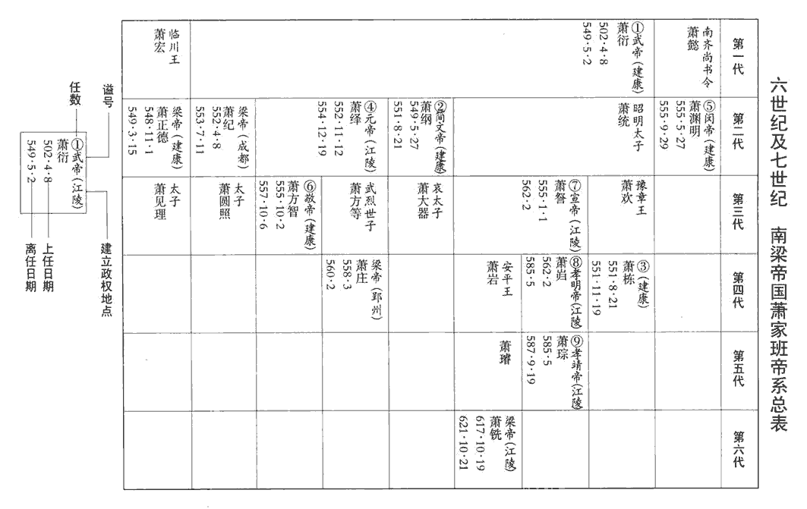 

3湘州‹府设临湘湖南省长沙市›刺史王琳將兵自小桂‹广东省连州市›北下，據姚思廉陳書，小桂，嶺名。輿地志：連州桂陽縣，漢屬桂陽郡，所謂小桂也。至蒸城‹湖南省衡阳市›，蓋漢臨蒸縣古城也，在衡州界。聞江陵已陷，為世祖‹萧绎›發哀，三軍縞素，為，于偽翻。縞，古老翻。遣別將侯平帥舟師攻後梁。帥，讀曰率。琳屯兵長沙‹临湘·湖南省长沙市›，傳檄州郡，為進取之計。長沙王韶及上游諸將皆推琳為盟主。

〖译文〗 [3]湖州刺史王琳带兵从小桂北下，抵达蒸城，听到江陵已经陷落的消息，便为梁元帝萧绎发丧，三军都穿白衣丧服，并派别将侯平率领一支水军去攻打后梁。王琳自己屯兵于长沙，向各州郡发布文告，作进取天下的打算。长沙王萧韶和上游诸将都推举王琳为盟主。

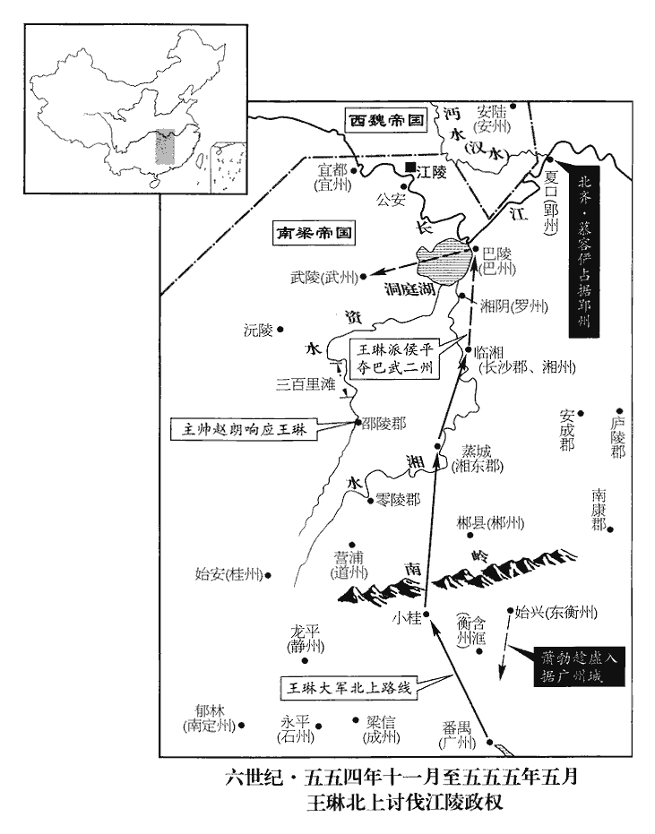 

4齊‹首都邺城河北省临漳县西南邺镇›主‹高洋，本年二十七岁›使清河王岳將兵攻魏安州‹府设安陆湖北省安陆市›，五代志：安陸郡，西魏置安州。以救江陵。岳至義陽‹北齐郢州州政府所在城·河南省信阳市›，江陵陷，因進軍臨江，郢州‹府设夏口湖北省武汉市›刺史陸法和及儀同三司宋蒞舉州降之；降，戶江翻。考異曰：北史「宋蒞」作「宋茝chǎi」。今從北齊紀。又北齊紀云：「壬寅，岳渡江，克夏首，送法和。」按典略，甲午，齊已召岳還。今從典略。長史江夏‹郡政府夏口›太守王珉不從，殺之。夏，戶雅翻。甲午‹十三›，齊召岳還，使儀同三司清都‹首都邺城›慕容儼戍郢州。北齊書，慕容儼，清都武安人，皝之後也。按魏收地形志，東魏都鄴，以魏郡置魏尹，武安縣屬焉。五代志：齊官有清都尹，蓋改魏尹為清都尹也。考異曰：梁紀：「四月，法和降齊，使侯瑱討之。」按齊主與王僧辯書云：「清河王岳今次漢口，與陸居士相會。」然則法和先已降齊也。今從典略。王僧辯遣江州‹府设寻阳江西省九江市›刺史侯瑱攻郢州，任約、徐世譜、宜豐侯循皆引兵會之。瑱，他甸翻，又音鎮。任，音壬。

〖译文〗 [4]北齐国主高洋派清河王高岳带兵攻打西魏的安州，以此举救援江陵。高岳进抵义阳，江陵已经陷落，于是挺进到长江边，郢州刺史陆法和与仪同三司宋献出州郡投降，长史江夏太守王珉不顺从，被杀。甲午（十三日），北齐命令高岳回去，派仪同三司清都人慕容俨守卫郢州。王僧辩派江州刺史侯去攻打郢州，任约、徐世谱、宜丰侯萧循等都带兵去会合。

5辛丑‹二十›，齊立貞陽侯淵明為梁主，使其上黨王渙將兵送之，寒山之敗，貞陽沒於齊。徐陵、湛海珍等皆聽從淵明歸。武帝太清二年，徐陵使魏；魏禪於齊，而梁又有侯景之亂，是以留北。湛海珍降，見一百六十二卷三年。

〖译文〗 [5]辛丑（二十日），北齐立贞阳侯萧渊明为梁朝的新主，并派上党王高涣带兵送他回南方，徐陵、湛海珍等都听从萧渊明一块回去。

6二月，癸丑‹二›，晉安王‹萧方智›至自尋陽，入居朝堂，朝，直遙翻。即梁王位，時年十三。以太尉王僧辯為中書監、錄尚書、驃騎大將軍、都督中外諸軍事，驃，匹妙翻。騎，奇寄翻。加陳霸先征西大將軍，以南豫州‹府设姑孰安徽省当涂县›刺史侯瑱為江州刺史，湘州刺史蕭循為太尉，廣州‹府设番禺广东省广州市›刺史蕭勃為司徒，鎮東將軍張彪為郢州刺史。

〖译文〗 [6]二月癸丑（初二），晋安王萧方智从寻阳来到建康，进入朝堂居住，登上梁王的位置，当时年仅十三岁。他任命太尉王僧辩为中书监、录尚书、骠骑大将军、都督中外诸军事，加封陈霸先为征西大将军，任命南豫州刺史侯为江州刺史，湘州刺史萧循为太尉，广州刺史萧勃为司徒，镇东将军张彪为郢州刺史。

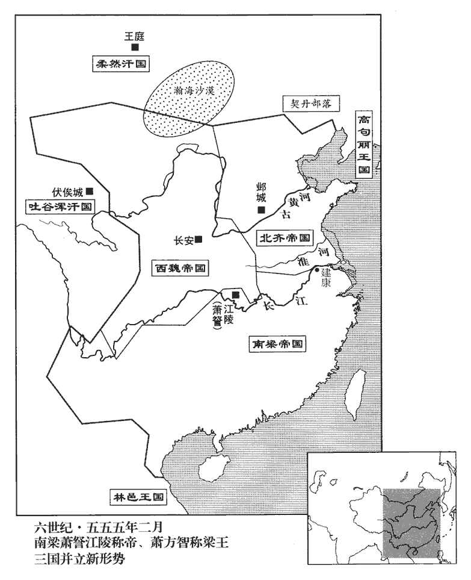 

7齊主先使殿中尚書邢子才馳傳詣建康，與王僧辯書，以為：「嗣主沖藐，傳，張戀翻。藐，亡沼翻。未堪負荷。荷，下可翻，又如字。彼貞陽侯‹萧渊明›，梁武‹萧衍›猶子，長沙‹萧懿›之胤，貞陽雖為縲léi臣於齊，而貞陽侯則梁爵也，故與僧辯書稱「彼貞陽侯」。淵明，長沙王懿之子，武帝兄子，故曰猶子。以年以望，堪保金陵，故置為梁主，納於彼國。卿宜部分舟艦，迎接今主，分，扶問翻。艦，戶黯翻。并心一力，善建良圖。」乙卯‹四›，貞陽侯淵明亦與僧辯書求迎。僧辯復書曰：「嗣主體自宸極，受於乂祖。「乂」，當作「文」。蓋用受終于文祖事。【章：乙十一行本正作「文」；孔本同；張校同；退齋校同；十二行本作「父」。】明公儻能入朝，同獎王室，朝，直遙翻。伊、呂之任，僉qiān曰仰歸；意在主盟，不敢聞命。」甲子‹十三›，齊以陸法和為都督荊•雍等十州諸軍事、太尉、大都督、西南道大行臺，雍，於用翻。又以宋蒞為郢州刺史，蒞弟簉為湘州刺史。簉zào，初救翻。甲戌‹二十三›，上黨王渙克譙郡‹南谯郡·安徽省巢湖市东南›。梁置合州於合肥，立南譙郡於襄安縣界。襄安，漢之巢縣也，梁置蘄縣，隋改曰襄安，唐復曰巢縣。己卯‹二十八›，淵明又與僧辯書，僧辯不從。

〖译文〗 [7]北齐国主高洋在送贞阳侯萧渊明回南方前，先派殿中尚书邢子才飞快地沿驿道去建康，给王僧辩送去一封信。信中认为：“你们立的嗣位的君主年龄幼小，不能承担治国的重任。而那个贞阳侯，是梁武帝的侄子，长沙王萧懿的后代，就他的年龄资望而言，却可以保障金陵不失，所以我把他立为梁朝的主子，送他回南方就国。你应该安排舟舰，去迎接现在的主子，和他同心协力，好好地筹建美好的未来。”乙卯（初四），贞阳侯萧渊明也写信给王僧辩要求来迎接他。王僧辩回信对他说：“当今的嗣主的血统来自皇帝，又受命于祖先。他是合法的嗣主。您如果能到朝廷来当官，一起匡扶王室，那么伊尹、吕望的使命，大家都会说应该归于您了。如果您回朝廷来是想当主子，那么我不能听从这样的命令。”甲子（十三日），北齐任命陆法和为都督荆州、雅州等十州诸军事，太尉，大都督，西南道大行台。又派宋莅当郢州刺史，宋莅的弟弟宋为湘州刺史。甲戌（二十三日），上党王高涣攻克谯郡。乙卯（二十八日），萧渊明又给王僧辩写信去求迎，王僧辩不答应。

8魏‹首都长安陕西省西安市›以右僕射申徽為襄州‹原南梁之雍州·州政府设襄阳湖北省襄樊市›刺史。魏既得梁雍州，改曰襄州，因襄陽以名州也。

〖译文〗 [8]西魏任命右仆射申徽为襄州刺史。

9侯平攻後梁巴、武二州，故劉棻主帥趙朗殺宋文徹，以邵陵歸于王琳。帥，所類翻。

〖译文〗 [9]侯平攻打后梁巴州、武州，已故刘的主帅赵朗杀了宋文彻，献出邵陵投归王琳。

10三月，貞陽侯淵明至東關‹安徽省含山县西南›，散騎常侍裴之橫禦之。齊軍司尉瑾、儀同三司蕭軌南侵皖城‹晋熙郡·安徽省潜山县›，晉熙郡懷寧縣，漢之皖城也。散，悉亶翻。騎，奇寄翻。皖，戶板翻。晉州‹府晋熙›刺史蕭惠以州降之。降，戶江翻。齊改晉熙為江州，齊晉州治平陽‹山西省临汾市›，故此晉州改為江州。以尉瑾為刺史。丙戌‹六›，齊克東關，斬裴之橫，俘數千人；王僧辯大懼，出屯姑孰，謀納淵明。

〖译文〗 [10]三月，贞阳侯萧渊明到了东关，散骑常侍裴之横带兵防御他。北齐军司尉瑾、仪同三司萧轨向南侵犯皖城，晋州刺史萧惠献出州郡投降了。北齐把晋熙改名为江州，任命尉谨当刺史。丙戌（初六），北齐攻克东关，杀了裴之横，俘虏了几千人。王僧辩大惊失色，带兵出城屯驻于姑孰，准备接受萧渊明。

11丙申‹十六›，齊主還鄴，封世宗二子孝珩為廣寧王，珩，音行。延宗為安德王。

〖译文〗 [11]丙申（十六日），北齐国主高洋回到邺城，封文襄帝的两个儿子高孝珩为广宁王，高延宗为安德王。

12孫瑒聞江陵陷，棄廣州還，瑒，雉杏翻，又音暢。曲江侯勃復據有之。去年蕭勃避王琳居始興。復，扶又翻。

〖译文〗 [12]孙所说江陵陷落，扔下广州回来了，曲江侯萧勃又占据了广州。

13魏太師泰遣王克、沈烱等還江南。去年，江陵陷，王克等入長安。泰得庾季才，厚遇之，令參掌太史。季才散私財，購親舊之為奴婢者，泰問：「何能如是？」對曰：「僕聞克國禮賢，古之道也。武王克商，釋箕子囚，式商容閭，封比干墓，所謂禮賢也。今郢都‹南梁首都江陵›覆沒，其君信有罪矣，江陵，楚之故都，古郢城及渚宮皆在其地。搢紳何咎，皆為皁隸！杜預曰：皁隸，賤官。皁，才早翻。隸，力計翻。鄙人羈旅，不敢獻言，誠竊哀之，故私購之耳。」泰乃悟曰：「吾之過也！微君，遂失天下之望！」因出令，免梁俘為奴婢者數千口。

〖译文〗 [13]西魏太师宇文泰派王克、沈炯等人回江南。宇文泰得了庚季才，给他优厚的待遇，让他参与掌管太史的工作。庚季才拿出自己的私财，为亲朋故旧沦为奴婢的人赎身。宇文泰问：“你怎么能这样仗义疏财？”庾季才回答他说：“我听说攻克一个国家，但对那个国家的贤人要予以礼遇，自古以来都是这样做的。现在郢都覆灭了，他们的君主确实有罪，但他手下的官绅士大夫有什么罪呢，竟然都沦为奴隶！我是羁留在这儿的外人，不敢向您进言，但心里私下为他们的命运感到哀怜，所以才用私财为他们赎身。”宇文泰听了才省悟过来，说：“这都是我的过错呀！要不是你提醒，这就要失去天下人的心了！”于是发布命令，免去梁朝的俘虏当奴婢的惩罚，一下子使几千人得到自由。

14夏，四月，庚申‹十›，齊主如晉陽‹山西省太原市›。

〖译文〗 [14]夏季，四月，庚申（初十），北齐国主高洋到了晋阳。

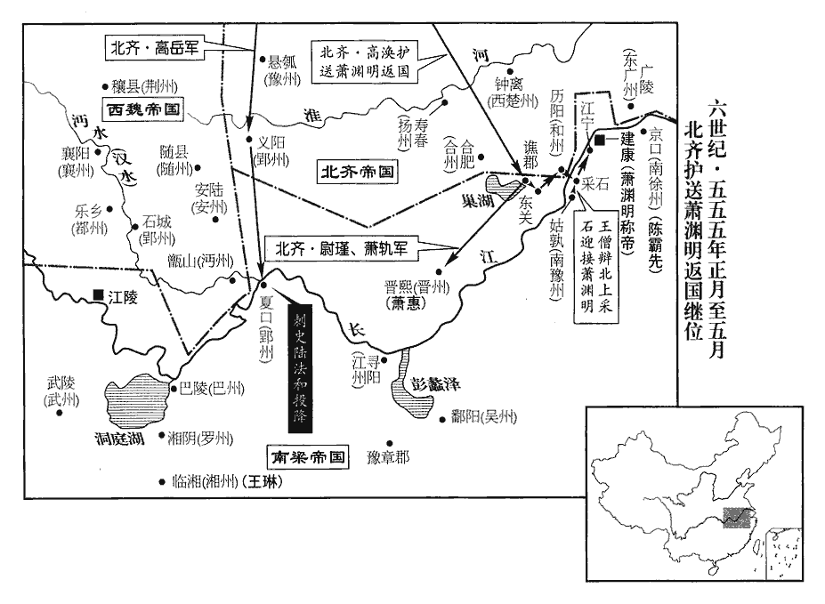 

15五月，庚辰‹一›，侯平等擒莫勇、魏永壽。江陵之陷也，永嘉王莊生七年矣，莊，世子方等之子，元帝之孫。尼法慕匿之，尼，女夷翻。王琳迎莊，送之建康。

〖译文〗 [15]五月，庚辰（初一），侯平等抓住了莫勇、魏永寿。当江陵陷落的时候，永嘉王萧庄正好七岁，尼姑法慕把他藏起来收养着，王琳派人去把他接出来，送到了建康。

16庚寅‹十一›，齊主還鄴。

〖译文〗 [16]庚寅（十一日），北齐国主高洋回到了邺城。

17王僧辯遣使奉啟於貞陽侯淵明，定君臣之禮，又遣別使奉表於齊，使，疏吏翻。以子顯及顯母劉氏、弟子世珍為質於淵明，質，音致。考異曰：典略：「三月，辛卯，遣廷尉張種等送質于鄴。」按淵明五月始入建康，疑太早，恐非。遣左民尚書周弘正至歷陽‹安徽省和县›奉迎，晉武帝太康中，置左民尚書。唐六典：曹魏置左民尚書，晉惠帝置右戶尚書。唐戶部尚書，即左民、右戶之任也。因求以晉安王為皇太子；淵明許之。淵明求度衛士三千，僧辯慮其為變，止受散卒千人。散，蘇旱翻。散卒者，冗散之卒，非敗散之卒也。敗散之散，去聲。庚子‹二十一›，遣龍舟法駕迎之，淵明與齊上黨王渙盟於江北，辛丑‹二十二›，自采石‹安徽省马鞍山市西南›濟江。考異曰：梁紀：「七月，辛丑，淵明濟江。甲辰，入京師。」北齊紀：「五月，蕭明入建業。」按典略，「五月，庚子，僧辯逆淵明；辛丑，濟江；癸卯，至建康。」今從之。於是梁輿南渡，齊師北返。僧辯疑齊，擁檝中流，檝jí，與楫同，櫂zhào也；所以撥水行船。擁檝，附船而不鼓，則船定而不進。不敢就西岸。齊侍中裴英起衛送淵明，與僧辯會于江寧‹江苏省江宁县西南江宁乡›。癸卯‹二十四›，淵明入建康，望朱雀門而哭，逆者以哭對。丙午‹二十七›，即皇帝位，改元天成，以晉安王‹萧方智›為皇太子，王僧辯為大司馬，陳霸先為侍中。

〖译文〗 [17]王僧辩派使者向贞阳侯萧渊明上表，确定君臣之礼。又派另一使者到北齐去上表，派儿子王显和王显的母亲刘氏、弟弟的儿子王世珍到萧渊明那儿去当人质。又派左民尚书周弘正到历阳去奉迎萧渊明，并要求确立晋安王萧方智为皇太子，萧渊明答应了。萧渊明要求自己的三千名卫士跟着去，王僧辩怕这么多卫士会生出变乱来，因此只接受了一千名冗散的士兵。庚子（二十一日），王僧辩派龙船，备法驾去迎接萧渊明。萧渊明和北齐上党王高涣在长江北边盟誓，辛丑（二十二日），才从采石渡过长江。于是梁朝的车辆南渡，北齐的军队返回北方。王僧辩对北齐军队心存疑惧，把船停在长江中流，不敢靠近西岸。北齐侍中裴英起护送萧渊明南渡，和王僧辩在江宁会面。癸卯（二十四日），萧渊明进入建康，看到朱雀门痛哭失声，去迎接他的群臣也痛哭。丙午（二十七日），萧渊明即皇帝位，改换年号为天成，立晋安王萧方智为皇太子，任命王僧辩为大司马，陈霸先为侍中。

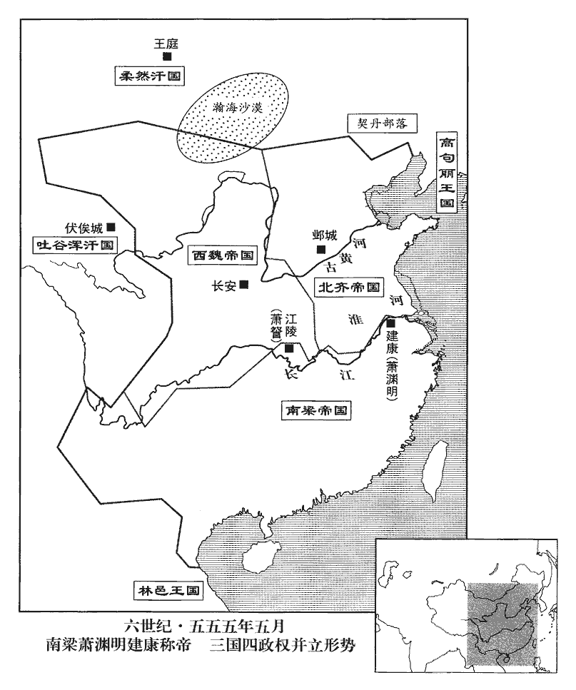 

18六月，庚戌朔‹一›，齊發民一百八十萬築長城，自幽州‹府设蓟县北京市›夏口‹北京市昌平县西北居庸关›西至恆州‹府设平城山西省大同市›九百餘里，幽州夏口，蓋即居庸下口也。幽州軍都縣西北有居庸關。濕餘水出上谷沮陽縣之東，南流出關，謂之下口。「夏」當作「下」。恆，戶登翻。命定州‹府设中山河北省定州市›刺史趙郡王叡將兵監之。叡，琛之子也。趙郡王琛，即高永寶，歡之弟也。永寶，琛字。監，工銜翻。琛，丑林翻。

〖译文〗 [18]六月，庚戌朔（初一），北齐征发民工一百八十万人修筑长城，从幽州夏口向西延伸到恒州，共九百多里长，朝廷任命定州刺史赵郡王高睿带兵去监督工程进展。高睿是高琛的儿子。

19齊慕容儼始入郢州，而侯瑱等奄至城下，儼隨方備禦，瑱等不能克；乘間出擊瑱等軍，大破之。間，古莧翻。城中食盡，煮草木根葉及靴皮帶角食之，靴，許戈翻。與士卒分甘共苦，堅守半歲，人無異志。貞陽侯淵明立，乃命瑱等解圍，瑱還鎮豫章。齊人以城在江外難守，因割以還梁。儼歸，望齊主，悲不自勝。勝，音升。齊主‹高洋›呼前，執其手，脫帽看髮，歎息久之。

〖译文〗 [19]北齐慕容俨刚进入郢州时，侯等人就突然出现在城下，慕容俨按照自己确定的方略进行防备抵御，侯等无法攻克。慕容俨又乘着空隙主动出击侯等人的军队，把他们打得大败。后来城里粮食吃光了，守城军民只好煮草木的棍、叶和靴子的皮、衣带的角等来充饥。慕容俨和士卒同甘共苦，坚守了半年，人们没有动摇、离散的想法。贞阳侯萧渊明即位之后，便命令侯等人撤去对郢州的围困，侯便回去镇守豫章。北齐方面因为郢州城在长江以南，难以防守，就把它割让给了梁朝。慕容俨归国后，望着北齐国主高洋，悲伤得不能自抑。北齐国主叫他走近前来，拉着他的手，脱下他的帽看他的头发，叹息了很久。

20吳興‹浙江省湖州市›太守杜龕，龕，苦含翻。王僧辯之壻也。僧辯以吳興為震州，因震澤以為州名。用龕為刺史，又以其弟侍中僧愔為豫章太守。愔，於今翻。

〖译文〗 [20]吴兴太守杜龛是王僧辩的女婿。王僧辩把吴兴改为震州，任命杜龛为刺史，又任命自己的弟弟侍中王僧为豫章太守。

21壬子‹三›，齊主以梁國稱藩，詔凡梁民悉遣南還。

〖译文〗 [21]壬子（初三），齐主高洋因为梁国自称藩属，依附于北齐，所以下诏凡是梁朝的百姓都遣送回南方。

22丁卯‹十八›，齊主如晉陽；壬申‹二十三›，自將擊柔然‹瀚海沙漠群›。將，即亮翻。秋，七月，己卯‹一›，至白道‹内蒙古呼和浩特市北›，留輜重，重，直用翻。帥輕騎五千追柔然，壬午‹四›，及之於懷朔鎮‹内蒙古固阳县›。齊主親犯矢石，頻戰，大破之，至于沃野‹内蒙古乌拉特前旗东北›，獲其酋長，水經註：雲中郡有白道嶺、白道川。帥，讀曰率。騎，奇寄翻。酋，慈秋翻。長，知兩翻。及生口二萬餘，牛羊數十萬。壬申‹十四›，【章：十二行本「申」作「辰」；乙十一行本同；孔本同；張校同；退齋校同。】還晉陽。

〖译文〗 [22]丁卯（十八日），北齐国主高洋到晋阳。壬申（二十三日），亲自带兵去打柔然。秋季，七月，己卯（初一），到达白道，留下军用物资，率领轻装骑兵五千人去追击柔然，壬午（初四），在怀朔镇追上了柔然。高洋亲自冒着飞箭飞石，频繁地投入战斗，终于把柔然打得大败，一直追到沃野这地方，捉获了柔然的酋长，还抓了二万多人口，数十万头牛羊。壬申（疑误），才回到晋阳。

23八月，辛巳，王琳自蒸城還長沙。

〖译文〗 [23]八月，辛巳（疑误），王琳从蒸城回到长沙。

24齊主還鄴，以佛、道二教不同，欲去其一，集二家【章：十二行本「家」下有「學者」二字；乙十一行本同；孔本同。】論難於前，去，羌呂翻。難，乃旦翻。遂敕道士皆剃髮為沙門；有不從者，殺四人，乃奉命。於是齊境皆無道士。今道家有太霄琅書經云：人行大道，號曰道士。士者何，理也，事也。身心順理，唯道是從，從道為事，故曰道士。余按此說，是道流借吾儒經解大義以演繹道士二字。道家雖曰宗老子，而西漢以前未嘗以道士自名，至東漢始有張道陵、于吉等，其實與佛教皆起於東漢之時。

〖译文〗 [24]北齐国主高洋回到邺城，他因为佛、道二教教义教规都不同，便想除去一个，就把两教中的学者集中在一起，让他们在自己面前互相辩难，于是就敕令道士都剃掉头发当和尚。有人不服从，杀了四人，才都奉行了这道命令，于是北齐境内就没有道士了。

25初，王僧辯與陳霸先共滅侯景，見一百六十四卷世祖承聖元年。情好甚篤，僧辯為子頠娶霸先女，好，呼到翻。為，于偽翻。頠wěi，魚委翻。會僧辯有母喪，未成婚。僧辯居石頭城，霸先在京口‹江苏省镇江市›，僧辯推心待之，頠兄顗屢諫，不聽。顗yǐ，魚豈翻。及僧辯納貞陽侯淵明，霸先遣使苦爭之，使，疏吏翻。往返數四，僧辯不從。霸先竊歎，謂所親曰：「武帝‹萧衍›子孫甚多，唯孝元‹萧绎›能復讎雪恥，謂誅滅侯景也。其子何罪，而忽廢之！吾與王公並處託孤之地，處，昌呂翻。而王公一旦改圖，外依戎狄，援立非次，其志欲何所為乎！」僧辯立淵明，名不正而言不順，故姦雄得因以為資。乃密具袍數千領及錦綵金銀為賞賜之具。

〖译文〗 [25]当初，王僧辩和陈霸先共同消灭了侯景，两人感情很是深固。王僧辩为儿子王迎娶陈霸先的女儿，正赶上王僧辩母亲去世，所以没有成婚。王僧辩居住在石头城，陈霸先在京口，王僧辩推心置腹地对待陈霸先，王的哥哥王多次劝他要有所提防，王僧辩不听。等到王增辩迎纳贞阳侯萧渊明为帝时，陈霸先派使者苦苦劝阻，争辩不休，使者为此往返了几趟，王僧辩不听。陈霸先私下叹息，对他的亲信说：“武帝的子孙很多，只有孝元帝能平定侯景之乱，为祖宗报仇雪耻。他的儿子有什么罪，突然就废了他！我和王公僧辩共同处于先帝托孤的重臣的地位，而王公僧辩现在一下子改变主意，对外依附戎狄之邦，不按次序立天子，他到底想干什么呢？”于是秘密准备战袍几千领和锦采金银等等作为赏赐部下的物品，准备起事。

會有告齊師大舉至壽春‹安徽省寿县›將入寇者，僧辯遣記室江旰告霸先，使為之備。霸先因是留旰於京口，旰，古汗翻。舉兵襲僧辯。九月，壬寅‹二十五›，召部將侯安都、周文育及安陸‹湖北省安陆市›徐度、錢塘‹浙江省杭州市›杜稜謀之。將，即亮翻；下同。稜以為難，霸先懼其謀泄，以手巾絞稜，今人盥洗，以布拭手，長七八尺，謂之手巾。悶絕于地，因閉於別室。部分將士，分，扶問翻。分賜金帛，以弟子著作郎曇朗鎮京口，知留府事，曇朗，霸先母弟休先之子。曇，徒含翻。使徐度、侯安都帥水軍趨石頭，帥，所類翻；下同。趨，七喻翻。霸先帥馬步自江乘‹江苏省南京市东北›羅落會之，江乘羅落，江乘縣之羅落橋。自江乘至羅落橋，京口趨建康之大路，劉裕伐桓玄由此。是夜，皆發，召杜稜與同行。知其謀者，唯安都等四將，外人皆以為江旰徵兵禦齊，不之怪也。

〖译文〗 正好这时有人来报告，北齐军队进行大调动，已经到达了寿春，将要向南进犯。王僧辩派记室江旰通知陈霸先，让他有所戒备。陈霸先借这个机会把江旰扣留在京口，举兵袭击王僧辩。九月，壬寅（二十五日），陈霸先召集部将侯安都、周文育以及安陆人徐度、钱塘人杜棱一起密谋策划。杜棱认为这事很难进行，陈霸先害怕秘密泄漏，用手巾绞住杜棱，使他闷绝在地上，然后把他关在另一间屋子里，接着就部署将士，分赐金银布帛，命令自己弟弟的儿子著作郎陈昙朗留下来镇守京口，掌管州府政事，又派徐度、侯安都率领水军直逼石头，陈霸先自己率领骑兵、步兵从江乘、罗落这条路线去与之会合。当天夜里，各路兵马都出发了，并带着杜棱随军同行。知道这次进军的真正目的的人，只有侯安都等四个将领，外人都以为是江旰来征调军队抵抗北齐的进犯，对军队的出动一点也不感到奇怪。

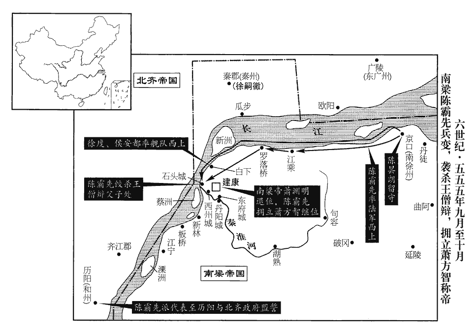 

甲辰‹二十七›，安都引舟艦將趣石頭，艦，戶黯翻。趣，七喻翻。霸先控馬未進，安都大懼，追霸先罵曰：「今日作賊，事勢已成，生死須決，在後欲何所望！若敗，俱死，後期得免斫頭邪？」霸先曰：「安都嗔我！」乃進。霸先控馬踟躕，以觀安都之意，見安都決死前向，乃進。嗔，昌真翻，恚，怒也。安都至石頭城北，棄舟登岸。石頭城北接岡阜，不甚危峻，安都被甲帶長刀，軍人捧之，投於女垣內，被，皮義翻。女垣，城上堞也。眾隨而入，進及僧辯臥室；霸先兵亦自南門入。僧辯方視事，外白有兵，俄而兵自內出。僧辯遽走，遇子頠，與俱出閤，帥左右數十人苦戰于聽事前，聽，讀曰廳。力不敵，走登南門樓，拜請求哀。霸先欲縱火焚之，僧辯與頠俱下就執。霸先曰：「我有何辜，公欲與齊師賜討？」且曰：「何意全無備？」僧辯曰：「委公北門，何謂無備？」京口為建康北門。是夜，霸先縊殺僧辯父子。既而竟無齊兵，亦非霸先之譎也。譎，古穴翻。前青州刺史新安‹浙江省淳安县›程靈洗，帥所領救僧辯，力戰於石頭西門，軍敗；霸先遣使招諭，久之乃降。使，疏吏翻。降，戶江翻。霸先深義之，以為蘭陵‹侨郡·江苏省镇江市›太守，使助防京口。守，式又翻。乙巳‹二十八›，霸先為檄布告中外，列僧辯罪狀，且曰：「資斧所指，唯王僧辯父子兄弟，其餘親黨，一無所問。」

〖译文〗 甲辰（二十七日），侯安都指挥舟舰将奔袭石头，陈霸先有意勒马不进。侯安都以为陈霸先临事犹豫，心中大惊，就追上陈霸先大骂：“今天我们造反，事到临头，已经无法挽回了，是生是死必须作出决断，你迟疑不进，留在后头，存的什么念头！如果失败，咱们都得死，留在后头就能免去砍头吗？”陈霸先一听心中暗自高兴，说：“侯安都在怪我不下决心、生我的气呢！”于是带兵前进。侯安都到了石头城的北边，扔下船上了岸。石头城北边和山冈高坡相连，城墙不太高峻，侯安都披着盔甲，手握长刀，让手下军人把他抬起来扔到城墙上，众人随着他蜂拥而入，一直进到王僧辩卧室。陈霸先的队伍也从南门攻入了。王僧辩正在处理军政事务，外面有人说士兵袭击，过一会儿士兵从里头冒了出来，王僧辩急忙逃跑，遇到儿子王，和他一起冲出门外，率身边几十人在议事厅前面苦战，力竭不敌，跑到南门楼上，向进逼过来的陈霸先拜请乞求哀怜。陈霸先要放火烧南门楼，王僧辩和王都下楼就擒。陈霸先质问说：“我有什么过错，你要和北齐军队一起讨伐我？”而且还问：“北齐军队来犯，你全无戒备，是什么意思？”王僧辩有点莫名其妙，回答说：“派你守京口，扼据建康北门，怎么说我对北齐军队没有戎备？”当天夜里，陈霸先把王僧辩父子两人绞杀了。后来，竟没有发现北齐军队的影子，看来，这也并不是陈霸先玩弄诡计。前青州刺史新安人程灵洗率领所部将士来救王僧辩，在石头西门奋力苦战，终于兵败。陈霸先派使者去招谕他，过了很久，他才投降了。陈霸先被程灵洗的义气深深感动，任命他为兰陵太守，让他协助防守京口。乙巳（二十八日），陈霸先发布檄文，通告中外，举列王僧辩的罪过，说明为什么要讨伐他。檄文中还说：“我所要讨伐的，只是王僧辩父子兄弟，至于其他王氏亲戚党羽，一概不加问罪。”

丙午‹二十九›，貞陽侯淵明遜位，出就邸，考異曰：梁書：「九月，丙午，帝即皇帝位。十月，己巳，大赦，改元。」按長曆，丙午，九月二十九日；己巳，十月二十二日。豈有即位二十四日始改元大赦乎！蓋丙午復梁王位，十月乃即帝位耳。典略：「丁未，廢貞陽侯出就邸。」今並從陳書。百僚上晉安王表，勸進。上，時掌翻。冬，十月，己酉‹二›，晉安王‹萧方智，本年十三岁›即皇帝位，大赦，改元，改元紹泰。中外文武賜位一等。以貞陽侯淵明為司徒，封建安公。告齊云：「僧辯陰圖篡逆，故誅之，仍請稱臣於齊，永為藩國。」齊遣行臺司馬恭與梁人盟于歷陽。

〖译文〗 丙午（二十九日），贞阳侯萧渊明退位，搬出官廷回自己的官邸。百官上表给晋安王萧方智，劝他登基。冬季，十月，己酉（初二），晋安王萧方智即皇帝位，大赦天下，改换年号为绍泰，对朝廷内外文武百官都赏赐一级官位。任命贞阳侯萧渊明为司徒，封为建安公。派人通报北齐，说：“王僧辩阴谋篡位造反，所以杀了他。”仍然请求向北齐称臣，永远当北齐的附属国。北齐派行台司马恭和梁朝人在历阳订立了盟约。

26辛亥‹四›，齊主如晉陽。

〖译文〗 [26]辛亥（初四），北齐国主高洋到了晋阳。

27壬子‹五›，加陳霸先尚書令、都督中外諸軍事、車騎將軍、揚‹京畿›•南徐‹府设京口›二州刺史。癸丑‹六›，以宜豐侯循為太保，建安公淵明為太傅，曲江侯勃為太尉，王琳為車騎將軍、開府儀同三司。帝之初為梁王也，諸藩皆進官，獨不及王琳，抑王僧辯雅知王琳之不可制邪！

〖译文〗 [27]壬子（初五），梁朝加封陈霸先为尚书令，都督中外诸军事，车骑将军，扬、南徐二州刺史。癸丑（初六），任命宜丰侯萧循为太保，建安公萧渊明为太傅，曲江侯萧勃为太尉，王琳为车骑将军，开府仪同三司。

28戊午‹十一›，尊帝所生夏貴妃為皇太后，夏，戶雅翻。立妃王氏為皇后。

〖译文〗 [28]戊午（十一日），梁朝尊奉皇帝萧方智的生母夏贵妃为皇太后，立妃子王氏为皇后。

29杜龕恃王僧辯之勢，龕，苦含翻。素不禮於陳霸先，在吳興，每以法繩其宗族，霸先深怨之。及將圖僧辯，密使兄子蒨qiàn還長城‹浙江省长兴县›，長城縣，霸先與其宗族世居之。晉太康三年，分烏程立長城縣，屬吳興郡，今湖州長興縣是也，在湖州西北七十里。蒨，七見翻。立柵以備龕。僧辯死，龕據吳興拒霸先，義興‹江苏省宜兴市›太守韋載以郡應之。考異曰：典略作「韋載」。今從梁、陳書。今按典略，若作「韋載」，則與梁、陳書同，不須考異矣。吳郡太守王僧智，僧辯之弟也，亦據城拒守。考異曰：南史云，「僧智奔任約。」今從典略。陳蒨至長城，收兵纔數百人，杜龕遣其將杜泰將精兵五千奄至，將士相視失色。將，即亮翻；下同。蒨言笑自若，部分益明，分，扶問翻。眾心乃定。泰晝夜苦攻，數旬，不克而退。霸先使周文育攻義興，義興屬縣卒皆霸先舊兵，善用弩，韋載收得數十人，繫以長鎖，命所親監之，監，工銜翻。使射文育軍，約曰：「十射不兩中者死。」射，而亦翻。中，竹仲翻。故每發輒斃一人，文育軍稍卻。載因於城外據水立柵，相持數旬。杜龕遣其從弟北叟將兵拒戰，從，才用翻；下同。北叟敗，歸于義興。霸先聞文育軍不利，辛未‹二十四›，自表東討，留高州‹府设高凉广东省阳江市›刺史侯安都、石州‹府设永平广西藤县›刺史杜稜宿衛臺省。五代志：永平郡，梁置石州，隋後改曰藤州。宋白曰：藤州，治鐔xín津縣，漢猛陵縣也。甲戌‹二十七›，軍至義興，丙子‹二十九›，拔其水柵。

〖译文〗 [29]杜龛依恃王僧辩的权势，一向对陈霸先很不礼貌。在吴兴，他常常对陈霸先宗族中的人绳之以法，陈霸先因此对他深怀怨恨。待到陈霸先要算计王僧辩的时候，便秘密地派他的侄子陈潜回长城县，修筑营栅以防备杜龛。王僧辩死后，杜龛占据吴兴抗拒陈霸先，义兴太守韦载带他郡中的部队起来响应。吴郡太守王僧智是王僧辩的弟弟，也据城固守以作抗拒。陈到长城县后，召集的士兵才有几百人，杜龛派他的部将杜泰带精兵五千人突然到来，陈的将士们面面相觑，大惊失色。陈却谈笑自若，部署分派军队，越发清楚明确，于是众人才心神安定下来。杜泰昼夜苦攻，持续了几十天，打不下来就退走了。陈霸先派周文育去攻打义兴，义兴所属各县的士卒都是陈霸先的旧部，善于使用弩箭，韦载找出了几十人，用长长的锁链把他们系在一起，派亲信监督他们用箭射周文育的军队，并规定“谁如果十箭中不能射中两箭，就处死。”所以每发箭出去就射死一个人，周文育的军队这才稍稍退却了。韦载乘势在城外靠水边建立营栅，和周文育相持了几十天。杜龛派他的堂弟杜北叟带兵抗战，杜北叟兵败，回到义兴。陈霸先听到周文育进攻受挫的消息，辛未（二十四日），宣布自己亲自带兵东伐，留下高州刺史侯安都、石州刺史杜棱守卫台省。甲戌（二十七日），陈霸先军队抵达义兴，丙子（二十九日），拔除了韦载修筑的水栅。

譙‹府设顿丘侨县·安徽省滁州市›、秦‹府设秦郡江苏省六合县›二州刺史徐嗣徽從弟嗣先，僧辯之甥也。僧辯死，嗣先亡就嗣徽，嗣徽以州入于齊。五代志：江都郡清流縣，梁置新昌郡及譙州。又，六合縣，置秦郡及秦州。及陳霸先東討義興，嗣徽密結南豫州刺史任約，將精兵五千乘虛襲建康，是日，襲據石頭，遊騎至闕下。侯安都閉門藏旗幟，示之以弱，令城中曰：「登陴闚賊者斬！」幟，昌志翻。陴，頻彌翻。及夕，嗣徽等收兵還石頭。安都夜為戰備，將旦，嗣徽等又至，安都帥甲士三百，開東、西掖門出戰，臺城正南端門，其左、右二門曰東、西掖門。帥，讀曰率。大破之，嗣徽等奔還石頭，不敢復逼臺城。復，扶又翻。

〖译文〗 谯、秦二州的刺史徐嗣徽的堂弟徐嗣先是王僧辩的外甥。王僧辩死后，徐嗣先逃亡到徐嗣徽处，徐嗣徽干脆献上谯秦二州，投靠了北齐。待到陈霸先东讨义兴时，徐嗣徽秘密联合南豫州刺史任约，带精兵五千人乘虚偷袭建康。这一天，终于袭击占领了石头，冲在前面的游骑已到了台城宫阙之下。侯安都关上大门，藏起旗帜，有意以此表示自己怯弱，同时告诫城中士兵：“凡登高窥探贼兵者一律处斩。”到天黑，徐嗣徽等人收兵回石头。侯安都夜里作了充分的战斗准备，天快亮时，徐嗣徽等人又来进攻，侯安都率领甲士三百人打开东、西侧门出城迎战，大败敌军，徐嗣徽等人奔逃回石头，再也不敢逼近台城了。

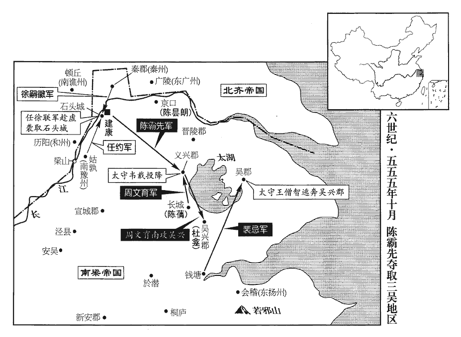 

陳霸先遣韋載族弟翽齎書諭載，翽huì，呼會翻。丁丑‹三十›，載及杜北叟皆降，降，戶江翻。霸先厚撫之，以翽監義興郡，監，工銜翻。引載置左右，與之謀議。霸先卷甲還建康，卷，讀曰捲。考異曰：梁書：「十一月，庚寅，霸先還建康。」按庚寅，十一月十三日，太晚。且庚寅以前，霸先已有在建康與齊相拒事迹。今從陳書。使周文育討杜龕，救長城。

〖译文〗 陈霸先派韦载的族弟韦携带书信去说服韦载投降。丁丑（三十日），韦载和杜北叟都投降了。陈霸先对待他们很优厚，极力安抚他们，让韦监管义兴郡，把韦载安置在自己身边，视为亲信，有事让他参与谋议。陈霸先平定义兴后，就收兵回建康，派周文育去讨伐杜龛，救援长城县。

將軍黃他攻王僧智於吳郡，不克，霸先使寧遠將軍裴忌助之。忌選所部精兵輕行倍道，自錢塘直趣吳郡，按陳霸先自義興還建康，遣裴忌助黃他攻吳郡，自錢塘直趣吳郡，非路也，錢塘必誤。趣，七喻翻。夜，至城下，鼓譟薄之。薄，伯各翻。僧智以為大軍至，輕舟奔吳興。忌入據吳郡，因以忌為太守。

〖译文〗 将军黄他在吴郡攻打王僧智，打不下来，陈霸先派宁远将军裴忌去帮助他。裴忌挑选部属中的精兵轻装倍速前进，从钱塘直奔吴郡。夜里，抵达城下，大声鼓噪着逼进城墙。王僧智以为大部队来了，急忙乘着小船逃到吴兴去了。裴忌攻占了吴郡，陈霸先任命裴忌为吴郡太守。

十一月，己卯‹二›，齊遣兵五千渡江據姑孰，以應徐嗣徽、任約。陳霸先使合州‹南合州·州政府设海康广东省雷州市›刺史徐度立柵於冶城‹建康城西南›。庚寅‹三›，【章：乙十一行本「寅」作「辰」；退齋校同。】齊又遣安州‹府设渔阳北京市通县›刺史翟子崇、楚州‹西楚州·州政府设钟离安徽省凤阳县东北临淮关›刺史劉士榮、淮州‹府设淮阴江苏省淮阴市›刺史柳達摩五代志：鍾離郡，梁置北徐州，齊改曰楚州，管下定遠縣，梁置安州。江都郡山陽縣有淮陰郡，東魏置淮州。翟，直格翻。將兵萬人於胡墅度米三萬石、馬千匹入石頭。胡墅，在大江北岸，對石頭城。墅，神與翻。霸先問計於韋載，載曰：「齊師若分兵先據三吳之路，略地東境，則時事去矣。今可急於淮南因侯景故壘築城，以通東道轉輸，淮南，秦淮之南也。輸，式喻翻；下運輸同。分兵絕彼之糧運，則【章：十二行本「則」上有「使進無所資」五字；乙十一行本同；孔本同；張校同。】齊將之首旬日可致。」將，即亮翻。霸先從之。癸未‹六›，使侯安都夜襲胡墅，考異曰：典略作「己巳」。按長曆，是月戊寅朔，無己巳。今從陳書。燒齊船千餘艘；艘，蘇遭翻。仁威將軍周鐵虎斷齊運輸，斷，音短。擒其北徐州‹府设琅邪山东省临沂市›刺史張領州；五代志：琅邪郡，舊置北徐州。仍遣韋載於大航築侯景故壘，使杜稜守之。航，戶剛翻。齊人於倉門、水南立二柵，倉門，石頭倉城門。水南，秦淮水之南。與梁兵相拒。壬辰‹十五›，齊大都督蕭軌將兵屯江北。

〖译文〗 十一月，己卯（初二），北齐派兵五千渡过长江占据姑孰，以策应徐嗣徽、任约。陈霸先派合州刺史徐度在冶城修筑栅栏。庚寅（十三日），北齐又派安州刺史翟子崇、楚州刺史刘士荣、淮州刺史柳达摩带兵一万在胡墅运米三万石、马一千匹到石头城。陈霸先向韦载征询对策，韦载说：“齐军如果分兵先占据通往三吴的道路，然后在我们东边的边境攻城占地，那么时局就完了。现在齐军没有这样做，我们可以赶快在淮南一带沿着侯景过去留下的旧垒修筑新城堡，以便打通东边的运输道路。同时分出一支军队去断绝他们运粮的道路，这样，齐将的首领十天之内就得送来了。”陈霸先听从了他的计策。癸未（初六），陈霸先派侯安都夜袭胡墅，烧掉了北齐一千多艘兵船；仁威将军周铁虎切断了北齐运输补给的道路，抓住了他们的北徐州刺史张领州；仍然让韦载在大航修筑侯景的故垒，让杜棱去守卫。北齐军队在仓门和秦淮河之南修建了两座营栅，与梁兵对抗。壬辰（十五日），北齐大都督萧轨带兵屯驻在长江北岸。

30初，齊平秦王歸彥幼孤，高祖令清河昭武王岳養之，歸彥，高歡族弟也。歸彥父徽，於歡有舊恩，故歡憐其孤而命岳養之。歡廟號高祖。岳情禮甚薄，歸彥心銜之。及顯祖‹高洋›即位，歸彥為領軍大將軍，大被寵遇；被，皮義翻。岳謂其德己，更倚賴之。岳屢將兵立功，有威名，而性豪侈，好酒色，好，呼到翻。起第於城南，城南，鄴城之南。聽事後開巷。聽，讀曰廳。歸彥譖之於帝曰：「清河僭擬宮禁，制為永巷，但無闕耳。」帝由是惡之。惡，烏路翻。帝納倡婦薛氏於後宮，倡，尺良翻，優也。岳先嘗因其姊迎之至第。帝夜遊於薛氏家，其姊為其父乞司徒。為，于偽翻。帝大怒，懸其姊，鋸殺之。讓岳以姦，岳不服，帝益怒，乙亥‹二十二›，使歸彥鴆岳。岳自訴無罪，歸彥曰：「飲之則家全。」飲之而卒‹年四十四岁›，葬贈如禮。

〖译文〗 [30]当初，北齐平秦王高归彦幼小时成了孤儿，高祖高欢命令清河昭武王高岳抚养他。高岳对高归彦寡情薄礼，所以高归彦心里恨他。待到文宣帝高洋即位，高归彦当了领军大将军，很受宠爱。高岳认为高归彦会感激自己的抚育之恩，所以对他更是倚赖。高岳多次带兵立功，威名赫赫，而又性格豪放奢侈，喜欢醇酒女色，在城南修建了大宅第，并在办公视事的大厅后头开了一条巷子。高归彦在文宣帝那儿进谗言，说：“清河昭武王高岳私自模拟宫禁的建筑式样，修了一条永巷，只是没有修阙门罢了。”文宣帝从此厌恶高岳。文宣帝把娼妇薛氏接进后宫，高岳早先曾托薛氏的姐姐把薛氏接到家里。有一天夜里，文宣帝到薛氏的家里去，薛氏的姐姐替她父亲要求赐给司徒的官位。文宣帝勃然大怒，就把薛氏姐姐吊起来，用锯子锯成了两段。文宣帝责备高岳奸淫薛氏，高岳不服气，文宣帝更加生气了，乙亥（疑误），派高归彦去毒死高岳。高岳申诉自己没有罪，高归彦说：“你把这毒酒喝下去了，全家就可以保全。”高岳只好把毒酒喝了，他死之后，朝廷按礼仪加以埋葬。

薛嬪有寵於帝，嬪，毗賓翻。久之，帝忽思其與岳通，無故斬首，藏之於懷，出東山宴飲。勸酬始合，忽探出其首，投於柈上，探，吐南翻。柈pán，蒲官翻。支解其尸，弄其髀bì為琵琶，一座大驚。帝方收取，對之流涕曰：「佳人難再得！」漢李延年歌曰：「北方有佳人，絕世而獨立，一顧傾人城，再顧傾人國。寧不知傾城與傾國，佳人難再得！」載尸以出，被髮步哭而隨之。被，皮義翻。

〖译文〗 薛嫔很得文宣帝宠爱，很久之后，文宣帝忽然想起她曾和高岳通奸，无缘无故就将她斩首，然后把她的头藏在怀里，到东山去宴饮作乐。大家正在互相劝酒应酬，文宣帝忽然用手探怀，拿出薛氏的头扔到桌上，又把她的尸体支解开，将她的髀骨充作琵琶弹弄，举座见状大惊。文宣帝这才把薛氏的头和髀骨收起来，对着它们流下泪来，说：“佳人难再得！”他让人用车把薛氏尸体运出去，自己披散头发，边走边哭地跟着。

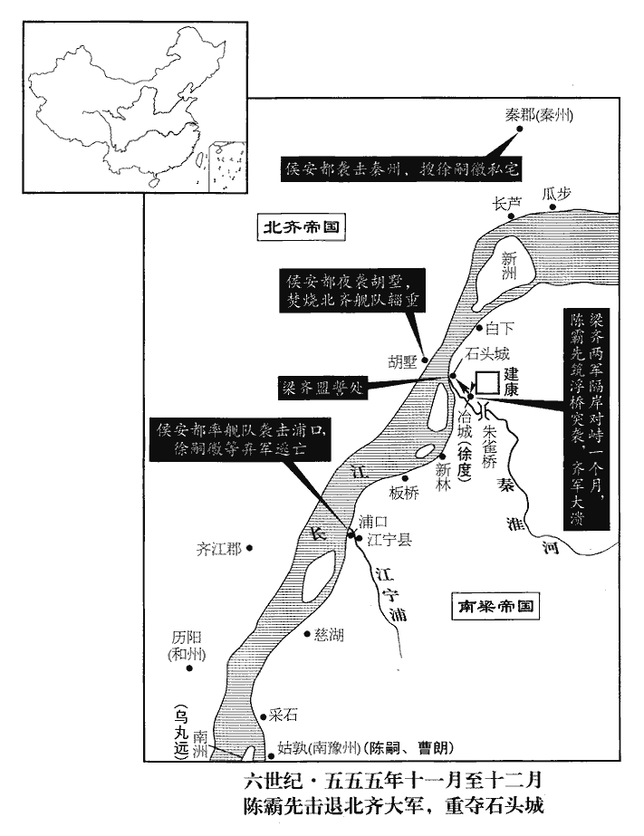 

31甲辰‹二十七›，徐嗣徽等攻冶城柵，陳霸先將精甲自西明門出擊之，嗣徽等大敗，留柳達摩等守城，自往采石迎齊援。

〖译文〗 [31]甲辰（二十七日），徐嗣徽等进攻冶城的营栅，陈霸先率领精兵从西明门出来迎击，徐嗣徽等人大败，留下柳达摩等人守城，自己去采石迎接北齐援兵。

32以郢州刺史宜豐侯循為太保，廣州刺史曲江侯勃為司空，并徵入侍。循受太保而辭不入。勃方謀舉兵，遂不受命。

〖译文〗 [32]梁朝任命郢州刺史宜丰侯萧循为太保，广州刺史曲江侯萧勃为司空，把他们二人一起征召入朝侍奉皇帝。萧循接受了太保之职，但借故推辞不入朝。萧勃正密谋起兵造反，于是不接受任命。

33鎮南將軍王琳侵魏，魏大將軍豆盧寧禦之。姓氏志：豆盧本姓慕容氏，燕北地王精降魏，北人謂歸義為豆盧，因賜以為氏。

〖译文〗 [33]镇南将军王琳入侵西魏，西魏大将军豆卢宁带兵抵御他。

34十二月，癸丑‹七›，侯安都襲秦郡，破徐嗣徽柵，俘數百人。收其家，得其琵琶及鷹，遣使送之曰：「昨至弟處得此，今以相還。」使，疏吏翻；下同。嗣徽大懼。丙辰‹十›，陳霸先對冶城立航，航，戶剛翻，連舟為橋也。悉渡眾軍，攻其水南二柵。即倉門、水南二柵。柳達摩等渡淮置陳，陳，讀曰陣。霸先督兵疾戰，縱火燒柵，齊兵大敗，爭舟相擠，擠，牋西翻，又子細翻。溺水者以千數，呼聲震天地，溺，奴狄翻。呼，火故翻。盡收其船艦。是日，嗣徽與任約引齊兵水步萬餘人還據石頭，霸先遣兵詣江寧，據要險。嗣徽等水步不敢進，頓江寧浦口‹江宁乡西·江宁浦注入长江处›，霸先遣侯安都將水軍襲破之，嗣徽等單舸脫走，舸，古我翻。盡收其軍資器械。

〖译文〗 [34]十二月，癸丑（初七），侯安都袭击秦郡，攻破徐嗣徽的营栅，俘获了好几百人。又抄了他的家产，搜得他用的琵琶和养的鹰，派人送给徐嗣徽，并说：“昨天到老弟家里得到这点东西，现在特地送去还你。”徐嗣徽看到东西，大惊失色。丙辰（初十），陈霸先在冶城对面的水上把船只连在一起建了一座浮桥，指挥众军全部渡过去，攻击修在南边的两座营栅。柳达摩等渡过秦淮河摆开阵势，陈霸先督率战士猛烈进攻，并放火烧栅栏，北齐军队大败，争着上船逃跑，互相拥挤，掉入水中淹死的有上千人，哭喊声震天动地，北齐军队的船舰全部被缴获。当天，徐嗣徽和任约带领北齐水师步兵一万多人退回去据守石头，陈霸先派兵来到江宁，占据了险要之地。徐嗣徽等人的水师步兵都不敢前进，停顿在江宁浦的入江之处。陈霸先派侯安都带水军去袭击打败了他们，徐嗣徽等人乘上单人小船逃走，他们的辎重、武器全部被缴获。

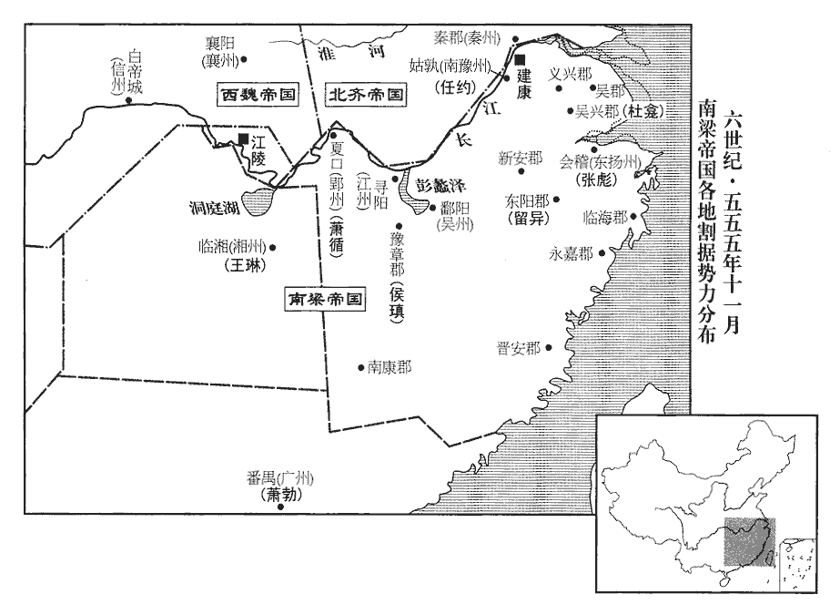 

己未‹十三›，霸先四面攻石頭，城中無水，升水直絹一匹。庚申‹十四›，達摩遣使請和於霸先，且求質子。請和而求質子者，恐還以無功得罪，欲以質子藉手。質，音致。時建康虛弱，糧運不繼，朝臣皆欲與齊和，朝，直遙翻。請以霸先從子曇朗為質。曇朗時留鎮京口。從，才用翻。曇，苦含翻。霸先曰：「今在位諸賢欲息肩於齊，左傳：鄭成公疾，子駟請息肩於晉。杜預註曰：以負擔諭。若違眾議，謂孤愛曇朗，不恤國家，今決遣曇朗，棄之寇庭。齊人無信，謂我微弱，必當背盟。背，蒲妹翻。齊寇若來，諸君須為孤力鬬也！」霸先知齊人恥於無功，必增兵復至，故先以此諭眾，責其效死。為，于偽翻。乃與曇朗及永嘉王莊、丹楊尹王沖之子珉為質，「與」，當作「以」，則文意明順。【章：乙十一行本正作「以」；退齋校同。】與齊人盟於城外，城外者，石頭城外。將士恣其南北。徐嗣徽等南人恣其南，柳達摩等北人恣其北。恣其南北，言唯意所適也。辛酉‹十五›，霸先陳兵石頭南門，送齊人歸北，徐嗣徽、任約皆奔齊。收齊馬仗船米，不可勝計。勝，音升。齊主誅柳達摩。壬戌‹十六›，齊和州‹府设历阳›長史烏丸遠自南州‹安徽省当涂县西长江中小岛›奔還歷陽。劉昫曰：齊、梁通和，置和州於歷陽郡。烏丸蓋出於東胡烏丸之種，因以為姓。

〖译文〗 己未（十三日），陈霸先从四面包围攻打石头，城中没有水喝，一升水昂贵到值一匹绢。庚申（十四日），柳达摩派使者向陈霸先求和，而且请求以儿子为人质。当时建康实力虚弱，粮草运输跟不上，朝廷中的大臣都想与北齐讲和，纷纷请求用陈霸先的侄子陈昙朗为人质。陈霸先说：“现在在朝廷中的各位贤人都想和北齐讲和以获得休息，如果我违反众人的意见，大家会说我偏爱陈昙朗，不顾念国家利益。现在我决定派陈昙朗去，就算把他扔在敌寇的庭院里吧！北齐人一向不守信用，我答应讲和，他们会认为我们势微力弱好欺负，肯定会背弃盟约再来进犯。北齐强盗如果再来进犯，那时你们可得为我拼死战斗呀！”于是就把陈昙朗和永嘉王萧庄、丹杨府尹王冲的儿子王珉作人质，与北齐人在城外订立了和约，允许追随北齐的将士按自己的意愿选择归居南方或北方。辛酉（十五日），陈霸先在石头南门摆列兵阵，送北齐军队北归。徐嗣徽、任约都投奔了北齐。这一仗，缴获北齐军马、器械、舟船、大米，不可胜数。北齐国主高洋杀了败将柳达摩。壬戍（十六日），北齐和州长史乌丸远从南州奔逃回到历阳。

江寧令陳嗣、黃門侍郎曹朗據姑孰反，霸先命侯安都等討平之。霸先恐陳曇朗亡竄，自帥步騎至京口迎之。帥，讀曰率。

〖译文〗 江宁县令陈嗣、黄门侍郎黄朗占据姑孰谋反，陈霸先派侯安都等人出兵讨伐，平定了他们。陈霸先担心陈昙朗逃跑流窜到别处去，便亲自率领步、骑兵到京口去迎接他。

35交州‹府设龙编越南河内市东北北宁府›刺史劉元偃帥其屬數千人歸王琳。

〖译文〗 [35]交州刺史刘元偃率领部属几千人去投奔王琳。

36魏以侍中李遠為尚書左僕射。

〖译文〗 [36]西魏任命侍中李远为尚书左仆射。

37魏益州‹府设成都四川省成都市›刺史宇文貴使譙淹從子子嗣誘說淹，以為大將軍，從，才用翻。說，式芮翻。淹不從，斬子嗣。貴怒，攻之，淹自東遂寧‹四川省遂宁市›徙屯墊江‹重庆市合川市›。晉於德陽縣界東南置遂寧郡。五代志：遂寧郡方義縣，梁曰小溪，置東遂寧郡。墊江縣，漢屬巴郡，梁為楚州治所，隋為渝州。墊，音疊。

〖译文〗 [37]西魏益州刺史宇文贵派谯淹的侄子谯子嗣去向谯淹诱降，说是要让谯淹当大将军，谯淹不答应，杀了谯子嗣。宇文贵勃然大怒，派兵去攻打，谯淹从东遂宁移师屯驻垫江。

38初，晉安‹福建省福州市›民陳羽，吳立東安縣，晉武帝更名晉安。太康三年，分建安立晉安郡。五代志：建安郡南安縣舊曰晉安。今之泉州即其地。世為閩中豪姓，其子寶應多權詐，郡中畏服。侯景之亂，晉安太守賓化侯雲以郡讓羽，羽老，但治郡事，令寶應典兵。時東境‹浙江省和福建省›荒饉，而晉安獨豐衍，寶應數自海道出，寇抄臨安‹应是临海郡。浙江省台州市西北章安镇›、永嘉‹浙江省温州市›、會稽‹浙江省绍兴市›，沈約志：吳分餘杭為臨水縣，晉武帝太康元年更名臨安。五代志無臨安郡及臨安縣，但有餘杭郡耳。數，所角翻。抄，楚交翻。會，工外翻。或載米粟與之貿易，由是能致富強。侯景平，世祖‹萧绎›因以羽為晉安太守。及陳霸先輔政，羽求傳位於寶應，霸先許之。為後陳寶應亂閩中張本。

〖译文〗 [38]当初，晋安地区的平民陈羽，世世代代为闽中豪门。他的儿子陈宝应颇善权变，为人奸诈，郡中的人都怕他，服从他。侯景之乱时，晋安太守宾化侯云把郡守之职让给陈羽。陈羽年老，只管郡里的政事，让陈宝应分管军事。当时东边闹饥荒，而晋安一带却丰收有余粮。陈宝应多次从海路出兵，到临安、永嘉、会稽一带抢劫虏掠。有时也运些米粟和这些地区进行贸易，因此就有条件富强起来。侯景之乱平定后，梁元帝鉴于这种情况，就任命陈羽为晋安太守。待到陈霸先辅佐梁朝时，陈羽要求把太守职位传给陈宝应，陈霸先答应了。

39是歲，魏宇文泰諷淮安王育上表請如古制降爵為公，於是宗室諸王皆降為公。

〖译文〗 [39]这一年，西魏宇文泰暗示淮安王元育上表给朝廷，要求按照古制，把自己的爵位降为公，他这一带头，于是宗室诸王都降爵为公。

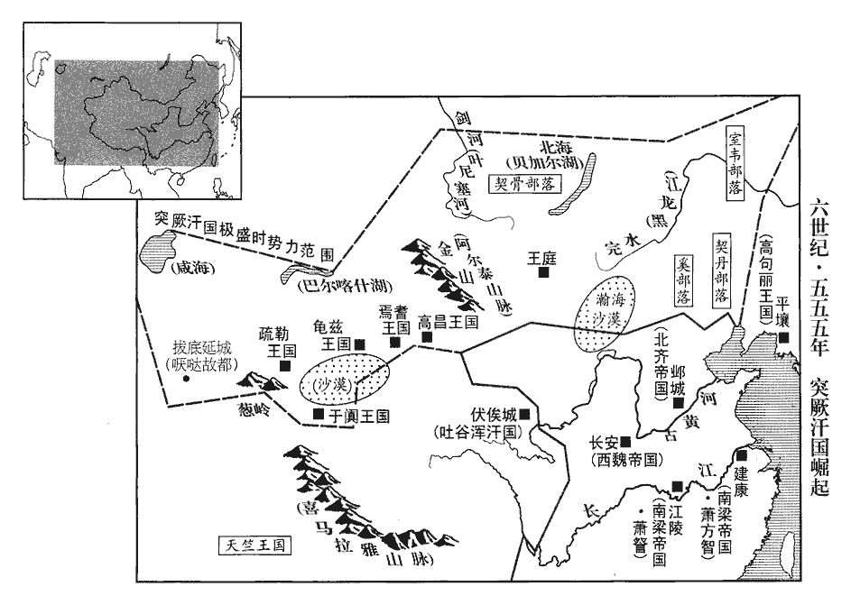 

40突厥木杆可汗擊柔然鄧叔子，滅之，厥，九勿翻。杆，公旦翻。可，從刊入聲。汗，音寒。叔子收其餘燼奔魏。木杆西破嚈噠‹首都拔底延城阿富汗北部瓦齐拉巴德市›，嚈，益涉翻。噠，當割翻，又宅軋翻。東走契丹‹内蒙古西辽河上游›，北并契骨‹西伯利亚叶尼塞河上游›，契骨，即唐之結骨。唐書曰：黠戛斯，古堅昆國，或曰居勿，或曰結骨。蓋堅昆語訛為結骨，稍號紇骨，亦曰紇扢斯。契丹，欺訖翻，又音喫。契骨，苦結翻。威服塞外諸國。其地東自遼海‹辽河›，西至西海‹疑指咸海›，長萬里，長，直亮翻。南自沙漠以北五六千里‹依地望推测，当到贝加尔湖›皆屬焉。木杆恃其強，請盡誅鄧叔子等於魏，使者相繼於道；太師泰收叔子以下三千餘人付其使者，盡殺之於青門外。長安城東出南頭第一門曰霸城門，民見門色青，名曰青城門，或曰青門。秦東陵侯召平種瓜於青門外，即其地。使，疏吏翻。

〖译文〗 [40]突厥木杆可汗袭击柔然邓叔子，把他的部队消灭了。邓叔子收拾剩余的兵力财物投奔西魏。木杆可汗向西打败哒，向东赶跑了契丹，向北吞并了契骨，其威力慑服了塞外各国。于是，他的疆土东边从辽海开始，西边延伸到西海，长达万里；南边从沙漠以北五六千里都归属于他。木杆依恃他实力强大，要求西魏必须把邓叔子等人全部杀掉，派往西魏的使者在路上前后相继。太师宇文泰只好把邓叔子以下三千多人抓起来交给木杆可汗的使者，在青门外把他们全部杀了。

41初，魏太師泰以漢、魏官繁，命蘇綽及尚書令盧辯依周禮更定六官。更，工衡翻。

〖译文〗 [41]当初，西魏太师宇文泰因为汉朝、魏朝官职繁多，便命令苏绰和尚书令卢辩依照《周礼》重新确定了六官的职称。

## 太平元年（丙子、五五六）是年九月方改元太平。

1春，正月，丁丑‹一›，魏‹首都长安陕西省西安市›初建六官，以宇文泰為太師、大冢宰，柱國李弼為太傅、大司徒，趙貴為太保、大宗伯，宗伯以上，以三公兼六卿之職。北史盧辯傳：置太師、太傅、太保各一人，是曰三孤。獨孤信為大司馬，于謹為大司寇，侯莫陳崇為大司空。自餘百官，皆倣周禮。

〖译文〗 [1]春季，正月，丁丑（初一），西魏开始建立实行文官之制，任命宇文泰为太师、大冢宰，柱国李弼为太傅、大司徒，赵贵为太保、大宗伯，独孤信为大司马，于谨为大司寇，侯莫陈崇为大司空。其余百官的设置任命，都模仿《周礼》。

2戊寅‹二›，大赦，其與任約、徐嗣徽同謀者，一無所問。癸未‹七›，陳霸先使從事中郎江旰說徐嗣徽使南歸，說，式芮翻；下因說同。嗣徽執旰送齊‹首都邺城河北省临漳县西南邺镇›。

〖译文〗 [2]戊寅（初二），梁朝大赦天下。凡是与任约、徐嗣徽同谋的人，一概不予追究。癸未（初七），陈霸先派从事中郎江旰去劝说徐嗣徽，让他回南方来。徐嗣徽把江旰抓起来送到了北齐。

3陳蒨、周文育合軍攻杜龕於吳興‹浙江省湖州市›。龕勇而無謀，嗜酒常醉，其將杜泰陰與蒨等通。龕與蒨等戰，敗，泰因說龕使降，將，即亮翻。說，輸芮翻。降，戶江翻。龕然之。其妻王氏曰：王氏，僧辯女也。「霸先讎隙如此，何可求和！」因出私財賞募，復擊蒨等，大破之。復，扶又翻。既而杜泰降於蒨，龕尚醉未覺，覺，古效翻，又如字。蒨遣人負出，於項王寺‹吴兴城北门之内›前斬之。項羽起吳下，故後人為立寺於吳興。考異曰：梁書：「太平元年，正月癸未，杜龕降，詔賜死。」陳書：「紹泰元年，十二月，杜龕以城降；明年，正月癸未，誅杜龕于吳興，龕從弟北叟、司馬沈孝敦並賜死」。典略：「魏恭帝二年，十二月，蒨命劉澄等攻龕，大敗之，龕乃降；明年，正月丁亥，周鐵虎送杜龕祠項王神，使力士拉龕於坐，從弟北叟、司馬沈孝敦並賜死。」今從南史。王僧智與其弟豫章‹江西省南昌市›太守僧愔俱奔齊。愔，於今翻。考異曰：梁書、南史王僧辯傳：「僧辯既亡，僧智得就任約。約敗走，僧智肥不能行，又遇害。僧智弟僧愔位譙州刺史，征蕭勃，及聞兄死，引軍還。時吳州刺史羊亮隸在僧愔下，與僧愔不平，密召侯瑱見禽。僧愔以名義責瑱，瑱乃委罪於將羊鯤，斬之，僧愔復得奔齊。」陳書、南史侯瑱傳則云：「僧辯使其弟僧愔與瑱共討蕭勃，及陳武帝誅僧辯，僧愔陰欲圖瑱及奪其軍，瑱知之，盡收僧愔徒黨，僧愔奔齊。」典略：「魏恭帝三年，正月初，僧愔與瑱共討曲江侯勃，至是，吳州刺史羊亮說僧愔襲瑱，而翻以告瑱，瑱攻之，僧愔奔齊。」凡此諸說，莫知孰是。今約其梗概言之。

〖译文〗 [3]陈、周文育把军队合并在一起在吴兴攻打杜龛。杜龛其人有勇而无谋，又爱喝酒，一天到晚总是醉醺醺的，他的部将杜泰暗地里和陈等挂上了钩。杜龛同陈等人交战失败，杜泰便劝说杜龛投降，杜龛答应了。但是，他的妻子王氏说：“陈霸先和我们王家结仇结得这么深，怎么可以向他求和！”于是拿出私财赏赐招募战士，再一次向陈发动进攻，把陈打得大败。不久崐杜泰投降了陈，而杜龛还酒醉没醒，陈派人把他背出来，在项王寺前把他斩首了。王僧智和他的弟弟豫章太守王僧都投奔北齐。

東揚州‹府设会稽浙江省绍兴市›刺史張彪素為王僧辯所厚，不附霸先。二月，庚戌‹五›，陳蒨、周文育輕兵襲會稽，彪兵敗，走入若邪山中‹浙江省绍兴市南›，簡文帝大寶元年，張彪起兵於若邪山。邪，音耶。蒨遣其將吳興章昭達追斬之。將，即亮翻；下同。東陽‹浙江省金华市›太守留異饋蒨糧食，霸先以異為縉州‹府东阳›刺史。因縉雲山而置縉州。五代志：處州栝蒼縣有縉雲山。縉，音晉。

〖译文〗 东扬州刺史张彪一向被王僧辩所宠爱看重，所以不肯归附陈霸先。二月，庚戌（初五），陈、周文育派轻装士兵奔袭会稽，张彪兵败，逃入若邪山中。陈派他的部将吴兴人章昭达追上并斩了他。东阳太守留异送粮食给陈，陈霸先任命留异为缙州刺史。

江州‹府设寻阳江西省九江市›刺史侯瑱本事王僧辯，亦擁兵據豫章及江州，不附霸先。霸先以周文育為南豫州‹府设姑孰安徽省当涂县›刺史，使將兵擊湓城‹江西省九江市寻阳东›，庚申‹十五›，又遣侯安都、周鐵虎將舟師立柵於梁山‹安徽省和县南长江中小岛›，以備江州。

〖译文〗 江州刺史侯原来侍奉王僧辩，所以也拥兵占据豫章和江州，不归附陈霸先。陈霸先任命周文育为南豫州刺史，派他带兵去打湓城。庚申（十五日），又派侯安都、周铁虎率领水军在梁山一带建立营栅，以防备江州。

4癸亥‹十八›，徐嗣徽、任約襲采石‹安徽省马鞍山市西南›，執戍主明州‹府设交谷越南河静县›刺史張懷鈞送於齊。五代志：日南郡交谷縣，梁置明州。張懷鈞蓋帶刺史而戍采石也。

〖译文〗 [4]癸亥（十八日），徐嗣徽、任约袭击采石，抓获采石守将明州刺史张怀钧，送他到了北齐。

5後梁主‹萧詧，本年三十八岁›擊侯平於公安‹湖北省公安县›，平與長沙王韶引兵還長沙‹临湘·湖南省长沙市›。王琳遣平鎮巴州‹府设巴陵湖南省岳阳市›。

〖译文〗 [5]后梁国主萧在公安袭击侯平，侯平和长沙王萧韶带兵回长沙。王琳派侯平去镇守巴州。

6三月，壬午‹七›，‹萧方智，本年十四岁›詔雜用古今錢。

〖译文〗 [6]三月，壬午（初七），梁朝下诏，允许古今钱币混合使用。

7戊戌‹二十三›，齊遣儀同三司蕭軌、庫狄伏連、堯難宗、東方老等與任約、徐嗣徽合兵十萬入寇，出柵口‹濡须口·安徽省无为县东南›，柵口，柵江口也，在今和州歷陽縣西南百五十里，與無為軍分界，即古之濡須口。宋白曰：廬州東南至柵口，今謂之新婦口，三百八十四里，對岸即舊南陵縣地，對岸為繁昌縣。向梁山。陳霸先帳內盪主黃叢逆擊，破之，盪主，主勇士以突盪敵人。齊師退保蕪湖‹安徽省芜湖市›。霸先遣定州‹府设郁林广西桂平县›刺史沈泰等就侯安都，共據梁山以禦之。周文育攻湓城，未克，召之還。夏，四月，丁巳‹十三›，霸先如梁山‹安徽省和县南长江中小岛›巡撫諸軍。

〖译文〗 [7]戊戌（二十三日），北齐派仪同三司萧轨、库狄伏连、尧难宗、东方老等人与任约、徐嗣徽联合成大军十万人南下进犯，军队从栅口出发，直指梁山。陈霸先军帐内的一位善于突击冲锋的主将黄丛率兵迎击，打败了北齐军队，北齐军队只好退保芜湖。陈霸先派定州刺史沈泰等人归侯安都指挥，据守梁山以抵抗北齐军队。周文育带兵攻打湓城，没有攻克，被召回来。夏季，四月，丁巳（十三日），陈霸先到梁山去巡视安抚各路兵马。

8乙丑‹二十一›，齊儀同三司婁叡討魯陽‹河南省鲁山县›蠻，破之。

〖译文〗 [8]乙丑（二十一日），北齐仪同三司娄讨伐鲁阳蛮，打败了他们。

9侯安都輕兵襲齊行臺司馬恭於歷陽‹安徽省和县›，考異曰：梁書云：「壬午，安都襲恭。」按長曆，是月乙巳朔，無壬午。大破之，俘獲萬計。

〖译文〗 [9]侯安都率领轻装士兵在历阳袭击北齐行台司马恭，把司马恭打得大败，俘虏了上万人。

10魏太師泰尚孝武‹元修›妹馮翊公主，生略陽公覺；姚夫人生寧都公毓。毓於諸子最長‹宇文毓本年二十三岁›，五代志：西城郡安康縣，舊曰寧都。毓，余六翻。長，知兩翻；下同。娶大司馬獨孤信女。泰將立嗣，謂公卿曰：「孤欲立子以嫡，恐大司馬有疑，如何？」眾默然，未有言者。尚書左僕射李遠曰：「夫立子以嫡不以長，春秋公羊傳之言。略陽公為世子，公何所疑！若以信為嫌，請先斬之。」遂拔刀而起。泰亦起，曰：「何至於是！」信又自陳解，遠乃止。於是群公並從遠議。遠出外，拜謝信曰：「臨大事不得不爾！」信亦謝遠曰：「今日賴公決此大議。」遂立覺為世子。

〖译文〗 [10]西魏太师宇文泰娶了孝武帝的妹妹冯翊公主，生下儿子略阳公宇文觉，姚夫人则生了宁都公宇文毓。宁都公宇文毓在几个儿子中最年长，娶了大司马独孤信的女儿。宇文泰准备确立继承人，对公卿大臣说：“我想立嫡出的儿子为世子，担心大司马对此有疑心，该怎么办好呢？”众大臣默然不作声。尚书左仆射李远说：“从来立世子都是看是否嫡出，不看是否年长，把略阳公宇文觉立为世子，您有什么可疑虑的呢？如果怕独孤信有意见，为此有顾虑，那么可以先把他斩了！”于是就拔出刀要行动。宇文泰忙站起来阻止说：“何至于要这样做！”独孤信也赶快自我陈述辩解，表示并无异议，李远这才停止行动。于是大臣们都听从了李远的建议。退朝后，李远走出宫廷外，拜谢独孤信说：“面临国家大事不得不这样，请谅解。”独孤信也感谢李远说：“今天崐亏得您才把这件大事决定下来。”于是就立略阳公宇文觉为世子。

11太師泰北巡。

〖译文〗 [11]西魏太师宇文泰到北边巡视。

12五月，齊人召建安公淵明，詐許退師，考異曰：典略云：「五月，齊主在東山飲酒，投杯赫怒，召魏收於前，立為制書，欲自將西討長安，令上黨王渙將兵伐梁，於是渙南侵。」按梁、陳、北齊帝紀及渙傳皆無是事，今去之。陳霸先具舟送之。癸未‹九›，淵明疽發背卒。甲申‹十›，齊兵發蕪湖‹安徽省芜湖市›，庚寅‹十六›，入丹楊縣‹安徽省当涂县东北小丹阳›，此丹楊縣乃漢古縣，非今鎮江府之丹楊縣也。據沈約志，晉武帝太康三年，分丹楊縣立于湖縣。于湖，今太平州也。丹楊縣地當在太平州東北。丙申‹二十二›，至秣稜故治‹江苏省江宁县南秣陵乡›。沈約曰：秣陵本治去京邑六十里，今故治村是也。晉安帝義熙九年移治京邑，在鬬場。鬬場，猶今言教場。晉成帝咸和中，詔內外諸軍戲於南郊之場，因名戲場，亦曰鬬場。陳霸先遣周文育屯方山‹江宁县东南·秦淮河流经山下›，丹楊記，秦始皇鑿方山，其斷處為瀆，則今淮水。徐度頓馬牧‹江宁县西南秦淮河西畔›，馬牧，牧馬之地。杜稜頓大航‹朱雀桥›南以禦之。

〖译文〗 [12]五月，北齐人召见建安公萧渊明，假装要答应退兵。陈霸先准备船只要送萧渊明去。癸未（初九），萧渊明背上痈疽发作死去。甲申（初十），北齐军队从芜湖出发，庚寅（十六日），进入丹杨县，丙申（二十二日），到达秣棱旧治所。陈霸先派周文育屯驻于方山，徐度驻守马牧，杜棱驻守大航南端，以防御北齐兵。

13齊漢陽敬懷王洽卒。洽，齊主‹高洋›之弟。

〖译文〗 [13]北齐汉阳敬怀王高洽去世。

14辛丑‹二十七›，齊人跨淮立橋柵渡兵，夜至方山，徐嗣徽等列艦於青墩‹安徽省当涂县西南十千米青堆沙›，至于七磯‹似在秦淮河入长江处附近›，以斷周文育歸路。艦，戶黯翻；下同。墩，音敦。斷，音短。文育鼓譟而發，嗣徽等不能制；至旦，反攻嗣徽。嗣徽驍將鮑砰獨以小艦殿軍，驍，堅堯翻。將，即亮翻；下同。砰，普耕翻。殿，丁練翻。文育乘單舴zé艋與戰，舴，陟格翻。艋，莫梗翻。舴艋，小船。一舟曰單。跳入艦中，跳，他弔翻。斬砰，仍牽其艦而還。還，從宣翻，又如字。嗣徽眾大駭，因留船蕪湖，自丹楊步上。上，時掌翻；下槊上同。陳霸先追侯安都、徐度皆還。追梁山之軍還建康，以禦齊師。

〖译文〗 [14]辛丑（二十七日），北齐军队跨秦淮河修筑桥梁渡兵，夜里到达方山，徐嗣徽等人把军舰摆在青墩一带，一直摆到七矶，用以切断周文育的退路。周文育指挥士兵大声豉噪，大举进军，徐嗣徽等人没能抵挡得住。到天亮时分，周文育反攻徐嗣徽。徐嗣徽手下的骁勇的将领鲍坪单独用小舰当后卫，周文育乘坐一条小快船与他近战，纵身跳入小舰中，一刀斩了鲍坪；还把这条小舰拉了回来。徐嗣徽的部众一看吓得要命，于是把船留在芜湖，从丹杨步行上岸。陈霸先把侯安都、徐度追回来以抗击北齐军队。

癸卯‹二十九›，齊兵自方山進及倪塘‹应在建康城东南›，倪塘在臺城東。游騎至臺，騎，奇寄翻。建康震駭，帝總禁兵出頓長樂寺，樂，音洛。內外纂嚴。霸先拒嗣徽等於白城‹应在江宁县东南秦淮河畔›，白城當在湖熟縣界。適與周文育會。將戰，風急，霸先曰：「兵不逆風。」文育曰：「事急矣，何用古法！」抽槊上馬先進，【章：十二行本「進」下有「眾軍從之」四字；乙十一行本同；孔本同；張校同；退齋校同。】槊，色角翻。風亦尋轉，殺傷數百人。侯安都與嗣徽等戰於耕壇南，天子親耕藉田，祭先農於田所，故有耕壇。宋文帝元嘉二十一年，令司空、司農、京尹、令、尉度官之辰地，八里之外，整制千畝，中開阡陌，立先農壇於中阡西陌南，設御耕壇於中阡東陌北。安都帥十二騎突其陳，破之，騎，奇寄翻。陳，讀曰陣。生擒齊儀同三司乞伏無勞。考異曰：南史作「乞伏無芳」。今從陳書。霸先潛撤精卒三千，配沈泰渡江，襲齊行臺趙彥深於瓜步‹江苏省六合县南长江渡口›，獲艦百餘艘，粟萬斛。艘，蘇遭翻。

〖译文〗 癸卯（二十九日），北齐军队从方山挺进到倪塘，游动的前哨骑兵在宫城下出现，建康城受到震惊，人心惶惶，梁敬帝带着宫廷卫队出宫驻入长乐寺，内外戒严。陈霸先在白城抗御徐嗣徽等人，正好与周文育的军队会合。将要与北齐兵交战时，风刮得很急，陈霸先说：“军队最好不要逆风而进。”周文育说：“军情紧急，何必拘泥于古法！”说着便抽出一把槊跃身上马冲向前去。过一会风向也转了，周文育猛冲，杀伤了好几百人。侯安都与徐嗣徽在耕坛南边会战。侯安都率领十二个骑兵冲破徐嗣徽的阵地，把他们打败，活捉了北齐仪同三司乞伏无劳。陈霸先秘密地撤下三千精锐士兵配合沈泰渡过长江，在瓜步袭击北齐行台赵彦深，缴获战船一百余艘，粮食一万斛。

六月，甲辰‹一›，齊兵潛至鍾山‹建康城东›，侯安都與齊將王敬寶戰于龍尾，鍾山之龍尾也。自山趾築道陂陁pōtuó以登山，曰龍尾。軍主張纂戰死。丁未‹四›，齊師至幕府山，幕府山在今建康城西二十五里，晉琅邪王初渡江，丞相王導建幕府其上，因名。霸先遣別將錢明，將水軍出江乘‹江苏省南京市东北›，邀擊齊人糧運，盡獲其船米。齊軍乏食，殺馬驢食之。庚戌‹七›，齊軍踰鍾山，霸先與眾軍分頓樂遊苑東及覆舟山北‹覆舟山在玄武湖东南畔，乐游苑在覆舟山南麓›，斷其衝要。斷，音短。壬子‹九›，齊軍至玄武湖西北，將據北郊壇，晉成帝立北郊壇於覆舟山南。眾軍自覆舟東移頓壇北，與齊人相對。

〖译文〗 六月，甲辰（初一），北齐军队偷偷来到钟山，侯安都与北齐将领王敬宝在龙尾交战，军中首领张纂在战斗中阵亡。丁未（初四），北齐军队抵达幕府山，陈霸先派别将钱明率领水军兵发江乘，截击北齐军队的粮食运输船队，把他们的船队装运的大米全部缴获。这一来，北齐军队没有粮食吃，只好杀战马、驴子充饥。庚戌（初七），北齐军队翻越钟山，陈霸先与众军分头驻扎在乐游苑东边和覆舟山北边，切断北齐军队的交通要道。壬子（初九），北齐军队到达玄武湖西北，准备占据北边的郊祀高坛。众军从覆舟向东移动，驻扎在坛北，与北齐军队相对摆开阵势。

會連日大雨，平地水丈餘，齊軍晝夜坐立泥中，足指皆爛，懸鬲以爨，鬲lì，音歷。爾雅：鼎款足者謂之鬲。說文：鬲，鼎屬也；實五觳hú。斗二升曰觳。而臺中及潮溝北路燥，潮溝，吳孫權所開，以引潮抵于秦淮。梁軍每得番易。時四方壅隔，糧運不至，建康戶口流散，徵求無所。甲寅‹十一›，少霽，少，詩沼翻。霸先將戰，調市人得麥飯，調，徒弔翻。分給軍士，士皆飢疲。會陳蒨饋米三千斛、鴨千頭，霸先命炊米煮鴨，人人以荷葉裹飯，婫hùn以鴨肉數臠，婫，公渾翻。以鴨肉蓋飯上曰婫。今江東人猶謂以物蒙頭曰婫。臠，力兗翻。乙卯‹十二›，未明，蓐rù食，比曉，比，必利翻。霸先帥麾下出莫府山。侯安都謂其部將蕭摩訶曰：「卿驍勇有名，千聞不如一見。」帥，讀曰率。將，即亮翻。驍，堅堯翻。摩訶對曰：「今日令公見之。」及戰，安都墜馬，齊人圍之，摩訶單騎大呼，直衝齊軍，齊軍披靡，安都乃免。騎，奇寄翻。呼，火故翻。披，普彼翻。霸先與吳明徹、沈泰等眾軍首尾齊舉，縱兵大戰，安都自白下引兵橫出其後，齊師大潰，斬獲數千人，相蹂踐而死者不可勝計，蹂，人九翻。踐，慈演翻。勝，音升。生擒徐嗣徽及弟嗣宗，斬之以徇，追奔至于臨沂‹侨县·江苏省句容市北›。晉成帝咸康元年，桓溫領南琅邪太守，鎮江乘蒲州之金城，求割丹楊之江乘縣境立郡，又分江乘地立臨沂縣。宋白曰：臨沂山西北臨大江。其江乘、攝山‹南京市东北栖霞山›、鍾山等諸軍相次克捷，攝山，在今建康城北四十五里。江乘地記曰：有草可以攝生，故名。虜蕭軌、東方老、王敬寶等將帥凡四十六人。將，即亮翻。帥，所類翻。其軍士得竄至江者，縛荻筏以濟，荻，亭歷翻，萑huán也。中江而溺，流尸至京口‹江苏省镇江市›，翳水彌岸；唯任約、王僧愔得免。丁巳‹十四›，眾軍出南州，燒齊舟艦。

〖译文〗 当时正赶上连日下大雨，平地雨水积有一丈多深，北齐将士白天黑夜或坐或立全都泡在泥水中，脚指头都烂了，做饭得把锅悬挂起来才行，但是皇城和潮沟的北路一带却还干燥，梁朝军队总是能换班作战。当时四方通往都城的道路都堵塞隔断了，粮食也运不进来，建康一带人民东流西散，无法征收粮赋。甲寅（十一日），天才稍稍放晴，陈霸先准备开战，向商人征调了一些麦子，做成麦饭分给军中士兵，士兵们都已经又饿又疲劳了。正好这时陈送来大米三千斛，鸭子一千只。陈霸先下令蒸米饭煮鸭子，士兵们个个用荷叶包米饭，饭上盖上几片鸭肉，乙卯（十二日），天还没亮，士兵们都坐在草席上用饭，等到天一亮，陈霸先就率领下属将士兵发幕府山出发。侯安都对他的部将萧摩诃说：“你一向英勇善战，远近闻名，这回可是千闻不如一见，就看你的了。”萧摩诃回答说：“今天就让您看看！”等到交战时，侯安都不慎从马上摔下来了，北齐将士围了上来，萧摩诃单枪匹马，大呼猛进，直向北齐军士冲来，北齐士兵纷纷避开，侯安都这才保住了生命。陈霸先与吴明彻、沈泰等众军头尾一齐冲锋，指挥将士全面出击，猛打猛冲，侯安都又从白下带领一支军队切断了北齐军的后路，北齐军队大败，被杀被俘的有几千人，互相蹂踏而死的人不可胜计，徐嗣徽和他弟弟徐嗣宗被活捉后杀头示众。梁军追杀败逃的北齐兵，一直追到临沂。梁朝在江乘、摄山、钟山等地的军队也相继获胜，俘虏了北齐萧轨、东方老、王敬宝等将帅共四十六人。北齐士兵有逃窜到长江边的，用芦苇扎成筏子想渡江，但到江中心苇筏就被水冲散，士兵也纷纷落入水中，尸体随江水流到京口一带，浮尸复盖了水面，堆满了江岸。只有任约、王僧两个人生还。丁巳（十四日），梁朝众军从南州出发，烧掉了北齐的战船。

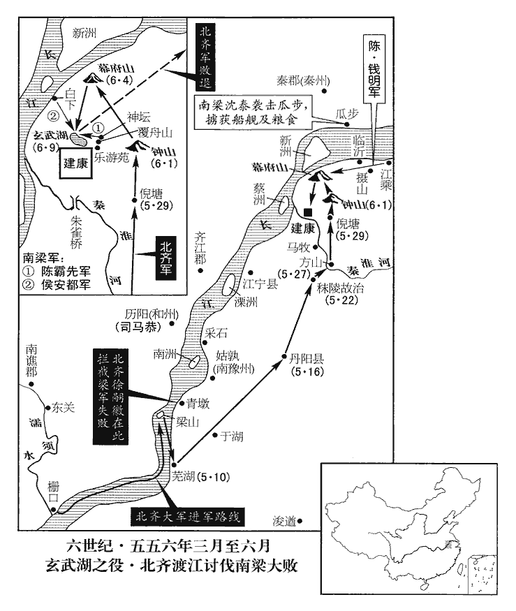 

戊午‹十五›，大赦。己未‹十六›，解嚴。軍士以賞俘貿酒，一人裁得一醉。貿，音茂。庚申‹十七›，斬齊將蕭軌等，齊人聞之，亦殺陳曇朗。霸先啟解南徐州‹府设京口›以授侯安都。賞其功也。

〖译文〗 戊午（十五日），梁朝大赦天下。己未（十六日），解除戒严。军士们用赏赐所得的战俘去换酒喝，一名战俘只能买得够一次大醉的酒。庚申（十七日），把被俘的北齐将领萧轨等人全杀了，北齐方面闻讯，也杀了陈昙朗作为报复。陈霸先奏请解除南徐州刺史让给侯安都。

15侯平頻破後梁軍，以王琳兵威不接，更不受指麾；琳遣將討之。平殺巴州助防呂旬，收其眾，奔江州，侯瑱與之結為兄弟。琳軍勢益衰，乙丑‹二十二›，遣使奉表詣齊，并獻馴象。安南出象處曰象山，歲一捕之，縛欄道旁，中為大穽，以雌象前行為媒，遺甘蔗於地，傅藥蔗上。雄象來食蔗，漸引入欄，閉其中，就穽中教習馴擾之，始甚咆哮，穽深不可出，牧者以言語諭之，久則漸解人意。使，疏吏翻。馴，松倫翻。江陵之陷也，琳妻蔡氏、世子毅皆沒于魏，琳又獻款于魏以求妻子；亦稱臣于梁。

〖译文〗 [15]侯平多次打败后梁的军队，自以为有功，又认为王琳的兵威已经难以为继了，所以更加不受指挥了。于是王琳派将领去讨伐他。侯平杀了巴州协助防守的将领吕旬，把吕旬的部众收归自己指挥，投奔到了江州，侯和他结成了兄弟。王琳的军队势力越来越显得衰落，乙丑（二十一日），派使节带着表示归顺的表章去到北齐，并献上驯服了的大象。当初江陵陷落于西魏时，王琳的妻子蔡氏、世子王毅都落入西魏人手中，所以王琳又讨好西魏以求得妻子、儿子的释放。同时也向梁朝称臣。

16齊發丁匠三十餘萬，脩廣三臺宮殿。三臺在鄴城，曹操所築。

〖译文〗 [16]北齐动用民工匠人三十多万扩修三台宫殿。

17齊顯祖‹高洋，本年二十八岁›之初立也，留心政術，務存簡靖，坦於任使，謂任使之際，坦懷待人。人得盡力。又能以法馭下，或有違犯，不容勳戚，內外莫不肅然。至於軍國機策，獨決懷抱；每臨行陳，行，戶剛翻。陳，讀曰陣。親當矢石，所向有功。數年之後，漸以功業自矜，遂嗜酒淫泆，泆yì，弋乙翻，淫放也。肆行狂暴；或身自歌舞，盡日通宵；或散髮胡服，雜衣錦綵；衣，於既翻。或袒露形體，塗傅粉黛；或乘驢、牛、橐駝、白象，不施鞍勒；或令崔季舒、劉桃枝負之而行，擔胡鼓拍之；胡鼓，以手拍之成聲。劉昫曰：腰鼓大者瓦，小者木，皆廣首而纖腹，本胡鼓也。擔，都甘翻。勳戚之弟，朝夕臨幸，游行市里，街坐巷宿；或盛夏日中暴身；暴，讀曰曝。或隆冬去衣馳走；從者不堪，去，羌呂翻。從，才用翻。帝居之自若。三臺構木高二十七丈，高，居報翻。兩棟相距二百餘尺，工匠危怯，皆繫繩自防，帝登脊疾走，殊無怖畏；脊，棟脊也。怖，普布翻。時復雅儛，復，扶又翻。儛，與舞同。折旋中節，中，竹仲翻。傍人見者莫不寒心。嘗於道上問婦人曰：「天子何如？」曰：「顛顛癡癡，何成天子！」帝殺之。

〖译文〗 [17]北齐在文宣帝高洋刚刚立国的时候，很注意研究为政之术，一切政务，力求简便稳定，有所任命，也是坦诚待人，臣子们也得以尽其所能为国服务。又能用法律为准绳来驾驭部下，如果有谁犯了法，即使无勋贵戚也绝不宽容，所以朝廷内外秩序井然。至于军事机要、国家大政方针，则由文宣帝自己拿出决断。文宣帝每次亲临战阵，总是亲自冒着箭石纷飞的危险，所到之处都立功绩。几年以后，文宣帝渐渐以为建立了大功业，就骄傲自满起来，于是就贪杯纵酒，淫逸无度，滥行狂暴之事。有时自己亲自参与歌舞，又唱又跳，通宵达旦，从早到晚，没日没夜。有时披散头发，穿上胡服，披红挂绿，有时却又裸露着身体，涂脂抹粉；有时骑着驴、牛、骆驼、白象，连鞍子和勒绳也不用；有时让崔季舒、刘桃枝背着他走，自己挎着胡鼓用手拍得彭彭响；元勋和贵戚之家，他常常不分朝夕驾临，在集市上穿游而行，坐街头睡小巷都是常事；有时大夏天在太阳下晒身子；有时大冬天脱去衣服猛跑步；跟从他的人受不了这么折腾，文宣帝却全不当一回事。三台的梁柱高达二十七尺，两柱之间相距二百多尺，工匠上去都感到危险畏惧，在身上系绳子防止出意外。但文宣帝爬上三台的梁脊快步小跑，竟然一点也不害怕。跑着跑着还不时来点雅致的舞蹈动作，又折身子又打旋，居然符合节奏，旁边看的人吓得汗毛直竖，没有不寒心的。有一次，文宣帝在路上问一个妇女说：“咱们的天子怎么样呢？”这妇女不知他就是天子，说：“他成天疯疯颠颠，呆呆痴痴，哪有什么天子样！”文宣帝把她杀了。

婁太后‹娄昭君›以帝酒狂，舉杖擊之曰：「如此父生如此兒！」帝曰：「即當嫁此老母與胡。」太后大怒，遂不言笑。帝欲太后笑，自匍匐，匍，音蒲。匐，莫北翻。以身舉牀，墜太后於地，頗有所傷。既醒，大慚恨，使積柴熾火，欲入其中。太后驚懼，親自持挽，強為之笑，曰：「曏汝醉耳！」強，其兩翻。為，于偽翻。帝乃設地席，命平秦王歸彥執杖，口自責數，自責而數罪也。數，所具翻。脫背就罰，謂歸彥曰：「杖不出血，當斬汝。」太后前自抱之，帝流涕苦請，乃笞腳五十，然後衣冠拜謝，悲不自勝。勝，音升。因是戒酒，一旬，又復如初。

〖译文〗 娄太后有一次因为文宣帝发酒疯，举起拐杖打他，说：“这样英雄的父亲竟生出这样混帐的儿子！”文宣帝竟然说：“看来得把这老太太嫁给胡人了。”娄太后勃然大怒，从此再也不说话，脸上也没有了笑容。文宣帝想让娄太后笑，自己爬到了床底下去，用身子把床抬起来，把坐在床上的太后摔了下来，使太后受了伤。酒醒之后，高洋大感羞惭悔恨，让人堆起柴堆点燃，自己想跳进去烧死。娄太后大吃一惊，害怕极了，赶忙亲自过来又抱又拉，勉强笑着说：“刚才是你喝醉了，我不当真。”文宣帝于是让人铺上地席，命令平秦王高归彦亲自执刑杖，自己口里列数着自己的罪过，脱开衣服露出背部接受杖刑。文宣帝对高归彦说：“你用力打，打不出血来，我就杀了你。”娄太后上前自己抱着他不让打，文宣帝痛哭流涕，最后还是在脚上打了五十下，然后穿上衣服，戴上帽子向娄太后拜谢宽恕之恩，一付悲不自胜的样子。因为这一番酒后失言伤害太后的事，文宣帝下决心戒酒。但刚十天，又嗜酒如命，和原来一样。

帝幸李后‹李祖娥›家，以鳴鏑射后母崔氏，射，而亦翻。罵曰：「吾醉時尚不識太后，老婢何事！」馬鞭亂擊一百有餘。雖以楊愔為相，使進廁籌，以馬鞭鞭其背，流血浹袍。嘗欲以小刀剺lí其腹，愔，於今翻。相，息亮翻。浹，即協翻。剺，力之翻，劃也。崔季舒託俳pái言曰：「老小公子惡戲。」託為俳諧之言。因掣刀去之。掣chè，昌列翻。去，羌呂翻。又置愔於棺中，載以轜車。轜ér，音而，喪車也。又嘗持槊走馬，槊，色角翻。以擬左丞相斛律金之胸者三，金立不動，乃賜帛千段。

〖译文〗 文宣帝去李后的家，用带响声的箭射李后的母亲崔氏，边射边大骂，说：“我醉酒的时候连太后都不认识，你这老奴才算个什么！”还挥动马鞭，一口气打了一百多下。文宣帝虽然任命杨为丞相，但常轻侮他，让他在自己大便时往厕所递送拭秽的篾片。又用马鞭打他背部，血流下来都湿透了衣袍。又曾想用小刀子在他小腹上划痕，崔季舒一看不是事，就假托说笑话：“这是老公子和小公子恶作剧呢！”乘势把文宣帝手里的刀子拔出来拿开了。又有一次，文宣帝把杨放在棺材中，用丧车运着，演习大出殡。还有一次，曾手持一把槊在马上奔驰，三次用槊作向左丞相斛律金胸口刺去的动作，斛律金站着不动崐，文宣帝夸他勇敢，赏赐他一千段帛。

高氏婦女，不問親疏，多與之亂，或以賜左右，又多方苦辱之。彭城王浟太妃爾朱氏‹尔朱英娥›，魏敬宗‹元子攸›之后也，浟，夷周翻。帝欲蒸之，不從；手刃殺之。故魏樂安王元昂，李后‹李祖娥›之姊壻也，其妻有色，帝數幸之，數，所角翻。欲納為昭儀。召昂，令伏，以鳴鏑射之百餘下，射，而亦翻。凝血垂將一石，竟至於死。后‹李祖娥›啼不食，乞讓位於姊，太后‹娄昭君›又以為言，帝乃止。

〖译文〗 高氏家族中的妇女，也不管亲疏远近，文宣帝都胡乱和她们发生性关系，还把其中的一些赐给身边亲信，但又想尽方法折腾侮辱人家。彭城王高的太妃尔朱氏，是魏敬宗的皇后，文宣帝想奸淫她，她不服从，便亲手用刀杀死。过去的东魏乐安王元昂，是李后的姐夫，他妻子长得漂亮，文宣帝多次占有她，想把她纳入宫中当昭仪。文宣帝把元昂召来，命令他趴下，用响箭射了他一百多箭，凝结的血块几乎有一石之多，就这样活活被射死了。李后为此啼哭终日不进食，要求把皇后位置让给姐姐，娄太后又在旁说了话，文宣帝才没有这样做。

又嘗於眾中召都督韓哲，無罪，斬之。作大鑊huò、長鋸、剉、碓之屬，陳之於庭，鑊，戶郭翻。鼎大無足曰鑊。每醉，輒手殺人，以為戲樂。樂，音洛。所殺者多令支解，或焚之於火，或投之於水。楊愔乃簡鄴下死囚，置之仗內，殿庭左右立仗。謂之供御囚，帝欲殺人，輒執以應命，三月不殺，則宥之。

〖译文〗 北齐文宣帝还曾经在大庭广众之中召见都督韩哲，也没什么罪就把他斩首。还派人制造大铁锅、长锯子、大铡刀、大石碓之类刑具，摆在宫庭里，每次喝醉了酒，就动手杀人，以此当作游戏取乐。被他杀掉的人大多下令肢解，有的扔到火里去烧，有的扔到水里去。杨只好选了一些邺城的死罪囚犯，作为仪仗人员，叫做“供御囚”，文宣帝一想杀人，就抓出来应命，如果三个月没被杀掉，就得到宽大处理。

開府參軍裴謂之上書極諫，帝謂楊愔曰：「此愚人，何敢如是！」對曰：「彼欲陛下殺之，以成名於後世耳。」帝曰：「小人，我且不殺，爾焉得名！」焉，音煙。帝與左右飲酒，曰：「樂哉！」都督王紘曰：「有大樂，亦有大苦。」樂，音洛。帝曰：「何謂也？」對曰：「長夜之飲，不寤國亡身隕，所謂大苦！」帝縛紘，欲斬之，思其有救世宗‹高澄›之功，乃捨之。高澄之死，王紘冒刃禦賊，見一百六十二卷武帝太清二年。

〖译文〗 开府参军裴谓之上书极力谏阻文宣帝随意杀人的狂暴行为，文宣帝对杨说：“这是个蠢人，他怎么敢这样做！”杨回答说：“他大概是想让陛下您杀了他，这样他好在后世成名吧！”文宣帝说：“小人！我权且不杀，看你怎么出名！”文宣帝和身边亲信饮酒作乐，得意忘形地说：“真快乐呀！”都督王在旁说：“有大快乐，也会有大痛苦。”文宣帝问道：“这话怎么说？”王回答说：“老是作长夜之饮，酩酊大醉，没等醒过来已经国亡身死，这就是我所说的大痛苦！”文宣帝一听生了气，命人把王捆起来，要把他处斩，但想起他过去有救文襄帝生命的功劳，于是又放了他。

帝遊宴東山‹邺城东›，以關、隴未平，投盃震怒，召魏收於前，立為詔書，宣示遠近，將事西行；魏人震恐，常為度隴之計，宇文泰識虛實，何得因西行一詔，便為度隴之計！此齊史官之華言耳。然實未行。一日，泣謂群臣曰：「黑獺‹宇文泰的乳名›不受我命，柰何？」都督劉桃枝曰：「臣得三千騎，騎，奇寄翻。請就長安擒之以來。」帝壯之，賜帛千匹。趙道德進曰：「東西兩國，強弱力均，彼可擒之以來，此亦可擒之以往。桃枝妄言應誅，陛下柰何濫賞！」帝曰：「道德言是。」回絹賜之。帝乘馬欲下峻岸，入于漳，欲入漳水。道德攬轡回之；帝怒，將斬之。道德曰：「臣死不恨，當於地下啟先帝‹高欢›，論此兒酣酗顛狂，不可教訓。」酗，吁句翻。陸德明曰：以酒為凶曰酗。帝默然而止。他日，帝謂道德曰：「我飲酒過，過，謂過多。須痛杖我。」道德抶之，抶chì，升栗翻，擊也。帝走。道德逐之曰：「何物人，為此舉止！」

〖译文〗 文宣帝去东山游玩欢宴，因为想起关、陇一带尚未平定，便把杯子往地上一摔，大发雷霆，马上把魏收叫到跟前，让他站着写下诏书，向远近四方宣告自己将要向西方采取军事行动。西魏人闻讯感到震动惊恐，于是经常也在筹划防止齐军越过陇地的办法。但实际上文宣帝这一计划并没有实行。有一天，文宣帝流着泪对群臣说：“黑獭不接受我的命令，怎么办呢？”都督刘桃枝回答说：“给我三千骑兵，我就到长安去把他擒拿归来。”文宣帝听了，便称赞他的勇气，赐给他一千匹帛。赵道德走上前说：“魏和齐是西方和东方并立的两个邻国，国势国力强弱是相均等的。你可以把那边的人擒拿归来，对方也可以把你这边的人擒拿过去。刘桃枝口吐狂言，虚妄欺君，应该处死，陛下怎么向崐他滥施奖赏？”文宣帝听了，说：“道德说得对。”收回给刘桃枝的绢帛赐给刘道德。有一次，文宣帝骑着马欲从很高的陡岸跳到漳河里去，赵道德用力拉着马缰绳把他拽回来。文宣帝勃然大怒，要把赵道德处斩。赵道德说：“我为此而死心中没有什么怨恨，到了地下，我要向先帝启奏，把他这个儿子拼命酗酒，疯颠狂乱，不可教训的种种行为告诉他。”文宣帝听了沉默良久，就不杀赵道德了。这以后有一天，文宣帝对赵道德说：“我喝酒喝得过份了，必须狠狠打我一顿。”赵道德真的动手打他，文宣帝跑开了。赵道德追着文宣帝，边追边喊：“你是个什么人，竟做出这种不成体统的举动！”

典御丞李集面諫，五代志曰。後齊制官，多循後魏之舊。尚食、尚藥二局，皆有典御及丞。尚食總知御膳事，尚藥總知御藥事，屬門下省。比帝於桀‹姒履癸›、紂‹子受辛›。帝令縛置流中，流水中也。沈沒久之，沈，持林翻。復令引出，復，扶又翻。謂曰：「吾何如桀、紂？」集曰：「向來彌不及矣！」帝又令沈之，引出，更問，如此數四，集對如初。帝大笑曰：「天下有如此癡人，方知龍逄、比干未是俊物！」龍逄páng，諫夏桀而死，比干諫殷紂而死。逄，皮江翻。遂釋之。頃之，又被引入見，被，皮義翻。見，賢遍翻。似有所諫，帝令將出要斬。要，讀曰腰。其或斬或赦，莫能測焉。

〖译文〗 典御史李集当面进谏，甚至把文宣帝比拟为夏桀、商纣。文宣帝下令把他捆起来放到流水中去，让他没入水里很久，再下令把他拽出水面，问他说：“你说，我比夏桀、商纣怎样？”李集回答说：“看来你还比不上他们呢！”文宣帝又下令把他没入水里，拽出来又问，这样折腾了多次，李集的回答一点也没变。文宣帝哈哈大笑说：“天下竟然有这样呆痴的家伙，我这才知道龙逄、比干还不算出色人物呢！”于是释放了他。过了一会儿，李集又被拉着进来见文宣帝，他似乎又想有所进谏，文宣帝下令带出去腰斩。文宣帝喜怒无常，想要杀人还是想要赦免，没有人能猜想得到。

內外憯憯，憯cǎn，七感翻。憯憯，痛毒之意。各懷怨毒；而素能默識強記，加以嚴斷，斷，丁亂翻。群下戰慄，不敢為非。又能委政楊愔，愔總攝機衡，百度脩敕，敕，理也。故時人皆言主昏於上，政清於下。愔風表鑒裁，為朝野所重，少歷屯阨，爾朱屠害楊氏，唯愔得脫，潛竄累載，後歸高歡，又以讒間逃隱海島，歡訪而用之。裁，才代翻。少，詩照翻。屯，陟輪翻。及得志，有一餐之惠者必重報之，雖先嘗欲殺己者亦不問；典選二十餘年，以獎拔賢才為己任。性復強記，一見皆不忘其姓名，選人魯漫漢自言猥賤獨不見識，選，須絹翻。復，扶又翻。猥，鄙也。愔曰：「卿前在元子思坊，元子思坊，鄴城中坊名。魏侍中元子思居此，後謀西奔，被誅，時人因以名坊。乘短尾牝驢，見我不下，以方麴qū障面，我何為不識卿！」漫漢驚服。

〖译文〗 在文宣帝这种淫威下，宫廷内外，大家都敢怒不敢言，心怀怨恨。但文宣帝对事物一向能够暗暗熟识，牢牢记忆，然后加以严格的裁决判断，所以群臣在他面前惶恐战栗，不敢为非作歹。文宣帝又能把政事委托给杨，杨善于统一掌握国家枢机的运行，使各个方面的政事都得到修整，所以当时的人都说文宣帝在上头昏头昏脑，但下面的政事却还算清明有序的。杨颇有风度，仪表整饬，善于鉴识裁断，被朝野各方面人士所看重。他年轻时多次经历困顿灾厄，到了发迹得志之后，凡是他处逆境时对他有施予一餐恩惠的，他也都重重地回报人家。至于早先想杀他的人，他却不再计较。他掌管国家选拔人才的大权达二十多年之久，一向以奖励、提拔人才为己任。他记性特别好，只要和他见了一面的人，他就记住了人家的姓名，再也不会忘记。有一个候选的人叫鲁漫汉，自己说因为身份低贱，杨不曾认识他。杨提醒他说：“你从前在元子思坊任职，骑着一只短尾巴母驴，在路上遇到我也不下来，用一块黄帕遮住面，假装没看见就走过去，我怎么不认识你鲁漫汉呢！”鲁漫汉一听大吃一惊，心中叹服。

18秋，七月，甲戌‹一›，前天門‹湖南省石门县›太守樊毅襲武陵‹湖南省常德市›，殺武州‹府武陵›刺史衡陽王護，王琳使司馬潘忠擊之，執毅以歸。護，暢之孫也。暢，武帝‹萧衍›之弟。

〖译文〗 [18]秋季，七月，甲戌（初一），前天门太守樊毅袭击武陵，杀死了武州刺史衡阳王萧护，王琳派司马潘忠去攻打樊毅，抓住了樊毅胜利归来。萧护是萧畅的孙子。

19丙子‹三›，以陳霸先為中書監，司徒、揚州刺史，進爵長城公，餘如故。

〖译文〗 [19]丙子（初三），梁朝任命陈霸先为中书监、司徒、扬州刺史，加进长城公这一爵位，其他官职、封号保持原样。

20初，余孝頃為豫章太守，姓譜：余姓，由余之後。侯瑱鎮豫章，孝頃於新吳縣‹江西省奉新县›漢靈帝中平中，立新吳縣，屬豫章郡，今洪州奉新縣即其地。別立城柵，與瑱相拒。瑱使其從弟奫yūn守豫章從，才用翻。奫，於倫翻。悉眾攻孝頃，久不克，築長圍守之。癸酉‹十›，侯平發兵攻奫，大掠豫章，焚之，奔于建康。瑱眾潰，奔湓城，依其將焦僧度。僧度勸之奔齊，會霸先使記室濟陽‹侨郡·江苏省盱眙县南›蔡景歷南上，濟，子禮翻。自建康泝流至湓城為南上。上，時掌翻。說瑱令降，瑱乃詣闕歸罪，霸先為之誅侯平。說，式芮翻。降，戶江翻。為，于偽翻。丁亥‹十四›，以瑱為司空。

〖译文〗 [20]当初，余孝顷当豫章太守，侯镇守豫章，余孝顷在新吴县另外建立崐了城堡栅栏，与侯相对抗。侯派他的堂弟侯守卫豫章，自己把全部军队开上去攻打余孝顷，打了很久也没打下，就修筑了一条长长的包围圈把新吴县城看守起来。癸酉（疑误），侯平出动军队去攻打侯，城陷之后，对豫章城进行了一次大洗劫，放火烧了城，然后投奔了建康。侯的部众溃不成军，逃奔到湓城去依靠他的部将焦僧度。焦僧度劝他干脆投奔北齐，这时正好陈霸先派记室济阳人蔡景历从南方北上来劝说侯，让他投降梁朝，这样侯就投降了，亲自到建康朝廷来伏罪，陈霸先为了安抚他，把背叛他先来归降的侯平杀了。丁亥（十四日），任命侯为司空。

南昌‹豫章郡郡政府所在县›民熊曇朗，世為郡著姓。曇朗有勇力，侯景之亂，聚眾據豐城‹江西省丰城市›為柵，南昌縣帶豫章郡。吳立富城縣，晉武帝太康元年，更名豐城縣，屬豫章郡，今縣在郡城南一百五十五里。曇，徒含翻。世祖‹萧绎›以為巴山‹江西省崇仁县›太守。元帝廟號世祖。江陵‹湖北省江陵县›陷，曇朗兵力浸強，侵掠鄰縣。侯瑱在豫章，曇朗外示服從而陰圖之，及瑱敗走，曇朗獲其馬仗。

〖译文〗 南昌城里的居民熊昙朗，世世代代都是郡里有名的大姓。熊昙朗颇有勇气力量，当年侯景作乱的时候，他聚集徒众据守丰城，修了栅栏，梁元帝任命他为巴山太守。江陵沦陷时，熊昙朗兵力渐渐强大起来，开始侵犯掠夺邻近的县份。侯镇守豫章，熊昙朗外表上表示服从而暗地里偷偷谋划要算计他。待到侯兵败逃跑时，熊昙朗夺去了他的战马和兵器。

21己亥‹二十六›，齊大赦。

〖译文〗 [21]己亥（二十六日），北齐大赦天下。

22魏太師泰遣安州‹府设湖北省安陆市›長史鉗耳康買使于王琳，鉗耳，夷姓也，出於西羌。鉗，其廉翻。孫愐曰：鉗耳，西羌人，自云周王季之後，為虔仁氏，音訛為鉗耳。琳遣長史席豁報之，且請歸世祖‹萧绎›及愍懷太子‹萧方矩›之柩；泰許之。江陵之陷，魏既戕元帝，遂殺愍懷太子元良。柩，音舊。

〖译文〗 [22]西魏太师宇文泰派安州长史钳耳康买为使者去王琳那儿出使，王琳派长史席豁到西魏回访，而且恳求西魏把梁元帝萧绎和愍怀太子萧元良的灵柩送回南方。宇文泰答应了这一恳求。

23八月，己酉‹七›，鄱陽王循卒于江夏‹夏口湖北省武汉市›，弟豐城侯泰監郢州‹府设夏口湖北省武汉市›事。夏，戶雅翻。監，工銜翻。王琳使兗州刺史吳藏攻江夏，不克而死。琳署藏領兗州耳。

〖译文〗 [23]八月，己酉（初七），鄱阳王萧循在江夏去世，他弟弟丰城侯萧泰管理郢州的政事。王琳派兖州刺史吴藏攻打江夏，兵败身死。

24魏太師泰北渡河。據魏紀，泰北巡，渡北河。

〖译文〗 [24]西魏太师宇文泰北渡黄河。

25魏以王琳為大將軍、長沙郡公。

〖译文〗 [25]西魏封王琳为大将军、长沙郡公。

26魏江州‹府设犍为四川省彭山县›刺史陸騰討陵州‹府设陵井四川省仁寿县›叛獠，五代志：隆山郡，西魏置陵州，今陵井監是也。江州亦置於隆山郡之隆山縣。獠，魯皓翻。獠因山為城，攻之難拔。騰乃陳伎樂於城下一面，伎，渠綺翻。獠棄兵，攜妻子臨城觀之，騰潛師三面俱上，斬首萬五千級，遂平之。唐柴紹破吐谷渾亦用此術。上，時掌翻。騰，俟之玄孫也。陸俟事魏太武帝，及文成帝之初立，以子麗誅宗愛功封王。

〖译文〗 [26]西魏江州刺史陆腾出兵讨伐陵州进行叛乱的獠人，獠人依山修建城堡，极为险峻，很难攻克。陆腾想了一计，把歌伎舞乐队在城下的一面摆开进行表演，獠人一看，扔下兵器，带着妻子儿女登上城墙观看，陆腾的伏兵从另外三面冲上城去，一口气斩下一万五千首级，于是就平定了獠人的叛乱。陆腾是陆俟的玄孙。

27庚申‹十八›，齊主將西巡，百官辭於紫陌‹河北省临漳县西›，帝使矟騎圍之，騎兵執矟者為矟騎。矟，色角翻。騎，奇寄翻。曰：「我舉鞭，即殺之。」日晏，帝醉不能起。黃門郎是連子暢曰：是連，亦夷姓也。魏書官氏志：內入諸姓有是連氏。「陛下如此，群臣不勝恐怖。」勝，音升。怖，普布翻。帝曰：「大怖邪！若然，勿殺。」若然，猶云若如此也。遂如晉陽‹山西省太原市›。

〖译文〗 [27]庚申（十八日），北齐文宣帝将要到西边去巡视，文武百官在紫陌为文宣帝送行，文宣帝派手执长矛的骑兵把他们包围起来，对骑兵们说：“我一举鞭示意，你们就杀了他们。”太阳快下山了，文宣帝喝得醉醺醺地起不了床。黄门郎是连子畅乘机说：“陛下你这样做，百官群臣害怕得受不了。”文宣帝说：“他们很害怕吗？如果是这样，那就别杀他们算了！”于是就出发到晋阳去。

28九月，壬寅‹一›，改元，大赦。以陳霸先為丞相、錄尚書事、鎮衛大將軍、揚州牧、義興公。自長城縣公進封義興郡公。按陳書帝紀，「義」當作「吳」。以吏部尚書王通為右僕射。

〖译文〗 [28]九月，壬寅（初一），梁朝改换年号，为太平元年，实行大赦，任命陈霸先为丞相、录尚书事、镇卫大将军、扬州牧、义兴公。任命吏部尚书王通为右仆射。

29突厥‹瀚海沙漠群›木杆可汗假道於涼州‹府设姑臧甘肃省武威市›以襲吐谷渾‹青海省›，魏太師泰使涼州刺史史寧帥騎隨之，至番禾‹甘肃省永昌县›，番禾縣，漢屬張掖郡，魏分置番禾郡。如淳曰：番，音盤。隋廢番禾郡為番禾縣，屬涼州；唐天寶三年，改為天寶縣。厥，九勿翻。杆，公旦翻。可，從刊入聲。汗，音寒。吐，從暾入聲。谷，音浴。帥，讀曰率。騎，奇寄翻。吐谷渾覺之，奔南山。木杆將分兵追之，寧曰：「樹敦‹青海省共和县›、賀真二城，吐谷渾之巢穴也，拔其本根，餘眾自散。」木杆從之。木杆從北道趣賀真，寧從南道趣樹敦。樹敦城，在曼頭山北，吐谷渾之舊都也。周穆王時，犬戎樹惇居之，因以名城。祭公謀父所謂「犬戎樹惇，能帥舊德」者也。趣，七喻翻。吐谷渾可汗【章：十二行本「汗」下有「夸呂」二字；乙十一行本同；孔本同；張校同。】在賀真，使其征南王將數千人守樹敦。將，即亮翻。木杆破賀真，獲夸呂妻子；寧破樹敦，虜征南王；還，與木杆會于青海，吐谷渾中有青海，周回千餘里，海中有小山。每冬冰合，以良牝馬置此山，至來春收之，牝馬皆有孕，生駒，號為龍種，必多駿異，日行千里。木杆歎寧勇決，贈遺甚厚。遺，于季翻。

〖译文〗 [29]突厥木杆可汗借路从凉州袭击吐谷浑，西魏太师宇文泰派凉州刺史史宁率领骑兵跟他一起行动。军队到达番禾，吐谷浑发觉了，逃往南山。木杆可汗准备分兵去追击他，史宁建议说：“树敦、贺真两城，是吐谷浑的巢穴，拔掉他的这个老根，其他的部众也就自己溃散了。”木杆可汗采纳了这个建议。商议的结果是：木杆可汗率兵从北边的通道直取贺真，史宁从南边的通道直取树敦。吐谷浑可汗自己驻扎在贺真，派他的征南王带几千人去防守树敦。木杆可汗攻克了贺真，抓获了夸吕的妻子、儿子；史宁攻克了树敦，俘虏了征南王。得胜回师时，史宁与木杆可汗会师于青海。木杆可汗叹服史宁勇猛有决断，对他有很丰厚的馈赠。

30甲子‹二十三›，王琳以舟師襲江夏；冬，十月，壬申‹一›，豐城侯泰以州降之。

〖译文〗 [30]甲子（二十三日），王琳派水军袭击江夏。冬季，十月，壬申（初一），丰城侯萧泰献出州城向他投降。

31齊發山東寡婦二千六百人以配軍，有夫而濫奪者什二三。

〖译文〗 [31]北齐征发山东寡妇二千六百人配婚给军人。其中有丈夫而被当寡妇硬给抢走的占十分之二三。

32魏安定文公宇文泰還至牽屯山‹宁夏固原县南›而病，北巡而還也。杜佑曰：牽屯在平涼郡高平縣，亦曰汧屯山，今謂之笄頭山。驛召中山公護。護至涇州‹府设安定甘肃省泾川县›，見泰，泰謂護曰：「吾諸子皆幼，外寇方強，天下之事，屬之於汝，屬，之欲翻；下所屬同。宜努力以成吾志。」乙亥‹四›，卒於雲陽‹陕西省泾阳县西北›。年五十。雲陽縣，漢屬馮翊，魏收志屬北地郡；後周置雲陽郡，有雲陽宮。護還長安，發喪。泰能駕御英豪，得其力用，性好質素，不尚虛飾，明達政事，崇儒好古，凡所施設，皆依倣三代而為之。好，呼到翻。丙子‹五›，世子覺嗣位，為太師、柱國、大冢宰，出鎮同州‹府设武乡陕西省大荔县›，宇文泰輔政，多居同州，以其地扼關、河之要，齊人或來侵軼，便於應接也。時年十五。

〖译文〗 [32]西魏安定文公宇文泰回到牵屯山就病倒了。派驿马传令召见中山公宇文护。宇文护赶到泾州，拜见宇文泰。宇文泰对宇文护说：“我几个儿子都年幼，外面的敌寇都很强大，天下大事就全委托你了。你要努力以成就我的平生志愿。”乙亥（初四），在云阳去世。宇文护回到长安，才公布消息，给宇文泰发丧。宇文泰生时能够驾驭英俊豪杰，得到他们的努力效劳，他喜好质朴，不追求虚假文饰，处理政事明识练达，尊崇儒家，仰慕远古，举凡施政的一切措施，都依照模仿夏、商、周三代的古制来制定。丙子（初五），世子宇文觉继位，任命为太师、柱国、太冢宰，并镇守同州。这时年仅十五。

中山公護，名位素卑，雖為泰所屬，而群公各圖執政，莫肯服從。護問計於大司寇于謹，謹曰：「謹早蒙先公‹宇文泰›非常之知，恩深骨肉，今日之事，必以死爭之。若對眾定策，公必不得讓。」明日，群公會議，謹曰：「昔帝室傾危，非安定公無復今日。謂魏孝武帝為高歡所逼，遁逃入關，宇文泰迎而輔之，以立國於關右。復，扶又翻。今公一旦違世，嗣子雖幼，中山公親其兄子，兼受顧託，軍國之事，理須歸之。」辭色抗厲，眾皆悚動。抗厲，舉聲高亢，且正色嚴厲也。護曰：「此乃家事，護雖庸昧，何敢有辭。」謹素與泰等夷，護常拜之，至是，謹起而言曰：「公若統理軍國，謹等皆有所依。」遂再拜。群公迫於謹，亦再拜，於是眾議始定。護綱紀內外，撫循文武，人心遂安。

〖译文〗 中山公宇文护，名望地位一向比较低，虽然被宇文泰所倚重，但各位王公大臣都想执政，谁也不肯服从他。宇文护向大司寇于谨请教对策，于谨说：“我于谨早就蒙受先安定公非同一般的知遇之恩，这恩情深于骨肉之情。今天的国家大事，我一定以生命去争取成功。如果面对各位王公大臣商讨确定国策，您一定不要退让。”第二天，各位王公聚集在一起议论国家大事，于谨说：“过去孝武帝受到高欢协迫，魏国帝室陷于倾覆的危险之中，要不是安定公迎纳并辅佐了他，国家就没有今天这种局面了。现在安定公突然去世，嗣位的世子虽然幼小，但中山公会把他哥哥的儿子看得很亲，又接受了安定公临危时的顾命之托，军国大事，按理应该归他统一掌握。”于谨讲这番话，声音高亢，神色严厉，众臣都感到惊竦震动。宇文护接着说：“辅政之事，也是我们的家事。我虽然平庸愚昧，但又怎么敢推辞呢？”于谨平时一向处于与宇文泰一样的地位，宇文护常常向他跪拜，到了这时，于谨立起身来对宇文护说：“您要是出面统一管理军国大事，我们这些人就都有所依靠了。”于是向他跪拜了两次。各位王公大臣迫于于谨的严厉，也跟着跪拜了两次，于是大家的议论才统一起来。宇文护整顿内外，安抚文武大臣，人心才就此安定了。

33十一月，辛丑‹一›，豐城侯泰奔齊，齊以為永州‹府设楚王城河南省信阳市北›刺史。南方以零陵郡為永州。齊以泰為永州刺史，未知此永州置於何地。詔徵王琳為司空，此齊詔也。琳辭不至，留其將潘純陀監郢州，監，工銜翻。身還長沙。魏人歸其妻子。

〖译文〗 [33]十一月，辛丑（初一），丰城侯萧泰投奔北齐，北齐任命他为永州刺史，并下诏征召王琳为司空，王琳推辞不去，留下他的部将潘纯陀监守郢州，自己回长沙去了。西魏把他的妻子儿子送回了。

34壬子‹十二›，齊主詔以「魏末豪傑糾合鄉部，因緣請託，各立州郡，離大合小，公私煩費，丁口減於疇日，疇日，猶言昔日。守令倍於昔時。且要荒向化，要荒，引古要服、荒服為言。要者，要結好信而從服之。荒者，言其來服荒忽無常也。要，一遙翻。舊多浮偽，百室之邑，遽立州名，三戶之民，空張郡目，此謂梁末所置州郡在江、淮之間者也。循名責實，事歸焉有。」焉，於虔翻，何也。於是併省三州，一百五十三郡。【章：十二行本「郡」下有「五百八十九縣、三鎮、二十六戍」十二字；乙十一行本同；孔本同；退齋校同。】考異曰：北史作「五十六郡」。今從齊書。

〖译文〗 [34]壬子（十二日），北齐文宣帝下诏，认为：“魏朝末年各方的豪杰纠合地方武装，乘着有利的形势和机缘，向有势力的人请求依托，各自建立州郡，有的把大的州郡分离，有的把小的州郡合并，弄得公家和私人都事烦财费，人口比过去大为减少，太守、县令之类的官员比昔日多了一倍，而且边远地区忽而归顺忽而离心，过去有很多是浮名虚报，一百户人家的集镇，匆促中就立起一个州的名号；三户老百姓，也要凭空设立一个郡的名目。如果按照这些州郡的名去考察它们的实际情况，往往会发现这些州郡实在是子虚乌有的幻影。”于是决定实行州郡合并，把三个州撤消，还撤去一百五十三个郡。

35詔分江州‹江西省›四郡置高州。四郡，蓋臨川、安成、豫寧、巴山，以其地在南江之西，負山面水，據高臨深，因名高州。軍【章：十二行本「軍」上有「以明威將」四字；乙十一行本同；孔本同；退齋校同。】黃法𣰰為刺史，鎮巴山‹江西省崇仁县›。𣰰qú，巨俱翻。宋白曰：梁大同二年分廬陵之興平、臨川之新建二縣，立西寧、巴山二縣，合其縣立為巴山郡。其郡古迹在撫州崇仁縣巴山之北。

〖译文〗 [35]北齐下诏划分江西四郡为一个州，即高州，任命明威将军黄法氍为刺史，镇守巴山。

36十二月，壬申‹二›，以曲江侯勃為太保。

〖译文〗 [36]十二月，壬申（初二），北齐任命曲江侯高勃为太保。

37甲申‹十四›，魏葬安定文公‹成陵，今陕西省富平县北›。丁亥‹十七›，以岐陽‹陕西省凤翔县›之地封世子覺為周公。岐陽，即扶風之地。昔周興於岐周，因為國號。宇文輔魏，倣周以立法制，故魏朝之臣以周封之，將禪代也。

〖译文〗 [37]甲申（十四日），西魏安葬了安定文公。丁亥（十七日），把岐阳之地分封给世子宇文觉，并封他为周公。

38初，侯景之亂，臨川‹江西省南城县›民周續起兵郡中，臨川，漢豫章郡南城縣之地，後漢分南城北境為臨汝縣，吳孫亮太平二年，分豫章之東部南城、臨汝二縣置臨川郡，隋、唐為撫州。始興‹广东省韶关市›王毅以郡讓之而去。續部將皆郡中豪族，多驕橫，將，即亮翻；下同。橫，戶孟翻。續裁制之，諸將皆怨，相與殺之。續宗人迪，勇冠軍中，冠，古玩翻。眾推為主。迪素寒微，恐郡人不服，以同郡周敷族望高顯，折節交之，折，而設翻。敷亦事迪甚謹。迪據上塘‹即工塘·江西省临川市东南›，「上塘」，下卷作「工塘」，必有一誤。按陳書周迪傳，「工」字為是。敷據故郡，朝廷以迪為衡州‹府设含洭广东省英德市西北浛洸镇›刺史，領臨川內史。以臨川內史帶衡州刺史耳。時民遭侯景之亂，皆棄農業，群聚為盜，唯迪所部獨務農桑，各有贏儲，政教嚴明，教，謂教令，州郡下令謂之教。徵斂必至，斂，力贍翻。餘郡乏絕者，皆仰以取給。仰，牛向翻。迪性質朴，不事威儀，居常徒跣，雖外列兵衛，內有女伎，挼ruó繩破篾，傍若無人，伎，渠綺翻。挼ruó，奴禾翻。蔑，莫結翻，竹筠yún也。訥於言語而襟懷信實，臨川‹江西省南城县›人皆附之。

〖译文〗 [38]当初，侯景作乱的时候，临川人周续在郡中起兵夺权，始兴王萧毅把郡让给他，自己跑了。周续部将都是郡中豪门大族，大都很骄傲横蛮，周续对他们实行制裁，诸将都生怨心，互相串通，杀了周续。周续宗族中有个叫周迪的，他的勇力在军队中号称冠军，被众人推举为主将。周迪过去出身寒微，担心郡中人不服从治理，因为同郡人周敷的家族声望高而显赫，就很谦恭地去与他交为朋友，争取他的协助。周敷对周迪也尽心服事，很是恭谨。周迪据守上塘，周敷据守郡治原来的所在地。梁朝任命周迪为衡州刺史，兼任临川内史。当时人民遭受侯景之乱的祸害，都扔下了耕作务农之业，群聚在一起当强盗，只有周迪所管理的地区还有人民在经营农业、养蚕业，各家各户还有些粮食布帛的盈余积蓄，政法教令很是严明，政府下令征收分派的赋税都能收到，因此别的郡凡是粮食布帛发生困难短缺都靠周迪治理的地区来取得补给。周迪天性质朴，不经意于表面上的威严仪表，平素居家常常光着脚，虽然外面排列着卫兵，屋里有歌舞伎女，但他从容地搓绳子，破竹蔑，旁若无人。他不善于高谈阔论但襟怀诚实质朴，临川人都依附于他。

39齊自西河總秦戍築長城‹西河山西省西部›一带有服秦城，在姚襄城山西省吉县西之东，北齐长城经此地。考異曰：去歲六月已云築長城，而地名，長、短不同，不知與此為一事為二事。北齊書、北史皆然。今兩存之。東至於海‹渤海›，前後所築，東西凡三千餘里，率十里一戍，其要害置州鎮，凡二十五所。

〖译文〗 [39]北齐从西河总秦戍一带开始修筑长城，向东一直延伸到大海边，前前后后修筑的长城东西总共有三千多里长，大抵十里就设立一个戍卫点，凡是军事上的险要之地就建立州镇，总共有二十五处。

40魏宇文護以周公‹宇文觉›幼弱，欲早使正位，以定人心，庚子‹三十›，以魏恭帝‹拓跋廓，本年二十岁›詔禪位于周‹宇文觉›，魏道武帝以晉孝武太元二十一年改元皇始，歷十二世至孝武帝永熙三年西遷，魏遂分為東、西。西魏又歷三世，凡十五世，一百六十年而亡。使大宗伯趙貴持節奉冊，濟北公迪致皇帝璽紱；恭帝出居大司馬府。濟，子禮翻。璽，斯氏翻。紱，音弗。

〖译文〗 [40]西称宇文护因为周公宇文觉幼小力弱，想早一点儿让他就正位以安定崐人心，庚子（三十日），通过西魏恭帝下诏书的形式，把西魏政权禅让给周公。派大宗伯赵贵手持节杖，捧着就位的表册，济北公宇文迪献上皇帝的玉玺和印绶。西魏恭帝从内廷搬出，住在大司马的府第。

