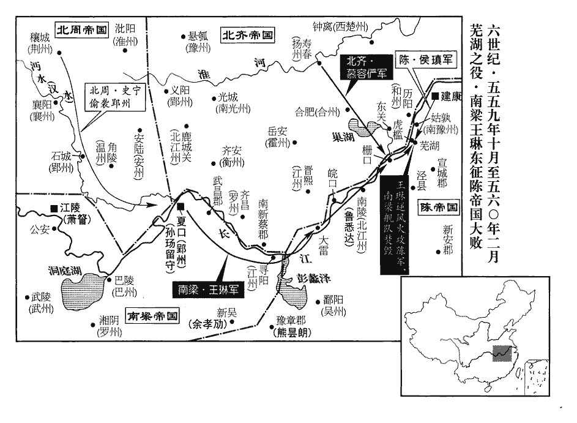
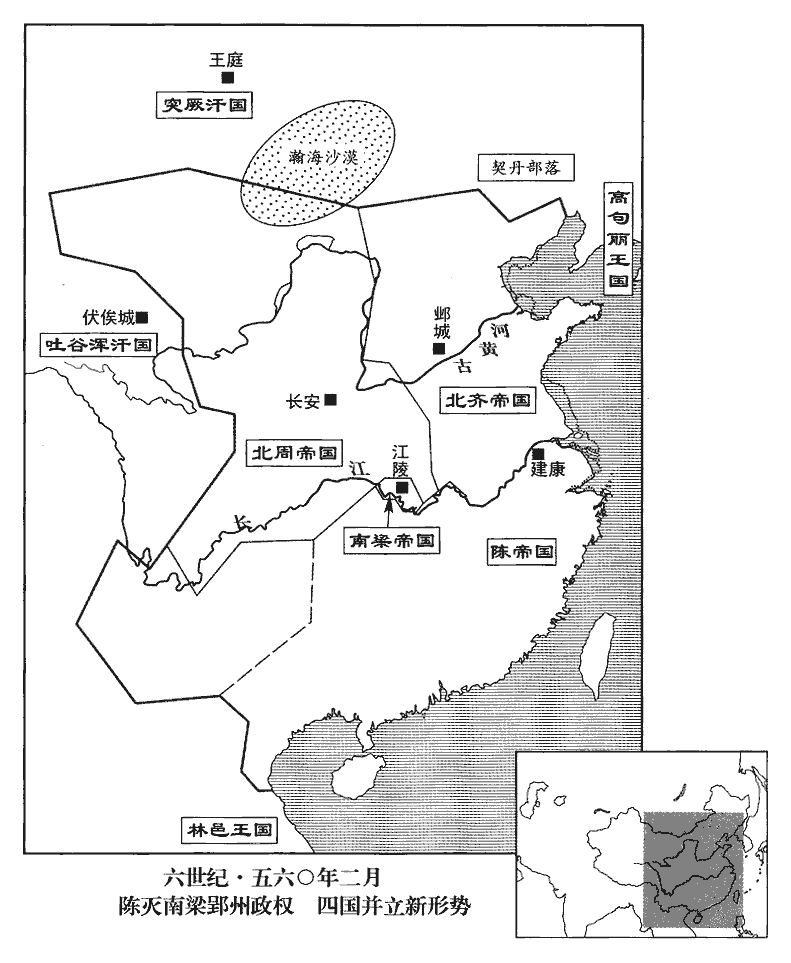
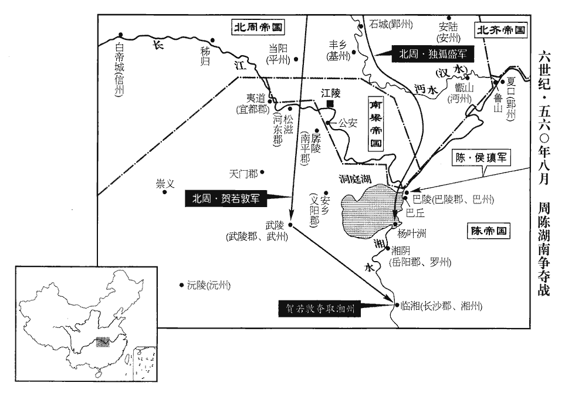
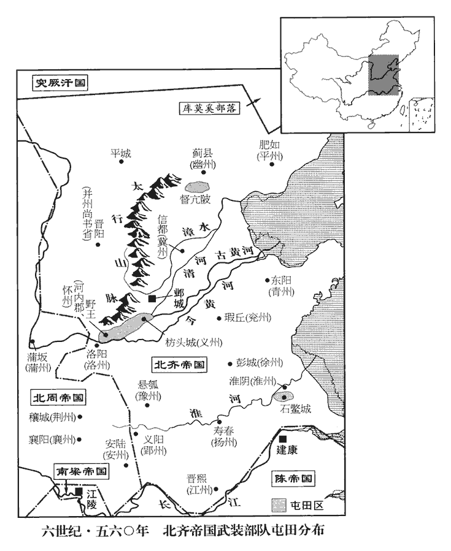
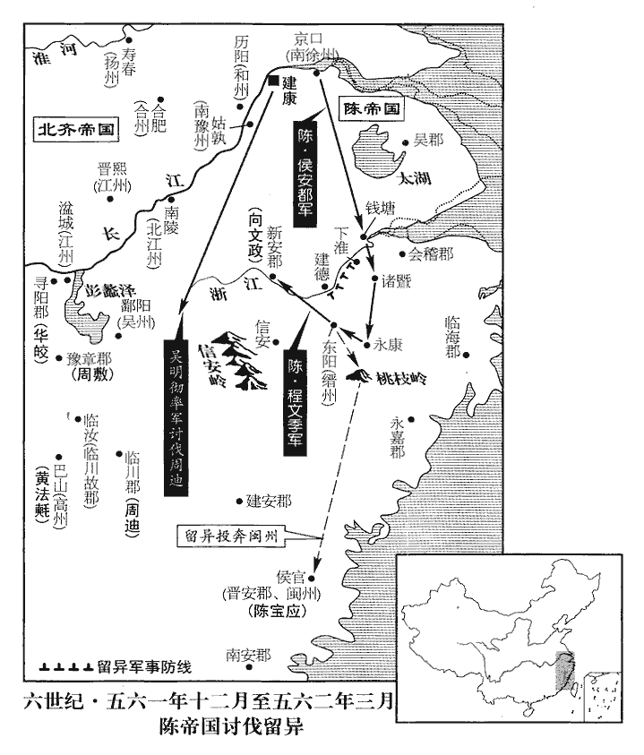

 陳紀二起上章執徐（庚辰），盡玄黓敦牂（壬午），凡三年。

# 世祖文皇帝上諱蒨，字子華，高祖兄始興王道譚之長子。

## 天嘉元年（庚辰、五六零）

1春，正月，癸丑朔‹一›，‹陈。首都建康江苏省南京市›大赦，改元。

〖译文〗 [1]春季，正月，癸丑朔（初一），陈朝大赦天下，改换年号为天嘉。

2齊‹首都邺城河北省临漳县西南邺镇›大赦，改元乾明。

〖译文〗 [2]北齐大赦天下，改换年号为乾明。

3辛酉‹九›，上‹陈蒨，本年三十九岁›祀南郊。

〖译文〗 [3]辛酉（初九），陈文帝在南郊祭天。

4齊高陽王湜shí，以滑稽便辟，有寵於顯祖‹高洋›，湜，常職翻。史記索隱曰：滑，謂亂也；稽，同也；以言辯捷之人，言非若是，言是若非，能亂同異也。楚辭：將突梯滑稽，如脂如韋。崔浩云：滑，音骨；滑稽，流酒器也；轉注吐酒，終日不已，言出口成章，詞不空竭，若滑稽之吐酒。故揚雄酒賦云：鴟夷滑稽，腹如大壺，盡日盛酒，人復藉沽，是也。又姚察云：滑稽，猶俳pái諧也。滑，讀如字；稽，音計；以其言語滑利，智計捷出，故云滑稽也。尹焞tūn曰：便辟，足恭也。朱元晦曰：便辟，謂習於威儀而不直。便，毗連翻。辟，匹亦翻。常在左右，執杖以撻諸王，太皇太后‹娄昭君›深銜之。及顯祖殂，湜有罪，太皇太后杖之百餘；癸亥‹十一›，卒。

〖译文〗 [4]北齐高阳王高，因为善于滑稽说笑、曲意奉承而得到文宣帝的宠爱，常常跟在文宣帝左右，拿棍棒殴打诸王，太皇太后对他怀恨很深。待到文宣帝去世，高犯了罪，太皇太后命令打了他一百多棍。癸亥（十一日），伤重而死。

5辛未‹十九›，上‹陈蒨›祀北郊。

〖译文〗 [5]辛未（十九日），陈文帝在北郊祭地。

6齊主‹高殷，本年十六岁›自晉陽‹山西省太原市›還至鄴‹河北省临漳县西南邺镇›。

〖译文〗 [6]北齐国主高殷从晋阳回到邺城。

7二月，乙未‹十三›，高州‹府设高凉广东省阳江市›刺史紀機自軍所逃還宣城‹安徽省宣州市›，軍所，侯瑱軍前也。據郡應王琳，涇‹安徽省泾县西›令賀當遷討平之。

〖译文〗 [7]二月，乙未（十三日），高州刺史纪机从侯的军队里逃回宣城，占据了郡城呼应王琳，泾县县令贺当迁率兵讨平了他。

王琳至柵口‹濡须口·安徽省无为县东南›，柵口，在濡須口之東，水導巢湖，今謂之柵江口。宋白曰：廬州東南至柵口三百九十里，今謂之新婦口。侯瑱督諸軍出屯蕪湖‹安徽省芜湖市›，瑱，他甸翻，又音鎮。相持百餘日。東關‹即濡须坞·安徽省含山县西南›春水稍長，長，知兩翻。舟艦得通，琳引合肥、漅湖之眾，舳艫相次而下，艦，戶黯翻。漅，音巢，又子小翻。舳艫，音逐盧。軍勢甚盛。瑱進軍虎檻洲‹安徽省芜湖市长江中小岛›，琳亦出船列于江西，隔洲而泊。明日，合戰，琳軍少卻，退保西岸。少，詩沼翻。及夕，東北風大起，吹其舟艦並壞，沒于沙中，浪大，不得還浦。及旦，風靜，琳入浦治船，治，直之翻。瑱等亦引軍退入蕪湖。

〖译文〗 王琳的军队抵达栅口，侯督率各路兵马屯驻于芜湖，两军相持一百多天。东关一带春天水位涨高了一些，船舰可以通航了，王琳就带领合肥、湖一带的部众，乘兵船沿江排列而下，舳舻首尾相连，军势看去很强大。侯向虎槛洲进军，王琳也派出兵船排列在长江西面，隔着虎槛洲停泊下来。第二天，两军交战，王琳的军队稍稍退却，退到长江西岸以自保。到晚上，东北风猛刮，把他的舟舰全刮坏了，搁浅在沙滩上，浪很大，回不了江岸。到天亮时，风才平静下来，王琳到江边收拾船只，侯等人也带着军队退入芜湖。

 

周人聞琳東下，遣都督荊•襄等五十二州諸軍事、荊州‹府设穰城河南省邓州市›刺史史寧，將兵數萬乘虛襲郢州，孫瑒嬰城自守。去年王琳東下，留孫瑒守郢州。將，即亮翻。瑒，雉杏翻，又音暢。琳聞之，恐其眾潰，乃帥舟師東下，去蕪湖十里而泊，擊柝聞於陳軍。帥，讀曰率。柝，他各翻。聞，音問。齊儀同三司劉伯球將兵萬餘人助琳水戰，行臺慕容恃德之子子會，將鐵騎二千屯蕪湖西岸，為之聲勢。騎，奇寄翻。

〖译文〗 北周人听到王琳东下进犯陈朝的消息，乘机派都督荆、襄等五十二州诸军事及荆州刺史史宁带兵数万人乘虚袭击郢州，孙环绕城墙设防线而固守。王琳听到消息，担心自己军心不稳，众人溃散，于是加紧率领水师东下，直到离芜湖十里地才停泊下来，军中敲击木柝报时示警的声音，一直传到陈朝军队里。北齐仪同三司刘伯球带兵一万多人帮助王琳水战，行台慕容恃德的儿子慕容子会带领两千名铁骑屯驻在芜湖西岸，声援王琳。

丙申‹十四›，瑱令軍中晨炊蓐食以待之。時西南風急，琳自謂得天助，引兵直趣建康。趣，七喻翻。瑱等徐出蕪湖躡其後，西南風翻為瑱用。琳擲火炬以燒陳船，皆反燒其船。逆風而用火攻，此王琳所以敗也。瑱發拍以擊琳艦，戰船前後置拍竿以拍敵船。又以牛皮冒蒙衝小船以觸其艦，并鎔鐵灑之。琳軍大敗，軍士溺死者什二三，溺，奴狄翻。餘皆棄船登岸，為陳軍所殺殆盡。齊步軍在西岸者，自相蹂踐，並陷于蘆荻泥淖中；蹂，人九翻。踐，慈演翻。淖，奴教翻，濘泥也。騎皆棄馬脫走，得免者什二三。擒劉伯球、慕容子會，斬獲萬計，盡收梁、齊軍資器械。琳乘舴艋冒陳走，舴zé，陟格翻。艋，音猛。陳，讀曰陣。至湓城‹江西省九江市寻阳东›，欲收合離散，眾無附者，乃與妻妾左右十餘人奔齊。

〖译文〗 丙申（十四日），侯下令军队一早就做饭，在寝席上用饭，严阵以待王琳军队进犯。当时西南风刮得又急又猛，王琳自以为得到天公帮助，便带兵径崐直逼近建康。侯等人慢慢地从芜湖出来跟在王琳兵船后头，结果西南风反而被侯利用了。王琳让士兵扔火炬去烧陈朝军队的兵船，因为逆风，反而烧了自己的兵船。侯命令士兵把战船前后的拍竿拿出来拍击王琳的兵船，又用牛皮蒙着有冲击力的小船去撞他的军舰，并用熔化的铁水泼将过去。王琳军队大败，军士溺水而死的有十分之二、三，其余的都扔下船逃上岸，被陈朝军队拦住，砍杀得几乎一个都不剩了。北齐的步军在西岸也乱成一团，自相践踏，全陷入了芦荻泥泞之中；骑兵都扔下马匹逃跑，幸免于死的只有十分之二三而已。陈朝军队抓获了刘伯球、慕容子会，杀死和俘虏敌军数以万计，梁军和北齐军的军用物资和兵器也全被陈朝军队缴获了。王琳乘坐舴艋小船冲出战场逃跑，抵达湓城，想把散失流离的军士收拢来，但再也没有人愿意归附他，于是只好带着妻妾、左右亲信十几个人去逃奔北齐。

 

先是，琳使侍中袁泌、先，悉薦翻。泌，毗必翻。又兵媚翻。考異曰：北齊書作「長史袁泌」。今從陳書。御史中丞劉仲威侍衛永嘉王莊；及敗，左右皆散。泌以輕舟送莊達于齊境，拜辭而還，遂來降；還，從宣翻，又如字。降，戶江翻；下同。仲威奉莊奔齊。泌，昂之子也。袁昂著名節於齊、梁之間。樊猛及其兄毅帥部曲來降。自此江南皆為陳有矣。帥，讀曰率。

〖译文〗 早先，王琳派侍中袁泌、御史中丞刘仲威去做永嘉王萧庄的侍卫，待到兵败，萧庄左右的人也都逃散了。袁泌用轻舟把萧庄一直送到北齐边境，才拜辞而回，于是就来投降陈朝，刘仲威护卫萧庄逃奔北齐。袁泌是袁昂的儿子。樊猛和他的哥哥樊毅也带着部众前来投降陈朝。

8齊葬文宣皇帝‹高洋›于武寧陵，廟號高祖，後改曰顯祖。

〖译文〗 [8]北齐把文宣帝葬在武宁陵，庙号为高祖，后来又改称显祖。

9戊戌‹十六›，詔：「衣冠士族、將帥戰兵陷在王琳黨中者，皆赦之，隨材銓敘。」將，即亮翻。帥，所類翻。

〖译文〗 [9]戊戌（十六日），陈文帝下诏，说：“不论是有身份的士族文官，还是将帅士兵，凡是陷进王琳一党里的，回来了都赦免其罪，按照他们的才能予以选拔任命。”

10己亥‹十七›，齊以常山王演為太師、錄尚書事，此鄴省尚書也。以長廣王湛為大司馬、并省錄尚書事，晉陽，并州，故曰并省。并，必經翻。以尚書左僕射平秦王歸彥為司空，趙郡王叡為尚書左僕射。

〖译文〗 [10]已亥（十七日），北齐任命常山王高演为太师、录尚书事，任命长广王高湛为大司马、并省录尚书事，任命尚书左仆射平秦王高归彦为司空，赵郡王高睿为尚书左仆射。

詔：「諸元良口配沒入官及賜人者並縱遣。」去年齊顯祖夷諸元，沒其家口。今縱遣良口，奴婢仍不縱也。

〖译文〗 北齐废帝下诏令：“凡是元姓的家庭成员被配入官府为奴和赐人为奴的，全部遣还。”

11乙巳‹二十三›，以太尉侯瑱都督湘、巴等五州諸軍事，鎮湓城。

〖译文〗 [11]乙巳（二十三日），陈朝任命太尉侯都督湘、巴等五州诸军事，镇守湓城。

12齊顯祖‹高洋›之喪，常山王演居禁中護喪事，婁太后‹娄昭君›欲立之而不果；太子即位，乃就朝列。朝，直遙翻。以天子諒陰，詔演居東館，東館，蓋在鄴宮昭陽殿東。欲奏之事，皆先咨決。楊愔等以演與長廣王湛位地親逼，恐不利於嗣主，心忌之。居頃之，演出歸第，考異曰：北齊書孝昭紀云：「除太傅錄尚書，朝政皆決於帝；月餘，乃居藩邸。」今從楊愔傳。藩邸，常山第也。自是詔敕多不關預。

〖译文〗 [12]北齐文宣帝去世以后，常山王高演住在宫禁之中处理丧事，娄太后想立他为帝但没有实现；太子登了皇位之后，高演才到朝廷百官中去就列。因为天子居丧，便下诏让高演居住在东馆，大臣们想启奏皇帝的事，都先到高演那儿请示决定。杨等人因为高演与长广王高湛地位很高，与皇帝又是亲属关系，恐怕他们对嗣主产生威胁，所以对他们心怀猜忌。在东馆住了一阵子之后，高演搬出来回自己的宅第。从此之后，有关诏书敕令的事大多不再干预了。

或謂演曰：「鷙鳥離巢，必有探卵之患。離，力智翻。探，吐南翻。今日王何宜屢出？」中山‹河北省定州市›太守陽休之詣演，演不見。休之謂王友王晞曰：「昔周公朝讀百篇書，夕見七十士，猶恐不足。錄王何所嫌疑，乃爾拒絕賓客！」演以常山王錄尚書事，故稱為錄王。

〖译文〗 有人对高演说：“凶猛的鸷鸟一旦离开窝巢，鸟蛋就有被掏的危险。在如今这种形势之下，大王您怎么可以经常外出呢？”中山太守阳休之去拜见高演，高演托词不见他。阳休之对常山王友王说：“过去周公早上读一百篇书，晚上会见七十个士，还恐怕做得不够。录王避什么嫌疑，竟这样拒绝宾客？”

先是，顯祖之世，群臣人不自保。先，悉薦翻。及濟南王立，濟，子禮翻。演謂王晞曰：「一人垂拱，吾曹亦保優閒。」因言：「朝廷寬仁，真守文良主。」晞曰：「先帝時，東宮委一胡人傅之。今春秋尚富，驟覽萬機，殿下宜朝夕先後，先，悉薦翻。後，戶遘翻。親承音旨，而使他姓出納詔命；大權必有所歸，殿下雖欲守藩，其可得邪！借令得遂沖退，自審家祚得保靈長乎？」家祚，猶云國祚也。演以叔父之親，與國同休等戚，故言家祚。王晞勸常山傾大宗，其來久矣。演默然久之，曰：「何以處我？」處，昌呂翻。晞曰：「周公抱成王‹姬诵›攝政七年，然後復子明辟，惟殿下慮之！」演曰：「我何敢自比周公！」晞曰：「殿下今日地望，欲不為周公，得邪？」演不應。顯祖常遣胡人康虎兒保護太子‹高殷›，故晞言及之。

〖译文〗 早先，文宣帝在的时候，群臣人人不能自保。待到济南王立为皇帝，高演对王说：“皇上现在亲自执政了，我们也能托福保住优闲的日子了。”因此又说：“皇上宽和施仁，真是能继承基业、光大教化的良主啊。”王回答说：“先帝时，东宫太子那儿还曾委派一个胡人去辅导他呢。现在皇上年龄还小，骤然承担起处理纷繁的军国大事的重任，殿下正是得早晚陪在他身边，亲自听取皇上的言语圣旨。如果放任外姓之人去传递诏命，国家大权必然会旁落，那时殿下虽然想守住自己的藩国，还能如愿吗？即使您能如愿以偿，急流勇退，但请想想，高家的国祚还能够千秋万代永在吗？”高演听了，默不作声，想了很久，才问：“那我该怎样自处呢？”王进言说：“过去周公曾抱着成王摄政七年，然后才把政权归还成王，明确表示自身引退，希望殿下好好想想！”高演说：“我怎么敢自比为周公呢！”王回答说：“以殿下今日的地位声望而言，你想不当周公，能行吗？”高演听了没有应声。文宣帝常常派胡人康虎儿保护太子，所以王的话里提到这件事。

齊主‹高殷›將發晉陽，發晉陽者，嗣位而詣鄴。時議謂常山王必當留守根本之地；高歡建大丞相府於晉陽，文宣席之以移魏鼎，宿將勁兵咸在焉，故以為根本之地。執政欲使常山王從帝之鄴，留長廣王鎮晉陽；既而又疑之，乃敕二王俱從至鄴。外朝聞之，莫不駭愕。朝，直遙翻。又敕以王晞為并州‹府晋阳›長史。演既行，晞出郊送之。演恐有覘察，覘，丑廉翻，又丑豔翻。命晞還城，執晞手曰：「努力自慎！」躍馬而去。

〖译文〗 北齐国主高殷将从晋阳出发去邺城继位，当时的舆论认为常山王高演必定会留守在晋阳这个国家的根本之地；执政者想让常山王跟随高殷去邺城，留下长广王高湛镇守晋阳；不久又对高湛产生了怀疑，于是下令二王都跟从高殷去邺城。朝廷外的人听到这种安排，没有不感到害怕惊愕的。接着又下一道敕令，让王去当并州长史。高演既已出发，王到郊外为他送行。高演恐怕有人暗中窥视监察，命令王快回城去，临别，拉着王的手说：“望你努力自我保重！”然后跳上马奔跃而去。

平秦王歸彥總知禁衛，楊愔宣敕留從駕五千兵於西中，晉陽在鄴西，故謂之西中。從，才用翻。陰備非常；至鄴數日，歸彥乃知之，由是怨愔。

〖译文〗 平秦王高归彦总管禁卫军，杨宣布敕令，留下随驾的五千名精兵在晋阳，暗中准备对付非常事件。到达邺城几天后，高归彦才知道这种安排，从此对杨产生了怨恨之心。

領軍大將軍可朱渾天和，道元之子也，可朱渾道元自隴右歸高歡。考異曰：典略云道元弟。今從北齊書。尚帝姑東平公主，齊主之姑，則高歡之女也。每曰：「若不誅二王，少主無自安之理。」少，詩照翻。燕子獻謀處太皇太后‹娄昭君›於北宮，燕，因肩翻。鄴城有北宮。處，昌呂翻。使歸政皇太后‹李祖娥›。

〖译文〗 领军大将军可朱浑天和，是可朱浑道元的儿子，娶了废帝高殷的姑母东平公主为妻，他总是说：“如果不杀了二王，少主决不可能平安执政。”燕子献谋划着把太皇太后安置到邺城北宫去，使国家政权归皇太后掌管。

又自天保八年‹五五七›已來，爵賞多濫，楊愔欲加澄汰，以水為諭也。澄者，去泥滓；汰者，去沙石。乃先自表解開府及開封王，諸叨竊恩榮者皆從黜免。由是嬖寵失職之徒，盡歸心二叔。演、湛皆齊主之叔。平秦王歸彥初與楊、燕同心，即而中變，盡以疏忌之迹告二王。

〖译文〗 另外，自从天保八年以来，官爵赏赐太多太滥，杨想加以澄清淘汰，于是带头上表请求解除自己开府及开封王的职务，众多沾光窃取皇恩享受荣华的人都跟着被废黜罢免了。从此那些原来被宠幸但现在失去官职的人，都归心于高演与高湛两位皇叔。平秦王高归彦起初和杨、燕子献是一条心，不久中途变志，把杨、燕子献疏远猜忌二王的种种迹象全部密告了二王。

侍中宋欽道，弁之孫也，宋弁見任於魏孝文帝。顯祖使在東宮，教太子以吏事。欽道面奏帝，稱「二叔威權既重，宜速去之。」去，羌呂翻。帝不許，曰：「可與令公共詳其事。」楊愔時為尚書令，故稱之為令公。

〖译文〗 侍中宋钦道是宋弁的孙子。文宣帝派他住在东宫，教育太子熟悉吏事。宋钦道当面启奏废帝说：“两位皇叔威权已经很重，应该设法尽快除去他们。”废帝不许可，对他说：“你可以和令公杨共同详细了解这件事。”

愔等議出二王為刺史，以帝慈仁，恐不可所奏，乃通啟皇太后，具述安危。宮人李昌儀，昌儀意亦內職，而北史后妃傳無之，蓋太后女官之名。高仲密之妻也，高仲密因妻而外叛，事見一百五十八卷梁武帝大同九年。李太后以其同姓，甚相昵愛，昵，尼質翻。以啟示之；昌儀密啟太皇太后‹娄昭君›。史言謀及婦人之禍。

〖译文〗 杨等人商议把二王派出去当刺史，但考虑到高殷天性慈爱仁厚，恐怕不会批准他们的奏请，于是就直接启奏皇太后，详尽讲述了二王构成的威胁以及皇上的安危。宫人李昌仪，是高仲密的妻子。李太后因为她和自己同姓，便和她很亲近，十分喜爱她，就把杨等人递上来的奏折给她看。李昌仪便秘密地把奏折的内容报告了太皇太后。

愔等又議不可令二王俱出，乃奏以長廣王湛鎮晉陽，以常山王演錄尚書事。二王既拜職，乙巳‹二十三›，於尚書省大會百僚。愔等將赴之，散騎常侍兼中書侍郎鄭頤止之，散，悉亶翻。騎，奇寄翻。曰：「事未可量，不宜輕脫。」量，音良。愔曰：「吾等至誠體國，豈常山拜職有不赴之理！」

〖译文〗 杨等人又商议说不能让二王都出去当刺史，于是就启奏，请求让长广王高湛镇守晋阳，任命常山王高演为录尚书事。二王拜领了官职以后，乙巳（二十三日），在尚书省会见百官。杨等人将去赴会，散骑常侍兼中书侍郎郑颐阻止了他们，说：“这事的深浅不可测量，不宜轻率。”杨说：“我等对国家一片至诚，岂有常山王拜职而不去赴会的道理！”

長廣王湛，旦伏家僮數十人於錄尚書後室，錄尚書後室，錄尚書者宴息之所。仍與席上勳貴賀拔仁、斛律金等數人相知約曰：「行酒至愔等，我各勸雙盃，彼必致辭。我一曰：『執酒』，二曰『執酒』，三曰『何不執』，爾輩即執之！」及宴，如之。愔大言曰：「諸王反逆，欲殺忠良邪！尊天子，削諸侯，赤心奉國，何罪之有！」常山王演欲緩之。湛曰：「不可。」於是拳杖亂毆，毆，烏口翻。愔及天和、欽道皆頭面血流，各十人持之。燕子獻多力，頭又少髮，少，詩沼翻。狼狽排眾走出門，斛律光逐而擒之。子獻歎曰：「丈夫為計遲，遂至於此！」使太子太保薛孤延等執頤於尚藥局。五代志：尚藥局，總知御藥事，屬門下省，後齊制也。頤曰：「不用智者言至此，豈非命也。」

〖译文〗 长广王高湛，一早就在后室中埋伏了几十个家僮，并对参与宴会的勋贵贺拔仁、斛律金等几个人关照说：“敬酒敬到杨等人时，我对他们每个人各劝双杯酒，他们必定起来致辞。我头一次说：‘拿酒’，第二次说：‘拿酒’，第三次说‘为什么不拿！’你们就动手把他们抓起来！”到了宴会时，果真照计划办理。杨被抓时大声说：“诸王造反谋逆，想杀害忠臣良将吗？我等尊奉天子，削弱诸侯，赤胆忠心为国家，有什么罪！”常山王高演想缓和一点。高湛说：“不行。”于是拳头棍棒乱打，杨、可朱浑天和、宋钦道都被打的满头满面流血，每人被十个人按住，一点也动弹不得。燕子献力气大，头发又很少，一下子挣脱，狼狈地推开众人跑出门去，斛律光追上去捉住了他。燕子献长叹说：“大丈夫用计迟了一步，终于落到这步田地！”二王又派太子太保薛孤延等到尚药局去抓郑颐。郑颐说：“这帮人不听智者的话以至于此，这难道不是命吗？”

二王與平秦王歸彥、賀拔仁、斛律金擁愔等唐突入雲龍門，「唐突」，廣韻作「傏𠊲」，不遜也；今時謂干乘輿者為唐突。見都督叱利騷，招之，不進，使騎殺之。叱利，虜複姓。開府儀同三司成休寧抽刃呵演，演使歸彥諭之，休寧厲聲不從。歸彥久為領軍，素為軍士所服，皆弛杖，休寧方歎息而罷。

〖译文〗 常山王高演、长广王高湛与平秦王高归彦、贺拔仁、斛律金推拥着杨等人闯入云龙门，遇见了都督叱利骚，便招呼他过来，他不来，便派骑兵去杀了他。开府仪同三司成休宁抽出刀来呵斥高演，高演派高归彦去说服他，成休宁声色俱厉地抗议，表示绝不服从。高归彦长期以来担任领军，军士们一向对他很敬服，这时都放下兵器不再抵抗，成休宁才叹息着让开了。

演入，至昭陽殿，湛及歸彥在朱華門外。後齊禁中有朱華閤。門下省領左右局，領左右二人，掌知朱華閤內諸事，宣傳已下、白衣齋子已上皆主之。又有左、右直長四人。朱華閤以外，左、右衛將軍各一人主之，各武衛將軍二人貳之，御仗屬官、直盪屬官、直衛屬官、直突屬官、直閤屬官皆屬焉，分為左、右廂。帝‹高殷›與太皇太后‹娄昭君›並出，「太皇太后」之下，疑當更有「皇太后」三字。太皇太后坐殿上，皇太后‹李祖娥›及帝側立。演以塼叩頭，塼，朱緣翻。範土為塼，陶而成之。進言曰：「臣與陛下骨肉至親，楊遵彥等欲獨擅朝權，楊愔，字遵彥。朝，直遙翻。威福自己，自王公已下皆重足屏氣；重，直龍翻。屏，必郢翻。共相脣齒以成亂階，若不早圖，必為宗社之害。臣與湛為國事重，為，于偽翻。賀拔仁、斛律金惜獻武皇帝‹高欢›之業，共執遵彥等入宮，未敢刑戮。專輒之罪，誠當萬死。」

〖译文〗 高演进了皇宫，来到昭阳殿，高湛和高归彦停在朱华门外。废帝和太皇太后、皇太后一起走出来，太皇太后坐在宫殿上，皇太后和废帝站在两侧。高演把头抵在殿砖上，边叩头边说：“臣与陛下是至亲骨肉，杨遵彦等人想独自垄断朝廷大权，作威作福，自王公以下的文武百官无不蹑足屏气，莫敢吱声；这帮人互相勾结，串通一气，已经成了动乱的祸根，如果不早日除掉他们，必定会成为宗庙社稷的大害。我与高湛以国家安危为重，贺拔仁、斛律金珍惜献武皇帝开创的事业，所以才共同行动，抓住了杨遵彦等人入宫见皇上，我们未敢崐对他们擅自施刑杀戮，现交由皇上处治。我等没有事先请示就行事，专断之罪，实在罪该万死。”

時庭中及兩廡衛士二千餘人，皆被甲待詔。被，皮義翻。武衛娥永樂，武力絕倫，素為顯祖‹高洋›所厚，叩刀仰視，娥，姓也。後魏有娥清。樂，音洛。叩刀者，拔刀離削纔寸許。考異曰：北齊書作「領軍劉桃枝」。今從北史。帝不睨之。睨，研計翻，邪視也。帝素吃訥nè，吃，音訖。吃訥之由，見上卷武帝永定三年。倉猝不知所言。太皇太后令卻仗，不退；又厲聲曰：「奴輩即今頭落！」乃退。衛士被甲者皆退。當未退之時，使宇文覺處之，常山、長廣身首分矣。永樂內刀而泣。

〖译文〗 当时宫庭中和两边走廊里有卫士二千余人，都披着甲胄、拿着兵器等待废帝的诏令。武卫娥永乐，武艺力气超群，过去一向为文宣帝所看重厚待，这时用手敲着刀刃，抬起头来仰视废帝，期待他下令。但废帝有意不看他。废帝平素就口吃木讷，这时仓猝之间更不知该说什么好。太皇太后下令卫兵放下兵器退下，卫士们不退；太皇太后又厉声喝道：“你们这些奴才不听令，立刻就让你们掉脑袋！”卫士们这才退下了。娥永乐把刀插入鞘内痛哭起来。

太皇太后‹娄昭君›因問：「楊郎‹杨愔›何在？」賀拔仁曰：「一眼已出。」太皇太后愴然曰：「楊郎何所能為，留使豈不佳邪！」楊愔，主壻，故謂之楊郎。留使，留之以任使。愴，初，亮翻。乃讓帝曰：「此等懷逆，欲殺我二子，演、湛皆太皇太后之子。次將及我，爾何為縱之？」帝猶不能言。太皇太后怒且悲，曰：「豈可使我母子受漢老嫗斟酌！」婁太皇，鮮卑也；李太后‹李祖娥›，華族也；故云然。嫗，威遇翻。太后‹李祖娥›拜謝。太皇太后又為太后誓言：「演無異志，但欲去逼而已。」逼，謂楊愔等以疏踰戚，故欲去之。為，于偽翻；下敢為同。去，羌呂翻。演叩頭不止。太后謂帝：「何不安慰爾叔！」帝乃曰：「天子亦不敢為叔惜，況此漢輩！但匄兒命，兒自下殿去，此屬任叔父處分。」處，昌呂翻。分，扶問翻。遂皆斬之。‹杨愔年五十岁›楊愔受託孤之寄，不能尊主庇身者，鮮卑之勢素盛，華人不足以制之也。

〖译文〗 太皇太后这才发问：“杨郎现在在哪里？”贺拔仁回答说：“他一只眼睛的眼球被打出来了。”太皇太后怆然涕下，说：“杨郎能有什么反抗之力呢，留着他以待任命使唤难道不好吗？”于是责备废帝，说：“这些人心怀叛逆，想杀害我的两个儿子，接着就将要杀害我，你为什么纵容他们？”废帝还是说不出话来。太皇太后既非常生气又悲伤难禁，她说：“怎么可以让我们母子受这汉族老太婆的算计呢！”皇太后跪下谢罪。太皇太后又为皇太后发誓说：“高演并没有夺位的异志，只是想除去自身的威胁而已。”高演在下面不断叩头。皇太后只好对废帝说：“还不赶快安慰你叔叔！”废帝这才说出话来：“天子也不敢为叔叔的事而惜身不前呀，何况这些汉人！只要给侄儿一条命，我自己下殿走开，这些人交给叔叔，由你们处治。”于是把杨等人全部斩首了。

長廣王湛以鄭頤昔嘗讒己，楊愔傳云：湛以頤昔讒己，作詔書。先拔其舌，截其手而殺之。演令平秦王歸彥引侍衛之士向華林園，鄴都華林園，魏武之舊也。以京畿軍士入守門閤，高歡遷魏主於鄴而身居晉陽，以其子為京畿大都督，防遏內外，故有京畿軍士。斬娥永樂於園。

〖译文〗 长广王高湛因为记恨郑颐过去曾经在皇帝面前进他的谗言，就特别凌虐他，先把他的舌头割掉，又砍下他的手，然后才杀死他。高演命令平秦王高归彦把原来的侍卫兵士带到华林园去，另换京城一带的军士来宫中担任守卫，娥永乐在华林园被杀害了。

太皇太后‹娄昭君›臨愔喪，哭曰：「楊郎忠而獲罪。」婁后此言，出於人心是非之真也。以御金為之一眼，御金，御府之金也。親內之，曰：「以表我意。」演亦悔殺之。於是下詔罪狀愔等，且曰：「罪止一身，家屬不問。」頃之，復簿錄五家；楊愔、可朱渾天和、燕子獻、宋欽道、鄭頤，凡五家。復，扶又翻。王晞固諫，乃各沒一房，孩幼盡死，兄弟皆除名。

〖译文〗 太皇太后亲自参加杨的丧事，哭着说：“杨郎是因为忠君才获罪的呀！”她让人用御府的金子做了一只眼睛，亲自放到杨眼眶里去，说：“以此来表达我痛惜的心意。”高演也后悔杀了杨。于是下诏宣布杨等人的罪状时，加上了这样一句：“这些人的罪由他们个人负责，家属不予问罪。”过一阵子，又根据簿册逮捕杨、可朱浑天和、燕子献、宋钦道、郑颐等五家的人口；王一再劝谏，于是五家各抄斩一房，小孩也斩而不留，兄弟们则全被除名。

以中書令趙彥深代楊愔總機務。鴻臚少卿陽休之私謂人曰：「將涉千里，殺騏驎而策蹇驢，可悲之甚也！」馬黑脊曰騏驎。毛晃曰：馬青驪色曰騏驎。東方朔傳：騏驎騄駬，蜚鳴驊騮，天下良馬也。驎，力珍翻。

〖译文〗 任命中书令赵彦深代替杨总理朝廷机要大事。鸿胪少卿阳休之私下对人说：“这真是将要跋涉千里的时候，却杀掉了骐骏马而换上跛足老驴呀，真是太可悲了！”

戊申‹二十六›，演為大丞相、都督中外諸軍、錄尚書事，自後魏敬宗以爾朱榮為大丞相，後高歡復為之，位絕群后，威權震主。湛為太傅、京畿大都督，段韶為大將軍，平陽王淹為太尉，平秦王歸彥為司徒，彭城王浟為尚書令。浟，夷周翻。

〖译文〗 戊申（二十六日），封高演为大丞相、都督中外诸军、录尚书事，封高湛为太傅、京亲畿大都督，封段韶为大将军，平阳王高淹为太尉，平秦王高归彦为司徒，彭城王高为尚书令。

13江陵之陷也，見一百六十五卷梁元帝承聖三年。長城世子昌武帝‹陈霸先›封長城公，昌為世子。及中書侍郎頊，皆没於長安。髙祖‹陈霸先›即位，屢請之於周，周人許而不遣。髙祖殂，周人乃遣昌還，髙祖存而不遣，高祖殂而遣還，欲以間陳，使兄弟爭國也。以王琳之難，居于安陸‹北周安州州政府所在县·湖北省安陆市›。王琳據中流，昌還建康路梗，故居安陸。難，乃旦翻。琳敗，昌發安陸；將濟江，致書於上，辭甚不遜。上‹陈蒨›不懌，召侯安都從容謂曰：從，千容翻。「太子將至，須別求一藩為歸老之地。」安都曰：「自古豈有被代天子！被，皮義翻。臣愚，不敢奉詔。」因請自迎昌。於是群臣上表，請加昌爵命。庚戌‹二十八›，以昌為驃騎將軍、湘州‹府设临湘湖南省长沙市›牧，驃，匹妙翻。騎，奇寄翻。封衡陽王。

〖译文〗 [13]当初，江陵陷落的时候，长城公的世子陈昌及中书侍郎陈顼都陷落在长安。陈武帝即皇位后，多次请求北周人把他们放回来，北周人口头上答应，却不放人。陈武帝去世后，北周人才把陈昌放回来了，但是因为王琳占据长江中流，挑起战端，通往建康的路受阻，陈昌只好暂住安陆。王琳兵败后，陈昌从安陆出发，将要渡江时，写了一封信给陈文帝，信里言辞颇傲慢不逊。文帝看了很不高兴，把侯安都叫来，从容不迫地对他说：“太子将要回来就位了，我得另外求得一块封国作为归老的地方。”侯安都说：“自古以来，哪有什么被代替的天子！臣下很愚昧，不敢接受这个诏令。”于是请求自己去迎接陈昌。于是群臣们联名上表，请求文帝给陈昌封爵并任命。庚戌（二十八日），任命陈昌为骠骑将军、湘州牧，封他为衡阳王。

14齊大丞相演如晉陽，既至，謂王晞曰：演從少帝還鄴，晞為并州長史，留晉陽。「不用卿言，幾至傾覆。今君側雖清，終當何以處我？」幾，居依翻。處，昌呂翻；下出處同。晞曰：「殿下往時位地，猶可以名教出處；今日事勢，遂關天時，非復人理所及。」晞勸演篡，史究言之。復，扶又翻。演奏趙郡王叡為長史，王晞為司馬。三月，甲寅‹三›，‹高殷›詔：「軍國之政，皆申晉陽，稟大丞相規算。」詔，演志也。

〖译文〗 [14]北齐大丞相高演到晋阳去，到达之后，对王说：“我当初不听您的话，差点被人扳倒。现在君王身旁的坏人虽然已清除掉了，但我到底应当怎样自处呢！”王回答说：“殿下过去以自己的地位名望，还可以以根据名教纲常进退出处；看如今天下形势，已经是关系到天时天命，再也不是以人间常理可以处置的了。”高演奏请任命赵郡王高睿为长史，王为司马。三月甲寅（初三），北齐废帝下诏说：“凡是军政大事，都要申报到晋阳去，禀告大丞相规划决策。”

15周軍初至，郢州助防張世貴舉外城以應之，所失軍民三千餘口。周人起土山，長梯晝夜攻之，因風縱火，燒其內城南面五十餘樓。孫瑒兵不满千人，身自撫循，行酒賦食，士卒皆為之死戰。周人不能克，史言千人一心，雖大敵不能克。郢人之死戰不下者，畏江陵之俘戮也。為，于偽翻。乃授瑒柱國、郢州刺史，封萬戶郡公；瑒偽許以緩之，而潛脩戰守之備，一朝而具，乃復拒守。復，扶又翻。即而周人聞王琳敗，陳兵將至，乃解圍去。瑒集將佐謂之曰：「吾與王公同獎梁室，勤亦至矣；今時事如此，豈非天乎！」遂遣使奉表，舉中流之地來降。將，即亮翻。使，疏吏翻。降，戶江翻。

〖译文〗 [15]北周的军队刚到之时，郢州助防张世贵策动外城的军民去接应北周军队，共失踪军民三千多人。北周人堆起土山，架起长梯，日夜不停地攻城，并乘风纵火，烧掉了郢州内城南面的五十多座楼。孙手下的士兵不足一千人，但他能亲自安抚慰劳士兵，为士兵散酒送食物，士卒们都愿为他死战，北周人攻城不下，于是便授予孙柱国、郢州刺史之职，封为万户郡公，以诱降他；孙假装答应归顺，以为缓兵之计，而暗地里抓紧修整防御工事，一天之内就修整完备，于是又接着抵抗固守。不久北周人听说王琳兵败，陈朝的大军就要过来了，于是就解围走了。孙把将士官佐们集合在一块，对他们说：“我和王琳一起扶助梁室，也够勤劳辛苦的了；现在时局发展成这样，难道不是天命吗？”于是就派使者带上表章，表示愿以长江中游之地来归降陈朝。

王琳之東下也，帝徵南川‹江西省›兵，江州刺史周迪‹根据地在临川郡江西省南城县›、高州‹府设巴山江西省崇仁县›刺史黃法𣰰帥舟師將赴之。熊曇朗據城列艦，塞其中路，熊曇朗時據豫章‹江西省南昌市›。𣰰，巨俱翻。帥，讀曰率。曇，徒含翻。艦，戶黯翻。塞，悉則翻。迪等與周敷‹根据地在临川故郡临汝·江西省临川市›共圍之。琳敗，曇朗部眾離心，迪攻拔其城，虜男女萬餘口。曇朗走入村中，村民斬之；丁巳‹六›，傳首建康，盡滅其族。

〖译文〗 当王琳兵船东下的时候，陈文帝下令征召南川的军队抵抗，江州刺史周迪、高州刺史黄法氍率领水军将要赴敌。熊昙郎占据豫章城池，排开军舰，堵塞了周迪等人的进军路线。周迪等人与周敷一起把熊昙朗包围起来。王琳兵败，熊昙朗的部众人心涣散，周迪乘势攻下了豫章城，俘虏男女人口一万多人。熊昙朗逃入村庄之中，村民把他杀了。丁巳（初六），熊昙朗的首级被传送到建康，他的家族全部被斩。

齊軍先守魯山‹湖北省武汉市汉水南岸›，戊午‹七›，棄城走，詔南豫州‹府姑孰›刺史程靈洗守之。

〖译文〗 北齐的军队原先据守鲁山，戊午（初七）弃城逃跑了，陈文帝下诏派南豫崐州刺史程灵洗去守该城。

16甲子‹十三›，置沅州‹府设沅陵湖南省沅陵县›、武州‹府设武陵湖南省常德市›，梁置武州於武陵，帝分荊州之義陽•天門郡、郢州之武陵郡，置武州，督沅州，領武陵太守，治武陵郡。其都尉所部六縣為沅州，別置通寧郡，以刺史領太守，治都尉城省舊都尉。沅，音元。以右衛將軍吳明徹為武州刺史，以孫瑒為湘【退：「湘」作「沅」。】州刺史。瑒懷不自安，固請入朝，史言孫瑒能自全。朝，直遙翻。徵為中領軍；未拜，除吳郡‹江苏省苏州市›太守。

〖译文〗 [16]甲子（十三日），陈朝设立沅州、武州。任命右卫将军吴明彻为武州刺史，孙为湘州刺史。孙心里觉得不安稳，坚决要求在朝中做官，于是征召他当中领军，后来没有拜职，又改任命他为吴郡太守。

17壬申‹二十一›，齊封世宗‹高澄›之子孝珩為廣寧王，珩，音行。長恭為蘭陵王。

〖译文〗 [17]壬申（二十一日），北齐封文襄帝的儿子高孝珩为广宁王，高长恭为兰陵王。

18甲戌‹二十三›，衡陽獻王昌入境，詔主書、舍人缘道迎候；主書及中書舍人，皆當時要近之職也。丙子‹二十五›，濟江，中流，殞之‹陈昌年二十四岁›，使以溺告。溺，奴狄翻。侯安都以功進爵清遠公。以殺昌之功也。五代志：南海郡翁源縣，陳置清遠郡。

〖译文〗 [18]甲戌（二十三日），衡阳献王陈昌进入陈朝境内，陈文帝诏令主书、舍人们在道路旁迎接等候。丙子（二十五日），陈昌渡长江，但船到江中就被害死了，使者报告说是淹死了。侯安都因为杀陈昌之功进爵，为清远公。

初，高祖‹陈霸先›遣滎陽毛喜從安成王頊詣江陵‹当时南梁首都›，梁世祖‹萧绎›以喜為侍郎，沒於長安，與昌俱還，因進和親之策。上乃使侍中周弘正通好於周。好，呼到翻。

〖译文〗 当初，陈武帝派荥阳人毛喜跟着安成王陈顼到江陵去，梁元帝任命毛喜为侍郎，也陷没在长安，后来与陈昌一起回来，就向朝廷进献了与北周人和睦亲善的计策。陈文帝便派侍中周弘正去和北周修通友好。

19夏，四月，丁亥‹六›，立皇子伯信為衡陽王，奉獻王‹陈昌›祀。昌諡曰獻。

〖译文〗 [19]夏季，四月，丁亥（初六），陈朝立皇子陈伯信为衡阳王，让他承奉献王陈昌的祭祀。

20周世宗‹宇文毓›明敏有識量，晉公護憚之，使膳部中大夫李安置毒於糖䭔而進之。周禮有膳夫。唐六典紀前世官制沿革，以後周之典庖中士為唐太官署令之職，肴藏中士為珍羞署令之職，掌醢hǎi中士為掌醢署令之職，獨不言膳部中大夫。以類推之，則後周之膳部中大夫，唐光祿卿之職也。杜佑通典：後周膳部中大夫，屬冢宰，六命；又有膳部下大夫，五命。䭔，都回翻，丸餅也。江陵未敗時，梁將陸法和有道術，先具大䭔薄餅。及江陵陷，梁人入魏，果見䭔餅，蓋北食也。今城市間元宵所賣焦䭔，即其物，但較小耳。糖出南方，煎蔗為之，絕甘。帝頗覺之。庚子‹十九›，大漸，口授遺詔五百餘言，且曰：「朕子年幼，未堪當國。魯公‹宇文邕›，朕之介弟，杜預曰：介，大也。寬仁大度，海內共聞；能弘我周家，必此子也。」弘，大也。世宗之知武帝，史所謂明敏有識，孰大於此！辛丑‹二十›，殂。年二十七。

〖译文〗 [20]周明帝英明聪敏，有见识有肚量，晋公宇文护害怕他，便指使膳部中大夫李安在糖饼里放毒药送上去。明帝食用之后就明显有所感觉。庚子（十九日），病情恶化，弥留之际，口授遗诏五百多字，而且说：“我的儿子年幼，不能负起治国大任。鲁公，是我的大弟弟，为人宽仁，大度，声望传于海内，能弘扬我家帝业的，一定是这个孩子！”辛丑（二十日），去世。

魯公幼有器質，特為世宗所親愛，朝廷大事，多與之參議；性深沈，有遠識，沈，持林翻。非因顧問，終不輒言。世宗每歎曰：「夫人不言，言必有中。」引論語孔子之言。夫，音扶。中，竹仲翻。壬寅‹二十一›，魯公‹本年十八岁›即皇帝位。諱邕，字彌羅突，安定公泰之第四子也。大赦。

〖译文〗 鲁公宇文邕自幼就胸怀大志，气度不凡，所以特别受明帝钟爱，凡是朝廷大事，多与他商量。他性格深沉，有远大的识见，不是因为明帝询问，他是不随便说话的。世宗每每慨叹说：“这个人要么不说话，一说就必定有切中事理的精辟见解。”壬寅（二十一日），鲁公宇文邕即皇帝位，颁发了大赦天下令。

21五月，壬子‹二›，齊以開府儀同三司劉洪徽為尚書右僕射。

〖译文〗 [21]五月，壬子（初二），北齐任命开府仪同三司刘洪徽为尚书右仆射。

22侯安都父文捍為始興‹广东省韶关市›內史，卒官。卒官，卒于官也。卒，子恤翻。上‹陈蒨›迎其母還建康，母固求停鄉里‹始兴郡曲江县郡政府所在县›。乙卯‹五›，為置東衡州，梁先已置東衡州於始興，蓋中廢而今復置也。為，于偽翻。以安都從弟曉為刺史；從，才用翻。安都子祕，纔九歲，上以為始興內史，並令在鄉侍養。以安都能定策以安國家，故寵之。養，余亮翻。

〖译文〗 [22]侯安都的父亲侯文捍任始兴内史，死于任上。陈文帝迎接他的母亲回建康，他母亲坚决要求留在乡里。乙卯（初五），为此在始兴重置东衡州，任命侯安都的堂弟侯晓为东衡州刺史。侯安都的儿子侯秘，才九岁，文帝任命他为始兴内史，并让他在乡下侍奉祖母。

23六月，壬辰‹十二›，詔葬梁元帝‹萧绎›於江寧‹江苏省江宁县西南江宁乡›，梁敬帝太平二年，周人歸元帝之柩於王琳，琳敗，陳人乃得而葬之。車旗禮章，悉用梁典。

〖译文〗 [23]六月，壬辰（十二日），陈文帝诏令把梁元帝埋葬在江宁，丧事中的车旗礼仪，全部采用梁朝旧制。

24齊人收永安‹高浚›、上黨‹高涣›二王遺骨，葬之。齊二王死，見上卷武帝永定二年。敕上黨王妃李氏還第。馮文洛尚以故意，脩飾詣之。妃盛列左右，立文洛於階下，數之曰：「遭難流離，數，所具翻。難，乃旦翻。以至大辱，志操寡薄，不能自盡。言不能自殺也。幸蒙恩詔，得反藩闈，藩闈，言藩王之閨闈也。汝何物奴，猶欲見侮！」杖之一百，血流灑地。

〖译文〗 [24]北齐人收集永安、上党二王的遗骨埋葬起来。敕令上党王妃李氏回到王府旧宅。当初李氏被赐给了冯文洛为妾，李氏重回王府之后，冯文洛还以原来的身份，修饰打扮一番去见李妃。李妃把很多身边人排列成阵势，让冯文洛站在台阶下，责骂他说：“我因遭受大难流离失所，才受到这样大的侮辱，我只恨自己志气节操很差，不能自杀殉夫。现在幸亏皇上恩典，能够回到藩王的闺闱。你是什么狗奴才，还想来侮辱我！”下令打了他一百杖，打得他皮开肉绽，血流满地。

25秋，七月，丙辰‹七›，‹陈蒨›封皇子伯山為鄱陽王。

〖译文〗 [25]秋季，七月，丙辰（初七），陈朝封皇子陈伯山为鄱阳王。

26齊丞相演以王晞儒緩，恐不允武將之意，將，即亮翻。每夜載入，晝則不與語。嘗進晞密室，謂曰：「比王侯諸貴，每見敦迫，比，毘至翻。言我違天不祥，恐當或有變起；吾欲以法繩之，何如？」晞曰：「朝廷比者疏遠親戚，殿下倉猝所行，非復人臣之事。芒刺在背，用漢霍光事。遠，于願翻。復，扶又翻。上下相疑，何由可久！殿下【章：十二行本「下」下有「雖欲」二孝；乙十一行本同；孔本同；張校同。】謙退，粃糠神器，實恐違上玄之意，上玄，天也。墜先帝之基。」先帝，謂高歡。演曰：「卿何敢發此言，須致卿於法！」晞曰：「天時人事，皆無異謀，是以敢冒犯斧鉞，抑亦神明所贊耳。」演曰：「拯難匡時，難，乃旦翻。方俟聖哲，吾何敢私議！幸勿多言！」丞相從事中郎陸杳將出使，使，疏吏翻。握晞手，使之勸進。晞以杳言告演，演曰：「若內外咸有此意，趙彥深朝夕左右，何故初無一言？」史言演非不欲篡，特覘眾心。晞乃以事隙密問彥深，事隙，公事之隙，少暇之時也。彥深曰：「我比亦驚此聲論，聲論，謂輿論皆歸演，聲滿朝野也。比，毘至翻。每欲陳聞，則口噤心悸。噤，其禁翻。悸，其季翻。弟既發端，吾亦當昧死一披肝膽。」因共勸演。

〖译文〗 [26]北齐丞相高演考虑到王儒雅，动作迟缓，担心他不称武将们的心，便每夜用车载他进来议事，白天则不和他说话。又曾经把王叫进密室，对他说：“近来王侯及诸位贵族每每对我进行敦促逼迫，说我违反天意而不即位，很不吉祥。恐怕这样下去会有变乱发生；我想依法治他们鼓吹篡逆之罪，你以为如何呢？”王回答说：“皇上近来对亲戚非常疏远，殿下不久前仓猝间所实行的诛灭杨等人的举动，已不是为人臣的人该做的事。现在是芒刺在背，上下互相怀疑，这种局面怎么能长久。殿下谦逊退让，视国家神器为糠，其实恐怕是违背了上天的旨意，毁坏了先帝留下的基业。”高演说：“你怎么敢说这样的话，我要把你按国法论罪！”王说：“天时人意，都没有不同，所以我才敢冒犯斧钺诛戮来进言，这怕也是神明所赞许的吧！”高演说：“拯救国家于危难，匡扶时世，正等待圣哲出现呢，我怎么敢私下议论呢？你就别再多说了！”丞相从事中郎陆杳将要出使，握着王的手，让他去劝进。王把陆杳的话告诉了高演，高演说：“如果朝廷内外都有这种意思，赵彦深早晚都在我身边，为什么他一句话也不说？”于是王利用公事的间隙悄悄探问赵彦深的意思，赵彦深说：“我近来也为这种舆论而吃惊，每每想把自己的意见加以陈述，但临言噤口，心惊肉跳。现在你既然发端说出来了，我也要冒着一死披露一下肝胆了！”于是与王共同向高演劝进。

演遂言於太皇太后‹娄昭君›。趙道德曰：「相王不效周公輔成王，演為丞相，故呼之為相王。演於齊主居親親之地，猶周公之於成王，而不能以周公自任，故趙道德責之。而欲骨肉相奪，不畏後世謂之篡邪！」太皇太后曰：「道德之言是也。」未幾，幾，居豈翻。演又啟云：「天下人心未定，恐奄忽變生，須早定名位。」太皇太后乃從之。

〖译文〗 高演于是就把群臣劝进的话告诉了太皇太后。赵道德在一边说：“相王您不效法周公辅佐成王的往事，而想行骨肉相夺之事，难道不怕后世说你篡逆吗？”太皇太后也说：“赵道德说的话是对的。”过一阵子，高演又去启奏说：“现在天下人心不安定，我担心变乱突然发生，必须早日确定名位。”太皇太后这才答应了。

八月，壬午‹三›，太皇太后下令，廢齊主‹高殷，本年十六岁›為濟南王，出居別宮。濟，子禮翻。以常山王演‹本年二十六岁›入纂大統，且戒之曰：「勿令濟南有他也！」為演殺濟南王、太后怒張本。

〖译文〗 八月，壬年（初三），太皇太后发布敕令，废北齐国主高殷为济南王，让他搬到别宫去住。让常山王高演入朝登基，并且告诫高演说：“可不能让济南王有其他不测之事！”

肅宗‹高演›即皇帝位於晉陽，諱演，字延安，勃海王歡第六子，文宣帝之母弟也。大赦，改元皇建。太皇太后‹娄昭君›還稱皇太后；皇太后‹李祖娥›稱文宣皇后，宮曰昭信。

〖译文〗 齐孝昭帝高演在晋阳即皇位，大赦天下，改换年号为皇建。太皇太后恢复皇太后的称号；皇太后则称为文宣皇后，她的宫室叫昭信宫。

乙酉‹六›，詔紹封功臣，禮賜耆老，延訪直言，褒賞死事，追贈名德。

〖译文〗 乙酉（初六），北齐孝昭帝下诏介绍封赏功臣，优礼厚赐老人，延揽寻访崐直言之人，褒扬赏励死节之士，一一追赠荣名，表彰他们的道德。

帝‹高演›謂王晞曰：「卿何為自同外客，略不可見？自今假非局司，但有所懷，隨宜作一牒，毛晃曰：牒，書板小簡也。候少隙，即徑進也。」少隙，言少有閑隙也。少，詩沼翻。因敕與尚書陽休之、鴻臚卿崔劼等三人，臚，陵如翻。劼jié，丘八翻。每日職務罷，並入東廊，共舉錄歷代禮樂、職官及田市、徵稅，或不便於時而相承施用，或自古為利而於今廢墜，或道德高儁，久在沈淪，沈，持林翻；下沈敏同。或巧言眩俗，妖邪害政者，悉令詳思，以漸條奏。朝晡給御食，畢景聽還。景，日景。日入而後聽還私舍，故云畢景聽還。妖，於驕翻。晡，奔謨翻。

〖译文〗 孝昭帝对王说：“你为什么把自己看得和外客一样，经常也见不到面？从今以后，有所进言不必假手于局司，只要想到什么，随时写成小简，一有机会就直接送进来。”于是就敕令王与尚书阳休之、鸿胪卿崔等三人，每天本职公务结束后，就进到东廊共同举列抄录历代在礼乐、职官以及田市、赋税等方面制度沿革的情况。或不适于现今情况却还在继续实行、或自古以来受利而现在却被废除之事，或道德高尚却长久沉沦、或用巧伪言辞眩惑世俗煽起妖邪之风危害政事之人，让他们详细地列举分析，逐条奏闻上来。早晨和中午都供给御食，天黑后才放他们回家。

帝‹高演›識度沈敏，沈，持林翻。少居臺閣，明習吏事，即位尤自勤勵，大革顯祖‹高洋›之弊，時人服其明而譏其細。人君而親小事為細，所謂「元首叢脞cuǒ」也。少，詩照翻。嘗問舍人裴澤，在外議論得失。澤率爾對曰：「陛下聰明至公，自可遠侔古昔；而有識之士，咸言傷細，帝王之度，頗為未弘。」帝笑曰：「誠如卿言。朕初臨萬機，慮不周悉，故致爾耳。顏之推曰：如是為爾，而已為耳。此事安可久行，恐後又嫌疏漏。」澤由是被寵遇。

〖译文〗 孝昭帝气度深沉，识见敏锐，自小就居官于台阁之中，对行政事务非常熟悉，即位后尤其勤勉励志，对文宣帝时代的弊政进行彻底的革除，当时人们佩服他的明察而讥笑他的琐细。孝昭帝曾经问舍人裴泽外头对他的施政得失有什么议论。裴泽直率地回答说：“陛下耳聪目明，处事极为公道，这方面自然可以比得上远古的圣君。但有识之士，都说您伤于琐细，作为一个帝王的气度，还是不够弘大。”孝昭帝笑着说：“确实象你说的那样。我刚刚亲临万机，老担心不够周到妥贴，所以才造成这种状况。这种过细处事的作风怎么可以久行呢，我会酌情改变的，但恐怕将来又会嫌我处事疏漏了。”裴泽从此深受孝昭帝宠爱。

庫狄顯安侍坐，被，皮義翻。坐，徂臥翻。帝曰：「顯安，我姑之子；庫狄顯安父干，娶勃海王歡之妹樂陵長公主。今序家人之禮，除君臣之敬，可言我之不逮。」顯安曰：「陛下多妄言。」帝曰：「何故？」對曰：「陛下昔見文宣‹高洋›以馬鞭撻人，常以為非；今自行之，非妄言邪？」帝握其手謝之。又使直言，對曰：「陛下太細，天子乃更似吏。」帝曰：「朕甚知之。然無法日久，將整之以至無為耳。」又問王晞，晞曰：「顯安言是也。」顯安，干之子也。群臣進言，帝皆從容受納。從，千容翻。

〖译文〗 库狄显安有一次侍坐在孝昭帝身边，孝昭帝说：“库狄显安是我姑母的儿子；今天以家里人的礼节相待，免去君臣之间的那一套恭敬之礼，你可以说说我不足的地方。”库狄显安说：“陛下老说虚妄不实的话。”孝昭帝问：“为什么呢？”库狄显安回答说：“陛下过去看到文宣帝用马鞭子打人，常常说这是不对的。现在自己也用马鞭子打人，这不是说假话吗？”孝昭帝握住他的手表示感谢。又让他进一步直言，库狄显安说：“陛下太琐细，身为天子，却更象一个具体办事的官吏。”孝昭帝解释说：“我自己也很知道这一点。然而国家缺乏法制已经很久了，我将要整顿它，要达到可以无为而治的地步。”孝昭帝又去问王，王说：“库狄显安说得对。”库狄显安是库狄干的儿子。朝中群臣进言提意见或建议，孝昭帝都从容地接受采纳。

性至孝，太后‹娄昭君›不豫，帝行不能正履，容色貶悴，悴，秦醉翻。衣不解帶，殆將四旬。太后疾小增，即寢伏閤外，食飲藥物，皆手親之。太后嘗心痛不自堪，帝立侍帷前，以爪掐掌代痛，掐，苦洽翻。血流出袖。友愛諸弟，無君臣之隔。

〖译文〗 孝昭帝天性十分孝顺，太后身体不舒适，他急得连走路都歪歪斜斜的，形容憔悴，睡觉也不敢脱衣服，一直守了近四十天。太后病一稍微加重，孝昭帝就睡在门外，食物饮水汤药，都亲手侍侯。太后有一次心绞痛，痛得不能忍受，孝昭帝站着侍奉在帷帐之前，以指甲掐自己的手掌，想替太后减轻痛苦，竟至于把手掌掐破，鲜血流出袖子。他对几个弟弟也很友爱，没有君与臣之间常有的那种隔膜。

戊子‹九›，以長廣王湛為右丞相，平陽王淹為太傅，彭城王浟為大司馬。浟，夷周翻。

〖译文〗 戊子（初九），孝昭帝任命长广王高湛为丞相，平阳王高淹为太傅，彭城崐王高为大司马。

27周軍司馬賀若敦，唐六典曰：周官大司馬屬官有軍司馬，下大夫，蓋兵部郎中之任也。後周依周官，其爵列中大夫也，六命。若，人者翻。帥眾一萬，奄至武陵‹湖南省常德市›；帥，讀曰率。武州‹府武陵›刺史吳明徹不能拒，引軍還巴陵‹湖南省岳阳市›。

〖译文〗 [27]北周军司马贺若敦，率领部众一万人，突然进犯到武陵，武州刺史吴明彻不能抵抗，带着兵马退回巴陵。

28江陵之陷也，巴、湘之地‹湖南省中部北部›皆入於周，周使梁人‹皇帝萧詧›守之。太尉侯瑱等將兵逼湘州‹府设临湘湖南省长沙市›。賀若敦將步騎救之，乘勝深入，按賀若敦傳，屢戰破瑱，乘勝深入。軍于湘川‹湘江›。

〖译文〗 [28]当初江陵陷落的时候，巴州、湘州一带的土地都归属了北周，北周派梁朝旧人去守卫。太尉侯等人带兵逼近了湘州。贺若敦带步兵骑兵去救援，打败侯，乘胜挥师深入，在湘川驻扎下来。

九月，乙卯‹七›，周將獨孤盛將水軍與敦俱進。辛酉‹十三›，遣儀同三司徐度將兵會侯瑱于巴丘‹湖南省岳阳市西南›。將，即亮翻。會秋水汎溢，盛、敦糧援斷絕，分軍抄掠，以供資費。抄，楚交翻。敦恐瑱知其糧少，乃於營內多為土聚，覆之以米，少，詩沼翻。覆，敷又翻。此檀道濟量沙之故智也。召旁村人，營旁之村人也。陽有訪問，隨即遣之。瑱聞之，良以為實。敦又增脩營壘，造廬舍為久留之計，湘、羅‹府设湘阴湖南省湘阴县北›之間遂廢農業。梁置湘州於長沙，置羅州於湘陰縣。瑱等無如之何。

〖译文〗 九月，乙卯（初七），北周将领独孤盛率水军和贺若敦一起挺进。辛酉（十三日），陈朝派仪同三司徐度带兵在巴丘和侯会合。正赶上秋水泛滥，淹没了道路，独孤盛和贺若敦的粮援被切断，只好分散军队去到处抢掠，以供应军队的资费。贺若敦怕侯知道他的粮食少，于是在军营里堆起很多土堆，上面盖上一层米，召集兵营旁边的村人进营，假装找他们了解情况，然后又打发他们走，有意让村人把看到的假米屯说出去。侯听信了，以为他军中粮食很多。贺若敦又增修了很多营垒，建造很多房屋，作出久留之计。湘州、罗州之间因为战事迁延，农业也都荒废了。侯等也拿他没办法。

 

先是，土人亟乘輕船，先，悉薦翻。亟，去吏翻，數也。載米粟雞鴨以餉瑱軍。敦患之，乃偽為土人裝船，伏甲士於中。瑱軍人望見，謂餉船之至，逆來爭取，敦甲士出而擒之。唐裴行儉詐為糧車以破突厥，亦用此策。又敦軍數有叛人乘馬投瑱者。敦乃別取一馬，率以趣船，令船中逆以鞭鞭之。如是者再三，馬畏船不上。數，所角翻。趣，七喻翻。上，時掌翻。然後伏兵於江岸，使人乘畏船馬以招瑱軍，詐云投附。瑱遣兵迎接，競來牽馬，馬既畏船不上，伏兵發，盡殺之。此後實有饋餉及亡降者，瑱猶謂之詐，並拒擊之。

〖译文〗 在这以前，当地土人多次驾轻捷小船，载米粟鸡鸭以供应侯的军队。贺若敦对此感到担心，于是就伪装成当地土人在船上装货，实际上把甲士埋伏在船舱里。侯的军队远远望见，以为运粮饷的船来了，都迎上来争着取东西，这时，贺若敦的甲士突然在船上出现，把来取东西的侯军士兵全抓获了。还有，贺若敦的军队多次有叛变的人乘马去投奔侯。贺若敦便另外找来一匹马，牵着它走近船，当马将上船时，就让船上的人迎出来用鞭子抽马。这样再三重复，马见了船就害怕不敢上去。然后在江岸埋下伏兵，让人乘这匹害怕船的马去招呼侯军队，假装说是来投附的。侯派士兵来迎接，都争着来牵马，这马既然害怕船，当然不愿上，这时伏兵冒出来，把来接应的士兵全杀了。从此以后真正要来送粮饷的船和真正来投降的骑兵，侯也以为是诈骗，干脆都拒绝接受并予以攻击。

冬，十月，癸巳‹十五›，瑱襲破獨孤盛於楊葉洲‹湘江注入洞庭湖处小岛›，據姚思廉陳書，楊葉洲在西江口。西江，謂湘江也。盛收兵登岸，築城自保。丁酉‹十九›，詔司空侯安都帥眾會瑱南討。帥，讀曰率。

〖译文〗 冬季，十月，癸巳（十五日），侯在杨叶洲打败了独孤盛的军队。独孤盛收拢败兵登上江岸，修筑城垣以自保。丁酉（十九日），陈朝下诏命令司空侯安都率领军队去和侯会合，向南征讨。

29十一月，辛亥‹四›，齊主‹高演›立妃元氏為皇后，世子百年為太子。百年時纔五歲。

〖译文〗 [29]十一月，辛亥（初四），北齐国主孝昭帝册立妃子元氏为皇后，世子高百年为太子。高百年这时才五岁。

齊主徵前開府長史盧叔虎為中庶子。太子中庶子，職如侍中，後齊門下坊之長也。叔虎，柔之從叔也。從，才用翻。帝問時務於叔虎。叔虎請伐周，曰：「我強彼弱，我富彼貧，其勢相懸。然干戈不息，未能并吞者，此失於不用強富也。以當時東西二國觀之，齊若富強，而其根本實撥；周若貧弱，而其根本實牢。若齊孝昭欲用其強富，周固有以待之。輕兵野戰，勝負難必，是胡騎之法，非萬全之術也。宜立重鎮於平陽‹晋州州政府所在县·山西省临汾市›，與彼蒲州‹府设蒲坂山西省永济县›相對，魏神䴥元年，置雍州於河東，延和元年，改曰秦州，太和中罷。魏既分為東、西，東魏天平初，復置秦州於河東；沙苑敗後，河東之地入于西魏，後周因蒲阪舊名而置蒲州。深溝高壘，運糧積甲。彼閉關不出，則稍蠶食其河東‹山西省西南部›之地，日使窮蹙。若彼出兵，非十萬以上，不足為我敵。所損糧食「損」，當作「資」。咸出關中。我軍士年別一代，一年一更戍也。穀食豐饒。彼來求戰，我則不應；彼若退去，我乘其弊。自長安‹北周首都·陕西省西安市›以西，民疏城遠，敵兵來往，實自艱難，與我相持，農業且廢，不過三年，彼自破矣。」帝深善之。

〖译文〗 孝昭帝征召前开府长史卢叔虎为中庶子。卢叔虎是卢柔的堂叔。孝昭帝向卢叔虎询问时局和对策。卢叔虎建议出兵讨伐北周。他说：“我强彼弱，我富彼贫，双方实力相差很大。然而长期以来两国干戈不息，我国不能把周吞并，这都是不善于发挥我国强大富庶的优势的过失。以轻骑兵在原野上游动交战，胜负难以预料，这是胡人骑兵的办法，并不是取胜的万全之策。我认为应该在平阳建立一个军事重镇，与对方的蒲州相对抗，开挖深沟，高筑壁垒，储运军粮，屯积兵甲。如果对方闭关自守不出来交战，我方就可以逐渐吞食他们的河东地区，使他们的地盘日益缩小。如果对方要出兵交战，那没有十万以上兵马，是不够成为我们的敌手的。敌军所需要的粮食，只能全部从关中地区运来。而我军戍守的士兵一年更换一次，粮食是很丰饶的。对方来挑战，我方可以不理睬；对方如果退却，我方可以乘机掩袭。从长安以西，人口稀少，城池相隔很远，敌兵来往，实在很艰难，这样长期和我军相持下去，农业肯定要荒废，超不过三年，敌军一定溃败。”孝昭帝对他这计策，深以为善。

齊主自將擊庫莫奚‹内蒙古西拉木伦河上游›。將，即亮翻。下同。至天池‹山西省宁武县西南管涔山上›，庫莫奚出長城北遁。此文宣帝‹高洋›所築長城也。齊主分兵追擊，獲牛羊七萬而還。還，從宣翻。又如字。

〖译文〗 [30]孝昭帝自己带兵去进攻库莫奚，一直打到天池，库莫奚越过长城往北逃窜了，孝昭帝分兵几路，穷追猛打，缴获牛羊七万头，获胜归来。

31十二月，乙未‹十八›，詔：「自今孟春訖于夏首，大辟事已款者，已款，謂囚已款服也。今人謂獄辭為獄款。辟，毘亦翻。宜且申停。」及秋冬乃行刑也。

〖译文〗 [31]十二月，乙未（十八日），陈文帝下诏说：“从今年早春开始到初夏这段时间内，判死刑而且犯人已经服罪的，应该暂时申报停刑。”

32己亥‹二十二›，周巴陵城主尉遲憲降，尉，紆勿翻。降，戶江翻。遣巴州刺史侯安鼎守之。庚子‹二十三›，獨孤盛將餘眾自楊葉洲潛遁。賀若敦之勢愈孤矣。

〖译文〗 [32]己亥（二十二日），北周巴陵城主尉迟宪来投降，陈朝派巴州刺史侯安鼎去守卫巴陵。庚子（二十三日），独孤盛带着残兵从杨叶洲悄悄地逃跑了。

 

33丙午‹二十九›，齊主‹高演›還晉陽。

〖译文〗 [33]丙午（二十九日），孝昭帝回到晋阳。

齊主斬人於前，問王晞曰：「是人應死不？」不，讀曰否。齊主以文宣殺人，多非其罪；自謂誅當其罪，故以問晞。晞曰：「應死，但恨死不得其地耳。臣聞『刑人於市，與眾棄之。』記王制之言。殿庭非行戮之所。」帝改容謝曰：「自今當為王公改之。」為，于偽翻。

〖译文〗 孝昭帝在自己面前把一个人斩首，问王说：“这个人应不应该死？”王回答说：“应该处死，但可惜死得不是地方罢了。我听说‘处死犯人应该在市集上，表示和众人一起抛弃他’，宫殿庭院不是杀人的地方。”孝昭帝神色庄重起来，带着歉意和感激说：“从今以后我一定为您改正这种做法。”

帝欲以晞為侍郎，按北史王晞傳，「侍郎」當作「侍中」。苦辭不受。或勸晞勿自疏。晞曰：「我少年以來，閱要人多矣，少，詩照翻。要人，謂位居勢要者。得志少時，鮮不顛覆。少時，言不多時也。少，始沼翻。鮮，息翦翻。且吾性實疏緩，不堪時務，人主恩私，何由可保！萬一披猖，求退無地。非不好作要官，但思之爛熟耳。」好，呼到翻。

〖译文〗 孝昭帝想让王当侍中，王苦苦恳辞不答应。有人劝王不要自己和皇帝疏远起来。王解释说：“我自少年以来，看到的位居显要的人多了，得意了没有多久，很少最后不倒台的。而且我这个人性子其实很疏懒，举止缓慢，受不了繁重的俗务，皇上的私恩，凭什么去确保长盛不衰呢？万一疏忽大意，想求个退路都没有地方！不是我不爱做权要之官，不过是把进退出处的利害想得烂熟而已。

34初，齊顯祖‹高洋›之末，穀糴踊貴。濟南王即位，濟，子禮翻。尚書左丞蘇珍芝建議，修石鼈‹阳平郡城·江苏省洪泽县›等屯，自是淮‹淮河›南軍防足食。杜佑曰：石鼈，在楚州安宜縣西八十里，鄧艾築城於此，作白水塘，北接連洪澤，屯田一萬三千頃。安宜，唐寶應元年，改為寶應縣。肅宗‹高演›即位，平州‹府设肥如河北省卢龙县北›刺史嵇曄建議，開督亢陂‹河北省涿州市东南小平原›，置屯田，歲收稻粟數十萬石，北境周贍。督亢陂，在唐涿州新城縣界，燕荊軻獻圖於秦，即此地。亢，音剛。又於河內‹河南省北部›置懷‹府野王·河南省沁阳市›、義‹府枋头城·河南省淇县东南淇门渡›等屯，以給河‹黄河›南之費。齊分河內、汲郡為義州，置懷義等屯。由是稍止轉輸之勞。此是五代志序齊濟南王至孝昭時軍餉，通鑑取之，附見于此。

〖译文〗 [34]当初，文宣帝末年之时，粮食价格昂贵。济南王当了皇帝，尚书左丞苏珍芝提议在石鳖等地修治屯田，从此淮南一带防守的军队有了足够的粮食。孝昭帝即位后，平州刺史稽晔建议在督亢陂开垦荒地，设置屯田，一年收获稻米几十万石，北方边境的粮食供应也富足了。又在河内一带设置怀义等屯田区，以供给河南粮食消费。从此渐渐停止了粮食转运的麻烦。

## 二年（辛巳、五六一）

1春，正月，戊申‹一›，周‹首都长安陕西省西安市›改元保定。以大冢宰護為都督中外諸軍事；令五府總於天官，事無巨細，皆先斷後聞。五府，地官、春官、夏官、秋官、冬官府也。史言宇文護之權愈重。斷，丁亂翻。

〖译文〗 [1]春季，正月，戊申（初一），北周改换年号为保定。任命大冢宰宇文护为都督中外诸军事；命令地官、春官、夏官、秋官、冬官等五府全部隶属于天官府，事情无论大小，都可以由宇文护先拍板决定再奏闻皇帝。

2庚戌‹三›，‹陈，首都建康江苏省南京市›大赦。

〖译文〗 [2]庚戌（初三），陈朝大赦天下。

3周主‹宇文邕，本年十九岁›祀圜丘。

〖译文〗 [3]北周国主在圜丘祭天。

4辛亥‹四›，齊‹首都邺城河北省临漳县西南邺镇›主‹高演，本年二十七岁›祀圜丘；壬子‹五›，禘dì於太廟。

〖译文〗 [4]辛亥（初四），北齐孝昭帝在圜丘祭天。壬子（初五），在太庙举行祭。

5周主祀方丘；甲寅‹七›，祀感生帝於南郊；用鄭玄之說，祀感生帝靈威仰於南郊以祈穀。乙卯‹八›，祭太社。

〖译文〗 [5]北周孝昭帝在方丘祭地；甲寅（初七），在南郊祭祀感生帝，以祈祷粮食丰收。乙卯（初八），祭太社。

6齊主‹高演›使王琳出合肥‹安徽省合肥市›，召募傖楚，更圖進取。傖，助庚翻。合州刺史裴景徽，考異曰：北齊書作「景暉」。今從陳書。琳兄珉之壻也，請以私屬為鄉導。鄉，讀曰嚮。齊主使琳與行臺左丞盧潛將兵赴之，琳沈吟不決。景徽恐事泄，挺身奔齊。按梁置合州於合肥，侯景之亂，已入於齊，齊之境土，南盡歷陽。陳蓋僑置合州於江濱，以景徽為刺史。沈，持林翻。齊主以琳為驃騎大將軍、開府儀同三司、揚州‹府寿阳›刺史，鎮壽陽‹安徽省寿县›。

〖译文〗 [6]北齐孝昭帝派王琳从合肥出发，召募北方武人，想求得进一步发展。陈朝合州刺史裴景徽，是王琳的哥哥王珉的女婿，他请求让他家里的奴仆为王琳充当向导。孝昭帝让王琳和行台左丞卢潜带兵一起去策应裴景徽，王琳为了慎重起见，便借口考虑考虑，一直没有作出决定。裴景徽担心自己求作内应的事泄漏出去，就挺身而出逃奔了北齐。孝昭帝任命王琳为骠骑大将军、开府仪同三司、扬州刺史，让他镇守寿阳。

7己巳‹二十二›，周主享太廟，班太祖所述六官之法。宇文泰廟號太祖。泰之相魏也：建六官，述周禮六典以為六官之法。

〖译文〗 [7]已巳（二十二日），北周国主在太庙祭拜祖宗，按太祖所定的六官之法进行排列。

8辛未‹二十四›，周湘州‹府设临湘湖南省长沙市›城主殷亮降，降，戶江翻；下同。湘州平。

〖译文〗 [8]辛未（二十四日），北周湘州城主殷亮投降陈国，湘州被平定。

侯瑱與賀若敦相持日久，瑱不能制，乃借船送敦等渡江；按賀若敦傳，「借船」之上有「求」字。敦慮其詐，不許，報云：「湘州我地，為爾侵逼；必須我歸，可去我百里之外。」瑱留船江岸，引兵去之。敦乃自拔北歸，軍士病死者什五六。武陵‹湖南省常德市›、天門‹湖南省石门县›、南平‹侨郡·湖南省安乡县北›、義陽‹侨郡·湖南省安乡县›、河東‹侨郡·湖北省松滋市西北›、宜都郡‹湖北省枝城市›悉平。五代志：澧陽郡孱陵縣，舊置南平郡。安鄉縣，舊置義陽郡。南郡松滋縣，舊置河東郡。宋白曰：澧陽郡安鄉縣，本漢孱陵縣地，後漢為漢壽縣地，晉曾立義陽郡。晉公護以敦失地無功，除名為民。

〖译文〗 侯与贺若敦两军相持时日越来越长，侯不能取胜，于是就借了一些船只，说是要送贺若敦他们渡过长江回去。贺若敦担心其中有诈，没有同意，派人回答侯说：“湘州原是我们的地域，现在遭到你们的侵略威逼；如果要我退兵回去，你们先离开我军一百里之外。”侯把借来的船留在江岸，自己带兵退走了。贺若敦这才自己拔营北归，军士中病死的有十分之五六。武陵、天门、南平、义阳、河东、宜都郡都平定了。晋公宇文护因为贺若敦既失去土地，又没有战功，便把他撤职黜为平民。

9二月，甲午‹十八›，周主‹宇文邕›朝日於東郊。三代之禮，春朝朝日，秋暮夕月。周人慕古，舉行其禮。朝，直遙翻。

〖译文〗 [9]二月，甲午（十八日），北周国主在东郊朝拜日神。

10周人以小司徒韋孝寬嘗立勳於玉壁‹山西省稷山县›，事見一百五十九卷梁武帝中大同元年。後周之制，小司徒，六命，上大夫也。乃置勳州於玉壁，以孝寬為刺史。

〖译文〗 [10]北周因为小司徒韦孝宽曾在玉壁建立过功勋，于是就在玉壁设置勋州，任命韦孝宽为刺史。

孝寬有恩信，善用間諜，間，古莧翻。或齊人受孝寬金貨，遙通書疏，故齊之動靜，周人皆先知之、有主帥許盆，以所戍城降齊，孝寬遣諜取之，俄斬首而還。帥，所類翻。諜，徒協翻。

〖译文〗 韦孝宽为人讲信用，善施恩，也善于利用间谍。有的北齐人接受了韦孝宽的金钱财物，远远地寄来情报书信，所以北齐方面的动静，北周人都事先知道得一清二楚。有一个主帅叫许盆，献出他戍守的城池去投降北齐，韦孝宽派间谍去杀他，不久果然把他斩首，顺利归来。

離石‹山西省离石县›以南，生胡數為抄掠，五代志：離石郡，後齊置西汾州。生胡，即稽胡之不附屬周者。數，所角翻。抄，楚交翻。而居於齊境，不可誅討。孝寬欲築城於險要以制之，乃發河西‹汾水以西›役徒十萬，甲士百人，河西，龍門河之西也。遣開府儀同三司姚岳監築之。岳以兵少，懼不敢前。監，工銜翻。少，詩沼翻。孝寬曰：「計此城十日可畢。城距晉州‹府设平阳山西省临汾市›四百餘里，吾一日創手，二日敵境始知。設使晉州徵兵，三日方集，謀議之間，自稽二日，計其軍行，二日不到，我之城隍，足得辦矣。」乃令築之。齊人果至境上，疑有大軍，停留不進。其夜，孝寬使汾水以南傍介山‹山西省万荣县南›、稷山‹万荣县东南›諸村縱火，傍，蒲浪翻。唐志：蒲州萬泉縣有介山，介子推隱處。稷山縣有稷山。齊人以為軍營，收兵自固。岳卒城而還。卒，子恤翻。

〖译文〗 离石郡以南，不肯归附的胡人多次来骚扰虏掠，抢了就跑，而他们住在北齐境内，所以不能越境去征讨。韦孝宽想在险要处修筑城垣来制伏他们，于是征发河西一带民工十万人，兵士一百人，派开府仪同三司姚岳去监督修筑。姚岳因为兵少，心里害怕不敢去。韦孝宽说：“我估计这座城十天就可以修筑完毕。城址离晋州四百多里地，我们第一天开始动工，第二天敌人境内才会得到消息。假设晋州方面调集军队，三天才能调齐，谋划商议对策，自然得费去两天，计算一下敌军的行军速度，两天是赶不到我们修城的地方的，等他们到来时，我们的城垣壕沟早修成了。”于是就下令开始修筑。北齐军队果然来到边境上探望，因怀疑有大军埋伏在民工后头，就停下来不再前进。当天晚上，韦孝宽让汾水以南靠着介山、稷山的那些村庄故意纵火，北齐人望见火光，以为那就是军营，赶快收兵，回去自守去了。姚岳最终把城修好，顺利返回了。

11三月，乙卯‹九›，太尉零陵壯肅公侯瑱卒‹年五十二岁›。

〖译文〗 [11]三月，乙卯（初九），太尉零陵人壮肃公侯去世。

12丙寅‹二十›，周改八丁兵為十二丁兵，率歲一月而役。八丁兵者，凡境內民丁分為八番，遞上就役。十二丁兵者，分為十二番，月上就役，周而復始。

〖译文〗 [12]丙寅（二十日），北周把境内原来分为八拨而轮番服役的民丁改分为十二拨，每拨每年服役一个月。

13夏，四月，丙子朔‹一›，日有食之。

〖译文〗 [13]夏季，四月，丙子朔（初一），发生日食。

14周以少傅尉遲綱為大司空。尉，紆勿翻。

〖译文〗 [14]北周任命少傅尉迟纲为大司空。

15丙午‹一›，周封愍帝‹宇文觉›子康為紀國公，皇子贇yūn為魯公。【章：十二行本「魯」下有「國」字；乙十一行本同。】贇，李后之子也。贇，於倫翻。

〖译文〗 [15]丙午（疑误），北周封周愍帝的儿子宇文康为纪国公，皇子宇文为鲁国公。宇文是李后的儿子。

16六月，乙酉‹十一›，周使御正殷不害來聘。周書申徽傳曰：御正，任專絲綸，蓋中書舍人之職也。北史盧辯傳：武成元年，增置御正四人，位上大夫。考之唐六典，則曰：後周依周官，春官府置內史中大夫，掌王言，蓋比中書監、令之任，後又增為上大夫。小史下大夫，比中書侍郎之任；小史上士，比中書舍人之任。然則為御正者，亦代言之職，在帝左右，又親密於中書。杜佑通典：御正屬天官府。

〖译文〗 [16]六月，乙酉（十一日），北周派御正殷不害来陈朝聘问。

17秋，七月，周更鑄錢，更，工衡翻。文曰「布泉」，一當五，與五銖並行。

〖译文〗 [17]秋季，七月，北周重新铸钱，钱币上的字是“布泉”，一枚当五枚小钱，与五铢钱一起流通。

18己酉‹五›，周追封皇伯父顥hào為邵國公，以晉公護之子會為嗣；顥弟連為杞國公，以章武公導之子亮為嗣；連弟洛生為莒國公，以護之子至為嗣；追封太祖‹宇文泰›之子武邑公震為宋公，以世宗‹宇文毓›之子實為嗣。顥與衛可孤戰歿，有子什肥、導、護。什肥與其叔連皆為高歡所殺，無後，故以會、亮嗣之。洛生為爾朱榮所殺，震早卒，皆無後，故亦立嗣。

〖译文〗 [18]己酉（初五），北周追封皇伯父宇文颢为邵国公，让晋公宇文护的儿子宇文会为其后嗣。封宇文颢的弟弟宇文连为杞国公，让章武公宇文导的儿子宇文亮为其后嗣；宇文连的弟弟宇文洛生为营国公，让宇文护的儿子宇文至为其后嗣；追封太祖文帝的儿子武邑公宇文震为宋公，让世宗明帝的儿子宇文实为其后嗣。

19齊主‹高演›之誅楊、燕也，燕，因肩翻。許以長廣王湛為太弟；既而立太子百年，湛心不平。帝在晉陽‹山西省太原市›，湛居守於鄴。楊、燕，謂楊愔、燕子獻。守，手又翻。散騎常侍高元海，高祖之從孫也，高歡廟號高祖。元海父思宗，歡之從子。散，悉亶翻。騎，奇寄翻。從，才用翻。留典機密。帝以領軍代人‹鲜卑人›庫狄伏連為幽州‹府设蓟县北京市›刺史，斛律光之弟羡為領軍，以分湛權。湛留伏連，不聽羨視事。齊主以伏連代羨為幽州，以羨代伏連為領軍，以分鄴下之權。湛知其故，乃留伏連不使之幽州，而羨至，又不聽其視領軍府事。

〖译文〗 [19]北齐孝昭帝杀杨、燕子献等人时，答应让长广王高湛当太弟，将来接他的皇位。后来却立高百年为太子，高湛心中愤愤不平。孝昭帝在晋阳，高湛留守在邺城。散骑常侍高元海，是神武帝的堂孙，留下来掌管机密。孝昭帝任命领军代郡人库狄伏连为幽州刺史，斛律光的弟弟斛律羡为领军，以此来分散高湛的兵权。高湛留下库狄伏连，不让他到幽州去上任，又不让斛律羡去执行领军的职务。

先是，濟南閔悼王‹高殷›常在鄴，濟南王殷諡閔悼。先，悉薦翻。濟，子禮翻。望氣者言：鄴中有天子氣。平秦王歸彥恐濟南復立，為己不利，齊主藉歸彥握兵以殺楊、燕，楊、燕死而濟南廢矣，故恐其復立，為己不利。復，扶又翻。勸帝‹高演›除之。帝乃使歸彥至鄴，徵濟南王如晉陽。

〖译文〗 原先，济南闵悼王高殷常住在邺城，一个会望气之术的人说：邺中有天子崐之气笼罩。平秦王高归彦怕济南王将来又当孝昭帝，对自己很不利，就劝孝昭帝除去济南王。孝昭帝便派高归彦去邺城，征召济南王到晋阳来。

湛內不自安，問計於高元海。元海曰：「皇太后‹娄昭君›萬福，至尊‹高演›孝友異常，殿下不須異慮。」湛曰：「此豈我推誠之意邪！」元海乞還省，一夜思之，湛即留元海於後堂。元海達旦不眠，唯遶牀徐步。夜漏未盡，湛遽出，曰：「神算如何？」元海曰：「有三策，恐不堪用耳。請殿下如梁孝王‹刘武›故事，從數騎入晉陽，先見太后求哀，梁孝王，事見十六卷漢景帝中二年。後見主上，請去兵權，見，賢遍翻。去，羌呂翻。以死為限，不干朝政，朝，直遙翻。必保太山之安。此上策也。不然，當具表云，威權太盛，恐取謗眾口，請青‹府设东阳山东省青州市›、齊‹府设历城山东省济南市›二州刺史，沈靖自居，沈，持林翻。必不招物議。此中策也。」更問下策。曰：「發言即恐族誅。」固逼之。元海曰：「濟南‹高殷›世嫡，主上假太后令而奪之。今集文武，示以徵濟南之敕，執斛律豐樂，斛律羨，字豐樂。樂，音洛。斬高歸彥，尊立濟南，號令天下，以順討逆，此萬世一時也。」湛大悅。然性怯，狐疑未能用，使術士鄭道謙等卜之，皆曰：「不利舉事，靜則吉。」有林慮‹河南省林县›令潘子密，曉占候，林慮縣，漢屬河內郡，晉屬汲郡，魏敬宗永安元年置林慮郡，帶林慮縣。慮，讀如閭。潛謂湛曰：「宮車當晏駕，殿下為天下主。」湛拘之於內以候之。又令巫覡卜之，覡，刑狄翻。多云「不須舉兵，自有大慶。」

〖译文〗 高湛因为违抗孝昭帝的任命，心里很不踏实，就向高元海询问计策。高元海说：“皇太后健康长寿，福泽绵长，皇上异常地孝顺友爱，殿下不必有什么异样的考虑。”高湛听了不高兴，说：“这难道就是我信任你，对你推诚相待的本意吗？”高元海要求回到台省中，用一晚上仔细考虑此事，高湛把高元海留在后堂。高元海到天亮还没有入睡，只是绕着床缓缓踱步。计算时间的夜漏还没有滴完，高湛突然出来了，问高元海：“你神机妙算的怎样呢？”高元海回答说：“有三条计策，只是恐怕不中用罢了。请殿下效法汉朝梁孝王的故事，带着几个随从到晋阳去，先去拜见太后，求她哀怜，随后再去求见皇上，请皇上削去你的兵权，一直到死也不再干预朝政，这样必定能使殿下安如泰山，这是上策。如果上策不行，那就应该上表，申述因为自己威权太盛，恐怕遭到众口的毁谤，请求任命自己为青、齐二州刺史，沉默安静地住在那儿，这样做必定不会招来议论。这是中策。”高湛又问下策又如何呢，高元海回答说：“我说出来怕遭到灭族的灾祸。”高湛再三逼他说出来。高元海这才说：“济南王是先帝的嫡子，主上假托太后的命令夺了他的帝位。现在你不妨把文武大臣召集起来，把皇上征召济南王去晋阳的敕令拿出来让他们看，把斛律丰乐抓起来，把高归彦斩首，尊立济南王为帝，号令天下，以顺讨逆，这是万世一时的大好机会。”高湛听了这下策，非常高兴。但他性格怯懦，犹犹豫豫不能采用，让术士郑道谦等人占卜吉凶，术士们大多说：“举事是不利的，安安静静才是大吉。”有一个林虑县的县令叫潘子密，通晓占卜观察天象之术，他偷偷对高湛说：“皇帝很快会驾崩，殿下会成为天下之主。”高湛把他抓来，放在内庭，以验证他的预言。又命令巫觋占卜，大多说：“不用举兵，自然会有大喜事临头。”

湛乃奉詔，令數百騎送濟南王‹高殷›至晉陽。九月，帝‹高演›使人酖之，濟南王不從，乃扼殺之‹高殷年十七岁›。帝尋亦悔之。

〖译文〗 高湛于是奉诏派数百名骑兵送济南王去晋阳。九月，孝昭帝派人送毒酒去毒死济南王，济南王不肯喝，于是就扼其咽喉，将他卡死。事后孝昭帝又后悔了。

20冬，十月，甲戌朔‹一›，日有食之。

〖译文〗 [20]冬季，十月，甲戌朔（疑误），发生日食。

21丙子‹四›，齊以彭城王浟為太保，長樂王尉粲為太尉。樂，音洛；下同。

〖译文〗 [21]丙子（初四），北齐任命彭城王高为太保，长乐王高尉粲为太尉。

22齊肅宗‹高演›出畋tián，有兔驚馬，墜地絕肋。婁太后‹娄昭君›視疾，問濟南所在者三，齊主不對。太后怒曰：「殺之邪？不用吾言，死其宜矣！」遂去，不顧。

〖译文〗 [22]北齐孝昭帝出外打猎，窜出一只兔子，把他骑的马惊了，他被掀掉在地上，摔断了肋骨。娄太后来探望他的伤势，再三问起济南王在哪里，齐孝昭帝不回答。娄太后勃然大怒，说：“被你杀了吧？不听我的话，死了也是活该！”于是盛怒而去，头都不回。

十一月，甲辰‹二›，詔以嗣子沖眇，可遣尚書右僕射趙郡王叡諭旨，徵長廣王湛統茲大寶。又與湛書曰：「百年無罪，汝可以樂處置之，勿效前人也。」樂，音洛。楚靈王乾谿之役，楚人殺其諸子。王聞之，自投於車下，曰：「余殺人子多矣，能無及此乎！」齊肅宗殺其兄之子，臨終乃戒其弟勿殺己之子，良可憫笑。是日，殂於晉陽宮。年二十七。臨終，言恨不見太后山陵。

〖译文〗 十一月，甲辰（初二），北齐孝昭帝下诏，说是因为皇太子年纪幼小，可崐以派尚书右仆射赵郡王高睿传旨，征召长广王高湛来继承皇位。又写了封信给高湛，说：“高百年没有罪过，你可以好好处置他，不要学前人的样子。”这一天，北齐孝昭帝死在晋阳宫里。他临终时，说自己最大的遗憾是不能为太后送终。

顏之推論曰：孝昭‹高演›天性至孝，而不知忌諱，乃至於此，良由不學之所為也。

〖译文〗 颜之推论曰：孝昭帝的天性是极孝的，但做事不知忌讳，以致才有这样的下场，这实在是因为不学经典的结果。

23趙郡王叡先使黃門侍郎王松年馳至鄴，宣肅宗‹高演›遺命。湛猶疑其詐，使所親先詣殯所，發而視之。使者復命，使，疏吏翻；下同。湛喜，馳赴晉陽，使河南王孝瑜先入宮，改易禁衛。癸丑‹十一›，世祖‹高湛›，本年二十五岁即皇帝位於南宮，諱湛，勃海王歡第九子，孝昭帝‹高演›之母弟。南宮，晉陽南宮也。大赦，改元太寧。

〖译文〗 [23]北齐赵郡王高睿先派黄门侍郎王松年驰马到邺城，宣布孝昭帝的遗命。高湛还疑心其中有诈，便派自己的亲信先到停放孝昭帝灵柩的地方，打开棺木看真切了。使者回来汇报，高湛心中大喜，急忙驰马去晋阳，派河南王高孝瑜先进宫去，把宫禁中卫兵全部换了。癸丑（十一日），北齐武成帝高湛在南宫即皇帝位，大赦天下，改换年号为太宁。

24周人許歸安成王頊，頊，吁玉翻。使司會上士杜【章：十一行本「杜」上有「京兆」二字；乙十一行本同；張校同，云無註本亦無。】杲gǎo來聘。周禮天官之屬有司會，凡邦國、都鄙官府之治及其財用在書契、版圖者，皆聽其會計，以歲月日考其成。鄭玄曰：會，大計也。司會主天下之大計，計官之長，若今尚書。余按後周地官，即唐戶部尚書之任，司會當如唐之度支郎中，而六典不言所以。杜佑通典，後周司會，屬天官府，有中大夫，上士，中士。上‹陈蒨，本年四十岁›悅，即遣使報之，并賂以黔中地‹贵州省›及魯山郡‹湖北省武汉市汉水南岸›。周得黔中，則全有巴蜀，得魯山，則全有漢沔，故因其所欲而餌之。

〖译文〗 [24]北周答应送回安成王陈顼，派司会上士杜杲到陈朝聘问。陈文帝很高兴，马上派使者去回报，并赠送黔中地区及鲁山郡给北周。

25齊以彭城王浟為太師、錄尚書事，平秦王歸彥為太傅，尉粲為太保，平陽王淹為太宰，博陵王濟為太尉，段韶為大司馬，豐州‹府设涅城山西省武乡县›刺史婁叡為司空，五代志：上黨郡鄉縣，後魏置南垣州，尋改曰豐州。趙郡王叡為尚書令，任城王湝jiē為尚書左僕射，任，音壬。湝，居諧翻。并州‹府设晋阳山西省太原市›刺史斛律光為右僕射。婁叡，昭之兄子也。婁昭，婁太后之弟。叡，昭兄拔之子。立太子百年為樂陵王。

〖译文〗 [25]北齐任命彭城王高为太师、录尚书事，平秦王高归彦为太傅，高尉粲为太保，平阳王高淹为太宰，博陵王高济为太尉，段韶为大司马，丰州刺史娄睿为司空，赵郡王高睿为尚书令，任城王高为尚书左仆射，并州刺史斛律光为右仆射。娄睿是娄昭的哥哥的儿子。立太子高百年为乐陵王。

26丁巳‹十五›，周主‹宇文邕›畋于岐陽‹陕西省凤翔县境›；十二月，壬午‹十一›，還長安。

〖译文〗 [26]丁巳（十五日），北周国主在岐阳打猎。十二月，壬午（十一日），回到长安。

27太子中庶子餘姚‹浙江省余姚市›虞荔、御史中丞孔奐，以國用不足，奏立煮海鹽賦及榷酤之科，吳王濞煮海為鹽，今淮鹽也。至此，則東南瀕海煮鹽之地，皆歸於管榷矣。酤，音固。荔，力計翻。榷què，古岳翻。詔從之。

〖译文〗 [27]陈朝太子中庶子馀姚人虞荔、御史中丞孔奂，因为国家财政紧张，启奏设立征收煮海盐的赋税和设立官府专利卖酒的机构。文帝下诏采纳了这一建议。

28初，高祖‹陈霸先›以帝女豐安公主妻留異之子貞臣，徵異為南徐州‹府设京口江苏省镇江市›刺史，異遷延不就。帝‹陈蒨›即位，復以異為縉州‹府设东阳浙江省金华市›刺史，領東陽太守。自侯景之亂，梁南郡王大連之敗，留異跨據東陽，陳興，以為縉州刺史，因縉雲山以名州。妻，七細翻。復，扶又翻；下異復同。異屢遣其長史王澌入朝，澌每言朝廷虛弱。澌，斯義翻。異信之，雖外示臣節，恆懷兩端，恆，戶登翻。與王琳自鄱陽‹江西省波阳县›信安嶺‹应是今浙江省与江西省省界玉山›潛通使往來。今有嶺路，自衢州經信州達于鄱陽。使，疏吏翻。琳敗，上遣左衛將軍沈恪代異，實以兵襲之。異出軍下淮‹浙江省富阳市西南›以拒恪。恪與戰而敗，退還錢塘‹浙江省杭州市›。異復上表遜謝。時眾軍方事湘、郢，乃降詔書慰諭，且羈縻之。異知朝廷終將討己，乃以兵戍下淮及建德‹浙江省建德市›以備江路。劉昫曰：建德縣，漢會稽富春縣地，吳分置建德縣，隋廢，唐復置建德縣，為睦州治所。丙午‹十五›，詔司空、南徐州刺史侯安都討之。

〖译文〗 [28]当初，陈武帝把陈文帝的女儿丰安公主嫁给留异的儿子留贞臣为妻，征召留异为南徐州刺史，留异拖延着不去就任。陈文帝即位之后，又任命留异为缙州刺史，兼东阳太守。留异多次派他的长史王澌入朝探听情况，王澌常说朝廷其实很虚弱。留异相信了，外表上虽然显示出当臣子的本分，但常常怀有二心，便和王琳相勾结，经由鄱阳信安岭的一条秘密通路，暗地里常有使者来往。王琳兵败后，文帝派左卫将军沈恪去取代留异之职，实际上是用兵力去袭击他。留异把军队开到下淮去抵抗沈恪。沈恪与留异交战兵败，退回钱塘。留异这才又上表给朝廷表示谢罪。当时陈朝的军队正用在湘、郢战场上，于是只好降诏书给留异，对他加以慰抚晓谕，暂且牵制笼络着他。留异知道朝廷一腾出兵力，终究会来讨伐他，于是就派兵戍守下淮以及建德，控制住钱塘江的通路。丙午（疑误），文帝下诏派司空、南徐州刺史侯安都去讨伐他。

## 三年（壬午、五六二）

1春，正月，乙亥‹五›，齊‹首都邺城河北省临漳县西南邺镇›主‹高湛，本年二十六岁›至鄴；自晉陽宮至鄴。辛巳‹十一›，祀南郊；壬午‹十二›，享太廟；丙戌‹十六›，立妃胡氏為皇后，子緯‹本年六岁›為皇太子。緯，于貴翻。后，魏兗州‹府设瑕丘山东省兖州市›刺史安定‹甘肃省泾川县›胡延之之女也。戊子‹十八›，齊大赦。己亥‹二十九›，以馮翊王潤為尚書左僕射。

〖译文〗 [1]春季，正月，乙亥（疑误），北齐国主武成帝到了邺城。辛巳（疑误），在南郊祭天。壬午（疑误），献祭品于太庙。丙戌（疑误），立妃子胡氏为皇后，儿子高纬为皇太子。皇后是魏国兖州刺史安定人胡延之的女儿。戊子（疑误），北齐大赦天下。己亥（疑误），任命冯翊王高润为尚书左仆射。

2周涼景公賀蘭祥卒‹年四十八岁›。涼國公。景，諡也。

〖译文〗 [2]北周凉景公贺兰祥病逝。

3壬寅‹一›，周人鑿河渠於蒲州‹府设蒲坂山西省永济县›，龍首渠於同州‹府设武乡陕西省大荔县›。二渠皆以灌溉。

〖译文〗 [3]壬寅（初一），北周在蒲州开凿河渠，在同州开凿龙首渠。

4丁未‹六›，周以安成王頊為柱國大將軍，遣杜杲送之南歸。考異曰：典略作「杜果」，今從周書。

〖译文〗 [4]丁未（初六），北周任命安成王陈顼为柱国大将军，派杜杲送他回南方。

5辛亥‹十›，上‹陈蒨，本年四十一岁›祀南郊，以胡公‹妫满›配天；胡公始封於陳，故郊祀之以配天。二月，辛酉‹二十›，祀北郊。

〖译文〗 [5]辛亥（初十），陈文帝在南郊祭天，同时也配祭胡公。二日辛酉（疑误），在北郊祭地。

6閏月，丁未‹七›，齊以太宰、平陽王淹為青州‹府设东阳山东省青州市›刺史，太傅、平秦王歸彥為太宰、冀州‹府设信都河北省冀县›刺史。

〖译文〗 [6]闰月，丁未（疑误），北齐任命太宰、平阳王高淹为青州刺史，太傅、平秦王高归彦为太宰、冀州刺史。

歸彥為肅宗‹高演›所厚，歸彥以殺楊、燕之功，為肅宗所厚。恃勢驕盈，陵侮貴戚。世祖‹高湛›即位，侍中•開府儀同三司高元海、御史中丞畢義雲、黃門郎高乾和數言其短，數，所角翻。且云：「歸彥威權震主，必為禍亂。」帝‹高湛›亦尋其反覆之跡，漸忌之，歸彥始為文宣所親任。其後背楊愔，附孝昭，以成濟南之禍，又為孝昭所委信。孝昭既殂，又迎武成以貪天之功，故武成跡其反覆而忌之。伺歸彥還家，召魏收於帝前作詔草，除歸彥冀州，伺，相吏翻。使乾和繕寫；晝日，仍敕門司不聽歸彥輒入宮。時歸彥縱酒為樂，經宿不知。至明，欲參，參，朝參也。毛晃曰：參，造也，趨承也。樂，音洛。至門知之，大驚而退。及通名謝，敕令早發，別賜錢帛等物甚厚，又敕督將悉送至清陽宮‹邺城东›。齊有別宮在清淇之陽，因以為名。五代志，清河郡清陽縣，舊曰清河縣，後齊省貝丘入焉，改為貝丘，隋開皇六年改為清陽。將，即亮翻。拜辭而退，莫敢與語，唯趙郡王叡與之久語，時無聞者。

〖译文〗 高归彦受到北齐孝昭帝的厚待，依恃权势，十分骄横，对贵戚高官随意凌辱。北齐武成帝即位后，侍中、开府仪同三司高元海，御史中丞毕义云，黄门郎高乾和多次陈说他的短处，而且说：“高归彦威权太重，震动天子，必定会成为祸乱之源。”武成帝也寻究他反覆无常的劣迹，便渐渐地对他猜忌起来。一天，乘着高归彦回家去了，武成帝把魏收叫来起草诏书，任命高归彦为冀州刺史，最后让高乾和抄写。天亮后，仍然敕令管门的不放高归彦随便入宫。当时高归彦在家里纵酒寻欢作乐，整宿酣饮，什么也不知道。到天亮想入朝参见皇帝，到宫门口才知道事情有变，自己已被派往冀州了，这才大惊失色，退了回去。高归彦通报了姓名要向皇帝谢恩，这时宫中又传出敕令，让他早点出发去上任，另外又赏赐了他很多钱帛财物，又敕令督将全部为他送行送到清阳宫。高归彦拜辞之后退了下来，没有人敢和他搭话，只有赵郡王高睿和他说了很久，当时没人听到他们说了什么。

帝‹高湛›之為長廣王也，清都‹首都邺城›和士開以善握槊、彈琵琶有寵，辟為開府行參軍，及即位，累遷給事黃門侍郎。高元海、畢義雲、高乾和皆疾之，將言其事。士開乃奏元海等交結朋黨，欲擅威福，乾和由是被疏。被，皮義翻。義雲納賂於士開，得為兗州刺史。為和士開怙寵亂齊張本。

〖译文〗 北齐武成帝还当长广王的时候，清都人和士开因为善于使槊、善于弹琵琶而得到长广王的恩宠，被征召来当了开府行参军。待到长广王即位为帝，和士开多次升迁，已经做到给事黄门侍郎了。高元海、毕义云、高乾和都讨厌他，准备有机会就告发他的劣迹。和士开先下手为强，就向武成帝汇报高元海等人互相勾通，结为朋党，想垄断政权，以便作威作福，高乾和从此被武成帝疏远了。毕义云向和士开进纳贿赂，得到了兖州刺史的职务。

7帝‹陈蒨›徵江州刺史周迪出鎮湓城‹江西省九江市寻阳东›，周迪領江州刺史而屯據臨川‹江西省南城县›，徵之鎮湓城，若以江州授之者。又徵其子入朝。朝，直遙翻；下同。迪趑且顧望，並不至。趑zī，子移翻。且，七余翻。趑趄jū，不進之貌。其餘南江酋帥，私署令長，多不受召，酋，慈秋翻。帥，所類翻。長，知兩翻。朝廷未暇致討，但羈縻之。豫章‹江西省南昌市›太守周敷獨先入朝，進號安西將軍，給鼓吹一部，賜以女妓、金帛，令還豫章。周敷先與周迪分據臨川，既破熊曇朗，敷移據豫章。吹，尺瑞翻。妓，渠綺翻。迪以敷素出己下，深不平之，乃陰與留異相結，遣其弟方興【章：十二行本「興」下有「將兵」二字；乙十一行本同；張校同云無註本亦無。】襲敷；敷與戰，破之。又遣其兄子伏甲船中，詐為賈人，欲襲湓城。賈，音古。未發，事覺，尋陽太守監江州事晉陵‹江苏省常州市›華皎，遣兵逆擊之，盡獲其船仗。監，工銜翻。

〖译文〗 [7]陈文帝征召江州刺史周迪出镇湓城，又征召他的儿子进朝廷。周迪趄观望，父子两人都不肯动身。其余南江的各位酋长，都私自代理地方官，也大多不接受朝廷征召，朝廷腾不出手来讨伐，只是对他们采取笼络安抚政策。豫章太守周敷率先受召进朝，朝廷便给了他一个安西将军的封号，给了他一队鼓吹乐队，还赐给他艺妓、金帛，让他还回豫章去。周迪因为周敷一直比自己地位低，而现在受封，所以深感不平，于是暗地里和留异相勾结，派他弟弟周方兴带兵去攻打周敷，周敷与之交战，把周方兴打败了。周迪又派他哥哥的儿子埋伏兵士于船中，假称是商人，想袭击湓城。但还没动手，事情就暴露了，寻阳太守监江州事晋陵人华皎派兵去迎击，把周迪方面的船只兵器全缴获了。

上‹陈蒨›以閩州‹府设晋安福建省福州市›刺史陳寶應之父為光祿大夫，五代志：建安郡，陳置閩州。陳寶應父羽。子女皆受封爵，命宗正編入屬籍。而寶應以留異女為妻，陰與異合。

〖译文〗 陈文帝任命闽州刺史陈宝应的父亲为光禄大夫，陈宝应的子女也都封爵，而且命令宗正把他们的名字编入官府名册。但陈宝应娶了留异的女儿为妻，因此暗地里和留异合作。

虞荔弟寄，流寓閩中‹福建省›，荔思之成疾，上為荔徵之，寶應留不遣。寄嘗從容諷以逆順，為，于偽翻。從，千容翻。寶應輒引他語以亂之。寶應嘗使人讀漢書，臥而聽之，至蒯通說韓信曰：「相君之背，貴不可言。」蹶然起坐，曰：「可謂智士！」寄曰：「通一說殺三士，何足稱智！班固曰：蒯通一說而喪三儁。應劭註云：謂烹酈生、敗田橫、驕韓信也。說，式芮翻。相，息亮翻。豈若班彪王命，識所歸乎！」王命論，見四十一卷漢光武建武五年。

〖译文〗 虞荔的弟弟虞寄，寄居在闽中，虞荔因思念他而病了。陈文帝为虞荔特地向闽中征召虞寄回朝，但陈宝应把人扣着不放。虞寄曾经在闲谈中对陈宝应劝谕叛逆和归顺何去何从的道理，但陈宝应一听就把话头引开，打乱虞寄的话。陈宝应曾经让人为他读《汉书》，自己躺着听，当听到蒯通游说韩信时说的话“看你后背的形状，骨相极贵，几乎不便说出”之时，突然坐起来，感叹说：“真可称为智士了！”虞寄在一边说：“蒯通这一番游说，造成了郦生被烹、田横失败、韩信骄纵亡身的后果，杀害了三个才俊之士，有什么足以称为智士的呢？这哪比得上班彪在《王命论》中能理解何去何从呢！”

寄知寶應不可諫，恐禍及己，乃著居士服，著，陟略翻。居東山寺‹福建省福州市东五千米›，陽稱足疾。寶應使人燒其屋，寄安臥不動。親近將扶之出，寄曰：「吾命有所懸，避將安往！」言託跡閩中，生死之命，懸於人手，無所避之也。縱火者自救之。

〖译文〗 虞寄深知陈宝应是劝谏不过来了，担心灾祸降到自己身上，于是就穿上隐居不仕的士人服装，住进了东山寺，假称是脚上有毛病。陈宝应派人去烧他所住的房子，虞寄安然躺卧在那儿，一动也不动。身边亲近的人要扶他出来，虞寄说：“我的生命悬在人家手里，躲避了火烧，又能再躲到哪儿去呢？”结果是放火的人自己把他救出来了。

8乙卯‹十五›，齊以任城王湝為司徒。任，音壬。湝，戶皆翻。

〖译文〗 [8]北齐任命任城王高为司徒。

9齊揚州‹府设寿阳安徽省寿县›刺史行臺王琳數欲南侵，尚書盧潛以為時事未可。上遣移書壽陽，欲與齊和親。潛以其書奏齊朝，仍上啟請且息兵。數，所角翻。上，時掌翻。朝，直遙翻。齊主許之，遣散騎常侍崔瞻來聘，且歸南康愍王曇朗之喪。曇朗為齊所殺，見一百六十六卷梁敬帝太平元年。琳於是與潛有隙，更相表列。更，工衡翻。齊主徵琳赴鄴，以潛為揚州刺史，領行臺尚書。瞻，㥄之子也。高歡起兵於信都，崔㥄為參佐。㥄líng，力膺翻。

〖译文〗 [9]北齐扬州刺史行台王琳多次想向南进犯，尚书卢潜认为时机未到，不可轻举妄动。陈文帝派人送书信到寿阳，想与北齐和好亲近。卢潜把信呈奏了北齐，仍然启请武成帝允许息兵，武成帝同意了，派散骑常侍崔瞻来陈朝聘问，并把南康愍王陈昙朗的遗体送还给陈朝。王琳从此与卢潜产生了嫌隙，相互之间总是争执不已。武成帝征召王琳到邺城去，任命卢潜为扬州刺史，领行台尚书。崔瞻是崔的儿子。

10梁末喪亂，鐵錢不行，梁普通中鑄鐵錢。喪，息浪翻。民間私用鵝眼錢。甲子‹二十四›，改鑄五銖錢，一當鵝眼之十。考異曰：隋志在天嘉五年。今從陳帝紀。

〖译文〗 [10]梁朝末年政败国乱，铁钱不再流通。民间私自流通着鹅眼钱。甲子（二十四日），改铸五铢钱，一枚五铢钱可兑换十枚鹅眼钱。

11後梁‹首都江陵湖北省江陵县›主‹萧詧›安於儉素，不好酒色，好，呼到翻。雖多猜忌，而撫將士有恩。以封疆褊biǎn隘，邑居殘毀，干戈日用，鬱鬱不得志，疽發背而殂；年四十四。葬平陵‹江陵城北纪山›，諡曰宣皇帝，廟號中宗。太子巋‹本年二十一岁›即皇帝位，巋，字仁遠，宣帝之第三子也。巋，音歸，又區胃翻。改元天保；尊龔太后為太皇太后，王后曰皇太后，母曹貴嬪為皇太妃。嬪，毘賓翻。

〖译文〗 [11]后梁国主习惯于节俭朴素，不好酒色，虽然性多猜忌，但却能体贴将士，广施恩惠。因为国家疆土狭小偏僻，老百姓的住所破败，干戈不断，所以总是郁郁不得志，终于因背疽发作而死，葬在平陵，谥号为宣皇帝，庙号中宗。太子萧岿即皇帝位，改年号为天保，尊龚太后为太皇太后，王皇后为皇太后，母亲曹贵嫔为皇太妃。

12二【章：十二行本「二」作「三」；乙十一行本同；張校同。】月，丙子‹七›，安成王頊至建康，詔以為中書監、中衛將軍。

〖译文〗 [12]三月，丙子（初七），安成王陈顼到达建康，陈文帝下诏封他为中书监、中卫将军。

上‹陈蒨›謂杜杲曰：「家弟今蒙禮遣，實周朝之惠；然魯山不返，亦恐未能及此。」言若不賂以魯山，亦恐未及遣安成王還也。朝，直遙翻；下同。杲對曰：「安成，長安一布衣耳，而陳之介弟也，介，大也。其價豈止一城而已哉！本朝敦睦九族，恕己及物，上遵太祖遺旨，下思繼好之義，好，呼到翻。是以遣之南歸。今乃云以尋常之土易骨肉之親，非使臣之所敢聞也。」使，疏吏翻。上甚慙，曰：「前言戲之耳。」待杲之禮有加焉。

〖译文〗 陈文帝对杜杲说：“我弟弟现在承蒙你们以礼相待送回来了，这实在是周朝的恩惠，然而我们要是不奉送鲁山城，你们恐怕也不会这样做的。”杜杲回答说：“安成王，不过是长安的一个布衣百姓，但却是陈朝皇帝的弟弟，他的价值岂止一座城池而已！我们周朝一向和亲族和睦相处，推己及人地讲求忠恕之道，上遵太祖之遗旨，下思永远和好人信义，因此才把安成王送回南方。现在您却说是用寻常的土地换回了骨肉至亲，这可不是我所能同意的。”陈文帝听了很觉惭愧，只好自我嘲解地说：“刚才说的是玩笑话。”接待杜杲的礼节超过了常规。

頊妃柳氏及子叔寶猶在穰城‹北周荆州·河南省邓州市›，上復遣毛喜如周請之，頊，吁玉翻。復，扶又翻。周人皆歸之。

〖译文〗 陈顼的妃子柳氏和儿子陈叔宝还滞留在穰城，陈文帝又派毛喜到北周去请求放还，北周把他们都送回来了。

13丁丑‹八›，以安右將軍吳明徹為江州‹府设寻阳江西省九江市›刺史，督高州‹府设巴山江西省崇仁县›刺史黃法𣰰、𣰰，巨俱翻。豫章太守守，式又翻。周敷共討周迪。

〖译文〗 [13]丁丑（初八），陈朝任命安右将军吴明彻为江州刺史，指挥高州刺史黄法氍、豫章太守周敷一起去讨伐周迪。

14甲申‹十五›，大赦。

〖译文〗 [14]甲申（十五日），陈朝大赦天下。

15留異始謂臺軍必自錢塘‹浙江省杭州市›上，既而侯安都步由諸暨‹浙江省诸暨市›出永康‹浙江省永康市›，上，時掌翻。諸暨縣，自漢以來屬會稽郡。永康縣，吳赤烏八年，分上虞、烏傷立，屬東陽郡。自永康至東陽一百九里。異大驚，奔桃枝嶺‹浙江省缙云县西南冯公岭·被形容为东方剑阁›，於巖口豎柵以拒之。豎，而主翻。安都為流矢所中，血流至踝，中，竹仲翻。踝huái，胡瓦翻，足跟也。乘轝yú指麾，容止不變。因其山勢，迮而為堰，迮zé，側百翻，迫也。堰，於建翻。會潦水漲满，安都引船入堰，起樓艦與異城等，發拍碎其樓堞。潦，盧皓翻。艦，戶黯翻。堞，達協翻。異與其子忠臣脫身奔晉安‹福建省福州市›，依陳寶應。安都虜其妻及餘子，盡收鎧仗而還。鎧，可亥翻。還，從宣翻，又音如字。

〖译文〗 [15]留异开头认为朝廷军队一定会从钱塘江溯江而上，后来侯安都却从陆路经由诸暨兵发永康，留异大吃一惊，奔逃到桃枝岭，在山谷的入口处竖起栅栏进行防御。侯安都在进攻时被飞箭射中，鲜血一直流到脚踝处，但他坐在车子上指挥士兵，神色举止一点也不变。侯安都又依着山势，贴着山根修起了石堰，正好赶上下大雨，雨水涨满了堰坝，侯安都把船只开入堰内，造成楼房式的高层船舰，和留异修的城垣一般高，坐在船上的士兵使用攻坚器械，击碎了留异城上的墙堞。留异和他的儿子留忠臣脱身而逃，到晋安去投靠了陈宝应。侯安都俘获了留异的妻子和其余的儿子，把他的铠甲兵器尽数收缴，得胜回朝。

異黨向文政據新安‹浙江省淳安县›，上以貞毅將軍程文季為新安太守，梁置貞毅將軍，班第二十二，在五德將軍之下；陳制，擬官品第五。帥精甲三百輕往攻之。文政戰敗，遂降。文季，靈洗之子也。陳氏建國，程靈洗、蕭摩訶等俱為健將。帥，讀曰率。降，戶江翻。

〖译文〗 留异的同党向文政占据着新安，陈文帝任命贞毅将军程元季为新安太守，率领精兵三百名轻装前行，去袭击向文政。向文政战败，于是就投降了。程文季是程灵洗的儿子。

 

16夏，四月，辛丑‹二›，齊武明婁太后殂‹娄昭君年六十二岁›。齊主‹高湛›不改服，緋袍如故。未幾，未幾，言未幾時也。幾，居豈翻。登三臺，置酒作樂，宮女進白袍，帝投諸臺下。散騎常侍和士開請止樂，帝怒，撾zhuā之。和士開長君之惡者也，自此益無所忌憚矣。

〖译文〗 [16]夏季，四月，辛丑（初二），北齐武明娄太后去世。北齐国主武成帝不改换服装，仍然象往常一样穿着红色袍服。不久，武成帝又登上三台，摆酒崐奏乐，宫女给他送来了白袍子，但他却把它扔到了台下。散骑常侍和士开请求停止奏乐，武成帝勃然大怒，打了他。

17乙巳‹六›，齊遣使來聘。使，疏吏翻，下同。

〖译文〗 [17]乙巳（初六），北齐派使者到陈朝聘问。

18齊青州‹府设东阳山东省青州市›上言河水清，齊主‹高湛›遣使祭之，改元河清。

〖译文〗 [18]北齐青州地方官启奏说黄河水变清了，武成帝派使者去祭黄河，并改换年号为河清。

19先是，周之君【章：十二行本「君」作「群」；乙十一行本同。】臣受封爵者皆未給租賦。先，悉薦翻。癸亥‹二十四›，‹宇文邕›始詔柱國等貴臣邑戶，聽寄食他縣。

〖译文〗 [19]早先，北周的群臣受封爵时都没有给他们邑地的租赋。癸亥（二十四日），才开始下诏规定柱国等享受采邑的贵臣，可以寄食于别的县。

20五月，庚午‹一›，周大赦。

〖译文〗 [20]五月，庚午（初一），北周大赦天下。

21己丑‹二十›，齊以右僕射斛律光為尚書令。

〖译文〗 [21]己丑（二十日），北齐任命右仆射斛律光为尚书令。

22壬辰‹二十三›，周以柱國楊忠為大司空。六月，己亥‹一›，以柱國蜀國公尉遲迥為大司馬。尉，紆勿翻。

〖译文〗 [22]壬辰（二十三日），北周任命柱国杨忠为大司空。六月，己亥（初一），任命柱国蜀国公尉迟迥为大司马。

23秋，七月，己丑‹二十一›，納太子妃王氏，金紫光祿大夫周之女也。姚思廉陳書「周」作「固」。

〖译文〗 [23]秋季，七月，己丑（二十一日），陈朝为太子娶妃子王氏。王氏是金紫光禄大夫王周的女儿。

24齊平秦王歸彥至冀州‹府设信都河北省冀县›，內不自安，欲待齊主‹高湛›如晉陽，乘虛入鄴。其郎中令呂思禮告之。此王國郎中令也。詔大司馬段韶、司空婁叡討之。歸彥於南境置私驛，聞大軍將至，即閉城拒守。長史宇文仲鸞等不從，皆殺之。歸彥自稱大丞相，有眾四萬。齊主以都官尚書封子繪冀州‹古冀州·河北省中部南部›人，祖父世為本州刺史，得人心，子繪父隆之，祖回，皆為冀州刺史。使乘傳至信都，傳，張戀翻。巡城，諭以禍福。吏民降者相繼，城中動靜，小大皆知之。降，戶江翻。

〖译文〗 [24]北齐平秦王高归彦到了冀州后，内心很不安定，想等皇帝去晋阳时，乘虚打入邺城。他手下的郎中令吕思礼告发了他。武成帝下诏派大司马段韶、司空娄睿去讨伐他。高归彦在南边设置了私人驿站以打听消息，听说朝廷大军将到，便关上城门固守抵抗。长史宇文仲鸾等人不服从，都被杀掉了。高归彦自称大丞相，有军队四万人。武成帝考虑到都官尚书封子绘是冀州人，祖父、父亲世代为冀州刺史，很得人心，就派他乘驿马到了信都。封子绘到信都之后，一边巡视城池，一边对城中吏民晓谕避祸趋福的道理。官吏和民众相继跑出来投降。城里有什么动静，都有人报告，大事小事全都知道。

歸彥登城大呼云：呼，火故翻。「孝昭皇帝‹高演›初崩，六軍百萬，悉在臣手，投身向鄴，奉迎陛下。當時不反，今日豈反邪！正恨高元海、畢義雲、高乾和誑惑聖上，疾忌忠良，但為殺此三人，誑kuáng，居況翻。為，于偽翻。即臨城自刎。」刎，扶粉翻。既而城破，單騎走，至交津‹河北省武强县东›，獲之，水經註：衡漳水逕武邑郡南，又東逕武強縣北，又東北逕武隧縣故城南、白馬河注之。水上承呼沱，東逕樂鄉縣北，饒陽縣南，又東南逕武邑郡北，而東入衡漳水，謂之交津口。鎻送鄴。乙未‹二十七›，載以露車，銜木面縛。李百藥北齊書，「銜木」作「銜枚」。劉桃枝臨之以刃，擊鼓隨之，并其子孫十五人皆棄市。命封子繪行冀州事。

〖译文〗 高归彦登上城头大声呼叫说：“孝昭皇帝刚驾崩时，六路兵马百万余人，都在我手中控制着。我投身到邺城去，奉迎陛下来就皇位。当时我都没有造反。今日我这样做，是被逼的，难道是造反吗？我恨的是高元海、毕义云、高乾和欺骗迷惑皇上，忌恨忠良，只要杀了这三个人，我就在城头自刎以谢天下。”不久城被攻破，高归彦单人匹马向北逃窜，逃到交津时，让抓住了，被用锁链锁上送到了邺城。乙未（二十七日），他被装在没有帷盖的车上，嘴里衔着木棍，被反绑着。刘桃枝用刀刃比试着他，后面还有人击鼓跟随，高归彦连同他的子孙十五人全部斩首，弃尸市上。朝廷下令封子绘管理冀州事务。

齊主‹高湛›知歸彥前譖清河王岳，事見一百六十六卷梁敬帝紹泰元年。以歸彥家良賤百口賜岳家，贈岳太師。

〖译文〗 武成帝知道高归彦过去陷害过清河王高岳，便把高归彦家里主仆共一百多口人全部赐给了高岳，并赠高岳以太师的称号。

丁酉‹二十九›，以段韶為太傅，婁叡為司徒，平陽王淹為太宰，斛律光為司空，趙郡王叡為尚書令，河間王孝琬為左僕射。

〖译文〗 丁酉（二十九日），武成帝任命段韶为太傅，娄睿为司徒，平阳王高淹为太宰，斛律光为司空，赵郡王高睿为尚书令，河间王高孝琬为左仆射。

25癸亥，齊主‹高湛›如晉陽。

〖译文〗 [25]癸亥（疑误），武成帝到了晋阳。

26上‹陈蒨›遣使聘齊。

〖译文〗 [26]陈文帝派使者到齐国聘问。

27九月，戊辰朔‹—›，日有食之。

〖译文〗 [27]九月，戊辰朔（初一），发生日食。

28以侍中、都官尚書到仲舉為尚書右僕射、丹楊尹。仲舉，溉之弟子也。到溉，彥之之曾孫，梁初以文學顯，以廉白稱。

〖译文〗 [28]陈朝任命侍中、都官尚书到仲举为尚书右仆射、丹杨尹。到仲举是到溉的弟弟的儿子。

29吳明徹至臨川‹江西省南城县›，攻周迪，不能克。丁亥‹二十›，詔安成王頊代之。考異曰：陳書帝紀云：丁亥，迪請降，詔安成王諱督眾軍以招納之。今從南史迪傳。

〖译文〗 [29]吴明彻到临川去攻打周迪，不能取胜。丁亥（二十日），陈文帝下诏让安成王陈顼去代替他。

30冬，十月，戊戌‹二›，‹陈蒨›詔以軍旅費廣，百姓空虛，凡供乘輿飲食衣服，及宮中調度，悉從減削；乘，繩證翻。調，徒釣翻。至於百司，宜亦思省約。

〖译文〗 [30]冬季，十月，戊戌（初二），陈文帝诏令，由于军费开支浩大，老百姓很穷困，所以凡是皇上的车桥饮食衣服以及宫中的日常费用，一概削减。至于朝廷各部门，也应该想到节约。

31十一月，丁卯‹一›，周以趙國公招為益州總管。

〖译文〗 [31]十一月，丁卯（初一），北周任命赵国公宇文招为益州总管。

32丁丑‹十一›，齊遣兼散騎常侍封孝琰yǎn來聘。

〖译文〗 [32]丁丑（十一日），北齐派兼散骑常侍封孝琰到陈朝聘问。

33十二月，丙辰‹二十一›，齊主‹高湛›還鄴。自晉陽還鄴。

〖译文〗 [33]十二月，丙辰（二十一日），武成帝从晋阳回到邺城。

齊主逼通昭信李后‹李祖娥›，文宣李后，宮曰昭信。曰：「若不從我，我殺爾兒。」后懼，從之。既而有娠。太原王紹德至閤，不得見，見，賢遍翻。慍曰：「兒豈不知邪！姊‹鲜卑人称娘亲为姐姐›腹大，故不見兒。」后大慙，由是生女不舉。帝‹高湛›横刀詬曰：詬gòu，許候翻。「殺我女，我何得不殺爾兒！」對后以刀環築殺紹德。后大哭。帝愈怒，裸后，亂撾之。后號天不已，帝命盛以絹囊，號，戶刀翻。盛，時征翻。流血淋漉lù，投諸渠水，良久乃蘇，犢車載送妙勝寺為尼。武成‹高湛›之淫虐，文宣‹高洋›教之也。是以詩貴正始。

〖译文〗 武成帝逼着要和昭信李后通奸，说：“如果不服从我，我就杀了你儿子！”李后害怕了，就屈从了他。不久李后怀了孕。太原王高绍德入宫到了门口，见不到李后，便生气地说：“孩儿我难道不知道吗？娘是肚子大了，所以才不出来见儿子。”李后十分惭愧，因此生下了女儿后便弄死了。武成帝横提着刀大骂：“你杀了我的女儿，我为什么不杀你儿子！”便当着李后用刀砍杀了高绍德。李后大哭失声。武成帝更加愤怒，把李后的衣服剥光，乱打了一气。李后呼天喊地，号哭不断，北齐武成帝命令人把她装在绢袋里，血沥沥拉拉从袋中渗了出来，连人带绢袋扔到渠水中浸泡，过了很久才苏醒过来，便用牛车把她载送到妙胜寺当了尼姑。

