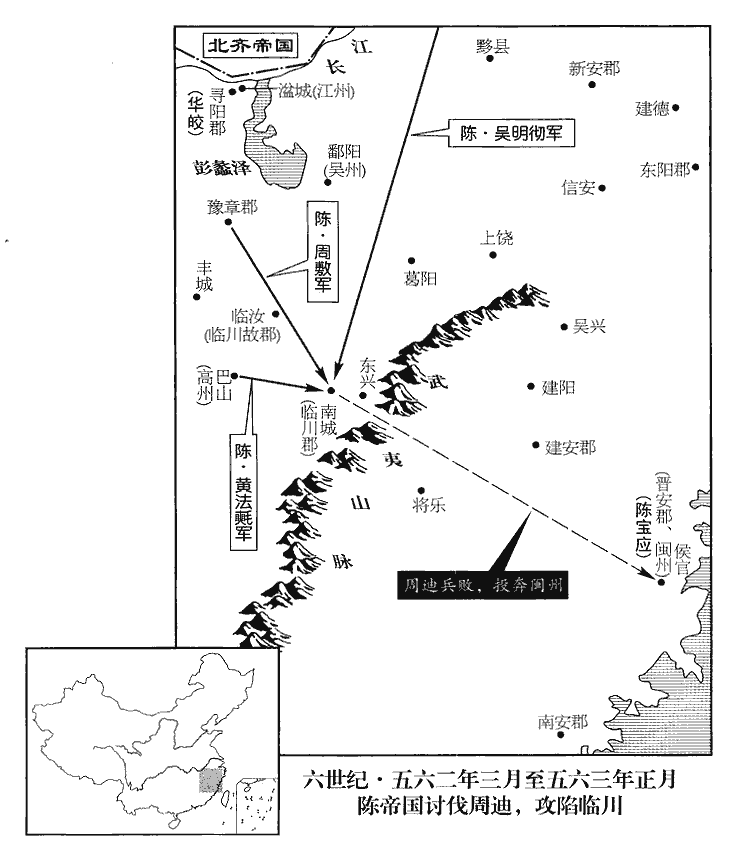
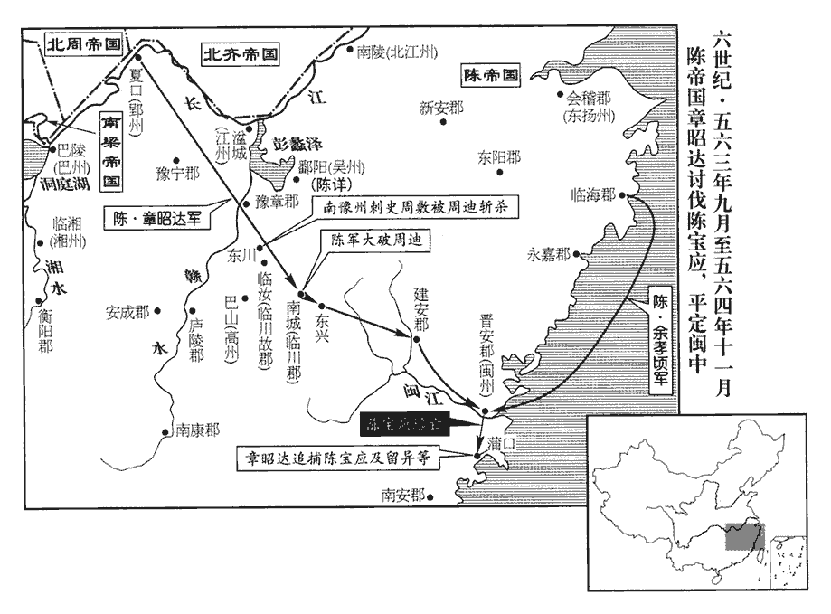
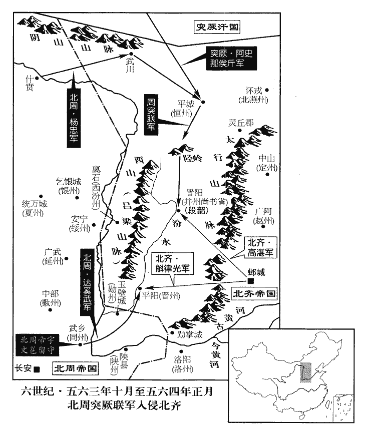
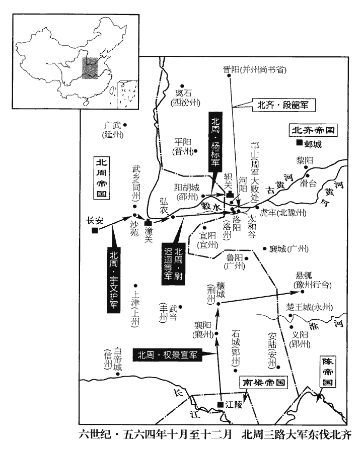
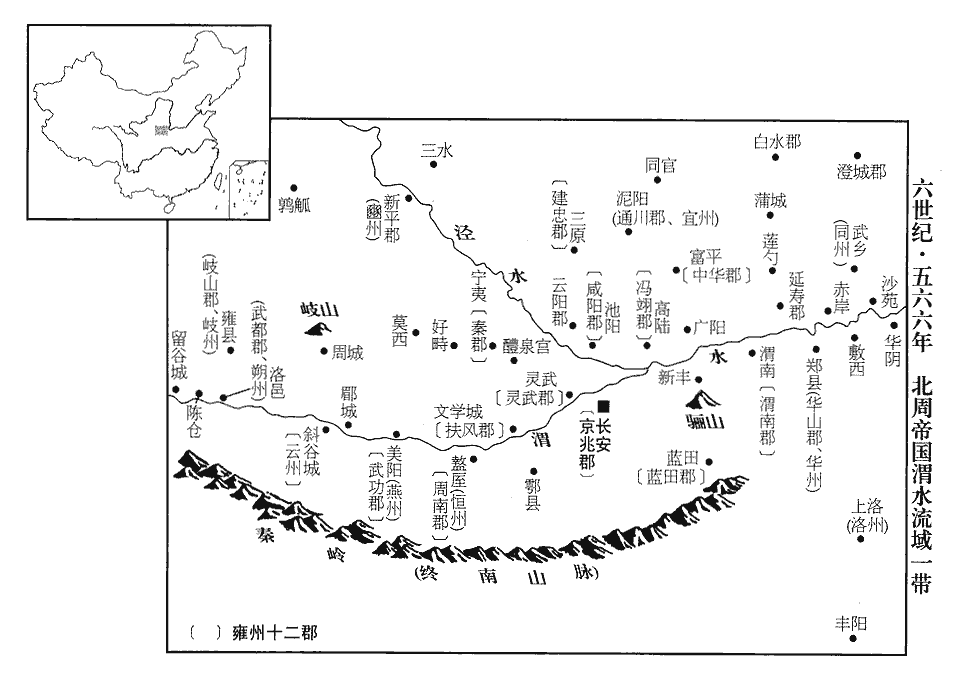
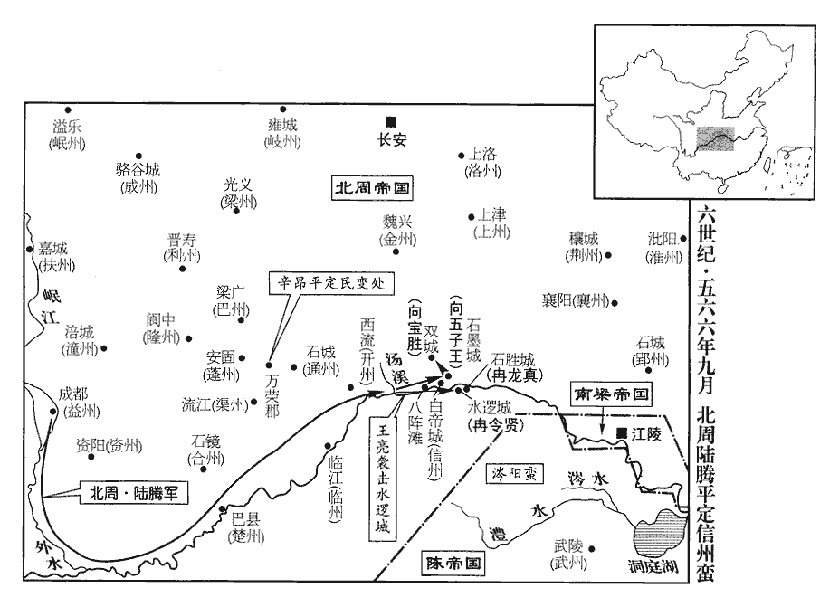

 陳紀三起昭陽協洽（癸未），盡柔兆閹茂（丙戌），凡四年。

# 世祖文皇帝下

## 天嘉四年（癸未、五六三）

1春，正月，齊‹首都邺城河北省临漳县西南邺镇›以太子少傅魏收兼尚書右僕射。時齊主‹高湛，本年二十七岁›終日酣飲，朝事專委侍中高元海。酣，戶甘翻。朝，直遙翻；下同。元海庸俗，帝亦輕之；以收才名素盛，故用之。而收畏懦避事，尋坐阿縱，除名。考異曰：北齊書帝紀，「正月，乙亥，收為僕射，己卯，除名。」相去五日，不容如此之速，恐誤，今去其日。

〖译文〗 [1]春季，正月，北齐任命太子少傅魏收兼尚书右仆射。当时武成帝整天酗酒，把朝廷的事情专门委托给侍中高元海。高元海鄙陋无能，武成帝也看不起他；因为魏收的才能一向有名，所以任命他。魏收胆小懦弱怕事，不久便以阿谀放纵的罪名，被革职。

兗州‹府设瑕丘山东省兖州市›刺史畢義雲作書與高元海，論敘時事，元海入宮，不覺遺之。給事中李孝貞得而奏之，帝由是疏元海，以孝貞兼中書舍人，徵義雲還朝。和士開復譖元海，復，扶又翻。帝以馬鞭箠元海六十，責曰：「汝昔教我反，事見上卷二年。箠，止蕋翻。以弟反兄，幾許不義！以鄴城兵抗并州‹府设晋阳山西省太原市›，幾許無智！」幾，居豈翻。出為兗州刺史。

〖译文〗 兖州刺史毕义云写信给高元海，信里议论时局，高元海在进宫时，不知不觉地把信遗失了。给事中李孝贞得到了这封信，奏报给武成帝，武成帝因此疏远高元海，任用李孝贞兼职中书舍人，召回毕义云。和士开再次对武成帝说高元海的坏话，武成帝命令打高元海六十下马鞭，斥责说：“你以前唆使我反叛，以弟弟反叛兄长，多么不义！用邺城的兵力抵抗并州，多么愚笨！”贬出朝延做兖州刺史。

2甲申‹十九›，周迪‹时被围在临川郡江西省南城县›眾潰，脫身踰嶺‹东兴岭·江西省黎川县杉岭›，奔晉安‹福建省福州市›，臨川郡南城縣有東興嶺，通晉安。依陳寶應。官軍克臨川，獲迪妻子。寶應以兵資迪，留異又遣子忠臣隨之。

〖译文〗 [2]甲申（十九日）周迪的部下溃败，他脱身越过东兴岭，逃奔到晋安，投靠陈宝应。官军攻下临州，俘虏了周迪的妻儿。陈宝应派兵援助周迪，留异又派儿子留忠臣跟随周迪。

虞寄與寶應書，以十事諫之曰：「自天厭梁德，英雄互起，人人自以為得之，然夷凶翦亂，四海樂推者，陳氏也；樂，音洛。豈非曆數有在，惟天所授乎！一也。以王琳之強，侯瑱之力，進足以搖蕩中原，爭衡天下，退足以屈強江外，瑱，他甸翻，又音鎮。屈，其勿翻。強，其兩翻。雄張偏隅；張：知亮翻。然或命一旅之師，或資一士之說，琳則瓦解冰泮，投身異域，瑱則厥角稽顙，書泰誓曰：若崩厥角。言如角之崩也。孟子曰：若崩厥角稽首。文雖小異，意則大同。此止言厥角稽顙，當以顛蹶之蹶為義。說，式芮翻。稽，音啟。委命闕庭，斯又天假其威而除其患。二也。今將軍以藩戚之重，陳編寶應於屬籍，故云然。東南之眾，盡忠奉上，勠力勤王，豈不勳高竇融，竇融以河西歸漢，累世貴盛。寵過吳芮，吳芮以長沙奉漢，高祖賢之，制詔御史：「長沙王忠，其定著令，」至傳國五世。析珪判野，楊雄解嘲曰：析人之珪。師古註云：析，分也。判，亦分也。判野，謂畫野分土，君國子民而傳之後世也。南面稱孤乎！三也。聖朝棄瑕忘過，寬厚得人，至於余孝頃、潘純陀、李孝欽、歐陽頠等，朝，直遙翻。高祖永定元年，歐陽頠為周文育所禽。潘純陀、李孝欽，皆王琳將也。孝欽及余孝頃，二年為周迪所禽，純陀蓋琳敗而歸陳也。頠，魚委翻。悉委以心腹，任以爪牙，胸中豁然，曾無纖芥。況將軍釁非張繡，罪異畢諶，張繡殺曹操之子，其後歸操，操厚待之。事見漢獻帝紀。又，操為兗州，以畢諶為別駕。張邈以兗州叛，劫諶母弟妻子，操謝遣之。諶頓首言無二心，既出，遂亡去。及破呂布，諶生得，眾為之懼。操曰：「夫人孝于親者，豈有不忠於君乎！吾所求也。」以為魯相。釁，許覲翻。諶chén，氏壬翻。當何慮於危亡，何失於富貴！四也。方今周、齊鄰睦，境外無虞，并兵一向，匪朝伊夕，非劉、項競逐之機，楚、趙連從之勢；從，子容翻。何得雍容高拱，坐論西伯哉！五也。范曄論隗囂曰：若囂命會符運，敵非天力，雖坐論西伯，豈為過哉！註云：言不遇光武為敵，則不謝西伯也。且留將軍狼顧一隅，亟經摧衂nǜ，亟，去吏翻，頻數也。聲實虧喪，膽氣衰沮。其將帥首鼠兩端唯利是視，孰能被堅執銳，長驅深入，繫馬埋輪，奮不顧命，以先士卒者乎！六也。喪，息浪翻。沮，在呂翻。將，即亮翻。帥，所類翻。被，皮義翻。先，悉薦翻。將軍之強，孰如侯景？將軍之眾，孰如王琳？武皇‹陈霸先›滅侯景於前，今上‹陈蒨›摧王琳於後，此乃天時，非復人力。復，扶又翻。且兵革已後，民皆厭亂，其孰能棄墳墓，捐妻子，出萬死不顧之計，從將軍於白刃之間乎！七也。歷觀前古，子陽、季孟，顛覆相尋；餘善、右渠，危亡繼及。子陽，公孫述字；季孟，隗囂字。二人事見漢光武紀。餘善、右渠事見漢武帝紀。天命可畏，山川難恃。況將軍欲以數郡之地當天下之兵，以諸侯之資拒天子之命，強弱逆順，可得侔乎！八也。且非我族類，其心必異；左傳季文子引史佚之言。不愛其親，豈能及物！留將軍身縻國爵，子尚王姬，易曰：我有好爵，吾與爾縻之。子尚王姬，謂異子貞臣尚主也。猶且棄天屬而不顧，背明君而孤立，危急之日，岂能同憂共患，不背將軍者乎！背，蒲妹翻。至於師老力屈，懼誅利賞，必有韓、智晉陽之謀，張、陳井陘之勢。九也。韓、智事見一卷周威烈王二十三年。張、陳事始秦二世三年，終漢高帝三年。陘，音刑。北軍萬里遠鬬，鋒不可當。兵自建康來，建康於晉安為北，故曰北軍。萬里遠鬬者，無反顧之心，有必死之志，故其鋒不可當。將軍自戰其地，人多顧後；眾寡不敵，將帥不侔。師以無名而出，事以無機而動，以此稱兵，稱，猶舉也。未知其利。十也。為將軍計，莫若絕親留氏，寶應娶留異之女為妻。釋【章：十二行本「釋」上有「遣子入質」四字；乙十一行本同；孔本同；張校同；退齋校同。】甲偃兵，一遵詔旨。方今藩維尚少，少，詩沼翻。皇子幼沖，凡豫宗族，皆蒙寵樹。況以將軍之地，將軍之才，將軍之名，將軍之勢，而克脩藩服，北面稱臣，寧與劉澤同年而語其功業哉！劉澤，漢高祖疏屬，事見十三卷漢高后七年。寄感恩懷德，不覺狂言，斧鉞之誅，其甘如薺。」薺，齊濟翻。寶應覽書大怒。或謂寶應曰：「虞公病勢稍篤，言多錯謬。」寶應意乃小釋，亦以寄民望，故優容之。

〖译文〗 虞寄写信给陈宝应，举出十件事情规劝他说：“自从上天厌恶梁朝德业不修以来，英雄纷起，人人以为天下非已莫属，然而除凶平乱，天下愿意推戴的崐，是陈氏；岂不是有天道运命在，是上天所赐给的吗！这是一。以王琳的强盛，侯的力量，进可以震撼中原，在天下争个高低；退足以在长江以外倔强，雄踞偏远一角。然而我们或者派遣一支军队，或者借助一名说客，王琳就瓦碎冰融，去异域投身，侯就叩头俯伏，托命于朝廷，这是借天威而除掉祸患。这是二。现在您将军以藩王亲戚之贵，东南人力之众，尽忠报效朝廷，全力救援皇上，功勋岂不比汉朝的窦融高，受宠超过吴芮，得到封爵和领地，能面向南坐称王称侯吗！这是三。圣明的朝廷不计较人的缺点和过错，以宽厚求得人才，至于像余孝顷、潘纯陀、李孝钦、欧阳等人，都把他们当成心腹，任为助手，胸怀开朗，不计较细微的事。况且您将军的过失不如张绣，罪行不同于毕谌，何必顾虑危险存亡，又哪里会失去富贵！这是四。现在周、齐两朝睦邻友好，境外不须疑虑，联合军队对着同一方向，已经有很长时间，不是刘邦、项羽竞争追逐的时机，楚国和赵国合纵连横的形势；怎么能从容不迫无所作为，安然割据为一方的主帅！这是五。况且留异将军在角落里像狼那样窥伺，屡次遭到挫败，名声亏损丧尽，胆气衰退败落。他的将帅犹豫动摇，只看到自己的私利，谁能穿着铠甲、拿着锐利的武器，长驱直入，系住马匹埋掉车轮，奋勇舍命，身先士卒地战斗！这是六。将军力量的强弱，比侯景怎样？将军部下的众多，比王琳如何？武皇帝灭侯景于前，当今皇帝击败王琳于后，这是天意，不是靠人力。况且争战以后，百姓都讨厌动乱，谁能抛弃故园家乡，舍弃妻儿，想出万死不辞的计谋，追随您将军在刀丛之间效命吗！这是七。综观以往历史，子阳（公孙述）、季孟（隗嚣），灭亡连续不断；馀善、右渠，危急覆亡接踵而至。天命可畏，山川地势难以凭借。况且您将军想以几个郡的地方来抵御天下的兵力，以诸侯的实力抗拒天子的命令，强弱逆顺，能相比较吗！这是八。不是自己的同类，心意一定不同；不爱自己的亲朋，怎能顾及别人！留异将军身系国家的爵位，儿子娶了皇家的女儿，尚且抛弃上天的眷顾而不惜，背离圣明的君主而孤立，遇到危急的时候，怎么能共同分担忧患，而不背叛您将军！等到用兵时间过长，军队疲劳不堪，就会怕死贪财，一定会出现康子、智伯在晋阳的阴谋，张耳、陈馀在井陉那样的争斗。这是九。北军远从万里来战斗，前锋锐利不可阻挡。您将军在自己的地区打仗，人们多有后顾之忧，众寡不敌，将帅与敌军不能相比。师出无名，做事没有机会而妄动，在这种情况下举兵，不会有好处。这是十。为您将军着想，不如断绝和留氏的亲戚关系，解甲息兵，遵从皇帝的诏旨。现在捍卫和支持朝廷的人还少，皇子年幼，凡是宗族，都受到恩宠扶植。况且以您将军的门第、才干、名声、势力，能谨守作臣的职责，臣服君王，这样您的功业就能和刘泽相提并论了！虞寄感恩戴德，不禁说了这些狂妄的话，要杀要砍，我心甘情愿。”陈宝应看后大怒。有人向陈宝应说：“虞公的病情加重了，所以说话多有错误荒谬。”陈宝应的怒意才稍为平息，又因为虞寄有民望，所以宽容他。

 

3周‹首都长安陕西省西安市›梁躁公侯莫陳崇從周主‹宇文邕，本年二十一岁›如原州‹府设高平宁夏固原县›。諡法：好變動民曰躁。帝‹宇文邕›夜還長安，人竊怪其故，崇謂所親曰：「吾比聞術者言，晉公今年不利，車駕今忽夜還，不過晉公死耳。」比，毗至翻。宇文護封晉公。或發其事。乙酉‹二十›，帝召諸公於大德殿，面責崇，崇惶恐謝罪。其夜，冢宰護遣使將兵就崇第，逼令自殺，護當恐懼脩省，引咎避權，不當專殺功臣。使，疏吏翻。將，即亮翻。葬如常儀。

〖译文〗 [3]北周的梁躁公侯莫陈崇跟随北周国主武帝去原州。武帝当晚就回长安，人们私下怀疑其中的原因，侯莫陈崇告诉亲信说：“我近来听方士说，晋公宇文护今年不吉利，皇上今天突然在晚上赶回来，不过是晋公宇文护死了。”有人把这件事告发了。乙酉（二十日），武帝在大德殿召见了公侯们，当面斥责侯莫陈崇，侯莫陈崇诚惶诚恐地承认有罪。这天晚上，冢宰宇文护派遣使者带领士兵到侯莫陈崇家里，逼他自杀，然后按固有的仪式把他埋葬。

4壬辰‹二十七›，以高州‹府设巴山江西省崇仁县›刺史黃法𣰰qú為南徐州‹府设京口江苏省镇江市›刺史，臨川‹江西省临川市›太守周敷為南豫州‹府设姑孰安徽省当涂县›刺史。五代志：高涼郡，梁置高州。南豫州，時治宣城。𣰰，巨俱翻。

〖译文〗 [4]壬辰（二十七日），陈朝任命高州刺史黄法氍为南徐州刺史，临川太守周敷为南豫州刺史。

5周主‹宇文邕›命司憲大夫拓跋迪唐六典：御史大夫，秦官。歷晉、宋、齊、梁、陳、後魏、北齊、後周，並不置大夫，而以中丞為臺主。後周秋官置司憲中大夫二人，掌丞司寇之法，以左右刑罰，蓋比御史中丞之職也。造大律十五篇。【章：十二行本「篇」下有「二月庚子頒行之」七字；乙十一行本同；孔本同；張校同；退齋校同。】五代志：周造大律凡二十五篇：一刑名，二法例，三祀享，四朝會，五婚姻，六戶禁，七水火，八興繕，九衛宮，十市廛，十一鬬競，十二劫盜，十三賊叛，十四毀亡，十五違制，十六關津，十七諸侯，十八廐牧，十九雜犯，二十詐偽，二十一請求，二十二告言，二十三逃亡，二十四繫訊，二十五斷獄。當從志作「二十五篇」。其制罪：一曰杖刑，自十至五十；二曰鞭刑，自六十至百；三曰徒刑，自一年至五年；四曰流刑，自二千五百里至四千五百里；五曰死刑，磬、絞、斬、梟、裂；古者公族有罪，磬于甸人。鄭玄曰：懸縊殺之曰磬。絞者，全其身首。斬者，殊死。梟者，掛其首於木上。裂者，車裂。梟xiāo，堅堯翻。凡二十五等。五刑之屬各有五，合二十五等。

〖译文〗 [5]北周武帝命令司宪大夫拓跋迪制定《大律》十五篇，规定对犯罪的惩罚：一是杖刑，杖十到五十下；二是鞭刑，鞭打六十到一百下；三是徒刑，刑期从一年到五年；四是流刑，流放二千五百里到四千五百里；五是死刑，分缢崐死、绞死、斩首、将首级悬挂示众、用车裂尸；一共分二十五等。

6庚戌‹十六›，以司空南徐州刺史侯安都為江州‹府设湓城江西省九江市›刺史。

〖译文〗 [6]庚戌（十六日），陈朝任命司空南徐州刺史侯安都为江州刺史。

7辛酉‹二十七›，周‹宇文邕›詔：「大冢宰晉國公‹宇文护›，親則懿昆，昆，兄也。任當元輔，自今詔誥及百司文書，並不得稱公名。」護抗表固讓。

〖译文〗 [7]辛酉（二十七日），北周武帝下诏：“大冢宰晋国公，是我的兄长，职位是朝延为首的大臣，今后凡是诏令诰书和所有官署的文书里，不准直呼其名。”宇文护对诏令坚决不服从，表示谦让。

8三月，乙丑朔‹一›，日有食之。

〖译文〗 [8]三月，乙丑朔（初一），出现日食。

9齊詔司空斛律光督步騎二萬，築勳掌城於軹關‹河南省济源市西北›；五代志：軹關，在河內郡王屋縣。騎，奇寄翻。軹，音只。仍築長城二百里，置十二戍。

〖译文〗 [9]北齐武成帝高湛诏令司空斛律光督带二万名步、骑兵，到轵关建造勋掌城，构筑了二百里的长城，设立十二个戌所。

10丙戌‹二十二›，齊以兼尚書右僕射趙彥深為左僕射。「左僕射」，當作「右僕射」，蓋先是兼官，今正除右僕射也。

〖译文〗 [10]丙戌（二十四日），北齐任命兼尚书右仆射赵彦深为左仆射。

11夏，四月，乙未‹二›，周以柱國達奚武為太保。

〖译文〗 [11]夏季，四月，乙未（初二），北周任命柱国达奚武为太保。

12周主‹宇文邕›將視學，以太傅燕國公于謹為三老。燕，因肩翻。謹上表固辭，不許，仍賜以延年杖。戊午‹二十五›，帝幸太學。謹入門，帝迎拜於門屏之間，謹答拜。有司設三老席於中楹，南向。太師護升階，設几，謹升席，南面憑几而坐。大司馬豆盧寧升階，正舄xì。帝升階，立於斧扆之前，西面。扆，屏風也。斧扆，畫文為斧形。扆yǐ，於豈翻。有司進饌，帝跪設醬豆，醬，食味之主。古之養老，執醬而饋，今跪而設豆。親為之袒割。為，于偽翻。袒割，袒而割性也。謹食畢，帝親跪授爵以酳。酳yìn，羊晉翻；以酒漱口也。有司撤訖，帝北面立而訪道。謹起，立於席後，對曰：「木受繩則正，后從諫則聖。書傅說告高宗之言。明王虛心納諫以知得失，天下乃安。」又曰：「去食去兵，信不可去；論語孔子答子貢之言。去，羌呂翻。願陛下守信勿失。」又曰：「有功必賞，有罪必罰，則為善者日進，為惡者日止。」又曰：「言行者，立身之基，行，下孟翻。願陛下三思而言，九慮而行，勿使有過。天子之過，如日月之食，人莫不知，願陛下慎之。」帝再拜受言，謹答拜。禮成而出。三代而下，視學、養老、乞言之禮，唯漢明帝‹刘庄›、周武帝‹宇文邕›行之。

〖译文〗 [12]北周武帝准备巡视学校，任命太傅燕国公于谨为掌管国家教化的“三老”。于谨上书坚决推辞，没有得到准许，仍旧赏赐他“延年杖”。戊午（二十五日），武帝驾临太学。于谨进门时，武帝在大门和屏风之间迎接他，于谨答谢还礼。官员在厅堂中间设下三老席，坐位朝南。太师宇文护走上台阶，摆了一张小桌子，于谨入席，而朝南倚着小桌子坐定。大司马豆卢宁走上台阶，把于谨脱下的鞋子放端正。武帝走上台阶，站在画有斧状图案的屏风前，面朝西。官员送上饮食，武帝跪着放好盛放调料的食器，挽起衣袖为于谨割肉，于谨吃完后，武帝亲自跪着送上盛酒的酒器请于谨漱口。官员撤去饮食器皿，武帝面朝北站着向于谨请教治理国家的道理。于谨起身站在坐席后面，回答说：“木材经过墨线校正才能平直，帝王能听从规劝就是圣明。明理的帝王能虚心听取规劝可以知道自己的得失，这样天下就能安定。”又说：“即使失去食物和军队，但不能失去信用；希望陛下不要失去信用。”又说：“有功必赏，有罪必罚，那么做好事的人会一天比一天多，做坏事的人会一天比一天少。”还说：“言论和行为，是立身的根本，希望陛下三思以后再说话，九次考虑以后再行动，不要发生过错。天子有了过错，正象日食和月食那样，没有人不知道的，希望陛下一定要谨慎从事。”武帝再次拜谢表示听从，于谨答谢还礼。仪礼结束后武帝离开太学。

13司空侯安都恃功驕橫，橫，戶孟翻。數聚文武之士騎射賦詩，數，所角翻；下又數同。騎，奇寄翻。齋中賓客，動至千人。部下將帥，多不遵法度，檢問收攝，攝，錄也，捕也。將，即亮翻。帥，所類翻。輒奔歸安都。上‹陈蒨，本年四十二岁›性嚴整，內銜之，安都弗之覺。每有表啟，封訖，有事未盡，開封自書之云：「又啟某事。」及侍宴，酒酣，或箕踞傾倚。常陪樂遊園禊xì飲，樂，音洛。謂上曰：「何如作臨川王時？」上不應。安都再三言之。上曰：「此雖天命，抑亦明公之力。」宴訖，啟借供帳水飾，欲載妻妾於御堂宴飲。上雖許之，意甚不懌。明日，安都坐於御座，賓客居群臣位，稱觴上壽。上，時掌翻。會重雲殿災，安都帥將士帶甲入殿，上甚惡之，陰為之備。此皆日前事，史歷敘安都致敗之由。重，直龍翻。惡，烏路翻。

〖译文〗 [13]陈朝的司空侯安都自恃有功骄傲蛮横，屡次纠集文人武士骑射赋诗，住处的宾客，往往多到上千人。部下的将帅，大都不遵纪守法，遇到被检举搜崐捕捉拿，常常投奔侯安都。陈文帝性格严厉认真，对他含恨在心，而侯安都却毫无觉察。每逢向皇帝上表启事，信已经封好，想到有些事还没有写完，又拆开封口补写：“又启奏某某事。”在侍侯皇帝宴会时，酒喝得痛快时，有时就伸腿而坐歪斜着身子。他常陪文帝到乐游园举行修禊宴饮，饮酒时对文帝说：“现在比作临川王时如何？”文帝不理他。侯安都却再三提这件事。文帝说：“这虽然是天命，却也是靠您的力量。”宴饮结束，侯安都向文帝借帷帐和彩船，要载上妻妾去皇帝的宫室摆宴饮酒。文帝虽然允准了他的要求，心里却很不高兴。第二天，侯安都坐在皇帝的座位上，宾客们坐在大臣的位子上，举杯为他祝寿。恰巧重云殿发生火灾，侯安都率领将士携带兵器来到重云殿，文帝非常恨他，暗下作了准备。

及周迪反，朝議謂當使安都討之，朝，直遙翻；下同。而上更使吳明徹。更，工衡翻。又數遣臺使按問安都部下，檢括亡叛。使，疏吏翻。安都遣其別駕周弘實，自託於舍人蔡景歷，蔡景歷為中書舍人，自武帝以來，特蒙親任，蓋陳朝事權皆在中書也。并問省中事。景歷錄其狀，具奏之，因希旨稱安都謀反。上慮其不受召，故用為江州。

〖译文〗 到了周迪造反时，朝中议论说应该派侯安都去讨伐，但文帝另派了吴明彻。文帝还屡次派御史台的官员审讯侯安都的部下，清查他们逃亡叛乱的事情。侯安都派别驾周弘实投身到中书舍人蔡景历那里，探听中书省的机密。蔡景历把他的行动一一记录下来，报告了文帝，迎合文帝的意旨说侯安都要谋反。文帝考虑到侯安都不会接受召命，使任命他去江州当刺史。

五月，安都自京口還建康，部伍入于石頭‹建康城西北›。六月，帝引安都宴於嘉德殿，又集其部下將帥會于尚書朝堂，於坐收安都，囚于嘉德西省，坐，徂臥翻。又收其將帥，盡奪馬仗而釋之。因出蔡景歷表，以示於朝，乃下詔暴其罪惡，明日，賜死‹年四十四岁›，宥其妻子，資給其喪。

〖译文〗 五月，侯安都从京口回建康，部下的军队开进石头城。六月，文帝招侯安都到嘉德殿宴饮，又召集侯安都部下的将帅到尚书省的大厅见面，于是逮捕了侯安都，把他囚禁在嘉德西省，又逮捕了侯安都的将帅，没收了他们的马匹兵器后予以释放。还拿出蔡景历所上的奏报，向朝中的官员们出示，随即下诏公布了侯安都的罪恶，第二天，赐他自尽，宽恕了他的妻儿，拨款给他们办丧事。

初，高祖‹陈霸先›在京口，高祖與王僧辯既平臺城，出鎮京口。嘗與諸將宴，杜僧明、周文育、侯安都為壽，奉觴上壽也。各稱功伐。積功曰伐。高祖曰：「卿等悉良將也，而並有所短。杜公志大而識闇，狎於下而驕於上；周侯交不擇人，而推心過差；侯郎慠誕而無厭，輕佻而肆志；厭，於鹽翻。佻，他彫翻。並非全身之道。」卒皆如其言。「知臣莫若君」，誠哉是言也。卒，子恤翻。

〖译文〗 当初，陈武帝在京口时曾经和将军们宴会，杜僧明、周文育、侯安都为他祝寿，各自夸耀战功。陈武帝说：“诸位都是良将，但各有不足之处。杜公志向虽大而见识不明，对下亲密对上骄傲；周侯不能有选择地结交朋友，而且过于推心置腹；侯郎傲慢放诞而贪得无厌，性格轻佻而放纵不羁；这都不是保全身家的行为。”后来果然象他所说的那样。

14乙卯‹二十三›，齊主‹高湛›使兼散騎常侍崔子武來聘。散，悉亶翻。騎，奇寄翻；下同。

〖译文〗 [14]乙卯（二十三日），北齐武成帝派兼散骑常侍崔子武来陈朝聘问。

15齊侍中、開府儀同三司和士開有寵於齊主，齊主外朝視事，或在內宴賞，須臾之間，不得不與士開相見，或累日不歸，一日數入；或放還之後，俄頃即追，未至之間，連騎督趣。趣，讀曰促。姦諂百端，寵愛日隆，前後賞賜，不可勝紀。每侍左右，言辭容止，極諸鄙褻xiè；以夜繼晝，無復君臣之禮。常謂帝曰：「自古帝王，盡為灰土，堯舜、桀紂，竟復何異！陛下宜及少壯，極意為樂，縱橫行之。勝，音升。復，扶又翻。少，詩照翻。樂，音洛。縱，子容翻。一日取快，可敵千年。國事盡付大臣，何慮不辦，無為自勤約也！」帝大悅。於是委趙彥深掌官爵，元文遙掌財用，唐邕掌外、騎兵，外兵及騎兵也。勃海王歡相魏，丞相府外兵曹、騎兵曹分掌兵馬。及文宣受禪，諸司咸歸尚書，惟此二曹不廢，謂之外兵省、騎兵省。據和士開傳，時委邕掌外兵，白建掌騎兵。信都‹河北省冀县›馮子琮、胡長粲掌東宮。帝三四日一視朝，書數字而已，朝，直遙翻。略無所言，須臾罷入。長粲，僧敬之子也。胡僧敬見一百五十八卷梁武帝大同七年。

〖译文〗 [15]北齐的侍中、开府仪同三司和士开得到武成帝的宠爱，武成帝外出视察，或在宫中宴请时，过不了一会儿，就要召和士开来见面，或者留他好几天，或者一天里召他进宫许多次；或者和士开刚走，又立刻追他回来，在和士开还没回来以前，接二连三派人骑马去催促。由于他各式各样的奸诈谄媚，受到武成帝的日益宠爱，前后赏赐给他的物品，数不胜数。每当在武成帝身边侍候，说话和动作极其卑鄙下流；夜以继日，毫无君臣之礼。他常常告诉武成帝说：“自古以来的帝王，都成了灰土，尧舜和桀纣，有什么两样！陛下应当在少崐壮时恣意行乐，放纵而不必顾忌。快乐一天，比得上一千年。国事都交给大臣，何必担心办不成，不用自己劳累约束自己！”武成帝大喜。于是委托赵彦深掌管封官授爵，元文遥掌管钱财费用，唐邕掌管外兵和骑兵，信都人冯子琮、胡长粲掌管东宫。武成帝三四天才上一次朝，批几个字，也不说什么话，一会儿就退朝进宫。胡长粲是胡僧敬的儿子。

帝使士開與胡后握槊。河南康獻王孝瑜諫曰：「皇后天下之母，豈可與臣下接手！」孝瑜又言：「趙郡王叡，其父死於非命，叡父琛，勃海王歡之弟也，亂歡後庭，因杖而斃。不可親近。」近，其靳翻。由是叡及士開共譖之。士開言孝瑜奢僭，叡言「山東唯聞河南王，不聞有陛下。」齊主多居晉陽，在山西；司、冀、定、殷、瀛、滄之地，皆在山東。帝由是忌之。孝瑜竊與爾朱御女言，齊制，八十一御女，比正四品，古之御妻也。孝瑜傳云：爾朱事太后，孝瑜先與之通。帝聞之，大怒。庚申‹二十八›，頓飲孝瑜酒三十七盃。飲，於禁翻。孝瑜體肥大，腰帶十圍，帝使左右婁子彥載以出，酖之於車，至西華門，煩躁投水而絕。躁，則到翻。贈太尉、錄尚書事。諸侯在宮中者，莫敢舉聲，唯河間王孝琬大哭而出。孝琬，孝瑜之弟也。

〖译文〗 武成帝叫和士开和胡后玩“握槊”的赌博游戏。河南康献王高孝瑜规劝说：“皇后是天下人的母亲，怎么可以和臣子的手接触！”又说：“赵郡王高睿，他的父亲死于非命，不可以和他亲近。”因此高睿和士开一起说高孝瑜的坏话。和士开说高孝瑜生活奢侈超过他的身份，高睿说：“山东只听说有河南王，没有听说有您陛下。”武成帝因此产生了嫉妒。高孝瑜偷偷地和尔朱御女说话，关系暧昧，武成帝听到这事，勃然大怒。庚申（二十八日），一次叫高孝瑜饮了三十七杯酒。高孝瑜身体肥大，腰带十围，武成帝叫在旁边侍候的近臣娄子彦用车送他出去，在车上又给他饮了毒酒，到西华门时，毒性发作烦躁投水而死。追赠太尉、录尚书事。在宫里的诸侯，都不敢出声，只有河间王高孝琬大哭而去。

16秋，七月，戊辰‹六›，周主‹宇文邕›幸原州。

〖译文〗 [16]秋季，七月，戊辰（初六），北周武帝驾临原州。

17八月，辛丑‹十›，齊以三臺宮為大興聖寺。

〖译文〗 [17]八月，辛丑（初十），北齐把三台宫改为大兴圣寺。

18九月，壬戌‹一›，廣州‹府设番禺广东省广州市›刺史陽山穆公歐陽頠卒‹年六十六岁›，詔子紇襲父爵位。陽山郡公。五代志：南海郡含洭縣，梁置陽山郡。為歐陽紇不就徵、阻兵而反張本。頠wěi，魚委翻。紇hé，下沒翻。

〖译文〗 [18]九月，壬戌（初一），陈朝的广州刺史阳山穆公欧阳去世，下诏他的儿子欧阳纥承袭父亲的爵位。

19甲子‹三›，周主‹宇文邕›自原州登隴。登隴坂也。

〖译文〗 [19]甲子（初三），北周武帝从原州登上陇坂。

20周迪復越東興嶺為寇，東興嶺，在臨川郡南城縣界。唐志，撫州南城縣，武德四年，析置永城、東興二縣，七年省。沈約曰：東興縣，吳立，屬臨川郡。復，扶又翻。辛未‹十›，詔護軍章昭達將兵討之。昭達時為護軍將軍。

〖译文〗 [20]陈朝因周迪又越过东兴岭侵犯，辛未（初十），诏命护军章昭达率领军队去讨伐。

21丙戌‹二十五›，周主如同州‹府设武乡陕西省大荔县›。

〖译文〗 [21]丙戌（二十五日），北周武帝去同州。

22初，周人欲與突厥‹瀚海沙漠群›木杆可汗連兵伐齊，厥，九勿翻。杆，公旦翻。可，從刊入聲。汗，音寒。許納其女為后，遣御伯大夫楊荐唐六典曰：後周天官新置御伯中大夫二人，天子出入則侍于左右，大祭祀盥洗則授巾。武帝改御伯為納言，蓋侍中之職也。宣帝末，又別置侍中爲加官。及左武伯太原‹山西省太原市›王慶左武伯，蓋侍衛之官，註見後。往結之。齊人聞之懼，亦遣使求婚於突厥，賂遺甚厚。使，疏吏翻。遺，于季翻。木杆貪齊幣重，欲執荐等送齊。荐知之，責木杆曰：「太祖‹宇文泰›昔與可汗共敦鄰好，好，呼到翻。蠕蠕部落數千來降，太祖悉以付可汗使者，以快可汗之意，事見一百六十六卷梁敬帝紹泰元年。蠕，人兗翻。降，戶江翻。如何今日遽欲背恩忘義，獨不愧鬼神乎？」背，蒲妹翻。木杆慘然良久曰：「君言是也。吾意決矣，當相與共平東賊，然後遣女。」荐等復命。考異曰：典略在保定二年。按王慶傳云，是歲乃興入并之役。故置於此。

〖译文〗 [22]起初，北周要和突厥木杆可汗联军讨伐北齐，答允娶可汗的女儿做皇后，派御伯大夫杨荐和左武伯太原人王庆去联系。北齐听了害怕，也派使者到突厥去求婚，馈赠厚礼。木杆可汗贪图北齐的厚礼，企图捉了杨荐等人送给北齐。杨荐知道后，斥责木杆可汗说：“太祖从前和可汗共同敦守友好相处，蠕蠕部落几千人来投降，太祖把他们全部交给可汗的使者，以满足可汗的要求，为什么今天忽然背恩忘义，唯独不有愧于鬼神吗？”木杆可汗悲痛了很久，说：“您的话很对。我的主意已经决定了，应该和你们一起讨平东面的贼人，然后把女儿送去。”杨荐等人完成使命后回朝复命。

公卿請發十萬人擊齊，柱國楊忠獨以為得萬騎足矣。戊子‹二十七›，遣忠將步騎一萬，與突厥自北道伐齊，又遣大將軍達奚武帥步騎三萬，自南道出平陽‹山西省临汾市›，期會於晉陽。忠將，即亮翻，又音如字，領也。騎，奇寄翻。帥，讀曰率；下同。

〖译文〗 北周的公卿请发兵十万攻打北齐，柱国杨忠认为只要一万名骑兵就足够了。戊子（二十七日），武帝派杨忠率领一万名步骑兵，和突厥从北面的道路讨崐伐北齐，又派大将军达奚武率领三万名步、骑兵，从南面的道路由平阳出发，约期在晋阳会师。

23冬，十一月，辛酉‹一›，章昭達大破周迪。迪脫身潛竄山谷，民相與匿之，雖加誅戮，無肯言者。

〖译文〗 [23]冬季，十一月，辛酉（初一），陈朝章昭达大破周迪。周迪脱身潜伏逃窜到山谷里，老百姓把他隐藏起来，虽然受到诛杀，却没人肯说出来。

24十二月，辛卯‹一›，周主‹宇文邕›還長安。自隴上還。

〖译文〗 [24]十二月，辛卯（初一），北周武帝回长安。

25丙申‹六›，大赦。

〖译文〗 [25]丙申（初六），陈朝大赦全国。

26章昭達進軍，度嶺‹东兴岭›，趣建安‹福建省建瓯市›，討陳寶應，趣，七喻翻。詔益州刺史余孝頃梁元帝之世，益州之地已入于周，陳命余孝頃遙領益州刺史耳。督會稽‹浙江省绍兴市›、東陽‹浙江省金华市›、臨海‹浙江省台州市西北章安镇›、永嘉‹浙江省温州市›諸軍，自東道會之。會，工外翻。

〖译文〗 [26]陈朝的章昭达进军，经过东兴岭，向建安急进，讨伐陈宝应，文帝诏命益州刺史余孝顷督率会稽、东阳、临海、永嘉等地军队从东路来会合。

27是歲，初祭始興昭烈王‹陈道谭›於建康，用天子禮。帝嗣高祖，以子伯茂奉始興昭烈王之祀。今初以天子禮祀之，非禮也。

〖译文〗 [27]这一年，陈朝在建康第一次祭祀始兴昭烈王，用天子的祭礼。

 

28周楊忠拔齊二十餘城‹《周书·杨忠传》杨忠自什贲内蒙古杭锦旗北黄河南岸›进军武川内蒙古武川县，席卷二十余城。齊人守陘嶺‹山西省代县西北句注山›之隘，唐志：代州鴈門縣有東陘關、西陘關。陘，音刑。隘，烏懈翻。忠擊破之。突厥木杆、地頭、步離三可汗以十萬騎會之。木杆分國為三部：木杆牙帳居都斤山，地頭可汗統東方，步離可汗統西方。厥，九勿翻。杆，公旦翻。己丑‹十九›，自恆州‹府设平城山西省大同市›三道俱入。恆，戶登翻。時大雪數旬，南北千餘里，平地數尺。齊主‹高湛›自鄴倍道赴之，戊午‹二十八›，至晉陽。斛律光將步兵【章：十二行本「兵」作「騎」；乙十一行本同；孔本同。】三萬屯平陽‹山西省临汾市›。拒達奚武之兵也。己未‹二十九›，周師及突厥逼晉陽。齊主‹高湛›畏其強，戎服帥宮人欲東走避之。趙郡王叡、河間王孝琬叩馬諫。孝琬請委叡部分，分，扶問翻。必得嚴整。帝從之，命六軍進止皆取叡節度，而使并州刺史段韶總之。委叡部分而段韶總其事。

〖译文〗 [28]北周杨忠攻克北齐的二十多座城池。北齐人防守陉岭的山口，杨忠攻破这里的防守。突厥的木杆、地头、步离三个可汗率领十万骑兵来会合。已酉（十九日），从恒州分三路一齐进入。当时下了几十天的大雪，南北一千多里，平地积雪几尺。北齐武成帝从邺城兼程赶去，戊午（二十八日），到晋阳，斛律光率领三万步兵驻守平阳。已未（二十九日），北周军队和突厥逼近晋阳。北齐武成帝对这些强大的军队感到害怕，穿上军服领了宫女打算从东面逃走躲避。赵郡王高睿、河间王高孝琬勒住他的马进行规劝。高孝琬请求把军队委托给高睿部署，可以使军队得到整顿。武成帝采纳了意见，命令六军的行动都受高睿的指挥，派并州刺史段韶总辖。

## 五年（甲申、五六四）

1春，正月，庚申朔‹一›，齊主‹高湛，本年二十八岁›登北城，晉陽‹山西省太原市›北城也。軍容甚整。突厥咎周人曰：「爾言齊亂，故來伐之。今齊人眼中亦有鐵，何可當邪！」厥，九勿翻。邪，音耶。

〖译文〗 [1]春季，正月，庚申朔（初一），北齐武成帝登上晋阳北城，军容非常整齐。突厥人埋怨北周人说：“你们说齐国混乱，所以来讨伐他们。现在齐人眼中都放出铁一样的光来，怎么能抵挡啊！”

周人以步卒為前鋒，從西山下去城二里許。諸將咸欲逆擊之，將，即亮翻。段韶曰：「步卒力勢，自當有限。今積雪既厚，逆戰非便，不如陳以待之，彼勞我逸，破之必矣。」既至，齊悉其銳師鼓譟而出。突厥震駭，引上西山，不肯戰，陳，讀曰陣。上，時掌翻。周師大敗而還。還，從宣翻，又如字；下同。突厥引兵出塞，縱兵大掠，自晉陽以往七百餘里，人畜無遺。謂晉陽以北七百餘里。畜，許救翻。段韶追之，不敢逼。突厥還至陘嶺‹山西省代县西北句注山›，凍滑，乃鋪氈以度，胡馬寒瘦，膝已下皆無毛；比至長城，陘，音刑。比，必利翻。長城，即文宣所築者。馬死且盡，截矟杖之以歸。

〖译文〗 北周军队以步兵为前锋，从西山下来，离城二里多路。北齐将领们都准备迎击，段韶说：“步兵的兵势，力量很有限，现在积雪很厚，迎战很不方便，不如严阵以待。对方疲劳而我方安逸，一定能打败对方。”北周军队来到，北齐精锐的军队呐喊着全数出击。突厥震动惊怕，领军队上了西山，不肯出战，北周的军队大败而还。突厥带着军队出了塞外，放纵士兵大肆抢劫，从晋阳以北的七百多里地方，人畜被劫掠一空。段韶追赶，但不敢靠近。突厥退到陉岭，地冻路滑，只好在路上铺了毛毡行走，胡地的马受冷病瘦，膝盖以下的毛都没有了，等到了长城，马都快死光了，于是截短矛杆当棍子拄着回去。

 

達奚武至平陽‹山西省临汾市›，未知忠退。斛律光與書曰：「鴻鵠已翔於寥廓，羅者猶視於沮澤。」漢司馬相如難蜀父老曰：焦明已翔乎寥廓，羅者猶視乎藪澤。沮，將預翻。武得書，亦還。光逐之，入周境，獲二千餘口而還。

〖译文〗 北周的达奚武到平阳，不知道杨忠已经退走。北齐的斛律光写信给他说：崐“鸿雁已在蓝天翱翔，张网的却还在水草丛生的沼泽地等候。”达奚武见到信，也退走了。斛律光追逐进入北周境内，俘获二千多人就返回了。

光見帝‹高湛›於晉陽，帝以新遭大寇，抱光頭而哭。任城王湝進曰：「何至於此！」乃止。見，賢遍翻。湝，音皆，又戶皆翻。

〖译文〗 斛律光在晋阳朝见武成帝，武成帝因为刚遭到大肆劫掠，抱住斛律光的头痛哭。任城王高劝他说：“何至于此！”这才不哭。

初，齊顯祖‹高洋›之世，周人常懼齊兵西渡，每至冬月，守河椎冰。及世祖‹高湛›即位，嬖倖用事，朝政漸紊，嬖，卑義翻，又博計翻。朝，直遙翻。紊，音問。齊人椎冰以備周兵之逼。斛律光憂之，曰：「國家常有吞關、隴之志，今日至此，而唯翫wán聲色乎！」

〖译文〗 当初，文宣帝在世时，北周常常怕北齐军队西渡，每到冬天，守在黄河边凿开冰凌。到武成帝即位，奸佞小人当权，朝政逐渐混乱，北齐人凿冰防备北周军队入侵。斛律光很担忧，说：“国家常有吞并关、陇的志向，到了今天这样的地步，只好喜好声色狗马！”

2辛巳‹二十二›，上‹陈蒨，本年四十三岁›祀南郊。

〖译文〗 [2]辛巳（二十二日），陈文帝到南郊祭天。

3二月，庚寅朔‹一›，日有食之。

〖译文〗 [3]二月，庚寅朔（初一），出现日食。

4初，齊顯祖‹高洋›命群官刊定魏麟趾格為齊律，見一百六十三卷梁簡文帝大寶元年。久而不成。時軍國多事，決獄罕依律文，相承謂之「變法從事」。世祖‹高湛›即位，思革其弊，乃督修律令者，至是而成，律十二篇，五代志：齊律十二篇：一名例，二禁衛，三婚戶，四擅興，五違制，六詐偽，七鬬訟，八賊盜，九捕斷，十毀損，十一廐牧，十二雜律。令四十卷。其刑名有五：一曰死，重者轘之，轘huàn，胡慣翻；即車裂也。次梟首，次斬，次絞；二曰流，投邊裔為兵；三曰刑，自五歲至一歲；四曰鞭，自百至四十；五曰杖，自三十至十；凡十五等。死四等，流一，刑五等，鞭五等，杖三等，通十八等。今曰凡十五等，通鑑依五代志「大凡為十五等」之文也。梟，堅堯翻。其流外【章：十二行本「外」作「內」；乙十一行本同；孔本同。】官及老、小、閹、癡老者、小者、閹者、癡者與流外官皆贖。鄭玄曰：閹，精氣閉藏者。癡，不慧也。并過失應贖者，皆以絹代金。三月，辛酉‹三›，班行之，因大赦。赦其宿罪，此後有犯者，皆以法令施行。是後為吏者始守法令。又敕仕門子弟常講習之，仕門，謂入仕之家。故齊人多曉法。

〖译文〗 [4]当初，文宣帝下令群臣刊定魏朝的《麟趾格》为《齐律》，过了很久还没有完成。这时军务和国家的事情很多，叛决案件很少依据法律条文，习惯上叫做“变法从事。”武成帝即位后，想革除这种弊病，于是督促修订法律条令，这才制订了《律》十二篇，《令》四十卷。刑法的名目有五种：第一是死，罪重的车裂，依次是割下头示众、斩杀、绞死；第二是流，充军到边域；第三是刑，刑期从五年到一年不等；第四是鞭，从一百到四十下不等；第五是杖，从三十到十下不等；一共分十五等。凡是流放去外地的官员以及年老、年幼、太监、痴呆和犯有过失可以赎罪的，都允许用绢代替罚金。三月，辛酉（初三），《律》、《令》颁布实行，大赦在此以前的犯人。自此以后官吏才按照法律办案。又下令官吏家庭的子弟经常学习，所以北齐人都知道法律。

又令民十八受田，輸租調，二十充兵，六十免力役，六十六還田，免租調。一夫受露田八十畝，杜佑曰：不栽樹者，謂之露田。調，力弔翻；下夫調、牛調同。婦人四十畝，奴婢依良人，言奴婢受田依良人畝數。牛受六十畝。按五代志，丁牛一頭受田六十畝，限止四年。丁牛者，勝耕之牛，牧牛者得受其田。大率一夫一婦調絹一匹，綿八兩，墾租二石，義租五斗；奴婢準良人之半；奴婢者，官常役其力，故所調半於良人。牛調二尺，墾租一斗，義租五升。墾租送臺，義租納郡，以備水旱。調，力弔翻。

〖译文〗 又命令老百姓中满十八岁的授给田地并交纳赋税，二十岁的当兵，六十岁可以免除劳役，六十六岁时交还田地，免去赋税。男子一人授给八十亩露田，妇女授给四十亩，奴婢授给同样的亩数，有一头耕牛的增授六十亩。大致一对夫妇的赋税是一匹绢、八两棉，垦租二石，义租五斗。奴婢是平民的一半，一头牛征赋税二尺绢，垦租一斗，义租五升。垦租上缴中央，义租缴给所在郡以防水旱灾年。

5己巳‹十一›，齊群盜田子禮等數十人，共劫太師彭城景思王浟為主，詐稱使者，徑向浟第，至內室，稱敕，牽浟上馬，臨以白刃，欲引向南殿。浟大呼不從，浟，夷周翻。使，疏吏翻。上，時掌翻。呼，火故翻。盜殺之‹年三十二岁›。

〖译文〗 [5]已巳（十三日），北齐的田子礼等数十名盗贼，要裹胁太师彭城景思王高当首领，诈称是使者，去到高的宅第，进了内室，说是皇帝的命令，拉高上马，用刀对着他，要他领着去皇宫的南殿。高大叫不肯服从，被盗贼杀死。

6庚辰‹二十二›，周初令百官執笏hù。記玉藻曰：史進象笏，書思對命。註云：意所思念，將以告君者也。對，所以對君也。命，所受命也。書之於笏，為失忘也。又曰：凡有指畫於君前者用笏，造受命於君前用笏。笏，畢用也，因飾焉。笏度二尺有六寸，其中博三寸，其殺六分而去一。應劭曰：昔荊軻逐秦王，其後謁者持匕首以備不虞，從此侍官皆執刀劍。高祖偃武修文，始制手版代焉。隋志曰：中世以來，唯八座尚書執笏。笏者，白筆綴其頭，紫囊裹之。其餘公卿，但執手板，謂之筆笏，蓋以記事受言。西魏以降，通用象牙，五品已下，通用竹木，爾雅二字衍釋名：笏，忽也，君有教命及所白，則書其上以備忽忘也。唐㑹要曰：笏，舊制三品已上，前挫後直，五品以上，前挫後屈；武德已來，一例上圓下方。開元八年，諸笏三品已上，前詘後直，五品以上，前詘後挫，並用象；九品已上，任用竹木，上挫下方；男以上聽依品爵執笏；假版官亦依此例。

〖译文〗 [6]庚辰（二十四日），北周第一次令百官上朝时手执“朝笏”。

7齊以斛律光為司徒，武興王普為尚書左僕射。普，歸彥之兄子也。甲申‹二十六›，以馮翊王潤為司空。

〖译文〗 [7]北齐任命斛律光为司徒，武兴王高普为尚书左仆射。高普是高归彦的侄子。甲申（二十八日），任命冯翊王高润为司空。

8夏，四月，辛卯‹三›，齊主‹高湛›使兼散騎常侍皇甫亮來聘。散，悉亶翻。騎，奇寄翻。

〖译文〗 [8]夏季，四月，辛卯（初三），北齐武成帝派兼散骑常侍皇甫亮来陈朝聘问。

9庚子‹十二›，周主‹宇文邕，本年二十二岁›遣使來聘。使，疏吏翻。

〖译文〗 [9]庚子（十二日），北周武帝派使者来陈朝聘问。

10癸卯‹十五›，周以鄧公河南竇熾為大宗伯。五月，壬戌‹五›，封世宗之子賢為畢公。

〖译文〗 [10]癸卯（十五日），北周任命邓公河南窦炽为大宗伯。五月，壬戌（初五），封明帝的儿子宇文贤为毕公。

11甲子‹七›，齊主還鄴自晉陽還。

〖译文〗 [11]甲子（初七），北齐武成帝回邺城。

12壬午‹二十五›，齊以趙郡王叡為錄尚書事，前司徒婁叡為太尉。甲申‹二十七›，以段韶為太師。丁亥‹三十›，以任城王湝為大將軍。湝，戶皆翻，又音皆。

〖译文〗 [12]壬午（二十五日），北齐任命赵郡王高睿为录尚书事，以前的司徒娄睿为太尉。甲申（二十七日），任命段韶为太师。丁亥（三十日），任命任城王高为大将军。

13壬辰，齊主如晉陽。

〖译文〗 [13]壬辰（疑误），北齐武成帝去晋阳。

14周以太保達奚武為同州‹府设武乡陕西省大荔县›刺史。

〖译文〗 [14]北周任命太保达奚武为同州刺史。

15六月，齊主殺樂陵王百年。時白虹暈日兩重，重，直龍翻。又橫貫而不達，赤星見，齊主欲以百年厭之。見，賢遍翻。厭，於叶翻。會博陵‹河北省安平县›人賈德冑教百年書，百年嘗作數敕字，德冑封以奏之。帝發怒，使召百年。百年自知不免，割帶玦jué留與其妃斛律氏，見帝於涼風堂。見，賢遍翻。使百年書敕字，驗與德冑所奏相似，遣左右亂捶之，又令曳之遶堂行且捶，所過血皆遍地，氣息將盡，乃斬之，孝昭殺文宣之子，武成又殺孝昭之子，天之報應固不爽，遺言諄諄，竟何益哉！捶，止橤翻。棄諸池，池水盡赤。妃把玦哀號不食，號，戶高翻。月餘亦卒‹年十四岁›，玦猶在手，拳不可開；其父光自擘之，乃開。擘，博厄翻，分擘也。

〖译文〗 [15]六月，北齐武成帝杀死乐陵王高百年。当时太阳周围有两道白虹，横贯而不相通，赤星出现，武成帝想用高百年的性命来驱除灾异现象。恰巧博陵人贾德胄教高百年写字，高百年曾经写了几个“敕”字。贾德胄把它封好奏报给武成帝。武成帝看后大怒，派人召来高百年。高百年自知免不了被治罪，便割下佩带上的玉留给妃子斛律氏，在凉风堂见到武成帝。武成帝叫高百年写“敕”字，证实字迹和贾德胄所奏报的相似，于是命令侍从对他乱打，还拖着他绕凉风堂边走边打，经过的地方遍地是血，临断气时，将他杀死，把尸体仍进水池，池水都染红了。妃子拿着玉哀叫绝食，一个多月后也死去，玉还在手里，紧握成拳无法掰开；她的父亲斛律光亲自去掰，才掰开。

16庚寅‹三›，周改御伯為納言。

〖译文〗 [16]庚寅（初三），北周把御伯改变纳言。

17初，周太祖‹宇文泰›之從賀拔岳在關中也，遣人迎晉公護於晉陽。梁武帝中大通二年，宇文泰從賀拔岳入關。按下護答母書云：「違離膝下，三十五年，」逆而數之，正在是年。護母閻氏及周主之姑皆留晉陽，周主之姑，蓋宇文泰之妹也。齊人以配中山宮‹在河北省定州市›。中山宮，慕容氏之故宮，自魏以來，以為別宮。及護用事，遣間使入齊求之，莫知音息。間，古莧翻。音息，猶今人言信息也。使，疏吏翻；下同。齊遣使者至玉壁‹北周勋州州政府所在城·山西省稷山县›，求通互市。護欲訪求母、姑，使司馬下大夫尹公正至玉壁，與之言，司馬下大夫，即軍司馬之職。使者甚悅。勳州刺史韋孝寬獲關東人，復縱之，因致書，為言西朝欲通好之意。復，扶又翻，又音如字。為，于偽翻。好，呼到翻；下同。周在關西，故稱西朝。朝，直遙翻。是時，周人以前攻晉陽不得志，謀與突厥再伐齊。厥，九勿翻。齊主‹高湛›聞之，大懼，許遣護母西歸，且求通好，先遣其姑歸。

〖译文〗 [17]当初，北周太祖在关中追随贺拔岳时，曾派人到晋阳迎来晋公宇文护。宇文护的母亲阎氏和北周国主的姑母留在晋阳，北齐人把她们安置在中山宫。宇文护当权以后，派人到北齐去寻找她们，得不到音讯。北齐派使者到玉壁，要求开通和北周之间的贸易来往。宇文护想访求母亲和姑母的下落，便派司马下大夫尹公正去玉壁商谈，北齐的使者非常高兴。勋州刺史韦孝宽捉到关东人，又把他们放掉，还写信给北周表示愿意和对方友好相处。这时，北周因为以前进攻晋阳没有达到目的，准备联合突厥再次攻打北齐。武成帝听到后十分害怕，于是答允送回宇文护的母亲，请求双方和好，先把宇文护的姑母送回去。

18秋，八月，丁亥朔‹一›，日有食之。

〖译文〗 [18]秋季，八月，丁亥朔（初一），发生日食。

19周遣柱國楊忠【章：十二行本「忠」下有「將兵」二字；乙十一行本同；孔本同。】會突厥伐齊，至北河‹黄河河套乌加河›而還。水經：河水東逕沃野故城南，又北屈而為南河出焉。河水又北，迆西溢於窳yǔ渾縣故城東，又屈而東流為北河，東逕高闕南。還，從宣翻，又音如字。

〖译文〗 [19]北周派柱国杨忠会同突厥讨伐北齐，兵到北河就返回了。

20戊子‹二›，周以齊公憲為雍州牧，雍，於用翻。宇文貴為大司徒。九月，丁巳‹二›，以衛公直為大司空。追錄佐命元功，封開府儀同三司隴西公李昞為唐公，錄昞父虎佐命之功也。李氏有天下，國號曰唐，本此。昞，音丙。太馭中大夫長樂公若干鳳為徐公。周官：大馭中大夫，掌馭玉路以祀及犯軷bá，屬夏官。樂，音洛。昞，虎之子；鳳，惠之子也。李虎始見一百五十六卷梁武帝中大通六年。若干惠見一百五十八卷大同九年。

〖译文〗 [20]戊子（初二），北周任命齐公宇文宪为雍州牧，宇文贵为大司徒。九月，丁巳（初二），任命卫公宇文直为大司空。追录当初辅佐君主的元勋功臣，封开府仪同三司陇西公李为唐公，太驭中大夫长乐公若干凤为徐公。李是李虎的儿子，若干凤是若干惠的儿子。

21乙丑‹十›，齊主封其子綽為南陽王，儼為東平王。儼，太子之母弟也。

〖译文〗 [21]乙丑（初十），北齐武成帝封儿子高绰为南阳王，高俨为东平王。高俨是太子的同母弟。

22突厥寇齊幽州‹府设蓟县北京市›，衆十餘萬入長城，大掠而還。

〖译文〗 [22]突厥入侵北齐的幽州，共有十多万人，进入长城，在大肆抢掠后退去。

23周皇姑之歸也，齊主遣人為晉公護母作書，言護幼時數事，又寄其所著錦袍，以為信驗。為，于偽翻。著，陟略翻。且曰：「吾屬千載之運，屬，之欲翻。載，子亥翻。蒙大齊之德，矜老開恩，許得相見。禽獸草木，母子相依。吾有何罪，與汝分離！今復何福，還望見汝！復，扶又翻，又音如字。言此悲喜，死而更蘇。世間所有，求皆可得，母子異國，何處可求！假汝貴極王公，富過山海，有一老母，八十之年，飄然千里，死亡旦夕，不得一朝蹔見，蹔，與暫同。不得一日同處，處，昌呂翻。寒不得汝衣，飢不得汝食，汝雖窮榮極盛，光耀世間，於吾何益！吾今日之前，汝既不得申其供養，供，居用翻。養，羊亮翻。事往何論；今日以後，吾之殘命，唯繫於汝爾。戴天履地，中有鬼神，勿云冥昧，而可欺負！」

〖译文〗 [23]北周武帝的姑母回去时，北齐武成帝派人代晋公宇文护的母亲写了回信，信中说到宇文护年幼时的几件事，还寄去自己穿的锦袍，作为证明。信上说：“我遇到千载难逢的运气，蒙受大齐的恩德，怜悯我年老特别开恩，允许我们母子见面。就是禽兽草木，也都母子相依为命。我犯了什么罪孽，竟会和你分离！现在又得到什么福气，还能回去和你相见！说到这些，悲喜交集，死而复生。世上所有的东西，只要追求都能得到，母子分处异国，又能向哪里求得团聚！即使你的尊贵到达王公，富有超过山海，但有个年已八十的老母亲，还飘泊在千里之外，生命在旦夕之间，得不到一天短暂的相见，得不到一天的共同生活，寒冷而得不到你的衣服，饥饿而得不到你的饮食，你虽然极其荣华富贵，光辉照耀人间，对我有什么好处！在今天以前，你没有尽供养我的本份，事情已过就不必再说了；从今以后，我的余生就依赖于你了。天地之间，中有鬼神，不要以为天地冥冥，可以欺骗负心！”

護得書，悲不自勝。勝，音升。復書曰：「區宇分崩，遭遇災禍，違離膝下，三十五年。離，力智翻。受生稟氣，皆知母子，誰同薩保，護，字薩保。薩，桑葛翻。如此不孝！子為公侯，母為俘隸，暑不見母暑，寒不見母寒，衣不知有無，食不知飢飽，泯如天地之外，無由暫聞。分懷冤酷，終此一生，分，扶問翻。死若有知，冀奉見於泉下耳！不謂齊朝解網，惠以德音，磨敦、四姑，並許矜放。護兄弟呼其母為「阿摩敦」。四姑即周主之姑也，第四。朝，直遙翻；下同。初聞此旨，魂爽飛越，左傳鄭子產曰：「人生始化日魄。既生魄，陽曰魂，用物精多則魂魄強，是以有精爽，至於神明。」號天叩地，號，戶刀翻。不能自勝。勝，音升；下足勝同。齊朝霈然之恩，既已霑洽，有家有國，信義為本，伏度來期，已應有日。朝，直遙翻。度，徒洛翻。一得奉見慈顏，永畢生願。生死肉骨，生死，謂使死者復生；肉骨，謂使枯骨再肉。豈過今恩；負山戴岳，未足勝荷。」勝，音升。荷，下可翻。

〖译文〗 宇文护接到书信，忍不住悲痛。复信说：“天下四分五袭，遭遇灾祸，离开母亲，已经三十五年。禀性承受天地自然之气，都知道母子之情，谁象我萨保一般，这样不孝！儿子是公侯，母亲却是被俘虏的奴隶，热天看不见母亲受暑，冷天看不见母亲挨冻，不知道有没有衣穿，不知道吃得饱不饱，踪迹消失在天地以外，无从得到一点音讯。分别怀有冤屈和惨痛，结束一生以后，身后如果有知，希望能在九泉之下侍奉母亲！不意齐朝网开一面，赐给好消息，母亲和四姑母，获得怜悯允许释放。刚听到这道诏旨时，连魂魄都变得清朗而飞升起来，呼天抢地，不由自己。现在受到齐朝雨露般恩泽的滋润，家庭和国家，应该以信义为根本，估计母亲归来之期，已经不远。一旦能够见到母亲慈祥的面容，永远了却我毕生的愿望。死者复生，白骨长肉，怎能比得上今天这样的恩情；象背负大山高岳，真是担当不起。”

齊人留護母，使更與護書，邀護重報，往返再三。時段韶拒突厥軍於塞下，厥，九勿翻。齊主‹高湛›使黃門徐世榮乘傳齎周書問韶。韶以「周人反覆，本無信義，比晉陽之役，其事可知。護外託為相，其實主也。既為母請和，傳，張戀翻。比，毗至翻。相，息亮翻。為，于偽翻；下主為同。不遣一介之使。使，疏吏翻；下同。若據移書，即送其母，恐示之以弱。不如且外許之，待和親堅定，然後遣之未晚。」齊主不聽，即遣之。護母至長安，席未及煖，而洛陽之師已出，卒如段韶之言。

〖译文〗 北齐人留下宇文护的母亲，再次给宇文护去信，希望宇文护再次回信，这样往返了好几次。当时段韶在边塞抵御突厥的军队，北齐武成帝派黄门郎徐世荣乘驿车带了北周的书信去问段韶的意见。段韶表示“周人反复无常，本来就没有信义，比照晋阳之役，事情就明白了。宇文护在表面上仅仅是相国，实际上是一国之主。既然为了母亲请求和好，却不派一个使者来。如果根据他送来的书信，就把他的母亲送回去，恐怕会给对方留下我们软弱的印象。不如暂且对外表示答允，等和睦亲善的事完全肯定以后，再把他的母亲送回去也不晚。”武成帝不听段韶的意见，立即把宇文护的母亲送回长安。

閻氏至周，舉朝稱慶，周主‹宇文邕›為之大赦。凡所資奉，窮極華盛。每四時伏臘，周主帥諸親戚行家人之禮，稱觴上壽。朝，直遙翻。帥，讀曰率；下同。上，時掌翻。

〖译文〗 阎氏回到北周，满朝欢庆，北周武帝为此在国内大赦。他对阎氏所供奉的一切，美好丰盛到了极点，每逢四季的节日，武帝带领所有亲戚不行国礼而行家礼，举杯祝阎氏长寿。

24突厥自幽州還，還，從宣翻，又如字。留屯塞北，更集諸部兵，遣使告周，欲與共擊齊如前約。閏月，乙巳‹二十›，突厥寇齊幽州。

〖译文〗 [24]突厥从幽州返回，屯兵在塞北，进一步召集各部落的军队，派使者告诉北周，打算象以前所约定那样共同进攻北齐。闰月，乙巳（二十日），突厥入侵北齐幽州。

晉公護新得其母，未欲伐齊；恐負突厥約，更生邊患，不得已，徵二十四軍及左右廂散隸秦、隴、巴、蜀之兵二十四軍，六柱國及十二大將軍所統關中諸府兵也。安定公泰相魏，左右各十二軍，並屬相府。左右廂，禁衛兵也，兼有秦、隴、巴、蜀之兵，散隸於左右廂者。散，悉亶翻。并羌、胡內附者，凡二【張：「二」作「三」。】十萬人。冬，十月，甲子‹十›，周主‹宇文邕›授護斧鉞於廟庭；丁卯‹十三›，親勞軍於沙苑‹陕西省大荔县南›；勞，力到翻。癸酉‹十九›，還宮。

〖译文〗 晋公宇文护刚迎来了母亲，不想进攻北齐；但又怕违背了和突厥的约定，反而发生边患，不得已，征召关中的府兵二十四军、左右厢的禁卫兵及其隶属的秦、陇、巴、蜀等地的军队，加上归附的羌人、胡人等，一共二十万人。冬季，十月，甲子（初十），北周武帝在朝廷授给宇文护斧钺；丁卯（十三日），亲自到沙苑慰劳军队；癸酉（十九日），回宫。

護軍至潼關‹陕西省潼关县›，遣柱國尉遲迥帥精兵十萬為前鋒，趣洛陽‹河南省洛阳市东白马寺东›，大將軍權景宣帥山南之兵趣懸瓠‹河南省汝南县›，山南，荊、襄之兵。尉，紆勿翻。帥，讀曰率；下同。趣，七喻翻。少師楊檦出軹關‹河南省济源市西北›。少，始照翻。檦，與標同。

〖译文〗 宇文护的军队抵达潼关，派柱国尉迟迥领十万精兵做前锋，向洛阳进发，大将军权景宣率领荆州、襄阳的兵向悬瓠进发，少师杨进攻轵关。

25周迪復出東興‹江西省黎川县›，復，扶又翻；下眾復同。宣城‹安徽省宣州市›太守錢肅鎮東興，以城降迪。守，式又翻。降，戶江翻。吳州‹府设鄱阳江西省波阳县›刺史陳詳將兵擊之，五代志：鄱陽郡，梁置吳州；陳廢鄱陽之吳州，而於吳郡置吳州。將，即亮翻，又音如字，領也。詳兵大敗，迪眾復振。

〖译文〗 [25]周迪再次进攻东兴岭，宣城太守钱肃镇守东兴，献出城池向周迪投降。吴州刺史陈详领兵攻击周迪，陈详的军队大败，周迪的部众又振作起来。

南豫州‹府设姑孰安徽省当涂县›刺史西豐脫侯周敷帥所部擊之，諡法，無脫諡。蓋以周敷輕脫而死，故以為諡。至定川‹江西省临川市北›，據周敷傳，定川，縣名。與迪對壘。迪紿敷曰：「吾昔與弟勠力同心，事見一百六十六卷梁敬帝太平元年。紿，蕩亥翻。豈規相害！今願伏罪還朝，朝，直遙翻。因弟披露心腑，先乞挺身共盟。」敷許之，方登壇，為迪所殺‹年三十五岁›。

〖译文〗 南豫州刺史西丰脱侯周敷率领所属部队去攻打周迪，抵达定川，和周迪两军对垒。周迪欺骗周敷说：“我以前和弟弟同心协力，怎会谋划加害于你！现在我愿意认罪归顺朝廷，乘弟弟前来时表露我心里的想法，先请你挺身而出和我一起盟誓。”周敷答允了，刚走上举行盟誓的土台，就被周迪杀死。

26陳寶應據晉安‹福建省福州市›、建安‹福建省建瓯市›二郡，水陸為柵，以拒章昭達。昭達與戰，不利，因據上流，命軍士伐木為筏，施拍其上。會大雨江漲，昭達放筏衝寶應水柵，盡壞之，筏，音伐。壞，音怪。又出兵攻其步軍。方合戰，上遣將軍余孝頃自海道適至，去年遣孝頃督會稽諸郡兵，自東道合攻陳寶應。并力乘之。十一月，己丑‹五›，寶應大敗，逃至莆口‹福建省莆田市东北›，莆口，在唐泉州莆田縣界。莆田，今興化軍即其地。虞寄傳作「莆田」。莆，音蒲。謂其子曰：「早從虞公計，不至今日。」昭達追擒之，并擒留異及其族黨，送建康，斬之。異子貞臣以尚主得免；寶應賓客皆死。

〖译文〗 [26]陈宝应占据晋安和建安两郡，在水路和陆路修起栅栏，用来抗拒章昭达。章昭达和他打仗，很不顺利。因此占据江水上游，命令军士砍树木造木筏，筏上配备了“拍竿”。恰巧大雨以后江水猛涨，章昭达放木筏顺流而下，冲撞陈宝应在水中设立的栅栏，全部破坏。又出兵进攻陈宝应的步军。正当双方崐会战时，陈文帝派将军余孝顷从海路赶到，和章昭达合力围攻。十一月，已丑（初五），陈宝应大败，逃到莆口，对儿子说：“如果早听虞寄的计谋，不致于象今天这样。”章昭达追到将他捉住，还一并抓获留异和他的族党，解送建康，将他们斩首。留异的儿子留贞臣因为娶公主为妻，被免罪；陈宝应的宾客都被处死。

上‹陈蒨›聞虞寄嘗諫寶應，命昭達禮遣詣建康。既見，勞之曰：「管寧無恙。」漢末，管寧客遼東‹辽宁省辽阳市›，不受公孫度爵命，已而復得還鄉里，故以寄況之。勞，力到翻。以為衡陽王掌書記。上子伯信封衡陽王，奉獻王昌祀。

〖译文〗 陈文帝听说虞寄曾经规劝过陈宝应，于是命章昭达礼请虞寄到建康来。见面时，陈文帝慰问他说：“问候管宁的身体健康。”任用他为衡阳王的书记。

27周晉公護進屯弘農‹河南省三门峡市›。尉【章：十二行本「尉」上有「甲午」二字；乙十一行本同；孔本同；張校同。】遲迥圍洛陽，雍州牧齊公憲、同州刺史達奚武、涇州‹总部设安定甘肃省泾川县›總管王雄軍於邙山‹洛阳城北›。雍，於用翻。邙，音亡。

〖译文〗 [27]北周晋公宇文护进屯弘农。尉迟迥包围了洛阳，雍州牧齐公宇文宪、同州刺史达奚武、泾州总管王雄驻军在邙山。

28戊戌‹十四›，齊主‹高湛›遣兼散騎常侍劉逖來聘。散，悉亶翻。騎，奇寄翻。

〖译文〗 [28]戊戌（十四日），北齐国主派遣兼散骑常侍刘逖来陈朝聘问。

29初，周楊檦為邵州‹府设阳胡城山西省垣曲县东南›刺史，五代志，絳郡垣縣，後魏置邵郡及白水縣，後周置邵州，改白水為亳城，隋廢州及郡，改亳城為垣縣。鎮捍東境二十餘年，數與齊戰，數，所角翻。未嘗不捷，由是輕之。既出軹關，獨引兵深入，又不設備。甲辰‹二十›，齊太尉婁叡將兵奄至，大破檦軍，檦遂降齊。將，即亮翻；下同。降，戶江翻；下同。

〖译文〗 [29]起初，北周杨做邵州刺史，镇守捍卫东边国境二十多年，好几次和北齐打仗，战无不胜，因此轻敌。这次出了轵关，独自领兵深入敌方，又不设防。甲辰（二十日），北齐太尉娄睿领兵突然来到，大败杨的军队，杨便向北齐投降。

權景宣圍懸瓠‹河南省汝南县›。十二月，齊豫州道行臺•豫州‹府悬瓠›刺史太原王士良、永州‹府设楚王城河南省信阳市北›刺史蕭世怡並以城降之。景宣使開府郭彥守豫州，謝徹守永州，五代志：汝南郡城陽縣，舊置楚州，後齊曰永州。送士良、世怡及降卒千人於長安。

〖译文〗 权景宣围困悬瓠，十二月，北齐豫州道行台、豫州刺史太原王高士良、永州刺史萧世怡一起献城投降北周。权景宣任命开府郭彦守豫州，谢彻守永州，把高士良、萧世怡和降兵一千人送到长安。

周人為土山、地道以攻洛陽，三旬不克。晉公護命諸將塹斷河陽‹河南省孟县›路，塹，七豔翻。斷音短。遏齊救兵，然後同攻洛陽；諸將以為齊兵必不敢出，唯張斥候而已。

〖译文〗 周人筑土山、挖地道攻打洛阳，三十天也没有攻下来。晋公宇文护命令部将们挖掘切断河阳的道路，阻止北齐的援军，然后一同攻打洛阳；部将们以为齐兵一定不敢出城，所以只派人侦察而已。

齊遣蘭陵王長恭、大將軍斛律光救洛陽，畏周兵之強，未敢進。齊主‹高湛›召并州刺史段韶，謂曰：「洛陽危急，今欲遣王救之。突厥在北，復須鎮禦，如何？」復，扶又翻。對曰：「北虜侵邊，事等疥癬。今西鄰闚逼，乃腹心之病，請奉詔南行。」齊主曰：「朕意亦爾。」乃令韶督精騎一千發晉陽。騎，奇寄翻。丁巳‹三›，齊主亦自晉陽赴洛陽。

〖译文〗 北齐派兰陵王高长恭、大将军斛律光救援洛阳，因为惧怕北周的兵力强大，不敢前进。北齐国主召见并州刺史段韶，对他说：“洛阳危急，现在派兰陵王去援救。突厥在北面，也要加以防御，怎么办？”段韶回答说：“北虏侵犯边境，只不过象身上长了疥疮皮癣。现在西边的邻国对我们窥伺进逼，这才是心腹之患，我愿意奉陛下的诏命到南方去。”北齐国主说：“我的意思也是如此。”于是下令段韶率领一千名精锐的骑兵从晋阳出发。丁巳（初三）北齐国主也从晋阳赶赴洛阳。

 

30己未‹五›，齊太宰平原靖翼王淹卒。

〖译文〗 [30]已未（初五），北齐太宰平原靖翼王高淹去世。

31段韶自晉陽行，五日濟河，會連日陰霧，壬戌‹八›，韶至洛陽，帥帳下三百騎，與諸將登邙阪，觀周軍形勢。邙阪，北邙之阪也。帥，讀曰率。至太和谷‹洛阳城东北›，與周軍遇，韶即馳告諸營，追集騎士，結陳以等之。陳，讀曰陣；下光陳同。韶為左軍，蘭陵王長恭為中軍，斛律光為右軍。周人不意其至，皆忷懼。忷，許拱翻。韶遙謂周人曰：「汝宇文護纔得其母，遽來為寇，何也？」周人曰：「天遣我來，有何可問！」韶曰：「天道賞善罰惡，當遣汝送死來耳！」

〖译文〗 [31]段韶从晋阳出发，五天以后渡过黄河，正巧连日来阴天有雾，壬戌（初八），段韶到达洛阳，率领帐下的三百名骑兵，和将领们一同登上邙阪，观察北周军队的形势，到太和谷，和北周军队遭遇，段韶立即派人骑马遍告各营崐，会集骑士，严阵以待。段韶是左军，兰陵王高长恭是中军，斛律光是右军。周人没有想到段韶等人到来，感到恐惧。段韶远远地向周人说：“你宇文护刚得到母亲，就马上来侵扰，这是为什么？”周人说：“上天派我们来，有什么好问的！”段韶说：“天道是赏善罚恶的，是派你们送死来了！”

周人以步兵在前，上山逆戰。上北邙逆齊兵與戰。上，時掌翻。韶且戰且卻以誘之；誘，音酉。待其力弊，然後下馬擊之。周師大敗，一時瓦解，投墜溪谷死者甚眾。

〖译文〗 周人以步兵在前，上山迎战。段韶且战且退诱敌深入；等对方兵力疲竭，于是下马进攻。北周军队大败，立刻崩溃，坠落在溪流和山谷中而丧生的很多。

蘭陵王長恭以五百騎突入周軍，遂至金墉城下。城上人弗識，長恭免冑示之面，乃下弩手救之。周師在城下者亦解圍遁去，委棄營幕，自邙山至穀水‹流经洛阳城西›，水經：穀水出弘農澠池縣墦塚林穀陽谷，東北過穀城縣北，又東過河南縣北，東南入于洛。三十里中，軍資器械，彌滿川澤。唯齊公憲、達奚武及庸忠公王雄在後，勒兵拒戰。諡法：危身奉上曰忠。

〖译文〗 兰陵王高长恭以五百名骑兵冲进北周军队的包围圈，到了金墉城下。城上的人不认识他，高长恭脱去甲胄露出自己的面孔，城上派了弓箭手下来救他。在城下的北周军队也解围逃走，丢下营帐，从邙山到谷水的三十里间的川泽之地，都是北周丢弃的兵器辎重。只有齐公宇文宪、达奚武和庸忠公王雄在后面统率兵士抵抗作战。

王雄馳馬衝斛律光陳，光退走，雄追之。光左右皆散，唯餘一奴一矢。雄按矟不及光者丈餘，矟，色角翻。謂光曰：「吾惜爾不殺，當生將爾見天子。」光射雄中額，雄抱馬走，至營而卒。射，而亦翻。中，竹仲翻。卒，子恤翻。軍中益懼。

〖译文〗 王雄策马冲入斛律光的阵营，斛退光退走，王雄紧紧追赶。斛律光的左右都走散了，只剩下一名奴仆和一支箭。王雄手按着长矛离斛律光不到一丈多远，对他说：“我因为爱惜而不杀你，要活捉你去见天子。”斛律光放箭射中王雄的额头，王雄用手抱住马颈逃走，到军营时就死去，军中更加恐惧。

齊公憲拊循督勵，眾心小安。至夜，收軍，憲欲待明更戰。達奚武曰：「洛陽軍散，人情震駭，若不因夜速還，明日欲歸不得。武在軍久，備見形勢；公少年未經事，少，詩照翻。豈可以數營士卒委之虎口乎！」乃還。權景宣亦棄豫州走。

〖译文〗 齐公宇文宪抚慰激励部下，部众心里稍为平定。夜晚时，他将军队集中起来，准备到天亮时再战。达奚武说：“洛阳的军队都散了，人们的心情震撼害怕，如果不趁晚上迅速退走，只怕明天想走也走不成。我在军队很久了，完全了解这种形势；您年轻没有经历多少事情，怎能把几个营的士兵送进虎口！”于是退兵回去。权景宣也放弃豫州退走。

丁卯‹十三›，齊主‹高湛›至洛陽。己巳‹十五›，以段韶為太宰，斛律光為太尉，蘭陵王長恭為尚書令。賞戰勝之功也。壬申‹十八›，齊主如虎牢‹河南省荥阳市汜水镇西›，遂自滑臺‹河南省滑县›如黎陽‹河南省浚县›，丙子‹二十二›，至鄴。

〖译文〗 丁卯（十三日），北齐国主到洛阳。已巳（十五日），任命段韶为太宰，斛律光为太尉，兰陵王高长恭为尚书令。壬申（十八日），北齐国主去虎牢，便从滑台去黎阳，丙子（二十二日），抵达邺城。

楊忠引兵出沃野‹内蒙古乌拉特中旗南›，應接突厥，軍糧不給，諸軍憂之，計無所出。忠乃招誘稽胡‹散居陕西省北部匈奴人›酋長咸在坐，此稽胡與離石稽胡同種，散居銀、夏之間。誘，音酉。酋，慈秋翻。長，知兩翻。坐，徂臥翻。詐使河州‹府设枹罕甘肃省临夏市›刺史王傑勒兵鳴鼓而至，曰：「大冢宰已平洛陽，欲與突厥共討稽胡之不服者。」坐者皆懼，忠慰諭而遣之。於是諸胡相帥饋輸，軍糧填積。屬周師罷歸，忠亦還。帥，讀曰率。屬，之欲翻。

〖译文〗 杨忠领兵从沃野出发，接应突厥，由于军粮短缺，军中担忧，想不出办法。杨忠便召集诱骗稽胡部落的酋长入座，假装叫河州刺史王杰统率士兵敲着战鼓赶到这里，说：“大冢宰已经平定洛阳，准备和突厥共同讨伐稽胡部落那些不服从的人。”在座的酋长们都很害怕，杨忠安慰劝说后让他们回去。于是那些胡族部落相继送来粮食，军粮于是充足。北周命令军队罢兵回朝，杨忠也一起返回。

晉公護本無將略，是行也，又非本心，故無功，兵出無名，事故不成，其宇文護之謂乎！將，即亮翻。與諸將稽首謝罪。周主‹宇文邕›慰勞罷之。稽音啓。勞，力到翻。

〖译文〗 晋公宇文护本来就没有将帅的胆略本领，这次行动，又不是他的本意，所以无功而归，只得和将领们向周武帝听头请罪。北周国主对他们加以慰劳了事。

32是歲，齊山東大水，飢，死者不可勝計。勝，音升。

〖译文〗 [32]这一年，北齐的山东水灾，饿死的人数不胜数。

33宕昌‹甘肃省宕昌县›王梁彌定屢寇周邊，周大將軍田弘討滅之，以其地置宕州。宕州在長安西南一千六百五十六里。宕，徒浪翻。

〖译文〗 [33]宕昌王梁弥定屡次进犯北周的边界，北周的大将军田弘将他讨平，在那里设置宕州。

## 六年（乙酉、五六五）

1春，正月，癸卯‹二十›，齊‹首都邺城河北省临漳县西南邺镇›以任城王湝為大司馬。湝，戶皆翻，又音皆。任，音壬。

〖译文〗 [1]春季，正月，癸卯（二十日），北齐任命任城王高为大司马。

2齊‹高湛，本年二十九岁›主如晉陽‹山西省太原市›。

〖译文〗 [2]北齐国主去晋阳。

3二月，辛丑‹八›，周‹首都长安陕西省西安市›遣陳公純、許公貴、神武公竇毅、南陽公楊荐等魏收志：朔州有神武郡，領尖山、樹頹二縣。水經註：樹頹水出沃陽縣東山下，西南流，右合誥升爰水。其水左合中陵川。後魏置神武郡於神武川，治尖山縣。隋為神武縣，屬馬邑郡。荐，在甸翻。備皇后儀衛行殿，并六宮百二十人，詣突厥‹瀚海沙漠群›可汗牙帳逆女。毅，熾之兄子也。熾時為柱國。周主既誅宇文護，以為太傅。

〖译文〗 [3]二月，辛丑（疑误），北周派陈公宇文纯、许公宇文贵、神武公窦毅、南阳公杨荐等准备皇后的仪仗、侍卫、行装，和六宫的一百二十人，到突厥可汗的牙帐迎接可汗的女儿。窦毅是窦炽哥哥的儿子。

4丙寅‹十三›，周以柱國安武公李穆為大司空，綏德公陸通為大司寇。李穆、陸通，皆縣公也。五代志：襄陽郡舊有安武縣，西魏併為南漳縣。雕陰郡有綏德縣，西魏置。

〖译文〗 [4]丙寅（十三日），北周任命柱国安武公李穆为大司空，绥德公陆通为大司寇。

5壬申‹十九›，周主‹宇文邕，本年二十三岁›如岐州‹府设雍县陕西省凤翔县›。

〖译文〗 [5]壬申（十九日），北周国主去岐州。

6夏，四月，甲寅‹二›，以安成王頊為司空。

〖译文〗 [6]夏季，四月，甲寅（初二），陈朝任命安成王陈顼为司空。

頊以帝‹陈蒨，本年四十四岁›弟之重，勢傾朝野。直兵鮑僧叡，恃頊勢為不法，自秦以來，王公府皆有直兵。御史中丞徐陵為奏彈之，從南臺官屬引奏案而入。御史臺為南臺。上見陵章服嚴肅，為斂容正坐。為，于偽翻；下上為同。陵進讀奏版，時頊在殿上侍立，仰視上，流汗失色。陵遣殿中御史引頊下殿。殿中侍御史，居殿中察非法，故使之引頊下殿。上為之免頊侍中、中書監。朝廷肅然。

〖译文〗 陈顼因为是陈文帝的弟弟而显赫，势力压倒在朝在野的一切人，直兵鲍僧睿依仗陈顼的势力横行不法，御史中丞徐陵上奏章弹劾他，跟随御史台官员的引导经过批阅章奏的几案进入朝廷。文帝见他身穿礼服十分严肃，脸色也严肃起来，端正地坐好。徐陵手持奏版读了奏章，当时陈顼正站在殿上侍候文帝，抬头看着文帝，惊慌得脸上流汗变色。徐陵叫殿中御史领陈顼下殿。文帝因此免去陈顼担任的侍中、中书监的官职。朝廷中对徐陵肃然起敬。

7丙【嚴：「丙」改「戊」。】午‹六›，齊大將軍東安王婁叡坐事免。

〖译文〗 [7]戊午（初六），北齐的大将军东安王娄睿因事获罪被免职。

8齊著作郎祖珽，有文學，多技藝，而疏率無行。珽tǐng，它鼎翻。技，渠綺翻。行，下孟翻。嘗為高祖‹高欢›中外府功曹，高歡都督中外諸軍事，以珽為府功曹。因宴失金叵羅，叵羅，盃𧣴之屬。叵，普火翻。於珽髻上得之；又坐詐盜官粟三千石，鞭二百，配甲坊。珽與令史李雙、倉督成祖等作晉州啟請粟三千石，珽代功曹趙彥深宜教給之。事覺，鞭配。顯祖‹高洋›時，珽為祕書丞，盜華林遍略，及有他贓，當絞，除名為民。華林遍略，梁武帝集諸學士所撰也。南人持至鄴下賣之，高澄集書吏，一日一夜寫畢，退還其本。珽盜遍略數帙，質錢樗蒲，重以得罪。至顯祖時，又盜遍略一部，及擬補令史十餘人，皆有受，由是除名。顯祖雖憎其數犯法，而愛其才伎，令直中書省。伎，渠綺翻。

〖译文〗 [8]北齐著作郎祖，有文才，多技艺，但是不拘小节，品行不好。他曾经是神武帝的中外府功曹。因为宴会时曾经丢失过金酒杯，结果在祖的发髻中找到；又因为诈骗盗窃三千石官粟的罪行，曾被鞭打二百下，发配去甲坊服役。文宣帝时，祖任秘书丞，偷走《华林遍略》一书，又发现他有其他贪赃行为，本来应该被绞死，后来改判革去官职当老百姓。文宣帝虽然厌恶他常常犯法，但是喜欢他的文才和技艺，所以叫他在中书省任职。

世祖‹高湛›為長廣王，珽為胡桃油獻之，珽善為胡桃油，以塗畫。因言「殿下有非常骨法。孝徵夢殿下乘龍上天。」孝徵，祖珽字也。是時人多以字行。上，時掌翻。王曰：「若然，當使兄大富貴。」及即位，擢拜中書侍郎，遷散騎常侍。與和士開共為姦諂。

〖译文〗 北齐武成帝早年被封为长广王时，祖做了胡桃油献给他，还说：“殿下有非同寻常的骨相。我还梦见殿下乘龙上天。”长广王说：“如果真是这样，当然使您老兄大富大贵。”等到长广王即位做了皇帝，提拔他为中书侍郎，升迁为散骑常侍。他同和士开一起作恶，巴结奉承武成帝。

珽私說士開曰：「君之寵幸，振古無比。振古，猶云自古也。說，式芮翻；下宜說、微說同。宮車一日晚駕，晚，晏也，義與晏駕同。欲何以克終？」士開因從問計。珽曰：「宜說主上云：『文襄、文宣、孝昭之子，俱不得立，今宜令皇太子早踐大位，以定君臣之分。』踐，慈演翻。分，扶問翻。若事成，中宮、少主必皆德君，此萬全計也。請君微說主上令粗解，少，詩照翻。粗，坐五翻。解，戶買翻，曉也。珽當自外上表論之。」士開許諾。

〖译文〗 祖私下对和士开说：“皇上对我们的宠幸，自古以来无法可比。皇上一崐旦驾崩，用什么办法来保持我们的结局？”和士开便向他问计。祖说：“应当向皇上劝说：‘文襄、文宣、孝昭等皇上的太子，都没能立为皇上，现在应当令皇太子早登皇位，决定君臣之分。’如果事情成功，皇后、皇太子一定会感激您，这才是万全之计。请您稍稍劝说皇上使他有所领会，我会从外面向皇上上表说这件事。”和士开便答应了。

會有彗星見。彗，祥歲翻。見，賢遍翻。太史奏云：「彗，除舊布新之象，當有易主。」珽於是上書言：「陛下雖為天子，未為極貴，宜傳位東宮，且以上應天道。」并上魏顯祖禪子故事。見一百三十二卷宋明帝泰始六年。是上、併上，時掌翻；下公上同。齊主‹高湛›從之。

〖译文〗 正巧天上出现彗星。太史奏报说：“彗星，是除旧更新的迹象，应当有皇帝传位的事发生。”祖于是向武成帝上书说：“陛下虽是天子，但还不是极贵，应该传位给皇太子，以顺应天道。”还说了北魏献文帝传位给儿子的故事。武成帝听从了他的意见。

丙子‹二十四›，使太宰段韶持節奉皇帝璽綬，傳位於太子緯‹本年九岁›。太子即皇帝位於晉陽宮，諱緯，字仁綱，武成帝之長子也。璽，斯氏翻。綬，音受。大赦，改元天統。又詔以太子妃斛律氏為皇后。於是群公上世祖尊號為太上皇帝，軍國大事咸以聞。使黃門侍郎馮子琮、尚書左丞胡長粲輔導少主，出入禁中，專典敷奏。子琮，胡后之妹夫也。

〖译文〗 丙子（二十四日），北齐武成帝派太宰段韶手持符节捧着皇帝的玉玺和绶带，传位给太子高纬。太子在晋阳宫即皇帝位，大赦全国，改年号为天统。又下诏封太子的妃子斛律氏为皇后。于是公侯们进奉武成帝以太上皇帝的尊号，军国大事都向他报告。派黄门侍郎冯子琮、尚书左丞胡长粲辅导年轻的君主，在宫中出入，专门职掌奏章一类的事。冯子琮是胡后的妹夫。

祖珽拜祕書監，加儀同三司，大被親寵，被，皮義翻。見重二宮。

〖译文〗 祖被授职秘书监，加仪同三司，大受宠信，被太上皇和皇帝所看重。

9丁丑‹二十五›，齊以賀拔仁為太師，侯莫陳相為太保，馮翊王潤為司徒，趙郡王叡為司空，河南【嚴：「南」改「間」。】王孝琬為尚書令。戊寅‹二十六›，以瀛州‹府设赵都军城河北省河间市›刺史尉粲為太尉，斛律光為大將軍，東安王婁叡為太尉，尉粲、婁叡並為太尉，此承齊紀之誤。按尉粲傳，粲為太傅，當從之。婁叡封郡王。五代志：琅邪郡沂水縣，舊置東安郡。尚書僕射趙彥深為左僕射。按齊紀，彥深自右僕射遷為左僕射。

〖译文〗 [9]丁丑（二十五日），北齐任命驾拔仁为太师，侯莫陈相为太保，冯翊王高润为司徒，赵郡王高睿为司空，河南王高孝琬为尚书令。戊寅（二十六日），任命瀛州刺史尉粲为太尉，斛律光为大将军，东安王娄睿为太尉，尚书仆射赵彦深为左仆射。

10五月，突厥遣使至齊，使，疏吏翻。始與齊通。

〖译文〗 [10]五月，突厥派使者到北齐，开始和北齐联系。

11六月，己巳‹十八›，齊主使兼散騎常侍王季高來聘。

〖译文〗 [11]六月，己巳（十八日），北齐国主派兼散骑常侍王季高来陈朝访问。

12秋，七月，辛巳朔‹—›，日有食之。

〖译文〗 [12]秋季，七月，辛乙朔（初一），有日食。

13上‹陈蒨›遣都督程靈洗自鄱陽‹江西省波阳县›別道擊周迪，破之。迪與麾下十餘人竄于山穴中，日月浸久，從者亦稍苦之。從，才用翻。後遣人潛出臨川‹江西省临川市›市魚鮭xié，吳人總稱魚菜為鮭，音戶皆翻。臨川太守駱牙執之，令取迪自效，因使腹心勇士隨之入山。其人誘迪出獵，守，式又翻。誘，音酉。勇士伏於道傍，出斬之。丙戌‹六›，傳首至建康。

〖译文〗 [13]陈文帝派都督程灵洗从鄱阳经其他道路攻击周迪，将他打败。周迪和部下的十几人逃窜到山洞中，时间一长，跟随他的人也感到有些困苦。后来派人偷偷离开临川买鱼做菜，被临川太守骆牙捉住，命令他们回去捉住周迪来报郊，派了亲信的勇士和他们一起进山。这些人回去后引诱周迪到外面打猎，勇士们埋伏在路边，突然奔出将周迪杀死。丙戌（初六），将周迪的首级送到建康。

14庚寅‹十›，周主‹宇文邕›如秦州‹府设上封甘肃省天水市›；八月，丙子‹二十六›，還長安。

〖译文〗 [14]庚寅（初十），北周国主去秦州；八月，丙子（二十六日），回长安。

15己卯‹二十九›，立皇子伯固為新安王，伯恭為晉安王，伯仁為廬陵王，伯義為江夏王。夏，戶雅翻。

〖译文〗 [15]已卯（二十九日），陈朝立皇子陈伯固为新安王，陈伯恭为晋安王，陈伯仁为庐陵王，陈伯义为江夏王。

16冬，十月，辛亥‹二›，周以函谷關‹河南省新安县›城為通洛防，以金州‹府设魏兴陕西省安康市›刺史賀若敦為中州刺史，鎮函谷。五代志：河南郡新安縣，後周置中州。杜佑曰：在今洛州新安縣東。

〖译文〗 [16]冬季，十月，辛亥（初二），北周以函谷关的关城为通洛防，任命金州刺史贺若敦做中州刺史，镇守函谷。

敦恃才負氣，顧其流輩皆為大將軍，敦獨未得，兼以湘州之役，全軍而返，謂宜受賞，翻得除名，事見上卷元年、二年。對臺使出怨言。使，疏吏翻。晉公護怒，徵還，逼令自殺。臨死，謂其子弼曰：「吾志平江南，今而不果，汝必成吾志。吾以舌死，汝不可不思。」因引錐刺弼舌出血以誡之。刺，七亦翻。弼能從父之志而取江南，不能守父之戒而保其身。

〖译文〗 贺若敦依仗自己的才能，看不起别人，见到和自己差不多的人都是大将军，而唯独自己不是，加上湘州那次战役，全军都返回没有损失，认为本该受到赏赐，结果反被除名，所以对朝廷的使臣口出怨言。晋公宇文护大怒，将他召回，逼他自杀。临死前，他对儿子贺弼说：“我的志向是平定江南，现在没能实现，你一定要完成我的遗愿。我因为口舌不谨慎而死，你不能不深思。”于是用锥子把儿子的舌头扎出血来告诫他。

17十一月，癸未‹五›，齊太上皇‹高湛›至鄴。

〖译文〗 [17]十一月，癸未（初五），北齐太上皇帝到了邺城。

18齊世祖‹高湛›之為長廣王也，數為顯祖‹高洋›所捶，數，所角翻。捶，止橤翻。心常銜之。顯祖每見祖珽，常呼為賊，故珽亦怨之；且欲求媚於世祖‹高湛›，乃說世祖曰：「文宣‹高洋›狂暴，何得稱『文』？既非創業，何得稱『祖』？若文宣為祖，陛下萬歲後當何所稱？」帝從之。己丑‹十一›，改諡太祖‹高欢›獻武皇帝【章：十二行本「帝」下有「為神武皇帝」五字；乙十一行本同；孔本同；退齋校同。】廟號高祖，獻明皇后‹娄昭君›為武明皇后。令有司更議文宣‹高洋›諡號。說，式芮翻。更，工衡翻。諡，神至翻。

〖译文〗 [18]齐武成帝高湛当长广王时，屡次被文宣帝用鞭子责打，心中常常衔恨。文宣帝每次见到祖，常常称他为贼，所以祖也怨恨他；因为要讨好武成帝，便对他说：“文宣帝性情粗暴，怎么能称‘文’？又没有开创基业，怎么能称‘祖’？如果文宣帝是祖，陛下万岁以后又怎样称呼？”武成帝接受了。已丑（十一日），改文宣帝的谥号为太祖献武皇帝，庙号高祖，献明皇后改称武明皇后。下令有关部门重新商议文宣帝的谥号。

19十二月，乙卯‹七›，封皇子伯禮為武陵王。

〖译文〗 [19]十二月，乙卯（初七），陈朝封皇子陈伯礼为武陵王。

20壬戌‹十四›，齊上皇‹高湛›如晉陽。

〖译文〗 [20]壬戌（十四日），北齐太上皇武成帝去晋阳。

21庚午‹二十二›，齊改諡文宣皇帝‹高洋›為景烈皇帝，廟號威宗。諡法：布義行剛曰景；有功安民曰烈；猛以強果曰威；有威可畏曰威；以刑服遠曰威。

〖译文〗 [21]庚午（二十二日），北齐把文宣皇帝的谥号改为景烈皇帝，庙号威宗。

## 天康元年（丙戌、五六六）是年二月改元。

1春，正月，己卯‹二›，日有食之。

〖译文〗 [1]春季，正月，已卯（初二），出现日食。

2癸未‹六›，周‹首都长安陕西省西安市›大赦，改元天和。

〖译文〗 [2]癸未（初六），北周大赦全国，改年号为天和。

3辛卯‹十四›，齊‹首都邺城河北省临漳县西南邺镇›主‹高纬，本年十岁›祀圜丘；癸巳‹十六›，祫xiá太廟。五代志：齊制：圜丘方澤，並三年一祭，謂之禘祀。圜丘則以蒼璧束帛。正月上辛，祀昊天上帝。太廟則春祠，夏禴yuè，秋嘗，冬烝，皆以孟月，并臘凡五祭。三年一禘，五年一祫，謂之殷祭。

〖译文〗 [3]辛卯（十四日），北齐国主到圜丘祭天；癸巳（十六日），在太庙举行袷祀。

4丙申‹十九›，齊以吏部尚書尉瑾為右僕射。

〖译文〗 [4]丙申（十九日），北齐任命吏部尚书尉瑾为右仆射。

5己亥‹二十二›，周主‹宇文邕，本年二十四岁›耕藉田。藉，在亦翻。

〖译文〗 [5]已亥（二十二日），北周国主在藉田举行耕种仪式。

6庚子‹二十三›，齊主如晉陽‹山西省太原市›。

〖译文〗 [6]庚子（二十三日），北齐国主去晋阳。

7周遣小載師杜杲來聘。周禮：載師，掌任土之法，以物地事，授地職而待其政令，屬地官。其官有上士二人，中士四人，而無大、小之別。五代志：後周置載師，掌任土之法，辯夫家田里之數，會六畜車乘之稽，審賦役斂弛之節，制畿疆脩廣之役，頒施惠之要，審牧產之政。

〖译文〗 [7]北周派小载师杜杲来陈朝聘问。

8二月，庚戌‹三›，齊上皇‹高湛，本年三十岁›還鄴。

〖译文〗 [8]二月，庚戌（初三），北齐太上皇武成帝回邺城。

9丙子‹二十九›，‹陈，首都建康江苏省南京市›大赦，改元。改元天康。

〖译文〗 [9]丙子（二十九日），陈朝大赦全国，改年号为天康。

10三月，己卯‹三›，以安成王頊為尚書令。

〖译文〗 [10]三月，已卯（初三），陈朝任命安成王陈顼为尚书令。

11丙午‹三十›，周主‹宇文邕›祀南郊。夏，四月，辛亥‹五›，大雩yú。

〖译文〗 [11]丙午（三十日），北周国主到南郊祭天。夏季，四月，辛亥（初五），因天旱而举行盛大的雩祭。

12上‹陈蒨›不豫，臺閣眾事，並令尚書僕射到仲舉、五兵尚書孔奐共決之。奐，琇之之曾孫也。孔琇之見一百三十九卷齊明帝建武元年。琇，音秀。疾篤，奐、仲舉與司空•尚書令•揚州‹京畿›刺史安成王頊、吏部尚書袁樞、中書舍人劉師知入侍醫藥。樞，君正之子也。袁君正見一百六十三卷梁武帝太清三年。太子伯宗柔弱，上憂其不能守位，謂頊曰：「吾欲遵太伯之事。」言以天下讓也。頊拜伏泣涕，固辭。上又謂仲舉、奐等曰：「今三方鼎峙，四海事重，宜須長君。長，知兩翻。朕欲近則晉成‹司马衍›，遠隆殷法，晉成帝立母弟為嗣，事見九十七卷咸康八年。殷法，兄死弟及。卿等宜遵此意。」孔奐流涕對曰：「陛下御膳違和，痊復非久。痊，愈也；復，謂復初。痊，且緣翻。皇太子‹陈伯宗›春秋鼎盛，聖德日躋。毛萇曰：躋，升也。鄭玄曰：言日進也。安成介弟之尊，足為周旦。若有廢立之心，臣等愚，誠不敢聞詔。」上‹陈蒨›曰：「古之遺直，復見於卿。」復，扶又翻。乃以奐為太子詹事。

〖译文〗 [12]陈文帝生病，台阁等官署的事情，令尚书仆射到仲举、五兵尚书孔奂共同决定。孔奂是孔之的曾孙。文帝病重，孔奂、到仲举和司空及尚书令扬州刺史安成王陈顼、吏部尚书袁枢、中书舍人刘师知进宫侍候医病服药。袁枢是袁君正的儿子。太子陈伯宗懦弱，文帝担心他不能守住皇位，对安成王陈顼说：“我要像太伯那样把天下让给你。”陈顼流泪拜伏在地，坚决推辞。文帝又对到仲举、孔奂说：“现在三方鼎立对峙，天下的事情繁重，需要有个年纪较大的君主。近的，朕准备效法晋成帝，远的，遵照殷朝的法则，把皇位传给弟弟，你们要按朕的意思去做。”孔奂流着泪回答说：“陛下因为饮食不当所以身体欠安，不用很久就能康复。皇太子正在盛年，威德一天比一天高。安成王贵为陛下的弟弟，足以承担周公旦那样的责任。陛下如果有废立的想法，我们虽然愚笨，实在不敢听到这样的诏命。”文帝说：“古代直道而行的遗风，在你们身上表现出来了。”于是任命孔奂为太子詹事。

臣光曰：夫人臣之事君，宜將順其美，正救其惡。孝經記夫子之言。孔奐在陳，處腹心之重任，處，昌呂翻。決社稷之大計，苟以世祖‹陈蒨›之言為不誠，則當如竇嬰面辯，袁盎廷爭，竇嬰事見十六卷漢景帝三年。袁盎事見十二年。爭，讀曰諍。防微杜漸，以絕覬覦之心。覬，音冀。覦，音俞。以為誠邪，邪，音耶。則當請明下詔書，宣告中外，使世祖‹陈蒨›有宋宣‹子力›之美，高宗‹陈顼›無楚靈‹芈围›之惡。左傳：宋宣公‹子力›舍其子與夷而立其弟穆公。穆公卒，捨其子馮而立與夷。君子曰：「宋宣公可謂知人矣，立穆公，其子饗之。」楚康王‹芈昭›有疾，其弟圍入問王疾，縊而弒之，遂殺其二子幕及平夏而自立，是為靈王。不然，謂太子嫡嗣，不可動搖，欲保輔而安全之，則當盡忠竭節，【章：十二行本「節」下有「以死繼之」四字；乙十一行本同；孔本同；張校同；退齋校同。】如晉之荀息，趙之肥義。左傳：晉獻公‹姬诡诸›有疾，屬其子奚齊於荀息。息曰：「臣竭其股肱之力，繼之以死。」公薨，里克殺奚齊。荀息將死之。人曰：「不如立卓子而輔之。」荀息立卓子以葬獻公。里克殺卓子，荀息死之。肥義事見卷四周赧王二十年。柰何於君之存，則逆探其情而求合焉；探，吐南翻。及其既沒，則權臣移國而不能救，嗣主失位而不能死！斯乃姦諛之尤者，而世祖‹陈蒨›謂之遺直，以託六尺之孤，豈不悖哉！悖，蒲內翻。

〖译文〗 臣司马光曰：作为臣子服事君主，应该顺随他做得对的好事，以匡正补救他做得不对的坏事。孔奂在陈朝，负有心腹大臣的重任，决定国家的大计，假如认为陈文帝的话不是真心实意，就应当像窦婴那样当面辩论，像袁盎那样在朝延上力争，在错误或坏事萌芽的时候及时制止，不使它发展，杜绝非分企图之心。如果认为真心实意，就应当请皇帝明下诏书，向中外宣布，可以使陈文帝有宋宣公舍子立弟的美德，陈宣帝无楚灵王杀兄自立的恶行。不然，说太子是嫡系王位继承人，不能动摇，要辅佐他，使他没有危险，就应当尽忠全节，像晋国的荀息，赵国的肥义那样。奈何在君主活着时，预先猜度他的想法而迎合他；等到君主死后，权臣篡国而不能挽救，继位的君主失位时而不能殉节去死！这就是奸诈奉承到了极点的人，而世祖说他们有古代直道而行的遗风，托付他们辅助未成年而继位的君主，岂不荒谬！

13癸酉‹二十七›，上殂‹年四十五岁›。殂，祚于翻。

〖译文〗 [13]癸酉（二十七日），陈文帝去世。

上起自艱難，知民疾苦。性明察儉約，每夜刺閨取外事分判者，前後相續。以錐薾物曰刺；閨，宮中小門也。就閨中刺取外事，故曰「刺閨」。刺，七賜翻。敕傳更籤於殿中者，必投籤於階石之上，令鎗然有聲，更，工衡翻。更籤，更籌也。鎗chēng，楚庚翻。曰：「吾雖眠，亦令驚覺。」覺，古孝翻。

〖译文〗 陈文帝出身于艰苦困难之中，知道民间的疾苦。他生性目光敏锐、节俭朴实，每晚从宫中小门送来刺探外事以供分析的人，前后接连不断。他下令传送更签到殿中的人，一定要把签投在石阶上，使它发出清脆的声音，说：“我虽然睡着了，响声也可以让我惊醒觉察。”

太子‹陈伯宗，本年十五岁›即位，大赦。五月，己卯‹三›，尊皇太后‹章要兒›曰太皇太后，皇后‹沈妙容›曰皇太后。

〖译文〗 太子临海王陈伯宗即皇帝位，大赦全国。五月，已卯（初三），尊称皇太后为太皇太后，皇后为皇太后。

14乙酉‹九›，齊以兼尚書左僕射武興王普為尚書令。

〖译文〗 [14]乙酉（初九），北齐任命兼尚书左仆射武兴王高普为尚书令。

15吐谷渾‹青海省›龍涸王莫昌帥部落附于周，以其地為扶州‹府设嘉诚四川省松潘县›。五代志：同昌郡嘉誠縣，後周置縣，并龍涸郡及扶州總管府。吐，從暾入聲。谷，音浴。帥，讀曰率。

〖译文〗 [15]吐谷浑龙涸王莫昌率领部落归附北周，北周在他们的居住地区设置扶州。

16庚寅‹十四›，以安成王頊為驃騎大將軍、司徒、錄尚書、都督中外諸軍事。頊，吁玉翻。驃，匹妙翻。騎，奇寄翻。丁酉‹二十一›，以中軍大將軍、開府儀同三司徐度為司空，以吏部尚書袁樞為左僕射，吳興‹浙江省湖州市›太守沈欽為右僕射，守，式又翻。御史中丞徐陵為吏部尚書。

〖译文〗 [16]庚寅（十四日），陈朝以安成王顼为骠骑大将军、司徒、录尚书、都督中外诸军事。丁酉（二十一日），任命中军大将军、开府仪同三司徐度为司空，任命吏部尚书袁枢为左仆射，吴兴太守沈钦为右仆射，御史中丞徐陵为吏部尚书。

陵以梁末以來，選授多濫，乃為書示眾曰：「梁元帝承侯景之凶荒，王太尉接荊州之禍敗，王太尉，謂僧辯也。荊州禍敗，謂江陵‹湖北省江陵县›陷沒也。故使官方，窮此紛雜。方，法也。窮，極也。永安之時，南史徐陵傳作「永定」。永定，高祖受禪初元也，當從之。聖朝草創，白銀難得，黃札易營，朝，直遙翻。易，以豉翻。權以官階，代於錢絹。致令員外、常侍，路上比肩，諮議、參軍，市中無數，豈是朝章固應如此！朝，直遙翻。今衣冠禮樂，日富年華，謂一日富於一日，一年華於一年也。何可猶作舊意【退：「意」作「章」。】非理望也！」眾咸服之。

〖译文〗 徐陵认为梁朝末年以来，选官授职大多宽滥，就给大家写了一封公开信，说：“梁元帝继承了侯景叛乱后的残破局面，王太尉接受了荆州被攻破后的灾难衰败，所以造成官职制度的极其混乱复杂。永定年间，我朝刚建立不久，白银难得，授予官职的文书却容易求取，暂时用官阶代替赏赐的钱币绢帛。以至路上的员外、常侍一个挨一个，街坊间的谘议、参军多到无数，难道朝延的典章制度本该这样吗！现在朝延的衣冠服饰、典章制度，一天天完善起来，怎能还可以根据以往这种章法违反常理和民望！”大家都很信服。

17己亥‹二十三›，齊立上皇子弘為齊安王，仁固為北平王，仁英為高平王，仁光為淮南王。

〖译文〗 [17]已亥（二十三日），北齐立太上皇帝的儿子高弘为齐安王，高仁固为北平王，高仁英为高平王，高仁光为淮南王。

18六月，齊遣兼散騎常侍韋道儒來聘。散，悉亶翻。騎，奇寄翻。

〖译文〗 [18]六月，北齐派兼散骑常侍韦道儒来陈朝聘问。

19丙寅‹二十一›，葬文皇帝‹陈蒨›于永寧陵‹建康城东蒋山东北›，廟號世祖。

〖译文〗 [19]丙寅（二十一日），陈朝把文帝葬在永宁陵，庙号世祖。

20秋，七月，戊寅‹三›，周築武功‹陕西省武功县西›等諸城，以置軍士。武功，即漢扶風武功縣。周紀：築武功‹陕西省武功县西›、郿‹陕西省眉县东›、斜谷‹陕西省眉县›、武都‹陕西省宝鸡县›、留谷‹陕西省宝鸡市›、津坑諸城。

〖译文〗 [20]秋季，七月，戊寅（初三），北周修筑武功等城池设置军队。

21丁酉‹二十二›，立妃王氏為皇后。臨海王立后。

〖译文〗 [21]丁酉（二十二日），陈朝立妃子王氏为皇后。

22八月，齊上皇‹高湛›如晉陽。

〖译文〗 [22]八月，北齐太上皇武成帝去晋阳。

 

23周信州‹重庆市奉节县一带›蠻冉令賢、向五子王等據巴峽‹重庆市奉节县东白帝城东›反，巴峽，在巴郡巴縣，有明月、廣德等峽，亦謂之三峽。攻陷白帝‹重庆市奉节县东›，黨與連結二千餘里。周遣開府儀同三司元契、趙剛等前後討之，終不克。九月，詔開府儀同三司陸騰督開府儀同三司王亮、司馬裔討之。

〖译文〗 [23]北周信州的蛮人冉令贤、向五子王等据有巴峡叛变，攻陷白帝城，党羽连结有二千多里。北周派开府仪同三司元契、赵刚等前后对他们进行讨伐，都没有攻克。九月，北周武帝下诏派开府仪同三司陆腾督率开府仪同三司王亮、司马裔去讨伐。

勝軍于湯口‹重庆市云阳县·汤溪注入长江处›，水經：江水自朐䏰縣東逕瞿巫灘，左則湯溪水注之，謂之湯口。令賢於江南據險要，置十城，遠結涔陽‹湖南省澧县一带›蠻為聲援，涔cén，鉏簪翻。丁度曰：涔陽渚在郢中。此蓋荊州蠻也。又水經：涔水出漢中南鄭縣東南旱山，東北流，逕成固縣南城北，北至沔陽縣，南入于沔。水經又曰：涔水出作唐縣西北天門郡界，東南流，注于澧水。九域志：江陵府公安縣有涔陽鎮。此涔陽當從九域志。自帥精卒固守水邏城‹重庆市奉节县东›。帥，讀曰率。邏，郎佐翻。騰召諸將問計，皆欲先取水邏，後攻江南。騰曰：「令賢內恃水邏金湯之固，外託涔陽輔車之援，資糧充實，器械精新。以我懸軍，攻其嚴壘，脫一戰不克，更成其氣。不如頓軍湯口，先取江南，翦其羽毛，然後進軍水邏，此制勝之術也。」乃還【章：十二行本「還」作「遣」；乙十一行本同；孔本同；退齋校同。】王亮帥眾渡江，旬日，拔其八城，捕虜及納降各千計。遂間募驍勇，「間」當作「簡」。驍，堅堯翻。數道進攻水邏。蠻帥冉伯犁、冉安西素與令賢有仇，騰說誘，賂以金帛，使為鄉導。帥，讀曰率。說，式芮翻。鄉，讀曰嚮。水邏之旁有石勝城，令賢使其兄子龍真據之。騰密誘龍真，龍真遂以城降。水邏眾潰，斬首萬餘級，捕虜萬餘口。令賢走，追獲，斬之。騰積骸於水邏城側為京觀。是後群蠻望之，輒大哭，不敢復叛。觀，古玩翻。復，扶又翻。

〖译文〗 陆腾把军队驻扎在汤口，冉令贤在长江南面据守险要地形，设置十个城池，勾结远处的涔阳蛮人互为声援，自己率领精兵在水逻城固守。陆腾召集将领们询问对策，都认为应该先攻取水逻城，后进攻长江南面一带。陆腾说：“冉崐令贤内部依仗水逻城固若金汤，外部寄托涔阳蛮人互相依存的支援，物资和粮食充足，兵器和军械精良而且新造成。以我方深入前敌的孤军，去攻打对方严阵以待的军垒，如果不能一仗攻克，会更加助长他们的气焰。不如把军队驻屯在汤口，先攻取长江南面的地方，好比剪掉了他们的羽毛，然后向水逻城进军，这才是克敌制胜的战术。”于是派遣王亮率领军队渡过长江，只用十天，攻下八城，俘虏和收纳投降的分别以千计。于是挑选骁勇的士兵，分几路进攻水逻城。信州蛮人将帅冉伯犁、冉安西素来和冉令贤有仇，陆腾对他们诱说，用金帛贿赂收买，收他们当向导。水逻城旁边有石胜城，冉令贤叫侄子冉龙真在那里据守。陆腾秘密地劝诱冉龙真，冉龙真便举城投降。水逻城的守众溃散，被杀死一万多人，俘虏了一万多人。冉令贤逃走时被追上抓住，斩杀了他。陆腾在水逻城帝把尸骸堆成高丘。此后各部蛮人见到这种惨状，就大哭，不敢再叛乱。

 

向五子王據石墨城‹重庆市奉节县东北›，使其子寶勝據雙城‹重庆市巫溪县西›。今歸州巴東縣，北臨大江，有鐵槍頭，長數丈，經數百年不損，目曰「向王槍」，蓋諸向所據處也。水邏既平，騰頻遣諭之，猶不下。進擊，皆擒之，盡斬諸向酋長，捕虜萬餘口。酋，慈秋翻。長，知兩翻。

〖译文〗 向五子王占据石墨城，叫他的儿子向宝胜据守双城。水逻城被平定后，陆腾不断派人去劝说，他们还是不肯投降。陆腾于是发起进攻，把他们全部捉到，将姓向的各个酋长全都杀掉，还捉到一万多个俘虏。

信州舊治白帝，騰徙之於八陳灘‹重庆市奉节县›北，諸葛亮壘石為八陣於魚復平沙之上，今謂之八陣磧qì。夔州圖經云：八陣磧在奉節縣西南七里。又云：在永安宮南一里。渚下平磧，上聚細石為之，各高五丈，皆碁布相當。中間相去九尺，正中開南北巷，悉廣五尺，凡六十四聚。或為人散亂，及為夏水所沒，水退則依然如故。又有二十四聚，作兩層，其後每層各十二聚。陳，讀曰陣。以司馬裔為信州刺史。

〖译文〗 信州的旧治所在白帝城，陆腾把治所迁到八陈滩的北面，任命司马裔为信州刺史。

小吏部隴西‹甘肃省陇西县›辛昂，周既建六官，以六部分屬六官，小吏部屬天官。奉使梁‹古梁州地区·陕西省南部›、益‹古益州地区·四川省中南部›，且為騰督軍糧。使，疏吏翻；下同。為，于偽翻。時臨‹府设临江重庆市忠县›、信‹府白帝城›、楚‹府设巴县重庆市›、合‹府设石镜重庆合川市›等州，民多從亂，五代志：巴東郡臨江縣，後周置臨州。巴郡，梁置楚州。涪陵郡，西魏置合州、唐改臨州為忠州。昂諭以禍福，赴者如歸。乃令老弱負糧，壯夫拒戰，咸樂為用。樂，音洛。使還，會巴州‹府设梁广四川省巴中市›萬榮郡‹四川省达川市西›民反，五代志：清化郡，梁置巴州，所領永穆縣，舊置萬榮郡。唐志：永穆縣屬通州，我朝改通州為達州。攻圍郡城，遏絕山路。昂謂其徒曰：「凶狡猖狂，若待上聞，孤城必陷。苟利百姓，專之可也。」遂募通‹府设石城四川省达川市›、開‹府设西流重庆市开县›二州，五代志：通川郡，梁置萬州，西魏曰通川。所領西流縣，後魏之漢興縣也，西魏置開州；唐省西流縣入盛山縣。杜佑曰：通州，漢宕渠之地，梁於此置萬州，以州內地萬餘頃，故以為名；西魏改通州，以居四達之地。得三千人。倍道兼行，出其不意，直趣賊壘。趣，七喻翻。賊以為大軍至，望風瓦解，一郡獲全。周朝嘉之，以為渠州‹府设流江四川省渠县›刺史。五代志：宕渠郡，梁置渠州。朝，直遙翻。

〖译文〗 小吏部、陇西人辛昂，奉命出使梁州、益州，并且替陆腾操办军粮。当时临州、信州、楚州、合州的民众很多参加了叛乱，辛昂对他们说明利害关系，人们都来归附他好象回家一样。辛昂于是叫年老体弱的背粮食，身体强壮的男子参加打仗，大家都愿意为他效力。辛昂完成使命返回时，正遇到巴州万荣郡的百姓造反，进攻包围了郡城，阻断山路。辛昂对部下说：“乱民凶狡猖狂，我们如果先坐等报告朝延，孤城一定陷落。如果对老百姓有利，不如先斩后奏。”便在通、开二州招募壮丁，得到三千人。加倍地赶路，出其不意，直逼贼垒。贼寇以为大军到来，便望风瓦解，郡城得以保全。北周朝延嘉奖辛昂，任命他为渠州刺史。

24冬，十月，齊以侯莫陳相為太傅，任城王湝為太保，婁叡為大司馬，馮翊王潤為太尉，開府儀同三司韓祖念為司徒。

〖译文〗 [24]冬季，十月，北齐任命侯莫陈相为太傅，任城王高为太保，娄睿为大司马，冯翊王高润为太尉，开府仪同三司韩祖念为司徒。

25庚申‹十七›，帝‹陈伯宗›享太廟。

〖译文〗 [25]庚申（十七日），陈废帝陈伯宗到太庙祭祀。

26十一月，乙亥‹二›，周遣使來弔。使，疏吏翻。

〖译文〗 [26]十一月，乙亥（初二），北周派使者来陈朝吊丧。

27丙戌‹十三›，周主‹宇文邕›行視武功等新城；行，下孟翻。十二月，庚申‹十八›，還長安。

〖译文〗 [27]丙戌（十三日），北周国主巡行视察武功等新城；十二月，庚申（十八日），回长安。

28齊河間王孝琬怨執政，怨讒殺其兄孝瑜也。為草人而射之。射，而亦翻。和士開、祖珽譖之於上皇‹高湛›曰：「草人以擬聖躬也。又，前突厥‹瀚海沙漠群›至并州‹府设晋阳山西省太原市›，孝琬脫兜鍪扺地，扺zhǐ，諸氏翻，側擊也；北齊書作「抵」，丁禮翻。云：『我豈老嫗，須著此物！』此言屬大家也。嫗，威遇翻。著，陟略翻。屬，之欲翻。比時已謂天子為「大家」，言比上皇於婦人。又，魏世謠言：『河南種穀河北生，白楊樹上金雞鳴。』河南、北者，河間也。孝琬將建金雞大赦耳。」五代志曰：後齊赦日，武庫令設金雞及鼓於闕門外之右，集囚於闕前，撾zhuā鼓千聲，釋焉。爾雅翼曰：海中星占曰：天雞聲動為有赦。故後魏、北齊赦日，皆設金雞揭于竿。上皇頗惑之。

〖译文〗 [28]北齐河间王高孝琬怨恨执政大臣，扎了草人当靶子用箭射它。和士开、祖向太上皇帝进谗言说：“草人是模拟圣上的。再有，以前突厥到了并州，高孝琬脱下头盔扔在地上，说：‘我难道是老太婆，要用这种东西！’这也是针对圣上的。此外，魏朝之世有民谣说：‘河南种谷河北生，白杨树上金鸡鸣。’黄河的南、北，就是河间一带。高孝琬将要设置金鸡，表示要象皇帝那崐样大赦天下。”太上皇武成帝心里非常疑惑。

會孝琬得佛牙，置第內，夜有光。上皇聞之，使搜之，得填庫矟幡數百，填，讀曰鎮。矟，色角翻。上皇以為反具，收訊。諸姬有陳氏者，無寵，誣孝琬云：「孝琬常畫陛下像而哭之」，其實世宗‹高澄›像也。孝琬父澄，諡文襄皇帝，廟號世宗。上皇怒，使武衛赫連輔玄倒鞭撾之。倒鞭者，執小頭，以大頭撾之。孝琬呼叔。上皇曰：「何敢呼我為叔！」孝琬曰：「臣神武皇帝‹高欢›嫡孫，文襄皇帝‹高澄›嫡子，魏孝靜皇帝‹元善见›之甥，何為不得呼叔！」上皇愈怒，折其兩脛而死。折，而設翻。

〖译文〗 恰逢高孝琬得到佛牙，将它放在宅第内，佛牙在夜间发光。太上皇听说之后，派人去搜导，发现仓库里放着几百件长矛和旗幡，太上皇认为这是图谋造反的用具，便逮捕他加以审讯。高孝琬的妾妃中有个陈氏，因为得不到主人的宠爱，就诬告高孝琬说：“高孝琬经常画了陛下的像对着它哭泣”，其实所画的是高孝琬父亲文襄皇帝的像。太上皇勃然大怒，派武卫赫连辅玄用鞭子粗的一头揍他。高孝琬被打得大叫“叔父”。太上皇说：“你怎么胆敢叫我叔父！”高孝琬说：“臣是神武皇帝的嫡生孙子，文襄皇帝的嫡生儿子，魏孝静皇帝的外甥，为什么不能称你为叔父！”太上皇更加发怒，将他的两条小腿打断因而死去。

安德王延宗哭之，淚赤。延宗亦文襄之子，幼為文宣所養，問：「欲作何王？」對曰：「欲作衝天王。」文宣問楊愔。愔曰：「天下無此郡名，願使安於德。」乃封安德王。淚赤者，泣盡而繼之以血也。魏中興初，分樂陵，置安德郡。又為草人，鞭而訊之曰：「何故殺我兄？」奴告之，上皇覆延宗於地，馬鞭鞭之二百，幾死。幾，居依翻。

〖译文〗 安德王高延宗说后大哭，直到哭出血来。高延宗又扎了个草人，对它一面鞭打一面责问说：“你为什么要杀我的哥哥？”奴仆检举了这件事，太上皇把高延宗掀翻在地，用马鞭鞭打二百，高延宗几乎被打死。

29是歲，齊賜侍中、中書監元文遙姓高氏，文遙，孝昭帝之后黨也。頃之，遷尚書左僕射。

〖译文〗 [29]这一年，北齐赐侍中、中书监元文遥姓高，不久，又升职为尚书左仆射。

魏末以來，縣令多用廝役，廝，音斯，今相傳讀從詵shēn入聲。由是士流恥為之。文遙以為縣令治民之本，治，直之翻。遂請革選，革，更改也。密擇貴遊子弟，發敕用之；猶恐其披訴，悉召之集神武門，令趙郡王叡宣旨唱名，厚加慰諭而遣之。齊之士人為縣自此始。

〖译文〗 魏朝末年以来，多用出身低贱的厮役当县令，因此一般士人都不屑于充当。元文遥认为县令是治理百姓的根本，便请求改变选用县令的办法，秘密挑选没有官职的贵族子弟，发出敕令加以任命；还怕这些人申诉，把他们都召集到神武门，叫赵郡王高睿宣布圣旨逐个点名，郑重地进行安慰和劝说，然后派遣出去。北齐的士人做县令由此开端。

