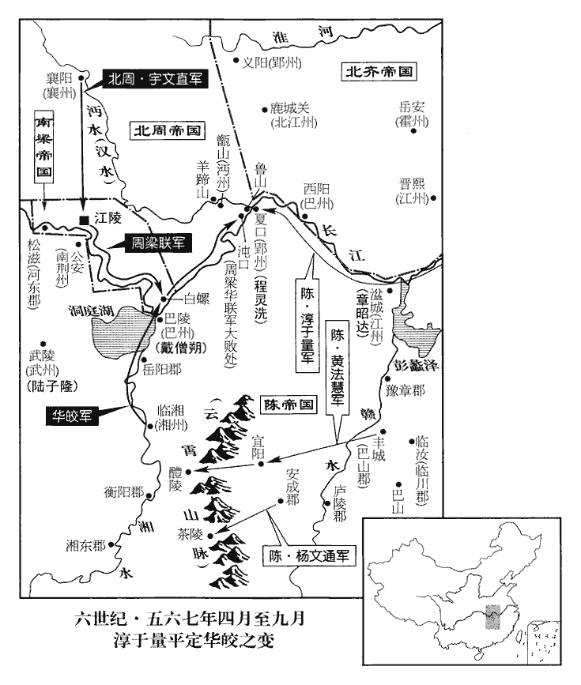
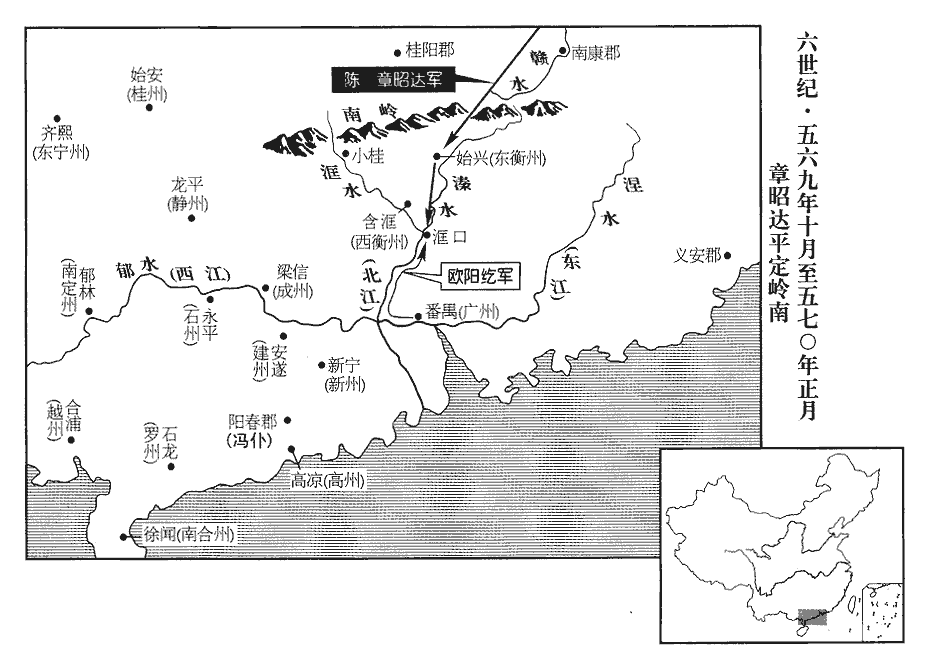
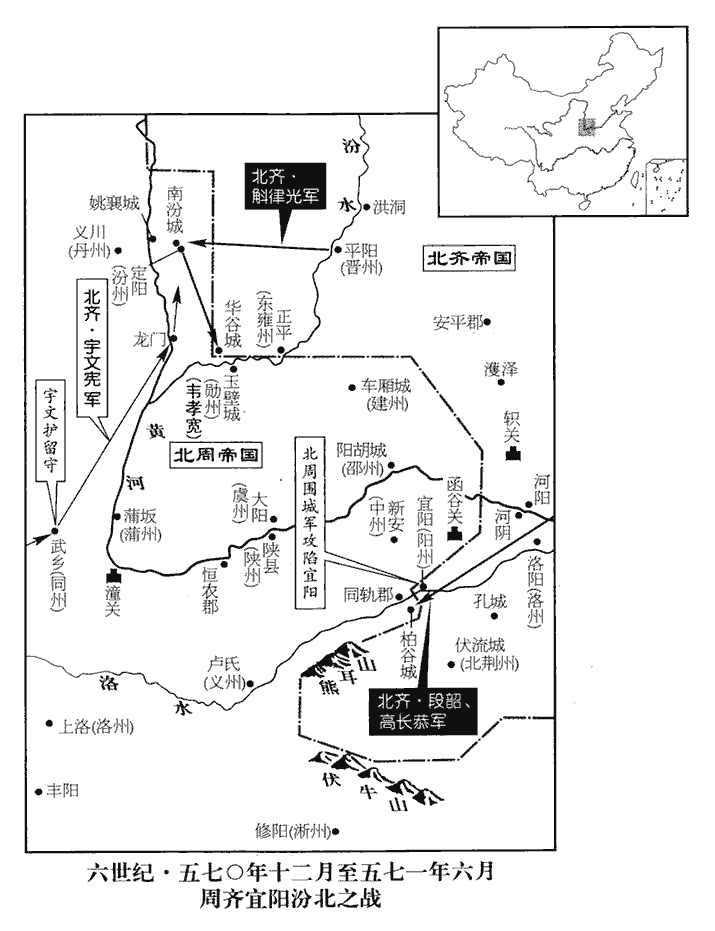

 陳紀四起強圉大淵獻（丁亥），盡重光單閼（辛卯）凡五年。

# 臨海王諱伯宗，字奉業，小字藥王，文帝嫡長子也。

## 光大元年（丁亥、五六七）

1春，正月，癸酉朔‹一›，日有食之。

〖译文〗 [1]春季，正月，癸酉朔（初一），出现日食。

2‹陈，首都建康江苏省南京市›尚書左僕射袁樞卒‹年五十一岁›。卒，子恤翻。

〖译文〗 [2]陈朝尚书左仆射袁枢去世。

3乙亥‹三›，大赦，改元。改元光大。

〖译文〗 [3]乙亥（初三），陈朝大赦天下，改年号为光大。

4辛卯‹十九›，帝‹陈伯宗，本年十六岁›祀南郊。

〖译文〗 [4]辛卯（十九日），陈废帝到南郊祭祀。

5壬辰‹二十›，齊‹首都邺城河北省临津县西南邺镇›上皇‹高湛（本年三十一岁›還鄴。去年八月如晉陽，今還。

〖译文〗 [5]壬辰（二十日），北齐太上皇回邺城。

6己亥‹二十七›，周‹都长安陕西省西安市›主‹宇文邕，本年二十五岁›耕藉田。藉，秦昔翻。

〖译文〗 [6]己亥（二十七日），北周国主在藉田举行耕种仪式。

7二月，壬寅朔‹一›，齊主‹高纬，本年十一岁›加元服，大赦。

〖译文〗 [7]二月，壬寅朔（初一），北齐国主举行加冠的仪式，大赦全国。

8初，高祖‹陈霸先›為梁相，高祖殺王僧辯，立梁敬帝，遂相之，因以受禪。相，息亮翻；下同。用劉師知為中書舍人。師知涉學工文，練習儀體，儀體，謂朝儀國體。歷世祖‹陈蒨›朝，雖位宦不遷，而委任甚重，朝，直遙翻；下同。與揚州刺史安成王頊、尚書僕射到仲舉同受遺詔輔政。師知、仲舉恆居禁中，參決眾事，恆，戶登翻。頊與左右三百人入居尚書省。師知見頊地望權勢為朝野所屬，心忌之，屬，之欲翻。與尚書左丞王暹等，謀出頊於外。暹xiān，思廉翻。眾猶豫，未敢先發。東宮通事舍人殷不佞，素以名節自任，按蕭子顯齊志，東宮職僚，未有通事舍人。五代志，梁東宮官有通事守舍人、典事守舍人、典法守舍人員，陳因之。又受委東宮，言在東宮，為上所親委。乃馳詣相府，是時以尚書省為相府。矯敕謂頊曰：「今四方無事，王可還東府經理州務。」州務，謂揚州‹京畿›事務。

〖译文〗 [8]当初，陈武帝是梁敬帝的丞相，任用刘师知为中书舍人。刘师知学识广博擅长文学，熟悉朝仪礼制，在梁世祖时，虽然为官得不到升迁，但委任他的事情很重要，他和扬州刺史安成王陈顼、尚书仆射到仲举一起受先皇的遗诏辅政。刘师知、到仲举常常住在宫里，参预决定许多事情。陈顼和三百名身边亲信进驻尚书省，刘师知看到陈顼的门第和权势为朝廷和民间所注目，心中妒嫉，和尚书左丞王暹等策划拟把陈顼排挤出尚书省。大家犹豫不定，不敢率先发难。东宫通事舍人殷不佞，一贯以维护名望气节为己任，加上在东宫任职，是皇帝亲自任命的，于是赶到尚书省假传圣旨对陈顼说：“现在天下无事，安成王可以回自己的东府管理州务。”

頊將出，中記室毛喜五代志：梁制：蕃王國及庶姓有持節，府有中錄事、中記室。馳入見頊曰：「陳有天下日淺，國禍繼臻，謂八年之間，國連有大喪。中外危懼。太后‹沈妙容›深惟至計，惟，思也。令王入省共康庶績，今日之言，必非太后之意。宗壯【章：十二本「壯」作「社」；乙十一行本同；孔本同。】之重，願王三思，三，息暫翻，又如字。須更聞奏，無使姦人得肆其謀。今出外即受制於人，譬如曹爽，願作富家翁，其可得邪！」曹爽事見四十五卷魏邵陵厲公嘉平元年。頊遣喜與領軍將軍吳明徹籌之，明徹曰：「嗣君諒闇，闇，音陰。萬機多闕。殿下親實周、邵，當輔安社稷，願留中勿疑。」

〖译文〗 陈顼正准备离开尚书省，中记室毛喜赶来见他，说：“陈朝据有天下为时还很短，国家接连遇到大丧事，上上下下都感到担忧害怕。太后经过深思熟虑，才决定叫您安成王进尚书省共同兴举各种事功，殷不佞所说的，一定不是太后的意思。社稷的重任在身，希望您能三思，必须另行向朝廷奏报，不要使邪恶之徒的阴谋得逞。现在离开尚书省就会受到别人的牵制束缚，比如像曹爽那样，只愿当个富家翁，这怎能如愿！”陈顼派毛喜和领军将军吴明彻商议，吴明彻说：“继位的国君正在居丧，日常纷繁的政务很多还没有着手。殿下亲如周公、召公，应当辅助皇上安定国家，希望殿下留在尚书省，不必疑虑。”

頊乃稱疾，召劉師知，留之與語，使毛喜先入言於太后‹沈妙容›。太后曰：「今伯宗幼弱‹本年十六岁›，政事並委二郎。文帝居長，頊居次，故稱為二郎。此非我意。」喜又言於帝‹陈伯宗›。帝曰：「此自師知等所為，朕不知也。」喜出，以報頊。頊因囚師知，自入見太后及帝，見，賢遍翻。極陳師知之罪，仍自草敕請畫，請畫可也。以師知付廷尉，其夜，於獄中賜死。以到仲舉為金紫光祿大夫。王暹、殷不佞並付治。付治，付有司治罪也。或作「付冶」，付東冶使徒作也。以下文不害免官言之，「治」字為是。暹，息廉翻。不佞，不害之弟也，少有孝行，不佞少居父喪，以至孝稱。江陵之陷，不佞母死於亂兵。不佞在吳，道路隔絕，久不得奔赴，四年之中，晝夜號泣，居處飲食，常為居喪之禮。後其兄不齊迎母喪歸葬，不佞居處之節，如始聞問，若此者又三年。身自負土，手植松柏，每歲時伏臘，必三日不食。少，詩照翻。行，下孟翻。頊雅重之，故獨得不死，免官而已。王暹伏誅。自是國政盡歸於頊。劉師知之事，大類楊愔。

〖译文〗 陈顼于是假装生病，请刘师知来，留住他进行谈话，同时派毛喜先向太后禀告。太后说：“现在伯宗皇帝年幼，政事都委托给二郎陈顼。殷不佞所说的不是我的意思。”毛喜又去向陈废帝说这件事。陈废帝说：“这是刘师知他们自己的所作所为，朕并不知道。”毛喜回来报告给陈顼。陈顼把刘师知囚禁起崐来，亲自进宫见太后和皇帝，极力陈述刘师知的罪行，自己起草了诏命请皇帝御批，把刘师知交给廷尉，这天夜里，在牢狱中把他赐死。任命到仲举为金紫光禄大夫。王暹、殷不佞一同交送有关部门治罪。殷不佞是殷不害的弟弟，少年时对父母很孝顺，陈顼平素很看重他，所以唯独他没有被处死，只是被罢官而已。王暹被处死。从此以后国家大政都归于陈顼。

右衛將軍會稽‹浙江省绍兴市›韓子高，鎮領軍府，在建康，諸將中士馬最盛，會，工外翻。將，即亮翻。與仲舉通謀。事未發。毛喜請簡士馬配子高，并賜鐵炭，使脩器甲。頊驚曰：「子高謀反，方欲收執，何為更如是邪？」邪，音耶。喜曰：「山陵始畢，邊寇尚多，而子高受委前朝‹陈蒨›，名為杖順。若收之，恐不即授首，或能為人患。宜推心安誘，朝，直遙翻。誘，音酉。使不自疑，伺間圖之，一壯士之力耳。」頊深然之。間，古莧翻。考異曰：陳書文沈后傳云：「安成王既專，沈太后憂悶，計無所出，乃密賂宦者蔣裕，令誘建安人張安國，使據郡反，冀因此以圖高宗。安國事覺，並為高宗所誅。時后左右近侍頗知其事，后恐連，逮黨與並殺之。」按后欲圖高宗，而令安國據建安反，理不相涉。且后若實有此謀，高宗既立，后豈得自全！今刪去。

〖译文〗 右卫将军会稽人韩子高，镇守幕府，在建康的诸多将帅中，部下的兵马最为强盛，曾经和到仲举联系共谋。这件事没有揭露。毛喜请陈顼选派士兵马匹给韩子高，并赐给他铁和木炭，供他修治兵器盔甲。陈顼感到惊讶说：“韩子高参预谋反，正要把他抓起来，为什么反倒这样？”毛喜说：“先帝的山陵刚修建完毕，边境的盗寇还很多，韩子高受前朝的委用，号称凭倚之材。如果抓他，恐怕不能斩杀，或许变成祸患。应当对他推心置腹安抚诱导，使他不产生怀疑，等到有机会再对付他，只要一个壮士的力量就够了。”陈顼非常同意。

仲舉既廢歸私第，心不自安。子郁，尚世祖妹信義長公主，信義，郡名。五代志：吳郡常熟縣，梁置信義郡。長，知兩翻。除南康‹江西省赣州市›內史，未之官。子高亦自危，求出為衡‹府设含洭广东省英德市西北浛洸镇›、廣‹府设番禺广东省广州市›諸鎮；郁每乘小輿，蒙婦人衣，與子高謀。會前上虞‹浙江省上虞市›令陸昉及子高軍主告其謀反。昉，分罔翻。頊在尚書省，因召文武在位議立皇太子。平旦，仲舉、子高入省，皆執之，到仲舉既廢歸私第，非在位者。蓋頊召其會議，因而執之。并郁送廷尉，下詔，於獄賜死‹到仲举年五十一岁›，考異曰：陳書子高傳，死在光大元年八月。按華皎傳，子高誅後，皎始謀叛。帝紀，此年五月，皎已謀反。又慈訓太后令，先言劉師知、子高誅，後乃及余孝頃。始興王伯茂傳，師知等誅後，伯茂乃進號中衛。然則子高傳誤也。餘黨一無所問。

〖译文〗 到仲举被免职后回到住所，心里很不平静。他的儿子到郁，娶文帝的妹妹信义长公主为妻，授南康内史的官职，他没有赴任。韩子高自己也感到有危险，请求离京镇守衡、广等州；到郁往往坐小轿，蒙上妇女的衣服，到韩子高那里去策划。恰巧前上虞令陆和韩子高军队的主将检举到郁谋反。陈顼在尚书省，召集在位的文武大臣们商议立皇太子的事。清晨，到仲举、韩子高到尚书省，都被抓起来，连同到郁一并押送廷尉，诏令在狱中赐死，他们的余党一个也不追问。

9辛亥‹十›，南豫州‹府设姑孰安徽省当涂县›刺史余孝頃坐謀反誅。

〖译文〗 [9]辛亥（初十），陈朝南豫州刺史余孝顷以谋反罪被杀。

10癸丑‹十二›，以東揚州‹府设会稽浙江省绍兴市›刺史始興王伯茂為中衛大將軍、開府儀同三司。梁置四中將軍，軍、衛、撫、護，止施於內。伯茂，帝之母弟也，劉師知、韓子高之謀，伯茂皆預之；司徒頊恐扇動內外，故以為中衛，專使之居禁中，與帝遊處。處，昌呂翻。

〖译文〗 [10]癸丑（十二日），陈朝任命东扬州刺史始兴王陈伯茂为中卫大将军、开府仪同三司。陈伯茂是废帝的同母兄弟，刘师知、韩子高的阴谋，陈伯茂都曾参预；司徒陈顼恐怕陈伯茂在朝内外煽惑，所以叫他任中卫，专门住在宫里，陪伴废帝出游居住。

11三月，甲午‹二十三›，以尚書右僕射沈欽為侍中、左僕射。史言沈欽官兼兩省。

〖译文〗 [11]三月，甲午（二十三日），陈朝任命尚书右仆射沈钦为侍中、左仆射。

12夏，四月，癸丑‹十三›，齊遣散騎常侍司馬幼之來聘。散，悉亶翻。騎，奇寄翻。

〖译文〗 [12]夏季，四月，癸丑（十三日），北齐派散骑常侍司马幼之到陈朝聘问。

13湘州‹府设临湘湖南省长沙市›刺史華皎華，戶化翻。聞韓子高死，內不自安，皎與劉師知、韓子高皆為文帝所親任，二人既死，故皎不自安。繕甲聚徒，撫循所部，啟求廣州‹府设番禺广东省广州市›，以卜朝廷之意。司徒頊偽許之，而詔書未出。皎遣使潛引周兵，又自歸於梁‹首都江陵湖北省江陵县›，以其子玄響為質。使，疏吏翻。質，音致。

〖译文〗 [13]陈朝的湘州刺史华皎听说韩子高被处死，内心忐忑不安，便修造盔甲聚集徒众，安抚部下，上奏要求担任广州刺史，以窥测朝廷的意思。司徒陈顼假意答允，而没有下诏书。华皎派使者暗中引来北周军队，自己又投奔后梁，以自己的儿子华玄响作为人质。

五月，癸巳‹二十三›，頊以丹楊尹吳明徹為湘州‹府临湘湖南省长沙市›刺史。

〖译文〗 五月，癸巳（二十三日），陈顼任命丹杨尹吴明彻为湘州刺史。

14甲午‹二十四›，齊以東平王儼‹本年十岁›為尚書令。

〖译文〗 [14]甲午（二十四日），北齐任命东平王高俨为尚书令。

 

15司徒頊遣吳明徹帥舟師三萬趣郢州‹府设夏口湖北省武汉市›，帥，讀曰率；下同。趣，七喻反；下同。丙申‹二十六›，遣征南大將軍淳于量帥舟師五萬繼之，又遣冠武將軍楊文通從安成‹江西省安福县›步道出茶陵‹湖南省茶陵县›，梁置冠武將軍，與折衝同班。五代志：廬陵郡安復縣，舊置安成郡。茶陵縣，漢屬長沙郡，吳分屬湘東郡，隋并入衡山郡湘潭縣。九域志：茶陵縣屬衡州，在州東三百五十五里。巴山‹江西省丰城市›太守黃法慧從宜陽‹江西省宜春市›出澧陵‹湖南省醴陵市›，宜陽，即豫章郡宜春縣也，晉孝武帝更名宜陽，避太后諱也。隋復曰宜春縣，帶袁州。後漢立醴陵縣，屬長沙郡。九域志：在郡東一百六十里。自宜春至醴陵二百二十里。守，式又翻。共襲華皎，并與江州‹府设湓城江西省九江市›刺史章昭達、郢州刺史程靈洗合謀進討。六月，壬寅‹三›，以司空徐度為車騎將軍，總督建康諸軍，步道趣湘州。

〖译文〗 [15]司徒陈顼派吴明彻率领三万水军进取郢州，丙申（二十五日），派征南大将军淳于量率领五万水军相继跟进，又派冠武将军杨文通从安成陆路向茶陵进兵，巴山太守黄法慧从宜阳进兵澧陵，共同攻袭华皎，并和江州刺史章昭达、郢州刺史程灵洗合谋进讨。六月，壬寅（初三），任命司空徐度为车骑将军，总督建康的军队，从陆路进兵湘州。

16辛亥‹十二›，周主‹宇文邕›尊其母叱奴氏為皇太后。按魏收官氏志：拓跋興於代北，兼并他部，以本部中別族為內姓；其他諸部隨方分之，北方有叱奴氏。

〖译文〗 [16]辛亥（十二日），北周国主向母亲叱奴氏上皇太后尊号。

17己未‹二十›，齊封皇弟仁機為西河王，仁約為樂浪王，樂，音洛；下同。浪，音琅。仁儉為潁川王，仁雅為安樂王，仁直為丹楊王，考異曰：北齊書帝紀：名統，今從列傳。統，謂仁直。仁謙為東海王。皆郡王也。五代志：安樂郡密雲縣，舊置安樂郡。

〖译文〗 [17]己未（二十日），北齐封皇弟高仁机为西河王，高仁约为乐浪王，高仁俭为颍川王，高仁雅为安乐王，高仁直为丹杨王，高仁谦为东海王。

18華皎使者至長安；梁王‹萧岿，本年二十六岁›亦上書言狀，且乞師；華，戶化翻。使，疏吏翻。上，時掌翻。周人議出師應之。司會崔猷yóu曰：「前歲東征，死傷過半。謂攻齊洛陽也，事見上卷文帝天嘉五年。會，古外翻。比雖循撫，瘡痍未復。今陳氏保境息民，共敦鄰好，比，毗至翻。好，呼到翻。豈可利其土地，納其叛臣，違盟約之信，興無名之師乎！」晉公護不從。閏六月，戊寅‹九›，遣襄州總管衛公直督柱國陸通、大將軍田弘、權景宣、元定等將兵助之。將，即亮翻，又音如字，領也。

〖译文〗 [18]华皎的使者到长安；梁王也上书说明情况，请求北周派军队支援；周朝人商议准备派军队答允对方请求。司会崔猷说：“前年东征洛阳，军队死伤过半。近来虽然加以安抚，但遭受的创伤还没有平复。现在陈朝保境安民，和我们睦邻友好，怎么能贪图它的土地，接纳他们的叛臣，违背和对方盟约的信义，出动无名之师？”晋公宇文护不接受意见。闰六月，戊寅（二十一日），派襄州总管卫公直督领柱国陆通、大将军田弘、权景宣、元定等率领军队去帮助华皎。

19辛巳‹十二›，齊左丞相咸陽武王斛律金卒，年八十。長子光為大將軍，相，息亮翻。卒，子恤翻。長，知兩翻。次子羨及孫武都並開府儀同三司，出鎮方岳，斛律羨鎮幽州‹府蓟县›，武都鎮梁‹府大梁城›、兗‹府瑕丘›二州。其餘子孫封侯顯貴者甚眾。門中一皇后，二太子妃，金子光長女，孝昭納為太子妃；次女，武成納為太子妃，後主受內禪，立為皇后。三公主，按後祖珽言光男尚公主，蓋光子武都、世雄、恆伽皆尚主也。事齊貴寵，三世無比。自肅宗‹高演›以來，禮敬尤重，每朝見，常聽乘步挽車至階，朝，直遙翻。見，賢遍翻。步挽車，不用牛馬，令人步挽之。或以羊車迎之。然金不以為喜，嘗謂光曰：「我雖不讀書，聞古來外戚鮮有能保其族者。鮮，息淺翻。女若有寵，為諸貴所嫉；無寵，為天子所憎。我家直以勳勞致富貴，何必藉女寵也！」史言斛律金有識。

〖译文〗 [19]辛巳（二十四日），北齐左丞相咸阳武王斛律金死去，终年八十岁。他的长子斛律光为大将军，次子斛律羡和孙子斛律武都封开府仪同三司，出任州的地方长官，其他子孙被封侯而显贵的很多。斛律氏的门第中出了一个皇后，两个太子妃，娶了三个公主，服事北齐受到恩宠，三代无比。自孝昭帝以来，特别礼待尊敬，每当上朝拜见天子，常常准许乘用人推的车辆到宫殿的台阶前，或用羊拉的车去迎接他上朝。然而斛律金并不为这种待遇而感到高兴，曾经对斛律光说：“我虽然不读书，但听到从古以来帝王的母族、妻族很少有能够保护自己亲族的。女的如果得到皇帝的宠爱，就会受到公侯权贵们的妒嫉；如果不得宠爱，就会被天子憎恨。我家一直以功勋劳绩而得到富贵，何必依靠女儿受到皇帝的恩宠！”

20壬午‹十三›，齊以東平王儼錄尚書事，以左僕射趙彥深為尚書令，并省尚書左僕射婁定遠為左僕射，自并省入為鄴省左僕射。中書監徐之才為右僕射。定遠，昭之子也。昭，婁后‹娄昭君›之弟。

〖译文〗 [20]壬午（二十五日），北齐任命东平王高俨为录尚书事，左仆射赵彦深为尚书令，并省尚书左仆射娄定远为左仆射，中书监徐之才为右仆射。娄定远是娄昭的儿子。

21秋，七月，戊申‹十›，立皇子至澤‹本年二岁›為太子。

〖译文〗 [21]秋季，七月，戊申（二十二日），陈朝立皇子陈至泽为太子。

22八月，齊以任城王湝為太師，任，音壬。湝，音皆，又戶皆翻。馮翊王潤為大司馬，段韶為左丞相，賀拔仁為右丞相，侯莫陳相為太宰，婁叡為太傅，斛律光為太保，韓祖念為大將軍，趙郡王叡為太尉，東平王儼為司徒。

〖译文〗 [22]八月，北齐任命任城王高为太师，冯翊王高润为大司马，段韶为左丞相，贺拔仁为右丞相，侯莫陈相为太宰，娄睿为太傅，斛律光为太保，韩祖念为大将军，赵郡王高睿为太尉，东平王高俨为司徒。

儼‹高俨是高湛第三子，本年十岁›有寵於上皇‹高湛›及胡后，時兼京畿大都督、領軍大將軍，領御史中丞。魏朝故事：中丞出，與皇太子分路，分路而行，不引車避道。朝，直遙翻。，王公皆遙駐車，去牛，頓軛於地，以待其過；去，羌呂翻。軛è，於革翻。其或遲違，不即駐車頓軛，是遲，遲為違法。則前驅以赤棒棒之。棒，部項翻。自遷鄴以後，此儀廢絕，上皇欲尊寵儼，命一遵舊制。儼初從北宮出，將上中丞，將上，時掌翻。今人謂領職視事為禮上。凡京畿步騎、領軍官屬、中丞威儀、司徒鹵簿，莫不畢從。騎，奇寄翻。從，才用翻。上皇與胡后張幕於華林園東門外而觀之，遣中使驟馬趣仗。趣儼前導儀仗也。使，疏吏翻。趣，七喻翻。不得入，自言奉敕，赤棒卒應聲碎其鞍，馬驚，人墜。上皇大笑，以為善，更敕駐車，勞問良久。勞問儼也。勞，力到翻。觀者傾鄴城。

〖译文〗 高俨受到太上皇和胡后的恩宠，当时兼任京畿大都督、领军大将军，领御史中丞。魏朝旧时的制度是：中丞外出时，和皇太子分路而行，王公们离他们很远时就要停车，把驾车的牛牵走，把车轭放在地上，等待他们通过；如果行动稍有迟缓就是违法，开道的前驱就用红色的棍棒打驱逐。自从迁都到邺城以后，这种仪式已经废除，太上皇为了表示对高俨的尊重宠爱，下令恢复这种制度。高俨刚离开北宫，就职中丞，凡是京畿的步骑、领军的属官、中丞和司徒的仪仗随从，都全部出动，太上皇帝和胡后在华林园东门外设置帷幕观看，派遣使者骑马疾驰到高俨的仪仗队那里。使者不得进入，自称是奉皇帝的命令而来的，手持红色棍棒的兵士应声打碎使者的马鞍，马受到惊吓，把使者颠下来。太上皇大笑，以为很好，还下令高俨停车。对他慰问了很久。全邺城的人都出来观看。

儼恆在宮中，坐含光殿視事，恆，戶登翻；下同。諸父皆拜之。上皇或時如并州‹府设晋阳山西省太原市›，晉陽宮在并州。儼恆居守。恆，戶登翻。守，式又翻。每送行，或半路，或至晉陽乃還。還，從宣翻，又音如字。器玩服飾，皆與齊主同，所須悉官給。嘗於南宮見新冰早李，齊主時居鄴之南宮，儼從上皇、胡后居北宮。還，怒曰：「尊兄已有，我何意無！」儼常謂齊主為尊兄。自是齊主‹高纬›或先得新奇，屬官及工人必獲罪。儼性剛決，嘗言於上皇‹高湛›曰：「尊兄懦，何能帥左右！」上皇每稱其才，有廢立意，胡后亦勸之，既而中止。儼與齊主既定君臣之分，而常以兄弟相呼，又有奪嫡之意。史歷言之，為儼怙寵致禍張本。帥，讀曰率。

〖译文〗 高俨常在宫里，坐在含光殿办理政事，同宗族长辈都向他下拜表示尊敬。太上皇有时去并州，高俨便常常在宫中留守。给太上皇送行时，或送到半路，或送到晋阳才回宫。他的用具服饰，都和北齐国主的一般，需用的东西都由官府供给。曾经在北齐国主所住的南宫见到刚送来的冰镇的李子，回去后，勃然大怒说：“我的哥哥有这个，我为什么却没有！”从此以后北齐国主比他先得到新奇的东西，属官和工匠一定会获罪。高俨性情刚愎果断，曾对太上皇说：“哥哥懦弱，怎么能统率左右！”太上皇往往称赞他的才能，有废高纬立高俨的意思，胡后也劝他这样做，但不久就中止了这个想法。

23華皎遣使誘章昭達，昭達執送建康。又誘程靈洗，靈洗斬之。華，戶化翻。使，疏吏翻。誘，音酉；下並同。皎以武州‹府设武陵湖南省常德市›居其心腹，五代志：武陵郡，梁置武州。遣使誘都督陸子隆，子隆不從；遣兵攻之，不克。巴州‹府设巴陵湖南省岳阳市›刺史戴僧朔等並隸於皎，文帝命皎都督湘、巴等四州。五代志，巴陵郡，梁置巴州。長沙‹湖南省长沙市›太守曹慶等，本隸皎下，遂為之用。湘州與長沙郡同治所，以州統郡，故曰本隸皎下。守，手又翻。司徒頊恐上流守宰皆附之，乃曲赦湘、巴二州。九月，乙巳‹七›，悉誅皎家屬。

〖译文〗 [23]华皎派使者去劝诱章昭达，被章昭达捉住送到建康。又派使者去劝诱程灵洗，被程灵洗杀死。华皎因为武州是他的心腹要地，派使者去劝诱武州都督陆子隆，陆子隆不肯听从；华皎派军队去进攻，也没有攻克。巴州刺史戴僧朔等都隶属华皎，长沙太守曹庆等人，原先也隶属华皎，因此都为华皎效命。司徒陈顼担心上游一带的郡守地方官都归附华皎，便特别赦免了湘、巴二州。九月，乙巳（初七），把华皎的家属全部处死。

梁以皎為司空，遣其柱國王操將兵二萬助之。周權景宣將水軍，元定將陸軍，衛公直總之，與皎俱下。將，即亮翻，又音如字，領也。淳于量軍夏口，直軍魯山‹武汉市汉水南岸›，使元定以步騎數千圍郢州。騎，奇寄翻。考異曰：陳帝紀云「步騎二萬」，蓋夸誕之辭。今從周帝紀。皎軍于白螺‹湖北省监利县东南长江西岸›，水經：江水過長沙下雋縣北，湘水從南來注之。江水又東過彭城口，又東過如山北，又東過白螺山南。螺，盧戈翻。雋，辭兗翻。與吳明徹等相持。徐度、楊文通由嶺路‹云霄山江西省与湖南省界山›横亘道路襲湘州，嶺路，即前所出安成、宜陽步道也。盡獲其所留軍士家屬。

〖译文〗 后梁任命华皎为司空，派柱国王操领兵二万去援助他。北周权景宣率领水军，元定率领陆军，由卫公宇文直总辖，和华皎的军队一起顺流而下，淳于量驻军夏口，宇文直驻军鲁山，元定以几千名步、骑兵包围郢州。华皎在白螺驻军，和吴明彻的陈朝军队互相钳制。陈朝的徐度、杨文通从陆路奔袭湘州，把华皎留在湘州的军士家属全部俘虏。

皎自巴陵‹湖南省岳阳市›與周、梁水軍順流乘風而下，軍勢甚盛，戰于沌口‹湖北省武汉市西南·沌水注入长江处›。沌dùn，柱兗翻。量、明徹募軍中小艦，多賞金銀，令先出當西軍大艦受其拍；西軍諸艦發拍皆盡，然後量等以大艦拍之，西軍艦皆碎沒於中流，戰船置拍竿，發之以拍敵船。艦，戸黯翻。西軍又以艦載薪，因風縱火，俄而風轉，自焚，西軍大敗。皎與戴僧朔單舸走，舸，古我翻。過巴陵，不敢發岸，「發」，恐當作「登」。徑奔江陵；衛公直亦奔江陵。

〖译文〗 华皎从巴陵与北周、后梁的水军顺流乘风西下，军势很强盛，在沌口和陈崐朝军队发生战斗。淳于量、吴明彻募集了军队中的小船，赏给许多金银，命令先行出发承受北周、后梁水军大船上“拍竿”的攻击；等对方船上“拍竿”发射的石块，淳于量等便用大船上的“拍竿”向对方进攻，北周、后梁的大船都被“拍竿”击破，沉没在沌口中游。北周、后梁的军队又用船装载了乾柴，借风力纵火引向对方，不久风向转变，火烧到自己，北周、后梁的军队大败。华皎和戴僧朔乘一只船逃走，路过巴陵，不敢靠岸，直奔江陵，卫公宇文直也奔向江陵。

元定孤軍，進退無路斫竹開徑，且戰且引，欲趣巴陵。趣，七喻翻。巴陵已為徐度等所據，度等遣使偽與結盟，許縱之還國；定信之，解仗就度，度執之，盡俘其眾，考異曰：陳書云「獲萬餘人，馬四千匹」。亦恐夸誕，今不取。并擒梁大將軍李廣。定憤恚而卒。恚，於避翻。卒，子恤翻。

〖译文〗 元定的孤军，进退无路，砍断竹子开出道路，且战且退，想退到巴陵。这时巴陵已经被徐度等所占领，徐度等派使者假装愿意和他结盟，答允放他回北周；元定相信了，解除了武装归顺徐度，徐度捉住他，并俘虏了元定的全部军队，还擒获了后梁的大将军李广。元定愤怒而死。

皎黨曹慶等四十餘人並伏誅。唯以岳陽‹湖南省湘阴县北›太守章昭裕，昭達之弟，桂陽‹湖南省郴州市›太守曹宣，高祖‹陈霸先›舊臣，衡陽‹湖南省株洲市西南›內史汝陰‹侨郡·安徽省合肥市›任忠，嘗有密啟，皆宥之。

〖译文〗 华皎的余党曹庆等四十多人都被杀。只有岳阳太守章昭裕因为是章昭达的弟弟，桂阳太守曹宣是陈朝高祖时的老臣，衡阳内史汝阴任忠曾经向朝廷上过密启，这三人被宽恕免罪。

吳明徹乘勝攻梁河東‹侨郡·湖北省松滋市西北›，拔之。守，式又翻。五代志：巴陵郡湘陰縣，梁置岳陽郡。桂陽郡郴縣，梁置桂陽郡。長沙郡衡山縣，舊置衡陽郡。陳以衡陽為王國，故置內史。南郡松滋縣，舊置河東郡。任，音壬。

〖译文〗 吴明彻乘胜攻克后梁的河东郡。

周衛公直歸罪於梁柱國殷亮；梁主‹萧岿›知非其罪，然不敢違，遂誅之。

〖译文〗 北周卫公宇文直把失败归罪于后梁的柱国殷亮；后梁明帝虽然明白不是殷亮的罪过，因为不敢违抗宇文直的意志，便把他杀死。

周與陳既交惡，周沔州‹府设甑山湖北省汉川县›刺史裴寬白襄州總管，請益戍兵，并遷城於羊蹄山‹湖北省汉川县境›以避水。五代志：沔陽郡甑zèng山縣，梁置梁安郡，西魏改曰魏安郡，置江州，廢帝三年，改曰沔州。甑山有陽臺山，在漢川之南三十五里，土俗訛為羊蹄山。總管兵未至，程靈洗舟師奄至城下。會大雨，水暴漲，靈洗引大艦臨城發拍，擊樓堞皆碎，堞，徒協翻。矢石晝夜攻之，三十餘日；陳人登城，寬猶帥眾執短兵拒戰；帥，讀曰率。又二日，乃擒之。

〖译文〗 北周和陈朝既关系破裂，互相仇视，北周的沔州刺史裴宽向襄州总管报告，请求增加卫戍的军队，并把城池迁到羊蹄山以远离水边。襄州总管的援军还没到，程灵洗的水军船队已经来到城下。正遇天降大雨，河水猛涨，程灵洗把大船驶到城边用“拍竿”发起攻击，把城上的矮墙都打碎了，又用箭和石块攻打了三十多天；陈朝军队登上城墙，裴宽还率领军队用短兵器抵抗；过了两天，裴宽被擒。

24丁巳‹十九›，齊上皇‹高湛›如晉陽。山‹崤山›東水，饑，按李百藥書：山東大水，人飢。僵尸满道。僵，居良翻。

〖译文〗 [24]丁巳（十九日），北齐太上皇帝去晋阳。山东发生水灾、饥荒，道路上都是尸体。

25冬，十月，甲申‹十七›，帝‹陈伯宗›享太廟。

〖译文〗 [25]冬季，十月，甲申（十七日），陈废帝到太庙祭祀祖宗。

26十一月，戊戌朔‹一›，日有食之。

〖译文〗 [26]十一月，戊戌朔（初一），出现日食。

27丙午‹九›，齊大赦。

〖译文〗 [27]丙午（初九），北齐大赦全国。

28癸丑‹十六›，周許穆公宇文貴自突厥‹瀚海沙漠群›還，卒于張掖‹甘肃省张掖市›。宇文貴與陳公純等如突厥逆女，突厥留之；貴以疾先得還。厥，九勿翻。還，從宣翻，又音如字。卒，子恤翻。掖，音亦。

〖译文〗 [28]癸丑（十六日），北周许穆公宇文贵从突厥回朝，中途死在张掖。

29齊上皇‹高湛›還鄴。

〖译文〗 [29]北齐太上皇回邺城。

30十二月，周晉公護母卒，卒，子恤翻。詔起，令視事。令，力丁翻。

〖译文〗 [30]十二月，北周晋公宇文护的母亲死去，周武帝下诏让他不必守丧，叫他就职治事。

31齊祕書監祖珽，與黃門侍郎劉逖友善。珽欲求宰相，乃疏趙彥深、元文遙、和士開罪狀，令逖奏之，逖不敢通；彥深等聞之，先詣上皇自陳。上皇大怒，執珽，詰之，珽，它鼎翻。詰，去吉翻。珽因陳士開、文遙、彥深等朋黨、弄權、賣官、鬻獄事。上皇曰：「爾乃誹謗我！」珽曰：「臣不敢誹謗，陛下取人女。」上皇曰：「我以其饑饉，收養之耳。」珽曰：「何不開倉振給，乃買入後宮乎？」上皇益怒，以刀環築其口，鞭杖亂下，將撲殺之。撲，弼角翻。珽呼曰：「陛下勿殺臣，臣為陛下合金丹。」呼，火故翻。為，于偽翻。合，音閤。遂得少寬。少，詩照翻。珽曰：「陛下有一范増不能用。」漢髙帝之言。上皇又怒曰：「爾自比范増，以我為項羽邪？」邪音耶。珽曰：「項羽布衣，帥烏合之眾，五年而成霸業。帥，讀曰率。陛下藉父兄之資，纔得至此，臣以為項羽未易可輕。」上皇愈怒，令以土塞其口。易，以豉翻，塞，悉則翻。珽且吐且言。乃鞭二百，配甲坊，尋徙光州‹府设东莱山东省莱州市›，五代志：東萊郡，舊置光州。敕令牢掌。別駕張奉福曰：「牢者，地牢也。」乃置地牢中，桎梏不離身；離，力智翻。夜，以蕪菁子為燭，眼為所熏，由是失明。本草曰：蕪菁主明目。今珽由是失明，蓋其子餌之則明目，以之為燭，則煙熏眼而失明。衍義曰：蕪菁，今世俗謂之蔓菁，夏則枯，蔬圃復種之，謂之雞毛菜。正在春時採擷之餘，收子為油。審是，則菜油也，東南之人多以之照夜，未嘗熏眼失明。

〖译文〗 [31]北齐秘书监祖，和黄门侍郎刘逖关系很好。祖想做宰相，便上疏陈述赵彦深、元文遥、和士开的罪状，叫刘逖向太上皇奏报，刘逖不敢启奏；赵彦深等人听到后，自己先到太上皇那里申述情况。太上皇勃然大怒，把祖抓来，亲自审问，祖说出和士开、元文遥、赵彦深等人拉帮结党、玩弄权术、出卖官职、办狱受贿的事实。太上皇说：“你是在诽谤我！”祖说：“臣不敢诽谤，因为陛下娶了人家的女儿。”太上皇说：“我因为她们遭受灾荒饥馑，所以才收养她们。”祖说：“那为什么不开粮仓赈济粮食，反把她们买到后宫？”太上皇更加恼怒，用刀把的铁环凿他的嘴，用鞭子棍子乱打，要把他打死。祖大叫说：“陛下不要杀臣，臣能给陛下炼金丹。”这才稍为缓和。祖说：“陛下有一个象范增那样的人却不能用他。”太上皇又大怒说：“你把自己比作范增，把我比作项羽吗？”祖说：“项羽出身布衣，率领乌合之众，用五年时间而成就霸业。陛下靠了父兄的地位、声望，才有今天，臣以为不能轻视项羽。”太上皇愈加震怒，叫人用土塞在他嘴里。祖边吐边说，被鞭打二百，发配甲坊做工，不久又把他迁到光州，命令他做“牢掌”。别驾张奉福说：“牢，就是地牢。”便把他囚在地牢里，戴上手铐脚镣；晚上点燃蔓菁子油代替蜡烛，眼睛被烟火所熏，从此失明。

32齊七兵尚書畢義雲，杜佑曰：魏始置五兵尚書，謂中兵、外兵、別兵、都兵、騎兵也。晉分中、外各為左、右，雖與舊為七曹，唯有五兵尚書，無七兵尚書之名。至後魏，始有七兵尚書。今諸家著述，或謂晉太康中置七兵尚書，誤矣。為治酷忍，非人理所及，治，直吏翻。於家尤甚。夜，為盜所殺，遺其刀，驗之，其子善昭所佩刀也。有司執善昭，誅之。史書此以垂戒。然以情觀之，善昭果弒其父，必不遺刀以待驗，蓋盜為此計以殺其子。

〖译文〗 [32]北齐七兵尚书毕义云，治下非常残酷，超乎人理，对家人更是如此。夜晚，被人杀死，现场留下刀子，经过查证，是他儿子毕善昭的佩刀。官府逮捕了毕善昭，将他处死。

## 二年（戊子、五六八）

1春，正月，己亥‹三›，安成王頊進位太傅，領司徒，加殊禮。

〖译文〗 [1]春季，正月，己亥（初三），安成王陈顼进位太傅，领司徒，加特殊的礼遇。

2辛丑‹五›，周‹首都长安陕西省西安市›主‹宇文邕，本年二十六岁›祀南郊。

〖译文〗 [2]辛丑（初五），北周国主到南郊祭祀。

3癸亥‹二十七›，齊‹首都邺城河北省临漳县西南邺镇›主‹高纬，本年十二岁›使兼散騎常侍鄭大護來聘。

〖译文〗 [3]癸亥（二十七日），北齐国主派兼散骑常侍郑大护来陈朝聘问。

4湘東忠肅公徐度卒‹年六十岁›。卒，子恤翻。

〖译文〗 [4]陈朝的湘东忠肃公徐度死。

5二月，丁卯‹二›，周主如武功‹陕西省武功县西›。

〖译文〗 [5]二月，丁卯（初二），北周国主去武功。

6突厥‹瀚海沙漠群›木杆可汗貳於周，厥，九勿翻。杆，公旦翻。可，從刊入聲。汗，音寒。更許齊人以婚，留陳公純等，數年不返。純等逆女，見上卷文帝天嘉六年。會大雷風，壞其穹廬，壞，音怪。旬日不止。木杆懼，以為天譴，即備禮送其女於周，純等奉之以歸。三月，癸卯‹八›，至長安，周主‹宇文邕›行親迎之禮。迎，魚敬翻。古者天子娶于諸侯，使同姓諸侯為之主。桓八年，祭公來，遂逆王后于紀。杜預註云：祭公來，受命於魯，是也。周主行親迎，與突厥為敵國之禮。甲辰‹九›，周大赦。

〖译文〗 [6]突厥木杆可汗对北周产生二心，答允和北齐联姻，把北周派去迎亲的使者陈公纯等人扣留了好几年不放回去。恰逢天上打雷刮风，木杆可汗所住的毡帐受到破坏，大雷风十天都没有停止。木杆可汗感到惧怕，以为这是上天对他的谴责，于是准备了礼物送女儿去北周，陈公纯等侍奉她归来。三月，癸卯（初三），抵达长安，北周君主行亲迎之礼。甲辰（初九），北周大赦全国。

7乙巳‹十›，齊以東平王儼‹本年十一岁›為大將軍，南陽王綽為司徒，開府儀同三司徐顯秀為司空，廣寧王孝珩為尚書令。珩，音行。

〖译文〗 [7]乙巳（初十），北齐任命东平王高俨为大将军，南阳王高绰为司徒，开府仪同三司徐显秀为司空，广宁王高孝珩为尚书令。

8戊午‹二十三›，周燕文公于謹卒‹年七十五岁›。燕，因肩翻。卒，子恤翻。謹勳高位重，而事上益恭，每朝參，所從不過二三騎。朝廷有大事，多與謹謀之。朝，直遙翻。騎，奇寄翻。謹盡忠補益，於功臣中特被親信，禮遇隆重，始終無間；被，皮義翻。間，古莧翻。教訓諸子，務存靜退，而子孫蕃衍，蕃，音煩。率皆顯達。

〖译文〗 [8]戊午（二十三日），北周燕文公于谨去世。于谨虽然功勋很高，地位重要，而侍奉皇帝非常恭敬，每逢上朝参拜皇帝，骑马的随从不过二三人。朝廷遇到大事，皇帝都和于谨商量。于谨竭尽忠诚增益帮助，在所有功臣中特别被亲信，赐给他很高的礼遇，君臣间始终没有隔阂；他还教育儿子们一定要恬静谦虚，后来子孙蕃衍，都很显贵。

9吳明徹乘勝進攻江陵‹湖北省江陵县›，乘沌口之勝也。引水灌之。梁主‹萧岿，本年二十七岁›出頓紀南‹春秋时楚国首都·江陵城北›以避之。劉昭曰：江陵縣北十餘里有紀南城。周總管田弘從梁主，副總管高琳與梁僕射王操守江陵三城，晝夜拒戰十旬。梁將馬武、吉徹擊明徹，敗之。將，即亮翻。敗，補邁翻。明徹退保公安‹陈南荆州州政府所在县·湖北省公安县›，梁主乃得還。

〖译文〗 [9]吴明彻乘胜进攻江陵，引水淹城。后梁国主出走驻屯在纪南躲避大水。北周总管田弘跟从后梁国主，副总管高琳和后梁仆射王操守卫江陵三城，日夜拒战达一百天，后梁将领马武、吉彻攻击吴明彻，将他打败。吴明彻退保公安，后梁国主才得以回朝。

10夏，四月，辛巳‹十七›，周以達奚武為太傅，尉遲迥為太保，齊公憲為大司馬。

〖译文〗 [10]夏季，四月，辛巳（十七日），北周任命达奚武为太傅，尉迟迥为太保，齐公宇文宪为大司马。

11齊上皇‹高湛，本年三十二岁›如晉陽‹山西省大原市›。

〖译文〗 [11]北齐太上皇去晋阳。

12齊尚書左僕射徐之才善醫，上皇有疾，之才療之，既愈；中書監和士開欲得次遷，乃出之才為兗州‹府设瑕丘山东省兖州市›刺史。為齊主疾作、追之才不及張本。五代志：魯郡，舊兗州，治瑕丘。五月，癸卯‹九›，以尚書右僕射胡長仁為左僕射，士開為右僕射。長仁，太上皇后之兄也。

〖译文〗 [12]北齐尚书左仆射徐之才精通医术，太上皇生病，徐之才为他治疗，很快就痊愈了；中书监和士开想按次序得到升迁，便将徐之才外放为兖州刺史。五月，癸卯（初九），任命尚书右仆射胡长仁为左仆射，和士开为右仆射。胡长仁是太上皇后的哥哥。

13庚戌‹十六›，周主‹宇文邕›享太廟；庚申‹二十六›，如醴泉宮‹陕西省礼泉县东南›。醴泉宮，即漢甘泉宮之舊地，在漢馮翊池陽縣西，後魏於此置寧夷縣，隋改曰醴泉縣。

〖译文〗 [13]庚戌（十六日），北周国主到太庙祭祀行礼；庚申（二十六日），去醴泉宫。

14壬戌‹二十八›，齊上皇‹高湛›還鄴。還，從宣翻，又音如字。

〖译文〗 [14]壬戌（二十八日），北齐太上皇回邺城。

15秋，七月，壬寅‹九›，周隨桓公楊忠卒‹年六十二岁›，卒，子恤翻。子堅襲爵。堅為開府儀同三司、小宮伯，周禮：宮伯屬天官，中士二人，下士二人。鄭玄註云：伯，長也；掌王宮宿衛之官及其政令，行其秩敘作其徒役之事。後周置左、右宮伯，掌侍衛之禁，各更直於內，小宮伯貳之。晉公護欲引以為腹心。堅以白忠，忠曰：「兩姑之間難為婦，汝其勿往！」堅乃辭之。史以楊忠有識，因書其卒而書之。楊堅始見于此。

〖译文〗 [15]秋季，七月，壬寅（初九），北周随桓公杨忠去世，儿子杨坚继承爵位。杨坚是开府仪同三司、小宫伯，晋公宇文护想用他作为自己的心腹。杨坚曾把这件事告诉父亲杨忠，杨忠说：“两个婆婆之间的媳妇最难当，你不能去！”杨坚便推辞了。

16丙午‹十三›，帝‹陈伯宗，本年十七岁›享太廟。

〖译文〗 [16]丙午（十三日），陈废帝到太庙祭祀行礼。

17戊午‹二十五›，周主‹宇文邕›還長安。

〖译文〗 [17]戊午（二十五日），北周国主回长安。

18壬戌‹二十九›，封皇弟伯智為永陽王，伯謀為桂陽王。

〖译文〗 [18]壬戌（二十九日），陈废帝封弟弟陈伯智为永阳王，陈伯谋为桂阳王。

19八月，齊請和於周，周遣軍司馬陸程聘于齊；九月，丙申‹四›，齊使侍中斛斯文略報之。

〖译文〗 [19]八月，北齐向北周求和，北周派军司马陆程到北齐聘问；九月，丙申（初四），北齐派侍中斛斯文略回聘。

20冬，十月，癸亥‹二›，周主‹宇文邕›享太廟。

〖译文〗 [20]冬季，十月，癸亥（初二），北周国主到太庙祭祀行礼。

21庚午‹九›，帝‹陈伯宗›享太廟。

〖译文〗 [21]庚午（初九），陈废帝到太庙祭祀行礼。

22辛巳‹二十›，齊以廣寧王孝珩錄尚書事，左僕射胡長仁為尚書令，右僕射和士開為左僕射，中書監唐邕為右僕射。

〖译文〗 [22]辛巳（二十日），北齐任命广宁王高孝珩为录尚书事，左仆射胡长仁为尚书令，右仆射和士开为左仆射，中书监唐邕为右仆射。

23十一月，壬辰朔‹一›，日有食之。

〖译文〗 [23]十一月，壬辰朔（初一），发生日食。

24齊遣兼散騎常侍李諧來聘。散，悉亶翻。騎，奇寄翻。

〖译文〗 [24]北齐派兼散骑常侍李谐来陈朝聘问。

25甲辰‹十三›，周主如岐陽‹岐阳宫·陕西省凤翔县境›。五代志：太原郡雍縣有岐陽宮。

〖译文〗 [25]甲辰（十三日），北周国主去岐阳。

26周遣開府儀同三司崔彥等聘于齊。

〖译文〗 [26]北周开府仪同三司崔彦等人到北齐聘问。

27始興王伯茂以安成王頊專政，意甚不平，屢肆惡言。頊，吁玉翻。甲寅‹二十三›，以太皇太后‹陈霸先正妻章要兒›令誣帝‹陈伯宗›，云「與劉師知、華皎等通謀。」言「以」者，明太皇太后令，頊為之也。華，戶化翻。且曰：「文皇‹陈蒨›知子之鑒，事等帝堯；傳弟之懷，又符太伯。今可還申曩志，崇立賢君。」遂廢帝為臨海王，以安成王入纂。又下令，黜伯茂為溫麻侯，溫麻縣侯也。沈約曰：晉武帝以溫麻船屯立縣，屬晉安郡。晉安，隋改為建安。寘諸別館，安成王‹陈顼›使盜邀之於道，殺之車中。

〖译文〗 [27]陈朝的始兴王陈伯茂因为安成王陈顼专政，心中不平，经常口出恶言。甲寅（二十三日），陈顼借太皇太后的令诬告废帝，说他和刘师知、华皎等人互通共谋。还说：“文皇帝对儿子的审察，不想传位给他，这事相当于唐尧那样；传位给弟弟的胸怀，又像泰伯那样。现在应当重申文皇帝以前的意向，另立一个贤明的君主。”于是把在位的皇帝废为临海王，以安成王陈顼入继皇帝位。又下命令把陈伯茂贬为温麻侯，安置在王室成员举行婚礼的别馆里，安成王陈顼嗾使强盗在路上将他截住，把他杀死在车里。

28齊上皇‹高湛›疾作，驛追徐之才，未至。辛未‹十›，疾亟，以後事屬和士開，屬，之欲翻。握其手曰：「勿負我也！」遂殂於士開之手。殂，祚乎翻。年三十二。明日，之才至，復遣還州。還兗州也。復，扶又翻。

〖译文〗 [28]北齐太上皇生病，派驿使追召徐之才回来，徐之才没能及时赶到。辛未（初十），太上皇病得很重，把后事委托给和士开，握着他的手说：“你不要辜负我的委托！”还没放开手就死了。第二天，徐之才赶到，又叫他回兖州。

士開祕喪三日不發。黃門侍郎馮子琮問其故，士開曰：「神武‹高欢›、文襄‹高澄›之喪，皆祕不發。神武卒，見一百六十卷梁武帝太清元年；文襄卒，見一百六十二卷太清三年。今至尊年少‹高纬本年十二岁›，少，詩照翻。恐王公有貳心者，意欲盡追集於涼風堂，然後與公議之。」士開素忌太尉錄尚書事趙郡王叡及領軍婁定遠，子琮恐其矯遺詔出叡於外，奪定遠禁兵，乃說之曰：說，式芮翻。「大行先已傳位於今上‹高纬›，群臣富貴者，皆至尊父子之恩，但令在內貴臣一無改易，王公必無異志。令，力丁翻。世異事殊，豈得與霸朝相比！高歡、高澄未即篡魏，握魏之政，北齊君臣皆謂之霸朝。朝，直遙翻；下同。且公不出宮門已數日，升遐之事，鄭玄曰：升，上也；遐，巳也。上巳者，若仙去云耳。行路皆傳，久而不舉，謂不舉哀成服也。恐有他變。」士開乃發喪。

〖译文〗 和士开三天秘不发丧。黄门侍郎冯子琮问他是什么原因，和士开说：“神武、文襄帝的丧事，都秘而不发。现在皇上年幼，恐怕王公中有对朝廷怀二心的，我想把他们都召集到凉风堂，然后和他们一起商量。”和士开一贯忌恨太尉录尚书事赵郡王高睿和领军娄定远，冯子琮怕和士开假传遗诏把高睿排挤在外，而去夺取娄定远禁兵的军权，于是对他说：“太上皇帝以前已经把皇位传给当今皇帝，群臣所以能够富贵，都是太上皇和皇帝父子的恩德，只要使在朝的贵臣能保持他们的地位，王公们一定不会有二心，时代变化而事情也各不相同，怎能和神武、文襄帝的时代相提并论！而且您已经几天没出宫门，太上皇驾崩的事，外面都已经传开了，时间过了很久还不举丧，只怕发生别的变化。”和士开于是发丧。

丙子‹十五›，大赦。戊寅‹十七›，尊太上皇后為皇太后。

〖译文〗 丙子（十五日），大赦全国。戊寅（十七日），给太上皇后上皇太后的尊号。

侍中尚書左僕射元文遙，以馮子琮，胡太后之妹夫，恐其贊太后干預朝政朝，直遙翻。與趙郡王叡、和士開謀，出子琮為鄭州‹府设临颍河南省临颍县西北›刺史。

〖译文〗 侍中尚书左仆射元文遥，因为冯子琮是胡太后的妹夫，怕他帮助胡太后干预朝政，和赵郡王高睿、和士开合谋，把冯子琮贬为郑州刺史。

世祖‹高湛›驕奢淫泆，役繁賦重，吏民苦之。史言亡齊者武成。甲申‹二十三›，詔：「所在百工細作，悉罷之。鄴下、晉陽、中山宮人、官口之老病者，悉簡放。齊有鄴宮、晉陽宮、中山宮。官口，罪人家口沒官為奴婢者。諸家緣坐在流所者，聽還。」緣坐，謂罪非正犯，緣親戚而坐罪者。

〖译文〗 北齐武成帝在世时骄奢淫佚，徭役繁多赋税苛重，官吏和百姓都感到困苦。甲申（二十三日），下诏书：“所有从事营建制造等事的工匠和官员都撤销。邺下、晋阳、中山等宫的宫人和年老有病的官中奴婢，一律放归民间。凡是崐由于亲属犯罪而遭株连流放在外的，可以回原籍。”

29周梁州‹府设光义即南郑·陕西省汉中市›恆稜‹四川省营山县及蓬安县一带›獠叛，據趙文表傳：恆稜，地名，所在險固，方數百里，群獠居之。文表既平獠，遂置為蓬州。恆，戶登翻。獠，魯皓翻；下同。總管長史南鄭‹陕西省汉中市›趙文表討之。趙文表為梁州總管府長史。長，知兩翻諸將欲四面進攻，將，即亮翻。文表曰：「四面攻之，獠無生路，必盡死以拒我，未易可克。今吾示以威恩，為惡者誅之，從善者撫之。善惡既分，破之易矣。」易，以豉翻。遂以此意遍令軍中。時有從軍熟獠，多與恆稜親識，即以實報之。境上內附者，謂之熟獠。恆稜猶豫未決，文表軍已至其境。獠中先有二路，一平一險，有獠帥數人來見，帥，所類翻。請為鄉導。鄉，讀曰嚮。文表曰：「此路寬平，不須為導。卿但先行慰諭子弟，使來降也。」降，戶江翻；下同。乃遣之。文表謂諸將曰：「獠帥謂吾從寬路而進，必設伏以邀我，當更出其不意。」乃引兵自險路入。乘高而望、果有伏兵。獠既失計，爭帥眾來降。降，戶江翻。文表皆慰撫之，仍徵其租稅，無敢違者。周人以文表為蓬州‹府设安固四川省营山县东北安固场›長史。蓬州本漢宕渠之地，李勢時為獠所據。蕭齊立歸化郡，梁置安固縣及伏虞郡。後周置蓬州，因蓬山而以為名也。

〖译文〗 [29]北周梁州恒棱的獠人反叛，派总管长史南郑人赵文表讨伐。将领们准备从四面进攻，赵文表说：“四面围攻，他们便没有生路，一定会拼死跟我们对抗，这就不容易攻克。现在我们向他们分别予以严厉惩治和恩惠笼络，对一意作恶的处死，对改恶从善的安抚，这样可以区分善恶，攻破他们就容易了。”便把这个意思传达到军队里。当时有归附北周并参加了军队的獠人，不少和恒棱的獠人沾亲带故，相互认识，便据实告诉他们。恒棱的獠人犹豫不决，赵文表的军队已经到了那里。通向恒棱的道路有两条，一条平坦一条险要，有几个獠人头目来见赵文表，愿意充当向导。赵文表说：“这条路宽敞平坦，不用为我们当向导，你们可以先回去劝慰子弟，希望他们来投降。”便让他们回去。赵文表对将领们说：“獠人的头目以为我们会从宽路前进，一定设下埋伏阻击我们，应当出其不意地行动。”于是率领军队从险路开进。登上高处了望，果然发现伏兵。恒棱的獠人计谋未能得逞，争相带领部众来投降。赵文表对他们劝慰安抚，仍旧向当地征收租税，没有人敢违抗。北周任命赵文表为蓬州长史。

# 高宗宣皇帝上之上諱頊，字紹世，小字師利，始興王道譚第二子也。

## 太建元年（己丑、五六九）

1春，正月，辛卯朔‹一›，周‹首都长安陕西省西安市›主‹宇文邕，本年二十七岁›以齊‹首都邺城河北省临漳县西南邺镇›世祖‹高湛›之喪罷朝會，朝，直遙翻。遣司會李綸弔賻fù，賻，音附。公羊傳曰：貨財曰賻。會，古外翻。且會葬。

〖译文〗 [1]春季，正月，辛卯朔（初一），北周国主因为武成帝的丧事停止朝会，派遣司会李纶前往吊唁赠送奠仪，参加丧葬仪式。

2甲午‹四›，‹陈，首都建康江苏省南京市›安成王‹陈顼，本年四十二岁›即皇帝位，改元，大赦。復太皇太后‹章要兒›為皇太后，皇太后‹沈妙容›為文皇后；立妃柳氏‹柳敬言›為皇后，世子叔寶‹本年十七岁›為太子；封皇子叔陵為始興王，奉昭烈王‹陈道谭›祀。文帝以子伯茂奉始興昭烈王祀，帝既殺伯茂，以叔陵奉祀。乙未‹五›，上‹陈顼›謁太廟。丁酉‹七›，以尚書僕射沈钦為左僕射，度支尚書王勱為右僕射。勱，份之孫也。度，徒洛翻。勱mài，音邁。份，府巾翻。份，奐之弟，肅之叔父也。

〖译文〗 [2]甲午（初四），安成王陈顼即皇帝位，改年号，大赦全国。恢复太皇太后的皇太后称号，皇太后称文皇后；立妃子柳氏为皇后，世子陈叔宝为太子；封皇子陈叔陵为始兴王，作为昭烈王的后嗣。乙未（初五），陈宣帝谒太庙。丁酉（初七），任命尚书仆射沈钦为右仆射，度支尚书王劢为右仆射。王劢是王份的孙子。

3辛丑‹十一›，上‹陈顼›祀南郊。

〖译文〗 [3]辛丑（十一日），陈宣帝到南郊祭天。

4壬寅‹十二›，封皇子叔英為豫章王，叔堅為長沙王。

〖译文〗 [4]壬寅（十二日），陈朝封皇子陈叔英为豫章王，陈叔坚为长沙王。

5戊午‹二十八›，上‹陈顼›享太廟。

〖译文〗 [5]戊午（二十八日），陈宣帝到太庙祭祀。

6齊博陵文簡王濟，世祖之母弟也，為定州‹府设中山河北省定州市›刺史，語人曰：「次敘當至我矣。」言以兄弟之次，亦當為天子也。語，牛倨翻。齊主‹高炜，本年十三岁›聞之，陰使人就州殺之，葬贈如禮。

〖译文〗 [6]北齐博陵文简王高济，是武成帝的同母兄弟，任定州刺史，对别人说：“按次序规定应当轮到我做皇帝了。”北齐后主高纬听说后，暗中派人去定州将他杀死，按规定仪式将他埋葬，追赠官爵。

7二月，乙亥‹十五›，上‹陈顼›耕藉田。藉，秦昔翻。

〖译文〗 [7]二月，乙亥（十五日），陈宣帝到藉田举行耕种仪式。

8甲申‹二十四›，齊葬武成帝‹高湛›于永平陵，廟號世祖。

〖译文〗 [8]甲申（二十四日），北齐把武成帝葬在永平陵，庙号世祖。

9乙【章：十二行本「乙」作「己」；乙十一行本同；孔本同；張校同。】丑‹二十九›，齊徙東平王儼為琅邪王。邪，音耶。

〖译文〗 [9]己丑（二十九日），北齐把东平王高俨迁移到琅邪郡为琅邪王。

10齊遣侍中叱列長叉聘于周。姓纂：叱列，複姓，出於拓跋氏西部。

〖译文〗 [10]北齐派侍中叱列长叉到北周聘问。

11齊以司空徐顯秀為太尉，并省尚書令婁定遠為司空。

〖译文〗 [11]北齐任命司空徐显秀为太尉，并省尚书令娄定远为司空。

初，侍中、尚書右僕射和士開，為世祖‹高湛›所親狎，出入臥內，無復期度，復，扶又翻。遂得幸於胡后。及世祖殂，齊主‹高纬›以士開受顧託，深委任之，威權益盛；與婁定遠及錄尚書事趙彥深、侍中•尚書左僕射元文遙、開府儀同三司唐邕、領軍綦qí連猛、高阿那肱、李延壽曰：綦連，其先姬姓，六國末，避亂出塞，保祁連山，因以山為姓，北人語訛，故曰綦連。魏收官氏志：綦連氏出於西方諸部。度支尚書胡長粲俱用事，時號「八貴」。樂，音洛。太尉趙郡王叡、大司馬馮翊王潤、安德王延宗與婁定遠、元文遙皆言於齊主‹高纬›，請出士開為外任。會胡太后觴朝貴於前殿，朝，直遙翻。叡面陳士開罪失云：「士開先帝弄臣，城狐社鼠，受納貨賂，穢亂宮掖。掖，音亦。臣等義無杜口，冒死陳之。」太后曰：「先帝在時，王等何不言？今日欲欺孤寡邪？邪，音耶。且飲酒，勿多言！」叡等辭色愈厲。儀同三司安吐根曰：「臣本商胡，安吐根，本安息‹伊朗›胡人。天平初，柔然主使至晉陽‹山西省太原市›，吐根密啟柔然情狀，高歡因為之備，柔然入掠，無獲而返。其後歡與柔然和親，結成婚媾，皆吐根為行人。既而歸歡，由是見親待。得在諸貴行末，行，戶剛翻。既受厚恩，豈敢惜死！不出士開，朝野不定。」太后曰：「異日論之，王等且散！」叡等或投冠於地，或拂衣而起。明日，叡等復詣雲龍門，復，扶又翻。令文遙入奏之，三返，太后不聽。左丞相段韶使胡長粲傳太后言曰：「梓宮在殯，事太怱怱，欲王等更思之！」叡等遂皆拜謝。長粲復命，太后曰：「成妹母子家者，兄之力也。」長粲，胡太后之兄，故云然。厚賜叡等，罷之。

〖译文〗 起初，侍中、尚书右仆射和士开，受武成帝的宠爱亲昵，在皇帝卧室出入，不受限制，因此就和胡太后私通。武成帝死后，北齐后主高纬因为和士开曾经受武成帝的顾托之命，所以对他信任重用，威势和权力更大；他的娄定远、录尚书事赵彦深、侍中及尚书左仆射元文遥、开府仪同三司唐邕、领军綦连猛、高阿那肱、度支尚书胡长粲都在朝廷当权，当时号称“八贵”。太尉赵郡王高睿、大司马冯翊王高润、安德王高延宗和娄定远、元文遥都对后主说，请后主把和士开调离朝廷去外地任职。适逢胡太后在前殿请朝廷中的亲贵们饮酒，高睿当面陈述和士开的罪过说：“和士开是先帝时的亲近狎玩之臣，仗势作恶，接受贿赂，淫乱宫廷。臣等出于正义不能闭口不说，所以冒死陈述。”胡太后说：“先帝在世时，你们为什么不说？今天是不是想欺侮我们孤儿寡母？姑且饮酒，不要多说！”高睿等人的言语和面色更加严厉。仪同三司安吐根说：“臣家本来是经商胡人，得以位于诸多亲贵的末尾，既然受到朝廷的厚恩，怎敢怕死！不把和士开从朝廷调走，朝野上下就不安定。”胡太后说：“改日再谈，你们都走吧！”高睿等有的把帽子扔在地上，有的甩衣袖离开座位，感到生气。第二天，高睿等再次到云龙门，派元文遥进宫启奏，进出三次，胡太后不听。左丞相段韶派胡长粲传太后的话说：“先皇的灵柩还没有殡葬，这件事太匆忙了，望你们再考虑！”高睿等都表示拜谢。胡长粲回宫复命，胡太后说：“成就妹妹我母子全家的，是哥哥你的力量。”又给高睿等人优厚的赏赐，事情暂时作罢。

太后及齊主‹高纬›召問士開，對曰：「先帝於群臣之中，待臣最厚。陛下諒闇始爾，闇，音陰。大臣皆有覬覦。覬，音冀。覦，音俞。今若出臣，正是翦陛下羽翼。宜謂叡云：『文遙與臣，俱受先帝任用，豈可一去一留！並可用為州，且出納如舊。尚書出納帝命，令且如舊領職。待過山陵，然後遣之。』叡等謂臣真出，心必喜之。」喜，許記翻。帝及太后然之，告叡等如其言。乃以士開為兗州‹府设瑕丘山东省兖州市›刺史，文遙為西兗州‹府设左城山东省定陶县西›刺史。西兗州，時治滑臺。葬畢，叡等促士開就路。太后欲留士開過百日，古者葬日虞，既三虞，用剛日卒哭；後人百日而卒哭，至今猶然。叡不許；數日之內，太后數以為言。后數，所角翻。有中人知太后密旨者，謂叡曰：「太后意既如此，殿下何宜苦違！」叡曰：「吾受委不輕。今嗣主幼沖，豈可使邪臣在側！不守之以死，何面戴天！」遂更見太后，苦言之。太后令酌酒賜叡，叡正色曰：「今論國家大事，非為巵酒！」為，于偽翻。言訖，遽出。

〖译文〗 胡太后和后主把和士开召来询问，和士开回答说：“先帝在群臣中，待臣最优厚。陛下刚居丧不久，大臣们都怀有非份的企图。现在如果把臣调走，正好比剪掉陛下的羽翼。应该对高睿说：‘元文遥与和士开，都是受先帝信任重用的，怎么能去一个留一个！都可以出任州刺史，现在暂时还是担任原有的官职，等太上皇的陵寝完工，然后派出去。’高睿等以为臣真的被调走，心里一定高兴。”后主和太后认为很对，就按和士开所说的那样告诉高睿。便任命和士开为兖州刺史，元文遥为西兖州刺史。丧葬结束，高睿等就催促和士开出发就任。胡太后打算留和士开过先皇百日祭再走，高睿不许；几天之内，胡太后说了好几次。有知道胡太后隐私的太监，对高睿说：“太后的意思既然这样，崐殿下何必苦苦反对！”高睿说：“我受朝廷的委托责任不轻。现在继位的君主年龄还小，怎么能使奸臣在君主旁边！如果不是以生命来守护，有何面目和这种人在一个天底下生活！”便再次去见胡太后，苦苦陈说。胡太后叫人酌酒赐给他，高睿正颜厉色说：“我今天来是谈国家大事，并不是为了一杯酒！”说完，立即离去。

士開載美女珠簾詣婁定遠，謝曰：「諸貴欲殺士開，蒙王力，武成帝封婁定遠臨淮郡王，故稱之。特全其命，用為方伯。今當奉別，謹上二女子，一珠簾。」上，時掌翻。定遠喜，謂士開曰：「欲還入不？」不，讀曰否。士開曰：「在內久不自安，今得出，實遂本志，不願更入。但乞王保護，長為大州刺史足矣。」定遠信之。送至門，士開曰：「今當遠出，願得一辭覲二宮。」定遠許之。士開由是得見太后及帝，進說曰：見，賢遍翻。說，式芮翻。「先帝一旦登遐，臣愧不能自死。觀朝貴意勢，欲以陛下為乾明。乾明，齊濟南王年號也，事見一百六十八卷文帝天嘉元年。臣出之後，必有大變，臣何面目見先帝於地下！」因慟哭。帝、太后皆泣，問：「計安出？」士開曰：「臣已得入，復何所慮，正須數行詔書耳。」復，扶又翻；下將復、后復、復以同。行，戶剛翻。於是詔出定遠為青州‹府设东阳山东省青州市›刺史，責趙郡王叡以不臣之罪。

〖译文〗 和士开送美女和珍珠帘子给娄定远，表示感谢说：“那些亲贵们想杀我，蒙您大王的大力，特地保住了我的性命，任命为一州之长。现在将要和你分别，特意送上两个女子，一张珠帘。”娄定远大喜，对和士开说：“你还想回朝吗？”和士开答道：“我在朝内心里不安已经很久了，现在得以离开，使本来的志愿能够实现，不愿意再到朝内做官了。但请求您对我加以保护，使我长久做大州的刺史就足够了。”娄定远相信了。把他送到门口，和士开说：“现在我要远出了，很想见见太后和皇上向他们告辞。”娄定远答允他的要求。和士开因此见到胡太后和后主，向他们进说道：“先帝去世时，臣惭愧自己没能跟着去死。臣观察朝廷权贵们的意图和架势，想把陛下当作乾明年间的济南王那样对待。我离开朝廷以后，一定有大的变化，我有什么脸面见先帝在九泉之下！”于是哀痛地大哭起来，后主、胡太后也哭，问他：“你有什么计策？”和士开说：“臣已经进来见到你们，还有什么顾虑，只须得到几行字的诏书就行。”于是后主下诏把娄定远调出任青州刺史，斥责赵郡王高睿有僭越的罪过。

旦日，叡將復入諫，妻子咸止之，叡曰：「社稷事重，吾寧死事先皇，不忍見朝廷顛沛。」至殿門，又有人謂曰：「殿下勿入，恐有變。」叡曰：「吾上不負天，死亦無恨。」入，見太后，見，賢遍翻。太后復以為言，叡執之彌固。出，至永巷，遇兵，執送華林園雀離佛院，釋氏西域記，龜茲國北四十里，山上有寺，名曰雀離，大清淨，故倣以建佛院。令劉桃枝拉殺之‹年三十六岁›。拉，盧合翻。考異曰：北齊帝紀：「天統三年，六月，以并省尚書左僕射婁定遠為尚書左僕射。五年二月，殺趙郡王叡。三月，以并省尚書令婁定遠為司空。」蓋定遠既為僕射，復為并省尚書令也。按和士開傳，先出定遠，然後殺叡，叡死必在定遠作司空後，帝紀誤也。但不知果在何時耳。又士開傳云「出為青州」。定遠傳云「尋除瀛州」。蓋先出為青州，後乃除瀛州也。叡久典朝政，文宣帝時，濟南以太子監國，立大都督府，與尚書省分理眾事，以叡攝大都督府長史。至武成之世，拜尚書令，又進攝錄尚書事，又進太尉。朝，直遙翻；下同。清正自守，朝野冤惜之。復以士開為侍中、尚書左僕射。定遠歸士開所遺，遺，于季翻。加以餘珍賂之。

〖译文〗 第二天，高睿要再次进宫直言规劝胡太后，妻儿们都劝他不要去，高睿说：“国事重大，我宁可死去追随先皇，不忍活着见到朝廷动荡变乱。”他到了殿门，又有人告诉他：“殿下不要进去，恐怕有变。”高睿说：“我上不负天，死也无恨。”进入宫殿，见了胡太后，太后重申了自己的旨意，高睿更加固执己见。出宫后，走到深巷，遇到士兵，把他捉住送到华林园的雀离佛院，命令刘桃枝将他殴打致死。高睿主管朝廷政事的时间很久，清廉正直注意操守，朝野上下都感到冤枉痛惜。重又任命和士开为侍中、尚书左仆射。娄定远把和士开送给他的东西又还给他，还添了一些别的珍宝对他贿赂。

12三月，齊主‹高纬›如晉陽。夏，四月，甲子‹五›，以并州尚書省為大基聖寺，晉祠為大崇皇寺。魏收志：太原郡晉陽縣有晉祠。乙丑‹六›，齊主‹高纬›還鄴。

〖译文〗 [12]三月，北齐后主去晋阳。夏季。四月，甲子（初五），以并州尚书省原址改为大基圣寺，晋祠为大崇皇寺。乙丑（初六），北齐后主回邺城。

13齊主年少‹本年十三岁›，多嬖寵。少，詩照翻。武衛將軍高阿那肱，素以諂佞為世祖‹高湛›及和士開所厚，世祖多令在東宮侍齊主‹高纬›，由是有寵；累遷并省尚書令，封淮陰王。

〖译文〗 [13]北齐后主年纪很轻，有不少宠幸的佞臣。武卫将军高阿那肱，一向以善于花言巧语谄媚受到武成帝与和士开的厚待，武成帝常常叫他在东宫侍奉太子，因而深得宠爱；累次升迁到并省尚书令，封淮阴王。

世祖‹高湛›簡都督二十人，使侍衛東宫，齊左、右衛府領左、右府，其御仗屬官，各有正、副都督。昌黎‹辽宁省朝阳市›韓長鸞預焉，齊主‹高纬›獨親愛長鸞，長鸞，名鳯，以字行，累遷侍中、領軍，摠知内省機密。

〖译文〗 武成帝曾经挑选二十个都督，派去做太子的侍卫，昌黎人韩长鸾是其中之一，太子唯独喜欢韩长鸾。长鸾名凤，通常用表字，累次升迁到侍中、领军、总知内省机密。

宮婢陸令萱者，其夫漢陽‹甘肃省礼县南›駱超，坐謀叛誅，令萱配掖庭，子提婆，亦沒為奴。齊主之在襁褓，令萱保養之。令萱巧黠，善取媚，黠xiá，戶八翻。有寵於胡太后，宮掖之中，獨擅威福，封為郡君，和士開、高阿那肱皆為之養子。齊主以令萱為女侍中。後魏孝文改定內官，左、右昭儀、三夫人、九嬪、世婦、御女之外，又置內職，典內司，視尚書令、僕；作司、大監、女侍中三官，視二品監。令萱引提婆入侍齊主，朝夕戲狎，累遷至開府儀同三司、武衛大將軍。宮人穆舍利者，斛律后之從婢也，從，才用翻。有寵於齊主；令萱欲附之，乃為之養母，薦為弘德夫人，河清新令：弘德、崇德、正德三夫人，位比三公。因令提婆冒姓穆氏。然和士開用事最久，諸幸臣皆依附之，以固其寵。

〖译文〗 有个名叫陆令萱的宫女，丈夫是汉阳人骆超，因为犯谋叛罪被处死，陆令萱被发配到皇宫中当宫女，儿子骆提婆，也没入官府为奴。后主还是婴儿时，由陆令萱当保姆。陆令萱乖巧狡猾，善于讨好谄媚，所以得到了胡太后的宠爱，宫婢之中，唯独她作威作福，被封为郡君，和士开、高阿那肱都是她的乾儿子。后主封她为女侍中。陆令萱引荐骆提婆进宫奉侍国主，从早到晚在一起嬉戏亲近，几经升迁到开府仪同三司、武卫大将军。宫人穆舍利，是斛律后的随从奴婢，也得到后主的宠爱；陆令萱为了依附她，就当了她的养母，并引荐她为弘德夫人，因此叫儿子骆提婆冒姓穆。然而和士开在朝廷当权的时间最久，那些受君主宠信的大臣们都依附他，为了可以保住自己受到恩宠的地位。

齊主‹高纬›思祖珽，齊主受內禪，祖珽啟其謀，故思之。就流囚中除海州‹府设朐山江苏省连云港市›刺史。祖珽去年徙光州‹府设东莱山东省莱州市›。五代志：東海郡，梁置南、北二青州，東魏改為海州。珽乃遺陸媼弟儀同三司悉達書曰：「趙彥深心腹深沈，欲行伊、霍事，遺，于季翻。媼ǎo，烏老翻。陸媼，即謂令萱。沈，持林翻。儀同姊弟豈得平安，何不早用智士邪！」和士開亦以珽有膽略，欲引為謀主，乃棄舊怨，虛心待之，與陸媼言於帝曰：「襄、宣、昭三帝之子，皆不得立。謂文襄‹高澄›、文宣‹高洋›、孝昭‹高演›之子也。今至尊獨在帝位者，祖孝徵之力也。祖珽，字孝徵，事見上卷文帝天嘉元年。人有功，不可不報。孝徵心行雖薄，行，下孟翻。奇略出人，緩急可使。且其人已盲，必無反心，請呼取，問以籌策。」齊主從之，召入，為祕書監，加開府儀同三司。

〖译文〗 北齐后主想念祖，把他从流放的囚徒中授职为海州刺史。祖给陆令萱的弟弟仪同三司陆悉达去信说：“赵彦深城府很深，想仿效伊尹、霍光那样行事，你们姊弟怎么能够平安，为什么不及早起用有才智的人！”和士开也因为祖有胆略，想拉拢他当主要谋士，于是抛弃了以前的怨恨，虚心对待，和陆令萱一起对后主说：“文襄、文宣、孝昭三位皇帝的儿子，都没能继承皇位。现在唯独陛下在帝位，是祖出的力。人如果有功劳，不能不予以报答。祖的心胸虽然狭窄，但有超出常人的奇谋策略，遇到事情紧急时能够发挥作用。而且他已经是个瞎子，一定不会有反心，请把他叫回来，听取他的计谋策略。”北齐后主采纳了和士开的意见，召回祖，任命他为秘书监，加开府仪同三司。

士開譖尚書令隴東王胡長仁驕恣，出為齊州‹府设历城山东省济南市›刺史。長仁怨憤，謀遣刺客殺士開。事覺，士開與珽謀之，珽引漢文帝‹刘恒›誅薄昭故事，薄昭事見十四卷漢文帝十年。胡長仁，帝舅也，故引此事以誅之。遂遣使就州賜死。使，疏吏翻。

〖译文〗 和士开向后主进谗言，说尚书令陇东王胡长仁骄横放肆，贬出为齐州刺史。胡长仁对和士开怨恨愤慨，打算派刺客杀死他。事情泄露，和士开和祖商量，祖以汉文帝诛杀薄昭的事情为例，于是派使者去齐州把胡长仁赐死。

14五月，庚戌‹二十二›，周主‹宇文邕›如醴泉宮。

〖译文〗 [14]五月，庚戌（二十二日），北周国主去醴泉宫。

15丁巳‹二十九›，以吏部尚書徐陵為左僕射。

〖译文〗 [15]丁巳（二十九日），陈朝任命吏部尚书徐陵为左仆射。

16秋，七月，辛卯‹四›，皇太子‹陈叔宝›納妃沈氏‹沈婺华›，考異曰：陳書、南史沈后傳，皆云：太建三年拜皇太子妃，誤也。今從帝紀。吏部尚書君理之女也。

〖译文〗 [16]秋季，七月，辛卯（初四），陈朝皇太子纳沈氏为妃，她是吏部尚书沈君理的女儿。

17辛亥‹二十四›，周主‹宇文邕›還長安。

〖译文〗 [17]辛亥（二十四日），北周国主回长安。

18八月，庚辰‹二十三›，盜殺周孔城‹河南省伊川县›防主，以其地入齊。魏收志：漢、晉河南新城縣，後魏置新城郡，治孔城。其地在隋河南郡伊闕縣界。

〖译文〗 [18]八月，庚辰（二十三日），盗贼杀死北周的孔城地方长官，把孔城并入北齐。

九月，辛卯‹五›，周遣齊公憲與柱國李穆，將兵趣宜陽‹河南省宜阳县西›，杜佑曰：宜陽郡，今福昌縣。築崇德等五城。趣，七喻翻。

〖译文〗 九月，辛卯（初五），北周派齐公宇文宪和柱国李穆领兵去宜阳，筑起崇德等五座城池。

19歐陽紇在廣州‹府设番禺广东省广州市›十餘年，武帝永定二年，紇與父頠定廣州，至是凡十二年。紇hé，下沒翻。威惠著於百越‹南岭以南›。自華皎之叛，帝心疑之，華，戶化翻。徵為左衛將軍。紇恐懼，其下多勸之反，遂舉兵攻衡州‹东衡州·州政府设始兴广东省韶关市›刺史錢道戢jí。此始興之衡州。五代志：南海郡始興縣，梁置安遠郡及東衡州。

〖译文〗 [19]欧阳纥在广州十几年，恩威闻名于百越。自从华皎叛乱以后，陈宣帝对他心存疑虑，征召他为左卫将军。欧阳纥感到恐惧，部下都劝他反叛朝廷，崐于是发兵攻打衡州刺史钱道戢。

帝遣中書侍郎徐儉持節諭旨。紇初見儉，盛仗衛，言辭不恭。儉曰：「呂嘉之事，誠當已遠，呂嘉事見二十卷漢武帝元鼎五年、六年。將軍獨不見周迪、陳寶應乎！周迪、陳寶應皆以叛換敗死，事並見文帝紀。轉禍為福，未為晚也。」紇默然不應，置儉於孤園寺，累旬不得還。紇嘗出見儉，儉謂之曰：「將軍業已舉事，儉須還報天子。儉之性命，雖在將軍，將軍成敗，不在於儉，幸不見留。」紇乃遣儉還。儉，陵之子也。徐陵時貴顯於陳朝。

〖译文〗 宣帝派中书侍郎徐俭持皇帝的符节和谕旨去见他。欧阳纥初见徐俭时，布置了很多兵器和卫士，说话很不恭敬。徐俭对他说：“汉武帝时吕嘉的故事，虽然离现在已经很远了，您将军唯独看不到周迪、陈宝应不久前因为反叛而被杀的事情！转祸为福，时间还不晚。”欧阳纥听后沉默不回答，把徐俭安置在孤园寺，过了几十天还不放他回朝。欧阳纥曾经到孤园寺去看他，徐俭对他说：“将军已经行动了，我还要回去向天子报告。我的性命，虽然在将军手里，但是将军的成败，不在于我徐俭，希望你不要扣留我。”于是欧阳纥放徐俭回去。徐俭是徐陵的儿子。

冬，十月，辛未‹十五›，詔車騎將軍章昭達討紇。

〖译文〗 冬季，十月，辛未（十五日），陈宣帝下诏派车骑将军章昭达讨伐欧阳纥。

20壬午‹二十六›，上‹陈顼›享太廟。

〖译文〗 [20]壬午（二十六日），陈宣帝到太庙祭祀。

21十一月，辛亥‹二十六›，周鄫文公長孫儉卒。鄫，茲陵翻。長，知兩翻。卒，子恤翻。

〖译文〗 [21]十一月，辛亥（二十六日），北周文公长孙俭去世。

22辛丑‹十六›，齊以斛律光為太傅，馮翊王潤為太保，琅邪王儼為大司馬。

〖译文〗 [22]辛丑（十六日），北齐任命斛律光为太傅，冯翊王高润为太保，琅邪王高俨为大司马。十二月，庚午（初三），任命兰陵王高长恭为尚书令。庚辰（十三日），任命中书监魏收为左仆射。

23十二月，庚午‹十五›，以蘭陵王長恭為尚書令。庚辰‹二十五›，以中書監魏收為左僕射。

〖译文〗 [23]北周齐公宇文宪围困北齐的宜阳，断绝宜阳的粮道。

24周齊公憲等圍齊宜陽，絶其糧道。自華皎之亂，與周人絕，至是周遣御正大夫杜杲來聘，請復脩舊好。杜杲屢聘于陳，故使來脩舊好。復，扶又翻。好，呼到翻。上‹陈顼›許之，遣使如周。使，疏吏翻。

〖译文〗 [24]自从华皎之乱起，陈朝和北周绝交，到现在北周才派御正大夫杜杲来聘问，请求和陈朝恢复友好关系。陈宣帝同意，派使者去北周。

## 二年（庚寅、五七零）

1春，正月，乙酉朔‹一›，齊‹首都邺城河北省临漳县西南邺镇›改元武平。

〖译文〗 [1]春季，正月，乙酉朔（初一），北齐改年号为武平。

2齊東安王婁叡卒。東安郡王。五代志：琅邪郡沂水縣，舊置東安郡也。

〖译文〗 [2]北齐东安王娄睿去世。

3丙午‹二十二›，上‹陈顼，本年四十三岁›享太廟。

〖译文〗 [3]丙午（二十二日），陈宣帝到太庙祭祀。

4戊申‹二十四›，齊使兼散騎常侍裴讞之來聘。散，悉亶翻。騎，奇寄翻。讞yàn，魚蹇翻，又魚列翻。

〖译文〗 [4]戊申（二十四日），北齐派兼散骑常侍裴谳之到陈朝聘问。

5齊太傅斛律光，將步騎三萬救宜陽，屢破周軍，築統關、豐化二城【章：十二行本「城」字下有「以通宜陽糧道」六字；乙十一行本同；孔本同；張校同。】而還。還，從宣翻，又如字。周軍追之，光縱擊，又破之，獲其開府儀同三司宇文英、梁景興。周軍雖屢敗，而攻宜陽不輟。二月，己巳‹十五›，齊以斛律光為右丞相、并州‹府设晋阳山西省太原市›刺史，又以任城王湝為太師，賀拔仁錄尚書事。任，音壬。湝，音皆，又戶皆翻。

〖译文〗 [5]北齐太傅斛律光，率领三万名步骑兵来救宜阳，屡次打败北周军队，修筑统关、丰化两座城池后就回去了。北周军队在后面追赶，斛律光发起反击，又将他们打败，俘虏北周的开府仪同三司宇文英、梁景兴。二月，己巳（十五日），北齐任命斛律光为右丞相、并州刺史，任城王高为太师，贺拔仁为录尚书事。

6歐陽紇召陽春‹广东省阳春市›太守馮僕至南海，五代志：高涼郡陽春縣，梁置陽春郡。廣州，治南海郡。守，式又翻。誘與同反。僕遣使告其母洗夫人。夫人曰：「我為忠貞，經今兩世，僕及父融為兩世。誘，音酉。使，疏吏翻。洗，息典翻。不能惜汝負國。」遂發兵拒境，帥諸酋長迎章昭達。帥，讀曰率。酋，慈秋翻。長，知兩翻。

〖译文〗 [6]欧阳纥召阳春太守冯仆到南海，劝说他一同谋反。冯仆派人告诉母亲洗夫人。洗夫人说：“我们忠贞报国，已经两代，不能因为怜惜你而辜负国家。”于是发兵在境内拒守，并率领部落的酋长迎接章昭达。

昭達倍道兼行，至始興‹东衡州州政府所在城·广关市›，紇聞昭達奄至，恇擾不知所為，出頓洭口‹广东省英德市西南·洭水连水›注入溱水北江处，水經，洭水出桂陽縣盧聚，東南過含洭縣，南出洭浦關，右合溱水，謂之洭口。洭，去王翻。多聚沙石，盛以竹籠，盛，時征翻。置于水柵之外，用遏舟艦。昭達居上流，裝艦造拍，艦，戶黯翻；下同。令軍人銜刀，潛行水中，以斫籠，篾皆解，篾，莫結翻。因縱大艦隨流突之。紇眾大敗，生擒紇，送之；癸未‹二十九›，斬於建康市‹年三十三岁›。

〖译文〗 章昭达兼程而行，到达始兴。欧阳纥听说章昭达的军队突然来到，惊恐混乱得不知所措，领兵出屯在口，用竹笼装满了沙子石块，放在水栅的外面，用来阻止对方船只的进路。章昭达在河的上游，装配船只，制造“拍竿”，命士兵口里衔刀潜入水中，用刀砍断编竹笼的篾片，随后驾大船顺流而下突破敌军的防守。欧阳纥的部众大败，欧阳纥被活捉，押送回朝；癸未（二十九日），被斩于建康市中。

紇之反也，士人流寓在嶺南者皆惶駭。前著作佐郎蕭引獨恬然，曰：「管幼安、袁曜卿，亦但安坐耳。管寧，字幼安，依公孫度，度安其賢；魏文帝初，卒還鄉里。袁渙，字曜卿，為呂布所拘而不為布所脅；布敗，歸魏武。君子直己以行義，何憂懼乎！」紇平，上徵為金部侍郎。唐六典曰：漢置尚書郎四人，其一人主財帛委輸，蓋金部郎曹之任也。歷魏、晉、宋、齊、後魏、北齊，並有金部郎中，梁、陳、隋為侍郎，煬帝但曰郎。引，允之弟也。蕭允見一百六十二卷梁武帝太清三年。史言蕭允兄弟，處大難而不懾。

〖译文〗 欧阳纥的反叛，使侨居在岭南的士大夫都感到惊恐害怕。前著作佐郎萧引却很坦然，说：“以往历史上的管宁、袁涣遇到变故时，也都是静坐待变。君子自己行为正直行施正义，何必忧虑恐惧！”欧阳纥被平定以后，陈宣帝征召萧引为金部侍郎。萧引是萧允的弟弟。

馮僕以其母功，封信都侯，遷石龍‹广东省化州市›太守，五代志：石龍縣屬高涼郡，蓋梁、陳置郡也。今為化州。遣使持節冊命洗氏為石龍太夫人，賜繡幰油絡駟馬安車一乘，幰xiǎn，許偃翻。安車加繡幰油絡也。乘，繩證翻。給鼓吹一部，并麾幢旌節，吹，尺瑞翻。幢，傳江翻。其鹵簿一如刺史之儀。

〖译文〗 冯仆由于母亲洗夫人的功劳，被封为信都侯，升迁为石龙太守，朝廷派使者持符节册封洗夫人为石龙太夫人，赐给有彩色帷幔丝质绳网用四匹马拉的坐车一辆，乐队一套，以及旌旗等物，洗夫人驾车出行时的仪仗和州刺史一样。

7三月，丙申‹十三›，皇太后章氏‹陈霸先正妻章要兒›殂‹年六十五岁›。

〖译文〗 [7]三月，丙申（十三日），陈朝皇太后章氏去世。

 

8戊戌‹十五›，齊安定武王賀拔仁卒。

〖译文〗 [8]戊戌（十五日），北齐安定武王贺拔仁去世。

9丁未‹二十四›，大赦。

〖译文〗 [9]丁未（二十四日），陈朝大赦全国。

10夏，四月，甲寅‹一›，周以柱國宇文盛為大宗伯。

〖译文〗 [10]夏季，四月，甲寅（初一），北周任命柱国宇文盛为大宗伯。

11周主‹宇文邕，本年二十八岁›如醴泉宮‹陕西省礼泉县东南›。

〖译文〗 [11]北周国主去醴泉宫。

12辛酉‹八›，齊以開府儀同三司徐之才為尚書左僕射。

〖译文〗 [12]辛酉（初八），北齐任命开府仪同三司徐之才为尚书左仆射。

13戊寅‹二十五›，葬武宣皇后‹章要兒›於萬安陵‹陈霸先墓·江苏省江宁县东南方山西北›。章太后，諡武宣。

〖译文〗 [13]戊寅（二十五日），陈朝将武宣皇后葬在万安陵。

14閏月，戊申‹二十五›，上‹陈顼›謁太廟。

〖译文〗 [14]闰月，戊申（二十五日），陈宣帝到太庙谒告行礼。

15五月，壬午‹三十›，齊遣使來弔。使，疏吏翻。

〖译文〗 [15]五月，壬午（三十日），北齐派使者来陈朝吊唁武宣皇后。

16六月，乙酉‹三›，齊‹高纬，本年十四岁›以廣寧王孝珩為司空。珩，音行。

〖译文〗 [16]六月，乙酉（初三），北齐任命广宁王高孝珩为司空。

17甲辰‹二十二›，齊穆夫人生子恆。恆，戶登翻。齊主‹高纬›時未有男，為之大赦。為，于偽翻；下請為、為之同。陸令萱欲以恆為太子，恐斛律后恨怒，乃白齊主，使斛律后母養之。

〖译文〗 [17]甲辰（二十二日），北齐穆夫人生下儿子高恒。当时北齐后主没有男孩，因此大赦全国。陆令萱想以高恒为太子，但恐怕遭到斛律后的忌恨恼怒，于是禀告后主，让斛律后当母亲抚养高恒。

18己丑‹二十七›，齊以開府儀同三司唐邕為尚書右僕射。

〖译文〗 [18]己丑（初七），北齐任命开府仪同三司唐邕为尚书右仆射。

19秋，七月，【章：十二行本「月」下有「癸丑‹二›」二字；乙十一行本同；孔本同；張校同。】齊立肅宗子彥基為城陽王，彥忠為梁郡王。甲寅‹三›，以尚書令蘭陵王長恭為錄尚書事，中領軍和士開為尚書令，賜爵淮陽王。

〖译文〗 [19]秋季，七月，北齐立孝昭帝的儿子高彦基为城阳王，高彦忠为梁郡王。甲寅（初三），任命尚书令兰陵王高长恭为录尚书事，中领军和士开为尚书令，赐给淮阳王的爵号。

士開威權日盛，朝士不知廉恥者，或為之假子，與富商大賈同在伯仲之列。朝，直遙翻。賈，音古。嘗有一人士參士開疾，參者，候問其疾。值醫云：「王傷寒極重，【章：十一行本「重」下有「他藥無效」四字；乙十一行本同；孔本同；張校同。】應服黃龍湯。」陶弘景曰：今近城寺別塞空罌口，內糞倉中，久年得汁，甚黑而苦，名為黃龍湯，治溫病，垂死者皆差。士開有難色。人士曰：「此物甚易服，易，以豉翻。王不須疑，請為王先嘗之。」一舉而盡。士開感其意，為之強服，強，其兩翻。遂得愈。

〖译文〗 和士开的声势权力越来越大，朝廷中那些不知廉耻的官吏们，有的投靠他当乾儿子，和富商大贾们的行为差不多。曾经有个官员去探视和士开的疾病，正值医生说：“大王的伤寒病很重，应当服用粪汁黄龙汤。”和士开面有难色。这个人说：“黄龙汤并不难吃，大王不必多疑，请让我替您先尝尝。”于是将黄龙汤一饮而尽。和士开感激他的好意，于是勉强服用，病便痊愈。

20乙卯‹四›，周主‹宇文邕›還長安。

〖译文〗 [20]乙卯（初四），北周国主回长安。

21癸酉‹二十二›，齊以華山王凝為太傅。華山郡王。五代志：京兆郡鄭縣，後魏置華山郡。華，戶化翻。

〖译文〗 [21]癸酉（二十二日），北齐任命华山王高凝为太傅。

22司空章昭達攻梁‹湖北省江陵县›，章昭達破歐陽紇而還，遂引兵攻梁。梁主‹萧岿，本年二十九岁›與周總管陸騰拒之。周人於峽口‹湖北省宜昌市西›南岸築安蜀城，峽口，西陵峽口也。杜佑曰：安蜀城在夷陵郡界。橫引大索於江上，編葦為橋，以度軍糧。昭達命軍士為長戟，施於樓船上，仰割其索。索斷，糧絕，索，昔洛翻。因縱兵攻安蜀城，下之。‹不久，陈政府把已沦入北周手中的信州白帝城·重庆市奉节县东›州政府侨设于安蜀城

〖译文〗 [22]陈朝司空章昭达进攻后梁，后梁国主和北周总管陆腾进行抵抗。北周人在西陵峡口的南岸兴筑安蜀城，在长江上牵引大绳，编织蒲苇当作桥梁，用来运输军粮。章昭达叫军士制造长戟，配备在楼船上，在船上仰面割断大绳，绳索被割断，北周人的军粮运输断绝，便指挥军队攻安蜀城，将城攻克。

梁主‹萧岿›告急于周襄州總管衛公直，直遣大將軍李遷哲將兵救之。遷哲以其所部守江陵外城，自帥騎兵出南門，使步出北門，將，即亮翻。帥，讀曰率。「步」下有「兵」字，文意較明。首尾邀擊陳兵，陳兵多死。夜，陳兵竊於城西以梯登城，登者已數百人，遷哲與陸騰力戰拒之，乃退。

〖译文〗 后梁国主向北周的襄州总管卫公宇文直告急，宇文直派大将军李迁哲率军去援救。李迁哲将自己的部众防守江陵的外城，自己率领骑兵突出江陵的南门，派步兵突出江陵的北门，从两头夹击陈朝军队，陈朝军队很多战死。夜晚，陈朝士兵偷偷地在城西架设梯子登城，上了城头的有几百人，李迁哲和陆腾奋力作战抵抗，打退了陈朝军队的进攻。

昭達又决龍川‹湖北省江陵县西南›寧朔隄，水經註：紀南城西南有赤坂岡，岡下有瀆水，東北流入城，又東北出城，西南注於龍陂，陂在靈溪東江堤内，水至淵深，有龍見於其中，故曰龍陂。「寧朔」，周書陸騰傳作「寧邦」。引水灌江陵。騰出戰於西堤，昭達兵不利，乃引還。還，從宣翻，又如字。

〖译文〗 章昭达又将龙川的宁朔决口，引水倒灌江陵城。陆腾领兵从西出战，章昭达的军队战斗失利，只好引兵退走。

23八月，辛卯‹十›，齊主‹高纬›如晉陽。

〖译文〗 [23]八月，辛卯（初十），北齐国主去晋阳。

24九月，乙巳，齊立皇子恆‹高恒，本年一岁›為太子。

〖译文〗 [24]九月，乙巳（疑误），北齐立皇子高恒为太子。

25冬，十月，辛巳朔‹一›，日有食之。

〖译文〗 [25]冬季，十月，辛已朔（初一），发生日食。

26齊以廣寧王孝珩為司徒，上洛王思宗為司空。上洛，古郡名。復以梁永嘉王莊為開府儀同三司、梁王，復，扶又翻。許以興復，竟不果。及齊亡，莊憤邑，卒於鄴。史終言之。卒，子恤翻。

〖译文〗 [26]北齐任命广宁王高孝珩为司徒，上洛王高思宗为司空。又任命后梁的永嘉王萧庄为开府仪同三司、梁王，答允帮助他复国，竟没有成功。等到北齐灭亡，萧庄忧愤抑郁，在邺城死去。

27乙酉‹五›，上‹陈顼›享太廟。

〖译文〗 [27]乙酉（初五），陈宣帝到太庙祭祀。

28己丑‹九›，齊復威宗‹高洋›諡曰文宣皇帝，廟號顯祖。齊改文宣諡號，見上卷文帝天嘉六年。諡，神至翻。

〖译文〗 [28]己丑（初九），北齐恢复威宗的文宣皇帝谥号，庙号显祖。

29丁酉‹十七›，周鄭桓公達奚武卒。諡法：辟土服遠曰桓。卒，子恤翻。

〖译文〗 [29]丁酉（十七日），北周的郑桓公达奚武去世。

30十二月，丁亥‹八›，齊主‹高纬›還鄴。

〖译文〗 [30]十二月，丁亥（初八），北齐国主回邺城。

31周大將軍鄭恪將兵平越巂‹四川省西昌市›，置西寧州。西寧州，後改曰巂州。巂，音髓。

〖译文〗 [31]北周大将军郑恪领兵平定越，设置了西宁州。

 

32周、齊爭宜陽，久而不決。勳州‹府设玉壁山西省稷山县›刺史韋孝寬謂其下曰：周置勳州於玉壁。「宜陽一城之地，不足損益，兩國爭之，勞師彌年。彼豈無智謀之士，若棄崤東，宜陽在三崤之東。來圖汾北，我必失地。今宜速於華谷‹山西省后山县西北›及長秋‹山西省新绛县西北›築城以杜其意。水經：涑水出河內聞喜縣黍葭谷。註云：涑水所出，俗謂之華谷。又曰：汾水過臨汾縣東，又屈從縣南西流，又西過長修縣南，又西與華水合，水出於北山華谷。此所謂長秋，蓋即漢長修縣故墟也。俗語訛以「修」為「長秋」耳。脫其先我，先，悉薦翻。圖之實難。」乃畫地形，具陳其狀。晉公護謂使者曰：「韋公子孫雖多，數不滿百，汾北築城，遣誰守之！」事遂不行。

〖译文〗 [32]北周、北齐争夺宜阳，久而不决。勋州刺史韦孝宽对部下说：“宜阳一城，得和失关系不大，两个国家为此争夺，劳师动众已经一年。对方难道没有智谋之士，如果放弃崤东，来谋取汾水以北一带地方，我们一定会失去国土。现在应当迅速在华谷和长秋修筑城池，以断绝对方的念头。如果对方先于我们行动，我们要算计他们就很困难了。”于是画了地形图，向朝廷陈述了这种情况。晋公宇文护对使者说：“韦公的子孙虽然很多，但数不满百，在汾水北面修筑城池，派谁去守卫！”这件事便没有实现。

齊斛律光果出晉州‹府设平阳山西省临汾市›道，於汾北築華谷、龍門二城。五代志：絳郡稷山縣有後魏龍門郡。光至汾東，與孝寬相見，光曰：「宜陽一城，久勞爭戰。今已舍彼，舍，讀曰捨。欲於汾北取償，幸勿怪也。」孝寬曰：「宜陽，彼之要衝，汾北，我之所棄。我棄彼取，其償安在！君輔翼幼主，位望隆重，不撫循百姓而極武窮兵，苟貪尋常之地，塗炭疲弊之民，竊為君不取也！」為，于偽翻。

〖译文〗 北齐的斛律光果然从晋州一路出兵，在汾水北面修筑起华谷、龙门二座城池。斛律光到了汾水以东，和韦孝宽见了面。斛律光说：“宜阳一城，久劳争战。现在我们已经放弃宜阳，准备在汾水以北取得补偿，希望您不要见怪。”韦孝宽说：“宜阳，是你们的交通紧要之地，汾水以北，是我们所放弃的地方。我们所放弃的被你们取走，怎么能说是补偿！您辅佐幼主，地位和威望都很高，不去安抚百姓而穷兵黩武，如果贪图得到一处平常的地方，而使贫困疲惫的百姓遭到涂炭之灾，我认为您实在不该这样做！”

光進圍定陽‹山西省吉县›，築南汾城‹定阳西北›以逼之。魏收志：後魏延興四年，置定陽縣及定陽郡。五代志：文城郡吉昌縣，後魏置定陽縣及定陽郡。文城郡，東魏置南汾州，後周改曰汾州，吉昌縣，後唐避李國昌諱，又改為吉鄉縣。九域志：屬汾州。宋白曰：慈州吉鄉縣，本漢北屈縣，後魏孝文帝置定陽郡及定陽縣。時會有河西定陽胡人渡河居此，因以為名。周人釋宜陽之圍以救汾北。晉公護問計於齊公憲，憲曰：「兄宜暫出同州‹府设武乡陕西省大荔县›以為聲勢，憲請以精兵居前，隨機攻取。」護從之。汾，扶云翻。

〖译文〗 斛律光进军围困定阳，筑起南汾城进逼定阳。北周军队撤去宜阳之围来援救汾水以北的地方。晋公宇文护向齐公宇文宪请教计策，宇文宪说：“兄长最好暂时出兵同州以扩大声势，我可以率领精兵在前，看准时机攻取城池。”宇文护采纳了他的计策。

## 三年（辛卯、五七一）

1春，正月，乙【章：十二行本「乙」作「癸」；乙十一行本同孔本同。】丑‹十七›，以尚書右僕射徐陵為左僕射。

〖译文〗 [1]春季，正月，乙丑（十七日），陈朝任命尚书右仆射徐陵为左仆射。

2丁巳‹九›，齊‹首都邺城河北省临漳县西南邺镇›使兼散騎常侍劉環儁來聘。散，悉亶翻。騎，奇寄翻。

〖译文〗 [2]丁巳（初九），北齐派兼散骑常侍刘环俊来陈朝聘问。

3辛酉‹十三›，上‹陈顼，本年四十四岁›祀南郊；辛未‹二十三›，祀北郊。

〖译文〗 [3]辛酉（十三日），陈宣帝到南郊祭天；辛未（二十三日），到北郊祭地。

4齊斛律光築十三城於西境，汾北之地，於鄴為西。馬上以鞭指畫而成，拓地五百里，而未嘗伐功。又與周韋孝寬戰於汾北，破之。齊公憲督諸將東拒齊師。將，即亮翻。

〖译文〗 [4]北齐斛律光在国境西面修筑十三座城池，是在马上用马鞭指画出来的，虽然开拓了五百里地方，然而不曾夸耀功劳。又和北周的韦孝宽在汾水以北交战，打败了韦孝宽。齐公宇文宪督率将领们在东面抵抗北齐的军队。

5二月，辛巳‹三›，上祀明堂。丁酉‹十九›，耕藉田。藉，秦昔翻。

〖译文〗 [5]二月，辛巳（初三），陈宣帝到明堂祭祀；丁酉（十九日），到藉田举行耕种的仪式。

6壬寅‹二十四›，齊以蘭陵王長恭為太尉，趙彥深為司空，和士開錄尚書事，徐之才為尚書令，唐邕為左僕射，吏部尚書馮子琮為右僕射，仍攝選。仍攝吏部選。選，須絹翻；下典選同。

〖译文〗 [6]壬寅（二十四日），北齐任命兰陵王高长恭为太尉，赵彦深为司空，和士开为录尚书事，徐之才为尚书令，唐邕为左仆射，吏部尚书冯子琮为右仆射，仍旧执掌吏部对官吏的铨选。

子琮素諂附士開，至是，自以太后親屬，且典選，頗擅引用人，不復啟稟，由是與士開有隙。為子琮勸琅邪王儼殺士開張本。復，扶又翻。

〖译文〗 冯子琮一贯阿谀附和和士开，到这时，自以为是太后的亲属，而且主管选用官吏，于是擅自引荐任命人选，不再向上启奏报告，因此与和士开产生矛盾。

7三月，丁丑‹三十›，大赦。

〖译文〗 [7]三月，丁丑（三十日），陈朝大赦全国。

8周齊公憲自龍門‹山西省河津县西黄河渡口›渡河，此自夏陽渡汾陰也。考異曰：北齊書段韶傳云：「二月，周師來寇。」周書帝紀云：「三月，憲渡河。」今從之。斛律光退保華谷‹山西省极山县西北›，憲攻拔其新築五城。齊太宰段韶、蘭陵王長恭將兵禦周師，攻柏谷城‹河南省宜阳县南›，拔之而還。此齊遣段韶等出伊、洛以牽制汾北也。將，即亮翻；下同。

〖译文〗 [8]北周齐公宇文宪从龙门渡过黄河，北齐斛律光退守华谷，宇文宪攻取了斛律光新筑的五座城池。北齐的太宰段韶、兰陵王高长恭率领军队抵御北周的军队，进攻柏谷城，攻克后就退兵回去了。

9夏，四月，戊寅朔‹一›，日有食之。

〖译文〗 [9]夏季，四月，戊寅朔（初一），发生日食。

10壬午‹五›，齊以琅邪王儼為太保。邪，音耶。

〖译文〗 [10]壬午（初五），北齐任命琅邪王高俨为太保。

11壬辰‹十五›，齊遣使來聘。使，疏吏翻。

〖译文〗 [11]壬辰（十五日），北齐派使者来陈朝聘问。

12周陳公純取齊宜陽‹河南省宜阳县西›等九城，考異曰：北齊斛律光傳云：「周柱國紇干廣略圍宜陽。」今從周帝紀。齊斛律光將歩騎五萬赴之。騎，竒寄翻。

〖译文〗 [12]北周陈公纯夺取北齐的宜阳等九座城池，北齐斛律光率领五万名步、骑兵赶到那里抵抗。

13五月，癸亥‹十七›，周使納言鄭詡來聘。唐六典：後周天官府，置御伯中大夫二人，天子出入則侍于左右。武帝改御伯為納言，蓋侍中之職也。

〖译文〗 [13]五月，癸亥（十七日），北周派纳言郑翊来陈朝聘问。

14周晉公護使中外府參軍郭榮城於姚襄城‹山西省吉县西›南、定陽城‹山西省吉县›西，姚襄城者，襄為桓温所敗，奔平陽所築，後人因以為名。杜佑曰：今汾州吉昌縣西，則姚襄所築城，西臨黃河，控帶龍門之險，春秋時晉之北屈也。「郭榮」之下有「築」字，文意乃明。齊段韶引兵襲周師，破之。六月，韶圍定陽城，考異曰：韶傳：「七月，屠其外城。」周書、北齊帝紀，皆云「六月陷汾州」，今從之。周汾州刺史楊敷固守不下，周汾州治定陽城，隋改為吉昌縣，汾州，唐改為慈州。韶急攻之，屠其外城。時韶臥病，謂蘭陵王長恭曰：「此城三面重澗，重，直龍翻。皆無走路；唯慮東南一道耳，賊必從此出。宜簡精兵專守之，此必成擒。」長恭乃令壯士千餘人伏於東南澗口。城中糧盡，齊公憲總兵救之，憚韶，不敢進。敷帥見兵突圍夜走，帥，讀曰率。見，賢遍翻。伏兵擊擒之，盡俘其眾。考異曰：周書齊王憲傳：「屢破齊師。」北齊書斛律光、段韶傳：「屢破周師。」要之，周失汾州，齊師勝耳。乙巳‹二十九›，齊取周汾州及姚襄城，唯郭榮所築城獨存。敷，愔之族子也。楊愔以死殉齊，而敷為周死於城郭，各盡忠於其所事也。愔，於今翻。

〖译文〗 [14]北周晋公宇文护派中外府参军郭荣在姚襄城南、定阳城西修筑城池。北齐段韶领兵攻袭北周军队，将他们打败。六月，段韶包围定阳城，由于北周的汾州刺史杨敷坚守而未能攻克。段韶加紧进攻，屠杀定阳的外城百姓。当时段韶生病，对兰陵王高长恭说：“这座城池的三面都有两道河壕，无路可走；恐怕只东南有一条路，贼寇一定会从这里突围。应当挑选精兵专门防守这条道路，这样一定能够捉住他们。”高长恭便派一千多名壮士埋伏在东南涧口。城中的粮食吃尽，齐公宇文宪集中所有的兵力去救援，但是害怕段韶，不敢前进。杨敷率领现有的士兵乘夜突围出城，被高长恭的伏兵攻击，全部俘虏。乙巳（十九日），北齐夺取了北周的汾州和姚襄城，只有郭荣所筑的城得以保全。杨敷是杨的族子。

敷子素，少多才藝，少，詩照翻。有大志，不拘小節，以其父守節陷齊，未蒙贈諡，上表申理。周主‹宇文邕›不許，至於再三，帝大怒，命左右斬之。素大言曰：「臣事無道天子，死其分也！」分，扶問翻。帝壯其言，贈敷大將軍，諡曰忠壯，諡法：武而不遂曰壯。以素為儀同三司，漸見禮遇。帝命素為詔書，下筆立成，詞義兼美，帝曰：「勉之，勿憂不富貴。」素曰：「但恐富貴來逼臣，臣無心圖富貴也。」

〖译文〗 杨敷的儿子杨素，年少时才艺很高，有大志，不拘小节，因为父亲杨敷守节而身陷北齐，没有得到朝廷赠给的谥号，于是向朝廷上表申述理由。北周武帝不答允，杨素接二连三地上表，武帝勃然大怒，命令左右将他斩首。杨素高声喊道：“作为臣子侍奉无道的天子，被杀死是自己的本份！”武帝见他出言豪壮，于是追赠杨敷为大将军，赐给忠壮的谥号，任命杨素为仪同三司，逐渐对他加以礼遇。武帝叫杨素起草诏书，他下笔立成，辞藻和内容都很好，武帝说：“希望你好好努力，不要担心将来不会富贵。”杨素说：“只怕富贵来逼臣，臣倒无心求取富贵。”

15齊斛律光與周師戰於宜陽城下，取周建安等四戍，捕虜千餘人而還。軍未至鄴，齊主‹高纬，本年十五岁›敕使散兵，光以軍士多有功者，未得慰勞，乃密通表，請遣使宣旨，宣慰勞之旨也。勞，力到翻。使，疏吏翻；下待使同。軍仍且進，齊朝發使遲留。朝，直遙翻；下同。軍還，將至紫陌‹邺城西›，光乃駐營待使。帝聞光軍已逼，心甚惡之，惡，烏路翻。亟令舍人召光入見，然後宣勞散兵。史言齊主已有疑斛律光之心。見，賢遍翻。勞，力到翻。

〖译文〗 [15]北齐斛律光和北周军队在宜阳城下交战，夺得北周的建安等四个戍所，捕捉俘虏一千多人而还。军队还没有到邺城，北齐后主派使者遣散军队。斛律光认为军士中很多人都有功劳，却没有得到朝廷的慰劳，于是秘密地向上呈递崐表章，请后主派使臣宣读慰劳的旨意，军队仍旧向邺城前进，朝廷派使者命令军队停止前进，就地停留。军队回来，将要抵达邺城郊外，斛律光便扎营等候朝廷的使者。后主听到斛律光军队已经逼近邺城，心里十分厌恶，赶紧派舍人召斛律光入朝觐见，然后宣旨慰劳遣散军队。

16齊琅邪王儼以和士開、穆提婆等專橫奢縱，意甚不平。橫，戶孟翻。二人相謂曰：「琅邪王眼光奕奕，數步射人，向者暫對，不覺汗出；吾輩見天子奏事尚不然。」由是忌之，乃出儼居北宮，北宮，在鄴之北城。五日一朝，不得無時見太后‹胡太后›。見，賢遍翻。

〖译文〗 [16]北齐琅邪王高俨因为和士开、穆提婆等人专横跋扈奢侈放纵，感到愤愤不平。和士开、穆提婆二人互相说：“琅邪王的目光奕奕有神，几步路以外就咄咄逼人，以往和他暂时打个照面，不知不觉地就出汗了；我们面见天子奏事时还不致这样。”因此对他忌恨，便将高俨调出住在北宫，五天上朝一次，不准他随时去见太后。

儼之除太保也，餘官悉解，猶帶中丞及京畿。士開等以北城有武庫，欲移儼於外，然後奪其兵權。京畿大都督總京畿兵。治書侍御史王子宜，治，直之翻。與儼所親開府儀同三司高舍洛、中常侍劉辟彊說儼曰：「殿下被疏，正由士開間搆，說，式芮翻。被，皮義翻。疏，與疎同。間，古莧翻。何可出北宮入民間也！」儼謂侍中馮子琮曰：「士開罪重，兒欲殺之，何如？」馮子琮，胡太后之妹夫，故儼自稱曰兒。子琮心欲廢帝而立儼，因勸成之。

〖译文〗 高俨被授职太保时，其余的官职都被免掉，不过还带有中丞和京畿大都督的职衔。和士开等人因为北城有武器库，想把高俨调移到城外，然后夺取他总督京畿军队的兵权。治书侍御史王子宜，和高俨的亲信开府仪同三司高舍洛、中常侍刘辟强对高俨劝说道：“殿下所以被疏远，正由于和士开从中离间挑拨，您怎能离开北宫住到民间去！”高俨对侍中冯子琮说：“和士开罪孽深重，孩儿打算杀掉他，怎么样？”冯子琮心里想废掉后主另立高俨做皇帝，因此劝高俨这样做。

儼令子宜表彈士開罪，請禁推。請收禁而推鞫jū之。彈，徒丹翻。子琮雜他文書奏之，帝‹高纬›主不審省而可之。「主」字衍。據北齊書琅邪王儼傳云：「後主不審省而可之。」通鑑就舊史刪潤以成一家言，本云「帝不審省而可之。」書吏繕寫，因舊史之文，遂衍「主」字。杭本作「齊主」。【章：十二行本正作「齊主」；乙十一行本同；孔本同；張校同。】省，悉井翻。儼誑領軍庫狄伏連曰：「奉敕，令領軍收士開。」魏收官氏志：次南諸姓有庫狄氏。誑，居況翻。伏連以告子琮，且請覆奏，子琮曰：「琅邪受敕，何必更奏。」伏連信之，發京畿軍士，伏於神虎門外，神虎門，即神武門。南、北國四史成於唐臣之手，避唐諱，凡「虎」字悉改為「武」，此獨存舊。并戒門者不聽士開入。秋，七月，庚午‹二十五›旦，士開依常早參，依常日早入禁中朝參。伏連前執士開手曰：「今有一大好事。」王子宜授以一函，云：「有敕，令王向臺。」因遣軍士護送。儼遣都督馮永洛就臺斬之‹年四十八岁›。

〖译文〗 高俨令王子宜上表弹劾和士开的罪状，请求将他收禁并加以审问。冯子琮又夹杂了其他文书一同上奏，后主没有仔细审阅就批准同意。高俨欺骗领军库狄伏连说：“奉到皇上的命令，叫领军收禁和士开。”库狄伏连把这告诉了冯子琮，请他再次向皇上奏报，冯子琮说：“琅邪王已经接到皇上的敕令，何必再次奏报。”库狄伏连相信了，于是征调京畿的军士，埋伏在神虎门外，并告诫守门人不要让和士开进神虎门。秋季，七月，庚午（二十五日）早晨，和士开按常例到宫中早朝，库狄伏连上前握住他的手说：“今天有一件大好事。”王子宜递给和士开一封信，说：“皇上有敕令，叫你去到台省相见。”并派军士护送。高俨派都督冯永洛在台省中将和士开杀死。

儼本意唯殺士開，其黨因逼儼曰：「事既然，不可中止。」儼遂帥京畿軍士三千餘人屯千秋門。帥，讀曰率。帝使劉桃枝將禁兵八十人召儼，將，即亮翻。桃枝遙拜，儼命反縛，將斬之，禁兵散走。帝又使馮子琮召儼，儼辭曰：「士開昔來實合萬死，謀廢至尊，剃家家髮為尼，剃，他計翻。臣為是矯詔誅之。尊兄若欲殺臣，不敢逃罪。若赦臣，願遣姊姊來迎，臣即入見。」齊諸王皆呼嫡母為家家，乳母為姊姊，婦為妹妹。為，于偽翻。見，賢遍翻。姊姊，謂陸令萱也，儼欲誘出殺之。誘，羊久翻。令萱執刀在帝‹高纬›後，聞之，戰栗。

〖译文〗 高俨本意只杀死和士开一个人，他的党羽却胁迫高俨说：“事情已经如此，不能中止。”高俨便率领京畿的军士三千多人驻扎在千秋门。后主派刘桃枝率领八十名禁兵把高俨召来，刘桃枝离高俨还很远时就惶恐地对他施礼，高俨下令把他反绑起来，要杀死他，禁兵们纷纷走散。后主又派冯子琮去召高俨，高俨推辞说：“和士开往昔以来的罪行实在应该万死，他图谋废掉天子，叫亲生母亲剃发当尼姑，臣才假托陛下的诏命将他杀死。我兄长陛下如果要杀臣，臣不敢逃避罪责。如果能宽恕我，希望派乳母来迎接，臣就去见陛下。”乳母，是指陆令萱，高俨想骗她出来杀死她。陆令萱手里拿刀躲在后主背后，听到高俨的要求，怕得浑身打颤。

帝又使韓長鸞召儼，儼將入，劉辟彊牽衣諫曰：「若不斬穆提婆母子，殿下無由得入。」廣寧王孝珩、安德王延宗自西來，珩，音行。曰：「何不入？」辟彊曰：「兵少。」少，詩沼翻；下謂少同。延宗顧眾而言曰：「孝昭帝‹高湛›殺楊遵彥，殺楊愔事見百六十八卷文帝天嘉元年。止八十人。今有數千，何謂少？」

〖译文〗 后主又派韩长鸾去召高俨，高俨准备去见后主，刘辟强拉住他的衣服劝道：“如果不杀掉穆提婆母子俩，殿下不能去。”广宁王高孝珩、安德王高延宗打从西面过来，问道：“为什么不进去？”刘辟强说：“兵太少。”高延宗环顾周围说：“孝昭帝杀杨遵彦时，只有八十人。现在有几千人，怎能说少？”

帝‹高纬›泣啟太后‹胡太后›曰：「有緣，復見家家；復，扶又翻。無緣，永別！」乃急召斛律光，儼亦召之。

〖译文〗 后主哭着对太后说：“如果还有缘份，仍可与母亲相见；没有缘份，就和您永别了！”于是急忙召斛律光，高俨也召斛律光来。

光聞儼殺士開，撫掌大笑曰：「龍子所為，固自不似凡人！」以儼帝子，故謂之龍子。入，見帝於永巷。見，賢遍翻。帝帥宿衛者步騎四百，授甲，將出戰，帥，讀曰率。光曰：「小兒輩弄兵，與交手即亂。鄙諺云：『奴見大家心死。』大家，謂主也。臣妾呼天子為大家，亦此義。至尊宜自至千秋門，琅邪必不敢動。」帝從之。

〖译文〗 斛律光听说高俨杀了和士开，拍手大笑说：“这真是龙子的作为，自然不象一般人！”于是进宫，在长巷见到后主。后主率领在宫中宿卫的步骑兵四百人，授给铠甲，准备出战，斛律光说：“小孩子们动干戈，刚一交手就会乱了阵脚。俗话说：‘奴仆见主人，心里就沮丧。’陛下应该亲自去千秋门，琅邪王一定不敢行动。”后主便听从了。

光步道，道，讀曰導，言步而前導也。使人走出，曰：「大家來。」儼徒駭散。帝駐馬橋上遙呼之，儼猶立不進，光就謂曰：「天子弟殺一夫，何所苦！」執其手，強引以前，強，其兩翻。請於帝曰：「琅邪王年少，腸肥腦滿，輕為舉措，稍長自不復然，邪，音耶。少，詩照翻。長，謂年長。音展兩翻。願寬其罪。」帝拔儼所帶刀鐶，亂築辮頭，辮頭，示將斬之也。良久，乃釋之。

〖译文〗 斛律光走在前面做前导，派人离开队伍，喊道：“天子来了。”高俨一伙怕得纷纷散去。后主在桥上勒住马远远地呼叫他们，高俨还站在那里不敢靠前，斛律光走过去对他说：“天子的兄弟杀一个人，有什么可害怕的！”于是抓住他的手，硬拉着他向前，请求后主说：“琅邪王年轻，肠肥脑满，行为轻率，等到年龄大了，自然不会这样，希望能宽恕他的罪过。”后主拔出高俨所带的佩刀，用刀环对他的头乱凿，过了很久，才放了他。

收庫狄伏連、高舍洛、王子宜、劉辟彊、都督翟顯貴，翟，萇伯翻，又音狄。於後園支解，暴之都街。帝欲盡殺儼府文武職吏，光曰：「此皆勳貴子弟，誅之，恐人心不安。趙彥深亦曰：「春秋責帥。」春秋左氏傳：韓獻子謂中行桓子曰：「子為元帥，師不用命，誰之罪也？」帥，所類翻。於是罪之各有差。

〖译文〗 后主收禁了库狄伏连、高舍洛、王子宜、刘辟强、都督翟显贵，在后园将他们肢解，然后在都城的大街上暴尸示众。后主要把高俨府里的文武官吏全部杀死，斛律光说：“这些人都是达官贵人的子弟，杀掉他们，恐怕引起人心不安。”赵彦深也说：“《春秋》里说，军队不听从命令，责任在领兵的将帅。”于是区别情况对他们分别判罪。

太后責問儼，儼曰：「馮子琮教兒。」太后怒，遣使就內省以弓絃絞殺子琮，使，疏吏翻。使內參以庫車載尸歸其家。內參，宦者也。庫車，載庫物者也。自是太后常置儼於宫中，每食必自嘗之。慮鴆毒也。

〖译文〗 太后责问高俨，高俨说：“是冯子琮教我这样做的。”太后大怒，派使者到台省用弓弦将冯子琮绞死，派太监用库车拉上尸体送到他家里去。从此以后太后常常把高俨安置在宫中，每次吃饭都亲自先尝一尝，怕人毒死高俨。

17八月，己亥‹二十四›，齊主‹高纬›如晉陽。

〖译文〗 [17]八月，己亥（二十四日），北齐后主去晋阳。

18九月，辛亥‹六›，齊以任城王湝為太宰，任，音壬。湝，音皆，又戶皆翻。馮翊王潤為太師。

〖译文〗 [18]九月，辛亥（初六），北齐任命任城王高为太师，冯翊王高润为太师。

19己未‹十四›，齊平原忠武王段韶卒。韶有謀略，得將士死力，卒，子恤翻。將，即亮翻。出總軍旅，入參幃幄，功高望重，而雅性溫慎，得宰相體。事後母孝，閨門雍肅，齊勳貴之家，無能及者。

〖译文〗 [19]己未（十四日），北齐平原忠武王段韶去世。段韶有谋略，将士们都愿意为他效命，出朝能总辖军队，入朝能参与决策，功劳大威望重，性格谨慎温和，具有宰相的气质才能。侍奉继母很孝顺，家中和睦严肃，北齐的勋臣贵族之家，没有能及得上的。

20齊祖珽說陸令萱，出趙彥深為兗州‹西兖州·州政府设左城山东省定陶县西›刺史。齊主以珽為侍中。

〖译文〗 [20]北齐祖劝陆令萱，叫她把赵彦深调出朝廷做兖州刺史。北齐后主任命祖为侍中。

陸令萱說帝‹高纬›曰：「人稱琅邪王聰明雄勇，當今無敵；觀其相表，邪，音耶。說，式芮翻。相，息亮翻。殆非人臣。自專殺以來，常懷恐懼，宜早為之計。」幸臣何洪珍等亦請殺之。帝未決，以食轝密迎珽，問之。食轝yú，載粱肉以輸太官者也。珽稱「周公誅管叔，周公‹姬旦›使管叔‹姬鲜›監殷‹子武庚›，管叔以殷畔，周公誅之。季友酖慶父。」左傳：魯莊公有疾，問後於叔牙。對曰：「慶父材。」問於季友。季友曰：「臣以死奉般。」乃使鍼zhēn季酖叔牙而立般。慶父使人弒般。季友立閔公，慶父又使人弒之。季友以僖公適邾。慶父奔莒，季友乃入，立僖公。以賂求慶父于莒，莒人歸之。及密，使公子奚斯請，弗許，哭而往。慶父聞之曰：「奚斯之聲也。」乃縊。慶父、叔牙、季友，皆桓公之子，兄弟也。然而以酖死者，叔牙也。夫漢儒固有以經義斷獄者，若祖珽者，舞經義以成其獄者也，不可不察。帝乃攜儼之晉陽，使右衛大將軍趙元侃誘儼執之，誘，音酉。元侃曰：「臣昔事先帝‹高湛›，見先帝愛王。今寧就死，不忍行此。」帝出元侃為豫州‹府设悬瓠河南省汝南县›刺史。

〖译文〗 陆令萱对后主说：“人称琅邪王聪明勇敢，当今无敌；但看他的相貌，几乎不是臣下。自从他独断专行杀和士开以来，常常怀有恐惧之心，应该及早作出打算。”宠臣何洪珍等人也请后主杀掉高俨。后主犹豫不决；用装运食物的车子把祖秘密接来，询问他的意见。祖举出“周公诛杀管叔，季友毒死庆父”两个例子。后主便带高俨去晋阳，派右卫大将军赵元侃诱捕高俨，赵元侃说：“臣以前侍奉先帝，看到先帝喜欢琅邪王。现在我宁愿被杀，不忍心做这种事。”后主便将赵元侃贬为豫州刺史。

庚午‹二十五›，帝啟太后曰：「明旦欲與仁威早出獵。」儼，字仁威。夜四鼓，帝召儼，儼疑之。陸令萱曰：「兄呼，兒何為不去！」儼出，至永巷，劉桃枝反接其手。儼呼曰：「乞見家家、尊兄。」桃枝以袖塞其口，呼，火故翻。塞，悉則翻。反袍蒙頭，負出至大明宮，鼻血满面，拉殺之，拉，盧合翻。時年十四，裹之以席，埋於室內。帝使啟太后，太后臨哭，十餘聲，即擁入殿。遺腹四男，皆幽死。

〖译文〗 庚午（二十五日），后主启禀太后说：“明天准备和仁威一早出外打猎。”夜里四更时分，后主召见高俨，高俨产生怀疑。陆令萱说：“兄长叫你，孩子你为什么不去？”高俨出来，走到长巷，刘桃枝将他的双手反绑起来，高俨高喊道：“让我去见母亲、兄长。”刘桃枝用衣袖塞在他嘴里，把他的袍子翻过来蒙住头，将他背出来，走到大明宫时，高俨的鼻血流了满面，被人用手摧折而死，当时才十四岁，将尸体用席子包起来，埋在室内。后主派人启奏太后，太后到那里哭吊，刚哭了十几声，就被人簇拥着回到殿中。高俨有四个遗腹男孩，后来都被囚禁而死。

冬，十月，罷京畿府，入領軍。以儼以京畿兵弄兵，故罷之。

〖译文〗 冬季，十月，撤销京畿府，将京畿兵归领军统率。

21壬午，周冀公通卒。

〖译文〗 [21]壬午（初八），北周冀公宇文通去世。

22甲申，上享太廟。【上二條據宋刻《通鑑》無註本增。】

〖译文〗 [22]甲申（初十），陈宣帝到太庙祭祀祖先。

23乙未‹二十一›，周遣右武伯谷會琨等聘於齊。五代志：周置左、右武伯，掌內、外衛之禁令，兼六率之士，左、右小武伯各二人貳之。谷會，虜複姓。

〖译文〗 [23]乙未（十一日），北周派右武伯谷会琨等人到北齐聘问。

24齊胡太后出入不節，與沙門統曇獻通，諸僧至有戲呼曇獻為太上皇者。齊主聞太后不謹而未之信，後朝太后，朝，直遙翻。見二尼，悅而召之，乃男子也。於是曇獻事亦發，皆伏誅。

〖译文〗 [24]北齐胡太后进进出出没有节制，和主管僧人的昙献私通，僧人甚至戏称昙献为太上皇。北齐后主听说胡太后行为不检点而没有相信，后来有一次去朝见太后时，看到有两个尼姑在旁边，因为喜爱而把她们召来，原来都是男子假扮的。于是昙献的事情被暴露，这些人都被处死。

己亥‹二十五›，帝自晉陽奉太后還鄴，至紫陌，遇大風。舍人魏僧伽習風角，伽，戍迦翻。奏言：「即時當有暴逆事。」帝詐云「鄴中有變」，彎弓纏弰，馳入南城，弰shāo，所交翻，弓末也。北齊書胡后傳作「纏矟」。鄴都有南、北城。遣宦者鄧長顒幽太后於北宮，幽母之事，隱於心而未發，而暴風已應於上，天人之際可畏哉！顒yóng，魚容翻。仍敕內外諸親皆不得與胡太后相見。太后或為帝設食，為，于偽翻。帝亦不敢嘗。

〖译文〗 己亥（十五日），北齐后主从晋阳奉太后回邺城，到达效外，遇到大风。舍人魏僧伽懂得测天观象预卜吉凶，上奏说：“立即会有暴乱叛逆的事情发生。”后主谎称“邺城中有变”，于是拉足弓弦绷紧弓梢，疾走进入邺都的南城，派太监邓长将太后幽禁在北宫，下令朝廷内外的所有亲属不能去见胡太后。太后有时为后主准备了食物，后主也不敢尝。

25庚戌‹六›，齊遣侍中赫連子悅聘于周。

〖译文〗 [25]庚戌（二十六日），北齐派侍中赫连子悦到北周聘问。

26十一月，丁巳‹十三›，周主‹宇文邕›如散關‹陕西省宝鸡市西南›。散，悉亶翻。

〖译文〗 [26]十一月，丁巳（十三日），北周国主去散关。

27丙寅‹二十二›，齊以徐州‹府设彭城江苏省徐州市›行臺廣寧王孝珩珩，音行。錄尚書事；庚午‹二十六›，又以為司徒。癸酉‹二十九›，以斛律光為左丞相。

〖译文〗 [27]丙寅（二十二日），北齐任命徐州行台广宁王高孝珩为录尚书事；庚午（二十六日），又任命他为司徒。癸酉（二十九日），任命斛律光为左丞相。

28十二月，己丑‹十六›，周主‹宇文邕›還長安。

〖译文〗 [28]十二月，己丑（十六日），北周国主回长安。

29壬辰‹十九›，邵陵公章昭達卒‹年五十四岁›。

〖译文〗 [29]壬辰（十九日），陈朝的邵陵公章昭达去世。

30是歲，梁‹首都江陵湖北省江陵县›華皎將如周，華，戶化翻。過襄陽‹湖北省襄樊市›，說衛公直曰：「梁主既失江南諸郡，吳明徹、章昭達再攻梁，江南諸郡皆為陳所取。說，式芮翻。民少國貧；朝廷興亡繼絕，理宜資贍，望借數州以資梁國。」直然之，遣使言狀，周主詔以基‹府设丰乡湖北省荆门市东南›、平‹府设当阳湖北省当阳市›、鄀‹府设乐乡湖北省钟祥市西北›三州與之。五代志：竟陵郡豐鄉縣，西魏置基州及章山郡。又，竟陵郡樂鄉縣，舊置武寧郡，西魏置鄀ruò州。又，南郡紫陵縣，其城南面，梁置鄀州。今周以與梁者，蓋武寧之鄀州也。當陽縣，後周置平州。少，詩沼翻。贍shàn，昌豔翻。使，疏吏翻。鄀，音若。

〖译文〗 [30]这一年，后梁的华皎将去北周，经过襄阳时，对卫公宇文直说：“梁主已经失去江南的一些郡，百姓少而国家贫穷；朝廷的兴亡继绝，理应加以资助，希望能借几个州的地方帮助梁国。”卫公宇文直表示赞同，派使者向朝廷说明情况，北周国主下诏将基、平、三个州给予后梁。

