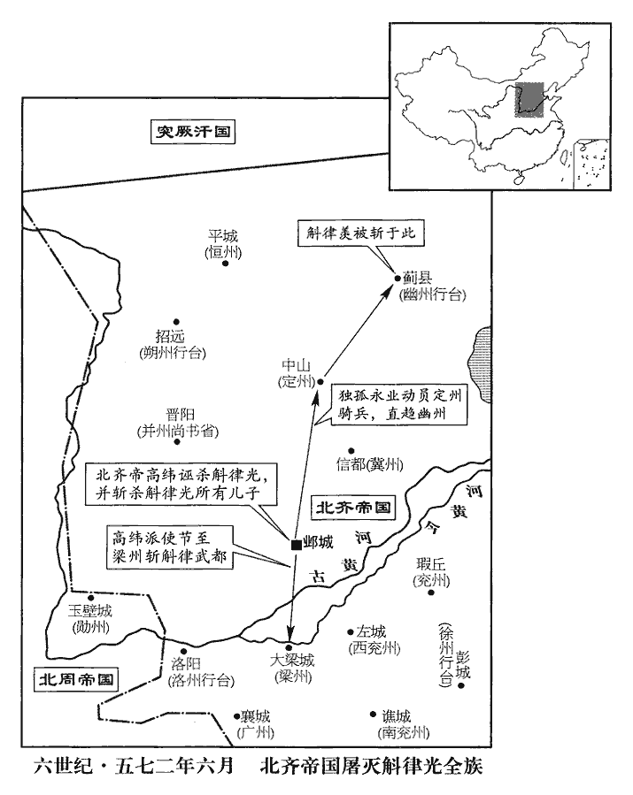
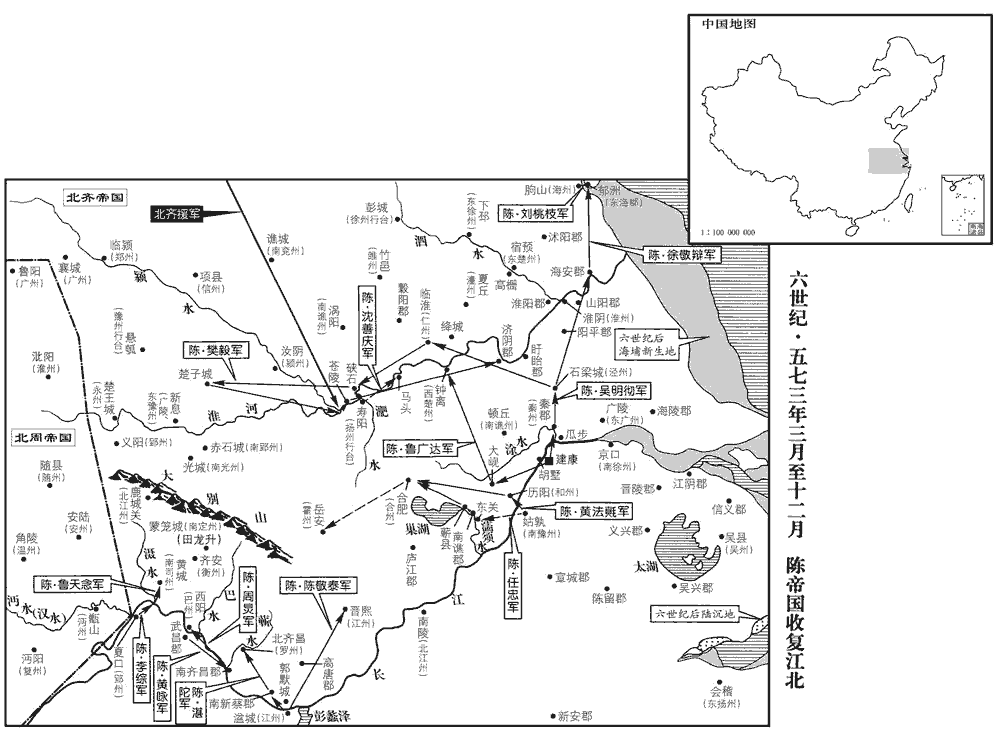
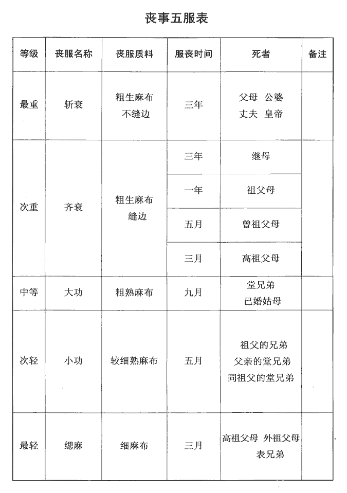

 陳紀五起玄黓執徐（壬辰），盡閼逢敦牂（甲午），凡三年。

# 高宗宣皇帝上之下

## 太建四年（壬辰、五七二）

1春，正月，丙午‹三›，‹陈，首都建康江苏省南京市›以尚書僕射徐陵為左僕射，尚書置二僕射，分為左、右；若省一僕射，則止稱僕射。中書監王勱為右僕射。勱，莫敗翻。

〖译文〗 [1]春季，正月，丙午（初三），陈朝任命尚书仆射徐陵为左仆射，中书监王劢为右仆射。

2己巳‹二十六›，齊‹首都邺城河北省临漳县西南邺镇›主‹高纬，本年十六岁›祀南郊。五代志：後齊制：圜丘、方澤並三年一祭，謂之禘祀，其南、北郊則歲一祀，皆以正月上辛。今書己巳，以致齋之日為始也。南郊，為壇於國南，廣輪三十六尺，高九尺，四面各一陛，為三壝wéi，內壝去壇二十五步，中壝、外壝相去如內壝，四面各通一門。又為大營於外壝之外，廣輪二百七十步營壍廣一丈，深八尺，四面各一門。又為燎壇於中壝之外丙地，廣輪二十七尺，高一尺八寸，四面各一陛。祀所感帝靈威仰於壇，以高祖神武皇帝配。禮用四圭，有邸幣，各如方色。其上帝及配帝，各用騂xīng特牲一。

〖译文〗 [2]乙巳（初二），北齐后主到南郊祭天。

3庚午‹二十七›，上‹陈顼，本年四十五岁›享太廟。

〖译文〗 [3]庚午（二十七日），陈宣帝到太庙祭祀。

4辛未‹二十八›，齊主‹高纬›贈琅邪王儼為楚恭哀帝，以慰太后心，儼死，見上卷上年。又以儼妃李氏為楚帝后。

〖译文〗 [4]辛未（二十八日），北齐后主赠琅邪王高俨为楚恭哀帝的谥号以安慰太后的心，又封高俨的妃子李氏为楚帝后。

5二月，癸酉‹一›，周‹首都长安陕西省西安市›遣大將軍昌城公深聘於突厥‹瀚海沙漠群›，厥，九勿翻。司賓李除、小賓部賀遂禮聘於齊。後周倣成周之制以建官，司賓，蓋周官大行人之職；小賓部，其小行人之職歟？杜佑曰：後周秋官之屬有小賓部下大夫、上士。深，護之子也。

〖译文〗 [5]二月，癸酉（初一），北周派大将军昌城公宇文深到突厥访问，司宾李除、小宾部贺遂礼到北齐访问。宇文深是宇文护的儿子。

6己卯‹七›，齊以衛菩薩為太尉。菩，薄胡翻。薩，桑割翻。考異曰：北齊書、北史並同。不知菩薩何人，亦不言何官。辛巳‹九›，以并省吏部尚書高元海為尚書左僕射。自元魏置諸道行臺，各置令、僕、尚書等官。齊神武破爾朱兆，得晉陽，建大丞相府而居之；文宣受禪，遂置尚書省。

〖译文〗 [6]己卯（初七），北齐任命卫菩萨为太尉。辛巳（初九），任命并省吏部尚书高元海为尚书左仆射。

7乙酉‹十三›，封皇子叔卿為建安王。

〖译文〗 [7]乙酉（十三日），陈朝封皇子陈叔卿为建安王。

8庚寅‹十八›，齊以尚書左僕射唐邕為尚書令，侍中祖珽為左僕射。珽，他鼎翻。初，胡太后既幽於北宮，事見上卷上年。珽欲以陸令萱為太后，為令萱言魏保太后故事。保太后，事見百二十卷宋帝元嘉二年。為令之為，于偽翻。且謂人曰：「陸雖婦人，然實雄傑，自女媧以來，未之有也。」司馬貞曰：女媧亦風姓，有神聖之德，代宓羲立，號曰女希氏。蓋宓羲之後已經數世，金木輪環，周而復始也。孫愐曰：女媧，古女后也。媧wā，古華翻。令萱亦謂珽為「國師」、「國寶」，由是得僕射。

〖译文〗 [8]庚寅（十八日），北齐任命尚书左仆射唐邕为尚书令，侍中祖为左仆射。起先，胡太后被幽禁在北宫，祖打算以陆令萱为太后，向陆令萱讲述魏朝保太后的往事，并对别人说：“陆令萱虽然是个妇人，其实是个豪杰，自从女娲以来，还没有这样的人。”陆令萱也称祖为“国师”、“国宝”，因而被任命为仆射。

9三月，癸卯朔‹一›，日有食之。

〖译文〗 [9]三月，癸卯朔（初一），发生日食。

10初，周太祖‹宇文泰›為魏相，立左右十二軍，總屬相府；太祖殂，皆受晉公護處分，立十二軍事見百六十二卷梁簡文帝大寶元年。敬帝太平元年，周太祖殂，十二軍受護處分，始是年也。世祖天嘉元年，護歸政於周世宗，寔武成元年，護猶總軍旅。次年，護弒世宗，立高祖，改元保定，政悉歸護。事具百六十六卷至百六十八卷。相，息亮翻。處，昌呂翻。分，扶問翻。凡所徵發，非護書不行。護第屯兵侍衛，盛於宮闕。諸子、僚屬皆貪殘恣橫，橫，戶孟翻。士民患之。周主‹宇文邕›深自晦匿，無所關預，人不測其淺深。

〖译文〗 [10]当初，北周太祖在西魏当丞相时，曾经建立左右十二军，隶属相府；太祖死后，受晋公宇文护调度，凡属军队的征发调动，非得有宇文护的文书不可。宇文护的府第驻军守卫，人数超过宫廷，他的儿子和僚属都贪婪残暴恣意横行，士民都深以为患。北周国主对此一直隐晦退避，不加干涉，别人也猜不到他的深浅。

護問稍伯大夫庾季才曰：「比日天道何如？」後周稍伯，蓋周官稍人之職。周官稍人，主為縣師令都鄙丘甸之政。距王城三百里曰稍。杜佑曰：後周地官之屬，有每方稍伯，中大夫。又每遂有小稍伯、稍大夫，皆下大夫。又有小稍伯、稍正，上士、中士。庾季才明於天文，故護問之。稍，所教翻。比，毗至翻。季才對曰：「荷恩深厚，敢不盡言。」頃上台有變，荷，下可翻。隋志曰：三台六星，兩兩而居，起文昌，列招搖，三公之位也。西近文昌二星，謂之上台。公宜歸政天子，請老私門。此則享期頤之壽，曲禮：百年曰期頤。鄭玄曰：，期猶要也；頤，養也。受旦、奭之美，周公旦、召公奭。子孫常為藩屏。屏，必郢翻。不然，非復所知。」復，扶又翻。護沈吟久之，曰：「吾本志如此，但辭未獲免耳。沈，持林翻。沈吟者，深味其言，微發於聲而不能自決之貌。公既為王官，可依朝例，朝，直遙翻；下同。無煩別參寡人也。」自是疏之。

〖译文〗 宇文护问稍伯大夫庚季才说：“近日来天文星象怎么样？”季才回答说：“受到您深厚的恩泽，怎敢知无不言。刚才上台星有变化，晋公您应该归政给天子，请求回家养老。这样就能享年高寿，受到周公旦、召公的美名，子子孙孙常为国家重臣。不然，就不是我所能知道的了。”宇文护沈吟很久，说：“我本来的志向就是这样，但是经过推辞没有得到同意。你既然是天子的官员，可以按照朝廷的规定，不用麻烦你特意来见寡人了。”从此以后对他疏远了。

衛公直，帝‹宇文邕，本年三十岁›之母弟也，深昵於護；及沌口之敗，沌口敗，事見上卷臨海王光大二年。昵，尼質翻。沌，柱兗翻。坐免官，由是怨護，勸帝誅之，冀得其位。帝乃密與直及右宮伯中大夫宇文神舉、內史下大夫太原‹山西省太原市›王軌、右侍上士宇文孝伯謀之。周官，宮伯掌王宮宿衛次舍之職事。內史掌詔王爵祿、廢置、殺生、予奪之法，命諸侯、孤、卿、大夫，則策命之。凡四方之事書，內史讀之。後周蓋髣髴其意以置官。至隋諱「忠」字，以中書為內史，其位任尤重。左、右侍亦倣周官侍御以置官而刱chuàng其名。五代志：周置左、右宮伯，掌侍衛之禁，各更直於內，小宮伯貳之，臨朝則在前侍之首，行則夾路車左右。中侍，掌御寢之禁；左、右侍，陪中侍之後。左、右前侍，掌御寢南門之左右；左、右後侍，掌寢北門之左右。杜佑曰：周制：宮伯，中大夫，屬天官；內史，屬春官，有中大夫、下大夫。神舉，顯和之子；孝伯，安化公深之子也。安化公書爵，以別護子深。安化郡，唐之慶州。

〖译文〗 卫公宇文直是北周武帝的同母兄弟，和宇文护的关系非常亲近；后来在沌口打了败仗，被罢免官职，因此怨恨宇文护，劝武帝杀死他，企图自己得到宇文护的职位。武帝便秘密和卫公宇文直、右宫伯中大夫宇文神举、内史下大夫太原人王轨、右侍上士宇文孝伯进行策划。宇文神举是宇文显和的儿子；宇文孝伯是安化公宇文深的儿子。

帝‹宇文邕›每於禁中見護，常行家人禮，以兄弟齒。太后賜護坐，帝立侍於旁。丙辰‹十四›，護自同州‹府设武乡陕西省大荔县›還長安，帝御文安殿見之。因引護入含仁殿謁太后‹叱奴太后›，且謂之曰：「太后春秋高，頗好飲酒，好，呼到翻。雖屢諫，未蒙垂納。兄今入朝，願更啟請。」因出懷中酒誥授之，周成王作酒誥，戒毋彝酒，毋敢崇飲。曰：「以此諫太后。」護既入，如帝所戒讀酒誥，未畢，帝以玉珽自後擊之，記：天子搢珽。鄭玄曰：珽，亦笏也；珽之言珽然無所屈也。或謂之大圭，長三尺，杼上，終葵首。終葵首者，於杼上又廣其首如椎頭。隋志：今制，珽長尺二寸、方而不折，以球玉為之。珽，他頂翻。護踣於地。踣bó，蒲北翻。帝令宦者何泉以御刀斫之，泉惶懼，斫不能傷。衛公直匿於戶內，躍出，斬之‹年六十岁›。時神舉等皆在外，更無知者。史言周主勇決。

〖译文〗 武帝每次在宫中见到宇文护，都行兄弟之礼。太后赐宇文护坐，武帝就站立在一旁。丙辰（十四日），宇文护从同州回长安，武帝驾临文安殿见他，引导宇文护到含仁殿参见太后，并对他说：“母后年纪已高，很喜欢饮酒，我虽然屡次劝她，没有得到采纳。兄长今天参见时，希望您能劝说她。”于是从怀里拿出《酒诰》给宇文护，说：“用这个来规劝母后。”宇文护进殿后，象武帝所说那样对太后诵读《酒诰》；还没有读完，武帝便在宇文护背后用玉笏打他，宇文护跌倒在地。武帝命令太监何泉用御刀砍他，何泉心里惶恐惧怕，不敢用劲，没有把宇文护砍伤，卫公宇文直躲在门内，这时跳了出来，将宇文护杀死。当时宇文神举等都在殿外，没有别人知道。

帝‹宇文邕›召宮伯長孫覽等，告以護已誅，長，知兩翻。令收護子柱國譚公會、大將軍莒公至、譚、莒，古國名。崇業公靜、正平公乾嘉崇業、正平皆郡公。按隋書帝紀，隨州有崇業郡，而志不載。五代志：絳郡正平縣，舊置正平郡。及其弟乾基、乾光、乾蔚、乾祖、乾威蔚，紆勿翻。并柱國北地‹甘肃省宁县西北›侯龍恩、龍恩弟大將軍萬壽、侯，姓也。大將軍劉勇、中外府司錄尹公正、袁傑、護都督中外，故置中外府，其屬有長史、司馬、司錄。膳部下大夫李安等，於殿中殺之。覽，稚之孫也。長孫稚著功名於正光、永安之間。

〖译文〗 武帝召见宫伯长孙览等人，告诉他们已将宇文护处死，命令拘捕宇文护的儿子柱国谭公宇文会、大将军莒公宇文至、崇业公宇文静、正平公宇文乾嘉，以及他的弟弟宇文乾基、宇文乾光、宇文乾蔚、宇文乾祖、宇文乾威和柱国北地人侯龙恩、侯龙恩的弟弟大将军侯万寿、大将军刘勇、中外府司录尹公正、袁杰、膳部下大夫李安等人，在殿中将他们杀死。长孙览是长孙稚的孙子。

初，護既殺趙貴等，【章：十二行本「等」下有「諸將多不自安」六字；乙十一行本同；孔本同；張校同。】護殺貴等，事見百六十七卷高祖永定元年。侯龍恩為護所親，其從弟開府儀同三司植謂龍恩曰：從，才用翻。「主上春秋既富，安危繫於數公。若多所誅戮以自立威權，豈唯社稷有累卵之危，恐吾宗亦緣此而敗，兄安得知而不言！」龍恩不能從。植又承間言於護曰：間，古莧翻。「公以骨肉之親，當社稷之寄，願推誠王室，擬迹伊、周，則率土幸甚！」護曰：「我誓以身報國，卿豈謂吾有他志邪！」邪，音耶。又聞其先與龍恩言，陰忌之，植以憂卒。卒，子恤翻。及護敗，龍恩兄弟皆死，高祖以植為忠，特免其子孫。

〖译文〗 当初，宇文护杀了赵贵等人，侯龙恩得到宇文护的信任，他的堂弟开府仪同三司侯植对侯龙恩说：“皇上年纪还轻，安危依靠几位公侯。如果对他们诛杀过多来树立自己的威望权力，不但国家极其危险，恐怕我们的宗族也因此而遭到衰败，兄长您怎能知而不言！”侯龙恩没有听他的话。侯植又乘机对宇文护说：“晋公您以骨肉之亲，身受国家社稷的寄托，希望以诚意对待王室，按照伊尹、周公的榜样，那么境域之内都会觉得万幸！”宇文护说：“我誓志以身报国，您难道认为我有别的企图吗！”又听到他以前和侯龙恩说的话，暗中对他产生忌恨，侯植因此忧愁而死去。等到宇文护失败，侯龙恩兄弟都被处死，武帝因为侯植的忠诚，特意赦免了侯植的子孙。

大司馬兼小冢宰、雍州‹京畿›牧齊公憲，素為護所親任，雍，於用翻。賞罰之際，皆得參預，權勢頗盛。護欲有所陳，多令憲聞奏，其間或有可不，不，讀曰否。憲慮主相嫌隙，相，息亮翻。每曲而暢之，帝亦察其心。及護死，召憲入，憲免冠拜謝；帝慰勉之，使詣護第收兵符及諸文籍。衛公直素忌憲，固請誅之，帝不許。

〖译文〗 大司马兼小冢宰、雍州牧齐公宇文宪，一向得到宇文护的信任，遇到对别人的赏罚，宇文宪都能参与意见，权势很大。宇文护有什么要向朝廷上言的事，都叫宇文宪向武帝转达奏报，其中有时有不同的意见，宇文宪顾虑武帝和丞相之间猜疑而形成怨仇，都婉转地进行申述，武帝也察觉到他的用心。宇文护死后，武帝召宇文宪进见，宇文宪脱下帽子向武帝拜谢；武帝对他加以安慰勉励，派他到宇文护的住所收取兵符和各种文书簿籍。卫公宇文直素来忌恨宇文崐宪，坚持请求武帝杀死他，武帝不肯答允。

護世子訓為蒲州‹府设蒲坂山西省永济县›刺史，是夜，帝遣柱國越公盛乘傳徵訓，至同州‹府设武乡陕西省大荔县›，賜死。自蒲州西南至同州一百三十里，同州西南至長安二百二十五里。傳，張戀翻。昌城公深使突厥未還，使，疏吏翻。遣開府儀同三司宇文德齎璽書就殺之。護長史代郡叱羅協、叱羅，虜複姓。魏收官氏志：拓跋內入諸姓有叱羅氏。協時在同州。璽，斯氏翻。司錄弘農‹河南省灵宝县东北›馮遷及所親任者，皆除名。

〖译文〗 宇文护的长子宇文训是蒲州刺史，这天晚上，武帝派柱国越公宇文盛乘车去传唤宇文训，到同州，传达了武帝对他赐死的命令。昌城公宇文深出使突厥还没有回来，武帝派开府仪同三司宇文德送去诏书将他就地杀死。宇文护的长史代郡人叱罗协、司录弘农人冯迁和其他亲信，都被革职除名。

丁巳‹十五›，大赦，改元。改元建德。

〖译文〗 丁巳（十五日），大赦全国，改年号为“建德”。

以宇文孝伯為車騎大將軍，騎，奇寄翻。與王軌並加開府儀同三司。初，孝伯與帝同日生，太祖‹宇文泰›愛之，養於第中，幼與帝‹宇文邕›同學。及即位，欲引致左右，託言欲與孝伯講習舊經，故護弗之疑也，以為右侍上士，出入臥內，預聞機務。孝伯為人，沈正忠諒，沈，持林翻。朝政得失，外間細事，無不使帝聞之。朝，直遙翻；下同。

〖译文〗 任命宇文孝伯为车骑大将军，和王轨一同加封开府仪同三司。当初，宇文孝伯和武帝同一天出生，文帝宇文泰很喜爱他，养在府里，幼年时和武帝同学。武帝即位后，想任用他作为帮助自己的近臣，假托要和宇文孝伯在一起探讨学习古代的经书，所以宇文护并不怀疑，任命他为右侍上士，在卧室内进进出出，参与机密的事情。宇文孝伯为人深沈正直忠实可信，凡是朝政的得失，外面的小事，没有不使武帝知道的。

帝‹宇文邕›閱護書記，有假託符命妄造異謀者；皆坐誅；唯得庾季才書兩紙，盛言緯候災祥，緯，謂七緯日月五星之行，失行則為災。候，謂月令七十二候，失節則為災。緯，于貴翻。宜返政歸權，帝賜季才粟三百石，帛二百段，遷太中大夫。

〖译文〗 武帝翻阅从宇文护家中所搜得的文件，看到有假托符命妄图制造异谋的，都被处死；唯独得到庚季才所写的两张纸，大谈星象变化的灾难吉祥，应该把朝政大权还给武帝，武帝赏赐给庚季才三百石小米，二百段布帛，提升为太中大夫。

癸亥‹二十一›，以尉遲迥為太師，尉，紆勿翻。柱國竇熾為太傅，李穆為太保，齊公憲為大冢宰，衛公直為大司徒，陸通為大司馬，柱國辛威為大司寇，趙公招為大司空。後周之制：三公九命，六官七命。

〖译文〗 癸亥（二十一日），任命尉迟迥为太师，柱国窦炽为太傅，李穆为太保，齐公宇文宪为大冢宰，卫公宇文直为大司徒，陆通为大司马，柱国辛威为大司寇，赵公宇文招为大司空。

時帝始親覽朝政，頗事威刑，雖骨肉無所寬借。齊公憲雖遷冢宰，實奪之權。又謂憲侍讀裴文舉曰：「昔魏末不綱，後周諸王有侍讀之官。不綱，言人君不能操持大綱，致眾目紊亂。太祖輔政；及周室受命，晉公復執大權；積習生常，愚者謂法應如是。豈有年三十天子而可為人所制乎！詩云：『夙夜匪懈，以事一人。』詩大雅烝民之詩。懈，古隘翻。一人，謂天子耳。卿雖陪侍齊公，不得遽同為臣，欲死於所事。宜輔以正道，勸以義方，輯睦我君臣，協和我兄弟，勿令自致嫌疑。」文舉咸以白憲，憲指心撫几曰：「吾之夙心，公寧不知！但當盡忠竭節耳，知復何言。」復，扶又翻。

〖译文〗 当时武帝开始亲政，很注重威令用刑，尽管是骨肉至亲也不宽恕。齐公宇文宪名义上升为冢宰，实际上夺了他的实权。武帝对宇文宪的侍读裴文举说：“从前魏朝末年武帝不能操持朝廷大纲，所以才有太祖辅政；等到周朝建立，晋公宇文护又掌握大权；原只是多年的习惯，后来竟成为常规，愚人还说法度应该如此。哪有年已三十岁的天子还可以被别人箝制的道理！《诗经》中说：‘从早到晚不懈怠，用来侍奉一个人。’一个人，指的是天子。您虽然陪伴侍奉齐公，不能怕得如同他的臣子，老死在侍读的事上。应当以正道去辅助他，用做人的道理去规劝他，使我们君臣和睦，使我们兄弟同心，不要使他自己招致嫌疑。”裴文举把这番话都告诉了宇文宪，宇文宪指着自己的心口拍着小桌子说：“我平素的心意，您难道不知道吗！只是应该尽忠竭节罢了，我还有什么好说的。”

衛公直，性浮詭貪狠，狠，戶懇翻。意望大冢宰；既不得，殊怏怏；更請為大司馬，欲據兵權。帝揣知其意，曰：「汝兄弟長幼有序，豈可返居下列！」由是用為大司徒。為後三年衛公直作亂張本。怏，於兩翻。揣，初委翻。長，知兩翻。

〖译文〗 卫公宇文直性格浮躁诡诈贪婪狠毒，想做大冢宰；没能如愿，心里很不痛快；又请求当大司马，想掌握兵权。武帝猜到他的用意，说：“你们兄弟长幼有序，怎能反而处于下列！”因此任命他为大司徒。

11夏，四月，周遣工部成公建、小禮部辛彥之聘於齊。杜佑通典：周制：工部中大夫屬冬官，五命；禮部屬春官，中大夫，五命；小禮部，上士也，三命。

〖译文〗 [11]夏季，四月，北周派工部成公建、小礼部辛彦之到北齐聘问。

12庚寅‹十九›，周追尊略陽公為孝閔皇帝。廢略陽公事見百六十七卷高祖永定元年。

〖译文〗 [12]庚寅（十九日），北周追尊略阳公宇文觉为孝闵皇帝。

13癸巳‹二十二›，周立皇子魯公贇為太子‹本年十四岁›，贇yūn，於倫翻。大赦。

〖译文〗 [13]癸巳（二十二日），北周立皇子鲁公宇文为太子，大赦全国。

14五月，癸卯‹二›，王勱卒‹年六十七岁›。勱，音邁。卒，子恤翻。

〖译文〗 [14]五月，癸卯（初二），王劢去世。

15齊尚書右僕射祖珽，勢傾朝野，左丞相咸陽王斛律光惡之，珽，他鼎翻。朝，直遙翻。惡，烏路翻。遙見，輒罵曰：「多事乞索小人，乞索，求取也。小人求取無厭，致國家多事。索，山客翻。欲行何計！」又嘗謂諸將曰：「兵【章：十二行本「兵」上有「邊境消息」四字；乙十一行本同；孔本同；張校同。】馬處分，趙令恆與吾輩參論。趙令，謂趙彥深，為尚書令，以其官稱之也。處，昌呂翻。分，扶問翻。將，即亮翻。恆，戶登翻。盲人掌機密以來，祖珽病盲，故詆之。盲事始上卷臨海王光大元年。全不與吾輩語，正恐誤國家事耳。」光嘗在朝堂垂簾坐，朝，直遙翻；下同。珽不知，乘馬過其前，光怒曰：「小人乃敢爾！」爾，猶言如此也。後珽在內省，齊蓋以門下省為內省。言聲高慢，光適過，聞之，又怒。珽覺之，私賂光從奴問之，從，才用翻。奴曰：「自公用事，相王每夜抱膝歎曰：『盲人入，國必破矣。』」相，息亮翻。

〖译文〗 [15]北齐尚书右仆射祖，势力可以倾动朝内外，左丞相咸阳王斛律光很厌恶他，远远地见到祖，总是骂道：“使国家多事、贪得无厌的小人，想搞什么样的诡计！”又曾对部下的将领们说：“军事兵马的处理，尚书令赵彦深还常常和我们一起商量讨论。这个瞎子掌管机密以来，完全不和我们说，使人担心会误了国家的大事。”斛律光曾在朝堂上坐在帘子后面，祖不知道，骑马经过他的面前，斛律光大怒说：“这个小人竟敢这样！”后来祖在门下省，说话声调既高又慢，正巧斛律光经过那里，听到祖说话的腔调，又大怒。祖发觉后，私下贿赂斛律光的随从奴仆询问原因，奴仆说：“自从您当权以来，相王每天夜里手抱双膝叹气说：‘瞎子入朝，国家必毁。’”

穆提婆求娶光庶女，不許。齊王賜提婆晉陽‹山西省太原市›田，光言於朝曰：「此田，神武帝‹高欢›以來常種禾，飼馬數千匹，以擬寇敵。飼，祥吏翻。今賜提婆，無乃闕軍務也！」由是祖、穆皆怨之。

〖译文〗 穆提婆请求娶斛律光的妾所生的女儿做妻子，没有得到允许。齐王赐给穆提婆晋阳地方的田地，斛律光在朝上说：“这些田地，从神武帝以来一直种谷物，饲养几千匹马，打算对付入寇的外敌。现在赏赐给穆提婆，恐怕会影响国家的军务吧！”从此祖、穆提婆都怨恨他。

斛律后無寵，珽因而間之。間，古莧翻。光弟羨，為都督、幽州‹府设蓟县北京市›刺史、行臺尚書令，亦善治兵，治，直之翻。士馬精強，鄣候嚴整，突厥畏之，謂之「南可汗」。可，從刊入聲。汗，音寒。光長子武都，為開府儀同三司、梁‹府设大梁城河南省开封市›•兗‹府设瑕丘山东省兖州市›二州刺史。長，知兩翻。

〖译文〗 斛律后得不到皇帝的宠爱，祖因此离间他们的关系。斛律光的弟弟斛律羡是都督、幽州刺史、行台尚书令，也善于治军，兵士马匹都很精干强壮，设置的要塞堡垒规范整齐，突厥很怕他，称他为“南可汗”。斛律光的长子斛律武都是开府仪同三司，梁、兖二州的刺史。

光雖貴極人臣，性節儉，不好聲色，好，呼到翻。罕接賓客，杜絕饋餉，不貪權勢。每朝廷會議，常獨後言，言輒合理。或有表疏，令人執筆，口占之，務從省實。語省而事實。行兵倣其父金之法，營舍未定，終不入幕；或竟日不坐，身不脫介冑，常為士卒先。士卒有罪，唯大杖撾背，撾zhuā，側瓜翻。未嘗妄殺，眾皆爭為之死。為，于偽翻。自結髮從軍，未嘗敗北，深為鄰敵所憚。周勳州‹府设玉壁山西省稷山县›刺史韋孝寬高歡、宇文泰兵爭，泰使韋孝寬守玉壁，歡盡力攻之，不克而歸，遂死。宇文氏於此立勳州以旌其功。其地在隋絳郡稷山縣。密為謠言曰：「百升飛上天，明月照長安。」上，時掌翻。又曰：「高山不推自崩，推，吐雷翻。槲hú木不扶自舉。」令諜人傳之於鄴，諜，達協翻。鄴中小兒歌之於路。珽因續之曰：「盲老公背受大斧，饒舌老母不得語。」珽，屯鼎翻。今人猶謂多口為饒舌。使其妻兄鄭道蓋奏之。帝以問珽，珽與陸令萱皆曰：「實聞有之。」珽因解之曰：「百升者，斛也。盲老公，謂臣也，與國同憂。饒舌老母，似謂女侍中陸氏也。且斛律累世大將，明月聲震關西，豐樂威行突厥，斛律光，字明月；羨，字豐樂。將，即亮翻。樂，音洛。女為皇后，男尚公主，謠言甚可畏也。」帝以問韓長鸞，長鸞以為不可，事遂寢。

〖译文〗 斛律光虽然贵极人臣，但生性节俭，不喜欢声色，很少接待宾客，拒绝接受馈赠，不贪图权势。每逢朝廷集会议事，常常在最后发言，说的话总是很符合情理。遇有上表或奏疏，叫人拿了笔，由自己口述，替他写下来，务必简短真实。用兵时仿照他父亲斛律金的办法，军队的营房没有落实，自己不进帐幕；或者整天不坐，身上不脱铠甲，打仗时身先士卒。士兵犯了罪，只用大棒敲打脊背，从不随意杀人，所以部下的士兵争相为他效命。自从年轻时参加军队，没有打过败仗，深为相邻的敌方害怕。北周的勋州刺史韦孝宽私下制造谣言崐说：“百升飞上天，明月照长安。”又说：“高山不推自崩，槲木不扶自举。”派间谍把谣言传到邺城，叫邺城的小孩在路上歌唱。祖接续道：“盲老公背受大斧，饶舌老母不得语。”叫妻兄郑道盖向后主奏报。后主就此问祖，祖和陆令萱都说：“确实听说有这件事。”祖还解释说：“百升，就是斛。盲老公，是指我，和国家同忧愁。饶舌老母，似乎指女侍中陆令萱。况且斛律氏几代都是大将，斛律光字明月，声震光西，斛律羡字丰乐，威行突厥，女儿是皇后，儿子娶公主，谣言令人可畏。”后主又问韩长鸾，韩长鸾以为不可能，这件事才结束。

珽又見帝‹高纬›，請間，間，古莧翻，又音如字。唯何洪珍在側，帝曰：「前得公啟，即欲施行，長鸞以為無此理。」珽未對，洪珍進曰：「若本無意則可；既有此意而不決行，萬一泄露，如何？」帝曰：「洪珍言是也。」然猶未決。會丞相府佐封士讓密啟云：「光前西討還，敕令散兵，光引兵逼帝城，將行不軌，事不果而止。還，從宣翻，又音如字。令，力丁翻。事見上卷三年。封士讓密啟，亦珽等使之也。家藏弩甲，僮奴千數，每遣使往豐樂、武都所，使，疏吏翻；下同。陰謀往來。若不早圖，恐事不可測。」帝遂信之，謂何洪珍曰：「人心亦大靈，我前疑其欲反，果然。」帝性怯，恐即有變，令洪珍馳召祖珽告之：「欲召光，恐其不從命。」珽請：「遣使賜以駿馬，語云：使，疏吏翻。語，牛倨翻。『明日將遊東山，王可乘此同行。』光必入謝，因而執之。」帝如其言。

〖译文〗 祖又去见后主，请求后主屏退左右，当时只有何洪珍在旁边，后主说：“以前接到你的启奏，就准备执行，韩长鸾认为没有这种道理。”祖还没有回答，何洪珍向后主进言说：“如果本来没有这种意思就算了；既然有这种意思而不决定执行，万一泄露出去，怎么办？”后主说：“何洪珍的话说得对。”但是还没有决定。恰逢丞相府佐封士让上密启说：“斛律光以前西征回来，皇上下诏命令将军队解散，斛律光却指挥军队进逼都城，准备进行违反法纪的活动，事情没有成功而停止了。家里私藏弓弩和铠甲、僮仆奴婢数以千计，常常派使者去斛律羡、斛律武都的住所，阴谋往来。如果不趁早谋画，恐怕事情不可预测。”后主便相信了，对何洪珍说：“人心也太灵验，我以前怀疑他要造反，果真如此。”后主性格懦弱胆小，只恐马上有变，叫何洪珍迅速把祖召来，告诉他说：“我要召斛律光来，恐怕他不肯服从命令。”祖请求说：“派使者赐给他骏马，告诉他：‘明天将去东山游玩，王可以骑这匹马和我一同前往。’斛律光一定会来向陛下道谢，趁此机会把他抓起来。”后主就照祖所说的那样去做。

六月，戊辰‹二十八›，光入，至涼風堂，劉桃枝自後撲之，不仆。撲，弼角翻。顧曰：「桃枝常為如此事。齊自文宣以來，每殺諸王大臣，劉桃枝率攘臂為之，故光云然。我不負國家。」桃枝與三力士以弓弦罥其頸，拉而殺之‹年五十八岁›，罥juàn，古縣翻。拉盧合翻。血流於地，剗之，迹終不滅。剗chǎn，初限翻，削也。於是下詔稱其欲反，并殺其子開府儀同三司世雄、儀同三司恆伽。齊制：開府儀同三司，從一品；儀同三司，第二品。恆，戶登翻。伽，求加翻。

〖译文〗 六月，戊辰（疑误），斛律光进宫，到凉风堂，刘桃枝从他背后扑去，没有跌倒。斛律光回头说：“刘桃枝常常做这种事。我没有辜负国家。”刘桃枝和另外三个力士用弓弦缠住他的脖子，用力勒紧将他杀死，鲜血流在地上，经过铲除，血迹始终存在。后主于是下诏说斛律光要造反，将他的儿子开府仪同三司斛律世雄、仪同三司斛律恒伽一并杀死。

祖珽使二千石郎邢祖信簿錄光家。齊制：二千石郎，掌畿外得失等事。珽於都省問所得物，都省，即尚書都省。五代志：後齊制，錄、令、僕射總理六尚書事，謂之都省。祖信曰：「得弓十五，宴射箭百，刀七，賜矟二。」明非私藏兵器。矟，色角翻。珽厲聲曰：「更得何物？」曰：「得棗杖二十束，擬奴僕與人鬬者，不問曲直，即杖之一百。」棗木堅而密理，可以為杖。珽大慚，乃下聲曰：「朝廷已加重刑，郎中何宜為雪！」為，于偽翻。及出。人尤其抗直，祖信慨然曰：「賢宰相尚死，我何惜餘生！」

〖译文〗 祖派二千石郎邢祖信对斛律光的家产登记造册。祖在尚书都省问起所查到的东西，邢祖信说：“得到十五张弓，聚宴习射时用的箭一百支，七把刀，朝廷赏赐的长矛两杆。”祖厉声说：“还得到什么东西？”邢祖信回答说：“得到二十捆枣木棍，准备当奴仆和别人斗殴时，不问是非曲直，先打奴仆一百下。”祖大为惭愧，便低声说：“朝廷已经对他处以重刑，郎中不宜为他洗雪！”邢祖信离开尚书都省，有人责怪他过于坦率耿直，他感慨说：“贤良的宰相尚且被杀，我何必顾惜自己的余生！”

齊主‹高纬›遣使就州斬斛律武都，又遣中領軍賀拔伏恩乘驛，捕斛律羨，仍以洛州‹府洛阳›行臺僕射中山‹河北省定州市›獨孤永業‹时在邺城›代羨，與大將軍鮮于桃枝發定州‹府中山›騎卒續進。騎，奇寄翻。伏恩等至幽州，門者白：「使人衷甲，使，疏吏翻；下同。馬有汗，宜閉城門。」羨曰：「敕使豈可疑拒！」敕使，謂使者奉敕而來；至唐時，率以稱宦者。出見之。伏恩執而殺之。初，羨常以盛滿為懼，表解所職，不許。臨刑，歎曰：「富貴如此，女為皇后，公主滿家，常使三百兵，何得不敗！」及其五子伏護、世達、世遷、世辨、世酋皆死。酋，慈由翻。

〖译文〗 北齐后主派使者到梁州、兖州去，就地将斛律武都处死，又派中领军贺拔伏恩乘驿车去捉拿斛律羡，仍旧以洛州行台仆射中山人独孤永业代替斛律羡，和大将军鲜于桃枝征发定州的骑兵继续前进。贺拔伏恩等到幽州，守城门的人告诉斛律羡：“来的人内穿衣甲，马身有汗，应当关闭城门。”斛律羡说：“怎能怀疑皇上派来的使者把他们拒之城外！”便出城会见使者。贺拔伏恩将他捉住处死。当初，斛律羡时常为一家权势太大而惧怕，曾经上表请求解除自己的职务，后主不许。临刑时，他叹息说：“如此富贵，女儿是皇后，满家是公主，日常使用三百名士兵，怎能不败！”他的五个儿子斛律伏护、斛律世达、斛律世迁、斛律世辨、斛律世酋都被处死。

周主聞光死，為之大赦。幸其死也。為，于偽翻。

〖译文〗 北周后主听到斛律光死去的消息，为此大赦全国表示庆幸。

 

祖珽與侍中高元海共執齊政。元海妻，陸令萱之甥也，元海數以令萱密語告珽。數，所角翻。珽求為領軍，齊主許之，元海密言於帝曰：「孝徵漢人，祖珽，字孝徵。兩目又盲，豈可為領軍！」因言珽與廣寧王孝珩交結，孝珩，文襄之子，齊主所忌也。珩，戶庚翻。由是中止。珽求見，自辨，見，賢遍翻。且言：「臣與元海素嫌，必元海譖臣。」帝弱顏，不能諱，以實告之，見人輒自羞而顏有忸怩者為弱顏，今人猶有是言。珽因言元海與司農卿尹子華等結為朋黨。又以元海所泄密語告令萱，令萱怒，出元海為鄭州‹府设颍阴河南省临颍县西北›刺史。地形志：天平初，置潁州，治長社城；武定七年，改鄭州，治潁陰城。周滅齊，改鄭州曰許州，於滎陽置鄭州。子華等皆被黜。被，皮義翻。

〖译文〗 祖和侍中高元海共同执掌北齐的朝政。高元海的妻子，是陆令萱的外甥女，高元海屡次把陆令萱的秘密话告诉祖。祖要求做领军，北齐后主答允了，高元海秘密向后主说：“祖是汉人，双目失明，怎么能做领军！”并且说祖和广宁王高孝珩有勾结，因此没有任命。祖求见后主，为自己辨白，说：“臣和高元海素来有怨仇，一定是高元海诽谤臣。”后主脸皮薄，不能回避，只得把实话告诉他，祖于是说高元海和司农卿尹子华等人结成朋党。又把高元海所泄露的秘密话告诉陆令萱，陆令萱大怒，把高元海贬为郑州刺史。尹子华等人都被罢官。

珽自是專主機衡，尚書職掌機密，任居銓衡。總知騎兵、外兵事，後齊制：尚書郎有中兵、外兵，各分左、右。左外兵掌河南及潼關已東諸州，右外兵掌河北及潼關已西諸州丁帳及發召征兵等事。騎，奇寄翻。內外親戚，皆得顯位。帝常令中要人扶侍出入，中要人，宦官之親要者。直至永巷，每同御榻論決政事，委任之重，群臣莫比。

〖译文〗 祖从此专门主管朝廷的枢要机关，总辖执掌北齐的骑兵、外兵军务，内外亲戚都得到显要的官职。后主常常叫亲近的太监搀扶祖出入，一直送到宫里的长巷，时常同后主在御榻上商量决定朝廷的政事，托付给祖的重要任务，是别的臣子所不能比拟的。

16秋，七月，遣使如周。使，疏吏翻；下同。

〖译文〗 [16]秋季，七月，陈宣帝派使者去北周。

17八月，庚午‹一›，齊廢皇后斛律氏為庶人。斛律光既死，則其女廢矣。以任城王湝為右丞相，湝，戶皆翻，又音皆。馮翊王潤為太尉，蘭陵王長恭為大司馬，廣寧王孝珩為大將軍，安德王延宗為大司徒。

〖译文〗 [17]八月，庚午（初一），北齐废皇后斛律氏为平民。任命任城王高为右丞相，冯翊王高润为太尉，兰陵王高长恭为大司马，广宁王高孝珩为大将军，安德王高延宗为大司徒。

18齊使領軍封輔相聘于周。相，息亮翻。

〖译文〗 [18]北齐派领军封辅相到北周聘问。

19辛未‹二›，周使司城中大夫杜杲來聘。宋以武公名改司空為司城，侯國之卿也。後周倣成周之遺制，必不以諸侯之卿名官，蓋髣髴周官掌固之職。上謂之曰：「若欲合從圖齊，從，子容翻。宜以樊‹湖北省襄樊市汉水北岸›、鄧‹襄樊市东北›見與。」對曰：「合從圖齊，豈弊邑之利！必須城鎮，宜待得之於齊，先索漢‹汉水›南，索，山客翻。使臣不敢聞命。」使，疏吏翻。

〖译文〗 [19]辛未（初二），北周派司城中大夫杜杲来陈朝聘问。宣帝对他说：“如果要和我国联合起来谋取北齐，应该把樊、邓二州让给我们。”使者回答说：“联合起来谋取北齐，难道仅仅是敝国一国的利益！贵国一定要城镇，应该从北齐那里去得到，先要索取汉南一带地方，我作为使臣不敢传达这个要求。”

20初，齊胡太后自愧失德，胡太后失德久矣，事發則見上卷上年。欲求悅於齊主，乃飾其兄長仁之女置宮中，令帝見之，帝果悅，納為昭儀。元魏以來，昭儀次於皇后，位視大司馬。及斛律后廢，陸令萱欲立穆夫人；太后欲立胡昭儀，力不能遂，乃卑辭厚禮以求令萱，結為姊妹。令萱亦以胡昭儀寵幸方隆，不得已，與祖珽白帝立之。戊子‹十九›，立皇后胡氏。

〖译文〗 [20]当初，北齐胡太后因为自己行为不好而感到羞愧，为了得到北齐后主崐的喜欢，于是把哥哥胡长仁的女儿修饰打扮住在宫里，使后主能见到她，后主见后果然很喜欢，纳她为昭仪，地位仅次于皇后。到斛律后被废掉，陆令萱想立穆夫人为皇后；胡太后想立胡昭仪为皇后，但是力不从心，于是用卑下的言辞和厚礼请求陆令萱，想和她结为姊妹。陆令萱也因为胡昭仪正日益得到后主的宠爱，不得已，和祖一起向后主请求立胡昭仪为皇后。戊子（十九日），立皇后胡氏。

21己丑‹二十›，齊以北平王仁堅為尚書令，特進許季良為左僕射，彭城王寶德為右僕射。

〖译文〗 [21]己丑（二十日），北齐任命北平王高仁坚为尚书令，特进许季良为左仆射，彭城王高宝德为右仆射。

22癸巳‹二十四›，齊主‹高纬›如晉陽‹山西省太原市›。

〖译文〗 [22]癸巳（二十四日），北齐后主去晋阳。

23九月，庚子朔‹一›，日有食之。

〖译文〗 [23]九月，庚子朔（初一），发生日食。

24辛亥‹十二›，大赦。

〖译文〗 [24]辛亥（十二日），陈朝大赦全国。

25冬，十月，庚午‹二›，周詔：「江陵‹南梁首都·湖北省江陵县›所虜充官口者，悉免為民。」梁元帝承聖三年，江陵破，士民皆為魏所虜入關。

〖译文〗 [25]冬季，十月，庚午（初二），北周诏令：“在江陵俘虏充当官府奴婢的，全部赦免为百姓。”

26辛未‹三›，周遣小匠師楊勰等來聘。匠師，大司空之屬也。杜佑通典：周小匠師下大夫，屬冬官，四命。又有上士，三命。勰，音協。

〖译文〗 [26]辛未（初三），北周派小匠师杨勰等来陈朝聘问。

27周綏德公陸通卒。綏德縣公也。西魏於綏州上縣置綏德縣。卒，子恤翻。

〖译文〗 [27]北周绥德公陆通去世。

28乙酉‹十七›，上‹陈顼›享太廟。五代志：陳立七廟，一歲五祠，春、夏、秋、冬、臘也。每祭，共以一太牢，始祖以三牲首，餘惟骨體而已。

〖译文〗 [28]乙酉（十七日），陈宣帝到太庙祭祀。

29齊陸令萱欲立穆昭儀‹穆黄花›為皇后，私謂齊主‹高纬›曰：「豈有男為皇太子而身為婢妾者！」胡后有寵於帝，不可離間，間，古莧翻。令萱乃使人行厭蠱之術，厭，一琰翻。旬朔之間，胡后精神恍惚，恍，呼廣翻。惚，音忽。言笑無恆，帝漸畏而惡之。恆，戶登翻。惡，烏路翻。令萱一旦忽以皇后服御衣被昭儀‹穆黄花›，衣，於既翻。被，皮義翻。又別造寶帳，爰及枕席器玩，莫非珍奇。坐昭儀於帳中，謂帝曰：「有一聖女出，將大家看之。」及見昭儀，令萱乃曰：「如此人不作皇后，遣何物人作！」帝‹高纬›納其言。

〖译文〗 [29]北齐陆令萱想立穆昭仪为皇后，私下对北齐后主说：“难道有儿子是皇太子而自身是婢妾的！”胡皇后正得宠于后主，无法挑拨离间，陆令萱便叫方士施行诅咒人的巫术，仅仅十天到一个月之间，胡皇后精神恍惚，说笑都不正常，后主便遂渐害怕而厌恶她。陆令萱有一天忽然用皇后的衣服给穆昭仪穿着起来，又另外做了华美的帐子，乃至枕席用器和玩赏物品，无不珍贵奇特。叫穆昭仪坐在帐子里，对后主说：“发现一个贤德的女子，请陛下去看看。”后主看到穆昭仪，陆令萱便说：“这样的人不当皇后，还有什么人可当！”后主采纳了陆令萱的意见。

甲午‹二十六›，立穆氏‹穆黄花›為右皇后，以胡氏為左皇后。

〖译文〗 甲午（二十六日），立穆昭仪为右皇后，胡昭仪为左皇后。

30十一月，庚戌‹十二›，周主‹宇文邕›行如羌橋，羌橋在長安東，以苻、姚諸羌而得名。集長安以東諸軍都督以上，頒賜有差。乙卯‹十七›，還宮。以趙公招為大司馬。壬申‹四›，周主如斜谷‹陕西省眉县南›，斜，音耶，又似嗟翻。谷，音欲，又古祿翻。集長安已西都【章：十二行本「都」上有「諸軍」二字；乙十一行本同；孔本同。】督已上，頒賜有差。丙戌‹十八›，還宮。

〖译文〗 [30]十一月，庚戌（十二日），北周国主巡行去羌桥，召集长安以东军队中都督以上的官员，按情况分别给予赏赐。乙卯（十七日），回宫。任命赵公宇文招为大司马。壬申（疑误），北周国主去斜谷，召集长安以西军队中都督以上的官员，分别给予赏赐。丙戌（疑误），回宫。

31庚寅‹二十二›，周主遊道會苑，以上善殿壯麗，焚之。

〖译文〗 [31]庚寅（疑误），北周国主到道会苑游玩，因为上善殿壮丽，将它焚毁。

32十二月，辛巳‹四›，周主‹宇文邕›祀南郊。五代志曰：後周憲章姬周，祭祀之式，多依儀禮。南郊，為方壇於國南五里，其崇一丈二尺，其廣四丈，其壝wéi方百二十步，內壝半之。祭以正月上辛，以始祖獻侯莫那配所感帝靈威仰於其上。

〖译文〗 [32]十二月，辛巳（十三日），北周国主到南郊祭天。

33齊胡后之立，非陸令萱意，令萱一旦於太后前作色而言曰：「何物親姪，作如此語！」太后問其故，令萱曰：「不可道。」固問之，乃曰：「語大家云：語大，牛倨翻。『太后行多非法，不可以訓。』」行，下孟翻。太后大怒，呼后出，立剃其髮，送還家。剃，他計翻。辛丑‹四›，廢胡后為庶人。然齊主‹高纬›猶思之，每致物以通意。

〖译文〗 [33]北齐册立胡皇后，不是陆令萱的意愿，有一天陆令萱在太后面前生气地说：“什么亲侄女，竟说出这种话来！”太后问她什么原故，陆令萱说：“不能说。”坚持问她，才说：“胡皇后对皇上说：‘太后有许多非法行为，不足为训。’”太后勃然大怒，把胡皇后叫出来，马上剃去她的头发，送她回家。辛丑（初四），废胡皇后为平民。然而后主还想念她，常常送东西给她表示自己的意思。

自是令萱與其子侍中穆提婆勢傾內外，賣官鬻獄，聚斂無厭。斂，力贍翻。厭，一鹽翻。每一賜與，動傾府藏。藏，徂浪翻。令萱則自太后以下，皆受其指麾；提婆則唐邕之徒，皆重足屏氣；重，直龍翻。屏，必郢翻。殺生予奪，唯意所欲。

〖译文〗 从此以后陆令萱和她的儿子侍中穆提婆势力倾动朝廷内外，出卖官职，收受贿赂断案，聚敛钱财贪得无厌。每次赏赐，动辄把官府储存的东西用光。陆令萱对太后以下的人都可以指挥；唐邕一伙对穆提婆怕得不敢出声；这两人可以随心所欲地对别人生杀予夺。

34乙巳‹八›，周以柱國田弘為大司空。

〖译文〗 [34]乙巳（初八），北周任命柱国田弘为大司空。

35乙卯‹十八›，周主‹宇文邕›享太廟。五代志：後周思復古之道，右宗廟而左社稷，置太祖之廟并高祖已下二昭二穆，凡五，親盡則遷。其有德者，謂之祧tiāo廟，亦不毀。

〖译文〗 [35]乙卯（十八日），北周国主到太庙祭祀。

36是歲，突厥木杆可汗卒，復捨其子大邏便而立其弟，是為佗鉢可汗。佗鉢以攝圖為爾伏可汗，統其東面；又以其弟褥但可汗之子為步離可汗，居西面。厥，九勿翻。梁世祖承聖二年，突厥土門可汗卒，捨其子攝圖，立其弟俟斗斤，稱為木杆可汗。褥但既佗鉢之弟，蓋小可汗也。杆，古按翻。可，從刊入聲。汗，音寒。卒，子恤翻。復，扶又翻。佗，徒何翻。周人與之和親，歲給繒絮錦綵十萬段。繒，慈陵翻。突厥在長安者，衣錦食肉，常以千數。衣，於既翻。齊人亦畏其為寇，爭厚賂之。佗鉢益驕，謂其下曰：「但使我在南兩兒常孝，何憂於貧！」在南兩兒，謂爾伏、步離二人，所部分西北，皆南近中國。

〖译文〗 [36]这一年，突厥木杆可汗去世，不立他的儿子大逻便而立弟弟，就是佗钵可汗。佗钵以摄图为尔伏可汗，统治突厥的东部；又任命弟弟褥但可汗的儿子为步离可汗，统治突厥的西部。北周和突厥和好亲睦，每年送给他们丝织的采缎十万段。在长安的突厥人，穿锦吃肉的常以千计。北齐也怕突厥入境骚扰，争着用厚礼贿赂他们。佗钵可汗更加骄傲，对部下说：“只要在南面的两个儿子经常孝敬我，我就不怕贫穷！”

阿史那后無寵於周主‹宇文邕›，考異曰：周書曰：「后有姿貌，善容止，周帝甚敬焉。」按房玄齡唐高祖實錄云：「武帝納突厥女，陋而無寵，太穆皇后勸帝強撫慰之。」今從之。神武公竇毅尚襄陽公主，神武郡公，拓跋魏置神武郡於尖山。生女尚幼，密言於帝曰：「今齊、陳鼎峙，齊、陳及周，三國鼎峙。突厥方強，願舅抑情慰撫，以生民為念！」帝深納之。此女後適李淵，是為唐高祖竇皇后。

〖译文〗 阿史那后得不到北周国主武帝的宠爱，神武公窦毅娶襄阳公主为妻，女儿还小，秘密对武帝说：“现在北齐和陈朝鼎足而立，突厥势力正在强盛之际，希望舅父能够忍耐，加以劝慰安抚，把老百姓放在心上！”武帝对他的话深表同意予以采纳。

## 五年（癸巳、五七三）

1春，正月，癸酉‹六›，‹陈，首都建康江苏省南京市›以吏部尚書沈君理為右僕射。

〖译文〗 [1]春季，正月，癸酉（初六），陈朝任命吏部尚书沈君理为右仆射。

2戊寅‹十一›，齊‹首都邺城河北省临漳县西南邺镇›以并省尚書令高阿那肱錄尚書事，總知外兵及內省機密，與侍中城陽王穆提婆、領軍大將軍昌黎王韓長鸞共處衡軸，處，昌呂翻。車軛曰衡，持輪者曰軸。車非二者不行，故以為喻。號曰「三貴」，蠹國害民，日月滋甚。滋，益也。

〖译文〗 [2]戊寅（十一日），北齐任命并省尚书令高阿那肱录尚书事，总管外兵和宫内的机密，和侍中城阳王穆提婆、领军大将军昌黎王韩长鸾一同担任朝廷中枢的要职，号称“三贵”，祸国殃民，一天比一天厉害。

長鸞弟萬歲，子寶行、寶信，並開府儀同三司，萬歲仍兼侍中，寶行、寶信皆尚公主。每群臣旦參，參，朝參也。帝‹高纬，本年十七岁›常先引長鸞顧訪，出後，方引奏事官。若不視事，內省有急奏事，皆附長鸞奏聞，軍國要密，無不經手。尤疾士人。朝夕宴私，唯事譖訴。常帶刀走馬，未嘗安行，瞋目張拳，瞋，昌真翻。有噉dàn人之勢。朝士咨事，莫敢仰視，動致呵叱。每罵云：「漢狗大不可耐，唯須殺之！」呵，虎何翻。叱，昌栗翻。耐，奴代翻。

〖译文〗 韩长鸾的弟弟韩万岁，他的儿子韩宝行、韩宝信，都是开府仪同三司，韩万岁仍兼侍中，韩宝行、韩宝信都娶公主为妻。每当群臣早朝，北齐后主常常先召韩长鸾入殿咨询，等他下殿后，才让奏事官上朝奏事。后主如果不上朝，内省有紧急的奏事，都由韩长鸾去向后主奏报，军事和国家的重要机密，没有不经他的手。他尤其痛恨士人，早晚朝见、宴会、私下朝见皇帝时，专门说别崐人的坏话。他经常驰马带刀，从不缓步而行，瞪眼伸拳，摆出吃人的架势。朝廷的官员同他商量事情时，不敢抬头看他，动辄遭到他的责骂。每次都骂道：“汉狗使人很不耐烦，只能杀掉他们！”

3庚辰‹十三›，齊遣崔象來聘。

〖译文〗 [3]庚辰（十三日），北齐派崔象来陈朝聘问。

4辛巳‹十四›，上‹陈顼，本年四十六岁›祀南郊；甲午‹二十七›，享太廟；二月，辛丑‹五›，祀明堂。

〖译文〗 [4]辛巳（十四日），陈宣帝到南郊祭天；甲午（二十七日），到太庙祭祀；二月，辛丑（初五），到近郊东南的明堂祭祀。

5乙巳‹九›，齊立右皇后穆氏‹穆黄花›為皇后。穆后母名輕霄，本穆氏之婢也，面有黥qíng字。北史：輕霄本穆子倫婢，轉入宋欽道家。欽道之婦妬輕霄，黥其面為「宋」字，姦私而生此女，莫知其姓。后‹穆黄花›既以陸令萱為母，穆提婆為外家，號令萱曰「太姬」。太姬者，齊皇后母號也，視一品，班在長公主上。長，知兩翻。由是不復問輕霄。復，扶又翻。輕霄自療面，欲求見后，太姬使禁掌之，竟不得見。

〖译文〗 [5]乙巳（初九），北齐立右皇后穆氏为皇后。穆后的母亲名叫轻霄，原先是穆家的婢女，脸上有刺字。穆后认陆令萱为母亲，以穆提婆为外家，称陆令萱为“太姬”。太姬，是北齐皇后母亲的称号，相当于一品，等级在皇帝的姊妹以上。皇后因此不再理轻霄。轻霄把脸治好，要求见皇后，太姬叫人禁止并用手掌打她，结果不能见到。

齊主‹高纬›頗好文學。好，呼到翻。丙午‹十›，祖珽奏置文林館，多引文學之士以充之，謂之待詔；以中書侍郎博陵‹河北省安平县›李德林、黃門侍郎琅邪‹山东省临沂市›顏之推同判館事，又命共撰修文殿御覽。齊大統中，毀東宮，起修文等殿。撰，士免翻。

〖译文〗 北齐后主很爱好文学。丙午（初十），祖奏请设立文林馆，延揽了许多文学之士到馆里，称为待诏；任命中书侍郎博陵人李德林、黄门侍郎琅邪人颜之推为同判馆事，又叫他们共同编写《修文殿御览》。

6甲寅‹十八›，周‹首都长安陕西省西安市›太子贇yūn巡省西土。省，悉景翻。

〖译文〗 [6]甲寅（十八日），北周太子宇文巡察西部的疆域。

7乙卯‹十九›，齊以北平王堅錄尚書事。按上年秋八月，齊以北平王仁堅錄尚書事，此恐逸「仁」字。丁巳‹二›，齊主‹高纬›如晉陽‹山西省太原市›。

〖译文〗 [7]乙卯（十九日），北齐任命北平王高坚录尚书事。丁巳（二十一日），北齐后主去晋阳。

8壬戌‹二十六›，周遣司會侯莫陳凱等聘於齊。周官司會屬冢宰。鄭玄曰：會，大計也。司會主天下之大計，計官之長，若今尚書。後周司會屬天官，中大夫也。會，工外翻。

〖译文〗 [8]壬戌（二十六日），北周派司会侯莫陈凯等人到北齐聘问。

9庚辰，齊主還鄴。

〖译文〗 [9]庚辰（疑误），北齐后主回邺城。

10三月，己卯‹十三›，周太子‹宇文赟›於岐州‹府设雍县陕西省凤翔县›獲二白鹿以獻，因巡省而獲白鹿。周主‹宇文邕，本年二十一岁›詔曰：「在德不在瑞。」

〖译文〗 [10]三月，己卯（十三日），北周太子在岐州捉到两只白鹿献给武帝，北周武帝下诏说：“在品德不在祥瑞。”

11帝‹陈顼›謀伐齊，公卿各有異同，唯鎮前將軍吳明徹決策請行。梁武帝置八鎮將軍，東、西、南、北止施在外，左、右、前、後止施在內。帝謂公卿曰：「朕意已決，卿可共舉元帥。」帥，所類翻。眾議以中權將軍淳于量位重，共署推之。梁置四中將軍，與八鎮將軍同擬官品第二。然四中班四征之上，八鎮班四征之下，故以量位為重。尚書左僕射徐陵獨曰：「吳明徹家在淮左，吳明徹，秦郡‹江苏省六合县›人。悉彼風俗；將略人才，當今亦無過者。」將，即亮翻；下同。都官尚書河東‹侨郡·湖北省松滋市西北›裴忌曰：「臣同徐僕射。」陵應聲曰：「非但明徹良將，裴忌即良副也。」壬午‹十六›，分命眾軍，以明徹都督征討諸軍事，忌監軍事，將，即亮翻。監，工銜翻。統眾十萬伐齊。明徹出秦郡‹北秦州·江苏省六合县›，都督黃法𣰰出歷陽‹北齐和州·安徽省和县›。𣰰qú，巨俱翻。

〖译文〗 [11]陈宣帝计划讨伐北齐，公卿之间意见不一，只有镇前将军吴明彻决策请求行动。宣帝对公卿们说：“朕的主意已经决定，你们可以共同推举元帅。”大家商量认为中权将军淳于量地位最重要，共同签名推选他。唯独尚书左仆射徐陵说：“吴明彻家在淮左，熟悉那里的风俗；将略和才能，当今也没有超过他的。”都官尚书河东裴忌说：“我同意徐仆射的看法。”徐陵应声说：“不但吴明彻是良将，裴忌就是好的副帅。”壬午（十六日），分别命令众军，任命吴明彻为都督征讨诸军事，裴忌为监军事，统率十万军队进攻北齐。吴明彻向秦郡进军，都督黄法氍向历阳进军。

12夏，四月，己亥‹四›，周主‹宇文邕›享太廟。

〖译文〗 [12]夏季，四月，己亥（初四），北周国主到太庙祭祀。

13癸卯‹八›，前巴州‹府设巴陵湖南省岳阳市›刺史魯廣達與齊師戰于大峴‹安徽省含山县东北›，破之。梁置巴州於巴陵。此大峴在合肥之南，歷陽之北。峴，戶典翻。

〖译文〗 [13]癸卯（初八），陈朝的前巴州刺史鲁广达和北齐军队在大岘交战，将北齐军队打败。

14戊申‹十三›，齊以蘭陵王長恭為太保，南陽王綽為大司馬，安德王延宗為太尉，武興王普為司徒，開府儀同三司宜陽王趙彥深為司空。

〖译文〗 [14]戊申（十三日），北齐任命兰陵王高长恭为太保，南阳王高绰为大司马，安德王高延宗为太尉，武兴王高普为司徒，开府仪同三司宜阳王赵彦深为司空。

15齊人於秦郡置秦州，州前江浦通涂水‹滁河›，今真州閘即其地。涂，讀曰滁。齊人以大木為柵於水中。辛亥‹十六›，吳明徹遣豫章‹江西省南昌市›內史程文季將驍勇拔其柵，克之。將，即亮翻，又音如字，領也。驍，堅堯翻。文季，靈洗之子也。梁、陳之間，程靈洗以勇鳴。

〖译文〗 [15]北齐在秦郡设置秦州，州前连通长江的水渠通滁水，北齐人用大树做栅栏放在水中。辛亥（十六日），吴明彻派豫章内史程文季率领勇猛矫健的兵士拔掉栅栏，攻下秦州。程文季是程灵洗的儿子。

齊人議禦陳師，開府儀同三司王紘曰：「官軍比屢失利，人情騷動。考之史，比年以來，齊師未嘗失利，蓋爭宜陽、汾北，周、齊更勝迭負，周師雖退，齊師亦疲也。比，毗至翻。若復出頓江、淮，恐北狄、西寇，乘弊而來【章：十二行本「來」下有「則世事去矣」五字；乙十一行本同；孔本同；張校同。】復，扶又翻。北狄，謂突厥；西寇，謂周。莫若薄賦省傜，息民養士，使朝廷輯睦，遐邇歸心。天下皆當肅清，豈直陳氏而已。」不從。遣軍救歷陽，考異曰：陳書帝紀云：「齊遣兵十萬救歷陽。」黃法𣰰傳云：「步騎五萬援歷陽。」蕭摩訶傳云：「尉破胡等帥眾十萬來援。」按源文宗之語，恐無此數。今不取。庚申‹二十五›，黃法𣰰擊破之。又遣開府儀同三司尉破胡、長孫洪略救秦州。尉，紆勿翻。

〖译文〗 北齐商议怎样抵抗陈朝的军队，开府仪同三司王说：“官军近来屡次失利，人们的情绪骚动不安。如果再派军队驻屯长江、淮河一带，只怕北面的突厥和西面的周朝，乘我军的弊疲来进犯。不如轻徭薄赋，与民休息善待士人，使朝廷和睦，远近都从心里归附。天下都应当肃清；岂只陈朝而已。”后主不听。派军队去援救历阳，庚申（二十五日），被陈朝黄法氍打败。后主又派开府仪同三司尉破胡、长孙洪略援救秦州。

趙彥深私問計於祕書監源文宗曰：「吳賊侏張，遂至於此。侏，舊音張流切，蓋因書「譸zhōu張為幻」，爾雅「譸」作「侜zhōu」，遂有此音。按類篇：侏，音張流切，其義華也。書所謂侜張，其義誕也。以文理求之，皆於此不近，姑闕之以待知者。弟往為秦、涇‹府设石梁城安徽省天长市西›刺史，齊置秦州於秦郡，涇州於石梁。悉江、淮間情事，今何術以禦之？」文宗曰：「朝廷精兵，必不肯多付諸將；將，即亮翻。數千已下，適足為吳人之餌。尉破胡人品，王之所知，彥深封宜陽王，故稱之。敗績之事，匪朝伊夕。國家待遇淮南，失之同於蒿箭。唐高祖遣李密徇山東，廷臣多諫。帝曰：「如以蒿箭射蒿中耳。」言不足惜也。乃知此語之來久矣。如文宗計者，不過專委王琳，招募淮南三四萬人，風俗相通，能得死力；兼令舊將將兵屯於淮北。【章：十二行本「北」下有「足以固守」四字；乙十一行本同；孔本同；張校同。】將，即亮翻。且琳之於頊，必不肯北面事之，明矣。竊謂此計之上者。若不推赤心於琳，更遣餘人掣肘，宓子賤為單父宰，言於魯君，請與二吏俱至邑，使二吏書而掣其肘，書不工，輒怒之。吏不能堪，歸以告魯君。魯君曰：「是慮我掣其肘耳。」宓賤是以能為單父。後之言「掣肘」者本此。掣，昌列翻。復成速禍，彌不可為。」是役卒如文宗之言。復，扶又翻。彥深歎曰：「弟此策誠足制勝千里，但口舌爭之十日，已不見從。時事至此，安可盡言！」因相顧流涕。文宗名彪，以字行，子恭之子也。源子恭以幹用稱於熙平、永安之間。

〖译文〗 赵彦深私下向秘书监源文宗讨教计策，说：“吴地的贼寇十分嚣张，竟然到了这种地步。老弟以前曾经是秦、泾二州的刺史，熟悉长江、淮河间的情况，现在用什么办法去抵抗他！”源文宗说：“朝廷的精兵，一定不肯多配给将领，人数在几千以下，正好成了陈朝的食饵。尉破胡的人品，您是知道的，打败仗的事，不是早晨就在晚上。国家对待淮南，有如将蓬蒿当箭，失去它并不可惜。按照我的想法，不如专门委派王琳，到淮南去招募三四万人，因为风俗习惯相通，能够出力卖命；同时派以前的将领带兵驻屯在淮北。况且王琳对陈顼，一定不肯俯伏称臣，这是很清楚的。我以为这是最好的计策。如果不对王琳推心置腹，还派别人去对他予以牵制，反会酿成祸患，更不能这样做。”赵彦深长叹说：“老弟的计策确实能取胜于千里之外，但是争论了十天，已经不被采纳。时局到了这种地步，没有什么可说了！”两人相视流泪。源文宗名彪，以字行于世，是源子恭的儿子。

 

文宗子師為左外兵郎中，攝祠部，嘗白高阿那肱：「龍見當雩yú。」阿那肱驚曰：「何處龍見？其色如何？」師曰：「龍星初見，禮當雩祭，非真龍也。」阿那肱怒曰：「漢兒多事，強知星宿！」遂不祭。師出，竊歎曰：「禮既廢矣，齊能久乎！」見，賢遍翻。強，其兩翻。春秋左氏傳曰：龍見而雩。杜預註云：龍見建巳之月，蒼龍宿之體，昏見東方，萬物始盛，待雨而大，故祭天，遠為百穀祈甘雨。鄭玄曰：雩，吁嗟求雨之祭。孔穎達曰：天之四方，皆有七宿，各成一形：東方成龍形，西方成虎形，皆南首而北尾；南方成鳥形，北方成龜形，皆西首而東尾。五代志：後齊以孟夏龍見而雩，祭太微五精帝於夏郊之東，為圖壇於其上，祈穀實，以顯祖文宣帝配。通鑑言國之將亡，其禮先亡。諸源本出於鮮卑禿髮，高氏生長於鮮卑，自命爲鮮卑，未嘗以為諱，鮮卑遂自謂貴種，率謂華人為漢兒，率侮詬之。諸源世仕魏朝，貴顯習知典禮，遂有雩祭之請，冀以取重，乃以取詬。通鑑詳書之，又一嘅kǎi也。因源文宗不敢盡言，併及其子竊歎之事。

〖译文〗 源文宗的儿子源师是左外兵郎中，主管祠部，曾经告诉高阿那肱：“龙出现了，应当举行求雨的雩祭。”高阿那胧惊问：“什么地方有龙出现？它的颜色怎样？”源师说：“是龙星刚出现，按礼应当举行求雨的雩祭，并不是真龙出现。”高阿那肱发怒说：“汉儿多事，硬充懂得天上星宿的变化！”不举行祭祀。源师出来，私自感叹说：“礼仪都废除了，齐朝能长久吗！”

齊師選長大有膂力者為前隊，又有蒼頭、犀角、大力，其鋒甚銳，又有西域胡，善射，弦無虛發，眾軍尤憚之。辛酉‹二十六›，戰于呂梁‹石梁，安徽省天长市西›。呂梁在彭城，疑此即石梁。將戰，吳明徹謂巴山‹江西省丰城市›太守蕭摩訶曰：「若殪此胡，守，式又翻。殪yì，一計翻。則彼軍奪氣，君才不減關羽矣。」摩訶曰：「願示其狀，當為公取之。」為，于偽翻。明徹乃召降人有識胡者，使指示之，自酌酒以飲摩訶。降，戶江翻。飲，於禁翻。摩訶飲畢，馳馬衝齊軍。胡挺身出陳前十餘步，陳，讀曰陣。彀gòu弓未發，摩訶遙擲銑xǐ鋧xiàn，銑，蘇典翻。鋧，他典翻。類篇曰：銑鋧，小鑿也。正中其額，應手而仆。中，竹仲翻。齊軍大力十餘人出戰，摩訶又斬之。於是齊軍大敗，尉破胡走，考異曰：北齊書，破胡敗在五月。今從齊書。長孫洪略戰死。

〖译文〗 北齐军队挑选身材高大四肢有力的兵士做前队，又有苍头、犀角、大力等队，战斗力量都很锐利，还有西域地方的胡兵，善于射箭，弦无虚发，其他军队特别怕他们。辛酉（二十六日），在吕梁进行战斗。战斗开始前，吴明彻对巴山太守萧摩诃说：“如果消灭了这些胡兵，那么对方军队的气焰就被打掉，您的才能就不在关羽以下了。”萧摩诃说：“希望能告诉我胡兵的样子，一定替您消灭他们。”吴明彻便召来投降者中能识别胡兵的，叫他向萧摩诃指点，还亲自斟酒给萧摩诃。萧摩诃饮完酒，驰马向北齐军队冲去。胡兵挺身突出阵前十几步路，引满弓弩还没有来得及射箭，萧摩诃远远地向他们投掷铁制的小凿子，正打中他们的额头，应手跌倒在地。北齐军队中的大力队十几人出阵应战，又被萧摩诃斩杀。于是北齐的军队大败，尉破胡逃走，长孙洪略战死。

破胡之出師也，齊人使侍中王琳與之俱。琳謂破胡曰：「吳兵甚銳，宜以長策制之，慎勿輕鬬！」破胡不從而敗。琳單騎僅免，騎，奇寄翻。還，至彭城‹江苏省徐州市›，齊人即使之赴壽陽‹安徽省寿县›召募以拒陳師，復以盧潛為揚州道‹府寿阳›行臺尚書。復，扶又翻。盧潛在壽陽，與王琳不協，事見一百六十八卷世祖天嘉二年。

〖译文〗 尉破胡出师时，北齐派侍中王琳和他一齐去。王琳对尉破胡说：“吴明彻的士兵很厉害，应该用长远的计策去制服他们，小心谨慎不要轻易和对方战斗！”尉破胡没有听他的意见而遭到失败。只有王琳一个人单骑逃脱。他回到了彭城，北齐立即派他去寿阳召募兵士以抵抗陈朝的军队，又任命卢潜为扬州道行台尚书。

甲子‹二十九›，南譙太守徐槾克石梁城‹此非北齐泾州所在之石梁，当在今安徽省巢湖以南附近›。槾màn，謨干翻。五代志：石梁在江都郡永福縣，齊置涇州於此。五月，己巳‹四›，瓦梁城‹江苏省六合县境›降。以五代志考之，瓦梁城當在江都郡六合縣界。癸酉‹八›，陽平郡‹江苏省洪泽县›降。以地形志考之，梁置淮州，治淮陰城，其屬有陽平郡，治陽平城，其地當在淮陰城西。甲戌‹九›，徐槾克廬江城‹安徽省庐江县›。按地形志，梁置廬江郡，治潛縣。潛縣今屬無為軍界，徐槾之師蓋漸西向。歷陽窘蹙乞降，黃法𣰰緩之，則又拒守。法𣰰怒，帥卒急攻，帥，讀曰率。丙子‹十一›，克之，盡殺戍卒。進軍合肥，合肥望旗請降，法𣰰禁侵掠，撫勞戍卒，勞，力到翻。與之盟而縱之。

〖译文〗 甲子（二十九日），南谯太守徐攻克石梁城。五月，己巳（初四），瓦梁城向陈朝投降。癸酉（初八），阳平郡投降。甲戌（初九），徐攻克庐江城。历阳城处境窘迫乞求向陈朝投降，黄法氍减缓了攻势，历阳却又拒守。黄法氍大怒，率领士兵加紧进攻，丙子（十一日），攻克历阳城，将守城的士兵全部杀死。于是向合肥进军，合肥见到陈朝的军旗便请求投降，黄法氍禁止部下对合肥骚扰抢劫，对守城的士兵加以安抚慰劳，同他们盟誓后便放他们回去。

16丁丑‹十二›，周以柱國侯莫陳瓊為大宗伯，滎陽公司馬消難為大司寇，難，乃旦翻。江陵‹南梁首都·湖北省江陵县›總管陸騰為大司空。瓊，崇之弟也。侯莫陳崇，八柱國之一也。

〖译文〗 [16]丁丑（十二日），北周任命柱国侯莫陈琼为大宗伯，荥阳公司马消难为大司寇，江陵总管陆腾为大司空。侯莫陈琼是侯莫陈崇的弟弟。

17己卯‹十四›，齊北高唐郡‹北高唐·安徽省宿松县›降。五代志：同安郡宿松縣，梁置高唐郡。降，戶江翻。辛巳‹十六›，詔南豫州‹府设姑孰安徽省当涂县›刺史黃法𣰰𣰰，巨俱翻。徙鎮歷陽。晉氏南渡，豫部殲覆，刺史祖約自譙城退屯壽春。咸和間，庾亮治蕪湖。咸康間，毛寶治邾城。永和初，趙胤鎮牛渚。二年，謝尚鎮蕪湖，四年，進壽春，九年，鎮歷陽，十一年，進馬頭。寧康初，桓沖戍姑孰。宋永初中，分淮東為南豫州，治歷陽，淮西為豫州。泰始中，淮西陷沒，以揚州之淮南、宣城為南豫州，治宣城，蕭齊治姑孰。梁武佳兵，治無定所。侯景之亂，江、淮之地皆歸高齊。陳治宣城，今復歷陽，命徙鎮焉。乙酉‹二十›，南齊昌‹湖北省蕲春县›太守黃詠克齊昌‹此是北齐之齐昌湖北省蕲春县东北›，北齐罗州所在外城。五代志：蘄春郡蘄春縣，舊曰蘄陽，梁改蘄水，後齊改曰齊昌，置齊昌郡。守，式又翻。丙戌‹二十一›，廬陵‹江西省吉水县›內史任忠軍于東關‹安徽省含山县西南›，克其東、西二城，東關東、西二城，吳諸葛恪所築也。任，音壬。進克蘄城‹安徽省巢湖市›；五代志：廬江郡襄安縣，梁曰蘄。蘄qí，居衣翻，又音其。戊子‹二十三›，又克譙郡城‹巢湖市东南›。此地形志合州之南譙郡城也，亦在蘄縣界。秦州城降。自四月辛亥拔秦州水柵，至是三十八日，州城始降。癸巳‹二十八›，瓜步‹江苏省六合县南长江渡口›、胡墅‹石头城长江对岸›二城降。二城皆在六合縣界，臨江。降，戶江翻。帝以秦郡，吳明徹之鄉里，詔具太牢，令拜祠上冢，上，時掌翻。文武羽儀甚盛，鄉人榮之。

〖译文〗 [17]己卯（十四日），北齐的北高唐郡向陈朝投降。辛巳（十六日），陈宣帝诏令南豫州刺史黄法氍移镇历阳。乙酉（二十日），南齐昌太守黄咏攻克齐昌的外城。丙戌（二十一日），庐陵内史任忠率领军队到东关，攻克东关的东西二城，进而攻克蕲城；戊子（二十三日），又攻克谯郡城。秦州城投降。癸巳（二十八日），瓜步、胡墅二城投降。陈宣帝因为秦郡是吴明彻的故乡，下诏当地准备了用作祭祀的猪、牛、羊等牺牲，叫地方官到吴明彻的家祠和祖坟祭拜，文武仪仗中用鸟羽装饰的旌旗很多，乡人感到很光荣。

18齊自和士開用事以來，政體隳紊。和士開用事，始一百六十九卷世祖天嘉四年。隳，音揮。紊，扶問翻。及祖珽執政，頗收舉才望，內外稱美。珽復欲增損政務，沙汰人物，汰，音太。官號服章，並依故事。又欲黜諸閹豎及群小輩，為致治之方，豎，臣庾翻，童僕未冠者也，又音樹。治，直之翻。陸令萱、穆提婆議頗同異。珽乃諷御史中丞麗伯律，令劾主書王子沖納賂。麗，姓，伯律，名。姓苑有麗姓。後齊制：中書省有舍人、主書各十人。劾，戶概翻，又戶得翻。知其事連提婆，欲使贓罪相及，望因此并坐及令萱。猶恐齊主‹高纬›溺於近習，溺，奴狄翻。欲引后‹胡皇后›黨為援，乃請以胡后兄君瑜為侍中、中領軍；又徵君瑜兄梁州‹府设大梁城河南省开封市›刺史君璧，元魏置梁州於大梁城。欲以為御史中丞。令萱聞而懷怒，百方排毀，出君瑜為金紫光祿大夫，解中領軍；出者，自內省出就朝列。金紫光祿大夫，本晉之左、右光祿大夫，假金章紫綬，後遂於左、右光祿大夫之下又置金紫光祿大夫，而光祿大夫假銀印青綬者，為銀青光祿大夫。後齊制：金紫光祿大夫從二品，中領軍第三品。君瑜既解中領軍，有品秩而無職事。君璧還鎮梁州。胡后之廢，頗亦由此。釋王子沖不問。

〖译文〗 [18]北齐从和士开掌权以来，朝政体制毁坏紊乱。到祖执政时，颇能收罗荐举有才能声望的人，得到内外的美誉。祖还准备调整政务，筛选淘汰官崐员，官号以及标志官吏身份品级的服饰，仍然照旧。又打算罢免宫中的太监和小人之流，作为治理朝政的大纲，陆令萱、穆提婆的议论和祖不一。祖便向御史中丞丽伯律暗示，叫他弹劾主书王子冲接受贿赂。因为知道这件事涉及穆提婆，想把他和贪赃罪联系起来，并希望因此使陆令萱连坐。他还担心君主沉溺于亲近的人之中，所以想引揽后党作为自己的后援，便请齐后主任命胡后的哥哥胡君瑜为侍中、中领军；又征聘胡君瑜的哥哥梁州刺史胡君璧，想任命他为御史中丞。陆令萱听到这些事后心中恼怒，千方百计加以反对诋毁，把胡君瑜调出为金紫光禄大夫，解除中领军的职务；胡君璧回梁州当刺史。后来胡后被废，也主要由于这个原因。释放王子冲没有问罪。

珽日以益疎，諸宦者更共譖之。帝以問陸令萱，令萱憫默不對，憫默，憂而不敢言之貌。三問，乃下牀拜曰：「老婢應死。言其罪應死也。老婢始聞和士開言孝徵多才博學，意謂善人，故舉之。比來觀之，比，毗至翻。大是姦臣。人寔難知，老婢應死。」帝令韓長鸞檢按。檢，察也，搜也，校也，舉也。按，考驗也，亦舉也。長鸞素惡珽，惡，烏路翻。得其詐出敕受賜等十餘事。帝以嘗與之重誓，故不殺，解珽侍中、僕射，出為北徐州‹府设琅邪山东省临沂市›刺史。五代志：琅邪郡，舊置北徐州。珽求見帝，長鸞不許，遣人推出柏閤‹总监察署›，見，賢遍翻。推，吐雷翻。珽坐，不肯行，長鸞令牽曳而出。

〖译文〗 祖日益被疏远，那些太监都一起说他的坏话。后主向陆令萱询问，陆令萱忧愁地默不作答，连问三次，才下床向后主叩拜说：“我这个老婢该死。老婢起初听和士开说祖博学多才，认为他是个好人，所以才荐举他。近来看他，十足是个奸臣。人的实情难以深知，老婢该死。”后主命令韩长鸾调查核实情况。韩长鸾素来就讨厌祖，查出他伪作敕令骗取赏赐等十几件事。后主因为曾经和祖立下重誓，所以没有杀他，只解除祖侍中、仆射的官职，派出任北徐州刺史。祖求见后主，韩长鸾不准，派人将他推出柏阁。祖坐在地上，不肯走，韩长鸾叫人把祖拉出去。

癸巳‹二十八›，齊以領軍穆提婆為尚書左僕射，侍中、中書監段孝言為右僕射。孝言，韶之弟也。段韶歷事高氏，五世著忠孝，戰功為多。初，祖珽執政，引孝言為助，除吏部尚書。孝言凡所進擢，非賄則舊，求仕者或於廣會膝行跪伏，公自陳請，孝言顏色揚揚，以為己任，隨事酬許。將作丞崔成忽於眾中抗言曰：「尚書，天下尚書，豈獨段家尚書也！」孝言無辭以應，唯厲色遣下而已。既而與韓長鸞共搆祖珽，逐而代之。

〖译文〗 癸巳（二十八日），北齐任命领军穆提婆为尚书左仆射，侍中、中书监段孝言为右仆射。段孝言是段韶的弟弟。当初，祖执政，引荐段孝言当助手，任命为吏部尚书。段孝言所任用提拔的人，不是对他进行贿赂的人就是他的故旧，求官的人或者在大庭广众的场合对段孝言膝行跪拜匍伏，公开向他陈述请求，段孝言脸色洋洋得意，把这当做自己的责任，看情况应酬许诺。将作丞崔成忽然在众人中高声说：“尚书，是天下的尚书，难道是段家的尚书！”段孝言无辞以对，只能沉着脸叫他下去而已。不久以后段孝言和韩长鸾一起排斥祖，逐出祖由自己取代。

19齊蘭陵武王長恭，貌美而勇，以邙山之捷，威名大盛，考異曰：北齊書：「長恭與周戰於邙山。後主謂曰：『入陳太深，失利悔無所及。』對曰：『家事親切，不覺遂然。』帝嫌其稱『家事』，遂忌之。」按邙山之戰在河清三年，後主時年九歲，尚未即位，何得有此問！且稱「家事」亦何足致忌！今不取。武士歌之，為蘭陵王入陳曲，杜佑曰：北齊蘭陵王長恭，才武而貌美，常著假面以對敵。嘗擊周師金墉城下，勇冠三軍。齊人壯之，作此舞，以效其指麾擊刺之容，謂之蘭陵王入陳曲。齊主‹高纬›忌之。及代段韶督諸軍攻定陽‹山西省吉县›，頗務聚儉，邙山之捷見一百六十九卷世祖天嘉五年。攻定陽見上卷太建三年。陳，讀曰陣。儉，力贍翻。其所親尉相願尉，紆勿翻。問之曰：「王受朝寄，何得如此？」朝，直遙翻。長恭未應。相願曰：「豈非以邙山之捷，欲自穢乎？」長恭曰：「然。」相願曰：「朝廷若忌王，即當用此為罪，無乃避禍而更速之乎！」長恭涕泣前膝問計，俯身而問，膝前於席，故曰前膝。相願曰：「王前既有功，今復告捷，復，扶又翻。威聲太重。宜屬疾在家，屬，之欲翻。勿預時事。」長恭然其言，未能退。及江、淮用兵，恐復為將，復，扶又翻。將，息亮翻。歎曰：「我去年面腫，今何不發！」自是有疾不療。齊主遣使酖殺之。療，力弔翻。使，疏吏翻。

〖译文〗 [19]北齐兰陵武王高长恭，容貌漂亮而且勇敢，因为邙山一仗的胜利，威名大振，武士们讴歌他，作《兰陵王入阵曲》，北齐后主因此对他产生妒忌。等到高长恭代替段韶督率军队进攻定阳，却聚敛财物，他的亲信尉相愿问他道：“大王受朝廷的重托，怎能这样？”高长恭没有回答。尉相愿说：“岂不是以邙山的大捷，给自己抹黑吗？”高长恭说：“是这样。”尉相愿说：“朝廷如果忌恨你，就会有这件事给你定罪名，这不是躲避灾祸而是招来灾祸！”高长恭哭着俯身向他问计，尉相愿说：“王以前既然有功劳，这次打仗又得到胜利，威名太重。最好假托有病在家，不要参与现时的事情。”高长恭同意他的话，但是没有能隐退。等到江、淮用兵，恐怕再次被任命将军，叹息说：“我去年脸上长痈，现在为什么不发出来！”从此有了病不肯医治。北齐后主派使者送去毒酒将他害死。

20六月，【章：十二行本「月」下有「庚子‹六›」二字；乙十一行本同；孔本同；張校同。】郢州‹府设夏口湖北省武汉市›刺史李綜克灄口城‹湖北省黄陂县西南›。水經註：江水逕魯山南，左得湖口水，又東合灄口水，水上承沔水於安陸縣而東，逕灄陽縣北，東南注于江。灄shè，書涉翻。乙巳‹十一›，任忠克合州‹府设合肥安徽省合肥市›外城。按地形志及五代志，皆云合州治合肥。合肥前已降黃法𣰰，今任忠又克合州外城，何也？當考。庚戌‹十六›，淮陽‹江苏省淮安市西›、沭陽郡‹江苏省沭阳县›皆棄城走。五代志：梁置淮陽郡於下邳郡之淮陽縣，又置潼陽郡於東海郡之沭陽縣，東魏改曰沭陽郡。沭，食聿翻。

〖译文〗 [20]六月，陈朝的郢州刺史李综攻克滠口城。乙巳（十一日），任忠攻克合州的外城。庚戌（十六日），淮阳、沭阳郡郡守都弃城逃走。

21壬子‹十八›，周皇孫衍生。

〖译文〗 [21]壬子（十八日），北周的皇孙宇文衍出生。

22齊主遊南苑，從官賜死者六十人。史言齊主淫刑以逞。從，才用翻。以高阿那肱為司徒。

〖译文〗 [22]北齐后主到南苑游玩，对六十个随从官员赐死。任命高阿那肱为司徒。

23癸丑‹十九›，程文季攻齊涇州，拔之。按齊涇州治石梁，是年四月，徐槾已克石梁城。乙卯‹二十一›，宣毅司馬湛陀克新蔡城‹南新蔡·湖北省黄梅县西南。湛陀当是从江州州政府湓城›出军。梁置鎮兵、翊師、宣惠、宣毅四將軍，代舊四中郎將，蓋皆有長史、司馬。湛，姓；陀，名。後漢有大司農湛重。五代志：廬江郡淠水縣，弋陽郡定城縣、殷城縣，皆有梁所置新蔡郡。又，固始縣有後齊所置新蔡郡，未知孰是。湛zhàn，徒減翻。陀，徒何翻。

〖译文〗 [23]癸丑（十九日），陈朝的程文季进攻北齐的泾州，将它攻克。乙卯（二十日），宣毅司马湛陀攻克新蔡城。

24丙辰‹二十二›，齊使開府儀同三司王紘聘於周。

〖译文〗 [24]丙辰（二十二日），北齐派开府仪同三司王到北周聘问。

25癸亥‹二十九›，黃法𣰰克合州。以此觀之，則前請降者，合肥戍卒也。𣰰，巨俱翻。吳明徹進攻仁州‹府设临淮安徽省怀远县西北›，地形志：梁置仁州，治赤坎城，蓋在山陽縣界。甲子‹三十›，克之。

〖译文〗 [25]癸亥（二十九日），陈朝黄法氍攻克合州。吴明彻进攻仁州，甲子（三十日），将它攻克。

26治明堂。五代志：陳制：明堂殿屋十二間，中央六間，安六座，四方帝各依其方，黃帝居坤維。治，直之翻。

〖译文〗 [26]陈朝治理明堂。

27秋，七月，戊辰‹四›，齊遣尚書左丞陸騫將兵二萬救齊昌‹南齐昌·湖北省蕲春县›，出自巴、蘄，出自巴水、蘄水之間也。將，即亮翻。蘄，音機，又音祁。遇西陽‹湖北省黄州市›太守汝南周炅。西陽郡在黃岡縣界。炅，枯迥翻，又古惠翻。炅留羸弱，設疑兵以當之，身帥精銳，由間道邀其後，大破之。羸，倫為翻。帥，讀曰率。間，古莧翻。己巳‹五›，征北大將軍吳明徹軍至峽口‹安徽省凤台县西南›，克其北岸城；南岸守者棄城走。峽口，峽石口也。夾岸築兩城以扼淮流。吳明徹以功進律，自從二品升第二品。周炅克巴州。後齊置巴州於黃岡。淮‹淮河›北、絳城‹安徽省五河县西北›及穀陽‹安徽省固镇县›士民，並殺其戍主，以城降。絳城蓋虹縣城，音同而字異耳。五代志：彭城郡穀陽縣，後齊置穀陽郡。

〖译文〗 [27]秋季，七月，戊辰（初四），北齐派尚书左丞陆骞领兵二万救援齐昌，从巴水、蕲水之间出兵，和陈朝的西阳太守汝南周炅遭遇。周炅留下身体瘦弱的士兵，设疑兵抵挡北齐军队，自己率领精锐的士兵，从小路阻击敌军背后，大败北齐军队。己巳（初五），征北大将军吴明彻的军队到达峡口，攻克峡口这个淮水北岸的城池；防守南岸的人弃城逃走。周炅攻克巴州。淮北、绛城和谷阳的士民，各自杀死驻防军队的长官，献城投降。

齊巴陵王王琳與揚州‹府设寿阳安徽省寿县›刺史王貴顯保壽陽外郭，吳明徹以琳初入，眾心未固，丙戌‹二十二›，乘夜攻之，城潰。齊兵退據相國城及金城。二城皆在壽陽城中。相國城，劉裕伐長安所築，故名。金城，壽陽中城也。自晉以來，率謂中城為金城。

〖译文〗 北齐巴陵王王琳和扬州刺史王贵显守卫寿阳的外城，吴明彻认为王琳初到这里，人心还不稳定，丙戌（二十二日），乘夜晚攻城，城中溃散。北齐军队退守相国城和金城。

八月，乙未‹二›，山陽城‹江苏省淮安市›降。五代志：江都郡山陽縣，舊置山陽郡。壬寅‹九›，盱眙城‹江苏省盱眙县›降。盱眙縣亦屬江都，舊置盱眙郡。盱眙，音吁怡。壬子‹十九›，戎昭將軍徐敬辯克海安城‹江苏省涟水县›。陳制：戎昭將軍，品第八，秩六百石。海安城，在海陵縣東，今為海安鎮。青州東海城‹郁洲·江苏省连云港市东沉积小岛›降。東海郡，梁置南、北二青州，今朐山縣。戊午‹二十五›，平固侯敬泰等克晉州‹北齐政府称江州·州政府设晋熙安徽省潜山县›。平固縣，沈約志：屬南康郡，吳立，曰平陽，晉武帝太康元年更名。五代志：同安郡，梁置晉州，因晉熙以為名。九月，甲子‹一›，陽平城‹穀阳·安徽省固镇县›降，五代志：江都郡安宜縣，梁置陽平郡。壬申‹九›，高陽太守沈善慶克馬頭城‹安徽省怀远县南马城›。五代志：鍾離郡塗山縣，古當塗也，後齊置馬頭郡。甲戌‹十一›，齊安城‹北齐衡州·湖北省麻城市西南›降。五代志：永安郡黃岡縣，後齊置齊安郡。丙子‹十三›，左衛將軍樊毅克廣陵楚子城‹河南省新蔡县境›。此廣陵非江都之廣陵。按魏太和中，蠻帥田益宗納土於魏，魏為立東豫州，治廣陵城。五代志：汝南郡新息縣，魏置東豫州。則此廣陵乃新息之廣陵也。又，梁武帝置楚州於汝南郡之城陽縣，治楚城，即楚子城也。水經：淮水先過城陽縣而後過新息縣，則知廣陵城與楚子城相近。

〖译文〗 八月，乙未（初二），北齐的山阳城投降。壬寅（初九），盱眙城投降。壬子（十九日），陈朝的戎昭将军徐敬辩攻克海安城。青州的东海城投降。戊午（二十五日），平固侯敬泰等攻克晋州。九月，甲子（初一），阳平城投降。壬申（初九），高阳太守沈善庆攻克马头城。甲戌（十一日），齐安城投降。丙子（十三日），陈朝的左卫将军樊毅攻克广陵楚子城。

28壬午‹十九›，周太子贇‹本年十五岁›納妃楊氏‹杨丽华›。妃，大將軍隨公堅之女也。為楊堅由后父而篡周張本。

〖译文〗 [28]壬午（十九日），北周太子宇文纳杨氏为妃。杨妃是大将军随公杨坚的女儿。

太子‹宇文赟›好昵近小人，好，呼到翻。昵，尼質翻。近，其靳翻。左宮正宇文孝伯言於周主‹宇文邕›曰：「皇太子四海所屬，屬，之欲翻。而德聲未聞，臣忝宮官，實當其責。且春秋尚少，少，詩照翻。志業未成，請妙選正人，為其師友，調護聖質，猶望日就月將。就，從也；將，行也；從事於學，將以行之也。鄭玄曰：日就月將，言當習之以積。如或不然，悔無及矣。」帝斂容曰：「卿世載鯁直，鯁，古杏翻。毛晃曰：鯁，魚骨，又骨不下咽。世謂謇jiǎn諤者為骨鯁，謂直言難受，如骨之咈fú咽也。竭誠所事。觀卿此言，有家風矣。」孝伯拜謝曰：「非言之難，受之難也。」帝曰：「正人豈復過卿！」復，扶又翻。於是以尉遲運為右宮正。運，迥之弟子也。尉，紆勿翻。

〖译文〗 太子喜欢和小人亲昵接近，左宫正宇文孝伯对北周国主武帝说：“皇太子受到天下的注目，但没有听到他品德的名声，臣有愧于担任宫官，实在应该由臣负责。况且皇太子年纪还小，志向和学业还不成熟，请陛下精选正派人，作为他的良师益友，调理培养皇太子的素质，希望他每天每月有所进步。如果不这样，后悔就来不及了。”武帝正容肃然起敬说：“你世代为人鲠直，忠于职崐守。听到你这番话，可见你的家风。”宇文孝伯拜谢说：“说这话并不难，难在接受这番话。”武帝说：“正派人哪有超过你的！”于是任命尉迟运为右宫正。尉迟运是尉迟迥的侄儿。

帝‹宇文邕›嘗問萬年‹首都长安东半城›縣丞南陽‹河南省南阳市›樂運曰：「卿言太子何如人？」對曰：「中人。」帝顧謂齊公憲曰：「百官佞我，皆稱太子聰明睿智。唯運所言忠直耳。」因問運中人之狀。對曰：「如齊桓公‹姜小白›是也：管仲相之則霸，豎貂輔之則亂，相，息亮翻。可與為善，可與為惡。」帝曰：「我知之矣。」乃妙選宮官以輔之，仍擢運為京兆丞。由赤縣丞擢京郡丞。太子‹宇文赟›聞之，意甚不悅。

〖译文〗 武帝曾经问万年县丞南阳人乐运说：“你说皇太子是怎样一种人？”乐运答道：“是中等人。”武帝回头对齐公宇文宪说：“百官花言巧语谄媚我，都说皇太子聪明有特殊的才智。只有乐运的话忠诚坦率。”并向乐运询问中等人的样子。乐运答道：“像齐桓公就是中等人；管仲为相就可以使他成就霸业，竖貂辅政就会使国家混乱；可以使他为善，也可以使他为恶。”武帝说：“我明白了。”于是精选宫官辅助皇太子，提拔乐运当京兆丞。皇太子听说后，心里很不高兴。

29癸未‹二十›，沈君理卒‹年四十九岁›。卒，子恤翻。

〖译文〗 [29]癸未（二十日），陈朝的沈君理去世。

30壬辰晦‹二十九›，前鄱陽‹江西省波阳县›內史魯天念克黃城‹北齐南司州·湖北省黄陂县东›。地形志，譙州下蔡郡有黃城縣。按東魏置譙州於渦陽，則黃城亦其屬縣也。蓋下蔡在淮北，而黃城在壽陽西。水經註：柴水東逕黃城西，故弋陽縣也。城內二城，西即黃城也。柴水東北入于淮，謂之淮口。甲【章：十二行本「甲」上有「冬十月」三字；乙十一行本同；孔本同。】午‹二›，郭默城‹湖北省黄梅县南›降。晉氏不競，劉、石強盛；郭默轉徙而南，築城以自保，故有其名。

〖译文〗 [30]壬辰晦（二十九日），前鄱阳内史鲁天念攻克黄城。冬季，十月，甲午（初二），郭默城投降。

31己亥‹七›，以特進領國子祭酒周弘正為尚書右僕射。

〖译文〗 [31]己亥（初七），陈朝任命特进领国子祭酒周弘正为尚书右仆射。

32齊國子祭酒張雕，以經授齊主‹高纬›為侍讀，帝甚重之。雕與寵胡何洪珍相結，穆提婆、韓長鸞等惡之。惡，烏路翻。洪珍薦雕為侍中，加開府儀同三司，奏度支事，度，徒洛翻。後齊六尚書，度支其一也，統度支、倉部、左戶、右戶、金部、庫部六曹。凡度支事，雕以奏聞。大為帝所委信，常呼「博士」。雕自以出於微賤，致位大臣，欲立效以報恩，論議抑揚，無所回避，省宮掖不急之費，禁約左右驕縱之臣，數譏切寵要，獻替帷幄，數，所角翻。帝亦深倚仗之。雕遂以澄清為己任，意氣甚高，貴倖皆側目。【章：十二行本「目」下有「陰謀陷之」四字；乙十一行本同；孔本同；張校同。】

〖译文〗 [32]北齐国子祭酒张雕，教授北齐后主经书任侍读，后主对他很器重。张雕和得宠的胡人何洪珍相勾结，穆提婆、韩长鸾等对他很厌恶。何洪珍推荐张雕为侍中，加开府仪同三司，向后主上书奏报国家财政收支的事情，大受后主的信任，常常叫他“博士”。张雕意识到自己出身低贱，做到大臣，要立功报答皇恩，对别人议论褒贬，无所顾忌，节约宫廷中不急需的开支，制止约束后主周围骄横放纵的大臣，常常规劝责备宠臣显贵，对后主议兴议革，后主也很倚仗他。张雕便把澄清朝政作为己任，意气很高，权贵和宠臣对他都很嫉恨。

尚書左丞封孝琰，隆之之弟子，封隆之，高氏起兵，佐命之臣。與侍中崔季舒，皆為祖珽所厚。孝琰嘗謂珽曰：「公是衣冠宰相，異於餘人。」近習聞之，大以為恨。

〖译文〗 尚书左丞封孝琰，是封隆之的侄儿，和侍中崔季舒，都受到祖的厚待。封孝琰曾经对祖说：“您是衣冠宰相，和别人不一样。”后主的亲信们听后，大为痛恨。

會齊主將如晉陽，季舒與張雕議，以為：「壽陽被圍，被，皮義翻。大軍出拒之，信使往還，使，疏吏翻。須稟節度。且道路小人，或相驚恐，以為大駕向并州，畏避南寇。若不啟諫，恐人情駭動。」遂與從駕文官連名進諫。從，才用翻。時貴臣趙彥深、唐邕、段孝言等，意有異同，季舒與爭，未決。長鸞遽言於帝曰：「諸漢官連名總署，聲云諫幸并州，其實未必不反，宜加誅戮。」辛丑‹九›，齊主‹高纬›悉召已署名者集含章殿，斬季舒、雕‹张雕年五十五岁›、孝琰‹封孝琰年五十一岁›及散騎常侍劉逖、黃門侍郎裴澤、郭遵於殿庭，家屬皆徙北邊，婦女配奚官，幼男下蠶室，下，戶嫁翻。沒入貲產。癸卯‹十一›，遂如晉陽。

〖译文〗 恰好北齐后主将去晋阳，崔季舒和张雕商议，认为：“寿阳被围困，派遣大军去打仗，信使往返，应该向皇上禀告调度。况且路上的小人会互相惊恐，以为皇上去并州，是由于害怕而避开南面的敌人。如果不向皇上启奏劝阻，只怕人心惊慌浮动。”便和随驾的文官联名进谏。当时显贵大臣赵彦深、唐邕、段孝言等，和他的意见不一致，崔季舒和他们争辩，没有结果。韩长鸾突然对后主说：“那些汉人官员联名上书，声称规劝皇上驾临并州，其实未必不想造反，应当对他们加以诛杀。”辛丑（初九），后主把那些已经签名的人全都召集到含章殿，将崔季舒、张雕、封孝琰和散骑常侍刘逖、黄门侍郎裴泽、郭遵在殿前的庭院中斩杀，他们的家属都被流放到北方边地，妇女配给管理奴隶的崐官吏为妻，男童被阉割，家财被没收。癸卯（十一日），后主便去晋阳。

33吳明徹攻壽陽，堰肥水‹东淝河·流经寿阳城东›以灌城，按水經註：肥水過壽陽城而入淮。然引流入城，交絡城中，吳明徹堰之以灌成，其勢順易。城中多病腫泄，泄，私列翻。死者什六七。齊行臺右僕射琅邪‹山东省临沂市›皮景和等救壽陽，「琅邪」之下，疑脫「王」字。以尉破胡新敗，怯懦不敢前，屯於淮口‹颍口·颍水注入淮河处·安徽省寿县西正阳关›，淮口蓋即潁口。景和之師自潁上出至淮而屯，因謂之淮口。敕使屢促之。使，疏吏翻；下同。然始渡淮，然，如此也。如此始渡淮也。眾數十萬，去壽陽三十里，頓軍不進。諸將皆懼，將，即亮翻；下同。曰：「堅城未拔，大援在近，將若之何？」明徹曰：「兵貴神速，而彼結營不進，自挫其鋒，吾知其不敢戰，明矣。」乙巳‹十三›，躬擐甲冑，擐，音宦。四面疾攻，一鼓拔之，生擒王琳、王貴顯、盧潛及扶風王可朱渾道裕、尚書左丞李騊táo駼tú送建康‹陈首都·江苏省南京市›。可朱渾，虜三字姓。騊，徒刀翻。駼，同都翻。景和北遁，盡收其駝馬輜重。重，直用翻。

〖译文〗 [33]陈朝吴明彻进攻寿阳，筑起围堰引肥水灌城，城里的百姓患浮肿和腹泻病的很多，死去的有十分之六七。北齐行台右仆射琅邪人皮景和等援救寿阳，因为尉破胡刚打了败仗，胆怯懦弱不敢前进，将军队驻扎在淮口，北齐后主便派使者屡次去催促他进军。皮景和这才渡过淮河，部众有几十万人，距离寿阳还有三十里时，又驻军不敢前进。吴明彻部下的将领都很害怕，说：“坚守的城池还没有攻克，齐国增援的大部队就在附近，这怎么办？”吴明彻说：“兵贵神速，对方扎营不敢前进，自己挫伤了锋势，我知道对方不敢作战，这已经很明白了。”乙巳（十三日），吴明彻亲自穿戴了铠甲和头盔，指挥部队从四面发动急攻，一鼓作气攻克寿阳，活捉王琳、王贵显、卢潜和扶风王可朱浑道裕、尚书左丞李送到建康。皮景和向北逃走，他的骆驼马匹兵器粮草等被全部缴获。

琳體貌閑雅，喜怒不形於色；強記內敏，軍府佐吏千數，皆能識其姓名；識，職吏翻。刑罰不濫，輕財愛士，得將卒心；雖失地流寓在鄴，齊人皆重其忠義。及被擒，故麾下將卒多在明徹軍中，見者皆歔欷，不能仰視，爭為之請命將，即亮翻。被，皮義翻。歔，音虛，欷，音希，又許既翻。為，于偽翻。及致資給。明徹恐其為變，遣使追斬之於壽陽東二十里‹年四十八岁›，使，疏吏翻。哭者聲如雷。有一叟以酒脯來祭，哭盡哀，收其血而去。田夫野老，知與不知，聞者莫不流涕。

〖译文〗 王琳的体态容貌安闲文雅，喜怒不形于色；记忆力强而头脑敏捷，军府里的僚佐官吏多到上千人，王琳都知道他们的姓名；不滥施刑罚，不重钱财，爱护部下，很得将领和士兵的欢心，虽然失地留居在邺城，北齐人都很敬佩他的忠义。他被捉住以后，以前部下的将士很多在吴明彻的军队里，看到王琳都唉声叹气，不忍抬头看他，争着为他请求保全性命，并送给王琳财物。吴明彻怕他走后生变，派人追到寿阳以东二十里的地方将他杀死，听到这事的人哭声如雷。有一个老人备了酒肉来祭奠他，放声痛哭，收敛他的血而后离去。农夫和民间的老人，不论是否了解王琳，但听到后没有不哭的。

齊穆提婆、韓長鸞聞壽陽陷，握槊不輟，曰：「本是彼物，從其取去。」南、北兵爭，壽陽本屬江南，故云然。史言齊之君臣以樂慆tāo憂。齊主聞之，頗以為憂，提婆等曰：「假使國家盡失黃河以南，猶可作一龜茲國‹新疆库车县›。龜茲，音丘慈，唐人又讀為屈隹。更可憐人生如寄，唯當行樂，樂，音洛。何用愁為！」左右嬖臣因共贊和之，嬖，卑義翻，又匹計翻。和，戶臥翻。帝即大喜，酣飲鼓舞，酣，戶甘翻。仍使於黎陽‹河南省浚县›臨河築城戍。懼陳兵之來，真欲畫河自保。

〖译文〗 北齐穆提婆、韩长鸾听到寿阳陷落，没有停止掷骰子，说：“本来是别人的东西，随他拿走好了。”北齐后主听到寿阳陷落，很感忧愁，穆提婆等却说：“假如国家把黄河以南的地方都丢掉了，还可以做一个龟兹国。更可怜人生短暂，应当及时行乐，何必为此忧愁！”后主周围的宏臣都附和赞成他的意见，后主听了大喜，开怀饮酒击鼓起舞，仍旧派人到黎阳沿黄河一带筑城派军队守卫。

丁未‹十五›，齊遣兵萬人至潁口‹颍水注入淮河处·安徽省寿县西正阳关›，潁水入淮之口。樊毅擊走之。辛亥‹十九›，遣兵援蒼陵‹寿阳、颍口之间›，又破之。地形志：揚州淮南郡壽春縣，故楚有蒼陵城。水經註：淮水東流，與潁口會，東南逕蒼陵北，又東北流，逕壽春縣故城西。齊主以皮景和全軍而還，賞之，除尚書令。還，從宣翻，又音如字。

〖译文〗 丁未（十五日），北齐派一万军队到颍口，被樊毅击退。辛亥（十九日），派兵援救苍陵，又被打败。北齐后主因为皮景和全军回朝，对他加以赏赐，升职为尚书令。

丙辰‹二十四›，詔以壽陽復為豫州，復宋、齊之舊也。以黃城‹湖北省黄陂县东›為司州。以明徹為都督豫•合等六州諸軍事、車騎大將軍、豫州‹府寿阳›刺史，遣謁者蕭淳風就壽陽冊命，騎，奇寄翻。陳依梁制，謁者僕射，秩千石。於城南設壇，士卒二十萬，陳旗鼓戈甲。明徹登壇拜受，成禮而退，將卒榮之。上‹陈顼›置酒，舉杯屬徐陵曰：「賞卿知人。」將，即亮翻。屬，之欲翻。陵避席曰：「定策聖衷，非臣力也。」以黃法𣰰為征西大將軍、合州‹府设合肥安徽省合肥市›刺史。𣰰，巨俱翻。

〖译文〗 丙辰（二十四日），陈宣帝下诏将寿阳恢复为豫州，以黄城为司州。任命吴明彻为都督豫、合等六州诸军事、车骑大将军、豫州刺史，派谒者萧淳风去寿阳对吴明彻册命，在城南建起土坛，二十万士兵，排列了旗鼓戈甲，吴明彻登上土坛拜受了皇帝的册命，仪式结束，走下土坛，将士们都感到光荣。陈宣帝备酒，举杯对徐陵说：“奖赏您能识别人才。”徐陵离开坐席说：“这是陛下的圣明决策，不是臣的力量。”任命黄法氍为征西大将军、合州刺史。

戊午‹二十六›，湛陀克齊昌城‹北齐昌，北齐罗州·湖北省蕲春县东北›。十一月，甲戌‹十二›，淮陰城‹北齐淮州·江苏省淮阴市›降。五代志：江都郡山陽縣有淮陰郡。降，戶江翻。庚辰‹十八›，威虜將軍劉桃枝克朐山城‹北齐海州·江苏省连云港市›。陳制：威虜將軍，品第八，秩六百石。此劉桃枝自是陳將，非齊之劉桃枝。五代志：東海郡有朐山縣。朐qú，音劬。辛巳‹十九›，樊毅克濟陰城‹此是淮南的济阴郡·安徽省明光市东北›。五代志：鍾離郡化明縣，故曰睢陵，置濟陰郡。濟，子禮翻。己丑‹二十七›，魯廣達攻濟南徐州‹此时应称西楚州·州政府设钟离安徽省凤阳县东北临淮关›，克之；「濟」當作「齊」。書「齊南徐」，以別京口之南徐。以五代史考之，齊之南徐州，本置於下邳郡宿豫縣。詳又註於考異之下。以廣達為北徐州刺史，鎮其地。考異曰：陳書帝紀及廣達傳，皆云北徐州。按北齊書祖珽傳：「珽保全北徐州城不陷。」蓋南人謂京口為南徐州，故謂此為北徐州，其實乃北齊之南徐州也。按此所謂齊南徐州，乃舊琅邪郡。宋泰始初，琅邪沒魏，莊帝永安二年，置北徐州於琅邪。時齊以祖珽為北徐州，鎮琅邪。魏收地形志：太和中，立北徐州於宿豫。蕭衍置北徐州於鍾離。南、北兵爭，疆埸之間，一彼一此，各立州，郡當隨其所立州名書之，恐不可以齊之北徐州為齊南徐州也。

〖译文〗 戊午（二十六日），陈朝湛陀攻克齐昌城。十一月，甲戌（十二日），淮阴城投降。庚辰（十八日），威虏将军刘桃枝攻克朐山城。辛巳（十九日），樊毅攻克济阴城。己丑（二十七日），鲁广达进攻北齐的南徐州，攻克；任命鲁广达为徐州刺史，在这里镇守。

齊北徐州‹府设琅邪山东省临沂市›民多起兵以應陳，逼其州城，按五代志，齊置北徐州於琅邪。祖珽命不閉城門，禁人不得出衢路，爾雅：四達謂之衢qú。珽，他鼎翻。城中寂然。反者不測其故，疑人走城空，不設備。珽忽令鼓譟震天，反者皆驚走。既而復結陳向城，復，扶又翻。陳，讀曰陣。珽令錄事參軍王君植將兵拒之，自乘馬臨陳左右射。射，食亦翻。反者先聞其盲，謂其必不能出，忽見之，大驚。穆提婆欲令城陷，不遣援兵，珽且戰且守，十餘日，反者竟散走。

〖译文〗 北齐的北徐州百姓纷纷起兵响应陈朝的军队，直逼北徐州的州城，祖下令大开城门，禁止人们在大路上行走，城中一片寂静。造反的人猜不出其中缘故，怀疑人走城空，不设防备。祖突然叫人击鼓，鼓声震天，造反的都被吓得逃走。不久又重新聚结起队伍向州城进发，祖命令录事参军王君植领兵进行抵抗，自己骑马到阵前引弓向左右两边射箭。造反的人早先听说祖是瞎子，以为他一定不能出来，这时忽然见到祖，大为吃惊。穆提婆存心让州城被攻陷，不发救兵，祖且战且守，十几天以后，造反的人终于散去。

詔懸王琳首於建康市。故吏梁驃騎倉曹參軍朱瑒梁制：將軍府有功曹、倉曹、中兵、外兵、騎兵、長流、城局等參軍。驃，匹妙翻。騎，奇寄翻。瑒，雉杏翻，又音暢。致書徐陵求其首，曰：「竊以典午將滅，徐廣為晉家遺老；典，司也，午屬馬；故謂司馬為典午。徐廣事見一百十九卷宋高祖永初元年。當塗已謝，馬孚稱魏室忠臣。「當塗高」者，魏也。司馬孚事見七十九卷晉世祖泰始元年。梁故建寧公琳，當離亂之辰，總方伯之任，天厭梁德，尚思匡繼，徒蘊包胥之志，左傳：吳破楚，入郢，申包胥赴秦請救，以秦師破吳而復楚。終遘萇弘之眚，周靈王‹姬泄心›即位，諸侯不朝。萇弘乃明鬼神事，設射諸侯之不來者，欲依怪物以致諸侯。諸侯不從，而周室愈微。後二世至敬王‹姬匄›，晉人殺萇弘。至使身沒九泉，頭行千里。伏惟聖恩博厚，明詔爰發，赦王經之哭，按魏元帝景元元年，司馬昭弒高貴鄉公，併收王經。其吏向雄，抱經哭於東市，昭赦雄。許田橫之葬。漢高帝葬田橫，事見十一卷五年。不使壽春城下，唯傳報葛之人；魏高貴鄉公甘露三年，司馬昭破壽春，諸葛誕麾下不降而死，事見七十七卷。滄洲島上，獨有悲田之客。」即田橫事。陵為之啟上。為，于偽翻。十二月，壬辰朔‹一›，并熊曇朗等首皆還其親屬。熊曇朗誅，見一百六十八卷世祖天嘉元年。瑒瘞yì琳於八公山‹安徽省寿县北›側，義故會葬者數千人。瑒間道奔齊，義故，故舊以義結者。瘞，於計翻。間，古莧翻。別議迎葬，尋有壽陽人茅智勝等五人，密送其柩於鄴。柩，音舊。齊贈琳開府儀同三司、錄尚書事，諡曰忠武王，給轀輬車以葬之。自秦、漢以來，天子葬用轀輬車，轀，音溫。輬，音涼。

〖译文〗 陈宣帝下诏把王琳的首级挂在建康市示众。以前的官吏梁朝的骠骑仓曹参军朱写信给徐陵请求得到王琳的首级，信上说：“我私下以为司马氏将灭亡时，徐广是晋朝的遗老；曹魏将衰败时，司马孚是魏室的忠臣。已故的梁朝建宁公王琳，正当离乱的时期，担当一方之长的责任，尽管上天讨厌梁朝的失德，但他还想匡正延续梁朝的纲纪，空怀申包胥的志向，最终犯下苌弘那样的错误，以致遭到杀害，首级被送到千里以外。希望皇上的恩德博大宽厚，明文诏示，象司马昭那样宽恕向雄对王经的痛哭，象汉高帝那样准许安葬田横。不要使寿春城下，只传来为报效诸葛诞而死的士兵的消息，沧州岛上，有为田横死难而悲伤的同情者。”徐陵替朱向皇帝启奏。十二月，壬辰朔（初一），把熊昙朗和王琳的首级都还给他们的亲属。朱把王琳埋在八公山的山侧，一起来参加埋葬的王琳的故旧有几千人。朱从偏僻的小路奔到北齐，另外商议派人迎葬的事，不久就有茅智胜等五个寿阳人，秘密地把王琳的灵柩送到北齐的邺城。北齐追赠王琳为开府仪同三司、录尚书事，谥号忠武王，用车运灵枢去埋葬。

34癸巳‹二›，周主‹宇文邕›集群臣及沙門、道士，帝自升高坐，辨三教先後，坐，徂臥翻。以儒為先，道為次，釋為後。

〖译文〗 [34]癸巳（初二），北周国主召集群臣和僧人、道士，自己登上高坐，辩论三教次序的先后，以儒教为第一，道教其次，佛教最后。

35乙未‹四›，譙城‹南谯城，北齐南谯州·安徽省蒙城县›降。五代志：譙郡山桑縣，梁置渦州，東魏改曰譙州。降，戶江翻。

〖译文〗 [35]乙未（初四），谯城投降。

36乙巳‹十四›，立皇子叔明為宜都王，叔獻為河東王。

〖译文〗 [36]乙巳（十四日），陈朝立皇子陈叔明为宜都王，陈叔献为河东王。

37壬午，任忠克霍州‹府设岳安安徽省霍山县›。五代志：廬江郡霍山縣，梁置霍州。任，音壬。

〖译文〗 [37]壬午（疑误），陈朝的任忠攻克霍州。

詔徵安州‹侨州·州政府设武昌湖北省鄂州市›刺史周炅入朝。按五代志：西魏置安州於安陸，梁、陳無安州。隋書周法尚傳：炅為定州刺史，或者「安」字其「定」字之誤歟？朝，直遙翻。初，梁定州‹府设蒙笼城湖北省麻城市北›刺史田龍升以城降，定州，梁置，治蒙蘢城。水經註：舉水出龜頭山，西北流，逕蒙蘢城南，梁定州治。五代志：永安郡麻城縣，陳置定州。詔仍舊任。及炅入朝，龍升以江北六州、七鎮叛入于齊，齊遣歷陽王景安將兵應之。詔以炅為江北道大都督，總眾軍以討龍升，斬之。景安退走，盡復江北之地。

〖译文〗 陈宣帝下诏征召安州刺史周炅入朝。当初，后梁的定州刺史田龙升举城投降，后来陈宣帝下诏叫他仍旧担任原职。等到周炅入朝，田龙升率领长江以北的六个州、七个镇反叛归附北齐，北齐派历阳王高景安率领军队响应。陈宣帝下诏任命周炅为江北道大都督，总辖各路军队对田龙升进行讨伐，将他斩杀。高景安退走，陈朝将长江以北一带地方全部收复。

38是歲，突厥求婚於齊。

〖译文〗 [38]这一年，突厥派人到北齐求婚。

## 六年（甲午、五七四）

1春，正月，壬戌朔‹一›，周‹首都长安陕西省西安市›齊公憲等七人進爵為王。

〖译文〗 [1]春季，正月，壬戌朔（初一），北周齐公宇文宪等七人进爵为王。

2己巳‹八›，周主‹宇文邕，本年三十二岁›享太廟；乙亥‹十四›，耕藉田。藉，秦昔翻。

〖译文〗 [2]己巳（初八），北周国主到太庙祭祀；乙亥（十四日），到藉田举行耕种仪式。

3壬子‹二十一›，【章：十二行本「子」作「午」；乙十一行本同；張校同。】上‹陈顼，本年四十七岁›享太廟。

〖译文〗 [3]壬午（二十一日），陈宣帝到太庙祭祀。

4甲申‹二十三›，廣陵‹新息，北齐东豫州·河南省息县›金城‹内城›降。去年九月，樊毅克廣陵楚子城，其金城至是始降。降，戶江翻。

〖译文〗 [4]甲申（二十三日），广陵城牙城中的将士向陈朝投降。

5二月，壬午【章：孔本「午」作「辰」；張校同。】朔‹二›，日有食之。

〖译文〗 [5]二月，壬辰朔（疑误），有日食。

6乙未‹五›，齊主‹高纬，本年十八岁›還鄴。去年十月如晉陽‹山西省太原市›，至是始還。

〖译文〗 [6]乙未（初五），北齐后主回邺城。

7丁酉‹七›，周紀國公賢等六人進爵為王。

〖译文〗 [7]丁酉（初七），北周纪国公宇文贤等六人进爵为王。

8辛亥‹二十一›，上‹陈顼›耕藉田。梁初，依宋、齊，以正月用事。天監十二年，武帝以為啟蛰而耕，書云：「以殷仲春，」藉田理在建卯，於是改用二月。陳因而不改。藉，而亦翻。

〖译文〗 [8]辛亥（二十一日），陈宣帝到藉田举行耕种仪式。

9齊朔州‹府设招远山西省朔州市›行臺南安王思好，本高氏養子，驍勇，得邊鎮人心。驍，堅堯翻。齊主使嬖臣斫骨光弁至州，斫骨，虜複姓。嬖，卑義翻，又博計翻。光弁不禮於思好，思好怒，遂反，云欲入除君側之惡。進軍至陽曲‹山西省太原市北›，五代志：太原郡汾陽縣，舊曰陽曲。自號大丞相。武衛將軍趙海在晉陽，【章：十二行本「陽」下有「掌兵」二字；乙十一行本同；孔本同；張校同。】蒼猝不暇奏，矯詔發兵拒之。帝聞變，使尚書令唐邕等馳之晉陽，之，往也。辛丑‹十一›，帝‹高纬›勒兵繼進。未至，思好軍敗，投水死。其麾下二千人，劉桃枝圍之，且殺且招，終不降，以至於盡。

〖译文〗 [9]北齐朔州行台南安王高思好，原先是高氏的养子，勇猛矫健，很得边镇的民心。北齐后主派宠臣斫骨光弁到朔州，他对高思好很不礼貌，高思好大怒，便起来造反，说：“我要去朝廷清除皇上身边的坏人。”进军到达阳曲，自称大丞相。在晋阳的武卫将军赵海，仓促间来不及向朝廷启奏，便假借后主的诏命发动军队进行抵抗。北齐后主听说有变，派尚书令唐邕等急驰到晋阳。辛丑（十一日），后主亲自统率军队随后进发。还没到晋阳，高思好的军队失败，只得投水自尽。他部下的二千军队，被刘桃枝包围，一面斩杀一面招降，他们始终不肯投降，直到全军覆没。

先是有人告思好謀反，降，戶江翻。先，悉薦翻。韓長鸞女適思好子，奏言：「是人誣告貴臣，不殺無以息後。」乃斬之。思好既誅，告者弟伏闕下求贈官，長鸞不為通。通鑑言齊嬖倖壅蔽之禍。為，于偽翻。

〖译文〗 当初有人举报高思好预谋造反，韩长鸾的女儿是高思好的儿媳妇，便向朝廷上奏说：“这个人诬告大臣，不把他杀掉就不得安宁。”于是后主将举报人处死。高思好死后，举报人的弟弟伏在宫阙下请求后主授给官职，韩长鸾不肯替他启奏。

丁未‹十七›，齊主‹高纬›還鄴。甲寅‹二十四›，以唐邕為錄尚書事。

〖译文〗 丁未（十七日），北齐后主回邺城。甲寅（二十四日），任命唐邕为录尚书事。

10乙卯‹二十五›，周主‹宇文邕›如雲陽宮‹陕西省泾阳县西北›。

〖译文〗 [10]乙卯（二十五日），北周国主去云阳宫。

11丙辰‹二十六›，周大赦。

〖译文〗 [11]丙辰（二十六日），北周大赦全国。

12庚申‹三十›，周叱奴太后有疾。叱奴，虜複姓。三月，辛酉‹一›，周主‹宇文邕›還長安。癸酉‹十三›，太后殂。帝‹宇文邕›居倚廬，陸德明曰：廬倚東牆而為之，故曰「倚廬」。考異曰：隋書張衡傳云：「武帝居憂，與左右出獵，衡露髮輿櫬切諫。」按帝居喪有禮，疑衡自敘之妄。朝夕進一溢米。鄭玄曰：二十兩為溢。於粟米之法，一溢，為米一升二十四分升之一。溢，音逸。群臣表請，累旬乃止。命太子‹宇文赟›總釐庶政。釐，治也。

〖译文〗 [12]庚申（三十日），北周的叱奴太后生病。三月，辛酉（初一），北周国主武帝回长安。癸酉（十三日），叱奴太后去世。武帝住在居丧的房子，早晨和晚上只吃很少的饭。群臣上表请求武帝不要缩食，几十天以后才停止。命令太子总管各项政务。

衛王直譖齊王憲於帝‹宇文邕›曰：「憲飲酒食肉，無異平日。」帝曰：「吾與齊王異生，異生，謂異母也。俱非正嫡，特以吾故，同袒括髮。袒者，肉袒；括者，結也。杜預曰：以麻約髮。汝當愧之，何論得失！汝，親太后之子，特承慈愛；但當自勉，無論他人。」

〖译文〗 卫王宇文直对武帝诬陷齐王宇文宪说：“宇文宪饮酒吃肉，和平时一样。”武帝说：“我和齐王是异母所生，都不是正宗嫡子，由于我的缘故，一起为太后服丧。你应当感到羞愧，谈不到什么得和失！你，是太后的亲生儿子，特别受到她的慈爱；你应当自勉，不要去议论别人。”

13夏，四月，乙卯‹二十五›，齊遣侍中薛孤康買弔於周，薛孤，虜複姓。且會葬。

〖译文〗 [13]夏季，四月，乙卯（疑误），北齐派侍中薛孤康买到北周吊唁叱奴太后去世，并参加葬礼。

初，齊世祖‹高湛›為胡后造珠裙袴，為，于偽翻；下同。所費不可勝計；勝，音升。為火所焚。至是，齊主‹高纬›復為穆后‹穆黄花›營之。復，扶又翻。使商胡齎錦綵三萬，與弔使偕往市珠。使，疏吏翻。周人不與，齊主竟自造之。及穆后愛衰，其侍婢馮小憐大幸，拜為淑妃；與齊主坐則同席，出則並馬，誓同生死。

〖译文〗 当初，北齐武成帝为胡后做珍珠编的裙裤，所用的钱无法计算；后来这件裙裤被火烧毁。这时，北齐后主又要替穆后做一件。派经商的胡人带着三万段彩色丝绸，和吊唁的使者一起到北周采购珍珠。北周人不肯卖给他们，后主竟自己设法做了一件。后来穆后失宠，穆后的侍婢冯小怜却大受后主的恩宠，被封为淑妃；和后主坐同席，出并马，两人发誓同生共死。

14五月，庚申‹一›，周葬文宣皇后‹叱奴太后›於永固陵；周主‹宇文邕›跣行至陵所。辛酉‹二›，詔曰：「三年之喪，達於天子。但軍國務重，須自聽朝。衰麻之節，苫廬之禮，率遵前典，喪服小記：斬衰括髮以麻，寢苫居廬。朝，直遙翻。衰，七回翻。苫，息廉翻。以申罔極。詩：父兮生我，母兮鞠我，欲報之德，昊天罔極。百僚宜依遺令，既葬而除。」除服也。公卿固請依權制，帝不許，卒申三年之制。卒，子恤翻。五服之內，亦令依禮。五服者，斬衰三年服，齊衰朞年服，大功九月服，小功五月服，緦麻三月服。

〖译文〗 [14]五月，庚申（初一），北周在永固陵葬文宣皇后；北周国主赤脚走到陵地。辛酉（初二），下诏书说：“三年之丧，天子也要遵守。但是国事军事很繁重，必须亲自上朝听政。对丧服的规定，居丧处所的礼仪，一律遵照以前的制度，以表明我对太后无穷的思念。百官应该遵照过去的规定，太后埋葬以后就可以脱掉丧服。”王公百卿坚持请求武帝临时改订丧礼的规定，武帝不准，最后重申服丧三年的制度。凡属于丧服之内的亲疏五等，都按丧礼规定的五种服丧时间执行。

 

15庚午‹十一›，齊大赦。

〖译文〗 [15]庚午（十一日），北齐大赦全国。

16齊人恐陳師渡淮，使皮景和屯西兗州‹府设左城山东省定陶县西›以備之。西兗州治定陶。

〖译文〗 [16]北齐怕陈朝军队渡过淮河，派皮景和屯兵在西兖州戒备。

17丙子‹十七›，周禁佛、道二教，經、像悉毀，經，謂二教之書。像，謂佛像、天尊像。罷沙門、道士，並令還俗。并禁諸淫祀，非祀典所載者，盡除之。

〖译文〗 [17]丙子（十七日），北周禁止佛教、道教，把佛、道经典及偶象全部销毁，取缔僧人、道士，命令他们还俗。并禁止所有滥设的祠庙，不是祀典记载中列名的人物，全部废除祭祀。

18六月，壬辰‹三›，周弘正卒‹年七十九岁›。卒，子恤翻。

〖译文〗 [18]六月，壬辰（初三），陈朝的周弘正去世。

19壬子‹二十三›，周更鑄五行大布錢，一當十，與布泉並行。行布泉見一百六十八卷世祖天嘉元年。更，工衡翻。

〖译文〗 [19]壬子（二十三日），北周改铸五行大布钱，以一当十，和布泉一同流通。

20戊午‹二十九›，周立通道觀以壹聖賢之教。觀，古玩翻。

〖译文〗 [20]戊午（二十九日），北周建立通道观以统一圣贤的政教。

21秋，七月，庚申‹二›，周主如雲陽，以右宮正尉遲運兼司武，左傳：宋平公曰：「司武而梏于朝。」杜預註：司武，司馬。周建六官，已有大司馬，司武蓋其屬也。尉，紆勿翻。與薛公長孫覽輔太子‹宇文赟›守長安。長，知兩翻。

〖译文〗 [21]秋季，七月，庚申（初二），北周国主武帝去云阳，任命右宫正尉迟运兼司武，和薛公长孙览辅助太子镇守长安。

初，帝取衛王直第為東宮，建德元年，立太子，始建東宮。使直自擇所居。直歷觀府署，無如意者；末取廢陟𡴾寺，欲居之。陟𡴾寺，取望母為名，直意欲以同母感動周主。齊王憲謂直曰：「弟子孫多，此無乃褊小？」𡴾，墟里翻。褊，補辨翻。直曰：「一身尚不自容，何論子孫！」直嘗從帝校獵而亂行，帝‹宇文邕›對眾撻之，直積怨憤，因帝在外，遂作亂。乙酉‹二十七›，帥其黨襲肅章門。肅章，宮門名。唐長安太極宮，太極殿後，兩儀殿前，中為朱明門，東則虔化門，西則肅章門，蓋周遺制。帥，讀曰率。長孫覽懼，奔詣帝所。尉遲運偶在門中，直兵奄至，手自闔門。直黨與運爭門，斫傷運指，僅而得閉。直不得入，縱火焚門。運恐火盡，直黨得進，取宮中材木及牀榻以益火，膏油灌之，火轉熾。久之，直不得進，乃退。運帥留守兵，因其退而擊之，帥，讀曰率；下同。直大敗，帥百餘騎奔荊州‹府设穰城河南省邓州市›。欲就梁。騎，奇寄翻。戊子‹三十›，帝‹宇文邕›還長安。八月，辛卯‹三›，擒直，廢為庶人，囚於別宮，尋殺之。以尉遲運為大將軍，賜賚甚厚。

〖译文〗 起初，北周武帝征收卫王宇文直的王府为东宫，让宇文直自己挑选居住的地方。宇文直看了所有府署的房子，没有一处中意的；最后选中荒芜的陟屺寺，要在那里居住。齐王宇文宪对宇文直说：“弟弟的子孙很多，这个地方岂不小了些？”宇文直说：“自己单身一人尚且得不到容纳，还谈什么子孙！”宇文直曾经跟随武帝到野外围猎时扰乱行列，被武帝当众鞭打，宇文直积下怨恨，当时武帝在外，他便聚众作乱。乙酉（二十七日），宇文直率领党羽袭击肃章门。长孙览惧怕，逃奔到武帝那里。尉迟运恰好在肃章门里，宇文直的士兵突然来到，尉迟运用手将门关上。宇文直的党羽和尉迟运争夺大门，用刀砍伤尉迟运的手指，宫门刚刚能够关上。宇文直进不了门，便放火焚烧肃章门。尉迟运恐怕火焰息灭，宇文直的党羽得以进入门内，便取来宫中的木材和床榻投入火中加大火势，还用油脂灌浇，火势越加炽烈。过了很久，宇文直还是无法进入，于是退走。尉迟运率领留守的士兵，见他们退走而追击，宇文直大败，率领百余名骑兵逃奔荆州。戊子（三十日），武帝回长安。八月，辛卯（初三），捉到宇文直，将他废为百姓，囚禁在别的宫里，不久后将他杀死。任命尉迟运为大将军，赏赐他很多东西。

丙申‹八›，周主復如雲陽。復，扶又翻。

〖译文〗 丙申（初八），北周国主再次去云阳。

22癸丑‹二十五›，齊主‹高纬›如晉陽。甲辰寅‹二十六›，齊以高勱為尚書右僕射。勱，音邁。

〖译文〗 [22]癸丑（二十五日），北齐后主去晋阳。甲寅（二十六日），北齐任命高劢为尚书右仆射。

23九月，庚申‹三›，周主‹宇文岜›如同州‹府设武乡陕西省大荔县›。

〖译文〗 [23]九月，庚申（初三），北周国主去同州。

24冬，十月，丙申‹九›，周遣御正弘農‹河南省灵宝县东北›楊尚希、禮部盧愷來聘。武成元年，增御正四人，位上大夫。保定四年，又改禮部為司宗，大司禮為禮部。杜佑曰：周制：禮部中大夫，屬春官。愷，柔之子也。盧柔仕魏為中書監。

〖译文〗 [24]冬季，十月，丙申（初九），北周派御正弘农人杨尚希、礼部卢恺到陈朝聘问。卢恺是卢柔的儿子。

25甲寅‹二十七›，周主‹宇文邕›如蒲州‹府设蒲坂山西省永济县›；丙辰‹二十九›，如同州；十一月，甲戌‹十八›，還長安。

〖译文〗 [25]甲寅（二十七日），北周国主去蒲州；丙辰（二十九日），去同州；十一月，甲戌（十八日），回长安。

26十二月，戊戌‹十二›，以吏部尚書王瑒為右僕射，度支尚書孔奐為吏部尚書。瑒，沖之子也。瑒，雉杏翻，又音暢。度，徒洛翻。

〖译文〗 [26]十二月，戊戌（十二日），陈朝任命吏部尚书王为右仆射，度支尚书孔奂为吏部尚书。王是王冲的儿子。

時新復淮、泗，攻戰、降附，功賞紛紜。攻戰敘其功，降附敘其賞。降，戶江翻。奐識鑒精敏，不受請託，事無凝滯，人皆悅服。湘州‹府设临湘湖南省长沙市›刺史始興王叔陵，屢諷有司，求為三公。奐曰：「袞章之職，本以德舉，三公一命。袞，命服，身之章也。未必皇枝。」因以白帝。帝曰：「始興那忽望公！且朕兒為公，須在鄱陽王後。」言世祖之子當先為公。奐曰：「臣之所見，亦如聖旨。」

〖译文〗 当时陈朝刚收复淮、泗，对攻战有功及投降归附的人论功行赏的事纷纭复杂。孔奂鉴别人才精到敏捷，不受别人的请托，处理事情从不拖拉，人们都心悦诚服。湘州刺史始兴王陈叔陵，屡次向有关部门暗示，要求任命自己为三公。孔奂说：“穿兖服的官职，本来是从品德的标准来推举的，未必都是皇帝的亲属。”并把这件事报告宣帝。宣帝说：“始兴王怎么突然想做三公，况且朕的儿子当三公，必须排在我侄子鄱阳王之后。”孔奂说：“臣的想法，和陛下的旨意一样。”

27齊定州‹府设中山河北省定州市›刺史南陽王綽，喜為殘虐，此定州治中山。，喜，許既翻。嘗出行，見婦人抱兒，奪以飼狗。婦人號哭，飼，祥吏翻。號，戶刀翻。綽怒，以兒血塗婦人，縱狗使食之。常云：「我學文宣伯之為人。」齊主聞之，鎮詣行在，至而宥之。問：「在州何事最樂？」樂，音洛；下同。對曰：「多聚蠍於器，置狙其中，觀之極樂。」帝即命夜索蠍一斗，比曉，得三二升，置浴斛，使人裸臥斛中，號叫宛轉。帝與綽臨觀，喜噱不已。蠍，許竭翻，螫人蟲，渡淮以北即有之。通俗文：長尾曰蠆，短尾曰蠍。索，山客翻。比，必寐翻，及也。浴斛，浴器也。裸，郎果翻，赤體也。號，戶刀翻。噱jué，其虐翻。嗢wà噱，笑不止。因讓綽曰：「如此樂事，何不馳驛奏聞！」樂，音洛。由是有寵，拜大將軍，朝夕同戲。韓長鸞疾之，是歲，出為齊州‹府设历城山东省济南市›刺史。將發，使人誣告其反。奏云：「此犯國法，不可赦！」帝不忍明誅，使寵胡何猥薩與之手搏，搤è而殺之。薩，桑割翻。搤，於革翻。

〖译文〗 [27]北齐定州刺史南阳王高绰，生性喜欢做残忍暴虐的事情，曾经外出行走，看到有个怀抱婴儿的妇女，便夺下婴儿喂狗。妇女哭喊，高绰大怒，醮了婴儿的鲜血涂在妇人身上，放狗去吃妇女，还常常说：“我是学文宣伯父的为人。”北齐后主听到后，将他锁送到自己在外地的住处，来了以后又饶恕了他。后主问：“你在州里感到最快乐的是什么事？”高绰回答说：“捕捉许多蝎子放在容器里，再放进一只猴子，看蝎螫猴子极其可乐。”后主立即命令在晚上捉一斗蝎子，到第二天清早，才捉到二三升，都放在澡盆里，叫人赤裸身子睡在盆里，这个被螫得宛转喊叫。后主和高绰亲临观看，不住地嬉笑。后主还责备他说：“这样快乐的事，为什么不派驿使赶快来向我报告！”高绰因此得到后主的宠信，拜他为大将军，从早到晚和后主在一起嬉戏。韩长鸾对此很厌恶，这一年，高绰被派出为齐州刺史。临出发前，韩长鸾派人诬告高绰要造反，上奏说：“这是违反国法，不能对他饶赦！”后主不忍心公开将高绰处死，便叫宠信的胡人何猥萨和高绰徒手角斗，把高绰扼死。

