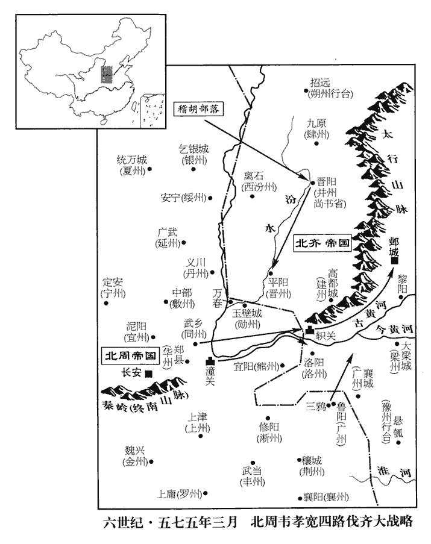
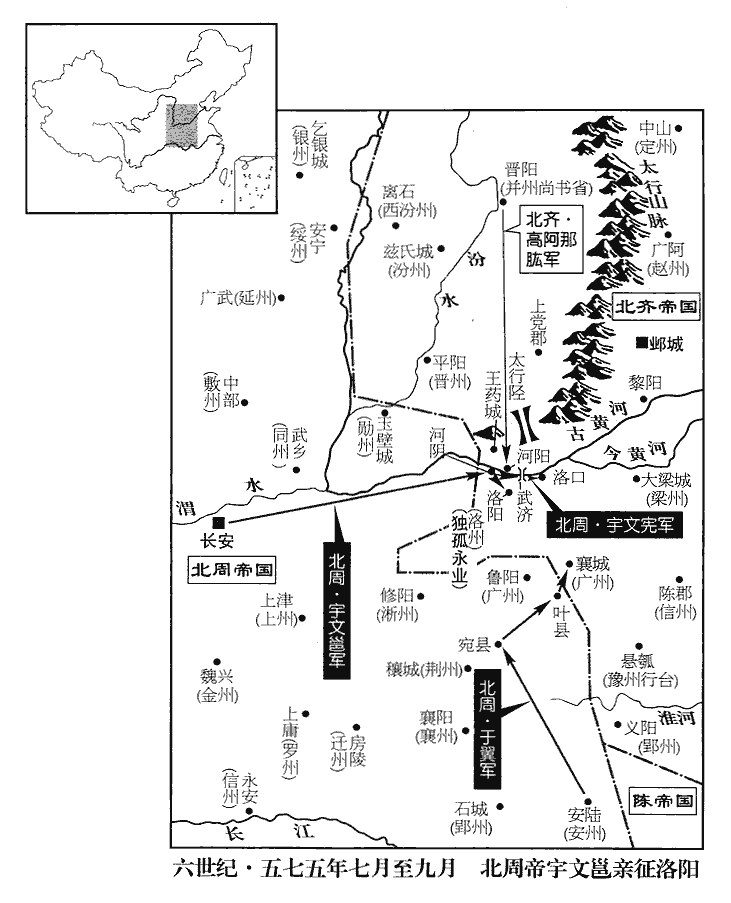
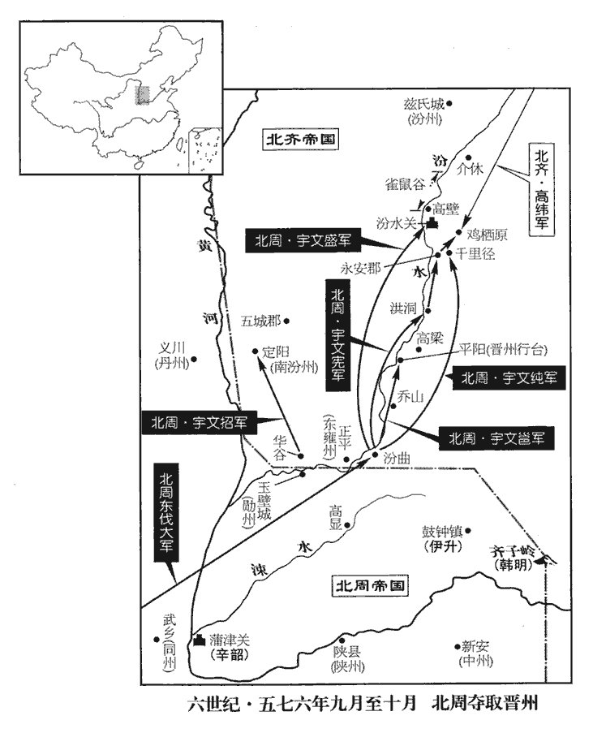
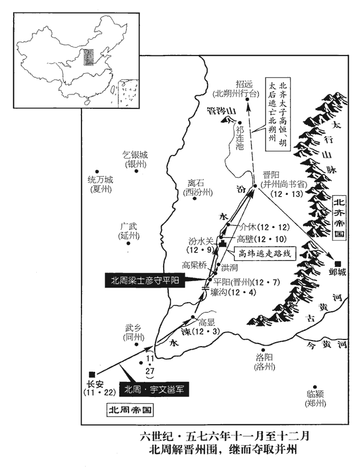
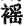

 陳紀六起旃蒙協洽（乙未），盡柔兆涒灘（丙申），凡二年。

# 高宗宣皇帝中之上

## 太建七年（乙未、五七五）

1春，正月，辛未‹十六›，上‹陈顼，本年四十八岁›祀南郊。

〖译文〗 [1]春季，正月，辛未（十六日），陈宣帝到南郊祭天。

2癸酉‹十八›，周‹首都长安陕西省西安市›主‹宇文邕，本年三十三岁›如同州‹府设武乡陕西省大荔县›。

〖译文〗 [2]癸酉（十八日），北周国主去同州。

3乙亥‹二十›，左衛將軍樊毅克潼州‹府设夏丘安徽省泗县›。五代志：下邳郡夏丘縣，梁、後齊置潼州，治取慮城。潼，音童。

〖译文〗 [3]乙亥（二十日），陈朝左卫将军樊毅攻克潼州。

4齊‹首都邺城河北省临漳县西南邺镇›主‹高纬，本年十九岁›還鄴。去年二月，齊主如晉陽討思好，尋已還鄴。八月，復如晉陽，今還。

〖译文〗 [4]北齐后主回邺城。

5辛巳‹二十六›，上‹陈顼›祀北郊。陳制亦以間歲正月上辛用特牛一祀天、地於南、北二郊。間歲者，一歲祀南郊，一歲祀北郊也。

〖译文〗 [5]辛巳（二十六日），陈宣帝到北郊祭地。

6二月，丙戌朔‹一›，日有食之。

〖译文〗 [6]二月，丙戌朔（初一），出现日食。

7戊申‹二十三›，樊毅克下邳‹北齐东徐州·江苏省睢宁县北古邳镇›、高柵‹江苏省宿迁市西›等六城。地形志，下邳郡有柵淵縣，武定八年分宿豫置。柵，楚格翻。

〖译文〗 [7]戊申（二十三日），陈朝樊毅攻克下邳、高栅等六座城池。

8齊主‹高纬›言語澀吶，不喜見朝士，自非寵私昵狎，未嘗交語。澀，色立翻，不滑順也。吶，女劣翻，聲不出也。趙文子其言吶吶不能出諸口。喜，許既翻。朝，直遙翻。昵，尼質翻。性懦，不堪人視，所謂弱顏也。懦，乃臥翻，又奴亂翻。雖三公、令、錄奏事，令，尚書令。錄，錄尚書事。莫得仰視，皆略陳大指，驚走而出。承世祖‹高湛›奢泰之餘，齊主之父，廟號世祖。以為帝王當然，後宮皆寶衣玉食，一裙之費，至直萬匹；競為新巧，朝衣夕弊。朝衣，於既翻。盛脩宮苑，窮極壯麗；所好不常，數毀又復。好，呼到翻；下同。數，所角翻。百工土木，無時休息，夜則然火照作，寒則以湯為泥，鑿晉陽‹山西省太原市›西山為大像，一夜然油萬盆，光照宮中。晉陽宮也。每有災異寇盜，不自貶損，唯多設齋，以為脩德。後之有天下者，可以鑒矣。好自彈琵琶，為無愁之曲，近侍和之者以百數，民間謂之「無愁天子」。五代志：帝倚絃而歌，別採新聲為無愁曲，音韻窈窕，極於哀思，使胡兒、閹宦輩齊唱和之。曲終樂闋，無不殞涕。雖行幸道路，或時馬上奏之。樂往哀來，竟以亡國。和，戶臥翻。於華林園鄴都有華林園。華，如字。立貧兒村，帝自衣藍縷之服，行乞其間以為樂。衣服穿弊如懸鶉者為藍縷。衣，於既翻；下人衣同。樂，盧各翻。又寫築西鄙諸城，使人衣黑衣攻之，帝自帥內參拒鬬。寫築者，寫諸城之形而築以象之。黑衣者，象周之戎衣。內參者，諸閹宦也。帥，讀曰率。

〖译文〗 [8]北齐后主说话迟钝口吃，不喜欢见朝廷的官员，如果不是宠爱亲近的人，从不和别人交谈。性格懦弱，不愿意别人看他，尽管是三公、尚书令、录尚书事等大官向他奏事，不能抬头看他，都是简要地说一些大概情形，便惊恐地离去。后主继承了武成帝奢侈过度的余风，以为这是帝王理所应当的享受，后宫的妃嫔都是锦衣玉食，一条裙子的费用，甚至值一万匹绢帛的价钱；宫人们在衣着的新奇精巧上相互竞赛，早上的新衣服到晚上就被当作旧衣服。大事修建宫室园林，壮丽到了极点；对所喜好的反复无常，屡次毁坏后又重新修复。从事土木建筑的各种工匠，没有一时的休息，夜里点起火把照明工作，天冷时用热水和泥。开凿晋阳的西山建成巨大的佛像，一夜间点燃万盆油灯，灯光可以照到宫中。国家有灾异和寇盗，从不谴责自己，只是多设斋饭向僧徒施舍，以为这才是修行积德。喜欢自己弹琵琶，谱成名叫《无愁》的乐曲，周围跟着唱和的侍从多到上百人，民间百姓称他为“无愁天子”。后主在华林园设立贫儿村，自己穿了破烂的衣服，在村中以行乞为乐趣。又画下西部边境一些城池的图样，依照图样仿造，派人穿了黑衣募仿北周的士兵进攻城池，后主自己率领宫里的太监假装在城里抵抗作战。

寵任陸令萱、穆提婆、高阿那肱、韓長鸞等，宰制朝政，宦官鄧長顒、陳德信、胡兒何洪珍等並參預機權，朝，直遙翻。顒，魚容翻。各引親黨，超居顯位。官由財進，獄以賄成，競為姦諂，蠹政害民。舊蒼頭劉桃枝等皆開府封王，其餘宦官、胡兒、歌舞人、見鬼人‹巫法师›、官奴婢等濫得富貴者，殆將萬數，庶姓封王者以百數，開府千餘人，儀同無數，領軍一時至二十人，侍中、中常侍數十人，乃至狗、馬及鷹亦有儀同、郡君之號，有鬬雞，號開府，皆食其幹祿。魏、齊官制，凡祿各以品秩為差。官一品每歲祿八百匹，二百匹為一秩。從一品七百匹，一百七十五匹為一秩。二品六百匹，一百五十匹為一秩。從二品五百匹，一百二十五匹為一秩。三品四百匹，一百匹為一秩。從三品三百匹，七十五匹為一秩。四品二百四十匹，六十匹為一秩。從四品二百匹，五十匹為一秩。五品一百六十匹，四十匹為一秩。從五品一百二十匹，三十匹為一秩。六品一百匹，二十五匹為一秩。從六品八十匹，二十匹為一秩。七品六十匹，十五匹為一秩。從七品四十匹，十匹為一秩。八品三十六匹，九匹為一秩。從八品三十二匹，八匹為一秩。九品二十八匹，七匹為一秩。從九品二十四匹，六匹為一秩。祿率一分以帛，一分以粟，一分以錢。幹出所部之人，一幹輸絹十八匹，幹身放之。諸嬖倖朝夕娛侍左右，嬖，卑義翻，又博計翻。一戲之費，動踰巨萬。既而府藏空竭，藏，徂浪翻。乃賜二三郡或六七縣，使之賣官取直。由是為守令者，率皆富商大賈，守，音狩。賈，音古。競為貪縱，【章：十二行本「縱」下有「賦繁役重」四字；乙十一行本同；孔本同；張校同。】民不聊生。史極言齊氏政亂，以啟敵國兼并之心，又一年而齊亡。有天下者，可不以為鑒乎！書名通鑑，豈苟然哉！

〖译文〗 后主宠信任用陆令萱、穆提婆、高阿那肱、韩长鸾等主宰朝政，宦官邓长、陈德信、胡人何洪珍等都参预机要的权柄，各自引荐亲戚朋党，高居显赫的官位。向他们奉纳钱财可以做官，进行贿赂可以制造冤狱，相互争着对后主欺诈谄媚，败坏朝政祸害百姓。从前是奴仆的刘桃枝等人都开府封王，其他的宦官、胡人、歌舞的艺人、巫师、官府的奴婢等轻易地得到富贵的，大概将近崐上万人，外姓被封王的有上百人，开府的有一千多人，封为仪同的不计其数，领军一时达到二十人，侍中、中常侍有几十人，甚至狗、马、猎鹰等禽兽也有仪同、郡君的封号，有的斗鸡被封为开府，享受相应等级的俸禄。一些受到宠幸的卑鄙小人早晚在后主周围侍候取乐，一次游戏的费用，动辄超过一万。既而国库空竭，便赐给这些人二三个郡或六七个县，让他们出售官爵收取钱财。因此担任守令的，大都是富商大贾，争相贪污放纵，民不聊生。

周高祖‹宇文邕›謀伐齊，命邊鎮益儲偫，加戍卒；偫zhì，直里翻。齊人聞之，亦增修守禦。柱國于翼諫曰：「疆埸相侵，互有勝負，徒損兵儲，無益大計。不如解嚴繼好，使彼懈而無備，然後乘間，出其不意，好，呼到翻。懈，古隘翻。間，古莧翻；下間隙、乘間同。一舉可取也。」周主從之。

〖译文〗 北周武帝计划征讨北齐，下令边镇增加储备，增添防守的士兵；北齐听到这一消息，也增加修整守御点。北周的柱国于翼向北周武帝劝说道：“相互侵犯国界，各有胜负，白白地损失军队和储备，对大计没有益处。不如解除紧急状态保持友好关系，使对方松懈而没有准备，然后寻找机会，出其不意，就能一举而取。”北周武帝听从了他的意见。

韋孝寬上疏陳三策：上，時掌翻。

〖译文〗 韦孝宽上疏武帝陈述三条计策：

其一曰：「臣在邊積年，頗見間隙，不因際會，難以成功。是以往歲出軍，徒有勞費，功績不立，由失機會。周主保定初再伐齊，攻并州，圍洛陽，趣懸瓠，出軹關，皆無功，事見一百六十九卷世祖天嘉四年、五年。爭宜陽、爭汾北事見一百七十卷太建元年至三年。何者？長淮之南，舊為沃土，陳氏以破亡餘燼，猶能一舉平之；曰「破亡餘燼」者，言陳氏承梁元帝江陵破亡之後，收合餘燼，再立國於江南。燼，徐刃翻；火餘燭餘曰燼。齊人歷年赴救，喪敗而返。事見上卷五年、六年。喪，息浪翻。內離外叛，計盡力窮，讎敵有舋，不可失也。左傳：鬬伯比曰：「讎有釁，不可失也。」舋，與釁同。宇文、高氏，世為讎敵。今大軍若出軹關‹河南省济源市西北大行山隘口›，方軌而進，五代志：軹關，在河內郡王屋縣。周師若自軹關出險趨鄴，前無阻隘，可以方軌橫行。兼與陳氏共為掎角，欲約陳共攻之。左傳：譬如捕鹿，晉人角之，諸戎掎之。角者，當其前。掎者，掎其後。掎jǐ，居綺翻。并令廣州‹府设鲁阳河南省鲁山县›義旅出自三鵶‹河南省鲁山县西南›，魏永安中，置廣州於魯陽。魏分東、西廣州，西屬三鵶谷，在魯陽界。又募山‹秦岭›南驍銳，沿河而下，周都長安，以褒、漢、荊、襄為山南。驍，堅堯翻；下同。復遣北山‹长安以北群山›稽胡，絕其并‹府设晋阳山西省太原市›、晉‹北齐晋州·州政府设平阳山西省临汾市›之路。稽胡，南匈奴之餘種，散在河東、西河郡界，阻山而居，在長安北。復，扶又翻。并，卑經翻。凡此諸軍，仍令各募關、河之外勁勇之士，厚其爵賞，使為前驅，關、河之外，指齊境而言，欲募其土人以為鄉導。岳動川移，雷駭電激，百道俱進，並趨虜庭。趨，七喻翻。必當望旗奔潰，所向摧殄，一戎大定，寔在此機。」武王伐紂，一戎衣而天下大定。

〖译文〗 第一是：“臣在边地多年，曾见到不少可乘之机，但不及时利用，难以成功。所以往年军队出征，只有劳累耗费，没有树立功绩，都是由于失掉机会。为什么？淮河以南，以前是肥沃的地方，陈氏收拾起梁朝破亡后的残余力量，还能一举将它讨平；齐人每年去那里援救，都遭到失败而归。现在齐国内有离心外有叛乱，计尽力穷，仇敌之间有了破绽，这种机会不能失掉。现在大军如果发兵轵关，两车并行地前进，兼而与陈氏共同夹击敌人，并下令广州的义军从三鸦出兵，另外征募山南的勇猛锐利之士，沿黄河而下，再派遣北山的稽胡，截断对方并州、晋州的通道。以上这些军队，仍旧命令各自征募关、河以外的强壮勇敢之士，给予优厚的爵位和赏赐，派他们作为先驱。山动河移，像雷电般地惊动激烈，从许多道路并头前进，直趋敌人的内庭。敌人一定望旗奔逃溃败，我军所向之处，敌军都会挫败消灭，一次征伐就能使天下大定，确实在于这次机会。”

 

其二曰：「若國家更為後圖，未即大舉，宜與陳人分其兵勢。三鵶以北，萬春‹山西省河津县东北›以南，萬春，地名。新唐志：武德五年，析龍門置萬春縣。蓋以舊地名名縣也。三鵶以北，萬春以南，韋孝寬袤指周東、北之境，舉兩端而言。廣事屯田，預為貯積，貯，直呂翻。募其驍悍，立為部伍。悍，侯旰翻，又下罕翻。彼既東南有敵，戎馬相持，謂齊人與陳人為敵也。我出奇兵，破其疆埸。埸，音亦。彼若興師赴援，我則堅壁清野，待其去遠，還復出師。復，扶又翻。常以邊外之軍，引其腹心之眾。我無宿舂之費，莊子：適百里者宿舂糧。彼有奔命之勞，左傳：申公巫臣遺楚令尹子重、司馬子反書曰：「吾必使汝疲於奔命以死。」於是導吳伐楚，子重、子反一歲七奔命。一二年中，必自離叛。且齊氏昏暴，政出多門，鬻獄賣官，唯利是視，荒淫酒色，忌害忠良，闔境嗷然，不勝其弊。闔，戶臘翻。勝，音升。以此而觀，覆亡可待。然後乘間電掃，事等摧枯。」間，古莧翻。

〖译文〗 第二是：“如果国家进一步为以后谋划，一时还没有大举进攻，最好和陈朝一同分散齐国的兵势。三鸦以北，万春以南一带地方，广为屯田，预先储备军粮，招募勇猛强悍的人组成部队。齐国的东南有陈朝和它为敌，双方的军队对峙，我方派出奇兵，就能突破齐国的国界。对方如果派军队来增援，我们可以坚壁清野，等他们远去以后，重又出兵。我们经常以边界一带的军队，调动对方心腹之间的军事主力。我方不须准备隔夜的粮草，对方却有疲于奔命的劳累，一二年中，对方内部必定出现离心而叛变。况且齐氏昏庸暴虐，政出多门，鬻狱卖官，唯利是图，荒淫酒色，忌害忠良，全国哀号，不胜其弊。由此看来，灭亡指日可待。然后寻找空隙发起迅雷不及掩耳的攻击，等于摧枯拉朽，腐朽的敌人很容易被打垮。”

其三曰：「昔句踐亡吳，尚期十載；左傳：伍員曰：「越十年生聚，十年教訓，二十年之外，吳其為沼乎！」此言十載，以教訓言之也。句，音鉤。踐，慈演翻。載，作亥翻。武王‹姬发›取紂‹子受辛›，猶煩再舉。史記：武王三年喪畢，觀兵孟津，諸侯不期而會者八百，皆曰「紂可伐。」武王曰：「汝未知天命。」乃還師。三年，紂淫暴日甚。武王告諸侯曰：「殷有重罪，不可不伐。」遂復伐紂，滅之。今若更存遵養，詩周頌：於鑠王師，遵養時晦。毛傳云：遵，率；養，取；晦，昧也。鄭箋云：文王率殷之叛國以事紂，養是晦昧之君以老其惡。自是說者悉祖其義，故云然。且復相時，左傳：相時而動，無累後人。復，扶又翻。相，息亮翻。臣謂宜還崇鄰好，申其盟約，安民和眾，通商惠工，蓄銳養威，觀釁而動。斯乃長策遠馭，坐自兼并也。」好，呼到翻。通商惠工，左傳語。自古以來，謀臣智士，陳三策者，其上策率非常人所能行，中策亦必度其才足以行之，然後能聽而用之，通鑑蓋謂于翼、韋孝寬所見略同也。

〖译文〗 第三是：“古代的勾践要灭亡吴国，尚且为期十年，周武王征讨商纣，还曾再次出兵。现在如果能在乱世暂时退隐，等待时机，臣认为应当重新表示尊重友邻，重申盟约，安抚百姓和睦大众，互通贸易优惠工匠，养精蓄锐增加声威，等待机会而行动，这好比是用长长的马鞭远远地驾驭拉车的马匹，可以坐待兼并对方。”

書奏，周主‹宇文邕›引開府儀同三司伊婁謙入內殿，伊婁，虜複姓。拓跋之興於代北也，獻帝以其次弟為伊婁氏。從容謂曰：「朕欲用兵，何者為先？」對曰：「齊氏沈溺倡優，耽昏麴糵。從，七容翻。沈，持林翻。倡，音昌。糵niè，魚列翻。其折衝之將斛律明月，已斃於讒口。事見上卷四年。將，即亮翻。上下離心，道路以目。道路以自，本周語，言道路以目相視而不敢言。此易取也。」易，以豉翻。帝大笑。喜其所見與己同。三月，丙辰‹二›，使謙與小司寇元衛聘於齊以觀釁。為周滅齊張本。考異曰：謙傳作「拓跋偉」，今從周書帝紀。余按：伊婁與拓跋同所自出而各為氏，則伊婁謙本傳作「拓跋」不為無據。

〖译文〗 韦孝宽的奏书呈上以后，北周君主把开府仪同三司伊娄谦召进内殿，从容地问他：“朕要用兵，以谁为最先的对象？”伊娄谦答道：“齐国的执政者沉缅在欣赏歌舞杂耍之中，酷嗜饮酒。他们冲锋陷阵的勇将斛律明月，已经死在谗言之中。上下离心离德，百性慑于暴政，在路上相见时不敢交谈，只能以目示意。这是最容易攻取的。”武帝大笑。三月，丙辰（初二），派伊娄谦和小司寇元卫访问北齐，借此观察有什么可以利用的机会。

9丙寅‹十二›，周主‹宇文邕›還長安。自同州還。還，從宣翻，又音如字。

〖译文〗 [9]丙寅（十二月），北周国主回长安。

10夏，四月，甲午‹十›，上‹陈顼›享太廟。

〖译文〗 [10]夏季，四月，甲午（初十），陈宣帝到太庙祭祀。

11監豫州‹府设寿阳安徽省寿县›陳桃根得青牛，獻之，監，工銜翻。詔遣還民。又表上織成羅文錦被各二百首，上，時掌翻。詔於雲龍門‹建康宫城东门›外焚之。

〖译文〗 [11]陈朝的监豫州陈桃根得到青牛，献给皇帝，宣帝下诏还给百姓。陈桃根又上表献上丝织的罗纹锦被两种各二百件，宣帝下诏在云龙门外将锦被全部焚毁。

12庚子‹十六›，齊以中書監陽休之為尚書右僕射。

〖译文〗 [12]庚子（十六日），北齐任命中书监阳休之为尚书右仆射。

13六月，壬辰‹九›，以尚書右僕射王瑒為左僕射。瑒，雉杏翻，又音暢。

〖译文〗 [13]六月，壬辰（初九），陈朝任命尚书右仆射王为左仆射。

14甲戌‹二十二›，齊主‹高纬›如晉陽。

〖译文〗 [14]甲戌（疑误），北齐后主去晋阳。

15秋，七月，丙戌‹四›，周主‹宇文邕›如雲陽宮‹陕西省泾阳县西北›。

〖译文〗 [15]秋季，七月，丙戌（疑误），北周国主去云阳宫。

 

大將軍楊堅姿相奇偉。堅為人龍顏，額有五柱入頂，目光外射，有文在手曰「王」。長上短下，沈深嚴重。相，息亮翻；下同。畿伯下大夫長安‹首都长安西半城›來和畿伯，周置，屬大司徒。杜佑曰：周地官之屬，每方畿伯，中大夫也；每縣小畿伯，則下大夫。嘗謂堅曰：「公眼如曙星，無所不照，當王有天下，曙星，向曉之星，其光閃爍。曙，常恕翻。王，于況翻。願忍誅殺。」蓋以其姿相殺氣重也。後堅之篡，內夷宇文，外翦尉遲迥、檀讓、王謙，死者不可勝數。人固有相乎？

〖译文〗 大将军杨坚姿容相貌奇特壮美。畿伯下大夫长安来和曾经对杨坚说：“您的眼睛象晨星，无所不照，当为天下之王，希望您能克制诛杀。”

周主‹宇文邕›待堅素厚，齊王憲言於帝曰：「普六茹堅，相貌非常，堅父忠，從周太祖屢有戰功，賜姓普六茹氏。臣每見之，不覺自失；恐非人下，請早除之！」帝亦疑之，以問來和。和詭對曰：「隨公‹杨坚›止是守節人，可鎮一方；若為將領，陳無不破。」言不以實曰詭。將，即亮翻。

〖译文〗 北周国主武帝一向厚待杨坚，齐王宇文宪对武帝说：“普六茹坚（杨坚），相貌异常，臣每次看到他，不觉茫无所措；恐怕他不会甘居人下，请及早把他除掉！”武帝也怀疑杨坚，向来和询问，来和却欺骗说：“随公杨坚是个信守名分、注意节操的人，可以镇守一方；如果当将领，将会无坚不摧。”

丁卯‹十五›，周主還長安。

〖译文〗 丁卯（十五日），北周国主回长安。

先是，周主獨與齊王憲及內史王誼謀伐齊，先，悉薦翻。又遣納言盧韞yùn周保定四年，改宗伯為納言。乘馹rì三詣安州‹府设安陆湖北省安陆市›總管于翼問策，馹，人質翻，驛傳也。周置安州於安陸。餘人皆莫之知。丙子‹二十四›，始召大將軍以上於大德殿告之。

〖译文〗 起先北周国主独自和齐王宇文宪、内史王谊策划征伐北齐，又派纳言卢韫乘驿车三次到安州总管于翼那里询问计策，别人都不知道这事。丙子（二十四日），武帝才在大德殿召集大将军以上所有官员并告诉他们。

丁丑‹二十五›，下詔伐齊，以柱國陳王純、滎陽公司馬消難、鄭公達奚震為前三軍總管，難，乃旦翻。越王盛、周【嚴：「周」改「同」。】昌公侯莫陳崇、【嚴：「崇」改「瓊」。】侯莫陳崇已死於保定三年，此又一侯莫陳崇也。不則「崇」字誤。趙王招為後三軍總管。齊王憲帥眾二萬趨黎陽‹河南省浚县›，帥，讀曰率；下同。趨，七喻翻。隨公楊堅、廣寧公薛迥將舟師三萬自渭入河，將，即亮翻。梁公侯莫陳芮帥眾二萬守太行道‹河南省博爱县西北›，太行道在河陽北，守之，欲以斷并、冀、殷、定之兵。行，戶剛翻。申公李穆帥眾三萬守河陽道‹河南省孟州市›，自河陰北渡河為河陽。周主將攻河陽、洛陽，守之以斷其相往來。常山公于翼帥眾二萬出陳‹河南省淮阳县›、汝‹府设襄城河南省襄城县›。蓋令于翼自安州出陳、汝。自齊王憲以下，皆指授諸將所出之道。誼，盟之兄孫；震，武之子也。王盟、達奚武皆周初功臣。

〖译文〗 丁丑（二十五日），北周武帝下诏征讨北齐，任命柱国陈王宇文纯、荥阳公司马消难、郑公达奚震为前三军总管，越王宇文盛、周昌公侯莫陈崇、赵王宇文招为后三军总管。齐王宇文宪率领二万人进军黎阳。随公杨坚、广宁公薛迥率领水军三万人从渭水进入黄河，梁公侯莫陈芮率领二万人在太行道防守，申公李穆率领三万人在河阳道防守，常山公于翼率领二万人进军陈州、汝州。王谊是王盟哥哥的孙子；达奚震是达奚武的儿子。

周主‹宇文邕›將出河陽，內史上士宇文㢸曰：㢸bì，音弼。「齊氏建國，於今累世；雖曰無道，藩鎮之任，尚有其人。今之出師，要須擇地。河陽衝要，精兵所聚，盡力攻圍，恐難得志。如臣所見，出於汾曲‹汾水弯曲地带·山西省侯马市›，戍小山平，汾曲，汾水之曲也。攻之易拔。用武之地，莫過於此。」易，以豉翻。民部中大夫天水‹甘肃省天水市›趙煚jiǒng曰：民部，蓋屬大司徒。煚，俱永翻。「河南、洛陽‹河南省洛阳市东白马寺东›，四面受敵，縱得之，不可以守。請從河北直指太原‹晋阳·山西省太原市›，此即出蒲、晉抵晉陽路。其後周主再舉，卒出於此。傾其巢穴，可一舉而定。」遂伯下大夫鮑宏曰：遂伯，蓋髣髴周官遂師之職。杜佑曰：周地官之屬有左、右遂伯，中大夫也。小遂伯則下大夫，每鄉一人。「我強齊弱，我治齊亂，何憂不克！治，直吏翻。但先帝往日屢出洛陽，先帝，謂宇文泰。彼既有備，每有不捷。如臣計者，進兵汾‹山西省西南部›、潞‹山西省东南部›，汾、潞，謂汾川、潞川。鮑宏欲出師以攻平陽、上黨也。直掩晉陽，出其不虞，不虞，謂不備也。虞，慮也，度也，測也，三者所及則為備。似為上策。」周主皆不從。周主蓋欲淺攻以觀釁，觀其再舉所以告群臣者可知。宏，泉之弟也。鮑泉事梁元帝，江陵破，宏入關。

〖译文〗 北周国主将进军河阳，内史上士宇文说：“齐氏建国至今，已经有好几代；虽说君主无道，但是胜任藩镇职守的，还大有人在。现在出兵，必须选择进攻的地点。河阳地处要冲，是精兵集中的地方，全力加以围攻，恐怕难以达到目的。以臣的看法，汾曲一带地方，北齐防守的军队既少，地势平坦，攻打那里容易攻克。用兵的地点，以这里为最好。”民部中大夫天水人赵说：“河南、洛阳，四面容易遭到敌方的攻击，即使得到这些地方，很难防守。请从河北直指太原，捣毁齐国的巢穴，可以一举而定。”遂伯下大夫鲍宏说：“我国强盛各国衰弱，我国安定各国混乱，何必担心攻不克呢！但是先帝在世时屡次进军洛阳，因为对方早有防备，所以常常不能取胜。按臣的计策，向汾川、潞川进兵，直扑晋阳，出其不备，似乎是上策。”北周国主不听他们的意见。鲍宏是鲍泉的弟弟。

壬午‹三十›，周主帥眾六萬，直指河陰‹河南省孟津县北›。楊素請帥其父麾下先驅，周主許之。楊素父敷死事見一百七十卷太建三年。帥，讀曰率。

〖译文〗 壬午（三十日），北周国主率领六万人，直指河阴。杨敷的儿子杨素请求率领父亲部下充当先头部队，得到国主的准许。

16八月，癸卯‹二十一›，周遣使來聘。

〖译文〗 [16]八月，癸卯（二十一月），北周派使者到陈朝聘问。

17周師入齊境，禁伐樹踐稼，犯者皆斬。丁未‹二十五›，周主攻河陰大城‹河南省孟津县北›，拔之。齊王憲拔武濟‹河南省孟津县›；武濟，城名。周武王伐紂，由此濟河，故以名城。進圍洛口‹洛水注入黄河处·河南省巩县东北›，洛水入河之口，於此置城。拔東、西二城，縱火焚浮橋，橋絕。齊永橋‹河南省武陟县›大都督太安‹内蒙古固阳县›傅伏，自永橋夜入中潬tān城。周人既克南城，圍中潬，二旬不下。河陽有三城，南城、北城、中潬是也。永橋地近三城。按懷縣有永橋鎮。懷縣，隋、唐為懷州武德縣。宋白曰：隋大業十一年，移脩武縣於永橋，即今武陟縣。潬，徒旱翻。水中沙曰潬。地形志：朔州有太安郡。洛州‹府洛阳›刺史獨孤永業守金墉‹洛阳城西北角›，周主自攻之，不克。永業通夜辦馬槽二千，周人聞之，以為大軍且至而憚之。

〖译文〗 [17]北周军队进入北齐境内，下令禁止砍伐树木践踏庄稼，违反者一律斩首。丁未（二十五日），北周国主进攻河阴大城，攻克。齐王宇文宪攻克武济；进围洛口，攻克东、西二城，放火烧毁浮桥，桥断。北齐的永桥大都督太安傅伏，趁夜晚从永桥进入中城。北周攻克南城以后，包围中城，二十天也没能攻克。北齐的洛州刺史独孤永业镇守金墉，北周国主亲自进攻，也没有攻克。独孤永业连夜赶制二千只马槽，北周人听说，以为北齐的大军将要来到，感到畏惧。

九月，齊右丞【章：十二行本「丞」下有「相」字；乙十一行本同；孔本同；張校同。】高阿那肱自晉陽將兵拒周師。考異曰：北齊書云「閏月，己丑。」案是月癸丑朔，無己丑，又下有庚辰。蓋誤也。至河陽，會周主有疾，辛酉‹九›夜，引兵還。還，音旋，又如字。水軍焚其舟艦。河水迅急，泝流西歸，追兵且至，故焚其舟艦，由陸道退還。艦，戶黯翻。傅伏謂行臺乞伏貴和曰：「周師疲弊，願得精騎二千追擊之，可破也。」貴和不許。

〖译文〗 九月，北齐右丞高阿那肱从晋阳率军抵御北周的军队。他们到达河阳，正巧北周国主生病，辛酉（初九），晚上，率军回国。北周水军焚烧了自己的船只。傅伏对行台乞伏贵和说：“北周军队疲惫不堪，我愿意率领二千精骑追击他们，可以打败他们。”乞伏贵和不准许。

齊王憲、于翼、李穆，所向克捷，降拔三十餘城，降者，迎降；拔者，以兵力攻拔。降，戶江翻；下同。皆棄而不守。唯以王藥城‹河南省济源市境›要害，令儀同三司韓正守之，正尋以城降齊。

〖译文〗 齐王宇文宪、于翼、李穆，矛头所向都打了胜仗，投降的和攻克的有三十多座城池，然而都弃城不夺。唯独王药城地处要害，命令仪同三司韩正在这里镇守，韩正不久就举城向北齐投降。

戊寅‹二十六›，周主還長安。

〖译文〗 戊寅（二十六日），北周国主回长安。

18庚辰‹二十八›，齊以趙彥深為司徒，斛阿列羅為司空。斛阿列，虜三字姓。

〖译文〗 [18]庚辰（二十八日），北齐任命赵彦深为司徒，斛阿列罗为司空。

19閏月，車騎大將軍吳明徹將兵擊齊彭城‹江苏省徐州市›；壬辰‹十一›，敗齊兵數萬於呂梁‹徐州市东南›。敗，補邁翻。

〖译文〗 [19]闰月，陈朝车骑大将军吴明彻率军攻打北齐彭城；壬辰（十一日），在吕梁打败几万齐兵。

20甲午‹十三›，周主‹宇文邕›如同州。

〖译文〗 [20]甲午（十三日），北周国主去同州。

21冬，十月，己巳‹十八›，立皇子叔齊為新蔡王，叔文為晉熙王。

〖译文〗 [21]冬季，十月，己巳（十八日），陈朝立皇子陈叔齐为新蔡王，陈叔文为晋熙王。

22十二月，辛亥朔‹一›，日有食之。

〖译文〗 [22]十二月，辛亥朔（初一），出现日食。

23壬戌‹十二›，以王瑒為尚書左僕射，瑒，雉杏翻，又音暢。太子詹事吳郡‹江苏省苏州市›陸繕為右僕射。

〖译文〗 [23]壬戌（十二日），陈朝任命王为尚书左仆射，太子詹事吴郡陆缮为右仆射。

25庚午‹二十›，周主還長安。

〖译文〗 [24]庚午（二十日），北周国主回长安。

## 八年（丙申、五七六）

1春，正月，癸未‹四›，周‹首都长安陕西省西安市›主‹宇文邕，本年三十四岁›如同州‹府设武乡陕西省大荔县›；辛卯‹十二›，如河東涑川‹涑水河，源出山西省绛县东南，在永济市注入黄河›；杜預曰：涑水出河東聞喜縣，西南至蒲坂入河。涑sù，音速。甲午‹十五›，復還同州。

〖译文〗 [1]春季，正月，癸未（初四），北周国主去同州；辛卯（十二日），去河东涑川；甲午（十五日），再回同州。

2甲寅，齊‹首都邺城河北省临漳县西南邺镇›大赦。

〖译文〗 [2]甲寅（疑误），北齐大赦全国。

3乙卯，齊主‹高纬，本年二十岁›還鄴。去年六月如晉陽‹山西省太原市›，今還。

〖译文〗 [3]乙卯（疑误），北齐国主回邺城。

4二月，辛酉‹十二›，周主命太子巡撫西土，因伐吐谷渾‹青海省›，吐，從暾入聲。谷，音浴。上開府儀同大將軍王軌、建德四年，改驃騎大將軍開府儀同三司為開府儀同大將軍，仍增上開府儀同大將軍。宮正宇文孝伯從行。軍中節度，皆委二人，太子仰成而已。仰，如字，又五亮翻。

〖译文〗 [4]二月，辛酉（十二日），北周国主命太子去西部巡抚，因而讨伐吐谷浑，上开府仪同大将军王轨、宫正宇文孝伯跟随太子同行。军队的调度，都委托这二人，太子只是坐享其成。

5齊括雜戶【章：十二行本「戶」下有「女」字；乙十一行本同；孔本同；張校同。】未嫁者悉集，魏虜西涼之人沒入，名為「隸戶」。魏武入關，隸戶皆在東魏。後齊因之，仍供廝役。周平齊，乃悉放諸雜戶為百姓。有隱匿者，家長坐死。長，知兩翻。

〖译文〗 [5]北齐搜求因犯罪没官当奴婢的“杂户”中女子尚未出嫁的，全部集中起来，凡是把这种人隐藏起来的，家长处死。

6壬申‹二十三›，‹陈，首都建康江苏省南京市›以開府儀同三司吳明徹為司空。

〖译文〗 [6]壬申（二十三日），陈朝任命开府仪同三司吴明彻为司空。

7三月，壬寅‹二十四›，周主‹宇文邕›還長安；夏，四月，乙卯‹七›，復如同州。

〖译文〗 [7]三月，壬寅（二十四日），北周国主回长安；夏季，四月，乙卯（初七），又去同州。

8己未‹十一›，上‹陈顼，本年四十九岁›享太廟。

〖译文〗 [8]己未（十一日），陈宣帝到太庙祭祀。

9尚書左僕射王瑒卒‹年五十四岁›。考異曰：陳書：「庚寅，瑒卒。」按長曆，是月己酉朔，無庚寅，陳書誤。

〖译文〗 [9]陈朝的尚书左仆射王死。

10五月，壬辰‹十五›，周主‹宇文邕›還長安。

〖译文〗 [10]五月，壬辰（十五日），北周国主回长安。

11六月，戊申朔‹一›，日有食之。

〖译文〗 [11]六月，戊申朔（初一），出现日食。

12辛亥‹四›，周主‹宇文邕›享太廟。

〖译文〗 [12]辛亥（初四），北周国主到太庙祭祀。

13初，太子叔寶欲以左戶部尚書江總為詹事，按五代志：梁置吏部、祠部、度支、左戶、都官、五兵等六尚書；陳因梁制。此蓋左戶也，「部」字衍。令管記陸瑜言於吏部尚書孔奐。奐謂瑜曰：「江有潘、陸之華晉惠帝為太子，潘岳、陸機皆為東宫官。而無園、綺之實，園公、綺里季羽翼漢太子盈，高帝遂不易太子。輔弼儲宮，竊有所難。太子深以為恨，自言於帝。帝將許之，奐奏曰：「江總文華之士。今皇太子文華不少，少，詩沼翻。豈藉於總！如臣所見，願選敦重之才，以居輔導之職。」帝曰：「即如卿言，誰當居此？」奐曰：「都官尚書王廓，世有懿德，識性敦敏，可以居之。」太子時在側，乃曰：「廓，王泰之子，不宜為太子詹事。」謂回避父諱，不宜居是官也。奐曰：「宋朝范曄，朝，直遙翻。即范泰之子，亦為太子詹事，前代不疑。」太子固爭之，帝卒以總為詹事。卒，子恤翻。總，斅之曾孫也。江斅xiào，湛之子，齊朝以風流冠冕一時。斅，音效。

〖译文〗 [13]当初，陈朝太子陈叔宝要任命左户尚书江总为太子詹事，派管记陆瑜告诉了吏部尚书孔奂。孔奂对陆瑜说：“江总有潘岳、陆机那样的文采，却没有园公、绮里季那样的真实才能，如果派江总辅佐太子，我有所为难。”太子对此很痛恨，便自己向皇帝提出要求。宣帝将要答允他，孔奂上奏说：“江总，是有才华的人。现在皇太子才华不少，难道还要依靠江总！按臣的看法，希望挑选敦厚稳重的人才，担任辅导皇太子的职务。”宣帝说：“按你所说，谁能担任这个职务？”孔奂说：“都官尚书王廓，世代都有美德，才识和性格忠厚聪明，可以担任。”皇太子当时正在旁边，便说：“王廓是王泰的儿子，不宜做太子詹事。”孔奂说：“宋朝的范晔，是范泰的儿子，也是太子詹事，前代也没有因为避讳而产生怀疑。”太子坚持力争，宣帝最终还是任命江总为太子詹事。江总是江的曾孙。

甲寅‹七›，以尚書右僕射陸繕為左僕射。帝‹陈顼›欲以孔奐代繕，詔已出，太子‹陈叔宝›沮之而止；更以晉陵‹江苏省常州市›太守王克為右僕射。更，工衡翻。守，音狩。

〖译文〗 甲寅（初七），陈朝任命尚书右仆射陆缮为左仆射。宣帝要孔奂代替陆缮尚书右仆射的职务，诏令已经发出，被太子从中阻止而作罢；改派晋陵太守王克为尚书右仆射。

頃之，總與太子為長夜之飲，養良娣陳氏為女；太子亟微行，遊總家。亟，去吏翻。上‹陈顼›怒，免總官。

〖译文〗 不久，江总和太子彻夜饮酒，收养女官陈氏为女儿；太子屡次便装外出，到江总家里游玩。宣帝大怒，免掉江总的官职。

14周利州‹府设晋寿四川省广元市›刺史紀王康，五代志：義城郡，古晉壽也，後魏立益州，世號小益州；梁曰黎州，西魏復曰益州，又改曰利州。驕矜無度，繕脩戎器，陰有異謀。司錄裴融諫止之，康殺融。丙辰‹九›，賜康死。

〖译文〗 [14]北周利州刺史纪王宇文康，骄傲没有节制，整修兵器，暗中有造反的阴谋。司录裴融对他规劝阻止，宇文康将裴融杀死。丙辰（初九），北周武帝将宇文康赐死。

15丁巳‹十›，周主‹宇文邕›如雲陽‹陕西省泾阳县西北›。

〖译文〗 [15]丁巳（初十），北周国主去云阳。

16庚申‹十三›，齊宜陽王趙彥深卒‹年七十岁›。彥深歷事累朝，常參機近，趙彥深事齊神武，已掌機密，至後主，歷事六君。朝，直遙翻。以溫謹著稱。既卒，朝貴典機密者，唯侍中、開府儀同三司斛律孝卿一人而已，其餘皆嬖倖也。卒，子恤翻。朝，直遙翻。嬖，卑義翻，又博計翻。孝卿，羌舉之子，斛律羌舉見一百五十七卷梁武帝大同三年。比於餘人，差不貪穢。

〖译文〗 [16]庚申（十三日），北齐宜阳王赵彦深死。赵彦深历经几个君主，经常参预机密，以温顺谨慎著称。他死之后，朝贵中主管机密的，只有侍中、开府仪同三司斛律孝卿一人而已，其余的都是受后主宠爱的幸臣。斛律孝卿是斛律羌举的儿子，和别人比较，不那么贪婪秽乱。

17秋，八月，乙卯‹九›，周主‹宇文邕›還長安。

〖译文〗 [17]秋季，八月，乙卯（初九），北周国主回长安。

周太子‹宇文赟›伐吐谷渾，至伏俟城‹青海省都兰县›而還。伏俟城，吐谷渾國都也，其地即漢西海允谷鹽池，在清海西，吐，從暾入聲。谷，音浴。還，音旋，又如字，下軍還同。

〖译文〗 [18]北周太子征讨吐谷浑，到达伏俟城以后就返回了。

宮尹鄭譯、王端等周置太子宮尹，蓋即詹事之職。皆有寵於太子‹宇文赟›。太子在軍中多失德，譯等皆預焉。軍還，王軌等言之於周主‹宇文邕›。周主怒，杖太子及譯等，仍除譯等名，宮臣親幸者咸被譴。還，從宣翻，又音如字。被，皮義翻；下同。太子復召譯，戲狎如初。譯因曰：「殿下何時可得據天下？」太子悅，益昵之。復，扶又翻，又音如字。昵，尼質翻。譯，儼之兄孫也。亂魏朝，使靈太后不得良死者，鄭儼也。

〖译文〗 太子宫尹郑译、王端等人，都得到太子的宠爱。太子在军中有许多缺德恶劣的事，郑译等都是参预者。军队还朝，王轨等告诉了北周国主。国主勃然大怒，棒打了太子和郑译等人，将郑译等除名，宫臣和亲幸者都受到谴责。太子重新把郑译召来，一同游玩亲近如初。郑译因此说：“殿下什么时候可以得到天下？”太子听了很高兴，对他更加亲近。郑译是郑俨哥哥的孙子。

周主遇太子甚嚴，每朝見，朝，直遙翻。見，賢遍翻。進止與群臣無異，雖隆寒盛暑，不得休息；以其耆酒，耆，讀曰嗜。禁酒不得至東宮；有過，輒加捶撻tà。捶，止橤翻。嘗謂之曰：「古來太子被廢者幾人？餘兒豈不堪立邪！」邪，音耶。乃敕東宮官屬錄太子言語動作，每月奏聞。太子畏帝威嚴，矯情脩飾，由是過惡不上聞。上，時掌翻。

〖译文〗 北周国主武帝对太子很严格，太子每次朝见，行动进退和群臣一样，尽管是严冬盛夏，不能得到休息；因为太子嗜酒，禁止送酒到东宫；太子有过错，动辄用拳头或棍棒责打，曾经对太子说：“自古以来太子被废掉的有多少人？除了你以外我其他的儿子难道不能立为太子吗！”便命令东宫的官员记录太子的言语动作，每月向武帝报告。太子害怕武帝的威严，对自己的真情加以掩饰，因此太子的过失和恶行没有让武帝知道。

王軌嘗與小內史賀若弼言：「太子必不克負荷。」賀若，虜複姓。北史云：北人謂忠貞為賀若，魏孝文帝以其先祖有忠貞之節，遂以賀若為氏。若，人者翻。荷，下可翻，又如字。弼深以為然，勸軌陳之。軌後因侍坐，坐，徂臥翻。言於帝曰：「皇太子仁孝無聞，恐不了陛下家事。愚臣短暗，不足可信。陛下恆以賀若弼有文武奇才，恆，戶登翻。亦常以此為憂。」帝以問弼，對曰：「皇太子養德春宮，太子居東宮，東方主春，故亦曰春宮。未聞有過。」既退，軌讓弼曰：「平生言論，無所不道，今者對揚，對揚，本於傅說、召虎。對，答也；揚，稱也；後人遂以面對敷奏為對揚。何得乃爾反覆？」爾，如此也。弼曰：「此公之過也。太子，國之儲副，豈易發言！事有蹉跌，易，以豉翻。蹉，七何翻。跌，徒結翻。便至滅族。本謂公密陳臧否，否，音鄙。何得遂至昌言！」昌，顯也。昌言，顯言也。軌默然久之，乃曰：「吾專心國家，遂不存私計。向者對眾，良實非宜。」

〖译文〗 王轨曾经和小内史贺若弼说：“太子一定不能胜任负荷。”贺若弼很以为然，劝王轨向北周武帝奏明情况。王轨后来因为在武帝身边侍奉，因此对武帝说：“人们并没有听说皇太子仁孝，恐怕他不能解决陛下的家事。愚臣我见识短浅不明，说的话不足为信。陛下一向认为贺若弼有文武奇才，他也常常因这件事而担忧。”武帝便问贺若弼，贺若弼回答道：“皇太子在东宫修养自身的品德，没有听到有什么过失。”他退出以后，王轨责备贺若弼说：“你平生言论，无所不说，为什么今天面对皇上，却如此反复无常？”贺若弼说：“这就是您的过错了。太子，是国家未来的君主，怎么能随便发言！如果事情有差错，便会遭到灭族的下场。本以为您只是向皇上密陈对太子的意见，怎能公开明说！”王轨沉默了很久，便说：“我一心为了国家，所以没有考虑自己个人的利害得失。以前当着大家说这件事，确实不妥当。”

後軌因內宴內宴，宴於宮中也。上壽，上，時掌翻。捋帝須曰：捋，郎括翻。須，與鬚同。「可愛好老公，但恨後嗣弱耳。」先是，帝問右宮伯宇文孝伯曰：「吾兒比來何如？」先，悉薦翻。比，毗至翻。對曰：「太子比懼天威，更無過失。」罷酒，帝責孝伯曰：「公常語我云：『太子無過。』今軌有此言，公為誑矣。」語，牛倨翻。誑，居況翻。孝伯再拜曰：「父【章：十二行本「父」上有「臣聞」二字；乙十一行本同；孔本同；張校同。】子之際，人所難言。臣知陛下不能割慈忍愛，遂爾結舌。」孝伯此言，亦不可謂之不忠切也。帝知其意，默然久之，乃曰：「朕已委公矣，公其勉之！」

〖译文〗 后来王轨因为参加宫中的饮宴，对武帝祝寿，用手捋着武帝的胡须说：“可爱的好老头，只是遗憾继承人太弱了。”原先，武帝曾经问右宫伯宇文孝伯道：“我的儿子近来怎么样？”宇文孝伯答道：“太子近来害怕陛下的天威，更加没有犯过失。”于是武帝停止饮酒，责备宇文孝伯说：“您常常对我说：‘太子没有过失。’现在王轨对我这样说，可见您是在说谎话。”宇文孝伯向武帝两次拜说：“父子之间，别人很难说什么。臣知道陛下不能割慈忍爱，所以就不敢说话了。”武帝知道了他的意思，沉默了很久，便说：“朕已经委托给您了，希望您能尽力而为！”

王軌驟言於帝曰：「皇太子非社稷主。普六茹堅貌有反相。」不從容而言之為驟言。相，息亮翻。帝不悅，曰：「必天命有在，將若之何！」楊堅聞之，甚懼，深自晦匿。

〖译文〗 王轨突然对武帝说：“皇太子不配做一国之主。普六茹坚（杨坚）面貌有反相。”武帝听了很不高兴，说：“这是天命所决定的，那又怎么办！”杨坚听说后，十分害怕，自己竭力隐蔽自己，不出头露面。

帝‹宇文邕›深以軌等言為然，為太子得位殺軌等張本。但漢王贊次長，長，知兩翻。又不才，餘子皆幼，故得不廢。史言周武帝明於知子而不廢太子之由。

〖译文〗 武帝深深感到王轨等人的话很对，但是汉王宇文赞是第二个儿子，同样不成材，其他儿子年纪又小，所以皇太子没有被废掉。

19丁卯‹二十一›，以司空吳明徹為南兗州‹府设广陵江苏省扬州市›刺史。五代志：江都郡，梁置南兗州，後齊改為東廣州，陳復曰南兗。

〖译文〗 [19]丁卯（二十一日），陈朝任命司空吴明彻为南兖州刺史。

20齊主‹高纬›如晉陽。營邯鄲宮。此二事也。既如晉陽，又營宮於邯鄲，以趙故都也。其地在隋、唐臨洺縣。邯鄲，音寒丹。

〖译文〗 [20]北齐后主去晋阳。兴建邯郸宫。

21九月，戊戌‹二十三›，以皇子叔彪為淮南王。

〖译文〗 [21]九月，戊戌（二十三日），陈朝封皇子陈叔彪为淮南王。

22周主‹宇文邕›謂群臣曰：「朕去歲屬有疾疢chèn，屬，之欲翻。疢，丑刃翻；丁度曰：熱病也。遂不得克平逋寇。前入齊境，備見其情，彼之行師，殆同兒戲。況其朝廷昏亂，朝，直遙翻。政由群小，百姓嗷然，朝不謀夕。天與不取，恐貽後悔。前出河外，直為拊背，未扼其喉。謂去年河陰之役。漢婁敬曰：「今與人鬬，不扼其吭而拊其背，未能全勝。」晉州‹府设平阳山西省临汾市›本高歡所起之地，高歡起兵晉州，事始見一百五十四卷梁武帝中大通二年。鎮攝要重，攝，總持也。今往攻之，彼必來援；吾嚴軍以待，擊之必克。然後乘破竹之勢，鼓行而東，足以窮其巢穴，混同文軌。」記曰：今天下，書同文，車同軌。諸將多不願行。將，即亮翻。帝曰：「機不可失。有沮吾軍者，當以軍法裁之！」沮，在呂翻。

〖译文〗 [22]北周国主对群臣说：“朕去年因为生病，所以没有能平定逃亡在外的盗贼。以前进入齐的国境，见到对方的所有情况，他们指挥军队，简直同小孩子玩游戏那样。何况朝廷昏聩混乱，朝政被一帮小人操纵，老百姓都在哀号，朝不保夕。上天赐给我们而不去谋取，恐怕会留下后悔。去年进军河阴，只如同用手拍打对方的后背，没有扼住对方的喉咙。晋州原先是高欢起兵发迹的地方，也是镇守统辖要害重地，现在我们去进攻晋州，对方一定要派兵来救援；我们的军队严阵以待，发起攻击后一定可以攻克。然后借着破竹之势，大张旗鼓地向东进攻，足以捣平他们的巢穴，统一天下。”将领们都不愿意行动。武帝说：“机不可失。凡阻滞我军事行动的人，一定按军法制裁！”

冬，十月，己酉‹四›，周主‹宇文邕›自將伐齊，將，即亮翻。以越王盛、杞公亮、隨公楊堅為右三軍，譙王儉、大將軍竇泰、廣化公丘崇為左三軍，廣化郡公。五代志：河池縣，後魏曰廣化，置廣化郡。齊王憲、陳王純為前軍。亮，導之子也。

〖译文〗 冬季，十月，己酉（初四），北周国主亲自率军队征伐北齐，任命越王宇文盛、杞公宇文亮、随公杨坚为右三军，谯王宇文俭、大将军窦泰、广化公丘崇为左三军，齐王宇文宪、陈王宇文纯为前军。宇文亮是宇文导的儿子。

丙辰‹十一›，齊主‹高纬›獵於祁連池‹天池·山西省宁武县南管涔山上›；癸亥‹十八›，還晉陽。先是，晉州行臺左丞張延雋公直勤敏，儲偫有備，先，悉薦翻。偫zhì，直里翻。百姓安業，疆埸無虞。諸嬖倖惡而代之，埸，音亦。嬖，卑義翻，又博計翻。惡，烏路翻。由是公私煩擾。

〖译文〗 丙辰（十一日），北齐后主在祁连池狩猎；癸亥（十八日），回晋阳。起先，晋州行台左丞张延隽公正廉明，勤劳聪敏，储备待用的物资很充足，老百姓安居乐业，边境一带不用担忧。一些受后主宠爱亲近的小人由于痛恨张延隽派人取而代之，从此公私之间的纠葛纷扰不已。

 

周主‹宇文邕›至晉州，軍于汾曲‹汾水弯曲处·山西省侯马市›，汾曲，汾水之曲，在平陽南。水經：汾水南過平陽縣東，又南過臨汾縣東，又屈從縣南西流，是汾曲也。遣齊王憲將兵【章：十二行本「兵」字作「精騎」二字；乙十一行本同；孔本同；張校同。】二萬守雀鼠谷‹山西省灵石县西南汾水河谷›，水經：汾水南過冠爵津，在介休縣西南，俗謂之雀鼠谷。數十里間，道隘，水左右悉結偏梁閣道，累石就路縈帶巖側，或去水一丈，或高六丈，上戴山阜，下臨絕澗，俗謂之魯般橋。蓋通古之津隘，又在今之地險也。將，即亮翻。陳王純步騎二萬守千里徑‹山西省霍州市东五千米›，千里徑亦當在平陽北，要路之一也。杜佑曰：汾州界北接太原，當千里徑。騎，奇寄翻；下同。鄭公達奚震步騎一萬守統軍川‹山西省石楼县西›，統軍川，地闕。大將軍韓明步騎五千守齊子嶺‹河南省济源市西›，齊子嶺在邵郡東。焉氏公尹升步騎五千守鼓鍾鎮‹山西省垣曲县东›，焉氏，讀曰燕支。燕，平聲。此焉氏縣公也。地形志：涼州番和郡有燕支縣，因燕支山以名縣，隋併入番和縣。水經註：教水出垣縣北教山，其水南歷鼓鍾上峽，又南流歷鼓鍾川；西南有冶官，世人謂之鼓鍾城。山海經曰：鼓鍾之山，帝臺之所以觴百神，即是山也。垣縣，後魏於此置邵郡。涼城公辛韶步騎五千守蒲津關‹山西省永济市西黄河渡口›，此涼城郡公也。後魏立涼城郡於漢沃陽縣鹽澤北七里，池西有舊城，俗謂之涼城，郡取名也。按後魏自六鎮反亂，此地皆棄之不能有，後周特取郡名以封爵耳。漢、魏以後，五等之封，皆無實土，其來久矣。蒲津關在蒲坂，因津濟處以立關。漢書：武帝元封六年，立蒲津關。趙王招步騎一萬自華谷‹山西省稷山县西北›攻齊汾州‹南汾州·州政府设定阳山西省吉县›諸城，水經：涑水出河東聞喜縣東山黍葭谷。俗謂之華谷。即齊將斛律光取周汾北以進築者也。柱國宇文盛步騎一萬守汾水關‹山西省灵石县西南›。汾水關當在霍邑縣，南臨汾縣北。自此以上，凡言守者，皆以斷齊援兵之路，獨守蒲津關者為後繼。括地志：汾州靈石縣有雀鼠谷、汾水關。

〖译文〗 北周国主抵达晋州，陈兵在汾曲，派齐王宇文宪领兵二万在雀鼠谷驻守，陈王宇文纯率步骑兵二万人在千里径驻守，郑公达奚震率步骑兵一万人在统军川驻守，大将军韩明率步骑兵五千人在齐子岭驻守，焉氏公尹升率步骑兵五千人在鼓钟镇驻守，凉城公辛韶率步骑兵五千人在蒲津关驻守，赵王宇文招率步骑兵一万从华谷攻打北齐汾州的一些城池，柱国宇文盛率步骑兵一万人在汾水关驻守。

遣內史王誼監諸軍攻平陽城。監，工銜翻。齊行臺僕射海昌王尉相貴嬰城拒守。尉，紆勿翻。【章：十二行本「守」下有「相貴，相願之兄也」七字；乙十一行本同；孔本同；張校同。】甲子‹十九›，齊集兵晉祠‹山西省太原市南›。地形志：晉陽有晉王祠。庚午‹二十五›，齊主‹高纬›自晉陽帥諸軍趣晉州。帥，讀曰率；下同。趣，七喻翻。周主‹宇文邕›日自汾曲至城下督戰，城中窘急。窘，巨隕翻。庚午‹二十五›，行臺左丞侯子欽出降於周。降，戶江翻。壬申‹二十七›，晉州刺史崔景嵩守北城，夜，遣使請降於周，王軌帥眾應之。未明，周將北海‹山东省昌乐县东南›段文振，杖槊與數十人先登，使，疏吏翻。帥，讀曰率。將，即亮翻。槊，色角翻。與景嵩同至尉相貴所，拔佩刀劫之。城上鼓譟，齊兵大潰，遂克晉州，虜相貴及甲士八千人。

〖译文〗 派内史王谊监督各路军队进攻平阳城。北齐的行台仆射海昌王尉相贵据城抵抗。甲子（十九日），北齐军队聚集在晋祠。庚午（二十五日），北齐后主从晋阳率领各路军队向晋州进发。北周国主当天从汾曲来到晋州城下督战，城中情况危急。庚午（二十五日），北齐的行台左丞侯子钦出城向北周投降。壬申（二十七日），晋州刺史崔景嵩防守北城，晚上，派使者出城向北周请求投降，王轨率领众军响应崔景嵩。天还没有亮，北周将领北海人段文振，手持长矛和几十人先行登上城头，和崔景嵩一同到尉相贵那里，拔出佩刀向他砍去。城上呼喊骚乱，齐兵大溃，于是攻克晋州，俘虏了尉相贵和他部下的甲士八千人。

齊主‹高纬›方與馮淑妃‹冯小怜›獵於天池‹山西省宁武县南管涔山上›，考異曰：馮淑妃傳云：「獵於三堆。」今從高阿那肱傳。余按宋白續通典，嵐州靜樂縣，本三堆也；天池亦在縣界。晉州告急者，自旦至午，驛馬三至。右丞相高阿那肱曰：「大家正為樂，樂，音洛。邊鄙小小交兵，乃是常事，何急奏聞！」至暮，使更至，使，疏吏翻。云「平陽已陷，」乃奏之。齊主將還，淑妃請更殺一圍，齊主從之。按齊主獵於祁連池，癸亥，還晉陽。甲子，即集兵，庚午，自晉陽帥兵趣晉州。壬申，晉州陷時，齊主方獵於天池，馮淑妃請更殺一圍。審如是，則晉州陷之日，齊主猶在天池。天池，今在憲州靜樂縣，至晉陽一百七十餘里，自晉陽南至晉州又五百有餘里。齊主既以庚午違晉陽而南，無緣復北至天池。竊謂獵祁連池與獵天池，共是一事，北人謂天為祁連，故天池亦謂之祁連池。通鑑稡zuì集諸書成一家言，自癸亥排日書至庚午發晉陽，是據北齊紀；書高阿那肱不急奏邊報，是據阿那肱傳；書請更殺一圍，是據馮淑妃傳；合三者而書之，不能不相牴牾。又，馮淑妃傳以為獵於三堆，三堆在肆州永安郡平寇縣界，亦在晉陽北。

〖译文〗 北齐后主正和冯淑妃在天池狩猎，晋州告急的人，从早晨到中午，骑驿马来了三次。右丞相高阿那肱说：“皇上正在取乐，边境有小小的军事行动，这是很平常的事，何必急着来奏报！”到傍晚，告急的使者再次到来，说“平阳已经陷落，”这才向君主奏报。北齐国主准备回去，冯淑妃却要求君主再围猎崐一次，北齐国主听从了她的要求。

周齊王憲攻拔洪洞‹山西省洪洞县›、永安‹山西省霍州市›二城，二城皆在晉州北。洪洞城在楊縣，取城北洪洞嶺名之。永安，古彘縣地，隋改曰霍邑。更圖進取。齊人焚橋守險，軍不得進，乃屯永安。使永昌公椿屯雞栖原‹山西省霍州市东北›，永昌郡公。五代志：巴東郡大昌縣，後周置永昌郡。雞栖原在永安北。伐柏為菴以立營。菴ān，烏含翻。漢皇甫規親入菴廬巡視三軍。椿，廣之弟也。

〖译文〗 北周的齐王宇文宪攻下洪洞、永安二座城池，准备进一步攻取其他地方。北齐焚烧了桥梁据险防守，北周的军队无法前进，便驻屯在永安。派永昌公宇文椿在鸡栖原驻屯，砍伐柏树建造小屋作为军营。宇文椿是宇文广的弟弟。

癸酉‹二十八›，齊主‹高纬›分軍萬人向千里徑，壬申，晉州陷，癸酉，齊軍已向千里徑，則知晉州陷不與獵天池同日，明矣。又分軍出汾水關，自帥大軍上雞栖原。上，時掌翻。宇文盛遣人告急，齊王憲自救之。齊師退，盛追擊，破之。俄而椿告齊師稍逼，憲復還救之。復，扶又翻。與齊對陳，至夜不戰。陳，讀曰陣。會周主‹宇文邕›召憲還，還，從宣翻，又如字。憲引兵夜去。齊人見柏菴在，不之覺，明日，始知之。齊主使高阿那肱將前軍先進，仍節度諸軍。將，即亮翻。

〖译文〗 癸酉（二十八日），北齐后主分出一万军队向千里径进发，又分出军队向汾水关，自己统率大军上鸡栖原。宇文盛派人告急，齐王宇文宪自己率领军队去救援。北齐军队退走，宇文盛在后面追击，将北齐军队打败。不多久宇文椿报告北齐军队逐渐逼近，宇文宪又返回救援。他的军队列阵和北齐军队对峙，到夜晚时还不跟对方作战。恰巧北周国主召宇文宪回去，他便领着军队在晚上撤退。北齐方面看到柏树的小房子还在，所以没有发觉，到第二天，才知道宇文宪的军队撤走了。北齐后主派高阿那肱率领前军先行进发，仍旧节制调度其他军队的行动。

甲戌‹二十九›，周以上開府儀同大將軍安定‹甘肃省泾川县›梁士彥為晉州刺史，留精兵一萬鎮之。

〖译文〗 甲戌（二十九日），北周任命上开府仪同大将军安定人梁士彦为晋州刺史，留下一万精兵在这里镇守。

十一月，己卯‹四›，齊主至平陽。周主以齊兵新集，聲勢甚盛，且欲西還以避其鋒。開府儀同大將軍宇文忻諫曰：「以陛下之聖武，乘敵人之荒縱，何患不克！若使齊得令主，君臣協力，雖湯、武之勢，未易平也。易，以豉翻。今主暗臣愚，士無鬬志，雖有百萬之眾，實為陛下奉耳。」軍正京兆‹长安›王紘【章：十二行本「紘」作「韶」；乙十一行本同；孔本同。】曰：時因行軍，倣漢制置軍正之官，不常置也。「齊失紀綱，於茲累世。世祖嗣位，齊政不綱，今再世矣。天奬周室，一戰而扼其喉。取亂侮亡，正在今日。取亂侮亡，商仲虺之誥。釋之而去，臣所未諭。」周主雖善其言，竟引軍還。忻，貴之子也。宇文貴本朔方人，徙京兆，仕周為大司馬，非周之族也。

〖译文〗 十一月，己卯（初四），北齐后主到平阳。北周国主认为北齐军队刚刚集结，声势很盛，打算向西面回去避开对方的锋芒。开府仪同大将军宇文忻劝说道：“以陛下的圣明威武，乘敌人的荒淫放纵，何必担心不能攻克他们！如果齐国出现一个好的君主，君臣同心协力，那么就是有商汤、周武王的声势，也不易讨平对方。现在齐国的君主昏庸、臣僚愚蠢，军队没有斗志，虽有百万之众，实际上是送给陛下的。”军正京兆王说：“齐国的纲纪败坏，到目前已经有两代了。上天庇护嘉奖我们周王室，经过一战而扼住对方的咽喉。古人说的攻取动乱欺凌败亡之国，正在今天。放过他们而自己退走，臣实在不能理解。”北周国主虽然认为他的话有理，但还是带领军队返回了。宇文忻是宇文贵的儿子。

周主‹宇文邕›留齊王憲為後拒，齊師追之，憲與宇文忻各將百騎與戰，斬其驍將賀蘭豹子等，將，即亮翻；下同。騎，奇寄翻。驍，堅堯翻。齊師乃退。憲引軍渡汾，追及周主於玉壁‹山西省稷山县›。

〖译文〗 北周国主留下齐王宇文宪作为后面的阻击部队，北齐军队追来，宇文宪和宇文忻各领一百名骑兵和他们战斗，杀死北齐的勇将贺兰豹子等人，北齐军队便退走。宇文宪带领军队度过汾水，在玉壁追上了北周国主。

齊師遂圍平陽‹山西省临汾市›，晝夜攻之。城中危急，樓堞皆盡，樓，城上敵樓。堞，城短垣。堞，徒協翻。所存之城，尋仞而已。六尺為尋，七尺為仞。或短兵相接，槍槊為短兵。或交馬出入，外援不至，眾皆震懼。梁士彥忼慨自若，忼，苦朗翻。謂將士曰：「死在今日，吾為爾先。」於是勇烈齊奮，呼聲動地，呼，火故翻。無不一當百。齊師少卻，少，詩沼翻。乃令妻妾、軍民、婦女，晝夜脩城，三日而就。周主使齊王憲將兵六萬屯涑川，遙為平陽聲援。齊人作地道攻平陽，城陷十餘步，將士乘勢欲入。齊主敕且止，召馮淑妃‹冯小怜›觀之。淑妃粧點，不時至，周人以木拒塞之，塞，悉則翻。城遂不下。舊俗相傳，晉州城西石上有聖人跡，淑妃欲往觀之。齊主恐弩矢及橋，乃抽攻城木造遠橋。舊橋近城，別造遠橋。齊主與淑妃度橋，橋壞，至夜乃還。

〖译文〗 北齐军队便围困了平阳，昼夜发起进攻。城里形势危急，城上的敌楼和矮墙都被夷平，残存的城墙，只有六七尺高。双方或是短兵相接，或是马匹可以随意从城墙上进出，城外的援兵不来，人们都感到震惊害怕。梁士彦慷慨从容，对将士们说：“如果今天战死，我一定先你们而死。”于是大家激昂奋起，喊声动地，无不以一当百。北齐军队稍稍后退，梁士彦下令妻妾、军民、妇女崐，昼夜修城，三天修好。北周国主派齐王宇文宪率兵六万驻屯在涑川，远远地为平阳声援。北齐挖掘地道进攻平阳，城下陷了好几丈，将士们乘势准备进入城内。北齐后主下令暂时停止，把冯淑妃召来一同观看。冯淑妃穿衣打扮，没有及时到来，北周人用木头堵住了下陷的地方，平阳城便没有被攻克。旧俗相传，晋州城西的石头上有圣人的遗迹，冯淑妃想去那里观看。北齐后主恐怕对方的箭会射到桥上，便抽调用来攻城的大木头在离城较远的地方造了一座桥。北齐后主和冯淑妃过桥时，桥梁损坏，到晚上才返。

 

癸巳‹十八›，周主‹宇文邕›還長安。甲午‹十九›，復下詔，以齊人圍晉州，更帥諸軍擊之。丙申‹二十一›，縱齊降人使還。帥，讀曰率。縱之使還，使齊師知周師將復至而懼，亦以堅晉州守者之心。降，戶江翻。丁酉‹二十二›，周主發長安；還長安僅三日，復出師，明引歸者，欲使齊師疲於攻平陽而後取之。壬寅‹二十七›，濟河，與諸軍合。十二月，丁未‹三›，周主至高顯‹应在山西省闻喜县南›，高顯蓋近涑川。遣齊王【章：十二行本「王」下有「憲」字；乙十一行本同；孔本同；張校同。】帥所部先向平陽。戊申‹四›，周主至平陽。庚戌‹六›，諸軍總集，凡八萬人，稍進，逼城置陳，東西二十餘里。

〖译文〗 癸巳（十八日），北周国主回长安。甲午（十九日），再次下诏，因为北齐围困晋州，又统率军队前往攻打。丙申（二十一日），释放北齐的投降者让他们回去。丁酉（二十二日），北周国主从长安出发；壬寅（二十七日），渡过黄河，和各路军队会合。十二月，丁未（初三），北周国主到高显，派齐王宇文宪率领部下的军队先向平阳进发。戊申（初四），北周国主到平阳。庚戌（初六），各路军队一齐集中，有八万人，逐渐向前推进，兵临城下摆开阵势，东西绵延有二十多里地。

先是齊人恐周師猝至，於城南穿塹，自喬山‹山西省襄汾县南›屬於汾水；齊主‹高纬›大出兵，陳於塹北，陳，讀曰陣。先，悉薦翻。塹，七豔翻。屬，之欲翻。喬山當在平陽城西。周主‹宇文邕›命齊王憲馳往觀之。憲復命曰：「易與耳，易，以豉翻。請破之而後食。」左傳：齊、晉戰于鞌。齊侯曰：「余姑翦滅此而後朝食。」周主悅，曰：「如汝言，吾無憂矣！」周主乘常御馬，從數人巡陳，所至輒呼主帥姓名慰勉之。帥，所類翻。將士喜於見知，咸思自奮。將戰，有司請換馬。周主曰：「朕獨乘良馬，欲何之！」周主欲薄齊師，礙塹而止，自旦至申，相持不決。

〖译文〗 起先北齐恐怕北周的军队突然来到，在城南凿通护城河，从乔山连接到汾水；北齐后主派出大批军队，在护城河的北面列阵，北周国主命令齐王宇文宪驰马去那里观察。宇文宪回来报告说：“这很好对付，请先攻破然后吃饭。”北周国主很高兴，说：“如果象你所说的那样，我就不担心了！”北周国主骑着平时所用的马匹，由几个人跟随到来到阵前巡视，所到之处就称呼主帅的姓名予以慰问鼓励。将士们对被国君了解信任感到很高兴，都想奋勇作战。临战前，随从官员请君主换马。北周国主说：“朕独自一人骑着骏马，要到哪里去！”北周国主要逼近北齐军队，由于有护城河的阻碍而停下来，从早上直到下午，双方相持不下。

齊主‹高纬›謂高阿那肱曰：「戰是邪？不戰是邪？」邪，音耶。阿那肱曰：「吾兵雖多，堪戰不過十萬，病傷及繞城樵爨者復三分居一。復，扶又翻。昔攻玉壁，援軍來即退。攻玉壁，事見一百五十九卷梁武帝中大同元年。今日將士，豈勝神武時邪！高歡諡神武皇帝。不如勿戰，卻守高梁橋。」‹山西省临汾市东北›地形志：晉州平陽縣有高梁城。水經註：汾水逕高梁故城西，故高梁之墟也，晉文公害懷公於此。汾水又南過平陽縣東。新唐志：晉州臨汾縣東北十里有高梁堰。安吐根曰：「一撮許賊，馬上刺取，擲著汾水中耳！」一撮，言其少也。撮，倉括翻。刺，七亦翻。著，直略翻。不知兵勢而輕敵大言，未有不敗者也。齊主意未決。諸內參曰：「彼亦天子，我亦天子。彼尚能遠來，我何為守塹示弱！」齊主曰：「此言是也。」於是填塹南引。周主大喜，勒諸軍擊之。

〖译文〗 北齐后主对高阿那肱说：“是打对？还是不打对？”高阿那肱说：“我们军队的人数虽多，但能作战的不过十万人，其中生病负伤和在城四周打柴做饭的又占三分之一。从前攻打玉壁时，援军一到就马上退走。今天的将士，怎能胜过神武皇帝时代的将士！倒不如不打，退守高梁桥。”安吐根说：“一小撮贼人，只不过是在马背上刺杀捉住他们，然后扔在汾水中而已！”北齐后主还是犹豫不决。一些太监们说：“他是天子，陛下也是天子。他尚且能从老远的地方来，我们为什么只是守着护城河表示出怯弱！”北齐国主说：“这话说得对。”于是填塞了护城河把水引向南面。北周国主听到后非常高兴，统率各路军队发起攻击。

兵纔合，齊主‹高纬›與馮淑妃‹冯小怜›並騎觀戰。東偏少卻，淑妃怖曰：「軍敗矣！」騎，奇寄翻。少，詩沼翻。怖，普故翻，惶懼也。錄尚書事城陽王穆提婆曰：「大家去！大家去！」齊主即以淑妃奔高梁橋。開府儀同三司奚長諫曰：「半進半退，戰之常體。今兵眾全整，未有虧傷，陛下捨此安之！馬足一動，人情駭亂，不可復振。願速還安慰之！」復，扶又翻，還，從宣翻，又音如字；下同。武衛張常山自後至，武衛，屬左、右武衛將軍。亦曰：「軍尋收訖，甚完整。圍城兵亦不動。至尊宜回。不信臣言，乞將內參往視。將，領也，與也，偕也，攜也，挾也。齊主將從之。穆提婆引齊主肘曰：「此言難信。」齊主遂以淑妃北走。齊師大潰，死者萬餘人，軍資器械，數百里間，委棄山積。齊人所棄，皆為稽胡所取，後周人由此討稽胡。安德王延宗獨全軍而還。延宗在亂能整，未易才也。惜大廈將顛，非一木所支耳。

〖译文〗 双方军队刚接触，北齐后主和冯淑妃一起骑着马去观战。东面的部分军队稍稍后退，冯淑妃害怕说：“我们的军队打败了！”录尚书事城阳王穆提婆说：“皇上快离开！皇上快离开！”北齐后主就和冯淑妃退奔高梁桥。开府仪同三司奚长向后主劝阻说：“军队半进半退，是作战时的常规。目前士兵们都完全整齐，没有受到挫折死亡，陛下离开这里又到哪里去！马脚一动，人的情绪就会惊恐混乱，不能重新振作。希望陛下迅速回去安慰他们！”武卫张常山从后面赶到，也说：“军队很快就收拢完毕，非常完整。围城的士兵也没有动摇。天子最好返回。如果不相信我的话，请求天子领太监去巡看。”北齐后主将按他所说的去做。穆提婆却拉着北齐后主的胳膊说：“他的话难以相信。”北齐后主便带冯淑妃向北退走。北齐军队大败溃散，死了一万多人，军用物资器械，在几百里间被遗弃的堆积如山。唯有安德王高延宗全军而回。

齊主‹高纬›至洪洞，淑妃方以粉鏡自玩，施粉添粧，臨鏡以自玩也。後聲亂，唱賊至，於是復走。復，扶又翻。先是，齊主以淑妃為有功勳，將立為左皇后，遣內參詣晉陽取皇后服御褘huī翟等。五代志：梁制：皇后謁廟，服袿guī䙱shǔ大衣，蓋嫁服也，皁上皁下；親蠶則青上縹下。齊制：皇后助祭、朝會以褘huī衣，祠郊禖méi以褕yú狄，小宴以闕狄，親蠶以鞠衣，禮見皇帝以展衣，宴居以綠衣。六服俱有蔽膝，織成緄gǔn帶。周制：皇后翟衣六：祀郊禖、朝享，則翬huī衣，素質，五色；祭陰社、朝命婦，則衣，青質，五色；祭群小祀、受獻璽，則鷩bì衣，赤色；采桑，則鴇衣，黃色；從皇帝見賓客、聽女教則鵫zhuó衣，白色；食命婦、歸寧，則𥏊衣，玄色。隋制：皇后褘衣，深青，織成為之，為翬翟之形，素質五色十二等。先，悉薦翻。褘，許韋翻。袿，涓畦翻。釋名：婦人上服曰袿，具下垂者。䙱，朱欲翻。縹，匹小翻。褕，音遙。展，與襢同，陟戰翻。沈，將輦翻。緄，古本翻。，與褕同音。鷩，必列翻，亦雉也。鴇，補抱翻。鵫，敕角翻，雉名。𥏊zhì，直質翻。至是，遇於中塗，齊主為按轡，為，于偽翻。命淑妃著之，然後去。史言齊師之敗，皆由馮小憐以婦人從軍，國之禍也。齊主既敗，而寵其所嬖以速亡。著，職略翻。

〖译文〗 北齐后主到了洪洞，冯淑妃正对着镜子涂脂抹粉自我欣赏，后面的声音嘈杂，高喊敌人已经到来，于是她再次逃走。原先北齐后主以为冯淑妃有功勋，准备立她为左皇后，派太监到晋阳去取皇后所穿的礼服等。这时，他们在途中相遇，北齐后主拉紧马缰绳慢步走，叫冯淑妃穿上礼服，然后离去。

辛亥‹七›，周主‹宇文邕›入平陽。梁士彥見周主，持周主須而泣曰：「臣幾不見陛下！」周主亦為之流涕。史敘後周君臣相與之情。須，與鬚同。幾，居依翻。為，于偽翻；上主為、下善為同。

〖译文〗 辛亥（初七），北周国主进入平阳。梁士彦见到周主，用手握着周主的胡须哭泣说：“臣几乎见不到陛下了！”北周国主也动情流泪。

周主以將士疲弊，欲引還。將，息亮翻。還，所宣翻，又音如字。士彥叩馬諫曰：「今齊師遁散，眾心皆動，因其懼而攻之，其勢必舉。」周主從之，執其手曰：「余得晉州，為平齊之基，若不固守，則大事不成。朕無前憂，唯慮後變，汝善為我守之！」用兵而能慮後患者，善師者也。遂帥諸將追齊師。帥，讀曰率。諸將固請西還，周主曰：「縱敵患生。卿等若疑，朕將獨往。」諸將乃不敢言。癸丑‹九›，至汾水關。

〖译文〗 北周国主由于将士疲乏困倦，准备率军回朝。梁士彦勒住周主的马规劝说：“现在齐国的军队败退逃散，人心浮动，乘他们恐惧时发起进攻，一定可以打败他们。”北周君主听从了他的意见，握住他的手说：“我得到晋州，这是平定齐国的基础，如果不坚决守住，就会大事不成。朕没有前忧，只忧虑后变，你好好为我守住这里！”于是率领将士们追赶北齐军队。将领们坚持请周主西归，北周国主说：“放走乱人，祸患就会发生。你们如果有怀疑，朕将独自前去。”将领们于是不敢再说。癸丑（初九），到了汾水关。

齊主‹高纬›入晉陽，憂懼不知所之。甲寅‹十›，齊大赦。齊主問計於朝臣，皆曰：「宜省賦息役，以慰民心；收遺兵，背城死戰，以安社稷。」朝，直遙翻。背，蒲妹翻。齊主欲留安德王延宗、廣寧王孝珩守晉陽，珩，音行。自向北朔州‹府设招远山西省朔州市›。魏孝昌中，改懷朔鎮為朔州，本漢五原郡地；尋即陷沒，而朔州寄治并州界。後齊置朔州於古馬邑城，於西河郡置南朔州，故謂馬邑為北朔州。新唐志曰：朔州本治善陽，建中中，馬遂徙治馬邑。大元以朔州置順義節度，領鄯陽、窟谷二縣，而以馬邑縣置固州。若晉陽不守，則奔突厥‹瀚海沙漠群›，厥，九勿翻。群臣皆以為不可，帝不從。

〖译文〗 北齐后主进入晋阳，担忧害怕得不知怎么办。甲寅（初十），北齐大赦全国。北齐后主向朝臣们询问计策，朝臣们都说：“应该减少赋税，停止劳役，以安慰民心；收拾残存的士兵，背城拼死作战，以稳定国家。”北齐后主要把安德王高延宗、广宁王高孝珩留下镇守晋阳，自己去北朔州，如果晋阳失守，就投奔突厥，群臣们都认为不能这样，后主不听。

開府儀同三司賀拔伏恩等，宿衛近臣三十餘人，西奔周軍。周主‹宇文邕›封賞各有差。

〖译文〗 开府仪同三司贺拔伏恩等宿卫近臣三十多人向西投奔北周军队，北周国主对他们分别封赏。

高阿那肱所部兵尚一萬，守高壁‹山西省灵石县南›，高壁，嶺名，在雀鼠谷南。括地志：汾州靈石縣有高壁嶺。杜佑曰：在縣東南。宋白曰：靈石縣東南有高壁嶺、雀鼠谷、汾水關，皆汾西險固之所。餘眾保洛女砦‹灵石县北›。砦zhài，與寨同，柴夬翻；下同。周主引軍向高壁，阿那肱望風退走。齊王憲攻洛女砦，拔之。有軍士告阿那肱招引西軍，齊主令侍中斛律孝卿檢校，孝卿以為妄。還，至晉陽，阿那肱腹心復告阿那肱謀反，復，扶又翻。又以為妄，斬之。

〖译文〗 北齐的高阿那肱部下还有一万军队，在高壁镇守，其余的军队保卫洛女寨。北周国主率领军队指向高壁，高阿那肱望风退走。齐王宇文宪攻打洛女寨，攻克。北齐有军士举告高阿那肱招引西面的北周军队，北齐后主命令侍中斛律孝卿去检查核实，斛律孝卿认为是胡说。他回到晋阳，高阿那肱的心腹又向他崐举告高阿那肱谋反，斛律孝卿又认为这是胡说，将举告人杀死。

乙卯‹十一›，齊主‹高纬›詔安德王延宗、廣寧王孝珩募兵。延宗入見，珩，音行。見，賢遍翻。齊主告以欲向北朔州，後魏太和中，置朔州於定襄故城。高齊天保，於馬邑西南置朔州，相去三百八十里。故定襄古城之朔州有北朔州之稱。延宗泣諫，不從，密遣左右先送皇太后、太子‹高恒›於北朔州。

〖译文〗 乙卯（十一日），北齐后主诏令安德王高延宗、广宁王高孝珩征兵。高延宗进见北齐后主，后主告诉他自己要去北朔州，高延宗哭着劝阻，后主不听，秘密地派左右先把皇太后、太子送到北朔州。

丙辰‹十二›，周主與齊王憲會於介休‹山西省介休市›。介休縣屬西河郡。齊開府儀同三司韓建業舉城降，以為上柱國，封郇公。降，戶江翻。郇，音荀。郇xún，古國名。‹山西临猗西南›

〖译文〗 丙辰（十二日），北周后主和齐王宇文宪在介休会合。北齐开府仪同三司韩建业举城投降，被北周任命为上柱国，封为郇公。

是夜，齊主欲遁去，諸將不從。將，即亮翻。丁巳‹十三›，周師至晉陽。齊主復大赦，復，扶又翻。改元隆化。以安德王延宗為相國、并州刺史，總山西‹太行山以西›兵，并，卑經翻。鄴都謂并州之地為山西。謂曰：「并州兄自取之，兒今去矣！」延宗曰：「陛下為社稷勿動。臣為陛下出死力戰，必能破之。」為，于偽翻。穆提婆曰：「至尊計已成，王不得輒沮！」沮，在呂翻。齊主乃夜斬五龍門而出，欲奔突厥，從官多散。厥，九勿翻。從，才用翻；下同。領軍梅勝郎叩馬諫，乃回向鄴。時唯高阿那肱等十餘騎從，騎，奇寄翻。廣寧王孝珩、襄城王彥道繼至，得數十人與俱。

〖译文〗 当天晚上，北齐国主准备逃走，将领们都不肯跟从。丁巳（十三日），北周军队到晋阳。北齐后主再次大赦全国，把年号改为隆化。任命安德王高延宗为相国、并州刺史，总辖山西的军队，对他说：“并州请兄长自己取走，我现在就要离开这里！”高延宗说：“陛下应该替国家着想不要走。臣愿意为陛下拼死作战，一定能把他们打败。”穆提婆说：“天子大计已定，安德王不能屡加阻挠！”北齐后主便在晚上破五龙门出走，要投降突厥，随从的官员纷纷散去。领军梅胜郎勒住后主的马加以规劝，这才返回邺城。当时只有高阿那肱等十几人骑马跟随，广宁王高孝珩、襄城王高彦道相继来到，只有几十人和后主在一起。

穆提婆西奔周軍。陸令萱自殺，家屬皆誅沒。周主以提婆為柱國、宜州‹府设泥阳陕西省耀县东南›刺史。五代志：京兆郡華原縣，後魏置北雍州，西魏改為宜州。下詔諭齊群臣曰：「若妙盡人謀，深達天命，官榮爵賞，各有加隆。或我之將卒，逃逸彼朝，將，即亮翻。朝，直遙翻。無問貴賤，皆從蕩滌。」自是齊臣降者相繼。降，戶江翻。

〖译文〗 穆提婆向西投奔北周军队，陆令萱自杀，她的家属都被诛杀。北周国主任命穆提婆为柱国、宜州刺史。下诏告示北齐的群臣说：“如果能竭力献计献策，深深通晓上天的意旨，就能授官赏爵，各有所加。如果我们的将领士兵，逃到齐朝，不论贵贱，一律加以扫荡歼灭。”因此北齐官吏都相继向北周投降。

初，齊高祖為魏丞相，齊尊高歡廟號曰高祖。相，息亮翻。以唐邕典外兵曹，太原白建典騎兵曹，騎，奇寄翻。皆以善書計、工簿帳受委任。及齊受禪，諸司咸歸尚書；唯二曹不廢，更名二省。更，工衡翻。邕官至錄尚書事，建官至中書令，常典二省，世稱「唐、白」。邕兼領度支，與高阿那肱有隙，阿那肱譖之，齊主‹高纬›敕侍中斛律孝卿總知騎兵度支。度，徒洛翻。孝卿事多專決，不復詢稟。復，扶又翻。邕自以宿習舊事，為孝卿所輕，意甚鬱鬱。鬱鬱者，受抑而氣不得舒也。及齊主還鄴，邕遂留晉陽。并州將帥請於安德王延宗曰：「王不為天子，諸人實不能為王出死力。」將，即亮翻。帥，所類翻。為，于偽翻。延宗不得已，戊午‹十四›，即皇帝位。下詔曰：「武平孱弱，曰武平者，稱齊主年號。孱，士顏翻，又士眼翻。政由宮【章：十二行本「宮」作「宦」乙十一行本同。】豎，斬關夜遁，莫知所之。王公卿士，猥見推逼，猥，遝tà也。今祗承寶位。」大赦，改元德昌。以晉昌王唐邕為宰相，齊昌王莫多婁敬顯、沭陽王【章：十二行本「王」下有「和阿千子」四字；乙十一行本同；孔本同；張校同，云無註本「千」作「千」。】右衛大將軍段暢、開府儀同三司韓骨胡等為將帥。敬顯，貸文之子也。此皆齊所封郡王也。五代志：西城郡石泉縣，舊置晉昌郡。蘄春郡蘄春縣，後齊置齊昌郡。東海郡沭陽縣，東魏置沭陽郡。莫多婁貸文戰死，事見一百五十八卷梁武帝大同四年。沭，音術。眾聞之，不召而至者，前後相屬。延宗發府藏及後宮美女以賜將士，屬，之欲翻。藏，徂浪翻。將，即亮翻。籍沒內參十餘家。齊主‹高纬›聞之，謂近臣曰：「我寧使周得并州，不欲安德得之。」左右曰：「理然。」延宗見士卒，皆親執手稱名，流涕嗚咽，眾爭為死；為，于偽翻。童兒女子，亦乘屋攘袂，投甎石以禦敵。乘，登也。

〖译文〗 当初，神武帝高欢是东魏丞相，任命唐邕主管外兵曹，太原人白建主管骑兵曹，两人都因善于文字筹算、精于管理账目册籍而被委任。等到北齐禅受东魏的帝位以后，其他部门都归入尚书省；只有上述二曹没有废除，而是改名外兵省、骑兵省。唐邕当官到录尚书事，白建当官到中书令，常常主管这二省，当时被人称为“唐、白”。唐邕兼管度支省，与高阿那肱有矛盾，高阿那肱便向齐主说唐邕的坏话，北齐后主敕令侍中斛律孝卿总知骑兵省、度支省。斛律孝卿处理事情往往独断专行，不再征求唐邕的意见。唐邕自以为熟悉这二省的情况，因为被斛律孝卿轻视，心里非常抑郁。到北齐国主回到邺城以后，唐邕便留在晋阳。并州的将帅请求安德王高延宗说：“您不当天子，大家实在不能为您安德王出死力。”高延宗不得已，戊午（十四日），即位当皇帝。下诏书崐说：“当今皇帝懦弱无能，朝政由宫里的小人把持，破关在晚上逃遁，不知去了哪里。辱承王公卿士推戴相强，现在只得继承皇帝的大位。”大赦全国，改年号为“德昌”。任命晋昌王唐邕为宰相，齐昌王莫多娄敬显、沭阳王右卫大将军段畅、开府仪同三司韩骨胡等人为将帅。莫多娄敬显是莫多娄贷文的儿子。大家听到消息，不召而来的人，前后连续不断。高延宗散发王府中的储藏和后宫里的美女赏赐给将士们，查抄没收了十几家太监。北齐后主听说后，对近臣说：“我宁愿让周朝得到并州，不愿让安德王得到它。”左右的近臣说：“理当如此。”高延宗看见士兵时，都亲自握住他们的手称呼他们的姓名，众人流泪悲泣出声，争着为他效死；儿童妇女，也都登上房顶捋起衣袖，投掷砖头石块抵抗敌人。

己未‹十五›，周主‹宇文邕›至晉陽。考異曰：周書武帝紀：「丁巳，大軍次并州。」又云：「己未，軍次并州。」蓋丁巳前軍至，己未帝乃至也。庚申‹十六›，齊主‹高纬›入鄴。周師圍晉陽，四合如黑雲。周戎衣及旗幟皆黑，且兵多，故如黑雲。安德王延宗命莫多婁敬顯、韓骨胡拒城南，和阿干子、段暢拒城東，自帥眾拒齊王憲於城北。帥，讀曰率。延宗素肥，前如偃，後如伏，人常笑之。至是，奮大矟往來督戰，矟，所角翻。勁捷若飛，所向無前。和阿干子、段暢以千騎奔周軍。騎，奇寄翻。周主攻東門，際昏，遂入之，進焚佛寺。延宗、敬顯自門入，夾擊之，周師大亂，爭門，相填壓，塞路不得進。齊人從後斫刺，死者二千餘人。塞，悉則翻。刺，七亦翻。周主左右略盡，自拔無路。承御上士張壽牽馬首，承御上士，蓋侍衛左右之官。賀拔伏恩以鞭拂其後，考異曰：北齊書安德王延宗傳作「佛恩」。今從周、齊帝紀。崎嶇得出。崎，丘奇翻。嶇，音區。齊人奮擊，幾中之。幾，居依翻，又巨希翻，近也。中，竹仲翻。城東道阨曲，阨，與阸同，烏懈翻。伏恩及降者皮子信導之，僅得免，降，戶江翻。時已四更。夜分五更。四更，丁夜也。更，工衡翻。延宗謂周主為亂兵所殺，使於積尸中求長鬣者，不得。鬣liè，良涉翻。鬚也。時齊人既捷，入坊飲酒，盡醉臥，延宗不復能整。復，扶又翻。

〖译文〗 己未（十五日），北周国主到晋阳。庚申（十六日），北齐后主进入邺城。北周军队包围了晋阳，他们的军衣和旗帜都是黑色，所以城的四面就像黑云一般。安德王高延宗命令莫多屡敬显、韩骨胡在城南抵抗，和阿干子、段畅在城东抵抗，自己率领众军在城北抵抗北周的齐王宇文宪。高延宗身体肥胖，前看象仰面朝天，后看像俯伏在地，人们常常取笑他的模样。这时，他挥舞长矛来回督战，强劲有力敏捷得象飞一般，指向哪里，谁也抵挡不住。和阿干子、段畅率领一千骑兵直奔北周的军队。北周国主进攻晋阳的东门，当时天色昏暗，便进到城里，放火焚烧城里的佛庙。高延宗、莫多屡敬显从城门进入，两面夹击，北周军队大乱，争着逃出城门，城门间人群填塞挤压，堵住了道路无法前进。北齐人从后刀砍矛刺，北周军队死了二千多人。北周国主左右的人几乎都已死散，自己走投无路。承御上士张寿牵着马头，贺拔伏恩用鞭子抽打马的后部，困难艰险地出了城。齐人奋勇追击，几乎打中了他。晋阳城东的道路狭隘弯曲，贺拔伏恩和投降北周的皮子信在前面带路，这才幸免于死，这时已经是深夜四更。高延宗以为北周国主已经被乱兵所杀，派人在堆积的尸体中寻找留有长胡须的人，没有找到。当时北齐人打了胜仗，到街坊间饮酒，都喝醉了睡在地上，高延宗无法整理队伍。

周主‹宇文邕›出城，飢甚，欲遁去，諸將亦多勸之還。將，即亮翻。還，從宣翻，又音如字。宇文忻勃然進曰：「陛下自克晉州，乘勝至此。今偽主奔波，關東響震，自古行兵，未有若斯之盛。昨日破城，將士輕敵，微有不利，何足為懷！丈夫當死中求生，敗中取勝。今破竹之勢已成，柰何棄之而去！」齊王憲、柱國王誼亦以為去必不免，段暢等又盛言城內空虛。周主乃駐馬，鳴角收兵，俄頃復振。散兵復聚，則摧沮之勢振迅而起。復，扶又翻，又音如字。辛酉‹十七›，旦，還攻東門，克之。還，復也。延宗戰力屈，走至城北，周人擒之。周主下馬執其手，延宗辭曰：「死人手，何敢迫至尊！」周主曰：「兩國天子，非有怨惡，直為百姓來耳。言為救民而來。為，于偽翻。終不相害，勿怖也。」怖，蒲故翻。使復衣帽而禮之。五代志：帽自天子下及士人通冠之，蓋常服也。然亦有白紗烏紗之異，又有繒皁雜紗為之者。唐邕等皆降於周。降，戶江翻。獨莫多婁敬顯奔鄴，齊主‹高纬›以為司徒。

〖译文〗 北周国主出城以后，非常饥饿，想逃走，将领们也多劝他回去。宇文忻发怒变色而进言：“陛下从攻克晋州以来，乘胜到了这里。现在各国的伪主劳碌奔逃，关东一带响声震天，自古以来用兵，没有像这次的盛大。昨天破城时，由于将士轻敌，所以遭受一点挫折，这又何必放在心上！大丈夫应当从死中求生，败中取胜。现在破竹之势已经形成，为什么要放弃它而离去！”齐王宇文宪、柱国王谊也认为不能放弃离开，段畅又极力说晋阳城里已经空虚。北周国主于是勒马停止后撤，吹响号角集合军队，不多久军势重新振作。辛酉（十七日），早晨，返回攻打东门，终于攻克。高延宗在作战中力量用尽，跑到城北，被北周军队捉住。北周国主下马握住他的手，高延宗辞谢说：“我是死人的手，怎敢靠近天子！”北周国主说：“两个国家的天子，并非有怨仇憎恨，都是为了救老百姓而来的，我终究不会加害于您，不必害怕。”请他重新穿戴起衣帽而待之以礼。唐邕等都投降了北周。只有莫多屡敬显逃奔到邺城，北齐后崐主任命他为司徒。

延宗初稱尊號，遣使修啟於瀛州‹府设赵都军城河北省河间市›刺史任城王湝，後魏置瀛州於河間。使，疏吏翻；下同。任，音壬。湝，戶皆翻，又音皆。曰：「至尊出奔，宗廟事重，群公勸迫，權主號令。事寧，終歸叔父。」湝曰：「我人臣，何容受此啟！」執使者送鄴。

〖译文〗 高延宗刚称皇帝时，派人写了书札给瀛州刺史任城王高，信里说：“天子出奔，国家的事情繁重，我因为王公们的劝说相强，暂时主持国家的号令。事情安定以后，皇位最终会还给叔父。”高说：“我只是一个臣子，怎能容许接受这样的书札！”把使者捉起来送到邺城。

壬戌‹十八›，周主‹宇文邕›大赦，削除齊制。收禮文武之士。

〖译文〗 壬戌（十八日），北周国主大赦全国，取消北齐的制度。招收并礼遇文武之士。

鄴伊婁謙聘於齊，周遣伊婁謙聘齊，事見去年二月，此上不應有「鄴」字，蓋「初」字之誤也。【章：十二行本正作「初」；乙十一行本同；孔本同；張校同。】其參軍高遵以情輸於齊，言周將伐齊，使謙來觀釁。齊人拘之於晉陽。周主既克晉陽，召謙，勞之。勞，力到翻；下親勞同。執遵付謙，任其報復。謙頓首，請赦之，周主曰：「卿可聚眾唾面，使其知愧。」謙曰：「以遵之罪，又非唾面可責。」唾，湯臥翻。帝善其言而止。謙待遵如初。

〖译文〗 当初北周的伊娄谦聘问北齐，他的参军高遵把北周将征伐北齐的情报通报北齐，北齐便把伊娄谦扣留在晋阳。北周国主武帝攻下晋阳以后，召见伊娄谦，对他加以慰问。捉了高遵交给伊娄谦，让他进行报复。伊娄谦对北周武帝叩头，请求赦免高遵，武帝说：“您可以召集大家向他脸上吐口水，使他知道羞愧。”伊娄谦说：“以高遵的罪行，不是向脸上吐口水所能责备的。”武帝认为他的话很对而没有责罚高遵。尹娄谦对待高遵一如既往。

臣光曰：賞有功，誅有罪，此人君之任也。高遵奉使異國，漏泄大謀，斯叛臣也；使，疏吏翻。周高祖不自行戮，乃以賜謙，使之復怨，失政刑矣！孔子謂以德報怨者何以報德。為謙者，宜辭而不受，歸諸有司，以正典刑。乃請而赦之以成其私名，美則美矣，亦非公義也。

〖译文〗 臣司马光曰：赏有功，诛有罪，这是君主的责任。高遵奉命出使异国，泄漏重大的机密，这就是叛臣；北周高祖不是自己下令加以处死，却把他送给伊娄谦，使他报复怨恨，有失刑赏的教化！孔子所说的以德报怨者用什么来报德，作为伊娄谦，应当推掉而不接受，把高遵送交官府，明正典刑。他却请求君主对高遵赦免以取得个人的好名声，美倒是美了，但并不符合公义。

23齊主‹高纬›命立重賞以募戰士，而竟不出物。廣寧王孝珩請「使任城王湝將幽州道‹府设蓟县北京市›兵入土門‹井陉关·河北省井陉县北›，按新唐志：井陘故關，一名土門關。珩，音行。任，音壬。湝，音皆，又古皆翻。將，即亮翻；下同。揚聲趣并州，趣，七喻翻；下同。獨孤永業將洛州道‹府设洛阳河南省洛阳市东白马寺东›兵入潼關‹陕西省潼关县›，揚聲趣長安，後魏自平城遷都洛陽，置司州；孝武西入關東。魏北都鄴，以鄴為司州，以洛陽為洛州。臣請將京畿兵出滏口‹河北省武安市西南›，鼓行逆戰。滏口，滏水之口。山海經：滏水出神茵之山。圖經：泉源瀵fèn涌若湯焉。滏，音釜。敵聞南北有兵，自然逃潰。」又請出宮人珍寶賞將士。齊主不悅。斛律孝卿請齊主親勞將士，為之撰辭，將，即亮翻。勞，力到翻。為，于偽翻。撰，士免翻。且曰：「宜忼慨流涕，以感激人心。」齊主既出，臨眾，將令之，不復記所受言，令，讀如軍令之令。復，扶又翻。遂大笑，左右亦笑。將士怒曰：「身尚如此，吾輩何急！」皆無戰心。於是自大丞相已下，太宰、三師、大司馬、大將軍、三公等官，後齊制官多循後魏，大丞相、太宰，位望最為崇重。太師、太傅、太保，是為三師，擬古上公，非勳德不居。次有大司馬、大將軍，是為二大，並典司武事。次置太尉、司徒、司空，是為三公。三師、二大、三公府三門，當中開黃閤，設內屏；其階皆正一品。並增員而授，或三或四，不可勝數。勝，音升。數，所矩翻，計也，舊所具翻。

〖译文〗 [23]北齐后主命令立重赏来征募战士，而竟然不拿出东西来。广宇王高孝珩请求：“派任城王高率领幽州道的士兵开进土门关，扬言进取并州，独孤永业率领洛州道的士兵开进潼关，扬言进取长安，臣请求率领京畿的士兵出滏口，击鼓前进迎战。敌人听到南北有兵，自然逃走溃散。”又请求取出宫女和珍宝赏给将士。北齐后主很不高兴。斛律孝卿请北齐国主亲自慰劳将士，替后主撰写文辞，并且说：“应该慷慨流泪，以感动激励人心。”北齐后主走出来，面对大家将要发布号令，却忘记了斛律孝卿告诉他的话，便大笑起来，左右的人也笑。将士们发怒说：“他们自身还这样，我们何必着急！”都没有打仗的心思。于是只好从大丞相以下，太宰、三师、大司马、大将军、三公等高官，都增加编制授给官职，或者三人或者四人，多到不可胜数。

朔州行臺僕射高勱，將兵侍衛太后、太子‹高恒›，自土門道還鄴。勱，音邁。時，宦官儀同三司苟子溢猶恃寵縱暴，民間雞彘，縱鷹犬搏噬取之；勱執以徇，將斬之；太后救之，得免。或謂勱曰：「子溢之徒，言成禍福，獨不慮後患邪？」勱攘袂曰：「今西寇已據并州，周在齊之西，故謂之西寇。達官率皆委叛，有位任而光顯於時者為達官。委，棄也。委叛者，言棄官而叛去。正坐此輩濁亂朝廷。朝，直遙翻。若得今日斬之，明日受誅，亦無所恨！」勱，岳之子也。高岳從高歡起兵有功。甲子‹二十›，齊太后至鄴。

〖译文〗 朔州行台仆射高劢带兵侍卫太后、太子，从土门关一路回到邺城。当时宦官仪同三司苟子溢等人还依仗君主的宠受放纵横暴，老百姓的鸡猪，被他们放出的猎鹰和猎狗搏击啮咬然后抢走；高劢捉住他们当众宣布，将要把他们处死崐；太后说情求救，得到赦免。有人对高劢说：“苟子溢之流，说话能使人遭祸得福，你难道不担心后患吗？”高劢捋起衣袖说：“现在西面的敌寇已经占领了并州，显贵的大臣们都弃职叛逃，正因为这帮家伙把朝廷搞得污浊混乱。如果我能在今天把他们杀掉，自己明天被处死，也没有遗憾！”高劢是高岳的儿子。甲子（二十日），北齐太后到邺城。

丙寅‹二十二›，周主‹宇文邕›出齊宮中珍寶服玩及宮女二千人，班賜將士，加立功者官爵各有差。將，即亮翻。周主問高延宗以取鄴之策，辭曰：「此非亡國之臣所及。」強問之，強，其兩翻。乃曰：「若任城王據鄴，臣不能知。任，音壬。若今主自守，陛下兵不血刃。」癸酉‹二十九›，周師趣鄴，趣，七喻翻。命齊王憲先驅，以上柱國陳王純為并州總管。

〖译文〗 丙寅（二十二日），北周国主取出北齐宫中的珍宝服用和玩赏的物品以及二千个宫女，颁赐给将士，对立功者按等级加官爵。北周国主向高延宗询问夺取邺城的计策，高延宗推辞说：“这不是亡国之臣所能回答的。”强迫他回答，高延宗才说：“如果是任城王据守邺城，那么臣无法知道。如果是当今齐主自己据守，那么陛下可以不经交锋就取得胜利。”癸酉（二十九日），北周军队进取邺城，命令齐王宇文宪为先驱，任命上柱国陈王宇文纯为并州总管。

齊主‹高纬›引諸貴臣入朱雀門，朱雀門，鄴宮城正南門也。賜酒食，問以禦周之策，人人異議，齊主不知所從。是時人情忷懼，莫有鬬心，朝士出降，晝夜相屬。忷，許勇翻。朝，直遙翻。屬，之欲翻。高勱曰：「今之叛者，多是貴人，至於卒伍，猶未離心。請追五品已上家屬，置之三臺‹高洋所修葺的金凤台、圣应台、崇光台›，勱，音邁。考之齊制，五品已上，謂自尚書郎、中書侍郎、諫議大夫、九寺少卿、給事黃門侍郎、通直散騎常侍、尚書左•右丞、三公府長史•諮議參軍、太子三卿、直閤將軍、東宮正都督已上也。三臺，魏武帝所建，齊文宣帝又增崇之，時改為寺。因脅之以戰，若不捷，則焚臺。此曹顧惜妻子，必當死戰。且王師頻北，賊徒輕我，今背城一決，背，蒲妹翻。理必破之。」齊主不能用。望氣者言，當有革易。齊主引尚書令高元海等議，依天統故事，禪位皇太子‹高恒›。天統禪位事見一百六十九卷世祖天嘉六年。

〖译文〗 北齐后主领着显贵大臣进朱雀门，赐给他们酒食，询问抵御北周的计策，各人的说法不一，北齐后主不知听谁的好。这时人们的心情恐惧，没有打仗的心思。朝中的士官出城投降，白天黑夜接连不断。高劢说：“现在的叛徒，很多是显贵，至于一般的士兵，还没有离心。请追回五品以上官员的家属，安置在三台，并强迫他们参加打仗，如果不能取胜，就焚烧他们家属所在的三台。这种人都顾惜自己的老婆孩子，一定会拼死作战。况且我们的军队频频败北，敌人一定轻视我们，现在背城决一死战，按理一定能打败他们。”北齐后主不采纳高劢的意见。懂星象变化的人说，朝廷将会有变革更易。北齐后主叫来尚书令高元海等人商议，决定按照武成帝禅位给他的做法，把帝位传给皇太子。

