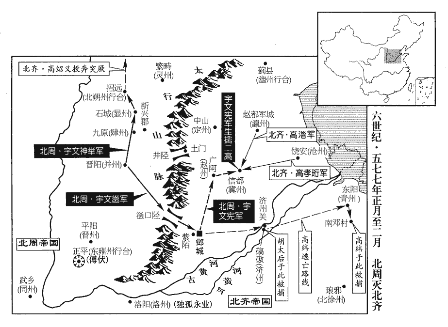
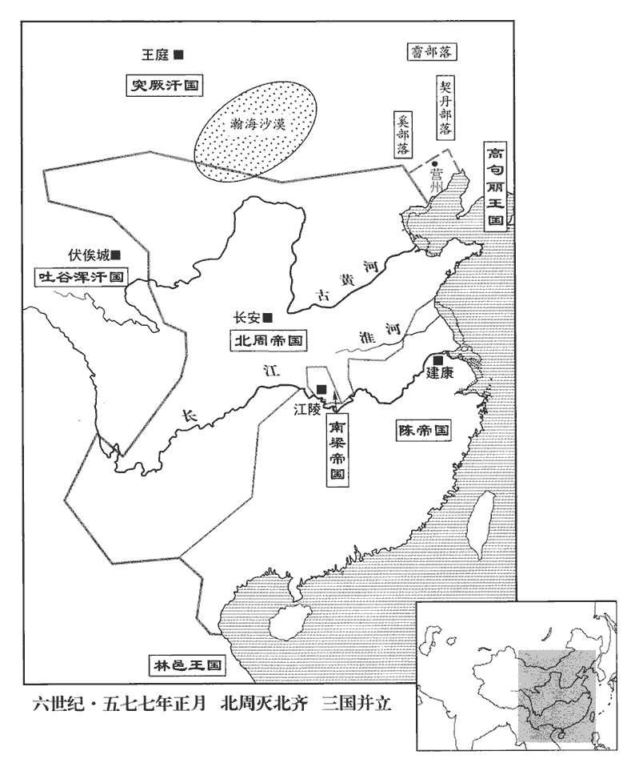
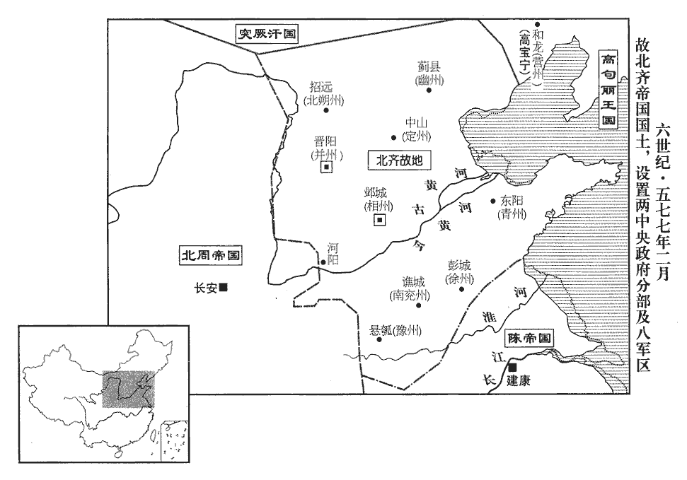
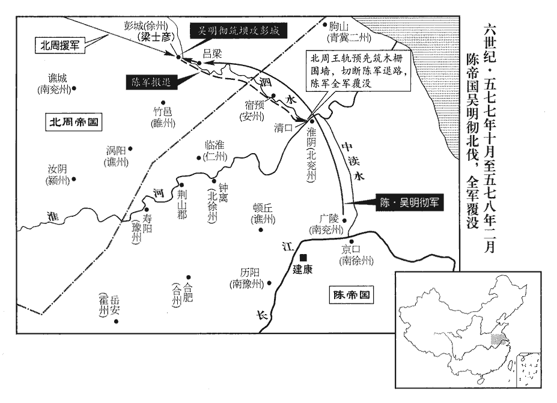
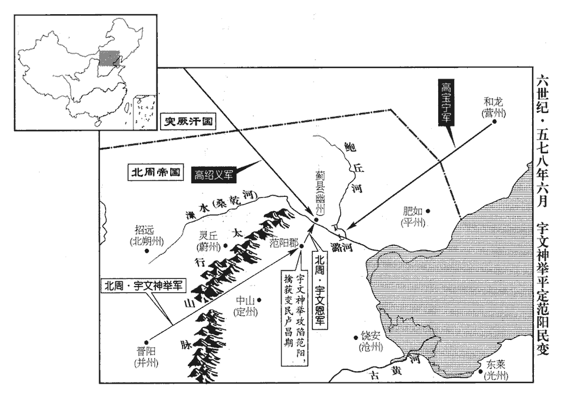
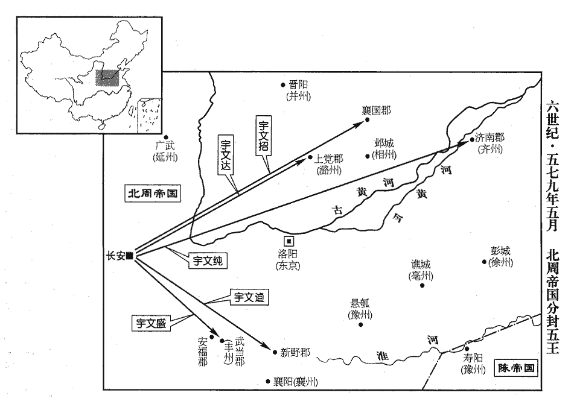
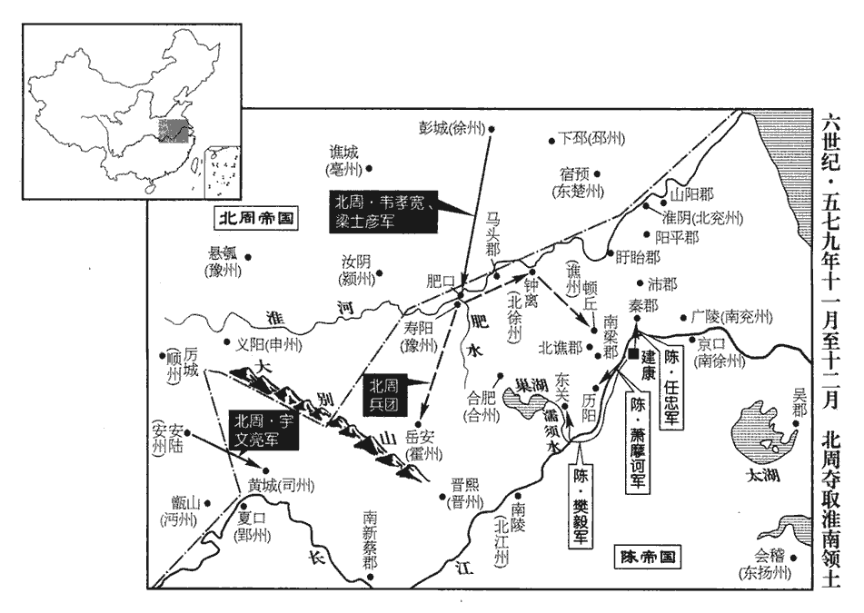

 陳紀七起強圉作噩（丁酉），盡屠維大淵獻（己亥），凡三年。

# 高宗宣皇帝中之下

## 太建九年（丁酉、五七七）

1春，正月，乙亥朔‹一›，齊‹首都邺城河北省临漳县西南邺镇›太子恆即皇帝位，恆，戶登翻。生八年矣；改元承光，大赦。尊齊主‹高纬本年二十一岁›為太上皇帝，皇太后‹胡太后›為太皇太后，皇后‹穆黄花›為太上皇后。以廣寧王孝珩為太宰。珩，音行。

〖译文〗 [1]春季，正月，乙亥朔（初一），北齐太子高恒即皇帝位，当时出生才八年；改年号为承光，大赦全国。尊称北齐后主为太上皇帝，皇太后为太皇太后，皇后为太上皇后。任命广宁王高孝珩为太宰。

司徒莫多婁敬顯、領軍大將軍尉相願尉，紆勿翻。謀伏兵千秋門，千秋門，鄴宮西門。斬高阿那肱，立廣寧王孝珩，會阿那肱自他路入朝，不果。朝，直遙翻。孝珩求拒周師，謂阿那肱等曰：「朝廷不賜遣擊賊，豈不畏孝珩反邪？孝珩若破宇文邕，周主諱邕。遂至長安‹陕西省西安市›，反亦何預國家事！以今日之急，猶如此猜忌邪！」邪，音耶。高、韓恐其為變，出孝珩為滄州‹府设饶安河北省盐山县西南›刺史。高、韓，謂高阿那肱、韓長鸞。地形志：熙平二年，分瀛、冀二州，置滄州，治饒安縣城。相願拔佩刀斫柱，歎曰：「大事去矣，知復何言！」復，扶又翻。

〖译文〗 司徒莫多娄敬显、领军大将军尉相愿预谋在千秋门埋伏士兵，杀死高阿那肱，拥立广宁王高孝珩当皇帝，恰巧高阿那肱从另一条路入朝上殿，所以没有成功。高孝珩请求抗拒北周军队，对高阿那肱等人说：“朝廷不派我去打击敌人，难道不怕我高孝珩起来造反吗？高孝珩如果打败宇文邕，便到了长安，即便造反也干预不了国家的事情！象今天这样的危急，竟还如此猜忌！”高阿那肱、韩长鸾怕他要叛变，便派高孝珩出任沧州刺史。尉相愿气得拔出佩刀砍柱子，叹息说：“大事已去，还有什么可说的？”

齊主‹高纬›使長樂王尉世辯長樂郡王。五代志：信都郡長樂縣，舊置長樂郡。樂，音洛。尉，紆勿翻。帥千餘騎覘周師，出滏口‹河北省武安市西南›，帥，讀曰率。騎，奇寄翻。覘，丑廉翻，又丑豔翻。滏，音釜。登高阜西望，遙見群烏飛起，謂是西軍旗幟，即馳還；比至紫陌橋‹首都邺城西›，不敢回顧。世辯，粲之子也。西軍旗幟皆黑。齊人時恇懼，望見烏飛，以為周師已至，馳歸不敢回顧，懼其及也。紫陌橋在鄴城外。尉粲與高歡同起於北鎮。爾雅曰：大陸曰阜。廣雅：山無石曰阜。幟，昌志翻。比，必寐翻。於是黃門侍郎顔之推、中書侍郎薛道衡、侍中陳德信等勸上皇‹高纬›往河外募兵，齊制：門下省侍中、給事黃門侍郎各六人，中書省侍郎四人。河外，謂大河之外。王者內京師而外諸夏，齊都鄴，在河北，故謂河南為河外。更為經略；若不濟，南投陳國‹首都建康›。從之。道衡，孝通之子也。薛孝通始從賀拔岳，後因入朝，遂留仕於鄴。丁丑‹三›，太皇太后、太上皇后‹穆黄花›自鄴先趣濟州‹府设碻磝山东省茌平县西南›；濟州，治碻磝城。趣，七喻翻。濟，子禮翻。癸未‹九›，幼主‹高恒›亦自鄴東行。己丑‹十五›，周師至紫陌橋‹邺城西›。

〖译文〗 北齐国主派长乐王尉世辩率领一千多骑兵窥测北周军队的情况，出了滏口，登上土山向西面了望，远远地看见一群乌鸦腾空而起，以为是北周军队的旗帜，立即驰马返回；到了紫陌桥，还不敢回头看。尉世辩是尉粲的儿子。于是黄门侍郎颜之推、中书侍郎薛道衡、侍中陈德信等劝太上皇帝到黄河以南一带招募士兵，再作策划；如果不成功，就向南投奔陈朝。得到同意。薛道衡是薛孝通的儿子。丁丑（初三），太皇太后、太上皇后从邺城先去济州；癸未（初九），北齐幼主也从邺城向东进发。己丑（十五日），北周军队到了邺城城外的紫陌桥。

2辛卯‹十七›，上‹陈顼，本年五十岁›祭北郊。

〖译文〗 [2]辛卯（十七日），陈宣帝到北郊祭地。

 

3壬辰‹十八›，周‹首都长安陕西省西安市›師至鄴城下；癸巳‹十九›，圍之，燒城西門。齊人出戰，周師奮擊，大破之。

〖译文〗 [3]壬辰（十八日），北周军队到了邺城城下；癸巳（十九日），包围了邺城，焚烧邺城的西门。北齐士兵出城作战，北周军队奋勇攻击，大破北齐军队。

齊上皇‹高纬›從百騎東走，騎，奇寄翻。使武衛大將軍慕容三藏守鄴宮。後齊循魏制，武衛將軍副貳左。右衛將軍，掌左、右廂，所主朱華閣以外，階從三品。加「大」者，進等。藏，徂浪翻。周師入鄴，齊王、公以下皆降。降，戶江翻。三藏猶拒戰，周主‹宇文邕，本年三十五岁›引見，禮之，見，賢遍翻。拜儀同大將軍。三藏，紹宗之子也。慕容紹宗始從爾朱氏，後事高歡父子。領軍大將軍漁陽‹北京市通县›鮮于世榮，齊高祖‹高欢›舊將也。將，即亮翻。周主‹宇文邕›先以馬腦酒鍾遺之，馬腦石，似玉，寶石也，今作碼碯。先，息薦翻。遺，唯季翻。世榮得即碎之。周師入鄴，世榮在三臺前鳴鼓不輟，周人執之；世榮不屈，乃殺之。周主執莫多婁敬顯，數之曰：「汝有死罪三：前自晉陽‹山西省太原市›走鄴，攜妾棄母，不孝也；自晉陽走鄴，見上卷上年。數，所矩翻，舊所具翻。走，音奏。外為偽朝戮力，內實通啟於朕，不忠也；為，于偽翻。朝，直遙翻。送款之後，猶持兩端，不信也。用心如此，不死何待！」遂斬之。

〖译文〗 北齐太上皇帝由上百名骑兵跟从向东出走，派武卫大将军慕容三藏守卫邺城的宫室。北周军队进入邺城，北齐的王、公以下的官员都向北周投降。慕容三藏还抗拒战斗，北周国主召见他，待之以礼，拜仪同大将军。慕容三藏是慕容绍宗的儿子。领军大将军渔阳鲜于世荣，是神武帝时的老将。北周国主先送给他们玛瑙酒杯，鲜于世荣得到后立即将杯子打碎。北周军队进入邺城时，鲜于世荣在三台前不断地击鼓，被北周军队捉住；鲜于世荣不肯屈服，被杀死。崐北周国主捉到莫多娄敬显，数说他：“你有三条死罪：以前你从晋阳去邺城，携带小老婆同行而抛弃母亲，这是不孝；表面替齐国效力，实际上从内部向朕送情报，这是不忠；向我们表示诚意以后，却还在两者之间动摇不定，这是不信。这样的用心，不死还等侍什么！”便将他杀死。

使將軍尉遲勤追齊主‹高纬›。考異曰：北齊書「勤」作「剛」。今從周書。尉，紆勿翻。

〖译文〗 派将军尉迟勤追赶北齐国主。

甲午‹二十›，周主‹宇文邕›入鄴。齊國子傅士長樂‹河北省冀州市›熊安生，博通五經，晉武帝咸寧四年，初立國子學，置國子祭酒、博士各一人，後齊置博士五人。黃帝，有熊氏；一曰：出於楚鬻熊之後，以名為氏。樂，音洛。聞周主入鄴，遽令掃門。家人怪而問之，安生曰：「周帝重道尊儒，必將見我。」俄而周主幸其家，不聽拜，親執其手，引與同坐；賞賜甚厚，給安車駟馬以自隨。又遣小司馬唐道和後周之制，六官七命，自小冢宰至小司徒、小宗伯、小司馬、小司寇、小司空，皆上大夫，七命。就中書侍郎李德林宅宣旨慰諭，曰：「平齊之利，唯在於爾。」引入宮，宮，即鄴宮，時周主居之。使內史宇文昂訪問齊朝風俗政教，人物善惡。朝，直遙翻。即留內省，三宿乃歸。內省，即齊之門下省。

〖译文〗 甲午（二十日），北周国主进入邺城。北齐的国子博士长乐熊安生，博学精通《五经》，听到北周国主到了邺城，马上叫人打扫门庭。家人感到奇怪问他为什么，熊安生说：“周帝重道尊儒，一定会来看我。”不多久北周国主亲临熊家，不让熊安生叩拜，亲自搀住他的手，叫熊安生和自己坐在一起；赏赐给他很多东西，还送给他小车和马匹供他乘用。又派小司马唐道和去北齐的中书侍郎李德林的住处宣读圣旨加以慰问，说：“讨平齐国后得到的利益，就在于得到你。”带李德林进宫，派内史宇文昂向他请教北齐的风俗政教，人物的善恶。留他在门下省，住了三个晚上才让他回家。

乙未‹二十一›，齊上皇‹高纬›渡河入濟州。濟，子禮翻。是日，幼主‹高恒›禪位於大丞相任城王湝。任，音壬。湝，戶皆翻，又音皆。又為湝詔：尊上皇‹高纬›為無上皇，幼主‹高恒›為宋【嚴；「宋」改「守」。】國天王。齊氏於傾危之際，不應改國號為宋。「宋國」，當作「宗國」。令侍中斛律孝卿送禪文及璽紱於瀛州‹州政府赵都军城›，齊制，天子六璽，受命璽在六璽之外。紱，印組也。古者韍fú如蔽膝，又，裳繡為兩己相背形，謂之黻fú。此紱直以繫璽而已。璽，斯氏翻。紱，音弗。孝卿即詣鄴。以璽紱歸周。

〖译文〗 乙未（二十一日），北齐太上皇帝渡过黄河到济州。这一天，幼主把皇位让给大丞相任城王高。又替高下诏：尊称太上皇为无上皇，幼主为宋国天王。命令侍中斛律孝卿把禅位的文书和系有丝带的受命玉玺送到瀛州，斛律孝卿立即前往邺城。

周主‹宇文邕›詔：「去年大赦所未及之處，皆從赦例。」去年周克晉陽，大赦，山東、河南、河北之地，尚為齊守。今既克鄴，凡齊之境內，赦所未及之地，今皆從去年赦例。

〖译文〗 北周国主诏令：“去年大赦所没有执行地方，一律遵照赦例执行。”

齊洛州‹府设洛阳河南省洛阳市东白马寺东›刺史獨孤永業，有甲士三萬，聞晉州‹府设平阳山西省临汾市›陷，請出兵擊周，奏寢不報；永業憤慨。又聞并州‹府设晋阳山西省太原市›陷，乃遣子須達請降於周，降，戶江翻；下同。周以永業為上柱國，封應公。此去年事也。因齊亡，敘之於此。應國公，用古邗、晉、應、韓之應以封之。

〖译文〗 北齐的洛州刺史独孤永业有三万名甲士，听到晋州陷落，请求朝廷允许自己发兵攻击北周，但奏章被压下没有上报；独孤永业很愤慨。又听到并州陷落，便派儿子独须孤达向北周请求投降，北周任命独孤永业为上柱国，封应公。

丙申‹二十二›，周以越王盛為相州總管。後魏置相州於鄴。東魏都鄴，改為司州，以其京畿之地，倣漢、晉之制而置司州也。周既平齊，復為相州，列於諸州。相，息亮翻。

〖译文〗 丙申（二十二日），北周任命越王宇文盛为相州总管。

齊上皇‹高纬›留胡太后於濟州，使高阿那肱守濟州關‹碻磝山东省茌平县西南›城北黄河渡口，濟州城北有碻磝津故關。覘候周師，覘，丑廉翻，又丑豔翻。自與穆后‹穆黄花›、馮淑妃‹冯小怜›、幼主‹高恒›、韓長鸞、鄧長顒等數十人奔青州‹府设东阳山东省青州市›。顒yóng，魚容翻。使內參田鵬鸞西出，參伺動靜；參，候也。伺，相吏翻。周師獲之，問齊主何在，紿云：「已去，紿dài，徒亥翻，誑言也。計當出境。謂出齊境也。周人疑其不信，捶之。每折一支，辭色愈厲，竟折四支而死。捶，止橤翻。折，而設翻。

〖译文〗 北齐太上皇帝把胡太后留在济州，派高阿那肱镇守济州关，观察北周军队的动静，自己和穆后、冯淑妃、幼主、韩长鸾、邓长等几十人逃奔青州。又派太监田鹏鸾去西部，刺探动静；他被北周军队抓获，问他北齐国主在哪里，田鹏鸾骗他们说：“已经离开原地，估计应当出了国境。”北周人怀疑他的话不可信，对他拷打。每打断一根肢体，田鹏鸾的话和脸色就愈加严厉，最后打断了四肢而死去。

 

上皇‹高纬›至青州‹府设东阳山东省青州市›，即欲入陳。而高阿那肱密召周師，約生致齊主，屢啟云：「周師尚遠，已令燒斷橋路。」上皇由是淹留自寬。周師至關，阿那肱即降之。周師奄至青州，上皇囊金，繫於鞍，與后、妃、幼主等十餘騎南走，騎，奇寄翻。己亥‹二十五›，至南鄧村‹山东省临朐县西南›，尉遲勤追及，盡擒之，并胡太后送鄴。先已擒胡太后於濟州，今并齊主送鄴。齊天保元年受禪，歲在庚午，四主，二十八年而亡。

〖译文〗 北齐太上皇帝到了青州，就要进入陈朝的国境。而高阿那肱秘密和北周军队联络，约定一起活捉北齐国主，却屡次向太上皇帝启奏道：“周朝的军队还离得很远，我已经下令烧桥断路。”太上皇帝因此在青州停留宽慰自己。北周军队到达关隘，高阿那肱就向他们投降。北周军队很快到了青州，北齐太上皇帝高纬用袋子装了金子，系在马鞍上，和皇后、妃子、幼主等乘了十几匹马向南逃走，己亥（二十五日），到南邓村，尉迟勤追上他们，全部活捉，连同胡太崐后一起送往邺城。

庚子‹二十六›，周主‹宇文邕›詔：「故斛律光、崔季舒等，宜追加贈諡，并為改葬，斛律光死見一百七十一卷太建四年。崔季舒等死見五年。諡，神至翻。為，于偽翻。子孫各隨蔭敘錄，自漢以來，將相公卿皆得保任子弟若孫為官，所謂門蔭者也。家口田宅沒官者，並還之。」周主指斛律光名曰：「此人在，朕安得至鄴！」辛丑‹二十七›，詔：「齊之東山，南園、三臺，並可毀撤。瓦木諸物，可用者悉以賜民。山園之田，各還其主。」東山、南園、三臺，皆高氏遊宴之地。撤，直列翻。

〖译文〗 庚子（二十六日），北周国主诏令：“已故的斛律光、崔季舒等，应追加封赠谥号，并将他们改葬，他们的子孙各随门荫按规定的等级次第授给官职，被没收充公的奴婢田地房产，一并发还。”北周国主指着斛律光的名字说：“这个人如果还在，朕怎能来到邺城！”辛丑（二十七日），诏令：“齐国的东山、南园、三台，都可以拆除。瓦片木材一类物件，可以利用的全部赏赐给百姓。山园所占用的土地，各还原主。”

4二月，壬午‹九›，上‹陈顼›耕藉田。藉，而亦翻。

〖译文〗 [4]二月，壬午（疑误），陈宣帝到藉田举行耕种的仪式。

5丙午‹三›，周主宴從官將士於齊太極殿，頒賞有差。從，才用翻。將，即亮翻；下同。

〖译文〗 [5]丙午（初三），北周国主在北齐的太极殿赐宴随从的官员将士，按等级给予赏赐。

丁未‹四›，高緯至鄴，已為俘囚，不復書齊主。緯，于貴翻。周主降階，以賓禮見之。

〖译文〗 丁未（初四），高纬到邺城，北周国主走下台阶，以对待宾客的礼节接见他。

齊廣寧王孝珩至滄州‹府设饶安河北省盐山县西南›，以五千人會任城王湝於信都‹北齐冀州州政府所在县·河北省冀州市›，冀州治信都。湝自河間進兵至信都。珩，音行。任，音壬。湝，古皆翻。共謀匡復，召募得四萬餘人。周主使齊王憲、柱國楊堅擊之。令高緯為手書招湝，湝不從。憲軍至趙州‹府设广阿河北省隆尧县›，魏孝昌二年，分定、相二州置殷州，治廣阿，後改為趙州。湝遣二諜覘之，諜，徒協翻。覘，丑廉翻，又丑豔翻。候騎執以白憲。憲集齊舊將，遍示之，齊舊將從憲軍者，集以示諜，以攜湝軍之心。騎，奇寄翻。謂曰：「吾所爭者大，不在汝曹。今縱汝還，仍充吾使。」使，疏吏翻。乃與湝書曰：「足下諜者為候騎所拘，軍中情實，具諸執事。謂諜者當能具言之。戰非上計，無待卜疑；守乃下策，或未相許。已勒諸軍分道並進，相望非遠，憑軾有期。左傳：城濮之役，楚子玉遣使請戰於晉侯曰：「請與君之士戲，君憑軾而望之。」故引以為言。兵車之軾，高三尺三寸，立而憑之。『不俟終日』，所望知機也！」易大傳曰：「君子見幾而作，不俟終日，」引以諭湝，使速降。

〖译文〗 北齐的广宁王高孝珩到沧州，带领五千人在信都和任城王高会合，共同计划复国，征募到四万多人。北周国主派齐王宇文宪、柱国杨坚攻打他们。叫高纬写亲笔信对高招降，高不服从。宇文宪的军队到赵州，高派二名探子去侦察，反被北周的侦察骑兵捉住并报告了宇文宪。宇文宪把原先是北齐的将领召集在一起，将捉到的探子向他们示众，并说：“我所争夺的是大目标，不是你们。今天放你们回去，仍旧充当我的使者。”给高带去书信，信上说：“您的探子被我们的侦察兵捉到，我方军队中的情况，他们会向您报告。和我们打仗不是上策，这不用占卜就可以决定；防守是下策，您或许不会同意。我已经统率各路军队分道并进，和您相见已经不远，我扶着兵车上的横木到来指日可待。希望您能知道时机，不要拖延时日！”

憲至信都，湝陳於城南以拒之。湝所署領軍尉相願詐出略陳，遂以眾降。鄴城之破，相願蓋奔瀛州，湝因署為領軍。尉，紆勿翻。陳，讀曰陣。降，戶江翻。相願，湝心腹也，眾皆駭懼。湝殺相願妻子。明日，復戰，復，扶又翻。憲擊破之，俘斬三萬人，執湝及廣寧王孝珩。憲謂湝曰：「任城王何苦至此！」湝曰：「下官神武皇帝‹高欢›之子，兄弟十五人，幸而獨存。逢宗社顛覆，【章：十二行本「覆」下有「今日得死」四字；乙十一行本同；孔本同；張校同。】無愧墳陵。」聚土曰墳。陵，大阜也。墳陵，猶言山陵。憲壯之，命歸其妻子。又親為孝珩洗瘡傅藥，禮遇甚厚。為，于偽翻。孝珩歎曰：「自神武皇帝以外，吾諸父兄弟，無一人至四十者，命也。文襄死於盜手，年二十九；顯祖，年三十一；濟南王，年十七；孝昭，年二十七；武成，年三十二；其餘多不得良死。嗣君無獨見之明，宰相非柱石之寄。嗣，祥吏翻。恨不得握兵符，受斧鉞，展我心力耳！」史言湝、孝珩志節可憐。五代志：後齊命將出征，則授鼓旗於朝，皇帝陳法駕，服袞冕，至廟，拜於太祖，徧告訖，降就中階，引上將操鉞授柯曰：「從此上至天，將軍制之。」又操斧授柯曰：「從此下至泉，將軍制之。」將軍既受斧鉞，對曰：「國不可從外理，軍不可從中制。臣既受命，有鼓旗斧鉞之威，願無一言之命於臣。」帝曰：「苟利社稷，將軍裁之。」將軍就車，載斧鉞而出，皇帝推轂gǔ度閫，曰：「從此以外，將軍制之。」

〖译文〗 宇文宪到了信都，高在城南列阵进行抗拒。被高任命的领军尉相愿假装到阵前巡行，便率领军队向宇文宪投降。尉相愿本来是高的心腹，大家为此感到惊恐害怕。高便杀掉尉相愿的妻儿。第二天，又进行战斗，被宇文宪打败，俘虏和杀死的有三万人，高和广宁王高孝珩被捉住。宇文宪对高说：“任城王何苦至此！”高说：“下官是神武皇帝的儿子，十五个兄弟，只有我侥幸活下来，遇到国家被推翻，死而无愧于祖先。”宇文宪佩服他的雄壮豪迈，命令归还他的妻儿。宇文宪又亲自为高孝珩洗疮涂药，礼遇很厚。高孝珩叹道：“除神武皇帝以外，我的父辈和兄弟，没有一个能活到四十岁的，这是命运注定的。继位的国君缺乏独特见解的明察，宰相不能担负国家重任的委托，遗憾的是我不能掌握兵符，授予我兵权，以施展我的用心和能力！”

齊王憲善用兵，多謀略，得將士心。齊人憚其威聲，多望風沮潰。芻牧不擾，軍無私焉。將，即亮翻。沮，在呂翻。

〖译文〗 齐王宇文宪善于用兵，足智多谋，得到将士的爱戴。北齐军队害怕他的威崐名，都望风溃散。北周军队对百姓放牧的牲口不加侵扰，军队遵守纪律。

周主‹宇文邕›以齊降將封輔相為北朔州‹总部设招远山西省朔州市›總管。北朔州，齊之重鎮，降，戶江翻。北朔州控禦突厥，齊以為重鎮。士卒驍勇。驍，堅堯翻。前長史趙穆等謀執輔相迎任城王湝於瀛州，不果，前長史，齊官。長，知兩翻。相，息亮翻。乃迎定州‹府设中山河北省定州市›刺史范陽王紹義。紹義至馬邑‹即招远·北朔州州政府所在城›，自肆州‹府设九原山西省忻州市›以北二百八十餘城皆應之。五代志：博陵郡，舊置定州；魏置肆州，治九原；六鎮叛亂，寄治樓煩郡之秀容縣，其北即齊北朔州界。紹義與靈州‹府设繁畤山西省应县东›刺史袁洪猛引兵南出，欲取并州。至新興‹山西省定襄县›，而肆州已為周守，地形志：魏太延二年，置薄骨律鎮，孝昌二年，置靈州，東西分治，其地屬西魏。天平中，東魏復置靈州，寄治汾州隰城縣界。五代志：鴈門郡繁畤縣，東魏置武州，寄治城中，後齊改為北靈州。新興，漢、魏古郡名，以五代志考之，與肆州皆在樓煩郡秀容縣。宋白曰：唐之嵐州，古新興郡。為，于偽翻。前隊二儀同以所部降周。二儀同，前隊之將二人，官皆儀同。降，戶江翻。周兵擊顯州‹府设石城山西省原平市北崞阳镇›，地形志：魏永安中，置顯州，治汾州六玉壁城。五代志：鴈門郡崞guō縣，東魏置廓州，後齊改北顯州。周兵所擊即此。執刺史陸瓊，復攻拔諸城。復，扶又翻。紹義還保北朔州。周東平公神舉將兵逼馬邑，神舉，即宇文神舉。紹義戰敗，北奔突厥，猶有眾三千人。紹義令曰：「欲還者從其意。」於是辭去者太半。突厥佗鉢可汗常謂齊顯祖‹高洋›為英雄天子，以紹義重踝huái，似之，厥，九勿翻。佗，徒何翻。可，苦曷翻。汗，音寒。重，直龍翻。踝，戶瓦翻。腿兩旁曰內外踝。甚見愛重；凡齊人在北者，悉以隸之。

〖译文〗 北周国主任命北齐的降将封辅相为北朔州总管。北朔州是北齐的重镇，士兵强悍勇敢。前长史赵穆等人曾预谋捉住封辅相在瀛州迎接任城王高，没有成功，便迎接定州刺史范阳王高绍义。高绍义到马邑，从肆州以北的二百八十多座城池都起来响应。高绍义和灵州刺史袁洪猛领兵发兵向南，打算夺取并州。到了新兴时，肆州已经被北周军队占领，高绍义的前队中有二名仪同率领部下向北周投降。北周军队向显州进攻，捉住显州刺史陆琼，又攻克其他城池。高绍义回师保卫北朔州。北周东平公宇文神举领兵逼近马邑，高绍义被打败，向北逃奔突厥，还有三千部众。高绍义下令说：“想回去的人可以听便。”于是超过半数的人都离去了。突厥的佗钵可汗常说文宣帝是英雄天子，因为高绍义的踝关节两侧各有两个骨突，很象文宣帝，所以对他非常喜爱看重；凡是在突厥的北齐人，都由高绍义管理。

於是齊之行臺、州、鎮，唯東雍州‹府设正平山西省新绛县›行臺傅伏、營州‹府设和龙辽宁省朝阳市›刺史高寶寧不下，傅伏以永橋之功遷東雍州行臺。五代志：絳郡，後魏置東雍州。遼西郡置營州，治和龍城。雍，於用翻。其餘皆入於周。凡得州五十，郡一百六十二，縣三百八十，戶三百三萬二千五百。梁太宗大寶元年，齊顯祖受魏禪，五主，二十七年而亡。齊所有司、冀、趙、義、懷、黎、建、東雍、汾西、汾、晉、南朔、并、肆、靈、顯、恆、朔、定、瀛、幽、東燕、北燕、營、南營、安、青、濟、光、膠、徐、仁、睢、兗、北徐、南青、海、東楚、潼、東徐、洛、鄭、陽、宋、梁、南兗、西兗、北荊、襄、豫、東廣、秦、西楚、揚、南潁、北建、羅、合、江、和共六十州，而東廣已下十州，時已為陳，故止言五十州。考異曰：隋書地理志云：州九十七，郡一百六十，縣一百六十五。今從周書。高寶寧者，齊之疏屬，有勇略，久鎮和龍，甚得夷、夏之心。夏，戶雅翻。周主‹宇文邕›於河陽‹河南省孟州市›、幽‹府设蓟县北京市›、青、南兗‹府设谯城安徽省亳州市›、豫‹府设悬瓠河南省汝南县›、徐‹府设彭城江苏省徐州市›、北朔、定置總管府，相‹府邺城›、并二州各置宮及六府官。河陽縣屬懐州河内郡，地臨河津，實重鎮也。幽州治薊，青州治益都，南兖治譙，豫治汝南，徐治彭城，北朔治馬邑，定治中山，或都會之地，或守禦之要也，故皆置總管府。總管，猶魏、晉之都督也。相、并二州，皆有齊舊宮及省，故仍置宮，若別都然。置六府官，以代省也。六府官，蓋倣長安六官之府，未必備官也。

〖译文〗 于是北齐的行台、州、镇中，只有东雍州行台傅伏、营州刺史高宝宁没有降服，其他地方都并入北周。一共得到五十州，一百六十二郡，三百八十县，三百另三万二千五百户。高宝宁是北齐皇室的远支，勇敢有胆略，长久在和龙镇守，很得夷人和汉人的人心。北周国主在河阳、幽、青、南兖、豫、徐、北朔、定各州设置总管府，相、并二州分别设置宫室和六府官。

 

周師之克晉陽也，克晉陽，見上卷上年。齊使開府儀同三司紇奚永安求救於突厥，比至，齊已亡。佗鉢可汗處永安於吐谷渾‹青海省›使者之下，紇奚，虜複姓。魏收官氏志：北方諸姓有紇奚氏。比，必寐翻，及也。處，昌呂翻。吐，如字，或土鶻翻。谷，音浴。使，疏吏翻。永安言於佗鉢曰：「今齊國已亡，永安何用餘生！欲閉氣自絶，恐天下謂大齊無死節之臣；乞賜一刀，以顯示遠近。」佗鉢嘉之，贈馬七十匹而歸之。

〖译文〗 北周军队攻克晋阳时，北齐派开府仪同三司纥奚永安向突厥求救，他刚到突厥，北齐已经灭亡。佗钵可汗把纥奚永安安排在吐谷浑使者之下，纥奚永安对佗钵可汗说：“现在齐国已经灭亡，我何必留此残生！本准备屏气自尽，只怕天下人说我们大齐朝没有殉节而死的臣子，请求给我一刀，死后可以让远近的人都知道我的心迹。”佗钵可汗对他表示赞许，送给七十匹马让他回去。

梁‹首都江陵湖北省江陵县›主‹萧岿，本年三十六岁›入朝于鄴。梁臣於周，以周平齊，故入朝。朝，直遙翻；下同。自秦兼天下，無朝覲之禮，至是始命有司草具其事：致積，致餼xì，設九儐、九介，受享於廟，三公、三孤、六卿致食，勞賓，還贄，致享，皆如古禮。積，子賜翻。餼，許既翻。勞，力到翻。鄭玄曰：每積有牢禮米禾芻薪。又曰：大禮，饔餼也。左傳：居則具一日之積。杜預曰：芻米菜薪。詩傳曰：牲腥曰餼。或曰：饋客生食及芻米曰餼。儐，主副也，導主以行禮者也。介，賓副也，輔賓以行禮者也。五代志：梁王之朝周，入畿，大冢宰命有司致積，其餼五牢，米九十筥jǔ，䤈醢hǎi各三十五甕，酒十八壺，米禾各五十車，薪芻各百車。既至，大司空設九儐以致館。梁王束帛乘馬，設九介以待之。禮成而出。明日，王朝，受享於廟。既致享，大冢宰又命公一人玄冕乘車，陳九儐，以束帛乘馬致食于賓及賓之從，各有差。致食訖，又命公一人弁服乘車執贄，設九儐以勞賓。王設九介，迎於門外。明日，朝服乘車，還贄于公，公皮弁迎於大門。授贄受贄，並於堂之中楹。又明日，王朝服，設九介，乘車以見于公。事畢，公致享。明日，三孤一人又執贄勞于梁王。明日，王還贄。又明日，王見三孤如三公。明日，卿一人又執贄勞王，王見卿又如三孤。於是三公、三孤、六卿又各餼賓，並屬官之長為使，牢米束帛同三公。儐，必刃翻。勞，力到翻。周主‹宇文邕›與梁主‹萧岿›晏，酒酣，酣，戶甘翻。周主自彈琵琶。梁主起舞，曰：「陛下既親撫五絃，臣何敢不同百獸！」周主大悅，賜賚甚厚。舜彈五絃之琴。夔曰：「於，予擊石拊石，百獸率舞。」梁主以舜況周主，故悅。賚，來代翻。

〖译文〗 后梁国主到邺城朝见北周君主。自从秦始皇兼并天下以后，朝见礼制久已废缺，这时才开始命令有关部门拟订礼节：如致送薪米、致送活羊，设九个宾相、九个传达，在宗庙中设宴款待，三公、三孤、六卿向后梁国主献食，慰劳宾客、还礼、宴享宾客等，都依照古礼。北周国主设宴款待后梁国主，酒喝到高兴时，北周国主亲自弹琵琶。后梁国主起立跳舞，说：“陛下既然亲自演奏琵琶，臣怎敢不象百兽那样起舞！”北周国主听了大为高兴，赏赐给他很多东西。

乙卯‹十二›，周主‹宇文邕›自鄴西還。

〖译文〗 乙卯（十二日），北周国主从邺城西回长安。

三月，壬午‹九›，周詔：「山東諸軍，各舉明經幹治者二人；若奇才異術，卓爾不群者，不拘此數。」時周分置諸州總管以撫鎮山東，治軍政，故曰諸軍。

〖译文〗 三月，壬午（初九），北周下诏：“山东各州的总管，分别推荐二名通晓经术办事能干的人；如果有特殊的才能，超出寻常与众不同的人，可以不受人崐数的限制。”

周主之擒尉相貴也；擒尉相貴，見上卷上年。招齊東雍州刺史傅伏，伏不從。齊人以伏為行臺右僕射。周主既克并州，克并州，亦見上卷上年。復遣韋孝寬招之，韋孝寬鎮勲州‹府设玉壁山西省稷山县›，與東雍州接境，故使招之。復，扶又翻。令其子以上大將軍、武鄉公告身以古武鄉郡封為公也。石勒置武鄉郡。凡授官爵，皆給以符，謂之告身。五代志：馮翊郡華陰縣，西魏改武鄉，置武鄉郡。周當以此封傅伏。及金、馬腦二酒鍾賜伏為信。伏不受，謂孝寬曰：「事君有死無貳。此兒為臣不能竭忠，為子不能盡孝，人所讎疾，願速斬之以令天下！」周主自鄴還，至晉州‹府设平阳山西省临汾市›，遣高阿那肱等百餘人臨汾水召伏。伏出軍，隔水見，汾水逕晉、絳二州之間，東雍州在絳州界，故隔水。問：「至尊‹高纬›今何在？」阿那肱曰：「已被擒矣。」被，皮義翻。伏仰天大哭，帥眾入城，於聽事前北面哀號，良久，然後降。帥，讀曰率。聽，與廳同。毛晃曰：聽事治官處，漢、晉皆作「聽事」，六朝以來，乃始加「广」。音他經翻。號，戶刀翻。降，戶江翻。周主見之曰：「何不早下？」伏流涕對曰：「臣三世為齊臣，食齊錄，不能自死，羞見天地！」周主執其手曰：「為臣當如此。」乃以所食羊肋骨賜伏肋，盧則翻，脅肋。曰：「骨親肉疏，所以相付。」遂引使宿衛，授上儀同大將軍。敕之曰：「若亟與公高官，亟，紀力翻。恐歸附者心動。努力事朕，勿憂富貴」他日，又問：「前救河陰‹河南省孟津县北›得何賞？」救河陰事見上卷七年。對曰：「蒙一轉，授特進、永昌郡公。」勳級曰轉。轉，張戀翻。周主謂高緯曰：「朕三年教戰，決取河陰。正為傅伏善守，為，于偽翻。城不可動，遂斂軍而退。公當時賞功，何其薄也！」

〖译文〗 北周国主捉拿尉相贵时，曾经招降北齐东雍州刺史傅伏，傅伏不肯。北齐任命傅伏为行台右仆射。北周国主攻下并州以后，又派韦孝宽去招降，叫他的儿子送去上大将军、武乡公等官爵的委任状和用金子、玛瑙制成的酒杯作为凭据。傅伏不肯接受，对韦孝宽说：“我服事国君除殉死以外没有其他想法。这个孩子作为臣子不能尽忠，作为儿子又不能尽孝，为人人憎恨痛骂，希望你赶快把他杀掉以昭示天下！”北周国主从邺城返回时，到了晋州，派高阿那肱等一百多人在汾水边召傅伏来。傅伏派出军队，隔河见到他们，便问：“天子现在哪里？”高阿那肱说：“已经被捉住了。”傅伏仰天大哭，率领军队进城，在官署的厅堂前面向北方悲伤痛哭，哭了很久，然后向北周投降。北周国主见到他说：“为什么不及早投诚？”傅伏流泪回答说：“我家三代是齐国的臣子，吃的是齐国的俸禄，没有殉国，羞见天地！”北周国主握住他手说：“做臣子的应当这样。”便把自己食用的羊排骨赏给傅伏，说：“骨亲肉疏，所以把骨头交给你。”便派他充当官廷的值宿禁卫，授给上仪同大将军的官职，说：“如果马上让你做高官，怕归附的人嫉妒。你只要努力侍奉朕，不必担心富贵。”另一天，又问他：“以前救援河阴时得到什么赏赐？”回答道：“蒙皇帝迁调官职一次，授给特进、永昌郡公。”北周国主对高纬说：“朕指挥打仗三年，决心攻下河阴。正由于傅伏善于防守，城不可动，便收拾军队而退走。您当时对他功劳的赏赐，为什么如此微薄！”

夏，四月，乙巳‹三›，周主至長安，置高緯於前，列其王公於後，車輿、旗幟、器物，以次陳之。備大駕，秦大駕，屬車八十一乘；漢遵用之，備千乘萬騎。晉之盛也，大駕鹵簿，見於志為尤詳。開皇中，大駕十二乘，法駕半之。其後大駕用三十六，法駕用十二。周氏雖設六官，置司輅之職以掌公車之政，以隋制參之，大駕鹵薄必不能如漢、晉之盛。幟，昌志翻。布六軍，奏凱樂，周官：王師大獻則令奏愷kǎi樂。註云：大獻，獻捷於祖；愷樂，獻功之樂。獻俘於太廟。觀者皆稱萬歲。戊申‹六›，封高緯為溫公，齊之諸王三十餘人，皆受封爵。周主與齊君臣飲酒，令溫公起舞。高延宗悲不自持，屢欲仰藥，其傅婢禁止之。

〖译文〗 夏季，四月，乙巳（初三），北周国主到长安，把高纬安排在前面，把北齐的王公排在后面，车辆、旗帜、器物，依次排列。准备好出行的“大驾”所应具备的全部人员仪仗，由公卿奉引，太仆驾车，六军排开队列，高奏凯旋的音乐，到太庙举行献俘的仪式。观看的人都高呼万岁。戊申（初六），封高纬为温公，北齐的三十多个王，都受到封爵。北周国主和北齐的君臣一同饮酒，叫温公为大家跳舞。高延宗悲伤到不能克制自己，屡次要服毒自尽，都被周围的婢女劝止。

周主以李德林為內史上士，後周之制，內史屬春官，中大夫五命，下大夫四命，上士三命。自是詔誥格式及用山東人物，並以委之。帝從容謂群臣曰：「我常日唯聞李德林名，復見其為齊朝作詔書移檄，從，七容翻。復，扶又翻。為，于偽翻。朝，直遙翻。正謂是天上人；豈言今日得其驅使。」神武公紇豆陵毅對曰：神武郡公。後魏置神武郡於神武川，隋為神武縣，屬馬邑郡。紇豆陵毅，本姓竇。唐宰相世系表曰：竇本竇融之後，以竇武之難，亡入鮮卑拓跋部，使居南境，號沒鹿回部，世為部落大人。及勤，後魏穆帝命為紇豆陵氏。至曾孫巖，從孝文帝徙洛陽，遂為河南洛陽人，復為竇氏。宇文復代北舊姓，又復為紇豆陵氏。「臣聞麒麟鳳皇，為王者瑞，可以德感，不可力致。麒麟鳳皇，得之無用，豈如德林，為瑞且有用哉！」帝大笑曰：「誠如公言。」

〖译文〗 北周国主武帝任命李德林为内史上士，此后凡是武帝的诏诰格式和对潼关以东人物的任用，全都委托给他。武帝曾在闲谈时对群臣说：“我以前只听说李德林的名字，又常见到他为齐朝所写的诏书公文，正认为他是天上的人才，怎么敢说今天能为我所用。”神武公纥豆陵毅回答说：“臣听说麒麟凤凰，是王者的祥瑞，可用德行来感化它们，不能用强力得到它们。麒麒凤凰，得到了也没有用处，怎么象李德林那样，既是祥瑞而且有用！”武帝大笑说：“真是您所说的那样。”

6己巳‹二十七›，周主享太廟。

〖译文〗 [6]己巳（二十七日），北周国主到太庙祭祀。

7五月，丁丑‹五›，周以譙王儉為大冢宰。庚辰‹八›，以杞公亮為大司徒，鄭公達奚震為大宗伯，梁公侯莫陳芮為大司馬，應公獨孤永業為大司寇，鄭公韋孝寬為大司空。

〖译文〗 [7]五月，丁丑（初五），北周任命谯王宇文俭为大冢宰。庚辰（初八），任命杞公宇文亮为大司徒，郑公达奚震为大宗伯，梁公侯莫陈芮为大司马，应公独孤永业为大司寇，郑公韦孝宽为大司空。

己丑‹十七›，周主祭方丘。周制：方丘在國陰六里之郊，以其先炎帝神農氏配。詔以：「路寢會義、崇信、含仁、雲和、思齊諸殿，皆晉公護專政時所為，事窮壯麗，有踰清廟，清廟者，倣周祀文王之廟而為之也。毛傳曰：清廟者，祭有清明之德者之宮也。悉可毀撤。彫斲之物，並賜貧民。繕造之宜，務從卑朴。」又【章：十二行本「又」上有「戊戌」‹二十六›二字；乙十一行本同；孔本同。】詔：「并、鄴諸堂殿壯麗者準此。」并、鄴諸堂殿，齊氏所營也。

〖译文〗 己丑（十七日），北周国主到方丘祭地。诏告：“天子的寝室会议、崇信、含仁、云和、思齐等殿，都是晋公宇文护专政时所兴建的，穷极壮丽的能事，超过宗庙的规模，可以全部拆毁。雕饰的物件，可以赐给贫民。修缮建造的事宜，务必简单朴素。”又诏告：“并、邺的各处壮丽的厅堂宫殿照此办理。”

臣光曰：周高祖可謂善處勝矣！處，昌呂翻。他人勝則益奢，高祖勝而愈儉。

〖译文〗 臣司马光曰：周武帝可以称得上善于对待胜利了！别人得到胜利后就更加奢侈，周武帝胜利后却更加节俭。

8六月，丁卯‹二十六›，周主東巡。秋，七月，丙戌‹十五›，幸洛州。洛州治洛陽。八月，壬寅‹二›，議定權衡度量，頒之於四方。量，音亮。

〖译文〗 [8]六月，丁卯（二十六日），北周国主到东部巡视。秋季，七月，丙戌（十五日），驾临洛州。八月，壬寅（初二），议定度量衡制度，向四方颁布。

初，魏虜西涼之人，西涼，謂河西。自沮渠氏據河西，稱涼王；宋文帝元嘉十六年，魏太武帝擊而虜之。沒為隸戶，齊氏因之，仍供廝役。廝，息移翻，養也，役也，使也，賤也。蘇林曰：廝，取薪者也。韋昭曰：析薪曰廝。今或讀從詵入聲。周主滅齊，欲施寬惠，詔曰：「罪不及嗣，古有定科。書大禹謨：皋陶曰：「罰不及嗣。」孔傳云：父子罪不相及。雜役之徒，獨異常憲，憲，法也。一從罪配，百代不免，罰既無窮，刑何以措！凡諸雜戶，悉放為民。」自是無復雜戶。

〖译文〗 当初，北魏俘虏了西凉人，便没入官府当奴隶户，北齐沿袭北魏的做法，奴隶户仍旧为官府服劳役。北周国主灭掉北齐，要对这些人给予宽恕恩惠，下诏说：“犯罪不能株连后代，是古代已有的法律。从事杂役的犯人，唯独异于常法，一旦犯罪发配，百代都得不到赦免，惩罚既已无穷无尽，正常的刑法还怎么执行！凡属于这类杂户，全都释放为民。”从此以后就没有杂户。

甲子‹二十四›，鄭州‹府设临颍河南省临颍县西北›獲九尾孤，此時鄭州蓋猶在長社。已死，獻其骨。周主曰：「瑞應之來，必彰有德。若五品時敘，四海和平，乃能致此。此稽瑞應圖而言也。孔氏書傳：五品，謂五常。今無其時，恐非實錄。」命焚之。

〖译文〗 甲子（二十四日），郑州捉到有九尾的狐狸，当时已经死了，于是把骨骼献上。北周国主说：“天降祥瑞，一定是显扬世上有德之人。如果五伦常行，天下和平，才能出现此种祥瑞。现在没有这样的时势，恐怕不符合实际。”命令把骨骼烧掉。

九月，戊寅‹八›，周制：「庶人已上，唯聽衣綢、綿綢、絲布、圓綾、紗、絹、綃、葛、布等九種，衣，於既翻。綢，與紬同，直由翻，大絲繒也。綿綢，紡綿為之，今淮人能織綿紬，緊厚，耐久服。絲布，以絲裨布縷織之，今謂之兼絲布。圓綾，土綾也，亦謂之花絹。紗，方目紗也。絹，吉掾翻，縑也，細絲繒。綃，相邀翻，生絲繒。葛，葛越，宜夏服。布，緝麻若紵為之。種，章勇翻。餘悉禁之。朝祭之服，不拘此制。」朝，直遙翻。

〖译文〗 九月，戊寅（初八），北周下诏：“平民百姓以上的人，可以穿用绸、绵绸、丝布、圆绫、纱、绢、绡、葛、布等九种材料做的衣服，其余的一概禁止。朝祭时的服装，不受这种制度的限制。”

冬，十月，戊申‹九›，周主如鄴。

〖译文〗 冬季，十月，戊申（初九），北周国主去邺城。

9上‹陈顼›聞周人滅齊，欲爭徐‹府设彭城江苏省徐州市›、兗‹府设瑕丘山东省兖州市›，此言禹迹徐、兗二州之地。禹貢曰：海岱及淮惟徐州，濟河惟兗州。周之九州，青州得沂、泗、淮三水，兗州得大野，無復徐州矣。今之徐州，春秋宋地，左傳圍宋彭城是也。秦屬泗水郡；漢屬沛郡，後分立楚國，後置徐州。自是之後，徐州專治彭城矣。詔南兗州‹府设广陵江苏省扬州市›刺史、司空吳明徹督諸軍伐之，以其世子戎昭、將軍惠覺攝行州事。明徹軍至呂梁‹江苏省徐州市东南二十千米›，周徐州總管梁士彥帥眾拒戰，帥，讀曰率。戊午‹十九›，明徹擊破之。士彥嬰城自守，明徹圍之‹彭城，江苏省徐州市›。

〖译文〗 [9]陈宣帝听到北周灭亡了齐国，想和北周争夺徐州、兖州，下诏南兖州刺史、司空吴明彻督率军队进行讨伐，任命吴明彻的长子吴戎昭、将军惠觉代理州事。吴明彻的军队到了吕梁，北周的徐州总管梁士彦率领军队抵抗，戊午（十九日），被吴明彻打败。梁士彦据城自守，被吴明彻的军队包围。

帝‹陈顼›銳意以為河南指麾可定。中書通事舍人蔡景歷諫曰：「師老將驕，不宜過窮遠略。」魏黃初中，中書置通事郎，晉初置舍人、通事，江左令舍人通事謂之通事舍人，掌呈奏案，又掌詔命。陳氏得國，國之政事並由中書省，有中書舍人五人，分掌二十一局事，各當尚書諸曹，並為上司，總國內機要，尚書唯聽受而已。將，即亮翻。帝怒，以為沮眾，沮，在呂翻。出為豫章‹江西省南昌市›內史。未行，有飛章劾景歷在省贓汙狼籍，坐免官，削爵土。飛者，不知其所自來也，蓋出於上意。劾，戶概翻，又音戶得翻。

〖译文〗 陈宣帝一心认为河南很容易平定。中书通事舍人蔡景历规劝说：“军队老迈将领骄傲，不宜穷兵远攻。”宣帝大怒，认为是破坏大家的斗志，把蔡景历派出担任豫章内史。他还没有出发，有紧急的奏章弹劾蔡景历在中书省有贪赃行为，声名很坏，因此被免去官职，取消了爵号和封地。

10周改葬德皇帝於冀州‹府设信都河北省冀州市›，宇文肱者，宇文泰之父也，從鮮于脩禮攻定州，戰死于唐河。武成初，追諡德皇帝。其地在齊，未得改葬。平齊之後，乃得改葬於冀州。周主‹宇文邕›服縗，縗，倉回翻。哭於太極殿；百官素服。

〖译文〗 [10]北周将德皇帝宇文肱在冀州改葬，北周国主穿了丧服，在太极殿大哭，百官都穿白色的丧服。

11周人誣溫公高緯‹本年二十一岁›與宜州‹府设泥阳陕西省耀县东北›刺史穆提婆謀反，并其宗族皆賜死。眾人多自陳無之，高延宗獨攘袂泣而不言，以椒塞口而死。塞，悉則翻。唯緯弟仁英以清狂，仁雅以瘖yīn疾得免，漢張敞奏言，「昌邑王賀清狂不惠。」蘇林曰：凡狂者陰陽脈盡濁，今此人不狂似狂，故言清狂。或曰：色理清徐而心不慧，故曰清狂。清狂，如今白癡也。瘖，於今翻，瘂也。徙於蜀。其餘親屬，不殺者散配西土，西土，謂長安西邊州郡。皆死於邊裔。

〖译文〗 [11]北周有人诬告温公高纬和宜州刺史穆提婆合谋造反，下令对他们以及他们的宗族赐死。众人都自已申辩没有这件事，高延宗却独自捋起衣袖哭泣而不说话，用辣椒塞在自己的口里而死。只有高纬的弟弟高仁英由于是白痴，高仁雅由于是哑巴而得到赦免，被徙移到四川。其他亲属，不杀的被分散发配到长安西边的州郡，都死在边境。

周主‹宇文邕›以高湝妻盧氏賜其將斛斯徵。湝，戶皆翻，又音皆。將，即亮翻；下同。盧氏蓬首垢面，長齋，不言笑。徵放之，乃為尼。盧氏，山東高門，史言其能守節。長齋者，依佛教茹蔬素，不食葷肉。尼，女夷翻，女僧。齊后、妃貧者，至以賣燭為業。

〖译文〗 北周国主把高的妻子卢氏赏给将军斛斯征。卢氏蓬头垢面，一直吃素，不说不笑。斛斯征便放了她，于是做了尼姑。北齐皇后、贫穷的妃子，甚至以卖蜡独为业。

12十一月，壬申‹三›，周立皇子衍【嚴：「衍」改「克」。】為道王，道，古國名，春秋有江、黃、道、栢。「皇子」，當作「皇孫」。衍，周太子之長子。此有可疑者，後註屢及之。通鑑一百七十一卷太建五年六月，書周皇孫衍生。兌為蔡王。

〖译文〗 [12]十一月，壬申（初三），北周立皇子宇文充为道王，宇文兑为蔡王。

13癸酉‹四›，周遣上大將軍王軌將兵救徐州。

〖译文〗 [13]癸酉（初四），北周派上大将军王轨带兵援救徐州。

14初，周人敗齊師於晉州，乘勝逐北，齊人所棄甲仗，未暇收斂；事見上卷八年。敗，補邁翻。稽胡‹山西省西部匈奴人›乘間竊出，間，古莧翻。並盜而有之。仍立劉蠡升之孫沒鐸為主，劉蠡升為高歡所滅，見一百五十七卷梁武帝大同元年。號聖武皇帝，改元石平。

〖译文〗 [14]起初，北周在晋州打败北齐军队，乘胜追逐北上，北齐人所丢弃的盔甲兵器，来不及收罗集中；稽胡钻空子偷偷出动，将丢弃的东西全都盗走。仍旧立刘蠡升的孙子刘没铎为君主，称圣武皇帝，改年号为石平。

周人既克關東，謂克齊也。將討稽胡，議欲窮其巢穴。齊王憲曰：「步落稽種類既多，種，章勇翻。又山谷險絕，王師一舉，未可盡除。且當翦其魁首，餘加慰撫。」周主從之，以憲為行軍元帥，督諸軍討之。行軍元帥始此。帥，所類翻。至馬邑‹招远·山西省朔州市›，分道俱進。沒鐸分遣其黨天柱守河東‹离石水东›，穆支守河西，據險以拒之。此西河離石之河東、河西也。憲命譙王儉擊天柱，滕王逌擊穆支，逌yōu，以周翻。並破之，斬首萬餘級。趙王招擊沒鐸，禽之，餘眾皆降。降，戶江翻。

〖译文〗 北周攻克北齐以后，将讨伐稽胡，商议要直捣他们的巢穴。齐王宇文宪说：“步落稽的种类很多，又在山谷险峻的地方，只靠朝廷军队的一次行动，不能将他们全部消灭。应当除掉他们的首领，对众人加以慰劳安抚。”北周国主采纳了他的意见，任命宇文宪为行军元帅，督率军队进行讨伐。大军抵达马邑后，分路并进。刘没铎分派党羽天柱防守西河以东，穆支防守西河以西，据险进行抗拒。宇文宪命令谯王宇文俭进攻天柱，滕王宇文进攻穆支，将他们都打败，杀死一万多人。赵王宇文招进攻刘没铎，将他活捉，其余兵众全部投降。

15周詔：「自永熙三年‹五三四›以來，東土之民掠為奴婢，後魏孝武帝永熙三年西入關，自是宇文氏、高氏交兵，互相侵掠，得其民口，各以為奴婢。及克江陵之日，良人沒為奴婢者，梁世祖承聖三年，江陵破，事見一百六十五卷。並放為良。」又詔：「後宮唯置妃二人，世婦三人，御妻三人，此外皆減之。」

〖译文〗 [15]北周诏令：“自永熙三年以来，东部的百姓被抢走当奴婢、以及攻克江陵时被没入官府当奴婢的平民百姓，都放归民间。”又诏令：“后宫只设置妃子二人，女官三人，御女三人，除此以外都减掉。”

周主性節儉，常服布袍，寢布被，後宮不過十餘人；每行兵，親在行陳，行陳，上戶剛翻，下讀曰陣。步涉山谷，人所不堪；撫將士有恩，而明察果斷，斷，丁亂翻。用法嚴峻。由是將士畏威而樂為之死。將，即亮翻。樂，音洛。為，于偽翻。

〖译文〗 北周国主生性节俭，常常穿布袍，睡觉时盖布被，后宫不过十几人；每逢行军作战，亲自在军队里，徒步在山谷里行走，这是别人所不能忍受的；安抚将士给予恩惠，而且明察果断，用法严峻，因此将士们虽然怕他的威严但乐意为他而死。

16己亥晦‹一›，日有食之。

〖译文〗 [16]己亥晦（三十日），出现日食。

17周初行刑書要制：群盜贓一匹，及正、長隱五丁、若地頃以上，皆死。隋因周制，制人五家為保，保有長；保五為閭，閭四為族，皆有正。畿外置里正，比閭正；黨長，比族正；以相檢察，所謂正、長也。百畝為頃。長，知兩翻。

〖译文〗 [17]北周开始实行《刑书要制》：凡盗窃一匹赃物，以及闾正、里正、族正、保长、党长隐满五个丁口、一百亩地以上的，都处死。

18十二月，戊申‹十›，新作東宮成，太子‹陈叔宝›徙居之。

〖译文〗 [18]十二月，戊申（初十），陈朝新建的东宫落成，皇太子迁到那里居住。

19庚申‹二十二›，周主‹宇文邕›如并州，徙并州軍民四萬戶於關中。戊辰‹三十›，廢并州宮及六府。是年春，周置并州宮及六府。

〖译文〗 [19]庚申（二十二日），北周国主去并州，将并州的四万户军民迁移到关中地区。戊辰（三十日），废除并州的宫室和六府。

20高寶寧自黃龍‹和龙，辽宁省朝阳市›上表勸進於高紹義，黃龍，即和龍，今之黃龍府。上，時掌翻。紹義遂稱皇帝，改元武平，以寶寧為丞相。突厥佗鉢可汗舉兵助之。可，從刊入聲。汗，音寒。

〖译文〗 [20]高宝宁从黄龙上表劝高绍义当皇帝，高绍义于是做了皇帝，改年号为武平，任命高宝宁为丞相。突厥佗钵可汗举兵帮助高绍义。

## 十年（戊戌、五七八）

1春，正月，壬午‹十四›，周主‹宇文邕，本年三十六岁›幸鄴‹河北省临漳县西南邺镇›；辛卯‹二十三›，幸懷州‹府设野王河南省沁阳市›；懷州，治河內郡野王。自此以後，周、陳之君，書「如」、書「幸」，雜出其間，未悉義例所安。癸巳‹二十五›，幸洛州‹府设洛阳河南省洛阳市东白马寺东›。置懷州宮。

〖译文〗 [1]春季，正月，壬午（十四日），北周国主驾临邺城；辛卯（二十三日），驾临怀州；癸巳（二十五日），驾临洛州。设置怀州的宫室。

2二月，甲辰‹七›，周譙孝王儉卒。卒，子恤翻。

〖译文〗 [2]二月，甲辰（初七），北周谯孝王宇文俭去世。

3丁巳‹二十›，周主還長安。

〖译文〗 [3]丁巳（二十日），北周国主回长安。

4吳明徹圍周彭城‹江苏省徐州市›，環列舟艦於城下，攻之甚急。艦，戶黯翻。王軌引兵輕行，據淮口‹即泗口·泗水注入淮河处›，淮口，清水入淮之口，即清口也。結長圍，以鐵鎖貫車輪數百，沈之清水，沈，持林翻。酈道元曰：清水，即泗水之別名。以遏陳船歸路；軍中忷懼。忷，許勇翻。譙州‹府设顿丘侨县·安徽省滁州市›刺史蕭摩訶言於明徹曰：「聞王軌始鎖下流，其兩端築城，今尚未立，公若見遣擊之，彼必不敢相拒。水路未斷，賊勢不堅；彼城若立，則吾屬必為虜矣。」明徹奮髯曰：「搴旗陷陳，將軍事也；長算遠略，老夫事也。」摩訶失色而退。史言明徹驕而愎諫以致敗。髯，而占翻。搴，起虔翻，拔取也。陳，讀曰陣。一旬之間，水路遂斷。

〖译文〗 [4]陈朝的吴明彻包围北周的彭城，将战船环绕排列在城下，攻城很急。北周派王轨领兵轻装前进，占据淮口，结成长长的包围圈，用铁锁连接起几百个车轮，沉在清水河里，用来阻断陈朝船只的归路；军队中动荡不安感到恐惧。谯州刺史萧摩诃对吴明彻说：“听说王轨刚开始封锁清水河的下游，在河的两头筑城，现在还没有建起来，您如果派我去攻击，对方一定不敢抵抗。水路没有阻断，贼势不会牢固；等到他们的城建成，我们就会成为对方的俘虏。”吴明彻掀起胡子，说：“拔掉敌人的军旗冲锋陷阵，是你将军的事情；长谋远略，是我老夫的事情。”萧摩诃吓得脸上变色退了出来。十天之间，水路终于被阻断。

周兵益至，諸將議破堰拔軍，以舫載馬而去，馬主裴子烈曰：「若破堰下船，船必傾倒，不如先遣馬出。」考異曰：南史作「馬明主」，今從陳書。馬主，馬軍主也。堰，於建翻。舫，府妄翻，並兩船也。倒，都皓翻。時明徹苦背疾甚篤，蕭摩訶復請曰：「今求戰不得，進退無路。若潛軍突圍，未足為恥。願公帥步卒、乘馬轝徐行，摩訶領鐵騎數千驅馳前後，必當使公安達京邑。」京邑，謂建康。觀摩訶此言，亦知軍退後周師繼至，必不能守淮南。復，扶又翻。帥，讀曰率。轝yú，考字書皆無此字，唯類篇有之，音羊茹切，舁車也。今言乘馬轝，則當讀與輿字同，從平聲。騎，奇寄翻；下同。明徹曰：「弟之此策，乃良圖也。然步軍既多，吾為總督，必須身居其後，相帥兼行。帥，讀曰率；下同。弟馬軍宜速，在前，不可遲緩。」摩訶因帥馬軍夜發。甲子‹二十七›，明徹決堰，乘水勢退軍，冀以入淮。至清口‹即淮口、泗口，泗水注入淮河处·江苏省淮阴市›，水勢漸微，舟艦並礙車輪，不復得過。王軌引兵圍而蹙之，眾潰。明徹為周人所執，將士三萬并器械輜重皆沒於周。將，即亮翻。重，直用翻。蕭摩訶以精騎八十居前突圍，眾騎繼之，騎，奇寄翻。比旦，達淮南，淮水南岸也。比，必寐翻。與將軍任忠、周羅睺獨全軍得還。任，音壬。還，音旋，又如字。

〖译文〗 北周军队越到越多，陈朝的将领们商议破坏堵水的土堤将军队撤离，用船只装载马匹退走，马军主将裴子烈说：“如果破了土堤将马匹放下船，船一定会倾翻，不如先将马匹送出去。”当时吴明彻背上长疮病得很重，萧摩诃再次向他请求说：“现在求战不得，进退无路。军队如果秘密地突围，也不足为耻。希望您率领步兵、乘马车慢慢地前进，我带领几千名铁骑在前后来往奔驰，崐一定能使您平安地到达京城建康。”吴明彻说：“老弟这个计策，是个好办法。然而步兵很多，我是总督，必须在队伍后面，率领他们一起行动。老弟的马军应当行动迅速，走在步兵前面不能迟缓。”萧摩诃因此率领马军在晚上出发。甲子（二十七日），吴明彻决断土堤，乘水势撤退军队，希望从这里进入淮河。到清口时，水越来越浅，水军船只被沉在清水河中的车轮所阻挡，无法通过。王轨带领军队将他们包围起来并加以收缩，陈朝军队溃败。吴明彻被北周捉住，三万将士以及军队的器械物资都被北周吞并。萧摩诃率领八十名精骑兵在前面突围，其余的骑兵在后面跟随，早晨时，到达淮河南岸，和将军任忠、周罗的军队得以保全回去。

 

初，帝‹陈顼›謀取彭、汴，以問五兵尚書毛喜，彭、汴，謂彭城、汴水之地。五兵尚書，以掌中兵、外兵、別兵、都兵、騎兵名官。對曰：「淮左新平，邊民未輯。周氏始吞齊國，難與爭鋒。且棄舟艥之工，艥，與楫同。踐車騎之地，徐、兗之地四平，車騎便於馳突。踐，慈演翻。騎，奇寄翻。去長就短，非吳人所便。臣愚以為不若安民保境，寢兵結好，好，呼到翻。斯久長之術也。」及明徹敗，帝謂喜曰：「卿言驗於今矣。」即日，召蔡景歷，復以為征南諮議參軍。亦以其言驗也。

〖译文〗 当初，陈宣帝打算夺取彭州、汴州，询问五兵尚书毛喜的意见，毛喜回答说：“淮左平定不久，边地的百姓还不稳定。周国刚吞并齐国，很难和对方争高低。况且放弃乘船作战的擅长，来到平原地区骑马乘车打仗，避长就短，这不是南方人所熟习的。以臣的愚见不如安抚百姓守护国境，停止用兵和周国结成友好关系，这才是长久之计。”吴明彻被打败以后，宣帝对毛喜说：“您以前的话现在证实了。”同一天，召见蔡景历，复官任职为征南咨议参军。

周主封吳明徹為懷德公，懷德郡公。五代志：巴東郡武寧縣，後周置南都郡源陽縣，尋改郡曰懷德，縣曰武寧。位大將軍。其朝列於大將軍，無職事也。明徹憂憤而卒‹年六十七岁›。卒，子恤翻。

〖译文〗 北周国主封吴明彻为怀德公，位于大将军之列。吴明彻忧愁愤怒而去世。

5乙丑‹二十八›，周以越王盛為大冢宰。

〖译文〗 [5]乙丑（二十八日），北周任命越王宇文盛为大冢宰。

6三月，戊辰‹一›，周於蒲州‹府设蒲坂山西省永济市›置宮，五代志：河東郡，後魏曰秦州；後周改蒲州，因蒲坂以名州也。廢同州‹府设武乡陕西省大荔县›及長春‹陕西省大荔县东›二宮。同州治馮翊。宇文泰輔魏，多居同州，其後受魏禪，遂以同州置別宮。長春宮在朝邑，馮翊之屬縣也。是宮蓋亦宇文所置。

〖译文〗 [6]三月，戊辰（初一），北周在蒲州营建宫室，废除同州和长春二宫。

7甲戌‹七›，周主‹宇文邕›初服常冠，以皁紗全幅向後襆髮，仍裁為四腳。今之幞頭始此，制微有不同耳。杜佑曰：「後漢末，王公卿士以幅巾為雅，用全幅皁而向後襆髮，謂之頭巾，俗人因號為幞頭。後周武帝因裁幅巾為四腳。襆，與幞同，房玉翻。皁，才早翻。

〖译文〗 [7]甲戌（初七），北周国主初次戴平日用的帽子，用整幅的黑纱从前向后包扎头发，并裁成四个帽翅。

8丙子‹九›，命中軍大將軍、開府儀同三司淳于量為大都督，陳制：中軍大將軍，品第二，秩中二千石。開府儀同三司，品第一，其秩則萬石矣。總水陸諸軍事，鎮西將軍孫瑒都督荊‹府设公安湖北省公安县›、郢‹府设夏口湖北省武汉市›諸軍，瑒，雉杏翻，又音暢。平北將軍樊毅都督清口上至荊山‹安徽省怀远县南马城›緣淮諸軍，寧遠將軍任忠都督壽陽‹豫州州政府所在县·安徽省寿县›、新蔡‹南新蔡·湖北省黄梅县西南›、霍州‹府设岳安安徽省霍山县›諸軍，以備周。寧遠將軍，梁置；陳制，擬官品第五。此新蔡在弋陽郡界。五代志：梁置平高、新蔡、新城三郡於殷城；後齊置新蔡郡於固始，二縣皆屬弋陽。任，音壬。

〖译文〗 [8]丙子（初九），陈朝任命中军大将军、开府仪同三司淳于量为大都督，总管水路和陆路的军事，镇西将军孙都督荆州、郢州的军队，平北将军樊毅都督清口上到荆山沿淮河一带的军队，宁远将军任忠都督寿阳、新蔡、霍州的军队，以防备北周的军事行动。

9乙酉‹十八›，大赦。

〖译文〗 [9]乙酉（十八日），陈朝大赦全国。

10壬辰‹二十五›，周改元宣政。

〖译文〗 [10]壬辰（二十五日），北周改年号为宣政。

11夏，四月，庚申‹二十三›，突厥‹瀚海沙漠群›寇周幽州‹府设蓟县北京市›，殺掠吏民。厥，九勿翻。

〖译文〗 [11]夏季，四月，庚申（二十三日），突厥入侵北周的幽州，杀害抢劫当地的官吏百姓。

12戊午‹二十一›，樊毅遣軍渡淮北，對清口築城。壬戌‹二十五›，清口城不守。

〖译文〗 [12]戊午（二十一日），陈朝的樊毅派军队渡过淮河到了北面，对着清口筑城。壬戌（二十五日），清口城失守。

13五月，己丑‹二十三›，周高祖‹宇文邕›帥諸軍伐突厥，周主以是役殂於軍中，故書其廟號。帥，讀曰率。遣柱國原公姬願、原，古國名。東平公神舉等將兵五道俱入。將，即亮翻，又音如字，領也。

〖译文〗 [13]五月，己丑（二十三日），北周武帝率领军队征讨突厥，派柱国原公宇文姬愿、东平公宇文神举等领兵分五路并进。

癸巳‹二十七›，帝不豫，留止雲陽宮‹陕西省泾阳县西北›；五代志：京兆郡雲陽縣，後周置雲陽郡。蓋亦置別宮於此。丙申‹三十›，詔停諸軍，驛召宗師宇文孝伯赴行在所，後周置宗師之官，蓋掌諸宗室。杜佑曰：宗師屬天官，中大夫也，五命；小宗師，下大夫，四命。宇文孝伯時留長安，故驛召之。天子所至為行在所。帝執其手曰：「吾自量必無濟理，量，音良。以後事付君。」是夜，授孝伯司衛上大夫，總宿衛兵。後周之制，凡上大夫，皆六命。又令馳驛入京鎮守，以備非常。六月，丁酉朔‹一›，帝‹宇文邕›疾甚，還長安；是夕殂，年三十六。還，從宣翻，又音如字。殂cú，祚乎翻。

〖译文〗 癸巳（二十七日），北周武帝生病，留在云阳宫；丙申（三十日），下诏所有军队停止行动。派驿使到长安召宗师宇文孝伯赶到武帝所在的地方，武帝崐握住他的手说：“我自己估计不能痊愈了，以后的事都托付给您。”这天晚上，授给宇文孝伯司卫上大夫的职位，总管宿卫兵。又命令他骑上驿马到京城镇守，防备非常事件。六月，丁酉朔（初一），武帝病情严重，回长安；在当天夜晚去世，年三十六岁。

戊戌‹二›，太子‹宇文赟，本年二十岁›即位。尊皇后阿史那氏為皇太后。阿史那氏，天和三年娶于突厥者也。宣帝‹宇文赟›初立，即逞奢欲。大行在殯，曾無戚容，在戚而有嘉容，魯昭公所以不終也。捫其杖痕，大罵曰：「死晚矣！」捫，以手撫摸也。杖痕，為太子時受杖之痕。閱視高祖‹宇文邕›宮人，逼為淫欲。周武帝未祔廟而書高祖者，史筆也。超拜吏部下大夫鄭譯為開府儀同大將軍、內史中大夫，委以朝政。鄭譯有寵，事始上卷八年。朝，直遙翻。

〖译文〗 戊戌（初二），皇太子宇文即位。尊称皇后阿史那氏为皇太后。北周宣帝刚即位，便放肆地奢侈纵欲。北周武帝还没有殡葬，他毫无悲伤的样子，抚摸以前被棍棒所打留下的伤痕，大骂道：“死得太晚了！”察看北周宣帝后宫的女子，强迫她们满足自己的淫欲。越级封吏部下大夫郑译为开府仪同大将军、内史中大夫，把朝政委托给他。

己未‹二十三›，葬武皇帝‹宇文邕›於孝陵，廟號高祖。既葬，詔內外公除，帝‹宇文赟›及六宮皆議即吉。京兆郡丞樂運上疏，以為「葬期既促，事訖即除，太為汲汲。」帝不從。樂運擢京兆郡丞，見一百七十一卷五年。自丁酉至己未二十三日而葬，太速矣。上，時掌翻。

〖译文〗 己未（二十三日），将武皇帝埋葬在孝陵，庙号高祖。葬事刚结束，便下诏朝廷内外脱去丧服，让朝臣议论皇帝和皇后、妃嫔换穿吉服。京兆郡丞乐运向周宣帝上疏，以为“葬期已经很匆促，葬事刚完就不穿丧服，太焦急了。”宣帝不听。

帝以齊煬王憲屬尊望重，忌之。齊王於周主，叔父也，屬尊。出將入相，著功名，其望重。諡法：好內遠禮曰煬。憲豈有是哉？周主殺之而加以惡諡耳。煬，余亮翻。謂宇文孝伯曰：「公能為朕圖齊王，為，于偽翻。當以其官相授。」孝伯叩頭曰：「先帝遺詔，不許濫誅骨肉。齊王，陛下之叔父，功高德茂，社稷重臣。陛下若無故害之，【章：十二行本「之」下有「臣又順旨曲從」六字；乙十一行本同；孔本同；張校同；退齋校同。】則臣為不忠之臣，陛下為不孝之子矣。」帝不懌，由是疏之。乃與開府儀同大將軍于智、鄭譯等密謀之，使智就宅候憲，因告憲有異謀。

〖译文〗 北周宣帝因为齐炀王宇文宪位高望重，对他很忌恨。对宇文孝伯说：“您如果能为朕除掉齐王，就把他的官职授给您。”宇文孝伯叩头说：“先帝有遗诏，不许滥杀骨肉至亲。齐王是陛下的叔父，功高德重，是国家的重臣，陛下如果无缘无故地杀害他，那么我就是不忠之臣，陛下就是不孝之子了。”宣帝很不高兴，从此对他疏远。宣帝便和开府仪同大将军于智、郑译等人密谋，派于智到宇文宪的家里去伺探，诬告宇文宪有阴谋。

甲子‹二十八›，帝遣宇文孝伯語憲，語，牛倨翻。欲以憲為太師，太師，三師之首。憲辭讓。又使孝伯召憲，曰：「晚與諸王俱入。」既至殿門，憲獨被引進。被，皮義翻。帝先伏壯士於別室，至，即執之。憲自辯理，帝使于智證憲，憲目光如炬，與智相質。質，證也，驗也。或謂憲曰：「以王今日事勢，何用多言！」憲曰：「死生有命，寧復圖存！復，扶又翻。但老母在堂，恐留茲恨耳！」言既誣以異謀，恐罪及其母也。因擲笏於地。遂縊之‹年三十五岁›。縊，於賜翻，經也，絞也。

〖译文〗 甲子（二十八日），宣帝派宇文孝伯传话给宇文宪，想任命他为太师，宇文宪表示推辞。又派宇文孝伯召宇文宪，说：“晚上和其他王公一起来。”他们应召刚到殿门，宇文宪被单独领进去。宣帝预先在别的房子里埋伏了壮士，宇文宪一到，就被捉住。宇文宪为自己辩护说理，宣帝就叫于智和他对证，宇文宪的目光如火，和于智对质。有人对宇文宪说：“以你今天事情的趋势，何必多说！”宇文宪说：“死生有命，我难道还想活吗！只是老母亲还在，感到遗憾而已！”因此把朝笏扔在地上。宇文宪被绞死。

帝‹宇文赟›召憲僚屬，使證成憲罪。參軍勃海‹河北省东光县›李綱，誓之以死，終無橈辭。橈，奴教翻，曲也。有司以露車載憲尸而出，車無帷蓋曰露車。故吏皆散，唯李綱撫棺號慟，躬自瘞之，綱在憲府，先此未有聞焉，而能臨難，盡節於所事；隋、唐之間，汔能自持，有以也夫！號，戶刀翻。瘞，於計翻。哭拜而去。

〖译文〗 宣帝召来宇文宪部下的官吏，要他们证实宇文宪的罪行。参军勃海人李纲，以死起誓，始终没有乱说。官吏用没有帷盖的车子载上宇文宪的尸体出了殿门，宇文宪从前的官吏都散走了，只有李纲抚摸着棺木号啕痛哭，亲自将宇文宪埋葬，大哭拜别而去。

又殺上大將軍王興，上開府儀同大將軍獨孤熊，開府儀同大將軍豆盧紹，隋書曰：豆盧，本姓慕容，燕北地王精之後，中山敗，歸魏。北人謂歸義為豆盧，因氏焉。皆素與憲親善者也。帝既誅憲而無名，無罪以加之為無名；古所謂無名之師，亦言無罪而加之兵也。乃云與興等謀反，時人謂之「伴死」。伴，蒲旱翻。

〖译文〗 宣帝又杀掉上大将军王兴、上开府仪同大将军独孤熊、开府仪同大将军豆卢绍，他们都是素来和宇文宪亲近的人。宣帝既然杀掉宇文宪而没有罪名，便说他是和王兴等人密谋造反，当时人称王兴等人为“伴死”。

以于智為柱國，封齊公，以賞之。

〖译文〗 任命于智为柱国，封齐公，作为对他的奖赏。

14閏月，乙亥‹十›，周主‹宇文赟›立妃楊氏‹杨丽华›為皇后。楊堅之女也。

〖译文〗 [14]闰月，乙亥（初三），北周国主宣帝宇文立妃子杨氏为皇后。

15辛巳‹十六›，周以趙王招為太師，陳王純為太傅。

〖译文〗 [15]辛巳（初九），北周任命赵王宇文招为太师，陈王宇文纯为太傅.

16齊范陽王紹義聞周高祖殂，以為得天助。幽州人盧昌期，起兵據范陽‹河北省涿州市›，五代志：幽州治薊城涿縣，舊置范陽郡。迎紹義，紹義引突厥兵赴之。周遣柱國東平公神舉‹时宇文神举在并州州政府晋阳›將兵討昌期。將，即亮翻。紹義聞幽州總管出兵在外，欲乘虛襲薊，薊，音計。神舉遣大將軍宇文恩將四千人救之，半為紹義所殺。會神舉克范陽，擒昌期，紹義聞之，素衣舉哀，還入突厥。高寶寧帥夷、夏數萬騎救范陽，還，從宣翻，又音如字。厥，九勿翻。帥，讀曰率。夏，户雅翻。騎，奇寄翻。至潞水‹即潞河·北京市通州区以下的北运河›，水經註：鮑丘水出禦夷北塞中，俗謂之大榆河，南過潞縣為潞水。聞昌期死，還，據和龍。

〖译文〗 [16]北齐范阳王高绍义听说北周高祖已死，以为得到了上天的帮助。幽州人卢昌期起兵占领范阳，迎接高绍义，高绍义引来突厥兵去那里。北周派柱国东平公宇文神举率军讨伐卢昌期。高绍义听到幽州总管出兵在外，想乘虚袭击蓟州，宇文神举派大将军宇文恩率领四千人去援救，被高绍义杀死一半。恰好宇文神举攻下范阳，生擒卢昌期，高绍义听到噩耗，穿上白色丧服举行哀悼，退回突厥。高宝宁率领夷人和汉人的几万骑兵去救范阳，到潞水时，听到卢昌期已死的消息，返回，占据和龙。

 

17秋，七月，周主‹宇文赟›享太廟；丙午‹十一›，祀圜丘。按五代志：周祭圜丘及南郊，並正月上辛；今用七月丙午，非舊制。

〖译文〗 [17]秋季，七月，北周国主到太庙祭祀；丙午（十一日），到圜丘祭天。

18庚戌‹十五›，周以小宗伯斛斯徵為大宗伯。壬戌‹二十七›，以亳州總管楊堅為上柱國、大司馬。五代志：譙郡，後魏置南兗州，後周置總管府，後改曰亳州。亳，旁各翻。

〖译文〗 [18]庚戌（十五日），北周任命小宗伯斛斯征为大宗伯。壬戌（二十七日），任命亳州总管杨坚为上柱国、大司马。

19癸亥‹二十八›，周主尊所生母李氏‹李娥姿›為帝太后。嫡母阿史那氏既尊為皇太后，又尊生母為帝太后。

〖译文〗 [19]癸亥（二十八日），北周国主对亲生母亲李氏尊称为帝太后。

20八月，丙寅‹二›，周主祀西郊；五代志：後周五郊壇，其崇及去國如其行之數，其方俱百二十步，内壝wéi皆半之。壬申‹八›，如同州。以大司徒杞公亮為安州總管‹总部设安陆湖北省安陆市›，上柱國長孫覽為大司徒，楊公王誼為大司空。長，知兩翻。丙戌‹二十二›，以永【章：十二行本「永」上有「柱國」二字；乙十一行本同；孔本同。】昌公椿為大司寇。

〖译文〗 [20]八月，丙寅（初二），北周国主到西郊祭祀；壬申（初八），去同州。任命大司徒杞公宇文亮为安州总管，上柱国长孙览为大司徒，杨公王谊为大司空。丙戌（二十二日），任命永昌公宇文椿为大司寇。

21九月，乙巳‹十一›，‹陈帝陈顼›立方明壇於婁湖‹江苏省江宁县南›。戊申‹十四›，以揚州刺史始興王叔陵為王官伯，臨盟百官。周禮：司盟掌盟載之法，凡邦國有疑、會同，則掌其盟約之載，北面詔明神，既盟則貳之。鄭玄註曰：有疑，不協也。明神，神之明察者，謂日月山川也。覲禮加方明于壇上，所以依之也。詔之者，讀其載書以告之也。貳之者，寫其副當以授六官。陳祥道曰：諸侯覲于天子，為宮方三百步，四門，壇十有二尋，深四尺，加方明于其上。覲禮方明者，木也，方四尺，設六色：東方青，南方赤，西方白，北方黑，上玄，下黃。設六玉：上圭，下璧，南方璋，西方琥，東方圭，北方璜。鄭氏曰：方明者，上下四方神明之象也。會同而盟，明神監之。六色，象其神。六玉以禮之，上宜以蒼璧，下宜以黃琮，而不以者，則上下之神非天地之至貴者也。設玉者，刻其木以著之。王官伯者，古者天子盟諸侯，使天子之老涖之。如春秋踐土之盟，王子虎盟諸侯于王庭，是之謂王官伯。時彭城喪師，陳人通國上下搖心，故為是盟。

〖译文〗 [21]九月，乙巳（十一日），陈朝在娄湖建立方明坛。戊申（十四日），任命扬州刺史始兴王陈叔陵为王官伯，和朝廷百官立盟效忠皇室。

22庚戌‹十六›，周主封其弟元為荊王。

〖译文〗 [22]庚戌（十六日），北周国主封弟弟宇文元为荆王。

23周主詔：「諸應拜者，皆以三拜成禮。」三拜成禮，用夷禮也。

〖译文〗 [23]北周国主诏令：“应当对皇帝朝拜的，都以三拜成礼。”

24甲寅‹二十›，上‹陈顼›幸婁湖誓眾。乙卯‹二十一›，分遣大使以盟誓班下四方，上下相警戒。使，疏吏翻。班下，戶嫁翻。班，布也。

〖译文〗 [24]甲寅（二十日），陈宣帝驾临娄湖对众官盟誓。乙卯（二十一日），分派大使将盟誓对全国宣布，使上下互相告诫防备。

25冬，周【章：十二行本「周」上有「十月癸酉‹十›」四字；乙十一行本同；孔本同；張校同。】主還長安。以大司空王誼為襄州總管‹总部设襄阳湖北省襄樊市›。五代志：襄陽郡，江左僑置雍州，西魏改曰襄州。

〖译文〗 [25]冬季，十月，癸酉（初十），北周国主回长安。任命大司空王谊为襄州总管。

26戊子‹二十五›，以尚書左僕射陸繕為尚書僕射。

〖译文〗 [26]戊子（二十五日），陈朝任命尚书左仆射陆缮为尚书仆射。

27十一月，突厥寇周邊，圍酒泉‹甘肃省酒泉市›，殺掠吏民。五代志：張掖郡福祿縣，舊置酒泉郡。

〖译文〗 [27]十一月，突厥入侵北周边境，包围酒泉，屠杀抢掠当地官吏百姓。

28十二月，甲子‹二›，周以畢王賢為大司空。

〖译文〗 [28]十二月，甲子（初二），北周任命毕王宇文贤为大司空。

29己丑‹二十七›，周以河陽總管‹总部设河阳河南省孟州市›滕王逌為行軍元帥，帥眾入寇。逌yōu，音由。元帥，所類翻。帥眾之帥，讀曰率。

〖译文〗 [29]己丑（二十七日），北周任命河阳总管滕王宇文为行军元帅，率众侵犯陈朝。

## 十一年（己亥、五七九）

1春，正月，癸巳‹一›，周‹首都长安陕西省西安市›主‹宇文赟，本年二十一岁›受朝於露門，「露門」，當作「路門」。路，大也，蓋周之外朝也。程泰之作雍錄，以唐大明宮丹鳳門、太極宮承天門，皆為唐之外朝，蓋識此意。朝，直遙翻。始與群臣服漢、魏衣冠；以此知後周之君臣，前此蓋胡服也。大赦，改元大成。置四輔官：以大冢宰越王盛為大前疑，相州總管‹总部设邺城河北省临漳县西南邺镇›蜀公尉遲迥為大右弼，申公李穆為大左輔，大司馬隨公楊堅為大後承。尉，紆勿翻。記文王世子，虞、夏、商、周有師保，有疑丞，設四輔及三公，周主倣此以置官。

〖译文〗 [1]春季，正月，癸巳（初一），北周国主在宫室最里面的正门接受百官的朝拜，开始和群臣穿戴汉、魏时代的衣帽；大赦全国，改年号为大成。设置四名辅助皇帝的官职；任命大冢宰越王宇文盛为大前疑，相州总管蜀公尉迟迥为大右弼，申公李穆为大左辅，大司马随公杨坚为大后承。

周主‹宇文赟›之初立也，以高祖‹宇文邕›《刑書要制》為太重而除之，周行刑書要制見上九年。又數行赦宥。數，所角翻；下同。京兆郡丞樂運上疏，上，時掌翻。以為：「虞書所稱『眚災肆赦』，眚shěng，所景翻。謂過誤為害，當緩赦之；呂刑云：『五刑之疑有赦，』謂刑疑從罰，罰疑從免也。謹尋經典，未有罪無輕重，溥pǔ天大赦之文。大尊豈可數施非常之惠，以肆姦宄之惡乎！」大尊，猶言至尊也。帝不納。既而民輕犯法，又自以奢淫多過失，惡人規諫，惡，烏路翻。欲為威虐，懾服群下。懾，之涉翻。乃更為刑經聖制，考異曰：周帝紀，行刑經聖制在八月。按隋元巖傳，樂運之諫，因巖納說得免，及王軌之死，巖遂廢于家。今運書已有「更嚴前制」之語，然則行刑經在軌死前也。用法益深，大醮於正武殿，告天而行之。五代志：道家齋法：夜中於星辰之下，陳設酒脯、䴵餌、幣物，歷祀天皇、太一、祀五星、列宿。為書，燒香陳讀，云奏上天曹，名之為醮。醮jiào，子肖翻。密令左右伺察群臣，伺，相吏翻。小有過失，輒行誅譴。

〖译文〗 北周国主宣刚即位时，认为高祖时的《刑书要制》量刑太重而废除，又几次施行赦罪。京兆郡丞乐运向宣帝上疏，以为：“《虞书》中所说的‘眚灾肆赦’，是说因无心的过失而犯罪的，应当宽恕赦免；《吕刑》中说：‘五刑之疑有赦’，是说对叛刑有怀疑可以改为处罚，对处罚有怀疑可以改为免罪。我认真地查阅了经典，没有发现对罪行不分轻重，普天下一律大赦的记载。天子怎能几次施行非同寻常的仁慈，使为非作歹的人放肆作恶！”北周宣帝不采纳他的意见。不久以后百姓不怕犯法，宣帝自己又因为奢侈有许多过失，痛恨别人的规劝，想用威势和残暴，令下面的人畏惧屈服。于是另行制定《刑经圣制》，用刑更加严厉，在正武殿设坛进行祈祷，祷告上天以后加以实施。秘密地派左右的人窥伺观察群臣，发现犯有小的过失，便任意杀害治罪。

又，居喪纔踰年，輒恣聲樂，魚龍百戲，常陳殿前，五代志：齊武平中，有魚龍爛漫、俳優朱儒、山車、巨象、拔井、種瓜、殺馬、剝驢等奇怪異端，百有餘物，名為百戲。時鄭譯有寵於周主，徵齊散樂，並會京師為之，蓋秦角抵之流也。累日繼夜，不知休息；多聚美女以實後宮，增置位號，不可詳錄；遊宴沈湎，或旬日不出，沈，持林翻。湎，彌兗翻。毛晃曰：沈湎，飲酒齊其色。韓詩：飲酒閉門不出客曰湎。群臣請事者，皆因宦者奏之。於是樂運輿櫬詣朝堂，陳帝八失：櫬chèn，初覲翻，空棺。朝，直遙翻；下同。其一，以為「大尊比來事多獨斷，比，毗至翻。斷，丁亂翻。不參諸宰輔，與眾共之。」其二，「搜美女以實後宮，儀同以上女不許輒嫁，貴賤同怨。」其三，「大尊一入後宮，數日不出，所須聞奏，多附宦官。」其四，「下詔寬刑，未及半年，更嚴前制。」其五，「高祖斲雕為朴，崩未踰年，而遽窮奢麗。」其六，「傜賦下民，以奉俳優角抵。」其七，「上書字誤者，即治其罪，上，時掌翻。治，直之翻。杜獻書之路。」其八，「玄象垂誡，不能諮諏善道，玄象，天象也。日月星辰，在天成象。諏zōu，子于翻，又子侯翻。脩布德政。」「若不革茲八事，臣見周廟不血食矣。」犧牲之薦為血食。帝大怒，將殺之。朝臣恐懼，莫有救者。內史中大夫洛陽元巖歎曰：「臧洪同死，人猶願之，陳容願與臧洪同死，事見六十一卷漢獻帝興平三年。況比干乎！以樂運忠諫況之比干。若樂運不免，吾將與之俱斃。」乃詣閤請見，見，賢遍翻。曰：「樂運不顧其死，欲以求名。陛下不如勞而遣之，勞，力到翻。以廣聖度。」帝頗感悟。明日，召運，謂曰：「朕昨夜思卿所奏，實為忠臣。」賜御食而罷之。

〖译文〗 另外，北周宣帝居丧刚过一年，就恣意于音乐歌舞，常常在殿前欣赏鱼龙变化等魔术杂技，连日连夜，不知道休息；又选了许多美女充实后宫，增添了不少名位称号，无法详细记录；游宴酗酒，甚至一连十天不出宫，群臣向他启奏请示，都由太监转奏。于是乐运用车拉了棺木到百官议事的朝堂，面陈北周宣帝的八条过失：一，认为“天子近来对大事多独断专行，不和宰相辅臣一同商议。”二，“搜罗美女充实后宫，仪同以上官员的女儿不准出嫁，无论贵贱都对此怨恨。”三，“天子一进后宫，几天都不出来，官员们要奏事，必须通过太监。”四，“下诏放宽刑罚，不到半年，反而比以前的制度更加严厉。”五，“高祖皇帝去绝浮华，崇尚朴实，驾崩还不到一年，而天子就竭力追求奢侈壮丽。”六，“叫百姓服劳役纳赋税，用来供养耍杂技演滑稽比角力的艺人。”七，“向天子献书中有错字，就被治罪，杜绝了献书之路。”八，“天空的星象出现了告诫的预兆，不能征求询问为善之道，修整实行德政。”“如果不革除这八件事，臣将见到周朝的宗庙不会有杀牲取血的祭祀了。”北周宣帝勃然大怒，要杀死他。朝臣们都很恐惧，没有人敢救他。内史中大夫洛阳元岩叹道：“汉献帝时的陈容愿意和臧洪一起死，使人仰慕，何况比干！如果乐运不免一死，我将和他一起去死。”于是到中求见北周宣帝，说：“乐运不顾死活，是为了求名。陛下不如对他慰劳而后放他走，才显出陛下度量宏大。”宣帝稍有点感动省悟。第二天，把乐运召来，对他说：“朕昨天晚上考虑你所奏的话，实在是个忠臣。”赐给他御用的食物但又将他罢免。

2癸卯‹十一›，周立皇子闡為魯王。按李延壽北史：靜帝諱衍，後改名闡。觀此，則九年周立皇子衍為道王，自是高祖之子邪？

〖译文〗 [2]癸卯（十一日），北周立皇子宇文阐为鲁王。

甲辰‹十二›，周主東巡；【章：十二行本「巡」下有「丙午」二字；乙十一行本同；孔本同。】以許公宇文善為大宗伯。戊午‹二十六›，周主至洛陽；立魯王闡為皇太子。闡chǎn，昌善翻。

〖译文〗 甲辰（十二日），北周国主东巡，任命许公宇文善为大宗伯。戊午（二十六日），北周国主到洛阳；立鲁王宇文阐为皇太子。

3二月，癸亥‹二›，‹陈，首都建康江苏省南京市›上‹陈顼，本年五十二岁›耕藉田。藉，在亦翻。

〖译文〗 [3]二月，癸亥（初二），陈宣帝到藉田举行耕种仪式。

4周下詔，以洛陽為東京；發山東‹崤山以东›諸州兵治洛陽宮，治，直之翻。常役四萬人。徙相州‹府设邺城›六府於洛陽。周置相州六府，見上九年。相，息亮翻。

〖译文〗 [4]北周下诏，以洛阳为东京；征调潼关以东各州的士兵修建洛阳宫，平时服劳役的有四万人。把相州的六府迁到洛阳。

5周徐州總管‹总部设彭城江苏省徐州市›王軌，聞鄭譯用事，自知及禍，謂所親曰：「吾昔在先朝，實申社稷至計。今日之事，斷可知矣。朝，直遙翻。斷，丁亂翻。此州控帶淮南，鄰近強寇，欲為身計，易如反掌。強寇，謂陳。易，以豉翻。但忠義之節，不可虧違，況荷先帝厚恩，荷，下可翻。豈可以獲罪嗣主，遽忘之邪！邪，音耶。正可於此待死，冀千載之後，知吾此心耳！」載，作亥翻。

〖译文〗 [5]北周的徐州总管王轨，听到郑译当权，自己知道将有灾祸，对亲近的人说：“我从前在先帝时，真实地申述了治国的根本大计。今天将要发生的事，断然可以知道。这个州控制淮南，靠近强敌，如果要替自己打算，可说是易如反掌。但是忠义的节操，不敢违背，何况我蒙受先帝的厚恩，怎能因为得罪了当今皇上，就忘掉所受的恩德！正可以在这里等死，希望在千年以后，知道我的忠心！”

周主‹宇文赟›從容問譯曰：「我腳杖痕，誰所為也？」對曰：「事由烏丸軌、受杖事見上卷八年。王軌蓋賜姓烏丸氏，故稱之。從，千容翻。宇文孝伯。」因言軌捋須事。宇文孝伯何為出此言也！欲自求免死邪？然終於不免也。捋須事見同上。帝使內史杜慶信就州殺軌，元巖不肯署詔。御正中大夫顏之儀切諫，武成元年，置御正四人。帝不聽，巖進繼之，脫巾頓顙，三拜三進。顙，蘇朗翻，額也。帝曰：「汝欲黨烏丸軌邪？」巖曰：「臣非黨軌，正恐濫誅失天下之望。」帝怒，使閹豎搏其面。搏，手擊也。軌遂死，巖亦廢于家。遠近知與不知，皆為軌流涕。為，于偽翻。之儀，之推之弟也。顏之推先仕於齊，齊亡入周。

〖译文〗 北周宣帝曾经随便问郑译说：“我脚上被杖打的伤痕，是谁干的？”答道：“事情的起因是乌丸（王）轨、宇文孝伯。”因此告诉他王轨在宫中宴会时捋先帝胡子的事。北周宣帝派内史杜庆信到徐州将王轨处死，内史中大夫元岩不肯在诏书上签名。御正中大夫颜之仪恳切劝阻宣帝，宣帝不听，元岩随后进见宣帝，脱下头巾叩拜，三次叩头三次前进。宣帝说：“你要袒护王轨吗？”元岩说：“臣不是要偏袒王轨，而是担心乱杀会失掉天下人对陛下的期望。”宣帝大怒，叫太监打元岩的耳光。王轨于是被杀死，元岩也被免职回家。远近各地不论是否知道王轨，都为之流泪。颜之仪是颜之推的弟弟。

周主‹宇文赟›之為太子也，上柱國尉遲運為宮正，此太子宮正也。尉，紆勿翻。數進諫，不用；數，所角翻。又與王軌、宇文孝伯、宇文神舉皆為高祖‹宇文邕›所親待，太子疑其同毀己。及軌死，運懼，私謂孝伯曰：「吾徒必不免禍，為之柰何？」孝伯曰：「今堂上有老母，地下有武帝，武帝，即高祖也。為臣為子，知欲何之！之，往也。且委質事人，本狥名義；諫而不入，死焉可逃！質，如字。焉，於乾翻。足下若為身計，宜且遠之。」遠，于願翻。於是運求出為秦州總管‹总部设上封甘肃省天水市›。天水郡，舊秦州。

〖译文〗 当北周宣帝还是皇太子时，上柱国尉迟运担任太子宫正，屡次对皇太子进谏，意见不被采纳；尉迟运和王轨、宇文孝伯、宇文神举都曾受到北周武帝亲切的对待，皇太子怀疑尉迟运和他们一同在武帝跟前诽谤自己。王轨死后，尉迟运感到恐惧，私下对宇文孝伯说：“我们这些人一定免不了遭祸，怎么办？宇文孝伯说：“现在堂上有老母亲，九泉之下有先帝，作为臣子和儿子，怎能知道去哪里！况且作为臣子奉侍君主，本应遵从名义；对君主加劝阻而不被采纳，怎能避免一死！足下如果为自己考虑，最好暂且躲远一点。”于尉迟运请求离开朝廷去做秦州总管。

他日，帝託以齊王憲事讓孝伯曰：「公知齊王謀反，何以不言？」對曰：「臣知齊王忠於社稷，為群小所譖，言必不用，所以不言。且先帝付囑微臣，囑，之欲翻，託也。唯令輔導陛下。今諫而不從，實負顧託。以此為罪，是所甘心。」帝大慙，俛首不語，令，力丁翻。俛fǔ，音免。命將出，賜死于家‹年三十六岁›。將，引也，領也。

〖译文〗 另一天，宣帝假借了齐王宇文宪的事情责备宇文孝伯说：“你知道齐王谋反的事，为什么不说？”答道：“臣知道齐王忠于国家，由于被一帮小人造谣中伤，我说话一定不被陛下采纳，所以不说。况且先帝曾嘱咐微臣，只让我辅导陛下。现在规劝而不被采纳，实在辜负了先帝的委托。以此作为罪名，我崐心甘情愿。”北周宣帝大为惭愧，低头不语，命令放他出去，在家里把他赐死。

時宇文神舉為并州‹府设晋阳山西省太原市›刺史，帝遣使就州酖殺之‹年四十八岁›。使，疏吏翻。尉遲運至秦州，亦以憂死‹年四十一岁›。

〖译文〗 当时宇文神举是并州刺史，北周宣帝派使者去并州赐给毒酒将他害死。尉迟运到秦州后，也因忧愁而死。

6周罷南伐諸軍。

〖译文〗 [6]北周停止南征的军事行动。

7突厥‹瀚海沙漠群›佗鉢可汗請和於周，厥，九勿翻。可，從刊入聲。汗，音寒。周主以趙王招女為千金公主，妻之，妻，七細翻。且命執送髙紹義，佗鉢不從。

〖译文〗 [7]突厥佗钵可汗向北周求和，北周宣帝将赵王宇文招的女儿封为千金公主，嫁给佗钵可汗为妻，又命令可汗捉住高绍义送回北周，佗钵可汗不服从。

8辛巳‹二十›，周宣帝‹宇文赟，本年二十一岁›傳位於太子闡，大赦，改元大象，自稱天元皇帝，所居稱「天臺」，冕二十四旒liú，車服旂鼓皆倍於前王之數。皇帝稱正陽宮，置納言、御正、諸衛等官，保定四年，改宗伯為納言。此納言似隋官之納言，為門下省長官。諸衛等官，左•右宮伯、小宮伯、左•右中侍、左•右侍、左•右前侍、左•右後侍、左•右騎侍、左•右宗侍、左•右庶侍、左•右勳侍、左•右武伯、小武伯、左•右武賁、左•右旅賁、左•右射聲、左•右驍騎、左•右羽林、左•右游擊也。皆準天臺。尊皇太后‹杨丽华›為天元皇太后。

〖译文〗 [8]辛巳（二十日），北周宣帝将皇位传给皇太子宇文阐，大赦全国，改年号为大象，自称天元皇帝，居住的地方称“天台“，皇冠悬垂二十四条玉串，车服旗鼓比以前的皇帝增加一倍。皇帝所住的地方称正阳宫，设置纳言、御正、诸卫等官职，都按照天台那样。尊称皇太后为天元皇太后。

天元既傳位，驕侈彌甚，務自尊大，無所顧憚，國之儀典，率情變更。更，工衡翻。每對臣下自稱為天，用樽、彝、珪、瓚以飲食。周禮有六尊、六彝，尊有罍léi而彝有舟。鄭玄曰：彝，亦尊也。鬱鬯chàng日彝。彝，法也，言為尊之法。鄭眾曰：於圭頭為器，可以挹鬯祼guàn祭，謂之瓚。瓚，藏旱翻。令群臣朝天臺者，致齋三日，清身一日。朝，直遙翻。既自比上帝，不欲群臣同己，常自帶綬，冠通天冠，加金附蟬，顧見侍臣弁上有金蟬及王公有綬者，並令去之。五代志：古者君臣佩玉，綬者所以貫佩相承受也。又上下施韍fú，如蔽膝。五霸之後，戰兵不息，佩非兵器，韍非戰儀，於是解去佩、韍，留其繫襚而已。韍、佩既廢，秦乃以采組連結於襚，又謂之綬。周制：皇帝組綬，以蒼，以青，以朱，以黃，以白，以玄，以纁xūn，以紅，以紫，以緅zōu，以碧，以綠，十有二色。諸王及三公九色，自黃以下；王公以下，以差降殺。通天冠，古制高九寸，正豎頂，少斜卻，乃直下鐵為卷梁，前有展筩，冠前加金博山述。加金附蟬者，乃侍中、常侍所冠武弁也。史皆言天元之率意自尊。綬，音受。冠通之冠，古玩翻。令，力丁翻。去，羌呂翻。不聽人有「天」、「高」、「上」、「大」之稱，稱，尺證翻。官名有犯，皆改之。改姓高者為「姜」，齊太公之後，食采於高，因以為氏，本姜姓也，使改從本姓。九族稱高祖者為「長祖」。長，知兩翻。又令天下車皆以渾木為輪。渾，戶本翻。禁天下婦人不得施粉黛，粉以傅面，黛以填額、畫眉。自非宮人，皆黃眉墨妝。

〖译文〗 天元皇帝传位以后，更加骄纵奢侈，妄自尊大，无所顾忌，国家的典章制度，随意改变，常常对臣子自称为天，饮食时用金、玉制成的食器，命令群臣到天台朝见以前，先素食三天，洁身一天。他自比上帝，不准群臣和他同样穿戴，常常穿配有丝带的衣服，戴通天冠，冠上有金制的蝉作为装饰品，看到侍臣的帽子上有金蝉和王公衣服上配有丝带，都叫他们去掉。不准别人有“天”、“高”、“上”、“大”等字的称呼，官员的姓名中有以上字样，一律改掉。姓高的改为姓“姜”，九族中称高祖的改称“长祖”。又命令天下的车辆用整块木材做车轮。禁止天下的妇女搽粉画眉，以后如果不是宫中的女子，都不准涂脂抹粉画眉毛。

每召侍臣論議，唯欲興造變革，未嘗言及政事。游戲無常，出入不節，羽儀仗衛，晨出夜還，還，從宣翻，又音如字。陪侍之官，皆不堪命。自公卿以下，常被楚撻。每捶人，皆以百二十為度，謂之「天杖」，被，皮義翻；下同。捶，止橤翻。其後又加至二百四十。宮人內職亦如之，后、妃、嬪、御，雖被寵幸，亦多杖背。於是內外恐怖，怖，蒲布翻。人不自安，皆求苟免，莫有固志，重足累息，重足而立，屏氣積鬱而不敢息。重，直龍翻。累，力委翻。以逮於終。

〖译文〗 天元皇帝召集侍臣议论，只谈宫室的兴建变革，从不谈论政事。随意游戏，出入没有节制，有仪仗队随从，早出晚归，连陪伴侍奉的官员，都无法忍受。自公卿以下的官员，常常遭到刑杖的拷打。对人拷打时，以一百二十下为准，称为“天杖”，以后又增加到二百四十下。宫女和在宫中任职的女官也都这样，后、妃、嫔、御，虽然受到宠幸，也多被拷打背脊。于是内外都感到恐怖，人心惶惶，动摇不定，只求苟安幸免，失去了意志，恐惧到叠足而立不敢出气，直到他死去为止。

9戊子‹二十七›，周以越王盛為太保，尉遲迥為大前疑，代王達為大右弼。

〖译文〗 [9]戊子（二十七日），北周任命越王宇文盛为太保，尉迟迥为大前疑，代王宇文达为大右弼。

辛卯‹三十›，徙鄴城石經於洛陽。尉，紆勿翻。漢靈帝時，蔡邕立石經於太學講堂前，一曰：立於鴻都門。魏正始中，又立古、篆、隸三字石經，高澄遷之於鄴，周今復徙之洛陽。詔：「河陽‹总部设河阳河南省孟州市›、幽‹总部设蓟县北京市›、相‹总部设邺城›、豫‹总部设悬瓠河南省汝南县›、亳‹总部设谯城安徽省毫州市›、青‹总部设东阳山东省青州市›、徐‹总部设彭城›七總管，並受東京六府處分。」相，息亮翻。處，昌呂翻。分，扶問翻。

〖译文〗 辛卯（三十日），将邺城的《石经》迁到洛阳。诏令：“河阳、幽、相、豫、亳、青、徐七州的总管，都受东京六府的管辖。”

三月，庚申‹二十九›，天元‹宇文赟›還長安，大陳軍伍，親擐甲冑，擐，音宦。入自青門，靜帝‹宇文阐›備法駕以從。青門，漢長安城東出南來第三門也。門色青，故名青門。法駕，次於大駕。從，才用翻。

〖译文〗 三月，庚申（疑误），北周天元皇帝回长安时，大张旗鼓地摆开军队的阵容，自己穿戴了铠甲和头盔，从长安的青门进城，静帝备好皇帝的车驾在后跟随。

夏，四月，壬戌朔‹二›，立妃朱氏‹朱满月，本年三十三岁›為天元帝后。后，吳‹江苏省苏州市›人，本出寒微，生靜帝，長於天元十餘歲，長，知兩翻。疏賤無寵，以靜帝故，特尊之。

〖译文〗 夏季，四月，壬戌朔（疑误），天元皇帝立妃子朱氏为天元帝后。天元帝后，是江南吴人，出身低贱，是静帝的生母，比天元皇帝大十几岁，原先被疏远轻视得不到宠爱，因为生了静帝所以赐给尊号。

乙巳‹九›，周主祠太廟。壬午‹二十二›，大醮於正武殿。

〖译文〗 乙巳（疑误），北周国主到太庙祭祀。壬午（二十二日），在正武殿举行祷神除灾的祭祀。

五月，【章：十二行本「月」下有「辛亥」二字；乙十一行本同；孔本同；張校同。】以襄國郡‹河北省邢台市›為趙國，濟南郡‹山东省济南市›為陳國，武當‹湖北省丹江口市西北›、安富‹湖北省郧县东南›二郡為越國，上黨郡‹山西省长治市›為代國，新野郡‹河南省新野县›為滕國，邑各萬戶；食邑各有實土。「安富」，當作「安福」。五代志：淅陽郡武當縣，舊置武當郡。又，安福縣置安福郡。南陽郡之新野縣，舊曰棘陽，置新野郡。濟，子禮翻。令趙王招、陳王純、越王盛、代王達、滕王逌yōu並之國。

〖译文〗 五月，以襄国郡为赵国，济南郡为陈国，武当、安富二郡为越国，上党郡为代国，新野郡为滕国，分别食邑一万户；令赵王宇文招、陈王宇文纯、越王宇文盛、代王宇文达、滕王宇文一起去各自的封国。

隨公楊堅私謂大將軍汝南公慶曰：「天元‹宇文赟›實無積德；視其相貌，壽亦不長。相，息亮翻。又，諸藩微弱，各令就國，曾無深根固本之計。羽翮hé既翦，何能及遠哉！」觀楊堅此言，豈有篡心哉！然堅處猜虐之朝而發此言，其免者蓋幸也。慶，神舉之弟也。

〖译文〗 随公杨坚私下对大将军汝南公宇文庆说：“天元皇帝实在没有积德，看他的相貌，寿命也不长。另外，各个藩王势力都很微弱，叫他们去各自的封国，没有深根固本、不可动摇的长远之计。羽毛都被剪掉了，怎么能飞得远呢！”宇文庆是宇文神举的弟弟。

 

10突厥寇周并州‹府设晋阳山西省太原市›。厥，九勿翻。并，卑經翻。六月，周發山東‹崤山以东›諸民脩長城。脩齊所築長城也。齊築長城，見百六十六卷梁敬帝太平元年。

〖译文〗 [10]突厥侵扰北周的并州。六月，北周征调潼关以东各地的百姓修葺北齐所筑的长城。

11秋，七月，庚寅‹一›，周以楊堅為大前疑，柱國司馬消難為大後承。難，乃旦翻。

〖译文〗 [11]秋季，七月，庚寅（初一），北周任命杨坚为大前疑，柱国司马消难为大后承。

12辛卯‹二›，初用大貨六銖錢。五代志：梁武帝鑄錢，肉好周郭，文曰五銖；而又別鑄，除其肉郭，謂之女錢；二品並行。百姓或私以古錢交易，有直百五銖、五銖女錢、太平百錢、定平一百、五銖雉錢、五銖對文等號，輕重不一。天子頻下詔書，非新鑄二種之錢，並不許用，而私用益甚。至普通中，乃議盡罷銅錢，更鑄鐵錢。人以鐵賤易得，並皆私鑄。大同已後，所在鐵錢如丘山。錢陌所在不等，至于末年，陌益少，以三十五為陌。陳初承喪亂之後，鐵錢不行。始，梁末又有兩柱錢及鵝眼錢，兩柱重而鵝眼輕，雜而用之，其價同。私家多鎔錢，又間以錫、鐵，兼以粟、帛為貨。至文帝天嘉五年，改鑄五銖，初出當鵝眼之十。至是又鑄大貨六銖，以一當五銖之十，後還當一，人皆不以為便。未幾，帝崩，遂廢六銖而行五銖。

〖译文〗 [12]辛卯（初二），陈朝开始使用六铢钱的大钱币。

13丙申‹七›，周納司馬消難女‹司马令姬›為正陽宮皇后。靜帝后也。難，乃旦翻。

〖译文〗 [13]丙申（初七），北周静帝纳司马消难的女儿为正阳宫皇后。

己酉‹二十›，周尊天元帝太后李氏‹李娥姿›為天皇太后。壬子‹二十三›，改天元皇后朱氏‹朱满月›為天皇后，立妃元氏‹元乐尚›為天右皇后，陳氏‹陈月仪›為天左皇后，凡四后云。元氏‹元乐尚›，開府儀同大將軍晟之女；晟，成正翻。陳氏‹陈月仪›，大將軍山提之女也。陳山提，爾朱兆蒼頭也，見一百五十六卷梁武帝中大通五年。

〖译文〗 己酉（二十日），北周对天元帝太后李氏尊号为天皇太后。壬子（二十三日），改天元皇后朱氏为天皇后，立妃子元氏为天右皇后，陈氏为天左皇后，一共有四个后。元氏，是开府仪同大将军元晟的女儿；陈氏，是大将军陈山提的女儿。

八月，庚申‹一›，天元‹宇文赟›如同州。

〖译文〗 八月，庚申（初一），天元皇帝去同州。

14丁卯‹八›，上‹陈顼›閱武於大壯觀。命都督任忠帥步騎十萬陳於玄武湖‹建康城北›，都督陳景帥樓艦五百出瓜步江‹江苏省六合县南长江渡口›，振旅而還。觀，古玩翻。釋名：觀者，於上觀望。帥，讀曰率。騎，奇寄翻。陳，讀曰陣。樓艦，即樓船，兩面施重板，列戰格，故謂之樓艦。艦，戶黯翻。還音旋，又如字。帝自喪師於彭城，設近陳以耀武，所謂不足者示人有餘也。

〖译文〗 [14]丁卯（初八），陈朝宣帝在大壮观阅兵。命令都督任忠率领十万步骑兵在玄武湖列阵，都督陈景统率五百艘楼船出瓜步江，整顿部队而返。

15壬申‹十三›，周天元還長安。甲戌‹十五›，以陳山提、元晟並為上柱國。二人者，皆后父也。晟，丞正翻。

〖译文〗 [15]壬申（十三日），北周天元皇帝回长安。甲戌（十五日），任命陈山提、元晟两人为上柱国。

14戊寅‹十九›，上‹陈顼›還宫。

〖译文〗 [16]戊寅（十九日），陈宣帝回宫。

豫章‹江西省南昌市›內史南康王方泰，在郡秩滿，縱火延燒邑居，因行暴掠，驅錄富人，徵求財賄。錄，收也。上閱武，方泰當從，從，才用翻。啟稱母疾不行，而微服往民間淫人妻，為州所錄。州，謂揚州也。又帥人仗抗拒，傷禁司，仗，兵仗。禁司，掌禁防姦非者。帥，讀曰率。為有司所奏。上大怒，下方泰獄，下，戶嫁翻。免官，削爵土，尋而復舊。

〖译文〗 豫章内史南康王陈方泰，在郡里服官任期已满，纵火焚烧城里的房屋，并进行凶暴的抢掠，驱赶逮捕富人，搜括财富强索贿赂。宣帝阅兵时，陈方泰应当随从，却启奏说母亲有病不能随同，然而穿了普通衣服到民间奸污别人的妻子，被州官逮捕。又曾领人带着兵器抗拒官府，打伤禁司，被官吏奏报给宣帝。宣帝勃然大怒，将陈方泰投入牢狱，免官，取消他的爵号和封地，不久又都恢复如前。

17壬午‹二十三›，周以上柱國畢王賢為太師，郇公韓業為大左輔。九月，乙卯‹二十七›，以酆王貞為大冢宰。以鄖公孝【章：十二行本「孝」上有「韋」字；乙十一行本同；孔本同。】寬‹时任徐州州政府设彭城·江苏省徐州市›军区总司令总管為行軍元帥，郇，音荀。酆，音豐。鄖，音云。帥，所類翻。帥行軍總管杞公亮、郕公梁士彥寇淮南。帥，讀曰率。仍遣御正杜杲、禮部薛舒來聘。

〖译文〗 [17]壬午（二十三日），北周任命上柱国毕王宇文贤为太师，郇公韩业为大左辅。九月，乙卯（二十七日），任命王宇文贞为大冢宰。任命郧公宇文孝宽为行军元帅，率领行军总管杞公宇文亮、公梁士彦入侵淮南。仍派御正杜杲、礼部薛舒到陈朝聘问。

18冬，十月，壬戌‹四›，周天元幸道會苑，大醮，以高祖‹宇文邕›配醮。初復佛像及天尊像，周毀經像見上卷六年。天元與二像俱南面坐，大陳雜戲，令長安士民縱觀。令，力丁翻。

〖译文〗 [18]冬季，十月，壬戌（初四），北周天元皇帝驾临道会苑，举行祷神除灾的祭祀，以周高祖配祀。开始恢复佛像和天尊像，天元皇帝的造像和上述的两像都是面南而坐，布置了大批杂戏，让长安的士民随意观赏。

19甲戌‹十六›，以尚書僕射陸繕為尚書左僕射。

〖译文〗 [19]甲戌（十六日），陈朝任命尚书仆射陆缮为尚书左仆射。

20十一月，辛卯‹四›，大赦。

〖译文〗 [20]十一月，辛卯（初四），陈朝大赦全国。

21周韋孝寬分遣杞公亮自安陸‹湖北省安陆市›攻黃城‹陈国司州·湖北省黄陂县东›，梁士彥攻廣陵‹陈国南兖州·江苏省扬州市›。分兩路進兵以攻淮南。此廣陵在新息。甲午‹七›，士彥至肥口‹肥水东淝河›注入淮河处·安徽省寿县北。肥水入淮之口。

〖译文〗 [21]北周韦孝宽分别派遣杞公宇文亮从安陆进攻黄城，梁士彦进攻广陵。甲午（初七），梁士彦到肥口。

22乙未‹八›，周天元如溫湯‹陕西省临潼县东南›。即驪山溫湯，在驪山西北。十道志曰：溫泉有三所，其一處即皇堂石井，後周宇文護所造。

〖译文〗 [22]乙未（初八），北周天元皇帝去骊山的温泉。

23戊戌‹十—›，周軍進圍壽陽‹陈国豫州·安徽省寿县›。

〖译文〗 [23]戊戌（十一日），北周军队进攻并包围寿阳。

24周天元‹宇文赟›如同州。

〖译文〗 [24]北周天元皇帝去同州。

 

25‹陈顼›詔開府儀同三司、南兗州‹府设广陵›刺史淳于量為上流水軍都督，中領軍樊毅都督北討諸軍事，左衛將軍任忠都督北討前軍事，前豐州‹府设晋安福建省福州市›刺史皋文奏帥步騎三千趣陽平郡‹侨郡·江苏省洪泽县›。五代志：建安郡，陳置豐州。江都郡安宜縣，梁置陽平郡。皋，姓，皋陶之後。左傳有越大夫皋如。帥，讀曰率；下同。騎，奇寄翻；下同。趣，七喻翻；下同。

〖译文〗 [25]陈宣帝诏令开府仪同三司、南兖州刺史淳于量为上流水军都督，中领军樊毅都督北讨诸军事，左卫将军任忠都督北讨前军事，前丰州刺史皋文奏率领三千步骑兵进取阳平郡。

26壬寅‹十五›，周天元還長安。

〖译文〗 [26]壬寅（十五日），北周天元皇帝回长安。

27癸卯‹十六›，任忠帥步騎七千趣秦郡‹江苏省六合县›；趣，七喻翻。丙午‹十九›，仁威將軍魯廣達‹时任合州州政府设合肥·安徽省合肥市›州长帥眾入淮；梁置五德將軍，智、仁、勇、信、嚴；五威將軍，代舊征虜；五武將軍，代舊冠軍。是日，樊毅將水軍二萬自東關‹安徽省含山县西南›入焦湖，九域志：巢湖，亦謂之焦湖。樊毅水軍欲自此湖向合肥。將，即亮翻，又音如字，領也。焦，子小翻。武毅將軍蕭摩訶帥步騎趣歷陽‹南豫州·安徽省和县›。武毅將軍亦梁置，下於五德二班。戊申‹二十一›，韋孝寬拔壽陽，杞公亮拔黃城，梁士彥拔廣陵；辛亥‹二十四›，又取霍州‹府设岳安安徽省霍山县›。水經註：蕭齊立霍州，治灊縣天柱山。五代志：廬江郡霍山縣，梁置霍州。癸丑‹二十六›，以揚州刺史始興王叔陵為大都督，總水步眾軍。

〖译文〗 [27]癸卯（十六日），陈朝的任忠率领七千步骑兵进取秦郡；丙午（十九日），仁威将军鲁广达率军进入淮河一带。同一天，樊毅率领二万水军从东关进入焦湖，武毅将军萧摩诃率领步骑兵进取历阳。戊申（二十一日），北周的的韦孝宽攻克寿阳，杞公宇文亮攻克黄城，梁士彦攻克广陵；辛亥（二十四日），又攻取霍州。癸丑（二十六日），陈朝任命扬州刺史始兴王陈叔陵为大都督，总辖水步诸军。

28丁巳‹三十›，周鑄永通萬國錢，一當千，與五行大布並行。五代志：周令：五行大布與五銖三品並用。

〖译文〗 [28]丁巳（三十日），北周铸造永通万国钱，以一当千，和五行大布一并流通。

29十二月，戊午‹一›，周天元‹宁文赟›以災異屢見，舍仗衛；如天興宮。百官上表，勸復寢膳。見，賢遍翻。舍，讀曰捨。上，時掌翻。甲子‹七›，還宮，御正武殿，集百官及宮人、外命婦，外命婦，五命以上官之妻也。大列伎樂，伎，渠綺翻。初作乞寒胡戲。杜佑曰：「乞寒者，本西國外藩之樂也。新唐書：康國之俗，十一月，鼓舞乞寒，以水交潑為樂，其戲流入中國。

〖译文〗 [29]十二月，戊午（初一），北周天元皇帝因为一再出现灾异现象，不用仪仗和护卫，去天兴宫斋戒。朝廷百官对他上表，劝他恢复睡觉用膳。甲子（初七），天元皇帝回宫，在正武殿召集百官、宫人、宫廷外臣以下的母亲、妻子，摆开了许多杂技歌舞，初次演出西域地方的“乞寒”戏。

30乙丑‹八›，南•北兗‹府设淮阴江苏省淮阴市›、晉‹府设晋熙安徽省潜山县›三州五代志不載北兗州所治。同安郡，梁置豫州，後改曰晉州，後齊改江州，陳復曰晉州。及盱眙‹江苏省盱眙县›、山陽‹江苏省淮安市›、陽平‹江苏省洪泽县›、馬頭‹安徽省怀远县南马城›、秦‹江苏省六合县›、歷陽‹南豫州·安徽省和县›、沛‹安徽省天长市西›、北譙‹安徽省全椒县›、南梁‹安徽省全椒县东南›等九郡民並自拔還江南。考異曰：陳紀「九郡」作「九州」，蓋字誤。五代志：江都永福縣，舊曰沛；梁置涇城、東陽二郡及涇州，陳廢州，併二郡為沛郡。全椒縣，梁置北譙郡。南梁郡，自宋志有之，不知其實土所在；梁天監二年，馮道根以南梁太守戍阜陵，蓋自是為實土。周又取譙‹府设顿丘安徽省滁州市›、北徐州‹府设钟离安徽省凤阳县东北临淮关›。譙州治渦陽，在譙郡山桑縣。北徐州置於琅邪郡。自是江北之地盡沒于周。

〖译文〗 [30]乙丑（初八），南兖州、北兖州、晋州以及盱眙、山阳、阳平、马头、秦、历阳、沛、北谯、南梁等九郡的百姓一齐离开当地返回长江以南地区。北周又得到谯、北徐州。此后长江以北的地方都并入北周。

31周天元如洛陽，親御驛馬，日行三百里，四皇后及文武侍衛數百人並乘馹以從。馹，人質翻，亦驛馬也。從，才用翻。仍令四后方駕齊驅，方駕，並駕也。或有先後，輒加譴責，人馬頓仆，相及於道。

〖译文〗 [31]北周天元皇帝去洛阳，亲自驾驭驿马，一天走三百里，四位皇后以及文武侍卫几百人乘驿马在后面跟从。又命令四位皇后和自己并驾齐驱，走得有先后时，便加以斥责，弄得人困马乏跌倒在地，一路上接连不断出现。

32癸酉‹十六›，遣平北將軍沈恪、電威將軍裴子烈鎮南徐州‹府设京口江苏省镇江市›，開遠將軍徐道奴鎮柵口‹柵水注入长江处·安徽省无为县东›，電威、開遠將軍，品並第七，秩六百石。柵口，柵江口。前信州‹府设安蜀城湖北省宜昌市长江南岸›刺史楊寶安鎮白下‹建康城北›。戊寅‹二十一›，以中領軍樊毅都督荊‹府设公安湖北省公安县›、郢‹府仍设夏口湖北省武汉市›、巴‹府设巴陵湖南省岳阳市›、武‹府设武陵湖南省常德市›四州水陸諸軍事。五代志：南郡公安縣，陳置荊州，江夏郡置郢州，巴陵郡置巴州，武陵郡置武州。

〖译文〗 [32]癸酉（十六日），陈朝派平北将军沈恪、电威将军裴子烈镇南徐州，开远将军徐道奴镇守栅口，前信州刺史杨宝安镇守白下。戊寅（二十一日），任命中领军樊毅都督荆、郢、巴、武四州的水陆军务。

33己卯‹二十二›，周天元還長安。

〖译文〗 [33]已卯（二十二日），北周天元皇帝回长安。

34貞毅將軍汝南周法尚，貞毅將軍，班五德將軍之下。與長沙王叔堅不相能，叔堅譖之於上，云其欲反。上執其兄定州‹府设蒙笼城湖北省麻城市北›刺史法僧，五代志：永安郡麻城縣，陳置定州。其地時已沒於周。發兵將擊法尚。法尚奔周，周天元以為【章：十二行本「為」下有「開府」二字；乙十一行本同；孔本同；張校同。】儀同大將軍、順州‹府设房城湖北省随州市北›刺史，五代志：漢東郡順義縣，西魏置順州。上遣將軍樊猛濟江擊之。法尚遣部曲督韓朗詐降於猛，曰：「法尚部兵不願降北，降，戶江翻。人皆竊議，欲叛還。還，從宣翻，又音如字。若得軍來，自當倒戈。」猛以為然，引兵急趨之。趨，七喻翻，又音如字。法尚陽為畏懼，自保江曲，江曲，江水之曲。戰而偽走，伏兵邀之，猛僅以身免，沒者幾八千人。幾，居依翻。

〖译文〗 [34]陈朝的贞毅将军汝南周法尚，与长沙王陈叔坚不和，陈叔坚在皇帝面前说周法尚的坏话，说他要谋反，陈宣帝逮捕了周法尚的哥哥定州刺史周法僧，发兵准备讨伐周法尚。周法尚投降北周，北周天元皇帝任命他为仪同大将军、顺州刺史，陈宣帝派将军樊猛渡过长江去攻打他。周法尚派部曲督韩朗向樊猛假投降，说：“周法尚部下的士兵不愿意向北周投降，人们都私下议论，要叛变返回陈国。如果能派军队来，就会掉转矛头对周法尚造反。”樊猛认为他的话很对，便率军急攻周法尚。周法尚表面装作畏惧，自保江曲，交战后假装退兵，实际上埋伏了士兵向樊猛拦击，樊猛仅仅单身脱逃，损失的军队几乎有八千人。

