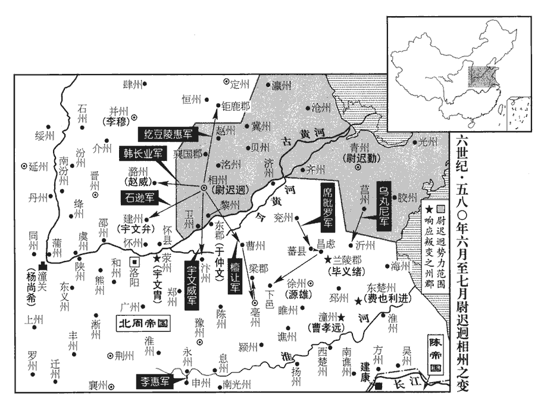
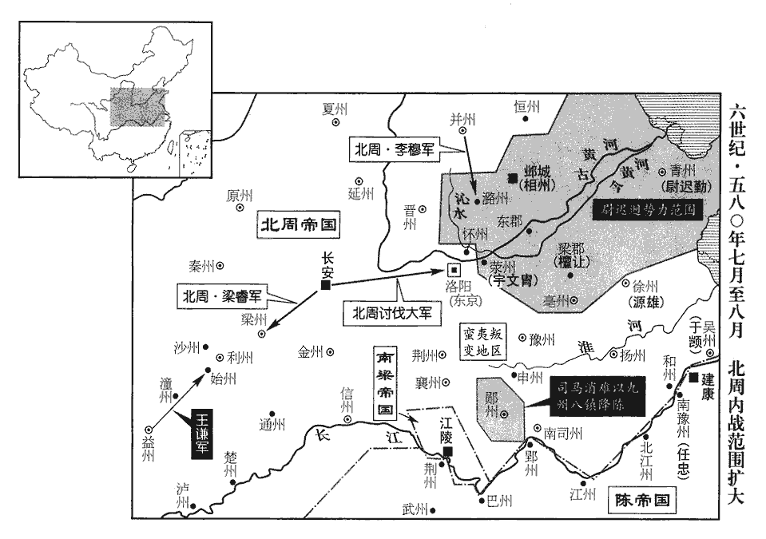
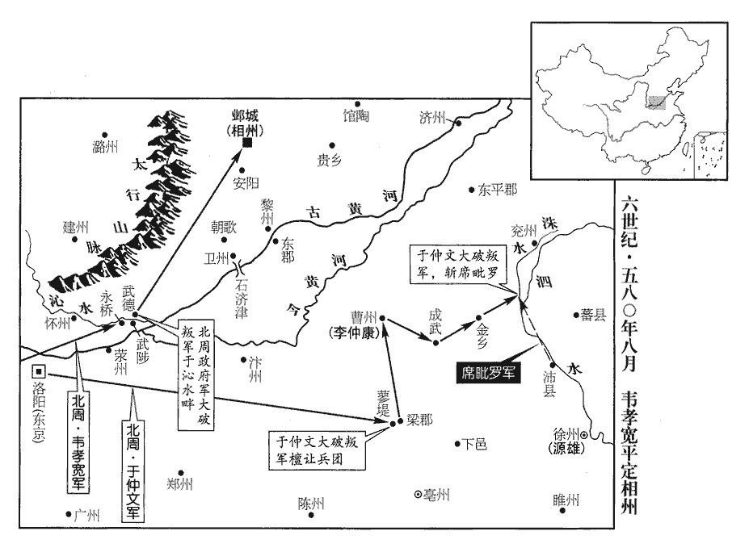
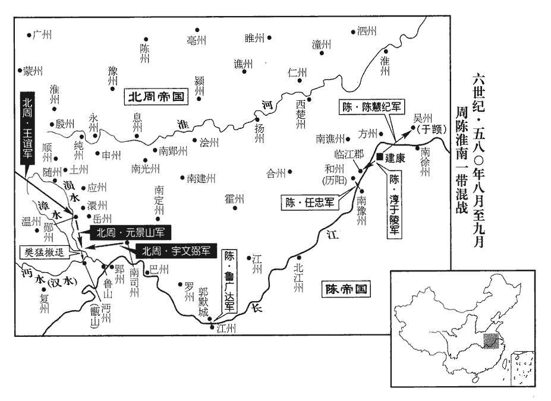
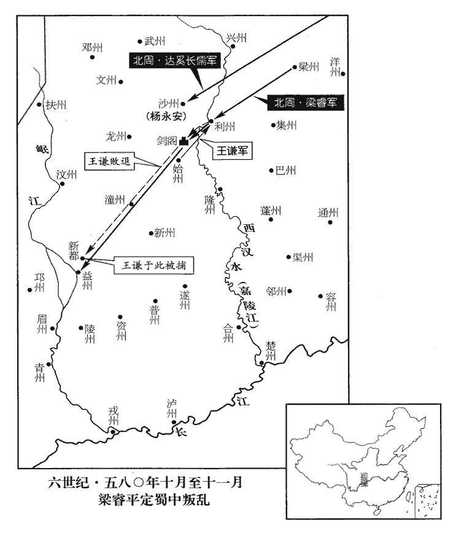

 陳紀八上章困敦（庚子），一年。

# 高宗宣皇帝下之上

## 太建十二年（庚子、五八零）

1春，正月，癸巳‹七›，周‹首都长安陕西省西安市›天元‹宇文赟，本年二十二岁›祠太廟。史言周天元既以朝政授其子而猶主祭祀。

〖译文〗 [1]春季，正月，癸巳（初七），北周天元皇帝到太庙癸祀祖先。

2戊戌‹十二›，‹陈国，首都建康江苏省南京市›以左衛將軍任忠為南豫州‹姑孰·安徽省当涂县。原州政府设历阳安徽省和县›，已沦陷北周刺史，此時南豫州治宣城。任，音壬。督緣江軍防事。

〖译文〗 [2]戊戌（十二日），陈朝任命左卫将军任忠为南豫州刺史，负责沿江一带的军事防务。

3乙卯‹二十九›，周稅入市者人一錢。

〖译文〗 [3]乙卯（二十九日），北周朝廷向出入集市的人每人征税一文钱。

4二月，丁巳‹一›，周天元幸露門學，釋奠。周露門學，在露門左右塾。古者仲春、仲秋，皆以上丁釋奠于先聖、先師。鄭玄曰：釋奠者，設薦饌酌奠而已。

〖译文〗 [4]二月，丁巳（初一），北周天元皇帝驾幸露门学，陈设酒食祭祀孔子。

5戊午‹二›，突厥‹瀚海沙漠群›入貢于周，且迎千金公主。周許以千金公主妻突厥，事始上卷上年。厥，九勿翻。

〖译文〗 [5]戊午（初二），突厥国派人向北周朝廷进贡，并来迎娶千金公主。

6乙丑‹九›，周天元改制為天制，敕為天敕。制者，大賞罰、大除授、赦宥、慮囚、慰勞用之；敕者，廢置州縣、增減官吏、除免官爵、授六品以上官、發兵、施行百官奏請、戒約臣下皆用之；皆宣署申覆而後行。壬午‹二十六›，尊天元皇太后為天元上皇太后，天皇太后‹李娥姿›為天元聖皇太后。二太后，天元嫡母阿史那氏、所生母李氏也。癸未‹二十七›，詔楊后‹杨丽华，本年二十岁›與三后皆稱太皇后，三后，朱后‹朱满月›、元后‹元乐尚›、陳后‹陈月仪›也。司馬后‹司马令姬›直稱皇后。司馬后，正陽宮皇后也。

〖译文〗 [6]乙丑（初九），北周天元皇帝将自己所下的制书改称天制，敕书改称天敕。壬午（二十六日），北周尊称天元皇太后为天元上皇太后，天元太后为天元圣皇太后。癸未（二十七日），又下诏书令对皇后杨氏与朱氏、元氏、陈氏三位皇后一样都称为太皇后，司马皇后直称皇后。

行軍總管杞公亮，天元之從祖兄也。天元從祖，宇文泰之兄弟也。從，才用翻。其子西陽公溫妻尉遲氏‹尉迟繁炽›，蜀公迥之孫，尉，紆勿翻。有美色，以宗婦入朝，天元飲之酒，逼而淫之。朝，直遙翻。飲，於禁翻。亮聞之，懼。三月，軍還，至豫州‹悬瓠·河南省汝南县›，自淮南還軍。豫州治汝南。還，音旋，又音如字。密謀襲韋孝寬，并其眾，韋孝寬，征南行軍元帥。帥，所類翻。推諸父為主，諸父，謂趙王招兄弟。鼓行而西。亮國官茹寬知其謀，諸國公各有國官。茹，姓也。後魏書，普六茹，後改為茹氏。余按太和之時，南齊有茹法亮，蓋南國自有茹氏。今茹寬既仕於北國，恐出於普六茹氏。茹，音如。先告孝寬，孝寬潛設備。亮夜將數百騎襲孝寬營，將，即亮翻，又音如字，領也。騎，奇寄翻。不克而走。戊子‹三›，孝寬追斬之，溫亦坐誅。天元即召其妻‹尉迟繁炽›入宮，拜長貴妃。長，知兩翻。辛卯‹六›，立亮弟永昌公椿為杞公。

〖译文〗 北周行军总管杞公宇文亮是天元皇帝的从祖堂兄。宇文亮的儿子西阳公宇文温的妻子尉迟氏是蜀公尉迟迥的孙女，容貌美艳，以皇族大夫妇人的身份入朝，天元皇帝让她喝酒，强迫奸污了她。宇文亮得知此事后，心中恐惧。三月，他率军从淮南返回，军到豫州时，密谋袭击征南行军元帅韦孝宽，把他的部队夺过来，然后再推举自己父辈的人为首领，拥兵击鼓西进。宇文亮的国官茹宽得悉了他的计谋，事先告知了韦孝宽，韦孝宽就暗中作了部署。一天夜晚，宇文亮带领数百名骑兵偷袭韦孝宽军营，没有得手，被迫退走。戊子（初三），韦孝宽领兵追击，将宇文亮斩首，宇文温也受牵连被杀。天元皇帝随即把宇文温的妻子召入后宫，册封为长贵妃。辛卯（初六），天元皇帝又立宇文亮的弟弟永昌公宇文椿为杞公。

7周天元‹宇文赟›如同州‹武乡·陕西省大荔县›，增候正、前驅、式道候為三百六十重，候正，主候望。前驅，先驅也。式道候，在大駕前。重，直龍翻。自應門至於赤岸澤‹陕西省大荔县南，在沙苑附近›，鄭玄曰：天子五門，皋、庫、雉、應、路。詩云：乃立應門，應門將將。赤岸澤，在長安北，同州南，道里蓋適中。數十里間，幡旗相蔽，音樂俱作，又令虎賁持鈒sà馬上，稱警蹕。賁，音奔。鈒，色立翻，戟也，鋋也。警，戒也，戒人以車駕將至也。蹕，蹕止行人也。乙未‹十›，改同州宮‹陕西省大荔县›為成天宮。庚子‹十五›，還長安。還，從宣翻，又音如字。詔天臺侍衛之官，皆著五色及紅、紫、綠衣，以雜色為緣，名曰：「品色衣」，著，則略翻。緣，以絹翻。五代志，以錦綺繢huì繡為緣。有大事，與公服間服之。五代志：後周之制，諸命秩之服曰公服，其餘常服曰私衣。隋、唐以下，有朝服，有公服。朝服曰具服，公服曰從省服。間，古莧翻。壬寅‹十七›，詔內外命婦皆執笏，後周之制，內外命婦各有命服，未嘗執笏也。其拜宗廟及天臺，皆俛伏如男子。俛fǔ，音免。

〖译文〗 [7]北周天元皇帝巡幸同州，增派负责候望车贺的候正、负责先行安排的前驱以及负责在车驾前面开路的式道候等多达三百六十重，从皇宫应门一直到长安北面的赤岸泽，数十里间，幡旗相连，遮天蔽日；音乐大作，响彻云天。又命令虎贲卫士持戟乘马，沿路戒严，禁止过往行人通行。乙未（初十），天元皇帝下令将他居住的同州宫改称成天宫。庚子（十五日），天元皇帝回到长安。又下诏书命令在天台内的侍卫官吏，都须穿五色和红色、紫色、绿色衣服，以杂色为边缘装饰，名叫“品色衣”，遇到重大事情，可与公服轮换穿戴。壬寅（十七日），天元皇帝又下诏书命令宫廷内外有封号的妇人上朝时都要手持笏板，朝拜宗庙或天台时，都要像男人一样俯身跪拜。

天元將立五皇后，以問小宗伯狄道‹甘肃省临池县›辛彥之。五代志：狄道縣屬金城郡。對曰：「皇后與天子敵體，不宜有五。」太學博士西城‹陕西省安康市›何妥曰：「昔帝嚳kù四妃，虞舜二妃。先代之數，何常之有！」博士，秦官。漢置五經博士，即太學博士也。晉武帝立國子學，置博士一人，遂有國子博士、太學博士之分。西城郡時置金州。帝王紀云：帝嚳四妃：元妃有邰氏女，曰姜嫄；次妃有娀sōng氏女，曰簡狄；次妃陳豐氏女，曰慶都；次妃娵jū訾zī氏，曰常義。列女傳云：舜二妃，堯之二女，長曰娥皇，次曰女英。史言何妥曲學以阿世，不可以訓。嚳，苦沃翻。嫄，音原。娵，遵須翻。訾，子斯翻。妥，他果翻。帝大悅，免彥之官。甲辰‹十九›，詔曰：「坤儀比德，土數惟五，四太皇后外，可增置天中太皇后一人。」於是以陳氏‹陈月仪›為天中太皇后，尉遲妃‹尉迟繁炽›為天左太皇后。陳氏，山提之女；尉遲氏，宇文溫之妻。尉，紆勿翻。又造下帳五，使五皇后各居其一，實宗廟祭器於前，自讀祝版而祭之。下帳，山陵中便房所用。此所謂下帳，蓋周天元以自所居者為上帳，五皇后所居者為下帳也。祝版，所以祝鬼神。又以五輅lù載婦人，自帥左右步從。按古制有五輅。後周之制，皇帝之輅十有二等，皇后之車十有二等，亦曰輅。下至三妃、三公、三公夫人之輅，皆九，至上媛婦、中大夫孺人，其輅五。天元雖淫侈無道，何至以古之五輅載婦人，其實用媛婦以下所乘五輅耳。五輅，謂玄輅、夏篆、夏縵、墨車、輚hàn車也。帥，讀曰率。從，才用翻。又好倒懸雞及碎瓦於車上，觀其號呼以為樂。好，呼到翻。號，戶高翻。樂，音洛。

〖译文〗 天元皇帝准备册立五位皇后，征询小宗伯狄道人辛彦之的意见。辛彦之回答说：“皇后与天子同样尊贵，不应该有五位。”太常博士西城人何妥说：“古时候帝喾有四个妃子，虞舜有两个妃子。可见前代在皇后的数目上，并没有一成不变的规定。”天元皇帝听了何妥的话非常高兴，就罢免了辛彦之的官。甲辰（十九日），天元皇帝下诏书说：“妇人取法大地，土地有五类，所以在四位太皇后之外，可以再增置一位天中太皇后。”于是册封陈氏为天中太皇后，尉迟妃为天左太皇后。天元皇帝又下令建造了五座帐篷，让五位皇后各居住一座。他又将宗庙里的祭祀用具陈列于前，亲自拿着祝版宣读祝文，以祭告祖先。天元皇帝也经常让妇女乘坐玄辂、夏篆、夏缦、墨车和车等五种车子，自己带领左右随从步行跟从。他还喜欢倒挂活鸡于车上，或者向车上投掷瓦片，看着那些乘车的妇女吓得号叫而借以取乐。

8夏，四月，癸亥‹八›，尚書左僕射陸繕卒‹年六十三岁›。卒，子恤翻。

〖译文〗 [8]夏季，四月，癸亥（初八），南陈尚书左仆射陆缮去世。

9己巳‹十四›，周天元祠太廟；己卯‹二十四›，大雩yú；壬午‹二十七›，幸仲山‹位于陕西省泾阳县西北›祈雨；顏師古曰：仲山，即今九嵕山之東仲山是也。括地志：仲山在雍州雲陽縣西十五里。甲申‹二十九›，還宮，令京城士女於衢巷作樂迎候。還，從宣翻，又音如字。令，力丁翻。

〖译文〗 [9]己巳（十四日），北周天元皇帝到太庙去祭祀祖先。己卯（二十四日），举行求雨的雩祭。壬午（二十七日），天元皇帝又到仲山求雨。甲申（二十九日），天元皇帝从仲山返回皇宫，下令京城百姓在街巷唱歌跳舞迎候车驾。

10五月，癸巳‹九›，以尚書右僕射晉安王伯恭為僕射。

〖译文〗 [10]五月，癸丑（初九），南陈任命尚书右仆射晋安王陈伯恭为尚书仆射。

11周楊后‹杨丽华›性柔婉，不妬忌，四皇后及嬪、御等，咸愛而仰之。嬪，內官九嬪也。嬪，婦也，能行婦道者也。御，侍也，進也，進御於君者也。嬪，毗賓翻。天元昏暴滋甚，喜怒乖度，嘗譴后，欲加之罪。后進止詳閑，辭色不撓，譴，詰戰翻。詳，審也，諦也。閑，暇也，習也。撓，曲也，又動亂也。撓，女巧翻，又女教翻。天元大怒，遂賜后死，逼令引訣，漢書多作「引決」，謂引分自裁也。訣，別也。令，力丁翻。后母獨孤氏獨孤氏，信之女也。詣閤陳謝，叩頭流血，然後得免。

〖译文〗 [11]北周杨皇后性格柔顺，不妒忌，所以其他四位皇后以及后宫中的九嫔、侍御等都爱戴并敬重他。天元皇帝越来越昏庸暴虐，喜怒无常，曾无故责备杨皇后，想强加给她罪名。但是杨皇后举止安祥，言语态度没有曲挠服软的表示，所以天元皇帝十分愤怒，遂将杨皇后赐死，逼令他自杀。杨皇后的母亲独孤氏闻讯后，急忙进宫，为杨皇后求情，以至叩头流血，杨皇后才免于一死。

后父大前疑堅，位望隆重，天元忌之，嘗因忿謂后曰：「必族滅爾家！」因召堅，謂左右曰：「色動，即殺之。」堅至，神色自若，乃止。內史上大夫鄭譯，與堅少同學，少，詩照翻。奇堅相表，相，息亮翻。傾心相結。堅既為帝所忌，情不自安，嘗在永巷，永巷，宮中長巷。私於譯曰：身事不敢昌言之，故曰私。「久願出藩，公所悉也，出藩，謂出補外藩。悉，諳究也。願少留意！」少，詩沼翻。譯曰：「以公德望，天下歸心。欲求多福，豈敢忘也！鄭譯被寵於天元為如何，天元無恙而與楊堅於宮中私言，至及於此，小人傾覆，何可託邪！謹即言之。」

〖译文〗 杨皇后的父亲杨坚任职大前疑，地位尊崇，深孚众望。天元皇帝一直猜忌他，有一次发怒时对杨皇后说：“我一定要将你家灭族。”于是传令召杨坚进宫，对左右侍从说：“他如果变了脸色，就立即把他杀死。”杨坚来到以后，神色自若，天元皇帝才没有杀他。内史上大夫郑译，少年时与杨坚同学，对杨坚的相貌感到惊奇，于是诚心诚意与他交结。杨坚既已遭到天元皇帝的猜忌，心中老是忐忑不安，有一次在宫中的长巷内碰到郑译，就悄悄地对他说：“我早就想出朝镇守一方，这你是很清楚的，希望你能够为我留心这样的机会！”郑译说：“随公您德高望重，天下归心。我也奢望前程远大，对您托付的事岂敢遗忘！我很快就向皇帝启奏。”

天元‹宇文赟›將遣譯入寇，譯請元帥。帥，所類翻。天元曰：「卿意如何？」對曰：「若定江東，自非懿戚重臣，懿，專久而美也，大也。無以鎮撫，可令隨公行，以楊爵稱之。且為壽陽總管‹总部设寿阳安徽省寿县›以督軍事。」天元從之。己丑‹五›，以堅為揚州總管，使譯發兵會壽陽。壽陽屬南則為豫州，屬北則為揚州。將行，會堅暴有足疾，不果行。先無此疾而忽有此疾曰暴。暴，猝暴也。

〖译文〗 北周天元皇帝将派郑译率军进攻南陈，郑译请求朝廷任命一位元帅。天元皇帝问：“你认为派谁合适？”郑译回答说：“如果要平定江东，不用朝廷懿戚重臣做统帅，难以镇抚，请命令随公杨坚随军前往，担任寿阳总管，负责前线军事。”天元皇帝答应了郑译的请求。己丑（初五），天元皇帝任命杨坚为崐扬州总管，令郑译调遣军队与杨坚到寿阳会合。将要出发时，适逢杨坚突然得了脚病，结果没有成行。

甲午‹十›夜，天元備法駕，幸天興宮；乙未‹十一›，不豫而還。還，音旋，又如字。小御正博陵‹河北省安平县›劉昉，素以狡諂得幸於天元，杜佑曰：周御正屬天官。御正，中大夫，五命。小御正，下大夫，四命。昉，分罔翻。狡，古巧翻，猾也。與御正中大夫顏之儀並見親信。天元召昉、之儀入臥內，欲屬以後事。天元瘖，不復能言。寢室謂之臥內。屬，之欲翻。瘖，於今翻。復，如字，又扶又翻。昉見靜帝‹宇文阐本年八岁›幼沖，沖，亦幼也。周成王率稱「沖人」、「沖子」。以楊堅后父，有重名，遂與領内史鄭譯、鄭譯以內史上大夫領内史。御飾大夫柳裘、周置御飾大夫，掌御飾；其御服又置司服掌之。內史大夫杜陵‹陕西省西安市东南›韋謩mó、杜陵，漢、晉皆屬京兆，後隋併入京兆大興縣，其地在隋、唐長安城南。謩，與謨同。御正下士朝那‹宁夏彭阳县西古城乡›皇甫績朝那縣，屬安定郡。後周下士，二命。謀引堅輔政，堅固辭，不敢當；昉曰：「公若為，速為之；不為，昉自為也。」堅乃從之，稱受詔居中侍疾。裘，惔之孫也。柳惔，柳元景之從孫，世隆之子，世仕江南。江陵陷，柳氏入關中，遂臣於周。惔，徒甘翻。

〖译文〗 甲午（初十）夜，天元皇帝乘坐车驾，临幸天兴宫。乙未（十一日），因病返回。小御正博陵人刘一向以狡黠谄媚得到天元皇帝的宠爱，与御正大夫颜之仪一起受到天元皇帝的信任。天元皇帝召见刘、颜之仪到卧室，想向他们托付后事，但因病发音困难，不能再说话。刘见静帝年纪幼小，而杨坚是杨皇后的父亲，声名显赫，于是和领内史郑译、御饰大夫柳裘、内史大夫杜陵人韦、御正下士朝那人皇甫绩商议，邀请杨坚辅政。杨坚坚辞不接受，刘就对他说：”您如果想干，就赶快上任；如果不想干，我就自己干。”杨坚这才答应，对外则宣称接到天元皇帝诏命，要他住进宫中侍奉疾病。柳裘是柳的孙子。

是日，帝‹宇文赟›殂。年二十二。殂，祚乎翻。祕不發喪。昉、譯矯詔以堅總知中外兵馬事。考異曰：周帝紀：「乙未，帝不豫，還宮，詔堅入侍疾。丁未，追五王入朝。己酉，大漸，昉、譯矯制，以堅受遺輔政。是日，帝崩。」按堅以變起倉猝，故得矯命當國。若自乙未至己酉，凡十五日，事安得不泄！今從隋帝紀。顔之儀知非帝旨，拒而不從。昉等草詔署訖，逼之儀連署，之儀厲聲曰：「主上升遐，記曲禮：告喪曰天王登假。鄭玄曰：登，上也；假，已也。上已者，言若仙去云耳。登，猶升也。假，與遐同，音霞。嗣子冲幼，靜帝‹宇文阐›時年八歲。阿衡之任，商相伊尹輔太甲，稱阿衡。孔安國傳曰：阿，倚；衡，平。宜在宗英。才過人曰英。宗英，宗室之中其才過人者。方今趙王‹宇文招›最長，以親以德，合膺重寄。趙王，謂趙王招，於靜帝諸大父行中，其年最長。長，知兩翻。膺，當也。公等備受朝恩，朝，直遙翻。當思盡忠報國，柰何一旦欲以神器假人！老子：天下神器，為者敗之，執者失之。註云：大寶之位，是天地神明之器，故不可以力為也。又曰：國之利器，不可以授人。之儀有死而已，不能誣罔先帝。」昉等知不可屈，乃代之儀署而行之。諸衛既受敕，並受堅節度。周自左•右宮伯至左•右羽林、游擊，皆諸衛官也。

〖译文〗 当天，天元皇帝去世。宫中对外秘而不宣。刘、郑译又假传诏命，让杨坚总管朝野内外的军队。颜之仪知道这不是天元皇帝的命令，就拒绝服从诏命。刘等人起草好诏书并分别署上自己的名字后，就逼颜之仪也签上名字，颜之仪厉声说：“天元皇帝已经升天，继位的皇帝还很年幼，总理朝政的重任应该由宗室中有才能的人担任。现今赵王宇文招年纪最大，他既是宗室至亲，不论德行和才干，理当担负辅政重任。你们诸位备受朝廷恩惠，应当考虑怎样才能尽忠报国才是，怎么能够把天下的权柄授与他姓之人呢！我颜之仪有死而已，绝不能欺骗先帝的在天之灵。”刘等人知道无法使颜之仪屈从，于是就代替颜之仪签上名字，然后颁行下去。北周负责保卫京师和皇宫的禁卫军各部队既然都接到了天元皇帝的诏命，于是就都接受杨坚的指挥。

堅恐諸王在外生變，以千金公主將適突厥為辭，徵趙、陳、越、代、滕五王入朝。五王就國，見上卷上年。厥，九勿翻。朝，直遙翻。堅索符璽，符，謂兵符。璽，謂天子六璽。索，山客翻。璽，斯氏翻。顏之儀正色曰：「此天子之物，自有主者，宰相何故索之！」索，山客翻，堅大怒，命引出，將殺之；以其民望，出為西邊郡守。「西邊」，恐當作「西疆」‹甘肃省迭部县西北›。五代志：臨洮郡合川縣，後周置，仍立西疆郡。考異曰：北史鄭譯傳，「之儀與宦者謀引大將軍宇文仲輔政。仲已至御坐，譯知之，遽率開府楊惠及劉昉、皇甫績、柳裘俱入。仲與之儀見譯等，愕然，逡巡欲出，隋文因執之。於是矯詔復以譯為內史上大夫。明日，隋文為丞相，拜譯柱國府長史。」按之儀若爾，豈復得全！今從之儀傳。

〖译文〗 杨坚恐怕宗室诸王在地方发动叛乱，就以千金公主将要远嫁突厥为借口，征召赵王宇文招、陈王宇文纯、越王宇文盛、代王宇文达、腾滕王宇文等五王入朝。杨坚索要天元皇帝的兵符玺印，颜之仪严厉地拒绝道：“这是天子使用的东西，自然有人掌管，宰相凭什么索要天子的兵符印玺呢？”杨坚听了勃然大怒，命令将颜之仪拉出宫去，准备杀了他。但是考虑到颜之仪在朝廷上下都很有声望，于是就派他去做了西部边疆的郡守。

丁未‹二十三›，發喪。靜帝‹宇文阐›入居天臺，罷正陽宮。置正陽宮見上卷上年。大赦，停洛陽宮作。治洛陽宮見上卷上年二月。庚戌‹二十六›，尊阿史那太后為太皇太后，李太后‹李娥姿›為太帝太后，靜帝祖母也。楊后‹杨丽华›為皇太后，朱后‹朱满月›為帝太后，靜帝嫡母、生母也。其陳后‹陈月仪›、元后‹元乐尚›、尉遲后‹尉迟繁炽›並為尼。皆不以德選，以色進者也。尼，女夷翻。以漢王贊為上柱國、右大丞相，贊，靜帝叔父也。周人上右。相，息亮翻。尊以虛名，實無所綜理。以楊堅為假黃鉞、左大丞相，秦王贄為上柱國。百官總己以聽於左丞相。孔子曰：君薨，百官總己以聽於冢宰三年。朱熹曰：各總攝己職以聽也。余謂若此者必有伊、周之臣而後可。

〖译文〗 丁未（二十三日），北周为去世的天元皇帝发丧。北周静帝住进天台，下令废除正阳宫的名称。静帝又下令大赦天下罪人，停止修建洛阳宫。庚戌（二十六日），静帝下诏书尊称阿史那太后为太皇太后，李太后为太帝太后，杨皇后为皇太后，朱皇后为帝太后。另外废陈皇后、元皇后、尉迟皇后出家为尼姑。又任命汉王宇文赞为上柱国、右大丞相，只不过是尊以虚名，实际上没有任何权力。同时任命杨坚为假黄钺、左大丞相，秦王宇文贽为上柱国。还下令朝中百官都必须率领下属服从左大丞相的命令。

堅初受顧命，顧命始於周成王。孔安國曰：臨終之命曰顧命。余謂顧命者，言天子登遐，若回顧而有所言也。陸德明曰：顧，工戶翻。使邗國公楊惠邗hán，音寒，又古寒翻。謂御正下大夫李德林曰：「朝廷賜令總文武事，經國任重。今欲與公共事，必不得辭。」德林曰：「願以死奉公。」堅大喜。始，劉昉、鄭譯議以堅為大冢宰，譯自攝大司馬，昉又求小冢宰。後周置小冢宰，上大夫也，六命。按爾雅：冢，大也。鄭玄曰：冢，大之上也。冢宰之上不宜加小字，故周官止曰小宰。昉，分罔翻。冢，知隴翻。堅私問德林曰：「欲何以見處？」處，昌呂翻。德林曰：「宜作大丞相、假黃鉞、都督中外諸軍事，不爾，無以壓眾心。」如昉、譯之言，大冢宰雖六官之長，然猶與諸公等夷。德林所言，則宇文泰所以輔魏者也。不爾，猶言不如此也。相，息亮翻。壓，於甲翻。及發喪，即依此行之。以正陽宮為丞相府。

〖译文〗 起初，杨坚受命辅政时，就派邗国公杨惠对御正下大夫李德林说：“朝廷赐令让我总管文武大权，治理国家的责任重大。我想与你一起谋划大事，你一定不要推辞。”李德林回答说：“我愿意追随您，虽死不辞。”杨坚非常高兴。最初，刘、郑译商议让杨坚出任大冢宰，郑译自己想担任大司马，刘又要求担任小冢宰。杨坚私下问李德林：“准备把我怎么安排？”李德林说：“您应该担任大丞相、假黄钺、都督中外诸军事。如果不这样做，就不能镇服众心。”等到为天元皇帝办完丧事，杨坚就按照李德林所说的去做了，并把正阳宫作为丞相府。

時眾情未壹，言周之朝臣未盡歸心於堅。堅引司武上士盧賁置左右。賁，扶分翻。將之東宮，正陽宮，本東宮也。百官皆不知所從。堅潛令賁部伍仗衛，仗衛，執仗而宿衛之兵也，盧賁以司武上士統之。楊堅潛令賁，此舉為如何？因召公卿，謂曰：「欲求富貴者宜相隨。」觀堅此言，則其夙心可知矣。往往偶語，欲有去就，賁嚴兵而至，眾莫敢動。出崇陽門，崇陽門，周宮城之東門。至東宮，門者拒不納，賁諭之，不去；瞋目叱之，瞋，昌真翻。門者遂卻，堅入。賁遂典丞相府宿衛。盧賁遂為楊堅私人矣。賁，辯之弟子也。盧辯，與蘇綽共定後周官制者也。以鄭譯為丞相府長史，長，知兩翻。劉昉為司馬，李德林為府屬，丞相府有掾有屬。二人由是怨德林。

〖译文〗 当时北周将帅大臣尚未归心于杨坚，杨坚把掌管宫廷宿卫的司武上士卢贲安排在自己的身边。杨坚将要去正阳宫，朝中百官都不知道该怎么办。杨坚一面密令卢贲部署宿卫禁兵，一面召见公卿大臣，对他们说：”想求取富贵的人请追随我。”公卿大臣们三三两两私下商议，有的表示愿意追随杨坚，有的则想留在朝廷。这时，卢贲带着全副武装的宿卫禁兵来到，公卿大臣们谁也不敢再有离去的表示。杨坚带着朝中百官出了宫廷东门崇阳门，来到正阳宫，但是守门的禁兵不放杨坚进去，卢贲上前对他们说明情况，可是这样禁兵还是不肯撤离。于是卢贲双目圆睁，厉声喝令他们闪开，守门禁兵这才退下，杨坚得以进入正阳宫。卢贲从此负责掌管丞相府的警卫。卢贲是卢辩弟弟的儿子。杨坚任命郑译为丞相府长史，刘为司马，李德林为府属。郑译、刘二人从此怨恨李德林。

內史下大夫勃海‹河北省东光县›高熲jiǒng按隋書：高熲自云勃海蓨tiáo‹河北景县›人。熲，古迥翻。明敏有器局，習兵事，多計略，堅欲引之入府，引之入丞相府為官屬。遣楊惠諭意。楊惠，堅族子也。堅初秉周政，欲引時才，故率使之諭意。堅既受禪，封觀王，改名雄。熲承旨，欣然曰：「願受驅馳。縱令公事不成，熲亦不辭滅族。」乃以為相府司錄。司錄，總錄一府之事。令，力丁翻。相，息亮翻。

〖译文〗 北周内史下大夫勃海人高，聪明敏捷，有度量，懂军事，足智多谋。杨坚想请他进丞相府任职，于是派杨惠去向高转达相邀之意。高接受了邀请，并欣然回答说：“愿意听从杨公差遣。纵使杨公大业不成，我也不怕遭到灭族之祸。”杨坚于是任命高为丞相府司录。

時漢王贊居禁中，每與靜帝同帳而坐。劉昉飾美妓進贊，妓，渠綺翻，女樂也。贊甚悅之。昉因說贊曰：「大王，先帝之弟，時望所歸。孺子幼沖，豈堪大事！說，輸芮翻。孺子，謂靜帝。今先帝初崩，人情尚擾。王且歸第，待事寧後，入為天子，此萬全計也。」贊年少，少，詩照翻。性識庸下，以為信然，遂從之。

〖译文〗 当时汉王宇文赞就住在宫廷中，每天都与静帝同帐而坐，刘就把一些经过打扮的美貌歌女进献给宇文赞，宇文赞非常高兴。刘乘机对宇文赞说：“大王您是先帝的弟弟，为众望所归。小皇帝年龄还小，怎能担负起治理天下的重任！只是现在先帝刚刚去世，人心还不稳定，请您暂时先回自己的府第，等待事情安定后，就迎立您为天子，这方是万全之计。”宇文赞年轻，才识平庸低下，相信了刘的话，于是就出宫回府去了。

堅革宣帝‹宇文赟›苛酷之政，更為寬大，刪略舊律，作刑書要制，奏而行之；躬履節儉，中外悅之。賈誼曰：寒者利裋shù褐，飢者甘糟糠；天下之嗷嗷，新主之資也。古之得天下，必先有以得天下之心，雖姦雄挾數用術，不能外此也。更，工衡翻。

〖译文〗 杨坚执政以后，革除了北周宣帝苛刻残暴的政令，为政务从宽大。他册改旧律，制定《刑书要制》，上奏静帝颁行天下。他又提倡节俭，并且身体力行，于是得到了朝野内外的称赞。

堅夜召太史中大夫庾季才，太史掌天文曆數。周制：太史中大夫，屬春官，五命。問曰：「吾以庸虛，庸，言身無所能；虛，言胸中無所有；謙辭也。受茲顧命。天時人事，卿以為何如？」季才曰：「天道精微，難可意察。竊以人事卜之，符兆已定。符，讖也，證也，驗也。兆，龜坼chè文也，又人事之兆朕也。季才縱言不可，公豈復得為箕、潁之事乎！」司馬貞曰：堯讓天下於許由，由遂逃於箕山，洗耳於潁水。復，扶又翻，又音如字。堅默然久之，曰：「誠如君言。」獨孤夫人亦謂堅曰：「大事已然，騎虎之勢，必不得下，勉之！」獨孤夫人，堅妃也。騎虎而下，必為所噬。

〖译文〗 杨坚在夜里召见太史中大夫庚季才，问道：“我平庸没有才能，却得到了辅佐幼主的重任。从天时和人事两方面来看，你以为会怎么样呢？”庚季才回崐答说：”天道精微奥妙，一时难以观察出来。我只从人事方面来预料，觉得符命征兆已定。我即使说天时和人事都对您不利，您难道还能够效法尧帝时代的许由，逃往箕山，洗耳于颍水，而让天下吗！”杨坚沉默了一会，然后说：“事情确实像你所说的那样。”杨坚的夫人独孤氏也对他说：“事情已经到了这一步，骑虎难下，你就努力去做吧！”

堅以相州總管‹总部设邺城河北省临漳县西南邺镇›尉遲迥位望素重，恐有異圖，相，息亮翻。尉，紆勿翻。使迥子魏安公惇奉詔書召之會葬。魏安郡公。五代志，武威郡昌松縣有後魏魏安郡。註詳見後。壬子‹二十八›，以上柱國韋孝寬為相州總管；又以小司徒叱列長义為相州刺史，叱列，虜複姓，出於拓跋氏西部，後為周之戚里。先令赴鄴；孝寬續進。鄴，相州總管治所。

〖译文〗 杨坚认为相州总管尉迟迥素来地位高，名望大，恐怕他有异图，于是就派他的儿子魏安公尉迟持诏书召尉迟迥还京师参加天元皇帝的葬礼。壬子（二十八日），任命上柱国韦孝宽为相州总管，又任命小司徒叱列长义为相州刺史；先令叱列长义赶赴邺城，韦孝宽随后进发。

陳王純時鎮齊州‹历城·山东省济南市›，純就國於濟南。濟南郡，齊州也。堅使門正上士崔彭徵之。門正，掌門關啟閉之節及出入門者。彭以兩騎往止傳舍，騎，奇寄翻。傳，張戀翻。遣人召純。純至，彭請屏左右，密有所道，屏，必郢翻。道，言也。遂執而鎻之，因大言曰：「陳王有罪，詔徵入朝，左右不得輒動！」其從者愕然而去。朝，直遙翻。從，才用翻。彭，楷之孫也。崔楷死職見一百五十一卷梁武帝大通元年。

〖译文〗 北周陈王宇文纯当时镇守齐州，杨坚派门正上士崔彭前去征召。崔彭带着两名随从骑兵到了齐州，就住在供使者休息的传舍，派人去叫宇文纯。宇文纯来到后，崔彭请他让左右的侍卫随从退下，说有重要的话私下谈。然后乘机命令用枷锁了宇文纯，并对外大声宣布：“陈王有罪，皇帝下诏征他入朝，随从侍卫都不许乱动。”宇文纯的左右人员听后，都惊愕而散去。崔彭是崔楷的孙子。

六月，五王皆至長安。

〖译文〗 六月，北周赵、陈、越、代、滕五王都到达长安。

12庚申‹六›，周復行佛、道二教，周禁二教見一百七十一卷六年。復，扶又翻，又音如字。舊沙門、道士精志者，簡令入道。簡，分別也。

〖译文〗 [12]庚申（初六），北周恢复佛、道二教，原来的和尚、道士诚心修行的，下令分别恢复其宗教徒身份。

13周尉遲迥知丞相堅將不利於帝室，謀舉兵討之。尉，紆勿翻。相，息亮翻。韋孝寬至朝歌‹河南省淇县›，五代志：汲郡衛縣，舊曰朝歌。迥遣其大都督賀蘭貴周書：賀蘭，其先與魏俱起，有紇伏者，為賀蘭莫何弗，因以為氏。齎書候韋孝寬。齎jí，相稽翻。孝寬留貴與語以審之，疑其有變，遂稱疾徐行；又使人至相州求醫藥，密以伺之。伺，相吏翻。孝寬兄子藝，為魏郡‹邺城›守，守，式又翻。迥遣藝迎孝寬，孝寬問迥所為，藝黨於迥，不以實對。魏郡守與相州總管府同治鄴，職事有聯。且迥忠於帝室，宜其黨於所事。守，手又翻。孝寬怒，將斬之，藝懼，悉以迥謀語孝寬。語，牛倨翻。孝寬攜藝西走，每至亭驛，亭，郵亭也，即置驛之所。盡驅其傳馬而去，傳馬，即驛馬。傳，張戀翻。謂驛司曰：驛司，掌驛之吏。「蜀公將至，宜速具酒食。」尉遲迥封蜀公，故稱之。迥尋遣儀同大將軍梁子康將數百騎追孝寬，追者至驛，輒逢盛饌，康将，即亮翻，又音如字，領也。騎，奇寄翻。饌，雛皖翻，又雛戀翻，食也。又無馬，遂遲留不進。孝寬與藝由是得免。史言韋孝寬機數過人。

〖译文〗 [13]北周尉迟迥深知丞相杨坚将会篡夺政权，就密谋起兵讨伐。韦孝宽进至朝歌，尉迟迥派遣部下大都督贺兰贵持他的亲笔信来迎接。韦孝宽把贺兰贵留下来，与他交谈，从贺兰贵的言谈话语中，觉察到尉迟迥可能会有变故，于是就假称有病，缓慢而行。一面派人以寻医买药为名到相州，暗中侦察尉迟迥的动静。韦孝宽的侄子韦艺，当时正在尉迟迥手下任魏郡太守。尉迟迥就派韦艺去迎接韦孝宽。韦孝宽问他关于尉迟迥的情况，韦艺因为是尉迟迥的同党，没有告诉韦孝宽实情。韦孝宽非常愤怒，要把韦艺斩首，韦艺惧怕，就把尉迟迥的密谋全部告诉了韦孝宽。于是韦孝宽带着韦艺向西奔还，每到一个亭驿，就把驿站里供使者换乘的传马全都驱赶走，又对驿官说：“蜀公尉迟迥很快就要到达，赶快准备酒宴招待。”稍后，尉迟迥派遣仪同大将军梁子康带着数百名骑兵追赶韦孝宽，每追到一个驿站，遇到的都是丰盛的酒宴，又没有传马可以替换，于是就不再追赶。韦孝宽和韦艺因此得免于难。

堅又令候正破六韓裒詣迥諭旨，破六韓，虜三字姓。諭，譬也，告也，曉也。旨，意向也。裒póu，薄侯翻。密與總管府長史晉昶等書，姓苑：晉本唐叔虞之後，以國為氏。長，知兩翻。昶，丑兩翻。令為之備，迥聞之，殺昶及裒，集文武士民，文武，謂總管府及州郡文武官屬也。令，力丁翻。登城北樓，令之曰：「楊堅藉后父之勢，挾幼主以作威福，不臣之迹，暴於行路。令，力定翻。藉，慈夜翻。暴，步卜翻，顯示也；又如字，顯露也。吾與國舅甥，尉遲迥，宇文泰之甥。任兼將相；先帝處吾於此，將，即亮翻。相，息亮翻。處，昌呂翻。本欲寄以安危。今欲與卿等糾合義勇，糾，渠黝翻。繩三合為糾，言糾合者，義取諸此。以匡國庇民，何如？」眾咸從命。迥乃自稱大總管，承制置官司。稱大總管者，欲以統攝諸州。總管署置官司，而隔於權臣，未得以聞於天子，故曰承制。時趙王招入朝，留少子在國，趙王招國於襄國‹河北省邢台市›，襄國屬相州總管府。朝，直遙翻。少，詩照翻。迥奉以號令。

〖译文〗 杨坚又命令候正破六韩裒到邺城去，向尉迟迥申述自己并没有异图，同时暗中带着自己的亲笔信给相州总管府长史晋昶等人，要他们防备尉迟迥起兵叛乱。尉迟迥得知此事后，就杀了晋昶和破六韩裒，然后召集相州文武官吏和百姓，登上城北门楼，对他们说：“杨坚凭借着皇后父亲的地位，挟制年幼的天子，作威作福，这种不遵守臣道的行为，早已路人皆知。我和太祖文皇帝是舅崐甥，与国家情同一体，休戚与共，一身担当出将入相的双重大任。先帝让我镇守相州，本来就寄托着的国家安危兴亡。现在我要与你们一起纠合仁义勇敢之士，揭竿而起，以匡扶国家，保护百姓，你们看怎么样？”相州官吏百姓都表示愿意服从尉迟迥的命令。尉迟迥于是自封为大总管，宣称秉承天子之意，设置各种官吏。当时赵王宇文招应朝廷征召入朝，小儿子留在封地襄国。尉迟迥就尊奉他并以他的名义号令天下。

甲子‹十›，堅發關中兵，以韋孝寬為行軍元帥，帥，所類翻。郕chéng公梁士彥、樂安公元諧、化政公宇文忻、濮陽公武川‹内蒙古武川县›宇文述、武鄉公崔弘度、清河公楊素、隴西公李詢等，皆為行軍總管，以討迥。梁士彥，國公。郕，古國名。自元諧以下皆郡公。五代志：北海郡千乘縣，舊置樂安郡。地形志：夏州有化政郡。參考五代志，當在夏州巖綠縣界。東平郡鄄城縣，舊置濮陽郡。述傳曰：述，代郡武川人。志，馬邑郡善陽縣有代郡。上黨郡鄉縣，石勒置武鄉郡。五代志：周改馮翊華陰縣為武鄉郡。清河郡武城縣，舊置清河郡，隴西古郡也，後魏領襄武首陽縣。樂，音洛。濮，博木翻。弘度，楷之孫；詢，穆之兄子也。李穆時為并州‹晋阳·山西省太原市›刺史。

〖译文〗 甲子（初十），杨坚调发北周在关中的军队，任命韦孝宽为行军元帅，公梁士彦、乐安公元谐、化政公宇文忻、濮阳公武川人宇文述、武乡公崔弘度、清河公杨素、陇西公李询等人为行军总管，统率军队讨伐尉迟迥。崔弘度是崔楷的孙子，李询是李穆哥哥的儿子。

初，宣帝使計部中大夫楊尚希撫慰山東‹崤山以东›，後周置計部，蓋主計會之簿書，若周官之司書。杜佑曰：計部屬天官。至相州，聞宣帝殂，殂，祚乎翻。與尉遲迥發喪。尉，紆勿翻。尚希出，謂左右曰：「蜀公哭不哀而視不安，將有他計。吾不去，懼及於難。」難，乃旦翻。遂夜從捷徑而遁。捷徑者，不由正路捷出取徑直而行。遲明，遲，直利翻，待也。迥覺，追之不及，遂歸長安。堅遣尚希督宗兵三千人鎮潼關‹陕西省潼关县›。楊尚希，弘農人。弘農華陰諸楊，自東漢至後魏為名族。魏分東、西，弘農又為兵衝，故楊氏有宗兵。

〖译文〗 当初，北周宣帝派遣计部中大夫杨尚希安抚慰问潼关以东各州郡。杨尚希到了相州，听到宣帝去世的消息，便和尉迟迥在相州为宣帝举行葬礼。杨尚希从葬礼上出来，对左右随从说：“蜀公尉迟迥哭得不悲痛，而且眼神显得不安，他一定怀有别的打算。我如果不赶快离开此地，恐怕就会陷入祸乱之中。”于是在夜晚抄小路逃离相州。等到天明，尉迟迥方才发觉，已经追赶不上，杨尚希得以回到长安。

雍州牧畢剌王賢，雍，於用翻。剌，盧達翻。諡法：愎狠遂過曰剌；又，不思忘愛曰剌；暴慢無親曰剌。楊堅加賢以惡諡耳。與五王謀殺堅，事洩，洩，與泄同。堅殺賢，并其三子，掩五王之謀不問。堅豈真不問哉？山東有變，內復相圖，姑以安反側耳。以秦王贄為大冢宰，杞公椿為大司徒。庚子‹二十六›，以柱國梁睿為益州總管。睿，禦之子也。梁禦見一百五十六卷梁武帝中大通六年。

〖译文〗 北周雍州牧毕刺王宇文贤，与赵、陈、越、代、滕五王密谋除掉杨坚。事情败露，杨坚杀了宇文贤和他的三个儿子，而将五王参预密谋的事掩盖了下来，没有追究问罪。任命秦王宇文贽为大冢宰，杞公宇文椿为大司徒。庚子（疑误），北周朝廷任命柱国梁睿为益州总管。梁睿是梁御的儿子。

14周遣汝南公神慶、司衛上士長孫晟汝南，古郡名。晟，丞正翻。送千金公主於突厥。厥，九勿翻。晟，幼之曾孫也。按隋長孫晟傳及唐宰相世系表，晟，長孫稚之五世孫。稚，字幼卿，生子裕，子裕生紹遠，紹遠生覽，覽生敞，敞生熾，熾生晟，非曾孫也。若書稚字，「幼」下亦闕「卿」字。

〖译文〗 [14]北周派遣汝南公宇文神庆、司卫上士长孙晟护送千金公主到突厥去完婚。长孙晟是长孙幼的曾孙。

又遣建威侯賀若誼建威縣侯。五代志：建威縣屬武都郡。若，人者翻。賂佗鉢可汗，可，從刊入聲。汗，音寒。且說之以求高紹義。說，輸芮翻。佗鉢偽與紹義獵於南境，使誼執之。誼，敦之弟也。賀若敦，弼之父也。秋，七月，甲申‹一›，紹義至長安，徙之蜀；久之，病死於蜀。

〖译文〗 北周又派遣建威侯贺若谊前去贿赂突厥佗钵可汗，并且向他陈说利害，要求将投奔突厥的原北齐宗室范阳王高绍义交还北周。佗钵可汗同意，于是就假装约高绍义到南面边疆打猎，让贺若谊带人抓获了他。贺若谊是贺若敦的弟弟。秋季，七月，甲申（初一），高绍义被押送到长安，北周朝廷把他流放到蜀地。很久以后，病死于蜀地。

15周青州總管‹总部设东阳山东省青州市›尉遲勤，迥之弟子也。尉，紆勿翻。初得迥書，表送之，尋亦從迥。迥所統相、衛‹枋头城·河南省淇县东南淇门渡›、黎‹黎阳·河南省浚县›、洺‹广平·河北省永年县东南旧永年镇›、貝‹武成·河北省清河县西北›、趙‹广阿·河北省隆尧县›、冀‹信都·河北省冀州市›、瀛‹赵都军城·河北省河间市›、滄‹饶安·河北省盐山县西南›，五代志：汲郡，東魏置義州，後周為衛州。黎陽縣，後魏黎陽郡，後置黎州。武安郡，後周置洺州。清河郡，後周置貝州。趙郡大陸縣，舊曰廣阿，置殷州，後改趙州。信都郡，舊置冀州。河間郡河間縣，舊置瀛州。勃海郡饒安縣，舊置滄州。考異曰：周書迥傳又有毛州。按迥滅後，隋高祖始置毛州。迥傳誤也。勤所統青‹东阳·山东省青州市›、齊‹历城·山东省济南市›、膠‹东武·山东省诸城市›、光‹东莱·山东省莱州市›、莒‹团城·山东省沂水县›等州五代志：北海郡置青州。齊郡，舊曰齊州。高密郡，舊置膠州。東萊郡，舊置光州。琅邪郡沂水縣，舊置南青州，後周改為莒州。皆從之，眾數十萬。滎州‹虎牢·河南省荥阳市汜水镇西›刺史邵公冑，五代志：滎陽郡汜水縣，古虎牢也，後魏置東中府，東魏置北豫州，後周置滎州。邵公冑，周宗室也，封邵郡公。申州‹义阳·河南省信阳市›刺史李惠五代志：義陽郡，江左置司州，後魏改曰郢州，後周改曰申州。東楚州‹宿预·江苏省宿迁市›刺史費也利進，五代志：琅邪郡，後魏置南徐州，梁改為東徐州，東魏改東楚州，陳改安州，後周改泗州。豈史家以舊州名書之邪？費也，虜複姓，蓋即費也頭種。費，扶沸翻。潼州‹临潼·安徽省泗县›刺史曹孝遠，按五代志，後周亦無潼州，但云下邳郡夏丘縣，梁置潼州，後齊改曰睢州，尋廢。夏丘、宿豫，相去不遠，宿豫舊東楚治所，意此時尚有此二州而志逸之也。各據本州，徐州總管‹总部设彭城江苏省徐州市›司錄席毗羅據兗州‹瑕丘·山东省兖州市›，五代志：魯郡瑕丘縣，舊置兗州。姓苑：席姓，其先姓藉，避項羽諱，改姓席氏。前東平郡守畢義緒據蘭陵‹山东省枣庄市东南峄城镇›，五代志：蘭陵縣，舊曰承，置蘭陵郡。守，式又翻。皆應迥；懐縣‹河南省武涉县›永橋鎮將紇豆陵惠以城降迥。五代志：懷縣屬河內郡，隋大業初，廢入安昌縣。安昌本州縣。紇豆陵，虜三字姓。魏收官氏志：次南諸姓有紇豆陵氏。將，即亮翻。迥使其所署大將軍石遜攻建州‹高都·山西省晋城市›，建州刺史宇文弁以州降之。五代志：長平郡，舊曰建州。降，戶江翻。又遣西道行臺韓長業攻拔潞州‹上党·山西省长治市›，五代志：上黨郡，後周置潞州。執刺史趙威，署城人郭子勝為刺史。紇豆陵惠襲陷鉅鹿‹河北省藁城市›，鉅鹿，古郡也，隋為縣，屬襄國郡。遂圍恆州‹真定·河北省正定县›。五代志：恆山郡，後周置恆州。恆，戶登翻。上大將軍宇文威攻汴州‹大梁·河南省开封市›，五代志：滎陽郡浚儀縣，東魏置梁州，後周改曰汴州。汴，皮變翻。莒州刺史烏丸尼等帥青、齊之眾圍沂州‹琅邪·山东省临沂市›，五代志：琅邪郡，舊置北徐州，後周改曰沂州。帥，讀曰率。大將軍檀讓攻拔曹‹左城·山东省定陶县西›、亳‹谯城·安徽省毫州市›二州，五代志：濟陰郡，後魏置西兗州，後周改曰曹州。譙郡，後魏置南兗州，後周改亳州。亳，旁各翻。屯兵梁郡‹河南省商丘县›。梁郡治睢陽。席毗羅眾號八萬，軍於蕃城‹山东省滕州市›，攻陷昌慮‹滕州市东南›、下邑‹河南省夏邑县›。五代志：彭城郡滕縣，舊曰蕃，置蕃郡，隋改曰滕。昌慮，漢古縣，後魏屬蘭陵郡。下邑亦漢古縣，五代志屬梁郡。漢書：蕃，音皮；慮，音廬。李惠自申州攻永州‹楚王城·河南省信阳市北›，拔之。五代志：汝南郡城陽縣，梁置楚州，東魏置西楚州，後齊曰永州。城陽，前漢侯國，其地在義陽東北。

〖译文〗 [15]北周青州总管尉迟勤是尉迟迥弟弟的儿子。起初，他收到尉迟迥的信后，派人把信送到长安，但是不久，又追随了尉迟迥。尉迟迥所统辖的相、卫、黎、、贝、赵、冀、瀛、沧等州，尉迟勤所统辖的青、齐、胶、光、莒等崐州，都追随他们，军队多达数十万人。另外，荥州刺史邵公宇文胄、申州刺史李惠、东楚州刺史费也利进、潼州刺史曹孝远等都各据本州，徐州总管司录席毗罗占据兖州，前东平郡守毕义绪占据兰陵，都起兵响应尉迟迥。怀县永桥镇将纥豆陵惠以城投降了尉迟迥。尉迟迥派遣他所任命的大将军石逊攻打建州，建州刺史宇文弁也以州城投降。尉迟迥又派遣西道行台韩长业攻克潞州，生擒潞州刺史赵威，任命潞州城人郭子胜为刺史。同时，纥豆陵惠攻陷巨鹿，接着又进围恒州。上大将军宇文威攻打汴州。莒州刺史乌丸尼等率领青、齐两州军队围攻沂州。大将军檀让攻克曹、亳二州后，驻军梁郡。席毗罗的军队有八万之众，驻兵蕃城，攻克了昌虑、下邑两县城。李惠自申州进攻永州，攻克了永州城。

 

迥遣使招大左輔、并州‹晋阳·山西省太原市›刺史李穆，穆鎖其使，封上其書。使，疏吏翻。上，時掌翻。穆子士榮，以穆所居天下精兵處，并州用武之地，士健馬多，故曰天下精兵處。陰勸穆從迥，穆深拒之。堅使內史大夫柳裘詣穆，為陳利害，為，于偽翻。又使穆子左侍上士渾往布腹心。布腹心者，陳其至誠，非貌言也。穆使渾奉尉斗於堅，曰：「願執威柄以尉安天下。」尉斗，今之熨斗。毛晃曰：火斗，熨器，篆文作「𤈫」，從𡰥，從火，從又。「又」，偏旁手字，持「火」，所以申繒也。今文作「尉」，俗加「火」作「熨」。尉，紆胃翻，又紆勿翻。又以十三鐶金帶遺堅。十三鐶金帶者，天子之服也。五代志曰：革帶，按禮，博二寸。禮圖曰：璫綴於革帶。阮諶以為有章印則於革帶佩之。東觀記曰：楊賜拜太常，詔賜自所著革帶。故知形制尊卑不別。今博三寸半，加金鏤䚢chè、螳蜋鉤以相鉤帶，自大裘至于小朝服皆用之。天子以十三鐶金帶為異，後周制也。鐶，戶關翻。遺，于季翻。堅大悅，遣渾詣韋孝寬述穆意。使述穆意，以堅孝寬附己之心。穆兄子崇，為懷州‹野王·河南省沁阳市›刺史，五代志：河內郡，舊置懷州。初欲應迥；後知穆附堅，慨然太息曰：「闔家富貴者數十人，值國有難，竟不能扶傾繼絕，復何面目處天地間乎！」難，乃旦翻。復，扶又翻。處，昌呂翻。不得已亦附於堅。迥子誼，為朔州‹招远·山西省朔州市›刺史，按五代志：後齊朔州治桑乾，隋併入馬邑郡善陽縣，置總管府。穆執送長安；又遣兵討郭子勝，擒之。

〖译文〗 尉迟迥派遣使者招附大左辅、并州刺史李穆，李穆将他所派的使者抓起来，连同书信一起送上朝廷。李穆的儿子李士荣认为李穆所统辖的并州是天下精兵所聚之地，暗中劝说李穆响应尉迟迥，李穆坚决拒绝。杨坚派遣内史大夫柳裘到李穆处，向他陈说利害关系，随后又派遣李穆的儿子左侍上士李浑到并州，向李穆转达他以诚相待之意。于是李穆派遣李浑送熨斗给杨坚，对他说：”希望你执掌威柄以安定天下。”又送给杨坚十三环金带。十三环金带是只有天子才能佩带的。杨坚非常高兴，于是又派遣李浑到行军元帅韦孝宽那里，告诉他李穆的态度。李穆哥哥的儿子李崇，当时任怀州刺史，起初想响应尉迟迥；后来得知李穆支持杨坚，慨然叹息说：“我全家得到富贵者多达数十人，现在遇到了国家有难，竟不能匡扶危难，延续皇室，还有什么面目立于天地之间呢！”不得已，也被迫依附了杨坚。尉迟迥的儿子尉迟谊，当时任朔州刺史，李穆将他抓获，押送长安。李穆又派军队讨伐郭子胜，抓获了他。

迥招徐州總管源雄，東郡‹河南省滑县›守于仲文，皆不從。雄，賀之曾孫；仲文，謹之孫也。東郡治白馬。源賀本出禿髮氏，歸魏，改姓源。于謹事宇文有大功。守，手又翻。迥遣宇文冑自石濟‹河南省卫辉市东古黄河渡口›，宇文威自白馬‹河南省滑县东古黄河渡口›濟河，石濟在白馬西。二道攻仲文，仲文棄郡走還長安，迥殺其妻子。迥遣檀讓狥地河南，丞相堅以仲文為河南道行軍總管，使詣洛陽發兵討讓‹檀让时在梁郡河南商丘›，命楊素討宇文冑。

〖译文〗 尉迟迥又招附徐州总管源雄和东郡太守于仲文，二人都不顺从。源雄是源贺的曾孙，于仲文是于谨的孙子。于是尉迟迥派遣宇文胄由石济渡河，宇文威由白马渡河，分两路去攻打于仲文，于仲文被迫放弃东郡城，逃回长安，尉迟迥杀死了他的妻儿。尉迟迥还派遣檀让略地河南，丞相杨坚任命于仲文为河南道行军总管，派他到洛阳征发军队讨伐檀让，同时命令杨素讨伐宇文胄。

丁未‹二十四›，周以丞相堅都督中外諸軍事。

〖译文〗 丁未（二十四日），北周朝廷任命丞相杨坚都督中外诸军事。

鄖州總管‹总部设安陆湖北省安陆市›司馬消難亦舉兵應迥，按五代志：漢東郡唐城縣，本梁之下溠城，後魏之㵐西縣也。後魏立肆州，尋改唐州，後周省均、款、溳、歸四州入。如此，則鄖州已併省，今有鄖州總管，而志逸置總管府之地，此考史之所以難也。春秋鄖子之國，杜預謂在江夏雲杜縣，東南有鄖城。章懷太子賢曰：雲杜故城在復州沔陽縣西北。周蓋因古國名置鄖州於沔陽也。鄖yún，音云。難，乃旦翻。己酉‹二十六›，周以柱國王誼為行軍元帥，以討消難。帥，所類翻。

〖译文〗 北周郧州总管司马消难也举兵响应尉迟迥，己酉（二十六日），北周朝廷任命柱国王谊为行军元帅，统率军队讨伐司马消难。

廣州‹广陵·江苏省扬州市›刺史于顗，仲文之兄也，與總管趙文表不協；詐得心疾，誘文表，手殺之，誘，音酉。因唱言文表與尉遲迥通謀。堅以迥未平，因勞勉之，即拜吳州總管。按隋書于顗傳，顗時為東廣州刺史。五代志：江都郡，梁置南兗州，後齊改為東廣州，陳復曰南兗，後周改曰吳州。東廣州蓋因廣陵以名州。觀此，則此時東廣州刺史與吳州總管並治廣陵也。「廣」上逸「東」字。顗，魚豈翻。勞，力到翻。

〖译文〗 北周广州刺史于是于仲文的哥哥。他因与吴州总管赵文表不和，就假称得了心病，引诱赵文表来探视，然后亲手杀了他，于是对外宣称赵文表与尉迟迥通谋。杨坚因为尉迟迥尚未平定，因此派人慰勉于，并任命他为吴州总管。

趙僭王招謀殺堅，楊堅亦以趙王招謀殺己而加惡諡。邀堅過其第，過，古禾翻。堅齎酒殽就之。齎jí，則兮翻。招引入寢室，招子員、貫及妃弟魯封等皆在左右，佩刀而立，又藏刃於帷席之間，伏壯士於室後。堅左右皆不得從，唯從祖弟開府【章：十二行本「府」下有「儀同」二字；乙十一行本同；孔本同。】大將軍弘、大將軍元冑坐於戶側。冑，順之孫也。元順以伉直得名於孝昌之間。從，才用翻。弘、冑皆有勇力，為堅腹心。酒酣，招以佩刀刺瓜連啗堅，欲因而刺之。酣，戶甘翻。刺，七賜翻，又七迹翻。啗，徒敢翻，又徒濫翻。元冑進曰：「相府有事，不可久留。」招訶之曰：「我與丞相言，汝何為者！」叱之使卻。冑瞋目憤氣，扣刀入衛。訶，虎何翻。瞋，昌真翻。招賜之酒，曰：「吾豈有不善之意邪！卿何猜警如是？」猜，疑也。，警，戒也。猜警，言疑而加戒慎也。邪，音耶。招偽吐，將入後閤，冑恐其為變，扶令上坐，如此再三。招偽稱喉乾，吐，土故翻。嘔也。上，時掌翻。坐，徂臥翻；下同。乾，音干。命冑就廚取飲，冑不動。會滕王逌後至，逌yōu，音由。堅降階迎之。冑耳語曰：附耳而語。「事勢大異，可速去！」堅曰：「彼無兵馬，何能為！」冑曰：「兵馬皆彼物，彼若先發，大事去矣。冑不辭死，恐死無益。」堅復入坐。復，扶又翻，又音如字。冑聞室後有被甲聲，遽請曰：「相府事殷，被，皮義翻。相，息亮翻。殷，衆也。公何得如此！」因扶堅下牀趨去。招將追之，冑以身蔽戶，招不得出；堅及門，冑自後至。招恨不時發，彈指出血。壬子‹二十九›，堅誣招與越野王盛謀反，皆殺之，野，亦惡謚也。及其諸子。賞賜元冑，不可勝計。勝，音升。

〖译文〗 北周赵僭王宇文招密谋除掉杨坚，就邀请杨坚到他的府第，杨坚带着酒菜前往。宇文招把杨坚引到自己的寝室，他的儿子宇文员、宇文贯和妻弟鲁封等都在左右陪侍，佩刀而立。宇文招又把兵器暗藏在帷幕与宴席之间，让壮士埋伏于寝室后面。杨坚的左右侍卫都不让随从，只有杨坚的从祖堂弟开府大将军杨弘与大将军元胄坐在寝室的门旁。元胄是元顺的孙子。杨弘与元胄都很有勇力，是杨坚的心腹将领。酒吃到尽兴时，宇文招用佩刀不断地刺瓜送入杨坚口中，想借机刺杀他。元胄见状，上前对杨坚说道：“相府有事，不可久留。”宇文招呵斥他说：“我正在与丞相谈话，你想干什么！”喝令他退下。元胄双目圆睁，怒气冲冲，提刀站在杨坚身旁。宇文招赏赐元胄酒喝，并且说：“我难道会有恶意不成！你为何如此多疑，而加以戒备？”宇文招假装要呕吐，站起身想到后房去，元胄恐怕他一离开就会生变，于是多次扶他重新坐好。宇文招又谎称喉咙干渴，命令元胄到厨房取水来，元胄不动。正巧滕王宇文迟到，杨坚下台阶迎接他。元胄乘机对杨坚耳语道：“情况异常，请赶快离开这里！”杨坚说：“他没有掌握军队，又能有什么作为！”元胄说：“军队本来就是皇室的，他如果先发制人，到那时一切就完了。我元胄并不怕死，只是怕死而无益。”杨坚没有听从元胄的劝告，仍旧入坐。元胄听到寝室后面有士兵穿戴甲胄的声音，立即上前对杨坚说：“相府公事繁忙，您怎么能如此畅饮停留！”于是扶杨坚下座床快步离去。宇文招想要追赶杨坚，元胄用身体堵在门口，宇文招不得出；等杨坚到了大门口，元胄才从后面赶上。宇文招后悔自己没有及时下手，以至恨得弹指出血。壬子（二十九日），杨坚诬陷宇文招与越野王宇文盛谋反，杀了二人和他们的儿子，并重赏元胄，多得数不过来。

周室諸王數欲伺隙殺堅，數，所角翻。伺，相吏翻。堅都督臨涇‹甘肃省镇原县东南曙光乡›李圓通常保護之，按隋書李圓通傳作京兆涇陽人。涇陽縣固屬京兆。若以為臨涇，則屬安定。圓通少給使堅家。由是得免。

〖译文〗 北周宗室诸王多次想乘机除掉杨坚，杨坚的都督临泾人李圆通经常保护他，因此得免于难。

16癸丑‹三十›，周主‹宇文阐›封其弟衍為葉王，太建五年，六月，周皇孫衍生，武帝建德二年也。太建九年，周封皇子衍為道王，武帝建德之六年也。今靜帝又封其弟衍為葉王。李延壽又謂靜帝本名衍，改名闡。互有背馳，當考。葉，式涉翻。術為郢王。

〖译文〗 [16]癸丑（三十日），北周静帝封其弟宇文衍为叶王，宇文术为郢王。

17周豫‹悬瓠·河南省汝南县›、荊‹穰城·河南省邓州市›、襄‹襄阳·湖北省襄樊市›三州蠻反，豫州，汝南郡；荊州，南郡；襄州，襄陽郡。此蠻即所謂山蠻，自荊、襄至于汝、漢皆有之。攻破郡縣。

〖译文〗 [17]北周豫、荆、襄三州蛮人反叛，攻克了一些郡县。

18周韋孝寬軍至永橋城‹河南省武陟县西›，諸將請先攻之，孝寬曰：「城小而固，若攻而不拔，損我兵威。今破其大軍，此何能為！」於是引軍壁於武陟‹河南省武陟县›。武陟，地名。按五代志，在河內郡脩武縣界，至隋析置武陟縣。將，即亮翻。尉遲迥遣其子魏安公惇帥眾十萬入武德‹河南省武陟县东›，軍於沁‹沁水›東。魏安縣公。五代志：宕渠郡墊江縣，後周為魏安縣。又，沔陽郡甑山縣，梁置梁安郡，西魏改曰魏安郡。註又見前。河內郡安昌縣，舊曰州縣，置武德郡。尉，於勿翻。惇dūn，都昆翻。帥，讀曰率。沁，七鴆翻。會沁水漲，孝寬與迥隔水相持不進。此與迥兵相持耳。

〖译文〗 [18]北周行军元帅韦孝宽率军至永桥城，众将领都请求先攻打此城，韦孝宽说：“永桥镇城虽小却很坚固，如果攻而不克，就会挫伤我方军威。如果我们打败了尉迟迥的大军，这个小城还能有什么作为！”于是率军在武陟安营扎寨。尉迟迥派遣他的儿子魏安公尉迟率军十万进至武德，在沁水东面安营扎寨。时逢沁水暴涨，韦孝宽就与尉迟迥的军队隔水相持，都不进攻。

孝寬長史李詢密啟丞相堅云：「梁士彥、宇文忻、崔弘度並受尉遲迥饟xiǎng金，長，知兩翻。相，息亮翻。饟，息亮翻，饋也。軍中慅慅，慅cǎo，采早翻，慅慅，憂愁不安也。人情大異。」堅深以為憂，與內史上大夫鄭譯謀代此三人者，後周之制，上大夫，六命。李德林曰：「公與諸將，皆國家貴臣，未相服從，今正以挾令之威控御之耳。將，即亮翻。挾令，謂挾天子以令諸將也。前所遣者，疑其乖異，後所遣者，又安知其能盡腹心邪！邪，音耶。又，取金之事，虛實難明，今一旦代之，或懼罪逃逸；若加縻縶，則自鄖公以下，莫不驚疑。縻，靡為翻；縶，陟立翻；皆謂繫縛也。韋孝寬封鄖國公。且臨敵易將，此燕、趙之所以敗也。燕惠王信讒，用騎劫代樂毅而敗於田單。趙惠文王聽間，用趙括代廉頗以敗於白起。臨敵易將之禍也。將，即亮翻。燕，因肩翻。將，即亮翻；下同。如愚所見，但遣公一腹心，明於智略，素為諸將所信服者，速至軍所，使觀其情偽。縱有異意，必不敢動，動亦能制之矣。」堅大悟，曰：「公不發此言，幾敗大事。」幾，居依翻。敗，補邁翻。乃命少內史崔仲方往監諸軍，為之節度。仲方，猷之子也，以杜佑通典考之，「少內史」當作「小內史」。崔猷見一百六十二卷梁武帝太清三年。仲方有文武才幹，與堅少相款密，故欲用之。監，工銜翻。辭以父在山東。又命劉昉、鄭譯，昉辭以未嘗為將，將，即亮翻。譯辭以母老。堅不悅。府司錄高熲jiǒng請行，堅喜，遣之。熲受命亟發，亟，紀力翻。遣人辭母而已。自是堅措置軍事，皆與李德林謀之，時軍書日以百數，德林口授數人，文意百端，不加治點。治，修改也。點，塗點也。不加治點，不加塗改也。治，直之翻。

〖译文〗 韦孝宽府中长史李询秘密向杨坚报告说：“梁士彦，宇文忻和崔弘度三位行军总管接受了尉迟迥馈赠的金钱，因此军中不安，人心异常。”杨坚深为担忧，就与内史上大夫郑译商议派谁取代他们三人，李德林说：“您与这些将领本来都是国家重臣，地位平等，他们没有服从您的义务，现在您只是凭借挟天子以令诸侯的权威来控制和驾御他们罢了。以前所派遣的，您疑心他们怀有异意；那么往后再派遣的，您又怎么能知道他们会向您推心置腹呢！再说，他们三人收取尉迟迥馈赠金钱的事，真假不明，现在如果马上派人替代他们领兵，他们可能会因害怕获罪而逃走；如果把他们都抓起来，那么前线的将帅自郧公韦孝宽以下，就会人人自危，莫不惊慌。况且临战易将，正是战国时期燕国、赵国被齐国、秦国打败的根本原因。以我看来，您只要派遣一位既是您的心腹，又通晓谋略，向来为众将领所信服的人，立刻到军中去，监视将领们的举动。纵使他们怀有异意，也肯定不敢轻举妄动；万一有异常举动，也必能将其制服。”杨坚大悟，说：“如果不是你讲明这些道理，几乎要败坏大事。”于是命令少内史崔仲方前去监察诸军，并有权节制军事行动。崔仲方是崔猷的儿子，以父亲在山东而推辞。杨坚又先后命令刘、郑译前往，刘以自己没有做过将帅为理由推辞，郑译以母亲年迈需要侍奉为理由推辞。杨坚很不高兴。丞相府司录高请求前往，杨坚大喜，就派他前去。高接受任命后立即出发，只派人向母亲告别。从此以后，杨坚凡是处理军务，都要与李德林商量。当时丞相府发到的军书日以百计，李德林往往同时向几个人口授批文，文意多种多样，从不加以修改。

 

司馬消難以鄖‹安陆›、隨‹随县·湖北省随州市›、溫‹角陵·湖北省京山县›、應‹永阳·湖北省广水市›、土‹左阳·随州市东北›、順‹厉城·随州市北›、沔‹甑山·湖北省汉川县›、儇xuān‹澴川·湖北省孝昌县西北›、岳‹孝昌·湖北省孝昌县›九州及魯山‹湖北省武汉市汉水南岸›等八鎮來降，五代志：漢東郡，西魏置并州，後改曰隨州。安陸郡京山縣，舊曰新陽，梁置新州，西魏改曰溫州。應山縣，梁置應州。漢東郡土山縣，梁置土州。順義縣，梁置順州。沔陽郡，後周置復州，後改沔州。安陸郡吉陽縣，後周置澴huán州。孝昌縣，西魏置岳州。魯山在沔陽郡漢陽縣界，臨江，齊、梁以來為重鎮。「儇」當作「澴」，音戶關翻。難，乃旦翻。遣其子【章：十二行本「子」下有「永」字；乙十一行本同；孔本同；張校同。】為質以求援。質，音致。八月，己未‹六›，詔以消難為大都督、總督九州八鎮諸軍事、司空，賜爵隨公。庚申‹七›，詔鎮西將軍樊毅進督沔、漢諸軍事。沔，即漢也。南豫州‹姑孰·安徽省当涂县›刺史任忠帥眾趣歷陽‹安徽省和县›，超武將軍陳慧紀為前軍都督，趣南兗州‹广陵·江苏省扬州市。北周›称吴州、东广州。超武將軍，梁置，與宣猛將軍同班。任，音壬。帥，讀曰率。趣，七喻翻。

〖译文〗 [19]北周郧州总管司马消难举郧、随、温、应、土、顺、沔、儇、岳九州和鲁山等八镇投降陈朝，并派他的儿子入朝作为人质，请求援助。八月，己未（初六），南陈宣帝下诏书任命司马消难为大都督、总督九州八镇诸军事、司空，并赐爵随公。庚申（初七），又下诏书让镇西将军樊毅督察沔、汉地区的军事；命令南豫州刺史任忠率军向历阳进发；任命超武将军陈慧纪为前军都督，率军向南兖州进发。

20周益州總管‹总部设成都四川省成都市›王謙周益州總管府治成都。亦不附丞相堅，起巴、蜀之兵以攻始州‹普安·四川省剑阁县›。此巴、蜀謂漢巴郡、蜀郡大界。五代志：普安郡，梁置南梁州，後改曰安州，西魏改曰始州。梁睿至漢川‹汉中陕西省汉中市›，不得進，堅以梁睿代王謙，謙舉兵，故睿不得進。漢川，即漢中，隋避諱，改曰漢川。堅即以睿為行軍元帥以討謙。帥，所類翻。

〖译文〗 [20]北周益州总管王谦也不愿意依附杨坚，于是出动巴、蜀地区的军队攻打始州。新任益州总管梁睿到汉川以后，无法再继续前进，杨坚即任命梁睿为行军元帅讨伐王谦。

21戊辰‹十五›，詔以司馬消難為大都督水陸諸軍事。庚午‹十七›，通直散騎常侍淳于陵克臨江郡‹安徽省和县东北乌江镇›。五代志：歷陽郡烏江縣，梁置江都郡，後齊改為齊江郡，陳改為臨江郡。散，悉亶翻。騎，奇寄翻。

〖译文〗 [21]戊辰（十五日），陈朝下诏书任命司马消难为大都督水陆诸军事。庚午（十七日），通直散骑常侍淳于陵率军攻克临江郡。

22梁‹首都江陵湖北省江陵县›世宗‹萧岿›使中書舍人柳莊奉書入周。丞相堅執莊手曰：「孤昔開府，從役江陵，深蒙梁主殊眷。今主幼時艱，猥蒙顧託。梁主奕葉委誠朝廷，奕，累也；奕葉，累世也。朝，直遙翻。當相與共保歲寒。」孔子曰：歲寒然後知松柏之後彫。何晏註曰：大寒之歲，眾木皆死，然後知松柏不彫傷。平歲眾木亦有不死者，故須歲寒而後別之。喻凡人處治世亦自能脩整，與君子同，在濁世然後知君子之不苟容。後之言保歲寒者，義取諸此。時諸將競勸梁主‹萧岿›舉兵，與尉遲迥連謀，以為進可以盡節周氏，將，即亮翻。尉，紆勿翻。退可以席卷山南。漢、沔之地，在中南、太華諸山之南。卷，讀曰捲。梁主疑未決。會莊至，具道堅語，且曰：「昔袁紹、劉表、王淩、諸葛誕，皆一時雄傑，據要地，擁強兵，然功業莫就，禍不旋踵者，良由魏、晉挾天子，保京都，仗大順以為名故也。袁紹事始六十三卷漢獻帝建安四年，終六十四卷十年。劉表事見六十五卷十二年、十三年。王淩事見七十五卷魏邵陵厲公嘉平元年，終三年。諸葛誕事見七十七卷高貴鄉公甘露二年、三年。今尉遲迥雖曰舊將，昏耄已甚。將，即亮翻。耄，莫到翻。司馬消難、王謙，常人之下者，非有匡合之才。匡合，用管仲相齊桓公九合諸侯、一匡天下事。周朝將相，多為身計，競效節於楊氏。朝，直遙翻。將，即亮翻。相，息亮翻。以臣料之，迥等終當覆滅，隨公必移周祚。祚，福也，祿也，位也。未若保境息民以觀其變。」梁主深然之，眾議遂止。

〖译文〗 [22]后梁孝明帝萧岿派遣中书舍人柳庄带着书信入北周朝贡，北周丞相杨坚握着柳庄的手说：“我以前加开府时，曾经随军到过江陵，受到梁国君主的热情款待。眼下我们正处在天子年幼，时事艰难的时期，我虽然不才，但受命辅佐朝政。梁国君主几代都忠于朝廷，我们应当共同努力使这种融洽关系永远保持下去。”当时后梁众将帅竞相劝说萧岿起兵，与尉迟迥联合，认为这样做进可以对北周帝室效忠尽节，退可以席卷汉、沔地区。萧岿犹豫不决。适逢柳崐庄回来，将杨坚的话转告了萧岿，并且说：“以前袁绍、刘表、王凌、诸葛诞等人都是汉、魏时期有雄才大略的人，他们占据着战略要地，拥有强大的军队，但是都没有能够建立功业，祸难反而紧随而至。其根本原因就是由于魏、晋挟天子以令诸侯，占据着京师，倚仗名正言顺以讨叛逆，师出有名。方今尉迟迥虽然是一员老将，但是他年老昏庸。而司马消难、王谦又是极普通的人，都没有匡时济世的才干。周朝的将帅大臣，大多数只为自己打算，竞相效忠于杨坚。以我看来尉迟迥等人终当被消灭，随公杨坚必定会夺取周政权。我们不如保境安民，静观事态的发展变化。”萧岿非常赞同，众人也不再争论了。

高熲至軍，為橋於沁水。尉遲惇於上流縱火栰，大曰栰，小曰桴。縛木為栰，置火積薪，於上流放之，欲順流而下以焚橋。栰，房越翻。熲豫為土狗以禦之。蓋積土於水中，前銳後廣，前高後庳，其狀如坐狗，分居上流以礙火栰，使不得下逼橋邊也。考異曰：隋書作「木栰」、「木狗」。今從北史。惇布陳二十餘里，陳，讀曰陣；下同。麾兵少卻，少，詩沼翻。欲待孝寬軍半渡而擊之；孝寬因其卻，鳴鼓齊進。軍既渡，熲命焚橋，以絕士卒反顧之心。惇兵大敗，單騎走。騎，奇寄翻。孝寬乘勝進，追至鄴。

〖译文〗 北周监军高到了前线军中，在沁水上建造桥梁。尉迟从上游放流带火的木，高事先在桥的上游建造了一些被称为“土狗”的土墩以阻挡火，使其不能靠近桥梁。尉迟布阵二十余里，指挥军队稍微后退，想等到韦孝宽的军队渡河中间时发起进攻。韦孝宽趁尉迟的军队后撤之机，擂鼓齐进。军队过河后，高又命令将桥焚毁，断绝了士卒的退路。结果尉迟的军队大败，尉迟单骑逃走。韦孝宽率军乘胜前进，一直追到邺城。

庚午‹十七›，迥與惇及惇弟西都公祐，西都縣公。五代志：西平郡湟水縣，舊曰西都。悉將其卒十三萬陳於城南，迥別統萬人，皆綠巾、錦襖，號「黃龍兵」。將，即亮翻。襖，烏浩翻，袍襖。迥弟勤帥眾五萬，帥，讀曰率。自青州赴迥，以三千騎先至。迥素習軍旅，老猶被甲臨陳。被，皮義翻。其麾下皆關中人，為之力戰，關中人不顧父母妻子，為迥力戰，言其得士心。為，于偽翻。孝寬等軍不利而卻。鄴中士民觀戰者數萬人，行軍總管宇文忻曰：「事急矣！吾當以詭道破之。」乃先射觀者，考異曰：隋書云：「高熲與李詢先犯觀者。」今從北史。觀者皆走，轉相騰藉，聲如雷霆。人眾而囂，故其聲如雷霆。射，食亦翻；下同。藉，慈夜翻。忻乃傳呼曰：「賊敗矣！」眾復振，因其擾而乘之。迥軍大敗，走保鄴城。孝寬縱兵圍之，李詢及思安伯代人賀婁子幹先登。思安縣伯。五代志：河池郡河池縣，後魏置思安縣。魏書官氏志：神元皇帝時，諸部內入者有賀樓氏。蓋虜複姓。

〖译文〗 庚午（十七日），尉迟迥和尉迟以及尉迟的弟弟西都公尉迟，率领全部军队十三万人在城南布阵，尉迟迥亲率一万多人，都戴绿巾、穿锦袄，号称“黄龙兵”。尉迟迥的弟弟尉迟勤统率军队五万人，从青州赶来增援尉迟迥，并亲率三千骑兵先期到达。尉迟迥深谙用兵之道，现在虽然老了，仍然穿戴甲胄，亲自临阵。他的部下都是关中人，为尉迟迥拚死血战，韦孝宽等将帅的军队因形势不利而被迫后退。邺城百姓出来观战的有数万人，行军总管宇文忻说：“形势已经到了危急关头！我要用诡诈的战法击败敌军。”于是先射击观战的百姓，这些人纷纷逃避，互相推搡践踏，呼声震天。宇文忻于是大声喊道：“叛贼失败了！”韦孝宽的军队很快士气重振，乘纷乱之机发起进攻。结果尉迟迥的军队大败，退保邺城。韦孝宽指挥军队包围了邺城，李询与安思伯代郡人贺娄子干首先登上城头。

崔弘度妹，先適迥子為妻，及鄴城破，迥窘迫升樓，窘，巨隕翻。弘度直上龍尾追之。築道陂陀以上城，其道下附於地，若龍垂尾然，故曰龍尾。上，時掌翻。迥彎弓，將射弘度，弘度脫兜鍪，謂迥曰：「頗相識不？鍪，莫侯翻。不，讀曰否。今日各圖國事，不得顧私。以親戚之情，謹遏亂兵，不許侵辱。事勢如此，早為身計，何所待也？」迥擲弓於地，罵左丞相極口而自殺。楊堅時為左大丞相。弘度顧其弟弘升曰：「汝可取迥頭。」弘升斬之。軍士在小城中者，孝寬盡阬之。以其從迥，為之拒戰也。勤、惇、祐東走青州，走，音奏，又音如字。未至，開府儀同大將軍郭衍追獲之。丞相堅以勤初有誠款，以勤初表送迥書也。相，息亮翻。特不之罪。李惠先自縛歸罪，李惠自申州舉兵應迥，即而知迥事不成，先自歸。堅復其官爵。

〖译文〗 崔弘度的妹妹早先嫁给尉迟迥的儿子为妻，待邺城被攻破后，尉迟迥计穷，登上城楼，崔弘度径直从龙尾道追上去。尉迟迥弯弓搭箭，准备射崔弘度，崔弘度摘下头盔对尉迟迥说：“还认识我吗？今日我们各自都是为了国事，不能顾及私情。念我们有亲戚之情，特地遏制住乱兵，不许对您侵犯欺侮。现在事情已经到了这一步，您应该早为自身考虑，还等待什么呢？”尉迟迥投弓箭于地，尽情大骂左丞相杨坚，然后自杀。崔弘度对弟弟崔弘升说：“你可取下尉迟迥的头颅。”于是崔弘升将尉迟迥斩首。在邺小城中的尉迟迥士卒，都被韦孝宽活埋。尉迟勤、尉迟与尉迟向东逃往青州，还没有到达，就被开府仪同大将军郭衍率兵追上抓获。丞相杨坚因为尉迟勤开始时曾诚心归顺自己，特下令不予问罪。李惠在尉迟迥失败前就自动回去请罪，杨坚恢复了他原来的官职和爵位。

迥末年衰耄，記，五十始衰；謂精力消耗。八十、九十曰耄。註：耄，惛忘也。耄，莫報翻。復，扶又翻，又音如字。及起兵，以小御正崔達拏為長史。達拏，暹之子也，崔暹見用於高澄。拏，奴加翻。長，知兩翻。暹，息廉翻。文士，無籌略，舉措多失，凡六十八日而敗。

〖译文〗 尉迟迥晚年衰朽昏愦，起兵后任命小御正崔达为大总管府长史。崔达是崔暹的儿子，一介文士，没有计谋方略，举动处置多有失误，所以尉迟迥起兵才六十八天即告失败。

 

于仲文軍至蓼隄‹汴河河堤›，去梁郡‹河南省商丘县›七里。九域志：蓼隄，梁孝王築，至睢陽三百里。按此，則九域志所謂睢陽，非漢舊城之地。蓼，盧鳥翻；或音六，非。檀讓擁眾數萬，仲文以羸師挑戰而偽北，羸，倫為翻。挑，徒了翻。讓不設備；仲文還擊，大破之，生獲五千餘人，斬首七百級。還，從宣翻，又音如字。進攻梁郡，梁郡治睢陽。迥守將劉子寬棄城走。將，即亮翻；下同。仲文進擊曹州‹左城·山东省定陶县西›，獲迥所署刺史李仲康。檀讓以餘眾屯成武‹山东省成武县›，仲文襲擊，破之，遂拔成武。五代志：濟陰郡成武縣，時為永昌郡。迥將席毗羅，眾十萬，屯沛縣‹江苏省沛县›，五代志：沛縣屬彭城郡。將，即亮翻。將攻徐州‹彭城·江苏省徐州市›。徐州，彭城郡，沛縣在州西北一百四十里。其妻子在金鄉‹山东省金乡县›，五代志：金鄉縣屬曹州濟陰郡。仲文遣人詐為毗羅使者使，疏吏翻。謂金鄉城主徐善淨曰：「檀讓明日午時至金鄉，宣蜀公令，賞賜將士。」金鄉人皆喜。仲文簡精兵，偽建迥旗幟，倍道而進。簡，分揀也。幟，昌志翻。善淨望見，以為檀讓，以迎謁。仲文執之，遂取金鄉。諸將多勸屠其城，仲文曰：「此城乃毗羅起兵之所，當寬其妻子，其兵自歸。如即屠之，彼望絕矣。」眾皆稱善。於是毗羅恃眾來薄官軍，薄，迫也。仲文設伏擊之，毗羅眾大潰，爭投洙水死‹泗水支流，流经山东省济宁市›，水為之不流。洙水，詳見辯誤。為，于偽翻。獲檀讓，檻送京師；京師，謂長安。斬毗羅，傳首。亦傳首於長安。

〖译文〗 北周河南道行军总管于仲文率军进至蓼，距梁郡只有七里地。檀让拥有军队数万人，于仲文以羸弱之师前去挑战，然后佯装败退，檀让由于胜利而不再设防；于仲文率军杀回，大败檀让的军队，俘虏五千余人，斩首七百级。于仲文接着进攻梁郡，尉迟迥的守将刘子宽充城逃走。于仲文又进攻曹州，俘虏尉迟迥所委任的刺史李仲康。檀让率领残余部队屯守成武县，于仲文率军袭击，再一次打败檀让，攻克成武城。尉迟迥的将领席毗罗有兵十万，驻扎在沛县，准备进攻徐州。席毗罗的妻儿在金乡，于仲文派人假扮成席毗罗的使者，对金乡城主徐善净说：“檀让明天午时来金乡，传达蜀公尉迟迥的命令，并赏赐将士。”金乡人都很高兴。于仲文就挑选精兵，打着尉迟迥的旗号，兼程前往。徐善净望见，以为是檀让，出城迎接。于仲文乘机令人拿下徐善净，于是夺取了金乡城。众将领多劝于仲文屠杀该城兵民，于仲文说：“此城是席毗罗起兵的地方，我们应当宽待他们的妻儿，这样他部下的官兵就会自动归降。如果我们屠杀了他们的妻儿家属，他们就会彻底绝望。”大家都赞成于仲文的主张。于是席毗罗依仗着优势兵力来逼近官军，于仲文设下埋伏，纵兵出击，席毗罗的军队惨败，部下争着投洙水而死，以至洙水被堵塞不流。于仲文俘获了檀让，用槛车押送京城，杀了席毗罗，传首级到长安。

韋孝寬分兵討關東叛者，悉平之。堅徙相州於安陽‹河南省安阳市›，毀鄴城及邑居。劉昫曰：楊堅令韋孝寬討尉遲迥，平之，焚燒鄴城，徙其居人，南遷四十五里，以安陽城為相州理所，仍為鄴縣。隋又改為安陽縣。漢、魏郡城在縣西北七里，煬帝於鄴故都大慈寺置鄴縣。相，息亮翻。尉，紆勿翻。分相州，置毛州‹馆陶·河北省馆陶县›、魏州‹贵乡·河北省大名县›。五代志：武陽郡，後周置魏州，館陶縣置毛州。顏師古曰；漢武帝時，河北決於館陶，分為屯氏河。屯，音大門翻。而隨室分析州縣，誤以為毛氏河，乃置毛州，失之甚矣。

〖译文〗 韦孝宽分兵讨伐关东叛军，全部平定。杨坚迁移相州治所于安阳，毁掉邺城及其民房。又分割相州，设置毛州、魏州。

梁‹首都江陵›主‹萧岿›聞迥敗，謂柳莊曰：「若從眾人之言，社稷已不守矣！」

〖译文〗 后梁国主得知尉迟迥起兵失败，对柳庄说：“当初如果听从了众将领的话，国家就不能保全了。”

丞相堅之初得政也，待黃公劉昉、沛公鄭譯甚厚，黃，古國名。沛，本縣名，以漢高祖初為沛公，故亦為國。昉，分罔翻。賞賜不可勝計，勝，音升。委以心膂，【章：十二行本「膂」下有「言無不從」四字；乙十一行本同；孔本同；張校同。】膂，力舉翻。字林：膂，脊骨也。人之一身，思慮之所以運者心，腰背之所以強者膂，故以為喻。朝野傾屬，朝，直遙翻。屬，之欲翻。稱為「黃、沛」。二人皆恃功驕恣，恃其汲引之功也。溺於財利，不親職務。及辭監軍，堅始疏之，恩禮漸薄。監，工銜翻。高熲自軍所還，言自鄴還。還，音旋，又如字。寵遇日隆。時王謙、司馬消難未平，難，乃旦翻。堅憂之，忘寢與食。而昉逸遊縱酒，相府事多遺落。遺，失也。落，墜也。相，息亮翻。堅乃以高熲代昉為司馬；不忍廢譯，陰敕官屬不得白事於譯。敕，戒也。譯猶坐聽事，聽事，丞相府長史聽事也。聽，讀曰廳。無所關預，要會之處為關，又聯絡也。預，參預也，又干也。惶懼頓首，求解職；堅猶以恩禮慰勉之。

〖译文〗 北周丞相杨坚起初掌握政权时，对黄公刘、沛公郑译礼遇深厚，赏赐的财物不可胜计，并且委以心腹重任，所以朝野上下莫不奉承巴结，称为“黄、沛”。刘、郑二人仗着荐引杨坚有功而骄傲放纵，追求财物，不理政事。等到相继推辞出任监军以后，杨坚开始疏远他们，恩惠礼遇逐渐淡薄。高从军中回朝后，日益受到杨坚的宠信。当时王谦与司马消难的反叛尚未平定，杨坚为此担忧，常常废寝忘食。而刘游玩享乐，纵酒无节，致使相府公事多有耽误。于是杨坚任命高代替刘为丞相府司马；但还不忍心废黜郑译，就暗中命令各级官吏不得向郑译上报公事文书。郑译虽然仍能出入丞相府，但已不能参预政事。于是郑译惊恐地向杨坚顿首谢罪，请求解除长史职务，杨坚仍然施以恩惠来安慰他。

23癸酉‹二十›，智武將軍魯廣達克周之郭默城‹湖北省黄梅县南›。梁置五德將軍，智武其一也。郭默城當在今蘄、黃二州界。丙子‹二十三›，淳于陵克祐州城。祐州城地闕。

〖译文〗 [23]癸酉（二十日），陈朝智武将军鲁广达攻克北周郭默城。丙子（二十崐三日），通直散骑常侍淳于陵攻克北周州城。

24周以漢王贊為太師，申公李穆為太傅，宋王實為大前疑，秦王贄為大右弼，燕公于寔為大左輔。燕，因肩翻。寔，仲文之父也。

〖译文〗 [24]北周朝廷任命汉王宇文赞为太师，申公李穆为太傅，宋王宇文实为大前疑，秦王宇文贽为大右弼，燕公于为大左辅。于是于仲文的父亲。

25乙卯‹二十六›，周大赦。【據章校增。】

〖译文〗 [25]乙卯（疑误），北周朝廷大赦天下。

26周王誼帥四總管至鄖州，司馬消難擁其眾以魯山、甑山二鎮來降。五代志：甑山縣，後周置，屬沔陽郡。帥，讀曰率。鄖，音云。難，乃旦翻。甑，子孕翻。降，戶江翻。

〖译文〗 [26]北周行军元帅王谊统领四位总管进至郧州，司马消难率军献鲁山、甑山二镇归降南陈。

初，消難遣上開府儀同大將軍段珣將兵圍順州，將，即亮翻，又如字，領也。順州刺史周法尚不能拒，棄城走，消難虜其母弟而南。樊毅救消難，不及，周亳州總管元景山擊之，毅掠居民而去。景山與南徐州‹南司州，黄城·湖北省黄陂县东›刺史宇文㢸bì追之，按隋書宇文㢸傳，㢸時為南司州刺史，與元景山共追樊毅。又五代志，安陸郡吉陽縣，梁置義陽郡，西魏改為南司州，其地近澴、順諸州。「南徐」當作「南司」。㢸，古弼字。與毅戰於漳口‹漳水注入涢水处·湖北省汉川县北›，此漳非左傳所謂江、漢、沮、漳之漳。今安陸西五十里有漳水。沈括筆談曰：清濁相糅者為漳。章，文也。別有雲夢之漳，與溳合流，色理如螮dì蝀，數十里方混。一日三戰三捷。毅退保甑山鎮，城邑為消難所據者，景山皆復取之。

〖译文〗 起初，司马消难派遣上开府仪同大将军段率军围攻顺州，北周顺州刺史周法尚抵御不住，只好弃城出逃，司马消难俘获了他的母亲和弟弟向南而去。陈将樊毅率军来援救司马消难，没有赶上，北周亳州总管元景山攻打樊毅，樊毅劫掠百姓而退去。元景山和南徐州刺史宇文合兵追击樊毅，在漳口交战，一日内三战三捷。于是樊毅退保甑山镇，原来由司马消难所占据的地方，都被元景山重新夺取。

鄖州巴蠻‹湖北省安陆市东西千余千米的少数民族。南北朝初期称荆雍蛮›多叛，按王誼傳，于時北至商、洛，南拒江、淮，東西二千餘里，巴蠻多叛，是則晉、宋以來所謂山蠻也，南朝諸史所謂荊、雍州蠻者也。以其先出於巴種，故謂之巴蠻。共推渠帥蘭雒州為主，以附消難。渠，大也。渠帥者，大帥也。帥，所類翻；下氐帥同。王誼遣諸將分討之，旬月皆平。陳紀、蕭摩訶攻廣陵‹江苏省扬州市›，陳紀，即陳慧紀。周吳州總管‹总部广陵›于顗擊破之。顗，魚豈翻。沙州‹白水·四川省青川县东沙州乡›氐帥楊永安聚眾應王謙，大將軍樂寧公達奚儒討之。按隋書達奚長儒傳：沙氐楊永安扇動利、興、武、文、沙、龍等六州以應謙。參考五代志，獨不載沙州，蓋沙氐所居之地，就置沙州以授其渠帥也。又，長儒襲父慶爵樂安公。志云：北海郡博昌縣，舊曰樂安。「寧」當作「安」，「儒」上逸「長」字。楊素破宇文冑於石濟‹河南省卫辉市东古黄河渡口›，斬之。

〖译文〗 郧州巴蛮到处反叛，他们共同推举酋帅兰雒州为首领，响应司马消难。王谊派遣众将分路讨伐，不到一个月即全部平定。南陈前军都督陈纪、萧摩诃率军进攻广陵，被北周吴州总管于击退。沙州氐帅杨永安聚众响应王谦，大将军乐宁公达奚儒率军讨伐。杨素率军于石济击败荥州刺史宇文胄，将宇文胄斩首。

 

27周以神武公竇毅為大司馬，竇毅，即前紇豆陵毅。齊公于智為大司空；九月，以小宗伯竟陵公楊惠為大宗伯。竟陵縣公。五代志：沔陽郡竟陵縣，舊曰霄城，置竟陵郡；後周廢郡，改縣曰竟陵。

〖译文〗 [27]北周朝廷任命神武公窦毅为大司马，齐公于智为大司空；九月，又任命小宗伯竟陵公杨惠为大宗伯。

28丁亥‹五›，周將王延貴帥眾援歷陽‹安徽省和县›；任忠擊破之，生擒延貴。將，即亮翻；下同。帥，讀曰率；下同。任，音壬。

〖译文〗 [28]丁亥（初五），北周将领王延贵率军增援历阳，被南陈南豫州刺史任忠击败，俘获了王延贵。

29壬辰‹十›，周廢皇后司馬氏‹司马令姬›為庶人。以司馬后父消難起兵而南叛也。庚戌‹二十八›，以隨世子勇為洛州總管、東京‹洛阳›小冢宰，總統舊齊之地。自關以東，河、汾以北，皆舊齊之地。東京小冢宰，此洛州所置六府官也。壬子‹三十›，以左丞相堅為大丞相，罷左、右丞相之官。

〖译文〗 [29]壬辰（初十），北周朝廷废皇后司马氏为平民。庚戌（二十八日），北周朝廷任命随公杨坚的长子杨勇为洛州总管、东京小冢宰，统辖原北齐王朝所管辖的地区。壬子（三十日），北周朝廷又任命左丞相杨坚为大丞相，废除左、右丞相的官职。

30冬，十月，甲寅‹二›，日有食之。

〖译文〗 [30]冬季，十月，甲寅（初二），出现日食。

 

31周丞相堅殺陳惑王純及其子。純，周五王之一也，故楊堅加之惡諡。

〖译文〗 [31]北周丞相杨坚诛杀陈惑王宇文纯和他的儿子。

32周梁睿將步騎二十萬討王謙，騎，奇寄翻。謙分命諸將據險拒守，睿奮擊，屢破之，蜀人大駭。謙遣其將達奚惎jì、高阿那肱、乙弗虔等帥眾十萬攻利州‹晋寿·四川省广元市›，五代志：義城郡，後魏立益州，世號小益州；梁曰黎州；西魏復曰益州，又改曰利州。惎，渠記翻。堰江水以灌之。嘉陵江在利州城西。城中戰士不過二千，總管昌黎‹辽宁省朝阳市›豆盧勣jì，晝夜拒守，隋書豆盧勣傳：勣，昌黎徒河人，本姓慕容，燕北地王精之後也。中山敗，歸魏，北人謂歸義為豆盧，因氏焉。凡四旬，時出奇兵擊惎等，破之；會梁睿至，惎等遁去。睿自劍閣‹四川省剑阁县北剑门关›入，進逼成都。謙令達奚惎、乙弗虔城守，親帥精兵五萬，背城結陳。睿擊之，謙戰敗，將入城，惎、虔以城降。守，手又翻。帥，讀曰率。背，蒲妹翻。陳，讀曰陣。降，戶江翻。謙將麾下三十騎走新都‹四川省新都县›，新都縣，屬蜀郡。九域志：新都縣在成都北四十五里。將，即亮翻。騎，奇寄翻。走，音奏。新都令王寶執之。戊寅‹二十六›，睿斬謙及高阿那肱，劍南平。蜀地在劍閣之南，故曰劍南。

〖译文〗 [32]北周行军元帅梁睿统率步、骑兵二十万讨伐王谦，王谦分别命令众将占据战略要地，以抵御朝廷军队，梁睿率军奋勇出击，多次打败王谦军队，蜀地人大为惊骇。王谦派遣部将达奚、高阿那肱、乙弗虔等人率军十万攻打利崐州，筑坝拦嘉陵江水以灌利州城。城中守军士卒不过两千，总管昌黎人豆卢率军日夜拒守，相持达四十天，还时常出奇兵袭击达奚等人的军队，并取得胜利。正当此时，梁睿率军赶到，达奚等人率军逃走。于是梁睿率军从剑阁入川，进逼成都。王谦命令达奚、乙弗虔守城，自己亲率精兵五万，背城摆开阵势。梁睿纵兵攻打，王谦战败，将要入城，达奚、乙弗虔举城投降。王谦带领部下三十名骑兵逃往新都，被新都县令王宝抓获。戊寅（二十六日），梁睿将王谦和高阿那肱斩首，剑南全部平定。

33十一月，甲辰‹二十二›，周達奚儒破楊永安，沙州平。「奚」下「儒」上脫「長」字。

〖译文〗 [33]十一月，甲辰（二十二日），北周大将军达奚儒率军击败氐帅杨永安，平定了沙州。

34丁未‹二十五›，周鄖襄公韋孝寬卒‹年七十二岁›。諡法：辟地有德曰襄；又，甲冑有勞曰襄。卒，子恤翻。孝寬久在邊境，梁武帝中大同元年，韋孝寬鎮玉壁。宇文與高氏兵爭，倚為蕃扞，有年數矣。屢抗強敵；所經略布置，人初莫之解，解，戶買翻，曉也。見其成事，方乃驚服。雖在軍中篤意文史；敦睦宗族，敦，厚也。所得俸祿，俸，扶用翻。不入私室。人以此稱之。

〖译文〗 [34]丁未（二十五日），北周郧襄公韦孝宽去世。韦孝宽曾长期镇守边疆，多次抗击强敌；对于他的筹划部署，人们一开始都难以理解，待后来他获得胜利，人们才惊奇和钦佩。韦孝宽虽然戒马一生，但专心于文史；又与宗族和睦，自己所得俸禄，从不独自占有。人们因此而称赞他。

35十二月，庚辰‹二十九›，河東康簡王叔獻卒。諡法：溫柔好樂曰康；一德不懈曰簡。

〖译文〗 [35]十二月，庚辰（疑误），南陈河东康简王陈叔献去世。

36癸亥‹十二›，周詔諸改姓者，宜悉復舊。宇文泰以諸將補九十九姓，見一百六十五卷梁元帝承聖三年。上書十二月庚辰，此書癸亥，自庚辰至癸亥四十四日，「庚辰」必誤。按長曆，周、陳十二月皆壬子朔，恐是「丙辰」。

〖译文〗 [36]癸亥（十二日），北周静帝下诏令在西魏时改姓鲜卑姓氏的人，都应恢复原来的姓氏。

37甲子‹十三›，周以大丞相堅為相國，總百揆，去都督中外、大冢宰之號，去，羌呂翻。進爵為王，以安陸等二十郡為隨國，按隋書帝紀，時以隋州之崇業、鄖州之安陸•城陽、溫州之宜人、應州之平靖•上明、順州之淮南、土州之永川、昌州之廣昌•安昌、申州之義陽•淮安、息州之新蔡•建安、豫州之汝南•臨潁•廣寧•初安、蔡州之蔡陽、郢州之漢東二十郡為隨國。贊拜不名，備九錫之禮；是時九錫之禮：一，大輅、戎輅各一，玄牡二駟；二，袞冕之服，赤舄副焉；三，軒懸之樂，六佾之舞；四，朱戶以居；五，納陛以登；六，虎賁三百人；七，鈇鉞各一；八，彤弓一，彤矢百，盧弓十，盧矢千；九，秬jù鬯chàng一卣yǒu，圭瓚副焉。堅受王爵、十郡而已。

〖译文〗 [37]甲子（十三日），北周朝廷任命大丞相杨坚为相国，统辖百官总理国家政事；免去他都督中外诸军事、大冢宰的称号；进爵位为王，以安陆等二十郡作为随王国；特许他在朝见天子时不称名，又赐他享有九锡仪礼。杨坚只接受了随王爵位和十郡的封地。

辛未‹二十›，殺代奰bì王達、滕聞王逌yōu及其子。既殺二王，亦皆加以惡諡。諡法：不醉而怒曰奰；色取行違曰聞。奰，平祕翻。

〖译文〗 辛未（二十日），北周诛杀了代王宇文达、腾闻王宇文和他们的儿子。

壬申‹二十一›，以小冢宰元孝規為大司徒。

〖译文〗 壬申（二十一日），北周朝廷任命小冢宰元孝规为大司徒。

38是歲，周境內有州二百一十一，郡五百八。

〖译文〗 [38]这一年，北周境内有州二百一十一个，郡五百零八个。

