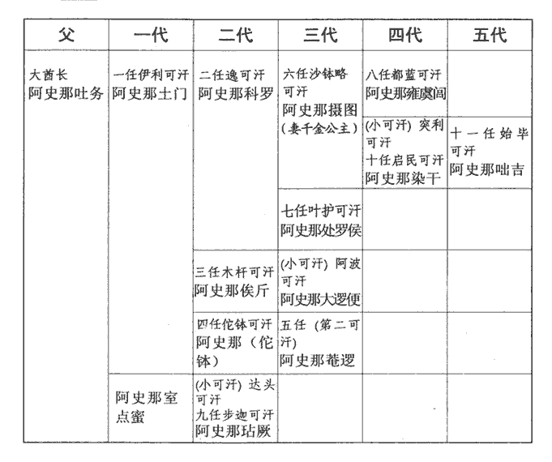
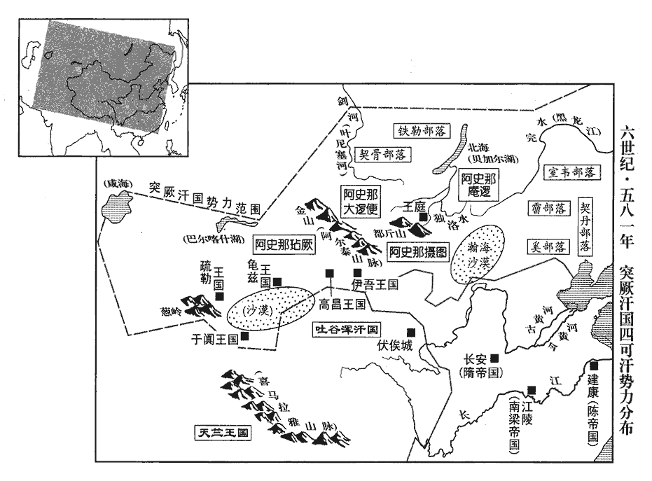
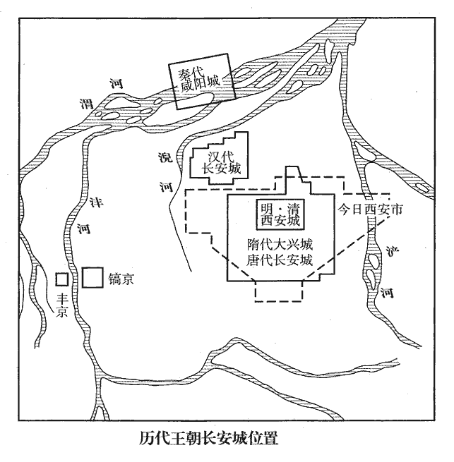
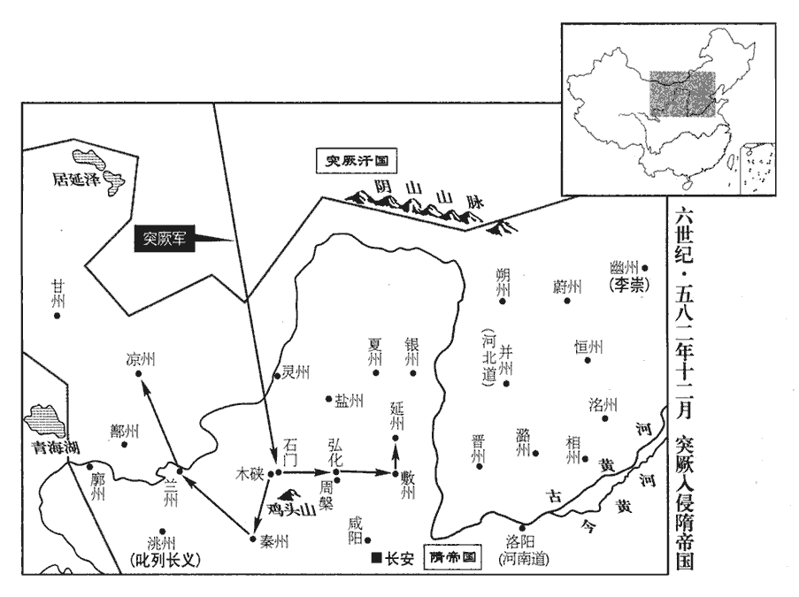
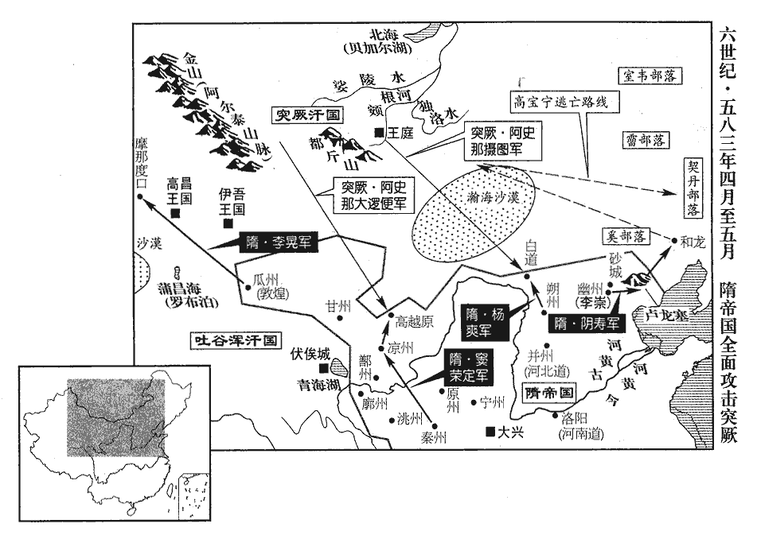
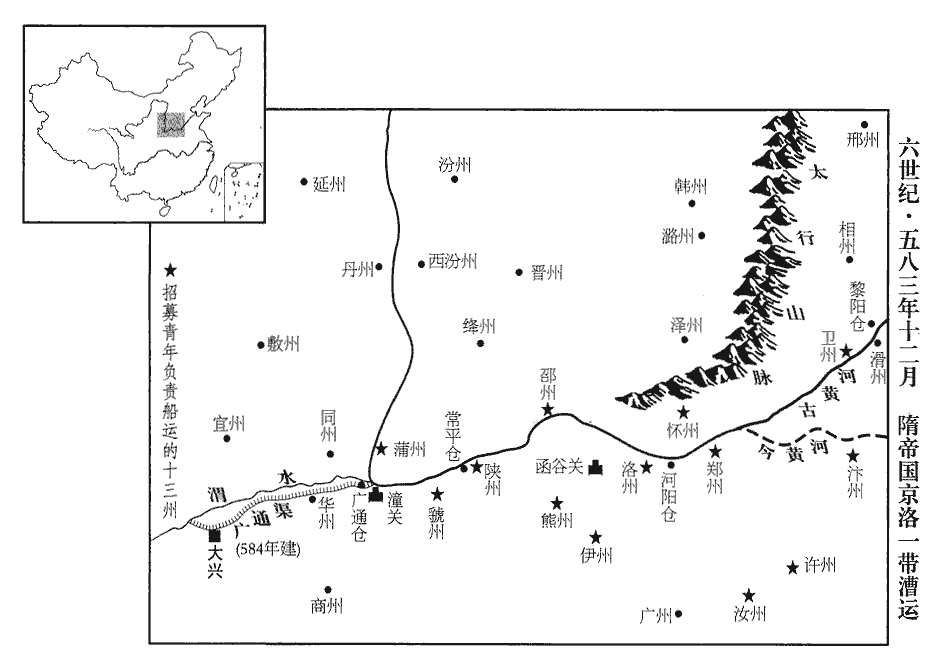

 陳紀九起重光赤奮若（辛丑），盡昭陽單閼（癸卯），凡三年。

# 高宗宣皇帝下之下

## 太建十三年（辛丑、五八一）

1春，正月，壬午‹一›，‹陈国，首都建康江苏省·南京市›以晉安王伯恭為尚書左僕射，吏部尚書袁憲為右僕射。憲，樞之弟也。

〖译文〗 [1]春季，正月，壬午（初一），陈朝任命晋安王陈伯恭为尚书左仆射，吏部尚书袁宪为尚书右仆射。袁宪是袁枢的弟弟。

2周‹首都长安陕西省西安市›改元大定。

〖译文〗 [2]北周静帝改年号为大定。

3二月，甲寅‹四›，隋王‹杨坚›始受相國、百揆、九錫，自初命至是五十一日，乃受。【章：十二行本「錫」下有「之命」二字；乙十一行本同；孔本同；張校同。】建臺置官。置百官也。丙辰‹六›，‹宇文阐，本年九岁›詔進王妃獨孤氏為王后，世子勇為太子。

〖译文〗 [3]二月，甲寅（初四），隋王杨坚始接受相国、统辖百官的职务和九锡礼仪，并建立隋国台省、设置官吏。丙辰（初六），北周静帝诏令进封隋王妃独孤氏为王后，隋王世子杨勇为太子。

開府儀同大將軍庾季才，勸隋王宜以今月甲子‹十四›應天受命。庾季才持正於宇文護擅權之時，而勸進於楊氏革命之日，巫史之學自信其術耳，非胸中真有所見也。太傅李穆、開府儀同大將軍盧賁亦勸之。於是周主下詔，遜居別宮。甲子‹十四›，命兼太傅杞公椿奉冊，大宗伯趙煚jiǒng奉皇帝璽紱，禪位于隋。冊，冊書也。周制：皇帝八璽，有神璽，有傳國璽，皆寶而不用。神璽，明受之於天；傳國璽，明受之於運。皇帝負扆，則置神璽於筵前之右，置傳國璽於筵前之左。又有六璽：其一，皇帝行璽，封命諸侯及三公用之；其二，皇帝之璽，與諸侯及三公書用之；其三，皇帝信璽，發諸夏之兵用之；其四，天子行璽，封命蕃國之君用之；其五，天子之璽，與蕃國之君書用之；其六，天子信璽，徵蕃國之兵用之。六璽皆白玉為之，方一寸五分，高寸，螭chī虎鈕。梁敬帝太平元年，周閔帝受魏禪，五主，二十四年而亡。隋主本襲封隨公，故國號曰隨。以周、齊不遑寧處，故去「辵」作「隋」，以「辵」訓走故也。辵chuò，音綽。煚，俱永翻。璽，斯氏翻。紱，音弗。隋主‹杨坚，本年四十一岁›冠遠遊冠；遠遊冠，制似通天冠而前無山述，有展筩橫于冠前，皇太子及王者後諸王服之。主冠，古玩翻。受冊、璽，改服紗帽、黃袍；紗帽，白紗帽也，名高頂帽。皇帝服絳紗袍。志曰：開皇初，高祖常服烏纱帽。紀云：秋，七月，上始服黃，百寮畢賀。蓋以黃為常服。入御臨光殿，服袞冕，如元會之儀。元會，正旦大朝會也。文物充庭，群官各入，就位，再拜。上公一人，詣西陛，解劍升賀，降階，帶劍復位而拜。群官在位者又再拜，搢笏三稱萬歲。大赦，改元開皇。命有司奉冊祀于南郊。告天以受命。遣少冢宰元孝矩代太子勇鎮洛陽‹河南省洛阳市东白马寺东›。「少冢宰」，當作「小冢宰」。孝矩名矩，以字行，天賜之孫也；按隋書元孝矩傳，祖脩義，不言以字行。汝陰王天賜，當魏太和之世，距此時百餘年。當考。女為太子妃。

〖译文〗 北周开府仪同三司庾季才劝说隋王杨坚应该在本月甲子日顺应天命，接受皇位。太傅李穆、开府仪同大将军卢贲也向杨坚劝进。于是，北周静帝颁下诏书，让位迁居别宫。甲子（十四日），北周静帝命令兼太傅杞公宇文椿捧着册书，大宗伯赵捧着皇帝的玺印，禅位于隋王杨坚。隋文帝戴着远游冠，接受了册书、御玺，又改戴白纱帽，穿上黄袍；然后进入临光殿，再戴上冠冕，穿上衮服，按照皇帝每年正月初一朝见百官群臣的元会礼仪登基称帝。隋文帝下令大赦天下，改年号为开皇。并命令有关官员捧着册书前往南郊祭天，禀告上天隋已承天受命。又派遣小冢宰元孝矩替代太子杨勇镇守洛阳。元孝矩本名元矩，以字行世，是元天赐的孙子；他女儿是太子杨勇的妃子。

少內史崔仲方勸隋主除周六官，周定六官事，始一百六十六卷梁敬帝绍泰元年。「少內史」，當作「小內史」。依漢、魏之舊，從之。置三師、三公及尚書、門下、內史、祕書、內侍五省，隋志：三師不主事，不置府僚，蓋與天子坐而論道者也。三公參議國之大事，依後齊置府僚，無其人則闕。祭祀則太尉亞獻，司徒奉俎zǔ，司空行掃除；其位多曠，皆攝行事；尋省府及僚佐。置公，則坐於尚書都省。朝之眾務，總歸於臺閣。尚書省事無不總，置令、左•右僕射各一人，總吏部、禮部、兵部、都官、度支、工部六曹事。屬官左•右丞各一人，都事八人，分司管轄。六曹尚書，分統三十六侍郎，各司曹務，直宿禁省，如漢之制。門下省置納言、給事黃門侍郎、散騎常侍•侍郎•通直•員外、諫議，大夫等官。內史省置監、令、侍郎、舍人等官、祕書省置監、丞、郎等官，領著作、太史二曹。內史省即中書省，避武元諱，改曰內史。門下、內史二省，主出納、朝直、代言，猶有職事。祕書省較優閒。內侍省則皆宦官也。御史、都水二臺，御史臺置大夫、治書侍御史、侍御史、殿內侍御史、監察御史等官。都水臺置使者及丞、參軍、河堤謁者，又領掌船局及諸津都水尉、津尉、丞、長等官。太常等十一寺，太常、光祿、衛尉、宗正、太僕、大理、鴻臚、司農、太府九寺，並置卿、少卿、丞、主簿、錄事等員。國子寺置祭酒，屬官有主簿、錄事、國子•太學•四門•書等學，各置博士、助教。將作寺置大匠、丞、主簿、錄事，統左、右校署令。左右衛等十二府，左•右衛、左•右武衛、左•右武候、左•右領左右、左•右監門、左•右領軍，各置大將軍、將軍、長史、司馬、錄事、功•倉•兵•騎等曹參軍、法曹•鎧曹行參軍、行參軍等員。以分司統職。又置上柱國至都督十一等勳官，以酬勤勞；隋採後周之制，置上柱國、柱國、上大將軍、大將軍、上開府儀同三司、開府儀同三司、上儀同三司、儀同三司、大都督、帥都督、都督，總十一等。特進至朝散大夫七等散官，特進、左•右光祿大夫、金紫光祿大夫、銀青光祿大夫、朝議大夫、朝散大夫，總七等。朝，直遙翻。散，悉亶翻。以加文武官之有德聲者。改侍中為納言。以考諱忠，故改侍中為納言。以相國司馬高熲為尚書左僕射，兼納言，熲，古迥翻。射，音夜。相國司錄京兆虞慶則為內史監，兼吏部尚書，相國內郎李德林為內史令。相，息亮翻。相國內郎，相國府從事中郎，避諱改為內郎。

〖译文〗 小内史崔仲方劝说隋文帝废除北周建立的六官制度，而恢复汉、魏旧制，隋文帝听从了他的建议。于是，隋朝设置了太师、太傅、太保三师和太尉、司徒、司空三公，以及尚书、门下、内史、秘书、内侍五省，御史、都水二台，太常等十一寺，左、右卫等十二府，以分别执掌和统领各类职事政务。又设置了上柱国至都督十一等勋爵，用来酬劳勤苦和立功的将帅；设置了特进至朝散大夫七等散官，用来加封有德行和声望的文武大臣。还将门下省长官侍中改称纳言。任命原相国府司马高为尚书左仆射兼纳言，相国府司录京兆人虞庆则为内史监兼吏部尚书，相国府内郎李德林为内史令。

乙丑‹十五›，追尊皇考為武元皇帝，皇考，周隨國桓公楊忠。廟號太祖；皇妣呂氏為元明皇后。丙寅‹十六›，脩廟社。時自高祖以下置四親廟，同殿異室而已，無受命之祧tiāo。社稷並列於含光門內之右。立王后獨孤為皇后，「獨孤」之下逸「氏」字。【章：十一行本正有「氏」字；乙十一行本同；孔本同。】王太子勇為皇太子。丁卯‹十七›，以太尉【章：十二行本作「大將軍」三字；乙十一行本同；孔本同；張校同。】趙煚為尚書右僕射。己巳‹十九›，封周靜帝‹宇文阐›為介公。煚，居永翻。周主雖禪，死乃有諡，通鑑先以諡書之。介，古國名。周氏諸王皆降爵為公。

〖译文〗 乙丑（十五日），隋文帝诏令追尊皇考杨忠为武元皇帝，庙号太祖；皇妣吕氏为元明皇后。丙寅（十六日），又诏令修建祖庙社庙。同时，册立原隋王后独孤氏为皇后，王太子杨勇为皇太子。丁卯（十七日），任命太尉赵为尚书右仆射。己巳（十九日），封北周静帝为介公，原北周宗室诸王一律降爵改封为公。

初，劉、鄭矯詔以隋主輔政，劉、鄭，劉昉、鄭譯也。矯詔事見上卷上年。楊后‹杨丽华›雖不預謀，然以嗣子幼沖，恐權在他族，聞之，甚喜。後知其父有異圖，意頗不平，形於言色，及禪位，憤惋逾甚。嗣，祥吏翻。惋，烏貫翻。隋主內甚愧之，改封樂平公主，樂平郡公主。五代志：太原郡樂平縣，舊置樂平郡。樂，音洛。久之，欲奪其志；公主誓不許，乃止。

〖译文〗 起初，刘、郑译假传北周天元皇帝诏命引用隋文帝辅政，天元杨皇后虽崐然没有参预谋划，却因为静帝年幼，恐怕政权落入别族手中，所以听说杨坚辅政非常高兴。后来杨皇后察觉到她父亲怀有异图，密谋篡权，心中愤愤不平，往往从言语态度上表现出来；及至北周静帝禅位于隋文帝，她异常愤怒和悲伤。隋文帝也感到非常对不起女儿，于是改封她为乐平公主。过了一段时间，隋文帝想作主将女儿改嫁，乐平公主人驻誓死不从，隋文帝只好作罢。

隋主與周載下大夫北平‹河北省卢龙县›榮建緒有舊，「載」下逸「師」字。後周置載師之官，屬地官，有中大夫，有下大夫。北平郡，治盧龍。榮姓出周榮公。莊子有榮啟期。隋主將受禪，建緒為息州‹新息·河南省息县›刺史；五代志：汝南郡新息縣，後魏置東豫州，梁改西豫州，又改淮州，東魏復曰東豫州，後周改曰息州。將之官，隋主謂曰：「且躊躇，躊，直由翻。躇，陳如翻。躊躇，住足也。當共取富貴。」建緒正色曰：「明公此旨，非僕所聞。」及即位，來朝，帝謂之曰：「卿亦悔不？」朝，直遙翻。不，讀曰否。建緒稽首曰：「臣位非徐廣，情類楊彪。」稽，音啟。徐廣事見一百一十九卷宋高祖永初元年。楊彪事見六十九卷魏文帝黃初二年。帝怒曰：「朕雖不曉書語，亦知卿此言不遜！」

〖译文〗 隋文帝和原北周载师下大夫北平人荣建绪有交情，在他将要接受禅让时，荣建绪被朝廷任命为息州刺史。在即将赴任时，隋文帝对荣建绪说：“请暂且耽搁一下，当共享富贵荣华。”荣建绪严肃地回答说：“明公的这些话，不是我想听到的。”隋文帝即位后，荣建绪入朝，文帝对他说：“你感到后悔吗？”荣建绪叩头回答道：“我虽然没有处在晋、宋禅让之际东晋秘书监徐广的位置，但和曹魏代汉后的东汉太尉杨彪情状相似。”隋文帝听了发怒说：“朕虽然不明白书上的典故，但也知道你此言不恭敬！”

上柱國竇毅之女，聞隋受禪，自投堂下，撫膺太息曰：「恨我不為男子，救舅氏之患！」撫，與拊同，拍也。膺，胸也。太息，憤而舒氣長也。毅及襄陽公主掩其口曰：「汝勿妄言，滅吾族！」毅由是奇之。及長，以適唐公李淵。淵，昞之子也。昞，周柱國李虎之子。李淵始見于此。長，知兩翻。昞，音丙。

〖译文〗 原北周上柱国窦毅的女儿得知隋文帝接受了禅让后，气愤得扑倒在殿阶下，捶胸叹息说：“恨我不是个男子，以拯救舅家宇文氏于患难之中！”窦毅和夫人襄阳公主急忙捂住她的嘴说：“你不要乱说，那样会招致灭族之祸的！”窦毅由此对女儿感到惊奇。窦毅女儿长大后，嫁给唐公李渊。李渊是李的儿子。

虞慶則勸隋主盡滅宇文氏，高熲、楊惠亦依違從之，依違者，不敢言其不可，而心不以為可。李德林固爭，以為不可，隋主作色曰：「君書生，不足與議此！」於是周太祖‹宇文泰›孫譙公乾惲、冀公絢，惲yùn，於粉翻。絢，許縣翻。閔帝‹宇文觉›子紀公湜，湜shí，常職翻。明帝‹宇文毓›子酆公貞、宋公實，高祖‹宇文邕›子漢公贊、秦公贄、曹公允、道公充、蔡公兌、荊公元，宣帝‹宇文赟›子萊公衍、郢公術皆死。通鑑書宣帝子衍始終備，但目錄書大成元年立太子衍，亦自背馳。德林由此品位不進。

〖译文〗 内史监虞庆则劝说隋文帝斩尽杀绝北周帝室宇文氏，尚书左仆射高、邗公杨惠也违心赞成，只有内史令李德林苦苦争辩，认为不能那样做，隋文帝变了脸色说道：“你只是一介书生，不值得和你讨论此事！”于是，北周文帝宇文泰的孙子谯公宇文乾晖、冀公宇文绚，孝闵帝宇文觉的儿子纪公宇文，明帝宇文毓的儿子公宇文贞、宋公宇文实，武帝宇文邕的儿子汉公宇文赞、秦公宇文贽、曹公宇文允、道公宇文充、蔡公宇文兑、荆公宇文元，宣帝宇文的儿子莱公宇文衍、郢公宇文术，全部被处死。因为这件事，李德林的官品职位再没有升迁过。

4乙亥‹二十五›，上‹陈顼，本年五十四岁›耕藉田。藉，在亦翻。

〖译文〗 [4]乙亥（二十五日），南陈宣帝亲自耕种藉田。

5隋主‹杨坚›封其弟邵公慧為滕王，安公爽為衛王，邵、安皆以州為封國。子鴈門公廣為晉王，俊為秦王，秀為越王，諒為漢王。

〖译文〗 [5]隋文帝封皇弟邵公杨慧为滕王、安公杨爽为卫王，封皇子雁门公杨广为晋王、杨俊为秦王、杨秀为越王、杨谅为汉王。

6隋主賜李穆詔曰：「公既舊德，且又父黨。李穆與隋主之父忠比肩事周，皆為功臣。敬惠來旨，義無有違。謂穆勸之受命也。即以今月十三日恭膺天命。」孔安國曰：膺，當也。俄而穆入朝，自并州入朝。朝，直遙翻。帝以穆為太師，贊拜不名；子孫雖在襁褓，襁，居兩翻，負兒衣。褓，博抱翻，抱兒衣。悉拜儀同，一門執象笏者百餘人，隋志曰：按禮：笏，諸侯以象，凡有指畫於君前用笏，受命書於笏。笏，畢用也。五經要義曰：所以記事，防忽忘。禮圖云：度二尺有六寸，中博二寸，其殺六分去一。晉、宋以來，謂之手板，此乃不經，今還謂之笏，以法古名。自西魏以降，五品以上，通用象牙，六品已下，兼用竹木。笏hù，呼骨翻。貴盛無比。又以上柱國竇熾為太傅，幽州總管‹总部设蓟县北京市›于翼為太尉。李穆‹本年七十二岁›上表乞骸骨，人臣致身以事君，身非己有，故求閒者自言乞骸骨。上，時掌翻。詔曰：「呂尚以期頤佐周，記：百年曰期頤。呂尚遇文王，年八十矣，佐文王以及武王，則是期頤之年也。張蒼以華皓相漢，華皓，謂白首也。張蒼免相後，口中無齒，食乳，年百餘歲乃卒。高才命世，不拘常禮。」仍以穆年耆，敕蠲朝集，蠲juān，免也。朝集，猶言朝會也。朝，直遙翻。有大事，就第詢訪。用古人「欲有謀焉則就之」之意。隋主姑以是恩李穆耳，非欲與之大有為也。

〖译文〗 [6]随文帝赐给并州总管李穆诏书说：“您既素有德望，并且又是家父的同辈好友。您劝我顺天受命的来函，我不敢违背。已经于本月十三日恭承天命，登上帝位。”不久李穆自并州入朝，文帝即任命李穆为太师，。特许他在朝拜时不称名。李穆的子孙即使还在襁褓之中，也一律授予仪同三司。因此，李穆一门手持牙笏身居官位的多达一百余人，贵盛无比。隋文帝又任命上柱国窦炽为太傅、幽州总管于翼为太尉。李穆上表请求辞职归养，隋文帝下诏书说：“古代姜太公吕尚以百岁高龄辅佐周文王、武王成就王业，张苍以白发老人担任汉文帝的丞相，高才伟人佐命当世，不能拘泥于常礼。”于是以李穆年事已高，敕免崐除正常朝会。遇有军国大事，朝廷派人到府上征询他的意见。

美陽公蘇威，美陽，古縣名，漢、晉屬扶風，五代志不見，蓋已省廢，姑以古縣名封爵之耳。綽之子也，蘇綽佐宇文泰以興周。少有令名，周晉公護強以女妻之。少，詩照翻。強，其兩翻。妻，七細翻。威見護專權，恐禍及己，屏居山寺，以諷讀為娛。屏，必郢翻。周高祖‹宇文邕›聞其賢，除車騎大將軍、儀同三司，騎，奇寄翻。又除稍伯下大夫，稍，所教翻。皆辭疾不拜；宣帝‹宇文赟›就除開府儀同大將軍。隋主為丞相，高熲薦之，隋主召見，與語，大悅；居月餘，聞將受禪，遁歸田里‹武功·陕西省武功县西›。觀蘇威之初，其立身何可議哉，至於末節，展轉於宇文化及、李密、王世充之朝，何其可鄙也！君子是以知令終之難。熲請追之，追者，尋其後而召之。隋主曰：「此不欲預吾事耳，置之。」及受禪，徵拜太子少保，追封其父為邳公，邳亦以州名為公國。少，始照翻。以威襲爵。

〖译文〗 美阳公苏威是苏绰的儿子，少年时即享有美名，北周晋公守文护硬碍把女儿嫁给他。后来苏威见宇文护专制朝廷，恐怕他一旦失势将会牵连自己，于是就隐居于山寺中，以读书为娱。北周高祖听说他有贤能，就任命他为车骑大将军、仪同三司，不久又任命他为稍伯下大夫，可是苏威都称病不接受任命；北周宣帝时又任命他为开府仪同大将军。隋文帝担任丞相后，高推荐苏威，文帝就加以召见并与他交谈，非常赏识他。苏威在长安住了一个多月，得悉隋将受禅代周，于是就逃归故里。高请求追回苏威，隋文帝回答说：“他这样做是不想参预我的事，暂且别管他。”及至接受禅位后，文帝就征召并任命苏威担任太子少保，追封他的父亲苏绰为邳公，让苏威承袭爵位。

7丁丑‹二十七›，隋以晉王廣為并州總管‹总部设晋阳山西省太原市›。三月，戊子‹八›，以上開府儀同三司賀若弼為吳州總管‹总部设广陵江苏省扬州市›，鎮廣陵；考異曰：隋書帝紀云「楚州」，今從弼傳。和州‹历阳·安徽省和县›刺史河南‹河东，山西省永济市›韓擒虎為廬州總管‹总部设合肥安徽省合肥市›，鎮廬江‹安徽省庐江县›。廣陵為吳州，仍周舊也。歷陽為和州，仍齊舊也。隋書：韓擒虎，河東垣人。「河南」當作「河東」。五代志：廬江郡，梁置南豫州，又改合州，開皇初改廬州。蓋梁之南豫、合州，皆治合肥，合州因合肥而名也。廬江在合肥東五十里，既徙治廬江，故以廬名州。若，人者翻。隋主有并吞江南之志，問將帥於高熲，將，即亮翻。帥，所類翻。熲薦弼與擒虎，故置於南邊，使潛為經略。

〖译文〗 [7]丁丑（二十七日），隋朝任命晋王杨广为并州总管。三月，戊子（疑误），又任命上开府仪同三司贺若弼为吴州总管，镇守广陵；任命和州刺史河南人韩擒虎为庐州总管，镇守庐江。当时隋文帝有吞并江南的志向，向高访求将帅，高向他推荐了贺若弼和韩擒虎，因此隋承文帝派遣他们二人驻守在南面边境，让他们暗中加以筹划。

戊戌‹十八›，以太子少保蘇威兼納言、度支尚書。度支尚書，統度支、戶部、金部、倉部。度，徒洛翻。

〖译文〗 戊戌（疑误），隋朝任命太子少保苏威兼任纳言、度支尚书。

初，蘇綽在西魏，以國用不足，制征稅法頗重，後周太祖作相，置載師，掌任土之法，辨夫家田里之數，會六畜車乘之稽，審賦役斂弛之節，制畿疆脩廣之域，頒施惠之要，審牧產之政。司均，掌田里之政令，凡人口十已上，宅五畝；口九已上，宅四畝；口五已下，宅三畝。有室者田百四十畝，丁者田百畝。司賦，掌功賦之政令，凡人自十八以至六十有四與輕癃者皆賦之。其賦之法，有室者歲不過絹一疋，綿八兩，粟五斛；丁者半之。其非桑土，有室者布一疋，麻十斤；丁者又半之。豐年則全賦，中年半之，下年一之，皆以時徵焉。若艱荒凶札，則不徵其賦。又有市門之稅。自今觀之，亦不為重矣，而蘇綽猶望後之人弛之，可謂有志於民矣。既而歎曰：「今所為者，譬如張弓，非平世法也。後之君子，誰能弛之！」威聞其言，每以為己任。至是，奏減賦役，務從輕簡，隋主悉從之，蘇威為度支尚書，居可言可行之地。漸見親重，與高熲參掌朝政。朝，直遙翻。帝‹杨坚›嘗怒一人，將殺之；威入閤進諫，帝不納，將自出斬之，威當帝前不去；帝避之而出，威又遮止。帝拂衣而入，良久，乃召威謝曰：「公能若是，吾無憂矣。」賜馬二匹，錢十餘萬，尋復兼大理卿、京兆尹、御史大夫，本官悉如故。

〖译文〗 当初，苏绰在西魏时，因为经常国用不足，所以制定的税收很重。颁行后他慨然叹道：“我今天所制定的重税法，就譬如张满的弓，只是为了在战乱之世满足国用，并不是治平之世的作法。后世的君子，谁能把弓弦放松呢？”苏威听了父亲的话，就把这件事当作自己的使命。现在他担任了度支尚书，于是奏请减免赋税徭投，尽量从轻从简，隋文帝全部采纳了他的建议。苏威因此逐渐受到隋文帝的信任倚重，和高一起掌管朝政。隋文帝曾经恼怒一个人，将要杀死他；苏威来到殿进谏，文帝不听，将亲自出去杀掉那人，而苏威挡在文帝面前不离开；文帝避开他又想出去，苏威又上前遮挡。于是文帝非常生气，拂衣返回宫中；过了很长时间，文帝才又召见苏威，致歉说：“你能够这样做，我就不用担忧了。”并赏赐给他马两匹，钱十余万。不久，又任命苏威兼任大理寺卿、京兆尹、御史大夫，原来的官职仍旧。

治書侍御史安定‹甘肃省泾川县›梁毗，以威兼領五職，漢宣帝幸宣室，齋居決事，令侍御史二人治書侍側，魏、晉因別置治書侍御史。安定郡，涇州。五職，納言、度支尚書、大理卿、京兆尹、御史大夫也。治，平聲。安繁戀劇，無舉賢自代之心，抗表劾威，劾，戶慨翻，又戶得翻。帝曰：「蘇威朝夕孜孜，孜孜，不怠也。志存遠大，何遽迫之！」因謂朝臣曰：「蘇威不值我，無以措其言；我不得蘇威，何以行其道。楊素才辯無雙，至於斟酌古今，助我宣化，非威之匹也。匹，偶也。威若逢亂世，南山四皓，豈易屈哉！」四皓，東園公、綺里季、夏黃公、角里先生，遭秦之亂，隱於商山，鬚眉皓白，故曰四皓。商山在長安南，故曰南山。隋主以蘇威隱遯於周世，故云然。易，以豉翻。威嘗言於帝曰：「臣先人每戒臣云：先人，謂威父綽。『唯讀孝經一卷，足以立身治國，何用多為！』」帝深然之。治，直之翻；下同。

〖译文〗 治书侍御史安定人梁毗认为苏威一身兼领五项职务，安于繁碎，眷恋于烦杂，没有举荐贤才接替自己的念头，于是就上表弹劾他，隋文帝说：“苏威从早到晚孜孜不倦地勤奋工作，而且志向远大，抱负不凡，你为何突然提出要他让贤？”并因此对百官朝臣说：“苏威如果没有遇到我，就无法施展他的抱负；我如果没有苏威，又如何能够推行安邦定国之道呢？清河公杨素虽然辩才无崐双，至于博古通今，辅助我宣扬教化，就远不能和苏威相比。苏威如果遭逢乱世，肯定会像西汉初年的南山四皓那样隐居避世，岂能轻易使他屈服出仕！”苏威曾经对隋文帝说：“我的父亲经常告诫我说：“只要熟读《孝经》一书，就足以安身立命，治理国家，那里用得着读很多的书！”隋文帝深表同意。

高熲深避權勢，上表遜位，上，時掌翻。讓於蘇威，帝欲成其美，成其讓賢之美。聽解僕射。數日，帝曰：「蘇威高蹈前朝，前朝，謂周朝。高蹈，謂其隱遯不仕。蹈，踐也，履也；高蹈，言踐履之高。朝，直遙翻。熲能推舉。吾聞進賢受上賞，漢武帝詔曰：進賢受上賞，蔽賢蒙顯戮，古之道也。寧可使之去官！」命熲復位。熲、威同心協贊，政刑大小，帝無不與之謀議，然後行之。故革命數年，天下稱平。

〖译文〗 尚书左仆射高想避开权势，上表请求辞职，让位于苏威。隋文帝想成全他让贤的美名，允许解除他仆射职务。数日后，隋文帝又说：“苏威在前朝北周隐居不仕，高能够推举他这样的贤才。我听说举荐贤才的人应该得到最高的奖赏，怎么能让他去官离职呢？”于是命令恢复高的职务。高和苏威同心协力，朝中政事无论大小，文帝都先和他们商议，然后才公布实行。所以隋文帝称帝数年来，天下升平，国泰民安。

太子左庶子盧賁，以熲、威執政，心甚不平，時柱國劉昉亦被疏忌。賁因諷昉及上柱國元諧、李詢、華州‹郑县·陕西省华县›刺史張賓等謀黜熲、威，五代志：京兆郡鄭縣，後魏置東雍州，并華山郡，西魏改曰華州。昉，甫兩翻。被，皮義翻。華，戶化翻。五人相與輔政。又以晉王廣有寵於帝，私謂太子‹杨勇›曰：「賁欲數謁殿下，數，所角翻。恐為上所譴，願察區區之心。」謀泄，帝窮治其事，治，直之翻。昉等委罪於賓、賁。公卿奏二人當死，帝以故舊，不忍誅，並除名為民。二人皆翼戴隋主於潛躍者也。張賓，道士也。隋主作輔，賓自言洞曉星曆，盛言有代謝之徵，且言上儀表非人臣之相，由是大被知遇，常在幕府。

〖译文〗 太子左庶子卢贲因为高、苏威执掌朝政，心中愤愤不平。当时柱国刘也受到隋文帝的猜忌和疏远，于是卢贲就暗中鼓动刘以及上柱国元谐、李询、华州刺史张宾等人密谋废黜高、苏威，由他们五人共同辅政。同时，卢贲又因为晋王杨广正受到隋文帝的宠爱，因此私下对太子杨勇说：“我本想常来看望殿下，但恐怕被后皇上知道了必定会遭到谴责，愿您明察我的一片诚心。”后来他们的密谋败露，隋文帝下令彻底追查，于是刘等三人把罪责全推到张宾和卢贲头上。公卿大臣上奏说张、卢二人应当处死，隋文帝因为这两人都是他的旧交，不忍心将他们处死，而是将他们除官为民。

8庚子‹二十›，隋詔前代品爵，皆依舊不降。此普謂中外官也。

〖译文〗 [8]庚子（疑误），隋文帝颁下诏令，百官大臣凡在前代北周所受封的官品爵位，都仍旧不予降低。

9丁未‹二十七›，梁‹首都江陵湖北省江陵县›主‹萧岿，本年四十岁›遣其弟太宰巖入賀于隋。賀受命也。

〖译文〗 [9]丁未（疑误），后梁国主派遣弟弟太宰萧岩入隋庆贺。

10夏，四月，辛巳‹二›，隋大赦。戊戌‹十九›，悉放太常散樂為民，仍禁雜戲。後齊之季有散樂，周天元即位，悉徵詣長安，隸太常。隋今放之。

〖译文〗 [10]夏季，四月，辛巳（初二），隋朝大赦天下罪人。戊戌（十九日），全部释放录属于太常寺演奏散乐的乐户为平民百姓，但仍然禁止演出杂戏。

11散騎常侍韋鼎、兼通直散騎常侍王瑳cuō聘于周。散，悉亶翻。騎，奇寄翻。瑳，七何翻，又七可翻。辛丑‹二十二›，至長安，隋已受禪，隋主致之介國。說文：致，送詣也。周主時封介公。

〖译文〗 [11]陈朝派遣散骑常侍韦鼎、兼通直散骑常侍王到北周聘问。辛丑（二十二日），韦鼎等人到达长安，当时隋朝已接受了北周的禅让，于是隋文帝就把他们送到北周静帝受封的介国。

12隋主召汾州‹隰城·山西省隰县›刺史韋沖為兼散騎常侍。五代志：文城郡，東魏置南汾州，後周改為汾州。散，悉亶翻。時發稽胡‹山西省西部匈奴人›築長城，按隋紀，時修築長城，二旬而罷。汾州胡千餘人，在塗亡叛。帝召沖問計，對曰：「夷狄之性，易為反覆，易，以豉翻。皆由牧宰不稱之所致。稱，尺證翻。臣請以理綏靜，可不勞兵而定。」帝然之，命沖綏懷叛者，月餘皆至，並赴長城之役。沖，敻xiòng之子也。韋敻見一百六十七卷周高祖永定三年。

〖译文〗 [12]隋文帝征召汾州刺史韦冲入朝，任命他为兼散骑常侍。当时征发稽胡族修筑长城，汾州胡人有一千多人在征发途中叛逃。隋文帝召见冲问计，韦冲回答说：“夷狄之族反复无常，都是由于州郡长官不称职造成的。我请求前去以理安抚他们，这样可不劳用兵而平定叛乱。”隋文帝认为他说的对，就派遣他前去采用怀柔政策招附叛逃胡人，不出一个月，那些胡人都来归附，并去服役修筑长城。韦冲是韦的儿子。

13五月，戊午‹十›，隋封邘yú公雄為廣平王，按隋書，此即邗公惠也，改名雄，開皇中，改封清漳王，仁壽初，改封安德王。大業中，從征吐谷渾還，進封觀王，薨，諡曰德，後所謂觀德王雄者是也。「邘」當作「邗」hán，音寒。【章：乙十一行本正作「邗」；孔本同。】永康公弘為河間王。永康縣公也。五代志：清化郡永穆縣，梁置，曰永康。雄，高祖‹杨坚›之族子也。

〖译文〗 [13]五月，戊午（初十），隋朝封邗公杨雄为广平王，永康公杨弘为河间王。杨雄是高祖杨坚的族子。

14隋主潛害周靜帝‹宇文阐，本年九岁›而為之舉哀，為，于偽翻。葬于恭陵；以其族人洛為嗣。

〖译文〗 [14]隋文帝暗害了北周静帝，并为他举行了葬礼，把他埋葬在恭陵；然后以静帝的族人宇文洛为他的后代。

15六月，癸未‹五›，隋詔郊廟冕服必依禮經。隋制：冕服採用東齊之法，乘輿衮冕，垂白珠十有二旒liú，以組為纓，色如其綬。黈tǒu纊充耳。玉笄。玄衣，纁裳。衣，山龍、華蟲、火、宗、彝五章；裳，藻、粉米、黼、黻四章。衣重宗彝，裳重黼黻，為十二等。衣，褾biǎo領，織成升龍；白紗內單；黼領青褾襈zhuàn裾。革帶，玉鉤䚢chè。大帶，素帶，朱裹，紕其外，上以朱，下以綠。韍fú隨裳色，龍、火、山三章。鹿盧玉具劍，火珠鏢首，白玉雙佩，玄組。雙大綬，六采，玄、黃、青、白、縹、綠，純玄質，長二丈四尺，五百首，廣一尺。小雙綬，長二尺六寸，色同大綬，而首半之間，施三玉環。朱韈，赤舄xì，舄加金飾。凡綬，先合單紡為一絲，絲四為一扶，扶五為一首，首五成一文。褾，波小翻。襈，雛免翻。䚢，丑例翻，又敕列翻。紕，音卑，緣也。鏢，紕招翻；說文，刀削末銅也。縹，匹沼翻。紡，甫罔翻。其朝會之服、旗幟、犧牲皆尚赤，隋自以為得火德，故尚赤色。朝，直遙翻；下同。幟，昌志翻。戎服以黃，【章：十二行本「黃」下有「在外」二字；乙十一行本同；孔本同；張校同。】常服通用雜色。秋，七月，乙卯‹八›，隋主始服黃，百僚畢賀。於是百官常服，同於庶人，皆著黃袍；著，則略翻。隋主朝服亦如之，唯以十三環帶為異。

〖译文〗 [15]六月，癸未（二十九日），隋文帝诏令内外百官，在郊祀上天和庙祭先祖时，冠冕服饰都必须依据《礼经》；在朝会时所穿的朝服和国家所用的各种旗帜、祭祀所用的牲畜都崇尚红色，将帅兵士的军服使用黄色，官吏平民的常服通用杂色。秋季，七月乙卯（初八），隋文帝首次穿黄色衣服，百官群臣都表示祝贺。于是百官大臣的常服与庶民百姓相同，都穿黄袍；隋文帝的朝服也是一样，唯一不同的是系以十三环金带。

16八月，壬午‹五›，隋廢東京官。周徙相州六府於東京，事見一百七十三卷太建十一年。

〖译文〗 [16]八月，壬午（初五），隋朝废除东京洛阳的六府官署。

17吐谷渾‹青海省›寇涼州‹姑臧·甘肃省武威市›，涼州，武威郡。吐，從暾入聲。谷，音浴。隋主遣行軍元帥樂安公元諧等，步騎數萬擊之。諧擊破吐谷渾於豐利山‹青海湖东›，豐利山在青海東。帥，所類翻。騎，奇寄翻。又敗其太子可博汗於青海‹青海湖›，青海在吐谷渾國都伏俟城之東十五里，周迴千餘里，中有小山，唐時謂之龍駒島。敗，補邁翻。可，從刊入聲。汗，音寒。俘斬萬計。吐谷渾震駭，其王侯三十人各帥所部來降。吐谷渾可汗夸呂帥親兵遠遁。帥，讀曰率。降，戶江翻；下同。隋主以其高寧王移茲裒為河南王，裒，薄侯翻。使統降眾。以元諧為寧州‹定安·甘肃省宁县›刺史，五代志：北地郡，後魏置豳州，西魏改為寧州。留行軍總管賀婁子幹鎮涼州‹姑臧·甘肃省武威市›。

〖译文〗 [17]吐谷浑侵犯凉州，隋文帝派遣行军元帅乐安公元谐等统率步、骑兵数万人反击吐谷浑。乐谐率军先在丰利山打败吐谷浑军队，又在青海湖打败吐谷浑太子可博汗，共俘虏、斩杀一万多人。于是吐谷浑举国震骇，共有王、侯三十人各自率领部落前来投降。吐谷浑可汗夸吕带领亲兵逃奔远方。隋文帝封吐谷浑高宁王移兹裒为河南王，让他统领归降的吐谷浑部族。又任命元谐为宁州刺史，留下行军总管贺娄子干镇守凉州。

18九月，庚午‹二十四›，將軍周羅睺攻隋故墅‹胡墅，江苏省六合县东›，拔之。「故墅」，當作「胡墅」。胡墅在大江北岸，對石頭城。睺，音侯。墅，承與翻。蕭摩訶攻江北。

〖译文〗 [18]九月，庚午（二十四日），陈朝将军周罗率军攻打隋朝的故墅城，并夺取了它。萧摩诃也率军攻打隋江北地区。

19隋奉車都尉于宣敏漢武帝置三都尉，奉車、駙馬、騎也。奉使巴、蜀還，使，疏吏翻。還，音旋，又如字。奏稱：「蜀土沃饒，人物殷阜，周德之衰，遂成戎首。謂王謙以益州起兵也。宜樹建藩屏，封殖子孫。」屏，必郢翻。隋主善之。辛未‹二十五›，以越王秀為益州總管‹总部设成都四川省成都市›，改封蜀王。為秀在蜀以奢僭得罪張本。宣敏，謹之孫也。于謹，周之功臣。

〖译文〗 [19]隋朝奉车都尉于宣敏奉命出使巴、蜀还朝，上奏说：“蜀地土壤沃饶，人才辈出，物产丰富，因为周朝衰败，于是王谦得以在那里起兵作乱。所以陛下应该在那里建立藩国，封赐子孙。”隋文帝认为他的建议很好。辛未（二十五日），任命越王杨秀为益州总管，改封蜀王。于宣敏是于谨的儿子。

20隋【章：十二行本「隋」上有「壬申‹二十六›」二字；乙十一行本同；孔本同；張校同。】以上柱國長孫覽、元景山並為行軍元帥，長，知兩翻。帥，所類翻。發兵入寇；命尚書左僕射高熲節度諸軍。

〖译文〗 [20]隋朝任命上柱国长孙览、元景山同为行军元帅，发兵攻打南陈；又下令尚书左仆射高负责节制协调诸军。

21初，周、齊所鑄錢凡四等，及民間私錢，名品甚眾，五代志：齊文宣受禪，改鑄常平五銖，重如其文，其錢甚貴，且制造甚精。至乾明、皇建之間，往往私鑄。鄴中用錢，有赤熟、青熟、細眉、赤生之異。河南所用，有青、薄、鉛、錫之別。青、齊、徐、兗、梁、豫州，輩類各殊。武平已後，私鑄轉甚，或以生鐵和銅。至于齊亡，卒不能禁。後周之初，尚用魏錢。及武帝保定元年，乃更鑄布泉之錢，以一當五，與五銖並行。時梁、益之境，又雜用古錢交易，河西諸郡，或用西域金銀之錢，而官不禁。建德三年，更鑄五行大布錢，以一當十，與布泉並行。五年，以布泉漸賤，遂廢之。齊平已後，山東猶雜用齊氏舊錢。宣帝大象元年，又鑄永通萬國錢，以一當千，與五行大布及五銖凡三品並用。輕重不等。隋主患之，更鑄五銖錢，背、面、肉、好皆有周郭，錢之文為面，其漫為背，錢體為肉，錢孔為好，外圓周之以規，內方周之以矩，曰周郭。更，工衡翻。肉，而救翻。好，虛到翻。每一千重四斤二兩。悉禁古錢及私錢。置樣於關；不如樣者，沒官銷毀之。自是錢幣始壹，民間便之。

〖译文〗 [21]当初，北周、北齐官府所铸造的钱币先后共有四种，加上民间私自铸造的钱币，名称和品种很多，轻重也不一样。隋文帝对此深为忧虑，于是下令重新铸造五铢钱。所铸钱的背面、正面、钱身、钱孔的边缘都有凸起的轮廓，每一千枚重四斤二两。完全禁止使用前代古钱和民间私铸钱，在各处关口放置新五铢钱样品，凡发现和样品不符合的钱币，即没收入官予以销毁。从此，隋朝流通的钱币得到统一，民间使用起来非常方便。

22隋鄭譯以上柱國歸第，賞賜豐厚。譯自以被疏，呼道士醮章祈福，道士有消災度厄之法，依陰陽五行數術，推人年命，書之如章表之儀，并具贄幣，燒香陳讀，云奏上天曹，請為除厄，謂之上章。夜中於星辰之下，陳設酒果、䴵餌、幣物，歷祀天皇、太一、五星、列宿，為書如上章之儀以奏之，名為醮。被，皮義翻。醮jiào，子肖翻。為婢所告，以為巫蠱，譯又與母別居，為憲司所劾，憲司，御史臺官。劾，戶概翻，又戶得翻。由是除名。隋主下詔曰：「譯若留之於世，在人為不道之臣；戮之於朝，入地為不孝之鬼。有累幽顯，無所置之。朝，直遙翻。累，力瑞翻。宜賜以孝經，令其熟讀。」仍遣與母共居。

〖译文〗 [22]隋朝郑译以上柱国退休归家养老，隋文帝给予他丰厚的赏赐。郑译自认为被文帝疏远，于是请来道士设坛做法事，为他消灾祈福。事情被他家的婢女告发，被认为是巫师诅咒；郑译又因为和母亲分开居住，也遭到御史台弹劾，因此销除了郑译的所有官爵。隋文帝还下诏书说：“如果把郑译留在世上，他就成了不守臣道的人；如果把他处死于朝，他到了阴间则成了不孝父母的鬼崐，看来无论如何处置，都将玷污阴间、阳间两个世界，实在没有地方安置他。应该赐给他一本《孝经》，让他去熟读。”仍然让他和母亲一起居住。

23初，周法比於齊律，煩而不要，隋主命高熲、鄭譯及上柱國楊素、率更令裴政等太子率更令，魏、晉之制，主宮殿門戶及掌罰事，職如光祿勳、衛尉。隋制，掌伎樂漏刻。率，如字。更，工衡翻。更加脩定。政練習典故，達於從政，乃采魏、晉舊律，下至齊、梁，沿革重輕，累世循襲者為沿，中有變更者為革。取其折衷。衷，竹仲翻。時同脩者十餘人，凡有疑滯，皆取決於政。於是去前世梟、轘及鞭法，梟者，斬首掛之木上。轘者，車裂於市。梁制有制鞭、法鞭、常鞭，凡三等之差。制鞭，生革廉成；法鞭，生革去廉；常鞭，熟靼dá不去廉；皆作鶴頭。紐長一尺一寸，梢長二尺七寸，廣三寸，靶長二尺五寸。去，羌呂翻。梟，古堯翻。轘huàn，戶關翻，又戶慣翻。自非謀叛以上，無收族之罪。始制死刑二，絞、斬；流刑三，自二千里至三千里；按隋志：流刑三，有千里、千五百里、二千里。應配者，一千里，居作二年；一千五百里，居作二年半；二千里，居作三年。應住居作者，三流俱役三年，近流加杖一百，一等加三十。此云自二千里至三千里，不同。徒刑五，自一年至三年；徒刑有一年，有一年半，有二年，有二年半，有三年。杖刑五，自六十至百；笞刑五，自十至五十。又制議、請、減、贖、官當之科以優士大夫。議，即周禮八議之法。請者，凡在八議之科則請之。減者，官品第七已上，犯罪皆例減一等，其品第九已上，犯者聽贖。應贖者皆以銅代絹。贖銅一斤為負，負十為殿。笞十者銅一斤，加至杖百則十斤。徒一年，贖銅二十斤，每等則加銅十斤，三年則六十斤矣。流一千里，贖銅八十斤，每等則加銅十斤，二千里則百斤矣。二死皆贖銅百二十斤。犯私罪，以官當徒者，五品已上，一官當徒二年，九品已上，一官當徒一年；當流者，三流同比徒三年。若犯公罪者，徒各加一年，當流者，各加一等。其累徒過九年者，流二千里。孔穎達曰：古之贖罪用銅，漢始改用黃金，但少其斤兩，令與銅相敵。後魏以金難得，令金一兩收絹十匹。隋復依古贖銅。除前世訊囚酷法，考掠不得過二百；時有司用前世訊囚之法，用大棒、束杖、車輻、鞵xié底、壓踝、杖桄之屬。考，擊也。掠，音亮，笞也。枷杖大小，咸有程式。民有枉屈，縣不為理者，聽以次經郡及州；若仍不為理，聽詣闕伸訴。枷，居牙翻。為，于偽翻。

〖译文〗 [23]当初，北周的法令和北齐相比，条文烦琐而不得要领，于是隋文帝下令高、郑译以及上柱国杨素、率更令裴政等人重新加以修订。裴政熟悉前代典故，通晓执政之道，于是汇集魏、晋旧律，下迄南齐、南梁各朝各代的因循变革，轻重宽严，取其量刑适当的作法或规定，编订为新律。当时参预修订的有十余人，凡有疑难的地方，都由裴政裁定。于是废除了前代斩首后挂于木杆上示众的枭刑、车裂于市的刑以及鞭打的鞭刑。如果不是犯了谋叛以上死罪，不收捕家族连坐治罪。新律所规定的死刑有绞刑和斩刑两等，流刑有自二千里至三千里共三等，徒刑有自一年至三年共五等，仗刑有自六十下至一百下共五等，笞刑有自十下至五十下共五等。又制定了八议、申请减罪、官品减罪、纳铜赎罪、官职抵罪的条款，以优待士大夫。新律也革除了前代审问囚犯经常使用的残酷刑法，规定拷打不能超过二百下；就连刑具、枷杖的大小，也都有一定的规定。同时，还规定平民百姓如果有枉屈而县里不受理的，允许依次向郡、州提出申诉；如果郡、州仍不受理的，允许直接向朝廷提出申诉。

冬，十月，戊子‹十二›，始行新律。詔曰：「夫絞以致斃，斬則殊形，夫，音扶。除惡之體，於斯已極。梟首、轘身，義無所取，不益懲肅之理，徒表安忍之懷。忍，殘忍也。安忍，安於為殘忍之事。鞭之為用，殘剝膚體，徹骨侵肌，徹，敕列翻。酷均臠切。雖云往古之式，舜典曰：鞭作官刑。故云往古之式。事乖仁者之刑。梟、轘及鞭，並令去之。貴帶礪之書，不當徒罰；令，力丁翻，使也。去，羌呂翻。漢高帝分封功臣，與之剖符作誓曰：「使黃河如帶，泰山若礪，國以永存，爰及苗裔。」廣軒冕之蔭，旁及諸親。服冕乘軒，貴仕也。流役六年，改為五載；載，作亥翻。刑徒五歲，變從三祀。祀，亦年也。其餘以輕代重，化死為生，條目甚多，備於簡策。雜格、嚴科，並宜除削。」自是法制遂定，後世多遵用之。宋朝所行之刑統，舊所傳者也。

〖译文〗 冬季，十月，戊子（十二日），隋朝开始执行新律。隋文帝下诏书说：“绞刑可致人毙命，斩刑能使人身首异处，除灭作恶的罪犯，这样做已经是非常严厉了。前代的枭首、身等极刑，于道义上讲并不可取，因为它并不具有惩恶肃纪的功能，只不过表现了残忍苛刻的心性。使用鞭刑肆意摧残囚犯的身体，使囚犯痛彻骨肌，其残酷并不亚于脔割肌体。鞭刑虽说是自古代就有的法律科条，但它不是实行仁政的君主所应采用的刑法。因此，枭刑、刑以及鞭刑，一律予以废除。同时，在新律中尊崇功臣元勋，不对他们使用徒刑；优待乘轩服冕的高官显贵，以及他们的亲属。前代流放六年，改为最多五年；前代徒刑五年，改为最多三年。其余以轻代重、化死为生的条款，还有很多，在文本中都规定得相当完备。还有前代的杂格、严科等条目，也都一律削除。”自此以后，隋朝法律就固定下来，后世各代也多遵用隋律。

隋主嘗怒一郎，於殿前笞之。諫議大夫劉行本進曰：「此人素清，其過又小，願少寬之。」笞，丑之翻。少，詩沼翻。帝不顧。行本於是正當帝前曰：「陛下不以臣不肖，置臣左右，臣言若是，陛下安得不聽；若非，當致之於理。」【章：十二行本「理」下有「豈得輕臣而不顧也」八字；乙十一行本同；孔本同；張校同。】言送詣大理寺治其罪。因置笏於地而退。帝斂容謝之，遂原所笞者。行本，璠之兄子也。劉璠自梁入西魏，見一百六十四卷梁元帝承聖元年。笞，丑之翻。璠fán，音煩，又扶元翻。

〖译文〗 隋文帝曾经恼怒一位郎官，就下令在殿前笞打他。谏议大夫刘行本上奏说：“此人平时为官清廉，现在所犯过错又小，希望能够宽免他。”文帝置之不理。刘行本于是站在文帝面前说：“陛下不以我不肖，把我安置在您的身边任职，我说的如果对，陛下怎能不听从；我说的如果不对，陛下可将我送到大理寺治罪。”说着就把朝会用的笏板扔在地上，想要退朝以示抗议。于是隋文帝郑重向刘行本道歉，赦免了被笞打的郎官，刘行本是刘的侄子。

獨孤皇后，家世貴盛后父獨孤信，仕西魏以及周，列於元功。后姊為周明帝‹宇文毓›后，女為周宣帝‹宇文赟›后。而能謙恭，雅好讀書，好，呼到翻。言事多與隋主意合，帝甚寵憚之，宮中稱為「二聖」。帝每臨朝，朝，直遙翻；下同。后輒與帝方輦而進，方輦，並兩輦也。至閤乃止。使宦官伺帝，政有所失，隨即匡諫。伺，相吏翻。候帝退朝，同反燕寢。朝，直遙翻。燕寢，燕居之寢。有司奏稱：「周禮百官之妻，命於王后，請依古制。」后曰：「婦人與政，或從此為漸，不可開其源也。」與，讀曰預。大都督崔長仁，后之中外兄弟也，犯法當斬，帝以后故，欲免其罪。后曰：「國家之事，焉可顧私！」焉，於虔翻。長仁竟坐死。后性儉約，帝嘗合止利藥，泄瀉不禁者曰利。合，音閤。須胡粉一兩。宮內不用，求之，竟不得。又欲賜柱國劉嵩妻織成衣領，宮內亦無之。

〖译文〗 隋文帝皇后独孤氏的家族世代尊贵昌盛。但她性情谦恭，喜欢读书学习，议论政事经常与文帝的意见不谋而合，所以文帝对她是既爱又怕，宫中称帝、后为“二圣”。文帝每日临朝，独孤皇后都乘坐车子与他并排前往，一直陪送到文帝坐朝的大殿门口。她又派遣宦官伺察文帝的行为，如果发现朝政有错，就立即加以劝谏纠正。等文帝退朝后，她又与文帝一起返回寝宫。百官群臣上奏说：“按照《周礼》规定，百官大臣妻子爵位品级的封赏，应该由王后发布。请求依照古代的制度办事。”独孤皇后说：“妇人干政，或许从此就会逐渐盛行，我不能开这个头。”大都督崔长仁是独孤皇后的中表兄弟，犯法应当斩首，隋文帝因为他是皇后的亲戚，打算赦免他的罪行。但是独孤皇后说：“严格执法是国家的大事，怎么能徇私枉法呢？”崔长仁终于被依法处死。独孤皇后秉性俭约，隋文帝曾经配制止泻的药，须用胡粉一两。这种东西平常宫中不用，多方搜求，最后还是没有得到。隋文帝又曾经想赏赐柱国刘嵩妻子一件织成的衣领，宫中也没有。

然帝懲周氏之失，不以權任假借外戚，后兄弟不過將軍、刺史。帝外家呂氏，濟南‹山东省济南市›人，五代志：齊郡歷城縣，舊置濟南郡。濟，子禮翻。素微賤，齊亡以來，帝求訪，不知所在。齊之未亡，濟南之地屬齊，不可得而求訪，故齊亡始訪之。及即位，始求得舅子呂永吉，追贈外祖雙周為太尉，封齊郡公，以永吉襲爵。永吉從父道貴，性尤頑騃，從，才用翻。騃，五駭翻，癡也。言詞鄙陋，帝厚加供給，而不許接對朝士。朝，直遙翻。拜上儀同三司，出為濟南太守；守，式又翻。後郡廢，終于家。

〖译文〗 但是，隋文帝吸取了北周任用外戚而失天下的教训，从不把大权要职授予外戚，独孤皇后的兄弟任职不超过将军、刺史。文帝外家吕氏是济南人，一向贫寒微贱。北齐灭亡以来，文帝虽然多方求访，始终不知道在哪里。直到即位称帝后，才找到舅舅的儿子吕永吉，于是追赠外祖父吕双周为太尉，封齐郡公，让吕永吉承袭爵位。吕永吉的叔父吕道贵性情特别愚钝，言谈话语鄙陋庸俗，文帝虽然给他以优厚的待遇，但不许他与朝士大臣结交往来。又授予他上仪同三司，出朝担任济南太守。后来济南郡被废，吕道贵终老于家。

24壬辰‹十六›，隋主如岐州‹雍县·陕西省凤翔县›。隋志：扶風郡，舊置岐州。

〖译文〗 [24]壬辰（十六日），隋文帝驾幸岐州。

岐州刺史安定‹甘肃省泾川县›梁彥光，有惠政，隋主下詔褒美，賜束帛及御傘，傘，與繖同，先旰翻，又蘇旱翻，蓋也。以厲天下之吏；久之，徙相州‹邺城·河北省临漳县西南邺镇›刺史。相，悉亮翻；下同。岐俗質厚，彥光以靜鎮之，奏課連為天下最。奏課，奏計帳及輸籍也。及居相，部如岐州法。鄴自齊亡，衣冠士人多遷入關，唯工商樂戶移實州郭，城外曰郭。釋名：郭，廓也；廓落在城外也。風俗險詖bì，好興謠訟，詖，彼義翻。好，呼到翻。目彥光為「著帽餳」。餳，飴也。餳軟而甘，言彥光為人軟美如團餳，特著帽耳。孔穎達曰：凡飴謂之餳，關東之通語也。方言曰：餳謂之張皇，或云滑餹。著，則略翻。餳xíng，徐盈翻。帝聞之，免彥光官。歲餘，拜趙州‹广阿·河北省隆尧县›刺史。五代志：趙郡大陸縣，舊曰廣阿，置殷州及南鉅鹿郡，後改南趙郡，改州為趙州。彥光自請復為相州，帝許之。豪猾聞彥光再來，皆嗤之。嗤，丑之翻，笑也。彥光至，發擿姦伏，擿tī，他狄翻，發也，動也。有若神明，豪猾潛竄，闔境大治。治，直吏翻。於是招致名儒，每鄉立學，親臨策試，褒勤黜怠。及舉秀才，祖道於郊，以財物資之。於是風化大變，吏民感悅，無復訟者。史因岐州之政，終言彥光歷刺他州事。復，扶又翻。

〖译文〗 岐州刺史安定人梁彦光治理有政绩，隋文帝下诏书予以表扬，并且赏赐给他一束绢帛和一把御伞，以勉励天下的官吏。过了一段时间，又调梁彦光为相州刺史。岐州民风质朴纯厚，梁彦光无为而治，每年上奏报给朝廷的户口、垦田和赋税都是全国第一。及至迁为相州刺史后，仍然采用在岐州的治理办法。但是相州治所邺城自北齐灭亡以来，衣冠士大夫多迁入关中居住，只有那些手工业者、商人、乐户都迁居邺城，因此民风险诈刻薄，人们喜欢造谣诉讼，称梁彦光为“戴帽的饴糖”。隋文帝听到了这些传闻，就免了梁彦光的官。一年以后，又任命他为赵州刺史。梁彦光请求再任相州刺史，文帝答应了他。相州的豪强猾吏听说梁彦光再次来相州任职，都纷纷嗤笑他。梁彦光到相州后，惩治不法，审理案件，料事如神，因此豪强猾吏纷纷潜逃，相州境内社会秩序大为好转。梁彦光又招致了一些名儒，在各地建立乡学，亲自主持考试，表扬奖励勤奋用功的学生，并开除那些懒惰不求上进的学生。对于被州郡荐举的秀才，他亲自在邺城郊外设宴为他们送行，并资送路费。于是相州的社会风气大变，官吏百姓都非常感激和爱戴梁彦光，再没有打官司的人了。

時又有相州刺史陳留‹河南省开封市›樊叔略，有異政，帝以璽書褒美，班示天下，徵拜司農。按樊叔略傳徵拜司農卿。璽，斯氏翻。

〖译文〗 当时又有相州刺史陈留人樊叔略，因为有特别突出的政绩，隋文帝颁下玺书于全国表扬他，并征召他入朝拜授司农卿。

新豐‹陕西省临潼县东北新丰镇›令房恭懿，新豐縣，自漢以來屬京兆。政為三輔之最，帝賜以粟帛。雍州‹京畿›諸縣令朝謁，雍，於用翻。朝，直遙翻；下同。帝見恭懿，必呼至榻前，咨以治民之術。累遷德州‹安德·山东省陵县›司馬。五代志：平原郡，開皇九年置德州。治，直之翻。帝謂諸州朝集使曰：隋志：每元會，諸州悉遣使赴京師朝集，謂之朝集使。使，疏吏翻。「房恭懿志存體國，愛養我民，此乃上天宗廟之所祐。朕若置而不賞，上天宗廟必當責我。卿等宜師範之。」因擢為海州‹朐山·江苏省连云港市›刺史。海州，東海郡。由是州縣吏多稱職，百姓富庶。樊叔略、房恭懿之被褒擢，非必皆是年事。通鑑因梁彥光事，悉書於此，以見開皇之治，以賞良吏而成。稱，尺證翻。

〖译文〗 新丰县令房恭懿的政绩是三辅地区最好的，于是隋文帝赏赐给他粟米绢帛。每当雍州所属县令朝谒天子时，文帝见到房恭懿，一定把他叫到坐榻前，向他征询治理百姓的方略。并多次加以提拔，后任命他为德州司马。隋文帝还对各州朝集使说：“房恭懿一心想着国家，爱护黎民百姓，这实在是上天和祖先保佑我大隋王朝。朕如果视而不见，不加奖赏，那末上天和祖先一定会责备我。你们都应该向他学习。”于是提升房懿为海州刺史。因此，当时州县官吏大多称职，能够勤政爱民，致使社会安定，百姓富庶。

25十一月，丁卯‹二十二›，隋遣兼散騎侍郎鄭撝來聘。散，悉亶翻。騎，奇寄翻。撝huī，許為翻。

〖译文〗 [25]十一月，丁卯（二十三日），隋文帝派遣兼散骑侍郎郑到陈朝聘问。

26十二月，庚子‹二十五›，隋主還長安，復鄭譯官爵。

〖译文〗 [26]十二月，庚子（二十五日），隋文帝返回长安，恢复了郑译的官爵。

27廣州‹番禺·广东省广州市›刺史馬靖，廣州，治番禺。得嶺表人心，兵甲精練，數有戰功。數，所角翻。朝廷‹陈国，陈顼›疑之，遣吏部侍郎蕭引觀靖舉措，諷令送質，朝，直遙翻。令，力丁翻。質，音致。外託收督賧物，賧dǎn，吐濫翻。蠻、蜑dàn所輸貨物曰賧。一曰：夷人以財贖罪曰賧。引至番禺。番禺，音潘愚。靖即遣子弟入質。

〖译文〗 [27]广州刺史马靖，在岭表地区深得人心，手下兵强马壮，屡立战功。朝廷因此猜疑他，派吏部侍郎萧引前去观察他的动静，并含蓄提出让他向朝廷送交人质，对外假称是督收岭表地区蛮、等部族向朝廷交纳的财物。萧引到达广州治所番禺后，马靖立即遣送子弟入朝作为人质。

28是歲，隋主‹杨坚›詔境內之民任聽出家，仍令計口出錢，營造經像。於是時俗隨風而靡，民間佛書，多於六經數十百倍。

〖译文〗 [28]这一年，隋文帝下诏听任黎民百姓出家为僧，并下令按人口出钱，营造佛经、佛像。于是社会风气随风而倒，崇尚佛教，民间的佛教书籍，多于《六经》几十、几百倍。

29突厥‹瀚海沙漠群›佗鉢可汗病且卒，厥，九勿翻。佗，徒何翻。可，從刊入聲。汗，音寒。卒，子恤翻。謂其子菴邏曰：「吾兄不立其子，委位於我。事見一百七十一卷太建四年。邏，郎佐翻。隋書突厥傳作「菴羅。」我死，汝曹當避大邏便。」大邏便者，木杆之子。杜佑曰：突厥以勇健者為「莫賀弗」，肥麄cū者為「大羅便」。大羅便，酒器也，似角而麄短，體貌似之，故以為號。此官特貴，唯其子弟為之。及卒，國人將立大邏便。以其母賤，眾不服；菴邏實貴，隋書作「菴羅母貴」，當從之。突厥素重之。攝圖最後至，謂國人曰：「若立菴邏者，我當帥兄弟事之。帥，讀曰率。若立大邏便，我必守境，利刃長矛以相待。」攝圖長，且雄勇，國人莫敢拒，攝圖為小可汗，統東面部落，又逸可汗之子，故長。長，知兩翻。竟立菴邏為嗣。大邏便不得立，心不服菴邏，每遣人詈辱之。詈，力智翻。菴邏不能制，因以國讓攝圖。國中相與議曰：「四可汗子，四可汗，謂逸可汗及木杆可汗、褥但可汗、佗鉢可汗。攝圖最賢。」共迎立之，考異曰：隋突厥傳云：木杆在位二十年卒，佗鉢在位十年卒。按周傳，魏廢帝二年，三月，科羅獻馬，木杆猶未立。建德二年，佗鉢獻馬。然則木杆以承聖二年立，太建四年卒，佗鉢以其年立，十三年卒也。號沙鉢略可汗，居都斤山‹蒙古国杭爱山›。菴邏降居獨洛水‹蒙古国土拉河›，稱第二可汗。都斤山、獨洛水，皆突厥中地名。第二可汗，言其位次沙鉢略也。大邏便乃謂沙鉢略曰：「我與爾俱可汗子，各承父後。爾今極尊，我獨無位，何也？」沙鉢略患之，以為阿波可汗，還領所部。又沙鉢略從父玷厥，居西面，號達頭可汗。從，才用翻。玷，丁念翻。厥，九勿翻。諸可汗各統部眾，分居四面。沙鉢略勇而得眾，北方皆畏附之。

〖译文〗 [29]突厥佗钵可汗病重将死，对儿子庵逻说：“我哥哥木杆可汗没有立他的儿子大逻便，而传位于我。我死后，你们兄弟应该让位于大逻便。”佗钵可汗去世后，突厥国人将要拥立大逻便为可汗。但是因为他的母亲出身微贱，众人不服；而庵逻的母亲出身高贵，突厥各部落首领素来尊重他。统领东面部落的小可汗摄图最后一个来到，对国人说：“如果拥立庵逻，我就率领兄弟们侍奉他。如果拥立大逻便，我必定坚守边境，与大可汗兵戎相见。”摄图年长，并且雄勇果敢，国人不敢反对他，于是最后立庵逻为大可汗。大逻便没有被立为可汗，心里对庵逻不服，经常派人去辱骂他。庵逻无奈，就让可汗位于摄图。国人都相互议论说：“在四位可汗的儿子中，摄图最为贤能。”于是就共同迎立摄图为大可汗，称为沙钵略可汗，居于都斤山。庵逻让位后居住在独洛水，称为第二可汗。大逻便对沙钵略可汗说：“我与你都是可汗的儿子，各自继承父亲的事业。可是如今你被立为大可汗，尊贵之极，而我却没有任何地位，这是什么道理？”沙钵略有些惧怕，就封他为阿波可汗，回去统领原来的部落。又有沙钵略的叔父玷厥，居住在突厥国西面，称为达头可汗。诸位小可汗各统帅所领部落，人居四面。沙钵略可汗作战勇敢，深得众心，于是北方的各少数民族都因惧怕而臣服于他。

隋主既立，待突厥禮薄，突厥大怨。千金公主傷其宗祀覆滅，日夜言於沙鉢略，請為周室復讎。周遣千金公主嫁突厥，見上卷十二年。為，于偽翻。沙鉢略謂其臣曰：「我，周之親也。今隋主自立而不能制，復何面目見可賀敦乎！」復，扶又翻。突厥之君長稱可汗，其妻稱可賀敦。乃與故齊營州‹龙城·辽宁省朝阳市›刺史高寶寧合兵為寇。隋主患之，敕緣邊脩保障，峻長城，命上柱國武威‹甘肃省武威市›陰壽鎮幽州‹蓟县·北京市›，京兆尹虞慶則鎮并州‹晋阳·山西省太原市›，屯兵數萬以備之。

〖译文〗 隋文帝即位后，对突厥的礼遇冷淡，突厥非常怨恨。千金公主因为隋朝灭了自己的宗族，日夜向沙钵略进言，请他为北周宇文氏复仇。于是沙钵略对他的大臣们说：“我是周室的亲戚，现在隋文帝代周自立，而我却不能制止，还有何面目再见夫人可贺敦呢？”于是突厥与原北齐营州刺史高宝宁合兵来入侵。隋文帝忧惧，就下敕书令沿边增修要塞屏障，加固长城，又任命上柱国武威人阴寿镇守幽州，京兆尹虞庆则镇守并州，驻守数万军队以防备突厥。

 

 

初，奉車都尉長孫晟送千金公主入突厥，長，知兩翻。晟，成正翻。突厥可汗愛其善射，留之竟歲，命諸子弟貴人與之親友，冀得其射法。沙鉢略弟處羅侯，號突利設，尤得眾心，為沙鉢略所忌，密託心腹陰與晟盟。晟與之遊獵，因察山川形勢，部眾強弱，靡不知之。

〖译文〗 当初，奉车都尉长孙晟奉命送北周千金公主入突厥成婚，突厥可汗爱慕他的箭法，于是留他在突厥整整一年，让自己子弟和部落贵族与长孙晟结交往来，希望能学到他的箭术。消钵略可汗的弟弟处罗侯称作突利设，非常得民心，因此受到沙钵略的猜忌，就秘密派遣心腹与长孙晟结盟。长孙晟就和他到到处游猎，顺便察看突厥的山川形势和部众强弱，没有不了解的。

及突厥入寇，晟上書曰：「今諸夏雖安，上，時掌翻。夏，戶雅翻。戎虜尚梗，興師致討，未是其時，棄於度外，又相侵擾，此二語明指出當時利病。今人多上書言時事，滕口說耳。故宜密運籌策，有以攘之。此下方是晟獻策。玷厥之於攝圖，兵強而位下，外名相屬，內隙已彰；鼓動其情，必將自戰。又，處羅侯者，攝圖之弟，姦多勢弱，言其心多姦巧而形勢甚弱。曲取眾心，國人愛之，因為攝圖所忌，其心殊不自安，迹示彌縫，實懷疑懼。又，阿波首鼠，介在其間，漢書：首鼠兩端。頗畏攝圖，受其牽率，左傳：牽率老夫。唯強是與，未有定心。今宜遠交而近攻，史記范睢說秦王之言。離強而合弱。通使玷厥，說合阿波，使，疏吏翻。說，輸芮翻。今人言說合二字，說，音如字；合音閤。則攝圖迴兵，自防右地。右地，突厥西面地也。又引處羅，遣連奚‹滦河上游›、霫xí‹西辽河以北匈奴人›，奚，庫莫奚。霫，又一種。霫，音習。則攝圖分眾，還備左方。左方，突厥東面地也。首尾猜嫌，腹心離阻，十數年後，乘釁討之，釁，許覲翻。必可一舉而空其國矣。」帝省表，大悅，省，悉景翻。因召與語。晟復口陳形勢，復，扶又翻。手畫山川，寫其虛實，皆如指掌，帝‹杨坚›深嗟異，皆納用之。遣太僕元暉出伊吾道‹新疆哈密市›，詣達頭，賜以狼頭纛。太僕，太僕卿也。伊吾，即漢伊吾盧之地。突厥之先，狼種也，子孫為君長，牙門建狼頭纛，示不忘本也。纛，徒到翻。達頭使來，引居沙鉢略使上。使，疏吏翻。以晟為車騎將軍，出黃龍道，黃龍，即和龍，今黃龍府即其地，時為高寶寧所據。騎，奇寄翻。齎幣賜奚、霫、契丹‹辽河上游›，奚，本曰庫莫奚，東部胡之種也。為慕容氏所破，遺落竄匿松漠之間，後稍強盛。霫，匈奴之別種也，居潢水北。契丹之先，與奚同種而異類，並為慕容氏所破，俱竄松漠之間。其後稍大，居黃龍之北數百里。契，欺訖翻，又音喫。齎，則兮翻。遣為鄉導，鄉，讀曰嚮。得至處羅侯所，深布心腹，誘之內附。誘，音酉。反間既行，間，古莧翻。果相猜貳。

〖译文〗 及至突厥兴兵入侵，长孙晟上书说：“现在华夏虽然安定，但是北方突厥仍然不遵王命。如果兴兵讨伐，条件还不成熟；如果弃之不理，突厥又时常侵犯骚扰。因此，我们应该周密谋划，制定出一套制胜的办法。突厥达头可汗玷厥相对于沙钵略可汗摄图来说，兵虽强大但地位低下，名义上虽然臣服于摄图，其实内部裂痕已经很深了；只要我们加以煽动离间，他们必定会自相残杀。其次，处罗侯是摄图的弟弟，虽然诡计多端但势力弱小，所以他虚情矫饰以争取民心，得到了国人的爱戴，因此也招致摄图的猜忌，心中忐忑不安，表面上虽然竭力弥缝和摄图之间的裂痕，但内心深感恐惧。再者，阿波可汗大逻便首鼠两端，处在玷厥和摄图之间。因为惧怕摄图，受到他的控制，这只是由于摄图的势力强大，他还没有决定依附于谁。因此，目前我们应该远交近攻，离间强大势力，联合弱小势力。派出使节联系玷厥，劝说他与阿波可汗联合，这样摄图必然会撤回军队，防守西部地区。再交结处罗侯，派出使节联络东边的奚、部族，这样摄图就会分散兵力，防守东部地区。使突厥国内互相猜忌，上下离心，十多年后，我们再乘机出兵讨伐，必定能一举灭掉突厥。”隋文帝看了长孙晟的奏疏，大为欣赏，因此召见长孙晟面谈。长孙晟又一次一边口中分析形势，一边用手描绘突厥的山川地理，指示突厥兵力分布情况，都了如指掌。文帝十分惊奇，全部采纳了他的建议。于是派遣太仆卿元晖经伊吾道出使达头可汗，赐给他一面上绣有狼头的大旗；达头可汗的使节来到长安，隋朝让他坐在沙钵略可汗使节的前面。又任命长孙晟为车骑将军，经黄龙道出塞，携带钱财赏赐奚、、契丹等部族，让他们做向导，才得以到达处罗侯住地。长孙晟与处罗侯作了推心置腹的交谈，规劝他率领所属部落臣服隋朝。隋朝的这些反间计实行之后，突厥沙钵略可汗与其他部落果然互相猜忌，离心离德。

30‹陈国›始興王叔陵，太子‹陈叔宝›之次弟也，與太子異母，母曰彭貴人。叔陵為江州‹湓城·江西省九江市›刺史，性苛刻狡險。新安王伯固，以善諧謔，有寵於上及太子；謔，虛約翻。叔陵疾之，陰求其過失，欲中之以法。中，竹仲翻。叔陵入為揚州刺史，事務多關涉省閣，省閣，謂中書、尚書二省。執事承意順旨，即諷上進用之；微致違忤，必抵以大罪，重者至殊死。身首異處為殊死。忤，五故翻。伯固憚之，乃諂求其意。叔陵好發古冢，伯固好射雉，好，呼到翻。射，而亦翻。常相從郊野，大相款狎，因密圖不軌。伯固為侍中，每得密語，必告叔陵。

〖译文〗 [30]陈朝始兴王陈叔陵是太子陈叔宝的二弟，与太子同父异母，他的生母是彭贵人。陈叔陵任江州刺史，性阴险狡诈。新安王陈伯固因为擅长诙谐戏谑，受到陈宣帝和太子的宠爱；陈叔陵因此疾恨他，于是就暗地里搜求他的过失，想将他绳子以法。后来陈叔陵进京担任扬州刺史，政务多关涉到中书、尚书两省，如果谁顺从他的意旨，就劝说皇上提拔他；如果谁稍微违忤不从，就必定设法诬以大罪，以至重者被处死，身首异处。陈伯固因为害怕遭到陈叔陵的陷害，于是就对他阿谀奉承，投其所好。陈叔陵嗜好发掘古墓，陈伯固喜欢射雉，因此两人经常结伴到郊外田野游玩，亲昵异常，沆瀣一气，进而密谋作乱。当时陈伯固担任侍中，每当听到宫廷秘密，一定告诉陈叔陵。

## 十四年（壬寅、五八二）

1春，正月，己酉‹五›，上‹陈顼›不豫，太子‹陈叔宝›與始興王叔陵、長沙王叔堅並入侍疾。叔陵陰有異志，命典藥吏曰：「切藥刀甚鈍，可礪之！」甲寅‹十›，上殂‹年五十五岁›。倉猝之際，叔陵命左右於外取劍。左右弗悟，取朝服木劍以進，朝服帶劍，以為儀飾，非求其適用，故為木劍。朝，直遙翻。叔陵怒。怒其不能會己意。叔堅在側，聞之，疑有變，伺其所為。伺，相吏翻。乙卯‹十一›，小斂。斂，力贍翻。太子‹陈叔宝›哀哭俯伏。叔陵抽剉藥刀斫太子，中項，中，竹仲翻。太子悶絕于地；母柳皇后‹柳敬言›走來救之，又斫后數下。乳媼吳氏自後掣其肘，媼ǎo，烏皓翻。掣，昌列翻。太子乃得起；叔陵持太子衣，太子自奮得免。叔堅手搤è叔陵，奪去其刀，仍牽就柱，以其褶袖縛之。搤，於革翻。去，羌呂翻。褶，音習，布褶衣也，今之寬袖。山海經註：魏毌guàn丘儉破高句麗，遣王頎窮追，過汙沮千餘里。彼人言，海中有長臂人，近於海中得布褶衣，兩袖各長三丈有餘。則知所謂褶衣，有自來矣。時吳媼已扶太子避賊，叔堅求太子所在，欲受生殺之命。叔陵多力，奮袖得脫，突走出雲龍門，馳車還東府，召左右斷青溪‹玄武湖水，注入秦淮河›道，斷，音短。赦東城囚以充戰士，東城，即東府城。散金帛賞賜；又遣人往新林‹江苏省江宁县西›追所部兵；仍自被甲，著白布帽，被，皮義翻。著，則略翻。登城西門招募百姓；又召諸王將帥，將，即亮翻。帥，所類翻。莫有至者，唯新安王伯固單馬赴之，助叔陵指揮。叔陵兵可千人，欲據城自守。

〖译文〗 [1]春季，正月，己酉（初五），陈宣帝患病，太子陈叔宝与始兴王陈叔陵、长沙王陈叔坚一同入宫侍疾。陈叔陵心怀不轨，对掌管药品的官吏下令说：“切药草的刀太钝了，应该磨一磨。”甲寅（初十），陈宣帝去世。仓促之际，陈叔陵命令左右随从到宫外取剑，随从没有明白他的用意，取来他朝服上作为装饰用的木剑进呈，陈叔陵见了大怒。陈叔坚在一旁，看到了陈叔陵的所作所为，怀疑将有变故，于是就暗中监视陈叔陵的举动。乙卯（十一日），陈宣帝遗体入殓，太子俯伏痛哭。陈叔陵乘机抽出切药刀向太子砍去，砍中了太子的颈项，太子昏倒在地；太子生母柳皇后赶来救护太子，也被陈叔陵砍了数下。太子的奶妈吴氏从后面扯住陈叔陵的胳膊，太子才得以爬起；陈叔陵又抓住太子的衣服，太子奋力争脱，才得免于难。陈叔坚扑上去用手扼住陈叔陵的脖子，夺去他手中的刀，然后把他拖到一根柱子旁，就用他的衣袖将他捆在柱子上。当时奶妈吴氏已经扶太子出殿躲避，陈叔坚就去寻找太子，向他请示对陈叔陵如何处置。陈叔陵健壮有力，奋力挣脱衣袖，冲出云龙门，乘车驰还扬州治所东府城。他召集左右随从阻断通向宫廷所在台城的青溪道，又下令赦免东府城囚徒以充战士，散发金帛钱财赏赐战士，又派人前往新林，追还他所指挥的军队，并亲自穿上甲胄，戴上白布帽，登上城西门招募百姓。他又征召宗室诸王和将帅，但无人响应，只有陈伯固单枪匹马来投奔，协助他指挥军队。陈叔陵的军队大约有一千人，打算占据府城自守。

時眾軍並緣江防守，臺內空虛。叔堅白柳后‹柳敬言›，使太子舍人河內司馬申，以太子命召右衛將軍蕭摩訶入見受敕，見，賢遍翻。帥馬步數百趣東府，帥，讀曰率；下同。趣，七喻翻；下同。屯城西門。叔陵惶恐，遣記室韋諒送其鼓吹與摩訶，吹，昌瑞翻。謂曰：「事捷，必以公為台輔。」摩訶紿報之曰：「須王心膂節將自來，方敢從命。」紿dài，徒亥翻。將，即亮翻。叔陵遣其所親戴溫、譚騏驎詣摩訶，譚，徒含翻。春秋：齊滅譚，子孫以國為氏。驎，離珍翻。摩訶執以送臺，斬其首，徇東城。

〖译文〗 当时陈朝军队都被部署在沿江一带防守，宫廷内兵力空虚。陈叔坚启奏柳皇后，派遣太子舍人河内人司马申以太子的名义征召右卫将军萧摩诃入宫接受敕令，统率步、骑兵数百人进军东府城，部署在城西门外。陈叔陵惶恐不安，派遣记室参军韦谅把他的鼓吹仪仗送给萧摩诃，并对他说：“如果你帮助我举事成功，我一定任命你为辅政大臣。”萧摩诃骗韦谅说：“必须让始兴王的心腹大将亲自来说，我才能听从命令。”于是陈叔陵又派亲信戴温、谭骐来到萧摩诃军营，被萧摩诃抓起来送往台省，斩首后于东府城示众。

叔陵自知不濟，入內，沈其妃張氏及寵妾七人于井，沈，持林翻。帥步騎數百自小航渡，六朝都建業，航秦淮而渡者非一處，當朱雀門者為大航，當東府門者為小航。騎，奇寄翻；下同。航，戶剛翻。欲趣新林‹江苏省江宁县西›，乘舟奔隋。行至白楊路‹当在新林之北›，為臺軍所邀。伯固見兵至，旋避入巷，叔陵馳騎拔刃追之，伯固復還，叔陵部下多棄甲潰去。摩訶馬容陳智深迎刺叔陵僵仆，陳仲華就斬其首‹陈叔陵年二十九岁›，軍行，擇便於鞍馬、軀幹壯偉者，乘馬居前，以壯軍容，謂之馬容。刺，七亦翻。伯固為亂兵所殺‹年二十八岁›，自寅至巳乃定。叔陵諸子並賜死，伯固诸子宥為庶人。韋諒及前衡陽‹湖南省株洲市西南›內史彭暠、五代志：長沙郡衡山縣，舊置衡陽郡。陳為王國，故置內史。暠hào，古老翻。諮議參軍兼記室鄭信、典籤俞公喜並伏誅。暠，叔陵舅也。信、諒有寵於叔陵，常參謀議。諒，粲之子也。韋粲，梁臣，死於侯景之難。

〖译文〗 陈叔陵自知不能成功，于是回到府内，把妃子张氏和宠妾七人沉入井中溺死，然后率领步、骑数百人从小航渡过秦淮河，想要逃往新林，再乘船投奔隋朝。走到白杨路，遭到政府军队截击。陈伯固看见朝廷大军来到，就躲进街巷想独自逃命，陈叔陵发现后驱马拔刀追赶，陈伯固只好又和他一起返回。陈叔陵的部下丢盔弃甲，纷纷溃逃。萧摩诃的马容陈智深迎面把陈叔陵刺落马下，陈仲华上前就势割下首级，陈伯固则被乱兵杀死；一场混战从寅时开始到巳时才被平息。事后，朝廷将陈叔陵的儿子全部赐死，陈伯固的儿子免死降为平民。陈叔陵的同党记室参军韦谅、前衡阳内史彭、谘议参军兼记室郑信、典俞公喜也一起处死。彭是陈叔陵的舅舅。郑信、韦谅是因为受到陈叔陵的宠信，经常参预谋划。韦谅是韦粲的儿子。

丁巳‹十三›，太子‹陈叔宝，本年三十岁›即皇帝位，大赦。

〖译文〗 丁巳（十三日），陈朝皇太子陈叔宝即皇帝位，大赦天下。

2辛酉‹十七›，隋‹首都长安，陕西省西安市›置河北道行臺於并州‹晋阳·山西省太原市›，以晉王廣為尚書令；并州治晉陽。置西南道行臺於益州‹成都·四川省成都市›，以蜀王秀為尚書令。隋主‹杨坚，本年四十二岁›懲周氏孤弱而亡，故使二子分涖方面。以二王年少‹本年，杨广十四岁，杨秀年龄不详›，少，詩照翻。盛選貞良有才望者為之僚佐；以靈州‹回乐·宁夏灵武市›刺史王韶為并省右僕射，五代志：靈武郡，後魏置靈州。按靈州，漢北地郡富平縣地，赫連勃勃之果園。後魏置靈州，取靈武郡名之。註又見前。鴻臚卿趙郡‹河北省赵县›李雄為兵部尚書，五代志：趙郡治平棘。李雄，趙郡高邑人。臚，陵如翻。左武衛將軍朔方‹陕西省绥德县西南›李徹總晉王府軍事，朔方郡，夏州。李徹，朔方巖綠人。兵部尚書元巖為益州‹总部设成都›總管府長史。王韶、李雄、元巖俱有骨鯁名，李徹前朝舊將，李徹事周，征吐谷渾，平齊、定淮南，皆有功。朝，直遙翻。故用之。

〖译文〗 [2]辛酉（十七日），隋朝在并州设置河北道行台，任命晋王杨广为尚书令；又在益州设置西南道行台，任命蜀王杨秀为尚书令。隋文帝吸取了北周宇文氏孤弱无援而灭亡的教训，所以分派两个儿子各统御一方，以辅弼朝廷。又因为二王年少，于是精心挑逃正直贤能、有才能声望的大臣担任他们的僚佐。任命灵州刺史王韶为并州行台右仆射，鸿胪卿赵郡人李雄为兵部尚书，左武卫将军朔方人李彻总管晋王府军事；又任命兵部尚书元岩为益州总管府长史。王韶、李雄、元岩都由于为人刚直而负有盛名，李彻是前朝北周的旧将，所以文帝重用他们。

初，李雄家世以學業自通，雄獨習騎射。騎，奇寄翻；下同。其兄子旦讓之曰：「非士大夫之素業也。」雄曰：「自古聖賢，文武不備而能成其功業者鮮矣。鮮，息淺翻。雄雖不敏，頗觀前志，但不守章句耳。既文且武，兄何病焉！」及將如并省，帝謂雄曰：「吾兒更事未多，更，工衡翻。以卿兼文武才，吾無北顧之憂矣。」

〖译文〗 当初，李雄的家族世代都是通过儒学而获取功名的，只有李雄喜欢练习骑马、射箭。他哥哥李子旦责备他说：“骑马、射箭不是士大夫所应从事的事业。”李雄回答说：“自古以来的圣贤君子，不具备文武全才而能建功立业的人很少。我虽然不聪敏，但也读了不少前代书籍，只是没有墨守章句训诂罢了。我要做到能文能武，兄长为什么要责备我呢？”及至李雄将要赴并州上任，隋文帝对他说：“我的儿子杨广经历的事情不多，凭你的文才武略去辅佐他，我就没有北顾之忧了。”

二王‹晋王杨广、蜀王杨秀›欲為奢侈非法，韶、巖輒不奉教，或自鎻，或排閤切諫。二王甚憚之，每事諮而後行，不敢違法度。帝聞而賞之。隋文帝擇人以輔其子，可謂用心矣。而二子皆不克令終，何也？中人已下之性，束縛之雖急，一縱則不可復收也。

〖译文〗 晋王杨广、蜀王杨秀经常想违犯制度规定追求奢侈享受，王韶、元岩总是拒绝执行二王的指令，或者自锁请罪，或者闯进去切实劝谏。因此二王非常惧怕他们，凡事总是先与他们商议后再去实行，不敢做违法乱纪的事情。隋文帝得知后，就下令奖赏王韶、元岩。

又以秦王俊‹杨俊本年不满十三岁›為河南道行臺尚書令、洛州‹洛阳·河南省洛阳市东白马寺东›刺史，領關東‹函谷关以东›兵。洛州，治洛陽。

〖译文〗 隋朝又任命秦王杨俊为河南道行台尚书令、洛州刺史，统领关东地区的军队。

3癸亥‹十九›，以長沙王叔堅為驃騎將軍、開府儀同三司、揚州‹京畿›刺史；驃，匹妙翻。蕭摩訶為車騎將軍、南徐州‹京口·江苏省镇江市›刺史，封綏遠公，始興王【章：十二行本「王」下有「叔陵」二字；乙十一行本同；孔本同；張校同。】家金帛累巨萬，悉以賜之。以司馬申為中書通事舍人。

〖译文〗 [3]癸亥（十九日），陈朝任命长沙王陈叔坚为骠骑将军、开府仪同三司、扬州刺史，萧摩诃为车骑将军、南徐州刺史，封爵绥远公，并把始兴王陈叔崐陵的万贯家产全都赏赐给他。又任命司马申为中书通事舍人。

乙丑‹二十一›，尊皇后‹柳敬言›為皇太后。時帝病創，創，初良翻；下同。臥承香殿，不能聽政。太后居柏梁殿，百司眾務，皆決於太后，帝創愈，乃歸政焉。

〖译文〗 乙丑（二十一日），陈后主诏令尊称柳皇后为皇太后。当时陈后主伤势很重，居住在承香殿休养，不能临朝听政。于是皇太后就住在柏梁殿，百官大臣禀奏的国事政务，都由皇太后裁决处理。直到陈后主伤势痊俞，皇太后才归政于他。

丁卯‹二十三›，封皇弟叔重為始興王，奉昭烈王祀。叔陵既誅，以叔重奉昭烈王祀。

〖译文〗 丁卯（二十三日），陈后主封弟弟陈叔重为始兴王，作为昭烈王陈道谈的后嗣。

4隋元景山出漢口‹湖北省武汉市汉水北岸›，漢口，漢水入江之口。遣上開府儀同三司鄧孝儒將卒四千攻甑山‹湖北省汉川县›。鎮將軍陸綸以舟師救之，為孝儒所敗；敗，補邁翻。溳口‹湖北省武汉市西·涢水注入汉水处›、甑山、沌陽‹武汉市西›守將皆棄城走。漢水記：自漢口入二百里，得溳口，有村；又三百里，得溳城，楚邑也，漢安陸縣居之。沌陽在沌水之北。五代志：沔陽郡漢陽縣有沌水。溳，音云。沌，柱兗翻。將，即亮翻。戊辰‹二十四›，遣使請和於隋，歸其胡墅。去年周羅睺拔胡墅。使，疏吏翻。

〖译文〗 [4]隋朝行军元帅元景山率军出兵汉口，派遣上开府仪同三司邓孝儒率军四千人巩打甑山。陈朝镇将陆纶率领水军前往救援，被邓孝儒打败，于是口、甑山、沌阳南陈守将全都弃城逃走。戊辰（二十四日），陈朝派遣使者请求和隋朝修好，并把去年夺取的胡墅城归还隋朝。

5己巳‹二十五›，立妃沈氏‹沈婺华›為皇后。辛未‹二十七›，立皇弟叔儼為尋陽王，叔慎為岳陽王，叔達為義陽王，叔熊為巴山王，叔虞為武昌王。宣帝諸子，唯叔達後仕於唐，貴顯。

〖译文〗 [5]己巳（二十五日），陈后主册立妃子沈氏为皇后。辛未（二十七日），又册封皇弟陈叔俨为寻阳王，陈叔慎为岳阳王，陈叔达为义阳王，陈叔熊为巴山王，陈叔虞为武昌王。

6隋高熲奏，禮不伐喪；春秋公羊傳：襄公十九年，晉士匄帥師侵齊。至穀‹山东省东阿县›，聞齊侯卒，乃還。還者何？善辭也。何善爾？大其不伐喪也。二月，己丑‹十五›，隋主詔熲等班師。

〖译文〗 [6]隋朝尚书左仆射高上疏说，根据礼节，不讨伐有丧事的敌国。二月，己丑（十五日），隋文帝诏令高等人班师回朝。

7三月，己巳‹二十五›，以尚書左僕射晉安王伯恭為湘州‹临湘·湖南省长沙市›刺史，湘州治長沙。永陽王伯智為尚書僕射。

〖译文〗 [7]三月，己巳（二十五日），陈朝任命尚书左仆射晋安王陈伯恭为湘州刺史，永阳王陈伯智为尚书仆射。

8夏，四月，庚寅‹十七›，隋大將軍韓僧壽破突厥於雞頭山‹甘肃省平涼市西崆峒山›，雞頭山，涇水所出，在原州平高縣西。上柱國李充破突厥‹瀚海沙漠群›於河北山‹阴山›。此山蓋在北河之北。

〖译文〗 [8]夏季，四月，庚寅（十一日），隋朝大将军韩僧寿在鸡头山打败突厥军队，上柱国李充在河北山打败突厥军队。

9丙申‹二十三›，‹陈帝陈叔宝›立皇子永康公胤為太子‹本年十岁›。胤，孫姬之子，沈后‹沈婺华›養以為子。

〖译文〗 [9]丙申（十七日），陈后主册立皇子永康公陈胤为皇太子。陈胤是孙姬的儿子，沈皇后养为己子。

10五月，己未‹十六›，高寶寧引突厥寇隋平州‹新昌·河北省卢龙县›，五代志：北平郡，舊置平州，治盧龍。突厥悉發五可汗控弦之士四十萬入長城。沙鉢略可汗，第二可汗，達頭可汗，阿波可汗，貪汗可汗，凡五可汗。

〖译文〗 \[10\[五月，己未（十六日），原北齐营州刺史高宝宁带领突厥军队进犯隋朝平州，突厥出动了五个可汗的全部军队共四十万人侵入长城以南。

 

11壬戌‹十九›，隋任穆公于翼卒。任，古國名。諡法：布德執義曰穆；中情見貌曰穆。任，音壬。卒，子恤翻。

〖译文〗 [11]壬戌（十九日），隋朝任穆公于翼去世。

12甲子‹二十一›，隋更命傳國璽曰「受命璽」。更，工衡翻。璽，斯氏翻。

〖译文〗 [12]甲子（二十一日），隋朝改传国玺名为受命玺。

13六月，甲申‹十二›，隋遣使來弔。使，疏使翻。

〖译文〗 [13]六月，甲申（十二日），隋朝派遣使者到陈朝吊唁。

14乙酉‹十三›，隋上柱國李光敗突厥於馬邑‹即朔州·山西省朔州市›。「李光」，當作「李充」。馬邑，朔州治所。大業初，改馬邑縣為善陽縣。敗，補邁翻；下同。突厥又寇蘭州‹金城·甘肃省兰州市›，五代志：金城郡，開皇初，置蘭州總管府。涼州總管‹总部设姑臧甘肃省武威市›賀婁子幹敗之於可洛峐‹武威市境›。山無草木曰峐。峐gāi，古哀翻。

〖译文〗 [14]乙酉（十三日），隋朝上柱国李光在马邑打败突厥军队。突厥军队又进犯兰州，被隋朝凉州总管贺娄子干在可洛打败。

15隋主嫌長安城制度狹小，又宮內多妖異。妖，於驕翻。納言蘇威勸帝遷都，帝以初受命，難之；夜，與威及高熲共議。明旦，通直散騎庾季才奏曰：「臣仰觀乾象，俯察圖記，必有遷都之事。且漢營此城，將八百歲，漢高帝五年徙都長安，歲在己亥，是年歲在壬寅，凡八百四歲。惠帝元年城長安，歲在丁未，距是年七百九十六年。水皆鹹鹵，不甚宜人。京都地大人眾，加以歲久壅底，墊隘穢惡，聚而不泄，則水多鹹鹵。鹵，郎古翻。願陛下協天人之心，為遷徙之計。」帝愕然，謂熲、威曰：「是何神也！」太師李穆亦上表請遷都。帝省表曰：「天道聰明，已有徵應；上，時掌翻。省，悉景翻。徵，證也。太師人望，復抗此請；無不可矣。」復，扶又翻。丙申‹二十四›，詔高熲等創造新都於龍首山。三秦記：龍首山長六十里，首入渭水，尾達樊川，頭高二十丈，尾漸下，可六七丈，色赤。舊傳有黑龍從南山出飲渭水，其行道因行成迹。以太子左庶子宇文愷有巧思，領營新都副監。晉志：太子庶子四人，職比散騎常侍、中書監•令，隋分置門下坊左庶子二人，典書坊右庶子二人。監者，監領營新都事。思，相吏翻。愷，忻之弟也。

〖译文〗 [15]隋文帝嫌长安宫城的规模狭小，而且宫中经常出现妖妄怪异现象。纳言苏威劝文帝迁都，文帝因为受命登基不久，不宜轻动，因此感到很为难，于是就在夜里与苏威、尚书左仆射高一起商议。第二天早朝，通直散骑常侍庾季才上奏说：“我在昨晚仰头观察天象，又俯身对照察看图记，发现一定要迁移都城。况且从汉朝初年营建此城，至今已八百多年，水质变咸，不再适合饮用。希望陛下上应天意，下顺民心，制定出迁都的计划。”隋文帝很吃惊，对高、苏威说：“这多么灵验啊！”太师李穆也上表请求迁都，文帝看了他的奏疏后说：“天道明察，已经出现了迁都的征兆；太师是人望所归，又上表请求。由此看来，没有什么不可以了。”丙申（二十四日），隋文帝下诏令高等人负责在龙首山一带建造新宫城。因为太子左庶子宇文恺在建筑方面有巧妙的构思，于是任命他担任营建新城的副监。宇文恺是宇文忻的弟弟。

16秋，七月，辛未‹二十九›，‹陈国›大赦。

〖译文〗 [16]秋季，七月，辛未（二十九日），陈朝大赦天下。

17九月，丙午‹五›，設無㝵大會於太極殿，㝵，與礙同，釋氏書也。捨身及乘輿御服。乘，繩證翻。大赦。

〖译文〗 [17]九月，丙午（初五），陈朝在太极殿举行佛教布施天下的无遮大法会，陈后主舍身寺庙并捐献了天子的舆车、衣服，又大赦天下。

18丙午‹五›，以長沙王叔堅為司空，將軍、刺史如故。驃騎將軍，揚州刺史。

〖译文〗 [18]丙午（初五），陈朝任命长沙王陈叔坚为司空，他的骠骑将军、扬州刺史职务仍旧。

19冬，十月，癸酉‹三›，隋太子勇屯兵咸陽‹陕西省泾阳县›以備突厥。咸陽在長安西北，隔渭水耳。屯兵於此以備突厥，蓋其兵勢強盛，欲窺長安，此亦猶漢霸上、棘門、細柳之屯耳。

〖译文〗 [19]冬季，十月，癸酉（初三），隋朝皇太了杨勇率军驻扎咸阳以防备突厥。

20十二月，丙子‹七›，隋命新都曰大興城。

〖译文〗 [20]十二月，丙子（初七），隋朝命名新都为大兴城。

 

21乙酉‹十六›，隋遣沁源公虞慶則屯弘化‹甘肃省庆阳县›以備突厥。沁源縣公，五代志：上黨郡有沁源縣，後魏置弘化郡，治合水，開皇六年，置慶州。沁，七鴆翻。

〖译文〗 [21]乙酉（十六日），隋朝派遣沁源公虞庆则率军驻扎弘化郡以防备突厥。

行軍總管達奚長儒將兵二千，與突厥沙鉢略可汗遇於周槃‹甘肃省庆阳县南›，據慶則傳，長儒別道邀賊，為虜所圍，慶則按營不救，則周槃亦當在弘化縣界。「長儒」，當作「長孺」。沙鉢略有眾十餘萬，軍中大懼。長儒神色慷慨，且戰且行，為虜所衝，散而復聚，復，扶又翻。四面抗拒。轉鬬三日，晝夜凡十四戰，五兵咸盡，士卒以拳毆之，毆，烏口翻。手皆骨見，見，賢遍翻。孟子曰：「盡信書不如無書。」五兵咸盡，士卒奮拳擊虜，以言死鬬則可；若虜以全師四面蹙之，安能免乎！史但極筆敘長儒力戰之績耳，觀者不以辭害意可也。殺傷萬計。虜氣稍奪，於是解去。長儒身被五瘡，通中者二；被，皮義翻。中，竹仲翻。其戰士死【章：十二行本「死」下有「傷」字；乙十一行本同；孔本同。】者什八九。詔以長儒為上柱國，餘勳回授一子。

〖译文〗 隋朝行军总管达奚长儒率军两千人，与突厥沙钵略可汗在周相遇，沙钵略的军队有十万多人，隋军官兵大为恐惧。达奚长儒神色慷慨激昂，率军边战边行，队伍虽多次被突厥军队冲散，但很快又重新聚合，摆开阵势，四面抗拒。隋军转战三日，昼夜与突厥交锋十四战，后来所有的兵器都已用尽，士卒只好用拳头殴打敌人，手都露出了骨头，总共杀伤敌人一万多人。突厥军队士气逐渐丧失，最后解围退走。达奚长儒身上五处受伤，其中重伤两处；部下士卒死伤十分之八九。隋文帝下诏授予达奚长儒为上柱国，并将剩余功勋授予他的一个儿子。

時柱國馮昱屯乙弗泊‹今地不详，疑是青海湖›，乙弗泊當在鄯州之西。蘭州總管‹总部设金城甘肃省兰州市›叱列長叉守臨洮，五代志：後周武帝逐吐谷渾，置洮陽郡，尋立洮州，大業初置臨洮郡。洮，土刀翻。上柱國李崇屯幽州‹蓟县·北京市›，皆為突厥所敗。敗，補邁翻。於是突厥縱兵自木硤‹宁夏固原县西南›、石門‹宁夏固原县›兩道入寇，武威‹涼州·甘肃省武威市›、天水‹秦州·甘肃省天水市›、【章：十二行本「水」下有「安定」二字；乙十一行本同；孔本同；張校同。】金城、上郡‹此时称敷州·陕西省富县›、弘化‹甘肃省庆阳县›、延安‹延州·陕西省延安市›，六畜咸盡。木峽、石門兩關，皆在弘化郡平高縣界。此由虞慶則按營不戰，達奚長儒孤軍摧衂nǜ，故沙鉢略縱兵兩道而入。然五可汗之兵，東西齊舉，西自乙弗泊，東至幽州，盡隋西北二邊，無不被寇。若武威至延安，則達頭、沙鉢略之兵耳。天水、上郡皆古郡，天水則秦州，上郡則敷州也。延安郡，後魏置。東夏州，西魏改為延州。畜，許又翻。

〖译文〗 当时隋朝柱国冯昱率军驻扎乙弗泊，兰州总管叱列长叉率军镇守临洮，上柱国李崇率军驻扎幽州，他们都被突厥打败。于是突厥纵兵从木硖、石门分两路入侵，武威、天水、金城、上郡、弘化、延安等郡的牲畜都被劫掠一空。

沙鉢略更欲南入，達頭不從，引兵而去。長孫晟又說沙鉢略之子染干說，輸芮翻。詐告沙鉢略曰：「鐵勒‹西伯利亚贝加尔湖畔›等反，欲襲其牙‹牙帐，王庭·蒙古国哈尔和林市›。」鐵勒之先本匈奴苗裔，種類最多，自西海之東，依據山谷，往往不絕，至北海之南，雖姓氏不同，總謂之鐵勒。沙鉢略懼，迴兵出塞。

〖译文〗 沙钵略可汗还想进一步南侵，达头可汗不从，率部退去。长孙晟又游说沙钵略可汗的儿子染干，染干谎报沙钵略说：“铁勒等部族起兵造反，打算袭击您的牙帐。”沙钵略害怕了，于是回兵出塞退去。

22隋主既立，待遇梁‹首都江陵湖北省江陵县›主‹萧岿›，恩禮彌厚。是歲，納梁主女為晉王‹杨广›妃，按隋書蕭后傳及蕭巋傳，初皆云巋女，詳考之，則后本巋生。江南風俗，二月生子者不舉。后以二月生，故季父岌收而養之。未幾，岌夫妻俱死，轉養於舅氏張軻家。高祖為晉王選妃於梁，徧占諸女，皆不吉。巋迎后於舅氏，占之曰吉，遂為王妃。又欲以其子瑒尚蘭陵公主。瑒，雉杏翻，又音暢。由是罷江陵總管，西魏遷梁主詧於江陵，置助防，曰「防主」，後遂置總管，今罷之。梁主‹萧岿›始得專制其國。

〖译文〗 [22]隋文帝即位后，对待后梁孝明帝萧岿恩礼更加深厚。这一年，礼聘萧岿的女儿为晋王杨广的妃子，还打算让皇子杨娶兰陵公主为妻。因此废掉监护后梁的江陵总管，萧岿才得以全权统治国家。

# 長城公上諱叔寶，字元秀，小字黃奴，宣帝嫡長子也。

## 至德元年（癸卯、五八三）

1春，正月，庚子‹一›，隋‹首都长安陕西省西安市›將入新都，大赦。

〖译文〗 [1]春季，正月，庚子（初一），隋朝将要迁入新都大兴城，大赦天下。

2壬寅‹三›，‹陈国，首都建康江苏省南京市›大赦，改元。

〖译文〗 [2]壬寅（初三），陈朝大赦天下，改年号为至德。

3初，上‹陈叔宝›病創，創，初良翻。不能視事，政無大小，皆決於長沙王叔堅，權傾朝廷。叔堅頗驕縱，上由是忌之。都官尚書山陰‹浙江省绍兴市›孔範，山陰，漢古縣，屬會稽郡。中書舍人施文慶，皆惡叔堅而有寵於上，惡，烏路翻；下同。日夕求其短，日夕，猶言朝夕也。搆之於上。上‹陈叔宝，本年三十一岁›乃即叔堅驃騎將軍本號，用三司之儀，出為江州‹湓城·江西省九江市›刺史。以祠部尚書江總為吏部尚書。

〖译文〗 [3]当初，陈后主由于受伤，不能处理政事，朝廷的大小政事都由长沙王陈叔坚裁决处理，陈叔坚因此权倾朝廷。陈叔坚十分骄横，因此受到陈后主的猜忌。都官尚书山阴人孔范与中书舍人施文庆都厌恶陈叔坚，并且受到陈后主的宠信，所以他们朝夕寻找陈叔坚的过失，然后向陈后主进谗陷害他。于是陈后主就让陈叔坚以骠骑将军的称号，保留尚书、中书、门下三省长官的待遇，出任江州刺史。又任命祠部尚书江总为吏部尚书。

4癸卯‹四›，立皇子深為始安王。

〖译文〗 [4]癸卯（初四），陈后主封皇子陈深为始安王。

5二月，己巳朔‹一›，日有食之。

〖译文〗 [5]二月，己巳朔（初一），出现日食。

6癸酉‹五›，遣兼散騎常侍賀徹等聘于隋。散，悉亶翻。騎，奇寄翻。

〖译文〗 [6]癸酉（初五），陈朝派遣兼散骑常侍贺彻等人到隋朝聘问。

7突厥‹瀚海沙漠群›寇隋北邊。厥，九勿翻。

〖译文〗 [7]突厥兴兵侵犯隋朝北部边境。

8癸巳‹二十五›，葬孝宣皇帝‹陈顼›于顯寧陵‹在江苏省江宁县东南牛头山西北›，廟號高宗。

〖译文〗 [8]癸巳（二十五日），陈朝葬孝宣皇帝于显宁陵，庙号为高宗。

9右衛將軍兼中書通事舍人司馬申既掌機密，頗作威福，多所譖毀。能候人主顏色，有忤己者，必以微言譖之；忤，五故翻。附己者，因機進之。是以朝廷內外，皆從風而靡。

〖译文〗 [9]陈朝右卫将军兼中书通事舍人司马申掌管机密后，恣意作威作福，经常向陈后主诬谄诽谤别人。他善于观察陈后主的脸色行事，百官大臣如有不顺从自己的，必定进谗言加以诬陷；如有依附于自己的，就会相机加以荐用，因此，朝廷内外随风而倒，莫不奉承巴结司马申。

上欲用侍中、吏部尚書毛喜為僕射，申惡喜強直，言於上曰：「喜，臣之妻兄，高宗‹陈顼›時稱陛下有酒德，周公戒成王曰：「無若殷王受之迷亂，酗于酒德哉！」註云：言紂心迷政亂，以酗酒為德。請逐去宮臣，去，羌呂翻。陛下寧忘之邪？」邪，音耶。上乃止。

〖译文〗 陈后主打算任用侍中、吏部尚书毛喜为尚书仆射，司马申因为不喜欢毛喜的刚强正直，于是对陈后主说：“毛喜是我妻子的哥哥，他在先帝时曾说过陛下酗酒成性的坏话，并请求赶走东宫僚属，陛下难道忘了吗？”陈后主于是作罢。

上‹陈叔宝›創愈，置酒於後殿以自慶，引吏部尚書江總以下展樂賦詩。展，舒而陳之也。創，初良翻。既醉而命毛喜。于時山陵初畢，喜見之，不懌；欲諫，則上已醉。喜升階，陽為心疾，仆于階下，移出省中。上醒，謂江總曰：「我悔召毛喜，彼實無疾，但欲阻我歡宴，非我所為耳。」言喜以帝所為為非也。乃與司馬申謀曰：「此人負氣，吾欲乞鄱陽兄弟，聽其報讎，可乎？」鄱陽兄弟，世祖‹陈蒨›諸子也。高宗‹陈顼›之篡，殺劉師知、韓子高、到仲舉父子以及始興王伯茂，皆毛喜之謀。後主怒喜，欲以喜乞鄱陽兄弟，聽其報讎，於臣為不君，於父為不子。乞，音氣，與也。對曰：「彼終不為官用，陳之臣子率稱其君曰官。願如聖旨。」中書通事舍人北地傅縡zài爭之傳稱縡少依蕭循，蓋循自關中歸，縡與之俱南也。縡，作代翻。曰：「不然。若許報讎，欲置先皇‹陈顼›何地？」上曰：「當乞一小郡，勿令見人事耳。」乃以喜為永嘉‹浙江省温州市›內史。考異曰：司馬申傳云：「右僕射沈君理卒，朝議以毛喜代之。」按君理卒在太建五年，非後主時。又毛喜傳云：「時山陵初畢，未及踰年。」按高宗，殂過朞乃葬，而云未及踰年，恐誤也。

〖译文〗 陈后主伤势痊愈，在后殿置办酒席以示庆贺，让吏部尚书江总以下的公卿大臣奏乐赋诗。陈后主酒醉以后，命令毛喜赋诗。当时陈宣帝刚安葬不久，毛喜见陈后主在服丧期间竟如此寻欢作乐，心中很不高兴；他想要起身劝谏，陈后主已醉得不省人事。于是毛喜就在台阶上假装心病发作，倒在阶下，然后被抬出宫中。陈后主酒醒后，对江总说：“我悔不该召毛喜赴宴，他其实并没有病，只是想阻止我设宴欢乐，反对我的作为罢了。”于是和司马申商议道：“崐毛喜负气使性，让我难堪，我想听任他的仇家鄱阳王兄弟为其兄长报仇，可以吗？”司马申回答说：“毛喜终究不会为陛下所用，愿按照陛下说的去做。”中书通事舍人北地人傅争辩说：“不能那样做。如果允许鄱阳王兄弟向毛喜报仇，那末把先皇宣帝置于何地？”陈后主说：“那就把毛喜安置在一个小郡中，不许他再在朝廷参预政事。”于是任命毛喜为永嘉内史。

10三月，丙辰‹十八›，隋遷于新都‹周王朝首都镐京在今西安市之西，西汉王朝首都长安在今西安市偏北，隋王朝首都大兴在今西安市偏南，相距很近›。考異曰；隋食貨志：「正月，帝入新宮。」今從帝紀。

〖译文〗 [10]三月，丙奈（十八日），隋朝宫廷迁入新都。

初令民二十一成丁，減役者每歲十二番為二十日役，減調絹一匹為二丈。後周之制，民年十八成丁，今增三歲。每歲十二番，則三十日役，今改為二十日役，及調絹減半。調，徒弔翻。周末榷酒坊、鹽池、鹽井，至是皆罷之。周末，官置酒坊收利，鹽池、鹽井皆禁百姓採用。池鹽，則河東鹽池。井鹽，則蜀中處處有之。榷què，古岳翻。

〖译文〗 隋朝颁布法令，规定平民百姓二十一岁为成年人，服徭役由每年三十天减为二十天，不服役的纳绢四丈减为二丈。北周末年官府专营酒坊、盐池、盐井的禁令，也全部予以废除。

祕書監牛弘隋書牛弘傳：弘，安定鶉觚人，本姓尞氏。父允仕魏，賜姓牛氏。上表，以「典籍屢經喪亂，上，時掌翻。喪，息浪翻。率多散逸。周氏聚書，僅盈萬卷。平齊所得，除其重雜，裁益五千。興集之期，屬膺聖世。重，直龍翻。裁，與纔同。屬，之欲翻。膺，當也。為國之本，莫此為先。豈可使之流落私家，不歸王府！必須勒之以天威，引之以微利，則異典必臻，觀閣斯積。」漢東觀及天祿、石渠等閣，皆藏書之所，故云。觀，古玩翻。隋主‹杨坚，本年四十三岁›從之。丁巳‹十九›，詔購求遺書於天下，每獻書一卷，賚縑一匹。賚lài，洛代翻，賜也，與也。縑，絹也；說文曰：并絲繒。

〖译文〗 隋朝秘书监牛弘上表，认为“官府收藏的典籍屡经丧乱，大多散失民间。原北周朝廷收集的典籍，仅有一万多卷。平定北齐时所得到的典籍，除去重复的以外，只增加了五千卷。大规模汇集典籍，理当在圣明之世。治理国家，没有比此事更为重要的了。岂可使典籍长期流落私家，不归官府朝廷所有！因此，必须借助陛下的威令，迫令献书，并给予献书者一定的赏赐。这样，则各种典籍一定会汇集官府，国家书库就会收藏丰富。”隋文接受了他的建议。丁巳（十九日），下诏在全国各地购求散逸书籍，每献书一卷，赏缣一匹。

11夏，四月，庚午‹三›，吐谷渾‹青海省›寇隋臨洮‹甘肃省临潭县›。洮州‹府临洮›刺史皮子信出戰，敗死；汶州‹总部设广阳四川省茂县›總管梁遠擊走之。又寇廓州‹洮河·青海省贵德县›，州兵擊走之。五代志：後周武帝逐吐谷渾，置洮陽郡，尋立洮州。汶山郡，後周置汶州。宋白曰：晉置廣陽縣於茂州汶山縣西北五十里，今不詳其處所。後周又立廣陽縣於石鏡山西，六十里至舊廣陽，即今縣也。又置汶州於此。汶，讀曰珉。隋改會州澆河郡，亦周逐吐谷渾以置廓州。

〖译文〗 [11]夏季，四月，庚午（初三），吐谷浑兴兵侵犯隋朝临洮郡。洮州刺史皮子信率军出战，兵败身亡；汶州总管梁远率军击退了入侵敌军。吐谷浑又兴兵侵犯廓州，廓州兵击退了入侵敌军。

12壬申‹五›，隋以尚書右僕射趙煚兼內史令。煚jiǒng，古迥翻。

〖译文〗 [12]壬申（初五），隋朝任命尚书右仆射赵兼任内史令。

13突厥數為隋寇。厥，九勿翻。數，所角翻。隋主下詔曰：「往者周、齊抗衡，分割諸夏，夏，戶雅翻。突厥之虜俱通二國。周人東慮，恐齊好之深，好，呼到翻。齊氏西虞，懼周交之厚；謂虜意輕重，國遂安危，蓋並有大敵之憂，思減一邊之防也。朕以為厚斂兆庶，斂，力贍翻。多惠豺狼，未嘗感恩，資而為賊。節之以禮，不為虛費，省傜薄賦，國用有餘。因入賊之物，加賜將士；將，即亮翻；下同。息道路之民，務為耕織；清邊制勝，成策在心。凶醜愚闇，未知深旨，將大定之日，比戰國之時；乘昔世之驕，結今時之恨。近者盡其巢窟，俱犯北邊，蓋上天所忿，驅就齊斧。齊，讀曰齋，言齊戒而授斧鉞於將帥。一讀曰資，應劭曰：利斧也。諸將今行，義兼含育，有降者納，降，戶江翻。有違者死，使其不敢南望，永服威刑。何用侍子之朝，寧勞渭橋之拜！」匈奴遣子入侍及來朝渭橋，並見漢宣帝紀。朝，直遙翻。

〖译文〗 [13]突厥多次兴兵侵犯隋朝，隋文帝下诏书说：“以前周朝和齐朝对峙，分裂华夏，突厥与双方都通使往来，乘机渔利。周朝忧虑东面，害怕齐朝与突厥交好过深；齐朝忧虑西面，害怕周朝与突厥联合过紧；都认为突厥的轻重向背，关系着国家的安危。这是因为双方都把对方当成头号强敌，想减少北面的防御兵力。如今，朕以为重敛百姓，多聚财物以赂突厥，突厥也未曾感恩戴德，反而资助了突厥不断地前来侵犯。所以，朕对突厥按照礼制加以节制，从不虚费钱财；对黎民百姓轻徭薄赋，因此国用有余。又把原来应馈送给突厥的财物，用来加赐给将士，减省黎民百姓道路奔波之苦，使他们能够专心耕织。清除边患，克敌制胜，朕早已胸有成竹。突厥化外之人，凶恶愚昧，根本不能理解深刻的道理，将天下大定的今日，看作群雄逐鹿的战国之时，凭借前代养成的骄气，结下今日的怨恨。近来又倾巢出动，侵犯我北部边境，这是上天忿恨突厥残暴无道，驱赶他们前来送死。诸位将帅这次受命出征，不可一昧杀生，同时也要爱惜突厥百姓，如有投降的就予以接纳，对于反抗的就加以消灭，使突厥不敢再贪心南侵，永远遵从我大隋的威刑。哪里用得着像汉朝时匈奴那样派遣儿子入朝为质，也无须亲自来长安朝拜。”

於是命衛王爽等為行軍元帥，帥，所類翻。分八道出塞擊之。爽督總管李充等四將出朔州道‹招远·山西省朔州市›，自馬邑出塞也。己卯‹十二›，與沙鉢略可汗遇於白道‹内蒙古呼和浩特市北›。白道在長城北，有白道嶺、白道溪。李充言於爽曰：「突厥狃於驟勝，狃niǔ，女久翻。必輕我而無備，以精兵襲之，可破也。」諸將多以為疑，唯長史李徹贊成之，遂與充帥精騎五千掩擊突厥，大破之。帥，讀曰率。騎，奇寄翻；下並同。沙鉢略棄所服金甲，潛草中而遁。其軍中無食，粉骨為糧，加以疾疫，死者甚眾。

〖译文〗 隋文帝于是任命卫王杨爽等人为行军元帅，兵分八路出塞攻打突厥。杨爽指挥行军总管李充等四将由朔州道出塞，己卯（十二日），与突厥沙钵略可汗在白道相遇，李充对杨爽说：“突厥因为近来多次侵犯得胜，必定轻视我军而不加防备，如果我用精兵突然袭击，定能打败敌人。”但众将领多持怀疑态度，只有元帅府长史李彻赞成。于是他和李充带领精锐骑兵五千人掩袭突厥军队，大败敌人，沙钵略可汗丢弃所穿的金甲，潜伏于茂草之中才得以逃脱。又突厥军中因为缺粮，只好粉碎尸骨以为粮，加上军中疾病流行，因此死亡极多。

幽州‹总部设蓟县北京市›總管陰壽帥步騎十【章：十二行本「十」作「數」；乙十一行本同；孔本同。】萬出盧龍塞‹河北省迁西县北›，擊高寶寧。寶寧求救於突厥，突厥方禦隋師，不能救。庚辰‹十三›，寶寧棄城‹和龙，营州州政府所在城·辽宁省朝阳市›奔磧北‹瀚海沙漠群以北›，磧qì，七迹翻。和龍諸縣悉平。壽設重賞以購寶寧，又遣人離其腹心；寶寧奔契丹‹辽河上游›，為其麾下所殺。高寶寧自齊末據和龍，至是敗滅。契，欺訖翻，又音喫。

〖译文〗 幽州总管阴寿统率步、骑兵十万人出卢龙塞，攻打高宝宁。高宝宁向突厥求救，因为突厥正在全力抵御隋军，不能派兵救援。庚辰（十三日），高宝宁放弃和龙城退往大漠以北，和龙所属各县全部平定。阴寿悬重赏购求高宝宁，又派人离间他的部下心腹，高宝宁众判亲离，只得逃奔契丹，后来被部下所杀。

 

14己丑‹二十二›，‹陈国，首都建康›郢州‹夏口·湖北省武汉市›城主張子譏遣使請降於隋，郢州治江夏，中流之重鎮，今欲降隋，史言陳之邊將已離心。使，疏吏翻；下同。降，戶江翻。隋主以和好，不納。好，呼到翻。

〖译文〗 [14]己丑（二十二日），陈朝郢州守将张子讥派遣使节请求归降隋朝，隋文帝因为两国和好，不予接纳。

15辛卯‹二十四›，隋主遣兼散騎常侍薛舒、兼【章：十二行本「兼」下有「通直」二字；乙十一行本同；孔本同。】散騎常侍王劭來聘。劭，松年之子也。王松年仕齊，為通直散騎侍郎，人在下中。散，悉亶翻。騎，奇寄翻。

〖译文〗 [15]辛卯（二十四日），隋文帝派遣兼散骑常侍薛舒、王劭到陈朝聘问。王劭是王松年的儿子。

16癸巳‹二十六›，隋主大雩yú。隋雩壇在國南十三里啟夏門外道左。

〖译文〗 [16]癸巳（二十六日），隋文帝举行祈雨祭祀。

17甲子‹二十七›，【張：「子「作「午」。】突厥遣使入見于隋。見，賢遍翻。

〖译文〗 [17]甲子（疑误），突厥派遣使节出使隋朝。

18隋改度支尚書為民部，度，徒洛翻。都官尚書為刑部，命左僕射判吏、禮、兵三部事，右僕射判民、刑、工三部事。廢光祿、衛尉、鴻臚寺及都水臺。臚，陵如翻。

〖译文〗 [18]隋文帝改尚书省度支尚书为民部，都官尚书为刑部。又令尚书左仆射负责掌管吏、礼、兵三部政务，尚书右仆射负责掌管民、刑、工三部政务。废除光禄、卫尉、鸿胪三寺和都水台。

19五月，癸卯‹六›，隋行軍總管李晃破突厥於摩那度口‹疑在新疆乌鲁木齐市北›。

〖译文〗 [19]五月，癸卯（初六），隋朝行军总管李晃在摩那度口打败突厥军队。

20乙巳‹八›，梁‹首都江陵湖北省江陵县›太子琮入朝于隋，賀遷都。朝，直遙翻。

〖译文〗 [20]乙巳（初八），后梁太子萧琮入隋朝见，祝贺隋朝迁都。

21辛酉‹二十四›，隋主祀方澤。隋為方丘於宮城之北十四里。

〖译文〗 [21]辛酉（二十四日），隋文帝祭祀大泽。

22隋秦州‹总部设上邽甘肃省天水市›總管竇榮定，帥九總管步騎三萬出涼州‹姑臧·甘肃省武成市›，帥，讀曰率。與突厥阿波可汗相拒於高越原‹甘肃省民勤县西›，阿波屢敗。榮定，熾之兄子也。厥，九勿翻。可，從刊入聲。汗，音寒。竇熾時為太傅。

〖译文〗 [22]隋朝秦州总管窦荣定率领九总管步、骑兵三万人兵发凉州，与突厥阿波可汗在高越原相对峙，阿波可汗屡战屡败。窦荣定是太傅窦炽的侄子。

前上大將軍京兆史萬歲，坐事配敦煌‹甘肃省敦煌市›為戍卒，敦煌郡，瓜州。敦，徒門翻。詣榮定軍門，請自効，榮定素聞其名，見而大悦。壬戌‹二十五›，將戰，榮定遣人謂突厥曰：「士卒何罪而殺之！但當各遣一壯士決勝負耳。」突厥許諾，因遣一騎挑戰。騎，奇寄翻；下同。挑，徒了翻。榮定遣萬歲出應之，萬歲馳斬其首而還。還，音旋，又如字。突厥大驚，不敢復戰，復，扶又翻。遂請盟，引軍而去。

〖译文〗 [23]前上大将军京兆人史万岁，因犯罪被发配到敦煌为戌卒，他来到窦荣定军营，请求效力以立功赎罪，窦荣定早就听说他骁勇善战，见到非常高兴。壬戌（二十五日），双方将要交战，窦荣定派人对突厥说：“两国交恶，士卒何罪而使其丧命沙场！今天双方可各遣一名壮士以决胜负。”突厥同意，于是派出一名骑将挑战，窦荣定派史万岁出马应战，史万岁驰马斩敌将首级而还。突厥大为吃惊，不敢再战，于是请求和隋军议和，引军退去。

長孫晟時在榮定軍中為偏將，將，即亮翻。使謂阿波曰：「攝圖每來，戰皆大勝。阿波纔入，遽即奔敗，此乃突厥之恥也。且攝圖之與阿波，兵勢本敵。今攝圖日勝，為眾所崇；阿波不利，為國生辱。攝圖必當以罪歸阿波，成其宿計，滅北牙矣。阿波建牙在攝圖之北。願自量度，量，音良。度，徒洛翻。能禦之乎？」阿波使至，使，疏吏翻；下同。晟又謂之曰：「今達頭與隋連和，而攝圖不能制，可汗何不依附天子，連結達頭，相合為強，此萬全計也，豈若喪兵負罪，喪，息浪翻。歸就攝圖，受其戮辱邪！」邪，音耶。阿波然之，遣使随晟入朝。

〖译文〗 长孙晟当时在窦荣定军中担任偏将，他派人对阿波可汗说：“沙钵略可汗摄图每次率军侵犯，都能获胜，而你刚率军入侵，很快就失败而归，这是突厥的耻辱。再说摄图与你的兵力本来势均力敌，如今摄图经常获胜，为国人所崇敬；而你却一败再败，成为国家的耻辱。如此，摄图必然要把罪名加在你头上，实现他长期的宿愿，灭掉你阿波可汗所占有的北方管辖区。希望你设身处地为自己考虑，能抵御住摄图吗？”阿波可汗的使节来到隋军中，长孙晟又对他说：“现在达头可汗和隋朝联合，摄图无法控制。阿波可汗为何不依附于大隋天子，连结达头可汗，合兵壮大自己的势力，这实在是保全自己的万全之计。这难道不比丧兵负罪，屈就摄图，被他侮辱杀戮好吗？”阿波可汗认为长孙晟说得对，就派遣使节随长孙晟入朝请和。

沙鉢略素忌阿波驍悍；朝，直遙翻。驍，堅堯翻。悍，侯旰翻。自白道敗歸，又聞阿波貳於隋，因先歸，襲擊北牙，大破之，殺阿波之母。阿波還，無所歸，西奔達頭。達頭大怒，遣阿波帥兵而東，帥，讀曰率。其部落歸之者將十萬騎，遂與沙鉢略相攻，屢破之，復得故地，兵勢益強。貪汗可汗素睦於阿波，沙鉢略奪其眾而廢之，貪汗亡奔達頭。沙鉢略從弟地勤察，【張「地勤察」作「地勒察」。】別統部落，與沙鉢略有隙，復以眾叛歸阿波。從，才用翻。復，扶又翻。連兵不已，各遣使詣長安請和求援。隋主皆不許。

〖译文〗 沙钵略可汗素来嫌忌阿波可汗骁勇骠悍，他自白道败归途中，听说阿波可汗与隋朝交往，于是先期回国，举兵掩袭北边阿波可汗的辖区，大获全胜，杀了他的母亲。阿波可汗还军后，没有地方可以安身，于是向西投奔达头可汗。达头可汗勃然大怒，就派阿波可汗率军东进攻打沙钵略可汗。阿波可汗的部落纷纷前来归附，将近十万骑兵。于是阿波可汗就与沙钵略可汗交战，多次将他打败，重新收复了失地，兵势更加强盛。突厥贪汗可汗一向与阿波可汗和睦，沙钵略可汗夺了他的部落后将他废黜，贪汗可汗也逃奔达头可汗。沙钵略可汗的堂弟地勤察另统有部落，因为和沙钵略可汗有矛盾，就率领部落叛归阿波可汗。于是双方互相攻打，用兵不断，各派使节到长安向隋朝请和求援，隋文帝都不答应。

23六月，庚辰‹十四›，隋行軍總管梁遠破吐谷渾於爾汗山‹青海湖以东›。吐，從暾入聲。谷，音浴。汗，音寒。

〖译文〗 [23]六月，庚辰（十四日），隋朝行军总管梁远在尔汗山打败吐谷浑军队。

24突厥寇幽州‹蓟县·北京市›，隋幽州總管廣宗壯公李崇帥步騎三千拒之。廣宗縣公。廣宗，漢古縣，五代志屬清河郡。厥，九勿翻。帥，讀曰率。騎，奇寄翻。轉戰十餘日，師人多死，遂保砂城‹北京市北›。突厥圍之，城荒頹，不可守禦，曉夕力戰，又無所食，每夜出掠虜營，得六畜以繼軍糧，畜，許又翻。突厥畏之，厚為其備，每夜中結陳以待之。陳，讀曰陣；下同。崇軍苦飢，出輒遇敵，死亡略盡，及明，奔還城者尚百許人，然多重傷，不堪更戰。突厥意欲降之，降，戶江翻；下同。遣使謂崇曰：「若來降者，封為特勒。」特勒，突厥達官。新書：突厥子弟曰特勒。使，疏吏翻。崇知不免，令其士卒曰：「崇喪師徒，令，力定翻。喪，息浪翻。罪當萬死。今日効命，以謝國家。汝俟吾死，且可降賊，便散走，努力還鄉。若見至尊，道崇此意。」乃挺刃突陳，復殺二人，挺，拔也。陳，讀曰陣。突厥亂射，殺之‹年四十八岁›。射，而亦翻。秋，七月，【章：十二行本「月」下有「辛丑‹五›」二字；乙十一行本同；孔本同；張校同。】以豫州‹汝阳·河南省汝南县›刺史代人‹鲜卑人›周搖為幽州總管。命李崇子敏襲爵。襲爵廣宗公。

〖译文〗 [24]突厥兴兵侵犯幽州，隋朝幽州总管广宗壮公李崇率领步、骑兵三千人抗击敌军。隋军转战十多天，士卒死亡众多，于是退保砂城。突厥军队又围攻砂城，砂城荒凉，城墙颓坏，很难守御。隋军日夜血战，加上没有粮食，只得每天夜里前去劫掠敌军营寨，夺取牛羊等牲畜充作军粮。突厥军队害怕了，就加强戒备，每天夜里摆开阵势等待隋军。李崇军队被饥饿所困扰，出城就碰上敌人，以致死亡殆尽，到了天明，奔回城中的还有一百多人，但大多受了重伤，不能再战。突厥想使李崇投降，就派遣使节对他说：“你如果前来投降，就封你为特勒。”李崇料知难免一死，就对部下士卒说：“我失地丧师，罪该万死。今日只有效命战死，以谢国家。你们等我死后，可暂时投降敌军，然后再乘机逃走，争取还乡。如果有人见到皇上，可转告我的话。”于是拔剑冲阵，又杀敌军两人，突厥军队乱箭齐发，将他射死。秋季，七月，隋朝任命豫崐州刺史代郡人周摇为幽州总管。又命令李崇的儿子李敏承袭父爵。

敏娶樂平公主‹杨丽华›之女娥英，隋主受禪，周天元后改封樂平公主。詔假一品羽儀，禮如尚帝女。既而將侍宴，公主謂敏曰：「我以四海與至尊，唯一壻，當為爾求柱國；為，于偽翻。若餘官，汝慎勿謝。」及進見，見，賢遍翻。帝授以儀同及開府，皆不謝。帝曰：「公主有大功於我，我何得於其壻而惜官乎！今授汝柱國。」敏乃拜而蹈舞。

〖译文〗 李敏娶乐平公主的女儿娥英为妻，隋文帝诏令赐予一品羽仪，礼仪和娶皇帝女儿相同。不久将侍宴，乐平公主对李敏说：“我把天下都让与了皇上，现在只有一个女婿，当为你谋求柱国；如果皇上授予你其他勋阶，你千万不要拜谢接受。”李敏进见后，隋文帝先授予他仪同三司和开府仪同三司，李敏都不拜谢。于是文帝说：“乐平公主对我有大功，我怎么能对她的女婿吝惜官爵呢？现在授予你柱国。”李敏这才跪拜谢恩。

25八月，丁卯朔‹一›，日有食之。考異曰：隋紀作「七月丁卯」，蓋曆差。

〖译文〗 [25]八月，丁卯朔（初一），出现日食。

26長沙王叔堅未之江州，復留為司空，復，扶又翻。實奪之權。

〖译文〗 [26]陈朝长沙王陈叔坚还没有到江州赴任，陈后主又留他在京师担任司空，其实夺了他的实权。

27壬午‹十六›，隋遣尚書左僕射高熲出寧州道‹定安·甘肃省宁县›，內史監虞慶則出原州道‹平高·宁夏固原县›，以擊突厥。五代志：平涼郡，舊置原州。監，甲暫翻。厥，九勿翻。

〖译文〗 [27]壬午（十六日），隋朝派遣尚书左仆射高出宁州道，内史监虞庆则出原州道，两路攻打突厥。

28九月，癸丑‹十八›，隋大赦。

〖译文〗 [28]九月，癸丑（十八日），隋朝大赦天下。

29冬，十月，甲戌‹九›，隋廢河南道行臺省，去年二月，隋置河南道行臺省。以秦王俊為秦州‹总部设上邽甘肃省天水市›總管，隴右諸州盡隸焉。秦州天水郡。

〖译文〗 [29]冬季，十月，甲戌（初九），隋朝为除河南行台省，任命秦王杨俊为秦州总管，陇右地区各州全部归他统辖。

30丁酉，立皇弟叔平為湘東王，叔敖為臨賀王，叔宣為陽山王，叔穆為西陽王。

〖译文〗 [30]丁酉（疑误），陈后主封皇弟陈叔平为湘东王，陈叔敖为临贺王，陈叔宣为阳山王，陈叔穆为西阳王。

31戊戌，侍中建昌侯徐陵卒‹年七十七岁›。卒，子恤翻。

〖译文〗 [31]戊戌（疑误），陈朝侍中建昌侯徐陵去世。

32癸丑，立皇弟叔儉為安南王，叔澄為南郡王，叔興為沅陵王，叔韶為岳山王，叔純為新興王。自湘東以下，皆以郡名疏爵，今著後人之所未能徧知者。五代志：始安郡富川縣，舊置臨賀郡。熙平郡桂陽縣，梁置陽山郡。永安郡黃岡縣，置西陽郡。巴陵郡華容縣，舊曰安南，置安南郡。沅陵縣，置沅陵郡。信安郡新興縣，梁置新興郡。岳山郡闕。郡縣志：巴陵，一名天岳山。岳山蓋即巴陵，以封叔韶。沅，音元。

〖译文〗 [32]癸丑（疑误），陈后主封皇弟陈叔俭为安南王，陈叔澄为南郡王，陈叔兴为沅陵王，陈叔韶为岳山王，陈叔纯为新兴王。

33十一月，遣散騎常侍周墳、通直散騎常侍袁彥聘于隋。帝‹陈叔宝›聞隋主狀貌異人，使彥畫像而歸。帝見，大駭曰：「吾不欲見此人。」亟命屏之。散，悉亶翻。騎，奇寄翻。亟，紀力翻。屏，必郢翻。

〖译文〗 [33]十一月，陈朝派遣散骑常侍周坟、通直散骑常侍袁彦到隋朝聘问。陈后主听说隋文帝相貌奇异，与常人不同，就让袁彦画下文帝的像带回。陈后主见像大吃一惊，说：“我不想再看到这个人。”急忙下令去掉画像。

34隋既班律令，前年十月，隋行新律。蘇威屢欲更易事條，更，工衡翻；下數更同。內史令李德林曰：「修律令時，公何不言？今始頒行，且宜專守，自非大為民害，不可數更。」數，所角翻。

〖译文〗 [34]隋朝颁布新律令以后，纳言苏威曾多次想修改某些条款，内史令李德林说：“当初制定律令时，您为什么不说话？现在新律令既已颁行，就应该严格遵守，如果不是大害于民的条款，不能轻易更改。”

河南道行臺兵部尚書楊尚希曰：「竊見當今郡縣，倍多於古。或地無百里，數縣並置；或戶不滿千，二郡分領。具僚已眾，資費日多；吏卒增倍，租調歲減；調，徒弔翻。民少官多，少，詩沼翻；下同。十羊九牧。今存要去上聲。閒，併小為大，國家則不虧粟帛，選舉則易得賢良。」易，以豉翻。蘇威亦請廢郡。帝從之。甲午‹三十›，悉罷諸郡為州。

〖译文〗 隋朝河南道行台后部尚书杨尚希上奏：“我发现当今郡县多于古代成倍。有的地方不到百里，却同时设置数县；有的户口不满一千，却分别属于两郡管辖。致使郡县属官僚佐冗员众多，国家开支逐年增多；差役事吏卒成倍增加，租调收入逐年减少；官吏几乎比黎民百姓还多，十只羊倒有九个牧人；目前应该保留重要的官职而废除闲散的官职，把小的郡县合并成为大的郡且。这样，不但崐国家不用多耗费粟帛俸禄，选拔官吏也容易得到贤才俊杰。”纳言苏威也请求废郡，隋文帝接受了他们的建议。甲午（疑误），隋朝把郡全都改为州。

35十二月，乙卯‹二十二›，隋遣兼散騎常侍曹令則、通直散騎常侍魏澹來聘。散，悉亶翻。騎，奇寄翻。澹，收之族也。魏收事齊以文名。澹，徒覽翻。

〖译文〗 [35]十二月，乙卯（二十二日），隋朝派遣兼散骑常侍曹令则、通直散骑常侍魏澹出使陈朝。魏澹是魏收的族人。

36丙辰‹二十三›，司空長沙王叔堅免。叔堅既失恩，心不自安，乃為厭媚，厭，一琰翻。醮日月以求福。或上書告其事，考異曰：南史云：「上陰令人造其厭媚，又令人告之。」今從陳書。帝‹陈叔宝›召叔堅，囚于西省，門下省為東省，中書省為西省。將殺之，令近侍宣敕數之。數，責其罪也。數，所具翻，又所主翻。叔堅對曰：「臣之本心，非有他故，但欲求親媚耳。臣既犯天憲，罪當萬死。臣死之日，必見叔陵，願宣明詔，責之於九泉之下。」帝乃赦之，免官而已。因叔堅之言，始念其擁護之功。此豈少恩而已哉？不明故爾。

〖译文〗 [36]丙辰（二十三日），陈朝司空、长沙王陈叔坚被免官。陈叔坚自从失去了陈后主的恩宠，心中不安，于是用厌媚之术，祭祀日月以祈求福佑。有人上书将他告发，陈后主就传唤陈叔坚，把他困禁于中书省，准备杀掉他，派遣侍卫近臣宣读敕书，谴责陈叔坚的罪行。陈叔坚回答说：“我本来没有别的想法，只是想亲近讨好陛下。如今我既然触犯了朝廷法令，罪该万死。我死的时候，必定会在阴间见到陈叔陵，我希望向他宣读陛下的诏令，在九泉之下谴责他的谋反行为。”陈后主于是赦免了他的死罪，只罢免了他的官职。

37隋以上柱國竇榮定為右武衛大將軍。榮定妻，隋主姊安成公主也。隋主欲以榮定為三公，辭曰：「衛、霍、梁、鄧，若少自貶損，不至覆宗。」帝‹杨坚›乃止。四姓皆漢外戚也。衛氏夷於武帝之末，霍族赤於宣帝之時，桓帝怒而梁宗誅滅，安帝長而鄧門衰廢，事並見漢紀。少，詩沼翻。

〖译文〗 [37]隋朝任命上柱国窦荣定为右武卫大将军。窦荣定的妻子是隋文帝的姐姐安成公主。隋文帝本想任命窦荣定为三公，他推辞说：“两汉的卫氏、霍氏、梁氏、邓氏四家外戚，如果能稍微谦恭退让，就不致于覆宗灭族。”隋文帝只得作罢。

帝‹杨坚›以李穆功大，詔曰：「法備小人，不防君子。太師申公，自今雖有罪，但非謀逆，縱有百死，終不推問。」

〖译文〗 隋文帝因为太师李穆有大功劳，下诏书说：“法律是为了防备小人犯罪，不是为了防备正人君子。太师申公从今以后如果有犯罪行为，只要不是谋逆造反，即使有百死之罪，终不追究。”

禮部尚書牛弘請立明堂，帝‹杨坚›以時事草創，不許。

〖译文〗 隋朝礼部尚书牛弘请求建立明堂，隋文帝因为政权初立，百废待兴，没有允许。

帝‹杨坚›覽刑部奏，斷獄數猶至萬，斷，丁亂翻。以為律尚嚴密，故人多陷罪。又敕蘇威、牛弘等更定新律，除死罪八十一條，流罪一百五十四條，徒杖等千餘條，唯定留五百條，凡十二卷。一曰名例，二曰衛禁，三曰職制，四曰戶婚，五曰廏庫，六曰擅興，七曰賊盜，八曰鬬訟，九曰詐偽，十曰雜律，十一曰捕亡，十二曰斷獄。自是刑網簡要，疏而不失。仍置律博士弟子員。大理寺之屬有律博士八人。

〖译文〗 隋文帝省阅刑部奏章，发现每年断狱结案仍有数万起，于是认为现行法令还是订得过于严密，所以人们多犯法获罪。因此，又敕令纳言苏威、礼部尚书牛弘等人重新修订新律令，删除了旧律令中的死罪八十一条，流罪一百五十四条，徒、杖等罪一千余条，只确定保留各种治罪条款五百条，总共十二卷。从此以后，隋朝法律简明切要，疏而不漏。同时，隋朝仍旧设置律学博士及其生徒弟子。

38隋主以長安倉廩尚虛，是歲，詔西自蒲‹蒲坂·山西省永济市›、陝‹陕县·河南省三门峡市›，東至衛‹朝歌·河南省淇县东›、汴‹浚仪·河南省开封市›，河東郡，蒲州。恆農郡，陝州。汲郡，衛州。陳留郡，汴州。陝，式冉翻。汴，皮變翻。水次十三州，募丁運米。華、陝、穀、洛‹洛阳›、管、汴、汾、晉、蒲、絳、懷‹野王·河南省沁阳市›、衛‹朝歌›、相，凡十三州。又於衛州置黎陽倉‹河南省浚县›，陝州置常平倉‹三门峡市西›，華州‹郑县·陕西省华县›置廣通倉‹陕西省潼关县北›，五代志：京兆郡鄭縣，後魏置東雍州，并華山郡，西魏改曰華州。華，戶化翻。轉相灌輸。輸，平聲。漕關東及汾‹隰川·山西省隰县›、晉‹临汾·山西省临汾市›之粟以給長安。水運曰漕。關東，自函谷關以東州郡。五代志：文城郡，東魏置南汾州，後周改為汾州。晉州臨汾郡，舊平陽郡也。漕，在到翻。

〖译文〗 [38]隋文帝因为长安仓库空虚，这一年，下诏令西起蒲州、陕州，东至卫州、济州，沿黄河十三州招募丁壮运米。又在卫州建造黎阳仓，陕州建造常平仓，华州建造广通仓，由水路依次转运。漕运潼关以东地区和晋州、汾州的粟米供给长安。

時刺史多任武將，類不稱職。將，即亮翻；下同。稱，尺證翻。治書侍御史柳彧上表曰：治，直之翻。上，時掌翻。「昔漢光武與二十八將，披荊棘，定天下，及功成之後，無所任職。事見漢光武紀。伏見詔書，以上柱國和千子為杞州‹白马·河南省滑县›刺史。五代志：梁郡雍丘縣，隋置杞州。千子前任趙州‹广阿·河北省汝尧县›，趙州時治廣阿。百姓歌之曰：『老禾不早殺，今人猶呼割稻為殺稻。餘種穢良田。』種，章勇翻。千子，弓馬武用，是其所長；治民涖眾，非其所解。治，直之翻。解，戶買翻，曉也。如謂優老尚年，尚，尊也，高也。自可厚賜金帛；若令刺舉，漢置刺史，掌刺舉郡縣吏，故云然。所損殊大。」帝善之。千子竟免。

〖译文〗 当时隋朝的州刺史多任用武将，因此大都不称职。治书侍御史柳上表说：“从前汉光武帝与二十八位大将一起披荆斩棘，平定天下，及至功业成就以崐后，这些将军都没有担任职务。我拜读陛下诏书，任命上柱国和千子为杞州刺史。和千子以前任赵州刺史时，老百姓用歌谣嘲讽他道：‘枯老的稻禾不及早割去，稻种脱落就会使良田荒芜。’和千子是行伍出身，骑马射箭，功成略地，是他的特长；至于治理民众，听政断狱，则不是他所理解的。如果说朝廷要优礼老年，自可多赏赐金帛钱财；如果让他出任州牧刺史，则会误国害民，将会造成很大损失。”隋文帝很赞成他的意见。和千子终于被免官。

 

彧見上勤於聽受，百僚奏請，多有煩碎，上疏諫曰：「臣聞上古聖帝，莫過唐、虞，不為叢脞cuǒ，是謂欽明。書：元首叢脞哉。孔安國曰：叢脞，細碎無大略。馬云：叢，總也；脞，小也。堯典曰：放勳欽明文思。脞，倉果翻。舜任五臣，孔子曰：舜有臣五人而天下治。孔安國曰：五臣：禹、稷、契、皋陶、伯益。堯咨四岳，孔安國曰：四岳，即羲和之四子，分掌四岳之諸侯。垂拱無為，天下以治。治，直吏翻；下同。所謂勞於求賢，逸於任使。比見陛下留心治道，比，毗至翻。治，直吏翻。無憚疲勞，亦由群官懼罪，不能自決，取判天旨，判，決也。聞奏過多。乃至營造細小之事，出給輕微之物，一日之內，酬答百司。至乃日旰忘食，夜分未寢，旰，古按翻，日晏也。夜分，半夜也。動以文簿憂勞聖躬。伏願察臣至言，少減煩務，少，詩沼翻。若經國大事，非臣下裁斷者，伏願詳決，斷，丁亂翻。自餘細務，責成所司；則聖體盡無疆之壽，臣下蒙覆育之賜。」覆，敷救翻。上‹杨坚›覽而嘉之，因曰：「柳彧直士，國之寶也。」

〖译文〗 柳见隋文帝勤于听政理事，百官大臣奏请过于烦碎，于是上疏谏道：“我听说古代的圣明帝王，没有比得上唐尧、虞舜的。唐尧、虞舜不过问细小的事务，所以被称作圣明君主。虞舜委任禹、稷、契、皋陶、伯益五位大臣处理政务，唐尧则经常向掌管四方的诸侯询问治国方针，都垂衣拱手，无为而天下大治。这就是所谓劳于求贤，逸于任使。近来见陛下留心沼国安民之道，不惮辛苦疲劳，这也是由于百官大臣惧怕获罪，遇事不敢自己决定，只好禀承陛下裁决，因此奏请过多。以至于像营造等细小事情，支出少量财物等琐碎条务，也都禀奏陛下。陛下在一日之内，须回复众多大臣的奏请，以致常常天晚忘食，夜半未寝，整日为公文表章操心受累。请求陛下体察我的诚挚之言，稍微减少一些琐碎事务。如果是经国安邦的大事，不是百官大臣所能裁决的，自然要由陛下详察明断；其余细务碎事，则责成有关职掌部门长官裁决处理。如此，则陛下劳逸有节，安享无疆之寿；百官大臣亲职任事，蒙受陛下养护之恩。”隋文帝看了他的奏疏后非常称赞，说：“柳这样的正直士大夫，乃是国家的宝贵财富。”

彧以近世風俗，每正月十五夜，然燈游戲，奏請禁之，上元燃燈，或云以漢祠太一，自昏至晝故事，此說非也。梁簡文帝有列燈詩，陳後主有光璧殿遙詠山燈詩，則柳彧所謂近世風俗是也。曰：「竊見京邑，爰及外州，每以正月望夜，望夜，月之十五夜也。月旦以日月合，謂之朔，十五夜以日月相望，謂之望。充街塞陌，塞，悉則翻。聚戲朋遊，鳴鼓聒天，燎炬照地，竭貲破產，競此一時。盡室并孥，無問貴賤，男女混雜，緇素不分。穢行因此而成，盜賊由斯而起，觀此，則上元遊戲之弊，其來久矣。後之當路者，能不惑於世俗，奮然革之，亦所謂豪傑之士也。因循弊風，曾無先覺。無益於化，實損於民，請頒天下，並即禁斷。」斷，音短。詔從之。

〖译文〗 柳因为近来民间风俗，在每年正月十五日夜里，人们都要点燃灯笼，游戏玩耍，于是上奏请求禁止，说：“我见京师以及外州城乡，每年在正月十五日夜里，人们都要聚集街巷，结朋招友，游戏无度，锣鼓喧天，火炬照地，甚至不惜倾家荡产，竞逐一时的快乐。人们扶老携幼，倾家而出，街上贵贱相聚，男女错杂，僧俗不分。秽行丑事由此而起，盗贼奸徒由此而起，而社会因循沿袭这一弊风陋习，从没有人觉察出它的危害。它不但无益于政教风化，实有害于黎民百姓。请求陛下颁示天下，立即禁止。”隋文帝下诏书采纳了他的建议。

