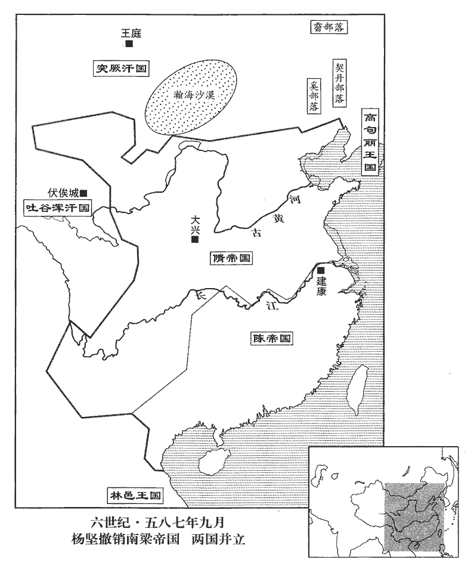
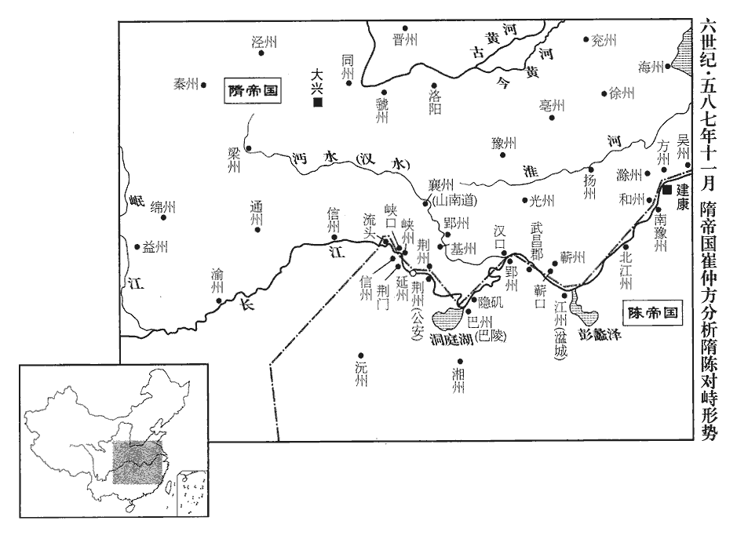
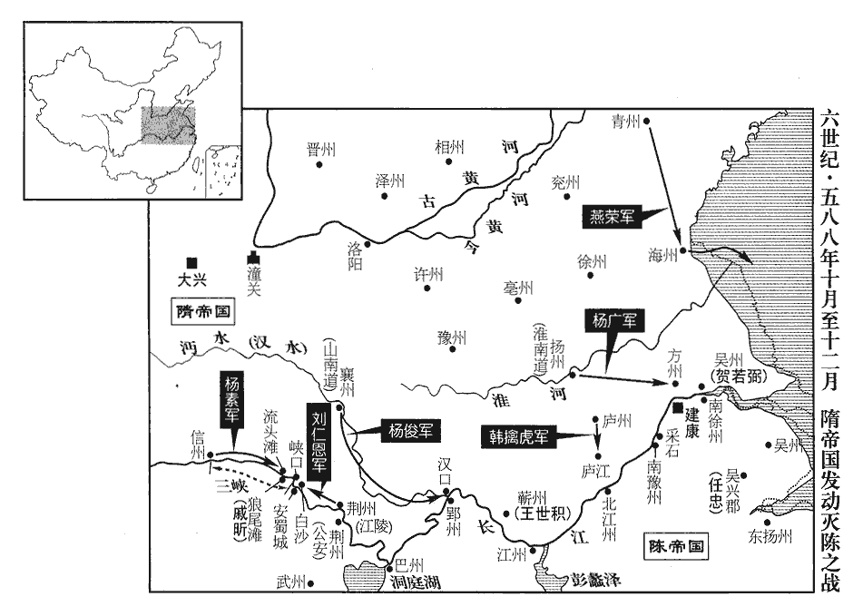

 陳紀十起閼逢執徐（甲辰），盡著雍涒灘（戊申），凡五年。

# 長城公下

## 至德二年（甲辰、五八四）

1春，正月，甲子‹一›，日有食之。

〖译文〗 [1]春季，正月，甲子（初一），出现日食。

2己巳‹六›，隋‹首都大兴陕西省西安市›主‹杨坚，本年四十四岁›享太廟；辛未‹八›，祀南郊。

〖译文〗 [2]己巳（初六），隋文帝到太庙祭祀祖先。辛未（初八），隋文帝在长安城南郊祭天。

3壬申‹九›，梁‹首都江陵湖北省江陵县›主‹萧岿，本年四十三岁›入朝于隋，朝，直遙翻；下同。服通天冠、絳紗袍，北面受郊勞。及入見於大興殿，隋主服通天冠、絳紗袍，梁主服遠遊冠、朝服，君臣並拜。通天冠、絳紗袍，天子之服也；服天子之服，北面以受郊勞，示臣服於隋而未至純於臣也。遠遊冠、朝服，諸王見天子之服也；入見大興殿，純於臣矣。大興殿，隋新都正殿也，唐為西內太極殿。遠遊，三梁冠，黑介幘。朝服，絳紗單衣，白紗內單，皁領、袖，皁襈，革帶，鉤䚢，假帶，方心；絳紗蔽膝，韈，舃，綬，劍佩。君臣並拜，非禮也。勞，力到翻。見，賢遍翻。襈，雛免翻。䚢chè，丑例翻，又敕列翻。賜縑萬匹，珍玩稱是。稱是，言其直與萬縑稱也。稱，尺證翻。

〖译文〗 [3]壬申（初九），后梁国主亲自到长安朝见隋天子，头戴通天冠，身穿深红色的纱袍，在郊外受到迎接时面北而立。等进入新都，在大兴殿朝见隋文帝时，隋文帝戴通天冠，穿绛红色纱袍；后梁国主改戴远游冠，穿朝服，君臣互拜。隋文帝又赏赐后梁国主缣万匹及相当于万匹缣价值的大量珍宝。

4隋前華州‹郑县·陕西省华县›刺史張賓、華，戶化翻。儀同三司劉暉等造甲子元曆成，甲子元曆，其要以上元甲子，己巳已來至開皇四年歲在甲辰積算起。奏之。壬辰‹二十九›，詔頒新曆。考異曰：隋律曆志云：「二月撰成奏上。」今從帝紀。

〖译文〗 [4]隋朝前任华州刺史张宾、仪同三司刘晖等人修成《甲子元历》，进呈给隋文帝。壬辰（二十九日），文帝下诏令颁布新的历书。

5癸巳‹一›，‹陈国，首都建康江苏省南京市›大赦。

〖译文〗 [5]癸巳（疑误），陈朝大赦天下。

6二月，乙巳‹十三›，隋主‹杨坚›餞梁主‹萧岿›於灞上‹陕西西安东灞河畔›。梁主歸國，故餞之。

〖译文〗 [6]二月，乙巳（十三日），隋文帝在灞上设宴为后梁国主饯行。

7突厥蘇尼部男女萬餘口降隋。厥，九勿翻。尼，女夷翻。降，戶江翻；下同。

〖译文〗 [7]突厥苏尼部落男女一万多口归降隋朝。

8庚戌‹十八›，隋主如隴州‹陕西省陇县›。五代志：扶風汧源縣，西魏置隴東郡及東秦州，後改隴州。

〖译文〗 [8]庚戌（十八日），隋文帝驾幸陇州。

9突厥‹瀚海沙漠群›達頭可汗請降於隋。可，從刊入聲。汗，音寒。考異曰：隋帝紀云：「突厥阿史那玷厥帥其衆來降。」按時玷厥方強，蓋文降耳。

〖译文〗 [9]突厥达头可汗请求降附隋朝。

10夏，四月，庚子‹九›，隋以吏部尚書虞慶則為右僕射。

〖译文〗 [10]夏季，四月，庚子（初九），隋朝任命吏部尚书虞庆则为尚书右仆射。

隋上大將軍賀婁子幹發五州兵擊吐谷渾‹青海省›，時發河西五州兵，蓋凉‹姑臧·甘肃省武成市›、甘‹永平·甘肃省张掖市›、瓜‹鸣沙·甘肃省敦煌市›、鄯‹西都·青海省乐都县›、廓‹洮河·青海省贵德县›也。吐，從暾入聲。谷，音浴。殺男女萬餘口，二旬而還。還，音旋，又如字。

〖译文〗 [11]隋朝上大将军贺娄子干调发河西凉、甘、瓜、鄯、廓五州的军队攻打吐谷浑，斩杀吐谷浑部落男女一万多口，历时二十天才班师还军。

帝‹杨坚›以隴西‹陇山以西›頻被寇掠，而俗不設村塢，塢，安古翻，壁壘也。說文曰：小障也，一曰庳bēi城也。通俗文：營居曰塢。被，皮義翻。命子幹勒民為堡，堡，音保，小城也。仍營田積穀。子幹上書曰：「隴右、河西，土曠民稀，邊境未寧，不可廣佃。上，時掌翻。佃，徒年翻，作田也。比見屯田之所，比，毗至翻。獲少費多，虛役人功，卒逢踐暴；少，詩沼翻。卒，子恤翻。屯田疏遠者請皆廢省。但隴右之人以畜牧為事，畜，許六翻。若更屯聚，彌不自安。但使鎮戍連接，烽堠相望，堠hòu，戶遘翻。民雖散居，必謂無慮。」帝從之。

〖译文〗 隋文帝由于陇西一带经常遭到外族侵犯虏掠，而民间从来不建立永久性居住、具有防御能力的村坞，于是命令贺娄子干强制百姓建造城堡，并屯田积粮。贺娄子干上书说：“陇右、河西地区地旷民稀，边疆不安定，不可到处耕作。我近来发现一些屯田地区，虽然收获不多，但费用开支却很大，白白浪费了许多人力，最终还会遭到入侵者的蹂躏毁坏。因此，凡是疏远的屯田之所，请求全部废掉。只是陇右地区的老百姓一向从事畜牧业，如果强迫他们屯聚而居崐，会更加惊恐不安。只要能多建立镇、戍等军事要塞和负责望、传达军情的烽火台、堠堡，使其络绎相望，虽然百姓分散居住，也一定能确保他们安居乐业。”隋文帝听从了他的建议。

以子幹曉習邊事，丁巳‹二十六›，以為榆關總管‹总部设榆关内蒙古托克托县黄河南岸›。五代志：榆林郡金河縣，開皇三年置榆關總管。榆林郡後置勝州。

〖译文〗 隋文帝由于贺娄子干熟悉边疆事务，丁巳（二十六日），任命他为榆关总管。

12五月，‹陈国›以吏部尚書江總為僕射。

〖译文〗 [12]五月，南陈朝廷任命吏部尚书江总为尚书仆射。

13隋主以渭水多沙，深淺不常，漕者苦之，六月，壬子‹二十二›，詔太子左庶子宇文愷帥水工鑿渠，引渭水，帥，讀曰率。自大興城東至潼關‹陕西省潼关县›三百餘里，名曰廣通渠。漕運通利，關內賴之。

〖译文〗 [13]隋文帝因为渭河多沙，河水深浅不固定，漕运的丁役深以为苦，六月，壬子（二十二日），下诏令太子左庶子宇文恺率领民工开凿渠道，引渭水，自新都大兴城向东直到潼关，共三百余里，名叫“广通渠”。以利漕运和通商，关内都依赖它。

14秋，七月，丙寅‹六›，‹陈国›遣兼散騎常侍謝泉等聘于隋。散，悉亶翻。騎，奇寄翻。

〖译文〗 [14]秋季，七月，丙寅（初六），陈朝派遣兼散骑常侍谢泉等人出使隋朝。

15八月，壬寅‹十三›，隋鄧恭公竇熾卒‹年七十八岁›。熾，昌志翻。卒，子恤翻。

〖译文〗 [15]八月，壬寅（十三日），隋朝邓恭公窦炽去世。

16乙卯‹二十六›，將軍夏侯苗請降于隋，夏，戶雅翻。降，戶江翻。隋主以通和，不納。

〖译文〗 [16]乙卯（二十六日），陈朝将军夏侯苗请求归降隋朝，隋文帝因为与陈朝交好，不予接纳。

17九月，甲戌‹十五›，隋主以關中饑，行如洛陽‹河南省洛阳市东白马寺东›。

〖译文〗 [17]九月，甲戍（十五日），隋文帝由于关内出现饥荒，驾幸洛阳。

18隋主不喜詞華，喜，許記翻。詔天下公私文翰並宜實錄。泗州‹宿迁·江苏省宿迁市›刺史司馬幼之五代志：下邳郡，後魏置南徐州，梁改東徐州，陳改安州，後周改泗州。文表華豔，付所司治罪。治書侍御史趙郡‹河北省赵县›李諤亦以當時屬文，體尚輕薄，治，直之翻。屬，之欲翻。上書曰：「魏之三祖，上，時掌翻。三祖，謂曹魏父子孫太祖武皇帝‹曹操›、高祖文皇帝‹曹丕›、烈祖明皇帝‹曹植›。崇尚文詞，忽君人之大道，好雕蟲之小藝。揚子曰：童子雕蟲篆刻。好，呼到翻。下之從上，遂成風俗。江左、齊、梁，其弊彌甚：競一韻之奇，爭一字之巧；連篇累牘，不出月露之形，積案盈箱，唯是風雲之狀。世俗以此相高，朝廷據茲擢士。祿利之路既開，愛尚之情愈篤。於是閭里童昏，貴遊總丱guàn，童昏，言童幼昏蒙，未有知識也。鄭玄曰：貴遊子弟，王公之子弟；遊，無官司者。詩：總角丱兮。毛傳曰：總角，聚兩髦也。丱，幼稚也，丱，古患翻。未窺六甲，古者，八歲入小學，學六甲、五方、書計之事。六甲，謂六十甲子也。先製五言，謂五言詩。至如羲皇、舜、禹之典，伊、傅、周、孔之說，不復關心，復，扶又翻。何嘗入耳。以傲誕為清虛，以緣情為勳績，指儒素為古拙，用詞賦為君子。故文筆日繁，其政日亂，良由棄大聖之軌模，搆無用以為用也。今朝廷雖有是詔，如聞外州遠縣，仍踵弊風：躬仁孝之行者，行，下孟翻。擯落私門，不加收齒；工輕薄之藝者，選充吏職，舉送天朝。朝，直遙翻。蓋由刺史、縣令未遵風教。請普加采察，送臺推劾。」劾，戶概翻，又戶得翻。又上言：「士大夫矜伐干進，無復廉恥，乞明加罪黜，以懲風軌。」風軌，風迹也。上，時掌翻。詔以諤前後所奏頒示四方。

〖译文〗 [18]隋文帝不喜好文章用词华丽，诏令天下公私文书都要写得符合实际情况。泗州刺史司马幼之的文章奏表浮华艳丽，隋文帝把他交付有关部门治罪。治书侍御史赵郡人李谔也因为当时人们撰写文章，文风崇尚轻薄浮华，而上书说：“以前曹魏的三位君主撰写文章崇尚文词优美华丽，忽略治理万民的大道，喜好雕琢词句的小技。下面纷纷起而仿效，遂成一种社会风尚。到了江东晋、齐、梁朝，这种文风的危害达到了极点。人们热衷于追求一的新奇，竞逐一字的巧妙。文章连篇累牍，不过是刻划了月升露落的景致；作品积案盈箱，也只是描写了风起云飘的情形。世俗以此而互相标榜，朝廷据此来选拔官吏。以擅长雕虫小技求取功名利禄的道路既然已经开通，人们偏爱华丽崇尚轻浮的文风越发厉害。因此，不论是乡闾孩童，还是王公子弟，不是首先学习实用知识而是首先学习如何做五言诗；对于羲皇、虞舜、夏禹的典籍，伊尹、傅说、周公、孔子的学说，不再关心，未曾入耳。把虚诞放纵当作洒脱高雅，把缘情体物当作功勋劳绩，把有德的硕儒看作古朴迂腐之人，把工于词赋之士当成君子大人。所以文笔日益繁盛，而政治日益动乱。这都是由于统治者抛弃了上古圣贤制定的法式、规则，造作无益于治道的文体来推广使用。如今朝廷虽然颁布了禁绝浮华艳丽文风的诏令，但是我听说一些外州远县，仍然踵袭前代的衰败风气。躬行仁义孝悌者被私门摈落，不加录用；擅长轻薄浮华之雕虫小技者，则被选拔充任官吏，保举荐送朝廷。这都是由于这些州、县的刺史、县令没有执行陛下的诏令。请求陛下普遍派人加以调查，送御史台推劾治罪。”后来又崐上书说：“有些士大夫炫耀功绩、出身以谋求进身做官，没有廉耻之心，请求明示其罪，加以黜退，以矫正社会风气。”隋文帝诏令将李谔前后奏章颁布天下。

19突厥沙鉢略可汗數為隋所敗，厥，九勿翻。可，從刊入聲。汗，音寒。數，所角翻。敗，補邁翻。乃請和親。千金公主自請改姓楊氏，為隋主女。隋主遣開府儀同三司徐平和使於沙鉢略，更封千金公主為大義公主。千金公主，宇文氏，請於沙鉢略，欲復讎；及兵敗於外，眾離於內，乃請為隋主女。更封以大義，非嘉名也，取「大義滅親」云爾，為大義不得其死張本。使，疏吏翻；下同。更，工衡翻。晉王廣請因釁乘之，釁，許覲翻。隋主不許。

〖译文〗 [19]突厥沙钵略可汗数次被隋朝打败，于是请求与隋朝和亲。千金公主宇文氏也请求改姓杨氏，作隋文帝的女儿。于是隋文帝派遣开府仪同三司徐平和出使突厥沙钵略可汗，改封千金公主为大义公主。晋王杨广请求乘突厥内外交困之机出兵讨伐，隋文帝不答应。

沙鉢略遣使致書曰：「從天生大突厥天下賢聖天子伊利居盧設莫何沙鉢略可汗【章：十二行本「居」作「俱」；乙十一行本同；孔本同。】致書大隋皇帝：皇帝，婦父，乃是翁比。此為女夫，乃是兒例。兩境雖殊，情義如一。自今子子孫孫，乃至萬世，親好不絕。好，呼到翻。上天為證，終不違負！此國羊馬，皆皇帝之畜。畜，許救翻。彼之繒綵，皆此國之物。」繒，疾陵翻。

〖译文〗 沙钵略可汗派遣使者致书隋文帝说：“从天生大突厥天下贤圣天子伊利居卢设莫何沙钵略可汗致书大隋天子：皇帝陛下，您是我夫人的父亲，也就等于是我的父亲。我是您的女婿，自然应该算是您的儿子。我们两国的礼俗虽然不同，但人们的情义却是一样的。自今以后，子子孙孙以至万世，亲好不绝。上天为证，永不违负！我国的牛羊驼马，都是皇帝陛下的牲畜；贵国的缯彩绢帛，也都是我国的财物。”

帝復書曰：「大隋天子貽書大突厥沙鉢略可汗：得書，知大有善意。既為沙鉢略婦翁，今日視沙鉢略與兒子不異。時遣大臣往彼省女，復省沙鉢略也。」省，悉景翻。復，扶又翻。於是遣尚書右僕射虞慶則使於沙鉢略‹蒙古国哈尔和林市›，車騎將軍長孫晟副之。騎，奇寄翻。長，知兩翻。晟，承正翻。

〖译文〗 隋文帝复书沙钵略可汗说：“大隋天子致书大突厥沙钵略可汗：收到来信，知道你有和好的善意。朕既然是沙钵略可汗的岳父，现在就将沙钵略可汗当作儿子一样看待。朕即刻就派遣大臣到突厥去看望女儿，同时也看望沙钵略可汗。”于是派遣尚收右仆射虞庆则出使突厥沙钵略可汗，车骑将军长孙晟作为副使同行。

沙鉢略陳兵列其珍寶，坐見慶則，稱病不能起，且曰：「我諸父以來，不向人拜。」慶則責而諭之。千金公主私謂慶則曰：「可汗豺狼性；過與爭，將齧人。」齧niè，五結翻，噬也。長孫晟謂沙鉢略曰：「突厥與隋俱大國天子，可汗不起，安敢違意。但可賀敦為帝女，則可汗是大隋女壻，柰何不敬婦翁！」沙鉢略笑謂其達官曰：「須拜婦翁！」突厥子弟曰特勒；大臣曰葉護，曰屈律啜。曰阿波，曰俟利發，曰吐屯，曰俟斤，曰閻洪達，曰頡利發，曰達干，皆達官也。乃起拜頓顙，顙，桑黨翻。跪受璽書，以戴於首。璽，斯氏翻。既而大慙，與群下相聚慟哭。慶則又遣稱臣，沙鉢略謂左右曰：「何謂臣？」左右曰：「隋言臣，猶此云奴耳。」沙鉢略曰：「得為大隋天子奴，虞僕射之力也。」贈慶則馬千匹，并以從妹妻之。從，才用翻。妻，七細翻。

〖译文〗 突厥沙钵略可汗陈列军队，摆放珍宝，坐在座位上接见虞庆则，称身体有病而不能起立，并且说：“从我父亲那辈以来，从不跪拜别人。”虞庆则对他加以责备并晓以大义。千金公主私下对虞庆则说：“沙钵略可汗豺狼本性，过分与他争执，激怒了他，就会咬人的。”长孙晟对沙钵略可汗说：“突厥可汗与隋朝皇帝都是大国天子，礼相匹敌，可汗不肯起身跪拜，我们做使节的怎敢违背您的意愿。但是可贺敦是隋文帝的女儿，那么可汗您就是大隋天子的女婿。女婿怎么能不尊敬岳父！”沙钵略可汗笑着对属下达官贵人说：“看来必须跪拜岳父。”于是起立跪拜，伏地叩头，然后跪着接受了隋文帝玺书，顶在头上。过一会儿，感到非常羞愧，于是与其部下相聚恸哭。虞庆则又指使突厥对隋称臣，沙钵略可汗问左右侍从：“什么叫臣子？”左右侍从回答说：“隋朝所说的臣子，就是我们所说的奴仆。”沙钵略可汗说：“我能够成为大隋天子的奴仆，全仗虞仆射出力成全。”于是馈赠虞庆则马一千匹，并将堂妹嫁给他。

20冬，十一月，壬戌‹四›，隋主遣兼散騎常侍薛道衡等來聘，散，悉亶翻。騎，奇寄翻。戒道衡「當識朕意，勿以言辭相折。」折，之舌翻。

〖译文〗 [20]冬季，十一月，壬戌（初四），隋文帝派遣兼散常侍薛道衡等人出使陈朝，并在临行前告诫薛道衡说：“你应当明白朕的意思，不要在言辞上与对方争高低。”

21是歲，上‹陈叔宝›於光昭殿前起臨春、結綺、望仙三閣，各高數十丈，高，古到翻。連延數十間，其牕chuāng、牖yǒu、壁帶、縣楣、欄、檻皆以沈、檀為之，釋名曰：牕，聰也，於內見外之聰明也。牖，亦牕也。說文：牖，穿壁，以木為交牕。壁帶，壁中橫木。班固西都賦：金釭gāng銜璧，是為列錢。賢註曰：以黃金為釭，其中銜璧，納之於壁帶，為行列，歷歷如錢也。懸楣，橫木，施於前後兩楹之間，下不裝構，今人謂之掛楣。欄、檻皆所以凭也，施於簷下階際者曰欄，施於牕牖之間者曰檻。沈、檀，皆香木。縣，讀曰懸。沈，持林翻。飾以金玉，間以珠翠，珠，珍珠。翠，翡翠毛。間，古莧翻。外施珠簾，內有寶床、寶帳，其服玩瑰麗，近古所未有。每微風暫至，香聞數里。瑰，工回翻。聞，音問。其下積石為山，引水為池，雜植奇花異卉。卉，百草總名，音許偉翻，又音諱。

〖译文〗 [21]这年，陈后主在皇宫光昭殿前修建临春、结绮、望仙三栋楼阁。楼阁各高数十丈，连延数十间，窗户、壁带、悬楣、栏杆等都是用沉木和檀木制成，并用黄金、玉石或者珍珠、翡翠加以装饰，楼阁门窗均外挂珠帘，室内有宝床宝帐，穿戴玩赏的东西瑰奇精美，近古以来所未见。每当微风吹来，沉木、檀木香飘数里。阁下堆石成山，引水为池并杂种奇花异草。

上‹陈叔宝›自居臨春閣，張貴妃‹张丽华›居結綺閣，龔、孔二貴嬪居望仙閣，並複道交相往來。又有王、李二美人，張、薛二淑媛，袁昭儀、何婕妤、江脩容，並有寵，梁制：貴妃、貴嬪、貴姬，是為三夫人，金章龜鈕，紫綬八十首，佩于窴玉、虎頭鞶pán。淑媛、淑儀、淑容、昭華、昭儀、昭容、脩華、脩儀、脩容、是為九嬪，金章龜鈕，青綬八十首，虎頭鞶，佩采瓄dú玉。婕妤、容華、充華、承徽、列榮五職，位亞九嬪，銀印珪鈕，艾綬，虎頭鞶。美人、才人、良人三職，散位，銅印環鈕，墨綬，虎頭鞶。嬪，毗賓翻。媛，于眷翻。婕妤，音接于。迭遊其上。以宮人有文學者袁大捨等為女學士。僕射江總雖為宰輔，不親政務，日與都官尚書孔範、散騎常侍王瑳等散，悉亶翻。騎，奇寄翻。瑳cuō，倉何翻。文士十餘人，侍上遊宴後庭，無復尊卑之序，謂之「狎客」。上每飲酒，使諸妃、嬪及女學士與狎客共賦詩，互相贈答，考異曰：平陳記云：「張貴妃等八人夾坐，江總等十人預宴。先令八婦人襞bì采牋製五言詩，十客一時繼和，稽緩則罰酒。」今從陳書、南史。采其尤艷麗者，被以新聲，被，皮義翻。選宮女千餘人習而歌之，分部迭進。其曲有玉樹後庭花、臨春樂等，五代志：後主於清樂中造黃鸝留及玉樹後庭花、金釵兩鬢垂等曲，與幸臣製其歌詞，綺豔相高，極於輕薄。男女唱和，其音甚哀。臨春樂者，言臨春閣之樂也。樂，音洛。大略皆美諸妃嬪之容色。君臣酣歌，自夕達旦，以此為常。

〖译文〗 陈后主自己居住在临春阁，张贵妃居住在结绮阁，龚、孔两贵嫔居住在望仙阁，通过各楼阁之间的复道互相往来。另外，后宫里还有王美人、李美人、张淑媛、薛淑媛、袁昭仪、何婕妤、江容，都受到了陈后主的宠爱，也都经常到三座楼阁上游玩宴乐。陈后主又任命宫女中有文才的袁大舍等人为女学士。尚书仆射江总虽然担任宰相，但并不亲自处理政务，每天与都官尚书孔范、散骑常侍王等文士十余人，侍奉后主在皇宫后庭游玩宴乐，不讲君臣尊卑次序，被称之为“狎客”。陈后主每举办酒宴，就使诸位妃、嫔和江总等狎客一起赋诗，互相赠答，然后挑选其中特别艳丽的诗作，谱上新曲，再挑选宫女千余人练习歌唱，分部演出。其歌曲有《玉树后庭花》、《临春乐》等，大都是赞美诸位妃、嫔的美丽容貌。君臣饮酒酣歌，从夜晚到清晨，以为常事。

張貴妃名麗華，本兵家女，為龔貴嬪侍兒，上見而悅之，得幸，生太子深。貴妃髮長七尺，其光可鑑，長，直亮翻。性敏慧，有神彩，進止詳【章：十二行本「詳」作「閑」；乙十一行本同。】華，詳審而華麗也。每瞻視眄睞，仰視曰瞻。正觀曰視。斜視曰眄。旁視曰睞。眄miǎn，莫甸翻。睞lài，洛代翻。光采溢目，照映左右。善候人主顏色，引薦諸宮女；後宮咸德之，競言其善。又有厭魅之術，厭魅，所謂婦人媚道也。厭，一琰翻。魅，音媚。常置淫祀於宮中，聚女巫鼓舞。上怠於政事，百司啟奏，並因宦者蔡脫兒、李善度進請；上倚隱囊，隱囊者，為囊實以細輭，置諸坐側，坐倦則側身曲肱以隱之。隱，於靳翻。置張貴妃於膝上，共決之。李、蔡所不能記者，貴妃並為條疏，疏，分也。為，于偽翻。無所遺脫。因參訪外事，人間有一言一事，貴妃必先知白之；由是益加寵異，冠絕後庭。冠，古玩翻。宦官近習，內外連結，援引宗戚，縱橫不法，援，于元翻。橫，下孟翻。賣官鬻獄，貨賂公行；賞罰之命，不出于外。言出命不由中書而出於宮掖也。大臣有不從者，因而譖之。於是孔、張之權熏灼四方，孔、張，謂孔貴嬪、張貴妃也。大臣執政皆從風諂附。

〖译文〗 张贵妃名叫张丽华，家中世代为兵，是龚贵妃的侍女，陈后主一见钟情。她得到陈后主的宠幸后，生下了皇太子陈深。张贵妃的一头秀发约长七尺，油光发亮，又聪明颖慧，富有富采，举止优雅，每当她顾盼凝视时，更显得光彩照人，映动左右。张贵妃善于体察陈后主的心意，向后主引荐宫女；因此后宫妃、嫔、宫女都对她感恩戴德，竞相在陈后主面前赞美她。她又擅长祈祷鬼神的厌魅方术，经常在后宫中进行各种不合礼制规定的祭祀，聚集女巫伴着乐声跳舞，装神弄鬼。陈后主懒于处理政事，朝中百官大臣有所启奏，都由宦官蔡脱儿、李善度呈进请示；陈后主靠着松软的靠垫，让张贵妃坐在他的膝盖上，两人一起审批奏表，裁决政事。凡是蔡脱儿、李善度两人所没有记住的，张贵妃都逐条加以分析，没有遗漏。张贵妃经常参访了解皇宫外面发生的事情，外间的一言一事，张贵妃必定事先知道，然后告诉陈后主。因此更加受到陈后主的宠爱，远在后宫诸位妃、嫔之上。陈后主身旁的宦官与亲信内外勾结，朋比为奸，援引宗属亲戚，横行不法，卖官鬻狱，贿赂公行，就连朝廷赏罚之命，也出于宫掖。外朝大臣有不顺从旨意的，就寻找机会加以陷害。于是孔贵嫔、张贵妃的权势炙手可热，执掌朝政的公卿大臣都竞相奉承依附。

孔範與孔貴嬪結為兄妹；上惡聞過失，惡，烏路翻。每有惡事，孔範必曲為文飾，稱揚贊美，由是寵遇優渥，言聽計從。群臣有諫者，輒以罪斥之。中書舍人施文慶，頗涉書史，嘗事上於東宮，聰敏強記，明閑吏職，閑，習也。心算口占，應時條理，由是大被親幸。被，皮義翻。又薦所善吳興‹浙江省湖州市›沈客卿、五代志：吳郡烏程縣，舊置吳興郡。陽惠朗、徐哲、暨慧景等，姓纂：周景王封少子於陽樊，因邑命氏。余按春秋之時，齊人遷陽，子孫蓋以國為氏。江南自來有暨姓，吳時有暨豔。暨，戟乙翻。云有吏能，上皆擢用之；以客卿為中書舍人。客卿有口辯，頗知朝廷典故，兼掌金帛局。陳中書省分為二十一局。舊制：軍人、士人並無關市之稅。上盛脩宮室，窮極耳目，府庫空虛，有所興造，恆苦不給。客卿奏請不問士庶，並責關市之征，而又增重其舊。於是以陽惠朗為太市令，暨慧景為尚書金、倉都令史，梁制：太市令屬太府卿，秩六百石。尚書金、倉都令史，金部、倉部都令史也。梁制，尚書都令史視奉朝請。恆，戶登翻。二人家本小吏，考校簿領，纖毫不差；然皆不達大體，督責苛碎，聚斂無厭，斂，力贍翻。厭，於鹽翻。士民嗟怨。客卿總督之，每歲所入，過於常格數十倍。過，工禾翻。上大悅，益以施文慶為知人，臨亂之君，各賢其臣，其信然矣。尤見親重，小大眾事，無不委任；轉相汲引，汲水者引綆期必上，人臣之相汲引，亦猶是也。珥貂蟬者五十人。珥，市志翻。

〖译文〗 都官尚书孔范与孔贵嫔结拜为兄妹；陈后主厌恶听到说自己犯有过失的话，所以每当他做错了事，孔范必然设法为他掩饰开脱，并称颂赞美他的圣明。因此陈后主对孔范的宠信礼遇有加，言听计从。百官大臣有敢于直言进谏者，孔范都要构之以罪，然后将他斥逐出朝。中书舍人施文庆读书颇多，陈后主为皇太子时曾在东宫供职，他聪明敏慧，记忆力强，通晓熟谙吏职政务，能心算口占，随时随地能把事情处理得井井有条，因此深得陈后主的亲近和宠幸。施文庆又向陈后主推荐了与他交好的吴兴人沈客卿、阳惠朗、徐哲、暨慧景等人，说他们有担任官吏的才干，陈后主都给予提拔重用，并任命沈客卿为中书舍人。沈客卿能言善辩，懂得乾廷典章常例，兼掌中书省金帛局。按照旧制，军人、官吏都不征收入市关税。陈后主由于大修宫室，极其豪华富丽，府库空虚，财用枯竭，再要有所兴造，就经常苦于没钱支付。沈客卿上奏请求不管官吏还是平民，都得交纳入市关税，而且还请求增加征收数额。陈后主于是任命阳惠朗为太市令，暨慧景为尚书金、仓都令史。阳、暨二人家中本是小吏，考校文簿，丝毫不差；但都不识为政大体，督责苛刻繁碎，聚敛从不满足，使得官吏百姓怨声载道。沈客卿总领负责，每年所得收入，超过正常数额几十倍。陈后主非常高兴，愈加感到施文庆有知人之明，特别对他亲信倚重，把朝廷大小事情都交给他处理。施文庆一伙人转相荐引，成为达官显贵的多达五十人。

孔範自謂文武才能，舉朝莫及，朝，直遙翻。從容白上曰：「外間諸將，起自行伍，從，千容翻。將，即亮翻。行，戶剛翻。匹夫敵耳。深見遠慮，豈其所知！」上以問施文慶，文慶畏範，亦以為然；司馬申復贊之。復，扶又翻。自是將帥微有過失，帥，所類翻。即奪其兵，分配文吏；奪任忠部曲以配範及蔡徵。由是文武解體，以至覆滅。通鑑具敘陳氏亡國之由。

〖译文〗 孔范自以为有文武全才，朝中无人能比，于是神色自若地对陈后主说：“朝外那些带兵的将帅都是行伍出身，只有匹夫之勇。至于深谋远虑，运筹帷幄，岂是他们所能知晓的！”陈后主以此向施文庆征询意见，施文庆因为惧怕孔范的权势，就随声附和；中书通事舍人司马申也表示赞成孔范的见解。自此以后，将帅如果稍有过失，就立刻削夺他们的军队，分配给文职官吏；曾经夺取领军将军任忠的部曲分配给孔范和蔡徵。因此文臣武将都离心离德，终至覆灭。

## 三年（乙巳、五八五）

1春，正月，戊午朔‹一›，日有食之。

〖译文〗 [1]春季，正月，戊午朔（初一），出现日食。

2隋‹首都大兴陕西省西安市›主‹杨坚，本年四十五岁›命禮部尚書牛弘脩五禮，勒成百卷；戊辰‹十一›，詔行新禮。五禮：吉、凶、軍、賓、嘉。

〖译文〗 [2]隋文帝命令礼部尚书牛弘撰修吉、凶、军、宾、嘉五礼，编为百卷；戊辰（十一日），诏令颁行新礼。

3三月，戊午‹二›，隋以尚書左僕射高熲為左領軍大將軍。

〖译文〗 [3]三月，戊午（初二），隋朝任命尚书左仆射高为左领军大将军。

4‹陈国，首都建康江苏省南京市›豐州‹晋安·福建省福州市›刺史章大寶，昭達之子也，五代志：建安郡界，陳置閩州，後又置豐州。章昭達歷事高祖、世祖、高宗，皆有戰功。在州貪縱，朝廷以太僕卿李暈代之。暈將至，辛酉‹五›，大寶襲殺暈，舉兵反。

〖译文〗 [4]陈朝丰州刺史章大宝是章昭达的儿子，他在丰州贪纵不法，朝廷派遣太仆卿李晕接替他的职务。在李晕快要到达的时候，辛酉（初五），章大宝率军袭杀李晕，起兵造反。

5隋大司徒郢公王誼大司徒，周之六官。按王誼拜大司徒，隋主未受禪也；隋既受禪，改周之六官，司徒列於三公，不應復加「大」字。與隋主有舊，王誼少與隋主同學。其子尚帝‹杨坚›女蘭陵公主。帝待之恩禮稍薄，誼頗怨望。或告誼自言名應圖讖，相表當王；相，息亮翻。公卿奏誼大逆不道。壬寅‹十六›，賜誼死‹年四十六岁›。

〖译文〗 [5]隋朝大司徒郢公王谊与隋文帝有旧交，他的儿子娶文帝女兰陵公主为妻。后来隋文帝对他的恩宠礼遇淡薄，王谊因此非常怨恨。有人告发王谊说自己名应图谶，有帝王之相；公卿大臣上奏说王谊犯了大逆不道之罪。壬寅（疑误），隋文帝将王谊赐死。

6戊申‹二十二›，隋主還長安。去年九月隋主如洛陽，今還。

〖译文〗 [6]戊申（疑误），隋文帝从洛阳回到长安。

7章大寶遣其將楊通攻建安‹福建省建瓯市›，不克。以此觀之，陳之豐州治閩縣，而建安縣自別置建安郡。將，即亮翻。臺軍將至，大寶眾潰，逃入山，為追兵所擒，夷三族。

〖译文〗 [7]陈朝章大宝派遣部将杨通率叛军攻打建安，没有攻克。这时朝廷的军队快要到达，章大宝部众溃散，自己逃入山中，被追兵擒获，灭了三族。

8隋度支尚書長孫平元年，隋已改度支為民部，志作「工部尚書長孫平」。度，徒洛翻。長，知兩翻。奏「令民間每秋家出粟麥一石以下，貧富為差，儲之當社，委社司檢校，以備凶年，名曰『義倉』」，隋主從之。五月，甲申‹二十九›，初詔郡、縣置義倉。【章：十二行本「倉」下有「平儉之子也」五字；乙十一行本同；孔本同。】時民間多妄稱老、小以免賦役，隋承周制，男女三歲已下為黃，十歲已下為小，六十者為老。山東承北齊之弊政，北齊，高齊。言北齊者，以別蕭氏之南齊。戶口租調，姦偽尤多。隋主命州縣大索貌閱，調，徒弔翻。索，山客翻。貌閱者，閱其貌以驗老小之實。戶口不實者，里正、黨長遠配；隋頒新令，制人五家為保，保有長；保五為閭，閭四為族，皆有正；畿外置里正，比閭正；黨長，比族正；以相檢察焉。長，知兩翻。大功以下，皆令析籍，以防容隱。堂兄弟，其服大功。於是計帳得新附一百六十四萬餘口。高熲【章：十二行本「熲」下有「又言民間課輸無定簿，難以推校」十三字；乙十一行本同；孔本同；張校同。】請為輸籍法，徧下諸州，輸籍，凡民間課輸，皆籍其數，使州縣長吏不得以走弄出沒。下，戶嫁翻。帝從之，自是姦無所容矣。

〖译文〗 [8]隋朝度支尚书长孙平上奏说：“请下令民间每年秋天一家拿出粟麦一石以下，根据家庭贫富状况订出等级标准，每社民户所交纳的粮食就储存在当社，委派社中官吏负责查核，以防备荒年，名叫‘义仓’。”隋文帝听从了他的建议。五月，甲申（二十九日），隋文帝开始诏令各郡、县都设置义仓。当时百姓多向官府谎报年老或幼小，以逃避赋税徭役，山东地区承袭原北齐王朝的弊政，在户口登记和租调征收方面，犯奸作伪的极多。隋文帝下令在全国州县逐户逐人进行核时。如果户口不实，有称老诈小的，里正、党长远配边州。堂兄弟以下仍然同居的大家族，都命令他们分家居住，自立门户，以防止出现隐瞒户口人丁的情况。这次普查，户籍簿上新增加了一百六十四万余人口。左领军大将军高又请求实行按所造帐籍征收赋税的输籍法，颁布各州实行，隋文帝也听从了他的建议。自此以后，想犯奸作伪逃避赋税的人再也无法藏身了。

諸州調物，每歲河南自潼關‹陕西省潼关县›，河北自蒲坂‹山西省永济市›，輸長安者相屬於路，調，徒弔翻。屬，之欲翻。晝夜不絕者數月。

〖译文〗 隋朝全国各地每年上调给中央的各种物资，黄河以南的经由潼关，黄河以北的经由蒲坂，向长安运输的车辆接连不断，昼夜不停，前后长达数月之久。

9梁主‹萧岿，年四十四岁›殂，諡曰孝明皇帝，廟號世宗。世宗孝慈儉約，境內安之。太子琮嗣位。琮，藏宗翻。

〖译文〗 [9]后梁国主去世，谥号孝明皇帝，庙号世宗。世宗孝顺慈善，俭约爱民，境内因此安定太平。太子萧琮继位。

10初，突厥‹瀚海沙漠群›阿波可汗既與沙鉢略有隙，【章：十二行本「隙」下有「分而為二」四字；乙十一行本同；孔本同；張校同。】厥，九勿翻。可，從刊入聲。汗，音寒。有隙事始上卷元年。阿波浸強，東距都斤‹蒙古国杭爱山›，都斤，突厥中山名。沙鉢略初立，建牙於此山。西越金山‹新疆阿尔泰山›，龜茲‹新疆库车县›、鐵勒‹此指在新疆北部的部落›、伊吾‹新疆哈密市›及西域諸胡悉附之，伊吾之地，吐屯設主之，蓋突厥所署置也。龜茲，音丘慈。號西突厥。突厥自是分為東、西。隋主亦遣上大將軍元契使于阿波以撫之。使，疏吏翻。

〖译文〗 [10]起初，突厥阿波可汗与沙钵略可汗结下怨恨，后来阿波可汗势力逐渐强盛，东抵都斤山，西越金山，这一广大地区的龟兹、铁勒、伊吾各国以及居住在西域的胡人部落都归附了他，号称西突厥。隋文帝也派遣上大将军元契出使阿波可汗，以安抚西突厥。

11秋，七月，庚申‹六›，遣散騎常侍王話等聘于隋。散，悉亶翻。騎，奇寄翻。

〖译文〗 [11]秋季，七月，庚申（初六），陈朝派遣散骑常侍王话等人到隋朝聘问。

12突厥沙鉢略既為達頭所困，達頭資阿波以兵，使攻沙鉢略，是為其所困者也。又畏契丹‹辽河上游›，西既為達頭所困，東又畏契丹見逼。契，欺訖翻，又音喫。遣使告急於隋，請將部落度漠南，寄居白道川‹内蒙古呼和浩特市北›。欲南傍長城下，倚隋為援。使，疏吏翻。將，即亮翻。又如字。隋主許之，命晉王廣以兵援之，晉王廣時為并省，北邊皆屬焉，故命以兵援沙鉢略。給以衣食，賜之車服鼓吹。吹，昌瑞翻。沙鉢略因西擊阿波，破之。借隋兵之勢以獲勝。而阿拔國‹蒙古国东部›乘虛掠其妻子；官軍為擊阿拔，敗之，為，于偽翻。敗，補邁翻。所獲悉與沙鉢略。

〖译文〗 [12]突厥沙钵略可汗既为达头可汗困扰，又畏惧契丹逐渐强大，于是派遣使者到隋朝告急，请求允许他率所属部落迁徙到大漠南面，在白道川一带暂住。隋文帝答应了他的请求，命令晋王杨广发兵接应，并供给他衣服食品，赏赐他车驾服饰及乐器。沙钵略可汗借助隋兵到来的声势，率军向西攻打阿波可汗，打败了他。可是阿拔国乘沙钵略可汗后方兵力空虚之机发兵偷袭，虏走了他的妻儿家小；隋朝军队为沙钵略打败了阿拔军队，并把所缴获的人畜物品全部给予了沙钵略可汗。

沙鉢略大喜，乃立約，以磧為界，磧qì，七迹翻。因上表曰：「天無二日，土無二王，此語本之孟子。上，時掌翻；下同。大隋皇帝真皇帝也，豈敢阻兵恃險，偷竊名號！今感慕淳風，歸心有道，屈膝稽顙，稽，音啟。顙，桑黨翻。永為藩附。」遣其子庫合真入朝。考異曰：隋突厥傳作「窟含真」，今從帝紀。朝，直遙翻。

〖译文〗 沙钵略可汗十分高兴，于是与隋朝订立盟约，以砂碛作为两国的分界，因崐此上表说：“天无二日，地无二主，大隋皇帝是真正的皇帝，我岂敢再凭恃险隘，阻兵抗命，窃取名号，妄称天子！今日因羡慕淳朴风俗，归心有道之君，情愿屈膝跪拜，永远做大隋的藩附属国。”于是派遣他的儿子库合真入朝。

八月，丙戌‹二›，庫合真至長安。隋主下詔曰：「沙鉢略往雖與和，往，已往也，言往事也。猶是二國；今作君臣，便成一體。」因命肅告郊廟，普頒遠近；凡賜沙鉢略詔，不稱其名。宴庫合真於內殿，突厥馮陵諸夏，周、齊屈體結之。今沙鉢略奉表稱臣，遣子入覲，隋主告之郊廟，布之臣庶，大其事也；宴之於內殿，親之也。引見皇后，賞勞甚厚。見，賢遍翻。勞，力到翻。沙鉢略大悅，自是歲時貢獻不絕。

〖译文〗 八月，丙戌（初二），库合真来到长安。隋文帝下诏书说：“突厥沙钵略可汗以往虽然与隋朝和亲交好，仍是两个国家；现在君臣有序，便成了一国。”于是命令举行郊、庙大祀，告知天地、祖先，并命令把此事通告远近。凡是赐给沙钵略可汗的诏书，不直呼他的名字。隋文帝还在内殿宴请库合真，并把他引见给独孤皇后，赏赐丰厚。沙钵略可汗非常高兴，从此，每年都向隋朝进贡物品。

13九月，將軍湛文徹侵隋和州‹历阳·安徽省和县›，隋儀同三司費寶首擊擒之。費，扶拂翻，姓也。

〖译文〗 [13]九月，陈朝将军湛文彻侵犯隋朝的和州，隋仪同三司费宝首率军打败陈朝军队，俘虏了湛文彻。

14丙子‹二十›，隋使李若等來聘。

〖译文〗 [14]丙子（二十三日），隋朝派遣李若等人到陈朝聘问。

15冬，十月，壬辰‹九›，隋以上柱國楊素為信州‹总部设永安城重庆市奉节县›總管。五代志：巴東郡，梁置信州。隋置楊素於永安，將使之為舟師以伐陳也。

〖译文〗 [15]冬季，十月，壬辰（初九），隋朝任命上柱国杨素为信州总管。

16初，北地傅縡縡zài，作代翻。以庶子事上‹陈叔宝›於東宮，及即位，遷祕書監、右衛將軍兼中書通事舍人，負才使氣，人多怨之。施文慶、沈客卿共譖縡受高麗‹首都平壤朝鲜平壤市›使金，上‹陈叔宝›收縡下獄。麗，力知翻。使，疏吏翻。下，戶嫁翻。

〖译文〗 [16]以前，北地人傅曾以太子庶子的身份侍奉陈后主于东宫，等后主即位，傅晋升为秘书监、右卫将军兼中书通事舍人，由于他恃才傲物，因此百官群臣大都不喜欢他。施文庆与沈客卿一同诬陷说傅收受了高丽国使者贿赂，陈后主将傅收捕下狱。

縡於獄中上書曰：「夫君人者，恭事上帝，子愛下民，省嗜欲，遠諂佞，未明求衣，日旰忘食，中上，時掌翻。夫，音扶。遠，于願翻。旰gàn，古按翻。是以澤被區宇，被，皮義翻。慶流子孫。陛下頃來酒色過度，不虔郊廟大神，專媚淫昏之鬼，謂寵張貴妃，使女巫鼓舞於宮中而淫祀也。小人在側，宦豎弄權，惡忠直若仇讎，視生民如草芥，後宮曳綺繡，廏馬餘菽粟，百姓流離，殭尸蔽野，貨賄公行，帑藏損耗，神怒民怨，眾叛親離，臣恐東南王氣自斯而盡。」惡，烏路翻。殭，居良翻。帑tǎng，他朗翻。藏，徂浪翻。王，于況翻，又如字。

〖译文〗 傅在狱中上书说：“做帝王的，应该恭奉上天，爱民如子，减省嗜欲侈糜，疏远谄媚奸佞，天未明就穿衣起床，天已晚还没吃饭。如此才能恩泽布施于天下海内，福庆流传于子孙后代。但是，陛下近来沉湎于酒色，挥霍无度；不虔诚地敬奉郊庙大神，专心媚事淫昏之鬼；听信小人宦官擅政，厌恶忠直之士如同仇敌，轻视生民之命如同草芥；后宫妃、嫔宫女服用绮锦缎，御用厩马喂食菽粟稻麦，而天下百姓却流离失所，僵尸遍野；朝野上下货贿公行，国家库藏日益耗费。天怒人怨，众叛亲离，我恐怕东南的王者之气从此而尽。”

書奏，上‹陈叔宝›大怒。頃之，意稍解，遣使謂縡曰：「我欲赦卿，卿能改過不？」使，疏吏翻。不，讀曰否。對曰：「臣心如面，臣面可改，則臣心可改。」上益怒，令宦者李善慶窮治其事，遂賜死獄中。治，直之翻。

〖译文〗 傅上书呈奏，陈后主读后勃然大怒。过了一会，后主怒意稍有平息，就派遣使者对傅说：“我打算赦免你，你能改正以前的过错吗？”傅回答说：“我的心性就如同我的相貌，如果相貌能够改变，那么我的心性才能改变。”陈后主更加愤怒，命令宦官李善庆彻底追究傅的罪行，将他赐死在狱中。

上每當郊祀，常稱疾不行，故縡言及之。

〖译文〗 陈后主每当举行郊祀的时候，经常称病不亲临现场，所以傅在上书中提及这件事。

17是歲，梁大將軍戚昕以舟師襲公安‹荆州州政府所在城·湖北省公安县›，不克而還。公安，陳荊州治所。昕，许斤翻。還，音旋，又如字。

〖译文〗 [17]这一年，后梁大将军戚昕率水军攻打陈朝荆州治所公安城，没有攻克而退军。

隋主徵梁主‹萧琮›叔父太尉吳王岑入朝，拜大將軍，封懷義公，因留不遣；朝，直遙翻。復置江陵總管以監之。隋罷江陵總管，見上卷陳高宗太建十四年。復，扶又翻。監，工銜翻。

〖译文〗 隋文帝诏令征召后梁国主的叔父太尉吴王萧岑入朝，任命他为大将军，封怀义公，趁机将他留在长安，不让回国；又重新设置江陵总管监视后梁国。

梁大將軍許世武密以城召荊州‹公安·湖北省公安县›刺史宜黃侯慧紀；宜黃，古縣，吳立，屬臨川郡，隋併省。謀泄，梁主‹萧琮›殺之。慧紀，高祖之從孫也。從，才用翻。

〖译文〗 后梁大将军许世武暗中以江陵城招引陈朝荆州刺史宜黄侯陈慧纪；密谋泄露，后梁国主杀了许世武。陈慧纪是陈武帝陈霸先兄弟的孙子。

18隋主使司農少卿崔仲方發丁三萬，於朔方‹陕西省靖边县北白城子›、靈武‹宁夏灵武市›築長城，東距河，西至綏州‹上县·陕西省绥德县›，五代志：雕陰郡，西魏置綏州。綿歷七百里，以遏胡寇。

〖译文〗 [18]隋文帝又派遣司农少卿崔仲方征发壮丁三万人，在朔方、灵武一线修筑长城，东起黄河，西至绥州，绵延七百里，用来遏制北方胡人入侵。

## 四年（丙午、五八六）

1梁‹首都江陵湖北省江陵县›改元廣運。

〖译文〗 [1]后梁改年号广运。

2甲子‹十三›，党項‹四川省西北部›羌請降於隋。隋書：党項羌者，三苗之後也，自稱獼猴種。東接臨洮、西平，西距葉護，南北數千里，每姓別為部落。党，底朗翻。降，戶江翻。

〖译文〗 [2]甲子（十三日），党项羌人请求降附隋朝。

3庚午‹十九›，隋頒曆於突厥‹瀚海沙漠群›。班曆則稟受正朔矣。

〖译文〗 [3]庚午（十九日），隋朝向突厥颁行新历。

4二月，隋始令刺史上佐每歲暮更入朝，上考課。上佐，謂長史、司馬。更，工衡翻。上，時掌翻。

〖译文〗 [4]二月，隋朝下令每年岁末各州刺史以及高级僚属轮流入朝，呈奏本州官吏的当年政绩，由朝廷进行考核升降。

5丁亥‹六›，隋復令崔仲方發丁十五萬，於朔方‹夏州，岩绿·陕西省靖边县北白城子›以東，緣邊險要，築數十城。朔方郡，夏州。復，扶又翻。

〖译文〗 [5]丁亥（初六），隋文帝又命令崔仲方征发壮丁十五万人，在朔方以东，沿边境的险要地方修筑数十座城堡。

6丙申‹十五›，‹陈，首都建康江苏省南京市›立皇‹陈叔宝，本年三十四岁›弟叔謨為巴東王，叔顯為臨江王，叔坦為新會王，叔隆為新寧王。五代志：歷陽郡烏江縣，陳為臨江郡；南海郡新會縣，舊置新會郡；信安郡新興縣，梁置新寧郡。

〖译文〗 [6]丙申（十五日），陈朝立皇弟陈叔谟为巴东王，陈叔显为临江王，陈叔坦为新会王，陈叔隆为新宁王。

7庚子‹十九›，隋大赦。

〖译文〗 [7]庚子（十九日），隋朝大赦天下。

8三月，己未‹八›，洛陽‹河南省洛阳市东白马寺东›男子高德上書，請隋主‹杨坚，本年四十六岁›為太上皇，傳位皇太子‹杨勇›。帝曰：「朕承天命，撫育蒼生，日旰孜孜，猶恐不逮。旰，古按翻。豈效近代帝王，傳位於子，自求逸樂者哉！」言不效齊武成、周天元也。樂，音洛。

〖译文〗 [8]三月，己未（初八），洛阳男子高德上书，请求隋文帝自己做太上皇，将皇位传给皇太子。隋文帝说：“朕承天受命，抚育百姓，早晚孜孜不倦，不敢稍有懈怠，还恐怕不能够尽职尽责。岂能效法近代那些帝王，传位于太子，自求安乐逍遥！”

9夏，四月，己亥‹十九›，‹陈国›遣周磻等聘于隋。磻pán，薄官翻。

〖译文〗 [9]夏季，四月，己亥（十九日），陈朝派遣周等人到隋朝聘问。

10五月，丁巳‹七›，立皇子莊‹陈庄›為會稽王。會，古外翻。

〖译文〗 [10]五月，丁巳（初七），陈朝立皇子陈庄为会稽王。

11秋，八月，隋遣散騎常侍裴豪等來聘。散，悉亶翻。騎，奇寄翻。

〖译文〗 [11]秋季，八月，隋朝派遣散骑常侍裴豪等人到陈朝聘问。

12戊申‹三十›，隋申明公李穆卒‹年七十七岁›，隋以李穆能知幾保身，故諡曰明。卒，子恤翻。葬以殊禮。

〖译文〗 [12]戊申（三十日），隋朝申明公太师李穆去世，用特别隆重的礼节安葬。

13閏月，丁卯‹十九›，隋太子勇鎮洛陽。

〖译文〗 [13]闰月，丁卯（十九日），隋朝皇太子杨勇出镇洛阳。

14隋上柱國郕公梁士彥討尉遲迥，事見一百七十四卷高宗太建十二年。尉，紆勿翻。所當必破，代迥為相州‹安阳·河南省安阳市›刺史；相，息亮翻。隋主忌之，召還長安。上柱國杞公宇文忻與隋主少相厚，少，詩照翻。善用兵，有威名；隋主亦忌之，以譴去官，忻為右領軍大將軍。以【章：十二行本「以」作「與」；乙十一行本同；孔本同；張校同。】柱國舒公劉昉皆被疏遠，被，皮義翻。遠，于願翻。「以」，當作「與」。閒居無事，頗懷怨望，數相往來，數，所角翻。陰謀不軌。

〖译文〗 [14]起初，隋朝上柱国公梁士彦讨伐尉迟迥，英勇善战，所战必胜，代尉迟迥为相州刺史。后来隋文帝猜忌他，将他召回长安。隋朝上柱国杞公宇文忻与隋文帝少年时交情深厚，他善于用兵，有威信声望。隋文帝也因此猜忌他，后来由于受到谴责而被免除右领军大将军职务。梁士彦、宇文忻与柱国舒公刘都被隋文帝疏远，闲居无事，心怀怨恨，多次相互往来串通，密谋起兵造反。

忻欲使士彥於蒲州‹蒲坂·山西省永济市›起兵，蒲州，蒲坂，河津之要，去長安三百餘里。己為內應，士彥之甥裴通預其謀而告之。帝隱其事，以士彥為晉州‹临汾·山西省临汾市›刺史，晉州，平陽，用武之地。周、齊兵爭，以為重鎮。欲觀其意；士彥忻然，謂昉等曰：「天也！」又請儀同三司薛摩兒為長史，帝亦許之。後與公卿朝謁，朝，直遙翻；下同。帝令左右執士彥、忻、昉於行間，詰之，行，戶剛翻。詰，去吉翻。初猶不伏；捕薛摩兒適至，命之庭對，於殿庭面質其事。摩兒具論始末，士彥失色，顧謂摩兒曰：「汝殺我！」丙子‹二十八›，士彥‹年七十二岁›、忻‹年六十四岁›、昉皆伏誅，叔姪、兄弟免死除名。

〖译文〗 宇文忻想使梁士彦于蒲州起兵，自己在长安作内应，梁士彦的外甥裴通参预了他们的密谋，又告发了他们。隋文帝把这件事先掩盖下来，任命梁士彦为晋州刺史，打算观察他的意向；梁士彦非常高兴，对刘等人说：“天意让我们成功！”他又奏请朝廷任命仪同三司薛摩儿为晋州长史，隋文帝也答应了他。后来梁士彦等人与公卿大臣一起朝谒，隋文帝命令左右侍卫人员在朝拜行列中拿下梁士彦、宇文忻、刘三人，审问他们，开始他们还不伏罪，这时薛摩儿被捕获带到，隋文帝命他与三人在殿堂上当面对质，薛摩儿全部招供了梁士彦等三人谋反始末，梁士彦大惊失色，对薛摩儿说：“是你杀死了我！”丙子（二十八日），梁士彦、宇文忻、刘三人都被处死，他们的叔侄、兄弟免死除名为民。

九月，辛巳‹四›，隋主素服臨射殿，命百官射三家資物以為誡。三人者與隋主有舊，又有翼戴之功，而謀為不軌，故為之素服而又以誡百官。

〖译文〗 九月，辛巳（初四），隋文帝身穿白色服装亲临射殿，命令百官大臣用箭射梁士彦等三家的东西，以使他们从中吸取教训。

15冬，十月，己酉‹二›，隋以兵部尚書楊尚希為禮部尚書。隋主每旦臨朝，日昃不倦，尚希諫曰：「周文王‹姬昌›以憂勤損壽，武王‹姬发›以安樂延年。‹姬昌死时九十七岁，姬发死时九十三岁›鄭玄註禮記有是言。昃，阻力翻。樂，音洛。願陛下舉大綱，責成宰輔。繁碎之務，非人主所宜親也。」帝善之而不能從。

〖译文〗 [15]冬季，十月，己酉（初三），隋朝任命兵部尚书杨尚希为礼部尚书。隋文帝每天天一亮就临朝听政，直到天黑也不感到疲倦，杨尚希进谏说：“西周文王因为忧勤劳苦而折损寿命，武王则因为安乐颐养而延年益寿。请求陛下制定国家的大政方针，责成宰相负责处理政务。至于繁碎事务，不是帝王应该亲自处理的。”隋文帝虽然赞成他的意见，但是并不能照着去做。

16癸丑‹六›，隋置山南道行臺於襄州‹襄阳·湖北省襄樊市›；襄州治襄陽，其地在長安南山之南。以秦王俊為尚書令。俊妃崔氏生男，隋主喜，頒賜群官。

〖译文〗 直秘书内省博陵李文博，家素贫，人往贺之，文博曰：“赏罚之设，功过所存。今王妃生男，于群官何事，乃妄受赏也！”闻者愧之。

直祕書內省博陵‹河北省安平县›李文博，家素貧，曹魏藏書在祕書，中、外三閣，是時祕書已有內外之分矣。隋氏開獻書之路，召天下工書之士，補續殘缺，為正副二本，藏于宮中，其餘以實祕書內外之閣，故置直祕書內省之官。博陵郡，定州。人往賀之，文博曰：「賞罰之設，功過所存。今王妃生男，於群官何事，乃妄受賞也！」聞者愧之。

〖译文〗 隋朝直秘书内省博陵人李文博家中素来贫穷。有人去向他道贺受赏，他说：“朝廷设立赏罚，是为了赏功罚罪。现今王妃生了男孩，与群臣百官有什么关系，而妄求受赏！”听到的人都感到十分羞愧。

17癸亥‹十六›，‹陈国›以尚書僕射江總為尚書令，吏部尚書謝伷為僕射。伷zhòu，直祐翻。

〖译文〗 [17]癸亥（十六日），陈朝任命尚书仆射江总为尚书令，吏部尚书谢为尚书仆射。

18十一月，己卯‹三›，‹陈国›大赦。

〖译文〗 [18]十一月，己卯（初三），陈朝大赦天下。

19吐谷渾‹青海省›可汗夸呂在位百年，「夸呂」，隋書吐谷渾傳作「呂夸」。屢因喜怒廢殺太子。後太子懼，謀執夸呂而降；降，戶江翻；下同。請兵於隋邊吏，秦州‹总部设上邽甘肃省天水市›總管河間王弘請以兵應之，秦州，天水郡。河間王弘，隋主從祖弟。隋主不許。

〖译文〗 [19]吐谷浑可汗夸吕在位长达百年，曾多次因为喜怒无常而废掉或诛杀太子。后来太子惧怕，密谋劫持夸吕可汗降附隋朝，于是派遣使者向隋朝边防官吏请求援兵，秦州总管河间王杨弘向朝廷请求派兵接应，隋文帝不答应。

太子謀洩，為夸呂所殺，復立其少子嵬王訶為太子。復，扶又翻；下同。少，詩照翻。嵬wéi，五灰翻。疊州‹叠川·甘肃省迭部县›刺史杜粲五代志：臨洮郡疊川縣，後周置疊州。宋白曰：以其地山多重疊也。請因其釁而討之，釁，許覲翻。隋主又不許。

〖译文〗 吐谷浑太子密谋泄露，被夸吕可汗杀掉，夸吕又立他的小儿子嵬王诃为太子。隋朝叠州刺史杜粲又向朝廷请求乘机出兵讨伐，隋文帝还是不许。

是歲，嵬王訶復懼誅，謀帥部落萬五千戶降隋，遣使詣闕，請兵迎之。帥，讀曰率。使，疏吏翻；下同。隋主曰：「渾賊風俗，特異人倫，言其去人倫，與中國異俗。父既不慈，子復不孝。朕以德訓人，何有成其惡逆乎！」乃謂使者曰：「父有過失，子當諫爭，爭與諍同，音則迸翻。豈可潛謀非法，受不孝之名！溥pǔ天之下皆朕臣妾，各為善事，即稱朕心。稱，尺證翻。嵬王既欲歸朕，唯教嵬王為臣子之法，不可遠遣兵馬，助為惡事！」隋主可謂有君人之言矣。嵬王訶乃止。

〖译文〗 这一年，吐谷浑太子嵬王诃又因为害怕获罪遭杀，密谋率领所属部落一万五千户降附隋朝，派遣使者来到长安，请求隋朝派军队接应。隋文帝说：“吐谷浑风俗败坏，背离人伦天常，做父亲的既然不以慈爱待子，做儿子的也不以孝顺事父。朕以仁德教化百姓，怎么能够助成嵬王诃的恶逆行为呢！”于是对嵬王诃的使者说：“为子之道，父亲有了过失，儿子应该以死谏诤，怎么能密谋采取违背礼法的行为，落下不孝的罪名！普天之下，都是朕的臣妾子民，各自努力积善行德，就合于朕的心意。现今嵬王诃想归降朕，朕只能教导嵬王诃如何做忠臣孝子的道理，决不能远派军队接应，助成嵬王诃的恶逆行为。”嵬王诃只好作罢。

## 禎明元年（丁未、五八七）

1春，正月，戊寅‹三›，‹陈国，首都建康江苏省南京市›大赦，改元。

〖译文〗 [1]春季，正月，戊寅（初三），陈朝大赦天下，改年号为祯明。

2癸巳‹十八›，隋‹首都大兴陕西省西安市›主‹杨坚，本年四十七岁›享太廟。

〖译文〗 [2]癸巳（十八日），隋文帝到太庙祭祀祖先。

3乙未‹二十›，隋制諸州歲貢士三人。

〖译文〗 [3]乙未（二十日），隋朝规定各州每年向朝廷推荐三位士人。

4二月，丁巳‹十二›，隋主朝日于東郊。五代志：禮，天子以春分朝日於東郊，秋分夕月於西郊。漢法不俟二分，於東、西郊常以郊泰畤，旦出竹宮，東向揖日，其夕西向揖月。魏文譏其煩褻似家人之事，而以正月朝日于東門之外；前史又以為非時。及明帝太和元年二月丁亥，朝日于東郊，八月己丑，夕月於西郊，始合於古。後周以春分朝日於國東門外，為壇如其郊，用特牲，青幣，青圭有邸，皇帝乘青輅，及祀官俱青冕，執事者青弁，燔燎如圓丘；秋分夕月於國西門外，為壇於埳中，燔燎，禮如朝日。隋開皇初，於國東春明門外為壇，每以春分朝日，又於國西開遠門外埳中為壇，每以秋分夕月，牲幣與周同。朝，直遙翻。

〖译文〗 [4]二月丁巳（十二日），隋文帝在东郊举行祭祀太阳的仪式。

5‹陈国›遣兼散騎常侍王亨等聘于隋。散，悉亶翻。騎，奇寄翻。

〖译文〗 [5]陈朝派遣兼散骑常侍王亨等人到隋朝聘问。

6隋發丁男十萬餘人修長城，二旬而罷。夏，四月，於揚州‹广陵·江苏省扬州市›開山陽瀆‹邗沟›以通運。揚州治廣陵，山陽縣屬焉。按春秋，吳城邗，溝通江、淮。山陽瀆通於廣陵尚矣，隋特開而深廣之，將以伐陳也。

〖译文〗 [6]隋朝征发壮丁十万余人修筑长城，二十天而止。夏季，四月，隋朝在扬州开凿山阳渎以通漕运。

7突厥‹瀚海沙漠群›沙鉢略可汗遣其子入貢于隋，因請獵於恆‹故北魏恒州·山西省大同市›、代‹广武·山西省代县›之間，拓跋氏始都平城，建為代都，置司州及代都尹，後遷洛陽，改司州為恆州，故曰恆、代也。厥，九勿翻。可，從刊入聲。汗，音寒。恆，戶登翻。隋主許之，仍遣人賜以酒食。沙鉢略帥部落再拜受賜。帥，讀曰率。

〖译文〗 [7]突厥沙钵略可汗派遣他的儿子向隋朝进贡，并请求朝廷允许突厥在恒州、代州之间打猎，隋文帝答应了突厥的请求，并派遣使者赐给沙钵略可汗酒食。沙钵略可汗率领突厥部落跪拜接受赏赐。

沙鉢略尋卒，隋為之廢朝三日，卒，子恤翻。為，于偽翻。朝，直遙翻。遣太常弔祭。

〖译文〗 不久，沙钵略可汗去世，隋朝为他罢朝三天，以示哀悼，并派遣太常寺卿前去吊唁。

初，沙鉢略以其子雍虞閭懦弱，懦，乃臥翻，又奴亂翻。遗令立其弟葉護處羅侯。葉護，突厥達官。雍虞閭遣使迎處羅侯，將立之，使，疏吏翻；下同。處羅侯曰：「我突厥自木杆可汗以來，多以弟代兄，逸可汗捨其子而立木杆，木杆捨其子而立佗鉢，佗鉢卒，攝圖、大邏便遂至爭國事，並見前。杆，古按翻。以庶奪嫡，失先祖之法，不相敬畏。謂大邏便詈辱菴羅，又與沙鉢略為敵，達頭又從而助之也。汝當嗣位，我不憚拜汝。」雍虞閭曰：「叔與我父，共根連體。我，枝葉也，豈可使根本反從枝葉，叔父屈於卑幼乎！且亡父之命，何可廢也！願叔勿疑！」遣使相讓者五六，處羅侯竟立，是為莫何可汗。以雍虞閭為葉護。遣使上表言狀。可，從刊入聲。汗，意寒。使，疏吏翻。上，時掌翻。

〖译文〗 起初，沙钵略可汗因为儿子雍虞闾懦弱，留下遗言令立弟弟叶护处罗侯为可汗。这时，雍虞闾派遣使者前往迎接处罗侯，将拥立他为可汗。处罗侯说：“我突厥国自木杆可汗以来，可汗继承多是以弟代兄。以庶夺嫡，违背了祖宗之法，互相不加尊重。你是先可汗嫡子，理当继位，我不在乎跪拜你。”雍虞闾说：“叔父与我父亲是一母所生，共根连体。我是晚辈，好比枝叶。怎能使根本反而服从枝叶，叔父屈居于晚辈之下呢！况且这是先父的遗命，又怎么可以违背呢！希望叔父不要再有疑虑。”双方互相派遣使者，相互推让了有五六次之多，处罗侯终于即位，这就是莫何可汗。莫何可汗又任命雍虞闾为叶护。并派遣使者向隋朝上表，禀报即位始末。

隋使車騎將軍長孫晟持節拜之，騎，奇寄翻。拜莫何為可汗也。賜以鼓吹、幡旗。吹，昌瑞翻。莫何勇而有謀，以隋所賜旗鼓西擊阿波；阿波之眾以為得隋兵助之，多望風降附。遂生擒阿波，降，戶江翻。考異曰：隋突厥傳前云「沙鉢略西擊阿波，破擒之」，後又云「處羅侯生擒阿波。」長孫晟傳曰：「處羅侯因晟奏曰，『阿波為天所滅，與五六千騎在山谷間伏聽詔旨，當取之以獻。』按前云「沙鉢略破擒之，」「擒」，衍字耳，處羅侯云「當取以獻」，則是得否未可必，隋安得豫議其死生乎！今從突厥傳後。上書請其死生之命。上，時掌翻。

〖译文〗 隋朝派遣车骑将军长孙晟为使者，持节册拜莫何可汗，并赏赐给他鼓吹、幡旗。莫何可汗智勇双全，他打着隋朝所赏赐的幡旗和鼓吹，向西攻打西突厥阿波可汗。阿波可汗的军队以为莫何可汗得到了隋军的助战，纷纷望风降附。莫何可汗于是生擒阿波可汗，又派遣使者向隋朝上书，请示如何处置他。

隋主下其議，下，戶嫁翻。莫何不敢專殺阿波而請命於隋，隋之威令可謂行於突厥矣。樂安公元諧請就彼梟首；梟，古堯翻。武陽公李充請生取入朝，武陽郡公。隋之魏州武陽郡也。朝，直遙翻；下同。顯戮以示百姓。隋主謂長孫晟：「於卿何如？」晟對曰：「若突厥背誕，杜預曰：背誕謂背命放誕。陸德明曰：背，音佩；誕，音但。按今讀從去聲，亦通。須齊之以刑。今其昆弟自相夷滅，阿波之惡非負國家。因其困窮，取而為戮，恐非招遠之道。不如兩存之。」左僕射高熲曰：「骨肉相殘，教之蠹也，宜存養以示寬大。」隋主從之。

〖译文〗 隋文帝召集公卿大臣商议此事，乐安公元谐建议将阿波可汗就地斩首示众，武阳公李充建议将阿波可汗押送长安，由朝廷明令处死，以示天下百姓。隋文帝问长孙晟：“你认为该怎么处置？”长孙晟回答说：“如果阿波可汗是违背朝命，与我大隋作对，理应处以极刑。现今是突厥兄弟之间自相残杀，阿波可汗的罪恶并不是有负于我国。如果趁阿波可汗困穷危难之时，下令将他诛杀，恐怕不是招抚远方、绥靖边疆所应采取的办法。不如赦免阿波可汗，两存其国。”尚书左仆射高也说：“骨肉相残，违背伦理纲常，是推行教化的蠹害。应该赦免阿波可汗，留其性命，以示朝廷宽大为怀。”隋文帝听从了他们的建议。

8甲戌‹一›，隋遣兼散騎常侍楊同等來聘。散，悉亶翻。騎，奇寄翻。

〖译文〗 [8]甲戌（三十日），隋朝派遣兼散骑常侍杨同到陈朝聘问。

9五月，乙亥朔‹二›，日有食之。

〖译文〗 [9]五月，乙亥朔（初一），出现日食。

10秋，七月，己丑‹十六›，隋衛昭王爽卒。卒，子恤翻。

〖译文〗 [10]秋季，七月，己丑（十六日），隋朝卫昭王杨爽去世。

 

11八月，隋主徵梁‹首都江陵湖北省江陵县›主‹萧琮›入朝。梁主帥其群臣二百餘人發江陵；朝，直遙翻。帥，讀曰率。庚申‹十八›，至長安。

〖译文〗 [11]八月，隋文帝征召后梁国主萧琮入朝。萧琮率领群臣百官二百余人由江陵出发；庚申（十八日），到达长安。

隋主以梁主在外，遣武鄉公崔弘度將兵戍江陵。軍至都州‹鄀州，乐乡·湖北省钟祥市西北›，隋無都州，蕭琮傳作「鄀州」，當從之。五代志：竟陵郡樂鄉縣，西魏置鄀州。又，南郡紫陵縣，其城南面，梁置鄀州。鄀，市灼翻。梁主叔父太傅安平王巖、弟荊州‹江陵›刺史義興王瓛等瓛huán，戶官翻。恐弘度襲之，乙丑‹二十三›，遣都官尚書沈君公詣荊州‹公安·湖北省公安县›刺史宜黃侯慧紀請降。降，戶江翻。九月，庚寅‹十八›，慧紀引兵至江陵城下。辛卯‹十九›，巖等驅文、武、男、女十萬口來奔。

〖译文〗 隋文帝因为后梁国主离开了国家，就派遣武乡公崔弘度率军戍守江陵。崔弘度军至都州，后梁国主的叔父太傅安平王萧岩、弟弟荆州刺史义兴王萧等人害怕崔弘度趁机袭取江陵，乙丑（二十三日），萧岩、萧派遣都官尚书沈君公向陈朝荆州刺史宜黄侯陈慧纪请求降附。九月，庚寅（十八日），陈慧纪率军抵达江陵城下。辛卯（十九日），萧岩、萧等人带领后梁国文武官吏、平民百姓共十万人投奔陈朝。

隋主聞之，廢梁國；梁敬帝紹泰元年，後梁中宗即帝位，更三主，三十三年而亡。遣尚書左僕射高熲安集遗民；射，寅謝翻。熲，居永翻。梁中宗‹萧詧›、世宗‹萧岿›各給守冢十戶；拜梁主琮上柱國，賜爵莒公。

〖译文〗 隋文帝得知此事，下令废掉后梁；又派遣尚书左仆射高前去聚集安置没有降附陈朝的平民百姓；并下令给宣帝、孝明帝各十户人家守护陵墓；还任命后梁国主萧琮为上柱国，封爵莒公。

12甲午‹二十二›，‹陈国›大赦。

〖译文〗 [12]甲午（二十二日），陈朝大赦天下。

13冬，十月，隋主如同州‹武乡·陕西省大荔县›；癸亥‹二十二›，如蒲州‹蒲坂·山西省永济市›。

〖译文〗 [13]冬季，十月，隋文帝巡幸同州；癸亥（二十二日），又巡幸蒲州。

14十一月，丙子‹五›，以蕭巖為開府儀同三司、東揚州‹会稽·浙江省绍兴市›刺史，蕭瓛huán為吳州‹吴县·江苏省苏州市›刺史。五代志：會稽郡，梁置東揚州，吳郡，陳置吳州。

〖译文〗 [14]十一月，丙子（初五），陈朝任命萧岩为开府仪同三司、东扬州刺史，萧谳为吴州刺史。

15丁亥‹十六›，以豫章王叔英兼司徒。

〖译文〗 [15]丁亥（十六日），陈朝任命豫章王陈叔英兼任司徒。

16甲午‹二十三›，隋主如馮翊，親祠故社；隋主生於馮翊，猶漢祀豐枌榆社之意，然親祠則禮重於漢矣。戊戌‹二十七›，還長安。還，從宣翻，又音如字。

〖译文〗 [16]甲午（二十三日），隋文帝巡幸冯翊，亲自祭祀他出生地的社神，戊戌（二十七日），返回长安。

是行也，內史令李德林以疾不從，從，才用翻。隋主自同州敕書追之，追，召也。與議伐陳之計。及還，帝馬上舉鞭南指曰：「待平陳之日，以七寶裝嚴公，使自山以東無及公者。」言又將顯貴之，使出於等夷。李德林，山東人。

〖译文〗 隋文帝这次出巡，内史令李德林由于生病没有随行，文帝从同州下敕书召他前去，与他商议讨伐南陈的计划。等回到长安，文帝骑马举鞭指向南方说：“待平定南陈时，用七宝来装饰您，使崤山以东的士大夫，没有人能像你那样显贵。"

17初，隋主受禪以來，與陳鄰好甚篤，每獲陳諜，皆給衣馬禮遣之，好，呼到翻。諜，徒協翻，間探之人。而高宗‹陈顼›猶不禁侵掠。故太建之末，隋師入寇；會高宗殂，隋主即命班師，事見上卷太建十四年。殂，祚乎翻。遣使赴弔，使，疏吏翻。書稱姓名頓首。帝‹陈叔宝›答之益驕，書末云：「想彼統內如宜，此宇宙清泰。」隋主不悅，以示朝臣，朝，直遙翻。上柱國楊素以為主辱臣死，再拜請罪。

〖译文〗 [17]起初，隋文帝受禅即位以来，与陈朝十分友好，每次抓获陈朝的间谍，都赠送衣服、马匹，客气地予以遣返。然而陈宣帝还是不断地让军队侵扰隋朝边境。所以在太建末年，隋朝军队对南陈发动了一次进攻，适逢陈宣帝去世，隋文帝即下令班师退军，又派遣使者前去吊唁，在给陈后主的信中有“杨坚顿首”之语。陈后主的回信却越发狂妄自大，信末说：“想你统治的区域内安好，这里是天下清平。”隋文帝看了回信很不高兴，并把它展示给朝臣，上柱国杨素认为君主受辱，臣下该死，再一次跪拜叩头请罪。

隋主問取陳之策於高熲，對曰：「江北地寒，田收差晚；江南水田早熟。量彼收穫之際，熲，居永翻。量，音良。微徵士馬，聲言掩襲，彼必屯兵守禦，足得廢其農時。彼既聚兵，我便解甲。再三若此，彼以為常；後更集兵，彼必不信。猶豫之頃，我乃濟師；此濟師，謂舉兵濟江。登陸而戰，兵氣益倍。謂兵既登岸，後限大江，士無反顧之心，有必死之志，其氣益倍。又，江南土薄，舍多茅竹，所有儲積皆非地窖。窖，古孝翻。若密遣行人因風縱火，待彼脩立，復更燒之，復，扶又翻。不出數年，自可財力俱盡。」隋主用其策，陳人始困。

〖译文〗 隋文帝向高询问平定陈朝的策略，高回答说：“长江以北地区天气寒冷，田里庄稼的收获要晚一些；而江南地区水田里庄稼要成熟得早一些。估计在对方的收获季节，我们征集少量军队，声言要袭击江南，他们必定屯兵守御。这样足以使他们耽误农时。等到对方聚集了军队，我们便可以解甲散兵。如此反复，他们就会习以为常；然后我们再调集大军准备进攻，他们必然不会相信。这样，在他们还在犹豫的时候，我们的大军已经渡过了长江；我军渡江登岸与敌军作战，士气就会大增。再说江南水浅土薄，房舍多用茅竹搭成，所有的储积都不是藏在地窖里。如果我们暗中派人因风纵火，焚其储积，等他们重修后，再去焚烧。这样不出数年，对方必定力竭财尽。”隋文帝采纳了高的计谋，陈朝官府百姓开始感到疲惫不堪。

於是楊素、賀若弼及光州‹光城·河南省光山县›刺史高勱、虢州‹弘农·河南省灵宝市›刺史崔仲方等五代志：弋陽郡，梁置光州。弘農郡，隋置虢州。若，人者翻。勱，音邁。爭獻平江南之策。仲方上書曰：「今唯須武昌‹湖北省鄂州市›以下，蘄‹蕲春·湖北省蕲春县›、和‹历阳·安徽省和县›、滁‹新昌·安徽省滁州市›、方‹六合·江苏省六合县›、吳‹广陵·江苏省扬州市›、海‹朐山·江苏省连云港市›等州，上，時掌翻。武昌，陳為郡；隋平陳，廢為縣，屬江夏郡。五代志：蘄春郡，後齊置羅州，後周改曰蘄州。歷陽郡，後齊置和州。江都郡清流縣，舊置南譙州，隋改曰滁州。六合縣，後齊置秦州，後周改曰方州。江都郡本南兗州，後周改曰吳州。東海郡，東魏海州。蘄，居依翻，又音其。更帖精兵，帖，添帖。密營度計；益‹成都·四川省成都市›、信‹永安·重庆市奉节县›、襄‹襄阳·湖北省襄樊市›、荊‹江陵·湖北省江陵县›、基‹丰乡·湖北省荆门市东南›、郢‹长寿·湖北省钟祥市›等州，蜀郡，益州。巴東郡，信州。襄陽郡，襄州。南郡，荊州。竟陵郡豐鄉縣，西魏置基州。弋陽郡定城縣，舊置郢州。速造舟楫，多張形勢，為水戰之具。蜀、漢二江是其上流，蜀江出三峽，過南郡；漢江過襄陽、竟陵、沔陽而二江合流。國於東南者，二江其上流也。水路衝要，必爭之所。賊雖流頭‹湖北省宜昌市西北›、荊門‹湖北省枝城市西北长江南岸›、延洲‹湖北省枝江市长江中小岛›、公安‹陈荆州·湖北省公安县›、巴陵‹陈巴州·湖南省岳阳市›、隱磯‹岳阳市东北›、夏首‹夏口·湖北省武汉市›、蘄口‹湖北省蕲春县西›、湓城‹陈江州·江西省九江市›置船，水經註：江水過夷陵而東，至流頭灘，其水峻激奔暴，魚龞所不能游，行者苦之。又出西陵峽而東，歷荊門、虎牙之門。荊門之下為延洲。又東過南郡而東，右與油水合，謂之油口，油口即公安也。又東過長沙下巂縣，北與湘水會，匯為洞庭而得巴陵。又東至彭城磯，磯北對隱磯。夏首即夏口，以夏水入江而得名。屈原哀郢：過夏首而西浮。江水又東過蘄春縣，與蘄水會，謂之蘄口。又東至尋陽，得湓浦，有湓城，皆沿江要害之地也。夏，戶雅翻。然終聚漢口‹湖北省武汉市长江江面›、峽口‹西陵峡口·宜昌市西›，以水戰大決。漢口，即夏口。峽口，西陵峽口。若賊必以上流有軍，令精兵赴援者，下流諸將即須擇便橫渡；如擁眾自衛，上江諸軍鼓行以前。將，即亮翻。上江諸軍，謂蜀江、漢江順流東下之軍也。彼雖恃九江、五湖之險，非德無以為固；徒有三吳‹太湖流城及钱塘江流域›、百越‹广东、广西›之兵，非恩不能自立矣。」隋主以仲方為基州刺史。

〖译文〗 于是上柱国杨素、吴州总管贺若弼以及光州刺史高劢、虢州刺史崔仲方等人都争献平定陈朝的策略。崔仲方上书说：“如今必须自武昌以下，在蕲、和、滁、方、吴、海等州增加精兵，秘密进行部署、筹划；在益、信、襄、荆、基、郢等州立刻建造舟船，同时尽量壮大声势，作水战的准备。蜀、汉二江在长江的上流，是水陆要地，势所必争。陈朝虽然在流头、荆门、延州、公安、巴陵、隐矶、夏首、蕲口、湓城等地置备了船只，但最终还是要聚集大军于汉口、峡口，通过水战来与我们决战。如果陈朝断定我们只在上游部署有重兵，因而命令精锐部队赶赴上游增援，我们在下游的将帅即可率军乘机横渡长江；如果陈朝把精锐部队都部署在下游守卫，我们的上游诸军即可顺流而下，鼓行向前。陈朝虽然有九江、五湖之险可资凭恃，但失德则难以固守；徒有精锐骁勇的三吴、百越之兵，因无恩则不能自立。”于是隋文帝任命崔仲方为基州刺史。

 

及受蕭巖等降，降，戶江翻。隋主益忿，謂高熲曰：「我為民父母，豈可限一衣帶水不拯之乎！」命大作戰船。人請密之，隋主曰：「吾將顯行天誅，何密之有！」使投其杮fèi於江，杮fèi，方廢翻，斫木札也。曰：「若彼懼而能改，吾復何求！」復，扶又翻。

〖译文〗 等到陈朝接受后梁萧岩等人投降，隋文帝更加愤怒，对高说：“我作为崐天下百姓的父母，怎么能因为有长江一条衣带宽的水而不去拯救他们呢！”于是命令大造战船。有人建议应该秘密准备，隋文帝说：“我将要替天行道，进行讨伐，有什么可保密的呢！”并让造船者把砍削下的碎木片投进江里，使其顺流而下，说：“如果陈朝害怕，改过自新，我还能再要求什么呢！”

楊素在永安，蜀先主敗於秭歸，退還白帝，起永安宮居之，故巴東有永安之名。造大艦，名曰「五牙」。艦，戶黯翻。上起樓五層，高百餘尺；左右前後置六拍竿，拍竿，發之以拍敵船。並高五十尺，高，古號翻。容戰士八百人；次曰「黃龍」，置兵百人。自餘平乘、舴zé艋各有等差。舴，陟格翻。艋，莫幸翻。

〖译文〗 杨素率军在永安，建造大船，名叫“五牙”。在船上建五层楼，高一百余尺；又在船的左右前后设置了六根拍竿，都高五十尺，可乘载战士八百人。二号战船名叫“黄龙”，船上可乘载战士一百人。其余称作“平乘”、“舴艋”的舰船大小不等。

晉州刺史皇甫續【章：十二行本「續」作「績」；乙十一行本同；孔本同。】將之官，稽首言陳有三可滅。之，往也；之官，往服官事也。稽，音啟。帝問其狀，曰：「大吞小，一也。以有道伐無道，二也。納叛臣蕭巖，於我有詞，三也。陛下若命將出師，臣願展絲髮之效！」隋主勞而遣之。將，即亮翻。勞，力到翻。

〖译文〗 隋朝晋州刺史皇甫续将要赴任，在向隋文帝辞行时叩头行礼上言平定陈朝有三条理由。隋文帝问具体情况，皇甫续回答说：“第一是以大国吞并小国；第二是以有道讨伐无道；第三是陈朝接纳叛臣萧岩等人，我们师出有名。陛下如果命将出师，我愿意效微薄之力。”隋文帝对他加以慰劳，然后让他赴晋州上任。

時江南妖異特眾，妖，於驕翻。臨平湖‹在浙江省杭州市西北›草久塞，忽然自開。臨平湖在餘杭郡錢塘縣，此湖常蓁塞；故老相傳，湖開則天下平。塞，悉則翻。帝‹陈叔宝，本年三十五岁›惡之，乃自賣於佛寺為奴以厭之。惡，烏路翻。厭，於葉翻。又於建康造大皇寺，起七級浮圖；未畢，火從中起而焚之。

〖译文〗 当时江南妖异怪事极多，临平湖久被水草堵塞，此时突然散开。陈后主非常厌恶，于是自卖于佛寺为奴隶，想以此来镇住妖异。又下令在建康城中修建大皇寺，在寺中建造七层宝塔；还未完工，佛塔就从中起火被焚毁。

吳興‹浙江省湖州市›章華，好學，善屬文，朝臣以華素無伐閱，好，呼到翻。屬，之欲翻。朝，直遙翻。顏師古曰：伐，積功也；閱，經歷也。競排詆之，除太市令。華鬱鬱不得志，上書極諫，略曰：「昔高祖‹陈霸先›南平百越，謂平盧子略、李賁、元景仲、蘭裕、蕭勃之亂。上，時掌翻。北誅逆虜，謂平侯景。世祖‹陈蒨›東定吳會，謂破斬杜龕、張彪。西破王琳，見一百六十八卷世祖天嘉元年。高宗‹陈顼›克復淮南，辟地千里，見一百七十一卷太建五年。辟，讀曰闢。三祖之功勤亦至矣。陛下即位，于今五年，不思先帝之艱難，不知天命之可畏；溺於嬖寵，惑於酒色；溺，奴狄翻。嬖，卑義翻，又博計翻。祠七廟而不出，記：天子七廟，三昭、三穆與太祖之廟而七。拜三妃而臨軒；三妃，龔、孔、張也。老臣宿將將，即亮翻。棄之草莽，諂佞讒邪升之朝廷。今疆埸日蹙，埸，音亦。隋軍壓境，陛下如不改絃易張，董仲舒曰：譬之琴瑟不調，必改絃而更張之，乃可鼓也。臣見麋鹿復遊於姑蘇矣！」伍子胥諫吳王而不聽，曰：「臣見麋鹿遊於姑蘇矣。」吳卒以亡。復，扶又翻。帝‹陈叔宝›大怒，即日斬之。古語有之：「殺諫臣者必亡其國」豈不信哉！

〖译文〗 吴兴人章华，好学不倦，工于诗文，朝中群臣因为他没有功劳，又缺乏资历，竞相诋毁他，任命他为太市令。章华郁郁不得志，于是上书尽力谏诤，大略说：“以前，高祖武皇帝南面平定百城，北面诛灭了叛逆的侯景；世祖文皇帝东面平定了吴兴、会稽地区，西面打败了王琳；高宗宣皇帝收复了淮南，拓地千里。三位先主的功绩劳苦已到极点。可是自陛下即位以来，至今已有五年，不思先帝创业的艰难，不知天命震怒之可畏；溺爱后宫嫔妃，沉湎酒色宴乐；祭祀祖宗七庙时托辞不出，册封三位妃子时则亲临殿庭；把老臣旧将弃置不用，将谄佞谗邪小人提拔进朝廷。如今边界在日益缩小，隋朝军队大兵压境，陛下如果不能改革自新，我认为国家将会很快灭亡，都城建康不久将变成一片废墟。”陈后主大怒，当天杀掉了章华。

## 二年（戊申、五八八）

1春，正月，辛巳‹十一›，‹陈，都建康›【江苏南京】陈叔宝，本年三十六岁立皇子恮為東陽王，恮quán，莊緣翻。恬為錢塘王。

〖译文〗 [1]春季，正月，辛巳（十一日），陈朝立皇子陈为东阳王，陈恬为钱塘王。

2遣散騎常侍袁雅等聘于隋；散，悉亶翻。騎，奇寄翻。又遣散騎常侍九江‹江西省九江市›周羅睺將兵屯峽口‹西陵峡口·湖北省宜昌市西›，侵隋峽州‹夷陵·湖北省宜昌市西北›。九江郡，江南之尋陽郡，江州治所也。夷陵，梁置宜州，西魏改曰拓州，後周改曰峽州。將，即亮翻。

〖译文〗 [2]陈朝派遣散骑常侍袁雅等人到隋朝聘问；又派遣散骑常侍九江人周罗率军驻扎峡口，侵犯隋朝峡州。

三月，甲戌‹五›，隋‹首都大兴陕西省西安市›遣兼散騎常侍程尚賢等來聘。

〖译文〗 三月，甲戌（初五），隋朝派遣兼散骑常侍程尚贤等人到陈朝聘问。

戊寅‹九›，隋主‹杨坚，本年四十八岁›下詔曰：「陳叔寶據手掌之地，辛臣說田戎曰：「洛陽地如掌耳。」恣溪壑之欲，溪壑難盈，故以為喻。劫奪閻閭，資產俱竭，驅逼內外，勞役弗已；窮奢極侈，俾晝作夜；斬直言之客，滅無罪之家；欺天造惡，祭鬼求恩；盛粉黛而執干戈，曳羅綺而呼警蹕；自古昏亂，罕或能比。君子潛逃，小人得志。天災地孽，孽，魚列翻。物怪人妖。衣冠鉗口，鉗，其廉翻。道路以目。國語：周厲王監謗，道路以目。言道路相逢，以目相視，不敢有言。重以背德違言，搖蕩疆埸；重，直用翻。背，蒲妹翻。埸，音亦。晝伏夜遊，鼠竊狗盜。天之所覆，無非朕臣，覆，敷救翻。每關聽覽，有懷傷惻。可出師授律，應機誅殄；在斯一舉，永清吳越。」又送璽書暴帝‹陈叔宝›二十惡；璽，斯氏翻。仍散寫詔書三十萬紙，遍諭江外。中原以江南為江外。

〖译文〗 戊寅（初九），隋文帝下诏书说：“陈叔宝盘据着巴掌大的地方，却欲壑难填，劫夺乡民百姓，使他们倾家荡产，驱逼天下黎民，劳役不休；穷奢极侈，昼夜寻欢作乐；诛杀直言之士，族灭无罪之家；欺瞒上天，作恶多端，却去祭祀妖鬼，祈求福佑；与后宫宠爱的妃子出游，侍卫翼从，前呼后拥，清道戒严，自古以来，帝王昏庸腐败，难以为比。使正人君子潜逃归隐，小人奸臣得志弄权。因此天地为之震怒，人妖物怪出没。士大夫钳口结舌，平民百姓侧目而视。再加上违反德义，背弃誓言，犯我边疆，白天隐伏，夜间出游，象鼠窃狗盗那样。普天之下都是朕的臣民，每当听到或省览有关江南百姓受苦受难的奏疏，朕都感到痛苦悲伤。因此，要出师讨伐，以正国法，乘机诛灭暴君。此次一战将会永远扫平吴越地区。”又派遣使者把玺书送给陈朝，历数陈后主二十条罪状。并抄写了三十万份诏书，向江南地区广为传播散发。

3太子胤，性聰敏，好文學，好，呼到翻。然頗有過失；詹事袁憲切諫，不聽。時沈后‹沈婺华›無寵，而近侍左右數於東宮往來，太子亦數使人至后所，帝‹陈叔宝›疑其怨望，甚惡之。數，所角翻。惡，烏路翻。張‹张丽华›、孔二貴妃日夜構成后及太子之短，孔範之徒又於外助之。帝欲立張貴妃‹张丽华›子始安王深為嗣，嘗從容言之。嗣，祥吏翻。從，千容翻。吏部尚書蔡徵順旨稱贊，袁憲厲色折之曰：「皇太子國家儲副，億兆宅心，卿是何人，輕言廢立！」帝卒從徵議。折，之舌翻。宅心，居心也。卒，子恤翻。夏，五月，庚子‹三›，廢太子胤為吳興王，立揚州刺史始安王深為太子。徵，景歷之子也。蔡景歷歷事陳高祖、世祖、高宗。深亦聰惠，惠，與慧同。有志操，操，七到翻。容止儼然，雖左右近侍未嘗見其喜慍。帝聞袁憲嘗諫胤，即用憲為尚書僕射。

〖译文〗 [3]陈朝皇太子陈胤聪明敏慧，喜好文学，但是多有不良行为，太子詹事袁宪恳切进谏，陈胤不听。当时沈皇后失宠，而她身边的近侍随从多次往来东宫，皇太子也多次派人到皇后寝宫，因此陈后主怀疑他们心怀怨恨，所以十分厌恶他们。张、孔二贵妃又日夜在陈后主面前说皇后和太子的坏话，都官尚书孔范等人又在朝外推波助澜。于是陈后主打算废掉皇太子陈胤，另立张贵妃的儿子始安王陈深为太子，并非正式提出了这件事。吏部尚书蔡徵顺从陈后主的旨意，极力称赞，袁宪正颜厉色反驳他说：“皇太子是国家将来的皇上，万民敬仰，你算什么人，胆敢随便谈说废立大事！”陈后主最终还是听从了蔡徵的建议。夏季，五月，庚子（疑误），陈后主废掉皇太子陈胤，改封为吴兴王，册立扬州刺史始安王陈深为皇太子。蔡徵是蔡景历的儿子。陈深也很聪明敏慧，有志气，品行端正，仪容举止庄严肃穆，即便是他的近侍随从，也从未见过他高兴和恼怒。陈后主听说袁宪曾经规谏过陈胤，当即任命他为尚书右仆射。

帝遇沈后‹沈婺华›素薄，張貴妃‹张丽华›專後宮之政，后澹然，未嘗有所忌怨，澹，徒敢翻。身居儉約，衣服無錦繡之飾，唯尋閱經史及釋典為事，釋典，佛經也。數上書諫爭。數，所角翻。上，時掌翻。爭，側迸翻。帝欲廢之而立張貴妃，會國亡，不果。

〖译文〗 陈后主对待沈皇后一向冷淡，张贵妃在后宫专权当政，沈皇后坦然处之，从没有表示过忌恨不满，躬行俭约，衣着朴素，每天只是阅读经史书籍和佛经，并且还多次上书向陈后主进谏。陈后主想要废掉沈皇后而立张贵妃，正赶上亡国，没有实现。

4冬，十月，己亥‹三›，立皇子蕃為吳郡王。

〖译文〗 [4]冬季，十月，己亥（初三），陈朝立皇子陈蕃为吴郡王。

5己未‹二十三›，隋置淮南行省於壽春‹扬州·安徽省寿县›，行省，即行臺也。以晉王廣為尚書令。

〖译文〗 [5]己未（二十三日），隋朝于寿春设立淮南行台，任命晋王杨广为行台尚书令。

帝遣兼散騎常侍王琬、兼通直散騎常侍許善心聘于隋，散，悉亶翻。騎，奇寄翻。隋人留於客館。琬等屢請還，不聽。還，音旋，又如字。為隋主褒美許善心張本。

〖译文〗 陈后主派遣散骑常侍王琬、兼通直散骑常侍许善心出使隋朝，隋朝将他们二人扣留在客馆。王琬等人多次请求回国复命，隋文帝不答应。

 

甲子‹二十八›，隋以出師，有事於太廟，命晉王廣、秦王俊、清河公楊素皆為行軍元帥。帥，所類翻。廣出六合‹方州·江苏省六合县›，六合本漢堂邑縣之地，江左立秦郡及尉氏縣，後周改秦郡為六合郡。隋開皇初，廢郡，改尉氏縣為六合縣。俊出襄陽‹襄州·湖北省襄樊市›，秦王俊以山南道行臺鎮襄陽；今自襄陽出指漢口。素出永安‹信州·重庆市奉节县›，素鎮永安，自永安下三峽。荊州‹江陵·湖北省江陵县›刺史劉仁恩出江陵，荊州治江陵，使劉仁恩出師，會楊素東下。蘄州‹蕲春·湖北省蕲春县›刺史王世積出蘄春，蘄州治蘄春，使王世積出師，自蘄口臨江津。蘄，音機，又音其。廬州‹总部设合肥安徽省合肥市›總管韓擒虎出廬江‹安徽省庐江县›，廬州治廬江，使韓擒虎出師，自橫江渡，攻姑孰。吳州‹总部设广陵江苏省扬州市›總管賀若弼出廣陵，吳州治廣陵，使賀若弼自瓜洲渡江，攻京口。若，人者翻。青州‹总部设东阳山东省青州市›總管弘農‹河南省灵宝市›燕榮出東海，東海郡，海州。青州治益都。此蓋使燕榮以青州之師，出朐山渡海以攻南沙也。燕，因肩翻。凡總管九十，兵五十一萬八千，皆受晉王‹杨广›節度。東接滄海‹海州·江苏省连云港市›，西拒巴、蜀，旌旗舟楫，橫亘數千里。以左僕射高熲為晉王元帥長史，帥，所類翻。長，知兩翻。右僕射王韶為司馬，軍中事皆取決焉；區處支度，處，昌呂翻。度，徒洛翻。無所凝滯。

〖译文〗 甲子（二十八日），隋文帝要出师讨伐陈朝，在太庙祭告祖先，并任命晋王杨广、秦王杨俊、清河公杨素三人都为行军元帅。命令杨广统率军队从六合出发，杨俊统率军队从襄阳出发，杨素统率军队从永安出发，荆州刺史刘仁恩统率军队从江陵出发，蕲州刺史王世积统率军队从蕲春出发，庐州总管韩擒虎统率军队从庐江出发，吴州总管贺若弼统率军队从广陵出发，青州总管弘农人燕荣统率军队从东海出发，共有行军总管九十位，兵力五十一万八千人，都受晋王杨广的节度指挥。东起海滨，西到巴、蜀，旌旗耀日，舟楫竞进，横亘连绵千里。朝廷又任命左仆射高为晋王元帅府长史，右仆射王韶为司马，前线军中一切事务全由他们裁决处理。他们安排各路军队进退攻守，料理调拨军需供应，十分称职，没有贻误。

十一月，丁卯‹二›，隋主親餞將士；乙亥‹十›，至定城‹陕西省潼关县姐妹城›，述征記：定城去潼關三十里，夾道各一城。陳師誓眾。

〖译文〗 十一月，丁卯（初二），隋文帝亲自为出征将士饯行；乙亥（初十），文帝又驾临定城，举行誓师大会。

6丙子‹十一›，‹陈国›立皇弟叔榮為新昌王，叔匡為太原王。

〖译文〗 [6]丙子（十一日），陈朝立皇弟陈叔荣为新昌王，陈叔匡为太原王。

7隋主如河東‹蒲州·山西省永济市›；河東，蒲州。十二月，庚子‹五›，還長安。

〖译文〗 [7]隋文帝驾幸河东；十二月，庚子（初五），返回长安。

8突厥‹瀚海沙漠群›莫何可汗西擊鄰國，中流矢而卒。厥，九勿翻。可，從刊入聲。汗，音寒。中，竹仲翻。卒，子恤翻。國人立雍虞閭，號頡伽施多那都藍可汗。為突厥復亂張本。頡，戶結翻。伽，求迦翻。

〖译文〗 [8]突厥莫何可汗向西攻打邻国，被流箭射中而死。突厥人拥立雍虞闾，号为颉伽施多那都兰可汗。

9隋軍臨江，高熲謂行臺吏部郎中薛道衡曰：「今茲大舉，江東必可克乎？」道衡曰：「克之。嘗聞郭璞有言：郭璞，晉人，知數之士也。『江東分王三百年，王，于況翻。復與中國合，』今此數將周，一也。晉元帝南渡，即王位於建康，歲在丁丑，是年，歲在戊申，凡二百七十二年。主上恭儉勤勞，叔寶荒淫驕侈，二也。國之安危在所委任，彼以江總為相，唯事詩酒，拔小人施文慶，委以政事，蕭摩訶、任蠻奴為大將，皆一夫之用耳，三也。任蠻奴，即任忠。我有道而大，彼無德而小，量其甲士不過十萬，量，音良。西自巫峽‹重庆市巫山县东›，東至滄海‹东海›，分之則勢懸而力弱，聚之則守此而失彼，四也。席卷之勢，事在不疑。」卷，讀曰捲。熲忻然曰：「得君言成敗之理，令人豁然。本以才學相期，不意籌略乃爾。」爾，猶言如此也。

〖译文〗 [9]隋朝军队进至长江北岸，晋王元帅府长史高问行台吏部郎中薛道衡：“此次大举出兵伐陈，江东地区必定能攻下吗？”薛道衡回答说：“一定能攻下。我听说晋朝著名术士郭璞曾经预言：‘江东地区分王立国三百年后，当复与中原统一。’现在三百年的时间已到，这是其一。皇上生活节俭，勤于政事，而陈叔宝却荒淫奢侈，昏庸无道，这是其二。国家的安危兴亡在于用人，陈朝任命江总为宰相，而江总只会赋诗饮酒，不理政事，又提拔刻薄小人施文庆，委以政事，又任命萧摩诃、任蛮奴等人为大将，他们只有匹夫之勇而无智谋，这是其三。我们政治清明，地大物博，陈政治黑暗，地域狭小，估计他们的军队不过十万人，西起巫峡，东至大海。如果分兵则势力孤单弱小，集兵则会顾此而失彼。这是其四。所以，势在必胜，事不迟疑。”高听后高兴地说道：“听了你分析的成败之理，令人豁然开通。我原来只是钦佩你的才学，没料到还能如此运筹帷幄。”

秦王俊督諸軍屯漢口‹湖北省武汉市汉水北岸›，為上流節度。詔以散騎常侍周羅睺都督巴峽緣江諸軍事以拒之。散，悉亶翻。騎，奇寄翻。

〖译文〗 隋朝秦王杨俊督率各部军队进驻汉口，节度指挥上游各军。南陈后主诏令散骑常侍周罗负责指挥监督巴峡一带沿江的军事防务，抵抗隋朝军队。

楊素引舟師下三峽，軍至流頭灘‹湖北省秭归县东›。將軍戚昕以青龍百餘艘，【章：十二行本「艘」下有「兵數千人」四字；乙十一行本同；孔本同；張校同。】守狼尾灘‹湖北省宜昌市西北›，地勢險峭，隋人患之。水經註：江水過流頭灘，又東逕古宜昌縣北，又東逕狼尾灘，其地猶在黃牛峽之西。杜佑通典曰：狼尾灘，今夷陵郡宜都縣界。艘，蘇遭翻。峭，七笑翻。素曰：「勝負大計，在此一舉。若晝日下船，彼見我虛實，灘流迅激，制不由人，則吾失其便；不如以夜掩之。」素親帥黃龍數千艘，銜枚而下，遣開府儀同三司王長襲，引步卒自南岸擊昕別柵，大將軍劉仁恩帥甲騎自北岸趣白沙‹湖北省宜昌市东›，遲明而至，擊之；昕敗走，悉俘其眾，勞而遣之，帥，讀曰率；下同。艘，蘇遭翻。柵，直革翻。騎，奇寄翻。趣，七喻翻。遲，直二翻。勞，力到翻。秋毫不犯。

〖译文〗 杨素率领水军顺流而下，越过三峡，进至流头滩。陈朝将军戚昕率领青龙战船一百余艘防守狼尾滩，这里地势险要，易守难攻，隋朝将士因而担忧。杨素说：“成败在此一举。我军如果白天下船进攻，敌军就会知道我军虚实，加上滩流迅急，船只难以掌握，我们就失去了居于上游的便利条件；不如在夜里崐突然袭击敌军。”于是杨素亲自率领黄龙舰船数千艘，将士衔枚，顺流而下，又派遣开府仪同三司王长袭率领步兵由长江南岸攻打戚昕别处营垒，大将军刘仁恩率领骑兵由北岸向白沙进发，黎明而各军皆至，于是一起发起进攻；戚昕战败逃走，隋军俘获了陈朝全部将士，慰劳后加以遣返，纪律严明，秋毫不犯。

素帥水軍東下，舟艫被江，艫，音盧。被，皮義翻。旌甲曜日。素坐平乘大船，容貌雄偉，陳人望之，皆懼，曰：「清河公即江神也！」

〖译文〗 于是杨素率领水军顺流东下，舟舻舰船布满江面，旌旗甲胄鲜明耀日。杨素坐在一只平板大船上，仪表堂堂，陈朝人看见后，都心中惧怕，说：“清河公真像是长江水神！”

江濱鎮戍聞隋軍將至，相繼奏聞；施文慶、沈客卿並抑而不言。

〖译文〗 陈朝沿江镇戍要塞听说隋军将到，相继飞书奏报朝廷；但是中书舍人施文庆、沈客卿把奏疏全部压下，没有呈奏天子。

初，上‹陈叔宝›以蕭巖、蕭瓛huán，梁之宗室，擁眾來奔，心忌之，故遠散其眾，以巖為東揚州‹会稽·浙江省绍兴市›刺史，瓛為吳州‹吴县·江苏省苏州市›刺史；瓛，戶官翻。蕭巖、蕭瓛來奔及出藩事，並見上年。使領軍任忠出守吳興郡‹浙江省湖州市›，以襟帶二州。任，音壬。使南平王嶷鎮江州，永嘉王彥鎮南徐州‹京口·江苏省镇江市›。江州治尋陽，南徐州治京口，皆緣江重鎮也。嶷，魚力翻。尋召二王赴明年元會，命緣江諸防船艦悉從二王還都，艦，戶黯翻。為威勢以示梁人之來者。由是江中無一鬬船，上流諸州兵皆阻楊素軍，不得至。

〖译文〗 以前，陈后主因为萧岩、萧是后梁宗室，在他们率领江陵军民降附南陈后，心中猜忌他们，于是把随他们而来的军民分散到边远地区，而任命萧岩为东扬州刺史，萧为吴州刺史，并派遣领军将军任忠镇守吴兴郡，以挟制二州，加以防范。又派遣南平王陈嶷镇守江州，永嘉王陈彦镇守南徐州。不久就征召陈嶷、陈彦二王回京师参加明年正月的元会，并命令沿江镇防戍守的船只全都跟从二王开返建康，想借机向后梁降附军民显示强大的声势，所以江面上没有一只战船，而上游各州的军队都受到杨素军队的阻拦，无法增援。

湘州‹临湘·湖南省长沙市›刺史晉熙王叔文，湘州治長沙。在職既久，大得人和，上‹陈叔宝›以其據有上流，陰忌之；自度素與群臣少恩，度，徒洛翻。少，詩沼翻。恐不為用，無可任者，乃擢施文慶為都督、湘州刺史，配以精兵二千，欲令西上；上，時掌翻。仍徵叔文還朝。朝，直遙翻；下同。文慶深喜其事，然懼出外之後，執事者持己短長，因進其黨沈客卿以自代。

〖译文〗 陈朝湘州刺史晋熙王陈叔文，在职时间长，非常得民心，陈后主因为他据有长江上游，心中猜忌他。陈后主自觉平时对百官大臣很少恩惠，恐怕他们不肯为自己卖力，又没有可以放心任用的人，于是提拔中书舍人施文庆为都督、湘州刺史，调给他精兵两千人，打算命令他西上就职。并征召陈叔文回朝。施文庆非常高兴得到这一任命，但又害怕自己出朝之后，继任者掌握自己当权时的内幕，于是推荐他的党羽沈客卿代替自己执掌政务。

未發間，二人共掌機密。護軍將軍樊毅言於僕射袁憲曰：「京口‹江苏省镇江市›、采石‹安徽省马鞍山市西南›俱是要地，各須銳兵五千，并出金翅二百，緣江上下，以為防備。」金翅，船名。憲及驃騎將軍蕭摩訶皆以為然，驃，匹妙翻。騎，奇寄翻。乃與文武群臣共議，請如毅策。未幾，韓擒虎濟采石，賀若弼拔京口，二道並進，而陳以亡。地有所必守，蓋不待智者而後知也。施文慶恐無兵從己，廢其述職，孟子曰：諸侯朝於天子曰述職。此以出守藩方為述職。而客卿又利文慶之任，之，往也。任，職也。之任，往赴所職也。己得專權，文慶與客卿時共掌機密，文慶若出，則客卿得專之。俱言於朝：「必有論議，不假面陳；但作文啟，即為通奏。」謂朝臣若必有所陳說，不須面見陳主言之；但文字來，便為聞達。為，于偽翻；下內為同。憲等以為然，二人齎啟入。白帝曰：「此是常事，邊城將帥足以當之。將，即亮翻。帥，所類翻。若出人船，必恐驚擾。」

〖译文〗 在施文庆还没有赴任的一段时期内，他与沈客卿两人共同执掌朝政。护军将军樊毅对尚书仆射袁宪说：“京口，采石都是战略要地，各须精兵五千人，还要出动金翅舰船两百艘，沿江上下往来巡查，以为防备。”袁宪和骠骑将军萧摩诃都赞成樊毅的建议，于是与文武群臣共同商议，想奏请按照樊毅的计策部署。施文庆恐怕自己无兵可带，朝廷因而撤销自己出守任职，而沈客卿又认为施文庆出朝任职对自己有利，自己得以专擅朝政；因此，二人就在朝堂上说：“如果有什么议论请求，不一定要当面向皇上陈奏；只要写好书表文启，就立即代为转交呈奏。”袁宪等人表示同意，于是施文庆、沈客卿两人拿着奏疏入宫。二人对陈后主说：“隋朝侵扰，这是常事，边镇将帅足以抵挡。如果从京师调拨军队舰船，恐怕会引起惊扰。”

及隋軍臨江，間諜驟至，間，古莧翻。諜，徒協翻。憲等殷勤奏請，至于再三。文慶曰：「元會將逼，南郊之日，太子多從；陳仍梁制，以間歲正月上辛祀天地於南、北二郊，用特牛一。蓋來年正月當行此禮，故施文慶云然。從，才用翻。今若出兵，事便廢闕。」帝曰：「今且出兵，若北邊無事，因以水軍從郊，何為不可！」又曰：「如此則聲聞鄰境，聞，音問。便謂國弱。」後又以貨動江總，總內為之遊說，謂眾言雜進之後，文慶又以貨動江總，使之助己。說，輸芮翻。帝重違其意，重，如字。而迫群官之請，乃令付外詳議。總又抑憲等，由是議久不決。

〖译文〗 到了隋军进至长江北岸，江南地区也突然出现了大批间谍探子以后，袁宪等人又多次上奏请求。施文庆对陈后主说：“元旦的大朝会即将来临，南郊大祀那天，太子必须率领较多军队；现在如果向京口、采石以及江面派遣军队和舰船，南郊大祀之事就得废省。”陈后主说：“现在暂且派出军队，到时候如果北边战场无事，就顺便使用这支水军跟从到南郊，参加祭祀，又有什么不可以！”施文庆又回答说：“这样做会被邻国知道，隋朝便会认为我国弱小。”后来施文庆又用金银财物贿赂尚书令江总，于是江总又入宫为施文庆游说，陈后主不好违背江总的意见，但又迫于群臣百官再三奏请，于是就下令由朝廷百官大臣再仔细商议决定。而江总又利用职权多方压制袁宪等人，所以长时间商议却没有作出决定。

帝‹陈叔宝›從容謂侍臣曰：「王氣在此。齊兵三來，周師再來，無不摧敗。齊師三來，謂梁敬帝紹泰元年徐嗣徽、任約以齊師襲建康，據石頭。太平元年，復襲破采石，與齊蕭軌同入寇，逼建康。世祖天嘉元年，齊將劉伯球、慕容恃德助王琳下蕪湖，皆敗。周師再來，謂天嘉元年獨孤盛、賀若敦入湘川，臨海王光大元年，宇文直、元定助華皎，皆敗。從，千容翻。彼何為者邪！」都官尚書孔範曰：「長江天塹，古以為限隔南北，魏文帝伐吳，臨江，見江濤洶湧，歎曰：「固天所以限南北也。」塹，七豔翻。今日虜軍豈能飛渡邪！邊將欲作功勞，妄言事急。將，即亮翻。臣每患官卑，虜若渡江，臣定作太尉公矣！」孔範自謂兼資文武，故大言自詭立功。自晉、宋以來，率謂三公為太尉公、司徒公、司空公。或妄言北軍馬死，範曰：「此是我馬，何為而死！」言馬若渡江，必不能北歸，將悉為我有，亦大言也。帝笑以為然，故不為深備，奏伎、縱酒、賦詩不輟。伎，渠綺翻。女樂也。

〖译文〗 陈后主曾经若无其事地对侍卫近臣说：“帝王的气数在此地。自立国以来，齐军曾经三次大举进犯，周军也曾经两次大兵压境，但是无不遭到惨重失败。现在隋军来犯又能把我怎么样！”都官尚书孔范附和说：“长江是一道天堑，古人认为就是为了隔绝南方和北方。现在敌军难道能飞渡不成！这都是边镇将帅想建立功勋，所以谎报边事紧急。我常常觉得自己官职低下，如果敌军能越过长江，我一定会建功立业，荣升太尉了。”有人谎报说隋军马匹多死，孔范又口出大言说：“这些军马都是我国的马，怎么会死亡呢？”陈后主听后大笑，认为孔范说的很对，所以根本不加以防备，每天奏乐观舞，纵酒宴饮，赋诗取乐不止。

10是歲，吐谷渾‹青海省›裨王拓跋木彌吐谷渾自亦有拓跋姓。裨，音卑。吐，從暾入聲。谷，音浴。請以千餘家降隋。降，戶江翻。隋主曰：「普天之下，皆是朕臣，朕之撫育，俱存仁孝。渾賊惛狂，妻子懷怖，怖，普故翻。並思歸化，自救危亡。然叛夫背父，不可收納。背，蒲妹翻。又其本意正自避死，今若違拒，又復不仁。若更有音信，但宜慰撫，任其自拔，不須出兵應接。其妹夫及甥欲來，亦任其意，不勞勸誘也。」所謂「叛夫背父」、「妹夫及甥」，當時必皆有主名，而史不詳紀。隋書作「名王拓跋木彌」，「裨王」亦用漢書語。背，蒲妹翻。誘，羊久翻。

〖译文〗 [10]这一年，吐谷浑裨王拓跋木弥请求率领所属部落一千余家降附隋朝。隋文帝说：“普天之下，都是朕的臣民，腾抚育苍生黎民，用的是仁孝之心。吐谷浑可汗夸吕昏愦狂暴，为政苛刻，以至连他的妻儿都心怀恐惧，都想归附中原，以拯求自己免遭屠戮。但背叛丈夫和父亲，有违忠孝，不能接纳。又因为他们的本意只是逃避死亡，如果加以拒绝，则又显得我大隋朝不仁不义。如果再有音信来，只应该加以慰勉安抚，听任他们自己率领所属部落前来归附，不要出兵接应。如果他的妹夫和外甥想来归附，也听任自然，不要进行劝诱。”

11河南王移茲裒póu卒，隋主令其弟樹歸襲統其眾。移茲裒降隋見上卷高宗太建十三年。裒，蒲侯翻。卒，子恤翻。

〖译文〗 [11]归附隋朝的吐谷浑河南王移兹裒去世，隋文帝诏令他的弟弟树归承袭王位，统领归附的吐谷浑部落。隋帝王世系表帝王年号公元本书卷次文帝开皇(20)581──600（杨坚）仁寿(4)601──604卷177──180炀帝（杨广）大业(14)605──618卷181──183恭帝（杨侑）义宁(2)617──618卷183──184

