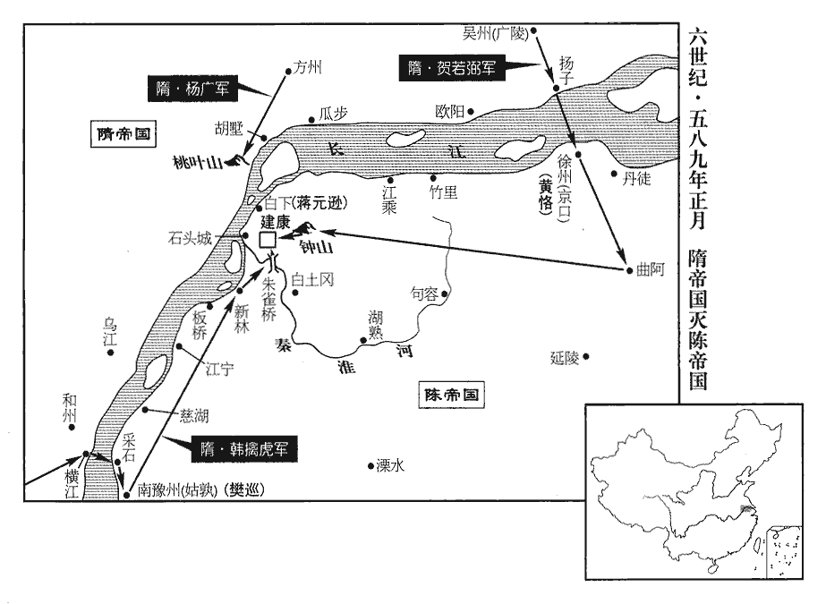
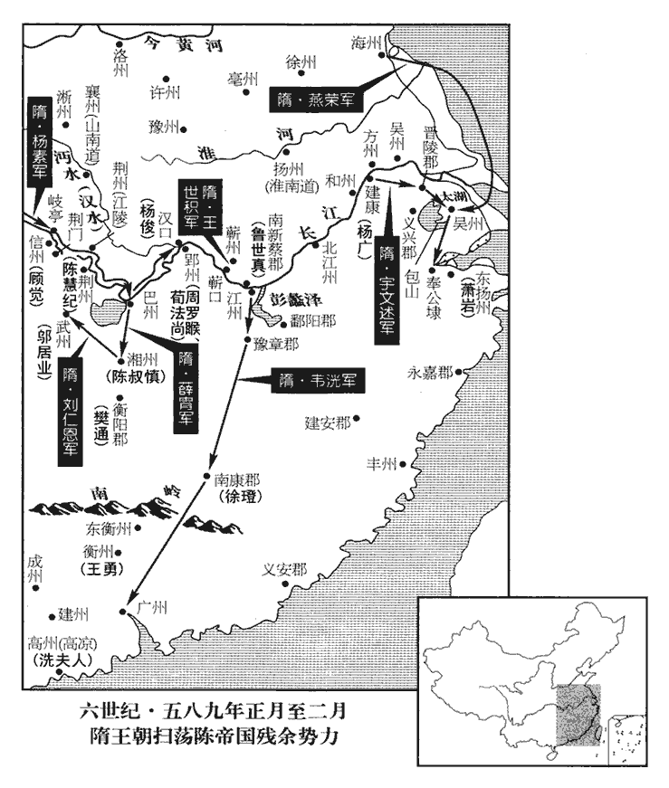
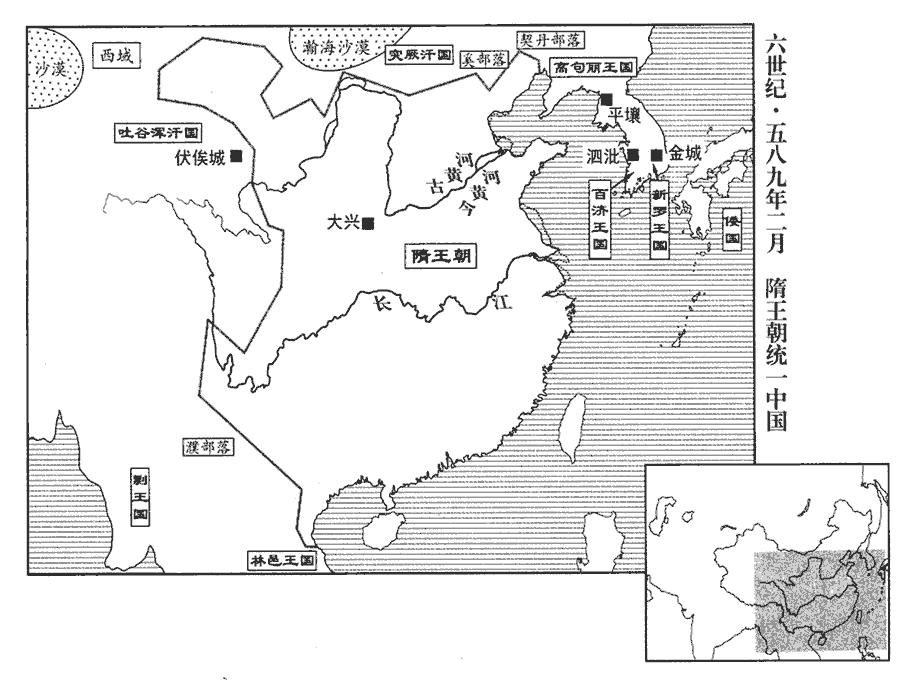
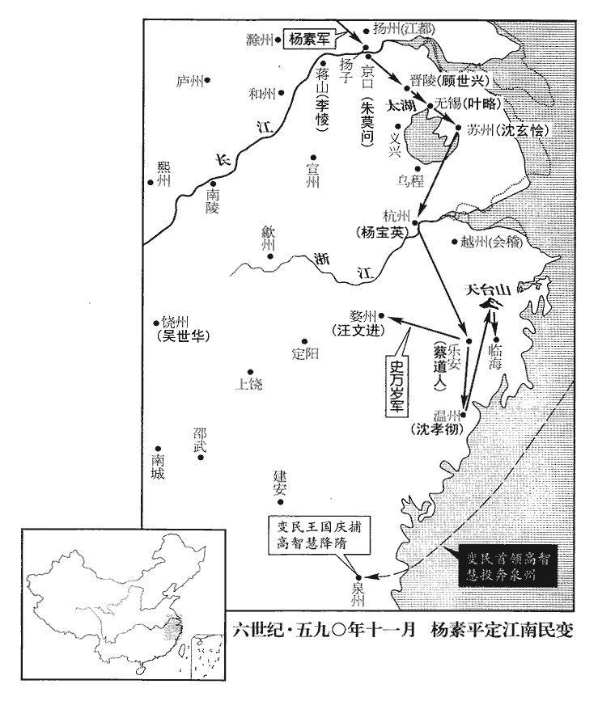
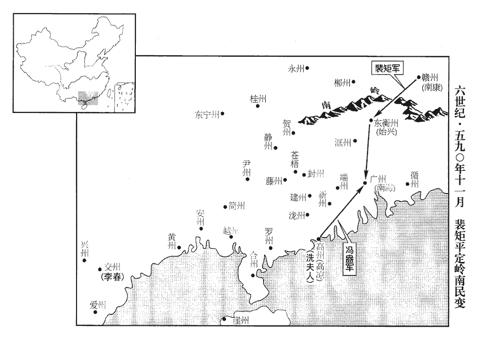

 隋紀一起屠維作噩（己酉），盡重光大淵獻（辛亥），凡三年。
>  
> 隋，即春秋隨國，為楚所滅，以為縣。秦、漢屬南陽郡，晉屬義陽郡，後分置隨郡；梁曰隨州，後入西魏。楊忠從周太祖，以功封隨國公；子堅襲爵，受周禪，遂以隨為國號。又以周、齊不遑寧處，去「辵」作「隋」，以辵訓走故也。辵chuò，音綽。

# 高祖文皇帝上之上諱堅，姓楊氏。隋書云：弘農郡華陰人也，漢太尉震八代孫鉉，生子元壽，後魏時為武川鎮司馬，子孫因家焉。元壽玄孫忠，從周太祖起義關西，寔生帝。自陳宣帝太建十三年至開皇九年，隋有西北八年矣。以通鑑紀年於此九年為隋紀年之始，故書上之上。

## 開皇九年（己酉、五八九）帝以陳高宗太建十三年受周禪，至是年平陳，混壹天下。通鑑紀事，乃以開皇繫年。

1春，正月，乙丑朔‹一›，陳‹首都建康江苏省南京市›主‹陈叔宝，本年三十七岁›朝會群臣，大霧四塞，朝，直遙翻。塞，悉則翻。入人鼻，皆辛酸，陳主昏睡，至晡時乃寤。日加申為晡，晡bū，奔謨翻。

〖译文〗 [1]春季，正月，乙丑朔（初一），陈朝举行元旦朝会，陈后主朝会群臣百官时，大雾弥漫，吸入鼻孔，感到又辣又酸，陈后主昏睡过去，一直到下午申时左右才醒过来。

是日，賀若弼自廣陵‹吴州州政府所在县·江苏省扬州市›引兵濟江。若，人者翻。先是，弼以老馬多買陳船而匿之，買弊船五六十艘，置於瀆內。先，悉薦翻。艘，蘇漕翻。爾雅：水注澮曰瀆。陳人覘之，以為內國無船。覘，丑廉翻，又丑豔翻。內國，即中國，隋避諱，改曰內。弼又請緣江防人，每交代之際，必集廣陵‹江苏省扬州市›，於是大列旗幟，營幕被野，幟，昌志翻。被，皮義翻。陳人以為隋兵大至，急發兵為備，既知防人交代，其眾復散；後以為常，不復設備。復，扶又翻。又使兵緣江時獵，人馬喧譟。故弼之濟江，陳人不覺。韓擒虎‹时在庐江安徽省庐江县›將五百人自橫江‹安徽省和县东南长江渡口›宵濟采石‹安徽省马鞍山市西南›，橫江浦，在和州界。采石磯，在今太平州北三十里對岸津渡處。將，即亮翻；下將兵同。守者皆醉，遂克之。德祐甲戌十有二月沙武口之事亦猶此。晉王廣帥大軍屯六合鎮‹江苏省六合县›桃葉山‹江苏省江浦县东北十五千米›，隋志：江都郡六合縣，舊曰尉氏，置秦郡，後齊置秦州。後周改州曰方州，改郡曰六合。開皇初，郡廢；四年，改尉氏曰六合。張舜民曰：桃葉山，即今瓜步鎮之地。帥，讀曰率。

〖译文〗 这一天，隋吴州总管贺若弼从广陵统帅军队渡过长江。起先，贺若弼卖掉军中老马，大量购买陈朝的船只，并把这些船只藏匿起来，然后又购买了破旧船只五六十艘，停泊在小河内。陈朝派人暗中窥探，认为中原没有船只。贺若弼又请求让沿江防守的兵士每当轮换交接的时候，都一定要聚集广陵，于是隋军大举旗帜，营幕遍野，陈朝以为是隋朝大军来到，于是急忙调集军队加强戒备，随后知道是隋朝士卒换防交接，就将已聚集的军队解散；后来陈朝对此已习以为常，就不再加强戒备。贺若弼又时常派遣军队沿江打猎，人欢马叫。所以贺若弼渡江时，陈朝守军竟没有发觉。庐州总管韩擒虎也率领将士五百人从横江浦夜渡采石，陈朝守军全都喝醉了酒，隋军轻而易举就攻下了采石。晋王杨广统帅大军驻扎在六合镇桃叶山。

丙寅‹二›，‹陈国›采石戍主徐子建馳啟告變；丁卯‹三›，召公卿入議軍旅。戊辰‹四›，陳主‹陈叔宝›下詔曰：「犬羊陵縱，侵竊郊畿，蜂蠆有毒，宜時掃定。蠆chài，丑邁翻。朕當親御六師，廓清八表，內外並可戒嚴。」以驃騎將軍蕭摩訶、護軍將軍樊毅、中領軍魯廣達並為都督，驃，匹妙翻。騎，奇寄翻。司空司馬消難、湘州‹临湘·湖南省长沙市›刺史施文慶並為大監軍，去年冬，陳主擢施文慶督湘州，未及之鎮而隋兵渡江。難，乃旦翻。監，工銜翻。遣南豫州‹姑孰·安徽省当涂县›刺史樊猛帥舟師出白下‹建康城北›，陳南豫州治宣城，時徙鎮姑孰，白下城合白石壘，唐武德移江寧縣於此，名白下縣。帥，讀曰率。散騎常侍皋文奏將兵鎮南豫州。重立賞格，僧、尼、道士、盡令執役。尼，女夷翻。

〖译文〗 丙寅（初二），陈朝采石镇戍主将徐子建携带告急文书飞骑赶赴都城报告隋军已渡江的消息；丁卯（初三），陈后主召集公卿大臣进宫商议军务事宜。戊辰（初四），陈后主下诏书说：“隋军胆敢任意兴兵凌逼，侵犯占据我都城近郊，就好似蜂虿有毒，应该及时扫灭。朕当亲自统帅大军，消灭敌军，廓清天下，并在朝廷内外实施戒备。”于是任命骠骑将军萧摩诃、护军将军樊毅、中领军鲁广达三人为都督，任命司空司马消难、湘州刺史施文庆两人为大监军，又派遣南豫州刺史樊猛统帅水军出守白下城，散骑常侍皋文奏统帅军队镇守南豫州。陈后主又下令设立重赏，征发僧、尼、道士等出家人服役。

庚午‹六›，賀若弼攻拔京口‹江苏省镇江市›，執南徐州刺史黃恪。南徐州治京口。弼軍令嚴肅，秋毫不犯，有軍士於民間酤酒者，弼立斬之。所俘獲六千餘人，弼皆釋之，給糧勞遣，勞，力到翻。付以敕書，令分道宣諭。令，力丁翻。於是所至風靡。

〖译文〗 庚午（初六），隋将贺若弼率军攻克京口，生俘陈朝南徐州刺史黄恪。贺若弼的军队纪律严明，秋毫不犯，有士卒在民间买酒的，贺若弼即令将他斩首。所俘获的陈朝军队六千余人，贺若弼全部予以释放，发给资粮，好言安慰，遣返回乡，并付给他们隋文帝敕书，让他们分道宣传散发。因此，隋军所到之处，陈朝军队望风溃败。

 

‹陈国›樊猛在建康，其子巡攝行南豫州事。辛未‹七›，韓擒虎進攻姑孰，半日，拔之，執巡及其家口。今太平州當塗縣南二里有姑孰溪，西入大江，蓋因舊鎮而得名。皋文奏敗還。江南父老素聞擒虎威信，來謁軍門者晝夜不絕。

〖译文〗 陈朝南豫州刺史樊猛当时还在建康，由他的儿子樊巡代理南豫州事。辛未（初七），隋将韩擒虎率军进攻姑孰，只用了半天，就攻下了姑孰城，俘虏了樊巡及其全家。皋文奏军败，退还江南。江南地区的父老百姓早就听说过韩擒虎的威名，前来军营谒见拜访的人昼夜不绝。

魯廣達之子世真在新蔡‹南新蔡·湖北省黄梅县西南›，與其弟世雄及所部降於擒虎，侯景之亂，魯悉達糾合鄉人以保新蔡，魯氏遂世襲以事陳。新蔡註見一百六十四卷梁世祖承聖元年。降，戶江翻。遣使致書招廣達。使，疏吏翻。廣達時屯建康，自劾，詣廷尉請罪；劾，戶概翻，又戶得翻。陳主‹陈叔宝›慰勞之，加賜黃金，遣還營。勞，力到翻。樊猛與左衛將軍蔣元遜，將青龍八十艘於白下遊弈，以禦六合兵，陳主以猛妻子在隋軍，懼有異志，欲使鎭東大將軍任忠‹时驻吴兴郡浙江省湖州市›代之，任，音壬。令蕭摩訶徐諭猛，猛不悅，陳主重傷其意而止。重，如字，難也。

〖译文〗 陈朝都督鲁广达的儿子鲁世真在新蔡，与他弟弟鲁世雄一起率部投降了韩擒虎，并派遣使节持书信招抚鲁广达。鲁广达当时率军驻扎在建康，接到鲁世真劝降信后自己上表弹劾自己，并亲自到廷尉请求治罪；陈后主对他好言慰劳，并额外赏赐他黄金，让他返回军营。樊猛和左卫将军蒋元逊率领青龙船八十艘在白下城附近的江面上游弋，以防御从六合方面发动进攻的隋军；陈后主由于樊猛的妻儿家人都被隋军俘获，恐怕他心怀异意，打算派遣镇东大将军任忠代替他，并让萧摩诃向樊猛慢慢讲明情况，樊猛听后很不高兴，陈后主感到很难违背樊猛的意愿，只好作罢。

於是賀若弼自北道，韓擒虎自南道並進，京口於建康為北，姑孰於建康為南。緣江諸戍，望風盡走；弼分兵斷曲阿‹江苏省丹阳市›之衝而入。曲阿，本雲陽，秦時，人言其地有天子氣，始皇鑿北坑以敗其勢，截直道使阿曲，改曰曲阿。其地在武進、丹徒二縣之間。弼分兵斷其衝，恐三吳之兵入救建康，掎其後也。斷，音短。陳主命司徒豫章王叔英屯朝堂，蕭摩訶屯樂遊苑，朝，直遙翻。樂，音洛。樊毅屯耆闍寺‹鸡鸣山西›，闍shé，視遮翻。魯廣達屯白土岡‹江苏省江宁县东›，忠武將軍孔範屯寶田寺，忠武將軍，梁置，班十九；陳擬官品第四，秩中二千石，位次四平將軍。己卯‹十五›，任忠自吳興‹浙江省湖州市›入赴，去年使任忠出守吳興。仍屯朱雀門。晉孝武帝建朱雀門，上有兩銅雀，前直大航，謂之朱雀航。

〖译文〗 此时，隋将贺若弼率军从北道，韩擒虎率军从南道，齐头并进，夹攻建康。陈朝沿江的镇戌要塞守军都望风尽逃；贺若弼分兵占领曲阿，隔断了陈朝援军的通道，自己率主力进逼建康。陈后主命令司徒、豫章王陈叔英率军守卫朝堂，萧摩诃率军驻守乐游苑，樊毅率军驻守耆寺，鲁广达率军驻守白土冈，忠武将军孔范率军驻守宝田寺。己卯（十五日），任忠率军自吴兴入援京师，驻守朱雀门。

辛未‹七›，賀若弼進據鍾山，鍾山在今上元縣東北十八里。輿地志：古曰金陵山，縣名因此。又名蔣山，漢末秣陵尉蔣子文討賊死此山下，孫氏都秣陵，以其祖諱鍾，因改名蔣山。頓白土岡之東。晉王廣遣總管杜彥與韓擒虎合軍，步騎二萬屯于新林‹江苏省江宁县西›。新林浦，去今建康城二十里，西直白鷺洲。蘄州‹总部设蕲州湖北省蕲春县›總管王世積以舟師出九江‹江州·江西省九江市›，蘄qí，音機，又音其。王世積，闡熙新囶guó人。按班志，廬江郡尋陽縣，禹貢九江皆在南，東合為大江。應劭曰：江自廬江尋陽分為九。漢之尋陽縣在今蘄州界。王世積以舟師自蘄水出九江。囶，古國字。破陳將紀瑱於蘄口‹蕲水注入长江处·湖北省蕲春县西南›，蘄水入江之口。將，即亮翻；下同。瑱，他殿翻，又音鎮。陳人大駭，降者相繼。降，戶江翻。晉王廣上狀，上，時掌翻。帝大悅，宴賜群臣。

〖译文〗 辛未（疑误），隋将贺若弼率军进据钟山，驻扎在白土冈的东面。晋王杨广派遣总管杜彦和韩擒虎合军，共计步骑两万人驻扎在新林。隋蕲州总管王世积统帅水军出九江，在蕲口击败陈将纪，陈朝将士大为惊恐，向隋军投降的人接连不断，晋王杨广上表禀报军情，隋文帝非常高兴，于是宴请和赏赐百官群臣。

時建康甲士尚十餘萬人，陳主‹陈叔宝›素怯懦，不達軍士，懦，乃臥翻，又奴亂翻。士，讀曰事。【章：乙十一行本正作「事」；孔本同；張校同；退齋校同。】唯日夜啼泣，臺內處分，一以委施文慶。處，昌呂翻。分，扶問翻。文慶既知諸將疾己，恐其有功，乃奏曰：「此輩怏怏，怏，於兩翻。素不伏官，迫此事機，那可專信！」由是諸將凡有啟請，率皆不行。

〖译文〗 当时建康还有军队十余万人，但是陈后主生性怯懦软弱，又不懂军事，只是日夜哭泣，台城内的所有军情处置，全部委任给施文庆。施文庆知道将帅们都痛恨自己，唯恐他们建立功勋，于是向陈后主上奏说：“这些将帅们平时总是心中不满，一向不甘心情愿服事陛下，现在到了危机时刻，怎么可以完全信任他们呢？”因此这些将帅凡是有所启奏请求，绝大部分都未获批准。

賀若弼之攻京口也，蕭摩訶請將兵逆戰，陳主不許。及弼至鍾山，摩訶又曰：「弼懸軍深入，壘塹未堅，塹，七豔翻。出兵掩襲，可以必克。」又不許。陳主召摩訶、任忠於內殿議軍事，忠曰：「兵法：客貴速戰，主貴持重。今國家足兵足食，宜固守臺城，緣淮立柵，北軍雖來，勿與交戰；分兵斷江路，斷，丁管翻；下同。無令彼信得通。給臣精兵一萬，金翅三百艘，下江徑掩六合；彼大軍必謂其渡江將士已被俘獲，自然挫氣。被，皮義翻。淮南土人與臣舊相知悉，今聞臣往，必皆景從。師古曰：景從，言如景之從形也。臣復揚聲欲往徐州‹京口·江苏省镇江市›，斷彼歸路，則諸軍不擊自去。徐州，彭汴之路也。復，扶又翻。斷，丁管翻。待春水既漲，上江周羅睺等眾軍必沿流赴援。周羅睺時督水軍，在郢漢。此良策也。」陳主不能從。明日，欻然曰：欻xū，許勿翻。「兵久不決，令人腹煩，可呼蕭郎一出擊之。」任忠叩頭苦請勿戰。孔範又奏：「請作一決，當為官勒石燕然‹蒙古杭爱山›。」孔範以竇憲破匈奴事自詭，姦諂之誤國亡家如此。為，于為翻；下同。燕，於賢翻。陳主從之，謂摩訶曰：「公可為我一決！」摩訶曰：「從來行陳，行，戶剛翻。陳，讀曰陣。為國為身；今日之事，兼為妻子。」陳主多出金帛賦諸軍以充賞。賦，給與也，分畀也。甲申‹二十›，使魯廣達陳於白土岡‹江苏省江宁县东›，陳，讀曰陣；下同。居諸軍之南，任忠次之，樊毅、孔範又次之，蕭摩訶軍最在北。諸軍南北亘二十里，首尾進退不相知。

〖译文〗 在隋将贺若弼进攻京口时，陈朝都督萧摩诃曾经请求率军迎战，陈后主不许。等到贺若弼进至钟山，萧摩诃又上奏说：“贺若弼孤军深入，立足未稳，如果乘机出兵袭击，可保必胜。”陈后主还是不许。陈后主招集萧摩诃、任忠在宫中内殿商议军事，任忠说：“兵法上说：来犯之军利在速战，守军利在坚持。现在国家兵足粮丰，应该固守台城，沿秦淮河建立栅栏，隋军虽然来攻，不要轻易出战；分兵截断长江水路，不要让隋军音信相通。陛下可给我精兵一崐万人，金翅战船三百艘，顺江而下，径直突然袭击六合镇；这样，隋朝大军一定会认为他们渡过江的将士已经被我们俘获，锐气自然就会受挫。此外，淮南土著居民与我以前就互相熟悉，如今听说是我率军前往，必定会群起响应。我再扬言将要率军进攻徐州，断敌退路，这样，各路隋军就会不战自退。待到雨季春水既涨，上游周罗等军必定顺流而下赶来增援。这是一个很好的战略计策。”陈后主也不听从。到了第二天，陈后主忽然说：“与隋军长久相持不进行决战，令人心烦，可叫萧摩诃出兵攻打敌军。”任忠向陈后主跪地叩头，苦苦请求不要出战。忠武将军孔范又上奏说：“请求与隋军进行决战，我军必胜，我将为陛下在燕然山刻石立碑纪念战功。”陈后主听从了孔范的意见，对萧摩诃说：“你可为我率军与敌军一决胜负！”萧摩诃说：“从来作战都是为了国家与自己，今日与敌决战，兼为妻儿家人。”于是陈后主拿出很多金钱财物，分配给诸军用作奖赏。甲申（二十日），命令鲁广达率军在白土冈摆开阵势，在各军的最南边，由南往北，依次是任忠、樊毅、孔范，萧摩诃的军队在最北边。陈朝军队所摆开的阵势南北长达二十里，首尾进退互不知晓。

賀若弼將輕騎登山，望見眾軍，因馳下，與所部七總管楊牙、員明等將，即亮翻。騎，奇寄翻；下同。員，音運，姓也。甲士凡八千，勒陳以待之。陳主通於蕭摩訶之妻，故摩訶初無戰意；唯魯廣達以其徒力戰，與弼相當。隋師退走者數四，弼麾下死者二百七十三人，弼縱煙以自隱，窘而復振。窘，渠隕翻。復，扶又翻；下同。陳兵得人頭，皆走獻陳主求賞，弼知其驕惰，更引兵趣孔範；趣，七喻翻，又讀曰趨。範兵暫交即走，陳諸軍顧之，騎卒亂潰，不可復止，死者五千人。員明擒蕭摩訶，送於弼，弼命牽斬之，摩訶顏色自若，弼乃釋而禮之。

〖译文〗 隋将贺若弼率领轻骑登上钟山，望见陈朝众军已摆开阵势，于是驰骑下山，与所部七位总管杨牙、员明等将领率兵士共八千人，也摆好阵势准备迎战。因为陈后主私通萧摩诃的妻子，所以萧摩诃一开始就不想为陈后主打仗；只有鲁广达率领部下拚死力战，与贺若弼的军队旗鼓相当。隋军曾经四次被迫后退，贺若弼部下战死二百七十三人，后来贺若弼部队纵放烟火用来掩护隐蔽，才摆脱困境重新振作起来。陈朝兵士获得隋军人头，纷纷跑去献给陈后主以求得奖赏，贺若弼看到陈朝军队骄傲轻敌，不愿再苦战，于是再一次率军冲击孔范的军阵；孔范的兵士与隋军刚一交战即败走，陈朝诸军望见，骑兵、步卒也一起纷纷溃逃，互相践踏不可阻止，死了五千人。总管员明擒获了萧摩诃，把他送交贺若弼，贺若弼命令推出去斩首，萧摩诃神色自若，贺若弼于是给他松绑并以礼相待。

任忠馳入臺，見陳主言敗狀，曰：「官好住，好，宜也；住，止也；今南人猶有是言。臣無所用力矣！」陳主與之金兩縢，縢téng，徒登翻。以繩約物曰縢。使募人出戰，忠曰：「陛下唯當具舟楫，就上流眾軍，謂往就周羅睺等。臣以死奉衛。」陳主信之，敕忠出部分，分，扶問翻。令宮人裝束以待之，怪其久不至。時韓擒虎自新林‹江苏省江宁县西›進軍，忠已帥數騎迎降於石子岡‹江宁县南›。帥，讀曰率。降，戶江翻；下同。領軍蔡徵守朱雀航，聞擒虎將至，眾懼而潰。忠引擒虎軍直入朱雀門，陳人欲戰，忠揮之曰：「老夫尚降，諸軍何事！」「軍」，或作「君」。眾皆散走。於是城內文武百司皆遁，唯尚書僕射袁憲在殿中，尚書令江總等數人居省中。陳主謂袁憲曰：「我從來接遇卿不勝餘人，今日但以追愧。此猶劉禪之於郤xì正也。非唯朕無德，亦是江東‹太湖流域及钱塘江流域›衣冠道盡。」

〖译文〗 任忠驰马进入建康台城，谒见陈后主，叙说了失败经过，然后说：“陛下好自为之，我是无能为力了！”陈后主交给他两串金子，让他再募兵出战，任忠说：“陛下只有赶紧准备船只，前往上游会合周罗等人统领的大军，我当豁出性命护送陛下。”陈后主相信了任忠，敕令他出外布置安排，又下令后宫宫女收拾行装，等待任忠，久等不至，觉得奇怪。当时韩擒虎率军从新林向台城进发，任忠已经率领部下数骑到石子冈去投降。当时陈朝领军将军蔡徵率军守卫朱雀航，听说韩擒虎将到，部队惊惧，望风溃逃。任忠带领韩擒虎的军队径直进入朱雀门，还有一些陈军将士想进行抵抗，任忠对他们挥挥手说：“我都投降了隋军，你们还抵抗什么！”于是陈军全都逃散。此时，台城内文武大臣全都逃跑，只有尚书仆射袁宪在殿内，尚书令江总等数人在尚书省府中。陈后主对袁宪感叹说：“我从来对待你不比别人好，今日只有你还留在我的身边，对此我感到很惭愧。这不只是朕失德无道所致，也是由于江东士大夫的气节全都丧失净尽了。”

陳主遑遽，將避匿，憲正色曰：「北兵之入，必無所犯。大事如此，陛下去欲安之！臣願陛下正衣冠，御正殿，依梁武帝‹萧衍›見侯景故事。」事見一百六十二卷梁武帝太清三年。陳主不從，下榻馳去，曰：「鋒刃之下，未可交當，吾自有計！」從宮人十餘出後堂景陽殿，將自投于井，憲苦諫不從；後閤舍人夏侯公韻以身蔽井，夏，戶雅翻。陳主與爭，久之，乃得入。既而軍人窺井，呼之，不應，欲下石，乃聞叫聲；以繩引之，驚其太重，及出，乃與張貴妃‹张丽华›、孔貴嬪同束而上。祝穆曰：景陽井在法寶寺。或云，白蓮閣下有小池，面方丈餘。或云，在保寧寺覽輝亭側。舊傳云：欄有石脈，以帛拭之，作臙脂痕，一名臙脂井，又名辱井。梁制：有殿中舍人、守舍人。陳制：殿中舍人為三品蘊位，守舍人為三品勳位，在九品之外，後閤舍人，蓋殿中舍人之守後閣者。沈后‹沈婺华›居處如常。處，昌呂翻。太子深年十五，閉閤而坐，舍人孔伯魚侍側，此太子舍人也。梁制：太子中舍人四人，掌其坊之禁令；舍人十六人，掌文記。中舍人八班，舍人三班。陳制；中舍人六百石，舍人亦如之。軍士叩閤而入，深安坐，勞之曰：勞，力到翻。「戎旅在塗，不至勞也！」軍士咸致敬焉。時陳人宗室王侯在建康者百餘人，陳主恐其為變，皆召入，令屯朝堂，使豫章王叔英總督之，又陰為之備，及臺城失守，相帥出降。朝，直遙翻；下同。守，式又翻。帥，讀曰率。降，戶江翻。

〖译文〗 陈朝后主惊慌失措，想要躲藏，袁宪严肃地说道：“隋军进入皇宫后，必不会对陛下有所侵侮。事已至此，陛下还能躲到什么地方去？我请求陛下把衣服冠冕穿戴整齐，端坐正殿，依照当年梁武帝见侯景的作法。”陈后主没有听从，下了坐床飞奔而去，并说：“兵刃之下，不能拿性命去冒然抵挡，我自有办法！”于是跟着十余个宫人逃出后堂景阳殿，就要往井里跳，袁宪苦苦哀求，陈后主不听。后舍人夏侯公韵用自己的身子遮挡住井口，陈后主极力相争，争了很长时间才得以跳进井里。不久，有隋军兵士向井里窥视，并大声喊叫，井下无人回答，士兵扬言要落井下石，方才听到井下有人呼唤，于是抛下绳索往上拉人，感到非常沉重，十分吃惊，直到把人拉了上来，看见是陈后主与张贵妃、孔贵嫔三人同绳而上。而沈皇后仍像平常一样，毫不惊慌。皇太子陈深当时年方十五岁，关上门，安然端坐，太子舍人孔伯鱼在一旁侍奉，隋军兵士推门而入，陈深端坐不动，好言慰劳说：“你们一路上鞍马劳顿，还不至于过于疲劳吧？”隋军兵士都纷纷向他致敬。当时陈朝宗室王侯在建康城中有一百余人，陈后主恐怕他们发动政变，就把他们全都召进宫里，命令他们都聚集在朝堂，派遣豫章王陈叔英监督他们，并暗中严加戒备。到台城失守以后，他们都相继出降。

賀若弼乘勝至樂遊苑，樂，音洛。魯廣達猶督餘兵苦戰不息，所殺獲數百人，會日暮，乃解甲，面臺再拜慟哭，謂眾曰：「我身不能救國，負罪深矣！」士卒皆流涕歔欷，歔，音虛。欷，音希，又許既翻。遂就擒。諸門衛皆走，弼夜燒北掖門入，聞韓擒虎已得陳叔寶，呼視之，叔寶惶懼，流汗股栗，向弼再拜。弼謂之曰：「小國之君當大國之卿，拜乃禮也。入朝不失作歸命侯，朝，直遙翻。孫皓降晉，封歸命侯。無勞恐懼。」既而恥功在韓擒虎後，與擒虎相訽gòu，挺刃而出；訽gòu，苦候翻，罵也。挺，拔也。欲令蔡徵為叔寶作降箋，命乘騾車歸己，騾，盧戈翻。事不果。弼置叔寶於德教殿，以兵衛守。

〖译文〗 隋将贺若弼率军乘胜进至乐游苑，陈朝都督鲁广达仍督率残兵败将苦战不止，共杀死俘虏隋军数百人，赶上天色近晚，鲁广达方才放下武器，面向台城拜了三拜，忍不住失声痛哭，对部下说：“我没有能够拯救国家，负罪深重！”部下兵士也都痛哭流涕，于是被隋军俘获。台城的宫门卫士都四散逃走，贺若弼率军在夜间焚烧北掖门而进入皇宫，得知韩擒虎已抓住了陈叔宝，就把他叫来亲自察看，陈叔宝非常害怕，汗流浃背，浑身战栗，向贺若弼跪拜叩头。贺若弼对他说：“小国的君主见了大国的公卿大臣，按照礼节应该跪拜。阁下到了隋朝仍不失封归命侯，所以不必恐惧。”过后，贺若弼因耻于功在韩擒虎之后，与韩擒虎发生争吵詈骂，随后怒气冲冲地拔刀而出，想令陈朝前吏部尚书蔡徵为陈叔宝起草降书，又下令陈后主乘坐骡车归附自己，但没有实现。于是贺若弼将陈后主置于德教殿内，派兵守卫。

高熲先入建康，熲子德弘為晉王廣記室，熲，居永翻。隋制，諸王記室參軍在錄事、功曹之下。廣使德弘馳詣熲所，令留張麗華，熲曰：「昔太公‹姜子牙›蒙面以斬妲己，妲己，有蘇氏之美女，商紂嬖之，武王勝殷，殺紂，并誅妲己。妲，當割翻。己，音紀。今豈可留麗華！」乃斬之於青溪‹玄武湖水，注入秦淮河›。德弘還報，廣變色曰：「昔人云，『無德不報』，詩大雅抑之辭。我必有以報高公矣！」由是恨熲。使高熲留麗華而廣納之，文帝必怒，安得成他日奪嫡之謀，是誠宜德之也，顧恨之邪！史為廣殺熲張本。

〖译文〗 隋高先进入建康，当时高的儿子高德弘是晋王府记室参军，杨广就派他驰马来见高，传令留下张丽华，高说：“古时候姜太公吕尚蒙面斩了殷纣王的宠姬妲己，今天岂能留下张丽华！”于是将张丽华斩于青溪。高德弘还报杨广，杨广脸色大变说：“古人云：‘无德不报。’我一定有办法回报高公！”因此杨广忌恨高。

丙戌‹二十二›，晉王廣入建康，以施文慶受委不忠，曲為諂佞以蔽耳目，沈客卿重賦厚斂以悅其上，與太市令陽慧朗、刑法監徐析、尚書都令史暨慧皆為民害，斬於石闕下，以謝三吳。斂，力贍翻。暨，戟乙翻。「陽慧朗」一作「惠朗」。「暨慧」之下逸「景」字。使高熲與元帥府記室裴矩帥，所類翻。收圖籍，封府庫，資財一無所取，天下皆稱廣以為賢。矩，讓之之弟子也。裴讓之見一百五十八卷梁武帝大同四年。

〖译文〗 丙戌（二十二日），晋王杨广进入建康，认为陈朝中书舍人施文庆接受委命，却不忠心国事，反而谄媚为奸，以蒙蔽天子耳目；前中书舍人沈客卿重赋崐厚敛，盘剥百姓，以博取天子的欢心；与太市令阳慧朗、刑法监徐析、尚书都令史暨慧景等人都是祸国害民的奸臣，一并斩于石阙下，以谢三吴地区百姓。杨广又让高和元帅府记室参军裴矩一道收缴南陈地图和户籍，封存国家府库，金银财物一无所取，因此，天下都称颂杨广，认为他贤明。裴矩是裴让之弟弟的儿子。

廣以賀若弼先期決戰，違軍令，收以屬吏。先，悉薦翻。屬，之欲翻。上‹杨坚，本年四十九岁›驛召之，詔廣曰：「平定江表，弼與韓擒虎之力也。」賜物萬段；又賜弼與擒虎詔，美其功。

〖译文〗 晋王杨广因为贺若弼率军与陈朝军队先期决战，违犯了军令，下令将他收捕送交执法官吏。隋文帝派遣驿使传令召贺若弼入朝，并给杨广下诏书说：“这次平定江表地区，全仗贺若弼和韩擒虎二人之力。”还下令赏赐贺若弼布帛等物一万段。不久又赐给贺若弼和韩擒虎诏书，赞美他们二人的功绩。

開府儀同三司王頒，僧辯之子，夜，發陳高祖‹陈霸先›陵‹万安陵·江苏省江宁县东南方山西北›，焚骨取灰，投水而飲之。報讎也。陳高祖殺僧辯事見一百六十六卷梁敬帝紹泰元年。既而自縛，歸罪於晉王廣；廣以聞，上‹杨坚›命赦之。詔陳高祖‹陈霸先›、世祖‹陈蒨›、高宗‹陈顼›陵，總給五戶分守之。

〖译文〗 隋开府仪同三司王颁是王僧辩的儿子，在一天夜里，他挖了陈高祖的陵墓，焚毁了陈霸先的尸骨，并将骨灰投进水中然后喝下去，以报杀父之仇。随后把自己捆绑起来，向晋王杨广投案，请求治罪；杨广把此事报告了隋文帝，隋文帝下令赦免了他。隋文帝又下诏令给陈高祖、陈世祖、陈高宗安排五户守陵人，分别负责守护陵墓。

上遣使以陳亡告許善心，使，疏吏翻。善心衰服號哭於西階之下，藉草東向坐三日；去年陳遣善心來聘，留於客館，不遣還，事見上卷。西階，賓階也。衰服、藉草，喪禮也。衰，叱雷翻。號，戶刀翻。藉，慈夜翻。敕書唁焉。唁yàn，魚戰翻。弔生曰唁。明日，有詔就館，拜通直散騎常侍，散，悉亶翻。騎，奇寄翻。賜衣一襲。衣單複具曰襲。善心哭盡哀，入房改服，改衰服，服賜服。復出，北面立，復，扶又翻。垂泣，再拜受詔，明日乃朝，朝，直遙翻。伏泣於殿下，悲不能興。上顧左右曰：「我平陳國，唯獲此人。既能懷其舊君，即我之誠臣也。」敕以本官直門下省。通直散騎常侍屬門下省。今敕善心以本官直門下省，何也？按唐六典，晉始有門下省，散騎常侍雖隸門下，別為一省，潘岳云「寓直散騎之省」是也，此隋所以命許善心以通直散騎常侍直門下省歟？

〖译文〗 隋文帝派遣使节将陈朝灭亡的消息告诉了许善心，许善心穿上丧服在客馆西边的台阶下面放声痛哭，并在干草上面朝东坐了三天；隋文帝下敕书向他表示慰问。次日，隋文帝又派人持诏书到客馆，拜许善心为通直散骑常侍，并赏赐他朝服一套。许善心又大哭了一场，然后进屋脱掉丧服，改穿隋文帝所赐朝服，再重新出来面北站立，流着眼泪跪拜受诏，第二天才入宫朝见隋文帝，伏在殿下哭泣，悲不能起。隋文帝看着左右的朝臣说：“我出兵平定陈国，只得到了此人。他既然不忘旧日的国君，也就是我的忠臣。”于是下敕令许善心以本官散骑常侍暂理门下省。

陳水軍都督周羅睺與郢州‹夏口·湖北省武汉市›刺史荀法尚守江夏‹夏口›，江夏，陳郢州治所。夏，戶雅翻。秦王俊督三十總管水陸十餘萬屯漢口‹湖北省武汉市汉水北岸›，不得進，漢水入江之口，即沔口也。相持踰月。陳荊州‹公安·湖北省公安县›刺史陳慧紀遣南康‹江西省赣州市›內史呂忠肅屯岐亭‹湖北省宜昌市北›，按楊素傳，忠肅屯岐亭，正據江峽。則岐亭在西陵峽口也。考異曰：隋書作「呂仲肅」，南史作「呂肅」，今從陳書。據巫峽‹重庆市巫山县东›，按水經，江水出巫峽過秭歸夷陵，逕流頭狼尾灘，而後東逕西陵峽。去年冬，楊素破戚昕，其舟師已過狼尾而東，呂忠肅所據者，蓋西陵峽也。當從楊素傳作「江峽」為通。於北岸鑿巖，綴鐵鎖三條，考異曰：南史作「五條」，今從隋書。橫截上流以遏隋船，忠肅竭其私財以充軍用。楊素、劉仁恩奮兵擊之，四十餘戰，忠肅守險力爭，隋兵死者五千餘人，陳人盡取其鼻以求功賞。既而隋師屢捷，獲陳之士卒，三縱之。忠肅棄柵而遁，素徐去其鎖；去，羌呂翻。忠肅復據荊門‹湖北省枝城市西北长江西岸›之延洲‹长江中小岛›，素遣巴蜑千人，蜑亦蠻也。居巴中者曰巴蜑。此水蜑之習於用舟者也。蜑dàn，徒旱翻。乘五牙四艘，以拍竿碎其十餘艦，艘，蘇遭翻。艦，戶黯翻。遂大破之，俘甲士二千餘人，忠肅僅以身免。陳信州‹安蜀城·湖北省宜昌市西›刺史顧覺屯安蜀城，棄城走。梁置信州於巴東，西魏取之，其地時屬隋，故陳信州刺史屯於安蜀城。陳慧紀屯公安‹荆州州政府所在城·湖北省公安县›，公安，陳荊州治所。悉燒其儲蓄，引兵東下，於是巴陵‹湖南省岳阳市›以東無復城守者。陳慧紀帥將士三萬人，樓船千餘艘，沿江而下，復，扶又翻。帥，讀曰率；下同。將，即亮翻；下同。欲入援建康，為秦王俊所拒，不得前。是時，陳晉熙王叔文罷湘州，還，至巴州‹巴陵·湖南省岳阳市›，慧紀推叔文為盟主。巴州，治巴陵。而叔文已帥巴州刺史畢寶等致書請降於俊，俊遣使迎勞之。帥，讀曰率。降，戶江翻。使，疏吏翻；下同。勞，力到翻。會建康平，晉王廣命陳叔寶手書招上江諸將，使樊毅詣周羅睺，陳慧紀子正業詣慧紀諭指。時諸城皆解甲，羅睺乃與諸將大臨三日，將，即亮翻。臨，力浸翻。放兵散，然後詣俊降，陳慧紀亦降，上江皆平。楊素下至漢口‹湖北省武汉市汉水北岸›，與俊會。王世積在蘄口，聞陳已亡，【章：甲十一行本「亡」下有「移書」二字；乙十一行本同；孔本同；張校同。】告諭江南諸郡，於是江州‹湓城·江西省九江市›司馬黃偲棄城走，蘄，音機，又音其。偲，音思。豫章‹江西省南昌市›諸郡太守皆詣世積降。守，式又翻。

〖译文〗 陈朝水军都督周罗和郢州刺史荀法尚率军驻守江夏，隋秦王杨俊督率三十位总管水陆十余万大军驻扎在汉口，不能向前推进，双方相持了一个多月。陈荆州刺史陈慧纪派遣南康内史吕忠肃率军驻扎在岐亭，据守巫峡，并在长江北岸岩石上凿孔，跨江系三条铁锁链，横截上流江面以遏制隋军船只。吕忠肃又拿出自己的全部财产充作军饷。隋元帅杨素、大将军刘仁恩指挥隋军猛攻陈军，前后四十余战，吕忠肃率军据险全力抗拒，隋军损失惨重，阵亡达五千余人，陈军将士将他们的鼻子全部割下拿去邀功求赏。随后隋军多次取胜，俘获了一些陈军士卒，分三次释放了他们；吕忠肃放弃营栅率军逃走，杨素得以从崐容毁掉跨江锁链。吕忠肃又退守荆门的延洲，杨素派遣居住在巴中一带的蛮族士卒一千人，乘坐五牙战舰四艘，用拍竿击碎陈军十余艘战船，于是大败陈军，俘获士卒两千余人，吕忠肃侥幸只身逃走。南陈信州刺史顾觉率军驻守安蜀城，闻讯弃城逃走。陈慧纪驻守公安，也全部烧掉物资储备。率领军队顺流东下，于是自巴陵以东，再没有守城抵抗的陈朝军队。陈慧纪统率将士三万人，楼船一千余艘，顺江而下，本来打算入援建康，因为受到隋元帅秦王杨俊的阻拦，无法前进。这时，陈朝晋熙王陈叔文卸任湘川刺史，返回建康，到了巴州，于是陈慧纪就推举陈叔文为上游各军盟主。而此时陈叔文已经率领陈巴州刺史毕宝等人给杨俊写信请求投降，杨俊派出使节迎接并慰劳他们。逢建康已被平定，于是晋王杨广命令陈叔宝亲自写信招抚陈军上江诸位将帅，派遣樊毅到周罗处，陈慧纪的儿子陈正业到陈慧纪处，传达陈后主的命令。当时各城陈军都放下武器，周罗和众将帅大哭三天，将部队解散，然后向杨俊投降，陈慧纪也向隋军投降，于是陈朝上江地区被全部平定。杨素率军顺流而下到达汉口，与杨俊大军会合。隋蕲州总管王世积率军驻扎蕲口，得知陈朝已经灭亡，就派人告谕陈朝江南各郡，于是陈朝江州司马黄弃城逃走，豫章诸郡太守都向王世积投降。

癸巳‹二十九›，詔遣使者巡撫陳州郡。二月，乙未‹一›，廢淮南行臺省。晉王廣於時將凱還也。

〖译文〗 癸巳（二十九日），隋文帝诏令派遣使节巡视安抚陈朝各州郡。二月乙未（初一），隋朝撤消淮南行台省。

2蘇威奏請五百家置鄉正，使治民，簡辭訟。治，直之翻；下同。李德林以為：「本廢鄉官判事，為其里閭親識，剖斷不平，為其，于偽翻。斷，丁亂翻。今令鄉正專治五百家，恐為害更甚。且要荒小縣，有不至五百家者，令，力丁翻。要，一遙翻。豈可使兩縣共管一鄉！」帝‹杨坚›不聽。丙申‹二›，制：「五百家為鄉，置鄉正一人；百家為里，置里長一人。」長，知兩翻。

〖译文〗 [2]隋纳言苏威上奏请求在地方上每五百家设置乡正一人，管理本乡百姓，审理诉讼纠纷。内史令李德林认为：“本来已经废掉乡一级官吏审理案件的权力，是因为他们和案件当事人乡里乡亲，往往判案不公平，现在却令乡正专治一乡五百家，恐怕危害更大。况且有些边远荒僻小县，百姓不满五百家，难道能让两县共管一乡？”隋文帝不听。丙申（初二），下制书说：“民间五百家为乡，设置乡正一人；一百家为里，设置里长一人。”

3陳吳州‹吴县·江苏省苏州市›刺史蕭瓛能得物情，陳亡，吳人推瓛為主，瓛huán，戶官翻。右衛大將軍武川‹内蒙古武川县›宇文述帥行軍總管元契、張默言等討之。落叢公燕榮以舟師自東海至，【章：甲十一行本「至」下有「亦受述節度」五字；乙十一行本同；孔本同；張校同。】隋書：宇文述，代郡武川人。地理志：馬邑郡善陽縣，大業初置代郡。順政郡鳴水縣，西魏置落叢縣及落叢郡。順政，西魏之興州也。東海郡，海州。燕榮舟師自海道入湖，可至吳州，陳置吳州於吳郡。燕，因肩翻。陳永新侯陳君範自晉陵‹江苏省常州市›奔瓛，沈約志：永新縣，吳立，屬安成太守。隋廢安成郡為安復縣。晉陵與吳接壤。并軍拒述。述軍且至，瓛立柵於晉陵城東，留兵拒述，遣其將王褒守吳州，自義興‹江苏省宜兴市›入太湖，欲掩述後。述進破其柵，迴兵擊瓛，大破之；柵，測革翻。將，即亮翻。又遣兵別道襲吳州，王褒衣道士服棄城走。衣，於既翻。瓛以餘眾保包山‹太湖洞庭山›，包山，在太湖中，其地西北距吳縣百二十里，又名洞庭山，四面皆水，地占三鄉，環四十里，土宜橘柚。燕榮擊破之。瓛將左右數人匿民家，為人所執。述進至奉公埭‹浙江省萧山市西北›，燕，因肩翻。將，音如字，領也，攜也。埭dài，徒蓋翻。陳東揚州‹会稽·浙江省绍兴市›刺史蕭巖以會稽降，與瓛皆送長安，斬之。以巖等驅江陵士女降陳也，事見上卷陳長城公禎明元年。

〖译文〗 [3]陈朝吴州刺史萧甚得民心，陈朝灭亡后，吴地人民推举他为首领，割据自立，隋右卫大将军武川人宇文述统率行军总管元契、张默言等率军讨伐。隋落丛公燕荣率领水军从东海赶来参战，陈永新侯陈君范从晋陵投奔萧，合军抗拒宇文述的军队。宇文述的军队快到时，萧在晋陵城东面建立栅栏，留下军队抗拒宇文述，并派遣部将王褒守吴州，自己则率领大军从义兴进入太湖，打算从背后袭击宇文述的军队。宇文述进兵攻破晋陵城东营栅，然后回兵攻打萧，大败萧的军队；又派遣军队从别道攻打吴州，王褒换上道士衣服弃城逃走。萧率领残余部队退保包山，又被燕荣打败。萧带领左右数人藏匿百姓家中，被人抓获。宇文述率军进至奉公埭，陈朝东扬州刺史萧岩献上会稽城投降，后来与萧都被送往长安斩首。

楊素之下荊門也，遣別將龐暉將兵略地，南至湘州，城中將士，莫有固志【章：甲十一行本「志」下有「刻日請降」四字；乙十一行本同；孔本同；張校同。】將，即亮翻；下同。刺史岳陽王叔慎，年十八，置酒會文武僚吏。酒酣，叔慎歎曰：「君臣之義，盡於此乎！」按陳湘州刺史陳叔文既去鎮，施文慶實代之阻隋兵，不及至，湘州必有守之者，但未知叔慎何時所命耳。長史謝基伏而流涕。湘州助防遂興侯正理在坐，遂興縣侯也。沈約志：廬陵郡有遂興縣，吳立，曰新興，晉武帝太康元年更名。長，知兩翻。坐，徂臥翻。乃起曰：「主辱臣死。諸君獨非陳國之臣乎！今天下有難，難，乃旦翻。實致命之秋也；縱其無成，猶見臣節，青門之外，有死不能！召平，秦時東陵侯，秦亡為民，種瓜青門外。正理自謂陳亡之後，不能編於民伍以求活。今日之機，不可猶豫，後應者斬！」眾咸許諾。乃刑牲結盟，仍遣人詐奉降書於龐暉。降，戶江翻。暉信之，克期入城，叔慎伏甲侍之，暉至，執之以狥，并其眾皆斬之。叔慎坐于射堂，招合士眾，數日之中，得五千人。衡陽‹湖南省株洲市西南›太守樊通、武州‹武陵·湖南省常德市›刺史鄔居業皆請舉兵助之。隋志：長沙郡衡山縣，舊置衡陽郡。武陵郡，舊置武州。鄔姓，其先仕晉為鄔大夫，子孫因以為氏。鄔，烏古翻。守，式又翻。隋所除湘州刺史薛冑將兵適至，與行軍總管劉仁恩共擊之；叔慎遣其將陳正理與樊通拒戰，將，即亮翻。兵敗。冑乘勝入城，禽叔慎、仁恩，破鄔居業於橫橋，亦擒之，俱送秦王俊，斬於漢口。

〖译文〗 隋杨素在攻下荆门后，派遣部下别将庞晖率军略地，庞晖向南进至湘州，城中的陈朝将士都丧失了固守的斗志。陈朝湘州刺史岳阳王陈叔慎，年仅十八岁，设置酒席宴请部下文武官吏。当酒喝到尽兴时，陈叔慎感叹说：“我们之间的君臣关系，到此就算结束了！”这时湘州长史谢基悲不自胜，伏地流涕。湘州助防遂兴侯陈正理也在坐，于是站起来说道：“君主受辱，臣子应该以死相报。在坐各位哪个不是陈国的臣子！如今天下有难，国家将亡，正是我们以死报国的时候，就是不能够成功，也可以显示出我们陈国臣子的气节，就这样束手就擒，沦为亡国之民，死不瞑目！现在已经到了危急关头，不可再犹豫了，敢有不响应的立即斩首！”酒宴上的众人全都响应。于是陈叔慎和文武官吏杀牲结盟，并派人奉诈降书送交庞晖。庞晖相信了，约定下日期入城受降，陈叔慎预先埋下伏兵，等宠晖率军来到，就把他抓起来斩首示众，并把他率领的将士也全部杀掉。陈叔慎坐在射堂之上，招集士众，扩大队伍，数天之内就得到了五千人。衡阳太守樊迪、武州刺史邬居业都请求率军协助陈叔慎抵抗隋军。这时，隋朝所任命的湘州刺史薛胄率军赶到，与隋行军总管刘仁恩合兵攻打湘州；陈叔慎派遣部将陈正理和樊通率军抵抗，陈军失败。薛胄率军乘胜攻进城中，俘获了陈叔慎，刘仁恩大败邬居业于横桥，也俘获了他，然后把他们押送到隋秦王杨俊那里，在汉口把他们斩首。

 

嶺南未有所附，數郡共奉高涼郡‹广东省阳江市›太夫人洗氏為主，高涼縣置高涼郡。洗，音銑，又音線。號聖母，保境拒守。詔遣柱國韋洸等安撫嶺外，陳豫章太守徐璒據南康‹江西省赣州市›拒之，徐璒自豫章退保南康。南康郡治贛縣。洸guāng，古黃翻。守，式又翻。璒dēng，都滕翻。洸等不得進。晉王廣遣陳叔寶遺夫人書，遺，于季翻。諭以國亡，使之歸隋。夫人集首領數千人，盡日慟哭，遣其孫馮魂帥眾迎洸。洗氏嫁馮融見一百六十三卷梁簡文帝大寶元年。帥，讀曰率。洸擊斬徐璒，入，至廣州‹番禺·广东省广州市›，說諭嶺南諸州皆定；說，式芮翻。考異曰：隋帝紀：「十年八月壬申，遣洸等巡撫嶺南，百越皆服。」按陳以九年正月亡，至來年八月，并閏計之二十一月，豈有洗氏猶不知者！洗氏傳又云晉王遣陳主遺夫人書，則事在九年三月前也，帝紀所云，蓋謂百越已服，奏到朝廷之日也。表馮魂為儀同三司，冊洗氏為宋康郡‹广东省阳西县›夫人。宋文帝元嘉九年，分高涼，立宋康郡。隋志：高涼郡杜原縣，舊有永寧、宋康二郡。洸，敻之子也。韋敻見一百六十七卷陳高祖永定三年。敻xiòng，休正翻。

〖译文〗 陈朝灭亡后，岭南地区还没有归属，该地区的几个郡共同推举前陈朝高凉郡太夫人洗氏为首领，号称“圣母”，保境自守。隋文帝派遣柱国韦等人前去安抚岭南，陈朝豫章太守徐据守南康郡抗拒，韦等人无法前进。晋王杨广派遣使节送去陈叔宝写给洗夫人的信，告诉他陈国已经灭亡，让她归附隋朝。于是洗夫人召集各部首领数千人，痛哭了一整天，然后派遣她的孙子冯魂率军前去迎接韦。韦率军打败陈军，并杀了徐，进入岭南地区，到达广州，告谕岭南地区各州，使全部得以平定，韦又上表朝廷授予冯魂仪同三司，册封洗夫人为宋康郡夫人。韦是韦的儿子。

衡州‹含洭·广东省英德市西北浛洸镇›司馬任瓌勸都督王勇據嶺南，隋志：梁置衡州於廣州含洭縣。任，音壬。瓌guī，古回翻。求陳氏子孫，立以為帝；勇不能用，以所部來降，降，戶江翻。瓌棄官去。瓌，忠之弟子也。任瓌志趣如此，宜其能自表見於唐元也；蕭摩訶兒，豚犬耳。

〖译文〗 陈朝衡州司马任劝说都督王勇出兵占领岭南，然后访求陈氏宗室子孙，立为皇帝；王勇没有听从任的劝告，率领所部归降隋朝，任弃官而去。任是任忠弟弟的儿子。

於是陳國皆平，陳高祖受梁禪，歲在丁丑，至是而亡，凡五主，三十三年。得州三十，郡一百，縣四百。按隋志：陳境當時有揚、東揚、南徐、吳、閩、豐、湘、巴、武、江、郢、廣、東衡、衡、高、羅、新、瀧、建、成、桂、東寧、靜、南定、越、南合、崖、安、交、愛，凡三十州。詔建康城邑宮室，並平蕩耕墾，更於石頭置蔣州。以蔣山名州也。

〖译文〗 于是陈国被全部平定，隋朝共得到三十个州，一百个郡，四百个县。隋文帝诏令将建康的城邑宫殿房屋，全部毁掉为耕田，又在石头城设置蒋州。

 

晉王廣班師，留王韶鎮石頭城‹江苏省南京市西北›，委以後事。三月，己巳‹六›，陳叔寶‹本年三十七岁›與其王公百司發建康，詣長安，大小在路，五百里纍纍不絕。帝命權分長安士民宅以俟之，內外脩整，遣使迎勞；陳人至者如歸。使，疏吏翻。勞，力到翻；下同。夏，四月，辛亥‹十八›，帝幸驪山‹陕西省临潼县东南›，驪山在新豐縣。親勞旋師。乙巳‹二十二›，【「巳」似應作「卯」。】諸軍凱入，奏凱樂而入也。獻俘于太廟，陳叔寶及諸王侯將相，并乘輿服御、天文圖籍等以次行列，將，即亮翻。相，息亮翻。乘，繩證翻；下同。行，戶剛翻。仍以鐵騎圍之，騎，奇寄翻。從晉王廣、秦王俊入，列于殿庭。拜廣為太尉，賜輅車、乘馬、袞冕之服、玄圭、白璧。丙辰‹二十三›，帝坐廣陽門觀，廣陽門之觀闕也。觀，古玩翻。引陳叔寶於前，及太子‹陈深›、諸王二十八人，司空司馬消難以下至尚書郎凡二百餘人，難，乃旦翻。帝使納言宣詔勞之；勞，力到翻。次使內史令宣詔，責以君臣不能相輔，乃至滅亡。叔寶及其群臣並愧懼伏地，屏息不能對。屏，必郢翻。既而宥之。

〖译文〗 隋晋王杨广下令班师还朝，留下元帅府司马王韶镇守石头城，委托他处理后事。三月己巳（初六），陈叔宝和他的王公百官大臣从建康起程，去长安，大人小孩陆续上路，连绵不断达五百里。隋文帝下令暂时调拨长安士民房舍作为降人住处，将院舍内外都修整一新，并派人负责迎接慰问；陈朝降人来到后有宾至如归之感。夏季，四月，辛亥（十八日），隋文帝驾幸骊山，亲自慰劳凯旋的将士。乙巳（疑误），南征各军奏唱凯歌进入长安，先到太庙举行献俘崐仪式，将陈叔宝和陈朝王侯将相以及他们的车子、服装和陈朝的天文图籍等依次摆开行列，并由带铁甲的骑兵围住，跟着晋王杨广、秦王杨俊入宫，排列在殿庭中。隋文帝任命杨广为太尉，赐给他辂车、乘马、皇帝穿的衮服和冠冕以及象征拥有特殊权力和地位的珍宝玄圭、白璧等。丙辰（二十三日），隋文帝坐在广阳门观阙上，传令带上陈叔宝和陈朝太子、宗室诸王共二十八人，以及陈朝百官大臣自司空司马消难以下至尚书郎共二百余人，文帝先让纳言宣读诏书对他们加以安抚慰问；接着又让内史令宣读诏书，责备他们君臣不能同心同德，以至于国家灭亡。陈叔宝与他的百官群臣都惶愧恐惧、伏在地上，屏息静听，无言以对。随后文帝赦免了他们。

初，武元帝‹杨忠›迎司馬消難，見一百六十七卷陳高祖永定二年。皇考忠，諡武元帝。與消難結為兄弟，情好甚篤，好，呼到翻。帝‹杨坚›每以叔父禮事之。及平陳、消難至，特免死，配為樂戶，二旬而免，猶以舊恩引見；尋卒於家。見，賢遍翻。卒，子恤翻。

〖译文〗 当初，司马消难自北齐叛降北周时，隋文帝的父亲武元帝杨忠曾率军接应，与司马消难结拜为兄弟，两人交情深厚，隋文帝也经常以事奉叔父的礼节对待他。隋朝平定陈后，司马消难也被押送到长安，隋文帝特下令免除一死，将他发配为身份低下的乐户，二十天后，又下令免除了他的乐户身份，并且还由于过去的交情接见过他，不久司马消难就在家中去世了。

庚【章：甲十一行本「庚」上有「魯廣達追傷本朝淪覆，得疾不療，憤慨而卒」十七字；乙十一行本同；孔本同；張校同。】戌‹二十七›，帝御廣陽門廣陽門，大興宮城正南門也。唐六典曰：隋曰廣陽門，開皇二年作，仁壽元年，改曰昭陽門，唐武德元年，改曰順天門，神龍元年，改承天門。宴將士，自門外夾道列布帛之積，將，即亮翻。積，子賜翻。凡指所聚之物曰積則去聲，取物而積疊之則入聲。達于南郭，班賜各有差，凡用三百餘萬段。故陳之境內，給復十年，復，方目翻。餘州免其年租賦。

〖译文〗 庚戌（疑误），隋文帝驾到广阳门，宴请出征将士，从门外起夹道堆积布帛物资，一直摆到城南的城墙边，赏赐各有等级差别，一共用去布帛三百余万段。原来陈朝境内地区，免除十年的赋税徭役；其余地区州郡，免除当年的租税。

樂安公元諧進曰：「陛下威德遠被，被，皮義翻。臣前請以突厥可汗為候正，厥，九勿翻。可，從刊入聲。汗，音寒。陳叔寶為令史，今可用臣言矣。」帝曰：「朕平陳國，本以除逆，非欲誇誕。公之所奏，殊非朕心。突厥不知山川，何能警候；叔寶昏醉，寧堪驅使！」諧默然而退。

〖译文〗 乐安公元谐上言说：“陛下威德流播远方，我以前曾请求过陛下可任用突厥可汗为候正，任用陈叔宝为令史，如今可以采用我的建议了。”隋文帝回答说：“朕平定陈国，本是为了除掉叛逆无道，而不是为了向世人夸诞炫耀。你所奏请的，根本不合我的心意。突厥可汗不知山川形势，怎么能够侦候报警；陈叔宝昏愦嗜酒，岂能经受驱使？”元谐无语而退。

辛酉‹二十八›，進楊素爵為越公，按隋書，楊素自清河郡公進封郢國公。素言：「逆人王誼前封於郢，不願與之同。」改封越公。以其子玄感為儀同三司，玄獎為清河郡公；賜物萬段，粟萬石。命賀若弼登御坐，坐，徂臥翻。賜物八千段，加位上柱國，進爵宋公。仍各加賜金寶及陳叔寶妹為妾。

〖译文〗 辛酉（二十八日），隋文帝下令进封杨素为越公，授予杨素的儿子杨玄感为仪同三司，杨玄应为清河郡公；并赏赐给杨素布帛一万段，粟米一万石。文帝又令贺若弼登上皇帝的宝座同坐，赏赐给他布帛八千段，越级授予他上柱国，进封爵位为宋公。后来文帝对杨素、贺若弼每人又增加赏赐给许多金银财宝和陈叔宝的妹妹为妾。

賀若弼、韓擒虎爭功於帝前，弼曰：「臣在蔣山死戰，破其鋭卒，擒其驍將，驍，堅堯翻。將，即亮翻。下同。震揚威武，遂平陳國；韓擒虎略不交陳，陳，讀曰陣。豈臣之比！」擒虎曰：「本奉明旨，令臣與弼同時合勢以取偽都，弼乃敢先期，先，悉薦翻。逢賊遂戰，致令將士傷死甚多。臣以輕騎五百，兵不血刃，直取金陵，降任蠻奴，騎，奇寄翻。降，戶江翻。任，音壬。執陳叔寶，據其府庫，傾其巢穴。弼至夕方扣北掖門，臣啟關而納之，斯乃救罪不暇，安得與臣相比！」帝曰：「二將俱為上勳。」於是進擒虎位上柱國，賜物八千段。有司劾擒虎放縱士卒，淫汙陳宮；劾，戶概翻，又戶得翻。汙，烏路翻。坐此不加爵邑。

〖译文〗 贺若弼和韩擒虎在文帝面前争论谁的功大，贺若弼说：“我在蒋山拚死鏖战，打垮了陈朝的精锐部队，俘虏了陈朝骁将萧摩诃、鲁宗达等人，打出了国威和军威，于是才平定了陈国。而韩擒虎和陈朝军队几乎没有交锋过，怎么能与我相比！”韩擒虎说：“本来接到明确指示，令我和贺若弼同时合兵攻打陈朝都城，可是贺若弼竟敢独自提前进军，遭逢敌军便投入决战，以致于所部将士伤亡很大。而我率领轻装骑兵五百人，兵不血刃，直取金陵，降服了任忠，抓获了陈叔宝，占领了陈朝的府库，捣毁了陈后主盘据的老窝。贺若弼直到傍晚才进至北掖门，是我打开城门让他入的，贺若弼赎罪还来不及，怎么能与我相比！”文帝说：“两位将军都立了上等功勋。”于是进级授予韩擒虎上柱国，赏赐布帛八千段。有关官吏弹劾说韩擒虎放纵士卒，奸淫陈朝宫女，因此不崐加封爵邑。

加高熲上柱國，進爵齊公，熲，居迥翻。熲自勃海郡公進爵齊國公。賜物九千段。帝勞之曰：「公伐陳後，人言公反，朕已斬之。君臣道合，非青蠅所能間也。」勞，力到翻。青蠅以諭讒言。間，古莧翻。帝從容命熲與賀若弼論平陳事，從，千容翻。熲曰：「賀若弼先獻十策，後於蔣山苦戰破賊。臣文吏耳，焉敢與大將論功！」焉，於虔翻。將，即亮翻；下同。帝大笑，嘉其有讓。

〖译文〗 隋文帝授予尚书左仆射高上柱国，进封爵位为齐公，赏赐布帛九千段。文帝又慰劳他说：“你讨伐陈国出发后，有人上书说你将拥兵造反，朕已将此人处斩。你我君臣志同道合，不是谗言所能离间得了的。”后来文帝又平心静气地让高和贺若弼理论各自在平陈中的功绩，高说道：“贺若弼先提出过平陈十策，后又在蒋山拼死鏖战打败陈军。而我不过是一位文职官吏，怎么敢和他争论功劳大小！”文帝听后大笑，称赞高有谦让之风。

帝之伐陳也，使高熲問方略於上儀同三司李德林，以授晉王廣；至是，帝賞其功，授柱國，封郡公，賞物三千段。已宣敕訖，或說高熲曰：「今歸功於李德林，諸將必當憤惋，說，輸芮翻。惋，烏貫翻。且後世觀公有若虛行。」熲入言之，乃止。

〖译文〗 隋文帝在下令伐陈时，曾经派遣高向上仪同三司李德林询问用兵方略，然后授给了晋王杨广；现在，文帝为了酬谢李德林运筹帷幄的功劳，授予他柱国，进封爵位为郡公，赏赐布帛等物三千段。宣读过敕令以后，有人对高说：“现在朝廷把胜利归功于李德林，在这次战役中出生入死的各位将帅必定会愤愤不平，况且在后世看来，你亲临前线不过是白跑了一趟而已。”高进宫向文帝上言，文帝只好作罢。

以秦王俊為揚州‹总部设扬州江苏省扬州市›總管四十四州諸軍事，鎮廣陵。晉王廣還并州‹山西省太原市›。

〖译文〗 隋朝任命秦王杨俊为扬州总管四十四州诸军事，出镇广陵。晋王杨广回并州镇守。

晉王廣之戮陳五佞也，五佞，謂施文慶、沈客卿、陽慧朗、徐析、暨慧景。未知都官尚書孔範、散騎常侍王瑳cuō、王儀、御史中丞沈瓘之罪，故得免；及至長安，事並露，乙未‹二›，帝暴其過惡，投之邊裔，以謝吳、越之人。瑳刻薄貪鄙，忌害才能；儀傾巧側媚，獻二女以求親昵；散，悉亶翻。騎，奇寄翻。瑳，倉何翻。昵，尼質翻。瓘險慘苛酷，發言邪諂，故同罪焉。

〖译文〗 晋王杨广在建康处决原陈朝施文庆、沈客卿、阳慧朗、徐析、暨慧景五位佞臣的时候，还不知道都官尚书孔范、散骑常侍王、王仪、御史中丞沈等人的罪行，所以这四位奸臣得以免死；及至他们都被押送到长安，罪行才被揭露出来。乙未（疑误），隋文帝公布了他们的罪行，下令将他们四人流放到边疆地区，以谢罪吴越地区的百姓。王为人刻薄，贪得无厌，忌才害能；王仪狡诈阴险，阿谀奉承，向陈后主进献两位女儿以邀恩宠；沈心黑手辣，残酷苛暴，而嘴里却好话说尽，投人所好，所以文帝将他们一同治罪。

帝給賜陳叔寶甚厚，數得引見，班同三品；每預宴，恐致傷心，為不奏吳音。數，所角翻。見，賢遍翻。為，于偽翻。後監守者奏言：「叔寶云：『既無秩位，每預朝集，願得一官號。』」帝曰：「叔寶全無心肝！」監者又言：「叔寶常醉，監，古銜翻。朝，直遙翻。罕有醒時。」帝問：「飲酒幾何？」對曰：「與其子弟日飲一石。」帝大驚，使節其酒，既而曰：「任其性；不爾，何以過日！」嗚呼，此陳叔寶所以得死於枕席也！帝以陳氏子弟既多，恐其在京城為非，乃分置邊州，給田業使為生，歲時賜衣服以安全之。

〖译文〗 隋文帝赏赐给陈叔宝许多金银财物，又多次接见他，让他和三品以上公卿大臣同班站立；每当陈后主参加宴会时，隋文帝恐怕引起他的亡国之悲，就禁止在宴会上演奏吴地音乐。后来监护看守陈后主的官吏上奏说：“陈叔宝说：‘我没有官秩品位，却得经常参加朝会宴集，希望能得到一个官品。’”文帝不高兴地说：“陈叔宝真是没有一点心肝！”监护官吏又上奏说：“陈叔宝经常喝得大醉，很少有清醒的时候。”文帝于是问道：“他每天喝多少酒？”监护官吏回答说：“每天和他的子弟家人能喝一石酒。”文帝大惊，下令对陈后主的狂饮滥喝加以限制，不一会又说：“随他去吧，不用管他。他不如此酗酒，又怎么能打发日子呢！”文帝因为陈氏宗室子弟很多，恐怕他们在京城长安惹事生非，于是下令把他们分散安置在边远州郡，分配给他们田地产业使他们得以为生，并且每年都派人去赏赐给他们一些衣服以使他们安然度日。

詔以陳尚書令江總為上開府儀同三司，僕射袁憲、驃騎蕭摩訶、領軍任忠皆為開府儀同三司，射，寅謝翻。驃，匹妙翻。騎，奇寄翻。任，音壬。吏部尚書吳興‹浙江省湖州市›姚察為祕書丞。上嘉袁憲雅操，下詔，以為江表稱首，授昌州‹湖北省枣阳市南›刺史。隋志：舂陵郡，後魏置南荊州，西魏改曰昌州。聞陳散騎常侍袁元友數直言於陳叔寶，擢拜主爵侍郎。散，悉亶翻。騎，奇寄翻。隋志：主爵侍郎，屬吏部尚書。謂群臣曰：「平陳之初，我悔不殺任蠻奴。受人榮祿，兼當重寄，不能橫尸徇國，乃云無所用力，與弘演納肝何其遠也！」衛懿公與狄人戰于熒澤，為狄人所殺，弘演納肝以殉之。

〖译文〗 隋文帝诏令授予原陈朝尚书令江总上开府仪同三司，授予尚书仆射袁宪、骠骑将军萧摩诃、领军将军任忠开府仪同三司，并任命吏部尚书吴兴人姚察为秘书丞。文帝称赞袁宪有高尚正直的品德操行，于是颁下诏书，认为袁是江表地区士大夫的表率，任命他为昌州刺史。文帝又听说原陈朝散骑常侍袁元友曾经多次直言规谏陈叔宝，于是提拔任命他为吏部主爵侍郎。文帝还对百官群臣说：“我很后悔在刚刚平定陈的时候，没有处死任忠。任忠在陈享受着荣华富贵，担任着高官显职，不能横尸疆场以报效国家，却在危急关头对陈叔宝说他已经无能为力了，这和春秋时期卫国大臣弘演为战死的卫懿公纳肝而以身殉国的所作所为相差多么遥远。”

帝見周羅睺，慰諭之，許以富貴。羅睺垂泣對曰：「臣荷陳氏厚遇，荷，下可翻。本朝淪亡，無節可紀。朝，直遙翻；下同。得免於死，陛下之賜也，何富貴之敢望！」賀若弼謂羅睺曰：「聞公郢、漢捉兵，若，人者翻。捉，把也。即知揚州可得。王師利涉，果如所量。」量，音良。羅睺曰：「若得與公周旋，勝負未可知。」周羅睺何以得比於賀若弼哉！史家溢美耳。頃之，拜上儀同三司。先是，陳將羊翔來降，先，悉薦翻。降，戶江翻。伐陳之役，使為鄉導，鄉，讀曰嚮。位至上開府儀同三司，班在羅睺上。韓擒虎於朝堂戲之曰：「不知機變，乃立在羊翔之下，能無愧乎！」朝，直遙翻。羅睺曰：「昔在江南，久承令問，令，力定翻，美也。謂公天下節士，今日所言，殊非所望。」擒虎有愧色。

〖译文〗 隋文帝又召见原陈朝水军都督周罗，好言安慰他，并答应将会使他富贵荣华。周罗流着眼泪回答说：“我受过陈朝的大恩厚德，现在陈国已灭亡，我不能以死报国，实在是没有节操可言。现在得免于一死，是由于陛下的恩惠，还敢再奢望什么富贵荣华？”贺若弼对周罗说：“我听到您前往郢、汉地区指挥部队，即料到扬州地区唾手可得。结果隋朝军队很顺利就渡过长江，一如我所预料的那样。”周罗回答说：“如果我能够率军和您对阵，那么双方谁胜谁负还很难说呢。”不久，隋朝即授予周罗上仪同三司。以前，陈将领羊翔归降隋朝，在伐陈的战役中，令他做隋军的向导，因此位至上开府仪同三司，百官大臣朝会排列时站在了周罗的前面。韩擒虎在朝堂上戏笑周罗说：“你不懂得随机应变，所以现在朝会时站在了羊翔的后面，难道不感到惭愧吗？”周罗回答说：“我过去在江南时，久闻您的好名声，认为您是一位有气节操守的天下名士；可是你今天所说的话，却令我大失所望。”说得韩擒虎面有愧色。

帝之責陳君臣也，陳叔文獨欣然有得色。得色，自得其意而形於色。既而復上表自陳：復，扶又翻。「昔在巴州，已先送款，乞知此情，望異常例！」帝雖嫌其不忠，而欲懷柔江表，乃授叔文開府儀同三司，拜宜州‹陕西省耀县›刺史。宜州置於京兆華原縣。

〖译文〗 当初隋文帝数落陈朝君臣的时候，唯独原晋熙王陈叔文面露喜色。不久陈叔文又上表陈述说：“以前我在巴州时，已率先向隋请求归降，请求陛下明察这一事实，希望能够给我和普通的陈降人不同的待遇。”文帝虽然厌恶他的为臣不忠，但考虑到需要怀柔江表地区以收揽民心，于是授予陈叔文开府仪同三司，任命他为宜州刺史。

初，陳散騎常侍韋鼎聘于周，韋鼎傳：陳太建中聘周。散，悉亶翻。騎，奇寄翻。遇帝‹杨坚›而異之，謂帝曰：「公當大貴，貴則天下一家，歲一周天，歲星，木星也，十二年一周天。老夫當委質於公。」質，如字。及至德之初，陳長城公即位，改元至德。鼎為太府卿，盡賣田宅，大匠卿毛彪問其故，鼎曰：「江東王氣，盡於此矣！王，于況翻，又音如字。吾與爾當葬長安。」及陳平，上召鼎為上儀同三司。鼎，叡之孫也。韋叡著功名於梁武帝之時。

〖译文〗 以前，陈散骑常侍韦鼎作为使节出使北周时，见到隋文帝，对他的相貌气度大为惊奇，于是就对隋文帝说：“您以后定会大贵，到那时则会四海一统，天下一家，十二年后，老夫将委质称臣。”到了陈后主至德初年，韦鼎为陈太府卿时，把自己的田地和住宅全部卖掉，大匠卿毛彪问他为什么这样做，韦鼎回答说：“江南地区的王气已经完全丧失了，我和你都将会埋葬在长安。”及至陈被平定后，隋文帝召韦鼎并授予他上仪同三司。韦鼎是韦睿的孙子。

壬戌‹二十九›，詔曰：「今率土大同，含生遂性；太平之法，方可流行。凡我臣民，澡身浴德，家家自脩，人人克念。書曰：惟狂克念作聖。兵可立威，不可不戢；刑可助化，不可專行。禁衛九重之餘，重，直龍翻。鎮守四方之外，戎旅軍器，皆宜停罷。世路既夷，群方無事，武力之子，俱可學經；民間甲仗，悉皆除毀。頒告天下，咸悉此意。」

〖译文〗 壬戌（二十九日），隋文帝下诏书说：“如今天下大同，四海一统，黎民百姓得以任情随意，安居乐业；太平盛世的法律制度，也能够得以传布天下。凡我大隋臣民百姓，都要洁身自爱，沐浴德化，家家努力，弘扬德教，人人自崐觉，克制私欲。军队可以树立国威，但也不能不加以节制；刑罚可以帮助推行教化，但也不能肆意专行。自今以后，除了禁卫京师皇宫和镇守四方重镇要塞的军队之外，其它的军队都要解散，军器物资也一概停止建造或者征用。如今抗拒王命的割据势力已被铲除，天下太平，各方无事，以军旅征伐为业的将帅军人家庭的子弟，都要开始学习经书儒学；民间拥有的兵器刀枪甲仗，要全部予以销毁。可将此诏书颁行天下，使黎民百姓都了解朕偃武修文的意愿。”

賀若弼撰其所畫策上之，若，人者翻。撰，士免翻，述也。上，時掌翻。謂為御授平陳七策。帝弗省，省，悉井翻，視也。曰：「公欲發揚我名，我不求名；公宜自載家傳。」傳，直戀翻。弼位望隆重，兄弟並封郡公，為刺史、列將，家之珍玩，不可勝計，將，即亮翻。勝，音升。婢妾曳羅綺者數百，羅，交眼；綺，細綾。時人榮之。其後突厥來朝，厥，九勿翻。朝，直遙翻。上謂之曰：「汝聞江南有陳國天子乎？」對曰：「聞之。」上命左右引突厥詣韓擒虎前曰：「此是執得陳國天子者。」擒虎厲色顧之，突厥惶恐，不敢仰視。

〖译文〗 贺若弼撰写了他在隋朝出兵伐陈前所提出的方略计策呈奏隋文帝，题名为《御授平陈七策》。隋文帝看也不看，说：“你想提高我的名望，可是我不想求名，你自己把它记载到家史中去吧。”贺若弼地位高，名望大，他的兄弟们都被封为郡公，担任刺史或者列将职务，家中的珠宝珍玩，多得不可胜计，婢妾使女也都穿戴绫罗绸缎，多达数百人，当时朝廷上下都很羡慕他。后来突厥的使节来长安朝见，隋文帝对他说：“你听说过江南的陈国天子吗？”对方回答说：“听说过。”文帝传令左右侍从带领突厥使节到韩擒虎跟前，对他说：“这位就是抓获陈国天子的将军。”韩擒虎威严地看着突厥使节，突厥使节十分惊恐，不敢抬头看他。

左衛將軍龐晃等短高熲於上，上怒，皆黜之，龐晃自結納於潛躍之辰，與上情契甚密，而與高熲有隙，與廣平王雄挾舊屢言熲之短，故皆被黜。熲，居永翻。親禮逾密。因謂熲曰：「獨孤公猶鏡也，每被磨瑩，皎然益明。」初，熲父賓為獨孤信僚佐，賜姓獨孤氏，故上常呼為獨孤而不名。按獨孤信之誅，妻子徙蜀，獨孤后以賓父之故吏，每往來其家。熲之遭遇，豈專以才略哉！外得君而內蒙君母親禮也。及夫外則見忌於君，內則失愛於君母，随見疏棄，君臣之際，可無謹乎！

〖译文〗 左卫将军庞晃等人在隋文帝面前诋毁高，隋文帝大怒，将庞晃等人免官，而对高愈加亲近。文帝对高说：“独孤公就象一面镜子，每经过一次打磨后，就会更加皎洁明亮。”以前，高的父亲高宾曾经担任过独孤信的僚佐，被赐姓独孤氏，所以隋文帝经常称呼高为独孤公而不直呼其名。

4樂安公元諧，性豪俠，有氣調，調，徒釣翻。少與上同學，甚相愛，及即位，累歷顯仕。諧好排詆，不能取媚左右。少，詩照翻。好，呼到翻。與上柱國王誼善，誼誅，王誼誅見一百七十六卷陳長城公至德三年。上稍疏忌之。或告諧與從父弟上開府儀同三司滂、臨澤侯田鸞、隋志：毗陵郡義興縣舊有臨澤縣。從，才用翻。上儀同三司祈【章：甲十一行本「祈」作「祁」；乙十一行本同；孔本同；下同。】緒等謀反，祈姓，出於黃帝，黃帝之子得姓者十四人，祈其一也。又曰：晉獻侯四世孫曰奚，食邑於祈，子孫以為氏。下有司按驗，奏「諧謀令祈緒勒党項兵斷巴、蜀。下，遐嫁翻。令，力丁翻。斷，音短。又，諧嘗與滂同謁上‹杨坚›，諧私謂滂曰：『我是主人，殿上者賊也。』因令滂望氣，滂曰：『彼雲似蹲狗走鹿，蹲，慈尊翻。不如我輩有福德雲。』」上大怒，諧、滂、鸞、緒並伏誅。考異曰：李德林傳云：「德林以梁士彥，元諧頻有逆意，江南抗衡上國，乃著天命論上之。」諧傳云：「平陳後數歲，人告諧謀反。」按諧請以叔寶為內史，則陳亡時猶在。楊雄方用事，諧欲譖去之，則雄未為司空，故附於此。按「內史」當依正文作「令史」；按通鑑上正文亦書元諧言，請以陳叔寶為令史。按內史隋之要官，元諧安敢請以陳叔寶為是官邪！

〖译文〗 [4]乐安公元谐性情豪爽，有气概风度，少年时和隋文帝曾同窗学习，非常友好，隋文帝即位后，元谐多次担任显要职位。元谐好诋毁排挤别人，不能讨好文帝左右近臣。又与上柱国王谊友善，王谊被诛后，文帝渐渐疏远猜忌他。后来有人上告元谐和堂弟上开府仪同三司元滂、临泽侯田鸾、上仪同三司祈绪等人谋反，文帝下令有关部门调查，他们上奏说：“元谐密谋使祈绪率领党项人的军队切断通向巴、蜀地区的道路。其次，元谐曾经和元滂一同谒见皇上，元谐私下对元滂说：‘我是主人，在殿上坐的不过是个窃国盗贼。’于是让元滂观望王气，元滂说：‘皇上上面的云气就好像是只蹲着的狗和跑动的鹿，而我们上面的是象征福德双全的云气。’”文帝听后大怒，于是元谐、元滂、祈绪都被处死。

5閏月，己卯‹七›，以吏部尚書蘇威為右僕射。射，寅謝翻。六月，乙丑‹三›，以荊州‹总部设荆州湖北省江陵县›總管楊素為納言。

〖译文〗 [5]闰四月己卯（十七日），隋朝任命吏部尚书苏威为尚书右仆射。六月乙丑（初四），又任命荆州总管杨素为纳言。

6朝野皆稱封禪，朝，直遙翻；下同。「稱」，當作「請」。又竊謂稱，舉也；言朝野舉封禪事為言也。秋，七月，丙午‹十五›，詔曰：「豈可命一將軍除一小國，遐邇注意，便謂太平。以薄德而封名山，用虛言而干上帝，非朕攸聞。而今而後，言及封禪，宜即禁絕！」

〖译文〗 [6]朝野上下都请求隋文帝举行封禅大典，秋季，七月丙午（十五日），文帝下诏书说：“怎么能够因为我们派遣一位将军灭掉了一个小国，引起了内外远近的注意，便说现在已经天下太平。以朕的薄德去封禅泰山，拿虚言狂语去祭告上天，这不是朕所愿意听到的建议。从今以后，禁止任何人再提及封禅之事。”

7左衛大將軍廣平王雄，貴寵特盛，與高熲、虞慶則、蘇威稱為四貴。雄寬容下士，下，遐嫁翻。朝野傾屬，屬，之欲翻。上惡其得眾，惡，烏路翻。陰忌之，不欲其典兵馬；八月，壬戌‹一›，以雄為司空，實奪之權。雄既無職務，乃杜門不通賓客。雄以是能保其身於猜忌之朝。

〖译文〗 [7]左卫大将军广平王杨雄深得隋文帝的宠信，权势显赫，与高、虞庆则、苏威被称为当朝四贵。杨雄对待部下宽容，朝野内外都倾慕攀附，文帝嫌恶他深得人心，暗中猜忌他，不想让他继续再掌管兵马。八月壬戌（初二），文帝任命杨雄为司空，其实是剥夺了他的军权。杨雄既然没有实权，于是就闭门闲居，不见宾客。

8帝踐阼之初，柱國沛公鄭譯請脩正雅樂，詔太常卿牛弘，國子祭酒辛彥之、博士何妥等議之，積年不決。妥，他果翻。譯言：「古樂十二律，旋相為宮，各用七聲，世莫能通。」譯因龜茲‹新疆库车县›人蘇祗婆善琵琶，始得其法，推演為十二均、八十四調，以校太樂所奏，例皆乖越。譯又於七音之外更立一聲，謂之應聲，作書宣示朝廷。隋志：譯云：「考尋樂府，鍾石律呂，皆有宮、商、角、徵、羽、變宮、變徵之名，七聲之內，三聲乖應，每恆求訪，終莫能通。」先是周武帝時，有龜茲人蘇祗婆從突厥皇后入國，善胡琵琶，聽其所奏，一均之中，間有七聲，因而問之，調有七種，以其七調勘校七聲，冥若合符。一曰婆陁tuó力，華言平聲，即宮聲也。二曰雞識，華言長聲，即南呂聲也。三曰沙識，華言質直聲，即角聲也。四曰沙侯加濫，華言應聲，即變徵聲也。五曰沙臘，華言應和聲，即徵聲也。六曰般贍，華言五聲，即羽聲也。七曰俟利𥯦，華言斛牛聲，即變宮聲也。譯因習而彈之，始得七聲之正。然其就此七調，又有五旦之名，旦作七調，以華言譯之，旦者則謂均也，其聲亦應黃鍾、太簇、林鍾、姑洗五均，已外七律，更無調聲。譯遂因其所捻琵琶，絃柱相飲為均，推演其聲，更立七均，合成十二，以應十二律，律有七音，音立一調，故成七調。十二律合八十四調，旋轉相交，盡皆和合。仍以其聲考校太樂所奏，林鍾之宮，應用林鍾為宮，乃用黃鍾為宮，應用南呂為商；乃用太簇為商；應用應鍾為角，乃取姑洗為角。故林鍾一宮，七聲三聲並戾，其十一宮七十七音，例皆乖越，莫有通者。又以編懸有八，因作八音之樂，七音之外，更立一聲，謂之應聲。作書二十餘篇，以明其指。龜茲，音丘慈。賢曰：今音丘勿翻。茲，音沮惟翻，蓋急言耳。與邳公世子蘇夔議累黍定律。

〖译文〗 [8]在隋文帝即位初期，柱国沛公郑译请求修订用于郊庙朝会的传统音乐，于是文帝下诏令太常卿牛弘、国子祭酒辛彦之、博士何妥等人一起讨论研究，好多年没能作出决定。郑译上言说：“古乐有十二律，五行运转，更相为宫，每律用宫、商、角、徵、羽、变宫、变徵七个音级，后世没有能通晓的。”郑译因为龟兹人苏祗婆擅长弹奏瑟琶，就向他学习，于是才弄明白了古乐演奏的方法，推演出十二均、八十四调，用来校正太常寺太乐署乐师所演奏的音乐，发现全都乖异不符。于是郑译又在七个音级之外增加一个音级，称作应声，并把演奏的方法写成文章宣示朝廷。他又和邳公苏威的长子苏夔商议重新用排列黍粒的方法测量并确定律管的长度，以便重定律调。

時人以音律久無通者，非譯、夔一朝可定。帝素不悅學，而牛弘不精音律，何妥自恥宿儒反不逮譯等，常欲沮壞其事，沮，在呂翻。壞，音怪。乃立議，非十二律旋相為宮及七調，調，徒釣翻；下同。競為異議，各立朋黨；或欲令各造樂，待成，擇其善者而從之。妥恐樂成善惡易見，易，弋豉翻。乃請帝張樂試之，先白帝云：「黃鍾象人君之德。」及奏黃鍾之調，帝曰：「滔滔和雅，甚與我心會。」妥因奏止用黃鍾一宮，不假餘律。帝悅，從之。

〖译文〗 当时的人都认为古乐音律长期以来就无人通晓，不是郑译、苏夔一下子就能够确定的。隋文帝不喜欢读书学习，而牛弘不大精通音乐律调，何妥因为自愧身为饱学宿儒而在古乐方面的造诣反不如郑译等人，所以时常想阻挠修正古乐之事，于是他也提出了一种意见，反对郑译等人古乐十二律更相为宫和七个音级的主张，因此双方互相异议非难，各树朋党；有人提出可让他们各制造出一种乐调，等待完成后，选择其中好的作为标准。何妥深怕乐调制成后好坏就会显而易见，于是奏请文帝立即举行演奏会比试各种演奏方法，并且预先对隋文帝说：“各律调中的黄钟调演奏出来的音乐象征君主的德行。”及至用黄钟调演奏之后，文帝说：“黄钟调演奏的音乐似滔滔洪流，声音宏大响亮，浑厚典雅，非常合我的心意。”何妥于是奏请只用黄钟一种律调演奏音乐，不得再使用别的律调。文帝非常高兴，就听从了他的建议。

時又有樂工萬寶常，萬，姓也。孟子門人有萬章。妙達鍾律。譯等為黃鍾調成，奏之，帝召問寶常，寶常曰：「此亡國之音也。」帝不悅。寶常請以水尺為律，以調樂器，上從之。以調，如字。寶常造諸樂器，其聲率下鄭譯調二律，損益樂器，不可勝紀。勝，音升。其聲雅淡，不為時人所好，好，呼到翻。太常善聲者多排毀之。蘇夔尤忌寶常，夔父威方用事，凡言樂者皆附之而短寶常，寶常樂竟為威所抑，寢不行。

〖译文〗 当时又有一位乐师名叫万宝常，非常通晓黄钟律调。郑译等人确定了演奏黄钟的律调，呈奏给隋文帝，文帝召见万宝常询问效果如何，万宝常回答说：“这是亡国之音。”文帝听了很不高兴。于是万宝常请求使用水尺作为仪器来调理乐器，文帝听从了他的建议。于是万宝常制造出了各种乐器，用这些乐器演奏出来的音乐大抵比郑译等人确定的律调低两个律调。经他增加或者淘汰的各种乐器，多得不可胜计。用这些乐器演奏出来的音乐雅淡柔和，不为当时人所喜爱，太常寺中擅长音乐的人大都排斥诋毁这种音乐。苏夔尤其忌恨万宝常，当时苏夔的父亲苏威正执政用事，凡是谈论音乐的人都附合苏夔而攻击万宝常，万宝常制造出的乐调竟被苏威所压制，弃置而未行于世。

及平陳，獲宋、齊舊樂器，并江左樂工，帝令廷奏之，歎曰：「此華夏正聲也。」乃調五音為五夏、二舞、登歌、房內十四調，賓祭用之。五夏：昭夏、皇夏、諴xián夏、需夏、肆夏。二舞，文、武二舞。登歌，升堂上而歌，匏páo竹在下，貴人聲也。帝龍潛時，倚琵琶作歌二首，名曰地厚天高，託言夫妻之義，因即取之為房內曲。十四調，後周故事，懸鍾、磬法七正七倍，合為十四，蓋準變宮、變徵，凡為七聲，有正有倍，為十四也。夏，戶雅翻。仍詔太常置清商署以掌之。

〖译文〗 及至平定陈后，得到了南朝宋、齐的旧乐器和江南地区的乐师，隋文帝让他们在宫廷上演奏，听后感叹说：“这才真正是华夏正音！”于是下令调理五音为五夏、二舞、登歌、房内十四种律调，在接待宾客和举行祭祀时使用。文帝又诏令在太常寺设置清商署负责掌管乐师和乐器。

時天下既壹，異代器物，皆集樂府。牛弘奏：「中國舊音多在江左，典午南渡，未能備樂，石氏之亡，樂人頗有自鄴而南者。苻堅淮淝之敗，晉始獲樂工，備金石。慕容垂破西燕，盡獲苻氏舊樂。子寶喪敗，其鍾律令李佛等將太樂細伎奔慕容德。德子超獻之姚秦以贖其母。宋武平姚泓，收歸建康，故云多在江左。前克荊州‹江陵·湖北省江陵县›得梁樂，克荊州見一百六十五卷梁元帝承聖三年。今平蔣州‹建康·江苏省南京市›又得陳樂，史傳相承傳，直戀翻。以為合古，請加脩緝以備雅樂。其後魏之樂及後周所用，雜有邊裔之聲，皆不可用，請悉停之。」冬，十二月，【章：甲十一行本「月」下有「甲子」二字；乙十一行本同；孔本同。】詔弘與許善心、姚察及通直郎虞世基參定雅樂。按煬帝始置通直郎，從六品，屬謁者臺。虞世基傳云，以通直郎直內史省。其通直散騎侍郎歟？品從五。世基，荔之子也。虞荔見一百六十八卷陳世祖天嘉二年。荔，力制翻。

〖译文〗 当时天下已经统一，不同时代的器物都全部积聚在乐府。于是牛弘上奏说：“中国的传统音乐多保存在江南地区，以前攻占荆州时得到了梁朝音乐，如今平定蒋州又得到了陈的音乐，这些音乐是历代相传下来的，被认为是符合古乐的，请令人加以修订以作为郊庙朝会演奏的正乐。而北魏和北周所使用的音乐，都杂有边疆夷族的声调，不能再继续使用，请明令全部停止使用。”冬季，十二月，文帝下诏令牛弘和许善心、姚察以及通直郎虞世基参预修定雅乐。虞世基是虞荔的儿子。

9己巳‹十›，以黃州‹总部设黄州湖北省黄州市›總管周法尚為永州‹总部设永州湖南省永州市›總管，隋志：永安郡，後齊置衡州，開皇五年，改曰黃州。零陵郡，平陳初置永州總管府。安集嶺南，給黃州兵三千五百人為帳內，陳桂州‹广西桂林市›刺史錢季卿等皆詣法尚降。始安郡，梁置桂州。降，戶江翻。定州‹广西桂平县›刺史呂子廓，鬱林郡，梁置定州。據山洞，不受命，法尚擊斬之。

〖译文〗 [9]己巳（十一日），隋朝任命黄州总管周法尚为永州总管，前去安抚岭南地区，调拨给他黄州兵三千五百人作为亲兵，原陈桂州刺史钱季卿等人都归降了周法尚。原陈定州刺史吕子廓占据山洞，不接受隋军要他投降的命令，于是周法尚率军打败了吕子廓并杀了他。

10以駕部侍郎狄道‹甘肃省临洮县›辛公義為岷州‹甘肃省岷县›刺史。隋志：駕部侍郎，屬兵部尚書。狄道縣，屬金城郡。臨洮郡溢樂縣，西魏置岷州。岷州俗畏疫，一人病疫，闔家避之，病者多死。公義命皆輿置己之聽事。輿，羊茹翻。暑月，病人或至數百，聽廊皆滿，聽，與廳同。公義設榻，晝夜處其間，處，昌呂翻。以秩祿具醫藥，身自省問。省，悉景翻。病者既愈，乃召其親戚諭之曰：「死生有命，豈能相染！若相染者，吾死久矣。」皆慚謝而去。其後人有病者，爭就使君，使，疏吏翻。其家親戚固留養之，始相慈愛，風俗遂變。後遷并州‹山西省太原市›刺史，下車，先至獄中露坐，親自驗問。十餘日間，決遣咸盡，方還聽事受領新訟。事皆立決；若有未盡，必須禁者，公義即宿聽事，終不還閤。還，音如字，又從宣翻。或諫曰：「公事有程，使君何自苦！」公義曰：「刺史無德，不能使民無訟，豈可禁人在獄而安寢於家乎！」罪人聞之，咸自款服。款，誠也；款服，猶言誠服也。後有訟者，鄉閭父老遽曉之曰：「此小事，何忍勤勞使君！」訟者多兩讓而止。使，疏吏翻。

〖译文〗 [10]隋朝任命尚书省驾部侍郎狄道人辛公义为岷州刺史。岷州地区的社会风俗，人们特别害怕疾疫，如果一人有病，全家都避免与他接触，因此病人大多死亡。辛公义下令将病人都抬到自己的厅事大堂内，当时正是炎热季节，病人被送来数百人，厅堂内和外面走廊里都挤满了病人，辛公义就在厅堂内铺设榻床，昼夜守候在病人中间，用自己的俸禄请医买药，亲身一个个省视慰问。每当病人痊愈后，就召见他的亲戚家属告诉说：“死生有命，疾病怎么会互相传染呢？如果会互相传染，我早就死了。”病人的亲属都深感惭愧，拜谢而去。其后岷州人得病，都争着要住到辛公义身边去，他们的亲属都一定要留下并看护他们，于是人们的关系开始变得和睦慈爱，这一坏风俗也被改变了过来。辛公义后来调任并州刺史，他到并州刚一下车，先到监狱中露天坐下，亲自一个个审问囚犯，在十多天的时间里，就把监狱里的囚犯判决并遣送完毕，然后才回到州衙厅事堂受理新的案件。辛公义审理案件都当天立即判决，如果有的案件白天处理不完，案件的当事人必须暂时拘禁的，他就住在厅事堂里，始终不回后室歇息。有人劝他说：“处理公事都有一定的程序，使君您何必如此劳苦！”辛公义说：“我作为刺史没有德行，不能使老百姓都和睦相处，不打官司，又怎么能把人拘禁在狱中而自己在家安然大睡？”犯罪的人听到了辛公义的话后，都深受感动，痛快地认罪服法。后来再有要上官府诉讼的人，他们的乡里父老赶紧解劝他们说：“这是小事一桩，你们怎么能忍心再去烦劳刺史大人呢？”于是要去诉讼的人多双方互相谦让而作罢。

## 十年（庚戌、五九零）

1春，正月，乙未‹七›，以皇孫昭為河南王，楷為華陽王。華，戶化翻。昭，廣之子也。

〖译文〗 [1]春季，正月乙未（初七），隋朝册封皇孙杨昭为河南王，杨楷为华阳崐王。杨昭是晋王杨广的儿子。

2二月，【章：甲十一行本「月」下有「庚申」二字；乙十一行本同；孔本同；張校同。】上‹杨坚，本年五十岁›幸晉陽‹山西省太原市›，命高熲居守。熲，居永翻。守，手又翻。夏，四月，辛酉‹四›，至自晉陽。

〖译文〗 [2]二月，隋文帝巡幸晋阳，下令高留守长安。夏季，四月辛酉（初四），文帝从晋阳回到长安。

3成安文子李德林，成安，縣名。文，諡也。子，爵也。成安縣，屬魏郡。恃其才望，論議好勝，好，呼到翻。同列多疾之；由是以佐命元功，十年不徙級。德林數與蘇威異議，高熲常助威，奏德林狠戾，數，所角翻。狠，戶墾翻。上多從威議。上賜德林莊店，使自擇之，德林請逆人高阿那肱衛國縣‹河南省清丰县›市店，高阿那肱與王謙舉兵誅。衛國縣，本漢觀縣，屬東郡，光武改曰衛國，魏收地形志屬頓丘郡；隋開皇六年改曰觀城，屬武陽郡。上許之。及幸晉陽，店人訴稱高氏強奪民田，於內造店賃之。賃，乃禁翻。蘇威因奏德林誣罔，妄奏自入，司農卿李圓通等復助之曰：「此店收利如食千戶，請計日追贓。」上自是益惡之。復，扶又翻；下同。惡，烏路翻。虞慶則等奉使關東巡省，還，使，疏吏翻。省，悉景翻。還，從宣翻，又如字。皆奏稱「鄉正專理辭訟，黨與愛憎，公行貨賄，不便於民。」上令廢之。德林曰：「茲事臣本以為不可，然置來始爾，置鄉正見上年。復即停廢，政令不一，朝成暮毀，深非帝王設法之義。臣望陛下自今群臣於律令輒欲改張，即以軍法從事；不然者，紛紜未已。」上遂發怒，大詬云：「爾欲以我為王莽邪！」上以權數得國，猜疑群下，以王莽篡漢，變更法令而亡，疑德林以況己，故怒。詬，苦候翻。邪，音耶。先是，德林稱父為太尉諮議以取贈官，給事黃門侍郎猗氏‹山西省临猗县›陳茂等密奏：「德林父終於校書，妄稱諮議。」上甚銜之。德林之父蓋仕於魏、齊之間。後齊之制公府諮議參軍，從第四品。校書郎，第九品。猗氏縣，屬河東郡。至是，上因數之數，所具翻，又所主翻。曰：「公為內史，典朕機密，比不可豫計議者，比，毗至翻。以公不弘耳，寧自知乎！又罔冒取店，妄加父官，朕實忿之，而未能發，今當以一州相遣耳。」因出為湖州‹河南省唐河县南湖阳镇›刺史。烏程縣，舊置吳興郡，隋置湖州。宋白曰：湖州，古防風氏之國，漢烏程縣之地，隋置湖州，因太湖而名。長安東南三千四百四十一里。德林拜謝曰：「臣不敢復望內史令，請但預散參。」復，扶又翻，又音如字。散參，謂散官無職務而預朝參者。散，悉亶翻。上不許，遷懷州‹河南省沁阳市›刺史河內郡，舊置懷州。而卒‹年六十一岁›。卒，子恤翻。

〖译文〗 [3]成安文子李德林，倚仗自己有才智和名望，喜好议论争辩，争强好胜，因此同事们大多痛恨他。由于这个原因，他虽然是佐命元勋，却有十年没有晋级升迁。李德林多次和尚书右仆射苏威意见不合，而高又常常帮助苏威，并上奏称李德林秉性凶狠暴戾，因此隋文帝多听从苏威的建议。文帝要赏赐李德林一座庄店，让他自己挑选，于是李德林请求北周末年跟随王谦起兵反对隋文帝的逆臣高阿那肱在卫国县的市店，文帝答应了他。及至文帝到晋阳巡幸，店人上诉说该店是高阿那肱当年强夺民田，在县城内修建的，然后出租出去，收取租金。于是苏威上奏说李德林犯了欺君之罪，因为他妄奏说自己将住进这个市店。司农卿李圆通也帮助苏威说：“该店每年收取的租金，跟食邑一千户差不多，请求陛下计算时间追回赃款。”自此以后文帝更加厌恶李德林。虞庆则等人奉命出使潼关以东地区巡视检查，回到长安后，都上奏说：“乡正全权处理民间诉讼纠纷，往往按照自己的爱憎，袒护同党，徇私枉法，贿赂公行，对黎民百姓有害无益。”于是文帝下令废除乡正。李德林说：“这事我本来就认为不可行，只是刚设置不久，复又废除，如此政令不一，朝成暮毁，完全违背了帝王制定法律制度的根本意义。因此，我请求陛下明令宣布，自今以后，百官群臣对于已确定的律令制度胆敢动辄随意更改的，即以军法从事。不这样做，以后还会出现朝令夕改之事，纷纷扰扰，没有完结。”文帝听后勃然大怒，大声骂道：“你这是想把我当成王莽吗？”以前，李德林向朝廷报称他的父亲曾经担任过太尉府咨议参军，以此取得了赠官，给事黄门侍郎猗氏人陈茂等人密奏说：“李德林的父亲是死在校书郎任上的，李德林却妄称他父亲做过咨议参军。”于是文帝痛恨李德林。这次事情发生后，文帝一一具数李德林的罪行说：“你担任着内史职务，掌管朕的机密政事，近来不让你参预朝政商议决策的原因，是由于你的所作所为不光明正大，难道你自己没感觉到吗？你又编造谎言骗取市店，还荒谬地提高父亲的官职，朕其实早已对你愤恨在心，只是还没有发作出来罢了，现在应当把你派遣到一个州去。”于是文帝下令出李德林为湖州刺史。李德林拜谢说：“我不敢再奢望担任内史令，但请允许我以散职参预朝会。”文帝不答应，又调任他为怀州刺史，不久就去世了。

李圓通，本上微時家奴，有器幹；及為隋公，以圓通及陳茂為參佐，由是信任之。梁國之廢也，梁國廢見上卷陳長城公禎明元年。上以梁太府卿柳莊為給事黃門侍郎。莊有識度，博學，善辭令，明習典故，雅達政事，上及高熲【章：甲十一行本「熲」下有「蘇威」二字；乙十一行本同；孔本同；張校同。】皆重之。與陳茂同僚，不能降意，茂譖之於上，上稍疏之，出為饒州‹江西省波阳县›刺史。隋志：鄱陽郡，梁置吳州，陳廢，隋平陳，置饒州。

〖译文〗 司农卿李圆通本是隋文帝过去地位还比较低微时的家奴，很有器度和才干。及至隋文帝承袭了父亲杨忠的隋公爵位后，就提拔李圆通和陈茂作他的僚佐，很信任他。在后梁国萧氏被废除以后，文帝任命原后梁太府卿柳庄为给事黄门侍郎。柳庄很有识见和风度，又博学多才，善于辞令，晓习历史典故，通达朝廷政事，文帝和尚书左仆射高都非常器重他。柳庄和陈茂是同僚，不能曲意奉承陈茂，因此陈茂向文帝诬陷中伤他，于是文帝逐渐疏远柳庄，后出他为崐饶州刺史。

上性猜忌，不悅學，既任智以獲大位，因以文法自矜，明察臨下，恆令左右覘視內外，有過失則加以重罪。恆，戶登翻。覘，丑廉翻，又丑豔翻。又患令史贓汙，私使人以錢帛遺之，遺，于季翻。得犯立斬。每於殿庭棰人，一日之中，或至數四；嘗怒問事揮楚不甚，問事者，行杖之人也。楚，荊也，以之箠人。箠，止橤翻。即命斬之。尚書左僕射高熲、治書侍御史柳彧等諫，治，直之翻。彧，於六翻。以為「朝堂非殺人之所，殿廷非決罰之地。」上不纳。熲等乃盡詣朝堂請罪，朝，直遙翻。熲，居永翻。上顧謂領左右都督田元曰：後齊之制，有領左、右府，將軍之下置正副都督，隋蓋因之。煬帝改領左、右府為備身府。「吾杖重乎？」元曰：「重。」帝問其狀，元舉手曰：「陛下杖大如指，捶人三十者，比常杖數百，故多死。捶，止橤翻；下同。上不懌，乃令殿內去杖，去，羌呂翻欲有決罰，各付所由。所由，猶言所主也後楚州‹江苏省淮阴市›行參軍李君才隋志：江都郡山陽縣舊置山陽郡，開皇十二年置楚州。隋置，州置刺史、長史、司馬參軍事行參軍。上言：「上寵高熲過甚。」上言之上，時掌翻。上大怒，命杖之，而殿內無杖，遂以馬鞭捶殺之，捶，止橤翻。自是殿內復置杖。未幾，怒甚，又於殿廷殺人；復，扶又翻。幾，居豈翻。兵部侍郎馮基固諫，兵部尚書統兵部、職方、駕部。庫部四曹，各置侍郎。上不從，竟於殿廷殺之。上亦尋悔，宣慰馮基，而怒群臣之不諫者。

〖译文〗 隋文帝秉性猜忌多疑，又不喜欢读书学习，由于他是完全凭借智谋而获得了君主之位，因此他就以熟悉法律制度而自负，以明察秋毫而驾驭朝臣，经常派遣左右近臣窥视刺探朝廷内外百官大臣，发现某人犯有过失就治以重罪，他又担心负责掌管各种具体事务的令史贪污腐败，于是暗地里派人拿着钱财布帛去贿赂试探，发现某人收受财物则立即处死。经常在朝堂殿庭中杖打官吏，有时一天之内，多达三四人。有一次他恼怒行刑之人杖打时下手不重，就立即下令将行刑之人斩首。尚书左仆射高、治书侍御史柳等人上言规谏，认为“朝堂不是杀人的处所，殿廷也不是行刑的地方。”文帝不听。于是高等百官大臣都来到朝堂请罪，文帝问领左右都督田元说：“我的杖刑重吗？”田元回答说：“重。”文帝又问其中情由，田元举起手来回答说：“陛下的杖和指头一样粗，捶打人三十下，就等于普通杖具捶打数百下，所以受刑人多被打死。”文帝听了很不高兴，但还是下令撤掉殿庭内的杖具，以后要是有所处罚，分送给有关主管部门执行。后来楚州行参军李君才上言说：“皇上过于宠信高了。”文帝大怒，命令用杖打他，而殿庭内已经没有杖具，于是就用马鞭将李君才打死。从此又在殿庭内放置了杖具。不几天，文帝由于怒不可遏，又在殿廷中杀人。兵部侍郎冯基苦苦劝谏，文帝根本不听，最后竟又在殿廷内将人活活打死。事后不久，文帝也有些后悔，于是好言安慰冯基，而恼恨没有进谏的百官群臣。

4五月，乙未‹九›，詔曰：「魏末喪亂，軍人權置坊府，元魏之季，兵制有六坊，後齊因之，亦曰六府。喪，息浪翻。南征北伐，居處無定，處，昌呂翻。家無完堵，地罕包桑，包桑多根，植桑至於根多，民安其居之驗。朕甚愍之。凡是軍人，可悉屬州縣墾田，籍帳一與民同。軍府統領，宜依舊式。罷山東‹崤山以东›、河南‹黄河以南›及北方緣邊之地新置軍府。」

〖译文〗 [4]五月乙未（初九），隋文帝下诏书说：“自北魏末年丧乱以来，在军队建制上设立坊、府，南征北伐，居住没有固定的地方，庭院没有完整的围墙，地里很少多根的桑树，朕对此非常怜悯。自今以后，凡是军人，都隶属各州县，垦田种地，户籍及赋税管理与普通百姓完全相同。军府统领，还沿用原来的编制开式。废掉崤山以东、黄河以南地区和北方边疆地区新建立的军府。”

5六月，辛酉‹五›，制民年五十免役收庸。

〖译文〗 [5]六月辛酉（初五），隋朝规定百姓年满五十岁免除徭役，改为收庸代役。

6秋，七月，癸卯‹十八›，以納言楊素為內史令。

〖译文〗 [6]秋季，七月癸卯（十八日），隋朝任命纳言杨素为内史令。

7冬，十一月，辛丑‹十七›，上祀南郊。隋南郊為壇於國之南，太陽門外道西一里，去宮十里。壇高七尺，廣四丈。孟春上辛，祠所感帝赤熛biāo怒於其上，以太祖武元皇帝配。

〖译文〗 [7]冬季，十一月，隋文帝举行南郊大祀。

8江表‹江东·太湖流域及钱塘江流域›自東晉已來，刑法疏緩，世族陵駕寒門；平陳之後，牧民者盡更變之。更，工衡翻。蘇威復作五教，使民無長幼悉誦之，士民嗟怨。民間復訛言隋欲徙之入關‹函谷关›，復，扶又翻。遠近驚駭。於是婺wù州‹浙江省金华市›汪文進、越州‹浙江省绍兴市›高智慧。蘇州‹江苏省苏州市›沈玄懀wèi皆舉兵反，隋志：東陽郡，平陳置婺州。會稽郡，梁置東揚州，陳改曰吳州，平陳改吳州，後改越州。吳郡，陳置吳州，平陳改蘇州。懀wèi，烏外翻。自稱天子，署置百官。樂安‹浙江省仙居县›蔡道人、蔣山‹江苏省南京市东›李㥄、【章：甲十一行本「㥄」作「稜」；乙十一行本同；孔本同。】饒州‹江西省波阳县›吳世華、溫州‹浙江省温州市›沈孝徹、泉州‹福建省福州市›王國慶、杭州‹浙江省杭州市›楊寶英、交州‹越南河内市›李春等皆自稱大都督，考隋志無樂安，下曰陳之故境，則當於陳境求之。沈約志；鄱陽太守有樂安縣，吳立。新唐志；台州有樂安縣，唐初，析臨海置。以下文江汪文進令蔡道人守樂安觀之，蓋台州之樂安。蔣山，在蔣州江寧縣。永嘉郡，開皇九年置處州，十二年改栝guā州，唐高宗上元元年，始析栝州之永嘉、安固置溫州。安陸郡京山縣有溫州，非陳境，當是永嘉之溫州，史追書耳。建安郡，陳置閩州，平陳改曰泉州。餘杭郡，平陳置杭州。交趾郡，舊曰交州。㥄，力膺翻。攻陷州縣。陳之故境，大抵皆反，大者有眾數萬，小者數千，共相影響，執縣令，或抽其腸，或臠其肉食之，曰：「更能使儂誦五教邪﹗」邪，音耶。詔以楊素為行軍總管以討之。

〖译文〗 [8]江南地区自从东晋以来，刑法宽大，执行不严，世家大族凌驾于寒门庶族之上。平定陈以后，隋朝地方官吏完全改变了这种情况。尚书右仆射苏威又撰写了《五教》，令江南百姓不分男女老少都得熟读，因此士民抱怨。当时江南民间又传言隋朝将要把百姓都迁徙到关内去，于是远近惊骇。婺州人汪文崐进、越州人高智慧、苏州人沈玄都起兵造反，各自称天子，设置百官。又有乐安人蔡道人、蒋山人李、饶州人吴世华、温州人沈孝彻、泉州人王国庆、杭州人杨宝英、交州人李春等都自称大都督，起兵攻陷隋朝州县。在陈原来管辖的境内，几乎都发生了反叛，势力大的有数万人，小的有几千人，他们互相声援，抓获隋朝县令后，或者抽出他的肠子，或者割下他的肌肉作为食物，气愤地发泄道：“看你还能让我们诵读《五教》不能！”隋文帝下诏任命杨素为行军总管，率军前去讨伐。

素將濟江，使始興‹广东省韶关市›麥鐵杖戴束藁，夜，浮渡江隋志；南海郡始興縣，南齊置東衡州，平陳，權置廣州總管府。姓苑：高要、始興有麥姓覘賊，還而復往，為賊所擒，覘，丑廉翻，又丑豔翻。復，扶又翻。還，從宣翻。遣兵仗三十人防之。鐵杖取賊刀，亂斬防者，殺之皆盡，割其鼻，懷之以歸；素大奇之，奏授儀同三司。

〖译文〗 杨素将要渡过长江，先派遣始兴人麦铁杖头戴蒿草，在夜里游过长江去刺探敌情，返回后又去，被反叛的军队抓获，派遣兵士三十人看守他。麦铁杖伺机夺取了一个兵士的大刀，一鼓作气把看守他的兵士全部杀死，然后割下他们的鼻子，渡江返回。杨素非常惊奇，于是上书奏请朝廷授予他仪同三司。

 

素帥舟師自楊子津‹江苏省扬州市南长江渡口›入，楊子津在今真州楊子縣南。帥，讀曰率。擊賊帥朱莫問於京口‹江苏省镇江市›，破之。京口，今鎮江府。帥，所類翻；下同。進擊晉陵‹江苏省常州市›賊帥顧世興。無錫‹江苏省无锡市›賊帥葉略，皆平之。隋志；晉陵、無錫二縣皆屬常州。考異曰：北史楊素傳作「葉皓」，今從隋書。沈玄懀wèi敗走，素追擒之。高智慧據浙江東岸為營，周亘百餘里，船艦被江；艦，戶黯翻。被，皮義翻。素擊之。子總管南陽‹河南省南阳市›來護兒子總管，裨將也，領兵，屬總管。南陽郡，舊置荊州，開皇初改為鄧州。姓苑：郲，子姓，商之支孫，食采於郲，因以為氏，後避難去邑。漢功臣表有軑dài侯來蒼。言於素曰：「吳人輕銳，利在舟楫，必死之賊，難與爭鋒，公宜嚴陳以待之，陳，讀曰陣。勿與接刃。請假奇兵數千潛渡江‹钱塘江›，掩破其壁，使退無所歸，進不得戰，此韓信破趙之策也。」韓信破趙見十卷漢高帝三年。素從之。護兒以輕舸數百舸，古我翻。直登江岸，襲破其營，因縱火，煙焰漲天。賊顧火而懼，素因縱兵奮擊，大破之，賊遂潰。智慧逃入海，素躡之至海曲，召行軍記室封德彝計事，姓苑：封姓，夏時封父之後。德彝墜水，人救，獲免，易衣見素，竟不自言。素後知之，問其故，曰：「私事也，所以不白。」素嗟異之。德彝名倫，以字行，隆之之孫也。封隆之，高齊佐命臣。汪文進以蔡道人為司空，守樂安，素進討，悉平之。

〖译文〗 杨素率领水军从杨子津进入江南，攻打叛军首领朱莫问于京口，并打败了他。随后又进军攻打晋陵叛军首领顾世兴、无锡叛军首领叶略，都被平定。叛军首领沈玄兵败逃走，被杨素率军追上抓获。叛军首领高智慧据守浙江东岸以为营垒，连绵达一百余里，战船布满江面。杨素进军攻打，部将南阳人来护儿对杨素说：“吴地人悍勇敏捷，善于使用战船作战，而且都怀着必死的决心，因此难以与他们争锋。您应该率军严阵以待，不要和他们交锋，请给我奇兵数千人，偷偷渡过浙江，袭击敌军的后方营垒，使他们退没有路，进不得战，这就是秦朝末年汉将韩信击破赵军所采取的战术。”杨素听从了他的建议。于是来护儿率领轻型战船数百艘，径直登上浙江东岸，攻破了高智慧的大本营，纵火焚烧敌军营垒，烟焰冲天。叛军回望后方营垒起火，十分恐惧，杨素乘机率军奋勇进攻，大败敌军，叛军溃败。高智慧逃入海中，杨素也率军跟踪追击直达海边。杨素召见行军总管府记室参军封德彝商议军事，封德彝失足落水，被人救起得免一死，他换过衣服后就去见杨素，没有说自己落水的事。杨素后来知道了此事，就问他为什么不说，封德彝回答说：“那是私事，所以没有告诉您。”杨素不由得叹奇。封德彝名叫封伦，人们一般都称他的字，他是封隆之的孙子。叛军首领汪文进任命蔡道人为司空，守卫乐安，杨素又率军进讨，全都被平定。

素遣總管史萬歲帥眾二千，自婺州別道踰嶺越海，攻破溪洞，不可勝數。帥，讀曰率。勝，音升。前後七百餘戰，轉鬬千餘里，寂無聲問者十旬，遠近皆以萬歲為沒。萬歲置書竹筒中，浮之於水，汲者得之，言於素。素上其事，上，時掌翻。上嗟歎，賜萬歲家錢十萬。

〖译文〗 杨素派遣行军总管史万岁率领军队两千人，从婺州经小道翻岭渡海，攻下了无数叛军盘据的溪洞。前后共经过七百多次战斗，转战一千多里，一百多天毫无消息，人们都认为史万岁已全军覆没。史万岁把书信封进竹筒里，然后放在水中，被挑水的人得到，转告了杨素。于是杨素向朝廷上书报告了史万岁的事迹，隋文帝看后连声称奇，赏赐给史万岁家人十万钱。

素又破沈孝徹於溫州‹浙江省温州市›，步道向天台‹浙江省天台县›，指臨海‹浙江省临海市›，按新唐志，天台山在台州唐興縣，唐興本晉始豐縣，始豐本吳之始平縣。唐志云：武德四年，析臨海置始豐，高宗上元二年，更名唐興。則吳之始豐，隋已併入臨海，天台山此時固屬臨海界。逐捕遺逸，前後百餘戰，高智慧走保閩、越‹福建省›。上以素久勞於外，令馳傳入朝。傳，株戀翻；下同。朝，直遙翻。素以餘賊未殄，恐為後患，復請行，遂乘傳至會稽‹吴州·浙江省绍兴市›。素既入朝後，自長安乘傳至會稽。復，扶又翻。傳，株戀翻。會，工外翻。王國慶自以海路艱阻，非北人所習，不設備；素泛海奄至，國慶惶遽棄州走。餘黨散入海島，或守溪洞，素分遣諸將，水陸追捕。密令人說國慶，使斬送智慧以自贖；國慶乃執送智慧，斬於泉州，餘黨悉降。將，即亮翻。說，輸芮翻。降，戶外翻。江南大定。

〖译文〗 杨素又率军在温州打败了叛军首领沈孝彻，随后由陆路向天台山，直指临海县，一路上追捕漏网溃逃的叛军，前后战斗一百多次，高智慧退保闽、越地区。隋文帝因为杨素长期在前线勤苦奔波，传令征召他乘坐驿站传车回朝休养。杨素认为叛军的残余还没有肃清，恐怕留下后患，又请求出征，于是又乘坐传车来到会稽。叛军首领王国庆自以为海路艰难险阻，北方人又不习惯驾船航行，于是根本不加防备。不料杨素率军突然渡海来到，王国庆惊慌失措弃城而逃。王国庆余党四散逃入海岛，有的则据守溪洞，杨素又分派部将，从水中陆上两路追捕。杨素又秘密派人劝说王国庆，让他除掉高智慧以赎罪。于是王国庆抓获高智慧送交隋军，杨素在泉州将高智慧斩首，高智慧的余党也全部投降。江南大部分被平定。

素班師，上遣左領軍將軍獨孤陀至浚儀‹汴州州政府所在县·河南省开封市›迎勞；比到京師，問者日至。陀，徒何翻。勞，力到翻。比，必寐翻。拜素子玄獎為儀同三司，賞賜甚厚。陀，信之子也。獨孤信，皇后之父，後周功臣。

〖译文〗 杨素班师回朝，隋文帝派遣左领军将军独孤陀到浚仪迎接慰劳。杨素回到京师后，文帝每天都要派人到他府上问候。隋文帝又拜授杨素的儿子杨玄奖为仪同三司，并且赏赐给他许多财物。独孤陀是独孤皇后父亲独孤信的儿子。

楊素用兵多權略，馭眾嚴整，每將臨敵，輒求人過失而斬之，多者百餘人，少不下十數，流血盈前，言笑自若。及其對陳，先令一二百人赴敵，陷陳則已，少，詩沼翻。陳，讀曰陣。令，力丁翻。如不能陷而還者，無問多少，悉斬之；又令二三百人復進，還，從宣翻。復，扶又翻。還如向法。將士股慄，有必死之心，由是戰無不勝，稱為名將。素時貴幸，言無不從，其從素行者，微功必錄，至他將將，即亮翻。雖有大功，多為文吏所譴卻，故素雖殘忍，士亦以此願從焉。

〖译文〗 杨素用兵很有权略计谋，治军严整，军令如山，每当要临敌打仗的时候，就寻找一些士兵的过失而将他们处斩，多的时候达一百多人，少的时候也不下十多人，跟前血流满地，而杨素谈笑自若，毫不在意。及至双方摆开阵势后，杨素就先派一二百人前去冲击敌阵，能攻破敌阵则罢，如不能攻破敌阵而退回的人，不论多少全部处斩。然后又派二三百人再次冲击敌阵，还像前面那样处置。因此，将士们莫不战栗惊恐，都怀有必死之心，奋勇向前，从不后退，因此杨素战无不胜，称为名将。杨素深得隋文帝的宠信，对他言听计从，跟随杨素征战的将士，有功必赏，至于别的将士，虽然有大功，却经常受到朝中文官的压制，所以杨素虽然残忍，将士们也愿意跟随他。

9以并州‹总部设并州山西省太原市›總管晉王廣為揚州‹总部设扬州江苏省扬州市›總管，鎮江都‹即广陵·扬州州政府所在城›，復以秦王俊為并州總管。復，扶又翻。

〖译文〗 [9]隋朝任命并州总管晋王杨广为扬州总管，镇守江都，重又任命秦王杨俊为并州总管。

10番禺‹广东省广州市›夷王仲宣反，廣州舊治番禺，隋為南海縣，又分置番禺縣。時廣州治始興，仲宣所圍者南海也。番禺，音潘愚。嶺南首領多應之，引兵圍廣州。韋洸中流矢卒，洸，古黃翻。詔以其副慕容三藏檢校廣州道行軍事。又詔給事郎裴矩巡撫嶺南，唐六典云：隋開皇六年，始置六品已下散官，並以郎為正階，尉為從階。正六品上為朝議郎，下為武騎尉；從六品上為通議郎，下為屯騎尉；正七品上為朝請郎，下為驍騎尉；從七品上為朝散郎，下為游騎尉；正八品上為給事郎，下為飛騎尉；從八品上為承奉郎，下為旅騎尉；正九品上為儒林郎，下為雲騎尉；從九品上為文林郎，下為羽騎尉。隋志：煬帝減給事黃門侍郎員，去給事之名，移吏部給事郎名為門下之職，位次黃門下，此時裴矩蓋為吏部給事郎。矩至南康‹虔州州政府所在县·江西省赣州市›，得兵數千人。仲宣遣別將周師舉圍東衡州‹广东省韶关市›，東衡州亦治始興。將，即亮翻。矩與大將軍鹿愿擊斬之，鹿，姓也。風俗通：後漢有巴郡太守鹿旗。進至南海‹广东省广州市›。

〖译文〗 [10]番禺夷族人王仲宣起兵造反，岭南地区各族首领多起兵响应他，于是王仲宣率军包围了广州。总管韦中流矢而死，隋文帝下诏令他的副手慕容三藏检校广州道行军事。文帝又下诏令给事郎裴矩前去巡抚岭南地区，裴矩进至南康，得到军队数千人。王仲宣派遣部下别将周师举率军围攻东衡州，裴矩和大将军鹿愿率军打败了周师举并杀死了他，随后率军进至南海。

 

高涼‹广东省阳江市›洗夫人遣其孫馮暄將兵救廣州，暄與賊將陳佛智素善，逗留不進；夫人知之，大怒，遣使執暄，擊州獄，洗，悉典翻，又先薦翻。將，即亮翻。使，疏吏翻。更遣孫盎出討佛智，斬之。進會鹿愿於南海，與慕容三藏合擊仲宣，藏，徂浪翻。仲宣眾潰，廣州獲全。洗氏親被甲，乘介馬，張錦繖，繖sǎn，蘇旦翻。引彀gòu騎衛，從裴矩巡撫二十餘州。彀，古候翻。騎，奇寄翻。從，才用翻。蒼悟‹广西梧州市›首領陳坦等皆來謁見，隋志：蒼梧郡，梁置成州，隋置封州。矩承制署為刺史、縣令，使還統其部落，嶺表遂定。

〖译文〗 岭南蛮族首领高凉洗夫人派她的孙子冯暄率军救援广州，冯暄一向与叛军将领陈佛智友善，于是故意逗留不进。洗夫人得知后十分愤怒，就派人到军中逮捕了冯暄，关押在州城监狱；又派遣孙子冯盎率军讨伐陈佛智，将他斩首。冯盎率军进至南海，与大将军鹿愿的部队会合，然后与广州守将慕容三藏合兵攻打王仲宣，王仲宣的部队溃败，因此广州得以保全。洗夫人亲自披戴甲胄，乘坐披甲的马，张开用锦缎做的伞盖，率领军队张弓搭箭，禁卫保护，陪同裴矩巡抚岭南地区二十余州。苍梧首领陈坦等都来拜见裴矩。裴矩根据朝廷的旨意任命他们为刺史、县令，让他们回去统率各自的部落，于是岭南地区被平定。

矩復命，上謂高熲、楊素曰：「韋洸將二萬兵不能早度嶺，朕每患其兵少。將，即亮翻。少，詩沼翻。裴矩以三千弊卒徑至南海‹广东省广州市›，有臣若此，朕亦何憂！」以矩為民部侍郎。民部侍郎屬戶部尚書。拜馮盎高州‹广东省阳江市›刺史，高涼郡，舊置高州。追贈馮寶廣州總管、譙國公。冊洗氏為譙國夫人，開譙國夫人幕府，置長史以下官屬，官給印章，聽發部落六州兵馬，若有機急，便宜行事。仍敕以夫人誠效之故，特赦暄逗留之罪，拜羅州‹广东省化州市›刺史。宋白曰：「羅州，本招義郡，秦屬象郡，二漢屬合浦郡，元嘉三年，檀道濟於綾羅江口築石城，因置羅州。皇后賜夫人首飾及宴服一襲，夫人並盛於金篋qiè,盛，時征翻。并梁、陳賜物，各藏一庫，每歲時大會，陳之於庭，以示子孫，曰：「我事三代主，惟用一忠順之心，今賜物具存，此其報也；汝曹皆念之，盡赤心於天子！」

〖译文〗 裴矩回朝复命，隋文帝对尚书左仆射高与内史令杨素说：“当年韦率军两万人不能尽早到达岭南，朕总是担心他带兵太少。如今裴矩率领三千弱兵却能径至南海，有了这样的臣子，我还有什么可担忧的呢！”于是任命裴矩为民部侍郎。又任命冯盎为高州刺史，追赠洗夫人的丈夫冯宝为广州总管、谯国公。册封洗夫人为谯国夫人，设立谯国夫人幕府，配备长史以下的官吏，朝廷授给洗夫人印章，允许她调发本部落所属六州兵马，如果出现紧急情况，可相机行事。还下敕令由于洗夫人忠心朝廷，立功边陲，特赦免冯暄逗留不进之罪，任命他为罗州刺史。独孤皇后也赏赐给洗夫人一些金银首饰和宴会礼服一套。洗夫人把这些东西都放在一个黄金小箱子里，分别和梁、陈朝廷赏赐的物品各藏在一个库中，每年举行部落大朝会时，拿出来陈列在大厅里，让子孙们看，并对他们说：“我历事梁、陈、隋三代君主，用的只是一颗忠诚的心，现在朝廷赏赐的物品俱在，这就是我得到的酬报，你们应该牢记我的话，对朝廷天子赤胆忠心。”

番州‹总部设番州东衡州改·广东省韶关市›總管趙訥nè貪虐，按隋志廣州治南海，仁壽元年，置番州。趙訥貪虐，必非是年事，史因書之。諸俚、獠多亡叛。俚，音里。獠，魯皓翻。夫人遣長史張融上封事，論安撫之宜，并言訥罪，不可以招懷遠人。上遣推訥，得其贓賄，竟致於法；委夫人招慰亡叛。夫人親載詔書，自稱使者，歷十餘州，宣述上意，諭諸俚、獠，所至皆降。使，疏吏翻。降，戶江翻。上嘉之，賜夫人臨振縣‹海南省三亚市西崖城镇›為湯沐邑，臨振縣，漢朱崖地，隋煬帝置臨振郡，今吉陽軍。贈馮僕崖州‹总部设崖州海南省儋州市›總管。隋志：朱崖郡，梁置崖州。平原公。平原郡公也。

〖译文〗 后来，番州总管赵讷贪虐残暴，岭南各地的俚族、獠族多逃亡反叛。洗夫人派遣幕府长史张融呈上密封的奏疏，论叙了应该怎样安抚百姓，并揭发了赵讷的罪行，认为赵讷的所作所为不能招抚和怀柔边远地区的各族人民。于是隋文帝派遣使者到番州审查赵讷，取得了他贪赃受贿的证据，将他依法治罪；又委命洗夫人招抚慰问逃亡反叛的百姓。洗夫人亲自带着隋文帝的诏书，自称为朝廷的使节，经过十多个州，宣布文帝的旨意，晓谕各州的俚族、獠族百姓，所到之处都纷纷归降。因此，隋文帝下令嘉奖洗夫人，赏赐给洗夫人临振县作为私用封地，又追赠冯仆为崖州总管、平原公。

## 十一年（辛亥、五九一）

1春，正月，【章：甲十一行本「月」下有「丙午」二字；乙十一行本同；孔本同。】皇太子‹杨勇›妃元氏薨。為帝與皇后怒太子而廢之張本。

〖译文〗 [1]春季，正月，皇太子杨勇的妃子元氏去世。

2二月，戊午‹六›，吐谷渾‹青海省›遣使入貢。吐谷渾可汗夸呂聞陳亡，大懼，吐，從暾入聲。谷，音浴。使，疏吏翻。可，從刊入聲。汗，音寒。遁逃保險，不敢為寇。夸呂卒，子世伏立，使其兄子無素奉表稱藩，并獻方物，請以女備後庭。上‹杨坚，本年五十一岁›謂無素曰：「若依來請，他國聞之，必當相傚，何以拒之！朕情存安養，各令遂性，豈可聚斂子女以實後宮乎！」竟不許。

〖译文〗 [2]二月戊午（初六），吐谷浑派遣使者到隋朝纳贡。吐谷浑可汗夸吕得悉陈亡国，非常害怕，于是逃往远方，依险自保，不敢再来侵犯虏掠。后来夸吕去世，他的儿子世伏继承汗位。世伏派遣他哥哥的儿子无素向隋朝奉表称藩，献上很多地方物产，并请求将女儿送进隋文帝的后宫。隋文帝对无素说：“如果依从了世伏的请求，那末别的国家听说了，也必定会竞相仿效，到时候用什么理由拒绝他们呢？朕想的是如何爱护天下百姓，使他们能够安居乐业，怎么能征取天下美女以充实后宫呢？”终究没有答应吐谷浑的请求。

3平鄉‹河北省鸡泽县›令劉曠有異政，平鄉縣屬襄國郡。以義理曉諭，訟者皆引咎而去，獄中草滿，庭可張羅；遷臨潁‹河南省临颍县›令。臨潁縣屬潁川郡，潁川郡時為許州。高熲薦曠清名善政為天下第一，上召見，勞勉之，見，賢遍翻。謂侍臣曰：「若不殊獎，何以為勸！」丙子‹二十四›，優詔擢為莒州‹山东省沂水县›刺史。隋志：琅邪郡沂水縣，舊置南青州，後周改為莒州。

〖译文〗 [3]平乡县令刘旷有突出的政绩，他对前来告状的人晓之以理，使他们都自责而去，以致于监狱中都因为没有犯人而长满了草，判案大厅里也因为没有人来打官司而可以张网捕鸟。刘旷后来调任临颍县令。尚书左仆射高荐举刘旷，说他的清名善政是天下第一，于是隋文帝召见了刘旷，对他加以慰问鼓励崐，又对侍卫近臣说：“如果不破格奖赏刘旷，怎么能够勉励天下官吏都勤政爱民呢？”丙子（二十四日），隋文帝下诏提升刘旷为莒州刺史。

4辛巳晦‹二十九›，日有食之。

〖译文〗 [4]辛巳晦（二十九日），出现日食。

5初，帝微時，與滕穆王瓚不協。帝為周相，以瓚為大宗伯，瓚恐為家禍，陰欲圖帝，帝隱之。隋書瓚傳：瓚美姿儀，好書愛士，有令名於當世。周宣帝崩，帝入禁中，將總朝政，令世子勇召之，欲有計議。瓚素與帝不協，聞召不從，曰：「作隨國公，恐不能保，何乃更為族滅事邪！」帝相周，瓚拜大宗伯。瓚見群情未一，恐為家禍，陰有圖帝之計。以是言之，固周之忠臣也。瓚，藏旱翻。瓚妃，周高祖‹宇文邕›妹順陽公主也，與獨孤后素不平，陰為呪詛；呪，職救翻。詛，莊助翻。帝命出之，瓚不可。秋八月，【章：甲十一行本「月」下有「壬申」二字；乙十一行本同；孔本同。】瓚從帝幸栗園，栗園在長安南。暴薨‹年四十二岁›，時人疑其遇鴆。乙亥‹二十六›，帝至自栗園。

〖译文〗 [5]当初，隋文帝地位低微时，和滕穆王杨瓒不和睦。后来隋文帝担任北周丞相时，任命杨瓒为大宗伯，杨瓒恐怕招致灭族之祸，曾经暗中谋划除掉隋文帝，隋文帝发现后隐瞒了此事。杨瓒的妃子是北周高祖宇文邕的妹妹顺阳公主，她与独孤皇后一向不和，于是就暗中诅咒独孤皇后；隋文帝命令杨瓒休掉顺阳公主，杨瓒不同意。秋季，八月，杨瓒跟随文帝前往长安城南栗园，得病突然死亡，当时人们怀疑他是被毒死的。乙亥（二十六日），隋文帝自栗园还宫。

6沛達公鄭譯卒‹年五十二岁›。卒，子恤翻。

〖译文〗 [6]沛达公郑译去世。

