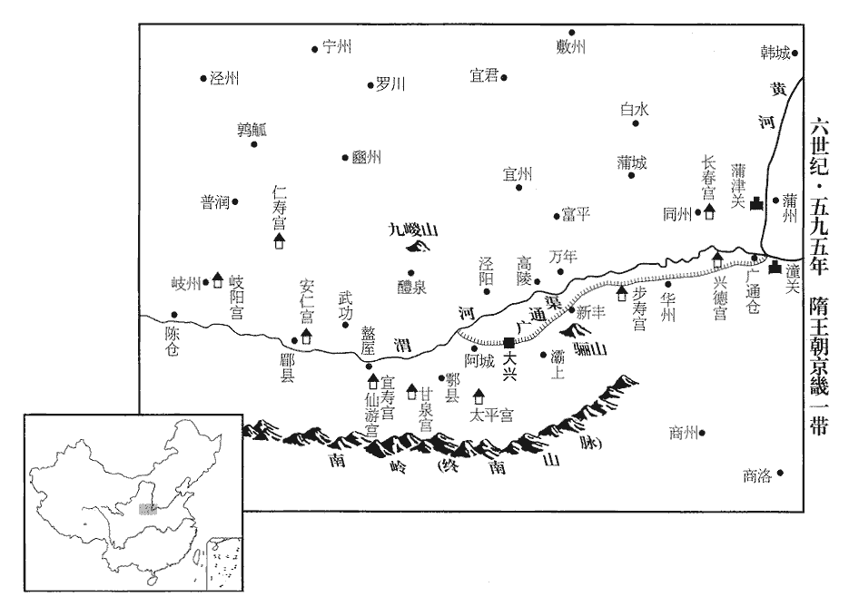
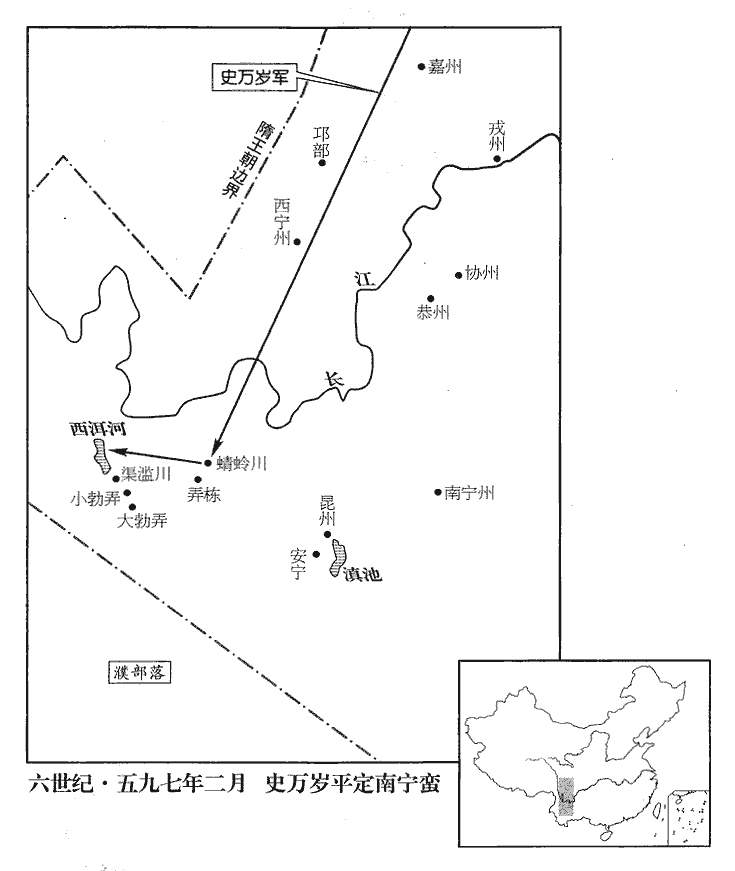
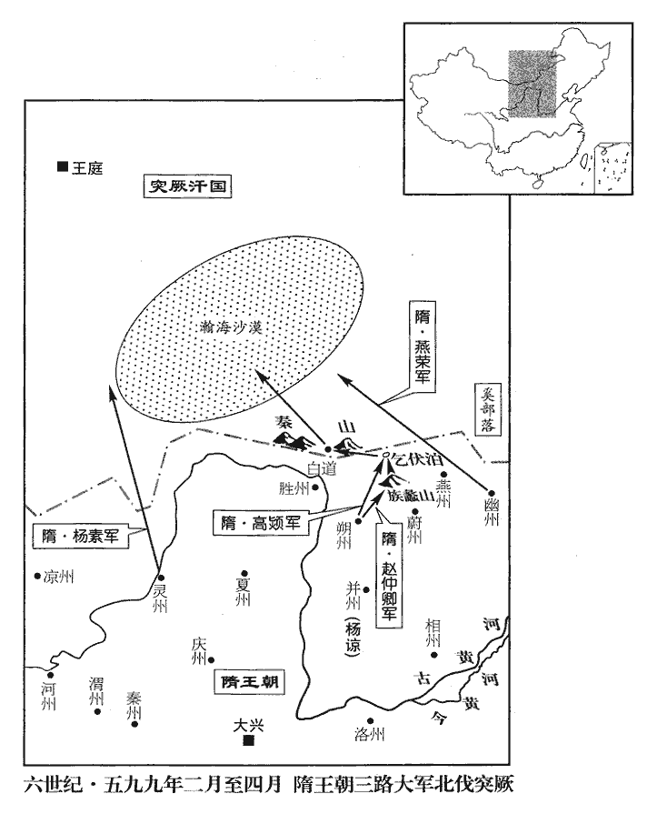
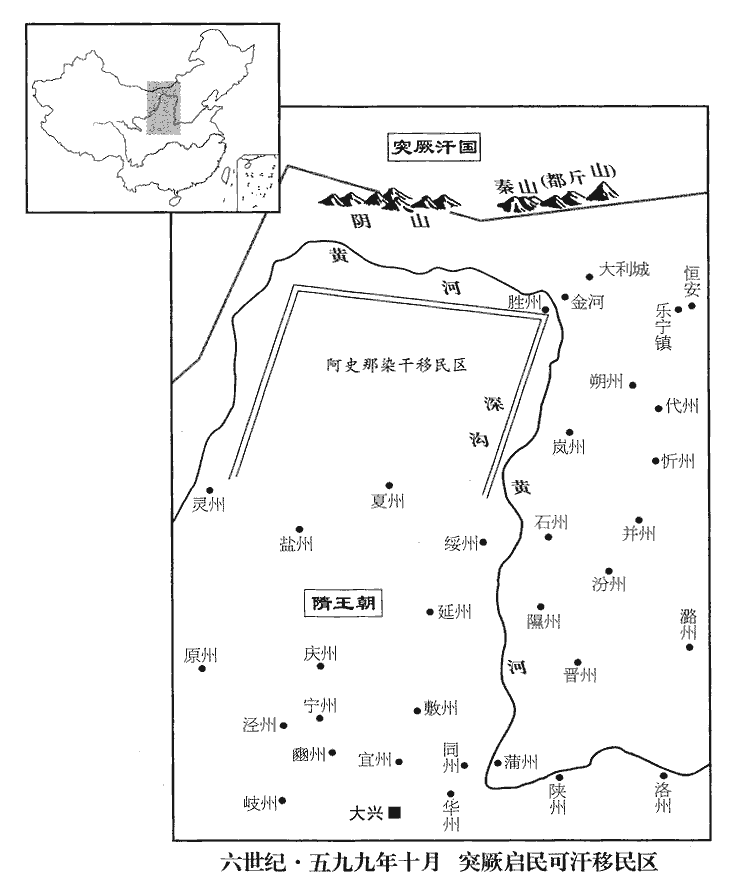

 隋紀二起玄黓困敦（壬子），盡屠維協洽（己未），凡八年。

# 高祖文皇帝上之下

## 開皇十二年（壬子、五九二）

1春，二月，己巳，以蜀王秀為內史令兼右領軍大將軍。

〖译文〗 [1]春季，二月己巳（疑误），隋朝任命蜀王杨秀为内史令兼右领军大将军。

2國子博士何妥與尚書右僕射邳公蘇威爭議事，積不相能。威子夔為太子通事舍人，隋制：太子通事舍人八人，屬典書坊。少敏辯，有盛名，少，詩沼翻。士大夫多附之。及議樂，夔與妥各有所持；詔百僚署其所同，百僚以威故，同夔者什八九。妥恚曰：「吾席間函丈四十餘年，禮：侍坐於先生，席間函丈。何妥，周武帝時已為太學博士，故云然。恚，於避翻。反為昨暮兒之所屈邪！」邪，音耶。遂奏：「威與禮部尚書盧愷、吏部侍郎薛道衡、尚書右丞王弘、考功侍郎李同和等共為朋黨。吏部侍郎、考功侍郎皆屬吏部尚書。尚書左、右丞分司管轄。隋制：尚書二十四曹侍郎，獨吏部侍郎班左右丞之上。吏部侍郎正四品，左、右丞從四品。省中呼弘為世子，同和為叔，言二人如威之子弟也。」復言威以曲道任其從父弟徹、肅罔冒為官等數事。復，扶又翻。從，才用翻。上命蜀王秀、上柱國虞慶則等雜按之，事頗有狀。上‹杨坚，本年五十二岁›大怒。秋，七月，乙巳‹一›，威坐免官爵，以開府儀同三司就第；盧愷除名，知名之士坐威得罪者百餘人。

〖译文〗 [2]国子博士何妥与尚书右仆射邳公苏威议论政事时，素来意见不同，各不相让。苏威的儿子苏夔担任太子通事舍人，他从小就机敏善辩，享有盛名，士大夫都樊附巴结他。及至讨论修订音乐时，苏夔和何妥各有自己的主张。于是隋文帝下诏令百官群臣各自发表意见，百官大臣由于苏威的缘故，十分之八九都表示赞成苏夔的主张。何妥愤愤不平地说：“我当国子博士都四十多年了，现在反倒屈居于一个乳臭未干的小儿之下！”于是向文帝上奏说：“苏威和礼部尚书卢恺、吏部侍朗薛道衡、尚书右丞王弘、吏部考功侍郎李同和等人结党营私，尚书省中称呼王弘为世子，称呼李同和为叔，这是说他们两人就如同苏威的儿子和兄弟。”又告发苏威以不正当手段为堂弟苏彻、苏肃谋求官职等几项罪行。于是文帝命令蜀王杨秀、上柱国虞庆则等人负责调查此事，基本属实。隋文帝非常愤怒，秋季，七月乙巳（初一），苏威因此被免除官职爵位，只保留开府仪同三司，回家闲居；卢恺被免官除名，受牵连而获罪的知名人士多达一百余人。

初，周室以來，選無清濁；選，宣絹翻。及愷攝吏部，按愷傳，開皇九年拜禮部尚書，攝吏部尚書。與薛道衡甄別士流，別，彼列翻。故涉朋黨之謗，以至得罪。未幾，幾，居豈翻。上曰：「蘇威德行者，行，下孟翻。但為人所誤耳！」命之通籍。通籍殿中，則得預朝請。威好立條章，好，呼到翻。每歲責民間五品不遜，孔安國曰：五品，謂五常。遜，順也。或答云，「管內無五品之家。」其不相應領，類多如此。又為餘糧簿，欲使有無相贍；民部侍郎郎茂以為煩迂不急，皆奏罷之。茂，基之子也，郎基見一百六十五卷梁世祖承聖三年。嘗為衛國‹河南省清丰县›令，有民張元預兄弟不睦，丞、尉請加嚴刑，隋志：縣置令、丞、尉。茂曰：「元預兄弟本相憎疾，又坐得罪，彌益其忿，非化民之意也。」乃徐諭之以義。元預等各感悔，頓首請罪，遂相親睦，稱為友悌。

〖译文〗 自从北周建立以来，选拔官吏不管品德好坏，及至卢恺代理吏部尚书，与薛道衡一起对官吏的品德加以分别，所以遭到结交朋党的诽谤，以至于获罪。不久，隋文帝又说：“苏威是个有德行的人，只是被别人所误罢了。”于是下令苏威可以参预朝会宴请。苏威热衷于订立各种规章制度，每年都责备民间各地不重视推行儒家仁、义、礼、智、信五常的教化，有的地方官回答道：“在我管辖的地区内没有五品以上的官员。”其不相领会，多数类此。苏威又编制出余粮帐簿，打算令民间有无互相调节，民部侍郎郎茂认为这种作法烦琐迂阔，难以推行，于是向文帝上奏，予以废除。郎茂是郎基的儿子，他曾经担任卫国县令，有平民百姓张元预兄弟不相和睦，县丞、县尉请求对张元预兄弟严刑治罪，郎茂说：“张元预兄弟之间本来就互相憎恶，如果因此将他们治罪，他们就会更加仇恨，达不到教化百姓的目的。”于是郎茂就用仁义慢慢开导他们。张元预兄弟都深受感动而后悔不已，向郎茂叩头请罪，于是兄弟之间互相亲爱和睦，民间乡里都称赞他们的友爱孝悌。

3己巳‹二十五›，上享太廟。隋立四親廟，各以孟月享以太牢。

〖译文〗 [3]己巳（二十五日），隋文帝到太庙祭祀祖先。

4壬申晦‹二十八›，日有食之。

〖译文〗 [4]壬申晦（二十八日），出现日食。

5帝以天下用律者多踳駮，踳chuǎn，乖也；駮bó，錯也。踳，尺允翻；駮，北角翻。罪同論異，八月，甲戌‹一›，制：「諸州死罪，不得輒決，悉移大理按覆，事盡，盡，竟也。然後上省奏裁。」上，時掌翻。

〖译文〗 [5]隋文帝因为天下的执法官吏对法律的理解多有错误，往往发生罪行相同而判决不同的现象，八月甲戌（初一），下制书说：“各州犯有死罪的案件，州府不得随意判决定案，要全部移送大理寺审理复查，复查完毕后，再呈奏尚书省裁决。”

6冬，十月，壬午‹十›，上享太廟。十一月，辛亥‹九›，祀南郊。

〖译文〗 [6]冬季，十月壬午（初十），隋文帝到太庙祭祀祖先。十一月辛亥（初九），文帝在南郊举行祭天大祀。

7己未‹十七›，新義公韓擒虎卒‹年五十五岁›。擒虎襲父雄爵新義郡公，平陳之功，以吏議不加封爵。卒，子恤翻。

〖译文〗 [7]己未（十七日），新义公韩擒虎去世。

8十二月，乙酉‹十四›，以內史令楊素為尚書右僕射，與高熲專掌朝政。素性疏辯，高下在心，朝臣之內，朝，直遙翻。頗推高熲，敬牛弘，厚接薛道衡，視蘇威蔑如也，蔑，無也，視之如無也；又輕易也。自餘朝貴，多被陵轢lì。陵，乘也，犯也，侮也，侵也。轢，陵踐也。又，車踐為轢。轢，郎擊翻。其才藝風調優於熲；調，徒釣翻。至於推誠體國，處物平當，處，昌呂翻。當，丁浪翻。有宰相識度，不如熲遠矣。

〖译文〗 [8]十二月乙酉（二十四日），隋朝任命内史令杨素为尚书右仆射，与尚书左仆射高一起掌管朝政。杨素秉性粗疏而有辩才，对侍他人随意褒贬，在朝臣之中，他很推崇高，尊敬太常卿牛弘，倾心结交薛道衡，而根本瞧不起苏威，其余的当朝权贵大都受到他的欺凌侮辱。杨素的才艺风度优于高，至于以诚侍人，体谅国家，处事公平，具备宰相的见识和器度，他远不如高。

右領軍大將軍賀若弼，自謂功名出朝臣之右，每以宰相自許。既而楊素為僕射，弼仍為將軍，甚不平，形於言色，由是坐免官，怨望愈甚。久之，上‹杨坚›下弼獄，下，戶嫁翻。謂之曰：「我以高熲、楊素為宰相，汝每昌言曰：『此二人惟堪啗飯耳。』昌言，明言於廣眾。啗，徒濫翻，又徒覽翻。是何意也？」弼曰：「熲，臣之故人；素，臣舅子：臣並知其為人，誠有此語。」公卿奏弼怨望，罪當死。上曰：「臣下守法不移，公可自求活理。」弼曰：「臣恃至尊威靈，將八千兵渡江，將，即亮翻。擒陳叔寶，竊以此望活。」上曰：「此已格外重賞，何用追論！」弼曰：「臣已蒙格外重賞，今還格外望活。」既而上低回數日，低，降意也。回，轉心也。惜其功，特令除名。歲餘，復其爵位，上亦忌之，不復任使，復，扶又翻。然每宴賜，遇之甚厚。

〖译文〗 右领军大将军贺若弼自认为他的功勋名望在其他的群臣之上，因此经常以宰相自任。不久，杨素被任命为尚书右仆射，自己还是将军，所以非常愤恨不平，并在言谈脸色上表现出来，于是他被朝廷罢免职务，因而愈加怨恨。过了一段时间后，隋文帝将贺若弼逮捕下狱，问他说：“我任命高、杨素为宰相，而你经常扬言说：‘这两个人只会吃饭。’你这话是什么意思？”贺若弼回答说：“高是我的老朋友，杨素是我舅舅的儿子，我深知他们的为人，所以敢说那样的话。”公卿大臣上奏说贺若弼怨恨朝廷，犯了死罪。文帝又对贺若弼说：“百官大臣严格执法，判定你犯有死罪，你得自己寻找活命的理由。”贺若弼说：“我仰仗着陛下威灵，率领八千名兵士渡过长江，俘获了陈后主陈叔宝，我想以此功劳请求活命。”文帝说：“朝廷对此已格外重赏，现在怎么还能再提此事？”贺若弼说：“我是已经得到过格外重赏，只是今天还想请求陛下格外开恩，保全性命。”在这以后的几天里，文帝稍微回心转意，顾念他战功卓著，特令免除一切官爵职务，除名为民。一年以后，文帝虽然又恢复了贺若弼的爵位，但也对他产生猜忌，不再任命他担任具体职务，但是朝会宴请赏赐群臣时，给他的侍遇仍很优厚。

9有司上言：「府藏皆满，上，時掌翻。藏，徂浪翻。無所容，積於廊廡。」廡，罔甫翻。帝曰：「朕既薄賦於民，又大經賜用，謂賞平陳將士。何得爾也？」爾，猶言如此。對曰：「入者常多於出，略計每年賜用，至數百萬段，曾無減損。」於是更闢左藏院以受之。漢官有中藏令，晉有中、黃、左、右藏令，隋初有右藏、黃藏令，至是始闢左藏院。藏，徂浪翻。詔曰：「寧積於人，無藏府庫。河北、河東今年田租三分減一，兵減半功，謂全免。」田出租，丁出調，詳已見前。兵受田，計畝為功，以其所出，脩器械，備糗糧，今亦減其半。調，徒弔翻。時天下戶口歲增，京輔及三河地少而人眾，京輔，謂關內。三河，謂河東、河南、河北。少，與小同。衣食不給，帝乃發使四出，均天下之田，其狹鄉每丁纔至二十畝，老少又少焉。使，疏吏翻。老少，詩照翻；又少，詩沼翻。

〖译文〗 [9]有关官吏上奏说：“国家的府库已经全堆满了，以至于财物没有地方存放，只好暂时堆放在府库外的厢房里。”隋文帝问：“朕不但对天下百姓征收很轻的赋税，而且又曾经用来大量地赏赐平陈的有功将士，为什么府库还会全满呢？”回答说：“由于每年收入经常多于支出，估计每年用于赏赐和日常支用达到数百万段，所以府库所藏根本不会减少。”于是文帝下令另外开辟左藏院以存放新征收的财帛。文帝又下诏书说：“粮食布帛宁愿积蓄在民间百姓家里，也不要储藏于国家府库，今年河北、河东地区的田租可减征三分之一，军人应缴纳的份额可减征一半，全国各地成丁应缴纳的调全部免征。”当时隋朝全国的户口每年都在增加，京畿地区和河北、河南、河东三河地区地少人多，许多平民衣食不足，于是文帝就向全国各地派出使节，重新调整分配天下的田地，地少人多的狭乡每个成年丁口只能分到二十亩地，老人和孩童能分到的土地更少。

## 十三年（癸丑、五九三）

1春，正月，壬子‹十一›，上祀感生帝。隋以火德王，以赤帝赤熛怒為感生帝。

〖译文〗 [1]春季，正月壬子（十一日），隋文帝祭祀感生帝。

2壬戌‹二十一›，行幸岐州‹陕西省凤翔县›。岐州扶風郡。

〖译文〗 [2]壬戌（二十一日），隋文帝巡幸岐州。

3二月，丙午‹六›，詔營仁壽宮於岐州之北‹陕西省麟游县境›，仁壽宮，在岐州普閏縣。使楊素監之。監，古銜翻。素奏前萊州‹山东省莱州市›刺史宇文愷檢校將作大匠，隋志：東萊郡，舊置光州，開皇五年，更名萊州。隋制：未除授正官而領其務者為檢校官。將作大匠掌工作。宇文愷有巧思，奏使之領作。記室封德彝為土木監。土木監，掌土木之事，以營宮暫置之，非常設之官。於是夷山堙谷以立宮殿，崇臺累榭，宛轉相屬。屬，之欲翻。役使嚴急，丁夫多死，疲頓顛仆，推填坑坎，覆以土石，推，吐雷翻。覆，敷又翻。因而築為平地。死者以萬數。

〖译文〗 [3]二月丙午（疑误），隋文帝下诏令在岐州北面营建仁寿宫，派遣杨素监督施工。杨素上奏请求朝廷委派前莱州刺史宇文恺临时代理将作大匠，记室参军封德彝为土木监。于是平山填谷构筑宫殿，高台累榭，宛转相连。在营建过程中督使严急，服役丁夫死亡众多。很多人疲备不堪，倒地而死，尸体被填入坑中，上面用土石覆盖，因而筑成平地。死的人数以万计。

4丁亥‹十七›，上至自岐州。

〖译文〗 [4]丁亥（十七日），隋文帝自岐州返回长安。

5己卯‹九›，立皇孫暕為豫章王。暕，廣之子也。暕jiǎn，古限翻。

〖译文〗 [5]己卯（疑误），隋朝册封皇孙杨为豫章王。杨是晋王杨广的儿子。

6丁酉‹二十七›，制：「私家不得藏緯候，圖讖。」讖，楚譖翻。

〖译文〗 [6]丁酉（二十七日），隋文帝下制书说：“民间私家不得收藏预卜吉凶的纬候、图谶之类的书籍。”

7秋，七月，戊辰晦‹三十›，日有食之。

〖译文〗 [7]秋季，七月戊辰晦（三十日），出现日食。

8是歲，上命禮部尚書牛弘等議明堂制度。宇文愷獻明堂木樣，上命有司規度安業里地‹大兴南城›，將立之；而諸儒異議，久之不決，乃罷之。隋志：宇文愷依月令文造明堂木樣，重檐複廟，五房四達，丈尺規矩，皆有準憑。帝異之，命有司於安業里為規兆，蓋在長安南郭內也。既以異議罷。至大業中，愷復奏明堂議及木樣。其議云：「尚書帝命驗曰：『帝者承天，立五府以尊天重象，赤曰文祖，黃曰神斗，白曰顯紀，黑曰玄矩，蒼曰靈府。』註曰：『唐、虞之天府，夏之世室，殷之重屋，周之明堂，皆同矣。』尸子曰：『有虞氏曰總章。』周官考工記曰：『夏后氏世室，堂脩四二七，博四脩一。』註云，『脩，南北之深也。夏度以步，今堂脩十四步，其博益以四分脩之一，則明堂博十七步半也。』臣愷按，三王之世，夏最為近古，從質尚文，理應漸就寬大，何因夏室乃大殷堂？相形為論，理恐不爾。記云：『堂脩七，博四。』脩若夏度以步，則應脩七步。註云：『今堂脩十四步』乃是增益記文。殷、周二堂獨無加字，便是其義，類例不同。山東禮本，輒加『二七』之字，何得殷無加尋之文，周闕增筵之義！研覈其趣，或是不然。讎校古書，並無二字，此乃桑間俗儒信情加減。黃圖議云：『夏后氏益其堂之大一百四十四尺，周人明堂以為兩杼zhù間。』馬宮之言，止論堂之一面。據此為準，則三代堂基並方，得為上圓之制。諸書所說，並為下方。鄭註周官，獨為此義非直與古違異，亦乃乖背禮文，尋文求理，深恐未愜。尸子曰，『殷人陽館。』考工記曰：『殷人重屋，堂脩七尋，堂崇三尺，四阿重屋。』註曰：『其脩七尋五丈六尺，放夏；周則其博九尋七丈二尺。』又曰：『周人明堂度九尺之筵，東西九筵，南北七筵，堂崇一筵，五室凡二筵。』禮記明堂位曰：『天子之廟，複廟重檐。』鄭註云，『複廟，重屋也。』註玉藻云：『天子廟及路寢，皆如明堂制。』禮圖云：『於內室之上，起通天之觀，觀八十一尺，得宮之數，其聲濁，君之象也。』大戴禮云：『明堂者，古有之，凡九室，一室有四戶八牖，以茅蓋，上圓下方，外水曰璧雝，赤綴戶，白綴牖，堂高三尺，東西九仞，南北七筵，其宮方三百步。』周書明堂曰：『堂方百一十二尺，高四尺，階博六尺三寸，室居內方百尺，室內方六十尺，戶高八尺，博四尺。』作洛曰：『明堂、太廟、路寢，咸有四阿，重亢、重廊。』孔氏註云：『重亢，累棟；重廊，累屋也。』禮圖曰：『秦明堂，九室十二階，各有所居。』呂氏春秋曰：『有十二堂。』與月令同，並不論尺丈。臣愷按，十二階雖不與禮合，一月一階非無理。思黃圖曰：『堂方百四十四尺，法坤之策也，方象地。屋圓，楣徑二百一十六尺，法乾之策也，圓象天。室九宮，法九州。太室方六丈，法坤之變數。十二堂，法十二月。三十六戶，法極陰之變數。七十二牖，法五行所行日數。八達，象八風，法八卦。通天臺徑九尺，象法乾。以九覆六，高八十一尺，法黃鍾九九之數。二十八柱，象二十八宿。堂高三尺，土階三等，法三統。堂四向五色，法四時五行。殿門去殿七十二步，法五行所行。門堂長四丈，取太室三之二。垣高無蔽目之照，【目恐當作日】牖六尺，其外倍之。殿垣方，在水內，法地陰也。水四周於外，象四海。圓，法陽也。水闊二十四丈，象二十四氣。水內徑三丈，應覲禮經。武帝立明堂汶上，無室，其外略依此制。』泰山通議今亡，不可得而辨也。元始四年起明堂辟雍長安城南門，制度如儀，一殿，垣四面，門八觀，水外周，堤壤高四尺。禮圖曰：『建武三十年作明堂，上圓下方，上圓法天，下方法地，十二堂法日辰，九室法九州，室八牕，八九七十二，法一時之王，室有二戶，二九十八戶，法土王十八日。內堂，正壇高三尺，土階三等。』胡伯始註漢官云，『古清廟蓋以茅，今蓋以瓦，下藉茅，以存古制。』自晉以前，未有鵄chī尾。其圓牆璧水，一依本圖。晉堂方構，不合天文，既缺重樓，又無璧水。空堂乖五室之義，直殿違九階之文，非古欺天，一何過甚！後魏於北臺城南造圓牆，在璧水外，門在水內，迥立不與牆相連，其堂上九室，三三相重，不依古制，室間通巷，違舛處多。其室皆用墼jī累，極成褊biǎn陋。宋起居注曰，『孝武帝大明五年，立明堂，其牆宇規範，擬則太廟，唯十二間以應朞數。』梁武帝移宋時太極殿以為明堂，無室十二間。自古明堂圖，惟有二本：一是宗周劉熙、阮諶chén、劉昌宗等作，三圖略同；一是後漢建武三十年作，禮圖有本，不詳撰人。臣逺尋經傳，傍求子史，研究眾說，總撰今圖，其樣以木為之，下為方堂，堂有五室，上為圓觀，觀有四門。」會遼東之役，不果行。

〖译文〗 [8]这一年，隋文帝下令礼部尚书牛弘等人讨论研究古代明堂的建筑结构。宇文恺向文帝呈献了明堂的木制模型，于是文帝下令有关官吏在长安安业里规划出地皮，准备建立明堂。可是由于朝中的儒生意见不同，很长时间不能形成一致意见，只好作罢。

9上之滅陳也，以陳叔寶屏風賜突厥‹瀚海沙漠群›大義公主。厥，九勿翻。公主以其宗國之覆，謂周亡也。心常不平，書屏風，為詩敘陳亡以自寄；上聞而惡之，惡，烏路翻。禮賜漸薄。彭公劉昶先尚周公主，流人楊欽亡入突厥，詐言昶欲與其妻作亂攻隋，遣欽密告大義公主，發兵擾邊。都藍可汗信之，乃不脩職貢，頗為邊患。可，從刊入聲。汗，音寒。上遣車騎將軍長孫晟使於突厥，隋制：車騎將軍階正五品。非職事官。騎，奇寄翻。使，疏吏翻。長，知兩翻。晟，承正翻。微觀察之。公主見晟，言辭不遜，又遣所私胡人安遂迦與楊欽計議，迦，求伽翻。扇惑都藍。晟至京師，具以狀聞。上遣晟往索欽；索，山客翻。都藍不與，曰：「檢校客內無此色人。」晟乃賂其達官，知欽所在，夜，掩獲之，以示都藍，因發公主私事，國人大以為恥。都藍執安遂迦等，并以付晟。上大喜，加授開府儀同三司，仍遣入突厥，廢公主。內史侍郎裴矩請說都藍使殺公主。說，輸芮翻。時處羅侯之子染干，號突利可汗，考異曰：突厥傳云「沙鉢略子」。今從長孫晟傳。居北方，遣使求婚，使，疏吏翻。上使裴矩謂之曰：「當殺大義公主，乃許婚。」突利復譖之於都藍，復，扶又翻。都藍因發怒，殺公主，更表請婚，朝議將許之。朝，直遙翻。長孫晟曰：「臣觀雍虞閭反覆無信，直以與玷厥有隙，雍虞閭，都藍；玷厥，達頭也。所以欲依倚國家，雖與為婚，終當叛去。今若得尚公主，承藉威靈，玷厥、染干必受其徵發。強而更反，後恐難圖。且染干者，處羅侯之子，素有誠款，於今兩代，前乞通婚，不如許之，招令南徙，兵少力弱，易可撫馴，少，詩沼翻。易，以豉翻。馴，松倫翻。使敵雍虞閭以為邊捍。」上曰：「善。」復遣晟慰諭染干，許尚公主。為隋破都藍，樹立染干張本。復，扶又翻。

〖译文〗 [9]隋文帝灭掉陈后，将陈叔宝的屏风赏赐给突厥可贺敦大义公主。大义公主因为她的宗国北周宇文氏灭亡，心里一直愤愤不平，于是就在屏风上作诗，叙述陈亡国的事，借以寄托自己对故国的哀思。隋文帝知道此事后就忌恨大崐义公主，对她逐渐冷淡，赏赐也日益减少。彭公刘昶以前也娶了北周帝室公主为妻，隋朝流民杨钦逃入突厥，谎称刘昶打算和妻子一起兴兵作乱，攻打隋朝，因此派遣杨钦来密告大义公主，请求突厥发兵侵扰隋朝边境。突厥都蓝可汗相信了杨钦的话，于是就不再谨守藩国的职责，按时朝贡，时常发兵侵犯隋境。隋文帝派遣车骑将军长孙晟出使突厥，暗中观察了解情况。大义公主见了长孙晟后，出言不恭，又派和她私通的胡人安遂迦去与杨钦计议谋划，煽动鼓惑都蓝可汗。长孙晟回到京师后，将所见所闻向隋文帝作了报告。于是文帝又派遣长孙晟到突厥索要杨钦，都蓝可汗不给，回答说：“检查过我们的宾客，其中没有这个人。”于是长孙晟就贿赂突厥的达官贵人，知道了杨钦躲藏的地方，在夜里突然将他抓获，然后给都蓝可汗看，并趁机揭发了大义公主和胡人安遂迦的私情，突厥国人得知后认为是极大的耻辱。于是都蓝可汗拿获了安遂加等人，一并交付长孙晟带回隋朝。隋文帝十分高兴，加授长孙晟开府仪同三司，并派他出使突厥劝说废除大义公主。内史侍郎斐矩请求出使突厥劝说都蓝可汗，使他杀掉大义公主。当时前突厥莫何可汗处罗侯的儿子染干号称为突利可汗，居住在突厥国的北方，他派遣使者向隋朝求婚，隋文帝就派遣裴矩对他说：“只有杀掉大义公主，隋朝才能答应婚事。”于是突利可汗也向都蓝可汗说大义公主的坏话，都蓝可汗因此大怒，杀了大义公主，重新向隋朝上表求婚，朝廷准备答应都蓝可汗。长孙晟说：“我看都蓝反复无常，不讲信用，只因为和西方达头可汗玷厥结下怨恨，所以才依倚我朝。即使是我们双方建立了婚烟关系，他终久也会叛变而去。现在都蓝可汗如果能娶到大隋公主为妻，那末他就可以凭籍我们大隋的威灵而发号施令，达头可汗玷厥与染干必然会听从他的指挥调度。这样都蓝可汗的势力将会更加强大，强大后再起来反叛，以后恐怕就很难制服了。况且染干是处罗侯的儿子，素来诚心归服，至今已有两代，以前他曾派遣使节来求婚，不如答应他，然后招抚劝诱他率领部落向南迁移，染干兵少力弱，容易驯服，我们可以利用他抵御都蓝可汗以保卫北方边疆。”文帝听了称赞道：“这个主意好！”于是再次派遣长孙晟前去安慰晓谕染干，答应他可以娶公主为妻。

10牛弘使協律郎范陽‹河北省涿州市›祖孝孫等參定雅樂，隋制，太常有協律郎二人。隋志：涿郡涿縣，舊置范陽郡，開皇初，郡廢。又上谷郡淶水縣，舊曰遒qiú，開皇元年，以范陽為遒縣，更置范陽於此。從陳陽山‹广东省英德市西北浛洸镇›太守毛爽受京房律法，「從」字之上，更有「孝孫」二字，文意乃明。隋志：南海郡含洭縣，梁置陽山郡。布管飛灰，順月皆驗。又每律生五音十二律，為六十音，因而六之，為三百六十音，分直一歲之日以配七音，而旋相為宮之法，由是著名。名，一作明。弘等乃奏請復用旋宮法，上猶記何妥之言，妥言見上卷九年。注弘奏下，不聽作旋宮，但用黃鍾一宮。於是弘等復為奏，附順上意，其前代金石並銷毀之。以息異議。弘等又作武舞，以象隋之功德；郊廟饗用一調，迎氣用五調。郊廟用一調，止用黃鍾一宮。迎氣用五調，春用角，夏用徵，中央用宮，秋用商，冬用羽。調，徒釣翻。舊工稍盡，其餘聲律，皆不復通。復，扶又翻。

〖译文〗 [10]礼部尚书牛弘请协律郎范阳人祖孝孙等人参与修订雅乐，祖孝孙曾从师陈阳山太守毛爽学习京房的律吕之法，律管中葭灰飞动，顺序和十二个月份全部符合。又每种律调有五个音级，十二种律调共有六十个音级，把这六十个音级重复六次，就构成三百六十个音级，分别和一年的三百六十天对应起来，然后再和宫、商、角、徵、羽、变宫、变徵七个音级配合起来而形成各种律调节奏。于是，古代旋相为宫之法，才重新大白于天下，被人们所认识。因此，牛弘等人上奏请求重新使用旋宫法演奏音乐，可是文帝还记着以前何妥所说的话，于是就在牛弘等人的奏书上面批示，不许采用旋宫法，仍旧只使用黄钟一宫。于是，牛弘等人重新上奏，附和文帝的旨意，请求把前代的金石乐器之类全部予以销毁，以平息人们在音乐方面的不同意见。牛弘等人又创作了武舞，用来表现隋朝的功德；规定在举行郊、庙祭祀时只使用黄钟一宫，在祈求丰年的迎气祭祀时，可分别使用黄钟的角、徵、宫、商、羽五调。从此以后，老乐师逐渐死去，新乐师对黄钟律调以外的其它声律，都不再通晓。

## 十四年（甲寅、五九四）

1春，三月，樂成。夏，四月，乙丑‹一›，‹杨坚，本年五十四岁›詔行新樂，且曰：「民間音樂，流僻日久，棄其舊體，競造繁聲，宜加禁約，務存其本。」萬寶常聽太常所奏樂，泫然泣曰：「樂聲淫厲而哀，天下不久將盡！」時四海全盛，聞者皆謂不然；大業之末，其言卒驗。卒，子恤翻。寶常貧而無子，久之，竟餓死。且死，悉取其書燒之，寶常撰樂譜六十四卷，具論八音旋相為宮之法，改絃移柱之變，為八十四調，一百四十四律，終於千八百聲，為之應手成曲。曰：「用此何為！」

〖译文〗 [1]春季，三月，隋朝新乐修订完成。夏季，四月乙丑（初一），隋文帝下诏令颂行新乐，并且说：“民间音乐流入邪僻不正已经很久，丢弃了音乐原崐来的主体风格，竞相造作繁杂的声律，应该加以禁止，务必保存音乐本来意义。”著名乐师万宝常听了太常寺乐师所演的音乐后，伤心落泪地说：“乐声淫厉而又哀惋，天下不久将会灭亡！”当时隋朝正处在全盛时期，听到的人都认为他的预言不会兑现；到了大业末年，万宝常的预言终于得到证实。万宝常生活贫穷又没有儿子，很久以后，竟饥饿而死。临死的时候，他把自己的书籍全部烧掉，悲愤地说：“读这些书能有什么用处！”

2先是，臺、省、府、寺及諸州皆置公廨錢，先，悉薦翻。廨，古隘翻。收息取給。工部尚書【章：甲十一行本「書」下有「扶風」二字；乙十一行本同；孔本同。】蘇孝慈唐六典：工部尚書，周之冬官卿也，漢五曹尚書，其三曰民曹，後漢以民曹兼主繕修工作、鹽池、園苑之事。自晉、宋、齊、梁、陳營宗廟，則權置起部尚書，事畢省之，後周依周官置大司空卿一人。隋開皇二年，始置工部尚書。以為「官司出舉興生，煩擾百姓，敗損風俗，敗，補邁翻。請皆禁止，給地以營農。」上從之。六月，丁卯‹四›，始詔「公卿以下皆給職田，職分田起於後周，頃畝以品為差，下至隋、唐，代有增減。毋得治生，與民爭利。」治，直之翻。

〖译文〗 [2]以前，隋朝在中央台、省、府、寺各机构和地方各州县都设立了公廨钱，每年放贷出去，收取利息以供需用。工部尚书苏孝慈认为：“官府放贷，收息盈利，烦扰百姓，败坏风俗，请求陛下明令禁止，而由国家拨给他们田地以经营农业。”隋文帝听从了他的建议，六月丁卯（初四），下诏书说：“公卿大臣以下各级官吏都分配给职分田，不得再经商放贷，与民争利。”

3秋，七月，乙未‹三›，以邳公蘇威為納言。

〖译文〗 [3]秋季，七月乙未（初三），隋朝任命邳公苏威为纳言。

4初，張賓曆既行，開皇四年行張賓曆，見一百七十六卷陳長城公至德二年。廣平‹河北省永年县东南旧永年镇›劉孝孫、隋志：武安郡永平縣，舊曰廣平，置廣平郡，仁壽元年，改永平縣。冀州‹河北省冀州市›秀才劉焯信都郡置冀州。焯zhuō，職略翻。並言其失。賓方有寵於上，劉暉附會之，共短孝孫，斥罷之。後賓卒，孝孫為掖縣‹山东省莱州市›丞，隋志：萊州東萊郡治掖縣。委官入京，上其事，詔留直太史，以他官入太史曹為直太史。上，時掌翻。累年不調，調，徒釣翻。乃抱其書，使弟子輿櫬來詣闕下，櫬，初覲翻。伏而慟哭；執法拘而奏之。帝異焉，以問國子祭酒何妥，妥言其善。乃遣與賓曆比校短長。直太史勃海‹河北省东光县›張冑玄隋志：勃海郡，開皇六年置棣州。與孝孫共短賓曆，異論鋒起，久之不定。上令參問日食事，楊素等奏：「太史凡奏日食二十有五，率皆無驗，冑玄所刻，前後妙中，刻，刻定也。中，竹中翻。孝孫所刻，驗亦過半。」於是上引孝孫、冑玄等親自勞徠。勞，力到翻。孝孫請先斬劉暉，乃可定曆，帝不懌，又罷之。孝孫尋卒。卒，子恤翻。

〖译文〗 [4]当初，隋朝颁行了张宾修撰的《甲子元历》以后，广平人刘孝孙与冀州秀才刘焯都上书指出了新历的失误。当时因为张宾正受到隋文帝的宠信，仪同三司刘晖又附会张宾，两人一起向隋文帝诋毁刘孝孙，于是文帝就驳回了刘孝孙的建议。后来张宾去世，刘孝孙担任了掖县县丞，他弃官入京，再一次上书提出了自己的意见，文帝下诏令他留在太史曹担任直太史，但多年没有调动他的职务，于是他自己抱着书，让弟子门生们抬着棺材来到宫阙前，伏地痛哭；执法官吏拘捕了他，然后奏报隋文帝。文帝感到惊异，就询问国子祭酒何妥，何妥回答说刘孝孙的建议很对。于是文帝就让他将自己的历法和张宾的历法比较高下优劣。直太史勃海人张胄玄和刘孝孙共同指责张宾的历法，于是异议蜂起，长期争论不休。文帝派人询问验证双方历法所定日食的情况，尚书右仆射杨素等人上奏说：“太史们根据张宾的历法所奏报的日食总共有二十五次，基本上都与事实不符；而张胄玄所推定的日食日期，前后全都得到验证，准确无误；刘孝孙所推定的日食日期，符合的也超过一半。”于是文帝就召见刘孝孙和张胄玄两人，亲自加以慰问勉励。刘孝孙请求先处斩刘晖，然后他才能制定新历，文帝很不高兴，就又下令终止了制定新历的工作。刘孝孙不久就去世了。

5關中‹陕西省中部›大旱，民飢，上遣左右視民食，得豆屑雜糠以獻。上流涕以示群臣，深自咎責，為之不御酒肉，為，于偽翻。殆將一朞。八月，辛未‹九›，上帥民就食於洛陽‹河南省洛阳市东白马寺东›，帥，讀曰率。敕斥候不得輒有驅逼。男女參廁於仗衛之間，遇扶老攜幼者，輒引馬避之，慰勉而去；至艱險之處，見負擔者，擔，都濫翻。令左右扶助之。

〖译文〗 [5]隋朝关中地区大旱，百姓饥荒，隋文帝派遣左右侍臣察看老百姓的食物，左右侍臣拿回了百姓所吃的豆屑杂糠呈献给文帝。文帝流着眼泪将这些东西展示给百官大臣们看，并深深地自责，从此不再饮酒吃肉，坚持了将近一年。八月辛未（初九），隋文帝率领关中百姓前往洛阳地区度荒，并下敕令警卫的士兵不得驱赶百姓。百姓们男男女女参杂行进在禁卫和仪仗队伍中间，文帝如果遇到扶老携幼的逃难者，总是牵马让路，好言慰勉而去；到了艰险难行的地方，遇到挑担负重的逃难者，就命令左右随从上前扶助。

6冬，閏十月，甲寅‹二十三›，詔以齊、梁、陳宗祀廢絕，命高仁英、蕭琮、陳叔寶以時脩祭，所須器物，有司給之。陳叔寶從帝登邙山，邙山，在洛陽城北。侍飲，賦詩曰：「日月光天德，山河壯帝居；太平無以報，願上東封書。」上，時掌翻。并表請封禪。帝優詔答之。他日，復侍宴，復，扶又翻。及出，帝目之曰：「此敗豈不由酒！以作詩之功，何如思安時事！當賀若弼渡京口‹江苏省镇江市›，彼人密啟告急，渡京口，事見上卷九年。叔寶飲酒，遂不之省。省，悉井翻。高熲至日，猶見啟在牀下，未開封。此誠可笑，蓋天亡之也。昔苻氏征伐所得國，皆榮貴其主，謂苻堅也。事見晉紀。苟欲求名，不知違天；令與之官，乃違天也。」

〖译文〗 [6]冬季，闰十月甲寅（二十三日），隋文帝下诏，由于北齐、梁、陈三国帝室的宗庙祭祀废绝，命令原北齐高平王高仁英、原后梁国君萧琮、原陈后主陈叔宝三人分别按时负责祭祀，祭祀时所需要的器物，由朝廷有关部门主管官吏供给。陈叔宝随从文帝登上洛阳城北邙山，在陪侍文帝饮酒时赋诗说：“日月光天德，山河壮帝居；太平无以报，愿上东封书。”并上表请求文帝上泰山祭祀天地，文帝用亲切客气的诏令答复了他。在另一天，陈叔宝又在文帝举行的宴会上作陪，等他离开时，文帝目送他说：“他的败亡难道不是正由于酒吗！与其在作诗上下功夫，不如用来考虑安定时事政局！当初在贺若弼率军渡过长江拿下京口时，就有人向陈朝廷密信告急，可是陈叔宝正在饮酒，根本不看。一直到高到达建康的那天，还发现告急密信犹扔在床下，根本就没有开封。这件事真是可笑，实在是上天要让陈灭亡。以前前秦苻坚南征北伐所吞并的国家，都荣耀尊贵原来的国君，苻坚只是想博取好名声，不知道这样做是违背天命的。给上天已经抛弃的君主官做，就是违背了上天的旨意。”

7齊州‹山东省济南市›刺史盧賁隋志：齊郡，舊曰齊州，治歷城。坐民飢閉民糶，糶tiào，他弔翻。除名。帝後復欲授以一州，賁對詔失旨，又有怨言，帝大怒，遂不用。皇太子‹杨勇›為言：「此輩並有佐命功，雖性行輕險，為，于偽翻。行，下孟翻。誠不可棄。」帝曰：「我抑屈之，全其命也。微劉昉、鄭譯、盧賁、柳裘、皇甫績等，則我不至此。然此等皆反覆子也，當周宣帝‹宇文赟›時，以無賴得幸。及帝‹宇文赟›大漸，顏之儀等請以趙王‹宇文招›輔政，此輩行詐，顧命於我。事見一百七十四卷陳宣帝太建十二年。我將為政，又欲亂之，故昉謀大逆，譯為巫蠱。考異曰：「盧賁傳云：「昉為大逆於前，譯為巫蠱於後。」按譯傳，譯以開皇元年坐巫蠱廢，昉以六年坐謀反誅。賁傳誤也。如賁之例，皆不满志，任之則不遜，置之則怨望，自為難信，非我棄之。眾人見此，謂我薄於功臣，斯不然矣。」賁遂廢，卒於家‹年五十四岁›。卒，子恤翻。

〖译文〗 [7]齐州刺史卢贲因饥荒时关闭义仓不让粜粮给老百姓，被朝廷除名为民。隋文帝后来想再授予他一州刺史，而卢贲在回复文帝诏书时不合文帝的意，再加上又有怨言，文帝十分愤怒，就不再起用他。皇太子杨勇为他上奏说：“象卢贲这些人都有佐命大功，他虽然秉性轻薄，行为险诈，但是也不能弃之不用。”文帝回答说：“我压制他，是为了保全他的性命。如果不是刘、郑译、卢贲、柳裘、皇甫绩等人的辅助，我也不会成为大隋天子。但他们都是些反复无常的小人，在北周宣帝时，他们都是以不正当的手段得到了宣帝宠幸。及至宣帝病重，颜之仪等人请求让赵王宇文招辅政，而他们这些人公然作假，伪造遗诏，让我辅政。及至我将要当政，他们又想作乱，所以刘谋反，郑译用巫术诅咒。象卢贲这类人，永远不会有满足欲望的时候，任用他们则骄横不法，弃置他们则怨天尤人，这要怪他们自己不能取信于人，并不是我要抛弃他们。众人见我这样对侍他们，都认为我对待功臣太刻薄，其实并不是那么回事。”卢贲遂被废黜，后来在家中去世。

8晉王廣帥百官抗表，固請封禪。帥，讀曰率帝令牛弘創定儀注，既成，帝視之，曰：「茲事體大，朕何德以堪之！但當東巡，因致祭泰山耳。」十二月，乙未‹六›，車駕東巡。

〖译文〗 [8]晋王杨广率领百官大臣上表，极力坚持请求文帝上泰山祭祀天地。于是隋文帝命令牛弘制定祭祀天地的礼节仪式，牛弘制定完成，文帝看后说：“这件事非同小可，朕有什么德行能承受呢？只到东方巡视，顺便祭祀一下泰山。”十二月乙未（初五），文帝巡幸东方。

9上好禨祥小數，好，呼到翻。禨jī，居希翻。上儀同三司蕭吉上書曰：「甲寅、乙卯，天地之合也。吉上，時掌翻。今茲甲寅之年，以辛酉朔旦‹十一月一日›冬至，來年乙卯，以甲子‹五月七日›夏至。冬至陽始，郊天之日，即至尊本命；夏至陰始，祀地之辰，即皇后本命。至尊德並乾之覆育，覆，敷又翻。皇后仁同地之載養，所以二儀元氣並會本辰。」上大悅，賜物五百段。吉，懿之孫也。蕭懿，梁武帝之兄，追封長沙王。員外散騎侍郎王劭shào言上有龍顏戴干之表，劭云：乾鑿度云，「泰表戴干。」鄭玄註云，表者，人形體之彰識也。干，盾也。泰人之表戴干。散，悉亶翻。騎，奇寄翻。指示群臣。上悅，拜著作郎。隋志：祕書省領太史、著作二曹，著作曹置郎二人。劭前後上表上，時掌翻。言上受命符瑞甚眾，又採民間歌謠，引圖書讖緯，捃摭佛經，讖，楚譖翻。捃jùn，居運翻。摭zhí，之石翻。回易文字，曲加誣飾，撰皇隋靈感志三十卷奏之，上令宣示天下。劭集諸州朝集，使盥手焚香【章：甲十一行本「香」下有「閉目」二字；乙十一行本同；孔本同；張校同。】而讀之，曲折其聲，有如歌詠，經涉旬朔，徧而後罷。上益喜，前後賞賜優洽。洽，音狹。朝，直遙翻。使，疏吏翻。

〖译文〗 [9]隋文帝喜爱预卜吉凶灾祥的雕虫小技，上仪同三司萧吉上书说：“甲崐寅、乙卯之年，是天地阴阳之气相互交合的时候。今年是甲寅年，辛酉朔那天冬至，来年是乙卯年，甲子那天夏至。冬至过后阳气开始上升，是祭天的日子，那天正是陛下的本命日；夏至过后阴气开始上升，是祭地的时刻，那天正是皇后的本命日。陛下的恩德如同天之覆育众生，皇后的仁爱如同地之载养万物，所以天地两仪的元气一起聚合在陛下和皇后的生辰日期上。”文帝听后大喜，于是赏赐萧吉布帛等物五百段。萧吉是萧懿的孙子。员外散骑常侍王劭说文帝有龙颜和头部有肉突起如角的奇异相貌，并指示给百官大臣们看。文帝听了也大为高兴，于是就任命王劭为著作郎。王劭前后多次上表书，陈述文帝受命即位所出现的种种吉祥的征兆，又采集民间歌谣，征引预卜吉凶的谶纬图书，摘录佛经中的记载，采取改换文字、歪曲附会等手法，撰成《皇隋灵感志》三十卷上奏文帝，文帝下令将此书宣示天下。于是王劭召集全国各州的朝集使，让他们洗手焚香而诵读此书，并且故意读得抑扬顿挫，好象歌咏一般，读了十多天，直到把全书读完才罢。文帝更加高兴，先后赏赐给王劭大量钱财。

## 十五年（乙卯、五九五）

1春，正月，壬戌‹三›，車駕頓齊州‹山东省济南市›。庚午‹十一›，為壇於泰山‹山东省泰安市北›，柴燎祀天，以歲旱謝愆咎，禮如南郊；又親祀青帝壇。赦天下。

〖译文〗 [1]春季，正月壬戌（初三），隋文帝车驾停在齐州。庚午（十一日），在泰山上修起祭坛，焚烧柴火祭祀上天，由于去年出现了旱情，文帝就自陈过失，以向上天请罪，祭祀仪式和南郊大祀相同。随后文帝又亲自登坛祭祀青帝。又下令大赦天下。

2二月，丙辰‹二十七›，收天下兵器，敢私造者坐之；關中、縁邊不在其例。

〖译文〗 [2]二月丙辰（二十七日），隋文帝下令收缴天下兵器，民间敢有私自制造者问罪；关中和沿边地区不在此例。

3三月，己未‹一›，至自東巡。

〖译文〗 [3]三月己未（初一），隋文帝结束东巡回到长安。

 

4仁壽宮‹陕西省麟游县境›成。丁亥‹二十九›，上‹杨坚，本年五十五岁›幸仁壽宮。時天暑，役夫死者相次於道，楊素悉焚除之，上聞之，不悅。及至，見制度壯麗，大怒曰：「楊素殫民力，為離宮，為吾結怨天下。」為吾，于偽翻。素聞之，惶恐，慮獲譴，以告封德彝，曰：「公勿憂，俟皇后至，必有恩詔。」考異曰：隋書、北史皆曰：「宮成，上令高熲前視，奏稱頗傷綺麗，大損人丁，帝不悅。素懼，即於北門啟獨孤皇后曰，『帝王法有離宮別館，今天下太平，造一宮何足損費！』后以此理諭上，上乃解。」今從唐書。明日，上果召素入對，獨孤后勞之曰：勞，力到翻。「公知吾夫婦老，無以自娛，盛飾此宮，豈非忠孝！」賜錢百萬，錦絹三千段。素負貴恃才，多所陵侮；唯賞重德彝，每引之與論宰相職務，終日忘倦，因撫其牀曰：「封郎必須據吾此坐。」楊素賞重對德彝，非但以其算略，蓋心術亦相似。屢薦於帝，帝擢為內史舍人。

〖译文〗 [4]隋岐州仁寿宫修建完工。丁亥（二十九日），隋文帝驾幸仁寿宫。当时天气暑热，服役丁夫死者相连于道，杨素把死尸全部都焚烧清除，文帝听说后，心中不高兴。及至文帝来到仁寿宫，见宫殿结构雄伟壮丽，就怒冲冲地说：“杨素殚竭民力修建这座离宫，是为我结怨于天下百姓。”杨素听说后，惶恐不安，预料将会受到谴责，就将文帝发怒之事告诉了土木监封德彝，封德彝说：“您不必担忧，等皇后来到以后，陛下必定会有诏书赞扬您。”第二天，隋文帝果然召见杨素入宫谈话，独孤皇后慰劳杨素说：“你知道我们夫妇已老，没有娱乐的地方，所以将这座宫殿装修得如此华丽，这岂不正是你忠孝的表现！”于是赏赐给他钱一百万，锦帛三千段。杨素仗着自己地位高贵，富有才气，对公卿大臣常有凌侮，唯独赏识器重封德彝，常邀他一起议论宰相的职务，畅谈终日，不知疲倦，并手抚自己的坐床说：“封郎一定能坐上我的宰相座位。”杨素因此屡次向文帝推荐封德彝，文帝提拔封德彝为内史舍人。

5夏，四月，己丑朔‹一›，赦天下。

〖译文〗 [5]夏季，四月己丑朔（初一），隋朝大赦天下。

6六月，戊子‹一›，詔鑿底柱‹河南省三门峡市北黄河河道中央›。底柱山，在陝縣北大河中。水經曰：河水過砥柱門。註云：砥柱，山名也。昔禹治洪水，山陵當水者鑿之，故破山以通河，河水分流，包山而過，山見水中若柱然，故曰砥柱。三穿既決，水流疏分，指狀表目，亦謂之三門。

〖译文〗 [6]六月戊子（初一），隋文帝下诏令凿开黄河中的底柱山。

7庚寅‹三›，相州‹河南省安阳市›刺史豆盧通貢綾文布，燕慕容精歸魏，北人謂歸義為豆盧，子孫以為氏。相，息亮翻。命焚之於朝堂。朝，直遙翻。

〖译文〗 [7]庚寅（初三），相州刺史豆卢通向朝廷进贡绫纹布，隋文帝下令在朝堂上予以焚毁。

8秋，七月，納言蘇威坐從祠泰山不敬，免，俄而復位。上謂群臣曰：「世人言蘇威詐清，家累金玉，此妄言也。然其性狠戾，狠，戶墾翻。不切世要，求名太甚，從己則悅，違之必怒，此其大病耳。」

〖译文〗 [8]秋季，七月，纳言苏威由于在随从隋文帝祭祀泰山时犯了大不敬之罪，被免官，但很快就又恢复了职务。文帝对百官群臣说：“世人都说苏威假装清廉，实际上家中堆满了金玉珍宝，这完全是一派胡言。但是苏威秉性残暴，为人处事不合适宜，求名的欲望太强，别人顺从自己则皆大欢喜，不顺从自己则恼羞成怒，这是他最大的缺点。”

9戊寅‹二十二›，上至自仁壽宮。

〖译文〗 [9]戊寅（二十二日），隋文帝从仁寿宫回到长安。

10冬，十月，戊子‹三›，以吏部尚書韋世康為荊州‹总部设荆州湖北省江陵县›總管。世康，洸之弟也，韋洸安輯嶺南，卒于官。按隋書世康傳：世康，洸之兄。洸，古黃翻。和靜謙恕，在吏部十餘年，時稱廉平。按世康傳，自禮部尚書轉吏部尚書，在開皇四年之前。七年拜襄州刺史，歷安州、信州總管，十三年入朝，復拜吏部尚書。出入踐揚，前後十餘年，不專在吏部也。常有止足之志，謂子弟曰：「祿豈須多，防满則退；年不待暮，有疾便辭。」因懇乞骸骨。帝不許，使鎮荊州‹湖北省江陵县›。時天下惟有四總管，并‹总部设并州山西省太原市›、揚‹总部设扬州江苏省扬州市›、益‹总部设益州四川省成都市›、荊‹总部设荆州›，以晉、秦、蜀三王及世康為之，當時以為榮。

〖译文〗 [10]冬季，十月戊子（初三），隋朝任命吏部尚书韦世康为荆州总管。韦世康是韦的弟弟。他秉性温和谦虚，前后主管吏部十余年，当时人都称赞他清廉公正。他常怀有知足之乐，对子弟家人告诫说：“俸禄岂能越多越好，为防止多而招祸，应该抽身早退；年龄也不必等到衰老以后，有病便可以辞官归养。”因此上表恳求告老退休。文帝不答应，派遣他出镇荆州。当时全国只有四位总管，设在并、扬、益、荆四州，分别由晋王扬广、秦王杨俊、蜀王杨秀和韦世康担任，当时都认为这是很荣耀的事。

11十一月，辛酉‹七›，上幸溫湯。驪山‹陕西省临潼县东南›溫湯也。程大昌曰：皇堂石井，後周宇文護所造，隋文帝又修屋宇，并植松栢千餘株。

〖译文〗 [11]十一月辛酉（初七），隋文帝驾幸骊山温泉。

12十二月，戊子‹四›，敕：「盜邊糧一升已上，皆斬，考異曰：刑法志，事在十六年。今從帝紀。仍籍沒其家。」

〖译文〗 [12]十二月戊子（初四），隋文帝下敕书说：“凡是盗取边疆军粮一升以上，都要斩首，并且没收全部家产。”

13己丑‹五›，詔文武官以四考受代。唐、虞以三年為一考，後世以一年為一考。

〖译文〗 [13]己丑（初五），隋文帝下诏令天下文武官吏要连考四年，决定升降。

14汴州‹河南省开封市›刺史令狐熙來朝，隋志：滎陽郡浚儀縣，東魏置梁州，後周改曰汴州。令狐出於魏氏，春秋晉大夫魏顆封於令狐，子孫以為氏。汴，皮變翻。考績為天下之最，賜帛三百匹，雜物為段，純物為匹。頒告天下。熙，整之子也。令狐整見一百五十九卷梁武帝中大同元年。

〖译文〗 [14]汴州刺史令孤熙考满入朝，由于他的政绩为天下第一，所以隋文帝赐给他绢帛三百匹，并且将他的事迹布告天下。令孤熙是令孤整的儿子。

## 十六年（丙辰、五九六）

1春，正月，丁亥‹二月四日›，‹杨坚，本年五十六岁›以皇孫裕為平原王，筠為安成王，嶷為安平王，嶷，魚力翻。恪為襄城王，該為高陽王，韶為建安王，煚為潁川王，煚，居永翻。皆勇之子也。

〖译文〗 [1]春季，正月丁亥（疑误），隋朝册封皇孙杨裕为平原王，杨筠为安城王，杨嶷为安平王，杨恪为襄城王，杨该为高阳王，杨韶为建安王，杨为颍川王，他们都是皇太子杨勇的儿子。

2夏，六月，甲午‹十三›，初制工商不得仕進。

〖译文〗 [2]夏季，六月甲午（十三日），隋朝首次下制令工商业者不得做官。

3秋，八月，丙戌‹六›，詔：「決死罪者，三奏然後行刑。」考異曰：刑法志在十五年，今從帝紀。

〖译文〗 [3]秋季，八月丙戌（初六），隋文帝下诏书说：“判决死刑的罪犯，必须呈奏三次，然后才能行刑。”

4冬，十月，己丑‹十›，上幸長春宮‹陕西省大荔县东›；隋志：同州朝邑縣有長春宮。十一月，壬子‹三›，還長安。

〖译文〗 [4]冬季，十月己丑（初十），隋文帝驾幸同州长春宫；十一月壬子（初三），文帝回到长安。

5党項‹四川省西北部›寇會州‹四川省茂县›，隋志：汶山郡，後周置汶州，開皇初改曰蜀州，尋為會州。党，底朗翻。詔發隴西‹陇山以西›兵討降之。

〖译文〗 [5]党项人侵犯会州，文帝下诏令调发陇西的军队讨伐并降附了党项族。

6帝以光化公主妻吐谷渾‹青海省›可汗世伏；妻，七細翻。吐，從暾入聲。谷，音浴。可，從刊入聲。汗，音寒。世伏上表請稱公主為天后，上不許。伏上，時掌翻。

〖译文〗 [6]隋文帝将光化公主嫁给吐谷浑可汗世伏，世伏上表请求称呼公主为天后，文帝不答应。

## 十七年（丁巳、五九七）

1春，二月，癸未‹六›，太平公史萬歲擊南寧‹云南省曲靖市境›羌，平之。史萬歲襲爵太平縣公。隋志：太平縣，屬絳郡。南寧之地，漢屬牂柯，蜀漢屬南中，晉屬寧州，梁為南寧州。其後為爨氏所據，自云本安邑人，七世祖晉南寧太守，中國亂，遂王蠻中。考之晉志，未始有南寧郡。西爨，蠻也，非羌也，通鑑因隋紀成文。初，梁睿之克王謙也，見一百七十四卷陳宣帝太建十二年。西南夷、獠莫不歸附，唯南寧州‹云南省曲靖市›酋帥爨震恃遠不服。獠，魯皓翻。酋，慈秋翻。帥，所類翻。爨，七亂翻。睿上疏，以為：「南寧州，漢世牂柯之地，牂柯，音臧柯。上，時掌翻。戶口殷眾，金寶富饒。梁南寧州刺史徐文盛為湘東王徵赴荊州‹湖北省江陵县›，徵兵以討侯景，文盛赴之。屬東夏尚阻，未遑遠略，屬，之欲翻。夏，戶雅翻。土民爨瓚遂竊據一方，瓚，從旱翻。國家遙授刺史，其子震相承至今。而震臣禮多虧，貢賦不入，乞因平蜀之眾，略定南寧。」【章：甲十一行本「寧」下有「帝以天下初定，未之許」九字；乙十一行本同；孔本同。】其後南寧夷爨翫來降，拜昆州‹云南省昆明市›刺史，就其地置昆州。降，戶江翻；下同。既而復叛。乃以左領軍將軍史萬歲為行軍總管，帥眾擊之，復，扶又翻。帥，讀曰率。入自蜻蛉川‹云南省大姚县›，至于南中‹云南省›。蜻蛉川，漢蜻蛉縣之地。蜻，倉經翻。蛉，郎丁翻。夷人前後屯據要害，萬歲皆擊破之；過諸葛亮紀功碑‹碑在云南省大理市境›，唐史：南詔王鳳迦異築柘zhè東城，有諸葛亮石刻故在。渡西洱河‹洱海›，按唐史，太宗擊西爨，開蜻蛉、弄棟為縣。弄棟西有大勃弄、小勃弄二州蠻，其西與黃瓜、葉榆、西洱河接。西洱河，即葉榆河也。蘇軾曰：南詔有西洱河，即牂柯江也。河形如月抱珥，故名之為西洱河。洱，而止翻，又而志翻。入渠濫川‹云南省大理市以南地区›，行千餘里，破其三十餘部，虜獲男女二萬餘口。諸夷大懼，遣使請降，獻明珠徑寸，於是勒石頌美隋德。萬歲請將爨翫入朝，使，疏吏翻。朝，直遙翻。請將，音如字，攜也，領也。詔許之。爨翫陰有貳心，不欲詣闕，賂萬歲以金寶，萬歲於是捨翫而還。為史萬歲得罪張本。還，從宣翻，又如字。

〖译文〗 [1]春季，二月癸未（初六），太平公史万岁率军攻打居住在南宁地区的羌族人，平定了他们。当初，北周行军元帅梁睿平定王谦的时候，西南夷、獠等族莫不归顺朝廷，唯有南宁州的酋帅震依恃路途遥远，不肯臣服。于是梁睿上疏，认为：“南宁州本是汉代的柯，人口众多，财宝丰富。在侯景之乱时，梁南宁州刺史徐文盛被湘东王萧绎召赴荆州，由于当时华夏战乱，无暇顾及经略边远地区，当地土著瓒遂得以窃据一方，国家只好远远地授予他刺史职务，由他的儿子震承袭至今。而震作为臣子，礼节多缺，又不向朝廷缴纳贡赋，所以我请求率领平定巴、蜀地区的军队，前去平定南宁。”后来南宁夷族首领玩归降隋朝，被任命为昆州刺史，可是他不久就又反叛。于是隋朝任命左领军将军史万岁为行军总管，率军攻打玩，从蜻蛉川进入，到达南中地区。夷族人前后屯据着战略要地，依险固守，都被史万岁率军攻破。越过诸葛亮的纪功碑，渡过西洱河，进入渠滥川，转战千余里，攻破夷族三十多个部落，俘获男女两万余口。因此夷人害怕，纷纷派遣使节向史万岁请求归降，献出直径约长一寸的大明珠，于是刻碑歌颂隋朝的功德。史万岁又向朝廷上书请求带玩入朝，文帝下诏同意，可是玩暗中怀有二心，不想入朝，因此用金银珠宝贿赂史万岁，史万岁就放了玩而班师还朝。

 

2庚寅‹十三›，上‹杨坚，本年五十七岁›幸仁壽宮‹陕西省麟游县境›。

〖译文〗 [2]庚寅（十三日），隋文帝驾幸仁寿宫。

3桂州‹广西桂林市›俚帥李光仕作亂，始安郡，梁置桂州。俚，音里。帥，所類翻；下渠帥同。帝遣上柱國王世積與前桂州總管周法尚討之，法尚發嶺南兵，世積發嶺北兵，俱會尹州‹广西贵港市›。隋志：鬱林郡，梁置定州，後改為南定州，平陳改尹州。世積所部遇瘴，不能進，瘴，之亮翻，熱病。頓于衡州‹湖南省衡阳市›，隋志：衡山郡，平陳置衡州。法尚獨討之。光仕戰敗，帥勁兵走保白石洞‹广西桂平县南›。白石洞，在今尋州南六十里。帥，讀曰率；下同。法尚大獲家口，其黨有來降者，輒以妻子還之，居旬日，降者數千人；降，戶江翻。光仕眾潰而走，追斬之。

〖译文〗 [3]居住在桂州的俚族首领李光仕反叛作乱，隋文帝派遣上柱国王世积和前桂州总管周法尚率军前去讨伐。周法尚调发驻扎在岭南地区的军队，王世积调发驻扎在岭北地区的军队，都在伊州会师。王世积率领的军队因为遇到瘴疫，无法前进，只得停在衡州。于是周法尚独自率军攻打李光仕。李光仕战败，率领精锐部队退保白石洞，周法尚俘获了大批李光仕部队的亲属家人，李光仕的部下有来向官军投降的，就归还他的妻子家人，十多天内，投降的俚人有数千人。最后，李光仕部众溃散，他本人狼狈逃跑，被隋军追上斩首。

帝又遣員外散騎侍郎何稠募兵討光仕，稠諭降其黨莫崇等，姓苑：何氏出自周成王母弟唐叔虞，其後封於韓，韓滅，子孫分散，江、淮間音以「韓」為「何」，字隨音變，後遂為何氏。莫姓，楚莫敖之後。散，悉亶翻。騎，奇寄翻。承制署首領為州縣官。稠，妥之兄子也。妥，他果翻。

〖译文〗 隋文帝又派遣员外散骑侍郎何稠召募军队讨伐李光仕，何稠劝降了李光仕的党羽莫崇等人，又以朝廷之命署置俚族首领担任州县官。何稠是何妥哥哥的儿子。

上以嶺南夷、越數反，數，所角翻。以汴州‹河南省开封市›刺史令狐熙為桂州‹总部设桂州广西桂林市›總管十七州諸軍事，許以便宜從事，刺史以下官得承制補授。熙至部，大弘恩信，其溪洞渠帥更相謂曰：令，力丁翻。帥，所類翻。更，工衡翻。「前時總管皆以兵威相脅，今者乃以手教相諭，我輩其可違乎！」於是相帥歸附。先是州縣生梗，先，悉薦翻。長吏多不得之官，長，知兩翻。寄政於總管府，熙悉遣之，為建城邑，為，于偽翻。開設學校，華、夷感化焉。俚帥帥，所類翻。寧猛力，在陳世已據南海，隋因而撫之，拜安州‹广西钦州市›刺史。猛力恃險驕倨，未嘗參謁，熙諭以恩信，猛力感之，詣府請謁，不敢為非。熙奏改安州為欽州。隋志：寧越郡，梁置安州，今改欽州。

〖译文〗 隋文帝由于居住在岭南地区的夷族、越族多次起兵反叛，于是任命汴州刺史令狐熙为桂州总管十七州诸军事，允许他相机行事，授权他可以朝廷之命任免州刺史以下各级官吏。令狐熙上任后，大力推行恩德信义，于是岭南溪洞中的夷、越族酋帅互相说道：“以前各任总管都是以军队相威胁，今天的总管却是以亲笔教令来开导，我们怎么能再违抗呢？”于是相继率领部落归降。先前，岭南各地州县往往违抗命令，朝廷委派的官吏无法到位任职，只好寄居在总管府。现在令狐熙把他们全都派遣到职，并为各州县营建城邑，开设学校，因此汉、夷各族人民都感化宾服。俚族首领宁猛力在陈统治时期已据有南海，隋崐朝因此对他采取安抚政策，任命他为安州刺史。宁猛力依仗着地形险要，桀骜不驯，从来不曾参拜谒见总管。令狐熙对他施以恩德信义，宁猛力大受感动，于是来到总管府拜见，从此不敢再胡作非为。令狐熙又奏报朝廷，把安州改称钦州。

4帝以所在屬官不敬憚其上，事難克舉，三月，壬辰‹九›，詔「諸司論屬官罪，有律輕情重者，聽於律外斟酌決杖。」於是上下相驅，迭行捶楚，以殘暴為幹能，以守法為懦弱。捶，止橤翻。懦，乃臥翻，又奴亂翻。

〖译文〗 [4]隋文帝因为政府各部门的属官往往不尊敬惧怕上司长官，难以提高办事效率，三月丙辰（初九），下诏书说：“各主管部门给属官定罪，如果按律应该从轻发落，但犯罪情节又比较严重的，允许在法律规定之外斟酌处以杖刑。”于是各级部门上下互相强迫，乱行捶打，把残暴酷虐当作有办事能力，把遵纪守法当作懦弱无能。

帝以盜賊繁多，命盜一錢以上皆棄市，或三人共盜一瓜，事發即死。於是行旅皆晏起早宿，恐邂逅觸罪也。考異曰：刑法志作「晚宿」，必早字誤耳。天下懍懍。有數人劫執事而謂之曰：「吾豈求財者邪！邪，音耶。但為枉人來耳。而為我奏至尊：自古以來，體國立法，未有盜一錢而死者也。而不為我以聞，吾更來，而屬無類矣！」帝聞之，為停此法。自古以來，閭里姦豪持吏短長者，則有之矣，未聞持其上至此者，宜隋季之多盜也。天下之富，一錢之積，是以古之為政，欲其平易近民。為，于偽翻。而為、而不、而屬之而，猶言汝也。

〖译文〗 隋文帝由于天下盗贼繁多，下令凡是偷窃一文钱以上的人都要在闹市中被处死，暴尸街头，曾有三人一起偷了一个瓜，事情败露后三人都被立即处死。于是行旅之人都早睡晚起，天下百姓人心惶惶。有几个人劫持了执法官吏，对他们说：“我们不是盗财之人！只为被冤死的众人而来。现在要求你们替我们上奏皇上，自古以来制定的法律，都没有偷窃一文钱就判处死刑的条款。你们如果不将我们的话转奏朝廷，等我们再来抓住你们，你们就不能活命了！”文帝听说后，就废除了这项法令。

帝嘗乘怒，欲以六月杖殺人，大理少卿河東‹蒲州·山西省永济市›趙綽固爭隋制：九寺各置卿、少卿各一人。河東縣，蒲州河東郡治。少，始照翻。曰：「季夏之月，天地成長庶類，長知兩翻；下同。不可以此時誅殺。」帝報曰：「六月雖曰生長，此時必有雷霆；我則天而行，有何不可！」遂殺之。

〖译文〗 隋文帝曾经在盛怒之时，想在六月份杖刑杀人，大理寺少卿河东人赵绰苦苦争谏说：“盛夏季节，正是天地间万物旺盛生长的月份，不可在此时杀人。”文帝回答说：“六月份虽然是万物生长的季节，但上天也会有雷霆震怒发生；我效法上天行事，有什么不可以呢？”于是就下令将人杖杀了。

大理掌固來曠上言大理官司太寬，掌固，蓋即漢之掌故。唐省、臺、寺、監皆有掌固，因隋制也。上，時掌翻。帝以曠為忠直，遣每旦於五品行中參見。遣，猶使也。行，戶剛翻。見，賢遍翻。曠又告少卿趙綽濫免徒囚，帝使信臣推驗，初無阿曲，帝怒，命斬之。綽固爭，以為曠不合死，帝拂衣入閤。綽矯言，「臣更不理曠，自有他事，未及奏聞。」帝命引入閤，綽再拜請曰：「臣有死罪三，臣為大理少卿，不能制御掌固，使曠觸挂天刑，一也。囚不合死，而臣不能死爭，二也。臣本無他事，而妄言求入，三也。」帝解顏。會獨孤后在坐，坐，徂臥翻。命賜綽二金盃酒，并盃賜之。曠因免死，徙廣州‹广东省广州市›。

〖译文〗 大理寺掌固来旷上言说大理寺执法官吏对囚犯量刑定罪太宽，隋文帝因此认为来旷忠诚正直，让他每天早晨站在五品官员的行列中参见。来旷又上告说大理少卿赵绰违法释放囚徒，文帝派遣使臣前去调查，发现赵绰根本没有枉法偏袒之事，文帝非常愤怒，下令将来旷斩首。赵绰苦苦谏诤，认为来旷按照法律构不成死罪，文帝不听，拂衣进入中。赵绰又假称：“我不再申理来旷的事情，我还有别的事没有来得及奏闻。”文帝让人引赵绰来到后，赵绰再拜奏请说：“我犯了三项死罪：身为大理寺少卿，没有能管制约束住掌固来旷，使他触犯了朝廷刑律，这是第一；囚犯罪不当死，而我不能以死相争，这是第二；我本来没有别的事，而以妄言，求见陛下，这是第三。”文帝听了他的话，脸色才缓和下来。当时正碰上独孤皇后在坐，就下令赏赐赵绰两金杯酒，并且连金杯也赏赐给他。因此，来旷得以免除一死，被流放到广州。

蕭摩訶子世略在江南作亂，摩訶當從坐，上曰：「世略年未二十，亦何能為，以其名將之子，為人所逼耳。」將，即亮翻。因赦摩訶。綽固諫不可，上不能奪，欲綽去而赦之，因命綽退食。綽曰：「臣奏獄未決，不敢退。」上曰：「大理其為朕特赦摩訶也！」因命左右釋之。為，于偽翻。

〖译文〗 原陈骠骑将军萧摩诃的儿子萧世略在江南地区举兵作乱，萧摩诃应当连坐治罪，隋文帝说：“萧世略年纪还未满二十岁，能有什么作为，只因为他是名将的儿子，所以被别人所胁迫罢了。”于是下令赦免萧摩诃。赵绰苦苦谏诤不崐能这样做，文帝也不能使他屈服。文帝又想等赵绰离去后再下令赦免萧摩诃，于是让赵绰退下去吃饭。但是赵绰回答说：“我呈奏的案件还没有叛决，因此我不敢退下。”文帝只好宣布：“请大理寺法官为朕特赦萧摩诃。”于是命令左右近臣释放了萧摩诃。

刑部侍郎辛亶dǎn嘗衣緋褌，衣，於既翻。褌kūn，古渾翻，褻衣也。俗云利官；上以為厭蠱，厭，一協翻，又於琰翻。將斬之。綽曰：「法不當死，臣不敢奉詔。」上怒甚，曰：「卿惜辛亶而不自惜也！」命引綽斬之。綽曰：「陛下寧殺臣，不可殺辛亶。」至朝堂，解衣當斬，上使人謂綽曰：「竟何如？」對曰：「執法一心，不敢惜死。」上拂衣而入，良久，乃釋之。明日謝綽，勞勉之，賜物三百段。勞，力到翻。

〖译文〗 刑部侍郎辛曾经穿过红色的裤子，民间风俗说穿红色裤子可以官运亨通；隋文帝认为这是妖术，将要把他斩首。赵绰说：“根据法律不应当处死，我不敢接受诏命。”文帝震怒，对赵绰说：“你可惜辛的性命，难道不可惜自己的性命吗？”于是下令将赵绰推出斩首。赵绰回答说：“陛下可以处死我，但不能处死辛。”赵绰被押到朝堂，解去衣服，正准备处斩时，文帝又派人对他说：“你抗命不尊的下场如何？”赵绰回答说：“我一心一意公正执法，因此不敢爱惜自己的性命。”文帝拂衣进入后宫，过了很长时间，才传令释放赵绰。第二天，文帝又向赵绰道歉，好言慰问勉励他，赏赐他布帛等物三百段。

時上禁行惡錢，有二人在市，以惡錢易好者，武候執以聞，武候，屬左右武候將軍，掌晝夜巡察、執捕姦非也。上令悉斬之，綽進諫曰：「此人所坐當杖，殺之非法。」上曰：「不關卿事。」綽曰：「陛下不以臣愚暗，置在法司，欲妄殺人，豈得不關臣事！」上曰：「撼大木，不動者當退。」對曰：「臣望感天心，何論動木。」上復曰：「啜羹者熱則置之，復，扶又翻；下同。啜，昌悅翻。天子之威，欲相挫邪！」邪，音耶。綽拜而益前，訶之，不肯退，訶，虎何翻。上遂入。治書侍御史柳彧復上奏切諫，上乃止。治，直之翻。復上，時掌翻。

〖译文〗 当时隋文帝严禁民间使用假钱，有两人在集市上用假钱兑换由官府铸造的好钱，巡查社会治安的武候抓获了他们，并报告了朝廷，文帝下令将他们斩首，赵绰进谏说：“他们所犯的罪应该判处杖刑，处死他们不符合法律。”文帝回答说：“这不关你的事。”赵绰说：“陛下不因为愚昧无知，把我放置在执法部门，现在陛下想胡乱杀非罪之人，怎么能不关我执法大臣的事！”文帝又说：“摇动高大树木的时候，如果树木不动就该知难而退。”赵绰也回答说：“我希望自己的一片忠心能感动苍天，何况是摇动树木。”文帝又说：“喝汤的时候，如果汤热就放在一边，天子的权威，你也想挫折它吗？”赵绰再次跪拜后又向前靠近，文帝厉声呵斥他，越绰还是不肯退避，于是文帝就起身回后宫。治书侍御史柳又上奏恳切劝谏，文帝才不再坚持将那两人处死。

上以綽有誠直之心，每引入閤中，或遇上與皇后同榻，即呼綽坐，評論得失，前後賞賜萬計。與大理卿薛冑同時，俱名平恕；然冑斷獄以情而綽守法，俱為稱職。斷，丁亂翻。稱，尺證翻。冑，端之子也。薛端仕周，為蔡州刺史，無他異稱。

〖译文〗 隋文帝因为赵绰忠诚正直，常常把他带进中谈话，有时遇到文帝正和皇后同床而坐，即令赵绰也就坐，和他评论朝政得失，前后赏赐的布帛财物多达上万。赵绰和大理寺卿薛胄同时，都享有公正宽恕的好名声；只是薛胄审理和判决案件多根据情理定罪，而赵绰只根据法律条文办案，两人都很称职。薛胄是薛端的儿子。

帝‹杨坚›晚節用法益峻，御史於元日不劾武官衣劍之不齊者，劾，戶蓋翻，又戶得翻。帝曰：「爾為御史，縱捨自由。」命殺之；諫議大夫毛思祖諫，又殺之。隋門下省置諫議大夫七人。將作寺丞以課麥𪌭遲晚，𪌭，圭玄翻。類篇曰：麥莖也。武庫令以署庭荒蕪，武庫令，屬衛尉寺。左右出使，或授牧宰馬鞭、鸚鵡，使，疏吏翻。「授」，當作「受」。帝察知，並親臨斬之。

〖译文〗 隋文帝晚年用法愈加严厉苛刻，曾有当值的御史在正月初一的大朝会时没有对衣冠佩剑不整齐的武官提出弹劾，文帝就说：“你作为御史，却不履行职责，放任自流。”于是下令将当值御史处死；谏议大夫毛思祖进谏，文帝又下令将他处死。将作寺丞由于征收麦秆迟晚，卫尉寺武库令由于署庭荒芜，左右近臣出使，有的收受地方官吏赠送的马鞭、鹦鹉，文帝访察知道后，都亲临刑场将他们斩首。

帝既喜怒不恆，不復依準科律，恆，戶登翻。復，扶又翻；下同。信任楊素；素復任情不平，與鴻臚少卿陳延有隙，少，始照翻。嘗經蕃客館，庭中有馬屎，又眾僕於氈上樗蒲，以白帝。帝大怒，主客令及樗蒲者皆杖殺之，棰陳延幾死。隋志：鴻臚寺統典客令，即主客也。屎，式爾翻，糞也。棰，止橤翻。幾，居依翻，又音祁。

〖译文〗 隋文帝变得喜怒无常，不再依据法律条款量刑定罪。文帝信任尚书右仆射杨素，而杨素又感情用事，不能公平地处事待人。他因和鸿胪寺少卿陈延之间崐有隔阂，有一次经过接待蕃邦客人的客馆，发现庭院中有马屎，又有一些仆人在毡毯上赌博，就告诉了文帝。文帝听后大怒，下令把鸿胪寺主客令和参加赌博的仆人全部杖杀，陈延也被捶打得奄奄一息。

帝遣親衛大都督長安‹首都大兴西半城›屈突通往隴西‹陇山以西›檢覆群牧，隋氏置左•右親衛、左•右勲衛、左•右翊yì衛，有大都督、帥都督、都督等官。煬帝改大都督為校尉，帥都督為旅帥，都督為隊正。屈突，虜複姓，其先昌黎徒河人，徙家長安。隴西郡，渭州。屈，九勿翻。得隱匿馬二萬餘匹，帝大怒，將斬太僕卿慕容悉達及諸監官千五百人。太僕卿，掌牧畜之政，故欲誅之。通諫曰：「人命至重，陛下柰何以畜產之故殺千有餘人！臣敢以死請！」帝瞋目叱之，瞋，昌真翻。通又頓首曰：「臣一身分死，分，扶問翻。就陛下匄千餘人命。」帝感寤，曰：「朕之不明，以至於此！賴有卿忠言耳。」於是悉達等皆減死論，擢通為左武候將軍。隋志：左、右武候，掌車駕出，先驅後殿，晝夜巡察，執捕姦非，烽候道路，水草所置；巡狩師田，則掌其營禁也。

〖译文〗 隋文帝派遣亲卫大都督长安人屈突通到陇西去检查由太仆寺掌管的牧场，得到各牧场隐匿下来没有登记在册的马共两万余匹，于是文帝怒不可遏，将要把太仆寺卿慕容悉达和各牧场监牧官吏一千五百人一齐斩首。屈突通进谏说：“人命关天，最为珍贵，陛下怎么能因为畜牲的缘故而一下子杀害一千多人！我将以死相争。”文帝瞪眼怒骂他，屈突通又叩头说：“我拿分内该死的这条命向陛下换取一千余条性命。”文帝这才醒悟过来，对屈突通说：“这都是由于朕不明事理，以致于荒唐到这个地步！幸亏有了你的忠言，才没有铸成大错。”于是慕容悉达等人都被免死定罪，文帝又提拔屈突通为左武候将军。

5上柱國【章：甲十一行本「國」下有「彭公」二字；乙十一行本同；孔本同。】劉昶與帝有舊，帝甚親之；其子居士，任俠不遵法度，數有罪，數，所角翻。上以昶故，每原之。居士轉驕恣，取公卿子弟雄健者，輒將至家，以車輪括其頸而棒之，棒，蒲項翻。殆死能不屈者，稱為壯士，釋而與交。黨與三百人，毆擊路人，毆，烏口翻。多所侵奪，至於公卿妃主，莫敢與校。或告居士謀為不軌，帝怒，斬之，公卿子弟坐居士除名者甚眾。

〖译文〗 [5]上柱国彭公刘昶和隋文帝有旧交，隋文帝非常亲信他；刘昶的儿子刘居士负气仗义，不遵守朝廷法度，曾数次犯罪，文帝由于刘昶的缘故，每次都宽宥了他。于是刘居士有恃无恐，越加骄横放纵，猎取公卿大臣子弟中高大健壮者，到自己家里，把车轮套到他脖子上，然后用棍棒一通乱打，差不多快被打死还能不屈服求饶的人，就称为壮士，与他相交为友。刘居士的党羽有三百人，他们无故殴打路人，侵夺财物，为非作歹，甚至于连公卿大臣、后妃公主也都不敢和他们计较。后来有人上告说刘居士图谋不轨，文帝很愤怒，下令将刘居士斩首，公卿大臣的子弟受到牵连而被除名为民的非常多。

6楊素、牛弘等復薦張冑玄曆術。去年帝勞徠冑玄，既而罷之。復，扶又翻。上令楊素與術數人立議六十一事，皆舊法久難通者，令劉暉等與冑玄等辯析。暉杜口一無所答，冑玄通者五十四，上乃拜冑玄員外散騎侍郎兼太史令，賜物千段，令參定新術。散，悉亶翻。騎，奇寄翻。至是，冑玄曆成。夏，四月，戊寅‹二›，詔頒新曆；前造曆者劉暉四人並除名。

〖译文〗 [6]尚书右仆射杨素、大常卿寺牛弘等人再次向隋文帝推荐张胄玄的历法，于是文帝令杨素和掌管律历的官吏讨论提出了六十一个问题，都是旧历法长期以来很难解释清楚的，让拥护旧历法的刘晖等人和张胄玄等人互相辩难解释。结果刘晖闭口无言，而张胄玄解释通了五十四个问题，于是文帝就任命张胄玄为员外散骑常侍兼太史令，赏赐给他布帛财物一千余段，并令他参酌修定新的历法。此时，张胄玄历法修订完成。夏季，四月戊寅（初二），文帝下诏令颁行新历。先前参加修订张宾历法的刘晖等四人都被除名为民。

7秋七月，桂州‹广西桂林市›人李世賢反，上議討之。諸將數人請行，將，即亮翻。上不許，顧右武候大將軍虞慶則曰：「位居宰相，爵乃上公，開皇初，慶則嘗為尚書右僕射，宰相之職也。授上柱國，封魯國公，上公也。國家有賊，遂無行意，何也？」慶則拜謝，恐懼，乃以慶則為桂州道行軍總管，討平之。

〖译文〗 [7]秋季，七月，桂州人李世贤举兵造反，隋文帝和百官大臣商议发兵征讨，有好几位将帅请命出征，文帝都没答应，而对右武候大将军虞庆则说：“你位居宰相，受封上柱国、鲁国公，现在国家出现了叛贼，你却根本没有领兵出征的意思，这是为什么？”虞庆则叩头请罪，惶恐不安，于是文帝就任命虞庆则为桂州道行军总管，率军前去平定叛乱。

8秦王俊，幼仁恕，喜佛教，喜，許記翻。嘗請為沙門，不許。及為并州‹总部设并州山西省太原市›總管，俊為并州總管見上卷十年。漸好奢侈，違越制度，盛治宮室。俊好內，始，直之翻。好，呼報翻。其妻崔氏，弘度之妹也，性妬，於瓜中進毒，由是得疾，徵還京師。上以其奢縱，丁亥‹十三›，免俊官，以王就第。崔妃以毒王，廢絕，賜死於家。左武衛將軍劉昇曹魏置武衛將軍，自晉至于高齊，並屬左、右衛；至隋始與左、右衛並列於十二衛府。諫曰：「秦王非有他過，但費官物，營廨舍而已，廨，古隘翻。臣謂可容。」上曰：「法不可違。」楊素諫曰：「秦王之過，不應至此，願陛下詳之！」復，扶又翻。上曰：「我是五兒之父，上五子：太子勇、晉王廣、秦王俊、蜀王秀、漢王諒。非兆民之父。若如公意，何不別制天子兒律！以周公之為人，尚誅管‹姬鲜›、蔡‹姬度›，我誠不及周公遠矣，安能虧法乎！」卒不許。楊素逢君之惡者也，他日贊決以廢勇立廣，蓋有見於此。卒，子恤翻。

〖译文〗 [8]秦王杨俊从小就仁爱宽恕，爱好佛教，曾经请求出家当和尚，隋文帝没有答应。等到他担任了并州总管以后，生活逐渐奢侈，违越制度规定，大规模修建和装饰宫殿府第。杨俊好近女色，他的妃子崔氏是崔弘度的妹妹，生性妒忌，就在瓜中置毒，杨俊因此中毒得病，被文帝召回京师。文帝因为杨俊骄奢纵欲，丁亥（十三日），下令罢免了他的官职，以王爵回家闲居。崔妃因为向秦王下毒，被废除了妃子名位，赐死在家中。左武卫将军刘升上言谏道：“秦王并没有别的罪过，只不过是耗费国家钱财营造宫舍府第而已，我认为可以宽容他。”文帝回答说：“国家的法律不可违背。”尚书右仆射杨素又进谏说：“秦王的过错，不应如此惩处，请陛下再慎重考虑！”文帝又回答说：“我难道只是太子杨勇、晋王杨广、秦王杨俊、蜀王杨秀、汉王杨谅五个儿子的父亲，而不是天下百姓的君父？如果像你说的那样，为何不专门制定用于天子儿子的法令？以周公姬旦的为人施政，尚且诛杀举兵造反的管叔、蔡叔，我确实比周公差得很远，又怎么能枉法徇私呢？”始终没有答应。

9戊戌‹二十四›，突厥‹瀚海沙漠群›突利可汗來逆女，厥，九勿翻。可，從刊入聲。汗，音寒。上舍之太常，教習六禮，六禮：納采、問名、納吉、納徵、請期、親迎。妻以宗女安義公主。上欲離間都藍，故特厚其禮，妻，七細翻。間，古莧翻。遣太常卿牛弘、納言蘇威、民部尚書斛律孝卿相繼為使。開皇三年，改度支尚書為民部尚書。使，疏吏翻。

〖译文〗 [9]戊戌（二十四日），突厥突利可汗来长安迎娶隋室公主，隋文帝招待他住在太常寺，并派人教他学习中国传统婚制的纳采、问名、纳吉、纳徵、请期、亲迎六礼，将宗女安义公主嫁给他为妻。文帝因为想离间突利可汗和都蓝可汗之间的关系，所以故意将这次婚礼操办得特别隆重，相继派遣太常卿牛弘、纳言苏威、民部尚书斛律孝光作为使节出使突厥。

突利本居北方‹应在西伯利亚贝加尔湖附近›，既尚主，長孫晟說其帥衆南徙，居度斤舊鎮‹即都斤山蒙古国杭爱山›，度斤舊鎮，葢即都斤山，突厥沙鉢畧舊所居也。帥，讀曰率。錫賚優厚。賚，來代翻。都藍怒曰：「我，大可汗也，反不如染干！」於是朝貢遂絶，亟來抄掠邊鄙。朝，直遥翻，下同。亟，去吏翻。抄，楚交翻。突利伺知動静，輒遣奏聞，由是邊鄙每先有備。伺，相吏翻。

〖译文〗 突利可汗本来居住在突厥的北方，在娶了安义公主以后，长孙晟劝说他率领部落南迁，居住在都斤山旧镇，隋朝对他赏赐优厚。于是都蓝可汗恼羞成怒，说：“我是突厥国的大可汗，现在反不如小可汗染干！”于是就断绝了向隋朝的朝贡，屡次出兵侵扰抄掠隋朝边境。但是突利可汗每当观察了解到都蓝可汗的动静，就很快派遣使节奏报朝廷，因此隋朝边境每次都先作好了准备。

10九月，甲申‹十一›，上至自仁壽宮。

〖译文〗 [10]九月甲申（十一日），隋文帝从仁寿宫回到长安。

11何稠之自嶺南還也，是年二月，何稠討嶺南。寧猛力請隨稠入朝，稠見其疾篤，遣還欽州‹广西钦州市›，與之約曰：「八九月間，可詣京師相見。」使還，奏狀，上意不懌。使，疏吏翻；下同。冬，十月，猛力病卒。上謂稠曰：「汝前不將猛力來，今竟死矣！」稠曰：「猛力與臣約，假令身死，當遣子入侍。令，力丁翻。越人性直，其子必來。」猛力臨終，果戒其子長真曰：「我與大使約，不可失信，使，疏吏翻。汝葬我畢，宜即登路。」長真嗣為刺史，如言入朝。嗣，祥吏翻。上大悅曰：「何稠著信蠻夷，乃至於此！」

〖译文〗 [11]员外散骑侍郎何稠从岭南起程返回京师时，钦州刺史宁猛力请求随何稠入朝，何稠见他病得厉害，就让他返回钦州，与他相约说：“八九月间，可到京师相会。”何稠回朝后，奏明了情况，文帝有些不高兴。冬季，十月，宁猛力病逝。文帝对何稠说：“你以前没有带宁猛力来长安，现在他竟然去世了！”何稠说：“宁猛力与我约定，如果他去世，就派遣他的儿子入朝侍奉。越人性格直爽，他的儿子必定会来朝。”宁猛力临终的时候，果然告诫儿子宁长真说：“我和朝廷大使何稠有约，不能失信，你把我安葬完毕，就应当立即上路。”宁长真继任钦州刺史，遵照父亲的遗言入朝长安。隋文帝十分高兴，说：“何稠在蛮、夷族心中拥有的信誉，竟达到了这种地步！”

12魯公虞慶則之討李世賢也，以婦弟趙什住為隨府長史。長，知兩翻。什住通於慶則愛妾，恐事泄，乃宣言慶則不欲此行，上聞之，禮賜甚薄。慶則還，至潭州‹湖南省长沙市›臨桂嶺，隋書虞慶則傳作「潭州臨桂鎮」。宋白曰：隋平陳，改湘州為潭州。杜佑曰：取昭潭為名。觀眺山川形勢，曰：「此誠險固，加以足糧，若守得其人，攻不可拔。」使什住馳詣京師奏事，觀上顏色，什住因告慶則謀反，下有司按驗。下，遐稼翻。十二月，壬子‹十›，慶則坐死，拜什住為柱國。

〖译文〗 [12]鲁公虞庆则率军讨伐李世贤时，任命妻弟赵什住为总管府长史。赵什住和虞庆则的爱妾私通，恐怕事情泄露，于是对外宣扬说虞庆则不乐意出征，隋文帝听到后，对虞庆则的礼遇赏赐很微薄。虞庆则班师途中，走到潭州临桂崐岭，观察眺望山川形势，说道：“此地确实地形险要，如果有充足的粮草，再委派得力干将据险防守，攻不可破。”虞庆则派遣赵什住驰骑赶往京师向朝廷呈奏公事，顺便观察文帝对他的态度，什住乘机向朝廷告发说虞庆则谋反，文帝下令有关部门调查。十二月壬子（初十），虞庆则因此事被处死，又授予赵什住柱国。

13高麗‹首都平壤朝鲜平壤市›王湯聞陳亡，大懼，治兵積穀，為拒守之策。麗，力知翻。治，直之翻。是歲，上賜湯璽書，責以「雖稱藩附，誠節未盡」。且曰：「彼之一方，雖地狹人少，璽，斯氏翻。少，詩沼翻；下同。今若黜王，不可虛置，終須更選官屬，就彼安撫。王若洒心易行，洒，讀曰洗。行，下孟翻。率由憲章，即是朕之良臣，何勞別遣才彥！王謂遼水之廣，何如長江？高麗之人，多少陳國？少，詩沼翻。朕若不存含育，責王前愆，命一將軍，何待多力！殷勤曉示，許王自新耳。」湯得書，惶恐，將奉表陳謝。會病卒，卒，子恤翻。子元嗣立，上使使拜元為上開府儀同三司，襲爵遼東公。使使，疏吏翻；下同。元奉表謝恩，因請封王，上許之。自時隋終以高麗為意，後遂以佳兵亡國。

〖译文〗 [13]高丽王高汤得悉陈灭亡后，非常害怕，于是大力训练军队，聚积粮草，筹划一旦遭到隋军侵犯时所应采取的抵抗策略。这一年，隋文帝赐给高汤玺书，责备他“虽然做了隋朝的藩附属国，却没有尽到臣子应有的忠诚。”并且说：“你所统辖的地区，虽然地狭民少，但如果现在废黜了你的王位，也不能没有人负责治理，终究需要朝廷重新选派官属，前去安抚黎民百姓。你如果能洗心革面，完全遵照朝廷的法令制度，就是朕的良臣，朕又何必再派遣贤才呢？你认为辽河的宽广比长江如何？高丽的兵民比陈多少？如果朕不是存有包容、养育天下黎民百姓之心，责问你以往的过失，派遣一位将帅率军前去问罪，根本用不着跟你多费气力！之所以对你殷勤劝导，是允许你改过自新。”高汤得到文帝玺书后，惶恐不安，准备向朝廷奉表谢罪。恰巧得病去世，他的儿子高元继位，文帝派遣使节授予高元上开府仪同三司，承袭辽东公爵位。高元向朝廷奉表谢恩，并请求授予王爵，文帝同意。

14吐谷渾‹青海省›大亂，吐，從暾入聲。谷，音浴。國人殺世伏，立其弟伏允為主，遣使陳廢立之事，并謝專命之罪，且請依俗尚主；上從之。自是朝貢歲至。朝，直遙翻。

〖译文〗 [14]吐谷浑大乱，国中人杀死可汗世伏，拥立他的弟弟伏允为君主，派遣使臣向隋朝陈述废立可汗的理由和经过，并且请求朝廷宽恕国人的擅命专行之罪，还请求依照吐谷浑的习俗，允许伏允娶嫂子光化公主为妻；隋文帝允从。从此以后，吐谷浑每年都遣使朝贡。

## 十八年（戊午、五九八）

1春，二月，甲辰‹三›，上‹杨坚，本年五十八岁›幸仁壽宮‹陕西省麟游县境›。

〖译文〗 [1]春季，二月甲辰（初三），隋文帝驾幸仁寿宫。

2高麗‹首都平壤朝鲜平壤市›王元帥靺鞨之眾萬餘寇遼西‹辽西走廊·辽宁省西南部›，隋書：靺鞨在高麗之北，凡有七種：其一號栗末部，與高麗接；其二曰伯咄部，在栗末之北；其三曰安車骨部，在伯咄東北；其四曰拂涅部，在伯咄東；其五曰號室部，在拂涅東；其六曰黑水部，在安車骨西北；其七曰白山部，在栗末東南。而黑水部猶為勁健，即古之肅慎氏也。遼西郡治柳城，隋置營州總管府。靺，莫撥翻。鞨，戶葛翻。營州‹总部设营州辽宁省朝阳市›總管韋沖擊走之。上聞而大怒，乙巳‹四›，以漢王諒、王世積並為行軍元帥，將水陸三十萬伐高麗，帥，所類翻。將，即亮翻。以尚書左僕射高熲為漢王長史，長，知兩翻。周羅睺為水軍總管。

〖译文〗 [2]高丽王高元率领族部众一万余人侵犯隋朝辽西地区，营州总管韦冲率军打退了高元。隋文帝得知后非常愤怒，乙巳（初四），任命汉王杨谅、上柱国王世积同为行军元帅，统率水陆三十万大军征伐高丽；又任命尚书左仆射高为汉王元帅府长史，周罗为水军总管。

3延州‹陕西省延安市›刺史獨孤陀隋志：延安郡，後魏置東夏州，西魏改延州。陀，徒河翻。有婢曰徐阿尼，阿，烏葛翻。尼，女夷翻；下同。事貓鬼，能使之殺人，云每殺人，則死家財物，潛移於畜貓鬼家。會獨孤后及楊素妻鄭氏俱有疾，醫皆曰：「貓鬼疾也。」隋書陀傳云：徐阿尼事貓鬼，每以子夜祀之，言子者，鼠也。陀嘗從家中索酒，其妻曰：「無錢可酤gū。」陀因謂阿尼曰：「可令貓鬼向越公‹杨素›家，使我足錢也。」阿尼便呪之。居數日，貓鬼向素家。十一年，上初從并州‹山西省太原市›還，陀謂阿尼曰：「可令貓鬼向皇后所，使多賜吾物。」阿尼復呪之，遂入宮中。大理丞楊遠乃於門下外省遣阿尼呼貓鬼，阿尼於是夜中置香粥一盆，以匙扣而呼之曰：「貓女可來，無住宮中。」久之，阿尼色正青，若被牽曳者。云貓鬼已至。由是其事具得實。畜，吁玉翻；下同。上以陀，后之異母弟，陀妻，楊素異母妹，由是意陀所為，令高熲等雜治之，具得其實。治，直之翻。上怒，令以犢車載陀夫妻，將賜死，【章：甲十一行本「死」下有「於家」二字；乙十一行本同；孔本同。】獨孤后三日不食，為之請命曰：為，于偽翻；下同。「陀若蠹政害民者，妾不敢言；今坐為妾身，敢請其命。」陀弟司勳侍郎整詣闕求哀，司勳侍郎屬吏部尚書。於是免陀死，除名為民，以其妻楊氏為尼。先是，有人訟其母為貓鬼所殺者，上以為妖妄，怒而遣之。妖，於驕翻。至是，詔誅被訟行貓鬼家。先，悉薦翻。被，皮義翻。夏，四月，辛亥‹十一›，詔：「畜貓鬼、蠱毒、厭媚、野道之家，隋書志：江南諸郡往往畜蠱，而宜春‹袁州·江西省宜春市›偏甚。其法以五月五日聚百種蟲，大者至蛇，小者至蝨，合置器中，令自相啖，餘一種存者留之，蛇則曰蛇蠱，蝨則曰蝨蠱，行以殺人，因食入人腹內，食其五藏，死則其產移入蠱主之家。三年不殺他人，則畜者自鍾其弊。累世子孫相傳不絕，亦有隨女子嫁者。厭，於琰翻。魅，音媚。並投於四裔。」

〖译文〗 [3]延州刺史独孤陀有个婢女名叫徐阿尼，她供奉猫的鬼魂，能让猫鬼杀人，还说每当猫鬼杀人以后，死者家中的财物都会神不知鬼不觉地转移到供奉猫鬼的家庭。正好独孤皇后和杨素的夫人郑氏都生病，医生都说：“这是由于猫鬼作祟而引发的疾病。”隋文帝因为独孤陀是皇后的同父异母弟，独孤陀的妻子是杨素的同父异母妹，因此怀疑是独孤陀所为，下令高等人一起审理验证，全部弄清了事实真相。于是文帝怒从心起，下令用牛车押解独孤陀夫妻，崐要把他们赐死，独孤皇后三天没有吃饭，为独孤陀请求保全性命说：“如果独孤陀由于蠹政害民而获罪，我不敢为他说话；现在独孤陀是由于我而获罪，所以斗胆请求陛下保全他的性命。”独孤陀的弟弟司勋侍郎独孤整也来到宫中求情，因此文帝赦免了独孤陀的死罪，将他革职为民，令他的妻子杨氏出家为尼姑。以前，曾有人上告说他的母亲是被人供奉的猫鬼所杀，文帝认为是妖言妄语，愤怒地将他斥退遣返。至此，文帝就下诏令诛杀被告发供奉猫鬼的人家。夏季，四月辛亥（十一日），隋文帝又下诏书说：“凡是供奉猫鬼、畜养毒虫、从事妖术的家庭，都流放到边陲地区。”

4六月，丙寅‹二十七›，下詔黜高麗王元官爵。麗，力知翻。漢王諒軍出臨渝關‹河北省抚宁县东榆关镇›，臨渝關，在柳城西四百八十里，所謂盧龍之險也。渝漢書音喻。值水潦，餽運不繼，軍中乏食，復遇疾疫。復，扶又翻。周羅睺自東萊‹山东省莱州市›泛海趣平壤城，隋書：平壤城東西六里，隨山屈曲，南臨浿水。杜佑曰：平壤城則故朝鮮國王險城也。趣，七喻翻。亦遭風，船多飄沒。秋，九月，己丑‹二十一›，師還，死者什八九。高麗王元亦惶懼遣使謝罪，使，疏吏翻；下同。上表稱「遼東糞土臣元」，上於是罷兵，待之如初。

〖译文〗 [4]六月丙寅（二十七日），隋文帝下诏废黜高丽王高元的官爵。汉王杨谅率军从临渝关出塞，正碰上连日大雨，后方粮草运不到，军中缺乏食粮，又遇到了疾疫流行。周罗率水军从东莱渡海向平壤城前进，途中也碰上了大风，船只多被吹散沉没。秋季，九月己丑（二十一日），隋朝大军被迫还师，兵士死了十分之八九。高丽王高元也很害怕，派遣使节向朝廷谢罪认错，上表称“辽东粪土臣子高元”，文帝于是下令罢兵，像以前一样对待他。

百濟‹首都泗沘朝鲜半岛夫馀城›王昌遣使奉表，請為軍導，帝下詔諭以「高麗服罪，朕已赦之，不可致伐。」厚其使而遣之。高麗頗知其事，以兵侵掠其境。

〖译文〗 百济国王余昌派遣使节向隋朝上表，请求在讨伐高丽时担任军队的向导，隋文帝下诏书，告诉说：“高丽已经服罪归附，朕已经下令加以赦免，不可再进行讨伐。”隆重地接待百济的使节后遣送回国。后来高丽知道了此事，就出动军队侵犯劫掠百济国的边境地区。

5辛卯‹二十三›，上至自仁壽宮。

〖译文〗 [5]辛卯（二十三日），隋文帝从仁寿宫回到长安。

6冬，十一月，癸未‹十六›，上祀南郊。

〖译文〗 [6]冬季，十一月癸未（十六日），隋文帝在南郊举行祭天大典。

7十二月，自京師至仁壽宮，置行宮十有二所。

〖译文〗 [7]十二月，隋朝在从京师长安到岐州仁寿宫之间，建立了十二所行宫。

8南寧‹云南省曲靖市›夷爨翫復反。復，扶又翻。蜀王秀奏「史萬歲受賂縱賊，致生邊患。」上責萬歲，萬歲詆讕；讕lán，落干翻，又力誕翻。詆，拒諱也。讕，逸辭也。上怒，命斬之。高熲及左衛大將軍元旻等固請曰：「萬歲雄略過人，將士樂為致力，雖古名將，未能過也。」上意少解，於是除名為民。將，即亮翻。樂，音洛。少，詩沼翻。

〖译文〗 [8]南宁夷族首领玩再次起兵反叛。蜀王杨秀上奏说：“去年史万岁率军平定南宁地区时收受玩的贿赂而释放了他，致使现在又生祸患。”于是隋文帝就责问史万岁，而史万岁则矢口否认，文帝大怒，下令将史万岁斩首。尚书左仆射高和左卫大将军元等向文帝一再求情说：“吏万岁勇气智谋过人，将士都乐意为他效力，即使是古代的名将，也没有超过他的。”文帝稍微有些回心转意，于是将史万岁革职为民。

## 十九年（己未、五九九）

1春，正月，癸酉‹七›，赦天下。

〖译文〗 [1]春季，正月癸酉（初七），隋朝大赦天下罪人。

2二月，甲寅‹十九›，上‹杨坚，本年五十九岁›幸仁壽宮‹陕西省麟游县境›。仁壽宮成於開皇十五年。方其成也，文帝怒，欲罪楊素，獨孤后喜而賞之，繼此屢幸仁壽宮，至仁壽之末，卒死於仁壽宮。仁者壽，帝窮民力以作離宮，可謂仁乎？其不得死於是宮，宜矣。帝怒楊素而不加之罪，其后喜則亦從而喜之，豈非奢侈之能移人，觸境而動，至於流連而不知反，卒詒萬世笑。是知君德以節儉為貴也。

〖译文〗 [2]二月甲寅（十九日），隋文帝驾幸仁寿宫。

3突厥‹瀚海沙漠群›突利可汗因長孫晟奏言都藍可汗作攻具，欲攻大同城‹内蒙古乌拉特前旗›。唐志：自夏州北渡烏水，行五百三十餘里，過横水，又行百一十九里至安樂戍。戍在河西壖ruán，東壖有古大同城，今大同城，古永濟柵也。厥，九勿翻。可，從刊入聲。汗，音寒。長，知兩翻。晟，承正翻。詔以漢王諒為元帥，帥，所類翻。尚書左僕射高熲出朔州道‹山西省朔州市›，隋志：馬邑郡，舊置朔州。右僕射楊素出靈州道‹宁夏灵武市›，靈武郡，後魏置靈州。上柱國燕榮出幽州道‹北京市›以擊都藍，燕，因肩翻。皆取漢王‹杨谅，时驻并州山西省太原市›節度；然漢王竟不臨戎。

〖译文〗 [3]突厥突利可汗通过长孙晟上奏说都蓝可汗制造攻城器械，打算进攻大同城。于是隋文帝下诏任命汉王杨谅为元帅，命令尚书左仆射高率军从朔方道出塞，尚书右仆射杨素率军从灵州道出塞，上柱国燕荣率军从幽州道出塞，攻打突厥都蓝可汗，各军都受汉王杨谅指挥调度；然而汉王并没有亲临前线，指挥战事。

 

都藍聞之，與達頭可汗結盟，合兵掩襲突利，大戰長城下，突利大敗。都藍盡殺其兄弟子姪，遂渡河入蔚州‹山西省灵丘县›。隋志：鴈門郡靈丘縣，後周置蔚州。蔚，紆勿翻。突利部落散亡，夜，與長孫晟以五騎南走，騎，奇寄翻；下同。比旦，行百餘里，比，必寐翻，及也。收得數百騎。突利與其下謀曰：「今兵敗入朝，一降人耳，朝，直遙翻；下同。降，戶剛翻。大隋天子豈禮我乎！玷厥雖來，本無冤隙，冤，猶怨也。若往投之，必相存濟。」晟知之，密遣使者入伏遠鎮，使，疏吏翻。令速舉烽。突利見四烽俱發，以問晟，晟紿之曰：「城高地迥，必遙見賊來。我國家法，若賊少，舉二烽；紿，蕩亥翻。少，詩沼翻。來多，舉三烽；大逼，舉四烽。彼見賊多而又近耳。」突利大懼，謂其眾曰：「追兵已逼，且可投城。」既入鎮，晟留其達官執室領其眾，自將突利馳驛入朝。將，如字。夏，四月，丁酉‹二›，突利至長安。帝大喜，以晟為左勳衛驃騎將軍，隋制：驃騎將軍正四品。驃，匹妙翻。騎，奇寄翻。持節護突厥。

〖译文〗 都蓝可汗得知后，就与达头可汗结成同盟，合兵袭击突利可汗，双方在长城附近展开激战，结果突利可汗大败。都蓝可汗将突利可汗的兄弟子侄全部杀害，然后率军渡河进入蔚州。突利可汗的部落败散，夜里和长孙晟带着五名骑兵向南奔逃，到天亮时，逃出一百余里，又收罗了数百名骑兵。突利可汗与他的部下商议道：“如今我兵败投奔隋朝，不过是一个降人罢了，大隋天子又怎么会再对我以礼相待！达头可汗玷厥虽然和都蓝可汗连兵而来，但他和我本无冤仇，我如果去投奔他，他必然会收留帮助。”长孙晟得悉了突利可汗的打算，悄悄派人进入附近的伏远镇，下令火速燃起烽火。突利可汗望见四处烽火同时燃起，向长孙晟询问情况，长孙晟欺骗他说：“烽火台都是建在高处，所以能看得很远，必定是发现有敌军入侵。我国的制度是如果敌军来得少，就举起两处烽火；来得多，就举起三处烽火；只有敌军大兵压境，才举起四处烽火。现在四处烽火惧起，显然是守护的将士发现敌军既来得多又离得近。”突利可汗非常害怕，就对他的部众说：“后面追兵已经逼近，只好暂且进城避难。”进入伏远镇以后，长孙晟留下突厥达官贵族执室率领他的部众，自己带领突利可汗乘驿马入朝。夏季，四月丁酉（初二），突利可汗来到长安。隋文帝十分高兴，任命长孙晟为左勋卫骠骑将军，持节监护突厥。

上令突利與都藍使者因頭特勒相辯詰，突利辭直，上乃厚待之。都藍弟郁【章：甲十一行本「郁」作「都」；乙十一行本同；孔本同。】速六棄其妻子，與突利歸朝，使，疏吏翻。朝，直遙翻。上嘉之，使突利多遺之珍寶以慰其心。遺，于季翻。

〖译文〗 隋文帝令突利可汗和都蓝可汗的使节因头特勒进行辩论，突利可汗理直气壮，文帝于是厚待他。都蓝可汗的弟弟郁速六抛弃了妻子家人，和突利可汗一起投奔隋朝，文帝称赞了他，让突利可汗多送给他财宝珍玩加以慰劳。

高熲使上柱國趙仲卿將兵三千為前鋒，至族蠡山‹应在山西省大同市北›，將，即亮翻。蠡，音黎。與突厥遇，交戰七日，大破之；追奔至乞伏泊‹内蒙古察哈尔右翼前旗北黄旗海›，復破之，虜千餘口，雜畜萬計。突厥復大舉而至，仲卿為方陳，厥，九勿翻；下同。畜，許又翻。復，扶又翻。陳，讀曰陣；下同。四面拒戰，凡五日。會高熲大兵至，合擊之，突厥敗走，追度白道‹内蒙古呼和浩特市北›，踰秦山‹阴山山脉东段大青山›七百餘里而還。還，從宣翻，又如字。楊素軍與達頭遇。先是諸將與突厥戰，慮其騎兵奔突，皆以戎車步騎相參，設鹿角為方陳，騎在其內。此古法也，雖衛青、劉裕未之能易也，所謂先為不可勝以待敵之可勝者也。先，悉薦翻。騎，奇寄翻；下同。素曰：「此乃自固之道，未足以取勝也。」於是悉除舊法，令諸軍為騎陳。達頭聞之，大喜曰：「天賜我也！」下馬仰天而拜，帥騎兵十餘萬直前。上儀同三司周羅睺曰：「賊陳未整，請擊之。」帥精騎逆戰，素以大兵繼之，突厥大敗，達頭被重創而遁，殺傷不可勝計，其眾號哭而去。魏舒毀車崇卒以敗狄，楊素除戎車為騎陳以破突厥，皆鼓儳chán而勝耳。帥，讀曰率。勝，音升。號，戶高翻。

〖译文〗 高派遣上柱国赵仲卿率军三千人为前锋，进至族蠡山，与突厥军队遭遇，连续交战了七天，大败突厥军队；又追击来到乞伏泊，又一次打败突厥军队，俘获一千余人，牛羊杂畜达万头之多。这时突厥的大军来到，赵仲卿将军队布成方阵，四面抗击，前后又激战了五天。正巧高率大军赶到，和赵仲卿合击突厥，突厥军队战败退走，高率军继续追击，经过白道。越秦山七百多里，然后还师。杨素的军队和达头可汗遭遇。在此之前，隋军将领率军和突厥打仗，因为担心突厥的骑兵往来冲突，都采用战车、骑兵和步兵相互交叉配合的阵法，摆下方阵，营外普遍埋设带尖的木桩，骑兵在最里边。杨素说：“这种阵法是自我保守的办法，难以克敌取胜。”于是全部废除以前的阵法，下令各军都摆开骑兵阵势。达头可汗听说后，欣喜若狂地说：“这真是上天赐予我的大好时机！”于是下马对天而拜，率领骑兵十余万直扑隋军。上仪同三司周罗说：“敌军阵形不整，请求发起攻击。”于是率领精锐骑兵迎战，杨素指挥大军随后继进，突厥军队大败，达头可汗带着重伤逃跑，隋军杀伤敌军不可胜计，突厥残军号啕痛哭而去。

4六月，丁酉‹三›，以豫章王暕為內史令。暕jiǎn，古限翻。

〖译文〗 [4]六月，丁酉，任命豫章王杨为内史令。

5宜陽公王世積為涼州‹总部设涼州甘肃省武威市›總管，其親信安定皇甫孝諧有罪，王世積封宜陽郡公。隋志：河南郡宜陽縣，後魏置宜陽郡。武威郡，舊置涼州。安定郡，舊置涇州‹甘肃省泾川县›。吏捕之，亡抵世積，世積不納。孝諧配防桂州‹广西桂林市›，配防者，配隸軍伍，使之防守。因上變，稱「世積嘗令道人相其貴不，上，時掌翻。令，力丁翻。相，息亮翻。不，讀曰否。道人答曰：『公當為國主，又將之涼州。』之，往也。其所親謂世積曰：『河西‹甘肃省中部西部›天下精兵處，可圖大事。』世積曰：『涼州土曠人希，非用武之國。』」世積坐誅，拜孝諧上大將軍。

〖译文〗 [5]宜阳公王世积任凉州总管，他的亲信安定人皇甫孝谐犯罪，执法官吏搜捕他，他逃亡来到王世积府第，王世积不收留庇护他。皇甫孝谐被抓获后，被配隶军伍，防守桂州，因此他上书告发王世积，说：“王世积曾经让道士为他看相，问自己能否富贵，道士回答说：‘你会当上国君，又将往凉州任职。’王世积的亲信对他说：‘河西是全国出精兵强将的地区，可以图谋大事。’王世积回答说：‘凉州地旷人稀，不是用武的地方。’”王世积因此被处死，任命皇甫孝谐为上大将军。

6獨孤后性妬忌，後宮莫敢進御。尉遲迥女孫，有美色，先沒宮中，尉，紆勿翻。先，悉薦翻；下同。上於仁壽宮見而悅之，因得幸。后伺上聽朝，伺，相吏翻。朝，直遙翻。陰殺之，上由是大怒，單騎從苑中出，不由徑路，入山谷間二十餘里。高熲、楊素等追及上，扣馬苦諫。上太息曰：「吾貴為天子，不得自由！」高熲曰：「陛下豈以一婦人而輕天下！」上意少解，少，詩沼翻。駐馬良久，中夜方還宮。后俟上於閤內，及至，后流涕拜謝，熲、素等和解之，還，音旋，又如字。因置酒極歡。先是，后以高熲父之家客，甚見親禮，熲父賓，為獨孤信參佐，信被誅，后以賓父之故吏，數往來其家。至是，聞熲謂己為一婦人，遂銜之。

〖译文〗 [6]独孤皇后生性妒忌，后宫的妃嫔宫女都不敢进御侍夜。原北周尉迟迥的孙女非常漂亮，过去被籍没入宫，隋文帝在仁寿宫见到她后非常喜欢，因此得到文帝的宠幸。独孤皇后趁隋文帝坐朝听政的时候，暗中派人杀害了她，文帝大为愤怒，单骑从皇宫后苑出门，也不走正路，进入山谷中二十余里。高、杨素等人驰骑追上，拦住马苦苦劝谏。隋文帝叹息道：“我贵为天子，竟如此不得自由！”高说：“陛下怎么能由于一个妇人而看轻天下？”于是文帝心中的怒气稍有缓和，立马长久，一直到半夜才回到宫中。独孤皇后也一直坐在寝宫内等候文帝，文帝回来后，皇后涕泪交流，拜谢请罪，高、杨素等人又好言劝解，于是隋文帝才高兴起来，置酒设宴欢乐。以前，独孤皇后由于高是父亲独孤信的家客，对他很客气礼敬，这件事发生后，得悉高称自己为一妇人，因此怨恨他。

時太子勇失愛於上，潛有廢立之志，從容謂熲曰：從，千容翻。「有神告晉王‹杨广›妃，言王必有天下，若之何？」熲長跪曰：「長幼有序，其可廢乎！」【章：甲十一行本「乎」下有「上默然而止」五字；乙十一行本同；孔本同。】長幼之長，知兩翻。獨孤后知熲不可奪，陰欲去之。為后譖熲張本。去，羌呂翻。

〖译文〗 当时皇太子杨勇失去了隋文帝的宠爱，文帝暗地里起了废立的念头，曾经从容地对高说：“有神告诉晋王杨广的妃子，说晋王必定享有天下，你说该怎么办？”高长跪不起，回答说：“长幼有序，怎么可以废黜太了？”独孤皇后知道高在废立问题上肯定不会曲意赞成，于是暗中打算把他赶出朝廷。

會上令選東宮衛士以入上臺，熲奏稱：「若盡取強者，恐東宮宿衛太劣。」上作色曰：「我有時出入，宿衛須得勇毅。太子‹杨勇›毓德春宮，左右何須壯士！此極弊法。如我意者，恆於交番之日，分向東宮，上下團伍不別，三百人為團，五人為伍。恆，戶登翻。上，時掌翻。下，遐嫁翻。別，彼列翻。豈非佳事！我熟見前代，公不須仍踵舊風。」熲子表仁，娶太子‹杨勇›女，故上以此言防之。

〖译文〗 恰好隋文帝下令挑选东宫卫士到皇宫上台值班宿卫，高上奏说：“如果陛下把强壮的卫士都选走，恐怕东宫的宿卫力量太弱。”文帝脸色大变说：“我时常出外巡幸，所以宿卫之士必须要壮勇强健。而太子只需要安坐东宫培养仁德，左右那里用得着壮士缩卫！所以在东宫保持强大的警卫力量是极大的弊政。卫士中合我意的，经常在轮换当值交接的那天，分配前去宿卫东宫，如此则两宫宿卫合为一体，难道不是件好事情？我十分熟悉前代各种制度的得失，你不必请求仍然沿袭传统的作法。”因为高的儿子高表仁娶了太子杨勇的女儿，所以文帝用这些话提醒他。

熲夫人卒，卒，子恤翻。獨孤后言於上曰：「高僕射老矣，而喪夫人，喪，息浪翻。陛下何能不為之娶！」為，于偽翻，下同。上以后言告熲。熲流涕謝曰：「臣今已老，退朝，唯齋居讀佛經而已，朝，直遙翻。雖陛下垂哀之深！至於納室，非臣所願。」上乃止。既而熲愛妾生男，上聞之，極喜，后甚不悅。上問其故，后曰：「陛下尚復信高熲邪？復，扶又翻。邪，音耶。始陛下欲為熲娶，熲心存愛妾，面欺陛下。今其詐已見，見，賢遍翻。安得信之！」上由是疏熲。

〖译文〗 高夫人去世，独孤皇后对隋文帝说：“高仆射已经老了，又丧夫人，陛下怎能不为他再娶一房继室？”文帝把皇后的话转告了高。高凄然泪下，感谢说：“我已经年迈，退朝以后，只是斋居诵读佛经而已，虽然陛下如此深崐深地哀怜我，但是说到再娶，实非我所愿。”于是文帝只好作罢。随后不久高的爱妾生下一个儿子，文帝听说后非常高兴，而皇后却很不愉快。文帝问她其中缘故，皇后说：“陛下还能再相信高吗？开始时，陛下打算为高迎娶继室，而由于心里装着爱妾，于是当面欺哄陛下，说他不愿再娶。如今他的欺诈已经暴露，陛下怎么能再信任他？”文帝因此开始疏远高。

伐遼‹高句丽›之役，去年伐遼。熲固諫，不從，及師無功，后言於上曰：「熲初不欲行，陛下強遣之，強，其兩翻。妾固知其無功矣！」又，上以漢王‹杨谅›年少，少，詩照翻。專委軍事於熲，熲以任寄隆重，每懷至公，無自疑之意，諒所言多不用。諒甚銜之，及還，泣言於后曰：「兒幸免高熲所殺。」上聞之，彌不平。

〖译文〗 隋文帝决定讨伐高丽时，高曾一再进谏，文帝没有听从。及至出师无功，独孤皇后又对文帝说：“高一开始就不愿意出征，陛下强派他前往，我就知道他一定不会成功。”另外，文帝由于元帅汉王杨谅年少，把所有军务都委任高，而高也因为文帝对他寄以厚望，所以常怀有至公守正之心，没有产生过自避嫌疑的念头，对杨谅的话多不听从。于是杨谅十分痛恨高，及至回到长安，痛哭流涕对皇后说：“我幸亏没有被高杀掉。”文帝知道后，心中愈发愤愤不平。

及擊突厥，出白道，進圖入磧‹瀚海沙漠群›，磧qì，大磧也，即所謂大漠。磧，七迹翻。遣使請兵，使，疏吏翻。近臣緣此言熲欲反。上未有所答，熲已破突厥而還。此即謂前破突厥事。還，從宣翻，音旋，又如字。及王世積誅，推覈之際，有宮禁中事，云於熲處得之，上大驚。有司又奏「熲及左右衛大將軍元旻mín、元冑，並與世積交通，受其名馬之贈。」旻、冑坐免官。上柱國賀若弼、吳州‹浙江省绍兴市›總管宇文㢸、若，人者翻。㢸，古弼字。刑部尚書薛冑、開皇三年，改都官尚書為刑部尚書。民部尚書斛律孝卿、兵部尚書柳述等明熲無罪，上愈怒，皆以屬吏，屬，之欲翻。自是朝臣無敢言者。朝，直遙翻。秋，八月，癸卯‹十›，熲坐免上柱國、左僕射，以齊公就第。

〖译文〗 及至高领军攻打突厥，大军追击越过了白道，谋划进一步深入大漠之中，于是派人向朝廷请求增兵，隋文帝左右近臣据此说高图谋造反。文帝还没答复，而高已打败突厥而班师还朝。及至前凉州总管王世积被朝廷处死，在审问的时候，有一些宫禁中的事情，王世积说是从高那里得知的，文帝大吃一惊。有关职掌官吏又上奏说：“高和左右卫大将军元、元胄，都与王世积交结往来，并接受了王世积赠送的名马。”于是元、元胄都被朝廷罢免了官职。上柱国贺若弼、吴州总管宇文、刑部尚书薛胄、民部尚书斛律孝卿、兵部尚书柳述等人都上奏申明高无罪，可是文帝更加发怒，下令将他们都交付执法官吏问罪，因此百官群臣没有人再敢为高说情。秋季，八月癸卯（初十），高被罢免上柱国、尚书左仆射官职，以齐公归家闲居。

未幾，上幸秦王俊第，召熲侍宴。熲歔欷悲不自勝，幾，居豈翻。歔，音虛。欷，音希，又許既翻。勝，音升。獨孤后亦對之泣。上謂熲曰：「朕不負公，公自負也。」因謂侍臣曰：「我於高熲，勝於兒子，雖或不見，常似目前；自其解落，瞑然忘之，解落，謂解官落職也。瞑，莫定翻。如本無高熲。人臣不可以身要君，要，一遙翻。自云第一也。」

〖译文〗 不久，隋文帝驾幸秦王杨俊的府第，召高在宴会上作陪。高见到文帝后欷不已，悲不自胜，独孤皇后也当着高的面泫然落泪。文帝对高说：“朕不负你，这是你自作自受。”文帝因此对左右侍臣们说：“我对待高胜过自己的亲生儿子，即使不见他的面，他也好象常在我的眼前。自从他解官离职以后，我就把他完全遗忘了，好像从来也没有过高这个人。所以，做人臣的不能要挟君主，自认为是天下第一。”

頃之，熲國令上熲陰事，隋制，王國、公國皆有令有尉。上，時掌翻。稱其子表仁謂熲曰：「司馬仲達初託疾不朝，遂有天下，司馬懿，字仲達，事見魏邵陵厲公紀。朝，直遙翻。公今遇此，焉知非福！」熲國官承望上指，以此誣熲，蓋亦習見趙什住、皇甫孝諧受賞而利之也。焉，於虔翻。於是上大怒，囚熲於內史省而鞫jū之。憲司復奏沙門真覺嘗謂熲云：「明年國有大喪。」憲司，法司也。復，扶又翻。喪，息郎翻。尼令暉復云：「十七、十八年，皇帝有大厄，十九年不可過。」上聞而益怒，顧謂群臣曰：「帝王豈可力求！孔子以大聖之才，猶不得天下。熲與子言，自比晉帝，此何心乎！」有司請斬之。上曰：「去年殺虞慶則，今茲斬王世積，如更誅熲，天下其謂我何！」於是除名為民。

〖译文〗 没多久，齐公高的国令上言告发高秘事，称高的儿子高表仁对高说“曹魏时太傅司马仲达起初借口有病不入宫朝见，后来遂夺取了天下。您如今也有此遭遇，又怎知道这不是将来洪福齐天的征兆？”隋文帝异常愤怒，下令把高囚禁在内史省，进行审问。执法部门又上奏说佛门真觉禅师曾经对高说：“明年国家有大丧。”尼姑令晖也对高说：“开皇十七、十八年，皇帝有大难，十九年则过不去。”文帝知道后愈加怒不可遏，对百官群臣说：“崐帝王难道是可力求而得的吗？孔子以大圣之才，还不能得天下。高和他儿子的谈话，自比西晋宣帝司马懿，这是居心何在？”有关职掌官吏请求将高斩首，文帝说：“我去年杀了虞庆则，今年又斩了王世积，如果再诛戮高，天下人会怎么看我呢？”于是下令将高除名为民。

熲初為僕射，帝受禪，熲即為僕射。其母戒之曰：「汝富貴已極，但有一斫頭耳，爾其慎之！」熲由是常恐禍變。至是，熲歡然無恨色。先是國子祭酒元善言於上曰：「楊素粗疏，蘇威怯懦，元冑、元旻正似鴨耳。楚辭曰：「寧汎汎若水中之鳧，與波上下，以全吾軀乎？」元善之意謂此。先，悉薦翻。可以付社稷者，唯獨高熲。」上初然之。及熲得罪，上深責之，善憂懼而卒。卒，子恤翻。

〖译文〗 高刚担任尚书左仆射时，他的母亲告诫他说：“你现在富贵已极，但不要忘了还有掉脑袋的危险，你可要处处小心谨慎！”因此高时常担心发生灾祸。现在得以保全性命，高很高兴而没有怨恨。以前，国子祭酒元善曾对文帝说：“杨素粗疏，苏威懦弱，元胄、元之流就好象鸭子，随波逐流。可以托付国事的只有高一人。”文帝起初也认为他说得很对。及至高获罪，文帝狠狠地责备元善，元善忧惧而死。

7九月，【章：甲十一行本「月」下有「乙丑」二字；乙十一行本同；孔本同；張校同；退齋校同。】以太常卿牛弘為吏部尚書。弘選舉先德行而後文才，務在審慎，雖致停緩，其所進用，並多稱職。先，悉薦翻。行，下孟翻。後，戶遘翻。稱，尺證翻。吏部侍郎高孝基鑒賞機晤，清慎絕倫，然爽俊有餘，迹似輕薄，時宰多以此疑之；唯弘深識其真，推心任委。隋之選舉得人，於斯為最，時論彌服弘識度之遠。

〖译文〗 [7]九月，隋朝任命太常寺卿牛弘为吏部尚书。牛弘主持选拔官吏时先德行而后文才，十分谨慎，虽然导致对官吏的除授缓慢，但是所进用的官吏大都能称职。吏部侍郎高孝基有鉴赏之才，机敏明察，清廉谨慎无人可比，可惜太过于豪爽俊逸，反使人觉得他有些轻薄不端，当时的大臣多因此对他有些疑虑；唯有牛弘最了解他，对他诚心任用。整个隋朝的选举，此时做得最好，最能获得人才，当时舆论更加佩服牛弘有远见卓识和涵养度量。

 

8冬，十月，甲午‹二›，以突厥突利可汗為意利珍豆啟民可汗，華言「意智健」也。厥，九勿翻。可，從刊入聲。汗，音寒。突厥歸啟民者男女萬餘口，上命長孫晟將五萬人於朔州‹山西省朔州市›，築大利城‹内蒙古和林格尔县›以處之。長，知兩翻。晟，承正翻。將，即亮翻；下同。大利城，在雲內縣東北。隋志：定襄郡，治大利縣。處，昌呂翻；下同。時安義公主已卒，十七年，安義公主嫁突厥。卒，子恤翻。復使晟持節送宗女義成公主以妻之。復，扶又翻。妻，七細翻。

〖译文〗 [8]冬季，十月甲午（初二），隋朝册封突厥突利可汗为意利珍豆启民可汗，汉语的意思是“意志智慧强健”。突厥部落归附启民可汗的男女百姓达一万多人，文帝命令长孙晟率军五万人，在朔州修建大利城，以安置突厥降人。当时隋安义公主已经去世，文帝又派遣长孙晟持节护送宗女义成公主嫁给启民可汗。

晟奏：「染干部落，歸者益眾，雖在長城之內，猶被雍虞閭抄掠，不得寧居。抄，楚交翻。請徙五原‹盐州·陕西省定边县›，以河為固，鹽州五原之地。於夏‹陕西省靖边县北白城子›、勝‹内蒙古托克托县›兩州之間，隋志：朔方郡，後魏置夏州。榆林郡，開皇二十年置勝州。杜佑曰：勝州治榆林縣，漢沙南縣地有雲中城拂雲堆，金河、紫河自馬邑郡善陽界流入，縣西有漢五原城。夏，戶雅翻。東西至河，南北四百里，掘為横塹，塹，七豔翻。令處其內，令，力丁翻。處，昌呂翻。使得任情畜牧。」上從之。

〖译文〗 长孙晟上奏说：“突利可汗染干部落，百姓归附的越来越多，虽然让他们居住在长城以内，但还是遭到都蓝可汗雍虞闾的侵扰抄掠，没法安定地生活。请求将他们迁徙到五原地区，以黄河作为天然屏障，在夏、胜两州之间，东西都到黄河，南北相隔四百里，挖掘横向壕沟，让突厥人居住在里面，使他们任意畜牧。”隋文帝听从了他的建议。

又令上柱國趙仲卿屯兵二萬為啟民防達頭，為，于偽翻。代州‹总部设代州山西省代县›總管韓洪等將步騎一萬鎮恆安‹山西省大同市›。隋志：鴈門，後周置肆州，開皇五年改曰代州。舊唐志：恆安鎮，在隋馬邑郡雲內縣界，唐為雲州雲中縣，即後魏所都平城之地。恆，戶登翻。達頭騎十萬來寇，韓洪軍大敗，騎，奇寄翻。仲卿自樂寧鎮‹山西省大同市西›邀擊，斬首千餘級。

〖译文〗 隋文帝又命令上柱国赵仲卿屯兵两万为启民可汗防御突厥达头可汗，代州总管韩洪等人率步骑一万人镇守恒安。达头可汗率领骑兵十万来入侵，韩洪军队大败，赵仲卿从乐宁镇率军截击达头军队，斩首一千余级。

9帝遣越公楊素出靈州‹宁夏灵武市›，行軍總管韓僧壽出慶州‹甘肃省庆阳县›。弘化郡，開皇十六年置慶州。太平公史萬歲出燕州‹河北省涿鹿县›，涿郡懷戎縣，後齊置北燕州，後周去「北」字。燕，因肩翻。大將軍武威‹甘肃省武威市›姚辯出河州‹甘肃省临夏市›，枹罕郡，舊置河州。以擊都藍。師未出塞。十二月，乙未‹四›，都藍為部下所殺，達頭自立為步迦音加。可汗，其國大亂。長孫晟言於上曰：「今官軍臨境，戰數有功，數，所角翻。虜內自攜離，其主被殺，乘此招撫，可以盡降。請遣染干部下分道招慰。」上從之。降者甚眾。被，皮義翻。降，戶江翻。

〖译文〗 [9]隋文帝派遣越公杨素率军从灵州出塞，行军总管韩率僧寿率军从庆州出塞，大平公史万岁率军从燕州出塞，大将军武威人姚辩率军从河州出塞，攻打突厥都蓝可汗。隋军还没有出塞，十二月乙未（初四），都蓝可汗被部下杀死，达头可汗自立为步迦大可汗，突厥国内大乱。长孙晟对文帝说：“如今官军已逼近突厥边境，并且取得数次胜利。敌国内部分崩离析，可汗被杀，如果崐乘机前去招抚，突厥部落会全部降附。请求派遣启民可汗染干的部下分道去招抚慰问。”文帝听从了他的建议。突厥部落很多归附隋朝。

