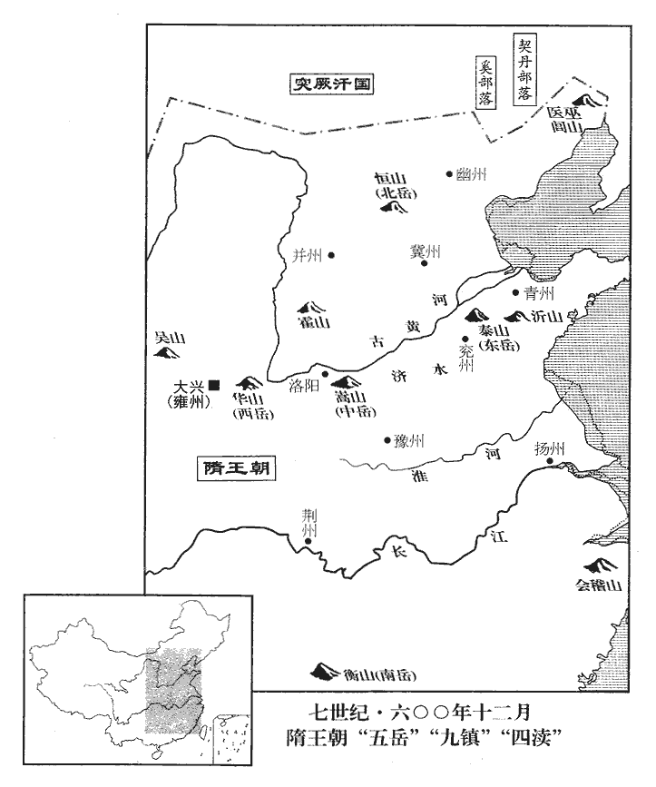

 隋紀三起上章涒灘（庚申），盡昭陽大淵獻（癸亥），凡四年。

# 高祖文皇帝中

## 開皇二十年（庚申、六零零）

1春，二月，熙州‹安徽省潜山县›人李英林反。隋志：同安郡，梁置豫州，後改晉州，後齊改江州，陳復曰晉州，開皇初曰熙州，因晉熙郡名州也。三月，辛卯‹二›，以揚州‹总部设扬州江苏省扬州市›總管司馬河內‹怀州·河南省沁阳市›張衡為行軍總管，隋制，總管府置長史、司馬。河內郡置懷州。帥步騎五萬討平之。帥，讀曰率。騎，奇寄翻。

〖译文〗 [1]春季，二月，熙州人李英林率众造反。三月，辛卯（初二），隋文帝任命扬州总管司马河内人张衡为行军总管，统帅步兵、骑兵共计五万人讨伐李英林，予以平定。

2賀若弼復坐事下獄，若，人者翻。復，扶又翻。下，遐嫁翻。上‹杨坚，本年六十岁›數之曰：數，所具翻。又，所主翻。「公有三太猛：嫉妬心太猛，自是、非人心太猛，無上心太猛。」既而釋之。他日，上謂侍臣曰：「弼將伐陳，謂高熲曰：『陳叔寶可平也。不作高鳥盡、良弓藏邪？』熲，居永翻；下同。范蠡告大夫種嘗有是言。邪，音耶；下同。熲云：『必不然。』及平陳，遽索內史，又索僕射。索，山客翻。射，寅謝翻。我語熲曰：語，牛倨翻；下同。『功臣正宜授勳官，隋置上柱國至帥都督凡十一等，為勳官。不可預朝政。』朝，直遙翻。，弼後語熲：『皇太子‹杨勇›於己，出口入耳，無所不盡。公終久何必不得弼力，何脈脈邪！』脈脈，有言不得吐之意。意圖廣陵‹扬州·江苏省扬州市›，又圖荊州‹湖北省江陵县›，皆作亂之地，意終不改也。」

〖译文〗 [2]贺若弼又获罪而被捕入狱。隋文帝列举他的罪状说：“你有三个太过份：嫉妒心太过份；自以为是、贬抑别人太过份；目无尊上太过份。”但不久文帝就释放了他。一天，文帝对侍臣说：“贺若弼在即将讨伐陈国的时候，对高说：‘陈叔宝一定要被平灭了，皇帝不就会做飞鸟灭绝、良弓收藏起来的事吗？’高说：‘绝不会这样的。’在平定陈国之后，贺若弼就急忙索要内史令，又索要仆射等官职。我对高说：‘功臣是应当授以勋官的，但是不能干预朝政。’贺若弼后来对高说：‘皇太子和我之间，无论什么机密，都无所不言，言无不尽。您为什么不来依靠我的势力，何必不吐实呢？’贺若弼早就想谋取广陵，还想谋取荆州，这两地都是适于作乱的地方。这个意图他一直没有改变。”

3夏，四月，壬戌‹四›，突厥‹瀚海沙漠群›達頭可汗犯塞，厥，九勿翻。可，從刊入聲。汗，音寒。詔命晉王廣、楊素出靈武道‹灵州·宁夏灵武市›，即靈州道。漢王諒、史萬歲出馬邑道‹朔州·山西省朔州市›即朔州道。以擊之。

〖译文〗 [3]夏季，四月，壬戌（初四），突厥达头可汗率军侵犯隋帝国的边境。隋文帝颁下诏书，命令晋王杨广、大将杨素率兵出灵武道，汉王杨谅、大将史万岁率兵出马邑道，阻击突厥军队的入侵。

長孫晟帥降人為秦州‹甘肃省天水市›行軍總管，天水郡置秦州。長，知兩翻。晟，承正翻。帥，讀曰率。降，戶江翻。受晉王節度。晟以突厥飲泉，易可行毒，易，以豉翻。因取諸藥毒水上流，突厥人畜飲之多死，於是大驚曰：「天雨惡水，雨，于具翻。其亡我乎！」因夜遁。晟追之，斬首千餘級。考異曰：煬帝紀曰：「出靈武，無虜而還。」突厥傳曰：「晉王出靈州，達頭遁逃而去。」晟傳曰：「達頭與王相抗。」蓋達頭聞王來而遁，晟將兵從別道與達頭相遇耳。

〖译文〗 长孙晟统帅着归降的军队，被任命为秦州行军总管，受晋王杨广节制。长孙晟认为突厥人饮用泉水，可以在水中投毒，于是就在泉水上游投毒。突厥人与牲畜饮水后很多被毒死，他们大惊失措地说：“天降恶水，天要亡我们了！”于是连夜逃走。长孙晟率军追杀，斩敌首级一千余。

史萬歲出塞，至大斤山‹内蒙古阴山山脉东段大青山›，與虜相遇。達頭遣使問：「隋將為誰？」候騎報：「史萬歲也。」突厥復問：「得非敦煌‹甘肃省敦煌市›戍卒乎？」史萬歲戍敦煌事，見一百七十五卷陳長城公至德元年。使，疏吏翻；下同。將，即亮翻。騎，奇寄翻。復，扶又翻；下同。敦，徒門翻。候騎曰：「是也。」達頭懼而引去。萬歲馳追百餘里，縱擊，大破之，斬數千級；逐北，入磧數百里，虜逺遁而還。磧，七迹翻；下同。還，從宣翻，又如字。考異曰：帝紀，十九年六月史萬歲破賊，據本傳在今年，紀誤也。按「破賊」當作「破達頭」。詔遣長孫晟復還大利城‹内蒙古和林格尔县›，安撫新附。

〖译文〗 史万岁率军出边塞，行至大斤山，与突厥军相遇。达头可汗派遣使者询问：“隋朝大将是哪位？”隋军候骑报道：“史万岁！”使者又问：“莫不是当年威震敦煌的那个配军？”候骑回答：“是的。”达头可汗惧怕史万岁的威名引军退去。史万岁率军纵马飞驰追杀了一百多里，大破突厥军，斩敌首级几千余，并追击败兵，进入沙漠几百里，直到突厥军逃远了才还师。文帝下诏书派遣长孙晟再返回大利城任职，安抚新归附的百姓。

達頭復遣其弟子俟利伐從磧東攻啟民，上又發兵助啟民守要路；俟利伐退走入磧。啟民上表陳謝曰：「大隋聖人可汗憐養百姓，如天無不覆，上，時掌翻。覆，敷又翻。地無不載。染干如枯木更葉，枯骨更肉，千世萬世，常為大隋典羊馬也。」為，于偽翻。帝又遣趙仲卿為啟民築金河‹内蒙古托克托县东›、定襄‹大利城，内蒙古和林格尔县›二城。隋志：榆林郡金河縣，隋初置榆關總管。定襄，即雲內縣之恆安鎮。

〖译文〗 不久，达头可汗又派他的侄子俟利伐从沙漠东面攻打启民可汗。隋文帝再次发兵协助启民可汗防守军事要道。俟利伐只得退入沙漠。启民可汗向隋文帝上表陈谢说：“大隋圣人可汗怜惜百姓，您的恩德犹如天无不覆、地无不载一样。染干得到您的恩惠，如枯树长出新叶，枯骨长出新肉一样，愿意千世万代崐，永远为大隋牧养牛马。”文帝又派遣赵仲卿为启民可汗修筑金河、定襄两座城池。

4秦孝王俊久疾未能起，遣使奉表陳謝。上謂其使者曰：「我戮力創茲大業，作訓垂範庶臣下守之；汝為吾子而欲敗之，使，疏吏翻。敗，補邁翻。不知何以責汝！」俊慙怖，怖，普布翻。疾遂篤，乃復拜俊上柱國。六月，丁丑‹二›，俊薨‹年三十岁›。帝五子，獨俊病死耳。上哭之，數聲而止；俊所為侈麗之物，悉命焚之。王府僚佐請立碑，隋親王置師、友、文學、長史、司馬、諮議參軍、掾、屬、主簿、錄事、功曹、記室、戶•倉•兵等曹、騎兵•城局等參軍、東•西閤祭酒、參軍事、法•田•水•鎧•士等曹行參軍、行參軍、長兼行參軍、典籤等。釋名：碑者，葬時所設，臣子追述君父之功以書其上。初學記：碑，悲也；所以悲往事也。，上曰：「欲求名，一卷史書足矣，何用碑為！若子孫不能保家，徒與人作鎮石耳。」鎮，之人翻，壓也。俊子浩，崔妃所生也；庶子曰湛。群臣希旨，奏：「漢之栗姬子榮、郭后子彊皆隨母廢，栗姬子榮事見十六卷漢景帝六年、七年。郭后子彊事見四十三卷漢光武建武十七年、十九年。斯二事者，二帝之失也，何以為法乎！今秦王二子，母皆有罪，不合承嗣。」上從之，以秦國官為喪主。

〖译文〗 [4]秦孝王杨俊久病而不能起，他派遣使者向隋文帝上表陈谢。文帝对他派来的使者说：“我竭尽全力创下此大业，制定了典章制度颁布下来作为人们遵守的准则，期望臣下都要遵守。你作为我的儿子反而要败坏它，我不知如何责罚你！”杨俊既羞愧又恐惧，病势愈加沉重。于是文帝再次授杨俊为上柱国。六月，丁丑（二十日），秦孝王杨俊去世。文帝得讯哭了几声也就罢了。杨俊生前所制做的奢侈华丽的物品，文帝命令全部烧毁。王府内的官吏们请求为杨俊立碑，文帝说：“要是追求名节，一卷史书就足够了，何必用碑呢？若子孙们不能保持家业，碑岂不白白地给人家作镇石了吗！”杨俊的儿子杨浩是崔王妃所生，另一个儿子杨湛是妾所生。群臣为了迎合文帝的旨意，便奏请说：“汉代栗姬的儿子刘荣，郭皇后的儿子刘疆都因其母获罪而被废黜。如今杨俊两个儿子的母亲也都犯了罪，所以他们也不应该作为继承人。”文帝听从了他们的意见，以秦孝王封国内的官员为丧主主持祭祀。

5初，上使太子勇參決軍國政事，時有損益；上皆納之，勇性寬厚，率意任情，無矯飾之行。行，下孟翻。上性節儉，勇嘗文飾蜀鎧，蜀鎧，蜀人所作也。蜀人工巧，所作鎧甲已精麗，而勇又文飾之。上見而不悅，戒之曰：「自古帝王未有好奢侈而能久長者。汝為儲后，后，君也；儲后猶言儲君也。好，呼到翻。當以儉約為先，乃能奉承宗廟。吾昔日衣服，各留一物，時復觀之以自警戒。恐汝以今日皇太子之心忘昔時之事，故賜汝以我舊所帶刀一枚，并葅醬一合，淹菜為葅zū。醬，醢hǎi也。肉醬、豉醬皆謂之醢，又菜葅謂之醬。內則：芥醬。汝昔作上士時常所食也。謂勇仕周時。若存記前事，應知我心。」

〖译文〗 [5]当初，隋文帝让太子杨勇参与决策军国政事，他经常提出批评建议，文帝都采纳了。杨勇性情宽厚，直率热情，平易近人，无弄虚作假的品行。文帝本性崇尚节俭，杨勇曾经在已经很精美华丽的蜀地出的铠甲上再加装饰，文帝看到后很不高兴，他告诫杨勇说：“自古以来帝王无一喜好奢侈而能长久的，你作为皇位继承人，应当以节俭为先，这样才能承继宗庙。我过去的衣服，都各留一件，时常取出它们观看以告诫自己。恐怕你已经以当今皇太子自居而忘却了过去的事情，因此我赐给你一把我旧时所佩带的刀，一盒你旧日为上士时常常吃的腌菜。要是你还能记得以前的事，你就应该懂得我的良苦用心。”

後遇冬至，百官皆詣勇，勇張樂受賀。上知之，問朝臣曰：「近聞至日內外百官相帥朝東宮，此何禮也？」太常少卿辛亶對曰：「於東宮，乃賀也，不得言朝。」朝，直遙翻。帥，讀曰率。少，始照翻。上曰：「賀者正可三數十人，隨情各去，何乃有司徵召，一時普集！太子法服設樂以待之，可乎？」隋制：太子袞冕，垂白珠九旒liú；青纊充耳；犀笄；玄衣、纁裳。衣，山、龍、華蟲、火、宗彝五章；裳，藻、粉、米、黼、黻四章；織成為之。白紗內單。黼領青褾、襈裾。革帶，金鉤鐷；大帶、素帶，不朱裏，亦紕以朱綠。𩊊隨裳色，火、山二章。玉具劍、火珠鏢首，瑜玉雙佩，朱組。雙大綬，四采赤、白、縹、紺，純朱質，長一丈八尺，三百二十首，廣九寸；小雙綬長二尺六寸，色同大綬而首半之，間施二玉環。朱韈、赤舄，以金飾。褾，彼小翻。襈，雛免翻。鍱，丑例翻，又彼列翻。紕，頻彌翻。鏢，紕招翻。綬，音受。縹，匹沼翻。純，之尹翻。長，直亮翻。廣，苦曠翻。因下詔曰：「禮有等差，君臣不雜。皇太子雖居上嗣，義兼臣子，而諸方岳牧正冬朝賀，任土作貢，別上東宮；別上，時掌翻。事非典則，宜悉停斷。」斷，丁管翻。自是恩寵始衰，漸生猜阻。

〖译文〗 后来到了冬至，百官都去见杨勇，杨勇排列乐队接受百官的祝贺。文帝知道了这件事，就问朝臣：“最近听说冬至那天朝廷内外百官都去朝见太子，这是什么礼法？”太常少卿辛回答：“百官到东宫，是祝贺，不能说是朝见。”文帝说：“祝贺的人应该三五十人，随意各自去，为什么由有关部门召集，一时间百官都集中起来同去？太子身穿礼服奏乐来接待百官，能这样吗？”于是文帝下诏说：“礼法有等级差别，君臣之间不能混杂。皇太子虽然是皇帝的继承人，但从礼义上讲也是臣子，各地方长官在冬至节来朝贺，进献自己辖地的特产，但另外给皇太子上贡，这就不符合典章制度了，应该全部停止。”从此，文帝对杨勇的恩宠开始衰落，渐渐有了猜疑和戒心。

勇多內寵，昭訓雲氏尤幸。姓苑：雲姓，縉雲氏之後。又魏書官氏志：達宥氏，後改雲氏；此其後也。其妃元氏無寵，遇心疾，二日而薨，元妃薨見一百七十七卷十一年。獨孤后意有他故，甚責望勇。自是雲昭訓專內政，生長寧王儼，平原王裕，安成王筠；高良娣生安平王嶷，襄城王恪；王良媛生高陽王該，建安王韶；成姬生潁川王煚；娣，音弟。嶷，魚力翻。媛，于眷翻。煚；居永翻。後宮生孝實，孝範。后彌不平，頗遣人伺察，求勇過惡。

〖译文〗 杨勇有很多姬妾，他对昭训云氏尤其宠爱。杨勇的妃子元氏不得宠，突然崐得了心疾，两天就死了。独孤皇后认为这里还有别的缘故，对杨勇很是责备。此后，云昭训总揽东宫内的事务，她生了长宁王杨俨、平原王杨裕、安成王杨筠；高良娣生了安平王杨嶷、襄城王杨恪；王良媛生了高阳王杨该、建安王杨韶；成姬生了颍川王杨；其他的宫人生了杨孝实、杨孝范。独孤皇后更加不高兴，经常派人来窥伺探查，找杨勇的过失和罪过。

晉王廣彌【章：甲十一行本「彌」上有「知之」二字；乙十一行本同；孔本同；張校同；退齋校同。】自矯飾，唯與蕭妃居處，伺，相吏翻。處，昌呂翻。後庭有子皆不育，后由是數稱廣賢。數，所角翻。大臣用事者，廣皆傾心與交。謂楊素等。上及后每遣左右至廣所，無貴賤，廣必與蕭妃迎門接引，為設美饌，為，于偽翻。饌，士戀翻；說文，具食也。申以厚禮；申，重也。婢僕往來者，無不稱其仁孝。上與后嘗幸其第，廣悉屏匿美姬於別室，屏，必郢翻。唯留老醜者，衣以縵綵，衣，於既翻。縵，莫半翻。繒無文者也。給事左右；屏帳改用縑素；故絕樂器之絃，不令拂去塵埃。去，羌呂翻。上見之，以為不好聲色，還宮，以語侍臣，好，呼到翻。語，牛倨翻。意甚喜，侍臣皆稱慶，由是愛之特異諸子。

〖译文〗 晋王杨广了解这件事后就更加伪装自己，他只和萧妃住在一起，对后宫所生子女都不去抚育，独孤皇后因此多次称赞杨广有德行。朝廷中执掌朝政的重臣，杨广都尽心竭力地与他们结交。文帝和独孤皇后每次派身边的人到杨广的住处，无论来人的地位高低，杨广必定和萧妃一起在门口迎接，为来人摆设盛宴，并厚赠礼品。于是来往的奴婢仆人没有不称颂杨广为人仁爱贤孝的。文帝与独孤皇后曾经驾临杨广的府第，杨广将他的美姬都藏到别的房间里，只留下年老貌丑之人身着没有文饰的衣服来服侍伺侯。房间里的屏帐都改用朴素的幔帐，断绝琴瑟丝弦，不让拂去上面的灰尘。文帝看到这种情况，以为杨广不爱好声色，返回皇宫后，告诉侍臣这一情况。他感到非常高兴，侍臣们也都向文帝祝贺。从此，文帝喜爱杨广超出别的儿子。

上密令善相者來和相，息亮翻。徧視諸子，對曰：「晉王眉上雙骨隆起，貴不可言。」上又問上儀同三司韋鼎：「我諸兒誰得嗣位？」對曰：「至尊、皇后所最愛者當與之，非臣敢預知也。」來和、韋鼎皆識帝於潛躍，故尤信之。上笑曰：「卿不肯顯言邪！」邪，音耶。

〖译文〗 文帝命令善于看相的来和暗中把他的儿子们都看了一遍，来和回答：“晋王杨广眉上有双骨隆起，贵不可言。”文帝又问上仪同三司韦鼎：“我这些儿子，哪个可以继承皇位？”韦鼎回答：“陛下和皇后最喜爱的儿子应当继承皇位，这不是我敢预知的。”文帝笑道：“你不肯明说呀！”

晉王廣美姿儀，性敏慧，沈深嚴重；沈，持林翻。好學，善屬文；好，呼到翻。屬，之欲翻。敬接朝士，禮極卑屈；由是聲名籍甚，言聲名狼籍甚盛。朝，直遙翻；下同。冠於諸王。冠，古玩翻。

〖译文〗 晋王杨广容貌俊美，举止优雅，性情聪颖机敏，性格深沉持重，喜好学习，擅长作文章，对朝中之士恭敬结交，待人非常礼貌谦卑，因此他的声誉很盛，高于文帝其他的儿子。

廣為揚州總管，入朝，將還鎮，入宮辭后，伏地流涕，后亦泫然泣下。泫，戶畎quǎn翻。廣曰：「臣性識愚下，常守平生昆弟之意，不知何罪失愛東宮，恆蓄盛怒，欲加屠陷。恆，戶登翻。每恐讒譖生於投杼，用曾參母子事。鴆毒遇於杯勺，杯、勺，皆飲器。周禮梓人為飲器，勺一升。勺，市若翻。是以勤憂積念，懼履危亡。」后忿然曰：「睍xiàn地伐漸不可耐，勇小字睍地伐。我為之娶元氏女，為，于偽翻。竟不以夫婦禮待之，專寵阿雲阿，烏葛翻。使有如許豚犬。曹操曰：「如袁本初、劉景升兒，豚犬耳。」後遂以詆其子。前新婦遇毒而夭，夭，於紹翻我亦不能窮治，治，直之翻。何故復於汝發如此意！復，扶又翻。我在尚爾，我死後，當魚肉汝乎！每思東宮竟無正嫡，至尊千秋萬歲之後，遣汝等兄弟向阿雲兒前再拜問訊，此是幾許苦痛邪！」幾，居豈翻。邪，音耶。廣又拜，嗚咽不能止，后亦悲不自勝。勝，音升。自是后决意欲廢勇立廣矣。

〖译文〗 杨广被任命为扬州总管，去朝见文帝，将要返回扬州，他进皇宫向独孤皇后辞行，跪在地上流泪，独孤皇后也潸然泪下。杨广说：“我性情见识愚笨低下，常常顾念平时兄弟之间的感情，不知什么地方得罪了皇太子，他常常满怀怒气，想对我诬陷杀害。我常常恐惧谗言出于亲人之口、酒具食器中被投入毒药的事情发生，因此我非常忧虑，念念在心，忧惧遭到危亡的命运。”独孤皇后气忿地说：“地伐越发让人无法忍受了。我给他娶了元氏的女儿，他竟然不以夫妇之礼对待元氏，却特别宠爱阿云，使元氏生下了这么多猪狗一般的儿子。先前，儿媳妇元氏被毒害而死，我也不能特别地追究此事。为什么他对你又生出如此念头！我还活着，他就如此！我死后，他就该残害你们了！我每每想到东宫皇太子竟然没有正室，在你们皇父百年之后，让你们兄弟几个跪拜问候阿云儿，这是多么痛苦的事啊！”杨广又跪在地上，呜咽不止，独孤皇后也悲伤得不能自抑。从此独孤皇后下决心要废掉杨勇而立杨广为太子。

廣與安州‹总部设安州湖北省安陆市›總管宇文述素善，安陸郡置安州。欲述近己，奏為壽州‹安徽省寿县›刺史。淮南郡舊屬南則為豫州，屬北則為揚州，開皇九年改曰壽州。近。其靳翻。廣尤親任總管司馬張衡，衡為廣畫奪宗之策。廣問計於述，述曰：「皇太子失愛已久，令德不聞於天下。大王仁孝著稱，才能蓋世，數經將領，頻有大功；謂南平陳、北伐突厥也。數，所角翻。將，即亮翻。主上之與內宮，咸所鍾愛，內宮，即中宮，避國諱，故云然。四海之望，實歸大王。然廢立者國家大事，處人父子骨肉之間，誠未易謀也。處，昌呂翻。易，以豉翻。然能移主上意者，唯楊素耳，素所與謀者唯其弟約。述雅知約，請朝京師，與約相見，共圖之。」朝，直遙翻。廣大悅，多齎金寶，資述入關。

〖译文〗 杨广与安州总管宇文述素来要好，他想拉拢宇文述，于是奏请任命宇文述为寿州刺史。杨广尤其亲近信任总管司马张衡，张衡为杨广筹划谋取皇太子地位。杨广向宇文述请教计策，宇文述说：“皇太子失去皇帝的喜爱已经很久了，杨勇的德行不为天下人所了解。大王以仁孝著称，才能盖世，您几次被任命为统帅军队的将领，屡建大功；皇帝与皇后都对您非常钟爱，四海之内的声望，实际上已为大王所有。但是太子的废立是国家大事，而我处在你们父子骨肉之间，实在不好谋划。然而能使皇帝改变主意的人只有杨素，能与杨素商量筹划的人只有他弟弟杨约。我很了解杨约，请您派我去京师，与杨约相见，一起筹划这件事。”杨广非常高兴，送给宇文述许多金宝，资助他入关进京。

約時為大理少卿，少，始照翻。素凡有所為，皆先籌於約而後行之。述請約，盛陳器玩，與之酣暢，因而共博，每陽不勝，所齎金寶盡輸之約。約所得既多，稍以謝述，述因曰：「此晉王之賜，令述與公為歡樂耳。」此呂不韋之故智耳。約大驚曰：「何為爾？」述因通廣意，說之曰：說，輸芮翻。「夫守正履道，固人臣之常致：反經合義亦達者之令圖。夫，音扶。令，力正翻。自古賢人君子，莫不與時消息以避禍患。公之兄弟，功名蓋世，當塗用事有年矣，朝臣為足下家所屈辱者，可勝數哉！朝，直遙翻。勝，音升。數，所具翻。又，儲后以所欲不行，每切齒於執政；公雖自結於人主，而欲危公者固亦多矣！主上一旦棄群臣，公亦何以取庇！今皇太子失愛於皇后，主上素有廢黜之心，此公所知也。今若請立晉王，在賢兄之口耳。誠能因此時建大功，王必永銘骨髓，斯則去累卵之危，成太山之安也。」約然之，因以白素。素聞之，大喜，撫掌曰：「吾之智思思，相吏翻。殊不及此，賴汝啟予。」約知其計行，復謂素曰：復，扶又翻。「今皇后之言，上無不用，宜因機會早自結託，則長保榮祿，傳祚子孫。兄若遲疑，一旦有變，令太子用事，恐禍至無日矣！」令，力丁翻。素從之。

〖译文〗 杨约当时是大理少卿，杨素凡是要做什么事，都先和杨约商量后再做。宇文述邀请杨约，陈设了许多玩物器皿，和他一起畅饮，一起赌博。每次宇文述都装作下输了，把杨广所送的金宝都输给了杨约。杨约得到很多金宝，就向宇文述略表谢意。宇文述就说：“这些金宝是晋王杨广的赏赐，让我与你一起玩乐的。”杨约大吃一惊，说：“为什么？”宇文述就转达了杨广的意思，劝说杨约：“恪守常规固然是人臣的本份，但是违反常规以符合道义，也是明智之人的期望。自古的贤人君子，没有不关注世情以避免祸患的。你们兄弟功名盖世，执掌大权有多年了，朝臣中被您家侮辱的人数得清吗？还有，皇太子往往想做的事而不能做到，常常切齿痛恨当政的大臣；您虽然主动地结好于皇上，但是要危害您的人本来就很多啊！皇上一旦弃群臣而去，您又靠谁来庇护呢？现在皇太子不为皇后所喜爱，皇上平素就有废黜皇太子的意思，这您是知道的。现在要是请皇上立晋王杨广为太子，那就全凭您哥哥的嘴了。要是真能在这时建立大功，晋王必定永远将这事铭记心中，这样您就可以去掉累卵之危，而地位象泰山一样的安全稳固了。”杨约深以为然，就将此话告诉了杨素。杨素听了，非常高兴，拍着手说：“我的智慧思虑远远达不到这儿，全仗你启发了我。”杨约知道他的计策成功了，又对杨素说：“现在皇后的建议，皇帝无不采纳。应当趁机会早早自动结交依靠皇后，就会长久地保住荣华富贵，并传给子孙后代。兄长若是迟疑，一旦情况发生变化，太子执掌朝政，恐怕灾祸很快就要临头了！”杨素听从了杨约的话。

後數日，素入侍宴，微稱「晉王孝悌恭儉，有類至尊。」用此揣后意。揣，初委翻。后泣曰：「公言是也！吾兒大孝愛，每聞至尊及我遣內使到，內使猶言中使。使，疏吏翻。必迎於境首；言及違離，未嘗不泣。又其新婦亦大可憐，我使婢去，常與之同寢共食。豈若睍地伐與阿雲對坐，終日酣宴，昵近小人，昵，尼質翻。疑阻骨肉！我所以益憐阿𡡉mó者，廣小字阿𡡉，𡡉，眉波翻。常恐其潛殺之。」素既知后意，因盛言太子不才。后遂遺素金，遺，于季翻。使贊上廢立。

〖译文〗 过了几天，杨素进入皇宫侍奉宴会，他婉转地说：“晋王杨广孝悌恭俭，象他父亲一样。”用此话来揣摩独孤皇后的意思。独孤皇后流着泪说：“您的话说得对！我儿子阿非常孝敬友爱，每次听到皇上和我派宫内的使者去，必定亲自远迎；说到远离双亲，没有一次不落泪的。还有他的妻子也很令人怜爱，我派婢女去她那里，她常与婢女同寝共食，哪象地伐和阿云面对面地对坐崐，整天沉溺于酒宴，亲近小人，猜疑防备骨肉至亲！所以我愈加爱怜阿，常常怕地伐将他暗害。”杨素已经了解了皇后的意思，因此就竭力地说太子杨勇不成器，于是皇后就给杨素财物，让他辅佐文帝进行废立太子之事。

勇頗知其謀，憂懼，計無所出，使新豐‹陕西省临潼县›人王輔賢造諸厭勝；新豐縣屬京兆。厭，於協翻。又於後園作庶人村，室屋卑陋，勇時於中寢息，布衣草褥，冀以當之。上知勇不自安，在仁壽宮，使楊素觀勇所為。素至東宮，偃息未入，勇束帶待之，素故久不進以激怒勇；勇銜之，形於言色。素還言：「勇怨望，恐有他變，願深防察！」上聞素譖毀，甚疑之。后又遣人伺覘東宮，伺，相吏翻；下同。覘，丑廉翻，又丑豔翻。纖介事皆聞奏，因加誣飾以成其罪。

〖译文〗 杨勇非常清楚这个阴谋，感到忧虑恐惧，但是想不出办法来。他让新丰人王辅贤制做了巫术诅咒之物，又在其府邸后园建造了一个平民村，村里的房屋低矮简陋，杨勇时常在其中睡觉休息，他身穿布衣，铺着草褥子，希望以此来避灾。文帝知道杨勇为此不安，在仁寿宫派杨素去观察杨勇的行为。杨素到了东宫，停住不进，杨勇换好衣服等待杨素进来，杨素故意很久不进门，以此激怒杨勇；杨勇怀恨杨素，并在言行上表现出来。杨素回去报告：“杨勇怨恨，恐怕会发生变故。希望陛下多多防备观察。”文帝听了杨素的谗言和诋毁之词，对杨勇更加猜疑了。独孤皇后又派人暗中探察东宫，细碎琐事都上报给文帝，依据诬陷之词而构成杨勇的罪状。

上遂疏忌勇，迺於玄武門達至德門玄武門，隋大興宮城正北門。至德門，在宮城東北隅。量置候人，以伺動靜，皆隨事奏聞。量，音良。又，東宮宿衛之人，侍官以上，侍官，謂直閤、直寢、直齋、直後、備身、直長等，蓋東宮率府所統，略同十二衛府。名籍悉令屬諸衛府，有勇健者咸屏去之。屏，必郢翻。去，羌呂翻。出左衛率蘇孝慈為淅州‹河南省淅川县南›刺史，蘇孝慈有器幹，故出之。隋志：淅陽郡，西魏置淅州。勇愈不悅。太史令袁充言於上曰：「臣觀天文，皇太子當廢。」上曰：「玄象久見，見，賢遍翻。群臣不敢言耳。」充，君正之子也。袁君正見一百六十二卷梁武帝太清三年。

〖译文〗 于是文帝就对杨勇疏远、猜忌，竟然在玄武门到至德门之间的路上，派人观察杨勇的动静，事无巨细都要随时上报。另外，东宫值宿警卫侍官以上的，名册都令归属各个卫府管辖，勇猛矫健的人都要调走。左卫率苏孝慈被调出任命为淅州刺史，杨勇愈加不高兴。太史令袁充对文帝说：“我观察天象，皇太子应当废黜。”文帝说：“玄象出现很久了，群臣不敢说啊。”袁充是袁君正的儿子。

晉王廣又令督王府軍事姑臧‹甘肃省武威市›段達姑臧縣，涼州武威郡治所。私賂東宮幸臣姬威，令伺太子動靜，密告楊素；於是內外諠謗，過失日聞。段達因脅姬威曰：「東宮過失，主上皆知之矣。已奉密詔，定當廢立；君能告之，則大富貴！」威許諾，即上書告之。上，時掌翻。

〖译文〗 晋王杨广又命令姑臧人督王府军事段达私下贿赂东宫受宠信的官吏姬威，让他暗中观察太子的动静，密报给杨素。于是朝廷内外到处是对杨勇的议论诽谤，天天可以听到杨勇的罪过。段达趁机威胁姬威说：“东宫的过失，皇上都知道了。我已得到密诏，一定要废黜太子。你要是能告发杨勇的过失，就会大富大贵！”姬威答应了，随即就上书告发杨勇。

秋，九月，壬子‹二十六›，上至自仁壽宮。考異曰：帝紀：丁未，至自仁壽宮。今從太子勇傳。翌日，御大興殿，開皇三年，上入新都，名其城曰大興城，正殿曰大興殿，宮曰大興宮，宮北苑曰大興苑。或曰：帝由大興郡襲封隨公以登大位，故以名新都宮殿城苑。謂侍臣曰：「我新還京師，應開懷歡樂；樂，音洛。不知何意翻邑然愁苦！」吏部尚書牛弘對曰：「臣等不稱職，故至尊憂勞。」稱，尺證翻。上既數聞譖毀，疑朝臣悉知之，數，所角翻。故於眾中發問，冀聞太子之過。弘對既失旨，上因作色，謂東宮官屬曰：「仁壽宮此去不遠，而令我每還京師，嚴備仗衛，如入敵國。我為下利，令，力丁翻。還，從宣翻，音旋，又如字。利，泄利也。為，于偽翻。不解衣臥。昨夜欲近廁，廁，圊qīng也。近，其靳翻。故在後房恐有警急，還移就前殿，豈非爾輩欲壞我家國邪！」壞，音怪。邪，音耶。於是執太子左庶子唐令則等數人，付所司訊鞠；命楊素陳東宮事狀以告近臣。

〖译文〗 秋季，九月，壬子（二十六日），文帝从仁寿宫归来，第二天到大兴殿，他对侍臣说：“我刚返回京师，应该是开怀畅饮寻求欢乐，不知为什么变得抑郁愁闷？”吏部尚书牛弘回答：“是臣等不称职，使陛下忧愁劳累。”文帝已经多次听到对杨勇的诬陷诋毁，怀疑朝臣们都知道了，因此向朝臣们发问，希望听到太子的过失。牛弘的回答不合文帝的意思，于是文帝脸色一变，对东宫的官吏僚属说：“仁寿宫离这里不远，但是我每次返回京师都得严格准备仪仗保卫，就象进入敌国一样。我因为拉肚子，不敢脱衣服睡觉，昨天夜里要上厕所，因为在后边的房间恐怕有紧急之事，就返回前殿居住。难道不是你们这些人要危害我的家国吗！”于是把太子左庶子唐令则等几个人抓起来交付有关部门进行审讯，命令杨素把东宫的情况告诉近臣。

素乃顯言之曰：「臣奉敕向京，令皇太子檢校劉居士餘黨。言自仁壽宮奉敕向長安。劉居士事見上卷十七年。太子奉詔，作色奮厲，骨肉飛騰，語臣云：語，牛倨翻。『居士黨盡伏法，遣我何處窮討！爾作右僕射，委寄不輕，射，音夜，寅謝翻。自檢校之，何關我事！』又云：『昔大事不遂，我先被誅，謂禪代時事。被，皮義翻。今作天子，竟乃令我不如諸弟，一事以上，不得自遂！』上，時掌翻。因長歎回視云：『我大覺身妨。』」去音。上曰：「此兒不堪承嗣久矣，皇后恆勸我廢之。恆，戶登翻；下同。我以布衣時所生，地復居長，復，扶又翻。長，知兩翻。望其漸改，隱忍至今。勇嘗指皇后侍兒謂人曰：『是皆我物。』此言幾許異事！幾，居豈翻。其婦初亡，謂元妃薨時也。我深疑其遇毒，嘗責之，勇即懟曰：『會殺元孝矩。』孝矩，元妃之父。懟，直類翻。此欲害我而遷怒耳。長寧初生，勇長子儼，封長寧王。朕與皇后共抱養之，自懷彼此，連遣來索。索，山客翻。且雲定興女，在外私合而生，想此由來，何必是其體胤！昔晉太子‹司马遹›取屠家女，其兒即好屠割。事見八十三卷晉惠帝元康九年。好，呼到翻。今儻非類，便亂宗祏。祏shí，音石。我雖德慙堯、舜，終不以萬姓付不肖子！言堯、舜知朱、均不肖，不付以天下。我恆畏其加害，如防大敵；今欲廢之以安天下！」恆，戶登翻。

〖译文〗 于是杨素就公开地说：“我奉旨到京师，命令皇太子查核刘居士的余党。太子接到诏书，脸色大变，表情非常愤怒，他对我说：‘刘居士的余党都已伏法，让我到哪里去追究呢？你作为右仆射，责任不轻，你自己去查核此事吧，关我什么事！’又说：‘过去的禅让大事要是不顺利，我先得被杀，如今父亲作了天子，居然让我还不如几个弟弟，凡事都不能自作主张！’他就长叹说：｀我觉得太不自由了。’”文帝说：“这个儿子我很早就觉得不能够继承皇位了，皇后老劝我废黜他，我认为他是我作平民时生的，又是长子，希望他能够逐渐改正错误，我已克制忍耐到现在了。杨勇曾经指着皇后的侍女对人说：‘都是我的’。这话说的是多么地奇怪。他的妻子元妃刚死时，我很怀疑她是被毒死的，曾经责问过杨勇，他就怨恨地说：‘应当杀掉元孝矩。’这是想要害我而迁怒他人。长宁王刚出生时，我和皇后一起抱来抚养他，杨勇却心中另有想法，连连派人索要。况且云定兴的女儿，是云定兴在外面私合而生，想到她的出身来历，由何能说必定是他的子女呢？以前晋太子娶了屠户的女儿，他的儿子就喜欢屠宰之事。如今他们不是咱们这一类人，会乱了宗祠。我虽然德行不及尧舜，但终归不能把天下百姓交付给品行不端的儿子！我总担忧他会谋害我，对他就象防备大敌一样，现在我打算废掉他以安定天下。”

左衛大將軍五原公元旻諫曰：元旻封五原郡公。五原郡，豐州。「廢立大事，詔旨若行，後悔無及。讒言罔極，惟陛下察之。」

〖译文〗 左卫大将军五原公元劝说文帝：“废立太子是大事，诏书若颁布实行了，后悔就来不及了。谗言说起来是无定准的，希望陛下再仔细调查这些事。”

上不應，命姬威悉陳太子‹杨勇›罪惡。威對曰：「太子由來與臣語，唯意在驕奢，且云：『若有諫者，正當斬之，不殺百許人，自然永息。』以文理觀之，「不」字必誤。營起臺殿，四時不輟。前蘇孝慈解左衛率，率，如字。太子奮髯揚肘曰：『大丈夫會當有一日，終不忘之，決當快意。』又宮內所須，須，求也，索也。尚書多執法不與，輒怒曰：『僕射以下，吾會戮一二人，使知慢我之禍。』每云：『至尊惡我多側庶，惡，烏路翻。高緯、陳叔寶豈孽子乎！』言二君皆嫡出而亡國。孽，魚列翻。說文：庶子曰孽。嘗令師姥卜吉凶，師姥，巫媼也。姥，女老稱。姥mǔ，莫補翻。語臣云：語，牛倨翻。『至尊忌在十八年，此期促矣。』」上泫然曰：「誰非父母生，乃至於此！朕近覽齊書，是時李百藥所撰齊書未出，帝所覽者，蓋崔子發齊紀也。泫，戶畎翻。見高歡縱其兒子，不勝忿憤，安可效尤邪！」於是禁勇及諸子，部分收其黨與。勝，音升。邪，音耶。分，扶問翻。楊素舞文巧詆，鍛鍊以成其獄。

〖译文〗 文帝不听元的话，他命令姬威把太子的罪恶都讲出来。姬威回答：“太子向来对我讲话，意气极为骄横，还说：‘要是有劝我的人，就该杀掉他。杀百把人，自然就永远清静了。’太子又营建楼台宫殿，一年四季都不停止。先前苏孝慈被解除左卫率官职的时候，太子愤怒得胡子都翘起来了，他挥着胳膊说：‘大丈夫终会有一天，不会忘记此事，一定要杀伐决断以求痛快！’另外，东宫内所索取的东西，尚书经常恪守制度不给，太子往往立即发怒，说：‘仆射以下的人，我可以杀一、两个，让你们知道怠慢我的灾祸。’太子常说：‘皇父厌恶我有许多姬妾，北齐后主高纬、陈后主陈叔宝是庶子吗？’太子曾令女巫占卜吉凶，他对我说：‘皇帝的忌期在开皇十八年，这个期限快到了。’”文帝流着泪说：“谁不是父母所生，他竟然这样！我近来翻阅《齐书》，看到高欢纵容他的儿子，就非常气忿。怎么能仿效这种人呢？”于是把杨勇和他的几个儿子都拘禁起来，并逮捕了他的部分党羽。杨素舞文弄墨，巧言诋毁，罗织罪名以构成下狱之罪。

居數日，有司承素意，奏元旻常曲事於勇，情存附託，在仁壽宮，勇使所親裴弘以書與旻，題云「勿令人見」。上曰：「朕在仁壽宮，有纖介事，東宮必知，疾於驛馬，怪之甚久，豈非此徒邪！」遣武士執旻於仗。左衛仗也。右衛大將軍元胄時當下直，不去，因奏曰：「臣向不下直者，為防元旻耳。」為，于偽翻。上以旻及裴弘付獄。

〖译文〗 过了几天，有关部门的官员秉承杨素的意思，奏报文帝说元常常曲意迎逢杨勇，有阿谀结交之事。在仁寿宫，杨勇派他的亲信裴弘给元送信，信上写着“勿令人见”。文帝说：“朕在仁寿宫，无论什么细微之事东宫必定知道，比驿马传信还快，我对此事感到奇怪已经很久了，难道不是这恶徒的缘故吗！”于是派武士从左卫仗将元抓了起来。右卫大将军元胃当时不应该值班了，但他没有离开，对文帝说：“我先前不下班的原因是为了防备元。”文帝把元和裴弘都投入监狱。

先是，勇見老枯槐，問：「此堪何用？」或對曰：「古槐尤宜取火。」先，悉薦翻。時衛士皆佩火燧，燧，取火之木也。勇命工造數千枚，欲以分賜左右；至是，獲於庫。又藥藏局貯艾數斛，隋志：東宮門下坊，統司經、宮門、內直、典膳、藥藏，齋帥六局。藏，徂浪翻。貯，直呂翻。索得之，索，山客翻。大以為怪，以問姬威，威曰：「太子此意別有所在，至尊在仁壽宮，太子常飼馬千匹，飼，祥吏翻。云：『徑往守城門，自然餓死。』」素以威言詰勇，詰，去吉翻。勇不服，曰：「竊聞公家馬數萬匹，勇忝備太子，馬千匹，乃是反乎！」素又發東宮服玩，似加琱diāo飾者，悉陳之於庭，以示文武群臣，為太子之罪。上及皇后迭遣使責問勇，勇不服。使，疏吏翻；下見使同。

〖译文〗 当初，杨勇看见枯老的槐树，问道：“这树能做什么用？”有人回答：“古槐尤其适于作柴来取火。”当时杨勇的卫士都带着火燧，杨勇命令工匠制做了几千枚火燧，打算分赐给身边的人；现在，库中的火燧都被收缴。另外，药藏局贮存着好几斛的艾绒，杨素收缴上来，感到很奇怪，就问姬威，姬威说：“太子此意另有用处。皇帝在仁寿宫，太子经常饲养着一千匹马，说：‘要是直接守住城门，自然就会饿死。’”杨素以姬威的话来盘问杨勇，杨勇不服气，说：“我听说公家饲养的马有好几万匹，我作为太子，养一千匹马就是造反吗？”杨素又找出东宫的服饰玩器，凡是有雕刻缕画装饰的器物都陈列在宫庭里，展示给文武群臣，作为太子的罪证。文帝和独孤皇后屡次派人去责问杨勇，杨勇都不服气。

冬，十月，乙丑‹九›，上使人召勇，勇見使者驚曰：「得無殺我邪？」邪，音耶。上戎服陳兵，御武德殿，武德殿，在延恩殿西。集百官立於東面，諸親立於西面，諸親，謂屬籍宗親也。引勇及諸子列於殿庭，命內史侍郎薛道衡宣詔，廢勇及其男、女為王、公主者。【章：甲十一行本「者」下有「並為庶人」四字；乙十一行本同；孔本同；張校同；退齋校同。】勇再拜言曰：「臣當伏尸都市，為將來鑒戒；幸蒙哀憐，得全性命！」言畢，泣下流襟，既而舞蹈而去，左右莫不閔默。哀之而不敢言。長寧王儼上表乞宿衛，辭情哀切；上，時掌翻。上覽之閔然。楊素進曰：「伏望聖心同於螫手，蝮蛇螫手，壯士斷腕。楊素以讒慝滅人天性之親，以此為喻，亦太甚矣。螫，施隻翻。不宜復留意。」復，扶又翻。

〖译文〗 冬季，十月，乙丑（初九），文帝派人召来杨勇。杨勇见到使者，吃惊地说：“不是要杀我吧？”文帝身着戎装，陈列军队，来到武德殿。召集来的百官立在殿东面，皇室宗亲立在殿西面，引着杨勇和他的几个儿子排列在武德殿的庭院里，文帝命令内史侍郎薛道衡宣读诏书，将杨勇和他封王封公主的子女都废为庶人。杨勇再三跪伏在地，说：“我应该被斩首于闹市以为后人的借鉴，幸而得到陛下的哀怜，我才得以保全性命！”说完，眼泪流满了衣襟，随即跪拜行礼后离去。文帝身边的人没有不怜悯沉默的。长宁王杨俨给文帝上表乞求允许他担当文帝的宿卫。奏表中的文辞非常哀婉凄切，文帝看后感到很难过。杨素向文帝进言：“希望圣上对这件事应象蝮蛇螫手一样，不应再留此意。”

己巳‹十三›，詔：「元旻、唐令則及太子家令鄒文騰、隋志：太子家令，掌刑法、食膳、倉庫、什物、奴婢等事。左衛率司馬夏侯福、隋左、右衛率各置長史、司馬。夏，戶雅翻。典膳監元淹、隋志：典膳局，置監、丞各二人，屬門下坊。前吏部侍郎蕭子寶、前主璽下士何竦主璽下士，後周官也。璽，斯氏翻。並處斬，妻妾子孫皆沒官。處，昌呂翻。車騎將軍榆林閻毗、閻毗，榆林盛樂‹内蒙古托克托县›人，以車騎將軍宿衛東宮。閻，姓也。左傳，晉有閻嘉。騎，音奇寄翻。東郡公崔君綽、游騎尉沈福寶、開皇六年，置武騎、屯騎、驍騎、游騎、飛騎、旅騎、雲騎、羽騎八尉，其品則正六品以下，從九品以上。綽，昌約翻。瀛州‹河北省河间市›術士章仇太翼，瀛州，河間郡。是後煬帝謂太翼曰：「卿姓章仇，四岳之冑，與盧同源」。於是賜姓為盧氏。孫愐曰：漢有章弇yǎn，因避仇，加仇字為章仇氏。特免死，各杖一百，身及妻子、資財、田宅皆沒官。副將作大匠高龍叉、率更令晉文建、隋率更令，掌東宮伎樂、漏刻。更，工衡翻。通直散騎侍郎元衡隋制，東宮亦有通直散騎侍郎。散，悉亶翻。騎，音奇寄翻。皆處盡。」處其罪使自盡。處，昌呂翻。於是集群官于廣陽門外，宣詔戮之。乃移勇於內史省，給五品料食。賜楊素物三千段，元冑、楊約並千段，賞鞫jū勇之功也。

〖译文〗 己巳（十三日），文帝下诏书说：“元、唐令则和太子家令邹文腾、左卫率司马夏侯福、典膳监元淹、前吏部侍郎萧子宝、前主玺下士何竦一并斩首处死，他们的妻妾子孙都没入官府。车骑将军榆林人阎毗、东郡公崔君绰、游骑尉沈福宝、瀛州术士章仇太翼，特赦免死，各受杖刑一百，本人及其妻子儿女，家产田宅都没入官府。副将作大匠高龙叉、率更令晋文建、通直散骑侍郎元衡都被判罪令其自尽。”于是在广阳门外召集百官宣读诏书，将上述判死刑的人处死。把杨勇迁到内史省，给他五品官员的俸禄。赐给杨素财物三千段，赐给元胃、杨约财物共一千段，作为审讯杨勇的功劳的奖赏。

文林郎楊孝政上書諫曰：「皇太子為小人所誤，宜加訓誨，不宜廢黜。」上，時掌翻。上怒，撻其胸。

〖译文〗 文林郎杨孝政上书给文帝进谏：“皇太子是被小人教坏了，应该加强训诫教诲，不宜废黜。”文帝发怒，用鞭子抽打杨孝政的胸部。

初，雲昭訓父定興，出入東宮無節數，進奇服異器以求悅媚；數，所角翻。左庶子裴政屢諫，隋制，左庶子領門下坊。勇不聽。政謂定興曰：「公所為不合法度。又，元妃暴薨，道路籍籍此於太子，非令名也。公宜自引退，不然，將及禍。」定興以告勇，勇益疏政，由是出為襄州‹总部设襄州湖北省襄樊市›總管。襄陽郡置襄州。唐令則為勇所昵狎，昵，尼質翻。每令以絃歌教內人，右庶子劉行本責之隋制，右庶子領典書坊。曰：「庶子當輔太子以正道，何有取媚於房帷之間哉！」令則甚慙而不能改。時沛國劉臻、隋志無沛國，劉臻先世仕於江南，江南僑置中原郡縣，猶以沛國為貫。平原明克讓、克讓以平原為貫，猶劉臻也。魏郡陸爽，魏郡置相州‹河南省安阳市›。並以文學為勇所親；行本怒其不能調護，每謂三人曰：「卿等正解讀書耳！」言但能讀書而不能行其所學。解，戶買翻。夏侯福嘗於閤內與勇戲，福大笑，聲聞於外。聞，音問。夏，戶雅翻。行本聞之，待其出，數之曰：數，所具翻。「殿下寬容，賜汝顏色。汝何物小人，敢為褻慢！」因付執法者治之。治，直之翻；下同。數日，勇為福致請，乃釋之。為，于偽翻。勇嘗得良馬，欲令行本乘而觀之，行本正色曰：「至尊置臣於庶子，欲令輔導殿下，非為殿下作弄臣也。」勇慙而止。及勇敗，二人已卒，上歎曰：「向使裴政、劉行本在，勇不至此。」

〖译文〗 当初云昭训的父亲云定兴出入东宫没有节制，他多次给杨勇进献奇异的服饰器物以求得杨勇的高兴和青眯；左庶子裴政屡次劝说，杨勇不听。裴政对云定兴说：“您的行为不符合法度。还有，元妃突然暴死，外面议论纷纷，这对于太子，不是好名声。您最好自行引退，否则将会遭到灾祸。”云定兴将此话告诉了杨勇，杨勇越发疏远裴政，并因此把裴政调任为襄州总管。唐令则被杨勇所亲近，杨勇常常命令唐令则教东宫的宫人丝弦歌舞，右庶子刘行本责备唐令则说：“庶子应当辅佐太子走正路。为什么要用声色歌舞来取媚于太子呢？”唐令则感到很惭愧却改不了。当时沛国人刘臻、平原人明克让、魏郡人陆爽都因为辞章修养而被杨勇所亲近。刘行本对这三个人对太子不能加以调教保护非常愤怒，他常对这三人讲：“你们只会读书！”夏侯福曾在房间里与杨勇开玩笑，夏侯福哈哈大笑，声音传到门外。刘行本听见，等夏侯福出来，责备他说：“太子殿下性情宽容，给你面子。你是什么小人物，敢做这样轻慢之事！”于是把夏侯福交执法人员治罪。过了几天，杨勇替夏侯福讲情，才将他释放。杨勇曾得到良马，他想命令刘行本骑上马让他观看，刘行本正色道：“皇上任命我为右庶子，是要我辅佐教导殿下，而不是作殿下的戏弄之臣。”杨勇听后感到惭愧，才作罢。到杨勇被废黜时，裴政、刘行本二人均已去世。文帝叹息道：“要是裴政、刘行本二人还在，杨勇不至于到这个地步。”

勇嘗宴宮臣，唐令則自彈琵琶，歌娬媚娘。娬音武。洗馬李綱隋制：門下坊司經局置洗馬四人。洗，悉薦翻。起白勇曰：「令則身為宮卿，職當調護；左、右庶子謂之宮卿。漢高帝謂四皓曰：「煩公卒調護太子。」故言東宮官職當調護。乃於廣坐自比倡優，坐，徂臥翻。倡，音昌。進淫聲，穢視聽。事若上聞，令則罪在不測，豈不為殿下之累邪！累，力瑞翻。邪，音耶。臣請速治其罪！」勇曰：「我欲為樂耳，治，直之翻。樂，音洛。君勿多事。」綱遂趨出。及勇廢，上召東宮官屬切責之，皆惶懼無敢對者。綱獨曰：「廢立大事，今文武大臣皆知其不可而莫肯發言，臣何敢畏死，不一為陛下別白言之乎！為，于偽翻；下皆為、日為同。別，彼列翻。太子性本中人，可與為善，可與為惡。曏使陛下擇正人輔之，足以嗣守鴻基。今乃以唐令則為左庶子，鄒文騰為家令，二人唯知以絃歌鷹犬娛悅太子，安得不至於是邪！邪，音耶。此乃陛下之過，非太子之罪也。」因伏地流涕嗚咽。上慘然良久曰：「李綱責我，非為無理，然徒知其一，未知其二，我擇汝為宮臣，而勇不親任，雖更得正人，何益哉！」對曰：「臣所以不被親任者，良由姦人在側故也。被，皮義翻。陛下但斬令則、文騰，更選賢才以輔太子，安知臣之終見疏棄也。更，工行翻。自古【章：甲十一行本「古」下有「國家」二字；乙十一行本同；孔本同；張校同。】廢立冢嫡，鮮不傾危，鮮，息淺翻。願陛下深留聖思，無貽後悔。」上不悅，罷朝，朝，直遙翻；下同。左右皆為之股栗。為，于偽翻。會尚書右丞缺，有司請人，上指綱曰：「此佳右丞也！」即用之。

〖译文〗 杨勇曾宴请东宫的臣僚，唐令则亲自弹奏琵琶，唱《媚娘》。洗马李纲起身对杨勇说：“唐令则身为宫卿，职责应是调教保护太子，他却在大庭广众之下自比娼妓优伶，进献靡靡之音，污浊视听。这种事要是皇上知道了，唐令则的罪责就大了。这岂不是要连累殿下吗？我请您赶快将他治罪！”杨勇说：“我想要快乐快乐，你不要多管闲事。”于是李纲就赶快退出。等到杨勇被废黜，文帝召集东宫的臣僚严厉责备他们，大家都惶恐而无人敢于答话，只有李纲说：“太子的废立大事，如今文武大臣都知道这事不可更改了而不肯说话。我怎能因为怕死就不对陛下把对此事的不同看法讲清楚呢？太子的性格本来就是个常人的性格，可以使之变好，也可以使之变坏。从前要是陛下挑选正直的人辅佐太子，他足以继承皇统鸿业。如今却用唐令则为左庶子，邹文腾为家崐令，这两个人只知道用声色犬马娱悦太子，哪能不到这个地步啊！这是陛下的过失，并不是太子的罪过。”于是跪在地上呜咽流泪。文帝神色惨然，过了半天才说：“李纲责备我，不是没有道理。但是你只知其一，不知其二。我挑选你为东宫臣僚，但杨勇不亲近信任你，就是换上正直的人又有什么用处呢？”李纲回答：“我所以不为杨勇亲近信任，确实是有佞人在太子身边的缘故，陛下只要将唐令则、邹文腾斩首，更换贤能才学之士辅佐太子，怎么会知道我最后会被疏远抛弃呢？自古废立嫡长子，国家很少有不发生倾覆危险的。希望陛下好好考虑，不要后悔啊。”文帝不高兴。退朝后，文帝身边的人都替李纲心惊胆战。正好尚书右丞空缺，有关部门请求派人，文帝指着李纲说：“此人是很好的尚书右丞。”李纲马上就被任命。

太平公史萬歲還自大斤山，楊素害其功，言於上曰：「突厥本降，厥，九勿翻。降，戶江翻。初不為寇，來塞上畜牧耳。」遂寢之。萬歲數抗表陳狀，陳其功狀也。數，所角翻。上未之悟。上廢太子，方窮東宮黨與。上問萬歲所在。萬歲實在朝堂，朝，直遙翻。楊素曰：「萬歲謁東宫矣！」以激怒上。上謂為信然，令召萬歲。時所將將士在朝堂稱冤者數百人，令，力丁翻。將，即亮翻；下同。萬歲謂之曰：「吾今日為汝極言於上，事當決矣。」為，于偽翻。既見上，言「將士有功，為朝廷所抑！」詞氣憤厲。上大怒，令左右㩧bó殺之。㩧，弼角翻，又匹角翻，擊也。既而追之，不及，因下詔陳其罪狀，天下共冤惜之。

〖译文〗 太平公史万岁从大斤山回来。杨素嫉妒史万岁的功劳，对文帝说：“突厥人本来已经投降了，开始并不是来侵犯，只是来塞上放牧牲畜。”这件事就放下了。史万岁几次上表陈述自己的功劳，文帝还是不醒悟。文帝废黜太子杨勇，正追究太子的党羽。文帝问史万岁在哪里，当时史万岁实际就在朝堂之上，杨素却说：“史万岁拜谒东宫去了！”以此来激怒文帝。文帝听信了这话，命令将史万岁召来，当时史万岁部下的将士在朝堂声称冤屈的有好几百人，史万岁对他们说：“我今天为你们对皇帝把事情完全讲清楚，问题就会解决的。”他见到文帝说：“将士有功却被朝廷压抑！”词措严厉，语气愤怒，文帝勃然大怒，命令身边的人把史万岁打死，随即就后悔了，但已经来不及了。于是文帝颁诏陈述史万岁的罪状，天下的人都为史万岁感到冤枉可惜。

十一月，戊子‹三›，立晉王廣為皇太子；天下地震。廣始正位儲宮，而天下地震，其示戒亦昭昭矣。太子請降章服，宮官不稱臣；十二月，戊午‹三›，詔從之。以宇文述為左衛率。始，太子‹杨广›之謀奪宗也，洪州‹总部设洪州江西省南昌市›總管郭衍預焉，隋志：豫章郡，平陳置洪州總管府。由是徵衍為左監門率。隋志：東宮置左、右監門率，掌詰門禁。監，工銜翻；下同。率，所律翻。

〖译文〗 十一月，戊子（初三），文帝立晋王杨广为皇太子。国内地震，太子杨广请求免穿礼服，东宫的臣僚对太子不自称臣。十二月，戊午（初三），文帝下诏采纳杨广的建议。杨广任命宇文述为左卫率。当初杨广策划夺取继承权时，洪州总管郭衍参与了这个阴谋，因此就把郭衍召来任命他为左监门率。

帝囚故太子勇於東宮，付太子廣掌之。勇自以廢非其罪，頻請見上申冤，見，賢遍翻；下同。申，伸也，明也。而廣遏之不得聞。勇於是升樹大叫，聲聞帝所，冀得引見。楊素因言勇情志昏亂，為癲鬼所著，不可復收。帝以為然，卒不得見。狂病而死者為癲鬼。著，直略翻。復，扶又翻。卒，子恤翻。

〖译文〗 文帝把前太子杨勇囚禁在东宫，交给太子杨广管束。杨勇认为自己没有犯下该被废黜的罪过，多次请求见文帝申明冤情，但杨广阻拦他，不让文帝知道。于是杨勇就爬到树上大声喊叫，声音传到文帝的住所，他希望能得到文帝的接见。杨素就说杨勇情志昏乱，有疯鬼附身，无法复原。文帝听了很相信，杨勇最终还是没有见到文帝。

初，帝之克陳也，開皇九年克陳。天下皆以為將太平，監察御史房彥謙後齊御史臺置檢校御史十二人，隋置監察御史十二人。私謂所親曰：「主上忌刻而苛酷，太子卑弱，諸王擅權，言秦、晉、蜀三王分據方面也。天下雖安，方憂危亂。」其子玄齡亦密言於彥謙曰：「主上本無功德，以詐取天下，諸子皆驕奢不仁，必自相誅夷，今雖承平，其亡可翹足待。」彥謙，法壽之玄孫也。房法壽見一百三十二卷宋太宗泰始三年。

〖译文〗 当初文帝平灭陈国时，天下人都以为将要太平了。监察御史房彦谦私下对他亲近的人说：“皇帝性情猜忌严厉而又苛刻残忍，太子性情谦恭软弱，几个王据有大权，天下虽然安定了，又要忧虑危亡动乱之事。”他的儿子房玄龄也暗地对房彦谦说：“皇帝本来没什么功劳德行，以奸诈计谋取得天下，他的几个儿子都骄横奢侈不行仁义，必定会自相残杀。现在虽然太平了，但杨家天下的覆亡很快就会到来。”房彦谦是房法寿的玄孙。

玄齡與杜杲之兄孫如晦杜杲有名周、隋間。皆預選，選者吏部。選，宣絹翻。吏部侍郎高孝基名知人，有知人之名。見玄齡，嘆曰：「僕閱人多矣，未見如此郎者，異日必為偉器，恨不見其大成耳。」見如晦，謂曰：「君有應變之才，必任棟梁之重。」俱以子孫託之。

〖译文〗 房玄龄和杜杲哥哥的孙子杜如晦都被吏部预选为候补官员。吏部侍郎高孝基有知人的名声。他见到房玄龄，叹息道：“我见的人也很多了，还没有见过这样的年轻人，以后必成大器，只可惜我不能见到他成大材了。”他见到杜如晦说：“您有随机应变的才能，一定会被委以栋梁重任的。”高孝基把子孙都托付给了他们。

 

6帝‹杨坚›晚年深信佛道鬼神，辛巳‹二十六›，始詔「有毀佛及天尊、嶽、鎮、海、瀆神像者，以不道論；隋志：佛者，西域天竺之迦羅衛國淨飯王之太子釋迦牟尼，捨太子位，出家學道，勤行精進，覺悟一切種智，而謂之佛。道經云：有元始天尊者，生於太元之先，稟自然之氣。沖虛凝遠，莫知其極，天地淪壞，劫數終盡，而天尊之體常存不滅。嶽者，五嶽，東嶽太山‹山东省泰安市北›、西嶽華山‹陕西省华阴市南›、南嶽衡山‹湖南省衡山县西›、北嶽恆山‹河北省曲阳县北。此恒山非今天的恒山山西省浑源县东›，要到十五世纪明王朝时，官方才正式确认今天的恒山元岳是北岳、中嶽嵩山‹河南省登封县北›。隋五嶽各置令；又有吳山令，蓋吳山亦謂之吳嶽也。鎮，即周官職方氏：揚州其山鎮曰會稽‹浙江省绍兴市南›，荆州其山鎮曰衡山，豫州其山鎮曰華山，青州其山鎮曰沂山‹山东省临朐县南›，兗州其山鎮曰岱山‹泰山›，雍州其山鎮曰嶽山‹吴山·陕西省陇县西南›，幽州其山鎮曰毉無閭‹辽宁省北宁市›，并州其山鎮曰恆山，冀州其山鎮曰霍山‹山西省霍州市东›。隋開皇十四年，詔東鎮沂山，南鎮會稽山，北鎮毉無閭山，冀州鎮霍山，並就山立祠。東海於會稽縣界，南海於南海鎮南，並近海立祠，及四瀆、吳山並取側近巫一人，主知洒掃。十六年，又詔北鎮於營州龍山立祠。岱嶽、華嶽、衡嶽、恆嶽、嵩嶽皆先有廟。四瀆，江、河、淮、濟。沙門毀佛像，道士毀天尊像者，以惡逆論。」

〖译文〗 [6]文帝晚年笃信佛、道、鬼神。辛巳（二十六日），开始颁诏“有毁坏佛以及天尊、山岳、镇、海，渎神像的人，以不道罪惩处；僧尼毁坏佛像，道士毁坏天尊像的，以恶逆罪论处。”

7是歲，徵同州‹陕西省大荔县›刺史蔡王智積入朝。隋志：馮翊郡，後魏置華州，西魏改曰同州。朝，直遙翻。智積，帝之弟子也，智積，帝弟整之子。性脩謹，門無私謁，自奉簡素，帝甚憐之。智積有五男，止教讀論語，【章：甲十一行本「語」下有「孝經」二字；乙十一行本同；孔本同；張校同；退齋校同。】不令交通賓客。或問其故，智積曰：「卿非知我者！」其意蓋恐諸子有才能以致禍也。

〖译文〗 [7]这一年，文帝征召同州刺史蔡王杨智积入朝。杨智积是文帝的侄子，他性情和善谨慎，门下没有私自进见的人；他自奉俭朴，文帝很怜爱他。杨智积有五个儿子，只教他们读《论语》。他不让儿子们与宾客结交往来。有人问其原因，杨智积说：“你不理解我！”杨智积的用意是怕他的儿子有才能而招来灾祸。

8齊州‹山东省济南市›行參軍章武‹河北省大城县›王伽齊郡，齊州。行參軍，在諸曹行參軍之下，典籤之上。杜佑曰：隋開皇三年，詔佐官以曹為名者，並改為司。十二年，諸州司以從事為名者，並改為參軍。煬帝置諸司書佐，改行參軍為行書佐。隋志：河間郡平舒縣舊置章武郡。伽，求迦翻。送流囚李參等七十餘人詣京師，行至滎陽‹河南省荥阳市›，滎陽縣屬鄭州。哀其辛苦，悉呼謂曰：「卿輩自犯國刑，身嬰縲léi紲xiè，縲，黑索紲攣也，所以拘罪人。縲，力追翻。紲，息列翻。固其職也；重勞援卒，援送之卒。豈不愧心哉！」參等辭謝。伽乃悉脫其枷鎖，停援卒，與約曰：「某日當至京師，如致前卻，謂或前或卻，不能如期。吾當為汝受死。」為，于偽翻。遂捨之而去。流人感悅，如期而至，一無離叛。上聞而驚異，召見與語，稱善久之。於是悉召流人，令攜負妻子俱入，賜宴於殿庭而赦之。因下詔曰：「凡在有生，含靈稟性，咸知善惡，並識是非。若臨以至誠，明加勸導，則俗必從化，人皆遷善。往以海內亂離，德教廢絕，吏無慈愛之心，民懷姦詐之意。朕思遵聖法，以德化民，而伽深識朕意，誠心宣導，參等感寤，自赴憲司：明是率土之人，非為難教。若使官盡王伽之儔，民皆李參之輩，刑厝cuò不用，厝，士故翻。其何遠哉！乃擢伽為雍‹陕西省凤翔县›令。雍縣，岐州治所。雍，於用翻。

〖译文〗 齐州行参军章武人王伽，押送判流刑的犯人李参等七十余人到京师，走到荥阳，王伽可怜犯人们辛苦，把他们都叫来说：“你们这些人犯了国法，身受枷锁之苦，固然是你们应得的惩处，但是使押送你们的人辛苦，你们心里不惭愧吗？”李参等人都谢罪。于是王伽把他们身上的枷锁都解下，遣散押送犯人的兵卒，与李参等人约好：“某日应当到达京师，如果不能如期到达，我只好代你们受死。”说完就离开犯人们走了。犯人们感动欣悦，如期到达京师，没有一个人背约逃走。文帝听到此事感到惊奇，就召见王伽谈话，不断地称赞他。于是犯人们都被召见，并命令他们带着妻子儿女一起进宫，在殿堂赐宴并赦免了他们。文帝因此下诏说：“凡世上之人，都有灵悟的禀性，都懂得善恶，明晓是非。如果以至诚之心关怀他们，明加劝导，那么恶俗必定改变，人都会变得善良。以前因为海内动乱流离，德教废驰湮没，官吏没有慈爱之心，百姓存有奸诈之意。朕想遵循先圣的办法，用德来感化子民。王伽非常理解朕的用意，诚心诚意地加以宣传教化；李参等人感化醒悟，自己赴往司法机关。这说明四海之内的百姓并不难以教化。要是让官吏都成为王伽一类的人物。庶民都向李参等人学习，不用刑律的日子就不会远了！”于是提拔王伽为雍县令。

9太史令袁充表稱：「隋興已後，晝日漸長，開皇元年‹五八一›，冬至之景長一丈二尺七寸二分；長一，亘亮翻。自爾漸短，至十七年‹五九七›，短於舊三寸七分。日去極近則景短而日長，去極遠則景長而日短；行內道則去極近，行外道則去極遠，極，北極也。謹按元命包曰：『日月出內道，璇璣得其常。』六緯之書，有春秋元命包。孔安國曰：璇，美玉。璣者，正天文之器。璇，似宣翻。京房別對曰：『太平，日行上道；升平，行次道；霸代，行下道。』伏惟大隋啟運，上感乾元，景短日長，振古希有。」詩：振古如茲。毛傳曰：振，自也。上臨朝，朝，直遙翻。謂百官曰：「景長之慶，天之祐也。今太子新立，當須改元，宜取日長之意以為年號。」是後百工作役，並加程課，以日長故也。丁匠苦之。史言袁充誣天以病民。

〖译文〗 [9]太史令袁充上表称：“隋朝兴起之后，白昼渐渐变长，开皇元年冬至那天的影长是一丈二尺七寸二分。从那以后渐渐缩短。到开皇十七年，比过去短了三寸七分。太阳离北极近则日影就短，白昼就长；离北极远则日影就长，白昼就短。太阳在黄道之北运行时就离北极星近，在黄道之南运行时就离北极崐星远。据纬书《春秋元命包》记载：‘明在黄道之北运行，季节则正常。’《京房别对》记载：‘太平之时，太阳在黄道之北运行；盛世之时，在黄道运行；乱世之时，在黄道之南运行。’因为大隋启动了天运，感应了上天，所以日影缩短，白昼变长，这是自古少有的。”文帝上朝对百官说：“影短日长的福庆是上天的护。现在刚立太子，应当改年号，最好取日长之意作为年号。”此后工匠们服役，都增加了工作量，是因为白昼延长的缘故。壮丁工匠们都苦于白昼延长。

## 仁壽元年（辛酉、六零一）

1春，正月，乙酉朔‹一›，赦天下，改元。

〖译文〗 [1]春季，正月，乙酉朔（初一），大赦天下，改年号。

2以尚書右僕射楊素為左僕射，納言蘇威為右僕射。

〖译文〗 [2]任命尚书右仆射杨素为左仆射，纳言苏威为右仆射。

3丁酉‹十三›，徙河南王昭為晉王。

〖译文〗 [3]丁酉（十三日），改封河南王杨昭为晋王。

4突厥‹瀚海沙漠群›步迦可汗犯塞，敗代州‹总部设代州山西省代县›總管韓弘於恒安‹山西省大同市›。鴈門郡，隋代州。厥，九勿翻。迦，古牙翻。可，從刊入聲，汗，音寒。敗，補邁翻。恒，户登翻。

〖译文〗 [4]突厥的步迦可汗率兵侵犯边塞，在恒安击败代州总管韩弘。

5以晉王昭為內史令。

〖译文〗 [5]任命晋王杨昭为内史令。

6二月，乙卯朔‹一›，日有食之。

〖译文〗 [6]二月，乙卯朔（初一），出现日食。

7夏，五月，己丑‹七›，突厥男女九萬口來降。降，戶江翻。

〖译文〗 [7]夏季，五月，己丑（初七），有突厥男女九万人来归附。

8六月，乙卯‹三›，遣十六使巡省風俗。使，疏吏翻。省，昔景翻。

〖译文〗 [8]六月，乙卯（初三），文帝派遣十六名使者到各地巡视风俗。

9乙丑‹十三›，‹杨坚，本年六十一岁›詔以天下學校生徒多而不精，校，戶教翻。唯簡留國子學生七十人，太學、四門及州縣學並廢。漢置太學，晉武帝立國子學，後國子、太學各置博士以授生徒。後魏太和二十年，於四門置學，立四門博士。自漢以來，郡有文學，隋郡、縣皆置博士。殿內將軍河間‹河北省河间市›劉炫殿內將軍，即殿中將軍，隋避諱改之，屬左、右衛。河間郡，瀛州。炫，熒絹翻。上表切諫；不聽。上，時掌翻。秋，七月，【章：甲十一行本「月」下有「戊戌」二字；乙十一行本同；孔本同；张校同；退齋校同。】改國子學為太學。

〖译文〗 [9]乙丑（十三日），文帝颁诏，认为天下学校的学生多而不精，经过选拔，只留国子监的学生七十人，太学、四门及各州、县的学校一并停办。殿内将军河间人刘炫呈上奏表恳切劝说，文帝不听。秋季，七月，改国子学为太学。

10初，帝受周禪，恐民心未服，故多稱符瑞以耀之，其偽造而獻者，不可勝計。勝，音升。冬，十一月，己丑‹九›，有事于南郊，如封禪禮，版文備述前後符瑞以報謝云。

〖译文〗 [10]当初，文帝受北周的禅让，他怕民心不服，因此就用很多符瑞现象来表明自己受禅是符合天意的。伪造符瑞进献的人多得数不过来。冬季，十一月，己丑（初九），到京师南郊举行祭天典礼，所上版文详细叙述符瑞现象出现的前后情况以报谢上天。

11山獠‹四川省›作亂，獠，盧皓翻。蜀有獠。以衛尉少卿洛陽‹河南省洛阳市东白马寺东›衛文昇為資州‹四川省资中县›刺史隋志：洛陽縣屬河南郡洛州。資陽郡，西魏置資州，治盤石。少，始照翻。鎮撫之。文昇名玄，以字行。初到官，獠方攻大牢鎮‹四川省荣县›，開皇十三年，置大牢縣。宋白曰：榮州應靈縣，本漢南安縣，隋置大牢鎮。九域志：在州西一百五十里。文昇單騎造其營，騎，奇寄翻。造，七到翻。謂曰：「我是刺史，銜天子詔，安養汝等，勿驚懼也！」群獠莫敢動。於是說以利害，渠帥感悅，解兵而去，說，輸芮翻。帥，所類翻；下同。前後歸附者十餘萬口。帝大悅，賜縑二千匹。壬辰‹十二›，以文昇為遂州‹总部设遂州四川省遂宁市›總管。隋志：遂寧郡，後周置遂州。

〖译文〗 [11]山中的獠人造反，任命卫尉少卿洛阳人卫文为资州刺史，去镇压剿抚獠人。卫文名玄，通常以字来称呼他。卫文刚到任，獠人正在进攻大牢镇，卫文一个人骑马来到獠人的营帐，说“我是刺史，奉天子诏命，安抚保护你们，不要惊慌恐惧。”獠人们都不敢动了。于是卫文向獠人陈说利害，獠人的首领被感化，撤兵离去。前后归附朝廷的獠人有十余万人。文帝非常高兴，赏赐卫文细绢两千匹。壬辰（十二日），任命卫文为遂州总管。

12潮‹广东省潮州市›、成‹广东省封开县。此时应称封州›等五州獠反，高州‹广东省阳江市›酋長馮盎馳詣京師，請討之。隋志：義安郡，梁置東揚州，後改曰瀛州，平陳置潮州。蒼梧郡，梁置成州，隋後改封州。高涼郡，置高州。酋，才由翻。長，知兩翻。帝敕楊素與盎論賊形勢，素歎曰：「不意蠻夷中有如是人！」即遣盎發江、嶺兵擊之。江、嶺，謂江南、嶺南也。事平，除盎漢陽‹此时应是成州·甘肃省礼县南›太守。隋志：漢陽郡，後魏曰南秦州，西魏曰成州。守，手又翻。

〖译文〗 [12]潮州、成州等五个州的獠人造反，高州的酋长冯盎驰马到京师，请出兵去讨伐獠人。文帝命令杨素和冯盎讨论獠人的情况。杨素感叹道：“没想到蛮夷中意有这样的人！”随即派冯盎率领江南、岭南等地的官军去进攻獠人。崐叛乱平息后，任命冯盎为汉阳太守。

13詔以楊素為雲州道‹内蒙古和林格尔县›行軍元帥，隋志：定襄郡，開皇五年置雲州總管府，治大利。長孫晟為受降使者，長，知兩翻。晟，承正翻。降，戶江翻。使，疏吏翻。挾啟民可汗北擊步迦。挾，戶頰翻。可，從刊入聲。汗，音寒。迦，古牙翻。

〖译文〗 [13]文帝下诏任命杨素为云州道行军元帅，长孙晟为受降使者，带领启民可汗向北进攻步迦可汗。

## 二年（壬戌、六零二）

1春，三月，己亥‹二十一›，上‹杨坚，本年六十二岁›幸仁壽宮‹陕西省麟游县境›。

〖译文〗 [1]春季，三月，己亥（二十一日），文帝驾临仁寿宫。

2突厥‹瀚海沙漠群›思力俟斤等厥，九勿翻。俟，渠之翻。南渡河，掠啟民男女六千口、雜畜二十餘萬而去。畜，許又翻。楊素帥諸軍追擊，轉戰六十餘里，大破之，帥，讀曰率。突厥北走。素復進追，夜，及之，復，扶又翻。恐其越逸，令其騎稍後，親引兩騎并降突厥二人與虜並行，虜不之覺；候其頓舍未定，趣後騎掩擊，騎，奇寄翻。趣，讀曰促。大破之，悉得人畜以歸啟民。自是突厥遠遁，磧南無復寇抄。磧qì，七迹翻。抄，楚交翻。素以功進子玄感爵柱國，賜玄縱爵淮南公。淮南郡公。

〖译文〗 [2]突厥思力俟斤可汗等率众向南渡河掠走启民可汗部落的男女六千人，各种牲畜二十余万头。杨素统帅各路军队追击思力俟斤，转战六十余里，大破思力俟斤。突厥人向北逃走，杨素又继续追击，在夜里追上了突厥人。杨素恐怕突厥人逃跑，命令骑兵稍稍后退，亲自带领两名骑兵和两名投降的突厥人与突厥军队一起行进，突厥军没有察觉。杨素趁突厥人没有安置停当的时候，催促后面的隋军骑兵追击掩杀，大破突厥军队，将俘获的人、畜都给了启民可汗。自此，突厥人远远地逃走，沙漠以南的地方不再有侵犯掠夺之事。杨素因为有功，文帝封他儿子杨玄感为柱国，赐给杨素另一个儿子杨玄纵淮南公的爵位。

3兵部尚書柳述，慶之孫也，柳慶見一百六十一卷梁武帝太清二年。尚蘭陵公主，怙寵使氣，自楊素之屬皆下之。下，遐嫁翻。帝問符璽直長萬年‹陕西省临潼县北›韋雲起：符璽局，屬門下省，直長四人。萬年，屬京兆。璽，斯氏翻。長，知兩翻。「外間有不便事，可言之。」述時侍側，雲起奏曰：「柳述驕豪，未嘗經事，兵機要重，非其所堪，徒以主壻，遂居要職。臣恐物議以為陛下『官不擇賢，專私所愛，』斯亦不便之大者。」帝甚然其言，顧謂述曰：「雲起之言，汝藥石也，可師友之。」秋，七月，丙戌‹十›，詔內外官各舉所知。柳述舉雲起，除通事舍人。曹魏中書置通事一人，掌呈奏案章，正始中，改為通事舍人，屬中書省。隋改中書省為內史省。

〖译文〗 [3]兵部尚书柳述是柳庆的孙子。他娶了兰陵公主。柳述依仗着文帝的宠信，飞扬跋扈，连杨素之辈都趋附他。文帝对符玺直长万年人韦云起说：“在外面有不便直说的事，在这里可以说。”柳述当时正侍立在文帝身旁。韦云起奏文帝：“柳述为人骄傲强横，他没有经过什么大事，兵权机要的重任不是他所能担当得起来的。只是因为他是主上的女婿，才身居要职。我恐怕有人议论陛下‘官不选择贤能之人，专选自己所宠信的人’，这也是不利朝政的事。”文帝认为韦云起的话很对，回头对柳述说：“云起的话是你的治病良药。你可以把他看作老师和朋友。”秋季，七月，丙戌（初十），文帝下诏让朝廷内外的官员各自举荐自己了解的人。柳述就举荐韦云起，文帝任命他为通事舍人。

4益州‹总部设益州四川省成都市›總管蜀王秀，容貌瓌偉，瓌guī，古回翻。有膽氣，好武藝。好，呼到翻。帝每謂獨孤后曰：「秀必以惡終，我在當無慮，至兄弟，必反矣。」大將軍劉噲之討西爨‹云南省中部›也，帝令上開府儀同三司楊武通將兵繼進。此必爨翫再反時。將，即亮翻。秀以嬖人萬智光為武通行軍司馬。嬖，卑義翻，又博義翻。帝以秀任非其人，譴責之，因謂群臣曰：「壞我法者，子孫也。壞，音怪。譬如猛虎，物不能害，反為毛間蟲所損食耳。」遂分秀所統。

〖译文〗 [4]益州总管蜀王杨秀，容貌奇特雄伟，有胆量气魄，喜好武艺。文帝常对独孤皇后说：“杨秀肯定会不得好死，我活着他还不会出什么问题，要是他兄弟当政，他一定会造反。”大将军刘哙去讨伐西的时候，文帝命令上开府仪同三司杨武通率兵随后出发。杨秀任命一个受他宠信的叫万智光的人作杨武通的行军司马。文帝认为杨秀任命的人不称职，就责备他，并对群臣说：“破坏我的法度的是我的子孙。就好比猛虎，别的动物不能伤害它，它反而被毛间虫损害、蚕食一样。”于是削减了杨秀统领的辖区。

自長史元巖卒後，秀漸奢僭，按隋書元巖傳，開皇十三年，巖卒。是後仁夀四年，帝卧疾仁夀宫，又有黃門侍郎元巖與楊素、柳述同侍疾。參考廢太子勇傳、柳述傳皆然。如此，則有兩元巖。長，知兩翻。造渾天儀，多捕山獠充宦者，獠，魯皓翻。車馬被服，擬於乘輿。被，皮義翻。乗，䋲證翻。

〖译文〗 自从长史元岩死后，杨秀渐渐变得奢侈僭越，他制做浑天仪，又多抓山中的獠人充作宦官，他的车马被服都以皇帝的标准制做。

及太子勇以讒廢，晉王廣為太子，秀意甚不平。太子恐秀終為後患，陰令楊素求其罪而譖之。令，力丁翻。上遂徵秀，秀猶豫，欲謝病不行。總管司馬源師諫，源師，即北齊源文宗之子，蓋是時亦老矣。秀作色曰：「此自我家事，何預卿也！」師垂涕對曰：「師忝參府幕，敢不盡忠！聖上有敕追王，以淹時月，「以」，當從隋書源師傳作「已」。蜀本作「己」。今乃遷延未去。百姓不識王心，倘生異議，內外疑駭，發雷霆之詔，降一介之使，王何以自明？願王熟計之！」朝廷恐秀生變，戊子‹十二›，以原州‹总部设原州宁夏固原县›總管獨孤楷為益州總管，平涼郡，置原州。馳傳代之。傳，株戀翻。楷至，秀猶未肯行；楷諷諭久之，乃就路。楷察秀有悔色，因勒兵為備；秀行四十餘里，將還襲楷，覘知有備，乃止。覘，丑廉翻，又丑豔翻。

〖译文〗 太子杨勇因谗言被废黜后，晋王杨广被立为太子，杨秀为此忿忿不平。太子杨广怕杨秀终归是个祸患，就暗地命令杨素搜罗杨秀的罪状以诬陷诋毁他。于是文帝就征召杨秀进京，杨秀犹豫，想以病为由推辞不动身。总管司马源师劝他，杨秀变了脸色说：“这是我家的事，跟你有什么相干！”源师流着泪说：“我被任命为大王府中的幕僚，怎敢不尽心竭力？皇上有敕命追究您，已经有很长时间了。如今您仍然拖延不去，庶民百姓不了解大王的心意，如果产生了非议，朝廷内外猜疑骇惧，圣上颁下震怒的诏书，派来一名使者，大王又怎么自我申辩呢？希望大王仔细考虑这件事！”朝廷怕杨秀生变，戊子（十二日），任命原州总管独孤楷为益州总管，驿马驰至益州来替代杨秀。独孤楷到了益州，杨秀还是不肯动身。独孤楷劝说开导他许久，杨秀才上路。独孤楷觉察到杨秀有反悔之意，就率领军队作了准备。杨秀上路才四十余里，打算返回袭击独孤楷，他派人探知独孤楷已有准备才作罢。

5八月，甲子‹十九›，皇后獨孤氏崩‹年五十九岁›。太子對上及宮人哀慟絕氣，若不勝喪者；勝，音升。其處私室，處，昌呂翻。飲食言笑如平常。又，每朝令進二溢米，而私令取肥肉脯鮓zhǎ，乾肉為脯，釀魚肉為鮓。置竹筩中，以蠟閉口，衣襆裹而納之。襆，防玉翻，帊pà也。

〖译文〗 [5]八月，甲子（十九日），皇后独孤氏去世。太子杨广当着文帝和宫人的面悲痛欲绝，好象是不胜哀痛，而在自己府内饮食谈笑如同平常。另外，杨广每天早上命令进米二溢，私下却命令取来肥肉、干肉、酿鱼肉，装在竹筒里以蜡封口，用衣帕包起来偷偷运入府内。

著作郎王劭上言：「佛說：『人應生天上及生無量壽國之時，上，時掌翻。天佛放大光明，以香花妓樂來迎。』妓，渠綺翻。伏惟大行皇后福善禎符，備諸祕記，皆云是妙善菩薩。釋典：菩，普也；薩，濟也。菩薩，言能普濟眾生。菩，薄乎翻。薩，桑葛翻。臣謹按八月二十二日，仁壽宮內再雨金銀花；雨，于具翻。二十三日，大寶殿後夜有神光；大寶殿，在仁壽宮中寢殿也。二十四日卯時，永安宮北有自然種種音樂，種，章勇翻。震满虛空；至夜五更，更，工衡翻。奄然如寐，遂即升遐，與經文所說，事皆符驗。」上覽之悲喜。

〖译文〗 著作郎王劭上书文帝说：“佛祖说：“‘人应运生在天上和生在无量寿国的时候，天佛会大放光明，以香花妓乐来迎接。’大行皇后的福善征兆，在诸秘记中都有记载，都说皇后是妙善菩萨。我考察到八月二十二日，仁寿宫内再降下金银花；二十三日，大宝殿后夜里出现神光；二十四日卯时，永安宫北面出现自然种种音乐，声振虚空，到夜里五更时，皇后沉寂得如睡着一样，随即死去，这些与经文上所讲的，事事都应验了。”文帝看后又悲又喜。

6九月，丙戌‹十一›，上至自仁壽宮。

〖译文〗 [6]九月，丙戌（十一日），文帝从仁寿宫回来。

7冬，十月，癸丑‹九›，以工部尚書楊達為納言。達，雄之弟也。雄自廣平王改封清漳，時又改封安德。

〖译文〗 [7]冬季，十月，癸丑（初九），任命工部尚书杨达为纳言。杨达是杨雄的弟弟。

8閏月，甲申‹十›，詔楊素、蘇威與吏部尚書牛弘等脩定五禮。五禮，吉、凶、軍、賓、嘉。

〖译文〗 [8]闰月，甲申（初十），文帝下诏命杨素、苏威和吏部尚书牛弘等人修定五礼。

9上令上儀同三司蕭吉為皇后擇葬地，為，于偽翻。得吉處云：「卜年二千，卜世二百。」上曰：「吉凶由人，不在於地。高緯葬父，豈不卜乎！俄而國亡。正如我家墓田，若云不吉，朕不當為天子；若云不凶，我弟不當戰沒。」上弟整從周武帝伐齊，至并州，力戰而死。然竟從吉言。吉退，告族人蕭平仲曰：「皇太子遣宇文左率深謝余云：宇文述時為左衛率。率，所律翻。『公前稱我當為太子，竟有其驗，終不忘也。今卜山陵，務令我早立。我立之後，當以富貴相報。』吾語之云：『後四載，太子御天下。』語，牛倨翻。載，作亥翻。若太子得政，隋其亡乎！吾前紿云紿，徒亥翻。『卜年二千』者，三十字也；『卜世二百』者，取世二傳也。汝其識之！」識，職吏翻，記也。

〖译文〗 [9]文帝命令上仪同三司萧吉为独孤皇后选择葬地。萧吉选到一块吉地，说：“占卜年可以延续杨家基业二千年，占卜世可以延续皇统二百世。”文帝说：“吉凶之事在于人不在于地。北齐后主高纬埋葬他的父亲难道就没有占卜崐吗？但是北齐很快就亡国了。正如我家的墓地，如果说不吉，我就不应作天子，如果说不凶，我弟弟就不应战死。”但最后文帝还是听从了萧吉的建议。萧吉退朝后告诉族人萧平仲说：“皇太子杨广派宇文左率向我深表谢意说：‘您从前说我会当太子，竟然得到了验证。我终归是不能忘记您的。现在您占卜陵地，务必让我早些继承皇位，我作了皇帝后，一定以富贵来报答你。’我对他说：‘四年之后，太子应会君临天下。’其实要是太子得掌朝政，隋朝就要灭亡了！我先前哄骗人说：‘占卜可以延续二千年’，是三十年的意思；‘占卜可以延续二百世’是只传二世的意思。你记住这事。”

壬寅‹二十八›，葬文獻皇后於太陵。詔以「楊素經營葬事，勤求吉地，論素此心，事極誠孝，豈與夫平戎定寇比夫，音扶。其功業！可別封一子義康公，邑萬戶。」義康郡公。隋志：高涼郡杜原縣舊有宋康郡，平陳改曰義康郡。并賜田三十頃，絹萬段，米萬石，金珠綾錦稱是。稱，尺證翻。

〖译文〗 壬寅（二十八日），将独孤皇后埋葬在太陵。文帝下诏说：“杨素经手办理葬事，不辞劳苦地寻找吉地，就杨素的心意而言，对君父之事极为虔诚至孝，怎么能与平灭夷狄寇贼相提并论呢？应该另封他的一个儿子为义康公，食邑一万户。”并赐给杨素田地三十顷，绢一万段，米一万石，相应的金珠绫绵等等。

10蜀王秀至長安，上見之，不與語；明日，使使切讓之。使使，下疏吏翻。秀謝罪，太子諸王流涕庭謝。上曰：「頃者秦王糜費財物，我以父道訓之。今秀蠹害生民，當以君道繩之。」於是付執法者。開府儀同三司慶整諫曰：慶姓，出於齊大夫慶氏。「庶人勇既廢，秦王已薨，陛下見子無多，見，賢遍翻。何至如是！蜀王性甚耿介，今被重責，被，皮義翻。恐不自全。」上大怒，欲斷其舌，斷，丁管翻。因謂群臣曰：「當斬秀於市以謝百姓。」乃令楊素等推治之。治，直之翻。

〖译文〗 [10]蜀王杨秀到了长安，文帝见到他，不和他说话。第二天，派一个使者严厉责备他。杨秀谢罪，太子杨广和其他的几个王都流泪谢罪，文帝说：“原先秦王杨俊浪费财物，我曾用父道来训斥他；现在杨秀残害百姓，我应该用为君之道来制裁他。”于是就把杨秀交付执法官员。开府仪同三司庆整劝文帝说：“庶人杨勇已被废黜，秦王已经死了，陛下的儿子现在不多了，何必这样？蜀王杨秀性格耿直独特，如今被重责，恐怕他难以保全。”文帝勃然大怒，要割掉庆整的舌头。接着他对群臣说：“应该把杨秀在闹市斩首向百姓谢罪。”于是就命令杨素等人对杨秀追究治罪。

太子‹杨广›陰作偶人，縛手釘心，枷鎖杻械，釘，丁定翻。杻，敕九翻。書上及漢王‹杨谅›姓名，仍云「請西嶽‹华山›慈父聖母【章：甲十一行本「母」下有「神兵」二字；乙十一行本同；孔本同；張校同。】收楊堅、楊諒神魂，如此形狀，勿令散蕩。」密埋之華山‹陕西省华阴市南›下；華，戶化翻。楊素發之，又云「秀妄述圖讖，稱京師妖異，造蜀地徵祥」；妖，於驕翻。徵，與禎同。并作檄文，云「指期問罪」，置秀集中，集，文集也。隋志曰：別集者，蓋漢東京之所創也。自靈均已降，屬文之士眾矣，然其志尚不同，風流殊別；後之君子，欲觀其體勢而見其心靈，故別聚焉，名之為集。辭人景慕，並自記載，以成書部。俱以聞奏。上曰：「天下寧有是邪！」邪，音耶。十二月，癸巳‹二十›，廢秀為庶人，幽之內侍省，不聽與妻子相見，唯獠婢二人驅使，獠，魯皓翻。連坐者百餘人。秀上表摧謝曰：上，時掌翻。「伏願慈恩，賜垂矜愍，殘息未盡之間，希與瓜子相見；請賜一穴，令骸骨有所。」瓜子，其愛子也。上因下詔數其十罪，數，所具翻。且曰：「我不知楊堅、楊諒是汝何親？」後乃聽與其子同處。處，昌呂翻。

〖译文〗 太子杨广暗中制做了偶人，捆住偶人的手脚，用针钉住偶人的心，将偶人上了枷锁，并写上文帝及汉王杨谅的姓名，还写上“请西岳慈父圣母收去杨坚、杨谅的神魂，就保持这样的形状，不要使它散开流失。”秘密将偶人埋在华山下，杨素发掘出偶人，又控告杨秀说他胆大妄为记述图谶，称京师有妖异现象，制造蜀地的祥瑞现象；并做好了檄文，说“指日就可以问罪”。将这些材料都收到杨秀的文集里，这些情况都奏报了文帝。文帝说：“天下哪有这样的人！”十二月，癸巳（二十日），将杨秀废为庶人，幽禁在内侍省，不许他与妻子儿女见面，只派两名獠人奴仆供他使用。牵连获罪的人有百余名。杨秀上表文帝悲伤地谢罪：“希望圣上慈爱恩准，能够对我同情怜悯，在我残息未尽之时，希望能和我儿子杨瓜子相见。请赐给我一墓穴，让我的骸骨有个归所。”杨瓜子是杨秀的爱子。文帝就下诏列举杨秀的十条罪状，并说：“我不知道杨坚、杨谅是你的什么亲人。”但后来仍允许杨秀和他儿子在一起。

初，楊素嘗以少譴敕送南臺，南臺者，御史臺也。立國面朝後市，臺省皆在南，故尚書省曰南省，御史臺曰南臺。少，詩沼翻。命治書侍御史柳彧治之。治，直之翻；下同。素恃貴，坐彧牀。彧從外來，【章：甲十一行本「來」下有「見之」二字；乙十一行本同；孔本同；張校同。】於階下端笏整容謂素曰：「奉敕治公之罪！」素遽下。彧據案而坐，立素於庭，辨詰事狀，素由是銜之。詰，去吉翻。蜀王秀嘗從彧求李文博所撰治道集，李文博，博陵人，仕隋不調。性貞介鯁直，好學不倦，至於教義名理，特所留心；讀書至治亂得失，忠臣烈士，未嘗不反覆吟翫。長於議論，亦善屬文，著治道集十卷，大行於世。夫其文大行而仕不遇，何也？治，直吏翻。彧與之；秀遺彧奴婢十口。遺，于季翻。及秀得罪，素奏彧以內臣交通諸侯，除名為民，配戍懷遠鎮‹宁夏银川市›。新唐志，營州有懷遠城。

〖译文〗 当初，杨素曾经因犯小过被敕命送到御史台，文帝命令治书侍御史柳将杨素治罪。杨素依恃地位显贵，坐在柳的坐榻上。柳从外面进来，在台阶下端举笏板，神色庄重地对杨素说：“我奉皇帝命令要治您的罪！”杨素急忙退下来。柳手扶桌案而坐，让杨素站在庭堂上，辨别查问杨素的过失。杨素因此对柳怀恨在心。蜀王杨秀曾经向柳要李文博撰写的《治道集》，柳给了杨秀；杨秀送给柳十名奴婢。到杨秀获罪，杨素便奏报文帝说柳作为内臣与诸侯结交往来，因此将柳除名为民，发配到怀远镇去戍边。

帝使司農卿趙仲卿往益州窮按秀事，秀之賓客經過之處，仲卿必深文致法，州縣長吏坐者太半。過，音戈。長，音知兩翻。上以為能，賞賜甚厚。

〖译文〗 文帝派司农卿赵仲卿到益州彻底追查杨秀的事情，杨秀宾客曾经到过的地方，赵仲卿必定苛刻地以法律条文追究并严厉治罪，那些州县长吏大半都受牵连而被定罪。文帝认为赵仲卿能干，赏赐他很丰厚的财物。

久之，貝州‹河北省清河县›長史裴肅隋志：清河郡，後周置貝州。遣使上書，稱：「高熲以天挺良才，元勳佐命，為眾所疾，以至廢棄；熲廢見上卷開皇十九年。使，疏吏翻。上，時掌翻。願陛下錄其大功，忘其小過。又二庶人得罪已久，二庶人，謂勇、秀。寧無革心！願陛下弘君父之慈，顧天性之義，經曰：父子之道，天性也。各封小國，觀其所為：若能遷善，漸更增益；如或不悛，悛，丑緣翻。貶削非晚。今者自新之路永絕，愧悔之心莫見，豈不哀哉！」書奏，上謂楊素曰：「裴肅憂我家事，此亦至誠也。」於是徵肅入朝。朝，直遙翻；下同。太子聞之，謂左庶子張衡曰：「使勇自新，欲何為也？」衡曰：「觀肅之意，欲令如吳太伯、漢東海王耳。」吳太伯，註已見前。漢東海王彊事見光武紀。此張衡為裴肅解也。令，力丁翻。肅至，上面諭以勇不可復收之意而罷遣之。肅，俠之子也。裴俠見一百五十六卷梁武帝中大通六年。復，扶又翻。

〖译文〗 很久以后，贝州刺史裴肃派使者给文帝上书说：“高因有也天生的突出才能，又是开国元勋，佐命为大臣，受到人们的妒忌以至于被废黜不用。希望陛下记着高的大功，忘掉他的小过。再有，杨勇、杨秀两个庶人获罪已经很久了，难道他们没有洗心革面的心意吗？希望陛下弘杨君父的慈爱，顾念父子天性之道，每人封个小国，观察其所做所为：如果能变好，就逐渐地改变其地位；如果仍然不悔改，贬位削爵也不晚。现在他们改过自新的路永远断绝，惭愧悔恨的心思不为人们所了解。这不是很悲哀吗？”奏表呈上去后，文帝对杨素说：“裴肃忧虑我的家事，这也是诚心诚意啊。”于是召裴肃来京师。太子杨广听说此事，对左庶子张衡说：“让杨勇悔过自新，这要干什么？”张衡说：“我看裴肃的意思，是要让他象周代吴国的太伯、汉代的东海王一样。”裴肃到了京师，文帝当面告诉他杨勇有疯鬼附身无法复原的情况，自新之事只能作罢，让裴肃走了。裴肃是裴侠的儿子。

楊素弟約及從父文思、文紀、從，才用翻。族父忌並為尚書、列卿，諸子無汗馬之勞，位至柱國、刺史；廣營資產，自京師及諸方都會處，邸店、碾磑wèi、碾，尼展翻。丁度集韻，碾，女箭翻，所以轢物器也。磑，五對翻，並磨也。便利田宅，不可勝數；勝，音升。家僮千數，後庭妓妾曳綺羅者以千數；妓，渠綺翻。第宅華侈，制擬宮禁；親故吏布列清顯。隋書素傳作「親戚故吏」，此逸「戚」字。既廢一太子及一王，威權愈盛。朝臣有違忤者，或至誅夷；忤，五故翻。有附會及親戚，雖無才用，必加進擢；朝廷靡然，莫不畏附。敢與素抗而不橈者，橈，奴教翻，屈也。獨柳彧及尚書右丞李綱、大理卿梁毗而已。

〖译文〗 杨素的弟弟杨约和叔父杨文思、杨文纪、同族的叔父杨忌都官居尚书、列卿，他们的儿子没有什么汗马功劳，却位居柱国、刺史；杨家广营资产，从京师到各地的都会，客店、磨坊、丰腴的田产和房宅不计其数，家中的奴仆有几千人，府内穿着华丽罗绮的歌妓姬妾有千人；宅第豪华奢侈，规制模仿皇宫禁城，亲戚朋友旧部下都官列显要之职。杨素已经废黜了一个太子和一个王，权势更加显赫。朝臣忤逆他们的，有人就被处死甚至夷灭全家；附会他们的人和他们的亲朋故旧，即使没有才能，也必定加官进爵。朝廷内外的人都屈服于杨家的势力，无人不畏附杨素。敢于与杨素对抗而不屈从的人，只有柳和尚书右丞李纲、大理卿梁毗而已。

始，毗為西寧州‹四川省西昌市›刺史，隋志：越巂郡，後周置嚴州，開皇六年，改曰西寧州，十八年又改曰巂州。毗刺西寧，蓋十八年以前也。凡十一年，蠻夷酋長皆以金多者為豪雋，遞相攻奪，略無寧歲，毗患之。後因諸酋長相帥以金遺毗，酋，才由翻。帥，讀曰率。長，知兩翻。遺，于季翻。毗置金坐側，坐，徂臥翻。對之慟哭，而謂之曰：「此物飢不可食，寒不可衣，衣，於既翻。汝等以此相滅，不可勝數，勝，音升。今將此來，欲殺我邪！」邪，音耶。一無所納。於是蠻夷感悟，遂不相攻擊。上聞而善之，徵為大理卿，處法平允。處，昌呂翻，允，信也，當也。

〖译文〗 当初，梁毗被任命为西宁州刺史，共十一年。西宁州的蛮夷酋长都以金子多的人为豪强，他们互相攻击掠夺，简直没有宁静的年月。梁毗对此感到忧虑。后来因为各酋长竞相送梁毗金子，梁毗把金子放在坐椅旁，对着金子痛哭道崐：“金子这东西饥不能食，寒不能衣，你们为了它相互残害，争战之事多得数不过来。现在你们送金子来，是要杀我啊！”他一点都没有接受。于是那些蛮夷人都受感动而醒悟，不再互相攻掠了。文帝听到后很高兴，任命梁毗为大理卿。梁毗执掌司法公平允正。

毗見楊素專權，恐為國患，乃上封事曰：「臣聞臣無有作威作福，其害于而家，凶于而國。書洪範之言。上，時掌翻。竊見左僕射越國公素，幸遇愈重，權勢日隆，搢紳之徒，屬其視聽。言注耳目也。屬，之欲翻。忤旨者嚴霜夏零，阿旨者甘雨冬澍；忤，五故翻。澍，之戍翻，又殊遇翻。榮枯由其脣吻，廢興候其指麾；所私皆非忠讜，讜，音黨。所進咸是親戚，子弟布列，兼州連縣。天下無事，容息異圖；四海有虞，必為禍始。黎陽之變，卒如毗言。夫姦臣擅命，有漸而來，夫，音扶。王莽資之於積年，桓玄基之於易世，而卒殄漢祀，終傾晉祚。二事具漢、晉紀。卒，子恤翻。陛下若以素為阿衡，臣恐其心未必伊尹也。伏願揆鑒古今，量為處置，量，音良。處，昌呂翻。俾洪基永固，率土幸甚！」書奏，上大怒，收毗繫獄，親詰之。詰，去吉翻。毗極言「素擅寵弄權，將領之處，殺戮無道。將，即亮翻。又太子、蜀王罪廢之日，百僚無不震竦，唯素揚眉奮肘，喜見容色，見，賢遍翻。利國家有事以為身幸。」上無以屈，乃釋之。

〖译文〗 梁毗看到杨素专擅权柄，恐怕他成为国家的祸患，就给文帝上了一封密表说：“我听说臣子没有一个不是因为作威作福而危害其家并祸患于国的，我看到左仆射越国公杨素越来越得到主上的宠信，他权势日见显赫，朝中官宦都是他的耳目。忤逆他的人便遭到似严冬的霜冻在酷夏降下似的打击，阿谀奉承他的人受到的照顾有如冬天降适时的雨露，每个人的荣辱都在于杨素的口唇，升迁贬谪都得听从他的指派；他所偏爱的人都不是忠心为国的人，他所推荐提拔的人都是他的亲戚；他的子弟势力遍布各州县。天下没有什么事，还可以容忍他有私图，要是国家有什么忧患，杨素一定是祸端。奸臣专擅权力这是由来已久的。王莽经营积累了多年，桓玄在皇位变动时打下了基础；终于王莽灭掉了西汉王朝，桓玄倾覆了东晋皇位。陛下要是任命杨素为执掌朝政的大臣，我恐怕他的心未必能象殷商的伊尹一样。希望陛下能考察借鉴古今之事，酌情处置。如果大隋的基业能够永远巩固，天下百姓就很幸运了！”奏表送上去，文帝看后勃然大怒，把梁毗投入监狱，亲自审问他。梁毗恳切地说：“杨素依恃陛下的信任，任意使用权力，率领群下时，对人无缘无故地杀害。还有，太子杨勇、蜀王杨秀获罪被废黜的时候，朝中的文武百官无不震惊惶竦，只有杨素眉飞色舞，手舞足蹈，喜形于色，他视国家有难而以为自己的幸事。”文帝无法使梁毗屈服，就释放了他。

其後上亦寖疏忌素，乃下敕曰：「僕射國之宰輔，不可躬親細務，但三五日一向省，評論大事。」外示優崇，實奪之權也。素由是終仁壽之末，不復通判省事。出楊約為伊州‹河南省汝州市›刺史。隋志：河南郡陸渾縣，東魏置伊川郡及北荊州，後周改曰和州，開皇初，又改曰伊州。

〖译文〗 此后，文帝也暗中疏远防忌杨素，他颁诏说：“仆射是国家的宰辅，不可事必躬亲，只要三、五天到省里去一次，评论审视一下大事即可。”表面上表示优待推崇杨素，实际上是夺下杨素的权力。自此直到仁寿末年，杨素不再完全经办省里的事务。文帝把杨约调任为伊州刺史。

素既被疏，被，皮義翻。吏部尚書柳述益用事，攝兵部尚書，參掌機密；按述傳：仁壽中，判兵部尚書事，尋拜兵部尚書，參掌機密；投表陳讓，乃令攝兵部尚書事。素由是惡之。惡，烏路翻。

〖译文〗 杨素既然被疏远，吏部尚书柳述的权力越来越大，并兼理兵部尚书，参预掌握军国机密。杨素因此就憎恶柳述。

太子‹杨广›問於賀若弼曰：「楊素、韓擒虎、史萬歲皆稱良將，其優劣何如？」弼曰：「楊素猛將，非謀將；韓擒虎鬬將，非領將；史萬歲騎將，非大將。」太子曰：「然則大將誰也？」弼拜曰：「唯殿下所擇！」弼意自許也。若，人者翻。將，即亮翻；下同。騎，奇寄翻。

〖译文〗 太子杨广问贺若弼：“杨素、韩擒虎、史万岁都称得上是良将，他们各自的优缺点如何？”贺若弼说：“杨素是猛将，不是善谋略的将领；韩擒虎是斗将，不是统帅全军的将领；史万岁是骑将，不是大将。”太子杨广问：“那么谁是大将呢？”贺若弼跪拜道：“只有殿下挑选的才是大将。”他的意思是说自己是大将。

11交州‹越南河内市›俚帥李佛子作亂，交趾郡，交州。俚，音里。帥，所類翻。據越王故城，此城蓋秦漢間駱越之王所築也。遣其兄子大權據龍編城‹河内市东北北宁府›，交州，舊治龍編縣，隋志治宋平，而龍編以縣屬州。其別帥李普鼎據烏延城。帥，所類翻；下同。楊素薦瓜州‹甘肃省敦煌市›刺史長安‹首都大兴西半城›劉方敦煌郡置瓜州。有將帥之略，詔以方為交州道行軍總管，統二十七營而進。方軍令嚴肅，有犯必斬；然仁愛士卒，有疾病者親臨撫養，士卒亦以此懷之。至都隆嶺，遇賊，擊破之。進軍臨佛子營，先諭以禍福。佛子懼，請降，降，戶江翻。送之長安。

〖译文〗 [11]交州的俚人首领李佛子率众造反，占据了骆越王的故城，他派侄子李崐大权占据龙编城，他下属的另一个首领李普鼎占据乌延城。杨素推荐瓜州刺史长安人刘方，认为他有将帅的谋略，文帝下诏任命刘方为交州道行军总管，率领二十七营军队进发。刘方军令严明整肃，有违犯军令的人必被斩首；但是他对士兵仁慈爱护，士兵患病他亲自抚慰调养，士兵们也因此心里感念刘方。刘方军队到达都隆岭，遇到反叛的俚人，刘方率军将俚人击败。进军到李佛子的营地时，刘方先向李佛子陈述利害。李佛子恐惧，请求投降。刘方将李佛子送到长安。

## 三年（癸亥、六零三）

1秋，八月，壬申‹三›，賜幽州‹总部设幽州北京市›總管燕榮死。燕，因肩翻。榮性嚴酷，鞭撻左右，動至千數。嘗見道次叢荊，以為堪作杖，命取之，輒以試人。人或自陳無罪，榮曰：「後有罪，當免汝。」既而有犯，將杖之，人曰：「前日被杖，使君許以有罪宥之。」榮曰：「無罪尚爾，況有罪邪！」被，皮義翻。使，疏吏翻。邪，音耶。杖之自若。

〖译文〗 [1]秋季，八月，壬申（初三），文帝将幽州总管燕荣赐死。燕荣性情严酷，鞭笞身边的人往往到上千下。他曾经看到路旁长的一丛丛荆条，认为可以作杖，命人取来，立即就以人来试。有人说自己无罪，燕荣就说：“以后你有罪再免掉你受杖刑。”不久这人有了过失，燕荣又要鞭打他，被打的人说：“上次被打，您答应以后有罪就宽恕我。”燕荣说：“无罪尚且要打，何况有罪呢！”燕荣鞭打人却神情自若。

觀州‹河北省东光县›長史元弘嗣隋志：平原郡東光縣，舊置勃海郡，隋廢郡，置觀州。杜佑曰：開皇三年，改別駕、治中為長史、司馬。觀，古玩翻。長，知兩翻。遷幽州長史，懼為榮所辱，固辭。上‹杨坚，本年六十三岁›敕榮曰：「弘嗣杖十已上罪，皆須奏聞。」榮忿曰：「豎子何敢玩我！」於是遣弘嗣監納倉粟，颺得一糠一粃，皆罰之。監，古銜翻。颺，與章翻，又餘亮翻。粃，音比。每笞雖不满十，然一日之中，或至三數。如是歷年，怨隙日構。榮遂收弘嗣付獄，禁絕其糧，弘嗣抽絮雜水咽之。咽，於甸翻。其妻詣闕稱冤，上遣使按驗，使，疏吏翻。奏榮暴虐，贓穢狼籍；徵還，賜死。元弘嗣代榮為政，酷又甚之。

〖译文〗 观州长史元弘嗣调为幽州长史，他怕受到燕荣的侮辱，坚决推辞。文帝就命令燕荣说：“元弘嗣凡犯打十杖以上的罪过，都必须上报给我。”燕荣气忿地说：“这小子怎敢耍弄我！”于是他派元弘嗣监管收储粮食，风吹走一糠一秕，都要责罚元弘嗣。每次鞭打数虽不满十，但一天有时要打好几次。这样过了几年，燕荣与元弘嗣的矛盾日益加深，燕荣就把元弘嗣投入监狱，断绝元弘嗣的食粮，元弘嗣抽棉絮加上水咽下去。元弘嗣的妻子到皇宫门口喊冤，文帝派人调查，使者回报燕荣为政暴虐，贪赃枉法，声名狼藉。文帝将燕荣召回，命他自尽。元弘嗣代替燕荣执政，他比燕荣还要酷虐。

2九月，壬戌‹二十三›，置常平官。開皇初，置義倉，今置常平官掌之。

〖译文〗 [2]九月，壬戍（二十四日），设置常平官。

3是歲，龍門‹山西省河津县›王通詣闕獻太平十二策，隋志：龍門縣屬河東郡。上不能用，罷歸。通遂教授於河、汾之間，弟子自遠至者甚眾，累徵不起。楊素甚重之，勸之仕，通曰：「通有先人之弊廬足以蔽風雨，薄田足以具𩜾jiān粥，𩜾，諸延翻，厚粥。讀書談道足以自樂。樂，音洛。願明公正身以治天下，治，直之翻。時和歲豐，【章：甲十一行本「時」上有「使」字，「歲」作「年」；乙十一行本同；孔本同。】通也受賜多矣，不願仕也。」或譖通於素曰：「彼實慢公，公何敬焉？」素以問通，通曰：「使公可慢，則僕得矣；不可慢，則僕失矣：得失在僕，公何預焉！」素待之如初。

〖译文〗 [3]这年，龙门人王通到皇宫门前献上《太平十二策》，文帝未予采用，王通作罢返回。他就在河、汾一带教书，他的学生从远方来的人很多。朝廷多次征召他都不出来。杨素很器重王通，劝他作官，王通说：“我有祖先留下的破草房足以遮挡风雨，薄田足以使我喝上粥，读书论道足以自娱。希望明公端正自己的言行来治理天下，四时和谐，年年丰收，我也就受到许多恩赐了。我不愿意作官。”有人对杨素说王通的坏话：“他实在太怠慢您了，您为什么要尊敬他呢？”杨素以此来问王通，王通说：“如果您可以被怠慢，那我就做对了；如果您不可以被怠慢，那我就做错了。得失都在我自己，您何必参与进来呢？”杨素对待他还象当初一样地尊重。

弟子賈瓊問息謗，通曰：「無辯。」問止怨，曰：「不爭。」通嘗稱：「無赦之國，其刑必平；重斂之國，其財必削。」斂，力贍翻。又曰：「聞謗而怒者，讒之囮é也；見譽而喜者，佞之媒也：絕囮去媒，讒佞遠矣。」囮，余周翻，又五戈翻，鳥媒也。爾雅翼曰：按說文，囮，譯也。率鳥者繫生鳥以來之，名曰囮，讀若譌é。譽，音余。去，羌呂翻。大業末，卒于家，卒，子恤翻。門人諡曰文中子。通卒，門人議曰：「禮，男子生有字，所以昭德；死有諡，所以易名。仲尼既沒，文不在茲乎！易曰，『黃裳元吉，文在中也。』請諡曰文中子。」

〖译文〗 王通的弟子贾琼问王通如何平息诽谤，王通说：“不去争辩。”贾琼问如何制止往怨恨，王通说：“不去争论。”王通曾声称：“没有罪过可赦免的国崐家，其刑法必定公允；横征暴敛的国家，其财力必定削弱。”又说：“听到诽谤就发怒的人容易中了进谗言者的圈套，听到称赞就高兴的人容易为阿谀奉承的人所利用。如果去掉这些毛病，谗言奸佞就会远离而去。”大业末年，王通在家去世，他的弟子追赠他为“文中子。”

4突厥‹瀚海沙漠群›步迦可汗所部大亂，鐵勒‹西伯利亚贝加尔湖附近›、僕骨‹西伯利亚叶尼塞河上游›等十餘部皆叛步迦降於啟民‹时定居黄河河套地区›。隋書：鐵勒之先，匈奴之苗裔也，種類最多，自西海之東，依據山谷，往往不絕。獨洛河北有僕骨、同羅、韋紇、拔也古、覆羅，並號俟斤，蒙陳、吐如、紇斯結、渾、斛薛等諸姓，勝兵可二萬。伊吾以西，焉耆之北，傍白山則有契弊、薄落職、乙咥dié、蘇婆、郍nà曷、鳥讙、紇骨、也咥、於尼讙等，勝兵可二萬。金山西有薛延陁、咥勒兒、十槃、達契等，一萬餘兵。康國北傍阿得水，則有訶咥、曷嶻jié、撥忽、比千、具海、曷比悉、何嵳cuó蘇、拔也末渴達等，有三萬餘兵。得嶷海東有蘇路羯、三索咽、蔑促、隆忽等諸姓，八千餘。佛菻lǐn‹东罗马帝国›東則有恩屈、阿蘭、北褥九離、伏嗢wà昏等，近二萬人。北海南則都波等。雖姓氏各別，總謂為鐵勒。並無君長，分屬東、西兩突厥。人性凶忍，善於騎射，貪婪尤甚，以寇抄為生。自突厥有國，東西征討，皆資其用，以制北荒。迦，古牙翻。可，從刊入聲。汗，音寒。步迦眾潰，西奔吐谷渾；長孫晟送啟民置磧qì口‹内蒙古苏尼特右旗›，啟民於是盡有步迦之眾。磧，七迹翻。

〖译文〗 [4]突厥步迦可汗的部下大乱。铁勒、仆骨等十余个部族都背叛了步迦，归降了启民可汗。步迦可汗的部众溃散，向西逃到吐谷浑，长孙晟将启民可汗安置在碛口，于是启民可汗统辖了步迦可汗的所有部众。

