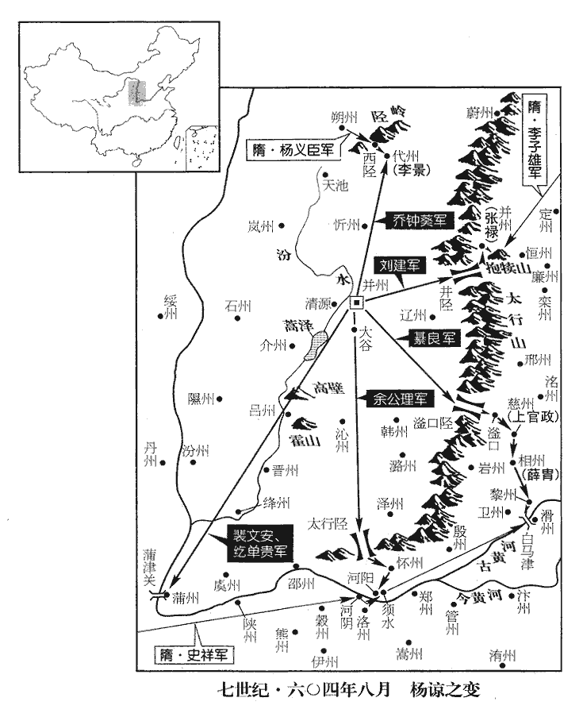
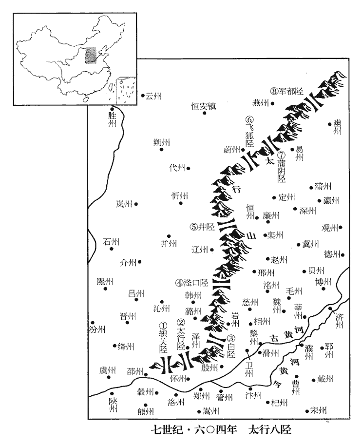
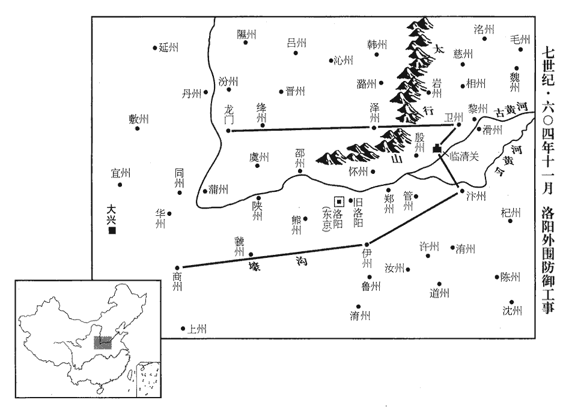
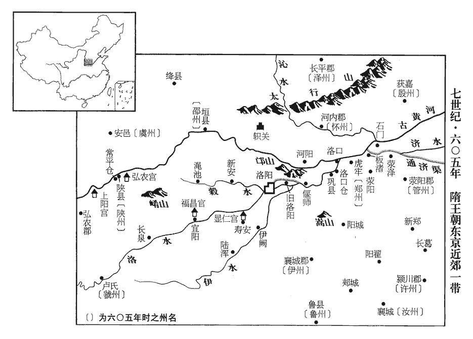
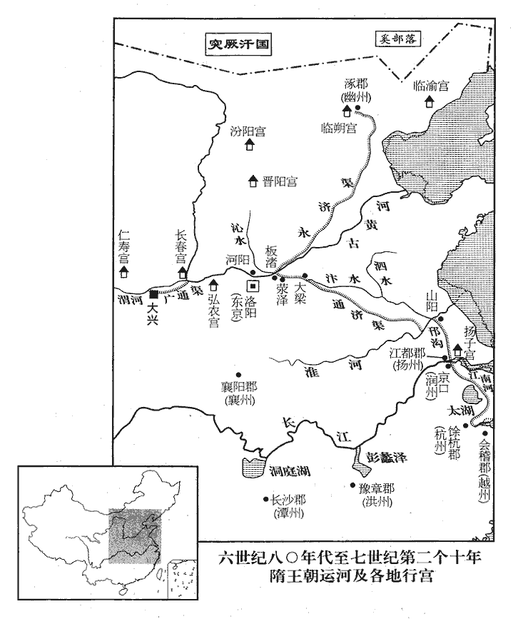
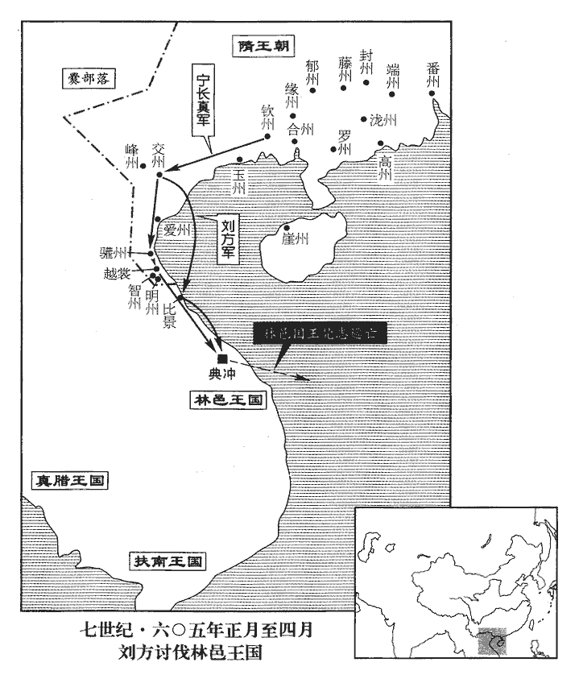
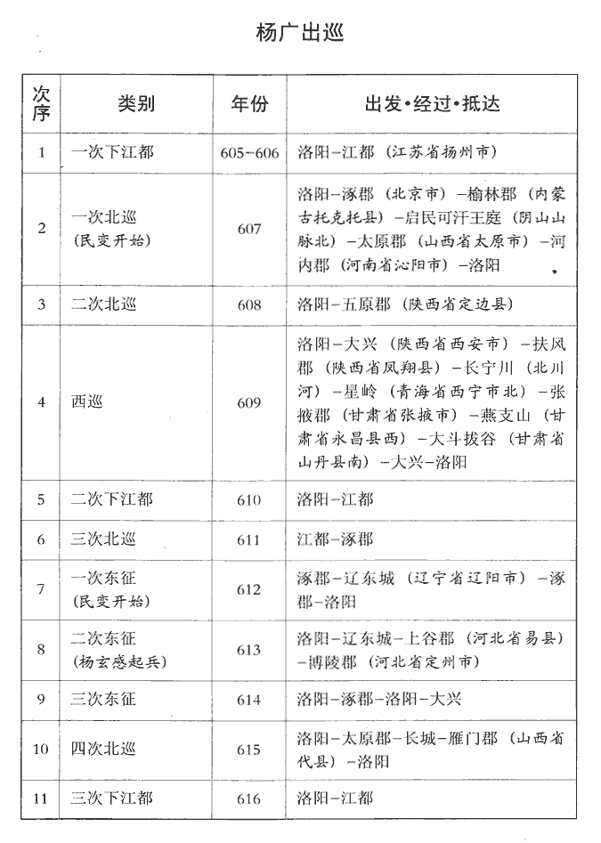
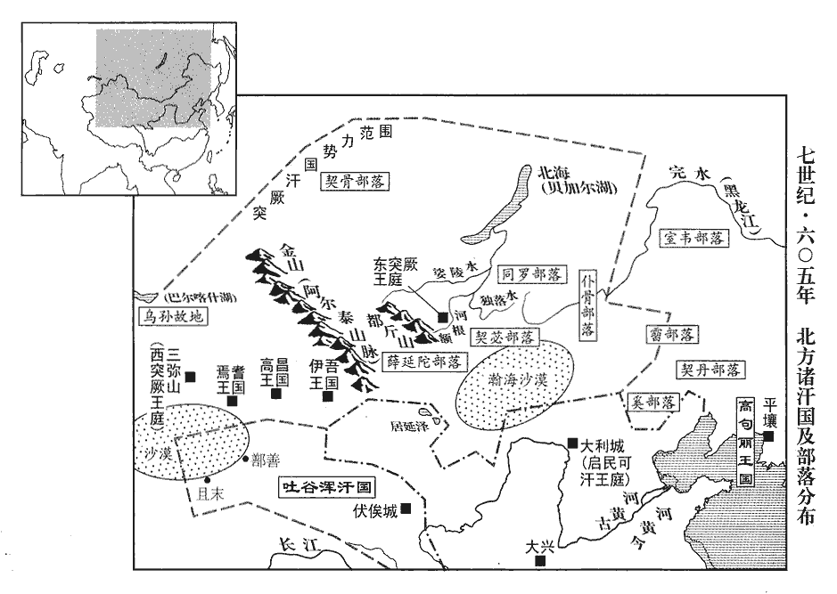
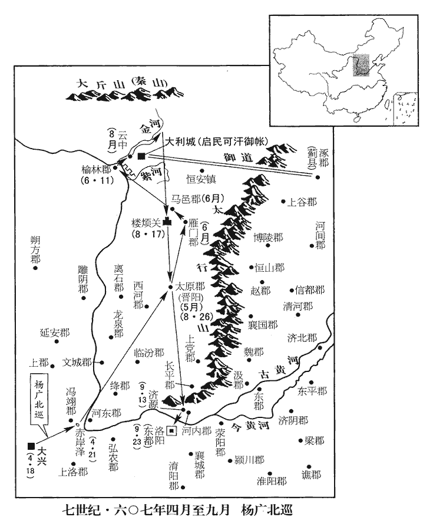
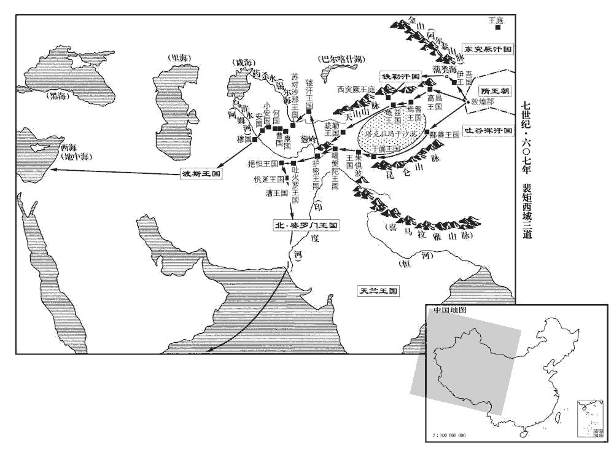

 隋紀四起閼逢困敦（甲子），盡強圉單閼（丁卯），凡四年。

# 高祖文皇帝下

## 仁壽四年（甲子、六零四）

1春，正月，丙午‹九›，赦天下。

〖译文〗 [1]春季，正月，丙午（初九），大赦天下。

2帝‹杨坚，本年六十四岁›將避暑於仁壽宮‹陕西省麟游县境›，術士章仇太翼固諫；不聽。太翼曰：「是行恐鑾輿不返！」帝大怒，繫之長安獄，期還而斬之。甲子‹二十七›，幸仁壽宮。乙丑‹二十八›，詔賞賜支度，事無巨細，並付皇太子‹杨广›。夏，四月，乙卯，帝不豫。六月，庚申‹六›，赦天下。秋，七月，甲辰‹十›，上疾甚，臥與百僚辭訣，並握手歔欷，歔，音虛。欷，音希，又許既翻。命太子赦章仇太翼。丁未‹十三›，崩於大寶殿。年六十四。

〖译文〗 [2]文帝要去仁寿宫避暑，术士章仇太翼竭力劝说，文帝不听。章仇太翼说：“这次出行恐怕主上回不来了！”文帝勃然大怒，将章仇太翼投入长安的监狱，准备回来杀掉他。甲子（二十七日），文帝驾临仁寿宫。乙丑（二十八日），文帝下诏凡赏赐、财政支出，事无巨细一并交付皇太子杨广处理。夏季，四月，乙卯（疑误），文帝感到身体不适。六月庚申（疑误），大赦天下。秋季，七月，甲辰（初十），文帝病重，他躺在床上和文武百官诀别，并握住大臣们的手欷不止。文帝命太子杨广赦免章仇太翼。丁未（十三日），文帝在大宝殿驾崩。

高祖‹杨坚›性嚴重，令行禁止。每【章：十二行本「每」上有「勤於政事」四字；乙十一行同；孔本同。】旦聽朝，日昃忘倦。朝，直遙翻。昃，阻力翻。日中則昃。雖嗇於財，至於賞賜有功，即無所愛；將士戰沒，必加優賞，仍遣使者勞問其家。將，即亮翻。使，疏吏翻。勞，力到翻。愛養百姓，勸課農桑，輕傜薄賦。其自奉養，務為儉素，乘輿御物，故弊者隨宜補用；乘，繩證翻。自非享宴，所食不過一肉；後宮皆服澣huàn濯之衣。天下化之，開皇、仁壽之間，丈夫率衣絹布，衣，於既翻。不服綾綺，裝帶不過銅鐵骨角，無金玉之飾。故衣食滋殖，倉庫盈溢。受禪之初，民戶不滿四百萬，末年，踰八百九十萬，此以開皇初元戶口之數，比較仁壽末年大業初之數而言之也。按周之平齊，得戶三百三萬，而隋受周禪，戶不滿四百萬，則周氏初有關中，西并巴、蜀，南兼江、漢，見戶不滿百萬也。陳氏之亡，戶六十萬。大約隋氏混壹天下，見戶未及五百萬；及其盛也，蓋幾倍之。滋，音茲。殖，音植。禪，音墠shàn。獨冀州‹古冀州地区·河北省中部南部›已一百萬戶。隋以信都郡為冀州，此以古冀州之域言之也。然禹之冀州，兼有幽、并、營三州地，其界比他州為最大，其後以天文畫壄yě分州，自胃七度至畢十一度為大梁，冀州分。隋志以信都、清河、魏、汲、河內、長平、上黨、河東、絳、文城、臨汾、龍泉、西河、離石、鴈門、馬邑、定襄、樓煩、太原、襄國、武安、趙、恆山、博陵、河間、涿、上谷、漁陽、北平、安樂、遼西等郡為冀州，則其地亦兼有幽、并、營三州地，故其戶最多。然猜忌苛察，信受纔言，功臣故舊，無始終保全者；乃至子弟，皆如仇敵，此其所短也。此上總論文帝平生。

〖译文〗 隋文帝性格谨严持重，办事令行禁止，每日清晨听理朝政，到日偏西时还不知疲倦。虽然吝啬钱财，但赏赐有功之臣则不吝惜；将士战死，文帝必定从优抚恤，并派使者慰问死者家属。他爱护百姓，劝课农桑，轻徭薄赋。自己生活务求节俭朴素，所乘车驾及所用之物，旧了坏了都随时修理使用；如果不是享宴，吃饭不过一个肉菜；后宫都身着洗旧了的衣服。天下人都为文帝的行为所感化。开皇、仁寿年间，男子都身穿绢布衣服，不穿绫绮；衣带饰品用的不过是铜铁骨角所制，没有金玉的装饰。因此国家的财富日益增长，仓库丰盈。文帝受禅之初，隋朝的民户不满四百万户；到了隋文帝仁寿末年，超过了八百九十万户，仅冀州就已有一百万户。但是文帝好猜忌苛察，容易听信谗言，他的功臣故旧，没有能始终保全的；至于他的子弟辈，都象仇敌一样，这是他的短处。

初，文獻皇后既崩，獨孤后崩，諡文獻，見上卷二年。宣華夫人陳氏、容華夫人蔡氏皆有寵。陳氏，陳高宗‹陈顼›之女；陳宣帝廟號高宗。蔡氏，丹陽‹江苏省南京市›人也。丹楊郡，時置蔣州。上‹杨坚›寢疾於仁壽宮，尚書左僕射楊素、兵部尚書柳述、黃門侍郎元巖隋制，門下省納言二人，給事黃門侍郎四人，其位任重矣。此又一元巖，前蜀王秀長史之元巖封平昌郡公，此元巖封龍涸縣公，見隋書列女華陽王楷妃傳。皆入閤侍疾，召皇太子‹杨广›入居大寶殿。太子慮上有不諱，須預防擬，防，禦也，隄備也。擬，準也，準擬揣度以待之也。手自為書，封出問素；素條錄事狀以報太子。宮人誤送上所，上覽而大恚。恚huì，於避翻。陳夫人平旦出更衣，更，工衡翻。為太子所逼，拒之，得免，歸於上所；上怪其神色有異，問其故。夫人泫然曰：「太子無禮！」上恚，抵床曰：「畜生何足付大事！抵，觸也。今人詈人猶曰畜生。言其無識無禮，若馬牛犬豕然，待畜養而生者也。泫，戶畎翻。獨孤誤我！」事見上卷開皇二十年。乃呼柳述、元巖曰：「召我兒！」述等將呼太子‹杨广›，上曰：「勇也。」述、巖出閤為敕書。儲嗣之重，廢置之間，輕易如此，烏得不君臣皆敗乎。楊素聞之，以白太子，矯詔執述、巖，繫大理獄；追東宮兵士帖上臺宿衛，帖，裨也。帝之猜防太子勇也，屏去東宮宿衛之勇健者，知出蘇孝慈而不知備張衡之入寢殿也，悕xī矣。門禁出入，並取宇文述、郭衍節度；令右庶子張衡入寢殿侍疾，盡遣後宮出就別室；俄而上崩。故中外頗有異論。此上叙帝所以見弒。考異曰：趙毅大業略記曰：「高祖在仁壽宮，病甚，追帝侍疾，而高祖美人尤嬖幸者，唯陳、蔡二人而已。帝乃召蔡於別室，既還，面傷而髮亂，高祖問之，蔡泣曰：『皇太子為非禮。』高祖大怒，齧niè指出血，召兵部尚書柳述、黃門侍郎元巖等，令發詔追庶人勇，即令廢立。帝事迫，召左僕射楊素、左庶子張衡進毒藥。帝簡驍健官奴三十人皆服婦人之服，衣下置仗，立於門巷之間，以為之衛。素等既入，而高祖暴崩。」馬總通曆曰：『上有疾，於仁壽殿與百僚辭訣，並握手歔欷。是時唯太子及陳宣華夫人侍疾，太子無禮，宣華訴之。帝怒曰：『死狗，那可付後事！』遽令召勇，楊素秘不宣，乃屏左右，令張衡入拉帝，血濺屏風，冤痛之聲聞于外，崩。」今從隋書。陳夫人與後宮聞變，相顧戰栗失色。晡後，太子遣使者齎小金合，帖紙於際，親署封字，以賜夫人。夫人見之，惶懼，以為鴆毒，不敢發。使者促之，乃發，使，疏吏翻；下同。合中有同心結數枚，宮人咸悅，相謂曰：「得免死矣！」陳氏恚而卻坐，不肯致謝；諸宮人共逼之，乃拜使者。其夜，太子蒸焉。杜預曰：「上淫曰蒸。」

〖译文〗 当初，独孤皇后去世，宣华夫人陈氏、容华夫人蔡氏都受到文帝的宠爱。陈氏是陈宣帝的女儿，蔡氏是丹杨人。文帝患病住在仁寿宫，尚书左仆射杨素、兵部尚书柳述、黄门侍郎元岩都进入仁寿宫侍病。文帝召皇太子杨广入内居崐住在大宝殿。杨广考虑到如果文帝去世，必须预先作好防备措施，他亲手写了一封信封好，派人送出来询问杨素。杨素把情况一条条写下来回复太子。宫人误把回信送到了文帝的寝宫，文帝看后极为愤怒。天刚亮，陈夫人出去更衣，被太子杨广所逼迫。陈夫人拒绝了他才得以脱身。她回到文帝的寝宫，文帝奇怪她神色不对，问什么原因，陈夫人流着泪说：“太子无礼！”文帝愤怒，捶着床说：“这个畜生！怎么可以将国家大事交付给他！独孤误了我！”于是他叫来柳述、元岩说：“召见我的儿子！”柳述等人要叫杨广来。文帝说：“是杨勇。”柳述、元岩出了文帝的寝宫，起草敕书。杨素闻知此事，告诉了太子杨广。杨广假传文帝的旨意将柳述、元岩逮捕，关进大理狱。他们迅速调来东宫的裨将兵士来宿卫仁寿宫，宫门禁止出入，并派宇文述、郭衍进入调度指挥；命令右庶子张衡进入文帝的寝宫侍侯文帝。后宫的人员全被赶到别的房间去。一会儿，文帝死了。因此朝廷内外有很多不同的说法。陈夫人与后宫们闻知发生变故，面面相觑，战栗失色。黄昏时，太子杨广派使者送来小金盒，盒边上贴封纸，杨广亲笔写上封字，赐给陈夫人。陈夫人看见小金盒，惊惶恐惧，以为是鸩毒，不敢打开。使者催促陈夫人，于是她打开小金盒，盒内有几枚同心结。宫人们都高兴了，互相说：“可以免死了！”陈夫人愤怒得想坐下，不肯致谢。宫人们一起逼迫陈夫人，她才拜谢使者接受了小金盒。当天夜里，太子杨广将陈夫人奸淫。

乙卯‹二十一›，發喪，考異曰：大業略記曰：「十八日，發喪。」杜寶大業雜記曰：「甲戌，文帝崩。辛巳，發喪。壬午，煬帝即位。」按長曆，是月乙未朔。乙卯，二十一日也。無甲戌、辛巳、壬午日。今從隋書。太子‹杨广，本年三十六岁›即皇帝位。會伊州刺史楊約來朝，楊約出刺伊州，見上卷二年。朝，直遙翻。太子遣約入長安，易留守者，矯稱高祖之詔，賜故太子勇死，縊殺之；縊，於賜翻。然後陳兵集眾，發高祖凶問。煬帝聞之，書煬帝以別大行。曰：「令兄之弟，果堪大任。」追封勇為房陵王，不為置嗣。房陵郡王。隋志：房陵郡光遷縣，舊曰房陵，置新城郡；梁末置岐州；後周，郡縣並改為光遷；大業初，置房陵郡。考異曰：大業略記云：「庶人勇八男，亦陰加酖害，恐其為厲，皆倒埋之。」按隋書、北史皆云「煬帝踐極，儼常從行，卒於道，實酖之也。諸弟分徙嶺表，仍敕在所皆殺焉。」今從之。按通鑑下文，大業三年殺儼及七弟。八月，丁卯‹三›，梓宮至自仁壽宮；丙子‹十二›，殯于大興前殿。大興前殿，大興宮正殿也。柳述、元巖並除名，述徙龍川，巖徙南海。隋志：龍川郡，平陳置循州‹广东省惠州市›。南海郡，舊置廣州‹广东省广州市›。帝‹杨广›令蘭陵公主與述離絕，欲改嫁之；公主以死自誓，不復朝謁，復，扶又翻。朝，直遙翻。上表請與述同徙，帝大怒。公主憂憤而卒，臨終，上表請葬於柳氏，帝愈怒，竟不哭，葬送甚薄。上，時掌翻。卒，子恤翻。

〖译文〗 乙卯（二十一日），为文帝发丧。太子杨广即皇帝位。正好伊州刺史杨约来朝见，杨广派杨约进入长安，调换了留守者。诈称文帝的诏命，将前太子杨勇赐死，杨勇被勒死。然后陈兵集众，发布文帝去世的凶信。炀帝听到杨约的行动后对杨素说：“您的弟弟果然能够担当重任。”他追封杨勇为房陵王，不给杨勇立继承人。八月，丁卯（初三），文帝的灵柩从仁寿宫至京师；丙子（十二日），在大兴前殿为文帝出殡。柳述、元岩被一起除名。柳述被流放到龙川，元岩被流放到南海。炀帝命令兰陵公主和柳述断绝关系，打算把她改嫁别人。兰陵公主以死来发誓，不再朝见炀帝。她上表炀帝要求和柳述一起流放，炀帝大怒，兰陵公主忧愤而死。她临终时上表给炀帝请求归葬柳氏墓地。炀帝更加发怒，竟然没哭。兰陵公主的葬礼葬物极为简单菲薄。

3太史令袁充奏言：「皇帝即位，與堯受命年合。」諷百官表賀。禮部侍郎許善心議，以為「國哀甫爾，不宜稱賀。」左衛大將軍宇文述素惡善心，宇文述自左衛率遷左衛大將軍，豈特以舊恩哉？既以醻功，且親之以自衛也。惡，烏故翻。諷御史劾之；劾，戶概翻，又戶得翻。左遷給事郎，降品二等。

〖译文〗 [3]太史令袁充奏道：“皇帝即位，与尧受天命的时间吻合。”他示意百官上表庆贺。礼部侍郎许善心提出，由于“国丧刚完，不适宜称贺”，左卫大将军宇文述向来讨厌许善心，他示意御史弹劾许善心，许善心被降职为给事郎，降了两级。

4漢王諒有寵於高祖‹杨坚›，為并州‹总部设并州山西省太原市›總管，開皇十七年，漢王諒代秦王俊為并州總管。自山‹崤山›以東，至于滄海‹东海›，南距黃河，五十二州皆隸焉；特許以便宜從事，不拘律令。諒自以所居天下精兵處，見太子勇以讒廢，事見上卷開皇二十年。居常怏怏；怏，於兩翻。及蜀王秀得罪，見上卷二年。尤不自安，陰蓄異圖。言於高祖‹杨坚›，以「突厥‹瀚海沙漠群›方強，厥，九勿翻。宜修武備。」於是大發工役，繕治器械，治，直之翻。招集亡命，左右私人殆將數萬。突厥嘗寇邊，高祖使諒禦之，為突厥所敗，敗，補邁翻。其所領將帥坐除解者八十餘人，將，即亮翻。帥，所類翻。除，除名也。解，解官也。皆配防嶺表‹南岭以南›。諒以其宿舊，奏請留之，高祖怒曰：「爾為藩王，惟當敬依朝命，朝，直遙翻。何得私論宿舊，廢國家憲法邪！嗟乎小子，爾一旦無我，或欲妄動，彼取爾如籠內雞雛耳，何用腹心為！」

〖译文〗 [4]汉王杨谅受到文帝的宠爱，他是并州总管，崤山以东到沧海，南至黄河，五十二州都隶属于并州。杨谅得到特许可以便宜行事，可以不拘泥于法律条文。杨谅自认为他所在的地方是天下精兵的聚集地，他看到太子杨勇因谗言被废黜，常常怏怏不乐；到蜀王杨秀获罪，杨谅极为不安，暗中怀有异图。他对文帝说，由于“突厥正处于强盛时期，应该修整军备。”于是他大规模地征崐发工匠夫役，修造武器，招集亡命之徒，身边的私人门客将近数万。突厥人曾进犯边塞，文帝派杨谅抵御突厥人，他被突厥人打败，他属下的将帅因罪被解职除名的有八十余人，都被发配流放到岭表。杨谅因为这些人是他过去的老部下，奏请文帝留下这些人。文帝发怒说：“你作为藩王，只应恭敬地遵从朝廷的命令，怎么可以因私而谈论宿旧，废弃国家的法令呢！你这小子，一旦没了我，要想轻举妄动，人家抓你就象抓笼子里的鸡雏一样，心腹又有什么用呢？”

王頍kuǐ者，僧辯之子，王僧辯事梁，有平侯景之功，為陳霸先所殺。頍，丘弭翻。倜儻好奇略，倜，他狄翻。好，呼到翻。為諒諮議參軍，隋制，諸王府諮議參軍，在長史、司馬之下，掾屬之上也。蕭摩訶，陳氏舊將，蔣，即亮翻。二人俱不得志，每鬱鬱思亂，皆為諒所親善，贊成其陰謀。

〖译文〗 王是王僧辩的儿子，为人洒脱，善于谋略，他是杨谅的谘议参军。萧摩诃是陈国的旧将。两个人都不得志，常常郁闷，胡思乱想，他们都得到杨谅的信任优待，都赞同杨谅谋反的阴谋。

會熒惑守東井，熒惑，罰星。東井，秦分。儀曹鄴‹河北省临漳县西南邺镇›人傅奕曉星曆，按隋制，王府諸曹無儀曹，蓋不在諸參軍之數。鄴縣，屬魏郡。諒問之曰：「是何祥也？」對曰：「天上東井，黃道所經，晉志：東井八星，天之南門，黃道所經。熒惑過之，乃其常理，若入地上井，則可怪耳。」奕知諒有異圖，詭對以自免於禍。諒不悅。

〖译文〗 当时正好火星处在井宿的位置，仪曹邺人傅奕通晓天文星历，杨谅问他：“这是什么征兆？”傅奕回答：“天上的井宿，在黄道带上，是火星必经之路，这是正常的规律，倘若进入地上井的位置，那就怪异了。”杨谅听了很不高兴。

及高祖崩，煬帝遣軍騎將軍屈突通以高祖璽書徵之。騎，奇寄翻。屈，區勿翻。璽，斯氏翻。先是，高祖與諒密約：「若璽書召汝，敕字傍別加一點，高歡與侯景亦有此約，而皆以階亂。先，悉薦翻。又與玉麟符合者，開皇七年，頒青龍符於東方總管、刺史，西方以騶虞，南方以朱雀，北方以玄武。是後三子分居方面，并、楊、益三總管統屬甚廣，故為玉麟符。漢王諒既敗，惟留守東、西兩都用玉麟符，至唐猶然。當就徵。」及發書無驗，諒知有變。詰通，詰，去吉翻。通占對不屈，乃遣歸長安。諒遂發兵反。

〖译文〗 到文帝去世时，炀帝派车骑将军屈突通持印有文帝玉玺的诏书召杨谅进京。原来，文帝与杨谅秘密约定：“要是玺书召你，敕字旁另加一点，还要与玉麟符相契合，才可以应召。”杨谅看到发来的玺书与原约不能验证，就知道出了事，他盘问屈突通，屈突通闪烁其词而不回答，于是，屈突通被打发回长安，杨谅起兵造反。

總管司馬安定皇甫誕切諫，安定郡，涇州‹甘肃省泾川县›。諒不納。誕流涕曰：「竊料大王兵資非京師之敵；加以君臣位定，逆順勢殊，士馬雖精，難以取勝。一旦陷身叛逆，絓於刑書，絓guà，戶掛翻。雖欲為布衣，不可得也。」諒怒，囚之。

〖译文〗 总管司马安定人皇甫诞恳切规劝杨谅，杨谅不听。皇甫诞流着泪说：“我预料大王的兵力不是京师军队的对手；加上君臣的地位已经确定，双方势力悬殊，军队虽然精锐但难以取胜。一旦身处叛逆的地位，被追究刑法，就是想作一个平民也不可能了。”杨谅听了发怒，把皇甫诞关进监狱。

 

嵐州‹山西省岚县›刺史喬鍾葵將赴諒，嵐州，樓煩之地也。按隋志：大業四年方置樓煩郡，管下秀容縣舊置肆州，開皇十八年置忻州，大業初廢。又按唐志：樓煩郡，平劉武周，置東會州，武德六年，改嵐州，而義寧元年，復分秀容置忻州。喬鍾葵者，既為嵐州刺史，而隋志不載嵐州建置，當考。嵐，盧含翻。宋白曰：後魏置嵐州，因岢嵐山為名。其司馬京兆陶模拒之曰：「漢王所圖不軌，公荷國厚恩，【章：十二行本「恩」下有「位為方伯」四字；乙十一行本同；孔本同；張校同。】荷，下可翻。當竭誠效命，豈得身為厲階乎！」鍾葵失色曰：「司馬反邪！」臨之以兵，辭氣不撓，邪，音耶。撓，奴教翻，屈也。鍾葵義而釋之。軍吏曰：「若不斬模，無以壓眾心。」乃囚之。於是從諒反者凡十九州。

〖译文〗 岚州刺史乔钟葵要去投奔杨谅，岚州司马京兆人陶模反对，说：“汉王杨谅图谋不轨，您身受国家的厚恩，应当竭诚为国效命，怎么能身陷祸端呢？”乔钟葵变了脸色，说：“司马造反吗？”用兵器对着他，但陶模言辞气度都不屈服，乔钟葵感于陶模的义气就放了他。军吏说：“要是不杀陶模，无法让大家心服。”乔钟葵就把陶模关起来。此时跟从杨谅造反的共有十九个州。

王頍kuǐ說諒曰：「王所部將吏，家屬盡在關西，說，輸芮翻。將，即亮翻。此關西，謂蒲津關以西。若用此等，則宜長驅深入，直據京都，所謂疾雷不及掩耳；淮南子之言。若但欲割據舊齊之地，南距大河，北盡燕、代，皆高齊之地也。宜任東人。」諒不能決，乃兼用二策，唱言楊素反，將誅之。諒若如宋武陵王聲元凶之罪而舉兵，天下其誰能敵之。

〖译文〗 王劝说杨谅：“大王属下的将领官吏，家属都在关西，要是用这些人，就应该长驱直入，直捣京都，也就是所谓的迅雷不及掩耳；要是只打算割据过去北齐的地盘，就应该任用关东人。”杨谅不能决断，就两条计策并用。他声称杨素谋反，要诛杀杨素。

總管府兵曹聞喜‹山西省闻喜县›裴文安兵曹，兵曹參軍也。聞喜縣，屬絳州。說諒曰：「井陘‹河北省井陉县西›以西，在王掌握之內，山‹太行山›東士馬，亦為我有，宜悉發之；分遣羸兵屯守要害，仍命隨方略地，帥其精銳，直入蒲津‹山西省永济市西黄河渡口›。同州朝邑縣有蒲津關，渡河，東即蒲州城。陘，音刑。羸，倫為翻。帥，讀曰率。文安請為前鋒，王以大軍繼後，風行雷擊，頓於霸上‹陕西省西安市东灞河畔›。自武關入，則頓於霸上，自蒲津入，豈須頓於霸上！蓋欲乘高以臨長安耳。咸陽‹陕西省咸阳市›以東，可指麾而定。京師震擾，兵不暇集，上下相疑，群情離駭；我陳兵號令，誰敢不從！旬日之間，事可定矣。」考異曰：大業略記云：「司兵參軍裴文安說諒曰：『今梓宮尚在仁壽宮，比其徵兵，動移旬月。今若簡驍勇萬騎，令文安督領，不淹十五日，徑據長安，其在京被黜停私之徙，並擢授高位，付以心膂，共守京城，則咸陽以東府縣非彼之有。然後大王總兵鼓行而西，聲勢一接，天下可指揮而定也。』諒不從。」大業雜記云：「文安又說曰：『先人有奪人之心，殿下選精騎一萬，徑往京師奔喪，曉夜兼行，誰敢止約！至京徑掩仁壽宮，彼縱徵召，未暇禦我，大軍駱驛隨王而至，此則次計。王直資河北，彼率天下之兵，百道攻我，則難為主人，此下計也。』」今從隋書。諒大悅，於是遣所署大將軍余公理出太谷‹山西省太谷县›，趣河陽‹河南省孟州市›，姓苑：余姓，由余之後。隋志：太谷縣，屬太原郡，舊曰陽邑，開皇十八年改焉。水經註：太谷，谷名，在祁縣東南。河陽縣屬懷州，欲由此渡孟津。趣，七喻翻；下同。大將軍綦良出滏口‹河北省武安市西南›，趣黎陽‹河南省浚县›，綦，姓也。此二軍皆欲使渡河，略河南。滏fǔ，音釜。大將軍劉建出井陘‹河北省井陉县西›，略燕、趙，陘，音刑。柱國喬鍾葵出鴈門‹代州·山西省代县›，鴈門郡，代州也。時李景以代州拒諒，使鍾葵自嵐州攻之。署文安為柱國，與柱國紇單貴、王聃等直指京師。紇單，虜複姓。紇，下沒翻。單，多寒翻，又達演翻。聃，他酣翻。

〖译文〗 总管府兵曹闻喜人裴文安劝说杨谅：“井陉以西的地方在大王手中，崤山以东的军队也是我们的，应该全部征发。分派弱兵屯守要害，仍命令将领随时攻城略地；率领精锐部队直入蒲津关。我请求担任前锋，大王率领大军随后，以迅雷不及掩耳之势屯兵霸上，咸阳以东的地方便可以挥手而定。这样京师被震动惊扰，没有时间调集军队，上下相互猜疑，大家离心惊骇，我们陈兵以待，发号施令，谁敢不服从！十天之内，大事可定。”杨谅听了大为高兴，就派遣他任命的大将军余公理率兵出太谷，奔河阳；大将军綦良率兵出滏口，奔黎阳；大将军刘建率兵出井陉，攻取燕、赵之地；柱国乔钟葵率军出雁门；任命裴文安为柱国，与柱国纥单贵、王聃等率军直指京师。

 

帝以右武衛將軍洛陽‹河南省洛阳市东白马寺东›丘和隋制，左右武衛將軍，領外軍宿衛。風俗通：丘姓，左丘明之後。又云：太公封於營丘，支孫以地為氏。又魏書官氏志：後魏獻帝次弟丘敦氏，後改為丘氏。按拓跋南都洛陽，凡北人從之南遷者，三字姓、複姓皆改從單字姓，為河南洛陽人。丘和既洛陽人，蓋即丘敦氏之後。為蒲州‹山西省永济市›刺史，鎮蒲津。諒選精銳數百騎戴羃mì䍦lí，羃，莫狄翻。䍦，音離。新唐志曰：婦人施羃䍦以蔽身。永徽中，始用帷冒，施帬qún及頸。武后時，帷冒益盛。中宗後，無復羃䍦矣。按帷冒起於隋。騎，奇寄翻；下同。詐稱諒宮人還長安，門司弗覺，徑入蒲州，門司，蒲州之掌城門者。城中豪傑亦有應之者；丘和覺其變，踰城，逃歸長安。蒲州長史勃海高義明、司馬北平榮毗勃海郡，開皇六年置棣州‹山东省阳信县›。大業二年改滄州。北平郡，舊置平州‹河北省卢龙县›。榮姓，周榮公之後。皆為反者所執。裴文安等未至蒲津百餘里，諒忽改圖，令紇單貴斷河橋，守蒲州，此蒲津之橋也，諒欲斷河，謂可坐有舊齊之地耳。斷，音丁管翻。而召文安還。文安至‹晋阳，山西省太原市›，謂諒曰：「兵機詭速，本欲出其不意。王既不行，文安又返，使彼計成，大事去矣。」諒不對。以王聃為蒲州刺史，裴文安為晉州‹山西省临汾市›刺史，薛粹為絳州‹山西省新绛县›刺史，梁菩薩為潞州‹上党·山西省长治市›刺史，韋道正為韓州‹山西省襄垣县›刺史，張伯英為澤州‹山西省晋城市›刺史。隋志：臨汾郡，晉州。絳郡，後魏置東雍州，後周改絳州。上黨郡，後周置潞州。上黨郡襄垣縣，後周置韓州，大業初，州廢。長平郡，舊曰建州，開皇初，改澤州。菩，蒲乎翻。薩，桑葛翻。聃，他甘翻。代州‹总部设代州山西省代县›總管天水‹秦州，甘肃省天水市›李景發兵拒諒，諒遣其將劉暠襲景；將，即亮翻。暠hào，古老翻。景擊斬之。諒復遣喬鍾葵帥勁勇三萬攻之，復，扶又翻。帥，讀曰率；下同。景戰士不過數千，加以城池不固，為鍾葵所攻，崩毀相繼，景且戰且築，士卒皆殊死鬬；鍾葵屢敗。司馬馮孝慈、司法呂玉司法，即法曹行參軍。並驍勇善戰，驍，堅堯翻。儀同三司侯莫陳乂多謀畫，工拒守之術，景知三人可用，推誠任之，己無所關預，唯在閤持重，時撫循而已。

〖译文〗 炀帝任命右武卫将军洛阳人丘和为蒲州刺史，镇守蒲津关。杨谅挑选精锐骑兵几百名，戴妇人蔽身用的面罩，诈称是杨谅的宫人返回长安，守城的门卫没有觉察出来，杨谅军队直入蒲州，城中也有豪杰响应，丘和发觉出事，越过城墙逃回长安。蒲州长史勃海人高义明、司马北平人荣毗都被叛军抓住。裴文安等人距百余里到蒲津关时，杨谅忽然改变计划，他命令纥单贵拆断河桥，据守蒲州，将裴文安召回。裴文安对杨谅说：“兵机在于神速诡秘，本来打算出其不意，大王却不这样做，又把我召回，使对方计谋成功，现在大势已去。”杨谅无言以对。他任命王聃为蒲州刺史，裴文安为晋州刺史，薛粹为绛州刺史，梁菩萨为潞州刺史，韦道正为韩州刺史，张伯英为泽州刺史。代州总管天水人李景发兵抵抗杨谅的军队。杨谅派将领刘袭击李景，被李景击杀。杨谅又派乔钟葵率领三万精兵进攻代州，李景手下士兵只有几千人，加上城墙不很牢固，受到乔钟葵的进攻，城墙相继崩塌毁坏，李景一边打仗一边筑城，士卒们都殊死战斗，乔钟葵多次被击败。代州司马冯孝慈、司法吕玉都骁勇善战，仪同三司侯莫陈富于谋略策划，擅长防御坚守的战斗。李景知道这三人可以任用，对他们充分信任，自己不干预具体事务，只是在衙署内坐镇，不时地抚慰巡视而已。

楊素將輕騎五千襲王聃、紇單貴於蒲州，夜，至河際，收商賈船，得數百艘，賈，音古。艘，蘇遭翻。船內多置草，踐之無聲，遂銜枚而濟；遲明，擊之；遲，直二翻。紇單貴敗走，聃懼，以城降。降，戶江翻。有詔徵素還。初，素將行，計日破賊，皆如所量，量，音良。於是以素為并州道行軍總管、河北道安撫大使，帥眾數萬以討諒。使，疏吏翻。

〖译文〗 杨素率领轻骑五千在蒲州袭击王聃、纥单贵。夜里，杨素率军到了河边，收集了几百只商船，船内铺上许多草，踩上去没有声音。为防止喧哗，杨素让士兵口中衔枚渡过河，天快亮时，进攻杨谅的军队。纥单贵战败逃走，王聃恐惧，献城投降。炀帝下诏征召杨素返回。当初，杨素要动身时，计算好打败叛军的日期，结果如杨素估计的一样。于是炀帝任命杨素为并州道行军总管、河北道安抚大使，率领几万军队讨伐杨谅。

諒之初起兵也，妃兄豆盧毓為府主簿，苦諫，不從，私謂其弟懿曰：「吾匹馬歸朝，自得免禍，此乃身計，非為國也，不若且偽從之，徐伺其便。」朝，直遙翻。為，于偽翻。毓，勣jì之子也。豆盧勣見一百七十四卷陳宣帝太建十二年。勣，則歷翻。毓兄顯州‹河南省泌阳县›刺史賢隋志：淮安郡，後魏置東荊州，西魏改淮州，開皇五年又改顯州。言於帝曰：「臣弟毓素懷志節，必不從亂，但逼兇威，不能自遂，臣請從軍，與毓為表裏，諒不足圖也。」帝許之。賢密遣家人齎敕書至毓所，與之計議。

〖译文〗 杨谅当初起兵时，他妃子的哥哥豆卢毓是汉王府主簿。豆卢毓苦苦劝谏杨谅不要造反，杨谅不听。豆卢毓私下对他弟弟豆卢懿说：“我一个人回归朝廷，自然可以免祸，这是为我自身考虑，不是为国家。不如暂且装作跟从杨谅，慢慢地再见机行事。”豆卢毓是豆卢的儿子。豆卢毓的哥哥是显州刺史豆卢贤，他对炀帝说：“我弟弟豆卢毓平素就有抱负有气节，一定不会跟着造反，但是迫于叛逆的凶威，不能自主。我请求从军，和豆卢毓一里一外，杨谅就无法图谋作乱了。”炀帝答应了，豆卢贤秘密派家人把皇帝的诏书送到豆卢毓的住处，和他商议大事。

諒出城，將往介州‹山西省汾阳县›，隋志：西河郡，後魏置汾州，後齊置南朔州，後周改曰介州。令毓與總管屬朱濤留守。屬在掾下。守，手又翻。毓謂濤曰：「漢王‹杨谅›構逆，敗不旋踵，吾屬豈可坐受夷滅，孤負國家邪！邪，音耶。當與卿出兵拒之。」濤驚曰：「王以大事相付，何得有是語！」因拂衣而去，毓追斬之。出皇甫誕於獄，與之協計，及開府儀同三司宿勤武等宿勤，虜複姓，後魏末有宿勤明達叛亂。閉城拒諒。部分未定，分，扶問翻。有人告諒，諒襲擊之。考異曰：皇甫誕傳云：「楊素將至，諒屯清源以拒之。」按諒屯清源時，素軍已迫，何暇自還襲毓！今從毓傳。毓見諒至，紿其眾曰：「此賊軍也！」紿，徒亥翻。諒攻城南門，稽胡‹山西省西部匈奴人›守南城，稽胡，步落稽也，散居介、石二州。不識諒，射之；射，而亦翻。失下如雨；諒移攻西門，守兵識諒，即開門納之，毓、誕皆死。

〖译文〗 杨谅出了城要去介州，他命令豆卢毓和总管属朱涛留守。豆卢毓对朱涛说：“汉王杨谅已构成了叛逆罪，很快就会失败。我们怎么可以受牵连获灭族之罪，同时又辜负国家呢？我应当和您出兵抗拒杨谅。”朱涛吃惊地说：“汉王把大事托付给我们，怎么说这样的话？”于是就拂袖而去，豆卢毓追上去杀死朱涛，把皇甫诞从监狱里放出来，与他协商，并和开府仪同三司宿勤武等人关闭城门以抗拒杨谅。豆卢毓尚未完全部置好，有人把这事报告了杨谅，他就率军袭击豆卢毓。豆卢毓见杨谅率军来到，便哄骗大家说：“这是贼军！”杨谅进攻南城门，稽胡人守卫南城门，他们不认识杨谅，用弓箭射击，箭如雨下。杨谅就转攻西城门，守兵认识杨谅，就开城门让杨谅进城，豆卢毓、皇甫诞都被杀死。

綦良攻慈州‹河北省磁县›刺史上官政，不克，隋志：魏郡滏陽縣，後周置；開皇十年，置慈州，大業初，州廢。引兵攻行相州‹河南省安阳市›事薛冑，又不克，魏郡，置相州，治安陽。相，息亮翻；下同。遂自滏口攻黎州‹河南省浚县›，隋志：汲郡黎陽縣，舊置黎州。塞白馬津‹河南省滑县古黄河渡口›。白馬津在東郡白馬縣，北對黎陽岸，塞之使不得渡。塞，悉則翻。余公理自太行‹河南省沁阳市西北›下河內‹怀州·河南省沁阳市›，行，戶剛翻。帝以右衛將軍史祥為行軍總管，軍於河陰‹河南省孟津县北›。河陰縣，東魏置，屬洛陽郡，北對河陽岸。祥謂軍吏曰：「余公理輕而無謀，輕，墟政翻。恃眾而驕，不足破也。」公理屯河陽‹河南省孟州市›，祥具舟南岸，公理聚兵當之。祥簡精銳於下流潛濟，公理聞之，引兵拒之，戰於須水‹河南省孟州市东›。按九域志：鄭州滎陽縣有須水鎮。然其地在河南。史祥既濟河擊余公理，當遇戰於河陽界。水經註：湨jú水出原城西北原山勳掌谷，東南流過河陽無辟城，又南入于河。疑「須水」當作「湨水」。湨，古闃qù翻。杜佑通典作湨水，音同。則「須」字誤明矣。公理未成列，祥擊之，公理大敗。祥東趣黎陽，綦良軍不戰而潰。祥，寧之子也。史寧從宇文氏於兵間，屢有戰功。

〖译文〗 綦良率军进攻慈州刺史上官政，未能攻克，就率兵进攻兼任相州的行政长官薛胄，又未攻克，于是就从滏口进攻黎州，堵塞白马津。余公理从太行山到河内。炀帝任命右卫将军史祥为行军总管，在河阴驻军。史祥对军吏说：“余公理轻率无计谋，依恃人多而骄横，很容易打败。”余公理驻扎在河阳。史祥在河的南岸准备好船只，余公理集中兵力以抵挡史祥的进攻。史祥挑选精兵从河下游暗地渡河，余公理听到这个消息就率兵抵抗，两军在须水交战。余公理的军队尚未布置好阵容，史祥已率军进攻，大败余公理。史祥率军向东进逼黎阳，綦良的军队不战而溃。史祥是史宁的儿子。

帝‹杨广›將發幽州‹北京市›兵，疑幽州總管竇抗有貳心，問可使取抗者於楊素，素薦前江州‹江西省九江市›刺史勃海李子雄，隋志：九江郡，舊置江州。授上大將軍，拜廣州‹番州·广东省广州市›刺史。拜廣州而使之往幽州，未得之廣州。又以左領軍將軍長孫晟為相州刺史，隋志：左右領軍府，各掌十二軍籍帳、差科、辭訟之事。發山‹太行山›東兵，與李子雄共經略之。晟辭以男行布在諒所部，帝曰：「公體國之深，終不以兒害義，朕今相委，公其勿辭。」李子雄馳至幽州，止傳舍，傳，直戀翻。召募得千餘人。抗來詣子雄，子雄伏甲擒之。抗，榮定之子也。竇榮定見一百七十五卷陳長城公至德二年。

〖译文〗 炀帝要征发幽州的军队。他怀疑幽州总管窦抗有二心，就问杨素谁能把窦抗抓来。杨素推荐了前江州刺史勃海人李子雄。炀帝任命李子雄为上大将军、广州刺史；又任命左领军将军长孙晟为相州刺史，征发崤山以东的军队，和李子雄一起筹划处理此事。长孙晟因为他儿子长孙行布在杨谅的军队里，就推辞任命。炀帝说：“您能够体谅国家的困难，终归不会因为儿子而损害国家大义，我委您以重任，您不要推辞。”李子雄驰马到达幽州，就在驿站停住。他招募到一千人。窦抗来见李子雄，李子雄埋伏好甲士将窦抗逮捕。窦抗是窦荣定的儿子。

子雄遂發幽州兵步騎三萬，自井陘西擊諒。時劉建圍戍將京兆張祥於井陘‹井州·河北省井陉县›，子雄破建於抱犢山下‹河北省鹿泉市西›，隋志：恆州石邑縣有抱犢山。建遁去。李景被圍月餘，被，皮義翻。詔朔州‹山西省朔州市›刺史代人楊義臣救之。馬邑郡，朔州，與代州接境。楊義臣，本姓尉遲。尉遲迥之亂，義臣父崇，以宗族之故自囚於獄，高祖慰釋之。後崇與突厥戰死，義臣尚幼，養於宮中，以其父誠節，賜姓楊氏。義臣帥馬步二萬，夜出西陘‹山西代县西北›，新唐志：代州鴈門縣有東陘關、西陘關。帥，讀曰率。喬鍾葵悉眾拒之。義臣自以兵少，少，詩沼翻。悉取軍中牛驢，得數千頭，復令兵數百人，人持一鼓，潛驅之，匿於澗谷間。晡後，義臣復與鍾葵戰，復，扶又翻。兵初合，命驅牛驢者疾進，一時鳴鼓，塵埃漲天，鍾葵軍不知，以為伏兵發，因而奔潰；義臣縱擊，大破之。晉、絳、呂‹山西省霍州市›三州皆為諒城守，隋志：臨汾郡霍邑縣，後魏置永安郡，開皇十六年置汾州，十八年改呂州。為，于偽翻。楊素各以二千人縻之而去。諒遣其將趙子開擁眾十餘萬，柵絕徑路，屯據高壁‹山西省灵石县南›，高壁，嶺名。將，即亮翻；下同。布陳五十里。陳，讀曰陣。素令諸將以兵臨之，自引奇兵潛入霍山‹山西霍州市东南›，霍山在霍邑東北，亦曰太岳山，禹貢所謂岳陽，指是山之陽也。史記謂之霍太山。緣崖谷而進。素營於谷口，自坐營外，使軍司入營簡留三百人守營，漢、晉謂軍司馬為軍司；今軍吏亦謂之軍司。軍士憚北兵之強，不欲出戰，多願守營，因爾致遲。素責所由，軍司具對，素即召所留三百人出營，悉斬之；更令簡留，人皆無願留者。素乃引軍馳進，出北軍之北，直指其營，鳴鼓縱火；北軍不知所為，自相蹂踐，殺傷數萬。蹂，人九翻。諒所署介州刺史梁脩羅屯介休，隋介州治隰城縣，而介休縣屬焉。聞素至，棄城走。

〖译文〗 李子雄征发幽州的军队，步、骑兵共三万人，从井陉向西进攻杨谅。当时刘建将守将京兆人张祥包围在井陉，李子雄在抱犊山下击败刘建，刘建逃走。李景被杨谅的军队包围了一个来月，炀帝下诏命令朔州刺史代人杨义臣救援李景。杨义臣率领骑、步兵共两万人，夜间出了西陉关。乔钟葵集中全部兵力抵抗杨义臣。杨义臣知道自己兵少，就集中军中所有的牛、驴，共有几千头，又命令几百名士兵，每人持鼓一面，暗地驱赶牛驴隐蔽在山谷间。黄昏后，杨义臣又与乔钟葵交战。刚一交兵，杨义臣就命令驱赶牛、驴的士兵迅速前进，一时间战鼓敲响，尘埃满天，乔钟葵的军队不知怎么回事，以为对方的伏兵出击了，因而奔逃溃散。杨义臣纵兵进攻，大败乔钟葵。晋、绛、吕三州城池都是杨谅军防守，杨素向每座城池各派两千人去牵制，杨谅派遣将领赵子开率领十余万人，用栅栏堵塞山径小路，在高壁岭上屯兵据守，军队摆开的阵势达五十里。杨素命令手下的将领们率兵对阵，自己率领奇兵潜入霍山，沿着悬崖山谷前进。杨素在山谷口扎营，自己坐在营帐外，派军司进军营挑选三百人守营，军士们恐惧杨谅军队的强盛，不想出战，多数人愿意守营，因此行动迟缓。杨素责问迟缓的原因，军司以实回答了，杨素马上把留下守营的三百人召出军营，全部斩首。他再次命令挑选留守人员，人们都不愿意留下。于是杨素率军驰马行进，出现在杨谅军队的北面，直接对方的营地，呜鼓纵火；杨谅的军队不知所措，自相践踏，死伤了几万人。杨谅所任命的介州刺史梁罗屯兵在介休，听到杨素将至就弃城逃跑。

諒聞趙子開敗，大懼，自將眾且十萬，拒素於蒿澤‹山西汾阳县北湖泊，现已干涸›。會大雨，諒欲引軍還，王頍kuǐ諫曰：「楊素懸軍深入，士馬疲弊，王以銳卒自將擊之，其勢必克。今望敵而退，示人以怯，沮戰士之心，益西軍之氣，楊素軍自長安來，故謂之西軍。願王勿還。」諒不從，退守清源‹山西省清徐县›。開皇十六年，分晉陽置清源縣，在晉陽西南。宋白曰：地理志：榆次縣梗陽鄉，魏戊邑。今梗陽故城在清源縣南一百二十步。此縣自漢至晉皆為榆次縣地，隋置清源縣，因縣西清源水為名。

〖译文〗 杨谅知道赵子开被打败，大为恐惧，亲自率领近十万人在蒿泽抵抗杨素。正逢天降大雨，杨谅打算率军退回，王劝道：“杨素孤军深入，人马疲惫，大王亲自率领精兵进攻杨素，必能将他打败。现在望敌而退，让人以为我们怯懦，败坏我军将士的士气，长敌军之气势。希望大王不要撤退。”杨谅不听，率军退守清源。

王頍謂其子曰：「氣候殊不佳，兵必敗，汝可隨我。」楊素進擊諒，大破之，擒蕭摩訶。諒退保晉陽，素進兵圍之，諒窮蹙，請降，降，戶江翻。餘黨悉平。帝遣楊約齎手詔勞素。勞，力到翻。王頍將奔突厥，至山中，徑路斷絕，知必不免，謂其子曰：「吾之計數不減楊素，但坐言不見從，遂至於此，不能坐受擒獲，以成豎子名，吾死之後，汝慎勿過親故。」於是自殺‹年五十四岁›，瘞之石窟中。其子數日不得食，遂過其故人，過，古禾翻。瘞，於計翻。竟為所擒；并獲頍尸，梟於晉陽。梟其首也。梟，工堯翻。

〖译文〗 王对他儿子说：“情况很不妙，我军必败，你可要跟着我。”杨素率军进攻，大败杨谅，捉住了萧摩诃。杨谅退守晋阳。杨素进军包围晋阳，杨谅束手无策，只得乞降，其余党都被平灭。炀帝派杨约送他的手诏慰劳杨素。王要投奔突厥，走到山中，道路断绝，他知道自己无法幸免，对他儿子说：“我的计谋韬略不亚于杨素，但是因为我的建议不被采纳，以至到了这步田地。我不能坐受擒获，以成全那小子的名声。我死后，你千万不要去亲朋故友家。”他说完自杀，尸体被埋葬在石洞里。他儿子几天没有吃的，就到王熟人家，最后被人抓住。王的尸体也被找到，在晋阳受枭首之刑。

群臣奏漢王諒當死，帝不許，除名為民，絕其屬籍，竟以幽死。諒所部吏民坐諒死徙者二十餘萬家。初，高祖‹杨坚›與獨孤后甚相愛重，誓無異生之子，嘗謂群臣曰：「前世天子，溺於嬖幸，溺，奴狄翻。嬖，卑義翻，又博計翻；下同。嫡庶分爭，遂有廢立，或至亡國；朕旁無姬侍，五子同母，可謂真兄弟也，豈有此憂邪！」邪，音耶。帝又懲周室諸王微弱，故使諸子分據大鎮，專制方面，權侔帝室。及其晚節，父子兄弟迭相猜忌，五子皆不以壽終。

〖译文〗 群臣奏议汉王杨谅应被处死，炀帝不许，将杨谅除名为民，将他从宗室中除名，杨谅最后被幽禁而死。他部下的官吏臣民受牵连而获罪，被处死和流放的有二十余万家。当初，文帝和独孤皇后相互之间非常敬爱尊重，他发誓不要有别的姬妾生的儿子，曾对群臣说：“前代的皇帝对所宠幸的姬妾极为溺爱，出现了嫡子、庶子之争，也就有了废立之举，有的因此而亡国。我没有别的姬妾，五个儿子是同一个母亲，可以说是真正的兄弟，难道会有这种忧虑吗？”文帝又鉴于北周皇室诸王势力微弱，就让几个儿子分别据守重镇，专门独挡一面，诸王的权力与皇帝相等。到了文帝晚年，父子兄弟纷纷互相猜疑防备，五个儿子都未能寿终正寝。

臣光曰：昔辛伯諗shěn周桓公‹姬揭›曰：「內寵並后，外寵貳政，嬖子配嫡，大都偶國，亂之本也。」左傳辛伯有是言，而狐突引之。諗，式甚翻，告也，深諫也。人主誠能慎此四者，亂何自生哉！隋高祖‹杨坚›徒知嫡庶之多事，孤弱之易搖，易，以豉翻。曾不知勢鈞位逼，雖同產至親，不能無相傾奪。考諸辛伯之言，得其一而失其三乎！

〖译文〗 臣司马光曰：从前辛伯劝告周桓公说：“内宠姬妾地位与皇后相等；外宠重臣与皇帝一样也可发号施令；庶子与嫡子相匹敌；大的都城与国家的势力相匹敌。这都是动乱的根本原因。”作为人主如果真能在这四方面慎重从事，动乱怎么能自动发生呢？隋文帝只知嫡、庶之分容易出现纷争，皇室的地位孤立微弱容易动摇，却不懂得诸王的势力与皇帝势均力敌就会危逼皇位。虽然一母至亲骨肉，也不能免于相互倾轧夺权。考察辛伯的这些话，文帝只吸取了一点而丢掉了另外三点啊！

5冬，十月，己卯‹十六›，葬文皇帝‹杨坚›於太陵，廟號高祖，與文獻皇后同墳異穴。

〖译文〗 [5]冬季，十月，己卯（十六日），文帝葬于太陵，庙号高祖，与独孤皇后同坟异穴。

6詔除婦人及奴婢，部曲之課，男子二十二成丁。隋因周、齊之制，婦人及奴婢、部曲課役各隨給田為差；軍人以二十二成丁。至是，以戶口益多，府庫盈溢，故有是詔。是後兵役繁興，盜賊羣起，而是詔為具文矣。

〖译文〗 [6]炀帝下诏免除妇女及奴婢、部曲的赋税，规定男子二十二岁成丁。

7章仇太翼言於帝曰：「陛下木命，雍州為破木之衝，本旺在卯；雍州在西，酉位也，故為破木之衝。雍，於用翻。不可久居。又讖云：『脩治洛陽還晉家。』」治，直之翻。帝深以為然。十一月，乙未‹三›，幸洛陽，留晉王昭守長安。楊素以功拜其子萬石、仁行、姪玄挺為儀同三司，賚物五萬段，綺羅千匹，諒妓妾二十人。妓，渠綺翻。

〖译文〗 [7]章仇太翼对炀帝说：“陛下属木命，雍州是克木之冲，不可长久居住，谶语也说：‘修治洛阳还晋家。’”炀帝听后深以为然。十一月，乙未（初三），驾临洛阳，留下晋王杨昭守卫长安。杨素因功授其子杨万石、杨仁行、侄子杨玄挺为仪同三司，赏赐财物五万段，绮罗一千匹，杨谅的歌妓侍妾二十人。

8丙申‹四›，發丁男數十萬掘塹，自龍門‹山西省河津县›東接長平、汲郡，龍門縣，屬蒲州。長平郡，澤州‹山西省晋城市›。汲郡，衛州‹河南省淇县东›。塹，七豔翻。抵臨清關‹河南省新乡市东北›，唐志：衛州新鄉縣東北有臨清關。渡河至浚儀、襄城，浚儀，汴州‹河南省开封市›。襄城，汝州‹河南省汝州市›。達於上洛，上洛，商州‹陕西省商州市›。以置關防。

〖译文〗 [8]丙申（初四），炀帝征发男丁几十万人挖掘沟，从龙门东接长平、汲郡，到临清关，越过黄河至浚仪、襄城，到达上洛，用来布置关防。

9壬子‹二十›，陳叔寶卒‹年五十二岁›；贈大將軍、長城縣公，長城縣屬吳郡，今長興縣是也。卒，子恤翻。諡曰煬。諡法：好內怠政曰煬。帝諡陳叔寶曰煬，豈知己不令終，亦諡曰煬乎！

〖译文〗 [9]壬子（二十日），南陈国后主陈叔宝去世，被追赠为大将军、长城县公，谥号为炀。

10癸丑‹二十—›，下詔於伊洛建東京‹此新建之洛阳城，位于旧洛阳城及白马寺之西，即今河南省洛阳市所在地›，仍曰：「宮室之制，本以便生，今所營構，務從儉約。」【據章校補。】

〖译文〗 [10]癸丑（二十一日），炀帝下诏在伊、洛营建东京，诏书说：“宫室的规制，本应从方便使用出发，现在营建的宫室，务必要节俭。”

 

11蜀王秀之得罪也，見上卷二年。右衛大將軍元冑坐與交通除名，久不得調。調，徒釣翻。時慈州刺史上官政坐事徙嶺南，將軍丘和以蒲州失守除名，守，式又翻。冑與和有舊，酒酣，謂和曰：「上官政，壯士也，今徙嶺表，得無大事乎！」因自拊腹曰：「若是公者，不徒然矣。」和奏之，冑竟坐死。元冑乘危而擠元旻於死，豈知丘和在其後乎！於是徵政為驍衛將軍，唐六典曰：漢武帝以李廣為驍騎將軍，後省。光武改屯騎為驍騎。晉文王立晉臺，以為宿衛之官，歷宋、齊、梁、陳、後魏、北齊並有驍騎將軍之職。後周有左、右驍騎，率上士二人；至隋煬帝改左、右備身為左、右驍衛，尋以其所領名豹騎，而又別置備身。驍，堅堯翻。以和為代州刺史。

〖译文〗 [11]蜀王杨秀获罪的时候，右卫大将军元胄因犯有与杨秀结交往来的罪而被除名，长期不得起用。当时慈州刺史上官政因犯罪被流放到岭南，将军丘和因为蒲州失守被除名，元胄与丘和有旧谊，两人饮酒酣，元胄对丘和说：“上官政是壮士，现在被流放到岭表，不会出大事吧？”他抚摩着肚子说：“像此崐公这样的人，就不会不出事了。”丘和将此话报告炀帝，元胄竟然因此获罪而死。于是炀帝召回上官政任命为骁骑将军，任命丘和为代州刺史。

# 煬皇帝上之上諱廣，一名英，小子阿𡡉mó，高祖第二子也。諡法：好內遠禮曰煬；去禮遠眾曰煬；逆天虐民曰煬。

## 大業元年（乙丑、六零五）

1春，正月，壬辰朔‹一›，赦天下，改元。

〖译文〗 [1]春季，正月，壬辰朔（初一），大赦天下，改年号。

2立妃蕭氏為皇后。

〖译文〗 [2]炀帝册立王妃萧氏为皇后。

3廢諸州總管府。後周置諸州總管，隋因之，又有增置，今廢之。

〖译文〗 [3]炀帝下诏撤销各州的总管府。

4丙辰‹二十五›，立晉王昭為皇太子。

〖译文〗 [4]丙辰（二十五日），炀帝立晋王杨昭为皇太子。

5高祖‹杨坚›之末，群臣有言林邑‹越南中部›多奇寶者。時天下無事，劉方新平交州‹越南河内市东北北宁府›，劉方平交州見上卷仁壽三年。乃授方驩州道‹越南荣市›行軍總管，隋志：日南郡，梁置德州，開皇十八年，改曰驩州。經略林邑。方遣欽州‹广西钦州市›刺史寧長真等以步騎萬餘出越裳‹越南甘禄县›，隋志：寧越郡，置欽州。越裳縣屬日南郡。方親帥大將軍張愻xùn等以舟師出比景‹越南筝河口›，比景，漢縣，屬日南郡，隋置比景郡。帥，讀曰率。愻，蘇困翻。是月，軍至海口。林邑出海之口。

〖译文〗 [5]文帝末年，群臣中有人说林邑有许多奇珍异宝，当时天下无事，刘方刚刚平息了交州的叛乱，文帝就任命刘方为州道行军总管，筹划处理林邑方向的事务。刘方派钦州刺史宁长真等人率领步骑兵一万余人出越裳；刘方亲自率领大将军张等人统帅水师出比景，当月，刘方军队到达林邑出海口。

6二月，戊辰‹七›，敕有司大陳金寶、器物、錦綵、車馬，引楊素及諸將討漢王諒有功者立於前，將，即亮翻。使奇章公牛弘宣詔，稱揚功伐，隋志：巴州其章縣，梁置。又符陽縣，舊置其章郡。「其」，一作「奇」。牛弘傳：封奇章郡公。積功曰伐。左傳：大夫稱伐。漢紀：非有功伐。賜賚各有差。賚，來代翻。素等再拜舞蹈而出。己卯‹十八›，以素為尚書令。唐六典：秦變周法，天下之事，皆決丞相府；置尚書於禁中，有令、丞，掌通章奏而已。漢初因之。武、宣之後，稍以委任。及光武親總吏職，天下事皆上尚書，與人主參決，乃下三府，尚書令為端揆之官；魏、晉已來，其任尤重。

〖译文〗 [6]二月，戊辰（初七），炀帝命令有关部门官员大规模地陈列金宝、器物、锦彩、车马，让人领着杨素和各位讨伐汉王杨谅有功的将领站在前面，命令奇章公牛弘宣读诏书，称赞讨伐杨谅的功劳，炀帝对他们分别进行赏赐。杨素等人再三拜谢舞蹈而去。乙卯（十八日），任命杨素为尚书令。

7詔天下公除，惟帝服淺色黃衫、鐵裝帶。

〖译文〗 [7]炀帝颁诏于天下，除去丧服，只有炀帝身穿浅色黄衫，束着铁饰的衣带。

8三月，丁未‹十七›，詔楊素與納言楊達、將作大匠宇文愷營建東京，後周并齊，以洛陽為東京。每月役丁二百萬人，徙洛州郭內居民及諸州富商大賈數萬戶以實之。廢二崤道‹崤山南道›，開葼zōng冊道‹崤山北道›。左傳：晉禦秦師於殽。殽有二陵焉，南陵，夏后皋之墓也。北陵，文王所以避風雨也。酈道元曰：言山徑委深，峰阜交陰，故可以避風雨。水經有盤殽、石崤xiáo、千崤之山。盤崤之山，崤水所出也。石崤之山，石崤水所出也。所謂崤有二陵，則石崤之山也。千崤之山，千崤之水出焉，其水北流瀍chán、洛二道。漢建安中，曹公西討，惡南路之嶮，更開北道，自後行旅率多從之。山側附路，有石銘云：「晉太康三年，弘農太守梁柳脩復故道。」太崤以東，東、西崤以西，明非一崤也。魏書地形志，恆農郡有崤縣，太和十一年置，縣有三崤山，志又有西恆農郡，治恆農縣，有桃林。隋志：河南郡桃林縣，開皇十六年置，有上陽宮。陝縣，後魏置陝州恆農郡，後周又置崤郡，開皇初，郡廢，大業初，州廢，置恆農宮。又熊耳縣，後周置，有後魏崤縣，大業初廢，有二崤及峽石山。新唐志：陝州峽石縣，本崤，移治峽石塢，有繡嶺宮。靈寶縣，本桃林；古函谷關在縣西；有桃源宮。洛州永寧縣，本熊耳，西五里有崎岫宮，南三十三里有蘭峰宮。此皆東、西二京往來緣道離宮，雜出於隋、唐所置，不載所謂葼冊道，不知此道起於何所，入於何所。山海經曰：夸父之山，在湖縣西九里，其山多椶zōng柟nán，其北曰桃林，或者「椶柟」字後訛為「葼冊」，遂為葼冊道歟？無徴不信，又當博考。杜佑曰：隋大業七年，移潼關道於南北鎮城間，獸檻谷置，去舊關四里餘。賈，音古。音闕。葼，子紅翻。（按：「」，今本杜佑通典作「坑」。）

〖译文〗 [8]三月，丁未（十七日），炀帝下诏派杨素和纳言杨达、将作大匠宇文恺营建东京，每个月役使壮丁二百万人，迁徙洛州城内的居民和各州的富商大贾几万户充实东京。废弃二崤道，开辟册道。

9戊申‹十八›，詔曰：「聽採輿頌，謀及庶民，故能審刑政之得失；今將巡歷淮、海，觀省風俗。」省，悉景翻。

〖译文〗 [9]戊申（十八日），炀帝下诏说：“听取采集百姓的意见，向百姓咨询治国的建议，这样才能够考查到治理国家的得失。我将要巡视淮海一带，考察民情风俗。”

 

10敕宇文愷與內史舍人封德彝等營顯仁宮‹河南省宜阳县东南›，南接皁澗‹洛水支流›，北跨洛濱。隋志：河南郡壽安縣有顯仁宮。水經註：洛水徑宜陽縣故城南，又東與黑澗水合，水出陸渾西山，歷黑澗西北入洛。皁，才早翻。發大江之南、五嶺‹南岭›以北奇材異石，輸之洛陽；又求海內嘉木異草，珍禽奇獸，以實園苑。辛亥‹二十一›，命尚書右丞皇甫議發河‹黄河›南、淮‹淮河›北諸郡民，前後百餘萬，開通濟渠。杜佑曰：陳留郡城西有通濟渠，煬帝開以通江、淮漕運，兼引汴水，即蒗làng蕩渠也。考異曰：雜記作「皇甫公儀」，又云，「發兵夫五十餘萬。」今從略記。自西苑引穀、洛水達于河；是歲營建東京，東去故都十八里，南直伊闕之口，北倚邙山之塞，東出瀍水之東，西出澗水之西；其城西面連苑，距上陽宮七里。苑牆周廻一百二十六里，北拒北邙，西至孝水，南帶洛水支渠，穀、洛二水會于其間，故自苑引之為渠，以達于河。復自板渚‹河南省荥阳市北›引河歷滎澤‹河南省郑州市西北›入汴；板渚在虎牢之東。水經：河水東合汜水，又東過板城，北有津謂之板城渚口。又東過滎陽縣，蒗蕩渠出焉。是渠南出為汴水，漢之滎陽石門即其地也。隋志：滎陽郡滎澤縣，開皇四年置，曰廣武，仁壽元年改焉。又自大梁‹河南省开封市›之東引汴水入泗，達于淮；大梁，即浚儀也。引河入汴，汴入泗，蓋皆故道。又發淮南民十餘萬開邗hán溝，自山陽‹江苏省淮安市›至楊子‹江苏省扬州市南长江渡口›入江。春秋吳城邗溝通江淮，此亦因故道也。邗溝，貫今揚州城中。山陽，今淮安州。楊子，今真州。邗，音寒。渠廣四十步，廣，古曠翻。渠旁皆築御道，樹以柳；自長安至江都‹江苏省扬州市›，江都郡，揚州。置離宮四十餘所。庚申‹三十›，遣黃門侍郎王弘等往江南造龍舟及雜船數萬艘。艘，蘇遭翻。東京官吏督役嚴急，役丁死者什四五，所司以車載死丁，東至城皋‹河南省荥阳市汜水镇西›，隋志：鄭州滎陽縣舊置成皋郡。北至河陽‹河南省孟州市›，相望於道。又作天經宮於東京，四時祭高祖‹杨坚›。經曰：夫孝，天之經也。故以名宮。

〖译文〗 [10]炀帝命令宇文恺和内史舍人封德彝等人营建显仁宫，显仁宫南边连接阜涧，北边跨越洛水，征调大江以南五岭以北的奇材异石，输送到洛阳；又搜求海内的嘉木异草，珍禽奇兽，用以充实皇家园苑。辛亥（二十一日），命令尚书右丞皇甫议征发河南、淮北各郡的百姓前后一百余万人，开辟通济渠。从西苑引谷水、洛水到黄河，又从板渚引黄河水经过荥泽进入汴水，从大梁以东引汴水进入泗水到淮河。又征发淮南的百姓十余万人开凿邗沟从山阳到杨子进崐入长江。通济渠宽四十步，渠两旁都筑有御道，栽种柳树。从长安到江都设置离宫四十余所。庚申（三十日），派遣黄门侍郎王弘等人到江南建造龙舟和各种船只几万艘。东京的官吏监督工程严酷急迫，服役的壮丁死去十之四、五。有关部门用车装着死去的役丁，东到城皋，北至河阳，载尸之车连绵不断。炀帝又在东京建造天经宫，每年四季祭祀文帝。

 

11林邑‹越南中部›王梵志梵，扶泛翻。遣兵守險，劉方擊走之。師渡闍黎江，闍shé，視遮翻。林邑兵乘巨象四面而至。方戰不利，乃多掘小坑，草覆其上，覆，敷又翻。以兵挑之，挑，徒了翻。既戰，偽北；林邑逐之，象多陷地顛躓，躓，音致。轉相驚駭，軍遂亂。方以弩射象，象卻走，蹂其陳，射，而亦翻。蹂，人九翻。陳，讀曰陣。因以銳師繼之，林邑大敗，俘馘guó萬計。方引兵追之，屢戰皆捷，過馬援銅柱南，新唐書：林邑奔浪陀州，其南大浦有五銅柱山，形若倚蓋，西重巖，東涯海，漢馬援所植也。杜佑曰：林邑南水步二千餘里，有西屠夷，馬援所樹兩銅柱表界處也。銅柱山周十里，形如倚蓋，西跨重巖，東臨大海。宋白曰：馬援討交趾，自日南南行四百餘里至林邑，又南行二千餘里，有西屠夷國，援至其國，鑄二銅柱於象林南界，與西屠夷分境。計交州至銅柱五千里。宋、杜之說，銅柱在林邑南，今此所記，則林邑在銅柱南。八日至其國都‹典冲·越南茶荞城›。夏，四月，梵志棄城走入海。方入城，獲其廟主十八，皆鑄金為之；刻石紀功而還。士卒腫足，死者什四五，方亦得疾，卒於道。卒，子恤翻。

〖译文〗 [11]林邑国王梵志，派兵把守险要之地，刘方率军进攻并赶走了他们。隋军渡过黎江，林邑的士兵乘坐巨象，从四面八方攻来。隋军与林邑军交战不利，就挖了许多小坑，用草盖上，刘方让士兵向林邑军队挑战，两军交战，隋军佯作战败；林邑士兵追击隋军，他们乘坐的大象很多陷入小坑被绊倒，于是林邑士兵非常惊恐，军队大乱，刘方命士兵用弩射击大象，大象即逃跑，将林邑军的阵势践踏扰乱。刘方趁机用精兵继续进攻，林邑军大败，被俘杀者万余人。刘方率军追击，屡战屡胜，追过了马援铜柱以南，用了八天就打到林邑的国都。夏季，四月，梵志放弃城池逃到海上。刘方率军入城，缴获庙主牌位十八枚，都是用金子铸成的。刘方刻石立碑记录了这次征伐的功绩，尔后返回。隋军士卒患脚肿病，死去十之四、五。刘方也患病，死于途中。

初，尚書右丞李綱數以異議忤楊素及蘇威，數，色角翻。忤，五故翻。素薦綱於高祖，以為方行軍司馬。方承素意，屈辱之，幾死。幾，居希翻。軍還，久不得調，調，徒釣翻。威復遣綱詣南海應接林邑，久而不召。綱自歸奏事，威劾奏綱擅離所職，下吏按問；劾，戶概翻，又戶得翻。離，力智翻。下，遐嫁翻。會赦，免官，屏居於鄠hù‹陕西省户县›。鄠縣，屬京兆郡。為李綱為何潘仁所逼致張本。屏，必郢翻。鄠，音戶。

〖译文〗 当初，尚书右丞李纲因为几次有不同意见违逆了杨素和苏威，杨素就向文帝推荐李纲，让他作刘方的行军司马。刘方懂得杨素的用意，他侮辱兔屈李纲几乎致死。刘方军队返回，李纲很久得不到调动。苏威又派李纲到南海应酬处理林邑方面的事务，很久不召回他。李纲自己返回汇报情况，苏威就弹劾李纲擅离职守，将他交给司法官员审问治罪。正逢大赦天下，李纲被免去官职，隐居在县。

12五月，築西苑，周二百里；與六典所紀小異。其內為海，周十餘里；為蓬萊、方丈、瀛洲諸山，象海中三神山。高出水百餘尺，臺觀殿閣，羅絡山上，向背如神。觀，古玩翻。背，蒲妹翻。北有龍鱗渠，縈紆注海內。緣渠作十六院，門皆臨渠，每院以四品夫人主之，內命婦之品視百官。堂殿樓觀，窮極華麗。宮樹秋冬彫落，則翦綵為華業，綴於枝條，色渝則易以新者，常如陽春。沼內亦翦綵為荷芰菱芡，乘輿遊幸，則去冰而布之。芰，奇寄翻。芡，巨險翻。乘，繩證翻。去，羌呂翻。十六院競以殽羞精麗相高，求市恩寵。上好以月夜從宮女數千騎遊西苑，作清夜遊曲，於馬上奏之。用曹植「清夜遊西園」之詩以名曲。好，呼道翻。騎，奇計翻。

〖译文〗 [12]五月，营建西苑，方圆二百里，苑内有海，周长十余里。海内建造蓬莱、方丈、瀛洲诸座神山，山高出水面百余尺，台观殿阁，星罗棋布地分布在山上，无论从那方面看都如若仙境。苑北面有龙鳞渠，曲折蜿蜒地流入海内。沿着龙鳞渠建造了十六院，院门临渠，每院以一名四品夫人主持，院内的堂殿楼观，极端华丽。宫内树木秋冬季枝叶凋落后，就剪彩绸为花和叶缀在枝条上，颜色旧了就换上新的，使景色常如阳春。池内也剪彩绸做成荷、芰、菱、芡。炀帝来游玩，就去掉池冰布置上彩绸做成阳春美景。十六院竞相用珍羞百精美食品一比高低，以求得到炀帝的恩宠。炀帝喜欢在月夜带领几千名宫女骑马在西苑游玩，他作《清夜游曲》，在马上演奏。

 

13帝待諸王恩薄，多所猜忌；滕王綸、衛王集內自憂懼，呼術者問吉凶及章醮求福。或告其怨望呪詛，呪，職救翻。詛，莊助翻。有司奏請誅之。秋，七月，丙午‹十八›，詔除名為民，徙邊郡。綸，瓚之子；集，爽之子也。瓚，高祖之母弟；爽，異母弟。瓚，藏旱翻。

〖译文〗 [13]炀帝对待诸王的恩宠很薄，却多有猜疑防范。滕王杨纶、卫王杨集心中感到忧虑恐惧，就叫术士卜问吉凶并打醮求福。有人告发他们怨恨诅咒皇帝，有关部门奏请炀帝杀掉他们。秋季，七月，丙午（十八日），炀帝下诏将杨纶、杨集除名为民，流放边郡。杨纶是杨瓒的儿子；杨集是杨爽的儿子。

14八月，壬寅‹十五›，上行幸江都，考異曰：雜記作九月，今從隋帝紀及略記。發顯仁宮，王弘遣龍舟奉迎。乙巳‹十八›，上御小朱航，自漕渠出洛口‹河南省巩县东北›，洛水入河之口。御龍舟。考異曰：略記云，「甲子，進龍舟。」按長曆，是月戊子朔，無甲子。龍舟四重，高四十五尺，重，直龍翻。高，工號翻。考異曰：略記云高五丈，雜記言其制度尤詳，今從之。長二百丈。【章：十二行本「丈」作「尺」；乙十一行本同；孔本同。】長，尺亮翻。上重有正殿、內殿、東•西朝堂，中二重有百二十房，皆飾以金玉，下重內侍處之。朝，直遙翻。處，直呂翻。皇后乘翔螭chī舟，制度差小，而裝飾無異。別有浮景九艘，三重，皆水殿也。螭，丑知翻。艘，蘇遭翻；下同。又有漾彩、朱鳥、蒼螭、白虎、玄武、飛羽、青鳧、陵波、五樓、道場、玄壇、板【章：十二行本「板」上有「樓船」二字；乙十一行本同；孔本同；張校同。】𦪙tà、黃篾等數千艘，𦪙，託盍翻。大船曰𦪙。篾，音蔑。後宮、諸王公主、百官、僧、尼、道士、蕃客乘之，尼，女夷翻。及載內外百司供奉之物，共用挽船士八萬餘人，其挽漾彩以上者九千餘人，謂之殿腳，皆以錦綵為袍。又有平乘、青龍、艨艟chōng、艚𦩮、八櫂zhào、艇舸等數千艘，艨，莫公翻。艟，尺庸翻。艚，昨遭翻。𦩮，字書闕。櫂，讀曰棹。艇，徒頂翻。舸，賈我翻。並十二衛兵乘之，并載兵器帳幕，兵士自引，不給夫。舳zhú艫相接二百餘里，照耀川陸，騎兵翊兩岸而行，舳艫，音逐盧。騎，奇寄翻；下同。旌旗蔽野。所過州縣，五百里內皆令獻食，多者一州至百轝yú，轝，音余。極水陸珍奇；後宮厭飫yù，將發之際，多棄埋之。飫，於據翻。

〖译文〗 [14]八月，壬寅（十五日），炀帝到江都游玩。他从显仁宫出发，王弘派龙舟来迎接。乙巳（十八日），炀帝乘坐小朱航，从漕渠出洛口，乘坐龙舟。龙舟上有四重建筑，高四十五尺，长二百尺。龙舟最上层是正殿、内殿、东西朝堂；中间两层有一百二十个房间，都用金玉装饰；下层是宫内侍臣住的地方。皇后萧氏乘坐的翔螭舟规制比炀帝乘坐的龙舟要小一些，但装饰没什么不同。另有浮景船九艘，船上建筑有三重，都是水上宫殿。还有漾彩、朱鸟、苍螭、白虎、玄武、飞羽、青凫、陵波、五楼、道场、玄坛、板、黄蔑等几千艘船，供后宫、诸王、公主、百官、僧尼、道士、蕃客乘坐，并装载朝廷内外各机构部门进献的物品。这些船共用挽船的民夫八万余人，其中挽漾彩级以上的有九千余人，称为殿脚，都身穿锦彩制作的袍服。又有平乘、青龙、艨艟、艚、八棹、艇舸等几千艘船供十二卫士兵乘坐，并装载兵器帐幕，由士兵自挽，不给民夫。舟船首尾相接二百余里，灯火照耀江河陆地，骑兵在两岸护卫行进，旌旗蔽野。队伍所经过的州县，五百里内都命令进献食物。多的一州要献食百车，极尽水陆珍奇；后宫都吃腻了，将出发时，就把食物扔掉埋起来。

 

15契丹‹辽河上游›寇營州‹辽宁省朝阳市›，遼西郡，置營州。契，欺訖翻，又音喫。詔通事謁者韋雲起隋志：帝即位，增置謁者臺，改內史省通事舍人為謁者臺職，通事謁者員二十人，從六品。護突厥‹此指移民至黄河河套的部落›兵討之，啟民可汗發騎二萬，受其處分。厥，九勿翻。可，從刊入聲。汗，音寒。處，昌呂翻。分，扶問翻。雲起分為二十營，四道俱引，營相去一里，不得交雜，聞鼓聲而行，聞角聲而止，自非公使，勿得走馬，公使，謂公事使之。三令五申，擊鼓而發。有紇干犯約，斬之，紇干，突厥小官。紇，下沒翻。持首以徇。於是突厥將帥入謁，皆膝行股栗，莫敢仰視。將，即亮翻。帥，所類翻。契丹本事突厥，情無猜忌。雲起既入其境，使突厥詐云向柳城‹营州州政府所在县·辽宁省朝阳市›此古柳城也。隋志，遼西郡、營州，並治柳城縣，乃龍城縣。龍城本和龍城。自後魏以來，營州治焉。開皇元年，改為龍山縣，十八年，改為柳城。與高麗‹首都平壤朝鲜平壤市›交易，敢漏泄事實者斬。契丹不為備，去其營五十里，馳進襲之，盡獲其男女四萬口，殺其男子，以女子及畜產之半賜突厥，餘皆收之以歸。帝大喜，集百官曰：「雲起用突厥平契丹，才兼文武，朕今自舉之。」擢為治書侍御史。治，直之翻。

〖译文〗 [15]契丹人侵犯营州。炀帝下诏命令通事谒者韦云起监领突厥军队去讨伐契丹人。启民可汗发骑兵两万人，受韦云起指挥。韦云起将士兵分为二十营，分四路出发，每营相隔一里，不得混杂，听到鼓声行动，听到号角声就停止。无公事派遣不得驰马，三令五申之后，军队擂鼓进发。突厥军的一个纥干违犯了军令，被斩首示众。于是突厥军的将帅进见韦云起，都跪着行走，战栗不己，不敢仰视。契丹本来是依附突厥的，所以对突厥人并无猜忌防范之心。韦云起率军进入契丹境内，他让突厥人诈称到柳城与高丽人做买卖，并严令有敢泄露实情的人就杀。契丹人不加防备，韦云起率领突厥军队前进到距契丹人营地五十里的地方，突然驰进营帐袭击契丹人。契丹男女四万人全被俘获，杀掉男子，把俘获的契丹女人和畜产的一半赏赐给突厥人，其余的都收起来带回去。炀帝非常高兴，集合百官说：“韦云起用突厥人平定契丹，文武双全，我今天要亲自举荐他。”提升韦云起为治书侍御史。

 

16初，西突厥阿波可汗為葉護可汗所虜，見一百七十六卷陳長城公禎明元年。國人立鞅素特勒之子，是為泥利可汗。泥利卒，子達漫立，號處羅可汗。其母向氏，向，式亮翻。本中國人，更嫁泥利之弟婆實特勒。更，工衡翻。開皇末，婆實與向氏入朝，朝，直遙翻。遇達頭之亂，遂留長安，舍於鴻臚寺。鴻臚寺，主蕃客。臚，音閭。處羅多居烏孫故地‹新疆西北部伊犁河流域›，撫御失道，國人多叛，復為鐵勒所困。復，扶又翻。鐵勒者‹贝加尔湖以南›，匈奴之遺種，種，章勇翻。族類最多，有僕骨‹西伯利亚叶尼塞河上游›、同羅‹蒙古国北部›、契苾bì‹蒙古国中部›、薛延陀‹蒙古国西南部›等部，其酋長皆號俟斤。酋，才由翻。長，知兩翻；下同。俟，渠之翻。族姓雖殊，通謂之鐵勒，大抵與突厥同俗，以寇抄為生，無大君長，分屬東、西兩突厥。是歲，處羅引兵擊鐵勒諸部，厚稅其物，又猜忌薛延陀，恐其為變，集其酋長數百人，盡殺之。於是鐵勒皆叛，立俟利發俟斤契苾歌楞為莫何可汗，苾，毗必翻。楞，盧登翻。又立薛延陀俟斤字也咥為小可汗，咥dié，昌栗翻，又徒結翻。與處羅戰，屢破之。莫何勇毅絕倫，甚得眾心，為鄰國所憚，伊吾‹新疆哈密市›、高昌‹新疆吐鲁番市东›、焉耆‹新疆焉耆县›皆附之。

〖译文〗 [16]当初，西突厥阿波可汗被叶护可汗俘获，突厥人立鞅素特勒的儿子为可汗即泥利可汗。泥利去世，他儿子达漫继位，号称处罗可汗。达漫的母亲向氏本是中国人，改嫁泥利的弟弟婆实特勒。开皇末年，婆实和向氏入朝，正逢崐达头可汗叛乱，就留在长安，住在鸿胪寺。处罗所部大多居住在乌孙国的旧地，处罗统治失当，很多部众都背叛了他，后来又被铁勒人困扰。铁勒人是匈奴人的后裔，分为许多部族，有仆骨、同罗、契、薛延陀等部，这些部族的酋长都号称俟斤。各部族的姓氏虽然不同，但都通称为铁勒，与突厥人的习俗大致相同，以侵略掠夺为生，没有大的君长，分属东、西突厥。这一年，处罗可汗率兵攻击铁勒各部，对铁勒人的财物征以重税，又猜忌薛延陀部，怕它生变，将其部族酋长几百人集中到一起全部杀死。于是，铁勒各部族都造反了，立俟利发俟斤契歌楞为莫何可汗，又立薛延陀部俟斤字也为小可汗。与处罗部交战，屡次击败处罗。莫何可汗为人勇毅绝伦，很得铁勒部众的民心，邻国都怕他，伊吾、高昌、焉耆等国都依附莫何可汗。

## 二年（丙寅、六零六）

1春，正月，辛酉‹六›，東京成，進將作大匠宇文愷位開府儀同三司。

〖译文〗 [1]春季，正月，辛酉（初六），东京建成，炀帝提升将作大匠宇文恺为开府仪同三司。

2丁卯‹十二›，遣十使併省州縣。使，疏吏翻。

〖译文〗 [2]丁卯（十二日），炀帝派十名使者合并简省州县。

3二月，丙戌‹一›，詔吏部尚書牛弘等議定輿服、儀衛制度。考異曰：帝紀云「尚書令牛弘、禮部侍郎許善心」。按弘未嘗為尚書令，善心於帝即位之初已左遷。蓋紀誤也。以開府儀同三司何稠為太府少卿，使之營造，送江都‹扬州·江苏省扬州市›。稠智思精巧，思，相吏翻。博覽圖籍，參會古今，多所損益；袞冕畫日、月、星、辰、皮弁用漆紗為之。書：「日、月、星、辰、山、龍、華蟲作會。」周升日月於旌旗而闕三辰，今復古制。五經通義：弁高五寸，前後玉飾。詩云：「璯huì弁如星」。董巴曰：以鹿皮為之。何稠用漆紗，施象牙簪導。弁加簪導，自稠始也。又作黃麾三萬六千人仗，黃麾仗，汔唐遵而用之，大朝會大駕。及輅輦車輿，皇后鹵簿，百官儀服，務為華盛，以稱上意。稱，尺證翻。課州縣送羽毛，民求捕之，網羅被水陸，被，皮義翻。禽獸有堪氅毦ěr之用者，殆無遺類。氅，昌兩翻。毦，乃吏翻，羽毛飾也。烏程‹浙江省湖州市›有高樹，烏程，屬湖州。郡國志曰：古烏氏、程氏居此，能醞酒，故以名縣。踰百尺，旁無附枝，上有鶴巢，民欲取之，不可上，上，時掌翻。乃伐其根；鶴恐殺其子，自拔氅毛投於地，時人或稱以為瑞，曰：「天子造羽儀，鳥獸自獻羽毛。」所役工十萬餘人，用金銀錢帛鉅億計。帝每出遊幸，羽儀填街溢路，亘二十餘里。三月，庚午‹十六›，上‹杨广，本年三十八岁›發江都‹江苏扬州›。夏，四月，庚戌‹二十六›，自伊闕陳法駕，備千乘萬騎入東京。隋志：伊闕縣，舊曰新城，開皇十八年更名，屬河南郡，北至東京二百餘里。乘，繩證翻。騎，奇寄翻。辛亥‹二十七›，御端門，唐六典：東京皇城南面三門；中曰端門。大赦，免天下今年租賦。制五品已上文官乘車，在朝弁服，佩玉；隋制，五品已上服紫，自公已下佩水蒼玉。朝，直遙翻。武官馬加珂，戴幘，服袴褶。珂，螺屬，生海中，潔白如雪色。通俗文曰：馬勒飾曰珂。溫公類篇曰：鵰入海為珂。爾雅翼曰：珂，黃黑色，其骨白，可以飾馬。此等飾非特取其容，兼取其聲。故說文𧴪suǒ蘇切，貝聲也。董巴曰：幘起於秦人，施於武將。初為絳袹以表貴賤。珂，音丘何翻。褶，音習。文物之盛，近世莫及也。

〖译文〗 [3]二月，丙戌（初一），炀帝下诏命吏部尚书牛弘等人议定皇帝的车驾服饰、仪仗制度。任命开府仪同三司何稠为太府少卿，让他负责督办，送往江都。何稠聪慧精巧，博览群书，参酌古今制度，作了不少增减。他在天子礼服上画日、月、星、辰，用漆纱制成皮帽。何稠又制做三万六千人的黄麾仪仗，以及辂辇、车舆和皇后的仪仗，文武百官的礼服，都务求华丽壮观以使炀帝满意。又向各州县征收羽毛，百姓为了搜捕鸟兽，水上陆地都置满了捕鸟兽的罗网，可用作羽毛装饰的鸟兽几乎被捕尽杀绝。乌程有棵很高的树超过百尺，树周没有可以攀附的枝条，树上有鹤巢，有人要捉鹤，但爬不上树，就砍伐树根。鹤怕它的后代被杀，就自己把羽毛拔下来扔在地上。当时有人称之为吉祥的征兆，说：“天子制羽仪，鸟兽自动献羽毛。”服役的工匠有十万余人，用的金银钱帛不计其数。炀帝每次出行，羽仪仪仗队伍把街巷都填满了，连绵二十余里。三月，庚午（疑误），炀帝从江都出发。夏季，四月，庚戌（二十六日），从伊阙排列千乘万骑的车驾仪仗进入东京。辛亥（二十七日），炀帝驾临端门，下诏大赦天下，免除今年的租赋。制定五品以上文官的车、上朝时的礼服、佩玉等品级规制；武官的马要用珍贵的贝类来装饰，人须戴头巾，穿骑服。礼乐典章的盛况，近世无法相比。

4六月，壬子‹二十九›，以楊素為司徒；進封豫章王暕為齊王。暕jiǎn，古限翻。

〖译文〗 [4]六月，壬子（二十九日），炀帝任命杨素为司徒；进封豫章王杨为齐王。

5秋，七月，庚申‹八›，制百官不得計考增級，必有德行、功能灼然顯著者進擢之。行，下孟翻。帝頗惜名位，群臣當進職者，多令兼假而已；雖有闕員，留而不補。時牛弘為吏部尚書，不得專行其職，別敕納言蘇威、左翊衛大將軍宇文述、帝改左、右衛為左、右翊衛。左驍衛大將軍張瑾、驍，堅堯翻。內史侍郎虞世基、御史大夫裴蘊、黃門侍郎裴矩參掌選事，時人謂之「選曹七貴」。選，宣戀翻。雖七人同在坐，坐，徂臥翻。然與奪之筆，虞世基獨專之，受納賄賂，多者超越等倫，無者注色而已。注其入仕所歷之色也。宋末參選者具腳色狀，今謂之根腳。蘊，邃之從曾孫也。裴邃為梁將，著功名。從，才用翻。

〖译文〗 [5]秋季，七月，庚申（初八），规定百官不能按正常的考核制度升级，必须有德行，并有显著功劳、能力的人才得以提升。炀帝很吝惜名位，群臣中崐有应当升官进爵的，多让其兼职暂代而已。虽然有的职务有空缺，却空着不补上。当时牛弘任吏部尚书，都不能专行其职，炀帝另外又命令纳言苏威、左翊卫大将军宇文述、左骁卫大将军张瑾、内史侍郎虞世基、御史大夫裴蕴、黄门侍郎裴矩参予掌握选择官吏之事，当时人们称之为“选曹七贵”。虽然这七个人同时在坐，但是官吏升迁任免的实权，由虞世基独霸，他收受贿赂，行贿多的人就超越等级和不按一般常理去提拔，不行贿的人就仅只登记而已。裴蕴是裴邃的堂房曾孙。

6元德太子昭自長安來朝，帝令昭留守長安。朝，音直遙翻。數月，將還，欲乞少留；少，詩沼翻。帝不許。拜請無數，體素肥，因致勞疾，甲戌‹二十二›，薨‹年二十八岁›。考異曰：雜記云：「初，太子之遘疾也，時與楊素同在侍宴，帝既深忌於素，並起二巵同至，傳酒者不悟是藥酒，錯進太子，既飲三日而毒發，下血二斗餘。宮人聞素平常，始知毒酒誤飲太子，祕不敢言。太子知之，歎曰：『豈意代楊素死乎？命也！』數日而薨。後素亦竟以毒斃。」按它書皆無此說，蓋時人見太子與素相繼薨，妄有此論耳。帝哭之，數聲而止，尋奏聲伎，無異平日。伎，渠綺翻。

〖译文〗 [6]元德太子杨昭从长安来朝见炀帝，几个月后要返回长安。他想乞求允许再留住一些时候，炀帝不许，杨昭跪拜请求了无数次，他身体本来就很胖，因此得病，甲戌（二十二日），太子杨昭去世。炀帝哭了几声就罢了，寻欢作乐，声色歌妓，与平常没什么两样。

7楚景武公楊素，雖有大功，特為帝所猜忌，外示殊禮，內情甚薄。太史言隋分野有大喪，乃徙素為楚公，意言楚與隋同分，欲以厭之。分，扶問翻。厭，於業翻。素寢疾，帝每令名醫診候，賜以上藥，然密問醫者，恆恐不死。診，章忍翻。恆，戶登翻。素亦自知名位已極，不肯餌藥，亦不將慎，謂其弟約曰：「我豈須更活邪！」乙亥‹二十三›，素薨，贈太尉公、弘農‹虢州·河南省灵宝市›等十郡太守，葬送甚盛。邪，音耶。守，式又翻。

〖译文〗 [7]楚景武公杨素，虽然有大功，却特别被炀帝所猜忌，表面上对杨素以特殊的礼遇，实际上对待杨素很苛薄。太史说隋的分野应有大丧，于是炀帝改封杨素为楚公，意思是说楚与隋同在一分野内，想以此来镇压妖邪。杨素卧病，炀帝常常命名医给杨素治病，赐给杨素上好的药，但暗地里问医生，总怕杨素不死。杨素也知道自己的名分和地位已经达到了顶点，不肯吃药，也不再仔细调养，杨素对他弟弟杨约说：“我还再活着干吗？”乙亥（二十三日），杨素去世。炀帝赠杨素为太尉公、弘农等十郡太守的官衔，对他的葬礼葬送极为隆重丰厚。

8八月，辛卯‹九›，封皇孫倓tán為燕王，侗為越王，倓，徒甘翻。燕，因肩翻。侗，他紅翻。侑為代王，皆昭之子也。

〖译文〗 [8]八月，辛卯（初九），炀帝封皇孙杨为燕王，杨侗为越王，杨侑为代王，他们都是杨昭的儿子。

9九月，乙丑‹十四›，立秦孝王子浩為秦王。帝弟秦王俊諡秦孝王。

〖译文〗 [9]九月，乙丑（十四日），炀帝立秦孝王的儿子杨浩为秦王。

10帝以高祖末年，法令峻刻，冬，十月，詔改脩律令。

〖译文〗 [10]炀帝认为文帝晚年法令严峻苛细，冬季，十月，下诏修改法律条文。

11置洛口倉於鞏‹河南省巩县›東南原上，鞏縣，屬河南郡。洛水至鞏縣入河，謂之洛口。築倉城‹巩县城东›，周回二十餘里，穿三千窖，窖，工孝翻。窖容八千石以還，置監官并鎮兵千人。監，古銜翻。十二月，置回洛倉於洛陽北七里，倉城周回十里，穿三百窖。

〖译文〗 [11]在巩县东南原上设置洛口仓，修筑仓城，周围二十余里，开凿三千个粮窖，每个窖可装粮食八千多石。洛口仓设置监官和镇守的士兵一千人。十二月，在洛阳北七里处设置回洛仓，仓城周围十里，开凿了三百个粮窖。

12初，齊溫公‹高纬›之世，齊主緯，周封為溫公。有魚龍、山車等戲，謂之散樂，散，悉亶翻。周宣帝‹宇文赟›時，鄭譯奏徵之。見一百七十四卷陳高宗太建十一年。散，悉亶翻。高祖‹杨坚›受禪，命牛弘定樂，非正聲清商及九部四舞之色，悉放遣之。正聲，謂鄭譯等所定之樂也。開皇九年，平陳，置清商署，管宋、齊舊樂，即清樂也。杜佑曰：清樂者，其始即清商三調是也，並漢氏以來舊典，樂器形制并歌章古調，與魏三祖所作者，皆備於史籍；屬晉朝遷播，夷、羯竊據，其音分散。苻堅平張氏，於涼州得之，宋武平關中，因而入南。及隋平陳後，文帝聽而善其節奏，曰：此華夏正聲也。因置清商署，總謂之清樂。帝定清樂、西涼、龜茲、天竺、康國、疏勒、安國、高麗、禮畢為九部。又，開皇定令，牛弘請存鞞、鐸、巾、拂四舞，與諸伎並陳，因謂之四舞。帝以啟民可汗將入朝，欲以富樂誇之。太常少卿裴蘊希旨，奏括天下周、齊、梁、陳樂家子弟皆為樂戶；可，從刊入聲。汗，音寒。朝，直遙翻。富樂，音洛。少，始照翻。其六品以下至庶人，有善音樂者，皆直太常。帝從之。於是四方散樂，大集東京，閱之於芳華苑積翠池側。芳華苑，蓋即西苑。有舍利獸先來跳躍，激水滿衢，黿鼉tuó、龜鼈、水人、蟲魚，徧覆于地。覆，敷又翻。又有鯨魚噴霧翳日，倏忽化成黃龍，長七八丈。長，直亮翻。又二人戴竿，上有舞者，欻然騰過，左右易處。欻xū，許勿翻。又有神鼇負山，幻人吐火，千變萬化。伎人皆衣錦繡繒綵，伎，渠綺翻。衣，於既翻。舞者鳴環佩，綴花毦；毦，乃吏翻。課京兆、河南製其衣，兩京錦綵為之空竭。為，于偽翻。帝多製豔篇，令樂正白明達造新聲播之，音極哀怨。隋制，太樂署、清商署各有樂師員，帝改樂師為樂正，置員十人。帝甚悅，謂明達曰：「齊氏偏隅，樂工曹妙達猶封王；隋志：齊後主賞胡、戎樂，耽愛無已，於是繁手淫聲，爭新哀怨，故曹妙達、安馬駒之徒，至有封王、開府。煬帝溺於淫聲，以亡國自況，淫昏甚矣。我今天下大同，方且貴汝，宜自脩謹！」

〖译文〗 [12]当初，在北齐后主高纬的时候，有鱼龙、山车等杂戏，称之为散乐。北周宣帝时，郑译奏请征召这些杂戏乐人。文帝受周禅让后，命令牛弘制定礼乐，凡不是正声清商和九部四舞的乐曲舞蹈，全部摒弃不用。炀帝因为启民可汗将要入朝，想以隋朝富丽的声乐向启民可汗炫耀，太常少卿裴蕴迎合炀帝的旨意，奏请将天下原来的周、齐、梁、陈等国的乐家子弟都编为乐户；六品以崐下官员至庶民百姓，有擅长音乐的，都到太常寺当差。炀帝采纳了这个建议。于是散在各地的乐人都集中到东京，炀帝在芳华苑积翠池旁检阅散乐。有舍利兽先来跳跃，忽然激水注满街道，遍地都是鼋鼍、龟鳖、水人、虫鱼；又有鲸鱼喷雾掩蔽日光，转眼间化作黄龙，长七八丈。又有二人头顶条长竿，竿上有人舞蹈，忽然两竿上的人飞腾而过，跳到对方的竿上。还有神鳌背负大山，魔术艺人吐火等技艺，千变万化。艺人们都穿着锦绣缯彩的衣服，舞蹈者身上环佩叮，还点缀着花色的羽毛。炀帝命令京兆、河南两地制做艺人所穿的彩服，以至于两京的锦缎彩绸为此空竭。炀帝自制艳诗多篇，命令乐正白明达谱新曲教人演奏，乐曲极为哀婉愁怨。炀帝非常高兴，对白明达说：“齐朝偏在一隅，乐工曹妙达还被齐后主封为王，如今我使天下大同，正要让你显贵，你要好好干呀！”

## 三年（丁卯、六零七）

1春，正月，朔旦‹一›，大陳文物。時突厥啟民可汗入朝，見而慕之，請襲冠帶，帝‹杨广，本年三十九岁›不許。明日，又率其屬上表固請，厥，九勿翻。可，從刊入聲。汗，音寒。帥，讀曰率。上，時掌翻。帝大悅，謂牛弘等曰：「今衣冠大備，致單于解辮，卿等功也！」單，音蟬。各賜帛甚厚。

〖译文〗 [1]春季，正月，朔旦（初一），大规模地陈列、表演礼仪和技艺。当时突厥启民可汗入朝，看到这一场面非常倾慕，请求袭用隋朝服饰，炀帝没有允许。第二天，启民可汗又率领他的部属向炀帝上表恳切请求，炀帝非常高兴，对牛弘等人说：“如今公卿服饰制度完备，致使单于改易朝服，这是你们的功劳！”各自赏赐他们很丰厚的财物。

2三月，辛亥‹二›，帝還長安。

〖译文〗 [2]三月，辛亥（初二），炀帝返回长安。

3癸丑‹四›，帝使羽騎尉朱寬入海開皇六年，置武騎、屯騎、驍騎、游騎、飛騎、旅騎、雲騎、羽騎八尉。羽騎，從九品。騎，奇寄翻。求訪異俗，至流求國而還。隋書：流求國居海島之中，當建安郡東，水行五日而至。是後陳稜自義安擊流求，至高華嶼，又東行二日至𪓟鼊bì嶼，又一日便至流求。還，從宣翻，又音如字。

〖译文〗 [3]癸丑（初四），炀帝派遣羽骑尉朱宽出海求访异国风俗，朱宽到达流求国后返回。

4初，雲定興、閻毗坐媚事太子勇，與妻子皆沒官為奴婢。事見上卷開皇二十年。上即位，多所營造，聞其有巧思，思，相吏翻。召之，使典其事，以毗為朝請郎。開皇置八郎，朝請，第三。朝，直遙翻。時宇文述用事，定興以明珠絡帳賂述，并以奇服新聲求媚於述；述大喜，兄事之。上將有事四夷，大作兵器，述薦定興可使監造，上從之。監，古銜翻。述謂定興曰：「兄所作器仗，並合上心，而不得官者，為長寧‹杨俨›兄弟猶未死耳。」定興曰：「此無用物，何不勸上殺之。」述因奏：「房陵諸子廢太子勇，追封房陵王。年並成立，今欲興兵誅討，若使之從駕，則守掌為難；若留於一處，又恐不可。進退無用，請早處分。」處，昌呂翻。分，扶問翻。帝然之，乃鴆殺長寧王儼，分徙其七弟於嶺表‹南岭以南›，仍遣間使於路盡殺之。間，古莧翻。使，疏吏翻。襄城王恪之妃柳氏自殺以從恪。

〖译文〗 [4]当初，云定兴、阎毗因为取媚太子杨勇而获罪，他们及其妻子儿女都被官府没收为官奴婢。炀帝即位，进行许多营建工作，听说他们构思奇巧，就召来让他们掌管营建之事，任命阎毗为朝请郎。当时宇文述当权，云定兴用缀有明珠的帐幕贿赂宇文述，并用奇装异服和新颖别致的音乐向宇文述献媚。宇文述非常高兴，对云定兴象兄长一样看待。炀帝将要征讨四夷，大造兵器，宇文述推荐云定兴来监造，炀帝同意了。宇文述对云定兴说：“你所造的器仗都合乎皇帝的心意，但得不到官做的原因是因为长宁王兄弟都还没有死啊！”云定兴说：“这些没用的东西，为什么不劝皇帝杀掉他们？”宇文述就奏报炀帝：“房陵王杨勇的几个儿子都已成年了，现在您正要出兵征讨四夷，倘若让他们跟着您出征，就很难掌管，倘若把他们留在一个地方，又恐怕不妥。进、退都不好办，请您早些处理。”炀帝认为宇文述的话很对，就毒死了长宁王杨俨，将杨俨的七个弟弟分别流放到岭表，派人在路上把他们全部杀死。襄城王杨恪的妃子柳氏自杀以殉杨恪。

5夏，四月，庚辰‹二›，下詔欲安輯河‹黄河›北，巡省趙、魏。省，悉景翻。

〖译文〗 [5]夏季，四月，庚辰（初二），炀帝下诏要安抚管理河北，巡视检查赵、魏之地。

6牛弘等造新律成，凡十八篇，謂之大業律；甲申‹六›，始頒行之。民久厭嚴刻，喜於寬政。其後征役繁興，民不堪命，有司臨時迫脅以求濟事，不復用律令矣。復，扶又翻，又音如字。旅騎尉劉炫預脩律令，弘嘗從容問炫曰：騎，奇寄翻。炫，熒絹翻。從，千容翻。「周禮士多而府史少，少，詩沼翻。今令史百倍於前，減則不濟，其故何也？」炫曰：「古人委任責成，歲終考其殿最，殿，丁甸翻。案不重校，重，直龍翻。文不繁悉，府史之任，掌要目而已。今之文簿，恆慮覆治，治，直之翻。若鍛鍊不密，則萬里追證百年舊案。故諺云：『老吏抱案死。』事繁政弊，職此之由也。」弘曰：「魏、齊之時，令史從容而已，今則不遑寧處，何故？」處，昌呂翻。炫曰：「往者州唯置綱紀，此綱紀，謂長史、司馬。郡置守、丞，縣置令而已。其餘具僚則長官自辟，長，知兩翻。受詔赴任，每州不過數十。今則不然，大小之官，悉由吏部，纖介之迹，皆屬考功。考功侍郎，掌內外文武官吏之功課，皆具錄當年功過行能而考校之。省官不如省事，官事不省而望從容，其可得乎！」弘善其言而不能用。

〖译文〗 [6]牛弘等人制定新法律，共十八篇，称之为《大业律》；甲申（初六），开始颁布施行。百姓久已厌恶法律严酷苛繁，对宽政十分高兴。但后来频繁的劳役征发，使百姓无法忍受，官吏们常常临时胁迫百姓服役以应付差使，也就不再按律令执行了。旅骑尉刘炫参与修订律令，牛弘曾从容地问刘炫：“《周礼》记载是士多而吏员少，现在吏员比从前多出百倍，减少则无法应付事务，这是什么原因呢？”刘炫说：“古人委任吏员须要有责任有成绩，年终考核成绩，案卷不用重新审理，文牍不求繁多琐碎，吏员的责任，只是掌握工作的要点而已。现在的吏员总是担心文簿要重新审理考核，假若文辞考虑不周密，就会不远万里去追查印证百年的旧案。所以有谚语说：“老吏伏抱文案而死。”事物繁杂这是为政的弊端，这就是吏员多而效率低的原因。牛弘说：“北魏、北齐之时，吏员们办事很从容，现在则忽忽忙忙不得安宁，这是什么缘故？”刘炫说：“过去州只设置长吏、司马，郡只设置郡守、郡丞，县仅设县令而已。其余应配备的僚属，则由长官自己挑选任命，得到诏命后就赴任，每州吏员不过几十人。如今则不然，大大小小的官吏，全部由吏部掌管，零零碎碎的事务都属于考绩范围。减少官吏不如减少事务，官员们的事务不减，却希望他们办事从容，那可能吗？”牛弘很同意刘炫的话，但却不能采纳。

7壬辰‹十四›，改州為郡；改度量權衡，並依古式。改上柱國以下官為大夫；舊上柱國下至都督凡十一等，今改為光錄、左•右光祿、金紫•銀青光祿、正議、通議、朝請、朝散九大夫。置殿內省，殿內省，掌諸供奉。與尚書、門下、內史、祕書為五省；增謁者、司隸臺，謁者臺，掌受詔勞問、出使慰撫、持節察按及受冤枉而申奏之。司隸臺，掌諸巡察。與御史為三臺；分太府寺置少府監，太府寺，止掌左•右藏、黃藏，其尚方、司織、司染、鎧甲、弓弩、掌冶皆屬少府監。少，始照翻。與長秋、國子、將作、都水為五監；改內侍省為長秋監。又增改左、右翊衛等為十六府；改左、右衛為左、右翊衛，左、右備身為左、右驍衛，左、右武衛依舊名，改領軍為左、右屯衛，加置左、右禦衛，改左、右武候為左、右候衛：是為十二衛。改領左、右府為左、右備身府，左、右監門依舊名，凡十六府。廢伯、子、男爵，唯留王、公、侯三等。

〖译文〗 [7]壬辰（十四日），炀帝改州为郡；改度、量、衡，全部依照古式。改上柱国以下的官为大夫；设置殿内省与尚书、门下、内史、秘书省共为五省；增设谒者台、司隶台与御史台并为三台；分太府寺设置少府监，与长秋、国子、将作、都水为五监；又增改左、右翊卫等为十六府；废除伯、子、男的爵位，只留王、公、侯三等爵位。

 

8丙寅‹十八›，車駕北巡；己亥‹二十一›，頓赤岸澤‹陕西省大荔县西南›。五月，丁巳‹九›，【章：十二行本「巳」作「酉」；乙十一行本同；孔本同。】突厥‹瀚海沙漠群›啟民可汗遣其子拓特勒來朝。厥，九勿翻。可，從刊入聲。汗，音寒。朝，直遙翻。戊午‹十›，發河‹黄河›北十餘郡丁男鑿太行山，達于并州‹山西省太原市›，以通馳道。行，戶剛翻。丙寅‹十八›，啟民遣其兄子毗黎伽特勒來朝。伽，求加翻。辛未‹二十三›，啟民遣使請自入塞奉迎輿駕，使，疏吏翻。上不許。

〖译文〗 [8]丙寅（疑误），炀帝到北方巡视。己亥（二十一日），在赤岸泽停留。五月，丁巳（初九），突厥启民可汗派他的儿子拓特勒来朝见炀帝。戊午（初十），征发河北十几郡的男丁开凿太行山，到达并州，以开通驰道。丙寅（十八日），启民可汁派侄子毗黎伽特勒来朝见。辛未（二十三日），启民可汗派使者请求亲自入塞迎接炀帝，炀帝没有应允。

9初，高祖‹杨坚›受禪，唯立四親廟，同殿異室而已四親廟：一曰皇高祖太原府君廟，二曰皇曾祖康王廟，三曰皇祖獻王廟，四曰皇考太祖武元皇帝廟。帝‹杨广›即位，命有司議七廟之制。禮部侍郎攝太常少卿許善心等時定制，尚書省六部各侍郎一人，以貳尚書之職；諸曹侍郎並改為郎。奏請為太祖‹杨忠›、高祖‹杨坚›各立一殿，為，于偽翻。準周文‹姬昌›、武‹姬发›二祧tiāo，與始祖而三，祧，土彫翻。餘並分室而祭，從迭毀之法。至是，有司請如前議，於東京建宗廟。帝謂祕書監柳䛒biàn曰：䛒，與辯同。「今始祖及二祧已具，後世子孫處朕何所？」處，昌呂翻。六月，丁亥‹十›，詔為高祖建別廟，仍修月祭禮。既而方事巡幸，竟不果立。

〖译文〗 [9]当初，文帝受周禅，只立了四亲庙，而且是同殿异室而已。炀帝即位，命令有关部门讨论建七庙的定制，礼部侍郎代行太常少卿许善心等奏请为太祖、高祖各建一座殿，依据周文王、周武王宗庙的标准，与始祖共建立三座殿，其余的人都分室祭祀，按照亲尽庙毁之法祭祀。于是，有关部门奏请炀帝按上述议定的那样，在东京建立宗庙。炀帝对秘书监柳说：“如今始祖与文、武王的宗庙都已具备，后世子孙把我又放到什么位置上呢？”六月，丁亥（初十），炀帝下诏为文帝另建宗庙，太阴在丙之月祭祀。不久之后炀帝就忙于巡游之事，竟终于没有建立。

10帝過鴈門‹山西省代县›，帝改代州為鴈門郡。鴈門太守丘和守，手又翻。獻食甚精；至馬邑‹山西省朔州市›，帝改朔州為馬邑郡。馬邑太守楊廓獨無所獻，帝不悅。以和為博陵‹河北省定州市›太守，改定州為博陵郡。丘和自邊郡遷內郡，以示賞也。仍使廓至博陵觀和為式。由是所至獻食，競為豐侈。

〖译文〗 [10]炀帝巡游经过雁门，雁门太守丘和进献的食物非常精美；他到了马邑崐，唯独马邑太守杨廓无所献，炀帝很不高兴。他任命丘和为博陵太守，让杨廓到博陵去向丘和学习。由此炀帝所到之处所进献的食物，竞相丰富奢侈。

戊子‹十一›，車駕頓榆林郡‹内蒙古托克托县›。時改勝州為榆林郡。帝欲出塞耀兵；徑突厥中，指于涿郡‹北京市›，厥，九勿翻。時改幽州為涿郡。恐啟民驚懼，先遣武衛將軍長孫晟諭旨。長，知兩翻。晟，承正翻。啟民奉詔，因召所部諸國奚‹滦河上游乌桓人›、霫xí‹西辽河以北匈奴人›、室韋‹内蒙古东北部›等酋長數十人咸集。霫，居鮮卑故地，保冷陘山南奧支水。室韋，契丹之類也；其南者為契丹，其北者為室韋。新唐書：室韋，蓋丁零苗裔也，地據黃龍北，傍峱náo越河。霫，而立翻。酋，才由翻。長，知兩翻。晟見牙帳中草穢，欲令啟民親除之，示諸部落，以明威重，乃指帳前草曰：「此根大香。」啟民遽嗅之，嗅，許救翻。曰：「殊不香也。」晟曰：「天子行幸所在，諸侯躬自灑掃，耕除御路，以表至敬之心；今牙內蕪穢，謂是留香草耳！」啟民乃悟曰：「奴之罪也！奴之骨肉皆天子所賜，得效筋力，豈敢有辭。特以邊人不知法耳，賴將軍教之；將軍之惠，奴之幸也。」遂拔所佩刀，自芟庭草。芟，所銜翻。其貴人及諸部爭效之。於是發榆林北境，至其牙‹大利城·内蒙古和林格尔县›，東達於薊‹北京市›，涿郡治薊。長三千里，長，直亮翻。廣百步，廣，古曠翻。舉國就役，開為御道。帝聞晟策，益嘉之。

〖译文〗 戊子（十一日），炀帝的车驾停留在榆林郡。炀帝想要出塞去炫耀兵力，径直进入突厥境内，想去涿郡。他怕启民可汗惊恐，先派遣武卫将军长孙晟传达他的旨意。启民可汗接到炀帝的诏书，就把他所属的奚、、室韦等国的酋长几十人都召集起来。长孙晟看见启民可汗牙帐中杂草肮脏，打算让启民可汗亲自除掉，示范给各部落，以表示对朝廷的敬重。就指着帐前的草说：“这根草很香。”启民可汗就急忙闻道，说：“一点也不香。”长孙晟说：“天子巡幸所到之地，诸侯都要亲自洒扫，修整御道，以表示对天子的至诚崇敬之心。现在牙帐内杂草丛生，我只说是留着香草罢了！”启民可汗才醒悟过来，说：“我的罪过！我的骨肉都是天子赐给的，得到为天子效力的机会，怎么敢推辞呢？只是因为边远地区的人不知道法度，全靠将军教诲我们了，将军的恩惠，是我的幸运。”于是拔出佩刀，亲自删除牙帐中的草。启民部族的显贵和其他部族的人都争相仿效启民可汗。于是从榆林北境，到启民可汗的牙帐，向东到蓟，全体突厥人出动，开辟了一条长三千里、宽一百步的御道。炀帝知道了长孙晟的策略，更加赞许他。

丁酉‹二十›，啟民及義成公主來朝行宮。朝，直遙翻。己亥‹二十一›，吐谷渾‹青海省›、高昌‹新疆吐鲁番市东›並遣使入貢。吐，從暾入聲。谷，音浴。使，疏吏翻。

〖译文〗 丁酉（二十日），启民可汗和义成公主到炀帝的行宫来朝见。己亥（二十二日），吐谷浑、高昌都派遣使者朝见、进贡。

甲辰‹二十七›，上御北樓觀漁於河，以宴百僚。定襄‹大利城·内蒙古和林格尔县›太守周法尚朝于行宮改雲州為定襄郡。守，式又翻。太府卿元壽言於帝曰：「漢武‹刘彻›出關，旌旗千里。事見二十卷漢武帝元封元年。今御營之外，請分為二十四軍，日別遣一軍發，相去三十里，旗幟相望，鉦鼓相聞，首尾相屬，幟，昌志翻。鉦，音征。屬，之欲翻。千里不絕，此亦出師之盛者也。」法尚曰：「不然，兵亘千里，動間山川，間，古莧翻。猝有不虞，四分五裂；腹心有事，首尾未知，道路阻長，難以相救，雖有故事，乃取敗之道也。」帝不懌，曰：「卿意如何？」法尚曰：「結為方陳，陳，讀曰陣。四面外拒，六宮及百官家屬並在其內；若有變起，所當之面，即令抗拒，內引奇兵，出外奮擊，車為壁壘，重設鉤陳，鉤陳，曲陳如鉤，象天之鉤陳星。重，直龍翻。陳，如字。此與據城，理亦何異！若戰而捷，抽騎追奔騎，奇計翻。萬一不捷，屯營自守，臣謂此萬全之策也。」帝曰：「善！」因拜法尚左武衛將軍。

〖译文〗 甲辰（二十七日），炀帝上北楼观看渔人在黄河中捕鱼，宴请百官。定襄太守周法尚到行宫觐见炀帝。太府卿元寿对炀帝说：“汉武帝出关，旌旗连绵千里，现在在御营外面，请把军队分为二十四军，每天派遣一军出发，相距三十里，旗帜相望，钲鼓相闻，首尾相连，千里不绝。这也是出师的盛况。”周法尚说：“这样不行。军队连绵千里，常有山川的隔阻，突然遇到不测，队伍就会四分五裂。若中央有事，则首尾不知道，况且道路险阻漫长，难以相救。虽然有汉武帝出关兵连千里的故事，但这是招致失败的办法。”炀帝听了不高兴，说：“你的意思如何？”周法尚说：“将军队列成方阵，四面向外防御，六宫及百官家属都在方阵内，倘若发生变故，就命令受敌的方面抵抗，并从阵内派奇兵，仲出阵外奋力攻击，以车子作壁垒，再设曲形钩阵，这与据守城池的战术原理没有什么不同。假若交战得胜，就调派骑兵追击，万一不胜，可以屯营自守，我认为这是万全之策。”炀帝说：“好！”于是就任命周法尚为左武卫将军。

啟民可汗復上表，以為「先帝可汗‹杨坚›憐臣，賜臣安義公主，種種無乏。可，從刊入聲。汗，音寒。復，扶又翻。上，時掌翻。種，章勇翻。臣兄弟嫉妒，共欲殺臣。臣當是時，走無所適，仰視唯天，俯視唯地，奉身委命，依歸先帝。先帝憐臣且死，養而生之，以臣為大可汗，還撫突厥之民。事見一百七十八卷開皇十九年。厥，九勿翻。至尊今御天下，還如先帝養生臣及突厥之民，種種無乏。臣荷戴聖恩，荷，下可翻。言不能盡。臣今非昔日突厥可汗，乃是至尊臣民，願率部落變改衣服，一如華夏。」帥，讀曰率。夏，戶雅翻。帝以為不可。秋，七月，辛亥‹四›，賜啟民璽書，諭以「磧北未靜，猶須征戰，璽，斯氏翻。磧qì，七亦翻。但存心恭順，何必變服？」

〖译文〗 启民可汗又上表，以为“先帝可汗可怜我，将安义公主嫁给我，所应用的东西都不匮乏。我的兄弟们嫉妒，都要杀我。我当时是走投无路，抬头只有天，低头只有地，将身家性命都托附给先帝。先帝怜惜我将死，养护我使我又活下来，让我作了大可汗，还安抚了突厥的百姓。如今陛下治理天下，仍和先帝一样养护我和突厥的百姓，使我们什么也不缺乏。我身受圣恩，感恩的话说不尽。我现在已不是过去的突厥可汗，而是陛下的臣民，我愿意率领部落百姓改装易服，同华夏一样。”炀帝认为不可以。秋季，七月，辛亥（初四），炀帝赐给启民可汗玺书，说由于“漠北并未平静，还须要征战，只要你们存心恭顺朝廷，何必变易服装呢？”

帝欲誇示突厥，令宇文愷為大帳，其下可坐數千人；甲寅‹七›，帝於城東御大帳，備儀衛，宴啟民及其部落，作散樂。散，昔亶翻。諸胡駭悅，爭獻牛羊駝馬數千萬頭。帝賜啟民帛二千【章：十二行本「千」作「十」；孔本同；張校同。】萬段，其下各有差。又賜啟民路車乘馬，鼓吹幡旗，乘，繩證翻。吹，昌瑞翻。贊拜不名，位在諸侯王上。

〖译文〗 炀帝想要向突厥人炫耀，他命令宇文恺制作大帐，帐内可坐几千人。甲寅（初七），炀帝来到设于城东的大帐，备好仪仗侍卫，宴请启民可汗及其部属，宴间演出散乐。各方部落的胡人都惊异欢悦，争着进献牛羊驼马几千万头。炀帝赐给启民可汗帛二千万段，启民的部属按等级都有不同的赏赐。炀帝又赐给启民可汗辂车与坐骑，鼓乐幡旗等仪仗，特许他朝拜时不必唱名，其地位在诸侯王以上。

又詔發丁男百餘萬築長城，西拒榆林，東至紫河‹内蒙古和林格尔县南›。隋志：定襄郡大利縣有陰山，有紫河。通典：紫河發源朔州善陽縣。金河上承紫河。尚書左僕射蘇威諫，上不聽，築之二旬而畢。帝之徵散樂也，太常卿高熲諫，不聽。熲退，謂太常丞李懿曰：「周天元‹宇文赟›以好樂而亡，殷鑒不遠，安可復爾！」好，呼到翻。復，扶又翻；下同。熲又以帝遇啟民過厚，謂太府卿何稠曰：「此虜頗知中國虛實，山川險易，易，以豉翻。恐為後患。」又謂觀王雄曰：雄自安德郡王改封觀王。觀，古玩翻。「近來朝廷殊無綱紀。」禮部尚書宇文㢸私謂熲曰：「天元之侈，以今方之，不亦甚乎？」又言：「長城之役，幸非急務。」光祿大夫賀若弼亦私議宴可汗太侈。並為人所奏。帝以為誹謗朝政，丙子‹二十九›，高熲、宇文㢸‹年六十二岁›、賀若弼‹年六十四岁›皆坐誅，㢸，古弼字。若，人者翻。朝，直遙翻；下同。熲諸子徙邊，弼妻子沒官為奴婢。事連蘇威，亦坐免官。熲有文武大略，明達世務，自蒙寄任，竭誠盡節，進引貞良，以天下為己任；蘇威、楊素、賀若弼、韓擒虎皆熲所推薦，自餘立功立事者不可勝數；勝，音升。當朝執政將二十年，朝野推服，物無異議，海內富庶，熲之力也。及死，天下莫不傷之。先是，蕭琮cóng以皇后故，甚見親重，先，昔薦翻。為內史令，改封梁公，宗族緦痲以上，皆隨才擢用，諸蕭昆弟，布列朝廷。琮性澹雅，不以職務為意，身雖羇旅，見北間豪貴，無所降下。澹，徒覽翻。下，遐嫁翻。與賀若弼善，弼既誅，又有童謠曰：「蕭蕭亦復起。」帝由是忌之，遂廢於家，未幾而卒。幾，居豈翻。卒，子恤翻。

〖译文〗 炀帝又下诏征发男丁一百余万人修筑长城，西起榆林，东至紫河。尚书左仆射苏威劝阻，炀帝不听，修筑了二十天完工。炀帝征召全国的散乐艺人，太常卿高劝阻，炀帝不听。高退下来对太常丞李懿说：“北周天元帝因为好乐而亡国，殷鉴并不远，怎么可以再重复呢？”高又认为炀帝对启民可汗的待遇过厚，对太府卿何稠说：“这个胡虏很清楚中国的虚实，山川的险易，恐怕会成为后患。”他又对观王杨雄说：“近来朝廷太无纲纪了。”礼部尚书宇文私下对高说：“周天元的奢侈，以今天的情况与之比较，也不算太过分吧？”又说：“修长城的工程，幸而不是急迫的任务。”光禄大夫贺若弼也私下议论宴请启民可汗的规模太奢侈。这些话都被人报告了炀帝。炀帝认为他们诽谤朝政。丙子（二十九日），高、宇文、贺若弼都获罪被杀。高的几个儿子流放到边地；贺若弼的妻子儿女被没收为官奴婢。事情还牵连到苏威，也获罪而被免官。高有文韬武略，对世务贤明，通达事理，自从蒙受重任以来，竭诚尽力，推荐引进忠诚贤良之士，以天下为已任。苏威、杨素、贺若弼、韩擒虎都是高推荐的，其他建有功劳做成大事的人更不可胜数。他当朝执政将近二十年，朝野上下都非常敬重他，对他无异议。国家富庶，是高的努力。他被杀，天下人没有不伤感的。原先，萧琮因为皇后萧氏的缘故，很为炀帝亲近推重，任命为内史令，后改封为梁公。萧琮宗族中的涉及服丧缌麻三月的人，都按才能提拔任用了，萧琮的几个兄弟，都在朝廷作官。萧琮性情恬淡儒雅，不把职务放在心上，虽然客居他乡，但对北方的豪强贵族，都没有看得崐上的。他与贺若弼有交情，贺若弼被杀，又有童谣说：“萧萧亦复起。”炀帝因此对他猜忌，就将他罢官回家，不久他就去世了。

11八月，壬午‹六›，車駕發榆林，歷雲中‹雲中故郡·内蒙古托克托县东北›，泝金河‹大黑河，于托克托县注入黄河›。隋志：榆林郡有金河縣。杜佑曰：單于都護府，秦、漢雲中郡地也，治金河縣。縣有金河，上承紫河。宋白曰：金河縣即漢盛樂縣地。時天下承平，百物豐實，甲士五十餘萬，馬十萬匹，旌旗輜重，千里不絕。重，直用翻。令宇文愷等造觀風行殿，上容侍衛者數百人，離合為之，下施輪軸，倏忽推移。又作行城，周二千步，以板為榦gàn，衣之以布，衣，於既翻。飾以丹青，樓櫓悉備。胡人驚以為神，每望御營，十里之外，屈膝稽顙，無敢乘馬。稽，音啟。啟民奉廬帳以俟車駕；乙酉‹九›，帝幸其帳，啟民奉觴上壽，跪伏恭甚，上，時掌翻；下同。王侯以下袒割於帳前，袒而割肉。莫敢仰視。帝大悅，賦詩曰：「呼韓頓顙至，屠耆接踵來；何如漢天子，空上單于臺！」上，時掌翻。單，音蟬。皇后亦幸義成公主帳。帝賜啟民及公主金甕各一，并衣服被褥錦綵，特勒以下，受賜各有差。帝還，啟民從入塞，己丑‹十三›，遣歸國。

〖译文〗 [11]八月，壬午（初六），炀帝的车驾从榆林出发，经过云中，溯金河而上。当时天下承平，百物丰实，随驾的士兵有五十余万，马匹十万，旌旗辎重，千里不绝。炀帝命令宇文恺等人制造观风行殿，殿上可容纳侍卫几百人，行殿可以离合，下设轮轴，可以很快地推移。又命宇文恺制作行城，行城周长二千步，以木板为主体，用布蒙上，再画上彩画，行城上观台、望敌楼全都齐备。胡人惊叹，以为神功，每望见御营，十里之外就跪伏叩头，没人敢骑马。启民可汗奉献庐帐以等待炀帝的到来。乙酉（初九），炀帝驾临启民可汗的营帐，启民捧着酒杯为炀帝祝寿，跪伏在地上极为恭顺。突厥王侯以下的人都袒衣割肉立于帐前，不敢仰视。炀帝非常高兴，赋诗道：“呼韩叩头至，屠耆接踵来，怎比汉天子，空上单于台！”皇后萧氏也临幸义成公主的牙帐。炀帝赐启民可汗和义成公主金瓮各一只，以及衣服、被褥、锦彩。特勒以下的人也受到不同等级的赏赐。炀帝回返，启民可汗随从炀帝入塞。乙丑（十三日），炀帝让启民可汗回国。

癸巳‹十七›，入樓煩關‹山西省宁武县北›；樓煩郡治靜樂縣，縣有關官。壬寅‹二十六›，至太原‹山西省太原市›，詔營晉陽宮。帝謂御史大夫張衡曰：「朕欲過公宅，可為朕作主人。」過，工禾翻。為，于偽翻。衡乃先馳至河內‹河南省沁阳市›，具牛酒。張衡，河內人。帝改懷州為河內郡。帝上太行，開直道九十里，開直道抵張衡所居。行，戶剛翻。九月，己未‹十三›，至濟源‹河南省济源市›，開皇十六年置濟源縣，屬河內郡。濟，子禮翻。幸衡宅。帝悅其山泉，留宴三日，賜賚甚厚。衡復獻食，賚，來代翻。復，扶又翻。帝令頒賜公卿，下至衛士，無不霑洽。己巳‹二十三›，至東都‹洛阳›。

〖译文〗 癸巳（十七日），炀帝进入楼烦关；壬寅（二十六日），到达太原，下诏营建晋阳宫。炀帝对御史大夫张衡说：“我打算经过你的家，你可以为我作主人。”张衡就先驰马到河内，准备牛和酒等物品。炀帝上太行山，命开辟直达张衡家的道路九十里。九月，己未（十三日），炀帝到达济源，驾临张衡宅邸。炀帝喜欢这里的山泉，留下来欢宴三天，赏赐的财物非常丰厚。张衡又进献食物，炀帝让赏赐给公卿大臣以至于卫士，人人都得到了赏赐。己巳（二十三日），炀帝到达东都。

12壬申‹二十六›，以齊王暕為河南尹；癸酉‹二十七›，以民部尚書楊文思為納言。

〖译文〗 [12]壬申（二十六日），炀帝任命齐王杨为河南尹；癸酉（二十七日），任命民部尚书杨文思为纳言。

13冬，十月，敕河南【章：十二行本「南」作「北」；乙十一行本同；孔本同。】諸郡送一藝戶陪東都三千餘家，置十二坊於洛水南以處之。藝戶，謂其家以技藝名者。陪，助也。處，昌呂翻。

〖译文〗 [13]冬季，十月，敕命河南各郡送一艺户到东京来辅助原有的三千余家艺户，在洛水以南设置十二坊来安置他们。

14西域諸胡多至張掖‹甘肃省张掖市›交市，帝改甘州為張掖郡。交市，為互市也。帝使吏部侍郎裴矩掌之。矩知帝好遠略，商胡至者，矩誘訪諸國山川風俗，王及庶人儀形服飾，撰西域圖記三卷，合四十四國，入朝奏之。好，呼報翻。誘，音酉。撰，士免翻。朝，直遙翻；下同。仍別造地圖，窮其要害，從西傾‹甘肃省玛曲县›以去，西傾山，在隴西臨洮縣西南，洮水之所出也。縱橫所亘，將二萬里，發自敦煌‹甘肃省敦煌市›，帝改瓜州為敦煌郡。敦，徒門翻。至于西海‹地中海›，此西海在條支西。凡為三道，北道從伊吾‹北道自伊吾新疆哈密市›，经蒲类海新疆巴里坤哈萨克自治县西北巴里坤湖铁勒汗国新疆天山山脉一带，至西突厥汗国王庭三弥山·新疆拜城县东北，渡过北流河水今地不详，至拂菻罗马帝国，到达西海地中海。自西突厥王庭之后，路线不详，中道從高昌‹中道从高昌新疆吐鲁番市东›，经焉耆新疆焉耆县、龟兹新疆库车县、疏勒新疆喀什市，越过葱岭帕米尔高原，再经钹汗乌兹别克斯坦卡散赛城、苏对沙那乌兹别克斯坦列宁纳巴德市西南乌拉秋别城、康国乌兹别克斯坦撒马尔罕市、曹国乌兹别克斯坦撒马尔罕市西北伊什特汗城、何国伊什特汗城西、安国乌兹别克斯坦布哈拉市、小安国布哈拉市东北、穆国乌兹别克斯坦查尔朱城、波斯伊朗，到达西海地中海，南道從鄯善‹南道从鄯善新疆若羌县›、经于阐新疆和田市、朱俱波新疆叶城县、喝槃陀新疆塔什库尔干塔吉克自治县，越过葱岭，又经过护密中亚塔吉克霍罗格城南、吐火罗阿富汗北部汗阿巴德城、挹怛阿富汗北部马扎里沙里夫城、忛延阿富汗巴米安城、漕阿富汗吉兹尼市，至北婆罗门巴基斯坦，到达西海地中海。此应是海路，路线不详，伊吾，唐為伊州。高昌，唐為西州。鄯善，唐為納縛波地。鄯，時戰翻。總湊敦煌。且云：「以國家威德，將士驍雄，將，即亮翻。驍，堅堯翻。汎濛汜而越崑崙，易如反掌。濛汜，蒙谷之水也，日所入處。史記禹本紀言河出崑崙。汜，祥里翻。崑，盧昆翻。易，以豉翻。但突厥‹新疆北部及中亚东部›、吐渾‹青海省›分領羌、胡之國，為其壅遏，故朝貢不通。吐，從暾入聲。朝，直遥翻。今並因商人密送誠款，引領翹首，願為臣妾。若服而撫之，務存安輯，皇華遣使，弗動兵車，諸蕃既從，渾、厥可滅，混壹戎、夏，其在茲乎！」渾、厥，謂吐谷渾、突厥也。使，疏吏翻。厥，九勿翻。夏，戶雅翻。帝大悅，賜帛五百段，日引矩至御坐，親問西域事。矩盛言「胡中多諸珍寶，吐谷渾易可并吞。」谷，音浴。易，戈豉翻。帝於是慨然慕秦皇、漢武之功，甘心將通西域；四夷經略，咸以委之。以矩為黃門侍郎，復使至張掖，引致諸胡，啗之以利，勸令入朝。復，扶又翻。啗，徒濫翻，又徒覽翻。自是西域胡往來相繼，所經郡縣，疲於送迎，糜費以萬萬計，卒令中國疲弊以至於亡，卒，子恤翻。皆矩之唱導也。

〖译文〗 [14]西域诸多胡人都到张掖做买卖。炀帝派吏部侍郎裴矩掌管这件事。裴崐矩知道炀帝喜好远征，做买卖的胡人来了，裴矩就探询各国的山川地理和风俗，国王以及百姓的风土人情，服饰仪表，撰写了《西域图记》三卷，共四十四国，入朝奏报给炀帝。另外还制作了西域地图，上面包括了西域所有重要的地点，从西倾山开始，纵横连亘将近二万里。从敦煌出发，到达西海，共分为三条路：北路从伊吾起，中路从高昌起，南路从鄯善起，总汇到敦煌。裴矩还说：“凭借着国家的威德，将士的骁勇，渡过汜水，翻越昆仑山，易如反掌。但是突厥、吐谷浑分别统辖着羌人、胡人的国家，因为他们的阻挡和抑制，所以西域之国不能来朝贡。如今由商人秘密送来很多诚恳的书信，翘道盼望，愿成为大隋的臣属。倘若降服并占有他们，务必要认真安抚管理。只须由朝廷派出使者，不必动用干戈，诸蕃国从属于我们以后，吐谷浑、突厥就可以灭掉了。使戎狄、华夏融合为一体，就在此一举了！”炀帝大为高兴，赐帛五百段，每日让裴矩到御坐旁，亲自询问西域的情况。裴矩夸张地说：“西域有很多珍宝，吐谷浑容易被吞并。”炀帝于是感慨地仰慕秦皇、汉武的功绩，诚心要开通西域。将筹划处理四夷的事务都委托给了裴矩。任命裴矩为黄门侍郎，又派裴矩到张掖，招引西域各国的胡人，给他们利益，劝告他们入朝。从此西域的胡人往来不断，他们所经过的郡县，疲于招待迎送，耗费以万万计，终于使隋王朝疲乏凋敝至于灭亡，这都是裴矩所倡导的。

 

鐵勒寇邊，帝遣將軍馮孝慈出敦煌擊之，不利。鐵勒尋遣使謝罪，請降；降，戶剛翻。帝使裴矩慰撫之。

〖译文〗 [15]铁勒入侵边界，炀帝派将军冯孝慈率军出敦煌阻击铁勒，出师不利。不久铁勒人派遣使者来谢罪，请求归降，炀帝派裴矩安抚慰籍他们。

