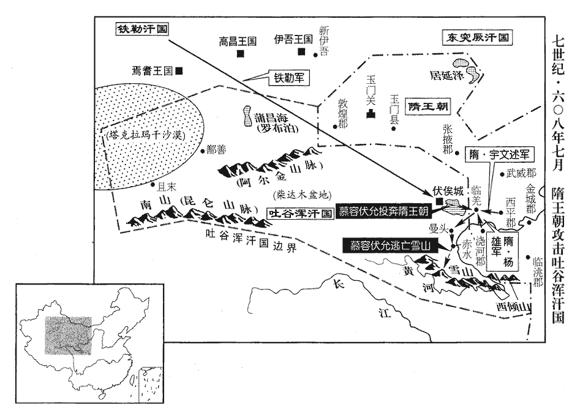
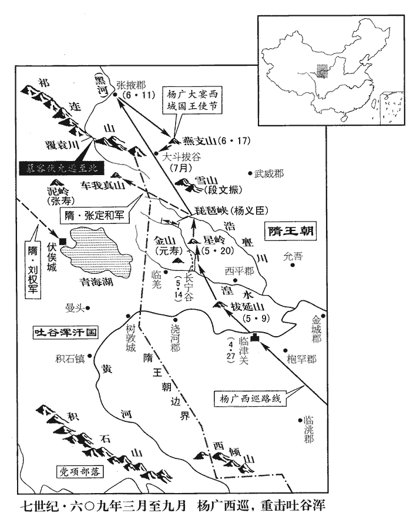
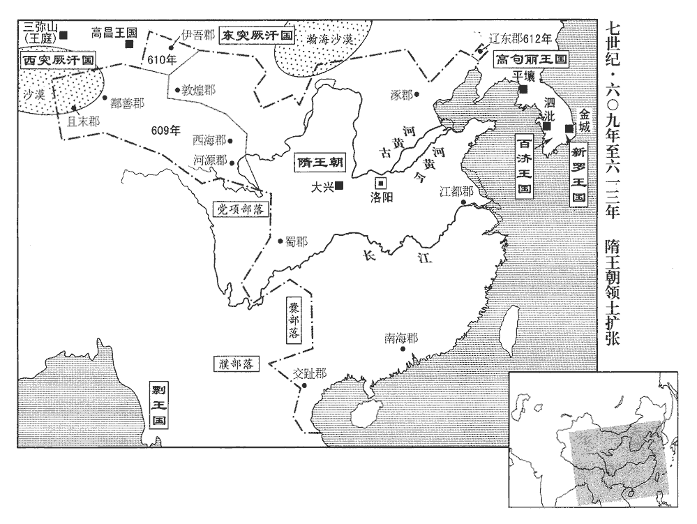
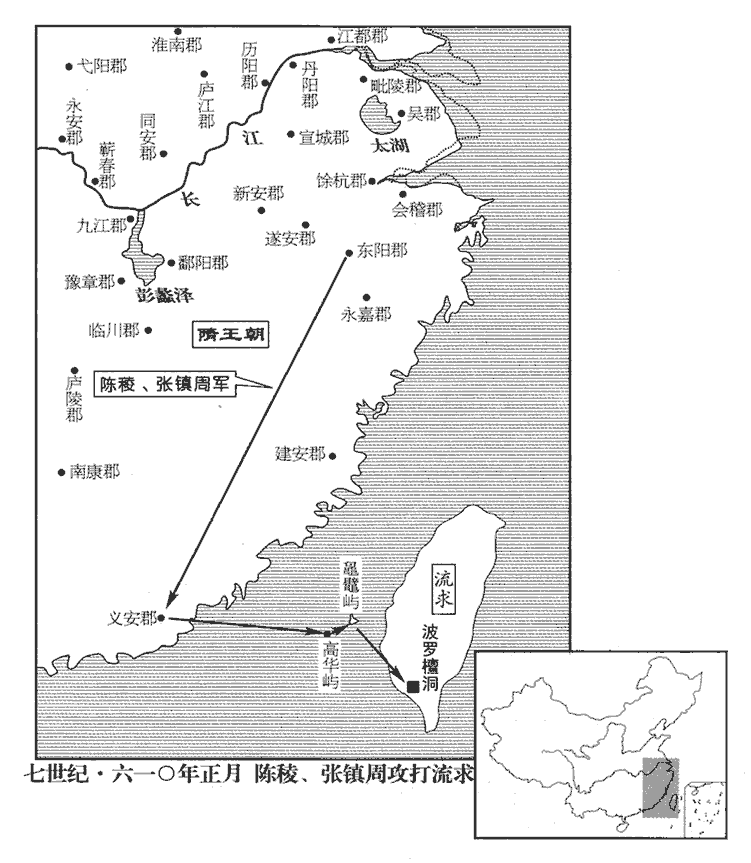
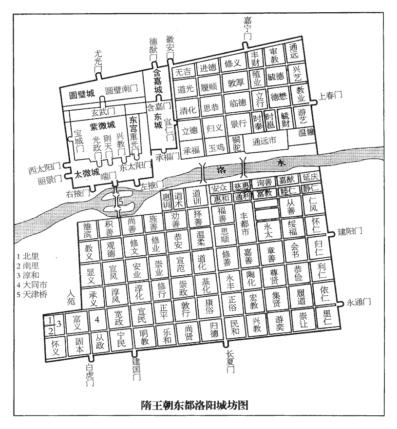
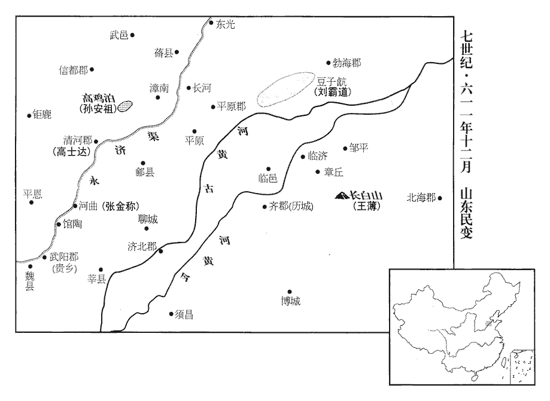
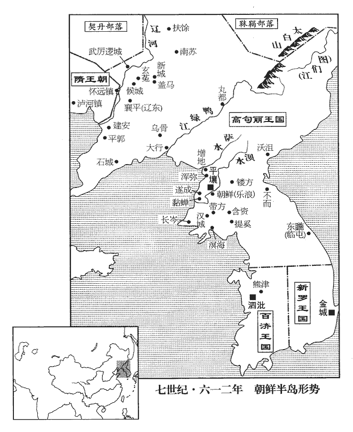
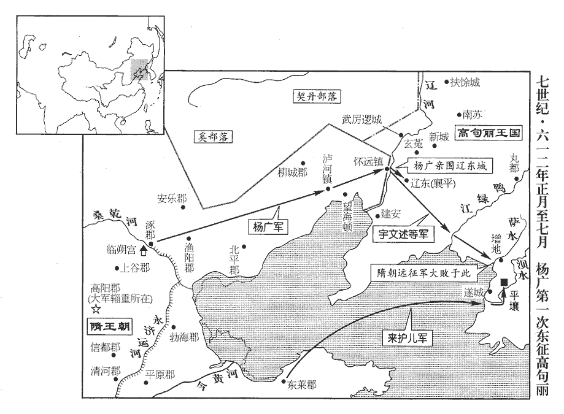

 隋紀五起著雍執徐（戊辰），盡玄黓涒難（壬申），凡五年。

# 煬皇帝上之下

## 大業四年（戊辰、六零八）

1春，正月，乙巳‹一›，詔發河北諸軍百餘萬穿永濟渠，引沁水南達于河，北通涿郡‹北京市›。班志：沁水出上黨穀遠縣羊頭山世靡谷。師古曰：今至懷州武陟縣界入河。穀遠，隋為沁源縣。沁，七鴆翻。考異曰：雜記：「三年六月，敕開永濟渠，引汾水入河，於汾水東北開渠，合渠水至于涿郡二千餘里，通龍舟。」按永濟渠即今御河，未嘗通汾水，雜記誤也。丁男不供，始役婦人。

〖译文〗 [1]春季，正月，乙巳（初一），炀帝下诏征发黄河以北各军一百多万人开凿永济渠，引沁水向南到黄河，向北通涿郡。男丁不足，开始役使妇女。

2壬申‹二十八›，以太府卿元壽為內史令。

〖译文〗 [2]壬申（二十八日），任命太府卿元寿为内史令。

3裴矩聞西突厥‹新疆北部及中亚东部›處羅可汗思其母，請遣使招懷之。二月，己卯‹六›，帝‹杨广，本年四十岁›遣司朝謁者崔君肅齎詔書慰諭之。帝置謁者臺大夫一人，置司朝謁者二人以貳之。處，昌呂翻。厥，九勿翻。可，從刊入聲。汗，音寒。使，疏吏翻。朝，直遙翻。考異曰：隋帝紀作「崔毅」，今從西突厥傳。處羅見君肅甚倨，受詔不肯起，君肅謂之曰：「突厥本一國，中分為二，每歲交兵，積數十歲而莫能相滅者，明知其勢敵耳。然啟民舉其部落百萬之眾，卑躬折節，入臣天子者，其故何也？折，而列翻。正以切恨可汗，不能獨制，欲借兵於大國，共滅可汗耳。群臣咸欲從啟民之請，天子既許之，師出有日矣。顧可汗母向夫人可，從刊入聲。汗，音寒。向，式亮翻。懼西國之滅，旦夕守闕，哭泣哀祈，匍匐謝罪，請發使召可汗，令入內屬。天子憐之，故復遣使至此。匍，音蒲。匐，蒲北翻。使，疏吏翻；下同。令，力丁翻。復，扶又翻。今可汗乃倨慢如此，則向夫人為誑天子，誑，居況翻。必伏尸都市，傳首虜庭。虜庭，謂啟民庭。發大隋之兵，資東國之眾，左提右挈以擊可汗，亡無日矣！柰何愛兩拜之禮，絕慈母之命，惜一語稱臣，使社稷為墟乎！」處羅矍然而起，處，昌呂翻。矍，居縛翻。流涕再拜，跪受詔書，因遣使者隨君肅貢汗血馬。

〖译文〗 [3]裴矩听说西突厥的处罗可汗思念他的母亲，请求炀帝派遣使者去招抚处罗可汗。二月，己卯（初六），炀帝派遣司朝谒者崔君肃携带着诏书慰问并谕示他。处罗可汗见到崔君肃时态度很是傲慢，接受诏书时不肯起立。崔君肃对他说：“突厥本来是一个国家，中间一分为二，每年双方交兵打仗，打了几十年的仗而不能互相消灭，其原因是明显的，双方势均力敌。但是启民可汗率领其部落的百万之众，卑躬屈膝，对大隋天子称臣的原因是什么呢？正是因为对可汗您的切齿之恨，不能独自制服您，而想要凭借大国的兵力，共同灭掉可汗您呵。朝中群臣都想接受启民可汗的请求，天子要是允许了，出兵就有日可待了。只是可汗的母亲向夫人，惧怕西突厥国被灭亡，每日早晚守在宫门，哭泣着哀求着，匍匐在地谢罪，请求皇帝派使者召见可汗，让可汗入朝归附。天子怜悯向夫人，因此派使者到这里来。现在可汗既如此傲慢，那么向夫人就成了诓骗天子，一定会被在闹市杀掉，并将首级传示西域各国。天子发动大隋的兵马，借助东突厥的人力，左提右挈以夹击可汗，您的国家灭亡的日子就不远了。为什么要爱惜行两拜之礼，而丢掉慈母的性命呢？吝惜说一句称臣的话，而使国家社稷成为废墟呢？”处罗可汗听了此话，惊惶四顾，一跃而起，流泪再三拜谢，跪在地上接受诏书。因此派遣使者随崔君肃朝贡上等好马。

4三月，壬戌‹十九›，倭‹日本›王多利思比孤隋書：倭國在百濟、新羅東南，水陸三千里，於大海之中，依山島而居；都於邪靡堆，則魏志所謂邪馬臺者也，在會稽之東，與儋dān耳相近。杜佑曰：倭在帶方東南大海中，去遼東萬二千里，大較在閩川、會稽之東，亦與朱崖、儋耳相近，自謂太伯之後。一名日本，自云國在日邊，因以為稱，倭，烏禾翻。入【章：十二行本「入」上有「遣使」二字；乙十一行本同；孔本同；張校同。】貢，遺帝書曰：遺，于季翻。「日出處天子致書日沒處天子無恙。」恙，余亮翻。帝覽之，不悅，謂鴻臚卿曰：臚，凌如翻。「蠻夷書無禮者，勿復以聞。」復，扶又翻。

〖译文〗 [4]三月，壬戌（十九日），倭王多利思比孤派人来朝贡，给炀帝的书信上说：“日出处的天子致书信给日没处的天子，您可好吗？”炀帝看后很不高兴，对鸿胪卿说：“蛮夷人的书信凡无礼的，就不要再给我看了。”

5乙丑‹二十二›，車駕幸五原‹内蒙古五原县›，帝改豐州為五原郡。因出塞巡長城。去年所築者。行宮設六合板城，隋志：帝北巡出塞，行宮設六合城，方一百二十步，高四丈二尺。六合，以木為之，方一尺，外面一方有板，離合為之，塗以青色。壘六板為城，高三丈六尺，上加女牆，板高六尺，開南北門。又於城四角起樓敵二，門觀、門樓檻皆丹青綺畫。又造六合殿、千人帳，載以槍車，車載六合三板。其車軨líng解合交叉，即為馬槍，皆車上張幕，幕下張平一弩傳矢，五人更守。兩車之間，施車軨馬槍，皆外其轅，以為外圍。次內布鐵菱，次內施蟄鞬。中施弩牀，長六尺，闊三尺；牀桄陛插鋼錐，皆長五寸，謂之蝦鬚，皆施機關，張則錐皆外向。其牀上施旋機弩，以繩連弩機，人從外來，觸繩則弩機旋轉，向觸所而發。其外又以矰zēng周圍行宮二丈，一鈴一柱，柱舉矰，去地二尺五寸。當行宮南北門施槌磬，連矰，以機發之，有人觸矰，則眾鈴發響，槌擊兩磬，以知所警，名為擊磬。考異曰：雜記云，「帝幸啟民帳時造行城，周二千步，高二十餘丈。」今從隋禮儀志。載以槍車。每頓舍，則外其轅以為外圍，內布鐵菱；爾雅翼曰：今軍旅以鐵作茨，以布敵路，謂之鐵蒺蔾。或云：鐵蒺蔾菱角，起於煬帝征遼為之。然六韜中已有此物，朝錯傳謂之渠答。次施弩牀，皆插鋼錐，鋼，音剛；精鐵也。外向；上施旋機弩，以繩連機，人來觸繩，則弩機旋轉，向所觸而發。其外又以矰周圍，施鈴柱、槌磐以知所警。矰，作滕翻。槌chuí，直追翻。

〖译文〗 [5]乙丑（二十二日），炀帝到达五原，就此出塞巡视长城。炀帝的行宫设置木制的六合城，城上载有枪车。每次停下驻宿，则把车辕朝外作为外围，内布铁蒺藜；再安设弩床，都插上钢锥，锥向外；上面装置旋机弩，用绳子系在弩的板机上，只要有人触动绳子，弩机就旋转，向触动的方向发射。在弩外周围又布置能弋射的短箭，并装设铃柱、木槌、石磐用来报警。

6帝募能通絕域者，屯田主事常駿等請使赤土‹泰国宋卡府›，屯田曹，屬工部尚書。尚書諸曹各有主事，流外吏職也。隋書：赤土國，扶南之別種，在南海中，水行百餘日而達；所都土色多赤，因以為號。杜佑曰：崖州直南水行，便風十餘日到赤土國。其國到五月日亭午，物影都在南。一日三食，飯皆旋炊；不然，逡巡過時，即便臭敗，熱氣特甚。使，疏利翻。帝大悅，丙寅‹二十三›，命駿齎物五千段，以賜其王。赤土者，南海中遠國也。

〖译文〗 [6]炀帝招募能够沟通极远地方关系的人，屯田主事常骏等人请求出使赤土，炀帝非常高兴。丙寅（二十三日），命令常骏携带着财物五千段，用来赏赐赤土国王。赤土国，是南海中一个很遥远的国家。

7帝無日不治宮室，治，直之翻。兩京及江都‹江苏省扬州市›，苑囿亭殿雖多，久而益厭，每遊幸，左右顧矚，矚，之欲翻。無可意者，不知所適。乃備責天下山川之圖，躬自歷覽，以求勝地可置宮苑者。夏，四月，詔於汾州‹山西省吉县›之北汾水之源，營汾陽宮‹宫在山西省宁武县南管涔山燕京山›上，环抱天池，冯小怜曾在此打猎。隋志：樓煩郡汾源縣，舊岢嵐也，大業四年，改為靜樂，有汾陽宮、管涔山、天池、汾水。十三州志：汾水出武州之燕京山，管涔之異名也。水經註，燕京山上有大池，世謂之天池。按煬帝起汾陽宮環天池，詳見後五臺註。

〖译文〗 [7]炀帝没有一天不在营建宫室，两京以及江都，苑囿亭殿虽然很多，时间久了炀帝仍非常感到厌倦，每次游玩，左顾右盼，觉得这些宫殿苑林都没有中意的，不知道什么是好。于是遍求天下山川图册，亲自察看，以寻求名胜之地营造宫苑。夏季，四月，炀帝下诏在汾州之北，汾水的源头营建汾阳宫。

8初，元德太子‹杨昭›薨，見上卷二年。河南尹齊王暕次當為嗣，元德吏兵二萬餘人，悉隸於暕，暕，古限翻。帝為之妙選僚屬，為，于偽翻。以光祿少卿柳謇之為齊王長史，少，始照翻。謇jiǎn，九輦翻。長，知兩翻。且戒之曰：「齊王德業脩備，富貴自鍾卿門；鍾，聚也。若有不善，罪亦相及。」謇之，慶之從子也。柳慶事宇文泰。從，才用翻。暕寵遇日隆，百官趨謁，闐咽道路。暕以是驕恣，昵近小人，闐，田年翻。昵，尼質翻。近，其靳翻。所為多不法。遣左右喬令則、庫狄仲錡qí、庫狄，複姓。錡，魚豈翻。陳智偉求聲色。令則等因此放縱，訪人家有美女，輒矯暕命呼之，載入暕第，淫而遣之。仲錡、智偉詣隴西‹陇山以西›，撾炙諸胡，責其名馬，帝改渭州為隴西郡。撾zhuā，側瓜翻。得數匹以進暕；暕令還主，仲錡等詐言王賜、取歸其家，暕不知也。樂平公主‹杨丽华›嘗奏帝，言柳氏女美，樂平公主，周天元‹宇文赟›后也。樂，音洛。帝未有所答。久之，主復以柳氏進暕，復，扶又翻。暕納之。其後，帝問主：「柳氏女安在？」主曰：「在齊王所。」帝不悅。暕從帝幸汾陽宮，大獵，詔暕以千騎入圍，騎，奇寄翻。暕大獲麋鹿以獻；而帝未有得也，乃怒從官，皆言為暕左右所遏，獸不得前。從，才用翻。帝於是發怒，求暕罪失。時制：縣令無故不得出境；有伊闕令皇甫詡，得幸於暕，違禁，攜之至汾陽宮。御史韋德裕希旨劾奏暕，劾，戶概翻，又戶得翻。帝令甲士千餘人大索暕第，令，力丁翻。索，山客翻。因窮治其事。治，直之翻。暕妃韋氏早卒，卒，子恤翻。暕與妃姊元氏婦通，產一女。暕召相工相，息亮翻。令徧視後庭，相工指妃姊曰：「此產子者當為皇后。」暕以元德太子有三子，三子：侑、倓、侗。恐不得立，陰挾左道為厭勝，厭，於業翻。至是皆發。帝大怒，斬令則等數人，賜妃姊死，暕府僚皆斥之邊遠。柳謇之坐不能匡正，除名。謇，九輦翻。時趙王杲尚幼‹本年二岁›，帝謂侍臣曰：「朕唯有暕一子，不然者，當肆諸市朝以明國憲。」暕自是恩寵日衰，雖為京‹洛阳›尹，不復關預時政。帝恆令虎賁郎將一人監其府事，帝制十二衛，每衛置護軍四人，掌副貳將軍，無則一人攝，尋改護軍為虎賁郎將，正四品。朝，直遙翻。復，扶又翻。恆，戶登翻。令，力丁翻。賁，音奔。將，即亮翻。監，古銜翻。暕有微失，虎賁輒奏之。帝亦常慮暕生變，所給左右，皆以老弱，備員而已。太史令庾質，季才之子也，其子為齊王屬，隋王府有掾有屬。帝謂質曰：「汝不能一心事我，乃使兒事齊王，何向背如此！」背，蒲妹翻。對曰：「臣事陛下，子事齊王，實是一心，不敢有二。」帝猶怒，出為合水‹甘肃省庆阳县›令。開皇十六年，置合水縣，為慶州治所，帝改慶州為弘化郡，唐改合水縣為安化。

〖译文〗 [8]当初，元德太子杨昭去世，河南尹齐王杨按次序应当立为嗣子，元德太子属下的两万余官吏兵卒，全都隶属于杨。炀帝为他精心地挑选僚属，任命光禄少卿柳謇之为齐王的长吏，并且告诫柳謇之说：“齐王德行、业绩修习完美，那么富贵自然就会来到你身边，齐王若有什么不好的地方，罪过也会相及于你。”柳謇之是柳庆的侄子。杨得到炀帝的宠信日益隆重，文武百官都赶着去拜谒他，以至于人都挤满道路。杨因此而骄傲放纵，亲近小人，所做所为多是不法之事。他派身边的乔令则、库狄仲、陈智伟去寻找歌舞女色。乔令则等人因此就更加放纵，打听到人家有美女，立即就假借杨的命令招来，装上车子送入杨府第，奸淫后再放走。库狄仲、陈智伟到陇西去，对各部落胡人进行拷打烧烙，责令他们交出各马，得到几匹好马便进献给杨，杨命令把马还给主人，库狄仲等人诈称是齐王所赐，将马牵回家里，杨不知道这些事。乐平公主曾经奏报炀帝说柳家的女儿很美，炀帝没有答复。后来，公主又把柳氏女给了杨，杨收纳了。之后，炀帝问乐平公主：“柳氏女在哪里呢？”公主说：“在齐王杨府里。”炀帝不高兴。杨跟随炀帝到汾阳宫，参加大规模的狩猎活动。炀帝命令杨率领一千骑兵进入围猎圈，杨猎获了很多麋鹿进献给炀帝，而炀帝什么也没有猎到，就向跟从的官员发怒。官员们都说因为杨身边人的阻挡，野兽不能到跟前来。于是炀帝发怒，搜罗杨的罪过。当时的制度：县令无故不得出县境，伊阙县令皇甫诩，受到杨的宠信，他违反了禁令，被杨带到了汾阳宫。御史韦德裕秉承炀帝的旨意向炀帝奏报弹劾杨。炀帝命令甲士一千余人大肆搜查杨的府第，彻底追查惩治此事。杨的妃子韦氏早死，杨与妃姐元氏妇私通，生了一个女儿。杨召来一个看相的人，让他看遍府内的姬妾，看相者指着妃姐说：“这个生孩子的应当成为皇后。”杨认为元德太子有三个儿子，恐怕自已不能被立为太子，暗中倚靠左道妖术作咒诅以求胜，到后来这些都被揭发。炀帝勃然大怒，将乔令则等几人斩首，妃姐被赐死，杨府中的僚属都被流放到边远地区。柳謇之犯了崐不能纠正齐王错误的罪，而被除名。当时赵王杨杲还年幼，炀帝对侍臣说：“我只有杨这一个儿子，不然的话，应当处死并陈尸于闹市以昭明国家的法度。”对杨的恩宠自此日渐衰落，虽然身为京尹，但不再参与时政。炀帝始终令虎贲郎派一人监视齐王府的情况，杨稍微有点过失，虎贲郎便立即上报。炀帝也常常担忧杨会发生变故，派到杨身边的人，都是老弱者，仅补齐人员而已。太史令庾质，是庾季才的儿子，他的儿子是齐王府的属官。炀帝对庾质说：“你不能一心一意地侍奉我，竟让你儿子侍奉齐王，为什么你的心意正反不一呢？”庾质回答说：“我侍奉陛下，儿子侍奉齐王，实在是一心一意，不敢有二心。”炀帝仍然发怒，把庾质调为合水县令。

9乙卯‹十三›，詔以突厥啟民可汗厥，九勿翻。可，從刊入聲。汗，音寒。遵奉朝化，思改戎俗，宜於萬壽戍‹内蒙古托克托县北›置城造屋，其帷帳牀褥以上，務從優厚。

〖译文〗 [9]乙卯（十三日），炀帝下诏说，突厥启民可汗遵奉朝廷的感化，想改变戎狄的习俗，可以在万寿戌建立城池修造房屋，他们所用的帷帐、床褥等等物品，务必从优供应。

10秋，七月，辛巳‹十›，發丁男二十餘萬築長城，自榆谷‹内蒙古托克托县西›而東。此榆谷當在榆林西。

〖译文〗 [10]秋季，七月，辛巳（初十），炀帝征发壮丁二十余万人修筑长城，从榆谷向东。

 

11裴矩說鐵勒‹新疆东北部及蒙古国北部›，說，式芮翻。使擊吐谷渾‹青海省›，大破之。吐谷渾可汗伏允東走，入西平‹青海省乐都县›境內，帝改鄯州為西平郡。吐，讀暾入聲。谷，音浴。可，從刊入聲。汗，音寒。遣使請降求救；帝遣安德王雄出澆河‹青海省贵德县›，前已書觀王雄，此復書安德王雄何也？按雄傳，雄從帝征吐谷渾還，方徙封觀王，高熲誅之時，雄尚為安德王，通鑑因舊史成文而書之耳。帝改廓州為澆河郡。使，疏吏翻。降，戶江翻。澆，古堯翻。許公宇文述出西平迎之。宇文述封許國公。述至臨羌城‹青海省湟源县›，漢臨羌縣城也。吐谷渾畏述兵盛，不敢降，帥眾西遁；帥，讀曰率。述引兵追之，拔曼頭‹青海省共和县西南›、赤水‹青海省兴海县›二城，隋志：帝平吐谷渾，置河源郡於古赤水城，管下有曼頭城。曼，音萬。斬三千餘級，獲其王公以下二百人，虜男女四千口而還。還，從宣翻，又如字；下同。伏允南奔雪山‹积石山·青海省东南部阿尼玛卿山›，此即蜀西山之西雪山也。其故地皆空，東西四千里，南北二千里，皆為隋有，置州、【章：十二行本「州」作「郡」；乙十一行本同；孔本同。】縣、鎮、戍，置鄯善‹新疆若羌县›、且末‹新疆且末县›、西海‹青海省海晏县›、河源‹青海省兴海县›四郡，顯武、濟遠、肅寧、伏戎、宣德、威定、遠化、赤水等縣。志云，置於五年。天下輕罪徙居之。

〖译文〗 [11]裴矩游说铁勒，让铁勒攻击吐谷浑，大败吐谷浑。吐谷浑可汗伏允向东逃跑，进入西平境内，派遣使臣向隋朝请求投降要求救援。炀帝派安德王杨雄率兵出浇河郡，许公宇文述出西平迎接伏允可汗。宇文述到达临羌城，吐谷浑人畏惧宇文述兵势强盛，不敢投降，伏允可汗就率众向西逃跑。宇文述引兵追杀，攻下曼头、赤水二城，斩获首级三千余，俘获吐谷浑王公以下贵族二百人，俘虏男女百姓四千人返回。伏允可汗向南逃到雪山，他原来统辖的地域都丧失了，东西四千里，南北二千里，都为隋朝所有。隋朝在此设置州、县、镇、戍，将所有犯轻罪的人迁到此居住。

12八月，辛酉‹二十一›，上親祠恆岳‹河北省曲阳县北›，恆岳，北岳恆山。恆，戶登翻。赦天下。河北道郡守畢集，守，式又翻。裴矩所致西域十餘國皆來助祭。考異曰：裴矩傳云「三年」，誤也。今從帝紀。

〖译文〗 [12]八月，辛酉（二十日），炀帝亲自到恒山去祭祀，下诏大赦天下。河北道的郡守都集中到恒山，裴矩所罗致的西域十几个国家的使者都前来助祭。

13九月，辛未‹一›，徵天下鷹師悉集東京‹洛阳›。鷹師，善調習鷹隼者也。至者萬餘人。

〖译文〗 [13]九月，辛未（初一），炀帝征召天下训鹰师集中到东京，应征而至的有一万余人。

14冬，十月，乙卯‹十六›，頒新式。去年四月壬辰，改度量權衡，並依古式，今頒於天下。

〖译文〗 [14]冬季，十月，乙卯（十六日），颁布新的度、量、衡制度。

15常駿等至赤土境，赤土王利富多塞遣使以三十舶迎之，進金鏁suǒ以纜駿船，使，疏吏翻；下同。舶，莫百翻。鏁，蘇果翻。凡汎海百餘日，入境月餘，乃至其都。赤土所都名僧祇城。其王居處處，昌呂翻。器用，窮極珍麗，待使者禮亦厚，遣其子那邪迦隨駿入貢。迦，音加。

〖译文〗 [15]常骏等人到达赤土国的国境，赤土国王利富多塞派遣使者乘三十只大船来迎接他们。进献金锁以缆常骏的船。常骏等人在海上渡了一百余天，入赤土境后又过了一个多月，才到达赤土国的国都。赤土国王居住的宫殿、器物用品，都极其珍贵华丽，接待使者的礼节也十分隆重。国王还派儿子那邪迦跟随常骏入朝进贡。

16帝以右翊衛將軍河東‹山西省永济市›薛世雄為玉門道行軍大將，帝改蒲州為河東郡。隋志：玉門縣屬敦煌郡。改行軍總管為行軍大將。將，即亮翻。與突厥啓民可汗連兵擊伊吾‹新疆哈密市›，厥，九勿翻。可，從刊入聲。汗音寒。考異曰：世雄擊伊吾，帝紀無之。本傳前有從帝征吐谷渾，後云，「歲餘，以世雄為玉門大將，與突厥啟民可汗擊伊吾。」然則似在大業六、七年也。按是時啟民已卒，伐吐谷渾之歲，伊吾吐屯設獻地數千里，恩寵甚厚，隋何故伐之！今移置獻地之前。師出玉門‹此玉门关位今甘肃省安西县东›，啟民不至。世雄孤軍度磧，伊吾初謂隋軍不能至，皆不設備；聞世雄軍已度磧，大懼，請降。流沙亦謂之磧。磧，七迹翻。降，戶江翻。世雄乃於漢故伊吾城東築城，留銀青光祿大夫王威以甲卒千餘人戍之而還。還，從宣翻，又音如字。

〖译文〗 [16]炀帝任命右翊卫将军河东人薛世雄为王门道行军大将，与突厥的启民可汗联合进攻伊吾国。薛世雄率军出玉门，启民可汗没有到。薛世雄孤军越过沙漠，伊吾人开始以为隋军不可能来，所以都没有做防备，当听说薛世雄军已崐越过沙漠，大为恐惧，于是请求投降。薛世雄就在汉代旧伊吾城东筑新城，留下银青光禄大夫王威率领一千余名士兵戍守伊吾城，薛世雄率军返回。

## 五年（己巳、六零九）

1春，正月，丙子‹八›，改東京‹洛阳›為東都。

〖译文〗 [1]春季，正月，丙子（初八），炀帝改东京为东都。

2突厥啟民可汗來朝，禮賜益厚。厥，九勿翻。可，從刊入聲。汗，音寒。朝，直遙翻。

〖译文〗 [2]突厥启民可汗来朝见，接待之礼和赏赐更加丰厚。

3癸未‹十五›，詔天下均田。

〖译文〗 [3]癸未（十五日），炀帝下诏，天下实行均田制。

4戊子‹二十›，上‹杨广，本年四十一岁›自東都西還。

〖译文〗 [4]戊子（二十日），炀帝从东都回西京。

5己丑‹二十一›，制民間鐵叉、搭鉤、䂎刃之類皆禁之。搭，多臘翻。䂎，作管翻。

〖译文〗 [5]己丑（二十一日），规定民间铁叉、搭钩、刀之类都属于违禁之物。

6二月，戊申‹十一›，車駕至西京。

〖译文〗 [6]二月，戊申（十一日），炀帝的车驾到达西京。

7三月，己巳‹二›，西巡河右；乙亥‹八›，幸扶風‹陕西省凤翔县›舊宅。河右，河西武威諸郡地。帝改岐州為扶風郡。夏，四月，癸亥‹二十七›，出臨津關‹青海省循化县东›，臨津關當在枹罕界，臨河津。水經註：河水自澆河東流，逕邯川城南，又東逕臨津城北，白土城南，為緣河濟渡之地。渡黃河，至西平‹青海省乐都县›，陳兵講武，將擊吐谷渾‹青海省›。五月，乙亥‹九›，上大獵於拔延山‹青海省化隆县西北›，隋志：西平郡化隆縣有拔延山。杜佑曰：拔延山在廓州廣威縣，隋煬帝征吐渾經此山。吐，從暾入聲。谷，音浴。長圍亘二十里。考異曰：隋帝紀作「二千里」，疑二十里字誤。庚辰‹十四›，入長寧谷‹西宁市北›，長寧谷在古晉昌郡界。水經註：湟水逕臨羌縣故城南，又東，長寧川水注之，長寧水東南流逕晉昌川，又有長寧亭，亭北有養女嶺，即浩亹mén西平之北山。度星嶺‹青海省大通县›；丙戌‹二十›，至浩亹川‹青海省大通河›。水經註：浩亹河出塞外，逕西平之鮮谷塞，又東逕養女北山東南。隋志：西平郡湟水縣有舊浩亹縣。浩亹，音告門。浩，又音閤。以橋未成，斬都水使者黃亘及督役者九人，帝改都水監為都水使者。考異曰：隋帝紀云：「梁浩亹，御馬度而橋壞。」今從略記。數日，橋成，乃行。

〖译文〗 [7]三月，己巳（初二），炀帝向西巡视河右；乙亥（初八），到达扶风郡杨家旧宅。夏季，四月，癸亥（二十七日），炀帝出临津关，渡过黄河，到达西平郡。布置军队，讲习武事，准备进攻吐谷浑。五月，乙亥（初九），炀帝在拔延山举行大规模的围猎，长围竟达二十里（疑有误）。庚辰（十四日），炀帝进入长宁谷，越过星岭；丙戌（二十日），到达浩川，因为桥未建成，炀帝斩都水使者黄亘以及监工九人，几天后，桥建成，才继续前进。

吐谷渾可汗伏允帥眾保覆袁川‹青海省祁连县北黑河上游›，可，從刊入聲。汗，音寒。帥，讀曰率。帝分命內史元壽南屯金山‹青海省湟中县北›，兵部尚書段文振北屯雪山‹甘肃、青海二省交界处冷龙岭›，太僕卿楊義臣東屯琵琶峽‹青海省门源县西›，將軍張壽西屯泥嶺‹青海省刚察县北大通山›，四面圍之。伏允以數十騎遁出，遣其名王詐稱伏允，保車我真山‹青海省祁连县东南俄博南山›。騎，奇寄翻。車，昌遮翻。壬辰‹二十六›，詔右屯衛大將軍張定和往捕之。定和輕其眾少，不被甲，挺身登山，吐谷渾伏兵射殺之；少，詩沼翻。被，皮義翻。射，而亦翻。其亞將柳武建擊吐谷渾，破之。將，即亮翻。甲午‹二十八›，吐谷渾仙頭王窮䠞，䠞，與蹙同。帥男女十餘萬口來降。帥，讀曰率。降，戶江翻。六月，丁酉‹二›，遣左光祿大夫梁默等追討伏允，兵敗，為伏允所殺。衛尉卿劉【章：十二行本「劉」上有「彭城」二字；乙十一行本同；孔本同；張校同。】權出伊吾道，擊吐谷渾，至青海，隋志：西海郡有青海。吐谷渾傳：青海在伏俟城東，周回千餘里。虜獲千餘口，乘勝追奔，至伏俟城‹王庭·青海省天峻县东青海湖西畔›。吐谷渾都伏俟城，在青海西十五里。

〖译文〗 吐谷浑可汗伏允率领部众据守覆袁川，炀帝分别命令内史元寿向南面金山驻军；兵部尚书段文振在北面雪山驻军；太仆卿杨义臣在东面琵琶峡驻军；将军张寿在西面泥岭驻军，四面包围吐谷浑人。伏允率几十骑兵逃出，派他的一个王诈称是伏允，据守车我真山。壬辰（二十六日），炀帝命令右屯卫大将军张定和去抓捕他。张定和轻视吐谷浑人少，不穿铠甲，挺身登山，吐谷浑的伏兵将张定和射死。张定和的副将柳武建率兵进击吐谷浑，攻破他们。甲午（二十八日），吐谷浑仙头王走投无路，率领部众男女十余万来投降。六月，丁酉（初二），炀帝派左光禄大夫梁默等率兵追击讨伐伏允，结果大败，梁默为伏允杀死。卫尉卿刘权率兵出伊吾道进攻吐谷浑，一直追到青海，俘获一千余人，乘胜追击，直到伏俟城。

 

辛丑‹六›，帝謂給事郎蔡徵曰：「自古天子有巡狩之禮；而江東諸帝多傅脂粉，坐深宮，不與百姓相見，此何理也？」對曰：「此其所以不能長世。」丙午‹十一›，至張掖‹甘肃省张掖市›。帝改甘州為張掖郡。帝之將西巡也，命裴矩說高昌‹新吐鲁番市东›王麴伯雅麴，姓也。漢末有西平麴演。說，輸芮翻。及伊吾吐屯設等，吐屯設，意突厥所置，以守伊吾。啗以厚利，召使入朝。壬子‹十七›，帝至燕支山‹甘肃省永昌县西大黄山›，隋志：武威郡番禾縣有燕支山。啗，徒濫翻，又徒覽翻。朝，直遙翻。燕，因肩翻。伯雅、吐屯設等及西域二十七國謁於道左，皆令佩金玉，被錦罽jì，令，力丁翻。被，皮義翻。罽，音計。焚香奏樂，歌舞諠譟。帝復令武威‹甘肃省武威市›、張掖士女盛飾縱觀，衣服車馬不鮮者，郡縣督課之，骑乘嗔咽，騎，奇寄翻。乘，繩證翻。周亘數十里，以示中國之盛。吐屯設獻西域數千里之地，上大悅。癸丑‹十八›，置西海‹青海省天峻县›、河源‹青海省兴海县›、鄯善‹新疆若羌县›、且末‹新疆且末县›等郡，西海郡置於伏俟城，河源郡置於赤水城，鄯善郡置於古樓蘭城，且末郡置於古且末城。酈道元曰：且末城東去鄯善七百二十里。鄯，時戰翻。且，子閭翻。讁天下罪人為戍卒以守之。命劉權鎮河源郡積石鎮‹郡政府所在城›，志云：河源郡有積石山，河所出也。杜佑曰：積石山在西平郡龍支縣南。大開屯田，扞禦吐谷渾，以通西域之路。

〖译文〗 辛丑（初六），炀帝对给事郎蔡徵说：“自古天子有巡狩之礼；而江东南朝的各位皇帝多爱敷脂粉，坐于深宫，不同百姓相见，这是什么道理呢？”蔡崐徵回答：“这就是他们王朝不能长久的原因。”丙午（十一日），炀帝到达张掖。在炀帝将要西巡的时候，命裴矩去游说高昌王曲伯雅以及伊吾的吐屯设等，以厚利引诱他们，召他们派遣使者入朝。壬子（十七日），炀帝到达燕支山，曲伯雅、吐屯设以及西域二十七国的国王、使者都在道路东侧拜见炀帝。他们均受命佩戴金玉，身着锦衣，焚香奏乐，歌舞欢腾。炀帝又命令武威、张掖的士女盛装修饰纵情观看。衣服、车马不新鲜整齐的，由郡县负责征收更换。车驾马匹充塞道路，周围绵延几十里，以显示中国的强盛。吐屯设进献西域几千里的土地，炀帝非常高兴。癸丑（十八日），设置西海、河源、鄯善、且末等郡，将天下的罪人流放这里，作为戍卒守卫这些地方。炀帝命刘权镇守河源郡积石镇，大规模开发屯田，以抵御吐谷浑，保持西域道路的畅通。

 

是時天下凡有郡一百九十，縣一千二百五十五，戶八百九十萬有奇。奇，居宜翻。東西九千三百里，南北萬四千八百一十五里。隋氏之盛，極於此矣。

〖译文〗 这时，全国共置郡一百九十个，县一千二百五十五个；有户八百九十多万；国土东西长九千三百里，南北宽一万四千八百一十五里。隋朝的强盛，这时已达到了顶点。

帝謂裴矩有綏懷之略，進位銀青光祿大夫。自西京諸縣及西北諸郡，皆轉輸塞外，每歲鉅億萬計；經途險遠及遇寇鈔，鈔，楚交翻。人畜死亡不達者，郡縣皆徵破其家。由是百姓失業，西方先困矣。

〖译文〗 炀帝说裴矩有安抚、怀柔的韬略，提升他为银青光禄大夫。从西京各县以及西北各郡，都辗转输送财物到塞外，每年耗费以钜万亿计，路途遥远险阻，或遇上强盗抢劫，凡人畜因死亡不能到达目的地的，郡县都要再行征调，以至使他们家业破产。因此百姓失去生计，西部地区先贫困起来。

初，吐谷渾伏允使其子順來朝，吐，從暾入聲。谷，音浴。朝，直遙翻。帝留順不遣。伏允敗走，無以自資，帥數千騎客於党項‹四川省西北部›。隋書：党項羌者，三苗之後也，其種有宕昌、白狼，皆自稱獼猴種。東接臨洮、西平，西拒葉護，南北數千里，處山谷間，每姓別為部落。帥，讀曰率。党，他郎翻。帝立順為可汗，可，從刊入聲。汗，音寒。送至玉門‹甘肃省安西县东›，令統其餘眾；以其大寶王尼洛周為輔。統，他綜翻。尼，女夷翻。至西平，其部下殺洛周，順不果入而還。還，從宣翻，又音如字。

〖译文〗 当初，吐谷浑可汗伏允派他的儿子顺来朝见炀帝，炀帝将顺留下不放他回去。伏允败走后，无法解决生计，就率领几千骑兵客居在党项境内。炀帝立顺为可汗，送他到玉门，让他统领吐谷浑剩下的部众，并任命吐谷浑的大宝王尼洛周为辅臣。顺到西平时，他的部下杀死了尼洛周，顺没能到达目的地就又返回了。

丙辰‹二十一›，上御觀風殿，即觀風行殿也。大備文物，引高昌王麴伯雅及伊吾吐屯設升殿宴飲，考異曰：略記在六月壬寅，今從隋帝紀。其餘蠻夷使者陪階庭者二十餘國，奏九部樂杜佑曰：煬帝立清樂、龜茲、西涼、天竺、康國、疏勒、安國、高麗、禮畢為九部。使，疏吏翻。及魚龍戲以娛之，賜賚有差。戊午‹二十三›，赦天下。

〖译文〗 丙辰（二十一日），炀帝到观风行殿，大规模地陈列仪仗、礼仪，带着高昌王伯雅和伊吾的吐屯设上殿宴饮，其余的蛮夷使臣在殿下陪宴的共有二十多个国家。炀帝命人奏九部乐，以及鱼龙戏来娱乐，对各国来使赏赐不等。戊午（二十三日），下诏大赦天下。

吐谷渾有青海‹青海湖›，俗傳置牝馬於其上，得龍種。吐谷渾傳：青海中有小山，其俗至冬輒放牝馬於其上，言得龍種。吐谷渾嘗得波斯草馬，放入青海，因生驄駒，能日行千里，時稱青海驄。種，章勇翻。秋，七月，【章：十二行本「月」下有「丁卯」二字；乙十一行本同，孔本同；張校同。】置馬牧於青海，縱牝馬二千匹於川谷以求龍種，無效而止。

〖译文〗 吐谷浑有青海，民间传说把牝马放到青海内，可以得到龙种。秋季，七月，将马在青海放牧，山谷间纵养牝马两千匹，以求得龙种，但没有效果，只好停止了。

車駕東還，經大斗拔谷‹甘肃省民乐县南›，還，從宣翻，又如字。新唐志：涼州西二百里有大斗軍，本赤水守捉，開元十六年為軍，因大斗拔谷為名。山路隘險，魚貫而出，單行相次，若貫魚然。風雪晦冥，文武飢餒沾濕，夜久不逮前營，逮，及也。士卒凍死者太半，考異曰：帝紀在六月癸卯。按西邊地雖寒，不容六月大雪，凍死人畜，今從略記。略記作達十拔谷，今從帝紀。馬驢什八九，後宮妃、主或狼狽相失，與軍士雜宿山間。九月，乙【章：十二行本「乙」作「癸」；乙十一行本同；孔本同；張校同。】未‹十九›，車駕入西京。冬，十一月，丙子‹十三›，復幸東都。復，扶又翻。

〖译文〗 炀帝的车驾向东返回，路经大斗拔谷，山路狭窄险要，队伍只能鱼贯通行。风雪使天色昏暗，文武百官饥饿难忍，衣服又全为风雪所打湿。都深夜了还未到达宿营地，士卒冻死大半，马驴冻死十之八九；后宫的妃嫔、公主有的都走散了，和军士们混杂在一起宿于山间。九月，乙未（疑误），炀帝车驾进入西京。冬季，十一月，丙子（十三日），炀帝又到东都。

8民部侍郎裴蘊以民間版籍，脫漏戶口及詐注老小尚多，奏令貌閱，令，力丁翻。閱其貌以驗老小。若一人不實，則官司解職。又許民糾得一丁者，令被糾之家代輸賦役。被，皮義翻。是歲，諸郡計帳進丁二十【章：十二行本「十」下有「四」字；乙十一行本同；孔本同；張校同。】萬三千，新附口六十四萬一千五百。帝臨朝覽狀，朝，直遙翻。謂百官曰：「前代無賢才，致此罔冒；今戶口皆實，全由裴蘊。」由是漸見親委，未幾，擢授御史大夫，與裴矩、虞世基參掌機密。蘊善候伺人主微意，幾，居豈翻。伺，相吏翻。所欲罪者，則曲法鍛成其罪；所欲宥者，則附從輕典，因而釋之。是後大小之獄，皆以付蘊，刑部、大理莫敢與爭，必稟承進止，然後決斷。斷，丁亂翻。蘊有機辯，言若懸河，或重或輕，皆由其口，剖析明敏，時人不能致詰。書曰：「知人則哲，能官人。」史言知人善任之難。

〖译文〗 [8]民部侍郎裴蕴认为民间的名册、户籍，有很多脱漏户口以及诈骗注册为老少的情况。就奏请炀帝进行查阅面貌以验老小。如果一个人的情况不属实，那么有关的官员就被解职。又许诺如果百姓检举出一个壮丁，就命令被检举的人家替检举者缴纳赋役。这一年，各郡总计增加了男丁二十万三千人，新归附的人口六十四万一千五百人。炀帝上朝览阅报告，对百官说：“前代没有贤才，以致户口罔骗冒充，现在户口都确实了，全是由于有了裴蕴。”因此逐渐对裴蕴亲近信任，不久，就提升裴蕴为御史大夫，让他和裴矩、虞世基参与掌管机密。裴蕴善于观察以迎合皇帝细微的心思和意图。炀帝要加罪的人，裴蕴就曲解法律以编造成罪状；炀帝想要赦免的人，裴蕴就附和炀帝意思，从轻解释典章法律，因此就将人释放了。此后大大小小的刑狱之案，都交给裴蕴办理。刑部、大理寺都不敢与裴蕴争论，必定要秉承裴蕴的意图来衡量法律，然后才决断案件。裴蕴机智、善辩，说起话来口若悬河，犯人的罪过或轻或重，都凭裴蕴的一张嘴。他剖析、解释问题明达敏捷，当时的人都不能把他问住。

9突厥啟民可汗卒，厥，九勿翻。可，從刊入聲。汗，音寒。卒，子恤翻。上為之廢朝三日，為，于偽翻。朝，直遙翻；下同。立其子咄吉，咄duō，當沒翻。是為始畢可汗；表請尚公主，詔從其俗。

〖译文〗 [9]突厥的启民可汗去世，炀帝为启民可汗之死，停止上朝三天。立启民的儿子咄吉为始毕可汗。始毕可汗上表请求娶义成公主，炀帝下诏，命遵从突厥的习俗。

10初，內史侍郎薛道衡以才學有盛名，久當樞要，高祖末，出為襄州總管‹总部设湖北省襄樊市›；帝改襄州為襄陽郡。帝即位，自番州‹广东省广州市›刺史召之，隋志：廣州，仁壽元年改番州，蓋因番禺以名州，帝改為南海郡。番，依漢書音義音潘。欲用為祕書監。道衡既至，上高祖文皇帝頌，上，時掌翻。帝覽之，不悅，顧謂蘇威曰：「道衡致美先朝，致，極也。此魚藻之義也。」詩小序曰：魚藻，刺幽王‹姬宫湦›也。言萬物失其性，王居鎬京‹陕西省西安市西镐京镇›，將不能以自樂，故君子思古之武王焉。拜司隸大夫，將置之罪。司隸刺史房彥謙勸道衡杜絕賓客，卑辭下氣，帝置司隸大夫一人，為司隸臺率。又置司隸刺史十四人，正六品，巡察畿外諸郡。道衡不能用。會議新令，久不決，道衡謂朝士曰：「向使高熲不死，令決當久行。」有人奏之，帝怒曰：「汝憶高熲邪！」朝，直遙翻。熲，居永翻。邪，音耶。付執法者推之。推，尋繹也，推考而尋繹其事也。裴蘊奏：「道衡負才恃舊，有無君之心，推惡於國，推，吐雷翻。妄造禍端。論其罪名，似如隱昧；原其情意，深為悖逆。」悖，蒲內翻，又蒲沒翻。帝曰：「然，我少時與之行役，謂伐陳時。少，詩照翻。輕我童稚，稚，遲二翻。與高熲、賀若弼等外擅威權；若，人者翻。及我即位，懷不自安，賴天下無事，未得反耳。公論其逆，妙體本心。」道衡自以所坐非大過，促憲司早斷，斷，丁亂翻。冀奏日帝必赦之，敕家人具饌，以備賓客來候者。饌，雛戀翻，又雛皖翻。及奏，帝令自盡，道衡殊不意，未能引決。憲司重奏，縊而殺之‹年七十岁›，妻子徙且末。令，力丁翻。重，直龍翻。縊，於賜翻。且，子閭翻。天下冤之。

〖译文〗 [10]当初，内史侍郎薛道衡因其才学而有盛名，他在枢要部门任职很久了，文帝末年出任襄州总管。炀帝即位后，将他从番州刺史的任上召回，打算让他作秘书监。薛道衡回来后，向炀帝奉上《高祖文皇帝颂》，炀帝看了，不高兴，看着苏威说：“薛道衡极力赞美前朝，这里有点《鱼藻》讽刺的意味。”炀帝任命薛道衡为司隶大夫，将要安置罪名。司隶刺史房彦谦劝薛道衡杜绝宾客，卑辞下气，薛道衡没能听从房彦谦的劝告。恰好正议定新的律令，议论很久仍不能决定下来，薛道衡对朝臣们说：“假使当初高颍不死，新律令早就会决定下来，而且颁布实行了。”有人报告了炀帝，炀帝发怒说：“你还想着高啊！”将薛道衡交付司法部门推究治罪。裴蕴奏报说：“薛道衡自负自己的才能，靠着过去文帝对他的信任，有目无君上之心，将坏事加于国家，妄造祸端。论他的罪名好象是比较隐晦暧昧，但追究他的真情实意，确实是重大的悖逆之罪。”炀帝说：“是这样的。我年轻的时候和他一起伐陈，他轻视我年纪轻，与高、贺若弼等人在外专擅权威，到我即位，他心中不安分，亏了天下无事，他没来得及谋反。你认为他悖逆，恰好体会了朕的意图。”薛道衡自以为犯的不是大错，就催促司法部门早些判决，他希望判决结果上奏时，炀帝一定会赦免他。还让家里人备好饭菜，准备招待来问候的宾客。待到上奏，炀帝命令薛道衡自尽。薛道衡完全没有料到会这样，未能自尽。司法部门又奏报给炀帝，炀帝命人将薛道衡勒死，他的妻子儿女被流放到且末。天下人都为薛道衡感到冤枉。

11帝大閱軍實，稱器甲之美，宇文述因進言：「此皆雲定興之功。」帝即擢定興為太府丞。

〖译文〗 [11]炀帝大规模地检查了军用器械，他称赞器械、铠甲的精美，宇文述趁崐机说：“这都是云定兴的功劳。”炀帝就提升云定兴为太府丞。

## 六年（庚午、六一零）

1春，正月，癸亥朔‹一›，未明三刻，有盜數十人，素冠練衣，焚香持華，自稱彌勒佛，入自建國門，釋氏之說，以為釋迦佛衰謝，彌勒佛出世，故盜稱之以為姦。建國門蓋東都‹洛阳›皇城端門也。唐六典云：武德五年平王世充，惡其壯麗，焚乾陽殿及建國門。華，讀曰花。考異曰：雜記在五年正月，又云「三百人」。今從隋書。監門者皆稽首。監，古銜翻。稽，音啟。既而奪衛士仗，將為亂；齊王暕‹时任东都洛阳市长河南尹›遇而斬之。於是都下大索，暕，古限翻。索，山客翻。連坐者千餘家。

〖译文〗 [1]春季，正月，癸亥朔（初一），早晨，差三刻天亮时，有盗贼几十名，头戴白帽，衣穿白衣，焚着香，手持花，自称是弥勒佛，从建国门进入，看门的人都跪下叩头，接着这些人就夺取卫士的兵器，即将作乱。齐王杨遇见，率兵将这些人杀死。于是京师大肆搜捕，受牵连而获罪的有一千余家。

2帝‹杨广，本年四十二岁›以諸蕃酋長畢集洛陽，酋，才由翻。長，知兩翻。丁丑‹十五›，於端門街洛陽皇城端門外之街。盛陳百戲，戲場周圍五千步，執絲竹者萬八千人，聲聞數十里，聞，音問。自昏至旦，燈火光燭天地；終月而罷，所費巨萬。自是歲以為常。丁丑，正月十五日。今人元宵行樂，蓋始盛於此。

〖译文〗 [2]炀帝因为各蕃部落的酋长都汇集在洛阳，丁丑（十五日），在端门街举行盛大的百戏表演。戏场周围长五千步，演奏乐器的人有一万八千人，乐声几十里以外都能听到，从黄昏至清晨，灯火照亮了天地，至月未才结束。耗费巨万，从此每年都是这样。

諸蕃請入豐都市交易，東都東市曰豐都，南市曰大同，北市曰通遠。帝許之。先命整飾店肆，簷宇如一，盛設帷帳，珍貨充積，人物華盛，賣菜者亦藉以龍須席。龍須席以龍須草織成，今淮上安慶府居人多能織龍須席。胡客或過酒食店，過，工禾翻。悉令邀延就坐，坐，徂臥翻。醉飽而散，不取其直，紿之曰：「中國豐饒，酒食例不取直。」胡客皆驚歎。其黠者頗覺之，紿dài，徒亥翻。黠xiá，戶八翻，慧也。見以繒帛纏樹，曰：「中國亦有貧者，衣不蓋形，何如以此物與之，纏樹何為？」市人慙不能答。

〖译文〗 各蕃部落酋长请求到丰都市场进行交易，炀帝允许了。他先下令整修装饰店铺，屋檐式样要划一，店内挂设帷帐，珍稀货物摆满店堂，商人们服饰华丽，连卖菜人也要用龙须席铺地。胡客凡有经过酒食店的，命令店主都要邀请入座，酒足饭饱之后，不取酬偿，并诓骗他们说：“中国富饶，酒食照例不要钱。”胡人都惊叹。他们中聪明的人有些发觉，看到用丝绸缠树，就问：“中国也有穷人，衣不蔽体，为什么不把这些丝绸给他们做衣服，却用来缠树呢？”市上的人惭愧得无言以对。

帝稱裴矩之能，謂羣臣曰：「裴矩大識朕意，凡所陳奏，皆朕之成算，未發之頃，矩輒以聞；自非奉國盡心，孰能若是！」是時矩與右翊衛大將軍宇文述、內史侍郎虞世基、御史大夫裴蘊、光祿大夫郭衍，皆以諂諛有寵。述善於供奉，容止便辟，便，毗連翻。辟，讀曰僻。侍衛者咸取則焉。郭衍嘗勸帝五日一視朝，朝，直遙翻；下同。曰：「無效高祖，空自勤苦。」帝益以為忠，曰：「唯有郭衍心與朕同。」

〖译文〗 炀帝称赞裴矩能干，对群臣说：“裴矩非常能体会朕的意图，凡是他陈述奏报的，都是朕已经想好而还未说出来的说，裴矩就已经说给朕听了，要不是为国尽心，哪里能够这样！”这时裴矩与右翊卫大将军宇文述、内史侍郎虞世基、御史大夫裴蕴、光禄大夫郭衍都因为会阿谀逢承而得到炀帝宠信。宇文述善于侍奉炀帝，一举一动都逢迎谄媚，侍卫炀帝的人都以他为榜样。郭衍曾经劝炀帝五天上一次朝，说：“不要效仿文帝。白白地让自己劳累、辛苦。”炀帝越发认为郭衍忠心，说：“只有郭衍和朕同心。”

 

帝臨朝凝重，朝，直遙翻。發言降詔，辭義可觀；而內存聲色，其在兩都及巡遊，常以僧、尼、道士、女官自隨，女官，即女道士。謂之四道場。梁公蕭鉅，琮之弟子；千牛左右宇文皛xiǎo，慶之孫也；隋制：千牛備身左、右十二人，掌供御弓箭。宇文慶見一百七十三卷陳高宗太建十一年。皛，戶了翻。皆有寵於帝。帝每日於苑中林亭間盛陳酒饌，饌，雛睆翻，又雛戀翻。敕燕王倓與鉅、皛及高祖嬪御為一席，倓，徒甘翻。嬪，毗賓翻。僧、尼、道士、女官為一席，帝與諸寵姬為一席，略相連接，罷朝即從之。朝，直遙翻。宴飲更相勸侑，更，工衡翻。酒酣殽亂，靡所不至，以是為常。楊氏婦女之美者，往往進御。皛出入宮掖，不限門禁，至於妃嬪、公主皆有醜聲，帝亦不之罪也。

〖译文〗 炀帝上朝时神态庄重，说话、颁旨，言辞堂皇；但是他内心却喜欢声色，他在东、西两京和巡游各地时，常常让僧、尼、道士、女道士跟随，称之为四道场。梁公萧矩是萧琮的侄子；千牛左右宇文是宇文庆的孙子，都被炀帝宠信。炀帝每日在苑中林亭间大摆酒筵，命令燕王杨与萧矩、宇文以及文帝的妃嫔坐一席；僧、尼、道士、女道士坐一席；炀帝和自己宠爱的姬妃为一席，各席相连。炀帝退朝后即入席宴饮，互相劝酒，酒酣之际就混乱了，无所不干，这是常有的事。杨氏妇女有漂亮的，往往被进献给炀帝。宇文皛出入皇宫不限门禁，至于妃嫔、公主都有不好的名声，炀帝也不怪罪她们。

3帝復遣朱寬招撫流求‹台湾岛›，復，扶又翻。流求不從，帝遣虎賁郎將廬江‹安徽省合肥市›陳稜、朝請大夫同安‹安徽省潜山县›張鎮周發東陽‹浙江省金华市›兵萬餘人，自義安‹广东省潮州市›汎海擊之。賁，音奔。將，即亮翻。帝改廬州為廬江郡，熙州為同安郡，婺州為東陽郡，潮州為義安郡。行月餘，至其國，以鎮周為先鋒。流求王渴剌兜剌，盧達翻。遣兵逆戰；屢破之，遂至其都‹婆罗檀洞·台湾省屏东县恒春半岛境›。流求國王所居曰婆羅檀洞，塹柵三重，環以流水，樹棘為藩。渴剌兜自將出戰，將，即亮翻。又敗，退入柵；稜等乘勝攻拔之，斬渴剌兜，虜其民萬餘口而還。還，從宣翻，又如字。二月，乙巳‹十三›，稜等獻流求俘，頒賜百官，進稜位右光祿大夫，鎮周金紫光祿大夫。

〖译文〗 [3]炀帝又派朱宽去招抚流求国。流求不顺从，炀帝派虎贲郎将庐江人陈棱、朝请大夫同安人张镇周征发东阳兵一万余人，从义安渡海去进攻流求。他们在海上航行了一个多月，才到达流求，以张镇周为先锋。流求国王渴刺兜派兵迎战，隋军屡次击败流求军，于是就攻到流求国都。渴刺兜亲自率军出战，又被打败，退入营栅内，陈棱等人乘胜攻克了流求国都，杀死渴刺兜，俘莸流求人一万余名返回。二月，乙巳（十三日），陈棱等人向炀帝献流求俘，炀帝赏赐百官，提升陈棱为右光禄大夫，张镇周为金紫光禄大夫。

 

4乙卯‹二十三›，詔以「近世茅土妄假，名實相乖，自今唯有功勳乃得賜封，仍令子孫承襲。」於是舊賜五等爵，非有功者皆除之。

〖译文〗 [4]乙卯（二十三日），炀帝下诏，“近年来封侯进爵，名不符实，从今以后，只有建有功勋的人才能得到赐土封爵，仍让子孙承袭爵位。”于是过去赐的五等爵，没有功勋的都被削去爵位。

5庚申‹二十八›，以所徵周、齊、梁、陳散樂散，悉但翻。悉配太常，皆置博士弟子以相傳授，樂工至三萬餘人。

〖译文〗 [5]庚申（二十八日），把所征召来的周、齐、梁、陈四朝的散乐艺人，都安排在太常，都设置博士弟子以便相互传授技艺，乐工达到三万余人。

6三月，癸亥‹二›，帝幸江都宮‹江苏省扬州市›。

〖译文〗 [6]三月，癸亥（初二），炀帝驾游江都营。

7初，帝欲大營汾陽宮‹山西省宁武县南管涔山上›，令御史大夫張衡具圖奏之。考異曰：張衡傳云，「帝幸衡宅之明年，幸汾陽宮。」又云「明年，復幸汾陽宮。」按本紀皆無其事，恐傳誤。衡乘間進諫曰：「比年勞役繁多，間，古莧翻。比，毗至翻。百姓疲弊，伏願留神，稍加抑損。」帝意甚不平，後目衡謂侍臣曰：「張衡自謂由其計畫，令我有天下也。」令，力丁翻。乃錄齊王暕攜皇甫詡從駕及前幸涿郡‹北京市›祠恆岳‹河北省曲阳县北›時父老謁見者衣冠多不整，暕，古限翻。從，才用翻。恆，戶登翻。見，賢遍翻。譴衡以憲司不能舉正，張衡為御史大夫，故譴之以憲司職分。出為榆林‹内蒙古托克托县›太守。久之，衡督役築樓煩城‹山西省静乐县›，大業四年，置樓煩郡，後魏之嵐州也，本漢之汾陽縣地，時置汾陽宮，故築城。守，式又翻。因帝巡幸，得謁帝。帝惡衡不損瘦，惡，烏路翻。以為不念咎，謂衡曰：「公甚肥澤，宜且還郡。」復遣之榆林。還，從宣翻，又音如字。復，扶又翻，又音如字。未幾，敕衡督役江都宮。禮部尚書楊玄感使至江都‹江苏省扬州市›，幾，居豈翻。使，疏吏翻。衡謂玄感曰：「薛道衡真為枉死。」玄感奏之；江都郡丞王世充又奏衡頻減頓具。帝於是發怒，鎖詣江都市，將斬之，久乃得釋，除名為民，放還田里。以王世充領江都宮監。

〖译文〗 [7]当初，炀帝打算大规模地营建汾阳宫，他命令御史大夫张衡准备好图册奏报。张衡乘机劝说：“连年劳役繁多，百姓疲惫，希望您注意，稍微地减少一点劳役。”炀帝心里很不高兴，听后眼睛看着张衡对侍臣说：“张衡自认为是由他策划，让我得到天下的。”于是举出了过去齐王杨带着皇甫诩跟随炀帝车驾之事和前次到涿郡祭祀恒岳时父老等拜见者的衣冠很多都不整齐的事，谴责张衡作为掌管司法的官员而不能举发纠正，因此调张衡出任为榆林太守。后来，张衡监督营建楼烦城，因炀帝巡游楼烦城，张衡才得以谒见炀帝。炀帝厌恶张衡没有疲乏变瘦，认为他对自己错误不能时时自咎，对张衡说：“你太肥胖光润了，还是回榆林郡合适。”于是又派他回榆林。不久，炀帝命令张衡监督营建江都宫。礼部尚书杨玄感出使到江都，张衡对他说：“薛道衡真是冤枉死的。”杨玄感报告了炀帝。江都郡丞王世充又奏报说张衡频频减少宫中的设备物品。于是炀帝发怒，命令把张衡用枷锁锁往江都闹市，准备杀掉他，很久后才释放了张衡，除名为民，放回家乡。让王世充统领江都宫监。

世充本西域胡人，姓支氏，父收，幼從其母嫁王氏，因冒其姓。世充性譎詐，有口辯，頗涉書傳，好兵法，習律令。譎，古穴翻。傳，直戀翻。好，呼到翻；下同。帝數幸江都，數，所角翻。世充能伺候顏色為阿諛，雕飾池臺，奏獻珍物，由是有寵。為王世充乘時僭竊張本。伺，相吏翻。

〖译文〗 王世充原本是西域的胡人，姓支氏，父亲叫支收。他很小就跟随母亲嫁给了王氏，因此就冒用了王姓。王世充性情狡诈，有口才，涉猎过不少书籍经传，喜好兵法，熟习律令。炀帝几次到江都，王世充都能察颜观色阿谀谄媚，他雕缕装饰池台，进献珍奇物品，因此得到炀帝的宠信。

8夏，六月，甲寅‹二十四›，制江都太守秩同京尹。隋制，京尹正三品。

〖译文〗 [8]夏季，六月，甲寅（二十四日），规定江都太守的品级与京尹相同。

9冬，十二月，己未‹三›，文安憲侯牛弘卒‹年六十六岁›。按牛弘傳，弘爵奇章郡公，卒贈文安縣侯，諡曰憲，此書其贈諡也。隋志：文安縣屬河間郡。卒，子恤翻。弘寬厚恭儉，學術精博，隋室舊臣，始終信任，悔吝不及者，唯弘一人而已。弟弼，好酒而䣱xù䣱，香句翻，醉怒也。嘗因醉射殺弘駕車牛。射，而亦翻。弘來還宅，還，從宣翻，又音如字。其妻迎謂之曰：「叔射殺牛。」弘無所怪問，直答云：「作脯。」坐定，其妻又曰：「叔忽射殺牛，大是異事！」弘曰：「已知之矣。」顏色自若，讀書不輟。

〖译文〗 [9]冬季，十二月，己未（初三），文安宪侯牛弘去世。牛弘为人宽厚谦恭，学术精博，隋王室的旧臣始终受到信任而没有受到耻辱和灾祸的，只有牛弘一人而已。牛弘的弟弟牛弼嗜好饮酒，酒醉后易发怒，曾经因醉酒而射死了牛弘驾车的牛。牛弘回家，他妻子迎上来告诉他：“叔叔射死了牛。”牛弘没有感到奇怪，只回答说：“做成肉脯。”他坐下后，妻子又说：“叔叔忽然射死牛，这是非常奇怪的事。”牛弘说：“我已经知道了。”神色自然若无其事，继续看书没有中断。

10敕穿江南河，自京口‹江苏省镇江市›至餘杭‹浙江省杭州市›，八百餘里，今浙西運河自杭州達鎮江府入大江是也。鎮江，古京口也。帝改杭州為餘杭郡。廣十餘丈，廣，古曠翻。使可通龍舟，并置驛宮、草頓，欲東巡會稽‹浙江省绍兴市›。帝改越州復曰會稽郡。會，古外翻。

〖译文〗 [10]炀帝命令开凿江南河，自京口至余杭，长八百余里，宽十余丈，使之可以通行龙舟，并在沿岸设置驿宫、临时停顿处，打算向东巡游会稽。

11上以百官從駕皆服袴褶，從，才用翻。褶，音習。於軍旅間不便，是歲，始詔「從駕涉遠者，文武官皆戎衣，五品以上，通著紫袍，六品以下，兼用緋綠，自此文武官常服，遂以為品色。著，則略翻。緋，音非。胥史以青，庶人以白，屠商以皁，皁，才早翻。士卒以黃。」

〖译文〗 [11]炀帝认为跟随车驾的百官都穿帛做的夹下衣在军旅中行动不方便，这一年第一次颁诏：“跟从车驾长途跋涉的人，文武官员都穿戎服，五品以上的官员，一律穿紫袍，六品以下的官员穿绯绿色的袍子，胥吏穿青衣，庶民百姓穿白衣，屠户商人穿黑衣，士卒穿黄衣。

12帝之幸啟民帳也，見上卷三年。高麗‹首都平壤朝鲜平壤市›使者在啟民所，麗，力知翻。使，疏吏翻。啟民不敢隱，與之見帝。見，賢遍翻。黃門侍郎裴矩說帝曰：「高麗本箕子所封之地，漢、晉皆為郡縣；周武王封箕子於朝鮮，秦末衛滿據之，傳國至孫右渠，漢武帝滅之，開為四郡。漢末，公孫度據之，傳國至孫淵，魏滅之，至晉皆為郡縣。高麗之先，出於夫餘，朱蒙建國，號高句驪，以高為氏。魏、晉以來，中國兵亂，高麗內侵，併有遼東地。說，輸芮翻。朝，漢書音義音潮。今乃不臣，別為異域。先帝欲征之久矣，但楊諒不肖，師出無功。事見一百七十八卷開皇十八年。當陛下之時，安可不取，使冠帶之境，遂為蠻貊mò之鄉乎！今其使者親見啟民舉國從化，可因其恐懼，脅使入朝。」朝，直遙翻；下同。帝從之。敕牛弘宣旨曰：「朕以啟民誠心奉國，故親至其帳。明年當往涿郡，爾還日語高麗王：還，從宣翻，又音如字。語，牛倨翻。麗，力知翻。勿【章：十二行本「勿」上有「宜早來朝」四字；乙十一行本同；孔本同；張校同；退齋校同。】自疑懼，存育之禮，當如啟民。苟或不朝，將帥啟民往巡彼土。」帥，讀曰率。高麗王元懼，藩禮頗闕，帝將討之；課天下富人買武馬，匹至十萬錢；簡閱器仗，務令精新，或有濫惡，則使者立斬。令，力丁翻。

〖译文〗 [12]炀帝到启民可汗营帐的时候，恰好高丽使者也在启民的帐里，启民不敢隐瞒，就让他觐见炀帝。黄门侍郎裴矩劝炀帝说：“高丽本是西周时箕子的封地，汉、晋时代都是中国的郡县，如今却不称臣，成了一个国家。先帝很长时间就想征伐高丽，但是由于杨谅不成器，以致师出无功。陛下您君临天下之时，怎能不征伐它，而使文明礼仪之境，成为荒凉野蛮的地方呢？今天高丽的使者亲眼看到启民举国归化中国，可以趁他恐惧时，胁迫高丽派遣使者入朝。”炀帝采纳了这个意见。让牛弘宣读诏旨说：“朕因为启民诚心地尊奉中国，所以亲自来到他的营帐。明年朕将要去涿郡，你回去时告诉高丽王：不要心怀疑虑，只要报答朕养育之恩的礼仪，朕会象对待启民一样对待你们。但是，假如不来朝见，朕将率领启民去巡视你的国土。”高丽王高元很害怕，但蕃国进觐的礼却很少，炀帝要讨伐高丽；命令天下的富人买军马，每匹价至十万钱；命人挑选、查验兵器和仪仗，要求务必精、新，若发现有粗制滥造的，检查官立即斩首。

## 七年（辛未、六一一）

1春，正月，壬寅‹十六›，真定襄侯郭衍卒。真定縣侯也。隋志，恆山郡治真定縣。卒，子恤翻。

〖译文〗 [1]春季，正月，壬寅（十六日），真定襄侯郭衍去世。

2二月，己未‹三›，上‹杨广，本年四十三岁›升釣臺，臨楊子津‹江苏省扬州市南长江渡口›，大宴百僚。乙亥‹十九›，帝自江都‹江苏省扬州市›行幸涿郡‹北京市›，御龍舟，渡河入永濟渠，仍敕選部、門下、內史、御史四司之官於船前選補，選部之選，宣戀翻；選補之選，如字。其受選者三千餘人，或徒步隨船三千餘里，不得處分，處，昌呂翻。分，扶問翻。凍餒疲頓，因而致死者什一二。

〖译文〗 [2]二月，己未（初三），炀帝登上钓台，在杨子津边，大宴百官。乙亥（十九日），炀帝从江都巡游到涿郡，乘坐龙舟，渡过黄河进入永济渠。仍下敕命，令选部、门下、内史、御史四个部门的官员在船前接受挑选，被挑选的崐有三千余人，有的人徒步随船行走了三千余里，没有得到安置，这些人冻饿疲顿，因而致死的有十之一二。

3壬午‹二十六›，下詔討高麗‹首都平壤朝鲜平壤市›。敕幽州‹总部设北京市›總管元弘嗣大業初已廢諸州總管府，此書元弘嗣前官。往東萊‹山东省莱州市›海口帝改萊州為東萊郡。造船三百艘，艘，蘇遭翻。官吏督役，晝夜立水中略不敢息，自腰以下皆生蛆，死者什三四。蛆，子余翻。夏，四月，庚午‹十五›，車駕至涿郡之臨朔宮，唐志：幽州薊縣有故隋臨朔宮。考異曰：略記曰：「丙午，幸涿郡之新宮。」按長曆，是月丙辰朔，無丙午。今從帝紀。文武從官九品以上，並令給宅安置。從，才用翻。先是，詔總徵天下兵，無問遠近，俱會於涿。涿，即涿郡。先，悉薦翻。又發江淮以南水手一萬人，弩手三萬人，嶺南排鑹cuān手三萬人，鑹，七亂翻，小矟也。於是四遠奔赴如流。五月，敕河南、淮南、江南造戎車五萬乘送高陽‹博陵郡改称·河北省定州市›，隋志：高陽縣，屬河間郡。乘，繩證翻。供載衣甲幔幕，幔，莫半翻。令兵士自挽之，發河南、北民夫以供軍須。秋，七月，發江、淮以南民夫及船運黎陽‹仓在河南省浚县境›及洛口‹仓在河南省巩县东›諸倉米至涿郡，令，力丁翻。黎陽縣屬汲郡，有黎陽倉。洛口倉初置，見上卷二年。舳艫相次千餘里，舳艫，音逐盧。載兵甲及攻取之具，往還在道，常數十萬人，填咽於道，晝夜不絕，死者相枕，枕，職任翻。臭穢盈路，天下騷動。

〖译文〗 [3]壬午（二十六日），炀帝下诏征讨高丽。命令幽州总管元弘嗣到东莱海口造船三百艘，官吏们督促工程，工匠、役丁们昼夜站立在水中，不敢停下稍微休息一下，他们自腰以下都生了蛆，病累而死去的人有十之三、四。夏季，四月，庚午（十五日），炀帝车驾到涿郡的临朔宫，随从车驾的文武官员九品以上的，都命令给宅邸安置。原先，炀帝下诏征发天下兵卒，无论远近，都在涿郡集中。又征发江淮以南的水手一万人，弩手三万人，岭南排镩手三万人，于是从全国各地奔赴涿郡的兵卒川流不息。五月，命令河南、淮南、江南等地制造兵车五万辆送往高阳，以供装载衣甲幔幕，命令士兵们自己拉车；征发河南、河北民夫以供应军需。秋季，七月，征发江、淮以南民夫以及船只运输黎阳和洛口各粮仓的米到涿郡，船只首尾相连绵延千余里。运载兵器铠甲以及攻城器械的人来往于道路上的常达几十万人，拥挤于道，昼夜不停。病累而死的人互相枕着，路上到处散发臭气，天下都为攻打高丽的事闹得骚扰不安。

4山東‹崤山以东›、河南‹黄河以南›大水，漂沒三十餘郡。冬，十月，乙卯‹三›，底柱‹河南省三门峡市东黄河河道中›崩，偃河逆流數十里。砥柱，在河南郡陝縣北河中。底，與砥同。

〖译文〗 [4]山东、河南发大水，淹没三十余郡。冬季，十月，乙卯（初三），黄河的砥柱崩塌，堵塞河道，使河水逆流几十里。

5初，帝西巡，見五年。遣侍御史韋節隋制：御史臺侍御史八人。召西突厥‹新疆北部及中亚东部›處羅可汗，厥，九勿翻。處，昌呂翻。可，從刊入聲。汗，音寒。令與車駕會大斗拔谷‹甘肃省山丹县南›，國人不從，處羅謝使者，辭以他故。帝大怒，無如之何。會其酋長射匱遣使來求婚，令，力丁翻。使，疏吏翻。酋，才由翻。長，知兩翻。裴矩因奏曰：「處羅不朝，恃強大耳。臣請以計弱之，分裂其國，即易制也。朝，直遙翻；下同。易，以豉翻。射匱者，都六之子，達頭之孫，杜佑曰：都六者，突厥始建號者也。今矩言都六為達頭之子，則非始建號者也。世為可汗，君臨西面，今聞其失職，附屬處羅，故遣使來以結援耳，願厚禮其使，拜為大可汗，則突厥勢分，兩從我矣。」言射匱、處羅將兩皆從隋也。帝曰：「公言是也。」因遣矩朝夕至館，微諷諭之。帝於仁風殿召其使者，言處羅不順之狀，稱射匱向善，吾將立為大可汗，令發兵誅處羅，然後為婚。帝取桃竹白羽箭一枚桃竹，桃枝竹也。今江南有之。以賜射匱，因謂之曰：「此事宜速，使疾如箭也。」使者返，路經處羅，處羅愛箭，將留之，使者譎而得免。譎，古穴翻。射匱聞而大喜，興兵襲處羅‹王庭设三弥山新疆拜城县东北›；處羅大敗，棄妻子，將數千騎東走，緣道被劫，寓於高昌‹新疆吐鲁番市东›，東保時羅漫山‹新疆天山山脉东段›。新唐志：伊州伊吾縣有折羅漫山，亦曰天山。將，即亮翻，又音如字，領也。騎，奇寄翻。被，皮義翻。高昌王麴伯雅上狀。上言其狀。帝遣裴矩與向氏親要左右馳至玉門關‹甘肃省安西县东›晉昌城‹甘肃省安西县东南›，新唐志：玉門關在沙州壽昌縣西北。曉諭處羅使入朝。十二月，己未‹八›，處羅來朝於臨朔宮‹北京市境›，朝，直遙翻。帝大悅，接以殊禮。帝與處羅宴，處羅稽首，謝入見之晚。帝以溫言慰勞之，稽，音啟。見，賢遍翻。勞，力到翻。備設天下珍膳，盛陳女樂，羅綺絲竹，眩曜耳目，然處羅終有怏怏之色。怏，於兩翻。

〖译文〗 [5]当初，炀帝西巡，派遣侍御史韦节召见西突厥处罗可汗，命令他与炀帝的车驾在大斗拔谷相会，西突厥人不愿意，处罗可汗以其他的原因为借口婉言谢绝了使者。炀帝勃然大怒，但也无可奈何。正逢西突厥酋长射匮派使者来求婚，裴矩因而奏道：“处罗可汗不来朝见，是依恃他势力强大。我请求用计谋削弱他，使西突厥分裂，就容易制服他们了。射匮是都六可汗的儿子，达头可汗的孙子。他家世代都是可汗，统治着突厥西部，现在闻知射匮失去官职，已附于处罗可汗了。因此他派遣使者来结交求援，愿陛下对他的使者厚礼相待，任命射匮为大可汗，那么突厥就会分裂，他们两部分都会服从于我们了。”炀帝说：“你说的对。”于是就派裴矩朝夕都到馆驿，委婉地暗示劝告使者。炀帝在仁风殿召见射匮的使者，述说处罗不顺从的情况，称赞射匮一向亲善，并说将要立他为大可汗，命令他发兵诛灭处罗，然后再办婚事。炀帝取桃竹白羽箭一支，赐给射匮，并告诉他：“这件事应该快办，快得就如箭一样。”使者返回，路经处罗驻地，处罗很喜欢这支箭，想把它留下，射匮的使者崐施以诡计才得免。射匮听使者汇报此事后，大为高兴，发兵袭击处罗，处罗大败，抛弃妻子，仅率几千骑兵向东逃走，在路上又被动持，只好寄居在高昌境内，向东据守时罗漫山。高昌王曲伯雅把这一情况报告给朝廷。炀帝派遣裴矩和向氏的亲近左右驰马到达玉门关晋昌城，明白地告诉处罗让他入朝。十二月，已未（初八），处罗可汗来到临朔宫朝见炀帝，炀帝大为高兴，以特殊的礼仪接待了处罗可汗。炀帝和处罗可汗一起宴饮，处罗向炀帝跪拜稽首，为这么晚才觐见皇帝而谢罪。炀帝以好言安尉他，准备了天下的山珍海味，安排了盛大的女子乐队，绚丽的罗绮，美妙的音乐，使人耳目一新，然而处罗可汗始终怏怏不乐。

6帝自去歲謀討高麗，詔山東置府，令養馬以供軍役。又發民夫運米，積於瀘河‹辽宁省锦州市›、懷遠‹辽宁省辽中县›二鎮，新唐志曰：隋於營州之境，汝羅故城置遼西郡，領遼西、瀘河、懷遠三縣。瀘，音盧。車牛往者皆不返，士卒死亡過半，耕稼失時，田疇多荒。加之饑饉，穀價踊貴，東北邊尤甚，斗米直數百錢。所運米或粗惡，粗，倉乎翻。令民糴而償之。又發鹿車夫六十餘萬，鹿車，小車也，言其小止容一鹿。二人共推米三石，推，吐雷翻。道途險遠，不足充餱糧，餱，戶鉤翻，乾食也。至鎮，無可輸，皆懼罪亡命。重以官吏貪殘，重，直用翻。因緣侵漁，百姓困窮，財力俱竭，安居則不勝凍餒，勝，音升。死期交急，剽掠則猶得延生，剽，匹妙翻。於是始相聚為群盜。

〖译文〗 [6]炀帝自从去年就计划征伐高丽，下诏在山东置府，命令养马以供军队役使。又征发民夫运米，储存在泸河、怀远二镇。运粮车的牛都没有返回的，士卒死亡过半。耕种失时，田地荒芜，再加上饥荒，谷价腾贵，东北边境地区尤其突出，一斗米要值几百钱。运来的米有的很粗恶，却命令百姓买进这些米而用钱来补偿损失。炀帝又征发小车夫六十余万，两个人推三石米，运粮的道路艰难险阻且又遥远，这三石米还不够车夫路上吃的，到达泸河、怀远二镇时，车夫们已没有可以缴纳的粮食，只好畏罪而逃亡了。再加上官吏贪狠暴虐，借机渔肉百姓，百姓穷困，财力都枯竭了。安分守己则无法忍受饥寒，死期也将迫近；抢劫掠夺则还可能活命，于是百姓开始聚众闹事作盗贼。

鄒平‹山东省邹平›民王薄擁眾據長白山‹邹平县南›，鄒平縣，宋所僑置平原郡縣之地，隋開皇十八年，改名鄒平，時屬齊郡，唐併入齊州臨濟縣。長白山在章丘縣界，亦屬齊郡。宋白曰：淄州長山縣，宋於此僑立廣川郡及武彊縣，隋改武彊為長山，以縣西南三十五里長白山為名。剽掠齊‹山东省济南市›、濟‹山东省茌平县西南›之郊，帝改齊州為齊郡，濟州為濟北郡。剽，匹妙翻。濟，子禮翻。自稱知世郎，言事可知矣；又作無向遼東浪死歌以相感勸，浪死，猶言徒死也。避征役者多往歸之。

〖译文〗 邹平的百姓王薄，拥有部众占据长白山，在齐郡、济北郡附近抢劫掠夺，王薄自称知世郎，宣扬事势已可知。王薄又作《无向辽东浪死歌》来劝说百姓，逃避征役的人很多都投奔了王薄。

平原‹山东省陵县›東有豆子䴚gǎng‹山东省惠民县西›，帝改德州為平原郡。䴚，舉朗翻。鹽澤也。負海‹勃海郡，山东省阳信县›帶河‹黄河›，地形深阻，自高齊以來，群盜多匿其中。有劉霸道者，家於其旁，累世仕宦，貲產富厚。霸道喜遊俠，喜，許記翻。食客常數百人，及群盜起，遠近多往依之，有眾十餘萬，號「阿舅賊」。阿，烏葛翻。

〖译文〗 平原郡东有豆子，背靠海且环绕着河，地形深远险阻，自从北齐的高氏王朝以来，成群的盗贼多隐匿在其中。有一个叫刘霸道的人，家住在豆子旁边，他家世代为官作宦，资产丰厚。刘霸道喜好仗义助人，打抱不平，他家的食客常达几百人，待到群盗兴起，远近的盗贼很多都依附于刘霸道，他拥有部众十几万人，号称“阿舅贼”。

 

漳南‹河北省故城县东›人竇建德，漳南，本漢東陽縣地，久廢，開皇六年復置，十八年改為漳南，屬清河郡。宋白曰：取地居漳水之南為名。少尚氣俠，膽力過人，為鄉黨所歸附。會募人征高麗，建德以勇敢選為二百人長。少，詩照翻。長，知兩翻。同縣孫安祖亦以驍勇選為征士，驍，堅堯翻。安祖辭以家為水所漂，妻子餒死，縣令怒笞之。安祖刺殺令，刺，七亦翻。亡抵建德，考異曰：杜儒童隋季革命記云，「安祖以盜羊為縣令所考」，今從舊唐書建德傳。建德匿之。官司逐捕，蹤跡至建德家，建德謂安祖曰：「文皇帝‹杨坚›時，天下殷盛，發百萬之眾以伐高麗，尚為所敗。即謂開皇十八年事。敗，補邁翻。今水潦為災，百姓困窮，加之往歲西征，謂西征吐谷渾。行者不歸，瘡痍未復；主上‹杨广›不恤，乃更發兵親擊高麗，天下必大亂。丈夫不死，當立大功，豈可但為亡虜邪！」邪，音耶。乃集無賴少年，得數百人，使安祖將之，少，詩照翻。將，即亮翻。入高雞泊‹河北省故城县西›中為群盜，新唐書曰：高雞泊廣袤數百里，葭薍wàn阻奧，可以違難。安祖自號將軍。時鄃shū‹山东省夏津县›人張金稱聚眾河曲‹永济运河弯曲处·应在河北省临西县一带›，鄃，漢縣，舊廢，開皇十六年復置，屬清河郡。河曲，清河之曲，新唐書作「河渚」。鄃，音輸。蓨tiáo‹河北省景县›人高士達聚眾於清河‹河北省清河县›境內為盜。蓨，舊曰脩，開皇五年改屬信都郡。蓨，音條。郡縣疑建德與賊通，悉收其家屬，殺之。新書曰：時群盜往來漳南，剽殺人，焚鄉聚，獨不入建德閭，由是郡縣疑其與賊通。建德帥麾下二百人亡歸士達，帥，讀曰率。士達自稱東海公，以建德為司兵。頃之，孫安祖為張金稱所殺，其眾盡歸建德，兵至萬餘人。建德能傾身接物，與士卒均勞逸，由是人爭附之，為之致死。為，于偽翻。竇建德始此。

〖译文〗 漳南人窦建德，年轻时就崇尚豪侠义气之举，他胆识力气超过常人，乡里人都爱归附于他。正逢朝廷招募人去征伐高丽，窦建德因勇敢而被挑选为二百人长。同县的孙安祖也因骁勇而被挑选为征士，孙安祖以家被水淹没，妻子饿死为由来推辞，县令发怒，鞭打孙安祖。孙安祖刺杀了县令，逃到窦建德家，窦建德把他藏起来。官军追捕孙安祖，循踪觅迹追到窦建德家。窦建德对孙安祖说：“文帝时，国家富庶强盛，他征发百万之众去讨伐高丽，尚且被打败，如今水涝成灾，百姓穷困，加上过去西征吐谷浑，去的人没能回来，国家的疮痍未崐平复，皇上不知体恤百姓饥苦，仍然要发兵亲自征讨高丽，天下必定大乱。大丈夫不死，应当建立大功，怎么能只作逃奴呢！”于是就招集了无依靠的少年几百人，让孙安祖率领进入高鸡泊中作盗贼，孙安祖自称将军。当时县人张金称在河曲聚众；郡人高士达在清河境内聚众为盗。郡县官吏怀疑窦建德与盗贼来往，把他的家属都抓起来杀掉了。窦建德率领部下二百人逃奔高士达，高士达自称东海公，任命窦建德为司兵。不久，孙安祖被张金称杀死，孙安祖的部众都归附了窦建德，他的兵力达一万余人。窦建德能够尽心竭力地待人接物，与士卒同甘共苦，因此人们都争相归附他，愿意为他效命。

自是所在群盜蜂起，不可勝數，勝，音升。數，所具翻。徒眾多者至萬餘人，攻陷城邑，甲子‹十三›，敕都尉、鷹揚與郡縣相知追捕，隋置奉軍、駙馬都尉，屬三衛，帝並廢之。此蓋置都尉以討群盜。帝又改驃騎為鷹揚郎將。隨獲斬決；隨所獲而斬決之。然莫能禁止。

〖译文〗 从此，群盗蜂拥而起，不可胜数，徒众多的可达万余人，攻陷城邑。甲子（十三日），炀帝命令都尉、鹰扬郎将与郡县要互相配合追捕盗贼，随捕随杀，但是仍然无法制止百姓造反。

## 八年（壬申、六一二）

1春，正月，考異曰：略記云：「癸丑，帝御前殿。」按長曆，是月辛巳朔，無癸丑。略記甲子多差誤，今不取，皆從隋書。帝‹杨广，本年四十四岁›分西突厥‹新疆北部及中亚东部›處羅可汗之眾為三，厥，九勿翻。處，昌呂翻。可，從刊入聲。汗，音寒。使其弟闕度設將羸弱萬餘口，居于會寧‹会宁川·甘肃省靖远县›，突厥之官，典兵者謂之設。靈州鳴沙縣，後周置會州會寧郡，尋廢，唐復置。將，即亮翻；下同。羸，倫為翻。考異曰：隋西突厥傳作「達度闕設」，今從裴矩傳。又使特勒大奈別將餘眾居于樓煩‹山西省静乐县›，突厥之官，子弟為特勒。命處羅將五百騎常從車駕巡幸，賜號曷婆【章：十二行本「婆」作「娑」；孔本同；張校同。】那可汗，騎，奇寄翻。考異曰：唐李軌傳作「曷娑那可汗」。今從隋書。按今隋書作「曷薩那」。賞賜甚厚。

〖译文〗 [1]春季，正月，炀帝将西突厥处罗可汗的部众分为三部分，让处罗的弟弟阙度设率领羸弱的部众一万余人，居住在会宁；又派特勒大奈率领其余的部众居住在楼烦；命令处罗可汗率领五百名骑兵经常跟随炀帝的车驾巡游。赐处罗可汗曷婆那可汗的称号，对处罗的赏赐极为丰厚。

2初，嵩高‹河南省登封县北›道士潘誕隋志：河南郡嵩陽縣有嵩高山。自言三百歲，為帝合煉金丹。帝為之作嵩陽觀，為，于偽翻。合，音閤。觀，古玩翻。華屋數百間，以童男童女各一百二十人充給使，位視三品；常役數千人，所費巨萬。云金丹應用石膽、石髓，髓，息委翻。發石工鑿嵩高大石深百尺者數十處。深，式浸翻。凡六年，丹不成。帝詰之，詰，去吉翻。誕對以「無石膽、石髓，若得童男女膽髓各三斛六斗，可以代之。」帝怒，鎖詣涿郡‹北京市›，斬之。且死，語人曰：語，牛倨翻。「此乃天子無福，值我兵解時至，解，佳買翻，一作假音。學仙者謂蛻骨登仙為尸解，故其徒謂死為解化，今誕謂兵死為兵解。我應生梵摩天云。」梵，扶泛翻。

〖译文〗 [2]当初，嵩高山的道士潘诞，自称有三百岁，他为炀帝合炼金丹。炀帝为他建造嵩阳观，观内有华丽的房屋几百间，配给童男童女各一百二十人供潘诞使用，潘诞的地位相当于三品官员。他经常役使几千人，花费的钱财巨万。潘诞说炼金丹得用石胆、石髓，于是就征发石工开凿嵩高山的大石头，凿石深达百尺，共开凿了几十处，前后用了六年时间，金丹没有炼成。炀帝责问他，潘诞回答说：“没有石胆、石髓，要是得到童男童女的胆、髓各三斛六斗，也可以代替石胆、石髓。”炀帝大怒，将潘诞枷锁押往涿郡斩首。潘诞临死时还对人说：“这是天子没有福气，待我为兵器所杀蜕骨登仙之时，我就升于梵摩天了”等等。

3四方兵皆集涿郡，帝徵合水‹甘肃省庆阳县›令庾質，質出合水，見上四年。問曰：「高麗‹首都平壤朝鲜半岛平壤市›之眾不能當我一郡，今朕以此眾伐之，卿以為克不？」麗，力知翻。不，讚日否。對曰：「伐之可克。然臣竊有愚見，不願陛下親行。」帝作色曰：「朕今總兵至此，豈可未見賊而先自退邪？」邪，音耶。對曰：「戰而未克，懼損威靈。若車駕留此，命猛將勁卒，將，即亮翻。指授方略，倍道兼行，出其不意，克之必矣。事機在速，緩則無功。」帝不悅，曰：「汝既憚行，自可留此。」右尚方署監事耿詢上書切諫，監事，監作者也，秩九品。監，古銜翻。上，時掌翻。帝大怒，命左右斬之，何稠苦救，得免。

〖译文〗 [3]全国各地的军队都汇集在涿郡，炀帝召来合水令庾质，问道：“高丽的人数还不到我国的一个郡，今天我率领这么多的军队征讨高丽，你认为能打败高丽吗？”庾质回答：“征伐可以取胜，但依我的愚见，不愿意陛下亲自去征讨。”炀帝脸色一变，说：“今天我集结军队至此，怎么能还未看见敌军我就先退却呢？“庾质回答：“攻战而不能取胜，恐怕有损陛下的威名。要是陛下留在此地，指导传授谋略，命令指挥猛将劲卒，火速进击，出其不意，必定可以攻克。军机在于神速，迟缓就会无功。”炀帝不高兴地说：“你既然害怕，自可以留在此地。”右尚方署监事耿询上书炀帝恳切地劝说，炀帝勃然大怒，命令左右将耿询斩首，何稠竭力相救，耿询才得以免死。

 

壬午‹二›，詔左十二軍出鏤方‹朝鲜半岛成川城›、長岑‹朝鲜半岛长渊城›、溟海‹朝鲜半岛海州›、蓋馬‹辽宁省抚顺市›、建安‹辽宁省盖州市›、南蘇‹辽宁省西丰县南›、遼東‹辽宁省辽阳市›、玄菟‹辽宁省沈阳市›、扶餘‹吉林省四平市›、朝鮮‹朝鲜平壤市南›、沃沮‹朝鲜半岛咸兴市›、樂浪‹朝鲜·朝鲜平壤市南›等道，帝指授諸軍所出之道，多用漢縣舊名。漢志：鏤方、長岑、朝鮮，屬樂浪郡。蓋馬，屬玄菟郡，有蓋馬大山。遼東，漢郡名。溟海，蓋即漢樂浪郡之海冥縣。建安、南蘇、扶餘，皆高麗國城守之處。沃沮，亦古地名，是時其地已入新羅界。鏤，郎豆翻。菟，音塗。朝，音潮。鮮，音仙。沮，子餘翻。樂，音洛。浪，音郎。右十二軍出黏蟬‹朝鲜半岛龙岗城›、含資‹朝鲜半岛瑞兴城›、渾彌‹朝鲜半岛平原城›、臨屯‹朝鲜半岛江陵市›、候城‹辽宁省沈阳市西南›、提奚‹朝鲜半岛金川城›、蹋頓‹今地不详›、肅慎‹黑龙江下游›、碣石‹朝鲜平壤市北›、東暆yí‹临屯·朝鲜半岛江陵市›、帶方‹朝鲜半岛沙里院城›、襄平‹辽东·辽宁省辽阳市›等道，漢志：黏蟬、含資、渾彌、提奚、東暆、帶方等縣，屬樂浪郡。候城、襄平，屬遼東郡。臨屯，亦漢武帝所置郡名。蹋頓，即漢末遼西烏丸蹋頓所居。肅慎，古肅慎氏之國，其地時為靺鞨所居。碣石，禹貢之碣石也。杜佑以為此碣石在高麗中。佑曰：碣石山，在漢樂浪郡遂城縣，秦長城起於此山。今驗長城東截遼水而入高麗，遺址猶存。黏，女廉翻。蟬，服虔音提。蹋，徒盍翻。碣，其列翻。暆，應劭曰，音移。駱驛引途，駱驛，相繼不絕也。總集平壤，平壤城，高麗國都也，亦曰長安城，東西六里，隨山屈曲，南臨浿pèi水‹朝鲜清川江和大同江的古称›。杜佑曰：高麗王自東晉以後居平壤城，即漢樂浪郡王險城。凡一百一十三萬三千八百人，號二百萬，其餽運者倍之。宜社於南桑乾水上，類上帝於臨朔宮南，記王制：天子將出，類乎上帝，宜乎社。鄭氏註：類、宜，皆祭名。孔穎達曰：天道遠，以事類而祭告之也。社主殺戮，故求便宜。社主陰，萬物於此斷殺，故曰宜。桑乾河，逕薊城南。水經：濕水出鴈門陰館縣，東北過代郡桑乾縣，謂之桑乾水，東過廣陽薊縣北。今在薊城南，城邑有變遷也。乾，音干。祭馬祖於薊城北。周禮祭馬祖，鄭氏註曰：馬祖，天駟也。帝親授節度：每軍大將、亞將各一人；騎兵四十隊，隊百人，十隊為團，步卒八十隊，分為四團，團各有偏將一人；其鎧冑、纓拂、旗旛，每團異色；將，即亮翻。騎，奇寄翻。鎧，可亥翻。受降使者一人，承詔慰撫，不受大將節制；其輜重散兵等亦為四團，降，戶江翻。使，疏吏翻。重，直用翻。散，悉但翻。使步卒挾之而行；進止立營，皆有次敘儀法。癸未‹三›，第一軍發；日遣一軍，相去四十里，連營漸進，終四十日，發乃盡，首尾相繼，鼓角相聞，旌旗亘九百六十里。御營內合十二衛、三臺、五省、九寺，分隸內、外、前、後、左、右六軍，次後發，又亘八十里。近古出師之盛，未之有也。

〖译文〗 壬午（初二），炀帝下诏命令左十二军出镂方、长岑、溟海、盖马、建安、南苏、辽东、玄菟、扶余、朝鲜、沃沮、乐浪等道；右十二军出粘蝉、含资、浑弥、临屯、候城、提奚、蹋顿、肃慎、碣石、东、带方、襄平等道。人马相继不绝于道，在平壤城总汇集，总计一百一十三万三千八百人，号称二百万，运送军需的人加倍。炀帝在桑干水的南面祭祀土地，在临朔宫南祭祀上天，在蓟城北祭祀马祖。炀帝亲自指挥：每军设大将、亚将各一人；骑兵四十队，每队一百人，十队为一团；步兵八十队，分为四团，每团各有偏将一名；每团的铠甲、缨拂、旗幡颜色各异；设受降使者一名，负责奉授诏书，慰劳巡抚之职，不受大将节制；其它的辎重、散兵等也分为四团，由步兵挟路护送；军队的前进、停止或设营，都有一定的次序礼法。癸未（初三），第一军出发，以后每日发一军，前后相距四十里，一营接一营前进，经过四十天才出发完毕。各军首尾相接，鼓角相闻，旌旗相连九百六十里。炀帝的御营共有十二卫、三台、九省、九寺，分别隶属内、外、前、后、左、右六军，依次最后出发，又连绵八十里。这样的出师盛况，近古未有。

4甲辰‹二十四›，內史令元壽薨‹年六十三岁›。

〖译文〗 [4]甲辰（二十五日），内史令元寿去世。

5二月，壬戌‹十二›，觀德王雄薨‹年七十七岁›。觀王雄，諡曰德。觀，古玩翻。

〖译文〗 [5]二月，壬戌（十二日），观德王杨雄去世。

6北平襄侯段文振為兵部尚書，上表，以為帝「寵待突厥太厚，處之塞內，上，時掌翻。處，昌呂翻。資以兵食，戎狄之性，無親而貪，異日必為國患，宜以時諭遣，令出塞外，令，力丁翻；下同。然後明設烽候，緣邊鎮防，務令嚴重，此萬歲之長策也。」兵曹郎斛斯政，椿之孫也，帝改尚書諸曹侍郎為郎。兵曹郎，開皇之兵部侍郎也。斛斯椿，構間後魏孝武、高歡者也。以器幹明悟，為帝所寵任，使專掌兵事。文振知政險薄，不可委以機要，屢言於帝，帝不從。及征高麗，以文振為左候衛大將軍，出南蘇道。文振於道中疾篤，上表曰：「竊見遼東小醜，未服嚴刑，遠降六師，親勞萬乘。但夷狄多詐，深須防擬，口陳降款，毋宜遽受。乘，繩證翻。降，戶江翻。水潦方降，不可淹遲。唯願嚴勒諸軍，星馳速發，水陸俱前，出其不意，則平壤孤城，勢可拔也。若傾其本根，餘城自克；如不時定，脫遇秋霖，深為艱阻，兵糧既竭，強敵在前，靺鞨‹黑龙江下游›出後，靺，音末。鞨，音曷。遲疑不決，非上策也。」三月，辛卯‹十二›，文振卒，卒，子恤翻。帝甚惜之。

〖译文〗 [6]北平襄侯段文振是兵部尚书，他上表给炀帝，认为炀帝“对突厥的恩宠过于丰厚，将他们安置在塞内，供给他们武器、粮食。然而戎狄的性格无亲情却贪婪，以后必定是国家的祸患。应该适时发布谕旨，命令他们迁居塞外，然后公开设置烽火侦望台，沿边境设置镇防，务必命令边防谨严持重。这是国家长治久安之策略。”兵曹郎斛斯政是斛斯椿的孙子，他以精明强干而为炀帝所宠信，让他专掌军事。段文振知道斛斯政险诈薄情，不可委托以军国的机密大事，他屡次向炀帝进言，炀帝都没有听从。到征伐高丽时，炀帝任命段文振为左侯卫大将军，率军出南苏道。段文振在途中病得很重，向炀帝上表说：“我认为辽东这个小丑，不服从朝廷的严格法令，致使我们从远处调来军队，劳陛下亲率大军。但夷狄性多狡诈，必须严加防备，他们口说投降的条件，不宜仓促接受。积水刚刚降下，不可耽误迟缓。只愿陛下严厉约束各军，星驰速发，水陆并进，出其不意，那么平壤这座孤城，势必被攻克。假若倾覆了高丽国的根本，其余的城池自然就会不攻自破。如果不能立即抓住时机，倘若遇到秋雨连绵，便会深陷艰难险阻的境地，兵粮枯竭，强敌在前，人在后，若是还迟疑不决，就决非上策了。”三月，辛卯（十二日），段文振去世，炀帝很是惋惜。

7癸巳‹十四›，上始御師，進至遼水。眾軍總會，臨水為大陳，陳，讀曰陣。高麗兵阻水拒守，隋兵不得濟。左屯衛大將軍麥鐵杖謂人曰：「丈夫性命自有所在，豈能然艾灸頞è，瓜蔕歕pēn鼻，治黃不差，而臥死兒女手中乎！」黃，熱病也。熱則頭痛，故燃艾以灸頞。熱則上壅，瓜蔕味苦寒，故噴鼻以通關鬲。差，愈也。然，與燃同。灸，居又翻。頞，烏葛翻；鼻頞。說文曰：頞，鼻莖。蔕，音帝。歕，蒲悶翻。差，楚懈翻。治，直之翻。乃自請為前鋒，謂其三子曰：「吾荷國恩，荷，下可翻。今為死日！我得良殺，汝當富貴。」帝命工部尚書宇文愷造浮橋三道於遼水西岸，既成，引橋趣東岸，趣，七喻翻。橋短不及岸丈餘。高麗兵大至，隋兵驍勇者爭赴水接戰，驍，堅堯翻。高麗兵乘高擊之，隋兵不得登岸，死者甚眾。麥鐵杖躍登岸，與虎賁郎將錢士雄、孟叉等皆戰死。考異曰：雜記作「錢英、孟金釵」。今從隋帝紀。乃斂兵，引橋復就西岸。詔贈鐵杖宿公，宿，古國名。使其子孟才襲爵，次子仲才、季才並拜正議大夫。更命少府監何稠接橋，更，工衡翻。少，始照翻。二日而成，諸軍相次繼進，大戰于東岸，高麗兵大敗，死者萬計，諸軍乘勝進圍遼東城，即漢之襄平城也。車駕渡遼，考異曰：隋帝紀：「癸巳，上御師；甲子，臨遼水橋；戊戌，麥鐵杖死；甲午，車駕渡遼；乙未，大頓；丙申，大赦。」按長曆，是月庚辰朔，不容有甲子。又戊戌之下，不容有甲午、乙未、丙申。此必誤也。今並除之。引曷薩那可汗及高昌‹新疆吐鲁蕃市东›王伯雅觀戰處以懾憚之，懾，之涉翻。因下詔赦天下。命刑部尚書衛文昇、尚書右丞劉士龍撫遼左‹辽河以东›之民，給復十年，復，方目翻。建置郡縣，以相統攝。

〖译文〗 [7]癸已（十四日），炀帝开始指挥军队，隋军进至辽水。各路军队集结汇总，临辽水排列阵势，高丽兵依仗辽水据守，隋兵无法渡过辽水。左屯卫大将军麦铁杖对人说：“大丈夫的性命自有归宿，怎么能燃艾灸鼻梁，用瓜蒂喷鼻，治热病不愈，躺着死在儿女怀里呢？”于是自请担任前锋，对他的三个儿子说：“我身受国恩，今天是为国赴死的日子了，我死得其所，你们就会富贵了。”炀帝命令工部尚书宇文恺在辽水西岸建造三座浮桥，浮桥建成后，引着浮桥向东岸靠近，浮桥短，距东岸还有一丈多长的距离。高丽兵大批赶到，隋军中骁勇的士兵争相跳入水中与高丽兵交战，高丽兵凭借地势高，回击隋军，隋军无法登岸，战死的人很多。麦铁杖跳上岸，与虎贲郎将钱士雄、孟叉等都战死了。于是隋军收兵，将桥又带回西岸。炀帝下诏追赠麦铁杖为宿公，让他的儿子麦孟才承袭了爵位，铁杖的次子仲才、季才都授以正义大夫的官职。炀帝又命令少府监何稠接长浮桥，两天接成，各军依次相继进发，与高丽军大战于东岸，高丽军大败，战死者以万计。各军乘胜进击包围辽东城，即汉化的襄平城。炀帝车驾渡过了辽水，他带着曷萨那可汗和高昌王曲伯雅参观战场以慑服他们。炀帝下诏大赦天下。命令刑部尚书卫文升、尚书右丞刘士龙安抚辽东百姓，免去辽东百姓徭役十年。在这里设置郡县以进行统治。

8夏，五月，壬午‹四›，納言楊達薨‹年六十二岁›。

〖译文〗 [8]夏季，五月，壬午（初四），纳言杨达去世。

9諸將之東下也，帝親戒之曰：「今者弔民伐罪，非為功名。諸將或不識朕意，欲輕兵掩襲，孤軍獨鬬，立一身之名以邀勳賞，非大軍行法。言非大軍征行之法。將，即亮翻。公等進軍，當分爲三道，有所攻擊，必三道相知，毋得輕軍獨進，以致失亡。又，凡軍事進止，皆須奏聞待報，毋得專擅。」遼東數出戰不利，數，所角翻。乃嬰城固守，帝命諸軍攻之。又敕諸將，高麗若降，即宜撫納，不得縱兵。遼東城將陷，城中人輒言請降；降，戶江翻。諸將奉旨不敢赴機，先令馳奏，比報至，比，必寐翻。城中守禦亦備，隨出拒戰。如此再三，帝終不寤。既而城久不下，六月，己未‹十›，帝幸遼東城南，觀其城池形勢，因召諸將詰責之曰：「公等自以官高，又恃家世，欲以暗懦待我邪！詰，去吉翻。懦，乃臥翻，又乃亂翻。邪，音耶；下同。在都之日，公等皆不願我來，恐見病敗耳。我今來此，正欲觀公等所為，斬公輩耳！公今畏死，莫肯盡力，謂我不能殺公邪！」諸將咸戰懼失色。帝因留城西數里，御六合城。此六合城略如三年行城之制，周回八里，城及女垣高十仞。高麗諸城各堅守不下。右翊衛大將軍來護兒帥江、淮水軍，舳艫數百里，浮海先進，入自浿水，班志：浿水西至增地縣入海，皆在樂浪界。帥，讀曰率。舳艫，音逐盧。浿，普大翻。去平壤六十里，與高麗相遇，進擊，大破之。護兒欲乘勝趣其城，趣，七喻翻。副總管周法尚止之，請俟諸軍至俱進。護兒不聽，簡精甲四萬，直造城下。造，七到翻。高麗伏兵於羅郭內空寺中，出兵與護兒戰而偽敗，護兒逐之入城，縱兵俘掠，無復部伍。伏兵發，護兒大敗，僅而獲免，士卒還者不過數千人。高麗追至船所，周法尚整陳待之，高麗乃退。護兒引兵還屯海浦‹大同江口›，不敢復留應接諸軍。陳，讀曰陣。復，扶又翻。考異曰：北史云：「護破高麗，斬高元弟建武，因破其郛fú，營於城外，以待諸軍。」今從隋書及革命記。

〖译文〗 [9]诸位将领将向东进军时，炀帝亲自告诫说：“今天我们吊民伐罪，不是为了功名。诸将若是有人不理解朕的意图，想以轻兵掩袭，孤军独斗，建立自身的功名以邀赏请封，这不符合大军征行之法。你们进军应当分为三路，有攻战之事，一定要三路人马互相配合，不许轻军独进，以致失利败亡。还有，凡是军事上的进止，都须奏报，等待命令，不许擅自行事。”辽东高丽军几次出战不利，于是就闭城固守。炀帝命令各军攻城，同时又命令诸将，高丽人若请求投降，立即就宣布安抚接纳，不得纵兵进攻。辽东城将要攻陷时，城中高丽人就声称要投降，将领们奉炀帝旨意，不敢抓住这一时机，先命人飞马奏报炀帝，等到答复回来，城中的防守已调整巩固好了，随即高丽军又坚守城池。崐如此再三，炀帝仍是不醒悟。因而城池久攻不下。六月，己未（十一日），炀帝来到辽东城南，观看辽东城的形势，他把将领们召集起来斥责说：“你们自以为官居高位，又依恃着家世显赫，想要暗中怠慢欺骗朕吗？在京师的时候，你们都不愿意让我来，恐怕我看见你们的私弊和腐败。今天我到这里来，正是要观察你们的所作所为，要杀你们这些人！今天你们怕死，不肯尽力，以为我不能杀你们吗？”诸将都惊惧、战栗而变了脸色。炀帝因此就留在辽东城西几里外的地方，住在六合城。高丽的城池都各自坚守，未能攻下。右翊卫大将军来护儿率领江、淮水军，船只连绵几百里，渡海先行，从水进入高丽。距平壤六十里时，与高丽军相遇，隋水军进攻，大破高丽军。来护儿想乘胜进取平壤，副总管周法尚阻止他，请他等待各路军队到达后，一同进攻。来护儿不听，他挑选精锐甲士四万人，直趋城下。高丽人在罗郭内空寺中设下伏兵，先出兵与来护儿交战，然后佯装战败，来护儿率兵追入城内，他纵兵俘获抢掠，队伍乱不成伍，这时高丽的伏兵出击，来护儿大败，仅只身逃出，士卒生还的不过几千人。高丽军追杀到隋军的船只停泊处，周法尚严阵以待，高丽军才退。来护儿率军返回，屯兵于海边，不敢再留下接应各路军队。

 

左翊衛大將軍宇文述出扶餘道‹吉林省四平市›，右翊衛大將軍于仲文出樂浪道，隋制：十二衛各置大將軍一人，來護兒、于仲文並書右翊衛大將軍，何也？考二人本傳，于仲文，帝即位之初為右翊衛大將軍，征吐渾時，來護兒已為右翊衛大將軍，通鑑蓋追書仲文官也。左驍衛大將軍荊元恆出遼東道，驍，堅堯翻。恆，戶登翻。右翊衛將軍薛世雄出沃沮道，左屯衛將軍辛世雄出玄菟道，沮，子余翻。菟，音塗。右禦衛將軍張瑾出襄平道，右武候將軍趙孝才出碣石道，涿郡太守檢校左武衛將軍崔弘昇出遂城道‹朝鲜半岛咸从县›，檢校右禦衛虎賁郎將衛文昇出增地道‹朝鲜半岛新安州›，守，式又翻。將，即亮翻。皆會於鴨綠水西。班志：玄菟郡西蓋馬縣有馬訾zī水。新唐書：馬訾水出靺鞨之白山，色若鴨頭，號鴨綠水。平壤城在鴨綠東南。金人謂鴨綠水為混同江。杜佑曰：鴨淥水闊三百步，在平壤西北四百五十里，遼水東南四百八十里。述等兵自瀘河‹辽宁省锦州市›、懷遠‹辽宁省辽中县›二鎮，人馬皆給百日糧，又給排甲、槍矟矟，色角翻。并衣資、戎具、火幕，人別三石已上，重莫能勝致。勝，音升。下令軍中：「士卒有【章：十二行本無上三字；乙十一行本同；孔本同；張校同。】遺棄米粟者斬！」軍士皆於幕下掘坑埋之，纔行及中路，糧已將盡。

〖译文〗 左翊卫大将军宇文述率军出扶余道，右翊卫大将军于仲文率军出乐浪道，左骁卫大将军荆元恒率军出辽东道，右翊卫将军薛世雄率军出沃沮道，左屯卫将军辛世雄率军出玄菟道，右御卫将军张瑾率军出襄平道，右武候将军赵孝才率军出碣石道，涿郡太守检校左武卫将军崔弘升率军出遂城道，检校右御卫虎贲郎将卫文升率军出增地道，各路大军全部到鸭绿水西岸汇集。宇文述等率军从泸河、怀远二镇出发，人马供给一百天的粮，秣又装配排甲、枪以及衣资，戎具、火幕，每人负担三石以上重量，使人无法承受。宇文述还下令：“士卒有丢弃粮食的斩首！”于是军士们都在幕帐内挖坑把粮草等物埋起来，队伍才走到半路，粮食已将吃尽了。

高麗遣大臣乙支文德詣其營詐降，乙支，東夷複姓。支，力知翻。降，戶江翻；下同。考異曰：革命記作「尉支文德」，今從隋書及北史。實欲觀虛實。于仲文先奉密旨：「若遇高元及文德來者，必擒之。」仲文將執之，尚書右丞劉士龍為慰撫使，使，疏吏翻；下同。固止之。仲文遂聽文德還，還，從宣翻。既而悔之，遣人紿文德曰：「更欲有言，可復來。」紿，待亥翻。復，扶又翻。文德不顧，濟鴨綠水而去。仲文與述等既失文德，內不自安，述以糧盡，欲還。仲文議以精銳追文德，可以有功，述固止，仲文怒曰：「將軍仗十萬之眾，不能破小賊，何顏以見帝！且仲文此行，固知無功，何則？古之良將能成功者，軍中之事，決在一人，將，即亮翻；下同。今人各有心，何以勝敵！」時帝以仲文有計畫，令諸軍諮稟節度，故有此言。由是述等不得已而從之，與諸將渡水‹鸭绿江›追文德。文德見述軍士有飢色，故欲疲之，每戰輒走。述一日之中，七戰皆捷，既恃驟勝，又逼群議，於是遂進，東濟薩水‹清川江›，薩，桑葛翻。去平壤城三十里，因山為營。文德復遣使詐降，復，扶又翻。請於述曰：「若旋師者，當奉髙元朝行在所。」朝，直遙翻。述見士卒疲弊，不可復戰，復，扶又翻。又平壤城險固，度難猝拔，度，徒洛翻。遂因其詐而還。使來護兒之師不敗而先退，則營於平壤城外，與宇文述諸軍猶聲援相接，不致有薩水之狼狽也。還，從宣翻，又如字；下同。考異曰：革命記云：「許公即至平壤，城頭即樹降幡，約至五日，檢錄簿籍圖書，開門待命。期過五日，無一言，許公頻催，竟無報答。又十數日，乃云：『船糧敗卻廻，公今更欲何待！』然始抗旌拒守，分兵以捉險要。許公知被欺，即卷甲歸，每日常設方陳而行，四面俱時受敵，傷殺既眾，糧食又盡，過遼水者什無二三。」按煬帝驕暴，高麗若明言不降，述等必不敢還。今從隋書。述等為方陳而行，高麗四面鈔擊，陳，讀曰陣。鈔，楚交翻。麗，力知翻。述等且戰且行。秋，七月，壬寅‹二十四›，至薩水‹清川江›，軍半濟，高麗自後擊其後軍，右屯衛將軍辛世雄戰死。於是諸軍俱潰，不可禁止，將士奔還，一日一夜至鴨綠水，行四百五十里。將軍天水‹甘肃省天水市›王仁恭為殿，殿，丁練翻。擊高麗，卻之。來護兒聞述等敗，亦引還。唯衛文昇一軍獨全。還，從宣翻，又如字。

〖译文〗 高丽派遣大臣乙支文德到隋军军营诈降，其实是要观察隋军的虚实。于仲文事先奉炀帝密旨：“要是遇到高元和乙支文德来，一定要抓住他们。”于仲文就要把乙支文德抓起来，尚书右丞刘士龙作为慰抚使，他坚决反对抓乙支文德，于仲文只好放乙支文德返回了。但很快他就后悔了，派人哄骗乙支文德说：“再要说什么话，可以再来。”乙支文德头也不回，渡过鸭绿水而去。于仲文与宇文述等人因为让乙支文德跑掉了，内心不安。宇文述因为粮食已尽，想要返回。于仲文建议派精兵追捕乙支文德，可以立功，宇文述坚决反对。于仲文发怒说道：“将军依仗着十万之众，却不能打败小贼，有什么脸面去见崐圣上呢？况且，我这次出行，本来就知道不会有功，为什么呢？古时的良将能够成功的人，凡军中的事都由一人作主，现在各有各的心思，怎么能战胜敌人呢？”当时，炀帝认为于仲文有计谋，命令各军要向他咨询、汇报并听从他的调动指挥，因此才有他这一番话。由于这一原因，宇文述等人不得已而听从了于仲文的话，与诸将渡鸭绿水追乙支文德。乙支文德见宇文述的士卒面有饥色，因此故意让隋军疲乏。每次与隋军交战立即就退走，宇文述在一天之中，七战七捷。宇文述既依仗着突然而来的胜利，又迫于各种议论的压力，于是率军进攻，东渡萨水，在距平壤城三十里处，凭借山势扎营。乙支文德又派使者来诈降，向宇文述请求说：“假若隋军能退兵，就一定让高元去朝见皇帝所在之地。”宇文述见士卒疲惫，不能再战，而且平壤城险峻坚固，估计很难一下子攻破城池。于是因高丽人狡诈而还师。宇文述将队伍列成方阵行进，高丽军队从四面八方包抄攻击，宇文述率军且战且走。秋季，七月，壬寅（二十四日），隋军到达萨水，隋军刚渡过一半，高丽军从后面袭击隋军的后部，右屯卫将军辛世雄战死，于是各军都溃乱，无法制止。将士们奔逃，一日一夜就跑到鸭绿水边，行程四百五十里。将军天水人王仁恭为后卫，截击高丽军，将他们挡住。来护儿闻知宇文述等人大败，也率军退回，只有卫文升军独以保全。

初，九軍度遼，凡三十萬五千，及還至遼東城‹辽东郡郡政府所在武厉逻城·辽宁省新民市›，唯二千七百人，資儲器械巨萬計，巨萬，萬萬也。失亡蕩盡。帝大怒，鎖繫述等。癸卯‹二十五›，引還。考異曰：雜記：「七月，帝自涿郡還東都。十一月，宇文述等糧盡遁歸，高麗出兵邀截，亡失蕩盡。帝怒，敕所司鎖將隨行。無幾，斬劉士龍等於軍市，特赦述。」今從隋書。

〖译文〗 当初，九路军渡辽河，共三十万五千人，待回到辽东城时，只有二千七百人了。数以巨万的军资储备器械丧失殆尽。炀帝大怒，将宇文述等人枷锁拘押。癸卯（二十五日），炀帝率军返回。

初，百濟‹首都泗沘韩国扶馀市›王璋遣使請討高麗，帝使之覘高麗動靜，麗，力知翻。使，疏吏翻。覘，丑廉翻；又丑豔翻。璋內與高麗潛通。隋軍將出，璋使其臣國智牟來請師期，帝大悅，厚加賞賜，遣尚書起部郎席律詣百濟，隋志：起部郎，屬工部尚書。姓苑：席姓，其先姓籍，避項羽諱，改姓席氏。告以期會。告以起師之期及會師之日也。及隋軍渡遼‹辽河›，百濟亦嚴兵境上，聲言助隋，實持兩端。

〖译文〗 当初，百济国王璋派遣使者请隋朝廷出师讨伐高丽，炀帝让他们窥视高丽的动静，璋暗中又与高丽往来。隋军将要出动时，璋派遣他的大臣国智牟来请求了解出师的日期，炀帝大为高兴，厚加赏赐，派遣尚书起部郎席律前往百济，告之隋军出师以及各路军会师的日期。待到隋军渡过辽水，百济也在边境上严阵以待，声称是帮助隋军，实际上持两可的态度。

是行也，唯於遼水西拔高麗武厲邏‹辽宁省新民市›，高麗置邏於遼水之西以警察度遼者。邏，郎佐翻。置遼東郡及通定鎮而已。八月，敕運黎陽‹河南省浚县境›、洛陽‹洛阳城北›、洛口‹河南省巩县东›、太原‹山西省太原市境›等倉穀開皇三年，於衛州置黎陽倉，其汾、晉之粟，漕運以給京師，汾晉以北諸州，輸之太原倉。向望海頓‹辽宁省锦州市东南›，望海頓，當在遼西界。使民部尚書【章：十二行本「書」下有「廬江」二字；乙十一行本同；孔本同；張校同；退齋校同。】樊子蓋留守涿郡。九月，庚寅‹十三›，車駕至東都‹洛阳›。考異曰：雜記：「十月，車駕幸涿郡，徵召兵馬，將遂度遼之功」，蓋誤。今不取。

〖译文〗 这次征讨高丽的行动，隋军仅在辽水西攻克了高丽的武厉逻，在此设置辽东郡以及通定镇而已。八月，炀帝敕命运黎阳、洛阳、洛口、太原等仓的谷子到望海顿，派民部尚书樊子盖留守涿郡。九月，庚寅（十三日），炀帝车驾到达东都。

10冬，十月，甲寅‹八›，工部尚書宇文愷卒‹年五十八岁›。卒，子恤翻。

〖译文〗 [10]冬季，十月，甲寅（初八），工部尚书宇文恺去世。

11十一月，己卯‹三›，以宗女為華容公主，嫁高昌。

〖译文〗 [11]十一月，己卯（初三），炀帝以宗室女为华容公主，嫁给高昌。

12宇文述素有寵於帝，且其子士及尚帝女南陽公主，故帝不忍誅。甲申‹八›，與于仲文等皆除名為民，斬劉士龍以謝天下。以士龍縱乙支文德也。薩水‹清川江›之敗，高麗追圍薛世雄於白石山‹朝鲜半岛北部›，世雄奮擊，破之，由是獨得免官。以衛文昇為金紫光祿大夫。諸將皆委罪於于仲文，帝既釋諸將，獨繫仲文。仲文憂恚，發病困篤，乃出之，卒于家‹年六十八岁›。恚，於避翻。卒，子恤翻。考異曰：略記：「于仲文以下斬於市。」今從隋書。

〖译文〗 [12]宇文述向来就受到炀帝的宠信，而且他的儿子宇文士及娶了炀帝的女儿南阳公主，因此炀帝不忍处死宇文述。甲申（初八），宇文述与于仲文等都被除名为民，刘士龙被斩首以谢罪天下。萨水之败，高丽军在白石山追击围困薛世雄军，薛世雄奋勇攻击，将高丽军打败，因此薛世雄单独受到免官的处分。任命卫文为金紫光禄大夫。诸将都把罪过推到于仲文身上，炀帝也就释放了诸将，只把于仲文关押起来。于仲文忧愤成病，发病急重，于是放他出狱，在家中去世。

13是歲，大旱，疫，山東尤甚。

〖译文〗 [13]这一年，国内大旱，疫病流行，崤山以东尤其严重。

14張衡既放廢，衡放還田里見上六年。帝每令親人覘衡所為。覘，丑廉翻，又丑豔翻。帝還自遼東，衡妾告衡怨望，謗訕朝政，朝，直遙翻。詔賜盡于家。衡臨死大言：「我為人作何等事，謂仁壽四年事也。為，于偽翻。而望久活！」監刑者塞耳，監，古銜翻。塞，悉則翻。促令殺之。令，力丁翻。

〖译文〗 [14]张衡已经被除名为民放还乡里，炀帝经常让张衡的亲属窥视张衡的行动。炀帝从辽东回来，张衡的妾告发张衡对炀帝的怨恨，诽谤讥讽朝政，炀帝下诏命张衡在家自尽。张衡临死前大喊：“我为人做了什么样的事，却指望活得长久？”监刑的人堵住耳朵，催促将张衡杀死。

