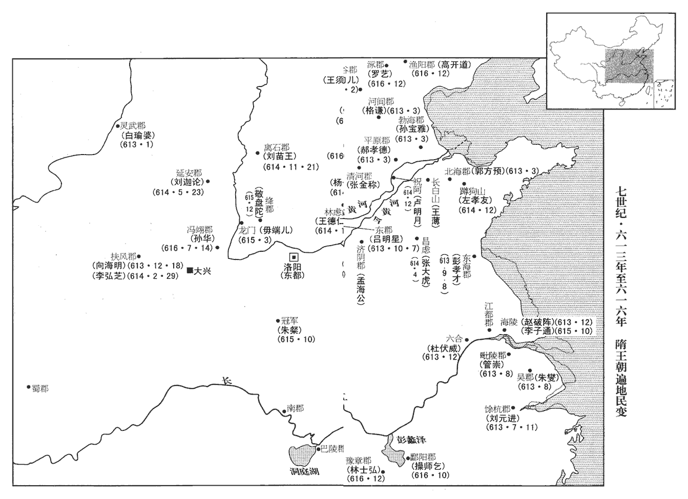
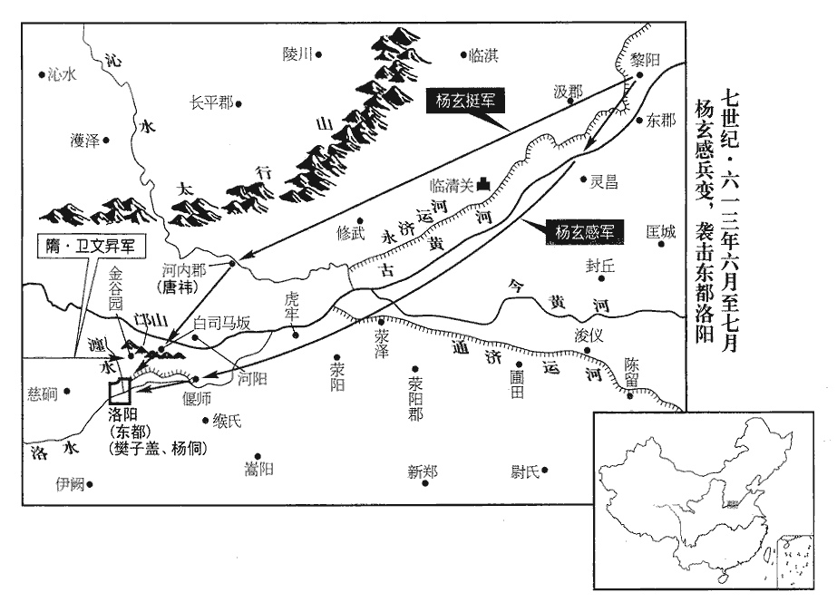
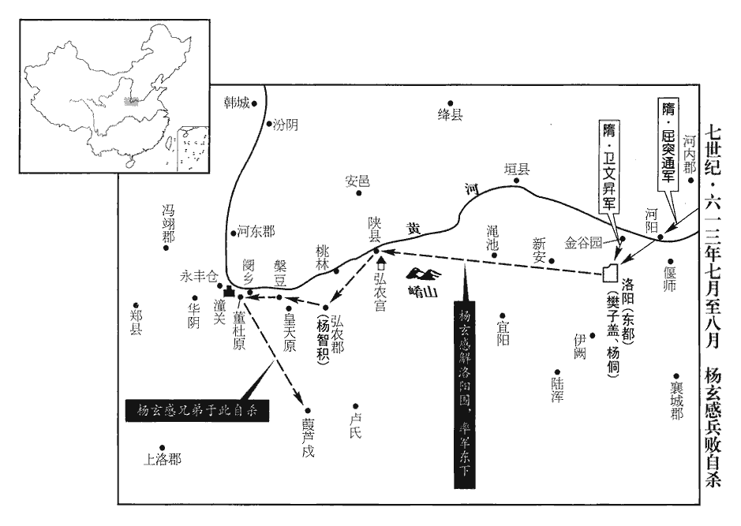
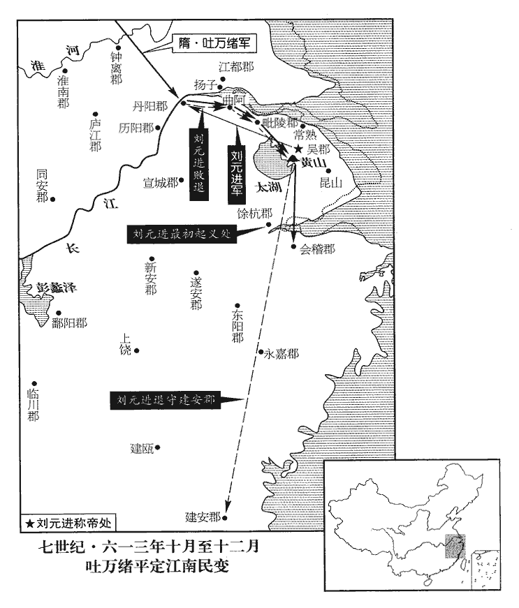
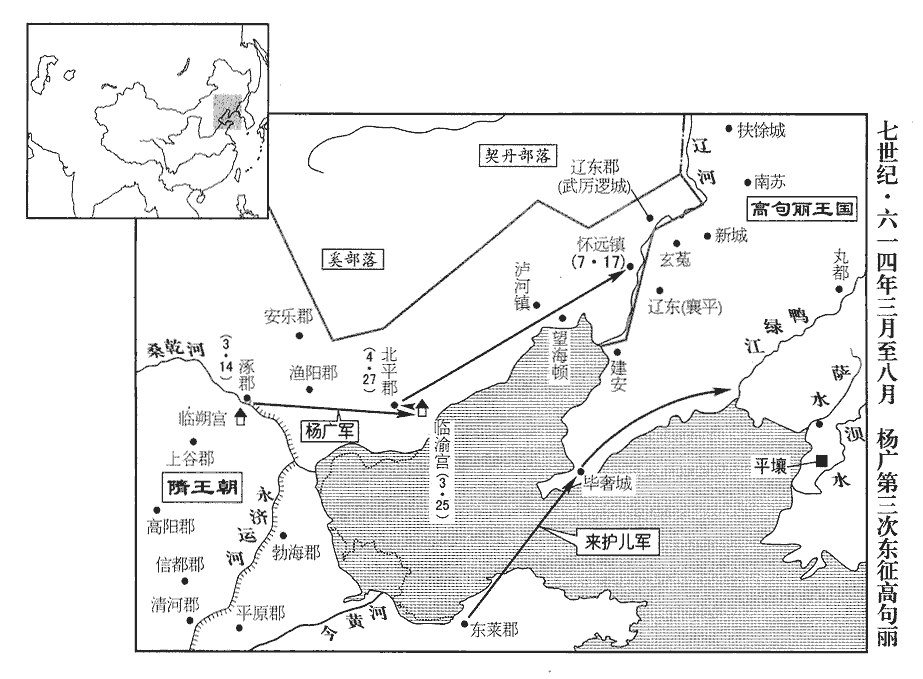
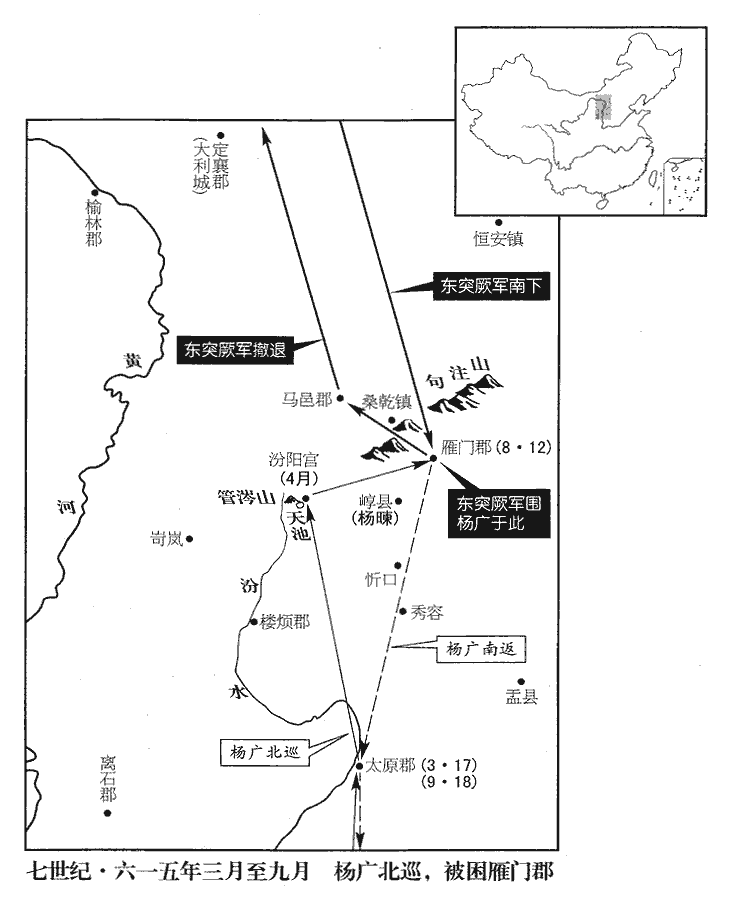

 隋紀六起昭陽作噩（癸酉），盡旃蒙大淵獻（乙亥），凡三年。

# 煬皇帝中

## 大業九年（癸酉、六一三）

1春，正月，丁丑‹二›，‹杨广，本年四十五岁›詔徵天下兵集涿郡‹北京市›。始募民為驍果為驍果作逆張本。驍，古堯翻。脩遼東古城以貯軍糧。漢、晉以來，遼東郡皆治襄平‹辽宁省辽阳市›，慕容氏始鎮平郭。前伐高麗，圍遼東，言即漢襄平城，今言復脩古城，蓋城郭有遷徙也。貯，丁呂翻。

〖译文〗 [1]春季，正月，丁丑（初二），炀帝下诏征召天下之兵在涿郡集结，开始招募平民为骁果。修辽东古城以贮备军粮。

2靈武‹宁夏灵武市›賊帥白瑜娑帝改靈州為靈武郡。帥，所類翻。娑，桑何翻。考異曰：隋書作「白榆妄」。今從略記。劫掠牧馬，北連突厥‹瀚海沙漠群›，厥，九勿翻。隴右‹陇山以西›多被其患，被，皮義翻。謂之「奴賊」。

〖译文〗 [2]灵武的贼帅白瑜娑劫掠牧马，北联突厥，陇右地区多受到白瑜娑的侵扰，人们称之为“奴贼”。

3戊戌‹二十三›，赦天下。

〖译文〗 [3]戊戌（二十三日），大赦天下。

4己亥‹二十四›，命刑部尚書衛文昇等輔代王侑留守西京。是後李淵得以尊立代王。守，手又翻。

〖译文〗 [4]己亥（二十四日），炀帝命令刑部尚书卫文升等人辅佐代王杨侑留守西京。

5二月，壬午，詔：「宇文述以兵糧不繼，遂陷王師；事見上卷上年。乃軍吏失於支料，非述之罪，宜復其官爵。」考異曰：雜記在去年十二月，今從隋書。尋又加開府儀同三司。

〖译文〗 [5]二月，壬午（疑误），炀帝下诏说：“宇文述因为兵粮没有接济上，因此我军被打败，这是军吏犯了军资供应不足的过失，不是宇文述的罪过。应该恢复他的官职爵位。”不久，炀帝又加升他为开府仪同三司。

6帝謂侍臣曰：「高麗小虜，侮慢上國；今拔海移山，猶望克果，克，能也。果，決也。麗，力知翻。況此虜乎！」乃復議伐高麗‹首都平壤朝鲜平壤市›。復，扶又翻。左光祿大夫郭榮諫曰：「戎狄失禮，臣下之事；千鈞之弩，不為鼷鼠發機，杜襲諫曹操嘗有是言。鼷，音奚，小鼠也。奈何親辱萬乘以敵小寇乎！」乘，繩證翻。帝不聽。

〖译文〗 [6]炀帝对侍臣说：“高丽这个小虏，竟敢侮慢我隋朝上国，如今就是拔海移山，也是可以办到的，何况这个小虏呢！”于是又商议出兵征伐高丽。左光禄大夫郭荣劝道：“戎狄之国无礼，是臣子应该处理的事情，千钧之弩，不会为小老鼠而发射，陛下何必亲自征讨这样的小小敌寇呢？”炀帝不听。

7三月，丙子‹二›，濟陰‹山东省定陶县›孟海公起為盜，保據周橋‹定陶县东南›，帝改曹州為濟陰郡。濟，子禮翻。眾至數萬，見人稱引書史，輒殺之。

〖译文〗 [7]三月，丙子（初二），济阴人孟海公起事为盗，据守周桥，孟海公拥有部众几万人，他见到有引用书、史的人就杀掉。

8丁丑‹三›，發丁男十萬城大興‹西安›。大興城，西京城。

〖译文〗 [8]丁丑（初三），炀帝下诏征发男丁十万人筑大兴城。

9戊寅‹四›，帝幸遼東‹辽宁省›，命民部尚書樊子蓋等開皇三年，改度支尚書為戶部尚書，帝乃改為民部尚書，併曹郎亦改之。輔越王侗留守東都‹洛阳›。是後遂階王世充僭竊。侗，他紅翻。

〖译文〗 [9]戊寅（初四），炀帝驾临辽东，他命令民部尚书樊子盖等人辅佐越王杨侗留守东都。

10時所在盜起：齊郡‹山东省济南市›王薄、孟讓、北海‹山东省青州市›郭方預、清河‹河北省清河县›張金稱、平原‹山东省陵县›郝孝德、河間‹河北省河间市›格謙、勃海‹山东省阳信县›孫宣雅，各聚眾攻剽，帝改青州為北海郡，瀛州為河間郡，滄州為勃海郡。姓苑：格姓，允格之後。東觀漢記有侍御史、東平相格班。稱，尺證翻。郝，呼各翻。格，古百翻。剽，匹妙翻。多者十餘萬，少者數萬人，少，詩沼翻。山東‹崤山以东›苦之。天下承平日久，人不習戰，郡縣吏每與賊戰，望風沮敗。沮，在呂翻。唯齊郡丞闅wén鄉‹河南省灵宝市西›張須陀隋志：闅鄉縣屬河南郡，本湖城，開皇十六年改焉。闅，音旻。得士眾心，勇決善戰。將郡兵擊王薄於泰山下‹东岳·山东省泰安市北›，隋志：泰山，在魯郡博城縣。須陀蓋越郡境而戰。將，即亮翻。薄恃其驟勝，不設備；須陀掩擊，大破之。薄收餘兵北渡河，須陀追擊於臨邑‹山东省临邑县›，又破之。隋志：臨邑縣屬齊郡。薄北連孫宣雅、郝孝德等十餘萬攻章丘‹山东省章丘市›，隋志：章丘縣，舊曰高唐，開皇十六年改焉，亦屬齊郡。須陀帥步騎二萬擊之，賊眾大敗。賊帥裴長才等眾二萬掩至城下，大掠，須陀未暇集兵，帥五騎與戰，帥，讀曰率。賊帥，所類翻。騎，奇寄翻。賊競赴之，圍百餘重，身中數創，重，直龍翻。中，竹仲翻。創，初良翻。勇氣彌厲。會城中兵至，賊稍退卻，須陀督眾擊之，長才等敗走。庚子‹二十六›，郭方預等合軍攻陷北海‹山东省青州市›，大掠而去。須陀謂官屬曰：「賊恃其強，謂我不能救，吾今速行，破之必矣。」乃簡精兵倍道進擊，大破之，斬數萬級，前後獲賊輜重不可勝計。重，直用翻。勝，音升。

〖译文〗 [10]当时盗贼到处蜂起：齐郡人王薄、孟让，北海人郭方预，清河人张金称，平原人郝孝德，河间人格谦，勃海人孙宣雅分别聚众攻城抢劫，他们多的达十余万人，少的有几万人。崤山以东的地方深受其害。天下太平的时间一长，人们都不习惯打仗了，郡县的官吏每次与盗贼交战，都望风溃败。只有齐郡郡丞乡人张须陀很得士众之心，他为人勇敢果断善战，率领郡兵在泰山下进攻王薄。王薄依仗自己突然取得的胜利，就不作防备。张须陀率兵掩杀攻击，大破王薄之众。王薄收集残部向北渡河，张须陀在临邑追击王薄，又击败了崐他。王薄联合北边的孙宣雅、郝孝德等部十余万人进攻章丘，张须陀率领步、骑兵两万人进击，王薄等部被打得大败。贼帅裴长才等人率众二万人掩杀到城下，大肆掠夺。张须陀来不及集结军队，只带领五名骑兵与贼众交战。贼人竞相前来交战。张须陀被包围百余重，受伤几处，但他仍勇气百倍迎战，正好城里官军赶到，贼人才稍稍退却，张须陀督促士卒攻击，裴长才等人败走。庚子（二十五日），郭方预等各部联合攻陷北海，大肆掠夺后离去。张须陀对官吏僚属们说：“贼人依仗势力强盛，以为我不能救援北海，我现在迅速进兵，一定会击败贼军。”于是他挑选精兵兼程进击，大破贼军，斩获首级数万，前后缴获贼人的辎重不可胜数。

歷城‹齐郡郡政府所在县·山东省济南市›羅士信，歷城縣，舊置濟南郡，隋為齊郡治所。年十四，從須陀擊賊於濰水上。隋志：濰水，在北海郡下密縣。濰，音惟。賊始布陳，士信馳至陳前，刺殺數人陳，讀曰陣；下同。刺，七亦翻。斬一人首，擲空中，以矟盛之，揭以略陳；賊徒愕眙chì，莫敢近。矟，色角翻。盛，受也，時征翻。揭，其謁翻，擔揭也。眙chì，丑吏翻。近，其靳翻。須陀因引兵奮擊，賊眾大潰。士信逐北，每殺一人，劓yì其鼻懷之，劓，魚器翻，還，以驗殺賊之數；須陀歎賞，引置左右。每戰，須陀先登，士信為副。帝遣使慰諭，并畫須陀、士信戰陳之狀而觀之。使，疏吏翻。畫，與𦘕通。

〖译文〗 历城人罗士信，十四岁，他跟随张须陀在潍水进攻贼人。贼人刚开始布阵，罗士信驰马到阵前，刺杀数人，斩下一人的首级抛到空中，用长矛接住，他挑着首级在阵前巡走，贼众惊得目瞪口呆，不敢靠近罗士信。张须陀趁机率兵奋力进攻，贼众大败溃逃，罗士信追击败军，他每杀一人，就割下鼻子揣在怀里，返回后，来检验杀贼的数目。张须陀感叹赞赏，他让罗士信随侍身旁。每次打仗，张须陀身先士卒，罗士信紧随其后。炀帝派遣使者来慰问，并画下张须陀、罗士信战斗的场面来观看。

 

11夏，四月，庚午‹二十七›，車駕渡遼。壬申‹二十九›，遣宇文述與上大將軍楊義臣趣平壤。趣，七喻翻。

〖译文〗 [11]夏季，四月，庚午（二十七日），炀帝的车驾渡过辽水。壬申（二十九日），炀帝派遣宇文述和上大将军杨义臣率军进军平壤。

12左光祿大夫王仁恭出扶餘道‹吉林省四平市›。仁恭進軍至新城‹辽宁省抚顺市北›，新城在南蘇城之西。高麗兵數萬拒戰，仁恭帥勁騎一千擊破之，高麗嬰城固守。帝命諸將攻遼東‹辽宁省辽阳市›，聽以便宜從事。麗，力知翻。帥，讀曰率。騎，奇寄翻。將，即亮翻。飛樓橦chuáng、雲梯、地道四面俱進，橦，宅江翻。晝夜不息，而高麗應變拒之，二十餘日不拔，主客死者甚眾。守者為主，攻者為客。衝梯竿長十五丈，驍果吳興‹浙江省湖州市›沈光升其端，隋志：吳郡烏程縣舊置吳興郡。史以舊郡名書。長，直亮翻。驍，堅堯翻；下同。臨城與高麗戰，短兵接，殺十數人，高麗競擊之而墜，未及地，適遇竿有垂緪gēng，緪，古恆翻，索也。光接而復上。復扶又翻。上，時掌翻。帝望見，壯之，即拜朝散大夫，朝，直遙翻。散，悉但翻。恆置左右。恆，戶登翻。

〖译文〗 [12]左光禄大夫王仁恭率军出扶余道，王仁恭进军到达新城，高丽军队几万人阻击隋军，王仁恭率领劲骑一千名击败高丽军，高丽军队闭城固守。炀帝命令诸将进攻辽东，允许诸将可相机从事。隋军用飞楼、、云梯、地道，从城池四面昼夜不停地进攻，但高丽守军随机应变抗击隋军，隋军攻城二十余天还未攻克，双方都有大批人员阵亡。隋军所用的冲梯竿长十五丈，骁果吴兴人沈光爬到冲梯顶端，面对城墙与高丽士兵交战。双方短兵相接，，沈光杀死高丽士兵十余人，高丽士兵竞相攻击沈光，沈光从冲梯上掉下来，还没掉到地上，正好冲梯的竿上有垂下的绳索，沈光抓住绳子又向上爬，炀帝望见这种场面，感到沈光的行为极为英勇，就任命他为朝散大夫，常让他随侍左右。

13禮部尚書楊玄感，驍勇，便騎射，好讀書，喜賓客，騎，奇寄翻。好，呼到翻；下同。喜，許記翻。海內知名之士多與之遊。與蒲山公李密善，密，弼之曾孫也，李密襲爵蒲山郡公。蒲山郡，闕。李弼，宇文氏佐命功臣。少有才略，志氣雄遠，輕財好士，為左親侍。隋制：左右翊衛府領親、勳、武三侍。左親侍屬左翊衛。少，詩照翻。帝見之，謂宇文述曰：「向者左仗下黑色小兒，瞻視異常，勿令宿衛！」述乃諷密使稱病自免，密遂屏人事，屏，必郢翻。專務讀書。嘗乘黃牛讀漢書，楊素遇而異之，因召至家，與語，大悅，謂其子玄感等曰：「李密識度如此，汝等不及也！」由是玄感與為深交。時或侮之，密曰：「人言當指實，寧可面諛！若決機兩陳之間，喑嗚咄嗟，使敵人震懾陳，讀曰陣。喑，於今翻。咄，當沒翻。懾，之涉翻。密不如公；驅策天下賢俊，各申其用，公不如密；豈可以階級稍崇而輕天下士大夫邪！」玄感笑而服之。李密事始此。

〖译文〗 [13]礼部尚书杨玄感，骁勇善战，骑射娴熟，爱读书，喜欢结交宾客，海内很多知名之士都与他来往。他与蒲山公李密交情很好，李密是李弼的曾孙。他年轻时就胸有才略，志气抱负远大，轻财好结交名士，官职为左亲侍。炀帝见到李密，对宇文述说：“过去在左翊卫的那个黑皮肤的小孩，相貌非常，不要让他宿卫！”宇文述就暗示李密称病自请免除宿卫。于是李密就屏绝了应酬来往，专心读书。他曾在乘坐牛车时读《汉书》，恰好杨素遇到，认为他非同崐一般，就把李密召到自己家中和他交谈，杨素非常高兴，对他儿子杨玄感说：“李密有如此的见识气度，你们都不如他！”因此，杨玄感和李密结为深交。有时杨玄感侮弄李密，李密对杨玄感说：“人应该说实话，怎么能当面阿庾奉承？要是在两军阵前交战，大怒喝喊，使敌人震惊慑服，我不如您；要是指挥天下贤士俊杰各自施展才能，您不如我。怎么可以因为您地位较高就轻慢天下的士大夫呢！”杨玄感笑了，很是佩服李密。

素恃功驕倨，朝宴之際，或失臣禮，朝，直遙翻；下同。帝心銜而不言，素亦覺之。及素薨，帝謂近臣曰：「使素不死，終當夷族。」玄感頗知之，且自以累世貴顯，在朝文武多父之故吏，見朝政日紊，紊，音問。而帝多猜忌，內不自安，乃與諸弟潛謀作亂。帝方事征伐，玄感自言：「世荷國恩，願為將領。」帝喜曰：「將門必有將，相門必有相，固不虛也。」荷，下可翻。將，即亮翻。相，悉亮翻。由是寵遇日隆，頗預朝政。

〖译文〗 杨素依恃自己有功，骄横倨傲，在朝宴上有时就有失作臣子的礼节，炀帝心中怀恨但不说。杨素也觉察出来了。等杨素去世，炀帝对身旁的侍臣说：“假使杨素不死，最终也得被诛灭九族。”杨玄感很清楚这一点，而且他自认为自己是累世显贵，朝廷中的文武大臣很多人都是他父亲过去的部下，他看到朝政日益混乱，炀帝对他又很猜忌，心里感到非常不安，就和他的几个弟弟暗地策划谋反。炀帝正在准备征伐高丽，杨玄感请求说：“我家世世代代蒙受国恩，愿作征伐高丽的将领。”炀帝高兴地说：“将门必出将，相门必出相，果然不假。”因此对杨玄感的宠信日重。他越来越多地参预朝政。

帝伐高麗，命玄感於黎陽‹河南省浚县›督運，遂與虎賁郎將王仲伯、汲郡‹河南省淇县东›贊治趙懷義等謀，按隋志，帝改州為郡，郡置太守；罷長史、司馬，置贊務一人以貳之。贊務，即贊治也。隋書成於唐臣，避高宗名，故改「治」為「務」。治，直吏翻。故逗遛漕運，不時進發，逗，音豆。遛，音留。欲令渡遼諸軍乏食；帝遣使者促之，令，力丁翻。使，疏吏翻。玄感揚言水路多盜，不可前後而發。玄感弟虎賁郎將玄縱，鷹揚郎將萬石，並從幸遼東，玄感潛遣人召之，二人皆亡還。萬石至高陽‹博陵郡改称·河北省定州市›，高陽縣屬河間郡。為監事許華所執，按唐六典，武庫署、太倉署皆有監事，蓋因隋制也。監，工銜翻。斬於涿郡‹北京市›。

〖译文〗 炀帝征伐高丽，他命令杨玄感在黎阳督运军资。杨玄感就和虎贲郎将王仲伯、汲郡赞治赵怀义等人策划商议，故意迟滞漕运，不按时发运军资，想让渡过辽河的各路隋军缺乏军粮，炀帝派遣使者催促杨玄感，杨玄感声称水路有很多盗贼，不能先后按时发运。杨玄感的弟弟虎贲郎将杨玄纵、鹰扬郎将杨万石，都跟随炀帝到了辽东，杨玄感暗地派人召他们回来。二人都暗地逃回。杨万石跑到高阳，被监事许华抓住在涿郡处死。

時右驍衛大將軍來護兒，以舟師自東萊‹山东省莱州市›將入海趣平壤，玄感遣家奴偽為使者從東方來，詐稱護兒反。驍，堅堯翻。六月，乙巳‹三›，玄感入黎陽‹河南省浚县›，閉城，大索男夫，索，山客翻。取帆布為牟、甲，帆，施於船上以汎風，時軍興織蒲不給，擬布為之。牟，兜牟也。署官屬，皆準開皇之舊。不用帝所改官制。移書傍郡，以討護兒為名，各令發兵會於倉所。倉，謂黎陽倉‹河南省浚县境›。郡縣官有幹用者，玄感皆以運糧追集之，以趙懷義為衛州‹汲郡·河南省淇县东›刺史，東光‹河北省东光县›尉元務本為黎州‹黎阳·河南省浚县›刺史，河內郡主簿唐禕yī為懷州‹河内郡·河南省沁阳市›刺史。復開皇之制，以郡為州，以太守為刺史。隋志：州、郡皆置主簿。東光縣屬平原郡。宋白曰：今定遠軍治東光縣，漢舊縣也；故城在今縣東二十里，齊天保七年，移於今縣東南三十里陶氏故城，隋開皇三年，又移於後魏廢勃海郡城。縣置令、丞、尉、正。禕，許韋翻。考異曰：雜記作「懷州司功書佐」，今從隋書。

〖译文〗 当时，右骁卫大将军来护儿率领水军从东莱将要入海进兵平壤，杨玄感派家奴伪装成东方来的使者，诈称来护儿谋反，六月，乙巳（初三），杨玄感进入黎阳，关闭城门，大肆索要男夫，用帆布制成头盔铠甲，任命官员僚佐，都按隋文帝开皇年间的旧制，他向附近各郡发送文书，以讨伐来护儿为名，命令各郡发兵在黎阳仓集结。杨玄感以运粮的名义将郡县官吏中有才干的人召集在一起。他任命赵怀义为卫州刺史，东光县尉元务本为黎州刺史，河内郡主簿唐为怀州刺史。

治書侍御史游元，隋御史臺置治書侍御史二員，帝增為正五品。治，直之翻。督運在黎陽，玄感謂曰：「獨夫肆虐，陷身絕域，此天亡之時也。我今親帥義兵以誅無道，卿意如何？」元正色曰：「尊公‹杨素›荷國寵靈，近古無比，公之弟兄，青紫交映，當謂竭誠盡節，上答鴻恩。豈意墳土未乾，帥，讀曰率。荷，下可翻。乾，音干。親圖反噬！僕有死而已，不敢聞命！」玄感怒而囚之，屢脅以兵，不能屈，乃殺之。元，明根之孫也。游明根，元魏太和中以儒名。

〖译文〗 治书侍御史游元在黎阳督运军粮，杨玄感对他说：“独夫逞肆暴虐，使自己陷于绝远之地，这是上天要灭亡他的时候呵。如今我亲率义兵诛来无道之君，您意下如何？”游元正色道：“您父亲受国家的宠信恩遇，近世无比，您弟兄几个都位居高官显爵，正应该对国家竭诚尽节，上报鸿恩，怎想到您父亲坟土未干，您就亲自策划谋反！我只有一死而已，不能从命！”杨玄感发怒将游元关押起来，屡次以兵器威胁他，但不能使游元屈服，就将他杀害。游元是游明根的孙子。

 

玄感選運夫少壯者得五千餘人，少，詩照翻。丹陽‹江苏省南京市›、宣城‹安徽省宣州市›篙梢三千餘人，帝改蔣州為丹陽郡，改宣州為宣城郡。篙梢，習於用舟者。篙音高，進船竿也。刑三牲誓眾，且諭之曰：「主上無道，不以百姓為念，天下騷擾，死遼東者以萬計。今與君等起兵，以救兆民之弊，何如？」眾皆踴躍稱萬嵗。乃勒兵部分。分，扶問翻。唐禕yī自玄感所逃歸河内‹河南省沁阳市›。

〖译文〗 杨玄感挑选输送军粮的民夫中身强力壮者五千余人，丹阳、宣城的船夫三千余人，杀三牲誓师。他还对这些人说：“皇帝无道，不体恤百姓，使天下受到骚扰，死在辽东的人数以万计，现在我与你们起兵以拯救百姓于水火，怎么样？”大家都踊跃高呼万岁。于是杨玄感统率部署军队。唐从杨玄感的军中逃回河内。

先是，玄感陰遣家僮至長安，先，悉薦翻。召李密及弟玄挺赴黎陽。及舉兵，密適至，玄感大喜，以為謀主，謂密曰：「子常以濟物為己任，今其時矣！計將安出？」密曰：「天子出征，遠在遼外，去幽州‹指涿郡·北京市›猶隔千里。南有巨海‹渤海›，北有強胡‹指东突厥汗国、奚部落、契丹部落等›，中間一道，理極艱危。公擁兵出其不意，長驅入薊‹涿郡郡政府所在县·北京市›，據臨渝之險‹河北省抚宁县东榆关镇›，臨渝關，隋屬平州盧龍縣，即所謂盧龍之險也。顏師古曰：，渝音喻，今多讀如榆。扼其咽喉。咽，於賢翻。歸路既絕，高麗聞之，必躡其後，不過旬月，資糧皆盡，其眾不降則潰，可不戰而擒，此上計也。」麗，力知翻。降，戶江翻。玄感曰：「更言其次。」密曰：「關中‹陕西省中部›四塞，天府之國，雖有衛文昇，不足為意。今帥衆鼓行而西，帥，讀曰率，下同。經城勿攻，直取長安，收其豪傑，撫其士民，據險而守之。天子雖還，失其根本，可徐圖也。」玄感曰：「更言其次。」密曰：「簡精銳，晝夜倍道，襲取東都‹洛阳·河南省洛阳市›，以號令四方。但恐唐禕告之，先已固守。禕，許韋翻。若引兵攻之，百日不克，天下之兵四面而至，非僕所知也。」玄感曰：「不然，今百官家口並在東都，若先取之，足以動其心。且經城不拔，何以示威！其後玄感攻弘農，自速敗亡，其識度已見於此。公之下計，乃上策也。」遂引兵向洛陽，遣楊玄挺將驍勇千人為前鋒，將，即亮翻；下同。驍，堅堯翻。先取河內。唐禕據城拒守，玄挺無所獲。

〖译文〗 当初，杨玄感暗地派家奴到长安，召李密和他弟弟杨玄挺到黎阳来。及杨玄感起兵时李密正好赶到，杨玄感大为高兴。他让李密作自己的谋主，对李密讲：“你常常以拯救百姓为己任，现在是时候了！我们的策略将如何呢？”李密说：“天子出征，远在辽外，就是距幽州也还有千里之遥，南面有大海，北面有强大的胡人，中间夹着一条道，按理来说是极其险恶的。您率兵出其不意，长驱入蓟，据守临渝关的险要，扼住这条路的咽喉，征伐高丽的隋军归路便被切断，高丽人知道了，必然追踪于隋军之后。不出一个月，隋军的军资粮秣都消耗殆尽，隋军不是投降就是溃散，皇帝就可以不战而擒了。这是上计。”杨玄感说：“再说说其次的策略。”李密说：“关中之地四面都有要塞屏障，是天府之国，虽然有卫文升，但他不足为虑，如今您统帅部众向西击鼓进军，经过城池不要攻取，直取长安，招收长安的豪杰之士，抚慰长安的士民，凭借险要据守长安，天子虽然从高丽返回，但失掉了根本之地，我们就可以慢慢进取了。杨玄感说：”再说说再次的策略。”李密说：“挑选精锐士卒，昼夜兼程，袭取东都，借以号令四方。但恐怕唐告诉了东都守备，东都事先进行了固守的准备，要是率兵进攻东都，百日内攻城不下，全国各地的军队四面八方地到来，其结果就不是我所能预料的了。”杨玄感说：“不对。如今文武百官的家属都在东都，要是先攻取东都，就足以扰乱百官们的心。而且，如果经过城池却不攻取，怎能显示我军的威风？你的下策，正是我的上策。”于是杨玄感率兵向洛阳进发，他派杨玄挺率领骁勇之士一千人为前锋，先攻取河内。唐凭借城池拒守，杨玄挺攻城不克。

禕又使人告東都越王侗與樊子蓋等勒兵為備，果如李密所料。侗，他紅翻。脩武‹河南省修武县›民相帥守臨清關‹河南省新乡市东北›。脩武縣屬河內郡。玄感不得度，乃於汲郡南渡河，從之者如市。使弟積善將兵三千，自偃師‹河南省偃师县›南緣洛水西入，隋志：偃師縣舊廢，開皇十六年復置，屬河南郡。玄挺自白司馬坂‹洛阳城北›逾邙山南入，白司馬坂在邙山北，邙山在洛城北。坂，音反。玄感將三千餘人隨其後，相去十里許，自稱大軍。其兵皆執單刀柳楯，楯，食尹翻，干也，以扞弓矢。無弓矢甲冑。東都遣河南令達奚善意隋志：河南縣，帶河南郡。將精兵五千人拒積善，將作監、河南贊治裴弘策將八千人拒玄挺。治，直吏翻。善意渡洛南，營於漢王寺；明日，積善兵至，不戰自潰，鎧仗皆為積善所取。弘策出至白司馬坂，一戰，敗走，棄鎧仗者太半，鎧，可亥翻。玄挺亦不追。弘策退三四里，收散兵，復結陳以待之；復，扶又翻。陳，讀曰陣。玄挺徐至，坐息良久，忽起擊之，弘策又敗，如是五戰。丙辰‹十四›，玄挺直抵太陽門，弘策將十餘騎馳入宮城，自餘無一人返者，皆歸於玄感。

〖译文〗 唐又派人通知留守东都的越王杨侗和樊子盖率军防备。修武县的百姓纷纷据守临请关。杨玄感无法过关，就从汲郡向南渡河，投奔杨玄感的人多得就象市场上一样。杨玄感派他弟弟杨积善率兵三千从偃师以南沿着洛水从西面进军；杨玄挺从白司马坂越过邙山从南面进军；杨玄感率领三千余人跟随其后，相隔约十余里，自称大军。杨玄感的士兵都手执单刀柳，没有弓箭甲胄。东都方面派遣河南令达奚善意率领精兵五千人抵抗杨积善崐。将作临及河南赞治裴弘策率领八千人抵抗杨玄挺。达奚善意渡地洛水，在洛水南汉王寺扎营。第二天，杨积善兵到，达奚善意的军队不战自溃，铠甲武器都被杨积善的军队缴获。裴弘策率军到达白司马坂，与杨玄挺的军队一交战就败走，抛弃了大部分铠甲武器。杨玄挺也不追击，裴弘策退兵三四里，收集散兵，重新列阵等待杨军。杨玄挺率军慢慢到来，士兵们坐下来休息了很久，突然起来进攻隋军，裴弘策又败退，就这样双方交战五次。丙辰（十四日），杨玄挺直抵太阳门，裴弘策只带着十余名骑兵驰马逃入宫城，此外再没有一人返回，全部归降了杨玄感。

玄感屯上春門，隋志：河南郡舊置洛州，大業元年移都，改曰豫州。東面三門，北曰上春，中曰建陽，無太陽門，當考。將，即亮翻。考異曰：玄感傳云：「屯兵上春門。」又云：「屯兵尚書省。」按劉仁軌河洛記：「東都羅郭東面北頭第一曰上春門，唐改曰上東門。」又，尚書省在宣仁門內，玄感不容至此。每誓眾曰：「我身為上柱國，家累鉅萬金，至於富貴無所求也。今不顧滅族者，但為天下解倒懸之急耳！」為，于偽翻。眾皆悅。父老爭獻牛酒，子弟詣軍門請自効者，日以千數。

〖译文〗 杨玄感在上春门屯兵，他每次誓师时都说：“我身为上柱国，累积的家资巨万，我对于富贵无所求，现在冒着来族的风险，只是要拯救天下的百姓于水火之中啊！”大家都高兴。父老们争相献上牛、酒，子弟们到杨玄感军营门口请求效力的每天有上千人。

內史舍人韋福嗣，洸之兄子也，韋洸著聲績於平陳之後。洸，古黃翻。從軍出拒玄感，為玄感所獲；玄感厚禮之，使與其黨胡師耽共掌文翰。玄感令福嗣為書遺樊子蓋，數帝罪惡，遺，于季翻。數，所具翻。云：「今欲廢昏立明，願勿拘小禮，自貽伊戚。」樊子蓋新自外藩入為京官，樊子蓋自涿郡留守為東都留守。東都舊官多慢之，至於部分軍事，未甚承稟。分，扶問翻。裴弘策與子蓋同班，贊治次留守立班，故言同班。前出討賊失利，子蓋更使出戰，不肯行，子蓋命引出斬之以徇。國子祭酒河東‹山西省永济市›楊汪，小有不恭，楊汪傳：本弘農華陰人，曾祖順徙河東。子蓋又將斬之；汪頓首流血，乃得免。於是將吏震肅，無敢仰視，是將，子亮翻。令行禁止。玄感盡銳攻城，子蓋隨方拒守，玄感不能克。然達官子弟應募從軍者，聞弘策死，皆不敢入城。韓擒虎子世咢è、咢，五各翻。觀王雄子恭道、虞世基子柔、來護兒子淵、裴蘊子爽、大理卿鄭善果子儼、周羅睺子仲等，四十餘人皆降於玄感，降，戶江翻；下同。玄感悉以親重要任委之。善果，譯之兄子也。鄭譯，高祖佐命。

〖译文〗 内史舍人韦福嗣是韦的侄子。他从军抵抗杨玄感，被杨玄感俘获。杨玄感对他优礼相待，让他和自己的亲信胡师耽共同掌管公文信札。杨玄感让韦福嗣给樊子盖写信，历数炀帝的罪恶。信中说：“如今我打算废黜昏君拥立明君，希望您不要拘泥于小的礼法，自找烦恼。”樊子盖是刚从外地调入东都作京官的。东都旧有的很多官吏对他都很轻慢，在军事部署方面，也很少向樊子盖汇报请示。裴弘策和樊子盖是同一班次的官员，前番出战讨伐杨玄感失利，樊子盖又派裴弘策出战，裴弘策不肯出行，樊子盖就命令将裴弘策押出去斩首示众。国子监祭酒河东人杨汪，对樊子盖稍有不恭敬，樊子盖又要杀掉杨汪，杨汪叩头流血，才得以免死。于是东都的将领官吏都震惊肃敬，不敢仰视樊子盖，樊子盖在东都是令行禁止。杨玄感使用全部精兵攻城，樊子盖根据军情率兵坚守杨玄感无法攻克城池。但是达官子弟应募从军的人，听到裴弘策被处死，都不敢进城。韩擒虎的儿子韩世、观王杨雄的儿子杨恭道、虞世基的儿子虞柔、来护儿的儿子来渊、裴蕴的儿子裴爽、大理卿郑善果的儿子郑俨、周罗的儿子周仲等四十余人都归降了杨玄感，杨玄感将亲信要任的职位都授予了他们。郑善果是郑译的侄子。

玄感收兵得五萬餘人，分五千守慈磵道‹洛阳城西›，隋志：河南郡壽安縣有慈磵。五千守伊闕道‹洛阳城南›，隋志：河南郡伊闕縣，舊曰新城，開皇十八年改名，以伊闕山名縣也。遣韓世咢將三千人圍滎陽‹河南省荥阳市›，隋志：滎陽縣，屬滎陽郡，郡治管城，滎陽在郡西。顧覺將五千人取虎牢‹河南省荥阳市汜水镇西›。隋志：滎陽郡汜水縣，舊曰成皋，即虎牢也。開皇十八年，改曰汜水，大業初，置虎牢都尉府。虎牢降，降，戶江翻。以覺為鄭州‹虎牢改郑州›刺史，鎮虎牢。

〖译文〗 杨玄感招集得到五万余名士兵。他分兵五千把守慈道，五千人把守伊阙道，派韩世率三千人包围荥阳。派顾觉率五千人攻取虎牢，虎牢隋军投降，杨玄感任命顾觉为郑州刺史，镇守虎牢。

代王侑使刑部尚書衛文昇帥兵四萬救東都，代王侑時守長安。帥，讀曰率。考異曰：隋書云：「步騎七萬。」按玄感眾不過十萬，而下云眾寡不敵。今從雜記。文昇至華陰‹陕西省华阴市›；掘楊素冢隋志：華陰縣屬京兆郡。楊素世居華陰，死葬焉。華，戶化翻。焚其骸骨，示士卒以必死，遂鼓行出崤、澠，直趨東都城北。崤，崤谷‹河南省三门峡市东南›；澠，澠池‹河南省渑池县›。澠，彌兖翻。趨，七喻翻。玄感逆拒之；文昇且戰且行，屯於金谷‹洛阳城西北›。金谷，即晉石崇之金谷也。水經註：穀水自千金堨è東經睪門橋，又東，左會金谷水，水出太白原東，南流歷金谷，謂之金谷澗。在河南縣界。

〖译文〗 代王杨侑派刑部尚书卫文升统兵四万救援东都。卫文升到了华阴，挖掘杨素的坟墓，焚烧了杨素的骸骨，向士卒们表明自己必死的决心。于是卫文升率军击鼓进军，出崤谷、渑池，直奔东都城北。杨玄感迎击卫文升，卫文升率军且战且走，在金谷驻扎军队。

遼東城久不拔，帝遣造布囊百餘萬口，滿貯土，貯，丁呂翻。欲積為魚梁大道，築道若魚梁然。闊三十步，高與城齊，使戰士登而攻之，又作八輪樓車，樓車下施八輪。高出於城，夾魚梁道，欲俯射城內，射，而亦翻。指期將攻，城內危蹙。會楊玄感反書至，帝大懼，引納言蘇威入帳中，謂曰：「此兒聰明，得無為患？」威曰：「夫識是非，審成敗，乃謂之聰明，夫，音扶。玄感粗疏，必無所慮。但恐因此寖成亂階耳。」帝又聞達官子弟皆在玄感所，益憂之。兵部侍郎斛斯政，素與玄感善，玄感之反，政與之通謀，玄縱兄弟亡歸，政潛遣之。帝將窮治玄縱等黨與，治，直之翻。政內不自安，戊辰‹二十六›，亡奔高麗。史言段文振之言驗。麗，力知翻。庚午‹二十八›，夜二更，二更，乙夜也。甲、乙、丙、丁、戊分為五夜，守卒分番守漏，鳴鼓以相警，謂之持更。更，工衡翻。帝密召諸將，使引軍還，還，從宣翻，又音如字。軍資、器械、攻具，積如丘山，營壘、帳幕，按堵不動，皆棄之而去。眾心恟懼，恟，許拱翻。無復部分，諸道分散。復，扶又翻。部分，扶問翻。高麗即時覺之，然不敢出，但於城內鼓譟。至來日午時，方漸出外，四遠覘偵，覘，丑廉翻，又丑塹翻。偵，丑鄭翻。猶疑隋軍詐之。經二日乃出數千兵追躡，畏隋兵之眾，不敢逼，常相去八九十里；將至遼水，知御營畢渡，乃敢逼後軍。時後軍猶數萬人，高麗隨而抄擊，最後羸弱數千人為所殺略。麗，力知翻。抄，楚交翻。羸，倫為翻。

〖译文〗 辽东城许久攻取不下，炀帝派人制做一百余万个布袋，每个布袋装满土，打算用布袋堆积成一条宽三十步、与城墙同样高的象鱼脊梁一样的坡道，让士兵们登道攻城。他又命人制做八轮楼车，楼车高于城墙，设置在鱼梁道两旁，打算向下射杀城内的人。隋军很快就要攻城了，城内已危在旦夕，恰好报告杨玄感谋反的公文到了，炀帝大为惊恐，他让纳言苏威进入帐中，说：“这个孩子很聪明，恐怕要成为祸患了。”苏威说：“能辨别是非、判断成败的人才可以说是聪明。杨玄感为人粗疏，不必为他谋反而忧患，但是，只怕因此而逐渐成为动乱的来由。”炀帝又听说达官的子弟都在杨玄感那里，越加忧虑。兵部侍郎斛斯政平时就和杨玄感交情很好，杨玄感谋反，斛斯政曾与他一起谋划，杨玄纵兄弟逃回内地是斛斯政暗地送他们回去的。炀帝要追究查办杨玄纵等党羽，斛斯政内心极为恐惧不安，戊辰（二十六日），他逃跑投奔了高丽。庚午（二十八日），夜里二更时分，炀帝秘密召集诸将，让他们率军撤退。所有的军资器械、攻城之具堆积如山，营垒、帐幕，都原地不动，遗弃而去。隋军人人惊惶恐惧，军队部署已乱，各路兵马分离涣散。高丽方面对这种情况很快就觉察到了，但是不敢出去，只是在城内击鼓呐喊。到第二天中午时高丽方面才渐渐地派兵出城，四处远近地侦察，仍然怀疑隋军撤退是假的。过了两天，才出动几千名士兵在隋军后面追踪，但仍然畏惧隋军人多，不敢逼近，两军常常相隔八、九十里。快到辽水时，高丽人得知炀帝车驾已经渡过了辽水，才敢逼近隋军后部，当时隋军后部还有几万人，高丽军队就包抄袭击隋军，最后有几千名隋军老弱士兵被杀死。

初，帝再征高麗，復問太史令庾質曰：「今段何如？」今段，言自今以後一段事也。復，扶又翻。對曰：「臣實愚迷，猶執前見，庾質前對，見上卷八年。陛下若親動萬乘，勞費實多。」乘，繩證翻。帝怒曰：「我自行猶不克，直遣人去，安得有功！」及還，謂質曰：「卿前不欲我行，當為此耳。還，從宣翻，又音如字。為，于偽翻。玄感其有成乎？」質曰：「玄感地勢雖隆，素非人望，因百姓之勞，冀幸成功。今天下一家，未易可動。」易，以豉翻。

〖译文〗 当初，炀帝准备再次征伐高丽时，曾再次问太史令庾质：“这次情况会怎样？”庾质回答：“我实在是愚钝迷惘，但还是坚持以前的看法，陛下要是亲自率军征伐，劳费实在太多。”炀帝发怒道：“我亲自征伐尚且没能取胜，只派别人去，难道会成功？”等炀帝从高丽回来，他对庾质说：“你以前不想让我去，就是为了动乱的缘故吧。杨玄感能够成功吗？”庾质回答：“杨玄感的地位势力虽然很高很强大，但他平时没有声望，他想凭借百姓的劳苦，希望侥幸成功，如今天下一统，不是容易动摇的。”

帝遣虎賁郎將陳稜攻元務本於黎陽，又遣左翊衛大將軍宇文述、右候衛將軍屈突通乘傳發兵以討玄感。屈，區勿翻。傳，株戀翻。來護兒至東萊，聞玄感圍東都，召諸將議旋軍救之。諸將咸以無敕，不宜擅還，固執不從，護兒厲聲曰：「洛陽被圍，心腹之疾；高麗逆命，猶疥癬耳。將，即亮翻。被，皮義翻。疥癬，皮膚之疾。公家之事，知無不為，專擅在吾，不關諸人，有沮議者，軍法從事！」沮，在呂翻。即日迴軍。令子弘、整馳驛奏聞。帝時還至涿郡，已敕護兒救東都，見弘、整，甚悅，按隋書來護兒傳：弘、整，護兒之二子。賜護兒璽書曰：「公旋師之時，是朕敕公之日，君臣意合，遠同符契。」

〖译文〗 炀帝派遣虎贲郎将陈棱去黎阳进攻元务本，又派遣左翊卫大将军宇文述、右候卫将军屈突通乘驿站的传车发兵讨伐杨玄感。来护儿率军到达东莱，闻知杨玄感围困东都，他召集诸将商议回师救援东都。诸将都认为没有皇帝的敕命，不宜擅自回师，都固执地不服从来护儿的命令。来护儿厉声说道：“洛阳被包围，是心腹之患，高丽抗拒王命不过是疥癣之疾。国家的事知道了就不能不崐去做。我来承担专擅权力的罪名，不关别人的事。有阻拦商议回师之事的人要军法从事！”来护儿即日回师。他命令儿子来弘、来整驰马传报上奏炀帝，炀帝当时回到涿郡，已经下令让来护儿救援东都。他见到来弘、来整，非常高兴，赏赐给来护儿的玺书中说：“您回师之时，就是我下令让您回师之日，君臣意见相吻合，非常默契。”

先是，右武候大將軍李子雄坐事除名，令從軍自效，從來護兒在東萊，帝疑之，按隋書子雄傳，因玄感反而疑之。璽，斯氏翻。先，悉薦翻。詔鎖子雄送行在所。子雄殺使者，逃奔玄感。使，疏吏翻。衛文昇以步騎二萬渡瀍chán水‹洛水支流›，水經：瀍水出河南穀城縣北山，東過洛陽、偃師而入于洛。騎，奇寄翻。瀍，音廛。與玄感戰，玄感屢破之。玄感每戰，身先士卒，先，悉薦翻。所向摧陷，又善撫悅其下，皆樂為致死，樂，音洛。為，于偽翻。由是每戰多捷，眾益盛，至十萬人。文昇眾寡不敵，死傷太半且盡，考異曰：雜記曰：每戰刃纔接，官軍皆坐地棄甲，以白布裹頭，聽賊所掠。前後十二戰，皆不利。」今從文昇傳。乃更進屯邙山之陽，與玄感決戰，一日十餘合。會楊玄挺中流矢死，中，竹仲翻。玄感軍乃稍卻。

〖译文〗 先前，右武候大将军李子雄因获罪被除名，现受命在军队中效力，他跟随来护儿在东莱，炀帝怀疑他，下诏命令将他上枷锁送到皇帝行营，李子雄杀死使者，逃走，去投奔杨玄感。卫文升率领步、骑兵两万人渡过水，与杨玄感军交战。杨玄感屡次击败卫文升，每次作战杨玄感都身先士卒，所向披靡。他还善于安抚部下，因此大家都愿意为他效命，所以每次作战大都能取胜。杨玄感部众愈来愈多，达十万人。卫文升寡不敌众，部下死伤大半，军力将近耗竭，于是他率军进驻邙山的南面，与杨玄感决战。一天之内双方交锋十余次，恰巧杨玄挺被流箭射死，杨玄感的军队才稍稍退却。

秋，七月，癸未‹十一›，餘杭‹浙江省杭州市›民劉元進起兵以應玄感。元進手長尺餘，手長尺餘，言自指至掌腕横紋之長。長，直亮翻。臂垂過膝，言臂垂則其手過膝。過，古禾翻。自以相表非常，相，息亮翻。陰有異志。會帝再發三吳‹太湖流域及钱塘江流域›兵征高麗，三吳兵皆相謂曰：「往歲天下全盛，吾輩父兄征高麗者，猶太半不返；此指八年事。今已罷弊，復為此行，罷，讀曰疲。復，扶又翻。吾屬無遺類矣！」由是多亡命。郡縣捕之急，聞元進舉兵，亡命者雲集，旬月間，眾至數萬。

〖译文〗 秋季，十月，癸未（十一日），余杭人刘元进起兵响应杨玄感。刘元进手长一尺有余，手臂垂下来超过膝盖，他自认为自己相貌非同寻常，暗中另有图谋。正逢炀帝再次征发三吴之兵去征伐高丽，三吴之兵都互相说：“往年国家处于全盛时期，我们父兄中出征高丽的人还大半没有回来，如今国家已经疲惫，又要被征召去打仗，我们的这辈人就要灭绝了！”因此很多人都逃亡。郡县官吏捕捉逃亡的人非常急迫，逃亡的人闻知刘元进起兵，都聚集到他的麾下，一个月内，刘元进部众达几万人。

始，楊玄感至東都，自謂天下響應。【章：十二行本「應」下有「功在朝夕」四字；乙十一行本同；張校同，云無註本亦無。】得韋福嗣，委以心膂，不復專任李密。復，扶又翻。福嗣每畫策，皆持兩端；密揣知其意，揣，初委翻。謂玄感曰：「福嗣元非同盟，實懷觀望；明公初起大事而姦人在側，聽其是非，必為所誤，請斬之！」玄感曰：「何至於此！」密退，謂所親曰：「楚公好反而不欲勝，玄感襲爵楚國公，故稱之。好，呼到翻。吾屬今為虜矣！」

〖译文〗 当初，杨玄感到达东都，自以为天下会响应，他得到韦福嗣后，就视之为心腹，不再完全信任李密了。韦福嗣每次筹划计谋，都模棱两可，李密揣测到韦福嗣的心意，就对杨玄感说：“韦福嗣原本不是我们的同盟，实际上他还心存观望，您刚开始做大事就有奸人在身旁，听从他的是非评断，必然被他耽误，请将韦福嗣杀掉！”杨玄感说：“哪至于如此！”李密退下来，对他的亲信说：“楚公为人喜欢谋反却不打算取胜，我们如今都将是人家的俘虏了！”

李子雄勸玄感速稱尊號，玄感以問密，密曰：「昔陳勝自欲稱王，張耳諫而被外；事見七卷秦二世元年。被，皮義翻。魏武將求九錫，荀彧止而見誅。事見六十六卷漢獻帝建安十七年。今者密欲正言，還恐追蹤二子；阿諛順意，又非密之本圖。何者？兵起以來，雖復頻捷，復，扶又翻；下蓋復同。至於郡縣，未有從者；東都守禦尚強，天下救兵益至，公當挺身力戰，早定關中，迺亟欲自尊，何示人不廣也！」亟，已力翻。玄感笑而止。

〖译文〗 李子雄劝杨玄感赶快称帝，杨玄感征求李密的意见，李密说：“从前陈胜打算自己称王，张耳规劝却被排斥在外，魏武帝曹操打算谋求加赐九锡，荀劝他却被诛杀。如今我打算直言规劝，却恐怕落得张耳、荀二人的下场。但是阿谀奉承迎逢上意，又不是我的本意。为什么呢？自从我们起兵以来，虽然屡次取胜，但郡县一级的官员却无人响应。东都的防卫力量还很强大，全国各地的援军到的越来越多，您应当挺身奋力作战，早早平定关中，可您却急于称帝，为什么让人看到您那么狭隘呢？”杨玄感听后笑了，称帝之事就作罢。

屈突通引兵屯河陽‹河南省孟州市›，宇文述繼之，玄感問計於李子雄，子雄曰：「通曉習兵事，若一得渡河，則勝負難決，不如分兵拒之。通不能濟，則樊、衛失援。」樊，衛謂樊子蓋、衛文昇也。玄感然之，將拒通；樊子蓋知其謀，數擊其營，玄感不得往。斯亦伐謀之一也。使援兵不合，樊子蓋堅守都城兵何由解！數，所角翻；下軍數同。通濟河，軍於破陵‹洛阳城东北›。破陵，當在河陽南岸、洛城東北。玄感分為兩軍，西抗文昇，東拒通。子蓋復出兵大戰，玄感軍屢敗，與其黨謀之，李子雄曰：「東都援軍益至，我軍數敗，不可久留，不如直入關中，開永豐倉‹即广通仓，陕西省潼关县北›以振貧乏，新唐志，華陰縣有永豐倉，蓋隋所置也。三輔可指麾而定，此指言漢三輔之地。據有府庫，東面而爭天下，亦霸王之業也。」李密曰：「弘化‹甘肃省庆阳县›留守元弘嗣握強兵在隴右‹陇山以西›，帝改慶州為弘化郡，其地屬隴右。可聲言其反，遣使迎公，因此入關‹函谷关›可以紿眾。」使，疏吏翻。紿dài，徒亥翻。

〖译文〗 屈突通率军驻扎在河阳，宇文述率军跟随其后。杨玄感向李子雄问计，李子雄说：“屈突通精通军事，一旦他们渡过河来，那就胜负难分了，我们不如分兵抗击。屈突通不能渡河，那么樊子盖、卫文升就会失去援助。”杨玄感认为这个意见很对，就准备抗击屈突通。樊子盖知道了杨玄感的意图，几次进攻杨玄感的营垒使杨玄感无法去阻击屈突通，屈突通率军渡河，在破陵驻军。杨玄感把军队分为两部分，西面抵抗卫文升，东面阻击屈突通。樊子盖又出兵大战，杨玄感军队屡次被击败。杨玄感与党羽们谋划此事，李子雄说：“救援东都的军队到的越来越多，我军几次被打败，不可久留此地，不如直入关中，打开永丰仓赈济贫苦百姓，三辅之地就可以挥手而定了，我们据有府库，向东争夺天下，这也可以成就霸王之业。”李密说：“弘化留守元弘嗣在陇右掌握着强兵，我们可以扬言他谋反，派遣使者迎接您，咱们借此机会入关，就可以欺骗众人了。”

會華陰諸楊請為鄉導，華陰諸楊，玄感之宗黨也。華，戶化翻。鄉，讀曰嚮。壬辰‹二十›，玄感解東都圍，引兵西趣潼關‹陕西省潼关县›，潼關，在華陰縣。趣，七喻翻。宣言：「我已破東都、取關西‹函谷关以西›矣！」宇文述等諸軍躡之。至弘農宮‹河南省三门峡市›，隋志：河南郡陝縣，後魏置陝州恆農郡，開皇初廢郡，大業初廢州，置弘農宮。恆農即弘農，後魏避諱改曰恆農。父老遮說玄感曰：「宫城空虚，又多積粟，攻之易下。」說，式芮翻。易，以豉翻。玄感以為然。弘農‹河南省灵宝市›太守蔡王智積觀此，則帝廢陝州，改為弘農郡也。智積，高祖弟整之子。守，式又翻。謂官屬曰：「玄感聞大軍將至，欲西圖關中，若成其計，則難克也；當以計縻之，使不得進，不出一旬，可以成擒。」及玄感軍至城下，智積登陴pī詈之；陴，符支翻，城上女垣。詈，力智翻，罵也。玄感怒，留攻之。李密諫曰：「公今詐眾西入，軍事貴速，況乃追兵將至，安可稽留！若前不得據關，謂據潼關也。退無所守，大眾一散，何以自全！」玄感不從，遂攻之，燒其城門，智積於內益火，玄感兵不得入。三日不拔，乃引而西。至闅鄉‹河南省灵宝市西›，闅wén，音旻mín。宇文述、衛文昇、來護兒、屈突通等軍追及於皇天原‹阌乡城东›。水經註：玉澗水南出玉溪，北流逕皇天原西。周固記，開山東首，上平博，方可里餘，三面壁立，高千許仞，漢世祭天於其上，名之為皇天原。上有漢武思子臺。又北逕闅鄉城西。又有全鳩澗，水出南山，北逕皇天原東。隋志，闅鄉縣有玉澗、全鳩澗。玄感上槃豆‹灵宝市西五十千米›，即西魏將于謹所攻拔盤豆也。上，時掌翻。布陳亘五十里，陳，讀曰陣；下同。亘，古鄧翻。且戰且行，玄感一日三敗。八月，壬寅‹一›，玄感陳於董杜原‹河南灵宝市西›，諸軍擊之，玄感大敗，獨與十餘騎奔上洛‹陕西省商州市›。帝改商州為上洛郡。玄感欲由華陽以奔上洛也。騎，奇寄翻；下同。追騎至，玄感叱之，皆反走。至葭蘆戍‹河南省灵宝市西南›，葭，音加。獨與弟積善徒步走，自度不免，度，徒洛翻。謂積善曰：「我不能受人戮辱，汝可殺我！」積善抽刀斫殺之，因自刺不死，刺，七亦翻。為追兵所執，與玄感首俱送行在所。磔zhé玄感尸於東都市。三日，復臠而焚之。磔，陟格翻。復，扶又翻。臠，力兗翻。玄感弟玄獎為義陽‹河南省信阳市›太守，隋志：義陽郡，齊、梁之司州，後魏改曰郢州，後周改曰申州，大業初，改義州，尋改為義陽郡。守，式又翻。將赴玄感，為郡丞周旋玉所殺；隋書楊玄感傳作「周琁玉」。仁行為朝請大夫，伏誅於長安。楊素之門於是滅矣。朝，直遙翻。

〖译文〗 正巧华阴杨家的族人请求作向导，壬辰（二十日），杨玄感解除了对东都的包围，率军向西逼进潼关，他声称：“我已经攻破了东都，现在去攻取关西了！”宇文述等各路军队跟随其后。杨玄感到达弘农宫，父老们挡住道路劝杨玄感说：“弘农宫城空虚，又有很多积存的粮食，很容易攻下。”杨玄感认为这话很对。弘农太守蔡王杨智积对官员僚属们说：“杨玄感听说朝廷大军将到，他打算向西谋取关中，要是他这个计划成功了，就很难把他打败了，我们应当用计牵制住他，让他无法进军，不出十天，就可以将他抓住。”当杨玄感兵临城下，杨智积便登上城上的女垣大骂杨玄感。杨玄感勃然大怒，就停止前进，率军攻城。李密劝说：“您如今蒙骗众人向西进军，兵贵神速，何况追兵将到，怎能在此地停留耽误。要是向前不能占据潼关，退后无地可守，大众一散，凭什么保全自己？”杨玄感不听李密的劝告，就率军攻城，他放火烧弘农城的城门，杨智积从城内向外放更大的火，杨玄感的士兵无法进城，三天仍未攻下城池，杨玄感就率军向西而去。当他到达乡，宇文述、卫文升、来护儿、屈突通等各路军队在皇天原追上了他。杨玄感率军登上豆，摆开战阵，连绵五十里，且战且走，杨玄感一天之内三次被击败。八月，壬寅（初一），杨玄感在董杜原列阵，各路官军一起进攻杨玄感，杨玄感大败，仅率十余骑逃往上洛。追击的骑兵追上了杨玄感，杨玄感喝斥追兵，这些人都转身退去。杨玄感到了葭芦戍，仅和他弟弟杨积善徙步行走，他自知不能幸免，就对杨积善说：“我不能忍受别人的侮辱，你杀了我吧！”杨积善抽刀将杨玄感杀死，又用刀自杀，但未死，被追兵抓住，将他和杨玄感的首级一并送炀帝的行营。炀帝将杨玄感的尸首处以车裂之刑，在东都闹市陈尸三天，又将尸首剁碎焚烧。杨玄感的弟弟杨玄奖是义阳太守，他要去投奔杨玄感，被郡丞周旋玉杀死；杨仁行崐是朝请大夫，在长安被处死。

 

玄感之圍東都也，梁郡‹河南省商丘县›民韓相國舉兵應之，帝改宋州為梁郡。相，息亮翻。玄感以為河南道元帥，帥，所類翻。旬月間眾十餘萬，攻剽郡縣；至襄城‹河南省汝州市›，隋志：襄城郡，東魏置北荊州，後周改曰和州，開皇初，改為伊州，大業初，改為汝州，尋改為郡。剽，匹妙翻。聞玄感敗，眾稍散，為吏所獲，傳首東都。

〖译文〗 杨玄感围困东都时，梁郡人韩相国举兵响应。杨玄感任命他为河南道元帅，一月之内韩相国就招集部众十余万人，他率兵攻掠郡县，兵到襄城时，闻知杨玄感兵败，部众开始涣散，韩相国被官府抓获处死，首级被送到东都。

帝以元弘嗣，斛斯政之親也，留守弘化郡，隋書元弘嗣傳云：屯兵安定。遣衛尉少卿李淵馳往執之，少，始照翻。因代為留守，關右‹潼关以西›十三郡兵皆受徵發。十三郡，天水‹甘肃省天水市›、隴西‹甘肃省陇西县›、金城‹甘肃省兰州市›、枹罕‹甘肃省临夏市›、臨洮‹甘肃省临潭县›、漢陽‹甘肃省礼县南›、靈武‹宁夏灵武市›、朔方‹陕西省靖边县北白城子›、平涼‹宁夏固原县›、弘化‹甘肃省庆阳县›、延安‹陕西省延安市›、雕隂‹陕西省绥德县›、上郡‹陕西省富县›也。淵御眾寬簡，人多附之。帝以淵相表奇異，相，息亮翻。又名應圖讖，忌之。讖，楚譖翻。未幾，徵詣行在所，淵遇疾未謁，謁，見也。幾，居豈翻。其甥王氏在後宮，帝問曰：「汝舅來何遲？」王氏以疾對，帝曰：「可得死否？」淵聞之，懼，因縱酒納賂以自晦。李淵事始此。

〖译文〗 炀帝因为元弘嗣是斛斯政的亲戚，留守在弘化郡，他就派卫尉少卿李渊驰马到弘化将元弘嗣关押起来，李渊因此代替元弘嗣为留守，关西十三郡的军队都受李渊的调遣。李渊对待部下宽厚容忍，大家多去归附他。炀帝认为李渊相貌奇异，名字又与图谶相映合，就对他很猜忌。不久，炀帝征召李渊到他的行在，李渊患病未去应召谒见，李渊的外甥女王氏是炀帝的妃嫔，炀帝问王氏：“你舅舅为什么迟到？”王氏回答说李渊病了，炀帝问：“能死吗？”李渊知道了这件事很害怕，于是就酗酒受贿来伪装自己。

14癸卯‹二›，吳郡‹江苏省苏州市›朱燮、晉陵‹江苏省常州市›管崇聚眾寇掠江左‹太湖流域及钱塘江流域›。隋志：吳郡，陳置吳州，平陳改曰蘇州，大業初復曰吳州，尋改為吳郡。毗陵郡，平陳置常州，帝改為晉陵郡。燮本還俗道人，涉獵經史，頗知兵法，形容眇小，為崑山縣‹上海市松江县西›博士，劉昫曰：崑山本漢婁縣地，梁分婁縣置信義縣，又分信義置崑山縣，取縣界山名，時屬吳郡。隋制縣博士，不見于志，蓋在曹佐、市令之下。與數十學生起兵，民苦役者赴之如歸。崇長大，美姿容，志氣倜儻，倜，他狄翻。隱居常熟‹江苏省常熟市›，常熟，吳、晉南沙之地，本屬吳縣，晉分吳縣置海虞縣，梁置常熟縣。劉昫曰：今崑山縣東一百三十里常熟故城是也。隋治南沙城，屬吳郡。自言有王者相，相，息亮翻。故群盜相與奉之。時帝在涿郡，命虎牙郎將趙六兒將兵萬人屯揚子‹江苏省扬州市南长江渡口›，揚子，地名，時屬江都縣。將，即亮翻；下同分為五營以備南賊。南賊，謂劉元進及崇、燮等。崇遣其將陸顗渡江，夜，襲六兒，破其兩營，收其器械軍資而去，顗yǐ，魚豈翻。眾益盛，至十萬。

〖译文〗 [14]癸卯（初二），吴郡人朱燮、晋陵人管崇聚众在江左一带抢掠。朱燮本来是还俗的和尚，他涉猎经史，很懂得兵法。他个子很小，是昆山县的博士。他和几十名学生起兵后，那些苦于官府赋役的百姓都去投奔他。管崇身材高大，相貌英俊，抱负不凡，他在常熟隐居，自称有王者之相，因此群盗都尊奉他。当时炀帝在涿郡，他命令虎牙郎将赵六儿率兵一万人在扬子驻军，分为五营以防备南面的刘元进和管崇、朱燮等人。管崇派遣部将陆渡江，袭击赵六儿，攻破他的两个营垒，缴获官军的军资器械而去。管崇的势力越发强盛，部众达十万人。

15辛酉‹二十›，司農卿雲陽‹陕西省泾阳县西北›趙元淑坐楊玄感黨伏誅。隋書楊玄感傳作「博陵趙元淑」，此言「雲陽」，隋志：博陵郡，舊定州；雲陽縣屬京兆郡。地理相去遠甚，當考。帝使大理卿鄭善果、御史大夫裴蘊、刑部侍郎骨儀、與留守樊子蓋推玄感黨與。帝置六部侍郎以貳尚書之職。守，式又翻。推，尋也，考鞫也。考異曰：雜記作「滑儀」，今從隋書。雜記推玄感黨在十月，疑太晚。今因誅趙元淑言之。儀，本天竺‹印度›胡人也。隋書陰壽傳言骨儀，京兆長安人，蓋本天竺胡人而居京兆長安也。帝謂蘊曰：「玄感一呼而從者十萬，呼，火故翻。益知天下人不欲多，多即相聚為盜耳。不盡加誅，無以懲後。」子蓋性既殘酷，蘊復受此旨，復，扶又翻。由是峻法治之，治，直之翻。所殺三萬餘人，皆籍沒其家，枉死者太半，流徙者六千餘人。玄感之圍東都也，開倉賑給百姓。凡受米者，皆阬之於都城之南。玄感所善文士會稽‹浙江省绍兴市›虞綽、琅邪‹山东省临沂市›王冑隋志：會稽郡，梁置東揚州，平陳改曰吳州，大業初，改越州，尋復改為會稽郡。琅邪郡，舊置北徐州，後周改曰沂州，帝復改為琅邪郡。會，古外翻。邪讀曰耶。俱坐徙邊，綽、冑亡命，捕得，誅之。

〖译文〗 [15]辛酉（二十日），司农卿云阳人赵元淑因是杨玄感的党羽而获罪被杀。炀帝派大理卿郑善果、御史大夫裴蕴、刑部侍郎骨仪与东都留守樊子盖追究杨玄感的党羽。骨仪本是天竺地区的胡人。炀帝对裴蕴说：“杨玄感振臂一呼就有十万人响应，我越发知道天下的人不必多，人一多就相聚为盗。若不把这些人完全杀干净，就不能惩戒后人。”樊子盖性情本来就残忍，裴蕴又秉承了炀帝的这个旨意，因此，用严刑惩治杨玄感的党羽，处死了三万余人，他们的家产全部被官府没收。其中冤死的人占大半，流放发配边地的有六千余人。杨玄感围困东都时曾开仓赈济百姓，凡是接受过赈济粮米的百姓都被坑杀在东都城南。与杨玄感有交情的文士会稽人虞绰、琅邪人王胄都获罪发配边地。虞绰、王胄逃亡，后被官府抓住处死。

帝善屬文，屬，之欲翻。不欲人出其右。薛道衡死道衡死，見上卷五年。帝曰：「更能作『空梁落燕泥』否！」王冑死，帝誦其佳句曰：「『庭草無人隨意綠』,復能作此語邪！」復，扶又翻。帝自負才學，每驕天下之士，嘗謂侍臣曰：「天下皆謂朕承藉緒餘而有四海，設令朕與士大夫高選，亦當為天子矣。」令，力丁翻。

〖译文〗 炀帝擅长于文辞，不喜欢别人超过他。薛道衡被赐死，炀帝说：“还能写‘空梁落燕泥’吗？”王胄被处死，炀帝吟诵王胄的佳句：“‘庭草无人随意绿’，还能写出这样的句子吗？”炀帝对自己的才学非常自负，他往往看不起天崐下的文士，他曾对侍臣说：“天下人都认为我继承先帝的遗业才君临天下，其实就是让我和士大夫比才学，我也该作天子。”

帝從容謂祕書郎虞世南曰：「我性不喜人諫，從，千容翻。喜，許記翻。若位望通顯而諫以求名，彌所不耐。至於卑賤之士，雖少寬假，然卒不置之地上。少，詩沼翻。卒，子恤翻。汝其知之！」世南，世基之弟也。

〖译文〗 炀帝曾从容地对秘书郎虞世南说：“我生性不喜欢别人进谏，如果是达官显贵想进谏以求名，我更不能容忍他。如果是卑贱士人，我还可以宽容些，但决不让他有出头之日，你记住吧！”虞世南是虞世基的弟弟。

16帝使裴矩安集隴右，因之會寧‹甘肃省靖远县›，存問曷薩那可汗部落，八年，帝處曷薩那部落于會寧，今遣矩存問之。薩，桑葛翻。可，從刊入聲。汗，音寒。遣闕度設寇掠吐谷渾‹青海省›以自富，還而奏狀，帝大賞之。吐，從暾入聲。谷音浴。還音旋，又如字。賞，稱獎也。

〖译文〗 [16]炀帝派裴矩安抚陇右一带。裴矩到了会宁，慰问曷萨那可汗部落，派遣阙度设劫掠吐谷浑而使自己富有，裴矩回来向炀帝奏报情况，炀帝重重赏赐了裴矩。

17九月，己卯‹八›，東海‹江苏省连云港市›民彭孝才起為盜，帝改海州郡為東海。有眾數萬。

〖译文〗 [17]九月，己卯（初八），东海人彭孝才聚众为盗，拥有部众数万人。

18甲午‹二十三›，車駕至上谷‹河北省易县›，隋志：「開皇元年，以易縣置易州，帝改為上谷郡。按秦置上谷郡，本治沮陽。王隱晉書地道志曰：郡在谷之頭，故因以上谷名焉。隋之易縣，則漢涿郡故安縣地也，非古上谷。以供費不給，免太守虞荷等官。守，式又翻。閏月，己巳‹二十八›，幸博陵‹即高阳郡·河北省定州市›。

〖译文〗 [18]甲午（二十三日），炀帝车驾到达上谷，因为供给接济不上，炀帝就免去了太守虞荷等人的官职。闰月，己己（二十八日），炀帝到达博陵。

19冬，十月，丁丑‹七›，賊帥呂明星圍東郡‹河南省滑县›，東郡，古白馬之地，隋開皇九年置杞州，十六年改滑州，大業二年，改為兗州，尋改為東郡。帥，所類翻。虎賁郎將費青奴擊破之。賁，音奔。將，即亮翻。陳湘姓林曰：費氏，音蜚，夏禹之後。趙明誠曰：費字有兩姓，音讀不同，源流亦異。其一音蜚，費姓出於伯益之後，史記所載費昌、費中、楚費無極、漢費將軍、費直、費長房、費禕之徒，是其後也。其一音祕，出於魯季友，姓苑所載琅邪費氏，則是其後也。

〖译文〗 [19]冬季，十月，丁丑（初七），贼帅吕明星包围了东郡，虎贲郎将费青奴将吕明星击败。

20劉元進帥其眾將渡江，帥，讀曰率。會楊玄感敗，朱燮、管崇共迎元進，推以為主，據吳郡，稱天子，燮、崇俱為尚書僕射，署置百官，毗陵‹江苏省常州市›、東陽‹浙江省金华市›、會稽、建安‹福建省福州市›豪傑多執長吏以應之。帝改婺州為東陽郡。大業初，改泉州為閩州，尋改為建安郡。長，知兩翻。會，工外翻。帝遣左屯衛大將軍代‹雁门郡·山西省代县›人吐萬緒、隋書：吐萬緒，代郡鮮卑人。吐萬，蓋鮮卑複姓也。隋志：大業初，於馬邑善陽縣置代郡。光祿大夫下邽‹陕西省渭南市北›魚俱羅隋志：下邽縣屬馮翊郡。風俗通：魚姓，宋公子魚之後。將兵討之。將，即亮翻，又音如字。

〖译文〗 [20]刘元进率部众正准备渡江时，恰逢杨玄感兵败，朱燮、管崇共同迎接刘元进，推举他为盟主。刘元进占据吴郡，自称天子，朱燮、管崇都被任命为尚书仆射。刘元进并任命百官，毗陵、东阳、会稽、建安的很多豪杰之士都把地方官吏抓起来响应刘元进。炀帝派遣左屯卫大将军代郡人吐万绪、光禄大夫下人鱼俱罗率兵前往讨伐刘元进。

21十一月，己酉‹九›，右候衛將軍馮孝慈討張金稱於清河，孝慈敗死。稱，尺證翻。帝改貝州為清河郡。

〖译文〗 [21]十一月，己酉（初九），右候卫将军冯孝慈在清河讨伐张金称，冯孝慈兵败身亡。

 

22楊玄感之西也，韋福嗣亡詣東都歸首，嗣，祥吏翻。首，手又翻。是時如其比者皆不問。樊子蓋收玄感文簿，得其書草，即福嗣所草遺子蓋之書。封以呈帝；帝命執送行在。李密亡命，為人所獲，亦送東都。考異曰：隋書密傳云：「密間行入關，與玄感從叔詢相隨，匿於馮翊詢妻之舍，尋為鄰人所告，遂捕獲，囚於京兆獄。」又云：「及出關外，防禁漸弛。」又云：「至邯鄲，密等七人皆穿牆而遁。「唐書雖不云囚於京兆獄，亦云出關。按密若自關中送高陽，不當與韋福嗣同行。今從賈閏甫蒲山公傳及劉仁軌河洛行年記。樊子蓋鎖送福嗣、密及楊積善、王仲伯等十餘人詣高陽，密與王仲伯等竊謀亡去，悉使出其所齎金以示使者曰：「吾等死日，此金並留付公，幸用相瘞yì，使，疏吏翻；下同。瘞，於計翻。其餘即皆報德。」使者利其金，許諾，防禁漸弛。密請通市酒食，每宴飲，諠譁竟夕，使者不以為意，行至魏郡‹河南省安阳市›石梁驛，飲防守者皆醉，穿牆而逸。帝改相州為魏郡。飲防之飲，於禁翻。考異曰：河洛記曰「左梁驛」，今從蒲山公傳。密呼韋福嗣同去，福嗣曰：「我無罪，天子不過一面責我耳。」至高陽，帝以書草示福嗣，收付大理。宇文述奏：「凶逆之徒，臣下所當同疾，若不為重法，無以肅將來。」帝曰：「聽公所為。」十二月，甲申‹十五›，述就野外，縛諸應刑者於格上，以車輪括其頸，使文武九品以上皆持兵斫射，射，而亦翻。亂發矢如蝟毛，支體糜碎，猶在車輪中。積善、福嗣仍加車裂，皆焚而揚之。積善自言手殺玄感，冀得免死。帝曰：「然則梟類耳！」因更其姓曰梟氏。梟食母，說文曰：不孝鳥。更，工衡翻。梟，古堯翻。

〖译文〗 [22]杨玄感向西进军时，韦福嗣就逃到东都投案自首，当时自首的人都不追究。樊子盖收缴了杨玄感的文件档案，得到韦福嗣起草的给樊子盖的信件，就封好呈送给炀帝。炀帝命令将韦福嗣押起来送到自己的行宫。李密逃亡，被人抓住，也送到东都。樊子盖将韦福嗣、李密及杨积善、王仲伯等十余人上了枷锁，押送到高阳。李密与王仲伯等人暗中策划逃跑，他们拿出所有的金子给使者看，说：“我们死的时候，这些金子都留给您，请您用来埋葬我们，其余的都给您以报答恩德。”使者贪图金子，就答应了。对李密等人的看守渐渐松懈，李密请人买来洒食，每次宴饮，都要喧哗吵闹一夜，使者不以为意。走到魏郡石梁驿，李密等人把看守的人都灌醉，凿穿墙壁逃跑，李密叫韦福嗣一同逃走崐，韦福嗣说：“我没罪，天子不过是当面责骂我罢了。”到了高阳，炀帝将韦福嗣起草的杨玄感致樊子盖的信给韦福嗣看，并将他交付大理寺。宇文述奏道：“凶恶叛逆之徒，作臣子的都应该痛恨，若不将这种人处以重刑，就不能警戒后人。”炀帝说：“任你处置。”十二月，甲申（十五日），在野外，宇文述把那些受刑的人绑在木格上，用车轮括住受刑者的脖子，让九品以上的文武官员都手持兵器砍杀射击。射在受刑者身上的乱箭如同刺猬毛一样，受刑者肢体破碎，仍然括在车轮里。杨积善和韦福嗣仍要处以车裂之刑，处死后将尸体焚化扬灰。杨积善说亲手杀死了杨玄感，期望自己能免死。炀帝说：“他不过是枭一类的动物罢了！”就将杨积善的姓改为枭氏。

23唐縣‹河北省康县›人宋子賢，善幻術，隋志：唐縣，屬博陵郡。幻術者，化無為有，以眩惑人。幻，戶辦翻。能變佛形，自稱彌勒出世，遠近信惑，遂謀因無遮大會舉兵襲乘輿；天子曰乘輿。乘，繩證翻。事泄，伏誅，并誅黨與千餘家。

〖译文〗 [23]唐县人宋子贤，擅长幻术，他能变幻出佛形，自称是弥勒出世。远近的人都相信他并为之迷惑。于是宋子贤就策划趁着举行无遮大会时举兵袭击炀帝的车驾，事情泄露了，宋子贤被处死。他的党羽一千余家一并被处死。

扶風‹陕西省凤翔县›桑門向海明亦自稱彌勒出世，人有歸心者，輒獲吉夢，由是三輔人翕然奉之，帝改岐州為扶風郡。扶風，漢三輔之一也。因舉兵反，眾至數萬。丁亥‹十八›，海明自稱皇帝，改元白烏。詔太僕卿楊義臣擊破之。

〖译文〗 扶风的僧人向海明也自称是弥勒出世，凡是有归附之心的人就可做吉梦。因此三辅一带的人都一致信奉他。于是，向海明举兵造反，部众达数万人。丁亥（十八日），向海明自称皇帝，改年号为白乌。炀帝下诏命太仆卿杨义臣讨伐并将向海明平灭。

24帝召衛文昇、樊子蓋詣行在；慰勞之，賞賜極厚，遣還所任。賞其拒討楊玄感之功，遣各還留臺。勞，力到翻。

〖译文〗 [24]炀帝召卫文升、樊子盖到他的行在，对他们加以慰劳，赏赐极为丰厚，然后让他们返回自己的任所。

25劉元進攻丹陽‹江苏省南京市›，隋書吐萬緒傳云：時元進以兵攻潤州。按唐志，武德三年，始以延陵縣地置潤州，而潤州管下丹陽縣，本曲阿，亦唐改名。元進所攻，蓋此丹陽非隋志之丹陽郡；隋之丹陽郡，治石頭城。隋書成於武德之後，書潤州，書丹陽，皆以唐州縣書之也。吐萬緒濟江擊破之，元進解圍去，緒進屯曲阿‹江苏省丹阳市›。觀此及以隋書證之，則元進所攻正潤州。元進結柵拒緒，相持百餘日；緒擊之，賊眾大潰，死者以萬數。元進挺身夜遁，保其壘。朱燮、管崇等屯毗陵，連營百餘里，緒乘勝進擊，復破之。賊退保黃山‹江苏省苏州市西南›，隋志，吳縣有黃山。緒圍之，元進、燮僅以身免，於陳斬崇及其將卒五千餘人，陳，讀曰陣。將，即亮翻。收其子女三萬餘口，進解會稽圍。會，古外翻。魚俱羅與緒偕行，戰無不捷，然百姓從亂者如歸市，賊敗而復聚，復，扶又翻；下同。其勢益盛。

〖译文〗 [25]刘元进率兵进攻丹阳，吐万绪率兵渡江将刘元进击败，于是刘元进解围而去，吐万绪进军驻在曲阿。刘元进把木栅栏连接在一起来抗拒吐万绪，双方相持百余日；吐万绪发起进攻，刘元进的部众大乱溃散，死者数以万计。刘元进奋勇突围，在夜间逃走，据守在营垒中。朱燮、管崇等人率部众驻在毗陵，军营连接起来有百余里。吐万绪乘胜进击，又将朱燮、刘元进等人击败。朱、刘等人率部众退保黄山，吐万绪将黄山包围，刘元进、朱燮只身逃脱，官军在阵前杀死管崇及其将卒五千余人，俘获其子女三万余人，进而解除了对会稽的围困。鱼俱罗与吐万绪一起行动，战无不胜，但是百姓响应造反的人越来越多，多得就象散了市一样。贼人溃散后又聚集在一起，声势越发浩大。

元進退據建安，帝令緒進討，緒以士卒疲弊，請息甲待來春；考異曰：帝紀云：「緒與俱羅連年不能克。」按緒請待來春，而王世充十年又擊孟讓，然則元進敗正在今年冬、春之交矣。元進退據建安，而得拒世充於江上者，蓋復來也。帝不悅。俱羅亦以賊非歲月可平，諸子在洛京‹河南省洛阳市›，洛陽為東都，故謂之洛京。潛遣家僕迎之；帝怒。有司希旨，奏緒怯懦，俱羅敗衂nǜ，懦，乃臥翻，又奴亂翻。衂，女六翻。俱羅坐斬，徵緒詣行在，緒憂憤，道卒‹《隋书·吐万绪传》：吐万绪走到永嘉郡浙江省温州市›逝世。卒，子恤翻。

〖译文〗 刘元进退守建安，炀帝命令吐万绪进军讨伐，吐万绪认为士卒已经疲惫不堪，请求停止用兵，到来年春天再战，炀帝不高兴，鱼俱罗也认为盗贼不是一年半载就可以平定的，他的儿子都在东都洛阳，他们暗地派家奴来接鱼俱罗，炀帝知道了发怒。有关部门的官员迎逢炀帝的旨意，上奏说吐万绪怯懦，鱼俱罗吃了败仗。鱼俱罗因此获罪被杀，炀帝征召吐万绪到他的行在来，吐万绪忧惧郁愤，在路上就去世了。

帝更遣江都丞王世充，王世充為江都郡丞，帝又改郡贊治為丞。更，工衡翻。發淮南兵數萬人討元進。世充渡江，頻戰皆捷，元進、燮敗死於吳，隋志：吳縣，吳郡治所。其餘眾或降或散。世充召先降者於通玄寺瑞像前焚香為誓，約降者不殺。降，戶江翻。散者始欲入海為盜，聞之，旬月之間，歸首略盡，首，手又翻。世充悉阬之於黃亭澗‹江苏省苏州市西南黄山之下›，死者三萬餘人。考異曰：略記：「阬其眾二十餘萬於黃亭澗，澗長數里，深闊數丈，積屍與之平。」雜記：「世充貪而無信，利在子女資財，並阬所首八千餘人於黃山之下。」今從隋書。由是餘黨復相聚為盜，官軍不能討，以至隋亡。帝以世充有將帥才，益加寵任。將，即亮翻。帥，所類翻；下同。

〖译文〗 炀帝改派江都郡丞王世充征发淮南兵几万人讨伐刘元进。王世充率军渡江，多次与刘元进交战都取得了胜利。刘元进、朱燮在吴县兵败身亡，其余的部崐众或是投降或是溃散。王世充召来先投降的人在通玄寺的佛象前焚香为誓，约定降者不杀。刘元进溃散部众开始想入海为盗，听到这个消息，一个月内，基本都投降了王世充。王世充把这些人全都坑杀在黄亭涧，死者达三万余人。因此，其余的人又相聚为盗，官军无法讨伐，直至隋帝国灭亡。炀帝认为王世充有将帅之才，对他越发宠信。

26是歲，詔為盜者籍沒其家。時群盜所在皆滿，郡縣官因之各專威福，生殺任情矣。

〖译文〗 [26]这一年炀帝下诏凡作盗贼的人其家属财产都要被官府没收。当时到处都是盗贼，郡县官吏因此各自作威作福，任意地对百姓生杀予夺。

27章丘‹山东省章丘市›杜伏威與臨濟‹山东省章丘市西北›輔公祏shí為刎頸交，章丘、臨濟二縣，隋志皆屬齊郡。章丘，漢陽丘縣，宋、魏之高唐也，開皇十六年，改為章丘。宋白曰：高齊天保七年，移高唐縣治古黃巾城，隋改章丘縣，因縣東南章丘為名。臨濟，漢之菅jiān縣，久廢，開皇六年置朝陽縣，十六年改曰臨濟。輔姓，出於晉大夫輔躒；又，智果別族為輔氏。顔師古曰：刎，斷也。刎頸交，言託契深重，雖斷頸絕頭無所顧也。濟，子禮翻。祏，音石。刎，武粉翻。俱亡命為群盜。唐書杜伏威傳：公祏數盜姑家牧羊以餽伏威，縣迹捕急，乃相與亡命為盜。伏威年十六，每出則居前，入則殿後，殿，丁練翻。由是其徒推以為帥。下邳‹江苏省宿迁市›苗海潮亦聚眾為盜，隋志：下邳郡，後魏置南徐州，梁改為東徐州，東魏改為東楚州，陳改為安州，後周改為泗州，帝改為下邳郡。風俗通曰：楚大夫伯棼之後賁皇奔晉，食采於苗，因為苗氏。伏威使公祏謂之曰：「今我與君同苦隋政，各舉大義，力分勢弱，常恐被擒，被，皮義翻。若合為一，則足以敵隋矣。君能為主，吾當敬從，自揆不堪，宜來聽命；不則一戰以決雌雄。」不，讀曰否。海潮懼，即帥其眾降之。帥，讀曰率。降，戶江翻。伏威轉掠淮南，自稱將軍，江都‹江苏省扬州市›留守遣校尉宋顥hào討之，帝置鷹揚府郎將、副郎將，每府置越騎校尉二人，掌騎士，步兵校尉二人，掌步兵。守，式又翻。校，戶教翻。伏威與戰，陽為不勝，引顥眾入葭葦中，因從上風縱火，顥眾皆燒死。海陵‹江苏省泰州市›賊帥趙破陳以伏威兵少，輕之，海陵，漢縣，屬臨淮郡，梁置海陵郡，開皇初，廢郡為縣。隋志屬江都郡。帥，所類翻。陳，讀曰陣。少，詩沼翻。召與并力；伏威使公祏嚴兵居外，自與左右十人齎牛酒入謁，於座殺破陳，并其眾。史言杜伏威寖強。

〖译文〗 [27]章兵人杜伏威与临济人辅公是生死之交，他们都亡命为盗。杜伏威十六岁，每次行动都走在前面，撤退则走在最后，因此被徒众推举为统帅。下邳人苗海潮也聚众为盗，杜伏威派辅公对苗海潮说：“如今我和您都是不堪忍受隋朝的苛政，各举义旗，但力量分散，势单刀薄，常常恐惧被擒获，若是我们合二为一，那么就足以与隋朝为敌了。要是您能作主帅，我理当恭敬从命，要是您估计自己不能作主帅，最好前来听命，否则我们就打一仗以决雌雄。”苗海潮恐惧，就率领部众归降了杜伏威。杜威率众在淮南一带转战掠夺，自称将军。江都留守派校尉宋颢率兵讨伐杜伏威。杜伏威与宋颢交战，佯装战败，将宋颢率领的官军引入芦苇丛中，于是顺风势放火，官军都被烧死。海陵贼帅赵破陈认为杜伏威兵少而看不起他。赵破陈召杜伏威来，想兼并他。杜伏威让辅公率兵在外严阵以待，自己和亲信十余人带着牛、酒进入营帐谒见赵破陈，在座位上将赵破陈杀死，兼并了他的部众。

## 十年（甲戌、六一四）

1春，考異曰：雜記：「是年正月，又以許公宇文述為元帥，將兵十六萬刻到鴨綠水。乙支文德遣行人偽請降以緩我師，又求與述相見，以觀我軍形勢。述與之歡飲，良久乃去。停五日，王師食盡，燒甲札食之，病不能興。文德乃縱兵大戰。敗績，死者十餘萬。」此蓋序八年事，誤在此耳。二月，辛未‹三›，詔百僚議伐高麗‹首都平壤朝鲜平壤市›，數日，無敢言者。戊子‹二十›，詔復徵天下兵，復，扶又翻。百道俱進。

〖译文〗 [1]春季，二月，辛未（初三），炀帝下诏命文武百官商议出兵征伐高丽之事。一连几天，没有敢说话的人。戊子（二十日），炀帝下诏再次征发全国军队，分百路并进。

2丁酉‹二十九›，扶風‹陕西省凤翔县›賊帥唐弼立李弘芝為天子，帥，所類翻。考異曰：隋帝紀作「李弘」，今從唐書薛舉傳。有眾十萬，自稱唐王。

〖译文〗 [2]丁酉（二十九日），扶风的贼帅唐弼拥立李弘芝为天子，拥有部众十万人，他自称唐王。

3三月，壬子‹十四›，帝‹杨广，本年四十六岁›行幸涿郡‹北京市›，士卒在道，亡者相繼。癸亥‹二十五›，至臨渝宮‹河北省抚宁县东榆关镇›，隋志：北平郡盧龍縣有臨渝宮。渝，音諭，又音榆。禡mà祭黃帝，鄭玄曰：禡，師祭也，在野曰禡。應劭曰：黃帝戰于阪泉以定天下，故祭以求福祥。杜佑曰：禡，師祭也，為兵禱也。其神蓋蚩尤，或云黃帝。北齊之制，天子親征，將屆戰所，卜剛日，備玄牲，列軍容，設於辰地，為墠shàn而禡祭，大司馬奠矢，有司奠毛血，樂奏大濩huò之音，禮畢徹牲柴燎。按記王制，天子出征，禡於所征之地，其禮亡矣。杜佑所載者，北齊之禮耳。禡，馬嫁翻。斬叛軍者以釁鼓，斬人以血塗鼓。亡者亦不止。

〖译文〗 [3]三月，壬子（十四日），炀帝出行到涿郡，路途中士兵不断逃亡。癸亥（二十五日），炀帝到达临渝宫，在野外祭祀黄帝，斩杀叛逃的士兵并将死者的血涂在鼓上，但逃亡仍然不止。

4夏，四月，榆林‹内蒙古托克托县›太守成紀‹甘肃省秦安县西北›董純帝改勝州為榆林郡。隋志，成紀縣屬天水郡。守，式又翻。與彭城‹江苏省徐州市›賊帥張大虎戰於昌慮‹山东省滕州市东南›，帝改徐州為彭城郡。昌慮，漢縣，晉、宋、魏志皆有之，隋已廢省，其地當入彭城郡蘭陵縣界。帥，所類翻；下同。慮音廬。大破之，斬首萬餘級。

〖译文〗 [4]夏季，四月，榆林太守成纪人董纯与彭城贼帅张大虎在昌虑交战，董纯大败张大虎，斩首万余级。

5甲午‹十七›，車駕至北平‹河北省卢龙县›。帝改平州為北平郡。

〖译文〗 [5]甲午（二十七日），炀帝车驾到达北平。

6五月，庚申‹二十三›，延安‹陕西省延安市›賊帥劉迦論隋志，延安郡，後魏置東夏州，西魏改為延州，帝改為延安郡。迦，音加。考異曰：唐書作「安定人」。按安定去上郡太遠，今從隋書。自稱皇王，建元大世，有眾十萬，與稽胡‹山西省西部及陕西省北部匈奴人›相表裏為寇。詔以左驍衛大將軍屈突通為關內討捕大使，發兵擊之，戰於上郡‹陕西省富县›，隋志：上郡，後魏置東秦州，後改為北華州，西魏改為敷州，大業二年改為鄜城郡，後改為上郡。驍，堅堯翻。屈，居勿翻。使，疏吏翻。鄜fū，音膚。斬迦論并將卒萬餘級，將，即亮翻。虜男女數萬口而還。還，從宣翻，又如字。

〖译文〗 [6]五月，庚申（二十六日），延安贼帅刘迦论自称皇王，建年号为大世，拥有部众十万人。他与稽胡部落里应外合侵掠地方。炀帝下诏任命左骁卫大崐将军屈突通为关内讨捕大使，发兵进击刘迦论。两军在上群交战，屈突通斩获刘迦论及其部众的首级万余，俘获男女几万人返回。

 

7秋，七月，癸丑‹十七›，車駕次懷遠鎮‹辽宁省辽中县›。時天下已亂，所徵兵多失期不至，高麗亦困弊。來護兒至畢奢城‹辽宁省大连市›，即卑沙城。自登、萊海道趨平壤，先至卑沙城。唐貞觀末，程名振亦由此道。麗，力知翻。高麗舉兵逆戰，護兒擊破之，將趣平壤，趣，七喻翻。高麗王元懼，甲子‹二十八›，遣使乞降，囚送斛斯政。斛斯政去年奔高麗。使，疏吏翻；下同。降，戶江翻。帝大悅，遣使持節召護兒還。護兒集眾曰：「大軍三出，未能平賊，此還不可復來，還，從宣翻。復，扶又翻。勞而無功，吾竊恥之。今高麗實困，以此眾擊之，不日可克，吾欲進兵徑圍平壤，取高元，獻捷而歸，不亦善乎！」答表請行，不肯奉詔。長史崔君肅固爭，長，知兩翻。護兒不可，曰：「賊勢破矣，獨以相任，自足辦之。吾在閫外，事當專決，寧得高元還而獲譴，捨此成功，所不能矣！」君肅告眾曰：「若從元帥違拒詔書，必當聞奏，皆應獲罪。」諸將懼，俱請還，乃始奉詔。帥，所類翻；下賊帥、將帥同。將，即亮翻；下同。

〖译文〗 [7]秋季，七月，癸丑（十七日），炀帝车驾临时停留于怀远镇。当时天下已乱，所征发的士兵很多过了期限还未来，高丽国也困顿疲惫，来护儿率军到达毕奢城，高丽发兵迎战。来护儿将高丽军队打败，将要逼近平壤。高丽王高元恐惧，甲子（二十八日），派遣使者来乞求投降，并把斛斯政关在囚车里押送而来。炀帝大为高兴，他派遣使者持节召来护儿返回。来护儿召集部下说：“大军三次出征，未能平定高丽，这次回去就再也不能来了，劳而无功，我感到耻辱。如今高丽确实已经疲惫不堪，以我们这么多的军队去讨伐高丽，不日可胜。我打算进兵直接包围平壤，俘获高元，凯旋而归不是很好吗？”于是来护儿上表炀帝请求出征，不肯奉诏返回。长史崔君肃力争奉旨班师，来护儿不答应，说：“高丽已经支持不住了，皇帝完全相信任用我，我完全可以自行决定此事。我在朝廷之外，有事应该自己决断，我宁可俘获高元返回而受到责罚，但放弃这次成功的机会，我办不到！”崔君肃告诉大家：“要是跟从元帅违抗皇帝的诏命，必定被人上奏皇帝，我们都得获罪。”诸将恐惧，都要求返回。来护儿才接受诏命班师。

八月，己巳‹四›，帝自懷遠鎮班師。邯鄲‹河北省邯郸市›賊帥楊公卿帥其黨八千人隋志，邯鄲縣屬武安郡。帥，讀曰率。抄駕後第八隊，得飛黃上廏馬四十二匹而去。抄，楚交翻。帝置殿內省，統尚食、尚藥、尚衣、尚舍、尚乘、尚輦等六局。尚乘局置左、右六閑：一曰左、右飛黃閑，二左、右吉良閑，三左、右龍媒閑，四左、右騊táo駼tú閑，五左、右駃jué騠tí閑，六左、右天苑閑。冬，十月，丁卯‹三›，上至東都‹洛阳›；己丑‹二十五›，還西京。以高麗使者及斛斯政告太廟；仍徵高麗王元入朝，元竟不至。朝，直遙翻；下同。敕將帥嚴裝，更圖後舉，竟不果行。

〖译文〗 八月，己巳（初四），炀帝从怀远镇班师回朝。邯郸贼帅杨公卿率领部众八千人抢劫车驾后面的第八队，抢走飞黄上厩的马四十二匹而去。冬季，十月，丁卯（初三），炀帝到达东都；己丑（二十五日），炀帝返回西京。他以高丽的使者及斛斯政祭告太庙，仍然征召高丽王高元入朝觐见，高元意然不来。于是炀帝下令将帅们准备行装，打算再次大举进攻，但最后未能成行。

初，開皇之末，國家殷盛，朝野皆以高麗為意，劉炫獨以為不可，炫，榮絹翻。作撫夷論以刺之，至是，其言始驗。

〖译文〗 当初，开皇末年，国家殷实强盛，朝野上下都认为可以征伐高丽，唯独刘炫认为不可。他写了《抚夷论》来批评征高丽的论调，到这时，他的话应验了。

十一月，丙申‹二›，殺斛斯政於金光門外，金光門，大興城西面三門之中門。如楊積善之法，去年殺楊積善。仍烹其肉，使百官噉之，佞者或噉之至飽，噉，與啖同，徒濫翻。收其餘骨，焚而揚之。

〖译文〗 十一月，丙申（初二），炀帝将斛斯政在金光门外处死，按照处死杨积善的办法来处死斛斯政，并且把他的肉煮了，让百官们吃，有的奸佞之人还吃了个饱。之后，将斛斯政的骨骸收在一起，焚化后扬掉。

8乙巳‹十一›，有事于南郊，上不齋于次。鄭氏曰：次，自脩正之處。詰朝，備法駕，漢仍秦制，大駕八十一乘，法駕三十六乘。隋開皇中，大駕十二乘，法駕減半。帝更定其制，大駕用三十六，法駕用十二。詰，去吉翻。至即行禮。是日大風。上獨獻上帝，三公分獻五帝。禮畢，御馬疾驅而歸。

〖译文〗 [8]乙巳（十一日），在西京南郊举行祭祀活动。炀帝没在斋宫斋戒。早晨，炀帝摆设法驾，到南郊行祭礼。这一天刮起大风，炀帝单独向上帝献祭，三公分别向五帝献祭。祭礼完毕，炀帝车驾迅速驰返皇宫。

9乙卯‹二十一›，離石‹山西省离石县›胡劉苗王反，隋志：離石郡，後齊置西汾州，後周改為汾州，帝改離石郡。自稱天子，眾至數萬；將軍潘長文討之，不克。長，知兩翻。

〖译文〗 [9]乙卯（二十一日），离石郡的胡人刘苗王率众造反，他自称天子，拥有部众几万人，将军潘长文率兵讨伐刘苗王，但未能获胜。

10汲郡‹河南省淇县东›賊帥王德仁擁眾數萬，保林慮山‹河南省林州市西›為盜。隋志：汲郡，東魏置義州，後周為衛州，帝改汲郡。林慮山，在魏郡林慮縣。帥，所類翻；下同。慮，音廬。

〖译文〗 [10]汲郡贼帅王德仁拥有部众几万人，在林虑山据守为盗。

11帝將如東都，太史令庾質諫曰：「比歲伐遼，比，毗至翻。民實勞弊，陛下宜鎮撫關內，使百姓盡力農桑，三五年間，四海稍豐實，然後巡省，省，悉景翻。於事為宜。」帝不悅。質辭疾不從，從，才用翻。帝怒，下質獄，下，遐嫁翻。竟死獄中。十二月，壬申‹九›，帝如東都，赦天下；戊子‹二十五›，入東都。

〖译文〗 [11]炀帝要去东都，太史令庾质劝道：“连年征伐辽东，百姓实在是困苦疲惫之极。陛下应该安定安抚关内，让百姓尽力于农桑，三、五年内，国家逐渐充实富裕了，然后再到各地巡视，这样做才合适。”炀帝听后不高兴，于是庾质托病不跟随炀帝出行。炀帝发怒，将庾质关进监狱，庾质竟死在监狱里。十二月，壬申（初九），炀帝到达东都，大赦天下；戊子（二十五日），他进入东都。

12東海‹江苏省连云港市›賊帥彭孝才轉掠沂水‹山东省沂水县›，劉昫曰：沂水，漢東莞縣，隋改為東安縣，尋改為沂水，屬琅邪郡。彭城‹江苏省徐州市›留守董純討擒之。守，式又翻。純戰雖屢捷，而盜賊日滋，或譖純怯懦；懦，乃臥翻，又乃亂翻。帝怒，鎖純詣東都，誅之。

〖译文〗 [12]东海的贼帅彭孝才辗转抢掠沂水。彭城留守董纯率兵讨伐并抓住了彭孝才。董纯虽然屡战屡胜，但是盗贼却日益增多。有人诬陷董纯怯懦，炀帝发怒，命人将董纯上了枷锁押到东都处死。

13‹齐郡，山东省济南市›孟讓自長白山‹山东省邹平县南›寇掠諸郡，至盱眙‹江苏省盱眙县›，眾十餘萬，據都梁宮‹盱眙县南都梁山上›，隋志：盱眙縣屬江都郡，有都梁山，都梁宮在焉。山出都梁香，故名。盱眙，音吁怡。阻淮為固。江都‹江苏省扬州市›丞王世充將兵拒之，為五柵以塞險要，將，即亮翻；下同。塞，悉則翻。羸形示弱。羸，倫為翻。讓笑曰：「世充文法小吏，安能將兵！吾今生縛取，鼓行入江都耳！」時民皆結堡自固，野無所掠，賊眾漸餒，乃少留兵，圍五柵，分人於南方抄掠；世充伺其懈，少，詩沼翻。抄，楚交翻。伺，相吏翻。懈，居隘翻。縱兵出擊，大破之，讓以數十騎遁去，騎，奇寄翻；下同。斬首萬餘級。

〖译文〗 [13]孟让从长白山抢掠各郡，他到了盱眙，拥有部众十余万人，占据了都梁宫，以淮水为坚固的屏障。江都郡丞王世充率兵抗击孟让，他用五道栅栏阻塞险要之处，装出羸弱的样子。孟让笑道：“王世充是个文法小吏，怎么能带兵呢？今天我要生擒王世充，大张旗鼓地进入江都城！”当时百姓都筑堡垒以自卫，野外没有什么可供抢掠的东西了，孟让的部众渐渐挨饿，于是孟让就留下少量兵力，围住五道栅栏，分兵到南面进行抢掠。王世充趁对方松懈，挥军出击，大破孟让，孟让仅带着几个骑逃走，王世充斩获首级一万余。

14齊郡‹山东省济南市›賊帥左孝友眾十萬屯蹲狗山‹山东省昌乐县东›，蹲狗者，以形得名。蹲，徂cú尊翻。郡丞張須陀列營逼之，孝友窘迫出降。須陀威振東夏，降，戶江翻。窘，巨隕翻。夏，戶雅翻。以功遷齊郡通守，帝罷州置郡，郡置太守，其後諸郡各加置通守一人，位次太守。守，式又翻。領河南道十二郡黜陟討捕大使。涿郡賊帥盧明月眾十餘萬軍祝阿‹山东省禹城县›，隋志：祝阿縣，屬齊郡，唐改為禹城縣。考異曰：唐秦叔寶傳作「下邳」。今從隋書。須陀將萬人邀之。將，即亮翻；下謂將、分將同。相持十餘日，糧盡，將退，謂將士曰：「賊見吾退，必悉眾來追，若以千人襲據其營，可有大利。此誠危事，誰能往者？」眾莫對，唯羅士信及歷城‹齐郡郡政府所在县·山东省济南市›秦叔寶請行。隋志：歷城縣帶齊郡。於是須陀委柵而遁，使二人分將千兵伏葭葦中，明月悉眾追之。士信、叔寶馳至其柵，柵門閉，二人超升其樓，各殺數人，營中大亂；二人斬關以納外兵，因縱火焚其三十餘柵，煙焰漲天。明月奔還，須陀回軍奮擊，大破之，明月以數百騎遁去，所俘斬無算。叔寶名瓊，以字行。

〖译文〗 [14]齐郡贼帅左孝友率部众十万人屯守在蹲狗山。齐郡郡丞张须陀扎下军营进逼蹲狗山，左孝友走投无路，只得投降。张须陀威振东夏，因为有功升迁为齐郡通守，兼任河南道十二郡黜陟讨捕大使。涿郡贼帅卢明月率部众十余万人在祝阿县驻军，张须陀率领一万名士兵截击卢明月，双方相持十余日，官军粮食要吃完了，将要撤退时张须陀对将士们说：“贼人看见我们后退，一定率全部人马来追击，要是以一千人袭击并占据贼人的营地，就可以取得大胜，这确实是危险的事，谁能前往？”众人不敢答话。只有罗士信和历城人秦叔宝请求前往。于是张须陀遗弃营栅退走，派罗士信和秦叔宝每人率兵一千人埋伏在芦苇丛中。卢明月集中全部人马追击张须陀，罗士信、秦叔宝率兵驰马到卢明月的营寨外，营门紧闭，二人爬过栅栏上到寨楼，各自杀死了几个人，卢明月营中大乱。二人斩杀把守营门的士兵让外面的官军士兵进来，并趁势纵火烧毁了卢明月的三十多个营栅，火焰冲天。卢明月迅速驰返营地，张须陀回军奋力进攻，大破卢明月。卢明月率领几百名骑兵逃走，卢明月的部众被军俘获杀死无数。秦叔宝名琼，一般都称呼他的字。

## 十一年（乙亥、六一五）

1春，正月，增祕書省官百二十員，隋制：祕書省，監，丞各一人，郎四人，校書郎十二人，正字四人，著作郎二人，佐郎八人，校書郎、正字各二人。帝增少監一人，減校書郎為十人，加置佐郎四人。又置儒林郎十人，文林郎二十人，增校書郎員四十人，加置楷書郎員二十人，凡百一十七人。並以學士補之。帝‹杨广，本年四十七岁›好讀書著述，自為揚州總管‹总部设江苏省扬州市›，開皇十年，帝為揚州總管。好，呼到翻。置王府學士至百人，常令修撰，以至為帝前後近二十載。近，其靳翻。載，作亥翻。修撰未嘗暫停；自經術、文章、兵、農、地理、醫、卜、釋、道乃至蒱博、鷹狗，蒱，音蒲，摴蒱也。皆為新書，無不精洽，共成三十一部，萬七千餘卷。初，西京嘉則殿有書三十七萬卷，帝命祕書監柳顧言等詮次，除其複重猥雜，詮，此緣翻；說文：「具也」。重，直龍翻。得正御本三萬七千餘卷，納於東都修文殿。又寫五十副本，簡為三品，分置西京、東都宮•省•官府，其正【章：十二行本「正」下有「御」字；乙十一行本同；孔本同；張校同。】書皆裝翦華淨，寶軸錦褾。褾biǎo，方小翻，卷端也。於觀文殿前為書室十四間，窗戶牀褥廚幔，幔，莫半翻。咸極珍麗，每三間開方戶，垂錦幔，上有二飛仙，戶外地中施機發，帝幸書室，有宮人執香爐，香爐始於漢。漢官典職曰：尚書郎給女史二人，著潔衣服，執香爐燒薰。前行踐機，則飛仙下，收幔而上，踐，慈演翻。上，時掌翻。戶扉及廚扉皆自啟，帝出，則垂閉復故。

〖译文〗 [1]春季，正月，炀帝增加秘书省的官员一百二十名，并以学士补充秘书省的官员。炀帝喜好读书写作，他任扬州总管时设置的王府学士达百人。他经常命令这些人进行修撰工作，直到他登上帝位，前后近二十年，修撰工作从未停止过。从经术、文章、兵、农、地理、医、卜、释、道以至赌博、鹰狗等都编撰有新书，无不精深广博，共编成书三十一部，一万七千余卷。当初，西京嘉则殿有书三十七万卷，炀帝命令秘书监柳顾言等人对这些书进行选择和编次，剔除其中重复和猥杂的书籍，整理出正御本三万七千余卷，收藏在东都的修文殿。又抄写了五十部副本，选为三等，分别存放在西京、东都的宫内，省署、和官府中。正本书都装帧精美豪华，玉石为轴，锦缎为端。炀帝在观文殿前设十四间书室，书室的窗户、床褥、厨幔，都极为珍贵华丽。每三间书室开一个双扇门，垂下锦质的幔帐，上面有两个飞翔的仙人，户外的地面上设置机关。炀帝驾临书室时，有宫人手捧香炉，走在前面踏踩机关，飞仙就会下来将幔帐卷上去，窗扉和厨扉都自动打开；炀帝离开书室，则窗扉厨扉及幔帐又垂下关闭如故。

2帝以戶口逃亡，盜賊繁多，二月，庚午‹七›，詔民悉城居，田隨近給。郡縣驛亭村塢皆築城。

〖译文〗 [2]炀帝因为户口逃亡，盗贼繁多，二月，庚午（初七），下诏命令百姓都迁入城内居住，田地就近分给。郡县、驿亭、村坞都修筑城堡。

3上谷‹河北省易县›賊帥王須拔自稱漫天王，帥，所類翻。漫，謨官翻。國號燕；賊帥魏刀兒自稱歷山飛；眾各十餘萬，北連突厥‹瀚海沙漠群›，南寇燕、趙‹河北省中部北部›。燕，因肩翻。

〖译文〗 [3]上谷的贼帅王须拔自称漫天王，定国号为燕。贼帅魏刀儿自称历山飞，他们各自拥有部众十余万人，在北方勾结突阙，在南方抢掠侵犯燕赵之地。

4初，高祖‹杨坚›夢洪水沒都城，意惡之，惡，烏路翻。故遷都大興。開皇三年，遷新都。申明公李穆薨，穆薨見一百七十六卷陳長城公至德四年。孫筠襲爵。叔父渾忿其吝嗇，使兄子善衡賊殺之，而證其從父弟瞿曇，從，才用翻。曇，徒含翻。使之償死。渾謂其妻兄左衛率宇文述曰：「若得紹封，當歲奉國賦之半。」述為之言於太子‹杨广›，率，所律翻。為，于偽翻。奏高祖‹杨坚›，以渾為穆嗣。二歲之後，不復以國賦與述，復，扶又翻。述大恨之。帝‹杨广›即位，渾累官至右驍衛大將軍，改封郕公，驍，堅堯翻。帝以其門族強盛，忌之。會有方士安伽陁伽，求加翻。言「李氏當為天子」，勸帝盡誅海內凡李姓者。渾從子將作監敏，小名洪兒，從，才用翻。帝疑其名應讖，常面告之，冀其引決。敏大懼，數與渾及善衡屏人私語；數，所角翻。屏，必郢翻。述譖之於帝，仍遣虎賁郎將河東‹山西省永济市›裴仁基表告渾反。帝改蒲州為河東郡。賁音奔。將，即亮翻；下同。帝收渾等家，遣尚書左丞元文都、御史大夫裴蘊雜治之，治，直之翻；下同。按問數日，不得反狀，以實奏聞。帝更遣述窮治之，述誘教敏妻宇文氏‹宇文娥英›為表，誣告渾謀因度遼，與其家子弟為將領者，共襲取御營，立敏為天子。述持入，奏之，帝泣曰：「吾宗社幾傾，幾，居依翻。賴公獲全耳。」三月，丁酉‹五›，殺渾、敏‹年三十九岁›、善衡及宗族三十二人，自三從以上皆徙邊徼。從，才用翻。徼jiào，吉弔翻。後數月，敏妻‹宇文娥英›亦鴆死。敏妻宇文氏，周天元‹宇文赟›之女，帝之姊‹杨丽华›子也。

〖译文〗 [4]当初，文帝梦见洪水湮没了都城，心里厌恶旧都城，所以迁都大兴。申明公李穆去世，他的孙子李筠承袭了申明公的爵位。他的叔父李浑对李筠的吝啬很是气忿，就派其兄子李善衡杀害了李筠，却说他的堂侄李瞿昙干的，让他抵命。李浑对他的妻兄左卫率宇文述说：“如果我能承袭申明公的爵位，我就每年奉送您一半的国赋。”宇文述就替李浑在太子面前说情，并上奏文帝，文帝就让李浑继承了李穆的爵位。两年以后，李浑就不再给宇文述国赋了。宇文述非常恨李浑。炀帝即位，李浑屡次升迁作到右骁卫大将军，改封为公。炀帝因为李浑家族门第强盛，对他很猜忌。正好有方士安伽说：“李氏当为天子”，他劝说炀帝杀尽天下姓李的人。李浑的侄子将作监李敏，小名洪儿。炀帝怀疑这个名字正好应验了谶语，曾当面告诉李敏这件事，希望李敏能自杀。李敏大为恐惧，他几次与李浑及李善衡避开他人私下交谈。宇文述在炀帝面前说李浑的坏话，还让虎贲郎将河东人裴仁基上表告发李浑要谋反。炀帝将李浑等各家关进监狱，派尚书左丞元文都、御史大夫裴蕴一起治李浑的罪。他们审问了几天，搞不出李浑要谋反的罪状，就据实上报炀帝。炀帝改派宇文述尽力追究李浑的罪状，宇文述诱教李敏的妻子宇文氏上表诬告李浑策划趁着隋军渡辽河时崐，与家里子弟中作将领的一起袭取御营，然后拥立李敏为天子。宇文述拿着这个诬告状入见并奏报给炀帝，炀帝流泪说：“我的宗庙社稷几乎被倾覆，全靠您才得以保全呵。”三月，丁酉（初五），炀帝把李浑、李敏、李善衡及其宗族三十二人处死，三族之内的亲属，都流放到边远地区。几个月后，李敏的妻子也被毒死。

5有二孔雀自西苑飛集寶城朝堂前，西苑在洛城西，元年所築也。後唐兵之攻王世充，世充使其弟世偉守寶城，則寶城在洛城羅郭之內，自為一城。既朝堂在焉，則百司廨署皆在焉，自為一城，附於宮城之東南也。唐因隋制，亦以洛陽為東京。六典云：東城在皇城之東，皇城在東城之內，百僚廨署如京城之制，皇宮在皇城之北。吾以此推之，皇城蓋即隋之寶城，在宮城東南也。朝，直遙翻；下同。親衛校尉高德儒等十餘人見之，奏以為鸞，帝置親侍鷹揚府，領親、勳、武三侍，三侍即三衛也。各置越騎校尉、歩兵校尉。考異曰：雜記云：「五年三月，馬德儒奏孔雀為鸞。」今年月及姓皆從略記并溫大雅創業起居注。時孔雀已飛去，無可得驗，於是百僚稱賀。詔以德儒誠心冥會，肇見嘉祥，擢拜朝散大夫，朝，直遙翻。散，悉亶翻。賜物百段，餘人皆賜束帛；仍於其地造儀鸞殿。

〖译文〗 [5]有两只孔雀从西苑一起飞到宝城朝堂前面，亲卫校尉高德儒等十余人看见了孔雀，就奏报炀帝说看见了鸾鸟，这时孔雀已经飞走了，无法验证，于是百官们都向炀帝祝贺。炀帝下诏说，因为高德儒心地虔诚与祥瑞自然吻合，所以才能看见祥瑞征兆，因此，提升他为朝散大夫，赏赐他物品百段，其余的人都赐帛一束，还在孔雀停留的地方营建仪鸾殿。

6己酉‹十七›，帝行幸太原‹山西省太原市›；夏，四月，幸汾陽宮‹山西省宁武县南管涔山上›避暑。宮城迫隘，百官士卒布散山谷間，結草為營而居之。

〖译文〗 [6]己酉（十七日），炀帝巡幸太原；夏季，四月，炀帝到汾阳宫避暑，由于宫城地方窄小，百官、士卒们都分散在山谷间用草搭成营帐居住。

7以衛尉少卿李淵為山西、河東撫慰大使，少，始照翻。使，疏吏翻。考異曰：創業注云：「帝自衛尉少卿轉右驍衛將軍，奉詔為太原道安撫大使，即隋大業十二年煬帝幸樓煩時也。」按十二年帝未嘗幸樓煩，今從高祖實錄，在幸汾陽宮時。余按隋志，汾陽宮正屬樓煩郡，自可以言幸樓煩，但有十二年、十一年之差耳。承制黜陟、選補郡縣文武官，仍發河東兵討捕群盜。淵行至龍門‹山西省河津县›，擊賊帥毋端兒，破之。劉昫曰：龍門，漢艾氏縣，後魏改為龍門；隋志屬河東郡。帥，所類翻。毋，音無，姓也。

〖译文〗 [7]炀帝任命卫尉少卿李渊为山西、河东抚慰大使，奉命承担郡县选补的文武官员的升迁贬退的职责，还负责征发河东之兵讨伐群盗。李渊率军行进到龙门，进攻贼帅毋端儿并将他打败。

8秋，八月，乙丑‹五›，帝巡北塞。考異曰：雜記「六月，突厥賊入嵐城鎮抄掠，遣范安貴討擊之，王師敗績，安貴死，百司震懼。七月，帝幸鴈門，先至天池，值雨，山谷泥深二尺，從官狼狽，帳幕多不至，一夜並露坐雨中，至曉多死，宮人無食，貸糒於衛士。」今從隋書。

〖译文〗 [8]秋季，八月，乙丑（初五），炀帝巡游北塞。

初，裴矩以突厥始畢可汗部眾漸盛，厥，九勿翻。可，從刊入聲。汗，音寒。獻策分其勢，欲以宗女嫁其弟叱吉設，拜為南面可汗；叱吉不敢受，始畢聞而漸怨。突厥之臣史蜀胡悉多謀略，為始畢所寵任，矩詐與為互市，誘至馬邑下，殺之。帝改朔州為馬邑郡‹山西省朔州市›。誘，音酉。遣使詔始畢曰：「史蜀胡悉叛可汗來降，我已相為斬之。」使，疏吏翻。降，戶江翻。為，于偽翻。始畢知其狀，由是不朝。

〖译文〗 当初，裴矩认为突厥始毕可汗部众逐渐强盛，就向炀帝献策分散突厥始毕可汗的势力。炀帝打算以宗室女嫁给始毕的弟弟叱吉设，并封他为南面可汗，叱吉设不敢接受册封。始毕知道了此事就对隋朝逐渐产生了怨恨。突厥的大臣史蜀胡悉善于谋略，受到始毕可汗的宠信。裴矩诈称与史蜀胡悉做买卖，将史蜀胡悉诱骗到马邑，将他杀害。然后派使者向始毕宣布诏命说：“史蜀胡悉背叛可汗来投降，我已经帮您将他处死。”始毕知道了这个情况，从此就不再入朝。

戊辰‹八›，始畢帥騎數十萬，謀襲乘輿，朝，直遙翻。帥，讀曰率。騎，奇寄翻；下同。乘，繩證翻；下同。義成公主先遣使者告變。壬申‹十二›，車駕馳入鴈門‹山西省代县›，隋志：鴈門郡，後周置肆州，開皇五年改為代州，帝改鴈門郡。齊王暕以後軍保崞guō縣‹山西省原平市北崞阳镇›。崞，漢縣，後魏置石城縣，開皇十年改曰平寇。大業初改為崞縣，屬鴈門郡。暕，古限翻。崞，音郭。癸酉‹十三›，突厥圍鴈門，上下惶怖，怖，普布翻。撤民屋為守禦之具，城中兵民十五萬口，食僅可支二旬，鴈門四十一城，突厥克其三十九，唯鴈門、崞不下。突厥急攻鴈門，矢及御前；上‹杨广›大懼，抱趙王杲gǎo而泣，目盡腫。

〖译文〗 戊辰（初八），始毕可汗率领几十万名骑兵策划袭击炀帝的车驾。义成公主先派遣使者向炀帝报告发生了变故。壬申（十二日），炀帝的车驾迅速驰入雁门城，齐王杨率领后军进驻了崞县。癸酉（十三日），突厥军队包围了雁门郡，隋军上下惊惧恐怖，拆毁民房用作守卫城池的材料，城中有军、民十五万人，粮食仅够供应二十天。雁门郡的四十一座城池，突厥军队已经攻破了其中的三十九座，只有雁门、崞县没被攻下，突厥军队急攻雁门，箭都射到了炀帝面前，炀帝大为恐惧，抱着赵王杨杲哭泣，眼睛都哭肿了。

 

左衛大將軍宇文述，勸帝簡精銳數千騎潰圍而出，納言蘇威曰：「城守則我有餘力，輕騎乃彼之所長，陛下萬乘之主，豈宜輕動！」乘，繩證翻。民部尚書樊子蓋曰：「陛下乘危徼幸，徼，堅堯翻。徼幸，覬非望也。一朝狼狽，悔之何及！不若據堅城以挫其銳，坐徵四方兵使入援。陛下親撫循士卒，諭以不復征遼，復，扶又翻。厚為勲格，必人人自奮，何憂不濟！」內史侍郎蕭瑀以為：「突厥之俗，可賀敦預知軍謀；突厥可汗之妻為可賀敦。可，從刊入聲。且義成公主以帝女嫁外夷，必恃大國之援。若使一介告之，借使無益，庸有何損。又，將士之意，恐陛下既免突厥之患，還事高麗，麗，力知翻。若發明詔，諭以赦高麗、專討突厥，則眾心皆安，人自為戰矣。」瑀，皇后之弟也。虞世基亦勸帝重為賞格，下詔停遼東之役。帝從之。

〖译文〗 左卫大将军宇文述劝说炀帝选挑选几千名精锐骑兵突围出去，纳言苏威说：“据守城池我方还有余力，而轻骑则是对方的长处，陛下是万乘之主，怎么可以轻易行动？”民部尚书樊了盖说：“陛下在危境中侥幸保全，一旦处于狼狈的境地，则追悔莫及！不如坚守城池挫败敌军的锐气，据守在城中，征召全国各地兵马前来救援。陛下亲自抚慰士卒，宣布不再征伐辽东，重赏爵位，必定会人人奋勇争先，何愁不能成功！”内史侍郎萧认为“按突厥的习俗，可汗的妻子可以参与军机，况且义成公主是以皇帝女儿的身份嫁给处夷的，她肯定要依恃大国为后援。如果派一个使者通知公主，即便没有什么效果，又有什么损害呢？另外，将士们的心里，是怕陛下在免除了突厥的祸患后又去征伐高丽，陛下如果明确下诏，宣布赦免高丽的罪过，专事征伐突厥，那么大家心中安定，就会人自为战了。”萧是萧皇后的弟弟。虞世基也劝炀帝重重悬赏，下诏停止征伐辽东的兵役，炀帝只好采纳了这些意见。

帝親巡將士，謂之曰：「努力擊賊，將，即亮翻。苟能保全，凡在行陳，行，戶剛翻。陳，讀曰陣；並下同。勿憂富貴，必不使有司弄刀筆破汝勲勞。」乃下令：「守城有功者，無官，直除六品，賜物百段；有官，以次增益。」使者慰勞，相望於道，使，疏吏翻。勞，力到翻。於是眾皆踊躍，晝夜拒戰，死傷甚眾。

〖译文〗 炀帝亲自巡视军队，他对将士们说：“你们要努力打击敌军，如果这次能够保全的话，凡是参加战斗的人都不愁没有富贵，一定不允许有关部门的官吏耍弄刀笔吞没你们的功劳。”于是他下令：“守城有功的人，没有官职的直接授予六品官职，赏赐物品百段；已有官职的人级别和赏赐依次增长。”他派出慰问将士的使者络绎不绝。于是大家都踊跃杀敌，昼夜抗击突厥人，伤亡很重。

甲申‹二十四›，詔天下募兵。守令競來赴難，守，式又翻。難，乃旦翻。李淵之子世民，年十六，應募，隸屯衛將軍雲定興，說定興多齎旗鼓為疑兵，說，式芮翻。曰：「始畢敢舉兵圍天子，必謂我倉猝不能赴援故也。宜晝則引旌旗，數十里不絕，夜則鉦鼓相應，虜必謂救兵大至，望風遁去。不然，彼眾我寡，若悉軍來戰，必不能支。」定興從之。

〖译文〗 甲申（二十四日），炀帝下诏招募天下之士，郡守县令都竞相应召赴难。李渊的儿子李世民十六岁应募从军，隶属于屯卫将军云定兴的部下。他劝云定兴多携带旗帜军鼓作为疑兵，说：“始毕可汗敢于举兵围困天子，必定以为我方仓促无法救援，我们最好在白天展开旌旗几十里连绵不断，夜里则金鼓相闻。敌人一定以为我方大批援军到来，就会望风而逃。否则，敌众我寡，如果对方全军来战，我军必定无法支持。”云定兴采纳了李世民的建议。

帝遣間使求救於義成公主，間，古莧翻。使，疏吏翻；下同。公主遣使告始畢云：「北邊有急。」東都及諸郡援兵亦至忻口‹山西省忻州市北忻口镇›；九域志：忻州秀容縣有忻口寨。隋志：秀容屬樓煩郡。杜佑曰：隋置忻州，因忻口為名。九月，甲辰‹十五›，始畢解圍去。帝使人出偵，山谷皆空，無胡馬，偵，丑鄭翻。乃遣二千騎追躡，至馬邑，得突厥老弱二千餘人而還。

〖译文〗 炀帝暗中派使者向义成公主求救，公主派人告诉始毕说：“北部边境告急。”这时东都和各郡的援兵也都到达忻口。九月，甲辰（十五日），始毕可汗解围退走，炀帝派人出去侦察，山谷空无一人，没有空厥军队，才派出两千名骑兵在后面追踪突厥军队，隋兵追到马邑，俘获突厥老弱两千人返回。

丁未‹十八›，車駕還至太原。帝改并州為太原郡。騎，奇寄翻。還，從宣翻，又如字。蘇威言於帝曰：「今盜賊不息，士馬疲弊，願陛下亟還西京，深根固本，為社稷計。」帝初然之。宇文述曰：「從官妻子多在東都，亟，紀力翻。從，才用翻。宜便道向洛陽，自潼關‹陕西省潼关县›而入。」帝從之。

〖译文〗 丁未，（十八日），炀帝返回太原，苏威对炀帝说：“如今盗贼不息，士卒疲惫，希望陛下速返西京，巩固根本是国家的长久之计。”炀帝开始认为这个意见很好，宇文述说：“跟从车驾的官员家属大都在东都，最好就便道到洛阳去，从潼关进入。”炀帝采纳了这个建议。

冬，十月，壬戌‹三›，帝至東都，考異曰：略記：「九月辛未，帝入東都。」今從隋帝紀。顧眄街衢，眄，莫甸翻，斜視。謂侍臣曰：「猶大有人在。」意謂曏日平楊玄感，殺人尚少故也。少，詩沼翻。蘇威追論勳格太重，宜加斟酌，樊子蓋固請，以為不宜失信，帝曰：「公欲收物情邪！」邪，音耶。子蓋懼，不敢對。帝性吝官賞，初平楊玄感，應授勳者多，乃更置戎秩：建節尉為正六品，次奮武、宣惠、綏德、懷仁、秉義、奉誠、立信等尉遞降一階。將士守鴈門者萬七千人，得勳者纔千五百人，皆準平玄感勳，一戰得第一勳者進一階，其先無戎秩者止得立信尉，三戰得第一勳者至秉義尉，其在行陳而無勳者，四戰進一階，亦無賜。會仍議伐高麗，由是將士無不憤怨。行，戶剛翻。陳，讀曰陣。麗，力知翻。將，即亮翻。

〖译文〗 冬季，十月，壬戍（初三），炀帝到达东都。他斜着眼看看街道上的人，崐对侍臣说：“还是大有人在。”他的意思是说过去平定杨玄感的叛乱时杀人还少。苏威提到悬赏规格太重，应该再斟酌考虑。樊子盖恳切请求遵守先前的许诺，认为不应失信于将士。炀帝说：“你打算收买人心吗？”樊了盖害怕了，不敢再答话。炀帝生性吝惜官爵赏赐，当初平定杨玄感时，应该论功授勋的人很多，他就改变军队的职位级别：规定建节尉为正六品，以下依次是奋武、宣惠、绥德、怀仁、秉义、奉诚、立信等尉，依次降低一级。参加保卫雁门的将士有一万七千人，可是得到勋位的才有一千五百人，都是比照平定杨玄感时行赏的标准，打一仗得第一功的人晋升一级，此前没有军职的人仅授予立信尉的职位；打三次仗得第一功的人只作到秉义尉；那些虽在战场但未立功的人打四次仗晋升一级，也不赏赐物品。正好炀帝又商议攻伐高丽，因此将士们无不愤怒怨恨。

初，蕭瑀以外戚有才行，行，下孟翻。嘗事帝於東宮，累遷至內史侍郎，委以機務。瑀性剛鯁，數言事忤旨，數，所角翻。仵，五故翻。帝漸疏之。及鴈門圍解，帝謂群臣曰：「突厥狂悖，厥，九勿翻。悖，蒲妹翻，又蒲沒翻。勢何能為！少時未散，少，詩沼翻。蕭瑀遽相恐動，情不可恕！」出為河池郡‹陕西省凤县›守，隋志：河池郡，後魏置南岐州，後周改曰鳳州，帝改河池郡。守，式又翻。即日遣之。候衛將軍楊子崇從帝在汾陽宮，知突厥必為寇，屢請早還京師，【章：十二行本「師」下有「帝不納，及解圍」六字乙十一行本同；孔本同；張校同；退齋校同。】帝怒曰：「子崇怯懦，驚動眾心，懦，乃臥翻，又乃亂翻。不可居爪牙之官。」出為離石郡‹山西省离石县›守。子崇，高祖之族弟也。

〖译文〗 当初，萧因为是外戚，又有才干德行，曾经在炀帝为太子时作他的僚臣，他屡次升迁作到内史侍郎，被委以机要重任。萧性格刚强耿直，几次谈论事情违背了炀帝的旨意，炀帝就逐渐疏远了他。雁门之围已解，炀帝对群臣说：“突厥狂妄逆悖，他们能怎么样！突厥人一会儿不散，萧就恐慌动摇，实不能宽恕！”于是调萧出京，任为河池郡守，当天出发。候卫将军杨子崇跟随炀帝在汾阳宫，他知道突厥人必定要来侵犯，几次请求炀帝早日返回京师，炀帝发怒说：“杨子崇怯懦，惊扰动摇众心，不能让他身为武臣。”于是炀帝将杨子崇调出任命为离石郡守。杨子崇是文帝的族弟。

9楊玄感之亂，龍舟水殿皆為所焚，詔江都‹江苏省扬州市›更造，凡數千艘，艘，蘇遭翻。制度仍大於舊者。

〖译文〗 [9]杨玄感叛乱时，龙舟水殿都被他烧毁，于是炀帝下诏江都再造龙舟水殿，共几千艘，规制比原来的还大。

10壬申‹十三›，盧明月帥眾十萬寇陳、汝。‹河南省中部›陳州，淮陽郡。汝州，襄城郡。帥，讀曰率。

〖译文〗 [10]壬申（十三日），卢明月率部众十万人进犯陈州、汝州。

11東海‹江苏省连云港市›李子通，有勇力，先依長白山賊帥左才相，帥，所類翻。相，息亮翻。群盜皆殘忍，而子通獨寬仁，由是人多歸之，未半歲，有眾萬人。才相忌之，子通引去，渡淮，與杜伏威合。伏威‹本年十八岁›選軍中壯士養為假子，凡三十餘人，濟陰‹山东省定陶县›王雄誕、臨濟‹山东省章丘市西北›闞稜為之冠。隋志：濟陰郡，後魏置西兗州，後周改曰曹州，帝改濟陰郡。闞，姓也，左傳齊有大夫闞止。濟，子禮翻。冠，古玩翻。既而李子通謀殺伏威，遣兵襲之。伏威被重創墜馬，被，皮義翻。創，初良翻。雄誕負之逃葭葦中，收散兵復振。將軍來整擊伏威，破之；其將西門君儀之妻王氏，勇而多力，負伏威以逃，雄誕帥壯士十餘人衛之，將，即亮翻。帥，讀曰率；下同。與隋兵力戰，由是得免。來整又擊李子通，破之，子通帥其餘眾奔海陵‹江苏省泰州市›，復收兵得二萬人，自稱將軍。

〖译文〗 [11]东海人李子通，有勇有力，他先依附长白山贼帅左才相，群盗都很残忍，只有李子通宽厚仁慈，于是很多人都去归附他。不到半年，李子通就拥有部众一万人。左才相猜忌李子通，李子通就离开他，率众渡过淮河，与杜伏威汇合。杜伏威挑选军中的壮士收为养子，共有三十余人，济阴人王雄诞、临济人阚棱是养子中最突出的。不久李子通策划刺杀杜伏威，他派兵袭击杜伏威，杜伏威受重伤落马，王雄诞背着杜伏威逃到芦苇丛中，收集溃散的部众重振军威。将军来整率官军袭击杜伏威，将杜伏威击败，杜伏威的部将西门君仪的妻子王氏勇敢有力，她背着杜伏威逃走，王雄诞率领壮士十余人保护着杜伏威，与隋军奋力作战，因此才得以逃脱。来整又进攻李子通并将他击败。李子通率领剩余的部众奔往海陵，又招得士卒二万人，自称将军。

12城父‹安徽省亳州市东南城父乡›朱粲隋志，城父縣屬譙郡。父音甫。始為縣佐史，隋郡縣皆有佐史。從軍，遂亡命聚眾為盜，謂之「可達寒賊」，自稱迦樓羅王，迦，音加。眾至十餘萬，引兵轉掠荊、沔‹湖北省中部›荊州，南郡。沔州，沔陽郡。沔，彌兗翻。及山南‹秦岭以南›郡縣。山南者，長安南山之南。所過噍類無遺。噍，才笑翻。

〖译文〗 [12]城父人朱粲，开始是个县佐史，后来他参加了军队，就逃亡聚众为盗，人们称之为“可达寒贼”，朱粲自称迦楼罗王，拥有部众达十万人。他率兵在荆州、沔阳转战抢掠，一直到终南山南一带的郡县。朱粲所部经过之处即无人烟。

13十二月，庚寅‹二十二›，【張：「寅」作「辰」。】詔民部尚書樊子蓋，發關中兵數萬擊絳賊敬盤陀等。絳賊，絳郡賊也。風俗通：敬姓，陳敬仲之後。姓苑：黃帝孫敬康之後。子蓋不分臧否，否，音鄙。自汾水之北，村塢盡焚之，賊有降者皆阬之；百姓怨憤，益相聚為盜。詔以李淵代之。有降者，淵引置左右，由是賊眾多降，前後數萬人，餘黨散入他郡。降，戶江翻。

〖译文〗 [13]十二月，庚寅（疑误），炀帝下诏命令民部尚书樊子盖征发关中士兵几万名进击绛郡贼人敬盘陀等人。樊子盖不问清红皂白，自汾水以北，村坞都被烧毁，前来投降的贼人全被坑杀。百姓怨恨愤怒，越来越多的人相聚为盗。炀帝下诏用李渊替换樊了盖，再有投降的贼人，李渊就将投降者安置在自己身旁，因此有很多贼人投降，投降的人前后共有几万，其余的贼盗流散到别的郡去了。

