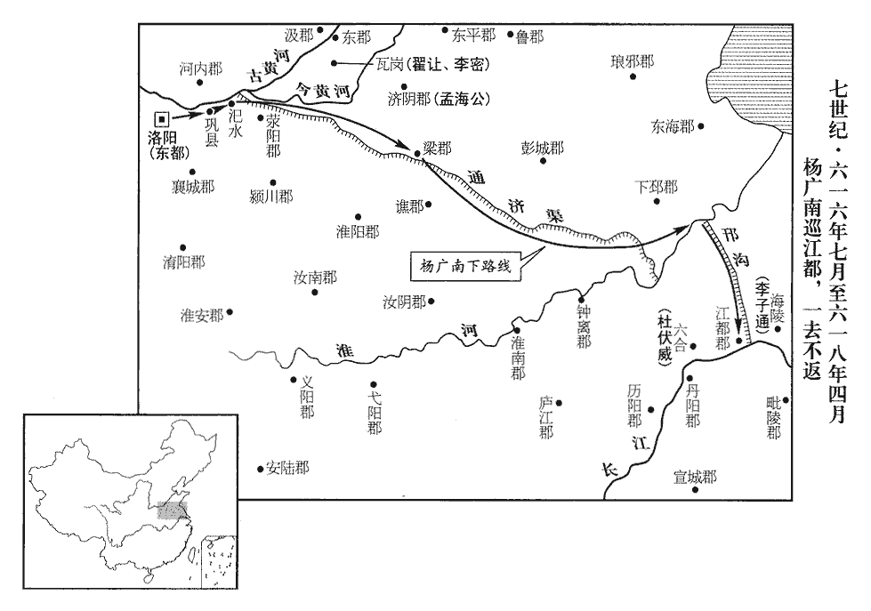
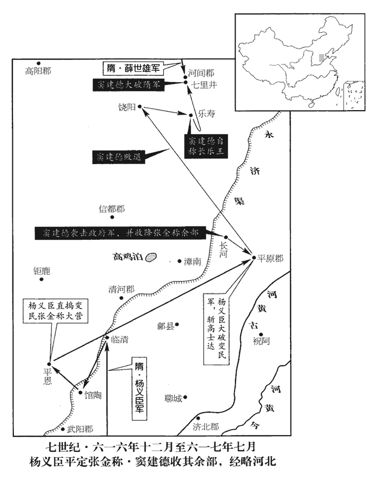
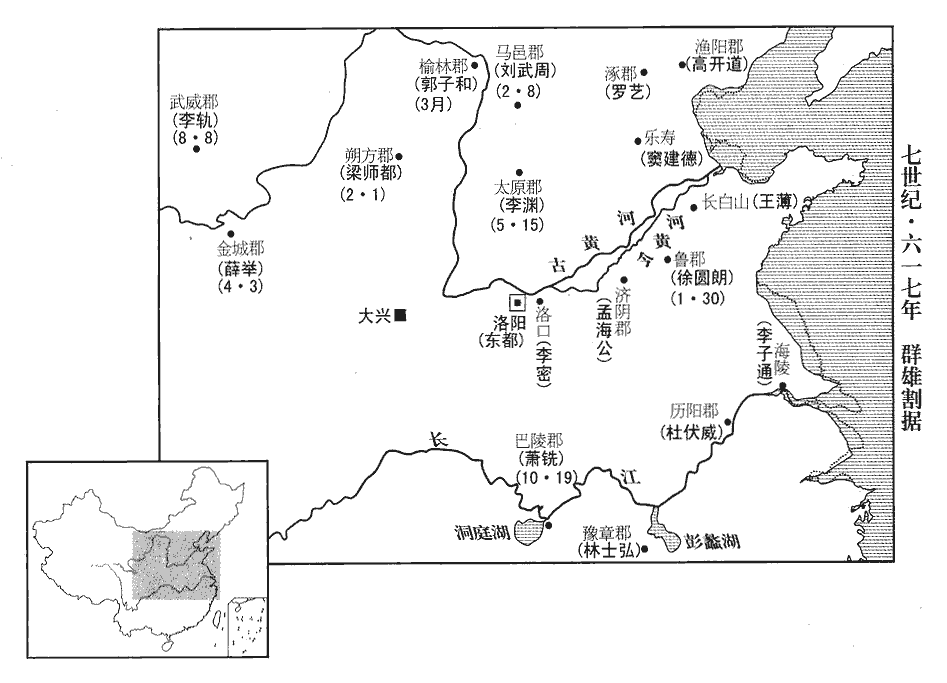
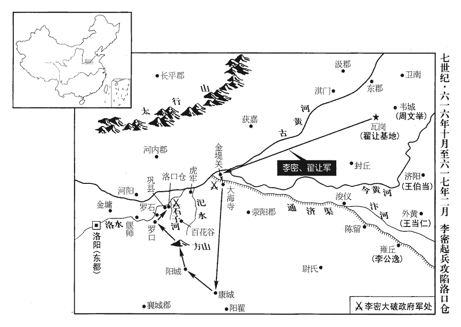
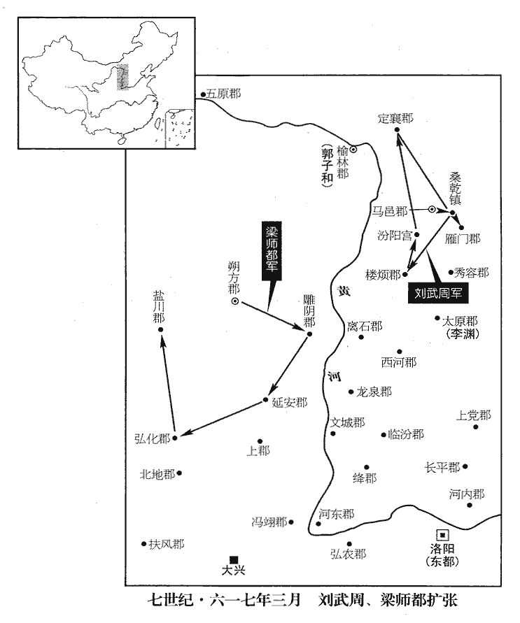
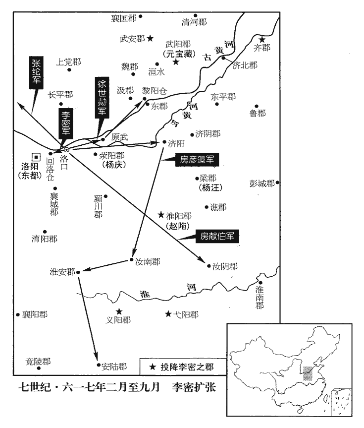

 隋紀七起柔兆困敦（丙子），盡強圉赤奮若（丁丑）五月，凡一年有奇。

# 煬皇帝下

## 大業十二年（丙子、六一六）

1春，正月，朝集使不至者二十餘郡，漢儀：正旦大朝會，諸郡計吏皆覲。隋之朝集使，亦此類也。朝，直遙翻；下同。始議分遣使者十二道發兵討捕盜賊。使，疏吏翻。

〖译文〗 [1]春季，正月，元旦大朝会，各地朝集使未到的有二十余郡。朝廷中开始商议分别派遣使者到十二道发兵讨捕盗贼。

2詔毗陵‹江苏省常州市›通守路道德守，式又翻。集十郡兵數萬人，於郡東南起宮苑，周圍十二里，內為十六離宮，大抵倣東都西苑之制，而奇麗過之。又欲築宮於會稽‹浙江省绍兴市›，會，古外翻。會亂，不果成。

〖译文〗 [2]炀帝下诏命毗陵通守路道德汇集十郡之兵几万人，在毗陵郡城东南营建宫苑，方圆十二里；苑内有十六所离宫，大都模仿东都西苑的规制，但在新颖华丽方面还要超过西苑。炀帝还打算在会稽建造宫苑，正逢各地造反，未能建成。

3三月，上巳‹七›，帝‹杨广，本年四十八岁›與群臣飲於西苑水上，命學士杜寶撰水飾圖經，采古水事七十二，使朝散大夫黃袞以木為之，間以妓航、酒船，朝，直遙翻。散，悉亶翻。間，古莧翻。妓，渠綺翻。航，戶郎翻。人物自動如生，鍾磬箏瑟，能成音曲。

〖译文〗 [3]三月，上巳节，炀帝与群臣在西苑水上宴饮。他命令学士杜宝撰写《水饰图经》，收集古代七十二个关于水的故事；让朝散大夫黄衮依故事用木头制成，间杂着乐妓的船只、酒船，木制的人物能动，栩栩如生，钟磬筝瑟，都能发出音乐曲调。

4己丑‹三›，張金稱陷平恩‹河北省邺县西南›，隋志，平恩縣，屬武安郡。稱，尺證翻。一朝殺男女萬餘口；又陷武安‹河北省永年县东南旧永年镇›、鉅鹿‹河北省钜鹿县›、清河‹河北省清河县›諸縣。隋志，武安縣屬武安郡，鉅鹿縣屬襄國郡。清河郡帶清河縣；既郡城堅守，則此縣不陷。詳考隋志，帶郭之清河本武城縣，開皇初，改名清河。而清陽縣則舊清河縣，金稱所陷蓋此。金稱比諸賊尤殘暴，所過民無孑遺。孑，單也；遺，餘也；言無單孑遺餘也。

〖译文〗 [4]己丑（初三），张金称攻陷平恩县，一个早晨就杀死男女万余人。他又攻陷武安、钜鹿、清河各县。张金称比其他的盗贼更为残暴，他率部所过之处，人迹全无。

5夏，四月，丁巳‹一›，大業殿西院火，帝以為盜起，驚走，入西苑，匿草間，火定乃還。還，從宣翻，又如字。帝自八年以後，每夜眠恆驚悸，恆，戶登翻。悸，其季翻，心動也。云有賊，令數婦人搖撫，乃得眠。

〖译文〗 [5]夏季，四月，丁巳（初一），大业殿西院起火，炀帝以为盗贼来了，逃入西苑，藏在草丛里，火熄灭后才出来。炀帝从大业八年以来每天夜里都睡不安稳，常常惊悸而醒，说有贼，必得命几个妇人摇抚才能入睡。

6癸亥‹七›，歷山飛別將甄翟兒眾十萬寇太原‹山西省太原市›，將，即亮翻。甄，側鄰翻。將軍潘長文敗死。長，知兩翻。

〖译文〗 [6]癸亥（初七），历山飞的部将甄翟儿率众十万人攻打太原，将军潘长文兵败身亡。

7五月，丙戌朔‹一›，日有食之，既。

〖译文〗 [7]五月，丙戌朔（初一），出现日食，是日全食。

8壬午‹九›，【張：「壬午」作「甲午」。】帝於景華宮徵求螢火，得數斛，夜出遊山，放之，光遍巖谷。考異曰：吳兢貞觀政要：「貞觀八年，上謂侍臣曰：『人君之言不可容易，隋煬帝幸甘泉宮，怪無螢火，敕云：「捉取少多，於宮照夜。」所司遽遣數千人採拾，送五百轝yú於宮側。小事尚爾，況其大乎！』」今從隋書。

〖译文〗 [8]壬午（疑误），炀帝在景华宫征求萤火虫，征得了几斛萤火虫，在夜里游山，把萤火虫放出来，其光亮遍及山谷。

9帝問侍臣盜賊，左翊衛大將軍宇文述曰：「漸少。」帝曰：「比從來少幾何？」對曰：「不能什一。」納言蘇威引身隱柱，帝呼前問之，對曰：「臣非所司，不委多少，委，悉也。少，詩沼翻。但患漸近。」帝曰：「何謂也？」威曰：「他日賊據長白山‹山东省邹平县南›，今近在汜水‹河南省荥阳市汜水镇西›。隋志，汜水縣屬滎陽郡，舊曰成皋，開皇十八年，改曰汜水。汜，音似。且徃日租賦丁役，今皆何在！豈非其人皆化為盜乎！比見奏賊皆不以實，比，毗至翻。遂使失於支計，不時翦除。又昔在鴈門‹山西省代县›，許罷征遼，今復徵發，復，扶又翻。賊何由息！」帝不悅而罷。尋屬五月五日，屬，之欲翻。百僚多饋珍玩，威獨獻尚書。或譖之曰：「尚書有五子之歌，威意甚不遜。」言威以帝逸豫盤遊不知返，將至失邦，如夏太康也。尚，而亮翻。孔安國曰：以其上古之書，謂之尚書。帝益怒。頃之，帝問威以伐高麗事，麗，力知翻。威欲帝知天下多盜，對曰：「今茲之役，願不發兵，但赦群盜，自可得數十萬，遣之東征。彼喜於免罪，爭務立功，高麗可滅。」麗，力知翻。帝不懌。威出，御史大夫裴蘊奏曰：「此大不遜！天下何處有許多賊！」帝曰：「老革多姦，蜀志：彭羕yàng詆劉備曰：「老革荒悖！」註云：老革，皮色枯瘁之形。羕罵備為老革，猶言老兵也。帝引此語。以賊脅我！欲批其口，且復隱忍。」批，蒲鱉翻，又普迷翻。復，扶又翻。蘊知帝意，遣河南‹东都洛阳›白衣張行本隋志：洛州河南郡，大業二年移都，改曰豫州。奏：「威昔在高陽‹河北省定州市›典選，謂九年從帝自遼東還高陽時。選，宣戀翻。濫授人官；畏怯突厥，請還京師。」事見上卷上年。厥，九勿翻。帝令按驗，獄成，下詔數威罪狀，數，所具翻。除名為民。後月餘，復有奏威與突厥陰圖不軌者，復，扶又翻。厥，九勿翻。事下裴蘊推之，蘊處威死。下，遐嫁翻。處，昌呂翻。威無以自明，但摧謝而已。帝憫而釋之，曰：「未忍即殺。」并其子孫三世皆除名。

〖译文〗 [9]炀帝向侍臣询问盗贼的情况，左翊卫大将军宇文述说：“逐渐减少。崐”炀帝说：“比过去少多少？”宇文述回答：“不及过去的十分之一。”纳言苏威躲在柱子后面，炀帝把苏威叫到座前问他，苏威回答：“我不是管这方面的官员，不清楚有多少盗贼，但贼患距京越来越近。”炀帝问：“为什么这么说呢？”苏威说：“过去盗贼只占据长白山，如今已近在汜水。况且往日的租贼丁役现在又在什么地方呢？这难道不是人们都变成盗贼了吗？近来看到上奏的贼情都不是实情，于是措施失当，对盗贼不能及时地加以剿灭。还有，以前在雁门时，已经许诺停止征伐辽东，现在又征发士兵，盗贼怎么能够平息？”炀帝听了不高兴，就作罢了。不久到了五月五日，百官中很多人都上贡珍玩之物，唯独苏威献上《尚书》，有人诋毁苏威说：“《尚书》中有《五子之歌》，苏威的含意很不恭敬。”炀帝更加生气。过不久，炀帝向苏威询问征伐高丽的事情，苏威想让炀帝了解天下有很多盗贼的情况，就回答说：“现在征辽之事，但愿不要发兵，只要赦免群盗，自然可以得到几十万人，派他们去东征，这些人对被赦免罪过感到高兴，会竞相立功，高丽就可以被平灭。”炀帝不高兴，苏威就退了出来。御史大夫裴蕴奏道：“这太不恭敬了！天下哪里有许多盗贼？”炀帝说：“这老家伙极为奸佞，拿盗贼来吓唬我，我想打他嘴巴，暂且再忍耐一下。”裴蕴知道炀帝的心意，就让河南平民张行本上奏说：“苏威从前在高阳掌管挑选官员之事时，他滥授官职，畏惧突厥，要求返回京师。”炀帝命人进行审查验证，构成罪状，于是炀帝下诏历数苏威的罪状，将他除名为民。一个多月后，又有人奏报苏威与突厥暗中勾结图谋不轨，此事交由裴蕴追究法办，裴蕴判苏威死刑。苏威无法为自己申辩，只是非常伤感地谢罪而已。炀帝怜悯苏威就将他释放，说：“不忍心就杀他。”把苏威的子孙三代都除名为民。

10秋，七月，壬戌‹八›，濟景公樊子蓋卒‹年七十二岁›。隋書樊子蓋傳：帝以子蓋守東都平玄感之功，進爵濟公，謂其功濟天下，封以嘉名，無此郡國也。濟，讀當如字。卒，子恤翻。

〖译文〗 [10]秋季，七月，壬戌（初八），济景公樊子盖去世。

11江都‹江苏省扬州市›新作龍舟成，送東都‹洛阳›；宇文述勸幸江都，【章：十二行本「都」下有「帝從之」三字；乙十一行本同；孔本同；張校同。】右候衛大將軍酒泉‹甘肃省酒泉市›趙才諫曰：「今百姓疲勞，府藏空竭，隋志，張掖郡福祿縣舊置酒泉郡。藏，徂浪翻。盜賊蜂起，禁令不行，願陛下還京師，安兆庶。」帝大怒，以才屬吏，屬，之欲翻。旬日，意解，乃出之。朝臣皆不欲行，帝意甚堅，無敢諫者。建節尉任宗上書極諫，置建節尉事見上卷上年。朝，直遙翻；下同。任，音壬。上，時掌翻；下同。即日於朝堂杖殺之。甲子‹十›，帝幸江都，命越王侗與光祿大夫段達、太府卿元文都、檢校民部尚書韋津、右武衛將軍皇甫無逸、右司郎盧楚等總留後事。唐六典曰：煬帝三年，尚書都司始置左、右司郎各一人，掌都省之職，品同諸曹郎，從五品。總留後事者，帝出巡幸，以後事付留臺官總之。侗，他紅翻，又音同。津，孝寬之子也。韋孝寬，宇文干城之將。帝以詩留別宮人曰：「我夢江都好，征遼亦偶然。」奉信郎崔民象以盜賊充斥，於建國門上表諫；隋志：帝置謁者臺官，尋又置散騎郎二十人，從五品，承議郎，正六品，通直郎，從六品，各三十人；宣德郎，正七品，宣義郎，從七品，各四十人；徵事郎，正八品，將仕郎，從八品，常從郎，正九品，奉信郎，從九品，各五十人。洛都羅城門，正南曰建國。上，時掌翻。帝大怒，先解其頤，然後斬之。說文：頤，𩔞hán也。

〖译文〗 [11]江都新制造的龙舟完工，送到东都。宇文述劝炀帝巡游江都，右候卫大将军酒泉人赵才劝阻说：“如今百姓疲惫劳苦，国库空竭，盗贼蜂起，禁令不行，希望陛下返回京师，安抚天下百姓。”炀帝勃然大怒，把赵才交司吏处治，过了十天，炀帝才平息了怒气，将赵才放出。朝中的大臣都不想让炀帝出行，但炀帝去江都之意非常坚决，没有敢于进谏的人。建节尉任宗上书极力劝谏，当天就在朝堂上被用杖打死。甲子（初十），炀帝驾临江都，他命令越王杨侗与光禄大夫段达、太府卿元文都、检校民部尚书韦津、右武卫将军皇甫无逸、右司郎卢楚等人共同负责留守东都之事。韦津是韦孝宽的儿子。炀帝以诗向宫人留别：“我梦江都好，征辽亦偶然。”奉信郎崔民象以盗贼充斥全国为由，在建国门上表劝阻江都之行，炀帝勃然大怒，先摘掉崔民象的下巴，然后将他处死。

12戊辰‹十四›，馮翊‹陕西省大荔县›孫華舉兵為盜。隋志：馮翊郡，後魏置華州，西魏改曰同州，帝改為郡。虞世基以盜賊充斥，請發兵屯洛口倉‹河南省巩县东›，大業二年置洛口倉。帝曰：「卿是書生，定猶恇怯。」恇，音匡。戊辰‹十四›，車駕至鞏‹河南省巩县›。敕有司移箕山、公路二府於倉內，鞏縣屬河南郡。新唐志：河南有府三十九。有鞏洛府，無箕山、公路二府，疑移於倉內後，遂并為鞏洛府也。仍令築城以備不虞。至汜水，汜，音似。奉信郎王愛仁復上表請還西京，帝斬之而行。至梁郡‹河南省商丘县›，帝改宋州為梁郡。復，扶又翻。郡人邀車駕上書曰：「陛下若遂幸江都，天下非陛下之有！」又斬之。是時李子通據海陵‹江苏省泰州市›，左才相掠淮‹淮河›北，杜伏威屯六合‹江苏省六合县›，隋志，六合縣屬江都郡，舊曰尉氏，置秦郡，後周改郡曰六合，開皇初，廢郡，改尉氏縣為六合縣。相，息亮翻。眾各數萬；帝遣光祿大夫陳稜將宿衛精兵八千討之，往往克捷。將，即亮翻。

〖译文〗 [12]戊辰（十四日），冯翊郡人孙华举兵为盗。虞世基以盗贼充斥请求炀帝派兵屯驻在洛口仓，炀帝说：“你是书生，必定还是恐惧畏缩。”戊辰（十四日），炀帝到达巩县，命令有关部门将箕山、公路二府移到洛口仓内，并命令修筑城池以备不测。炀帝到达汜水，奉信郎王爱仁后又上表请求炀帝反回西京，炀帝杀死王爱仁又继续南行。他到达梁郡，梁郡有人半路拦阻车驾上书说：“陛下若是一定要巡游江都，天下就将不是陛下的了！”炀帝又将上书人杀崐死。这时，李子通占据海陵，左才相劫掠淮北，杜伏威屯兵于六合，他们各自拥有部众几万人。炀帝派光禄大夫陈棱率领宿卫精兵八千人去讨伐各路盗贼，连连取胜。

 

13八月，乙巳‹二十›，賊帥趙萬海眾數十萬，自恆山‹河北省正定县›寇高陽。帝改恆州為恆山郡。帥，所類翻。恆，戶登翻。

〖译文〗 [13]八月，乙巳（二十一日），贼帅赵万海率领部众几十万人，从恒山进犯高阳。

14冬，十月，己丑‹六›，許恭公宇文述卒。卒，子恤翻。初，述子化及、智及皆無賴。化及事帝於東宮，帝寵昵之，昵，尼質翻。及即位，以為太僕少卿。少，始照翻。帝幸榆林‹内蒙古托克托县›，三年幸榆林，見一百八十卷。化及、智及冒禁與突厥交市，帝怒，將斬之，已解衣辮髮，既而釋之，賜述為奴。智及弟士及，以尚主之故，常輕智及，惟化及與之親昵。述卒，帝復以化及為右屯衛將軍，智及為將作少監。為化及兄弟為逆張本。復，扶又翻。

〖译文〗 [14]冬季，十月，己丑（初六），许恭公宇文述去世。当初，宇文述的儿子宇文化及、宇文智及都是无赖之徒，宇文化及曾在东宫侍奉炀帝，炀帝对他宠信亲昵。炀帝即位，任命宇文化及为太仆少卿。炀帝巡视榆林时，宇文化及和宇文智及违犯禁令与突厥人做买卖，炀帝发怒，要杀掉他们，已经把他们的衣服剥下来头发披散开，随即，炀帝又释放了他们，将他们赐给宇文述为奴仆。宇文智及的弟弟宇文士及，因为娶了公主的缘故，常常看不起宇文智及，只有宇文化及和他亲近。宇文述去世，炀帝又任命宇文化及为右屯卫将军，宇文智及为将作少监。

15李密之亡也，往依郝孝德，考異曰：韓昱壺關錄曰：「大業十一年正月，歷亭鎮將王該，認形狀，獲李密，送宇文述。密佯患足疾，防守者一日不行一二十里。忽至一澗，水深岸險，密跛足寅緣，佯足蹶，返撲而墜，乃至良久，狀若未蘇。防守者又無計下取之，遂以手中槍戟引之。密以手援戟，佯作失勢，推戟向水。守者以危岸，手探不住，遂即放卻，密即得槍，擉chuò守者二人俱斃，遂投郝孝德於平原‹山东省陵县›。」按密，楊玄感之黨，前巳詐亡，防者豈得不加械繫，怠慢如此！今不取。孝德不禮之；又入王薄‹在山东省济南市›，薄亦不之奇也。密困乏，至削樹皮而食之，匿於淮陽‹河南省淮阳县›村舍，帝改陳州為淮陽郡。變姓名，聚徒教授。郡縣疑而捕之，密亡去，抵其妹夫雍丘‹河南省杞县›令丘君明。隋志，雍丘縣屬梁郡。雍，於用翻。君明不敢舍，轉寄密於遊俠王秀才家，秀才以女妻之。君明從姪懷義告其事，妻，七細翻。從，才用翻。帝令懷義自齎敕書，與梁郡通守楊汪相知收捕。守，式又翻。汪遣兵圍秀才宅，適值密出外，由是獲免，君明、秀才皆死。

〖译文〗 [15]李密逃亡，去投奔郝孝德。郝孝德对李密不以礼相待，李密又去投奔王薄，王薄也不把他作为特殊人物看待。李密困顿匮乏，到了剥树皮吃的地步。他隐藏在淮阳郡的村舍里，改换姓名，聚徒教书。郡县的官员怀疑他并去抓捕他，李密逃走，到他妹夫雍丘县令丘君明家。丘君明不敢留李密住下，就把李密转送到游侠王秀才家藏匿。王秀才把自己的女儿嫁给李密。丘君明的堂侄丘怀义向官府告发了这件事，炀帝命令丘怀义亲自把敕书送交梁郡通守杨汪，让他去收捕李密等人。杨汪派兵包围了王秀才家，正好李密外出，因而幸免，丘君明、王秀才都被官府处死。

韋城‹河南省滑县东南›翟讓為東都‹东郡，河南省滑县›法曹，隋志，韋城縣屬東郡，開皇六年置。劉昫曰：隋分白馬縣，置於古城韋氏之國城。「東都」，當作「東郡」，帝改滑州為兗州，二年改為東郡。郡有西曹，金、戶、兵、法、士等曹。翟zhái，萇伯翻。坐事當斬。獄吏黃君漢奇其驍勇，驍，堅堯翻；下同。夜中潛謂讓曰：「翟法司，天時人事，抑亦可知，豈能守死獄中乎！」讓驚喜【章：十二行本「喜」下有「叩頭」二字；乙十一行本同；孔本同；張校同；退齋校同。】曰：「讓，圈牢之豕，圈，求遠翻。死生唯黃曹主所命。」君漢即破械出之。讓再拜曰：「讓蒙再生之恩則幸矣，柰黃曹主何！」因泣下。君漢怒曰：「本以公為大丈夫，可救生民之命，故不顧其死以奉脫，柰何反效兒女子涕泣相謝乎！君但努力自免，勿憂吾也！」讓遂亡命於瓦崗‹河南省滑县南›為群盜，瓦崗，在東郡界。同郡單雄信，考異曰：唐書云：「雄信，曹州人。」今從河洛記。單，常演翻。驍健，善用馬槊，驍，堅堯翻。槊，色角翻。聚少年往從之。少，詩照翻。離狐‹山东省菏泽市西北›徐世勣jì家於衛南‹河南省滑县东›，離狐，漢縣，後魏之北濟陰郡也，時屬濟陰郡。唐中世改曰南華。宋白曰：離狐縣，初置在濮水南，常為神狐所穿穴，遂移水北，故曰離狐。衛南，古楚丘也，隋開皇置衛南縣，屬東郡。宋白曰：全衛之時，此地在衛之南垂，故以名縣。年十七，有勇略，說讓曰：說，輸芮翻。「東郡於公與勣皆為鄉里，人多相識，不宜侵掠。滎陽‹河南省郑州市›、梁郡，汴水所經，帝改鄭州為滎陽郡，宋州為梁郡。班志：汴水在滎陽西南，蓋汴水所起，東南入梁郡界。汴，皮變翻。剽行舟，掠商旅，足以自資。」剽，匹妙翻。讓然之，引眾入二郡界，掠公私船，資用豐給，附者益眾，聚徒至萬餘人。

〖译文〗 韦城人翟让是东都的法曹，因为犯罪该当被处死。狱吏黄君汉认为翟让骁勇不寻常，于是在夜里悄悄对翟让说：“翟法司，天时人事，也许是可以预料的，哪能在监狱里等死呢？”翟让又惊又喜，说：“我翟让，是关在圈里的猪，生死只能听从黄曹主的吩咐了。”黄君汉当即给翟让打开枷锁，翟让再三拜谢说：“我蒙受您的再生之恩得以幸免，但黄曹主您怎么办呢？”于是流下泪来。黄君汉发怒道：“我本以为你是个大丈夫，可以拯救黎民百姓，所以才冒死来解救你，你怎么却象儿女子弟一样以涕泪来表示感谢呢？你就努力设法逃脱吧，不要管我了！”于是翟让逃亡到瓦岗为盗。与他同郡的单雄信，骁勇矫健，擅长骑马使矛，他招集年轻人去投奔翟让。离狐人徐世家在卫南，十七岁，有勇有谋，他劝说翟让：“东郡对于您和我都是乡里，那里的人大都认识，不宜去侵犯抢掠他们。荥阳、梁郡，是汴水流经的地方，我们抢劫行船，掠夺商人旅客，就足以自给。”翟让同意他的建议，于是就率众进入荥阳、梁郡的境界，抢掠公私船只，因此供给充裕，来归附的人越来越多，徒众达一万余人。

時又有外黃‹河南省民权县西北内黄集›王當仁、濟陽‹河南省兰考县东北堌阳镇›王伯當、韋城周文舉、雍丘李公逸等皆擁眾為盜。外黃、濟陽二縣，隋志皆屬濟陰郡。剽，匹妙翻。濟，子禮翻。李密自雍州【章：十二行本「州」作「邱」；乙十一行本同；孔本同；張校同。】亡命，往來諸帥間，說以取天下之策，帥，所類翻。說，式芮翻；下同。始皆不信。久之，稍以為然，相謂曰：「斯人公卿子弟，志氣若是。今人人皆云楊氏將滅，李氏將興。吾聞王者不死，斯人再三獲濟，豈非其人乎！」由是漸敬密。

〖译文〗 当时还有外黄人王当仁，济阳人王伯当，韦城人周文举，雍丘人李公逸等都聚众为盗。李密从雍州逃亡后，就往来于各部首领之间，向他们游说夺取天下的谋略。开始大家都不信，时间长了，他们渐渐相信了，五相说道：“此人是公卿子弟，有这样的志气、抱负，现在人们都说杨氏将灭，李氏将兴，我听说能成王业的人不会死，此人多次能渡过难关，难道他就是将成帝业的李姓人吗？”于是他们渐渐敬重李密。

密察諸帥唯翟讓最強，乃因王伯當以見讓，考異曰：隋、唐書皆云：「密歸翟讓，其中有知密是玄感亡將，潛勸讓害之。密懼，因王伯當以策干讓，讓始敬焉。」按密既亡歸群盜，必不隱其姓名，誰不知是玄感亡將！讓得之當用以敵隋，何惡於密而害之！今不取。革命記云：「密投賊帥郝孝德，說之曰：『君能用密之策，河朔可指揮而定。』孝德曰：『本緣饑荒，求活性命，何敢別圖！國家若知公在此，孝德死亡無日。翟讓等徒眾絕多，請將兵送公於彼。』是日，孝德以馬一匹自送至河，執袂飲酒而別，軍中慕從者亦數十人，仍遣兵馬將送密於翟讓。」今從隋書。為讓畫策，為，于偽翻。往說諸小盜，皆下之。讓悅，稍親近密，與之計事，近，其靳翻。密因說讓曰：「劉、項皆起布衣為帝王。今主昏於上，民怨於下，銳兵盡於遼東，和親絕於突厥，厥，九勿翻。方乃巡遊揚、越，委棄東都，此亦劉、項奮起之會也。以足下雄才大略，士馬精銳，席卷二京，誅滅暴虐，隋氏不足亡也！」卷，讀曰捲。讓謝曰：「吾儕群盜，旦夕偷生草間，儕，士皆翻。君之言者，非吾所及也。」

〖译文〗 李密观察各部统帅，只有翟让势力最强，于是由王伯当引见见到了翟让，他为翟让出谋划策，去游说劝导诸小股盗贼，他们都归附了翟让。翟让很高兴，渐渐信任李密，与他商议事情。李密趁机劝翟让说：“刘邦、项羽都出身平民而作了帝王，如今上面是皇帝昏庸，下面是百姓怨愤，精锐兵力都在辽东丧失了，突厥也断绝了和亲的关系，炀帝还在巡游扬、越一带，丢弃了东都，现在也是刘邦、项羽之辈奋起的机会。以您的雄才大略，兵马的精良，可以席卷东西二京，诛灭暴君，隋氏完全可以灭掉！”翟让向李密推辞说：“我辈身为群盗，旦夕都在草丛之间偷生，你所说的，不是我辈所能想到的。”

會有李玄英者，自東都逃來，經歷諸賊，求訪李密，云「斯人當代隋家。」人問其故，玄英言：「比來民間謠歌比，毗至翻。有桃李章曰：『桃李子，皇后繞揚州，宛轉花園裏。勿浪語，誰道許！』『桃李子』，謂逃亡者李氏之子也；皇與后，皆君也；『宛轉花園裏』，謂天子在揚州‹江都郡·江苏省扬州市›無還日，將轉於溝壑也；『莫浪語，誰道許』者，密也。」既與密遇，遂委身事之。前宋城‹河南省商丘县›尉齊郡房玄藻，自負其才，隋志：宋城縣，帶梁郡，舊曰睢陽，開皇十八年更名。恨不為時用，預於楊玄感之謀，變姓名亡命，遇密於梁、宋之間‹河南省东部›，遂與之俱遊漢、沔，沔，彌兗翻。徧入諸賊，說其豪傑；還日，從者數百人，說，式芮翻。從，才用翻。仍為遊客，處於讓營。處，昌呂翻。讓見密為豪傑所歸，欲從其計，猶豫未決。

〖译文〗 正好有个叫李玄英的人从东都逃来，经过了各部盗贼，以求访李密，并说：“此人当替代隋家坐天下。”别人问他缘故，李玄英说：“近来民间有一叫《桃李章》的歌谣，歌谣唱道：‘桃李子，皇后绕扬州，宛转花园里。勿浪语，谁道许！’‘桃李子’，是说逃亡的人是李氏之子；皇与后都是君主；‘宛转花园里’指的是天子在扬州不会有回来的日子了，将会死无葬身之地；‘莫浪语，谁道许’是密的意思。”不久他遇到李密，于是就投靠李密。原宋城县尉齐郡人房玄藻，自恃自己的才学，恨自己不能为当政的人所赏识任用，他曾参与过杨玄感的谋乱，后来改名换姓逃亡，在梁郡、宋城之间遇见了李密，于是就和李密遍游汉、沔之地，遍访各部贼帅，游说其中的豪杰之士。从汉、沔之地返回来的时候，跟从他们的有几百人，他们仍作为游客，留在翟让的营寨内。翟让看见豪杰们都归附李密，想采纳李密的建议，但仍犹豫不决。

有賈雄者，曉陰陽占候，為讓軍師，言無不用。密深結於雄，使之託術數以說讓；雄許諾，懷之未發。會讓召雄，告以密所言，問其可否，對曰：「吉不可言。」又曰：「公自立恐未必成，若立斯人，事無不濟。」讓曰：「如卿言，蒲山公當自立，何來從我？」對曰：「事有相因。所以來者，將軍姓翟，翟者，澤也，翟，萇伯翻。蒲非澤不生，故須將軍也。」讓然之，與密情好日篤。好，呼到翻。

〖译文〗 有个叫贾雄的人，通晓阴阳占卜，他是翟让的军师，翟让对他是言听计从。李密与贾雄结为深交。他让贾雄假借占卜之术去劝说翟让，贾雄答应了，想好了主意但还没说出来，正好翟让召见贾雄，把李密的建议告诉贾雄，问他是否可以采纳，贾雄回答：“吉不可言。”又说：“您自立为王恐怕未必能成功，要是拥立此人，事情就没有办不成的。”翟让说：“象你说的那样，蒲山公应当自立，为什么他又来投奔我呢？”贾雄回答：“有些事是有相互联系的，李密所以来投奔你，是因为将军您姓翟，翟是泽的意思。蒲草非泽则不生，所以崐他需要将军您。”翟让认为贾雄的话很对，他与李密的交情日益密切。

密因說讓曰：「今四海糜沸，糜，粥也，言如粥之沸也。不得耕耘，公士眾雖多，食無倉廩，唯資野掠，常苦不給。若曠日持久，加以大敵臨之，必渙然離散。未若先取滎陽，休兵館穀，考異曰：革命記：「密說讓曰：『洛口倉‹河南省巩县东›米逾巨億，請公發一札之令，使密奉之，告諸道英雄，就倉喫chī米，必當雲合響應，受命於公，然後稱帝號以定中原』云云。讓曰：『就倉食米，實是上謀。自顧庸賤，寧敢別創餘心；必如此謀，願奉公為主。』密懷懼，改容而拜，讓亦拜。於是言宴盡歡，各恨相知之晚。即日，讓作書與密，散告諸處賊頭，並尅期定日，令總會洛口倉食米。」今從隋書待士馬肥充，然後與人爭利。」讓從之，於是破金隄關‹荥阳市北黄河关隘›，金隄關，當在滎陽界，以漢金隄名之。攻滎陽諸縣，多下之。

〖译文〗 李密就劝翟让说：“如今国内沸腾，百姓不得耕耘，您兵马虽多，但吃粮没有仓储，只靠外出抢掠，常常苦于供给不足，若是旷日持久，加之大敌临头，部众必然会离散，不如先攻取荥阳，休兵取食仓储之粮，待兵强马壮，然后再与他人争夺利益。”翟让听从了他的意见，率军攻破了金堤关，进而攻打荥阳郡各县，大多数县城都被攻破。

滎陽太守郇王慶，弘之子也，弘，高祖‹杨坚›從祖弟也，封河間王。守，式又翻；下同。不能討，帝徙張須陁為滎陽通守以討之。庚戌‹二十七›，須陁引兵擊讓，讓曏數為須陁所敗，數，所角翻。敗，補邁翻。聞其來，大懼，將避之。密曰：「須陁勇而無謀，兵又驟勝，既驕且狠，可一戰擒也。狠，戶墾翻。公但列陳以待，密保為公破之。」陳，讀曰陣；下同。為，于偽翻；下同。讓不得已，勒兵將戰，密分兵千餘人伏於大海寺‹荥阳市北›北林間。須陁素輕讓，方陳而前，讓與戰，不利，須陁乘之，逐北十餘里；密發伏掩之，須陁兵敗。密與讓及徐世勣、王伯當合軍圍之，須陁潰圍出；左右不能盡出，須陁躍馬復入救之，來往數四，遂戰死‹年五十二岁›。所部兵晝夜號哭，數日不止，史言張須陁得士卒心。號，戶刀翻。河南郡縣為之喪氣。為，于偽翻。喪，息浪翻。鷹揚郎將河東‹山西省永济市›賈務本為須陁之副，亦被傷，帥餘眾五千餘人奔梁郡，務本尋卒。將，即亮翻。被，皮義翻。帥，讀曰率。卒，子恤翻。詔以光祿大夫裴仁基為河南討捕大使，代領其眾，徙鎮虎牢‹河南省荥阳市汜水镇西›。虎牢，即滎陽郡汜水縣。使，疏吏翻。

〖译文〗 荥阳太守郇王杨庆是杨弘的儿子，不能率军讨伐翟让，炀帝调张须陀为荥阳通守去讨伐翟让。庚戌（二十七日），张须陀率兵进击翟让，翟让从前几次都被张须陀所击败，他听到张须陀来，大为恐惧，打算避开张须陀。李密说：“张须陀有勇无谋，他的军队又屡次取胜，既骄傲又凶狠，可以一仗就把张须陀擒住。您只要摆好阵势等待官军，我保证为您打败官军。”翟让不得已，率兵准备交战，李密分出一千余士兵埋伏在大海寺北面的树林里。张须陀素来轻视翟让，他将军队列成方阵前进。翟让与张须陀交战，战败，张须陀追击败兵十余里，李密发动伏兵掩杀官军，张须陀兵败。李密与翟让以及徐世、王伯当等合兵一处将张须陀包围。张须陀突破重围，但他的部将没能全冲出包围，张须陀又跃马冲入包围圈去救援，这样来回几次，张须陀战死。他所部士兵昼夜号哭，几天不止，黄河以南的郡县都为之沮丧。鹰扬郎将河东人贾务本是张须陀的副将，也受了伤，他率领剩下的五千多人逃到梁郡，贾务本不久也去世了。炀帝诏命光禄大夫裴仁基为河南讨捕大使，替代张须陀统领他的部下，迁到虎牢镇守。

讓乃令密建牙，別統所部，號蒲山公營。密部分嚴整，分，扶問翻。凡號令士卒，雖盛夏，皆如背負霜雪。躬服儉素，所得金寶，悉頒賜麾下，由是人為之用。麾下士卒多為讓士卒所陵辱，以威約有素，不敢報也。讓謂密曰：「今資糧粗足，粗，坐五翻；今人多從去聲。意欲還向瓦崗，公若不往，唯公所適，讓從此別矣。」讓帥輜重東引，重，直用翻。密亦西行至康城‹河南省禹州市西北›，說下數城，說，輸芮翻。大獲資儲。讓尋悔，復引兵從密。復，扶又翻。

〖译文〗 翟让于是命李密建立自己的营署，单独统帅自己的部众，号称蒲山公营。李密管理部众纪律严明，凡是号令士卒，虽然是在盛夏，士卒们似背上负有霜雪般的寒意。李密衣着节俭朴素，获得的金宝，全都颁赐给了部下，因此人们都愿为他效力。他部下的士卒很多人被翟让的部众欺辱，但因为李密管束严格，无人敢进行报复。翟让对李密说：“如今军资粮食大致够用，我打算返回瓦岗，您若是不去，那就随你所便了，我从此就与你分手了。”翟让带着辎重向东而去，李密也向西来到康城，劝降了几座城池，获得了大量的军资粮食。不久，翟让就后悔了，他又率兵来跟随李密。

16鄱陽‹江西省波阳县›賊帥操師乞自稱元興王，建元始興，帝改饒州為鄱陽郡。操，姓也，帥，所類翻。考異曰：隋帝紀作「操天成」。按唐高祖實錄林士弘傳：「大業末，與其鄉人操師乞起為群盜，師乞僭號，建元為天成，攻陷豫章郡，入據之。」唐書士弘傳：「操乞師自號元興王。」皆無操天成名。此賊本一人，而隋、唐二史各有名號年紀，今參取之。攻陷豫章郡‹江西省南昌市›，帝改洪州為豫章郡。以其鄉人林士弘為大將軍，詔治書侍御史劉子翊將兵討之。師乞中流矢死，治，直之翻。中，竹仲翻。士弘代統其眾，與子翊戰於彭蠡湖‹鄱阳湖›，禹貢：東匯澤為彭蠡。班志：豫章郡彭澤縣，彭蠡湖在西。今在南康軍城東南，西接江州德化縣界，周迴四百五十里。子翊敗死。士弘兵大振，至十餘萬人。十二月，壬辰‹十›，士弘自稱皇帝，國號楚，建元太平；考異曰：唐高祖實錄：「士弘自稱南越王，尋僭號，建元延康。」唐書林士弘傳：「操乞師攻陷豫章郡而據之，以士弘為大將軍。乞師既死，士弘代董其眾，復與劉子翊大戰於彭蠡湖，隋師敗績，子翊死之。士弘大振，兵至十餘萬。十三年，徙據虔州稱帝。」其國號、年名與此同。今從隋書。遂取九江‹江西省九江市›、臨川‹江西省临川市›、南康‹江西省赣州市›、宜春‹江西省宜春市›等郡，帝改江州為九江郡，改撫州為臨川郡，虔州為南康郡，袁州為宜春郡。豪傑爭殺隋守令，以郡縣應之。其地北自九江，南及番禺‹广东省广州市›，皆為所有。南海郡治番禺，隋併為南海縣。番，音潘。禺，音愚。

〖译文〗 [16]鄱阳的贼帅操师乞自称元兴王，建年号始兴。他率兵攻陷了豫章郡，任命同乡林士弘为大将军。炀帝下诏命治书侍御史刘子翊率兵前去讨伐操师乞。操师乞中流矢而死，林士弘替代他统帅部众。林士弘与刘子翊在彭蠡湖交战，刘子翊战败身亡。林士弘军威大振，兵力达到十余万人。十二月，壬辰（初崐十），林士弘自称皇帝，国号楚，建年号太平。于是林士弘又攻取九江、临川、南康、宜春等郡，各地豪杰竞相杀死隋朝的郡守县令，以整个郡县来响应林士弘。北自九江、南到番禺的广大地域都为林士弘所据有。

17詔以右驍衛將軍唐公李淵為太原留守，帝改并州為太原郡。驍，堅堯翻。守，式又翻。以虎賁郎將王威、虎牙郎將高君雅為之副，帝改定官制，十二衛府每衛置護軍四人，掌副貳將軍，尋改護軍為虎賁郎將，正四品，而置虎牙郎將六人副焉，從四品。將，即亮翻；下同。賁，音奔。將兵討甄翟兒，甄，側鄰翻。與翟兒遇於雀鼠谷‹山西省灵石县西南汾水河谷›。隋志，西河郡永安縣有雀鼠谷。淵眾纔數千，賊圍淵數匝；匝，子答翻。李世民將精兵救之，拔淵於萬眾之中，會步兵至，合擊，大破之。考異曰：新、舊唐書本紀皆云「十三年，拜太原留守。」新書仍云「擊高陽歷山飛賊甄翟兒於西河，破之。」今從隋帝紀。

〖译文〗 [17]炀帝下诏任命右骁卫将军唐公李渊为太原留守，任命虎贲郎将王威，虎牙郎将高君雅为李渊的副将，率兵讨伐甄翟儿。在雀鼠谷与甄翟儿遭遇，李渊才有几千人，而贼军包围李渊有好几重。李世民率领精兵救援李渊，将李渊从万众之中救出来，正好李渊步兵赶到，两军合击，大破甄翟儿。

18帝疏薄骨肉，蔡王智積每不自安，及病，不呼醫，臨終，謂所親曰：「吾今日始知得保首領沒於地矣！」

〖译文〗 [18]炀帝对骨肉亲人都疏远、刻薄，蔡王杨智积常常感到不安，他患了病，不请医生治病，临终时对他的亲人说：“我今天才知道能够保全脑袋而死于地下！”

張金稱、郝孝德、孫宣雅、高士達、楊公卿等寇掠河北，屠陷郡縣；隋將帥敗亡者相繼，將，即亮翻。帥，所類翻。唯虎賁中郎將蒲城‹陕西省蒲城县›王辯、清河郡丞華陰‹陕西省华阴市›楊善會數有功，按隋官制無中郎將。王辯傳，辯自鷹揚郎將遷虎賁郎將。「中」字衍。隋志，蒲城縣屬馮翊郡。數，所角翻。善會前後與賊七百餘戰，未嘗負敗。帝遣太僕卿楊義臣討張金稱。金稱營於平恩東北，隋志，平恩縣屬武安郡。義臣引兵直抵臨清‹河北省临西县›之西，據永濟渠為營，隋志，臨清縣屬清河郡。劉昫曰：臨清，漢清泉縣，後魏改為臨清。永濟渠，大業初所開。去金稱營四十里，深溝高壘，不與戰。金稱日引兵至義臣營西，義臣勒兵擐甲，擐，音宦。約與之戰，既而不出。日暮，金稱還營，明旦，復來；復，扶又翻；下同。如是月餘，義臣竟不出。金稱以為怯，屢逼其營詈辱之。詈，力智翻。義臣乃謂金稱曰：「汝明旦來，我當必戰。」金稱易之，不復設備。易，以豉翻。義臣簡精騎二千，夜自館陶‹河北省馆陶县›濟河‹永济运河›，隋志，館陶縣屬武陽郡。此河，謂清河也。伺金稱離營，即入擊其累重。離，力智翻。累，力瑞翻。重，直用翻。金稱聞之，引兵還，義臣從後擊之，金稱大敗，與左右逃於清河‹永济运河›之東。月餘，楊善會討擒之。吏立木於市，懸其頭，張其手足，令仇家割食之，未死間，歌謳不輟。詔以善會為清河通守。守，式又翻。

〖译文〗 [19]张金称、郝孝德、孙宣雅、高士达、杨公卿等抢掠河北，攻陷郡县，隋朝的将帅相继败亡，只有虎贲中郎将蒲城人王辩、清河郡丞华阴人杨善会几次立功。杨善会前后与贼人交战七百余次，没有战败过。炀帝派遣太仆卿杨义臣讨伐张金称，张金称在平恩县东北方向扎营，杨义臣率兵直抵临清县的西面，依据永济渠扎营，距张金称的营地有四十里，深沟高垒，不与张金称交战。张金称每天率兵到杨义臣营地的西面讨战，杨义臣穿戴铠甲率领着士兵，与张金称约定交战，但又不出战。直至天色将晚，张金称只好率军返回营地，第二天一早再来，这样过了一个来月，杨义臣竟然没有出战。张金称以为杨义臣怯战，几次逼近他的营地辱骂他，杨义臣对张金称说：“你明天早晨来，我一定与你交战。”张金称因此轻敌，不再提防。杨义臣挑选精锐骑兵两千人，乘夜从馆陶渡河，趁张金称率兵离开营地，即进入张的营地袭击他的家属和辎重。张金称听到这个消息，率兵返回，杨义臣从后面袭击，张金称大败，仅与身边的人逃到清河郡东。一个多月后，杨善会讨伐并抓住了张金称，官吏在闹市中立一根木柱，将张金称的头悬吊起来，展开他的手足，让与他有仇的人割食其肉。张金称没死时，还不停地唱。炀帝下诏任命杨善会为清河通守。

 

20涿郡通守郭絢絢，許縣翻將兵萬餘人討高士達。士達自以才略不及竇建德，乃進建德為軍司馬，悉以兵授之。建德請士達守輜重，自簡精兵七千人拒絢，詐為與士達有隙而叛，遣人請降於絢，降，戶江翻。願為前驅，擊士達以自效。絢信之，引兵随建德至長河‹山东省德州市›，隋志，長河縣屬平原郡，舊曰廣川，仁壽初改名。不復設備。建德襲之，殺虜數千人，斬絢首，獻士達，張金稱餘眾皆歸建德。楊義臣乘勝至平原，欲入高雞泊‹河北省故城县西›討之。建德謂士達曰：「歷觀隋將，將，即亮翻。善用兵者無如義臣，今滅張金稱而來，其鋒不可當。請引兵避之，使其欲戰不得，坐費歲月，將士疲倦，然後乘間擊之，間，古莧翻。乃可破也。不然，恐非公之敵。」士達不從，留建德守營，自帥精兵逆擊義臣，帥，讀曰率。戰小勝，因縱酒高宴。建德聞之曰：「東海公未能破敵，遽自矜大，禍至不久矣。」後五日，義臣大破士達，於陳斬之，乘勝逐北，趣其營，陳，讀曰陣。趣，七喻翻。營中守兵皆潰。建德與百餘騎亡去，至饒陽‹河北省饶阳县›，隋志，饒陽縣屬河間郡。騎，奇寄翻。乘其無備，攻陷之，收兵，得三千餘人。義臣既殺士達，以為建德不足憂，引去。建德還平原，收士達散兵，收葬死者，為士達發喪，軍復大振，為，于偽翻。考異曰：革命記曰：「高士達、高德政與宗族鳩集離散，得五萬人，捺渦於四根柳樹，入高雞泊中，德政自號東海公，以建德為長史。俄而德政病死，即有高欓dǎng脫繼立為東海公，建德仍依舊任。欓脫領兵劫抄，至晏城府，為城中兵所射而死。賊之異姓皆欲建德為主，高氏一族不欲更立別人，遂分為兩軍，各相猜貳。然高氏兵精強，建德恐被屠，乃詐分為官軍，告高氏併力共擊之。高氏無疑，即合軍共鬬，兵刃纔交，建德自後擊之，高氏兵大亂，建德兩軍擁掠遣坐，簡其驍勇及頭首千餘人，殺之，遂總統其眾。建德自號長樂王，寇抄州縣，即大業十二年二月也。」今從隋、唐書。自稱將軍。先是，群盜得隋官及士族子弟，皆殺之，先，悉薦翻。獨建德善遇之；由是隋官稍以城降之，聲勢日盛，勝兵至十餘萬人。降，戶江翻；下同。勝，音升。

〖译文〗 [20]涿郡通守郭绚率领一万余人讨伐高士达。高士达自认为才能谋略不如窦建德，于是就提拔窦建德为军司马，并把兵权交给了他。窦建德请高士达看守辎重，自己挑选精兵七千人抗击郭绚。他假称与高士达有矛盾而背叛了他，派人向郭绚请求投降，表示愿作郭绚的前锋，进攻高士达来立功赎罪。郭绚相信了窦建德，率兵跟随窦建德到长河县，也不再防备他。窦建德突然袭击郭绚，杀获几千人，斩郭绚的首级献给高士达。张金称的余部也都归附了窦建德。杨义臣乘胜进军到平原，打算进入高鸡泊讨伐窦建德。窦建德对高士达说：“我观察了不少隋将，善于用兵的莫过于杨义臣了，如今他灭掉了张金称乘胜而来，锐不可挡，请您率兵避开他，让他欲战不得，耗费时间，将士疲劳厌倦，然后我们再乘机袭击他，杨义臣才能被攻破，否则，恐怕您不是他的对手。”高士达不听，他留下窦建德守营，自己率领精兵迎击杨义臣，取得小胜后，就纵酒畅饮。窦建德听到后说：“东海公未能将敌打败就骄傲自大，灾祸不久就要到了。”五天后，杨义臣大破高士达，在阵前将高士达杀死，乘胜追击，直逼他的营地。营中的守军都溃散奔逃，窦建德仅和百余骑兵逃走，到了饶阳县，乘饶阳县没有防备，攻陷饶阳，收集兵卒三千人。杨义臣杀死了高士达，认为窦建德已不足为患，就率兵离去。窦建德返回平原，收集高士达所部的散兵，收集安葬死者，为高士达发丧，军威又重新大振。窦建德自称将军。原先，群盗抓住隋官及士族子弟都杀掉，唯独窦建德很好地对待他们，因此隋官中有些人就举城投降他，窦建德声势日渐浩大，拥有精兵十余万。

21內史侍郎虞世基以帝惡聞賊盜，惡，烏路翻。諸將及郡縣有告敗求救者，將，即亮翻。世基皆抑損表狀，不以實聞，但云：「鼠竊狗盜，郡縣捕逐，行當殄盡，願陛下勿以介懷！」帝良以為然，或杖其使者，以為妄言，由是盜賊徧海內，陷沒郡縣，帝皆弗之知也。楊義臣破降河北賊數十萬，列狀上聞，所降者皆張金稱、高士達之眾。將，即亮翻。使，疏吏翻。上，時掌翻。帝歎曰：「我初不聞，賊頓如此，義臣降賊何多也！」世基對曰：「小竊雖多，未足為慮，義臣克之，擁兵不少，少，詩沼翻；下同。久在閫外，此最非宜。」帝曰：「卿言是也。」遽追義臣，放散其兵，賊由是復盛。復，扶又翻。

〖译文〗 [21]内史侍郎虞世基因为炀帝厌恶听到贼盗的情况，所以诸将及各地郡县告败求救的表奏，虞世基都把它们加以删改处理，不据实上报，只说：“鼠窃狗盗之徒，郡县官吏搜捕追逐，快要被彻底消灭了。希望陛下不要放在心上！”炀帝很以为然，有时还用杖责打据实报告的使者，以为说的都是谎话。因此盗贼遍布海内，攻陷郡县，炀帝都不知道。杨义臣击败并收降河北的贼人几十万，他把情况写表上奏炀帝，炀帝看后感叹道：“我原来没听说盗贼到如此地步，杨义臣降服的贼怎么这样多？”虞世基回答：“小贼虽然多，但不足为虑，杨义臣击败小贼，却拥兵不少，将帅久在朝廷之外，这样是最不适宜的。”炀帝说：“你说的是。”于是派人追回杨义臣，遣散他的士兵，盗贼因此又重新强盛起来。

治書侍御史韋雲起劾奏：「世基及御史大夫裴蘊職典樞要，維持內外，四方告變，不為奏聞。治，直之翻。劾，戶概翻，又戶得翻。為，于偽翻。賊數實多，裁減言少，陛下既聞賊少，發兵不多，眾寡懸殊，往皆不克，故使官軍失利，賊黨日滋。請付有司結正其罪。」大理卿鄭善果奏：「雲起詆訾名臣，訾zī，將此翻。所言不實，非毀朝政，妄作威權。」朝，直遙翻。由是左遷雲起為大理司直。唐六典：後魏永安三年，御史中尉高穆奏置司直十人，視五品，隸廷尉，位在正、監上，不署曹事，唯覆理御史劾事；北齊及隋因之。

〖译文〗 治书侍御史韦云起参劾道：“虞世基和御史大夫裴蕴职掌机密枢要，掌管国家内外大事，现在四方告急，却不上报，盗贼的数量实际上已经很多了，他们将奏表修改删减报说贼少，陛下既然听说贼少，发兵也就不多，因此双方力量众寡悬殊，去征讨往往不能取胜，因此使官军失利，而贼党却日益增多。请将他们二人交付有关部门追究处理他们的罪过。”大理卿郑善果奏道：“韦云起诋毁诬蔑国家重臣，他所说的都不是实话，他诽谤诋毁朝政，妄自作威专权。”因此炀帝将韦云起降为大理司直。

22帝至江都，江、淮郡官謁見者，見，賢遍翻。專問禮餉豐薄，豐則超遷丞、守，薄則率從停解。江都郡丞王世充獻銅鏡屏風，遷通守；守，式又翻。歷陽郡‹安徽省和县›丞趙元楷獻異味，遷江都郡丞。帝改和州為歷陽郡。趙元楷自小郡丞遷大郡丞。由是郡縣競務刻剝，以充貢獻。民外為盜賊所掠，內為郡縣所賦，生計無遺；加之饑饉無食，無穀曰饑，無蔬果曰饉。民始采樹皮葉，或擣藁為末，或煮土而食之，諸物皆盡，乃自相食；而官食猶充牣，吏皆畏法，莫敢振救。王世充密為帝簡閱江淮民間美女獻之，由是益有寵。

〖译文〗 [22]炀帝到了江都，凡江、淮各郡官员谒见的，炀帝专问进献礼品的多少崐。礼多则越级升迁郡丞、县守，礼少的则恣肆地黜免官职。江都郡丞王世充进献铜镜屏风，升为通守；历阳郡丞赵元楷进献珍奇美味，升为江都郡丞。因此郡县官吏竞相对百姓肆意盘剥，以充实进献之物。百姓外受盗贼的抢掠，内受郡县官吏课贼的逼迫，生计无着，加上饥馑无食，百姓开始采剥树皮、树叶充饥，有的人将稻草杆捣成碎末为食，有的煮土吃，各种能吃的东西都吃光了，就互相吃人。而官府仓库中的粮食还是充裕如初，官吏们畏惧刑法，不敢取粮救济饥民。王世充还秘密为炀帝挑选江淮民间的美女来进献，因此更加得到炀帝的宠信。

23河間‹河北省河间市›賊帥格謙，擁眾十餘萬，據豆子䴚gǎng‹山东省惠民县西›，帝改瀛州為河間郡。姓苑：格姓，允格之後。帥，所類翻。䴚，各朗翻。自稱燕王，帝命王世充將兵討斬之。謙將勃海高開道帝改滄州為勃海郡。燕，因肩翻。將，即亮翻；下同。收其餘眾，寇掠燕地‹河北省北部›，軍勢復振。復，扶又翻。

〖译文〗 [23]河间郡贼帅格谦拥有部众十余万人，占据豆子殷，自称燕王。炀帝命王世充率兵讨伐格谦并将他杀死。格谦的部将勃海人高开道收集余部，侵掠燕地，军势又振兴起来。

24初，帝謀伐高麗，麗，力知翻。器械資儲，皆積於涿郡；涿郡人物殷阜，屯兵數萬。又，臨朔宮‹北京市境›多珍寶，諸賊競來侵掠；留守官虎賁郎將趙什住等不能拒，唯虎賁郎將雲陽‹陕西省泾阳县西北›羅藝獨出戰，守，式又翻。賁，音奔。將，即亮翻。雲陽縣，屬京兆郡。前後破賊甚眾，威名日重，什住等陰忌之。藝將作亂，先宣言以激其眾曰：「吾輩討賊數有功，數，所角翻。城中倉庫山積，制在留守之官，而莫肯散施以濟貧乏，施，式豉翻。將何以勸將士！」眾皆憤怨。軍還，郡丞出城候藝，藝因執之，陳兵而入。什住等懼，皆來聽命，乃發庫物以賜戰士，開倉廩以賑貧乏，境內咸服；殺不同己者勃海太守唐禕等數人，守，式又翻。威振燕地，柳城‹辽宁省朝阳市›、懷遠‹辽宁省辽中县›並歸之。藝黜柳城太守楊林甫，改郡為營州，隋志，柳城縣帶遼西郡，與襄平郡蓋皆帝所置。改郡為州，示復開皇之舊也。以襄平‹辽宁省朝阳市境›太守鄧暠為總管，暠hào，古老翻。藝自稱幽州總管。

〖译文〗 [24]当初，炀帝策划征伐高丽，隋军的器械和军资贮备都积存在涿郡。涿郡人口、物产殷实丰富，屯驻有几万隋军。另外，临朔宫里有很多珍宝，各地的贼寇竟相来侵掠。留守官虎贲郎将赵什住等人无法抵御，只有虎贲郎将云阳人罗艺独自出战，前后击败的贼人很多，罗艺的威望日重，赵什住等人暗中嫉妒罗艺。罗艺将要造反，他先广泛宣传以激怒他的部众，他说：“我们讨贼几次立功，城中的仓库里粮食堆积如山，都掌握在留守官员手中，但是不肯散施一点以救济贫苦困乏的百姓，将来靠什么勉励将士！”大家都极为愤怒怨恨。罗艺率军回城，郡丞出城迎侯罗艺，罗艺将郡丞抓起来，排着队列入城。赵什住等人恐惧了，都前来听命。于是罗艺分发仓库里的物资以赏赐战士，打开粮仓以赈济贫苦困顿的百姓。涿郡境内都服从罗艺，罗艺杀掉不同自己一起造反的勃海太守唐等数人，威振燕地，柳城、怀远都归附了罗艺。罗艺废黜柳城太守杨林甫，改郡为营州，任命襄平太守邓为总管，罗艺自称幽州总管。

25突厥數寇北邊。厥，九勿翻。詔晉陽‹太原郡郡政府所在县·山西省太原市›留守李淵帥太原道兵，與馬邑‹山西省朔州市›太守王仁恭擊之。晉陽留守，即太原留守也。太原有晉陽宮，故亦稱晉陽留守。帝改朔州為馬邑郡。帥，讀曰率；下同。守，式又翻。時突厥方強，兩軍眾不滿五千，仁恭患之。淵選善騎射者二千人，使之飲食舍止一如突厥，或與突厥遇，則伺便擊之，前後屢捷，突厥頗憚之。前後屢得小捷耳。曰頗憚者，未深憚也。厥，九勿翻。騎，奇寄翻。伺，相吏翻。

〖译文〗 [25]突厥人几次侵犯隋帝国的北部边境。炀帝下诏命晋阳留守李渊率领太原道军队与马邑太守王仁恭抗击突厥。这时突厥正处于强盛时期，太原道及马邑郡两处隋军不满五千人，王仁恭忧虑兵少。李渊挑选善于骑射的士卒二千人，让这些隋军士兵饮食起居完全同突厥人一样，隋军骑兵与突厥人相遇时，就伺机袭击突厥人，这样前后屡次获胜，突厥人颇怕李渊。

# 恭皇帝上諱侑，封代王；元德太子昭之子，煬帝之孫也。諡法：尊賢讓善曰恭。

## 義寧元年（丁丑、六一七）是年十一月，李淵克長安，方奉代王即位改元，通鑑因以繫年。

1春，正月，右禦衛將軍陳稜討杜伏威，伏威帥眾拒之。稜閉壁不戰，伏威遺以婦人之服，謂之「陳姥」。遺，于季翻。姥，莫補翻。稜怒，出戰，伏威奮擊，大破之，稜僅以身免。考異曰：隋陳稜傳云：「往往克捷。」唐杜伏威傳云：「稜僅以身免。」蓋稜先破李子通等，後為伏威所敗也。今從唐書。伏威乘勝破高郵‹江苏省高邮市›，隋志，高郵縣屬江都郡。引兵據歷陽‹安徽省和县›，自稱總管，以輔公祏為長史，祏，音石。長，知兩翻。分遣諸將徇屬縣，所至輒下，將，即亮翻。江淮間小盜爭附之。伏威常選敢死之士五千人，謂之「上募」，寵遇甚厚，有攻戰，輒令上募先擊之，戰罷閱視，有傷在背者即殺之，以其退而被擊故也。被，皮義翻。所獲資財，皆以賞軍。士有戰死者，以妻、妾徇葬。故人自為戰，所向無敵。

〖译文〗 [1]春季，正月，右御卫将军陈棱讨伐杜伏威，杜伏威率部众抗击官军。陈棱紧壁营垒，不出来交战，杜伏威送给他妇人的衣服，称他为“陈姥”。陈棱发怒，率军出战，杜伏威率军奋力攻击，大破官军，陈棱仅只身逃脱。杜伏威乘胜攻破了高邮，率兵占据了历阳，自称总管，任命辅公为长史，分派各崐位将领攻取江都郡所属各县，大军所到之处，城池都被攻破，江淮地区的小盗争相归附杜伏威。杜伏威常常挑选敢死之士五千人，称之为“上募”，对这支队伍极为宠信，待遇优厚。凡有战斗，就命令“上募”先进行攻击，战罢审查将士，凡背上有伤的就处死，认为他背部被击伤是后退的缘故。凡所缴获的军资财物，都用来赏赐军队，将士有战死的，杜伏威就用死者的妾殉葬。因此杜伏威的军队人自为战，所向无敌。

 

2丙辰‹五›，竇建德為壇於樂壽‹河北省献县›，隋志，樂壽縣屬河間郡，古樂城縣，仁壽初更名。樂，音洛；下同。自稱長樂王，置百官，改元丁丑。考異曰：許敬宗太宗實錄、舊唐帝紀皆云「武德元年二月，建德稱長樂王」。按建德改元丁丑，即是今歲。今從隋帝紀及建德傳。

〖译文〗 [2]丙辰（初五），窦建德在乐寿县设坛，自称长乐王，设置百官，改年号丁丑。

3辛巳‹三十›，魯郡‹山东省兖州市›賊徐圓朗攻陷東平‹山东省郓城县›，分兵略地，自琅邪‹山东省临沂市›以西，北至東平，盡有之，煬帝改兗州為魯郡，改鄆州為東平郡，沂州為琅邪郡。邪，音耶。勝兵二萬餘人。勝，音升。

〖译文〗 [3]辛巳（三十日），鲁郡贼人徐圆朗攻陷东平，他分兵攻占土地，从琅邪以西，北到东平的地域都为徐圆朗所有，拥有精兵两万余人。

4盧明月轉掠河南，至于淮北，眾號四十萬，自稱無上王；帝命江都‹江苏省扬州市›通守王世充討之。世充與戰於南陽‹河南省邓州市›，大破之，隋志：南陽郡，舊置荊州，開皇初，改鄧州，煬帝改為郡。守，式又翻。斬明月，餘眾皆散。

〖译文〗 [4]卢明月转掠河南，到达淮北，拥有的部众号称四十万，自称无上王。炀帝命令江都通守王世充率兵讨伐卢明月，王世充在南阳与卢明月交战，大破卢明月，斩了卢明月，其余的部众都溃散了。

5二月，壬午‹一›，朔方‹陕西省靖边县北白城子›鷹揚郎將梁師都帝改夏州為朔方郡。將，即亮翻。殺郡丞唐世宗，據郡，自稱大丞相，北連突厥‹瀚海沙漠群›。

〖译文〗 [5]二月，壬午（初一），朔方鹰扬郎将梁师都杀死郡丞唐世宗，占据朔方郡，自称大丞相，向北勾结突厥。

6馬邑‹山西省朔州市›太守王仁恭，煬帝改朔州為馬邑郡。多受貨賂，不能振施。施，式豉翻。郡人劉武周，驍勇喜任俠，驍，堅堯翻。喜，許記翻。為鷹揚府校尉，煬帝改大都督為校尉。校，戶教翻。仁恭以其土豪，甚親厚之，令帥親兵屯閤下。帥，讀曰率。武周與仁恭侍兒私通，恐事泄，謀作亂，先宣言曰：「今百姓饑饉，僵尸滿道，王府君閉倉不賑卹，豈為民父母之意乎！」僵，居良翻。賑，津忍翻；下同。眾皆憤怒。武周稱疾臥家，豪傑來候問，武周椎牛縱酒，因大言曰：「壯士豈能坐待溝壑！今倉粟爛積，誰能與我共取之？」豪傑皆許諾。己丑‹八›，仁恭坐聽事，聽，讀曰廳。武周上謁，上，時掌翻。其黨張萬歲等隨入，升階，斬仁恭，持其首出徇，郡中無敢動者。於是開倉以賑飢民，馳檄境內屬城，皆下之，收兵得萬餘人。武周自稱太守，守，式又翻。考異曰：創業注云：「二月己丑，馬邑軍人劉武周殺太守王仁恭，據其郡，自稱天子，國號定楊。」按唐書，武周據汾陽宮乃僭號，於時未也。遣使附于突厥。使，疏吏翻。厥，九勿翻。

〖译文〗 [6]马邑太守王仁恭，收受了许多财物贿赂，但他却不对百姓赈济施舍。马邑郡人刘武周骁勇，喜好侠义之举，他是鹰扬府校尉。王仁恭因为刘武周是当地的土豪，对他非常亲近信任，令他率领亲兵驻防在太守官署。刘武周与王仁恭的侍女私通，他恐怕事情泄露，就图谋作乱，先扬言说：“如今百姓饥馑，僵尸满道，而王府君关闭粮仓不肯赈济抚恤百姓，这难道是为民父母应作的吗？”大家都极为愤怒。刘武周称病躺在家里，当地豪杰都来问候，刘武周杀牛置酒大摆宴席，并夸口说：“壮士怎么能坐以待毙，如今仓里的粮食腐烂堆积，谁能和我一起去取粮？”在场的豪杰都许诺共往。己丑（初八），王仁恭正坐在厅堂处理政事，刘武周上堂谒见，刘的党羽张万岁等人随刘武周入厅堂，登上台阶杀死王仁恭，持王仁恭的首级出来示众。郡内无人敢动。于是刘武周开粮仓赈济饥民，在马邑郡所属各城驰马发布檄文，各城都降附了刘武周，共收得兵马一万余人。刘武周自称太守，派遣使者向突厥表示归附。

7李密說翟讓曰：說，式芮翻。翟，萇伯翻。「今東都‹洛阳›空虛，兵不素練；越王‹杨侗›沖幼‹本年十四岁›，留守諸官政令不壹，士民離心。段達、元文都，闇而無謀，以僕料之，彼非將軍之敵。若將軍能用僕計，天下可指麾而定。」乃遣其黨裴叔方覘東都虛實，守，式又翻。今，力定翻。覘，丑廉翻，又丑豔翻。留守官司覺之，始為守禦之備，且馳表告江都。密謂讓曰：「事勢如此，不可不發。兵法曰：『先則制於己，後則制於人。』今百姓饑饉，洛口倉‹河南省巩县东›多積粟，去都百里有餘，都，謂東都。將軍若親帥大眾，輕行掩襲，帥，讀曰率。彼遠未能救，又先無豫備，取之如拾遺耳。比其聞知，比，必寐翻。吾已獲之，發粟以賑窮乏，遠近孰不歸附！百萬之眾，一朝可集，枕威養銳，枕，職任翻。以逸待勞，縱彼能來，吾有備矣。然後檄召四方，引賢豪而資計策，選驍悍而授兵柄，驍，堅堯翻。悍，戶旰翻；又下罕翻。除亡隋之社稷，布將軍之政令，豈不盛哉！」讓曰：「此英雄之略，非僕所堪；惟君之命，盡力從事，請君先發，僕為後殿。」殿，丁甸翻。庚寅‹九›，密、讓將精兵七千人將，即亮翻。出陽城‹河南省登封县东南›北，踰方山‹河南省荥阳市西南›，自羅口‹河南省巩县西南›襲興洛倉‹即洛口仓，巩县东›，破之；隋志，陽城縣屬河南郡。陸渾縣有方山。鞏縣有興洛倉。魏收地形志，鞏縣有長羅川。羅口，蓋即長羅川口。水經：羅水出方山西北流，謂之長羅川，又西北過訾城東北而入于洛。括地志：方山，在洛州汜水縣東南三十二里，汜水所出也。開倉恣民所取，老弱襁負，道路相屬。襁，居兩翻。屬，之欲翻。

〖译文〗 [7]李密劝说翟让：“现在东都空虚，军队平时又都没有训练，越王杨侗崐年幼，留守的诸位官员政令不一，士民离心。段达、元文都愚昧而无谋略，以我来看，他们不是将军的对手。要是将军能用我的计策，天下可以挥手而定。”于是派遣他的党羽裴叔方去侦探东都的虚实，留守东都的官员觉察到了这一情况，开始作防卫的准备，并且驰马送奏表去江都报告炀帝。李密对翟让说：“事情已经到了这个地步，我军不能不行动了。兵法云：‘先动手则争取主动，后动手则受人挟制。’如今百姓饥馑，洛口仓有很多积存的粮食，离东都有百余里，将军要是亲率大军，轻装前进，掩杀袭击，他们因路远无法救援，事先又无防备，取洛口仓就象拾丢在地上的一件东西一样容易，等对方知道消息，我们已经得手了。发放粮食以赈济贫苦的百姓，远近之人谁不归附我们呢？百万之众，一个早晨就可以召集到。我们依恃所得的威风，养精畜锐，以逸待劳，纵然东都派军队来，我们也有防备了。然后我们就传布檄文号召四方响应，引用豪杰贤士，听取他们的谋略，挑选骁勇强悍之将才，授以兵权，推翻隋朝，颁布将军的政令，难道这不是一件盛举吗？”翟让说：“这是英雄的韬略，不是我所能承担的，我只是听命于您，尽力办事，请您先行进发，我作殿后。”庚寅（初九），李密、翟让率领精兵七千人出阳城北，越过方山，从罗口袭击并攻破了兴洛仓，打开粮仓听任百姓取粮，取粮的老弱妇孺，在路上接连不断。

 

朝散大夫時德叡以尉氏‹河南省尉氏县›應密，時姓，楚大夫申叔時之後。隋志，尉氏縣屬潁川郡。尉氏，漢縣也。應劭曰：古獄官曰尉氏，鄭之別獄也。臣瓚曰：鄭大夫尉氏之邑，故遂以名邑。朝，直遙翻。散，悉亶翻。前宿城‹山东省东平县东›令祖君彥自昌平‹北京市昌平县›往歸之。隋志，宿城縣屬東平郡，開皇十六年置。劉昫曰：漢須昌縣故城，在今鄆州東南三十二里，隋於此置宿城縣。昌平縣，隋志屬涿郡。君彥，珽之子也，珽，他鼎翻。博學強記，文辭贍敏，著名海內，吏部侍郎薛道衡嘗薦之於高祖‹杨坚›，高祖曰：「是歌殺斛律明月人兒邪？歌殺斛律光，事見一百七十一卷陳高宗太建四年。邪，音耶。朕不須此輩！」煬帝即位，尤疾其名，依常調選東平書佐，檢校宿城令。隋制，州郡皆有書佐，在祭酒從事之上，視正九品，謂之流內視品。檢校官，未得為真。調，徒釣翻。選，宣戀翻。君彥自負其才，常鬱鬱思亂，密素聞其名，得之大喜，引為上客，軍中書檄，一以委之。

〖译文〗 朝散大夫时德睿以尉氏县响应李密，前宿城令祖君彦从昌平去归附李密。祖君彦是祖的儿子，他学问渊博记忆力强，文辞丰富，且思路敏捷，在国内很有名气。吏部侍郎薛道衡曾经把他推荐给文帝，文帝说：“是用歌谣杀了斛律明月那个人的儿子吗？我不要这样的人！”炀帝即位，尤为厌恶祖君彦的名声，按常规将祖君彦调选为东平郡的书佐，检校宿城令。祖君彦很自负能才，常常郁闷不快想着作乱。李密很早就知道他的名声，得到后大喜，将他视为上宾，军中的案卷文书、檄文等，全都委托他办理。

越王侗遣虎賁郎將劉長恭、光祿少卿房崱zè侗，音通。賁，音奔。將，即亮翻。少，始照翻。崱，士力翻帥步騎二【張：「二」作「三」。】萬五千討密。帥，讀曰率；下同。騎，奇寄翻。時東都人皆以密為飢賊盜米，烏合易破，易，以豉翻。爭來應募，國子三館學士隋以國子、太學、四門為三館。及貴勝親戚皆來從軍，器械脩整，衣服鮮華，旌旗鉦鼓甚盛。長恭等當其前，使河南討捕大使裴仁基等，將所部兵自汜水‹河南省荥阳市汜水镇西›而入，以掩其後，大使，疏吏翻。將，即亮翻。汜，音祀。約十一日會於倉城南，考異曰：蒲山公傳云：「剋取二十一日會戰。」河洛記曰：「取其月十二日會戰。」按下有庚子，則非二十一日也，當是十一曰。密、讓具知其計。東都兵先至，士卒未朝食，長恭等驅之渡洛水，陳於石子河‹河南省巩县东南›西，水經註：洞水出南溪石泉，世亦名之為石泉水，過鞏東坎欿kǎn聚西而北入于洛。蓋即石子河也。陳，讀曰陣；下同。南北十餘里。密、讓選驍雄，分為十隊，驍，堅堯翻。令四隊伏橫嶺下以待仁基，以六隊陳於石子河東。長恭等見密兵少，輕之。少，詩沼翻。讓先接戰，不利，密帥麾下橫衝之。隋兵飢疲，遂大敗，長恭等解衣潛竄得免，奔還東都，士卒死者什五六。越王侗釋長恭等罪，慰撫之。密、讓盡收其輜重器甲，重，直用翻。威聲大振。

〖译文〗 越王杨侗派遣虎贲郎将刘长恭，光禄少卿房率领步兵骑兵两万五千人去讨伐李密。当时东都人都以为李密是饥饿的抢米盗贼，只是一伙乌合之众，容易击破，都争相来应募，国子、太学、四门三馆的学士以及贵胄勋戚都来从军。官军器械完备整齐，衣服鲜明华美，旌旗钲鼓极为壮观。刘长恭等人率兵在前，让河南讨捕大使裴仁基军率所部自汜水进入兴洛仑以掩杀李密军后部，约好十一日在兴洛仓城南面会合。李密、翟让完全了解他们的意图。东都的官军先到，士兵们还没吃早饭，刘长恭等人就驱赶他们渡过洛水，在石子河西列阵，阵南北长十余里。李密、翟让挑选骁勇强壮之士分作十队，令其中的四队埋伏在横岭下等待裴仁基，其余的六队在石子河以东列阵。刘长恭等人见李密的军队人少，就很轻视他们。翟让先率兵与隋军交战，交战不利，李密即率所部横冲隋军，隋兵饥饿疲惫，于是被打得大败。刘长恭等人脱掉衣服潜逃才得以幸免逃回东都，隋军士卒死伤十之五六。越王杨侗赦免了刘长恭等人的罪过，慰问安抚了他们。李密、翟让将隋军的辎重、器械、铠甲全部缴获，因而威名大振。

讓於是推密為主，上密號為魏公；上，時掌翻。庚子‹十九›，設壇場，即位，稱元年，考異曰：壺關錄云：「王伯當令密於西垣校射，書王字於堋上如錢，約中者為主，其次以近、遠為拜官高下。使賈雄執箭，仰天而誓，密正中字心，遂奉以為主。」其說鄙陋，今不取。河洛記云：「改大業十三年為永平元年。」今從蒲山公傳及隋、唐書。大赦。其文書行下，下，遐嫁翻。稱行軍元帥府；帥，所類翻；下同。其魏公府置三司、六衛，元帥府置長史以下官屬。拜翟讓為上柱國、司徒、東郡公，長，知兩翻。考異曰：河洛記云，鄧公蓋後來進封耳，今從蒲山公傳及隋、唐書。亦置長史以下官，減元帥府之半；以單雄信為左武候大將軍，單，音善。徐世勣為右武候大將軍，各領所部；房彥藻為元師左長史，東郡‹河南省滑县›邴元真為右長史，楊德方為左司馬，鄭德韜為右司馬，祖君彥為記室，其餘封拜各有差。於是趙、魏以南，江、淮以北，群盜莫不響應，孟讓、郝孝德、王德仁郝，呼各翻。及濟陰‹山东省定陶县›房獻伯、上谷‹河北省易县›王君廓、長平‹山西省晋城市›李士才、淮陽‹河南省淮阳县›魏六兒、李德謙、譙郡‹安徽省亳州市›張遷、魏郡‹河南省安阳市›李文相、譙郡黑社、白社、濟北‹山东省茌平县西南›張青特、上洛‹陕西省商州市›周比洮táo、胡驢賊等皆歸密。隋志：長平郡，舊曰建州，開皇初，改為澤州，煬帝改為郡。譙郡，後魏置南兗州，後周改亳州，煬帝改為郡。改濟州為濟北郡，商州為上洛郡。黑社、白社，蓋賊之號，非人姓名也。濟，子禮翻。相，息亮翻。比，毗至翻。洮，土刀翻。密悉拜官爵，使各領其眾，置百營簿以領之。道路降者不絕如流，降，戶江翻。眾至數十萬。考異曰：略記云，「二月丙辰，密遣其將夜襲倉城，二府兵擊退之。己未，又悉眾來攻，而府兵敗，遂入據倉；然二府將士猶各固小倉城，二十餘日不下。既而外救不至，食又盡，城乃陷沒，死者太半。於是鞏縣長柴孝和、監察御史鄭頲tǐng等舉縣降賊。密開倉招納降者，日數百千人。於是趙、魏以南，江、淮以北，莫不歸附，自是賊徒滋蔓矣。壬子，使劉長恭、房崱等統兵東討，大敗，戊午，還都，王慰撫，不責也。於是發教募士庶商旅奴等，分置營壁，各立將帥統領而固守，其諸里居民皆移入三城之內，於省寺府舍安置焉。又使宋遵貴將兵鎮陝縣太原倉。」雜記：「密稱魏公改年，于時倉猶自固守，既而密遣翟讓將兵夜襲倉城，官軍擊退之；明日，又引眾攻倉，連戰三日，陷外城，官軍猶捉子城。月餘，外援不至，城盡陷沒，死者十六七。」按二月壬午朔，無丙辰等日。今從隋書。乃命其護軍田茂廣築洛口城‹河南省巩县东›，方四十里而居之，考異曰：壺關錄云：「周四十八里。」今從隋書。密遣房彥藻將兵東略地，取安陸‹湖北省安陆市›、汝南‹河南省汝南县›、淮安‹河南省泌阳县›、濟陽‹河南省兰考县东北堌阳镇›，煬帝改安州為安陸郡。隋志：汝南郡，後魏置豫州。帝改洛州為豫州，以此為秦州，又改曰蔡州，尋改為郡。淮安郡，後魏置東荊州，西魏改為淮州，開皇五年又改為顯州，煬帝改為郡。濟陽縣屬濟陰郡。濟，子禮翻。河南郡縣多陷於密。

〖译文〗 于是翟让推举李密为主，给李密上尊号为魏公。庚子（十九日），设坛场，李密即位，称元年，大赦天下。李密向下颁发的公文书信等，署名为行军元帅府。魏公府设置三司、六卫，元帅府设置长史以下的官属。李密授翟让为上柱国、司徒、东郡公，东郡公府也设置长史以下的官属，数目比元帅府减少一半。任命单雄信为左武候大将军，徐世为右武候大将军，各自统领自己的部队。房彦藻被任命为元帅左长史，东郡人邴元真为右长史，杨德方为左司马，郑德韬为右司马，祖君彦为记室，其余的人封爵拜官各有等次。于是赵、魏以南，江、淮以北地区的群盗莫不响应。孟让、郝孝德、王德仁以及济阴人房献伯，上谷人王君廓，长平人李士才，淮阳人魏六儿、李德谦，谯郡人张迁，魏郡人李文相，谯郡的黑社、白社，济北人张青特，上洛人周比洮、胡驴贼等都归附李密。李密对他们全部封官授爵，让他们各自统领本部人马，设置百营簿来总管他们。前来归降的人络绎不绝如流水一般，李密的部众达几十万人。于是李密命令护军田茂广修筑洛口城，方圆四十里，李密住在城内。他派房彦藻率兵向东攻占城池，取下安陆、汝南、淮安、济阳，河南的郡县大多为李密所攻取。

 

 

8鴈門‹山西省代县›郡丞河東‹山西省永济市›陳孝意，與虎賁郎將王智辯共討劉武周，圍其桑乾鎮‹山西省朔州市东南›。桑乾，漢縣；後魏為桑乾郡，後周廢，隋以為鎮，在馬邑郡善陽縣界。賁，音奔。將，即亮翻。乾，音干。壬寅‹二十一›，武周與突厥合兵擊智辯，殺之；孝意奔還鴈門。三月，丁卯‹十七›，武周襲破樓煩郡‹山西省静乐县›，進取汾陽宮‹山西省宁武县南管涔山上›，獲隋宮人，以賂突厥始畢可汗；厥，九勿翻。可，從刊入聲。汗，音寒。始畢以馬報之，兵勢益振，又攻陷定襄‹内蒙古和林格尔县›。煬帝改雲州為定襄郡。突厥立武周為定楊可汗，言將使之定楊州也。考異曰：新、舊唐書武周皆無國號，惟創業起居註云，國號定楊。遺以狼頭纛。隋書曰：突厥本狼種。牙門建狼頭纛，示不忘本也。遺，于季翻。武周即皇帝位，立妻沮氏為皇后，沮，子余翻。改元天興。以衛士楊伏念為尚書左僕射，妹壻同縣苑君璋為內史令。武周引兵圍鴈門，陳孝意悉力拒守，乘間出擊武周，屢破之；間，古莧翻；下同。既而外無救援，遣間使詣江都，皆不報。使，疏吏翻。孝意誓以必死，旦夕向詔敕庫俯伏流涕，悲動左右。圍城百餘日，食盡，校尉張倫殺孝意以降。校，戶教翻。降，戶江翻。

〖译文〗 [8]雁门郡丞河东人陈孝意与虎贲郎将王智辩共同讨伐刘武周，包围他的桑干镇。壬寅（二十一日），刘武周与突厥人合兵攻击并杀死了王智辩，陈孝意逃回雁门。三月，丁卯（十七日），刘武周袭击攻取了楼烦郡，并夺取了汾阳宫，俘获宫中的宫人，用她们去贿赂突厥的始毕可汗。始毕可汗以马回报刘武周，刘武周兵势越发强盛，又攻陷定襄，突厥封刘武周为定杨可汗，赠给他狼头旗。刘武周即皇帝位，立妻子沮氏为皇后，改年号为天兴。任命卫士杨伏念为尚书左仆射，妹婿与武周同县的苑君璋为内史令。刘武周率兵包围雁门，陈孝意全力拒守，同时还乘机出击刘武周，几次击败刘军。不久因为外无救援之兵，陈孝意派密使去江都告急，但都没有回音。陈孝意誓以必死的决心守卫雁门，每日早晚向存放皇帝诏敕的府库跪拜流泪，他的悲痛感动了身边的人。刘武周围城百余日，城中粮尽，校尉张伦杀陈孝意向刘武周投降。

9梁師都略定雕陰‹陕西省绥德县›、弘化‹甘肃省庆阳县›、延安‹陕西省延安市›等郡，隋志：雕陰郡，西魏置綏州，大業初，改為上郡，尋改為雕陰郡。改慶州為弘化郡。遂即皇帝位，國號梁，改元永隆。始畢遺以狼頭纛，號為大度毗伽可汗。師都乃引突厥居河南之地，攻破鹽川郡‹陕西省定边县›。隋志：鹽川郡，西魏置西安州，後改為鹽州，煬帝改為郡。

〖译文〗 [9]梁师都攻占了雕阴、弘化、延安等郡，就即皇帝位，国号梁，改年号为永隆。始毕可汗赠以狼头大旗，并赠以大度毗伽可汗的称号。梁师都勾结突厥人占据河南之地，攻破盐川郡。

10左翊衛蒲城‹陕西省蒲城县›郭子和郭子和，蓋衛士之屬左翊衛府者。坐事徙榆林‹内蒙古托克托县›。會郡中大饑，子和潛結敢死士十八人攻郡門，執郡丞王才，數以不恤百姓，斬之，數，所具翻。開倉賑施。自稱永樂王，施，式豉翻。樂，音洛。改元丑平。尊其父為太公，以其弟子政為尚書令，子端、子升為左、右僕射。有二千餘騎，南連梁師都，北附突厥，各遣子為質以自固。騎，奇寄翻。厥，九勿翻。質，音致。始畢以劉武周為定楊天子，梁師都為解事天子，解，戶買翻。子和為平楊天子；平楊，猶定楊也。子和固辭不敢當，乃更以為屋利設。

〖译文〗 [10]左翊卫蒲城人郭子和，犯罪被流放到榆林。正逢榆林郡遇大饥荒，郭子和暗地结交了敢死之士十八人进攻郡门，抓住郡丞王才，历数他不体恤百姓疾苦的罪状，将王才处死，开仓赈济百姓。郭子和自称永乐王，改年号丑平。崐尊他父亲为太公，任命他弟弟郭子政为尚书令，郭子端、郭子升为左右仆射。他拥有两千余名骑兵，南面勾结梁师都，北面依附突厥，两边各送一个儿子作为人质以巩固自己的势力。始毕可汗封刘武周为定杨天子，梁师都为解事天子，郭子和为平杨天子，郭子和再三辞谢，不敢接受，于是始毕改封他为屋利设。

11汾陰‹山西省万荣县西南荣河镇›薛舉，僑居金城‹甘肃省兰州市›，隋志，汾陰縣屬河東郡。煬帝改蘭州為金城郡。僑，寓也。驍勇絕倫，家貲鉅萬，交結豪傑，雄於西邊，為金城府校尉。新唐志，金城郡有府二，曰廣武、金城。校尉，其帥。驍，堅堯翻。校，戶教翻。時隴右‹陇山以西›盜起，金城令郝瑗金城縣，帶郡。郝，呼各翻。瑗，于眷翻。募兵得數千人，使舉將而討之。將，即亮翻。夏，四月，癸未‹三›，方授甲，置酒饗士，舉與其子仁果及同黨十三人，於座劫瑗發兵，考異曰：唐高祖實錄先作「仁果」，後作「仁杲」。新、舊高祖、太宗紀、薛舉傳、柳芳唐曆、柳宗元集皆作「仁杲」。太宗實錄、吳兢太宗勳史，革命記、焦璐唐朝年代記、陳嶽唐統記皆作「仁果」。今醴泉昭陵前有石馬六匹，其一銘曰：「白蹄烏，平薛仁杲時所乘。」此最可據，今從之。囚郡縣官，開倉賑施。賑，津忍翻。施，式智翻。自稱西秦霸王，改元秦興。以仁果為齊公，少子仁越為晉公，招集群盜，掠官牧馬。賊帥宗羅睺帥眾歸之，以為義興公。少，詩照翻。賊帥，所類翻。睺帥，讀曰率。將軍皇甫綰將兵一萬屯枹罕‹甘肃省临夏市›，煬帝改河州為枹罕郡。綰將，即亮翻。枹，音膚。舉選精銳二千人襲之。【章：十二行本「之」下有「遂克枹罕」四字；乙十一行本同；張校同；退齋校同。】岷山‹甘肃省舟曲县西›羌酋鍾利俗擁眾二萬歸之，隋志：臨洮郡臨洮縣有岷山。酋，才由翻。舉兵大振。更以仁果為齊王，領東道行軍元帥，帥，所類翻。仁越為晉王，兼河州刺史，復以枹罕郡為河州。羅睺為興王，以副仁果；分兵略地，取西平‹青海省乐都县›、澆河‹青海省贵德县›二郡。煬帝改鄯州為西平郡，周武帝逐吐谷渾，置廓州，煬帝改為澆河郡。澆，古堯翻。未幾，盡有隴西‹陇山以西›之地，眾至十三萬。幾，居豈翻。

〖译文〗 [11]汾阴人薛举，侨居于金城，他骁勇无比，有万贯家财，好交结豪杰之士，称雄于西部边地，是金城府校尉。当时陇右盗贼风起，金城令郝瑗招募兵丁约有几千人，派薛举率领去讨伐盗贼。夏季，四月，癸未（初三），募兵刚授以兵器，金城府摆设酒宴犒劳将士，薛举和他的儿子薜仁果及同党十三人，在座位上胁迫郝瑗发兵，把郡县官员监禁起来，并开仓赈济百姓。薜举自称西秦霸王，改年号秦兴。他封薛仁果为齐公，封恭仁果为齐公，幼子薛仁越为晋公，招集群盗，抢掠官府的牧马。贼帅宗罗率部众归附了他，被封为义兴公。将军皇甫绾率兵一万人驻扎在罕，薛举挑选精兵二千人袭击皇甫绾。岷山羌人酋长钟利俗率领部众二万人归附薛举，薛举兵势大振。他改封薛仁果为齐王，领东道行军元帅之衔；薛仁越为晋王，兼任河州刺史；宗罗为兴王，作薛仁果的副将。薛举分兵攻掠土地，攻取了西平、浇河二郡。不久，陇西都为薛举占有，他拥有部众达十三万。

12李密以孟讓為總管、齊郡公，考異曰：河洛記作「孟達」，今從隋書。己丑‹九›夜，讓帥步騎二千入東都外郭，外郭，羅郭也。帥，讀曰率。騎，奇寄翻。燒掠豐都市‹东区闹市›，比曉而去。比，必寐翻。於是東京居民悉遷入宮城，臺省府寺皆滿。鞏縣‹河南省巩县›長柴孝和、監察御史鄭頲以城降密，長，知兩翻；下同。頲，他鼎翻。降，戶江翻；下同密以孝和為護軍，頲為右長史。

〖译文〗 [12]李密任命孟让为总管，封他为齐郡公。己丑（初九），夜里，孟让率领步骑兵二千人进入东都外城，焚烧抢掠丰都市，到拂晓时才离去。于是东京居民都迁入宫城，台、省、府各衙署都住满了人。巩县长柴孝和、监察御史郑举城投降李密，李密任命柴孝和为护军，郑为右长史。

裴仁基每破賊得軍資，悉以賞士卒，監軍御史蕭懷靜不許，監，工銜翻。士卒怨之；懷靜又屢求仁基長短劾奏之。劾，戶概翻，又戶得翻。倉城之戰，仁基失期不至，聞劉長恭等敗，懼不敢進，屯百花谷，百花谷蓋在汜水縣西，鞏縣東南。固壘自守，又恐獲罪於朝。朝，直遙翻。李密知其狼狽，集韻：狽，音貝。狼屬生子，或欠一足，二足相附而行，離則蹎，故猝遽謂之狼狽。使人說之，說，輸芮翻。啗以厚利。啗，徒濫翻。賈務本之子閏甫在軍中，賈務本，見上滎陽之戰。勸仁基降密，仁基曰：「如蕭御史何？」閏甫曰：「蕭君如棲上雞，若不知機變，在明公一刀耳。」仁基從之，遣閏甫詣密請降。密大喜，以閏甫為元帥府司兵參軍，兼直記室事，使之復命，遺仁基書，慰納之，遺，于季翻。仁基還屯虎牢‹河南省荥阳市汜水镇西›。蕭懷靜密表其事，仁基知之，遂殺懷靜，帥其眾以虎牢降密。密以仁基為上柱國、河東公；仁基子行儼，驍勇善戰，密亦以為上柱國、絳郡公。驍，堅堯翻；下同。

〖译文〗 裴仁基每次击败贼军所缴获的军资全部赏赐给士卒。监军御史萧怀静反对这样做，士卒们都怨恨萧怀静。萧怀静又屡次搜罗裴仁基的过失上奏弹劾他。洛口仓城之战，裴仁基误期未到，他听说刘长恭等人被打败，惧怕李密而不敢前进，就屯兵于百花谷，加固营垒自守，但又害怕被朝廷治罪。李密知道裴仁基进退两难的狼狈处境，就派人劝说他投降，并以厚利来诱惑他。贾务本的儿子贾闰甫在裴军中，他劝裴仁基投降李密，裴仁基说：“萧御史怎么办？”贾闰甫说：“萧君就象栖身在树枝上的鸡，如果他不知道随机应变，就在于您的一刀了。”裴仁基采纳了贾闰甫的建议，派他去向李密请降。李密大喜，任命贾闰甫为元帅府司兵参军，兼直记室事，派他回去向裴仁基复命，并带给裴仁基书信，对他表示抚慰，接受他的归附。裴仁基退回仍驻军虎牢。萧怀静秘密上表奏报此事，裴仁基知道了，就杀死萧怀静，率领他的部众以虎牢城向李密投降。李密封裴仁基为上柱国、河东公；裴仁基的儿子裴行俨骁勇善战，李密也封他为上柱国、绛郡公。

密得秦叔寶及東阿‹山东省东阿县›程齩yǎo金，隋志，東阿縣，屬濟北郡。齩，五巧翻。皆用為驃騎。驃騎，開皇官制也，煬帝改為鷹揚郎將。驃，匹妙翻。騎，奇寄翻。選軍中尤驍勇者八千人，分隸四驃騎以自衛，號曰內軍，常曰：「此八千人足當百萬。」齩金後更名知節。更，工衡翻。羅士信、趙仁基皆帥眾歸密，密署為總管，使各統所部。

〖译文〗 李密得到了秦叔宝和东阿人程咬金，都任命为骠骑。李密挑选军中特别骁勇的士兵八千人，分别隶属于四骠骑作为自已的侍卫队，号称“内军”。他常说：“这八千人足以抵挡百万人。”程咬金后来改名为程知节。罗士信、赵仁基都率领各自的部众来归附李密，李密任命他们为总管，让他们各自统帅本部人马。

癸巳‹十三›，密遣裴仁基、孟讓帥二萬餘人襲回洛東倉‹河南省偃师县北›，破之；新唐志：孟州河陽有回洛故城。是地得名之由，見一百五十八卷梁武帝大同九年。遂燒天津橋，煬帝使宇文愷營造東都，洛水貫都，有河漢之象，因名其橋為天津橋。縱兵大掠。東都出兵擊之，仁基等敗走，密自帥眾屯回洛倉。東都兵尚二十餘萬人，乘城擊柝，柝，他各翻。晝夜不解甲。密攻偃師‹河南省偃师县›、金墉‹故洛阳城西北角›，皆不克；偃師縣，屬河南郡，在都城東六十里。晉金墉城，在洛城西北，隋營東都城，東去故都十八里，則金墉亦在都城之東。乙未‹十五›，還洛口。考異曰：略記：「三月辛未，密遣孟讓將二十餘人夜入都郭，燒豐都市，比曉而去。癸未，密襲據都倉。乙亥，密部眾入自上春門，於宣仁門東街立柵而住。丙寅，燒上春門及街南北里門樓，火接宣仁門，因逼門為陳，與城上弓矢相接，而退還倉。」雜記：「密遣格謙將兵燒豐都市。三月，越王侗教募力捉，宮城守固，官賞有差，撤天津等諸橋，運回洛倉米入城。四月，密攻偃師，圍金墉，東都兵出，密還洛口。五月，裴仁基翻虎牢入賊，自滎陽以東至陳、譙、下邳、彭城、梁郡皆屬密，賊眾逾盛，并家口百萬。」蒲山公傳：「三月乙亥，密帥眾入自上東門，攻宣仁門，不克。丙寅，燒上東門而退」此三書月日交錯，皆不可憑。今從隋、唐書。

〖译文〗 癸巳（十三日），李密派遣裴仁基、孟让率领二万余人袭击并攻取了回洛的东仓，烧毁了天津桥，纵兵大肆抢劫。东都派兵出击，裴仁基等人被击败逃走，李密亲自率领部众屯驻于回洛仓。当时东都还有兵力二十余万，士兵们昼夜不解铠甲，在城上敲击梆子巡逻。李密进攻偃师、金墉都未能攻克。乙未（十五日），李密返回洛口。

東都城內乏糧，而布帛山積，至以絹為汲綆，綆，古杏翻。然布以爨。越王侗使人運回洛倉米入城，遣兵五千屯豐都市，五千屯上春門，五千屯北邙山，為九營，首尾相應，以備密。

〖译文〗 东都城内缺粮，但是布帛堆积如山，以至于用绢作汲水的绳子，用布烧火煮饭。越王杨侗派人把回洛仓的粮米运入城内，派五千士兵驻扎在丰都市，五千兵驻扎在上春门，五千兵驻扎在北邙山，分为九营，首尾相应，以防备李密的袭击。

丁酉‹十七›，房獻伯陷汝陰‹安徽省阜阳市›，煬帝改潁州為汝陰郡。淮陽太守趙陁舉郡降密。守，式又翻。陁，徒河翻。降，戶江翻。考異曰：隋書作「趙佗」，今從蒲山公傳。

〖译文〗 丁酉（十七日），房献伯攻陷汝阴，淮阳太守赵举郡向李密投降。

己亥‹十九›，密帥眾三萬復據回洛倉，大修營塹以逼東都；復，扶又翻。塹，七豔翻。段達等出兵七萬拒之。辛丑‹二十一›，戰於倉北，隋兵敗走。丁未‹二十七›，密使其幕府移檄郡縣，數煬帝十罪，數，所具翻，又所主翻。且曰：「罄南山‹秦岭›之竹，書罪無窮；決東海之波，流惡難盡。」祖君彥之辭也。

〖译文〗 己亥（十九日），李密率领部众三万人又占据回洛仓，大规模修筑营壕以逼近东都。段达等率七万隋军抗击李密。辛丑（二十一日），两军在回洛仓的北面交战，隋军大败退走。丁未（二十七日），李密让他的幕府向各郡县发布檄文，历数炀帝的十大罪状，并说：“即使把南山的竹子都做成竹简，也写不完他的罪恶；放开东海的波涛，也洗刷不尽他的罪恶。”这是祖君彦的手笔。

越王侗‹时在东都洛阳›遣太常丞元善達間行賊中，間，古莧翻。詣江都奏稱：「李密有眾百萬，圍逼東都，據洛口倉，城內無食。若陛下速還，烏合必散；不然者，東都決沒。」因歔欷嗚咽，帝‹杨广›為之改容。歔，音虛。欷，音希，又許既翻。為，于偽翻。虞世基進曰：「越王年少，少，詩照翻。此輩誑之。誑，居況翻。若如所言，善達何緣來至！」帝乃勃然怒曰：「善達小人，敢廷辱我！」因使經賊中向東陽‹浙江省金华市›催運，此東陽，蓋指婺州東陽郡。善達遂為群盜所殺。是後人人杜口，莫敢以賊聞。

〖译文〗 越王杨侗派太常丞元善达穿越贼军辖地到江都向炀帝奏报：“李密拥众百万，包围进逼东都，占据了洛口仓，东都城内已经没有粮食了，要是陛下迅速返回东都，李密的乌合之众必然会溃散，否则东都一定会陷落。”说着就欷呜咽哭泣起来。炀帝也为之改容。虞世基进言道：“越王年轻，这些人诳骗他，要是象他所说的那样，元善达怎么能来到这里呢？”于是炀帝勃然大怒，骂道：“元善达这个小人敢在朝廷上侮辱我！”于是派元善达经过贼人境地到东阳去催运粮食，元善达就被群盗杀死。此后人人都不再开口，不敢向炀帝报告贼情。

世基容貌沈審，沈，持林翻。言多合意，特為帝所親愛，朝臣無與為比；親黨憑之，鬻官賣獄，賄賂公行，其門如市。由是朝野共疾怨之。朝，直遙翻。內史舍人封德彝託附世基，以世基不閑吏務，閑，習也。密為指畫，宣行詔命，諂順帝意，群臣表疏忤旨者，皆屏而不奏。為，于偽翻。忤，五故翻。屏，必郢翻。鞫獄用法，多峻文深詆，論功行賞，則抑削就薄。故世基之寵日隆而隋政益壞，皆德彝所為也。

〖译文〗 虞世基长得相貌深沉稳重，说话大都迎合炀帝的心意，特别受到炀帝的亲近喜爱，朝中大臣无人能与他相比。他的亲朋党羽凭借他的势力，卖官买狱，贿赂公行，其家门庭若市，因此朝野上下对虞世基都极为痛恨怨愤。内史舍崐人封德彝阿附虞世基，因为虞世基不熟悉为官的要务，就秘密地替他筹划，如何传布实施皇帝的诏命，如何迎逢顺从炀帝的心意，群臣的表奏有偏离违背皇帝旨意的，都屏弃不上报；审理案件、实施刑法，大多引用严峻苛细的条文，刻意诋毁；凡是论功行赏，则极力抑制贬低。因此虞世基日益得到炀帝的宠信，而隋帝国的政治日益弛废腐败，这都是由于封德彝所做所为。

13初，唐公李淵娶於神武肅公竇毅，神武，郡名。隋志，馬邑郡神武縣，舊置神武郡。生四男，建成、世民、玄霸、元吉，一女，適太子千牛備身臨汾‹山西省临汾市›柴紹。隋志：東宮左、右內率府有千牛備身八人，掌執千牛刀。以千牛名刀者，取其解千牛而芒刃不頓。臨汾縣，帶臨汾郡，本平陽也，開皇初，改名。

〖译文〗 [13]当初，唐公李渊娶了神武肃公窦毅的女儿为妻，窦氏生了四个儿子：李建成、李世民、李玄霸、李元吉；一个女儿，嫁给太子千牛备身临汾人柴绍。

世民聰明勇決，識量過人，見隋室方亂，陰有安天下之志，傾身下士，散財結客，咸得其歡心。下，遐稼翻。世民娶右驍衛將軍長孫晟之女；驍，堅堯翻。長，知兩翻。晟，承正翻。右勳衛長孫順德，晟之族弟也，與右勳侍池陽‹陕西省泾阳县›劉弘基隋開皇置親、勳、武三衛，大業初，改為親、勳、武三侍。順德蓋開皇中為勳衛，弘基則為大業勳侍也。三衛、三侍皆分左、右。劉弘基，雍州池陽人。隋志，雍州有雲陽縣，無池陽。舊唐志云：貞觀三年，改石門為雲陽，雲陽為池陽。通鑑據唐書，以唐州縣書之也。皆避遼東之役，亡命在晉陽‹山西省太原市›依淵，與世民善。左親衛竇琮，熾之孫也，竇熾，隋初三公。亦亡命在太原，素與世民有隙，每以自疑；世民加意待之，出入臥內，琮意乃安。

〖译文〗 李世民为人聪明、勇猛、果断、有见识，胆量过人。他看到隋王室正处于混乱之中，就暗中怀有要安定天下的抱负。他礼贤下士，散发资财以结交宾客，赢得了大家的爱戴拥护。李世民娶了右骁卫将军长孙晟的女儿为妻。右勋卫长孙顺德是长孙晟的族弟，他和右勋侍池阳人刘弘基都逃避辽东的征役，逃亡在晋阳投靠了李渊，他们二人与世民要好。左亲卫窦琮是窦炽的孙子，他也逃亡在太原，因平时与李世民不和，常常自己生疑。李世民特别加意对待他，他可以随意在府上出入走动，窦琮的疑心才消除。

晉陽宮監猗氏‹山西省临猗县›裴寂，隋離宮皆置宮監，猗氏縣，屬河東郡。晉陽令武功‹陕西省武功县西›劉文靜，晉陽縣，帶太原郡。武功縣，屬京兆郡。相與同宿，見城上烽火，寂歎曰：「貧賤如此，復逢亂離，復，扶又翻。將何以自存！」文靜笑曰：「時事可知，吾二人相得，何憂貧賤！」文靜見李世民‹本年二十一岁›而異之，深自結納，謂寂曰：「此非常人，豁達類漢高，神武同魏祖，年雖少，命世才也。」少，詩照翻。寂初未然之。未知文靜之言為是。

〖译文〗 晋阳宫监猗氏县人裴寂，晋阳令武功人刘文静，二人住在一起，看着城上的烽火，裴寂叹息道：“贫贱到如此地步，又赶上世事离乱，靠什么得以保全呢？”刘文静笑道：“形势是可以预知的，我们二人很投合，何必忧虑贫贼？”刘文静看到李世民，很惊异他的才能，就和李世民结为深交。他对裴寂说：“李世民不是一般人，性格豁达如汉高祖刘邦一类，神态威武魏武帝曹操，年纪虽轻，将是通世之大才。”裴寂开始并未对刘文静的话在意。

文靜坐與李密連昏，繫太原獄，繫郡獄。世民就省之。文靜曰：「天下大亂，非高、光之才，不能定也。」以漢高祖、光武之事擿發世民。省，悉景翻；下同。世民曰：「安知其無，但人不識耳。我來相省，非兒女子之情，欲與君議大事也。計將安出？」文靜曰：「今主上南巡江、淮，李密圍逼東都，群盜殆以萬數。當此之際，有真主驅駕而用之，取天下如反掌耳。太原百姓皆避盜入城，文靜為令數年，知其豪傑，一旦收拾，可得十萬人，尊公所將之兵復且數萬，將，即亮翻。復，扶又翻。一言出口，誰敢不從！以此乘虛入關‹潼关›，號令天下，不過半年，帝業成矣。」世民笑曰：「君言正合吾意。」乃陰部署賓客，淵不之知也。世民恐淵不從，猶豫久之，不敢言。

〖译文〗 刘文静因犯有与李密通婚的罪，被关在太原的监狱里。李世民去探望他，刘文静说：“天下大乱，没有汉高祖、汉光武帝那样的才能是不能安定天下的。”李世民说：“怎么知道没有这样的人？只是人们看不出来罢了。我来探望您，不是出于儿女情长，而是打算和您商议大事。您有什么谋划吗？”刘文静说：“如今皇帝上南方巡游江、淮，李密包围逼近东都，群盗大概得以万来计算。在这个时候，若有真天子驱使驾御这些人，夺取下天易如反掌。太原百姓为躲避盗贼都搬入城内，我作了几年县令，了解其中的豪杰之士，一旦把他们收拢来，可得到十万人。您父亲所率领的军队又有几万人，一言出口，谁敢不服从！以此兵力乘虚入关，号令天下，不过半年，帝王之业就可以成功。”李世民笑道：“的话正合我的心意。”于是他就暗中布署宾客，李渊不知道这些事。李世民怕李渊不答应，犹豫了很久，不敢向李渊说。

淵與裴寂有舊，每相與宴語，或連日夜。文靜欲因寂關說，關，白也。說，輸芮翻；下同。乃引寂與世民交。世民出私錢數百萬，使龍山‹即太原›令高斌廉與寂博，稍以輸之，按隋志，後齊置龍山縣，帶太原郡，開皇十年改曰晉陽。則此時不復有龍山矣，豈斌廉在開皇中嘗為令史，以舊官書之邪？對博者，不勝者納物與勝者曰輸。斌，音彬。寂大喜，由是日從世民遊，情款益狎。世民乃以其謀告之，寂許諾。

〖译文〗 李渊和裴寂有旧谊，二人常常在一起宴饮交谈，有时昼夜相连。刘文静想崐让裴寂为他们向李渊说通关节，于是就引见裴寂和李世民结交。李世民拿出自己的私房钱几百万，让龙山令高斌廉与裴寂玩赌，渐渐输给裴寂，裴寂非常高兴，由此每天与世民在一起交游往来，情谊日深。李世民把自己的意图告诉裴寂，裴寂许诺劝说李渊。

會突厥寇馬邑，淵遣高君雅將兵與馬邑太守王仁恭并力拒之；仁恭、君雅戰不利，按王仁恭是年春已死，此必去年，史序李淵起兵來歷及之。厥，九勿翻。將，即亮翻。守，式又翻。淵恐并獲罪，甚憂之。世民乘間屏人說淵曰：間，古莧翻。屏，必郢翻。「今主上無道，百姓困窮，晉陽城外皆為戰場；大人若守小節，下有寇盜，上有嚴刑，危亡無日。不若順民心，興義兵，轉禍為福，此天授之時也。」淵大驚曰：「汝安得為此言，吾今執汝以告縣官！」因取紙筆，欲為表。世民徐曰：「世民觀天時人事如此，故敢發言；必欲執告，不敢辭死！」淵曰：「吾豈忍告汝，汝慎勿出口！」明日，世民復說淵曰：「今盜賊日繁，遍於天下，大人受詔討賊，賊可盡乎！要之，終不免罪。且世人皆傳李氏當應圖讖，復，扶又翻。說，式芮翻。讖，楚譖翻。故李金才無罪，一朝族滅。李渾，字金才，族滅事見上卷大業十一年。大人設能盡賊，則功高不賞，身益危矣！唯昨日之言，可以救禍，此萬全之策也，願大人勿疑。」淵乃歎曰：「吾一夕思汝言，亦大有理。今日破家亡軀亦由汝，化家為國亦由汝矣！」

〖译文〗 正逢突厥人侵犯马邑，李渊派高君雅率兵与马邑太守王仁恭同力抗击突厥人。王仁恭、高君雅与突厥交战不利，李渊怕一起被治罪，非常忧虑。李世民乘机屏去左右的人劝说李渊：“如今主上昏庸无道，百姓困顿贫穷，晋阳城外都成了战场，大人要是恪守小节，但下有流寇盗贼，上有严刑峻法，您的危亡就要来到了，不如顺应民心，兴起义兵，转祸为福，这是上天授予的时机。”李渊大吃一惊说：“你怎么说这种话，我现在就将你抓起来向国家告发！”说着就取来纸笔，要写状表。世民慢慢地说：“我观察天时人事到了如此地步，才敢说这样的话如果一定要告发我，我不敢辞死！”李渊说：“我哪里忍心告发你，你要谨慎，不要随便说！”第二天，李世民又劝李渊：“如今盗贼日益增多，遍布天下，大人受诏讨贼，可贼讨得尽吗？总而言之，最后还是不免获罪。而且世人都传说李氏当应验图谶，所以李金才无罪却在一个早晨被灭族了。大人要是能将贼剿灭尽，那么功高也不会受奖，而您自己会更危险了啊！只有昨天的话可以使您避祸，这是万全之策，希望大人不要疑虑。”李渊叹息说：“我一夜都在考虑你的话，你说的很是有理，今天就是家破人亡也由你，变家为国也由你啦！”

先是，裴寂私以晉陽宮人侍淵，先，悉薦翻。淵從寂飲，酒酣，寂從容言曰：「二郎陰養士馬，欲舉大事，正為寂以宮人侍公，世民第二。從，千容翻。為，于偽翻。恐事覺并誅，為此急計耳。眾情已協，公意如何？」淵曰：「吾兒誠有此謀，事已如此，當復柰何，正須從之耳。」復，扶又翻；下同。

〖译文〗 原先，裴寂私下用晋阳的宫人侍奉李渊，李渊和裴寂一起饮酒，饮至酒意正浓，裴寂从容地说：“二郎暗地招兵买马，发举义旗办大事。正是因为这样我私自让宫女侍奉您，恐怕事情败露出来，一起获罪被诛杀，为此才定下这应急之计。大家的意向已以经协同，现在您意下如何？”李渊说：“我儿子确有这个图谋，事情已经如此，又能怎样呢？正是应当听从他的意见。”

帝以淵與王仁恭不能禦寇，遣使者執詣江都。此帝謂煬帝。使，疏吏翻。淵大懼，世民與寂等復說淵曰：「今主昏國亂，盡忠無益。偏裨失律，而罪及明公。說，式芮翻。裨，賓彌翻。事已迫矣，宜早定計。且晉陽士馬精強，宮監蓄積巨萬，以茲舉事，何患無成！代王幼沖‹杨侑，本年十三岁›，關中豪傑並起，未知所附，公若鼓行而西，撫而有之，如探囊中之物耳。探，吐南翻。柰何受單使之囚，使，疏吏翻；下遣使同。坐取夷滅乎！」淵然之，密部勒，將發；會帝繼遣使者馳驛赦淵及仁恭，使復舊任，考異曰：創業注曰：隋主遣司直姓名馳驛繫帝而斬仁恭。帝自以姓名著於圖籙，太原王氣所在，恐被猜忌，因而禍及，頗有所悔。時皇太子在河東，獨有秦王侍側，耳語謂王曰：『隋曆將盡，吾家繼膺符命，不早起兵者，顧爾兄弟未集耳。今遭羑里之厄，爾昆季須會孟津之師，不可從吾同受孥戮，家破身亡，為英雄笑。』王泣而啟帝曰：『芒碭山澤，是處容人，請同漢祖，以觀時變。』帝曰：『今遇時來，逢茲錮繫，雖覩機變，何能為也！然天命有在，吾應會昌，未必不以此相啟，今吾激勵，謹當敬天之誡以卜興亡，自天祐吾，彼焉能害，天必亡我，何所逃刑。』乃後數日，果有詔使馳驛而至。釋淵而免仁恭，各依舊檢校所部。」按煬帝若有詔斬仁恭，則比後使之至，仁恭已死矣。又高祖身為留守，且被禁繫，亡去何之？恐此亦非太宗之謀也！今皆不取。淵謀亦緩。

〖译文〗 炀帝认为李渊与王仁恭不能抵御突厥的进犯，派使者来要将他们押往江都。李渊大为恐惧，李世民与裴寂等又劝说李渊：“如今主上昏聩，国家动乱，为隋朝尽忠没有好处，本来是将佐们出战失利，却牵连到您，事情已经迫在眉睫，应该早些定大计。况且晋阳军队兵强马壮，宫监积蓄的军资财物巨万，以此起兵，还怕不成功吗？代王年幼，关中豪杰风起造反，但不知归附于谁，您要是大张旗鼓地向西进军，招抚他们并且使他们归附，这就如探囊取物一样容易。为什么要受一个使者的监禁，坐等被杀戮呢？”李渊认为这话很对，就秘密布署准备。将举事时，恰好炀帝又派来使者驰马驿站传命赦免李渊和王仁恭，让他们官复原职。李渊他们起兵的计划也就缓行。

淵之為河東討捕使也，大業十一年，淵為使討捕河東。使，疏吏翻。請大理司直夏侯端為副。端，詳之孫也，梁武帝起兵荊、雍，夏侯詳佐命。夏，戶雅翻。善占候及相人，相，息亮翻。謂淵曰：「今玉牀搖動，帝座不安，晉天文志：北極五星，第二星主帝座。太乙之座，謂最赤明者。紫宮門內六星，曰天牀，主寢舍，解息燕休。又大角一星在攝提間，大角者，天王帝座也。天官書云：大角北三星為帝座，主宴飲、酬酢也。參墟得歲，必有真人起於其分，左傳：參為晉星，故以晉陽為參墟。得歲，謂歲星居參也。參，所今翻。分，扶問翻。非公而誰乎！主上猜忍，尤忌諸李，金才既死，公不思變通，必為之次矣。」淵心然之。及留守晉陽，鷹揚府司馬太原許世緒煬帝制鷹揚府，有司馬及兵、倉兩司。說淵曰：「公姓在圖籙，名應歌謠；握五郡之兵，五郡，謂太原、鴈門‹山西省代县›、馬邑、樓煩‹山西省静乐县›、西河‹山西省汾阳县›。說，式芮翻。當四戰之地，舉事則帝業可成，端居則亡不旋踵；唯公圖之。」行軍司鎧文水‹山西省文水县›武士彠huò、按士彠傳，蓋為行軍府司鎧參軍。隋志，文水縣屬太原郡，舊曰受陽，開皇十年改名。宋白曰：文水縣，漢大陵縣，後魏省大陵，於今處置受陽縣，隋改曰文水。彠，一虢翻。前太子左勳衛唐憲、開皇之制，東宮左、右衛率府亦有親、勳、翊三衛，煬帝改親衛為功曹。憲弟儉皆勸淵舉兵。儉說淵曰：「明公北招戎狄，南收豪傑，以取天下，此湯、武之舉也。」淵曰：「湯、武非所敢擬，在私則圖存，在公則拯亂，卿姑自重，吾將思之。」憲，邕之孫也。唐邕以強幹事高齊。時建成、元吉尚在河東‹山西省永济市›，淵留建成護家居河東。故淵遷延未發。

〖译文〗 李渊任河东讨捕使时，他请求大理司直夏候端作他的副手。夏候端是夏候详的孙子，他善于占卜天象以及给人相面。他对李渊说：“如今玉床星座摇动，帝座星不安定，岁星居参宿的位置，必有真人起于晋地。不是您还能是谁呢？主上猜忌残忍，尤其猜忌诸李姓，李金才已经死了，您不想着变通，必然是李金才第二呵。”李渊心里很同意这一说法。到他留守晋阳时，鹰扬府司马太原人许世绪劝说李渊：“您的姓氏应在图谶上，名字应验歌谣，您手握五郡之兵，身处四面应战之地，起兵举事则可成帝业，端坐不动则指日可亡，您好好想一想吧！”行军司铠文水人武士，前太子左勋卫唐宪，唐宪的弟弟唐俭都劝说李渊起兵。唐俭说：“您北面招抚戎狄，南面收招豪杰，以此来取天下，这是商汤和周武王的壮举。”李渊说：“商汤、周武不是我敢比的，我从私处讲是要图存，从公处讲是要拯救动乱之世，你暂且先注意一下言行，我要考虑考虑。”唐宪是唐邕的孙子。当时李建成、李元吉还在河东，所以李渊延迟而不能决定。

劉文靜謂裴寂曰：「先發制人，後發制於人。何不早勸唐公舉兵，而推遷不已！推遷，言推故遷延也。推，吐雷翻。且公為宮監，而以宮人侍客，公死可爾，何誤唐公也！」寂甚懼，屢趣淵起兵。趣，讀曰促。淵乃使文靜詐為敕書，發太原、西河、鴈門、馬邑民年二十已上五十已下悉為兵，期歲暮集涿郡‹北京市›，擊高麗，麗，力知翻。由是人情恟恟，思亂者益眾。恟，許拱翻。

〖译文〗 刘文静对裴寂说：“先发制人，后发制于人，您为何不早劝唐公起兵，却推迟拖延不已？况且您身为宫监，却用宫人侍奉宾客，您死也就罢了，为什么要误了唐公呢？”裴寂极为恐惧，屡次催促李渊起兵。李渊就让刘文静诈作敕书，征发太原、西河、雁门、马邑等地年在二十岁以上、五十岁以下的人全部当兵，规定年底在涿郡集结，去攻打高丽。因此人心慌慌，策划造反的人越来越多。

及劉武周據汾陽宮，世民言於淵曰：「大人為留守，而盜賊竊據離宮，不早建大計，禍今至矣！」淵乃集將佐謂之曰：將，即亮翻；下同。「武周據汾陽宮，吾輩不能制，罪當族滅，若之何？」王威等皆懼，再拜請計。淵曰：「朝廷用兵，動止皆稟節度。今賊在數百里內，江都在三千里外，加以道路險要，復有他賊據之；復，扶又翻。以嬰城膠柱之兵，當巨猾豕突之勢，必不全矣。進退維谷，何為而可？」威等皆曰：「公地兼親賢，同國休戚，若俟奏報，豈及事機；要在平賊，專之可也。」淵陽若不得已而從之者，曰：「然則先當集兵。」乃命世民與劉文靜、長孫順德、劉弘基等各募兵，遠近赴集，旬日間近萬人，仍密遣使召建成、元吉於河東，柴紹於長安。近，其靳翻。使，疏吏翻。

〖译文〗 到刘武周占据了汾阳宫，李世民对李渊说：“大人身为留守，而盗贼窃据离宫，如果不早定大计，灾祸今天就要到来了。”于是李渊召集将领僚佐，对他们说：“刘武周占据汾阳宫，我们却不能制止，论罪该当灭族，怎么办？”王威等人都很害怕，再三拜谢请求定计。李渊说：“朝廷用兵，行止进退都要向上级禀报，受上级控制。如今贼人在数百里之内，江都在三千里之外，加以道路险要，还有别的盗贼盘踞，靠着据城以守和拘泥不知变通之兵，以抵抗狡诈与狂奔乱窜之盗贼，必然无法保全。我们现在是进退维谷，怎么办才好？”王威等人都说：“您的地位又是宗亲又是贤士，同国家命运休戚相关，要是等着奏报，哪里赶得上时机；要是平灭盗贼，专权也是可以的。”李渊佯装不得已而听从的样子，说：“既然这样就应当先征集军队。”于是他命令李世民与刘文静、长孙顺德、刘弘基等人各自募兵。远远的百姓投奔汇集，十天之内有近万人应募。李渊秘密派人去河东召李建成、李元吉，去长安召柴绍。

王威、高君雅見兵大集，疑淵有異志，謂武士彠曰：「順德、弘基皆背征三侍，所犯當死，二人避役亡命，故曰背征。背，蒲妹翻。安得將兵！」欲收按之。士彠曰：「二人皆唐公客，若爾，必大致紛紜。」威等乃止。留守司兵田德平欲勸威等按募人之狀，隋制：留守置司功、倉、戶、兵、法、士曹等書佐。守，式又翻。士彠曰：「討捕之兵，悉隸唐公，威、君雅但寄坐耳，言但寄身於留守坐間也。坐，徂臥翻。彼何能為！」德平亦止。

〖译文〗 王威、高君雅看到李渊大肆招兵，怀疑李渊有不轨之图，就对武士说：崐“长孙顺德、刘弘基二人都是逃避征役亡命的三侍之官，罪该处死，怎么能统兵？”他们打算把长孙顺德、刘弘基收审。武士说：“这两个人都是唐公的宾客，若是那样做，必然会引起大的纠纷。”王威等人于是就作罢。留守司兵田德平想劝王威等人调查招募兵丁的情况，武士说：“讨捕之兵，全都隶属于唐公，王威、高君雅只是寄身在唐公这里罢了，他们能管什么呢？”田德平也作罢。

晉陽鄉長劉世龍開皇初，置保長、黨長，鄉長亦此類也。長，知兩翻。密告淵云：「威、君雅欲因晉祠祈雨，為不利。」晉陽有晉王祠。五月，癸亥‹十四›夜，淵使世民伏兵於晉陽宮城之外。甲子‹十五›旦，淵與威、君雅共坐視事，使劉文靜引開陽府司馬胙城‹河南省延津县东北›劉政會入立庭中，新唐志，太原有府十八，開陽其一也。隋志，胙城縣屬東郡，舊曰東燕，開皇十八年改名。稱有密狀。言有狀告密。淵目威等取狀視之，政會不與，曰：「所告乃副留守事，唯唐公得視之。」淵陽驚曰：「豈有是邪！」視其狀，乃云：「威、君雅潛引突厥入寇。」邪，音耶。厥，九勿翻。君雅攘袂大詬曰：詬，若候翻。罵也。「此乃反者欲殺我耳。」時世民已布兵塞衢路，塞，悉則翻。文靜因與劉弘基、長孫順德等共執威、君雅繫獄。丙寅‹十七›，突厥數萬眾寇晉陽，輕騎入外郭北門，出其東門。騎，奇寄翻；下同。淵命裴寂等勒兵為備，而悉開諸城門，突厥不能測，莫敢進。眾以為威、君雅實召之也，淵於是斬威、君雅以徇。淵部將王康達將千餘人出戰，皆死，城中忷懼。將，即亮翻；下舉將同。忷，許拱翻。淵夜遣軍潛出城，旦則張旗鳴鼓自他道來，如援軍者；突厥終疑之，留城外二日，大掠而去。

〖译文〗 晋阳乡长刘世龙密告李渊说：“王威、高君雅想去晋祠祈雨，这样做是不利的。”五月，癸亥（十四日）夜里，李渊派李世民率兵埋伏在晋阳宫城的外面。甲子（十五日）早晨，李渊与王威、高君雅坐在一起处理政务，刘文静引着开阳府司马胙城人刘政会进来立在厅堂上，声称有密事报告。李渊用眼睛示意王威等人取状纸看，刘政会不给，说：“告发的是副留守的事，只有唐公才能看。”李渊佯作吃惊地说：“难道有这样的事？”他看了状子才说：“王威、高君雅暗中勾引突厥人入侵。”高君雅捋起衣袖大骂道：“这是造反的人要杀我。”这时李世民已经在大路上布满了军队，刘文静就和刘弘基、长孙顺德等人一起将王威、高君雅抓起来投进监狱。丙寅（十七日），突厥几万兵马侵犯晋阳，其轻骑从外城北门进入，从东门出去。李渊命令裴寂等人率兵防备，而把各城门都打开，突厥人不知虚实，不敢进入。大家都以为确实是王威、高君雅把突厥人招来的，于是李渊将二人处死，悬首示众。李渊的部将王康达率领一千余人出战，全部战死，城中人心惊惶。李渊在夜里派军队悄悄出城，早晨则张旗呜鼓从别的道路上开来，好象是援军来到了一样。突厥人始终疑惑，在城外逗留了两天，大肆抢掠而去。

14煬帝命監門將軍涇陽‹陕西省泾阳县›龐玉、隋志：左、右監門府各將軍一人，掌宮殿門禁及守衛事。涇陽縣，屬京兆郡。監，工銜翻。虎賁郎將霍世舉將關內兵援東都。柴孝和說李密曰：賁，音奔。將，即亮翻。說，式芮翻。「秦地山川之固，秦、漢所憑以成王業者也。今不若使翟司徒守洛口，裴柱國守回洛，翟司徒，讓也；裴柱國，仁基。翟，萇伯翻。明公自簡精銳西襲長安。既克京邑，業固兵強，然後東向以平河、洛，傳檄而天下定矣。方今隋失其鹿，豪傑競逐，不早為之，必有先我者，先，悉薦翻。悔無及矣！」密曰：「此誠上策，吾亦思之久矣。但昏主尚存，從兵猶眾，從，才用翻。我所部皆山東‹崤山以东›人，見洛陽未下，誰肯從我西入！諸將出於群盜，留之各競雌雄，如此，則大業隳矣。」孝和曰：「然則大軍既未可西上，僕請間行觀釁。」將，即亮翻。上，時掌翻。間，古莧翻。密許之。孝和與數十騎至陝縣‹河南省三门峡市›，隋志，陝縣屬河南郡。騎，奇寄翻。陝，式冉翻。山賊歸之者萬餘人。時密兵鋒甚銳，每入苑，與隋兵連戰。苑，即大業初所築西苑。會密為流矢所中，尚臥營中，丁丑‹二十八›，越王侗使段達與龐玉等夜出兵，陳於回洛倉西北。陳，讀曰陣。密與裴仁基出戰，達等大破之，殺傷太半，密乃棄回洛，奔洛口。考異曰：略記云：「四月戊申，段達等帥關內兵陳於倉西、倉南，密出兵拒戰，大破兇醜，密還固倉。五月丁丑，達等又出兵陳於倉西、倉北，密又來拒，大破之，密奔洛口。」按隋書、北史、新•舊唐書皆云，「密為流矢所中，臥營中，東都出兵擊之，密眾大潰，棄回洛倉，奔洛口。」俱無月日。河洛記云：「密軍失利，歸於鞏縣，東都復得回洛倉。」蒲山公傳曰：「五月二十八日，越王夜出師，使段達等大戰於倉西、北；密軍敗績，歸於鞏縣。」亦不云密連月再敗也。戊申，四月二十八日；丁丑，五月二十八日。蓋趙毅承蒲山公傳，誤以密一敗分為二事也。龐玉、霍世舉軍於偃師‹河南省偃师县›，龐，薄江翻。杜佑曰：偃師，帝嚳所都，古西亳也，湯亦都之。武王伐紂，迴師息戎，遂名。偃師縣屬河南郡。柴孝和之眾聞密退，各散去。孝和輕騎歸密，楊德方、鄭德韜皆死。考異曰：楊德方，壺關錄作「王德仁」，今從河洛記。密以鄭頲為左司馬，頲，他鼎翻。滎陽‹河南省郑州市›鄭乾象為右司馬。考異曰：隋、唐書皆作「虔象」，唯壺關錄作「乾象」，云「密殺其兄乾覆。乾覆之子會通後從盛彥師殺密」，今從之。

〖译文〗 [14]炀帝命令监门将军泾阳人庞玉、虎贲郎将霍世举率领关内兵救援东都。柴孝和劝说李密：“秦地山川险固，秦、汉正是凭借着它建立帝王之业的。现在不如派翟司徒守卫洛口，裴柱国守卫回洛，您亲自挑选精锐向西袭击长安，京师既攻下，基业则巩固，兵势则更强盛。然后再挥师向东平定河、洛地区，传布檄文，天下就平定了。如今隋王室已失去了它的基业，天下豪杰竞相逐鹿，您不早些举事，必定有先于我们动手的人，到那时，后悔就来不及了！”李密说：“这的确是上策，我也考虑好久了。但是隋朝的昏君还在，追随他的兵马还很多，我的部下都是潼关以东人士，看到洛阳没有攻下，谁肯跟我向西进军？各位将领都出身草莽盗贼，留在这里就会互相争一雌雄。这样，大业就会失败。”柴孝和说：“既然大军不能西进，我请求潜行去窥伺官军的间隙，以便乘机进攻。”李密应允了。柴孝和与几十名骑兵到了陕县，山中的盗贼归附的有一万余人。当时李密军队的兵势甚猛，常常攻入东都西苑与隋兵交战。恰好这时崐李密被流箭射中，躺在营中养伤。丁丑（二十八日），越王杨侗派段达和庞玉等人乘夜出兵，在回洛仓西北列阵，李密与裴仁基率兵出战，段达等人大破李密军，杀伤大半人马。李密只好放弃回洛，奔往洛口。庞玉、霍世举在偃师驻兵，柴孝和的部众听到李密败退，就各自溃散。柴孝和轻骑回到李密军中，杨德方、郑德韬都死了。李密任命郑为左司马，荥阳人郑乾象为右司马。

15李建成、李元吉棄其弟智雲於河東而去，吏執智雲送長安，殺之。建成、元吉遇柴紹於道，與之偕行。

〖译文〗 [15]李建成、李元吉将他们的弟弟李智云丢弃在河东而离去，当地的官吏抓住李智云送到长安处死。李建成、李元吉在路上遇到柴绍，与他同行。

