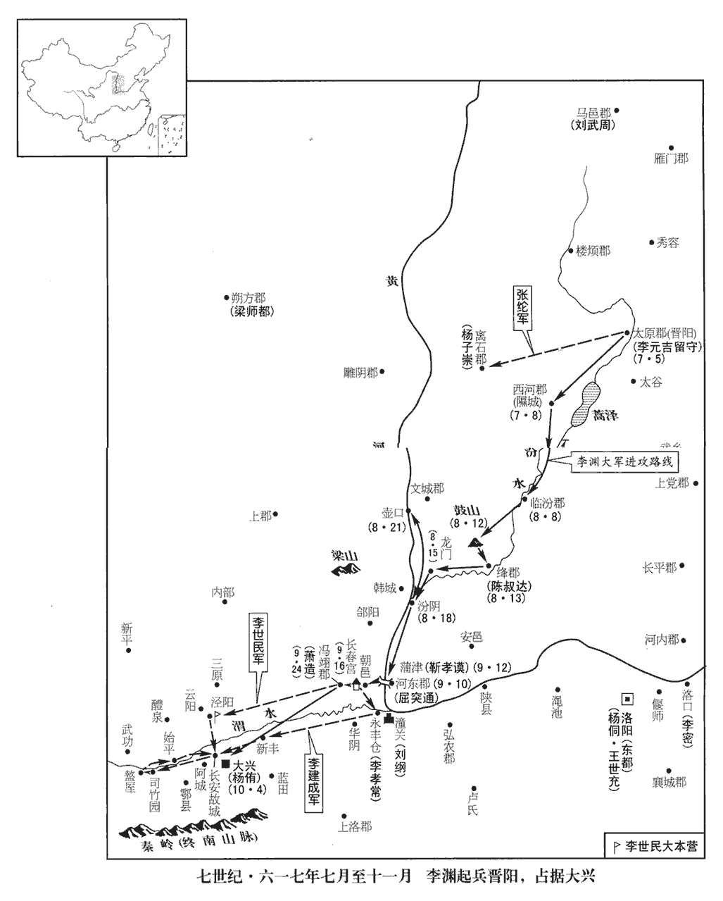
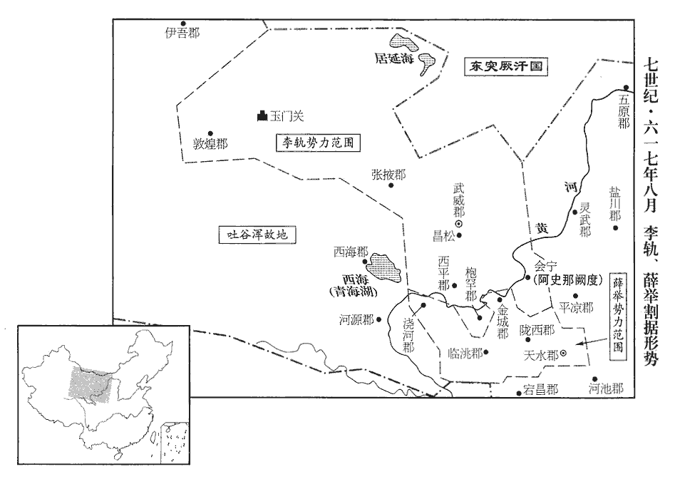
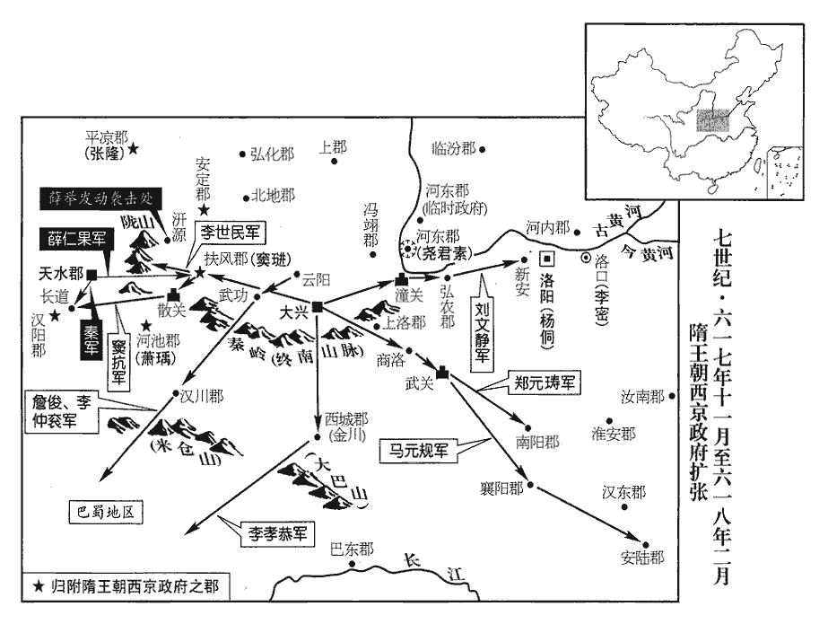
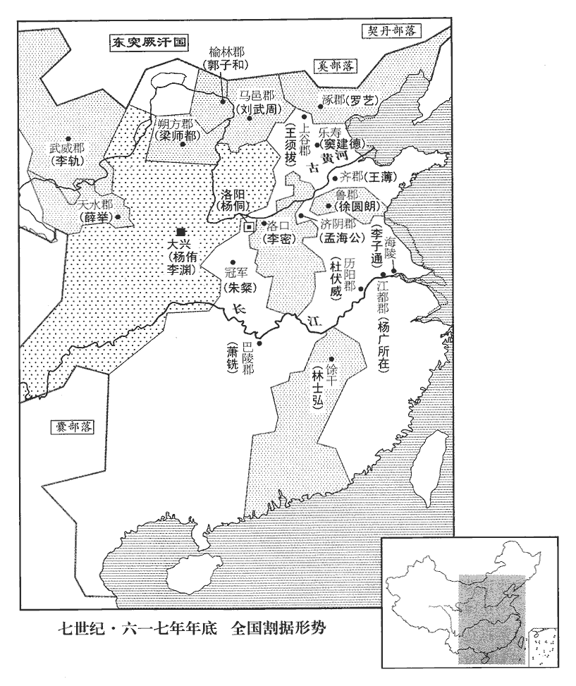

 隋紀八起強圉赤奮若（丁丑）六月，不滿一年。

# 恭皇帝下

## 義寧元年（丁丑、六一七）

1六月，己卯‹五月三十日›，李建成等至晉陽。

〖译文〗 [1]六月，己卯（疑误），李建成等人到达晋阳。

2劉文靜勸李淵與突厥相結，厥，九勿翻。考異曰：創業注云：「突厥去，覘人來報，文武入賀。帝曰：『且勿相賀，當為諸君召而使之。』即自手與突厥書。」蓋溫大雅欲歸功高祖耳。今從唐書劉文靜傳。資其士馬以益兵勢。淵從之，自為手啟，卑辭厚禮，遺始畢可汗遺，于季翻。可，從刊入聲。汗，音寒。考異曰：創業注云：「仍命封題，署云『名啟』。所司請改啟為書；帝不許。」按太宗云：「太上皇稱臣於突厥，」蓋謂此時，但溫大雅諱之耳。云：「欲大舉義兵，遠迎主上，復與突厥和親，如開皇之時。若能與我俱南，願勿侵暴百姓；若但和親，坐受寶貨，亦唯可汗所擇。」始畢得啟，謂其大臣曰：「隋主為人，我所知也，若迎以來，必害唐公而擊我無疑矣。苟唐公自為天子，我當不避盛暑，以兵馬助之。」即命以此意為復書。使者七日而返，將佐皆喜，請從突厥之言，使，疏吏翻。將，即亮翻；下同。淵不可。裴寂、劉文靜皆曰：「今義兵雖集而戎馬殊乏，胡兵非所須，須者，意所欲也。而馬不可失；若復稽回，復，扶又翻。恐其有悔。」淵曰：「諸君宜更思其次。」寂等乃請尊天子‹杨广›為太上皇，立代王‹杨侑›為帝，以安隋室；移檄郡縣；改易旗幟，雜用絳白，以示突厥。隋色尚赤。今用絳而雜之以白，示若不純於隋。幟，昌志翻。厥，九勿翻。淵曰：「此可謂『掩耳盜鍾，』此鄙語也；言盜鍾者惡鍾聲之聞而掩耳盜之，此可以自欺而不可以欺人也。然逼於時事，不得不爾。」乃許之，遣使以此議告突厥。使，疏吏翻。厥，九勿翻。

〖译文〗 [2]刘文静劝李渊与突厥人相结交，请突厥人资助兵马以壮大兵势，李渊听从了这个意见。他亲笔写信，言辞卑屈，送给始毕可汗的礼物十分丰厚，信中说：“我想大举义兵，远迎隋主，重新与突厥和亲，就象开皇年间那样。您要是能和我一起南下，希望不要侵扰强暴百姓。假若您只想和亲，您就坐受财物吧。这些方案请您自己选择。”始毕可汗得到李渊的信，对他的大臣说：“隋朝皇帝的为人我是了解的，若是把他迎接回来，必定会加害唐公而且向我进攻，这是毫无疑问的。如果唐公自称天子，我应当不避盛署，以兵马去帮助他。”始毕立即命令将这个意思写成回信。使者七天后返回，见信，李渊的将领僚佐们都很高兴，请李渊听从突厥人的话，李渊认为不可。裴寂、刘文静都说：“如今义兵虽然召集来了，但是军马还极为缺乏，胡兵并不是所需的，但胡人的马匹不可失去，如果再拖延而不回信，恐怕对方反悔。”李渊说：“大家最好再想想别的办法。”裴寂等人就请李渊尊炀帝为太上皇，立代王杨侑为皇帝，以安定隋王室；传布檄文到各郡县；改换旗帜，用红、白掺杂的颜色，以此向突厥示意不完全与隋室相同。李渊说：“这可以说是‘掩耳盗钟’，但这是形势所迫，不得不如此啊。”于是就同意这样做，派使者将这个决定通知突厥。

西河郡不從淵命，甲申‹五›，淵使建成、世民將兵擊西河；將，即亮翻，又音如字，領也。考異曰：創業注云：「命大郎、二郎率眾討西河。」高祖、太宗實錄但云「命太宗徇西河」，蓋史官沒建成之名耳。唐殷嶠傳：「從隱太子攻西河」。今從創業注。命太原令太原溫大有與之偕行，隋志，太原縣，舊曰晉陽，開皇十年，分置太原縣，而改後齊所置龍山縣為晉陽縣，二縣並帶太原郡。令，力正翻。曰：「吾兒年少，少，詩照翻。以卿參謀軍事；事之成敗，當以此行卜之。」時軍士新集，咸未閱習，建成、世民與之同甘苦，遇敵則以身先之。先，悉薦翻。近道菜果，非買不食，軍士有竊之者，輒求其主償之，亦不詰竊者，詰，去吉翻。軍士及民皆感悅。至西河城下，民有欲入城者，皆聽其入。郡丞高德儒閉城拒守，己丑‹十›，攻拔之。執德儒至軍門，世民數之曰：「汝指野鳥為鸞，以欺人主，取高官，事見一百八十二卷大業十一年。數，所具翻。又所主翻。吾興義兵，正為誅佞人耳！」為，于偽翻。遂斬之。自餘不戮一人，秋毫無犯，各尉撫使復業，尉，與慰同。遠近聞之大悅。義師初起，而人心如此，固可以取天下矣。建成等引兵還晉陽，往返凡九日。還，從宣翻，又音如字。淵喜曰：「以此行兵，雖横行天下可也。」言世民行兵有紀律也。遂定入關‹潼关›之計。

〖译文〗 西河郡不服从李渊的命令，甲申（初五），李渊派李建成、李世民率兵进攻西河郡。命太原令太原人温大有与李建成等人同行。李渊对温大有说：“我儿子年轻，请您参与谋划军事，事情的成败，在此行就可预测出来了。”当时军队的士兵都是新近招募的，没有经过训练检阅。李建成、李世民与士卒同甘苦，遇到敌人身先士卒，附近道旁的蔬菜瓜果，不是买的不准吃，兵士有偷吃的，立刻找物主进行赔偿，也不责备偷窃者，士兵及百姓们都心悦诚服。李建成等率军到达西河城下，百姓有想进城的人，都听任其进入。西河郡丞高德儒闭城拒守，己丑（初十），李建成攻克西河城，将高德儒押到军营门口，李世民历数他的罪过说：“你指野鸟为鸾鸟来欺骗君主，骗取高官，我们兴义兵，正是要诛灭奸佞之人！”于是将高德儒处死。其余官员一个不杀，秋毫无犯，分别抚慰吏民百姓，让他们各复其业，远近的百姓听到后非常高兴。李建成等人率兵返回晋阳，往返共九日。李渊高兴地说：“象这样用兵，就是横行天下也可以了！”于是就定下了入关计划。

淵開倉以賑貧民，賑，津忍翻。應募者日益多。淵命為三軍，分左右，通謂之義士。裴寂等上淵號為大將軍，上，時掌翻。癸巳‹十四›，建大將軍府；以寂為長史，長，知兩翻。劉文靜為司馬，唐儉及前長安尉溫大雅為記室，大雅仍與弟大有共掌機密，武士彠為鎧曹，劉政會及武城‹山东省武成县›崔善為、太原張道源為戶曹，晉陽長上邽‹天水郡郡政府所在县·甘肃省天水市›姜謩mó為司功參軍，太谷‹山西省太谷县›長殷開山為府掾，此唐公開大將軍府，署置官屬，參用隋親王府、大將軍府、州郡官屬之制也。隋制，唯親王有掾、有屬、有記室，大將軍府有鎧曹，州郡有戶曹，皆行參軍也。煬帝改州為郡，郡置諸司書佐，而書佐即參軍之職，行書佐即行參軍之職也。隋志，武城縣，屬清河郡；上邽縣，帶天水郡；太谷縣，屬太原郡，舊曰陽邑，開皇十八年改名。彠，一虢翻。鎧，可亥翻，謩，與謨同。長，知兩翻。掾，以絹翻。長孫順德、劉弘基、竇琮及鷹揚郎將高平‹山西省高平县›王長諧、天水‹甘肃省天水市›姜寶誼、陽屯為左•右統軍；高平縣，後魏置高平郡，隋已改為平高縣。煬帝改秦州為天水郡，因古郡名也。統軍，後魏所置。將，即亮翻。統，他綜翻。自餘文武，隨才授任。又以世子建成為隴西公，左領軍大都督，左三統軍隸焉；世民為敦煌公，敦，大門翻。右領軍大都督，右三統軍隸焉；各置官屬。以柴紹為右領軍府長史；此左、右領軍，以總領左、右軍而名，非取隋十二衛左、右領軍之職而名也。諮議譙‹安徽省毫州市›人劉贍領西河通守。此大將軍府諮議參軍也。譙縣屬譙郡。贍，而豔翻。守，式又翻。道源名河，開山名嶠，皆以字行。開山，不害之孫也。殷不害以孝行聞於陳、隋之間。

〖译文〗 李渊开仓赈济贫民，应募当兵的人日益增多。李渊命令将招募来的人分为三军，分左、右军，通称为义士。裴寂等人给李渊上尊号为大将军。癸巳（十四日），设置大将军府，任命裴寂为长史，刘文静为司马，唐俭和前长安尉温大雅为记室，温大雅仍和他弟弟温大有共同掌管机密，任命武士为铠曹，刘政会和武城人崔善为、太原人张道源为户曹，晋阳长上人姜为司功参军，太谷长殷开山为府掾，长孙顺德、刘弘基、窦琮和鹰扬郎将高平人王长谐、天水人姜宝谊、阳屯为左、右统军，其余的文武僚佐都按照才能授予官职。李渊又封世子李建成为陇西公、左领军大都督，左三统军由他统辖；封李世民为敦煌公，右领军大都督，右三统军归他统辖，二人各设置官府僚属。任命柴绍为右领军府长史，谘议谯县人刘赡任西河通守。张道源名河，殷开山名峤，都是用字来称呼他们。殷开山是殷不害的孙子。

3李密復帥眾向東都，復，扶又翻；下同。帥，讀曰率，丙申‹十七›，大戰于平樂園‹洛阳城东北平乐村›。此蓋即漢、魏平樂觀之地為園也。然漢、魏平樂觀在洛城西，隋既遷營新都，則平樂園當在都城東。樂，音洛。密左騎、右步，騎，奇寄翻。中列強弩，鳴千鼓以衝之，東都兵大敗，密復取回洛倉。

〖译文〗 [3]李密又统帅部众向东都进军，丙申（十七日），与隋军在平乐园大战。李密左边部署骑兵，右边部署步兵，中间摆列强弩，敲响千面战鼓壮大声势以冲击隋军，东都兵大败，李密再次夺取了回洛仓。

4突厥遣其柱國康鞘利等厥，九勿翻。鞘，所交翻。送馬千匹詣李淵為互市，許發兵送淵入關，多少隨所欲。少，詩沼翻；下同。丁酉‹十八›，淵引見康鞘利等，受可汗書，禮容盡恭，可，從刊入聲。汗，音寒。贈遣康鞘利等甚厚。擇其馬之善者，止市其半；義士請以私錢市其餘，淵曰：「虜饒馬而貪利，其來將不已，恐汝不能市也。吾所以少取者，示貧，且不以為急故也，當為汝貰之，為，于偽翻。貰，時制翻，賒也。不足為汝費。」

〖译文〗 [4]突厥派他们的柱国康鞘利等人押送一千匹马到李渊处进行交易，并答应发兵送李渊入关，人数的多少随李渊定。丁酉（十八日），李渊会见了康鞘利等人，接受了可汗的书信，礼仪容止都极为恭敬，赠送给康鞘利等人的礼物也很丰厚。李渊挑选马匹中的良马，只买了其中的一半。义士们请求用自己的私钱买下其余的马匹。李渊说：“胡人马匹多，但是贪利，他们会不断地来，恐怕你们就买不起了。我所以少买的原因就是向他们表示贫穷，而且也不是那么急用。我应当替你们付钱，不至于让你们破费。”

乙巳‹二十六›，靈壽‹河北省灵寿县›賊帥郗士陵隋志，靈壽縣屬恆山郡。帥，所類翻。郗，丑之翻。帥眾數千降於淵，淵以為鎮東將軍、燕郡公，帥，讀曰率。降，戶江翻。燕，因肩翻。仍置鎮東府，補僚屬，以招撫山東‹崤山以东›郡縣。

〖译文〗 乙巳（二十六日），灵寿县的贼帅郗士陵统帅部众几千人归降李渊。李渊封郗士陵为镇东将军、燕郡公，仍设置镇东府，补充镇东府的僚属，以此招抚潼关以东各郡县。

己巳，康鞘利北還。淵命劉文靜使於突厥以請兵，使，疏吏翻；下同。私謂文靜曰：「胡騎入中國，生民之大蠹也。騎，奇寄翻。吾所以欲得之者，恐劉武周引之共為邊患；又，胡馬行牧，不費芻粟，聊欲藉之以為聲勢耳。數百人之外，無所用之。」觀唐公之言，豈若肅、代及石晉之君所為哉！

〖译文〗 己巳（疑误），康鞘利返回北方。李渊命令刘文静出使突厥请求发兵，他私下对刘文静说：“胡骑进入中国，是黎民百姓的大害。我所以要突厥人发兵，是怕刘武周勾结突厥一起成为边境上的祸患。另外，胡马是放牧饲养的，不用耗费草料，我只是要借突厥人的兵马以壮声势，几百人也就够了，没有别的用途。”

5秋，七月，煬帝遣江都通守王世充，將江、淮勁卒，將軍王隆帥邛黃蠻‹四川省西昌市少数民族›，按唐書，邛部有烏蠻、白蠻；又謂群蠻種類多不可記，意必有黃蠻也。守，式又翻；下同。充將，即亮翻，又音如字，領也。帥，讀曰率；下同。邛，渠容翻。河北‹黄河以北›大使太常少卿韋霽、河南大使虎牙郎將王辯等二人蓋皆討捕大使也。使，疏吏翻。少，始照翻。將，即亮翻；下同。各帥所領同赴東都，相知討李密。帥，讀曰率。考異曰：雜記：「四月，世充帥淮南兵萬人援東都。世充行至彭城，懼密眾之盛，自以兵少不敵，乃間行自黎陽濟河而至。七月，世充帥留守兵二萬擊密無功。」今從略記、蒲山公傳。霽，世康之子也。韋世康，開皇四大總管之一。

〖译文〗 [5]秋季，七月，炀帝派江都通守王世充率领江、淮的精兵，将军王隆率领邛都夷部的黄蛮，河北讨捕大使太常少卿韦霁，河南讨捕大使虎牙郎将王辩等崐人各自率领辖下的军队一同赶赴东都，协同讨伐李密。韦霁是韦世康的儿子。

 

6壬子‹四›，李淵以子元吉為太原太守，留守晉陽宫，後事悉以委之。守，式又翻。癸丑‹五›，淵帥甲士三萬發晉陽，立軍門誓眾，并移檄郡縣，諭以尊立代王‹杨侑›之意；西突厥阿史那大柰亦帥其眾以從。大業八年，分大柰之眾居樓煩，故今亦從淵。帥，讀曰率。厥，九勿翻。從，才用翻。甲寅‹六›，遣通議大夫張綸將兵徇稽胡。稽胡部落居邠汾、石間。丙辰‹八›，淵至西河，慰勞吏民，勞，力到翻。賑贍窮乏；民年七十以上，皆除散官，朝議等八郎，武騎等八尉，皆散官也。賑，津忍翻。贍，而豔翻。散，悉亶翻。其餘豪俊，隨才授任，口詢功能，手註官秩，一日除千餘人；受官皆不取告身，唐志：補官者皆給以符，謂之告身，猶今言付身也。各分淵所書官名而去。淵入雀鼠谷‹山西省灵石县西南汾水河谷›；壬戌‹十四›；軍賈胡堡‹山西省汾西县北›，賈胡堡，在霍邑西北。括地志：汾州靈石縣有賈胡堡。賈，音古。去霍邑‹山西省霍州市›五十餘里。代王侑遣虎牙郎將宋老生帥精兵二萬屯霍邑，將，即亮翻。左武侯大將軍屈突通【章：十二行本「通」下有「將驍果數萬」五字；乙十一行本同；孔本同；張校同；退齋校同。】屯河東以拒淵。屈，區勿翻。會積雨，淵不得進，遣府佐沈叔安等將羸兵還太原，更運一月糧。將，如字，即良翻。羸，倫為翻。還，從宣翻，又音如字。乙丑‹十七›，張綸克離石‹山西省离石县›，殺太守楊子崇。煬帝改石州為離石郡。

〖译文〗 [6]壬子（初四），李渊任命儿子李元吉为太原太守，留守晋阳宫，一切后方事务都委托他处理。癸丑（初五），李渊统帅甲士三万人从晋阳出发，在军营门前誓师，并向各郡县发布檄文，宣布尊立代王为帝的意义。西突厥的阿史那大柰也率其部众跟随李渊出征。甲寅（初六），李渊派通议大夫张纶率兵攻略稽胡部落。丙辰（初八），李渊到达西河，慰劳西河的官吏百姓，赈济贫民。凡年纪在七十岁以上的人，都授予散官的职务，其余的豪强俊杰，都根据才能授予职务。李渊一边询问来人的功劳、才能，一边注册授予的官职等级。一天就任命官员一千余人。接受官职的人都不拿任命状，他们各自拿着李渊所写的官名状离去。李渊率军进入雀鼠谷。壬戍（十四日），在贾胡堡驻军，贾胡堡距霍邑五十余里。代王杨侑派遣虎牙郎将宋老生率领精兵两万人在霍邑驻防。左武侯大将军屈突通驻军河东以抵御李渊。正逢连续大雨，李渊无法进军，他派遣府佐沈叔安等人率领老弱病兵返回太原，每运一个月的粮食来。乙丑（十七日），张纶攻克了离石郡，杀太守杨子崇。

劉文靜至突厥，見始畢可汗，請兵，且與之約厥，九勿翻。可，從刊入聲。汗，音寒。考異曰：唐劉文靜傳曰：「始畢曰：『唐公起事，今欲何為？』文靜曰：『皇帝廢冢嫡，傳位後主，致斯禍亂。唐公國之懿戚，不忍坐觀成敗，故起義軍，欲黜不當立者。』創業起居注先已再遣使至突厥，不容始畢方有此問。今不取。曰：「若入長安，民眾土地入唐公，金玉繒帛歸突厥。」繒，慈陵翻。厥，九勿翻。始畢大喜，丙寅‹十八›，遣其大臣級失特勒先至淵軍，告以兵已上道。上，時掌翻。

〖译文〗 刘文静到突厥，拜见了始毕可汗，请求派兵，并且与始毕约定，“要是进入长安，百姓、土地归唐公，金玉绫罗归突厥。”始毕可汗大喜。丙寅（十八日），始毕派大臣级失特勒先往李渊的军营，通知他突厥军已经上路。

淵以書招李密。考異曰：壺關錄云：「高祖屯壽陽，遣右衛將軍張仁則齋書招李密。」蒲山公傳：「密答書曰：『使至，辱今月十九日書』」，按長曆是月己酉朔，十九日丁卯，不應己巳還至霍邑，又發書日不應猶在壽陽。今皆不取。密自恃兵強，欲為盟主，【章：十二行本「主」下有「己巳」二字；乙十一行本同；孔本同；張校同。】使祖君彥復書曰：「與兄派流雖異，根系本同。唐公出於李虎，密出於李弼，是異派也。然李弼之先，本遼東襄平‹辽宁省辽阳市›人。李虎祖西涼，本隴西成紀‹甘肃省临洮县›人。所謂根系，但同姓耳。自唯虛薄，為四海英雄共推盟主。「唯」，當作「惟」。惟，思也。詳見審是。所望左提右挈，戮力同心，執子嬰於咸陽，以謂代王。殪商辛於牧野‹河南省卫辉市›，以謂煬帝。殪yì，於計翻。豈不盛哉！」且欲使淵以步騎數千自至河內‹河南省沁阳市›，煬帝改懷州為河內郡。騎，奇寄翻。面結盟約。淵得書，笑曰：「密妄自矜大，非折簡可致。吾方有事關中，若遽絕之，乃是更生一敵；不如卑辭推獎以驕其志，使為我塞成皋‹即虎牢·河南省荥阳市汜水镇西›之道，綴東都之兵，塞成皋之道，則江都信使不通；綴東都之兵，則不得西應長安。折，之舌翻。為，于偽翻。塞，悉則翻。我得專意西征。俟關中平定，據險養威，徐觀鷸蚌之勢，以收漁人之功，未為晚也。」戰國策：趙且伐燕，蘇代為燕說趙惠王曰：「今者臣來過易水，蚌方出曝，鷸啄其肉，蚌合而拑其啄，鷸曰：『今日不雨，明日不雨，即有蚌脯。』蚌亦謂鷸曰：『今日不出，明日不出，必見死鷸。』漁父見而并獲之。今燕、趙相持，臣恐強秦之為漁父也。」唐公欲使李密與東都相持而己收漁人之利。鷸，餘律翻。乃使溫大雅復書曰：「吾雖庸劣，幸承餘緒，出為八使，漢順帝遣八使。唐公使山西、河東，故云然。使，疏吏翻；下同。入典六屯，隋制，六軍十二衛，唐公嘗為將軍，故云。顛而不扶，通賢所責。所以大會義兵，和親北狄，共匡天下，志在尊隋。天生烝民，必有司牧，當今為牧，非子而誰！老夫年逾知命，孔子曰：「五十而知天命。」願不及此。欣戴大弟，攀鱗附翼，唯弟早膺圖籙，以寧兆民！宗盟之長，屬籍見容，屬藉，宗屬之籍。長，知兩翻。復封於唐‹古唐国在今山西省太原市›，斯榮足矣。殪商辛於牧野，所不忍言，執子嬰於咸陽，未敢聞命。汾晉左右，尚須安輯；盟津‹孟津·河南省孟津县东黄河渡口›之會，未暇卜期。」盟，讀曰孟。密得書甚喜，以示將佐曰：「唐公見推，天下不足定矣！」將，即亮翻。自是信使往來不絕。

〖译文〗 李渊写书信招附李密。李密自恃兵强势盛想自作盟主。他让祖君彦回信说：“我和兄长虽然家支派系不同，但同是李姓，根系是相同的。我自认为势单力薄，但却为天下的英雄共推为盟主。希望互相扶持，同心协力，完成在咸阳抓住秦子婴、在牧野灭掉商辛这样的大业，岂不很宏伟吗？”他还想让李渊亲自率领步骑兵几千人到河内郡，二人当面缔结盟约。李渊接到信后，笑着说：“李密妄自尊大，不是书信就能招来的，我在关中正有战事，若马上断绝了与他的来往，就是又树了一个敌人，不如用阿谀逢承之语吹捧他，使他心志骄横，让他替我挡住成皋之道，牵制东都之兵，我就可以专心一意地进行西征。待到关中平定以后，我们依据险要之地，养精蓄锐，慢慢地观看鹬蚌之争以坐收渔人之利，也并不晚啊。”于是他让温大雅回信说：“我虽然平庸愚味，幸而承继了祖宗的功业，使我出任为八使之要职，回朝任将军。国家有难而不出来扶助，是所有的贤人君子都要责备的，所以我才大规模地招集义兵，与北狄和亲，共同救助天下，志向在于尊崇隋王室。天生众生，必要有管理他们的人，而今为治民之官的人，不是您又能是谁呢？老夫我已过了知命之年，没有这个崐心愿了。我很高兴拥戴您，这已经是攀鳞附翼了，希望您早些应验图谶，以安定万民！您是宗盟之长，我的宗属之籍都还须得到您的容纳。您将我还封在唐地，这样的殊荣已经够了。将商辛诛灭于牧野这样的大业，我是不敢说的，至于在咸阳抓住秦子婴之事，我也是不敢听命于您的。汾晋一带，还需要我安抚管理，盟津之会盟，我还顾不上卜定日期。”李密收到李渊的信后很是高兴，他将信给僚佐们看，说：“唐公推举我，天下很容易就平定了！”从此，双方的信使往来不绝。

雨久不止，淵軍中糧乏；劉文靜未返，或傳突厥與劉武周乘虛襲晉陽；淵召將佐謀北還。厥，九勿翻。還，從宣翻，又音如字。裴寂等皆曰：「宋老生、屈突通連兵據險，未易猝下。屈，居勿翻。易，以豉翻。李密雖云連和，姦謀難測。突厥貪而無信，唯利是視。武周，事胡者也。太原一方都會，且義兵家屬在焉，不如還救根本，更圖後舉。」李世民曰：「今禾菽被野，何憂乏糧！老生輕躁，一戰可擒。被，皮義翻。躁，則到翻。李密顧戀倉粟，未遑遠略。武周與突厥外雖相附，內實相猜。武周雖遠利太原，豈可近忘馬邑！本興大義，奮不顧身以救蒼生，當先入咸陽，號令天下。今遇小敵，遽已班師，恐從義之徒一朝解體，還守太原一城之地為賊耳，還，從宣翻，又音如字。何以自全！」李建成亦以為然。淵不聽，促令引發。世民將復入諫，令，力丁翻。復，扶又翻。會日暮，淵已寢；世民不得入，號哭於外，聲聞帳中。號，戶刀翻。聞，音問。淵召問之，世民曰：「今兵以義動，進戰則克，退還則散；眾散於前，敵乘於後，死亡無日，何得不悲！」淵乃悟曰：「軍已發，柰何？」世民曰：「右軍嚴而未發；嚴：裝也。左軍雖去，計亦未遠，請自追之。」淵笑曰：「吾之成敗皆在爾，知復何言，復，扶又翻。唯爾所為。」世民乃與建成【章：十二行本「成」下有「分道」二字；乙十一行本同；孔本同；張校同。】夜追左軍復還。復，音如字。考異曰：創業注：「帝集文武官人及大郎、二郎等而謂之曰：『以天贊我而言，應無此勢；以人事見機而發，無有不為。借遣吾當突厥、武周之地，何有不來之理。諸公謂云何？』議者以『老生、屈突通相去不遠；李密譎誑，姦謀難測；突厥見利而行；武周，事胡者也；太原一都之會，義兵家屬在焉。愚夫所慮，伏聽教旨。』唐公顧謂大郎、二郎曰：『爾輩何如？』對曰：『武周位極而志滿，突厥少信而貪利，外雖相附，內實相猜。突厥必欲求利太原，寧肯近忘馬邑！武周悉其此勢，未必同謀同志。老生、突厥奔競來拒，進闕圖南，退窮自北，還無所入，往無所之，畏溺先沈，近於斯矣。今禾菽被野，人馬無憂，坐即有糧，行即得眾。李密戀於倉粟，未遑遠略。老生輕躁，破之不疑。定業取威，在茲一決。諸人保家愛命，言不可聽。雨罷進軍，若不殺老生而取霍邑，兒等敢以死謝！』唐公喜曰：『爾謀得之，吾其決矣。三占從二，何藉輿言。懦夫之徒，幾敗乃公事耳。』」太宗實錄盡以為太宗之策，無建成名，蓋沒之耳。據建成同追左軍，則是建成意亦不欲還也。今從創業注。丙子‹二十八›，太原運糧亦至。

〖译文〗 雨下了很长时间还不止，李渊的军队缺粮，刘文静也还没有回来，有人传言突厥人与刘武周乘虚袭击晋阳。李渊召集将领僚佐们商议向北返回。裴寂等人都说：“宋老生、屈突通联合居守险要，不容易很快攻下；李密虽说要联合，但是他的奸诈图谋难以揣测；突厥人贪利而无信义，唯利是图；刘武周又是向胡人称臣的人。太原为一方的都会，而且义兵的家属都在太原，不如返回救援根本之地，再筹划今后的义举。”李世民说：“现在稻谷遍野都是，还愁无粮吗？宋老生为人轻狂浮躁，一战就可以擒住他。李密舍不得粮仓粟米，顾不上向远处图谋。刘武周和突厥人表面上虽然相互依赖，但实际上却互相猜忌。刘武周虽然追逐远利而攻取太原，但岂肯忘记就近的马邑呢？我们本来是兴大义，奋不顾身地拯救百姓，应当先行进入咸阳，号令天下。现在只遇到了小敌，立刻就要班师，恐怕跟随起义的人一旦解体，返回去守卫太原一城之地，我们就成贼了，怎么能保全自己呢？”李建成也认为李世民的话对，但李渊不听，催促军队出发。李世民再要进入李渊的营帐劝阻，可是天黑了，李渊已经躺下休息。李世民进不去，就在帐外号哭，哭声传到了帐中，李渊召见世民问话，世民说：“如今我们举兵是为大义，进军攻战就能取胜，后退就会溃散，到那时，部众溃散在前，敌军追击在后，我们被灭亡的日子就到了。怎么能不悲伤呢？”李渊醒悟过来，说：“军队已经出发，怎么办呢？”李世民说：“右军整装而未发，左军虽然出发，估计还没走远，请让我去追赶他们。”李渊笑道：“我的成败都在于你，知道了还说什么呢？随你去做吧。”李世民和李建成连夜把左军追了回来。丙子（二十八日），太原的粮食也运到了。

7武威‹甘肃省武威市›鷹揚府司馬李軌，煬帝改涼州為武威郡。各郡置鷹揚府，有郎將、副郎將、長史、司馬。家富，好任俠；好，呼到翻；下同。薛舉作亂於金城，是年，夏四月，薛舉起。軌與同郡曹珍、關謹、梁碩、李贇yūn、安脩仁等謀曰：贇，於倫翻。「薛舉必來侵暴，郡官庸怯，勢不能禦，吾輩豈可束手并妻孥為人所虜邪！孥，音奴。邪，音耶。不若相與并力拒之，保據河右以待天下之變。」眾皆以為然，欲推一人為主，各相讓，莫肯當。曹珍曰：「久聞圖讖李氏當王；讖，楚譖翻。今軌在謀中，乃天命也。」遂相與拜軌，奉以為主。丙辰‹八›，軌令脩仁集諸胡，令，力丁翻。安氏，涼州‹甘肃省武威市›豪望，世為民夷所附，故使之集諸胡。軌結民間豪傑，共起兵，執虎賁郎將謝統師、郡丞韋士政。賁，音奔。將，即亮翻。統，他綜翻。軌自稱河西大涼王，置官屬並擬開皇故事。關謹等欲盡殺隋官，分其家貲，軌曰：「諸人既逼以為主，當稟其號令。今興義兵以救生民，乃殺人取貨，此群盜耳，將何以濟！」於是以統師為太僕卿，士政為太府卿。西突厥闕度設據會寧川‹甘肃省靖远县›，大業八年，分闕度設居會寧。厥，九勿翻。自稱闕可汗，請降於軌。可，從刊入聲。汗，音寒。降，戶江翻。

〖译文〗 [7]武威鹰扬府司马李轨，家中富有，喜好侠义之举。薛举在金城作乱，李轨和同郡的曹珍、关谨、梁硕、李、安仁等人商议说：“薛举必定前来侵犯暴虐，郡官昏庸、怯懦，看情势不能抵御，但我们怎么能毫不抵抗就让自己和妻子儿女作人家的俘虏呢？不如大家同心协力共同抵抗薛举，据保河右以等待形势发生变化。”大家都认为这个意见很对。想推举一个人为首领，大家崐各自推让，不肯出来为首。曹珍说：“我久闻图谶上说李氏应当为王，今天李轨也参加了这一谋划，这是天命。”于是大家一同向李轨跪拜，奉他为主。丙辰（初八），李轨命令安修仁召集各部落的胡人，李轨结交民间的豪杰之士，共同起兵，抓住虎贲郎将谢统师，郡丞韦士政。李轨自称河西大凉王，设置官府僚属全都模仿隋文帝开皇年间的成例。关谨等人要将隋官杀尽，分掉他们的家产，李轨说：“各位既然推举我为主，就应当听我的号令。如今兴义兵是为了拯救百姓，杀人越货，这就成了群盗了！我们将靠什么取得成功呢？”于是他任命谢统师为太仆卿，韦士政为太府卿。西突厥的阙度设占据会宁川，自称阙可汗，他向李轨请求投降。

 

8薛舉自稱秦帝，考異曰：唐高祖實錄：「武德元年四月辛卯，舉稱尊號。」按今冬舉敗，問褚亮曰：「天子有降事否？」是則已稱尊號也。今從唐書舉傳。立其妻鞠氏為皇后，子仁果為皇太子。遣仁果將兵圍天水，克之，舉自金城徙都之。仁果多力，善騎射，將，即亮翻。騎，奇寄翻。軍中號萬人敵；然性貪而好殺。嘗獲庾信子立，怒其不降，磔於火上，稍割以噉軍士。庾信自梁入關，有文名。史言薛仁果在兵間不能收禮文藝名義之士，卒以敗亡。好，呼到翻。降，戶江翻。磔，陟格翻。噉，徒濫翻。及克天水，悉召富人，倒懸之，以醋灌鼻，責其金寶。舉每戒之曰：「汝之才略足以辦事，然苛虐無恩，終當覆我國家。」

〖译文〗 [8]薛举自称秦帝，立妻子鞠氏为皇后，儿子薛仁果为皇太子。派遣薛仁果率兵包围并攻克了天水，薛举从金城迁都于天水。薛仁果很有力气，善于骑射，军中号称万人敌。但是他生性贪婪、残忍、嗜杀成性，曾经抓住庾信的儿子庾立，他为庾立不肯投降而发怒，将庾立在火上分尸，然后一点点地割下肉来让军士们吃。待他攻下了天水，把天水的富人都召来，倒吊起来，用醋灌鼻子，向他们索取金宝。薛举常常训诫他说：“你的才能谋略足以办事，但是生性严苛酷虐，对人不能施恩，终归要倾覆我的家和国呵！”

舉遣晉王仁越將兵趨劍口‹四川省剑阁县北剑门关›，至河池郡‹陕西省凤县›；太守蕭瑀拒卻之。劍口，劍門關口。舉指授仁越，使之趨劍口，未至，而蕭瑀以河池拒之，遂退卻。將，即亮翻；下同。趨，七喻翻，又逡須翻。瑀，音禹。守，式又翻。又遣其將常仲興濟河擊李軌，與軌將李贇戰於昌松‹甘肃省古浪县西北›，隋志：昌松縣，屬武威郡。仲興舉軍敗沒。軌欲縱遣之，贇曰：「力戰獲俘，復縱以資敵，將焉用之！不如盡阬之。」復，扶又翻；下同。焉，於乾翻。軌曰：「天若祚我，當擒其主，此屬終為我有；若其無成，留之何益！」乃縱之。李軌不殺隋官，縱薛舉兵，皆有人君之言；其才略不足以濟，則徒言無益也。未幾，攻張掖‹甘肃省张掖市›、敦煌‹甘肃省敦煌市›、西平、枹罕，皆克之，幾，居豈翻。敦，徒門翻。枹，音膚。盡有河西五郡之地。

〖译文〗 薛举派晋王薛仁越率兵奔赴剑口，走到河池郡时，河池太守萧抵御薛仁越。薛举又派部将常仲兴渡黄河去进击李轨，与李轨的部将李在昌松交战，常仲兴全军覆没。李轨要将俘虏全都放走，李说：“奋力作战才俘获的，却将他们放走去帮助敌军，为什么这样做呢？不如全部坑杀了。”李轨说：“上天要是赐福于我，就应当抓住他们的首领，这些人终归还是为我所有。要是我事业无成，留下他们又有什么好处呢？”于是将俘虏放走。不久，李轨进攻张掖、敦煌、西平、罕，全部攻克，河西五郡全部为李轨据有。

9煬帝詔左禦衛大將軍涿郡留守薛世雄，將燕地精兵三萬討李密，燕，因肩翻。命王世充等諸將皆受世雄節度，所過盜賊，隨便誅翦。世雄行至河間‹河北省河间市›，軍於七里井，七里井，蓋其地去河間七里，故名。竇建德士眾惶懼，悉拔諸城南遁，聲言還入豆子䴚‹山东省惠民县西›。䴚gǎng，各朗翻。世雄以為畏己，不復設備，建德謀還襲之。其處去世雄營百四十里，建德帥敢死士二百八十人先行，帥，讀曰率。令餘眾續發，建德與其士眾約曰：「夜至，則擊其營；已明，則降之。」降，戶江翻；下同。未至一里所，天欲明，建德惶惑議降；會天大霧，人咫尺不相辨，建德喜曰：「天贊我也！」贊，助也。遂突入其營擊之，世雄士卒大亂，皆騰柵走。世雄不能禁，與左右數十騎遁歸涿郡，考異曰：革命記：「帝以李密在洛口，征遼回日，令右翊衛將軍薛世雄，於留鎮兵內簡練精銳及幽、易驍勇討密，經過之處，若有草竊，隨便誅翦；仍令王世充等諸軍，並取世雄處分。世雄乃自領精兵六萬，四月末，至河間郡城下作營，州縣皆備牛酒軍糧以待薛將軍。時建德以無糧食，兵士先皆分散，餘軍不滿千人，在武強縣境收麥充食，聞世雄兵至河間，惶懼無計。問一女巫：『欲走避之，如何？』巫云：『不免。』問：『欲首如何？』巫云：『亦不吉。』問：『欲掩其不備擊之，如何？』巫云：『今夜天未明到，大吉。』卜時，日已午；卜處，去河間一百四十里。建德簡精兵二百八十人先行，餘勒續發。建德與眾決云：『夜到即打，明即降之，吉凶之事，在此舉耳。』遂行。去世雄營二里，天已屬明，又聞吹角聲擬發，建德惶惑欲降。須臾，大霧忽起，建德曰：『此天助我也。』遂引兵入營攻之，兵遂大亂。世雄左右先已裝束擬發，世雄遂得上馬奔走，仍中數槍，僅而獲免。幽、易之士，並不欲作留鎮兵，先無鬬意，既不知賊多少，悉棄甲奔亡，遂使山東賊勢轉盛。李密先招慰河北州縣，多悉從之。世雄慙憤而卒。」唐竇建德傳云：「七月，世雄討之，建德帥敢死士千人襲之，世雄以數百騎遁去。」今從隋薛世雄傳，以建德傳、革命記參之。慙恚發病卒‹年六十三岁›。恚，於避翻。卒，子恤翻。建德遂圍河間。

〖译文〗 [9]炀帝下诏命左御卫大将军涿郡留守薛世雄率领燕地的精兵三万讨伐李密。他命令王世充等将领都受薛世雄指挥，所遇见的盗贼，可以随便诛杀。薛世雄走到河间，在七里井驻军。窦建德的部众惊惶恐惧，从占领的各城池中撤出向南逃走，声称返回豆子。薛世雄认为他们是惧怕自己，不再提防。窦建德策划回击隋军。窦建德驻地距薛世雄的军营有一百四十里，建德率领敢死队二百八十人先行，命令其余的人随即陆续出发，并与士兵约好，“夜里到达薛营就进攻他们，若到达时天已经放明，就投降。”他率军走到距薛营不到一里的地方，天就要亮了，窦建德惶惑，和大家商议投降之事。恰好天降大雾，人相隔咫都无法辨认，窦建德高兴地说：“天助我也！”于是率军突入薛营袭击他们。薛世雄兵营大乱，兵卒们都翻越栅栏逃走，薛世雄无法制止，他只和左右几十名骑兵逃回涿郡。薛世雄惭愧忧愤，发病去世。窦建德就包围了河间。

10八月，己卯‹一›，雨霽。庚辰‹二›，李淵命軍中曝鎧仗行裝。鎧，可亥翻。辛巳‹三›旦，東南由山足細道趣霍邑。趣，七喻翻，又逡須翻。淵恐宋老生不出，李建成、李世民曰：「老生勇而無謀，以輕騎挑之，挑，徒了翻。理無不出；脫其固守，則誣以貳於我。彼恐為左右所奏，安敢不出！」淵曰：「汝測之善，老生不能逆戰賈胡，謂淵屯賈胡堡時，老生不能逆戰。賈，音古。吾知其無能為也！」淵與數百騎先至霍邑城東數里，以待步兵，使建成、世民將數十騎至城下，舉鞭指麾，若將圍城之狀，且詬之。騎，奇寄翻。詬，苦候翻。老生怒，引兵三萬自東門、南門分道而出，淵使殷開山趣召後軍。趣，讀曰促。後軍至，淵欲使軍士先食而戰，世民曰：「時不可失。」淵乃與建成陳於城東，世民陳於城南。陳，讀曰陣；下同。淵、建成戰小卻，世民與軍頭臨淄‹山东省淄博市东临淄镇›段志玄自南原‹城南›引兵馳下，新唐志曰：武德元年，改鷹揚郎將曰軍頭。蓋起兵之初，已置軍頭也。後又改軍頭為驃騎將軍。隋志，臨淄縣屬北海郡。衝老生陳，出其背，世民手殺數十人，兩刀皆缺，流血滿袖，灑之復戰。淵兵復振，復，扶又翻。因傳呼曰：「已獲老生矣！」老生兵大敗，淵兵先趣其門，趣，七喻翻。門閉，老生下馬投塹，劉弘基就斬之，僵尸數里。塹，七豔翻。僵，居良翻。日已暮，淵即命登城，時無攻具，將士肉薄而登，遂克之。

〖译文〗 [10]八月，己卯（初一），雨停了。庚辰（初二），李渊命令部队晾晒铠甲、器械、行装。辛巳（初三），早晨，李渊率军从山脚下的小路向东南直抵霍邑。李渊怕宋老生不出战，李建成、李世民说：“宋老生有勇无谋，我们用轻骑向他挑战，按理他不会不出战，假使他坚守不出，我们就诬陷他对我们有贰心，他害怕被左右的人奏报，怎敢不出战呢？”李渊说：“你们估计得对，在贾胡堡时宋老生未能迎战我军，我知道他是没有作为的。”李渊和几百名骑兵先到霍邑城东面几里的地方等待步兵，派李建成、李世民率领几十骑到城下，举鞭挥旗就象要包围城池的样子，并且辱骂宋老生。宋老生大怒，率三万人从东门、南门分道出战。李渊派殷开山立刻去召集后军，后军来到后，李渊想让军士门先吃饭再战斗，李世民说：“时机不可失！”李渊就和李建成在城东列阵，李世民在城南列阵。李渊、李建成与宋老生交战，稍有退却，李世民与军头临淄人段志玄从南原率兵驰马而下，冲击宋老生的军阵，出击宋老生军的背后。李世民亲手杀死几十人，两把刀子都砍缺了口，飞溅的鲜血沾满衣袖，世民将血甩掉再战。李渊的兵势又振奋起来，就传话呼喊：“已经抓住宋老生了！”宋老生军因此大败。李渊兵迅速直抵城门，城门关闭了，宋老生下马跳入壕沟，刘弘基就将他杀死，隋军的死尸遍布几里。天已黑了，李渊立即命令登城，当时没有攻城的器械，将士们赤膊登城，攻下霍邑。

淵賞霍邑之功，軍吏疑奴應募者不得與良人同，淵曰：「矢石之間，不辨貴賤，論勳之際，何有等差，宜並從本勳授。」壬午‹四›，淵引見霍邑吏民，勞賞如西河，勞，力到翻。選其丁壯使從軍；關中軍士欲歸者，並授五品散官，煬帝置散職九大夫，朝請大夫正五品，朝散大夫從五品。散，悉但翻。遣歸。既順其歸志，又以動關中士民之心。或諫以官太濫，淵曰：「隋氏吝惜勳賞，此所以失人心也，柰何效之！且收眾以官，不勝於用兵乎！」

〖译文〗 李渊奖赏攻取霍邑的有功将士，军吏们怀疑以奴隶身份应募的人不能和良人同样论功。李渊说：“在箭与石之间战斗，不分贵贱，论功行赏时，有什么等级差别？应该同样按功颁赏授官。”壬午（初四），李渊接见了霍邑的吏民，慰劳赏赐，如同西河郡一样，并挑选霍邑强壮的男丁从军。关中的军士要回乡的，都授予五品散官，让他们回去。有人劝李渊说授官太多，李渊说：“隋氏吝惜勋位赏赐，因而失去人心。我怎么能效仿他们呢？况且用官职来收拢众人，不比用兵要好吗？”

丙戌‹八›，淵入臨汾郡，平陽，古郡名，後改置唐州，後改為晉州，開皇初，改郡曰平河；平陽縣改曰臨汾縣，惡平陽之名也；大業初，改曰臨汾郡。慰撫如霍邑。庚寅‹十二›，宿鼓山‹山西省新绛县北›。鼓山，在絳郡北。絳郡通守陳叔達拒守。通守，式又翻。煬帝改絳州為絳郡。辛卯‹十三›，進攻，克之。叔達，陳高宗‹陈顼›之子，有才學，淵禮而用之。

〖译文〗 丙戌（初八），李渊进入临汾郡，对临汾吏民的慰劳安抚如同霍邑。庚寅（十二日），李渊军队在鼓山过夜。绛郡通守陈叔达率兵拒守。辛卯（十三日），李渊军进攻并攻克了绛郡。陈叔达是陈高宗陈顼的儿子，有才学。李渊待之以礼并任用他。

癸巳‹十五›，淵至龍門‹山西省河津县›，龍門縣屬河東郡，在郡東北。劉文靜、康鞘利以突厥兵五百人、馬二千匹來至。淵喜其來緩，謂文靜曰：「吾西行及河，突厥始至，兵少馬多，皆君將命之功也。」厥，九勿翻。少，詩沼翻。

〖译文〗 癸巳（十五日），李渊到达龙门。刘文静、康鞘利率突厥兵五百，马两千匹来到。李渊很高兴他们来得晚，他对刘文静说：“我向西走到黄河，突厥人才到达，并且是兵少马多，都是您的功劳啊！”

汾陽薛大鼎說淵：按新唐書，薛大鼎，蒲州汾陰人。隋、唐志亦皆無汾陽縣，「陽」當作「陰」。說，式芮翻。「請勿攻河東，自龍門直濟河，據永豐倉‹陕西省潼关县北›，傳檄遠近，關中可坐取也。」淵將從之。諸將請先攻河東，乃以大鼎為大將軍府察非掾。察非掾，言使之察姦非，若漢刺姦掾也。煬帝時左、右候衛府增置察非掾。諸將，即亮翻。掾，俞絹翻。

〖译文〗 汾阳人薛大鼎劝说李渊：“请不要进攻河东，从龙门直接渡黄河，占据永丰仓，向各地传布檄文，关中地区便坐等可取了。”李渊打算听从他的意见。诸将请求先攻取河东，于是李渊任命薛大鼎为大将军府察非掾。

河東縣戶曹任瓌guī河東縣，帶河東郡，舊曰蒲坂，開皇十六年改名。隋制，縣置金、戶、兵、法、士等曹佐。任，音壬。瓌，古回翻。說淵曰：「關中豪傑皆企踵以待義兵。瓌在馮翊‹陕西省大荔县›積年，瓌，仁壽中為馮翊韓城尉。說，式芮翻。企，去智翻。知其豪傑，請往諭之，必從風而靡。義師自梁山‹陕西省韩城市北›濟河，指韓城‹陕西省韩城市›，逼郃陽‹陕西省合阳县›。梁山，在韓城縣界，臨河，即左傳所謂梁山崩者也。韓城、郃陽二縣皆屬馮翊郡，隋所置也。杜佑曰：同州韓城縣，漢為夏陽縣，有梁山、龍門山。宋白曰：今韓城縣西南三里有夏陽故城，乃韓國故城。今縣理南二十五里有少梁故城。隋文帝分郃陽故城，於此置韓城縣，以古韓城為名。郃，古沓翻。蕭造文吏，必當望塵請服。孫華之徒，皆當遠迎，然後鼓行而進，直據永豐，雖未得長安，關中固已定矣。」淵悅，以瓌為銀青光祿大夫。隋制，銀青光祿，散職，從三品。

〖译文〗 河东县户曹任对李渊说：“关中的豪杰都踮着脚盼望义军，我在冯翊郡多年，了解冯翊豪杰的情况，请让我去宣召他们，他们必定会望风而动。义师从粱山渡黄河，直指韩城，逼近阳。萧造这样的文官，必定望尘而请求归降；孙华之流也会远迎义师。然后您大张旗鼓地进军，直接占据永丰仓，虽然您还没有得到长安，但关中却根本上稳定了。”李渊听后很高兴，任命任为银青光禄大夫。

時關中群盜，孫華最強；丙申‹十八›，淵至汾陰，以書招之。汾陰縣屬河東郡。己亥‹二十一›，淵進軍壺口，隋志：文城郡昌寧縣有壺口山。河濵之民獻舟者日以百數，仍置水軍。壬寅‹二十四›，孫華自郃陽輕騎渡河見淵。騎，奇寄翻；下同。淵握手與坐，慰獎之，以華為左光祿大夫、武鄉縣公，領馮翊太守，隋制，散職左光祿，正二品。馮翊縣，後魏曰華陰，西魏改曰武鄉，大業初，改曰馮翊。今以開皇舊縣名封華。守，式又翻。其徒有功者，委華以次授官，賞賜甚厚。使之先濟；繼遣左右統軍王長諧、劉弘基及左領軍長史陳演壽、陳演壽，建成府元僚。長，知兩翻。金紫光祿大夫史大柰金紫光祿，散職，正三品。將步騎六千自梁山濟，營於河西以待大軍。以任瓌為招慰大使，瓌說韓城，下之。淵謂長諧曰：「屈突通精兵不少，任，音壬。瓌，古回翻。使，疏吏翻。說，式芮翻。少，詩沼翻。相去五十餘里，不敢來戰，足明其眾不為之用。然通畏罪，不敢不出。若自濟河擊卿等，則我進攻河東，必不能守；若全軍守城，則卿等絕其河梁：河梁，謂蒲津橋。前扼其喉，後拊其背，彼不走必為擒矣。」

〖译文〗 当时，关中的群盗以孙华的势力最强，丙申（十八日），李渊到达汾阴，用书信前去招抚孙华。己亥（二十日），李渊进军到壶口，河边的百姓向李渊献船的每天有一百多人。李渊又建立水军。壬寅（二十四日），孙华从阳轻骑渡黄河来谒见李渊。李渊拉着他的手和他坐在一起，慰劳奖赏他，封他为左光禄大夫、武乡县公，任冯翊太守之职。孙华部众有功的人，让孙华依次授予官职，赏赐的物品非常丰厚。李渊让孙华先行渡河，随即派遣左、右统军王长谐、刘弘基以及左领军长史陈演寿、金紫光禄大夫史大柰率领步骑兵六千人从粱山渡河，在河西扎营以等待大军的到来。任命任为招慰大使，任去劝降韩城，韩城归降。李渊对王长谐说：“屈突通精兵不少，与我军相隔仅五十余里，但不敢来战，足以证明他的部下已经不为屈突通效命了。但是屈突通害怕上边怪罪，又不敢不出战。若他亲自率军过河进攻你们，那我就进攻河东，河东肯定守不住。若是屈突通全军守城，那你们就拆毁河上的桥梁。这样前面扼住他的咽喉，后面攻击他的后背，他不逃走必定被我们擒获。”

11驍果從煬帝在江都者多逃去，驍，堅堯翻。帝患之，以問裴矩，對曰：「人情非有匹偶，難以久處，處，昌呂翻。請聽軍士於此納室。」帝從之。九月，悉召江都境內寡婦、處女集宮下，恣將士所取；或先與姦者聽自首，處，昌呂翻。將，即亮翻。首，手又翻。即以配之。

〖译文〗 [11]跟从炀帝在江都的骁果有很多逃跑了，炀帝很忧虑这件事，问裴矩如何办，裴矩回答说：“从人情上讲，没有配偶，就难以久待，请听任军士们在此成家吧。”炀帝听从了裴矩的建议。九月，将江都境内的寡妇、处女都召集到宫下，任凭将士们娶走，有些原来就有奸情的人，任凭他们自首，然后即将此女配给他为妻。

12武陽‹河北省大名县›郡丞元寶藏以郡降李密，煬帝改魏州為武陽郡。降，戶江翻；下同。甲寅‹六›，密以寶藏為上柱國、武陽公。寶藏使其客鉅鹿‹河北省钜鹿县›魏徵為啟謝密，隋志，鉅鹿縣屬襄國郡。且請改武陽為魏州；又請帥所部西取魏郡‹河南省安阳市›，煬帝改相州為魏郡。帥，讀曰率。南會諸將取黎陽倉‹河南省浚县境›。汲郡黎陽縣有黎陽倉。將，即亮翻。密喜，即以寶藏為魏州總管，召魏徵為元帥府文學參軍，掌記室。帥，所類翻徵少孤貧，好讀書，有大志，少，詩照翻。好，呼到翻。落拓不事生業。始為道士，寶藏召典書記。密愛其文辭，故召之。

〖译文〗 [12]武阳郡丞元宝藏举郡投降李密，甲寅（初六），李密封元宝藏为上柱国、武阳公。元宝藏派他的门客钜鹿人魏徵写信向李密致谢，并且请求将武阳郡改为魏州，又请求率领所部向西攻取魏郡，向南与诸将会合攻取黎阳仓。李密听后很高兴，就任命元宝藏为魏州总管，召魏徵为元帅府文学参军，掌管记室。魏徵年轻时孤苦贫穷。他喜好读书，抱有大志，为人性情放浪不经营谋生之业。开始作过道士，元宝藏召他掌管书籍。李密喜欢魏徵的文辞，因此就将他召来。

初，貴鄉‹魏州州政府所在县·河北省大名县›長弘農‹河南省灵宝市›魏德深，隋志：貴鄉縣，帶武陽郡。劉昫曰：魏州，漢魏郡元城縣之地。後魏天平二年，分館陶西界於今州西北三十里古趙城置貴鄉縣。後魏建德七年，以趙城卑濕，西南移三十里，就孔思集寺為貴鄉縣。大象二年，於縣置魏州，隋改名武陽郡。隋志，魏德深本鉅鹿人，家弘農；隋河南郡陝縣，後魏之弘農郡也。弘農郡之弘農縣，後魏之西弘農郡也。魏避諱，「弘」作「恆」。長，知兩翻。為政清靜，不嚴而治。治，直吏翻。遼東之役，徵稅百端，使者旁午，責成郡縣，民不堪命，唯貴鄉閭里不擾，有無相通，不竭其力，所求皆給。元寶藏受詔捕賊，數調器械，數，所角翻。調，徒釣翻。動以軍法從事。其鄰城營造，皆聚於聽事，聽，讀曰廳。官吏遞相督責，晝夜喧囂，猶不能濟。德深聽隨便脩營，官府寂然，恆若無事，恆，戶登翻。唯戒吏以不須過勝餘縣，使百姓勞苦；然民各自竭心，常為諸縣之最，民愛之如父母。寶藏深害其能，遣將千兵赴東都。將，即亮翻。所領兵聞寶藏降密，思其親戚，輒出都門，東向慟哭而返；或勸之降密，皆泣曰：「我與魏明府同來，何忍棄去！」

〖译文〗 当初，贵乡长弘农人魏德深，为政清廉，用法并不严苛，但治理得很好。炀帝征伐辽东的时候，苛捐杂税有上百种，征税的使者纷繁交错地来责成郡县官吏办理，百姓不堪忍受这样的催逼。唯独贵乡县的乡里没有受到骚扰，邻里之间互通有无，并没耗竭百姓的财力，所要求的都能供给。元宝藏受诏命讨捕盗贼，他几次征调器械，动不动就以军法论处。贵乡县的邻城营造器械，官吏们都聚集在厅堂，互相监督责备，昼夜喧嚣，还完不成任务。魏德深却任凭属下随意修造，官府里安安静静，总象是没干什么事的样子。他仅是告诫官吏们，完成征调任务即可，不必超过其它的县，而使百姓劳苦。然而百姓却都尽心竭力，供赋常常为各县之冠。百姓们爱戴魏德深如同父母。元宝藏很妒忌他的才能，派他率领一千名士兵赶赴东都。当魏德深所统之兵听到元宝藏投降李密时，士兵们思念自己的亲戚，就出了都城门，向东痛哭后返回。有人劝他们投降李密，他们都流着泪说：“我们与魏明府一同来的，怎么忍心弃他离去呢？”

河南、山東大水，餓殍滿野，殍piǎo，平表翻。煬帝詔開黎陽倉賑之，吏不時給，死者日數萬人。徐世勣言於李密曰：「天下大亂，本為饑饉。為，于偽翻。今更得黎陽倉，大事濟矣。」密遣世勣帥麾下五千人自原武‹河南省阳原县西南原武镇›濟河，隋志：原武縣屬滎陽郡，開皇十六年置。帥，讀曰率。會元寶藏、郝孝德、李文相及洹huán‹河北省魏县西南›水賊帥張升、清河‹河北省清河县›賊帥趙君德共襲破黎陽倉，據之，隋志：洹水縣屬魏郡，後周置。洹，于元翻，又音桓。帥，所類翻。考異曰：河洛記，今年四月，祖君彥檄云：「又得回洛，復取黎陽，天下之倉盡非隋有。」而九月魏徵啟方勸取黎陽。蓋君彥為檄，欲虛張聲勢，非事實也。開倉恣民就食，浹旬間，得勝兵二十餘萬。浹jiā，子協翻。勝，音升。考異曰：唐李勣傳：「勣初得黎陽倉，就食者數十萬人。魏徵、高季輔、杜正倫、郭孝恪皆客游其所，一見於眾人中，即加禮敬，引之臥內，談謔忘倦。」按徵為元寶藏作啟，方謀取黎陽倉，高季輔已為汲令，杜正倫為羽騎都尉，郭孝恪先在密所：足知此事為虛。今不取。余按隋置羽騎尉，「都」字衍。武安‹河北省永年县东南旧永年镇›、永安‹湖北省新洲县›、義陽、弋陽‹河南省光山县›、齊郡‹山东省济南市›相繼降密。煬帝改洛州為武安郡，黃州為永安郡。義陽郡，齊、梁曰司州，後魏曰郢州，後周改申州，大業二年改義州，尋改為郡。改光州為弋陽郡。改齊州為齊郡。竇建德、朱粲之徒亦遣使附密，使，疏吏翻。密以粲為揚州總管、鄧公。以粲總管揚州而爵為鄧公也。泰山‹东岳·山东省泰安市北›道士徐洪客獻書於密，以為：「大眾久聚，恐米盡人散，師老厭戰，難可成功。」勸密「乘進取之機，因士馬之銳，沿流‹通济渠及邗沟›東指，直向江都，執取獨夫，號令天下。」密壯其言，以書招之，洪客竟不出，莫知所之。

〖译文〗 河南、山东发大水，饿殍遍野。炀帝下诏开黎阳仓赈济饥民，但官吏们不按时赈济，每天有几万人死去。徐世对李密说：“天下大乱，本来就是因为饥馑的缘故，现在若是再得黎阳仓，大事就告成功。”李密派徐世率部下五千人从原武渡黄河，会同元宝藏、郝孝德、李文相及洹水贼帅张升、清河贼帅赵君德共同袭取了黎阳仓并在那里据守，开仓听任百姓来吃粮，十天之内得到精兵二十余万人。武安、永安、义阳、弋阳、齐群相继投降李密。窦建德、朱粲之类的人也派遣使者依附李密。李密封朱粲为扬州总管、邓公。泰山道士徐洪客向李密献书，他认为：“大批的人马长久地聚在一起，恐怕粮尽人散，出师时间长了，就会厌战，那样就难以取胜获得成功。”他劝李密“乘着有进取的时机，凭借着军队的锐气，沿远河向东，直取江都擒拿独夫民贼，号令天下。”李密认为他的建议很有运见，写信召他来，但徐洪客竟没有来，不知道到什么地方了。

13乙卯‹七›，張綸徇龍泉‹山西省隰县›、文成‹山西省吉县›等郡，煬帝改隰州為龍泉郡，治隰川縣，漢之蒲子縣也。改汾州為文城郡，治吉昌縣，後魏定陽縣也。皆下之，獲文成太守鄭元璹shú。元璹，譯之子也。成隋文帝業者，鄭譯也。守，式又翻。璹，殊玉翻。

〖译文〗 [13]乙卯（初七），张纶攻打龙泉、文成等郡，攻克，俘获文成太守郑元。郑元是郑译的儿子。

14屈突通遣虎牙郎將桑顯和，將驍果數千人，夜襲王長諧等營，長諧等戰不利，將，即亮翻。考異曰：創業注云：「桑顯和帥驍果精兵數千人，夜馳掩襲長諧等軍營，諧及孫華等奉教備豫，故並覺之；伺和赴營，設伏分擊，應時摧散。」唐高祖本紀云：「義師不利，太宗以遊騎數百掩其後，顯和潰散。」按太宗時未過河西。今從高祖實錄及唐史大柰傳。孫華、史大柰以遊騎自後擊顯和，大破之。騎，奇寄翻。顯和脫走入城，仍自絕河梁‹蒲津桥›。丙辰‹八›，馮翊大守蕭造降於李淵。造，脩之子也。梁宜豐候。「循」，一作「脩」。

〖译文〗 [14]屈突通派遣虎牙郎将桑显和率领几千名骁果乘夜袭击王长谐等人的营地。王长谐等交战不利。孙华、史大柰用游骑从后面袭击桑显和，大败桑显和。桑显和脱身逃回城里，并毁掉黄河桥梁。丙辰（初八），冯翊太守萧造向李渊投降。萧造是萧的儿子。

戊午‹十›，淵帥諸軍圍河東，降，戶江翻。帥，讀曰率。考異曰：創業注：「戊午，唐公親率諸軍圍河東郡，屈突通不敢出，閉門自守。城甚高峻，不易可攻，唐公觀義士等志，試遣登之，南面千餘人應時而上。時值雨甚，公命旋師。軍人時速上城，不時速下。公曰：『屈突宿衛舊人，解安陣隊，野戰非其所長，嬰城善為捍禦。我師常勝，入必輕之，驍銳先登，恐無還路。今且示威而已，未是攻城之時，殺人得城，知何所用！』乃命還。」唐高祖實錄云：「驍勇千餘人已登其南城，高祖在東原，不之見。會暴雨，高祖鳴角收眾，由是不克。」溫大雅因為虛美耳。今不取。屈突通嬰城自守。

〖译文〗 戊午（初十），李渊统帅各军包围河东郡，屈突通闭城拒守。

將佐復推淵領太尉，復，扶又翻。增置官屬，淵從之。時河東未下，三輔豪傑至者日以千數。淵欲引兵西趣長安，趣，七喻翻，又逡須翻。猶豫未決。裴寂曰：「屈突通擁大眾，憑堅城，吾捨之而去，若進攻長安不克，退為河東所踵，腹背受敵，此危道也。不若先克河東，然後西上。上，時掌翻。長安恃通為援，通敗，長安必破矣。」李世民曰：「不然。兵貴神速，吾席累勝之威，撫歸順之眾，鼓行而西，長安之人望風震駭，智不及謀，勇不及斷，斷，丁亂翻。取之若振槁葉耳。若淹留自弊於堅城之下，彼得成謀脩備以待我，坐費日月，眾心離沮，沮，在呂翻。則大事去矣。且關中蜂起之將，未有所屬，不可不早招懷也。將，即亮翻；下同。屈突通自守虜耳，不足為慮。」淵兩從之，留諸將圍河東，自引軍而西。

〖译文〗 将佐们又推戴李渊为太尉，增设官属，李渊接受了这个建议。当时河东郡还未攻下，三辅之地的豪杰来投奔李渊的每天数以千计。李渊想率兵向西直达西安，但仍犹豫不决。裴寂说：“屈突通拥有大批军队，凭借着坚固的城池，我们若舍弃他而去，要是进攻长安而不能攻克，后退就会遇到河东方面的追击，腹背受敌，这是危险的策略。不如先攻下河东，然后挥师西上。长安是依恃屈突通为后援的，屈突通被打败，长安也必定被攻破。”李世民说：“不对！兵贵神速，我们乘着屡战屡胜的军威，安抚归顺的众军，大张旗鼓地西进，长安的人就会望风而震惊骇惧，智慧还来不及谋划，勇敢还来不及决断，取长安就如同震动树上的枯叶一样容易。我们要是滞留，自己将自己耽误在坚城之下，他们则有时间加强防备以对待我们。而我们白白浪费了时间，大家的心就会沮丧溃散，那么大事就全完了。况且关中蜂拥而起的将领还没有归属，不能不早些将他们招抚来。屈突通是仅能自守之敌，不足为虑。”两方面的意见李渊都采纳了，他留下诸将包围河东，自己率军西进。

朝邑‹陕西省大荔县东›法曹武功‹陕西省武功县西›靳孝謨，以蒲津‹陕西省大荔县东黄河渡口›、中潬tān‹蒲津桥头城›二城降，隋志：朝邑縣，屬馮翊郡，後魏曰南五泉，西魏改焉。其地當蒲津橋西，唐改為河西縣，梁大河為橋，故有中潬。朝，直遙翻。靳，居焮翻。潬，徒旱翻。降，戶江翻；下同。華陰‹陕西省华阴市›令李孝常以永豐倉降，隋志：華陰縣屬京兆郡。華，戶化翻。仍應接河西‹陕西省东部›諸軍。孝常，圓通之子也。李圓通寵任於開皇之初。京兆諸縣亦多遣使請降。使，疏吏翻。

〖译文〗 朝邑县法曹武功人靳孝谟献蒲津、中两座城池归降李渊。华阴县令李孝常献永丰仓归降，并去接应河西的李渊诸军。李孝常是李圆通的儿子。京兆各县也大多派遣使者请求归降。

15王世充、韋霽、王辯及河內‹河南省沁阳市›通守孟善誼、河陽‹河南省孟州市›郡尉獨孤武都河陽非郡也。隋制，舊有兵處，州刺史帶諸軍事以統之。煬帝罷州置郡，別置都尉領兵，與郡不相知。「郡尉」，當作「都尉」。各帥所領會東都，帥，讀曰率；下同。唯王隆後期不至。王隆、帥邛黃蠻者也。己未‹十一›，越王侗使虎賁郎將劉長恭等帥留守兵，龐玉等帥偃師兵，與世充等合十餘萬眾，擊李密於洛口，賁，音奔。守，式又翻。帥，讀曰率。考異曰：略記作「乙丑」。河洛記作「十二日」。蒲山公傳：「九月十一日，師出東都。」按長曆，是月己酉朔，乙丑十七日也。今從蒲山公傳。與密夾洛水相守。煬帝詔諸軍皆受世充節度。考異曰：略記云：「世充擊密，罔不摧破，露布相續而來，百姓忻忻歡詠於道。」蒲山公傳云：「自秋徂冬，凡經三十餘戰，世充多敗績。」河洛記云：「四十餘戰，世充無功。」三書相違，莫知孰是，今皆不取，唯勝負有顯狀者存之。

〖译文〗 [15]王世充、韦霁、王辩以及河内通守孟善谊、河阳都尉独孤武都各自率领所部军队汇集东都，只有王隆过了期限还没到。己未（十一日），越王杨侗派虎贲郎将刘长恭等将领统领留守的军队，庞玉等统领偃师的军队，与王世充等人合在一起有十余万人，在洛口攻击李密。隋军与李密军队隔着洛水相互防卫。炀帝下诏命令各军都受王世充的指挥。

帝遣攝江都郡丞馮慈明向東都，為密所獲，密素聞其名，慈明事煬帝於并省，歷位于朝，其名夙著。延坐勞問，勞，力到翻。禮意甚厚，因謂曰：「隋祚已盡，公能與孤立大功乎？」慈明曰：「公家歷事先朝，朝，直遙翻。榮祿兼備。不能善守門閥，乃與玄感舉兵，偶脫罔羅，得有今日，唯圖反噬，未諭高旨。莽、卓、敦、玄王莽、董卓、王敦、桓玄。非不強盛，一朝夷滅，罪及祖宗。僕死而後已，不敢聞命！」密怒，囚之。慈明說防人席務本，說，輸芮翻。使亡走。奉表江都，及致書東都論賊形勢，至雍丘‹河南省杞县›，為密將李公逸所獲，將，即亮翻；下同。密又義而釋之；出至營門，翟讓殺之。慈明，子琮之子也。馮子琮事高齊，死於琅邪王儼之難。

〖译文〗 炀帝派遣代理江都郡丞冯慈明到东都，被李密抓获。李密素来就听说冯慈明的名声，让冯慈明坐下并安慰他，向他深表敬意。李密对冯慈明说：“隋朝的气数已尽，您能和我共建大功吗？”冯慈明说：“您的家族历来侍奉先朝，荣华富贵兼备，却不能好好地恪守自己的世家门第，和杨玄感起兵造反，侥幸逃脱法网，才有今天，仍想着造反，我不理解您的高见。王莽、董卓、王敦、桓玄的势力不是不强盛，一旦诛灭，罪及祖宗。我己对隋皇室唯有死而后已，不敢从命！”李密发怒，将冯慈明关起来。冯慈明说通看守他的席务本，放他逃走。冯慈明向江都奉上奏表，给东都写信谈论盗贼的形势。他走到了雍丘，被李密的将领李公逸抓获。李密又出于义气将他释放。冯慈明走到营门，被翟让杀死。冯慈明是冯子琮的儿子。

密之克洛口也，是年二月，密克洛口。箕山府郎將張季珣固守不下，大業十二年，移箕山、公路二府守洛口倉。密以其寡弱，遣人呼之。季珣罵密極口，密怒，遣兵攻之，不能克。時密眾數十萬在其城下，季珣四面阻絕，所領不過數百人，而執志彌固，誓以必死。久之，糧盡水竭，城在原上，汲道不通，故水竭。士卒羸病，羸，倫為翻。季珣撫循之，一無離叛，自三月至于是月，城遂陷。季珣見密不肯拜，曰：「天子爪牙，何容拜賊！」密猶欲降之，誘諭終不屈，乃殺之‹年二十八岁›。降，戶江翻。考異曰：隋書季珣傳云：「密攻之經三年，遂為所陷。」又云：「密壯而釋之；翟讓從求金不得，遂殺之。」河洛記曰：「自三月至九月不下，後為糧盡水竭，乃被摧陷。生獲珣於牙門，遣人宣之，以降為度。珣更張目極罵，不肯低屈；遂殺之。」按密明年已降唐，安得三年攻守箕山之事，今參取二書，去其牴牾者而已。季珣，祥之子也。漢王諒舉兵，張祥守井陘不下。

〖译文〗 李密攻取洛口，箕山府郎将张季固守不降，李密认为张季兵少且弱，崐派人叫他，张季对李密破口大骂，李密发怒，派兵攻城，未能攻克。当时李密在城下聚众几十万。张季四面被围，一切都被隔绝，他率领的人马不过几百人，但他守城的决心很坚，发誓以必死的决心战斗。时间长了，水断粮绝，士兵体衰病倒，张季亲自抚慰，没有一个人叛离他。从三月到九月，城池才被攻陷。张季见到李密不肯跪下，说：“天子的武臣怎么可以给贼人跪拜呢！”李密还想让他投降，劝说引诱，张季始终不屈服，李密只好杀了张季。张季是张祥的儿子。

16庚申‹十二›，李淵帥諸軍濟河‹黄河›；帥，讀曰率；下同。甲子‹十六›，至朝邑‹陕西省大荔县东›，舍於長春宮‹大荔县东›，隋志：朝邑縣有長春宮。關中士民歸之者如市。丙寅‹十八›，淵遣世子建成、司馬劉文靜帥王長諧等諸軍數萬人屯永豐倉，守潼關以備東方兵，慰撫使竇軌等受其節度；敦煌公世民帥劉弘基等諸軍數萬人徇渭北‹渭水以北›，慰撫使殷開山等受其節度。軌，琮之兄也。

〖译文〗 [16]庚申（十二日），李渊统帅各军渡河。甲子（十六日），到达朝邑，住在长春宫。关中的士人、百姓前来归附的人很多。丙寅（十八日），李渊派遣世子李建成、司马刘文静率领王长谐等诸军几万人屯驻在永丰仓，据守潼关以防备东都之兵，慰抚使窦轨等人受李建成的指挥。敦煌公李世民率领刘弘基等诸军几万人进攻渭北，慰抚使殷开山等人受李世民的指挥。窦轨是窦琮的哥哥。

冠氏‹山东省冠县›長于志寧、安養‹湖北省襄樊市汉水北岸›尉顏師古冠氏，春秋邑名。隋分館陶東界置冠氏縣，屬武陽郡。安養縣，屬襄陽郡。劉昫曰：漢鄧城，古樊城也，宋改安養縣，後周廢山都、樊城二縣入焉。使，疏吏翻。敦，徒門翻。及世民婦兄長孫無忌謁見淵於長春宮。兄長，知兩翻。見，賢遍翻。師古名籀zhòu，以字行；籀，直又翻。志寧，宣敏之兄子；于宣敏見一百七十五卷陳宣帝太建十三年。師古，之推之孫也；顏之推見一百七十三卷陳宣帝太建九年。皆以文學知名，無忌仍有才略。淵皆禮而用之，以志寧為記室，師古為朝散大夫，無忌為渭北行軍典籤。朝散大夫，隋散職，從五品。自親王府至州郡皆有典籤。朝，直遙翻。

〖译文〗 冠氏县长于志宁、安养县尉颜师古和李世民的妻兄长孙无忌在长春宫谒见李渊。颜师古名籀，通常人们称呼他的字。于志宁是于宣敏的侄子，颜师古是颜之推的孙子，他们都因文才知名。长孙无忌还很有才干谋略。李渊对他们都以礼相待并任用他们。他任命于志宁为记室，颜师古为朝散大夫，长孙无忌为渭北行军典签。

屈突通聞淵西入，署鷹揚郎將湯陰‹河南省汤阴县›堯君素領河東‹山西省永济市›通守，隋志：湯陰縣屬汲郡。使守蒲坂‹河东郡郡政府所在县·山西省永济市›，隋河東郡治河東縣，古蒲坂也。坂，音反。自引兵數萬趣長安，趣，七喻翻。考異曰：唐書通傳云：「將自武關趨藍田，赴長安。」疑其太迂，今但云趨長安。為劉文靜所遏。將軍劉綱戍潼關，屯都尉南城，隋潼關有守兵，故置都尉。通欲往依之，王長諧先引兵襲斬綱，據城以拒通，通退保北城。淵遣其將呂紹宗等攻河東，不能克。將，即亮翻。

〖译文〗 屈突通闻知李渊西行入关，就任命鹰扬郎将汤阴人尧君素代理河东通守，派他守卫蒲坂。屈突通亲自率兵几万人赶赴长安，被刘文静所阻挡。将军刘纲守卫潼跟，在都尉南城屯军。屈突通想去潼关向刘纲靠拢，王长谐先率兵袭击并斩杀了刘纲，占据都尉南城以阻击屈突通，屈突通退守都尉北城，李渊派部将吕绍宗等人进攻河东，未能攻克。

柴紹之自長安赴太原也，是年五月，紹赴太原。謂其妻李氏曰：「尊公舉兵，今偕行則不可，留此則及禍，柰何？」李氏曰：「君弟速行，弟，與第同。我一婦人，易以潛匿，易，以豉翻。當自為計。」紹遂行。李氏歸鄠hù縣‹陕西省户县›別墅，隋志，鄠縣屬京兆郡。鄠，音戶。墅，承與翻。散家貲，聚徒眾。淵從弟神通在長安，從，才用翻；下之從同。亡入鄠縣山中，與長安大俠史萬寶等起兵以應淵。西域商胡何潘仁入司竹園‹陕西省周至县东›為盜，隋志：京兆府盩厔縣有司竹園。有眾數萬，劫前尚書右丞李綱為長史，長，知兩翻。李氏使其奴馬三寶說潘仁說，輸芮翻。與之就神通，合勢攻鄠縣，下之。神通眾逾一萬，自稱關中道行軍總管，以前樂城‹广东省德庆县东›長令狐德棻為記室。考之隋志，惟信安郡有樂城縣。又河間郡樂壽縣，舊曰樂城。長，知兩翻。令，方定翻。棻，扶分翻；下同。德棻，熙之子也。令狐熙事宇文氏，著勞績於河西。李氏又使馬三寶說群盜李仲文、向善志、丘師利等，皆帥眾從之。仲文，密之從父；師利，和之子也。丘和以饋食為煬帝所寵用。說，輸芮翻。帥，讀曰率。西京留守屢遣兵討潘仁等，皆為所敗。敗，補邁翻。李氏徇盩厔‹陕西省周至县›、武功‹陕西省武功县西›、始平‹陕西省兴平市›，皆下之，盩厔，音舟窒。隋志，始平縣屬京兆郡。唐改曰興平。眾至七萬。左親衛段綸，文振之子也，娶淵女，段文振見一百八十一卷大業八年。考異曰：唐太宗實錄云：「隱太子以琅邪長公主妻之。」劉子玄唐高祖實錄及新唐書皆云：「高密大長公主適段綸。」蓋改封。亦聚徒於藍田‹陕西省蓝田县›，隋志：藍田縣屬京兆郡。得萬餘人。及淵濟河，神通、李氏、綸各遣使迎淵。使，疏吏翻；下同。淵以神通為光祿大夫，子道彥為朝請大夫，綸為金紫光祿大夫；隋散職，光祿從一品，金紫正三品，朝請正五品。朝，直遙翻。使柴紹將數百騎並南山‹秦岭›迎李氏。將，即亮翻。騎，奇寄翻。並，步浪翻。自華山而南，接盩厔、鄠、杜諸山，皆長安南山也。何潘仁、李仲文、向善志及關中群盜，皆請降於淵，淵一一以書慰勞授官，降，戶江翻。勞，力到翻；下同。使各居其所，受敦煌公敦，徒門翻。世民節度。

〖译文〗 柴绍从长安赶赴太原时，对他的妻子李氏说：“你父亲起兵，现在我们不能一起走，你留在此地就会遭到灾祸，怎么办？”李氏说：“你只管赶快动身，我一个女人容易躲藏，可以自己想办法。”柴绍就走了。李氏回到县的别墅，她散掉家财，聚集部众。李渊的堂弟李神通住在长安，逃入县的山里。他与长安大侠史万宝等人起兵响应李渊。西域的胡族商人何潘仁进入司竹园为盗贼，有部众几万人。他劫持前尚书右丞李纲任用为长史，李氏派家奴马三宝去劝说何潘仁，和她一起去依附李神通，合兵一处进攻县，攻下了县。李神崐通部众超过一万人。他自称关中道行军总管，任命前东城长令狐德为记室，令狐德是令狐熙的儿子。李氏又派马三宝去劝说群盗李仲文、向善志、丘师利等人，他们都率众归附了李氏。李仲文是李密的堂伯父，丘师利是丘和的儿子。西京留守屡次派兵讨伐何潘仁等，都被打败。李氏率军进攻、武功、始平，都攻克了。其部众达七万人。左亲卫段纶是段文振的儿子，他娶了李渊的女儿，也在蓝田聚众，得到一万余人。待李渊渡河，李神通、李氏、段纶各自派遣使者迎接李渊。李渊任命李神通为光禄大夫，李神通的儿子李道彦为朝请大夫，段纶为金紫光禄大夫，派柴绍率领几百名骑兵到南山迎接李氏。何潘仁、李仲文、向善志和关中的群盗都向李渊请求归降。李渊一一写信慰劳授官，让他们各自在自己的辖地受敦煌公李世民的指挥。

刑部尚書領京兆內史衛文昇年老，煬帝改京兆、河南尹為內史。聞淵兵向長安，憂懼成疾，不復預事，復，扶又翻。獨左翊衛將軍陰世師、京兆郡丞骨儀奉代王侑乘城拒守。己巳‹二十一›，淵如蒲津‹陕西省大荔县东黄河渡口›；庚午‹二十二›，自臨晉‹陕西省大荔县北›濟渭，朝邑，古臨晉地。至永豐勞軍，開倉賑飢民。賑，津忍翻。辛未‹二十三›，還長春宮；壬申‹二十四›，進屯馮翊。隋志：馮翊縣，帶郡。世民所至，吏民及群盜歸之如流，世民收其豪俊以備僚屬，營于涇陽‹陕西省泾阳县›，涇陽縣屬京兆郡。勝兵九萬。勝，音升；下同。李氏將精兵萬餘會世民於渭北，與柴紹各置幕府，號「娘子軍」。

〖译文〗 刑部尚书兼京兆内史卫文升已年老，他闻知李渊军队向长安进军，忧惧成疾，不再参预政事。只有左翊卫将军阴世师、京兆郡丞骨仪尊奉代王杨侑据城坚守。己巳（二十一日），李渊到蒲津，庚午（二十二日），李渊从临晋渡过渭水，到永丰慰劳军队，并开仓赈济饥民。辛未（二十三日），李渊返回长春宫；壬申（二十四日），李渊进驻冯翊。李世民所到之处，官吏、百姓及群盗归附如流，李世民收集其中的豪杰之士作为自己的僚属。他在泾阳驻军，有能作战的兵力几万。李氏率一万余名精兵在渭北与李世民会合。李氏和柴绍各自设置幕府，李氏的军队号称“娘子军”。

先是，平涼‹宁夏固原县›奴賊數萬圍扶風‹陕西省凤翔县›太守竇璡，帝改原州為平涼郡，岐州為扶風郡。先，悉薦翻。守，式又翻。璡，將鄰翻。數月不下，賊中食盡。丘師利遣其弟行恭，帥五百人負米麥、持牛酒詣奴賊營，帥，讀曰率。奴帥‹白瑜婆›長揖，行恭手斬之，帥，所類翻。謂其衆曰：「汝輩皆良人，何故事奴為主，使天下謂之奴賊！」衆皆俯伏曰：「願改事公。」行恭即帥其眾，與師利共謁世民於渭北，帥，讀曰率；下同。世民以為光祿大夫。璡，琮之從子也。從，才用翻。隰城‹西河郡郡政府所在县·山西省汾阳县›尉房玄齡謁世民於軍門，考異曰：舊唐書玄齡傳云：「溫彥博又薦焉。」按彥博時在羅藝所。今不取。世民一見如舊識，署記室參軍，引為謀主。玄齡亦自以為遇知己，罄竭心力，知無不為。

〖译文〗 原先，平凉的奴贼几万人包围扶风太守窦，几个月攻城不下，贼军粮食吃完。丘师利派他弟弟丘行恭率领五百人背着粮食、牵着牛、拿着酒到奴贼的军营，奴贼的首领深深施礼，丘行恭挥刀把奴帅杀死，对贼众说：“你们都是良人，为什么奉奴为主，让天子都说你们是奴贼？”大家都跪拜在地说“愿意侍奉您！”丘行恭就率领这些人和丘师利在渭北一同谒见李世民。李世民任命丘行恭为光禄大夫。窦是窦琼的侄子。隰城尉房玄龄在军门谒见李世民。李世民与房玄龄一见如故，他任命房玄龄为记室参军，让他作为自己的高参。房玄龄也自认为遇到了知已，他对李世民是尽心竭力，知无不为。

淵命劉弘基、殷開山分兵西略扶風，有眾六萬，南渡渭水，屯長安故城。考異曰：創業注云：「敦煌公自涇陽趨司竹，留弘基、開山屯長安故城。」今從唐書弘基傳。城中出戰，弘基逆擊，破之。世民引兵趣司竹，李仲文、何潘仁、向善志皆帥眾從之，頓于阿城‹陕西省西安市西›，趣，七喻翻。帥，讀曰率。阿城，即秦阿房宮城。勝兵十三萬，軍令嚴整，秋毫不犯。乙亥‹二十七›，世民自盩厔遣使白淵，請期日赴長安。淵曰：「屈突東行不能復西，不足虞矣！」屈，居勿翻。復，扶又翻。乃命建成選倉上精兵，自新豐‹陕西省临潼县›趣長樂宮，新豐縣屬京兆郡；長樂宮，故漢宮也。樂音洛。世民帥新附諸軍北屯長安故城，自盩厔趣長安，故謂之北。至並聽教。並至所期之地聽教令。延安‹陕西省延安市›、上郡‹陕西省富县›、雕陰‹陕西省绥德县›皆請降於淵。丙子‹二十八›，淵引軍西行，自馮翊西行。降，戶江翻。所過離宮園苑皆罷之，出宮女還其親屬。冬，十月，辛巳‹四›，淵至長安，營於春明門之西北，春明門，長安城東面三門之中門也。諸軍皆集，合二十餘萬。淵命各依壁壘，毋得入村落侵暴。屢遣使至城下諭衛文昇等以欲尊隋之意，不報。辛卯‹十四›，命諸軍進圍城。甲午‹十七›，淵遷館於安興坊。安興坊，蓋在安興門外。雍錄：長安城東面三門，通化、春明、安興。帥，讀曰率。

〖译文〗 李渊命令刘弘基、殷开山分兵向西攻取扶风，他们拥有部众六万人，向南渡过渭水，屯驻在长安故城。长安城中的隋军出战，刘弘基迎战，击败隋军。李世民率兵赴司竹，李仲文、何潘仁、向善志都率众跟随李世民，在阿城屯驻下，李世民有能作战的兵力十三万，军令严整，秋毫无犯。乙亥（二十八日），李世民从派使者禀报李渊，请求约定进攻长安的日期。李渊说：“屈突通向东进军，不能再向西行了，他已不足为虑了！”于是他命李建成挑选在永丰仓的精兵，从新丰直抵长乐宫；李世民率领新归附的各军向北进军，屯驻在长安故城；准时到达规定的地点，听从调遣。延安、上郡、雕阴等地都请求归降李渊。丙子（二十九日），李渊率军西行，所经过的炀帝的离宫园苑全部关闭崐，放出宫女归还其亲属。冬季，十月，辛巳（初四），李渊到达长安，在春明门西北扎营，各路军队全部汇集，共二十余万人。李渊命令各部队驻扎在营垒内不得侵扰村落中的百姓。他屡次派使者到城下对卫文升等人宣称自己尊奉隋皇室的意思，卫文升等人不作答复。辛卯（十四日），李渊命令诸军进发围城。甲午（十七日），李渊将营署迁到安兴坊。

17巴陵‹湖南省岳阳市›校尉鄱陽‹江西省波阳县›董景珍、雷世猛、旅帥鄭文秀、許玄徹、萬瓚、徐德基、郭華、沔陽‹湖北省仙桃市›張繡等謀據郡叛隋，隋志：巴陵郡，梁置巴州；平陳，改曰岳州，大業初，改曰羅州，尋改為郡。煬帝改大都督為校尉，帥都督為旅帥，沔陽郡，後置復州，大業初，改曰沔州，尋改為郡。校，戶教翻，帥，所類翻；下同。瓚，藏旱翻。沔，彌兗翻。推景珍為主。景珍曰：「吾素寒賤，不為眾所服。羅川‹湖南省汨罗市›令蕭銑，梁室之後，按隋書帝紀，羅川縣即巴陵郡之羅縣。銑，梁宣帝曾孫巖之孫。寬仁大度，請奉之以從眾望。」乃遣使報銑。使，疏吏翻。銑喜從之，聲言討賊，召募得數千人。銑，巖之孫也。蕭巖奔陳見開皇八〈禎明元〉年；見殺見〈開皇〉九年。

〖译文〗 [17]巴陵校尉鄱阳人董景珍、雷世猛，旅帅郑文秀、许玄、万瓒、徐德基、郭华，沔阳人张等人策划占据巴陵郡，背叛隋朝廷。大家推举董景珍为主。董景珍说：“我向来贫寒微贱，不被众人所信服。罗川令萧铣是粱王室之后，他宽仁大度，请推举他为主以顺从众望。”于是就派使者告知萧铣。萧铣高兴地同意了。他声称讨贼，召募得几千人。萧铣是萧岩的孙子。

會潁川‹河南省许昌市›賊帥沈柳生寇羅川，煬帝改許州為潁川郡。銑與戰不利，因謂其眾曰：「今天下皆叛，隋政不行，巴陵豪傑起兵，欲奉吾為主。若從其請以號令江南，可以中興梁祚，以此召柳生，亦當從我矣。」眾皆悅，聽命，乃自稱梁公，改隋服色旗幟皆如梁舊。柳生即帥眾歸之，以柳生為車騎大將軍。起兵五日，遠近歸附者至數萬人，遂帥眾向巴陵。景珍遣徐德基帥郡中豪傑數百人出迎，幟，昌志翻。帥，讀曰率。騎，奇寄翻。未及見銑，柳生與其黨謀曰：「我先奉梁公，勳居第一。今巴陵諸將，皆位高兵多，我若入城，返出其下。不如殺德基，質其首領，將，即亮翻。質，音致。獨挾梁公進取郡城，則無出我右者矣。」遂殺德基。入白銑，銑大驚曰：「今欲撥亂反正，忽自相殺，吾不能為若主矣。」因步出軍門。柳生大懼，伏地請罪，銑責而赦之，陳兵入城。景珍言於銑曰：「徐德基建義功臣，而柳生無故擅殺之，此而不誅，何以為政！且柳生為盜日久，今雖從義，凶悖不移，悖，蒲妹翻，又蒲沒翻。共處一城，處，昌呂翻。勢必為變。失今不取，後悔無及！」銑又從之。景珍收柳生，斬之，其徒皆潰去。丙申‹十九›，銑築壇燔燎，自稱梁王，改元鳴鳳。

〖译文〗 正好颍川的贼帅沈柳生侵犯罗川，萧铣率军与之交战不利，他就对柳生的部众说：“现在天下都造反了，隋朝的政令已经无法施行，巴陵的豪杰起兵，想推举我为主。只要听从他们的请求，以此号令江南，就可以中兴梁氏的国统，以此召纳沈柳生，他也会跟从我的。”大家听了都高兴，听命于萧铣。于是萧铣自称梁公，将隋朝的服色旗帜都恢复为梁朝的旧制。沈柳生就率众归附了萧铣。萧铣任命沈柳生为车骑大将军。他起兵五天，远近前来归附的有几万人。于是萧铣就率众进军巴陵。董景珍派徐德基率领巴陵郡的豪杰几百人出来迎接。还没见到萧铣，沈柳生就与他的党羽商议道：“我先推举梁公的，功勋当居第一位。如今巴陵的诸将，都是位高兵多，如果我进城，反而要位于他们之下，不如杀掉徐德基，扣押他们的首领，我单独扶制梁公，进取巴陵郡城，那样就没有地位高于我的人了。”于是他杀死了徐德基，进军营告诉了萧铣。萧铣大吃一惊说：“现在要拨乱反正，我们忽然自相残杀，我不能作这样的首领。”于是走出了军门。沈柳生大为惊慌，跪在地上请罪。萧铣责备沈柳生，但赦免了他，于是列队入城。董景珍对萧铣说：“徐德基是倡义大业的功臣，沈柳生却无故擅自杀害徐德基，不杀此人，怎么能治理国家？况且沈柳生作了很长时间的强盗，现在虽然参预大义，但其凶恶悖逆的本性末改，我们与他共处一城，势必会生变乱，失掉现在的机会不杀掉他，后悔就晚了！”萧铣又听从了董景珍的意见。董景珍就收押了沈柳生并将他处死，沈柳生的党羽都溃散离去。丙申（十九日），萧铣筑坛燃烧祭火，自称梁王，改年号为鸣凤。

18壬寅‹二十五›，王世充夜渡洛水，營於黑石‹河南省巩县南›，明日，分兵守營，自將精兵陳於洛北。李密聞之，引兵渡洛逆戰，密兵大敗，柴孝和溺死。密帥麾下精騎渡洛南，將，即亮翻。陳，讀曰陣。帥，讀曰率。餘眾東走月城，月城，蓋臨洛水築偃月城，與倉城相應。世充追圍之。密自洛南策馬直趣黑石，趣，七喻翻。營中懼，連舉六烽，世充釋月城之圍，狼狽自救；密還與戰，大破之，斬首三千餘級。

〖译文〗 [18]壬寅（二十五日），王世充率军夜渡洛水，在黑石扎营，第二天，他分兵守营，自己率领精兵在洛北列阵。李密听到这个消息，就率兵渡过洛水迎战。李密大败，柴孝和淹死，李密率部下的精锐骑兵渡过洛水向南，其余的部众向东逃到月城。王世充率众追击包围月城的军队。李密从洛水南岸策马直奔黑石，王世充军营中的守军惊恐，接连举了六次烽火以报警，王世充撤了月城崐之围，狼狈地回救自己的军垒，李密又与之交战，大破隋军，斩获首级三千余。

19甲辰‹二十七›，李淵命諸軍攻城，約「毋得犯七廟及代王‹杨侑›宗室，違者夷三族！」孫華中流矢卒。中，竹仲翻。十一月，丙辰‹九›，軍頭雷永吉先登，考異曰：唐高祖實錄作「雷紹」，今從創業注。遂克長安。代王‹杨侑›在東宮，左右奔散，唯侍讀姚思廉侍側。軍士將登殿，思廉厲聲訶之曰：「唐公舉義兵、匡帝室，卿等毋得無禮！」眾皆愕然，布立庭下。訶，虎何翻。愕，五各翻。淵迎王‹杨侑›於東宮，遷居大興殿後，大興殿，隋宮正殿也，未即尊位，故居殿後。聽思廉扶王至順陽閤下，泣拜而去。思廉，察之子也。姚察，事陳，以文義稱。淵還，舍於長樂宮，樂，音洛。與民約法十二條，悉除隋苛禁。

〖译文〗 [19]甲辰（二十七日），李渊命令各军攻城。规定“不得侵犯七庙和代王、隋朝宗室，违令的人诛灭三族！”孙华中流箭而死。十一月，丙辰（初九），军头雷永吉先行登城，于是攻克了长安。代王杨侑在东宫，他身边的人奔逃溃散，只有侍读姚思廉侍立在杨侑身旁。李渊的军士将登入殿堂，姚思廉厉声斥责军士道：“唐王兴举义兵，扶助帝室，你们不得无礼！”军士们都愕然，在庭院中排列站立。李渊到东宫迎奉代王杨侑，把他迁居到大兴殿后面，让姚思廉扶着代王杨侑到顺阳下，李渊流泪跪拜而去。姚思廉是姚察的儿子。李渊返回，住在长乐宫，与百姓约法十二条，将隋朝的苛政酷令全部废除。

淵之起兵也，留守官發其墳墓，毀其五廟。隋制，諸公立五廟。至是，衛文昇已卒，戊午‹十一›，執陰世師、骨儀等，數以貪婪苛酷，且拒義師，俱斬之，卒，子恤翻。數，所具翻，又所主翻。按隋書稱「陰世師少有節概，性忠厚，多武藝。骨儀性剛鯁，有不可奪之志。于時朝政浸亂，濁貨公行，天下士大夫莫不變節，儀獨厲志守常，介然獨立。」如此，則皆隋之良也。唐公特以其發墳墓、毀家廟，拒守不下而誅之；數以貪婪苛酷，非其罪也。觀通鑑所書，可謂微而顯矣。婪，盧含翻。考異曰：隋書、北史衛玄傳皆曰：「城陷，歸于家，義寧中卒。」按文昇與二人俱為留守官，不容獨免。今從唐本紀。死者十餘人，餘無所問。

〖译文〗 李渊起兵后，留守官挖掘他家的坟墓，毁掉他家的五庙。到这时，卫文升已去世。戊午（十一日），李渊将阴世师、骨仪等人抓起来，历数他们的贪婪苛酷，以及抗拒义师的罪行，将他们全部处死。除了处死的十余人，其余的人不追究。

馬邑郡丞三原‹陕西省三原县›李靖，素與淵有隙，隋志，三原縣屬京兆郡。煬帝改朔州為馬邑郡。考異曰：柳芳唐曆及唐書靖傳云：「高祖擊突厥於塞外。靖察高祖知有四方之志，因自鎖上變，將詣江都，至長安，道塞不通而止。」按太宗謀起兵，高祖尚未知，知之猶不從。當擊突厥之時，未有異志，靖何從察知之！又上變當乘驛取疾，何為自鎖也！今依靖行狀云：「昔在隋朝，曾經忤旨。及茲城陷，高祖追責舊言。公忼慨直論，特蒙宥釋。」但行狀題云魏徵撰，非也。按徵以貞觀十七年卒，靖二十三年乃卒，蓋後人為之，託徵名。又敘靖事極怪誕無取，唯此可為據耳。淵入城，【章：十二行本「城」下有「收靖」二字；乙十一行本同；孔本同；退齋校同。】將斬之。靖大呼曰：呼，火故翻。「公興義兵，欲平暴亂，乃以私怨殺壯士乎！」世民為之固請，為，于偽翻。乃捨之。世民因召置幕府。靖少負志氣，有文武才略，其舅韓擒虎每撫之曰：「可與言將帥之略者，獨此子耳！」少，詩照翻。將，即亮翻。帥，所類翻。

〖译文〗 马邑郡丞三原人李靖，平素就与李渊有矛盾，李渊入城，要杀掉李靖，李靖大喊道：“您兴义兵，想要平息暴乱，怎么能因为私怨而杀壮士呢？”李世民替他再三请求，李渊才放了李靖。李世民就将他安排在自己的幕府里。李靖从小就有抱负有志气，又有文才武略，他舅舅韩擒虎常常抚摸着他说：“能够和我谈论将帅谋略的人只有这个孩子！”

20王世充自洛北之敗，堅壁不出；越王侗遣使勞之，侗，他紅翻，又音同。使，疏吏翻。勞，力到翻。世充慙懼，請戰於密。丙辰‹九›，世充與密夾石子河‹河南省巩县东南洛水支流›而陳，密布陳南北十餘里。陳，讀曰陣。翟讓先與世充戰，不利而退；世充逐之，王伯當、裴仁基從旁横斷其後，密勒中軍擊之，世充大敗，西走。考異曰：前已有丙辰、戊午，欲各敘西京、東都事，使不相亂，故重出。按通鑑下文書「戊午，殺翟讓」，考異於此兼言之。

〖译文〗 [20]王世充自从在洛水之北被李密打败后，就坚守营垒不再出战，越王杨侗派遣使者去慰劳王世充，王世充既惭愧又恐惧，就向李密要求交战。丙辰（初九），王世充与李密在石子河两岸列阵，李密阵列南北长十余里，翟让先和王世充交战，不胜而退。王世充追击翟让，王伯当、裴仁基从旁横断隋军的后路，李密统率中军进击王世充，王世充大败，向西逃走。

翟讓司馬王儒信勸讓自為大冢宰，總領眾務，以奪密權，讓不從。讓兄柱國滎陽公弘，考異曰：河洛記作「洪」。今從蒲山公傳。粗愚人也，謂讓曰：「天子汝當自為，柰何與人！汝不為者，我當為之！」讓但大笑，不以為意，密聞而惡之。惡，烏路翻。總管崔世樞自鄢陵‹河南省鄢陵县›初附於密，鄢陵縣，隋屬潁川郡。鄢，謁晚翻，又於建翻，又音偃。讓囚之私府，責其貨，世樞營求未辦，遽欲加刑。讓召元帥府記室邢義期博，逡巡未就，杖之八十。帥，所類翻。逡，七旬翻。讓謂左長史房彥藻曰：「君前破汝南‹河南省汝南县›，長，知兩翻。煬帝改蔡州為汝南郡。大得寶貨，獨與魏公，全不與我！魏公我之所立，事未可知！」彥藻懼，以狀告密，因與左司馬鄭頲共說密曰：「讓貪愎不仁，頲，他鼎翻。說，式芮翻。愎，符逼翻。有無君之心，宜早圖之。」密曰：「今安危未定，遽相誅殺，何以示遠！」頲曰：「毒蛇螫手，壯士解腕，螫，音釋。腕，烏貫翻。所全者大故也。彼先得志，悔無所及。」密乃從之，置酒召讓。戊午‹十一›，讓與兄弘及兄子司徒府長史摩侯同詣密，密與讓、弘、裴仁基、郝孝德共坐，單雄信等皆立侍，長，知兩翻。郝，呼各翻。單，慈淺翻。考異曰：河洛記云：「密讓讓兄子摩侯、王儒信同榻而坐。」今從蒲山公傳。房彥藻、鄭頲往來檢校。密曰：「今日與達官飲，不須多人，達官，猶言顯官也。左右止留章：十二行本「留」下有「數人」二字；乙十一行本同；孔本同；張校同。給使而已。」密左右皆引去，讓左右猶在。彥藻白密曰：「今方為樂，樂，音洛。天時甚寒，司徒左右，請給酒食。」密曰：「聽司徒進止。」讓曰：「甚佳。」乃引讓左右盡出，獨密下壯士蔡建德持刀立侍。食未進，密出良弓，與讓習射，讓方引滿，建德自後斫之，踣於牀前，踣，蒲北翻。聲若牛吼，并弘、摩侯、儒信皆殺之。徐世勣走出，門者斫之傷頸，王伯當遙訶止之。單雄信叩頭請命，密釋之。左右驚擾，莫知所為，密大言曰：「與君等同起義兵，本除暴亂。司徒專行暴虐，陵辱群僚，無復上下；今所誅止其一家，諸君無預也。」命扶徐世勣置幕下，親為傅瘡。為，于偽翻。讓麾下欲散，密使單雄信前往宣慰，密尋獨騎入其營，獨騎，猶言單騎也。騎，奇寄翻。歷加撫諭，令世勣、雄信、伯當分領其眾，中外遂定。讓殘忍，摩侯猜忌，儒信貪縱，故死之日，所部無哀之者；然密之將佐始有自疑之心矣。始，王世充知讓與密必不久睦，冀其相圖，得從而乘之。及聞讓死，大失望，歎曰：「李密天資明決，為龍為蛇，固不可測也！」

〖译文〗 翟让的司马王儒信劝说翟让自任大冢宰，总管政务，以此来夺取李密的权力，翟让不听。翟让的哥哥柱国荥阳公翟弘，为人粗鲁愚昧，他对翟让说：“天子应该自己当，干吗要让给别人！你不作天子，让我来作！”翟让只是哈哈大笑，不放在心上。李密知道这件事后就厌恶他。总管崔世枢从鄢陵初起事就归附李密，翟让把他囚禁在自己的府第里，向他索取钱财，崔世枢请求翟让不要处罚他，翟让就要给崔世枢加刑。他召元帅府记室邢义期和他赌博，邢义期有顾虑未来，翟让就把邢义期打了八十杖。翟让对左长史房彦藻说：“你从前攻破汝南时得了很多宝货，只给了魏公，却不给我！魏公是我拥立的，天下事的变化，尚难知道。”房彦藻听后感到害怕，他把这个情况告诉了李密，因而与左司马郑一起劝说李密：“翟让贪婪而刚愎自用，不行仁义，有目无君长之心，应该早些想办法。”李密说：“现在我们的安危还未确定，就相互诛杀，让别的地方的人怎么看呢？”郑说：“毒蛇螫手，壮士断腕，但是根本还保全着，若他们先得了手，您后悔就晚了。”于是李密听了他们的劝告。他摆酒宴召翟让来。戊午（十一日），翟让和他哥哥翟弘及侄子司徒府长史翟摩侯一同去见李密。李密和翟让、翟弘、裴仁基、郝孝德坐在一起，单雄信等人都侍立着。房彦藻、郑来来往往地察看照顾。李密说：“今天和各位达官们饮洒，不需要很多人，左右人等只留服侍的而已。”李密身边的人都退去，翟让身边的人还在。房彦藻对李密说：“今天正好饮宴作乐，天气很冷，请给司徒身边的人以洒食。”李密说：“听司徒的意思。”翟让说：“很好。”于是房彦藻就把翟让身边的人全都带走了。唯独留李密辖下的壮士蔡建德持刀侍立。还没吃饭，李密拿出良弓，和翟让练习射箭。翟让刚拉满弓，蔡建德就从背后用刀砍翟让，翟让扑倒在床前，声如牛吼，蔡建德将翟弘、翟摩侯、王儒信一并杀死。徐世走出门，看门的卫兵把他的脖子砍伤，王伯当在远处呵斥制止住了。单雄信叩头请求饶命，李密将他释放。左右两旁的人都十分惊恐疑惧，不知怎么办好。李密大声说：“我和大家一同起义兵，本来是要铲除暴虐，但司徒翟让专行暴虐，凌辱众僚属，也不分上下尊卑，今天诛杀的只是翟让一家，与各位无关。”他命人扶走徐世，安置在帐幕下，亲自为他敷药。翟让的部众要溃散，李密派单雄信前往传达他的慰问之意。随即，李密又独自一人骑马来到翟让的营中，对其部下倍加安抚慰问。他命令徐世、单雄信、王伯当分别统领翟让的部众。于是，李密军内外形势稳定下来。翟让性情残忍，摩侯性好猜忌，王儒信为人贪婪放纵，所以他们被杀的那天，他们的部下没有人为此而悲痛。但是李密的将佐从此开始有了猜疑和不安定的情绪。当初，王世充知道翟让与李密必定不能长久和睦相处，他希望二人互相图谋相斗，他就可以得到机会乘虚而入。等他闻知翟让被杀死，大失所望，叹息道：“李密天资聪颖决断，他是龙是蛇，根本无法预测！”

21壬戌‹十五›，李淵備法駕迎代王即皇帝位於天興殿，天興殿，當作大興殿。時年十三，大赦改元，改元義寧。遙尊煬帝為太上皇。甲子‹十七›，淵自長樂宮入長安。以淵為假黃鉞、使持節、大都督內外諸軍事、尚書令、大丞相，進封唐王。樂，音洛。使，疏吏翻。令，力定翻。相，息亮翻。以武德殿為丞相府，改教稱令，日於虔化門視事。虔化門，在大興殿前東偏。乙丑‹十八›，榆林‹内蒙古托克托县›、靈武‹宁夏灵武市›、平涼‹宁夏固原县›、安定‹甘肃省泾川县›諸郡皆遣使請命。使，疏吏翻。丙寅‹十九›，詔軍國機務，事無大小，文武設官，位無貴賤，憲章賞罰，咸歸相府；唯郊祀天地，四時禘祫奏聞。祫xiá，戶夾翻。置丞相府官屬，考異曰：唐帝紀在十二月癸未。今從創業注。以裴寂為長史、劉文靜為司馬。何潘仁使李綱入見，長，知兩翻。見，賢遍翻。淵留之，以為丞相府司錄，錄者，總錄一府之事。隋自文帝受禪後，不復有丞相府，亦無官屬。唐公輔政，位絕群后，凡官屬皆復特置之。專掌選事。選，宣戀翻。又以前考功郎中竇威為司錄參軍，使定禮儀。威，熾之子也。竇熾，隋初三公。淵傾府庫以賜勳人，國用不足，右光祿大夫劉世龍獻策，隋散職，左右光祿，從二品。以為「今義師數萬，並在京師，樵蘇貴而布帛賤；請伐六街及苑中樹為樵，長安城中六街；苑城包漢故都，抵渭水。以易布帛，可得數十萬匹。」淵從之。己巳‹二十二›，以李建成為唐世子，李世民為京兆尹、秦公，李元吉為齊公。

〖译文〗 [21]壬戊（十五日），李渊排列仪仗迎接代王杨侑在天兴殿即皇帝位。杨娰У苯�蹦杲鍪��辍Ｋ�纶�笊馓煜拢�哪旰牛�Ｗ痨镜畚��匣省＜鬃樱ㄊ七日），李渊从长乐宫进入长安，杨侑特赐李渊持黄钺、持节，委以大都督内外诸军事、尚书令、大丞相，晋封为唐王。李渊以武德殿为丞相府，把所颁公文由教改称为令，每天在虔化门处理政事。乙丑（十八日），榆林、灵武、平凉、安定诸郡都派遣使者前来请求任命。丙寅（十九日），杨侑下诏：凡军政事务无论大小，以及文武官员的任职无论贵贱，典章制度的执行惩处，全部归丞相府处理。只有在郊外祭祀天地以及四季祭祀祖先要上奏杨侑。李渊设置丞相府官属。他任命裴寂为长史，刘文静为司马。何潘仁派李纲进入长安觐见，李渊将李纲留下，任命他为丞相府司录，专管选用官员之事。又任命前考功郎中窦威为司录参军，让他制订礼仪。窦威是窦炽的儿子。李渊将府库中所有的东西都拿出来赏赐给有功的人。国家的财政困难，右光禄大夫刘世龙献策，认为“现在义师有几万人都在京师，柴草贵而布帛贱，请允许砍伐长安城中六坊和苑中的树木为柴，用来换取布帛，可以得到几十万匹布帛。”李渊采纳了这个建议。己巳（二十二日），他封李建成为唐世子，封李世民为京兆尹、秦公，封李元吉为齐公。

22河南諸郡盡附李密，唯滎陽‹河南省郑州市›太守郇王慶、梁郡‹河南省商丘县›太守楊汪尚為隋守。慶，河間王弘之子；弘，高祖從祖弟也。煬帝改宋州為梁郡。郇，音荀。為，于偽翻；下同。密以書招慶，為陳利害，且曰：「王之家世，本住山東‹崤山以东›，本姓郭氏，乃非楊族。芝焚蕙歎，事不同此。」初，慶祖父元孫早孤，隨母郭氏養於舅族。及武元帝從周文‹宇文泰›【章：十二行本「文」下有「帝」字；乙十一行本同；孔本同。】起兵關中，楊忠，謚武元皇帝。元孫在鄴‹河北省临漳县西南邺镇›，恐為高氏所誅，北齊高氏。冒姓郭氏，故密云然。慶得書惶恐，即以郡‹管城·河南省郑州市›降密，降，戶江翻；下同。復姓郭氏。

〖译文〗 [22]河南各郡都归附了李密，唯独荥阳太守郇王杨庆、梁郡太守杨汪还效忠隋朝。李密写信去招抚郇王杨庆，陈说利害，并说：“您家世系，本住在山东，本姓郭而不属于杨家一族。虽物伤其类，但您与他们并非一类。”当初，杨庆的祖父元孙早年丧父，他跟随母亲郭氏在舅舅家族里生活，到隋武元帝杨忠跟从周文帝在关中起兵，元孙在邺城，他怕被北齐高氏杀害，就顶冒姓郭，所以李密说他不姓杨。杨庆收到信很惶恐，立即举郡投降李密，又恢复郭姓。

23十二月，癸未‹七›，追諡唐王淵大父襄公為景王；考仁公為元王，夫人竇氏為穆妃。襄公，虎。仁公，昞。竇氏，毅之女，是為太穆皇后。諡，神至翻。

〖译文〗 [23]十二月，癸未（初七），追谥唐王李渊的祖父襄公李虎为景王，父亲仁公李为元王，李的夫人窦氏为穆妃。

24薛舉遣其子仁果寇扶風‹陕西省凤翔县›，唐弼據汧源‹陕西省陇县›拒之。汧源縣，隋屬扶風郡。汧qiān，苦堅翻。舉遣使招弼，弼乃殺李弘芝，請降於舉，唐弼立李弘芝見一百八十二卷大業十年。使，疏吏翻。降，戶江翻。仁果乘其無備，襲破之，悉并其眾。弼以數百騎走詣扶風請降，扶風太守竇璡殺之。舉勢益張，守，式又翻。張，知亮翻。眾號三十萬，謀取長安；聞丞相淵已定長安，遂圍扶風。淵使李世民將兵擊之。將，即亮翻。又使姜謩mó、竇軌俱出散關‹陕西省宝鸡市西南›，大散關，在扶風郡陳倉縣西南。散，悉亶翻。安撫隴右‹陇山以西›；左光祿大夫李孝恭招慰山南‹秦岭以南›；府戶曹張道源招慰山東。道源，丞相府戶曹也。孝恭，淵之從父兄子也。從，才用翻。

〖译文〗 [24]薛举派他儿子薛仁果劫掠扶风郡，唐弼据守源抗击薛仁果。薛举派遣使者招降唐弼，唐弼就杀死李弘芝向薛举请求归降。薛仁果乘唐弼没有防备，袭击并攻取了源，收编了唐弼的全部部众。唐弼率领几百名骑兵逃到扶风郡请求投降，扶风太守窦杀掉唐弼。薛举的势力越加壮大，其部众号称三十万人。他筹划攻取长安，听到丞相李渊已平定长安，就包围扶风。李渊派李世民率兵进击薛举。又派姜、窦轨出使散关，安抚陇右地方的百姓，派左光禄大夫李孝恭招抚慰问山南，派府户曹张道源招抚慰问潼关以东各地。李孝恭是李渊的堂侄。

癸巳‹十七›，世民擊薛仁果於扶風，大破之，追奔至壠坻‹陇山›而還。坻，丁禮翻，又丁計翻。還，從宣翻，又如字。薛舉大懼，問其群臣曰：「自古天子有降事乎？」黃門侍郎錢唐‹浙江省杭州市›褚亮曰：隋志，錢唐縣屬餘杭郡。降，戶江翻，下同。「趙佗歸漢，事見漢高祖文帝紀。佗，徒何翻。劉禪仕晉，事見魏紀、晉紀。近世蕭琮，至今猶貴。謂蕭氏子弟也。轉禍為福，自古有之。」衛尉卿郝瑗趨進曰：「陛下失問！褚亮之言又何悖也！郝，呼各翻。瑗，于眷翻。悖，蒲妹翻。昔漢高祖屢經奔敗，見本紀。蜀先主亟亡妻子，見漢獻帝紀。亟，去吏翻。卒成大業；卒，子恤翻。陛下柰何以一戰不利，遽為亡國之計乎！」舉亦悔之曰：「聊以此試君等耳。」乃厚賞瑗，引為謀主。

〖译文〗 癸巳（十七日），李世民率兵在扶风进攻薛仁果，大破薛仁果军，并追击到垅坻才返回。薛举大为惊慌，问他的臣属：“自古有天子投降的事情吗？”黄门侍郎钱唐人褚亮说：“赵佗归附汉朝，刘禅侍奉晋室，近代的萧琮，到现在还地位显赫高贵，这种转祸为福的事自古就有。”卫尉卿郝瑗快步上前说：“陛下不应该问这种事！褚亮的话又是多么荒谬！从前汉高祖经过多次逃亡与失败，蜀汉的先主刘备屡次失去妻室儿子，但他们最后都完成了帝业，陛下怎崐么能因为一战失利，就要做亡国的打算呢？”薛举也后悔了，说：“我不过拿这话试试你们罢了。”于是重赏郝瑗，让他作自己的高参。

25乙未‹十九›，平涼‹宁夏固原县›留守張隆，丁酉‹二十一›，河池‹陕西省凤县›太守蕭瑀及扶風、漢陽郡‹甘肃省礼县南›相繼來降。煬帝改成州為漢陽郡，武都仇池之地也。守，式又翻。降，戶江翻。以竇璡為工部尚書、燕國公，璡，則鄰翻。燕，因肩翻。蕭瑀為禮部尚書、宋國公。瑀，音禹。

〖译文〗 [25]乙未（十九日），平凉留守张隆，丁酉（二十一日），河池太守萧以及扶风、汉阳郡相继来归降李渊。李渊封窦为工部尚书，燕国公；封萧为礼部尚书，宋国公。

 

26姜謩mó、竇軌進至長道‹甘肃省礼县东›，元魏分上祿置長道縣，隋屬漢陽郡。為薛舉所敗，引還。敗，補邁翻。還，從宣翻。淵使通議大夫醴泉‹陕西省礼泉县›劉世讓安集唐弼餘黨，通議大夫，隋散職，從四品。隋志，醴泉縣屬京兆郡，後魏之寧夷縣，開皇十八年改名。與舉相遇，戰敗，為舉所虜。

〖译文〗 [26]姜、窦轨率军走到长道县，被薛举击败，就率军返回。李渊派遣通议大夫醴泉人刘世让安抚召集唐弼的余党，刘世让与薛举相遇，战败，被薛举俘虏。

27李孝恭擊破朱粲‹时在山南秦岭以南›一带，諸將請盡殺其俘，將，即亮翻。孝恭曰：「不可，自是以往，誰復肯降矣！」【章：十二行本「矣」下有「皆釋之」三字；乙十一行本同；孔本同；張校同；退齋校同。】復，扶又翻。於是自金川‹西城郡郡政府所在县·陕西省安康市›出巴、蜀，檄書所至，降附者三十餘州。隋志，金川縣，帶西城郡，漢西城縣地；梁初曰上廉，後曰吉陽，西魏改曰吉安，後周以西城入焉；大業三年，改曰金川，以其地產金也。自金川出巴中，自巴中則至蜀矣。

〖译文〗 [27]李孝恭击败朱粲，诸将请将俘虏全部杀死。李孝恭说：“不能这样做，否则，往后谁还肯投降？”于是从金川到巴中蜀地，檄文所到之处，投降归附李渊的有三十余州。

28屈突通與劉文靜相持月餘，通復使桑顯和夜襲其營，屈，居勿翻。復，扶又翻。文靜與左光祿大夫段志玄悉力苦戰，顯和敗走，盡俘其眾，通勢益蹙。或說通降，通泣曰：「吾歷事兩主，兩主，謂文帝、煬帝。說，式芮翻。降，戶江翻；下同。恩顧甚厚。食人之祿而違其難。難，乃旦翻。吾不為也！」每自摩其頸曰：「要當為國家受一刀！」勞勉將士，未嘗不流涕，為，于偽翻。勞，力到翻。將，即亮翻。人亦以此懷之。丞相淵遣其家僮召之，通立斬之。及聞長安不守，家屬悉為淵所虜，乃留顯和鎮潼關，引兵東出，將趣洛陽。趣，七喻翻，又逡須翻。通適去，顯和即以城降文靜。降，戶江翻。文靜遣竇琮等將輕騎與顯和追之，及於稠桑‹河南省灵宝市北›。虢州湖城縣有稠桑驛。琮，徂宗翻。將，即亮翻，又音如字，領也。騎，奇寄翻。通結陳自固，陳，讀曰陣。竇琮遣通子壽往諭之，通罵曰：「此賊何來！昔與汝為父子，今與汝為仇讎！」命左右射之。射，而亦翻。顯和謂其眾曰：「今京城已陷，汝輩皆關中人，去欲何之！」眾皆釋仗而降。通知不免，下馬東南向再拜，號哭曰：號，戶刀翻。「臣力屈至此，非敢負國，天地神祇實知之！」祇，其支翻。軍人執通送長安，考異曰：革命記：「高祖令諸將擊通，通走出潼關。仍令通子壽隨軍喚父，至稠桑，追及之。壽告通云：『天下今既喪亡，相王舉義兵，平定禍亂；大人須轉禍為福，以自保全。單馬輕身，將欲何往？』通叱壽云：『此賊何由可耐！』引弓射之。壽招喚通兵士，並悉放仗來降。壽乃馳走抱通，『請大人屈節歸義。』通遂回首東南，雨淚號哭，口稱至尊：『臣力屈以至於此，非臣敢虧名節，違背國恩。』然始收淚赴軍，以見唐王。」今從唐書。唐裴矩傳：「屈突通敗問至江都，煬帝問矩方略，矩曰：『太原有變，京畿不靜，遙為處分，恐失事機；唯鑾輿早還，方可平定。』」按隋失天下，皆因矩諂諛所致，豈敢輒勸帝西還！蓋矩經事唐朝，其子孫及史官附益此語，欲蓋其惡耳。今所不取。淵以為兵部尚書，賜爵蔣公，蔣，古國名。兼秦公元帥府長史。長，知兩翻。

〖译文〗 [28]屈突通和刘文静相持了一个多月，屈突通又派桑显和率兵夜袭刘文静的军营。刘文静和左光禄大夫段志玄全力苦战，桑显和兵败逃走，刘文静将桑显和的部下全部俘获。屈突通的处境愈加窘迫。有人劝屈突通投降，屈突通哭道：“我侍奉过两个主上，皇帝对我的恩宠照顾非常优厚，拿着人家的俸禄而在困难时背叛，我不能做这样的事！”他常常摸着自己的脖子说：“应当为国家挨一刀！”屈突通慰劳勉励将士时，没有不痛哭流涕的，大家对此也很感动。丞相李渊派其家僮去招降屈突通，他当即将僮仆杀死。当他听说长安已经失守，家属都被李渊俘获，就留下桑显和镇守潼关，率军东去，准备奔往洛阳。屈突通刚走，桑显和就献出潼关投降了刘文静。刘文静派窦琮等人率领轻骑与桑显和去追阻屈突通，在稠桑追上了他。屈突通摆好陈势以自卫，窦琮派屈突通的儿子屈突寿去劝说他，屈突通骂道：“这个贼人来干什么？过去我和你是父子，现在我和你是仇敌！”他命令身边的人用弓箭射屈突寿。桑显和对屈突通的部众说：“如今京城已经失陷，你们都是关中人，打算去什么地方？”屈突通的士兵就扔掉兵器投降，屈突通知道自己已无法逃脱，就下马向东南方向再三跪拜号哭道：“我的力量至此已经使尽，不敢辜负国家，天地神祗是知道的！”士兵抓住了屈突通押送到长安，李渊任命他为兵部尚书，赐他蒋公的爵位，兼任秦公元帅府长史。

淵遣通至河東城下招諭堯君素，君素見通，歔欷不自勝，歔，音虛。欷，音希，又許既翻。勝，音升。通亦泣下霑衿，因謂君素曰：「吾軍已敗，義旗所指，莫不響應，事勢如此，卿宜早降。」君素曰：「公為國大臣，主上委公以關中，代王‹杨侑›付公以社稷，柰何負國生降，乃更為人作說客邪！降，戶江翻。為，于偽翻。說，輸芮翻。邪，音耶。公所乘馬，即代王所賜也，公何面目乘之哉！」通曰：「吁，君素，我力屈而來！」君素曰：「方今力猶未屈，何用多言！」通慙而退。

〖译文〗 李渊派屈突通到河东城下招降劝说尧君素，尧君素看到屈突通，欷不止，悲不自胜。屈突通也流泪沾湿了衣襟。他对尧君素说：“我军已经失败，唐王义旗所指之处，无不响应，事情已到了如此地步，您还是早些归降为好。”尧君素说：“您身为国家大臣，主上委任您以防卫关中的重任，代王将社稷都托付给您了，您为什么背弃国家而投降呢？还替人家作说客呀！您所乘之马，崐就是代王赏赐的，您还有什么脸骑着这匹马呢！”屈突通说：“唉！君素，我是力尽图穷才来的。“尧君素说：“我现在力量还未用尽，哪里用得着你多嘴！”屈突通惭愧退走。

29東都米斗三錢，【章：十二行本「錢」作「千」；乙十一行本同；孔本「三」作「千」；退齋校同。】人餓死者什二三。

〖译文〗 [29]东都缺粮，一斗米价值三千钱，因而饿死之人有十之二三。

 

30庚子‹二十四›，王世充軍士有亡降李密者，密問：「世充軍中何所為？」軍士曰：「比見益募兵，再饗將士，不知其故。」比，毗至翻。密謂裴仁基曰：「吾幾落奴度中，幾，居依翻。光祿知之乎？吾久不出兵，世充芻糧將竭，求戰不得，故募兵饗士，欲乘月晦以襲倉城耳，宜速備之。」乃命平原公郝孝德、琅邪公王伯當、齊郡公孟讓勒兵分屯倉城之側以待之。郝，呼各翻。邪，音耶。其夕三鼓，世充兵果至，伯當先遇之，與戰，不利。世充兵即陵城，總管魯儒拒卻之；伯當更收兵擊之，世充大敗，斬其驍將費青奴，驍，堅堯翻。將，即亮翻。費，扶沸翻。士卒戰溺死者千餘人。世充屢與密戰，不勝，考異曰：蒲山公傳云：「自洛北敗至此，七十餘戰。」河洛記云：「四十餘戰，再三失利。」今但云屢與密戰。越王侗遣使勞之，侗，他紅翻。使，疏吏翻。勞，力到翻。世充訴以兵少，數戰疲弊；少，詩沼翻。數，所角翻。侗以兵七萬益之。

〖译文〗 [30]庚子（二十四日），王世充的军士中有逃亡投降李密的人，李密问：“王世充目前在军中做什么？”军士说：“近来只见他大量招兵，又犒劳将士，不知是什么缘故。”李密对裴仁基说：“我几乎中了王世充这个奴才的谋算，你知道吗？我很长时间不出兵，王世充的粮草将要断绝，求战不得，因此招募士兵，犒赏将士，想要乘着月夜昏黑来袭击仓城。我们应该立即作防卫准备。”于是他命令平原公赦孝德、琅邪公王伯当、齐郡公孟让率兵分别屯驻在仓城的两边以等待敌军。那天夜里三鼓时分，王世充的军队果然来了。王伯当先遭遇敌军，与之交战不利。王世充的士兵立即登城，总管鲁儒率军抵抗，王伯当收集兵卒再次进攻王世充，王世充大败。王伯当斩杀王世充的骁将费青奴，其部下士卒战死淹死的有一千余人。王世充屡次与李密交战都无法取胜。越王杨侗派遣使者来慰劳他，王世充诉说自己兵少，几次战斗后已疲惫不堪，越王杨侗派去七万援军补充王世充的力量。

31劉文靜等引兵東略地，取弘農郡‹河南省灵宝市›，遂定新安‹河南省新安县›以西。隋志：河南郡陝縣，舊置弘農郡，大業初置弘農宮。別自有弘農郡，領弘農、盧氏、長泉、朱陽等縣。新安縣亦屬河南郡，其地在陝東。則取弘農郡，併弘農宮取之矣。

〖译文〗 [31]刘文静等人率兵向东攻城夺地，攻占了弘农郡，于是新安以西的地方得到了安定。

32甲辰‹二十八›，李淵遣雲陽‹陕西省泾阳县西北›令詹俊、武功‹陕西省武功县西›縣正李仲袞徇巴、蜀，下之。隋志：雲陽、武功二縣皆屬京兆郡。煬帝改縣尉為縣正。詹，姓也。周有詹父，楚有詹尹。考異曰：創業注云：「十一月甲子，遣使慰諭巴蜀。」實錄在十二月甲辰，唐曆在十二月丙午。未知創業注所云者即俊等邪，為別使也？今從實錄。

〖译文〗 [32]甲辰（二十八日），李渊派云阳令詹俊、武功县正李仲衮进攻并攻下了巴蜀。

33乙巳‹二十九›，方與‹山东省鱼台县›賊帥張善安襲陷廬江郡‹安徽省合肥市›，隋志：方與縣屬彭城郡。煬帝改廬州為廬江郡。方與，音房豫。帥，所類翻。因渡江，歸林士弘於豫章‹江西省南昌市›；士弘疑之，營於南塘‹南昌市南›上。煬帝改洪州為豫章郡。水經註：南昌縣南塘，本通大江，漢永元中，太守張躬築塘以通南路。大江，南江也。善安恨之，襲破士弘，焚其郛fú郭而去，士弘徙居南康‹江西省赣州市›。蕭銑遣其將蘇胡兒襲豫章，克之，將，即亮翻。士弘退保餘干‹江西省余干县›。煬帝改虔州為南康郡。餘干縣屬鄱陽郡。

〖译文〗 [33]乙巳（二十九日），方与县的贼帅张善安袭击并攻陷了卢江郡，于是渡江，在豫章归附了林士弘。林士弘怀疑他，让他在南塘上扎营。张善安因此怀恨林士弘，就袭击并败了林士弘，烧毁豫章郡的外城而去。林士弘迁居南康。萧铣派他的部将苏胡儿袭击并击攻取了豫章，林士弘退保余干县。

