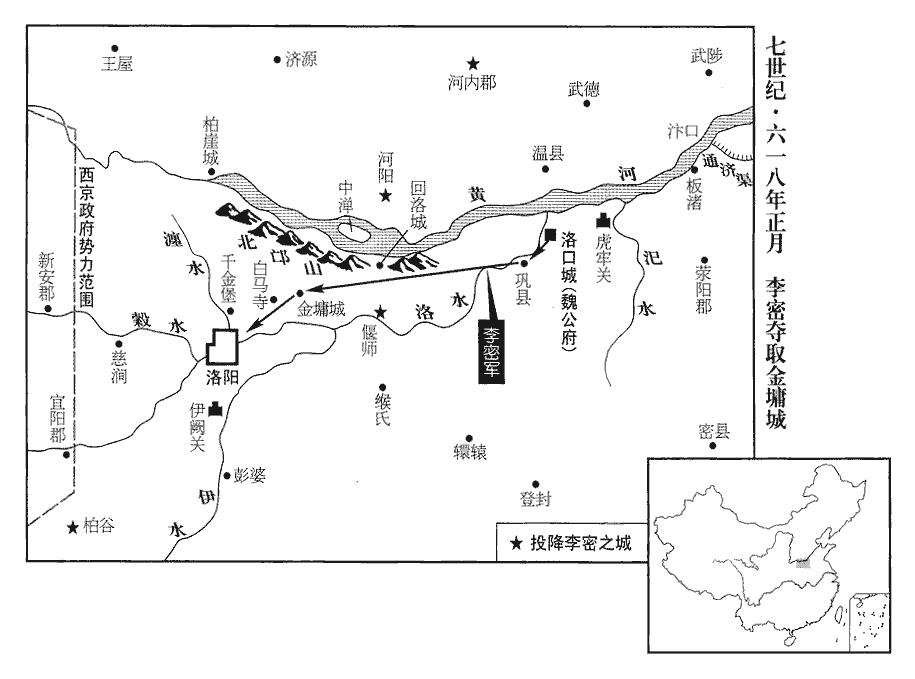
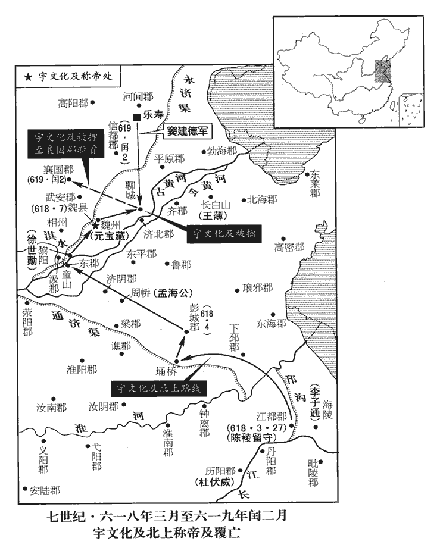
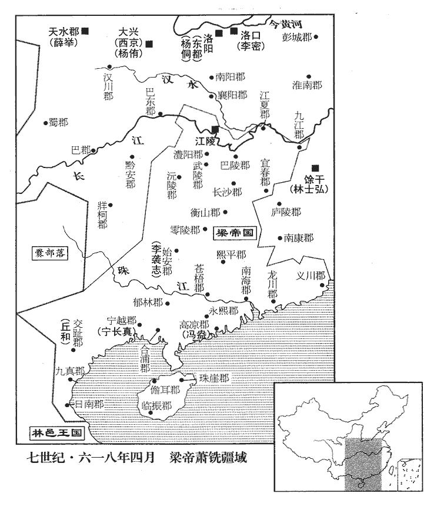

 唐紀一起著雍攝提格（戊寅）正月，盡七月，不滿一年。
>  
> 唐，古國名。陸德明曰：周成王母弟叔虞封於唐，其地帝堯、夏禹所都之墟。漢曰太原郡，在古冀州太行、恆山之西，太原、太岳之野。李唐之先，李虎與李弼等八人佐周伐魏有功，皆為柱國，號八柱國家。周閔帝受魏禪，虎已卒，乃追錄其功，封唐國公，生子昞，襲封。昞生淵，襲封，起兵克長安，進封唐王，遂受隋禪，國因號曰唐。

# 高祖神堯大聖光孝皇帝上之上諱淵，字叔德，本隴西成紀人。七世祖暠王西涼，是為涼武昭王。至曾孫熙家于武川；熙孫虎，從周文帝，始家長安。

## 武德元年（戊寅、六一八）是年五月受隋禪，始改元。

1春，正月，丁未朔‹一›，隋‹首都大兴陕西省西安市›恭帝‹杨侑，本年十四岁›詔唐王‹李渊›劍履上殿，贊拜不名。隋志：按漢自天子至于百官無不佩刀。蔡謨議云：大臣優禮者皆劍履上殿，非侍臣解之，蓋防刃也。近代以木，未詳所起；東齊著令，謂為象劍，言象於劍。周武帝時，百官燕會，並帶刀升座。至開皇初，因襲舊式，朝服升殿，亦不解焉。十二年，因蔡徵上事，始制凡朝會應登殿坐者，劍履俱脫；其不坐者，敕召奏事，及須升殿，亦就席解劍乃登。納言、黃門、內史令、侍郎、舍人既夾侍之官則不脫，其劍皆真刃非假。又，準晉咸康元年定令，故事自天子以下皆衣冠帶劍，今天子則玉具火珠鏢首，惟侍臣帶劍上殿；自王公已下，非殊禮，引升殿，皆就席，解而後升。複下曰舄xì，單下曰履。諸非侍臣，皆脫履升殿。舄唯冕服及具服著之；履則諸服皆用。凡朝會贊拜，則曰某官某；不名，亦殊禮也。上，時掌翻。鏢，紕招翻。

〖译文〗 [1]春季，正月丁未朔（初一）。隋恭帝下诏允许唐王佩带宝剑穿鞋上殿朝见，行礼时不必通报姓名。

唐王既克長安，以書諭諸郡縣，於是東自商洛‹陕西省丹凤县›，隋志：商洛縣屬上洛郡，取商山、洛水以名縣也。南盡巴、蜀‹重庆市和四川省›，郡縣長吏及盜賊渠帥、氐、羌酋長，爭遣子弟入見請降，有司復書，日以百數。長，知兩翻。帥，所類翻。酋，才由翻。見，賢遍翻。降，戶江翻。

〖译文〗 唐王攻克长安之后，便致函通告各郡县，于是东起商洛，南至巴蜀，各地的郡县长官、盗贼首领、氐羌酋长，争相派遣子弟见唐王请求归顺，有关衙门每天要回复数以百计的信函。

 

2王世充既得東都‹洛阳›兵，進擊李密於洛北‹洛水以北›，敗之，敗，補邁翻。遂屯鞏‹河南省巩县›北。鞏縣之北。辛酉‹十五›，世充命諸軍各造浮橋渡洛擊密，橋先成者先進，前後不一。虎賁郎將王辯破密外柵，賁，音奔。將，即亮翻。密營中驚擾，將潰；世充不知，鳴角收眾，密因帥敢死士乘之，帥，讀曰率。世充大敗，爭橋溺死者萬餘人。溺，奴狄翻。王辯死，世充僅自免，洛北諸軍皆潰。世充不敢入東都，北趣河陽‹河南省孟县›，趣，七喻翻，又逡須翻。是夜，疾風寒雨，軍士涉水沾濕，道路凍死者又以萬數。世充獨與數千人至河陽，考異曰：隋書、北史李密傳曰：「世充復移營洛北，南對鞏縣，其後遂於洛水造浮橋，悉眾以擊密。密出擊之，官軍稍卻，自相陷溺者數萬人；世充僅而獲免，不敢還東都，遂趣河陽。其夜，雨雪尺餘，眾隨之者死亡殆盡。」王世充傳曰：「充敗績，赴水溺死者萬餘人。時天寒大雪，兵士既渡水，衣皆霑濕，在道凍死者又數萬人。」蒲山公傳曰：「世充移營就洛水之北，與密隔洛水以相望；密乃築長城，掘深塹，周迴七十里以自固。十五日，世充與密戰於石窟寺東，密軍退敗，世充渡洛水以乘之，逼倉城為營塹，密縱兵疾戰，世充兵馬棄仗奔亡，沉溺死者不可勝數。密又令露布上府曰：『世充以今月十一日平旦屯兵洛北，偷入月城。其月十五日，世充及王辯才等又於倉城北偷渡水南，敢逼城堞。』河洛記曰：十六日，「充與密戰於石窟寺東。」又曰：「其夜，遇風寒疾雨，士卒凍死，十不存一，充脫身宵遁，直向河陽。」餘如蒲山公傳。略記曰：「辛酉，王世充等移兵洛北，仍令諸軍臨岸布兵，軍別造浮橋，橋先成者輒渡。既前後不一，而李密伏發，我師敗績，爭橋赴水溺死者十五六。」雜記曰：「十二月，越王遣太常少卿韋霽等率留守兵三萬並受世充節度；」又曰：「王辯縱等敗，眾軍亦潰，爭橋赴水，死者太半，王辯縱等皆沒，唯世充敗免，與數百騎奔大通城，敗兵得還者，於道遭大雨，凍死者六七千人。世充停留大通十餘日，懼罪不還。十四年，正月，越王遣世充兄世惲yùn往大通慰諭，赦世充喪師之罪。」按李道玄勸進於李密表云：「于時律始太蔟cù，未宜霢mài霂mù，而澍shù雨忽降，凍殕bó將盡。」今參取眾書，日從蒲山公傳，雨從河洛記。自繫獄請罪，越王侗遣使赦之，侗，他紅翻。使，疏吏翻。召還東都，賜金帛、美女以安其意。世充收合亡散，得萬餘人，屯含嘉城‹洛阳北城内›，含嘉城，蓋在都城之北。按舊書王世充傳，含嘉，倉城也。不敢復出。復，扶又翻。

〖译文〗 [2]王世充获得东都兵马，在洛北打败了李密，便驻札在巩县北面。辛酉（十五日），王世充命令各军分别搭设浮桥渡洛河向李密进攻，先搭好桥的军队先攻击，各军前后不一致，虎贲郎将王辩突破李密军外层营墙，李密军营之中一片惊恐混乱，就要溃败，可王世充并不了解这一情况，吹号角收兵。李密乘机带领敢死者反攻，王世充大败，败军争相过浮桥，落水淹死了一万多人。王辩阵亡，王世充只保得自己脱身，洛北各军全线崩溃。王世充不敢回东都，率军北赴河阳。当晚，风狂雨冷，士兵趟水浑身上下都打湿了，一路冻死的又数以万计。跟随王世充到达河阳的只有几千人。王世充绑缚自己投狱请求治罪。隋越王杨侗派人赦免了王世充，召他回东都，赐给他金钱锦缎美女安慰他。王世充召集逃散的旧部，得一万多人，驻扎于含嘉城，不敢再出战。

密乘勝進據金墉城‹故洛阳城西北角，在今洛阳之东。贾南风吞金屑酒处›，脩其門堞、廬舍而居之，堞，達協翻。鉦鼓之聲，聞於東都；聞，音問。未幾，擁兵三十萬，陳於北邙，陳，讀曰陣。南逼上春門。乙丑‹十九›，金紫光祿大夫段達、民部尚書韋津出兵拒之；達望見密兵盛，懼而先還，密縱兵乘之，軍遂潰，韋津死。考異曰：隋書列傳不言戰日。蒲山公傳此戰在四月九日。略記亦云：「四月，乙未，李密率眾北據邙山，南接上春門。段達、韋津等出兵拒之，兵未交而達懼，先還入城，軍遂潰亂。」乙未，二十一日也。今據河洛記，「正月十九日，世充又與密戰於上春門外，韋津沒焉。」又，二月，房彥藻與竇建德書亦云「幕府以去月十九日親董貔虎，西取洛邑。」其蒲山公傳四月已後月日，與事多差互不合。今日從河洛記，事從略記及隋段達傳。於是偃師‹河南省偃师县›、柏谷‹河南省宜阳县南›及河陽都尉獨孤武都、檢校河內‹河南省沁阳市›郡丞柳燮、職方郎柳續等隋制：職方郎，屬兵部尚書。各舉所部降於密。竇建德‹时在乐寿河北省献县›、朱粲‹时在山南秦岭以南›一带、孟海公‹时在济阴郡周桥山东省定陶县东南›、徐圓朗‹时在鲁郡山东省兖州市›等並遣使奉表勸進，降，戶江翻。使，疏吏翻。考異曰：河洛記云：「盧祖尚亦通表於密。」按祖尚本起兵為隋，事恐不爾。今不取。密官屬裴仁基等亦上表請正位號，上，時掌翻。密曰：「東都未平，不可議此。」

〖译文〗 李密乘胜进据金墉城，修复城门堞、房屋，住在城内，战鼓的声音由此传到东都。不久，李密拥兵三十万，在北邙列战阵，南边逼近东都上春门。乙丑（十九日），隋金紫光禄大夫段达、民部尚书韦津领兵抵御李密，段达一见李密军势强盛，心中害怕，率先回逃，李密纵兵追击，隋军溃败，韦津死。于是隋偃师、柏谷及河阳都尉独孤武都、检校河内郡丞柳燮、职方郎柳续等各自率领部下投降了李密。窦建德、朱粲、孟海公、徐圆朗等都派人奉表劝李密称帝，李密属下裴仁基等也上表请正位号。李密回答：“东都没有攻克，还谈不上这事。”

3戊辰‹二十二›，唐王以世子建成為左元帥，秦公世民為右元帥，帥，所類翻。督諸軍十餘萬人救東都。

〖译文〗 [3]戊辰（二十二日），唐王以世子李建成为左元帅，秦公李世民为右元帅，率领各路兵马十余万救援东都。

4東都乏食，太府卿元文都等募守城不食公糧者進散官二品；於是商賈執象而朝者，不可勝數。象者，象笏也；西魏以來，五品已上通用象牙。賈，音古。朝，直遙翻。勝，音升。

〖译文〗 [4]东都缺粮，隋太府卿元文都等人召募守城人，不吃公粮的进散官二品，这一来手持象牙笏板上朝的商人，不计其数。

5二月，己卯‹四›，唐王遣太常卿鄭元璹shú將兵出商、洛，徇南陽‹河南省邓州市›，煬帝改鄧州為南陽郡。璹，殊玉翻。將，即亮翻。左領軍府司馬安陸‹湖北省安陆市›馬元規徇安陸及荊、襄。隋十二衛府各有長史、司馬。煬帝改安州為安陸郡；荊州，南郡‹湖北省江陵县›；襄州，襄陽郡‹湖北省襄樊市›。

〖译文〗 [5]二月，己卯（初四），唐王派太常卿郑元领兵从商洛攻取南阳；派左领军府司马安陆人马元规攻取安陆及荆州、襄州。

6李密遣房彥藻、鄭頲等頲tǐng，他鼎翻。東出黎陽‹河南省浚县›，分道招慰州縣。以梁郡‹河南省商丘县›太守楊汪為上柱國、宋州總管，煬帝改宋州為梁郡。守，式又翻。又以手書與之曰：「昔在雍丘‹河南省杞县›，曾相追捕，事見一百八十三卷大業十二年。射鉤斬袂，不敢庶幾。」管仲射齊桓公‹姜小白›中帶鉤，桓公用之以相。晉寺人披伐公子重耳，斬其袪qū，文公‹姬重耳›不怨。今以袪為袂。射，而亦翻。幾，居希翻。汪遣使往來通意，密亦羈縻待之。使，疏吏翻。彥藻以書招竇建德，使來見密。建德復書，卑辭厚禮，託以羅藝‹总部幽州北京市›南侵，請捍禦北垂。彥藻還，至衛州‹河南省淇县东›，賊帥王德仁邀殺之。帥，所類翻；下同。德仁有眾數萬，據林慮山‹河南省林州市西北›，衛州，隋為汲郡。林慮山，在魏郡林慮縣。慮，音廬。四出抄掠，為數州之患。抄，楚交翻。

〖译文〗 [6]李密派房彦藻、郑等人东行出黎阳分别招慰各州县。李密以梁郡太守杨汪为上柱国、宋州总管，给杨汪的亲笔信写道：“过去我在雍丘曾遭您追捕，古人射钩斩袂的不计前嫌，我不敢说已经仿效了！”杨汪派人与李密联系，李密也极尽笼络。房彦藻致书窦建德，请他来见李密，窦建德复信虽然言辞很谦卑、礼数很周全，但推托罗艺南下，请求守北边，不见李密。房彦藻回程走到卫州，贼帅王德仁截击并杀了他。王德仁有数万人，占据林虑山，四处抢劫，是几个州县的祸患。

7三月，己酉‹四›，以齊公元吉為鎮北將軍、考異曰：創業注，改太原留守為鎮北府，在去年十二月己巳。蓋因元吉進封齊公言之耳。今從實錄。太原道‹山西省太原市›行軍元帥、都督十五郡諸軍事，聽以便宜從事。

〖译文〗 [7]三月，己酉（初四），唐王以齐公李元吉为镇北将军、太原道行军元帅，都督十五郡诸军事，允许他有权随机行事。

8隋煬帝‹杨广，本年五十岁›至江都‹江苏省扬州市›，大業十二年，煬帝至江都。荒淫益甚，宮中為百餘房，各盛供張，張：竹亮翻。實以美人，日令一房為主人。江都郡丞趙元楷掌供酒饌，饌，雛戀翻，又雛皖翻。帝與蕭后及幸姬歷就宴飲，酒卮不離口，從姬千餘人亦常醉。離，力智翻。從，才用翻。然帝見天下危亂，意亦擾擾不自安，退朝則幅巾短衣，策杖步遊，徧歷臺館，非夜不止，汲汲顧景，唯恐不足。

〖译文〗 [8]隋炀帝到江都，更加荒淫，宫中一百多间房，每间摆设都极尽豪华，内住美女，每天以一房的美女作主人。江都郡丞赵元楷负责供应美酒饮食，炀帝与萧后以及宠幸的美女吃遍了宴会，酒杯不离口，随从的一千多美女也经常喝醉。不过炀帝看到天下大乱，心情也忧虑不安，下朝后常头戴幅巾，身穿短衣，柱杖散步，走遍行宫的楼台馆舍，不到晚上不止步，不停地观赏四周景色，唯恐没有看够。

帝自曉占候卜相，好為吳語；朝，直遙翻。相，息亮翻。好，呼到翻。常夜置酒，仰視天文，謂蕭后曰：「外間大有人圖儂，吳人率自稱曰儂。然儂不失為長城公，卿不失為沈后‹沈婺华›，長城公，陳叔寶。叔寶后沈氏。且共樂飲耳！」樂，音洛。因引滿沈醉。沈，持林翻。又嘗引鏡自照，顧謂蕭后曰：「好頭頸，誰當斫之！」后驚問故，帝笑曰：「貴賤苦樂，更迭為之，樂，音洛。更，工衡翻。亦復何傷！」復，扶又翻。

〖译文〗 炀帝通晓占卜相面，爱说江浙话，经常半夜摆酒，抬头看星象，对萧后说：“外间有不少人算计侬，不过侬不失为长城公陈叔宝，卿也不失为沈后。我们姑且只管享乐饮酒吧！”然后倒满杯喝得烂醉。炀帝还曾拿着镜子照着，回头对萧后说：“好一个头颅，该由谁斩下来？”萧后惊异地问他为什么这样说，炀帝笑着说：“贵贱苦乐循环更替，又有什么好伤感的？”

帝見中原已亂，無心北歸，欲都丹陽‹江苏省南京市›，帝改蔣州為丹陽郡，蓋欲都建康也。考異曰：大業記：「帝欲南巡會稽。」今從隋書。保據江東，命群臣廷議之，內史侍郎虞世基等皆以為善；右候衛大將軍李才極陳不可，請車駕還長安，與世基忿爭而出。門下錄事衡水李桐客曰：隋制，門下省置錄事、通事、令史各六人。衡水縣屬信都郡，開皇十六年分信都北界、武邑西界、下博南界置。宋白曰：衡水縣，本漢桃縣。「江東卑濕，土地險狹，內奉萬乘，外給三軍，民不堪命，亦恐終散亂耳。」御史劾桐客謗毀朝政。乘，繩證翻。劾，戶概翻，又戶得翻。朝，直遙翻。於是公卿皆阿意言：「江東之民望幸已久，陛下過江，撫而臨之，此大禹之事也。」禹南巡狩，會諸侯於會稽‹浙江省绍兴市›。乃命治丹陽宮，將徙都之。治，直之翻。

〖译文〗 炀帝见中原已乱，不想回北方，打算把国都迁到丹阳，保守江东，下令群臣在朝堂上议论迁都之事，内史侍郎虞世基等人都认为不错；右候卫大将军李才极力说明不可取，请炀帝御驾回长安，并与虞世基忿然争论而下殿。门下录事衡水人李桐客说：“江东地势低洼，气候潮湿，环境恶劣，地域狭小，对内要奉养朝廷，对外要供奉三军，百姓承受不起，恐怕最终要起来造反的。”御史弹劾李桐客诽谤朝政，于是公卿都曲意阿奉炀帝之意说：“江东百姓渴望陛下临幸已经很久了，陛下过江抚慰统治百姓，这是大禹那样的作为。”于是炀帝下令修建丹阳宫，准备迁都丹阳。

時江都糧盡，從駕驍果多關中人，從，才用翻。驍，堅堯翻。久客思鄉里，見帝無西意，多謀叛歸，郎將竇賢遂帥所部西走，將，即亮翻；下同。帥，讀曰率。帝遣騎追斬之，騎，奇寄翻。而亡者猶不止，帝患之。虎賁郎將扶風‹陕西省凤翔县›司馬德戡kān素有寵於帝，賁，音奔。戡，音堪。帝使領驍果屯於東城，德戡與所善虎賁郎將元禮、直閤裴虔通謀曰：煬帝制左、右監門府，有直閤各六人，正五品。「今驍果人人欲亡，我欲言之，恐先事受誅；先，悉薦翻。不言，於後事發，亦不免族滅，柰何？又聞關內淪沒，李孝常以華陰‹陕西省华阴市›叛，事見上卷上年。華，戶化翻。上囚其二弟，欲殺之。我輩家屬皆在西，能無此慮乎！」二人皆懼，曰：「然則計將安出？」德戡曰：「驍果若亡，不若與之俱去。」二人皆曰：「善！」因轉相招引，內史舍人元敏、虎牙郎將趙行樞、鷹揚郎將孟秉、符璽郎牛【章：十二行本「牛」上有「李覆」二字；乙十一行本同；孔本同；張校同。】方裕、直長許弘仁、薛世良、城門郎唐奉義、醫正張愷、勳侍楊士覽等隋初，門下省統城門、尚食、尚藥、符璽、御府、殿內等六局，各有直長。煬帝以城門、尚食、尚藥、御府等五局隸殿內省；改符璽監為郎；城門置校尉，後又改校尉為城門郎；又置司醫、醫佐等官。意者醫正即司醫也。勳侍，三侍之一也。璽，斯氏翻。長，知兩翻。皆與之同謀，日夜相結約，於廣座明論叛計，無所畏避。有宮人白蕭后曰：「外間人人欲反。」后曰：「任汝奏之。」宮人言於帝，帝大怒，以為非所宜言，斬之。其後宮人復白后，復，扶又翻。后曰：「天下事一朝至此，無可救者，何用言之，徒令帝憂耳！」令，力丁翻。自是無復言者。

〖译文〗 当时江都的粮食吃完了，随炀帝南来的骁果大多是关中人，长期在外，思恋故乡，见炀帝没有回长安的意思，大都策划逃回乡。郎将窦贤便带领部下西逃。炀帝派骑兵追赶，杀了他，但仍然不断有人逃跑，令炀帝很头痛。虎贲郎将扶风人司马德戡一向得炀帝信任，炀帝派他统领骁果，驻扎在东城，司马德戡与平时要好的虎贲郎将元礼、直裴虔通商量，说：“现在骁果人人想逃跑，我想说，又怕说早了被杀头；不说，事情真发生了，也逃不了族灭，怎么办？又听说关内沦陷，李孝常以华阴反叛，皇上囚禁了他的两个弟弟，准备杀掉，我们这些人的家属都在西边，能不担心这事吗？”元、裴二人都慌了，问：“既然如此，有什么好办法吗？”司马德戡说：“如果骁果逃亡，我们不如和他们一齐跑。”元、裴二人都说：“好主意！”于是相互联络，内史舍人元敏、虎牙郎将赵行枢、鹰扬郎将孟秉、符玺郎牛方裕、直长许弘仁、薛世良、城门郎唐奉义、医正张恺、勋侍杨士览等人都参与同谋，日夜联系，在大庭广众之下公开商议逃跑的事，毫无顾忌。有一位宫女告诉萧后：“外面人人想造反。”萧后说：“由你去报告吧。”宫女便对炀帝说了，炀帝很生气，认为这不是宫女该过问的事，杀了这个宫女。后来又有人对萧后说起，萧后说：“天下局面到了今天这个地步，没法挽救了，不用说了，免得白让皇上担心！”从此以后，再也没人说起外面的情况。

趙行樞與將作少監宇文智及素厚，少，始照翻。楊士覽，智及之甥也，二人以謀告智及；智及大喜。德戡等期以三月望日‹十五›結黨西遁，智及曰：「主上雖無道，威令尚行，卿等亡去，正如竇賢取死耳。今天實喪隋，喪，息浪翻。英雄並起，同心叛者已數萬人，因行大事，此帝王之業也。」德戡等然之。行樞、薛世良請以智及兄右屯衛將軍許公化及為主，結約既定，乃告化及。化及性駑怯，聞之，變色流汗，既而從之。考異曰：蒲山公傳曰：「趙行樞、楊士覽以司馬德戡謀告化及，化及兄弟聞之大喜，因引德戡等相見。士及說德戡等曰：『足下等因百姓之心，謀非常之事，直欲走逃，故非長策。』德戡曰：『為之柰何？』士及曰：『官家雖言無道，臣下尚畏服之，聞公叛亡，必急相追捕，竇賢之事，殷鑒在近。不如嚴勒士馬，攻其宮闕，因人之欲，稱廢昏凶，事必克成；然後詳立明哲，天下可安，吾徒無患矣。勳庸一集，公等坐延榮祿。縱事不成，威聲大振，足得官家膽懾，不敢輕相追討，遲疑之間，自延數日，比其議定，公等行亦已遠。如此，則去住之計，俱保萬全，不亦可乎！』德戡等大悅曰：『明哲之望，豈惟楊家，眾心實在許公，故是人天協契。』士及佯驚曰：『此非意所及，但與公等思救命耳。』」革命記曰：「帝知曆數將窮，意欲南渡江水；咸言不可。帝知朝士不欲渡，乃將毒藥醞酒二十石，擬三月十六日為宴會而酖殺百官。南陽公主恐其夫死，乃陰告之，而事泄，為此，始謀害帝以免禍。並是兇逆之旅妄搆此詞。于時上下離心，人懷異志，帝深猜忌，情不與人，醞若不虛，藥須分付，有處遣何人！併醞二十石藥酒，必其酒有酖毒，一石堪殺千人。審欲擬殺群寮，謀之者必有三五眾，謀自然早泄，豈得獨在南陽！只是虔通等恥有殺害之名，推過惡於人主耳！」隋書化及傳云：「化及弒逆，士及在公主第，弗之知也。智及遣家僮莊桃樹就第殺之，桃樹不忍，執詣智及。久之，乃見釋。」南陽公主傳責士及云：「但謀逆之日，察君不預知耳。」舊唐書士及傳云：「化及謀逆，以其主壻，深忌之而不告。」按士及仕唐為宰相，隋書亦唐初所脩，或者史官為士及隱惡。賈、杜二書之言亦似可信，但杜儒童自知醞藥酒為虛，則南陽陰告之事亦非其實。如賈潤甫之說，則弒君之謀皆出士及，而智及為良人矣。今且從隋書而刪去莊桃樹事及南陽之語，庶幾疑以傳疑。

〖译文〗 赵行枢与将作少监宇文智及历来很要好，杨士览是宇文智及的外甥，赵、杨二人把他们的计划告诉了宇文智及，智及很高兴。司马德戡等人定于三月月圆那天结伴西逃，宇文智及说：“皇上虽然无道，可是威令还在，你们逃跑，和窦贤一样是找死，现在实在是老天爷要隋灭亡，英雄并起，同样心思想反叛的已有数万人，乘此机会起大事，正是帝王之业。”司马德戡等人同意他的意见。赵行枢、薛世良要求由宇文智及的兄长右屯卫将军许公宇文化及为首领，协商定了，才告诉宇文化及。宇文化及性格怯懦，能力低下，听说后，脸色都变了，直冒冷汗，后来又听从了众人的安排。

德戡使許弘仁、張愷入備身府，帝改左、右領左右府為左、右備身府。告所識者云：「陛下聞驍果欲叛，多醞毒酒，欲因享會，盡鴆殺之，獨與南人留此。」驍果皆懼，轉相告語，語，牛倨翻。反謀益急。乙卯‹十›，德戡悉召驍果軍吏，諭以所為，皆曰：「唯將軍命！」是日，風霾晝昏。霾，亡皆翻。雨土也。晡後，德戡盜御廄馬，潛厲兵刃。是夕，元禮、裴虔通直閤下，專主殿內；唐奉義主閉城門，與虔通相知，諸門皆不下鍵。鍵，戶偃翻。陳楚謂戶鑰牡為鍵。至三更，更，工衡翻。德戡於東城集兵得數萬人，舉火與城外相應。帝望見火，且聞外諠囂，問何事。虔通對曰：「草坊失火，外人共救之耳。」時內外隔絕，帝以為然。智及與孟秉於城外集千餘人，此城外，謂江都宮城之外。劫候衛虎賁馮普樂，布兵分守衢巷。左、右候衛，主晝夜巡察，故劫之。普樂，蓋虎賁郎將。賁，音奔。樂，音洛。燕王倓tán覺有變，倓，元德太子昭之子，代王侑之弟。倓，徒甘翻。夜，穿芳林門側水竇而入，至玄武門，詭奏曰：「臣猝中風，中，竹仲翻。命懸俄頃，請得面辭。」裴虔通等不以聞，執囚之。丙辰‹十一›，天未明，德戡授虔通兵，以代諸門衛士。虔通自門將數百騎至成象殿，將，即亮翻。騎，奇寄翻。宿衛者傳呼有賊，虔通乃還，閉諸門，獨開東門，驅殿內宿衛者令出，皆投仗而走。右屯衛將軍獨孤盛謂虔通曰：「何物兵勢太異！」虔通曰：「事勢已然，不預將軍事；將軍慎毋動！」盛大罵曰：「老賊，是何物語！」不及被甲，與左右十餘人拒戰，為亂兵所殺。被，皮義翻。考異曰：蒲山公傳：「裴虔通於成象殿前遇將軍獨孤盛，時內直宿，陳兵廊下以拒之。詬曰：『天子在此，爾等何敢兇逆！』叱兵接戰，兵皆倒戈。虔通謂盛曰：『公何暗於機會，恐他人以公為勳耳。』盛叱之曰：『國家榮寵盛者，正擬今日；且宿衛天居，唯當效之以死！』注弦不動。俄為亂兵所擊，斃於階下。」略記：「詰旦，諸門已開，而外傳叫有賊。虔通乃還閉諸門，唯開正東一門，而驅殿內執仗者出，莫不投仗亂走。屯衛大將軍獨孤盛揮刀叱之曰：『天子在此，爾等走欲何之！』然亂兵交萃，俄而斃於階下。」今從隋書，亦采略記。盛，楷之弟也。獨孤楷，見一百七十九卷文帝仁壽二年。千牛獨孤開遠煬帝制千牛十六人，掌執千牛刀，屬領左右府。開遠，獨孤后之兄子。帥殿內兵數百人詣玄覽門，叩閤請曰：「兵仗尚全，猶堪破賊。陛下若出臨戰，人情自定；不然，禍今至矣。」竟無應者，軍士稍散。賊執開遠，義而釋之。先是，帝選驍健官奴數百人置玄武門，先，悉薦翻。謂之給使，以備非常，待遇優厚，至以宮人賜之。司宮魏氏為帝所信，司宮，蓋即尚宮之職。化及等結之使為內應。是日，魏氏矯詔悉聽給使出外，倉猝際制無一人在者。

〖译文〗 司马德戡让许弘仁、张恺去备身府，对认识的人说：“陛下听说骁果想反叛，酿了很多毒酒，准备利用宴会，把骁果都毒死，只和南方人留在江都。”骁果都很恐慌，互相转告，更加速了反叛计划。乙卯（初十），司马德戡召集全体骁果军吏，宣布了计划，军吏们都说：“就听将军的吩咐！”当天，大风刮得天昏地暗，黄昏，司马德戡偷出御厩马，暗地磨快了武器。傍晚，元礼、裴虔通在下值班，专门负责大殿内；唐奉义负责关闭城门，唐奉义与裴虔通等商量好，各门都不上锁。到三更时分，司马德戡在东城集合数万人，点起火与城外相呼应，炀帝看到火光，又听到宫外面的喧嚣声，询问发生了什么事。裴虔通回答：“草坊失火，外面的人在一起救火呢。”当时宫城内外相隔绝，炀帝相信了。宇文智及和孟秉在宫城外面集合了一千多人，劫持了巡夜的候卫虎贲冯普乐，布署兵力分头把守街道。燕王杨发觉情况不对，晚上穿过芳林门边的水闸入宫，到玄武门假称：“臣突然中风，就要死了，请让我当面向皇上告别。”裴虔通等人不通报，而把杨关了起来。丙辰（十一日），天还没亮，司马德戡交给裴虔通兵马，用来替换各门的卫士。裴虔通由宫门率领数百骑兵到成象殿，值宿卫士高喊有贼，于是裴虔通又返回去，关闭各门，只开东门，驱赶殿内宿卫出门，宿卫纷纷放下武器往外走。右屯卫将军独孤盛对裴虔通说：“什么人的队伍，行动太奇怪了！”裴虔通说：“形势已经这样了，不关将军您的事，您小心些不要轻举妄动！”独孤盛大骂：“老贼，说的什么话！”顾不上披铠甲，就与身边十几个人一起拒战，被乱兵杀死。独孤盛是独孤楷的弟弟。千牛独孤开远带领数百殿内兵到玄览门，敲请求：“武器完备，足以破贼，陛下如能亲自临敌，人情自然安定；否则，祸事就在眼前。”竟然没有回答的人，军士逐渐散去。反叛者捉住独孤开远，又为他的忠义行为感动而放了他。早先，炀帝挑选了几百名勇猛矫健的官奴，安置在玄武门，称为“给使”，以防备突然发生的情况，待遇优厚，甚至把宫女赐给给使。司宫魏氏得炀帝信任，宇文化及等人勾结她作内应。这天，魏氏假称圣旨放全体给使出宫，致使仓促之际玄武门没有一个给使在场。

德戡等引兵自玄武門入，帝聞亂，易服逃於西閤。虔通與元禮進兵排左閤，魏氏啟之，遂入永巷，問：「陛下安在？」有美人出，指之。校尉令狐行達拔刀直進，校，戶教翻。令，音鈴。帝映窗扉謂行達曰：「汝欲殺我邪？」邪，音耶。對曰：「臣不敢，但欲奉陛下西還耳。」因扶帝下閤。還，從宣翻，又音如字。虔通，本帝為晉王時親信左右也，帝見之，謂曰：「卿非我故人乎！何恨而反？」對曰：「臣不敢反，但將士思歸，欲奉陛下還京師耳。」將，即亮翻。帝曰：「朕方欲歸，正為上江米船未至，夏口以上為上江。為，于偽翻。今與汝歸耳！」虔通因勒兵守之。

〖译文〗 司马德戡等人领兵从玄武门进入宫城，炀帝听到消息，换了衣服逃到西。裴虔通和元礼进兵推撞左门，魏氏开，乱兵进了永巷，问：“陛下在哪里？”有位美人出来指出了炀帝的所在。校尉令狐行达拔刀冲上去，炀帝躲在窗后对令狐行达说：“你想杀我吗？”令狐行达回答：“臣不敢，不过是想奉陛下西还长安罢了。”说完扶炀帝下。裴虔通本来是炀帝作晋王时的亲信，炀帝见到他，对他说：“你不是我的旧部吗！有什么仇要谋反？”裴虔通回答：“臣不敢谋反，但是将士想回家，我不过是想奉陛下回京师罢了。”炀帝说：“朕正打算回去，只为长江上游的运米船未到，现在和你们回去吧！”裴虔通于是领兵守住炀帝。

至旦，孟秉以甲騎迎化及，騎，奇寄翻；下同。化及戰栗不能言，人有來謁之者，但俛首據鞍稱罪過。罪過，今世俗謙謝之辭。俛fǔ，音免。化及至城門，宮城門也。德戡迎謁，引入朝堂，號為丞相。朝，直遙翻；下同。號，戶刀翻，呼也。裴虔通謂帝曰：「百官悉在朝堂，陛下須親出慰勞。」勞，力到翻。進其從騎，逼帝乘之；從，才用翻。帝嫌其鞍勒弊，更易新者，乃乘之。虔通執轡挾刀出宮門，賊徒喜譟動地。化及揚言曰：「何用持此物出，亟還與手。」與手，魏、齊間人率有是言，言與之毒手而殺之也。宋孝建初，薛安都助順有大功。從弟道生亦以軍功為大司馬參軍；犯罪，為秣陵令薛淑之所鞭。安都大怒，乘馬執矟，從數十人，欲往殺淑之。行至朱雀航，逢柳元景問何之，安都曰：「薛淑之鞭我從弟，指往刺殺之。」元景曰：「小子無宜適，卿往與手甚快！」安都既回馬，元景復呼使入車，讓止之。此與手之徵也。亟，紀力翻。帝問：「世基何在？」賊黨馬文舉曰：「已梟首矣！」於是引帝還至寢殿，虔通、德戡等拔白刃侍立。帝歎曰：「我何罪至此？」文舉曰：「陛下違棄宗廟，巡遊不息，外勤征討，內極奢淫，使丁壯盡於矢刃，女弱填於溝壑，四民喪業，喪，息浪翻。盜賊蠭起；專任佞諛，飾非拒諫：何謂無罪！」帝曰：「我實負百姓；至於爾輩，榮祿兼極，何乃如是！今日之事，孰為首邪？」邪，音耶。德戡曰：「溥天同怨，何止一人！」化及又使封德彝數帝罪，數，所具翻，又所主翻。帝曰：「卿乃士人，何為亦爾？」德彝赧然而退。帝愛子趙王杲，年十二，在帝側，號慟不已，虔通斬之，血濺御服。赧，奴板翻。慙而面赤也。號，戶刀翻。濺，子賤翻。賊欲弒帝，帝曰：「天子死自有法，何得加以鋒刃！取鴆酒來！」文舉等不許，使令狐行達頓帝令坐。帝自解練巾授行達，縊殺之‹年五十岁›。令，力丁翻。縊，於賜翻，又於計翻，絞也。考異曰：蒲山公傳、河洛記皆云「于洪達縊帝。」今從隋書及略記。初，帝自知必及於難，常以甖貯毒藥自隨，難，乃旦翻。甖yīng，於耕翻。貯，丁呂翻。謂所幸諸姬曰：「若賊至，汝曹當先飲之，然後我飲。」及亂，顧索藥，索，山客翻。左右皆逃散，竟不能得。蕭后與宮人撤漆牀板為小棺，與趙王杲同殯於西院流珠堂。

〖译文〗 天明后，孟秉派武装骑兵迎接宇文化及，宇文化及浑身颤抖说不出话，有人来参见，他只会低头靠在马鞍上连说：“罪过”表示感谢。宇文化及到宫城门前，司马德戡迎接他入朝堂，称丞相。裴虔通对炀帝说：“百官都在朝堂，需陛下亲自出去慰劳。”送上自己随从的坐骑，逼炀帝上马，炀帝嫌他的马鞍笼头破旧，换过新的才上马。裴虔通牵着马缰绳提着刀出宫城门，乱兵欢声动地。宇文化及扬言：“哪用让这家伙出来，赶快弄回去结果了。”炀帝问：“虞世基在哪儿？”乱党马文举说：“已经枭首了。”于是将炀帝带回寝殿，裴虔通、司马德戡等拔出兵刃站在边上。炀帝叹息道：“我有什么罪该当如此？”马文举说：“陛下抛下宗庙不顾，不停地巡游，对外频频作战，对内极尽奢侈荒淫。致使强壮的男人都死于刀兵之下，妇女弱者死于沟壑之中，民不聊生，盗贼蜂起；一味任用奸佞，文过饰非，拒不纳谏，怎么说没罪！”炀帝说：“我确实对不起老百姓，可你们这些人，荣华富贵都到了头，为什么还这样？今天这事，谁是主谋？”司马德戡说：“整个天下的人都怨恨，哪止一个人！”宇文化及又派封德彝宣布炀帝的罪状。炀帝说：“你可是士人，怎么也干这种事？”封德彝羞红了脸，退了下去。炀帝的爱子赵王杨杲才十二岁，在炀帝身边不停地嚎啕大哭，裴虔通杀了赵王，血溅到炀帝的衣服上。这些人要杀炀帝，炀帝说：“天子自有天子的死法，怎么能对天子动刀，取鸩酒来！”马文举等人不答应，让令狐行达按着炀帝坐下。炀帝自己解下练巾交给令狐行达，令狐行达绞死了炀帝。当初，炀帝料到有遇难的一天，经常用罂装毒酒带在身边，对宠幸的各位美女说：“如果贼人到了，你们要先喝，然后我喝。”等到乱事真的来到，找毒酒时，左右都逃掉，竟然找不到。萧后和宫女撤下漆床板，做成小棺材，把炀帝和赵王杨杲一起停柩在西院流珠堂。

帝每巡幸，常以蜀王秀自隨，囚於驍果營。化及弒帝，欲奉秀立之，眾議不可，乃殺秀及其七男。又殺齊王暕及其二子并燕王倓，隋氏宗室、外戚，無少長皆死。暕，古限翻。驍，堅堯翻。少，詩沼翻。長，知兩翻。唯秦王浩素與智及往來，且以計全之。浩，秦王俊之子。齊王暕素失愛於帝，暕失愛事始一百八十一卷大業四年。恆相猜忌，帝聞亂，顧蕭后曰：「得非阿孩邪？」暕，小字阿孩。恆，戶登翻。化及使人就第誅暕，暕謂帝使收之，曰：「詔使且緩兒，使，䟽吏翻。兒不負國家！」賊曳至街中，斬之‹年三十四岁›，暕竟不知殺者為誰，父子至死不相明。又殺內史侍郎虞世基、御史大夫裴蘊、左翊衛大將軍來護兒、祕書監袁充‹年七十五岁›、右翊衛將軍宇文協、千牛宇文皛、皛xiǎo，戶了翻。梁公蕭鉅等及其子。鉅，琮之弟子也。蕭琮，故梁主。琮，藏宗翻。

〖译文〗 炀帝每次巡幸，常常将蜀王杨秀随行，囚禁在骁果营。宇文化及弑炀帝，准备奉杨秀为皇帝，众人舆论以为不行，于是杀了杨秀和他的七个儿子。又杀齐王杨及其两个儿子和燕王杨，隋朝的宗室、外戚，无论老幼一律杀死。只有秦王杨浩平时与宇文智及有来往，宇文智及想办法保全了他。齐王杨一向失宠于炀帝，父子一直相互猜忌，炀帝听说起乱事，对萧后说：“不会是阿孩（杨）吧？”宇文化及派人到杨府第杀人，杨以为是炀帝下令来捕他，还说：“诏使暂且放开孩儿，儿没有对不起国家！”乱兵将他曳到街当中，杀了他，杨最终也不知道要杀他的是谁，父子之间至死也没能消除隔阂。乱兵又杀了内史侍郎虞世基、御史大夫裴蕴、左翊卫大将军来护儿、秘书监袁充、右翊卫将军宇文协、千牛宇文、梁公萧钜等人及其儿子。萧钜是萧综弟弟的儿子。

難將作，江陽長張惠紹馳告裴蘊，江陽縣，帶江都郡，舊廣陵也，大業初更名。長，知兩翻。與惠紹謀矯詔發郭下兵收化及等，扣門援帝。「與」上更有「蘊」字，文意乃明。議定，遣報虞世基；世基疑告反者不實，抑而不許。須臾，難作，難，乃旦翻。蘊歎曰：「謀及播郎，竟誤人事！」播郎，虞世基小字。虞世基宗人伋謂世基子符璽郎熙曰：「事勢已然，吾將濟卿南渡，同死何益！」熙曰：「棄父背君，璽，斯氏翻。背，蒲妹翻。求生何地！感尊之懷，尊，謂伋也。自此決矣！」世基弟世南抱世基號泣請【章：十二行本「請」下有「以身」二字；乙十一行本同；孔本同；張校同。】代，化及不許。號，戶刀翻。黃門侍郎裴矩知必將有亂，雖廝役皆厚遇之，廝，音斯。今人讀如瑟。又建策為驍果娶婦；事見上卷上年。為，于偽翻。及亂作，賊皆曰：「非裴黃門之罪。」既而化及至，矩迎拜馬首，故得免。化及以蘇威不預朝政，亦免之。朝，直遙翻。威名位素重，往參化及；化及集眾而見之，曲加殊禮。百官悉詣朝堂賀，給事郎許善心獨不至。許弘仁馳告之曰：「天子已崩，宇文將軍攝政，闔朝文武咸集，朝，直遙翻。天道人事自有代終，何預於叔而低回若此！」善心怒，不肯行。弘仁反走上馬，泣而去。化及遣人就家擒至朝堂，既而釋之。善心不舞蹈而出，化及怒曰：「此人大負氣！」復命擒還，殺之‹年六十一岁›。其母范氏，年九十二，撫柩不哭，曰：「能死國難，吾有子矣！」因臥不食，十餘日而卒。上，時掌翻。復，扶又翻。柩，音舊。難，乃旦翻。卒，子恤翻。唐王之入關也，張季珣之弟仲琰為上洛‹陕西省商州市›令，張季珣死節，見上卷上年。上洛縣，隋帶上洛郡。帥吏民拒守，部下殺之以降。帥，讀曰率。降，戶江翻。宇文化及之亂，仲琰弟琮為千牛左右，隋制，領左右府有千牛左右，司射左右。化及殺之，兄弟三人皆死國難，時人愧之。

〖译文〗 动乱就要发生时，江阳县长张惠绍飞驰去通告了裴蕴，裴蕴与张惠绍商量假称圣旨调江都城外的军队逮捕宇文化及等人，敲开城门援救炀帝。二人商量好后，派人报告虞世基，虞世基怀疑谋反的事不真实，压下来没有答复。一会儿，发难，裴蕴叹息道：“和播郎（虞世基）商量，竟然误了事！”虞世基的同宗虞对世基的儿子符玺郎虞熙说：“事情已经这样了，我打算送你过长江去南边，一起死了又有什么用！”虞熙说：“扔下父亲背叛君主，又有什么脸活着！感谢您的关心，从此永别了！”虞世基的弟弟虞世南抱着世基大哭，请求代替他赴死，宇文化及不准。黄门侍郎裴矩知道肯定要发生动乱，因此对待作贱役的人也很优厚，又建议为骁果娶妇；待乱事发生后，乱兵都说：“不是裴黄门的错。”不久，宇文化及到了，裴矩迎到马前行礼，因此得以免去了祸事。宇文化及因为苏威不参与朝政，也放过了他。苏威名声、地位历来显赫，他去参见宇文化及，宇文化及集合众人来见他，对他格外尊重。百官都到朝堂祝贺宇文化及，只有给事郎许善心不到。许弘仁骑马跑去告诉他说：“天子已经驾崩了，宇文将军代理朝政，满朝文武都集于朝堂，天道人事自有它相互代替终结的道理，又与叔叔您有什么相干，何至于这样流连不舍！”善心很生气，不肯去。弘仁回身上马，哭着走了。宇文化及派人到家里把许善心捉到朝堂上，一会儿又放了他。许善心不按朝见的规矩行礼就走出朝堂，宇文化及生气地说：“这人真不知好歹！”重新下令把许善心捉回朝堂，杀了。许善心的母亲范氏九十二岁了，抚摸着灵柩但并不哭泣，说：“能死国难，真是我的儿子！”躺着不吃东西，十几天后去世。唐王李渊入关时，张季的弟弟张仲琰是上洛令，带领部下、百姓占据城池抵抗，部下杀了他投降唐王。宇文化及之乱，仲琰的弟弟张琮为千牛左右，宇文化及杀了张琮，兄弟三人都死于国难，令当时的人感到羞愧。

化及自稱大丞相，總百揆。以皇后令立秦王浩為帝，居別宮，令發詔畫敕書而已，仍以兵監守之。令，力丁翻。監，古銜翻。化及以弟智及為左僕射，士及為內史令，裴矩為右僕射。

〖译文〗 宇文化及自称大丞相，总理百官。以炀帝皇后的命令立秦王杨浩为皇帝，住在别宫，只让皇帝签署发布诏敕而已，仍然派兵监守。宇文化及以弟弟宇文智及为左仆射，宇文士及为内史令，裴矩为右仆射。

9乙卯‹十›，徙秦公世民為趙公。

〖译文〗 [9]乙卯（初九），改封秦公李世民为赵公。

10戊辰‹二十三›，隋恭帝‹杨侑›詔以十郡益唐國，仍以唐王‹李渊›為相國，總百揆，唐國置丞相以下官，又加九錫。王謂僚屬曰：「此諂諛者所為耳。孤秉大政而自加寵錫，可乎！必若循魏、晉之迹，彼皆繁文偽飾，欺天罔人；考其實不及五霸，而求名欲過三王，此孤常所非笑，竊亦恥之。」或曰：「歷代所行，亦何可廢！」王曰：「堯、舜、湯、武，各因其時，取與異道，皆推其至誠以應天順人，未聞夏、商之末必效唐、虞之禪也。若使少帝有知，必不肯為；少，詩照翻。若其無知，孤自尊而飾讓，平生素心所不為也。」但改丞相為相國府，其九錫殊禮，皆歸之有司。

〖译文〗 [10]戊辰（二十三日），隋恭帝下诏将十个郡增加给唐国，仍然以唐王为相国，总理百官，唐国可以设置丞相以下官吏，又加唐王九锡。唐王对手下的官员说：“这是阿谀奉承的人干的事，孤自己把握大政又给自己加优宠和九锡，能行吗？若说一定要照着魏、晋的规矩，那些都是些虚礼，欺骗人的；他们实际的作为赶不上春秋时的五霸，而追求的名声却想超过禹、汤、文王三王，这样的事是孤经常嘲笑的，也认为这样做很可耻。”也有人说：“历朝都这样做，怎么可以废除？”唐王说：“尧、禹、汤、武王分别以自己的时机，以不同方式登上王位，但都是以其至诚上应天意、下顺民情，没听说夏朝、商代末年一定得效法唐、虞的禅位。这事如果少帝知道，一定不肯做，如果少帝不知道，孤自己尊崇自己又假意推让，是平生从心里不愿做的事。”唐王只是把丞相府改为相国府，九锡之类的特殊礼仪，则退还给负责官署。

11宇文化及以左武衛將軍陳稜為江都太守，綜領留事。守，式又翻。壬申‹二十七›，令內外戒嚴，云欲還長安。皇后六宮皆依舊式為御營，營前別立帳，化及視事其中，仗衛部伍，皆擬乘輿。乘，繩證翻。奪江都人舟檝，取彭城‹江苏省徐州市›水路西歸。煬帝改徐州為彭城郡。檝，與楫同。以折衝郎將沈光驍勇，煬帝置折衝郎將，正四品，掌領驍果，屬領左右府。將，即亮翻；下同。驍，堅堯翻。使將給使營於禁內。既立御營，以御營之內為禁內。行至顯福宮，虎賁郎將麥孟才、虎牙郎錢傑煬帝制十二衛府，每衛置護軍四人，掌副貳將軍；尋改護軍為虎賁郎將，而置虎牙郎將副焉。「虎牙郎」下當有「將」字。與光謀曰：「吾儕受先帝厚恩，今俛首事讎，受其驅帥，儕，士皆翻。悗，音免。帥，讀曰率；下同。何面目視息世間哉！吾必欲殺之，死無所恨！」光泣曰：「是所望於將軍也。」孟才乃糾合恩舊，恩舊，與之有舊恩者。帥所將數千人，期以晨起將發時襲化及。語洩，帥，讀曰率。洩，息列翻。化及夜與腹心走出營外，留人告司馬德戡等，使討之。光聞營內諠，知事覺，即襲化及營，空無所獲，值內史侍郎元敏，數而斬之。數，所具翻，又所主翻。德戡引兵入圍之，殺光‹年二十八岁›，其麾下數百人皆鬬死，一無降者，降，戶江翻。孟才亦死。孟才，鐵杖之子也。鐵杖死於度遼之役。

〖译文〗 [11]宇文化及以左武卫将军陈棱为江都太守，总管留守事宜。壬申（二十七日），命令内外戒严，声称准备回长安。皇后和六宫都按照老规矩作为御营，营房前另外搭帐，宇文化及在里面办公，仪仗和侍卫的人数，都比照着皇帝的规模。他们抢了江都人的船，取道彭城由水路向西行。宇文化及因折冲郎将沈光骁勇，让他在御营内统领给使营。行进到显福宫，虎贲郎将麦孟才、虎牙郎钱杰和沈光商议：“我们都受了先帝极大的恩典，现在低头为仇人做事，受他驱使指挥，有什么脸见人！我一定要杀了他，死了也没有什么遗憾的！”沈光流着泪说：“这正是我指望将军的。”于是孟才联合了与他有恩旧的人，率领数千名部下，约定早晨起床后准备出发时袭击宇文化及。消息走露，夜里宇文化及和心腹走到御营外面，派人通知司马德戡，让他去诛戮麦孟才等人。沈光听到营里喧哗，知道事情被发觉了，马上袭击宇文化及的营帐，空无所获，碰着内史侍郎元敏，就列举了元敏的罪状，杀了他。司马德戡领着兵进入营中围住沈光一行，杀了沈光，沈光手下的几百人全都拼杀而死，没有一个人投降，孟才也死了。麦孟才是麦铁杖的儿子。

12武康‹浙江省德清县西武康镇›沈法興，隋志，武康縣屬餘杭郡。劉昫曰：吳分烏程、餘杭二縣立永安縣，晉改為永康，又改為武康；唐分屬湖州。世為郡著姓，宗族數千家。法興為吳興‹浙江省湖州市›太守，守，式又翻。聞宇文化及弒逆，舉兵以討化及為名，考異曰：太宗實錄、舊唐帝紀：「二月法興據丹陽起兵。」按法興起兵討化及，當在弒逆後。比至烏程‹吴兴郡郡政府所在县›，得精卒六萬，遂攻餘杭‹浙江省杭州市›、毗陵‹江苏省常州市›、丹陽‹江苏省南京市›，皆下之；按烏程縣帶吳興郡。沈法興既為吳興守，而云舉兵至烏程者，法興傳云：大業末，法興為吳興郡守，東陽‹浙江省金华市›賊樓世幹略其郡，煬帝詔法興與太僕丞元祐討之。義寧二年，江都亂，法興執祐舉兵，名討宇文化及。三月，發東陽，行收兵，趨江都，下餘杭，比至烏程，眾六萬。如此，則自東陽至烏程也。比，必寐翻。據江表十餘郡，自稱江南道大總管，承制置百官。

〖译文〗 [12]武康人沈法兴，世代都是郡中有声望的大姓，同一宗族就有几千家。沈法兴做吴兴太守，听说宇文化及弑君谋逆，以讨宇文化及为名起兵，待进发到乌程时，已拥有六万精兵，于是攻打余杭、毗陵、丹阳，全都攻克；占据了长江以南十几个郡，自称江南道大总管，承制设置百官。

13陳國公竇抗，唐王之妃兄也，煬帝使行長城於靈武‹宁夏灵武市›；行，循行也，音下孟翻。聞唐王定關中，癸酉‹二十八›，帥靈武、鹽川‹陕西省定边县›等數郡來降。煬帝改靈州為靈武郡，鹽州為鹽川郡。帥，讀曰率。

〖译文〗 [13]陈国公窦抗是唐王妃子的兄长，隋炀帝派遣他到灵武一带巡视长城，听说唐王平定了关中，癸酉（二十八日），率领灵武、盐川几个郡前来归顺唐王。

14夏，四月，稽胡‹山西省西部及陕西省北部地区匈奴人›寇富平‹陕西省富平县›，隋志，富平縣屬京兆郡。杜佑曰：稽胡，一名步落稽，蓋匈奴別種，自離石以西，安定以東，方七、八百里。將軍王師仁擊破之。又五萬餘人寇宜春‹宜君·陕西省宜君县›，相國府諮議參軍竇軌將兵討之，戰於黃欽山‹陕西省耀县西北›。「宜春」，當作「宜君」。隋志，宜君縣屬京兆郡，有清水。水經註：清水出雲陽縣之石門山，東南流逕黃嶔山西。將，即亮翻；下同。稽胡乘高縱火，官軍小卻；軌斬其部將十四人，拔隊中小校代之，勒兵復戰。校，戶教翻。復，扶又翻。軌自將數百騎居軍後，令之曰：「聞鼓聲有不進者，自後斬之！」既而鼓之，將士爭先赴敵，稽胡射之不能止，騎，奇寄翻。射，而亦翻。遂大破之，虜男女二萬口。

〖译文〗 [14]夏季，四月，稽胡侵犯富平，唐将军王师仁打败了稽胡。又有五万稽胡侵犯宜春，唐王相国府谘议参军窦轨统领兵马讨伐稽胡，在黄钦山交战，稽胡登高放火，官军稍退却；窦轨杀了十四名部将，提拔队中的小校代替，领兵重新作战。窦轨自己带领几百骑兵在军队后面，下令说：“听到鼓声有不前进的，我们从后面杀了他！”不一会儿，战鼓响起，将士争先冲向敌人，稽胡放箭也阻止不了，于是大败稽胡，俘虏男女二万人。

15世子建成等至東都，軍於芳華苑；東都閉門不出，遣人招諭，不應。李密出軍爭之，小戰，各引去。城中多欲為內應者，趙公世民曰：「吾新定關中，根本未固，【章：十二行本「固」下有「懸軍遠來」四字；乙十一行本同；孔本同；張校同；退齋校同。】雖得東都，不能守也。」遂不受。戊寅‹四›，引軍還。還，從宣翻，又音如字。世民曰：「城中見吾退，必來追躡。」乃設三伏於三王陵‹洛阳城西南›以待之；水經註：三王陵在河南縣西南柏亭東北。三王，或言周景王、悼王、定王也。崔浩曰：「定」，當為「敬」。子朝作亂，西周政弱人荒，悼、敬二王與景王俱葬於此，故世以三王名陵。段達果將萬餘人追之，遇伏而敗。世民逐北，抵其城下，東都城下。斬四千餘級。遂置新安‹河南省新安县›、宜陽‹河南省宜阳县西›二郡，新安，後周置中州及東垣縣，隋廢州，改縣名。宜陽，後魏置郡，隋開皇初廢為縣，與新安皆屬河南郡。今並置郡。使行軍總管史萬寶、盛彥師【章：十二行本「師」下有「將兵」二字；乙十一行本同；孔本同。】鎮宜陽，姓苑：後漢西羌傳有北海太守盛苞，其先姓奭，避元帝諱改姓盛。余按戰國策秦有盛橋，則盛姓尚矣。呂紹宗、任瓌將兵鎮新安而還。任，音壬。瓌guī，古回翻。置二郡，內以蔽關輔，外以圖東都。還，從宣翻，又如字。

〖译文〗 [15]唐王世子李建成等人到东都，驻札在芳华苑；东都城关闭城门不出，唐军派人招谕，又不答复。李密出军与唐军相争，稍微接触，就各自离开。东都城里有不少人想作为唐军的内应，赵公李世民说：“我们平定关中不久，根基还不牢固，即使得东都，也不能守住。”于是没有答允作内应的要求。戊寅（初四），领军队回关中。世民说：“城里看见咱们撤退，肯定会追来。”于是在三王陵设下三处埋伏等待追兵；段达果然带一万多人追来，遇到埋伏打了败仗。李世民追击败军，直到东都城下，杀了四千多人。于是设置新安、宜阳二郡，派行军总管史万宝、盛彦师镇守宜阳，吕绍宗、任统兵镇守新安，唐军回师。

16初，五原‹内蒙古五原县›通守櫟yuè陽‹陕西省临潼县北栎阳镇›張長遜煬帝改豐州為五原郡。新唐書：張長遜，京兆櫟陽人。隋志，京兆無櫟陽縣。櫟yuè，音藥。守，式又翻。以中原大亂，舉郡附突厥‹瀚海沙漠群›，突厥以為割利特勒。郝瑗說薛舉‹秦帝薛举，首都天水甘肃省天水市›，厥，九勿翻。郝，呼各翻。瑗yuàn，子眷翻。說，輸芮翻；下同。與梁師都‹梁帝梁师都，首都朔方陕西省靖边县北白城子›及突厥連兵以取長安，舉從之。時啟民可汗之子咄苾可，從刊入聲。汗，音寒。咄duō，當沒翻。苾bì，毗必翻。號莫賀咄設，建牙直五原之北，舉遣使與莫賀咄設謀入寇；咄，當沒翻。使，疏吏翻；下同。莫賀咄設許之。唐王‹李渊›使都水監宇文歆xīn賂莫賀咄設，開皇初，立都水臺，置使者；大業改為都水監，改使者為監。且為陳利害，止其出兵，又說莫賀咄設遣張長遜入朝，以五原之地歸之中國，莫賀咄設並從之。為，于偽翻。咄，當沒翻。朝，直遙翻；下同。己卯‹五›，武都‹甘肃省武都县›、宕渠‹四川省渠县›、五原等郡皆降，武都，漢郡，西魏置武州，煬帝復為郡。宕渠，漢縣，梁置渠州，煬帝改為宕渠郡。此二郡與五原同日來降，故連書之。宕，徒浪翻。王即以長遜為五原太守。守，式又翻。長遜又詐為詔書與莫賀咄設，示知其謀。莫賀咄設乃拒舉、師都等，不納其使。使，疏吏翻。

〖译文〗 [16]当初，五原通守栎阳人张长逊因为中原大乱，以整个郡归附突厥，突厥封他为割利特勒。郝瑷劝薛举与梁师都及突厥联合兵力攻取长安，薛举听从他的意见。当时启民可汗之子咄称莫贺咄设，就在五原北面设官署，薛举派使节与莫贺咄设协商入侵长安；莫贺咄设答应了薛举的邀请。唐王派遣都水监宇文歆贿赂莫贺咄设，并且向他陈述了利害得失，阻止他出兵，又劝莫贺咄设派张长逊入朝，把五原地区归还给中国，莫贺咄设全都应允。己卯（初五），武都、宕渠、五原等郡全部归顺唐王，唐王就以张长逊为五原太守。张长逊又写假诏书给莫贺咄设，表示已经知道了莫贺咄设等人的阴谋。莫贺咄设于是拒绝了薛举、梁师都等的邀请，不接受他们派来的使者。

17戊戌‹二十四›，世子建成等還長安。考異曰：創業注在三月，今從太宗實録。

〖译文〗 [17]戊戌（二十四日），唐世子李建成等回到长安。

18東都號令不出四門，人無固志，朝議郎段世弘等謀應西師。會西師已還，西師，謂建成等之師。還，從宣翻，又音如字。乃遣人招李密‹时在金墉城›，期以己亥‹二十›夜納之。事覺，越王‹杨侗›命王世充討誅之。密聞城中已定，乃還。

〖译文〗 [18]东都隋廷能管辖的地方只有城里，人心不定，朝议郎段世弘等人谋划响应李建成等率领的西军。恰好李建成的军队已经回师，他们便派人联络李密，约定己亥（二十五日）夜里迎接李密军进城。事情被发觉，隋越王杨侗命令王世充诛杀了段世弘等人。李密听说城内已经被平定，便回去了。

 

19宇文化及擁眾十餘萬，據有六宮，自奉養一如煬帝。每於帳中南面坐，人有白事者，嘿然不對；下牙，方取啟狀與唐奉義、牛方裕、薛世良、張愷等參決之。劉馮事始曰：兵書曰：牙旗者，將軍之精，凡始建牙，必以制日。制日者，其辰在五行以上剋下之日也。又尚書緯曰：門旗二口，色紅，八幅。大將牙門之旗，出引將軍前列。又黃帝出軍決曰：牙旗者，將軍之精；金鼓者，將軍之氣。周禮司常職云：軍旅會同置旌門。夫以旌為門，即旗門也，後世軍中遂置牙門將，又有牙兵，典總此名者以押牙為名。至於官府，早晚軍吏兩謁，亦名為衙。呼謂既熟，雖天子正殿受朝謁，亦名正衙。以少主浩付尚書省，令衛士十餘人守之，少，始照翻。遣令史取其畫敕，隋門下省，有錄事、通事、令史各六人。百官不復朝參。至彭城，水路不通‹通济渠经彭城郡南境的埇桥安徽省宿州市›，復奪民車牛得二千兩，復，扶又翻。朝，直遙翻。兩，力讓翻。並載宮人珍寶；其戈甲戎器，悉令軍士負之，道遠疲劇，軍士始怨。司馬德戡竊謂趙行樞曰：「君大謬誤我！行樞建言以化及為主。當今撥亂，必藉英賢；化及庸暗，群小在側，事將必敗，若之何？」行樞曰：「在我等耳，廢之何難！」初，化及既得政，賜司馬德戡爵溫國公，加光祿大夫；以其專統驍果，心忌之。後數日，化及署諸將分部士卒，驍，堅堯翻。將，即亮翻。以德戡為禮部尚書，外示美遷，實奪其兵柄。德戡由是憤怨，所獲賞賜，皆以賂智及；智及為之言，乃使之將後軍萬餘人以從。及為，于偽翻。將，即亮翻。從，才用翻。於是德戡、行樞與諸將李本、尹正卿、宇文導師等謀，以後軍襲殺化及，更立德戡為主；遣人詣孟海公‹根据地在济阴郡周桥山东省定陶县东南›，結為外助，孟海公據曹州。遷延未發，待海公報。許弘仁、張愷知之，以告化及，化及遣宇文士及陽為遊獵，至後軍，德戡不知事露，出營迎謁，因執之。化及讓之曰：「與公戮力共定海內，出於萬死。今始事成，方願共守富貴，公又何反也？」德戡曰：「本殺昏主，苦其淫虐；推立足下，而又甚之；逼於物情，不得已也。」化及縊殺之，并殺其支黨十餘人。孟海公畏化及之強，帥眾具牛酒迎之。帥，讀曰率；下同。李密據鞏洛‹河南省巩县一带›以拒化及，洛水至鞏入河，故曰鞏洛。化及不得西，引兵向東郡‹河南省滑县›，東郡通守王軌以城降之。守，式又翻。降，戶江翻；下同。

〖译文〗 [19]宇文化及拥有十几万人，占有六宫，自己的供养与隋炀帝完全相同。每天象帝王一样面朝南坐在帐中，有人奏事，他默然无语；下朝后，才取出上报的启、状和唐奉义、牛方裕、薛世良、张恺等人商量着处理。把少主杨浩交付给尚书省，命十几名卫士看守，派令史取少主签署的敕书，百官不再朝见皇帝。到彭城，水路不通，又抢百姓车、牛得二千辆，用来运载宫女和珍宝；长枪铠甲武器准备，全都由士兵背着，因为路远，累得很，士兵开始不满。司马德戡私下里对赵行枢说：“你真是害我不浅！当今治平乱世，一定得靠杰出而有才干的人，化及没才能又糊涂，一群小人在他身边，肯定要坏事，那该怎么办？”赵行枢说：“全在我们这些人了，废除他又有什么难？”当初宇文化及得政之后，便赐司马德戡温国公爵位，加光禄大夫；因为司马德戡专门统领骁果，又从心里防备他。没过几天，化及布署诸将分别领兵，以司马德戡为礼部尚书，表面看是升官，实际是夺他的兵权。司马德勘因此愤恨不平，得到赏赐，都用来贿赂宇文智及；智及替他说情，才派他领着一万多后军殿后。于是，司马德戡、赵行枢与几位将领李本、尹正卿、宇文导师等策划，准备用后军袭击诛杀宇文化及，改立司马德戡为主。派人到孟海公那里，联结他做外援，拖延着没有发动，等着孟海公的回音。许弘仁、张恺知道了他们的计划，报告了宇文化及，宇文化及派宇文士及装作游猎，到后军，司马德戡不知道事情败露，出营迎接，宇文士及趁势逮捕他。宇文化及责备司马德戡道：“我和阁下共同努力平定海内，冒着天大的风险。如今事情刚刚成功，正想一起保富贵，阁下又为何要谋反呢？”司马德戡说：“本来杀昏主，就是受不了他的荒淫暴虐；推立足下，却比昏主有过之而无不及；迫于人心，也是不得已。”宇文化及吊死了司马德戡，并杀了司马德戡十九名同党。孟海公害怕宇文化及的强盛，率领部下备办了牛和酒迎接宇文化及。李密占领了巩洛抵抗宇文化及，宇文化及不能向西前进，便领着队伍朝着东郡进发，东郡通守王轨以城投降了宇文化及。

20辛丑‹二十七›，李密將井陘‹河北省井陉县西北›王君廓帥眾來降。隋志，井陘縣屬恆山郡。將，即亮翻；下同。陘，音刑。帥，讀曰率。考異曰：太宗實錄曰：「王君愕，邯鄲人。君廓寇略邯鄲，君愕往投之，因為君廓陳井陘之險，勸先往據之。君廓從其言，屯井陘山歲餘。會義師入定關中，乃與君廓率所部萬餘人歸順，拜大將軍。」與君廓事皆出太宗實錄而不同如此。今據高祖實錄。稱李密將王君廓降，從君廓傳。君廓本群盜，有眾數千人，與賊帥韋寶、鄧豹合軍虞鄉‹山西省永济县东虞乡镇›，劉昫曰：虞鄉縣，漢解縣地，後魏分置虞鄉縣，隋志屬河東郡。帥，所類翻。唐王與李密俱遣使招之。使，疏吏翻。寶、豹欲從唐王，君廓偽與之同，乘其無備，襲擊，破之，奪其輜重，重，直用翻。奔李密；密不禮之，復來降，復，扶又翻。拜上柱國，假河內‹河南省沁阳市›太守。

〖译文〗 [20]辛丑（二十七日），李密的将领井陉人王君廓率部来降唐王。王君廓部原本是一伙强盗，有数千人，和贼帅韦宝、邓豹队伍一同驻扎在虞乡，唐王和李密都派人去招降三人，韦宝、邓豹想从唐王，王君廓假意和二人相同，乘二人不防备，袭击并打败了韦、邓二人，抢了二人的辎重，投奔李密；李密对他不太尊重，又来投降唐王，唐王拜王君廓为上柱国、代理河内太守。

 

21蕭銑即皇帝位‹梁，首都巴陵郡湖南省岳阳市›，置百官，準梁室故事。諡其從父琮為孝靖皇帝，諡，神至翻。從，才用翻。祖巖為河間忠烈王，父璿為文憲王，璿xuán，音旋。封董景珍等功臣七人皆為王。遣宋王楊道生擊南郡，下之，徙都江陵，煬帝改荊州為南郡，江陵帶郡。脩復園廟。引岑文本為中書侍郎，使典文翰，委以機密。又使魯王張繡徇嶺南，隋將張鎮周、王仁壽等拒之；既而聞煬帝遇弒，皆降於銑。欽州‹广西钦州市›刺史寧長真亦以鬱林‹广西贵港市东›、始安‹广西桂林市›之地附於銑。煬帝改欽州為寧越郡。長真刺史，文帝所命也。鬱林郡，梁定州也，後改為南定州；平陳，改為尹州；大業初，改為鬱州，尋改為郡；又改桂州為始安郡。漢陽‹甘肃省礼县南›太守馮盎以蒼梧‹广东省封开县›、高涼‹广东省阳江市›、珠崖‹海南省琼山县›、番禺‹南海郡·广东省广州市›之地附於林士弘‹首都馀干江西省新干县›。新唐書馮盎傳曰：隋仁壽初，盎平潮、成叛獠，拜漢陽太守；隋亡，奔還嶺表，據有諸郡。蒼梧郡，梁置成州，開皇初改為封州，煬帝改為郡，改高州為高涼郡；崖州為珠崖郡。番禺，南海郡治。番，音潘。禺，音愚。銑、士弘各遣人招交趾‹越南河内市›太守丘和，煬帝改交州為交趾郡。和不從。銑遣寧長真帥嶺南之兵自海道攻和，帥，讀曰率；下同。和欲出迎之，司法書佐高士廉煬帝改郡諸司參軍為書佐。說和曰：「長真兵數雖多，懸軍遠至，不能持久，城中勝兵足以當之，說，輸芮翻；下同。勝，音升。柰何望風受制於人！」和從之，以士廉為軍司馬，將水陸諸軍逆擊，破之，將，即亮翻。長真僅以身免，盡俘其眾。既而有驍果自江都至，驍，堅堯翻。得煬帝凶問，亦以郡附於銑。士廉，勱之子也。高勱，北齊清河王岳之子。勱，音邁。

〖译文〗 [21]萧铣即皇帝位，设置属官，完全遵照梁朝的制度。追谥他的叔父萧琮为孝靖皇帝，祖父萧岩为河间忠烈王，父亲萧璇为文宪王，董景珍等七位功臣都封为王。派宋王杨道生进攻并攻克了南郡，把都城迁到江陵，修复了园林宗庙。招岑文本为中书侍郎。派他掌管诏令文书，把机密委托给他。又派鲁王张绣攻占岭南，隋朝将领张镇周、王仁寿等人抵抗张绣的进攻，不久听说隋炀帝遇弑，都投降了萧铣。钦州刺史甯长真也以郁林、始安地区归附于萧铣。汉阳太守冯盎以苍梧、高凉、珠崖、番禺地区归附了林士弘。萧铣、林士弘分别派人招降交趾太守丘和，丘和没有顺从。萧铣派甯长真率领岭南的兵力从海路攻打丘和，丘和打算出城迎接，司法书佐高士廉劝他道：“长真的军队虽然人多，但是孤军深入远道而来，不能长期坚持，我们城里能打仗的士兵足以抵抗敌人，怎么能望风而降，受制于人？”丘和听从他的劝告，以高士廉为军司马，统领水陆各军迎击，打败了甯长真，甯长真只身逃脱，他的部下全部被俘。不久有骁果从江都到交趾，交趾知道了隋炀帝的死讯，也以郡归附于萧铣。高士廉是高劢的儿子。

始安郡丞李襲志，遷哲之孫也，李遷哲見一百七十七卷太建二年。隋末，散家財，募士得三千人，以保郡城；蕭銑、林士弘、曹武徹迭來攻之，皆不克。聞煬帝遇弒，帥吏民臨三日。臨，力鴆翻。或說襲志曰：「公中州貴族，按李襲志之先，隴西狄道‹甘肃省临洮县›人，後為金州安康‹陕西省安康市›人。此必出其家傳，以門地自高耳。久臨鄙郡，華、夷悅服。今隋室無主，海內鼎沸，以公威惠，號令嶺表，尉佗之業可坐致也。」尉佗事見漢高帝紀。佗，徒何翻。襲志怒曰：「吾世繼忠貞，今江都雖覆，宗社尚存，尉佗狂僭，何足慕也！」欲斬說者，眾乃不敢言。堅守二年，外無聲援，城陷，為銑所虜，銑以為工部尚書，檢校桂州總管‹总部设广西桂林市›。於是東自九江‹江西省九江市›，煬帝改江州為九江郡。西抵三峽，南盡交趾，北距漢川，此漢川謂漢水以南之地，非漢中之漢川郡。銑皆有之，勝兵四十餘萬。勝，音升。

〖译文〗 始安郡丞李袭志是李迁哲的孙子，隋末，拿出自己的财产，召募了三千士兵保卫郡城；萧铣、林士弘、曹武彻轮番进攻始安，都没有攻克。李袭志听说隋炀帝遇弑，率领吏民哭吊了三天。有人劝李袭志说：“您是中州的贵族，长期在这边远的郡县，无论华夏人还是夷族对您都心悦诚服。现在隋王室无主，四海之内动荡不安，凭着您的威信德行，号令岭南，不费力就可以成就尉佗那样的事业。”李袭志十分生气，说：“我家世代都是忠贞不二，现在炀帝虽然被弑，但隋的宗庙社稷还在，尉佗狂妄僭立，又有什么可以羡慕的！”要杀了劝说的人，众人于是再不敢说这样的话。李袭志坚守了两年，外面没有声援的军队，城池陷落，李袭志被萧铣俘虏，萧铣以他为工部尚书、检校桂州总管。于是东边从九江西边到三峡，南到交趾，北到汉川，都为萧铣所有，萧铣有四十万能作战的军队。

22煬帝‹杨广›凶問至長安，唐王‹李渊›哭之慟，曰：「吾北面事人，失道不能救，敢忘哀乎！」

〖译文〗 [22]隋炀帝的死讯传到长安，唐王李渊恸哭，说道：“我北面称臣侍奉君王，君主失道不能挽救，岂敢忘记哀痛悲伤呢？”

23五月，山南撫慰使馬元規擊朱粲於冠軍‹河南省邓州市西北冠军寨›，破之。冠軍縣，屬南陽郡。使，疏吏翻。冠，古玩翻。

〖译文〗 [23]五月，山南抚慰使马元规在冠军进攻朱粲，打败了他。

24王德仁‹时在林虑河南省林州市›既殺房彥藻，事見上二月。李密遣徐世勣討之。德仁兵敗，甲寅‹十›，與武安‹河北省永年县东南旧永年镇›通守袁子幹皆來降，詔以德仁為鄴郡‹河北省临漳县西南邺镇›太守。煬帝改洺州為武安郡，相州為魏郡；此又改魏郡為鄴郡也。守，式又翻。

〖译文〗 [24]王德仁杀了房彦藻后，李密派遣徐世征伐他。王德仁战败，甲寅（初十），王德仁和武安通守袁子都向唐王投降，唐王以王德仁为邺郡太守。

25戊午‹十四›，隋恭帝‹杨侑›禪位于唐，遜居代邸。隋開皇元年受禪，歲在辛丑，三主，三十八年而亡。考異曰：創業注此詔在四月，今從實錄。甲子‹二十›，唐王‹李渊，本年五十三岁›即皇帝位于太極殿，即隋大興殿也；唐既受禪，改為太極殿。遣刑部尚書蕭造告天於南郊，大赦，改元。改元武德。罷郡，置州，以太守為刺史。大業三年，改州為郡。推五運為土德，色尚黃。

〖译文〗 [25]戊午（十四日），隋恭帝禅位给唐，让出皇宫住在代邸。甲子（二十日），唐王在太极殿即皇帝位，派刑部尚书萧造在南郊祭告上天，大赦天下，改换年号为武德。停止用郡，设置州，改太守为刺史。推求五行的运行属土德，颜色以黄色为尊。

26隋煬帝‹杨广›凶問至東都‹洛阳›，戊辰‹二十四›，留守官奉越王‹杨侗，本年十五岁›即皇帝位，越王侗，亦元德太子昭子。大赦，改元皇泰。是時於朝堂宣旨，以時鍾金革，朝，直遙翻。說文曰：鍾，當也。公私皆即日大祥。大祥而禫dàn。追諡大行曰明皇帝‹杨广›，廟號世祖；追尊元德太子曰成皇帝‹杨昭›，廟號世宗。尊母劉良娣為皇太后。以段達為納言、陳國公，王世充為納言、鄭國公，隋制，門下省納言二人。元文都為內史令、魯國公，皇甫無逸為兵部尚書、杞國公；又以盧楚為內史令，隋初，內史省置監、令各一人，尋廢監，置令二人。郭文懿為內史侍郎，趙長文為黃門侍郎，共掌朝政。長，知兩翻。朝，直遙翻。時人號「七貴」。皇泰主‹杨侗›眉目如畫，溫厚仁愛，風格儼然。

〖译文〗 [26]隋炀帝的死讯传到东都，戊辰（二十四日），留守东都的隋朝官员拥戴隋越王杨侗即皇帝位，大赦，改年号为皇泰。当即在朝堂宣旨，由于当时正值战争期间，公私都以当天为守丧两年除去丧服的大祥日。追谥死去的皇帝为明皇帝，庙号世祖；追尊元德太子为成皇帝，庙号世宗。尊母亲刘良娣为皇太后。以段达为纳言、陈国公，王世充为纳言、郑国公，元文都为内史令、鲁国公，皇甫无逸为兵部尚书、杞国公；又以卢楚为内史令，郭文懿为内史侍郎，赵长文为黄门侍郎，共同掌握朝政。当时人称“七贵”。皇泰主杨侗眉目如画，温和仁爱，仪容风度矜持庄重。

27辛未‹二十七›，突厥始畢可汗遣骨咄祿特勒來，厥，九勿翻。可，從刊入聲。汗，音寒。突厥官子弟曰特勒。咄，當沒翻。宴之於太極殿，奏九部樂。杜佑曰：武德初，因隋舊制，九部樂：一讌樂，二清商，三西涼，四扶南，五高麗，六龜茲，七安國，八疏勒，九康國。前一百八十卷隋大業四年引杜佑註，九部樂與此不同。又考宋祁新唐志：唐有十部樂，有十四國技，以八國入十部；而不明指八國為何國，此亦異同而難考者也。時中國人避亂者多入突厥，突厥強盛，東自契丹‹辽河上游›、室韋‹内蒙古东北部›，西盡吐谷渾‹青海省›、高昌‹新疆吐鲁番市东›諸國，皆臣之，契，欺訖翻，又音喫。吐，從暾入聲。谷，音浴。控弦百餘萬。帝以初起資其兵馬，前後餉遺，不可勝紀。遺，于季翻。勝，音升。突厥恃功驕倨，每遣使者至長安，多暴橫，使，疏吏翻。橫，戶孟翻。帝優容之。

〖译文〗 [27]辛未（二十七日），突厥始毕可汗派遣骨咄禄特勒前来唐朝，朝廷在太极殿宴请他，奏宴乐、清商、西凉等九部乐。当时中原避乱的人大多逃入突厥，突厥强盛，东自契丹、室韦，西边包括吐谷浑、高昌，各国都臣服于突厥，突厥有一百多万士兵。唐高祖因为起事初期曾借助于突厥兵马，所以前前后后赠送给突厥的东西，无法计算。突厥凭借过去的功劳，傲慢无礼，每次派遣使者来长安，大多都胡作非为，蛮不讲理，但皇上都优待、宽容他们。

28壬申‹二十八›，命裴寂、劉文靜等修定律令。置國子、太學、四門生，合三百餘員，唐六典：國子生，文武官三品已上及國公子孫、從二品已上曾孫。太學生，文武官五品已上及郡、縣公子孫、從三品曾孫。四門生，文武官七品已上及侯、伯、子、男子若庶人子為俊士生者。後魏劉芳表云：「太和二十年，立四門博士，於四門置學。按禮記云：天子設四學。鄭玄註，周四郊之虞庠也。今以其遼遠，故置於四門，請移與太學同處。」從之。郡縣學亦各置生員。

〖译文〗 [28]壬申（二十八日），唐高祖命令裴寂、刘文静等人编纂审定律令。设置国子学、太学、四门学生，共三百多人，各郡县学校也都设置学员名额。

29六月，甲戌朔‹一›，以趙公世民為尚書令，黃臺公瑗為刑部侍郎，黃臺縣公。東魏置黃臺縣於潁川，大業初廢。瑗，于眷翻。相國府長史裴寂為右僕射、知政事，司馬劉文靜為納言，司錄竇威為內史令，李綱為禮部尚書、參掌選事，長，知兩翻。選，宣絹翻。掾殷開山為吏部侍郎，掾，于絹翻。屬趙慈景為兵部侍郎，韋義節為禮部侍郎，主簿陳叔達、博陵‹河北省定州市›崔民幹並為黃門侍郎，煬帝改定州為博陵郡。唐儉為內史侍郎，錄事參軍裴晞為尚書左丞；以隋民部尚書蕭瑀為內史令，禮部尚書竇璡為戶部尚書，按六典，貞觀二十三年避太宗諱，始改民部尚書為戶部尚書；史家以後來官名書之也。瑀，音禹。璡，則鄰翻。蔣公屈突通為兵部尚書，屈，居勿翻。長安令獨孤懷恩為工部尚書。瑗，上‹李渊›之從子；懷恩，舅子也。從，才用翻。

〖译文〗 [29]六月，甲戌朔（初一），任命赵公李世民为尚书令，黄台公李为刑部侍郎，相国府长史裴寂为右仆射、知政事，司马刘文静为纳言，司录窦威为内史令，李纲为礼部尚书、参掌选事，掾殷开山为吏部侍郎，属赵慈景为兵部侍郎，韦义节为礼部侍郎，主簿陈叔达、博陵人崔民同为黄门侍郎，唐俭为内史侍郎，录事参军裴为尚书左丞；任命隋民部尚书萧为内史令，礼部尚书窦为户部尚书，蒋公屈突通为兵部尚书，长安令独孤怀恩为工部尚书。李是唐高祖的侄子；独孤怀恩是唐高祖舅舅的儿子。

上待裴寂特厚，群臣無與為比，賞賜服玩，不可勝紀；勝，音升。命尚書奉御日以御膳賜寂，「尚書」當作「尚食」，六典：尚食奉御二人，屬殿中省。視朝必引與同坐，入閤則延之臥內；言無不從，稱為裴監而不名。寂仕隋為晉陽宮監；親之，以舊官稱之。朝，直遙翻。委蕭瑀以庶政，事無大小，無不關掌。瑀亦孜孜盡力，繩違舉過，人皆憚之，毀之者眾，終不自理。上嘗有敕而內史不時宣行，隋、唐之制，凡王言下內史省，皆宣署申覆而施行之。上責其遲，瑀對曰：「大業之世，內史宣敕，或前後相違，有司不知所從，其易在前，其難在後；臣在省日久，瑀在隋朝為內史侍郎，故云然。易，以豉翻。備見其事。今王業經始，事繫安危，遠方有疑，恐失機會，故臣每受一敕必勘審，使與前敕不違，始敢宣行，稽緩之愆，實由於此。」上曰：「卿用心如是，吾復何憂！」復，扶又翻。

〖译文〗 唐高祖对待裴寂特别优厚，群臣没有能与之相比的，赏赐给裴寂的服用和玩赏的物品无法计算；命尚食奉御每天将御膳赐给裴寂，上朝时，一定让裴寂与自己坐在一起，回到寝宫，一定邀请裴寂到内室；裴寂说什么是什么，不称裴寂的名字而称其旧官名“裴监”。唐高祖把各种行政事务托付给萧，事情无论大小，没有不由萧掌握的。萧也尽心尽力纠正违失，举发过错，人们都惧怕他，诋毁他的人很多，但他始终不为自己辩解。高祖曾经下达命令而内史没有及时宣布，高祖责备内史迟缓，萧回答：“隋炀帝大业年间，内史宣布命令，有时前后命令相反，负责部门不知怎么办才好，只好把容易执行的命令放在前面，难的放在后面；臣下我在隋朝内史省待的时间很久，这样的事都见到了。如今陛下的大业刚刚开创，事情关系着社稷安危，远方的人有怀疑，恐怕就失去了机会，所以，臣下我每接受一个敕令，必须调查核审，使之与前面发布的敕令不相矛盾，然后才敢宣行，您所责备的命令迟迟没有宣布的过失，实际上是由于上述的缘故。”高祖说：“你这样用心办事，我又还有什么可忧虑的！”

30初，帝遣馬元規慰撫山南‹秦岭以南›，南陽‹河南省邓州市›郡丞河東‹山西省永济县›呂子臧獨據郡不從；是年二月遣馬元規。元規遣使數輩諭之，使，疏吏翻。皆為子臧所殺。及煬帝遇弒，子臧發喪成禮，然後請降；拜鄧州‹南阳郡改›刺史，南陽郡復為鄧州。降，戶江翻；下同。封南郡公。

〖译文〗 [30]当初，唐高祖派马元规宣慰安抚山南，唯有南阳郡丞河东人吕子臧据郡不归顺；马元规派好几个人前往劝喻，都被吕子臧杀了。待隋炀帝遇弑，吕子臧发丧完成礼数，然后请求投降；唐任命他为邓州刺史、封南郡公。

31廢大業律令，頒新格。

〖译文〗 [31]唐废除隋朝大业律令，颁布新的法律条文

32上每視事，自稱名，引貴臣同榻而坐。劉文靜諫曰：「昔王導有言：『若太陽俯同萬物，使群生何以仰照！』事見九十卷晉元帝太興元年。今貴賤失位，非常久之道。」上曰：「昔漢光武與嚴子陵共寢，子陵加足於帝腹。事見後漢書嚴光傳。今諸公皆名德舊齒，平生親友，宿昔之歡，何可忘也。公勿以為嫌！」

〖译文〗 [32]唐高祖每次上朝，都自称名字，请贵臣们与他同坐一条榻上。刘文静劝谏说：“过去王导说过这样的话：‘假如太阳俯身与万物等同，那么一切生物又怎么仰赖它的照耀呢？’现在您的做法使贵贱失去了秩序，这不是国家长久之道。”高祖回答：“过去汉光武帝与严子陵一起睡觉，严子陵把脚伸到汉光武帝的肚子上。今天诸位大臣都是德高望重的旧同僚，平生的亲友，过去的欢情，怎能忘怀。此事您不必疑虑！”

33戊寅‹五›，隋安陽‹河南省安阳市›令呂珉以相州‹州政府设安阳›來降，隋安陽縣帶相州。相，息亮翻。以為相州刺史。

〖译文〗 [33]戊寅（初五），隋安阳令吕珉以相州降唐，唐封他为相州刺史。

34己卯‹六›，祔fù四親廟主。追尊皇高祖瀛州府君曰宣簡公‹李熙›；皇曾祖司空曰懿王‹李天赐›；皇祖景王曰景皇帝‹李虎›，廟號太祖，祖妣曰景烈皇后；皇考元王曰元皇帝‹李昞›，廟號世祖，妣獨孤氏曰元貞皇后；追諡妃竇氏曰穆皇后。瀛州府君熙，司空天賜，景王虎，元王昞。每歲祀昊天上帝、皇地祇、神州地祇，以景帝配，神州地祇，神州、迎州、冀州、戎州、拾州、柱州、營州、咸州、陽州、九州之祇也。祇，翹移翻。感生帝、明堂，以元帝配。古者帝王之興，必感五精之氣以生。隋以火德王，祀赤熛怒為感帝。唐以土德王，祀含樞紐為感帝。庚辰‹七›，立世子建成為皇太子，趙公世民為秦王，齊公元吉為齊王，宗室黃瓜公白駒為平原王，按白駒蓋先封黃瓜縣公。黃瓜縣蓋拓跋魏所置，在上邽界。水經註：黃瓜水發源黃瓜谷西，東流逕黃瓜縣北，又東北歸于籍水。籍水既與黃瓜水合，又東逕上邽城南。蜀公孝基為永安王，柱國道玄為淮陽王，長平公叔良為長平王，鄭公神通為永康王，安吉公神符為襄邑王，柱國德良為新興王，上柱國博义為隴西王，上柱國奉慈為勃海王。孝基、叔良、神符、德良，帝之從父弟；博义、奉慈，弟子；道玄，從父兄子也。從，才用翻。

〖译文〗 [34]己卯（初六），唐祭祀四亲庙主。追尊皇高祖瀛州府君为宣简公；皇曾祖司空为懿王；皇祖景王为景皇帝，庙号为太祖，祖母为景烈皇后；皇父元王为元皇帝，庙号为世祖，母亲独孤氏为元贞皇后；追谥皇妃窦氏为穆皇后。每年祭祀昊天上帝、皇地祗、神州地祗，以景帝配享，祭感生帝、明堂，以元帝配享。庚辰（初七），立世子李建成为皇太子，赵公李世民为秦王，齐公李元吉为齐王，宗室黄瓜公李白驹为平原王，蜀公李孝基为永安王，柱国李道玄为淮阳王，长平公李叔良为长平王，郑公李神通为永康王，安吉公李神符为襄邑王，柱国李德良为新兴王，上柱国李博义为陇西王，上柱国李奉慈为勃海王。孝基、叔良、神符、德良，都是高祖的堂弟；博义、奉慈是高祖的侄子；道玄是高祖的堂侄。

35癸未‹十›，薛舉‹秦帝，首都天水›寇涇州‹甘肃省泾川县›，復以安定郡為涇州。後魏置涇州，治高平，因涇水為名。以秦王世民為元帥，將八總管兵以拒之。帥，所類翻。將，即亮翻。

〖译文〗 [35]癸未（初十），薛举侵犯泾州，高祖任命秦王李世民为元帅，统帅八路总管的军队去抵御。

36遣太僕卿宇文明達招慰山東‹崤山以东›，以永安王孝基為陝州總管‹总部设河南省三门峡市›。義寧初，以河南陝縣為弘農郡，今為陝州。陝，失冉翻。時天下未定，凡邊要之州，皆置總管府，以統數州之兵。

〖译文〗 [36]唐派遣太仆卿宇文明达招抚慰问崤山以东地区，任命永安王李孝基为陕州总管。当时天下还不安定，凡是边远重要的州郡，都设置总管府，以统帅几个州的军队。

37乙酉‹十二›，奉隋帝‹杨侑›為酅國公。酅xī，戶圭翻。詔曰：「近世以來，時運遷革，前代親族，莫不誅夷。興亡之效，豈伊人力！其隋蔡王智積等子孫，並付所司，量才選用。」量，音良。

〖译文〗 [37]乙酉（十二日），唐尊奉隋恭帝为国公。高祖下诏说：“近世以来，时运变革更新，以前朝代的皇帝宗族，没有不被杀戮除灭的。但朝代所以兴亡，岂只靠人力所为！隋朝的蔡王杨智积等王室子孙，都交付有关官署，量才使用。”

38東都聞宇文化及西來，上下震懼。有蓋琮者，蓋，古盍翻，姓也。上疏請說李密與之合勢拒化及。說，輸芮翻。元文都謂盧楚等曰：「今讎恥未雪而兵力不足，若赦密罪使擊化及，兩賊自鬬，吾徐承其弊。化及既破，密兵亦疲；又其將士利吾官賞，易可離間，易，以豉翻。間，古莧翻。并密亦可擒也。」楚等皆以為然，即以琮為通直散騎常侍，散，悉亶翻。騎，奇寄翻。齎敕書賜密。

〖译文〗 [38]东都听说宇文化及向西而来，上下震惊，一片恐慌。有一位盖琮上疏请求联合李密一起抵抗宇文化及。元文都对卢楚等人说：“现在宇文化及弑主之仇未报，而兵力又不足以报仇，假如赦免李密的罪过，让他攻宇文化及，两贼互相争斗，我们可以慢慢利用们的败落，宇文化及败了，李密的部队也疲劳不堪；他的将士贪图我们的官爵赏赐，容易离间，连李密也可以活捉。”卢楚等人都认为说得对，便任命盖琮为通直散骑常侍，携带敕书赐予李密。

39丙申‹二十三›，隋信都‹河北省冀县›郡丞東萊‹山东省莱州市›麴稜來降，拜冀州‹信都郡改›刺史。隋信都郡，入唐為冀州。東萊郡為萊州。宋白曰：萊州，古萊夷地，春秋萊子之國。齊滅萊，以在國之東，故曰東萊。降，戶江翻。

〖译文〗 [39]丙申（二十三日），隋信都郡郡丞东莱人棱前来投降唐朝，唐拜他为冀州刺史。

40萬【章：十二行本「萬」上有「丁酉‹二十四›」二字；乙十一行本同；孔本同；張校同；退齋校同。】年縣‹首都长安东半城›法曹武城‹河北省故城县西南›孫伏伽上表，周明帝二年，分長安為萬年縣，與長安並居京城，隋改為大興縣。唐受禪，復為萬年，與長安並為赤縣。萬年縣治宣揚坊，領朱雀街東五十四坊。長安縣治長壽坊，領街西五十四坊。隋煬帝改縣尉為縣正，尋改正為戶曹、法曹分司，以丞郡之六司，唐復為縣尉，而六司各置佐史。孫伏伽，萬年法曹，蓋隋官也。武城縣，漢之東武城也，唐志屬貝州。伽，求加翻。以為：「隋以惡聞其過亡天下。陛下龍飛晉陽，遠近響應，未朞年而登帝位；徒知得之之易，不知隋失之之不難也。惡，烏路翻。易，以豉翻；下同。臣謂宜易其覆轍，務盡下情。凡人君言動，不可不慎。竊見陛下今日即位而明日有獻鷂雛者，此乃少年之事，豈聖主所須哉！鷂，弋召翻。少，詩沼翻。又，百戲散樂，亡國淫聲。百戲散樂，齊、周、隋所以亡國。散，悉亶翻。近太常於民間借婦女裙襦五百餘襲襦rú，人朱翻。以充妓衣，妓，渠綺翻。擬五月五日玄武門遊戲，此亦非所以為子孫法也。凡如此類，悉宜廢罷。善惡之習，朝夕漸染，漸，子廉翻。易以移人。皇太子、諸王參僚左右，宜謹擇其人；其有門風不能雍睦，為人素無行義，專好奢靡，以聲色遊獵為事者，皆不可使之親近也。行，下孟翻。好，呼到翻。近，其靳翻。自古及今，骨肉乖離，以至敗國亡家，未有不因左右離間而然也。間，古莧翻。願陛下慎之。」上省表大悅，省，悉景翻。下詔褒稱，擢為治書侍御史，治，直之翻。賜帛三百匹，仍頒示遠近。

〖译文〗 [40]万年县法曹武城人孙伏伽上表，以为：“隋朝因为不愿听到批评而丧失了天下。陛下兴起于晋阳，远近响应，不到一年就登上帝位，只知道得天下容易，而不知隋朝失天下也不难。臣下我以为应当改变隋朝的作法，尽量了解下面的民情。凡是人君的言行，不能不慎重。我见到今天陛下即位，明天就有人献鹞雏，玩鹞雏是少年人的事，哪里是圣主所需要的？又，乐舞杂技是亡国的淫声，最近太常寺在民间借了五百多套妇女的裙子短衣充作歌妓之衣，拟于五月五日在玄武门演戏，这可不是子孙后代可以效法的事。诸如此类，应当全部废止。好的与不好的习惯，每天接触一点，很容易改变人的性情。皇太子、诸王身边的官吏，应当谨慎挑选合适的人选；那种门风不能和睦相处，为人历来没有德行，专好奢侈靡烂，酷嗜乐舞游猎的人，都不能让他们接近皇太子、诸王。从古到今，骨肉亲人不和、分离，以至败国亡家，没有不是由于身边亲近的人离间造成的。望陛下慎重对待。”高祖看了表章非常高兴，下诏奖励，提升孙伏伽为治书侍御史，赐帛三百匹，并将奖励的决定公布到各处。

41辛丑‹二十八›，內史令延安靖公竇威薨。以將作大匠竇抗兼納言，黃門侍郎陳叔達判納言。兼、判皆非正官。

〖译文〗 [41]辛丑（二十八日），唐内史令延安靖公窦威去世。任命将作大匠窦抗兼纳言，黄门侍郎陈叔达判纳言。

42宇文化及留輜重於滑臺‹河南省滑县›，滑臺，滑州治所。重，直用翻。以王軌為刑部尚書，使守之，引兵北趣黎陽。趣，七喻翻，又逡須翻。李密將徐世勣據黎陽，畏其軍鋒，以兵西保倉城。將，即亮翻。化及渡河，保黎陽，分兵圍世勣。密帥步騎二萬，壁於清淇‹河南省淇县东南›，汲郡之衛縣，古朝歌也。隋開皇十六年，分置清淇縣，大業初廢入衛縣。李密蓋壁於故縣也。與世勣以烽火相應，深溝高壘，不與化及戰。化及每攻倉城，密輒引兵以掎其後。掎jǐ，居豈翻。密與化及隔水而語，隔淇水也。密數之曰：「卿本匈奴皁隸破野頭耳；隋書宇文述傳：本姓破野頭，役屬鮮卑俟豆歸，從其主為宇文氏。數，所具翻。父兄子弟，並受隋恩，富貴累世，舉朝莫二。朝，直遙翻。主上失德，不能死諫，反行弒逆，欲規篡奪。不追諸葛瞻之忠誠，諸葛瞻，亮之子。蜀之亡也，瞻死之。乃為霍禹之惡逆，霍禹，光之子，漢宣親政，禹謀為大逆，遂以滅族。天地所不容，將欲何之！若速來歸我，尚可得全後嗣。」化及默然，俯視良久，瞋目大言曰：「與爾論相殺事，何須作書語邪！」嗣，祥吏翻。瞋，昌真翻。邪，音耶。密謂從者曰：從，才用翻「化及庸愚如此，忽欲圖為帝王，吾當折杖驅之耳！」化及盛脩攻具以逼倉城，世勣於城外掘深溝以固守，化及阻塹，不得至城下。世勣於塹中為地道，出兵擊之，塹，七豔翻。化及大敗，焚其攻具。

〖译文〗 [42]宇文化及将辎重留在滑台，任命王轨为刑部尚书，派他守卫辎重，自己率军向北到黎阳。李密的将领徐世占领黎阳，畏惧宇文化及的军队勇猛，率军向西保守黎阳仓城。宇文化及渡过黄河，占据黎阳，分兵几路包围徐世。李密率领二万步骑兵，驻扎在清淇，与徐世用烽火相呼应，挖深沟筑高城墙，不和宇文化及交战。每当宇文化及攻仓城，李密就带兵牵制他的后方。李密隔着淇水斥责宇文化及道：“你本来不过是匈奴的奴隶破野头，父兄子弟都受隋的恩典，几代富贵，满朝文武没有第二家。主上丧失德行，你不能以死规劝，反而谋逆弑君，还想窥测篡夺天下。你不效法诸葛亮之子诸葛瞻蜀亡而死的忠诚，却效法霍光之子霍禹谋逆，为天地所不容，还准备干什么？如果赶快归顺我，还可以保全你的后嗣。”宇文化及默不作声，低头半天，瞪眼大声说：“和你作战较量，用不着说那么多书里的话！”李密对身边的人说：“化及这么糊涂，忽然想成为帝王，我要拿棍子把他赶跑！”宇文化及大规模修治攻城用具，进逼仓城，徐世在城外挖深沟坚守，化及受壕沟阻拦，无法到城下。徐世在沟里挖地道，出兵攻打宇文化及，大败化及，焚烧了他的攻城用具。

時密與東都相持日久，又東拒化及，常畏東都議其後，見蓋琮至，大喜，遂上表乞降，蓋，古盍翻。上，時掌翻。降，戶江翻。請討滅化及以贖罪，送所獲【章：十二行本「獲」下有「凶黨」二字；乙十一行本同；孔本同；張校同；退齋校同。】雄武郎將于洪建，煬帝募驍果，置左、右雄武府，雄武郎將以領之。將，即亮翻。遣元帥府記室參軍李儉、上開府徐師譽等入見。皇泰主‹杨侗›命戮洪建於左掖門外，如斛斯政之法。戮斛斯政見一百八十二卷大業十年。帥，所類翻；下同。見，賢遍翻；下同。元文都等以密降為誠實，盛飾賓館於宣仁門東。六典：東都東城在皇城之東，東曰宣仁門。皇泰主引見儉等，以儉為司農卿，師譽為尚書右丞，使具導從，列鐃吹，從，才用翻。鐃náo，女交翻，似鈴無舌。吹，昌瑞翻。還館，玉帛酒饌，中使相望。饌，雛戀翻，又士免翻。冊拜密太尉、尚書令、東南道大行臺行軍元帥、魏國公，令先平化及，然後入朝輔政。朝，直遙翻。以徐世勣為右武候大將軍。仍下詔稱密忠款，且曰：「其用兵機略，一稟魏公節度。」

〖译文〗 当时李密与东都相持了很长时间，东边又要抵御宇文化及，经常怕东都从他的后方袭击，见到前来劝降的盖琮，非常高兴，于是上表要求投降皇泰主，并请求由他讨伐消灭宇文化及来赎罪，送上他俘获的宇文化及同党雄武郎将于洪建，派元帅府记室参军李俭、上开府徐师誉等人前往东都朝见。皇泰主杨侗下令照杀斛斯政的办法在左掖门外杀于洪建。元文都等人认为李密是真心诚意地投降，在宣仁门东极力装饰宾馆。皇泰主引见了李俭等人，任命李俭为司农卿，徐师誉为尚书右丞，派导从、排列鼓吹乐将他们送还宾馆，赐给他们美玉绸缎与美酒佳食的宦者不绝于途。册拜李密为太尉、尚书令、东南道大行台行军元帅、魏国公，命他先平定宇文化及，然后入朝辅助政事。以徐世为右武候大将军。并下诏称誉李密的忠诚，说：“军队行动方略，均由魏公李密掌管调度。”

元文都喜於和解，謂天下可定，於上東門置酒作樂，六典：東都城東面三門，中曰建春，南曰永通，北曰上東。自段達已下皆起舞。王世充作色謂起居侍郎崔長文曰：六典：起居郎，因起居注以為名。起居注者，記錄人君動止之事。漢獻帝及西晉已後諸帝皆有起居注，皆史官所錄，自隋置為職員，列為侍臣，專掌其事，每季為卷，送付史官。按隋志，煬帝減內史舍人員，加置起居舍人員，然未有侍郎。起居侍郎始見於此。長，知兩翻。「朝廷官爵，乃以與賊，其志欲何為邪！」邪，音耶。文都等亦疑世充欲以城應化及，由是有隙，然猶外相彌縫，陽為親善。

〖译文〗 元文都对于和李密的和解深感欣慰，认为天下可以平定了，在上东门摆酒作乐，从段达以下都起身舞蹈。王世充气愤地对起居侍郎崔长文说：“朝廷的官爵，竟然给了强盗，这是想干什么！”元文都等人也怀疑王世充想以东都城响应宇文化及，彼此因此有了裂痕，不过外表相互和解，假作友好。

秋，七月，皇泰主遣大理卿張權、鴻臚卿崔善福賜李密書曰：「今日以前，咸共刷蕩，臚，陵如翻。使至以後，使，疏吏翻。彼此通懷。七政之重，佇公匡弼，日月五星謂之七政。佇，待也。九伐之利，委公指揮。」周官：大司馬以九伐之法正邦國。權等既至，密北面拜受詔書。既無西慮，密軍在鞏洛，東都城在西。悉以精兵東擊化及。密知化及軍糧且盡，因偽與和；化及大喜，恣其兵食，冀密饋之。會密下有人獲罪，亡抵化及，具言其情，化及大怒，其食又盡，乃渡永濟渠，與密戰于童山‹河南省滑县北›之下，隋志：汲郡衛縣有同山。自辰達酉；密為流矢所中，墮馬悶絕，左右奔散，追兵且至，唯秦叔寶獨捍衛之，密由是獲免。叔寶復收兵與之力戰，化及乃退。中，竹仲翻。復，扶又翻。化及入汲郡‹河南省淇县东›求軍糧，又遣使拷掠東郡吏民以責米粟。使，疏吏翻。拷，音考。掠，音亮。王軌等不堪其弊，遣通事舍人許敬宗詣密請降；隋內史省有通事舍人十六人。降，戶江翻。以【章：十二行本「以」上有「密」字；乙十一行本同；孔本同；張校同；退齋校同。】軌為滑州總管，改東郡為滑州。滑州治白馬，春秋衛之漕邑。宋、魏兵爭，以滑臺為重鎮。隋開皇三年置滑州，取滑臺為名也。以敬宗為元帥府記室，與魏徵共掌文翰。敬宗，善心之子也。善心死於江都之難。房公蘇威在東郡，隨眾降密，密以其隋氏大臣，虛心禮之。威見密，初不言帝室艱危，唯再三舞蹈，稱「不圖今日復覩聖明！」時人鄙之。化及聞王軌叛，大懼，自汲郡引兵欲取以北諸郡，其將陳智略帥嶺南驍果萬餘人，樊文超帥江淮排䂎，將，即亮翻。帥，讀曰率。䂎，作管翻。張童兒帥江東驍果數千人，皆降於密。文超，子蓋之子也。樊子蓋事煬帝，有守東都之功。化及猶有眾二萬，北趣魏縣‹河北省大名县西南›；隋志，魏縣屬武陽郡。時李密改武陽郡為魏州。趣，七喻翻，又逡須翻。密知其無能為，西還鞏洛‹巩县河南省巩县›及洛口城巩县东，留徐世勣以備之。

〖译文〗 秋季，七月，皇泰主杨侗派遣大理卿张权、鸿胪卿崔善福赐给李密书信说：“今日以前的事情，全部不论，至于今后，彼此要真诚相待。天下大事，还有待阁下匡救辅助，征伐大权，还委托阁下指挥。”张权等到清淇后，李密朝北拜受诏书。既然没有了来自西边东都方向的后顾之忧，李密便将全部精锐兵力向东攻击宇文化及。李密了解到化及的军粮快吃光了，就假意与宇文化及求和；宇文化及高兴万分，不再限制士卒吃粮，希望李密能送他些粮食。恰巧李密手下有人犯法，逃到宇文化及处，把李密的计谋全部说了出来，宇文化及十分气愤，他的军粮又吃完了，于是渡过永济渠，与李密在童山脚下交战，从早晨七八点打到傍晚六七点；李密被流箭射中，落马昏死过去，亲随跑散了，追兵就要赶到，只有秦叔宝一个人保护着他，李密因此得以逃脱。秦叔宝重新收拾兵力与宇文化及作战，宇文化及于是退军。宇文化及进入汲郡求军粮，又派人拷打东郡的官吏百姓索取粮食。王轨等人受不了他的作法，派通事舍人许敬宗到李密那里请求投降；李密以王轨为滑州总管，以许敬宗为元帅府记室，和魏徵一同掌管文书。许敬宗是许善心的儿子。房公苏威在东郡，随众人投降了李密，因为他是隋的大臣，李密对待他虚心而有礼貌，苏威见李密，一开始也不谈隋朝的艰难危厄，只是反复舞蹈，称颂：“想不到今天又见到圣明天子！”当时的人都很鄙视他。宇文化及听说王轨叛变，十分惊慌，从汲郡带军队准备攻取汲郡以北各郡县，他的将领陈智略率领一万多岭南骁果，樊文超率江淮排，张童儿率领千江东骁果，均投降了李密。樊文超是樊子盖的儿子。宇文化及尚有兵众二万人，向北进兵魏县。李密知道宇文化及不会有什么作为，就向西回到巩洛，留下徐世防备宇文化及。

43乙巳‹二›，宣州‹宜州，陕西省耀县›刺史周超擊朱粲‹首都冠军›，敗之。宣州「宣」，當作宜州。敗，補邁翻；下同。

〖译文〗 [43]乙巳（初二），唐宣州刺史周超攻朱粲并打败了他。

44丁未‹四›，梁師都寇靈州‹宁夏灵武市›，復以靈武郡為靈州。宋白曰：靈州，漢富平縣地，後魏孝昌二年置靈州。驃騎將軍藺興粲擊破之。義師初起，改隋鷹揚郎將曰軍頭，尋改軍頭曰驃騎將軍。驃，匹妙翻。騎，奇寄翻。

〖译文〗 [44]丁未（初四），梁师都侵犯灵州，唐骠骑将军蔺兴粲打败了他。

45突厥闕可汗遣使內附。西突厥闕度設處於會寧，隋亂，自稱可汗。使，疏吏翻。可，從刊入聲。汗，音寒。初，闕可汗附於李軌‹首都武威›；隋西戎使者曹瓊據甘州‹甘肃省张掖市›誘之，西戎使者，蓋隋煬帝所置。宋白曰：西魏廢帝二年，以張掖為甘州，隋大業以為張掖郡，唐復以張掖郡為甘州。誘，音酉。乃更附瓊，與之拒軌；為軌所敗，竄於達斗拔谷‹即大斗拔谷·甘肃省山丹县南›，與吐谷渾相表裏，敗，補邁翻。吐，從暾入聲。谷，音浴。至是內附。【章：十二行本「附」下有「上厚加撫慰」五字；乙十一行本同；孔本同；退齋校同。】尋為李軌所滅。

〖译文〗 [45]突厥阙可汗派遣使节归附中原王朝。当初阙可汗归附李轨，隋朝西戎使者曹琼占据甘州引诱阙可汗，阙可汗改为归附曹琼，与曹琼一起抵御李轨；被李轨打败，逃窜到达斗拔谷，和吐谷浑相表里，到北时内附。不久被李轨消灭。

46薛舉進逼高墌‹甘肃省泾川县东›，新志：寧州定平縣有高墌城。墌zhuó，章恕翻。遊兵至于豳‹陕西省彬县›、岐‹陕西省凤翔县›，唐復以北地郡為豳bīn州，扶風郡為岐州。詳見下卷。秦王世民深溝高壘不與戰。會世民得瘧疾，瘧，魚約翻。委軍事於長史•納言劉文靜、劉文靜以納言為秦王行軍長史。長，知兩翻。司馬殷開山，殷開山以吏部侍郎為行軍司馬。且戒之曰：「薛舉懸軍深入，食少兵疲，若來挑戰，少，始紹翻。挑，徒了翻。慎勿應也。俟吾疾愈，為君等破之。」為，于偽翻。開山退，謂文靜曰：「王慮公不能辦，故有此言耳。且賊聞王有疾，必輕我，宜曜武以威之。」乃陳於高墌西南，陳，讀曰陣。恃眾而不設備。舉潛師掩其後，壬子‹九›，戰於淺水原‹陕西省长武县北›，新志：豳州宜祿縣有淺水原。八總管皆敗，士卒死者什五六，大將軍慕容羅睺、李安遠、劉弘基皆沒。世民引兵還長安，舉遂拔高墌，收唐兵死者為京觀；觀，古玩翻。文靜等皆坐除名。

〖译文〗 [46]薛举进逼高，散兵到达豳、岐一带，秦王李世民加深壕沟，加高壁垒，不和薛举部交锋。恰逢世民得疟疾，把军事委托给长史纳言刘文静、司马殷开山，告诫二人说：“薛举孤军深入，粮食不多，士卒疲惫，假如来挑战，小心不要应战。等我的病痊愈后，为你们打败他。”退下后，殷开山对刘文静说道：“王爷担心您不能退敌，才说这番话。贼兵听到王爷有病，必然轻视我们，应该显示一下武力威慑敌人。”于是在高西南列阵，仗着人多不加防备。薛举秘密进袭唐军背后，壬子（初九），在浅水原交战，唐八位总管都败下阵，士卒死亡十分之五六，大将军慕容罗、李安远、刘弘基均阵亡。世民带兵返回长安，薛举于是攻克高，收拾唐兵尸首筑成高台，刘文静等人均因此被罢官。

47乙卯‹十二›，榆林‹内蒙古托克托县›賊帥郭子和遣使來降，帥，所類翻。使，疏吏翻；下同。降，戶江翻。以為靈州總管‹总部设宁夏灵武市›。

〖译文〗 [47]乙卯（十二日），榆林盗贼首领郭子和派使节前来投降，唐任命郭子和为灵州总管。

48李密每戰勝，必遣使告捷於皇泰主，隋人皆喜，王世充獨謂其麾下曰：「元文都輩，刀筆吏耳，吾觀其勢，必為李密所擒。且吾軍士屢與密戰，沒其父兄子弟，前後已多，一旦為之下，吾屬無類矣！」欲以激怒其眾。文都聞之，大懼，與盧楚等謀因世充入朝，伏甲誅之。朝，直遙翻。段達性庸懦，懦，奴過翻，又奴亂翻。恐其事不就，遣其壻張志以楚等謀告世充。戊午‹十五›夜三鼓，世充勒兵襲含嘉門。含嘉門，蓋以通含嘉城而名。考異曰：河洛記：「初，元文都欲自為御史，盧楚已為宣詔；王世充固執以為不可，乃止。文都大恨。盧楚私謂文都曰：『王世充是外軍一將，非留守達官。比者領軍屢為奔徙。吾方卹外姦，且從捨過，翻更宰制人事，跋扈縱橫，此而不除，恐為國患。』文都曰：『未可即殺，且欲當朝上奏，御前縛之，鏁suǒ繫於獄。』楚曰：『善。』文都懷奏入殿，臨欲施行，趙季卿私告之，世充遂奔含嘉以作亂。是時宮中亦遣使傳報世充，為皇姨故也。初，世充妻蕭氏早亡，後有胡氏者，復在江都，皇泰主乃以皇姨嫁之。至是爭權，遂起兵馬。文都等令趙方海前後追世充，世充乃託疾不受召。」按世充正為與文都爭李密事相誅耳，恐事不因此。今不取。元文都聞變，入奉皇泰主御乾陽殿，乾陽殿，隋東都宮正殿。陳兵自衛，命諸將閉門拒守。將，即亮翻。將軍跋野綱將兵出，遇世充，下馬降之。跋野，虜複姓。將軍費曜、田闍戰於門外，不利。費，父沸翻。闍shé，視遮翻，又音都。文都自將宿衛兵欲出玄武門以襲其後，玄武門，宮城北門。長秋監段瑜煬帝大業三年，改內侍省為長秋監。稱求門鑰不獲，稽留遂久。天且曙，文都復欲引兵出太陽門逆戰，還至乾陽殿，世充已攻太陽門得入。按舊書王世充傳，太陽門宮城東門。皇甫無逸棄母及妻子，斫右掖門，西奔長安。六典：皇城在都城西北隅，南面三門：中曰端門，左曰左掖，右曰右掖。盧楚匿於太官署，太官署，在光祿寺。百僚廨署皆在皇城之內。世充之黨擒之，至興教門，見世充，皇宮南面三門，左曰興教。世充令亂斬殺之；進攻紫微宮門。皇泰主‹杨侗›使人登紫微觀，觀，門闕也，音古玩翻。問：「稱兵欲何為？」世充下馬謝曰：「元文都、盧楚等橫見規圖；橫，戶孟翻。請殺文都，甘從刑典。」段達乃令將軍黃桃樹執送文都。文都顧謂皇泰主曰：「臣今朝死，陛下夕及矣！」皇泰主慟哭遣之，出興教門，亂斬如盧楚，并殺盧、元諸子。段達又以皇泰主命開門納世充，世充悉遣人代宿衛者，然後入見皇泰主於乾陽殿。見，賢遍翻；下同。皇泰主謂世充曰：「擅相誅殺，曾不聞奏，豈為臣之道乎？公欲肆其強力，敢及我邪！」邪，音耶。世充拜伏流涕謝曰：「臣蒙先皇采拔，粉骨非報。文都等苞藏禍心，欲召李密以危社稷，疾臣違異，深積猜嫌；臣迫於救死，不暇聞奏。若內懷不臧，違負陛下，天地日月，實所照臨，使臣闔門殄滅，無復遺類。」復，扶又翻。詞淚俱發。皇泰主以為誠，引令升殿，與語久之，因與俱入見皇太后；皇泰主之母劉良娣。世充被髮為誓，稱不敢有貳心。被，皮義翻。乃以世充為左僕射、總督內外諸軍事。比及日中，比，必寐翻。捕獲趙長文、郭文懿，殺之。二人蓋盧、元之黨。長，知兩翻。然後巡城，告諭以誅元、盧之意。世充自含嘉城移居尚書省，漸結黨援，恣行威福。用兄世惲為內史令，惲，於粉翻。入居禁中，子弟咸典兵馬，分政事為十頭，悉以其黨主之，勢震內外，莫不趨附，皇泰主拱手而已。

〖译文〗 [48]李密每次打了胜仗，必定派人向皇泰主报捷，隋人都很高兴，唯有王世充对他的部下说：“元文都这些人，不过是办理文书的小吏，我看这形势，必定被李密捉去。而且我的部队多次与李密作战，前前后后打死李密军士的父兄子弟很多，一旦成了李密的部下，我们这些人没一个能逃得掉！”想用这些话激怒他的部下。元文都听说了，十分恐慌，和卢楚等人谋划，趁王世充入朝时，埋伏士兵杀掉王世充。段达性格胆小怕事，恐怕事情不成功，派女婿张志将卢楚等人的计划告诉了王世充。戊午（十五日）半夜三更时分，王世充率兵袭击含嘉门。元文都听说发生变故，进入内宫侍奉皇泰主至乾阳殿，安排军队自卫，命令诸将关闭城门抵御。将军跋野纲领兵出战，遇到王世充，下马投降。将军费曜、田在宫城外与王世充交战，不利。元文都自己领宿卫兵准备出玄武门，从背后袭击王世充，长秋监段瑜声称找不到宫门的钥匙，拖延了很长时间。天快亮了，元文都又打算领兵出太阳门迎战王世充，回到乾阳殿，王世充已攻破太阳门进宫。皇甫无逸抛下母亲和妻子儿女，砍开右掖门，向西逃往长安。卢楚藏在太官署，被王世充部下抓获，到兴教门，见王世充，王世充下令乱刀砍死卢楚；进攻紫微宫门。皇泰主派人登上紫微观，问王世充：“举兵想做什么？”王世充下马谢罪说：“元文都、卢楚等对臣横加陷害，请杀了元文都，我甘愿受刑罚。”于是段达命将军黄桃树绑了元文都送给王世充。元文都冲着皇泰主说：“臣今天早上死，晚上就轮到陛下了！”皇泰主恸哭送他，出兴教门，象卢楚一样被乱刀砍死，还杀了卢楚、元文都所有的儿子。段达又以皇泰主的命令开门迎王世充入宫，王世充用自己的人全部替换了宿卫禁兵，然后入乾阳殿见皇泰主。皇泰主对王世充说：“擅自举兵杀人，不曾闻奏，难道是作臣子的作法吗？阁下想逞武力，胆敢杀我吗？”王世充伏身下拜流泪谢罪道：“臣蒙受先皇的提拔，粉身碎骨也难报答。文都等人包藏祸心，想召李密危及社稷，又怕臣不同意，怀疑猜忌臣；臣被迫求生，来不及闻奏。如果怀有什么恶意，违背陛下，天地日月在上明鉴，让臣满门灭绝一个不留。”声泪俱下。皇泰主以为王世充是真心，令他上殿，和他谈了很久，又与王世充一同入后宫见皇太后；王世充披散头发发誓，声言不敢有二心。于是以王世充为左仆射，总督内外诸军事。到了中午，捉住赵长文、郭文懿，杀了二人。然后巡视全城，公布诛杀元、卢的原因。王世充从含嘉城搬到尚书省，逐渐联结同党，恣意横行作威作福。用哥哥王世恽为内史令，住在宫内，子弟都掌握兵权，把政事分为十头，全部交给同党主持，势震内外，人人争相趋附，皇泰主闲着无事罢了。

49李密將入朝，朝，直遙翻。至溫‹河南省温县›，隋志，溫縣屬河內郡。聞元文都等死，乃還金墉。東都大饑，私錢濫惡，太半雜以錫鐶，隋開皇初，見用之錢，皆須和以錫鑞là。錫鑞既賤，求利者多，私鑄之錢，不可禁約，乃詔禁出錫鑞之處不得私採，立榜置樣錢，不中樣者不入於市。大業之季，王綱弛紊，私鑄益多，錢轉薄惡，初焉每千猶重二斤，漸輕至一斤，或剪鐵鍱yè，裁皮糊紙以為錢，相雜用之，錫鐶固宜多矣。鐶huán，戶關翻。其細如線，米斛直錢八九萬。

〖译文〗 [49]李密准备入朝，行到温县，得知元文都等已死，又回到金墉城。东都极度缺粮，私铸钱泛滥，质量低劣，多半在铜钱中掺了锡钱，薄细如线，一斛米价值八九万钱。

50初，李密嘗受業於儒生徐文遠。文遠為皇泰主國子祭酒，自出樵采，為密軍所執；密令文遠南面坐，備弟子禮，北面拜之。文遠曰：「老夫既荷厚禮，荷，下可翻。敢不盡言！未審將軍之志欲為伊‹伊尹›、霍‹霍光›以繼絕扶傾乎？則老夫雖遲暮，猶願盡力；若為莽‹王莽›、卓‹董卓›，乘危邀利，則無所用老夫矣！」密頓首曰：「昨奉朝命，備位上公，朝，直遙翻；下同。冀竭庸虛，匡濟國難，難，乃旦翻。此密之本志也。」文遠曰：「將軍名臣之子，李密，寬之子；寬為周將，以驍勇著名。失塗至此，若能不遠而復，猶不失為忠義之臣！」及王世充殺元文都等，密復問計於文遠。復，扶又翻。文遠曰：「世充亦門人也，其為人殘忍褊biǎn隘，既乘此勢，必有異圖，將軍前計為不諧矣。非破世充，不可入朝也。」朝，直遙翻。密曰：「始謂先生儒者，不達時事，今乃坐決大計，何其明也！」文遠，孝嗣之玄孫也。徐孝嗣，相蕭齊。

〖译文〗 [50]当初，李密曾经跟随儒生徐文远学习。徐文远当了皇泰主的国子祭酒，自己出城打柴，被李密的部下捉住；李密让徐文远朝南坐，自己尽弟子的礼节，朝北拜徐文远。文远说：“老夫我既然受了厚礼，不敢不畅所欲言了！不知道将军的志向是不是打算象伊尹、霍光那样扶助朝廷于危难之中？那老夫虽然年迈，仍愿意尽力相助；假如是象王莽、董卓，乘国家危难谋利，那老夫是没什么用的！”李密叩头说道：“不久前奉了朝廷命令，位列上公，希望竭尽有限的能力，挽救国难，这才是密本来的愿望。”徐文远说：“将军您是名臣之子，迷途才落到今天的局面，如果能趁走得不太远及早回头，仍然不失为忠义之臣！”等到王世充杀了元文都等人，李密又向徐文远请教对策。徐文远说：“王世充也是我的弟子，为人残忍狭隘，既造成这种形势，必然有别的企图。将军您原来的计划不合适了。不打败王世充，不能入朝。”李密说：“原来以为先生是儒生，不通时势，现在不出门就定大计，又是多么贤明啊！”徐文远是徐孝嗣的玄孙。

51庚申‹十七›，詔隋氏離宮遊幸之所並廢之。

〖译文〗 [51]庚申（十七日），唐下诏废除隋代的皇帝离宫与行幸之处。

52戊辰‹二十五›，遣黃臺公瑗安撫山南。瑗，于眷翻。

〖译文〗 [52]戊辰（二十五日），唐派遣黄台公李安抚山南。

53己巳‹二十六›，以隋右武衛將軍皇甫無逸為刑部尚書。

〖译文〗 [53]己巳（二十六日），任命隋右武卫将军皇甫无逸为刑部尚书。

54隋河間‹河北省河间市›郡丞王琮，守郡城以拒群盜，琮，祖宗翻。竇建德攻之，歲餘不下；聞煬帝凶問，帥吏士發喪，乘城者皆哭。建德遣使弔之，琮因使者請降，帥，讀曰率。使，疏吏翻。降，戶江翻；下同。建德退舍具饌以待之。琮言及隋亡，俯伏流涕，建德亦為之泣。饌，雛戀翻，又雛皖翻。為，于偽翻。諸將曰：「琮久拒我軍，殺傷甚眾，力盡乃降，請烹之。」建德曰：「琮，忠臣也，吾方賞之以勸事君，柰何殺之！往在高雞泊‹河北省故城县东›為盜，容可妄殺人；今欲安百姓，定天下，豈得害忠良乎！」乃徇軍中曰：「先與王琮有怨敢妄動者，夷三族！」以琮為瀛州‹河间郡改瀛州›刺史。復以河間郡為瀛州。宋白曰：瀛州，漢為河間國，後漢為樂成國；後魏於樂成縣立瀛州，取瀛海為名。於是河北郡縣聞之，爭附於建德。盜亦有道，豈欺我哉！

〖译文〗 [54]隋河间郡丞王琮守卫郡城抵抗各路盗贼，窦建德攻王琮，一年多没有攻下；王琮得知隋炀帝被弑的噩耗，领着官吏百姓发丧，守城的人都哭泣，窦建德派使节来吊唁，王琮就顺势向使者请求投降，窦建德退军准备了饭菜招待他。王琮说到隋亡国，俯身痛哭，窦建德也流了泪。诸位将领说：“王琮抵抗我军这么长时间，被他杀伤的人很多，没有抵抗能力了才投降，请求烹了他。”窦建德说：“王琮是忠臣，我正要奖赏他用来勉励忠于君主的人，怎么能杀了他？以前在高鸡泊做强盗，也许可以随便杀人；现在要安抚百姓，平定天下，怎么可以杀害忠良呢？”于是宣告全军道：“原先与王琮有仇怨而敢胡乱行事的，杀三族！”任命王琮为瀛州刺史。于是河北的郡县闻讯后，争相归附窦建德。

先是，建德陷景城‹河北省沧州市西›，執戶曹河東張玄素，將殺之，景城縣，隋志屬河間郡，舊曰成平，開皇十八年改名。張玄素為縣戶曹也。先，悉薦翻。縣民千餘人號泣，請代其死，號，戶刀翻。曰：「戶曹清慎無比，大王殺之，何以勸善！」建德乃釋之，以為治書侍御史，固辭；及江都敗，復以為黃門侍郎，玄素乃起。史言隋之故官，漸就仕於他姓。治，直之翻。復，扶又翻。饒陽‹河北省饶阳县›令宋正本，隋志，饒陽縣屬河間郡。博學有才氣，說建德以定河北之策，說，輸芮翻。建德引為謀主。建德定都樂壽，隋志，樂壽縣屬河間郡，舊曰樂城，開皇十八年，改為廣城，仁壽初改今名。劉昫曰：後魏移縣東北，近古樂縣壽亭，因改為樂壽焉。按瀛州河間郡，時治樂壽。宋白曰：太和十一年，河間郡自樂城移理於今樂壽縣西一里樂壽亭城。隋開皇廢郡，置瀛州，大業廢州為河間郡。樂，音洛。命所居曰金城宮，備置百官。

〖译文〗 早先，窦建德攻下景城，捉住户曹河东人张玄素，将要杀了他，一千多县里的老百姓嚎啕大哭，请求代替张玄素去死，说：“没有比张户曹更清廉谨慎的了，大王杀了他，又怎么劝人向善？”于是窦建德释放了张玄素，以他为治书侍御史，张玄素坚决推辞；待到隋炀帝死于江都，窦建德又以他为黄门侍郎，张玄素才上任。隋饶阳令宋正本，知识渊博很有才华，以平定河北的策略说服窦建德，窦建德把他作为谋主。窦建德定都城于乐寿，下令住所称作金城宫，设置百官。

