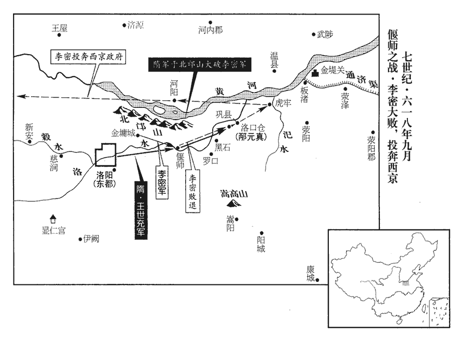
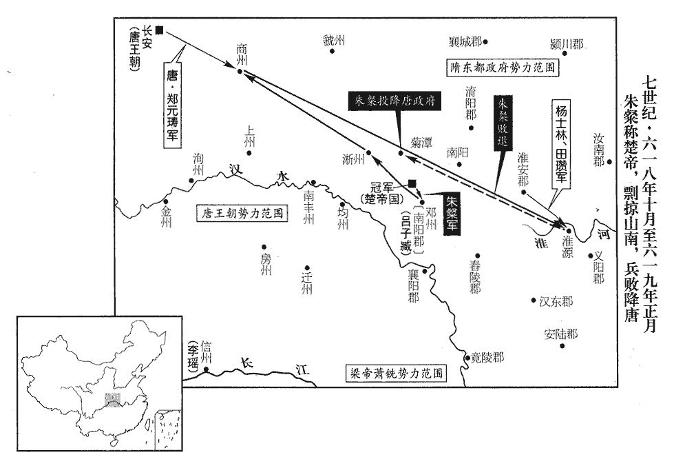
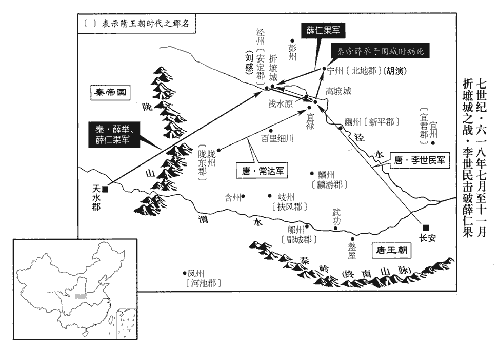
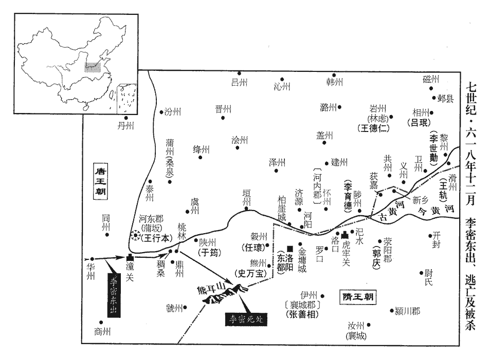
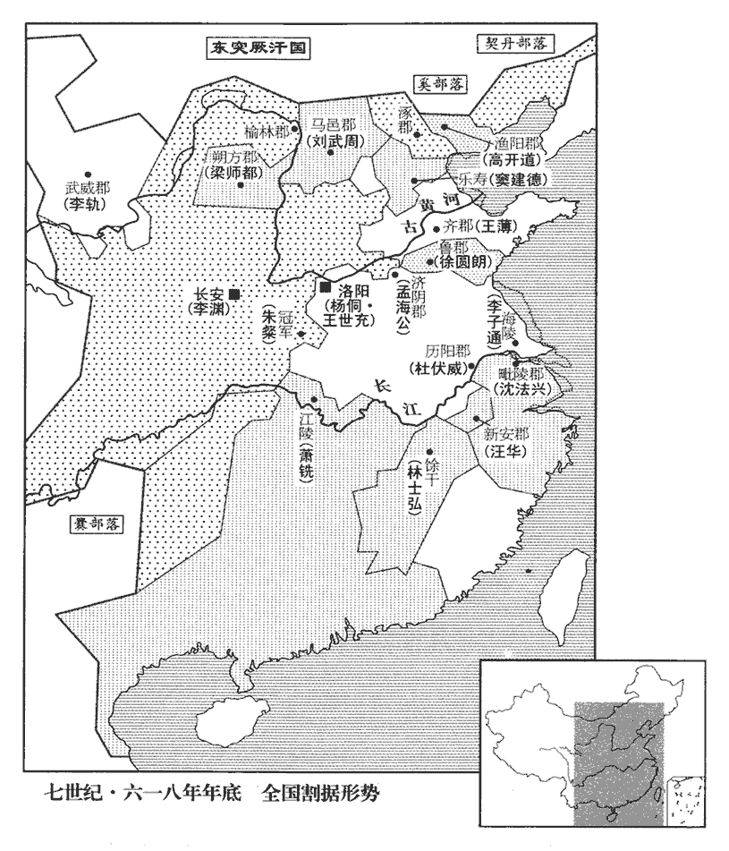

 唐紀二起著雍攝提格（戊寅）八月，盡十二月，不滿一年。

# 高祖神堯大聖光孝皇帝上之中

## 武德元年（戊寅、六一八）

1八月，薛舉遣其子仁果進圍寧州‹甘肃省宁县›，西魏置寧州於定安，置豳州於新平。隋志并定安、新平二縣皆屬北地郡。大業初，廢新平之豳州，改定安之寧州為豳州。唐初析北地之新平、三水置豳州，而以北地郡為寧州，治定安。刺史胡演擊卻之。郝瑗言於舉曰：郝，呼各翻。瑗，于眷翻。「今唐兵新破，關中騷動，宜乘勝直取長安。」舉然之，會有疾而止。辛巳‹九›，舉卒。卒，子恤翻。太子仁果立，居於折墌城，新志：涇州保定縣有折墌故城。「折」，杜佑作「析」，音思歷翻。墌zhuó，章恕翻。諡舉曰武帝。

〖译文〗 [1]八月，薛举派他的儿子薛仁果进军围攻宁州，唐宁州刺史胡演击退了薛仁果。郝瑗对薛举说：“现在唐兵刚刚战败，关中骚动不安，应当乘胜直接攻取长安。”薛举同意他的意见，恰巧生了病没有实行。辛巳（初九），薛举去世。太子薛仁果继位，居住在折城，追谥薛举为武帝。

2上‹李渊›欲與李軌‹首都武威›共圖秦、隴‹秦帝薛仁果疆域›，薛舉父子時據秦、隴。遣使潛詣涼州‹即武威郡›，復武威郡為涼州。宋白曰：涼州之地，本月氏居之，後為匈奴右地。漢武帝置涼州，兼統河、隴之地，而河西之地列置武威、酒泉、敦煌、張掖四郡。東都之季，河西諸郡以去州隔遠，自求立州，為立雍州，晉惠帝末，張軌為涼州刺史，治姑臧，為會府。後分置諸州，而武威始專涼州之名。使，疏吏翻；下同。招撫之，與之書，謂之從弟。從，才用翻。軌大喜，遣其弟懋入貢。上以懋為大將軍，命鴻臚少卿張俟德冊拜軌為涼州總管‹武威郡改涼州›，封涼王。臚，陵如翻。少，始照翻。

〖译文〗 [2]唐高祖打算和李轨共同谋取秦、陇的薛举父子，派使节秘密地到凉州，招抚李轨，致李轨的书信，称李轨为堂弟。李轨非常高兴，派遣弟弟李懋入贡于唐。高祖任命李懋为大将军，命鸿胪少卿张俟德册拜李轨为凉州总管，封为凉王。

3初，朝廷以安陽‹河南省安阳市›令呂珉為相州‹州政府设安阳›刺史，更以相州刺史王德仁為巖州‹林虑改·河南省林州市›刺史。是年五月，王德仁來降；先受朝命，德仁未能有相州也。六月，呂珉以相州來降，故正授之。新志以林慮縣置巖州，正德仁所據地。朝廷，直遙翻。相，息亮翻。德仁由是怨憤，甲申‹十二›，誘山東大使宇文明達入林慮山‹林州市西北›而殺之，誘，音酉。慮，音廬。叛歸王世充。

〖译文〗 [3]当初，朝廷任命安阳令吕珉为相州刺史，改任相州刺史王德仁为岩州刺史。王德仁因为此事愤恨不平，甲申（十二日），引诱山东大使宇文明达进林虑山并杀了他，叛唐归附了王世充。

4己丑‹十七›，以秦王世民為元帥，帥，所類翻。擊薛仁果。

〖译文〗 [4]己丑（十七日），任命秦王李世民为元帅，攻打薛仁果。

5丁酉‹二十五›，臨洮‹甘肃省临潭县›等四郡來降。後周武帝逐吐谷渾以置洮陽郡，尋置洮州；大業初，改州為臨洮郡。洮táo，土刀翻。

〖译文〗 [5]丁酉（二十五日），临洮等四郡前来降唐。

6隋江都太守陳稜求得煬帝之柩，取宇文化及所留輦輅鼓吹，粗備天子儀衛，守，式又翻。柩，音舊。吹，昌瑞翻。粗，坐五翻。改葬於江都宫西吳公臺下，今揚州城西北有雷塘，塘西有吳公臺，相傳以為陳吳明徹攻廣陵所築弩臺，以射城中。其王公以下，皆列瘞於帝塋之側。瘞，於計翻。塋，音營。

〖译文〗 [6]隋江都太守陈棱寻找到隋炀帝的灵柩，用宇文化及留下的车驾鼓吹，大体备齐了天子所用的仪仗，将炀帝改葬在江都宫西面的吴公台下。当时遇难的王公以下大臣，都依次埋葬在炀帝坟茔的两侧。

7宇文化及之發江都也，是年四月，化及發江都。以杜伏威為歷陽‹安徽省和县›太守；義寧元年春，伏威據歷陽。伏威不受，仍上表於隋皇泰主‹杨侗›，拜伏威為東道大總管，封楚王。

〖译文〗 [7]宇文化及从江都出发时，以杜伏威为历阳太守；杜伏威没有接受他的任命，仍然向隋上表称臣，皇泰主拜杜伏威为东道大总管，封楚王。

沈法興亦上表於皇泰主，自稱大司馬、錄尚書事、天門公，上，時掌翻。承制置百官，以陳杲仁為司徒，新書作「陳果仁」。孫士漢為司空，蔣元超為左僕射，殷芊為左丞，徐令言為右丞，劉子翼為選部侍郎，李百藥為府掾。百藥，德林之子也。李德林歷事齊、周、隋。選，宣絹翻。掾，于絹翻。

〖译文〗 沈法兴也向皇泰主上表，自称大司马、录尚书事、天门公，承圣旨设置百官，以陈杲仁为司徒，孙士汉为司空，蒋元超为左仆射，殷芊为左丞，徐令言为右丞，刘子翼为选部侍郎，李百药为府掾。李百药是李德林的儿子。

8九月，隋襄國‹河北省邢台市›通守陳君賓來降，拜邢州‹襄国郡改邢州›刺史。復以襄國郡為邢州。宋白曰：邢州，禹貢衡漳之地，春秋邢侯之國；邢遷于夷儀，即其地。秦兼天下，於此置信都郡，項羽改曰襄國，蓋以趙襄子諡名之也。石氏置襄國郡。隋置邢州，取古邢國為名。守，式又翻。降，戶江翻。君賓，伯山之子也。伯山，陳文帝‹陈蒨›之子。

〖译文〗 [8]九月，隋襄国通守陈君宾前来投降，官拜邢州刺史。君宾是陈伯山的儿子。

9虞州‹山西省运城市东北安邑镇›刺史韋義節義寧元年，以安邑、虞鄉、夏三縣置安邑郡，武德元年曰虞州。攻隋河東通守堯君素，久不下，軍數不利；數，所角翻。壬子‹十›，以工部尚書獨孤懷恩代之。

〖译文〗 [9]唐虞州刺史韦义节攻打隋河东通守尧君素，很久未能攻下，军队好几次陷于不利形势；壬子（初十），命工部尚书独孤怀恩替代韦义节。

10初，李密既殺翟讓，見一百八十四卷義寧元年十一月。翟，萇伯翻。頗自驕矜，不恤士眾，倉粟雖多，無府庫錢帛，戰士有功，無以為賞；又厚撫初附之人，眾心頗怨。徐世勣嘗因宴會刺譏其短；密不懌，使世勣出鎮黎陽，雖名委任，實亦疏之。此敘密致敗之由，非一時之事。

〖译文〗 [10]当初，李密杀了翟让后，很有点骄矜，不体恤广大士卒；虽然仓库里的粮食很多，但是没有钱币布帛，战士立了功，没有东西可以用来行赏；对新来归附的人又极其优待，广大士卒心里很不满。徐世曾趁宴会讽刺他的短处，李密不高兴，让徐世去镇守黎阳，名义上是委以重任，实际上是疏远他。

密開洛口倉‹河南名巩县东›散米，無防守典當者，當，主當也。當，丁浪翻。又無文券，取之者隨意多少；或離倉之後，離，力智翻。力不能致，委棄衢路，自倉城至郭門，郭，郛fú郭也。米厚數寸，厚，戶豆翻。為車馬所躪踐；躪，良刃翻。踐，慈演翻。群盜來就食者并家屬近百萬口，近，其靳翻。無甕盎，織荊筐淘米，洛水兩岸十里之間，望之皆如白沙。密喜，謂賈閏甫曰：「此可謂足食矣！」閏甫對曰：「國以民為本，民以食為天。今民所以襁負如流而至者，以所天在此故也。襁，居兩翻。而有司曾無愛吝，屑越如此，吝，惜也。屑越，猶言狼籍而棄之也。荀子曰：貨財粟米者，彼將日月棲遲薛越之中野，我今將畜積并聚之於倉廩。竊恐一旦米盡民散，明公孰與成大業哉！」密謝之，即以閏甫判司倉參軍事。

〖译文〗 李密打开洛口仓分发粮食，没有防守和主管的人，又没有凭证，取米的人随便取多少；有的人离开粮仓后，拿不动，丢散在街道上，从仓城到外城门，路上的米有几寸厚，被车马践踏；前来这儿要粮吃的各路盗贼及其家属有近百万人，没有容器，就用荆条编筐淘米，洛水两岸十里范围内，看上去象蒙上一层白沙。李密很高兴，对贾闰甫说：“这可以称得上是足食了！”贾闰甫回答：“国家的根本是老百姓，老百姓生存靠的是粮食。现在老百姓所以背着扛着像潮水一样涌来，是因为他们赖以生存的东西在这里的缘故。而有关官署却毫不爱惜，这样糟踏，我恐怕一旦没有米了百姓也就走散了，明公您又靠什么来完成大业呢？”李密感谢他的这番话，就任命闰甫为判司仓参军事。

密以東都兵數敗微弱，而將相自相屠滅，謂旦夕可平；王世充既專大權，厚賞將士，繕治器械，亦陰圖取密。時隋軍乏食，而密軍少衣，數，所角翻。將，即亮翻。治，直之翻。少，詩沼翻。世充請交易，密難之；長史邴元真等各求私利，邴，即古丙姓。長，知兩翻。勸密許之。先是，東都人歸密者，日以百數；先，悉薦翻。既得食，降者益少，密悔而止。

〖译文〗 李密因为东都的军队几次打败仗，力量微弱，而且将相之间自相残杀，认为短期内就可以平东都；王世充专擅大权之后，重赏将士，修治器械，也在暗中准备谋取李密。当时隋朝的军队缺粮，而李密的部队少衣，王世充请求相互交换，李密感到为难，长史邴元真等人各自谋求私利，劝李密答应交换。原来东都每天有几百人归顺李密，得到粮食之后，投降的人越来越少，李密后悔，停止了交换。

密破宇文化及還，還，從宣翻。其勁卒良馬多死，士卒疲病。世充欲乘其弊擊之，恐人心不壹，乃詐稱左軍衛士張永通三夢周公，令宣意於世充，當勒兵相助擊賊；乃為周公立廟，周公作洛，世充假之以作士氣。令，力丁翻；下同。為，于偽翻。每出兵，輒先祈禱。世充令巫宣言周公欲令僕射急討李密，當有大功，不即兵皆疫死。不，讀曰否。世充兵多楚人，信妖言，皆請戰。妖，於驕翻。世充簡練精銳得二萬餘人，馬二千餘匹。壬子‹十›，出師擊密，旗幡之上皆書永通字，軍容其盛。以張永通宣周公之意，故旗幡書永通字以表神助。癸丑‹十一›，至偃師‹河南省偃师县›，營於通濟渠南，作三橋於渠上。通濟渠，大業元年所開。密留王伯當守金墉，自引精兵出偃師，阻邙山‹洛阳城北›以待之。

〖译文〗 李密打败宇文化及回师，丧失了很多精兵好马，士兵也疲劳，生了病。王世充准备乘李密军队疲困进攻，又怕大家不一条心，于是谎称左军卫士张永通三次梦到周公，让他转告王世充，应该统帅军队互相协助打击敌人。于是建周公庙，每次出军作战，都先祈祷。王世充命巫者宣称周公准备命仆射迅速讨伐李密，肯定会立大功，否则士兵都会染上疾病死去。王世充的士兵很多是楚人，相信这种妖言，都请求出战。王世充挑出二万多精锐，马二千多匹。壬子（初十），出兵攻打李密，旗帜上都写上“永通”的字，军容很强大。癸丑（十一日），到偃师，驻扎在通济渠南边，在渠水上搭设了三座桥梁。李密留王伯当守卫金墉城，自己带领精兵去偃师，以邙山为屏障等候王世充的军队。

 

密召諸將會議，將，即亮翻。裴仁基曰：「世充悉眾而至，洛下必虛，可分兵守其要路，令不得東，簡精兵三萬，傍河西出以逼東都。傍，步浪翻。世充還，還，從宣翻。我且按甲；世充再出，我又逼之。如此，則我有餘力，彼勞奔命，破之必矣。」密曰：「公言大善。今東都兵有三不可當：兵仗精銳，一也；決計深入，二也；食盡求戰，三也。我但乘城固守，蓄力以待之；彼欲鬬不得，求走無路，不過十日，世充之頭可致麾下。」陳智略、樊文超、單雄信皆曰：「計世充戰卒甚少，屢經摧破，悉已喪膽。少，詩沼翻。喪，息浪翻。兵法曰，『倍則戰』，況不啻倍哉！且江、淮新附之士，望因此機展其勳效，及其鋒而用之，可以得志。」於是諸將諠然，欲戰者什七八，密惑於眾議而從之。將，即亮翻。仁基苦爭不能得，擊地歎曰：「公後必悔之。」魏徵言於長史鄭頲曰：「魏公雖驟勝，而驍將銳卒多死，長，知兩翻。頲，他鼎翻。驍，堅堯翻。將，即亮翻；下同。戰士心怠，此二者難以應敵。且世充乏食，志在死戰，難與爭鋒，未若深溝高壘以拒之，不過旬月，世充糧盡，必自退，追而擊之，蔑不勝矣。」頲曰：「此老生之常談耳。」徵曰：「此乃奇策，何謂常談！」拂衣而起。

〖译文〗 李密召集各位将领开会商议，裴仁基说：“王世充率领他的全部军队到这儿，洛阳必然空虚，我们可以分出兵力把守王世充军队要经过的要道，使他不能再向东前进，另挑选三万精兵，沿黄河向西进逼东都。王世充回军，我方就按兵不动；王世充再次出军，我方就再逼东都。这样，我方还有富余的力量，对方疲于奔命，肯定能打败他。”李密说：“您说得很好。但现在东都的军队有三个不可抵挡：武器精良，这是一；决计深入我方，这是二；粮食吃完了决战，这是三。我们只要利用城池坚守，保持力量等待，对方想交战打不成，求退兵又没退路，过不了十天，王世充的头就可以到我们手中。”陈智略、樊文超、单雄信都说：“算算王世充的士兵少得很，又好几次打了败仗，都已经吓破了胆。《兵法》说，‘己方力量是对方一倍则作战’，何况不止是一倍！况且刚刚来归附的江淮人士，正希望乘此机会一展身手建立功勋，趁他们的锐气利用他们作战，正可以成功。”于是众将领大声表示赞同，想打的占十分之七八，李密受众人的意见影响，决定照办。裴仁基苦苦争辩却不能说服众人，敲着地叹息道：“阁下以后一定会后悔今天的决定。”魏徵对长史郑说：“魏公虽然屡次打了胜仗，但是精兵骁将伤亡很多，战士心身很疲倦，有这两点很难应敌，况且王世充缺粮，志在决一死战，很难和他争战以决胜负，不如挖深壕沟，加高壁垒以拒敌，过不了十天半个月，王世充粮食吃完了，必然自己退兵，那时再追击他，没有不胜的。”郑说：“这是老生常谈了。”魏徵道：“这是奇策，怎么说是老生常谈！”拂袖而去。

程知節將內馬軍與密同營在北邙山上，單雄信將外馬軍營於偃師城北。單，慈淺翻。世充遣數百騎渡通濟渠攻雄信營，密遣裴行儼與知節助之。行儼先馳赴敵，中流矢，墜於地；騎，奇寄翻；下同。中，竹仲翻。知節救之，殺數人，世充軍披靡，披，普彼翻。乃抱行儼重騎而還；重，直龍翻。二人共騎一馬曰重騎。還，從宣翻，又如字。為世充騎所逐，刺槊洞過，知節迴身捩liè折其槊，刺，七亦翻。槊，色角翻。捩，練結翻，拗捩也。折，而設翻。兼斬追者，與行儼俱免。會日暮，各斂兵還營。密驍將孫長樂等十餘人皆被重創。驍，堅堯翻。樂，音洛。被，皮義翻。創，初良翻。

〖译文〗 程知节带领内马军同李密一起扎营在北邙山上，单雄信带领外马军驻扎在偃师城北。王世充派遣数百名骑兵渡过通济渠攻打单雄信的营寨，李密派遣裴行俨和程知节援助单雄信。裴行俨率先奔赴战场，中流箭，倒在地下；程知节救起裴行俨，杀了几个人，王世充军队所向披靡，于是程知节抱着裴行俨骑着一匹马返回，被王世充的骑兵赶上，长枪直刺过来，程知节返身折断了刺来的长枪，又杀了追赶的人，和裴行俨一起脱身。恰好天色暗了，双方各自收兵回营。李密手下的猛将孙长乐等十几人都受了重伤。

密新破宇文化及，有輕世充之心，不設壁壘。世充夜遣二百餘騎潛入北山，北山，即北邙山。伏谿谷中，命軍士皆秣馬蓐食。甲寅‹十二›旦，將戰，世充誓眾曰：「今日之戰，非直爭勝負；死生之分，在此一舉。若其捷也，富貴固所不論；若其不捷，必無一人獲免。所爭者死，非獨為國，為，于偽翻。各宜勉之！」遲明，遲，直二翻。引兵薄密。密出兵應之，未及成列，世充縱兵擊之。世充士卒皆江、淮剽勇，剽，匹妙翻。出入如飛。世充先索得一人貌類密者，縛而匿之，索，山客翻。戰方酣，使牽以過陳前，陳，讀曰陣。譟曰：「已獲李密矣！」考異曰：革命記曰：「世充先於眾中覓得一人眉目狀似李密者，陰畜之而不令出。師至偃師城下，與李密未大相接，遽令數十騎馳將所畜人頭來，云殺得李密，充佯不信，遣眾共看，咸言是密頭也。遂於城下勒兵，擲頭與城中人，城中人亦言是密頭也，遂以城降。」今從壺關錄。士卒皆呼萬歲。其伏兵發，乘高而下，馳壓密營，縱火焚其廬舍。密眾大潰，其將張童仁、陳智略皆降，壓，於甲翻。將，即亮翻。降，戶江翻；下同。密與萬餘人馳向洛口。

〖译文〗 李密刚刚打败了宇文化及，有些轻视王世充，不设防御敌人的围墙。王世充派二百多骑兵夜里秘密进入北邙山，埋伏在山谷中，命令士兵喂好马匹吃饱饭。甲寅（十二日）清晨，准备出击，王世充告诫众将士说：“今天这一仗，不仅仅是争胜负，而是生与死全在此一举。如果胜了，荣华富贵自然不在话下；如果败了，一个人也逃不了。我们争相赴死，不单是为了国家，各位要努力作战！”天亮后，带兵逼近李密。李密出兵应战，还没来得及排好队，王世充就放兵攻击。王世充的士兵都是长江、淮河流域的人，剽悍勇猛，出入迅捷。王世充事先找到一个长得很象李密的人，捆起来藏好，战斗正激烈时，让人牵着通过阵前，大喊：“已经捉住李密了！”士兵们都呼万岁。王世充埋伏的骑兵出击，从高处冲下来，驰向李密营地，放火焚烧房屋。李密部众溃散，将领张童仁、陈智略都投降了王世充，李密和一万多人逃往洛口。

世充夜圍偃師；鄭頲守偃師，其部下翻城納世充。初，世充家屬在江都，隨宇文化及至滑臺，又隨王軌入李密，密留於偃師，欲以招世充。及偃師破，世充得其兄世偉、子玄應、虔玄恕、瓊等，又獲密將佐裴仁基、鄭頲、祖君彥等數十人。世充於是整兵向洛口，得邴元真妻子、鄭虔象母及密諸將子弟，皆撫慰之，令潛呼其父兄。令，力丁翻。

〖译文〗 夜晚王世充包围偃师，郑守卫偃师，他的部下反而开城放王世充入城。当初，王世充的家属在江都，随宇文化及至滑台，又随王轨到了李密部队，李密把王世充家属留在偃师，打算用他们招降王世充。待到偃师城破，王世充寻回哥哥王世伟，儿子王玄应、王虔（玄）怒、王琼等人，又俘虏李密的将佐裴仁基、郑、祖君彦等几十人。王世充于是整顿兵马向洛口进发，得到邴元真的妻子、郑虔象的母亲以及李密众位将领的子弟，都加以安慰，让他们暗中招呼各自的父兄。

初，邴元真為縣吏，坐贓亡命，從翟讓於瓦岡；翟，萇伯翻。讓以其嘗為吏，使掌書記。及密開幕府，妙選時英，讓薦元真為長史；密不得已用之，此義寧元年春二月事。長，知兩翻。行軍謀畫，未嘗參預。密西拒世充，留元真守洛口倉。元真性貪鄙，宇文溫謂密曰：「不殺元真，必為公患。」密不應。元真知之，陰謀叛密；楊慶聞之，以告密，密固疑焉。至是，密將入洛口城，元真已遣人潛引世充矣。密知而不發，因與眾謀，待世充兵半濟洛水，然後擊之。世充軍至，密候騎不時覺，比將出戰，比，必寐翻。世充軍悉已濟矣。單雄信等又勒兵自據；密自度不能支，度，徒洛翻。帥麾下輕騎奔虎牢，元真遂以城降。降，戶江翻。

〖译文〗 当初，邴元真作县吏，犯了贪污罪逃跑在外，跟随翟让到瓦岗，翟让因为他曾经作过小官，让他掌文书。到李密开设幕府，挑选当时的出色人物时，翟让推荐邴元真为长史；李密不得已任用他为长史，但从未让他参与过军事行动的谋划。李密到西边抵抗王世充，留邴元真守洛口仓。邴元真性情贪婪浅薄，宇文温对李密说：“不杀了邴元真，必然成为您的祸患。”李密没有答应。邴元真知道了此事，阴谋反叛李密；杨庆听说后，把邴元真的阴谋报告了李密，李密才真的怀疑邴元真。到此时，李密要进入洛口城，邴元真已经秘密派人招来王世充。李密知道后没有声张，乘机和众人商量，等王世充军队一半渡过洛水，然后攻击。王世充军到洛水，李密的骑哨兵没有及时发现，临到要出击时，王世充的军队已经全部过了河。单雄信等人又领兵自保；李密自己估计不能坚持，率领部下轻装乘马逃往虎牢，于是邴元真以洛口投降了王世充。

初，雄信驍捷，善用馬槊，名冠諸軍，帥，讀曰率；下同。冠，古玩翻。軍中號曰「飛將」。將，即亮翻。彥藻以雄信輕於去就，勸密除之；彥藻，房彥藻也。是年二月彥藻死，此亦叙日前事。密愛其才，不忍也。及密失利，雄信遂以所部降世充。史敘邴元真、單雄信事，皆言李密當斷不斷，反受其亂。

〖译文〗 当初，单雄信勇猛敏捷，善长骑马和使用长枪，名声为各军首位，军中称为“飞将”。房彦藻因为单雄信对去留很轻率，劝李密除掉他；但李密爱惜单雄信的才能，不忍心。待李密失利，单雄信便率领他的部下投降了王世充。

密將如黎陽，或曰：「殺翟讓之際，徐世勣幾死，事見一百八十四卷義寧元年十一月。幾，居希翻。今失利而就之，安可保乎！」時王伯當棄金墉保河陽‹河南省孟州市›，密自虎牢歸之，引諸將共議。密欲南阻河，北守太行，東連黎陽，以圖進取。將，即亮翻。行，戶剛翻。諸將皆曰：「今兵新失利，眾心危懼，若更停留，恐叛亡不日而盡。又人情不願，難以成功。」密曰：「孤所恃者眾也，眾既不願，孤道窮矣。」欲自刎以謝眾。刎，扶粉翻。伯當抱密號絕，號，戶刀翻。眾皆悲泣，密復曰：復，扶又翻。「諸君幸不相棄，當共歸關中；密身雖無功，諸君必保富貴。」府掾柳燮曰：「明公與唐公同族，兼有疇昔之好；謂自唐公起與之連和也。掾，于絹翻。好，呼到翻。雖不陪起兵，然阻東都，斷隋歸路，斷，丁管翻。使唐公不戰而據長安，此亦公之功也。」眾咸曰：「然。」密又謂王伯當曰：「將軍室家重大，豈復與孤俱行哉！」伯當曰：「昔蕭何盡帥子弟以從漢王，漢王與項羽相距，蕭何悉遣子弟詣軍，天下既定，論功行封。上曰：「何舉宗數十人隨我。」復，扶又翻；下同。伯當恨不兄弟俱從，從，才用翻。豈以公今日失利遂輕去就乎！縱身分原野，亦所甘心！」左右莫不感激，從密入關者凡二【張：「二」作「三」。】萬人。於是密之將帥、州縣多降於隋。朱粲亦遣使降隋，將，即亮翻。帥，所類翻。降，戶江翻。使，疏吏翻。皇泰主以粲為楚王。

〖译文〗 李密将要去黎阳，有人说：“杀翟让的时候，徐世差点死了，现在失利了去投奔他，怎么能保险呢！”当时王伯当丢弃了金墉城保守河阳，李密从虎牢回到河阳，召诸将共同商议。李密想南面凭仗黄河，北面守住太行，东面连结黎阳，以此设法进取。众将都说：“现在军队刚失利，大家心中胆怯，如果再停留，恐怕要不了几天人就叛逃光了。而且人情不愿，也难以成功。”李密说：“孤所依靠的就是大家，大家既然不愿意，孤没路可走了。”打算自刎以谢众人。王伯当抱住李密哭得昏了过去，大家也都伤心落泪，李密又说：“有幸诸位没有抛弃我，应当一起回到关中；密自己虽然没有功劳，诸位必定保有富贵。”府掾柳燮说：“明公和唐公是同一宗族，又加上有过去联合的友谊；虽然没有随唐公一同起兵，但阻隔东都，切断了隋军的归路，使唐公不战而占领了长安，这也是您的功劳。”众人都说：“的确如此。”李密又对王伯当说：“将军您的家庭重要，怎么可以又和孤一同走呢？”王伯当说：“过去萧何率领所有的子弟跟随汉王，伯当遗憾的是兄弟们不能都跟着您，怎么能因为您今天失利就不看重去留了呢？纵然是粉身碎骨葬身原野，也心甘情愿跟随您！”周围的人无不深受感动。跟随李密入关的有二万人。于是李密原有的将帅、州县大多归顺了隋。朱粲也派使节投降了隋，皇泰主以朱粲为楚王。

11甲寅‹十二›，秦州總管‹总部设甘肃省天水市›竇軌擊薛仁果，不利；驃騎將軍劉感鎮涇州‹甘肃省泾川县›，宋白曰：魏黃初中，分隴右為秦州，因秦初封也，與州同理冀城，冀城改為隴城縣。時復以隴西郡為秦州，安定郡為涇州。驃，匹妙翻。騎，奇寄翻。仁果圍之。城中糧盡，感殺所乘馬以分將士；感一無所噉，唯煮馬骨取汁和木屑食之。城垂陷者數矣；數，所角翻。會長平王叔良將士至涇州，「士」，當作「兵」。仁果乃揚言食盡，引兵南去；乙卯‹十三›，又遣高墌人偽以城降。墌zhuó，章恕翻。考異曰：實錄云：「乙卯，宇文欣攻高墌城，下之。」今從劉感傳。叔良遣感帥眾赴之；帥，讀曰率；下同。己未‹十七›，至城下，扣【章：十二行本「扣」下有「門」字；乙十一行本同；孔本同；張校同；退齋校同，云「城」字屬下句。】城中人曰：「賊已去，可踰城入。」感命燒其門，城上下水灌之。感知其詐，遣步兵先還，自帥精兵為殿。帥，讀曰率。殿，丁練翻。俄而城上舉三烽，仁果兵自南原大下，戰於百里細川‹甘肃省灵台县达溪河支流›，唐軍大敗，感為仁果所擒。仁果復圍涇州，令感語城中云：語，牛倨翻。「援軍已敗，不如早降。」降，戶江翻。感許之，至城下，大呼曰：呼，火故翻。「逆賊飢餒，亡在旦夕，秦王帥數十萬眾，四面俱集，城中勿憂，勉之！」仁果怒，執感，於城旁埋之至膝，馳騎射之；至死，帥，讀曰率。騎，奇寄翻。射，而亦翻。聲色逾厲。叔良嬰城固守，僅能自全。感，豐生之孫也。劉豐生，高齊將，死於潁川。

〖译文〗 [11]甲寅（十二日），唐秦州总管窦轨进攻薛仁果，不利；骠骑将军刘感镇守泾州，薛仁果包围了泾州。泾州城中粮食吃光了，刘感把自己骑的马杀了分给将士们，自己没有吃一点肉，只用煮马骨的汤拌了木屑吃。城池几次濒临陷落；恰好长平王李叔良带兵至泾州，薛仁果于是扬言粮食吃完了，带兵向南而去。乙卯（十三日），薛仁果又派高人假装以城池降唐。李叔良派遣刘感率部下赴高；己未（十七日），到高城下，敲城门，城里的人说：“贼已经走了，可以翻城墙进城。”刘感下令烧高城门，城上人倒水浇下来，刘感知道城里人是诈降，让步兵先回师，自己带领精兵走在最后。一会儿，城上点燃三座烽火，薛仁果的军队从南原大批涌下来，与刘感军在百里细川交战，唐军大败，刘感被薛仁果抓获。薛仁果又包围了泾州，命令刘感向城中喊话说：“援军已经被打败了，不如尽快投降。”刘感答应了，到城下却大声喊道：“反贼没粮食挨饿，很快就要灭亡了，秦王率领几十万军队从四面赶来，城里的人不要担心，努力守城！”薛仁果很恼火，捉住刘感，在城旁把刘感活埋到膝盖，骑马跑着用箭射刘感；一直到死，刘感声音愈来愈高、态度愈来愈愤怒。李叔良环城坚守，仅能保全自己，无力救刘感。刘感是刘丰生的孙子。

12庚申‹十八›，隴州‹陇西省陇县›刺史陝‹河南省三门峡市›人常達隋志：扶風汧源縣，西魏之東秦州也，後改為隴州；大業三年，廢州，併入扶風郡。義寧二年，析扶風郡之汧源、汧陽、南由，安定郡之華亭，置隴東郡。唐受禪，改為隴州。陝，失冉翻。擊薛仁果於宜祿川‹陕西省长武县›，宜祿川，在豳、涇二州間，貞觀二年，析豳之新平及涇之保定、靈臺，置宜祿縣。斬首千餘級。

〖译文〗 [12]庚申（十八日），唐陇州刺史陕人常达在宜禄川攻击薛仁果，杀了一千多人。

13上遣從子襄武公琛，從，才用翻。琛，丑林翻。太常卿鄭元璹shú璹，殊玉翻。以女妓遺始【章：十二行本「始」上有「突厥」二字；乙十一行本同；孔本同；張校同；退齋校同。】畢可汗。妓，渠綺翻。遺，于季翻。可，從刊入聲。汗，音寒。壬戌‹二十›，始畢復遣骨咄祿特勒來。上受禪之後，骨咄祿嘗來使。復，扶又翻。咄，當沒翻。

〖译文〗 [13]唐高祖派侄子襄武公李琛、太常卿郑元把女妓送给突厥始毕可汗。壬戌（二十日），始毕又派遣骨咄禄特勒来唐。

14癸亥‹二十一›，白馬‹河南省滑县›道士傅仁均白馬縣帶滑州。造戊寅曆成，唐受禪建國，歲在戊寅，故以名曆。奏上，行之。上，時掌翻。

〖译文〗 [14]癸亥（二十一日），白马县的道士傅仁均编成了《戊寅历》，上奏章进呈，唐从此实行《戊寅历》。

15薛仁果屢攻常達，不能克，乃遣其將仵士政以數百人詐降，仵，姓也。姓苑：仵姓，望出襄陽。急就章有仵終古。將，即亮翻。仵wǔ，音疑古翻。降，戶江翻；下同。達厚撫之。乙丑‹二十三›，士政伺隙以其徒劫達，擁城中二千人降於仁果。伺，相吏翻。考異曰：新、舊唐書皆云：「薛舉遣仵士政偽降達，士政劫達以見舉。」據實錄，薛舉前已死，此月達再擊仁果及士政劫達，皆有日月。今從實錄。達見仁果，詞色不屈，仁果壯而釋之。奴賊帥張貴謂達曰：「汝識我乎？」帥，所類翻。達曰：「汝逃死奴賊耳！」貴怒，欲殺之；人救之，得免。

〖译文〗 [15]薛仁果屡次攻常达，都未能取胜，于是派他的将领仵士政带几百人诈降，常达待仵士政很优厚。乙丑（二十三日），仵士政伺机带他的部下劫持了常达，带着城里的二千人投降了薛仁果。常达见了薛仁果，言辞表情毫不屈服，薛仁果因为他的豪壮放了他。奴仆出身的贼帅张贵对常达说：“你认识我吗？”常达说：“你不就是该死而逃跑的奴贼吗？”张贵很气恼，要杀了常达；有人相救，常达才免于一死。

16辛未‹二十九›，追諡隋太上皇‹杨广›為煬帝。諡，神至翻。

〖译文〗 [16]辛未（二十七日），唐追谥隋太上皇为炀帝。

17宇文化及至魏縣‹河北省大名县西南›，張愷等謀去之；事覺，化及殺之。腹心稍盡，兵勢日蹙，兄弟更無他計，但相聚酣宴，奏女樂。化及醉，尤智及曰：酣，戶甘翻。尤，責過也。「我初不知，由汝為計，強來立我。智及創謀弒逆，故尤之。強，其兩翻。今所向無成，士馬日散，負弒君之名，天下所不容。今者滅族，豈不由汝乎！」持其兩子而泣。智及怒曰：「事捷之日，初不賜尤，及其將敗，乃欲歸罪，何不殺我以降竇建德！」數相鬬䦧，降，戶江翻。數，所角翻。䦧，許激翻，恨也，戾也。言無長幼；醒而復飲，以此為恆。恆，常也。長，知兩翻。復，扶又翻。恆，戶登翻。其眾多亡，化及自知必敗，嘆曰：「人生固當死，豈不一日為帝乎！」於是鴆殺秦王浩‹杨浩›，即皇帝位於魏縣，國號許，宇文化及襲封許公，因以為國號。改元天壽，署置百官。

〖译文〗 [17]宇文化及到魏县，张恺等人商议要离开他；事情被查觉，宇文化及杀了张恺等人。心腹之人逐渐丧失殆尽，兵力日益削弱，兄弟们更没有什么计谋，只有相互聚会在一起尽情吃喝，玩歌伎。宇文化及喝醉了，抱怨智及道：“当初我什么也不知道，是你的主意，一定要推我为首。如今一事无成，人马日益减少，背着弑君的罪名，为天下所不容，现在遭灭族，还不是因为你！”搂着两个儿子哭起来。智及生气地说：“当初事情成功的时候，你不怪我，到了要失败时，又想归罪于我，怎么不杀了我投降窦建德！”好几次相互争吵打了起来，说话也不分老小，酒醒后又饮酒，以此为常事。宇文化及的部下大多逃跑了，化及自己知道肯定要失败，叹息道：“人生自然是要死的，怎能不当一天皇帝呢？”于是用鸩酒毒死了秦王杨浩，在魏县即皇帝位，国号许，改年号天寿，设置百官。

18冬，十月，壬申朔‹一›，日有食之。

〖译文〗 [18]冬季，十月，壬申朔（初一），出现日食。

19戊寅‹七›，宴突厥骨咄祿，引骨咄祿升御坐以寵之。史言突厥驕倨，唐祖欲以結其心，適以滋其慢。厥，九勿翻。咄，當沒翻。坐，徂臥翻。

〖译文〗 [19]戊寅（初七），唐高祖宴请突厥骨咄禄，领骨咄禄登上皇帝的宝座表示恩宠。

20李密將至，上遣使迎勞，相望於道。使，疏吏翻；下同。勞，力到翻。密大喜，謂其徒曰：「我擁眾百萬，一朝解甲歸唐，山東連城數百，知我在此，遣使招之，亦當盡至；比於竇融，功亦不細，竇融以河西歸漢光武，李密自謂過之。豈不以一台司見處乎！」處，昌呂翻。己卯‹八›，至長安，有司供待稍薄，所部兵累日不得食，眾心頗怨。既而以密為光祿卿、上柱國，賜爵邢國公。密既不滿望，朝臣又多輕之，朝，直遙翻。執政者或來求賄，意甚不平；為李密復叛去張本。獨上親禮之，常呼為弟，以舅子獨孤氏妻之。妻，七細翻。

〖译文〗 [20]李密就要到长安了，高祖接连不断地派人前去迎接慰问。李密非常高兴，对他的部下说：“我拥有百万兵力，一朝脱去战袍归顺唐，崤山以东几百座城镇，知道我在这里，派人去招降，也会全部来归顺的；比起窦融，功劳也不小，还能不给我安排一个要职吗？”己卯（初八），李密到长安，负责部门对他们的供应颇差，李密部下的士兵接连几天没饭吃，众人心里颇生怨气。不久唐以李密为光禄卿、上柱国，赐他邢国公的爵位。李密没能满足原来的期望，大臣们大多又轻视他，有些掌权的人向李密索取贿赂，李密内心很不满意；唯有高祖对待他很好，经常称他为弟，将舅舅的女儿独孤氏嫁给他。

21庚辰‹九›，詔右翊衛大將軍淮安王神通為山東道安撫大使，山東諸軍並受節度；以黃門侍郎崔民幹為副。崔民幹，山東望族，故使副神通以招撫諸郡縣。使，疏吏翻。

〖译文〗 [21]庚辰（初九），唐高祖下诏任命右翊卫大将军淮安王李神通为山东道安抚大使，山东各路兵马都接受他的指挥；以黄门侍郎崔民为副使。

 

22鄧州‹河南省邓州市›刺史呂子臧與撫慰使馬元規擊朱粲，破之。子臧言於元規曰：「粲新敗，上下危懼，請併力擊之，一舉可滅。若復遷延，復，扶又翻；下同。其徒稍集，力強食盡，致死於我，為患方深。」元規不從。子臧請獨以所部兵擊之，元規不許。既而粲收集餘眾，兵復大振，自稱楚帝於冠軍，復，扶又翻，又音如字。冠，古玩翻。改元昌達，進攻鄧州。子臧撫膺膺，胸也。謂元規曰：「老夫今坐公死矣！」粲圍南陽，南陽即鄧州。會霖雨城壞，所親勸子臧降。子臧曰：「安有天子方伯降賊者乎！」帥麾下赴敵而死。降，戶江翻。帥，讀曰率。俄而城陷，元規亦死。是年二月遣馬元規，今死。

〖译文〗 [22]邓州刺史吕子臧和抚慰使马元规攻打朱粲，打败了他。吕子臧向马元规建议：“朱粲刚打了败仗，上上下下都胆怯，我请求和您会兵进攻他，可以一下子消灭他。如果再拖延下去，朱粲的部队逐渐收拢，力量增加而粮食吃光，会跟我们拼死，那将成为大患。”马元规没有听从他的意见。吕子臧又要求由他自己的部队去攻打朱粲，马元规也没有答应。不久，朱粲收聚他的余部，重振军势，在冠军自称楚帝，改年号昌达，进攻邓州。吕子臧捶着胸对马元规说：“因为您，今天要了老夫的命了！”朱粲围攻南阳，恰逢连绵大雨冲毁了城墙，亲信劝吕子臧投降，吕子臧说：“哪有天子的一方大臣向强盗投降的？”率领部下冲向敌人，战死。一会儿城池陷落，马元规也死了。

23癸未‹十二›，王世充收李密美人珍寶及將卒十餘萬人還東都，陳於闕下。將，即亮翻。乙酉‹十四›，皇泰主‹杨侗›大赦。丙戌‹十五›，以世充為太尉、尚書令、內外諸軍事，「內外諸軍事」之上當有「總督」二字。【章：十二行本正有「總督」二字；乙十一行本同；孔本同；張校同；退齋校同。】仍使之開太尉府，備置官屬，妙選人物。史言王世充篡形已成。世充以裴仁基父子驍勇，深禮之。驍，堅堯翻。徐文遠復入東都，見世充，必先拜。或問曰：「君倨見李密見上七月。而敬王公，何也？」文遠曰：「魏公，君子也，能容賢士；王公，小人也，能殺故人，吾何敢不拜！」

〖译文〗 [23]癸未（十二日），王世充收罗了李密的美女珍宝以及部下十几万人回到东都，排列在皇宫门前的阙楼之下。乙酉（十四日），皇泰主对他们实行大赦。丙戌（十五日），以王世充为太尉、尚书令、内外诸军事，又让他建太尉府，设置官属，选拔优秀人物。王世充因为裴仁基父子骁勇，很尊重他们。徐文远又回到东都，见王世充，必定先行礼。有人问他：“您见李密很傲慢，却很敬重王公，是什么原因？”徐文远说：“魏公李密是君子，能够容纳贤士；王公是小人，老熟人也能杀，我怎么敢不行礼？”

24李密總管李育德以武陟‹河南省武陟县›來降，隋志：河內郡修武縣，開皇十六年析置武陟郡。劉昫曰：武陟，漢懷縣地，故城在今縣西。降，戶江翻；下同。考異曰：舊唐書高季輔傳云，「與李厚德來降。」按以武陟來降者乃育德，非厚德也。拜陟州‹武陟县改陟州›刺史。新、舊志皆云：武德二年，李厚德以脩武縣東北濁鹿城歸順，因置陟州。通鑑二年書厚德逐王世充殷州刺史，以獲嘉來降，以厚德刺殷州。二志皆云四年置殷州。差殊如此，當考。育德，諤之孫也。李諤見一百七十六卷陳長城公至德三年。其餘將佐劉德威、賈閏甫、高季輔等，或以城邑，或帥眾，相繼來降。將，即亮翻。帥，讀曰率。

〖译文〗 [24]李密的总管李育德以武陟来降唐，拜陟州刺史。李育德是李谔的孙子。李密手下其他的将领刘德威、贾闰甫、高季辅等人，或者以城镇，或者率领部下，相继前来降唐。

初，北海‹山东省青州市›賊帥綦qí公順大業初，以青州為北海郡。綦，姓也。帥，所類翻。綦，音其。帥其徒三萬攻郡城，已克其外郭，進攻子城；城中食盡，公順自謂克在旦夕，不為備。明經劉蘭成糾合城中驍健百餘人襲擊之，劉蘭成蓋嘗應明經科，因稱之。新唐志曰：唐制取士之科，多因隋舊，則明經科起於隋也。帥，讀曰率。驍，堅堯翻；下同。城中見兵繼之，見，賢遍翻。公順大敗，棄營走，郡城獲全。於是郡官及望族分城中民為六軍，各將之，蘭成亦將一軍。將，即亮翻。有宋書佐者，離間諸軍曰：煬帝改郡諸曹參軍為書佐。間，古莧翻。「蘭成得眾心，必為諸人不利，不如殺之。」眾不忍殺，但奪其兵以授宋書佐。蘭成恐終及禍，亡奔公順；公順軍中喜譟，欲奉以為主，固辭，乃以為長史，軍事咸聽焉。居五十餘日，蘭成簡軍中驍健者百五十人，往抄北海。抄，楚交翻；下同。距城四十里，留十人，使多芟草，分為百餘積；芟，所銜翻。二十里，又留二十人，各執大旗；五六里，又留三十人，伏險要；蘭成自將十人，夜，距城一里許潛伏；餘八十人分置便處，約聞鼓聲即抄取人畜亟去，抄，楚交翻。亟，紀力翻。仍一時焚積草。明晨，城中遠望無煙塵，皆出樵牧。日向中，蘭成以十人直抵城門，城上鉦鼓亂發；伏兵四出，抄掠雜畜十【章：十二行本「十」作「千」；乙十一行本同；孔本同。】餘頭及樵牧者而去。畜，許又翻。蘭成度抄者已遠，徐步而還。度，徒洛翻。還，音旋，又如字。城中雖出兵，恐有伏兵，不敢急追；又見前有旌旗、煙火，遂不敢進而還。既而城中知蘭成前者眾少，悔不窮追。少，詩沼翻；下同。居月餘，蘭成謀取郡城，更以二十人直抵城門。城中人競出逐之，行未十里，公順將大兵總至。將，即亮翻；下自將、主將同。郡兵奔馳還城，公順進兵圍之；蘭成一言招諭，城中人爭出降。降，戶江翻。蘭成撫存老幼，禮遇郡官，見宋書佐，亦禮之如舊，仍資送出境，內外安堵。

〖译文〗 当初，北海地方的贼帅綦公顺率领他的三万人进攻郡城，已经攻陷郡城的外郭，进而攻击子城；城中粮食吃光了，綦公顺自认为很快就能攻陷，不设防备。中过明经科的刘兰成集合了一百多位城里的骁健袭击綦公顺，城中现有的士兵跟上他们一同进攻，公顺大败，放弃了营地逃走，郡城得以保全。于是，郡里的长官及大族把城里的百姓分为六个军，各自分别统领，刘兰成领一军。有一位宋书佐，离间各军，说道：“兰成得人心，必然不利于各位，不如杀了他。”大家不忍杀刘兰成，只夺了他的兵改交宋书佐统领。刘兰成恐怕最终逃不脱祸事，逃跑投奔了綦公顺；綦公顺的部队高兴地喧哗，想拥载他为首领，刘兰成坚决推辞，于是以他为长史，军队事情都听从刘兰成的。过了五十多天，刘兰成从军队中挑选了一百五十人，去北海抢掠。离城四十里，留下十人，命他们多割草，分成一百多堆；离城二十里，又留下二十人，让他们分别扛着大旗；离城五六里，又留下三十人，埋伏在险要之处；刘兰成自己带领十个人，半夜悄悄地埋伏在离城一里多的地方；其余八十人分别安置在方便的地方，约定听到鼓声立即抢夺人畜，然后马上离开，并同时点燃草堆。第二天清晨，城中看远处没有显示战斗的烟火尘土，都出城砍柴放牧。接近中午，刘兰成带十人一直抵达城门，城上钲鼓乱敲，刘兰成的伏兵四处出击，抢夺了各种牲畜一千多头，以及砍柴放牧的人然后撤走。刘兰成估计抄掠的人已经走远，慢慢地走了回去。城里虽然出兵，但是怕有伏兵，不敢急追；又看到前方有旌旗、烟火，于是不敢前进，退了回去。不久城里知道上次刘兰成带的人很少，后悔没有追下去。过了一个多月，刘兰成又谋划攻取北海郡城，改为带二十人直接抵达城门。城中的人争相出城追逐，走了没有十里，綦公顺率领大军忽然出现。郡里的军队奔驰回城，綦公顺进军包围了郡城；刘兰成晓谕城里人，说一句话，城里的人就争相出城投降。刘兰成安抚老人儿童，对郡里的官员很尊重，见到宋书佐，还象过去一样有礼貌，于是给他钱，送他离境，城内外没有受骚扰。

時海陵‹江苏省泰州市›賊帥臧君相隋志：海陵縣屬江都郡。帥，所類翻。相，息亮翻。聞公順據北海，帥其眾五萬來爭之；帥，讀曰率。公順眾少，聞之大懼。蘭成為公順畫策曰：為，于偽翻。「君相今去此尚遠，必不為備，請將軍倍道襲擊其營。」公順從之，自將驍勇五千人，齎熟食，倍道襲之。驍，堅堯翻。將至，蘭成與敢死士二十人前行，距君相營五十里，見其抄者負擔向營，擔，丁濫翻。蘭成亦與其徒負擔蔬米、燒器，擔，亦負也，都甘翻。燒器，鍋釜之屬。詐為抄者，擇空而行聽察，得其號號，戶告翻，軍號也。及主將姓名；至暮，與賊比肩而入，負擔巡營，知其虛實，得其更號。更號，持更之號。更，工衡翻。乃於空地燃火營食，至三鼓，忽於主將幕前交刀亂下，殺百餘人，賊眾驚擾；公順兵亦至，急攻之，君相僅以身免，考異曰：舊書作「劉蘭」，云：「頗涉經史，善言成敗。然性多兇狡，見隋末將亂，交通不逞，于時北海完富，蘭利其子女玉帛，與群盜相應，破其鄉城邑。武德中，淮安王神通為山東道安撫大使，蘭率宗黨歸之。」革命記序其事頗詳。今從之。俘斬數千，收其資糧甲仗以還。還，從宣翻。由是公順黨眾大盛。及李密據洛口，公順以眾附之，密敗，亦來降。降，戶江翻。

〖译文〗 当时海陵帅臧君相听说綦公顺占领了北海，率领他的五万人前来争夺郡城；綦公顺的人少，闻讯非常恐慌。刘兰成为公顺出谋划策：“君相现在离这里还远，肯定不加防备，请将军您急速行军袭击他的军营。”綦公顺听从了他的建议，亲自带领五千骁用，携带干粮，急速行军进攻臧君相。快要到时，刘兰成和二十名敢死兵士先行，距离臧君相营地五十里，见到君相手下出外掠夺的人肩挑背扛地向营地走去，刘兰成和他的手下也背着蔬菜粮食、炊具冒充抢夺的人，乘机进行侦察，了解了对方的军号以及主将的姓名。傍晚，与对方并肩进入营地，背着东西走遍了营地，了解到敌营的虚实以及夜里值更守卫的暗号。于是在空地点火作饭，至三更时，忽然在主将帐幕前一起拔刀乱砍，杀一百多人，对方受惊扰，綦公顺的部队也到达，急攻敌军，臧君相只身逃脱。綦公顺等俘虏并杀死了几千人，缴获臧君相的物资粮食和武器后回师，綦公顺的人马因此大大地强盛起来。当李密占据洛口，綦公顺带部下归附了李密；李密失败后，也来投降了唐。

25隋末群盜起，冠軍司兵李襲譽按新書李襲譽傳：仕隋為冠軍府司兵。考之隋志，冠軍、輔國將軍，從六品耳。其府司兵，當在流外小官也。冠，古玩翻。說西京留守陰世師，守，式又翻。遣兵據永豐倉‹陕西省潼关县北›，發粟以賑貧乏，出庫物賞戰士，移檄郡縣，同心討賊。世師不能用，說，輸芮翻。乃求募兵山南‹秦岭以南›，世師許之。上克長安，自漢中召還，為太府少卿；隋避諱，以漢中為漢川郡，唐復曰漢中，仍改郡曰梁州。梁、洋等州皆在長安南山之南。少，始照翻。乙未‹二十四›，附襲譽籍於宗正。李襲譽之先，亦出於隴西，故附之屬籍以親之。宗正寺，掌天子族親屬籍，以別昭穆。襲譽，襲志之弟也。李襲志時事蕭銑。

〖译文〗 [25]隋末，各路豪强纷纷起兵，冠军司兵李袭誉劝说西京留守阴世师派兵占据永丰仓，发放粮食救济贫穷的人，拿出库房里的物品赏给战士，通告郡县，同心讨贼。阴世师没有采用他的建议。于是李袭誉请求去山南召募士兵，阴世师答应了他。唐高祖攻陷长安，从汉中召李袭誉回长安，任命他为太府少卿；乙未（二十四日），在宗正寺把李袭誉编入天子宗族的名册。李袭誉是李袭志的弟弟。

26丙申‹二十五›，朱粲寇淅州‹河南省西峡县›，舊志：鄧州內鄉縣，漢淅縣地，後周改為中鄉，隋改為內鄉，武德二年置淅州。又按隋志，淅陽郡，西魏置淅州，治南鄉縣。朱粲所寇，蓋南鄉之淅州。淅，音析。遣太常卿鄭元璹shú帥步騎一萬擊之。璹，殊玉翻。帥，讀曰率。騎，奇寄翻。

〖译文〗 [26]丙申（二十五日），朱粲侵犯淅州，唐派太常卿郑元率领一万步兵、骑兵攻打朱粲。

27是月，納言竇抗罷為左武候大將軍。

〖译文〗 [27]这个月，唐纳言窦抗降为左武候大将军。

28十一月，乙巳‹四›，涼王李軌即皇帝位，改元安樂。樂，音洛。考異曰：按軌傳云，軌稱涼王，即改元安樂。今據實錄。

〖译文〗 [28]十一月，乙巳（初四），凉王李轨登皇帝位，改年号安乐。

29戊申‹七›，王軌以滑州‹总部设河南省滑县›來降。李密既敗，王軌來降。降，戶江翻；下同。

〖译文〗 [29]戊申（初七），王轨以滑州前来降唐。

 

30薛仁果之為太子也，去年秋七月，薛舉稱帝，仁果為太子。與諸將多有隙；及即位，眾心猜懼。郝瑗哭舉得疾，遂不起，由是國勢浸弱。秦王世民至高墌，仁果使宗羅睺將兵拒之；羅睺數挑戰，將，即亮翻。郝，呼各翻。瑗，于眷翻。墌，章恕翻。數，所角翻。挑，徒了翻。世民堅壁不出。諸將咸請戰，世民曰：「我軍新敗，士氣沮喪，謂是年七月淺水原之敗也。沮，在呂翻。喪，息浪翻。賊恃勝而驕，有輕我心，宜閉壘以待之。彼驕我奮，可一戰而克也。」乃令軍中曰：「敢言戰者斬！」相持六十餘日，仁果糧盡，其將梁胡郎等帥所部來降。將，即亮翻；下同。帥，讀曰率；下同。世民知仁果將士離心，命行軍總管梁實營於淺水原‹陕西省长武县北›以誘之。誘，音酉。羅睺大喜，盡銳攻之，梁實守險不出；營中無水，人馬不飲者數日。羅睺攻之甚急；世民度賊已疲，度，徒洛翻。謂諸將曰：「可以戰矣！」遲明，遲，直利翻。使右武候大將軍龐玉陳於淺水原。陳，讀曰陣；下同。羅睺併兵擊之，玉戰，幾不能支，幾，居依翻。世民引大軍自原北出其不意，羅睺引兵還戰。世民帥驍騎數十先陷陳，唐兵表裏奮擊，呼聲動地，帥，讀曰率。驍，堅堯翻。騎，奇寄翻；下同。陳，讀曰陣。呼，火故翻。羅睺士卒大潰，斬首數千級。世民帥二千餘騎追之，騎，奇寄翻。竇軌叩馬苦諫曰：「仁果猶據堅城，雖破羅睺，未可輕進，請且按兵以觀之。」睺，音侯。世民曰：「吾慮之久矣，破竹之勢，不可失也，杜預曰：兵威已振，譬如破竹，數節之後，迎刃而解。舅勿復言！」世民竇氏之出，呼軌為舅。復，扶又翻。遂進。仁果陳於城下，世民據涇水臨之‹泾水流经浅水原北›，仁果驍將渾幹等數人臨陳來降。驍，堅堯翻。將，即亮翻。渾，戶昆翻。姓苑記其所出者多，左傳鄭有大夫渾罕，衛有渾良夫，唐渾瑊jiān祖渾邪王。吐谷渾後為渾，其音戶本翻；以為出於渾沌氏者，謬也。註又見後。降，戶江翻。仁果懼，引兵入城拒守。日向暮，大軍繼至，遂圍之。夜半，守城者爭自投下。仁果計窮，己酉‹八›，出降；得其精兵萬餘人，男女五萬口。

〖译文〗 [30]薛仁果作太子时，和大多数的将领有矛盾；他当皇帝后，众人心里疑忌不安。薛举去世，郝瑗伤心过度得了病，于是不治而死，王国的势力也从此逐渐衰落。秦王李世民到高，薛仁果派宗罗领兵抵御；宗罗几次挑战，李世民坚守营垒不出战。诸位将领都请战，世民说：“我军才打了败仗，士气沮丧，对方仗着得胜而骄傲，有轻视我们的意思，我们应当紧闭营门耐心等待。他们骄傲我们奋勇，可以一仗打败他们。”于是命令全军：“有敢请战的，斩首！”双方相持六十多天，薛仁果的军队粮食吃完了，将领粱胡郎等人率领各自的队伍前来投降。李世民了解到薛仁果手下的将领士卒有离异之心，命令行军总管梁实在浅水原扎营引诱薛仁果部下。宗罗知道后非常高兴，出动全部精锐攻梁实，梁实守住险要不出战。营地中没有水源，好几天人马没有水喝。宗罗的攻击很猛烈；李世民估计对方已经疲劳，对诸位将领说：“可以打了！”快到天亮，李世民让右武候大将军庞玉在浅水原列阵。宗罗合兵攻庞玉，庞玉作战，几乎不能坚持了，李世民带领大军出其不意从浅水原北方出现，宗罗带军迎战。世民率领几十名骁骑率先冲入敌阵，唐军内外奋力搏斗，呼声动地，宗罗的部队大败，唐军杀了几千人。世民率领二千多骑兵追击宗罗，窦轨拉住马苦苦地劝道：“薛仁果还占据着坚固的城池，我们虽然打败了宗罗，但不能轻易冒进，我请求暂且按兵不动，观察一下薛仁果的动静。”李世民说：“我考虑这个问题很久了，现在我军取胜势如破竹，机不可失，舅舅不要再说了！”于是进军。薛仁果在城下列阵，李世民依泾河面对薛仁果营地，薛仁果手下的骁将浑等人到唐军阵前投降。薛仁果怕了，带兵进城拒守。天快黑时，唐大军相继到达，于是包围了城池。半夜，守城的人纷纷下城投降。薛仁果无计可施，己酉（初八），出城投降；唐得薛仁果的一万多名精兵，五万名男女。

諸將皆賀，因問曰：「大王一戰而勝，遽捨步兵，又無攻具，輕騎直造城下，造，七到翻。眾皆以為不克，而卒取之，何也？」卒，子恤翻。世民曰：「羅睺所將皆隴外之人，將驍卒悍；將，即亮翻，又音如字，領也。悍，戶罕翻，又侯旰翻。吾特出其不意而破之，斬獲不多。若緩之，則皆入城，仁果撫而用之，未易克也；易，以豉翻。急之，則散歸隴外，折墌虛弱，仁果破膽，不暇為謀，此吾所以克也。」「折」，當作「析」。音思歷翻。墌，章恕翻。眾皆悅服。世民所得降卒，悉使仁果兄弟及宗羅睺、翟長孫等將之，翟，萇伯翻。長，知兩翻。與之射獵，無所疑間。間，古莧翻。賊畏威銜恩，皆願效死。世民聞褚亮名，求訪，獲之，禮遇甚厚，引為王府文學。自隋時親王府有文學。

〖译文〗 诸位将领都来祝贺，顺便问：“大王一仗就取得了胜利，骤然舍弃步兵，又没有攻城的用具，轻骑直到城下，众人都认为无法攻克城池，却很快就取胜，是什么原因呢？”李世民说：“宗罗的部下都是陇山之西的人，将领骁勇，士卒剽悍；我只是出其不意打败了他，杀伤不多。如果迟迟不追击，则都会返回城内，薛仁果加以抚慰再派他们作战，就不容易战胜了；如果迅速追击，则将跑散回到陇山之西，折城就虚弱，薛仁果吓破了胆，没有时间谋划，这就是我取胜的原因。”众人都心悦诚服。李世民把投降的士兵全都交给薛仁果兄弟以及宗罗、翟长孙等人统领，和他们一起打猎，丝毫不加怀疑戒备，这些人畏惧李世民的威严，又感受李世民的恩德，都愿以死效劳。李世民听说褚亮的名气，访求并找到了褚亮，对他很尊重，很优厚，让他作秦王府的文学。

上遣使謂世民曰：使，疏吏翻。「薛舉父子多殺我士卒，必盡誅其黨以謝冤魂。」李密諫曰：「薛舉虐殺無辜，此其所以亡也，陛下何怨焉！懷服之民，不可不撫！」乃命戮其謀首，餘皆赦之。

〖译文〗 唐高祖派遣使者对李世民说：“薛举父子杀了我们很多士卒，务必杀光他们的同党以告慰死去的冤魂。”李密进谏说：“薛举残暴地杀害无辜者，这正是他灭亡的原因，陛下又有什么可怨恨的呢？已心悦诚服的百姓，不能不加安抚！”于是下令杀掉主要谋划者，其余的人都给予赦免。

上使李密迎秦王世民於豳州，密自恃智略功名，見上猶有傲色；及見世民，不覺驚服，此豈獨相表服之哉？威靈氣燄足以服之也。私謂殷開山曰：「真英主也，不如是，何以定禍亂乎！」

〖译文〗 高祖派李密到豳州迎接秦王李世民，李密自己仗着智略功名，见皇上时还有傲慢之意，待见了李世民，不由得惊服，私下对殷开山说：“这真是英主，不是这样的人，又怎么能平定祸乱呢？”

詔以員外散騎常侍姜謩mó為秦州‹天水郡改称·甘肃省天水市›刺史，曹魏末，置員外散騎常侍。散，悉亶翻。騎，奇寄翻。謩撫以恩信，盜賊悉歸首，首，手又翻。士民安之。

〖译文〗 下诏任命员外散骑常侍姜为秦州刺史，姜以施恩与信义怀柔地方，盗贼全都自首，百姓感到安定。

31徐世勣據李密舊境，未有所屬。魏徵隨密至長安，【章：十二行本「安」下有「久不為朝廷所知」七字；乙十一行本同；孔本同；張校同。】乃自請安集山東，上以為祕書丞，漢獻帝建安中，魏武為魏王，置祕書令及二丞。乘傳至黎陽，遺徐世勣書，傳，株戀翻。遺，于季翻。勸之早降。世勣遂決計西向，謂長史陽翟‹河南省禹州市›郭孝恪曰：隋志：陽翟縣屬襄城郡。降，戶江翻。長，知兩翻。「此民眾土地，皆魏公有也；李密建國，稱魏公。吾若上表獻之，上，時掌翻。是利主之敗，自為功以邀富貴也，吾實恥之。今宜籍郡縣戶口士馬之數以啟魏公，使自獻之。」乃遣孝恪詣長安，又運糧以餉淮安王神通。神通時安撫山東。上聞世勣使者至，無表，止有啟與密，甚怪之。孝恪具言世勣意，上乃嘆曰：「徐世勣不背德，不邀功，使，疏吏翻。背，蒲妹翻。真純臣也！」賜姓李。時授世勣黎州總管，封英國公。通鑑書於明年閏二月。以孝恪為宋州‹河南省商丘县›刺史，復以梁郡為宋州，此時唐未能有宋州也。使與世勣經略虎牢以東，所得州縣，委之選補。委之選補官吏也。

〖译文〗 [31]徐世占据了原属李密的地盘，没有归附任何人。魏徵随李密到长安，于是自己请求招抚潼关以东地区，高祖以他为秘书丞，乘驿站的传车到黎阳，致书徐世，劝他尽快投降唐。徐世于是决定向西投唐，对长史阳翟人郭孝恪说：“这里的百姓和土地，都是魏公的，我如果上表献百姓土地，是利用主人的失败，当作自己的功劳求得富贵，我深以为耻。现在应当登记郡县的户口、士兵及马匹的数目，上报魏公，由他自己献上。”于是派遣郭孝恪到长安，又运粮食供给淮安王李神通。高祖听说徐世的使者到长安，没有奉表，只有书信给李密，非常奇怪。郭孝恪陈述了徐世的意思，高祖于是感叹道：“徐世不违背道德，不希求功劳，真是个好臣子呀！”赐他姓李。以郭孝恪为宋州刺史，让他和李世策划处理虎牢以东地区，得到的州县，委任他们选补官吏。

32癸丑‹十二›，獨孤懷恩攻堯君素於蒲反‹山西省永济县›。漢志作「蒲反」，後始作「蒲坂」。行軍總管趙慈景尚帝‹李渊›女桂陽公主，為君素所擒，梟首城外，以示無降意。梟，堅堯翻。降，戶江翻。

〖译文〗 [32]癸丑（十二日），独孤怀恩在蒲反攻打尧君素。行军总管赵慈景娶高祖的女儿桂阳公主为妻，被尧君素俘虏，尧君素杀了他，把头挂在城外，以表示没有投降的意思。

33癸亥‹二十二›，秦王世民至長安，斬薛仁果於市，賜常達帛三百段。賞其不屈也。唐制，凡賜十段，其率絹三匹，布三端，綿四屯。若雜綵十段，則絲布二匹，紬二匹，綾二匹，縵四匹。贈劉感平原郡公，諡忠壯。以其死節也。撲殺仵士政於殿庭。撲，弼角翻，擊也。以張貴尤淫暴，腰斬之。上享勞將士，因謂群臣曰：「諸公共相翊戴以成帝業，若天下承平，可共保富貴。使王世充得志，公等豈有種乎！因薛仁果君臣以相戒。勞，力到翻。種，章勇翻。如薛仁果君臣，豈可不以為前鑑也！」己巳‹二十八›，以劉文靜為戶部尚書，領陝東道行臺左僕射；復殷開山爵位。先是劉文靜、殷開山皆以淺水原之敗除名。

〖译文〗 [33]癸亥（二十二日），秦王李世民到长安，在闹市杀了薛仁果，赐给常达三百段帛。追赠刘感平原郡公，谥号忠壮。在宫殿庭院中击杀了仵士政。因为张贵太荒淫暴虐，腰斩了张贵。高祖宴请慰劳将士，乘机对群臣说：“各位共同的辅助拥戴使我成就了帝王之业，假如天下承平，可以共同保守富贵。让王世充得志，各位还能有性命身家吗？像薛仁果君臣，怎么能不作为前车之鉴呢？”己巳（二十八日），以刘文静为户部尚书，领陕东道行台左仆射；恢复殷开山的爵位。

34李密驕貴日久，又自負歸國之功，朝廷待之不副本望，事見上。鬱鬱不樂。樂，音洛。嘗遇大朝會，密為光祿卿，當進食，六典：光祿卿之職，掌邦國酒醴、膳羞之事，總太官、珍羞、良醞、掌醢hǎi四署之官，屬朝會燕饗，則節其等差，量其豐約以供焉。故當進食。朝，直遙翻。深以為恥；退，以告左武衛大將軍王伯當。伯當心亦怏怏，怏，於兩翻。因謂密曰：「天下事在公度內耳。今東海公在黎陽，密封徐世勣為東海公。襄陽公在羅口‹河南省巩县西南›，襄陽公，未知為誰。按密將張善相時為伊州刺史，據襄城，自襄城北出則羅口。蓋李密封善相為襄城公，伯當指言之也。「襄陽公」，疑當作「襄城公」。河南兵馬，屈指可計，豈得久如此也！」密大喜，乃獻策於上曰：「臣虛蒙榮寵，安坐京師，曾無報效；山東之眾皆臣故時麾下，請往收而撫之。憑藉國威，取王世充如拾地芥耳！」顏師古曰：地芥，謂草芥之橫在地上者；俯而拾之，言易而必得也。上聞密故將士多不附世充，亦欲遣密往收之，群臣多諫曰：「李密狡猾好反，將，即亮翻。好，呼到翻。今遣之，如投魚於泉，放虎於山，必不反矣！」上曰：「帝王自有天命，非小子所能取。借使叛去，如以蒿箭射蒿中耳！蒿，蓬蕭之屬，叢生於地，人皆賤其無用。剡yǎn蒿為箭，射之蒿中，言其無用而不足惜也。北齊源文宗曰：「國家視淮南同於蒿箭，」蓋蒿箭之言尚矣。射，而亦翻。今使二賊交鬬，吾可以坐收其弊。」辛未‹一›，遣密詣山東，收其餘眾之未下者。密請與賈閏甫偕行，上許之，命密及閏甫同升御榻，賜食，傳飲巵酒曰：「吾三人同飲是酒以明同心，善建功名，以副朕意。丈夫一言許人，千金不易。有人確執不欲弟行，上呼李密為弟。朕推赤心於弟，非他人所能間也。」間，古莧翻。密、閏甫再拜受命。上又以王伯當為密副而遣之。考異曰：高祖實錄：「未幾，聞其下兵皆不附王世充，令密收集餘眾以圖洛陽。密言於高祖曰：『臣入朝日淺，不願違離。又在朝公卿，未甚委信，願得陛下腹心左右與臣同去。』高祖曰：『朕推赤心於人，終無疑阻，但有益國利人，即當專決。』」今從蒲山公傳。

〖译文〗 [34]李密长期地位崇高又骄纵，自己又仗着归附国家的功劳，朝廷给他的待遇与他的愿望不符，因此郁郁不乐。曾经适逢大朝会，李密作为光禄卿应当进奉食物，他深深以此为耻，退朝后，告诉了左武卫大将军王伯当。王伯当心里也郁郁不乐，因此对李密说：“天下的事情都在您的掌握中。现在东海公徐世在黎阳，襄阳公在罗口，黄河以南的兵马屈指可数，怎么能长期这样下去？”李密非常高兴，于是向高祖献策：“臣空受荣宠，安坐京师，不曾报效国家；山东之众都是臣过去的部下，请让臣前往山东收抚，凭借国家的威力，取王世充不过象拾地下的草介一样！”高祖听说李密的旧将士大多不服王世充，也准备派遣他前往收服，群臣大多劝谏说：“李密狡猾好反，现在派他去山东，犹如放鱼于泉，放虎归山，肯定不会回来了！”高祖说：“帝王自有天命，不是小子所能取得的。假如他叛离，就象用蒿子作的箭射到蒿子里，不值得可惜！现在让二贼互相争斗，我们可以坐收渔利。”辛未（二十九日），派李密往崤山以东，收服他尚未归附的余部。李密请求和贾闰甫一同去，皇上答应了他的请求，命李密和贾闰甫一起登上御榻，赐给他们食品，传着喝了卮中的酒说：“我们三人同饮这酒用来表明同心，二位好好建立功勋，以称朕的心意，大丈夫答应人一句话，千金也不能改变。有人确实坚持不愿让兄弟去，朕以真心对兄弟，不是别人能够离间的。”李密、贾闰甫再三拜谢受命。高祖又以王伯当为李密的副手派他去山东。

35有大鳥五集于樂壽，樂，音洛。群鳥數萬從之，經日乃去。竇建德以為己瑞，改元五鳳。宗城‹河北省威县东›人有得玄圭獻於建德者，宋正本及景城‹河北省沧州市西›丞會稽‹浙江省绍兴市›孔德紹皆曰：「此天所以賜大禹也，隋志：宗城縣屬清河郡，舊曰廣宗，仁壽元年改焉，避煬帝諱也。景城縣屬河間郡，舊曰成平，開皇十八年改。隋改越州為會稽郡。禹平水土，錫玄圭，告厥成功，蓋堯錫之也。宋正本等引為天瑞以諂建德，過矣。隋，縣置令、丞。會，古外翻。請改國號曰夏。」竇建德初稱長樂王。夏，戶雅翻。建德從之。以正本為納言，德紹為內史侍郎。

〖译文〗 [35]有五只大鸟落在乐寿，数万只鸟随着大鸟，经过一天才离开。窦建德以为是自己的祥瑞之兆，改年号五凤。宗城有人得到玄圭献给窦建德，宋正本和景城丞会稽人孔德绍都说：“这是上天赐给大禹的，请将国号改为夏。”窦建德听从了他们的请求。以宋正本为纳言，孔德绍为内史侍郎。

初，王須拔掠幽州，中流矢死，中，竹仲翻。考異曰：革命記云：「須拔眾散奔突厥，突厥以為南面可汗。」今從唐書。其將魏刀兒代領其眾，據深澤‹河北省深泽县›，掠冀‹信都郡·河北省冀县›、定‹高阳郡·河北省定州市›之間，隋志，深澤縣屬博陵郡。劉昫曰：治滹沱河北。宋白曰：以界內水澤深廣名縣。時復信都郡為冀州，博陵郡為定州。將，即亮翻。眾至十萬，自稱魏帝。建德偽與連和，刀兒弛備，建德襲擊破之，遂圍深澤；其徒執刀兒降，建德斬之，盡并其眾。降，戶江翻。

〖译文〗 当初王须拔夺取幽州时，中流箭而死，他的部将魏刀儿代替他率领军队，占据深泽，在冀、定之间掠夺，手下有十万人，自称魏帝。窦建德假意和魏刀儿联合，魏刀儿放松了戒备，建德袭击并打败了他，于是包围了深泽；魏刀儿的部下绑了他投降，窦建德斩了魏刀儿，合并了他全部队伍。

易‹上谷郡·河北省易县›、定等州皆降，唯冀州刺史麴稜不下。麴稜時附於唐。稜壻崔履行，暹之孫也，崔暹事齊高氏父子，以不畏強禦稱。自言有奇術，可使攻者自敗，稜信之。履行命守城者皆坐，毋得妄鬬，曰：「賊雖登城，汝曹勿怖，怖，普布翻。吾將使賊自縛。」於是為壇，夜，設章醮，然後自衣衰絰，衣，於既翻。衰，倉回翻。絰，徒結翻。杖竹登北樓慟哭；又令婦女升屋四面振裙。建德攻之急，稜將戰，履行固止之。俄而城陷，履行哭猶未已。自古以來，信妖人之言以喪師亡城者多矣，然後世之人猶有信而不悟者，若高駢、李守貞之徒是也。建德見稜曰：「卿忠臣也！」厚禮之，以為內史令。

〖译文〗 易、定等州都投降了窦建德，唯有冀州刺史棱未降。棱的女婿崔履行是崔暹的孙子，自称有奇妙的法术，可以让进攻的人自己失败，棱相信了他。崔履行命令守城的人都坐下，不得随意作战，说：“贼人就是登上了城墙，你们也不用怕，我能让贼人自己绑起来。”于是搭了土坛，晚上，设符祈祷，然后自己穿着丧服，柱竹竿登上北楼恸哭；又让妇女爬上屋子四面抖动裙子。窦建德攻城很猛，棱要迎战，崔履行坚决阻止了他。一会儿城池陷落，履行还哭个没完。窦建德见了棱说：“你是忠臣！”非常尊重他，以他为内史令。

36十二月，壬申‹二›，詔以秦王世民為太尉、使持節、陝東道大行臺，使，疏吏翻。其蒲州‹河东郡蒲坂›，但因郡城仍不投降唐政府，遂把州政府暂设于桑泉·山西省临猗县西临晋镇、河北‹黄河以北›諸府兵馬並受節度。復以河東郡為蒲州。河北，謂大河以北，黎、相之地。諸府，諸總管府。

〖译文〗 [36]十二月，壬申（初二），唐高祖下诏以秦王李世民为太尉、使持节、陕东道大行台，蒲州及黄河以北各府的兵马都受他指挥。

37癸酉‹三›，西突厥曷娑那可汗厥，九勿翻。娑，蘇何翻。可，從刊入聲。汗，音寒。降戶江翻。自宇文化及所‹首都魏县›來降。隋煬帝以曷娑那自從，煬帝弒，從化及。

〖译文〗 [37]癸酉（初三），西突厥曷娑那可汗从宇文化及处前来投降。

38隋將堯君素守河東，將，即亮翻。上遣呂紹宗、韋義節、獨孤懷恩相繼攻之，俱不下。義寧元年九月，屈突通留堯君素守河東，呂紹宗攻之不克；以韋義節代之，又不克；武德元年九月，以獨孤懷恩代之，仍不下。時外圍嚴急，君素為木鵝，置表於頸，具論事勢，浮之於河；河陽守者得之，達於東都。皇泰主見而歎息，拜君素金紫光祿大夫。龐玉、皇甫無逸自東都來降，上悉遣詣城下，為陳利害，為，于偽翻。君素不從。考異曰：高祖實錄：「令宇文士及為陳利害。」按宇文化及為竇建德所擒，士及乃自歸於唐。實錄誤也。今從隋書。又賜金券，許以不死。其妻又至城下，謂之曰：「隋室已亡，君何自苦！」君素曰：「天下名義，非婦人所知！」引弓射之，應弦而倒。射，而亦翻。考異曰：實錄云：「妻號慟而去。」今從隋書。君素亦自知不濟，然志在守死，每言及國家，未嘗不歔欷。歔，音虛。欷，音希，又許既翻。謂將士曰：「吾昔事主上於藩邸，隋書堯君素傳：煬帝為晉王，君素以左右從。大義不得不死。必若隋祚永終，天命有屬，屬，之欲翻。自當斷頭以付諸君，聽君等持取富貴。斷，丁管翻。今城池甚固。倉儲豐備，大事猶未可知，不可橫生心也！」橫，戶孟翻。君素性嚴明，善御眾，下莫敢叛。久之，倉粟盡，人相食；又獲外人，微知江都傾覆。丙子‹六›，君素左右薛宗、李楚客殺君素以降，傳首長安。降，戶江翻；下同。君素遣朝散大夫解‹山西省运城市西南解州镇›人王行本將精兵七百在他所，解，漢古縣也，後魏曰安定，西魏改曰南解，又改曰綏化，又曰虞鄉；武德元年，更名解縣，別置虞鄉縣，並屬蒲州。朝，直遙翻。散，悉亶翻。解，戶買翻。將，即亮翻。聞之，赴救不及，因捕殺君素者黨與數百人，悉誅之，復乘城拒守，復，扶又翻，又音如字。獨孤懷恩引兵圍之。

〖译文〗 [38]隋将领尧君素守卫河东，高祖先后派吕绍宗、韦义节、独孤怀恩攻打，都没有攻克。当时，城外包围很严，攻城很急，尧君素作一只木鹅，把表章放在鹅颈中，详细叙述了形势，放入黄河；守卫河阳的人得到木鹅，送到东都，皇泰主见了叹息不已，拜君素金紫光禄大夫。庞玉、皇甫无逸从东都前来投降，高祖都派往河东城下，向尧君素讲述利害关系，君素不听，又赐君素金券，答允他不死。君素的妻子又到城下，对他说：“隋王室已经灭亡了，君何必自己吃苦？”君素说：“天下名义，不是女人能了解的！”拉弓射妻子，妻子随弦响倒下。尧君素自己也知道守不住，但是志在一死，每当说到隋朝，没有不抽泣的。对将士们说：“我过去在晋王府就侍奉主上，依大义不能不死。如果隋的国统永远终结，天命另有所属，我会自己砍了自己的头交给各位，随你们拿着去取得富贵。现在城池非常坚固，仓库储备很充足，天下大事还无法预料，不能另外生二心！”君素性格严厉贤明，善于管理部下，部下没有敢反叛的。时间长了，仓里的粮食吃完了，就人吃人；又抓获外面的人，略微知道江都隋室灭亡。丙子（初六），尧君素身边的薛宗、李楚客杀了他投降唐军，把尧居素的头颅送到长安。此前尧君素派朝散大夫解县人王行本带七百精兵驻扎在别的地方，王行本闻知尧君素被杀的消息后，救援已来不及，于是捉住杀尧君素的人的同党几百人，全部杀死，重新登城拒守，独孤怀恩带兵围攻。

39丁酉‹七›，【章：十二行本「酉」作「丑」；乙十一行本同；孔本同；張校同。】隋襄平‹辽宁省朝阳市东北›太守鄧暠以柳城‹营州·辽宁省朝阳市›、北平‹河北省卢龙县›二郡來降，以暠為營州總管‹总部设辽宁省朝阳市›。隋置襄平、柳城郡，皆在遼西郡柳城縣界。北平郡，即平州盧龍之地。時復以遼西郡為營州。守，式又翻。暠hào，工老翻。

〖译文〗 [39]丁酉（疑误），隋襄平太守邓以柳城、北平二郡前来降唐。封邓为营州总管。

40辛巳‹十一›，太常卿鄭元璹shú擊朱粲於商州‹陕西省商州市›，破之。復以上洛郡為商州。璹，殊玉翻。

〖译文〗 [40]辛巳（十一日），太常卿郑元在商州攻打朱粲，打败了他。

41初，宇文化及遣使招羅藝，藝曰：「我隋臣也。」斬其使者，為煬帝發喪，臨三日。使，疏吏翻。為，于偽翻。臨，力鴆翻。竇建德、高開道‹时在渔阳一带›各遣使招之，藝曰：「建德、開道，皆劇賊耳！吾聞唐公已定關中，人望歸之。此真吾主也，吾將從之，敢沮議者斬！」沮，在呂翻。會張道源慰撫山東，藝遂奉表，與漁陽‹天津市蓟县›、上谷‹河北省易县›等諸郡皆來降。癸未‹十三›，詔以藝為幽州總管‹总部设北京市›。隋大業初，置漁陽郡於無終。唐復以涿郡為幽州。考異曰：創業注：「藝以武德元年二月降。」舊云三年，新書云二年，皆誤也。今從實錄。薛萬均，世雄之子也，薛世雄死見一百八十四卷義寧元年。與弟萬徹俱以勇略為藝所親待，詔以萬均為上柱國、永安郡公，萬徹為車騎將軍、武安縣公。唐制，上柱國、郡公皆正二品，縣公從二品；車騎將軍則諸衛郎將之職也，正五品。騎，奇寄翻；下同。

〖译文〗 [41]当初，宇文化及派使节招降罗艺，罗艺说：“我是隋臣。”杀了宇文化及的使节，为隋炀帝发丧，哭吊了三天。窦建德、高开道分别派遣使节招降罗艺，罗艺说：“建德、开道，不过是大贼罢了！我听说唐公已经平定关中，人心向往归附于他。这才真是我的主人，我打算归附他，有敢阻止的，斩！”恰逢张道源抚慰山东，罗艺于是奉表，和渔阳、上谷等诸郡都来投降。癸未（十三日），下诏以罗艺为幽州总管。薛万均是薛世雄的儿子，和弟弟薛万彻都因为机智勇敢受罗艺厚待，诏令以薛万均为上柱国、永安郡公，薛万彻为车骑将军、武安县公。

竇建德既克冀州，兵威益盛，帥眾十萬寇幽州。帥，讀曰率；下同。藝將逆戰，萬均曰：「彼眾我寡，出戰必敗，不若使羸兵背城阻水為陳，羸，倫為翻。背，蒲妹翻。陳，讀曰陣。彼必渡水擊我。萬均請以精騎百人伏於城旁，俟其半渡擊之，蔑不勝矣。」藝從之。建德果引兵渡水，萬均邀擊，大破之。建德竟不能至其城下，乃分兵掠霍堡‹天津市武清县西›及雍奴‹天津市武清县›等縣，霍堡，蓋世亂，霍氏宗黨築堡以自固，因以為名。雍奴，漢古縣，唐志屬幽州，天寶改為武清縣。藝復邀擊，敗之。復，扶又翻。敗，補邁翻。凡相拒百餘日，建德不能克，乃還樂壽。樂，音洛。

〖译文〗 窦建德攻克冀州后，声威更加壮大，又率十万人侵犯幽州。罗艺准备应战，薛万均说：“敌众我寡，出战必然失败，不如用老弱残兵背对城堡临水列阵，对方必然渡水来攻击我们。万均我请求用百名精骑兵埋伏在城边，待他们一半过河时攻击，无不取胜。”罗艺听从了他的建议。窦建德果然领军过河，薛万均截击，大败窦建德。窦建德始终无法靠近幽州城。于是分兵抢夺霍堡及雍奴等县，罗艺又截击并打败了他。相互攻战一百多天，窦建德不能攻克幽州，于是回到乐寿。

藝得隋通直謁者溫彥博，以為司馬。隋煬帝置謁者臺，有司朝謁者、通事謁者、通直謁者、將事謁者。藝以幽州歸國，彥博贊成之；詔以彥博為幽州總管府長史，未幾，徵為中書侍郎。長，知兩翻。幾，居豈翻。兄大雅，時為黃門侍郎，與彥博對居近密，黃門侍郎居門下省，謂之東省；中書侍郎居中書省，謂之西省；故曰對居近密。時人榮之。

〖译文〗 罗艺得到隋通直谒者温彦博，用他作司马。罗艺以幽州归附唐朝，彦博赞成此事；唐下诏以温彦博为幽州总管府长史，没多久，调他为中书侍郎。温彦博的兄长温大雅，当时是黄门侍郎，与彦博同为天子的亲近之臣，两人的衙门相对而居，当时的人都认为是很荣耀的事。

42以西突厥曷娑那可汗為歸義王，厥，九勿翻。娑，素那翻。可，從刊入聲。汗，音寒。曷娑那獻大珠，上曰：「珠誠至寶；然朕寶王赤心，殊無所用。」竟還之。

〖译文〗 [42]唐以西突厥曷娑那可汗为归义王，曷娑那献大珍珠，唐高祖说：“珠子确实是少有的宝物，但朕所宝贵的是王的赤心，珠子没有用。”最后归还了珠子。

43乙酉‹十五›，車駕幸周氏陂‹陕西省高陵县境›，過故墅‹高陵县西十里店，有李渊故居›。【章：十二行本「墅」下有「丁亥還宮」四字；乙十一行本同；孔本同；張校同；退齋校同。】水經註：白渠尾入櫟陽而東南注于渭。故渠逕漢丞相周勃冢南，冢北有亞夫冢，故渠東南有周氏曲渠，又南逕漢景帝陵南，又東南注于渭。周氏曲，即周氏陂也，在高陵縣界。故墅，在高陵縣西十里店，上舊所居也；武德六年，名龍躍宮。

〖译文〗 [43]乙酉（十五日），唐高祖御驾临幸周氏陂，经过故墅。

44初，羌豪旁企地以所部附薛舉，旁，步光翻，羌姓也。及薛仁果敗，企地來降，留長安。企地不樂，企，去智翻。樂，音洛。帥其眾數千叛，入南山，出漢川‹即汉中·陕西省汉中市›，帥，讀曰率。此自長安南山諸谷出漢川。漢川，即漢中。所過殺掠。武候大將軍龐玉擊之，為企地所敗。敗，補邁翻。企地【據張校補。】行至始州‹普安郡改·四川省剑阁县›，普安，漢梓潼縣，廣漢郡治焉；宋置南安郡，梁置南梁州，後改安州，西魏改為始州；大業初，改為普安郡，唐復為始州，先天二年，改為劍州。掠女子王氏，與俱醉臥野外；王氏拔其佩刀，斬首送梁州‹汉川郡改·陕西省汉中市›，唐改漢川郡為梁州。其眾遂潰。詔賜王氏號為崇義夫人。

〖译文〗 [44]当初，羌族豪强旁企地率领部落归附薛举，待薛仁果败亡，旁企地前来降唐，留在长安。旁企地感到不愉快，又率领几千部下反叛，进入南山，从汉川出，经过之处烧杀抢掠。武候大将军庞玉攻打旁企地，被旁企地打败。旁企地走到始州，抢了姓王的女子，二人一同喝醉了躺在野外；王氏拔出旁企地的佩刀，割了旁企地的头送到梁州，旁企地的部下也就溃散了。高祖下诏赐王氏尊号为崇义夫人。

45壬辰‹二十二›，王世充帥眾三萬圍穀州‹新安郡改·河南省新安县›，新安縣，後周置中州及東垣縣，州尋廢；開皇十六年置穀州，仁壽四年州廢，又廢新安入東垣；大業初，改名新安縣，屬河南郡；義寧二年，破段達，置新安郡；武德元年，改穀州，取穀水為名。帥，讀曰率。刺史任瓌拒卻之。任，音壬。瓌guī，古回翻。

〖译文〗 [45]壬辰（二十二日），王世充率领三万人包围州，唐州刺史任抵御并击退了王世充。

46上使李密分其麾下之半留華州‹陕西省华县›，周宣王封其弟友於鄭，自漢以來為鄭縣；後魏置東雍州及華山郡，西魏改曰華州；開皇初，州廢；大業初，郡廢為鄭縣，屬京兆郡；義寧元年，析京兆之鄭、華陰置華陰郡，尋改華州。華，戶化翻。將其半出關‹潼关›。將，即亮翻。長史張寶德預在行中，恐密亡去，罪相及；上封事，言其必叛。長，知兩翻。上，時掌翻。上意乃中變，又恐密驚駭，乃降敕書勞來，勞，力到翻。來，力代翻。令密留所部徐行，單騎入朝，更受節度。騎，奇寄翻。朝，直遙翻。

〖译文〗 [46]高祖让李密把他手下的人马分一半留在华州，带一半出关。长史张宝德在出行的一半中，恐怕李密逃亡，受牵连；上密封的奏章，说李密必叛。高祖便中途改变想法，又怕李密受惊动，于是降下敕书慰问，命李密留下部队慢慢前进，一个人骑马入朝，另外接受安排。

密至稠桑‹河南省灵宝市北›，得敕，謂賈閏甫曰：「敕遣我去，無故復召我還，稠，直留翻。復，扶又翻。天子曏云，『有人確執不許』，此譖行矣。吾今若還，無復生理，不若破桃林縣‹河南省灵宝市东北›，開皇十六年，分閿wén鄉、陝置桃林縣，取古桃林之塞以名縣也，在陝西四十五里。收其兵糧，北走渡河。比信達熊州‹宜阳郡改·河南省宜阳县西›，宜陽縣，後魏置宜陽郡，東魏置陽州，後周改曰熊州，開皇初，郡廢，大業初，州廢，屬河南郡。義寧二年，破段達，置宜陽郡。武德元年，置熊州，取熊耳山以名州。杜佑曰：熊州，今福昌縣。比，必寐翻。吾已遠矣。苟得至黎陽，大事必成。言欲就徐世勣也。公意如何？」閏甫曰：「主上待明公甚厚；況國家姓名，著在圖讖，讖，楚譖翻。天下終當一統。明公既已委質，質，職日翻。復生異圖；復，扶又翻；下同。任瓌、史萬寶據熊‹河南省宜阳县西›、穀二州，任，音壬。瓌，古回翻。此事朝舉，彼兵夕至，雖克桃林，兵豈暇集，一稱叛逆，誰復容人！為明公計，不若且應朝命，朝，直遙翻。以明元無異心，自然浸潤不行；論語曰：浸潤之譖不行焉。閏甫引此。更欲出就山東，徐思其便可也。」密怒曰：「唐使吾與絳、灌同列，何以堪之！言不得如韓、彭割地而王使與周勃、灌嬰同列。且讖文之應，彼我所共。今不殺我，聽使東行，足明王者不死；縱使唐遂定關中，山東終為我有。天與不取，乃欲束手投人！公，吾之心腹，何意如是！若不同心，當斬而後行！」閏甫泣曰：「明公雖云應讖，近察天人，稍已相違。今海內分崩，人思自擅，強者為雄；明公奔亡甫爾，誰相聽受！且自翟讓受戮之後，翟，萇伯翻。人皆謂明公棄恩忘本，今日誰肯復以所有之兵束手委公乎！彼必慮公見奪，逆相拒抗，一朝失勢，豈有容足之地哉！自非荷恩殊厚者，詎肯深言不諱乎！荷，下可翻。願明公熟思之，但恐大福不再。楚靈王之言。苟明公有所措身，閏甫亦何辭就戮！」密大怒，揮刃欲擊之；王伯當等固請，乃釋之。閏甫奔熊州。伯當亦止密，以為未可；密不從。伯當乃曰：「義士之志，不以存亡易心。公必不聽，伯當與公同死耳，然恐終無益也。」

〖译文〗 李密到稠桑，接到敕书，对贾闰甫说：“敕书派我去山东，又无缘无故召我回去，天子曾经有言，‘有人坚持不让你东去’，这种谮言起作用了。我现在如果回去，必定要被杀了，不如攻陷桃林县，取了县里的军队、粮食，向北渡过黄河。等消息到了熊州，我们已经走远了。假如能到黎阳，大事肯定能成功，您以为怎么样？”贾闰甫说：“主上对待明公您非常好，何况国家的李姓，符合图谶，天下最终要统一。明公您既然已经归顺了，却又产生了别的意图；任、史万宝在熊、二州，这事早晨发动，晚上他们的军队就会赶到，虽然攻陷桃林，哪里有时间召集士兵，一旦被称为叛逆，谁又能容纳？我为明公您设想，不如暂且按朝廷的命令行事，以表明根本没有异心，自然那些谮言也就不起作用了。您再想出关前往山东，可以慢慢考虑怎么合适。”李密生气地说：“唐让我和绛侯周勃、灌婴一样不能割地封王，怎么能忍受？况且他和我都应了谶文。今天不杀我，听凭我向东前进，足以证明王者不死；纵然唐平定了关中，山东最后也是我的。老天爷给的不拿，却要白送给人吗！您，是我的心腹，怎么这样想！如果不能一条心，就斩了你然后走！”闰甫流着泪说：“明公您虽然说也应图谶，但近来观察天道与人事，已经逐渐地不合适了。现在海内分崩离析，人人想自己独断专行，强者称雄；明公您又开始逃亡，又有谁能听您的调遣？况且从杀了翟让以后，人人都说明公您弃恩忘本，今天谁还肯把自己的军队乖乖地交给您呢？他们必定顾虑您夺兵权，要加以抵抗，一朝失势，哪里还有立足之地呢？如果不是蒙受您的特殊恩典，怎么作如此深切坦率、毫无忌讳的言谈！但愿明公好好考虑一下，恐怕大的福份不再会有了。如果明公有安身之处，闰甫我又怎能怕死呢？”李密十分气恼，举刀要砍贾闰甫；王伯当等人使劲劝住，于是放了闰甫。贾闰甫逃往熊州。王伯当也劝阻李密，认为不可以起事，李密不听。王伯当于是说：“义士的志向，不因为存亡而改变。您一定不听，伯当和您一同死就是了，不过恐怕最终也没有用。”

 

密因執使者，斬之。庚子‹三十›旦，密紿桃林縣官曰：「奉詔蹔還京師，使，疏吏翻。紿，徒亥翻。蹔，與暫同。家人請寄縣舍。」乃簡驍勇數十人，著婦人衣，戴羃mì䍦lí，驍，堅堯翻。著，側略翻。羃，莫狄翻。䍦，音離。藏刀裙下，詐為妻妾，自帥之入縣舍，帥，讀曰率；下同。須臾，變服突出，因據縣城。驅掠徒眾，直趣南山‹熊耳山›，趣，七喻翻，又逡須翻。乘險而東，遣人馳告故將伊州‹襄城郡改·河南省汝州市›刺史襄城‹河南省襄城县›張善相，令以兵應接。五代志：襄城郡，東魏置北荊州；後周改曰和州；開皇初，改曰伊州；大業初，改曰汝州，尋改為郡。李密復開皇舊州名。杜佑曰：伊州，今陸渾縣。將，即亮翻。相，息亮翻。

〖译文〗 李密于是捉住使者，把他杀了。庚子（三十日）清晨，李密骗桃林县官说：“我奉诏暂时返回京师，家人请求寄居在县衙。”于是挑选了几十名骁勇，穿着妇女的服装，戴着面罩，把刀藏在裙子下，冒充妻妾，李密自己带着进入县衙，一会儿，换了服装突然出现，乘机占据了县城。驱赶县里百姓，直奔南山，凭借险要向东而行，派人骑马通报旧部将领伊州刺史襄城人张善相，命令他派兵接应。

右翊衛將軍史萬寶鎮熊州，謂行軍總管盛彥師曰：「李密，驍賊也，驍，堅堯翻。又輔以王伯當，今決策而叛，殆不可當也。」彥師笑曰：「請以數千之眾邀之，必梟其首。」梟，古堯翻。萬寶曰：「公以何策能爾？」彥師曰：「兵法尚詐，不可為公言之。」為，于偽翻。即帥眾踰熊耳山‹河南省西部大山›熊耳山，在熊州南。南，據要道，南字當屬上句。令弓弩夾路乘高，刀楯伏於溪谷，楯，食尹翻。令之曰：「俟賊半渡，一時俱發。」或問曰：「聞李密欲向洛州‹洛阳·隋东都政府›，而公入山，何也？」洛州，謂洛陽。彥師曰：「密聲言向洛，實欲出人不意，走襄城‹伊州·河南省汝州市›，就張善相耳。走，音奏。相，息亮翻。若賊入谷口，我自後追之，山路險隘，無所施力，一夫殿後，必不能制。殿，丁練翻。今吾先得入谷，擒之必矣。」

〖译文〗 右翊卫将军史万宝镇守熊州，对行军总管盛彦师说：“李密是骁贼，又有王伯当辅助，现在决定反叛，几乎是不可抵抗的。”彦师笑着说：“请用几千兵马截击，必能砍了李密的头。”万宝说：“您用什么办法能这样？”彦师说：“兵法推崇使诈，不能对您讲。”随即率兵翻过熊耳山，到山南占据要道，命令弓弩手埋伏在路两旁高处，持刀盾的士卒埋伏在溪谷，下令说：“等贼人过河到一半，一同攻击。”有人问：“听说李密准备去洛州，而您却进了山，这是为什么？”彦师说：“李密声称去洛州，实际是想出人不意，经襄城投奔张善相。如果贼进了谷口，我们从后面追赶，山路险要，没办法施展力量，一个人殿后，就肯定拿他们没办法。现在我们抢先进谷，肯定能捉住他们。”

李密既渡陝‹河南省三门峡市›，以為餘不足慮，陝州之兵既不能邀密，密自以為踰山而南，他無邀阻，不足慮也。陝，失冉翻。遂擁眾徐行，果踰山南出。彥師擊之，密眾首尾斷絕，不得相救，遂斬密‹年三十七岁›及伯當，俱傳首長安。考異曰：河洛記：「密因執驛使者斬之，曉入桃林，詐縣官翻據縣，城中驚悸，莫敢當者；驅掠畜產趨南山。時右翊衛將軍、上柱國、太平公史萬寶在熊州，既聞密叛，遣將劉善武領兵追躡。善武兄善績往在洛口，為密所屠，善武因此發憤，志在取密，十日十夜，倍道兼行，百方羅捕，無暫休息。追至陸渾縣南七十里，與密相及，連戰轉鬬，一步一前，驅密於邢公山，與王伯當死之。」今從實錄及舊書。彥師以功賜爵葛國公，【章：十二行本「公」下有「拜武衛將軍」五字；乙十一行本同；孔本同；張校同；退齋校同。】仍領熊州。「領」，當依舊書作「鎮」。

〖译文〗 李密过了陕州后，认为其他地方不足为虑，于是带着众人慢慢前进，果然翻过山从南面出山。盛彦师发动攻击，李密的部队首尾断绝了联系，相互不能救援。于是杀了李密和王伯当，首级都传送到长安。彦师因为功劳被赐予葛国公爵位，仍然镇守熊州。

李世勣在黎陽，上遣使以密首示之，告以反狀。世勣北面拜伏號慟，表請收葬；使，疏吏翻。號，戶刀翻。詔歸其尸。世勣為之行服，備君臣之禮。世勣以此受知於太宗。為，于偽翻。大具儀衛，舉軍縞素，葬密于黎陽山‹河南省浚县东南大伾山›南。縞，工老翻。密素得士心，哭者多歐血。

〖译文〗 李世在黎阳，高祖派使节把李密的首级拿给他看，告诉他李密反叛的情况。李世朝北伏地行礼嚎啕恸哭，上表请求收葬李密；下诏将李密的尸体送给李世。李世完全按照君臣的礼节为李密服丧，备办了仪卫，全军戴孝，将李密埋葬在黎阳山之南。李密平素很得军心，很多人哭得吐了血。

 

47隋右武衛大將軍李景守北平‹河北省卢龙县›，高開道圍之，歲餘不能克。遼西太守鄧暠將兵救之，景帥其眾遷于柳城‹辽宁省朝阳市›；守，式又翻。暠hào，古老翻。將，即亮翻。帥，讀曰率；下同。後將還幽州，於道為盜所殺。開道遂取北平，進陷漁陽郡，有馬數千匹，眾且萬，自稱燕王，改元始興，考異曰：實錄、唐書皆無開道年號。柳璨註正閏位曆年號天成，李昉歷代年號亦如之。宋庠紀年通譜：「武德元年，開道年號始興，云出歷代紀要錄。」此號未知孰是。今從紀要。都漁陽。

〖译文〗 [47]隋右武卫大将军李景守卫北平，高开道围北平，一年多不能攻陷。辽西太守邓领兵救援，李景带领部下迁到柳城；后来准备回幽州，在路上被强盗杀死。高开道于是攻取了北平，进一步又攻陷渔阳郡，拥有数千匹马，近一万人，自称燕王，改年号为始兴，都城设在渔阳。

懷戎‹河北省涿鹿县›沙門高曇晟劉昫曰：懷戎，後漢之潘縣，屬上谷郡；北齊改為懷戎縣；隋屬幽州涿郡。曇，徒含翻。晟chéng，承正翻。因縣令設齋，士民大集，曇晟與僧五千人擁齋眾而反，殺縣令及鎮將，將，即亮翻。自稱大乘皇帝，立尼靜宣為邪輸皇后，釋氏以人之性識根業各差，故有大乘、小乘之說。改元法輪。遣使招開道，立為齊王。開道帥眾五千人歸之，使，疏吏翻。帥，讀曰率。居數月，襲殺曇晟，悉并其眾。

〖译文〗 怀戎的僧人高昙晟乘县令设斋来了很多百姓时，与五千名僧人裹胁参加斋会的人反叛，杀了县令以及镇守的将领，自称大乘皇帝，立尼姑静宣为邪输皇后，改年号为法轮。派人招降高开道，立高开道为齐王。高开道率领五千人归顺了高昙晟，过了几个月，又袭击，杀了高昙晟，兼并了他的全部人马。

48有犯法不至死者，上特命殺之。監察御史李素立諫曰：六典：監察御史，蓋取秦監郡御史以名官。晉孝武太元中，創置檢校御史。後周秋官府，有司憲旅下士，隋初改為監察御史，從八品上。監，工銜翻。「三尺法，王者所與天下共也；漢書：客謂杜周曰：「君為廷尉，不循三尺法。」孟康註云：以三尺竹簡書法律也。法一動搖，人無所措手足。陛下甫創洪業，柰何棄法！臣忝法司，不敢奉詔。」上從之。自是特承恩遇，命所司授以七品清要官；所司擬雍州司戶，雍，於用翻。上曰：「此官要而不清。」又擬秘書郎，上曰：「此官清而不要。」遂擢授侍御史。六典：侍御史，從六品上。杜佑曰：唐侍御史之職有四，謂推、彈、公廨、雜事。推者，掌推鞫jū；彈者，掌彈舉；公廨，知公廨事；雜事，臺事總悉判之。素立，義深之曾孫也。李義深，趙郡著姓，事高齊，史云人位兼美。

〖译文〗 [48]有些人犯了法但不够判死罪，高祖特别下令杀了。监察御史李素立规劝说：“法律，是王者和天下百姓共同遵守的；法一动摇，人就会无所措手足。陛下才开创了大事业，怎么可以丢掉法律？臣下我愧为法律官员，不敢接受诏命。”高祖听从了他的规劝。从此李素立受到特别的宠遇，高祖命令有关部门授予他七品清要官；负责部门打算让他作雍州司户，高祖说：“这个职位虽属枢要，但不清贵。”又改为秘书郎，高祖说：“这个职位清贵，但不掌枢要。”于是提升为侍御史。李素立是李义深的曾孙。

上以舞胡安比【嚴：「比」改「叱」。】奴為散騎侍郎。散，悉亶翻。騎，奇寄翻。禮部尚書李綱諫曰：「古者樂工不與士齒，雖賢如子野、師襄，皆【章：十二行本「皆」下有「終身繼」三字；乙十一行本同；孔本同；張校同；退齋校同。】世不易其業。子野，晉樂師曠字。襄，魯樂師。唯齊末封曹妙達為王，安馬駒為開府，有國家者以為殷鑑。齊後主亡國，亦此之由。詩云：殷監不遠，在夏后之世。今天下新定，建義功臣，行賞未遍，高才碩學，猶滯草萊，而先擢舞胡為五品，使鳴玉曳組，趨翔廊廟，組，則古翻。非所以規模後世也。」上不從，曰：「吾業已授之，不可追也。」

〖译文〗 高祖任命跳舞的胡人安比奴当散骑侍郎。礼部尚书李纲规劝道：“古代乐工不能与士人并列，即便是像晋乐师子野、鲁乐师襄那样有道德的人，也都是世世代代不许改变所从事的职业。只有北齐末年封曹妙达为王，安马驹为开府，凡是拥有国家的人，都以此作为亡国之鉴。现在天下刚刚平定，一起起义的功臣还没有全部论功行赏，有才华的博学之士仍在民间没有得到任用，而先提选跳舞的胡人当五品官，让他作官佩印，行走于庙堂之上，这不是为后世立规矩的作为。”高祖不听，说：“我已经授予他官衔了，不能追回了。”

陳嶽論曰：受命之主，發號出令，為子孫法；一不中理，則為厲階。中，竹仲翻。今高祖曰「業已授之，不可追」，苟授之而是，則已；授之而非，胡不可追歟！君人之道，不得不以「業已授之」為誡哉！

〖译文〗 陈岳评论道：受天命的人主，发出号令，要作为子孙后代的法则；一旦不合常规，就会成为祸端。现在高祖说：“已经授予，不可追回。”如果授予的对，可以不追；授予的不对，为什么不可以追回呢？君主的规矩，不能不把“已经授予”作为鉴戒呀！

49李軌‹首都涼州›吏部尚書梁碩，有智略，軌常倚之以為謀主。碩見諸胡浸盛，陰勸軌宜加防察，由是與戶部尚書安脩仁有隙。其後安脩仁兄弟縛軌以歸於唐，卒如梁碩所慮。軌子仲琰嘗詣碩，碩不為禮，乃與脩仁共譖碩於軌，誣以謀反，軌酖碩，殺之。有胡巫謂軌曰：「上帝當遣玉女自天而降。」軌信之，發民築臺以候玉女，勞費甚廣。河右‹河西走廊·甘肃省中部西部›饑，人相食，軌傾家財以賑之；不足，欲發倉粟，賑，津忍翻。召群臣議之，曹珍等皆曰：「國以民為本，豈可愛倉粟而坐視其死乎！」謝統師等皆故隋官，心終不服，謝統師等為軌所執，見一百八十四卷義寧元年七月。密與群胡為黨，排軌故人，乃詬珍曰：詬，苦候翻。「百姓餓者自是羸弱，勇壯之士終不至此。國家倉粟以備不虞，豈可散之以飼羸弱！羸，倫為翻。飼，祥吏翻。僕射苟悅人情，不為國計，非忠臣也。」軌以為然，由是士民離怨。為李軌敗亡張本。

〖译文〗 [49]李轨的吏部尚书梁硕，很机智，有谋略，李轨常常依靠他，以他为出谋定计的人。梁硕见各胡族逐渐强盛，暗中劝李轨应当加强防备，因此与户部尚书安修仁产生了隔阂。李轨的儿子李仲琰曾经去见梁硕，梁硕对他不太尊重，于是仲琰和安仁一起向李轨诬陷梁硕，诬告他阴谋反叛，李轨用鸩酒杀了梁硕。有胡人巫者对李轨说：“上帝要派玉女从天而降。”李轨相信了，征百姓建高台迎接玉女，花费很多劳力费用。黄河以西饥荒，人吃人，李轨用全部家财救济饥民；仍然不够，想分发仓库中的粮食，召群臣商议，曹珍等人都说：“国家以人民为根本，怎么可以舍不得仓里的粮食而眼看着老百姓饿死呢？”谢统师等人都是隋朝的官员，心里始终不服，秘密地与诸胡结为团伙，排挤李轨的旧部下，于是骂曹珍说：“老百姓饿死的是因为他自己瘦弱，健壮的人怎么也饿不死。国家仓里的粮食是用来防备意外的，怎么可以用来喂那些瘦弱的人！仆射如果要讨好人情，不为国家打算，就不是忠臣。”李轨认为谢统师说得对，从此百姓官员都产生了离心怨恨。

