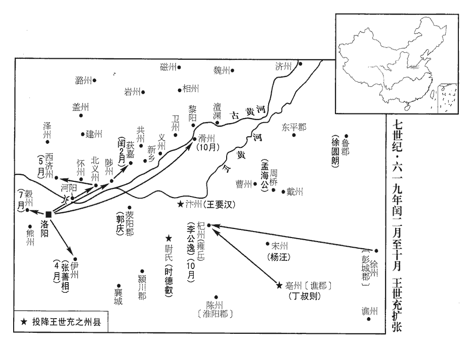
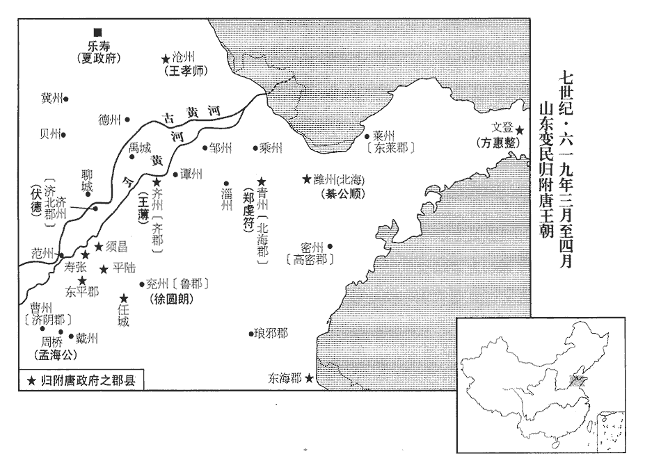
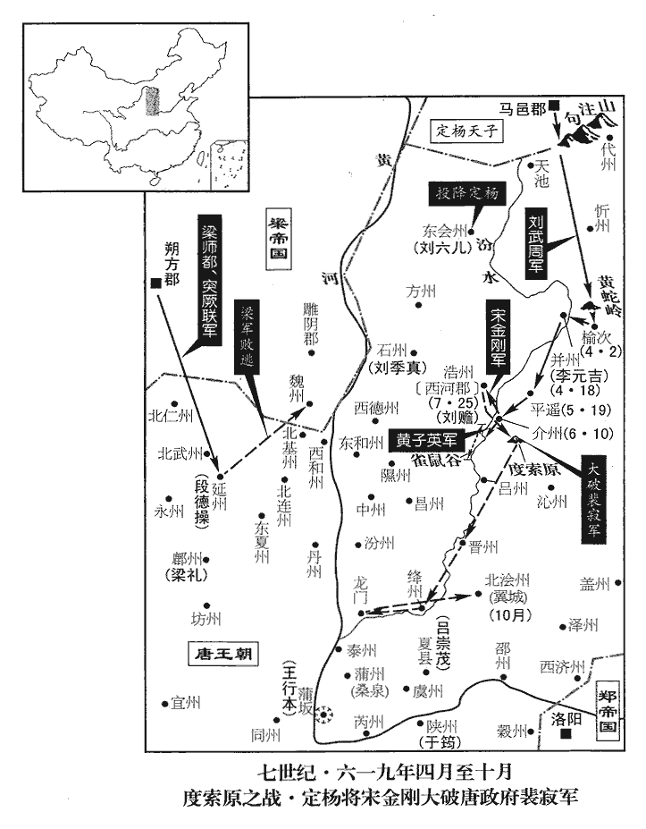
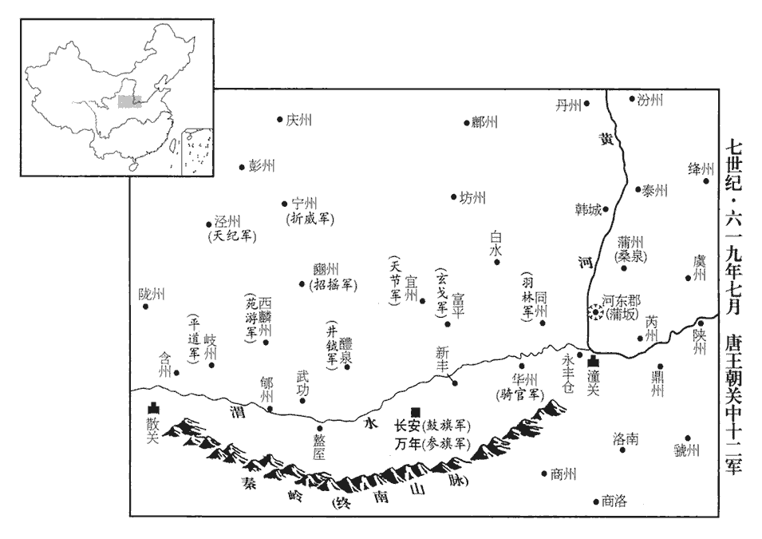
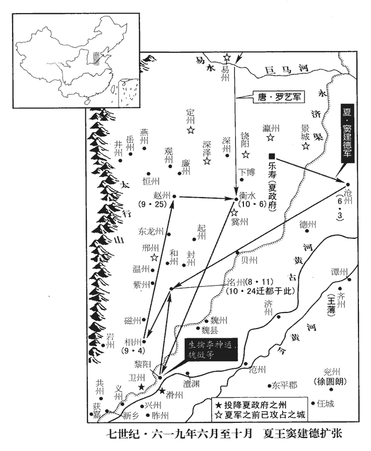
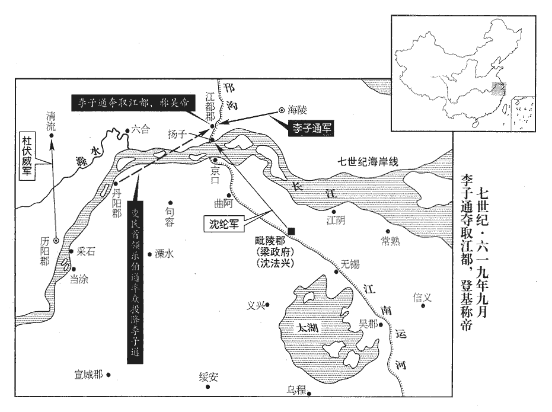

 唐紀三起屠維單閼（己卯）正月，盡十月，不滿一年。

# 高祖神堯大聖光孝皇帝上之下

## 武德二年（己卯、六一九）

1春，正月，壬寅‹二›，王世充悉取隋朝顯官、名士為太尉府官屬，朝，直遙翻；下同。杜淹、戴冑皆預焉。冑，安陽‹河南省安阳市›人也。安陽縣帶相州。隋將軍王隆帥屯衛將軍張鎮周、煬帝改左、右領軍衛為左、右屯衛。帥，讀曰率。考異曰：高祖實錄作「鎮州」。今從隋書陳稜傳。都水少監蘇世長等以山南‹秦岭以南›兵始至東都‹洛阳›。義寧元年七月，遣王隆會兵東都，今始至。少，始照翻。王世充專總朝政，事無大小，悉關太尉府；臺省監署，莫不闃然。闃qù，苦鵙jú翻。世充立三牌於府門外：一求文學才識，堪濟時務者；一求武勇智略，能摧鋒陷敵者；一求身有冤滯，擁抑不申者。於是上書陳事【章：乙十一行本「事」下有「者」字；張校同。】日有數百，世充悉引見，躬自省覽，省，悉景翻。殷勤慰諭，人人自喜，以為言聽計從，然終無所施行。下至士卒廝養，析薪為廝，炊烹為養。廝，音斯。養，羊尚翻。世充皆以甘言悅之，而實無恩施。施，式智翻。

〖译文〗 [1]春季，正月壬寅（初二），王世充让所有隋朝的显要官吏、名士充当太尉府的官吏，杜淹、戴胄也都在其中。戴胄是安阳人。隋朝的将军王隆统率屯卫将军张镇周、都水少监苏世长等，率领山南军队刚刚到达东都。王世充专揽朝政，事情无论大小，都要通过太尉府；隋的台、省、监、署各官府，都无事可做。王世充在太尉府的门外树立三个牌子：一个牌子招求有文学才识、足能成就时务的人；一个牌子招求有武勇智略、能带头摧锋陷敌的人；一个牌子招求遭受到冤屈、郁郁不得申说的人。于是，每天都有数百人上书陈事，王世充都招来接见，亲自阅文，殷勤慰问，人人自喜，以为王世充会言听计从，然而，最后王世充什么事也没有做。甚至于到士兵仆役这层人，王世充都以好话来取悦他们，但实际上并没给他们什么恩惠。

隋馬軍總管獨孤武都為世充所親任，其從弟司隸大夫機煬帝置司隸臺，以大夫為之長，掌諸巡察，正四品。從，才用翻。與虞部郎楊恭慎、六典：周禮，地官有山虞、澤虞，蓋虞部之職也。魏始有虞曹郎中，晉因之，梁、陳為侍郎；後周冬官有虞部下大夫；梁、陳、後魏、北齊並祠部尚書領之，隋工部尚書領之，煬帝曰虞曹郎。前勃海郡‹山东省阳信县›主簿孫師孝、煬帝改滄州為勃海郡。步兵總管劉孝元、李儉、崔孝仁謀召唐‹首都长安陕西省西安市›兵，使孝仁說武都曰：「王公徒為兒女之態以悅下愚，而鄙隘貪忍，不顧親舊，豈能成大業哉！圖讖之文，應歸李氏，人皆知之。說，輸芮翻；下同。讖，楚譖翻。唐起晉陽‹山西省太原市›，奄有關內，兵不留行，英雄景附。且坦懷待物，舉善責功，不念舊惡，據勝勢以爭天下，誰能敵之！吾屬託身非所，坐侍夷滅。今任管公兵近在新安‹唐政府穀州·河南省新安县›，任瓌guī以穀州刺史鎮新安，封管國公。任，音壬。又吾之故人也，若遣間使召之，使夜造城下，間使，上古莧翻，下疏吏翻。造，七到翻。吾曹共為內應，開門納之，事無不集矣。」武都從之。事泄，世充皆殺之。恭慎，達之子也。達，隋觀德王雄之弟。

〖译文〗 隋朝的马军总管独孤武都受王世充信任，独孤武都的唐弟司隶大夫独孤机与虞部郎杨恭慎、前勃海郡主簿孙师孝、步兵总管刘孝元、李俭、崔孝仁谋划招引唐兵前来，便让崔孝仁对独孤武都说：“王世充只是以儿女情长取悦下属，实际上卑鄙、狭隘，贪婪、残忍，不顾亲旧，怎么能成大业呢！按图谶之文所说，天下应归李氏，人人都知道。唐从晋阳举事，占据关内，军队未遇阻滞，英雄景仰攀附。而且李氏待人处事襟怀坦荡，任用善人，勉励有功的人，不念旧恶，据有优胜之势来争夺天下，谁能与其相匹敌呢？我们这些人托身于不该托身的地方，只能坐等被消灭。现在，任管公的军队近在新安，又是我们的旧交，假如能暗中派使者把他们招来，让他们夜里来到城下，我们共同作为内应，开门纳入，事情没有不成功的。”独孤武都听从了此计。但事情泄露了，他们都被王世充杀死。杨恭慎是杨达的儿子。

2癸卯‹三›，‹李渊，本年五十四岁›命秦王世民出鎮長春宮‹陕西省大荔县东›。長春宮在同州朝邑縣，後周宇文護所建。

〖译文〗 [2]癸卯（初三），唐高祖李渊命令秦王李世民出京镇守长春宫。

3宇文化及攻魏州‹总部设河北省大名县›總管元寶藏，四旬不克。魏徵往說之，丁未‹七›，寶藏舉州來降。魏徵本元寶藏官屬。說，式芮翻。降，戶江翻；下同。

〖译文〗 [3]宇文化及带兵攻打魏州总管元宝藏，经四十天攻打不下。魏徵前去游说，丁未（初七），元宝藏举州投降唐朝。

4戊午‹十八›，淮安王神通擊宇文化及於魏縣‹河北省大名县西南›，化及不能抗，東走聊城‹山东省聊城市›。聊城縣時屬魏州，武德四年，分為博州。神通拔魏縣，斬獲二千餘人，引兵追化及至聊城，圍之。

〖译文〗 [4]戊午（十八日），淮安王李神通在魏县进攻宇文化及，宇文化及抵抗不住，向东逃往聊城。李神通攻克魏县，杀死、俘虏两千多人，带兵追击宇文化及到聊城，并包围聊城。

5甲子‹二十四›，以陳叔達為納言。

〖译文〗 [5]甲子（二十四日），唐高祖任命陈叔达为纳言。

6丙寅‹二十六›，李密所置伊州刺史張善相來降。相，息亮翻。降，戶江翻。

〖译文〗 [6]丙寅（二十六日），李密所任命的伊州刺史张善相前来降唐。

7朱粲有眾二十萬，剽掠漢、淮之間，剽，匹妙翻。遷徙無常，每破州縣，食其積粟未盡，復他適，復，扶又翻；下同。將去，悉焚其餘資；又不務稼穡，民餒死者如積。粲無可復掠，軍中乏食，乃教士卒烹婦人、嬰兒噉之，噉，徒濫翻，又徒覽翻。曰：「肉之美者無過於人，但使他國有人，何憂於餒！」隋著作佐郎陸從典、通事舍人顏愍楚六典：著作佐郎修國史。宋百官春秋云：常道鄉公咸熙百官名，有著作佐郎三人。晉制，著作佐郎始到職，必撰名臣傳一人。宋氏之初，國朝始建，未有合撰者，此制遂替。後周，春官府置著作中士，即著作佐郎之任。通事舍人，即秦之謁者。漢書百官表：謁者，掌賓贊受事。舊儀云：謁者有缺，選郎中美鬚眉大音者補。晉初中書置舍人、通事各一人，東晉令舍人、通事兼謁者之任，通事舍人之名由此始也。隋初，罷謁者官，置通事舍人。煬帝改通事舍人為通事謁者。顏愍楚，蓋大業前為舍人。謫官在南陽‹河南省邓州市›，南陽鄧州。粲初引為賓客，其後無食，闔家皆為所噉。愍楚，之推之子也。顏之推仕於高齊之季。又稅諸城堡細弱以供軍食，諸城堡相帥叛之。帥，讀曰率；下同。

〖译文〗 [7]朱粲有二十万人，在汉水、淮河之间剽掠，迁徒没有规律，每攻破一个州县，还没有吃尽该州县积聚的粮食，就又转移，将离州县时，把州县其余的物资全部焚毁；又不注重农业，饿死的老百姓堆的像山那样高。朱粲没有再可掠夺的了，军队中缺乏吃的，就教士兵烧煮妇女、小孩吃，说：“没有比人肉更好吃的了，只要其他的城镇里有人，何必为挨饿发愁呢！”隋朝的著作佐郎陆从典，通事舍人颜愍楚，被贬官住在南阳。朱粲起初都请来作自己的宾客，以后朱粲缺乏吃的，二人全家都被朱粲吃掉。颜愍楚是颜之推的儿子。朱粲又征收各城堡的妇人小孩供给军队为军粮，各城堡相继背叛了他。

淮安土豪楊士林、田瓚起兵攻粲，後魏置東荊州於比陽，西魏改為淮州。梁置淮安縣於桐柏，并立上川郡。隋開皇廢郡，改淮安為桐柏縣，改淮安郡曰顯州，領比陽、平氏、桐柏等七縣。大業改顯州為淮安郡。瓚zàn，藏旱翻。諸州皆應之。粲與戰于淮源‹河南省信阳市西北›，水經註：淮水出平氏縣桐柏大復山，山南有淮源廟。唐州桐柏淮源縣廟碑，漢延熹六年立，其文曰：「淮出平氏，始於大復，潛行地中，見於陽口。」大敗，帥餘眾數千奔菊潭‹河南省内乡县›。帥，讀曰率。菊潭，舊曰酈縣，開皇初改焉，時屬鄧州；山有菊，人飲其水多壽，故以名縣。士林家世蠻酋，酋，慈由翻。隋末，士林為鷹揚府校尉，殺郡官而據其郡‹淮安郡城河南省泌阳县›。校，戶教翻。既逐朱粲，己巳‹二十九›，帥漢東四郡遣使詣信州總管廬江王瑗請降，大業改隋州為漢東郡。梁置信州於魚復，大業改為巴東郡，唐復為信州。使，疏吏翻。瑗，于眷翻。詔以為顯州道‹淮安郡改显州›行臺。宋白曰：後魏置東荊州於比陽，後改淮州；隋文帝改顯州，取界內顯望岡為名。士林以瓚為長史。

〖译文〗 淮安当地的豪强杨士林、田瓒起兵攻打朱粲，各州县都响应。朱粲在淮源和他们交战，大败，率领数千名残兵逃奔菊潭。杨士林家族世代都是蛮族首领，隋末，杨士林当鹰扬府校尉，杀了郡里官员占据了郡县，赶跑朱粲以后，已巳（二十九日），杨士林率领汉东四郡派遣使节到唐信州总管庐江王李瑗处请求投降，唐高祖下诏任命杨士林为显州道行台，杨士林又任命田瓒作长史。

8初，王世充既殺元、盧，元、盧，元文都、盧楚，世充殺之，事見一百八十五卷元年七月。慮人情未服，猶媚事皇泰主‹杨侗，本年十六岁›，禮甚謙敬。又請為劉太后‹刘良娣›假子，尊號曰聖感皇太后。既而漸驕橫，嘗賜食於禁中，還家大吐，橫，戶孟翻。吐，土故翻。疑遇毒，自是不復朝謁。復，扶又翻。朝，直遙翻。皇泰主知其終不為臣，而力不能制，唯取內庫綵物大造幡花；又出諸服玩，令僧散施貧乏以求福。施，式智翻。世充使其黨張績、董濬守章善、顯福二門，東都皇城南面三門，中曰應天，左曰興教，右曰光政；興教之內曰會昌，其北曰章善；光政之內曰廣運，其北曰顯福。宮內雜物，毫釐不得出。是月，世充使人獻印及劍。又言河水清，欲以耀眾，為己符瑞云。

〖译文〗 [8]当初，王世充杀掉元文都、卢楚之后，担心人情不服，还谄媚皇泰主，礼节相当谦敬。又请求作刘太后的干儿子，尊称刘太后为圣感皇太后。以后，王世充便渐渐变得骄横了，有一次在宫中吃了赏赐的食物，回到家里大吐，他便怀疑食物被人下了毒，自那以后，王世充就不再上朝拜谒了。皇泰主知道王世充最后不会甘当臣下，而自己又无力制服他，只能从宫内仓库中取来丝织品，做了许多幡花；又拿出各种衣服玩物，让僧人到处施舍给贫穷、缺少东西的人，以求福佑。王世充让其党羽张绩、董浚守住章善、显福二门，宫内的杂物，毫厘不得拿出。当月，王世充让人献给他印玺和宝剑。他又说黄河水清了，想以此向众人炫耀，为自己制造祥瑞。

9上遣金紫光祿大夫武功‹陕西省武功县西›靳孝謨安集邊郡，靳，居焮翻。為梁師都‹梁，首都朔方陕西省靖边县北白城子›所獲。孝謨罵之極口，師都殺之。二月，詔追賜爵武昌縣公，諡曰忠。

〖译文〗 [9]唐高祖派金紫光禄大夫武功人靳孝谟带兵安定边郡，靳孝谟被梁师都俘获。靳孝谟破口大骂梁师都，被梁师都杀掉。二月，唐高祖下诏，追赐靳孝谟为武昌县公，谥号为“忠”。

10初定租、庸、調法，每丁租二石，絹二匹，綿三兩；租、庸、調之法，以人丁為本，梁、陳、齊、周各有損益。唐制，凡授田者，丁歲輸粟二斛，稻三斛，謂之租。丁，随鄉所出，歲輸絹二匹，綾絁shī二丈，布加五之一，綿三兩，麻三斤；非蠶鄉，則輸銀十四兩，謂之調。用人之力，歲二十日，閏加二日；不役者日為絹三尺，謂之庸。有事而加役二十五日者，免調；三十日者，租調皆免；通正役不過五十日。調，徒釣翻；下同。自茲以外，不得橫有調斂。橫，戶孟翻。斂，力瞻翻。

〖译文〗 [10]初步制定租、庸、调法，每个成年男子每年交租二石，绢二匹，绵三两；除此之外，不得横征暴敛。

11丙戌‹十六›，詔：「諸宗姓居官者在同列之上，未仕者免其傜役；每州置宗師一人以攝總，別為團伍。」

〖译文〗 [11]丙戌（十一日），高祖下诏：“皇室各同族中做官的，位在同品级官员之上，没有做官的，免除其徭役；每州设立一个宗师加以管理，另为编制。”

12張俟德至涼‹首都涼州甘肃省武威市›，去年八月，遣張俟德冊拜李軌。李軌召其群臣廷議曰：「唐天子，吾之從兄，從，才用翻；下同。今已正位京邑。一姓不可自爭天下，吾欲去帝號，受其封爵，可乎？」去，羌呂翻。曹珍曰：「隋失其鹿，天下共逐之，稱王稱帝者，奚啻一人！唐帝關中，涼帝河右，固不相妨。且已為天子，柰何復自貶黜！復，扶又翻。必欲以小事大，請依蕭詧chá事魏故事。」蕭詧事魏事見一百六十五卷梁元帝承聖三年。軌從之。戊戌‹二十八›，軌遣其尚書左丞鄧曉入見，見，賢遍翻。奉書稱「皇從弟大涼皇帝臣軌」而不受官爵。帝怒，拘曉不遣，始議興師討之。

〖译文〗 [12]张俟德到达凉州，李轨召集他的群臣在朝廷上议论说：“唐天子是我的堂兄，现在已在京邑做上皇帝。一姓之人不应自相争夺天下，我想去掉帝号，接受唐朝的封爵，合适吗？”曹珍说：“隋朝失去天下，天下人共争君位，称王称帝的，岂只一人！唐朝在关中称帝，凉朝在河右称帝，本来不相妨碍。况且您已经做了天子，何必又自己贬黜自己呢！如果您想以小事大的话，就请依照过去梁朝萧服从魏朝的那种做法吧。”李轨听从了曹珍的话。戊戌（二十八日），李轨派遣他的尚书左丞邓晓入京见唐朝皇帝，献书上自称“皇帝的堂弟、大凉国皇帝、臣下李轨”，而不接受唐朝的官爵。高祖很生气，拘留了邓晓，不让他返回。同时开始议论兴师讨伐李轨之事。

初，隋煬帝自征吐谷渾‹青海省›，吐谷渾可汗伏允以數千騎奔党項，事見一百八十一卷煬帝大業五年。吐，從暾入聲。谷，音浴。可，從刊入聲。汗，音寒。騎，奇寄翻。煬帝立其質子順為主，質，音致。使統餘眾，不果入而還。會中國喪亂，還，從宣翻，又如字。喪，息浪翻。伏允復還收其故地。復，扶又翻。上受禪，順自江都‹江苏省扬州市›還長安，煬帝既弒，順逃還長安。上遣使與伏允連和，使擊李軌，許以順還之。伏允喜，起兵擊軌，數遣使入貢請順，上遣之。為後太宗立順以統吐谷渾之眾張本。遣使，疏吏翻；下同。

〖译文〗 当初，隋炀帝亲自征讨吐谷浑，吐谷浑的可汗伏允带领几千骑兵逃到党项，隋炀帝扶立吐谷浑在隋作人质的伏允之子伏顺为吐谷浑君主，让伏顺统帅留下的部众，但伏顺没能回到吐谷浑便返回中原。恰逢中国丧乱，伏允又返回吐谷浑收回原有的领地。皇上即位时，伏顺从江都回到长安，高祖派使者与伏允联合，让伏允进攻李轨，许愿归还伏顺。伏允很高兴，发兵进攻李轨，几次派遣使者给唐朝进贡，请求归还伏顺，皇上遣返伏顺回吐谷浑。

13閏月，朱粲遣使請降，降，戶江翻。詔以粲為楚王，聽自置官屬，以便宜從事。

〖译文〗 [13]闰二月，朱粲派使者到唐朝请求投降，高祖下诏立朱粲为楚王，听凭朱粲自己设立官属，视方便办事。

14宇文化及以珍貨誘海曲諸賊，賊帥王薄‹王薄基地在长白山山东省邹平县南›帥眾從之，誘，羊久翻。賊帥，所類翻。薄帥，讀曰率。與共守聊城‹山东省聊城市›。

〖译文〗 [14]宇文化及用珍奇货物引诱海边的贼众，贼帅王薄率贼众服从宇文化及，与宇文化及一起守护聊城。

竇建德謂其群下曰：「吾為隋民，隋為吾君；今宇文化及弒逆，乃吾讎也，吾不可以不討！」乃引兵趣聊城。趣，七喻翻，又逡須翻。

〖译文〗 窦建德对其群下说：“我是隋朝百姓，隋是我的君主；现在宇文化及叛逆杀了皇帝，就是我的仇人，我不能不讨伐！”于是带兵开赴聊城。

淮安王神通攻聊城，化及糧盡，請降，神通不許。安撫副使崔世幹勸神通許之，降，戶江翻；下同。使，疏吏翻。神通曰：「軍士暴露日久，賊食盡計窮，克在旦暮，吾當攻取以示國威，且散其玉帛以勞將士，勞，力到翻。若受其降，將何以為軍賞乎！」世幹曰：「今建德方至，若化及未平，內外受敵，吾軍必敗。夫不攻而下之，為功甚易，夫，音扶。易，以豉翻。柰何貪其玉帛而不受乎！」神通怒，囚世幹於軍中。去年十月，遣神通安撫山東，書崔民幹為副，今書「世幹」，當有一誤。既而宇文士及自濟北‹山东省茌平县西南›餽之，濟北郡，濟州。濟，子禮翻。化及軍稍振，遂復拒戰。復，扶又翻；下同。神通督兵攻之，貝州‹清河郡改·河北省清河县›刺史趙君德攀堞先登，時復以清河郡為貝州。宋白曰：貝州清河郡，春秋為晉東陽之地，亦為齊境；秦為鉅鹿郡地；漢分鉅鹿郡，置清河郡，理清陽。石趙移郡理平晉城，即今博州清平縣。後周平齊，於清河縣置貝州。清河，後漢之甘陵清陽縣，又兼有漢貝丘縣之地，貝州以此得名。堞，徒協翻。神通心害其功，收兵不戰，君德大詬而下，詬，苦候翻。遂不克。建德軍且至，神通引兵退。

〖译文〗 淮安王李神通攻打聊城，宇文化及没有了粮食，请求投降，李神通不准。安抚副使崔世劝李神通准许宇文化及投降，李神通说：“军队、士卒风餐露宿这么长时间，敌人粮尽计穷，马上就能取胜，我要攻下聊城以宣扬国威，并且分了他的财宝慰劳将士，如果接受他投降，那么用什么来作赏赐军队的费用呢？”崔世说：“现在窦建德就要抵达，如果还没有平定宇文化及，里外受敌，我军必然失败。不打就降服了敌人，作为功劳来得太容易了，怎么还能贪图他的财宝而不接受投降呢？”李神通很生气，把崔世囚禁在军中。不久，宇文士及从济北运粮接济宇文化及，宇文化及的兵力逐渐恢复，于是又重新抵抗。李神通督率军队攻城，贝州刺史赵君德率先攀着城堞登上城墙，李神通心中嫉妒他的功劳，收兵不战，赵君德大骂下了城，于是未能攻克。窦建德的军队即将抵达，李神通于是带兵撤退。

建德與化及連戰，大破之，化及復保聊城。建德縱兵四面急攻，王薄開門納之。建德入城，生擒化及，先謁隋蕭皇后，語皆稱臣，素服哭煬帝盡哀；收傳國璽及鹵簿儀仗，璽，斯氏翻。撫存隋之百官，然後執逆黨宇文智及、楊士覽、元武達、許弘仁、孟景，集隋官而斬之，梟首軍門之外。梟，堅堯翻。以檻車載化及并二子承基、承趾至襄國‹邢州·河北省邢台市›、斬之。煬帝改邢州為襄國郡。杜佑曰：邢州，古邢國，治龍岡縣；秦為信都，項羽改襄國，隋改龍岡。考異曰：隋書云：「載之河間，斬之。」唐書云：「至大陸，斬之。」河洛記云：「建德將化及并蕭后、南陽公主隨軍，于時襄國郡尚為隋守，建德因其迴兵，欲攻之，營於城下，遣大理官引化及出營東南二里許，宣令數其罪，并二子一號魏王，一號蜀王，同時受戮。」按蜀王乃士及所封，今不取。化及且死，更無餘言，但云：「不負夏王‹窦建德›！」夏，戶雅翻。

〖译文〗 窦建德和宇文化及连续交锋，大败宇文化及，宇文化及重又保守聊城。窦建德率兵从四面猛攻，王薄开城门迎入窦军。窦建德进城，活捉了宇文化及，先去拜谒了隋萧皇后，言语都自称臣下，身着白色服装哭隋炀帝以尽哀节；收拾隋传国玉玺及车驾仪仗，安抚隋朝的百官，然后，捉住派逆的同党宇文智及、杨士览、元武达、许弘仁、孟景，集合隋朝官员当面斩了这几个人，割下首级悬挂于军营门外。用槛车载宇文化及和两个儿子宇文承基、宇文承趾到襄国，将他们斩首。宇文化及临死，没有什么要说的，只说道：“不负复王！”

建德每戰勝克城，所得資財，悉以分將士，身無所取。又不噉肉，常食蔬，茹粟飯；妻曹氏，不衣紈綺，將，即亮翻。噉，徒覽翻，又徒濫翻。衣，於既翻。紈，音丸。綺，區几翻。所役婢妾，纔十許人。及破化及，得隋宮人千數，即時散遣之。以隋黃門侍郎裴矩為左僕射、掌選事，選，宣絹翻。兵部侍郎崔君肅為侍中，考異曰：革命記作「君秀」。今從舊建德傳。少府令何稠為工部尚書，漢書百官表，少府，秦官，至北齊，不置少府，以其屬官併太府寺。隋煬帝大業三年，始分太府為少府監，置監、少監，其後改監為令，少監為少令。少，始照翻。右司郎中柳調為左丞，六典：左右司郎中，前代不置。煬帝三年，尚書都司始置左右司郎各一人，掌都省之職，品同諸曹郎，從五品。司馬彪續漢書云：尚書丞一人，秦所置，漢因之。成帝置列曹尚書，更置丞四人，至光武減其二，惟置左、右丞各一人。丞者，承也，言承助令僕、總理臺事也。虞世南為黃門侍郎，歐陽詢為太常卿。詢，紇之子也。歐陽紇見一百七十卷陳宣帝太建元年。紇hé，下沒翻。自餘隨才授職，委以政事。其不願留，欲詣關中及東都者亦聽之，仍給資糧，以兵援之出境。隋驍果尚近萬人，亦各縱遣，任其所之。驍，堅堯翻。近，其靳翻。又與王世充結好，好，呼到翻。遣使奉表於隋皇泰主‹杨侗›，使，疏吏翻。皇泰主封為夏王。建德起於群盜，雖建國，未有文物法度，裴矩為之定朝儀，制律令，為，于偽翻。朝，直遙翻。建德甚悅，每從之諮訪典禮。

〖译文〗 窦建德每次打了胜仗、攻陷城池，得到的物资财产，全部用来分给将士，自己不留任何东西。他又不吃肉，经常吃蔬菜，下粗米饭，妻子曹氏，不穿绫绢做的衣服，役使的奴婢侍妾，才十几个人。待到打败宇文化及，获得一千多名隋朝宫女，当即遣散。窦建德任命隋朝的黄门侍郎裴矩为左仆射，掌管官吏的选拔，兵部侍郎崔君肃为侍中，少府令何稠为工部尚书，右司郎中柳调为左丞，虞世南为黄门侍郎，欧阳询为太常卿。欧阳询是欧阳纥的儿子。其余的隋朝官员也都量才授官，交给他们政事。对不愿留下的人，准备去关中或东都的，听任他们前往，并给予路费粮食，派兵保护他们出境。隋骁果还有近一万人，也分派遣返，听任他们选择去处。窦建德又与王世充联合交好，派遣使节进表于皇泰主，黄泰主封他为夏王。窦建德出身盗贼，虽然建国，但没有典章制度，裴矩为他制定朝仪，修订法律，窦建德非常高兴，经常向裴矩请教礼仪典章之事。

15甲辰‹四›，上考第群臣，以李綱、孫伏伽為第一，伽，求加翻。因置酒高會，謂裴寂等曰：「隋氏以主驕臣諂亡天下，朕即位以來，每虛心求諫，然惟李綱差盡忠款，孫伏伽可謂誠直，餘人猶踵敝風，俛眉而已，豈朕所望哉！朕視卿如愛子，卿當視朕如慈父，有懷必盡，勿自隱也！」因命捨君臣之敬，極歡而罷。

〖译文〗 [15]甲辰（初四），唐高祖考核群臣高下，李纲、孙伏伽为第一，于是设盛大宴会，对裴寂等人说：“隋朝因为君主骄奢，臣子谄媚，丢了天下，朕即位以来，经常虚心求谏，但是唯有李纲比较能竭尽忠诚，孙伏伽可以称的正直，其余的仍然沿袭隋朝恶劣的风气，只是俯首贴耳，这岂是朕所希望的！朕视各位犹如爱子，各位应当将朕当作慈父，有什么看法一定要畅所欲言，不要埋在心里。”于是下令免去君臣之间的礼数，尽兴而罢。

16遣前御史大夫段確使於朱粲。使，疏吏翻。

〖译文〗 [16]唐派遣前御史大夫段确出使朱粲之处。

17初，上‹李渊›為隋殿內少監，少，始照翻。宇文士及為尚輦奉御，隋尚輦局，屬殿內省。上與之善。士及從化及至黎陽‹河南省浚县›，上手詔召之，士及潛遣家僮間道詣長安，又因使者獻金環。金環，言欲還長安。間，古莧翻。使，疏吏翻。化及至魏縣，兵勢日蹙，士及勸之歸唐，化及不從，內史令封德彝說士及於濟北徵督軍糧以觀其變。說，輸芮翻。濟，子禮翻。化及稱帝，立士及為蜀王。化及死，士及與德彝自濟北來降。降，戶江翻。時士及妹為昭儀，由是授上儀同。上以封德彝隋室舊臣，而諂巧不忠，深誚責之，誚，才笑翻。罷遣就舍。德彝以祕策干上，上悅，尋拜內史舍人，俄遷侍郎。

〖译文〗 [17]当初，唐高祖作隋殿内少监，宇文士当隋尚辇奉御，高祖与他很要好。宇文士及随宇文化及到黎阳，高祖亲笔写诏书召宇文士及，宇文士及暗中派家僮从小路赴长安，又托使者献金环表示想回长安。宇文化及到魏县，兵力日益衰弱，宇文士及劝他归顺唐朝，宇文化及不听，内史令封德彝劝士及在济北征收督运军粮静观其变。宇文化及称帝，立士及为蜀王。宇文化及死后，宇文化及和封德彝从济北前来降唐。当时宇文士及的妹妹是后宫中的昭仪，因此授予士及上仪同之衔。高祖因为封德彝是隋朝旧臣，谄媚虚伪而不忠诚，狠狠地斥责了他一番，罢免了他的官职遣返回家。封德彝用秘策迎合皇上，谋求进身，高祖很高兴，马上拜封德彝为内史舍人，不久又升迁为侍郎一级官员。

18甲寅‹十四›，隋夷陵‹湖北省宜昌市西›郡丞安陸‹湖北省安陆市›許紹帥黔安‹重庆市彭水县›、武陵‹湖南省常德市›、澧陽‹湖南省津市市›等諸郡來降。梁置宜州於夷陵郡，西魏改曰拓州，後周改曰硤州。宋白曰：周武帝以州扼三峽之口，故名。隋煬帝改為夷陵郡，改安州為安陸郡，黔州為黔安郡。武陵郡，梁置武州，後改曰沅州，隋改曰朗州，大業復為郡。澧陽，隋初置澧州，大業改為郡。帥，讀曰率。澧，音禮。考異曰：舊書傳云世充篡位乃來降。按世充篡在四月。實錄紹降在此，今從之。紹幼與帝同學；詔以紹為峽州‹夷陵郡改峡州›刺史，賜爵安陸公。

〖译文〗 [18]甲寅（十四日），隋朝夷陵郡丞安陆人许绍带领黔安、武陵、澧阳等郡官吏前来降唐。许绍幼年与高祖在一起上学，高祖下诏任命许绍为峡州刺史，赐爵安陆公。

19丙辰‹十六›，以徐世勣為黎州‹黎阳县河南省浚县›改黎州總管。後魏置黎陽郡於黎陽縣，後置黎州，至隋，州郡並廢，以黎陽縣屬汲郡。今復置黎州。

〖译文〗 [19]丙辰（十六日），唐高祖任命徐世为黎州总管。

20丁巳‹十七›，驃騎將軍張孝珉以勁卒百人襲王世充汜水城‹河南省荥阳市汜水镇西›，入其郛fú，沈米船百五十艘。隋志：汜水縣舊曰成皋，即虎牢也。後魏置東中府，東魏置北豫州，後周置滎州，開皇初，曰鄭州。十八年，改成皋曰汜水。驃，匹妙翻。騎，奇寄翻；下同。汜，音祀。沈，持林翻。艘，蘇遭翻。

〖译文〗 [20]丁巳（十七日），唐骠骑将军张孝珉率领一百精壮士兵袭击王世充的汜水城，进入汜水外城，将一百五十艘运米船沉入水中。

21己未‹十九›，世充寇穀州。世充以秦叔寶為龍驤大將軍，驤，思將翻。程知節為將軍，待之皆厚。然二人疾世充多詐，知節謂叔寶曰：「王公器度淺狹而多妄語，好為呪誓，此乃老巫嫗耳，好，呼到翻。呪，職救翻。嫗，威遇翻。豈撥亂之主乎！」世充與唐兵戰於九曲‹河南省宜阳县北›，水經註：洛水自宜陽而東，逕九曲南，其地十里，有坂九曲。穆天子傳所謂「天子西征，升于九阿」，此是也。洛水又東與豪水會，豪水出新安縣密山，南流歷九曲東而南流入于洛。舊志：熊州壽安縣，義寧元年，移治九曲城。叔寶、知節皆將兵在陳，將，即亮翻。陳，讀曰陣。與其徒數十騎，西馳百許步，下馬拜世充曰：「僕荷公殊禮，荷，下可翻。深思報效；公性猜忌，喜信讒言，喜，許既翻。非僕託身之所，今不能仰事，請從此辭。」遂躍馬來降。降，戶江翻。考異曰：河洛記：「二月，王世充將兵圍新安，將軍程咬金帥其徒以歸義。」按新安乃穀州也。而梁載言十道志，九曲在壽安。壽安乃熊州也，或者世充亦寇熊州乎？世充不敢逼。上使事秦王世民，世民素聞其名，厚禮之，以叔寶為馬軍總管，知節為左三統軍。時世充驍將又有驃騎武安‹河北省武安市›李君羨、隋改洺州為武安郡。驍，堅堯翻。將，即亮翻；下守將同。驃，匹妙翻。騎，奇寄翻。征南將軍臨邑‹山东省济阳县西›田留安，隋臨邑縣屬齊郡。亦惡世充之為人，惡，烏路翻。帥眾來降。帥，讀曰率。降，戶江翻。世民引君羨置左右，以留安為右四統軍。

〖译文〗 [21]己未（十九日），王世充侵犯州，王世充任命秦叔宝为龙骧大将军，程知节为将军，待他们很好。但是二人憎恨王世充多诈，程知节对秦叔宝说：“王公才识风度浅薄狭隘，却爱乱说，喜欢赌咒发誓，这不过是老巫婆，哪里是拨乱反正的君主！”王世充在九曲与唐军交战，秦叔宝、程知节都带兵在阵上，和他们的几十名部下，骑着马向西跑了一百来步，然后下马向王世充行礼，说道：“我等身受您的特别优待，总想报恩效力，但您性情猜忌，爱信谗言，不是我等托身之处，如今不能再侍奉您，请求从此分别。”于是跳上马前来降唐，王世充不敢追逼。高祖让他们侍奉秦王李世民，李世民早已听说他们的名声，十分尊重他们，任命秦叔宝为马军总管，程知节为左三统军。当时王世充的骁将还有骠骑武安人李君羡、征南将军临邑人田留安，也厌恶王世充的为人，带领部下前来投降。李世民将李君羡安置在身边，任命田留安为右四统军。

22王世充囚李育德之兄厚德於獲嘉‹河南省获嘉县›，獲嘉，漢縣，武帝巡幸至此，聞破南越獲呂嘉，因以名縣；隋屬河內郡。厚德與其守將趙君穎逐殷州‹获嘉县改殷州›刺史段大師，以城來降。以厚德為殷州刺史。隋開皇十六年於獲嘉縣置殷州。大業初，州廢，王世充復置，今因以命厚德。

〖译文〗 [22]王世充将李育德的兄长李厚德囚禁在获嘉县，李厚德与看守他的将领赵君颖赶走了殷州刺史段大师，以城池来降唐。唐任命李厚德为殷州刺史。

23竇建德陷邢州‹河北省邢台市›，執總管陳君賓。

〖译文〗 [23]窦建德攻陷了邢州，活捉了总管陈君宾。

 

24上遣殿內監竇誕、隋煬帝置殿內監，諱中，改為內；唐為殿中監。是時蓋未改隋官名也。右衛將軍宇文歆秦、漢始置衛將軍，晉武帝分為左、右二衛，下至隋初，皆因之；煬帝改左、右翊衛，唐復舊。歆xīn，許金翻。助并州‹总部设山西省太原市›總管齊王元吉守晉陽‹并州州政府所在县·山西省太原市›。誕，抗之子也，竇抗，后兄也。并，卑盈翻。尚帝女襄陽公主。元吉性驕侈，奴客婢妾數百人，好使之被甲，戲為攻戰，好，呼到翻；下同。被，皮義翻；下同。前後死傷甚眾，元吉亦嘗被傷。其乳母陳善意苦諫，元吉醉，怒，命壯士毆殺之。毆，烏口翻。性好田獵，載罔罟gǔ三十車，嘗言：「我寧三日不食，不能一日不獵。」常與誕遊獵，蹂踐人禾稼。蹂，人九翻。又縱左右奪民物，當衢射人，觀其避箭。射，而亦翻。夜，開府門，宣淫他室。百姓憤怨，歆屢諫不納，乃表言其狀。壬戌‹二十二›，元吉坐免官。為元吉失守張本。

〖译文〗 [24]唐高祖派遣殿内监窦诞、右卫将军宇文歆协助并州总管齐王李元吉镇守晋阳。窦诞是窦抗的儿子，娶了高祖的女儿襄阳公主。李元吉性情骄横，生活奢侈，有几百名奴婢侍妾，喜欢让他们穿上战袍，作打仗的游戏，前后死伤了很多人，李元吉也曾受伤。元吉的奶妈陈善意苦苦劝说，元吉喝醉，听到她的话很生气，命令力士打死了陈善意。李元吉生性喜欢打猎，有三十车捕捉鸟兽鱼虾的网，曾经说：“我宁可三天不吃饭，也不能一天不打猎。”常常和窦诞游猎，践踏百姓的庄稼。他还放纵身边的人枪夺民物，在大街上射人，看人避箭的样子。夜里打开王府大门，公然在别人家做出淫秽之事。百姓十分愤恨，宇文歆屡次规劝元吉都不听，于是宇文歆上表报告了李元吉的情况。壬戌（二十二日），李元吉获罪被免官。

25癸亥‹二十三›，陟州‹河南省武陟县›刺史李育德按志，是年育德以脩武縣濁鹿城降，置陟州，因武陟為名。攻下王世充河內堡聚三十一所。乙丑‹二十五›，世充遣其兄子君廓侵陟州，李育德擊走之，斬首千餘級。李厚德歸省親疾，使李育德守獲嘉，李厚德蓋歸濁鹿省親，而使育德守獲嘉也。省，悉景翻。世充併兵攻之；丁卯‹二十七›，城陷，育德及弟三人皆戰死。

〖译文〗 [25]癸亥（二十三日），唐陟州刺史李育德攻下王世充在河内地区的三十一座堡垒村落。乙丑（二十五日），王世充派遣侄子王君廓侵犯陟州，李育德击退来敌，杀死一千多人。李厚德回乡探望生病的父母，让李育德守卫获嘉，王世充合兵攻打获嘉，丁卯（二十七日），获嘉陷落，李育德与三个弟弟全部阵亡。

26己巳‹二十九›，李公逸以雍丘‹河南省杞县›來降，拜杞州‹雍丘县改杞州›總管，以其族弟善行為杞州刺史。隋志：梁郡雍丘縣，後魏置陽夏郡，開皇廢郡置杞州，大業廢州為縣，李公逸因亂據之，今復置州。時邊要州置總管及刺史。

〖译文〗 [26]己巳，（二十九日），李公逸以雍丘前来降唐，官拜杞州总管，任命他的同族弟弟李善行为杞州刺史。

27隋吏部侍郎楊恭仁，從宇文化及至河北‹黄河以北›；化及敗，魏州‹总部设河北省大名县›總管元寶藏獲之，己巳‹二十九›，送長安。上與之有舊，拜黃門侍郎，尋以為涼州‹总部设甘肃省武威市›總管。恭仁素習邊事，曉羌、胡情偽，民夷悅服，自葱嶺‹帕米尔高原›已東，並入朝貢。按恭仁至長安時，李軌尚據河西，唐未得涼州也，安能遠及蔥嶺乎！史終言恭仁事耳。是年五月，安興貴執李軌，方遣楊恭仁安撫河西。朝，直遙翻。

〖译文〗 [27]隋朝的吏部侍郎杨恭仁，跟随宇文化及来到河北；宇文化及失败，被唐魏州总管元宝藏俘获，已巳（二十九日），将杨恭仁押送到长安。唐高祖和他是老相识，于是杨恭仁官拜黄门侍郎，随即又任命为凉州总管。杨恭仁一向熟悉边境事务，了解羌、胡各族的虚实，凉州百姓与夷族对他都心悦诚服，葱岭以东地区的各国，都前来朝拜，献纳贡品。

28突厥‹瀚海沙漠群›始畢可汗將其眾渡河至夏州‹即朔方·陕西省靖边县北白城子›，夏州，漢朔方之地，赫連所都統萬也，魏滅赫連，以為統萬鎮。魏太和十一年，置夏州，因赫連故國名以名州，隋大業改州為朔方郡，今復以朔方郡為夏州。厥，九勿翻。可，從刊入聲。汗，音寒。夏，戶雅翻。梁師都‹梁帝梁师都，首都朔方陕西省靖边县北白城子›發兵會之，以五百騎授劉武周‹首都马邑山西省朔州市›，欲自句注‹山西省代县西北›入寇太原。騎，奇寄翻。句，音鉤，又如字，又音拘。會始畢卒，考異曰：高祖實錄：「六月己酉，始畢可汗卒。」疑遣使告喪月日也。今從舊書本紀、列傳。子什鉢苾幼，未可立，苾bì，毗必翻。立其弟俟利弗設為處羅可汗。俟，渠之翻。處，昌呂翻。處羅以什鉢苾為尼步設，使居東偏，直幽州‹北京市›之北。直，當也。尼，女夷翻。先是，上遣右武候將軍高靜奉幣使於突厥，使，疏吏翻。至豐州‹内蒙古五原县›，復以五原郡為豐州。豐州，漢朔方臨戎縣地，後周保定三年，置永豐鎮，隋開皇五年，置豐州，因鎮為名，大業廢州為五原郡，唐復為州。大元以豐州置天德軍節度，屬大同府路。聞始畢卒，敕納於所在之庫。突厥聞之，怒，欲入寇；豐州總管張長遜遣高靜以幣出塞為朝廷致賻fù，為，于偽翻。賻，音附。貨財曰賻。突厥乃還。還，從宣翻，又如字。

〖译文〗 [28]突厥始毕可汗带领手下人马渡过黄河到夏州，梁师都排出军队与突厥会合，把五百骑兵授予刘武周，准备从句注入侵太原，恰好始毕去世，始毕的儿子什钵年幼，不能立为可汗。突厥立始毕的弟弟俟利弗设为处罗可汗。处罗任命什钵为尼步设，把他安置在突厥的东部，正当幽州的北面。这之前，唐高祖派遣右武候将军高静携带礼物出使突厥，走到丰州，听说始毕去世，朝廷下令将这些礼物交到当地的仓库。突厥闻讯，很气愤，打算入侵，丰州总管张长逊派高静带这些礼物出塞作为朝廷赠送给始毕丧事的用款，于是突厥回师。

29三月，庚午‹一›，梁師都寇靈州，長史楊則擊走之。邊要之州，置總管、刺史、長史、司馬。長，知兩翻。

〖译文〗 [29]三月庚午（初一），梁师都侵犯灵州，被唐灵州长史杨则击退。

30壬申‹三›，王世充寇穀州，刺史史萬寶戰不利。

〖译文〗 [30]壬申（初三），王世充侵犯州，唐州刺史史万宝迎战失利。

31庚辰‹十一›，隋北海‹山东省青州市›通守鄭虔符、文登‹山东省文登市›令方惠整及東海‹江苏省连云港市›、齊郡‹山东省济南市›、東平‹山东省郓城县›、任城‹山东省济宁市›、平陸‹山东省汶上县西›、壽張‹山东省梁山县›、須昌‹山东省东平县›賊帥王薄等並以其地來降。煬帝以青州為北海郡。守，式又翻。文登縣屬東萊郡。以海州為東海郡，齊州為齊郡，鄆州為東平郡，須昌縣屬焉。任城、平陸二縣屬魯郡，壽張縣屬濟北郡。任，音壬。帥，所類翻。降，戶江翻。

〖译文〗 [31]庚辰（十一日），隋朝北海通守郑虔符、文登县令方惠整以及东海，齐郡，东平、任城、平陆、寿张、须昌叛乱首领王薄等人都以属地降唐。

32王世充之寇新安也，外示攻取，實召文武之附己者議受禪。李世英深以為不可，曰：「四方所以奔馳歸附東都者，以公能中興隋室故也。中，竹仲翻，又如字。今九州之地，未清其一，遽正位號，恐遠人皆思叛去矣！」世充曰：「公言是也！」長史韋節、楊續等曰：「隋氏數窮，在理昭然。夫非常之事，固不可與常人議之。」夫，音扶。太史令樂德融曰：「昔歲長星出，乃除舊布新之徵；隋志：大業十三年六月，有星孛于太微五帝座，色黃赤，長三四尺許。今歲星在角、亢；亢，鄭之分野。晉天文志：自軫十二度至氐四度為壽星，於辰在辰。鄭之分野屬兗州。陳卓、范蠡、鬼谷先生、張良、諸葛亮、京房、譙周、張衡並云角、亢、氐，鄭、兗州。亢，音剛。分，扶問翻。若不亟順天道，恐王氣衰息。」世充從之。外兵曹參軍戴冑外兵曹，隋官無之，世充取魏、晉以來官制而置之耳。言於世充曰：「君臣猶父子也，休戚同之。明公莫若竭忠徇國，則家國俱安矣。」世充詭辭稱善而遣之。世充議受九錫，冑復固諫，復，扶又翻。世充怒，出為鄭州‹河南省荥阳市汜水镇西›長史，使與兄子行本鎮虎牢‹郑州州政府所在城›。長，知兩翻。乃使段達等言於皇泰主‹杨侗›，請加世充九錫。皇泰主曰：「鄭公近平李密，已拜太尉，事見去年九月、十月。自是以來，未有殊績，俟天下稍平，議之未晚。」段達曰：「太尉欲之。」皇泰主熟視達曰：「任公！」辛巳‹十二›，達等以皇泰主之詔命世充為相國，假黃鉞，總百揆，進爵鄭王，加九錫，鄭國置丞相以下官。

〖译文〗 [32]王世充侵犯新安，对外说是要攻取城池，实际召集文武官员中附合自己的人商议接受禅让帝位的事。李世英坚持认为不可，他说：“四方八面的群雄之所以迅速归附东都，是认为您能够中兴隋朝的缘故，如今全国九州之地，平定的还不及其一就仓促称帝，恐怕与您不够亲近的人，都想叛离而去了！”王世充说：“你说的对！”长史韦节、杨续等说：“隋朝的气数已经完了，这道理很明白。特殊情况，自然不可与常人商量。”太史令乐德融说：“往年长星出现，这是除旧布新的征兆，现今岁星在角宿、亢宿，亢宿是郑的分野。如果不马上顺应天道，恐怕王气就会衰落。”王世充听从了这些意见。外兵曹参军戴胄对王世充说：“君臣就像父子，休戚与共，明公您不如竭忠为国，则个人国家都会安定。”王世充假意称他说得很好把他打发走了。王世充商议接受九锡，戴胄又尽力规谏，王世充很生气，把他贬出东都作郑州长史，让他和王世充的侄子王行本镇守虎牢。王世充于是派段达等人对皇泰主说明，请求授予王世充九锡。皇泰主说：“郑公新近平定了李密，已经官拜太尉，从那以来，没有特别的功劳，待天下逐渐平定，再论此事也不晚。”段达说：“太尉想加九锡。”皇泰主紧紧盯着段达，说：“随您便！”辛巳（十二日），段达等人以皇泰主的名义下诏命王世充为相国，让他持饰有黄金的斧头，让他总理百官政务，爵位晋封为郑王，加九锡，郑国可设置丞相以下官员。

33初，宇文化及以隋大理卿鄭善果為民部尚書，從至聊城，為化及督戰，中流矢。為化，于偽翻；下何為同。中，竹仲翻。竇建德克聊城，王琮獲善果，責之曰：「公名臣之家，鄭善果父誠，討尉遲迥，以力戰死，由是為隋名臣家。隋室大臣，柰何為弒君之賊効命，苦戰傷痍至此乎！」善果大慙，欲自殺，宋正本馳往救止之；建德復不為禮，乃奔相州‹河南省安阳市›，相，息亮翻。淮安王神通送之長安。庚【嚴：「庚」改「壬」。】午‹十三›，善果至，上優禮之，拜左庶子、檢校內史侍郎。隋室之臣若宇文士及、鄭善果，安可復用乎！

〖译文〗 [33]当初，宇文化及任用隋大理卿郑善果作民部尚书，郑善果跟随宇文化及到聊城，为宇文化及督战，中了流箭。窦建德攻克聊城，王琮抓获了郑善果，斥责他说：“您是名臣之后，隋朝的大臣，怎么能为弑君的反贼效命，拼命作战受伤到这副样子；”郑善果羞愧万分，想自杀，宋正本跑去制止了他；窦建德又对他不尊重，于是郑善果逃往相州，淮安王李神通送他去长安。庚午（疑误），郑善果到达长安，高祖对他很优厚，官拜左庶子、检校内史侍郎。

34齊王元吉諷并州父老詣闕留己；甲申‹十五›，復以元吉為并州‹总部设山西省太原市›總管。復，扶又翻。

〖译文〗 [34]齐王李元吉暗示并州的父老赴朝中要求挽留自己；甲申（十五日），重新任命李元吉为并州总管。

35戊子‹十九›，淮南‹淮河以南›五州皆遣使來降。使，疏吏翻。降，戶江翻。

〖译文〗 [35]戊子（十九日），淮南五洲均派遣使节前来降唐。

36辛卯‹二十二›，劉武周寇并州。

〖译文〗 [36]辛卯（二十二日）刘武周侵犯并州。

37壬辰‹二十三›，營州‹总部设辽宁省朝阳市›總管鄧暠擊高開道，敗之。暠，古浩翻。敗，補邁翻。

〖译文〗 [37]壬辰（二十三日），唐营州总管邓进攻并打败了高开道。

38甲午‹二十五›，王世充遣其將高毗寇義州‹河南省卫辉市›。新志：武德元年，以衛州之汲、新鄉置義州，仍高齊舊州名也。將，即亮翻。

〖译文〗 [38]甲午（二十五日），王世充派遣他的将领高毗侵犯义州。

39東都道士桓法嗣獻孔子閉房記於王世充，言相國當代隋為天子。嗣，祥吏翻。相，息亮翻。世充大悅，以法嗣為諫議大夫。世充又羅取雜鳥，書帛繫頸，自言符命而縱之。有得鳥來獻者，亦拜官爵。於是段達以皇泰主命，加世充殊禮，世充奉表三讓。百官勸進，設位於都堂，納言蘇威年老，不任朝謁，任，音壬。朝，直遙翻。世充以威隋氏重臣，欲以眩耀士民，每勸進，必冠威名。冠，古玩翻。及受殊禮之日，扶威置百官之上，然後南面正坐受之。

〖译文〗 [39]东都的道士桓法嗣将《孔子闭房记》一书献给王世充，称相国王世充应取代隋作天子。王世充欣喜异常，任命桓法嗣为谏议大夫。王世充又网住各种飞禽，将布帛写上字系在鸟颈上，自称受命于天而放掉。有人得到这些鸟献上，也拜官封爵。于是段达以皇泰主的名义下令，给予王世充特殊的礼遇，王世充上表三次推让。满朝文武百官劝他称帝，在都堂设座位。纳言苏威年老，上朝难以支撑，王世充因为苏威是隋朝的重臣，想利用他向大臣，百姓炫耀，每次百官劝进，必定以苏威为首。待接受殊礼的日子，将苏威扶到百官之前，然后自己面向南坐定接受拜见。

40夏，四月，劉武周引突厥之眾，軍於黃蛇嶺‹山西省榆次市北›，嶺在榆次縣北。兵鋒甚盛。厥，九勿翻。齊王元吉使車騎將軍張達以步卒【章：十二行本「卒」下有「百人」二字；乙十一行本同；孔本同；張校同；退齋校同。】嘗寇；嘗，試也。騎，奇寄翻。達辭以兵少不可往，元吉強遣之，少，詩沼翻。強，其兩翻。至則俱沒。達忿恨，庚子‹二›，引武周襲榆次，陷之。榆次縣屬并州，漢古縣也。

〖译文〗 [40]夏季，四月，刘武周带领突厥人马，在黄蛇岭扎营，来势很猛，齐王李元吉让车骑将军张达用兵挑战。张达推辞说兵力太少不可前往，李元吉硬逼他出兵，士兵到敌营便全部阵亡。张达很忿怒，庚子（初二），张达带领刘武周袭击并攻陷了榆次。

41散騎常侍段確，性嗜酒，奉詔慰勞朱粲於菊潭‹河南省内乡县›。是年二月，段確以前御史大夫出使，今書散騎常侍，蓋續命之。散，悉亶翻。騎，奇寄翻。勞，力到翻。辛丑‹三›，乘醉侮粲曰：「聞卿好噉人，人作何味？」好，呼到翻。噉，徒濫翻，又徒覽翻；下同。粲曰：「噉醉人正如糟藏彘zhì肉。」確怒，罵曰：「狂賊入朝，為一頭奴耳，復得噉人乎！」粲於座收確及從者數十人，悉烹之朝，直遙翻。復，扶又翻；下同。從，才用翻。以噉左右。遂屠菊潭，奔王世充，世充以為龍驤大將軍。驤，思將翻。

〖译文〗 [41]唐散骑常侍段确生性喜欢喝酒，奉诏到菊潭慰劳朱粲。辛丑（初三），段确趁酒醉侮慢朱粲说：“听说你爱吃人肉，人肉是什么滋味？”朱粲回答：“吃醉鬼的肉就像吃酒糟猪肉。”段确生气，骂道：“狂贼入朝，不过是个奴仆头目罢了，还能吃人肉吗？”朱粲就在席间捉住段确和几十名随者，全部煮了，分给身边的人吃，随后朱粲屠杀了菊潭百姓，投奔王世充，王世充任命他为龙骧大将军。

42王世充令長史韋節、楊續等及太常博士衡水‹河北省衡水市›孔穎達，長，知兩翻。衡水縣屬冀州，本漢桃縣，隋開皇十六年置衡水縣。造禪代儀，遣段達、雲定興等十餘人入奏皇泰主曰：「天命不常，鄭王功德甚盛，願陛下遵唐、虞之迹！」皇泰主‹杨侗›斂膝據案，怒曰：「天下，高祖‹杨坚›之天下，若隋祚未亡，此言不應輒發；必天命已改，何煩禪讓！公等或祖禰舊臣，禰mí，乃禮翻。或台鼎高位，既有斯言，朕復何望！」顏色凜冽，言嚴冷也。在廷者皆流汗。退朝，泣對太后。世充更使人謂之曰：「今海內未寧，須立長君，朝，直遙翻。長，知兩翻。俟四方安集，當復子明辟，必如前誓。」謂去年七月禁中被髮之誓也。癸卯‹五›，世充稱皇泰主命，禪位于鄭，遣其兄世惲幽皇泰主於含涼殿，惲，於粉翻。雖有三表陳讓及敕書敦勸，皇泰主皆不知也。遣諸將引兵入清宮城，又遣術人以桃湯葦火祓除禁省。將，即亮翻；下同。祓fú，敷勿翻。

〖译文〗 [42]王世充命令长史韦节、杨续等人及太常博士衡水人孔颖达制订禅代的礼仪，派段达、云定兴等十几个人进宫禀告皇泰主说：“上天的旨意不是永恒不变的，如今郑王功高德重，希望陛下遵从唐尧、虞舜的做法禅位。”原盘坐榻上德皇泰主不禁并拢双膝撑着矮桌气愤地说：“天下，是高祖的天下，如果隋运未亡，这种话就不应提起，如果上天的旨意已经改变，也用不着什么禅让！各位不是祖辈旧臣，就是身居三公高位，既然你们说出这种话，朕还能指望什么！”神色严峻，在朝的各位大臣都流下冷汗。皇泰主下朝后，对着太后流泪。王世充又派人对皇泰主说：“如今海内尚未安定，需要立年长一些的人作君主，待到天下安宁，一定公开恢复您的帝位，决不违背原先的誓言。”癸卯（初五），王世充声称皇泰主之命。隋禅位于郑，派他的兄长王世恽将皇泰主软禁在含凉殿，虽然这以前有王世充三次上表辞让及皇泰主下敕书敦促劝进的事，实际皇泰主都不知道。王世充派遣众将领带兵清理宫城，又派术士用桃汤、苇火在宫中举行除凶祈福的仪式。

 

43隋將帥、郡縣及賊帥前後繼有降者，帥，所類翻。降，戶江翻；下同。詔以王薄為齊州‹齐郡改·总部设山东省济南市›總管，齊州治歷城縣，古歷下城也。漢為歷城縣，劉宋僑立冀州於此。魏為濟南郡，隋立濟州，唐復隋初之舊。伏德為濟州‹济北郡改·总部设山东省茌平县西南›總管，鄭虔符為青州‹北海郡改·总部设山东省青州市›總管，綦公順為淮州‹潍州，北海县改·总部设山东省潍坊市›總管，濟，子禮翻。宋白曰：濟州，古碻qiāo磝城也，秦為東郡茌平地，宋置碻磝戍及濟北郡，後魏立濟州。按綦公順本起北海，新志云：是年分青州之北海、營丘、下密置濰州，蓋以公順為濰州總管。「淮」，當作「濰」。宋白曰：濰州取界內濰水為名。王孝師為滄州‹勃海郡改·总部设河北省盐山县西南›總管。宋白曰：滄州，禹疏九河在此州界，漢置勃海郡，理浮陽，後魏置滄州。

〖译文〗 [43]隋朝的将帅、郡县以及各地起兵者前后相继来降唐的人、唐高祖下诏任命王薄为齐州总管，伏德为济州总管，郑虔符为青州总管，綦公顺为淮州总管，王孝师为沧州总管。

44甲辰‹六›，遣大理卿新樂‹河北省新乐市›郎楚之安撫山東‹崤山以东›，舊志曰：新樂，古鮮虞子國，漢新市縣，屬中山郡，隋改為新樂縣，唐屬定州。宋白曰：隋開皇十六年，置新樂縣。新樂者，漢成帝時中山孝王母馮昭儀隨王就國，建宮於西鄉，呼為西樂城，後語訛呼西為新，故曰新樂。樂，音洛。祕書監夏侯端安撫淮左。

〖译文〗 [44]甲辰（初六），唐派遣大理卿新乐人郎楚之安抚山东，秘书监夏侯端安抚淮左。

45乙巳‹七›，王世充備法駕入宮，即皇帝位；丙午‹八›，‹郑政府，首都洛阳›大赦，改元開明。

〖译文〗 [45]乙巳（初七），王世充用全套皇帝车驾进入宫城，即皇帝位，丙午（初八），大赦天下，改年号为开明。

46丁未‹九›，隋禦衛將軍陳稜以江都‹江苏省扬州市›來降；以稜為揚州總管。揚州，漢廣陵、江都之地，自漢以來，揚州所治不常厥邑，至唐廣陵，始專有揚州之名。

〖译文〗 [46]丁未（初九），隋御卫将军陈棱以江都来降唐；唐任命陈棱为扬州总管。

47戊申‹十›，王世充立子玄應為太子，玄恕為漢王，餘兄弟宗族十九人皆為王。奉皇泰主為潞國公。以蘇威為太師，段達為司徒，雲定興為太尉，張僅為司空，楊續為納言，韋節為內史，「內史」下當有「令」字。王隆為左僕射，韋霽為右僕射，齊王世惲為尚書令，楊汪為吏部尚書，杜淹為少吏部，少吏部，即吏部侍郎。惲，於粉翻。少，始照翻。鄭頲為御史大夫。頲，他鼎翻。世惲，世充之兄也。又以國子助教吳‹江苏省苏州市›人陸德明為漢王師，晉武帝立國子學，置助教，掌佐博士教授，後世因之。令玄恕就其家行束脩禮。論語：孔子曰：「自行束脩以上，吾未嘗無誨焉」。朱子曰：脩，脯也。十脡為束。古者相見必執贄以為禮，束脩其至薄者。後世緣夫子之言，遂以為事師之禮。德明恥之，服巴豆散，臥稱病，巴豆有毒，能痢人。散，悉但翻。玄恕入跪牀下，對之遺利，竟不與語。德明名朗，以字行。陸德明過孔穎達遠矣。

〖译文〗 [47]戊申（初十），王世充立儿子王玄应为太子，王玄怨为汉王，其余兄弟、同族十九人都封为王。奉皇泰主为潞国公。任命苏威为太师，段达为司徒，云定兴为太尉，张仅为司空，杨续为纳言，韦节为内史令，王隆为左仆射，韦霁为右仆射，齐王王世恽为尚书令，杨汪为吏部尚书，杜淹为少吏部，郑为御史大夫。王世恽是王世充的兄长。又任命国子助教吴人陆德明为汉王的教师，命汉王王玄怨到他家中行拜师礼。陆德明觉得是耻辱，吃了泻药巴豆散，卧床说有病，王玄怨进屋跪在床前，陆德明当着王玄怨面泄痢，从始至终没有和他说一句话。陆德明名朗，平素称字。

世充於闕下及玄武門等數處皆設榻，坐無常所，親受章表；或輕騎歷衢市，亦不清道，天子清道而後行。騎，奇寄翻。民但避路而已。世充按轡徐行，語之曰：語，牛倨翻。「昔時天子深居九重，重，直龍翻。在下事情無由聞徹。徹，敕列翻。今世充非貪天位，但欲救恤時危，正如一州刺史，親覽庶務，當與士庶共評朝政，尚恐門有禁限，今於門外設坐聽朝，朝，直遙翻；下同。坐，徂臥翻。宜各盡情。」又令西朝堂納冤抑，東朝堂納直諫。於是獻策上書者日有數百，條流既煩，上，時掌翻。條流，猶言條派。省覽難遍，省，悉景翻。數日後，不復更出。復，扶又翻。

〖译文〗 王世充在宫门前的阙楼下及玄武门等几处都摆了榻，行坐没有固定场所，亲自接受奏章上表，有时轻骑简装经过闹市，也不用清道令百姓回避，老百姓只需让开道。王世充勒住马缰缓慢行走，对老百姓说：“过去的天子居住于重重宫殿之中，民情无法上达帝听。如今世充不是贪图皇帝的宝座，只是想拯救现实的危难，就如一个州的长官刺史一样，亲自过问政务，并要与官员百姓共同评议朝政，还怕宫门有所限制，现在在宫门外设坐位听朝，各位都应当把了解的情况全部讲出来。”又命令以西朝堂受理冤情，东朝堂接受直言极谏。于是每天有几百人献策上书，分类既很麻烦，也难以全部省阅，几天后，王世充就不再出宫。

48‹夏王窦建德，首都乐寿河北省献县›竇建德聞王世充【張：「充」下脫「廢皇泰主」四字。】自立，乃絕之，始建天子旌旗，出警入蹕，下書稱詔，追諡隋煬帝為閔帝。齊王暕之死也，諡，神至翻。江都之難，齊王暕亦死。暕，古限翻。有遺腹子政道，建德立以為鄖公，鄖，音云。然猶依倚突厥以壯其兵勢。厥，九勿翻。隋義成公主遣使迎蕭皇后及南陽公主，建德遣千餘騎送之，使，疏吏翻。騎，奇寄翻。又傳宇文化及首以獻義成公主。

〖译文〗 [48]窦建德听说王世充自立为帝，于是与王世充断绝了关系，开始自己设立天子使用的旗帜，出入都像天子一样清道警戒。下达的文书称为诏，追谥隋炀帝为隋闵帝。隋齐王杨死的时候，有遗腹子名政道，窦建德立他为郧公，但是仍然依靠突厥以壮声势。隋朝义成公主派人迎接隋萧皇后和南阳公主到突厥，窦建德派遣一千多骑兵护送，又将宇文化及的首级献给义成公主。

49丙辰‹十八›，劉武周圍并州，齊王元吉拒卻之。戊午‹二十›，詔太常卿李仲文將兵救并州。將，即亮翻。

〖译文〗 [49]丙辰（十八日），刘武周包围并州，齐王李元吉抵抗并击退来敌。戊午（二十日），唐下诏命太常卿李仲文带兵救援并州。

50王世充將軍丘懷義居門下內省，召越王君度、漢王玄恕、將軍郭士衡雜妓妾飲博，侍御史張蘊古彈之。世充大怒，令散手執君度、玄恕，批其耳數十；散手者，散手仗也。凡朝會之仗，三衛番上，分為五仗：一曰供奉仗，以左、右衛為之；二曰親仗，以親衛為之；三曰勳仗，以勳衛為之；四曰翊仗，以翊衛為之；皆服鶡hé冠、緋衫裌。五曰散手仗，以親、勳、翊衛為之，服緋絁shī裲襠，繡野馬，列坐于東西廊下。唐謂之衙內五衛。唐蓋因隋制，世充亦因隋制也。妓，渠綺翻。彈，徒丹翻。散，悉但翻。批，蒲鱉翻，又普迷翻。又命引入東上閤，杖之各數十。東都皇宮正殿曰乾陽殿，殿左曰東上閤，右曰西上閤，閤各有門。懷義、士衡不問。賞蘊古帛百段，遷太子舍人。君度，世充之兄子也。

〖译文〗 [50]王世充的将军丘怀义在门下内省，召集越王王君度、汉王王玄怨、将军郭士衡与女妓侍妾鬼混在一起饮酒赌博，侍御史张蕴古弹劾他们。王世充非常生气，命令散手仗卫士捉住王君度、王玄怨，打了他们几十个耳光，又下令带入东上阁，各打几十大板。丘怀义、郭士衡不问罪。赏给张蕴古一百段帛，迁官太子舍人。王君度是王世充兄长的儿子。

世充每聽朝，殷勤誨諭，言詞重複，朝，直遙翻。重，直龍翻。千端萬緒，侍衛之人不勝倦弊，勝，音升。百司奏事，疲於聽受。御史大夫蘇良諫曰：「陛下語太多而無領要，領要，猶漢人言要領也。計云爾即可，何煩許辭也！」世充默然良久，亦不罪良，然性如是，終不能改也。

〖译文〗 王世充每次听朝，都殷勤训谕，言词重复，千头万绪，令侍卫疲倦不堪，各部门官吏上奏政事，也因长时间听受训示而疲惫。御史大夫苏良劝谏道：“陛下话太多，而不得要领，如此这般商议一下就可以了，何必费这么多口舌？”王世充沉默很长时间，也不怪罪苏良，但是他就是这种性情，最终也不能改。

51王世充數攻伊州‹河南省汝州市›，數，所角翻。總管張善相拒之；糧盡，援兵不至，癸亥‹二十五›，城陷，善相罵世充極口而死。帝聞，歎曰：「吾負善相，善相不負吾也！」賜其子襄城郡公。相，息亮翻。「子」下當有「爵」字；蜀本然。【章：十二行本正有「爵」字；乙十一行本同；孔本同；張校同。】

〖译文〗 [51]王世充几次攻打伊州，唐总管张善相拒敌，粮食吃光，还不见援军，癸亥（二十五日），城池陷落，张善相尽力痛骂王世充一直到死。唐高祖听说后，感叹道：“我对不起善相，善相却没有辜负我！”赐给张善相的儿子襄城郡公爵位。

52五月，王世充陷義州‹北义州·河南省武陟县西›，復寇西濟州‹河南省济源市›。新志：濟源縣，武德二年，王世充將丁伯德以縣來降，置西濟州。復，扶又翻。濟，子禮翻。遣右驍衛大將軍劉弘基將兵救之。驍，堅堯翻。基將，即亮翻；下同。

〖译文〗 [52]五月，王世充攻陷义州之后，又侵犯西济州。唐派右骁卫大将军刘弘基带兵救援。

53李軌將安脩仁兄興貴；仕長安，表請說軌，諭以禍福。說，式芮翻；下同。上曰：「軌阻兵恃險，連結吐谷渾、突厥，吐，從暾入聲。谷，音浴。厥，九勿翻。吾興兵擊之，尚恐不克，豈口舌所能下乎！」興貴曰：「臣家在涼州，奕世豪望，為民夷所附；弟脩仁為軌所信任，子弟在機近者以十數。臣往說之，說，式芮翻。軌聽臣固善，若其不聽，圖之肘腋，易矣！」腋，音亦。易，以豉翻。上乃遣之。

〖译文〗 [53]李轨的将领安仁的兄长安兴贵，在长安作官，上表请求去说服李轨，对他讲明祸福。高祖说：“李轨依仗军队凭借险要，连结吐谷浑、突厥，我起兵攻打他，还怕不能取胜，哪里是一番口舌就可以拿下的？”，安兴贵回答：“臣下的家在凉州，累世豪门望族，各族百姓多加依附，弟弟仁受李轨信任，有十几名子弟为李轨机密近要官员，臣前去说服李轨，李轨能听我的话固然好，如果不听，在他的身边解决他，也容易了！”于是高祖派他前往凉州。

興貴至武威‹涼州州政府所在城·甘肃省武威市›，軌以為左右衛大將軍。興貴乘間說軌曰：間，古莧翻。「涼地不過千里，土薄民貧。今唐起太原，取函秦‹陕西省中部›，宰制中原，戰必勝，攻必取，此殆天啟，非人力也。不若舉河西歸之，則竇融之功復見於今日矣！」竇融事見漢光武紀。復，扶又翻。軌曰：「吾據山河之固，彼雖強大，若我何！汝自唐來，為唐遊說耳。」為，于偽翻。興貴謝曰：「臣聞富貴不歸故鄉，如衣繡夜行，項羽之言。衣，於既翻。臣闔門受陛下榮祿，安肯附唐！但欲效其愚慮，可否在陛下耳。」於是退與脩仁陰結諸胡起兵擊軌，軌出戰而敗，嬰城自守。興貴徇曰：「大唐遣我來誅李軌，敢助之者夷三族！」城中人爭出就興貴。軌計窮，與妻子登玉女臺，軌築玉女臺，見上卷上年。置酒為別。庚辰‹十三›，興貴執之以聞，河西悉平。

〖译文〗 安兴贵到达武威，李轨任命他为左右卫大将军。安兴贵找机会劝李轨说：“凉的辖地不过千里，土地瘠薄百姓贫困。如今唐从太原兴起，夺取了函秦，统制中原，战必胜，攻必取，这大概是天意，不是人力能做到的。您不如带整个河西归附唐，那么汉代窦融的功勋又可以在今天重现了！”李轨说：“我凭着山河的牢固，他们虽然强大，又能拿我怎么样？你从唐朝来，是为唐游说吧。”安兴贵连忙谢罪道：“我听说富贵不回乡，就像穿着锦绣衣服在夜间行走不为人所知一样，臣下我全家受陛下的荣禄，怎么肯归附唐？只不过想呈上我的想法，行不行在陛下您了。”于是退下和安仁秘密联合各胡部起兵攻打李轨，李轨出战，打了败仗，于是环城自守。安兴贵宣告：“大唐派我来诛灭李轨，有胆敢援助他的，诛杀三族。”城中的人争相出城投奔安兴贵。李轨无计可施，和妻儿登上玉女台，摆酒话别。庚辰（十三日），安兴贵捉住李轨上报唐廷，河西全部平定。

鄧曉在長安，舞蹈稱慶，上曰：「汝為人使臣，使，疏吏翻；下同。聞國亡，不慼而喜，以求媚於朕，不忠於李軌，肯為朕用乎！」遂廢之終身。是年二月，李軌遣鄧曉入見。

〖译文〗 李轨的使者邓晓在长安，行礼表示祝贺，高祖说：“你身为人家的使臣，得知国家灭亡，不悲戚反而欣喜。向朕献媚，你不能忠于李轨，能够为朕所用吗？”于是废黜他终身不得任用。

軌至長安，并其子弟皆伏誅。以安興貴為右武候大將軍、上柱國、涼國公，賜帛萬段，安脩仁為左武候大將軍、申國公。

〖译文〗 李轨被押送到长安，与他的儿子兄弟等全部伏法。唐任命安兴贵为右武候大将军、上柱国、凉国公，赐一万段帛，任命安仁为左武候大将军，申国公。

54隋末，離石‹山西省离石县›胡劉龍兒舊志云：離石，漢縣，後周改名昌化郡，隋為離石郡，唐為石州。離石胡，匈奴種也，即稽胡。擁兵數萬，自號劉王，以其子季真為太子；虎賁郎將梁德擊斬龍兒。賁，音奔。將，即亮翻。至是，季真與弟六兒復舉兵為亂，復，扶又翻。引劉武周之眾攻陷石州‹离石郡改石州›，殺刺史王儉。季真自稱突利可汗，可，從刊入聲。汗，音寒。以六兒為拓定王。六兒遣使請降，降，戶江翻。詔以為嵐州‹总部设山西省岚县·此时应称东会州›總管。以樓煩郡置嵐州。宋白曰：因界內岢嵐山立名。嵐，盧含翻。

〖译文〗 [54]隋末，离石胡人刘龙儿拥有数万兵马，自己号称刘王，以儿子刘季真为太子，唐虎贲郎将梁德攻打并杀了刘龙儿。到此时，刘季真与弟弟刘六儿又起兵叛乱，带领刘武周的军队攻陷石州，杀死唐石州刺史王俭。刘季真自称突利可汗，以刘六儿为拓定王。刘六儿派人向唐请降，唐下诏任命他为岚州总管。

55壬午‹十五›，以秦王世民為左武候大將軍、使持節、涼•甘等九州諸軍事、涼州‹总部设甘肃省武威市›總管，九州，涼‹甘肃省武威市›、甘‹甘肃省张掖市›、瓜‹甘肃省敦煌市›、鄯‹青海省乐都县›、肅‹甘肃省酒泉市›、會‹甘肃省靖远县›、蘭‹甘肃省兰州市›、河‹甘肃省临夏市›、廓‹青海省化隆县›，皆李軌所據之地也。其太尉、尚書令、雍州牧、陝東道行臺並如故。雍，於用翻。陝，失冉翻。遣黃門侍郎楊恭仁安撫河西。

〖译文〗 [55]壬午（十五日），唐任命秦王李世民为左武候大将军、使持节、凉甘等九州诸军事、凉州总管，原太尉、尚书令、雍州牧、陕东道行台等官职仍旧。又派遣黄门侍郎杨恭仁安抚河西。

56丙戌‹十九›，劉武周陷平遙‹山西省平遥县›。平遙縣屬汾州，即漢平陶縣，魏避國諱，改「陶」為「遙」。

〖译文〗 [56]丙戌（十九日），刘武周攻陷平遥。

57癸巳‹二十六›，梁州‹总部设陕西省汉中市›總管、山東道安撫副使陳政為麾下所殺，攜其首奔王世充。政，茂之子也。隋書陳茂傳：政歸唐，卒於梁州總管。不言死於山東。通鑑當是據實錄諸書。但是時山東無梁州，或者政先為梁州總管，後安撫山東而死也。陳茂事隋文帝，典機密。

〖译文〗 [57]癸巳（二十六日），唐梁州总管、山东道安抚副使陈政被部下杀死，部下携带他的首级投奔了王世充。陈政是陈茂的儿子。

58王世充以禮部尚書裴仁基、左輔大將軍裴行儼有威名，忌之。仁基父子知之，亦不自安，乃與尚書左丞宇文儒童、儒童弟尚食直長溫、隋制，尚食局屬殿中省，有奉御、有直長。長，知兩翻。散騎常侍崔德本謀殺世充及其黨，散，悉亶翻。騎，奇寄翻。復尊立皇泰主；事泄，皆夷三族。齊王世惲言於世充曰：「儒童等謀反，正為皇泰主尚在故也，復，扶又翻。惲，於粉翻。為，于偽翻；下同。不如早除之。」世充從之，遣兄子唐王仁則及家奴梁百年酖皇泰主‹杨侗›。皇泰主曰：「更為請太尉，以往者之言，未應至此。」謂世充往有「復子明辟」之言，既不能踐，今不應遽殺之也。百年欲為啟陳，為，于偽翻。世惲不許；又請與皇太后辭訣，亦不許。乃布席焚香禮佛：「願自今已往，不復生帝王家！」飲藥，不能絕，以帛縊殺之‹年十六岁›，諡曰恭皇帝。縊，於賜翻，又於計翻。諡，神至翻。世充以其兄楚王世偉為太保，齊王世惲為太傅，領尚書令。

〖译文〗 [58]王世充因为礼部尚书裴仁基、左辅大将军裴行俨很有威望，所以猜忌他们。裴仁基父子得知后，内心不安，于是与尚书左丞宇文儒童、宇文儒童之弟尚食直长宇文温、散骑常侍崔德本谋划杀死王世充及其党羽，重新尊奉皇泰主杨侗为君主，事情泄露，均遭诛灭三族。齐王王世恽对王世充说：“儒童等人谋反，就是因为皇泰主还活着的缘故，不如早些除掉皇泰主。”王世充听从了他的计划，派兄长的儿子唐王王仁则及家中奴隶梁百年毒死皇泰主。皇泰主杨侗说：“就麻烦你们请问太尉，按他以前所说的话，不应该这样对待我。”梁百年想为皇泰主向王世充启奏，王世恽不准，皇泰主又请求与皇太后诀别，王世恽也不准。于是皇泰主设席焚香拜佛祈祷道：“愿从今以后，不再生在帝王家！”喝下毒药，没能气绝，于是又用帛勒死了皇泰主，定谥号为恭皇帝。王世充任命他的兄长楚王王世伟为太保，齐王王世恽为太傅，兼尚书令。

59六月，庚子‹三›，竇建德陷滄州。滄州，隋之勃海郡。

〖译文〗 [59]六月庚子（初三），窦建德攻陷沧州。

60初，易州‹河北省易县›賊帥宋金剛，有眾萬餘，與魏刀兒連結。易州，上谷郡。宋白曰：易州，六國時燕地，秦并天下，是為上谷郡。漢置涿郡。今州即涿郡故安縣。地圖經云：隋初，自今遂城縣所理英雄城，移南營州，居燕之候臺，仍改名易州，取州南易水為名。帥，所類翻。刀兒為竇建德所滅，去年十一月建德滅刀兒。金剛救之，戰敗，帥眾四千西奔劉武周。帥，讀曰率。武周聞其善用兵，得之，甚喜，號曰宋王，委以軍事，中分家貲以遺之。遺，于季翻。金剛亦深自結，出其故妻，納武周之妹。因說武周圖晉陽，南向爭天下。說，輸芮翻。武周以金剛為西南道大行臺，使將兵三萬寇并州。將，即亮翻；下周將、人將同。丁未‹十›，武周進逼介州‹山西省介休市›，義寧元年，以介休、平遙置介休郡。武德元年曰介州。沙門道澄以佛幡縋之入城，縋zhuì，他偽翻。遂陷介州；詔左武衛大將軍姜寶誼、行軍總管李仲文擊之。武周將黃子英往來雀鼠谷‹山西省灵石县西南汾水河谷›，新志：介休縣有雀鼠谷。將，即亮翻。數以輕兵挑戰，數，所角翻。挑，徒了翻。兵纔接，子英陽不勝而走，如是再三，寶誼、仲文悉眾逐之，伏兵發，唐兵大敗，寶誼、仲文皆為所虜。考異曰：舊裴寂傳云：「寶誼、仲文相次陷沒。」按實錄，二人敗處皆在雀鼠谷，賊將黃子英陽不勝以誘之，遇伏而沒，事迹並同，必一時共戰，皆被擒耳。既而俱逃歸，上復使二人將兵擊武周。復，扶又翻。

〖译文〗 [60]当初，易州盗贼首领宋金刚，有一万多人马，和魏刀儿相连结。魏刀儿为窦建德消灭，宋金刚救援魏刀儿，战败，带领四千人马向西投奔了刘武周。刘武周听说宋金刚会用兵，得到他后，非常高兴，称他为宋王，将军事大权交给宋金刚，并将自己的财产分出一半送给宋金刚。宋金刚也深加交结，休掉原来的妻子，娶了刘武周的妹妹。并趁机劝刘武周图谋晋阳，向南争夺天下。刘武周任命宋金刚为西南道大行台，让他带领三万兵马侵犯并州。丁未（初十），刘武周进逼介州。憎人道澄用佛幡把他拉入城中，于是刘武周攻陷了介州，唐命左武卫大将军姜宝谊、行军总管李仲文迎击刘武周。刘武周的将领黄子英来往于雀鼠谷，几次用小部队挑战，两军才一接触，黄子英就假作失败逃走，几次三番这样，姜宝谊、李仲文便出动全部兵力追击，对方伏兵出击，唐军大败，姜宝谊、李仲文都被对方俘虏，不久均逃回，高祖重让二人带军攻打刘武周。

 

61己酉‹十二›，突厥使來告始畢可汗之喪，厥，九勿翻。使，疏吏翻；下同。可，從刊入聲。汗，音寒。上舉哀于長樂門，六典：長安宮城南面三門：中曰承天，東曰長樂，西曰永安。樂，音洛。廢朝三日，朝，直遙翻。詔百官就館弔其使者。又遣內史舍人鄭德挺弔處羅可汗，賻帛三萬段。處，昌呂翻。賻，音附。

〖译文〗 [61]己酉（十二日），突厥使节前来通报始毕可汗讣闻，高祖在长乐门举行哀悼仪式，三天不上朝，命百官到使者住所吊唁。又派内史舍人郑德挺去慰问处罗可汗，赠丧仪三万段。

62上以劉武周入寇為憂，右僕射裴寂請自行。癸亥‹二十六›，以寂為晉州道‹山西省临汾市›行軍總管，晉州，曹魏之平陽郡，後魏真君四年，置東雍州，孝昌中，改為唐州，建義元年，又改為晉州，隋為臨汾郡，唐復為晉州。討武周，聽以便宜從事。

〖译文〗 [62]高祖因为刘武周的入侵而担心，右仆射裴寂请求派自己前去。癸亥（二十六日），唐任命裴寂为晋州道行军总管，讨伐刘武周，听其相机行事。

63秋，七月，初置十二軍，分關內諸府以隸焉，皆取天星為名，以萬年道‹首都长安东半城›為參旗軍，長安道‹首都长安西半城›為鼓旗軍，富平道‹陕西省富平县›為玄戈軍，醴泉道‹陕西省礼泉县›為井鉞yuè軍，同州道‹陕西省大荔县›為羽林軍，華州道‹陕西省华县›為騎官軍，寧州道‹甘肃省宁县›為折威軍，岐州道‹陕西省凤翔县›為平道軍，豳州道‹陕西省彬县›為招搖軍，西麟州道‹陕西省麟游县›為苑游軍，涇州道‹甘肃省泾川县›為天紀軍，宜州道‹陕西省耀县›為天節軍。以車騎府統之。每軍將、副各一人，取威名素重者為之，騎，奇寄翻。將，即亮翻；下同。督以耕戰之務。由是士馬精強，所向無敵。

〖译文〗 [63]秋季，七月，唐初次设置十二军，关内诸府分别隶属于十二军，均取天星的名称，由车骑府统领。每军将军、副将各一人，选择素有威望者充任，督察农耕与战备。从此唐兵强马壮，军队所向无敌。

 

64海岱‹东海至泰山›賊帥徐圓朗以數州之地請降，言徐圓朗跨據數州，東至海，西距岱。帥，所類翻。降，戶江翻；下同。拜兗州‹鲁郡山东省兖州市›改兖州總管，兗州，隋之魯郡。禹貢之兗州，東南據濟，西北距河，封域廣矣。後漢以來，兗州所治，不常厥邑，所部亦廣。至是始專以魯郡為兗州。封魯國公。

〖译文〗 [64]海岱盗贼首领徐圆郎带几州之地请求降唐，唐命他为兖州总管，封爵鲁国公。

65王世充遣其將羅士信寇穀州，士信帥其眾千餘人來降。帥，讀曰率；下同。先是，士信從李密擊世充，兵敗，為世充所得，先，悉薦翻。世充厚禮之，與同寢食。既而得邴元真等，待之如士信，士信恥之。士信有駿馬，世充兄子趙王道詢欲之，不與，世充奪之以賜道詢；士信怒，故來降。上聞其來，甚喜，遣使迎勞，【章：十二行本「勞」下有「賜帛五千段」五字；乙十一行本同；孔本同；張校同；退齋校同。】使，疏吏翻。勞，力到翻。廩食其所部，食，祥吏翻。以士信為陝州道‹河南省三门峡市›行軍總管。陝，失冉翻。宋白曰：陝州，即周二伯分陝之地。後魏太和十一年置陝州。世充左龍驤將軍臨涇‹甘肃省镇原县›席辯新志：臨涇縣屬涇州。驤，思將翻。與同列楊虔安、李君義皆帥所部來降。

〖译文〗 [65]王世充派遣他的将领罗士信侵犯州，罗士信带领他的一千多人马前来降唐。此前，罗士信跟随李密攻打王世充，作战失败，为王世充俘获，王世充对他很优厚，和他一同就寝进餐。不久王世充又得到邴元真等人，像对罗士信一样对待他们，罗士信以此为耻。罗士信有骏马，王世充兄长的儿子赵王王道询想要，罗士信不给，王世充夺了罗士信的马赐给王道询；罗士信很气愤，因此来投降。高祖听说罗士信投降，非常高兴，派人前去迎接慰问，供给他的人马军粮，任命罗士信为陕州道行军总管。王世充的左龙骧将军，临泾人席辩和同事杨虔安、李君义都率领自己的人马来降唐。

66丙子‹十›，王世充遣其將郭士衡寇穀州，刺史任瓌大破之，俘斬且盡。任，音壬。瓌，古回翻。

〖译文〗 [66]丙子（初十），王世充派遣他的将领郭士衡侵犯州，唐州刺史任大败郭士衡，郭士衡的部队被杀死、俘虏殆尽。

甲申‹十八›，行軍總管劉弘基遣其將种如願襲王世充河陽城‹河南省孟县›，种，音沖。毀其河橋而還。還，從宣翻，又如字。

〖译文〗 甲申（十八日），唐行军总管刘弘基派遣手下将领种如愿袭击王世充占据的河阳城，破坏了王世充所置黄河渡桥后回军。

67乙酉‹十九›，西突厥‹新疆及中亚东部›統葉護可汗、高昌‹新疆吐鲁番市东›王麴伯雅各遣使入貢。

〖译文〗 [67]乙酉（十九日），西突厥统叶护可汗、高昌王伯雅分别派遣使节入朝纳贡于唐。

初，西突厥曷娑那可汗入朝于隋，隋人留之，國人立其叔父，號射匱可汗。事見一百八十一卷煬帝大業七年。厥，九勿翻。可，從刊入聲。娑，素何翻。朝，直遙翻。射匱者，達頭可汗之孫也，既立，拓地東至金山‹新疆阿尔泰山›，按開元中以西州為金山都督府。又，突厥之先，興於金山，在高昌西北，則知是山近高昌。西至海‹咸海›，此西海也。遂與北突厥為敵，建庭於龜茲‹新疆库车县›北三彌山‹新疆拜城县东北天山山脉西段一峰›。龜茲，音丘慈。射匱卒，子統葉護【章：十二行本「護」下有「可汗」二字；乙十一行本同；孔本同。】立。統葉護勇而有謀，北并鐵勒‹西伯利亚贝加尔湖一带›，控弦數十萬，據烏孫故地‹新疆西北部及哈萨克斯坦巴尔喀什湖东南›，又移庭於石國‹乌兹别克斯坦塔什干市›北千泉‹吉尔吉斯斯坦北部吉尔吉斯山北›；石國，康居枝庶之分王者也，治柘折城，漢時大宛北鄙也。西域諸國皆臣之，葉護各遣吐屯監之，督其征賦。監，工銜翻。

〖译文〗 当初，西突厥曷娑那可汗到隋朝见，隋朝留下了他，西突厥国人立曷娑那的叔父为可汗，称射匮可汗。射匮是达头可汗的孙子，即位后，开拓疆土东到金山，西到西海，于是与北突厥相对抗，在龟兹以北三弥山建立朝庭。射匮死后，他的儿子统叶护成为可汗。统叶护英勇而有谋略，北面吞并了铁勒，拥有几十万兵马，占据了乌孙原来的地域，又将朝廷迁到石国北面的千泉，西域各国都臣服于他，叶护分别派遣吐屯监理各国，督察他们交纳赋税。

68辛卯‹十五›，宋金剛寇浩州‹山西省汾阳县›，浹旬而退。唐初改西河郡為浩州。浹，子協翻。

〖译文〗 [68]辛卯（二十五日），宋金刚侵犯浩州，十天后退军。

69八月，丁酉‹一›，酅公薨‹杨侑，本年十五岁›，酅xī，奚圭翻。諡曰隋恭帝；無後，以族子行基嗣。嗣，祥吏翻。

〖译文〗 [69]八月丁酉（初一），公去世，谥为隋恭帝，恭帝没有后裔，以同族兄弟之子杨行恭为后嗣。

70竇建德將兵十餘萬趣洺州‹河北省永年县东南旧永年镇›，洺州，隋之武安郡。淮安王神通帥諸軍退保相州‹河南省安阳市›。己亥‹三›，建德兵至洺州城下。將，即亮翻；下充將、禮將同。趣，七喻翻；下同。洺，音名。帥，讀曰率；下同。相，息亮翻。

〖译文〗 [70]窦建德带领十余万兵力奔赴州，淮安王李神通闻讯，率领各路兵马退守相州。已亥（初三），窦建德的军队到达州城下。

71丙午‹十›，將軍秦武通軍至洛陽，敗王世充將葛彥璋。敗，補邁翻。

〖译文〗 [71]丙午（初十），唐将军秦武通军队到洛阳，打败了王世充的将领葛彦璋。

72丁未‹十一›，竇建德陷洺州，總管袁子幹降之。降，戶江翻。考異曰：實錄作「甲子」，蓋奏到之日。今從革命記。乙卯‹十九›，引兵趣相州，淮安王神通聞之，帥諸軍就李世勣於黎陽‹河南省浚县›。

〖译文〗 [72]丁未（十一日），窦建德攻陷州，唐总管袁子投降了窦建德。乙卯（十九日），窦建德又领兵马开赴相州，淮安王李神通闻讯，率领各路兵马到黎阳投靠李世。

 

73‹梁帝梁师都，首都朔方陕西省靖边县北白城子›梁師都與突厥合數千騎寇延州‹陕西省延安市›，延州，隋之延安郡。騎，奇寄翻。厥，九勿翻。行軍總管段德操兵少不敵，閉壁不戰，伺師都稍怠，九月，丙寅‹一›，遣副總管梁禮將兵擊之。師都與禮戰方酣，德操以輕騎多張旗幟，掩擊其後，少，詩沼翻。伺，相吏翻。酣，戶江翻。幟，昌志翻。師都軍潰，逐北二百里，破其魏州‹陕西省清涧县东›，新志：綏州城平縣，置魏州，因魏平關而名。虜男女二千餘口。德操，孝先之子也。段孝先柄用於高齊之季。

〖译文〗 [73]梁师都与突厥合兵以数千骑兵侵犯延州，唐行军总管段德操兵力少寡不敌众，关闭城门不出战，等梁师都逐渐松懈。九月丙寅（初一），段德操派遣副总管梁礼带兵攻打梁师都。正当梁师都与梁礼战斗激烈时，段德操用轻骑打起很多旗帜，从背后突然袭击梁师都，梁师都的军队溃败，唐军追逐逃敌走了二百里，攻克了梁师都的魏州，俘虏二千多名男女。段德操是段孝先的儿子。

74蕭銑遣其將楊道生寇峽州‹湖北省宜昌市西›，刺史許紹擊破之。銑又遣其將陳普環帥舟師上峽，規取巴、蜀‹重庆市和四川省›。將，即亮翻。上，時掌翻。紹遣其子智仁及錄事參軍李弘節等追至西陵‹湖北省宜昌市西›，大破之，夷陵，孫吳之西陵，世謂之步闡壘。唐貞觀九年，峽州徙治焉。隋之峽州，本治下牢戍，在步闡壘西南二十八里。水經注：江水逕夷陵縣南，又東逕流頭灘、狼尾灘、黃牛山之黃牛灘，而後逕西陵峽，出峽東南流，而後逕步闡壘。此蓋自下牢追至西陵峽也。擒普環。銑遣兵戍安蜀城‹宜昌市长江西岸›及荊門城‹湖北枝城市西北长江南岸›。安蜀城在公安縣界，荊門城在長林縣界，皆荊州西南要地。

〖译文〗 [74]萧铣派手下将领杨道生侵犯峡州，唐刺史许绍攻打并击败了杨道生。萧铣又派部将陈普环率领水军溯江而上攻峡州，谋划取巴、蜀。许绍派儿子许智仁及其录事参军李弘节等人追到西陵，大败萧铣的军队，活捉陈普环。萧铣派兵守卫安蜀城和荆门城。

先是，上遣開府李靖詣夔州‹信州改称·重庆市奉节县›經略巴東郡舊置信州，是年改夔州。杜佑曰：避皇外祖獨孤信諱改之。先，悉薦翻。蕭銑。句斷。靖至峽州，阻銑兵，久不得進。上怒其遲留，陰敕許紹斬之；不以明詔而陰敕，猶欲以宿憾殺之。紹惜其才，為之奏請，獲免。為，于偽翻。

〖译文〗 此前，唐高祖派遣开府李靖赴夔州筹划对付萧铣，李靖到峡州，受到萧铣军队的阻挡，迟迟不能前进。高祖恼怒他停滞不前，密令许绍斩杀李靖，许绍爱惜李靖的才能，替他上奏请罪，李靖才免于一死。

75己巳‹四›，竇建德陷相州，殺刺史呂珉。相，息亮翻。考異曰：實錄作「庚辰」，蓋亦奏到之日。今從革命記。

〖译文〗 [75]已巳（初四），窦建德攻陷相州，杀死唐相州刺史吕珉。

76民部尚書魯公劉文靜，自以才略功勳在裴寂之右而位居其下，意甚不平。每廷議，寂有所是，文靜必非之，數侵侮寂，數，所角翻；下同。由是有隙。文靜與弟通直散騎常侍文起飲，酒酣怨望，拔刀擊柱曰：「會當斬裴寂首！」家數有妖，散，悉亶翻。騎，奇寄翻。妖，於驕翻。文起召巫於星下被髮銜刀為厭勝。被，皮義翻。厭，於葉翻。文靜有妾無寵，使其兄上變告之。上，時掌翻。上以文靜屬吏，屬，之欲翻。遣裴寂、蕭瑀問狀，文靜曰：「建義之初，忝為司馬，計與長史位望略同。長，知兩翻。今寂為僕射，據甲第；甲第，甲於諸第也。臣官賞不異眾人，東西征討，老母留京師，風雨無所庇，實有觖jué望之心，觖望，怨望也。觖，苦穴翻。因醉怨言，不能自保。」上謂群臣曰：「觀文靜此言，反明白矣。」李綱、蕭瑀皆明其不反，秦王世民為之固請曰：「昔在晉陽，文靜先定非常之策，始告寂知，事見一百八十四卷隋恭帝義寧元年。為，于偽翻。及克京城，任遇懸隔，令文靜觖望則有之，令，力丁翻。非敢謀反。」裴寂言於上曰：「文靜才略實冠時人，性復粗險，冠，古玩翻。復，扶又翻。今天下未定，留之必貽後患。」上素親寂，低回久之，卒用寂言。卒，子恤翻。考異曰：高祖實錄、唐書、唐曆等皆以文靜之死由於裴寂。今據實錄，裴寂此年六月為晉州道行軍總管，討劉武周，此月丁丑，為宋金剛敗於介州，去文靜死才七日，此時不當在京師。實錄曰：「高祖低回者久之。」蓋寂未行時，先有此言，高祖未忍殺，至是乃決意耳。辛未‹六›，文靜‹年五十二岁›及文起坐死，籍沒其家。

〖译文〗 [76]唐民部尚书鲁公刘文静，自认为才智谋略与功勋比裴寂高而职位却比裴寂低，心中愤恨不平。每当在朝堂议政，裴寂赞同的，刘文静必定反对，还经常欺凌羞辱裴寂，二人因此不和。刘文静与弟弟通直散骑常侍刘文起一起喝酒，喝酒多了不禁发怨气，拔刀砍柱子，说道：“应当砍了裴寂的脑袋！”他家里多次出现怪异的现象，刘文起召来巫师在星光下披散着头发、口中衔着刀来避邪。刘文静有位侍妾不受宠，于是她让哥哥上告刘文静要谋反。高祖因为刘文静是太原起兵时的属下，派裴寂、萧审查此事，刘文静说：“当初太原起兵时，我愧居司马，算起来与裴长史的职位声望大致相当。如今裴寂官居仆射，据有优于众人的府第，臣下我的官衔与所受赏赐却与众人没什么两样，东征西讨，老母留在京师，风风雨雨无所庇护，确实有些不满的情绪，因喝醉了酒口出怨言，不能保护自己。”高祖对群臣说，“听刘文静这番话，显然是要谋反。”李纲、萧都说明刘文静没有谋反，秦王李世民一再替他求情，说：“过去在晋阳，文静先定起兵大策，才告诉裴寂，而攻克京城后，任用待遇相差悬殊，令文静产生不满情绪是有的，并非胆敢谋反。”裴寂对高祖说：“文静的才智谋略在众人之上，加上性情粗疏险恶，如今天下未定，留着他必定是后患。”高祖一向与裴寂亲近，徘徊了很长时间之后，最终采纳了裴寂的意见。辛未（初六），刘文静与刘文起因罪被处死，家产全部没收入官。

77沈法興既克毗陵‹江苏省常州市›，克毗陵見一百八十五卷元年三月。謂江、淮之南指撝可定，撝huī，與麾同。自稱梁王，都毗陵，改元延康，置百官。性殘忍，專尚威刑，將士小有過，即斬之，由是其下離怨。

〖译文〗 [77]沈法兴攻克毗陵后，认为江、淮以南只须自己发令调遣即可平定，于是自称梁王，建都于毗陵，改年号为延康，设置百官。沈法兴性情残忍，崇尚严刑将士稍有过错，立即斩首，他的部下因此产生叛离怨恨之情。

時杜伏威據歷陽‹安徽省和县›，陳稜據江都，李子通據海陵‹江苏省泰州市›，俱有窺江表‹太湖流域及钱塘江流域›之心。法興軍數敗；會子通圍稜於江都，稜送質求救於法興將，即亮翻；下同。數，所角翻。質，音致。及伏威，法興使其子綸將兵數萬與伏威共救之。伏威軍清流‹安徽省滁州市›，綸軍揚子‹江苏省扬州市南长江渡口›，相去數十里。舊志：清流縣，漢全椒縣地，梁置南譙州，居桑根山之朝陽，在今縣西南八十里，南譙州故城是也。北齊自南譙故城徙治於新昌郡城，今滁州治清流縣是也。隋志，江都郡帶江陽縣，有江都宮、揚子宮。唐永淳元年，始分江都縣置揚子縣，今真州治其地。宋白曰：清流縣因縣東清流水為名，隋文帝更梁新昌縣為清流縣。子通納言毛文深獻策，募江南人詐為綸兵，夜襲伏威營，伏威怒，復遣兵襲綸。復，扶又翻。由是二人相疑，莫敢先進。子通得盡銳攻江都，克之，稜奔伏威。子通入江都，因縱擊綸，大破之，伏威亦引去。子通即皇帝位，國號吳，改元明政。丹陽‹江苏省南京市›賊帥樂伯通帥眾萬餘降之，丹陽郡，隋初之蔣州。賊帥，所類翻。通帥，讀曰率。降，戶江翻。子通以為左僕射。

〖译文〗 当时杜伏威占据历阳，陈棱占据江都，李子通占据海陵，均有窥伺江南的意图。沈法兴的军队几次战败，时值李子通在江都包围陈棱，陈棱送人质于沈法兴和杜伏威以求援助。沈法兴让儿子沈纶带领几万军队与杜伏威一同救援陈棱，杜伏威驻扎在清流，沈纶驻扎在扬子，相隔数十里。李子通的纳言毛文深献计，召募江南人伪装成沈纶的士兵，夜晚袭击杜伏威军营，杜伏威很气愤，也派兵袭击沈纶。二人因此相互猜疑，谁也不敢先进军。李子通得以用全力攻打江都，攻克江都城，陈棱投奔了杜伏威。李子通进出江都，乘势挥兵进攻沈纶，大败沈纶，杜伏威也带领军队撤走。李子通即皇帝位，建立吴国，改年号为明政。丹阳盗贼首领乐伯通率领一万多人马投降了李子通，李子通任命他为左仆射。

78杜伏威請降，丁丑‹十二›，以伏威為淮南安撫大使、和州總管‹历阳郡改和州›。和州，漢歷陽縣地，九江都尉治所。晉氏南渡，置戍守以防江。侯景之亂，江西皆入高齊，置和州於歷陽，以南北通和，往來之津要也。大業廢州為歷陽郡，今復以歷陽郡為和州。使，疏吏翻。

〖译文〗 [78]杜伏威请求投降；丁丑（十二日），唐任命杜伏威为淮南安抚大使、和州总管。

 

79裴寂至介休，介休，漢古縣，因介子推介山而名，時為介州。宋金剛據城拒之。寂軍于度索原‹山西省灵石县东›，營中飲澗水，金剛絕之，士卒渴乏。寂欲移營就水，金剛縱兵擊之，寂軍遂潰，失亡略盡；寂一日一夜馳至晉州。先是，劉武周屢遣兵攻西河‹山西省汾阳县›，浩州‹州政府西河›刺史劉贍拒之，浩州，隋之西河郡。先，悉薦翻。贍，而豔翻。李仲文引兵就之，與共守西河。及裴寂敗，自晉州以北城鎮俱沒，唯西河獨存。姜寶誼復為金剛所虜，謀逃歸，金剛殺之。復，扶又翻。裴寂上表謝罪，上，時掌翻。上慰諭之，復使鎮撫河東。劉文靜淺水原之敗，貶落不偶以至於誅；裴寂度索原之敗，位任如故：唐高祖以賞罰馭臣，上下其手矣。

〖译文〗 [79]裴寂到介休，宋金刚凭借城池抵抗。裴寂在度索原扎营，军营中饮用山涧水，宋金刚切断了水源，唐军士兵又渴又乏。裴寂想迁移营地靠近水源，宋金刚趁机挥兵进攻，于是裴寂的军队溃败，几乎全军覆没；裴寂经一天一夜奔驰到晋州。在此之前，刘武周屡次派兵攻打西河，唐浩州刺史刘赡抵御来敌，李仲文带兵赴浩州，与刘赡共同守卫西河。等到裴寂失败，自晋州以北的城镇全部沦陷，唯独西河保存下来。姜宝谊再次被宋金刚俘虏，他谋划逃回唐，被宋金刚杀死。裴寂上书谢罪，高祖安慰他，重新让他镇抚河东。

劉武周進逼并州，齊王元吉紿其司馬劉德威曰：「卿以老弱守城，吾以強兵出戰。」辛巳‹十六›，元吉夜出兵，攜其妻妾棄州奔還長安。紿，蕩亥翻。還，從宣翻。元吉始去，武周兵已至城下，晉陽土豪薛深以城納武周。上聞之，大怒，謂禮部尚書李綱曰：「元吉幼弱‹本年十九岁›，未習時事，故遣竇誕、宇文歆輔之。歆，許今翻。晉陽強兵數萬，食支十年，興王之基，一旦棄之。聞宇文歆首畫此策，我當斬之！」綱曰：「王‹李元吉›年少驕逸，竇誕曾無規諫，又掩覆之，少，詩照翻。覆，敷又翻。使士民憤怨，今日之敗，誕之罪也。歆諫，王不悛，尋皆聞奏，事見上二月。悛，丑緣翻。乃忠臣也，豈可殺哉！」明日，上召綱入，升御座曰：「我得公，遂無濫刑。元吉自為不善，非二人所能禁也。」并誕赦之。衛尉少卿劉政會在太原，為武周所虜，政會密【章：十二行本「密」下有「遣人奉」三字；乙十一行本同；孔本同。】表論武周形勢。

〖译文〗 刘武周进逼并州，齐王李元吉欺骗他的司马刘德威说：“你带老弱守成，我带强兵出战。”辛巳（十六日），李元吉半夜出兵，携带妻妾放弃并州逃回长安。李元吉刚离开，刘武周的大军就抵达城下，晋阳当地豪强薛深献城池接纳了刘武周。高祖闻讯，极为震怒，对礼部尚书李纲说：“元吉年轻，不熟悉时事，所以才派窦诞、宇文歆辅佐他。晋阳有几万强兵，足够吃十年的粮食，它是王业兴起的根基，却一下就放弃了。听说是宇文歆首先提出这主意，我一定要杀了他！”李纲说；“齐王年轻骄奢放纵，窦诞不曾有所规谏，反而为他掩饰，使百姓愤怒，今天的失败，是窦诞的罪过。宇文歆劝谏，齐王不改，他将所有的情况上奏朝延，是忠臣，怎么能杀掉？”第二天，高祖召李纲入见，登上御座说道：“我有了你，才能够没有滥施刑罚。元吉自己不学好，不是窦诞、宇文歆两个人能禁止得了的。”于是连窦诞也一起赦免了罪过。卫尉少卿刘政会在太原，被刘武周俘虏，政会秘密上表分析了刘武周的形势。

武周據太原，遣宋金剛攻晉州，拔之，虜右驍衛大將軍劉弘基，驍，堅堯翻。弘基逃歸。金剛進逼絳州‹山西省新绛县›，陷龍門‹山西省河津县›。宋白曰：絳州，晉都，左傳所謂新田也。後周武成二年，置絳州。龍門，漢皮氏縣也，後魏改為龍門縣，隋、唐屬蒲州。

〖译文〗 刘武周占据太原，派宋金刚进攻并攻克了晋州，俘虏了唐右骁卫大将军刘弘基，刘弘基逃回了唐。宋金刚进逼绛州，攻陷了龙门。

80西突厥曷娑那可汗與北突厥有怨；曷娑那在長安，北突厥遣使請殺之，厥，九勿翻。可，從刊入聲。汗，音寒。使，疏吏翻。上不許。群臣皆曰：「保一人而失一國，後必為患！」秦王世民曰：「人窮來歸，我殺之不義。」上遲迴久之，不得已，丙戌‹二十一›，引曷娑那於內殿宴飲，既而送中書省，縱北突厥使者使殺之。

〖译文〗 [80]西突厥曷娑那可汗与北突厥有仇怨，曷娑那在长安，北突厥派使节到唐请求杀了曷娑那，高祖不答应。群臣都说：“保护了一个人却得罪一个国家，今后必然是祸患！”秦王李世民说：“别人无路可走前来投奔，我们杀了他是不义。”高祖迟疑了很长时间，不得已，丙戌（二十一日），带曷娑那在内殿设宴饮酒，然后把他送到中书省，听任北突厥的使者杀了曷娑那。

81禮部尚書李綱領太子詹事，漢書百官表：詹事，秦官，掌皇后、太子家。應劭云：詹，省也，給也，言給事太子家。晉、宋及後魏用人漸重，北齊總東宮內外眾事，無大小皆統之。後周置太子宮正、宮尹；隋復置詹事；唐統東宮三寺、十率府之政令。太子建成始甚禮之。久之，太子漸昵近小人，昵，尼質翻。近，其靳翻。疾秦王世民功高，頗相猜忌；綱屢諫不聽，乃乞骸骨。上罵之曰：「卿為何潘仁長史，乃恥為朕尚書邪！長，知兩翻。邪，音耶。且方使卿輔導建成，而固求去，何也？」綱頓首曰：「潘仁，賊也，每欲妄殺人，臣諫之即止，為其長史，可以無愧。為長史事見一百八十四卷義寧元年。陛下創業明主，臣不才，所言如水投石，言以水投石，雖沾濕而不能受水。言於太子亦然，臣何敢久污天臺、辱東朝乎！」天臺，謂尚書省。東朝，謂東宮。污，烏故翻。朝，直遙翻。上曰：「知公直士，勉留輔吾兒。」戊子‹二十三›，以綱為太子少保，尚書、詹事如故。少，始照翻。綱復上書諫太子‹李建成›飲酒無節，及信讒慝，疏骨肉；復，扶又翻；下同。上，時掌翻。慝，吐得翻。太子不懌，而所為如故。綱鬱鬱不得志，是歲，固稱老病辭職，詔解尚書，仍為少保。

〖译文〗 [81]礼部尚书李纲兼太子詹事，太子李建成一开始对他很尊重。时间一长，太子渐逐亲近小人，嫉妒秦王李世民功劳大，颇猜忌李世民，李纲屡次规劝，李建成都不听，于是李纲请求告老退休。高祖骂他道：“你当过何潘仁的长史，就耻于作朕的上书吗！况且正要让你辅导建成，却坚持要离职，这是为什么？”李纲叩头谢罪道：“潘仁是个盗贼，每次想妄杀无辜，我规劝后他立刻就不杀了，作他的长史，我可以问心无愧。陛下是创业的圣明君主，我没有能力，说的话犹如用水浇石，虽然石头湿了可并不能渗透，对太子的规劝也是一样不起作用，我怎么敢长期使尚书省受玷污，而使东宫蒙受耻辱呢？”高祖说，“朕知道您是位正直的人，请您勉为其难留下辅导我的儿子。”戊子（二十三日），任命李纲为太子少保，原礼部尚书、太子詹事的官职依旧保留。李纲又上书规劝太子饮酒没有节制，以及信任邪恶之人，疏远骨肉兄弟，太子不高兴，所作所为依然如故，李纲郁郁不得志，当年，坚持说自己年老多病必须辞职，高祖下诏解除他的尚书职务，仍然让他担任少保。

82淮安王神通使慰撫使張道源鎮趙州‹河北省柏乡县›。庚寅‹二十五›，竇建德陷趙州，撫使，疏吏翻。宋白曰：趙州，周穆王封造父於趙城，即此地。後魏置趙郡，隋大業初置趙州。考異曰：實錄，今年三月建德陷趙州，此又云陷趙州，蓋重複。或三月是貝州。唐統紀唯有九月陷趙州。今從之。執總管張志昂及道源。建德以二人及邢州刺史陳君賓不早下，欲殺之，國子祭酒凌敬諫曰：「人臣各為其主用，為，于偽翻。彼堅守不下，乃忠臣也。今大王殺之，何以勵群下乎！」建德怒曰：「吾至城下，彼猶不降，力屈就擒，何可捨也！」敬曰：「今大王使大將高士興拒羅藝於易水，藝纔至，興即降，將，即亮翻。降，戶江翻。大王之意以為何如？」建德乃俉，即命釋之。

〖译文〗 [82]淮安王李神通命慰抚使张道源镇守赵州。庚寅（二十五日），窦建德攻陷赵州，捉住唐总管张志昂及张道源。窦建德因为他们二人以及邢州刺史陈君宾没有尽早投降，打算杀了他们，窦建德的国子祭酒凌敬规谏道：“人臣各自为他们的主人效力，他们坚守城池不投降，是忠臣。现在大王杀了他们，用什么来勉励部下呢？”窦建德生气地说：“我到了城下，他们还不投降，力尽被擒，怎么能放过他们？”凌敬说道：“现在大王派大将高士兴在易水抵御罗艺，罗艺才到，高士兴就投降，大王认为怎么样？”于是窦建德才醒悟，立即下令释放了他们。

83乙未‹三十›，梁師都復寇延州，復，扶又翻。考異曰：太宗實錄云：「經數月，師都又來寇。」按丙寅九月朔，寇延州。乙未，九月晦也。今從高祖實錄。段德操擊破之，斬首二千餘級，師都以百餘騎遁去。騎，奇寄翻。德操以功拜柱國，賜爵平原郡公。鄜州‹陕西省富县›刺史鄜城壯公梁禮戰沒。隋志：上郡，後魏置東秦州，後改為北華州，西魏為敷州，大業二年改為鄜城郡，後改為上郡，唐為鄜州。鄜，音膚。

〖译文〗 [83]乙未（三十日），梁师都再次侵犯延州，段德操打败了他，并杀死二千多人，梁师都率一百多骑兵逃遁。段德操因功官拜柱国，赐爵平原郡公。州刺史城壮公梁礼阵亡。

84冬，十月，己亥‹四›，就加涼州‹总部设甘肃省武威市›總管楊恭仁納言；賜幽州總管燕公羅藝姓李氏，封燕郡王。自國公進封郡王。唐制，國公食邑三千戶，郡王食邑五千戶，皆從一品。燕，因肩翻。

〖译文〗 [84]冬季，十月已亥（初四）唐加凉州总管杨恭仁官为纳言；赐幽州总管燕公罗艺姓李，封燕郡王。

辛丑‹六›，李藝破竇建德於衡水‹河北省衡水市›。衡水縣，屬冀州。宋白曰：衡水縣本漢桃縣，隋開皇十六年，置衡水縣。

〖译文〗 辛丑（初六），李艺在衡水打败窦建德。

85癸卯‹八›，以左武候大將軍龐玉為梁州總管‹总部设陕西省汉中市›。時集州‹四川省南江县›獠反，新志：武德元年，析梁州之難江、巴州之符陽、長池、白石，置集州。按舊志，漢宕渠，符陽之地也。宋白曰：後魏恭帝改梁之東巴州為集州，以東北集川水為名。獠，魯皓翻。玉討之，獠據險自守，軍不得進，糧且盡。熟獠與反者皆鄰里親黨，近邊者為熟獠，遠者為生獠。爭言賊不可擊，請玉還。玉揚言：「秋穀將熟，百姓毋得收刈，一切供軍，非平賊吾不返。」聞者大懼曰：「大軍不去，吾曹皆將餒死。」其中壯士乃入賊營，與所親潛謀，斬其渠帥而降，帥，所類翻；下同。降，戶江翻。餘黨皆散，玉追討，悉平之。

〖译文〗 [85]癸卯（初八），唐任命左武候大将军宠玉为梁州总管。当时集州獠民反叛，宠玉讨伐叛獠，獠民凭借险要固守，唐军队不能前进，而且军粮食尽。靠近边境的熟獠与反叛的獠民都是乡亲，争相进言说无法攻打叛獠，请求宠玉回军。宠玉故意宣扬说：“秋谷即将成熟，百姓不得收割，一切供给军需，不平叛贼我不撤军。”听说此话的人大为惊恐，说：“大军不走，我们这些人都要被饿死。”其中的壮士便进入叛獠营地，和认识的叛獠暗中谋划，杀了叛獠头领投降唐军，余众全部溃散，宠玉追逐讨伐，全部平定了叛獠。

86劉武周將宋金剛進攻澮州‹北浍州·山西省翼城县›，陷之，新志：義寧元年以絳郡之翼城、絳縣置澮州，因澮水而名。將，即亮翻；下同。澮kuài，古外翻。軍勢甚銳。裴寂性怯，無將帥之略，唯發使駱驛，趣虞‹山西省运城市东北安邑镇›、泰‹山西省万荣县西南荣河镇›二州居民入城堡，焚其積聚。駱驛，相繼不絕也。新志：義寧元年，以蒲州之安邑、虞鄉、夏置安邑郡，武德元年曰虞州。又義寧元年，以蒲州之汾陰、龍門置汾陰郡，武德元年曰泰州。使，疏吏翻。趣，讀曰促。積聚，上子賜翻，下慈喻翻；今人多讀如字，非也。民驚擾愁怨，皆思為盜，夏縣‹山西省夏县›民呂崇茂聚眾自稱魏王，以應武周，夏縣，古虞公之地，稷山、虞坂皆在縣界。隋屬河東郡，時屬虞州。杜佑曰：夏縣，漢安邑縣地；夏都安邑，城在縣北十五里，蓋以此名縣。夏，戶雅翻。寂討之，為所敗。敗，補邁翻。詔永安王孝基、【章：十二行本「基」下有「工部尚書」四字；乙十一行本同；孔本同；張校同；退齋校同。】獨孤懷恩、陝州‹总部设河南省三门峡市›總管于筠、內史侍郎唐儉等將兵討之。陝，失冉翻。將，即亮翻；下同。

〖译文〗 [86]刘武周的将领宋金刚进攻并攻克了浍州，军势很猛。裴寂性格怯懦，没有将帅的才干，只是不断地派出使者，催促虞、泰二州的居民进入城堡，并焚毁了他们的积蓄。百姓惊恐不安忧愁抱怨，都想去当强盗，夏县居民吕崇茂聚众自称魏王，响应刘武周，裴寂去讨伐，被吕崇茂打败。唐下诏命令永安王李孝基、独孤怀恩，陕州总管于筠、内史侍郎唐俭等人带兵讨伐吕崇茂。

時王行本猶據蒲反‹山西省永济县›，未下，亦與武周相應，去年十二月，隋將堯君素死，王行本據蒲反，事見上卷。關中震駭。上出手敕曰：「賊勢如此，難與爭鋒，宜棄大河以東，謹守關西而已。」所謂蒲津，關以西也。秦王世民上表曰：「太原，王業所基，國之根本；河東富實，京邑所資，若舉而棄之，臣竊憤恨。上，時掌翻。願假臣精兵三萬，必冀平殄武周，克復汾、晉。」上於是悉發關中兵以益世民所統，使擊武周。乙卯‹二十›，幸華陰‹陕西省华阴市›，至長春宮‹陕西省大荔县东›以送之。華，戶化翻。

〖译文〗 当时王行本还占据着蒲反，没有被攻下，也与刘武周相互呼应，关中震惊，高祖下亲笔敕书道：“贼势到如此地步，很难与他们抗争，宜放弃黄河以东地区，谨守关西。”秦王李世民上表称：“太原是王业的基础，国家的根本；河东地区富饶，京城靠它供给，如果全部放弃，臣深感愤恨。希望给臣三万精兵，必定可望消灭刘武周，收复汾、晋。”于是高祖征发关中所有兵力扩充李世民的部队，让他攻打刘武周。乙卯（二十日），高祖驾临华阴，至长春宫为秦王送行。

87竇建德引兵趣衛州‹河南省淇县东›。衛州，漢汲縣地，東魏立義州，後周改衛州，治汲。宋白曰：其州城，隋已前謂之陣城，郡國縣道記：武王伐紂，於此列陣，因名。建德每行軍，常為三道，輜重、細弱居中央，步騎夾左右，相去三里許。趣，七喻翻。重，直用翻。騎，奇寄翻；下同。建德以千騎前行，過黎陽三十里，黎陽縣，在衛州東北百二十里。李世勣遣騎將丘孝剛將三百騎偵之。偵，丑鄭翻。孝剛驍勇，善馬槊，驍，堅堯翻。槊，色角翻。與建德遇，遂擊之，建德敗走；右方兵救之，右方，用漢書語。此謂建德兵之在右者也。擊斬孝剛。建德怒，還攻黎陽，克之，考異曰：實錄，黎陽陷在十一月丙子，蓋亦奏到之日。今從革命記。虜淮安王神通，李世勣父蓋、魏徵及帝妹同安公主。唯李世勣以數百騎走渡河，數日，以其父故，還詣建德降；衛州聞黎陽陷，亦降。降，戶江翻；下同。建德以李世勣為左驍衛將軍，使守黎陽，驍，堅堯翻。考異曰：革命記：「使與其將高雅賢守新鄉。」按是時新鄉猶屬王世充，使劉黑闥守之，世勣既事建德，乃為建德攻下新鄉，虜黑闥耳。今從唐書。常以其父蓋自隨為質。質，音致。以魏徵為起居舍人。滑州‹河南省滑县›刺史王軌奴殺軌，攜其首詣建德降。建德曰：「奴殺主大逆，吾何為受之！」立命斬奴，返其首於滑州。吏民感悅，即日請降。於是其旁州縣及徐圓朗‹时在兖州山东省兖州市›等皆望風歸附。己未‹二十四›，建德還洺州，築萬春宮，徙都之。置淮安王神通於下博‹河北省深州市东南下博镇›，下博縣時屬冀州。宋白曰：下博，漢舊縣。應劭云：泰山有博縣，故此云下。故縣在今縣南二十里，今縣後魏移於衡水北，俗謂之故縣城，以周建德六年，又移縣於今理也。今理，即後漢祭遵壘，北枕衡水。待以客禮。

〖译文〗 [87]窦建德带兵赴卫州。窦建德每次行军，经常将部队分为三道，辎重、家眷居中央，步兵骑兵在两边，相隔三里左右。窦建德带千名骑兵走在前面，过黎阳三十里，李世派骑兵将领丘孝刚率领三百骑兵侦察窦建德的军情。丘孝刚勇猛善战，善于骑马使长枪，和窦建德遭遇，便攻击窦建德，窦建德败退，右边骑兵救援，攻打丘孝刚并杀了他。窦建德很气愤，回军攻打并攻陷了黎阳，俘虏了唐淮安王李神通、李世的父亲李盖、魏徵以及唐高祖的妹妹同安公主。唯有李世带几百骑兵逃过黄河，几天后，李世又因为父亲被俘的缘故，返回黎阳投降了窦建德，卫州得知黎阳陷落，也投降了窦建德。窦建德任命李世为左骁卫将军，命他守卫黎阳，并把他的父亲李盖带在身边作为人质。任命魏徵为起居舍人。唐滑州刺史王轨的奴仆杀了王轨，携带王轨的首级到窦建德处投降。窦建德说：“奴仆杀死主人是大逆不道，我怎被能接受他呢？”立即下令斩了那位奴仆，将王轨的首级送回滑州。滑州百姓深受感动，当天就请求投降。于是附近的州县以及徐圆朗等人都望风归附。已未（二十四日），窦建德返回州，修建万春宫，将夏国都城迁到州，窦建德将唐淮安王李神通安置在下博，用宾客的礼节对待他。

88行軍總管羅士信帥勇士夜入洛陽‹郑帝王世充首都›外郭，縱火焚清化里而還。帥，讀曰率。還，從宣翻。壬戌‹二十七›，士信拔青城堡。蓋因青城宮為堡。

〖译文〗 [88]唐行军总管罗士信率领勇士夜晚进入洛阳外城，放火焚烧清化里后返回营地。壬戌（二十七日），罗士信攻破青城堡。

89王世充自將兵徇地至滑臺‹滑州州政府所在城·河南省滑县›，臨黎陽；尉氏‹河南省尉氏县›城主時德叡、汴州‹河南省开封市›刺史王要漢、亳州‹安徽省毫州市›刺史丁叔則遣使降之。汴州，古大梁地，戰國時為魏都，漢為陳留郡，東魏為梁州，後周改汴州，以城臨汴水，因以為名。宋白曰：亳州，春秋為東國之焦邑，漢為譙縣，魏為譙郡，後周武帝置亳州，遙取古南亳之名以名州。將，即亮翻。使，疏吏翻。以德叡為尉州‹尉氏县改›刺史。要漢，伯當之兄也。

〖译文〗 [89]王世充亲自带领兵马攻占土地到滑台，逼近黎阳；唐尉氏城主时德睿、汴州刺史王要汉、亳州刺史丁叔则派人投降了王世充。王世充任命时德睿为尉州刺史。王要汉是王伯当的兄长。

夏侯端至黎陽，是年四月，遣夏侯端安撫淮左。夏，戶雅翻。李世勣發兵送之，自澶淵‹河南省濮阳市›濟河，隋開皇十六年，置澶淵縣，時屬黎州。澶chán，市連翻。傅檄州縣，東至于海，南至于淮，二十餘州，皆遣使來降。使，疏吏翻。行至譙州‹安徽省宿州市南蕲县集›，舊志：亳州臨渙縣，隋置譙州。會汴、亳降於王世充，還路遂絕。端素得眾心，所從二千人，雖糧盡不忍委去，端坐澤中，殺馬以饗士，因歔欷謂曰：歔，音虛。欷，音希，又許既翻。「卿等鄉里皆已從賊，特以共事之情，未能見委。委，棄也。我奉王命，不可從卿；卿有妻子，無宜效我。可斬吾首歸賊，必獲富貴。」眾皆流涕曰：「公於唐室非有親屬，直以忠義，志不圖存。某等雖賤，心亦人也，寧肯害公以求利乎！」端曰：「卿不忍見殺，吾當自刎。」刎，武粉翻。衆抱持之，乃復同進，復扶又翻。潛行五日，餒死及為賊所擊奔潰相失者太半，唯餘五十二人同走，采䝁láo豆生食之。䝁豆，野豆也，音勞，魯刀翻。端持節未嘗離身，屢遣從者散，自求生，離，力智翻。從，才用翻。眾又不可。時河南之地皆入世充，唯杞州‹河南省杞县›刺史李公逸為唐堅守，遣兵迎端，館給之。為，于偽翻。館，古玩翻。世充遣使召端，解衣遺之，使，疏吏翻。遺，于季翻。仍送除書，以端為淮南郡公、尚書少吏部；少，始照翻。端對使者焚書毀衣，曰：「夏侯端天子大使，豈受王世充官乎！汝欲吾往，唯可取吾首耳。」因解節旄懷之，置刃於竿，自山中西走，無復蹊徑，冒踐荊棘，晝夜兼行，得達宜陽‹河南省宜阳县西›，宜陽，唐熊州。從者墜崖溺水，為虎狼所食，又喪其半；從，才用翻；下同。喪，息浪翻。其存者鬢髮禿落，無復人狀。端詣闕見上，但謝無功，初不自言艱苦，上復以為祕書監。

〖译文〗 夏侯端到黎阳，李世派兵护送他，从澶渊渡过黄河，传递檄文到各州县，东至海，南到淮河，二十多个州县，均派使者前来降唐。夏候端走到谯州，恰好汴、亳州投降了王世充，切断了他返回长安的道路。夏候端历来得人心，随从人员两千名，虽然粮食吃光了，不忍心丢下他离去，夏侯端坐在沼泽中，杀掉马匹犒劳士兵们，他抽泣着说道：“你们的家乡都已投降了贼人，只是因为共事的情份，没有丢下我。我奉王命，不能随你们去，你们有妻儿，也不宜效仿我。可以砍下我的头归附贼人，一定能得到富贵。”众人都流着泪说：“您和唐室没有什么亲属关系，只是为了忠义，立志牺牲。我们虽然很卑贱，也有人心，难道能害了您去求得自己的利益吗？”夏侯端说：“你们不忍心杀我，我就当自刎而死。”众人抱住他，于是又重新一起前进，偷偷地走了五天，二千人中饿死以及被王世充军队追击逃散失去了大半，只剩下五十二个人与他同行，采野豆生吃。夏候端拿着使臣的信物节始终不离身，屡次让随从离去，自求生路，众人又不同意。当时河南都是王世充的势力范围，只有州刺史李公逸为唐坚守，李公逸派兵迎接夏候端，供给他食宿。王世充派人召夏候端，脱下衣服送给他，并送去委任状，任命夏候端为淮南郡公，尚书少吏部。夏侯端当着王世充使者的面烧了委任状，毁掉衣服，说道：“夏侯端是天子的大使，怎么能接受王世充的官职？你想让我去，除非取了我的脑袋！”于是解下节上的旄放入怀中，将刀插在节竿上，从山中向西行，不在有道路，踏着荆棘，昼夜兼程，到达宜阳，随行的人坠崖溺水，为虎狼吃掉的，有丧失了一半，活下来的人都鬓发脱落，不象人样。夏候端上殿谒见皇上，只道歉说没有功劳，丝毫不提一路上的艰苦，高祖仍然任命他为秘书监。

郎楚之至山東‹崤山以东›，亦為竇建德所獲，楚之不屈，竟得還。郎楚之與夏侯端同時出使。史言唐之興也，使於四方者，皆能不辱君命。還，從宣翻。

〖译文〗 郎楚之出使到山东，也被窦建德俘获，郎楚之不屈服，最终得以返回长安。

王世充遣其從弟世辯以徐‹江苏省徐州市›、亳之兵攻雍丘‹河南省杞县›，李公逸遣使求救，從，才用翻。使，疏吏翻。上以隔賊境，不能救。公逸乃留其屬李善行守雍丘，身帥輕騎入朝，帥，讀曰率。騎，奇寄翻。朝，直遙翻。至襄城‹河南省襄城县›，為世充伊州‹河南省襄城县›刺史張殷所獲，世充謂曰：「卿越鄭臣唐，其說安在？」公逸曰：「我於天下，唯知有唐，不知有鄭。」世充怒，斬之。善行亦沒。上以公逸子為襄邑公。

〖译文〗 王世充派遣他的堂弟王世辩用徐、亳州的军队攻打雍丘，李公逸派人向唐求救，高祖因为雍丘与关中隔着敌人占领区，不能救援。李公逸于是留他的亲属李善行守卫雍丘，自己率领轻骑入朝，到襄城，被王世充的伊州刺史张殷抓获，王世充对他说：“你越过郑国向唐称臣，哪有这种道理？”李公逸回答：“我对天下，只知道有唐，不知道有郑。”王世充很生气，杀了他。李善行也遇害。高祖封李公逸的儿子为襄邑公。

90甲子‹二十九›，上祠華山‹西岳·陕西省华阴市南›。新志：華山在華州華陰縣，有岳祠。華，戶化翻。

〖译文〗 [90]甲子（二十九日），唐高祖祭华山。

