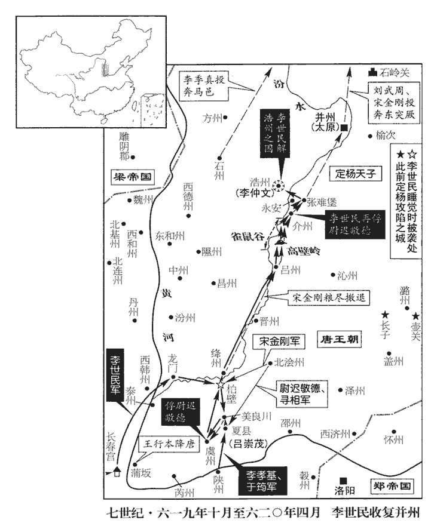
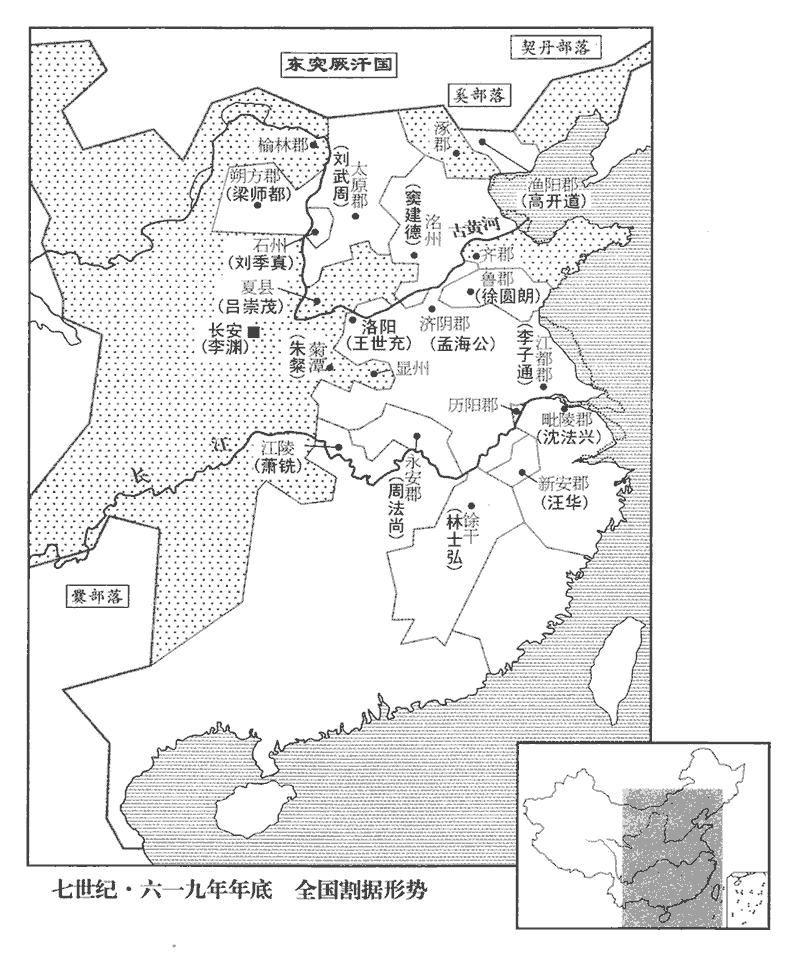
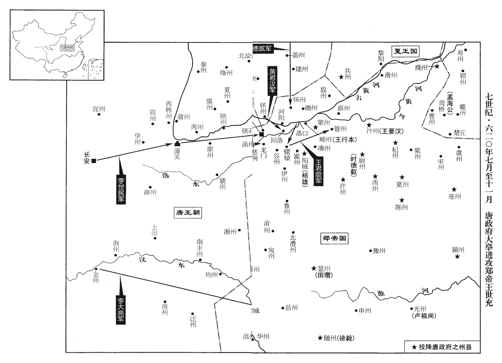
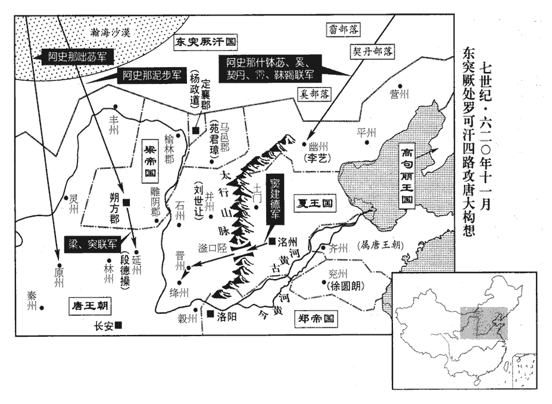
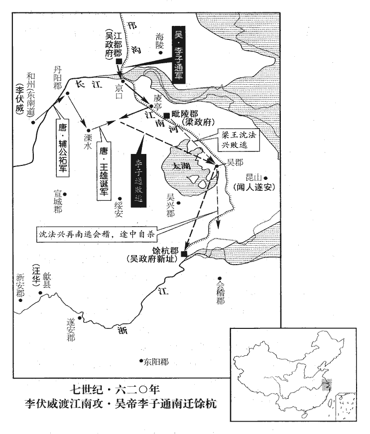
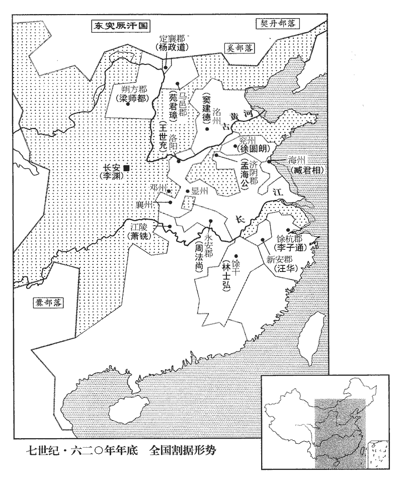

 唐紀四起屠維單閼（己卯）十一月，盡重光大荒落（辛巳）二月，凡一年有奇。

# 高祖神堯大聖光孝皇帝中之上

## 武德二年（己卯、六一九）

1十一月，己卯‹十四›，劉武周寇浩州。武周復寇西河。

〖译文〗 [1]十一月，己卯（十四日），刘武周侵犯浩州。

2秦王世民引兵自龍門‹山西省河津县西黄河断崖›乘冰堅渡河，屯柏壁‹山西省新绛县南›，柏壁在龍門關東北。宋白曰：柏壁在正平縣西南二十里。正平，絳州治所。與宋金剛相持。時河東州縣，此河東，通言大河以東，非專指河東一郡。俘掠之餘，未有倉廩，人情恇擾，恇，去王翻。恇，懼也。聚入城堡，徵斂無所得，斂，力贍翻。軍中乏食。世民發教諭民，民聞世民為帥而來，莫不歸附，此豈可以聲音笑貌致之。帥，所類翻。自近及遠，至者日多，然後漸收其糧食，軍食以充。孔子曰：「足食足兵，民信之矣。」民已信之，足食足兵，當知所先後也。乃休兵秣馬，唯令偏裨乘間抄掠，間，古莧翻。抄，楚交翻。大軍堅壁不戰，由是賊勢日衰。

〖译文〗 [2]秦王李世民乘冰冻坚硬，带兵从龙门渡过黄河，驻扎在柏壁，与宋金刚对峙。当时黄河以东的州县遭抢劫后，没有粮仓，人情惧怕侵扰，聚居在城堡中，征集不到东西，军队缺粮。李世民发布王教晓谕百姓，百姓听说李世民率军前来，无不前来归顺，由近及远，前来的人日益增加，然后唐军逐渐征收粮食，军粮因此充足。于是休兵喂马，只命非主力部队的将佐找空子抄掠，大军则坚壁不战，宋金刚的势力因此日益衰落。

世民嘗自帥輕騎覘敵，帥，讀曰率。騎，奇寄翻；下同。覘，丑廉翻，又丑豔翻；下同。騎皆四散，世民獨與一甲士登丘而寢。俄而賊兵四合，初不之覺，會有蛇逐鼠，觸甲士之面，甲士驚寤，遂白世民俱上馬，史言世民之有天命。上，時掌翻。馳百餘步，為賊所及，世民以大羽箭射殪yì其驍將，史言世民不惟有天命，亦武藝絕人。射，而亦翻。殪，一計翻。驍，堅堯翻；下同。將，即亮翻；下同。賊騎乃退。

〖译文〗 李世民曾经亲自带轻骑兵去侦察敌情，随从的骑兵四下分散，世民只和一名穿铠甲的士卒登上山丘睡觉。不久，敌人从四下包围了二人，开始二人毫不知觉，恰巧蛇追老鼠，碰到了甲士的脸，甲士惊醒后告诉了李世民，二人一起上马，才走了百余步，就被敌人追上，李世民用大羽箭射死了敌人的骁将，敌骑兵于是退去。

 

3李世勣欲歸唐，恐禍及其父，謀於郭孝恪。孝恪曰：「吾新事竇氏，動則見疑，宜先立效以取信，然後可圖也。」世勣從之。襲王世充獲嘉‹河南省获嘉县›，破之，是年閏二月，王世充殺李育德，取獲嘉。多所俘獲，以獻建德，建德由是親之。

〖译文〗 [3]李世想归顺唐，又怕牵连了老父，便和郭孝恪商量。郭孝恪说：“我才跟随窦建德，一做事就受猜忌，您应当先立功取得信任，然后就可以谋划归唐了。”李世听从了他的劝告。袭击王世充的获嘉，攻陷了城池，俘虏了许多人并缴获很多东西，都献给窦建德，窦建德因此对李世很好。

初，漳南‹河北省故城县东›人劉黑闥tà，少驍勇狡獪，舊志：貝州漳南縣，漢東陽縣地；後魏省東陽縣；隋開皇六年，分棗強、清平二縣地，復置東陽縣於東陽古城，十八年，改為漳南。宋白曰：取地居漳水之南為名。少，詩照翻。驍，堅堯翻。獪，古外翻。與竇建德善，後為群盜，轉事郝孝德、李密、王世充。世充以為騎將，每見世充所為，竊笑之。世充使黑闥守新鄉‹河南省新乡市›，舊志：隋分汲、獲嘉二縣地，於古新樂城置新鄉縣，時屬義州，後屬殷州。宋白曰：漢書，武帝將幸緱gōu氏，至汲縣之新中鄉，即此地。新樂城，十六國時，燕樂安王臧所築。李世勣擊虜之，獻於建德。建德署為將軍，賜爵漢東公，常使將奇兵東西掩襲，或潛入敵境覘視虛實，黑闥往往乘間奮擊，克獲而還。間，古莧翻。還，從宣翻。

〖译文〗 当初，漳南人刘黑闼，年轻时勇猛又狡猾，与窦建德很要好，后来当了强盗，相继跟随郝孝德、李密、王世充。王世充任命他为骑将，刘黑闼每看到王世充的所作所为，常常暗地里嘲笑他。王世充让刘黑闼守卫新乡，李世袭击并俘虏了刘黑闼，献给窦建德。窦建德任命刘黑闼为将军，赐予汉东公的爵位，常常让他率奇兵四处偷袭，或者潜入敌人的境内侦察敌军的情况，刘黑闼往往乘机攻击，得胜后回军。

4十二月，庚申‹二十五›，上獵于華山。華，戶化翻。

〖译文〗 [4]十二月庚申（二十五日），唐高祖在华山打猎。

 

5于筠yún說永安王孝基急攻呂崇茂，說，輸芮翻。獨孤懷恩請先成攻具，然後進，孝基從之。崇茂求救於宋金剛，金剛遣其將善陽‹马邑郡郡政府所在县·山西省朔州市›尉遲敬德、尋相將兵奄至夏縣‹山西省夏县›。孝基表裏受敵，軍遂大敗，將，即亮翻。舊志：朔州善陽縣，漢定襄縣地，有秦時馬邑城、武周塞，後魏置桑乾郡，隋大業初，置善陽縣。尉，紆勿翻。尋，姓也。姓苑、晉有尋曾。相，息亮翻。是年十月，呂崇茂據夏縣。夏，戶雅翻。考異曰：高祖實錄云：「戰于下邽縣。」按下邽乃在關中，去夏縣殊遠，實錄之誤也，今從舊書孝基傳。孝基、懷恩、筠、唐儉及行軍總管劉世讓皆為所虜。敬德名恭，以字行。

〖译文〗 [5]于筠劝永安王李孝基抓紧攻击吕崇茂，独孤怀恩请求先准备好攻城器械，然后进攻，李孝基答应了他的请求。吕崇茂向宋金刚求援，宋金刚派遣手下将领善阳人尉迟敬德、寻相带兵很快赶到夏县。李孝基腹背受敌，于是打了大败仗，李孝基、独孤怀恩、于筠、唐俭以及行军总管刘世让都作了俘虏。尉迟敬德名叫尉迟恭，平素称其字敬德。

上徵裴寂入朝，責其敗軍，下吏，朝，直遙翻。敗，補邁翻。下，遐嫁翻。既而釋之，寵待彌厚。

〖译文〗 高祖征召裴寂入朝，责备他打了败仗，交给有关部门审问，不久又释放了他，对他的优宠有增无减。

尉遲敬德、尋相將還澮州‹北浍州·山西省翼城县›，澮kuài，古外翻。秦王世民遣兵部尚書殷開山、總管秦叔寶等邀之於美良川‹山西省夏县北›，大破之，斬首二千餘級。頃之，敬德、尋相潛引精騎援王行本於蒲反，騎，奇寄翻；下同。世民自將步騎三千從間道夜趨安邑‹即虞州·山西省运城市东北安邑镇›，安邑，古縣，時屬虞州。將，即亮翻。間，古莧翻。趨，七喻翻。邀擊，大破之。敬德、相僅以身免，悉俘其眾，復歸柏壁。

〖译文〗 尉迟敬德、寻相就要回浍州，秦王李世民派兵部尚书殷开山、总管秦叔宝等人在美良川截击，大败尉迟敬德，杀了二千多人。不久，尉迟敬德、寻相又秘密带精骑往蒲反援救王行本，李世民自己率领三千步兵骑兵从小路连夜赶到安邑，截击并大败尉迟敬德。尉迟敬德、寻相二人只身逃脱，部下全部被俘，李世民又回到柏壁。

諸將咸請與宋金剛戰，世民曰：「金剛懸軍深入，精兵猛將，咸聚於是，將，即亮翻；下同。武周據太原，倚金剛為扞蔽。軍【章：十二行本「軍」上有「金剛」二字；乙十一行本同；孔本同；張校同。】無蓄積，以虜掠為資，利在速戰。我閉營養銳以挫其鋒，分兵汾‹山西省吉县›、隰‹山西省隰县›，衝其心腹，汾、隰，隋龍泉、西河二郡之地也。孫愐曰：汾州，本漢西河郡茲氏縣地，魏於茲氏置西河郡，今州城是也。左傳曰：重耳居蒲，即隰川縣故蒲城是也。漢為蒲子縣，後魏、齊、周之間為汾州，隋為隰州。爾雅曰：下濕曰隰。以州帶泉泊下濕，故以隰名。彼糧盡計窮，自當遁走。當待此機，未宜速戰。」

〖译文〗 各位将领都请求与宋金刚交战，李世民说：“宋金刚孤军深入，麾下集中了精兵猛将，刘武周占据太原，依仗宋金刚为屏障。宋金刚的军队没有储备，靠掠夺补充军需，利于速战。我们关闭营门不出，养精蓄锐，可以挫败他的锐气；分兵攻汾州、隰州，骚扰他的要害之地，他们粮尽无计可施，自然会退军。我们应当等待这个机会，目前不宜速战。”

永安壯王孝基謀逃歸，劉武周殺之。

〖译文〗 永安壮王李孝基谋划逃归，被刘武周杀死。

6李世勣復遣人說竇建德曰：「曹‹山东省定陶县›、戴‹山东省成武县›二州，戶口完實，隋置曹州於濟陰，戴州於成武；大業初，廢二州，併為濟陰郡；大業亂，復為州。復，扶又翻。說，式芮翻。孟海公竊有其地，與鄭人外合內離；王世充國號鄭。‹首都洛阳·皇帝王世充›若以大軍臨之，指期可取。既得海公，以臨徐、兗，王世充時遣王世辯據徐州，徐圓朗據兗州。河南可不戰而定也。」建德以為然，欲自將徇河南，先遣其行臺曹旦等將兵五萬濟河，考異曰：實錄在來年正月。今從革命記。世勣引兵三千會之。

〖译文〗 [6]李世又派人劝窦建德说：“曹、戴二州，户口充实，孟海公占据二州，与东都的郑国貌合神离，如果发大军进取二州，指日可待。得孟海公后，再率兵逼近徐州、兖州，黄河以南可不战而定。”窦建德认为这意见很对，便准备亲自领兵攻取河南，先派他的行台曹旦等人率五万兵马渡过黄河，李世带三千兵马与他们会合。

## 三年（庚辰、六二零）

1春，正月，將軍秦武通攻王行本於蒲反‹山西省永济县›。行本出戰而敗，糧盡援絕，欲突圍走，無隨之者，戊寅‹十四›，開門出降。降，戶江翻。辛巳‹十七›，上‹李渊，本年五十五岁›幸蒲州，斬行本。蒲州治蒲反。宋白曰：蒲州，漢之河東郡蒲反縣，本舜都，周為虞、虢、耿、揚、芮之地，戰國時魏地，漢置河東郡，後魏初置雍州，延和元年，改泰州，後周改蒲州。秦王世民輕騎謁上於蒲州。騎，奇寄翻；下同。宋金剛圍絳州‹山西省新绛县›。絳州治正平。癸巳‹二十九›，上還長安。

〖译文〗 [1]春季，正月，唐将军秦武通在蒲反攻打王行本。王行本出军迎战，打了败仗，粮草已尽，没有后援，打算突围逃走，又没有跟随的人。戊寅（十四日），开城门出城投降。辛巳（十七日），唐高祖临幸蒲州，斩王行本。秦王李世民轻骑到蒲州谒见高祖。宋金刚包围了绛州。癸巳（二十九日），高祖返回长安。

2李世勣謀俟竇建德至河南，掩襲其營，殺之，冀得其父并建德土地以歸唐。會建德妻產，久之不至。

〖译文〗 [2]李世计划待窦建德到河南，便偷袭他的营地，杀窦建德，希望找回父亲并且以窦建德的地盘回归唐朝。恰巧窦建德的妻子生产，久等不到。

曹旦，建德之妻兄也，在河南，多所侵擾，諸賊羈屬者皆怨之。賊帥魏郡‹河南省安阳市›李文相，號李商胡，帥，所類翻。相，息亮翻。考異曰：革命記作「傷胡」。今從河洛記。聚五千餘人，據孟津中潬‹河南省孟津县东黄河中小岛›；此即河陽中潬城也。宋白曰：中潬城，東魏所築，仍置河陽關。潬tān，徒旱翻。母霍氏，亦善騎射，自稱霍總管。考異曰：革命記，商胡母張氏，號「女將軍」。今從河洛記。世勣結商胡為昆弟，入拜商胡之母。母泣謂世勣曰：「竇氏無道，如何事之！」世勣曰：「母無憂，不過一月，當殺之，相與歸唐耳！」世勣辭去，母謂商胡曰：「東海公‹李世勣›許我共圖此賊，事久變生，何必待其來，不如速決。」是夜，商胡召曹旦偏裨二十三人，飲之酒，盡殺之。飲，於鴆翻。旦別將高雅賢、阮君明尚在河北未濟，商胡以巨舟四艘濟河北之兵三百人，至中流，悉殺之。有獸醫游水得免，獸醫，以能醫牛馬從軍。將，即亮翻。艘，蘇遭翻。至南岸，告曹旦，旦嚴警為備。商胡既舉事，始遣人告李世勣。世勣與曹旦連營，郭孝恪勸世勣襲旦，世勣未決，聞旦已有備，遂與孝恪帥數十騎來奔。帥，讀曰率。商胡復引精兵二千復，扶又翻。北襲阮君明，破之。高雅賢收眾去，商胡追之，不及而還。還，從宣翻，又如字。

〖译文〗 曹旦是窦建德妻子的哥哥，在河南大肆掠夺骚扰，归附的各路盗贼都愤愤不平。盗贼首领魏郡人李文相，号李商胡，聚集五千多人，占据了孟津中城；他的母亲霍氏，也善于骑马射箭，自称霍总管。李世和李商胡结拜为兄弟，入内室拜见李商胡的母亲。霍氏流着泪对李世说：“窦氏丧失了道德信义，怎么能够侍奉他？”李世说：“母亲不要担心，不超过一个月，我们就杀了他，一起归顺唐了！”李世告辞走后，霍氏对李商胡说：“东海公答应与我们共同杀了窦建德这贼，时间长了会发生变化，何必要等到他来，不如速战速决。”当晚，李商胡召来曹旦手下的二十三位偏将，用酒把他们灌醉，然后全部杀死。曹旦的别将高雅贤、阮君明还在黄河北岸没有过河，李商胡用四艘大船运河北岸的三百士兵过河，船到河中心，将三百人全部杀光。一位兽医游泳逃脱，到南岸，报告了曹旦，曹旦严加警戒以为防备。李商胡起事后，才派人通知李世。李世营地与曹旦相接，郭孝恪劝李世袭击曹旦，李世犹豫不决，听说曹旦已有防备，便和郭孝恪率数十骑兵投奔唐。李商胡又带二千精兵，向北袭击阮君明，打败了他。高雅贤收拾部众退却，李商胡追击，没有追赶上而回军。

建德群臣請誅李蓋，建德曰：「世勣，唐臣，為我所虜，不忘本朝，乃忠臣也，朝，直遙翻。其父何罪！」遂赦之。

〖译文〗 窦建德的诸位大臣请求杀掉李盖，窦建德说：“世是唐臣，被我俘虏，仍不忘唐朝，这是忠臣，他父亲有什么罪？”于是赦免了李盖。

甲午‹三十›，世勣、孝恪至長安。曹旦遂取濟州‹山东省茌平县西南›，武德之初，張青特據濟北。濟北郡即濟州。是後建德與唐相持於虎牢，張青特運糧為唐所獲，蓋先以濟州降曹旦也。濟，子禮翻。復還洺州。復，扶又翻；下同，又音如字。

〖译文〗 甲午（三十日），李世、郭孝恪到达长安。曹旦于是取得济州，之后又回到州。

3二月，庚子‹六›，上幸華陰‹陕西省华阴市›。華，戶化翻。

〖译文〗 [3]二月庚子（初六），唐高祖临幸华阴。

4劉武周‹定杨天子，首都太原山西省太原市›遣兵寇潞州‹山西省长治市›，陷長子‹山西省长子县›、壺關‹山西省壶关县›。二縣皆屬潞州。宋白曰：潞州，春秋潞子國，秦、漢為上黨郡；後周立潞州，以其浸汾潞為名。潞州刺史郭子武不能禦，上以將軍河東‹山西省永济县›王行敏助之。河東縣帶蒲州，即蒲反也。隋開皇十六年，析蒲反置縣，大業初，并蒲反入焉。行敏與子武不叶，或言子武將叛，行敏斬子武以徇。乙巳‹十一›，武周復遣兵寇潞州，行敏擊破之。

〖译文〗 [4]刘武周派兵侵犯潞州，攻陷长子、壶关二县。潞州刺史郭子武不能抵御刘武周军的攻势，高祖派将军河东人王行敏援助郭子武。王行敏与郭子武不和，有人说郭子武要叛唐，王行敏杀了郭子武以示众。乙巳（十一日），刘武周又派兵侵犯潞州，被王行敏击退。

5壬子‹十八›，開州‹重庆市开县›蠻冉肇則陷通州‹四川省达川市›。舊志：開州，隋巴東郡之盛山縣；盛山，漢巴郡之朐qú䏰rěn縣也。義寧元年，析巴東之盛山、新浦，通川之萬世、西流，置萬州。武德元年，改開州。通州，漢宕渠縣地，梁置萬州，元魏改通州，隋為通川郡，武德元年復為通州。孫愐曰：通州本漢宕渠縣，內有地萬餘頃，因名為萬州；後魏以萬州居四達之路，改為通州；宋為達州。

〖译文〗 [5]壬子（十八日），开州蛮冉肇则攻陷通州。

6甲寅‹二十›，遣將軍桑顯和等攻呂崇茂於夏縣‹山西省夏县›。夏，戶雅翻。

〖译文〗 [6]甲寅（二十日），唐派遣将军桑显和等人在夏县攻打吕崇茂。

7初，工部尚書獨孤懷恩攻蒲反，久不下，失亡多，上數以敕書誚讓之，數，所角翻。誚qiào，才笑翻。懷恩由是怨望。上嘗戲謂懷恩曰：「姑之子皆已為天子，謂隋煬帝及上也。次應至舅之子乎？」懷恩亦頗以此自負，或時扼腕曰：「我家豈女獨貴乎？」周明帝后、隋文帝后及上母皆獨孤氏。腕，烏貫翻。遂與麾下元君寶謀反。會懷恩、君寶與唐儉皆沒於尉遲敬德，尉，紆勿翻。君寶謂儉曰：「獨孤尚書近謀大事，若能早決，豈有此辱哉！」及秦王世民敗敬德於美良川‹山西省夏县北›，敗，補邁翻。懷恩逃歸，上復使之將兵攻蒲反。復，扶又翻；下同。將，即亮翻；下同。君寶又謂儉曰：「獨孤尚書遂拔難得還，難，乃旦翻。復在蒲反，可謂王者不死！」儉恐懷恩遂成其謀，乃說尉遲敬德，說，輸芮翻。尉，紆勿翻。請使劉世讓還與唐連和，敬德從之，遂以懷恩反狀聞。時王行本已降，降，戶江翻；下同。懷恩入據其城，上方濟河幸懷恩營，已登舟矣，世讓適至。上大驚曰：「吾得免，豈非天也！」乃使召懷恩，懷恩未知事露，輕舟來至，即執以屬吏，屬，之欲翻。分捕黨與。甲寅‹二十›，誅懷恩‹年三十六岁›及其黨。

〖译文〗 [7]当初，工部尚书独孤怀恩攻打蒲反，长期不能攻克，损失惨重，唐高祖几次下敕书责备他，于是怀恩心生怨气。高祖曾经和怀恩开玩笑说：“你姑姑的儿子都做了皇帝，下面是否该轮到我舅舅的儿子当皇帝了？”怀恩颇以此自负，有时也惋惜道：“难道我们家唯独女人才尊贵吗？”于是便和手下的元君宝谋反。时值怀恩、元君宝和唐俭都被尉迟敬德俘虏，君宝对唐俭说：“独孤尚书近来在谋划一件大事，如果能早些决定，哪会受这番屈辱呢！”待秦王李世民在美良川打败尉迟敬德，独孤怀恩便逃回唐朝，高祖重又让他带兵攻打蒲反。元君宝又对唐俭说：“独孤尚书终于逃脱得以回唐，重到蒲反，这真称得上是王者不死！”唐俭恐怕独孤怀恩阴谋得逞，于是说服尉迟敬德，请求让刘世让回唐，与唐讲和，尉迟敬德听从了他的意见，于是通过刘世让报告了独孤怀恩谋反的情况。当时王行本已经降唐，独孤怀恩进驻蒲反，高祖正过黄河准备临幸怀恩的营地，已经登上了渡船，刘世让恰好赶到。高祖大惊，说：“我能够免于祸事，这难道不是天意吗？”于是召见怀恩，独孤怀恩不知道事情已经败露，驾小船来见高祖，立即被抓起来交给有关官员，又分头搜捕独孤怀恩的同党。甲寅（二十日），处决独孤怀恩及其同党。

8竇建德攻李商胡，殺之。建德【張：「德」下脫「至」字。】洺州勸課農桑，境內無盜，商旅野宿。

〖译文〗 [8]窦建德攻打李商胡，杀了李商胡。窦建德到州考查、鼓励耕织，所辖地区没有盗贼，商贾行人露宿。

9突厥‹瀚海沙漠群›處羅可汗迎楊政道‹杨广的孙儿，本年二岁›，立為隋王。楊政道，齊王暕遺腹之子。厥，九勿翻。處，昌呂翻。可，從刊入聲。汗，音寒。中國士民在北者，處羅悉以配之，有眾萬人。置百官，皆依隋制，居于定襄‹内蒙古和林格尔县›。此蓋隋之定襄郡也，治大利城。

〖译文〗 [9]突厥处罗可汗迎接杨政道，立他为隋王。在突厥的中原官员百姓，处罗全部配给杨政道，共有一万人。杨政道设置百官，全部依照隋朝制度，居住在隋朝时的定襄郡。

10三月，乙丑‹二›，劉武周遣其將張萬歲寇浩州‹山西省汾阳县›，將，即亮翻。李仲文擊走之，俘斬數千人。

〖译文〗 [10]三月乙丑（初二），刘武周派遣手下将领张万岁侵犯浩州，李仲文击退来敌，杀伤俘虏数千人。

11改納言為侍中，內史令為中書令，給事郎為給事中。復舊官名也。杜佑曰：漢制，給事中，日上朝謁、平尚書奏事，以有事殿中，故曰給事中。東漢省，魏復置，南北朝因之。後周天官之屬有給事中，掌治六經，給事左右；其後別置給事中，在六官之外。隋初，於吏部置給事郎，至煬帝，移為門下之職，置員四人，以省讀奏章，至是，改為給事中。龍朔二年，改東臺舍人；咸亨元年，復舊。掌侍從讀署奏抄，較正違失，分判省事。給事中蓋因漢之名，行周、隋之職。

〖译文〗 [11]唐改纳言为侍中，内史令为中书令，给事郎为给事中。

12甲戌‹十›，以內史侍郎封德彝為中書令。

〖译文〗 [12]甲戌（十一日），任命内史侍郎封德彝为中书令。

13王世充將帥、州縣來降者，時月相繼。帥，所類翻。降，戶江翻。世充乃峻其法，一人亡叛，舉家無少長就戮，少，詩照翻。長，知兩翻。父子、兄弟、夫婦許相告而免之。又使五家為保，有舉家亡者，四鄰不覺，皆坐誅。殺人益多而亡者益甚，至於樵采之人，出入皆有限數；公私愁窘，窘，渠隕翻。人不聊生。又以宮城為大獄，意所忌者，并其家屬收繫宮中；諸將出討，亦質其家屬於宮中，將，即亮翻。質，音致。禁止者常不減萬口，餒死者日有數十。世充又以臺省官為司、鄭‹河南省荥阳市汜水镇›、管‹河南省郑州市›、原‹河南省原阳县西南›、伊‹河南省襄城县›、殷‹河南省获嘉县›、梁‹河南省睢县›、湊‹疑在河南省密县境›、嵩‹河南省登封县›、谷‹洛阳东南二十千米›、懷‹河南省沁阳市›、德‹河南省温县东北武德乡›等十二州營田使，世充以洛州為司州，汜水為鄭州，管城為管州，沁水為原州，襄城為伊州，獲嘉為殷州，睢陽為梁州。湊州，闕；九域志：鄭州古跡有湊水，當置湊州於此。嵩陽為嵩州，大谷為谷州，河內為懷州，武德為德州。丞、郎得為此行者，喜若登仙。丞、郎，尚書左右丞及諸曹郎也。史言王世充將敗。

〖译文〗 [13]王世充的将领、州县官络绎不绝地前来降唐。王世充于是加重了法律，一人叛逃，全家无论老少全部杀死，父子、兄弟、夫妻相互告发的可以免死。又让五家结为一保，一家举家逃亡，四邻未查觉，四家均获死罪。但杀的人越多，逃亡的人也越多，以至于出城砍柴的人，出入城都有限额；上下愁怨窘迫，民不聊生。王世充又将宫城作为大监牢，心里忌恨的人，连家属一道囚禁在宫内；诸将如要出城作战，也要把家属留在宫内当人质，囚禁的人经常不下一万人，每天都有几十人饿死。王世充又任命中央台省的官员为司、郑、管、原、伊、殷、梁、凑、嵩、、怀、德十二州的营田使，尚书左右丞、诸曹郎官得了此任的高兴得像做了神仙。

14甲申‹二十一›，行軍副總管張綸敗劉武周於浩州‹山西省汾阳县›，敗，補邁翻。俘斬千餘人。

〖译文〗 [14]甲申（二十一日），唐行军副总管张纶在浩州打败刘武周，俘虏、斩首一千多人。

15西河公張綸、此張綸即上張綸，上書其官，此書其爵。真鄉公李仲文引兵臨石州‹山西省离石县›，石州，隋之離石郡。劉季真懼而詐降。乙酉‹二十二›，以季真為石州總管，賜姓李氏，封彭山郡王。

〖译文〗 [15]西河公张纶、真乡公李仲文带兵逼近石州，刘季真胆怯，假称投降。乙酉（二十二日），唐任命刘季真为石州总管，赐姓李，封为彭山郡王。

16蠻酋冉肇則寇信州‹重庆市奉节县›，按新志：信州，隋之巴東郡，武德二年改為夔州，史以舊州名書之。杜佑曰：夔州，春秋時為魚國，梁置信州。唐武德二年，避皇外祖獨孤信諱，改為夔州，治奉節縣。酋，慈由翻。趙郡公孝恭與戰，不利。李靖將兵八百，襲擊，斬之，將，即亮翻。俘五千餘人；己丑‹二十六›，復開‹重庆市开县›、通二州。孝恭又擊蕭銑東平王闍提，斬之。闍shé，視遮翻。考異曰：舊書蕭銑傳云：「孝恭討之，拔其開、通二州，斬其偽東平王蕭闍提。」按實錄云：「冉肇則陷我通州。」又云：「孝恭復開、通二州。」若二州本屬銑，不當云「我」與「復」，蓋肇則先據開州，又陷通州，以地附銑，銑使闍提助之耳。

〖译文〗 [16]蛮族首领冉肇则侵犯信州，赵郡公李孝恭与冉肇则交锋，失利。李靖率八百兵马袭击，杀了冉肇则，俘虏五千多人。己丑（二十六日），唐收复开州、通州。李孝恭又袭击萧铣手下的东平王提，杀了他。

17夏，四月，丙申‹三›，上祠華山‹西岳·陕西省华阴市南›；壬寅‹九›，還長安。華，戶化翻。還，從宣翻。

〖译文〗 [17]夏季，四月丙申（初三），唐高祖祭祀华山。壬寅（初九）返回长安。

18置益州道‹四川省成都市›行臺，以益‹总部设四川省成都市›、利‹四川省广元市›、會‹西会州，四川省茂县›、鄜‹陕西省富县›、涇‹甘肃省泾川县›、遂‹四川省遂宁市›六總管隸焉。益州，隋之蜀郡。利州，隋之義城郡，梁之黎州，晉之晉壽，蜀之漢壽，漢之葭萌也。會州，隋之涼川縣會寧鎮，西魏之會州也。鄜州，隋之上郡，西魏之敷州，後魏之北華州中部敷城郡也，太和中為東秦州。涇州，隋之安定郡。遂州，隋之遂寧郡，漢之廣漢縣也。是時益州行臺所統，起蜀，跨隴而東北。

〖译文〗 [18]设置益州道行台，将益、利、会、、泾、遂六州总管划归益州道行台统辖。

19劉武周數攻浩州，為李仲文所敗。數，所角翻。敗，補邁翻。宋金剛軍中食盡；丁未‹十四›，金剛北走，秦王世民追之。

〖译文〗 [19]刘武周几次进攻浩州，都被李仲文打败。宋金刚的军队粮食吃光，丁未（十四日），宋金刚向北逃窜，秦王李世民带兵追击。

20羅士信圍慈澗‹洛阳城西›，隋志：河南郡壽安縣有慈澗。水經註：新安有孝水，孝水東十里有水，世謂之慈澗。王世充使太子玄應救之，【章：十二行本「救」作「拒」；乙十一行本同；孔本同。】士信刺玄應墜馬，刺，七亦翻。人救之，得免。

〖译文〗 [20]罗士信围攻慈涧，王世充派太子王玄应救援慈涧，罗士信把王玄应刺下马，有人搭救，王玄应才逃脱。

21壬子‹十九›，以顯州道‹河南省泌阳县›行臺楊士林為行臺尚書令。去年正月，楊士林降。

〖译文〗 [21]壬子（十九日），唐任命显州道行台杨士林为行台尚书令。

22甲寅‹二十一›，加秦王世民益州道行臺尚書令。

〖译文〗 [22]甲寅（二十一日），加封秦王李世民为益州道行台尚书令。

23秦王世民追及尋相於呂州‹山西省霍州市›，新志：義寧元年，以晉州之霍邑、趙城、汾西，汾州之靈石，置霍山郡，武德元年，曰呂州，呂州蓋治霍邑也。相，息亮翻。大破之，乘勝逐北，一晝夜行二百餘里，戰數十合。至高壁嶺‹山西省灵石县南›，總管劉弘基執轡諫曰：「大王破賊，逐北至此，功亦足矣，深入不已，不愛身乎！且士卒飢疲，宜留壁於此，俟兵糧畢集，然後復進，未晚也。」復，扶又翻；下同。世民曰：「金剛計窮而走，眾心離沮；功難成而易敗，機難得而易失，沮，在呂翻。易，以豉翻。必乘此勢取之。若更淹留，使之計立備成，不可復攻矣。吾竭忠徇國，豈顧身乎！」遂策馬而進，將士不敢復言飢。將，即亮翻。追及金剛於雀鼠谷‹山西省灵石县西南汾水河谷›，一日八戰，皆破之，俘斬數萬人。夜，宿於雀鼠谷西原，世民不食二日，不解甲三日矣，軍中止有一羊，世民與將士分而食之。將，即亮翻。丙辰‹二十三›，陝州‹总部设河南省三门峡市›總管于筠自金剛所逃來。陝，失冉翻。去年十二月，筠為金剛將所擒。世民引兵趣介休‹山西省介休市›，介休，介州治所。趣，七喻翻，又逡須翻。金剛尚有眾二萬，出【章：十二行本「出」上有「戊午」二字；乙十一行本同；孔本同；張校同；退齋校同。】西門，背城布陳，背，蒲妹翻。陳，讀曰陣。南北七里。世民遣總管李世勣與戰，小卻，為賊所乘，世民帥精騎擊之，帥，讀曰率。騎，奇寄翻。出其陳後，金剛大敗，斬首三千級。金剛輕騎走，世民追之數十里，至張難堡‹山西省平遥县西南›。張難，蓋人姓名，築堡自守，因以名之。浩州‹总部设山西省汾阳县›行軍總管樊伯通、張德政據堡自守，世民免冑示之，堡中喜譟且泣，左右告以王不食，獻濁酒、脫粟飯。

〖译文〗 [23]秦王李世民在吕州追上寻相，将他打得大败，并乘胜追击逃敌，一昼夜走了二百多里，打了几十仗。到高壁岭，总管刘弘基抓住马缰绳规劝道：“大王打败敌人，追击逃敌到了这里，功劳也足够了，不断深入，就不爱惜自己吗？况且士兵们饥饿疲惫，应当在此停留扎营，等到兵马粮草都齐备了，然后再进击也不晚。”李世民说：“宋金刚无计可施才逃跑，军心涣散；功劳难立，失败却很容易，机会难得，失去却很容易，一定要趁此机会消灭他。如果我们滞留不前，让他有时间考虑对策加强防备，就不可能轻易打败他了。我尽心竭力效忠国家，怎么能只顾惜自己的身体呢？”于是打马追击，将士们也不敢再提饥饿。唐军在雀鼠谷追上宋金刚，一天交锋八次，都打了胜仗，杀死、俘虏了几万人。当夜，在雀鼠谷西原宿营，李世民已经两天没有吃东西，三天没有脱下战袍了，全军只有一只羊，世民与将士们分吃了这一只羊。丙辰（二十三日），唐陕州总管于筠从宋金刚手下脱身逃回唐军中。李世民带兵赴介休，宋金刚还有二万人，出西门，背对城墙排列战阵，南北长七里。李世民派总管李世出战，不利，稍稍退却，宋金刚乘机反扑，李世民率领精骑从宋金刚背后袭击，宋金刚大败，唐军杀了三千人。宋金刚骑马逃走，李世民追出几十里，来到张难堡。唐浩州行军总管樊伯通、张德政占据堡垒自卫，李世民摘下头盔示意堡内，堡中守军见后欢呼雀跃，高兴得流下泪来。随从告诉守军秦王还未进食，守军献上浊酒、粗米饭。

尉遲敬德收餘眾守介休‹介州州政府所在县›，尉，紆勿翻。世民遣任城王道宗、宇文士及往諭之，任，音壬。敬德與尋相舉介休及永安‹山西省孝义市东›降。永安，漢中陽縣也。後魏更名，時屬浩州。雀鼠谷，在永安，介休二縣間。世民得敬德，甚喜，以為右一府統軍，使將其舊眾八千，與諸營相參。將，即亮翻；下同。屈突通慮其變，驟以為言，世民不聽。

〖译文〗 尉迟敬德收拾残部守介休，李世民派任城王李道宗、宇文士及前去晓谕，尉迟敬德于是和寻相以介休、永安二县降唐。李世民得到尉迟敬德非常高兴，任命尉迟敬德为右一府统军，并让他仍然统领八千旧部，和各营相杂在一起。屈突通恐怕尉迟敬德会反复，屡次向李世民提起，但李世民不听。

劉武周聞金剛敗，大懼，棄并州‹太原·山西省太原市›走突厥‹瀚海沙漠群›。金剛收其餘眾，欲復戰，眾莫肯從，亦與百餘騎走突厥。秦王之破劉武周、宋金剛，與破薛仁杲、宗羅睺方略一也。復，扶又翻。走，音奏；下同。厥，九勿翻。

〖译文〗 刘武周听说宋金刚失败，大为惊恐，放弃并州逃入突厥。宋金刚收拾残部，准备再战，但众人都不肯跟随他与唐作战，于是宋金刚也和一百多骑兵逃往突厥。

世民至晉陽‹并州州政府所在县·山西省太原市›，武周所署僕射楊伏念以城降。降，戶江翻。唐儉封府庫以待世民，唐儉與于筠同被禽。武周所得州縣皆入于唐。

〖译文〗 李世民到晋阳，刘武周任命的仆射杨伏念以晋阳城投降。唐俭封存了刘武周的仓库留待李世民处置，刘武周先后所占领的州县全部并入唐。

未幾，金剛謀走上谷‹河北省易县›，突厥追獲，腰斬之。金剛本起於上谷。幾，居豈翻。嵐州‹东会州，总部设山西省岚县›總管劉六兒從宋金剛在介休，秦王世民擒斬之。其兄季真，棄石州，奔劉武周將馬邑高滿政，滿政殺之。去年五月，劉六兒降，今年三月，季真降，而實附金剛、武周，今皆誅死。

〖译文〗 不久，宋金刚打算跑回起兵初占的上谷，被突厥追上捉回，突厥腰斩了宋金刚。去年五月投降宋金刚的唐岚州总管刘六儿跟着宋金刚在介休，秦王李世民活捉并杀了他。刘六儿的兄长刘季真，丢弃石州，逃奔刘武周的将领马邑人高满政，高满政杀了他。

武周之南寇也，其內史令苑君璋諫曰：「唐主舉一州之眾，直取長安‹隋首都·陕西省西安市›，所向無敵，此乃天授，非人力也。晉陽以南，道路險隘，縣軍深入，縣，讀曰懸。無繼於後，若進戰不利，何以自還！還，從宣翻。不如北連突厥，南結唐朝，厥，九勿翻。朝，直遙翻。南面稱孤，足為長策。」武周不聽，留君璋守朔州。及敗，泣謂君璋曰：「不用君言，以至於此。」久之，武周謀亡歸馬邑，事泄，突厥殺之。突厥又以君璋為大行臺，統其餘眾，仍令郁射設督兵助鎮。

〖译文〗 刘武周向南侵犯唐时，他的内史令苑君璋曾经规劝道：“唐主以一个州的兵力，直取长安，所向无敌，这是上天有助，不是人力。晋阳以南，道路狭窄险要，孤军深入，后无援军，假如进军攻战不利，怎么回军？不如北面联合突厥，南面与唐结交，在此一方称王称霸，才是良策。”刘武周不听，留苑君璋守卫朔州。待刘武周失败后，流着泪对君璋说：“我没有采纳您的意见，以至于到了现在这种地步。”过了一段时间，刘武周策划从突厥逃回马邑，事情泄露，突厥杀了刘武周。突厥人任命苑君璋为大行台，统领刘武周的余部，仍然令郁射设督兵协助镇守。

24庚申‹二十七›，懷州‹总部设河南省济源市西黄河北岸›總管黃君漢擊王世充太子玄應於西濟州‹河南省济源市›，大破之；新志：武德二年，王世充將丁伯德以濟源縣來降，置西濟州。曰「西」者，以別濟北之濟州。濟，子禮翻。熊州‹河南省宜阳县西›行軍總管史萬寶邀之於九曲‹宜阳县北›，又破之。

〖译文〗 [24]庚申（二十七日），唐怀州总管黄君汉在西济州袭击王世充的太子王玄应，重创王玄应；熊州行军总管史万宝在九曲截击王玄应，又打败了他。

25辛酉‹二十八›，王世充陷鄧州‹河南省邓州市›。

〖译文〗 [25]辛酉（二十八日），王世充攻陷邓州。

26上聞并州平，大悅。壬戌‹二十九›，宴群臣，賜繒帛，使自入御府，盡力取之。唐御府蓋屬內侍省內府局。六典：內府令掌中宮府藏寶貨、給納名數，凡朝會，五品已上賜絹及雜綵、金銀器於殿庭者，並供之。今使各稱力自取繒帛。繒，慈陵翻。復唐儉官爵，仍以為并州道安撫大使；使，疏吏翻。所籍獨孤懷恩田宅資財，悉以賜之。賞其發懷恩反謀也。

〖译文〗 [26]唐高祖听说平定了并州，非常高兴。壬戌（二十九日），宴请群臣，赐给缯帛，让人自己进御府，尽力自取。又恢复了唐俭的官爵，仍然任并州道安抚大使；将官府没收的独孤怀恩的田地房屋资财，全部赏赐给了唐俭。

世民留李仲文鎮并州‹总部设山西省太原市›，劉武周數遣兵入寇，此言武周未死之前。數，所角翻。仲文輒擊破之，下城堡百餘所。謂馬邑郡界城堡也。詔仲文檢校并州總管。檢校官未為真。

〖译文〗 李世民留李仲文镇守并州，刘武周屡次派兵侵入并州境内，都被李仲文击退，李仲文还攻克了一百多座城堡。唐下诏以李仲文为检校并州总管。

27五月，竇建德遣高士興擊李藝於幽州‹北京市›，不克，退軍籠火城‹北京市南›。藝襲擊，大破之，斬首五千級。建德大將軍王伏寶，勇略冠軍中，冠，古玩翻。諸將疾之，將，即亮翻；下同。言其謀反，建德殺之，伏寶曰：「大王柰何聽讒言，自斬左右手乎！」

〖译文〗 [27]五月，窦建德派高士兴在幽州袭击李艺，没有攻克，撤军到笼火城。李艺袭击了高士兴，重创高军，斩首五千级。窦建德手下的大将军王伏宝勇猛机智，全军数第一，众将领嫉妒他，说他要谋反，窦建德杀了王伏宝，刑前王伏宝说：“大王怎么能够听信谗言，自己断了自己的左右手呢！”

28初，尉遲敬德將兵助呂崇茂守夏縣，上潛遣使赦崇茂罪，拜夏州刺史，蓋以夏縣為夏州。使，疏吏翻。夏，戶雅翻。尉，紆勿翻。使圖敬德，事泄，敬德殺之。敬德去，崇茂餘黨復據夏縣拒守。復，扶又翻。秦王世民引軍自晉州‹山西省临汾市›還攻夏縣，壬午‹二十›，屠之。考異曰：高祖實錄：「帝曰：『平薛舉之初，不殺奴賊，致生叛亂，若不盡誅，必為後患。』詔勝兵者悉斬之。」疑作實錄者歸太宗之過於高祖，今不取。

〖译文〗 [28]当初，尉迟敬德带兵帮助吕崇茂保卫夏县，唐高祖暗中派人赦免了吕崇茂的罪过，拜他为夏州刺史，让他谋取尉迟敬德，事情泄露，尉迟敬德杀了吕崇茂。尉迟敬德离开夏县后，吕崇茂余部又占据夏县拒守。秦王李世民率军从晋州回师攻夏县，壬午（二十四日），屠城。

29辛卯‹二十九›，秦王世民至長安。

〖译文〗 [29]辛卯（二十九日），秦王李世民到长安。

30是月，突厥遣阿史那揭多獻馬千匹於王世充，厥，九勿翻。揭，居謁翻。且求婚，世充以宗女妻之，妻，七細翻。并與之互市。

〖译文〗 [30]本月，突厥派遣阿史那揭多向王世充进献一千匹马，并求婚，王世充以同族之女远嫁突厥，并与突厥相互贸易。

31六月，壬辰‹一›，詔以和州總管‹总部设安徽省和县›、東南道行臺尚書令楚王杜伏威為使持節、總管江、淮以南諸軍事、揚州‹江苏省南京市›刺史、東南道行臺尚書令、淮南道安撫使，進封吳王，賜姓李氏。使，疏吏翻；下同。以輔公祏為行臺左僕射，封舒國公。祏，音石。

〖译文〗 [31]六月壬辰（初一），唐下诏任命和州总管、东南道行台尚书令楚王杜伏威为使持节、总管江淮以南诸军事、扬州刺史、东南道行台尚书令、淮南道安抚使，晋封为吴王，赐姓李氏。任命辅公为东南道行台左仆射，进封舒国公。

32丙午‹十五›，立皇子元景為趙王，元昌為魯王，元亨為酆王。

〖译文〗 [32]丙午（初三），唐立皇子李元景为赵王，李元昌为鲁王，李元亨为王。

33顯州‹河南省泌阳县›行臺尚書令楚公楊士林，雖受唐官爵，而北結王世充，南通蕭銑，詔廬江王瑗與安撫使李弘敏討之。瑗，于眷翻。兵未行，長史田瓚為士林所忌，甲寅‹二十三›，瓚殺士林，降於世充，世充以瓚為顯州總管。長，知兩翻。瓚，藏旱翻。降，戶江翻。

〖译文〗 [33]显州行台尚书令楚公杨士林虽然接受了唐的官爵，却北面交结王世充，南面勾结萧铣，唐下诏命庐江王李瑗与安抚使李弘敏讨伐杨士林。军队还未出发，长史田瓒遭杨士林的猜忌，甲寅（二十三日），田瓒杀死杨士林，投降了王世充，王世充任命田瓒为显州总管。

34秦王世民之討劉武周也，突厥處羅可汗遣其弟步利設帥二千騎助唐。厥，九勿翻。處，昌呂翻。可，從刊入聲。汗，音寒。帥，讀曰率。騎，奇寄翻。武周既敗，是月，處羅至晉陽‹即太原›，總管李仲文不能制；又留倫特勒，使將數百人，云助仲文鎮守，自石嶺‹山西省忻州市南›以北，皆留兵戍之而去。石嶺關在代州。杜佑曰：忻州定襄縣、漢陽曲縣，有石嶺關，甚嶮固。

〖译文〗 [34]秦王李世民讨伐刘武周时，突厥处罗可汗派弟弟步利设率二千骑兵协助唐军。刘武周失败后，当月，处罗可汗到晋阳，唐检校并州总管李仲文不能统制处罗；处罗又留下伦特勒，让伦特勒统领数百人，声称帮助李仲文镇守，从石岭关以北，都留下突厥兵戍守，然后离去。

35上議擊王世充，世充聞之，選諸州鎮驍勇皆集洛陽‹河南省洛阳市›，驍，堅堯翻。置四鎮將軍，募人分守四城。謂洛陽四城也。秋，七月，壬戌‹一›，詔秦王世民督諸軍擊世充。陝東道行臺屈突通二子在洛陽，時命通判陝東道行臺左僕射，從秦王東征。屈，區勿翻。上謂通曰：「今欲使卿東征，如卿二子何？」通曰：「臣昔為俘囚，分當就死，陛下釋縛，加以恩禮。事見一百八十四卷義寧元年十二月。分，扶問翻。當是之時，臣心口相誓，期以更生餘年為陛下盡節，為，于偽翻。但恐不獲死所耳。今得備先驅，二兒何足顧乎！」上歎曰：「徇義之士，一至此乎！」

〖译文〗 [35]唐高祖商议攻打王世充之事，王世充闻讯，从各州镇选拔骁勇，都集中到洛阳，设置四镇将军，又召募人分别守卫洛阳四城。秋季，七月壬戌（初一），高祖下诏命秦王李世民统率诸军攻打王世充。唐陕东道行台的左仆射屈突通的两个儿子都在洛阳，皇上对屈突通说：“现在想让你东征洛阳，你的两个儿子怎么办？”屈突通回答道：“臣下我过去作为阶下囚，理当被处死的，陛下不但释放了我，还施予很多恩惠。那时我就在内心发誓，希望能在有生之年为陛下尽节，只是唯恐没有机会尽节捐躯罢了。如今有幸得以充任前锋，两个儿子又有什么值得顾惜的！”高祖赞叹道：“真是一位舍身取义之士，竟能做到这样！”

36癸亥‹二›，突厥遣使潛詣王世充，潞州‹总部设山西省长治市›總管李襲譽邀擊，敗之，使，疏吏翻。敗，補邁翻。虜牛羊萬計。

〖译文〗 [36]癸亥（初二），突厥暗中派使者赴王世充处，唐潞州总管李袭誉截击并打败了突厥使者，夺得的牛羊数以万计。

37驃騎大將軍可朱渾定遠可朱渾，虜三字姓。驃，匹妙翻。騎，奇寄翻。告「并州‹总部设山西省太原市›總管李仲文與突厥通謀，欲俟洛陽兵交，引胡騎直入長安。」甲戌‹十三›，命皇太子鎮蒲反以備之，又遣禮部尚書唐儉安撫并州，蹔廢并州總管府，蹔，與暫同。徵仲文入朝。朝，直遙翻。

〖译文〗 [37]唐骠骑大将军可朱浑定远报告：“并州总管李仲文与突厥勾结，商定准备等洛阳唐、郑交战时，引导突厥骑兵直驱长安。”甲戌（十三日），唐高祖命令皇太子镇守蒲反以防备，又派礼部尚书唐俭安抚并州，暂时废除并州总管府，征召李仲文入朝。

38壬午‹二十一›，秦王世民至新安‹河南省新安县›；九域志：新安在洛州西七十里。考異曰：高祖實錄：「丙戌，至新安。」蓋據奏到之日。今從河洛記。王世充遣魏王弘烈鎮襄陽‹湖北省襄樊市›，襄陽，襄州。荊王行本鎮虎牢‹河南省荥阳市汜水镇西›，宋王泰鎮懷州‹河南省沁阳市›，齊王世惲檢校南城，楚王世偉守寶城，太子玄應守東城‹洛阳东城›，漢王玄恕守含嘉城‹含嘉粮仓保护城›，魯王道徇守曜儀城‹东城之东›，六典：東都皇城在都城之西北隅，東城在皇城之東，皇城在東城之內，皇宮在皇城之北。以地望準之，南城蓋在皇城之南，端門之外。曜儀城蓋在東城之東，含嘉城則含嘉倉城，寶城即寶城朝堂，蓋皇城也。惲，於粉翻。世充自將戰兵，將，即亮翻；下同。左輔大將軍楊公卿帥左龍驤二十八府騎兵，右游擊大將軍郭善才帥內軍二十八府步兵，左游擊大將軍跋野綱跋野，虜複姓。帥，讀曰率。驤，思將翻。騎，奇寄翻；下同。帥外軍二十八府步兵，總三萬人，以備唐。弘烈、行本，世偉之子；泰，世充之兄子也。

〖译文〗 [38]壬午（二十一日），秦王李世民到达新安，王世充派遣魏王王弘烈镇守襄阳，荆王王行本镇守虎牢，宋王王泰镇守怀州，齐王王世恽负责洛阳南城，楚王王世伟守洛阳宝城，太子王玄应守洛阳东城，汉王王玄恕守含嘉城，鲁王王道徇守曜仪城，王世充亲自统帅作战军队，左辅大将军杨公卿统帅左龙骧二十八府骑兵，右游击大将军郭善才统帅内军二十八府步兵，左游击大将军跋野纲统帅外军二十八府步兵，总计三万人，以防备唐的进攻。王弘烈、王行本是楚王王世伟的儿子；王泰是王世充哥哥的儿子。

39梁師都‹梁帝梁师都，首都朔方陕西省靖边县北白城子›引突厥、稽胡‹山西省西部及陕西省北部›兵入寇，厥，九勿翻。行軍總管段德操擊破之，斬首千餘級。

〖译文〗 [39]梁师都带突厥、稽胡军队入侵唐，唐行军总管段德操打败入侵之敌，斩首一千多级。

 

40羅士信將前軍圍慈澗‹洛阳城西›，世充自將兵三萬救之。己丑‹二十八›，秦王【章：十二行本「王」下有「世民」二字；乙十一行本同；張校同，云無註本亦無。】將輕騎前覘世充，覘，丑廉翻，又丑豔翻。猝與之遇，眾寡不敵，道路險阨，為世充所圍。考異曰：太宗實錄云：「師次穀州，王充以精兵三萬來拒戰，太宗帥輕騎挑之，眾寡不敵，被圍數重。太宗引弓馳射，皆應弦而倒，獲其大將燕頎，賊乃退。」舊書太宗紀云：「太宗命左右先歸，獨留後殿。世充驍將單雄信數百騎夾道來逼，交槍競進，太宗幾為所敗。太宗左右射之，無不應弦而倒，獲其大將燕頎。」單雄信傳云：「太宗圍逼東都，雄信出軍拒戰，援槍而至，幾及太宗。徐世勣呵止之曰：『此秦王也！』雄信惶懼，遂退。太宗由是獲免。」按劉餗sù小說：「英公勣與海陵王元吉圍洛陽，元吉恃膂力，每親行圍。王世充召雄信告之，酌以金椀，雄信盡飲馳馬而出，槍不及海陵者一尺。勣惶遽連呼曰：『阿兄，此是勣主！』雄信乃攬轡而止。顧笑曰：『胡兒不緣你，且竟！』」舊書蓋承此致誤耳。雄信若知是秦王，則取之尤切，安肯惶懼而退！借如小說所云，雄信既受世充之命，指取元吉，亦安肯以勣故而捨之。況元吉之圍東都，勣乃從太宗在武牢。今不取。世民左右馳射，【章：十二行本「射」下有「皆應弦而斃」五字；乙十一行本同；孔本同；張校同；退齋校同。】獲其左建威將軍燕琪，燕，因肩翻。考異曰：高祖實錄作「燕頃」，太宗實錄作「燕傾」，舊太宗紀作「燕頎」。今從河洛記。世充乃退。世民還營，塵埃覆面，覆，敷又翻。軍不復識，欲拒之，復，扶又翻。世民免冑自言，乃得入。旦日，帥步騎五萬進軍慈澗；帥，讀曰率。騎，奇寄翻。世充拔慈澗之戍，歸于洛陽。世民遣行軍總管史萬寶自宜陽‹河南省宜阳县西›南據龍門‹洛阳城南›，此伊闕之龍門也。酈道元曰：伊水北入伊闕。昔大禹疏以通水，兩山相對，望之若闕，故謂之伊闕。春秋，昭公二十六年，趙鞅使女寬守闕塞，即此。傅毅東都賦曰：因龍門以暢化，開伊闕以達聰。是後武后居東都，數遊龍門，正此地也。將軍劉德威自太行東圍河內‹河南省沁阳市›，行，戶剛翻。上谷公王君廓自洛口‹河南省巩县东›斷其餉道，斷，丁管翻。懷州‹总部设河南省济源市西南黄河北岸›總管黃君漢自河陰‹河南省孟津县北›攻迴洛城‹河南省偃师县北›；大軍屯于北邙‹洛阳城北›，連營以逼之。世充洧州‹河南省扶沟县›長史繁水‹河南省南乐县西›張公謹與刺史崔樞以州城來降。世充蓋以扶溝、鄢陵置洧州。隋志，繁水縣屬武陽郡，唐貞觀十八年，併入昌樂縣，屬魏州。洧wěi，音于軌翻。降，戶江翻；下同。

〖译文〗 [40]罗士信率领先头部队包围了慈涧，王世充亲自带领三万兵马救援慈涧。己丑（二十八日），秦王李世民亲自带领轻骑前去侦察王世充军情，突然遇到王世充的部队，双方人数相差悬殊，道路又很艰险，于是被王世充包围。李世民策马飞奔并左右开弓，敌人应弦而倒，抓获了王世充手下的左建威将军燕琪，王世充于是退军。李世民返回营地，满面灰尘，部下认不出，要将他拒之门外，世民摘下头盔发话，才进了军门。次日，李世民率领五万步兵骑兵开赴慈涧；王世充撤除在慈涧的防守，返回洛阳。李世民派遣行军总管史万宝自宜阳向南占据伊阙龙门，派将军刘德威自太行向东包围郑河内郡，派上谷公王君廓从洛口切断郑军的粮草运输线，派遣怀州总管黄君汉从河阴进攻回洛城；唐大军驻扎在洛阳北面的北邙，连营进逼洛阳。王世充所设洧州长史繁水人张公谨与洧州刺史崔枢以洧州城降唐。

41八月，丁酉‹七›，南寧‹云南省曲靖市›西爨蠻遣使入貢。初，隋末蠻酋爨翫反，誅，諸子沒為官奴，棄其地。爨翫見一百七十八卷隋文帝開皇十七年、十八年。使，疏吏翻。酋，慈由翻。帝即位，以翫子弘達為昆州‹云南省昆明市›刺史，新志：昆州，本隋置，隋亂廢。武德元年，開南中復置，領晉寧、秦臧等縣。令持其父尸歸葬；益州刺史段綸因遣使招諭其部落，皆來降。

〖译文〗 [41]八月丁酉（初七），南宁西蛮派遣使节入贡于唐。早先，隋末西蛮首领玩反叛，被诛杀，几个儿子都被没为官奴，丢失了领地。唐高祖即皇帝位后，任命玩的儿子弘达为昆州刺史，命他携父亲尸骨回乡安葬；唐益州刺史段纶乘此时机派人招谕西蛮各部落，诸部落均降唐。

42己亥‹九›，竇建德共州‹河南省辉县市›縣令唐綱殺刺史，以州來降。新志：衛州共城縣，武德元年置共州。去年竇建德破降李世勣，取衛州，故共州亦附建德。唐綱當是共城縣令也。共，讀曰恭。降，戶江翻。

〖译文〗 [42]己亥（初九），窦建德属下共州县令唐纲杀死刺史，以共州降唐。

43鄧州‹河南省邓州市›土豪執王世充所署刺史來降。是年五月，王世充陷鄧州。

〖译文〗 [43]邓州当地的豪门大族捉住王世充任命的邓州刺史，前来降唐。

44癸卯‹十三›，梁師都石堡‹陕西省横山县›留守張舉帥千餘人來降。此石堡蓋在夏州東，非開元、天寶間與吐蕃爭之石堡城也。守，式又翻。帥，讀曰率；下同。

〖译文〗 [44]癸卯（十三日），梁师都的石堡留守张举带领一千多人降唐。

45甲辰‹十四›，黃君漢遣校尉張夜叉以舟師襲迴洛城，克之，以舟師自懷州渡河，襲破迴洛。獲其將達奚善定，斷河陽南橋‹河南省孟县黄河中小岛中潬›至南岸间大桥而還，降其堡聚二十餘。將，即亮翻。斷，丁管翻。還，從宣翻。聚，才喻翻。世充使太子玄應帥楊公卿等攻迴洛，不克，考異曰：革命記作「公鄉」。河洛記、唐書作「公卿」，今從之。乃築月城於其西，留兵戍之。

〖译文〗 [45]甲辰（十四日），唐怀州总管黄君汉派校尉张夜叉用水军袭击回洛城，攻克城池，捉住郑守将达奚善定，切断河阳南桥后回军，又收服了郑二十余处堡垒、聚落。王世充命太子王玄应率领杨公卿等人攻回洛城，没有攻克，于是在城西修筑月城，留兵戍守。

世充陳於青城宮，秦王世民亦置陳當之。今世以郊天齋宿大次為青城宮，其地當在都城之南。此青城宮若在洛城西北。按六典，洛城西禁苑，北拒北邙，西至孝水，南帶洛水，支渠穀、洛二水會于其間，中有合壁、翠微、宿羽、青城等十一宮。陳，讀曰陣。世充隔水謂世民曰：「隋室傾覆，唐帝關中，鄭帝河南，世充未嘗西侵，王忽舉兵東來，何也？」世民使宇文士及應之曰：「四海皆仰皇風，唯公獨阻聲教，為此而來！」為，于偽翻。世充曰：「相與息兵講好，不亦善乎！」又應之曰：「奉詔取東都，不令講好也。」好，呼到翻。至暮，各引兵還。

〖译文〗 王世充在青城宫列阵，秦王李世民也列阵相应。王世充隔着河水对李世民说：“隋朝灭亡，唐在关中称帝，郑在河南称雄，我王世充未曾向西侵唐，而秦王您却忽然率军东来犯郑，这是为什么？”李世民让宇文士及答复道：“普天之下均仰慕皇帝的声威教化，唯独阁下阻止皇帝声教，我们就为此事而来！”王世充说：“我们互相息兵讲和，不是很好吗？”宇文士及又回答：“奉诏命令我们攻取东都，没有令我们讲和。”到傍晚，双方各自带兵回营。

46上遣使與竇建德連和，建德遣同安長公主隨使者俱還。同安長公主，上同母媦wèi，黎陽‹河南省浚县›之破，沒於竇建德。使，疏吏翻。長，知兩翻。

〖译文〗 [46]唐高祖派人与窦建德联系，窦建德送唐高祖同母妹妹同安公主随使者一同返回长安。

47乙卯‹二›，劉德威襲懷州，入其外郭，下其堡聚。

〖译文〗 [47]乙卯（二十五日），唐将军刘德威袭击怀州，进入怀州外城，攻陷外城的堡垒聚落。

48九月，庚午‹十›，梁師都將劉旻以華池‹甘肃省合水县东北东华池镇›來降，以為林州‹华池县改林州›總管。慶州華池縣，西魏之蔚州也。後周州廢，隋仁壽初，置華池縣，今置林州。將，即亮翻。降，戶江翻。

〖译文〗 [48]九月，庚午（初十），梁师都的部将刘以华池县来降唐，唐任命他为林州总管。

49癸酉‹十三›，王世充顯州‹总部设河南省泌阳县›總管田瓚以所部二十五州來降；是年六月，田瓚降世充。瓚，藏旱翻。自是襄陽‹湖北省襄樊市›聲問與世充絕。世充使王弘烈鎮襄陽。自襄陽至洛，路出南陽。鄧州既屬唐，南陽之路不可由矣，則自顯州出蔡、汝以至洛，顯州今又降唐，故襄陽聲問絕。

〖译文〗 [49]癸酉，王世充的显州总管田瓒以所管辖的二十五个州前来降唐，从此，襄阳的王弘烈军与洛阳王世充之间断绝了消息。

50史萬寶進軍甘泉宮‹陕西省淳化县›。漢甘泉宮在京兆醴泉縣。史萬寶自新安進軍逼洛陽，不應至漢之甘泉宮。隋志：河南壽安縣，後魏之甘棠縣，有顯仁宮‹河南省宜阳县境›。或者以顯仁宮為甘棠宮也。「泉」，恐當作「棠」。丁丑‹十七›，秦王世民遣右武衛將軍王君廓攻轘轅‹河南省登封县西北›，拔之。新志：洛州緱氏縣東南有轘轅故關。轘，音環。王世充遣其將魏隱等擊君廓，君廓偽遁，設伏，大破之，遂東徇地，至管城‹河南省郑州市›而還。隋志：滎陽郡管城縣，舊曰中牟，開皇十六年，析置管城縣，十八年，省內牟入焉。隋改中牟曰內牟，時為管州治所。將，即亮翻；下同。還，從宣翻。先是，王世充將郭士衡、許羅漢掠唐境，先，悉薦翻。君廓以策擊卻之，詔勞之曰：勞，力到翻。「卿以十三人破賊一萬，自古以少制眾，未之有也。」少，詩沼翻。

〖译文〗 [50]唐行军总管史万宝进军甘泉宫。丁丑（十七日），秦王李世民派遣右武卫将军王君廓攻打辕，王君廓攻克辕。王世充派魏隐等将领攻击王君廓，王君廓伪装逃跑，设下埋伏，大败郑兵，于是又向东攻占到管城后回军。在此之前，王世充的将领郭士衡、许罗汉进入唐境攻掠，王君廓设计击退郭、许，唐高祖下诏慰问王君郭说：“你率领十三人打败一万敌人，自古以来以少胜多，还没有过这样的先例。”

世充尉州‹河南省尉氏县›刺史時德叡帥所部杞‹河南省杞县›、夏‹河南省太康县›、陳‹河南省淮阳县›、隨‹可能是河南省鄢陵县›、許‹河南省许昌市›、潁‹安徽省阜阳市›、尉七州來降。王世充蓋置杞州於雍丘，夏州於陽夏，陳州於宛丘；隨州無所考，意洧州之誤也；許州於長社，潁州於汝陰，尉州於尉氏。帥，讀曰率。降，戶江翻；下同。秦王世民以便宜命州縣官並依世充所署，無所變易，改尉州為南汴州，於是河南郡縣相繼來降。

〖译文〗 王世充的尉州刺史时德睿率领所辖、夏、陈、随、许、颍、尉七州前来降唐。秦王李世民相机行事，命归附的各州县的官吏仍用王世充所任命的官员，不作变动，改尉州为南汴州，于是郑的河南郡县相继前来归附。

劉武周降將尋相等多叛去。諸將疑尉遲敬德，囚之軍中，相，息亮翻。尉，紆勿翻。行臺左僕射屈突通、尚書殷開山言於世民曰：「敬德驍勇絕倫，屈，九勿翻。驍，堅堯翻。今既囚之，心必怨望，留之恐為後患，不如遂殺之。」世民曰：「不然，敬德若叛，豈在尋相之後邪！」邪，音耶。遽命釋之，引入臥內，賜之金，曰：「丈夫意氣相期，勿以小嫌介意，吾終不信讒言以害忠良，公宜體之。必欲去者，以此金相資，表一時共事之情也。」辛巳‹二十一›，世民以五百騎行戰地，騎，奇寄翻；下同。行視地形，可置陳處。行，下孟翻。登魏宣武陵‹在洛阳城北北邙山›。魏宣武陵曰景陵，在北邙山。魏世宗，諡宣武帝。王世充帥步騎萬餘猝至，圍之，單雄信引槊直趨世民，帥，讀曰率；下同。槊，所角翻。趨，七喻翻。敬德躍馬大呼，橫刺雄信墜馬，呼，火故翻。刺，七亦翻。世充兵稍卻，敬德翼世民出圍。世民、敬德更帥騎兵還戰，出入世充陳，往反無所礙。屈突通引大兵繼至，世充兵大敗，僅以身免；擒其冠軍大將軍陳智略，陳，讀曰陣；下同。冠，古玩翻。考異曰：實錄：「丙戌，太宗與世充相遇於魏宣武陵，擊大破之，斬數千級，獲陳智略。」舊書敬德傳：「太宗既釋之，是日從獵於榆窠，世充引步騎數萬來戰，單雄信直趨太宗，敬德刺雄信墜馬，翼太宗出圍，更帥騎兵交戰，擒陳智略。」據擒智略，則宣武、榆窠之戰，共是一事也。實錄據奏到日。河洛記在二十一日，今從之。斬首千餘級，獲排矟兵六千。排矟，言執排執矟者也。矟，與槊同。世民謂敬德曰：「公何相報之速也！」賜敬德金銀一篋，篋，苦協翻。自是寵遇日隆。

〖译文〗 降唐的原刘武周将领寻相等人大多又叛唐而去。唐军诸将怀疑尉迟敬德也会叛离，将他囚禁在军中，行台左仆射屈突通、尚书殷开山向李世民进言道：“尉迟敬德骁勇绝伦，现在被囚禁，内心必然怨恨，留着恐怕会成为后患，不如索性杀了他。”李世民说：“不然，敬德如果真要叛离，又怎么会在寻相之后呢？”马上下令放开尉迟敬德，把他带入卧室之中，赐给他金子，说：“男子汉大丈夫相互之间讲的是意气相投，不要因为一点小仇怨而介意，我最终没有相信谗言而害了忠良，您应该明白。如果您一定要走，这点金子就算作路费以表这一段共事之情。”辛巳（二十一日），李世民带五百骑兵巡视战区地形，登上魏宣武帝陵，王世充率领一万多步兵骑兵突然而至，包围了李世民，单雄信挺长枪直奔李世民而去，尉迟敬德跳上马大喊着横里将单雄信刺下马，王世充军稍稍后退，敬德又护卫着李世民突出包围。李世民、尉迟敬德重新率骑兵回击，出入王世充队伍，如入无人之境。屈突通带领大军随后赶到，王世充军队大败，王世充只身逃脱；唐军活捉了王世充的冠军大将军陈智略，斩首一千多级，俘虏六千手持盾牌长矛的士兵。李世民对尉迟敬德说：“怎么这么快就得到了您的回报？”赐给尉迟敬德一箱金银，尉迟敬德从此日见宠遇。

敬德善避矟，每單騎入敵陳中，敵叢矟刺之，終莫能傷，又能奪敵矟返刺之。刺，七亦翻。齊王元吉以善馬矟自負，聞敬德之能，請各去刃相與校勝負，敬德曰：「敬德謹當去之，王勿去也。」既而元吉刺之，終不能中。去，羌呂翻。中，竹仲翻。秦王世民問敬德曰：「奪矟與避矟，孰難？」敬德曰：「奪矟難。」乃命敬德奪元吉矟。元吉操矟躍馬，志在刺之，操，七刀翻。敬德須臾三奪其矟；元吉雖面相歎異，內甚恥之。

〖译文〗 尉迟敬德善于避让长矛，每次单枪匹马冲入敌阵，敌人密集的长矛刺来，却始终伤不了他，他还能夺取敌人长矛回刺过去。齐王李元吉颇以擅长骑马使长矛自负，听说尉迟敬德的名声，请求各自去掉枪头相互较量，一决胜负，尉迟敬德说：“敬德自当去枪头，王不必去。”然后李元吉刺尉迟敬德，始终刺不中他。秦王李世民问尉迟敬德：“夺矛和避矛哪个难？”敬德回答：“夺予难。”于是秦王又命尉迟敬德夺齐王李元吉手中的长予。。李元吉手持长矛跳上马，一心要刺中尉迟敬德，但尉迟敬德只一会儿就三次夺了李元吉手中长矛，李元吉虽然脸上一副赞叹诧异的样子，而内心却深以为耻。

51叛胡陷嵐州‹东会州·山西省岚县›。嵐，盧含翻。

〖译文〗 [51]反叛的胡人攻陷岚州。

52初，王世充以邴元真為滑州‹河南省滑县›行臺僕射。濮州‹山东省鄄城县›刺史杜才幹，隋志：東平郡鄄城縣，舊置濮陽郡，開皇十六年置濮州，大業初廢州，以鄄城縣屬東平，蓋李密復置州也。濮，博木翻。李密故將也，將，即亮翻。恨元真叛密，叛密事見一百八十六卷元年九月。詐以其眾降之。降，戶江翻；下同。元真恃其官勢，自往招慰，才幹出迎，延入就坐，坐，徂臥翻。執而數之曰：數，所具翻，又所主翻。「汝本庸才，魏公置汝元僚，謂李密以為長史。不建毫髮之功，乃構滔天之禍，今來送死，是汝之分！」分，扶問翻。遂斬之，遣人齎其首至黎陽祭密墓。壬午‹二十二›，以濮州來降。

〖译文〗 [52]当初，王世充任命邴元真为滑州行台仆射。濮州刺史杜才是李密的旧部，恨邴元真背叛李密，假意率众投降邴元真。邴元真仗着官势，自己前往濮州招慰，杜才出门迎接邴元真并请邴元真入内就坐，捉住邴元真斥责道：“你本来是个庸才，魏公给了你很高的职位，你不曾建立一点功劳，却构成了滔天大祸，如今来此送死，正是你应得的下场！”于是斩了邴元真，派人带着邴元真的首级到黎阳祭奠李密墓。壬午（二十二日），杜才以濮州降唐。

53突厥莫賀咄設寇涼州‹甘肃省武威市›，總管楊恭仁擊之，為所敗，厥，九勿翻。咄，當沒翻。敗，補邁翻。掠男女數千人而去。

〖译文〗 [53]突厥莫贺咄设侵犯凉州，唐总管杨恭仁迎战，被突厥打败，突厥掠夺了几千名唐朝百姓后离去。

54丙戌‹十八›，以田瓚為顯州‹总部设河南省泌阳县›總管，賜爵蔡國公。瓚，藏旱翻。

〖译文〗 [54]丙戌（二十六日），唐任命田瓒为显州总管，赐爵蔡国公。

55冬，十月，甲午‹五›，王世充大將軍張鎮周來降。

〖译文〗 [55]冬季，十月，甲午（初五），王世充手下的大将军张镇周前来降唐。

56甲辰‹十五›，行軍總管羅士信襲王世充硤石堡‹河南省新安县西›，拔之。水經註：穀水自新安縣東流逕千秋亭，又東逕雍谷溪，迴岫縈紆，石路阻峽，故亦有峽石之稱。考異曰：河洛記作「峽山堡。」今從實錄。士信又圍千金堡，此於古千金堨è築堡也。水經註：穀水逕周乾祭門北，東至千金堨。河南境簿曰：河南縣城東十五里有千金堨。洛陽記曰：千金堨，舊堨穀水，魏時更修此堨，謂之千金堨。堡中人罵之。士信夜遣百餘人抱嬰兒數十至堡下，使兒啼呼，詐云「從東都來歸羅總管」。既而相謂曰：「此千金堡也，吾屬誤矣。」即去。堡中以為士信已去，來者洛陽亡人，出兵追之。士信伏兵於道，伺其門開，突入，屠之。伺，相吏翻。

〖译文〗 [56]甲辰（十五日），唐行军总管罗士信袭击并攻拔了王世充的硖石堡。罗士信又包围千金堡，堡中人大骂罗士信。罗士信连夜派一百多人怀抱几十个婴儿到千金堡下，让婴儿啼哭呼叫，诈称“从东都来投奔罗总管”，然后又互相说：“这是千金堡，我们搞错了。”马上离去。堡中人以为罗士信已经离去，来的是从洛阳逃亡出来的人，派兵出堡追赶。罗士信在途中设下埋伏，待千金堡门一开，猛地冲入，堡中所藏之人屠杀殆尽。

57竇建德之圍幽州也，是年五月，建德兵攻幽州。李藝告急于高開道‹首都渔阳天津市蓟县›，開道帥二千騎救之，建德兵引去，開道因藝遣使來降。帥，讀曰率。騎，奇寄翻。使，疏吏翻。降，下江翻。戊申‹十九›，以開道為蔚州‹总部设河北省怀来县›總管，蔚州，隋鴈門郡之靈丘、上谷郡之飛狐縣地。蔚，紆勿翻。賜姓李氏，封北平郡王。開道有矢鏃在頰，召醫出之，醫曰：「鏃深，不可出。」開道怒，斬之。別召一醫，曰：「出之恐痛。」又斬之。更召一醫，醫曰：「可出。」乃鑿骨，置楔其間，楔，先結翻。骨裂寸餘，竟出其鏃；開道奏妓進膳不輟。妓，渠綺翻。

〖译文〗 [57]窦建德包围幽州时，李艺向高开道告急，高开道率二千骑兵救幽州，窦建德军队撤离幽州，高开道于是随李艺派遣使者降唐。戊申（十九日），唐任命高开道为蔚州总管，赐他姓李，封为北平郡王。高开道的面颊上有一枚箭头，找来医生，让他拔去箭头，医生说：“箭头太深，没法拔。”高开道一生气，杀了医生。另外又找来一位医生，医生回答：“要拔箭头恐怕很痛。”高开道又杀了这位医生。第三次找来一位医生，医生说：“有办法拔。”于是凿颊骨，钉入楔子，骨头裂开一寸多的缝，到底取出了箭头；手术时高开道依然如故地边奏乐舞边进餐。

58竇建德帥眾二十萬復攻幽州，建德兵已攀堞，復，扶又翻。堞，達協翻。薛萬均、萬徹帥敢死士百人從地道出其背，掩擊之，建德兵潰走，斬首千餘級。李藝兵乘勝薄其營，建德陳於營中，陳，讀曰陣。填塹而出，奮擊，大破之，塹，七豔翻。建德逐北，至其城下，攻之不克而還。還，從宣翻，又音如字。

〖译文〗 [58]窦建德率领二十万兵马再次攻打幽州。窦建德的士兵已经登上城堞，薛万均、薛万彻率领一百多人的敢死队从地道中出城到窦建德军背后，突然出现袭击窦军，窦建德军溃败逃走，被唐军斩首一千多级。李艺军队乘胜迫近窦建德营地，窦建德在营中列阵，填平壕沟出营奋力还击，大败李艺军，又追击逃敌到了幽州城下，攻城不克而后还军。

59李密之敗也，見一百八十六卷元年九月。楊慶歸洛陽，復姓楊氏。楊慶歸密改姓，事見一百八十四卷義寧元年十一月。及王世充稱帝，見上卷本年四月。慶復姓郭氏，世充以為管州‹荥阳郡改管州›總管，妻以兄女。妻，七細翻。秦王世民逼洛陽，慶潛遣人請降，降，戶江翻。世民遣總管李世勣將兵往據其城‹管州›，河南省郑州市。將，即亮翻；下四將、其將同。慶欲與其妻偕來，妻曰：「主上使妾侍巾櫛者，櫛zhì，阻瑟翻，梳也。欲結君之心也。今君既辜付託，辜，負也。徇利求全，妾將如君何！若至長安，則君家一婢耳，君何用為！願送至洛陽，君之惠也。」慶不許。慶出，妻謂侍者曰：「若唐遂勝鄭，則吾家必滅；鄭若勝唐，則吾夫必死。人生至此，何用生為！」遂自殺。庚戌‹二十一›，慶來降，復姓楊氏，拜上柱國、郇國公。郇，音荀。

〖译文〗 [59]李密失败时，杨庆返回洛阳，恢复旧姓杨氏。待王世充称帝，杨庆又恢复姓郭，王世充任命他为管州总管，把兄长的女儿嫁给他。秦王李世民进逼洛阳，郭庆又暗中派人请求归顺，李世民派遣总管李世带兵前往并占据了管州城。郭庆打算和妻子一同归唐，他妻子说：“主上让我来服侍您，是想拴住你的心。如今您既然辜负了主上的托付，追逐名利，保全自己，我将怎么对待您呢？假如到长安，我则不过是您家里的一个奴婢罢了，对您又有什么用！希望送我回洛阳，就是您对我的恩惠了。”郭庆不答应妻子的请求。郭庆离去，他妻子对侍者说：“如果唐最终胜了郑，我们家必然灭族；郑如果胜了唐，我丈夫定然是死罪。人生至此，活着有什么用！”于是便自杀了。庚戌（二十一日），郭庆前来降唐，又恢复姓杨，唐拜他为上柱国，封爵郇国公。

時世充太子玄應鎮虎牢‹河南省荥阳市汜水镇西›，軍于榮‹荥阳，河南省荥阳市›、汴‹河南省开封市›之間，「榮」，當作「滎」。言軍于滎澤、汴水之間。【章：十二行本正作「滎」；張校同。】聞之，引兵趣管城，趣，七喻翻，又逡須翻。李世勣擊卻之。使郭孝恪為書說榮州刺史魏陸，王世充蓋以滎陽縣置滎州；作「榮」亦誤也。【章：十二行本正作「滎」；孔本同。】陸密請降。玄應遣大將軍張志就陸徵兵，丙辰‹二十七›，陸擒志等四將，舉州來降。陽城‹河南省·登封县东南告城镇›令王雄帥諸堡來降，秦王世民使李世勣引兵應之，以雄為嵩州‹阳城县改嵩州›刺史，新志：陽城縣屬洛州。又云：武德四年，王世充偽令王雄來降，以陽城、嵩陽、陽翟置嵩州。與此所書稍差二三月。嵩南之路始通。嵩南，謂嵩山‹中岳·河南省登封县北›以南。魏陸使張志詐為玄應書，停其東道之兵，令其將張慈寶且還汴州，又密告汴州刺史王要漢使圖慈寶，要漢斬慈寶以降。玄應聞諸州皆叛，大懼，奔還洛陽。詔以要漢為汴州‹总部设河南省开封市›總管，賜爵郳國公。郳ní，五稽翻。

〖译文〗 当时，王世充的太子王玄应镇守虎牢关，驻扎在荥泽与汴水之间，听说杨庆降唐，带兵开赴管城，李世击退了王玄应。李世让郭孝恪写书信劝说王世充的荥州刺史魏陆，魏陆秘密地请求归顺。王玄应派大将军张志到魏陆处征兵，丙辰（二十七日），魏陆活捉张志等四员将领，举州前来投降。郑阳城县令王雄率领诸堡来降唐。秦王李世民派李世带兵接应，任命王雄为嵩州刺史，这才打通了嵩山以南的道路。魏陆让张志伪造王玄应的信，命王玄应的东路兵马停止前进，命令将领张慈宝暂且返回汴州，又秘密通知郑汴州刺史王要汉让他杀了张慈宝，王要汉斩了张慈宝投降了唐。王玄应得知各州都已反叛，大为惊恐，逃回洛阳。唐下诏任命王要汉为汴州总管，赐爵国公。

60王弘烈據襄陽，上令金州‹总部设陕西省安康市›總管府司馬涇陽‹陕西省泾阳县›李大亮安撫樊‹湖北省襄樊市汉水北岸›、鄧‹襄樊市北›以圖之。十一月，庚申‹一›，大亮攻樊城鎮，拔之，隋志：西城郡，梁置梁州，尋改曰南梁州，西魏改東梁州，尋改金州，置總管府，府置長史、司馬。舊志：襄州鄧城縣，漢鄧縣，屬南陽郡，古樊城也。宋改安養縣。此時樊城鎮當在安養縣界。斬其將國大安，下其城柵十四。將，即亮翻。

〖译文〗 [60]王弘烈占据襄阳，唐高祖命令金州总管府司马泾阳人李大亮安抚樊州、邓州，以伺机攻取襄阳。十一月庚申（初一），李大亮进攻并攻克樊城镇，王弘烈手下将领国大安被斩首，李大亮又攻破十四座城栅。

61蕭銑性褊狹，多猜忌。諸將恃功恣橫，好專誅殺，橫，戶孟翻。好，呼到翻。銑患之，乃宣言罷兵營農，實欲奪諸將之權。大司馬董景珍弟為將軍，怨望，謀作亂；事泄，伏誅。景珍時鎮長沙‹湖南省长沙市›，長沙，潭州治所。銑下詔赦之，召還江陵‹梁首都·湖北省江陵县›。景珍懼，甲子‹五›，以長沙來降，降，戶江翻。詔峽州‹湖北省宜昌市西›刺史許紹出兵應之。

〖译文〗 [61]萧铣性格狭隘，爱猜忌。他手下的将领依仗功劳恣意骄横，又好擅自杀人，萧铣对此深感不安，于是宣布命令要裁军兴农，实际是想夺诸将的兵权。大司马董景珍之弟是将军，心怀不满，谋划反叛。事情泄露，被杀死。董景珍当时镇守长沙，萧铣下诏赦免了董景珍，召他返回江陵。董景珍惧怕，甲子（初五），以长沙投降唐，唐诏令峡州刺史许绍出兵接应。

62雲州‹总部侨设内蒙古托克托›總管郭子和，隋志：定襄郡，開皇五年置雲州總管府，治大利城。先與突厥、梁師都相連結，既而襲師都寧朔城‹陕西省靖边县东›，克之。新志：寧朔縣屬夏州，後周置。先，悉薦翻。厥，九勿翻。又詗得突厥釁隙，詗，休正翻。釁，許覲翻。遣使以聞，為突厥候騎所獲。使，疏吏翻。騎，奇寄翻。處羅可汗大怒，囚其弟子升。子和自以孤危，請帥其民南徙，處，昌呂翻。可，從刊入聲。汗，音寒。帥，讀曰率。考異曰：子和傳云：「四年，拔戶口南徙。」按處羅可汗以今年卒，故置此。詔以延州故城‹西魏时州城广武·陕西省延安市东北›處之。處，昌呂翻。

〖译文〗 [62]云州总管郭子和早先与突厥、梁师都互相联合结盟，后来又袭击并攻克了梁师都的宁朔城。又刺探到突厥裂隙，派人报告给唐，被突厥的巡逻骑兵查获。突厥处罗可汗非常愤怒，囚禁了郭子和之弟郭子升。郭子和因为自己孤立无援，形势危急，向唐请求率领所辖百姓南迁，唐下诏将他们安置在延州旧城。

63張舉、劉旻之降也，是年八月，張舉降。九月，劉旻降。梁師都大懼，遣其尚書陸季覽說突厥處羅可汗曰：「比者中原喪亂，說，輸芮翻。比，毗至翻。喪，息浪翻。分為數國，勢均力弱，故皆北面歸附突厥。今定楊可汗既亡，是年四月，劉武周敗亡。天下將悉為唐有。師都不辭灰滅，亦恐次及可汗，不若及其未定，南取中原，如魏道武所為，事見晉孝武帝紀。師都請為鄉導。」鄉，讀曰嚮。處羅從之，謀使莫賀咄設入自原州‹宁夏固原县›，平涼郡置原州。處，昌呂翻。咄，當沒翻。泥步設與師都入自延州‹陕西省延安市›，【章：十二行本「州」下有「處羅入自并州」六字；乙十一行本同；孔本同；張校同；退齋校同。】突利可汗與奚‹滦河上游›、霫xí‹辽河以北›、契丹‹辽河上游›、靺鞨‹黑龙江下游›入自幽州，可，從刊入聲。汗，音寒。奚與契丹本皆東胡種，保烏丸山者，其後為奚，保鮮卑山者，其後為契丹。霫與突厥同俗，保冷陘山，南契丹，東靺鞨，西拔野古。靺鞨居肅慎地，亦曰挹婁，元魏時曰勿吉。霫，而立翻。契，欺訖翻，又音喫。靺，莫撥翻。鞨，戶割翻。考異曰：舊突厥傳：「大業中，突利年數歲，始畢遣領東牙之兵，號泥步設，頡利嗣位，以為突利可汗。」按梁師都傳，此際有泥步設，又有突利可汗。然則突利、處羅時已為小可汗，非頡利嗣位後也。高祖實錄云：「處羅欲分兵大掠中國，於懷戎、鴈門、靈武、涼州四道俱入。」今從舊書梁師都傳。會竇建德之師自滏口‹太行八陉之四·河北省武安市西南›西入，會于晉‹山西省临汾市›、絳‹山西省新绛县›。滏口，滏水之口，在磁州滏陽縣界。晉州，隋之臨汾郡。絳州，隋之絳郡。滏，音釜。莫賀咄者，處羅之弟咄苾也；突利者，始畢之子什鉢苾也。咄，當沒翻。苾，毗必翻。

〖译文〗 [63]张举、刘降唐，梁师都十分恐慌，派遣他的尚书陆季览游说突厥处罗可汗说：“近来中原丧乱，分裂成几个国家，势力都不强，因此都北面称臣归附突厥。如今定杨可汗刘武周已经败亡，天下都将为唐所有。师都躲不过覆灭，恐怕也会轮到可汗，可汗不如趁唐还未平定天下，像魏道武帝那样南下夺取中原，师都愿作向导。”处罗可汗听从了他的建议，策划莫贺咄设从原州、泥步设和梁师都从延州侵唐，突利可汗与奚、契丹、诸部从幽州南下，会合窦建德的军队，从滏口向西，会师于晋、绛二州。莫贺咄设就是处罗可汗之弟咄；突利可汗就是始毕可汗之子什钵。

 

處羅又欲取并州以居楊政道，楊政道時居定襄‹内蒙古和林格尔县›。其群臣多諫，處羅曰：「我父失國，賴隋得立，事見一百七十八卷隋開皇十九年。此恩不可忘。」將出師而卒。卒，子恤翻。義成公主以其子奧射設醜弱，廢之，更立莫賀咄設，更，工衡翻。號頡利可汗。乙酉‹二十六›，頡利遣使告處羅之喪，使，疏吏翻。上禮之如始畢之喪。去年四月始畢卒。

〖译文〗 处罗可汗又打算取并州以安置杨政道，他部下群臣大多以为不可，处罗说：“我父亲丧失了国家，靠隋朝才得立为汗，如此大恩不能忘却。”处罗可汗淮备出兵时去世。义成公主因为处罗的儿子奥射设面貌丑陋身体虚弱，废掉奥射设，改立莫贺咄设，号颉利可汗。乙酉（二十六日），颉利派遣使者向唐通报了处罗去世的消息，高祖以对待始毕可汗丧事一样的礼节处理处罗可汗的丧事。

64戊子‹二十九›，安撫大使李大亮取王世充沮‹湖北省南津县›、華‹湖北省宜城市›二州。襄州南漳縣，後周置沮州。南漳，漢之臨沮縣也。隋廢沮州。蓋王世充復置。漢南縣，宋置華山郡，西魏廢郡，王世充蓋取宋郡名而置華州也。漢南縣，唐貞觀八年省併入宜城。沮，子魚翻。華，戶化翻。

〖译文〗 [64]戊子（二十九日），唐安抚大使李大亮取得王世充的沮、华二州之地。

65是月，竇建德濟河擊孟海公‹时在周桥山东省定陶县东南›。考異曰：實錄在十二月丙午。蓋於時唐始聞之，遣劉世讓攻洺州之日也。今從革命記。

〖译文〗 [65]本月，窦建德渡过黄河攻击孟海公。

初，王世充侵建德黎陽，建德襲破殷州‹河南省获嘉县›以報之。殷州治獲嘉，此皆去年冬事。自是二國交惡，信使不通。及唐兵逼洛陽，世充遣使求救於建德。使，疏吏翻。考異曰：隋季革命記曰：「世充亦自遣使求救於建德云：『夏王或率領軍師來相救援。王取東都、河、洛之地，北收并、汾，南盡揚、越，充乃取京師、蒲、絳以西，通蜀、荊、襄之境，並據山河之險，長為弟兄之國。』按世充止有河、洛之地，豈肯遽以賂建德！借有是言，建德亦何由肯信！今從河洛記。建德中書侍郎劉彬說建德曰：「天下大亂，唐得關西‹函谷关以西›，鄭得河南，夏得河北，共成鼎足之勢。今唐舉兵臨鄭，自秋涉冬，唐兵日增，鄭地日蹙，唐強鄭弱，勢必不支，鄭亡，則夏不能獨立矣。說，輸芮翻。夏，戶雅翻。不如解仇除忿，發兵救之，夏擊其外，鄭攻其內，破唐必矣。唐師既退，徐觀其變，若鄭可取則取之，并二國之兵，乘唐師之老，天下可取也！」建德從之，遣使詣世充，許以赴援。又遣其禮部侍郎李大師等詣唐，請罷洛陽之兵，秦王世民留之，不答。

〖译文〗 当初，王世充侵占了窦建德的黎阳，窦建德便攻破殷州报复王世充。从此郑、夏两国关系恶化，不再互派使节通信。等到唐军逼近洛阳，王世充派遣使节向窦建德求救。窦建德的中书侍郎刘彬劝他说：“天下大乱，唐得关西，郑得河南，夏得河北，形成三足鼎立之势。如今唐起兵攻郑，从秋到冬，唐军日见增多，郑国地域日益缩小，唐强郑弱，势必不能支撑，郑灭亡，夏也不能单独存立了。不如放弃仇怨，发兵救郑，夏从外袭击，郑自内反攻，一定能打败唐军。唐军退兵后，再慢慢观察形势变化，如果郑可取就取郑，合并两国的兵力，趁唐军疲劳，可以夺取天下！”窦建德听从此论，派人见王世充，答应出师援救。窦建德又派遣礼部侍郎李大师等人赴唐军，请求唐停止进攻洛阳，秦王李世民留下使者，但不予答复。

66十二月，辛卯‹三›，王世充許‹河南省许昌市›、亳‹安徽省毫州市›等十一州皆請降。許州，隋之潁川郡。亳州，隋之譙郡。亳，蒲博翻。降，戶江翻。

〖译文〗 [66]十二月辛卯（初三），王世充境内的许、亳等十一州均请求降唐。

67壬辰‹四›，燕郡王李藝又擊竇建德軍於籠火城，破之。燕，因肩翻。

〖译文〗 [67]壬辰（初四），唐燕郡王李艺再次在笼火城攻打窦建德的军队，并打败了夏军。

68辛丑‹十三›，王世充隨州‹总部设湖北省随州市›總管徐毅舉州降。隨州，隋之漢東郡。

〖译文〗 [68]辛丑（十三日），王世充任命的随州总管徐毅举州降唐。

69癸卯‹十五›，峽州刺史許紹攻蕭銑荊門鎮‹湖北省枝城市西北长江南岸›，拔之。荊門，在荊州長林縣。紹所部與梁、鄭鄰接，峽州北境接鄭之襄州，東境接梁之荊門。二境得紹士卒，皆殺之，紹得二境士卒，皆資給遣之。敵人愧感，不復侵掠，境內以安。復，扶又翻。

〖译文〗 [69]癸卯（十五日），唐峡州刺史许绍进攻萧铣的荆门镇，守取该镇。许绍所辖峡州与王世充的郑、萧铣的梁两国接壤，郑、梁抓获许绍的部下，全部杀死；而许绍抓获郑、梁的士兵，却发放路费全部遣返。敌人深感羞愧，也颇受感动，不再侵犯骚扰，峡州境内得以安定。

70蕭銑遣其齊王張繡攻長沙，董景珍謂繡曰：「『前年醢彭越，往年殺韓信』，卿不見之乎，何為相攻！」引漢高祖殺功臣事，以恐動繡。繡不應，進兵圍之，景珍欲潰圍走，為麾下所殺；銑以繡為尚書令。繡恃功驕橫，橫，戶孟翻。銑又殺之。由是功臣諸將皆有離心，兵勢益弱。史言蕭銑將亡。

〖译文〗 [70]萧铣派他手下的齐王张绣攻打长沙的董景珍，董景珍对张绣说：“你没见西汉高祖‘去年彭越，往年杀韩信’这样诛杀功臣的事吗？为什么要互相攻杀呢？”张绣不作回答，进兵包围了长沙。董景珍打算突围，为部下杀死。萧铣任命张绣为尚书令。张绣仗着有功，骄傲蛮横，萧铣又杀了张绣。经过此事后，梁国的功臣及众将领都产生了离异的念头，兵力也日益衰弱。

71王世充遣其兄子代王琬、長孫安世詣竇建德報聘，且乞師。長，知兩翻。

〖译文〗 [71]王世充派遣兄长的儿子代王王琬与长孙安世前往窦建德处修好，并且请求出师救援。

72突厥倫特勒在并州，大為民患，是年六月，突厥留倫特勒於并州。厥，九勿翻。并州‹总部设山西省太原市›總管劉世讓設策擒之。上聞之，甚喜。張道源從竇建德在河南，去年九月，道源為建德所執。密遣人詣長安，請出兵攻洺州以震山東。竇建德都洺州。洺，音名。丙午‹十八›，詔世讓為行軍總管，使將兵出土門‹河北省井陉县西›，趣洺州。新志：恆州鹿泉縣有故井陘關，一名土門關。鹿泉，漢之石邑也。

〖译文〗 [72]突厥的伦特勒在并州，是百姓的一大祸患，唐并州总管刘世让设计活捉了伦特勒。唐高祖闻讯非常高兴。张道源随窦建德在河南，派人秘密赴长安，请唐出兵攻打窦建德夏国的都城州，以震慑山东地区。丙午（十八日），唐下诏任命刘世让为行军总管，由他统领军队出土门关，奔赴州。

73己酉‹二十一›，瓜州‹甘肃省敦煌市›刺史賀拔行威執驃騎將軍達奚暠，瓜州，隋之敦煌郡。騎，奇寄翻。驃，匹妙翻。暠，古老翻。舉兵反。

〖译文〗 [73]己酉（二十一日），瓜州剌史贺拔行威捉住骠骑将军达奚，起兵反叛。

 

74是歲，李子通‹吴帝，首都江都江苏省扬州市›渡江攻沈法興‹首都毗崚江苏省常州市›，取京口‹江苏省镇江市›。京口時屬揚州延陵縣。法興遣其僕射蔣元超拒之，戰於庱chěng亭‹江苏省常州市西北›，庱亭在毗陵西北。庱，丑拯翻，又恥陵翻。元超敗死，法興棄毗陵，奔吳郡‹江苏省苏州市›。毗陵至吳郡百八十里。於是丹陽‹江苏省南京市›、毗陵等郡皆降於子通。降，戶江翻。子通以法興府掾李百藥為內史侍郎、國子祭酒。掾，于絹翻。

〖译文〗 [74]当年，李子通渡过长江攻打沈法兴，夺取京口。沈法兴派遣他的仆射蒋元超抵抗李子通，在亭交战，蒋元超兵败身亡，沈法兴放弃毗陵，逃奔吴郡。于是丹阳、毗陵等郡都投降了李子通。李子通任命原沈法兴的府掾李百药为内史侍郎、国子祭酒。

杜伏威‹时在和州安徽省和县›遣行臺左僕射輔公祏祏，音石。將卒數千攻子通，將，即亮翻。以將軍闞稜、王雄誕為之副。公祏渡江攻丹陽，克之，進屯溧水‹江苏省溧水县›，隋志：丹陽郡治江寧；溧水以縣屬焉，本溧陽縣，開皇十八年更名。自丹陽至溧水二百四十里。溧lì，音栗。子通帥眾數萬拒之。帥，讀曰率。公祏簡精甲千人，執長刀為前鋒，簡，選也，分別也。又使千人踵其後，曰：「有退者即斬之。」自帥餘眾，復居其後。帥，讀曰率。復，扶又翻；下同。子通為方陳而前，陳，讀曰陣。公祏前鋒千人殊死戰，公祏復張左右翼以擊之，子通敗走，公祏逐之，反為所敗，敗，補邁翻。還，閉壁不出。王雄誕曰：「子通無壁壘，又狃於初勝，狃，女九翻。乘其無備，擊之可破也。」公祏不從。雄誕以其私屬數百人夜出擊之，私屬親兵不在大軍名籍者。因風縱火，子通大敗，降其卒數千人。降，戶江翻。子通食盡，棄江都，保京口，江西‹安徽省和县以西›之地盡入於伏威，廬、和等州皆江西也。伏威徙居丹陽。

〖译文〗 杜伏威派行台左仆射辅公率数千士卒攻李子通，任命将军阚棱、王雄诞为辅公的副将。辅公渡过长江攻打丹阳，攻克丹阳后进军驻扎于溧水，李子通率数万兵马拒敌。辅公挑选了一千名精兵手持长刀作前锋，又命一千人跟随在后，对这一千人说：“有退却的，立即斩首。”自己带领其余的兵马，又在这千人的后面。李子通列方阵前进，辅公的前锋部队殊死战斗，辅公又以左右翼攻击李子通的方阵，李子通兵败逃跑，辅公追逐反而被李子通所败，返回军营，坚壁不出战。王雄诞说；“李子通没有营寨壁垒，又满足于小胜，我们乘他不加防备袭击，可以打败他。”辅公不听。王雄诞便带自己的几百名士兵于夜晚袭击李子通，乘风势放火，李子通大败，数千士卒投降。李子通粮草食尽，放弃了江都，保守京口，于是江西地区全部为杜伏威所有，杜伏威迁居丹阳。

子通復東走太湖，太湖在蘇州吳縣東南五十里。收合亡散，得二萬人，襲沈法興於吳郡，大破之。法興帥左右數百人棄城走，吳郡賊帥聞人遂安遣其將葉孝辯迎之，聞人，複姓，今吳中亦以為著姓。賊帥，所類翻。將，即亮翻。法興中塗而悔，欲殺孝辯，更向會稽‹浙江省绍兴市›。會稽，越州。會，古外翻。孝辯覺之，法興窘迫，赴江溺死。子通軍勢復振，【章：十二行本「振」下有「帥其群臣」四字；乙十一行本同；孔本同；張校同；退齋校同。】徙都餘杭‹浙江省杭州市›，餘杭，杭州。盡收法興之地，北自太湖，南至嶺‹仙霞岭·浙江、福建、江西三省交界处›，嶺，五嶺也。東包會稽，西距宣城‹安徽省宣州市›，按子通之地，西距宣城耳，南境安能至嶺哉！史大而言之耳。會，古外翻。皆有之。

〖译文〗 李子通又向东逃往太湖，收拾散兵，得二万人，在吴郡袭击沈法兴，大败沈法兴。沈法兴带几百个亲随放弃吴郡城逃走，吴郡贼帅闻人遂安派手下将领叶孝辩迎接沈法兴，沈法兴在半路又后悔，想杀了叶孝辩，改奔令稽。叶孝辩发觉了沈法兴的意图，沈法兴处境很窘迫，于是投江而死。李子通的兵力重新强盛起来，便将都城迁到余杭，接收了沈法兴的全部地盘，北从太湖，南到五岭，东包会稽，西至宣城，全为其所有。

 

75廣‹广东省广州市›、新‹广东省新兴县›二州賊帥高法澄、沈寶徹殺隋官，據州，附於林士弘‹首都馀干江西省馀干县›，隋志：南海郡，廣州。信安郡新興縣，梁置新州。宋白曰：新州，秦始皇所取陸梁地，漢為合浦臨元縣，晉置新寧郡，梁置新州。漢陽‹甘肃省礼县南›太守馮盎擊破之。馮盎自大業之亂歸嶺南，未受朝命，故書隋官。守，式又翻。既而寶徹兄子智臣復聚兵於新州，盎引兵擊之。賊始合，盎免冑大呼曰：呼，火故翻。「爾識我乎？」賊多棄仗肉袒而拜，馮盎自其祖母洗夫人以來，威令行於嶺南，故然。遂潰，擒寶徹、智臣等，嶺外遂定。

〖译文〗 [75]广州和新州的贼帅高法澄、沈宝彻杀死隋朝的州官，占据二州，归附于林士弘。隋汉阳太守冯盎打败了二人。不久，沈宝彻兄长的儿子沈智臣重新在新州纠合兵力，冯盎带兵攻打沈智臣。贼兵刚刚汇合，冯盎脱下头盔大声喊道：“你们认识我吗？”贼众大多数都放下兵仗赤膊行礼，于是溃散，冯盎活捉了沈宝彻、沈智臣等人，岭南地区于是得以平定。

76竇建德行臺尚書令恆山‹河北省正定县›胡大恩請降。恆山，恆州。恆，戶登翻。降，戶江翻。

〖译文〗 [76]窦建德的行台尚书令恒山人胡大恩请求降唐。

## 四年（辛巳，六二一）

1春，正月，癸酉‹十五›，以大恩為代州‹总部设山西省代县›總管，代州，隋之鴈門郡。封定襄郡王，賜姓李氏。代州石嶺‹山西省忻州市南石岭关›之北，自劉武周之亂，寇盜充斥，大恩徙鎮鴈門‹代州州政府所在县›，鴈門，漢廣武縣，隋更名。隋、唐代州皆治鴈門，漢鴈門郡治陰館。李大恩豈徙鎮漢鴈門邪？宋白曰：句注在代州西北三十五里，鴈門界西陘山也。始皇十三年移樓煩於善無縣，今句注山北下館城是也，故續漢書云：鴈門郡理陰館。建安立新興郡，陘北悉棄之，其地荒廢。魏文帝移鴈門郡，南渡句注，置廣武城，即今州西廣武故城是也。後魏明帝又移置廣武東古上館城內，即今州城是也。或曰李大恩自恆山請降，授代州總管，故自恆山徙鎮鴈門。討擊，悉平之。

〖译文〗 [1]春季，正月癸酉（十五日），唐任命胡大恩为代州总管，封为定襄郡王，赐姓李。代州石岭以北，从刘武周起兵，充斥了寇盗，李大恩将治所迁至雁门，出兵征讨，平定了所有的寇盗。

2稽胡‹山西省西部及陕西省北部匈奴人›酋帥劉仚xiān成部落數萬，為邊寇；酋，慈由翻。帥，所類翻。仚，許延翻。辛巳‹二十三›，‹李渊，本年五十六岁›詔太子建成統諸軍討之。

〖译文〗 [2]稽胡族酋长刘成部落有数万人，是唐边境的祸患，辛巳（二十三日），唐高祖下诏命太子李建成统领各路兵马讨伐稽胡。

3王世充梁州‹总部设河南省睢县›總管程嘉會以所部來降。後魏置梁州於浚儀，因古大梁城以名州也。此時以浚儀為汴州，而隋之梁郡治宋城縣。宋城，古睢陽也，漢梁國都之，後魏以來，以睢陽為梁郡，王世充當於此置梁州。

〖译文〗 [3]王世充的梁州总管程嘉会带领部下前来降唐。

4杜伏威‹时在丹阳江苏省南京市›遣其將陳正通、徐紹宗帥精兵二千來，會秦王世民擊王世充，將，即亮翻。帥，讀曰率。考異曰：舊書杜伏威傳：「太宗之圍王世充，遣使招之，伏威請降，高祖遣使就拜東南道行臺尚書令、江、淮以南安撫大使、上柱國，封吳王，賜姓李氏。」按伏威封吳王在太宗討王世充前。今從高祖、太宗實錄。甲申‹二十六›，攻梁‹河南省汝州市›，克之。梁縣屬伊州。杜佑曰：汝州梁縣，漢舊縣，戰國時謂之南梁，以別大梁、少梁也。

〖译文〗 [4]杜伏威派遣将领陈正通、徐绍宗带领二千精兵，与秦王李世民会师，攻打王世充。甲申（二十六日），攻克梁县。

5丙戌‹二十八›，黔州‹重庆市彭水县›刺史田世康黔州，隋之黔安郡，古黔中也。黔，音琴。攻蕭銑‹梁政府，首都江陵湖北省江陵县›五州、四鎮，皆克之。

〖译文〗 [5]丙戌（二十八日），黔州刺史田世康攻打萧铣的五个州、四个镇，全部攻克。

6秦王世民選精銳千餘騎，皆皂衣玄甲，分為左右隊，使秦叔寶、程知節、尉遲敬德、翟長孫分將之。騎，奇寄翻；下同。尉，紆勿翻。翟，萇伯翻。長，知兩翻。將，即亮翻；下同。每戰，世民親被玄甲帥之為前鋒，被，皮義翻。帥，讀曰率；下同。乘機進擊，所向無不摧破，敵人畏之。行臺僕射屈突通、贊皇公竇軌屈，九勿翻。軌封贊皇縣公。贊皇縣屬趙州，隋開皇十六年置。劉昫曰：取贊皇山為名。引兵按行營屯，行，下孟翻。猝與王世充遇，戰不利。秦王世民帥玄甲救之，世充大敗，獲其騎將葛彥璋，考異曰：太宗實錄云：「初，羅士信取千金堡，太宗令屈突通守之。王充自來攻堡，通懼，舉烽請救。太宗度通力堪自守，且緩救以驕世充，通舉三烽以告急，太宗方出援之，左右未獲從，以兩騎而進，遇賊騎將葛彥璋，射之，應弦而墜，擒之於陳，後軍亦繼至，通軍復振，表裏奮擊，王充大敗，俘斬六千餘人，幾獲世充。」今從河洛記。俘斬六千餘人。世充遁歸。

〖译文〗 [6]秦王李世民挑选一千多精锐骑兵，全部着黑衣黑甲，分为左右队，分别由秦叔宝、程知节、尉迟敬德、翟长孙统领。每次作战，李世民都亲自披上黑甲率领他们作为先锋，乘机进击，所向披靡，令敌人畏惧。行台仆射屈突通、赞皇公窦轨带兵巡行营屯，突然与王世充遭遇，交战失利，秦王李世民带领黑甲队救援，王世充大败，唐军俘获王世充的骑将葛彦璋，俘虏歼灭了六千多敌人。王世充逃跑回城。

7李靖說趙郡王孝恭以取蕭銑十策，孝恭上之。說，輸芮翻。上，時掌翻。考異曰：高祖實錄：「孝恭獻平銑之策，帝嘉納之。」太宗實錄、李靖傳：「靖說趙郡王孝恭，陳伐蕭銑之計，獻以十策。高祖以孝恭未更戎旅，三軍之任，一以委靖，授靖行軍總管，兼攝孝恭長史事。」孝恭傳：「時李靖亦奉使江南，以策干孝恭，孝恭善之，委以軍事。」蓋靖畫策使孝恭上之耳。二月，辛卯‹三›，改信州‹重庆市奉节县›為夔州，以孝恭為總管，使大造舟艦，習水戰。艦，戶黯翻。以孝恭未更軍旅，更，工衡翻。以靖為行軍總管，兼孝恭長史，委以軍事。靖說孝恭悉召巴、蜀酋長子弟，長，知兩翻。酋，才由翻。量才授任，置之左右，外示引擢，實以為質。量，音良。質，音致。

〖译文〗 [7]李靖向赵郡王李孝恭献十条平萧铣的计策，李孝恭将十策奏报朝廷。二月辛卯（初三），唐改信州为夔州，任命李孝恭为夔州总管，命他大造船舰，训练军队练习水战。又因为李孝恭不熟悉军事，任命李靖为行军总管，兼任李孝恭的长史，将军事委任给李靖掌管。李靖劝李孝恭征召巴、蜀地区所有酋长的子弟，量才任用，安置在身边，对外显示是引用提拔，实际作为人质。

8王世充太子玄應將兵數千人，自虎牢‹河南省荥阳市汜水镇西›運糧入洛陽，秦王世民遣將軍李君羨邀擊，大破之，玄應僅以身免。

〖译文〗 [8]王世充的太子王玄应率领几千人，从虎牢运粮到洛阳，秦王李世民派遣将军李君羡截击，大败王玄应的运粮军，王玄应只身逃脱。

世民使宇文士及奏請進圍東都‹洛阳›，上謂士及曰：「歸語爾王：語，牛倨翻。今取洛陽，止於息兵，克城之日，乘輿法物，圖籍器械，乘，繩證翻。非私家所須者，委汝收之；其餘子女玉帛，並以分賜將士。」將，即亮翻。

〖译文〗 李世民派宇文士及回朝上奏请求进军包围东都洛阳，高祖对宇文士及说：“回去跟你们秦王殿下说：这次攻打洛阳，不获全胜，决不收兵，攻陷东都之际，隋朝皇室的车驾仪仗、图书簿籍以及器械，除去各人所必须的，就都委托你收集起来，其他的男男女女玉器布帛，都用来分赐给将士们。”

辛丑‹十三›，世民移軍青城宮，壁壘未立，王世充帥眾二萬自方諸門出，憑故馬坊垣塹，臨穀水以拒唐兵，東都城西連禁苑，方諸門蓋自都城出禁苑之門也。青城宮在禁苑中，穀、洛二水會于禁苑之中。帥，讀曰率；下同。塹，七豔翻。諸將皆懼。世民以精騎陳於北邙，登魏宣武陵以望之，謂左右曰：「賊勢窘矣，悉眾而出，徼幸一戰，騎，奇寄翻；下同。陳，讀曰陣；下同。徼，古堯翻。今日破之，後不敢復出矣！」復，扶又翻；下同。命屈突通帥步卒五千渡水擊之，屈，居勿翻。戒通曰：「兵交則縱煙。」煙作，世民引騎南下，身先士卒，先，悉薦翻。與通合勢力戰。世民欲知世充陳厚薄，與精騎數十衝之，直出其背，眾皆披靡，披，普彼翻。殺傷甚眾。既而限以長堤，與諸騎相失，將軍丘行恭獨從世民，世充數騎追及之，世民馬中流矢而斃。行恭回騎射追者，發無不中，中，竹仲翻。射，而亦翻。追者不敢前。乃下馬以授世民，行恭於馬前步執長刀，距躍大呼！距躍，超距而跳躍也。杜預曰：距躍，超越也。呼，火故翻。斬數人，突陳而出，得入大軍。世充亦帥眾殊死戰，散而復合者數四，自辰至午，世充兵始退。世民縱兵乘之，直抵城下，俘斬七千人，遂圍之。驃騎將軍段志玄與世充兵力戰，深入，馬倒，為世充兵所擒，兩騎夾持其髻，驃，匹妙翻。騎，奇寄翻。髻，古詣翻。將渡洛水，志玄踴身而奮，二人俱墜馬，志玄馳歸，追者數百騎，不敢逼。

〖译文〗 辛丑（十三日），李世民将军营转移到青城宫，尚未修好壁垒，王世充就率二万兵马从方诸门而出，凭借旧马坊的墙垣沟堑，靠近水抵御唐军，唐诸将全都惊慌。李世民让精骑在北邙山列阵，自己登上北魏宣武帝陵观察郑军，对身边的人说：“贼子的处境已窘迫了，倾巢而出，想侥幸打一战，今日打败他，以后他再也不敢出战了！”李世民命令屈突通率领五千步兵过谷水进击王世充，并告诫屈突通道：“军队一交锋立即放烟火。”待到起烟，李世民带领骑兵向南冲击，身先士卒，与屈突通汇合兵力奋力战斗。李世民想了解王世充军阵兵力分布情况，率几十精锐骑兵冲入敌阵，一直冲到敌阵背后，不可阻挡，杀伤很多敌人。不久因长堤所限，李世民和众骑兵走散唯有将军丘行恭跟随着李世民，几名王世充的骑兵追上来，李世民的坐骑中箭倒毙。丘行恭调转马头向回骑，射击追赶的郑兵，箭无虚发，追兵不敢向前。于是丘行恭下马将自己的坐骑让给李世民，自己在马前步行，手执长刀跳跃大喊斩杀几人，冲出王世充军阵，得以回归唐军大部队。王世充也率领部下殊死战斗，军队几次三番打散后重又集合起来，从上午七八点钟直到中午，王世充的军队才退军。李世民挥军追击，直到城下，俘虏歼灭了七千人，于是包围了洛阳。唐骠骑将军段志玄奋力与王世充的士卒交战，深入敌阵，坐骑倒下，段志玄被王世充的士兵俘获，两名骑兵夹着他并抓住他的发髻，准备过河，段志玄奋勇跳起，那两名骑兵都掉下马来，段志玄骑上马奔回唐军，后面有几百名骑兵追赶，但不敢靠近。

初，驃騎將軍王懷文為唐軍斥候，為世充所獲，世充欲慰悅之，引置左右。壬寅‹十四›，世充出右掖門，東都城南面三門，中曰端門，左曰左掖門，右曰右掖門，洛水逕其前，有天津、永濟、中橋三橋。臨洛水為陳，懷文忽引槊刺世充，世充衷甲，槊折不能入，刺，七亦翻。折，而設翻。左右猝出不意，皆愕眙不知所為。懷文走趣唐軍，眙chì，丑吏翻。趣，七喻翻，又逡須翻。至寫口，洛城中水於此寫放以流其惡，因名之為寫口。追獲，殺之。世充歸，解去衷甲，去，羌呂翻。袒示群臣曰：「懷文以槊刺我，卒不能傷，卒，子恤翻。豈非天所命乎！」

〖译文〗 早先，骠骑将军王怀文在唐军中任侦察敌情的斥候，被王世充俘获，王世充想笼络他，将他安置在身边。壬寅（十四日），王世充出右掖门，临洛水列阵，王怀文忽然举起长矛刺王世充，王世充衣内穿有护甲，长矛折断未能刺进，周围的人猝不及防，都惊呆了不知所措。王怀文逃往唐军，到写口被追兵赶上，遇害。王世充回城，脱下内甲，袒露给群臣看，并说：“怀文用长矛刺我，竟没能伤我，这难道不说明天命归属于我吗！”

先是御史大夫鄭頲不樂仕世充，多稱疾不預事，鄭頲，李密之臣，為世充所獲，疾其多詐，故不樂仕焉。先，悉薦翻。頲，他鼎翻。樂，音洛。至是謂世充曰：「臣聞佛有金剛不壞身，陛下真是也。臣實多幸，得生佛世，願棄官削髮為沙門，服勤精進，以資陛下之神武。」詭辭以求去。世充曰：「國之大臣，聲望素重，一旦入道，將駭物聽。俟兵革休息，當從公志。」頲固請，不許。退謂其妻曰：「吾束髮從官，志慕名節，束髮，謂幼小總角時也。不幸遭遇亂世，流離至此，側身猜忌之朝，累足危亡之地，朝，直遙翻。累，力委翻。智力淺薄，無以自全，人生會有死，早晚何殊，姑從吾所好，好，呼到翻。死亦無憾。」遂削髮被僧服。被，皮義翻。世充聞之，大怒曰：「爾以我為必敗，欲苟免邪？邪，音耶。不誅之，何以制眾！」遂斬頲於市。頲言笑自若，觀者壯之。

〖译文〗 先前，御史大夫郑不愿作王世充的官，总是说有病不参预政事，这时，对王世充说：“我听说佛有金刚不坏身，陛下就是这金刚不坏身。我真是很幸运，能够生于佛世，我愿意放弃官爵削发为僧，勤于修持佛道，以助您的神武。”王世充说：“你是国家大臣，一向声高望重，一旦进身佛门，必将惊世骇俗。等到战事过后，一定尊重您的志向。”郑再三请求，王世充不许。郑下朝后对他的妻子说：“我自幼年为官，一心向往名誉节操，不幸遭遇乱世，落到如此地步，身处这互相猜忌的朝廷，立足于危亡的国家，而智力有限，无法保全自身。人生在世总有一死，早晚又有什么差别，姑且遂了我的心愿，死了也没有什么可遗憾的。”于是他剃发穿上了僧服。王世充闻讯，大为震怒，说：“你认为我必然失败，想以此逃脱一死吗？不杀了你，又怎么能制众！”于是在闹市中将郑斩首。郑临刑谈笑自如，旁观者很佩服他的胆量。

‹李渊›詔贈王懷文上柱國、朔州‹山西省朔州市›刺史。朔州，隋之馬邑郡。

〖译文〗 唐下诏赠王怀文上柱国、朔州刺史。

9并州‹山西省太原市›安撫使唐儉密奏：「真鄉公李仲文與妖僧志覺有謀反語，真鄉縣公也。西魏置真鄉縣，時屬綏州。使，疏吏翻。妖，於驕翻。又娶陶氏之女以應桃李之謠。諂事可汗，甚得其意，可汗許立為南面可汗；可，從刊入聲。汗，音寒。及在并州，贓賄狼藉。」上命裴寂、陳叔達、蕭瑀雜鞫jū之。瑀，音禹。乙巳‹十七›，仲文伏誅。

〖译文〗 [9]并州安抚使唐俭秘密奏报：“真乡公李仲文与蛊惑人心的和尚志觉有谋反的言论，李仲文又娶陶氏女子以符桃李的谣言。向突厥可汗献殷勤，很合他的心意，可汗应允立其为南面可汗；李仲文在并州，贪赃枉法收受贿赂，声名狼藉。”唐高祖命裴寂、陈叔达、萧共同审讯。乙巳（十七日），李仲文被斩。

10庚戌‹二十二›，王泰棄河陽‹河南省孟县›走，去年七月，世充使泰守河陽。其將趙敻等以城來降。將，即亮翻。敻xiòng，休正翻。降，戶江翻。別將單雄信、裴孝達與總管王君廓相持於洛口‹河南省巩县东›，單，慈淺翻。秦王世民帥步騎五千援之，至轘轅‹河南省登封县西北›，雄信等遁去，君廓追敗之。轘，音環。敗，補邁翻。

〖译文〗 [10]庚戌（二十二日），王泰放弃河阳逃跑，他手下的将领赵等人以河阳城降唐。王世充的别将单雄信、裴孝达和唐总管王君廓在洛口相持，秦王李世民率五千步骑兵援助王君廓，行到辕，单雄信等人逃遁，王君廓追上打败了他们。

11壬子‹二十四›，延州‹总部设陕西省延安市›總管段德操擊劉仚成，破之，仚，許延翻。斬首千餘級。

〖译文〗 [11]壬子（二十四日），唐延州总管段德操进攻并打败了刘成，歼敌一千多。

12乙卯‹二十七›，王世充懷州‹河南省沁阳市›刺史陸善宗以城降。

〖译文〗 [12]乙卯（二十七日），王世充的怀州刺史陆善宗以怀州城降唐。

13秦王世民圍洛陽宮城，城中守禦甚嚴，大礮飛石重五十斤，擲二百步，礮，與砲同，匹貌翻。八弓弩箭如車輻，鏃如巨斧，射五百步。八弓弩，八弓共一絭juàn也，如古連弩，今之划車弩，亦其類也。輻，音福。世民四面攻之，晝夜不息，旬餘不克。城中欲翻城者凡十三輩，皆不果發而死。唐將士皆疲弊思歸，總管劉弘基等請班師，世民曰：「今大舉而來，當一勞永逸。東方諸州已望風款服，唯洛陽孤城，勢不能久，功在垂成，柰何棄之而去！」乃下令軍中曰：「洛陽未破，師必不還，還，從宣翻。敢言班師者斬！」眾乃不敢復言。復，扶又翻。上聞之，亦密敕世民使還，世民表稱洛陽必可克，又遣參謀軍事封德彝入朝面論形勢。參謀之官，蓋始於此。朝，直遙翻。德彝言於上曰：「世充得地雖多，率皆羈屬，言羈縻屬之而已。號令所行，唯洛陽一城而已，智盡力窮，克在朝夕。今若旋師，賊勢復振，復，扶又翻，又音如字。更相連結，後必難圖！」上乃從之。世民遺世充書，遺，于季翻。諭以禍福；世充不報。

〖译文〗 [13]秦王李世民包围了洛阳宫城。城中王世充的防御十分严密，大炮可以射五十斤重的石头，投出二百步远，有八个弓的弩，箭杆像车辐，箭镞如同臣斧，可以射五百步远。李世民四面攻城，昼夜不停，十几天未能攻克。城中先后有十三个人想以城倒戈应唐，均没有来得及发动就被杀死。唐军将士都疲惫不堪想回关中，总管刘弘基等人请求班师回朝，李世民说：“如今大举而来，应当一劳永逸。洛阳以东的各州已望风归服，唯有洛阳一座孤城，其势已不能持久，成功在即，怎么能放弃而回朝呢？”于是下令全军：“洛阳不破，决不回军，再有胆敢提起班师的一律斩首。”众人才不敢再提班师一事。高祖听说后，也下密敕让李世民还军，李世民上表说明洛阳必定可以攻克，又派参谋军事封德回朝面陈军前形势。封德对皇上说：“王世充得到的地方虽然多，但都不过是略有联系的部属，实际号令所能管辖的只不过洛阳一城而已，他已经智尽力穷，克城之日就在近期之内。现在如果回师，他的势力就会重新振作起来，再加上各地互相联合，以后想要消灭他就难了！”于是高祖听从李世民的建议。李世民写信给王世充，晓以祸福利害，王世充没有回复。

14戊午‹三十›，王世充鄭州‹河南省荥阳市汜水镇›司兵沈悅遣使詣左武候大將軍李世勣‹时李世勣驻军管城河南省郑州市›請降。李世勣時屯管城。使，疏吏翻。降，戶江翻。左衛將軍王君廓夜引兵襲虎牢‹郑州州政府所在城非虎牢关›，王君廓時屯洛口。悅為內應，遂拔之，獲其荊王行本及長史戴冑。長，知兩翻。悅，君理之孫也。沈君理仕陳為僕射。

〖译文〗 [14]戊午（三十日），王世充的郑州司兵沈悦派人到唐左武侯大将军李世处请降。唐左卫将军王君廓夜晚带兵攻击虎牢，沈悦作内应，于是唐夺取了虎牢，抓获了郑国的荆王王行本及其长史戴胄。沈悦是沈君理的孙子。

15竇建德克周橋‹山东省定陶县东南›，虜孟海公。

〖译文〗 [15]窦建德攻克了周桥，俘虏了孟海公。

