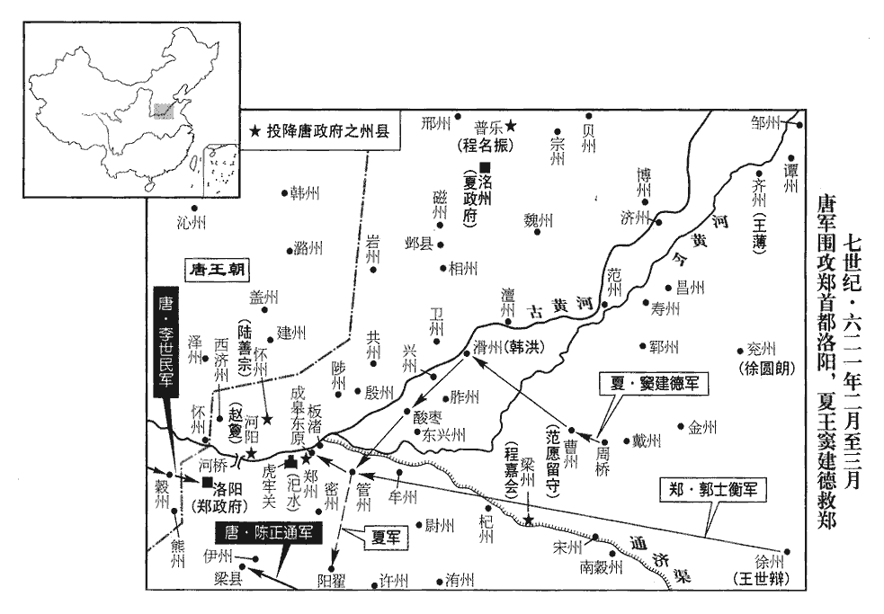
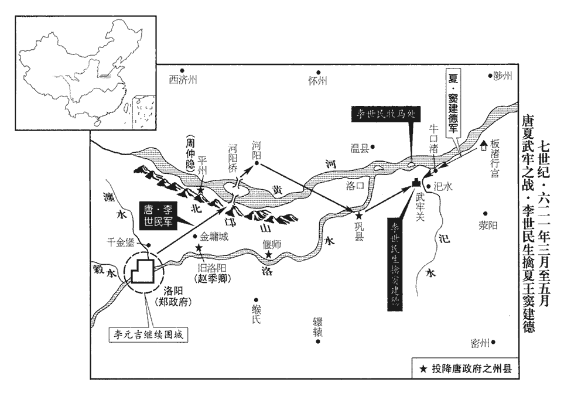
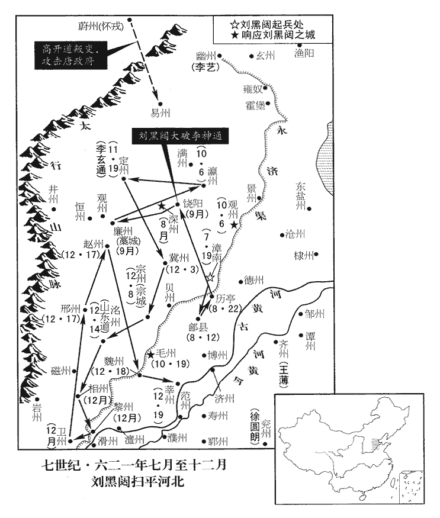
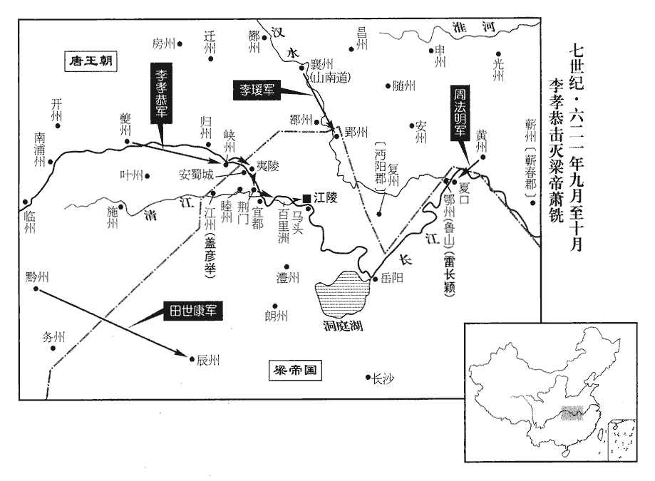
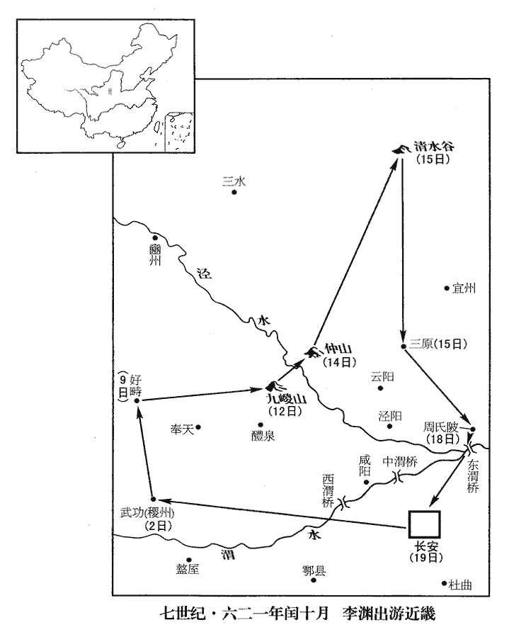
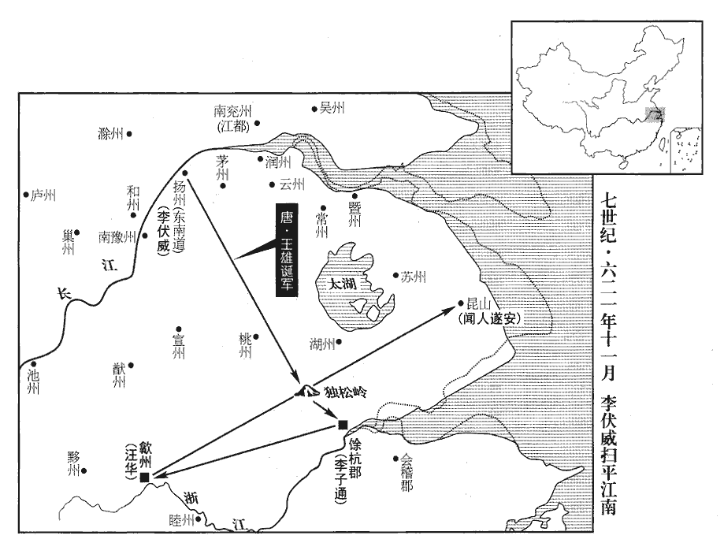
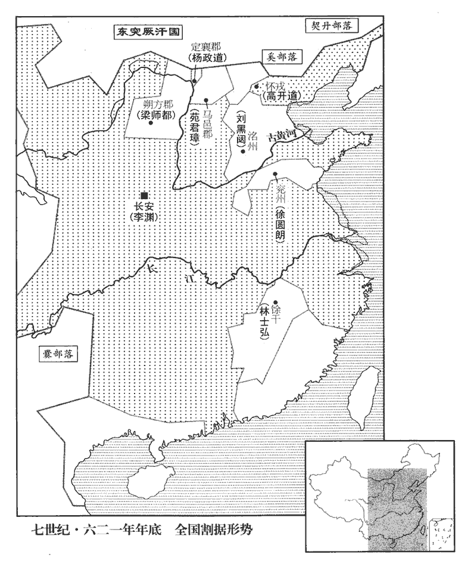

 唐紀五起重光大荒落（辛巳）三月，盡十二月，不滿一年。

# 高祖神堯大聖光孝皇帝中之中

## 武德四年（辛巳、六二一）

1三月，庚申‹二›，以靺鞨‹黑龙江下游›渠帥突地稽為燕州‹总部设辽宁省大凌河市›總管。靺鞨有七種，粟末靺鞨居最南，本附高麗。隋煬帝初，其渠帥突地稽率其部來降，居之柳城。新志曰：隋於營州之境汝羅故城置遼西郡，以處靺鞨降人；武德元年曰燕州。「突地稽」，隋書作「度地稽。」帥，所類翻。靺，音末。鞨，音曷。燕，因肩翻。

〖译文〗 [1]三月庚申（初二），唐任命首领突地稽为燕州总管。

2太子建成獲稽胡千餘人，釋其酋帥數十人，酋，才由翻。帥，所類翻。授以官爵，使還，招其餘黨，劉仚成亦降。仚xiān，許延翻。降，戶江翻；下同。建成詐稱增置州縣，築城邑，命降胡年二十以上皆集，以兵圍而殺之，死者六千餘人，考異曰：實錄，前言四千餘戶，後云六千餘計，蓋前言戶，後言口也。仚成覺變，亡奔梁師都‹首都朔方陕西省靖边县北白城子›。

〖译文〗 [2]唐太子李建成俘获一千多名稽胡，释放了几十名稽胡酋长、首领，授予他们官爵，让他们返回部落，招降同党，刘成也投降。李建成假称增置州县，要修建城邑，下令投降的稽胡年纪在二十岁以上的集中起来，然后派军队包围全部杀死，共杀死了六千多人，刘成发觉情况不对，逃跑投奔了梁师都。

3行軍總管劉世讓攻竇建德黃州‹地望应在河北省南部›，拔之。黃州闕。洺州嚴備，世讓不得進。會突厥‹瀚海沙漠群›將入寇，上召世讓還。

〖译文〗 [3]唐行军总管刘世让攻打窦建德的黄州，夺取了黄州。但州却严加防备，刘世让不能推进。恰值突厥准备进犯，高祖召刘世让回师。

竇建德所署普樂‹河北省鸡泽县›令平恩‹河北省曲周县东南›程名振來降，上遙除名振永寧令，新志：平恩縣屬洺州；又所領雞澤縣有普樂縣，竇建德平後，廢入雞澤。永寧縣屬洛州；本熊耳，義寧二年更名，時屬熊州。按舊書除名振永年令。此承新書之誤。永年，漢廣平縣也，隋仁壽元年，改曰永年，帶洺州。舊志曰：永年，本漢曲梁縣地。杜佑曰：洺州，春秋赤狄之地。洺，彌并翻。厥，九勿翻。還，從宣翻，又音如字。樂，音洛。使將兵徇河北‹黄河以北›。名振夜襲鄴‹河北省临漳县西南邺鎮›，舊志：鄴縣屬相州，後魏於鄴置相州；周末尉遲迥既平，乃焚鄴，以安陽為相州理所。煬帝復於鄴故都大慈寺置鄴縣。將，即亮翻。俘其男女千餘人。去鄴八十里，閱婦人乳有湩dòng者，九十餘人，悉縱遣之，鄴人感其仁，為之飯僧。湩，竹用翻；乳汁。為，于偽翻。飯，扶晚翻。

〖译文〗 窦建德任命的普乐县令平恩人程名振前来投降，高祖任命程名振为永宁县令，让他带兵攻略河北。程名振于夜晚袭击邺县，俘虏了一千多男女。离开邺县巳八十里，看见有九十多名妇女乳汁流出，就全都将她们放了回去，邺人受他仁义之心的感动，为他施僧求福。

4突厥頡利可汗承父兄之資，頡利者，啟民之子，始畢、處羅之弟。厥，九勿翻。可，從刊入聲。汗，音寒。士馬雄盛，有憑陵中國之志。妻隋義成公主，公主從弟善經，從，才用翻。避亂在突厥，與王世充使者王文素共說頡利曰：使，疏吏翻；下同。說，式芮翻。「昔啟民為兄弟所逼，脫身奔隋，賴文皇帝‹杨坚›之力，有此土宇，事見隋文帝紀。子孫享之。今唐天子非文皇帝子孫，可汗宜奉楊政道以伐之，楊政道時居定襄。以報文皇帝之德。」頡利然之。上以中國未寧，待突厥甚厚，而頡利求請無厭，厭，於鹽翻。言辭驕慢。甲戌‹十六›，突厥寇汾陰‹山西省万荣县西南荣河镇›。汾陰縣本屬蒲州，時為泰州治所。

〖译文〗 [4]突厥颉利可汗继承了父兄的兵马，势力强盛，颇有侵辱中原王朝的志向。颉利的妻子是隋朝的义成公主，公主的堂弟杨善经在突厥躲避战乱，杨善经和王世充的使者王文素一同劝颉利道：“过去启民可汗遭兄弟逼迫，脱身后投奔隋朝，全靠文皇帝的力量，才拥有了突厥的领土君权，子孙后代享用不尽。现在唐天子非隋文皇帝的子孙，可汗您应当立杨政道为帝并伐唐，来报答昔日文皇帝的恩德。”颉利也深表赞同。唐高祖因为中原尚未平定，对待突厥十分优厚，而颉利可汗要求无度，言辞又很傲慢。甲戌（十六日），突厥侵犯汾阴县。

5唐兵圍洛陽，掘塹築壘而守之。塹，七豔翻。城中乏食，絹一匹直粟三升，布十匹直鹽一升，服飾珍玩，賤如土芥。民食草根木葉皆盡，相與澄取浮泥，投米屑作餅食之，皆病，身腫腳弱，死者相枕倚於道。枕，職任翻。皇泰主‹杨侗›之遷民入宮城也，見一百八十三卷隋義寧元年四月。凡三萬家，至是無三千家。雖貴為公卿，糠覈不充，孟康曰：覈hé，麥糠中不破者也。晉灼曰：覈，音紇。京師人謂粗屑為紇頭。尚書郎以下，親自負戴，負以肩背，戴以首。往往餒死。

〖译文〗 [5]唐军包围洛阳，挖沟筑垒困守。洛阳城内缺粮，一匹绢才值三升粟，十匹布才值一升盐，服饰珍玩，贱如土芥。百姓把草根树叶都吃光了，就一起澄取浮泥，放入米屑作成饼吃，食后都得病，身体肿胀脚跟发软，饿死的人交错着倒在路上。当初皇泰主迁百姓入宫城时，有三万家，到这时不足三千家。就是地位高贵的公卿，这时连粗糠都吃不饱，尚书郎以下官吏，需自己亲自参加劳动，还往往饿死。

竇建德使其將范願守曹州‹济阴郡改·山东省定陶县›，將，即亮翻；下同。悉發孟海公、徐圓朗‹总部兖州山东省兖州市›之眾，西救洛陽。至滑州‹河南省滑县›，王世充行臺僕射韓洪開門納之。己卯‹二十一›，軍于酸棗‹河南省延津县›。酸棗縣隋屬鄭州，此時屬東梁州。

〖译文〗 窦建德命他的将领范愿守卫曹州，调孟海公、徐圆朗的所有兵马，向西救援洛阳。到滑州，王世充的行台仆射韩洪打开城门迎他们入城。己卯（二十一日），军队到酸枣。

 

6壬午‹二十四›，突厥寇石州‹山西省离石县›，石州，隋之離石郡。刺史王集擊卻之。

〖译文〗 [6]壬午（二十四日），突厥侵犯石州，石州刺史王集打退了进犯的突厥兵。

7竇建德陷管州，殺刺史郭士安；又陷滎陽‹河南省荥阳市›、陽翟‹河南省禹州市›等縣，滎陽縣屬鄭州。陽翟縣，隋屬汝州，時屬嵩州。水陸並進，汎舟運糧，泝河西上。上，時掌翻。王世充之弟徐州‹江苏省徐州市›行臺世辯徐州，隋之彭城郡。遣其將郭士衡將兵數千會之，將，即亮翻。合十餘萬，號三十萬，軍於成皋之東原，築宮板渚‹荥阳市北黄河南岸›，成皋即虎牢；東原即東廣武。水經：河水過成皋而東，合汜水，又東逕板城北。註云：有津，謂之板城渚口。遣使與王世充相聞。

〖译文〗 [7]窦建德攻陷管州，杀了管州刺史郭士安；又攻陷了荥阳、阳翟等县，水陆并进，用船运粮，向西溯黄河而上。王世充的弟弟徐州行台王世辩派遣手下的将领郭士衡带几千兵马与窦建德会合，共十几万人，号称有三十万，在成皋东原扎营，在板渚修筑宫室，派人和王世充互通消息。

先是，建德遺秦王世民書，使，疏吏翻。先，悉薦翻。遺，于偽翻。請退軍潼關‹陕西省潼关县›，返鄭侵地，復脩前好。好，呼到翻。世民集將佐議之，將，即亮翻。皆請避其鋒，郭孝恪曰：「世充窮蹙，垂將面縛，建德遠來助之，此天意欲兩亡之也。宜據武牢之險以拒之，唐諱虎，改虎牢為武牢。伺間而動，破之必矣！」間，古莧翻。記室薛收曰：「世充保據東都‹洛阳›，府庫充實，所將之兵，皆江、淮精銳，即日之患，但乏糧食耳。以是之故，為我所持，求戰不得，守則難久。建德親帥大眾，遠來赴援，帥，讀曰率。亦當極其精銳。若【章：十二行本「若」上有「致死於我」四字；乙十一行本同；孔本同；張校同；退齋校同。】縱之至此，兩寇合從，從，子容翻。轉河北之粟以饋洛陽，則戰爭方始，偃兵無日，混一之期，殊未有涯也。今宜分兵守洛陽，深溝高壘，世充出兵，慎勿與戰，大王親帥驍銳，先據成皋，帥，讀曰率。驍，堅堯翻。厲兵訓士，以待其至，以逸待勞，決可克也。建德既破，世充自下，不過二旬，兩主就縛矣！」世民善之。收，道衡之子也。薛道衡為隋煬帝所殺。隋之伐陳，道衡知其必克。收之識時審勢，蓋有父風。蕭瑀、屈突通、封德彝皆曰：「吾兵疲老，世充憑守堅城，未易猝拔，瑀，音禹。屈，居勿翻。易，以豉翻；下同。建德席勝而來，鋒銳氣盛，吾腹背受敵，非完策也，不若退保新安，以承其弊。」世民曰：「世充兵摧食盡，上下離心，不煩力攻，可以坐克。建德新破海公，將驕卒惰，吾據武牢，扼其咽喉。將，即亮翻；下同。咽，音煙。彼若冒險爭鋒，吾取之甚易。易，弋豉翻。若狐疑不戰，旬月之間，世充自潰。城破兵強，氣勢自倍，一舉兩克，在此行矣。若不速進，賊入武牢，諸城新附，必不能守；兩賊併力，其勢必強，何弊之承！吾計決矣！」通等又請解圍據險以觀其變，世民不許。中分麾下，使通等副齊王元吉圍守東都，世民將驍勇三千五百人東趣武牢。驍，堅堯翻。趣，七喻翻，又逡須翻。時正晝出兵，歷北邙‹洛阳城北›，抵河陽‹河南省孟县›，趨鞏‹河南省巩县›而去。鞏在東都之東一百一十里。時世民大軍，據都城西北以臨世充而圍之，故出兵向武牢，歷北邙，抵河陽而趨鞏。趨，與趣同，音七喻翻。王世充登城望見，莫之測也，竟不敢出。

〖译文〗 当初，窦建德写信给秦王李世民，请唐军退到潼关，退还夺取的郑国土地，重修原来的睦邻关系。李世民召集将佐商议此事，众人都请求避开窦建德的兵锋，郭孝恪说：“王世充已是穷途末路，马上就会成阶下囚，窦建德远道而来救助王世充，这是天意要郑、夏两国灭亡。我们应当凭借武牢之险抵御窦建德，视情况而动，肯定能打败他们！”记室薛收说：“王世充保据东都，仓库充实，统帅的兵马，都是江淮地区的精锐，现在的困难只不过是缺粮。因为这个缘故，被我们拖住，想打打不了，要坚守又难以持久。窦建德亲自统帅大军远道赴援，也会尽出其精锐。如果放他到此，两寇合兵，将河北的粮食运来供给洛阳，那么大战才展开，不知什么时候结束，统一天下的日子更是遥遥无期了。现在我们应当分出兵力围困洛阳，加深壕沟增高壁垒，如果王世充出兵，要小心不和他交战，大王您亲自率领骁勇精锐，先占据成皋，磨快兵器训练兵马，等他们到来，以逸待劳，一定能够克敌。打败窦建德后，王世充自然也就败亡，不出二十天，就会捉住两个国君！”李世民十分赞赏他的计策。薛收是薛道衡的儿子。萧、屈突通、封德彝都认为：“我军疲惫不堪士气低落，王世充凭借坚城固守，不容易很快攻克，窦建德挟胜利之势而来，士气高涨锐不可挡，我军腹背受敌，不是好办法，不如撤退保守新安，以便等待时机。”李世民说：“王世充损兵折将，粮食吃尽，上下离心，我们不必花气力攻打，可以坐等他败亡。窦建德刚刚打败了孟海公，将领骄傲，士卒疲惫，我们占据武牢，等于扼住他的咽喉。他如果冒险决战，我们可以轻而易举打败他；如果他犹豫不决，不来交战，要不了十天半个月，王世充自己就会溃败。破城后兵力增强，士气军势自然倍增，一下打败两个敌人，就在这一仗了。如果不迅速进军，窦建德进入武牢，周围各城新归附，必然不能坚守；两敌合力，势力必然强大，怎么会有机可乘呢？我的计划决定了！”屈突通等人又请求解除洛阳之围，凭借险要以观敌人变化，李世民不答应。于是将军队平分为两部分，由屈突通等人辅助齐王李元吉围困东都，李世民率领三千五百名骁勇向东赴武牢。李世于正午时分出发，过北邙，至河阳，取道巩县而去。王世充登上洛阳城望见唐军行动，不知唐军意图，竟不敢出城交战。

癸未‹二十五›，世民入武牢；甲申‹二十六›，將驍騎五百，出武牢東二十餘里，覘建德之營。覘，丑廉翻，又丑豔翻。緣道分留從騎，從，才用翻；下同。使李世勣、程知節、秦叔寶分將之，伏於道旁，纔餘四騎，與之偕進。世民謂尉遲敬德曰：騎，奇寄翻。尉，紆勿翻。「吾執弓矢，公執槊相隨，槊，色角翻。雖百萬眾若我何！」又曰：「賊見我而還，上策也。」還，從宣翻。去建德營三里所，建德遊兵遇之，以為斥候也。世民大呼曰：「我秦王也。」引弓射之，呼，火故翻。射，而亦翻；下同。斃其一將。將，即亮翻。建德軍中大驚，出五六千騎逐之，從者咸失色。從，才用翻。世民曰：「汝弟前行，吾自與敬德為殿。」弟，大計翻，但也。漢書多用此弟字，可考也。殿，丁練翻。於是按轡徐行，追騎將至，則引弓射之，輒斃一人。追者懼而止，止而復來，復，扶又翻；下同。如是再三，每來必有斃者，世民前後射殺數人，敬德殺十許人，追者不敢復逼。世民逡巡稍卻以誘之，逡，七荀翻。誘，音酉；下同。入於伏內，世勣等奮擊，大破之，斬首三百餘級，獲其驍將殷秋、石瓚以歸。瓚，藏旱翻。乃為書報建德，諭以「趙、魏之地，久為我有，為足下所侵奪。但以淮安見禮，公主得歸，故相與坦懷釋怨。武德二年，竇建德盡取趙、魏，虜淮安王神通及同安公主，待淮安以客禮，次年八月，遣公主歸。世充頃與足下修好，已嘗反覆，武德二年，王、竇結好；世充篡，建德絕之，尋有疆埸之爭。好，呼到翻。今亡在朝夕，更飾辭相誘，足下乃以三軍之眾，仰哺他人，千金之資，坐供外費，兵法曰：興師十萬，日費千金。良非上策。今前茅相遇，彼遽崩摧，左傳：隨武子曰：「前茅慮無。」杜預註云：軍行前有斥候蹹tà伏。茅，明也，備慮有無也。或曰：以茅為旌識。郊勞未通，能無懷愧。古者諸侯相見有郊勞之禮。言建德來救世充，阻於唐兵，使命不得通也。勞，力到翻。故抑止鋒銳，冀聞擇善，欲使之擇善而從。若不獲命，恐雖悔難追。」

〖译文〗 癸未（二十五日），李世民进入武牢。甲申（二十六日），带领五百骁骑，出武牢，到城东二十多里处，观察窦建德的营地。沿路分别留下随行的骑兵，让李世、程知节、秦叔宝分别统领，埋伏在路旁，只带四名骑兵和他一起前去。李世民对尉迟敬德说：“我拿着弓箭，你手握长枪跟着我，就是来一百万人又能拿我们怎么样？”又说：“敌人看见我就返回，是上策。”离窦建德营地三里处，李世民等与窦建德的游兵相遇，游兵以为他们是侦察敌情的斥候。李世民大喊：“我是秦王。”拉弓射箭，射死对方一员将领。窦建德军中大为惊慌，出动五六千骑兵追赶，跟随李世民的人都吓得变了脸色。李世民说：“你们只管在前面走，我自己和敬德殿后。”于是勒住缰绳慢慢走，追兵快赶上了就拉弓放箭，每射一箭都杀死一人。追兵惧怕便停止了追击，停一会儿又重新追赶，几次三番，每次追赶上必定有人被杀死，李世民先后射杀了几个人，尉迟敬德杀死十几人，追兵不敢再进逼。李世民有意徘徊或稍稍后退引诱追兵到埋伏圈内，李世等人就奋力战斗，大败追兵，斩首三百多级，俘获窦建德的将领殷秋、石瓒返回武牢。于是李世民致函窦建德，说明：“赵、魏地区，历来为我大唐所有，现被您侵夺，只因为淮安王被俘受到您的礼遇，又蒙送回同安公主，所以彼此真诚相待放弃旧怨。王世充最近与您修好，但已有多次反复，现在王世充的灭亡就在眼前，却花言巧语引诱您，您于是就率领三军之众，来听从调遣，千金的军费，白白为别人而消耗，实在不是上策。如今与您的前哨相遇，他们不堪一击，您与王世充还没能相见，能不心中有愧吗？我所以稍挫您的锐气，是希望您能听从善意的劝告，如果您不听，恐怕将会后悔莫及。”

8立秦王世民之子泰為衛王。

〖译文〗 [8]唐立秦王李世民的儿子李泰为卫王。

9夏，四月，己丑‹二›，豐州‹总部设内蒙古五原县›總管張長遜入朝。時言事者多云，長遜久居豐州‹内蒙古五原县›，張長遜，隋末守豐州，唐興來降，至是入朝。豐州至長安二千六百六里。朝，直遙翻；下同。為突厥所厚，非國家之利。厥，九勿翻。長遜聞之，請入朝，上許之。會太子建成北伐稽胡，長遜帥所部會之，因入朝，拜右武侯將軍。帥，讀曰率；下同。益州‹四川省成都市›行臺左僕射竇軌帥巴、蜀兵來會秦王，擊王世充；以長遜檢校益州行臺右僕射。

〖译文〗 [9]夏季，四月己丑（初二），唐丰州总管张长逊回到朝中。当时许多议论政事的人都说，张长逊长期在丰州，受到突厥的重视，不利于国家。张长逊听到这些议论，请求回朝，高祖准许了他的请求。恰好太子李建成北伐稽胡，张长逊率领部队与建成汇合，顺势回朝，官拜右武候将军。唐益州行台左仆射窦轨率领巴、蜀兵马前来与秦王会师攻打王世充，唐任命张长逊为益州行台右仆射。

10己亥‹十二›，突厥頡利可汗寇鴈門，李大恩擊走之。可，從刊入聲。汗，音寒。

〖译文〗 [10]己亥（十二日），突厥颉利可汗侵犯雁门，李大恩击退来敌。

11壬寅‹十五›，王世充騎將楊公卿、單雄信引兵出戰，騎，奇寄翻。將，即亮翻。單，音善。齊王元吉擊之，不利，行軍總管盧君諤戰死。

〖译文〗 [11]壬寅（十五日），王世充的骑将杨公卿、单雄信带兵出战，齐王李元吉迎击，失利，行军总管卢君谔战死。

12太子‹李建成›還長安。

〖译文〗 [12]太子李建成返回长安。

13王世充平州‹河南省孟津县北›刺史周仲隱以城來降。洛州河陰縣，古平陰也。王世充當於此置平州。降，戶江翻。

〖译文〗 [13]王世充的平州刺史周仲隐以城池前来降唐。

14戊申‹二十一›，突厥寇并州‹山西省太原市›。初，處羅可汗與劉武周相表裏，寇并州；上遣太常卿鄭元璹shú往諭以禍福，處羅不從。未幾，處羅遇疾卒，處，昌呂翻。璹，殊玉翻。幾，居豈翻。卒，子恤翻。考異曰：舊書鄭元璹傳作「叱羅可汗」。今從實錄。國人疑元璹毒之，留不遣。上又遣漢陽公瓌guī賂頡利可汗以金帛，頡利欲令瓌拜，瓌不從，亦留之。瓌，古回翻。又留左驍衛大將軍長孫順德。驍，堅堯翻。長，知兩翻。上怒，亦留其使者。瓌，孝恭之弟也。孝恭時鎮夔州‹重庆市奉节县›。

〖译文〗 [14]戊申（二十一日），突厥侵犯并州。当初，处罗可汗与刘武周内外呼应，侵犯并州；高祖派太常卿郑元前去晓以祸福，处罗不听。不久，处罗患病身亡，突厥国的人怀疑是被郑元毒死，扣留了郑元，不许他回国。高祖又派汉阳公李用金子布帛贿赂颉利可汗，颉利想让李行礼，李不从，也被扣留了下来。突厥还扣留了唐左骁卫大将军长孙顺德。唐高祖很气愤，也扣留了突厥的使者。李是李孝恭的弟弟。

15甲寅‹二十七›，封皇子元方為周王，元禮為鄭王，元嘉為宋王，元則為荊王，元茂為越王。

〖译文〗 [15]甲寅（二十七日），唐封皇子李元方为周王，李元礼为郑王，李元嘉为宋王，李元则为荆王，李元茂为越王。

 

16竇建德迫於武牢不得進，留屯累月，考異曰：舊書，停留七十餘日；新書，六十餘日。按二月戊午，沈悅始以武牢降唐，至五月己未，建德敗，纔六十二日。若沈悅今日降唐，明日建德即至，亦不能自固。又吳兢太宗勳史：「三月己卯，建德率兵十二萬次于酸棗。」去敗纔四十一日，故但云「留屯累月」。戰數不利，數，所角翻。將士思歸。丁巳‹三十›，秦王世民遣王君廓將輕騎千餘抄其糧運，抄，楚交翻。又破之，獲其大將軍張青特。

〖译文〗 [16]窦建德在武牢受阻不能前进，停留了一个多月，打了几仗都未能取胜，将士们人心思归。丁巳（三十日），秦王李世民派王君廓率领一千多轻骑抢夺窦建德的运粮队，再次打败了他，并俘获窦建德的大将军张青特。

凌敬言於建德曰：「大王悉兵濟河，攻取懷州、河陽，使重將守之，更鳴鼓建旗，踰太行，入上黨‹山西省长治市›，行，戶剛翻。徇汾‹山西省吉县›、晉‹山西省临汾市›，趣蒲津‹山西省永济县西黄河渡口›，趣，七喻翻。如此有三利：一則蹈無人之境，取勝可以萬全；二則拓地收眾，形勢益強；三則關中震駭，鄭圍自解。為今之策，無以易此。」凌敬之策善矣。當是時，洛城危急，秦王定計而堅守之，蓋計日而收功；吾恐建德未得至蒲州，洛城已破矣。建德將從之，而王世充遣使告急相繼於道，王琬、長孫安世朝夕涕泣，請救洛陽，使，疏吏翻。長，知兩翻。又陰以金玉啗建德諸將，以撓其謀。啗，徒濫翻。將，即亮翻。撓，奴巧翻，又奴教翻。諸將皆曰：「凌敬書生，安知戰事，其言豈可用也！」建德乃謝敬曰：「今眾心甚銳，天贊我也，因之決戰，必將大捷，不得從公言。」敬固爭之，建德怒，令扶出。令，力丁翻。其妻曹氏謂建德曰：「祭酒之言不可違也。凌敬蓋為建德國子祭酒。今大王自滏口‹大行山八陉之四·河北省武安市西南›乘唐國之虛，連營漸進以取山北，建德都洺州，時在山南，并、代、汾、晉，皆山北也。滏，音釜。又因突厥西抄關中，唐必還師自救，厥，九勿翻。抄，楚交翻。還，從宣翻，又音如字。鄭圍何憂不解！若頓兵於此，老師費財，欲求成功，在於何日？」建德曰：「此非女子所知！吾來救鄭，鄭今倒懸，亡在朝夕，吾乃捨之而去，是畏敵而棄信也，不可。」

〖译文〗 凌敬对窦建德说：“大王您不如出动全部兵力渡过黄河，攻取了怀州、河阳，派重将守卫，又擂响战鼓竖起战旗，翻越太行山，进入上党，略地汾州、晋州，奔赴蒲津，这样做有三点好处：一是进入无人之境，取胜可以说是万无一失；二是开拓了领士召收兵马，国势更加强盛；三是关中的唐受震骇，郑国洛阳之围自然会解除。眼下的计策，没有比这更妥当的了。”窦建德准备按照凌敬的建议行事，但是王世充连续不断地派人来告急，王琬、长孙安世也日夜哭泣，请求窦建德援救洛阳，又暗地里用金玉收买窦建德手下的将领，阻挠凌敬的计划。诸将都说：“凌敬是个书生，哪里懂得打仗的事，他的话怎么能听呢？”于是窦建德向凌敬道歉说：“现在大家士气很高，这是上天在帮助我，趁此机会决战，必定能大胜，不能照您的意见办了。”凌敬再三争辩，窦建德不高兴，命人把他架了出去。窦建德的妻子曹氏对他说：“祭酒凌敬的话不能不遵从。现在大王从滏口趁唐国空虚，连营渐进夺取山北并、代、汾、晋等地，又借助突厥的军队向西抄掠关中，唐军必然回师自救，还用担心郑国的东都之围不解吗？如果在此地停顿不前，磨灭了士气，消耗了财力，要想成功，就没有日期了！”窦建德说：“这不是女人能懂的！我来救郑，郑如今处境很危急，就要亡国，我弃他而去，是畏惧敌人而背信弃义，不能这么做。”

諜者告曰：「建德伺唐軍芻盡，牧馬於河北，將襲武牢。」諜，達協翻。伺，相吏翻。五月，戊午‹一›，秦王世民北濟河，南臨廣武，此西廣武也。察敵形勢，因留馬千餘匹，牧於河渚以誘之，誘，音酉。夕還武牢。己未‹二›，建德果悉眾而至，此所謂善戰者，因其勢而利導之也。自板渚‹河南省荥阳市北黄河南岸›出牛口‹河南省荥阳市西北·汜水注入黄河处›置陳，北距大河，西薄汜水，南屬鵲山‹河南省荥阳市汜水镇东南›，水經註：汜水南出浮戲山，亦謂之方山，北逕虎牢城東，又北流注于河。陳，讀曰陣；下同。汜，音祀。屬，之欲翻。亘二十里，鼓行而進。諸將皆懼，將，即亮翻。懼其眾也。世民將數騎升高丘而望之，將，音如字，領也。騎，奇寄翻。謂諸將曰：「賊起山東‹太行山以东›，未嘗見大敵，今度險而囂，囂，虛驕翻，喧也。是無紀律，逼城而陳，有輕我心；我按甲不出，彼勇氣自衰，陳久卒飢，勢將自退，所謂以計稽之也。追而擊之，無不克者。與公等約，甫過日中，必破之矣！」甫，始也，纔也。建德意輕唐軍，遣三百騎涉汜水，距唐營一里所止。遣使與世民相聞曰：「請選銳士數百與之劇。」汜，音祀。使，疏吏翻。劇，戲也；今俗謂戲為則劇。世民遣王君廓將長槊二百以應之，槊，色角翻。相與交戰，乍進乍退，兩無勝負，各引還。還，從宣翻，又音如字。王琬乘隋煬帝‹杨广›驄馬，煬，余尚翻。馬青白曰驄。鎧仗甚鮮，迥出陳前以誇眾。鎧，可亥翻。迥，戶頂翻。陳，讀曰陣。世民曰：「彼所乘真良馬也！」尉遲敬德請往取之，世民止之曰：「豈可以一馬喪猛士。」尉，紆勿翻。喪，息浪翻。敬德不從，與高甑生、梁建方三騎直入其陳，擒琬，引其馬馳歸，眾無敢當者。騎，奇寄翻。世民使召河北馬，待其至乃出戰。

〖译文〗 唐军密探报告：“窦建德探听到唐军草料用完，在黄河以北放马，准备袭击武牢。”五月戊午（初一），秦王李世民向北渡过黄河，从南面逼进广武，侦察敌情，乘机留下一千多匹马，在黄河边放牧以引诱窦建德，当晚返回武牢。己未（初二），窦建德果然倾巢而出，从板渚出牛口列战阵，北靠黄河，西临汜水，南连鹊山，连绵二十里，擂鼓前进。唐军诸将都十分惊慌，李世民带几名骑兵登上高丘望敌阵，对诸将说：“敌人从山东起兵，还没有碰见过强大的对手，如今身涉险境却很喧嚣，是没有纪律，逼近城池排列战阵，有轻视我们的意思。我们如果按兵不动，他们的勇气自然就会衰竭，列阵时间一长士卒饥饿，势必就会自动撤退，我们再追上去攻击，必然会取胜。我和各位相约，一过正午，肯定能打败他们！”窦建德轻视唐军，派三百骑兵涉过汜水，在离唐营一里地方停止。派人通报李世民说：“请挑选几百名精兵和他们打着玩玩。”李世民派王君廓带领二百名长枪手应战，相互交锋，骤进骤退，双方不分胜负，各自返回营地。王琬骑着隋炀帝的青骢马，铠甲兵器都很新，远离阵前向众人夸耀。李世民说：“他骑的真是匹好马！”尉迟敬德请求去夺马，李世民制止他说：“怎么能为了一匹马损失一员猛士呢？”尉迟敬德不听，和高甑生、梁建方三人骑马直冲入敌阵，活捉了王琬，牵着他的坐骑奔回唐营，众人没有敢阻挡的。李世民让他去召回黄河以北的牧马，等他返回才出战。

建德列陳，自辰至午，士卒飢倦，皆坐列，杜預曰：士皆坐列，言無鬬志。又爭飲水，逡巡欲退。逡，七倫翻。世民命宇文士及將三百騎經建德陳西，馳而南上，所以嘗敵也。將，即亮翻，又音如字。騎，奇寄翻；下同。上，時掌翻。戒之曰：「賊若不動，爾宜引歸，動則引兵東出。」士及至陳前，陳果動，世民曰：「可擊矣！」時河渚馬亦至，乃命出戰。世民帥輕騎先進，帥，讀曰率；下同。大軍繼之，東涉汜水，直薄其陳。薄，迫也。建德群臣方朝謁，唐騎猝來，朝臣趨就建德，建德召騎兵使拒唐兵，騎兵阻朝臣不得過，建德揮朝臣令卻，朝，直遙翻。進退之間，唐兵已至，建德窘迫，退依東陂。竇抗引兵擊之，戰小不利。世民帥騎赴之，所向皆靡。淮陽王道玄挺身陷陳，直出其後，復突陳而歸，窘，渠隕翻。復，扶又翻，又音如字。再入再出，飛矢集其身如蝟毛，蝟，于貴翻；蟲似豪豬而小。爾雅曰：彙毛刺是也。勇氣不衰，射人，皆應弦而仆。世民給以副馬，使從己。於是諸軍大戰，塵埃漲天。世民帥史大柰、程知節、秦叔寶、宇文歆等卷旆而入，歆，許今翻。卷，讀曰捲。出其陳後，陳，讀曰陣。張唐旗幟，幟，昌志翻。建德將士顧見之，大潰，將，即亮翻。追奔三十里，斬首三千餘級。建德中槊，中，竹仲翻。槊，色角翻。竄匿於牛口渚。車騎將軍白士讓、楊武威逐之，建德墜馬，士讓援槊欲刺之，騎，奇寄翻。援，于元翻。刺，七亦翻。建德曰：「勿殺我，我夏王也，能富貴汝。」言得我以獻則富貴也。夏，戶雅翻。武威下擒之，下馬擒之也。載以從馬，從，才用翻。來見世民。世民讓之曰：「我自討王世充，何預汝事，而來越境，犯我兵鋒！」建德曰：「今不自來，恐煩遠取。」建德將士皆潰去，所俘獲五萬人，世民即日散遣之，使還鄉里。

〖译文〗 窦建德排列战阵，从早晨到中午，士卒们饥饿疲惫，都坐了下来，又争着喝水，迟疑着想撤退。李世民命令宇文士及带三百骑兵经过窦建德军阵西边向南奔驰，告诫他：“敌人如果不动，你就带兵返回，如果动了，就领兵东进。”宇文士及到窦建德阵前，敌阵果然动了，李世民说：“可以打了！”这时黄河滩上的牧马也已到达，于是下令出击。李世民率领轻骑先出发，大军跟随在后，向东涉过汜水，直扑敌阵。窦建德的群臣正在朝谒，唐军骑兵突然降临，朝臣都跑向窦建德，窦建德召骑兵抵御唐军，因朝臣阻隔骑兵过不去，窦建德挥手令朝臣退下，这一进一退之际，唐军已到阵前，窦建德形势窘迫，后撤靠近东面的山坡。窦抗带兵攻打他，交战后形势稍不利。李世民率领骑兵赴援，所向披靡。淮阳王李道玄挺身冲锋陷阵，直冲出敌阵后方，又重新返回冲入阵中，几番进出，身上聚集的箭像刺猬毛一样，勇气仍然不减，放箭射人，都应声倒地。李世民把自己备用的战马送给他，让他跟随自己，于是各军大战，战场上尘土飞扬遮天蔽日。李世民率领史大奈、程知节、秦叔宝、宇文歆等人将旌旗卷起，冲入敌阵，从阵后而出，打开唐军旗帜，窦建德的士兵回头看见唐旗在阵后飘扬，迅速崩溃，唐军追出三十里，杀了三千多人。窦建德被长枪刺中，逃窜到牛口渚躲避。唐车骑将军白土让、杨武威追逐窦建德，窦建德落马，白土让挺枪欲刺，窦建德说：“别杀我，我是夏王，献上我可以使你们得到富贵荣华。”杨武威下马捉住窦建德，用备用马匹驮着窦建德，来见李世民。李世民斥责窦建德道：“我们讨伐王世充，与你有什么相干，竟跑到你的领土之外，来与我们交战！”窦建德说：“现在我不自己来，恐怕以后还得烦您远途去攻取。”窦建德的将士都逃走了，唐军俘虏了五万人，李世民当天就遣散了俘虏，让他们返回家乡。

封德彝入賀，世民笑曰：「不用公言，得有今日。智者千慮，不免一失乎！」用李左車之言。德彝甚慚。

〖译文〗 封德彝进帐表示庆贺，李世笑着说：“没听您的话，才有今天的胜利。智者千虎，难免有一失呀！”封德彝羞愧万分。

建德妻曹氏與左僕射齊善行將數百騎遁歸洺州。洺，彌并翻。

〖译文〗 窦建德的妻子曹氏和左仆射齐善行带着几百名骑兵逃回州。

甲子‹七›，世充偃師、鞏縣皆降。

〖译文〗 甲子（初七），王世充的偃师、巩县均降唐。

乙丑‹八›，以太子左庶子鄭善果為山東道‹崤山以东›撫慰大使。降，戶江翻；下同。使，疏吏翻。

〖译文〗 乙丑（初八），唐任命太子左庶子郑善果为山东道抚慰大使。

世充將王德仁棄故洛陽城‹河南省洛阳市东白马寺东›而遁，此漢、魏故都之城也。亞將趙季卿以城降。秦王世民囚竇建德、王琬、長孫安世、郭士衡等至洛陽城下，以示世充。世充與建德語而泣，仍遣安世等入城言敗狀。世充召諸將議突圍，南走襄陽，欲走襄陽就王弘烈、王泰。走，音奏。諸將皆曰：「吾所恃者夏王‹窦建德›，夏王今已為擒，雖得出，終必無成。」考異曰：舊書世充傳云：「諸將皆不答。」今從河洛記。丙寅‹九›，世充素服帥其太子、群臣、二千餘人詣軍門降。帥，讀曰率。降，戶江翻。世民禮接之，世充俯伏流汗。世民曰：「卿常以童子見處，處，昌呂翻。今見童子，何恭之甚邪？」邪，音耶。世充頓首謝罪。於是部分諸軍，分，扶問翻。先入洛陽，分守市肆，禁止侵掠，無敢犯者。

〖译文〗 王世充的将领王德仁放弃旧洛阳城逃跑，副将赵季卿以城降唐。秦王李世民押解着窦建德、王琬、长孙安世、郭士衡等人到洛阳城下，给王世充看。王世充流着泪和窦建德接话，于是李世民让长孙安世等人进城叙说失败的情况。王世充召集诸将商议突围，准备南奔襄阳，众将领都说：“我们依赖的是夏王窦建德，如今夏王已被俘，我们就是突围，最终也无法成功。”丙寅（初九），王世充身穿白衣带领郑国的太子、百官及二千多人到军营门前投降。李世民按礼节接受他们投降，王世充俯下身汗流浃背。李世民说道：“你总认为我是个小孩，如今见了小孩，为什么这么恭敬？”王世充叩头谢罪。于是李世民分派出一部分人，先进入洛阳，分别把守市场商店，禁止骚扰抢掠，没有一人敢违犯禁令。

丁卯‹十›，世民入宮城，命記室房玄齡先入中書、門下省，收隋圖籍制詔，已為世充所毀，無所獲。命蕭瑀、竇軌等封府庫，收其金帛，頒賜將士。瑀，音禹。將，即亮翻。收世充之黨罪尤大者段達、王隆、崔洪丹、薛德音、楊汪、孟孝義、單雄信、楊公卿、郭什柱、郭士衡、董叡、張童兒、王德仁、朱粲、郭善才等十餘人斬於洛水之上。單，慈淺翻。新書云：薛德音以移檄慢逆，崔弘丹以造弩多傷士，前誅之；次收段達等斬洛渚上。溫公避國諱，改弘丹為洪丹。郭什柱意當作「什住」。初，李世勣與單雄信友善，誓同生死。及洛陽平，世勣言雄信驍健絕倫，驍，堅堯翻。請盡輸己之官爵以贖之，世民不許。考異曰：舊傳云：「高祖不許。」按太宗得洛城即誅雄信，何嘗稟命於高祖，蓋太宗時史臣敘高祖時事，有誅殺不厭眾心者，皆稱高祖之命，以掩太宗之失，如屠夏縣之類皆是也。世勣固請不能得，涕泣而退。雄信曰：「我固知汝不辦事。」世勣曰：「吾不惜餘生，與兄俱死；但既以此身許國，事無兩遂。且吾死之後，誰復視兄之妻子乎？」復，扶又翻。乃割股肉以啗雄信，曰：「使此肉隨兄為土，庶幾不負昔誓也！」幾，居希翻。士民疾朱粲殘忍，競投瓦礫擊其尸，須臾如冢。礫，郎擊翻。囚韋節、楊續、長孫安世等十餘人送長安。長孫之長，知兩翻。士民無罪為世充所囚者，皆釋之，所殺者祭而誄之。古者卿大夫歿，則君命有司累其功德，為文以哀之，曰誄。今誄之者，哀其無罪而死也。誄lěi，魯水翻。

〖译文〗 丁卯（初十），李世民进入洛阳宫城，命令记室房玄龄先进入中书省和门下省，收集隋朝的地图户籍、制文诏书，但已经都被王世充销毁，没有找到什么。又命令萧、窦轨等人封存了隋的仓库，没收金钱布帛，颁赐给将士们。拘押了罪行特别大的十几名王世充的同党，有段达、王隆、崔洪丹、薛德音、杨汪、孟孝义、单雄信、杨公卿、郭什柱、郭士衡、董睿、张童儿、王德仁、朱粲、郭善才等，在洛水岸边斩首。当初，李世与单雄信很要好，发誓同生共死。等到唐平定了洛阳，李世说单雄信骁健无比，请求用自己所有的官爵来赎单雄信，李世民不准。李世再三请求仍不得，痛哭着退下。单雄信对他说：“我早知道你办不成事。”李世说：“我不惜余生，和兄长你一同死；但是既然将这条命献给了国家，事情就无法两全。况且我死了以后，谁照顾兄长你的妻儿呢？”于是割下一块大腿肉，让单雄信吃下，说道：“让这块肉随兄长化为尘土，也许可以不负当年的誓言吧！”老百姓痛恨朱粲的残忍，争相用瓦块砖头砸他的尸体，不一会儿堆成了一座小山。李世民拘押了韦节、杨续、长孙安世等十几个人送往长安。老百姓没有罪而被王世充关押起来的，一律释放；被杀死的，作诔文加以祭奠。

初，秦王府屬杜如晦叔父淹事王世充。淹素與如晦兄弟不協，譖如晦兄殺之，又囚其弟楚客，餓幾死，幾，居依翻，又音祁。楚客終無怨色。及洛陽平，淹當死，楚客涕泣請如晦救之，如晦不從。楚客曰：「曩者叔已殺兄，今兄又殺叔，一門之內，自相殘而盡，豈不痛哉！」欲自剄，剄，古頂翻。如晦乃為之請於世民，淹得免死。為，于偽翻。

〖译文〗 当初，秦王府的官员杜如晦的叔父杜淹侍奉王世充。杜淹与杜如晦兄弟一向不和，进谗言杀了杜如晦的兄长，又把杜如晦的弟弟杜楚客关了起来，几乎饿死。但杜楚客却始终没有怨恨的样子。待到平定了洛阳，杜淹应当处死，杜楚客痛哭流涕请杜如晦救杜淹，杜如晦不答应。杜楚客说：“过去叔父已经杀子大哥，如今兄长又要杀叔父，一家人自相残杀而死光，岂不令人痛心！”说着要自杀，于是杜如晦替他向李世民请求，杜淹因此免于一死。

秦王世民坐閶闔門，晉都洛陽，其城西面北來第三門曰閶闔。隋營新都，唐六典所載都城、皇城、宮城，苑城諸門，皆無閶闔，蓋唐改之也。闔，戶臘翻。蘇威請見，稱老病不能拜。世民遣人數之曰：見，賢遍翻。數，所具翻，又所主翻。「公隋室宰相，危不能扶，使君弒國亡。見李密、王世充皆拜伏舞蹈。今既老病，無勞相見。」及至長安，又請見，不許。既老且貧，無復官爵，卒於家，年八十二。史言蘇威之壽不若早夭。卒，子恤翻。

〖译文〗 秦王李世民在阊阖门办公，苏威请求参见，但自称年老有病不能行礼。李世民派人去责备他说：“您是隋朝宰相，国家危亡不能匡扶，致使君主被弑、国家灭亡。见了李密、王世充都能叩头行礼，现在既然年老有病，就不必麻烦相见了。”后到了长安，苏威又请求参见，仍然不准。苏威既老又穷，再也没能做官，死在家中，年纪八十二岁。

秦王世民觀隋宮殿，歎曰：「逞侈心，窮人欲，無亡得乎！」命撤端門樓，焚乾陽殿，毀則天門及闕；唐六典：東都皇城南面三門，中曰端門。乾陽殿，唐後於此起乾元殿。宮城南面三門，中曰應天門，蓋隋之則天門也。唐六典曰：毀建國門。隋志：東都城南面二門，正南曰建國。廢諸道場，城中僧尼，留有名德者各三十人，餘皆返初。返初服也。尼，女夷翻。

〖译文〗 秦王李世民观看隋朝的宫殿，感叹道：“穷奢极欲，能不亡国吗！”下令拆了端门楼，烧了乾阳殿，毁去则天门及其门前阙楼，废除诸佛寺，城中的和尚尼姑，只各留下三十名有德之人，其余都下令还俗。

17前真定‹恒山郡郡政府所在县·河北省正定县›令周法明，真定縣，隋帶恆山郡，唐改郡為恆州。法尚之弟也，周法尚自陳入隋為將。隋末結客，襲據黃梅‹湖北省黄梅县›，隋志：黃梅縣舊曰永興，開皇初改曰新蔡，十八年改曰黃梅，因黃梅山以名縣也。劉昫曰：黃梅，漢蘄春縣地，宋分置新蔡郡，隋為縣，屬蘄春郡。遣族子孝節攻蘄春‹湖北省蕲春县›，蘄春，漢縣，屬江夏郡，吳為蘄春郡，晉改為西陽，又改為蘄陽，梁改曰蘄水，後齊改曰齊昌，隋開皇十八年復曰蘄春，帶郡。蘄，音渠之翻。兄子紹則攻安陸‹湖北省安陆市›，安陸，漢縣，屬江夏郡。宋分置安陸郡，梁置南司州，西魏置安州，隋復為安陸郡。子紹德攻沔陽‹湖北省仙桃市›，沔陽，漢竟陵縣地，屬江夏郡，後周置復州，大業初，改沔州，尋改為沔陽郡。沔，彌兗翻。皆拔之。庚午‹十三›，以四郡來降。降，戶江翻；下同。

〖译文〗 [17]前真定县令周法明是周法尚的弟弟，隋未交结宾客，攻占了黄梅县，派同族兄弟之子周孝节攻蕲春，侄子周绍则攻安陆，儿子周绍德攻沔阳，三郡全部攻克。庚午（十三日），周法明以黄梅等四郡前来降唐。

18壬申‹十五›，齊善行以洺、相‹河南省安阳市›、魏‹河北省大名县›等州來降。洺，音名。相，息亮翻。考異曰：革命記云：「五月七日，善行等至洺州。」實錄云「壬申，洺、相、魏等州降」者，蓋降使到之日也。月末又云「裴矩等以八璽降」，蓋璽到之日也。時建德餘眾走至洺州，欲立建德養子為主，徵兵以拒唐；又欲剽掠居民，還向海隅為盜。善行獨以為不可，曰：「隋末喪亂，剽，匹妙翻。喪，息浪翻；下同。故吾屬相聚草野，苟求生耳。以夏王‹窦建德›之英武，平定河朔，士馬精強，一朝為擒，易如反掌，豈非天命有所屬，夏，戶雅翻。易，以豉翻。屬，之欲翻。非人力所能爭邪！邪，音耶。今喪敗如此，守亦無成，逃亦不免，等為亡國，豈可復遺毒於民！復，扶又翻。不若委心請命於唐，必欲得繒帛者，繒，慈陵翻。當盡散府庫之物，勿復殘民也！」復，扶又翻。於是運府庫之帛數十萬段，置萬春宮東街，萬春宮，竇建德所築。以散將卒，凡三晝夜乃畢。將，即亮翻。仍布兵守坊巷，得物者即出，無得更入人家。士卒散盡，然後與僕射裴矩、行臺曹旦、帥其百官，奉建德妻曹氏及傳國八璽并破宇文化及所得珍寶請降于唐。武德二年，建德破化及，得八璽及珍寶。帥，讀曰率。璽，斯氏翻。降，戶江翻。上以善行為秦王左二護軍，秦王所統置左三府、右三府，各有統軍、護軍。仍厚賜之。

〖译文〗 [18]壬申（十五日），齐善行以、相、魏等州来降唐。此时，窦建德溃逃的部众跑到州，打算扶立窦建德的养子为王，征兵抵抗唐军；这些人又想剽掠居民，回到海边作强盗。唯有齐善行不赞成这样做，他说：“隋末丧乱，因此我们这些人才在民间聚集起来，暂且求得生存。以夏王那样的英武之人，平定了河朔地区，兵强马壮，但是还被唐军一战打败被俘，竟然易如反掌，这岂不是天命已有所归属，决不是人力能够争到的吗？如今败亡到这种程度，守也没用，逃也不能免于灭亡，同样是亡国，我们怎么可以再给百姓带来灾难呢！不如倾心向唐投降，一定想要得到酬劳，就分光仓库里的财物，不要再残害老百姓了！”于是将仓库中几十万段帛运到万春宫东面街上，分发给将士，发了三天三夜才发完。仍旧布署士兵把守街市坊巷，已分得布匹的人立即离开，不准再进老百姓家。士卒走光以后，齐善行和夏国的仆射裴矩、行台曹旦，带领百官奉窦建德的妻子曹氏和传国八玺以及打败宇文化及时得到的珍宝，向唐请求投降。唐高祖任命齐善行为秦王左二护军，并给他很优厚的赏赐。

初，竇建德之誅宇文化及也，隋南陽公主有子曰禪師，建德虎賁郎將於士澄問之曰：何承天姓苑有於姓，今浙間有此姓。禪，市連翻。賁，音奔。將，即亮翻。於，如字。「化及大逆，兄弟之子皆當從坐，若不能捨禪師，當相為留之。」為，于偽翻。公主泣曰：「虎賁既隋室貴臣，按隋書帝紀，大業初，造龍舟，於士澄已為上儀同，往江南採木。茲事何須見問。」建德竟殺之。公主尋請為尼。及建德敗，公主將歸長安，與宇文士及遇於洛陽，士及請與相見，公主不可。士及立於戶外，請復為夫婦。公主曰：「我與君仇家，今所以不手刃君者，但謀逆之日，察君不預知耳。」訶令速去。訶，虎何翻。士及固請，公主怒曰：「必欲就死，可相見也。」士及知不可屈，乃拜辭而去。

〖译文〗 当初，窦建德杀宇文化及时，宇文士及的妻子隋南阳公主有个儿子名叫宇文禅师，窦建德的虎贲郎将於士澄问公主道：“宇文化及犯大逆罪，兄弟的儿子都要连坐从死，如果您舍不得禅师，会替您留下他来。”公主流泪道：“虎贲您既然是隋室的贵臣，这事还用得着问我吗？”最终窦建德杀了宇文禅师。公主接着请求出家作尼姑。待到窦建德败亡，公主将要返回长安，在洛阳和宇文士及相遇，宇文士及请求和她相见，公主不答应。宇文士及站在门外，请求恢复夫妻关系。公主说：“我和你家是仇人，现在之所以没有亲手杀你，是因为我知道谋逆时你未曾参预密谋罢了。”怒声让宇文士及马上离开。宇文士及再三请求，公主生气地说：“你一定想要死，就可以相见。”宇文士及知道公主的意志不可更改，于是作揖告辞离去。

19乙亥‹十八›，以周法明為黃州‹永安郡改·总部设湖北省新洲县›總管。黃州，治黃岡縣，漢江夏郡西陵縣地，齊曰南安，又置齊安郡，隋置黃州，尋改永安郡。

〖译文〗 [19]乙亥（十八日），唐任命周法明为黄州总管。

20戊寅‹二十一›，王世充徐州行臺杞王世辯以徐、宋‹河南省商丘县›等三十八州詣河南道安撫大使任瓌請降；使，疏吏翻。任，音壬。瓌guī，古回翻。降，戶江翻。世充故地悉平。

〖译文〗 [20]戊寅（二十一日），王世充的徐州行台杞王王世辩到河南道安抚大使任处，以徐、宋等三十八州之地请求投降。原属王世充的地区全部平定。

21竇建德博州‹山东省聊城市›刺史馮士羨隋志：武陽郡聊城縣，開皇十六年置博州。復推淮安王神通為慰撫山東使，徇下三十餘州；建德之地悉平。

〖译文〗 [21]窦建德的博州刺史冯士羡又推举唐淮安王李神通为慰抚山东使，攻下三十几州，窦建德的领地全部平定。

22己卯‹二十二›，代州‹总部设山西省代县›總管李大恩擊苑君璋‹时在马邑山西省朔州市›，破之。

〖译文〗 [22]己卯（二十二日），唐代州总管李大恩进攻并打败了苑君璋。

23突厥寇邊，長平靖王叔良督五將擊之，叔良中流矢；厥，九勿翻。將，即亮翻。中，竹仲翻。師旋，六月，戊子‹二›，卒於道。卒，子恤翻。

〖译文〗 [23]突厥侵犯唐边境，长平靖王李叔良督率五位将领还击，李叔良身中流箭，回师。六月戊子（初二），李叔良在途中去世。

24戊戌‹十二›，孟海公餘黨蔣善合以鄆州‹山东省东平县›，孟噉鬼以曹州‹山东省定陶县›來降。鄆州，隋之東平郡。曹州，隋之濟陰郡。鄆，音運。噉，徒濫翻。降，戶江翻。噉鬼，海公之從兄也。從，才用翻。

〖译文〗 [24]戊戌（十二日），孟海公的余党蒋善合以郓州，孟啖鬼以曹州来降唐。孟啖鬼是孟海公的堂兄。

25庚子‹十四›，營州‹辽宁省朝阳市›人石世則執總管晉文衍，營州，隋志之遼西郡。舉州叛，奉靺鞨‹黑龙江下游›突地稽為主。靺，音末。鞨，音曷。

〖译文〗 [25]庚子（十四日），营州人石世则捉住总管晋文衍，以全州反叛，拥戴族突地稽为主。

26黃州總管周法明攻蕭銑安州‹湖北省安陆市›，拔之，蕭銑蓋亦置安州於隋安陸郡界。獲其總管馬貴遷。

〖译文〗 [26]唐黄州总管周法明攻打萧铣的安州，攻陷安州并俘获萧铣的安州总管马贵迁。

27乙巳‹十九›，以右驍衛將軍盛彥師為宋州‹总部设河南省商丘县›總管，安撫河南。驍，堅堯翻。

〖译文〗 [27]乙巳（十九日），唐任命右骁卫将军盛彦师为宋州总管，安抚河南。

28乙卯‹二十九›，海州‹江苏省连云港市›賊帥臧君相以五州來降，拜海州總管。海州，隋志之東海郡。宋白曰：魏武定七年置海州。帥，所類翻。

〖译文〗 [28]乙卯（二十九日），海州贼帅臧君相带着五个州来降唐，唐任命他为海州总管。

29秋，七月，庚申‹五›，王世充行臺王弘烈、王泰、左僕射豆盧行褒、右僕射蘇世長以襄州來降。襄州，隋志之襄陽郡。宋白曰：襄州，春秋穀、鄧、鄾yōu、盧、羅、鄀ruò之地，秦為南陽郡地，魏置襄陽郡，以其地在襄山之陽也。江左置雍州，西魏改襄州。上‹李渊›與行褒、世長皆有舊，先是，屢以書招之，先，悉薦翻。行褒輒殺使者；既至長安，上誅行褒而責世長。世長曰：「隋失其鹿，天下共逐之。陛下既得之矣，豈可復忿同獵之徒，問爭肉之罪乎！」使，疏吏翻。復，扶又翻。上笑而釋之，以為諫議大夫。考異曰：舊本紀及唐曆年代記、唐會要皆云五年六月，置諫議大夫。按世長自諫議歷陝州長史、天策府軍諮祭酒，四年十一月，已預十八學士。據舊職官志，四年，置諫議大夫，今從之。余按唐六典，秦、漢曰諫大夫，光武加議字。北齊集書省置諫議大夫七人，隋氏門下省亦置諫議大夫七人。四年以前，唐未及置，今始置之耳。嘗從校獵高陵‹陕西省高陵县›，如淳曰：合軍聚眾，有幡校擊鼓也。周禮，校人，掌王田獵之馬，故謂之校獵。師古曰：如說非也。此校，謂以木相貫穿為闌校耳。校人職云，六廄成校。是則以遮闌為義也。校獵者，大為闌校，以遮禽獸而獵取也。軍之幡旗雖有校名，本因部校，此無豫也。原父曰：予謂校讀如「犯而不校」，亦競逐獵也。高陵縣屬京兆府。大獲禽獸，上顧群臣曰：「今日畋，樂乎？」世長對曰：「陛下遊獵，薄廢萬機，不滿十旬，未足為樂！」樂，音洛。上變色，既而笑曰：「狂態復發邪？」復，扶又翻。邪，音耶。對曰：「於臣則狂，於陛下甚忠。」嘗侍宴披香殿，程大昌雍錄：慶善宮有披香殿。又云：慶善宮，高祖舊第也，在武功渭水北。余按下文世長言昔侍於武功，若此殿正在武功舊宅，世長縱是譎諫，不應引以為言，恐此殿不在慶善宮。酒酣，謂上曰：「此殿煬帝之所為邪？」上曰：「卿諫似直而實多詐，豈不知此殿朕所為，而謂之煬帝乎？」對曰：「臣實不知，但見其華侈如傾宮、鹿臺，紂‹子受辛›為傾宮、鹿臺。非興王之所為故也。若陛下為之，誠非所宜。臣昔侍陛下於武功‹陕西省武功县西›，見所居宅僅庇風雨，當時亦以為足。今因隋之宮室，已極侈矣，而又增之，將何以矯其失乎？」上深然之。

〖译文〗 [29]秋季，七月庚申（初五），王世充的行台王弘烈、王泰、左仆射豆卢行褒、右仆射苏世长以襄州前来降唐。高祖与豆卢行褒、苏世长都有交情，早先，多次通过书信招降二人，豆卢行褒总是杀了唐的使者。他们到了长安后，高祖杀了豆卢行褒并责备苏世长。苏世长回答说：“隋丧失了政权，天下之人都在追逐它。陛下既已得到了统治大权，怎么能再怨恨同您一起追逐的人，要判他们争权的罪呢？”高祖笑了，释放了苏世长，任命他为谏议大夫。苏世长曾经随高祖在高陵围猎，捉了很多飞禽野兽，高祖对群臣说：“今天打猎，高兴吗？”世长回答：“陛下游猎，只稍稍耽误了政事，打猎不足十旬，还称不上高兴！”高祖听后脸色大变，一会儿笑着说：“你又发狂了？”世长回答：“在臣下我来说是狂，对陛下而言是绝对忠诚。”苏世长还曾在披香殿侍奉高祖饮宴，酒喝到兴头上，对高祖说：“这披香殿是隋炀帝建的吧？”高祖说：“你的劝告好像挺直率，其实很多是装傻，你难道不知道这披香殿是朕建造的，怎么能说是炀帝建的？”苏世长回答道：“臣下我实在不知道是谁建的，只不过因为看到这殿像商纣王的倾宫、鹿台一样华丽奢侈，不是新兴帝王所应该建的罢了。如果是陛下建造的，确实不合适。我过去在武功侍陛下，看见您所住的房屋仅能够遮住风雨，当时您也认为很满足了。如今继承隋朝的宫殿，已经极端奢侈了。却又增加新的宫殿，这样又怎么能够矫正隋朝的过失呢？”高祖深表同意。

30甲子‹九›，秦王世民至長安。世民被黃金甲，齊王元吉、李世勣等二十五將從其後，鐵騎萬匹，【章：十二行本「匹」下有「甲士三萬人」五字；乙十一行本同；孔本同；張校同。】被，皮義翻。將，即亮翻。騎，奇寄翻。前後部鼓吹，鼓吹，軍樂也；漢制，萬人將軍得之。司馬法：軍中有鼓笛，所以發壯勇。薛居正曰：義鏡問鼓吹十二案，合於何所。答云：周禮，鼓人掌六鼓、四金。漢朝乃有黃門鼓吹。崔豹古今註云：張騫使西域，得摩訶兜勒一曲，李延年增之，分為二十八曲。梁置鼓吹清商令二人。唐又有掆gāng鼓、金鉦、大鼓、長鳴歌簫、笳、笛，合為鼓吹十二案。吹，昌瑞翻。俘王世充、竇建德及隋乘輿、御物獻于太廟，乘，繩證翻。考異曰：李勣傳云：「太宗為上將，勣為下將，與太宗俱服金甲，乘戎輅，告捷于太廟。」今從唐曆。行飲至之禮以饗之。左傳：歸而飲至，以數軍實。杜預註曰：飲於廟，以數車徒、器械及所獲也。

〖译文〗 [30]甲子（初九），秦王李世民到达长安。李世民身披黄金甲，齐王李元吉、李世等二十五员战将跟随其后，有一万匹铁骑，前后奏响军乐，到太庙献俘获的王世充、窦建德以及隋皇家的车驾、御物，举行清点战利品的“饮至礼”祭祀祖先。

31乙丑‹十›，高句麗‹首都平壤朝鲜平壤市›王建武遣使入貢。句，音駒。麗，鄰知翻。建武，元之弟也。高元，見隋紀。

〖译文〗 [31]乙丑（初十），高句丽国王高建武派遣使节到唐朝进贡。高建武是高元的弟弟。

32上見王世充而數之，數，所具翻，又所主翻。世充曰：「臣罪固當誅，然秦王許臣不死。」丙寅‹十一›，詔赦世充為庶人，與兄弟子姪【章：十二行本「姪」下有「徙」字；乙十一行本同；孔本同。】處蜀‹四川省›；處，昌呂翻。斬竇建德於市‹年四十九岁›。

〖译文〗 [32]唐高祖见到王世充，历数他的罪行，王世充说：“我的罪固然该杀，但是秦王答应我不死。”丙寅（十一日），唐下诏赦免王世充，让他作为平民和兄弟子侄一起安置在蜀中；在闹市中将窦建德处斩。

33丁卯‹十二›，以天下略定，大赦百姓，給復一年。復，方目翻；下同。陝‹河南省三门峡市›、鼎‹河南省灵宝市›、函‹河南省洛宁县北›、虢‹河南省卢氏县›、虞‹山西省运城市东北安邑镇›、芮‹山西省芮城县›六州，轉輸勞費，陝州，治陝弘農縣，本隋弘農郡，義寧元年曰鳳林，領弘農、閿wén鄉、湖城；武德元年曰鼎州，因鼎湖為名。武德三年，以永寧、崤置函州。又義寧元年，分盧氏、長水、桃林置虢郡，武德元年，曰虢州。義寧元年，以安邑、虞鄉、夏置安邑郡，武德元年，曰虞州。二年，以芮城、河北、永樂置芮州。幽州‹总部设北京市›管內，久隔寇戎，並給復二年。律、令、格、式，且用開皇舊制。赦令既下，而王、竇餘黨尚有遠徙者，治書侍御史孫伏伽上言：「兵、食可去，信不可去，陛下已赦而復徙之，治，直之翻。伽，求加翻。上，時掌翻。去，羌呂翻。復，扶又翻，又音如字。是自違本心，使臣民何所憑依。且世充尚蒙寬宥，況於餘黨，所宜縱釋。」考異曰：伏伽表云：「今月二日，發雲雨之制。」而赦書乃十二日，或脫「十」字也。又云：「常赦所不免，咸赦除之。」今赦無此文，豈實錄錄赦文不盡歟？上從之。

〖译文〗 [33]丁卯（十二日），唐因为天下已大致平定，大赦天下百姓罪人，免除一年的徭役。陕、鼎、函、虢、虞、芮六州由于转运辛劳、耗费，幽州境内因长期受敌军阻隔，均免除二年徭役。国家的律、令、格、式，暂，暂使用隋朝开皇旧制。赦令颁布后，王世充、窦建德的余党仍然有人被迁移到很远的地方，治书侍御史孙伏伽上言：“可以没有军队、粮食，但不可以不讲信义。陛下既然已经发布赦令，又将人迁走，这是自己违背了自己的本心，让大臣平民以哪个为标准呢？而且王世充尚且得到宽大，何况是他的余党，应当将他们释放。”高祖听从了他的劝谏。

王世充以防夫未備，置雍州廨舍。按雍錄，都城坊里圖，雍州廨舍後為京兆府，在光德坊。雍，於用翻。廨，古隘翻。獨孤機之子定州‹河北省定州市›刺史修德帥兄弟至其所，帥，讀曰率。矯稱敕呼鄭王；世充與兄世惲趨出，修德等殺之。武德二年正月，獨孤機兄弟為世充所殺，故修德報仇。惲，於粉翻。考異曰：舊傳作「獨孤修」，今從河洛記。詔免修德官。其餘兄弟子姪等於道，亦以謀反誅。

〖译文〗 因为防守人员尚未配备好，王世充一行被安置在雍州官衙内。被王世充所杀的独孤机的儿子定州刺史独孤修德带着兄弟们到王世充停留的地方，假称有敕令传唤郑王，王世充和兄长王世恽跑出门，被独孤修德等人杀死。唐下诏罢免了独孤修德的官爵。王世充其余的兄弟子侄等人，也在赴蜀途中以谋反罪被处死。

34隋末錢弊濫薄，言錢之弊也。至裁皮糊紙為之，民間不勝其弊。勝，音升。至是，初行開元通寶錢，重【章：十二行本「重」上有「徑八分」三字；乙十一行本同；孔本同；退齋校同。】二銖四參，按漢書律曆志：權輕重者不失黍絫lěi。應劭註曰：十黍為絫，十絫為銖。師古曰：絫，孟音來戈翻。此字讀亦音纍紲之纍。二銖四絫，二百四十黍也。「參」當作「絫」，蓋筆誤也。積十錢重一兩，輕重大小最為折衷，衷，竹仲翻。遠近便之。命給事中歐陽詢撰其文并書，迴環可讀。六典：漢書百官表云：給事中亦加官，所加或博士、大夫、議郎。漢儀注，諸給事中日上朝謁，平尚書奏事，分為左右，以有事殿中，故曰給事中。魏氏或為加官，或為正員。晉氏隸散騎省，宋、齊隸集書省，後周天官府置給事中士；隋曰給事郎，唐曰給事中，屬門下省，掌侍奉左右，分判省事。凡百司奏抄，侍中審定，則先讀而署之，以駁正違失。撰其文者，撰為八分篆、隸二體。考異曰：薛璫唐聖運圖云：「初進蠟樣，文德皇后掐一甲，故錢上有甲痕云。」淩璠fán唐錄政要云竇皇后。按時竇皇后已崩，文德皇后未立，今皆不取。

〖译文〗 [34]隋朝末年，钱币的弊病是质量低劣份量不足，甚至有裁剪皮革或糊纸作钱的，老百姓无法承受这弊害。到此时，才开始行用“开元通宝”钱，一枚重二铢四参，十枚钱重一两，轻重、大小很合适，各地使用方便。唐高祖命给事中欧阳询撰钱币上的文字并书写，文字回环往复都能成义。

35以屈突通為陝東道大行臺右僕射，鎮洛陽；以淮陽王道玄為洛州總管。李世勣父蓋竟無恙而還，詔復其官爵。屈，居勿翻。陝，失冉翻。李蓋被虜，見一百八十七卷武德二年十月。恙，余亮翻。還，從宣翻。竇軌還益州。自平洛還。軌將兵征討，或經旬月不解甲。性嚴酷，將佐有犯，無貴賤立斬之，鞭撻吏民，常流血滿庭，所部重足屏息。將，即亮翻。重，直龍翻。屏，必郢翻。

〖译文〗 [35]唐任命屈突通为陕东道大行台右仆射，镇守洛阳；任命淮阳王李道玄为洛州总管。李世之父李盖终于平安归来，下诏恢复了他的官爵。窦轨返回益州。窦轨带兵征讨，有时一连十天半个月不脱战袍。性格严酷，部下将佐有过错，不分贵贱立即斩首，鞭打下属官吏和老百姓，经常鲜血流满庭院，部下见到他都很害怕，连脚都不敢移动，气也不敢出。

36癸酉‹十八›，置錢監於洛、并、幽、益等諸州，秦王世民、齊王元吉賜三鑪lú，裴寂賜一鑪，聽鑄錢。賜以官鑪也。鑪，音爐，鑪冶也。自餘敢盜鑄者，身死，家口配沒。

〖译文〗 [36]癸酉（十八日），唐在洛、并、幽、益等州设置钱监，赐予秦王李世民、齐王李元吉各三处官炉，裴寂一处官炉，准许他们铸钱。除此之外，有敢私自铸钱的，本人处死，家属没收流放边地。

 

37河北既平，上以陳君賓為洺州刺史。將軍秦武通等將兵屯洺州，欲使分鎮東方諸州；又以鄭善果等為慰撫大使，就洺州選補山東州縣官。

〖译文〗 [37]平定河北之后，高祖任命陈君宾为州刺史。将军秦武通等人统兵驻札在州，高祖想让他们分别镇守东部各州。唐又任命郑善果等人为慰抚大使，赴州选拔任命山东各州县的官员。

竇建德之敗也，其諸將多盜匿庫物，及居閭里，暴橫為民患，洺，彌并翻。將，即亮翻；下同。使，疏吏翻。橫，戶孟翻。唐官吏以法繩之，或加捶撻，捶，止橤翻。建德故將皆驚懼不安。高雅賢、王小胡家在洺州，欲竊其家以逃，官吏捕之，雅賢等亡命至貝州‹河北省清河县›。貝州，隋志之清河郡。會上徵建德故將范願、董康買、曹湛及雅賢等，於是願等相謂曰：「王世充以洛陽降唐，降，戶江翻。其將相大臣段達、單雄信等皆夷滅；相，息亮翻。單，慈淺翻。吾屬至長安，必不免矣。吾屬自十年以來，身經百戰，當死久矣，今何惜餘生，不以之立事。且夏王得淮安王，遇以客禮，見一百八十七卷二年十月。夏，戶雅翻。唐得夏王即殺之。吾屬皆為夏王所厚，今不為之報仇，為，于偽翻。將無以見天下之士！」乃謀作亂，卜之，以劉氏為主吉，因相與之漳南‹河北省故城县东›，之，往也。舊志，漳南縣屬貝州，漢之東陽縣。隋開皇十八年分棗強、清平二縣地，置漳南縣於古東陽城。見建德故將劉雅，以其謀告之。雅曰：「天下適安定，吾將老於耕桑，不願復起兵！」復，扶又翻。眾怒，且恐泄其謀，遂殺之。故漢東公劉黑闥，時屏居漳南，漢東公，竇建德所封爵也。屏，必郢翻。諸將往詣之，告以其謀，黑闥欣然從之。黑闥方種蔬，即殺耕牛與之共飲食定計，聚眾得百人。甲戌‹十九›，襲漳南縣據之。考異曰：革命記：「七月二十七日，眾立黑闥為漢東王，建元天造，即入漳南城，鏁縣官於獄，發使告貝州及諸鎮戍等云：『今漢東王為夏王起義兵於漳南，請軍會戰。』」今據實錄，甲戌，七月十九日。又黑闥陷相州乃稱王，改元在五年正月。今不取。是時，諸道有事則置行臺尚書省，無事則罷之。朝廷聞黑闥作亂，乃置山東道‹太行山以东›行臺於洺州，朝，直遙翻。洺，彌并翻。魏‹河北省大名县›、冀‹河北省冀县›、定‹河北省定州市›、滄‹河北省盐山县西南›並置總管府。滄州，隋志之勃海郡。丁丑‹二十二›，以淮安王神通為山東道行臺右僕射。

〖译文〗 窦建德败亡时，他手下的将领有不少盗窃了仓库中的财物藏起来，待到在民间安居，又暴虐横行乡里，成了老百姓的祸害，唐朝官吏将他们绳之以法，有时用鞭子痛笞他们，因此窦建德的旧将领都惊恐不安。高雅贤、王小胡的家在州，打算私下带着家财逃跑，官吏追捕他们，高雅贤等人逃到贝州。恰好高祖征召窦建德的旧将范愿、董康买、曹湛以及高雅贤等人，于是范愿等人互相商量：“王世充以洛阳降唐，他的将相大臣段达、单雄信等人都遭满门抄斩；我们到长安，肯定也逃不脱。自大业十年以来，我们这些人身经百战，早就该死了，现在为什么还吝惜余生，而不用有生之年干一番大事呢？况且夏王抓住唐淮安王李神通，以客人的礼节对待他，而唐捉住夏王却马上杀了他。我们这些人都受到夏王的厚待，现在不替他报仇，以后怎么见天下的人？”于是策划反叛，占卜的结果，以姓刘的人为首领吉利，于是一同到漳南县，去见窦建德的旧将领刘雅，将计划告诉了刘雅。刘雅说：“天下刚刚安定，我打算在乡下养老，不想再起兵！”众人很生气，又怕计划被泄露，于是杀了刘雅。窦建德所封汉东公刘黑闼，这时在漳南隐居，众将领去拜见他，告诉了他计划，刘黑闼欣然从命。刘黑闼正在种菜，当即杀了耕牛和众将领一同边吃边商定大计，集合了一百人。甲戌（十九日），他们袭击并占领了漳南县。当时，各道如若有事就设置行台尚书省，无事就停罢。唐朝廷得知刘黑闼作乱，于是在州设置了山东行台，在魏、冀、定、沧等州都设置了总管府。丁丑（二十二日），唐任命淮安王李神通为山东道行台右仆射。

38辛巳‹二十六›，襃bāo州道‹襄州道，湖北省襄樊市›安撫使郭行方攻蕭銑鄀ruò州‹湖北省钟祥市西北乐乡关›，拔之。「襃州」，當作「襄州」，詳見辯誤。新志：武德四年以竟陵之樂鄉及襄州之率道、上洪置鄀州。上書郡，下書州；竟陵之樂鄉，蓋蕭銑地也。鄀，音若。

〖译文〗 [38]辛巳（二十六日），唐褒州道安抚使郭行方攻打并夺取了萧铣的州。

39孟海公與竇建德同伏誅，戴州‹山东省成武县›刺史孟噉鬼不自安，新志：武德四年以曹州之成武，宋州之單父、楚丘置戴州。噉，徒濫翻。挾海公之子義以曹‹山东省定陶县›、戴二州反，以禹城‹山东省禹城县›令蔣善合為腹心；禹城縣屬齊州，隋之祝阿也。新、舊志皆云，天寶元年，改祝阿為禹城。此時未有禹城，當考。又前言蔣善合以鄆州來降，此以「禹城令」書之，亦未知為誰所命也。善合與其左右同謀斬之。

〖译文〗 [39]孟海公与窦建德一同伏法，他的堂兄戴州刺史孟啖鬼内心不安，挟持孟海公的儿子孟义以曹、戴二州反唐，将禹城县令蒋善合当作心腹，蒋善合与身边的人合谋杀了孟啖鬼。

40八月，丙戌朔‹一›，日有食之。

〖译文〗 [40]八月丙戌朔（初一），出现日食。

41丁亥‹二›，命太子安撫北邊。

〖译文〗 [41]丁亥（初二），唐命太子李建成安抚北部边疆。

42丁酉‹十二›，劉黑闥陷鄃shū縣‹山东省夏津县›，鄃縣，屬貝州。鄃，音輸。魏州刺史權威、魏州，隋志之武陽郡。貝州刺史戴元祥與戰，皆敗死，黑闥悉取其餘眾及器械。竇建德舊黨稍稍出歸之，眾至二千人，為壇於漳南，祭建德，告以舉兵之意，自稱大將軍。詔發關中步騎三千，使將軍秦武通、定州‹总部设河北省定州市›總管藍田‹陕西省蓝田县›李玄通擊之；藍田縣屬雍州。騎，奇寄翻。又詔幽州‹总部设北京市›總管李藝引兵會擊黑闥。

〖译文〗 [42]丁酉（十二日），刘黑闼攻陷县，唐魏州刺史权威、贝州刺史戴元祥和他交战，均失败身亡，刘黑闼重新得到他原来的残部及全部武器装备。窦建德的旧部有些人投奔刘黑闼，刘黑闼拥有了二千人马，在漳南筑坛，祭奠窦建德，向窦的亡魂报告他们起兵的意图，自称大将军。唐高祖下诏调发关中三千步骑兵，由将军秦武通、定州总管兰田人李玄通率领攻打刘黑闼，又下诏命幽州总管李艺带兵合力攻刘黑闼。

43癸卯‹十八›，突厥寇代州‹山西省代县›，厥，九勿翻。總管李大恩遣行軍總管王孝基拒之，舉軍皆沒。甲辰‹十九›，進圍崞guō縣‹山西省原平市北崞阳镇›。崞縣屬代州。崞，音郭。乙巳‹二十›，王孝基自突厥逃歸，李大恩眾少，少，詩沼翻。據城自守，突厥不敢逼，月餘引去。

〖译文〗 [43]癸卯（十八日），突厥侵犯代州，唐总管李大恩派遣行军总管王孝基拒敌，全军覆没。甲辰（十几日），突厥进军包围崞县。乙巳（二十日），王孝基从突厥逃回，李大恩人马不多，据城自守，突厥不敢进逼，一个多月后撤兵。

44上以南方寇盜尚多，丙午‹二十一›，以左武候將軍張鎮周為淮南道‹淮河以南›行軍總管，大將軍陳智略為嶺南道‹南岭以南›行軍總管，鎮撫之。

〖译文〗 [44]高祖因为南方的寇盗还很多，丙午（二十一日），任命左武候将军张镇周为淮南道行军总管，大将军陈智略为岭南道行军总管，镇守安抚淮南、岭南。

45丁未‹二十二›，劉黑闥陷歷亭‹山东省武城县东›，舊志：歷亭，漢東陽地，隋開皇十六年分鄃縣置。隋志曰：分武城置。時屬貝州。執屯衛將軍王行敏，使之拜，不可，遂殺之。

〖译文〗 [45]丁未（二十二日），刘黑闼攻陷历亭县，捉住唐屯卫将军王行敏，让他行礼，王行敏不拜，于是刘黑闼杀了他。

46初，洛陽既平，徐圓朗請降，拜兗州‹总部设山东省兖州市›總管，兗州，隋志之魯郡。降，戶江翻。封魯郡公。劉黑闥作亂，陰與圓朗通謀。上使葛公盛彥師安集河南，行至任城‹山东省济宁市›；任城縣屬兗州。任，音壬。辛亥‹二十六›，圓朗執彥師，舉兵反。黑闥以圓朗為大行臺元帥，帥，所類翻。兗‹山东省兖州市›、鄆‹山东省郓城县›、陳‹河南省淮阳县›、杞‹河南省杞县›、伊‹河南省汝州市›、洛、曹、戴等八州豪右皆應之。圓朗厚禮彥師，使作書與其弟，令舉虞城‹河南省虞城县›降。舊志：虞城縣屬宋州，隋分下邑縣置，時置東虞州。令，力丁翻。彥師為書曰：「吾奉使無狀，為賊所擒，使，疏吏翻；下同。為臣不忠，誓之以死；汝善侍老母，勿以吾為念。」圓朗初色動，而彥師自若。圓朗乃笑曰：「盛將軍有壯節，不可殺也。」待之如舊。

〖译文〗 [46]当初，洛阳平定后，徐圆朗请求投降，唐授予他兖州总管，封鲁郡公。刘黑闼反叛，秘密地与徐圆朗联系。高祖命葛公盛彦师安抚河南，走到任城。辛亥（二十六日），徐圆朗逮捕盛彦师，起兵反唐。刘黑闼以徐圆朗为大行台元师，兖、郓、陈、杞、伊、洛、曹、戴等八州的豪强均响应徐圆朗。徐圆朗对盛彦师极其优待，让盛彦师写信给他的弟弟，命他以整个虞城投降。盛彦师在信中写道：“我奉命出使未能称职，被贼人俘虏，作为臣子不忠，立誓赴死；你好好奉养老母亲，不要牵挂我。”徐圆朗一开始变了脸色，而盛彦师神色自如，徐圆朗于是笑了，说：“盛将军很有胆量气节，不可杀。”像原来一样对待盛彦师。

河南道安撫大使任瓌行至宋州‹河南省商丘县›，屬圓朗反，宋州治睢陽，時為宋城縣。使，疏吏翻。瓌，古回翻。屬，之欲翻。副使柳濬勸瓌退保汴州‹河南省开封市›，宋州西至汴州二百八十五里。瓌笑曰：「柳公何怯也！」圓朗又攻陷楚丘‹山东省曹县东南›，楚丘縣，後魏之己氏縣，隋開皇六年更名，時屬戴州。引兵將圍虞城，瓌遣部將崔樞、張公謹自鄢陵‹河南省鄢陵县›帥諸豪右質子百餘人守虞城。鄢陵縣時屬洧州。將，即亮翻；下同。鄢，謁晚翻，又於建翻，又音偃。帥，讀曰率。質，音致；下同。濬曰：「樞與公謹皆王世充將，諸州質子父兄皆反，恐必為變。」瓌不應。樞至虞城，分質子使與土人合隊共守城。合，音閤。賊稍近，質子有叛者，樞斬其隊帥。於是諸隊帥皆懼，帥，所類翻；下同。各殺其質子，樞不禁，梟其首於門外，遣使白瓌。梟，堅堯翻。使，疏吏翻。瓌陽怒曰：「吾所以使與質子俱者，欲招其父兄耳，何罪而殺之！」退謂濬曰：「吾固知崔樞能辦此也。縣人既殺質子，與賊深仇，吾何患乎！」賊攻虞城，果不克而去。

〖译文〗 河南道安抚大使任走到宋州，恰好遇徐圆朗反叛，副使柳浚劝任返回汴州自守，任笑着说：“柳公胆子怎么这么小？”徐圆朗又攻陷了楚丘，带兵准备围攻虞城，任派部下将领崔枢、张公谨从鄢陵率领各州豪强作人质的子弟一百多人去守卫虞城。柳浚说；“崔枢和张公谨原来都是王世充的部下，各州人质的父兄也都反叛了，这一去恐怕会叛变。”任不作回答。崔枢到虞城，分派人质让他们和本地人混合编队共同守城。叛军逐渐逼近，有人质反叛的，崔枢就杀了他们的队长。于是各个队长都害怕，纷纷杀了队里的人质，崔枢也不禁止，将人质的头割下挂在城门外，并派人告诉了任。任假装很生气地说：“我所以让人质一起去，是打算用来招降他们的父兄，他们有什么罪而要杀了他们？”退下后对柳浚说：“我早知道崔枢能这么做。虞城县人既然杀了人质，加深与叛军的仇恨，我还担心什么呢？”叛军攻打虞城，果然未能攻克而撤走。

47初，竇建德以鄱陽‹江西省波阳县›崔元遜為深州‹河北省安平县›刺史，鄱陽縣屬饒州。隋開皇十六年，以定州安平置深州，大業初廢。新志：武德四年，以定州之安平、瀛州之饒陽置深州，蓋竇建德置，而唐因之耳。宋白曰：以州城西故深城名州。及劉黑闥反，元遜與其黨數十人謀於野，伏甲士於車中，以禾覆其上，覆，敷又翻。【章：十二行本「上」下有「詐為農人」四字；乙十一行本同；孔本同；退齋校同。】直入聽事，聽，讀曰廳。自禾中呼譟而出，執刺史裴晞殺之，傳首黑闥。

〖译文〗 [47]当初，窦建德任命鄱阳人崔元逊为深州刺史，等到刘黑闼反叛，崔元逊和几十名同党在郊外谋划，在车中埋伏下武装士兵，用稻草盖在上面，直接冲入州府衙门，从草中呐喊着冲出来，捉住唐任命的深州刺史裴，杀了他，他首级送给刘黑闼。

48九月，乙卯‹一›，文登‹山东省文登市›賊帥淳于難請降，置登州‹文登县改登州›，以難為刺史。文登，本漢牟平縣地，後齊置文登縣，因文登山而名。隋志，屬東萊郡。時置登州兼領萊州之觀陽縣。降，戶江翻；下同。

〖译文〗 [48]九月乙卯（初一），文登贼帅淳于难请求投降，唐设置登州，任命淳于难为登州刺史。

49突厥寇并州‹山西省太原市›，厥，九勿翻。并，卑名翻。遣左屯衛大將軍竇琮等擊之。戊午‹四›，突厥寇原州‹宁夏固原县›，遣行軍總管尉遲敬德等擊之。琮，徂宗翻。尉，紆勿翻。

〖译文〗 [49]突厥侵犯并州，唐派遣左屯卫大将军窦琮等人迎击。戊午（初四），突厥侵犯原州，唐派行军总管尉迟敬德等人迎击。

50辛酉‹七›，徐圓朗‹时在兖州›自稱魯王。

〖译文〗 [50]辛酉（初七），徐圆朗自称鲁王。

51隋末，歙州‹新安郡·安徽省休宁县›賊汪華據黟‹安徽省黟县›、歙等五州，有眾一萬，歙州，本新安郡，隋平陳置歙州，黟、歙二縣屬焉。歙，音攝。黟，音伊；劉昫曰：音同䃜。縣南石墨嶺出石墨故也。自稱吳王。甲子‹十›，遣使來降；使，疏吏翻。降，戶江翻。拜歙州‹总部设安徽省歙县›總管。

〖译文〗 [51]隋末，歙州贼首汪华占据黟、歙等五州，拥有一万人，自称吴王。甲子（初十），汪华派人前来投降，唐授予他歙州总管之官。

52隋末，弋陽‹河南省光山县›盧祖尚糾合壯士以衛鄉里，部分嚴整，群盜畏之。及煬帝遇弒，鄉人奉之為光州‹弋阳郡改光州›刺史；弋陽，漢縣，南齊為郡，梁置光州。分，扶問翻。時年十九，奉表於皇泰主‹杨侗›。及王世充自立，祖尚來降，丙子‹二十二›，以祖尚為光州總管。考異曰：實錄：「丙子，以光州豪右盧祖尚為光州總管。」按舊傳，世充自立，祖尚遂舉州歸款，而實錄至此始見之，蓋當時止為刺史，至此方遷總管耳。

〖译文〗 [52]隋末，弋阳人卢祖尚纠集青壮保卫乡里，军队部署严整，群盗都惧怕他。隋炀帝被杀后，乡亲拥载卢祖尚为光州刺史，当时年仅十九，上表给隋东都的皇泰主。待王世充自立，卢祖尚前来降唐。丙子（二十二日），唐任命卢祖尚为光州总管。

53己卯‹二十五›，詔括天下戶口。

〖译文〗 [53]己卯（二十五日），唐高祖下诏搜检天下户口。

54徐圓朗寇濟州‹山东省茌平县西南›，治中吳伋論擊走之。濟州，隋之濟北郡。漢置州刺史，其屬有治中從事、別駕從事，自是兩官。唐武德元年，改郡太守曰州刺史，郡丞曰別駕，未嘗置治中。今書濟州治中吳伋論，豈即以別駕為治中邪？下文又書徐圓朗昌州治中，蓋此時官稱猶未定于一。濟，子禮翻。

〖译文〗 [54]徐圆朗侵济州，唐济州治中吴论击退徐圆朗的进攻。

55癸未‹二十九›，詔以太常樂工皆前代因罪配沒，子孫相承，多歷年所，所謂樂戶也。良可哀愍；宜並蠲除為民，蠲juān，吉淵翻。且令執事若仕宦入流，令，力丁翻。入流者為流內官。勿更追集。

〖译文〗 [55]癸未（二十九日），唐高祖下诏以为，太常寺乐工均是前代因犯罪而被发配或收为官奴的人，子子孙孙相互继承，经过多年，实是可哀可惜，宜一律免除为民；并令管理此事的官吏，如果他们已经做官入流内，不要再追查。

56甲申‹三十›，靈州‹总部设宁夏灵武市›總管楊師道擊突厥，破之。師道，恭仁之弟也。楊恭仁時鎮涼州。厥，九勿翻。

〖译文〗 [56]甲申（三十日），唐灵州总管杨师道攻打突厥，太败突厥。杨师道是杨恭仁的弟弟。

57詔發巴、蜀兵，以趙郡王孝恭為荊湘道‹湖北省中西部及湖南省›行軍總管，荊州南郡，湘州長沙郡。荊湘道，以南朝荊、湘所部言之；下荊郢道類此。李靖攝行軍長史，長，知兩翻。統十二總管，自夔州‹重庆市奉节县›順流東下；以廬江王瑗為荊郢道‹湖北省中部›行軍元帥，【章：十二行本「帥」下有「出襄州道」四字；乙十一行本同；孔本同；張校同；退齋校同。】郢州，隋之竟陵郡。瑗，于眷翻。帥，所類翻。黔州‹重庆市彭水县›刺史田世康出辰州道‹湖南省沅陵县›，舊志：漢辰陽縣，隋改辰陽為辰溪縣，仍分置沅陵縣。沅陵郡唐改為辰州，以沅陵為理所。黔，音琴。黃州‹总部设湖北省新洲县›總管周法明出夏口道‹湖北省武汉市›，夏口即漢口。夏，戶雅翻。以擊蕭銑。是月，孝恭發夔州。時峽江方漲，蜀江逕三峽，謂之峽江。諸將請俟水落進軍，將，即亮翻；下同。李靖曰：「兵貫神速。今吾兵始集，銑尚未知，若乘江漲，倐忽抵其城下‹湖北省江陵县›，掩其不備，此必成擒；不可失也！」孝恭從之。

〖译文〗 [57]唐下诏征发巴、蜀军队，任命赵郡王李孝恭为荆湘道行军总管，李靖代理行军长史，统领十二总管，从夔州沿长江向东顺流而下；又任命庐江王李瑗为荆郢道行军元帅，黔州刺史田世康取道辰州道，黄州总管周法明走夏口道，铜攻打萧铣。当月，李孝恭从夔州出发。当时峡江正涨水，众位将领请求待水落后再进军，李靖说：“兵贵神速。现在我们的兵力刚刚调集，萧铣还不知道，如果趁长江涨水，疾速抵达他的城下，趁他没有防备突然袭击，这样必定能活擒萧铣，不可失去良机！”李孝恭听从了他的意见。

 

58淮安王神通將關內‹陕西省中部›兵至冀州‹河北省冀县›，與李藝兵合。又發邢‹河北省邢台市›、洺、相‹河南省安阳市›、魏、恆‹河北省正定县›、趙‹河北省赵县›等兵，合五萬餘人，與劉黑闥戰於饒陽‹河北省饶阳县›城南，布陳十餘里；黑闥眾少，依隄單行而陳以當之。宋白曰：饒陽，漢縣，在饒河‹滹沱河支流›之陽，今縣東北二十里饒陽故城是也。齊天保五年，移於今理。按饒陽縣，則魏虜渠口，置虜口鎮於此，後為縣理。洺，音名。相，息亮翻。恆，戶登翻。陳，讀曰陣。行，戶剛翻。會風雪，神通乘風擊之，既而風返，神通大敗，士馬軍資失亡三分之二。李藝居西偏，擊高雅賢，破之，逐奔數里，聞大軍不利，退保藁城‹廉州州政府所在县·河北省藁城市›；藁城縣本屬恆州，時屬廉州。黑闥就擊之，藝亦敗，薛萬均、萬徹皆為所虜，截髮驅之。萬均兄弟亡歸，藝引兵歸幽州。黑闥兵勢大振。

〖译文〗 [58]淮安王李神通率领关内兵到冀州，与李艺军会师。唐又征调邢、、魏、恒、赵等州兵力共五万多人，在饶阳城南与刘黑闼会战，列战阵长达十几里，刘黑闼的人少，只沿河堤排成单行列阵以抵挡唐军。时值刮风下雪，李神通乘风进攻，一会儿风向逆转，李神通大败，兵马物资损失了三分之二。李艺在西边攻打高雅贤，打败了高雅贤追逐出几里，得知大军失利，退何藁城，刘黑闼到藁城攻打李艺，李艺也被打败，薛万均、薛万彻兄弟都被刘黑闼俘虏，被剪了头发供驱使。薛万均兄弟逃回，李艺带兵返回幽州。刘黑闼的军势大振。

59上以秦王【章：十二行本「王」下有「世民」二字；乙十一行本同；孔本同。】功大，前代官皆不足以稱之，特置天策上將，位在王公上。冬，十月，以世民為天策上將，領司徒、陝東道大行臺尚書令，增邑二萬戶，唐爵九等，王食邑萬戶；今倍之。陝，失冉翻。仍開天策府，置官屬。天策府置長史、司馬各一人，從事中郎二人，並掌通判府事。軍諮祭酒二人，謀軍事，贊相禮儀，應接賓客。典籤四人，掌宣傳導引之事。主簿二人，掌省覆教命。錄事二人，記室參軍事二人，掌書疏表啟，宣行教命。功、倉、兵、騎、鎧、士六曹參軍各二人，參軍事六人。以齊王元吉為司空。世民以海內浸平，乃開館於宮西，延四方文學之士，出教以王府屬杜如晦、記室房玄齡、虞世南、文學褚亮、姚思廉、主簿李玄道、參軍蔡允恭、薛元敬、顏相時、諮議典籤蘇勗xù、天策府從事中郎于志寧、軍諮祭酒蘇世長、記室薛收、倉曹李守素、國子助教陸德明，孔穎達，信都‹河北省冀县›蓋文達、宋州‹总部设河南省商丘县›總管府戶曹許敬宗，諸王出命稱教。相，息亮翻。蓋，古盍翻。並以本官兼文學館學士，考異曰：舊書，參軍薛元敬承許敬宗下。今從太宗實錄。諮議典籤蘇勉，舊書作軍諮典籤，今從實錄。宋州總管府戶曹許敬宗，舊書褚亮傳作著作佐郎攝記室。敬宗傳，擬漣州別駕。今從實錄。分為三番，更日直宿，更，工衡翻。供給珍膳，恩禮優厚。世民朝謁公事之暇，輒至館中，引諸學士討論文籍，朝，直遙翻。論，盧昆翻。或夜分乃寢。又使庫直閻立本圖像，庫直，隸親事府。褚亮為贊，號十八學士。士大夫得預其選者，時人謂之「登瀛州。」自來相傳海中有三神山，蓬萊、方丈、瀛洲，人不能至，至則成仙矣，故以為喻。允恭，大寶之弟子；蔡大寶輔後梁主蕭詧。元敬，收之從子；從，才用翻。相時，師古之弟；顏師古以碩學名。立本，毗之子也。閻毗以巧思事隋煬帝。

〖译文〗 [59]高祖因为秦王李世民功勋卓著，前代王朝的官爵都不能够与之相称，于是特别设置天策上将，位置在王、公之上。冬季，十月，任命秦王李世民为天策上将，领司徒、陕乐道大行台尚书令，食邑增加到二万户，于是建立天策府，设置官员。任命齐王李元吉为司空。李世民因为国家逐渐平定，于是在宫殿西侧设馆，接待四方的博学之人，发布亲王教令任命秦王府属杜如晦，记室房玄龄、虞世南，文学褚亮、姚思廉，主薄李玄道，参军蔡允恭、薛元敬、颜相时，谘议典签苏勖，天策府从事中郎于志宁，军谘祭酒苏世长，记室薛收，仓曹李守素，国子助教陆德明、孔颖达，信都人盖文达，宋州总管府户曹许敬宗，均以本人官职兼任文学馆学士，分三班每日轮值，供给珍馐美味，礼遇恩宠格外优厚。李世民上朝、办公之余，总是来到文学馆，找各位学士讨论文章典籍，有时到半夜才就寝。李世民又让库直阎立本分别给各位画像，由褚亮作赞，号称“十八学士”。士大夫能够成为文学馆学士人选，当时人就称为“登瀛州”，比喻他们一步成仙。蔡允恭是蔡大宝弟弟的儿子，薛元敬是薛收的侄子，颜相时是颜师古弟弟，阎立本是阎毗的儿子。

初，杜如晦為秦王府兵曹參軍，俄遷陝州‹河南省三门峡市›長史。陝，失冉翻。長，知兩翻。時府僚多補外官，世民患之。房玄齡曰：「餘人不足惜，至於杜如晦，王佐之才，大王欲經營四方，非如晦不可。」世民驚曰：「微公言，幾失之。」幾，居依翻。即奏為府屬。與玄齡常從世民征伐，參謀帷幄，軍中多事，如晦剖決如流。世民每破軍克城，諸將佐爭取寶貨，玄齡獨收采人物，致之幕府。又將佐有勇略者，玄齡必與之深相結，將，即亮翻。使為世民盡死力。為，于偽翻；下同。世民每令玄齡入奏事，上歎曰：「玄齡為吾兒陳事，雖隔千里，皆如面談。」

〖译文〗 当初，杜如晦作秦王府兵曹参军，不久迁长为陕州长史。当时王府的属官大多转任地方官，李世民对此不满。房玄龄说：“别人不可惜，至于杜如晦，是辅佐帝王之业的人才，大王要想经营四方，非得杜如晦不可。”李世民惊叹道：“不是您说起，几乎失去了人才。”立即奏请杜如晦为秦王府属。杜如晦与房玄龄经常跟随李世民征伐，在军中参谋策划，军中事务繁杂，但杜如晦分析判决十分从容。李世民每次打胜仗，攻克城池，各位将领争相搜取珠宝财物，唯有房玄龄调查征收人才，罗致于幕府。无论哪位将佐有勇略，房玄龄必定竭力与他交结，让他能为秦王李世民不惜生命。李世民常派房玄龄入朝奏事，高祖感叹道：“玄龄代我儿陈奏事宜，虽然远隔千里，但都好像我儿与我面谈一样。”

李玄道嘗事李密為記室，密敗，官屬為王世充所虜，懼死，皆達曙不寐。獨玄道起居自若，曰：「死生有命，非憂可免！」眾服其識量。

〖译文〗 李玄道曾经是李密的记室，李密败亡，他的官员都被王世充俘虏，他们怕死，通夜不眠。唯独李玄道照常起居，说：“生死有命，不是担心就能免除的！”众人都很佩服他的见识胆量。

60庚寅‹六›，劉黑闥陷瀛州‹河北省河间市›，殺刺史盧士叡。觀州‹河北省东光县›人執刺史雷德備，以城降之。隋以東光縣置觀州，大業初，廢。武德四年，以德州之弓高、胡蘇、東光，冀州之阜陵、蓨tiáo、安陵、觀津，置觀州。觀，古喚翻。降，戶江翻；下同。

〖译文〗 庚寅（初六），刘黑闼攻陷瀛州，杀死唐瀛州刺史卢士睿。观州老百姓捉住刺史雷德备，以城投降刘黑闼。

61辛卯‹七›，蕭銑鄂州‹湖北省武汉市汉水南岸›刺史雷長穎以魯山‹鄂州州政府所在城›來降。隋平陳，以江夏郡置鄂州，治江南之江夏，大業初，復為郡。蕭銑蓋置州於魯山。

〖译文〗 [61]辛卯（初七），萧铣的鄂州刺史雷长颖以鲁山来降唐。

62趙郡王孝恭帥戰艦二千餘艘東下，帥，讀曰率。艦，戶黯翻。艘，蘇遭翻。蕭銑以江水方漲，殊不為備；孝恭等拔其荊門‹湖北省枝城市西北长江南岸›、宜都‹湖北省枝城市›二鎮，進至夷陵‹湖北省宜昌市›。蕭銑置宜都鎮於峽州夷道縣。夷陵縣帶峽州。銑將文士弘將精兵數萬屯清江‹在枝城市注入长江›，將，即亮翻。按水經註：清江即佷hěn山夷水也，水色清照，十丈分沙，蜀人見其澄清，因名清江。吳分漢南郡之巫縣立沙渠縣，後周於縣立施州，清江郡，隋廢郡及州為清江縣。癸巳‹九›，孝恭擊走之，獲戰艦三百餘艘，殺溺死者萬計，追奔至百里洲‹湖北省枝城市南长江中小岛›。自清江而東，過歸州、峽州，而後至百里洲。士弘收兵復戰，復，扶又翻。又敗之，進入北江。百里洲，在枝江縣江中，江水至此分流，出百里洲北而東流者，因謂之北江。敗，補邁翻。銑江州‹总部设湖北省长阳县西›總管蓋彥舉以五州來降。梁以漢夷道縣置宜都郡、宜昌縣，後周置江州，隋廢為巴山縣，屬清江郡，蕭銑蓋復置江州於此。蓋，古盍翻。

〖译文〗 [62]赵郡王李孝恭率领二千多艘战船沿长江向东而下，萧铣因为长江正在涨水，未做任何防备，李孝恭等人率军攻克了萧铣荆门、宜都二镇，推进到夷陵。萧铣的将领文士弘率数万精兵驻扎在清江，癸巳（初九），李孝恭打退了他，缴获三百多艘战船，杀死、淹死的人数以万计，一直追击到百里洲。文士弘收拾残兵再战，唐军又打败了他，进入北江。萧铣的江州总管盖彦举以五州降唐。

63毛州‹河北省馆陶县›刺史趙元愷魏州館陶縣舊置毛州，隋大業初，州廢，竇建德復置，唐因之，領魏州之館陶、冠氏，博州之堂邑，貝州之臨清、清水。性嚴急，下不堪命。丁卯‹十九›，州民董燈明等作亂，殺元愷以應劉黑闥tà。

〖译文〗 [63]唐毛州刺史赵元恺性情严厉急燥，他管辖的百姓都忍受不了。丁卯（疑误），毛州百姓董灯明等人暴动，杀死赵元恺响应刘黑闼。

64盛彥師自徐圓朗所逃歸。王薄因說青‹山东省青州市›、萊‹山东省莱州市›、密‹山东省诸城市›諸州，皆下之。萊州東萊郡，後魏之光州也。密州高密郡，後魏之膠州也。說，輸芮翻。

〖译文〗 [64]盛彦师从徐圆朗处逃归唐。王薄乘机游说青、莱、密各州，各州都被他说服投降。

65蕭銑之罷兵營農也，見上卷三年。纔留宿衛數千人，聞唐兵至，文士弘敗，大懼，倉猝徵兵，皆在江、嶺之外，道塗阻遠，不能遽集，乃悉見兵出拒戰。見，賢遍翻。孝恭將擊之，李靖止之曰：「彼救敗之師，策非素立，勢不能久，不若且泊南岸，江陵南岸即馬頭岸。緩之一日，彼必分其兵，或留拒我，或歸自守，兵分勢弱，我乘其懈而擊之，懈，古隘翻。蔑不勝矣。今若急之，彼則併力死戰，楚兵剽銳，未易當也。」剽，匹妙翻。易，以豉翻。孝恭不從，留靖守營，自帥銳師出戰，果敗走，趣南岸。帥，讀曰率。趣，七喻翻，又逡須翻。銑眾委舟收掠軍資，人皆負重，靖見其眾亂，縱兵奮擊，大破之，乘勝直抵江陵，入其外郭。又攻水城，拔之，大獲舟艦，李靖使孝恭盡散之江中。諸將皆曰：將，即亮翻。「破敵所獲，當藉其用，柰何棄以資敵？」靖曰：「蕭銑之地，南出嶺表，東距洞庭。洞庭湖在岳州巴陵縣。吾懸軍深入，若攻城未拔，援軍四集，吾表裏受敵，進退不獲，雖有舟楫，將安用之？今棄舟艦，使塞江而下，塞，悉則翻。援兵見之，必謂江陵已破，未敢輕進，往來覘伺，覘，丑廉翻，又丑豔翻。伺，相吏翻。動淹旬月，吾取之必矣。」銑援兵見舟艦，果疑不進。其交州‹越南河内市›刺史【章：十二行本作「總管」；乙十一行本同；孔本同；張校同。】丘和、長史高士廉、司馬杜之松將朝江陵，交州，隋交趾郡。長，知兩翻。朝，直遙翻。聞銑敗，悉詣孝恭降。降，戶江翻；下同。

〖译文〗 [65]萧铣裁去军队经营农业时，只留了几千名士兵担任警卫，听说唐军已压境，文士弘战败，大为惊慌，仓猝征兵，所征之兵都在长江、五岭以南，路途遥远，不能马上调集，于是将现有兵力全部用来迎敌。李孝恭准备攻打萧铣，李靖劝阻道：“对方是挽救败局的军队，计谋没有预先制订，势头不会持久，不如暂且停泊在南岸，缓一天进攻，他们必然会分散兵力，有的留下来阻挡我军，有的返回城守卫，兵力一分散势力就削弱，我军乘敌军松懈发起进攻，必然取胜。现在如果马上攻打，敌方会拼力死战，楚兵又剽悍勇猛，不易抵挡。”李孝恭不听，留李靖守卫军营，自己带领精锐部队出战，果然失败逃跑，奔向南岸。萧铣的部队放弃船只去收拾抢夺唐军丢下的军资，人人都背负很多，李靖见敌军混乱，挥兵奋击，大败敌军，乘胜直抵江陵，进入江陵外城。又攻拔了水城，缴获大批船舰，李靖让李孝恭把所获船舰全部散弃于长江中。诸将领都说：“打败敌人缴获战利品，应当利用，怎么能够放弃用来资助敌人？”李靖说：“萧铣的地盘，南到五岭以南，东到洞庭湖。我们孤军深入，如果攻城不下，敌人援军从四方赶来，我军就会腹背受敌，进退不成，虽然有船舰又怎么能用？现在放弃船舰，让它们堵满长江顺流而下，敌方援军见到，必然认为江陵城已被攻陷，就不敢轻易进军，要前来侦察，他们行动迟缓十天半个月，我军取胜就有把握了。”萧铣的援兵见到舟舰，果然怀疑，不敢前进。萧铣的交州刺史丘和、长史高士廉、司马杜之松准备去江陵朝见，得知萧铣失败，全都到李孝恭军前投降。

孝恭勒兵圍江陵‹湖北省江陵县›，銑內外阻絕，問策於中書侍郎岑文本，文本勸銑降。銑乃謂群下曰：「天不祚梁，不可復支矣。復，扶又翻。若必待力屈，則百姓蒙患，柰何以我一人之故，陷百姓於塗炭乎！」乙巳‹二十一›，銑以太牢告于太廟，下令開門出降，考異曰：高祖實錄：「癸巳，趙郡王孝恭與蕭銑將文士弘相遇於清江合口，擊之，獲其戰艦千餘艘，下宜昌、當陽、枝江、松滋四縣。」舊書孝恭傳：「攻其水城，克之，所得船散於江中。諸將皆曰：『虜得賊船，當藉其用，何為棄之，無乃資賊邪？』孝恭曰：『不然。蕭銑偽境，南極嶺外，東至洞庭。若攻城未拔，援兵復到，我則內外受敵，進退不可，雖有舟楫，何所用之！今銑緣江州鎮，忽見船舸亂下，必知銑敗，未敢進兵，來去覘伺，動淹旬月，用緩其救，吾克之必矣。』銑救兵至巴陵，見船被江而下，果狐疑不敢輕進。」太宗實錄孝恭傳：「進師至清江，銑遣其將文士弘以兵拒戰，擊走之，追奔至于百里洲。士弘收兵復戰，又敗之，追入北江，銑悉兵以拒之。孝恭將戰，李靖止之曰：『楚人輕銳，難與爭鋒，今新失荊門，盡兵出戰，此救敗之師也，非其本圖，勢不能久。一日不戰，賊必兩分，留輕兵抗我，退羸師以自守，此即勢攜力弱，擊之必捷。』孝恭不從，遣靖撫營，自以銳師水戰。孝恭果敗，奔于南岸。賊委舟大掠，人皆負重，靖見其軍亂，進兵擊之，賊大敗，乘勝進軍，入其郛fú郭。攻其水城，剋之，悉取其舟楫，散於江中。賊救兵見之，謂城已陷，莫敢輕進。銑內外阻絕，城中攜貳，由是懼而出降。」唐曆：「孝恭、靖乘勝進兵，攻其水城，剋之，悉取其船艦散於江中。諸將曰：『棄之無乃資敵？』靖曰：『不然，』云云。如舊書所載孝恭語。「既而銑救兵見之，謂城已陷，莫敢輕進，銑由是懼而出降。」按十道志：荊門在峽州宜都縣界。夷陵，峽州縣名。清江，在峽州巴山縣界。百里州，在荊州枝江縣界。江自此洲派別，去江陵已近，故銑悉兵死戰。太宗實錄近為得實，今從之。其餘則參取四書之語。孝恭以李靖為謀主，蓋靖畫策而孝恭為諸將言之。今從唐曆。守城者皆哭。銑帥群臣緦縗布幘詣軍門，帥，讀曰率。縗cuī，倉回翻。曰：「當死者唯銑耳，百姓無罪，願不殺掠。」孝恭入據其城，諸將欲大掠，岑文本說孝恭曰：「江南之民，自隋末以來，困於虐政，重以群雄虎爭，將，即亮翻。說，輸芮翻。重，直用翻。今之存者，皆鋒鏑之餘，跂踵延頸以望真主，踵不至地曰跂qǐ，音去智翻。是以蕭氏君臣、江陵父老，決計歸命，庶幾有所息肩。今若縱兵俘掠，【章：十二行本「掠」下有「使士民失望」五字；乙十一行本同；孔本同；張校同；退齋校同。】恐自此以南，無復向化之心矣！」幾，居希翻。復，扶又翻。孝恭稱善，遽禁止之。諸將又言：「梁之將帥與官軍拒鬬死者，其罪既深，請籍沒其家，以賞將士。」李靖曰：「王者之師，宜使義聲先路。彼為其主鬬死，將，即亮翻。帥，所類翻。先，悉薦翻；下同。為，于偽翻。乃忠臣也，豈可同叛逆之科籍其家乎！」於是城中安堵，秋毫無犯。南方州縣聞之，皆望風款附。銑降數日，援兵至者十餘萬，聞江陵不守，皆釋甲而降。

〖译文〗 李孝恭带军包围江陵，萧铣内外断绝消息，向中书侍郎岑文本询问对策，岑文本劝他投降，于是萧铣对他的大臣们说：“上天不保佐梁，我们不能再支撑了。如果一定要等到力尽粮绝，百姓就会蒙受忧患，怎么能为了我一个人的缘故让百姓遭涂炭呢？”乙巳（二十一日），萧铣用牛、羊、猪三牲在太庙禀告了祖先，下令打开城门出城投降，守城的人皆哭泣。萧铣带领他的群臣穿着丧服到唐军营门前，说：“该死的只有我萧铣一个人，百姓无罪，希望不要屠杀抢掠。”李孝恭进城占领了江陵，各位将领想大肆掠夺，岑文本劝李孝恭说：“江南的百姓，从隋末以来，受虐政的残害，加上群雄争斗，如今生存下来的，都是刀枪下逃出的性命，他们苦苦盼望着贤明的君主，萧氏君臣、江陵的父老所以决定归顺，是认为也许可以从此安定了。眼下若是放纵军队抢掠，恐怕从江陵向南的广大地区，不再有归化之心了！”李孝恭认为他的意见很对，立即下令禁止抢掠。诸将领又说：“梁的将帅抵抗官军战死的，罪恶深重，请求籍没他们的家产，用来赏赐将士。”李靖说：“王者之师，应当以仁义为先声。他们为自己的君主战斗而死，是忠臣，怎么能与叛逆罪一样籍没其家呢？”于是，江陵城中井然有序，秋毫无犯。南方各州县闻讯，均望风归顺。萧铣投降几天后，他的十几万援军来到江陵，听说江陵失守，纷纷脱下征袍放下武器降唐。

孝恭送銑於長安，上數之，銑曰：「隋失其鹿，天下共逐之。銑無天命，故至此；若以為罪，無所逃死！」竟斬於都市‹年三十九岁›。詔以孝恭為荊州‹总部设湖北省江陵县›總管；李靖為上柱國，賜爵永康縣公，永康縣屬婺州。仍使之安撫嶺南，得承制拜授。

〖译文〗 李孝恭送萧铣到长安，高祖数说他的罪过，萧铣说：“隋朝残暴失去了天下，天下人都起兵纷纷来争夺。我萧铣没有上天的照应，才到了今天这种境地；如果要以此来定罪，我只有死路一条了！”最终在闹市斩了萧铣。高祖下诏任命李孝恭为荆州总管；李靖为上柱国，赐永康县公的爵位，仍然让他安抚岭南地区，可以承制任命官员。

先是，銑遣黃門侍郎江陵劉洎jì略地嶺表，得五十餘城，未還而銑敗，洎以所得城來降，除南康州‹总部设广东省德庆县›都督府長史。是年分端州之端溪置南康州，仍置都督府，督端、康、封、新、宋、瀧等州。時改總管府為都督府。貞觀初，始分上、中、下州。洎，其冀翻。長，知兩翻。

〖译文〗 早先，萧铣派遣黄门侍郎江陵人刘洎攻打岭南，夺取了五十多座城池，尚未回师，萧铣已败亡，刘洎以所得的城池来投降。唐授予他南康州都督府长史的职位。

66戊申‹二十四›，徐圓朗昌州‹山东省东平县›治中劉善行以須昌‹昌州州政府所在县›來降。圓朗蓋以鄆州之須昌置昌州。降，戶江翻。

〖译文〗 [66]戊申（二十四日），徐圆朗的昌州治中刘善行以须昌来投降。

67庚戌‹二十六›，詔陝東道大行臺尚書省自令、僕至郎中、主事，六典曰：漢官云：光祿勳有南、北廬主事、三署主事，於諸郎之中，察茂才高弟者為之，秩四百石，次補尚書郎，出宰百里。謝承後漢書：胡伯蕃、范滂、公沙穆並以俊才舉孝廉，除郎中、光祿勳主事。後魏尚書吏部、儀曹、三公、虞曹、都官、二千石、比部，各量事置掌故主事員，門下置主事令史，並從八品上。隋初，臺省並置主事令史，煬帝三年，並去令史之名，其主事隨曹閑劇而置，每十令史置一主事，不滿十者亦置一人，雜用才術之士，至唐並用流外入流者補之。陝，失冉翻。品秩皆與京師同，而員數差少，少，詩沼翻。山東行臺及總管府、諸州並隸焉。其益州、襄州、山東、淮南、河北等道令、僕以下，各降京師一等，員數又減焉。行臺尚書令得承制補署。其秦王‹李世民›、齊王‹李元吉›府官之外，各置左右六護軍府，及左右親事帳內府。護軍，惟秦、齊二府有之，他國不得置也。親王親事府及帳內府各置典軍二人，正五品上；副典軍二人，從五品上。

〖译文〗 [67]庚戌（二十六日），下诏规定陕东道大行台尚书省从尚书令、仆射到郎中、主事，品级均与京师的同一官员相同，但人员数目较少，山东行台及总管府、各州均隶属于陕东道大行台。益州、襄州、山东、淮南、河北等道的尚书令、仆射以下官员的品级，分别比京师官员降低一等，人员比陕东道大行台更减少。行台尚书令可以承制任命官员。秦王、齐王府除亲王府官员外，分别设置左右六护军府，及左右亲事府、帐内府。

68閏月，乙卯‹二›，上幸稷州‹陕西省武功县西›；武德三年，以京兆之武功、好畤zhì、盩厔置稷州；又廢郇州，以郿、鳳泉二縣屬焉。己未‹六›，幸武功‹稷州州政府所在县›舊墅；壬戌‹九›，獵于好畤‹陕西省乾县西北›，武德二年，分醴泉置好畤縣，屬雍州，因漢舊名也。乙丑‹十二›，獵于九嵕‹陕西省礼泉县北›；九嵕山，在雍州醴泉縣。嵕，子紅翻。丁卯‹十四›，獵于仲山‹陕西省淳化县南›；戊辰‹十五›，獵于清水谷‹陕西省宜君县南›，隋志：京兆宜君縣有清水。遂幸三原‹陕西省三原县›；三原本屬漢池陽縣界，後周置建忠郡，隋置三原縣，唐屬雍州。辛未‹十八›，幸周氏陂‹陕西省高陵县境›；壬申‹十九›，還長安。

〖译文〗 [68]闰十月，乙卯（初二），唐高祖临幸稷州；己未（初六），又临幸武功旧宅；壬戌（初九），在好畴狩猎；乙丑（十二日），在九山狩猎；丁卯（十四日），在仲山狩猎；戊辰（十五日），在清水谷狩猎，于是又临幸三原县；辛未（十八日），驾临周氏陂；壬申（十九日），返回长安。

69十一月，甲申‹一›，上祀圜丘。貞觀禮：冬至祀昊天上帝於圜丘。

〖译文〗 [69]十一月甲申（初一），高祖於圜丘祭天。

 

70杜伏威使其將王雄誕擊李子通‹吴帝，首都馀杭浙江省杭州市›，子通以精兵守獨松嶺‹浙江省安吉县南›。自宣州廣德縣東南過獨松嶺至湖州，嶺路險狹。將，即亮翻；下同。雄誕遣其將陳當陳當之下合有「世」字，蓋唐史避太宗諱，去「世」字也。將千餘人，乘高據險以逼之，多張旗幟，夜則縛炬火於樹，布滿山澤。子通懼，燒營走保杭州‹即馀杭郡·浙江省杭州市›；雄誕追擊之，又敗之於城下。敗，補邁翻。庚寅‹七›，子通窮蹙請降。降，戶江翻。考異曰：實錄：是月景申，會稽賊帥李子通伏誅。按子通因杜伏威入朝始謀叛伏誅，於時未也。舊紀：是月，子通以其地來降。新紀：庚寅，李子通降；丙申，謀反。亦不窹伏威未入朝也。伏威執子通并其左僕射樂伯通送長安；上釋之。

〖译文〗 [70]杜伏威命他的将领王雄诞攻打李子通，李子通用精兵把守独松岭。王雄诞派他的将领陈当带一千多人登高占据险要之处进逼李子通，打了许多旗帜，夜晚将火把绑在树上，布满山上山下。李子通惧怕，烧毁营寨逃走，退守杭州，王雄诞追击李子通，又在杭州城下打败了他。庚寅（初七），李子通穷途末路，请求投降。杜伏威捉住李子通及其左仆射乐伯通押送长安，高祖释放了他们。

先是，汪華據黟、歙，稱王十餘年，雄誕還軍擊之，華拒之於新安洞口‹安徽省歙县北›，唐歙州，隋之新安郡也。新安洞口即歙州隘道之口。先，悉薦翻。黟，音伊。歙，音攝。甲兵甚銳。雄誕伏精兵於山谷，帥羸弱數千犯其陳，帥，讀曰率；下同。羸，倫為翻。陳，讀曰陣。戰纔合，陽不勝，走還營，華進攻之，不能克，會日暮，引還，伏兵已據其洞口，華不得入，窘迫請降。

〖译文〗 早先，汪华占据黟、歙二州，称王十多年，王雄诞回师攻打汪华，汪华在新安洞抵御王雄诞，军队武器都很精良。王雄诞在山谷埋伏下精兵，自己带着几千老弱进攻汪华的队伍，才一接触，就假装失利，逃回营地，汪华攻打王雄诞的营地，打不下，恰好天黑了，于是带兵返回，王雄诞的伏兵已占领了洞口，汪华不能进入，形势窘迫，请求投降。

聞人遂安據崑山‹上海市青浦县›，無所屬，伏威使雄誕擊之，雄誕以崑山險隘，難以力勝，乃單騎造其城下，騎，奇寄翻。造，七到翻。陳國威靈，陳唐國之威靈也。示以禍福，遂安感悅，帥諸將出降。

〖译文〗 闻入遂安占据了昆山，不归附任何人，杜伏威让王雄诞攻打他，王雄诞因为昆山地势险要，难以力胜，于是独自一人来到昆山城下，向闻人遂安陈述唐朝的威灵，并说明了得失祸福，闻人遂安心悦诚服，率领手下将领出城投降。

於是伏威盡有淮南、江東之地，南至嶺‹仙霞岭›，東距海‹东海›。雄誕以功除歙州‹总部设安徽省歙县›總管，賜爵宜春郡公。袁州宜春郡。

〖译文〗 于是杜伏威占据了全部淮南、江东地区，南面到岭南，东到大海。王雄诞因功官拜歙州总管，赐爵宜春郡公。

 

71壬辰‹九›，林州‹总部设甘肃省合水县东北东华池镇›總管劉旻擊劉仚成，仚xiān，許延翻。大破之。舊志：慶州華池縣，隋置；武德四年，置林州總管府。仚成僅以身免，部落皆降。降，戶江翻。

〖译文〗 [71]壬辰（初九），唐林州部管刘．攻打刘成，大败刘成。刘只身逃脱，他的部落全部投降。

72李靖度嶺‹南岭›，遣使分道招撫諸州，所至皆下。使，疏吏翻。蕭銑桂州‹总部设广西桂林市›總管李襲志帥所部【章：十二行本「部」下有「諸州」二字；乙十一行本同；孔本同。】來降，桂州，隋志之始安郡。趙郡王孝恭即以襲志為桂州總管，明年入朝。朝，直遙翻。以李靖為嶺南撫慰大使，檢校桂州總管，引兵下九十六州，得戶六十餘萬。

〖译文〗 [72]李靖翻越五岭，派人分别到各道招抚诸州，所到之处都纷纷投降。萧铣的桂州总管李袭志率领他的部属前业投降，赵郡王李孝恭当即任命李袭志为桂州总管，第二年李袭志入朝。唐任命李靖为岭南抚慰大使，检校桂州总管，带领军队夺取了九十六个州，得六十多万户。

73壬寅‹十九›，劉黑闥陷定州，執總管李玄通，黑闥愛其才，欲以為大將，將，即亮翻；下同。玄通不可。故吏有以酒肉饋之者，玄通曰：「諸君哀吾幽辱，幸以酒肉來相開慰，當為諸君一醉。」為，于偽翻。酒酣，謂守者曰：「吾能劍舞，願假吾刀。」守者與之，玄通舞竟太息曰：「大丈夫受國厚恩，鎮撫方面，不能保全所守，亦何面目視息世間哉！」即引刀自刺，刺，七亦翻。潰腹而死。上聞，為之流涕，為，于偽翻。拜其子伏護為大將。

〖译文〗 [73]壬寅（十九日），刘黑闼攻陷定州，捉住唐总管李玄通，刘黑闼爱惜他的才能，想任命他为大将，李玄通不干。一些李玄通原来的部下送给他酒肉，李玄通说：“各位可怜我身受囚禁之辱，幸以酒肉来开导安慰我，我要为各位一醉方休。”酒喝得正在兴头上，李玄通对看守说：“我能舞剑，希望能把刀借我用一下。”看守把刀给了他，李玄通舞完后叹息道：“我作为大丈夫受国家厚恩，镇守一方，不能保全所守领地，还有什么脸面苟活于世呢！”于是举刀自杀，剖腹而死。唐高祖闻讯，为他痛哭，拜他的儿子李伏护为大将。

74庚戌‹二十七›，杞州人周文舉殺刺史王文矩，以城應徐圓朗。

〖译文〗 [74]庚戌（二十七），杞州人周文举杀死唐杞州刺史王文矩，以城响应徐圆朗。

75幽州大饑，高開道許以粟賑之。賑，津忍翻。李藝遣老弱詣開道‹蔚州，河北省怀来县›就食，開道皆厚遇之。藝喜，於是發民三千人，車數百乘，驢馬千餘匹往受粟，開道悉留之，告絕於藝，復稱燕王，賑，津忍翻。乘，繩證翻。復，扶又翻，又音如字。燕，因肩翻。北連突厥，南與劉黑闥相結，引兵攻易州‹河北省易县›，不克，大掠而去。又遣其將謝稜詐降於藝，請兵援接，藝出兵應之。將至懷戎‹蔚州州政府所在县·河北省怀来县›，舊志：北燕州懷戎縣，後漢上谷之潘縣也，北齊改為懷戎，媯guī水經其中，州所治也，貞觀八年，改北燕州為媯州。稜襲擊破之。開道與突厥連兵數入為寇，厥，九勿翻。數，所角翻。恆、定、幽、易咸被其患。恆，戶登翻。被，皮義翻。

〖译文〗 [75]幽州发生大饥荒，高开道答应给粮救济饥民。李艺让老人小孩到高开道处去求食，高开道都给予厚待。李艺大喜，于是让三千百姓，带几百辆车，一千多匹驴马到高开道外领粮，高开道全部扣留了下来，与李艺断绝关系，重新称燕王，北面联络突厥，南面和刘黑闼勾结，带兵攻打易州，没有攻克，于大肆掠夺而去。他又派遣将领谢棱向李艺诈降，请求李艺出兵援救，李艺出兵接应谢棱，快到怀戎时，谢棱袭击并打败了李艺。高开道几次与突厥联兵入侵，恒、定，幽、易几州都受他的危害。

 

76十二月，乙卯‹三›，劉黑闥陷冀州‹河北省冀县›，殺刺史麴稜。黑闥既破淮安王神通，移書趙、魏‹河北省中部南部及河南省北部›，以戰國時趙、魏大界言之。故竇建德將卒爭殺唐官吏以應黑闥。庚申‹八›，遣右屯衛大將軍義安王孝常將兵討黑闥。黑闥將兵數萬進逼宗城‹宗州州政府所在县·河北省威县东›，將，即亮翻。黎州‹总部设河南省浚县›總管李世勣先屯宗城，棄城走保洺州。新志：武德二年，以黎陽縣置黎州。宗城本廣宗縣，隋仁壽初，改為宗城縣，避煬帝名也，屬清河郡，時置宗州。洺，彌并翻。考異曰：實錄：「世勣與黑闥戰於宋州，我師敗績。」革命記：「李勣為大總管，張仕貴為副，領兵二萬人入宋州。勣以五百騎自探，聞黑闥到南宮，馳至宋州，不入城而西過至洺州，騎馬於南門外，喚陳君賓、党仁弘、秦武通等棄城西拔。永年縣令程名振見武通狼狽走出，騎馬向縣取家口，入城，城人恐相劫掠，即閉城門自守。名振乃於城北門上以繩懸下，將母妻男女步走西去，不踰四五里，母妻等被劫散失，名振脫身而免。黑闥攻宋城，破之，仕貴以輕騎突圍而走，投相州。數日，黑闥大軍至洺州。」按舊地理志，武德四年置宗州於宗城縣，「宋」字皆當作「宗」。世勣名將，必不至如革命記所云，但力不能拒而棄城耳。今從舊書黑闥傳。甲子‹十二›，黑闥追擊世勣等，破之，殺步卒五千人，世勣僅以身免。丙寅‹十四›，洺州土豪翻城應黑闥。黑闥於【章：十二行本「於」上有「築壇」二字；乙十一行本同；孔本同；張校同；退齋校同。】城東南告天及祭竇建德而後入；後旬日，引兵攻拔相州‹河南省安阳市›，相，息亮翻。考異曰：實錄，黑闥陷相州在來年正月乙酉，蓋奏到之日也。今從革命記。執刺史房晃，右武衛將軍張士貴潰圍走。黑闥南取黎‹河南省浚县›、衛‹河南省卫辉市›二州，半歲之間，盡復建德舊境。又遣使北連突厥，頡利可汗遣俟斤宋邪那【張：「宋」作「末」。】帥胡騎從之。使，疏吏翻；下同。厥，九勿翻。俟，渠之翻。邪，讀曰耶。帥，讀曰率。騎，奇寄翻。右武衛將軍秦武通，洺州刺史陳君賓、永寧令程名振「永寧」當作「永年」。皆自河北遁歸長安。

〖译文〗 [76]十二月乙卯（初三），刘黑闼攻陷冀州，杀唐冀州刺史棱。刘黑闼打败淮安王李神通后，致函赵、魏两地，窦建德的旧部纷纷起兵杀死唐朝官吏响应刘黑闼。庚申（初八），唐派遣右屯卫大将军义安王李孝常带兵讨伐刘黑闼。刘黑闼带几万兵马进逼宗城，唐黎州总管李世驻扎在宗城，此时放弃宗城逃走，退保州。甲子（十二日），刘黑闼追击李世等人，打败了唐军，杀了五千名士兵，李世只身逃脱。丙寅（十四日），州当地豪强在城中反叛响应刘黑闼。刘黑闼在州城东南祭告上天及窦建德然后进入州城。此后十天，带兵攻下相州，捉住唐相州刺史房晃，右武卫将军张士贵突围逃走。刘黑闼向南攻取了黎、卫两州，半年之间，恢复了全部窦建德旧地。刘黑闼又派遣使节北面联合突厥，颉利可汗派俟斤宋邪那率领突厥骑兵随刘黑闼征战。唐右武卫将军秦武通、州刺史陈君宾、永宁县令程名振都从河北逃回长安。

77丁卯‹十五›，命秦王世民、齊王元吉討黑闥。

〖译文〗 [77]丁卯（十五日），唐高祖命令秦王李世民、齐王李元吉率兵讨伐刘黑闼。

78昆彌‹云南省昆明市›遣使內附。昆彌，即漢之昆明也。昆明蠻在爨cuàn蠻西，以西洱河為境。西洱河，即葉榆河也。雟xī州‹四川省西昌市›治中吉弘緯通南寧‹云南省曲靖市›，雟州，漢越雟郡地，後周置嚴州，開皇六年改西寧州，十八年，改雟州。南寧，古南中味、升麻諸縣之地，武德四年置南寧州。雟，音髓。至其國說之，遂來降。說，輸芮翻。降，戶江翻。

〖译文〗 [78]昆弥蛮派遣使节归附唐朝。昆弥就是汉代的昆明。州治中吉弘纬沟通了与南宁的联系，到昆弥国游说，于是昆弥前来归附。

79己巳‹十七›，劉黑闥陷邢州、趙州；庚午‹十八›，陷魏州，殺總管潘道毅；辛未‹十九›，陷莘州‹山东省莘shēn县›。隋開皇十六年，以魏州之莘縣置莘州，大業初廢。是年，復以魏州之莘、臨黃、武陽，博州之武水置莘州。考異曰：實錄作「華州」，新書作「業州」。按地理志無業州，必莘州也。十道志：開皇十六年於莘縣置莘州。舊志，武德五年置。

〖译文〗 [79]己巳（十七日），刘黑闼攻陷邢州、赵州；庚午（十八日），攻陷魏州，杀死唐总管潘道毅；辛未（十九日），攻陷莘州。

80壬申‹二十›，徙宋王元嘉為徐王。

〖译文〗 [80]壬申（二十日），唐攻封宋王李元嘉为徐王。

