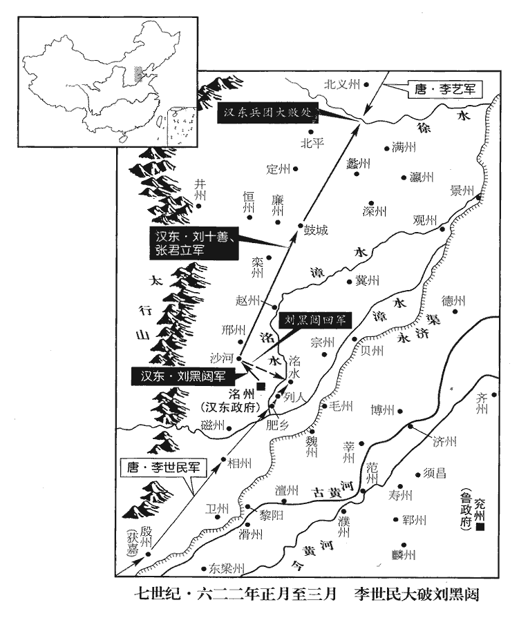
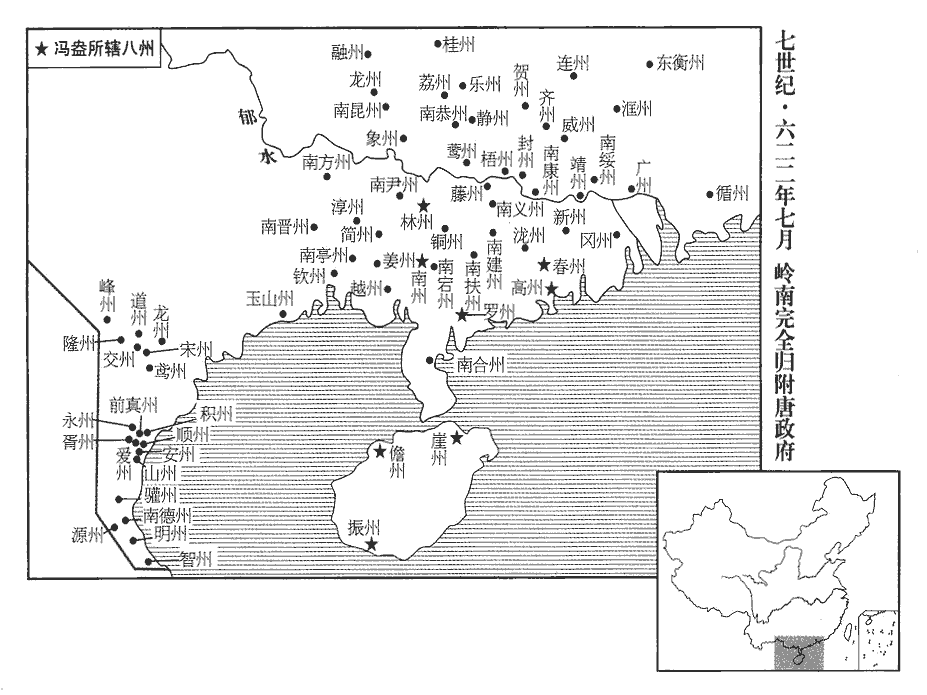
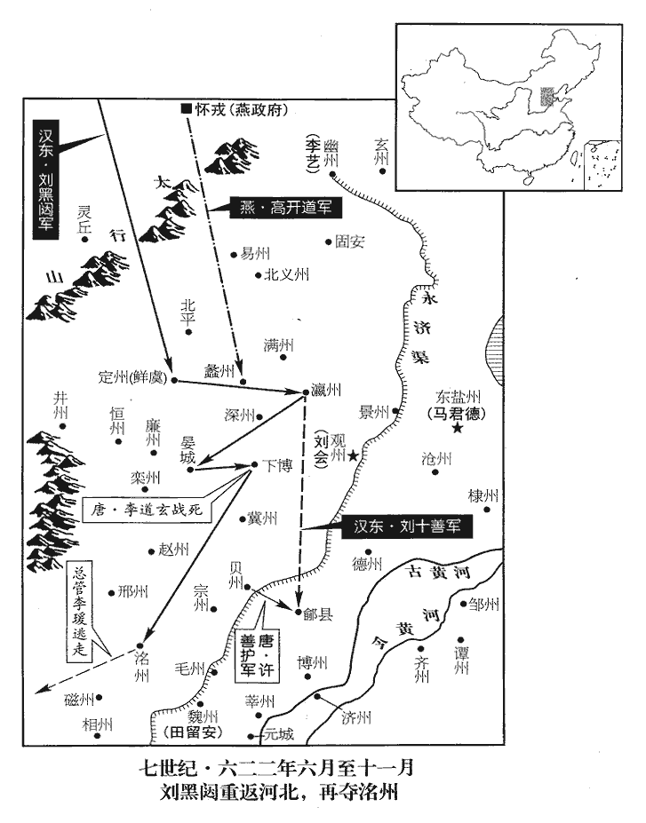
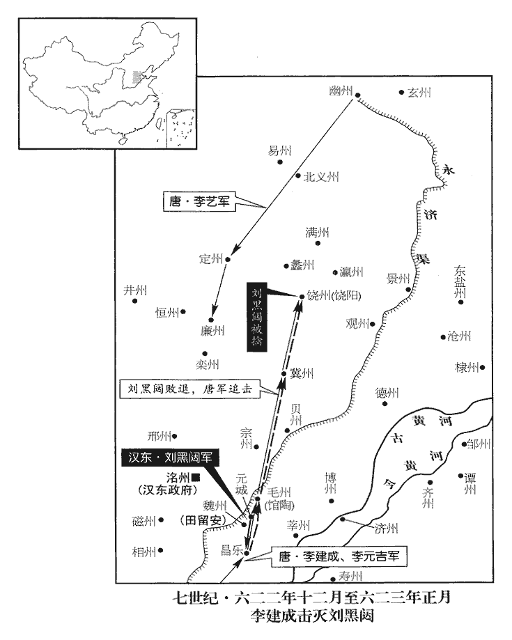
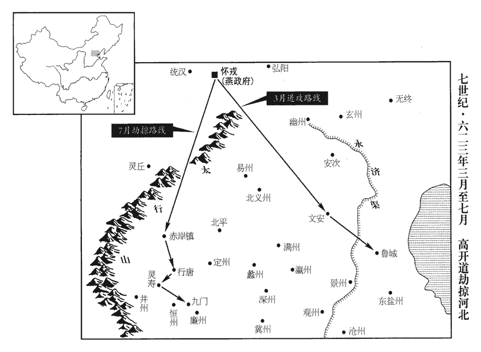
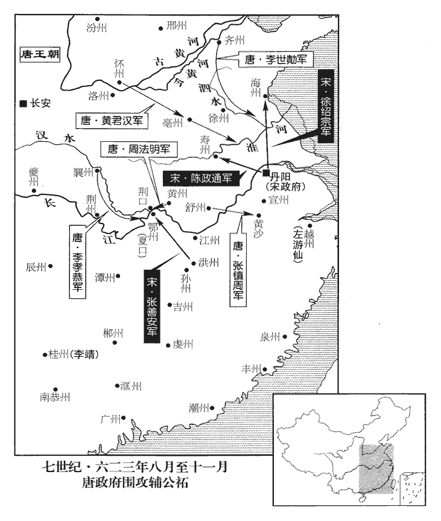
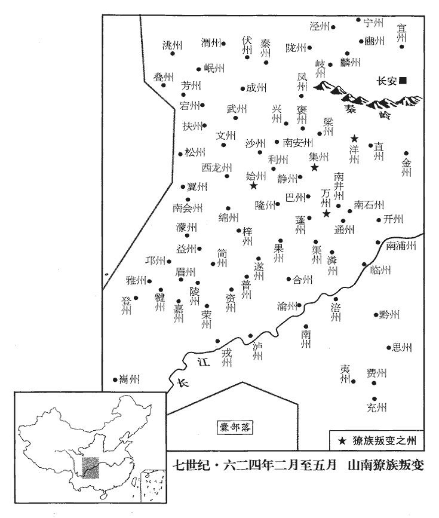
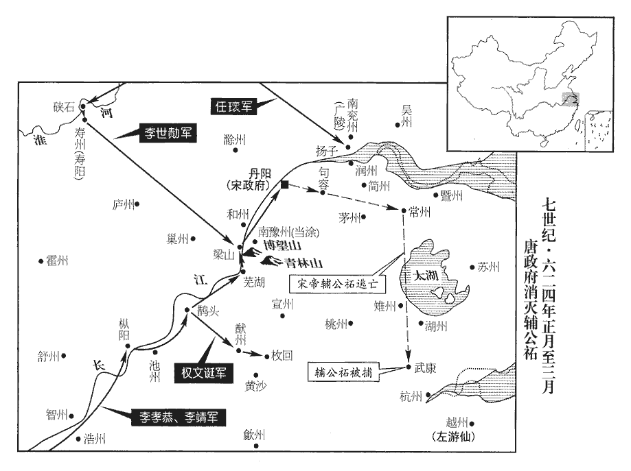

 唐紀六起玄黓敦牂（壬午），盡閼逢涒灘（甲申）五月，凡二年有奇。

# 高祖神堯大聖光孝皇帝中之下

## 武德五年（壬午、六二二）

1春，正月，劉黑闥自稱漢東王，改元天造，定都洺州‹河北省永年县东南旧永年镇›。以范願為左僕射，董康買為兵部尚書，高雅賢為右領軍；徵王琮為中書令，劉斌為中書侍郎；琮，藏宗翻。斌，音彬。竇建德時文武悉復本位。其設法行政，悉師建德，而攻戰勇決過之。

〖译文〗 [1]春季，正月，刘黑闼自称汉东王，改年号为天造，都城设在州。任命范愿为左仆射，董康买为兵部尚书，高雅贤为右领军，征召王琮为中书令，刘斌为中书侍郎，窦建德时期的文武官员全部恢复了原来的职位。刘黑闼的法令行政，全部效法窦建德，但他作战勇猛果敢则超过窦建德。

2丙戌‹四›，同安‹安徽省潜山县›賊帥殷恭邃以舒州‹同安郡改舒州›來降。舒州，隋之同安郡。宋白曰：舒州，漢皖縣，屬廬江郡；晉置晉熙郡，梁置南豫州，復為晉州；北齊改江州，隋初改熙州，大業改同安郡；唐改舒州，以其地古舒子之國也。帥，所類翻。降，戶江翻。

〖译文〗 [2]丙戌（初四），同安盗贼首领殷恭邃以舒州降唐。

3丁亥‹五›，濟州‹山东省茌平县西南›別駕劉伯通執刺史竇務本，以州附徐圓朗‹首都兖州山东省兖州市›。濟，子禮翻。

〖译文〗 [3]丁亥（初五），唐济州别驾刘伯通捉住刺史窦务本，以济州归附徐圆朗。

4庚寅‹八›，東鹽州‹河北省海兴县›治中王才藝殺刺史田華，以城應劉黑闥。滄州鹽山縣，本漢高成縣地，去年，置東鹽州，以清池縣隸之。

〖译文〗 [4]庚寅（初八），唐东盐州治中王才艺杀死刺史田华，以城池响应刘黑闼。

5秦王世民軍至獲嘉‹河南省获嘉县›，按宋白續通典：隋開皇四年，移獲嘉縣於脩武故城。劉黑闥棄相州‹河南省安阳市›，退保洺州。宋白曰：洺州城，春秋晉曲梁之地。相，息相翻。丙申‹十四›，世民復取相州，考異曰：實錄云：「祿州人殺刺史獨孤徹以城應黑闥。」按地理志無祿州，蓋字誤耳；新書作相州，尤誤也。按劉黑闥攻拔相州，執刺史房晃，秦王兵至，乃棄相州，故秦王復取之。新書帝紀，拔相州，殺房晃在正月乙酉，相州人殺獨孤徹叛附黑闥在丙申，其誤明矣。祿州既莫考其地，然黑闥之拔相州，與秦王之復相州，本末甚明，與祿州全不相干。而新書所書殺房晃，拔相州，月日亦誤。復，扶又翻，又音如字。進軍肥鄉‹河北省肥乡县›，肥鄉縣，漢魏郡邯溝縣地，曹魏置肥鄉縣，屬廣平郡。武德初屬紫州，去年廢紫州，以肥鄉屬磁州。九域志：肥鄉在洺州東南三十五里。列營洺水‹流经州城南›之上以逼之。水經：洺水東逕曲梁城。曲梁即永年，洺州所治也。

〖译文〗 [5]秦王李世民的大军到获嘉，刘黑闼放弃相州，撤退保卫州。丙申（十四日），李世民收复相州，进军肥乡，在水边布营进逼刘黑闼。

6蕭銑既敗，散兵多歸林士弘，軍勢復振。林士弘為張善安所敗，兵勢自此衰，見一百八十四卷隋義寧元年。

〖译文〗 [6]萧铣败亡后，他的散兵大部分投靠了林士弘，林士弘的军队因此重振势力。

7己酉‹二十七›，嶺南‹南岭以南›俚帥楊世略以循‹广东省惠州市›、潮‹广东省潮州市›二州來降。循州，龍川郡，秦、漢龍川、博羅縣地；南朝置郡，隋置州。潮州，義安郡，漢南海郡揭陽縣地；梁置東揚州，尋改瀛州，隋平陳，改潮州。俚，音里。帥，所類翻。降，戶江翻；下同。

〖译文〗 [7]己酉（二十七日），岭南俚族首领杨世略以循、潮二州降唐。

8唐使者王義童下泉‹福建省福州市›、睦‹浙江省淳安县›、建‹福建省建瓯市›三州。睦州，遂安郡，漢富春、歙縣地。劉昫曰：武德四年，以建安郡之建安縣置建州。蓋隋置泉州建安郡治閩縣，景雲元年，改為閩州，開元十三年改為福州。聖曆二年，分泉州之南安、龍溪、莆田三縣置武榮州，景雲二年，更武榮州為泉州。是今之福州乃唐初之泉州，今之泉州乃景雲二年之泉州也。使，疏吏翻。

〖译文〗 [8]唐朝使者王义童夺取泉、睦、建三州。

 

9幽州‹总部设北京市›總管李藝將所部兵數萬會秦王世民討劉黑闥，黑闥聞之，留兵萬人，使范願守洺州，自將兵拒藝。夜，宿沙河‹河北省沙河市北沙河城›，隋以漢襄國縣為龍岡縣，又分龍岡置沙河縣，時屬邢州。宋白曰：沙河即湡yú水也。水經云：湡水出趙郡襄國縣西山，東過沙河縣，沙河在縣南五里。范成大曰：臨洺鎮東去洺州三十五里，過洺河三十里至沙河縣，二十五里至邢州。將，即亮翻；下同。程名振載鼓六十具，於城西二里隄上急擊之，城中地皆震動。范願驚懼，馳告黑闥；黑闥遽還，遣其弟十善與行臺張君立將兵一萬擊藝於鼓城‹河北省晋州市›。壬子‹三十›，戰於徐河‹今漕河，流经河北省保定市北，注入海河›，鼓城縣，舊曰曲陽，後齊廢；隋開皇十六年分置晉陽縣，十八年，改為鼓城。按水經註，下曲陽縣有鼓聚，此因春秋鼓子之國以名縣也；唐屬趙州。水經：徐水出廣昌縣東南大嶺下，東北逕五回縣，又逕北平縣界，東南出山，又東逕清苑城北，又東至高陽入河。范成大曰：徐河在清苑北十里。十善、君立大敗，所失亡八千人。

〖译文〗 [9]唐幽州总管李艺率领他的几万部队会同秦王李世民讨伐刘黑闼，刘黑闼闻讯，留下一万兵力，命范愿守卫州，自己率军抵抗李艺。夜晚，刘黑闼在沙河县宿营，程名振带六十面大鼓，在州城西二里处的河堤上猛擂鼓，城中的地面都感到震动。范愿惊慌失措，派飞骑报告刘黑闼，刘黑闼迅速返回州，派他的弟弟刘十善和行台张君立率领一万兵马在鼓城攻打李艺。壬子（三十日），双方在徐河交战，刘十善、张君立大败，损失八千人。

10洺水‹河北省曲周县›人李去惑隋志：洺水縣，舊曰斥漳，後齊省入平恩。開皇六年，分置曲周，大業初，廢曲周入洺水；唐末，省洺水入曲周。去，羌呂翻。據城來降，秦王世民遣彭公王君廓將千五百騎赴之，入城共守。二月，劉黑闥引兵還攻洺水，癸亥‹十一›，行至列人‹河北省肥乡县北›；列人縣，漢屬廣平國，後漢屬魏郡，晉復屬廣平，後魏復屬魏郡，隋廢。九域志：洺州有列人城，在漢斥丘縣東北，武安縣西南。杜佑曰：漢列人縣故城，在肥鄉縣東北。騎，奇寄翻。秦王世民使秦叔寶邀擊，破之。考異曰：實錄：「癸亥，秦王擊劉黑闥於列人，大破之。」革命記：「十一月，太宗渡河入相州，劉黑闥從洺州勒兵拒王師，置營於鄴縣東三十里。每日兩軍皆挑戰，而大兵皆不出。經十餘日，洺水縣人李去惑、李潘買、李開弼等為車騎、驃騎，領兵在劉黑闥營，去惑等背賊營來入洺州城，誑人云：『劉黑闥已敗，先走得歸。』乃喚得宗室子弟二百餘人，守城定，遣使間道以告太宗。太宗遣彭國公王君廓領馬軍一千五百騎入洺州。經十許日，黑闥引兵攻洺州，行至故列人城西，秦叔寶等以五千騎擊之。叔寶等為闥所敗，又以伏兵從河下起，橫擊黑闥，敗之。會日暮，收軍。其夜三更，賊兵總至洺州城東營，即於城兩門掘壕豎柵，防王君廓之走。洺州城四面有水，闊五十步已上，深皆三四尺，黑闥於東北角兩處，填柴運土，作甬道，以撞車攻城。太宗三度將兵擊之，賊置陣拒官軍，攻城愈急。」按高祖、太宗實錄皆以去年十二月命太宗討黑闥，今年正月始至河北，無十一月渡河之事。太宗實錄亦無列人戰事。蓋叔寶破賊，秦王奏之耳。又按洺水，洺州屬縣。去惑、君廓所據者洺水縣城，「水」字誤作「州」耳。

〖译文〗 [10]水县人李去惑占据城池降唐，秦王李世民派彭公王君廓率一千五百名骑兵赴水，进城与李去惑共同守城。二月，刘黑闼带军回师攻打水，癸亥（十一日），走到列人县，秦王李世民命秦叔宝截击并打败了刘黑闼。

11豫章‹江西省南昌市›賊帥張善安以虔‹江西省赣州市›、吉‹江西省吉安市›等五州來降，拜洪州總管。洪州，豫章郡；虔州，南康郡；吉州，廬陵郡；皆隋平陳所置州。帥，所類翻。

〖译文〗 [11]豫章盗贼首领张善安以虔、吉等五州降唐，官拜洪州总管。

12戊辰‹十六›，金鄉‹山东省金乡县›人陽孝誠叛徐圓朗，以城來降。金鄉縣，漢屬山陽郡，晉屬髙平郡，隋屬曹州；武德四年，置金州，是年廢州，以縣屬戴州。

〖译文〗 [12]戊辰（十六日），金乡人阳孝诚背叛徐圆朗，以金乡县城降唐。

13己巳‹十七›，秦王世民復取邢州‹河北省邢台市›。辛未‹十九›，井州‹河北省井陉县西北›人馮伯讓以城來降。隋開皇十六年，以恆州井陘縣置井州，大業初廢，武德元年復置。考異曰：實錄作「并州」。按并州未嘗失城。蓋是時於井陘縣置井州，字之誤也。

〖译文〗 [13]己巳（十七日），秦王李世民收复邢州。辛未（十九日），井州人冯伯让以城降唐。

14丙子‹二十四›，李藝取劉黑闥定‹河北省定州市›、欒‹河北省赵县›、廉‹河北省藁城市›、趙‹河北省隆尧县›四州，隋開皇十六年，分趙州廣阿縣置欒州，大業初，州廢，併為趙州。新志：武德五年，改趙州為欒州。按趙州治平棘，欒州治廣阿。竇建德、劉黑闥相繼跨有山東，蓋自置欒州。是年黑闥破走之後，始并趙州為欒州也。武德元年，分恆州藁城縣置廉州。考異曰：實錄作「定、率、廉、隋四州」。按河北無率、隋二州。今從唐統紀。獲黑闥尚書劉希道，引兵與秦王世民會洺州。洺，彌并翻。

〖译文〗 [14]丙子（二十四日），李艺夺取刘黑闼占据的定、栾、廉、赵四州，抓获刘黑闼的尚书刘希道，然后带兵与秦王李世民在州会师。

15劉黑闥攻洺水甚急。城四旁皆有水，廣五十餘步，廣，古曠翻。黑闥於城東北築二甬道以攻之；世民三引兵救之，黑闥拒之，不得進。世民恐王君廓不能守，召諸將謀之，將，即亮翻。李世勣曰：「若甬道達城下，城必不守。」行軍總管郯tán勇公羅士信請代君廓守之。世民乃登城南高冢，以旗招君廓，君廓帥其徒力戰，潰圍而出；士信帥左右二百人乘之入城，代君廓固守。帥，讀曰率。黑闥晝夜急攻，會大雪，救兵不得往，凡八日。丁丑‹二十五›，城陷。黑闥素聞其勇，欲生之，士信詞色不屈，乃殺之，時年二十。考異曰：高祖實錄：「王君廓知不可守，潰圍而出，秦王謂諸將曰：『誰能代者？』士信曰：『願以死守。』因遣之。」按君廓若已潰圍而出，則黑闥圍守益固，士信何以復得入城！革命記曰：「太宗知賊勢盛，恐王君廓不能固，以問諸將，士信以為無慮，太宗使士信入守之。太宗登段王墓，以旗招王君廓從南門突圍，不得；即向北門，併兵攻捉，門人少退，得出，士信亦以左右二百人入城。經八日，晝夜被攻，木石俱盡，士信被左右執之以降賊。五年正月，城陷，李去惑以數十人突圍出，歸太宗。去惑後授秦州都督，李潘買拜檀州刺史，李開弼城陷而沒，贈上柱國，以公禮葬。」今從之。高祖實錄，士信死時年二十八，舊傳云年二十。按士信始從張須陀擊王薄等，時年十四，若死時年二十八，則在大業四年，於時王薄未為盜。年二十，則在大業十二年，是歲須陀死。今從之。

〖译文〗 [15]刘黑闼攻水很猛。水城四周都是水，水宽五十多步，刘黑闼在城东北修建二条甬道用来攻城；秦王李世民三次带军救援，都受到刘黑闼的阻拦，无法前进。李世民怕王君廓守不住城池，召集众将领商议救援之事，李世说：“如果甬道修到城下，城池必定失守。”行军总管郯勇公罗士信请求代替王君廓守城。李世民于是登上城南的高坟，用旗语招王君廓，王君廓率领部下奋战，突出包围，罗士信趁机率二百士卒进城，代替王君廓坚守城池。刘黑闼昼夜猛攻水，恰逢大雪，唐军无法增援，经过八天，丁丑（二十五日），水城陷落。刘黑闼早就听说罗士信勇猛，不想杀他，罗士信言语态度威武不屈，于是刘黑闼杀了他，当时罗士信仅二十岁。

16戊寅‹二十六›，汴州‹总部设河南省开封市›總管王要漢攻徐圓朗杞州‹河南省杞县›，拔之，獲其將周文舉。將，即亮翻；下同。

〖译文〗 [16]戊寅（二十六日），唐汴州总管王要汉攻打徐圆朗占据的杞州，夺取了城池，抓获徐圆朗的将领周文举。

17庚辰‹二十八›，延州道‹陕西省延安市›行軍總管段德操延州，漢上郡膚施之地，元魏之末，置東夏州，西魏改曰延州，隋曰延安郡。擊梁師都石堡城‹陕西省榆林市›，師都自將救之；將，即亮翻。德操與戰，大破之，師都以十六騎遁去。上‹李渊，本年五十七岁›益其兵，使乘勝進攻夏州‹陕西省靖边县北白城子›，克其東城，騎，奇寄翻。夏，戶雅翻。師都以數百人保西城。會突厥救至，厥，九勿翻。詔德操引還。還，從宣翻。

〖译文〗 [17]庚辰（二十八日），唐延州道行军总管段德操攻击梁师都的石堡城，梁师都亲自带兵救援，段德操与梁师都交锋，大败梁师都，梁师都只带十六名骑兵逃跑。高祖增加了段德操的兵力，让他乘胜进军攻打夏州，段德操攻克了夏州东城，梁师都带几百人保守夏州西城，恰好突厥救援梁师都的军队到达，高祖下诏命段德操撤军。

18辛巳‹二十九›，秦王世民拔洺水。洺，彌并翻。三月，世民與李藝營於洺水之南，分兵屯水北。黑闥數挑戰，數，所角翻。挑，徒了翻。世民堅壁不應，別遣奇兵絕其糧道。壬辰‹十一›，黑闥以高雅賢為左僕射，軍中高會。李世勣引兵逼其營，雅賢乘醉，單騎逐之，世勣部將潘毛刺之墜馬，將，即亮翻。刺，七亦翻。左右繼至，扶歸，未至營而卒。卒，子恤翻。甲午‹十三›，諸將復往逼其營，復，扶又翻。潘毛為王小胡所擒。黑闥運糧於冀‹河北省冀州市›、貝‹河北省清河县›、滄‹河北省盐山县西南›、瀛‹河北省河间市›諸州，水陸俱進，程名振以千餘人邀之，沈其舟，焚其車。沈，持林翻。

〖译文〗 [18]辛巳（二十九日），秦王李世民攻下水。三月，李世民和李艺在水以南扎营，分兵驻扎在水以北。刘黑闼多次来挑战，李世民坚壁不应战，却另派奇兵切断了刘黑闼的粮食运输线。壬辰（十一日），刘黑闼任命高雅贤为左仆射，军中举行盛大宴会。李世带兵逼近刘黑闼军营，高雅贤趁酒醉，单枪匹马追逐李世，李世的部将潘毛把他刺下马，高雅贤随从继后赶到，扶高雅贤回营，未到营地高雅贤就死了。甲午（十三日），唐军诸将领再次前进逼近刘黑闼的营地，潘毛被王小胡抓获。刘黑闼从冀、贝、沧、瀛各州运粮，水陆并进，程名振用一千多人截击，弄沉了运粮船，烧毁了运粮车。

19宋州‹总部设河南省商丘县›總管盛彥師帥齊州‹总部设山东省济南市›總管王薄攻須昌‹山东省东平县›，帥，讀曰率。徵軍糧於潭州‹山东省济南市东北›；刺史李義滿與薄有隙，閉倉不與。及須昌降，降，戶江翻。彥師收義滿，繫齊州獄，詔釋之。使者未至，義滿憂憤死獄中。使，疏吏翻。薄還，過潭州，戊戌‹十七›夜，義滿兄子武意執薄，殺之；「潭州」當作「譚州」，武德二年，李義滿以齊州之章丘縣來降，於平陵置譚州，并置平陵縣，蓋因春秋譚子之國以名州也。彥師亦坐死。坐死者，朝廷以義滿之死為彥師罪而殺之。

〖译文〗 [19]唐宋州总管盛彦师率领齐州总管王薄攻打须昌，向潭州征调军粮；潭州刺史李义满因与王薄有矛盾，关闭粮仓不给军粮。待须昌投降，盛彦师逮捕了李义满，关入齐州监狱，高祖下诏命令释放李义满。朝中下达诏令的使者还没到齐州，李义满因为忧愤，已经死在狱中。王薄回师，经过潭州，戊戌（十七日）夜晚，李义满的侄子李武意捉住王薄并杀了他；盛彦师也获罪被处死。

20上遣使賂突厥頡利可汗，且許結婚。使，疏吏翻。厥，九勿翻。可，從刊入聲。汗，音寒。頡利乃遣漢陽公瓌、鄭元璹shú、長孫順德等還，瓌等被留，事見上卷四年。瓌guī，工回翻。璹，殊玉翻。長，知兩翻。庚子‹十九›，復遣使來修好，復，扶又翻。好，呼到翻。上亦遣其使者特勒熱寒、阿史那德等還。還，從宣翻。并州‹总部设山西省太原市›總管劉世讓屯鴈門‹山西省代县›，頡利與高開道‹燕王，首都怀戎河北省怀来县›，苑君璋‹基地马邑山西省朔州市›合眾攻之，【章：十二行本「之」下有「不克」二字；乙十一行本同；孔本同；張校同；退齋校同。】月餘，乃退。考異曰：舊世讓傳云：「時鴻臚卿鄭元璹先使在蕃，可汗令元璹來說之，世讓厲聲曰：『大丈夫乃為夷狄作說客邪！』經月餘，虜乃退，及元璹還，述世讓忠貞勇幹，高祖下制褒美之。」按高祖稱元璹蘇武弗之過，安肯為可汗遊說！脫或果爾，則元璹唯恐帝知之，安肯稱世讓忠貞，說之不下邪！據實錄世讓傳無此事，今不取。

〖译文〗 [20]高祖派遣使节贿赂突厥颉利可汗，并且答应与颉利结为婚姻之好，于是颉利送汉阳公李、郑元、长孙顺德等人返回唐朝，庚子（十九日），颉利重新派遣使节来唐修好，高祖也送突厥使者特勒热寒、阿史那德等人回突厥。唐并州总管刘世让驻扎在雁门，颉利与高开道、苑君璋合兵攻打刘世让，一个多月才退军。

21甲辰‹二十三›，以隋交趾‹越南河内市›太守丘和為交州‹交趾郡改交州›總管，以交趾郡為交州。宋白曰：交州，周為越裳重譯之地，漢交趾、日南二郡界。按交趾之稱，今南方夷人，其足大指開廣，若並足而立，其指相交，故曰交趾。吳黃武中，以交趾縣遠，分為二州，割合浦以北海東四郡立廣州，交趾以南立交州。守，式又翻。和遣司馬高士廉奉表請入朝，朝，直遙翻。詔許之，遣其子師利迎之。義師之向長安，丘師利以兵來附。

〖译文〗 [21]甲辰（二十三日），唐任命隋朝交趾太守丘和为交州总管，丘和派司马高士廉奉表请求入朝，皇帝下诏准许他的请求，并派丘和的儿子丘师利前往迎接。

22秦王世民與劉黑闥相持六十餘日。黑闥潛師襲李世勣營，世民引兵掩其後以救之，為黑闥所圍，尉遲敬德帥壯士犯圍而入，尉，紆勿翻。帥，讀曰率。世民與略陽公道宗乘之得出。道宗，帝之從子也。從，才用翻。世民度黑闥糧盡，必來決戰，度，徒洛翻。乃使人堰洺水‹滏阳河支流›上流，洺，彌并翻。謂守吏曰：「待我與賊戰，乃決之。」丁未‹二十六›，黑闥帥步騎二萬南渡洺水，壓唐營而陳，陳，讀曰陣。世民自將精騎擊其騎兵，破之，乘勝蹂其步兵。蹂，人九翻。黑闥帥眾殊死戰，帥，讀曰率。自午至昏，戰數合，黑闥勢不能支。王小胡謂黑闥曰：「智力盡矣，宜早亡去。」遂與黑闥先遁，餘眾不知，猶格戰。守吏決堰，洺水大至，深丈餘，洺，彌并翻。深，式禁翻。黑闥眾大潰，斬首萬餘級，溺死數千人，黑闥與范願等二百騎奔突厥，山東‹崤山以东›悉平。騎，奇寄翻。厥，九勿翻。按秦王之討黑闥，前後接戰，黑闥之眾皆決死確鬬。特秦王大展方略，黑闥智力俱困而敗走耳。秦王之平群盜，黑闥最為堅敵。

〖译文〗 [22]秦王李世民与刘黑闼相持六十多天。刘黑闼暗中率军袭击李世的营地，李世民带兵突然袭击刘黑闼的背后以救援李世，结果被刘黑闼包围，尉迟敬德率领壮士冲入包围圈，李世民与略阳公李道宗趁势脱险。李道宗是皇帝的侄子。李世民推测刘黑闼的粮食已经吃光，必定前来决战，于是命人在水上游筑坝截断河水，对看守堤坝的官吏说：“等我和敌人交战时，就决开堤坝。”丁未（二十六日），刘黑闼率领两万步兵骑兵向南渡过水，逼近唐军营寨列阵，李世民亲自统率精锐骑兵攻打刘黑闼的骑兵，打败了刘军，乘胜用马踩踏刘的步兵。刘黑闼带领部队殊死战斗，从中午到黄昏，几度交锋，刘黑闼的兵力无法再坚持下去。王小胡对刘黑闼说：“我们的智能体力都已耗尽，应该快点逃走。”王小胡便和刘黑闼先逃跑，其余的将士不知道头领已经逃走，还在继续格斗。唐看守堤坝的官吏决开堤坝，水一下子涌到战场，水深一丈多，刘黑闼的军队大败，一万多人被杀，几千人被淹死，刘黑闼与范愿等二百人骑马逃入突厥，唐平定了整个山东地区。

23高開道寇易州‹河北省易县›，殺刺史慕容孝幹。

〖译文〗 [23]高开道侵犯易州，杀死唐易州刺史慕容孝千。

24夏，四月，己未‹八›，隋鴻臚卿寧長真以寧越‹广西钦州市›、鬱林‹广西贵港市东›之地請降於李靖，臚，陵如翻。降，戶江翻。交‹越南河内市›、愛‹越南清化市›之道始通；以長真為欽州‹宁越郡改钦州›總管。寧越郡，欽州，漢合浦縣地，宋為宋壽、宋廣郡。鬱林郡，鬱州，漢古郡，隋置州。愛州，九真郡，漢古郡，梁置州。劉昫曰：交州至京師七千五百二十三里，愛州至京師八千八百里。

〖译文〗 [24]夏季，四月己未（初八），隋朝鸿胪卿宁长真以宁越、郁林地区向李靖请求投降，这才打通了通往交州与爱州的道路。唐任命宁长真为钦州总管。

25以夔州‹总部设重庆市奉节县›總管趙郡王孝恭為荊州‹总部设湖北省江陵县›總管。

〖译文〗 [25]唐任命夔州总管赵郡王李孝恭为荆州总管。

26徐圓朗聞劉黑闥敗，大懼，不知所出。河間‹河北省河间市›人劉復禮說圓朗曰：「有劉世徹者，其才不世出，名高東夏，說，輸芮翻。夏，戶雅翻。且有非常之相，相，息亮翻。真帝王之器。將軍若自立，恐終無成；若迎世徹而奉之，天下指揮可定。」圓朗然之，使復禮迎世徹於浚儀‹河南省开封市›。浚儀縣，漢、晉、後魏屬陳留郡，周、隋、唐為汴州治所。或說圓朗曰：「將軍為人所惑，欲迎劉世徹而奉之，世徹若得志，將軍豈有全地乎！僕不敢遠引前古，將軍獨不見翟讓之於李密乎？」李密、翟讓事始一百八十三卷隋大業十二年，終一百八十四卷義寧元年。翟，萇伯翻。考異曰：革命記云：「盛彥師以世徹有虛名於徐、兗，恐二人相得，為患益深，因說圓朗使不納。」按實錄，彥師奔王薄，與薄共殺李義滿。三月，戊戌，王薄死，丁未，黑闥乃敗。彥師在圓朗所時，黑闥未敗也。今稱或說以闕疑。圓朗復以為然。復，扶又翻；下同。世徹至，已有眾數千人，頓於城外，以待圓朗出迎，圓朗不出，使人召之。世徹知事變，欲亡走，恐不免，乃入謁；圓朗悉奪其兵，以為司馬，使徇譙‹安徽省亳州市›、杞二州，東人素聞其名，所向皆下，圓朗遂殺之。

〖译文〗 [26]徐圆朗听说刘黑闼失败，大为恐慌，不知所措。河间人刘复礼劝徐圆朗道：“有位名叫刘世彻的人，是很难得的人才，在东夏有很高的名望，并且相貌非凡，真有帝王的器度。将军您如果自立为王，恐怕最终会一事无成；如果迎来刘世彻并拥戴他为主，就可以轻易地取得天下。”徐圆朗同意了他的意见，命刘复礼到浚仪迎接刘世彻。有人对徐圆朗说：“将军被人骗了，想迎立刘世彻，世彻如果得志，哪里有将军您的保全之地呢？我不用援引前代之事，您就没看到翟让与李密的例子吗？”徐圆朗也认为很对。刘世彻到来时，已有几千人马，停在城外，等待徐圆朗出城迎接，徐圆朗不出城，命人召刘世彻进城。刘世彻知道事情发生了变化，想逃走，又怕逃不脱，于是进城谒见徐圆朗，徐圆朗夺了他的全部人马，任命他为司马，让他攻打谯、杞二州，东部的人久闻他的大名，刘世彻所到之处纷纷投降，徐圆朗便杀了刘世彻。

秦王世民自河北引兵將擊圓朗，會上召之，使馳傳入朝，乃以兵屬齊王元吉。傳，株戀翻。屬，之欲翻，付也。庚申‹九›，世民至長安，上迎之於長樂‹长安城东›。長樂坂在長安城東。樂，音洛。世民具陳取圓朗形勢，上復遣之詣黎陽‹河南省浚县›，會大軍趨濟陰‹曹州州政府所在县·山东省定陶县›。曹州治濟陰縣。趨，七喻翻。濟，子禮翻。

〖译文〗 秦王李世民从河北带兵准备攻打徐圆朗，恰好高祖召他，让他乘驿站车马急速回长安，于是李世民将军队交给齐王元吉统领。庚申（初九），李世民到达长安，高祖到长乐坂迎接他。李世民详细陈述了攻打徐圆朗的形势，高祖又派他赴黎阳，会同大军火速赶到济阴。

27丁卯‹十六›，廢山東行臺。劉黑闥敗走故也。

〖译文〗 [27]丁卯（十六日），唐废除山东行台。

28壬申‹二十一›，代州‹总部设山西省代县›總管定襄王李大恩為突厥所殺。厥，九勿翻。先是，大恩奏稱突厥饑饉，馬邑可取，先，悉薦翻。詔殿內少監獨孤晟將兵與大恩共擊苑君璋，期以二月會馬邑；失期不至，大恩不能獨進，頓兵新城‹山西省朔州市阳方口北›。新城，當在朔州南。杜佑曰：魏都平城，於馬邑郡北三百餘里置懷朔鎮；及遷洛後，於郡北三百餘里置朔州。魏初雲中郡，在今郡北三百餘里定襄故城北；北齊置朔州在故都西南。新城，一名平城，後移於馬邑，即今郡城也。馬邑郡治善陽縣，亦漢定襄縣地。新城即魏之新平城也。晟，承正翻。將，即亮翻。頡利可汗遣數萬騎與劉黑闥共圍大恩，上遣右驍衛大將軍李高遷救之。騎，奇寄翻。驍，堅堯翻。未至，大恩糧盡，夜遁，突厥邀之，眾潰而死，上惜之。獨孤晟坐减死徙邊。

〖译文〗 [28]壬申（二十一日），唐代州总管定襄王李大恩被突厥杀害。此前，李大恩上奏章说明突厥闹饥荒，可攻取马邑，高祖下诏命殿内少监独孤晟带兵与李大恩共同攻打苑君璋，约定二月在马邑会师，独孤晟未能按期到达，李大恩不能孤军挺进，将军队停在新城。突厥颉利可汗派几万骑兵与刘黑闼一起包围了李大恩，高祖派右骁卫大将军李高迁救援李大恩。李高迁还未到达，李大恩因军粮吃光，半夜逃遁，遭突厥阻截，军队溃败而被害，高祖很痛惜他的死亡。独孤晟获罪被判处减死，流放到边远地区。

29丙子‹二十五›，行臺民部尚書史萬寶攻徐圓朗陳州‹河南省淮阳县›，拔之。宋白曰：陳州，楚襄王自郢徙此，謂之西楚，漢為淮陽國之地。後魏立陳郡，天平二年，置北揚州，隋改陳州，治宛丘。春秋陳國都也。

〖译文〗 [29]丙子（二十五日），唐行台民部尚书史万宝攻打徐圆朗占据的陈州，攻克陈州。

30戊寅‹二十七›，廣州‹广东省广州市›賊帥鄧文進、隋合浦‹广西合浦县东北›太守寧宣、日南‹越南荣市›太守李晙jùn並來降。合浦郡，越州，貞觀改廉州。日南郡，德州，貞觀改驩州。帥，所類翻。守，式又翻。晙，子峻翻。

〖译文〗 [30]戊寅（二十七日），广州盗贼首领邓文进、隋朝合浦太守宁宣、日南太守李一同降唐。

31五月，庚寅‹九›，瓜州‹甘肃省安西县›土豪王幹斬賀拔行威以降，瓜州，晉昌郡。是年分瓜州之常樂縣置瓜州，舊瓜州為西沙州。賀拔行威反事始見一百八十八卷三年。瓜州平。

〖译文〗 [31]五月庚寅（初九），瓜州土豪王干杀死贺拔行威降唐，瓜州平定。

32突厥寇忻州‹山西省忻州市›，忻州，新興郡，義寧元年，以樓煩郡秀容縣置。此秀容，漢汾陽縣地，非後魏之北秀容也。李高遷擊破之。

〖译文〗 [32]突厥侵犯忻州，被李高迁击败。

33六月，辛亥‹一›，劉黑闥引突厥寇山東，詔燕郡王李藝擊之。厥，九勿翻。燕，因肩翻。

〖译文〗 [33]六月辛亥（初一），刘黑闼带突厥侵犯山东，唐高祖下诏命燕郡王李艺迎敌。

34癸丑‹三›，吐谷渾‹青海省›寇洮‹甘肃省卓尼县›、旭‹甘肃省临潭县›、疊‹甘肃省迭部县›三州，岷州‹总部设甘肃省岷县›總管李長卿擊破之。後周武帝逐吐谷渾，置疊州於疊川，旭州於洮源，岷州於臨洮。義寧元年，改臨洮於溢樂。後周書曰：於河州雞鳴防置旭州，於宕州渠株川置岷州。吐，從暾入聲。谷，音浴。洮，土刀翻。旭，吁玉翻。長，知兩翻。

〖译文〗 [34]癸丑（初三），吐谷浑侵犯洮、旭、叠三州，唐岷州总管李长卿打败了来犯之敌。

35乙卯‹五›，遣淮安王神通擊徐圓朗。

〖译文〗 [35]乙卯（初五），唐派淮安王李神通攻打徐圆朗。

36丁卯‹十七›，劉黑闥引突厥寇定州。

〖译文〗 [36]丁卯（十七日），刘黑闼带突厥侵犯定州。

37秋，七月，甲申‹五›，為秦王世民營弘義宮，弘義宮，後改為大安宮，在宮城外西偏。為，于偽翻。使居之。世民擊徐圓朗，下十餘城，聲震淮、泗‹淮河下游及泗水流域›，杜伏威‹时在丹阳江苏省南京市›懼，請入朝。朝，直遙翻；下同。世民以淮、濟之間‹淮河下游及济水流域›略定，濟，子禮翻。使淮安王神通、行軍總管任瓌、李世勣攻圓朗；乙酉‹六›，班師。

〖译文〗 [37]秋季，七月甲申（初五），唐为秦王李世民建造弘义宫，供李世民居住。李世民攻打徐圆朗，夺取了十几座城池，声势震动了淮水、泗水地区，杜伏威很恐惧，请求入朝。李世民因淮、济之间已大致平定，让淮安王李神通、行军总管任、李世攻打徐圆朗；乙酉（初六），李世民班师回朝。

38丁亥‹八›，杜伏威入朝，延升御榻，拜太子太保，仍兼行臺尚書令，留長安，位在齊王元吉上，以寵異之。以闞稜為左領軍將軍。漢建安中，魏武為丞相，始置中領軍，北齊置領軍府，煬帝改為禦衛，唐改為領軍衛。

〖译文〗 [38]丁亥（初八），杜伏威入朝，被引进登上御榻，官拜太子太保，仍兼行台尚书令，留在长安，上朝位置在齐王元吉之前，表示对他特别恩宠。唐任命阚棱为左领军将军。

李子通謂樂伯通曰：「伏威既來，江東未定，我往收舊兵，可以立大功。」遂相與亡至藍田關‹陕西省蓝田县东南›，雍州藍田縣有藍田關。為吏所獲，俱伏誅。

〖译文〗 李子通对乐伯通说：“杜伏威已来长安，江东尚未安定，我们回去收拾旧部，可以立大功。”于是一起逃跑，到蓝田关，被官吏抓获，均被处死。

39劉黑闥至定州，其故將曹湛、董康買亡命在鮮虞‹定州›州政府所在县，鮮虞縣，舊曰盧奴，開皇初更名，以其地春秋鮮虞子之國也；定州治所。復聚兵應之。復，扶又翻。甲午‹十五›，以淮陽王道玄為河北道行軍總管以討之。

〖译文〗 [39]刘黑闼到定州，他的旧部下曹湛、董康买逃亡在鲜虞，重新召集兵马响应刘黑闼。甲午（十五日），唐任命淮阳王李道玄为河北道行军总管讨伐刘黑闼。

40丙申‹十七›，遷州‹湖北省房县›人鄧士政執刺史李敬昂以反。西魏以房陵置遷州，大業初，改曰房州，武德初，復曰遷州，房陵郡。

〖译文〗 [40]丙申（十七日），迁州人邓士政捉住刺史李敬昂，反叛朝廷。

41丁酉‹十八›，隋漢陽‹甘肃省礼县南›太守馮盎承李靖檄，帥所部來降，守，式又翻。帥，讀曰率。降，戶江翻；下同。以其地為高‹广东省阳江市›、羅‹广东省化州市›、春‹广东省阳春市›、白‹广西博白县。此时应称南州›、崖‹海南省琼山县›、儋dān‹海南省儋州市›、林‹广西桂平县南›、振‹海南省三亚市西崖城镇›八州，高州，高涼郡。羅州，石城郡。春州，陽春郡。白州，南昌郡。崖州，珠崖郡。林州，桂林郡。振州，臨振郡。羅州，今化州。白州，今鬱林州之博白縣。崖、儋、振皆在海外。振州，今吉陽軍地。林州，後改繡州。投荒錄：高州高涼郡，土厚而山環遶，高而稍汙，故名。羅州，宋將檀道濟於陵羅江口築城，因置羅州，今廢。陵羅縣在化州北一百二十里。宋白曰：州在陵、羅二水之間。春州治陽春縣，故名。白州以博白江名。崖州以珠崖名。儋州以儋耳名。林州以綏懷林邑名。振州以漢臨振古縣而名。儋，丁甘翻。以盎為高州‹总部设广东省阳江市›總管，封耿國公。先是，或說盎曰：「唐始定中原，未能及遠，公所領二十州地已廣於趙佗，趙佗，見漢紀。先，悉薦翻。說，輸芮翻。佗，徒何翻。宜自稱南越王。」盎曰：「吾家居此五世矣，馮氏居高涼事始見一百六十三卷梁簡文帝大寶元年。為牧伯者不出吾門，富貴極矣，常懼不克負荷，為先人羞，敢効趙佗自王一方乎！」荷，下可翻，又如字。王，于況翻。遂來降。於是嶺南‹南岭以南›悉平。

〖译文〗 [41]丁酉（十八日），隋朝汉阳太守冯盎接受了李靖的檄文，率领部属降唐，唐在冯盎的辖地设置高、罗、春、白、崖、儋、林、振八州，任命冯盎为高州总管，封爵耿国公。此前，有人劝冯盎道：“唐才平定了中原，还无力顾及边远地区，您所管辖的二十州的范围已超过汉代的赵佗，应当自称南越王。”冯盎说：“我家在此地定居已经五代了，此地的长官都由我家的人担任，已极尽富贵了，常常怕承担不起重担，使先人蒙受耻辱，怎么敢效法赵佗自己称王一方呢？”于是前来投降。从此岭南地区全部平定。

 

42八月，辛亥‹二›，以洺、荊、交、并、幽五州為大總管府。洺，彌并翻。并，卑名翻。

〖译文〗 [42]八月辛亥（初二），唐以、荆、交、并、幽五州为大总管府。

43改葬隋煬帝於揚州雷塘。雷塘，漢所謂雷陂也，在今揚州城北平岡上。考異曰：實錄，「武德二年六月癸巳，有詔葬隋帝及子孫」，此又云葬煬帝，蓋三年李子通猶據江都，雖有是詔，不果葬也。

〖译文〗 [43]唐将隋炀帝改葬于扬州雷塘。

44甲戌‹五›，吐谷渾寇岷州，敗總管李長卿。吐，從暾入聲。谷，音浴。敗，補邁翻。長，知兩翻。詔益州‹四川省成都市›行臺右僕射竇軌、渭州‹甘肃省陇西县›刺史且洛生救之。渭州，隴西郡。且，姓也，音子余翻。

〖译文〗 [44]甲戌（疑误），吐谷浑侵犯岷州，打败了唐总管李长卿。唐高祖下诏命益州行台右仆射窦轨、渭州刺史且洛生救援李长卿。

45乙卯‹六›，突厥頡利可汗寇邊，厥，九勿翻。可，從刊入聲。汗，音寒。遣左武衛將軍段德操、雲州‹总部侨设陕西省延安市西北›總管李子和將兵拒之。子和本姓郭，郭子和，武德三年以榆林郡降。榆林之地，本屬雲州，隋割置勝州榆林郡。子和以榆林降，因命之為雲州總管。以討劉黑闥有功，賜姓。丙辰‹七›，頡利十五萬騎入鴈門，頡，奚結翻。騎，奇寄翻。己未‹十›，寇并州，別遣兵寇原州‹宁夏固原县›；庚子‹十一›，【章：十二行本「子」作「申」；乙十一行本同；孔本同；退齋校同。】命太子出幽州道‹豳州，陕西省彬县›，「幽州」，當作「豳州」。秦王世民出秦州道‹泰州，山西省河津县›以禦之。「秦州」，當作「泰州」。出豳州以禦原州之寇，出泰州以禦并州之寇。泰州時治龍門。李子和趨雲中‹内蒙古和林格尔县›，掩擊可汗，漢雲中古城，在榆林郡東北四十里。趨，七喻翻。段德操趨夏州‹陕西省靖边县北白城子›，邀其歸路。夏，戶雅翻。

〖译文〗 [45]乙卯（初六），突厥颉利可汗侵犯唐国边境，唐派遣左武卫将军段德操、云州总管李子和带兵抵抗。李子和本姓郭，因讨伐刘黑闼有功，赐姓李。丙辰（初七），颉利的十五万骑兵进入雁门，己未（初十），侵犯并州。另外又派兵侵犯原州。庚子（疑误），唐高祖命太子李建成从豳州道，秦王李世民从泰州道出兵抵御突厥，李子和急速赶赴云中，突然袭击颉利可汗，段德操赶赴夏州，阻截突厥的退路。

辛酉‹十二›，上謂群臣曰：「突厥入寇而復求和，厥，九勿翻。復，扶又翻。和與戰孰利？」太常卿鄭元璹shú曰：「戰則怨深，不如和利。」璹，殊玉翻。中書令封德彝曰：「突厥恃犬羊之眾，有輕中國之意，若不戰而和，示之以弱，明年將復來。復，扶又翻。臣愚以為不如擊之，既勝而後與和，則恩威兼著矣！」上從之。

〖译文〗 辛酉（十二日），高祖对群臣说：“突厥入侵，但又来求和，和与战哪个更有利？”太常卿郑元说：“交战会加深仇怨，不如讲和有利。”中书令封德彝认为：“突厥仗着兵力众多，轻视我们中原的大唐王朝，如果不战而和，是向他们显示软弱，明年还会重来。以臣的愚见不如打击他们，取胜以后再讲和，这样就恩威并重了！”皇上听从了封德彝的意见。

己巳‹二十›，并州‹总部设山西省太原市›大總管襄邑王神符破突厥於汾東‹汾水以东›；汾州‹山西省汾阳县›刺史蕭顗破突厥，浩州，西河郡，武德三年更名汾州。顗，魚豈翻。斬首五千餘級。

〖译文〗 己巳（二十日），唐并州大总管襄邑王李神符在汾东打败突厥；汾州刺史萧打败突厥，斩首五千多级。

46吐谷渾寇【章：十二行本「寇」作「陷」；乙十一行本同；孔本同；退齋校同。】洮州，遣武州‹甘肃省武都县›刺史賀【章：十二行本「賀」下有「拔」字；乙十一行本同；孔本同；退齋校同。】亮禦之。武都郡，西魏置武州，唐後改曰階州。洮，土刀翻。

〖译文〗 吐谷浑侵犯洮州，唐派武州刺史贺拔亮抵御来敌。

47丙子‹二十七›，突厥寇廉州‹河北省藁城市›；戊寅‹二十九›，陷大震關‹甘肃省张家川回族自治县东南›。大震關，在隴州汧源縣，當隴山之路。程大昌曰：漢武帝至此，遇雷大震，因以為名。按寇廉州者，并州之寇，陷大震關者，原州之寇也。上遣鄭元璹詣頡利。是時，突厥精騎數十萬，自介休‹山西省介休市›至晉州‹山西省临汾市›，數百里間，填溢山谷。元璹見頡利，責以負約，與相辨詰，詰，去吉翻。頡利頗慚。元璹因說頡利曰：「唐與突厥，風俗不同，突厥雖得唐地，不能居也。今虜掠所得，皆入國人，於可汗何有？不如旋師，復脩和親，說，輸芮翻。復，扶又翻。可無跋涉之勞，坐受金幣，又皆入可汗府庫，可，從刊入聲。汗，音寒。孰與棄昆弟積年之歡，而結子孫無窮之怨乎！」頡利悅，引兵還。還，從宣翻。元璹自義寧以來，五使突厥，幾死者數焉。使，疏吏翻。幾，居依翻。數，所角翻。

〖译文〗 [47]丙子（二十七日），突厥侵犯廉州，戊寅（二十九日），攻陷大震关。高祖派郑元去见颉利可汗。当时，突厥几十万精骑兵，弃斥着从介休到晋州几百里之间的山谷。郑元见到颉利，责备他背叛盟约，与颉利展开辩论，颉利颇为惭愧。郑元趁机劝颉利道：“唐与突厥，风俗不同，突厥就是得到唐的领土，也不能居住。如今俘虏与抢夺的财物，都给了突厥百姓，可汗您得到了什么？不如回军，重新和亲，可以免除了跋涉的辛劳，坐享金银财物，并且都进了可汗您的仓库，比起抛弃了兄弟之间多年的交情，给子孙后代结下无穷的仇怨，哪一个更好呢？”颉利愉快地听从了他的意见，带兵撤回突厥。郑元从义宁年间以来，五次出使突厥，多次面临死亡的威胁。

48九月，癸巳‹十五›，交州‹甘肃省张家川回族自治县西›刺史權士通、西魏置北秦州於上郡，廢帝三年，改曰交州。弘州‹总部设甘肃省庆阳县›總管宇文歆、慶州弘化縣，開皇十八年置弘州，大業初州廢，蓋唐復置也。靈州‹总部设宁夏灵武市›總管楊師道擊突厥於三觀山，破之。觀，古玩翻。乙未‹十七›，太子‹李建成›班師。丙申‹十八›，宇文歆邀突厥於崇崗鎮‹宁夏平罗县西›，大破之，斬首千餘級。歆，許今翻。壬寅‹二十四›，定州‹总部设河北省定州市›總管雙士洛擊突厥於恆山之南‹河北省曲阳县境›，雙，姓也。姓苑曰：黃帝後，封於雙蒙城。恆，戶登翻。丙午‹二十八›，領軍將軍安興貴擊突厥於甘州‹甘肃省张掖市›，皆破之。甘州，張掖郡。

〖译文〗 [48]九月癸巳（十五日），唐交州刺史权士通、弘州总管宇文歆、灵州总管杨师道在三观山攻击并打败了突厥。乙未（十七日），太子李建成班师回朝。丙申（十八日），宇文歆在崇岗镇阻截突厥，大败突厥，斩首一千多级。壬寅（二十四日），唐定州总管双士洛在恒山南麓攻击突厥，丙午（二十八日），唐领军将军安兴贵在甘州攻打突厥，均打败了突厥。

49劉黑闥陷瀛州，殺刺史馬匡武。鹽州‹东盐州·河北省海兴县›人馬君德以城叛附黑闥。此鹽州，即東鹽州。高開道寇蠡州‹河北省蠡县›。武德五年，以瀛州之博野、清苑，定州之義豐，置蠡州，因漢蠡吾亭以名州也。

〖译文〗 [49]刘黑闼攻陷瀛州，杀死唐瀛州刺史马匡武。盐州人马君德以盐州城反叛归附了刘黑闼。高开道侵犯蠡州。

50冬，十月，己酉‹一›，詔齊王元吉討劉黑闥於山東。壬子‹四›，以元吉為領軍大將軍、并州大總管。癸丑‹五›，貝州刺史許善護與黑闥弟十善戰於鄃縣‹山东省夏津县›，鄃，音輸。善護全軍皆沒。甲寅‹六›，右武候將軍桑顯和擊黑闥於晏城‹河北省辛集市境›，破之。隋開皇十六年，分冀州之鹿城置晏城縣，大業初廢入鹿城，蓋其縣名猶在。觀州‹河北省泊头市西交河镇›刺史劉會以城叛附黑闥。觀，古喚翻。

〖译文〗 [50]冬季，十月己酉（初一），唐高祖下诏命齐王李元吉在山东讨伐刘黑闼。壬子（初四），任命李元吉为领军大将军、并州大总管。癸丑（初五），唐贝州刺史许善护在县与刘黑闼之弟刘十善交战，许善护全军覆没。甲寅（初六），唐右武候将军桑显和在晏城攻击打败了刘黑闼。唐观州刺史刘会以观州城反叛，归附了刘黑闼。

 

51契丹‹辽河上游›寇北平‹河北省顺平县›。北平郡，平州。契，欺訖翻，又音喫。

〖译文〗 [51]契丹侵犯北平。

52甲子‹十六›，以秦王世民領左•右十二衛大將軍。左•右衛、左•右驍衛、左•右武衛、左•右屯衛、左•右領軍衛、左•右候衛，為十二衛。

〖译文〗 [52]甲子（十六日），唐以秦王李世民统领左、右十二卫大将军。

53乙丑‹十七›，行軍總管淮陽壯王道玄與劉黑闥戰于下博‹河北省深州市东南下博镇›，下博縣，屬冀州。考異曰：高祖實錄諡曰忠。本傳諡曰壯，蓋後來改諡也。軍敗，為黑闥所殺。時道玄將兵三萬，與副將史萬寶不協；道玄帥輕騎先出犯陳，將，即亮翻。帥，讀曰率。騎，奇寄翻。陳，讀曰陣；下同。使萬寶將大軍繼之。萬寶擁兵不進，謂所親曰：「我奉手敕云，淮陽小兒，軍事皆委老夫。今王輕脫妄進，若與之俱，必同敗沒，不如以王餌賊，王敗，賊必爭進，我堅陳以待之，破之必矣。」由是道玄獨進敗沒。萬寶勒兵將戰，士卒皆無鬬志，軍遂大潰，萬寶逃歸。道玄數從秦王世民征伐，死時年十九，數，所角翻。世民深惜之，謂人曰：「道玄常從吾征伐，見吾深入賊陳，心慕効之，以至於此。」為之流涕。為，于偽翻。世民自起兵以來，前後數十戰，常身先士卒，先，悉薦翻。輕騎深入，雖屢危殆而未嘗為矢刃所傷。史言秦王有天命。

〖译文〗 [53]乙丑（十七日），唐行军总管淮阳壮王李道玄与刘黑闼在下博交战，唐军失败，李道玄被刘黑闼杀死。当时李道玄带领三万兵马，与副将史万宝不和，李道玄率领轻骑兵率先出战冲入敌阵，命史万宝率大军随后。史万宝按兵不动，对他的亲信说：“我奉皇帝手书敕令说淮阳王是毛孩子，军队行动均委托老夫我。现在淮阳王冒冒失失地出击，如果和他一同进攻，必然一起失败导致覆没，不如用淮阳王作饵引诱敌人，如果淮阳王失败，敌人必定争相前进，我坚守以待，就一定能够打败敌人！”因此李道玄孤军深入敌阵战败阵亡。史万宝带兵准备战斗，但士兵都没有了斗志，唐军因此大败，史万宝逃回。李道玄多次跟随秦王李世民征伐，死时才十九岁，李世民深为痛惜，对人说道：“道玄常跟随我征伐，见我深入敌阵，心中羡慕想要模仿，才会这样。”并为李道玄的阵亡而痛哭。李世民自从太原起兵以来，前前后后经过几十仗，经常身先士卒，轻骑深入敌阵，虽然屡次濒临绝境，但从来没有被刀箭伤过。

54林士弘遣其弟鄱陽王藥師攻循州，刺史楊略與戰，斬之，其將王戎以南昌州‹江西省永修县›降。士弘懼，己巳‹二十一›，請降。尋復走保安成‹江西省安福县›山洞，袁州‹江西省宜春市›人相聚應之；是年以洪州建昌縣置南昌州。吉州安復，本吳所置安成縣也，唐後改為安福。袁州，宜春郡。將，即亮翻。降，戶江翻。復，扶又翻。洪州總管若干則遣兵擊破之。會士弘死，其眾遂散。隋大業十三年，林士弘起為盜，至是死散。

〖译文〗 [54]林士弘派遣他的弟弟鄱阳王林药师攻打循州，唐循州刺史杨略与林药师交战，杀了他，林药师的将领王戎以南昌州投降。林士弘害怕了，己巳（二十一日），也请求投降。随即又逃入安成的山洞，袁州百姓相互聚合响应林士弘，唐洪州总管若干则派兵打败了他们。恰好林士弘死亡，他的部下便散去。

55淮陽王道玄之敗也，山東震駭，洺州總管廬江王瑗棄城西走，洺，彌并翻。瑗，于眷翻。州縣皆叛附於黑闥，旬日間，黑闥盡復故地，乙亥‹二十七›，進據洺州。十一月，庚辰‹三›，滄州刺史程大買為黑闥所迫，棄城走。齊王元吉畏黑闥兵強，不敢進。

〖译文〗 [55]淮阳王李道玄失败，山东地区感到震惊，唐州总管庐江王李瑗放弃城池向西逃跑，州县也都反叛归附了刘黑闼，十天之内，刘黑闼就收复了他原来的全部地盘，乙亥（二十七日），进军占据了州。十一月庚辰（初三），唐沧州刺史程大买因为刘黑闼的逼近，放弃城池逃跑。齐王李元吉畏惧刘黑闼军队的强盛，不敢进军。

上‹李渊›之起兵晉陽也，皆秦王世民之謀，事見一百八十一卷隋義寧元年。上謂世民曰：「若事成，則天下皆汝所致，當以汝為太子。」世民拜且辭。及為唐王，將佐亦請以世民為世子，將，即亮翻。上將立之，世民固辭而止。太子建成，性寬簡，喜酒色喜，許記翻。遊畋；句斷。齊王元吉，多過失；皆無寵於上。世民功名日盛，上常有意以代建成，建成內不自安，乃與元吉協謀，共傾世民，各引樹黨友。

〖译文〗 高祖在晋阳起兵，都是秦王李世民的计谋，高祖对李世民说：“如果事业成功，那么天下都是你带来的，该立你为太子。”李世民拜谢并推辞。待到高祖成为唐王，将领们也请求以李世民为世子，高祖准备立他，李世民坚决推辞才作罢。太子李建成性情松缓惰慢，喜欢饮酒，贪恋女色，爱打猎；齐王李元吉，常有过错，均不受高祖宠爱。李世民功勋名望日增，高祖常常有意让他取代李建成为太子，李建成心中不安，于是与李元吉共同谋划，一起排挤李世民，他们各自交结建立自己的党羽。

上晚年多內寵，小王且二十人，尹德妃生酆王元亨，莫嬪生荊王元景，孫嬪生漢王元昌，宇文昭儀生韓王元嘉、魯王靈夔，瞿嬪生鄧王元裕，楊嬪生江王元祥，小楊嬪生舒王元名，郭婕妤生徐王元禮，劉婕妤生道王元慶，楊美人生虢王鳳，張美人生霍王元軌，張寶林生鄭王元懿，柳寶林生滕王元嬰，王才人生彭王元則，魯才人生密王元曉，張氏生周王元方，凡十七人。且者，將及未及之辭。其母競交結諸長子以自固。建成與元吉曲意事諸妃嬪，諂諛賂遺，無所不至，遺，于季翻。以求媚於上。或言蒸於張婕妤、尹德妃，宮禁深祕，莫能明也。是時，東宮、諸王公、妃主之家及後宮親戚橫長安中，橫，戶孟翻；下同。恣【章：十二行本「恣」上有「奪人田宅」四字；乙十一行本同；孔本同；張校同；退齋校同。】為非法，有司不敢詰。世民居承乾殿，閤本太極宮圖：月華門內有承慶殿，無承乾殿。按新書，承乾殿在西宮。又按王溥會要，承乾殿在宮中。蓋皆指太極宮。元吉居武德殿後院，武德殿在東宮西。按閣本太極宮圖，武德殿在虔化門東，入門過內倉廩、立政殿、萬春殿，即東上閤門。與上臺、東宮晝夜通行，無復禁限。上臺，謂帝居。復，扶又翻。太子二王出入上臺，皆乘馬、攜弓刀雜物，相遇如家人禮。太子令、秦•齊王教與詔敕並行，有司莫知所從，唯據得之先後為定。使唐之政終於如此，亡隋之續耳。世民獨不奉事諸妃嬪，諸妃嬪爭譽建成、元吉而短世民。譽，音余。

〖译文〗 高祖晚年宠幸的妃嫔很多，有近二十位小王子，他们的母亲争相交结各位年长的王子来巩固自己的地位。李建成和李元吉都曲意侍奉各位妃嫔，奉承献媚、贿赂、馈赠，无所不用，以求得皇上的宠爱。也有人说他们与张婕妤、尹德妃私通，宫禁幽深神秘，此事无从证实。当时，太子东宫、各王公、妃主之家以及后宫妃嫔的亲属，在长安横行霸道，为非作歹，而主管部门却不敢追究。李世民住在承乾殿，李元吉住在武德殿后院，他们的住处与皇帝寝宫、太子东宫之间日夜通行，不再有所限制。太子与秦、齐二王出入皇帝寝宫，均乘马、携带刀弓杂物，彼此相遇只按家人行礼。太子所下达的令，秦、齐二王所下达的教和皇帝的诏敕并行，有关部门不知所从，只有按照收到的先后为准。唯有李世民不去讨好诸位妃嫔，诸妃嫔妃争相称赞李建成、李元吉而诋毁李世民。

世民平洛陽，上使貴妃等數人詣洛陽選閱隋宮人及收府庫珍物。貴妃等私從世民求寶貨及為親屬求官，唐制，皇后而下有貴妃、淑妃、德妃、賢妃，是為夫人。昭儀、昭容、昭媛、脩儀、脩容、脩媛、充儀、充容、充媛，是為九嬪。婕妤、美人、才人各九，合二十七，是為世婦。寶林、御女、采女各二十七，合八十一，是為御妻。為，于偽翻。世民曰：「寶貨皆已籍奏，官當授賢才有功者。」皆不許，由是益怨。世民以淮安王神通有功，給田數十頃。張婕妤之父因婕妤求之於上，婕妤，音接予。上手敕賜之，神通以教給在先，不與。婕妤訴於上曰：「敕賜妾父田，秦王奪之以與神通。」上遂發怒，責世民曰：「我手敕不如汝教邪！」邪，音耶。他日，謂左僕射裴寂曰：「此兒久典兵在外，為書生所教，非復昔日子也。」尹德妃父阿鼠驕橫，阿，烏葛翻。秦王府屬杜如晦過其門，阿鼠家童數人曳如晦墜馬，敺之，折一指，敺，烏口翻。折，而設翻。曰：「汝何人，敢過我門而不下馬！」阿鼠恐世民訴於上，先使德妃奏云：「秦王左右陵暴妾家。」上復怒復，扶又翻。責世民曰：「我妃嬪家猶為汝左右所陵，況小民乎！」世民深自辯析，上終不信。

〖译文〗 李世民平定洛阳，高祖让贵妃等几人到洛阳挑选隋朝宫女和收取仓库里的珍宝。贵妃等人私下向李世民要宝物并为自己的亲戚求官，李世民回答说：“宝物都已经登记在册上报朝廷了，官位应当授予贤德有才能和有功劳的人。”没有答应她们的任何要求，因此妃嫔们更加恨他。李世民因为淮安王李神通有功，拨给他几十顷田地。张婕妤的父亲通过张婕妤向高祖请求要这些田，高祖手写敕令将这些田赐给他，李神通因为秦王的教在先，不让田。张婕妤向高祖告状道：“皇上敕赐给我父亲的田地，被秦王夺去了给了神通。”高祖因此发怒，责备李世民说：“难道我的手敕不如你的教吗？”过了些天，高祖对左仆射裴寂说：“这孩子长期在外掌握军队，受书生们教唆，已经不再是原来的那个儿子了。”尹德妃的父亲尹阿鼠骄横跋扈，秦王府的官员杜如晦经过他的门前，尹阿鼠的几名家童把杜如晦拽下马，揍了他一顿并打断了他一根手指，说道：“你是什么人，胆敢过我的门前不下马！”尹阿鼠怕李世民告诉皇上，先让尹德妃对皇上说：“秦王的亲信欺侮我家人。”高祖又生气地责备李世民说：“我的妃嫔家都受你身边的人欺凌，何况是小老百姓！”李世民反复为自己辩解，但高祖始终不相信他。

世民每侍宴宮中，對諸妃嬪，思太穆皇后早終，竇皇后諡太穆，帝未即位先崩，建成、世民、玄霸、元吉，皆其所生也。不得見上有天下，或歔欷流涕，上顧之不樂。歔，音虛。欷，音希，又許既翻。樂，音洛；下同。諸妃嬪因密共譖世民曰：「海內幸無事，陛下春秋高，唯宜相娛樂，而秦王每獨涕泣，正是憎疾妾等，陛下萬歲後，妾母子必不為秦王所容，無孑遺矣！」言必皆誅翦，無有孑然見遺者也。因相與泣，且曰：「皇太子仁孝，陛下以妾母子屬之，屬，之欲翻。必能保全。」上為之愴然。為，于偽翻。由是無易太子意，待世民浸疏，而建成、元吉日親矣。考異曰：高祖實錄曰：「建成幼不拘細行，荒色嗜酒，好畋獵，常與博徒遊，故時人稱為任俠。高祖起義于太原，建成時在河東，本既無寵，又以今上首建大計，高祖不之思也，而今上白高祖，遣使召之，盤遊不即往。今上急難情切，遽以手書諭之，建成乃與元吉間行赴太原，隋人購求之，幾為所獲。及義旗建而方至，高祖亦喜其獲免，因授以兵。」又曰：「建成帷薄不修，有禽犬之行，聞於遠邇。今上以為恥，嘗流涕諫之，建成慙而成憾。」又曰：「太宗每總戎律，惟以撫接才賢為務，至於參請妃媛，素所不行。」太宗實錄曰：「隱太子始則流宕河曲，逸遊是好，素無才略，不預經綸，於後雖統左軍，非眾所附。既陞儲兩，坐構猜嫌，太宗雖備禮竭誠以希恩睦，而妬害之心日以滋甚。又，巢剌王性本兇愎，志識庸下，行同禽獸，兼以棄鎮失守，罪戾尤多，反害太宗之能。於是潛苞毀譖，同惡相濟，膚受日聞，雖大名徽號，禮冠群后，而情疏意隔，寵異曩時。」按建成、元吉雖為頑愚，既為太宗所誅，史臣不無抑揚誣諱之辭，今不盡取。

〖译文〗 李世民每次在宫中侍奉高祖宴饮，面对诸位妃嫔，想起母亲太穆皇后死得早，没能看到高祖拥有天下，有时不免叹气流泪，高祖看到后很不高兴。各位妃嫔趁机暗中一同诋毁李世民道：“天下幸好平安无事，陛下年寿已高，只适合娱乐娱乐，而秦王总是一个人流泪，这实际上是憎恨我们，陛下作古后，我们母子必定不为秦王所容，会被杀得一个不留！”因此相互对着流泪，并且说：“皇太子仁爱孝顺，陛下将我们母子托付给太子，必然能获得保全。”高祖也为此很伤心。从此高祖打消了改立太子的念头，对李世民逐渐疏远，而对李建成、李元吉却日益亲密了。

太子中允王珪、洗馬魏徵太子左春坊，左庶子為之長，掌侍從贊相，敷正啟奏；中允為之貳。洗馬，漢官，掌前馬；唐為司經局長官，掌四庫圖籍繕寫刊緝之事。唐六典曰：後漢太子官屬有中允，在中庶子下，洗馬上，其後無聞，唐始置太子中允。洗，悉薦翻。說太子曰：「秦王功蓋天下，中外歸心；殿下但以年長位居東宮，說，輸芮翻。長，知兩翻。無大功以鎮服海內。今劉黑闥散亡之餘，眾不滿萬，資糧匱乏，以大軍臨之，勢如拉朽，拉，盧合翻。殿下宜自擊之以取功名，因結納山東豪傑，庶可自安。」太子乃請行於上，上許之。珪，頍kuǐ之兄子也。王頍，僧辯之子，死於隋漢王諒反時。頍，丘弭翻。甲申‹七›，詔太子建成將兵討黑闥，其陝東道大行臺及山東道行軍元帥、河南•河北諸州並受建成處分，將，即亮翻。陝，失冉翻。帥，所類翻。處，昌呂翻。分，扶問翻。得以便宜從事。

〖译文〗 太子中允王、太子洗马魏徽劝太子说：“秦王功盖天下，内外归心于他；而殿下不过是因为年长才被立为太子，没有大功可以镇服天下。现在刘黑闼的兵力分散逃亡之后，剩下不足一万人，又缺乏粮食物资，如果用大军进逼，势如摧枯拉朽，殿下应当亲自去攻打以获得功劳名望，趁机结交山东的豪杰，也许就可以保住自己的地位了。”太子于是向高祖请求带兵出征，高祖答应了他的请求。王是王兄长的儿子。甲申（初七），高祖下诏命太子李建成带兵讨伐刘黑闼，陕东道大行台及山东道行军元帅、河南、河北各州均受建成处置，他有权随机行事。

56乙酉‹八›，封宗室略陽公道宗等十八人為郡王。道宗，道玄從父弟也，從，才用翻。為靈州總管，梁師都遣弟洛兒引突厥數萬圍之，道宗乘間出擊，大破之。厥，九勿翻。間，古莧翻。突厥與師都相結，遣其郁射設入居故五原‹陕西省定边县›，五原縣屬鹽州，武德初，寄治靈州，故地為突厥所居。杜佑曰：鹽州，西魏五原郡地，漢五原縣城在今榆林郡界。道宗逐出之，斥地千餘里。毛晃曰：「斥，開拓也。」上以道宗武幹如魏任城王彰，魏任城王彰，曹操之子，擊烏丸有功。任，音壬。乃立為任城郡王。

〖译文〗 [56]乙酉（初八），唐封宗室略阳公李道宗等十八人为郡王。李道宗是李道玄的堂弟，官居灵州总管，梁师都派弟弟梁洛儿带几万突厥军包围他，李道宗趁机出击，大败敌军。突厥与梁师都相互勾结，派郁射设进入唐境，居住在原先的五原，李道宗把郁射设赶出五原，并开拓了一千多里的领土。高祖因为道宗的武功才干犹如曹魏的任城王曹彰，于是立他为任城郡王。

57丙申‹十九›，上幸宜州‹陕西省耀县›。義寧二年，以京兆之華原、宜君、同官置宜君郡，武德元年曰宜州。

〖译文〗 [57]丙申（十九日），唐高祖亲临宜州。

58己亥‹二十二›，齊王元吉遣兵擊劉十善於魏州‹河北省大名县›，破之。

〖译文〗 [58]己亥（二十二日），齐王李元吉派兵在魏州攻击刘十善，打败了他。

59癸卯‹二十六›，上校獵於富平‹陕西省富平县›。富平縣屬雍州，漢富平縣治，唐靈州迴樂縣界，後漢移寧州彭原縣界，晉移懷德城，魏移於懷德城東北，今耀州東南富平縣即其地。

〖译文〗 [59]癸卯（二十六日），唐高祖在富平围猎。

60劉黑闥擁兵而南，自相州以北州縣皆附之，相，息亮翻。唯魏州‹总部设河北省大名县›總管田留安勒兵拒守。黑闥攻之，不下，引兵南拔元城‹大名县东北›，復還攻之。元城縣，治古殷城，在朝城東北十二里。時魏州治貴鄉縣。相，息亮翻。復，扶又翻。考異曰：實錄：「十二月甲子，黑闥攻魏州。」蓋留安破黑闥奏到之日也。按革命記，黑闥攻魏州在十一月，今從之。

〖译文〗 [60]刘黑闼召集兵马向南进发，自相州以北的唐朝州县均归附了刘黑闼，唯有魏州总管留因安带兵坚守抵抗。刘黑闼攻不下魏州，便带军向南攻取了元城，又回军攻打魏州。

61十二月，庚戌‹三›，立宗室孝友等八人為郡王。孝友，神通之子也。

〖译文〗 [61]十二月庚戌（初三），唐立宗室李孝友等八人为郡王。李孝友是淮安王李神通的儿子。

62丙辰‹九›，上校獵於華池‹甘肃省合水县东北东华池镇›。京兆三原縣，武德四年改池陽，六年，改華池。

〖译文〗 [62]丙辰（初九），唐高祖在华池县围猎。

63戊午‹十一›，劉黑闥陷恆州‹河北省正定县›，殺刺史王公政。恆，戶登翻。恆州，漢常山郡，唐置恆州，因恆山為名。

〖译文〗 [63]戊午（十一日），刘黑闼攻陷恒州，杀死唐恒州刺史王公政。

64庚申‹十三›，車駕至長安。

〖译文〗 [64]庚申（十三日），唐高祖回到长安。

65癸亥‹十六›，幽州大總管李藝復廉、定二州。

〖译文〗 [65]癸亥（十六日），幽州大总管李艺收复廉、定二州。

66甲子‹十七›，田留安擊劉黑闥，破之，獲其莘州‹山东省莘县›刺史孟柱，魏州莘縣，隋開皇十六年置莘州，大業二年廢，唐復置。降將卒六千人。降，戶江翻。將，即亮翻。是時，山東豪傑多殺長吏以應黑闥，長，知兩翻。上下相猜，人益離怨；留安待吏民獨坦然無疑，白事者無問親疏，皆聽直入臥內，每謂吏民曰：「吾與爾曹俱為國禦賊，為，于偽翻。固宜同心協力，必欲棄順從逆者，但自斬吾首去。」吏民皆相戒曰：「田公推至誠以待人，當共竭死力報之，必不可負。」有苑竹林者，本黑闥之黨，潛有異志。留安知之，不發其事，引置左右，委以管鑰；竹林感激，遂更歸心，卒收其用。卒，子恤翻。以功進封道國公。

〖译文〗 [66]甲子（十七日），田留安攻打刘黑闼，打败了他，并抓获刘黑闼的莘州刺史孟柱，刘黑闼六千名将领士兵投降了田留安。当时，山东地区的豪杰纷纷杀死本地长官响应刘黑闼，因此上下互相猜疑，百姓也日益离心离德；只有田留安对待下属、百姓坦然无疑，有人报告事情，无论亲疏都听任他们直接到寝室，还常常对下属、百姓说：“我和各位都是为国家抵抗来敌，自然应当同心协力，如果有人一定要弃顺从逆，只管自己来砍了我的头拿走。”下属、百姓都相互提醒道：“田公以至诚之心待人，我们应当共同尽心竭力报答他，一定不要辜负他的信任。”有一名叫苑竹林的人，本来是刘黑闼的党羽，暗中怀有异心。田留安知道苑竹林的事，却没有揭发他，而是将他安置在身边，让他掌管钥匙；苑竹林深受感动，便改而归顺了田留安，这样做最终收到了它效用。田留安因功进爵封为道国公。

乙丑‹十八›，并州刺史成仁重擊范願，破之。并，卑名翻。

〖译文〗 乙丑（十八日），唐并州刺史成仁重攻打范愿，打败了他。

67劉黑闥攻魏州未下，太子建成、齊王元吉大軍至昌樂‹河南省南乐县›，劉昫曰：晉置昌樂縣，屬陽平郡，今縣西古城是也。隋廢縣入繁水，武德元年，復置，仍築今治所。樂，音洛。黑闥引兵拒之，再陳，皆不戰而罷。陳，讀曰陣。魏徵言於太子曰：「前破黑闥，其將帥皆懸名處死，言亡命者先書其名，處以死罪也。將，即亮翻。帥，所類翻；下同。處，昌呂翻。妻子係虜；故齊王之來，雖有詔書赦其黨與之罪，皆莫之信。今宜悉解其囚俘，慰諭遣之，則可坐視離散矣！」太子從之。黑闥食盡，眾多亡，或縛其渠帥以降。帥，所類翻。降，戶江翻。黑闥恐城中兵出，與大軍表裏擊之，遂夜遁。至館陶‹河北省馆陶县›，永濟橋未成，不得度。館陶縣屬魏州，在州北，隋煬帝鑿永濟渠所經也。宋白曰：館陶，春秋時晉冠氏邑，陶丘在縣西北七里，趙時置館於其側，因為縣名。壬申‹二十五›，太子、齊王以大軍至，黑闥使王小胡背水而陳，背，蒲妹翻。陳，讀曰陣。自視作橋成，即過橋西，眾遂大潰，考異曰：高祖實錄：「壬申，太子與黑闥戰於魏州城下，破之，闥抽軍北遁。甲戌，追闥於毛州，賊背永濟渠而陳，接戰，又破之。」舊傳：「六年二月，太子破黑闥于館陶。」革命記：「闥遁至館陶，二十五日，官軍至，闥敗走。」按館陶即毛州也。長曆，十二月壬申，二十五日。甲戌，二十七日。蓋實錄據奏到之日也。舊傳尤疏。今從革命記。太宗實錄云：「黑闥重反，高祖謂太宗曰：『前破黑闥，欲令盡殺其黨，使空山東，不用吾言，致有今日。』及隱太子征闥，平之，將遣唐儉往，使男子年十五已上悉阬之，小弱及婦女總驅入關，以實京邑。太宗諫曰：『臣聞唯德動天，唯恩容眾。山東人物之所，河北蠶綿之鄉，而天府委輸，待以成績。今一旦見其反覆，盡戮無辜，流離寡弱，恐以殺不能止亂，非行弔伐之道。』其事遂寢。」新書隱太子傳云：「黑闥敗於洺水，太子建成問於洗馬魏徵曰：『山東其定乎？』對曰：『黑闥雖敗，殺傷太甚，其魁黨皆縣名處死，妻子係虜，欲降無繇，雖有赦令，獲者必戮，不大蕩宥，恐殘賊嘯結，民未可安。』既而黑闥復振，廬江王瑗棄洺州，山東亂，命齊王元吉討之。有詔降者赦罪，眾不信。建成至，獲俘，皆撫遣之，百姓欣悅。賊懼，夜奔，兵追戰，黑闥眾猶盛，乃縱囚使相告曰：『褫chǐ而甲還鄉里，若妻子獲者，既已釋矣。』眾乃散，或縛其渠長降，遂禽黑闥。」按高祖雖不仁，亦不至有「欲空山東」之理。史臣專欲歸美太宗，其於高祖亦太誣矣。今采革命記及新書。捨仗來降。大軍度橋追黑闥，度者纔千餘騎，橋壞，由是黑闥得與數百騎亡去。降，戶江翻；下同。騎，奇寄翻；下同。

〖译文〗 [67]刘黑闼没有攻下魏州，太子李建成、齐王李元吉的大军到达昌乐，刘黑闼带兵来抵抗，两次列阵，都没有打就停了下来。魏徵对太子说：“以前打败刘黑闼，他的将帅都预先写上名字处以死罪，妻儿被俘虏，因此齐王前来，虽然有诏书赦免刘黑闼党羽的罪过，但他们都不相信。如今应当全部放掉那些被囚禁和俘虏的人，加以安慰晓谕再放他们走，这样就可以眼看着刘黑闼的势力分崩离析了！”太子听从了他的意见。刘黑闼粮食吃光了，部下纷纷逃跑，有些绑了自己的头领投降了唐军。刘黑闼恐怕魏州城里的守军出来，与唐大军里外夹击，便于夜晚逃跑。跑到馆陶，永济桥还未建好，不能过河。壬申（二十五日），太子、齐王率大军到馆陶，刘黑闼让王小胡背靠河水列阵，自己看着桥搭好，立即过桥到了西岸，于是他的兵马迅速崩溃，士兵放下兵器前来投降。唐大军过桥追击，才过了一千多骑兵，桥梁毁坏，刘黑闼因此得以和几百名骑兵逃走。

 

68上以隋末戰士多沒於高麗‹首都平壤朝鲜平壤市›，是歲，賜高麗王建武書，使悉遣還；亦使州縣索高麗人在中土者，遣歸其國。麗，力知翻。索，山客翻。建武奉詔，遣還中國民前後以萬數。

〖译文〗 [68]高祖因为随朝末年有很多战士沦落在高丽，这一年，赐予高丽王建武信函，让他遣返流落在高丽的所有隋朝战士；又让州县搜寻在中国的高丽人，遣送他们回国。建武接受诏令，前后放回了数以万计的中国百姓。

## 六年（癸未、六二三）

1春，正月，己卯‹三›，劉黑闥所署饒州‹河北省饶阳县›刺史諸葛德威執黑闥，舉城降。時太子遣騎將劉弘基追黑闥，黑闥為官軍所迫，奔走不得休息，至饒陽‹饶州州政府所在县›，饒陽縣，前漢屬涿郡，後漢屬安平國，晉、魏屬博陵郡，隋屬河間郡，唐屬深州，黑闥分置饒州。將，即亮翻。從者纔百餘人，從，才用翻。餒甚。德威出迎，延黑闥入城，黑闥不可；德威涕泣固請，黑闥乃從之。至城旁市中憩止，憩，去例翻。德威饋之食；食未畢，德威勒兵執之，送詣太子，并其弟十善斬於洺州‹河北省永年县东南旧永年镇›。洺，彌并翻。考異曰：革命記：「劉黑闥走至深州，崔元愻xùn為偽深州總管，黑闥欲至，城中陳列三千餘兵，擬納黑闥，據城拒守，北勾突厥。城人諸葛德威為車騎，領當城之兵。有張善護者，先任鄉長，來就軍中，語三五少年曰：『可捉黑闥以取富貴，今若不捉，在後終是擾亂山東，廢我等作生活。』諸少年咸云：『非諸葛車騎不可。』善護知德威非得酒食不肯出師，乃於家宰一肥豬，出酒一石，延德威而語之；德威許諾。黑闥至，元愻乃請之入城而不許，唯就市中遣鋪設而坐食。元愻請以城中兵呈閱，言並精銳，必堪拒守，黑闥食而許之。元愻乃召兵以呈之，德威以前領健卒出，即就市中擒劉闥，送於洺州皇太子所。元愻與男野久奔突厥。斬黑闥於洺州城西，臨刑乃嘆」云云。今從實錄，亦兼采革命記。黑闥臨刑歎曰：「我幸在家鉏菜，為高雅賢輩所誤至此！」

〖译文〗 [1]春季，正月己卯（初五），刘黑闼任命的饶州刺史诸葛德威捉住刘黑闼，举城降唐。当时太子李建成派骑兵将领刘弘基追击刘黑闼，刘黑闼被唐军追赶，日夜奔逃无法休息，到达饶阳，随行的才一百多人，十分饥饿。诸葛德威出城迎接刘黑闼，请他进城，刘黑闼不进城，诸葛德威流泪反复请求，于是刘黑闼答应了他的邀请。到城旁边的市场中休息，诸葛德威送给他们食物，还没吃完，诸葛德威便带兵把刘黑闼抓了起来，送到李建成处，刘黑闼和他的弟弟刘十善一起在州被斩首。刘黑闼在临刑前叹息道：“我有幸在家种菜，却被高雅贤这些人害得落到如此下场！”

2壬午‹六›，巂州‹四川省西昌市›人王摩沙舉兵，巂，音髓。沙，讀曰莎，蘇何翻。自稱元帥，改元進通，遣驃騎將軍衛彥討之。帥，所類翻。驃，匹妙翻。騎，奇寄翻；下同。

〖译文〗 [2]壬午（初六），州人王摩沙起兵，自称元帅，改年号为进通，唐派遣骠骑将军卫彦讨伐。

3庚子‹二十四›，以吳王杜伏威為太保。唐制，太師，太傅、太保謂之三師，正一品；天子所師法，無所統職，功德崇重者乃使居之。

〖译文〗 [3]庚子（二十四日），唐任命吴王杜伏威为太保。

4二月，庚戌‹四›，上‹李渊，本年五十八岁›幸驪山溫湯‹陕西省临潼县东南›；驪山在雍州新豐，有湯泉，天寶起華清宮於此。驪，力知翻。甲寅‹八›，還宮。

〖译文〗 [4]二月庚戌（初四），唐高祖亲临骊山温泉浴地；甲寅（初八），返回宫中。

5平陽昭公主薨。戊午‹十二›，葬公主，詔加前後部鼓吹、班劍四十人，班，列也；持劍成列，夾道而行也。吹，昌瑞翻。武賁甲卒。武賁，虎賁也。唐諱「虎」字，改為「武」。賁，音奔。太常奏：「禮，婦人無鼓吹。」上曰：「鼓吹，軍樂也。公主親執金鼓，興義兵以輔成大業，事見一百八十五卷隋義寧元年。豈與常婦人比乎！」

〖译文〗 [5]平阳昭公主去世。戊午（十二日），公主下葬，高祖下诏送葬行列增加前后部鼓吹乐、持班剑的仪仗队四十人，以及武装勇士卫护。太常寺上奏：“按礼所规定，妇人不用鼓吹乐。”高祖回答：“鼓吹是军乐，公主亲自号令军队，兴起义军辅成帝王大业，怎么能与普通妇人相比呢？”

6丙寅‹二十›，徐圓朗‹鲁王，首都兖州山东省兖州市›窮蹙，與數騎棄城走，為野人所殺，其地悉平。

〖译文〗 [6]丙寅（二十日），徐圆朗因形势窘迫，放弃城池和几名骑兵逃走，被乡村百姓杀死，他占据的地区全部平定。

7林邑‹越南中部›王梵志遣使入貢。初，隋人破林邑，見一百八十卷隋大業九年。梵，扶汎翻。使，疏吏翻。分其地為三郡。三郡，比景、海陰、林邑也。及中原喪亂，喪，息浪翻。林邑復國，至是始入貢。

〖译文〗 [7]林邑王梵志派遣使节到唐进献贡品。当初，隋朝打败林邑，在林邑国设置三个郡，待到中原大乱，林邑国又恢复，到这时开始进贡。

8幽州‹总部设北京市›總管李藝請入朝；朝，直遙翻。庚午‹二十四›，以藝為左翊衛大將軍。

〖译文〗 [8]唐幽州总管李艺请求入朝；庚午（二十四日），唐任命李艺为左翊卫大将军。

9廢參旗等十二軍。十二軍，詳見一百八十八卷二年。參，疏簪翻。

〖译文〗 [9]唐废除武德二年设置的参旗等十二军。

10三月，癸未‹七›，高開道‹燕王，首都怀戎河北省怀来县›掠文安‹河北省文安县›、魯城‹河北省黄骅市西北›，文安縣，前漢屬勃海郡，後漢屬河間國，晉屬章武郡，隋、唐屬瀛州。魯城縣，開皇十六年置，亦屬瀛州。驃騎將軍平善政邀擊，破之。驃，匹妙翻。騎，奇寄翻。

〖译文〗 [10]三月癸未（初七），高开道掠夺文安、鲁城，唐骠骑将军平善政阻截并打败了他。

11庚子‹二十四›，梁師都‹梁帝，首都朔方陕西省靖边县北白城子›將賀遂、索同以所部十二州來降。將，即亮翻。降，戶江翻。

〖译文〗 [11]庚子（二十四日），梁师都的将领贺遂、索同以所管辖的十二个州降唐。

12乙巳‹二十九›，前洪州‹总部设江西省南昌市›總管張善安反，遣舒州‹总部设安徽省潜山县›總管張鎮周等擊之。舒州，同安郡，隋為熙州；武德四年改舒州，以古群舒之國也。

〖译文〗 [12]乙巳（二十九日），前洪州总管张善安反叛，唐派遣舒州总管张镇周等人攻打张善安。

13夏，四月，吐谷渾‹青海省›寇芳州‹甘肃省宕昌县西北›，刺史房當樹奔松州‹四川省松潘县›。吐，從暾入聲。谷，音浴。西魏逐吐谷渾，置同昌郡及封德等縣，後周以縣立芳州，隋大業初廢，武德元年，以同昌之常芬縣置芳州，省封德。松州，交川郡，治嘉誠縣，生羌之地，後魏時白水羌，舒彭遣使朝貢，始置甘松縣，魏亂而絕，後周復招慰之，於此置龍涸防，天和六年，改置扶州，隋改甘松縣為嘉誠縣，屬同昌郡，武德初，置松州，取甘松嶺為名。

〖译文〗 [13]夏季，四月，吐谷浑侵犯芳州，唐芳州刺史房当树逃奔松州。

14張善安陷孫州‹江西省南昌西南›，舊唐志：武德五年分洪州置南昌州總管府，管南昌、西吳、靖、米、孫五州。南昌州領建昌、龍安、永脩三縣。八年，廢南昌州及孫州，以南昌州新吳、永脩、龍安入建昌縣，以孫州之建昌入豫章縣，而以豫章屬洪州。新志：武德五年，以洪州南昌縣置孫州，以建昌縣置南昌州。執總管王戎而去。

〖译文〗 [14]张善安攻陷孙州，捉住总管王戎后撤军。

 

15乙丑‹二十›，鄜州道‹陕西省富县›行軍總管段德操擊梁師都，至夏州‹即梁师都的首都朔方›，俘其民畜而還。鄜，音膚。夏，戶雅翻。還，從宣翻，又如字。

〖译文〗 [15]乙丑（二十日），唐州道行军总管段德操攻打梁师都，到夏州，虏获梁师都的百姓牲畜后回军。

16丙寅‹二十一›，吐谷渾寇洮‹甘肃省卓尼县›、岷‹甘肃省岷县›二州。洮，土刀翻。

〖译文〗 [16]丙寅（二十一日），吐谷浑侵犯洮、岷二州。

17丁卯‹二十二›，南州‹广西博白县›刺史龐孝恭、南越州‹广西合浦县东北›民寧道明、高州‹广东省阳江市›首領馮暄俱反，陷南越州，進攻姜州‹广西浦北县西›；合州‹南合州·广东省雷州市›刺史寧純引兵救之。武德四年，以合浦郡之南昌、合浦地置南州，六年，改白州。合浦郡舊置越州，隋改合州，武德四年復曰越州，加南字以別會稽之越州也。舊志：桂州總管府所管有姜州，武德五年，以合州之封山縣置姜州，貞觀十年，廢入越州。雷州，海康郡，本合州徐聞郡，武德四年置，貞觀更州郡名。「龐孝恭」，新書作「龐孝泰」。

〖译文〗 [17]丁卯（二十二日），唐南州刺史庞孝恭、南越州百姓宁道明、高州首领冯暄均反叛，攻陷南越州，进而又攻打姜州；唐合州刺史宁纯率军救姜州。

18壬申‹二十七›，立皇子元軌為蜀王、鳳為豳王、元慶為漢王。考異曰：實錄以皇子元真為邵王，鶴為豳王。新本紀封元璹shú為蜀王。按高祖子無名元真、鶴、元璹及封邵王者。今從舊傳及唐曆。

〖译文〗 [18]壬申（二十七日），唐立皇子李元轨为蜀王、李凤为豳王、李元庆为汉王。

19癸酉‹二十八›，以裴寂為左僕射，蕭瑀為右僕射，瑀，音禹。楊恭仁為吏部尚書兼中書令，封德彝為中書令。

〖译文〗 [19]癸酉（二十八日），唐任命裴寂为左仆射，萧为右仆射，杨恭仁为吏部尚书兼中书令，封德彝为中书令。

20五月，庚辰‹五›，遣岐州‹陕西省凤翔县›刺史柴紹救岷州。岐州，扶風郡。

〖译文〗 [20]五月庚辰（初五），唐派遣岐州刺史柴绍救岷州。

21庚寅‹十五›，吐谷渾及党項‹四川省西北部›寇河州‹甘肃省临夏市›，吐，從暾入聲。谷，音浴。河州，枹罕郡。党，底朗翻。刺史盧士良擊破之。

〖译文〗 [21]庚寅（十五日），吐谷浑以及党项侵犯河州，唐河州刺史卢士良击败来敌。

22丙申‹二十一›，梁師都將辛獠兒引突厥寇林州‹甘肃省合水县东北东华池镇›。將，即亮翻；下同。獠，盧皓翻。厥，九勿翻。舊志，慶州華池縣，武德四年置林州總管府。

〖译文〗 [22]丙申（二十一日），梁师都的将领辛獠儿带突厥侵犯林州。

23戊戌‹二十三›，苑君彰‹基地马邑山西省朔州市›將高滿政寇代州‹山西省代县›，驃騎將軍林【章：十二行本「林」作「李」；乙十一行本同；孔本同；張校同；退齋校同。】寶言擊走之。驃，匹妙翻。騎，奇寄翻。

〖译文〗 [23]戊戌（二十三日），苑君璋的将领高满政侵犯代州，唐骠骑军林宝言击退了来敌。

24癸卯‹二十八›，高開道引奚‹滦河上游›騎寇幽州‹北京市›，長史王詵擊破之。長，知兩翻。詵shēn，疏臻翻。劉黑闥之叛也，突地稽引兵助唐，徙其部落於幽州之昌平城‹北京市昌平县›；昌平城在軍都關南。高開道引突厥寇幽州，突地稽將兵邀擊，破之。

〖译文〗 [24]癸卯（二十八日），高开道带奚族骑兵侵犯幽州，唐幽州长史王诜打败了他。刘黑闼反叛时，突地稽带兵协助唐朝，将他的部落迁到幽州的昌平城；高开道带突厥侵犯幽州，突地稽带兵阻截，打败了高开道等。

25六月，戊午‹十四›，高滿政以馬邑‹山西省朔州市›來降。降，戶江翻。先是，前并州‹总部设山西省太原市›總管劉世讓除廣州‹总部设广东省广州市›總管，將之官，上問以備邊之策，先，悉薦翻。世讓對曰：「突厥比數為寇，比，毗至翻。數，所角翻；下同。良以馬邑為之中頓故也。中頓者，謂中道有城有糧，可以頓食也。置食之所曰頓。唐人多言置頓。請以勇將戍崞城‹山西省原平市北崞阳镇›，崞，音郭。多貯金帛，貯，直呂翻。募有降者厚賞之，數出騎兵掠其城下，蹂其禾稼，敗其生業，不出歲餘，彼無所食，必降矣。」數，所角翻。蹂，人九翻。敗，補邁翻。上然其計，曰：「非公，誰為勇將！」即命世讓戍崞城，馬邑病之。是時，馬邑人多不願屬突厥，上復遣人招諭苑君璋。高滿政說苑君璋盡殺突厥戍兵降唐，復，扶又翻。說，輸芮翻。厥，九勿翻。君璋不從。滿政因眾心所欲，夜襲君璋，君璋覺之，亡奔突厥，滿政殺君璋之子及突厥戍兵二百人而降。

〖译文〗 [25]六月戊午（十四日），高满政以马邑降唐。此前，前并州总管刘世让调任广州总管，即将赴任，高祖向他询问防边的策略，刘世让回答道：“突厥近来多次入侵，实在是因为有马邑作为中途休整基地的缘故。希望派勇将戍守崞城，多贮藏物资，招到投降的人就给予厚赏，经常派兵掠夺马邑城下，毁掉他们的庄稼，破坏他们的谋生之业，不出一年，敌人没有粮食，必然会投降。”高祖很赞同他的计策，说道：“除了您，还有谁是勇将！”当即命令刘世让戌守崞城，马邑人很怵他。当时，马邑人大多不愿意隶属于突厥，高祖又派人招谕苑君璋。高满政劝苑君璋杀死所有的突厥守军投降唐朝，苑君璋不听。高满政利用人心所向，半夜袭击苑君璋，苑君璋发觉后，逃入突厥，高满政杀死苑君璋的儿子以及突厥的二百名守军，投降了唐朝。

26壬戌‹十八›，梁師都以突厥寇匡州‹陕西省吴堡县西北›。武德分綏州延福縣地置北吉州、羅州、匡州。

〖译文〗 [26]壬戌（十八日），梁师都率突厥军队侵犯匡州。

27丁卯‹二十三›，苑君璋與突厥吐屯設寇馬邑，高滿政與戰，破之。以滿政為朔州‹马邑郡改朔州›總管，封榮國公。朔州，馬邑郡。

〖译文〗 [27]丁卯（二十三日），苑君璋与突厥的吐屯设侵犯马邑，高满政和他们交战，打败了来敌。唐任命高满政为朔州总管，封爵荣国公。

28瓜州‹总部设甘肃省安西县›總管賀若懷廣按部至沙州‹甘肃省敦煌市›，隋以敦煌郡置瓜州，武德五年改沙州，分沙州之常樂縣為瓜州晉昌郡。宋白曰：瓜州西至沙州二百八十里。若，人者翻。值州人張護、李通反，懷廣以數百人保子城；涼州‹总部设甘肃省武威市›總管楊恭仁遣兵救之，為護等所敗。敗，補邁翻。

〖译文〗 [28]唐瓜州总管贺若怀广巡视到沙州，恰遇沙州人张护、李通反叛，贺若怀广率几百人保卫子城；唐凉州总管杨恭仁派兵救援，被张护等人打败。

29癸酉‹二十九›，柴紹與吐谷渾戰，紹救岷州，遂與吐谷渾戰。吐，從暾入聲。谷，音浴。為其所圍，虜乘高射之，射，而亦翻。矢下如雨。紹遣人彈胡琵琶，二女子對舞。虜怪之，駐弓矢相與聚觀，紹察其無備，潛遣精騎出虜陳後，擊之，虜眾大潰。騎，奇寄翻。陳，讀曰陣。

〖译文〗 [29]癸酉（二十九日），柴绍与吐谷浑作战，被吐谷浑包围，敌军占据高处射击柴绍的军队，箭羽犹如下雨一样密集。柴绍让人弹奏胡琵琶，两名女子相对起舞，敌军觉得很奇怪，放下弓箭一起围观，柴绍观察敌军没有了防备，暗中派精锐骑兵绕到敌军背后，攻打敌军，吐谷浑军队大败。

30秋，七月，丙子‹二›，苑君璋以突厥寇馬邑，右武候大將軍李高遷及高滿政禦之，戰于臘河谷‹山西省朔州市东北十五千米›，破之。

〖译文〗 [30]秋季，七月丙子（初二），苑君璋率突厥军队侵犯马邑，唐右武候大将军李高迁及高满政迎击来敌，在腊河谷交战，打败了苑君璋。

31張護、李通殺賀拔懷廣，考異曰：實錄，上云「張護」，此云「高護」，今從上。余按「賀拔」意亦當從上作「賀若」。【章：十二行本正作「若」；乙十一行本同；孔本同。】立汝州別駕竇伏明為主，「汝」，當作「沙」。進逼瓜州；長史趙孝倫擊卻之。長，知兩翻。

〖译文〗 [31]张护、李通杀死贺若怀广，立汝州别驾窦伏明为首领，进逼瓜州，被瓜州长史赵孝伦击退。

32高開道掠赤岸鎮‹河北省曲阳县西北›及靈壽‹河北省灵寿县›、九門‹河北省藁城市西北›、行唐‹河北省行唐县›三縣而去。九域志：定州唐縣有赤岸鎮。三縣皆屬恆州，時以靈壽屬并州。

〖译文〗 [32]高开道掠夺赤岸镇以及灵寿、九门、行唐三个县之后离去。

33丁丑‹三›，岡州‹广东省新会市›刺史馮士翽huì據新會‹冈州州政府所在县›反，隋以新會郡置岡州，以地有金岡，故名。大業初廢。武德四年，復以廣州新會、義寧二縣置岡州。翽，呼會翻。廣州刺史【章：十二行本作「總管」；乙十一行本同；孔本同。】劉感討降之，使復其位。降，戶江翻。

〖译文〗 [33]丁丑（初三），冈州刺史冯士占据新会反叛，唐广州刺史刘感领兵讨伐，冯士投降，刘感恢复了他的职位。

34辛巳‹七›，髙開道所部弘陽‹北京市延庆县西南›、統漢‹河北省怀来县西›二鎮來降。

〖译文〗 [34]辛巳（初七），高开道所统领的弘阳、统汉二镇降唐。

35癸未‹九›，突厥寇原州‹宁夏固原县›；原州，漢高平縣地，後魏立原州，取「高平曰原」以名州。厥，九勿翻。乙酉‹十一›，寇朔州。李高遷為虜所敗，行軍總管尉遲敬德將兵救之。己亥‹二十五›，遣太子將兵屯北邊，備原州之寇。敗，補邁翻。尉，紆勿翻。將，即亮翻。秦王世民屯并州，備朔州之寇。以備突厥。八月，丙【章：十二行本「丙」作「甲」；乙十一行本同。】辰‹一›，突厥寇真州‹陕西省榆林市东›，舊志：武德二年，置綏州總管府，管雲、銀、真等十一州。真州蓋置於銀州真鄉縣也。又寇馬邑。

〖译文〗 [35]癸未（初九），突厥侵犯原州；乙酉（十一日），又侵犯朔州。李高迁被突厥打败，行军总管尉迟敬德带兵救援。己亥（二十五日），唐派遣太子李建成统率军队驻扎在北部边境，秦王李世民驻扎在并州，防备突厥。八月丙辰（疑误），突厥侵犯真州，又侵犯马邑。

36壬子‹九›，淮南道‹淮河以南›行臺僕射輔公祏反。考異曰：舊傳云：「沈法興據毗陵，公祏擊破之。按法興，武德三年已為李子通所滅。舊傳誤也。初，杜伏威與公祏相友善，公祏年長，長，知兩翻。伏威兄事之，軍中謂之伯父，畏敬與伏威等。伏威浸忌之，乃署其養子闞稜為左將軍，王雄誕為右將軍，潛奪其兵權。公祏知之，怏怏不平，怏，於兩翻。與其故人左遊仙陽為學道、辟穀以自晦。及伏威入朝，入朝見上年。朝，直遙翻。留公祏守丹楊‹江苏省南京市›，此南朝之舊丹楊郡。令雄誕典兵為之副，陰謂雄誕曰：「吾至長安，苟不失職，勿令公祏為變。」伏威既行，左遊仙說公祏謀反；說，輸芮翻。而雄誕握兵，公祏不得發。乃詐稱得伏威書，疑雄誕有貳心，雄誕聞之不悅，稱疾不視事；公祏因奪其兵，使其黨西門君儀諭以反計。雄誕始寤而悔之，曰：「今天下方平，吳王又在京師，杜伏威封吳王。大唐兵威，所向無敵，柰何無故自求族滅乎！雄誕有死而已，不敢聞命。今從公為逆，不過延百日之命耳，大丈夫安能愛斯須之死而自陷於不義乎！」公祏知不可屈，縊殺之。縊，於賜翻，又於計翻。雄誕善撫士卒，得其死力，又約束嚴整，每破城邑，秋毫無犯，死之日，江南軍中及民間皆為之流涕。為，于偽翻。公祏又詐稱伏威不得還江南，貽書令其起兵，大修鎧仗，鎧，可亥翻。運糧儲。尋稱帝於丹楊，國號宋，修陳故宮室而居之，署置百官，以左遊仙為兵部尚書、東南道大使、越州‹总部设浙江省绍兴市›總管，使，疏吏翻；下同。與張善安‹洪州即豫章郡·江西省南昌市›連兵，以善安為西南道大行臺。

〖译文〗 [36]壬子（初九），唐淮南道行台仆射辅公反叛。当初，杜伏威与辅公很要好，辅公年纪大，杜伏威像对兄长一样对他，军中称辅公为伯父，敬畏他同敬畏杜伏威一样。杜伏威逐渐猜忌他，于是任命自己的养子阚棱为左将军，王雄诞为右将军，暗中夺辅公的兵权。辅公知道后，很不服气，假装和他的老相识左游仙学道、辟谷掌掩饰自己。等杜伏威入朝，留辅公守卫丹杨，命王雄诞掌握军队作辅公的副手，私下对王雄诞说：“我到了长安，假如没有失去职位，千万不要让公发生变故。”杜伏威走了以后，左游仙劝辅公反叛，但是王雄诞掌握兵权，辅公无法动手。于是他假称收到杜伏威的来信，怀疑王雄诞有二心，王雄诞听说后很不高兴，声称有病不到衙门治事，辅公趁机夺了王雄诞的兵权，让自己的党羽西门君仪告诉王雄诞反叛的计划。王雄诞才醒悟并后悔不已，说道：“如今天下刚刚平定，吴王又在京师长安，大唐军队威力，所向无敌，怎么可以无缘无故自找灭族呢？我王雄诞唯有一死相报，恕不能听从命令。现在跟着您倒行逆施，也不过是延长一百天的性命罢了，大丈夫怎能因为舍不得片刻之死而陷自己于不义呢？”辅公知道不能说服他，便勒死了王雄诞。王雄诞很会体恤部下，能让士兵为他卖命，而且纪律严明，每次攻下城镇，都秋毫无犯，他死的那天，江南军中的将士以及民间百姓都失声痛哭。辅公又假称杜伏威无法返回江南，送来书信命他起兵，于是他大肆装备武器，运粮储备。随即在丹杨称帝，国号为宋，修复陈朝的旧宫殿居住，设置百官，任命左游仙为兵部尚书、东南道大使、越州总管，和张善安联合，以张善安为西南道大行台。

37己未‹十六›，突厥寇原州。厥，九勿翻。

〖译文〗 [37]己未（十六日），突厥侵犯原州。

38乙丑‹二十二›，詔襄州道‹湖北省襄樊市›行臺僕射趙郡王孝恭以舟師趣江州‹江西省九江市›，江州，南朝之尋陽郡，隋改為九江郡。趣，七喻翻，又逡須翻。考異曰：實錄，八月乙丑已云遣孝恭率兵趣江州，至九月戊子又云。蓋因徐紹宗等侵邊而言之也。嶺南道大使李靖以交‹越南河内市›、廣、泉‹福建省福州市›、桂‹广西桂林市›之眾趣宣州‹安徽省宣州市›，宣州，宣城郡。懷州總管黃君漢出譙、亳‹安徽省毫州市›，齊州‹总部设山东省济南市›總管李世勣出淮、泗自泗水入淮也。以討輔公祏。孝恭將發，與諸將宴集，命取水，忽變為血，在坐者皆失色，坐，徂臥翻。孝恭舉止自若，曰：「此乃公祏授首之徵也！」飲而盡之，眾皆悅服。

〖译文〗 [38]乙丑（二十二日），唐高祖下诏命襄州道行台仆射赵郡王李孝恭率水军开赴江州，岭南道大使李靖带交、广、泉、桂等州兵力开赴宣州，怀州总管黄君汉取道谯州、亳州，齐州总管李世取道淮水、泗水，讨伐辅公。李孝恭出发前和众将领会餐，命人取水，忽然水变成了血，在坐的人都吓得变了脸色，李孝恭却神色自如地说道：“这是辅公灭亡的征兆！”喝光血水，众人都从心里佩服他。

39丙寅‹二十三›，吐谷渾內附。吐，從暾入聲。谷，音浴。

〖译文〗 [39]丙寅（二十三日），吐谷浑归附唐朝。

40辛未‹二十八›，突厥陷原州之善和鎮‹固原县西南›；癸酉‹三十›，又寇渭州‹甘肃省陇西县›。渭州，隴西郡。

〖译文〗 [40]辛未（二十八日），突厥攻陷原州的善和镇；癸酉（三十日），突厥又侵犯渭州。

 

41‹燕王›高開道以奚‹滦河上游›侵幽州，州兵擊卻之。

〖译文〗 [41]高开道率奚族军队侵犯幽州，唐幽州军队击退来敌。

42九月，【章：十二行本「月」下有「丙子‹三›」二字；乙十一行本同；孔本同；張校同。】太子‹李建成›班師。自豳州道班師。

〖译文〗 [42]九月，太子李建成班师回朝。

43戊子‹十五›，輔公祏遣其將徐紹宗寇海州‹江苏省连云港市›，陳政通寇壽陽‹安徽省寿县›。祏，音石。將，即亮翻。壽陽，壽州治所。

〖译文〗 [43]戊子（十五日），辅公派遣他的将领徐绍宗攻打海州，陈政道攻打寿阳。

44邛州‹四川省邛崃市›獠反，邛州臨邛郡，武德元年析雅州置。邛，渠容翻。獠，盧皓翻。遣沛公鄭元璹討之。璹，殊玉翻。

〖译文〗 [44]邛州獠民反叛，唐派遣沛公郑元前往讨伐。

45庚寅‹十七›，突厥寇幽州。厥，九勿翻。

〖译文〗 [45]庚寅（十七日），突厥侵犯幽州。

46壬辰‹十九›，詔以秦王世民為江州道‹江西省九江市›行軍元帥。欲使之討輔公祏也。帥，所類翻。

〖译文〗 [46]壬辰（十九日），唐高祖下诏任命秦王李世民为江州道行军元帅。

47乙未‹二十二›，竇伏明以沙州降。降，戶江翻。考異曰：實錄云：「伏明斬賀拔威，以城來降。」按五年五月實錄，瓜州人王幹殺賀拔威以降。則威死久矣，此誤也。按上文作賀若懷廣死，而立竇伏明為沙州主，當考。

〖译文〗 [47]\]乙未（二十二日），窦伏明以沙州投降。

48高昌‹新疆吐鲁番市东›王麴伯雅卒，卒，子恤翻。子文泰立。

〖译文〗 [48]高昌王伯雅去世，他的儿子文泰继立为王。

49丙申‹二十三›，渝州‹重庆市›人張大智反，渝州，巴郡，漢江州縣地。刺史薛敬仁棄城走。

〖译文〗 [49]丙申（二十三日），渝州人张大智反叛，唐渝州刺史薛敬仁放弃城池逃跑。

50壬寅‹二十九›，高開道引突厥二萬騎寇幽州。騎，奇寄翻。

〖译文〗 [50]壬寅（二十九日），高开道带二万突厥骑兵侵犯幽州。

51突厥惡弘農公劉世讓為己患，惡，烏路翻。遣其臣曹般陁來，言世讓與可汗通謀，欲為亂，般，蒲末翻。可，從刊入聲。汗，音寒。上信之。冬，十月，丙午‹四›，殺世讓，籍其家。聽言之道，必以其事觀之。突厥用間，高祖遽信之而殺干城之將，不明甚矣。

〖译文〗 [51]突厥恨弘农公刘世让成为他们的威胁，派大臣曹般来唐，说刘世让和突厥可汗交通密谋，准备叛乱，高祖相信了这些话。冬季，十月丙午（初四），唐杀死刘世让，没收了他的家产。

52秦王世民猶在并州，己未‹十七›，詔世民引兵還。太子與秦王分道備突厥，太子先已班師，故亦詔秦王引還。

〖译文〗 [52]秦王李世民还停留在并州，己未（十七日），诏命李世民率军返回长安。

53上幸華陰‹陕西省华阴市›。華，戶化翻。

〖译文〗 [53]唐高祖驾临华阴。

54張大智侵涪州‹重庆市涪陵区›，涪州，涪陵郡，武德元年以渝州之涪陵鎮置。涪，音浮。刺史田世康等討之，大智以眾降。

〖译文〗 [54]张大智侵犯涪州，唐涪州刺史田世康等人讨伐他，张大智带领人马投降。

55初，上遣右武候大將軍李高遷助朔州‹总部设善阳山西省朔州市›總管高滿政守馬邑，宋白曰：朔州，春秋北狄之地，曹魏立為馬邑縣，西晉末，其地為猗盧所據，都代郡，此後魏為畿內之地，亦曾為懷朔鎮，孝文遷洛之後，於定襄故城置朔州，高齊又於新平郡置朔州，天保八年，乃移於馬邑城。苑君璋引突厥萬餘騎至城下，滿政擊破之。頡利可汗怒，大發兵攻馬邑。高遷懼，帥所部二千人斬關宵遁，虜邀之，失亡者半。頡利自帥眾攻城，帥，讀曰率。滿政出兵禦之，或一日戰十餘合。上命行軍總管劉世讓救之，至松子嶺‹山西省朔州市东›，不敢進，松子嶺，地闕。還保崞城。會頡利遣使求婚，使，疏吏翻。上曰：「釋馬邑之圍，乃可議婚。」頡利欲解兵，義成公主固請攻之。頡利以高開道善為攻具，召開道，與之攻馬邑甚急。頡利誘滿政使降，滿政罵之。糧且盡，救兵未至，滿政欲潰圍走朔州‹马邑郡朔州›和马邑城马邑县城是两处。马邑城在马邑郡朔州郡政府所在的善阳县东，相距约二十千米。西汉马邑县在马邑城，隋马邑郡在善阳县，所以高满政才打算从马邑城突围，投奔朔州善阳县，右虞候杜士遠隋文帝於東宮置左右虞候府，掌斥候。是後州鎮各置虞候，以為衙前之職，以備候不虞名官。以虜兵盛，恐不免，壬戌‹二十›，殺滿政降於突厥，按通鑑據新唐書高祖本紀自丙午至壬戌，排日書之，但十七日間，先書殺劉世讓，後復書命世讓救馬邑及退保事，蓋通鑑序突厥陷馬邑事，書之不詳，排日之近遠也。苑君璋復殺城中豪傑與滿政同謀者三十餘人。上以滿政子玄積為上柱國，襲爵。丁卯‹二十五›，突厥復請和親，復，扶又翻；下同。以馬邑歸唐；上以將軍秦武通為朔州總管。

〖译文〗 [55]当初，高祖派遣右武候大将军李高迁协助朔州总管高满政守卫马邑，苑君璋带着一万多突厥骑兵到马邑城下，高满政打败了苑君璋。颉利可汗发怒，出动大军攻打马邑。李高迁怕了，带领二千名部下冲破关卡连夜逃跑，遭到突厥阻截，损失一半兵力。颉利可汗亲自率领大军攻马邑，高满政出兵抵抗，有时一天打十几仗。高祖命令行军总管刘世让救援马邑，刘世让到了松子岭，不敢再前进，回军保守崞城。恰好颉利派遣使节向唐求婚，高祖说：“先撤了马邑的围，才能够谈论婚姻。”颉利想撤军，隋义成公主坚持要求攻打马邑。颉利因为高开道擅长制作攻城武器，便召来高开道，和他一起猛攻马邑。颉利诱劝高满政投降，高满政大骂颉利。马邑城中粮食即将耗尽，救兵未到，高满政想突围去朔州，右虞候杜士远见突厥兵力强大，恐怕突围不成，壬戌（二十日），杜士远杀死高满政投降了突厥，苑君璋又杀死城中与高满政同谋的豪杰三十多人。高祖任命高满政的儿子高玄积为上柱国，承袭高满政的爵位。丁卯（二十五日），突厥再次向唐请求和亲，把马邑归还给唐朝；高祖任命将军秦武通为朔州总管。

56突厥數為邊患，數，所角翻。并州大總管府長史竇靜表請於太原置屯田以省餽運；議者以為煩擾，不許。靜切論不已，敕徵靜入朝，長，知兩翻。朝，直遙翻。使與裴寂、蕭瑀、封德彝相論難於上前，瑀，音禹。難，乃旦翻。寂等不能屈，乃從靜議，歲收穀數千斛，上善之，命檢校并州大總管。靜，抗之子也。竇抗，榮定之子。十一月，辛巳‹九›，秦王世民復請增置屯田於并州之境，從之。

〖译文〗 [56]突厥屡次为祸边境，唐并州大总管府长史窦静上表请求在太原设置屯田以省军粮的运输，议政者认为过于麻烦，不批准。窦静不停地极力论说此事，高祖下敕令征窦静入朝，让他与裴寂、萧、封德彝等人在皇上面前辩论此事，裴寂等人无法说服窦静，于是听从了窦静的建议，每年收获数千斛粮食，高祖很赞赏他，命窦静为检校并州大总管。窦静是窦抗的儿子。十一月辛巳（初九），秦王李世民又请求在并州境内增设屯田，高祖批准了他的请求。

57黃州‹总部设湖北省新洲县›總管周法明將兵擊輔公祏，黃州，漢邾縣地，蕭齊置齊安郡，隋置黃州。祏，音石。張善安據夏口‹湖北省武汉市›，拒之。將，即亮翻。夏，戶雅翻。法明屯荊口鎮‹湖南省岳阳市北›，蓋當荊江之口置鎮，其地在漢陽界。壬午‹十›，法明登戰艦飲酒，艦，戶黯翻。善安遣刺客數人詐乘魚艓而至，艓dié，達協翻，丁度曰：舟名。見者不以為虞，遂殺法明而去。

〖译文〗 [57]唐黄州总管周法明带兵攻打辅公，张善安占据夏口抵抗周法明。周法明驻扎在荆口镇，壬午（初十），周法明登上战船饮酒，张善安派遣几名刺客伪装渔民乘着渔船到荆口镇，见到的人没有产生怀疑，于是他们杀了周法明后离去。

58甲申‹十二›，舒州總管張鎮周等擊輔公祏將陳當世於猷yóu州‹安徽省泾县›之黃沙‹泾县东南黄田›，大破之。武德三年以宣州之涇縣置南徐州，尋改曰猷州。

〖译文〗 [58]甲申（十二日），唐舒州总管张镇周等在猷州的黄沙攻打辅公的将领陈当世，大败陈军。

59丁亥‹十五›，上校獵於華陰‹陕西省华阴市›。華，戶化翻。己丑‹十七›，迎勞秦王世民於忠武頓‹华阴市东›。秦王自并州還。勞，力到翻。

〖译文〗 [59]丁亥（十五日），高祖在华阴围猎。己丑（十七日），在忠武顿迎接慰问秦王李世民。

60十二月，癸卯‹二›，安撫使李大亮誘張善安，執之。使，疏吏翻。誘，音酉。大亮擊善安於洪州，與善安隔水而陳，陳，讀曰陣。遙相與語。大亮諭以禍福，善安曰：「善安初無反心，正為將士所誤；欲降又恐不免。」將，即亮翻。大亮曰：「張總管有降心，則與我一家耳。」因單騎渡水入其陳，與善安執手共語，示無猜間。降，下江翻。間，古莧翻。善安大悅，遂許之降。既而善安將數十騎詣大亮營，大亮止其騎於門外，引善安入，與語。久之，善安辭去，大亮命武士執之，從騎皆走。從，才用翻。善安營中聞之，大怒，悉眾而來，將攻大亮。大亮使人諭之曰：「吾不留總管。總管赤心歸國，謂我曰：『若還營，恐將士或有異同，為其所制。』故自留不去耳，卿輩何怒於我！」其黨復大罵曰：「張總管賣我以自媚於人。」遂皆潰去。大亮追擊，多所虜獲。送善安於長安，善安自稱不與輔公祏交通，祏，音石。上赦其罪，善遇之；及公祏敗，得所與往還書，乃殺之。

〖译文〗 [60]十二月癸卯（初二），唐安抚使李大亮诱骗张善安，捉住了张。李大亮在洪州攻打张善安，与张善安隔水列阵，遥相对话。李大亮向张善安说明祸福利害关系，张善安说：“善安最初没有反叛的意思，被部下将士们所误，想投降又怕不能免罪。”李大亮说：“张总管有投降的心意，和我就是一家人了。”于是一个人骑马渡过河进入张善安的阵地，和张善安拉着手交谈，表示相互没有猜忌。张善安十分喜悦，于是答应李大亮投降。不久张善安带领几十名骑兵到李大亮的营地，李大亮让随行的骑兵停在营门之外，带张善安入营，和他交谈。过了很长时间，张善安告辞，李大亮命令武士把他捉起来，张善安随行的骑兵全部逃走。张善安的军队闻讯，十分气愤，全部出动，准备攻打李大亮。李大亮派人对他们说：“不是我留住张总管，是总管忠心归附朝廷，对我说：‘如果返回营地，恐怕将士们有不同意见，会受他们钳制。’因此自己留下来不走，你们这些人为什么生我的气？”张善安的部下又大骂道：“张总管出卖我们，自己去讨好别人。”随即溃散而去。李大亮出兵追击，俘虏了许多人。李大亮送张善安到长安，张善安自己声称和辅公并没有来往，高祖赦免了他的罪过，对他很好；待到辅公失败后，得到他们相互往来的信件，于是杀了张善安。

61甲寅‹十三›，車駕至長安。

〖译文〗 [61]甲寅（十三日），唐高祖回到长安。

62己巳‹二十八›，突厥寇定州，州兵擊走之。

〖译文〗 [62]己巳（二十八日），突厥入侵定州，定州军队击退来敌。

63庚申‹十九›，白簡‹白蘭，四川省马尔康县›、白狗‹四川省理县›羌並遣使入貢。「白簡」，恐當伯「白蘭」，隋書附國有白蘭、白狗等種，風俗略同党項，或役屬於吐谷渾，或附附國。新書：白蘭羌，吐蕃謂之丁零，左屬党項，右與多彌接，勝兵萬人，勇戰鬬，善作兵器。武德六年，使者入朝，明年以其地為維、恭二州。白狗羌與東會州接，勝兵纔千人。使，疏吏翻。

〖译文〗 [63]庚申（疑误），白简、白狗羌均派遣使节到唐进献贡品。

## 七年（甲申、六二四）

1春，正月，依周、齊舊制，每州置大中正一人，州置大中正，周、齊又因魏、晉之制。掌知州內人物，品量望第，以本州門望高者領之，無品秩。

〖译文〗 [1]春季，正月，唐按照北周、北齐的旧制度，每州设置大中正一人，掌管了解州内人物、品评衡量家族的等级，由本州家族资望高的人担任，没有品级俸禄。

2壬午‹十一›，趙郡王孝恭擊輔公祏‹宋政府皇帝，首都丹阳·江苏省南京市›別將於樅陽‹安徽省枞阳县›，破之。樅陽縣，漢屬廬江郡，梁置樅陽郡，隋廢郡改為同安縣，屬廬州。祏，音石。將，即亮翻。樅，七容翻。

〖译文〗 [2]壬午（十一日），赵郡王李孝恭在枞阳打败辅公的别将。

3庚寅‹十九›，鄒州‹山东省章丘市西北›人鄧同穎殺刺史李士衡反。唐初以齊州之鄒平、長山置鄒州。

〖译文〗 [3]庚寅（十九日），邹州人邓同颖杀死唐邹州刺史李士衡，反叛。

4丙申‹二十五›，以白狗等羌地置維‹四川省理县›、恭‹四川省马尔康县›二州。維州，維川郡，以白狗羌降戶，姜維故城置。其地乃漢蜀郡徼jiào外冉駹máng之地，蜀將姜維、馬忠討汶山羌於此，故壘在焉。恭州，即西恭州，後改曰笮州。又戎州都督府所領羈縻州有曲州，本隋之恭州，隋亂廢，武德元年開南中復置，八年改曲州，故朱提郡地，非此也。劉昫曰：維州，即古西戎地也。其地南界江陽，岷山連嶺而西，不知其極，北望隴山，積雪如玉，東望成都，若在井底。地接石紐山，夏禹生於石紐是也。其城在岷山之孤峰，三面臨江，距成都四百里許。杜佑曰：維州在當州北二百六十里。

〖译文〗 [4]丙申（二十五日），唐在白狗等羌族地区设置维、恭二州。

5二月，【章：十二行本「月」下有「辛丑」二字；乙十一行本同；孔本同。】輔公祏遣兵圍猷州‹安徽省泾县›，刺史左難當嬰城自守。宋白曰：宣州涇縣，唐武德二年置南徐州於此，其年改為猷州。安撫使李大亮引兵擊公祏，破之。使，疏吏翻；下同。趙郡王孝恭攻公祏鵲頭鎮‹安徽省铜陵市北›，拔之。新志：宣州南陵縣有鵲頭鎮。

〖译文〗 [5]二月，辅公派兵围攻猷州，唐猷州刺史左难当环城自卫。安抚使李大亮带兵打败辅公。赵郡王李孝恭攻克辅公的鹊头镇。

6丁未‹七›，高麗‹首都平壤朝鲜平壤市›王建武遣使來請班曆。遣使冊建武為遼東郡王、高麗王；以百濟‹首都泗沘韩国扶馀市›王扶餘璋為帶方郡王，新羅‹首都金城韩国庆州市›王金真平為樂浪郡王。麗，力知翻。樂浪，音洛郎。

〖译文〗 [6]丁未（初七），高丽王建武派遣使节来唐，请求颁赐历法。唐派遣使节册封建武为辽东郡王、高丽王；册封百济王扶余璋为带方郡王，新罗王金真平为乐浪郡王。

7始州‹四川省剑阁县›獠反，始州，普安郡，後改劍州。獠，魯皓翻。遣行臺僕射竇軌討之。

〖译文〗 [7]始州獠民反叛，唐派行台仆射窦轨讨伐叛獠。

8己酉‹九›，‹李渊，本年五十九岁›詔：「諸州有明一經以上未仕者，咸以名聞；州縣及鄉皆置學。」

〖译文〗 [8]己酉（初九），唐颁布诏令：“各州有通晓一种以上经书而没有入仕的，均将姓名上报奏闻；州县及乡均设置学校。”

9壬子‹十二›，行軍副總管權文誕破輔公祏之黨於猷州，拔其枚洄‹安徽省泾县东南›等四鎮。

〖译文〗 [9]壬子（十二日），唐行军副总管权文诞在猷州打败辅公的党羽，攻克枚洄等四镇。

10丁巳‹十七›，上幸國子監，釋奠；詔諸王公子弟各就學。

〖译文〗 [10]丁巳（十七日），唐高祖亲临国子监，行释奠礼；下诏命诸王公子弟分别入学。

11戊午‹十八›，改大總管為大都督府。

〖译文〗 [11]戊午（十八日），唐改大总管为大都督府。

12己未‹十九›，高開道‹燕王，首都怀戎河北省怀来县›將張金樹殺開道來降。將，即亮翻。降，戶江翻；下同。開道見天下皆定，欲降，自以數反覆不敢；高開道既降而復叛，自知有反覆之罪。數，所角翻。且恃突厥‹瀚海沙漠群›之眾，遂無降意。其將卒皆山‹崤山›東人，思鄉里，咸有離心。開道選勇敢士數百，謂之假子，常直閤內，使金樹領之。故劉黑闥將張君立亡在開道所，與金樹密謀取開道。金樹遣其黨數人入閤內，與假子遊戲，向夕，潛斷其弓弦，斷，丁管翻。藏刀槊於牀下，合瞑，抱之趨出，人睡則目合而瞑。槊，色角翻。瞑，莫定翻。金樹帥其黨大譟，攻開道閤，帥，讀曰率。譟，蘇到翻。假子將禦之，弓弦皆絕，刀槊已失，爭出降；君立亦舉火於外與相應，內外惶擾。開道知不免，乃擐甲持兵坐堂上，與妻妾奏樂酣飲，擐，音宦。酣，戶甘翻。眾憚其勇，不敢逼。天且明，開道縊，縊，於賜翻，又於計翻。妻妾及諸子乃自殺。金樹陳兵，悉收假子斬之，并殺君立，死者五百餘人。遣使來降，詔以其地置媯guī州‹郡政府设怀戎河北省怀来县›。以媯水名州。媯，俱為翻。壬戌‹二十二›，以金樹為北燕州‹即妫州，北齐时称北燕州›都督。媯州，媯川郡，治懷戎縣。北齊置北燕州，本治懷戎，唐既以懷戎之地置媯州，又以北燕州都督之名寵金樹也。燕，因肩翻。

〖译文〗 [12]己未（十九日），高开道的将领张金树杀死高开道来降唐。高开道见天下全部得到平安，想投降，但认为自己几次降而复叛，所以不敢来降；而且依仗突厥的势力，便打消了投降的念头。高开道手下的将士都是山东人，思念故乡，都想逃走。高开道挑选了几百名勇士，称为义子，经常在阁内值班，由张金树统领。原刘黑闼的将领张君立逃到高开道处，和张金树密谋杀高开道。张金树派他的几名同党进入阁内，和高开道的义子们玩耍，临近黄昏，暗中搞断了义子们的弓弦，把刀枪藏到床下，到就寝时，抱着刀枪迅速离去，张金树带领同党大声喧哗，攻打高开道的阁房，义子们准备抵抗，但弓弦已断，刀枪已失，于是争相投降；张君立也在外放火作为呼应，内外惶惶不安。高开道知道逃不脱，于是身披铠甲手持兵器坐在堂上，和妻妾们奏乐畅饮，众人害怕他的英勇，不敢靠近，天快亮时，高开道勒死妻妾和儿子们，然后自杀身亡。张金树列阵，捉住高开道所有义子，全部杀死，并杀死张君立，一共死了五百多人。张金树派人向唐投降，唐下诏于原地设置妫州。壬戌（二十二日），任命张金树为北燕州都督。

13戊辰‹二十八›，洋‹陕西省西乡县›、集‹四川省南江县›二州獠反，陷隆州晉城‹四川省南部县西›。洋州，洋川郡，治西鄉縣。西鄉，漢成固縣，蜀立西鄉縣，後魏於此置洋州，以水為名。洋，音祥。集州，符陽郡，武德元年，析梁州之難江、巴州之符陽•長池•白石置。隆州，巴西郡，漢閬中地。劉昫曰：西魏置隆州於閬中，隋為巴西郡，唐復為隆州。宋白曰：取其連岡地勢高隆為名。後魏典略云：此州古有隆城堅險，因置隆州。晉城縣亦閬中地，梁置木蘭郡，西魏廢郡，改西充國曰晉城。獠，魯皓翻。

〖译文〗 [13]戊辰（二十八日），洋、集二州獠民反叛，攻陷隆州晋城。

14是月，太保吳王杜伏威薨。輔公祏之反也，詐稱伏威之命以紿其眾。紿，蕩亥翻。及公祏平，趙郡王孝恭不知其詐，以狀聞；詔追除伏威名，籍沒其妻子。及太宗即位，知其冤，赦之，復其官爵。

〖译文〗 [14]当月，太保吴王杜伏威去世。辅公反叛时，诈称杜伏威的命令欺骗部下，待到辅公被平定，赵郡王李孝恭不知辅公使诈，把情况上报朝廷；唐下诏追免杜伏威官职，没收他的妻儿为官奴。等到太宗即位，知道杜伏威被冤杜，赦免并恢复了杜伏威的官爵。

 

15三月，初定令，以太尉、司徒、司空為三公，次尚書、門下、中書、祕書、殿中、內侍為六省，次御史臺，次太常至太府為九寺，太常、光祿、衛尉、宗正、太僕、大理、鴻臚、司農、太府，凡九寺。次將作監，次國子學，次天策上將府，將，即亮翻。次左、右衛至左、右領衛為十四衛；十二衛及左、右監門衛為十四衛。東宮置三師、三少、詹事及兩坊、三寺、十率府；兩坊：門下坊，典書坊。三寺：家令寺，率更寺，僕寺。十率府：左、右衛率，左、右宗衛率，左、右虞候率，左、右監門率、左、右內率。少，詩照翻。率，讀如字。王、公置府佐、國官，公主置邑司，並為京職事官。王府有傅、諮議參軍、友、文學、東•西閤祭酒、長史、司馬、掾、屬、主簿、史、記室、錄事參軍、錄事、功•倉•戶•兵•騎•法•士等七曹參軍、參軍事、行參軍、典籤。王國有國令、大農尉•丞、錄事、典衛、舍人、學官長、食官長、廄牧長、典府長。公主邑司有令、丞、主簿、謁者、舍人、家吏，掌主家財出入、田園、徵封之事。州、縣、鎮、戍為外職事官。自開府儀同三司至將仕郎，二十八階，為文散官；開府儀同三司，從一品；特進，正二品；光祿大夫，從二品；金紫光祿大夫，正三品；銀青光祿大夫，從三品；正議大夫，正四品；太中大夫，從四品上；中大夫，從四品下；中散大夫，正五品上；朝議大夫，正五品下；朝請大夫，從五品上；朝散大夫，從五品下；朝議郎，正六品上；承議郎，正六品下；奉議郎，從六品上；通直郎；從六品下；朝請郎，正七品上；宣德郎，正七品下；朝散郎，從七品上；宣義郎，從七品下；給事郎，正八品上；徵事郎，正八品下；承奉郎，從八品上；承務郎，從八品下；儒林郎，正九品上；登仕郎，正九品下；文林郎，從九品上；將仕郎，從九品下。散，悉亶翻；下同。驃騎大將軍至陪戎副尉三十一階，為武散官；驃騎大將軍，從一品；輔國大將，正二品；鎮軍大將軍，從二品；冠軍大將軍、懷化大將軍，正三品上；懷化將軍，正三品下；雲麾將軍、歸德大將軍，從三品上；歸德將軍，從三品下；忠武將軍，正四品上；壯武將軍，懷化中郎將，正四品下；宣威將軍，從四品上；明威將軍，歸德中郎將，從四品下；定遠將軍，正五品上；寧遠將軍，懷化郎將，正五品下；游騎將軍，從五品上；游擊將軍，歸德郎將，從五品下；昭武校尉，正六品上；昭武副尉，懷化司階，正六品下；振威校尉，從六品上；振威副尉，歸德司階，從六品下；致果校尉，正七品上；致果副尉，懷化中候，正七品下；翊麾校尉，從七品上；翊麾副尉，歸德中候，從七品下；宣節校尉，正八品上；宣節副尉，懷化司戈，正八品下；禦侮校尉，從八品上；禦侮副尉，歸德司戈，從八品下；仁勇校尉，正九品上；仁勇副尉，懷化執戟長上，正九品下；陪戎校尉，從九品上；陪戎副尉，歸德執戟長上，從九品下。驃，匹妙翻。騎，奇寄翻；下同。上柱國至武騎尉十二等，為勳官。勳級：十有二轉為上柱國，視正二品；十有一轉為柱國，視從二品；十轉為上護軍，視正三品；九轉為護軍，視從三品；八轉為上輕車都尉，視正四品；七轉為輕車都尉，視從四品；六轉為上騎都尉，視正五品；五轉為騎都尉，視從五品；四轉為驍騎尉，視正六品；三轉為飛騎尉，視從六品；二轉為雲騎尉，視正七品；一轉為武騎尉，視從七品。

〖译文〗 [15]三月，唐初次定令，以太尉、司徒、司空为三公，其次是尚书、门下、中书、秘书、殿中、内侍六个省，其次是御史台，其次太常至太府等九个寺，其次是将作监，其次国子学，其次天策上将府，其次左、右卫至左、右领卫等十四卫；东宫设置三师、三少、詹事以及两坊、三寺、十率府；王、公设置府佐、国官，公主设置邑司，以上部门官员均为京职事官。州、县、镇、戍的官员为外职事官。从开府仪同三司到将仕郎，共二十八阶，为文散官；骠骑大将军至陪戎副尉，共三十一阶，为武散官；上柱国到武骑尉，共十二等，为勋官。

16丙戌‹十六›，趙郡王孝恭破輔公祏於蕪湖，拔梁山等三鎮。蕪湖時在宣州當塗縣界。梁山在和州歷陽縣南七十里，臨江。祏，音石。辛卯‹二十一›，安撫使任瓌guī拔揚子城，廣陵城主龍龕降。揚子城在揚州江都縣界。揚州治江都，古廣陵城也。姓苑：龍姓，古龍伯氏之後。任，音壬。瓌，古回翻。龕，口含翻。

〖译文〗 [16]丙戌（十六日），赵郡王李孝恭在芜湖打败辅公，攻克梁山等三镇。辛卯（二十一日），唐安抚使任攻克扬子城，广陵城主龙龛投降。

17丁酉‹二十七›，突厥寇原州‹宁夏固原县›。

〖译文〗 [17]丁酉（二十七日），突厥侵犯原州。

18戊戌‹二十八›，趙郡王孝恭克丹楊。

〖译文〗 [18]戊戌（二十八日），赵郡王李孝恭攻克丹杨。

 

先是，輔公祏遣其將馮慧亮、陳當世將舟師三萬屯博望山‹安徽省当涂县西南›，天門山在宣州當塗縣西南三十里，又名蛾眉山，夾江對峙，東曰博望，西曰梁山。先，悉薦翻。將，即亮翻；下同。考異曰：舊趙郡王孝恭傳作「陳當時」。舊李靖傳云：「屯當塗。」今皆從高祖實錄。陳正通、徐紹宗將步騎三萬屯青林山‹当涂县东南›，水經註：湖水出廬江郡之東陵鄉，禹貢所謂「過九江至于東陵」者也。西南流，水積為湖，湖西有青林山。又今當塗縣東南有青山。仍於梁山連鐵鎖以斷江路，斷，丁管翻。築卻月城，延袤十餘里，袤，音茂。又結壘江‹长江›西‹安徽省和县以西›以拒官軍。孝恭與李靖帥舟師次舒州‹安徽省潜山县›，李世勣帥步卒一萬渡淮，拔壽陽‹安徽省寿县›，次硤石‹寿县北›。帥，讀曰率。慧亮等堅壁不戰，孝恭遣奇兵絕其糧道，慧亮等軍乏食，夜，遣兵薄孝恭營，孝恭堅臥不動。孝恭集諸將議軍事，皆曰：「慧亮等擁強兵，據水陸之險，攻之不可猝拔，不如直指丹楊，掩其巢穴，丹楊既潰，慧亮等自降矣！」降，戶江翻。孝恭將從其議，李靖曰：「公祏精兵雖在此水陸二軍，然所自將亦不為少，今博望諸柵尚不能拔，公祏保據石頭，豈易取哉！易，以豉翻。進攻丹楊，旬月不下，慧亮躡吾後，腹背受敵，此危道也。李靖此議與長孫無忌安市之議略同。然李靖決勝而太宗無功，及安市班師，靖咎其不能用道宗之策。此用兵之所以難也。慧亮、正通皆百戰餘賊，其心非不欲戰，正以公祏立計使之持重，欲以老我師耳。我今攻其城以挑之，挑，徒了翻。一舉可破也！」孝恭然之，使羸兵先攻賊營而勒精兵結陳以待之。羸，倫為翻。陳，讀曰陣。攻壘者不勝而走，賊出兵追之，行數里，遇大軍，與戰，大破之。此左傳楚五大夫破吳師以滅舒鳩之故智也。闞稜免冑謂賊眾曰：「汝曹不識我邪？邪，音耶。何敢來與我戰！」賊多稜故部曲，皆無鬬志，或有拜者，由是遂敗。孝恭、靖乘勝逐北，轉戰百餘里，博山、青林兩戍皆潰，慧亮、正通等遁歸，殺傷及溺死者萬餘人。溺，奴狄翻。李靖兵先至丹楊，公祏大懼，擁兵數萬，棄城東走，欲就左遊仙於會稽‹浙江省绍兴市›，李世勣追之。公祏至句容‹江苏省句容市›，句容縣，漢屬丹楊郡，時屬蔣州，在建康城東九十里。從兵能屬者纔五百人，從，才用翻。屬，之欲翻。夜，宿常州‹江苏省常州市›，其將吳騷等謀執之。公祏覺之，棄妻子，獨將腹心數十人，斬關走。至武康‹浙江省德清县西武康镇›，吳分烏程、餘杭立永安縣，晉改為永康，又改為武康，屬湖州，在州西南一百七里。為野人所攻，西門君儀戰死，執公祏，送丹楊梟首，梟，堅堯翻。分捕餘黨，悉誅之，江南皆平。

〖译文〗 在此之前，辅公派遣手下将领冯慧亮、陈当世率领三万水兵驻扎在博望山，陈正通、徐绍宗率领三万步兵骑兵驻扎在青林山，又在梁山用锁链切断江中航道，修筑却月城，延绵十多里，又在长江之西构筑工事抵抗唐军。李孝恭与李靖率领水军停泊在舒州，李世率领一万步兵渡过淮河，攻下寿阳，驻扎在硖石。冯慧亮等人坚壁不战，李孝恭派奇兵切断了敌军的粮食运输线，冯慧亮等军缺乏军粮，半夜，派兵逼近李孝恭的军营，李孝恭坚持不出战。李孝恭召集诸位将领商议军事行动，各位将领都说：“冯慧亮等人拥有强大的军队，占据水陆两方面的险要，我军进攻不能很快奏效，不如直接进逼丹杨，出其不备袭击辅公的老巢，丹杨溃败后，冯慧亮等人自然会投降了！”李孝恭准备采纳众将领的意见，李靖说：“辅公的精锐部队虽然在这里有水陆两支军队，但是他自己统率的军队也不少，如今博望的各个敌营尚且不能攻克，辅公凭借石头城自保，又岂是容易攻克的！进军攻打丹杨，十天半个月攻不下，冯慧亮等人紧随在我军背后，我军腹背受敌，这是很危险的。冯慧亮、陈正通都是身经百战的老将，并非他们不想出战，而是因为辅公定下的计策让他们按兵不动，想以此拖垮我军罢了。我们现在主动挑战攻城，可一举破敌！”李孝恭表示赞同，用老弱残兵先进攻敌人的营垒，自己统领着精兵严阵以待。攻打敌人营垒的部队失败逃跑，敌军出兵追击，走出几里地，遇到唐大军，双方交战，唐军大败敌军。阚棱摘下头盔对敌军说道：“你们不认识我吗？怎么胆敢来与我交战！”敌军中有很多阚棱的旧部下，均丧失了斗志，也有一些人向阚棱行礼，敌军因此溃败。李孝恭、李靖乘胜追击逃敌，转战一百多里，敌军博山、青林两处部队均溃败，冯慧亮、陈正通等人逃回丹杨，被唐军杀伤及淹死的敌军有一万多人。李靖的部队先到达丹杨，辅公大为惊慌，带着几万兵马，放弃丹杨城向东逃跑，打算到会稽投靠左游仙，李世在后面追击他。辅公到句容，随从的军队能跟上他的才五百人，夜晚，在常州宿营，他手下的将领吴骚等人谋划把他逮起来。辅公觉察到吴骚等人的意图，丢下妻儿，独身带领几十名心腹，冲破关卡逃走。辅公到武康，受到农民的攻击，西门君仪战死，农民捉住辅公，送到丹杨处死，悬首示众，唐军分别搜捕辅公的余党，全部处决，江南地区全部平定。

己亥‹二十九›，以孝恭為東南道行臺右僕射，李靖為兵部尚書。頃之，廢行臺，以孝恭為揚州‹总部设江苏省南京市›大都督，靖為府長史。上深美靖功，曰：「靖，蕭、輔之膏肓也。」謂蕭銑、輔公祏皆為靖所殺也。肓，呼光翻。

〖译文〗 己亥（二十九日）唐任命李孝恭为东南道行台右仆射，李靖为行台兵部尚书。不久，又废除东南道行台，任命李孝恭为扬州大都督，李靖为大都督府长史。高祖深深地赞美李靖的功劳，说道：“李靖是萧铣、辅公的克星。”

闞稜功多，頗自矜伐。公祏誣稜與己通謀。會趙郡王孝恭籍沒賊黨田宅，籍沒者，舉籍賊黨所有田宅，沒而入官。稜及杜伏威、王雄誕田宅在賊境者，孝恭并籍沒之；稜自訴理，忤孝恭，忤，五故翻。孝恭怒，以謀反誅之。

〖译文〗 阚棱立了功勋，颇自傲。辅公诬陷阚棱与自己合谋。恰好赵郡王李孝恭查封没收辅公党羽的田地房产，阚棱以及杜伏威、王雄诞在辅公境内的田地房产，李孝恭也一起没收；阚棱自己申诉说明，触犯了李孝恭，李孝恭很生气，以谋反的罪名杀了阚棱。

19夏，四月，庚子朔‹一›，赦天下。是日，頒新律令，比開皇舊制增新格五十三條。

〖译文〗 [19]夏季，四月庚子朔（初一），唐大赦天下。当天，颁布新的律令，新律比隋朝开皇的旧制增加了五十三条新法规。

20初定均田租、庸、調法：調，徒釣翻。丁、中之民，給田一頃，篤疾減什之六，寡妻妾減七，皆以什之二為世業，八為口分。分，扶問翻。每丁歲入租，粟二石。調隨土地所宜，綾、絹、絁shī、布。歲役二旬；不役則收其傭，日三尺；新志：凡授田，丁歲輸粟二斛，謂之租。丁，隨鄉所出，歲輸絹二匹，綾絁二丈，布加五之一，綿三兩，麻三斤，非蠶鄉則輸銀十四兩，謂之調。用人之力歲二十日，閏加三日；不役，收其庸，日三尺。絁，式支翻。繒，似布。有事而加役者，旬有五日，免其調；三旬，租、調俱免。水旱蟲霜為災，什損四以上免租，損六以上免調，損七已上課役俱免。凡民貲業分九等。上、中、下各有三等也。百戶為里，五里為鄉，四家為鄰，四鄰為保。考異曰：唐曆云：「四家為鄰，五家為保。」按通典，四鄰為保。唐曆誤也。在城邑者為坊，田野者為村。食祿之家，無得與民爭利；工商雜類，無預士伍。男女始生為黃，四歲為小，十六為中，二十為丁，六十為老。歲造計帳，三年造戶籍。

〖译文〗 [20]唐初次制定均田制与租、庸、调的办法：每位成年丁男及十六岁以上二十以下的中男，给一顷田，有严重疾病者减去十分之六，寡妻、寡妾减去十分之七，所有授田均以其中十分之二为世业田，十分之八为口分田。每一成年男子每年交纳的租是二石粟。调按照当地物产情况，分别交纳绫、绢、、布。每年劳役二十日，不服劳役则收取，每天三尺；有事增加劳役者，加十五日劳役，免除应交之调；加三十日劳役，应交纳的租、调均予免除。如遇水、旱、虫、霜等自然灾害，收成损失十分之四以上，免除租；损失十分之六以上，免除调；损失在十分之七以上，免去全部应交纳的租调及应服劳役。百姓的资产分为九等。一百户为一里，五个里成为一乡，四家为邻，四个邻成一保。在城镇居住区为坊，在乡村居住区为村。官宦之家有国家俸禄，不准与百姓争夺利益；工商杂色人等，不准加入士人阶层。男女初生为黄，四岁以上为小，十六岁以上为中，二十岁以上为丁，六十岁以上为老。每年编制计帐，每三年编造一次户籍。

21丁未‹八›，党項‹四川省西北部›寇松州‹四川省松潘县›。

〖译文〗 [21]丁未（初八），党项侵犯松州。

22庚申‹二十一›，通事舍人李鳳起擊萬州‹四川省达川市西北›反獠，平之。後魏分朐䏰，置魚泉縣，後周改為萬川，隋改為南浦，屬信州，武德元年分置萬州南浦郡。獠，魯皓翻；下同。

〖译文〗 [22]庚申（二十一日），唐通事舍人李凤起攻打并平定了万州反叛的獠民。

23五月，辛未‹二›，突厥寇朔州‹山西省朔州市›。

〖译文〗 [23]五月辛未（初二），突厥侵犯朔州。

24甲戌‹五›，羌與吐谷渾同寇松州，吐，從暾入聲。谷，音浴。遣益州‹四川省成都市›行臺左僕射竇軌自翼州道‹四川省茂县西北›，扶州‹四川省九寨沟县›刺史蔣善合自芳州道‹甘肃省宕昌县西北›擊之。西魏逐吐谷渾，置鄧州，隋開皇七年，改曰扶州，同昌郡。武德元年，分會州之左封、翼斜，置翼州，臨翼郡。唐制，上州刺史，從三品；中，正四品上；下，正四品下。

〖译文〗 [24]甲戌（初五），羌族与吐谷浑一同侵犯松州，唐派遣益州行台左仆射窦轨从翼州道，扶州刺史蒋善合从芳州道攻击羌与吐谷浑。

25丙戌‹十七›，作仁智宮於宜君‹陕西省宜君县›。宜君縣置於古祋duì祤yǔ城，隋屬京兆郡，時屬宜州。

〖译文〗 [25]丙戌（十七日），唐在宜君县修建仁智宫。

26丁亥‹十八›，竇軌破反獠於方山‹四川省苍溪县›，俘二萬餘口。

〖译文〗 [26]丁亥（十八日），窦轨在方山打败反叛的獠民，俘虏二万多人。

