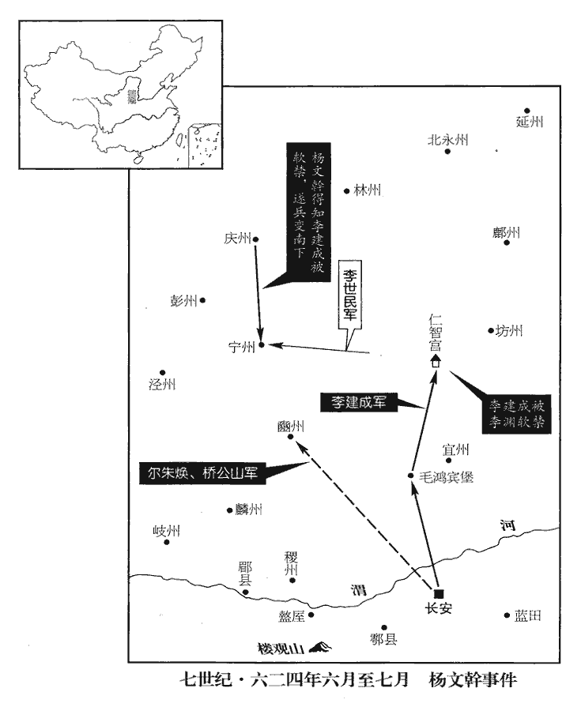
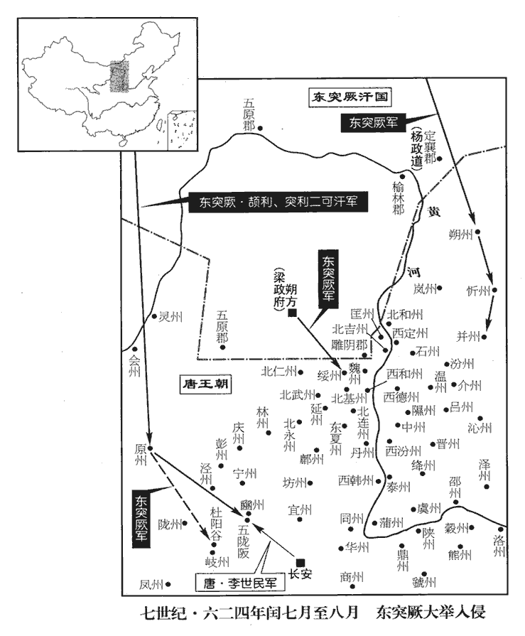
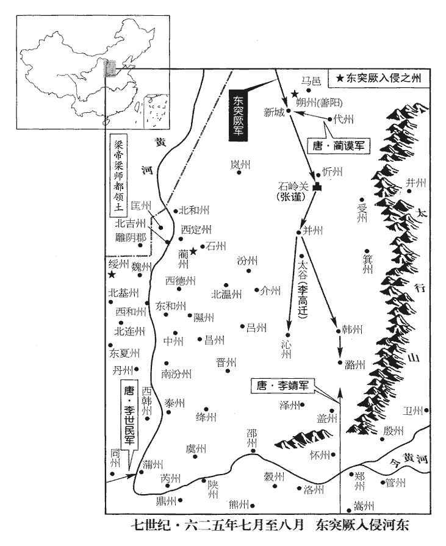
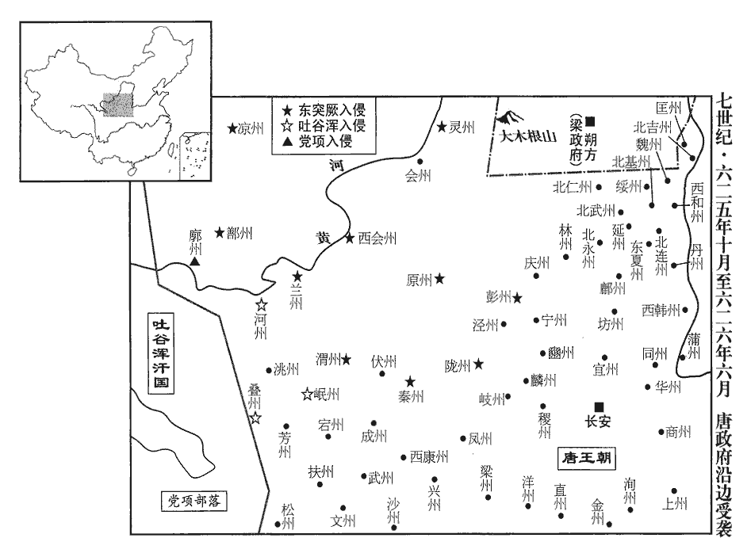
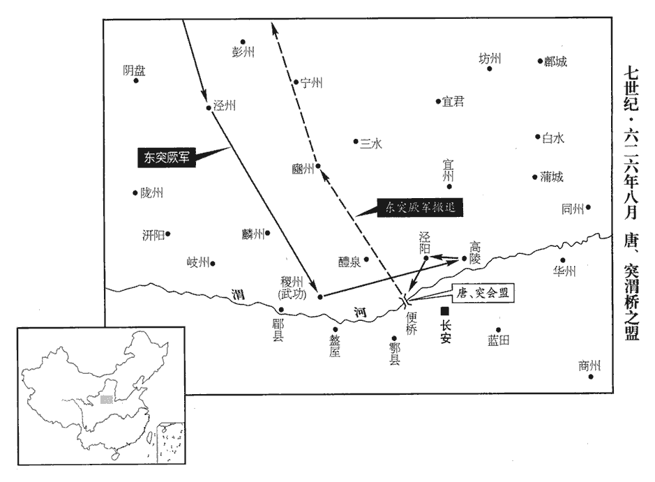

 唐紀七起閼逢涒灘（甲申）六月，盡柔兆閹茂（丙戌）八月，凡二年有奇。

# 高祖神堯大聖光孝皇帝下之上

## 武德七年（甲申、六二四）

1六月，辛丑‹一›，上幸仁智宮避暑。帝作仁智宮於宜州之宜君縣。

〖译文〗 [1]六月，辛丑（初三），高祖前往仁智宫避暑。

2辛亥‹十三›，瀧州‹广东省罗定市南›、扶州‹南扶州·广东省信宜市›獠作亂，遣南尹州‹总部设广西贵港市›都督李光度等擊平之。瀧州，永熙郡，漢端溪縣地。又瀧州信義縣，武德元年分置懷德縣，仍置南扶州。南尹州，鬱林郡，漢廣鬱縣地。後漢谷永為鬱林太守，降烏許人十餘萬，開置七縣，即此地也。瀧，呂江翻。獠，魯皓翻。

〖译文〗 [2]辛亥（十三日），泷州、扶州獠人发生叛乱，高祖派遣南尹州都督李光度等人进击并平定了他们。

3丙辰‹十八›，吐谷渾寇扶州，此扶州以生羌之地置，註已見上。吐，從暾入聲。谷，音浴。刺史蔣善合擊走之。

〖译文〗 [3]丙辰（十八日），吐谷浑侵犯扶州，扶州刺史蒋善合将他们击退。

4壬戌‹二十四›，慶州‹总部设甘肃省庆阳县›都督楊文幹反。慶州弘化郡，漢北地馬嶺、方渠縣地。按宋白續通典：慶州弘化郡東南三里有不窋zhú城，後魏大統十一年置朔州，隋文帝改置合川鎮，十六年，置慶州，以慶美取其嘉名。今郡城名尉李城，在白馬兩川交口，亦曰不窋城。附郭安化縣，隋置合水縣，武德改合川縣，貞觀改弘化縣，尋隨郡改縣名。管下華池縣，漢歸德縣地；樂盤縣，漢富平縣地；馬領、方渠，則為通遠軍地矣。史記正義曰：漢郁郅縣，今慶州弘化縣是。

〖译文〗 [4]壬戌（二十四日），庆州都督杨文反叛朝廷。

初，齊王元吉勸太子建成除秦王世民，曰：「當為兄手刃之！」為，于偽翻；下迭為、復為同。世民從上幸元吉第，元吉伏護軍宇文寶於寢內，欲刺世民；刺，七亦翻。建成性頗仁厚，遽止之。元吉慍曰：「為兄計耳，於我何有！」

〖译文〗 当初，齐王李元吉劝说太子李建成除去秦王李世民，他说：“我自当替哥哥亲手将他杀掉！”李世民随从高祖前往李元吉的府第，李元吉将护军宇文宝埋伏在寝室里面，准备刺杀李世民，李建成生性颇为仁爱宽厚，连忙制止了他。元吉恼怒地说：“我这是为哥哥着想，对我有什么好处！”

建成擅募長安及四方驍勇二千餘人為東宮衛士，慍，於問翻。驍，堅堯翻。分屯左、右長林，號長林兵。東宮有左、右長林門。考異曰：舊傳云：「建成私召四方驍勇，并募長安惡少年二千餘人，畜為宮甲，分屯左、右長林，號長林兵。」實錄云：「元吉見秦王有大功，每懷妬害，言論醜惡，譖害日甚。每謂建成曰：『當為大哥手刃之。』建成性頗仁厚，初止之；元吉數言不已，建成後亦許之。元吉因令速發，遂與建成各募壯士，多匿罪人，賞賜之，圖行不軌。其記室榮九思為詩以刺之曰：『丹青飾成慶，玉帛擅專諸。』而弗悟也。典籤裴宣儼因免官改事秦府，謂泄其事，又鴆之。自殺斯人已後，人皆振恐，知其事，莫有敢言。後乃連結宮闈，與建成俱通德妃尹氏，以為內援。」舊傳又云：「厚賂中書令封德彝以為黨助。由是高祖頗疏太宗而加愛元吉。」今但擇取其可信者書之。又密使右虞候率可達志從燕王李藝發幽州‹北京市›突騎三百，置宮東諸坊，欲以補東宮長上。可達，虜複姓。騎，奇寄翻。燕，因肩翻。唐六典：凡應宿衛官，各從番第。諸衛將軍、中郎將、郎將及諸衛率、副率、千牛備身、備身左右、太子千牛并上；折衝、果毅應宿衛者，並一日上，兩日下；諸色長上若司階、中候、司戈並五日上，十日下。上，時掌翻；下上變同。為人所告，上召建成責之，流可達志於巂州‹四川省西昌市›。巂，音髓。

〖译文〗 李建成擅自召募长安及各地的骁勇之士两千多人，充当东宫卫士，让他们分别在东宫左右长林门驻扎下来，号称长林兵。李建成还暗中让右虞候率可达志，从燕王李艺那里调集来幽州骁勇精锐的骑兵三百人，将他们安置在东宫东面的各个坊市中，准备用他们来补充在东宫担任警卫的低级军官，结果被人告发。于是，高祖把李建成叫去责备了一番，将可达志流放到州去了。

 

楊文幹嘗宿衛東宮，建成與之親厚，私使募壯士送長安。上將幸仁智宮，命建成居守，世民、元吉皆從。守，手又翻；下同。從，才用翻。建成使元吉就圖世民，曰：「安危之計，決在今歲。」又使郎將爾朱煥、校尉橋公山以甲遺文幹。二人至豳州‹陕西省彬县›，上變，豳州，漢漆縣地；漢末置新平郡，東北有古豳亭，後魏置豳州。爾朱煥等至豳州，言有急變，豳州以聞，遂得至仁智宮。遺，于季翻。將，即亮翻。校，戶教翻。告太子使文幹舉兵，使【章：十二行本「使」作「欲」；乙十一行本同；孔本同；張校同。】表裏相應；考異曰：統記云：「建成遣郎將爾朱煥、校尉橋公山齎甲以賜文幹，令起兵；煥等行至豳州，懼罪，告之。」劉餗sù小說云：「人妄告東宮。」今從實錄。又有寧州‹甘肃省宁县›人杜鳳舉亦詣宮言狀。上怒，託他事，手詔召建成，令詣行在。建成懼，不敢赴。太子舍人徐師謩mó勸之據城舉兵；考異曰：統記作「師譽」。今從實錄。詹事主簿趙弘智勸之貶損車服，屏從者，屏，必郢翻，又卑正翻。詣上謝罪，建成乃詣仁智宮。未至六十里，悉留其官屬於毛鴻賓堡‹陕西省淳化县东›，後魏將毛鴻賓所築，因以為名。宋白曰：三原縣有鴻賓柵，後魏孝昌中，蕭寶寅亂，毛鴻賓立柵捍之，其故城在縣北一十五里。以十餘騎往見上，騎，奇寄翻。叩頭謝罪，奮身自擲，幾至於絕。幾，居依翻。上怒不解，是夜，置之幕下，鄭康成曰：在上曰幕，幕或在地展陳于上。飼以麥飯，飼，祥吏翻。使殿中監陳福防守，遣司農卿宇文穎馳召文幹。漢初置治粟內史，景帝改曰大農，武帝加司字；梁置十二卿曰司農卿，掌邦國倉儲委積之事。穎至慶州‹甘肃省庆阳县›，以情告之，文幹遂舉兵反。上遣左武衛將軍錢九隴與靈州‹总部设宁夏灵武市›都督楊師道擊之。

〖译文〗 杨文曾经在东宫担任警卫，李建成亲近并厚待他，私下里让他募集勇士，送往长安。高祖准备前往仁智宫，命令李建成留守京城，李世民与李元吉一起随行。李建成让李元吉乘机图谋李世民，他说：“无论我们的打算是平安无事还是面临危险，都要在今年决定下来。”李建成又指使郎将尔朱焕和校尉桥公山将盔甲赠给杨文。两人来到豳州的时候，上报发生变故，告发太子指使杨文起兵，让他与自己内外呼应。还有一位宁州人杜风举也前往仁智宫讲了这一情形。高祖大怒，借口别的事情，以亲笔诏书传召李建成，让他前往仁智宫。李建成心中害怕，不敢前去。太子舍人徐师劝他占据京城，发兵起事；詹事主簿赵弘智劝他免去太子的车驾章服，屏除随从人员，到高祖那里去承认罪责。于是，李建成决定前往仁智宫。还没有走完六十里的路程，李建成便将所属官员，全部留在北魏毛鸿宾遗留下来的堡栅中，带领十多个人骑马前去进见皇帝，向皇帝伏地叩头，承认罪责，把身子猛然用力撞了出去，弄得几乎晕死过去。但是，高祖的怒气仍然没有消除。这一天夜里，高祖将他放在帐篷里，给他麦饭充饥，让殿中监陈福看守着他，派遣司农卿宇文颖速去传召杨文。宇文颖来到庆州，将情况告诉了杨文。于是，杨文起兵造反。高祖派遣左武卫将军钱九陇和灵州都督杨师道进击杨文。

甲子‹二十六›，上召秦王世民謀之，世民曰：「文幹豎子，敢為狂逆，計府僚已應擒戮；若不爾，正應遣一將討之耳。」將，即亮翻。上曰：「不然。文幹事連建成，恐應之者眾。汝宜自行，還，立汝為太子。吾不能效隋文帝自誅其子，當封建成為蜀王。蜀兵脆弱，脆，此芮翻。他日苟能事汝，汝宜全之；不能事汝，汝取之易耳！」易，以豉翻。

〖译文〗 甲子（二十六日），高祖传召秦王李世民商量此事。李世民说：“杨文这小子竟敢做这种狂妄叛逆的勾当，想来他幕府的僚属应当已经将他擒获并杀掉了。如果不是这样，就应当派遣一员将领去讨伐他。”高祖说：“不能这样，杨文的事情关连着建成，恐怕响应他的人为数众多。你最好亲自前往，回来以后，我便将你立为太子。我不愿意效法隋文帝去诛杀自己的儿子，届时就把李建成封为蜀王。蜀中兵力薄弱，如果以后他能够事奉你，你应该保全他的性命；如果他不肯事奉你，你要捉拿他也容易一些啊。”

上以仁智宮在山中，恐盜兵猝發，夜，帥宿衛南出山外，帥，讀曰率。行數十里，東宮官屬【章：十二行本「屬」下有「將卒」二字；乙十一行本同；孔本同。】繼至，皆令三十人為隊，分兵圍守之。明日，復還仁智宮。考異曰：實錄云：「高祖之出山也，建成憂憤，臥於幕下。天策兵曹杜淹請因亂襲之，建成左右亦有斯請，今上並拒而不納。」唐統紀云：「太宗之從內出，夜經建成幕，度建成侍衛左右唯有十人，並來跪捧太宗足，皆云：『今日之事，一聽王旨，若遣屏除，今其時也。』太宗叱而止之。既而還向府僚說其事，眾僚文武並進曰：『文幹為儲君作逆，天下共知；假手宮臣，正合天意。』太宗曰：『寡人始奉恩旨，何忍旋踵！即有所違，卿與之言，必無此理。』府僚又請，終拒而不聽。」按是時高祖無誅建成意，左右何敢輒殺之！今不取。

〖译文〗 仁智宫建造在山中，高祖担心盗兵突然发难，便连夜率领担任警卫的军队从南面开出山来。走了数十里地的时候，太子东宫所属的官员相继到来，高祖让大家一概以三十人为一队，分派军队包围、看守着他们。第二天，高祖才又返回仁智宫。

世民既行，元吉與妃嬪更迭為建成請，封德彝復為之營解於外，為，于偽翻。上意遂變，復遣建成還京師居守。惟責以兄弟不睦，歸罪於太子中允王珪、左衛率韋挺、左右衛率掌東宮羽衛兵仗之政令，正四品上。率，所律翻。天策兵曹參軍杜淹，並流於巂州。巂，音髓。挺，沖之子也。韋沖事隋文帝，招撫叛胡，以赴長城之役，又著績於南方。初，洛陽既平，杜淹久不得調，調，徒弔翻。欲求事建成。房玄齡以淹多狡數，恐其教導建成，益為世民不利，乃言於世民，引入天策府。

〖译文〗 李世民出发以后，李元吉与嫔妃轮番替李建成讲情，封德彝又在外朝设法解救李建成。于是，高祖改变了原意，又让李建成回去驻守京城。高祖只以兄弟关系不睦责备他，将罪责推给了太子中允王、左卫率韦挺和天策兵曹参军杜淹，将他们一并流放到了州。韦挺是韦冲的儿子。当初，洛阳平定以后，杜淹长时间没有得到升迁，打算谋求事奉李建成。房玄龄认为杜淹狡诈的招数很多，担心他会教唆引导李建成，越发对李世民不利，便向李世民进言，将杜淹推荐到天策府任职。

5突厥寇代州‹山西省代县›之武周城‹山西省左云县›，武周縣，漢屬鴈門郡，魏、晉省，後魏屬代郡，隋廢入朔州雲內縣。杜佑曰：朔州馬邑郡治善陽縣，有秦馬邑城、武周塞。厥，九勿翻。州兵擊破之。

〖译文〗 [5]突厥侵犯代州的武周城，代州兵马打败了他们。

6秋，七月，己巳‹一›，苑君璋以突厥寇朔州，總管秦武通擊卻之。

〖译文〗 [6]秋季，七月，己巳（初一），苑君璋带领突厥兵马侵犯朔州，总管秦武通击退了他们。

7楊文幹襲陷寧州，宋白曰：寧州以安寧取稱。九域志：北至慶州一百二十里。驅掠吏民出據百家堡‹甘肃省庆阳县境›。百家堡在慶州馬嶺縣。秦王世民軍至寧州，其黨皆潰。癸酉‹五›，文幹為其麾下所殺，傳首京師。獲宇文穎，誅之。

〖译文〗 [7]杨文掩袭并攻陷宁州，驱赶劫掠官吏与百姓出城，占据了百家堡。秦王李世民的军队来到宁州以后，杨文的党羽便全部溃散。癸酉（初五），杨文被自己的部下杀死，他的头颅被传送到京城。李世民捉获了宇文颖，将他杀掉。

8丁丑‹九›，梁師都行臺白伏願來降。降，戶江翻。

〖译文〗 [8]丁丑（初九），梁师都的行台白伏愿前来投降。

9戊寅‹十›，突厥寇原州；遣寧州刺史鹿大師救之，又遣楊師道趨大木根山‹内蒙古鄂托克前旗›。【章：十二行本「山」下有「邀其歸路」四字；乙十一行本同；孔本同；張校同；退齋校同。】大木根山，在雲中河之西，拓跋氏之先所居也。庚辰‹十二›，突厥寇隴州‹陕西省陇县›；遣護軍尉遲敬德擊之。尉，紆勿翻。

〖译文〗 [9]戊寅（初十），突厥侵犯原州，高祖派遣宁州刺史鹿大师前去援救，又派遣杨师道奔赴大木根山。庚辰，（十二日），突厥侵犯陇州，高祖派遣护军尉迟敬德进击突厥。

10吐谷渾‹青海省›寇岷州‹甘肃省岷县›。辛巳‹十三›，吐谷渾、党項寇松州‹四川省松潘县›。吐，從暾入聲。谷，音浴。

〖译文〗 [10]吐谷浑侵犯岷州。辛巳（十三日），吐谷浑与党项侵犯松州。

11癸未‹十五›，突厥寇陰盤‹甘肃省平涼市东›。陰盤縣，漢屬安定，晉屬京兆，後魏置平涼郡，隋、唐屬涇州，唐後改陰盤曰潘原。

〖译文〗 [11]癸未（十五日），突厥侵犯阴盘。

12甲申‹十六›，扶州刺史蔣善合擊吐谷渾於松州赤磨鎮‹四川省松潘县西北›，破之。

〖译文〗 [12]甲申（十六日），扶州刺史蒋善合在松州赤磨镇进击吐谷浑，并打败了他们。

13己丑‹二十一›，突厥吐利設與苑君璋寇并州‹山西省太原市›。

〖译文〗 [13]己丑（二十一日），突厥吐利设与苑君璋侵犯并州。

14甲子‹二十六›，車駕還京師。

〖译文〗 [14]甲午（疑误），高祖返回京城。

15或說上曰：說，輸芮翻。「突厥所以屢寇關中者，以子女玉帛皆在長安故也。厥，九勿翻。若焚長安而不都，則胡寇自息矣。」上以為然，遣中書侍郎宇文士及踰南山‹秦岭山脉终南山›至樊‹湖北省襄樊市汉水北岸›、鄧‹襄樊市北›，行可居之地，踰長安南山出商州，即至樊、鄧。行，下孟翻。將徙都之。太子建成、齊王元吉、裴寂皆贊成其策，蕭瑀等雖知其不可而不敢諫。瑀，音禹。秦王世民諫曰：「戎狄為患，自古有之。陛下以聖武龍興，光宅中夏，夏，戶雅翻。精兵百萬，所征無敵，柰何以胡寇擾邊，遽遷都以避之，貽四海之羞，為百世之笑乎！彼霍去病漢廷一將，猶志滅匈奴；霍去病曰：「匈奴未滅，無以家為！」將，即亮翻。況臣忝備藩維，願假數年之期，請係頡利之頸，致之闕下。頡，奚結翻。若其不效，遷都未晚。」上曰：「善。」建成曰：「昔樊噲欲以十萬眾橫行匈奴中，事見十二卷漢惠帝三年。秦王之言得無似之！」世民曰：「形勢各異，用兵不同，樊噲小豎，何足道乎！不出十年，必定漠北，非【章：十二行本「非」下有「敢」字；乙十一行本同；孔本同。】虛言也！」為太宗滅突厥張本。上乃止。建成與妃嬪因共譖世民曰：「突厥雖屢為邊患，得賂即退。秦王外託禦寇之名，內欲總兵權，成其篡奪之謀耳！」

〖译文〗 [15]有人劝高祖说：“突厥之所以屡次侵犯关中地区，是由于我们的人口与财富都集中在长安的缘故。如果烧毁长安，不在这里定都，那么胡人的侵犯便会自然平息下来了。”高祖认为所言有理，便派遣中书侍郎宇文士及越过终南山，来到樊州、邓州一带，巡视可以居留的地方，准备将都城迁徙到那里去。太子李建成、齐王李元吉和裴寂都赞成这一策略，萧等人虽然知道不应当如此，但没有谏阻的胆量。秦王李世民劝谏说：“戎狄造成祸患，从古时候起，就时有发生。陛下凭着自己的圣明英武，创建新的王朝，统辖着中国的领土，拥有上百万的精锐兵马，所向无敌，怎么能够因有胡人搅扰边境，便连忙迁徙都城来躲避他们，给举国臣民留下羞辱，让后世来讥笑陛下呢？那霍去病不过是汉朝的一员将领，尚且决心消灭匈奴，何况我还愧居藩王之位呢！希望陛下给我几年时间，请让我把绳索套在颉利的脖子上，将他送到宫阙之下。如果不能获得成功，那时再迁徙都城，也为时不晚。”高祖说：“讲得好。”李建成说：“当年樊哙打算率领十万兵马在匈奴人中间纵横驰骋，秦王的话该不会是与樊哙相似的吧！”李世民说：“面对的情况各有区别，采取军事行动的方法也不相同。樊哙那小子有什么值得称道的呢！不会超过十年时间，我肯定能够将沙漠以北地区平定下来，这可并不是凭空妄言的啊！”于是，高祖不再迁徙都城。李建成与嫔妃因而共同诬陷李世民说：“虽然突厥屡次造成边疆上的祸患，但是只要他们得到财物就会撤退。秦王表面上假托抵御突厥的名义，实际上是打算总揽兵权，成就他篡夺帝位的阴谋罢了！”

上校獵城南，太子、秦、齊王皆從，從，才用翻。上命三子馳射角勝。建成有胡馬，肥壯而喜蹶，喜，許記翻。以授世民曰：「此馬甚駿，能超數丈澗，弟善騎，騎，奇寄翻。試乘之。」世民乘以逐鹿，馬蹶，世民躍立於數步之外，馬起，復乘之，復，扶又翻。如是者三，顧謂宇文士及曰：「彼欲以此見殺，死生有命，庸何傷乎！」建成聞之，因令妃嬪譖之於上令，力丁翻。嬪，毗賓翻。曰：「秦王自言，我有天命，方為天下主，豈有浪死！」上大怒，先召建成、元吉，然後召世民入，責之曰：「天子自有天命，非智力可求；汝求之一何急邪！」邪，音耶。世民免冠頓首，請下法司案驗。下，遐嫁翻。上怒不解，會有司奏突厥入寇，上乃改容勞勉世民，命之冠带，與謀突厥。厥，九勿翻。勞，力到翻。冠，古玩翻。閏月，己未‹二十一›，詔世民、元吉將兵出豳州以禦突厥，將，即亮翻。上餞之於蘭池‹陕西省咸阳市东›。蘭池，即秦始皇遇盜之地。史記註曰：地理志，渭城縣有蘭池宮。正義曰：括地志，蘭池陂即古之蘭池，在咸陽縣界。秦記曰：始皇引渭水為池，築為蓬瀛，刻石為鯨，長二百丈；遇盜之處也。上每有寇盜，輒命世民討之，事平之後，猜嫌益甚。

〖译文〗 高祖在京城南面设场围猎，太子李建成、秦王李世民和齐王李元吉都随同前往，高祖让这三个儿子骑马射猎，角逐胜负。李建成有一匹胡马，膘肥体壮，但是喜欢尥蹶子，李建成将这匹胡马交给李世民说：“这匹马跑得很快，能够越过几丈宽的涧水。弟弟善于骑马，骑上它试一试吧。”李世民骑着这匹胡马追逐野鹿，胡马忽然尥起后蹶，李世民跃身而起，跳到数步以外立定，胡马站起来以后，李世民便再次骑到这匹马上，这样连续发生了三次。李世民回过头来看着宇文士及说：“他打算借助这匹胡马杀害我，但是生死是命运主宰着的，难道他能够伤害我什么吗？”李建成听到此言，于是让嫔妃向高祖诬陷李世民说：“秦王自称：上天授命于我，正要让我去当天下的共主哩，怎么会白白死去呢！”高祖非常生气，先将李建成和李元吉二人叫来，然后又把李世民叫来，责备他说：“谁是天子，自然会有上天授命于他，不是人的智力所能够谋求的。你谋求帝位怎么这般急切呢！”李世民摘去王冠，伏地叩头，请求将自己交付执法部门查讯证实，高祖仍然怒气不息。适逢有关部门奏称突厥前来侵扰，高祖这才改变了生气的脸色，转而劝勉李世民，让他戴上王冠，系好腰带，与他商议对付突厥的办法。闰七月，己未（二十一日），高祖颁诏命令李世民与李元吉率领兵马由豳州进发，前去抵御突厥，在兰池为他们饯行。每当发生敌情，高祖总是命令李世民前去讨伐敌人，但在战事平息以后，高祖对李世民的猜疑却越发严重了。

16初，隋末京兆‹首都大兴·陕西省西安市›韋仁壽為蜀郡‹四川省成都市›司法書佐，按新書百官志：諸州法曹司法參軍，掌鞫jū獄麗法，督盜賊，知贓賄沒入。又有參軍事，註云：武德初改行書佐曰行參軍，尋又改曰參軍事。則書佐即參軍之任也。所論囚至市，猶西向為仁壽禮佛然後死。史言韋仁壽論刑，人自以為不冤。為，于偽翻。唐興，爨‹云南省中部›弘達帥西南夷內附，朝廷遣使撫之，帥，讀曰率。使，疏吏翻。類皆貪縱，遠民患之，有叛者。仁壽時為巂州‹总部设四川省西昌市›都督長史，上聞其名，命檢校南寧州‹总部设云南省曲靖市›都督，寄治越巂‹巂州州政府所在县›，巂州，越巂郡。巂，音髓。長，知兩翻。使之歲一至其地慰撫之。仁壽性寬厚，有識度，既受命，將兵五百人至西洱河‹云南省大理市东北洱海›，將，即亮翻。洱，仍吏翻。周歷數千里，蠻、夷豪帥皆望風歸附，來見仁壽。仁壽承制置七州、十五縣，各以其豪帥為刺史、縣令，按舊書地理志，是年置西寧、豫、西平、利、南雲、磨、南寧七州。志又有西平州，亦是年置。帥，所類翻。法令清肅，蠻、夷悅服。將還，還，從宣翻，又音如字。豪帥皆曰：「天子遣公都督南寧，何為遽去？」仁壽以城池未立為辭。蠻、夷即相帥為仁壽築城，立廨舍，帥，讀曰率。為，于偽翻。廨，古隘翻。旬日而就。仁壽乃曰：「吾受詔但令巡撫，不敢擅留。」蠻、夷號泣送之，號，戶高翻。因各遣子弟入貢。壬戌‹二十四›，仁壽還朝，朝，直遙翻。上大悅，命仁壽徙鎮南寧，以兵戍之。

〖译文〗 [16]当初，隋朝末年京兆人韦仁寿担任蜀郡的司法参军，经他定罪处死的囚犯在绑赴闹市行刑的时候，还要面向西方替韦仁寿拜佛求福以后，才肯受死。唐朝兴起以后，弘达率领西南地区的夷人归附朝廷。朝廷派出的安抚西南夷人的使者，大都贪婪无度，边地的百姓将使者视为祸患，还发生了叛离朝廷的事件。当时，韦仁寿担任州都督长史，高祖得知他的名声以后，便任命他为检校南宁州都督，将官署所在地暂设在越，让他每年一次，前往南宁州抚慰当地的夷人。韦仁寿性情宽和仁厚，既有见识，又有度量。他接受任命以后，带领士兵五百人来到西洱河，走遍辖境内的数千里地，当地蛮人、夷人豪强的首领纷纷向望风采，表示归附，前来会见韦仁寿。韦仁寿遵照制命在当地设置了七个州，下辖十五个县，分别任命当地豪强的首领为刺史和县令。他实行的法令清明整肃，蛮人与夷人都心悦诚服。韦仁寿准备返回越时，豪强的首领们都说：“天子派遣您担任南宁州的都督，您为什么忙着离去？”韦仁寿托称南宁州并没有修筑城池。蛮人、夷人当即聚合起来，为韦仁寿修筑南宁州城，建造韦仁寿的官署与住处，只用了十天时间，便竣工了。韦仁寿这才说：“根据我所接受的诏命，只让我前来巡视抚慰，所以我不敢擅自留在这里。”蛮人、夷人哭泣着为他送行，于是分别派遣子弟入朝进贡。壬戌（二十四日），韦仁寿回到朝廷，高祖非常高兴，便命令韦仁寿迁移到南宁州坐镇，并带兵戌守南宁州城。

17苑君璋引突厥寇朔州。厥，九勿翻。

〖译文〗 [17]苑君璋引领突厥侵犯朔州。

18八月，戊辰‹一›，突厥寇原州。

〖译文〗 [18]八月，戊辰（初一），突厥侵犯原州。

19己巳‹二›，吐谷渾寇鄯州‹青海省乐都县›。鄯州西平郡，禿髮氏所都之地。鄯，時戰翻。

〖译文〗 [19]己巳（初二），吐谷浑侵犯鄯州。

 

20壬申‹五›，突厥寇忻州‹山西省忻州市›，丙子‹九›，寇并州；京師戒嚴。戊寅‹十一›，寇綏州，綏州，雕陰郡。雕陰古縣，漢屬上郡，今延州以北橫山之地也。孫愐曰：綏州，春秋時為白狄所居，秦為上郡，後魏置上州，又改為綏州，取綏德縣為名。刺史劉大俱擊卻之。

〖译文〗 [20]壬申（初五），突厥侵犯忻州。丙子（初九），突厥侵犯并州，京城严密防备。戊寅（十一日），突厥侵犯绥州，绥州刺史刘大俱将突厥击退。

是時，頡利、突利二可汗舉國入寇，連營南上，頡，奚結翻。可，從刊入聲。汗，音寒。上，時掌翻。秦王世民引兵拒之。會關中久雨，糧運阻絕，士卒疲於征役，器械頓弊，頓，讀曰鈍。朝廷及軍中咸以為憂。世民與虜遇於豳州，勒兵將戰，己卯‹十二›，可汗帥萬餘騎奄至城西，陳於五隴阪‹陕西省彬县南›，帥，讀曰率。騎，奇寄翻；下同。陳，讀曰陣；下虜陳同。阪，音反。將士震恐。世民謂元吉曰：「今虜騎憑陵，不可示之以怯，當與之一戰，汝能與我俱乎？」元吉懼曰：「虜形勢如此，柰何輕出，萬一失利，悔可及乎！」世民曰：「汝不敢出，吾當獨往，汝留此觀之。」世民獨出外以威示突厥，內以服元吉之心。世民乃帥騎馳詣虜陳，告之曰：「國家與可汗和親，何為負約，深入我地！我秦王也，可汗能鬬，獨出與我鬬；若以眾來，我直以此百騎相當耳。」頡利不之測，笑而不應。頡利素服秦王神武，恐其以百騎挑戰，而伏大兵四合以擊之，故不敢應。世民又前，遣騎告突利曰：「爾往與我盟，有急相救；今乃引兵相攻，何無香火之情也！」古者盟誓質諸天地山川鬼神，歃血而已；後世有對神立誓者，有禮佛立誓者，始有香火之事。突利亦不應。秦王以此疑頡利之心，突利恐因此為頡利所疑，故亦不敢應。世民又前，將渡溝水，頡利見世民輕出，又聞香火之言，疑突利與世民有謀，乃遣止世民曰：「王不須渡，我無他意，更欲與王申固盟約耳。」乃引兵稍卻。是後霖雨益甚，世民謂諸將曰：「虜所恃者弓矢耳，將，即亮翻。今積雨彌時，筋膠俱解，弓不可用，彼如飛鳥之折翼；折，而設翻。吾屋居火食，刀槊犀利，犀，堅也。以逸制勞，此而不乘，將復何待！」復，扶又翻。乃潛師夜出，冒雨而進，突厥大驚。世民又遣說突利以利害，說，輸芮翻。突利悅，聽命。頡利欲戰，突利不可，乃遣突利與其夾畢特勒阿史那思摩來見世民，請和親，世民許之。思摩，頡利之從叔也。從，才用翻。突利因自託於世民，請結為兄弟；世民亦以恩意撫之，與盟而去。為後突利先來降張本。

〖译文〗 这时候，颉利、突利两可汗率领全国兵马前来侵犯，兵营相互连接着向南进军，秦王李世民带领兵马抵御敌兵。适逢关中地区多日降雨不止，粮食运输被隔断，将士们因行军跋涉而疲惫不堪，军用器械钝损破败，朝廷百官与军中将领都为此担忧。李世民在豳州与突厥遭遇，准备率领兵马接战。己卯（十二日），突厥可汗率领骑兵一万多人突然来到豳州城的西面，在五陇阪布成阵势，唐军将士惊恐不安。李世民对李元吉说：“现在突厥进逼我军，我军不能够向他们显示出畏缩不前的样子来，应当与他们大战一场，你能够与我一同前去迎敌吗？”李元吉害怕地说：“突厥军队的阵势这样盛大，怎么能够轻易出击呢？万一交战失利，后悔还来得及吗！”李世民说：“既然你不敢前去，我就独自前往，你留在这里看我的吧。”于是，李世民便率领骑兵疾驰到突厥的军阵前面，告诉他们说：“我国与可汗议和，结为姻亲，为什么违背盟约，深入到我国的领土中来！我就是秦王，如果可汗能够比武，就独自出来与我比武；倘若可汗让大家一齐上，我就只有用这一百名骑兵来抵挡了。”颉利摸不清李世民的底细，只是笑了一笑，并不回答。李世民又向前推进，派遣骑兵告诉突利说：“以往你与我订有盟约，约定在发生急难的时候互相援救。现在你却率领兵马攻打我，怎么连一点盟誓的情份都不讲呢！”突利也没有回答。李世民再次向前推进，准备渡过一条河沟，颉利看到李世民轻易出战，又听到他关于订盟立誓的话，怀疑突利与李世民另有计谋，便派人阻止李世民说：“秦王不必渡过河沟，我没有别的意思，只是打算与秦王重申并加强原有的盟约罢了。”于是，颉利率领兵马略微后退。此后，连绵大雨愈发落个不停，李世民对各位将领说：“突厥所仗恃着的是弓箭，现在雨水经久不息，筋弦松弛，胶性失粘，弓就不能够使用了，这使他们像飞鸟折断了翅膀一样。我们居住在房屋里，吃熟食，兵器锐利，可以养精蓄锐，相机制服疲乏的敌军。假如对这一时机都不加利用，还准备等待什么样的时机呢！”于是，李世民在夜间暗中出兵，冒雨前进，突厥大为震惊。李世民又派人向突利陈述利弊得失，突利很高兴，愿意服从命令。颉利打算出战，突利不同意，颉利这才派遣突利和他的夹毕特勒阿史那思摩前来会见李世民，请求通和修好，李世民答应了他们。阿史那思摩是颉利的堂叔。突利于是主动依托李世民，请求与李世民结拜成兄弟。李世民也以恩情安抚他，与他立下盟约，突利这才离去。

庚寅‹二十三›，岐州‹陕西省凤翔县›刺史柴紹破突厥於杜陽谷‹陕西省凤翔县东北›。杜陽山在岐州扶風縣。孔穎達詩譜曰：周原者，岐山陽地，屬杜陽，地形險阻，而原田肥美。杜陽，漢縣，屬扶風，有杜陽山，山北有杜陽谷。

〖译文〗 庚寅（二十三日），岐州刺史柴绍在杜阳谷打败突厥。

壬申‹二十五›，突厥阿史那思摩入見，見，賢遍翻。上引升御榻，慰勞之。勞，力到翻。思摩貌類胡，不類突厥，故處羅疑其非阿史那種，厥，九勿翻。種，章勇翻。歷處羅、頡利世，常為夾畢特勒，終不得典兵為設。既入朝，處，昌呂翻。頡，奚結翻。朝，直遙翻。賜爵和順王。

〖译文〗 壬申（五日），突厥阿史那思摩入京朝见，高祖招他到御榻前面，好言安慰他。阿史那思摩的相貌很像胡人，而不像突厥人，所以处罗可汗怀疑他不是出于阿史那种族。阿史那思摩历经处罗可汗和颉利可汗两代，经常担任夹毕特勒，终竟没有能够掌管军事，设立牙帐。阿史那思摩入京朝见以后，高祖赐给他和顺王的爵位。

丁酉‹三十›，遣左僕射裴寂使於突厥。使，疏吏翻。

〖译文〗 丁酉（三十日），高祖派遣左仆射裴寂出使突厥。

21九月，癸卯‹六›，日南‹越南荣市›人姜子路反，日南郡，德州，後改驩州。交州‹总部设越南河内市›都督王志遠擊破之。

〖译文〗 [21]九月，癸卯（初六），日南人姜子路反叛朝廷，交州都督王志远将他打败。

22癸卯‹六›，突厥寇綏州，都督劉大俱擊破之，獲特勒三人。

〖译文〗 [22]癸卯（初六），突厥侵犯绥州，绥州都督刘大俱打败了他们，捉获了三名特勒。

冬，十月，己巳‹三›，突厥寇甘州‹甘肃省张掖市›。

〖译文〗 冬季，十月，己巳（初三），突厥侵犯甘州。

23辛未‹五›，上校獵於鄠‹陕西省户县›之南山‹秦岭山脉›；鄠縣屬京兆，在南山下，北至長安城六十里。鄠，音戶。癸酉‹七›，幸終南。酈道元曰：武功縣太一山，古文以為終南山，在武功縣西南。按鄠、長安之西南山皆曰終南山；「終」，亦作「中」。

〖译文〗 [23]辛未（初五），高祖在县境内的终南山下设场围猎。癸酉（初七），高祖前往终南山。

24吐谷渾及羌人寇疊州‹甘肃省迭部县›，陷合川‹叠州州政府所在县›。疊州，合川郡，治疊川，秦、漢以來為諸羌保據。後周武帝逐吐谷渾，取群山重疊之義，置疊州。合川縣，後周置西疆郡，隋廢為縣，治吐谷渾馬牧城，唐武德三年移治交戍城。吐，從暾入聲。谷，音浴。

〖译文〗 [24]吐谷浑与羌人侵犯叠州，攻陷合川。

25丙子‹十›，上幸樓觀‹陕西省周至县东南楼观山›，謁老子祠；岐州盩厔縣有樓觀、老子祠。觀，古玩翻。癸未‹十七›，以太牢祭隋文帝‹杨坚›陵；十一月，丁卯‹二›，上幸龍躍宮‹陕西省高陵县境›；京兆高陵縣西四十里有龍躍宮。庚午‹五›，還宮。

〖译文〗 [25]丙子（初十），高祖前往楼观，拜谒老子祠。癸未（十七日），用牛、羊、豕三牲祭祀隋文帝的陵墓。十一月，丁卯（疑误），前往龙跃宫。庚午（疑误），高祖回宫。

26太子詹事裴矩權檢校侍中。太子詹事，正三品，掌東宮三寺、十率府之政令。唐改隋納言為侍中。

〖译文〗 [26]太子詹事裴矩代理检校侍中。

## 八年（乙酉、六二五）

1春，正月，丙辰‹二十一›，以壽州‹总部设安徽省寿县›都督張鎮周為舒州‹总部设安徽省潜山县›都督。壽州，淮南郡，南朝曰豫州，北朝曰揚州，隋開皇九年曰壽州。鎮周以舒州本其鄉里，到州，就故宅多市酒肴，召親戚故人，與之酣宴，酣，戶甘翻。散髮箕踞，如為布衣時，凡十日。既而分贈金帛，泣，與之別，曰：「今日張鎮周猶得與故人歡飲，明日之後，則舒州都督治百姓耳，治，直之翻。君民禮隔，不得復為交遊。」復，扶又翻；下復置同。自是親戚故人犯法，一無所縱，境內肅然。

〖译文〗 [1]春季，正月，丙辰（二十一日），高祖任命寿州都督张镇周为舒州都督。张镇周因舒州本是自己的家乡，所以在来到舒州以后，便回到往日的住宅中，买来许多酒菜，叫来亲戚朋友，与他们尽情宴饮。张镇周解开头发，箕踞而坐，就像他身为平民的时候一样，总共这样度过了十天。接着，张镇周将金银布帛分别赠送给亲戚朋友，哭泣着向他们告别说：“今天我张镇周还能够与往日的朋友们欢乐地饮酒，明天以后，我就是治理百姓的舒州都督了，官府与百姓之间的礼法上下悬隔，我就不能够再与大家交往了。”从这以后，如果亲戚朋友触犯法令，他全不肯纵容。于是，辖境之内，风气整肃。

2丁巳‹二十二›，遣右武衛將軍段德操徇夏州地‹朔方郡·陕西省靖边县北白城子›。夏，戶雅翻。

〖译文〗 [2]丁巳（二十二日），高祖派遣右武卫将军段德操夺取夏州地区。

3吐谷渾‹青海省›寇疊州‹甘肃省迭部县›。吐，從暾入聲。谷，音浴。

〖译文〗 [3]吐谷浑侵犯叠州。

4是月，突厥‹瀚海沙漠群›、吐谷渾各請互市，‹李渊，本年六十岁›詔皆許之。厥，九勿翻。先是，中國喪亂，民乏耕牛，至是資於戎狄，雜畜被野。先，悉薦翻。喪，息浪翻。畜，許救翻。被，皮義翻。

〖译文〗 [4]本月，突厥与吐谷浑分别请求与唐建立贸易关系，高祖都下诏答应了他们的要求。在此之前，中原地区历经丧亡祸乱，百姓缺少耕牛。至此，借助与突厥吐谷浑开展边疆贸易，中原的各种牲畜又遍布原野了。

5夏，四月，乙亥‹十二›，党項‹四川省西北部›寇渭州‹甘肃省陇西县›。党，底朗翻。

〖译文〗 [5]夏季，四月，乙亥（十二日），党项侵犯渭州。

6甲申‹二十一›，上幸鄠縣‹陕西省户县›，校獵于甘谷‹户县西南甘峪›，鄠縣有甘亭，夏啟與有扈氏戰之地。甘水出南山甘谷，北流逕秦萯fù陽宮西，又北逕甘亭西。鄠，音戶。營太和宮於終南山‹秦岭山脉终南山›；長安城南五十里有太和谷、太和宮。丙戌‹二十三›，還宮。

〖译文〗 [6]甲申（二十一日），高祖前往县，在甘谷设场围猎，于终南山营建太和宫。丙戌（二十三日），高祖回宫。

7西突厥‹新疆北部及中亚东部›統葉護可汗遣使請婚，突厥大臣曰葉護，西突厥可汗自葉護為可汗，因號統葉護可汗。可，從刊入聲。汗，音寒。使，疏吏翻。上謂裴矩曰：「西突厥道遠，緩急不能相助，今求婚，何如？」對曰：「今北狄方強，為國家今日計，且當遠交而近攻，用秦范睢之言。臣謂宜許其婚以威頡利；頡jié，奚結翻。俟數年之後，中國完實，足抗北夷，然後徐思其宜。」上從之。考異曰：新、舊傳皆云封德彝之謀。今從實錄。遣高平王道立至其國，統葉護大喜。道立，上之從子也。從，才用翻。

〖译文〗 [7]西突厥的统叶护可汗派遣使者请求通婚，高祖对裴矩说：“西突厥与我们相距甚为遥远，一旦发生危急，无法前来援助。现在西突厥请求通婚，应当怎样对待？”裴矩回答说：“现在北狄正在强盛，为国家当前的利益着想，应当姑且交好远邦，攻伐近国，我认为应当答应与西突厥通婚，以便威慑颉利。待到数年以后，中原地区完好殷实，足以抵御北狄族的时候，然后再从容不迫地考虑适宜的对策。”高祖听从了他的建议，派遣高平王李道立前往西突厥国，统叶护非常高兴。李道立是高祖的侄子。

8初，上以天下大定，罷十二軍。見上卷上年。既而突厥為寇不已，辛亥‹十八›，復置十二軍，以太常卿竇誕等為將軍，簡練士馬，議大舉擊突厥。

〖译文〗 [8]当初，高祖认为天下完全平定了，便罢除了十二军的建制。不久，由于突厥不停地前来侵犯，辛亥（疑误），又重新设置十二军，任命太常卿窦诞等人为将军，选择操练兵马，计议大规模地进击突厥。

9甲寅‹二十一›，涼州‹甘肃省武威市›胡睦伽陀引突厥襲都督府，孫愐曰：睦，姓也。伽，求迦翻。入子城；長史劉君傑擊破之。長，知兩翻。

〖译文〗 [9]甲寅（疑误），凉州胡人睦伽陀带领突厥袭击凉州都督府，攻入小城，凉州长史刘君杰将他们击败。

10六月，甲子‹二›，上幸太和宮。

〖译文〗 [10]六月，甲子（初二），高祖来到太和宫。

11丙子‹十四›，遣燕郡王李藝屯華亭縣‹甘肃省华亭县›華亭縣，隋大業初置，屬安定郡，義寧二年，分置隴州，至元和三年，并入汧源縣。燕，因肩翻。及彈箏峽‹甘肃省平涼市西北泾河上游河谷›，皆以守隴道。箏，音爭。水部郎中姜行本斷石嶺道‹山西省忻州市南十五千米石岭关›以備突厥。唐制：水部郎中掌天下川瀆陂池之政令，以導達溝洫，堰決溝渠，凡舟楫灌溉之利，皆總而舉之。凡諸曹郎中，從五品上；員外郎，從六品上。斷，丁管翻。厥，九勿翻。

〖译文〗 [11]丙子（十四日），高祖派遣燕郡王李艺在华亭县及弹筝峡驻兵，派遣水部郎中姜行本切断石岭的通路，以便防备突厥。

丙戌‹二十四›，頡利可汗寇靈州‹宁夏灵武市›。頡，奚結翻。可，從刊入聲。汗，音寒。丁亥‹二十五›，以右衛大將軍張瑾為行軍總管以禦之，以中書侍郎溫彥博為長史。先是，上與突厥書用敵國禮，先，悉薦翻。秋，七月，甲辰‹十二›，上謂侍臣曰：「突厥貪婪無厭，婪，盧南翻。厭，於鹽翻。朕將征之，自今勿復為書，復，扶又翻。皆用詔敕。」

〖译文〗 丙戌（二十四日），颉利可汗侵犯灵州。丁亥（二十五日），高祖任命右卫大将军张瑾为行军总管，抵御突厥，任命中书侍郎温彦博为行军长史。在此之前，高祖写给突厥的国书，用的是地位相当的国家间的礼节。秋季，七月，甲辰（十二日），高祖对随侍的官员说：“突厥贪得无厌，朕准备征讨他们。从现在起，对他们不要再写国书，一概采用诏书敕令。”

12丙午‹十四›，車駕還宮。

〖译文〗 [12]高祖的车驾返回宫中。

13己酉‹十七›，突厥頡利可汗寇相州‹河南省安阳市›。「相州」，疑當作「桓州」；此時突厥兵不能至相州也。

〖译文〗 [13]己酉（十七日），突厥颉利可汗侵犯相州。

14睦伽陀攻武興‹甘肃省武威市西北›。蜀有武興鎮，後魏置東益州，梁為武興蕃王國，西魏改曰興州順政郡；此非睦伽陀所攻者也。按晉書地理志，永寧中，張軌為涼州刺史，鎮武威，上表請合秦、雍流移人於姑臧西北置武興郡；睦伽陀所攻者即此武興故城。

〖译文〗 [14]睦伽陀进攻武兴。

15丙辰‹二十四›，代州‹总部设山西省代县›都督藺謩mó與突厥戰於新城‹山西省朔州市阳方口北›，不利；新城在馬邑南。復命行軍總管張瑾屯石嶺‹山西省忻州市南十五千米石岭关›，李高遷趨大谷‹山西省太谷县›以禦之。「大谷」，當作「太谷」。舊曰陽邑，隋開皇十八年更名太谷，屬并州。宋白曰：并州太谷縣，本漢陽邑縣，今縣東十五里陽邑故城是也。後魏太武景明二年，復置陽邑縣，隋開皇十八年，改陽邑為太谷，因縣西太谷為名。復，扶又翻。趨，七喻翻。丁巳‹二十五›，命秦王出屯蒲州‹山西省永济市›以備突厥。考異曰：舊本紀，「八月六日，突厥寇定州，命皇太子往幽州，秦王往并州，以備突厥。」唐曆亦同。今據實錄，七月秦王出蒲州，八月無太子往幽州、秦王往并州事。

〖译文〗 [15]丙辰（二十四日），代州都督蔺在新城与突厥交战失利。高祖又命令行军总管张瑾在石岭驻兵。命令李高迁奔赴大谷，抵御突厥。丁巳（二十五日），高祖命令秦王李世民前往蒲州驻兵，以便防备突厥。

八月，壬戌‹一›，突厥踰石嶺，寇并州‹山西省太原市›；癸亥‹二›，寇靈州；丁卯‹六›，寇潞‹山西省长治市›、沁‹山西省沁源县›、韓‹山西省襄垣县›三州。沁源，漢穀遠縣地，後魏改名，隋恭帝義寧元年置義寧郡，武德元年置沁州，又以潞州之襄垣、黎城、涉、銅鞮、鄉等縣置韓州。沁，七鴆翻。

〖译文〗 八月，壬戌（初一），突厥越过石岭，侵犯并州；癸亥（初二），侵犯灵州；丁卯（初六），侵犯潞、沁、韩三州。

16左武候大將軍安修仁擊睦伽陀於且渠川‹甘肃省张掖市东南›，破之。且，子余翻。且渠川，沮渠氏之墟也。沮渠蒙遜據涼州，川以是得名。

〖译文〗 [16]左武候大将军安修仁在且渠川进击睦伽陀，并将他打败。

 

17詔安州‹总部设湖北省安陆市›大都督李靖出潞州道，行軍總管任瓌guī屯太行，以禦突厥。行，戶剛翻。厥，九勿翻頡利可汗將兵十餘萬大掠朔州‹山西省朔州市›。頡，奚結翻。可，從刊入聲。汗，音寒。將，即亮翻。壬申‹十一›，并州道行軍總管張瑾與突厥戰于太谷‹山西省太谷县›，全軍皆沒，瑾脫身奔李靖。行軍長史溫彥博為虜所執，長，知兩翻。虜以彥博職在機近，中書侍郎，機近之官。問以國家兵糧虛實，彥博不對，虜遷之陰山‹内蒙古阴山山脉›。庚辰‹十九›，突厥寇靈武，考異曰：實錄、統紀並云寇廣武。按北邊地名無廣武；下云靈州都督敗之，蓋「靈武」字誤耳。今按舊唐志，代州鴈門，漢廣武縣。或者寇廣武即太谷乘勝之兵歟？史臣以漢古縣名稱鴈門為廣武耳。甲申‹二十三›，靈州‹总部设宁夏灵武市›都督任城王道宗擊破之。道宗所破者，癸亥寇靈州之兵，詳見通鑑舉要。丙戌‹二十五›，突厥寇綏州‹侨州·陕西省子长县东›。丁亥‹二十六›，頡利可汗遣使請和而退。使，疏吏翻。

〖译文〗 [17]高祖颁诏命令大都督李靖由潞州道出兵，命令行军总管任在太行山驻兵，以便抵御突厥。颉利可汗率领十多万兵马大规模地虏掠朔州。壬申（十一日），并州道行军总管张瑾在太谷与突厥交战，全军覆没，张瑾逃脱出来，投奔李靖。行军长史温彦博被突厥俘获，突厥认为温彦博的职务处于机密近要的地位，便向他询问国家的兵力与粮储情况，温彦博不肯回答，突厥便将他流放到阴山。庚辰（十九日），突厥侵犯灵武。甲申（二十三日），灵州都督任城王李道宗将突厥击败。丙戌（二十五日），突厥侵犯绥州。丁亥（二十六日），颉利可汗派遣使者请求讲和，于是便撤退了。

九月，癸巳‹二›，突厥沒賀咄設陷并州一縣，丙申‹五›，代州都督藺謩mó擊破之。

〖译文〗 九月，癸巳（初二），突厥的没贺咄设攻陷了并州的一个县。丙申（初五），代州都督蔺将突厥击败。

18癸卯‹十二›，初令太府檢校諸州權量。檢校其輕重小大也。唐制：凡度以北方秬jù黍中者，一黍之廣為分，十分為寸，十寸為尺，一尺二寸為大尺，十尺為丈。凡量以秬黍中者，容一千二百黍為籥yuè，二籥為合，十合為升，十升為斗，三斗為大斗，十斗為斛。凡權衡以秬黍中者，百黍之重為銖，二十四銖為兩，三兩為大兩，十六兩為斤。其量制，公私又不用籥，合內之分，則有抄撮之細。程大昌曰：杜佑通典敘六朝賦税而論其總曰：其度量三升當今一升，秤則三兩當今一兩，尺則尺二寸當今一尺。註云：當今，謂即時。即時者，當佑之時也。

〖译文〗 [18]癸卯（十二日），高祖初次命令太府检查核实各州的度量衡器具。

19丙午‹十五›，右領軍將軍王君廓破突厥於幽州‹北京市›，俘斬二千餘人。

〖译文〗 [19]丙午（十五日），右领军将军王君廓在豳州打败突厥，俘获斩杀了两千多人。

突厥寇藺州‹山西省离石县西›。藺州，當置於漢西河郡藺縣界，而新、舊志並不載。

〖译文〗 突厥侵犯蔺州。

20冬，十月，壬申‹十一›，吐谷渾寇疊州，遣扶州‹四川省九寨沟县›刺史蔣善合救之。吐，從暾入聲。谷，音浴。

〖译文〗 [20]冬季，十月，壬申（十一日），吐谷浑侵犯叠州，高祖派遣扶州刺史蒋善合援救叠州。

21戊寅‹十七›，突厥寇鄯州‹青海省乐都县›，遣霍公柴紹救之。厥，九勿翻。突厥既能寇鄯州，則上之藺州為蘭州，未可知也。鄯，時戰翻。

〖译文〗 [21]戊寅（十七日），突厥侵犯鄯州，高祖派遣霍公柴绍援救鄯州。

十一月，辛卯朔‹一›，上幸宜州‹陕西省耀县›。

〖译文〗 十一月，辛卯朔（初一），高祖前往宜州。

22權檢校侍中裴矩罷判黃門侍郎。

〖译文〗 [22]代理检校侍中裴矩被罢免为判黄门侍郎。

23戊戌‹八›，突厥寇彭州‹甘肃省西峰市›。武德元年，以寧州彭原縣置彭州。

〖译文〗 [23]戊戌（初八），突厥侵犯彭州。

24庚子‹十›，以天策司馬宇文士及權檢校侍中。

〖译文〗 [24]庚子（初十），高祖任命天策司马宇文士及为代理检校侍中。

25辛丑‹十›，徙蜀王元軌為吳王，漢王元慶為陳王。

〖译文〗 [25]辛丑（十一日），高祖将蜀王李元轨改封为吴王，将汉王李元庆改封为陈王。

26癸卯‹十三›，加秦王世民中書令，齊王元吉侍中。

〖译文〗 [26]癸卯（十三日），高祖加封秦王李世民为中书令，加封齐王李元吉为侍中。

27丙午‹十六›，吐谷渾寇岷州‹甘肃省岷县›。

〖译文〗 [27]丙午（十六日），吐谷浑侵犯岷州。

28戊申‹十八›，眉州‹四川省眉山县›山獠反。眉州，通義郡，本漢犍為郡南安縣地，西魏置眉州，因峨眉山而名。獠，魯皓翻。

〖译文〗 [28]戊申（十六日），眉州山獠反叛朝廷。

29十二月，辛酉‹一›，上還至京師。

〖译文〗 [29]十二月，辛酉（初一），高祖回到京城。

30庚辰‹二十›，上校獵於鳴犢泉‹陕西省长安县东南›。辛巳‹二十一›，還宫。

〖译文〗 [30]庚辰（二十日），高祖在鸣犊泉设场围猎。辛巳（二十一日），高祖回宫。

31以襄邑王神符檢校揚州大都督。始自丹楊‹江苏省南京市›徙州府及居民於江北。由此廣陵專揚州之名。

〖译文〗 [31]高祖任命襄邑王李神符为检校扬州大都督。开始将州府及居民从丹杨迁移到长江北岸。

## 九年（丙戌、六二六）

1春，正月，己亥‹十›，詔太常少卿祖孝孫等更定雅樂。少，始照翻。更，工衡翻。

〖译文〗 [1]春季，正月，己亥（初十），高祖颁诏，命令太常少卿祖孝孙等人重新制定雅乐。

2甲寅‹二十五›，以左僕射裴寂為司空，日遣員外郎一人更直其第。

〖译文〗 [2]甲寅（二十五日），高祖任命左仆射裴寂为司空，每天派遣一名员外郎轮番到他的宅第中值班。

3二月，庚申‹一›，以齊王元吉為司徒。

〖译文〗 [3]二月，庚申（初一），高祖任命齐王李元吉为司徒。

4丙子‹十七›，初令州縣祀社稷，又令士民里閈hàn相從立社。閈，侯旰翻，閭也。里門謂之閈。各申祈報，春夏祈而秋冬報。用洽鄉黨之歡。戊寅‹十九›，上‹李渊，本年六十一岁›祀社稷。

〖译文〗 [4]丙子（十七日），高祖初次让州县祭祀土地五谷之神，还让百姓以乡里为单位，设立土地神庙，分别举行春祈丰年、秋报神功的祭祀活动，用以协调乡里百姓的乐趣。戊寅（十九日），高祖祭祀土地五谷之神。

5丁亥‹二十八›，突厥‹瀚海沙漠群›寇原州‹宁夏固原县›，遣折威將軍楊毛【嚴：「毛」改「屯」。】擊之。折威將軍，十二軍將軍之一也。寧州道‹甘肃省宁县›為折威軍。

〖译文〗 [5]丁亥（二十八日）突厥侵犯原州，高祖派遣折威将军杨毛进击突厥。

6三月，庚寅‹二›，上幸昆明池；壬辰‹四›，還宮。

〖译文〗 [6]三月，庚寅（初二），高祖来到昆明池。壬辰，高祖回宫。

7癸巳‹五›，吐谷渾‹青海省›、党項‹四川省西北部›寇岷州‹甘肃省岷县›。

〖译文〗 [7]癸巳（初五），吐谷浑与党项侵犯岷州。

8戊戌‹十›，益州道‹四川省成都市›行臺尚書郭行方擊眉州‹四川省眉山县›叛獠，破之。獠，魯皓翻。

〖译文〗 [8]戊戌（初十），益州道行台尚书郭行方进击眉州反叛朝廷的獠人，并且打败了他们。

9壬寅‹十四›，梁師都‹首都朔方陕西省靖边县北白城子›寇邊，陷靜難鎮‹陕西省清涧县›。難，乃旦翻。

〖译文〗 [9]壬寅（十四日），梁师都侵犯边疆地区，攻陷了静难镇。

10丙午‹十八›，上幸周氏陂‹陕西省高陵县境›。

〖译文〗 [10]丙午（二十八日），高祖来到周氏陂。

11辛亥‹二十三›，突厥寇靈州‹宁夏灵武市›。厥，九勿翻。

〖译文〗 [11]辛亥（二十三日），突厥侵犯灵州。

12乙卯‹二十七›，車駕還宮。

〖译文〗 [12]乙卯（二十七日），高祖的车驾返回宫中。

 

13癸丑‹二十五›，南海公歐陽胤奉使在突厥，帥其徒五十人謀掩襲可汗牙帳；使，疏吏翻。帥，讀曰率。可，從刊入聲。汗，音寒。考異曰：實錄云五千人。按奉使安得五千人，蓋「十」字誤作「千」字耳。事泄，突厥囚之。

〖译文〗 [13]癸丑（二十五日），南海公欧阳胤奉命出使，正在突厥，他率领属下五十人谋划突然袭击可汗的牙帐，结果事情泄露，突厥将他囚禁起来。

14丁巳‹二十九›，突厥寇涼州‹甘肃省武成市›，都督長樂王幼良擊走之。樂，音洛。

〖译文〗 [14]丁巳（二十九日），突厥侵犯凉州，凉州都督长乐王李幼良反击并赶走了他们。

15戊午‹三十›，郭行方擊叛獠於洪、雅‹四川省洪雅县›二州，大破之，歷考新、舊志，劍南有雅州，無洪州。或曰：即眉州洪雅縣，「二州」二字衍。隋開皇十三年，以西魏嘉州洪雅鎮置縣。宋白曰：因洪雅川為名。俘男女五千口。

〖译文〗 [15]戊午（三十日），郭行方在洪州与雅州两地进击反叛朝廷的獠人，并大败獠人，俘获了獠人男女五千口。

16夏，四月，丁卯‹九›，突厥寇朔州‹山西省朔州市›；庚午‹十二›，寇原州；癸酉‹十五›，寇涇州‹甘肃省泾川县›。戊寅‹二十›，安州‹总部设湖北省安陆市›大都督李靖與突厥頡利可汗戰於靈州之硤石‹宁夏青铜峡市西南广武镇›，自旦至申，突厥乃退。

〖译文〗 [16]夏季，四月，丁卯（初九），突厥侵犯朔州。庚午（十二日），突厥侵犯原州。癸酉（十五日），突厥侵犯泾州。戊寅（二十日），安州大都督李靖与突厥颉利可汗在灵州的硖口交战，从早晨起，直打到申时，突厥才回军撤退。

17太史令傅奕上疏唐太史令從五品下，掌觀察天文，稽定曆數，凡日月星辰之變，風雲氣色之異。上，時掌翻。請除佛法曰：「佛在西域，言妖路遠，妖，於驕翻。漢譯胡書，恣其假託。使不忠不孝削髮而揖君親，遊手遊食易服以逃租賦。偽啟三塗，謬張六道，釋氏以地獄、餓鬼、畜生為三塗，言人之為惡者必墮此也。又添阿脩羅、天神、地祇為六道。恐愒愚夫，愒，今人讀如喝，呼葛翻。詐欺庸品。乃追懺既往之罪，懺，楚鑒翻。釋氏以自陳悔過為懺。虛規將來之福；布施萬錢，希萬倍之報，施，式豉翻。持齋一日，冀百日之糧。遂使愚迷，妄求功德，不憚科禁，輕犯憲章；有造為惡逆，身墜刑網，方乃獄中禮佛，規免其罪。且生死壽夭，夭，於矯翻。由於自然，刑德威福，關之人主，貧富貴賤，功業所招，而愚僧矯詐，皆云由佛。竊人主之權，擅造化之力，其為害政，良可悲矣！降自羲、農、至于有漢，皆無佛法，君明臣忠，祚長年久。漢明帝始立胡神，西域桑門自傳其法。事見四十五卷漢明帝永明八年。西晉以上，國有嚴科，不許中國之人輒行髡髮之事。洎于苻、石，羌、胡亂華，主庸臣佞，政虐祚短，梁武、齊襄，足為明鏡。謂梁武帝餓死臺城，齊文襄為膳奴所弒也。今天下僧尼，數盈十萬，翦刻繒綵，裝束泥人，競為厭魅，尼，女夷翻。繒，慈陵翻。厭，於琰翻。魅，音媚。迷惑萬姓。請令匹配，即成十萬餘戶，產育男女，十年長養，一紀教訓，可以足兵。長，知兩翻。四海免蠶食之殃，百姓知威福所在，則妖惑之風自革，淳朴之化還興。妖，於驕翻。竊見齊朝章仇子佗表言：『僧尼徒眾，糜損國家，寺塔奢侈，虛費金帛。』沙門，或曰桑門，亦聲相近，總謂之僧，皆胡言也。僧，譯為和命眾，桑門，為息心，比丘，為乞；俗人之信憑道法者，男曰優婆塞，女曰優婆夷。其為沙門者，初脩十誡，曰沙彌，而終於二百五十，則具足成大僧。佛弟子收奉舍利，建宮宇，謂為塔，亦胡言，猶宗廟也，故世稱塔廟。為諸僧附會宰相，對朝讒毀，言對朝廷而肆讒毀也。朝，直遙翻。佗，徒何翻。諸尼依託妃、主，潛行謗讟dú，子佗竟被囚縶，刑於都市。被，皮義翻。周武平齊，制封其墓。臣雖不敏，竊慕其蹤。」

〖译文〗 [17]太史令傅奕进上奏疏，请求废除佛法说：“佛祖生在西域，言词怪诞，远离中国，所以汉朝译佛经，任意假托。佛教让不忠于君主、不孝敬父母的人落发为僧，于是对君主与父母仅仅拱手行礼；使懒散游荡、不务正业的人改穿僧装，因而就可以逃脱租税负担。佛教虚假地开启了地狱、饿鬼、畜牲三恶道的教义，又错误地加入人、天、阿修罗，扩充为六道轮回之说，以此恫吓愚昧无知的男子，欺骗平庸鄙陋的人们。于是佛教让人们追悔已往的罪过，凭空规划未来的福缘；让人们布施一万钱，便希望得到一万倍的回报；让人们持守斋戒一天，便企图得到一百天的口粮。这就使愚蠢迷惘的人们虚诞地追求功德之举，对科条禁令肆无忌惮，轻率地触犯典章制度。有些人起初去做大恶大逆的事情，待到自已落入法网以后，这才在监牢中礼拜佛祖，图谋免除自己的罪恶。况且，生存与死亡，长寿与短命由自然法则主宰，施行刑罚或恩德的权柄由君主掌握，贫穷与富有、高贵与卑贱由人们建立的功劳业绩所招致。然而，愚蠢的僧人假托名义，进行诈骗，一概说成是由佛造成的。可见，佛教窃取君主的权威，独揽自然创造化育的伟力，他们的作为损害朝政，这实在是令人可悲的了！自伏羲、神农以下，以至于汉朝，从来没有佛法存在，但君主贤明，臣下忠诚，国运长远，历时经久。汉明帝在位时期开始设立佛像这一胡人的神明，西域的僧人自然就要传播佛法。在西晋以前，国家设有严厉的法令条规，不允许中国百姓擅自去做剃发为僧的事情。及至前秦苻氏、后赵石氏在位时期以来，羌人与胡人搅乱了中华的秩序，君主昏庸，臣下奸佞，朝政残暴，国运短促，梁武帝、北齐文襄帝的下场，值得借鉴。现在，全国的僧人与尼姑的数量，超过了十万人，他们剪裁文缯彩帛，装饰打扮泥土制作的佛像，争相以诅咒之术压伏鬼魅，以此迷惑百姓。请让僧人与尼姑各自婚配，就会成为十万多户人家。他们生男育女，经过十年的生长养育，十二年的教育训导，可以使兵源充足。全国免除了资财逐渐遭受侵吞的祸殃，百姓懂得了权力掌握在谁的手中，妖言惑众的风气就会自然革除，淳厚质朴的习俗就会重新兴起。我私下里看到北齐朝章仇子佗的表章说：‘僧人与尼姑人数众多，就会浪费损耗国家的资财；建造寺塔挥霍无度，就会白白耗费金银布帛。’由于诸僧人依附宰相，在朝廷上公然恶言诋毁他，诸尼姑倚傍王妃与公主，偷偷地非议埋怨他，章仇子佗竟然被囚禁起来，结果在都城的闹市中被杀害了。北周武帝平定北齐以后，颁布制书为他的坟墓培土。我自愧不才，私下里还是仰慕他的行为的。”

上詔百官議其事，唯太僕卿張道源稱奕言合理。古有太僕正，漢九卿有太僕，梁十二卿有太僕卿。唐太僕卿掌邦國廄牧、車輿之政令。蕭瑀曰：「佛，聖人也，而奕非之；非聖人者無法，引孝經之言。瑀，音禹。當治其罪。」治，直之翻。奕曰：「人之大倫，莫如君父。佛以世嫡而叛其父，以匹夫而抗天子。釋典謂佛以王太子出家，故言以世嫡叛其父。釋氏之法不拜君親，故言以匹夫抗天子。蕭瑀不生於空桑，昔有莘氏女採桑於伊川，得嬰兒於空桑中，言其母孕於伊水之濱，夢神告之曰：「臼水出而東走。母明而視之，臼水出焉，告其鄰居而走，顧望其邑咸為水矣。其母化為空桑，子在其中。莘女取而獻之，長有賢德，教以為尹，是謂伊尹。乃遵無父之教。非孝者無親，瑀之謂矣！」亦以孝經之言難瑀。瑀不能對，但合手曰：「地獄之設，正為是人！」釋氏之說，謂為善者則升天堂，為惡者墮地獄。為，于偽翻。

〖译文〗 高祖下诏令百官计议这件事情，只有太仆卿张道源声称傅奕讲得合乎道理。萧说：“佛是圣人，傅奕却要非难佛，非难圣人的人目无法纪，应当惩治他的罪过。”傅奕说：“人们的伦常大道，没有比君主与父亲更为重要的了。佛作为嫡长世子却背叛了自己的父亲，作为一个平民却拒不执行天子的命令。萧并不是从空桑中无父而生，却遵从目无父亲的宗教。非难孝道的人目无父母，说的就是萧这样的人。”萧无言以对，只好两手合十说：“设置地狱，正是为了此人！”

上亦惡沙門、道士苟避征傜，不守戒律，皆如奕言。又寺觀鄰接廛邸，溷雜屠沽，惡，烏路翻。觀，古玩翻；下同。辛巳‹二十三›，下詔：「命有司沙汰天下僧、尼、道士、女冠，其精勤練行者，遷居大寺觀，給其衣食，毋令闕乏。行，下孟翻。觀，古喚翻。庸猥粗穢者，悉令罷道，【張：「道」作「遣」。】勒還鄉里。京師留寺三所，觀二所，諸州各留一所，餘皆罷之。」

〖译文〗 高祖也憎恶僧人和道士逃避赋税和徭役，不遵守本教的戒律，完全像傅奕所讲的那样。再加上寺院、道观与市肆民居相连，与屠户酒店混杂在一起，辛巳（二十三日），高祖颁诏，命令有关部门淘汰全国的僧人、尼姑和男女道士，将那些专心勤奋修行的人，迁居到较大的寺院道观中去，供给他们衣服与食品，不要使他们缺少什么。对那些庸俗猥琐、粗疏丑恶的人，勒令他们全部停止修行，强制他们返回家乡。京城保留寺院三所、道观两所，各州分别保留寺院道观各一所，其余的寺院道观一律罢除。

傅奕性謹密，既職在占候，杜絕交遊，所奏災異，悉焚其藁，人無知者。

〖译文〗 傅奕生性谨慎细密，在担任观测天象的职务以后，断绝了与朋友的交往。他奏报的自然灾害与自然的反常现象，底稿全部焚毁，没有人能够知道。

18癸未‹二十五›，突厥寇西會州‹甘肃省靖远县›。武德二年，以平涼郡之會寧鎮置西會州。厥，九勿翻。

〖译文〗 [18]癸未（二十五日），突厥侵犯西会州。

19五月，戊子‹一›，虔州‹庆州，甘肃省庆阳县›胡成郎等殺長史，叛歸梁師都；「虔州」當作「慶州」。長，知兩翻。都督劉旻追斬之。

〖译文〗 [19]五月，戊子（初一），虔州胡人成郎等人杀死长史，背叛朝廷归附梁师都，虔州都督刘追击并斩杀了他们。

20壬辰‹五›，党項寇廓州‹青海省化隆县›。廓州，澆河郡，古邯川之地。党，底朗翻。

〖译文〗 [20]壬辰（初五），党项侵犯廓州。

21戊戌‹十一›，突厥寇秦州‹甘肃省天水市›。

〖译文〗 [21]戊戌（十一日），突厥侵犯秦州。

22壬寅‹十五›，越州‹浙江省绍兴市›人盧南反，殺刺史寧道明。此嶺南之越州，後改廉州。

〖译文〗 [22]壬寅（十五日），越州人卢南反叛朝廷，杀死越州刺史宁道明。

23丙午‹十九›，吐谷渾、党項寇河州‹甘肃省临夏市›。吐，從暾入聲。谷，音浴。

〖译文〗 [23]丙午（十九日），吐谷浑与党项侵犯河州。

24突厥寇蘭州‹甘肃省兰州市›。蘭州，金城郡，漢金城郡之枝陽縣地，以皋蘭山名州。

〖译文〗 [24]突厥侵犯兰州。

25丙辰‹二十九›，遣平道將軍柴紹將兵擊胡。岐州道‹陕西省凤翔县›為平道軍，柴紹為將軍。紹將，即亮翻。

〖译文〗 [25]丙辰（二十九日），高祖派遣平道将军柴绍率领兵马进击胡人。

26六月，丁巳‹一›，太白經天。漢天文志曰：太白經天，天下革，民更王。孟康註云：謂出東入西，出西入東也。太白陰星，出東當伏東，出西當伏西，過午則經天。晉灼云：日，陽也，日出則星亡。晝見午上為經天。劉向五紀論曰：太白少陰，弱不得專行，故以巳、未為界，不得經天而行。經天則晝見，其占為兵喪，為不臣，為更王，強國弱，小國強。

〖译文〗 [26]六月，丁巳（初一），金星白天出现在天空正南方的午位。

秦王世民既與太子建成、齊王元吉有隙，以洛陽形勝之地，恐一朝有變，欲出保之，乃以行臺工部尚書溫大雅鎮洛陽‹河南省洛阳市›，遣秦府車騎將軍滎陽‹河南省荥阳市›張亮將左右王保等千餘人之洛陽，騎，奇寄翻。亮將，即亮翻。之，往也。陰結納山‹崤山›東豪傑以俟變，多出金帛，恣其所用。元吉告亮謀不軌，下吏考驗；下，遐嫁翻。亮終無言，乃釋之，使還洛陽。

〖译文〗 秦王李世民与太子李建成、齐王李元吉结下嫌隙以后，认为洛阳地势优越便利，担心一时发生变故，打算离京防守此地，所以就让行台工部尚书温大雅镇守洛阳，派秦王府车骑将军荥阳人张亮率领亲信王保等一千多人前往洛阳，暗中结交山东的杰出人士，等待时势的变化，拿出大量的金银布帛，任凭他们使用。李元吉告发张亮图谋不轨，张亮被交付法官考察验证。张亮到底不发一言，朝廷便释放了他，让他返回洛阳。

建成夜召世民，飲酒而酖之，世民暴心痛，吐血數升，吐，土故翻。淮安王神通扶之還西宮。西宮，蓋即弘義宮。新書曰：秦王居西宮之承乾殿。上幸西宮，問世民疾，敕建成曰：「秦王素不能飲，自今無得復夜飲。」復，扶又翻；下可復、不復、事復、能復同。因謂世民曰：「首建大謀，削平海內，皆汝之功。吾欲立汝為嗣，汝固辭；事見前。嗣，祥吏翻。且建成年長，為嗣日久，吾不忍奪也。觀汝兄弟似不相容，同處京邑，必有紛競，長，知兩翻。處，昌呂翻。當遣汝還行臺，居洛陽，自陝‹河南省三门峡市›以東皆主之。秦王時領陝東道大行臺。陝，失冉翻。仍命汝建天子旌旗，如漢梁孝王故事。」梁孝王事見漢景帝紀。世民涕泣，辭以不欲遠離膝下，離，力智翻。上曰：「天下一家，東、西兩都，道路甚邇，舊書地理志：東都在西都之東八百五十里。吾思汝即往，毋煩悲也。」將行，建成、元吉相與謀曰：「秦王若至洛陽，有土地甲兵，不可復制；復，扶又翻。不如留之長安，則一匹夫耳，取之易矣。」乃密令數人上封事，言「秦王左右聞往洛陽，無不喜躍，觀其志趣，恐不復來。」又遣近幸之臣以利害說上，易，以豉翻。上，時掌翻。說，輸芮翻。上意遂移，事復中止。

〖译文〗 李建成在夜间叫来李世民，与他饮酒，以经过鸩羽浸泡的毒酒毒害他。李世民突然心脏痛楚，吐了几升血，淮安王李神通搀扶着他返回西宫。高祖来到西宫，询问李世民的病情，命令李建成说：“秦王平素不善于饮酒，从今以后，你不能够再与他夜间饮酒。”高祖因而对李世民说：“第一个提出反隋的谋略，消灭平定国内的敌人，这都是你的功劳。我打算将你立为继承人，你却坚决推辞掉了。而且，建成年纪最大，作为继承人，为时已久，我也不忍心削去他的权力啊。我看你们兄弟似乎难以相容，你们一起住在京城里面，肯定要发生纷争，我应当派你返回行台，让你留居洛阳，陕州以东的广大地区都由你主持。我还要让你设置天子的旌旗，一如汉梁孝王开创的先例。”李世民哭泣着，以不愿意远离高祖膝下为理由，表示推辞。高祖说：“天下都是一家。东都和西都两地，路程很近，只要我想念你，便可动身前去，你不用烦恼悲伤。”李世民准备出发的时候，李建成和李元吉一起商议说：“如果秦王到了洛阳，拥有土地与军队，便再也不能够控制了。不如将他留在长安，这样他就只是一个独夫而已，捉取他也就容易了。”于是，他们暗中让好几个人以密封的奏章上奏皇帝，声称：“秦王身边的人们得知秦王前往洛阳的消息以后，无不欢喜雀跃。察看李世民的意向，恐怕他不会再回来了。”他们还指使高祖宠信的官员以秦王去留的得失利弊来劝说高祖，高祖便改变了主意，秦王前往洛阳的事情又半途搁置了。

建成、元吉與後宮日夜譖訴世民於上，後宮，即尹德妃、張婕妤等。上信之，將罪世民。陳叔達諫曰：「秦王有大功於天下，不可黜也。且性剛烈，若加挫抑，恐不勝憂憤，或有不測之疾，勝，音升。陛下悔之何及！」上乃止。元吉密請殺秦王，上曰：「彼有定天下之功，罪狀未著，何以為辭？」元吉曰：「秦王初平東都，顧望不還，散錢帛以樹私恩，又違敕命，非反而何！但應速殺，何患無辭！」上不應。

〖译文〗 李建成、李元吉与后宫的嫔妃日夜不停地向高祖诬陷李世民，高祖信以为真，便准备惩治李世民。陈叔达进谏说：“秦王为全国立下了巨大的功劳，是不能够废黜的。况且，他性情刚烈，倘若加以折辱贬斥，恐怕经受不住内心的忧伤愤郁，一旦染上难以测知的疾病，陛下后悔还来得及吗！”于是，高祖没有处罚李世民。李元吉暗中请求杀掉秦王李世民，高祖说：“他立下了平定天下的功劳，而他犯罪的事实并不显著，用什么作借口呢？”李元吉说：“秦王刚刚平定东都洛阳的时候，观望形势，不肯返回，散发钱财布帛，以便树立个人的恩德，又违背陛下的命令，不是造反，又是什么！只应该赶紧将他杀掉，何必担心找不到借口！”高祖没有回答他。

秦府僚屬皆憂懼不知所出。行臺考功郎中房玄齡謂比部郎中長孫無忌曰：唐制：考功郎中屬吏部，掌文武官吏之考課。考課之法有四善、二十七最。比部屬刑部，掌勾諸司百僚俸料、公廨、贓贖，調斂徒役，課程逋懸數物，周知內外之經費而總勾之。比，音毗。「今嫌隙已成，一旦禍機竊發，豈惟府朝塗地，府朝，猶言府廷也。漢時郡僚謂本郡為郡朝，亦此類。朝，直遙翻。乃實社稷之憂；莫若勸王行周公之事以安家國。謂周公誅管、蔡也。存亡之機，間不容髮，正在今日！」無忌曰：「吾懷此久矣，不敢發口；今吾子所言，正合吾心，謹當白之。」乃入言世民。世民召玄齡謀之，玄齡曰：「大王功蓋天地，當承大業；今日憂危，乃天贊也，願大王勿疑。」乃與府屬杜如晦共勸世民誅建成、元吉。

〖译文〗 秦王府所属的官员人人忧虑，个个恐惧，不知所措。行台考功郎中房玄龄对比部郎中长孙无忌说：“现在仇怨已经造成，一旦祸患暗发，岂只是秦王府不可收拾，实际上便是国家的存亡都成问题。不如劝说秦王采取周公平定管叔与蔡叔的行动，以便安定皇室与国家。存亡的枢机，形势的危急，就在今天！”长孙无忌说：“我有这一想法已经有很长时间了，只是不敢讲出口来。现在你说的这一席话，正好符合我的心愿。请让我为您禀告秦王。”于是，长孙无忌进去告诉了李世民。李世民传召房玄龄计议此事，房玄龄说：“大王的功劳足以遮盖天地，应当继承皇帝的伟大勋业。现在大王心怀忧虑戒惧，正是上天在帮助大王啊。希望大王不要疑惑不定了。”于是，房玄龄与秦王府属杜如晦共同劝说李世民诛杀李建成与李元吉。

建成、元吉以秦府多驍將，欲誘之使為己用，驍，堅堯翻。將，即亮翻。誘，音酉。密以金銀器一車贈左二副護軍尉遲敬德，時秦、齊府各置左右六府護軍。尉，紆勿翻。并以書招之曰：「願迂長者之眷，以敦布衣之交。」長，知兩翻。敬德辭曰：「敬德，蓬戶甕牖之人，遭隋末亂離，久淪逆地，罪不容誅。秦王賜以更生之恩，事見一百八十八卷三年。今又策名藩邸，左傳：狐突曰：「策名委質，貳乃辟也。」杜預註云：名書於所臣之策。唯當殺身以為報；於殿下無功，不敢謬當重賜。若私交殿下，乃是貳心，徇利忘忠，殿下亦何所用！」建成怒，遂與之絕。敬德以告世民，世民曰：「公心如山嶽，雖積金至斗，斗，謂北斗。唐人詩曰：「身後堆金柱北斗。」蓋時人常語也。知公不移。相遺但受，何所嫌也！遺，唯季翻。且得以知其陰計，豈非良策！不然，禍將及公。」既而元吉使壯士夜刺敬德，敬德知之，洞開重門，刺，七亦翻。重，直龍翻。安臥不動，刺客屢至其庭，終不敢入。畏其勇也。元吉乃譖敬德於上，下詔獄訊治，下，遐嫁翻。治，直之翻。將殺之，世民固請，得免。又譖左一馬軍總管程知節，出為康州‹西康州·甘肃省成县›刺史。武德元年，以成州同谷縣置西康州。知節謂世民曰：「大王股肱羽翼盡矣，身何能久！知節以死不去，願早決計。」又以金帛誘右二護軍段志玄，志玄不從。誘，音酉。建成謂元吉曰：「秦府智略之士，可憚者獨房玄齡、杜如晦耳。」皆譖之於上而逐之。

〖译文〗 由于秦王府拥有许多骁勇的将领，李建成与李元吉打算引诱他们为己所用，便暗中将一车金银器物赠送给左二副护军尉迟敬德，并且写就一封书信招引他说：“希望得到您的屈驾眷顾，以便加深我们之间的布衣之交。”尉迟敬德推辞说：“我是编蓬为户、破瓮作窗人家的小民，遇到隋朝末年战乱不息、百姓流亡的时局，长期沦落在抗拒朝廷的境地里，罪大恶极，死有余辜。秦王赐给我再生的恩典，现在我又在秦王府注册为官，只应当以死报答秦王。我没有为殿下立过尺寸之功，不敢凭空接受殿下如此丰厚的赏赐。倘若我私自与殿下交往，就是对秦王怀有二心，就是因贪图财利而忘掉忠义，殿下要这种人又有什么用处呢！”李建成大怒，便与他断绝了往来。尉迟敬德将此事告诉了李世民，李世民说：“您的心就像山岳那样坚实牢靠，即使他赠送给您的金子堆积得顶住了北斗星，我知道您的心还是不会动摇的。他赠给您什么，您就接受什么，这又有什么值得猜疑的呢！况且，这样做能够了解他的阴谋，难道不是一个上好的计策吗！否则，祸事就将降临到您的头上了。”不久，李元吉指使勇士在夜间刺杀尉迟敬德，尉迟敬德得知这一消息以后，将层层门户敞开，自己安然躺着不动，刺客屡次来到他的院子，终究没敢进屋。于是，李元吉向高祖诬陷尉迟敬德，敬德被关进奉诏命特设的监狱里审问处治，准备将他杀掉，由于李世民再三请求保全他的生命，这才得以不死。李元吉又诬陷左一马军总管程知节，高祖将他外放为康州刺史。程知节对李世民说：“大王的辅佐之臣快走光了，大王自身又怎么能够长久呢！我誓死不离开京城，希望大王及早将计策决定下来。”李元吉又用金银布帛引诱右二护军段志玄，段志玄不肯从命。李建成对李元吉说：“在秦王府有智谋才略的人物中，值得畏惧的是房玄龄和杜如晦。”李建成与李元吉又向高祖诬陷他们二人，使他们遭到斥逐。

世民腹心唯長孫無忌尚在府中，與其舅雍州治中高士廉、右候車騎將軍三水‹陕西省旬邑县›侯君集長，知兩翻。右候車騎將軍，以車騎將軍屬右候衛也。三水縣，漢屬安定郡，隋、唐屬邠bīn州。宋白曰：三水縣以縣界有羅川谷，三泉並流為名。雍，於用翻。騎，奇寄翻。及尉遲敬德等，尉，紆勿翻。日夜勸世民誅建成、元吉。世民猶豫未決，問於靈州‹总部设宁夏灵武市›大都督李靖，靖辭；問於行軍總管李世勣，世勣辭；世民由是重二人。考異曰：統紀云：「秦王懼，不知所為。李靖、李勣數言大王以功高被疑，靖等請申犬馬之力。」劉餗小說：「太宗將誅蕭牆之惡以主社稷，謀於衛公靖，靖辭；謀於英公徐勣，勣亦辭。帝由是珍此二人。」二說未知誰得其實。然劉說近厚，有益風化，故從之。舊建成傳又云：「封德彝密勸太宗誅建成，世民不從。德彝更言於上曰：『秦王既有大功，終不為太子之下，若不立之，願早為之所。』又說建成作亂，曰：『夫為四海者不顧其親。漢高乞羹，此之謂矣。』」按許敬宗傳云：「敬宗父善心及虞世南兄世基，皆為宇文化及所殺，封德彝時為內史舍人，備見其事，嘗謂人曰：『世基被誅，世南匍匐而請代；善心之死，敬宗舞蹈以求生。』人以為口實，敬宗銜之。及為德彝立傳，盛加其惡。」疑此亦近誣，今不取。

〖译文〗 李世民的亲信只剩下长孙无忌还留在秦王府中，他与他的舅舅雍州治中高士廉、右候车骑将军三水人侯君集以及尉迟敬德等人，日以继夜地劝说李世民诛讨李建成和李元吉，李世民犹豫不决。李世民向灵州大都督李靖问计，李靖推辞了；又向行军总管李世问计，李世也推辞了。从此，李世民便器重他们二人了。

會突厥郁射設將數萬騎屯河南，入塞，圍烏城‹陕西省定边县南›，烏城，蓋在鹽州五原縣烏鹽池；或曰，在朔方烏水上。杜佑曰：武威郡南二里有烏城守捉。將，即亮翻。騎，奇寄翻。厥，九勿翻。建成薦元吉代世民督諸軍北征，上從之，命元吉督右武衛大將軍李藝、天紀將軍張瑾等救烏城。關內十二軍，涇州道‹甘肃泾川县›曰天紀軍，置將軍一人。元吉請尉遲敬德、程知節、段志玄及秦府右三統軍秦叔寶等與之偕行，簡閱秦王帳下精銳之士以益元吉軍。率更丞王晊密告世民曰：唐志：太子率更寺，令一人，從四品上；丞二人，從七品上。掌宗族次序、禮樂、刑罰及漏刻之政令。更，工衡翻。晊，之日翻。「太子語齊王：『今汝得秦王驍將精兵；擁數萬之眾，吾與秦王餞汝於昆明池，使壯士拉殺之於幕下，奏云暴卒，主上宜無不信。語，牛倨翻。拉，盧合翻。驍，堅堯翻。將，即亮翻。考異曰：舊傳以為建成實有此言而晊告之。按建成前酖秦王，高祖已知之。今若明使壯士拉殺而欺云暴卒，高祖豈有肯信之理！此說殆同兒戲。今但云晊告建成等，則事之虛實皆未可知，所謂疑以傳疑也。吾當使人進說，令授吾國事。敬德等既入汝手，宜悉坑之，孰敢不服！』」世民以晊言告長孫無忌等，無忌等勸世民先事圖之。先，悉薦翻。世民歎曰：「骨肉相殘，古今大惡。吾誠知禍在朝夕，欲俟其發，然後以義討之，不亦可乎！」敬德曰：「人情誰不愛其死！今眾人以死奉王，乃天授也。禍機垂發，而王猶晏然不以為憂，大王縱自輕，如宗廟社稷何！大王不用敬德之言，敬德將竄身草澤，不能留居大王左右，交手受戮也！」無忌曰：「不從敬德之言，事今敗矣。敬德等必不為王有，無忌亦當相隨而去，不能復事大王矣！」敬德、無忌詭言逃去以激世民，使之速發。復，扶又翻；下同。世民曰：「吾所言亦未可全棄，公更圖之。」敬德曰：「王今處事有疑，非智也；臨難不決，非勇也。處，昌呂翻。且大王素所畜養勇士八百餘人，畜，吁玉翻。在外者今已入宮，擐甲執兵，擐，音宦。事勢已成，大王安得已乎！」

〖译文〗 适逢突厥郁射设带领数万骑兵驻扎在黄河以南，进入边塞，包围乌城，李建成便推荐李元吉代替李世民督率各军北征突厥。高祖听从了他的建议，命令李元吉督率右武卫大将军李艺、天纪将军张瑾等人前去援救乌城。李元吉请求让尉迟敬德、程知节、段志玄以及秦王府右三统军秦叔宝等人与自己一同前往，检阅并挑选秦王军中精悍勇锐的将士，来增强李元吉的军队。率更丞王秘密禀告李世民说：“太子对齐王说：‘现在，你已经得到秦王骁勇的将领和精悍的士兵，拥有数万人马了。我与秦王在昆明池为你饯行，让勇士就在帐幕里摧折秦王的身体，将他杀死，上奏时就说他暴病身亡，皇上该不会不相信。我自当让人进言申说，使皇上将国家事务交给我。尉迟敬德等人被你掌握以后，应该将他们悉数活埋，有谁敢不服呢！’”李世民将王的话告诉了长孙无忌等人，长孙无忌等人劝说李世民在事发以前设法对付他们。李世民叹息着说：“骨肉相互残杀，是古往今来的大丑事。我诚然知道祸事即将来临，但我打算在祸事发动以后，再仗义讨伐他们，这不也是可以的吗！”尉迟敬德说：“作为人们的常情，有谁能够舍得死去！现在大家誓死拥戴大王，这是上天所授。祸患的机括就要发动，大王却仍旧态度安然，不为此事担忧。即使大王把自己看得很轻，又怎么对得起宗庙社稷呢！如果大王不肯采用我的主张，我就准备逃身荒野了。我是不能够留在大王身边，拱手任人宰割的！”长孙无忌说：“如果大王不肯听从尉迟敬德的主张，事情现在便没有指望了。尉迟敬德等人肯定不会再追随大王，我也应当跟着他们离开大王，不能够再事奉大王了！”李世民说：“我讲的意见也不能够完全舍弃，您再计议一下吧。”尉迟敬德说：“如今大王处理事情犹豫不定，这是不明智的；面临危难，不能决断，这是不果敢的。况且，大王平时畜养的八百多名勇士，凡是在外面的，现在已经进入宫中，他们穿好衣甲，握着兵器，起事的形势已经形成，大王怎么能够制止得住呢！”

世民訪之府僚，皆曰：「齊王凶戾，終不肯事其兄。比聞護軍薛實嘗謂齊王曰：比，毗至翻。此齊府護軍也。『大王之名，合之成「唐」字，大王終主唐祀。』合，音閤。齊王喜曰：『但除秦王，取東宮如反掌耳。』彼與太子謀亂未成，已有取太子之心。亂心無厭，厭，於鹽翻。何所不為！若使二人得志，恐天下非復唐有。復，音扶又翻；下聽復同，又並音如字。以大王之賢，取二人如拾地芥耳，柰何徇匹夫之節，忘社稷之計乎！」世民猶未決，眾曰：「大王以舜為何如人？」曰：「聖人也。」眾曰：「使舜浚井不出，則為井中之泥，塗廩不下，則為廩上之灰，安能澤被天下，法施後世乎！是以小杖則受，大杖則走，蓋所存者大故也。」瞽瞍使舜浚井，既入，從而揜yǎn之，舜穿井為匿空旁出。使塗廩，捐堦，瞽瞍焚廩，舜以兩笠自扞而下。家語：孔子曰：「舜事瞽瞍，小杖則受，大杖則走。」被，皮義翻。世民命卜之，幕僚張公謹自外來，【章：十二行本「來」下有「見之」二字；乙十一行本同；孔本同；張校同；退齋校同。】取龜投地，說苑曰：靈龜五色，似玉似金，背陰向陽，上高象天，下平法地，易號為龜。曰：「卜以決疑；今事在不疑，尚何卜乎！卜而不吉，庸得已乎！」於是定計。考異曰：唐曆云：「布卦未畢，張公謹適自外至，諫曰：『夫事不可疑而疑者，其禍立至。今假使卜之不吉，其可已乎！』遂折蓍。秦王曰：『善！』」今從舊唐書。

〖译文〗 李世民就此事征求秦王府僚属的意见，大家都说：“齐王凶恶乖张，是终究不愿意事奉自己的兄长的。近来听说护军薛实曾经对齐王说：‘大王的名字，合起来可以成为一个唐字，看来大王终究是要主持大唐的祭祀的。’齐王欢喜地说：‘只要能够除去秦王，捉拿太子就易如反掌了。’李元吉与太子谋划作乱还没有成功，就已经有了捉拿太子的心思。作乱的心思没个满足，又有什么事情做不出来呢！假使这两个人如愿以偿了，恐怕天下就不再归大唐所有。凭着大王的贤能，捉拿这两个人就像拾取地上的草芥一般容易，怎么能够为了信守平常人的节操，而忘记了国家大计呢！”李世民仍然没有做出决定。大家说：“大王认为虞舜是什么样的人呢？”李世民说：“是圣人。”大家说：“假如虞舜在疏浚水井的时候没有躲过父亲与哥哥在上面填土的毒手，他便化为井中的泥土了，假如他在涂饰粮仓的时候没有逃过父亲和哥哥在下面放火的毒手，他便化为粮仓上的灰烬了，还怎么能够使自己恩泽遍及天下，法度流传后世呢！所以，虞舜在遭到父亲用小棍棒笞打的时候便忍受了，在遭到父亲用大棍棒笞打的时候便逃走了，这恐怕是因为虞舜心里所想的是大事啊。”李世民让人卜算是否应该采取行动，恰好秦王幕府的僚属张公谨从外面进来，便将龟甲拿过来扔在地上说：“占卜是为了决定疑难之事的，现在事情并无疑难，还占卜什么呢！如果卜算的结果是不吉利的，难道就能够不采取行动了吗？”于是，大家便定下了采取行动的计划。

世民令無忌密召房玄齡等，曰：「敕旨不聽復事王；今若私謁，必坐死，不敢奉教！」房玄齡之言，亦以激發世民。世民怒，謂敬德曰：「玄齡、如晦豈叛我邪！」邪，音耶。取所佩刀授敬德曰：「公往觀之，若無來心，可斷其首以來。」斷，丁管翻。敬德往，與無忌共諭之曰：「王已決計，公宜速入共謀之。吾屬四人，不可群行道中。」乃令玄齡、如晦著道士服，著，陟略翻。與無忌俱入，敬德自他道亦至。

〖译文〗 李世民让长孙无忌秘密地将房玄龄等人召来，房玄龄等人说：“敕书的旨意是不允许我们大家再事奉秦王的。如果我们现在私下去谒见秦王，肯定要因此获罪致死，因此我们不敢接受秦王的教令！”李世民生气地对尉迟敬德说：“房玄龄与杜如晦难道要背叛我吗！”他摘下佩刀交给尉迟敬德说：“您前去察看一下情况，如果他们没有前来的意思，您可以砍下他们的头颅，带着回来见我。”尉迟敬德前去，与长孙无忌一起晓示房玄龄等人说：“秦王已经将采取行动的办法决定下来了，您们最好赶紧前去秦王府共同计议大事。我们这四个人，不能够在街道上同行。”于是让房玄龄与杜如晦穿上道士的服装，与长孙无忌一同进入秦王府，尉迟敬德由别的道路也来到了秦王府。

己未‹三›，太白復經天。傅奕密奏：「太白見秦分，見，賢遍翻。分，扶問翻。秦王當有天下。」上以其狀授世民。於是世民密奏建成、元吉淫亂後宮，且曰：「臣於兄弟無絲毫負，今欲殺臣，似為世充、建德報讎。臣今枉死，永違君親，魂歸地下，實恥見諸賊！」上省之，愕然，為，于偽翻。省，悉景翻。報曰：「明當鞫jū問，汝宜早參。」明，謂明日也。參，謂朝參。

〖译文〗 己未（初三），金星再次白天出现在天空正南方的午位。傅奕秘密上奏说：“金星出现在秦地的分野上，这是秦王应当拥有天下的征兆。”高祖将傅奕的密状交给了李世民。此时，李世民暗中奏陈李建成与李元吉淫乱后宫嫔妃，而且说：“我丝毫也没有对不起哥哥与弟弟的地方，现在他们却打算杀死我，似乎是要为王世充和窦建德报仇。如今我含冤而死，永远离开父皇，魂魄回到地下，如果见到王世充等人，实在感到羞耻！”高祖望着李世民，惊讶不已，回答说：“明天就审问此事，你最好及早前来朝参。”

庚申‹四›，世民帥長孫無忌等入，伏兵於玄武門。玄武門，宮城北門。帥，讀曰率。長，知兩翻。張婕妤竊知世民表意，馳語建成。婕妤，音接予。語，牛倨翻。建成召元吉謀之，元吉曰：「宜勒宮府兵，託疾不朝，以觀形勢。」朝，直遙翻。建成曰：「兵備已嚴，當與弟入參，自問消息。」乃俱入，趣玄武門。趣，七喻翻；下同。上時已召裴寂、蕭瑀、陳叔達等，欲按其事。瑀，音禹。

〖译文〗 庚申（初四），李世民率领长孙无忌等人入朝，将兵力埋伏在玄武门。张婕妤暗中得知了李世民上表的大意，急忙前去告诉李建成。李建成将李元吉叫来商议此事，李元吉说：“我们应当统率好东宫与齐王府中的军队，托称有病，不去上朝，以便观察形势。”李建成说：“军队的防备已很严密了，我与你应当入朝参见，亲自打听消息。”于是，二人一起入朝，向着玄武门走来。当时，高祖已经将裴寂、萧、陈叔达等人召集前来，准备查验这件事情了。

建成、元吉至臨湖殿，覺變，即跋馬東歸宮府。跋，蒲掇翻。跋馬者，搖駷sǒng馬銜，偏促一轡，又以兩足搖鼓馬腹，使之迴走。世民從而呼之，元吉張弓射世民，再三不彀gòu，控弦不開，所以不至於彀，蓋倉皇失措也。射，而亦翻；下同。世民射建成，殺之。尉遲敬德將七十騎繼至，將，即亮翻。騎，奇寄翻；下同。左右射元吉墜馬。世民馬逸入林下，為木枝所絓guà，絓，胡卦翻。墜不能起。元吉遽至，奪弓將扼之，敬德躍馬叱之。元吉步欲趣武德殿，敬德追射，殺之。翊衛車騎將軍馮翊‹陕西省大荔县›馮立太子左右衛率府所領，亦有親、勳、翊三衛府。聞建成死，歎曰：「豈有生受其恩而死逃其難乎！」難，乃旦翻。乃與副護軍薛萬徹、屈咥直府左車騎萬年‹首都长安东半城›謝叔方屈咥直，即驅咥直也，屬帳內府。咥dié，徒結翻，又丑栗翻。萬年，赤縣，本隋大興縣，武德元年更名。帥東宮、齊府精兵二千馳趣玄武門。帥，讀曰率。趣，七喻翻。張公謹多力，獨閉關以拒之，不得入。雲麾將軍敬君弘掌宿衛兵，屯玄武門，雲麾將軍，梁百二十五號將軍之一也，唐為武散階，從三品上。挺身出戰，所親止之曰：「事未可知，且徐觀變，俟兵集，成列而戰，未晚也。」君弘不從，與中郎將呂世衡大呼而進，皆死之。唐諸衛中郎將皆正四品下。呼，火故翻。君弘，顯雋之曾孫也。敬顯雋仕北齊，官至尚書右僕射。守門兵與萬徹等力戰良久，萬徹鼓譟欲攻秦府，將士大懼；將，即亮翻。尉遲敬德持建成、元吉首示之，尉，紆勿翻。宮府兵遂潰。萬徹與數十騎亡入終南山。馮立既殺敬君弘，謂其徒曰：「亦足以少報太子矣！」少，詩沼翻。遂解兵，逃於野。

〖译文〗 李建成与李元吉来到临湖殿的时候，察觉到发生了变故，立即勒转马头，准备向东返回东宫和齐王府。李世民跟在后面招呼他们，李元吉拉开弓射李世民，一连两三次，都没有将弓拉满，李世民箭射李建成，却将他射死了。尉迟敬德带领骑兵七十人相继赶到，他身边的将士将李元吉射下马来。李世民的坐骑奔入树林，被树枝挂住，倒在地上，不能起来。李元吉迅速赶到，夺过弓来，准备掐死李世民，尉迟敬德跃马奔来大声喝斥他。李元吉打算步行前往武德殿，尉迟敬德追着射他，将他射死了。翊卫车骑将军冯翊人冯立得知李建成死去消息以后，叹息说：“难道能够人家活着时蒙受人家的恩惠，人家一死便逃避人家的祸难吗！”于是，他与副护军薛万彻、屈直府左车骑万年人谢叔方率领东宫和齐王府的精锐兵马两千人，急驰玄武门。张公谨膂力过人，他独自关闭了大门，挡住冯立等人，冯立等人无法进入。云麾将军敬君弘掌管着宿卫军，驻扎在玄武门。他挺身而起，准备出战，与他亲近的人阻止他说：“事情未见分晓，姑且慢慢观察事态的发展变化，等到兵力集合起来，结成阵列再出战，也是为时不晚的啊。”敬君弘不肯听从，便与中郎将吕世衡大声呼喊着奔向前去，结果全部战死。敬君弘是敬显隽的曾孙。把守玄武门的士兵与薛万彻等人奋力交战，持续了很长时间，薛万彻擂着鼓，呼喊着，准备进攻秦王府，将士们大为恐惧。这时，尉迟敬德提着李建成和李元吉的头颅，给薛万彻等人看，东宫和齐王府的人马因而溃散，薛万彻与骑兵数十人逃进终南山。冯立杀死敬君弘以后，对手下人说：“这也足够略微报答太子了。”于是，他丢掉兵器，落荒而逃。

上方泛舟海池，閤本太極宮圖：太極宮中凡有三海池，東海池在玄武門內之東，近凝雲閤；北海池在玄武門內之西；又南有南海池，近咸池殿。世民使尉遲敬德入宿衛，敬德擐甲持矛，直至上所。上大驚，問曰：「今日亂者誰邪？邪，音耶。卿來此何為？」對曰：「秦王以太子、齊王作亂，舉兵誅之，恐驚動陛下，遣臣宿衛。」上謂裴寂等曰：「不圖今日乃見此事，當如之何？」蕭瑀、陳叔達曰：「建成、元吉本不預義謀，又無功於天下，疾秦王功高望重，共為姦謀。今秦王已討而誅之，秦王功蓋宇宙，率土歸心，陛下若處以元良，太子謂之元良。瑀，音禹。處，昌呂翻；下處分、處決同。委之國事，無復事矣！」復，扶又翻。上曰：「善！此吾之夙心也。」時宿衛及秦府兵與二宮左右戰猶未已，敬德請降手敕，令諸軍並受秦王處分，分，扶問翻。上從之。天策府司馬宇文士及自東上閤門出宣敕chì，閤本太極宮圖，太極殿有東上閤門、西上閤門。眾然後定。上又使黃門侍郎裴矩至東宮曉諭諸將卒，皆罷散。將，即亮翻；下同。上乃召世民，撫之曰：「近日以來，幾有投杼之惑。」投杼，事見三卷周赧王七年。幾，居希翻。世民跪而吮上乳，號慟久之。吮，徂兗翻。號，戶高翻。

〖译文〗 高祖正在海池划船。李世民让尉迟敬德入宫担任警卫，尉迟敬德身披铠甲，手握长予，径直来到高祖所在的地方。高祖极为震惊，便问他说：“今天作乱的人是谁呀？你到这里来做什么？”尉迟敬德回答说：“由于太子和齐王作乱，秦王起兵诛杀了他们。秦王担心惊动陛下，便派我担任警卫。”高祖对裴寂等人说：“不料今天竟然会出现这种事情，你们认为应当怎么办呢？”萧和陈叔达说：“李建成与李元吉原来就没有参与举义反隋的谋议，又没有为天下立下功劳。他们嫉妒秦王功勋大，威望高，便一起策划邪恶的阴谋。现在，秦王已经声讨并诛杀了他们，秦王的功绩布满天下，我国疆域以内的人们都诚心归向于他。如果陛下能够决定立他为太子，将国家政务交托给他，就不会再发生事端了。”高祖说：“好！这也正是我平素的心愿啊。”当时，宿卫军和秦王府的兵马与东宫和齐王府的亲信交战还没有停止，尉迟敬德请求高祖颁布亲笔敕令，命令各军一律接受秦王的处置，高祖听从了他的建议。天策府司马宇文士及由东上阁门出来宣布敕令，大家便安定下来。高祖又让黄门侍郎裴矩前往东宫明白开导各个将士，将士们便都弃职散开。于是，高祖传召李世民前来，抚慰他说：近些日子以来，我几乎出现了曾母误听曾参杀人而丢开织具逃走的疑惑。”李世民跪了下来，伏在高祖的胸前，长时间地放声痛哭。

建成子安陸王承道、河東王承德、武安王承訓、汝南王承明、鉅鹿王承義，元吉子梁郡王承業、漁陽王承鸞、普安王承獎、江夏王承裕、義陽王承度皆坐誅，仍絕屬籍。

〖译文〗 李建成的儿子安陆王李承道、河东王李承德、武安王李承训、汝南王李承明、钜鹿王李承义，李元吉的儿子梁郡王李承业、渔阳王李承鸾、普安王李承奖、江夏王李承裕、义阳王李承度等人都获罪被杀，还在宗室的名册上除去他们的名字。

初，建成許元吉以正位之後，立為太弟，故元吉為之盡死。為，于偽翻。諸將欲盡誅建成、元吉左右百餘人，籍沒其家，尉遲敬德固爭曰：「罪在二凶，既伏其誅；若及支黨，非所以求安也！」乃止。是日，下詔：「赦天下。凶逆之罪，止於建成、元吉，自餘黨與，一無所問。其僧、尼、道士、女冠並宜依舊。是年四月，命有司沙汰僧、尼、道士、女冠。國家庶事，皆取秦王處分。」處，昌呂翻；下同。

〖译文〗 当初，李建成答应李元吉在自己即位以后，将他立为皇太弟，所以李元吉为李建成尽死效力。各位将领准备将李建成和李元吉的一百多名亲信全部诛除，将他们的家产没收官府，尉迟敬德再三争辩说：“罪过都在两个元凶身上，他们已经受到死刑的处罚了。倘若还要牵连他们的党羽，就不是谋求安定的做法了！”于是各位将领停止追杀下去。当天，高祖颁诏赦免天下罪囚，叛逆的罪名只加给李建成和李元吉二人，对其余的党羽，一概不加追究。僧人、尼姑和男女道士都应当依照原先颁布的诏令处理。国家的各项政务，全部听候秦王的处置。

辛酉‹五›，馮立、謝叔方皆自出；薛萬徹亡匿，世民屢使諭之，乃出。世民曰：「此皆忠於所事，義士也。」釋之。

〖译文〗 辛酉（初五），冯立和谢叔方都自动出来。薛万彻逃亡躲避起来以后，李世民多次让人晓示他，他也出来了。李世民说：“这些人都能够忠于自己所事奉的人，是义士啊！”于是都免除他们的罪。

癸亥‹七›，立世民為皇太子。又詔：「自今軍國庶事，無大小悉委太子處決，然後聞奏。」

〖译文〗 癸亥（初七），高祖将李世民立为皇太子，还颁布诏书说：“从今天起，军队和国家的各项事务，无论大小，全部交付太子处置决定，然后再报告朕知。”

臣光曰：立嫡以長，長，知兩翻。禮之正也。然高祖所以有天下，皆太宗之功；隱太子以庸劣居其右，地嫌勢逼，必不相容。曏使高祖有文王之明，隱太子有泰伯之賢，太宗有子臧之節，文王舍伯邑考而立武王；泰伯讓國於弟王季歷；子臧辭曹國而不受。則亂何自而生矣！既不能然，太宗始欲俟其先發，然後應之，如此，則事非獲已，猶為愈也。既而為群下所迫，遂至蹀血禁門，如淳曰：殺人流血滂沱為蹀血。師古曰：蹀，謂履涉之也。蹀，徒頰翻。推刃同氣，推，吐雷翻。貽譏千古，惜哉！夫創業垂統之君，子孫之所儀刑也，夫，音扶。彼中、明、肅、代之傳繼，得非有所指擬以為口實乎！明皇不稱廟號而稱帝號者，溫公避本朝諱耳。中宗‹李显›、肅宗‹李亨›之季，玄宗‹李隆基›、代宗‹李豫›並以兵清內難而後繼大統。

〖译文〗 司马光曰：将嫡长子立为太子，是礼制的正常法则。然而，高祖之所以拥有天下，完全是由于李世民的功劳。隐太子李建成平庸低劣，却位居李世民之上，所处的地位易生嫌猜，所拥有的权力相互威胁，兄弟二人必然不能相容。假如高祖有周文王的明智，隐太子李建成有泰伯的贤达，太宗有子臧的节操，变乱又会从哪里产生出来呢！既然不能如此，太宗这才打算等待李建成首先发难，然后采取相应的行动。这样说来，太宗也是出于不得已，尚且算是做得较好的了。接着，李世民被各位下属施加压力，于是导致宫廷门前发生了流血事件，对自己的同胞兄弟白刃相加，为后世所讥剌，真是太可惜了！一般说来，创立基业传给后世的君主，是子孙后代学习的典范，后来中宗、玄宗、肃宗、代宗的帝位传承，能不是在对太宗的指顾与效法中找到借口的吗！

27戊辰‹十二›，以宇文士及為太子詹事，長孫無忌、杜如晦為左庶子，高士廉、房玄齡為右庶子，尉遲敬德為左衛率，程知節為右衛率，虞世南為中舍人，褚亮為舍人，尉，紆勿翻。率，所律翻。東宮門下坊，左庶子二人，正四品上。掌侍從贊相，駮正啟奏，皇太子出則版奉外辨中嚴，入則解嚴；凡令書下，則畫諾覆審，留所畫以為案，更寫印署注令諾送詹事府典書坊。右庶子二人，正四品下。中舍人正五品上，舍人正六品上。舍人掌行令書、令旨及表啟之事。太子通表如人臣之禮。宮臣上太子，大事以牋，小事以啟，其封題皆曰「上右春坊」。通事舍人開封以進，其事可施行者，皆下於坊，舍人開，庶子參詳之，然後進；不可者則否。蓋門下坊猶上臺之門下省，典書坊猶上臺之中書省，唐初仍隋制也。龍朔改門下坊為左春坊，典書坊為右春坊。姚思廉為洗馬。洗，悉薦翻；下同。悉以齊王國司金帛什器賜敬德。唐制：親王國有國司，置國尉、國丞，掌判國司、勾稽、監印事。

〖译文〗 [27]戊辰（十二日），朝廷任命宇文士及为太子詹事，长孙无忌与杜如晦为左庶子，高士廉与房玄龄为右庶子，尉迟敬德为左卫率，程知节为右卫率，虞世南为中舍人，褚亮为舍人，姚思廉为洗马，还将齐王国司的金银布帛器物全部赏赐给尉迟敬德。

初，洗馬魏徵常勸太子建成早除秦王，及建成敗，世民召徵謂曰：「汝何為離間我兄弟！」眾為之危懼，間，古莧翻。為，于偽翻。徵舉止自若，對曰：「先太子早從徵言，必無今日之禍。」世民素重其才，改容禮之，引為詹事主簿。詹事主簿，從七品上，掌印檢、勾稽府事。亦召王珪、韋挺於巂州‹四川省西昌市›，去年六月，王珪等流巂州。巂，音髓。皆以為諫議大夫。

〖译文〗 当初，太子洗马魏徵经常劝说太子李建成及早除去秦王，李建成事败以后，李世民便传召魏徵说：“你为什么挑拨我们兄弟的关系呢？”大家都为他担惊受怕，魏徵却举止如常地回答说：“如果已故的太子早些听从我的进言，肯定不会有今天的祸事。”李世民素来器重他的才能，便改变了原来的态度，对他以礼相待，引荐他担任了詹事主薄。李世民还将王和韦挺从州召回，让他们担任了谏议大夫。

世民命縱禁苑鷹犬，罷四方貢獻，聽百官各陳治道，治，直吏翻。政令簡肅，中外大悅。

〖译文〗 李世民命令将宫苑的鹰犬放生，免除各地进献贡物，听凭百官各自陈说治理国家的方法，行政措施与法令简明整肃，朝廷内外的人们大为欣悦。

以屈突通為陝東道行臺左僕射，鎮洛陽。陝，失冉翻。

〖译文〗 朝廷任命屈突通为陕东道行台左仆射，镇守洛阳。

益州行臺僕射竇軌與行臺尚書韋雲起、郭行方不協。雲起弟慶儉及宗族多事太子建成，建成死，軌誣雲起與建成同反，收斬之。行方懼，逃奔京師，軌追之，不及。

〖译文〗 益州行台仆射窦轨与行台尚书韦云起、郭行方不睦。韦云起的弟弟韦庆俭以及同宗亲属有许多人事奉太子李建成，李建成死去以后，窦轨诬告韦云起与李建成一起谋反，将他收捕斩杀。郭行方逃奔京城，窦轨追赶他，但没有追上。

28吐谷渾寇岷州。吐，從暾入聲。谷，音浴。

〖译文〗 [28]吐谷浑侵犯岷州。

29突厥寇隴州‹陕西省陇县›；辛未‹十五›，寇渭州‹甘肃省陇西县›；遣右衛大將軍柴紹擊之。厥，九勿翻。左右衛大將軍，掌統領宮庭警衛之法。

〖译文〗 [29]突厥侵犯陇州。辛未（十五日），突厥侵犯渭州，朝廷派遣右卫大将军柴绍进击突厥。

30廢益州大行臺，置大都督府。

〖译文〗 [30]朝廷废除益州大行台，设置益州大都督府。

31壬申‹十六›，上以手詔賜裴寂等曰：「朕當加尊號為太上皇。」

〖译文〗 [31]壬申（十六日），高祖将亲笔诏书赐给裴寂等人说：“朕应当加上太上皇的尊号。”

32辛巳‹二十五›，幽州‹总部设北京市›大都督廬江王瑗反，瑗，于眷翻。右領軍將軍王君廓殺之，傳首。

〖译文〗 [32]辛巳（二十五日），幽州大都督庐江王李瑗反叛朝廷，右领军将军王君廓将他杀掉，把他的头颅送往京城。

初，上以瑗懦怯非將帥才，懦，乃臥翻，又奴亂翻。將，即亮翻。帥，所類翻。使君廓佐之。君廓故群盜，勇悍險詐，悍，戶旰翻。瑗推心倚仗之，許為婚姻。太子建成謀害秦王，密與瑗相結。建成死，詔遣通事舍人崔敦禮馳驛召瑗。通事舍人，秦謁者之官也。晉置舍人、通事各一人，隸中書，東晉曰通事舍人，唐從六品上。掌朝見引納及辭謝者於殿庭。凡近臣入侍，文武就列，引以進退。凡四方通表，蠻夷納貢，皆受而進之。瑗心不自安，謀於君廓。君廓欲取瑗以為功，乃說曰：說，輸芮翻；下涉說同。「大王若入，必無全理。今擁兵數萬，柰何受單使之召，自投罔罟乎！」使，疏吏翻；下同。因相與泣。瑗曰：「我今以命託公，舉事決矣。」乃劫敦禮，問以京師機事；敦禮不屈，瑗囚之。發驛徵兵，且召燕州‹怀戎·河北省怀来县›刺史王詵赴薊‹幽州州政府所在城·北京市›，與之計事。隋於營州之境汝羅故城置遼西郡，武德元年曰燕州。六年，自營州遷於幽州城中，又於懷戎置北燕州。武德六年，李藝自幽州入朝，王詵為長史，實掌州事，幽州之人素信服之。瑗欲反，故召之與計事。燕，因肩翻。詵，疏臻翻。兵曹參軍王利涉說瑗曰：「王君廓反覆，不可委以機柄，宜早除去，以王詵代之。」去，羌呂翻。瑗不能決。君廓知之，往見詵，詵方沐，握髮而出，君廓手斬之，持其首告眾曰：「李瑗與王詵同反，囚執敕使，擅自徵兵。今詵已誅，獨有李瑗，無能為也。汝寧随瑗族滅乎，欲從我以取富貴乎？」眾皆曰：「願從公討賊。」君廓乃帥其麾下千餘人，踰西城而入，瑗不之覺；君廓入獄出敦禮，瑗始知之，遽帥左右數百人被甲而出，帥，讀曰率。被，皮義翻。遇君廓於門外。君廓謂瑗眾曰：「李瑗為逆，汝何為隨之入湯火乎！」眾皆棄兵而潰。唯瑗獨存，罵君廓曰：「小人賣我，行自及矣！」遂執瑗，縊之。縊，於賜翻，又於計翻。壬午‹二十六›，以王君廓為左領軍大將軍兼幽州都督，以瑗家口賜之。敦禮，仲方之孫也。崔仲方仕周，獻平齊之策；及隋，獻平陳之策；孝芬之孫也。

〖译文〗 当初，高祖看到李瑗怯懦无能，没有担任将帅的才能，便让王君廓辅佐他。王君廓过去当过强盗，骁勇强悍，阴险狡诈，李瑗推心置腹地倚赖他，答应与他通婚。太子李建成图谋杀害秦王的时候，暗中与李瑗相互交结。李建成死去以后，高祖颁诏派遣通事舍人崔敦礼乘着驿站的车马前去征召李瑗。李瑗心里恐慌，便与王君廓计议。王君廓打算捉拿李瑗，借此建立功劳，因而劝他说：“如果大王入朝，肯定没有保全的道理。现在大王拥有数万兵马，怎么能够接受使者单身一人的传召，去自投罗网呢！”因而他与李瑗一起哭泣起来。李瑗说：“现在，我将性命交托给您，决定起事了。”于是，他劫持了崔敦礼，向他询问京城中的机密要事，崔敦礼不肯屈服，李瑗便将他囚禁起来。李瑗通过驿站调集兵力，并且传召燕州刺史王诜前往蓟州，与他计议起事。兵曹参军王利涉劝李瑗说：“王君廓反覆无常，不能够将权柄交托给他，应当及早将他除掉，让王诜来代替他。”李瑗没有能够决定下来。王君廓得知这一消息后，前去见王诜，王诜正在洗头，握着头发便走出来了，王君廓亲手将他斩杀，提着他的头颅向大家宣告说：“李瑗与王诜共同谋反，囚禁皇上的使者，擅自征调兵力。现在王诜已经被杀，只剩下李瑗，是无能为力的了。你们是宁愿跟着李瑗去举族受戮呢，还是打算随从我去获取富贵呢？”大家都说：“我们愿意随从您声讨逆贼。”王君廓便率领自己的部下一千多人，翻越西城，进入城内，李瑗没有发觉。王君廓进入监狱，将崔敦礼放了出来，李瑗这才知道王君廓有变，连忙率领数百名亲信身着铠甲而出，在门外遇到了王君廓。王君廓对李瑷的部下说：“李瑗叛逆朝廷，你们为什么要跟随他赴汤蹈火呢！”大家都丢下兵器，溃散而去。只有李瑗独自留在那里，大骂王君廓说：”你这个小人出卖我，你也将会自取祸殃的！”于是，王君廓捉住李瑷，将他勒死。壬午（二十六日），朝廷任命王君廓为左领军大将军兼幽州都督，将李瑗家中的人口赏赐给他。崔敦礼是崔仲方的孙子。

33乙酉‹二十九›，罷天策府。置天策府，見一百八十九卷四年。

〖译文〗 [33]乙酉（二十九日），朝廷撤除了天策府。

34秋，七月，己丑‹三›，柴紹破突厥於秦州，斬特勒一人，士卒首千餘級。厥，九勿翻。

〖译文〗 [34]秋季，七月，己丑（初三），柴绍在秦州打败突厥，斩杀特勒一人及将士一千多人。

35以秦府護軍秦叔寶為左衛大將軍，又以程知節為右武衛大將軍，尉遲敬德為右武候大將軍。尉，紆勿翻。考異曰：唐曆，三人除官皆在癸巳。今從實錄。

〖译文〗 [35]朝廷任命秦王府护军秦叔宝为左卫大将军，又任命程知节为右武卫大将军，尉迟敬德为右武候大将军。

36壬辰‹六›，以高士廉為侍中，房玄齡為中書令，蕭瑀為左僕射，長孫無忌為吏部尚書，杜如晦為兵部尚書。癸巳‹七›，以宇文士及為中書令，封德彝為右僕射；又以前天策府兵曹參軍杜淹為御史大夫，中書舍人顏師古、劉林甫為中書侍郎，左衛副率侯君集為左衛將軍，左虞候段志玄為驍衛將軍，副護軍薛萬徹為右領軍將軍，右內副率張公謹為右武候將軍，左虞候，即東宮左虞候率也。按唐書，「驍衛」之上當有「左」字。隋文帝置左、右內率，領東宮千牛備身侍奉之事，副率為之貳。瑀，音禹。長，知兩翻。率，所律翻。驍，堅堯翻。右監門率長孫安業為右監門將軍，漢、魏置城門校尉。唐置左、右監門衛大將軍、將軍，掌宮禁門籍之法，凡京司應入宮殿，門皆有籍，左將軍判入，右將軍判出。監，古銜翻。右內副率李客師為領左右軍將軍。「領」字當在「左右」之下，「左、右」二字亦當去其一，但未知當去何字耳。唐志：隋置左、右領軍府，大業三年，改左、右屯衛，唐因屯衛名，改為左、右威衛；又採前代領軍名，別置左、右領軍衛，職掌如左、右衛。又按新志，武德五年，改左、右備身府為左、右府。或者李客師為領左、右將軍，「左右」之下亦當去「軍」字。顯慶五年，改左、右府為千牛府。安業，無忌之兄；客師，靖之弟也。

〖译文〗 [36]壬辰（初六），朝廷任命高士廉为侍中，房玄龄为中书令，萧为左仆射，长孙无忌为吏部尚书，杜如晦为兵部尚书。癸巳（初七），朝廷任命宇文士及为中书令，封德彝为右仆射，还任命从前的天策府兵曹参军杜淹为御史大夫，中书舍人颜师古和刘林甫为中书侍郎，左卫副率侯君集为左卫将军，左虞候段志玄为骁卫将军，副护军薛万彻为右领军将军，右内副率张公谨为右武候将军，右监门率长孙安业为右监门将军，右内副率李客师为领左右将军。长孙安业是长孙无忌的哥哥。李客师是李靖的弟弟。

37太子建成、齊王元吉之黨散亡在民間，雖更赦令，更，工衡翻。猶不自安，徼幸者爭告捕以邀賞。徼，堅堯翻。諫議大夫王珪以啟太子‹李世民›。丙子‹十›，太子下令：「六月四日已前事連東宮及齊王，十七日前連李瑗者，並不得相告言，違者反坐。」瑗，于眷翻。反坐者，反以所告罪人之罪坐之。考異曰：太宗實錄，「六月丙申」。唐曆脫「七月」而在「壬辰」下。按六月無丙申。丙申，七月十日也。今從唐曆。

〖译文〗 [37]太子李建成和齐王李元吉的党羽流散逃亡到民间，虽然连续颁布赦令，仍然感到内心不安，希图侥幸获利的人争着告发捕捉他们，以此邀功请赏。谏议大夫王将这种情况告诉了太子李世民。丙子（疑误），太子颁布命令：“六月四日以前与东宫和齐王有牵连的人、同月十七日以前与李瑗有牵连的人，一概不允许相互告发，对违反规定的人以诬告治罪。”

丁酉‹十一›，遣諫議大夫魏徵宣慰山東‹崤山以东›，聽以便宜從事。徵至磁州‹河北省磁县›，武德元年，以相州之滏陽、臨水、成安置磁州，以其地產磁石名州。舊志：磁州在京師東北一千四百八十五里。磁，疾之翻。遇州縣錮送前太子千牛李志安、齊王護軍李思行詣京師，械鎖而送之，謂之錮送。徵曰：「吾受命之日，前宮、齊府左右皆赦不問；今復送思行等，復，扶又翻。則誰不自疑！雖遣使者，人誰信之！使，疏吏翻。吾不可以顧身嫌，不為國慮。且既蒙國士之遇，敢不以國士報之乎！」遂皆解縱之。太子聞之，甚喜。

〖译文〗 丁酉（十一日），朝廷派遣谏议大夫魏徵安抚山东，允许他见机行事。魏徵来到磁州的时候，遇到州县枷送原来的太子千牛李志安、齐王护军李思行前往京城。魏徵说：“我奉命出使的时候，对原来的东宫与齐王府的属官已经一概赦免，不予追究。现在又押送李思行等人，那么谁不对赦令产生怀疑呢！虽然朝廷为此派遣了使者，又有谁会相信他呢！我不能够因顾虑自身遭受嫌疑，便不为国家考虑。何况我既然被视为国中才能出众的人士而受到礼遇，怎么敢不以国中才能出众人士的本色来报答太子呢！”于是，他将李志安等人一律释放。太子李世民得知消息以后甚为高兴。

右衛率府鎧曹參軍唐臨出為萬泉‹山西省万荣县›丞，東宮十率府皆有倉、兵、鎧三曹參軍，從八品。武德元年，分蒲州之稷山、安邑、龍門、猗氏、汾陰置萬泉縣，屬泰州，後屬絳州。鎧，可亥翻。率，所律翻。縣有繫囚十許人，會春雨，臨縱之，使歸耕種，皆如期而返。臨，令則之弟子也。唐令則事隋太子勇，勇廢，被誅。

〖译文〗 右卫率府铠曹参军唐临被外放为万泉县丞，县内有在押囚犯约十人左右。适逢春雨降临，唐临便将他们放走，让他们回乡耕田种地，他们也全部按照规定的日期返回。唐临是唐令则的儿子。

38八月，丙辰‹一›，突厥遣使請和。厥，九勿翻。使，疏吏翻；下同。

〖译文〗 [38]八月，丙辰（初一），突厥派遣使者请求通好言和。

39壬戌‹七›，吐谷渾遣使請和。吐，從暾入聲。谷，音浴。

〖译文〗 [39]壬戌（初七），吐谷浑派遣使者请求通好言和。

40癸亥‹八›，制傳位於太子；太子固辭，不許。甲子‹九›，太宗‹李世民，本年二十九岁›即皇帝位於東宮顯德殿，赦天下；關內‹陕西省中部›及蒲‹山西省永济市›、芮‹山西省芮城县›、虞‹山西省运城市东北安邑镇›、泰‹山西省河津县›、陝、鼎‹河南省灵宝市›六州免二年租調，自餘給復一年。陝，失冉翻。調，徒弔翻。復，方目翻。

〖译文〗 [40]癸亥（初八），高祖颁布制书，将皇位传给太子李世民。太子李世民再三推辞，高祖不肯答应。甲子（初九），太宗在东宫显德殿即皇帝位，大赦天下，关内地区以及蒲州、芮州、虞州、泰州、陕州、鼎州六地免除租调两年，其余各地免除徭役一年。

41詔【章：十二行本「詔」上有「癸未‹十八›」二字；乙十一行本同。】以「宮女眾多，幽閟bì可愍，閟，兵媚翻。宜簡出之，各歸親戚，任其適人。」

〖译文〗 [41]太宗颁诏认为：“为数众多的宫女，被关闭在幽深的宫苑之中，值得哀怜。应当经过拣选，外放宫女，让她们分别回到自己的亲属身边，听凭他们嫁人。”

42初，稽胡‹陕西北部及山西西部›酋長劉仚成帥眾降梁師都，事見一百八十九卷四年。酋，慈由翻。長，知兩翻。仚，許延翻。帥，讀曰率。降，戶江翻；下同。師都信讒，殺之，由是所部猜懼，多來降者。降，戶江翻。師都浸衰弱，乃朝于突厥，為之畫策，朝，直遙翻。為，于偽翻。勸令入寇。於是頡利、突利二可汗合兵十餘萬寇涇州，頡，奚結翻。可，從刊入聲。汗，音寒。進至武功‹陕西省武功县西›，京師戒嚴。

〖译文〗 [42]当初，稽胡酋长刘成率领部众向梁师都投降，梁师都听信谗言，将刘成杀掉。从此，他的部下心怀疑惧，有许多人前来投降。梁师都逐渐衰弱下来，便去朝见突厥，替突厥出谋划策，劝说突厥前来侵犯。因此，颉利可汗与突利可汗二人汇合兵马十多万人侵犯泾州，进兵到武功，京城严加戒备。

43丙子‹二十一›，立妃長孫氏為皇后。長，知兩翻。后少好讀書，造次必循禮法，少，詩照翻。好，呼到翻。造，七到翻。上為秦王，與太子建成、齊王元吉有隙，后奉事高祖、承順妃嬪，嬪，毗賓翻。彌縫其闕，甚有內助。及正位中宮，務存節儉，服御取給而已。上深重之，嘗與之議賞罰，后辭曰：「『牝雞之晨，唯家之索，』書牧誓引古人之言。索，蘇各翻，盡也。妾婦人，安敢豫聞政事！」固問之，終不對。

〖译文〗 [43]丙子（二十一日），太宗将皇妃长孙氏立为皇后。长孙皇后年少时喜欢读书，即使在仓卒之间，她的行为也一定要遵守礼教的规定。太宗在当秦王的时候，与太子李建成和齐王李元吉结下嫌隙，长孙皇后侍奉高祖，顺从高祖的妃嫔，弥补秦王的缺失，给秦王带来很大的帮助。长孙氏被立为中宫皇后以后，务求保持节俭的本色，车马衣服等物品只求够用罢了。太宗深深地器重她，曾经与她议论奖赏与刑罚的事，长孙皇后推辞说：“‘如果母鸡在早晨打鸣，就只会使这个人家倾家荡产。’我是妇女，怎么敢过问朝中政务！”太宗再三问她，她到底没有回答。”

44己卯‹二十四›，突厥進寇高陵‹陕西省高陵县›。厥，九勿翻。高陵縣，漢屬馮翊，唐屬京兆，在長安東北七十里。辛巳‹二十六›，涇州道‹甘肃省泾川县›行軍總管尉遲敬德與突厥戰於涇陽‹陕西省泾阳县›，涇陽縣屬京兆，在長安北七十里。杜佑曰：京兆涇陽縣，乃秦封涇陽君之地，後漢及晉池陽之地。漢涇陽縣在今平涼郡界，涇陽故城是。尉，紆勿翻。大破之。獲其俟斤阿史德烏沒啜，突厥官三十八等，俟斤在吐屯之下。阿史德別是一姓。俟，渠機翻。斬首千餘級。

〖译文〗 [44]己卯（二十四日），突厥进军侵犯高陵县。辛巳（二十六日），泾州道行军总管尉迟敬德与突厥在泾阳交战，大破突厥，擒获了突厥的俟斤阿史德乌没啜，斩首一千多级。

癸未‹二十八›，頡利可汗進至渭水便橋之北，自長安出咸陽，過渭水便橋。遣其腹心執失思力入見，以觀虛實。見，賢遍翻。思力盛稱「頡利與突利二可汗將兵百萬，今至矣。」頡，奚結翻。可，從刊入聲。汗，音寒。將，即亮翻。上‹李世民›讓之曰：「吾與汝可汗面結和親，贈遺金帛，前後無算。言不可算計其數也。遺，于季翻。汝可汗自負盟約，引兵深入，於我無愧！汝雖戎狄，亦有人心，何得全忘大恩，自誇強盛！我今先斬汝矣！」思力懼而請命。請貸其死命也。蕭瑀、封德彝請禮遣之。上曰：「我今遣還，虜謂我畏之，愈肆憑陵。」瑀，音禹。還，從宣翻，又音如字。乃囚思力於門下省。

〖译文〗 癸未（二十八日），颉利可汗前进到渭水便桥的北岸，派遣他的亲信执失思力入京晋见太宗，以便观察唐的情况。执失思力大肆鼓吹“颉利可汗与突利可汗两人率领着百万大军，现在已经来到”。太宗斥责他说：“我与你们的可汗当面约定讲和通好，前后赠给你们金银布帛，多得无法计算。你们的可汗独自背弃盟约，率领兵马深入唐境，我可没有对不起你们的地方！虽然你们是戎狄族之人，但也是长着一颗人心的，怎么能够完全忘却对你们的巨大恩惠，自夸兵强马壮！今天我可要先将你杀了！”执失思力害怕，便请求饶命，萧和封德彝也请求按照礼节打发他回去。太宗说：“如果我现在就放他回去，突厥认为我害怕他们，就会更加肆意侵凌了。”于是，将执失思力囚禁在门下省。

上自出玄武門，與高士廉、房玄齡等六騎徑詣渭水上，騎，奇寄翻；下同。與頡利隔水而語，責以負約。突厥大驚，皆下馬羅拜。厥，九勿翻。俄而諸軍繼至，旌甲蔽野，頡利見執失思力不返，而上挺身輕出，軍容甚盛，有懼色。上麾諸軍使卻而布陳，陳，讀曰陣。獨留與頡利語。蕭瑀以上輕敵，叩馬固諫，上曰：「吾籌之已熟，非卿所知。突厥所以敢傾國而來，直抵郊甸者，以我國內有難，謂方有殺建成、元吉之難。難，乃旦翻。朕新即位，謂我不能抗禦故也。我若示之以弱，閉門拒守，虜必放兵大掠，不可復制。復，扶又翻。故朕輕騎獨出，示若輕之；又震曜軍容，使之【嚴：「之」改「知」。】必戰；出虜不意，使之失圖。虜入我地既深，必有懼心，故與戰則克，與和則固矣。制服突厥，在此一舉。卿第觀之！」是日，頡利來請和，詔許之。上即日還宮。乙酉‹三十›，又幸城西，斬白馬，與頡利盟于便橋之上。突厥引兵退。頡，奚結翻。厥，九勿翻。考異曰：劉餗小說：「武德末年，突厥至渭水橋，控弦四十萬。太宗初親庶政，驛召衛公問策。時發諸州軍未到，長安居人勝兵不過數萬，胡人精騎勝突挑戰，日數合。帝怒，欲擊之。靖請傾府庫賂以求和，潛軍邀其歸路，帝從其言，胡兵遂退。於是據險邀之，虜棄老弱而遁，獲馬數萬匹，金帛一無遺焉。」今據實錄、紀傳，結盟而退，未嘗掩襲，小說所載為誤。

〖译文〗 太宗亲自出玄武门，与高士廉、房玄龄等六人骑马径直来到渭水边上，同颉利可汗隔着渭水对语，责备他背弃盟约。突厥大为吃惊，纷纷跳下马来，对着太宗罗列而拜。一会儿，唐朝各军相继赶到，旗帜与盔甲遮盖了原野。颉利可汗看到执失思力没有回来，而太宗挺身而出，唐军的阵容又很盛大，脸上也浮现出恐惧的神色。太宗指挥各军退出一些地方来结成阵列，自己仍独自留下与颉利可汗交谈，萧认为太宗轻敌，便勒住太宗的坐骑再三劝阻。太宗说：“朕已经周密地谋划过了，你还不了解其中的用意。突厥之所以胆敢竭尽全国兵力前来，径直抵达京城的郊野，是因为我们国家内部出现了祸难，朕又是新近即位，认为我军不能抵抗防御他们的缘故。如果我军向他们示弱，关闭城门，防守抵御，突厥必然要放纵兵马大规模地劫掠，使我们难以遏制。所以，朕轻装骑马独自前来，是要显示出看不起他们的样子；又向他们大肆炫耀军队的阵容，是要让他们知道我军肯定会出战；朕的行动出于突厥的意料之外，是要让他们失去主张。突厥已经深入到我国疆域中来，肯定怀有戒惧之心。所以，如果我军与他们交战，便能取胜，与他们通好言和，便能够巩固。制服突厥，就看这一行动了。你尽管看着好了。”当日，颉汗可汗前来请求讲和，得到了太宗的许可。太宗当天返回宫中。乙酉（三十日），又前往城西，宰白马歃血，与颉利可汗在便桥订盟，突厥率领兵马撤退。

 

蕭瑀請於上曰：「突厥未和之時，諸將爭請戰，陛下不許，瑀，音禹。厥，九勿翻。將，即亮翻。臣等亦以為疑，既而虜自退，其策安在？」上曰：「吾觀突厥之眾雖多而不整，君臣之志唯賄是求，當其請和之時，可汗獨在水西，謂渭水之西。可，從刊入聲。汗，音寒。達官皆來謁我，突厥言達官，猶中國言顯官也。我若醉而縛之，因襲擊其眾，勢如拉朽。拉，盧合翻。又命長孫無忌、李靖伏兵於幽州以待之，「幽州」當作「豳州」。自渭北北歸，歸路正經豳州，此史書傳寫誤耳。開元十三年，以「豳」字類「幽」，改曰邠州，則當時亦病此矣。虜若奔歸，伏兵邀其前，大軍躡其後，覆之如反掌耳。所以不戰者，吾即位日淺，國家未安，百姓未富，且當靜以撫之。一與虜戰，所損甚多；虜結怨既深，懼而脩備，則吾未可以得志矣。故卷甲韜戈，啗以金帛，卷，讀曰捲。啗，徒濫翻。彼既得所欲，理當自退，志意驕惰，不復設備，復，扶又翻。然後養威伺釁，一舉可滅也。釁，許覲翻。將欲取之，必固與之，老子曰：將欲奪之，必固與之。此之謂矣。卿知之乎？」瑀再拜曰：「非所及也。」言非己之智慮所能及也。

〖译文〗 萧向太宗请教说：“在突厥没有准备言和的时候，各位将领争先请求出战，陛下没有允许，我等对陛下的做法也感到疑惑不解。不久，突厥果然自动撤退了，奥妙何在？”太宗说：“朕观察突厥兵马虽然为数众多，但是阵容并不整饬，突厥君臣的意图只是一味贪图财物。当突厥请求讲和的时候，可汗独自留在渭水西岸，他的职位显要的官员都来谒见朕，如果我们将他们灌醉了，再将他们捉拿起来，就势袭击突厥兵马，那形势就如摧毁朽坏的物品一样容易。朕再让长孙无忌和李靖在豳州埋伏兵力，等待他们前往，假如突厥向回逃奔，前面有埋伏着的兵马阻拦截击，后面有大部队跟踪追击，消灭他们易如反掌。朕不肯与他们交战，是由于朕即位的时间太短，国家尚未安定，百姓并不富足，暂且应当休息生养，以安抚为务。一经与突厥开战，带来的损失一定很多。突厥在与我们结下深深的怨仇以后，因恐惧而整饬武备，我们便不能够得其所欲如愿以偿了。所以才决定停战息兵，以金银布帛诱惑他们。他们的欲望得到满足以后，理应自动撤退，心志骄矜，意气怠惰，不再设置军备。然后，我军蓄养军威，窥伺破绽，就能够一举消灭他们。打算有所索取，就要先有所给与，说的就是这个道理。你明白了吗？”萧拜了两拜说：“这不是我所能够想到的啊！”

