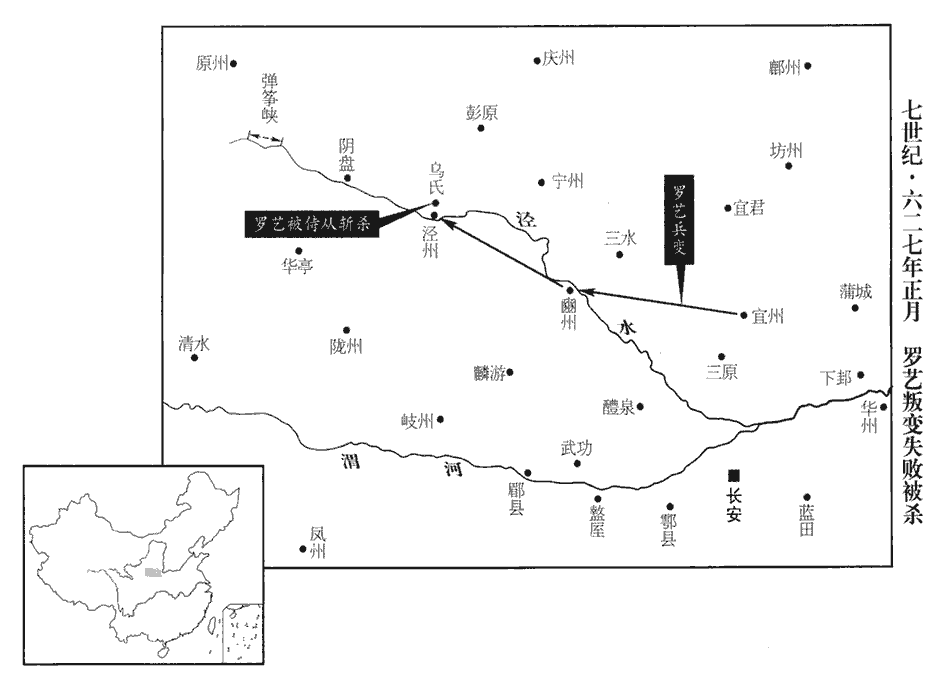
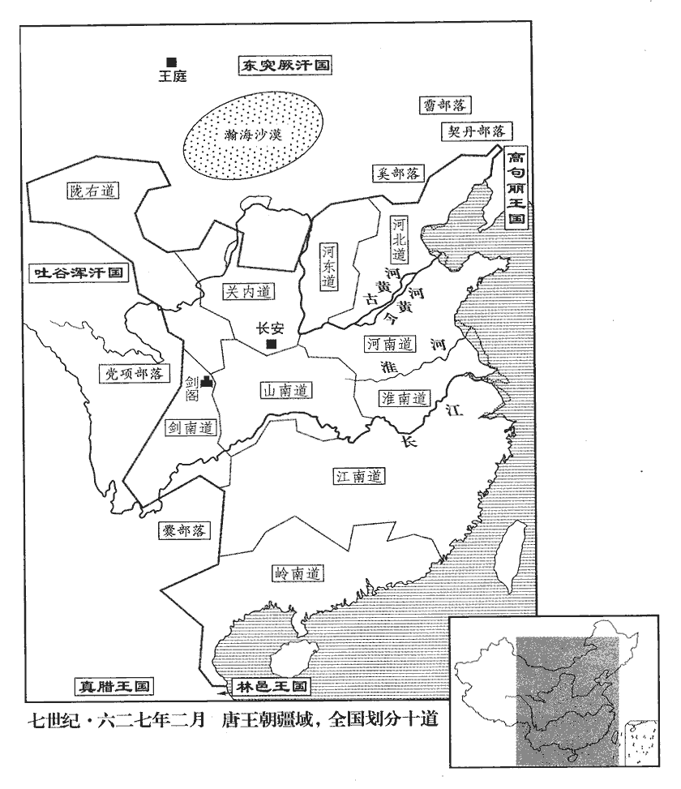
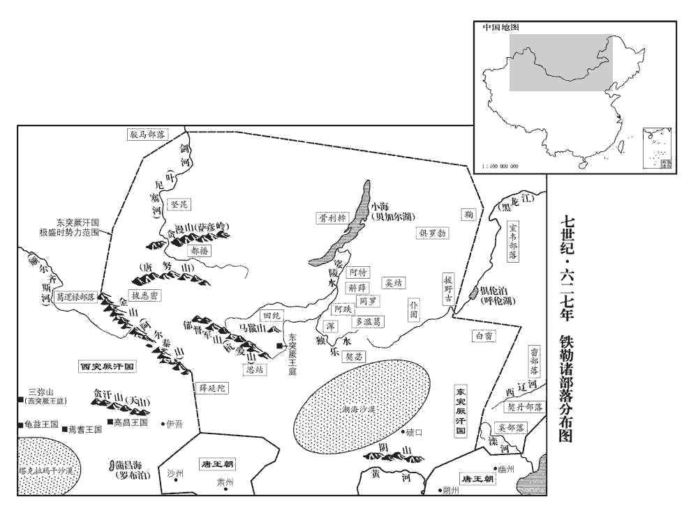

 唐紀八起柔兆閹茂（丙戌）九月，盡著雍困敦（戊子）七月，凡二年。

# 高祖神堯大聖光孝皇帝下之下

## 武德九年（丙戌、六二六）

1九月，突厥頡利獻馬三千匹，羊萬口；上‹李世民›不受，自是年八月甲子以後，凡稱上者，皆太宗也。厥，九勿翻。但詔歸所掠中國戶口，徵溫彥博還朝。彥博沒於突厥，見上卷八年。朝，直遙翻。

〖译文〗 [1]九月，突厥颉利可汗进献三千匹马、一万头羊，唐太宗推辞不受，只是下诏令其归还所掠夺的中原人口，并征召上一年被突厥俘虏的温彦博回到朝中。

丁未‹二十二›，上引諸衛將卒習射於顯德殿庭，是年八月，上即位於東宮顯德殿，是後常御之。將，即亮翻；下同。諭之曰：「戎狄侵盜，自古有之，患在邊境少安，則人主逸遊忘戰，少，詩照翻；下同。是以寇來莫之能禦。今朕不使汝曹穿池築苑，專習弓矢，居閒無事，則為汝師，突厥入寇，則為汝將，庶幾中國之民可以少安乎！」將，即亮翻。幾，居希翻。少，始紹翻。於是日引數百人教射於殿庭，上親臨試，中多者賞以弓、刀、帛，其將帥亦加上考。唐考功之法，上、中、下皆分三等。中多之中，竹仲翻。帥，所類翻。群臣多諫曰：「於律，以兵刃至御在所者絞。今使卑碎之人張弓挾矢於軒陛之側，陛下親在其間，萬一有狂夫竊發，出於不意，非所以重社稷也。」韓州‹山西省襄垣县›刺史封同人詐乘驛馬入朝切諫。唐舊志：武德三年，分同州之河西、韓城、郃陽置西韓州；又於陝州界置南韓州。封同人當是自韓城乘驛入朝也。上皆不聽，曰：「王者視四海如一家，封域之內，皆朕赤子，朕一一推心置其腹中，柰何宿衛之士亦加猜忌乎！」由是人思自勵，數年之間，悉為精銳。

〖译文〗 丁未（二十二日），太宗带领各卫将士在显德殿庭院练习箭术，并当面训话道：“自古以来就有周边的戎狄等族的侵扰，值得忧虑的是边境稍微安宁，君主就放逸游荡，而忘记战争的威胁，因而一俟敌人来犯则难以抵御。现在朕不让你们修池榭筑宫苑，而是专门熟习射箭技术。闲居无事时，朕就当你们的老师，一旦突厥入侵，则做你们的将领，这样，中原的百姓也许能过上安宁的日子！”从此，太宗皇帝每日带领数百人在宫殿庭院里，教他们射箭，并亲自测试，射中箭靶多的士兵赏赐给弓、刀、布帛，他们的将领考核成绩时列为上等。许多大臣劝谏道：“依照大唐律令，在皇帝住处手持兵刃的要处以绞刑。现在陛下您让这些卑微之人张弓挟箭在殿宇之旁，陛下身处其中，万一有一个狂徒恣肆妄为，就会出现意外事故，这不是重视社稷江山的办法。”韩州刺史封同人假称有事，骑驿马来到朝廷直言苦谏。大宗均听不进去，他说：“真正的君主视四海如同一家，大唐辖境之内，都是朕的忠实臣民。我对每个人都能推心置腹，以诚相待，却为何要对保卫朕的将士横加猜忌呢？”从此人人想着自强自励，几年之间，都成为精锐之士。

上嘗言：「吾自少經略四方，頗知用兵之要，少，詩照翻。每觀敵陳，則知其強弱，陳，讀曰陣；下其陳同。常以吾弱當其強，強當其弱。彼乘吾弱，逐奔不過數十百步，吾乘其弱，必出其陳後反擊之，無不潰敗，所以取勝，多在此也！」

〖译文〗 太宗曾说过：“我从小南征北战，东略西讨，颇知用兵之道。每次观察敌军阵势，即知道它的强弱，并常以我军弱旅抵挡其强兵，而以强师击其弱旅。敌军追逐我方弱旅不过走数百步，我军攻其弱旅，一定要突至其阵后乘势反击，敌军无不溃败奔逃，这就是我的取胜之道！”

2己酉‹二十四›，上面定勲臣長孫無忌等爵邑，長，知兩翻。命陳叔達於殿下唱名示之，且曰：「朕敘卿等勳賞或未當，宜各自言。」當，丁浪翻。於是諸將爭功，紛紜不已。將，即亮翻。淮安王神通曰：「臣舉兵關西，首應義旗，事見一百八十四卷隋恭帝義寧元年。今房玄齡、杜如晦等專弄刀筆，功居臣上，臣竊不服。」上曰：「義旗初起，叔父雖首唱舉兵，蓋亦自營脫禍。及竇建德吞噬山東，叔父全軍覆沒；事見一百八十八卷武德二年。劉黑闥再合餘燼，叔父望風奔北。事見一百八十九卷四年。玄齡等運籌帷幄，坐安社稷，論功行賞，固宜居叔父之先。叔父，國之至親，朕誠無所愛，但不可以私恩濫與勳臣同賞耳！」諸將乃相謂曰：「陛下至公，雖淮安王尚無所私，吾儕何敢不安其分。」遂皆悅服。儕，士皆翻。分，扶問翻。房玄齡嘗言：「秦府舊人未遷官者，皆嗟怨曰：『吾屬奉事左右，幾何年矣，今除官，返出前宮、齊府人之後。』」上曰：「王者至公無私，故能服天下之心。朕與卿輩日所衣食，皆取諸民者也。故設官分職，以為民也，為，于偽翻。當擇賢才而用之，豈以新舊為先後哉！必也新而賢，舊而不肖，安可捨新而取舊乎！今不論其賢不肖而直言嗟怨，豈為政之體乎！」

〖译文〗 [2]己酉，（二十四日），太宗与群臣当面议定开国元勋长孙无忌等人的爵位田邑，命陈叔达在宫殿下唱名公布，太宗说：“朕分等级排列你们的功劳赏赐，如有不当之处，可以各自申明。”于是各位将领纷纷争功，议论不休，淮安王李神通说：“我在关西起兵，首先响应义旗，而房玄龄、杜如晦等人只是捉刀弄笔，功劳却在我之上，我感到难以心服。”太宗说：“叔父虽然首先响应义旗举兵，这也是自谋摆脱灾祸。等到窦建德侵吞山东，叔父全军覆没；刘黑闼再次纠集余部，叔父丢兵弃甲，望风脱逃。房玄龄等人运筹帷幄、决胜千里，使大唐江山得以安定，论功行赏，功劳自然在叔父之上。叔父您是皇族至亲，朕对您确实毫不吝惜，但不可循私情滥与有功之臣同等封赏。”众位将领于是相互议论道：“陛下如此公正，即使对皇叔淮安王也不循私情，我们这些人怎么敢不安本分呢。”大家都心悦诚服。房玄龄曾说：“秦王府的旧僚属未能升官的，皆满腹怨言道：‘我等跟随侍奉陛下身边，也有许多年了，现今拜官，反而都在前太子东宫、齐王府僚属的后面。’”太宗说：“君主大公无私，因此能使天下人心服。朕与你们平日的衣食，都取自百姓。因此设官吏定职守都是为了百姓，理应选择贤才加以任用，怎么能以新人旧人来做为选拔人才的先后顺序呢？如果新人贤能，故旧不才，怎么可以放弃新人而只取故旧呢！现在你们不论其是否贤能而只是怨声不断，这岂是为政之道？”

3詔：「民間不得妄立妖祠。妖，於驕翻。自非卜筮正術，其餘雜占，悉從禁絕。」

〖译文〗 [3]太宗下诏；“民间百姓不得私自设立妖祠。除了正当的卜筮术，其余杂滥占卜，一律禁绝。”

4上於弘文殿聚四部書二十餘萬卷，歐陽修曰：歷代盛衰，文章與時高下，然其變態百出，不可窮極，何其多也！自漢以來，史官列其名氏篇第，以為六藝、七略，至唐始分為四類，曰經、史、子、集，以甲、乙、丙、丁為次，謂之四庫書，亦曰四部書。置弘文館於殿側，唐會要：武德四年，於門下省置修文館，至九年三月，改為弘文館。至其年九月，太宗即位，於弘文殿聚四部書二十餘萬卷，於殿側置弘文館，貞觀三年移於納義門西。按閣本太極宫圖：弘文館在門下省東，而不載弘文殿。納義門在嘉德門之西。即我朝之崇文館也，避宣祖諱，改「弘」為「崇」。精選天下文學之士虞世南、褚亮、姚思廉、歐陽詢、蔡允恭、蕭德言等，以本官兼學士，令更日宿直，聽朝之隙，引入內殿，講論前言往行，商榷政事，或至夜分乃罷。唐太宗以武定禍亂，出入行間，與之俱者，皆西北驍武之士。至天下既定，精選弘文館學生，日夕與之議論商榷者，皆東南儒生也。然則欲守成者，捨儒何以哉！更，工衡翻。朝，直遙翻。行，下孟翻。榷，訖岳翻。又取三品已上子孫充弘文館學士。【章：十二行本「士」作「生」；乙十一行本同；孔本同。】

〖译文〗 [4]太宗聚集经史子集四部书二十余万卷藏于弘文殿，并于殿旁设置弘文馆。遴选虞世南、褚亮、姚思廉、欧阳询、蔡允恭、萧德言等国内精通学术之人，以原职兼任弘文馆学士，让他们轮流值宿，皇上在听政之暇，领他们进入内殿，讲论先哲言行，商榷当朝大政，有时要到午夜时分才结束。又选取三品以上官员的子孙充任弘文馆学生。

5冬，十月，丙辰朔‹一›，日有食之。

〖译文〗 [5]冬季，十月，丙辰朔（初一），出现日食。

6詔追封故太子建成為息王，諡曰隱；齊王元吉為剌【章：十二行本「剌」作「海陵」二字，「王」下有「諡曰剌」三字；乙十一行本同；孔本同；退齋校同。】王，息，古國名。諡法：隱拂不成曰隱。不思忘愛曰剌；暴戾無親曰剌。諡，神至翻。剌là，盧達翻。以禮改葬。葬日，上哭之於宜秋門，甚哀。太極宮圖：宜秋門在千秋殿之西，百福門之東。魏徵、王珪表請陪送至墓所，考異曰：高祖實錄、建成元吉傳：「太宗踐阼，改葬加諡。」太宗實錄及本紀皆不書葬月日，唯唐曆在此年十月。貞觀政要此表在二年。據此年七月魏徵為諫議大夫，宣慰山東，王珪亦未為黃門侍郎，葬建成、元吉恐在後，但別無年月日可附，今且從唐曆。上許之，命宮府舊僚皆送葬。

〖译文〗 [6]太宗下诏追封已故太子皇兄李建成为息王，谥号为隐；皇弟齐王李元吉谥号为剌，以皇家丧礼重新安葬。安葬那一天，太宗皇帝在宜秋门大哭一场，显得十分哀痛。魏徵、王上表请求陪送灵车到安葬地，太宗答应了他们的请求，并命令原东宫和齐王府的旧僚属都去送葬。

7癸亥‹八›，立皇子中山王承乾為太子，生八年矣。生於承乾殿，因以名之。

〖译文〗 [7]癸亥（初八），朝廷立中山王李承乾为皇太子，时年仅八岁。

8庚辰‹二十五›，初定功臣實封有差。唐爵九等：一曰王，食邑萬戶，正一品；二曰嗣王、郡王，食邑五千戶，從一品；三曰國公，食邑三千戶，從一品；四曰開國郡公，食邑二千戶，正二品；五曰開國縣公，食邑千五百戶，從二品；六曰開國縣侯，食邑千戶，從三品；七曰開國縣伯，食邑七百戶，正四品上；八曰開國縣子，食邑五百戶，正五品上；九曰開國縣男，食邑三百戶，從五品上。凡封戶，三丁以上為率，歲租三之一入于朝廷；食實封者，得真戶分食諸州。

〖译文〗 [8]庚辰（二十五日），唐朝初步规定功臣实得食邑封户的等级差别。

9初，蕭瑀薦封德彝於上皇‹李渊›，上皇以為中書令。及上‹李世民›即位，瑀為左僕射，德彝為右僕射。議事已定，德彝數反【章：十二行本「反」下有「之」字；乙十一行本同；孔本同；張校同；退齋校同。】於上前，瑀，音禹。射，寅謝翻。數，所角翻。由是有隙。時房玄齡、杜如晦新用事，皆疏瑀而親德彝，太宗初政之時，以房、杜之賢，蕭瑀之直，而不相親，乃親封德彝者，蓋以瑀之疏直，難與共事於危疑之時，而封德彝之狡數，不與之親密，則不能得其情也。後之為相者，其心無所權量，但曰親君子，遠小人，未有能濟者也。瑀不能平，遂上封事論之，上，時掌翻。辭指寥落，由是忤旨。忤，五故翻。會瑀與陳叔達忿爭於上前，庚辰‹二十五›，瑀、叔達皆坐不敬，免官。考異曰：舊傳，「太宗以玄齡等功高，由是忤旨，廢于家。俄拜少師，復為左僕射，坐與叔達忿爭免。」按實錄忿爭在作少師前，今從之。

〖译文〗 [9]起初，萧向高祖荐举封德彝，高祖任命他为中书令。到了太宗即位，改任萧为尚书左仆射。封德彝为右仆射，二人商定将要上奏的事，到了太宗面前封德彝屡次变易，由此二人之间产生隔阂。当时房玄龄、杜如晦刚当权，均疏远萧而亲近封德彝，萧愤愤不平，于是上密封的奏章理论，辞意凄凉，由此触犯圣意。适逢萧与陈叔达又在太宗面前含怒争辩，庚辰（二十五日），萧、陈叔达皆以对皇上不恭敬的罪名，被罢官免职。

10甲申‹二十九›，民部尚書裴矩奏「民遭突厥暴踐者，厥，九勿翻。踐，慈演翻。請戶給絹一匹。」上曰：「朕以誠信御下，不欲虛有存恤之名而無其實，戶有大小，豈得雷同給賜乎！」於是計口為率。

〖译文〗 [10]甲申（二十九日），民部尚书裴矩进言：“对遭受突厥暴虐践踏的百姓，请求每户赐给绢帛一匹。”太宗说：“朕以诚、信二字统治下属，不想徒有抚恤百姓的名声而没有实在的东西，每户中人数多少不等，怎么能整齐划一，赏赐都一样呢？”于是计算人口以它为赏赐的标准。

11初，上皇欲強宗室以鎮天下，故皇再從、三從弟同曾祖為再從兄弟，同高祖為三從兄弟。從，才用翻。及兄弟之才，雖童孺皆為王，王者數十人。封宗室為郡王，見一百九十卷五年。上從容問群臣：「徧封宗子，於天下利乎？」從，千容翻。封德彝對曰：「前世唯皇子及兄弟乃為王，自餘非有大功，無為王者。上皇敦睦九族，大封宗室，自兩漢以來未有如今之多者。爵命既崇，多給力役，力役，蓋防閤庶僕白直之類。恐非示天下以至公也！」上曰：「然。朕為天子，所以養百姓也，豈可勞百姓以養己之宗族乎！」十一月，庚寅‹五›，降宗室郡王皆為縣公，惟有功者數人不降。

〖译文〗 [11]起初，高祖想以加强皇室宗族的力量来威镇天下，所以与皇帝同曾祖、同高祖的远房堂兄弟以及他们的儿子，即使童孺幼子均封为王，达数十人。为此，太宗语气和缓地征求群臣的意见：“遍封皇族子弟为王，对天下有利吗？”封德彝回答道：“前世只有皇帝的儿子及兄弟才封为王，其他宗亲如果不是有大功勋，便没有封王的。太上皇亲善厚待皇亲国戚，大肆分封宗室，自东西汉以来都没有如此之多。封给的爵位既高，又多赐给劳力仆役，这恐怕不能向天下人显示自己的大公无私吧！”太宗说：“有道理。朕做天子，就是为了养护百姓，怎么可以劳顿百姓来养护自己的宗族呢！”十一月，庚寅（初五），将宗室郡王降格为县公，只有功勋卓著的几位不降。

12丙午‹二十一›，上與群臣論止盜。或請重法以禁之，上哂之笑不壞顏為哂。哂，式忍翻。曰：「民之所以為盜者，由賦繁役重，官吏貪求，飢寒切身，故不暇顧廉恥耳。朕當去奢省費，去，羌呂翻。輕傜薄賦，選用廉吏，使民衣食有餘，則自不為盜，安用重法邪！」邪，音耶。自是數年之後，海內升平，路不拾遺，外戶不閉，商旅野宿焉。

〖译文〗 [12]丙午（二十一日），太宗与群臣讨论防盗问题。有人请求设严刑重法以禁盗，太宗微笑着答道：“老百姓之所以做盗贼，是因为赋役繁重，官吏贪财求贿，百姓饥寒交集，所以便顾不得廉耻了。朕主张应当杜绝奢移浪费，轻徭薄赋，选用廉吏，使老百姓吃穿有余，自然不去做盗贼，何必用严刑重法呢！”从此经过数年之后，天下太平，路不拾遗，夜不闭户，商人旅客可在野外露宿。

上又嘗謂侍臣曰：「君依於國，國依於民。刻民以奉君，猶割肉以充腹，腹飽而身斃，君富而國亡。故人君之患，不自外來，常由身出。夫欲盛則費廣，費廣則賦重，賦重則民愁，民愁則國危，國危則君喪矣。夫，音扶。喪，息浪翻。朕常以此思之，故不敢縱欲也。」

〖译文〗 太宗曾对身边的大臣说：“君主依靠国家，国家仰仗百姓。剥削百姓来奉养君主，如同割下身上的肉来充腹，腹饱而身死，君主富了而国家灭亡。所以君主的忧虑，不来自于外面，而常在于自身。凡欲望多则花费大，花费大则赋役繁重，赋役繁重则百姓愁苦，百姓愁苦则国家危急，国家危急则君主地位不保。朕常常思考这些，所以不敢放纵自己的欲望。”

13十二月，己巳‹十五›，益州‹总部设四川省成都市›大都督竇軌奏稱獠反，是年六月，廢大行臺，置大都督府。是後分諸州都督府為上、中、下三等：大州都督從二品，長史從三品，司馬從四品；中州都督正三品，別駕正四品，長史正五品上，司馬正五品下；下州都督從三品，別駕、長史、司馬亦皆遞降一品。獠，魯皓翻。請發兵討之。上曰：「獠依阻山林，時出鼠竊，乃其常俗；牧守苟能撫以恩信，自然帥服，守，式又翻。帥，與率同。安可輕動干戈，漁獵其民，比之禽獸，豈為民父母之意邪！」邪，音耶。竟不許。

〖译文〗 [13]十二月，己巳（十五日），益州大都督窦轨上奏，声称当地的獠民造反，请求朝廷派兵讨伐。太宗说：“獠民依仗山林，时常出来做些小偷小摸的事，这是他们的平常习惯。地方官如果能以恩信安抚，他们自然会顺服。怎么可以轻易动干戈，捕、打獠民，把他们当做禽兽一般？这难道是当百姓父母官的本意吗！”最后没有准许出兵。

14上謂裴寂曰：「比多上書言事者，比，毗志翻。朕皆粘之屋壁，粘，女廉翻。得出入省覽，省，悉景翻。每思治道，或深夜方寢。公輩亦當恪勤職業，副朕此意。」

〖译文〗 [14]太宗对大臣裴寂说：“近来很多上书言事的奏章，朕都将它们贴在寝宫的墙壁上，以便进出时观看，朕时常思考为政之道，有时要到深夜才能入睡。希望你们也要恪尽职守，与朕的这一心意相称。”

上厲精求治，數引魏徵入臥內，訪以得失；治，直吏翻。數，所角翻；下者數同。徵知無不言，上皆欣然嘉納。上遣使點兵，使，疏吏翻。封德彝奏：「中男雖未十八，其軀幹壯大者，亦可并點。」唐制：民年十六為中男，十八始成丁，二十一為丁，充力役。上從之。敕出，魏徵固執以為不可，不肯署敕，按唐制，中書舍人則署敕。魏徵時為諫議大夫，抑太宗亦使之連署邪？至于數四。上怒，召而讓之曰：「中男壯大者，乃姦民詐妄以避征役，取之何害，而卿固執至此！」對曰：「夫兵在御之得其道，不在眾多。陛下取其壯健，以道御之，足以無敵於天下，何必多取細弱以增虛數乎！且陛下每云：『吾以誠信御天下，欲使臣民皆無欺詐。』今即位未幾，失信者數矣！」幾，居豈翻。數，所角翻。上愕然曰：「朕何為失信？」對曰：「陛下初即位，下詔云：『逋負官物，悉令蠲免。』蠲juān，圭淵翻。有司以為負秦府國司者，非官物，徵督如故。陛下以秦王升為天子，國司之物，非官物而何！又曰：『關中免二年租調，關外給復一年。』既而繼有敕云：『已役已輸者，以來年為始。』散還之後，方復更徵，調，徒弔翻。給復，方目翻。方復，扶又翻；下復點同。言既散還其已輸之物而復徵之。百姓固已不能無怪。今既徵得物，復點為兵，何謂以來年為始乎！又陛下所與共治天下者在於守宰，治，直之翻。守，式又翻。居常簡閱，咸以委之；至於點兵，獨疑其詐，豈所謂以誠信為治乎！」治，直吏翻；下同。上悅曰：「曏者朕以卿固執疑卿不達政事，今卿論國家大體，誠盡其精要。夫號令不信，則民不知所從，天下何由而治乎！夫，音扶。治，直吏翻；下同。朕過深矣！」乃不點中男，賜徵金甕一。

〖译文〗 太宗励精求治，多次让魏徵进入卧室内，询问政治得失。魏徵知无不言，太宗均高兴地采纳。太宗派人征兵，封德彝上奏道：“中男虽不到十八岁，其中身体魁梧壮实的，也可一并征发。”太宗同意。敕令传出，魏徵固执己见加以反对，不肯签署，如是往返四次。太宗大怒，将他召进宫中责备道：“中男中魁梧壮实的，都是那些奸民虚报年龄以逃避徭役的人，征召他们有什么害处，而你却如此固执！”魏徵答道：“军队在于治理得法，而不在于人数众多。陛下征召身体壮健的成丁，用正确的方法加以管理，便足以无敌于天下，又何必多征年幼之人以增加虚数呢！而且陛下总说：》‘朕以诚、信治理天下，欲使臣下百姓均没有欺诈行为。’现在陛下即位没多久，却已经多次失信了！”太宗惊愕地问道：“朕怎么失信了？”魏徵答道：“陛下刚即位时，就下诏说：‘百姓拖欠官家的财物，一律免除。’有关部门认为拖欠秦王府国司的财物，不属于官家财物，仍旧征求索取。陛下由秦王升为天子，秦王府国司的财物不是官家之物又是什么呢？又说：‘关中地区免收二年的租调，关外地区免除徭役一年。’不久又有敕令说：‘已纳税和已服徭役的，从下一年开始免除。’如果退还已纳税物之后，又重新征回，这样百姓不能没有责怪之意。现在是既征收租调，又指派为兵员，还谈什么从下一年开始免除呢！另外与陛下共同治理天下的都是地方官，日常公务都委托他们办理；至于征点兵员，却怀疑他们使诈，这难道是以诚信为治国之道吗？”太宗高兴地说：“以前朕认为你比较固执，怀疑你不通达政务，现在看到你议论国家大政方针，确实都切中要害。朝廷政令不讲信用，则百姓不知所从，国家如何能得到治理呢？朕的过失很深呐！”于是不征点中男做兵员，并且赐给魏徵一只金瓮。

上聞景州‹河北省沧州市›錄事參軍張玄素名，景州，漢平原郡鬲縣地，隋置弓高縣，屬觀州。唐平河北，分弓高置景州。上州錄事參軍，從七品上，掌勾稽省署抄目；錄事掌受事發辰，兼勾稽失。召見，問以政道，對曰：「隋主好自專庶務，好，呼到翻。不任群臣；群臣恐懼，唯知稟受奉行而已，莫之敢違。以一人之智決天下之務，借使得失相半，乖謬已多，下諛上蔽，不亡何待！陛下誠能謹擇群臣而分任以事，高拱穆清而考其成敗以施刑賞，何憂不治！又，臣觀隋末亂離，其欲爭天下者不過十餘人而已，其餘皆保鄉黨、全妻子，以待有道而歸之耳。乃知百姓好亂者亦鮮，但人主不能安之耳。」好，呼到翻。鮮，息善翻。上善其言，擢為侍御史。

〖译文〗 太宗素闻景州录事参军张玄素的大名，便召他进宫，问他为政之道，张玄素答道：“隋朝皇帝好独揽各种政务，而不委任给群臣；群臣内心恐惧，只知道禀承旨意加以执行，没有人敢违命不遵。然而以一个人的智力决断天下事务，即使得失参半，乖谬失误之处已属不少，加上臣下谄谀皇上受蒙蔽，国家不灭亡更待何时！陛下如能慎择群臣而让他们各司其事，自己高拱安坐、清和静穆，考察臣下的成败得失据以实施刑罚赏赐，国家还能治理不好！而且，我观察隋末大动乱，其中想要争夺天下的不过十几人而已，其余大部分都想保全乡里和妻子儿女，等待有道之君而归附。由此可知百姓很少有好作乱的，只是君主不能使他们安定罢了。”太宗欣赏他的言论，提拔他为侍御史。

前幽州記室直中書省張蘊古上大寶箴，唐諸州無記室，唯王國有記室參軍，從六品上。蘊古蓋廬江王瑗督幽州時為記室也。唐制，資序未至，以它官入省者為直。上，時掌翻。其略曰：「聖人受命，拯溺亨屯，屯，陟倫翻。故以一人治天下，不以天下奉一人。」又曰：「壯九重於內，所居不過容膝；治，直之翻。重，直龍翻。彼昏不知，瑤其臺而瓊其室。羅八珍於前，所食不過適口；周禮：膳夫，珍用八物。註云：珍，謂淳熬、淳毋、炮豚、炮牂、擣dǎo珍、漬zì、熬、肝膋liáo也。淳，之純翻。毋，莫胡翻，一音武由翻。牂，作郎翻。膋，力彫翻。惟狂罔念，丘其糟而池其酒。」又曰：「勿沒沒而闇，勿察察而明，雖冕旒蔽目而視於未形，雖黈tǒu纊kuàng塞耳而聽於無聲。」冕而前旒，所以蔽明。黈纊充耳，所以塞聰。師古曰：以黃緜為圜，用兩組掛之於冕，垂兩耳旁，示不外聽也。黈，他口翻。塞，悉則翻。上嘉之，賜以束帛，唐制：凡賜十段，其率絹三匹，布三端，綿四屯；若雜綵十段，則絲布二匹，紬chóu二匹，綾二匹，縵四匹；若賜蕃客錦綵，率十段，則錦一張，綾二匹，縵四匹，綿四屯；凡時服稱一具者全給之，一副者減給之。正冬之會，稱賜束帛有差者，五品已上五匹，六品已下二匹；命婦視其夫、子。除大理丞。大理丞，正六品，掌分判寺事。

〖译文〗 前幽州记室参军、直中书省张蕴古，呈给太宗一篇《大宝箴》。大略写道：“圣人上承天命，拯黎民于水火，救时世之危难。所以以一个人来治理天下，而不以天下专奉一人。”又写道：“内廷重屋叠室、宽大无比，而帝王所居住的不过一片狭小之地；他们却昏庸无知，大肆修筑瑶台琼室。席前堆着山珍海味，而帝王所吃的不过合口味的几样；他们却忽发狂想，堆糟成丘、以酒为池。”又写道：“不要无声无息、糊里糊涂，也不要苛察小事，自以为精明，应该虽有冕前的垂旒遮住双眼却能看清事物的未成形状态，虽有纩挡住耳朵却能听到尚未发出的声音。”太宗深为嘉许，赏赐给束帛，任命他为大理丞。

15上召傅奕，賜之食，謂曰：「汝前所奏，幾為吾禍。事見上卷是年六月。幾，居依翻。然凡有天變，卿宜盡言皆如此，勿以前事為懲也。」上嘗謂奕曰：「佛之為教，玄妙可師，卿何獨不悟其理？」對曰：「佛乃胡中桀黠，黠xiá，戶八翻。誑耀彼土。中國邪僻之人，取莊、老玄談，飾以妖幻之語，用欺愚俗，無益於民，有害於國，臣非不悟，鄙不學也。」上頗然之。

〖译文〗 [15]太宗召见傅奕，赐给他食物，对他说：“你六月所奏金星出现在秦的分野，秦王当有天下，差一点害我遭殃，不过今后凡有天象变化，你应一如既往，言无不尽，不要心有余悸，总记着过去的事。”太宗曾对傅奕说：“佛作为宗教，道理玄妙可以师法，为何惟独你不明悟其道理？”傅奕答道：“佛是胡族中的狡诈之人，欺言诳世炫耀于西域。中国的一些邪避之人，择取庄子、老子玄谈理论，用妖幻之语加以修饰，用来欺蒙愚昧的民众，这既不利于百姓，更有害于国家，我不是不能明悟，而是鄙视它不愿意接触它。”太宗颇以为然。

16上患吏多受賕，枉法受賂曰賕。賕，音求。密使左右試賂之。有司門令史受絹一匹，司門郎，屬刑部，掌天下門關出入往來之籍賦而審其政，有令史六人。唐令，布帛皆闊尺八寸長四丈為匹。上欲殺之，民部尚書裴矩諫曰：「為吏受賂，罪誠當死；但陛下使人遺之而受，遺，于季翻。乃陷人於法也，恐非所謂『道之以德，齊之以禮。』」引論語孔子之言。道，讀曰導。上悅，召文武五品已上告之曰：「裴矩能當官力爭，不為面從，儻每事皆然，何憂不治！」治，直吏翻。

〖译文〗 [16]太宗担心官吏中多有接受贿赂的，便秘密安排身边的人去试探他们。有一个刑部的司门令史收受绢帛一匹，太宗得悉后想要杀掉他。民部尚书裴矩劝谏道：“当官的接受贿赂，罪的确应当处死；但是陛下派人送上门去让其接受，这是有意引人触犯法律，恐怕不符合孔子所谓‘用道德加以诱导，以礼教来整齐民心’的古训。”太宗听了很高兴，召集文武五品以上的官员，对他们说：“裴矩能够做到在位敢于力争，并不一味地顺从我，假如每件事情都能这样做，国家怎么能治理不好呢！”

臣光曰：古人有言：君明臣直。裴矩佞於隋而忠於唐，非其性之有變也；君惡聞其過，則忠化為佞，君樂聞直言，則佞化為忠。惡，烏路翻。樂，音洛。是知君者表也，臣者景也，表動則景隨矣。

〖译文〗 臣司马光曰：古人说过：君主贤明则臣下敢于直言。裴矩在隋朝是位佞臣而在唐则是忠臣，不是他的品性有变化。君主讨厌听人揭短，则大臣的忠诚便转化为谄谀；君主乐意听到直言劝谏，则谄谀又会转化成忠诚。由此可知君主如同测影的表，大臣便似影子，表一动则影子随之而动。

17是歲，進皇子長沙郡王恪為漢王、宜陽郡王祐為楚王。

〖译文〗 [17]这一年，将皇子长沙郡王李恪升为汉王，宜阳郡王李升为楚王。

18新羅‹首都金城韩国庆州市›、百濟‹首都泗沘韩国扶馀市›、高麗‹首都平壤›三國有宿仇，北史曰：新羅本辰韓種，在高麗東南，亦曰秦韓，相傳秦世亡人避役，來適馬韓，割東界居之，故名秦韓。始有六國，稍分為十二，新羅其一也。或稱魏毌guàn丘儉破高麗，奔沃沮，後復國，其留者為新羅，兼有沃沮、不耐、韓、濊之地。其王本百濟人，自海逃入新羅，遂王其國，附庸百濟；後致強盛，因與百濟為敵。百濟伐高麗，來請救，悉兵往破之。自是相攻不置，後獲百濟王，殺之，滋結怨。麗，力知翻。迭相攻擊；上遣國子助教朱子奢往諭指，晉武帝咸寧四年立國子學，置祭酒、博士各一人，助教十五人，以教生徒。孝武太元十年，損助教為十人。唐助教五人，從六品上，掌佐博士分經教授。三國皆上表謝罪。上，時掌翻。

〖译文〗 [18]新罗、百济、高丽三国之间世代结怨，相互攻伐，战事连绵，太宗派遣国子监助教朱子奢前去传达圣意，劝他们讲和，三国都上表谢罪。

# 太宗文武大聖大廣孝皇帝上之上諱世民，高祖次子也。帝初諡文皇帝，廟號太宗；咸亨五年，追諡太宗文武聖皇帝；天寶八載，追尊太宗文武大聖皇帝；十三載，又加尊太宗文武大聖大廣孝皇帝。

## 貞觀元年（丁亥、六二七）觀，古玩翻。

1春，正月，乙酉‹一›，改元。

〖译文〗 [1]春季，正月，乙酉（初一），改年号。

2丁亥‹三›，上‹李世民，本年三十岁›宴群臣，奏秦王破陳樂，陳，讀曰陣。新志：太宗為秦王，破劉武周，軍中相與作秦王破陳樂曲。上曰：「朕昔受委專征，民間遂有此曲，雖非文德之雍容，然功業由茲而成，不敢忘本。」封德彝曰：「陛下以神武平海內，豈文德之足比。」上曰：「戡亂以武，守成以文，文武之用，各隨其時。卿謂文不及武，斯言過矣！」德彝頓首謝。

〖译文〗 [2]丁亥（初三），太宗大宴群臣，席间演奏《秦王破陈乐》。太宗说：“朕从前曾受命专行率兵征伐，民间于是流传着这个曲子。虽然不具备文德之乐的温文而雅，但功业却由此而成就，所以始终不敢忘本。”封德彝说：“陛下以神武之才平定天下，岂是文德所堪比拟。”太宗说：“平乱建国凭借武力，治理国家保持已取得的成就却仰赖文才，文武的妙用，各随时势的变化而有不同。你说文不如武，此言差矣！”封德彝磕头道歉。

3己亥‹十五›，制：「自今中書、門下及三品以上入閤議事，皆命諫官隨之，有失輒諫。」程大昌曰：唐西內太極殿，即朔望受朝之所，蓋正殿也。太極之北有兩儀殿，即常日視朝之所。太極殿兩廡有東西二上閤，則是兩閤皆有門可入，已又可轉北而入兩儀也。此太宗時入閤之制也。至高宗以後，多居東內，御宣政前殿，則謂之衙，衙有仗；御紫宸便殿，則謂之入閤。其不御宣政前殿而御紫宸也，乃自正衙喚仗，由閤門而入，百官候朝于衙者，因隨而入見，謂之入閤。

〖译文〗 [3]己亥（十五日），唐朝廷下制文：“从今以后，中书省、门下省以及三品以上官员入朝堂议事，都应让谏官随行，有失误立即进谏。”

4上命吏部尚書長孫無忌等與學士、法官更議定律令，長，知兩翻。寬絞刑五十條為斷右趾，斷，丁管翻。上猶嫌其慘，曰：「肉刑廢已久，宜有以易之。」蜀王法曹參軍裴弘獻唐制，諸王有功、倉、戶、兵、騎、法、士等七曹參軍，正七品上。請改為加役流，徙三千里居作三年；詔從之。考異曰：新、舊刑法志皆云「居作二年」。今從王溥會要。

〖译文〗 [4]太宗让吏部尚书长孙无忌等人与学士、法官重新议定律令，宽减绞刑五十条，改为断右趾，太宗仍嫌其苛刻，说道：“肉刑废除已经很长时间，应当用其他刑罚代替。”蜀王府法曹参军裴弘献请求改断趾为加服劳役的流放，流放到三千里外，刑期三年。太宗下诏依此办理。

5上以兵部郎中戴冑忠清公直，兵部郎中，掌判帳及天下武官之階品、衛府之名數。擢為大理少卿。少，始照翻。上以選人多詐冒資蔭，敕令自首，不首者死。選，息絹翻；下同。首，手又翻。未幾，有詐冒事覺者，幾，居豈翻。上欲殺之。冑奏：「據法應流。」上怒曰：「卿欲守法而使朕失信乎？」對曰：「敕者出於一時之喜怒，法者國家所以布大信於天下也。陛下忿選人之多詐，故欲殺之，而既知其不可，復斷之以法，斷，丁亂翻。此乃忍小忿而存大信也。」上曰：「卿能執法，朕復何憂！」復，扶又翻；下不復、朕復、何復同。冑前後犯顏執法，言如涌泉，上皆從之，天下無冤獄。

〖译文〗 [5]太宗认为兵部郎中戴胄忠诚清正耿直，提升他为大理寺少卿。当时许多候选官员都假冒资历和门荫，太宗令他们自首，否则即处死。没过几天，有假冒被发觉的，太宗要杀掉他。戴胄上奏道：“根据法律应当流放。”太宗大怒道：“你想遵守法律而让我失信于天下吗？”戴胄回答道：“敕令出于君主一时的喜怒，法律则是国家用来向天下人昭示最大信用的。陛下气愤于候选官员的假冒，所以想要杀他们，但是现在已知道这样做不合适，再按照法律来裁断，这就是忍住一时的小愤而保全大的信用啊！”太宗说：“你如此执法，朕还有何忧虑！”戴胄前后多次冒犯皇上而执行法律，奏答时滔滔不绝，太宗都听从他的意见，国内没有冤案。

6上令封德彝舉賢，久無所舉。上詰之，詰，去吉翻。對曰：「非不盡心，但於今未有奇才耳！」上曰：「君子用人如器，各取所長，古之致治者，豈借才於異代乎？治，直吏翻。正患己不能知，安可誣一世之人！」德彝慚而退。

〖译文〗 [6]太宗令封德彝荐举贤才，很长时间没有选荐一个人。太宗质问其原因，答道：“不是我不尽心竭力，而是现在没有奇才！”太宗说：“君子用人如用器物，各取其长处。古时候使国家达到大治的君主，难道是从别的时代去借人才的吗？正应当怪自己不能识别人才，怎么能诬蔑整个时代的人呢？”封德彝羞惭地退下。

御史大夫杜淹奏「諸司文案恐有稽失，請令御史就司檢校。」上以問封德彝，對曰：「設官分職，各有所司。果有愆違，御史自應糾舉；若徧歷諸司，搜擿疵纇，擿tī，他狄翻。纇，盧對翻。太為煩碎。」淹默然。上問淹：「何故不復論執？」對曰：「天下之務，當盡至公，善則從之，德彝所言，真得大體，臣誠心服，不敢遂非。」上悅曰：「公等各能如是，朕復何憂！」

〖译文〗 御史大夫杜淹上奏道：“各部门的公文案卷恐有稽延错漏，请求让御史到各部门检查核对。”太宗征求封德彝的意见，封德彝回答说：“设官定职，各有分工，如果真有错失，御史自当纠察举报。假如让御史到各部门巡视，吹毛求疵，实在是太繁琐。”杜淹默不作声。太宗问杜淹：“你为什么不加争辩呢？”杜淹回答说：“国家的事务，应当务求公正，从善而行。封德彝讲的话深得大体，我心悦诚服，不敢有所非议。”太宗高兴地说：“你们如果都能做到这样，朕还有什么忧虑呢？”

7右驍衛大將軍長孫順德受人餽絹，事覺，長，知兩翻。驍，堅堯翻。上曰：「順德果能有益國家，朕與之共有府庫耳，何至貪冒如是乎！」冒，莫北翻。猶惜其有功，不之罪，但於殿庭賜絹數十匹。大理少卿胡演曰：「順德枉法受財，罪不可赦，柰何復賜之絹？」上曰：「彼有人性，得絹之辱，甚於受刑；如不知愧，一禽獸耳，殺之何益！」

〖译文〗 [7]右骁卫大将军长孙顺德接受别人送的绢帛，事情暴露，太宗说：“长孙顺德如果能有益于国家，朕与他共享府库的资财，他何至于如此贪婪呢！”太宗仍爱惜他有功于大唐，不予惩罚，反而在宫殿上赐给他数十匹绢帛。大理寺少卿胡演说：“长孙顺德贪脏枉法，犯下的罪不可饶恕，为什么又要赐他绢帛呢？”太宗说：“如果他有人性的话，得到朕赐给绢帛的羞辱，远甚于受到刑罚；如果不知道羞耻，不过是禽兽而已，杀他又有何用呢？”

8辛丑‹十七›，天節將軍燕郡王李藝據涇州‹甘肃省泾川县›反。宜州道‹陕西省耀县›為天節軍，置將軍一人。燕，因肩翻。

〖译文〗 [8]辛丑（十七日），天节将军、燕郡王李艺占据泾洲反叛朝廷。

藝之初入朝也，武德五年，藝引兵與太子建成會討劉黑闥，遂入朝。朝，直遙翻。恃功驕倨，秦王左右至其營，藝無故毆之。毆，烏口翻。上皇‹李渊›怒，收藝繫獄，既而釋之。上即位，藝內不自安。曹州‹山东省定陶县›妖巫李五戒妖，於驕翻。謂藝曰：「王貴色已發！」勸之反。藝乃詐稱奉密敕，勒兵入朝。遂引兵至豳州‹陕西省彬县›，豳州治中趙慈皓馳出謁之，諸州治中，即別駕。藝入據豳州，詔吏部尚書長孫無忌等為行軍總管以討之。長，知兩翻。趙慈皓聞官軍將至，密與統軍楊岌圖之，岌，魚及翻。事洩，藝囚慈皓。岌在城外覺變，勒兵攻之，藝眾潰，棄妻子，將奔突厥‹瀚海沙漠群›。至烏氏‹甘肃省泾川县北›，厥，九勿翻。漢烏氏縣屬安定郡，故城在彈箏峽東。氏，音支。左右斬之，傳首長安。弟壽，為利州‹总部设四川省广元市›都督，亦坐誅。

〖译文〗 李艺当初进入朝廷时，居功自傲，秦王李世民身边的人到他的营地，李艺无缘无故地殴打他。高祖皇帝大怒，将李艺关进牢里，不久又释放他。太宗即位后，李艺内心不安。曹州邪恶的巫师李五戒对李艺说：“郡王您已然面呈贵相！”劝他反叛。李艺于是假称奉皇帝密诏，带兵前来朝廷。李艺带领兵马到豳州城下，豳州治中赵慈皓出城迎接，李艺入城占据了豳州。太宗命吏部尚书长孙无忌等人为行军总管，率兵讨伐。赵慈皓听说官兵即将到来，便秘密与统军杨岌商议谋取李艺，事情败露，李艺囚禁了赵慈皓。杨笈在城外觉察到变化，便率兵攻城，李艺手下兵将溃逃，李艺抛下妻子儿女，准备投奔突厥，到了乌氏城，身边的人将他杀掉，送首级回长安。李艺弟李寿，官做利州都督，也受牵连被处斩。

 

9初，隋末喪亂，喪，息浪翻。豪桀並起，擁眾據地，自相雄長；唐興，相帥來歸，上皇為之割置州縣以寵祿之，帥，讀曰率。長，知兩翻。為，于偽翻。由是州縣之數，倍於開皇、大業之間。上以民少吏多，思革其弊；少，詩沼翻。二月，命大加併省，因山川形便，分為十道：一曰關內，二曰河南，三曰河東，四曰河北，五曰山南，六曰隴右，七曰淮南，八曰江南，九曰劍南，十曰嶺南。京兆、同、華、商、岐、邠、隴、涇、原、寧、慶、鄜、坊、丹、延、靈、會、鹽、夏、綏、銀、豐、勝為關內道。洛、汝、陝、虢、鄭、滑、許、潁、陳、蔡、汴、宋、亳、徐、濠、宿、鄆、齊、曹、濮、青、淄、登、萊、棣、兗、海、沂、密為河南道。蒲、晉、絳、汾、隰、并、南汾、遼、沁、嵐、石、忻、代、朔、蔚、澤、潞為河東道。懷、孟、魏、博、相、衛、澶、貝、邢、洺、磁、恆、冀、深、趙、滄、景、德、易、定、幽、涿、瀛、莫、燕、檀、營、平為河北道。荊、峽、歸、夔、澧、朗、忠、涪、萬、襄、唐、隨、鄧、均、房、郢、復、金、梁、洋、利、鳳、興、成、扶、文、壁、巴、蓬、通、開、隆、果、渠為山南道。秦、渭、河、鄯、蘭、階、洮、岷、廓、疊、宕、涼、瓜、沙、甘、肅為隴右道。楊、楚、滁、和、壽、廬、舒、光、蕲、黃、安、申為淮南道。潤、常、蘇、湖、杭、睦、越、衢、婺、括、台、福、建、泉、宣、歙、池、洪、江、鄂、岳、饒、信、虔、吉、袁、撫、潭、衡、永、道、郴、邵、黔、辰、夷、思、僰為江南道。益、嘉、眉、邛、簡、資、巂、雅、南會、翼、維、松、姚、恭、戎、梓、遂、綿、劍、合、龍、普、渝、陵、榮、瀘為劍南道。廣、番、循、潮、南康、瀧、端、新、封、南宕、春、羅、南石、高、南合、崖、振、邕、南方、南簡、淳、欽、南尹、象、藤、桂、梧、賀、連、南昆、靜、樂、南恭、融、容、牢、南林、南扶、南越、南義、交、陸、峰、愛、南德為嶺南道。

〖译文〗 [9]起初，隋朝末年天下大乱，英雄豪杰蜂拥而起，据地拥兵，各自称雄一方。唐兴起后相继归附，高祖为他们分置州县，施以荣禄，由此州县的数目，大大超过隋朝开皇、大业年间。太宗认为官多民少，想革除弊端。二月，下令州县大加合并，依山川地势条件，将全国分为十道：“一关内，二河南，三河东，四河北，五山南，六陇右，七淮南，八江南，九剑南，十岭南。

 

10三月，癸巳‹十›，皇后帥內外命婦親蠶。內命婦，宮內女官，自貴妃至侍巾，亦分九品。外命婦有六：王、嗣王、郡王之母、妻為妃，一品之國公母、妻為國夫人，三品以上母、妻為郡夫人，四品母、妻為郡君，五品母、妻為縣君，勳官四品有封者，母、妻為鄉君。凡外命婦朝參，視夫、子之品。唐制，皇后以季春吉巳享先蠶，遂以親桑。輿服志：皇后親蠶，服鞠衣，黃羅為之。帥，讀曰率。

〖译文〗 [10]三月，癸巳（初十），皇后带领着后宫妃嫔及宫外有爵号的妇女举行躬亲蚕事的典礼。

11閏月，癸丑朔‹一›，日有食之。

〖译文〗 [11]闰三月，癸丑朔（初一），出现日食。

12壬申‹二十›，上謂太子少師蕭瑀曰：「朕少好弓矢，少，詩照翻。瑀，音禹。好，呼到翻。得良弓十數，自謂無以加，近以示弓工，乃曰『皆非良材』。朕問其故，工曰：『木心不直，則脈理皆邪，弓雖勁而發矢不直。』朕始寤曏者辨之未精也。朕以弓矢定四方，識之猶未能盡，況天下之務，其能徧知乎！」乃令京官五品以上京官，即在京職事官也。更宿中書內省，更，工衡翻。數延見，問以民間疾苦，政事得失。數，所角翻；下數與同。

〖译文〗 [12]壬申（二十日），太宗对太子少师萧说：“朕年轻时喜好弓箭，曾得到十几张好弓，自认为没有能超过它们的，最近拿给做弓箭的弓匠看，他说：‘都不是好材料。’朕问他原因，弓匠说：‘弓子木料的中心部分不直，所以脉纹也都是斜的，弓力虽强劲但箭发出去不走直线。’朕这才醒悟到以前对弓箭的性能分辨不清。朕以弓箭平定天下，而对弓箭的性能还没有能完全认识清楚，何况对于天下的事务，又怎么能遍知其理呢！”于是下令在京五品以上官员，轮流在中书内省值夜班，太宗多次接见他们，询问民间百姓疾苦和政治得失。

13涼州‹总部设甘肃省武威市›都督長樂王幼良，性粗暴，樂，音洛。左右百餘人，皆無賴子弟，侵暴百姓；又與羌、胡互市。或告幼良有異志，上遣中書令宇文士及馳驛代之，并按其事。左右懼，謀劫幼良入北虜，又欲殺士及據有河西‹甘肃省中部西部›。復有告其謀者，復，扶又翻；下汗復、復與同。夏，四月，癸巳‹十二›，賜幼良死。

〖译文〗 [13]凉州都督、长乐王李幼良，性情暴躁，身边一百多人，都是无赖之徒，侵扰残虐百姓，又和羌、胡等族人开展互市贸易。有人上告太宗说李幼良存有二心，太宗特派中书令宇文士及急速前往，暂代理职权，并按察其事。李幼良身边的人恐惧，密谋劫持李幼良到北方胡虏之地，又想要杀掉宇文士及，占据河西地区。不久又有人将其密谋上告朝廷，夏季，四月，癸巳（十二日），太宗赐李幼良自杀。

14五月，苑君璋帥眾來降。帥，讀曰率。降，戶江翻；下同。初，君璋引突厥陷馬邑‹山西省朔州市›，殺高滿政，事見一百九十卷高祖武德六年。厥，九勿翻。退保恆安‹山西省大同市›。隋朔州雲內縣之恆安鎮，即後魏所都之平城也，唐後置雲州及雲中縣。恆，戶登翻。其眾皆中國人，多棄君璋來降。君璋懼，亦降，請捍北邊以贖罪，上皇許之。君璋請約契，上皇使鴈門‹山西省代县›人元普賜之金券。鴈門縣帶代州，漢廣武縣地。頡利可汗復遣人招之，頡，奚結翻。可，從刊入聲。汗，音寒。君璋猶豫未決，恆安人郭子威說君璋以「恆安地險城堅，說，輸芮翻。突厥方強，且當倚之以觀變，未可束手於人。」君璋乃執元普送突厥，復與之合，數與突厥入寇。數，所角翻。至是，見頡利政亂，知其不足恃，遂帥眾來降。苑君璋與劉武周同起，至是始降。上以君璋為隰州‹总部设山西省隰县›都督、芮國公。芮，古國名。

〖译文〗 [14]五月，苑君璋率领手下兵马投降。起初，苑君璋勾引突厥兵攻陷马邑，杀掉了高满政，退兵据守恒安。他的士兵都是中原人，大多脱离他投奔唐朝。君璋十分害怕，便也主动投诚，请求让他防守北部边疆以赎罪，高祖允诺。君璋请求订契约，高祖派雁门人元普送给他金券。颉利可汗又派人来招降，君璋犹豫不决，恒安人郭子威劝他说：“恒安地势险要城墙坚固，突厥正强盛，正应该依靠它再观察形势的变化，不宜束手受制于人。”苑君璋于是拘捕元普送到突厥，又一次与突厥联合，并数次入侵唐帝国。到了五月，看到颉利可汗政事混乱，知道突厥不足以依靠，于是率兵马投降。太宗封苑君璋为隰州都督、芮国公。

15有上書請去佞臣者，上，時掌翻。去，羌呂翻。上問：「佞臣為誰？」對曰：「臣居草澤，不能的知其人，願陛下與群臣言，或陽怒以試之，彼執理不屈者，直臣也，畏威順旨者，佞臣也。」上曰：「君，源也；臣，流也；濁其源而求其流之清，不可得矣。君自為詐，何以責臣下之直乎！朕方以至誠治天下，見前世帝王好以權譎小數接其臣下者，常竊恥之。治，直之翻。好，呼到翻。譎，古穴翻。卿策雖善，朕不取也。」

〖译文〗 [15]有人上书请求除去奸佞之人，太宗问：“谁是奸佞之人？”回答道：“臣我身居草野，不能确知谁是奸佞之人，希望陛下对群臣明言，或者假装恼怒加以试探，那些坚持己见、不屈服于压力的，便是耿直的忠臣；畏惧皇威顺从旨意的，便是奸佞之人。”太宗说：“君主，是水的源头；群臣，是水的支流。混浊了源头而去希冀支流的清澈，是不可能的事。君主自己做假使诈，又如何能要求臣下耿直呢！朕正以至诚之心治理天下，看见前代帝王喜好用权谋小计来对待臣下，常常觉得可鄙。你的建议虽好，朕不采用。”

16六月，辛巳‹一›，右僕射密明公封德彝薨。諡法，思慮果遠曰明。註云：自任近乎專。

〖译文〗 [16]六月，辛巳（初一），右仆射密明公封德彝去世。

17壬辰‹十二›，復以太子少師蕭瑀為左僕射。蕭瑀去年免官。復，扶又翻；下弟復同。少，始照翻。瑀，音禹。

〖译文〗 [17]壬辰（十二日），又任命太子少师萧为尚书左仆射。

18戊申‹二十八›，上與侍臣論周、秦脩短，蕭瑀對曰：「紂為不道，武王征之。周及六國無罪，始皇滅之。得天下雖同，人心則異。」上曰：「公知其一，未知其二。周得天下，增脩仁義；秦得天下，益尚詐力：此脩短之所以殊也。蓋取之或可以逆得，守之不可以不順故也。」瑀謝不及。

〖译文〗 [18]戊申（二十八日），太宗与大臣议论周朝、秦朝的政治得失，萧说：“殷纣王无道，周武王讨伐他。周朝及六国均无罪，秦始皇分别灭掉他们。取得天下的方式虽然相同，人心所向却不一样。”太宗说：“你只知其一，不知其二。周朝取得天下，更加修行仁义；秦朝取得天下，一味崇尚欺诈、暴力，这就是长短得失的不同。所以说夺取天下也许可以凭借武力，治天下则不可以不顺应民心。”萧钦服不已。

19山東大旱，詔所在賑恤，無出今年租賦。賑，津忍翻。

〖译文〗 [19]山东大旱，诏令各地赈济抚恤，今年的租赋不必交纳。

20秋，七月，壬子‹二›，以吏部尚書長孫無忌為右僕射。無忌與上為布衣交，加以外戚，有佐命功，無忌，皇后之兄，以佐誅建成、元吉為功。長，知兩翻。上委以腹心，其禮遇群臣莫及，欲用為宰相者數矣。歐陽修曰：唐因隋制，以三省之長，尚書令、侍中、中書令共議國政，此宰相職也。後以太宗為尚書令，臣下避不敢居其職，由是僕射為尚書省長官，與侍中、中書令號為宰相。其品位既崇，不欲輕以授人，故常以他官居宰相職而假以他名，如杜淹以吏部尚書參議朝政，魏徵以祕書監參預朝政，或曰參議得失、參知政事之類，其名非一，皆宰相職也。數，所角翻。文德皇后固請曰：「妾備位椒房，家之貴寵極矣，誠不願兄弟復執國政。呂、霍、上官，可為切骨之戒，幸陛下矜察！」上不聽，卒用之。卒，子恤翻。

〖译文〗 [20]秋季，七月，壬子（初二），任命吏部尚书长孙无忌为尚书右仆射。无忌与太宗早年为布衣之交，加上皇后兄长的外戚身份，又有辅佐太宗即位的大功，太宗视为心腹，对他的礼遇无人堪比，几次想重用他为宰相。文德皇后固执地请求：“我身为皇后，家族的尊贵荣耀已达到顶点，实在不愿意我的兄、弟再去执掌国政。汉代的吕、霍、上官三家外戚都是痛彻骨髓的前车之鉴，望陛下体恤明察！”太宗不听，最后还是予以重用。

21初，突厥性淳厚，政令質略。頡利可汗得華人趙德言，委用之。厥，九勿翻。頡，奚結翻。可，從刊入聲。汗，音寒。華人，謂中國人也。華，讀如字。德言專其威福，多變更舊俗，政令煩苛，國人始不悅。頡利又好信任諸胡而疏突厥，胡人貪冒，多反覆，兵革歲動；數興兵討其反覆者，故無寧歲。更，工衡翻。好，呼到翻。冒，莫北翻。會大雪，深數尺，深，式鴆翻。雜畜多死，連年饑饉，民皆凍餒。頡利用度不給，重斂諸部，畜，許救翻。斂，力贍翻。由是內外離怨，諸部多叛，兵浸弱。言事者多請擊之，上以問蕭瑀、長孫無忌瑀，音禹。長，知兩翻。曰：「頡利君臣昏虐，危亡可必。今擊之，則新與之盟；不擊，恐失機會；如何而可？」瑀請擊之。無忌對曰：「虜不犯塞而棄信勞民，非王者之師也。」上乃止。

〖译文〗 [21]起初，突厥族风俗淳厚，政令简质疏略。颉利可汗得到汉人赵德言，加以重用，德言恃势专权，大量地改变旧有风俗习惯，政令也变得繁琐苛刻，百姓们大为不满。颉利又信任各胡族人，而疏远突厥本族人，这些胡族人贪得无厌，反复无常，干戈连年不息。又赶上大雪天，雪深达数尺，牲畜多冻死，加以连年饥荒，百姓都饥寒交迫。颉利费用不足，便向各部落征收重税，由此上下离心，怨声载道，各部落多反叛，兵力渐弱。唐朝大臣们议事时多请求乘机出兵，太宗问萧和长孙无忌：“颉利君臣昏庸残暴，必然面临危亡。现在出兵讨伐，则刚刚与突厥订立盟约，师出无名；不出兵，恐怕又要失去机会，怎么办呢？”萧请求出兵。长孙无忌说：“突厥并没有侵我边塞，却要背信弃义、劳民伤财，这不是正义之师的所为。”太宗于是没有出兵。

22上問公卿以享國久長之策，蕭瑀言：「三代封建而久長，秦孤立而速亡。」上以為然，於是始有封建之議。

〖译文〗 [22]太宗向公卿大臣询问使国运长久的办法，萧说：“夏、商、周分封诸侯而统治时间长久，秦国不分封诸侯而迅速灭亡。”太宗认为有道理，于是有分封诸侯王的动议。

23黃門侍郎王珪有密奏，附侍中高士廉，寢而不言。上聞之，八月，戊戌‹十九›，出士廉為安州‹总部设湖北省安陆市›大都督。

〖译文〗 [23]黄门侍郎王有密奏要上报，交给侍中高士廉转呈，士廉搁置起来没有转达。太宗得知后，八月，戊戌（十九日）这一天，调走高士廉，任命为安州大都督。

24九月，庚戌朔‹一›，日有食之。

〖译文〗 [24]九月，庚戌朔（初一），出现日食。

25辛酉‹十二›，中書令宇文士及罷為殿中監，御史大夫杜淹參豫朝政。朝，直遙翻。考異曰：實錄云「杜淹署位」，不知所謂署位何也，今從新書宰相表。是時宰相無定名，或云參預朝政，或云參知機務之類甚眾，不知其入銜否也。如李靖「三兩日一至門下、中書平章政事」，魏徵「朝章國典，參議得失」之類，則決不入銜矣。他官參豫政事自此始。

〖译文〗 [25]辛酉（十二日），中书令宇文士及降职为殿中监，御史大夫杜淹参预朝政。宰相以外官员参预朝政是从这时候开始的。

淹薦刑部員外郎邸懷道，刑部郎，掌貳尚書、侍郎，舉其典憲，而辯其輕重。邸，丁禮翻，姓也；後魏有邸珍。【嚴：「邸」改「郅」。】上問其行能，行，下孟翻。對曰：「煬帝將幸江都‹江苏省扬州市›，召百官問行留之計，懷道為吏部主事，唐承隋制，尚書諸司皆有主事，從九品上。獨言不可。臣親見之。」上曰：「卿稱懷道為是，何為自不正諫？」對曰：「臣爾時不居重任，又知諫不從，徒死無益。」上曰：「卿知煬帝不可諫，何為立其朝？既立其朝，何得不諫？卿仕隋，容可云位卑；後仕王世充，尊顯矣，何得亦不諫？」對曰：「臣於世充非不諫，但不從耳。」上曰：「世充若賢而納諫，不應亡國；若暴而拒諫，卿何得免禍？」淹不能對。上曰：「今日可謂尊任矣，可以諫未？」對曰：「願盡死。」上笑。

〖译文〗 杜淹推荐刑部员外郎邸怀道，太宗问他有何才能，杜淹答道：“隋炀帝将要驾临江都，召集百官询问去留之计，怀道当时官居吏部主事，只有他一人坚持认为不可去江都。这是我亲眼所见。”太宗说：“你称赞邸怀道做得对，你自己为什么不正言劝谏？”杜淹答道：“我当时地位卑微，不任要职，又知道劝谏也不会听从，徒然一死毫无益处。”太宗说：“你知道炀帝不可进谏，为什么要在朝为官，即然在朝为官，又怎么能不进谏？你供职于隋朝，姑且可以说位卑言轻，后来供职于王世充，地位尊显，为什么也不进谏？”杜淹答道：“我对王世充不是不进谏，只是他听不进去。”太宗说：“王世充如果贤明又能讷谏，便不应亡国；假若残暴而又拒谏，你怎么能够免于灾祸呢？”杜淹答不上来。太宗说：“现在你的地位称得上尊贵了，可以进谏吗？”杜淹回答：“甘愿冒死强谏。”太宗笑了。

26辛未‹二十二›，幽州‹总部设北京市›都督王君廓謀叛，道死。

〖译文〗 [26]辛未（二十二日），幽州都督王君廓密谋叛乱，中途被杀。

君廓在州，驕縱多不法，徵入朝。朝，直遙翻；下同。長史李玄道，房玄齡從甥也，從，才用翻。憑君廓附書。君廓私發之，不識草書，疑其告己罪；行至渭南‹陕西省渭南市›，後魏於新豐、鄭縣之間置渭南郡，隋廢郡為縣，屬京兆尹，在長安東一百一十五里。殺驛吏而逃，將奔突厥，厥，九勿翻。為野人所殺。

〖译文〗 王君廓在幽州时，骄横自恣，无法无天，后被征召入朝。幽州长史李玄道是房玄龄的外甥，托王君廓捎信给房玄龄。君廓私下拆信，不认识草书字体，怀疑他告发自己的罪过，走到渭南，杀死驿站吏卒逃跑，将要奔往突厥，途中被野人杀死。

27嶺南‹南岭以南›酋長馮盎、談殿等迭相攻擊，談，姓；殿，名。姓譜：蜀錄云：晉有征東將軍談巴。酋，慈由翻。長，知兩翻。久未入朝，朝，直遙翻。諸州奏稱盎反，前後以十數；上命將軍藺謩mó等發江、嶺‹长江以南及南岭以南›數十州兵討之。魏徵諫曰：「中國初定，嶺南瘴癘險遠，不可以宿大兵。且盎反狀未成，未宜動眾。」上曰：「告者道路不絕，何云反狀未成？」對曰：「盎若反，必分兵據險，攻掠州縣。今告者已數年，而兵不出境，此不反明矣。諸州既疑其反，陛下又不遣使鎮撫，使，疏吏翻；下同。彼畏死，故不敢入朝。若遣信臣示以至誠，彼喜於免禍，可不煩兵而服。」上乃罷兵。冬，十月，乙酉‹六›，遣員外散騎侍郎李公掩持節慰諭之。散，悉亶翻。騎，奇寄翻。考異曰：魏文貞公故事作「李公淹」，又有前蒲州刺史韋叔諧偕行。今從實錄。盎遣其子智戴隨使者入朝。上曰：「魏徵令我發一介之使，而嶺表遂安，使，疏吏翻。朝，直遙翻。勝十萬之師，不可不賞。」賜徵絹五百匹。

〖译文〗 [27]岭南部落首领冯盎、谈殿等人互相争斗，很久没有入朝。各地方州府前后十几次奏称冯盎谋反，太宗命令将军蔺等人征发江、岭数十州兵马大举讨伐。魏徵劝谏说：“中原刚刚平定，岭南路途遥远、地势险恶，有瘴气瘟疫，不可以驻扎大部队。而且冯盎反叛的情状还没有形成，不宜兴师动众。”太宗说：“上告冯盎谋反者络绎不绝，怎么能说反叛的情状还没有形成呢？”魏徵答道：“冯盎如果反叛，必然分兵几路占据险要之地，攻掠邻近州县。现在告发他谋反已有几年了，而冯氏兵马还没出境，这明显没有反叛的迹象。各州府既然怀疑冯氏谋反，陛下又不派使臣前去安抚，冯氏怕死，所以不敢来朝廷。如果陛下派使臣向他示以诚意，冯氏欣喜能免于祸患，这样可以不必劳动军队而使他顺从。”太宗于是下令收兵。冬季，十月，乙酉（初六），派员外散骑侍郎李公掩持旌节往岭南慰问冯盎，冯盎则让他的儿子冯智戴随着使臣返回朝廷。太宗说：“魏徵让我派遣一个使者，岭南就得以安定，胜过十万大军的作用，不能不加赏。”赐给魏徵绢帛五百匹。

28十二月，壬午‹四›，左僕射蕭瑀坐事免。瑀，音禹。

〖译文〗 [28]十二月，壬午（初四），尚书左仆射萧因事犯罪被免职。

29戊申‹三十›，利州都督【章：十二行本「督」下有「義安王」三字；乙十一行本同；孔本同；張校同。】李孝常等謀反，伏誅。

〖译文〗 [29]戊申（三十日），利州都督李孝常等图谋反叛，被处死。

孝常因入朝，留京師，與右武衛將軍劉德裕及其甥統軍元弘善、監門將軍長孫安業互說符命，謀以宿衛兵作亂。監，工銜翻。長，知兩翻。安業，皇后之異母兄也，嗜酒無賴；父晟卒，卒，子恤翻。弟無忌及后並幼，安業斥還舅氏。高士廉，無忌及后之舅也。及上即位，后不以舊怨為意，恩禮甚厚。及反事覺，后涕泣為之固請曰：泣為，于偽翻。「安業罪誠當萬死。然不慈於妾，天下知之；今寘以極刑，人必謂妾所為，恐亦為聖朝之累。」累，力瑞翻。由是得減死，流巂州‹四川省西昌市›。巂，音髓。

〖译文〗 李孝常因上朝办公务，留在京城，与右武卫将军刘德裕及其外甥统军元弘善、监门将军长孙安业相互议论受命于天的征兆，密谋借助皇宫警卫部队叛乱。长孙安业是长孙皇后的同父异母哥哥，嗜酒如命，不务正业。其父长孙晟死后，弟弟长孙无忌与长孙皇后均年幼，安业把二人赶回他们的舅舅高士廉家。等到太宗即位，皇后不念旧怨、不记前嫌，对安业的礼遇仍十分优厚。等到谋反的事被查觉，皇后哭着向太宗请求说：“安业所犯罪行，实在是罪该万死。但他以前对我不好，国人都知道，现在处他以极刑，大家必然认为是我存心报复，这恐怕也会使圣朝受牵累。”安业由此得以免死，流配到州。

30或告右丞魏徵私其親戚，上使御史大夫溫彥博按之，無狀。言無其事狀。彥博言於上曰：「徵不存形迹，遠避嫌疑，遠，于願翻。心雖無私，亦有可責。」上令彥博讓徵，且曰：「自今宜存形迹。」他日，徵入見，見，賢遍翻；下進見同。言於上曰：「臣聞君臣同體，宜相與盡誠；若上下俱存形迹，則國之興喪尚未可知，喪，息浪翻。臣不敢奉詔。」上瞿然曰：「吾已悔之。」瞿，九遇翻。徵再拜曰：「臣幸得奉事陛下，願使臣為良臣，勿為忠臣。」上曰：「忠、良有以異乎？」對曰：「稷、契、皋陶，君臣協心，俱享尊榮，所謂良臣。契，息列翻。陶，音遙。龍逄、比干，面折廷爭，身誅國亡，所謂忠臣。」逄，皮江翻。折，之舌翻。爭，讀曰諍。上悅，賜絹五百匹。

〖译文〗 [30]有人告发右丞魏徵偏袒他的亲属，太宗派御吏大夫温彦博查问，没有实据。彦博对太宗说：“魏徵不留下办事的表态，远远地避开嫌疑，内心虽然无私，但也有应责备的地方。”太宗让温彦博去责问魏徵，而且说道：“从今以后，应留下办事的表态。”有一天，魏徵上朝，对太宗说：“我听说君主与臣下一体，应彼此竭诚相待。如果上下都追求留下办事的表态，那么国家的兴亡就难以预料了，我不敢接受这个诏令。”太宗吃惊地说：“我已经后悔了。”魏徵拜了两拜道：“我很荣幸能为陛下做事，愿陛下让臣做良臣，不要让臣做忠臣。”太宗问：“忠、良有什么区别吗？”回答道：“后稷、契、皋陶，君臣齐心合力，共享荣耀，这就是所说的良臣。龙逄、比干犯颜直谏，身死国亡，这就是所说的忠臣。”太宗听后十分高兴，赐给绢五百匹。

上神采英毅，群臣進見者，皆失舉措；上知之，每見人奏事，必假以辭色，冀聞規諫。嘗謂公卿曰：「人欲自見其形，必資明鏡；君欲自知其過，必待忠臣。苟其君愎諫自賢，愎，符逼翻。其臣阿諛順旨，君既失國，臣豈能獨全！如虞世基等諂事煬帝以保富貴，煬帝既弒，世基等亦誅。事見一百八十五卷高祖武德元年。公輩宜用此為戒，事有得失，毋惜盡言！」

〖译文〗 太宗的神情、风采英武刚毅，众位大臣进见他时，皆手足失措。太宗知道后，每次见人上朝奏事，都要对他们和颜悦色，希望听到规谏之言。曾对公卿说：“人想要看见自己的形体，一定要借助于镜子；君主想自己知道过错，必然要善待忠正耿直的大臣。如果君主刚愎自用，自以为是，大臣阿谀逢迎，君主就会失去国家，大臣又岂能独自保全！像虞世基等人对隋炀帝阿谀奉承以求保全富贵，炀帝被杀后，世基等也难免一死。望你们以此为戒，每件事都有得失，希望不惜畅所欲言！”

31或上言秦府舊兵，宜盡除武職，追入宿衛。上，時掌翻。上謂之曰：「朕以天下為家，惟賢是與，豈舊兵之外皆無可信者乎！汝之此意，非所以廣朕德於天下也。」

〖译文〗 [31]有人上书主张秦王府旧兵，应全部任命为武官，加入皇宫警卫部队。太宗对他说：“朕视天下为一家，只选用贤才，难道旧属士兵之外就别无可信用的人了吗？你这个想法，并不是让朕的恩德广被于天下。”

32上謂公卿曰：「昔禹鑿山治水而民無謗讟dú者，與人同利故也。治，直之翻。秦始皇營宮室而人怨叛者，病人以利己故也。夫靡麗珍奇，固人之所欲，夫，音扶。若縱之不已，則危亡立至。朕欲營一殿，材用已具，鑒秦而止。王公已下，宜體朕此意。」由是二十年間，風俗素朴，衣無錦繡，公私富給。

〖译文〗 [32]太宗对公卿说：“从前大禹凿山治水而百姓没有怨谤之言，是因为与民利益攸关的缘故。秦始皇营造宫室而百姓怨声载道、图谋反叛，是因为秦始皇损民以利己的缘故。奇珍异宝，本是每个人都想得到的，假如放纵自己不止，那么国家就会立刻面临危亡。朕想要营造一个宫殿，材料已经齐备，有鉴于秦的灭亡，便停止了这项工程。亲王公卿以下，应当体会朕的这个想法。”从此二十年间，风俗质朴淳厚，穿着不用锦绣，官府与百姓均很富足。

33上謂黃門侍郎王珪曰：「國家本置中書、門下以相檢察，中書詔敕或有差失，則門下當行駮正。中書出命，門下審駮。按唐制，凡詔旨制敕，璽書冊命，皆中書舍人起草進畫，既下，則署行而過門下省，有不便者，塗竄而奏還，謂之塗歸。駮bó，北角翻。人心所見，互有不同，苟論難往來，務求至當，難，乃旦翻。當，丁悢翻。捨己從人，亦復何傷！比來或護己之短，遂成怨隙，復，扶又翻。比，毗至翻。或苟避私怨，知非不正，言知其非而不加駮正也。順一人之顏情，為兆民之深患，此乃亡國之政也。煬帝之世，內外庶官，務相順從，當是之時，皆自謂有智，禍不及身。及天下大亂，家國兩亡，雖其間萬一有得免者，亦為時論所貶，終古不磨。卿曹各當徇公忘私，勿雷同也！」

〖译文〗 [33]太宗对黄门侍郎王说：“朝中本来设置中书省、门下省，以相互监督检查，中书省起草诏令制敕如有差误，则门下省当予纠驳指正。人的见解各有不同，如果往来辩论，务求准确恰当，放弃个人见解从善如流，又有什么不好呢？近来有人护己之短，于是产生仇怨隔阂，有的为了避开私人恩怨，明知其错误也不加驳正。顺从顾及某个人的脸面，造成万民的灾患，这是亡国的政治。隋炀帝在位时，内外官吏一团和气，在那时，均自认为有智慧，祸患殃及不到自身。等到天下大乱，家庭与国家俱亡，虽然这中间偶有某个人得以幸免，也要被舆论所针砭，永远难以磨灭。你们每个人都应徇公忘私，不要犯同样的错误。”

34上謂侍臣曰：「吾聞西域賈胡得美珠，剖身以藏之，賈，音古。有諸？」侍臣曰：「有之。」上曰：「人皆知【章：十二行本「知」下有「笑」字；乙十一行本同；張校同，云無註本亦無。】彼之愛珠而不愛其身也；吏受賕抵法，與帝王徇奢欲而亡國者，何以異於彼胡之可笑邪！」賕，音求。邪，音耶。魏徵曰：「昔魯哀公‹姬蒋›謂孔子曰：『人有好忘者，徙宅而忘其妻。』孔子曰：『又有甚者，桀、紂乃忘其身。』亦猶是也。」好，呼到翻。忘，巫放翻。上曰：「然。朕與公輩宜戮力相輔，庶免為人所笑也！」

〖译文〗 [34]太宗对亲近的大臣说：“我听说西域有一个胡族的商人得到一粒宝珠，用刀割开身上的肉，将宝珠藏在里面，有这么回事吗？”大臣答道：“有这回事。”太宗说：“人们都知道这个人爱珍珠而不爱惜自己的身体。官吏受贿贪赃依法受刑，和帝王追求奢华而遭致国家灭亡，这与胡族商人的可笑有什么区别呢？”魏徵说：“从前鲁哀公对孔子说：‘有的人非常健忘，搬家而忘记自己的妻子。’孔子说：‘还有比这严重的，夏桀、商纣均贪恋身外之物而忘记自己的身体。’也是这样。”太宗说：“对。朕与你们应当同心合力，相互辅助，以免被后人耻笑。”

35青州‹山东省青州市›有謀反者，州縣逮捕支黨，收繫滿獄，詔殿中侍御史安喜‹河北省定州市›崔仁師覆按之。曹魏時，蘭臺遣御史二人居殿中，伺察姦非，遂稱殿中侍御史；唐從七品下，掌朝廷供奉之儀式。安喜縣，屬定州，漢為盧奴、安險二縣地，章帝改為安喜，慕容垂改安喜為不連，後魏復曰安喜；後齊廢盧奴縣入安喜，隋改曰鮮虞，唐復曰安喜。仁師至，悉脫去杻械，去，羌呂翻。杻，女九翻。與飲食湯沐，寬慰之，止坐其魁首十餘人，餘皆釋之。還報，敕使將往決之。此時敕使非官，官凡奉敕出使者則謂之敕使。使，疏吏翻。大理少卿孫伏伽謂仁師曰：「足下平反者多，少，始照翻。反，音翻。人情誰不貪生，恐見徒侶得免，未肯甘心，深為足下憂之。」為，于偽翻；下不為、竊為同。仁師曰：「凡治獄當以平恕為本，豈可自規免罪，規，圖也。治，直之翻。知其冤而不為伸邪！邪，音耶。萬一闇短，誤有所縱，以一身易十囚之死，亦所願也。」伏伽慚而退。及敕使至，更訊諸囚，皆曰：「崔公平恕，事無枉濫，請速就死。」無一人異辭者。

〖译文〗 [35]青州有人谋反，州县官员逮捕其同伙，致使牢狱中人满为患。诏令殿中侍御史、安喜人崔仁师前去覆查。崔仁师到了青州，命令卸去囚犯的枷具，给他们饮食、让他们沐浴，加以宽慰，只将其首犯十余人定罪，其他人都释放。崔仁师回朝禀报，太宗又派人前往叛决。大理寺少卿孙伏伽对崔仁师说：“您平反了很多人，依人之常情谁不贪生，只恐怕这些首犯见同伙免罪释放，不肯甘心，我深为您忧虑。”崔仁师说：“凡定罪断案应当以公正宽恕为根本，怎么可以自己为了逃避责任，明知其冤枉而不为他们申诉呢！万一判断不准，放错了人，我宁愿以自己一人换取十个囚犯的生命。”孙伏伽羞惭地退下。等到太宗派的人到了当地，重新审讯犯人，他们都说：“崔公公正宽仁，断案没有冤枉，请求立刻处死我们。”没有一人有二话的。

36上好騎射，好，呼到翻；下同。騎，奇寄翻。孫伏伽諫，以為：「天子居則九門，天門九重，人主之門亦曰九重。所謂禁衛九重，虎豹九關，皆言九門也。行則警蹕，非欲苟自尊嚴，乃為社稷生民之計也。陛下好自走馬射的以娛悅近臣，此乃少年為諸王時所為，少，詩照翻。非今日天子事業也。既非所以安養聖躬，又非所以儀刑後世，臣竊為陛下不取。」上悅。未幾，以伏伽為諫議大夫。幾，居豈翻。考異曰：韓琬御史臺記：「伏伽，武德中自萬年主簿上疏極諫，太宗怒，命引出斬之。伏伽曰：『臣寧與關龍逄遊於地下，不願事陛下。』」太宗曰：『朕試卿耳。卿能若是，朕何憂社稷！』命授之三品。宰臣曰：『伏伽匡陛下之過，自主簿授之三品，彰陛下之過深矣，請授之五品。』遂拜為諫議大夫。」按高祖實錄，「武德元年，伏伽自萬年縣法曹上書，高祖詔授治書侍御史。」御史臺記誤也。今據魏徵故事。

〖译文〗 [36]太宗喜好骑马射箭，孙伏伽苦谏道：“天子居住则要有九重门，出行则要警戒开道，这不是为了表示自己的尊严，而是为国家百姓考虑。陛下喜好亲自骑马射箭以便让亲近的侍臣们高兴，这是年轻做亲王时的所做所为，而不是今日贵为天子应做的事。既不能靠此来保养圣体，又不能用它来为后代做典范，我认为陛下不应如此。”太宗十分高兴。没几天，任命孙伏伽为谏议大夫。

37隋世選人，十一月集，至春而罷，人患其期促。至是，吏部侍郎觀城‹河南省清丰县›劉林甫觀縣，古之觀國。國語註曰：夏啟子太康之弟所封也。觀縣，漢屬東郡，光武改曰衛縣，晉、魏屬頓丘郡，曰衛國縣，隋開皇六年改曰觀城縣，屬魏州，唐屬澶州。選，須絹翻；下同。觀，古玩翻。奏四時聽選，隨闕注擬，人以為便。

〖译文〗 [37]隋朝选拔官员，每年十一月候选者聚集京城，到次年春天结束，人们苦于期限过短。到此时，吏部侍郎观城人刘林甫上奏请求四季都可选官，根据空阙随时补充，人们颇以为便。

唐初，士大夫以亂離之後，不樂仕進，官員不充。省符下諸州差人赴選，州府及詔使樂，音洛。下，遐稼翻。使，疏吏翻。詔使，即前所謂敕使。多以赤牒補官。至是盡省之，勒赴省選，集者七千餘人，林甫隨才銓敘，各得其所，時人稱之。詔以關中米貴，始分人於洛州‹河南省洛阳市›選。

〖译文〗 唐朝初年，士大夫经过动乱之后，都不愿意做官，政府官员人数不够。尚书省下文让各州派人赴选，州府及皇帝特使常用赤色文牒直接委任官吏。到此时全都废止。勒令他们都到尚书省候选，聚集有七千余人，刘林甫量才录用，各得其所，当时人十分称赞。太宗以为关中地区米价贵，开始分一部分人在洛州参加铨选。

上謂房玄齡曰：「官在得人，不在員多。」命玄齡併省，留文武總六百四十三員。

〖译文〗 太宗对房玄龄说：“官吏在于得到合适的人选，而不在于人多。”命令房玄龄裁并削减，只留下文武官员总计六百四十三人。

38隋祕書監晉陵‹江苏省常州市›劉子翼，晉陵縣帶常州。有學行，性剛直，朋友有過，常面責之。李百藥常稱：「劉四雖復罵人，劉子翼第四，唐人多以第行相呼。學行，下孟翻。復，扶又翻。人終不恨。」是歲，有詔徵之，辭以母老，不至。

〖译文〗 [38]隋朝秘书监晋陵人刘子翼，学问人品俱佳，性格刚正直爽，朋友有过失，常常当面指责。李百药常说：“刘四虽然总是骂人，人们却不恨他。”这一年，有诏令征召他入朝，以母亲年迈为由，辞谢不去。

39鄃shū‹山东省夏津县›令裴仁軌鄃縣，漢、晉屬清河郡，中廢，隋開皇十六年置，屬貝州。鄃，音輸。私役門夫，上怒，欲斬之。殿中侍御史長安李乾祐諫曰：「法者，陛下所與天下共也，非陛下所獨有也。今仁軌坐輕罪而抵極刑，臣恐人無所措手足。」上悅，免仁軌死，以乾祐為侍御史。唐制，殿中侍御史，從七品下；侍御史，從六品下。

〖译文〗 [39]县县令裴仁轨，私下役使看门人，太宗大怒，要处斩他。殿中侍御史长安人李乾劝谏道：“法律，是陛下与天下百姓共有的，并非陛下独有之物。现在裴仁轨犯罪较轻却处以极刑，我担心人们将无所适从。”太宗高兴，免除裴仁轨死罪，任命李乾为侍御史。

40上嘗語及關中、山東人，意有同異。殿中侍御史義豐‹河北省安国市›張行成跪奏曰：義豐，漢中山安國縣，隋開皇六年改曰義豐，屬定州。「天子以四海為家，不當有東西之異；恐示人以隘。」上善其言，厚賜之。自是每有大政，常使預議。

〖译文〗 [40]太宗曾说及关中与关东人，认为有所不同。殿中侍御史义丰人张行成跪下奏道：“天子以四海为一家，不应当有东、西的差别，恐怕会让人觉得您狭隘。”太宗欣赏他的话，给他丰厚的赏赐。从此每当朝廷有大事，都让他参与谋议。

 

41初，突厥既強，敕勒‹新疆东北部及蒙古国北部›諸部分散，有薛延陀‹蒙古国西南部›、迴紇‹蒙古国哈尔和林市西北›、都播‹西伯利亚萨彦岭南›、骨利幹‹西伯利亚贝加尔湖畔›、多濫葛‹蒙古国乌兰巴托市›、同羅‹乌兰巴托市北›、僕固‹乌兰巴托市东›、拔野古‹内蒙古呼伦湖西›、思結‹哈尔和林市西南›、渾‹乌兰巴托市西›、斛薛‹蒙古国北部›、結‹西伯利亚赤塔市西南›、阿跌‹西伯利亚恰克图市北›、契苾‹乌兰巴托市南›、白霫‹蒙古国塔木察格布拉克城›等十五部，皆居磧qì北，風俗大抵與突厥同；厥，九勿翻。敕勒，即鐵勒也。薛延陀先與薛種雜居，後滅延陀部有之，號薛延陀，姓一利咥氏。回紇先曰袁紇，亦曰烏護，曰烏紇，至隋曰韋紇，後稱回紇，姓藥葛羅氏，居薛延陀北娑陵水上，距長安七千里。都播亦曰都波，其地北瀕小海，西堅昆，南回紇。骨利幹居瀚海北。多濫葛亦曰多覽葛，在薛延陀東，瀕同羅水。同羅在薛延陀北，多濫葛之東，距長安七千里而贏。僕固亦曰僕骨，在多濫葛之東，地最北。拔野古一曰拔野固，或為拔曳固，漫散磧北，地千里，直僕固，鄰于靺鞨。思結在延陀故牙。渾在諸部最南。斛薛居多濫葛北。奚結在同羅北。阿跌一曰訶跌，或為𨁂xié跌。契苾一曰契苾羽，在焉耆西北鷹娑川，多濫葛之南。白霫居鮮卑故地，直京師東北五千里，與同羅、僕固接，避薛延陀，保奧支水冷陘山。「斛薛」之下「結」之上當有「奚」字。紇，音鶻。跌，徒結翻。契，欺訖翻。苾，毗必翻，又蒲結翻。霫，似入翻。磧，七迹翻。考異曰：舊書「敕勒」作「鐵勒」。新書云：即元魏時高車。或曰：「敕勒」訛為「鐵勒」。今從新書。舊書「多濫葛」作「多覽葛」，又作「多臘葛」。今從實錄、唐統紀。又舊書「僕固」或作「僕骨」。按胡語難明，以中國字寫之，故訛謬不壹。今從陳子昂集及僕固懷恩傳。薛延陀於諸部為最強。

〖译文〗 [41]起初，突厥族已经强大，敕勒各部落分散，有薛延陀、回纥、都播、骨利、多滥葛、同罗、仆固、拔野古、思结、浑、斛薛、结、阿跌、契、白等十五部，均居住在漠北地区，风欲习惯大致与突厥相同。薛延陀在各部落中实力最强。

西突厥‹新疆东北部及中亚东部›曷薩那可汗方強，敕勒諸部皆臣之。曷薩那徵稅無度，諸部皆怨。曷薩那誅其渠帥百餘人，敕勒相帥叛之，薩，桑葛翻。可，從刊入聲。汗，音寒。渠帥，所類翻。相帥，讀曰率。共推契苾哥楞為易勿真莫賀可汗，居貪于山‹新疆天山山脉东段博格多山›北。楞，盧登翻。「貪于山」，新書作「貪汗山」。又以薛延陀乙失鉢為也咥dié小可汗，咥，徒結翻。居燕末山北。燕，因肩翻及射匱可汗兵復振，復，扶又翻。薛延陀、契苾二部並去可汗之號以臣之。此上皆序隋時事。去，羌呂翻。

〖译文〗 西突厥曷萨那可汗正强大的时候，敕勒各部都向他称臣。曷萨那横征暴敛，敕勒各部均有怨言。曷萨那诛杀他们的首领一百多人，导致敕勒各部相继叛离，一致推举契部的哥楞做易勿真莫贺可汗，居住在贪于山北。又推薛延陀部的乙失钵为也小可汗，居住在燕末山北。等到西突厥射匮可汗的部队重新兴盛起来，薛延陀、契二部便去掉可汗称号再次称臣。

回紇等六部在鬱督軍山‹蒙古国杭爱山›者，東屬始畢可汗。鬱督軍山在大漠外，直長安西北六千里。統葉護可汗勢衰，乙失鉢之孫夷男帥部落七萬餘家，附于頡利可汗。帥，讀曰率；下同。頡，奚結翻。考異曰：舊鐵勒傳云：「貞觀二年，葉護可汗死，其國大亂，夷男始附于頡利。」按突厥傳，元年，薛延陀已叛頡利，擊走其欲谷設。安得二年始附頡利乎！頡利政亂，薛延陀與回紇、拔野古等相帥叛之。頡利遣其兄子欲谷設將十萬騎討之，新書阿史那社爾傳，以欲谷設為頡利子。《考異》曰︰《舊•阿史那社爾傳》，薛延陀、回紇等叛，在武德九年。今從《突厥傳》。回紇酋長菩薩將五千騎，與戰於馬鬣liè山‹蒙古国哈尔和林市北›，大破之。將，即亮翻。騎，奇寄翻。酋，慈由翻。長，知兩翻。菩，薄乎翻。薩，桑葛翻。欲谷設走，菩薩追至天山‹杭爱山›，部眾多為所虜，回紇由是大振。薛延陀又破其四設，突厥號典兵者為設；四設，四部帥之典兵者也。頡利不能制。

〖译文〗 回纥等六部聚居在郁督军山的，东隶属于突厥始毕可汗。西突厥统叶护可汗势力衰微，乙失钵的孙子夷男率本部落七万多户，依附于突厥颉利可汗。颉利政治混乱，薛延陀与回纥、拔野古等相继反叛。颉利可汗派他的侄子欲谷设统领十万骑兵讨伐，回纥酋长菩萨率五千骑兵迎战于马鬣山，大败欲谷设。欲谷设仓遑奔逃，菩萨追到天山，俘虏其大部，回纥从此兴盛。薛延陀又乘机击败突厥四个设的军队，颉利可汗无法控制。

頡利益衰，國人離散。會大雪，平地數尺，羊馬多死，民大飢，頡利恐唐乘其弊，引兵入朔州‹山西省朔州市›境上，揚言會獵，實設備焉。鴻臚卿鄭元璹shú使突厥還，周有大行人之官，秦為典客，漢景帝曰大行，武帝曰大鴻臚。梁置十二卿，鴻臚為冬卿，去「大」字；唐因之，掌賓客及凶儀之事。璹，殊玉翻。臚，陵如翻。言於上曰：「戎狄興衰，專以羊馬為候。今突厥民飢畜瘦，畜，許救翻；下同。此將亡之兆也，不過三年。」上然之。群臣多勸上乘間擊突厥，上曰：「新與人盟而背之，不信；間，古莧翻。背，蒲妹翻。利人之災，不仁；乘人之危以取勝，不武。縱使其種落盡叛，六畜無餘，朕終不擊，必待有罪，然後討之。」種，章勇翻。畜，許救翻。

〖译文〗 颉利可汗日益衰败，百姓纷纷离散。正赶上天下大雪，雪深达数尺，羊、马多冻死，百姓饥寒交迫，颉利可汗担心大唐帝国乘突厥衰败进兵，于是带领兵马到朔州边境，扬言要会猎，实际上是防备唐朝。鸿胪寺卿郑元出使突厥还朝，对太宗说：“戎狄族的兴衰隆替，专以羊马的情状作为征候。现在突厥百姓饥饿、牲畜瘦弱，这是将要灭亡的先兆，不会超过三年。”太宗颇以为然。众大臣都劝说太宗乘此机会袭击突厥，太宗说：“刚刚与人家订盟却要背约，这是不守信用；利用人的灾祸，这是不仁义；乘人之危来取胜，这不是勇武的行为。即使突厥的各部落都叛离，牲畜所剩无几，朕还是不出击，一定要等到他们有罪过，然后讨伐他们。”

西突厥統葉護可汗厥，九勿翻。可，從刊入聲。汗，音寒。考異曰：高祖實錄止云「葉護」，舊傳作「統葉護」，今從之。遣真珠統俟斤與高平王道立來，高平王道立使西突厥，見上卷高祖武德八年。俟，渠之翻。獻萬釘寶鈿金帶，馬五千匹，以迎公主。頡利不欲中國與之和親，數遣兵入寇，數，所角翻。又遣人謂統葉護曰：「汝迎唐公主，要須經我國中過。」統葉護患之，未成婚。

〖译文〗 西突厥统叶护可汗，派真珠统俟斤与高平王李道立来到长安，献上一万钉宝钿金带、五千匹马，以迎娶唐公主。颉利可汗不希望大唐与统叶护和亲，几次派兵侵扰，又派人对统叶护说：“你要是迎娶大唐公主，必须从我们的领土经过。”统叶护深为忧虑，最后没有成婚。

## 二年（戊子、六二八）

1春，正月，辛亥‹三›，右僕射長孫無忌罷。從無忌之請也。考下文可見。長，知兩翻。時有密表稱無忌權寵過盛者，上‹李世民，本年三十一岁›以表示之，曰：「朕於卿洞然無疑，若各懷所聞而不言，則君臣之意有不通。」又召百官謂之曰：「朕諸子皆幼，視無忌如子，非他人所能間也。」無忌自懼滿盈，固求遜位，皇后又力為之請，間，古莧翻。為，于偽翻。上乃許之，以為開府儀同三司。

〖译文〗 [1]春季，正月，辛亥（初三），尚书右仆射长孙无忌离职。当时有人上密表称长孙无忌权力过大，荣宠太盛，太宗将密表拿给长孙无忌看，并说：“朕对你丝毫不怀疑，假如各有所闻而不说，则君臣的想法便不能沟通。”又召集百官对他们说：“朕的儿子均年幼，所以视无忌如亲子一般，不是其他人所能离间的。”长孙无忌自己担心富贵至极会带来灾祸，一再请求让位，长孙皇后也尽力为他请求，太宗于是准许离职，改封为开府仪同三司。

2置六司侍郎，副六尚書；六司侍郎，吏部正四品上，餘皆正四品下。并置左右司郎中各一人。左、右司郎中，從五品上。尚書左丞勾吏、戶、禮十二司，右丞管兵、刑、工十二司；左、右司郎中各掌副十二司之事，以舉正稽違，省署符目。

〖译文〗 [2]设置六司侍郎，为六司尚书的副职，同时设置左右司郎中各一人。

3癸丑‹五›，吐谷渾‹青海省›寇岷州‹甘肃省岷县›，都督李道彥擊走之。吐，從暾入聲。谷，音浴。

〖译文〗 [3]癸丑（初五），吐谷浑入侵岷州，都督李道彦将其击退。

4丁巳‹九›，徙漢王恪為蜀王，衛王泰為越王，楚王祐為燕王。燕，因肩翻。

〖译文〗 [4]丁巳（初九），改封汉王李恪为蜀王，卫王李泰为越王，楚王李为燕王。

5上問魏徵曰：「人主何為而明，何為而暗？」對曰：「兼聽則明，偏信則暗。昔堯清問下民，故有苗之惡得以上聞；書呂刑曰：皇帝清問下民，鰥寡有辭于苗。上，時掌翻。舜‹姚重华›明四目，達四聰，故共、鯀、驩兜不能蔽也。舜明目達聰，而難任人，故四凶不能逃其罪也。共，音恭。秦二世‹嬴胡亥›偏信趙高，以成望夷之禍；事見秦紀。梁武帝‹萧衍›偏信朱异，以取臺城之辱；事見梁紀。隋煬帝偏信虞世基，以致彭城閣之變。事見隋煬帝紀及高祖武德元年。是故人君兼聽廣納，則貴臣不得擁蔽，而下情得以上通也。」上曰：「善！」

〖译文〗 [5]太宗问魏徵：“君主如何做称为明，如何做称为暗？”魏徵答道：“能听取各方面的意见，就是明，偏听偏信，就是暗。从前尧帝体恤下情，详细询问民间疾苦，所以能够知道有苗的恶行；舜帝目明能远视四方，耳聪能远听四方，所以共工、鲧、兜不能掩匿罪过。秦二世偏信赵高，造成望夷宫的灾祸；梁武帝偏信朱异，招来台城的羞辱；隋炀帝偏信虞世基，导致彭城阁的变故。所以君主善于听取各方面意见，则亲贵大臣就无法阻塞言路，下情也就得以上达。”太宗说：“非常对！”

上謂黃門侍郎王珪曰：「開皇十四年‹五九四›大旱，隋文帝‹杨坚›不許賑給，而令百姓就食山東‹崤山以东›，比至末年，賑，津忍翻。比，必利翻，及也。天下儲積可供五十年。煬帝恃其富饒，侈心無厭，厭，於鹽翻。卒亡天下。卒，子恤翻；下同。但使倉廩之積足以備凶年，其餘何用哉！」

〖译文〗 太宗对黄门侍郎王说：“隋朝开皇十四年天下大旱，隋文帝不准许赈济百姓，而让百姓自己到关东地区寻找食物，等到了文帝末年，全国储备的粮食可供五十年食用。隋炀帝依仗着富足的粮食，奢侈无度，终于导致国家的灭亡。只要使仓库中的粮食足以应付灾年就可以了，其他多余的又有何用呢！”

6二月，上謂侍臣曰：「人言天子至尊，無所畏憚。朕則不然，上畏皇天之監臨，下憚群臣之瞻仰，兢兢業業，猶恐不合天意，未副人望。」魏徵曰：「此誠致治之要，治，直吏翻；下同。願陛下慎終如始，則善矣。」

〖译文〗 [6]二月，太宗对亲近的大臣说：“人们都说君主至为尊贵，无所畏惧。朕则并非如此，上怕皇天的监督，下惧群臣的注视，兢兢业业，还怕不符合上天的旨意和百姓的期望。”魏徵说：“这的确是达到治世的要旨，希望陛下能慎始慎终，那就好了。”

7上謂房玄齡等曰：「為政莫若至公。昔諸葛亮竄廖立、李嚴於南夷‹云南省›，亮卒而立、嚴皆悲泣，有死者，事見七十二卷魏明帝青龍二年。廖，力救翻，又力弔翻。卒，子恤翻。非至公能如是乎！又高熲為隋相，公平識治體，隋之興亡，繫熲之存沒。事見隋紀。朕既慕前世之明君，卿等不可不法前世之賢相也！」相，息亮翻。

〖译文〗 [7]太宗对房玄龄等人说：“处理政务没有比大公无私更重要的了。以前诸葛亮流放廖立、李严到南夷之地，诸葛亮死的时候，廖立悲痛万分，李严哀伤而死，如果不是大公无私能这样吗？再如高为隋朝丞相，公正无私，颇识治国之本，隋朝的兴亡，与高休戚相关。朕既然仰慕前代的明君，你们也不可不效法前代的贤相啊！”

8三月，戊寅【嚴：「寅」改「申」。】朔‹一›，日有食之。

〖译文〗 [8]三月，戊寅朔（疑误），出现日食。

9壬子‹五›，大理少卿胡演進每月囚帳；少，始照翻。囚帳，具每月禁繫罪囚之姓名，猶今之禁曆也。上命自今大辟辟，毗亦翻。皆令中書、門下四品已上自二省長貳而下至諫議大夫也。及尚書議之，庶無冤濫。既而引囚至岐州‹陕西省凤翔县›刺史鄭善果，上謂胡演曰：「善果雖復有罪，復，扶又翻。官品不卑，豈可使與諸囚為伍。自今三品已上犯罪，不須引過，聽於朝堂俟進止。」太極宮承天門左右有東西朝堂。朝，直遙翻；下同。

〖译文〗 [9]壬子（初五），大理寺少卿胡演进呈每月囚禁的罪犯名簿。太宗下令从今往后大辟死罪都让中书、门下省四品以上官员及尚书省讨论，以尽量减除冤案。随即带囚犯走过，见有岐州刺史郑善果，太宗对胡演说：“郑善果虽然有罪，毕竟官衔不低，怎能让他与其他囚犯同列。从现在起三品以上官员犯法，不必带来殿前过目，只让他们在太极宫承天门外东西朝堂听候处分。”

10關內‹陕西省中部›旱饑，民多賣子以接衣食；己巳‹二十二›，詔出御府金帛為贖之，歸其父母。為，于偽翻。庚午‹二十三›，詔以去歲霖雨，今茲旱、蝗，赦天下。詔書略曰：「若使年穀豐稔，天下乂安，移災朕身，以存萬國，是所願也，甘心無吝。」會所在有雨，民大悅。

〖译文〗 [10]关内地区大旱饥荒，百姓多卖儿卖女换取食物。己巳（二十二日），命令拿出皇宫府库中的金银财物赎回被变卖的子女们，送还给他们的父母。庚午（二十三日），诏令说因为上一年连绵大雨，今年又遇旱、蝗灾害，因此大赦天下。诏令大略说道：“假如让五谷丰登、天下安宁，即使将灾害移到朕身上来保全百姓也心甘情愿，毫不吝惜。”不久旱区天降喜雨，百姓大为高兴。

11夏，四月，己卯‹三›，詔以「隋末亂離，因之饑饉，暴骸滿野，傷人心目，宜令所在官司收瘞。」瘞yì，於計翻。

〖译文〗 [11]夏季，四月，己卯（初三），下诏说：“隋朝末年天下大乱，造成饥荒，尸骨遍野，使人触目伤悲，命令各地官府掩埋尸骨。”

12初，突厥突利可汗建牙直幽州‹北京市›之北，主東偏，奚‹滦河上游›、霫‹辽河以北›等數十部多叛突厥來降，厥，九勿翻。可，從刊入聲。汗，音寒。霫，先立翻。降，戶江翻。頡利可汗以其失眾責之。及薛延陀‹蒙古国西南部›、回紇‹蒙古国哈尔和林市西北›等敗欲谷設，頡，奚結翻。紇，下沒翻。敗，補邁翻。頡利遣突利討之，突利兵又敗，輕騎奔還。騎，奇寄翻。還，從宣翻。頡利怒，拘之十餘日而撻之，突利由是怨，陰欲叛頡利。頡利數徵兵於突利，數，所角翻。突利不與，表請入朝。上謂侍臣曰：「曏者突厥之強，控弦百萬，憑陵中夏，夏，戶雅翻。用是驕恣以失其民。今自請入朝，非困窮，肯如是乎！朕聞之，且喜且懼。何則？突厥衰則邊境安矣，故喜。然朕或失道，他日亦將如突厥，能無懼乎！卿曹宜不惜苦諫，以輔朕之不逮也。」

〖译文〗 [12]起初，突厥突利可汗建牙帐于幽州北面，主持东部事务，奚、等数十部大多反叛突厥投降唐朝，颉利可汗责备他失去了这些部落。等到薛延陀、回纥等打败欲谷设，颉利派突利讨伐，突利的军队又吃败仗，单枪匹马逃回。颉利大怒，将突利拘禁了十几天，并鞭笞他，突利从此怨恨颉利，暗中想背叛颉利。颉利几次向他征兵，他都不给，向唐朝上表请求归附。太宗对大臣们说：“以前突厥强盛，拥有百万兵马，侵凌中原，却因如此骄横放纵而失去百姓的支持。现在请求归附，如果不是深陷困境，能这么做吗？朕听到这个消息是又高兴又担心。为什么呢？突厥衰败则大唐边境即得安宁，所以高兴。然而朕若有过失，日后也会象突厥一样，能不担心忧虑吗？望你们直言苦谏，来帮助朕弥补不足。”

頡利發兵攻突利，丁亥‹十一›，突利遣使來求救，頡，奚結翻。使，疏吏翻；下同。上謀於大臣曰：「朕與突利為兄弟，有急不可不救。結兄弟，事見上卷高祖武德七年。然頡利亦與之有盟，謂渭橋之盟也，見上卷武德九年。柰何？」兵部尚書杜如晦曰：「戎狄無信，終當負約，今不因其亂而取之，後悔無及。夫取亂侮亡，書仲虺之誥之辭。夫，音扶。古之道也。」

〖译文〗 颉利可汗发兵攻打突利，丁亥（十一日），突利派人向大唐求援，太宗与大臣们谋划道：“朕与突利结为兄弟，他有急难我不能不救。然而颉利可汗也与我们订有盟约，怎么办呢？”兵部尚书杜如晦说：“戎狄族不守信用，以后肯定要背约，现今如不乘其混乱而进攻，以后将后悔莫及。谋取混乱者，侵凌将亡之师，这是自古以来就有的道理。”

丙申‹二十›，契丹酋長帥其部落來降。契，欺訖翻，又音喫。酋，慈由翻。長，知兩翻。降，戶江翻；下同。頡利遣使請以梁師都‹首都朔方陕西省靖边县北白城子›易契丹，上謂使者曰：「契丹與突厥異類，今來歸附，何故索之！索，山客翻。師都中國之人，盜我土地，暴我百姓，突厥受而庇之，我興兵致討，輒來救之，彼如魚游釜中，何患不為我有！借使不得，亦終不以降附之民易之也。」

〖译文〗 丙申（二十日），契丹族首领率领所辖部落投降唐朝。颉利可汗派使臣来到大唐，请求用梁师都来换回契丹部族，太宗对突厥使臣说：“契丹族与你们突厥是不同的种族，现在来归顺我大唐，你们有什么理由讨还！梁师都本是中原汉人，侵占我大唐土地，欺压我大唐百姓，突厥接受他并加以庇护，大唐兴兵讨伐梁师都，你们总出兵救援，梁氏已如鱼游釜中，早晚要被我们消灭。即使一时消灭不掉，也不会用归降的契丹百姓去换他。”

先是，上知突厥政亂，不能庇梁師都，先，悉薦翻。以書諭之，師都不從。上遣夏州都督長史劉旻、司馬劉蘭成圖之，夏，戶雅翻。長，知兩翻。旻等數遣輕騎踐其禾稼，多縱反間，離其君臣，其國漸虛，降者相屬。數，所角翻。騎，奇寄翻。踐，慈演翻。間，古莧翻。屬，之欲翻。其名將李正寶等謀執師都，事洩，來奔，將，即亮翻。洩，息列翻。由是上下益相疑。旻等知可取，上表請兵。上，時掌翻。上遣右衛大將軍柴紹、殿中少監薛萬均擊之，少，始照翻。又遣旻等據朔方東城以逼之。克東城見一百九十卷武德五年。師都引突厥兵至城下，劉蘭成偃旗臥鼓不出。師都宵遁，蘭成追擊，破之。突厥大發兵救師都，柴紹等未至朔方數十里，與突厥遇，奮擊，大破之，遂圍朔方。突厥不敢救，城中食盡。壬寅‹二十六›，師都從父弟洛仁殺師都，以城降，梁師都，隋大業末起兵，至是而滅。從，才用翻。以其地為夏州。夏，戶雅翻。

〖译文〗 在此之前，太宗得悉突厥内部争斗，政局混乱，不能够庇护梁师都，曾寄书信晓谕，劝他归降，梁师都执意不从。太宗派夏州都督府长史刘、司马刘兰成设法对付他，刘等人多次派遣轻骑兵践踏梁氏占据区的土地禾苗，又常使反间计，离间其君臣，其国势渐衰，投降唐朝的人接踵而至。梁氏手下名将李正宝等密谋将梁氏抓起来，事情败露，投奔唐朝，从此梁氏内部上下更加互相猜忌。刘等知道时机已到，上表请求派兵出击。太宗派右卫大将军柴绍、殿中少监薛万均率兵进攻，又让刘等据守朔方东城进逼梁氏。梁师都带突厥兵到了朔方东城下，刘兰成偃旗息鼓按兵不动。梁氏半夜逃跑，刘兰成追击，大败梁氏。突厥征调大批兵力救援梁氏，柴绍等率兵马走到离朔方数十里的地方，与突厥兵相遇，奋力拼杀，大败突厥兵，于是包围朔方城。突厥兵不敢前去救援，城中粮绝。壬寅（二十六日），梁师都的堂弟梁洛仁杀死师都，献城投降，唐朝以该地建夏州。

13太常少卿祖孝孫，以梁、陳之音多吳、楚，周、齊之音多胡、夷，於是斟酌南北，考以古聲，少，始照翻。作唐雅樂，凡八十四調、三十一曲、十二和。律有七聲，十二律凡八十四調。隋有皇夏十四曲，孝孫制十二和，以法天之成數，凡三十一曲。十二和者，一曰豫和，二曰順和，三曰永和，四曰肅和，五曰雍和，六曰壽和，七曰舒和，八曰太和，九曰昭和，十曰休和，十一曰正和，十二曰承和。調，徒弔翻。和如字。詔協律郎張文收與孝孫同脩定。漢協律都尉，佩二千石印綬。唐協律郎，正八品上，屬太常寺。六月，乙酉‹十一›，孝孫等奏新樂。上曰：「禮樂者，蓋聖人緣情以設教耳，治之隆替，豈由於此？」治，直吏翻。御史大夫杜淹曰：「齊之將亡，作伴侶曲，北齊之時，陽俊之多作六言歌辭，淫蕩而拙，世俗流傳，名為陽五伴侶。陳之將亡，作玉樹後庭花，杜佑曰：玉樹後庭花，堂堂黃鸝留，金釵兩鬢垂，並陳後主所造，恆與宮中女學士及朝臣唱和為詩，太樂令何胥採其尤輕豔者為此曲。其聲哀思，思，相吏翻。行路聞之皆悲泣，何得言治之隆替不在樂也！」上曰：「不然。夫樂能感人，故樂者聞之則喜，夫，音扶。故樂，音洛。憂者聞之則悲，悲喜在人心，非由樂也。將亡之政，民必愁苦，故聞樂而悲耳。今二曲具存，朕為公奏之，為，于偽翻。公豈悲乎？」右丞魏徵曰：「古人稱『禮云禮云，玉帛云乎哉！樂云樂云，鍾鼓云乎哉！』論語載孔子之言。樂誠在人和，不在聲音也。」

〖译文〗 [13]太常寺少卿祖孝孙，认为南朝梁、陈的音乐杂入很多吴、楚的音调；而北朝周、齐的音乐杂入很多北方胡、夷的音调，于是斟酌南、北方的音乐，又考察古代的音乐，修成了《唐雅乐》，总共八十四调、三十一曲、十二和。太宗又下诏令协律郎张文收与祖孝孙共同修定唐乐。六月，乙酉（初十），孝孙等人演奏新乐。太宗说：“礼乐不过是古代圣人根据实际情况的不同而设施教化罢了，国家政治的兴衰隆替，难道也由此而生？”御史大夫杜淹说：“北齐将要灭亡时，产生《伴侣曲》；陈国将亡时，又出现《玉树后庭花》，其声调悲哀，过路人听到了都悲伤落泪，怎么能说政治的兴衰隆替不在于音乐呢？”太宗说：“不对，音乐能够触动人的感情，所以高兴的人听到音乐则喜悦，忧伤的人听到它则感到悲痛，悲痛与喜悦全在于人的内心，不是由音乐引起的。将要衰亡的政治，百姓必然感到愁苦，所以听到音乐更加悲切。现在这二个曲子都还存在，朕为你弹奏出来，你难道会悲伤吗？”右丞魏徵说：“古人说：‘礼难道仅指玉帛之类礼器吗？’乐难道仅指钟鼓之类乐器吗？乐的意义确实在于使人心和睦，而不在于声音本身。”

臣光曰：臣聞垂能目制方圓，心度曲直，垂，古之巧人。度，徒洛翻。然不能以教人，其所以教人者，必規矩而已矣。聖人不勉而中，中，竹仲翻。不思而得，然不能以授人，其所以授人者，必禮樂而已矣。禮者，聖人之所履也；樂者，聖人之所樂也。聖人履中正而樂和平，所樂，音洛；下所樂、哀樂同。又思與四海共之，百世傳之，於是乎作禮樂焉。故工人執垂之規矩而施之器，是亦垂之功已；王者執五帝、三王‹五帝：黄帝姬轩辕，玄帝姬颛顼、俈帝姬夋、尧帝伊祁放勋、舜帝姚重华。三王：夏王姒文命、商王子天乙、周王姬发›之禮樂而施之世，是亦五帝、三王之治已。治，直吏翻；下同。五帝、三王，其違世已久，後之人見其禮知其所履，聞其樂知其所樂，炳然若猶存於世焉，此非禮樂之功邪！所樂，音洛。邪，音耶。

〖译文〗 司马光曰：我听说古代巧匠垂能够用眼睛测方圆，用内心量曲直，但是不能将自己的技术传给别人，他能够传授给别人的，必定是圆规曲尺罢了。古代圣人不费力而能切中事物的道理，不深思而能获得治国之道，但却不能传授给别人，所能传授的，一定是礼、乐罢了。礼，是圣人所躬亲实践的；乐，是圣人所喜爱的。圣人遵行正道而喜爱谐和，又想与天下人共同遵行，使之传留百世，于是便制作礼乐。所以工匠手拿垂所传授的圆规曲尺去制作器物，这也就是垂的功劳了；君主用五帝三王的礼乐来治理国家，这也就是五帝三王的政治了。五帝三王离今世已很久远，后代人们看见他们的礼而知道他们的行止，听到他们的乐而知道他们的喜好，昭昭然如同仍存在于当世，这不是礼乐的功劳吗？

夫禮樂有本、有文：夫，音扶。中和者，本也；容聲者，末也；二者不可偏廢。先王守禮樂之本，未嘗須臾去於心，行禮樂之文，未嘗須臾遠於身。興於閨門，著於朝廷，被於鄉遂比鄰，遠，于願翻。被，皮義翻。朝，直遙翻。比，毗至翻，又音毗。達於諸侯，流於四海，自祭祀軍旅至於飲食起居，未嘗不在禮樂之中；如此數十百年，然後治化周浹，鳳凰來儀也。浹，即協翻。苟無其本而徒有其末，一日行之而百日捨之，求以移風易俗，誠亦難矣。是以漢武帝‹刘彻›置協律，歌天瑞，非不美也，不能免哀痛之詔。見本紀。王莽建羲和，考律呂，非不精也，不能救漸臺之禍。王莽令劉歆考定律呂，羲和掌之。班固取以志律曆。漸臺事見漢淮陽王紀。漸，子廉翻。晉武‹司马炎›制笛尺，調金石，非不詳也，不能弭平陽‹山西省临汾市›之災。晉武帝使荀勗定鍾律。平陽之災，謂懷‹司马炽›、愍‹司马邺›二帝蒙塵也。梁武帝‹萧衍›立四器、調八音，非不察也，不能免臺城之辱。四器，謂制四通也。事見一百四十五卷天監元年。臺城之辱見一百六十二卷太清三年。然則韶、夏、濩、武之音，具存於世，舜樂曰韶，禹樂曰夏，湯樂曰濩，周武王樂曰武。夏，戶雅翻。濩hù，戶故翻。苟其餘【張：「餘」作「德」。】不足以稱之，稱，尺證翻。曾不能化一夫，況四海乎！是猶執垂之規矩而無工與材，坐而待器之成，終不可得也。況齊、陳淫昏之主，亡國之音，蹔奏於庭，烏能變一世之哀樂乎！蹔，與暫同。樂，音洛。而太宗遽云治之隆替不由於樂，何發言之易易，以豉翻。而果於非聖人也如此！

〖译文〗 礼乐有内在的本质，有外表的形式：中正平和为礼乐之本，仪节声音为礼乐之末，二者不可偏废。先代贤明的君王谨守礼乐之本，一刻也没有离心远去，笃行礼乐的外在形式，躯体一刻也没有远离它。兴起于闺阁家门，显达于朝廷，广被于乡野近邻，通达于诸侯，流播于四海，从祭祀战争到饮食起居，都离不开礼乐。长此以往数十百年，然后教化普遍深入，天下太平。如果没有礼乐之本而只有礼乐之末，一日行礼乐而百日舍弃礼乐，想用礼乐来移风易俗，实在是难。所以汉武帝设置协律都尉，歌唱天降祥瑞，不能说不美，但仍不能不下伤感的罪己诏。王莽设立执掌天地四时的官吏羲和，考定律吕之音，不能说不精确，但仍不能挽救渐台之祸。晋武帝制笛尺，调金石之声，不能说不详尽，但仍不得消弭平阳的灾难。梁武帝设立四器，调理八音，不能说不分明，但仍不能免除台城的耻辱。这样看来，舜、禹、、周武王时的韶、夏、、武四乐，即使都保存于当世，如果德行不足以与它们相称．并不能感化一个人，更何况普天之下的民众呢！这如同拿着垂的圆规曲尺而没有其他工具、材料，徒然等待器具的制成，最后一无所得一样。况且齐、陈的淫荡昏庸之主，亡国之音，暂奏于朝庭，又怎么能改变一个时代的哀乐呢！太宗说政治的兴衰隆替不在于乐，为什么讲话轻率，非难圣人又如此果断呢？

夫禮非威儀之謂也，扶，音扶。然無威儀則禮不可得而行矣。樂非聲音之謂也，然無聲音則樂不可得而見矣。譬諸山，取其一土一石而謂之山則不可，然土石皆去，山於何在哉！故曰：「無本不立，無文不行。」記禮器之言。柰何以齊、陳之音不驗於今世而謂樂無益於治亂，何異睹拳石而輕泰山乎！必若所言，則是五帝、三王之作樂皆妄也。「君子於其所不知，蓋闕如也，」論語載孔子之言。惜哉！

〖译文〗 礼并不是指威仪而言，然而没有威仪则礼难以施行。乐并非指声音而言，然而没有声音则乐难以表现。譬如一座山，取其一土一石则不能称为山，但是如果去掉土石，山又何在！所以说：“礼没有内在的本质不能成立，没有外表的形式无法施行。”怎么能因为齐、陈之音对当世无效而说乐无益于治乱呢，这与看见拳头大的石头而轻视泰山有什么不同！如果象上述这种议论所说的，则五帝、三王的作乐均为虚妄。“君子对于他所不知道的，暂付之阙如。”可惜呀！

14戊子‹十三›，上謂侍臣曰：「朕觀隋煬帝集，文辭奧博，亦知是堯、舜而非桀、紂，然行事何其反也！」魏徵對曰：「人君雖聖哲，猶當虛己以受人，故智者獻其謀，勇者竭其力。煬帝恃其俊才，驕矜自用，故口誦堯、舜之言而身為桀、紂之行，行，下孟翻。曾不自知以至覆亡也。」上曰：「前事不遠，吾屬之師也！」

〖译文〗 [14]戊子（十三日），太宗对亲近的大臣说：“朕翻阅《隋炀帝集》，见其文辞深奥博雅，也知道推崇尧、舜而非议桀、纣，然而其行事为何与其文章相反呢？”魏徵回答道：“君主虽然是圣哲之人，也应当虚心地接受别人的谏议，所以智慧的人奉献他的谋略，勇武之人竭尽其勇力。炀帝恃才自傲，骄矜自大，所以口诵尧、舜的言语而身行桀、纣的作为，竟然自己不知道怎么回事而至于覆灭。”太宗说：“前事不远，当成为我们的借鉴。”

15畿內有蝗。辛卯‹十六›，上入苑中，出玄武門北入禁苑。見蝗，掇數枚，掇duō，丁活翻，又陟劣翻，拾取也。祝之曰：「民以穀為命，而汝食之，寧食吾之肺腸。」舉手欲吞之，左右諫曰：「惡物或成疾。」上曰：「朕為民受災，為，于偽翻。何疾之避！」遂吞之。是歲，蝗不為災。

〖译文〗 [15]长安地区出现了蝗虫。辛卯（十六日），太宗到玄武门北面的禁苑，看见了蝗虫，拾取几只蝗虫，祷祝说：“百姓视谷子如生命，而你们却吃它们，宁肯让你们吃我的肺肠。”举手想吞掉蝗虫，身边的人劝谏道：“吃脏东西容易得病。”太宗说：“朕为百姓承受灾难，为什么要躲避疾病！”于是吞食掉蝗虫。这一年，蝗虫没有成为灾害。

16上曰：「朕每臨朝，欲發一言，未嘗不三思，朝，直遙翻。三，息暫翻，又如字。恐為民害，是以不多言。」給事中知起居事杜正倫曰：「臣職在記言，古者有左、右史，天子言則左史書之，動則右史書之。隋始置起居舍人。貞觀二年，省起居舍人，移其職於門下省，置起居郎二員，其以他官兼者，謂之知起居注、知起居事。陛下之失，臣必書之，豈徒有害於今，亦恐貽譏於後。」上悅，賜帛二百段。

〖译文〗 [16]太宗说：“朕每次临朝听政，想要说一句话，都要再三思忖，担心给百姓造成伤害，所以不多说话。”给事中知起居事杜正伦说：“我的职责在于记言，陛下的每一个过失，我一定要记上，陛下有过岂止有害于当今，恐怕还会让后人讥笑。”太宗高兴，赐给帛二百段。

17上曰：「梁武帝‹萧衍›君臣惟談苦空，言所談者惟苦行空寂也。侯景之亂，百官不能乘馬。元帝‹萧绎›為周師所圍，猶講老子，百官戎服以聽。事見一百六十五卷梁元帝承聖三年。此深足為戒。朕所好者，好，呼到翻。唯堯、舜、周、孔之道，以為如鳥有翼，如魚有水，失之則死，不可暫無耳。」

〖译文〗 [17]太宗说：“梁武帝君臣只是会谈论佛教的苦行与空寂，侯景之乱，百官不能够骑马。梁元帝被北周的军队包围，还在讲论《老子》，百官穿着戎装听讲。这些深足为戒。朕所喜好的，只有尧、舜、周公、孔子之道，认为这如同鸟长翅膀、鱼得活水，失去它们将要死去，不可片刻没有它们。”

18以辰州‹湖南省沅陵县›刺史裴虔通，隋煬帝故人，特蒙寵任，而身為弒逆，事見一百八十五卷高祖武德元年。按通鑑紀事各為段，凡改段處，率空一字，別為一節，此段頭既空字「以」字之上，合有「上」字，文乃明。雖時移事變，屢更赦令，更，工衡翻。幸免族夷，不可猶使牧民，乃下詔除名，流驩州‹越南荣市›。貞觀元年，改德州日南郡曰驩州。虔通常言「身除隋室以啟大唐」，自以為功，頗有觖望之色。觖，窺瑞翻，又於決翻，怨望也。及得罪，怨憤而死。

〖译文〗 [18]太宗认为辰刺史裴虔通是隋炀帝的旧臣，特别受到宠爱，最后却杀了炀帝。虽然星转斗移、时世变迁，几次经历颁布赦令，裴虔通也幸免于诛灭全族，但不可以让他再做官，于是下诏将其除名，流放到州。裴虔通常说：“亲自除掉隋朝皇室，开启大唐江山”，自以为有功，颇有怨恨失望的意思。等到开罪于朝廷，怨愤而死。

19秋，七月，詔宇文化及之黨萊州‹山东省莱州市›刺史牛方裕、絳州‹山西省新绛县›刺史薛世良、廣州‹总部设广东省广州市›都督長史唐奉義、隋武牙郎將元禮並除名徙邊。長，知兩翻。武牙郎將即虎牙郎將，唐避諱，改「虎」曰「武」。將，即亮翻。

〖译文〗 [19]秋季，七月，下诏将宇文化及的同党莱州刺吏牛方裕、绛州刺史薛世良、广州都督府长史唐奉义、隋虎牙郎将元礼一并除名流边。

20上謂侍臣曰：「古語有之：『赦者小人之幸，君子之不幸。』『一歲再赦，善人喑啞。』喑，於今翻。啞，烏下翻。夫養稂莠者害嘉穀，夫，音扶。稂，魯當翻。莠，與久翻。稂莠皆惡草害稼。赦有罪者賊良民，故朕即位以來，不欲數赦，數，所角翻。恐小人恃之輕犯憲章故也！」

〖译文〗 [20]太宗对大臣说：“古语说道：‘宽赦是小人的幸事，是君子的不幸。’‘一年中两次大赦，使善良的人哑口不言。’养恶草则对好谷子有害，宽赦罪犯则使善良的百姓遭殃，所以自从朕即位以来，不想屡次发布赦令，惟恐小人有恃无恐，动辄触犯法令。”

