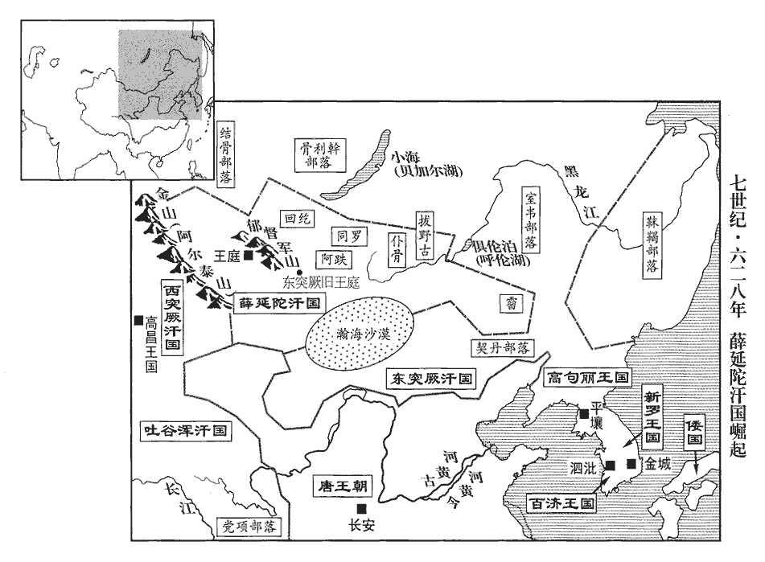
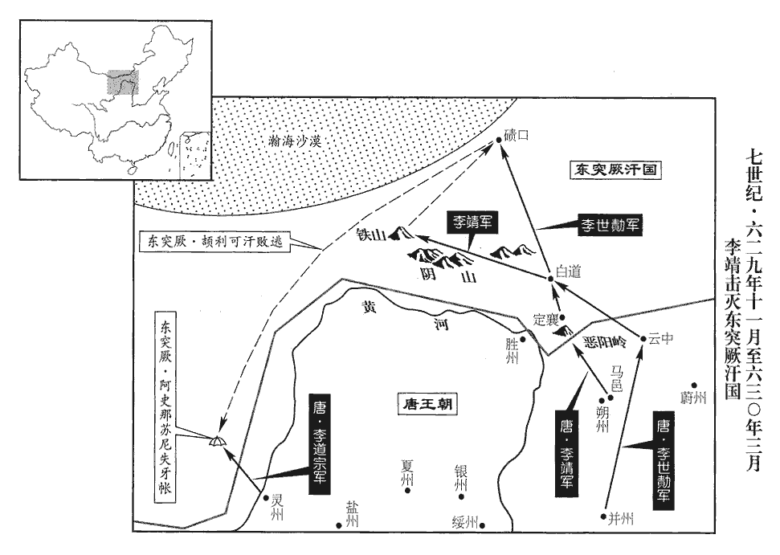
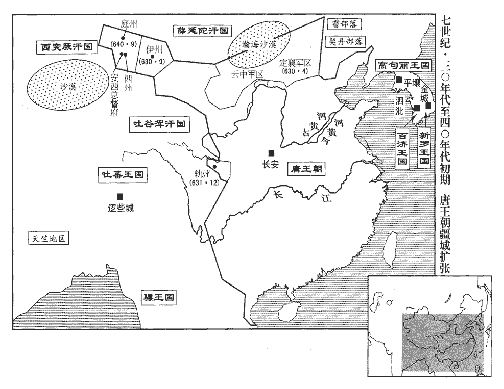
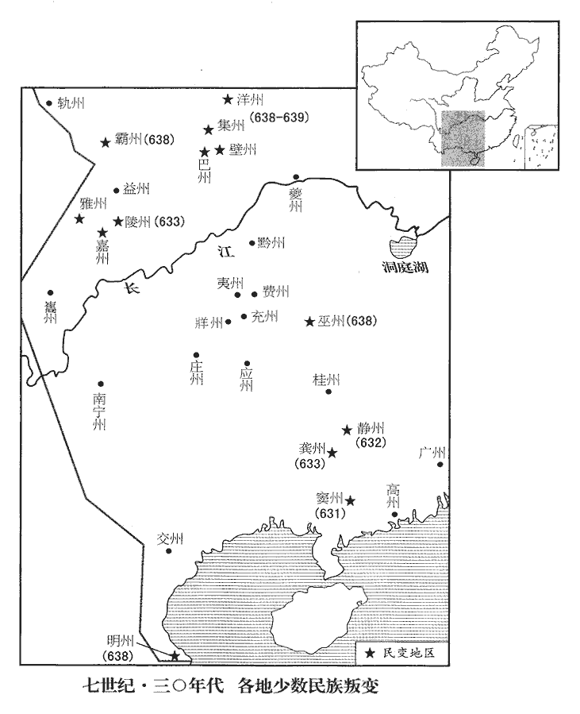

 唐紀九起著雍困敦（戊子）九月，盡重光單閼（辛卯），凡三年有奇。

# 太宗文武大聖大廣孝皇帝上之中

## 貞觀二年（戊子、六二八）

1九月，丙午‹三›，初令致仕官【章：十二行本「官」下有「位」字；乙十一行本同；孔本同；張校同。】在本品之上。按唐會要，是時詔內外文武官年老致仕者，參朝之班，宜在本品見任之上，觀，古玩翻。

〖译文〗 [1]九月，丙午（初三），初次下令年老退休的文武官员在上朝时列于本品现任官之上。

2上曰：「比見群臣屢上表賀祥瑞，比，毗至翻。上，時掌翻。夫家給人足而無瑞，不害為堯、舜；百姓愁怨而多瑞，不害為桀、紂。夫，音扶。後魏之世，吏焚連理木，煮白雉而食之，豈足為至治乎！」治，直吏翻。丁未‹四›，詔：「自今大瑞聽表聞，按儀制令，凡景星、慶雲為大瑞，其名物六十有四；白狼、赤兔為上瑞，其名物三十有八；蒼烏、朱鴈為中瑞，其名物三十有二；嘉禾、芝草、木連理為下瑞，其名物十四。自外諸瑞，申所司而已。」唐六典：禮部郎中，凡禮瑞應見，皆辯其物名。嘗有白鵲構巢於寢殿槐上，合歡如腰鼓，合，音閤。左右稱賀。上曰：「我常笑隋煬帝好祥瑞。好，呼到翻。瑞在得賢，此何足賀！」命毀其巢，縱鵲於野外。

〖译文〗 [2]太宗说：“近来看见大臣们多次上表章恭贺祥瑞之事，百姓家中富足而没有祥瑞，不影响成为尧、舜；百姓愁苦怨怼，而多有瑞气，不影响成为桀、纣。后魏的时候，官吏焚烧连理树，煮白雉鸡吃，难道连理树、白雉鸡能是盛世的表征吗？”丁未（初四），下诏说：“从今以后大的祥瑞听任上表奏闻，大瑞之外的诸种瑞兆，申报给有关部门即可。”曾有白鹊在皇宫寝殿中的槐树上构巢建窝，合欢交配如腰鼓状，左右的大臣齐声称贺。太宗说：“我常常笑话隋炀帝喜欢祥瑞，得到贤才就是祥瑞，这有什么值得庆贺的！”命令毁掉其巢穴，放白鹊到野外。

3天少雨，少，詩沼翻。中書舍人李百藥上言：上，時掌翻。「往年雖出宮人，竊聞太上皇宮及掖庭宮人，無用者尚多，豈惟虛費衣食，且陰氣鬱積，亦足致旱。」上曰：「婦人幽閉深宮，誠為可愍。灑掃之餘，亦何所用，灑，所賣翻；掃，素報翻；又並如字。宜皆出之，任求伉儷。」伉，苦浪翻。儷，郎計翻。於是遣尚書左丞戴冑、給事中洹水‹河北省魏县西南›杜正倫洹水縣，周建德六年分臨漳東北界置，屬魏州。洹huán，于元翻。於掖庭西門簡出之，掖，音亦。前後所出三千餘人。

〖译文〗 [3]天干旱少雨，中书舍人李百药上书说：“往年虽放出过宫女，我私下听说太上皇宫内与掖庭的宫女，深锁宫中的比较多，岂止是白白耗费衣物粮食，而且阴气郁积，也足以造成干旱。”太宗说：“妇人们常年锁在深宫里，实在值得同情，洒扫庭除之外，还有什么用呢？应当全部让她们出宫，听任她们另寻配偶。”于是让尚书左丞戴胄、给事中洹水人杜正伦在掖庭西门选择遣返宫女，前后共计三千余人。

4己未‹十六›，突厥‹瀚海沙漠群›寇邊。厥，九勿翻。朝臣或請脩古長城，古長城，秦蒙恬所築者也。自漢至隋，沿邊所築城障非一處，而長城之延袤未有如秦者也。朝，直遙翻。發民乘堡障，上曰：「突厥災異相仍，頡利不懼而脩德，暴虐滋甚，骨肉相攻，亡在朝夕。朕方為公掃清沙漠，為，于偽翻。安用勞民遠脩障塞乎！」

〖译文〗 [4]己未（十六日），突厥兵侵犯边境。大臣中有人请求修复古代的长城，征发百姓利用城堡以巩固边防，太宗说：“突厥天灾人祸不断，颉利可汗并不因此而积德行善，反而更加暴虐，骨肉相残，其亡日不远了。朕正要为您扫清沙漠上的敌人，何必辛劳百姓到远方去修筑城堡要塞呢！”

5壬申‹二十九›，以前司農卿竇靜為夏州‹总部设陕西省靖边县北白城子›都督。夏，戶雅翻。靜在司農，少卿趙元楷善聚斂，少，始照翻。斂，力贍翻；下重斂同。靜鄙之，對官屬大言曰：司農官屬，有丞、主簿，上林、太倉、鉤盾、導官四署令、丞，太倉、永豐、龍門等倉。司竹、慶善、石門、溫泉湯等監，京都諸宮苑總監，諸園、苑監，苑四面監，九成宮監，諸鹽池監，諸屯監，各有監副、監丞，苑總監又有主簿，諸鹽池、諸屯監無副監。「隋煬帝奢侈重斂，司農非公不可；今天子節儉愛民，公何所用哉！」元楷大慚。

〖译文〗 [5]壬申（二十九日），任命前司农卿窦静为夏州都督。窦静在司农寺时，司农少卿赵元楷，颇擅长搜括民财，窦静鄙视他，曾对属下的官员们大声地说道：“隋炀帝骄奢淫逸、贪渎民财，司农署非得有您不可。现在皇帝自身节俭爱护民众，你又有何用呢！”元楷听后十分的愧疚。

6上問王珪曰：「近世為國者益不及前古，何也？」對曰：「漢世尚儒術，宰相多用經術士，故風俗淳厚；近世重文輕儒，參以法律，此治化之所以益衰也。」治，直吏翻。上然之。

〖译文〗 [6]太宗问王：“近代以来国家政治越来越赶不上古代，为什么呢？”王回答道：“汉代崇尚儒术，宰相多用通经的儒士，所以风俗淳厚；近代以来重文艺而轻儒术，又辅以法律，这便是治世化民之道所以日益衰微的原因。”太宗颇以为然。

7冬，十月，御史大夫參預朝政安吉襄公杜淹薨。朝，直遙翻；下同。

〖译文〗 [7]冬季，十月，御史大夫、参预朝政、安吉襄公杜淹去世。

8交州‹总部设越南河内市›都督遂安公壽以貪得罪，遂安公壽，宗室也。上以瀛州‹河北省河间市›刺史盧祖尚才兼文武，廉平公直，徵入朝，諭以「交趾久不得人，須卿鎮撫。」祖尚拜謝而出，既而悔之，辭以舊疾。上遣杜如晦等諭旨曰：「匹夫猶敦然諾，敦然諾，猶重然諾也。言既許人，則必踐言。柰何既許朕而復悔之！」祖尚固辭。戊子‹十五›，上復引見，諭之，復，扶又翻。見，賢遍翻。祖尚固執不可。上大怒曰：「我使人不行，何以為政！」命斬於朝堂，閤本太極宮圖：東西朝堂在承天門左右，承天門，外朝也。東朝堂之前有肺石，西朝堂之前有登聞鼓。尋悔之。他日，與侍臣論「齊文宣帝‹高洋›何如人？」魏徵對曰：「文宣狂暴，然人與之爭，事理屈則從之。有前青州‹州政府设东阳山东省青州市›長史魏愷使於梁還，除光州‹州政府设东莱山东省莱州市›長史，不肯行，長，知兩翻。使，疏吏翻；下同。楊遵彥奏之。文宣怒，召而責之。愷曰：『臣先任大州，【章：十二行本「州」下有「長史」二字；乙十一行本同；孔本同；張校同。】使還，有勞無過，更得小州，此臣所以不行也。』文宣顧謂遵彥曰：『其言有理，卿赦之。』此其所長也。」楊愔，字遵彥，相齊文宣帝，大見親任。上曰：「然。曏者盧祖尚雖失人臣之義，朕殺之亦為太暴，由此言之，不如文宣矣！」命復其官蔭，復其官，則得蔭其子若孫。唐制，凡用蔭：一品，子正七品上；二品，子正七品下；三品，子從七品上；從三品，子從七品下；正四品，子正八品上；從四品，子正八品下；正五品，子從八品上；從五品及國公子，從八品下。三品以上，蔭曾孫；五品以上，蔭孫；孫降子一等，曾孫降孫一等，贈官降正官一等，死事者與正官同。郡、縣公子視從五品孫，縣男以上子降一等，勳官二品子又降一等，二王後孫視正三品。

〖译文〗 [8]交州都督、遂安公李寿因贪污犯罪。太宗认为瀛州刺史卢祖尚文武全才，廉洁奉公，便征召他入朝，命令道：“交趾郡很久没有得力人选，需要你前去镇抚。”卢祖尚拜谢出朝，不久又后悔，以旧病复发相辞。太宗让杜如晦对他传旨道：“一般的人尚能够重然诺守信用，你为什么已答允了朕而又后悔呢！”卢祖尚执意辞退。戊子（二十五日），太宗再次召见他，晓以道理，卢祖尚仍固执己见，拒不从命。太宗大怒道：“我不能对人发号施令，又如何治理国家呢？”下令将卢祖尚斩于朝堂之上，不久又后悔。过了几日，与大臣议论“齐文宣帝是怎么样一个人？”，答道：“齐文宣帝狷狂暴躁，然而人与他争论时，遇到理屈词穷时能够听从对方的意见。当时前青州长史魏恺出使梁朝还朝，拜为光州长史，不肯赴任，丞相杨遵彦奏与文宣帝。文宣帝大怒，召入宫中大加责备。魏恺说：‘我先前任大州的长史，出使归来，有功劳没有过失，反而改任小州的长史，所以我不愿意成行。’齐文宣帝回头对杨遵彦说：‘他讲得有道理，你就宽赦他吧。’这是齐文宣帝的长处。”太宗说：“有道理。先前卢祖尚虽然缺少做大臣的道义，朕杀了他也过于粗暴，如此说来，还不如齐文宣帝！”下令恢复卢祖尚子孙的门荫。

徵狀貌不逾中人，而有膽略，善回人主意，每犯顏苦諫；或逢上怒甚，徵神色不移，上亦為霽威。人主之威，重於雷霆。霽威，言猶雨霽則雷霆亦收威。為，于偽翻。嘗謁告上冢，上，時掌翻。還，言於上曰：「人言陛下欲幸南山‹终南山›，外皆嚴裝已畢，而竟不行，何也？」上笑曰：「初實有此心，畏卿嗔，故中輟耳。」嗔，昌真翻。上嘗得佳鷂，自臂之，望見徵來，匿懷中；徵奏事固久不己，鷂竟死懷中。

〖译文〗 魏徵相貌平平，但是很有胆略，善于挽回皇帝的主意，常常犯颜直谏。有时碰上太宗非常恼怒的时候，他面不改色，太宗的神威也为之收敛。他曾经告假去祭扫祖墓，回来后，对太宗说：“人们都说陛下要临幸南山，外面都已严阵以待、整装完毕，而您最后又没去，不知为什么？”太宗笑着说：“起初确实有这个打算，害怕你又来嗔怪，所以中途停止了。”太宗曾得到一只好鹞鹰，将它置于臂膀上，远远望见魏徵走过来，便藏在怀里；魏徵站在那里上奏朝政大事，很久不停下来，鹞鹰最后竟死在太宗的怀里。

9十一月，辛酉‹十九›，上祀圜丘。武德元年，制每歲冬至，祀昊天上帝於圜丘，以景皇帝配。

〖译文〗 [9]十一月，辛酉（十九日），太宗在圜丘祭祀。

10十二月，壬午‹十›，以黃門侍郎王珪為守侍中。上嘗閒居，閒，讀曰閑。與珪語，有美人侍側，上指示珪曰：「此廬江王瑗之姬也，廬江王瑗反死，見一百九十一卷武德九年。瑗，于眷翻。瑗殺其夫而納之。」珪避席曰：「陛下以廬江納之為是邪，非邪？」邪，音耶。上曰：「殺人而取其妻，卿何問是非！」對曰：「昔齊桓公知郭公之所以亡，由善善而不能用，然棄其所言之人，管仲以為無異於郭公。齊桓公過郭氏之墟‹山东省聊城市东北郭城›，問父老曰：「郭何故亡？」對曰：「善善惡惡。」公曰：「若子之言，何至於亡？」對曰：「善善而不能用，惡惡而不能去，此其所以亡也。」今此美人尚在左右，臣以為聖心是之也。」上悦，即出之，還其親族。考異曰：實錄、新舊書皆云「帝雖不出此美人而甚重其言」。按太宗賢主，既重珪言，何得反棄而不用乎！且是人汎侍左右，又非嬖寵著名之人，太宗何愛而留之！今從貞觀政要。

〖译文〗 [10]十二月，壬午（初十），任命黄门侍郎王为守侍中。太宗曾闲居无事，与王交谈，有一个美女子在旁侍侯，太宗指给王说：“这是庐江王李瑗的妾，李瑗杀了她的丈夫而收纳她。”王离开座位说道：“陛下认为庐江王纳她为妾是对还是不对？”太宗说：“杀了人而娶他妻子为妾，你怎么还要问对错呢？”王答道：“从前齐桓公知道郭公灭亡的原因，在于喜好良言而不能采用，而桓公本人弃置进良言的人，管仲认为这与郭公没什么两样。现在这个美女子还在您身边，我认为陛下是认为庐江王做得对。”太宗听了非常高兴，即刻将此女子放出宫去，让她回到自己父母身边。

上使太常少卿祖孝孫教宮人音樂，不稱旨，少，始照翻。稱，尺證翻。上責之。溫彥博、王珪諫曰：「孝孫雅士，今乃使之教宮人，又從而譴之，臣竊以為不可。」上怒曰：「朕置卿等於腹心，當竭忠直以事我，乃附下罔上，為孝孫遊說邪！」為，于偽翻。說，輸芮翻。彥博拜謝。珪不拜，曰：「陛下責臣以忠直，今臣所言豈私曲邪！邪，音耶。此乃陛下負臣，非臣負陛下！」上默然而罷。明日，上謂房玄齡曰：「自古帝王納諫誠難，朕昨責溫彥博、王珪，至今悔之。考異曰：魏文貞公故事：「太宗曰：『人皆以祖孝孫為知音，令教聲曲，多不諧韻，此其未至精妙，為不存意乎？』乃敕所司令舉其罪。公進諫曰：『陛下生平不愛音聲，今忽為教女樂責孝孫，臣恐天下怪愕。』太宗曰：『汝等並是我心腹，應須中正，何乃附下罔上為孝孫辭！』溫彥博等拜謝。公及王珪進曰：『陛下不以臣等不肖，置之樞近，今臣所言，豈是為私。不意陛下責臣至此！常奉明旨，「勿以臨時嗔怒，即便曲從，成我大過，」臣等不敢失墜，所以每觸龍鱗。今以為責，只是陛下負臣，臣終不負陛下。』太宗怒未已，懍然作色。公又曰：『祖孝孫學問立身，何如白明達？陛下平生禮遇孝孫，復何如白明達？今過聽一言，便謂孝孫可疑，明達可信，臣恐群臣眾庶有以窺陛下。』太宗怒乃解。」今從舊傳。公等勿為此不盡言也。」為，于偽翻；下為朕同。

〖译文〗 太宗让太常寺少卿祖孝孙教授宫女们音乐，不称太宗的心意，太宗责怪他。温彦博、王劝谏道：“孝孙乃高雅之士，却让他去教宫女们，进而又谴责他，我们觉得不该如此。”太宗大怒道：“朕将你们视为心腹，应当竭尽忠心正直来为我服务，现在却附合下面欺罔君上，难道是为孝孙说情吗？”温彦博行礼谢罪。王不行礼，说：“陛下责令我尽忠效诚，现在我所说的话难道有私情吗！这便是陛下有负于我，并不是我有负于陛下！”太宗沉默良久才作罢。次日，太宗对房玄龄说：“自古以来帝王虚心纳谏的确很难，朕昨天责备温彦博和王，到现在还在后悔。你们不要因此事而不能畅所欲言。”

11上曰：「為朕養民者，唯在都督、刺史，朕常疏其名於屏風，坐臥觀之，得其在官善惡之跡，皆注於名下，以備黜陟。縣令尤為親民，不可不擇。」乃命內外五品已上，各舉堪為縣令者，以名聞。

〖译文〗 [11]太宗说：“为朕养护百姓的，唯有都督、刺史，朕常常将他们的名字书写在屏风上，坐卧都留心观看，得知在任内的善恶事迹，均注于他们的名下，以备升迁和降职时参考。县令尤其与百姓亲近，不可不慎加选择。”于是下令朝廷内外五品以上官员，各荐举能胜任县令职位的人，呈报他们的姓名。

12上曰：「比有奴告其主反者，比，毗至翻。此弊事。夫謀反不能獨為，必與人共之，何患不發，何必使奴告邪！邪，音耶。自今有奴告主者，皆勿受，仍斬之。」

〖译文〗 [12]太宗说：“近有奴婢告其主子谋反的，这是个弊端。谋反不是一个人干的事，必然有其同伙，还担心事情不会暴露吗？何必让其奴婢告发呢？从今以后有奴婢告其主子的，均不受理，仍行处斩。”

13西突厥‹新疆东北部及中亚东部›統葉護可汗為其伯父所殺；伯父自立，是為莫賀咄侯屈利俟毗可汗。厥，九勿翻。可，從刊入聲。汗，音寒。咄，當沒翻。俟，渠之翻。國人不服，弩矢畢部推泥孰莫賀設為可汗，西突厥有五弩矢畢部，泥孰亦一啜之部帥。泥孰不可。統葉護之子咥力特勒咥，徒結翻，又丑栗翻。避莫賀咄之禍，亡在康居‹康国·乌兹别克斯坦撒马尔罕›，泥孰迎而立之，是為乙毗鉢羅肆葉護可汗，與莫賀咄相攻，連兵不息，俱遣使來請婚。使，疏吏翻。上不許，曰：「汝國方亂，君臣未定，何得言婚！」且諭以各守部分，勿復相攻。分，扶問翻。復，扶又翻。於是西域諸國及敕勒‹新疆北部及蒙古国北部›先役屬西突厥者皆叛之。史言天方福華，東西突厥皆亂。厥，九勿翻。

〖译文〗 [13]西突厥统叶护可汗被其伯父杀死，其伯父自立为首领，是为莫贺咄侯屈利俟毗可汗。国人不服，弩矢毕部推举泥孰莫贺设为可汗，泥孰不应允。统叶护的儿子力特勒，为躲避莫贺咄的祸乱，逃到了康居，泥孰迎回他立为首领，这便是乙毗钵罗肆叶护可汗，与莫贺咄相攻伐，争斗不息，都派使臣请求与唐朝通婚。太宗不应允，说：“你们的国家刚发生内部争斗，君臣尚未确定，怎么能谈得上求婚呢？”而且传谕各部保持稳定，不要再相攻伐。于是先前依附西突厥的敕勒和西域各国均叛离。

 

14突厥北邊諸姓多叛頡利可汗歸薛延陀，共推其俟斤夷男為可汗，頡，奚結翻。俟，渠之翻。夷男不敢當。上方圖頡利，遣遊擊將軍喬師望間道齎冊書拜夷男為真珠毗伽可汗，間，古莧翻。伽，求迦翻。賜以鼓纛。纛，徒到翻。夷男大喜，遣使入貢，使，疏吏翻。建牙於大漠之鬱督軍山‹蒙古国杭爱山›下，東至靺鞨‹黑龙江下游›，西至西突厥，南接沙磧，靺，音末。鞨，音曷。磧，七迹翻。北至俱倫水‹内蒙古呼伦湖›；迴紇、拔野古‹内蒙古呼伦湖西›、阿跌‹蒙古国乌兰巴托市西北›、同羅‹蒙古国北部›、僕骨‹蒙古国东部›、霫‹辽河以北›諸部皆屬焉。史言突厥衰而薛延陀強於漠北。霫，而立翻。

〖译文〗 [14]突厥北面的各部族大多叛离颉利可汗归附薛延陀，共同推举薛延陀的俟斤夷男为可汗，夷男不敢担当此任。太宗正欲图谋突厥颉利可汗，便派游击将军乔师望择小道带着册书封夷男为真珠毗伽可汗，并赐给鼓和大旗。夷男十分高兴，派使臣进献贡品，建牙帐于大漠中郁督军山下，东至，西到西突厥，南接沙漠，北临俱伦水；回纥、拔野古、阿跌、同罗、仆骨、各部均为其附属。

## 三年（己丑、六二九）

1春，正月，戊午‹十六›，上‹李世民，本年三十二岁›祀太廟；癸亥‹二十一›，耕藉於東郊。初議藉田方面所在，給事中孔穎達曰：「禮，天子藉田於南郊，諸侯於東郊。晉武帝猶於東南。今於城東，不合古禮。」帝曰：「禮緣人情，亦何常之有。且虞書云：『平秩東作。』則是堯、舜敬授人時，已在東矣。又乘青輅、載黛耜sì者，所以順於春氣，故知合於東方。且朕見居少陽之地，田於東郊，蓋其宜也。」於是遂定。按帝自謂居少陽之地，蓋以即位以來居東宮也。藉，秦昔翻。

〖译文〗 [1]春季，正月，戊午（十六日），太宗祭祀于太庙；癸亥（二十一日），在东郊行耕田礼。

2沙門法雅坐妖言誅。妖，一遙翻。司空裴寂嘗聞其言，辛未‹二十九›，寂坐免官，遣還鄉里。寂請留京師‹长安›，上數之曰：數，所具翻，又所主翻。「計公勳庸，安得至此！直以恩澤為群臣第一。武德之際，貨賂公行，紀綱紊亂，皆公之由也，上皇聞帝此言，其心為如何？紊，音問。但以故舊不忍盡法。得歸守墳墓，幸已多矣！」寂遂歸蒲州‹山西省永济市›。裴寂本蒲州桑泉人。未幾，又坐狂人信行言寂有天命，寂不以聞，當死；流靜州‹广西昭平县›。武德四年，以始安郡之龍平、豪靜，蒼梧郡之蒼梧置靜州靜平郡。幾，居豈翻。會山羌作亂，以為山羌，則當是劍南之靜州。然劍南之靜州，武后時方置。若以為嶺南之靜州，則「羌」當作「蠻」。或言劫寂為主。上曰：「寂當死，我生之，必不然也。」俄聞寂率家僮破賊。上思其佐命之功，徵入朝，會卒‹年六十岁›。帥，讀曰率。朝，直遙翻；下同。卒，子恤翻。

〖译文〗 [2]和尚法雅以妖言惑众被处死。司空裴寂曾听过他的言论，辛未（二十九日），裴寂也因此事被免职，勒令遣送回老家。裴寂请求留在长安，太宗数落他说：“你的功劳平庸，怎么能达到今天这个地步，还不是因高祖皇帝恩泽才使你列居群臣第一。武德年间，贪污受贿风气盛行，朝廷政纲混乱，均与你有关，只是因为你是开国老臣，所以不忍心完全依法令处置。能够回家守着坟墓，已经是够幸运的人。”裴寂于是回到老家蒲州。不久，有一个狂人信行称裴寂面有天相。裴寂并没上报朝廷，依法令当处死；太宗将其流放到静州。正赶上当地的山羌族叛乱，有人说叛军劫持裴寂为其首领。太宗说：“裴寂依罪当处死，我留给他生路，他肯定不会走这条路。”不久听说裴寂率领僮仆家丁打败叛军。太宗考虑他有佐命之功，征召他入进朝，裴寂恰好死去。

3二月，戊寅‹六›，以房玄齡為左僕射，杜如晦為右僕射，以尚書右丞魏徵守祕書監，參預朝政。

〖译文〗 [3]二月，戊寅（初六），任命房玄龄为尚书左仆射，杜如晦为右仆射，尚书右丞魏徵为秘书监，参预朝政。

4三月，己酉‹八›，上錄繫囚。有劉恭者，頸有「勝」文，自云「當勝天下」，坐是繫獄。上曰：「若天將興之，非朕所能除；若無天命，『勝』文何為！」乃釋之。

〖译文〗 [4]三月，己酉（初八），太宗考察、记录囚犯的罪过。有个囚犯刘恭，脖颈上刻有“胜”字，自称“定当取胜于天下”，因此入狱。太宗说：“假如上天将要使他兴起，不是朕所能除掉的；如没有天命照应，刻有‘胜’文又有何用！”于是释放刘恭。

5丁巳‹十六›，上謂房玄齡、杜如晦曰：「公為僕射，當廣求賢人，隨才授任，此宰相之職也。唐六典：左、右僕射，左、右丞相之職也，掌總領六官，紀綱百揆。比聞聽受辭訟，比，毗至翻；下比見、比來同。日不暇給，安能助朕求賢乎！」因敕「尚書細務屬左右丞，屬，之欲翻，付也。唯大事應奏者，乃關僕射。」

〖译文〗 [5]丁巳（十六日），太宗对房玄龄、杜如晦说：“你们身为仆射，应当广求天下贤才，因才授官，这是宰相的职责。近来听说你们受理辞讼案情，日不暇接，怎么能帮助朕求得贤才呢？”因此下令“尚书省琐细事务归尚书左右丞掌管，只有应当奏明的大事，才由左右仆射处理。”

玄齡明達政事，輔以文學，夙夜盡心，惟恐一物失所；用法寬平，聞人有善，若己有之，不以求備取人，不以己長格物。與杜如晦引拔士類，常如不及。至於臺閣規模，皆二人所定。上每與玄齡謀事，必曰：「非如晦不能決。」及如晦至，卒用玄齡之策。蓋玄齡善謀，如晦能斷故也。卒，子恤翻。斷，丁亂翻。二人深相得，同心徇國，故唐世稱賢相，推房、杜焉。玄齡雖蒙寵待，或以事被譴，輒累日詣朝堂，稽顙請罪，恐懼若無所容。史言房玄齡忠謹。被，皮義翻。朝，直遙翻。稽，音啟。

〖译文〗 房玄龄通晓政务，又有文才，昼夜操劳，惟恐偶有差池；运用法令宽和平正，听到别人的长处，便如同自己所有，待人不求全责备，不以己之所长要求别人，与杜如晦提拔后进，不遗余力。至于尚书省的制度程式，均系二人所定。太宗每次与房玄龄谋划政事，一定要说：“非杜如晦不能敲定。”等到杜如晦来，最后还是采用房玄龄的建议。这是因为房玄龄善于谋略，杜如晦长于决断。二人深相投合，同心为国出力。所以唐朝称为贤相者，首推房、杜二人。房玄龄虽然多蒙太宗宠爱，有时因某事受谴责，总是一连数日到朝堂内，磕头请罪，恐惧得好象无地自容。

玄齡監修國史，上語之曰：唐以宰相監修國史，至今因之。監，工銜翻。語，牛倨翻。「比見漢書載子虛、上林賦，浮華無用。其上書論事，詞理切直者，朕從與不從，皆當載之。」太宗之存心如此，安有有獻而不納者乎！上，時掌翻。

〖译文〗 房玄龄监修本朝国史，太宗对他说：“近来翻看《汉书》载有《子虚赋》、《上林赋》，均华而不实。凡有上书议论国事，词理直切的，朕从与不从，均当载入国史。”

6夏，四月，乙亥‹四›，上皇‹李渊›徙居弘義宮，更名大安宮。唐會要：武德五年，營弘義宮，以帝有尅定天下之功，別建此宮以居之。既禪位，高祖以弘義宮有山林勝景，雅好之，遂徙居焉，改名大安宮。馬周所謂「大安宮在城之西」者也。更，工衡翻。上【章：十二行本「上」上有「甲午」二字；乙十一行本同；張校同，云無註本亦無。】始御太極殿，高祖之傳位也，帝即位於東宮之顯德殿，高祖徙居大安宮，帝始御太極殿。謂群臣曰：「中書、門下、機要之司，詔敕有不便者，皆應論執。比來唯睹順從，不聞違異。若但行文書，則誰不可為，何必擇才也！」房玄齡等皆頓首謝。

〖译文〗 [6]夏季，四月，乙亥（初四），太上皇李渊迁居弘义宫。改弘义宫为大安宫。太宗开始到太极殿听政，对群臣说：“中书、门下省，都是机要的部门，诏敕文书有不当之处，均应议论提出意见。近来唯见顺从旨意，听不见相反意见。如果只是过往文书，那么谁不能干呢，何必又要慎择人才呢？”房玄龄等人均磕头谢罪。

故事：凡軍國大事，則中書舍人各執所見，雜署其名，謂之五花判事。中書侍郎、中書令省審之，給事中、黃門侍郎駮正之。上始申明舊制，由是鮮有敗事。省，悉景翻。駮bó，北角翻。鮮，息善翻。

〖译文〗 按以前的惯例，诏书凡涉及军国大事，则让中书舍人执所见，大家分别署名，称之为五花判事。中书侍郎、中书令加以审核，给事中、黄门侍郎予以驳正。太宗开始申明旧的规制，于是很少有错误。

7茌平‹山东省茌平县›人馬周，茌平縣，漢屬東郡。應劭曰：在茌山之平地者也。後魏屬東平原郡，後齊廢，隋開皇初復置，屬貝州，唐屬博州。賢曰：漢茌平故城在博州之聊城縣東北。茌，仕疑翻。客遊長安，舍於中郎將常何之家。唐諸衛中郎將，正四品下。將，即亮翻。六月，壬午‹十二›，以旱，詔文武官極言得失。何武人不學，不知所言，周代之陳便宜二十餘條。考異曰：舊傳云貞觀五年。據實錄，詔在此年，五年不見有詔令百官上封事。今從唐曆附此。上怪其能，以問何，對曰：「此非臣所能，家客馬周為臣具草耳。」為，于偽翻。上即召之；未至，遣使督促者數輩。及謁見，與語，甚悅，令直門下省，尋除監察御史，奉使稱旨。鄭樵曰：秦以御史監郡，謂之監御史，漢罷其名。晉孝武太元中，始置檢校御史，掌行馬外事；隋改檢校御史為監察御史。使，疏吏翻。見，賢遍翻。監，工銜翻。使，疏吏翻；下同。稱，尺證翻。上以常何為知人，賜絹三百匹。

〖译文〗 [7]茌平人马周，游历来到长安，住在中郎将常何家里。六月，壬午（十二日），天下大旱，诏令文武百官畅言得失。常何乃一介武夫，不学无术，不知道说什么，马周便代他上呈建议二十多条。太宗惊奇常何的能力。便问常何，常何答道：“这不是我能写的，而是我的客人马周代我起草的。”太宗立刻召见马周，没有来，又派人催促了几次。马周到宫中谒见太宗，太宗与他谈论，十分高兴，令其暂在门下省做事，不久又任命为监察御史，奉使出巡很合旨意。太宗认为常何知人善任，赐给绢帛三百匹。

8秋，八月，己巳朔‹一›，日有食之。

〖译文〗 [8]秋季，八月，己巳朔（初一），出现日食。

9丙子‹八›，薛延陀‹蒙古国西南部›毗伽可汗伽，求迦翻。可，從刊入聲。汗，音寒。遣其弟統特勒入貢，上賜以寶刀及寶鞭，謂曰：「卿所部有大罪者斬之，小罪者鞭之。」夷男甚喜。突厥頡利可汗大懼，始遣使稱臣，請尚公主，脩壻禮。

〖译文〗 [9]丙子，（初八），薜延陀毗伽可汗派其弟弟统特勒进献贡品，太宗赐给宝刀与宝鞭，对他说：“你统属的部族犯下大罪的用刀斩决，小罪的用鞭抽打。”夷男非常高兴。突厥颉利可汗大为惊慌，开始派使者称臣，请求迎娶公主，修女婿礼节。

代州‹总部设山西省代县›都督張公謹上言突厥可取之狀，以為「頡利縱欲逞暴，誅忠良，暱姦佞，一也。頡，奚結翻。上，時掌翻。暱，尼質翻。薛延陀等諸部皆叛，二也。薛延陀諸部叛突厥，事始上卷二年。突利、拓設、欲谷設皆得罪，無所自容，三也。突利得罪，見上卷二年。拓設，即阿史那社爾，與欲谷設分統敕勒諸部。欲谷設，即為回紇所破者也。按舊書李大亮傳：頡利既亡之後，拓設諸種散在伊吾。塞北霜旱，糇糧乏絕，四也。糇，音侯。頡利疏其族類，親委諸胡、胡人反覆，大軍一臨，必生內變，五也。華人入北，其眾甚多，華人因隋末之亂，避而入北。比聞所在嘯聚，保據山險，大軍出塞，自然響應，六也。」比，毗至翻。上以頡利可汗既請和親，復援梁師都，事見上卷上年。復，扶又翻。丁亥‹十九›，命兵部尚書李靖為行軍總管討之，以張公謹為副。

〖译文〗 代州都督张公谨上奏称可取突厥而代之，原因有六：“颉利可汗奢华残暴，诛杀忠良，亲近奸佞之人，是其一；薛延陀等各部落均已叛离，是其二；突利、拓设、欲谷设均得罪颉利，无地自容，是其三；塞北地区经历霜冻干旱，粮食匿乏，是其四；颉利疏离其族人，委重任于胡人，胡人反复无常，大唐帝国军队一到，必然内部纷乱，是其五；汉人早年到北方避乱，至此时人数较多，近来听说他们聚众武装，占据险要之地，大军出塞，自然内部响应，是其六。”太宗认为颉利可汗既然想与唐朝和亲，又出兵援助大唐的敌人梁师都，丁亥（十九日），任命兵部尚书李靖为行军总管，张公谨为副总管，率兵讨伐突厥。

九月，丙午‹九›，突厥俟斤九人帥三千騎來降。戊午‹二十一›，拔野古‹内蒙古呼伦湖西›、僕骨‹蒙古国东部›、同羅‹蒙古国乌兰巴托市北›、奚‹滦河上游›酋長並帥眾來降。厥，九勿翻。俟，渠之翻。帥，讀曰率。騎，奇寄翻。降，戶江翻。酋，慈由翻。長，知兩翻。

〖译文〗 九月，丙午（初九），突厥九位俟斤率三千骑兵投降唐朝。戊午（二十一日），拔野古、仆骨、同罗、奚族首领率众投降唐朝。

10冬，十一月，辛丑‹四›，突厥寇河西‹甘肃省中部西部›，肅州‹甘肃省酒泉市›刺史公孫武達、武德二年分甘州之福祿、瓜州之玉門，置肅州酒泉郡。甘州‹甘肃省张掖市›刺史成仁重與戰，破之，甘、肅二州相去四百二十里。捕虜千餘口。

〖译文〗 [10]冬季，十一月，辛丑（初四），突厥兵侵犯河西地区，肃州刺史公孙武达、甘州刺史成仁重，与之发生激战，大败突厥兵，俘虏一千多人。

11上遣使至涼州‹甘肃省武威市›，都督李大亮有佳鷹，使者諷大亮使獻之，大亮密表曰：「陛下久絕畋遊而使者求鷹。使，疏吏翻；下同。若陛下之意，深乖昔旨；昔旨，謂絕畋遊之旨。如其自擅，乃是使非其人。」癸卯‹六›，上謂侍臣曰：「李大亮可謂忠直。」手詔褒美，賜以胡缾及荀悅漢紀。按舊書李大亮傳：帝詔曰：「今賜卿胡缾一枚，雖無千鎰之重，乃朕自用之物。荀悅漢紀，叙致既明，論議深博，極為治之體，盡君臣之義，今以賜卿，宜加尋閱。」

〖译文〗 [11]太宗派使节到凉州，都督李大亮有一只很好的鹰，使者暗示大亮将鹰进呈给皇上，大亮给太宗上密表说：“陛下一直拒绝畋猎，而使节却为您要鹰。假如这是陛下的意思，则深与过去的主张相背离，如果是使节自作主张，便是用人不当”。癸卯（初六），太宗对大臣说：“李大亮称得上忠诚正直”。亲书诏令加以褒奖，赐给自用的胡瓶一只及荀悦《汉纪》一部。

12庚申‹二十三›，以行并州‹总部设山西省太原市›都督李世勣為通漢道行軍總管，舊書李勣傳作「通漠道」，當從之。後高宗朝裴行儉遣兵由通漠道掩取阿史那伏念輜重。兵部尚書李靖為定襄道行軍總管，華州‹陕西省华县›刺史柴紹為金河道行軍總管，華，戶化翻。靈州‹总部设宁夏灵武市›大都督薛萬徹為暢武道行軍總管，暢武，非地名也。營州邊於東胡，故命萬徹為總管，使之宣暢威武，以美名寵之耳。新書帝紀作營州都督薛萬淑。眾合十餘萬，皆受李勣【章：十二行本「勣」作「靖」；乙十一行本同。】節度，分道出擊突厥。

〖译文〗 [12]庚申（二十三日），任命兼任并州都督的李世为通汉道行军总管，兵部尚书李靖为定襄道行军总管，华州刺史柴绍为金河道行军总管，灵州大都督薛万彻为畅武道行军总管，合兵力十余万，均受李节度，分兵进攻突厥。

乙丑‹二十八›，任城王道宗擊突厥於靈州‹宁夏灵武市›，破之。任，音壬。

〖译文〗 乙丑（二十八日），任城王李道宗在灵州击败突厥兵。

十二月，戊辰‹二›，突利可汗入朝，朝，直遙翻。上謂侍臣曰：「往者太上皇‹李渊›以百姓之故，稱臣於突厥，事見一百八十四卷隋恭帝義寧元年六月。一本此下有考異。朕常痛心。今單于稽顙，庶幾可雪前恥。」稽，音啟。幾，居希翻。

〖译文〗 十二月，戊辰（初二），突利可汗到唐朝请罪，太宗对大臣们说：“以前太上皇为了百姓的利益，忍辱向突厥称臣，朕常为此事感到痛心。现在突厥首领向我磕头，这多少可以雪洗以前的耻辱。”

壬午‹十六›，靺鞨‹黑龙江下游›遣使入貢，靺，音末。鞨，音曷。使，疏吏翻。上曰：「靺鞨遠來，蓋突厥已服之故也。昔人謂禦戎無上策，嚴尤諫王莽曰：「匈奴為害，所從來久，周、秦、漢征之，皆未有得上策者也；周得中策，漢得下策，秦無策焉。」朕今治安中國，而四夷自服，豈非上策乎！」

〖译文〗 壬午（十六日），派使节到长安进献贡物，太宗说：“远道而来，是因为突厥已归服的缘故。从前东汉人称抗御北方戎族没有上策，朕现在使中原安定，四方夷族归服，难道不是上策吗？”

13癸未‹十七›，右僕射杜如晦以疾遜位，上許之。

〖译文〗 [13]癸未（十七日），尚书右仆射杜如晦，因病请求离职，太宗答应了他的请求。

14乙酉‹十九›，上問給事中孔穎達曰：「論語：『以能問於不能，以多問於寡，有若無，實若虛。』曾子之言。何謂也？」穎達具釋其義以對；且曰：「非獨匹夫如是，帝王亦然。帝王內蘊神明，外當玄默，故易稱『以蒙養正，以明夷蒞眾。』易曰：蒙以養正，聖功也。明夷，君子以蒞眾，用晦而明。若位居尊極，炫耀聰明，炫，熒絹翻。以才陵人，飾非拒諫，則下情不通，取亡之道也。」上深善其言。

〖译文〗 [14]乙酉（十九日），太宗问给事中孔颖达：“《论语》说：‘有能力的人向无能力的人请教，知识丰富的人向知识匮乏的人请教；有学问像没学问一样，满腹知识象空无所有一样。’如何解释？”孔颖达完满地解释其本义，且说：“非独一般人如此，帝王也当如此。帝王内心蕴含如神之明，但外表却当沉静无为，所以《易经》说‘以久表蒙昧来修养贞正之德，用藏智于内的办法来治理民众。’假如身居至高无上的地位，炫耀自己的聪明，依恃才气盛气凌人，掩饰错误，拒绝纳阑，那么就造成下情无法上达，这是自取灭亡之道。”太宗十分赞许他的话。

15庚寅‹二十四›，突厥郁射設帥所部來降。厥，九勿翻。降，戶江翻。

〖译文〗 [15]庚寅（二十四日），突厥郁射设率领所部投降唐朝。

16閏月，丁未‹十一›，東謝酋長謝元深、南謝酋長謝強來朝。諸謝皆南蠻別種，在黔州‹重庆市彭水苗族土家族自治县›之西。東謝蠻在西爨之南，居黔州之西三百里；南謝蠻在隋牂柯郡地南百里，有桂嶺關。酋，慈由翻。長，知兩翻。朝，直遙翻；下同。種，章勇翻。黔，音琴。詔以東謝為應州‹贵州省三都县›、南謝為莊州‹贵州省贵阳市南›，隸黔州‹总部设重庆市彭水苗族土家族自治县›都督。宋白曰：黔州，黔中郡，秦置，漢通謂五溪之地，又為武陵郡之酉陽縣地，武帝於此置涪陵縣，蜀先主立黔安郡，後周建德三年置黔州，貞觀四年，移州治於涪陵江東彭水之東。

〖译文〗 [16]闰十二月，丁未（十一日），东谢部落首领谢元深、南谢首领谢强前来归附唐朝。诸谢部族均是南蛮一支，聚居在黔州西部地区。唐朝廷下令改东谢所在地为应州，南谢所在地为庄州，均隶属于黔州都督。

是時遠方諸國來朝貢者甚眾，服裝詭異，中書侍郎顏師古請圖寫以示後，作王會圖，從之。考異曰：實錄、新舊傳皆云「正會圖」。按汲冢周書有王會篇，柳宗元鐃鼓歌、呂述黠戛斯朝貢圖皆作「王會」，今從之。

〖译文〗 当时远方周边各国均向唐朝进献贡品，到长安的人较多，服装怪异，中书侍郎颜师古请求绘制《王会图》，绘下每个民族及其服饰以传示给后人，太宗应允。

乙丑‹二十九›，牂柯‹贵州省瓮安县›酋長謝能羽【嚴：「能」改「龍」。】及充州‹贵州省石阡县›蠻入貢，牂，音臧。柯，音哥。詔以牂柯為牂州‹贵州省瓮安县›；昆明東九百里，即牂柯蠻國，其王號鬼主，其別帥曰羅殿王，東距辰州二千四百里；其南一千五百里，即交州也。牂州之北一百五十里，有別部曰充州蠻。牂、柯，音臧、哥。党項‹四川省西北部›酋長細封步賴來降，以其地為軌州‹四川省阿坝县›；各以其酋長為刺史。党項地亘三千里，姓別為部，不相統壹，細封氏、費聽氏、往利氏、頗超氏、野辭氏、旁【章：十二行本「旁」作「房」；乙十一行本同；張校同；退齋校同。】當氏、米擒氏、拓跋氏，皆大姓也。步賴既為唐所禮，餘部相繼來降，以其地為崌、奉、巖、遠四州‹均在四川省松潘县西万山丛中›。党項，漢西羌別種，魏、晉後微甚，周滅宕昌、鄧至而党項始強。其地古析支也，東距松州，西葉護，南春桑、迷桑等羌，北吐谷渾。山谷崎嶇，大抵三千里。拓跋氏之後，為西夏李繼遷。党，底朗翻。酋，慈由翻。長，知兩翻。降，戶江翻。

〖译文〗 乙丑（二十九日），柯首领谢能羽以及充州蛮进献贡品，诏令在柯设置州；党项族首领细封步赖归顺唐朝，以其聚居地为轨州；又任命其首领为刺史。党项据地三千里，每姓别为一部，互不统属，细封氏、费听氏、往利氏、颇超氏、野辞氏、旁当氏、米擒氏，拓跋氏、均是其大姓。步赖既已受唐朝礼遇，其余各部相继来降，唐朝廷以其聚居地为、奉、岩、远四州。

17是歲，戶部奏：中國人自塞外歸及四夷前後降附者，男女一百二十餘萬口。

〖译文〗 [17]这一年，户部上奏称：大唐人从塞外归来以及四方夷族前后归顺唐朝的计有男女一百二十余万人。

18房玄齡、王珪掌內外官考，唐考法：凡百司之長，歲校其屬功過，差以九等。流內之官，敘以四善：一曰德義有聞，二曰清慎明著，三曰公平可稱，四曰恪勤匪懈。善狀之外，有二十七最：一曰獻可替否，拾遺補闕，為近侍之最；二曰銓衡人物，擢盡才良，為選司之最；三曰揚清激濁，褒貶必當，為考校之最；四曰禮制儀式，動合經典，為禮官之最；五曰音律克諧，不失節奏，為樂官之最；六曰決斷不滯，與奪合理，為判事之最；七曰部統有方，警守無失，為宿衛之最；八曰兵士調習，戎裝充備，為督領之最；九曰推鞫jū得情，處斷平允，為法官之最；十曰讎校精審，明於刊定，為校正之最；十一曰承旨敷奏，吐納明敏，為宣納之最；十二曰訓導有方，生徒充業，為學官之最；十三曰賞罰嚴明，攻戰必勝，為軍將之最；十四曰禮義興行，肅清所部，為政教之最；十五曰詳錄典正，詞理兼舉，為文史之最；十六曰訪察精審，彈舉必當，為糾正之最；十七曰明於勘覆，稽失無隱，為司檢之最；十八曰職事修理，供承強濟，為監察之最；十九曰功課皆充，丁匠無怨，為役使之最；二十曰耕耨nòu以時，收穫成課，為屯官之最；二十一曰謹於蓋藏，明於出納，為倉庫之最；二十二曰推步盈虛，究理精密，為曆官之最；二十三曰占候醫卜，效驗多著，為方術之最；二十四曰檢察有方，行旅無壅，為關津之最；二十五曰市廛chán弗擾，姦濫不行，為市司之最；二十六曰牧養肥殖，蕃息滋多，為牧官之最；二十七曰邊境清肅，城隍修理，為鎮防之最。一最四善，為上上；一最三善，為上中；一最二善，為上下；無最而有二善，為中上；無最而有一善，為中中；職事粗理，善最不聞，為中下；愛憎任情，處斷乖理，為下上；背公向私，職事廢闕，為下中；居官諂詐，貪濁有狀，為下下。凡定考皆集於尚書省，唱第然後奏。治書侍御史萬年‹首都长安东半城›權萬紀奏其不平，治，直之翻。上命侯君集推之。魏徵諫曰：「玄齡、珪皆朝廷舊臣，素以忠直為陛下所委，所考既多，其間能無一二人不當！當，丁浪翻。察其情，終非阿私。若推得其事，則皆不可信，豈得復當重任！且萬紀比來恆在考堂，曾無駮正；復，扶又翻。比，毗至翻。恆，戶登翻。及身不得考，乃始陳論。此正欲激陛下之怒，非竭誠徇國也。使推之得實，未足裨益朝廷；若其本虛，徒失陛下委任大臣之意。臣所愛者治體，治，直吏翻。非敢苟私二臣。」上乃釋不問。

〖译文〗 [18]房玄龄、王执掌朝廷内外官吏的考核，治书侍御史、万年人权万纪上奏称有不公平之处，太宗命侯君集重加推勘。魏徵劝谏道：“房玄龄、王均是朝中老臣，素以忠诚正直为陛下所信任，所考核的官员过多，中间能没有一二个人考核失当？体察其实情，绝不是有偏私。假如找到失当之处，那就不可信，怎么能重新担当重任呢！而且权万纪近来一直在考堂叙职，并没有任何驳正，等到自己没得到好的考核结果，才开始陈述意见。这正是想激怒陛下，并非竭诚为国。假如推问后得到考核失当的实情，于朝廷也没有什么益处；如果本来便虚妄，徒失陛下委任大臣的一片心意。我真正关心的是国家政体，不敢袒护房、王二人。”太宗于是放下此事不再过问。

19濮州‹山东省鄄城县›刺史龐相壽坐貪污解任，濮，博木翻。龐，薄江翻。自陳嘗在秦王幕府；上憐之，欲聽還舊任。魏徵諫曰：「秦王左右，中外甚多，恐人人皆恃恩私，足使為善者懼。」上欣然納之，謂相壽曰：「我昔為秦王，乃一府之主；今居大位，乃四海之主，不得獨私故人。大臣所執如是，朕何敢違！」賜帛遣之。相壽流涕而去。

〖译文〗 [19]濮州刺史庞相寿因贪污被解除职务，上表陈情曾是秦王府僚。太宗怜惜他，欲让他官复原职。魏徵行谏说：“秦王府的旧僚属，现居朝廷内外官的很多，我担心每个人都仗恃您的偏袒，而让那些真正行为端正的人恐惧。”太宗欣然采纳他的意见，对宠相寿说：“我从前为秦王，乃是一个王府的主人，现在身居皇位，乃是天下百姓的君主，不能单单偏护秦王府的老人。大臣的意见都这样，朕怎么能违背呢？”赐帛打发他走，宠相寿流着泪离去。

## 四年（庚寅、六三零）

1春，正月，李靖帥驍騎三千自馬邑‹山西省朔州市›進屯惡陽嶺‹内蒙古和林格尔县南›，惡陽嶺，在定襄古城南。善陽嶺，在白道川南。帥，讀曰率。驍，堅堯翻。騎，奇寄翻。夜，襲定襄‹和林格尔县›，破之。舊志：朔州馬邑郡治善陽縣，漢定襄縣地，有秦時馬邑城、武周塞，後魏置桑乾郡，隋置善陽縣。又隋志，雲州定襄郡治大利城，即文帝所築以處突厥啟民可汗者也。李靖所襲破者，當是此城。唐謂之北定襄城。又舊志曰：雲州，隋馬邑郡之雲內縣恆安鎮也。貞觀十四年，自朔州北定襄城移雲州及定襄縣置於此，即後魏所都平城也。開元二十年，改定襄為雲中縣，而武德四年已分忻州之秀容為定襄縣。今見於九域志者，忻州之定襄，而北定襄自石晉割地入于北國，其名晦矣。宋祁曰：古定襄城其地南大河，北白道，畜牧廣衍，龍荒之最壤。宋白曰：朔州北三百餘里，定襄故城，後魏初之雲中也。突厥‹瀚海沙漠群›頡利可汗不意靖猝至，厥，九勿翻。頡，奚結翻。可，從刊入聲。汗，音寒。大驚曰：「唐不傾國而來，靖何敢孤軍至此！」其眾一日數驚，乃徙牙於磧口‹内蒙古苏尼特右旗西›。大磧之口也。磧qì，七迹翻。靖復遣諜離其心腹，復，扶又翻。諜，達協翻。頡利所親康蘇密以隋蕭后及煬帝之孫政道來降。蕭后入突厥，見一百八十八卷高祖武德二年。降，戶江翻；下同。乙亥‹九›，至京師。先是，有降胡言「中國人或潛通書啟於蕭后者」。先，悉薦翻。至是，中書舍人楊文瓘guàn請鞫jū之，上曰：「天下未定，突厥方強，愚民無知，或有斯事。今天下已安，既往之罪，何須問也！」

〖译文〗 [1]春季，正月，李靖率领三千骁骑从马邑出发，进驻恶阳岭，当夜，突袭定襄城，取得大胜。突厥颉利可汗想不到李靖出兵如此神速，大惊失色道：“唐朝没有倾全国兵力北来，李靖怎么敢孤军深入到这里。”突厥兵一天内数次受惊，于是将牙帐迁移至碛口。李靖又派间谍离间其心腹，颉利的亲信康苏密携带隋萧后及炀帝的孙子杨政道投降唐朝。乙亥（初九），到达长安，先前，有投降的胡人称“唐朝有人私下与隋萧皇后通书信。”到此时，中书舍人杨文请求讯问，太宗说：“大唐未定天下时，突厥正当强盛，百姓愚昧无知，或许会有这种事，现在天下已安定，既往的过错，又何须追问呢。”

李世勣出雲中‹山西省大同市›，與突厥戰於白道‹内蒙古呼和浩特市西北›，大破之。漢地理志：雲中郡，治雲中縣。酈道元曰：雲中城東八十里，有成樂城。今雲中郡治，一名石盧城。又有後魏雲中宮，在雲中故城東四十里。虞氏記云：趙武侯自五原河曲築長城，東至陰山。又於河西造一大城，其一箱崩不就，乃改卜陰山河曲而禱焉，晝見群鵠遊於雲中，徘徊經日，見火光在其下。武侯曰：「此為我乎！」乃即其處築城，今雲中故城是也。又有芒于水出塞外，南逕陰山，東西千餘里。芒于水又西南逕白道南谷口，有城在右，策帶長城，背山面澤，謂之白道；自北出有高阪，謂之白道嶺。芒于水又南西逕雲中城北。新志，雲州雲中縣有陰山道、青坡道，皆出兵路。宋白曰：漢雲中郡在唐勝州東北四十里榆林縣界，雲中故城是也。趙武侯所築漢五原故城，亦在今勝州榆林縣界。

〖译文〗 李世出兵云中城，与突厥兵大战于白道，突厥大败。

2二月，己亥‹三›，上‹李世民，本年三十三岁›幸驪山‹陕西省临潼县南›溫湯。驪，力知翻。

〖译文〗 [2]二月，己亥（初三），太宗驾临骊山温泉。

3甲辰‹八›，李靖破突厥頡利可汗於陰山。厥，九勿翻。頡，奚結翻。可，從刊入聲。汗，音寒。

〖译文〗 [3]甲辰，（初八），李靖在阴山大败突厥颉利可汗的军队。

先是，頡利既敗，竄于鐵山，鐵山，蓋在陰山北。先，悉薦翻。餘眾尚數萬；遣執失思力入見，謝罪，請舉國內附，身自入朝。見，賢遍翻。朝，直遙翻。上遣鴻臚卿唐儉等慰撫之，又詔李靖將兵迎頡利。臚，陵如翻。將，即亮翻。頡利外為卑辭，內實猶豫，欲俟草青馬肥，亡入漠北。靖引兵與李世勣會白道‹内蒙古呼和浩特市西北›，相與謀曰：考異曰：舊書靖傳以為謀出於靖，勣傳以為謀出於勣，蓋二人相與謀耳。「頡利雖敗，其眾猶盛，若走度磧北，保依九姓，新書回鶻傳有九姓：曰藥羅葛，曰胡咄葛，曰啒gǔ羅勿，曰貊歌息訖，曰阿勿嘀，曰葛薩，曰斛嗢素，曰藥勿葛，曰奚邪勿。此回紇後來強盛所服九姓。是時所謂九姓，即謂拔野古、延陀、回紇之屬。道阻且遠，追之難及。今詔使至彼，使，疏吏翻。虜必自寬，若選精騎一萬，齎二十日糧往襲之，不戰可擒矣。」騎，奇寄翻。以其謀告張公謹，公謹曰：「詔書已許其降，降，戶江翻。使者在彼，柰何擊之！」靖曰：「此韓信所以破齊也。謂漢遣酈食其說下齊，韓信乘其無備襲破之。使，疏吏翻。唐儉輩何足惜！」遂勒兵夜發，世勣繼之，軍至陰山，遇突厥千餘帳，俘以隨軍。頡利見使者大喜，意自安。靖使武邑‹河北省武邑县›蘇定方帥二百騎為前鋒，武邑縣，前漢屬信都，後漢屬安平，晉屬武邑郡，後齊廢，隋開皇六年復置，屬冀州。帥，讀曰率；下同。乘霧而行，去牙帳七里，虜乃覺之。頡利乘千里馬先走，靖軍至，虜眾遂潰。考異曰：舊書靖傳曰：「靖軍逼其牙帳十五里，虜始覺。」定方傳曰：「靖使定方為前鋒，乘霧而行。去賊一里許，忽然霧歇，望見其牙帳，掩擊，殺數十百人，頡利畏威先走。」今從唐曆。唐儉脫身得歸。靖斬首萬餘級，俘男女十餘萬，獲雜畜數十萬，畜，許救翻。殺隋義成公主，擒其子疊羅施。頡利帥萬餘人欲度磧，李世勣軍於磧口，頡利至，不得度，其大酋長皆帥眾降，頡，奚結翻。帥，讀曰率。磧，七迹翻。世勣虜五萬餘口而還。還，從宣翻，又如字。斥地自陰山北至大漠，此後方盡有隋恆安、定襄之地。露布以聞。

〖译文〗 先前，颉利兵败后，逃窜到铁山，残余兵力尚有数万人。颉利派执失思力谒见太宗，当面谢罪，请求倾国降附，自己入朝抵罪。太宗派鸿胪寺卿唐俭等人抚慰，又令李靖领兵迎接颉利。颉利外表谦卑，内心尚在犹豫，想等到草青马肥的时候，再逃回到漠北重整旗鼓。李靖率领兵马与李世在白道会合，相互谋划道：“颉利虽然被打败，其兵马还很强大，如果走碛北一带，颉利可依靠旧部族，道路阻隔而且遥远，恐怕一时很难追上。现在朝廷的使节已经到了突厥营地，突厥颉利可汗一定觉得宽慰，如果挑选精锐骑兵一万人，带着二十天的粮草前去袭击，可以不战而生擒颉利。”二人将他们的计谋告诉张公瑾，张公瑾说：“圣上已下诏接受他们投降，大唐的使者在对方，怎么能进攻呢？”李靖说：“当年韩信就是靠偷袭打败齐国的。唐俭等人不值得怜惜！”于是率兵夜间出发，李世随后，行军到阴山，遇上了突厥一千多营帐，全部俘获令随唐军。颉利见到大唐使者唐俭后十分高兴，内心稍稍安定。李靖派武邑人苏定方带领二百名骑兵做为前锋，趁大雾秘密行军，距离突厥牙帐只有七里，突厥兵才发现，颉利乘千里马先逃，李靖大军赶到，突厥兵纷纷溃败。唐俭及时脱身回到唐朝。李靖军队杀死突厥兵一万多人，俘虏男女十余万人，得牲畜数十万头，杀掉隋义成公主，生俘她的儿子叠罗施。颉利率领一万多人想要渡过沙漠，李世军队守住碛口，颉利兵至，通不过去，手下的部族首领均率兵众投降，李世俘虏五万多人还朝。开拓土地从阴山北到沙漠，捷报迅速传到了朝廷。

 

4丙午‹十›，上還宮。

〖译文〗 [4]丙午（初十），太宗回到宫中。

5甲寅‹十八›，以克突厥赦天下。厥，九勿翻。

〖译文〗 [5]甲寅（十八日），因平定突厥而大赦天下。

6以御史大夫溫彥博為中書令，守侍中王珪為侍中；守戶部尚書戴冑為戶部尚書，參預朝政；太常少卿蕭瑀為御史大夫，與宰臣參議朝政。朝，直遙翻。少，始照翻。瑀，音禹。

〖译文〗 [6]任命御史大夫温彦博为中书令，守侍中王为侍中；守户部尚书戴胄为户部尚书，参予朝政；太常寺少卿萧为御史大夫，与宰相一同参议朝政。

7三月，戊辰‹三›，以突厥夾畢特勒阿史那思摩為右武候大將軍。

〖译文〗 [7]三月，戊辰（初三），唐朝任命突厥夹毕特勒阿史那思摩为右武候大将军。

四夷君長詣闕請上為天可汗，長，知兩翻；下同。可，從刊入聲。汗，音寒。上曰：「我為大唐天子，又下行可汗事乎！」群臣及四夷皆稱萬歲。是後以璽書賜西北君長，皆稱天可汗。璽，斯氏翻。

〖译文〗 四方夷族首领齐集宫阙请求太宗做天可汗，太宗说：“我既做了大唐天子，又要做天可汗吗？”文武大臣以及四方各族首领齐呼万岁。此后给西北各族首领的玺书中，均署名“天可汗”。

庚午‹五›，突厥思結俟斤帥眾四萬來降。俟，渠之翻。

〖译文〗 庚午（初五），突厥首领思结俟斤率四万多军队投降唐朝。

丙子‹十一›，以突利可汗為右衛大將軍、北平郡王。

〖译文〗 丙子（十一日），唐朝任命突利可汗为右卫大将军、北平郡王。

初，始畢可汗以啟民母弟蘇尼失為沙鉢羅設，督部落五萬家，牙直靈州‹宁夏灵武县›西北。及頡利政亂，蘇尼失所部獨不攜貳。尼，女夷翻。突利之來奔也，見去年十二月。頡利立之為小可汗。及頡利敗走，往依之，將奔吐谷渾。吐，從暾入聲。谷，音浴。大同道行軍總管任城王道宗引兵逼之，新志曰：黃河東壖ruán有古大同城，今大同城永濟柵也。北逕大泊，十七里至金河。任，音壬。使蘇尼失執送頡利。頡利以數騎夜走，匿于荒谷。頡，奚結翻。騎，奇寄翻。蘇尼失懼，馳追獲之。庚辰‹十五›，行軍副總管張寶相帥眾奄至沙鉢羅營，俘頡利送京師，蘇尼失舉眾來降，帥，讀曰率。考異曰：太宗實錄云：「蘇尼失舉眾歸國，因以頡利屬于軍吏。」舊傳云：「蘇尼失令子忠禽頡利以獻。」蓋寶相逼之，而蘇尼失使忠獻之也。漠南之地遂空。

〖译文〗 起初，始毕可汗重用启民的舅父苏尼失为沙钵罗设，统领五万户的部落，建牙帐在灵州西北。等到颉利政局混乱，惟独苏尼失部没有二心。突利投奔大唐，颉利立苏尼失为小可汗。此后颉利溃逃，前往依附苏尼失，想去投奔吐谷浑。大同道行军总管、任城王李道宗领兵进逼，让苏尼失交出颉利。颉利率几名骑兵趁夜逃跑，藏在荒山野谷中。苏尼失害怕，急忙派骑兵将颉利抓回。庚辰（十五日），行军副总管张宝相率领大批兵力包围沙钵罗营帐，俘虏颉利送回京都长安，苏尼失举兵投降，漠南地区于是空旷无人。

8蔡成公杜如晦疾篤，杜如晦先封蔡國公，薨後徙封萊國公。賀琛諡法：佐相克終曰成；民和臣福曰成。上遣太子問疾，又自臨視之。甲申‹十九›，薨‹年四十六岁›。上每得佳物，輒思如晦，遣使賜其家。使，疏吏翻。久之，語及如晦，必流涕，謂房玄齡曰：「公與如晦同佐朕，今獨見公，不見如晦矣！」

〖译文〗 [8]蔡成公杜如晦病重，太宗先派太子前去询问病情，后又亲去探视。甲申（十九日），杜如晦去世。太宗每次得到好物品，都要想起如晦，派人将物品赐给他家里。时间长了，提到如晦，定要流下眼泪，对房玄龄说：“你与杜如晦一同辅佐朕，现在只见到你，见不到如晦了！”

9突厥頡利可汗至長安。厥，九勿翻。夏，四月，戊戌‹三›，上卿順天樓，舊書帝紀曰，御順天門。唐六典：皇城南門，中曰承天門，隋開皇二年作，初曰廣陽門，仁壽元年，改曰昭陽門，武德元年，改曰順天門，神龍元年，改曰承天門。若元正、冬至，大陳設燕會，赦過宥罪，除舊布新，受萬國之朝貢，四夷之賓客，則御承天門以聽政，蓋古之外朝也。順天樓，即順天門樓。盛陳文物，引見頡利，數之曰：「汝藉父兄之業，縱淫虐以取亡，罪一也。數與我盟而背之，二也。恃強好戰，暴骨如莽，三也。蹂我稼穡，掠我子女，四也。我宥汝罪，存汝社稷，而遷延不來，五也。然自便橋以來，不復大入為寇，便橋，事見一百九十一卷高祖武德九年。見，賢遍翻。數，所具翻，又所主翻。數與，所角翻。背，蒲妹翻。好，呼報翻。暴，步卜翻。復，扶又翻；下復何同。蹂，人九翻。以是得不死耳。」頡利哭謝而退。詔館於太僕，厚廩食之。館，古換翻。食，讀曰飤。

〖译文〗 [9]突厥颉利可汗被押送到长安。夏季，四月，戊戌（初三），太宗在顺天门城楼，陈列大量文物，召见颉利，责备他说：“你借父兄立下的功业，骄奢淫逸自取灭亡，这是第一条罪状。你几次与我订盟而反复背约，这是第二条罪状。你自恃强大崇武好战，造成白骨遍野，这是第三条罪状。践踏我大唐土地上的庄稼，抢夺人口，这是第四条罪状。我原宥你的罪过，保存你的社稷江山，而你却数次拖延不来朝，这是第五条罪状。自从武德九年我与你在渭水便桥订盟以来，没有大规模的入侵行为。就因这一点可免你一死。”颉利痛哭谢罪，退下宫去。太宗下诏让其住在太仆寺，赐给丰厚的食物。

上皇‹李渊›聞擒頡利，歎曰：「漢高祖‹刘邦›困白登，不能報；今我子能滅突厥，吾託付得人，復何憂哉！」復，扶又翻。上皇召上與貴臣十餘人及諸王、妃、主置酒凌煙閣，閣本太極宮圖：兩儀殿之北為延嘉殿，延嘉殿之東為功臣閤，功臣閤之東為凌煙閣。酒酣，上皇自彈琵琶，上起舞，公卿迭起為壽，逮夜而罷。

〖译文〗 太上皇李渊听说擒住了颉利可汗，感叹道：“当年汉高祖刘邦被匈奴围困在白登城，不能报仇；现在我的儿子能一举剿灭突厥，证明我托付的人是对的，我还有什么忧虑呢！”太上皇召集太宗皇帝与十几位显贵大臣，以及诸王、王妃、公主等，在凌烟阁摆下酒宴，酒喝到兴处，太上皇自己弹奏琵琶，太宗翩翩起舞，公卿大臣纷纷起身祝寿，一直到深夜。

突厥既亡，厥，九勿翻。其部落或北附薛延陀，或西奔西域，其降唐者尚十萬口，詔群臣議區處之宜。降，戶江翻；下同。處，昌呂翻。朝士多言：「北狄自古為中國患，今幸而破亡，宜悉徙之河南兗、豫之間，此兗、豫，言禹迹九州大界也。朝，直遙翻。分其種落，種，章勇翻；下種類同。散居州縣，教之耕織，可以化胡虜為農民，永空塞北之地。」中書侍郎顏師古以為：「突厥、鐵勒皆上古所不能臣，陛下既得而臣之，請皆置之河北‹河套以北›。河北，謂北河之北。分立酋長，領其部落，則永永無患矣。」酋，慈由翻。長，知兩翻；下同。禮部侍郎李百藥以為：「突厥雖云一國，然其種類區分，各有酋帥。帥，所類翻。今宜因其離散，各即本部署為君長，長，知兩翻。不相臣屬；縱欲存立阿史那氏，唯可使存其本族而已。國分則弱而易制，勢敵則難相吞滅，各自保全，必不能抗衡中國。仍請於定襄‹内蒙古和林格尔县›置都護府，為其節度，此安邊之長策也。」酋，慈秋翻。長，知兩翻。易，以豉翻；下未易、易為同。夏州‹总部设陕西省横山县›都督竇靜夏，戶雅翻。以為：「戎狄之性，有如禽獸，不可以刑法威，不可以仁義教，況彼首丘之情，未易忘也。首，式又翻。記曰：狐死正丘首。置之中國，有損無益，恐一旦變生，犯我王略。莫若因其破亡之餘，施以望外之恩，假之王侯之號，妻以宗室之女，妻，七細翻。分其土地，析其部落，使其權弱勢分，易為羈制，可使常為藩臣，永保邊塞。」易，以豉翻。溫彥博以為：「徙於兗、豫之間，則乖違物性，非所以存養之也。請準漢建武故事，置降匈奴於塞下，全其部落，順其土俗，以實空虛之地，使為中國扞蔽，策之善者也。」魏徵以為：「突厥世為寇盜，百姓之讎也；厥，九勿翻。今幸而破亡，陛下以其降附，不忍盡殺，宜縱之使還故土，不可留之中國。夫戎狄人面獸心，弱則請服，強則叛亂，固其常性。降，戶江翻。今降者眾近十萬，數年之後，蕃息倍多，近，其靳翻。蕃，扶元翻。必為腹心之疾，不可悔也。晉初諸胡與民雜居中國，郭欽、江統，皆勸武帝‹司马炎›驅出塞外以絕亂階，郭欽論見八十一卷晉武帝太康元年。江統論見八十三卷惠帝永熙九年。武帝不從。後二十餘年，伊、洛之間，遂為氈裘之域，此前事之明鑑也！」彥博曰：「王者之於萬物，天覆地載，靡有所遺。覆，敷救翻。今突厥窮來歸我，柰何棄之而不受乎！孔子曰：『有教無類。』若救其死亡，授以生業，教之禮義，數年之後，悉為吾民。選其酋長，使入宿衛，酋，慈由翻。長，知兩翻。畏威懷德，何後患之有！」上卒用彥博策，處突厥降眾，卒，子恤翻。處，昌呂翻。東自幽州‹北京市›，西至靈州‹宁夏灵武县›；分突利故所統之地，置順、祐、化、長四州都督府；又分頡利之地為六州，左置定襄都督府‹总部侨设陕西省靖边县›，右置雲中都督府‹总部侨设陕西省横山县›，以統其眾。定襄都督府僑治寧朔，雲中都督府僑治朔方之境。按寧朔縣亦屬朔方郡。舊書溫彥博傳曰：帝從彥博議，處降人於朔方之地。則二都督府僑治朔方明矣。

〖译文〗 突厥灭亡后，其属下的部落或北附薛延陀，或者向西投奔西域，投降唐朝的还有十万户，太宗下诏让郡臣商议如何处置。大臣们都说：“北方狄人自古以来就是中原的祸患，现在很幸运他们已经败亡，应当全部迁徙到河南兖、豫之间，分别各个种族部落，让他们分散居住在各州县，教他们耕种织布，将他们转为农民，使塞北地区永远空旷无人。”中书侍郎颜师古认为：“突厥、铁勒族自古以来很难臣服，陛下既然使他们称臣，请将他们安置在河北地区。分别设立酋长，统领其部落，则可以永无祸患。”礼部侍郎李百药认为：“突厥虽然称为一个国家，但它的各部族划分都有其部族首领。现今应当乘其离散，各以本部族设首领，使其不互为臣属，纵使想立阿史那氏为首领，也只可领有其本部族而已。国家分为几部分则力量削弱，容易控制，几部分势均力敌则难以相互吞并，各自力图保全，必不能与大唐相抗衡。请求仍然在定襄置都护府，作为节度该地区的机构，这是安定边防的长久之计。”夏州都督窦静认为：“戎狄的本性，如同禽兽一般，不能用刑罚法令威服，不能用仁义道德教化，况且他们留恋故土的心情也不易忘却。将他们安置在中原一带，只有损害大唐而没有益处，恐怕一旦陡生变故，对大唐政权构成威胁。不如借着它将要灭亡的时机，施加意外的恩宠，封他们王侯称号，将宗室女嫁给他们，分割他们的土地，离析他们的部落，使其权势分化削弱，易于钳制，可让他们永为藩臣，使边塞永保平定。”温彦博认为：“将突厥人迁徙到兖、豫之间，则违背其本性，这不是让他们生存的办法。请求依照汉光武帝时的办法，将投降的匈奴人安置在塞外，保全其部落，顺应其风俗习惯，以充斥空旷之地，使其成为中原的屏障，这是较完善的策略。”魏徵认为：“突厥世代为寇盗，是老百姓的敌人。如今幸而灭亡，陛下因为他们投降归附，不忍心将他们全部杀掉，应当将他们放归故土，不能留在大唐境内。戎狄人面兽心，力量削弱则请求归服，强盛则重又叛乱，这是其本性。现在投降的将近十万人，几年之后，发展到几倍之多，必是心腹大患，后悔都来不及。西晋初年胡族与汉民在中原混居在一起，郭钦、江统都劝晋武帝将胡族驱逐出塞外，以杜绝由此产生祸乱，武帝不听。此后二十余年，伊水、洛水之间，遂为北方戎狄聚居之地，此乃前代的明鉴！”温彦博说：“君王对于天地万物，事无巨细，都要有所包容。现在突厥困窘，前来归附我大唐，为什么抛弃而不予接受呢。孔子说：‘对于教育对象不应区分亲疏贵贱。’如果拯救他们于将亡之际，教他们生产生活，教他们仁义礼教，几年之后，全都变成我大唐民众。选择他们中间的部落首领，使其入朝充任宿卫官兵，畏惧皇威留恋皇恩，有什么后患呢！”太宗最后采纳温彦博的计谋，处置突厥投降的民众，东起幽州，西至灵州，划分突利可汗原来统属之地，设置顺、、化、长四州都督府，又划分颉利之地为六州，东面设定襄都督府，西边置云中都督府，以统治其民众。

五月，辛未‹七›，以突利為順州‹总部侨设辽宁省朝阳市南五柳戍›都督，使帥部落之官。順州，僑治營州南之五柳戍。帥，讀曰率。上戒之曰：「爾祖啟民挺身奔隋，隋立以為大可汗，奄有北荒，事見一百七十八卷隋文帝開皇十九年。可，從刊入聲。汗，音寒。爾父始畢反為隋患。事見一百八十二卷煬帝大業十一年。天道不容，故使爾今日亂亡如此。我所以不立爾為可汗者，懲啟民前事故也。今命爾為都督，爾宜善守中國法，勿相侵掠，非徒欲中國久安，亦使爾宗族永全也！」

〖译文〗 五月，辛未（初七），唐朝任命突利为顺州都督，使其统领各部落官员。太宗告诫他说：“你的祖父启民毅然投奔隋朝，隋朝立为大可汗，疆土覆盖北部地区，你父亲始毕可汗反而成为隋的祸患。天理不容，所以才有你今天的惨败灭亡。我之所以不立你为可汗，就是以启民立可汗的前事作为教训。现在任命你为都督，你应当善守大唐法令，不要再肆意侵占掠夺，这不只是想要大唐长治久安，也是为了使你们的种族永远存在下去！”

壬申‹八›，以阿史那蘇尼失為懷德郡王，阿史那思摩為懷化郡王。頡利之亡也，頡，奚結翻。諸部落酋長皆棄頡利來降，酋，慈由翻。長，知兩翻。降，戶江翻。獨思摩隨之，竟與頡利俱擒，上嘉其忠，拜右武候大將軍，尋以為北開州都督，使統頡利舊眾。考異曰：舊傳云為化州都督。按化州乃突利故地，安得云統頡利部落也。

〖译文〗 壬申（初八），任命阿史那苏尼失为怀德郡王，阿史那思摩为怀化郡王。颉利败亡时，各部族首领纷纷抛弃颉利投降唐朝，惟独思摩跟随颉利，最后与颉利一同被俘。太宗嘉许他的忠诚，拜他为右武候大将军，不久又任命为北开州都督，让他统领颉利旧兵众。

丁丑‹十三›，以右武衛大將軍史大奈為豐州‹总部设内蒙古五原县›都督，隋以五原郡置豐州，大業初廢，唐初，張長遜降，復置豐州，尋廢。是年，復以突厥降戶，置豐州九原郡。其餘酋長至者，皆拜將軍中郎將，布列朝廷，將，即亮翻。朝，直遙翻。五品已上百餘人，殆與朝士相半，因而入居長安‹西安›者近萬家。近，其靳翻。

〖译文〗 丁丑（十三日），任命右武卫大将军史大奈为丰州都督，投奔唐朝的其他各族酋长，均拜为将军中郎将，跻身朝官行列，他们当中五品以上一百多人，大抵与原唐朝官员参半，因此迁居长安人口近一万户。

10辛巳‹十七›，詔：「自今訟者，有經尚書省判不服，聽於東宮上啟，委太子‹李承乾›裁決。上，時掌翻。若仍不伏，然後聞奏。」

〖译文〗 [10]辛巳（十七日），太宗下诏：“今后凡有诉讼，经尚书省判决不服，则上启东宫，由太子裁定。如果仍然不服，则上奏到朕这里。”

11丁亥‹二十三›，御史大夫蕭瑀劾奏李靖破頡利牙帳，御軍無法，突厥珍物，虜掠俱盡，請付法司推科。瑀，音禹。劾，戶概翻，又戶得翻；下同。頡，奚結翻。厥，九勿翻。考異曰：舊傳：「御史大夫溫彥博害其功，譖靖軍無綱紀，致令虜中奇寶散於亂兵之手。」據實錄，彥博二月已為中書令，三月始禽頡利。今從實錄。上特敕勿劾。及靖入見，見，賢遍翻。上大加責讓，靖頓首謝。久之，上乃曰：「隋史萬歲破達頭可汗，有功不賞，以罪致戮。可，從刊入聲。汗，音寒。事見一百七十九卷隋文帝開皇二十年。朕則不然，錄公之功，赦公之罪。」加靖左光祿大夫，賜絹千匹，加真食邑通前五百戶。未幾，上謂靖曰：「前有人讒公，今朕意已寤，公勿以為懷。」復賜絹二千匹。幾，居豈翻。復，扶又翻。

〖译文〗 [11]丁亥（二十三日），御史大夫萧弹劾李靖大破颉利可汗牙帐，治军没有法度，突厥珍奇宝物，抢掠一空，请交付法律部门推勘审理，太宗予以特赦，不加弹劾。等到李靖进见，太宗则大加责备，李靖磕头谢罪。过了很久，太宗才说：“隋朝史万岁打败达头可汗，有功劳不加赏赐，因罪遭致杀戮。朕则不这样处理，记录下你的功劳，赦免你的过错。”加封李靖为左光禄大夫，赐给绢一千匹，所封食邑连同以前的共五百户。不久，太宗对李靖说：“以前有人说你的坏话，现今朕已醒悟，你不必挂在心上。”又赐给绢二千匹。

 

12林邑‹越南归仁县›獻火珠，唐書：婆利東有羅剎國，其人極陋，朱髮黑身，獸牙鷹爪，與林邑人作市，以夜而來，自掩其面。其國出火珠，狀如水精，日午時，以珠承日影，以艾承之，則火出。有司以其表辭不順，請討之，上曰：「好戰者亡，好，呼到翻。隋煬帝、頡利可汗，皆耳目所親見也。小國勝之不武，況未可必乎！語言之間，何足介意！」

〖译文〗 [12]林邑人向唐朝进献火珠，有关部门认为所上表章文辞桀骜不驯，请求讨伐林邑。太宗说：“尚武好战者自取灭亡，隋炀帝、颉利可汗都是亲眼所见的先例。打败一个小国并不能表明勇武，何况不一定能取胜。遣词造句问题，何必介意呢。”

13六月，丁酉‹四›，以阿史那蘇尼失為北寧州都督，以中郎將史善應為北撫州都督。尼，女夷翻。將，即亮翻。壬寅‹九›，以右驍衛將軍康蘇密為北安州都督。此三州與祐、化、長、北開四州後皆省。史善應亦阿史那種，史單書其姓耳。驍，堅堯翻。

〖译文〗 [13]六月，丁酉（初四），任命阿史那苏尼失为北宁州都督，任命中郎将史善应为北抚州都督。壬寅（初九），任命右骁卫将军康苏密为北安州都督。

14乙卯‹二十二›，發卒脩洛陽宮以備巡幸，給事中張玄素上書諫，上，時掌翻。以為：「洛陽未有巡幸之期而預脩宮室，非今日之急務。昔漢高祖‹刘邦›納婁敬之說，自洛陽遷長安，事見十一卷漢高帝五年。豈非洛陽之地不及關中之形勝邪！邪，音耶。景帝‹刘启›用晁錯之言而七國搆禍，事見十六卷漢景帝三年。晁，直遙翻。錯，七故翻。陛下今處突厥於中國，處，昌呂翻。厥，九勿翻。突厥之親，何如七國？豈得不先為憂，而宮室可遽興，乘輿可輕動哉！乘，繩證翻。臣見隋氏初營宮室，近山無大木，皆致之遠方，二千人曳一柱，以木為輪，則戛摩火出，乃鑄鐵為轂，行一二里，鐵轂輒破，別使數百人齎鐵轂隨而易之，轂，古祿翻。盡日不過行二三十里，計一柱之費，已用數十萬功，則其餘可知矣。陛下初平洛陽，凡隋氏宮室之宏侈者皆令毀之，見一百八十九卷高祖武德四年。令，力丁翻。曾未十年，復加營繕，何前日惡之而今日效之也！復，扶又翻。惡，烏路翻。且以今日財力，何如隋世？陛下役瘡痍之人，襲亡隋之弊，恐又甚於煬帝矣！」上謂玄素曰：「卿謂我不如煬帝，何如桀、紂？」對曰：「若此役不息，亦同歸于亂耳！」上歎曰：「吾思之不熟，乃至於是！」顧謂房玄齡曰：「朕以洛陽土中，朝貢道均，意欲便民，故使營之。今玄素所言誠有理，宜即為之罷役。為，于偽翻。後日或以事至洛陽，雖露居亦無傷也。」仍賜玄素綵二百匹。

〖译文〗 [14]乙卯（二十二日），征发士兵修筑洛阳宫殿以备太宗巡幸之用，给事中张玄素上书行谏道：“还没确定巡幸洛阳的时间就预先修筑宫室，这并不是现在的急务。从前汉高祖刘邦采纳娄敬的建议，从洛阳迁都到长安，难道不是因为洛阳的地利赶不上关中地区的地势好吗？汉景帝采用晁错削藩的建议而导致七国之乱，陛下现在将突厥杂处于中原汉民中间，与突厥的亲近程度怎么抵得上七国呢？怎能不先忧虑此事，却突然兴建宫室，轻易移动皇辇御驾呢！我知道隋朝起初营造宫室，近处山上没有大的树木，均从远方运来，二千人拉一根柱子，用横木做轮子，则磨擦起火，于是铸铁做车毂，走一二里路，铁毂即破损，另差使几百人携带铁毂随时更换，每天不过走出二三十里，总计一根柱子需花费几十万的劳力，其他的花费便可想而知了。陛下刚平定洛阳时，凡遇隋朝宫殿巨大奢侈均下令毁掉，还不到十年光景，又重新加以营造修缮，为什么以前讨厌的东西现在却要加以效仿呢？而且按照现在的财力状况，怎么能与隋代相比！陛下役使极为疲惫的百姓，承袭隋朝灭亡的弊端，祸乱恐怕又要超过炀帝呀！”太宗对张玄素说：“你说我不如炀帝？那么与桀、纣相比如何？”答道：“如果此项劳役不停，恐怕也要一样地遭致变乱！”太宗感叹道：“我考虑的不周到，以至于此！”回头对房玄龄说：“朕以为洛阳地处大唐中央地段，四方朝贡路途均等，想着便利百姓，所以派人营造。刚才玄素所说的确有道理，应立即停止此项工程。日后如有事去洛阳，即使居于露天也不碍事。”于是赐给张玄素彩绸二百匹。

15秋，七月，甲子朔‹一›，日有食之。

〖译文〗 [15]秋季，七月，甲子朔（初一），出现日食。

16乙丑‹二›，上問房玄齡、蕭瑀曰：「隋文帝‹杨坚›何如主也？」對曰：「文帝勤於為治，每臨朝，或至日昃，五品已上，引坐論事，衛士傳餐而食；侍衛未得下牙，不皇坐食，故立駐傳餐而食也。治，直吏翻；下同。朝，直遙翻。餐，千安翻。雖性非仁厚，亦勵精之主也。」上曰：「公得其一，未知其二。文帝不明而喜察；不明則照有不通，喜察則多疑於物，事皆自決，不任群臣。天下至廣，一日萬機，雖復勞神苦形，豈能一一中理！群臣既知主意，唯取決受成，雖有愆違，莫敢諫爭，此所以二世而亡也。喜，許記翻。復，扶又翻。中，竹仲翻。爭，讀曰諍。朕則不然。擇天下賢才，寘之百官，使思天下之事，關由宰相，審熟便安，然後奏聞。有功則賞，有罪則刑，誰敢不竭心力以脩職業，何憂天下之不治乎！」因敕百司：「自今詔敕行下有未便者，皆應執奏，毋得阿從，不盡己意。」

〖译文〗 [16]乙丑（初二），太宗问房玄龄、萧道：“隋文帝作为一代君主怎么样？”回答说：“文帝勤于治理朝政，每次监朝听政，有时要到日落西山时，五品以上官员，围坐论事，卫士不能下岗，传递而食。虽然品性算不上仁厚，亦可称为励精图治的君主。”太宗说：“你们只知其一，未知其二。文帝不贤明而喜欢苛察，不贤明则察事不能都通达，苛察则对事物多有疑心，万事皆自行决定，不信任群臣。天下如此之大，日理万机，虽伤身劳神，难道能每一事均切中要领！群臣既已知主上的意见，便只有无条件接受，即使主上出现过失，也没人敢争辩谏议，所以到了第二代隋朝就灭亡了。朕则不是这样。选拔天下贤能之士，分别充任文武百官，让他们考虑天下大事，汇总到宰相处，深思熟虑，然后上奏到朕这里。有功则行赏，有罪即处罚，谁还敢不尽心竭力而各司职守，何愁天下治理不好呢！”因而敕令各部门：“今后诏敕文书有不当之处，均应执意禀奏，不得阿谀顺从，不充分发表自己的意见。”

17癸酉‹十›，以前太子少保李綱為太子少師，以兼御史大夫蕭瑀為太子少傅。唐東宮三少，並正二品。掌教諭太子。少，始照翻。瑀，音禹。

〖译文〗 [17]癸酉（初十），任命前任太子少保李纲为太子少师，兼任御史大夫的萧为太子少傅。

李綱有足疾，上賜以步輿，步輿，即步挽輿也。使之乘至閤下，數引入禁中，問以政事。數，所角翻。每至東宮，太子親拜之。太子每視事，上令綱與房玄齡侍【章：十二行本「侍」上有「王珪」二字；乙十一行本同；張校同。】坐。坐，徂臥翻。

〖译文〗 李纲腿脚不好，太宗赐予步辇，让他乘步辇去东宫，又数次召入皇宫内，向他询问政事。每次到东宫，太子都要行拜见礼。太子每次上朝听政事，太宗都令李纲与房玄龄坐在太子身旁备顾问。

先是，【章：十二行本「是」下有「上命」二字；乙十一行本同。】蕭瑀與宰相參議朝政，先，悉薦翻。朝，直遙翻。瑀氣剛而辭辯，房玄齡等皆不能抗，上多不用其言。考異曰：舊傳云：「玄齡等心知其是，不用其言。」按玄齡若用心如此，安得為賢相！且事之用捨在太宗，非由玄齡。今不取。玄齡、魏徵、溫彥博嘗有微過，瑀劾奏之，劾，戶概翻，又戶得翻。上竟不問。瑀由此怏怏自失，瑀，音禹。怏，於兩翻。遂罷御史大夫，為太子少傅，不復預聞朝政。復，扶又翻。朝，直遙翻。

〖译文〗 先前，萧与宰相参议朝政，他性情刚直又能言善辩，房玄龄等人均顶不过他，太宗也多不采用他的意见。房玄龄、魏徵、温彦博曾有小的过失，萧以此上奏太宗弹劾他们，太宗丝毫不理。萧怏怏不乐，于是被免去御史大夫职，改任太子少傅，不再参与朝政。

18西突厥種落散在伊吾‹新疆哈密市›，伊吾，即漢伊吾盧之地，在大磧外，東至陽關二千七百三十里。是年置伊吾縣及伊州、伊吾郡於其地。厥，九勿翻。種，章勇翻。詔以涼州‹总部设甘肃省武威市›都督李大亮為西北道安撫大使，於磧口‹哈密市以东沙漠出口›貯糧，此磧，即伊吾東之磧。使，疏吏翻。磧，七迹翻。貯，丁呂翻。來者賑給，使者招慰，相望於道。賑，津忍翻。使，疏吏翻。大亮上言：上，時掌翻。「欲懷遠者必先安近，中國如本根，四夷如枝葉，疲中國以奉四夷，猶拔本根以益枝葉也。臣遠考秦、漢，近觀隋室，外事戎狄，皆致疲弊。今招致西突厥，但見勞費，未見其益。況河西‹甘肃省河西走廊›州縣蕭條，甘、涼、瓜、沙、肅等州，皆河西也。突厥微弱以來，始得耕穫；今又供億此役，民將不堪，不若且罷招慰為便。伊吾‹新疆哈密市›之地，率皆沙磧，其人或自立君長，求稱臣內屬者，羈縻受之，使居塞外，為中國藩蔽，此乃施虛惠而收實利也。」上從之。

〖译文〗 [18]西突厥部族散居在大漠外的伊吾地区，太宗下诏任命凉州都督李大亮为西北道安抚大使，在碛口存贮粮食，凡来此地均予赈给，又让使者四处招抚，道路相望，远近不绝。李大亮上书言道：“想要怀柔远方必先安抚近地，我大唐如树根，四方如枝叶，倾尽大唐粮食以供给四方少数族，如同拔掉树根来养活枝叶。我远处考察秦、汉，近处观察隋朝，对外事奉戎狄，均致自身疲弱。如今招抚西突厥，只见劳心费财，未见收益。更何况河西一带州县寥落稀少，自从突厥衰微以来，才开始耕种收获；如今又放粮赈给，百姓不堪其苦，不如暂且停止招抚慰问。伊吾地区，多是沙漠，当地人有的自立为首领，要求归附大唐，不妨加以联络，让他们居住在塞外，为我大唐屏障，这才是施以小惠而坐收实际利益的办法。”太宗听从了他的意见。

19八月，丙午‹十四›，詔以「常服未有差等，自今三品以上服紫，四品、五品服緋，六品、七品服綠，八品服青；婦人從其夫色。」自四品以下，緋、綠、青有深淺之異，九品則服淺青。

〖译文〗 [19]八月，丙午（十四日），太宗下诏说：“官员日常服装没有等级差别，今后三品以上官员穿紫色衣服，四五品穿大红色，六七品穿绿色，八品穿青色，官员夫人从其丈夫的服色。”

20甲寅‹二十二›，詔以兵部尚書李靖為右僕射。靖性沈厚，沈，持林翻。每與時宰參議，恂恂如不能言。

〖译文〗 [20]甲寅（二十二日），太宗下诏任命兵部尚书李靖为尚书右仆射。李靖性情深沉忠厚，每次与宰相们议论政事，谦恭拘谨像是说不出话来。

21突厥既亡，營州‹总部设辽宁省朝阳市›都督薛萬淑遣契丹‹辽河上游›酋長貪沒折說諭東北諸夷，奚‹滦河上游乌桓人›、霫‹辽河以北匈奴人›、室韋‹黑龙江省›等十餘部皆內附。說，輸芮翻；下同。霫，先立翻。萬淑，萬均之兄也。

〖译文〗 [21]突厥灭亡后，营州都督薛万淑派契丹族首领贪没折游说东北各少数族，奚、、室韦等十几个部族先后归顺唐朝。薛万淑是薛万均的兄长。

22戊午‹二十六›，突厥欲谷設來降。厥，九勿翻。降，戶江翻。欲谷設，突利之弟也。頡利敗，欲谷設奔高昌‹新疆吐鲁番市›，聞突利為唐所禮，遂來降。

〖译文〗 [22]戊午（二十六日），突厥人欲谷设前来投降。欲谷设是突利可汗的弟弟。颉利可汗被打败后，欲谷设投奔高昌，听说其兄长为唐朝所礼遇，便来投降。

23九月，戊辰‹六›，伊吾‹新疆哈密市›城主入朝。朝，直遙翻。隋末，伊吾內屬，置伊吾郡；隋亂，臣於突厥。頡利既滅，舉其屬七城來降，頡，奚結翻。降，戶江翻。因以其地置西伊州。西伊州，六年改曰伊州。

〖译文〗 [23]九月，戊辰（初六），伊吾城的首领来到唐朝。隋朝末年，伊吾归附，隋设置伊吾郡。隋朝大乱，改附突厥。颉利灭亡后，又举其属下七城投降唐朝，唐便以其所辖之地设置西伊州。

24思結部落‹外蒙古西库伦东南›飢貧，朔州‹山西省朔州市›刺史新豐‹陕西省临潼县›張儉招集之，其不來者，仍居磧北，磧，七迹翻。親屬私相往還，儉亦不禁。及儉徙勝州‹总部设内蒙古托克托县›都督，州司奏思結將叛，詔儉往察之。儉單騎入其部落說諭，徙之代州‹山西省代县›，即以儉檢校代州都督，思結卒無叛者。騎，奇寄翻。說，式芮翻。卒，子恤翻。儉因勸之營田，歲大稔。儉恐虜蓄積多，有異志，奏請和糴以充邊儲。部落喜，營田轉力，而邊備實焉。

〖译文〗 [24]思结部落饥馑贫弱，朔州刺史、新丰人张俭召募他们，不应召的仍然住在漠北，他们的亲属私下往来，张俭也不加禁止。等到张俭升迁为胜州都督，州衙署上奏称思结部将要反叛，太宗下诏令张俭前往按察。张俭单枪匹马到思结部落晓以大义，让他们迁居到代州，朝廷即任命张俭检校代州都督，思结没有反叛的。张俭借机劝他们从事农作，年底丰收。张俭担心思结族人积蓄多，便会有反叛的意图，上奏请求由官府出钱购买他们的粮食，以充边防储备。思结部族大为高兴，种地更加努力，边防储备充实。

25丙子‹十四›，開南蠻地置費州‹贵州省思南县›、夷州‹贵州省凤冈县›。二州皆漢牂柯郡之地，武德四年，以思州寧夷縣置夷州，貞觀元年廢。是年復以思州之都上縣開南蠻，置夷州義泉郡，隋之明陽郡地也。費州涪川郡，隋黔安郡之涪川縣地，是年分思州之涪川、扶陽并開南蠻置。宋白曰：費州因州界費水為名。

〖译文〗 [25]丙子（十四日），唐朝开辟南蛮地区设立费州、夷州。

26己卯‹十七›，上幸隴州‹陕西省陇县›。後魏分涇、岐二州之地置東秦州，大統十七年，改隴州治汧源縣，在長安西四百九十六里。

〖译文〗 [26]己卯（十七），太宗巡幸陇州。

27冬，十一月，壬辰，以右衛大將軍侯君集為兵部尚書、參議朝政。

〖译文〗 [27]冬季，十一月，壬辰（疑误）。任命右卫大将军侯君集为兵部尚书，参议朝政。

28甲子‹三›，車駕還京師。

〖译文〗 [28]甲子（初三），太宗车驾回到长安。

29上讀明堂鍼灸書，云「人五藏之系，咸附於背。」唐藝文志有黃帝明堂經、明堂偃側人圖、明堂人形圖、明堂孔穴圖，皆鍼灸之書也。藏，徂浪翻。鍼，諸深翻。灸，居又翻。戊寅‹十七›，詔自今毋得笞囚背。

〖译文〗 [29]太宗读《明堂针灸书》，书中写道：“人的五脏经络，均附在后背。”戊寅（十七日），下诏今后不得鞭笞囚犯的后背。

30十二月，甲辰‹十四›，上獵於鹿苑‹陕西省高陵县境›；武德元年，分京兆之高陵，置鹿苑縣。乙巳‹十五›，還宮。

〖译文〗 [30]十二月，甲辰（十四日），太宗去鹿苑射猎，乙巳（十五日），回到宫中。

31甲寅‹二十四›，高昌‹新疆吐鲁番市›王麴文泰入朝。西域諸國咸欲因文泰遣使入貢，朝，直遙翻。使，疏吏翻。上遣文泰之臣厭怛dá紇干往迎之。厭，於葉翻。怛，當割翻。紇，下沒翻。魏徵諫曰：「昔光武不聽西域送侍子，置都護，以為不以蠻夷勞中國。事見四十三卷漢光武建武二十三年。今天下初定，前者文泰之來，【章：十二行本「來」下有「所過」二字；乙十一行本同；孔本同；張校同，云無註本亦無。】勞費已甚，此即謂文泰入唐境之時。今借使十國入貢，其徒旅不減千人。邊民荒耗，將不勝其弊。若聽其商賈往來，與邊民交市，則可矣，勝，音升。賈，音古。儻以賓客遇之，非中國之利也。」時厭怛紇干已行，上遽令止之。

〖译文〗 [31]甲寅（二十四日），高昌王文泰来到朝中。西域各国都想跟着文泰派使节进朝贡品，太宗派文泰手下的大臣厌怛纥干前往迎接。魏徵劝谏道：“从前汉光武帝不允许西域诸王送王子入朝侍奉和置都护府，认为不应当以蛮夷劳顿中原帝国。如今天下刚刚平定，先前文泰来朝时，已耗费很多，如今假使有十国来进贡，则随从不少于一千人。边区民众耗费过大，将难以承担。如果允许他们商人间相互往来，与边区百姓互市贸易，这还可以，如以宾客接待，对我大唐没有好处。”当时厌怛纥干已经出发，太宗急令人阻止。

32諸宰相侍宴，上謂王珪曰：「卿識鑒精通，復善談論，復，扶又翻。玄齡以下，卿宜悉加品藻，且自謂與數子何如？」對曰：「孜孜奉國，知無不為，臣不如玄齡。才兼文武，出將入相，臣不如李靖。敷奏詳明，出納惟允，臣不如溫彥博。處繁治劇，眾務畢舉，臣不如戴冑。處，昌呂翻。治，直之翻。恥君不及堯、舜，以諫爭為己任，臣不如魏徵。至於激濁揚清，嫉惡好善，好，呼到翻。臣於數子，亦有微長。」上深以為然，眾亦服其確論。確，克角翻。

〖译文〗 [32]众位宰相陪太宗饮宴，太宗对王说：“你精通鉴别人才，又很健谈，房玄龄以下宰臣，望你能详细加以品评，而且自己衡量与他们相比如何？”王答道：“勤勤恳恳地事奉大唐，尽心竭力无所保留，我不如房玄龄。文武全才，出将入相，我不如李靖。议事详尽周到，传达诏令，反映群臣意见，都平允恰当，我不如温彦博。处理繁重、艰难的事务都能办好，我不如戴胄。惟恐君王赶不上尧、舜，专以苦言强谏为己任，我不如魏徵。说到辨别清浊，疾恶奖善，我与他们相比，倒是略有长处。”太宗非常赞同，众人也钦佩他的高论。

33上之初即位也，嘗與群臣語及教化，上曰：「今承大亂之後，恐斯民未易化也。」魏徵對曰：「不然。久安之民驕佚，驕佚則難教；經亂之民愁苦，愁苦則易化。譬猶飢者易為食，渴者易為飲也。」孟子之言。易，以豉翻。上深然之。封德彝非之曰：「三代以還，人漸澆訛，故秦任法律，漢雜霸道，蓋欲化而不能，豈能之而不欲邪！魏徵書生，未識時務，若信其虛論，必敗國家。」敗，補邁翻。徵曰：「五帝、三王不易民而化，昔黃帝征蚩尤，顓頊誅九黎，湯放桀，武王伐紂，皆能身致太平，神農氏世衰，蚩尤為暴虐，黃帝征之，禽殺蚩尤。少皞氏衰，九黎亂德，顓頊誅之。成湯放桀于南巢。武王殺紂于牧野。豈非承大亂之後邪！若謂古人淳朴，漸至澆訛，則至于今日，當悉化為鬼魅矣，邪，音耶。澆，堅堯翻。魅，音媚。人主安得而治之！」上卒從徵言。治，直之翻。卒，子恤翻。

〖译文〗 [33]太宗刚即位时，曾与群臣谈到教化问题，太宗说：“如今刚经过一场大劫乱，我担心百姓不容易教化。”魏徵回答说：“我认为并非如此。长久安定的百姓容易骄逸，骄逸则难以教化；经过动乱的百姓易于忧患，忧患则容易教化。这如同饥饿的人不苛择饮食，饥渴的人不苛择饮水一样。”太宗深表赞同。封德彝否定其说法，说道：“三代以后，人心渐趋浇薄奸诈，所以秦朝专用法律，汉代采用王道的同时掺杂霸道内容，正是想行仁义教化而不能收效，哪里是能推行而不想推行呢？魏徵是一介书生，不识时务，如果听信他的空谈，必然败坏国家。”魏徵说：“五帝、三王不是换掉百姓而施教化，从前黄帝征伐蚩尤，颛顼诛灭九黎，商汤放逐夏桀，武王讨伐纣王，均能达到生前的太平盛世，难道不是承接大动乱之后的缘故吗？如果说上古人淳朴，后代渐变得浇薄奸诈，那么到了今天，应当全都化为鬼魅了，君主怎么能统治他们呢？”太宗最后听从了魏徵的意见。

元年‹六二七›，關中饑，米斗直絹一匹；二年‹六二八›，天下蝗；三年‹六二九›，大水。上勤而撫之，民雖東西就食，未嘗嗟怨。是歲，天下大稔，流散者咸歸鄉里，米斗不過三、四錢，終歲斷死刑纔二十九人。東至于海，南極五嶺‹大庾岭›，皆外戶不閉，斷，丁亂翻。孔穎達曰：外戶而不閉者，扉從外闔也；不閉者，不用關閉之也。重門擊柝，本禦暴客，既無盜竊亂賊，則戶無俟於閉也；但為風塵入寢，故設扉耳，無所捍拒，故從外而掩也。行旅不齎糧，取給於道路焉。上謂長孫無忌曰：「貞觀之初，上書者皆云：『人主當獨運威權，不可委之臣下。』又云：『宜震耀威武，征討四夷。』唯魏徵勸朕『偃武修文，中國既安，四夷自服。』朕用其言。今頡利成擒，其酋長並帶刀宿衛，部落皆襲衣冠，徵之力也，但恨不使封德彝見之耳！」封德彝薨於元年。徵再拜謝曰：「突厥破滅，海內康寧，皆陛下威德，臣何力焉！」上曰：「朕能任公，公能稱所任，稱，尺證翻。則其功豈獨在朕乎！」

〖译文〗 贞观元年时，关中地区闹饥荒，一斗米值一匹绢；贞观二年，全国出现蝗灾；贞观三年发大水。太宗勤勉听政，并加以安抚，百姓虽然东乞西讨，也未曾抱怨。这一年，全国大丰收，背井离乡的人都回归故里，一斗米不过三四钱，整个一年犯死罪的只有二十九个人。东到大海，南至五岭，均夜不闭户，旅行不带粮，只是在路途上取食物。太宗对长孙无忌说：“贞观初年，大臣们上书都说：‘君王应当独自运用权威，不能委任给臣下。’又说：‘应当耀武扬威，讨伐四方。’只有魏徵劝朕说：‘放下武力勤修文教，中原安定之后，四方自然钦服。’朕采纳他的意见。如今颉利成了俘虏，其部族首领成为宿卫官，各部落都受到中原礼教的薰染，这都是魏徵的功劳，只是遗憾封德彝见不到了！”魏徵再次拜谢说：“突厥灭亡，海内承平，都是陛下的威德，我有何功德呢？”太宗说：“朕能够重用你，你能够十分称职，那么功劳怎么能是我一个人的呢？”

34房玄齡奏，「閱府庫甲兵，遠勝隋世。」上曰：「甲兵武備，誠不可闕；然煬帝甲兵豈不足邪！卒亡天下。卒，子恤翻。若公等盡力，使百姓乂安，此乃朕之甲兵也。」

〖译文〗 [34]房玄龄上奏说：“我看过朝廷府库的兵械，远远超过隋朝。”太宗说：“铠甲兵械等武器装备，诚然不可缺少；然而隋炀帝兵械难道不够吗？最后还是丢掉了江山。如果你们尽心竭力，使百姓人心思定，这就是朕最好的兵械。”

35上謂祕書監蕭璟曰：「卿在隋世數見皇后乎？」隋煬帝蕭后，璟同產也，故帝問及之。數，所角翻。對曰：「彼兒女且不得見，臣何人，得見之！」魏徵曰：「臣聞煬帝不信齊王，恆有中使察之，煬帝猜防齊王暕事略見隋紀。恆，戶登翻。使，疏吏翻。聞其宴飲，則曰『彼營何事得遂而喜！』聞其憂悴，悴，秦醉翻。則曰『彼有他念故爾。』父子之間且猶如是，況他人乎！」上笑曰：「朕今視楊政道，勝煬帝之於齊王遠矣。」璟，瑀之兄也。瑀，音禹。

〖译文〗 [35]太宗对秘书监萧说：“你在隋朝时多次见过萧皇后吗？”萧答道：“她们母女间还不常见，我是何人，怎么能见到呢？”魏徵说：“我听说隋炀帝不信任齐王，总是派宦官察看，听说他摆宴饮酒，就说‘他做成了什么事这么高兴’；听说他忧虑憔悴，则说‘他别有企图故而如此’。他们父子之间尚且如此，何况对其他人呢？”太宗笑着说：“朕如今对待杨政道，远超过当年炀帝对待齐王。”萧是萧的兄长。

36西突厥肆葉護可汗既先可汗之子，為眾所附，莫賀咄可汗所部酋長多歸之。厥，九勿翻。可，從刊入聲。汗，音寒。咄，當沒翻。酋，慈由翻。長，知兩翻。肆葉護引兵擊莫賀咄，莫賀咄兵敗，逃於金山‹阿尔泰山›，為泥熟設所殺，諸部共推肆葉護為大可汗。肆葉護與莫賀咄相攻，事始上二年。

〖译文〗 [36]西突厥肆叶护可汗是前可汗的儿子，为众人所拥戴，莫贺咄可汗属下部族首领多归附他。肆叶护率兵进攻莫贺咄，莫贺咄兵败逃到金山，被泥熟设杀死，各部落共推肆叶护为大可汗。

## 五年（辛卯、六三一）

1春，正月，詔僧、尼、道士致拜父母。尼，女夷翻。

〖译文〗 [1]春季，正月，诏令和尚、尼姑、道士都要叩拜父母。

2癸酉‹十三›，上大獵於昆明池，四夷君長咸從。長，知兩翻。從，才用翻。甲戌‹十四›，宴高昌‹新疆吐鲁番市›王文泰及群臣。丙子‹十六›，還宮，親獻禽于大安宮。

〖译文〗 [2]癸酉（十三日），太宗在昆明池大肆围猎，四方夷族首领均陪同前往。甲戌（十四日），太宗设宴款侍高昌王麴文泰及群臣。丙子（十六日），太宗回到宫中，亲自到大安宫向太上皇李渊献上野禽。

3癸未‹二十三›，朝集使趙郡王孝恭等上表，以四夷咸服，請封禪；朝，直遙翻。上，時掌翻。上手詔不許。此元正朝集既畢將歸者。唐制：凡天下朝集使，皆以十月二十五日至京師，十一月一日，戶部引見訖，於尚書省與群官禮見，然後集於考堂，應考績之事。元日，陳其貢篚fěi於殿庭。朝，直遙翻。使，疏吏翻。

〖译文〗 [3]癸未（二十三日），朝集使赵郡王李孝恭等人上表，认为四方夷族均已归服，请求行封禅大礼，太宗手书诏令不允。

4有司上言皇太子‹本年李承乾十三岁›當冠，用二月吉，請追兵備儀仗。上，時掌翻。冠，古玩翻。唐皇太子冠禮，詳見新書禮樂志。上曰：「東作方興，宜改用十月。」少傅蕭瑀奏：「據陰陽【章：十二行本「陽」下有「書」字；乙十一行本同；孔本同。】不若二月。」少，始照翻。上曰：「吉凶在人。若動依陰陽，不顧禮義，吉可得乎！循正而行，自與吉會。農時最急，不可失也。」

〖译文〗 [4]有关部门上书言道皇太子当行冠礼，采用二月吉日，请求追赐兵备仪仗。太宗说：“二月耕作刚刚开始，应当改用十月。”太子少傅萧上奏道：“根据阴阳历书，不如用二月。”太宗说：“吉凶祸福在于人。如果动辄依靠阴阳，不顾礼义，能够得到吉祥吗？依循正理而行，自然会有吉祥。农耕时最忙，不可失去时机。”

5二月，甲辰‹十四›，詔：「諸州有京觀處，觀，古玩翻。無問新舊，宜悉剗削，加土為墳，掩蔽枯朽，勿令暴露。」

〖译文〗 [5]二月，甲辰（十四日），太宗下诏：“各州有炫耀武功，收敌军尸体封土筑成的京观，不管新旧，应当一律铲削，分别加土做成坟墓，以掩盖枯骸朽骨，不要使其暴露在外。”

6己酉‹十九›，封皇弟元裕為鄶王，鄶kuài，古外翻。元名為譙王，靈夔為魏王，元祥為許王，元曉為密王。庚戌‹二十›，封皇子愔為梁王，惲為郯王，愔，於今翻。惲，於粉翻。郯，音談。貞為漢王，治為晉王，慎為申王，囂為江王，簡為代王。

〖译文〗 [6]己酉（十九日），太宗封皇弟李元裕为郐王，李元名为谯王，李灵夔为魏王，李元祥为许王，李元晓为密王。庚戌（二十日），封皇子李为梁王，李恽为郯王，李贞为汉王，李治为晋王，李慎为申王，李嚣为江王，李简为代王。

7夏，四月，壬辰‹三›，代王簡薨。

〖译文〗 [7]夏季，四月，壬辰（初三），代王李简去世。

8壬寅‹十三›，靈州‹宁夏灵武县›斛薛‹斛薛部落属铁勒汗国，原住蒙古肯特山›叛，斛薛部內附，處之靈州，今叛。任城王道宗追擊，破之。任，音壬。

〖译文〗 [8]壬寅（十三日），灵州斛薛部反叛，任城王李道宗率兵追击，取得大胜。

9隋末，中國人多沒於突厥‹瀚海沙漠群›，厥，九勿翻。及突厥降，上遣使以金帛贖之。降，戶江翻。使，疏吏翻；下同。五月，乙丑‹七›，有司奏，凡得男女八萬口。

〖译文〗 [9]隋朝未年，中原汉人多被突厥人掠去，等到突厥投降时，太宗派人用金银财物将他们赎回。五月，乙丑（初七），有关部门上奏称，共赎回男女八万人。

10六月，甲寅‹二十六›，太子少師新昌貞公李綱薨。初，周齊王憲女，孀居無子，綱贍恤甚厚。綱薨，其女以父禮喪之。李綱先為齊王憲參軍，事見一百七十三卷陳宣帝太建十年。

〖译文〗 [10]六月，甲寅（二十六日），太子少师、新昌贞公李纲去世。起初，北周齐王宇文宪的女儿，孀居无子女，李纲对她赡养抚恤甚多。李纲死后，齐王之女以待父礼服丧。

11秋，八月，甲辰‹十七›，遣使詣高麗‹朝鲜半岛平壤›，麗，力知翻。收隋氏戰亡骸骨，葬而祭之。

〖译文〗 [11]秋季，八月，甲辰（十七日），太宗派使臣到高丽，收隋朝阵亡将士尸骨，埋葬并加以祭奠。

12河內‹河南省沁阳县›人李好德得心疾，妄為妖言，好，呼到翻。妖，於驕翻。詔按其事。大理丞張蘊古奏：「好德被疾有徵，徵，明也，證也，驗也。被，皮義翻；下同。法不當坐。」治書侍御史權萬紀劾奏：「蘊古貫在相州‹河南省安阳市›，貫，鄉籍也。治，直之翻。劾，戶概翻，又戶得翻。相，息亮翻。好德之兄厚德為其刺史，情在阿縱，按事不實。」上怒，命斬之於市，既而悔之，因詔：「自今有死罪，雖令即決，仍三覆奏乃行刑。」

〖译文〗 [12]河内人李好德患有心病，胡言乱语，语涉诬妄，太宗下诏按察其事。大理丞张蕴古奏道：“好德受疾病折磨而有证验，依法不当治罪。”治书侍御史权万纪弹劾道：“张蕴古籍贯在相州，李好德的哥哥李厚德为相州刺史，为讨人情而纵容阿附，蕴古按察结果与事实不符。”太宗大怒，下令将张蕴古在集市中处斩，过后又后悔，因而下诏说：“今后有死刑犯人，即使下令立即处决，仍须三次复议才得执行。”

權萬紀與侍御史李仁發，俱以告訐有寵於上，訐jié，居謁翻。由是諸大臣數被譴怒。數，所角翻。魏徵諫曰：「萬紀等小人，不識大體，以訐為直，以讒為忠。陛下非不知其無堪，蓋取其無所避忌，欲以警策群臣耳。而萬紀等挾恩依勢，逞其姦謀，凡所彈射，射，而亦翻。皆非有罪。陛下縱未能舉善以厲俗，柰何昵姦以自損乎！」昵，尼質翻。上默然，賜絹五百匹。久之，萬紀等姦狀自露，皆得罪。為帝疏權萬紀張本。

〖译文〗 权万纪与侍御史李仁发，均因告发别人而得到太宗宠幸，从此诸位大臣多次被迁怒。魏徵劝谏道：“权万纪等小人，不识治国大体，以告发别人当做直言，以进谗言当做忠诚。陛下并非不知道他们使人无法忍受，只是取其讲话无所忌讳，想以此警策众大臣，然而权万纪等人挟皇恩依仗权势，使其阴谋得逞，凡所弹劾，均非真有罪。陛下既然不能标举善行以激励风俗，怎么能亲奸邪以损害自己的威信呢！”太宗默不作声，赐给魏徵绢五百匹。很久以后，权万纪等人的奸状自行暴露，均获惩罚。

13九月，上修仁壽宮‹陕西省麟游县境›，更命曰九成宮。又將修洛陽宮，民部尚書戴冑表諫，以「亂離甫爾，百姓彫弊，帑藏空虛，若營造不已，公私勞費，殆不能堪！」更，工衡翻。藏，徂浪翻。上嘉之曰：「戴冑於我非親，但以忠直體國，知無不言，故以官爵酬之耳。」久之，竟命將作大匠竇璡修洛陽宮，璡鑿池築山，彫飾華靡。上【章：十二行本「上」下有「怒」字；乙十一行本同；孔本同；張校同。】遽命毀之，免璡官。璡，將鄰翻，又則刃翻。

〖译文〗 [13]九月，太宗命人修缮仁寿宫，改名为九成宫。又打算修筑洛阳宫，民部尚书戴胄上表行谏，认为“动乱刚结束不久，百姓穷困潦倒，国家府库空虚，如果不停地营造，公私耗费，恐怕难以承受。”太宗称赞说：“戴胄与我非亲，只是以忠诚正直治理国家，知无不言，所以厚加官爵予以酬劳。”过了一段时间，还是命将作大匠窦修筑洛阳宫，窦开凿池溏构筑山林，饰华贵奢靡。太宗迅即下令毁掉，罢免窦官职。

14冬，十月，丙午‹二十›，上逐兔於後苑，唐長安苑城袤遠，包漢長安故城在其中。程大昌曰：唐太極宮之北有內苑，有禁苑；太極宮居都城之北，內苑又居宮北，禁苑又居內苑之北。禁苑廣矣，西面全包漢之都城，東抵霸水，其西南兩面，攙出太極宮前，與承天門相齊；承天門之西，排立三門，皆禁苑之門也，曰光化，曰芳林，曰景耀。六典曰：禁苑在大內宮城之北，北臨渭水，東距滻chǎn川，西盡都城，其周一百二十里。左領軍將軍執失思力諫曰：「天命陛下為華、夷父母，柰何自輕！」上又將逐鹿，思力脫巾解帶，跪而固諫，上為之止。為，于偽翻。

〖译文〗 [14]冬季，十月，丙午（二十日），太宗在皇宫后苑追打兔子，左领军将军执失思力劝谏说：“上天让陛下做华、夷父母，怎能自我轻贱呢？”太宗又要追猎鹿，思力脱下头巾解下腰带，跪在地下苦谏，太宗只好停止。

15初，上令群臣議封建，魏徵議以為：「若封建諸侯，則卿大夫咸資俸祿，必致厚斂。斂，力贍翻。又，京畿賦稅不多，所資畿外，若盡以封國邑，經費頓闕。又，燕、秦、趙、代俱帶外夷，燕，因肩翻。若有警急，追兵內地，難以奔赴。」禮部侍郎李百藥以為：「運祚脩短，定命自天，堯、舜大聖，守之而不能固；漢、魏微賤，拒之而不能卻。今使勳戚子孫皆有民有社，易世之後，將驕淫自恣，攻戰相殘，害民尤深，不若守令之迭居也。」守，式又翻。中書侍郎顏師古以為：「不若分王諸【章：十二行本「諸」作「宗」；乙十一行本同；張校同，云無註本亦作「諸」。】子，勿令過大，間以州縣，王，于況翻。間，古莧翻。雜錯而居，互相維持，使各守其境，協力同心，足扶京室；為置官寮，皆省司選用，為，于偽翻。省司，謂尚書省主者。法令之外，不得擅作威刑，朝貢禮儀，具為條式。一定此制，萬世無虞。」朝，直遙翻。十一月，【章：十二行本「月」下有「丙辰‹一›」二字；乙十一行本同；孔本同；張校同；退齋校同。】詔：「皇家宗室及勳賢之臣，宜令作鎮藩部，貽厥子孫，非有大故，毋或黜免，所司明為條例，定等級以聞。」

〖译文〗 [15]起初，太宗令大臣们议论分封诸王的事，魏徵认为：“如果分封诸王建诸侯国，则卿大夫们都靠俸禄生活，必然导致大量征赋。另外，京城一带赋税不多，原来依靠京都以外，如果都分封给诸侯国，则国家经费顿时短缺，再加上燕、秦、赵、代诸国均管辖有夷族，如有出现紧急情况，到内地调兵，难以及时奔赴所在地。”礼部侍郎李百药认为：“朝廷运祚的长短，命在上天，尧、舜都是大圣人，守定国祚却不能长久；汉、魏虽然微贱，恣纵却国运长久，推却不掉。如今让皇亲国戚子子孙孙均有自己封国的百姓与社稷，几代之后，将骄奢淫逸，相互攻伐残杀，对老百姓危害尤大，不如不断地更换郡守县令呢！”中书侍郎颜师古认为“不如分封亲王宗子，不使他们过于强大，以州县相间隔，交错为界，互相维持牵制，让他们各自遵守自己的境土，同心协力，足以扶持京城皇室。并且为他们设置的官吏，均由尚书省选拔录用，除皇朝法令外，不许他们擅自施行刑罚，朝贡礼仪，都订立格式。这种制度一旦确定，千秋万代可保平安。”十一月，太宗下诏：“皇室宗亲以及勋贵大臣，应让他们担任地方长官，并传给其子孙，没有大的变故，不得随意黜免，各部门明文规定条例，定下不同等级以上报朝廷。”

16丁巳‹二›，林邑‹越南归仁市›獻五色鸚鵡，鸚鵡，能言鳥也。萬震南州志曰：鸚鵡有三種：一種白，一種青，一種五色。交州以南，諸國盡有之。白及五色者，性尤慧解。陸佃埤雅：鸚鵡人舌能言，青羽赤喙，蓋青者又凡種也。舊說，眾鳥足趾前三後一，其目下瞼眨上；惟鸚鵡四趾齊分，兩瞼俱動，如人目。瞼，力儉翻，眼瞼也。眨，側洽翻，目動也。丁卯‹十二›，新羅‹朝鲜半岛庆州›獻美女二人；魏徵以為不宜受。上喜曰：「林邑鸚鵡猶能自言苦寒，思歸其國，況二女遠別親戚乎！」并鸚鵡，各付使者而歸之。使，疏吏翻。

〖译文〗 [16]丁巳（初二），林邑进献五色的鹦鹉。丁卯（十二日），新罗献美女二人，魏徵认为不应接受。太宗高兴地说：“林邑的鹦鹉还能够自己诉说怕冷，想回到自己国内，更何况两个女子远别亲人。”吩咐使臣将两个美女及鹦鹉分别带回其本国。

17倭國‹日本›遣使入貢，倭，烏禾翻。上遣新州‹广东省新兴县›刺史高表仁持節往撫之；表仁與其王爭禮，不宣命而還。還，從宣翻，又如字。

〖译文〗 [17]倭国派使节来朝进献贡品，太宗派新州刺史高表仁持旌节前往抚慰，高表仁与他们的国王争礼节，未传达王命而回到朝中。

18丙子‹二十一›，上祀圜丘。

〖译文〗 [18]丙子（二十一日），太宗在圜丘祭天。

19十二月，太僕寺丞李世南開党項‹四川省西北部›之地十六州、四十七縣。党，底朗翻。

〖译文〗 [19]十二月，太仆寺丞李世南开扩党项土地，共计十六州、四十七县。

20上謂侍臣曰：「朕以死刑至重，故令三覆奏，蓋欲思之詳熟故也。而有司須臾之間，三覆已訖。又，古刑人，君為之徹樂減膳。朕庭無常設之樂，然常為之不啖酒肉，但未有著令。又，百司斷獄，唯據律文，雖情在可矜，而不敢違法，其間豈能盡無冤乎！」丁亥‹二›，制：「決死囚者，二日中五覆奏，下諸州者三覆奏；行刑之日，尚食勿進酒肉，為，于偽翻。斷，丁亂翻。唐尚食局，屬殿中監，有奉御直長，掌御膳。內教坊及太常不舉樂。武德中，置內教坊于禁中，有內教博士。太常寺有太樂署、鼓吹署。皆令門下覆視。有據法當死而情可矜者，錄狀以聞。由是全活甚眾。其五覆奏者，以決前一二日，至決日又三覆奏；唯犯惡逆者一覆奏而已。隋立十惡之科，四曰惡逆，謂毆及謀殺祖父母、父母、殺伯叔父母、姑、兄、子、外祖父母、夫、夫之祖父母、父母者；唐遵用之。

〖译文〗 [20]太宗对亲近大臣说：“朕认为死刑至关重大，所以下令三次复议，正是为了深思熟虑，以减少误差。而有关部门却在片刻之间完成三次复议。另外，古代处决犯人，君主常为此停止音乐减少御膳，朕宫庭中没有常设的音乐，然而常常为此而不沾酒肉，只是没有明文规定。再者，各部门断案判刑，只依据法令条文，即使情有可原，也不敢违反法律，这中间怎么能一点冤枉都没有呢？”丁亥（初二），太宗下制文规定：“判死刑的犯人，二天之内中央部门要五次复议，下到各州的也要三次复议。行刑的当天，殿中监属下的尚食局不得进酒肉，内教坊及太常寺不得奏乐。上述规定均由门下省监督。如有依律应当处死而其情形可以怜悯的犯人，记下情况上报朝廷。”于是由此而免于死罪的甚多。凡是五次复议的，在处决前一二天，到处决当天又要三次复议。只有犯“十恶”中殴打、谋杀、打死三服以内亲属的恶逆罪的，只需一次复议即可。

21己亥‹十四›，朝集使利州都督武士彠huò等復上表請封禪，朝，直遙翻。彠，一虢翻。復，扶又翻。不許。

〖译文〗 [21]己亥（十四日），朝集使、利州都督武士等人又上表请求行封禅大礼，太宗不允。

22壬寅‹十七›，上幸驪山溫湯‹陕西省临潼县境›；戊申‹二十三›，還宮。

〖译文〗 [22]壬寅（十七日），太宗到骊山温泉。戊申（十九日），回到宫中。

23上謂執政曰：「朕常恐因喜怒妄行賞罰，故欲公等極諫。公等亦宜受人諫，不可以己之所欲，惡人違之。惡，烏路翻。苟自不能受諫，安能諫人。」

〖译文〗 [23]太宗对执政的大臣说：“朕常常担心由于个人的喜怒而妄加赏罚，所以希望你们极力行谏。你们也应当接受别人的劝谏，不可以自己的喜好要求别人，而讨厌别人违背己意。如果自己不能接受劝谏，怎么能劝谏别人呢。”

24康國‹中亚细亚撒马尔汗›求內附。康國，即漢康居國，一曰薩末鞬，亦曰颯末鞬，元魏謂之悉萬斤。其王姓溫，本月氏人，始居祁連北昭武城，為突厥所破，稍南依葱嶺，即有其地，以昭武為姓，示不忘本也。上曰：「前代帝王，好招來絕域，以求服遠之名，無益於用而糜弊百姓。今康國內附，儻有急難，於義不得不救。師行萬里，豈不疲勞！勞百姓以取虛名，朕不為也。」遂不受。

〖译文〗 [24]康国要求归附唐朝。太宗说：“前代的帝王，喜欢招抚地处遥远的国家，以讨得降服远方的盛名，这毫无益处而只是让百姓受罪。如今康国要求归附，如果他们遇到危急情况，按照道义来讲不能不去救援。士兵们行军万里，岂能不疲劳！让百姓疲劳以获取虚名的事，朕不做。”于是不接受康国的归附。

謂侍臣曰：「治國如治病，病雖愈，猶宜將護，儻遽自放縱，病復作，則不可救矣。今中國幸安，四夷俱服，誠自古所希，然朕日慎一日，唯懼不終，故欲數聞卿輩諫爭也。」好，呼到翻。難，乃旦翻。治，直之翻。復，扶又翻。數，所角翻。爭，讀曰諍。魏徵曰：「內外治安，臣不以為喜，唯喜陛下居安思危耳。」治，直吏翻。

〖译文〗 太宗曾对亲近大臣说：“治理国家如同治病，病虽好了，仍需调养一段，倘若立即放纵自己，病会复发，那就不可救治了。如今中原幸得安定，四方顺服，实在是自古以来所少有，然而朕每日谨慎行事，惟恐不能持久，所以想多次听到你们的谏诤。”魏徵说：“国家内外俱得安定，我并不觉得高兴，只是高兴陛下能够居安思危。”

25上嘗與侍臣論獄，魏徵曰：「煬帝時嘗有盜發，帝令於士澄捕之，於，如字，姓也，出何承天姓苑。少涉疑似，皆拷訊取服，少，始沼翻。拷，音考。凡二千餘人，帝悉令斬之。令，力丁翻。大理丞張元濟怪其多，試尋其狀，內五人嘗為盜，餘皆平民；竟不敢執奏，盡殺之。」上曰：「此豈唯煬帝無道，其臣亦不盡忠。君臣如此，何得不亡！公等宜戒之！」

〖译文〗 [25]太宗曾和大臣们讨论刑狱诸事，魏徵说：“隋炀帝时曾有盗窃案发生，炀帝令於士澄逮捕窃贼，稍有疑点，均严刑拷打令其服罪，总共二千余人，炀帝下令全部处斩。大理寺丞张元济奇怪罪犯这么多，试着查考其诉状，其中五人曾有前科，其余都是普通百姓。张元济竟不敢执意上奏讲明真情，所以都被杀掉。”太宗说：“这岂只是炀帝无道，大臣们也不能尽忠。君臣都这样，国家怎能不灭亡！你们应深以为戒！”

 

26是歲，高州‹总部设广东省阳江市›總管馮盎入朝。未幾，羅竇諸洞獠反，竇州‹南扶州改·广东省信宜县›，漢端溪縣地。隋為瀧州懷德縣，武德四年置南扶州，貞觀六年更名竇州，取州界有羅竇洞為名。朝，直遙翻。幾，居豈翻。獠，魯皓翻。敕盎帥部落二萬，為諸軍前鋒。帥，讀曰率。獠數萬人，屯據險要，諸軍不得進。盎持弩謂左右曰：「盡吾此矢，足知勝負矣。」連發七矢，中七人。中，竹仲翻。獠皆走，因縱兵乘之，斬首千餘級。上美其功，前後賞賜，不可勝數。勝，音升。盎所居地方二千里，奴婢萬餘人，珍貨充積；然為治勤明，所部愛之。治，直吏翻。

〖译文〗 [26]这一年，高州总管冯盎来到朝中。不久，罗窦各洞的獠民造反，太宗下令冯盎率本部落二万人马为大军前锋。獠民几万人，据守险要之地，各路军队难以前进。冯盎手持弩机对身边人说：“我一次射尽此箭，就知道胜负了。”连发七箭，射中七人，獠民都逃掉，于是挥兵乘胜追击，斩首千余人。太宗夸赞他的功劳。前后赏赐不可胜数。冯盎占据的地方纵横二千里，奴婢一万多人，珍奇宝物甚多；然而政治勤勉清明，部下都十分爱戴他。

27新羅‹朝鲜半岛庆州›王真平‹金真平›卒，卒，子恤翻。無嗣，國人立其女善德為王。

〖译文〗 [27]新罗国王真平去世，没有子嗣，国人拥立其女儿善德为王。

