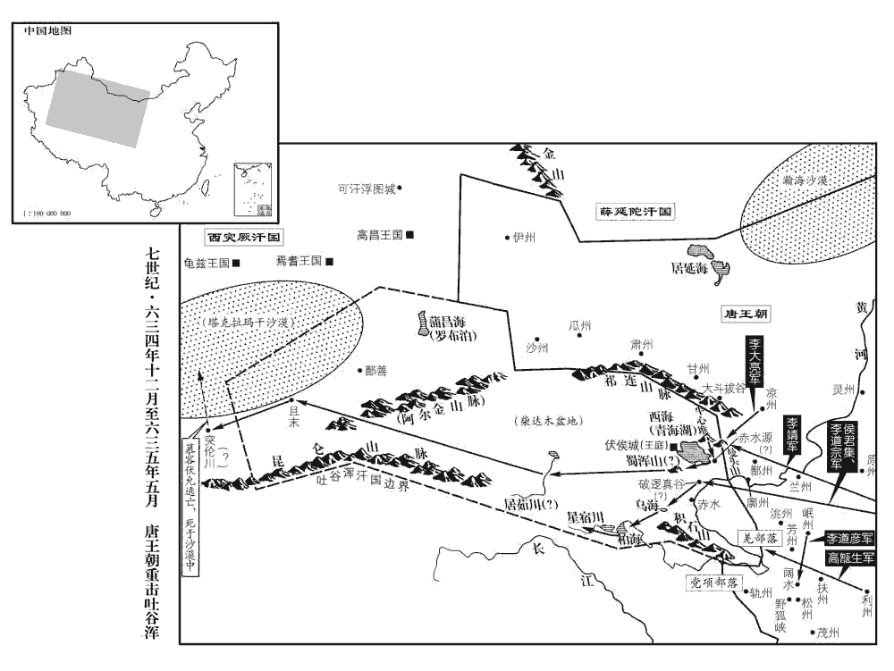
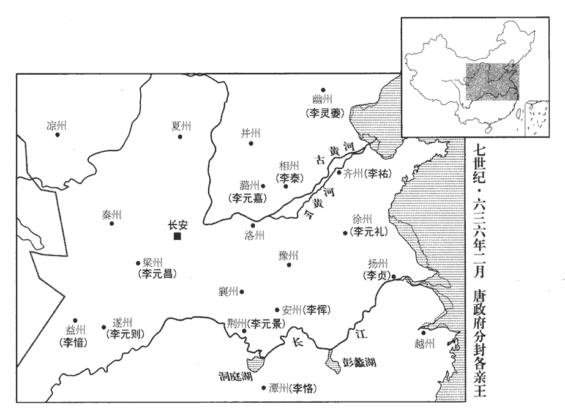

 唐紀十起玄黓執徐（壬辰），盡強圉作噩（丁酉）四月，凡五年有奇。

# 太宗文武大聖大廣孝皇帝上之下

## 貞觀六年（壬辰、六三二）觀，古玩翻。

1春，正月，乙卯朔‹一›，日有食之。

〖译文〗 [1]春季，正月，乙卯朔（初一），出现日食。

2癸酉‹十九›，靜州‹广西省梧州市›獠反，將軍李子和討平之。獠，魯皓翻。

〖译文〗 [2]癸酉（十九日），静州獠民反叛，将军李子和率兵征讨平定。

3文武官復請封禪，復，扶又翻。去年諸州朝集使請封禪。上曰：「卿輩皆以封禪為帝王盛事，朕意不然。若天下乂安，家給人足，雖不封禪，庸何傷乎！昔秦始皇‹嬴政›封禪，見七卷始皇二十八年。而漢文帝‹刘恒›不封禪，後世豈以文帝之賢不及始皇邪！邪，音耶。且事天掃地而祭，禮記郊特牲曰：「郊之祭也，大報天也。兆於南郊，就陽位也。掃地而祭，於其質也。何必登泰山之巔，封數尺之土，然後可以展其誠敬乎！」群臣猶請之不已，上亦欲從之，魏徵獨以為不可。考異曰：實錄、唐書志及唐統紀皆以為太宗自不欲封禪，而魏文貞公故事及王方慶文貞公傳錄以為太宗欲封太山，徵諫而止。意頗不同，今兩存之。上曰：「公不欲朕封禪者，以功未高邪？」曰：「高矣！」「德未厚邪？」曰：「厚矣！」「中國未安邪？」曰：「安矣！」「四夷未服邪？」曰：「服矣！」「年穀未豐邪？」曰：「豐矣！」「符瑞未至邪？」曰：「至矣！」「然則何為不可封禪？」對曰：「陛下雖有此六者，然承隋末大亂之後，戶口未復，倉廩尚虛，而車駕東巡，千乘萬騎，乘，繩證翻。騎，奇寄翻。其供頓勞費，未易任也。易，以豉翻。任，音壬。且陛下封禪，則萬國咸集，遠夷君長，皆當扈從；長，知兩翻。從，才用翻。今自伊、洛以東至于海‹东海›、岱‹泰山›，煙火尚希，灌莽極目，灌，木叢生也。莽，草深茂也。此乃引戎狄入腹中，示之以虛弱也。況賞賚不貲，未厭遠人之望；給復連年，不償百姓之勞；厭，於協翻。復，方目翻。崇虛名而受實害，陛下將焉用之！」焉，於虔翻。會河南、北數州大水，事遂寢。

〖译文〗 [3]文武百官又请行封禅大礼，太宗说：“你们都认为登泰山封禅是帝王的盛举，朕不以为然，如果天下安定，百姓家家富足，即使不去封禅，又有什么伤害呢？从前秦始皇行封禅礼，而汉文帝不封禅，后代岂能认为文帝的贤德不如秦始皇吗！而且侍奉上天扫地而祭祀，何必要去登泰山之顶峰，封筑几尺的泥土，然后才算展示其诚心敬意呢！”群臣还是不停地请求，太宗也想听从此意见，惟独魏徵认为不可。太宗说：“你不想让朕去泰山封禅，认为朕的功劳不够高吗？”魏徵答道：“够高了！”“德行不厚吗？”答道：“很厚了！”“大唐不安定吗？”答道：“安定！”“四方夷族未归服吗？”答道：“归服了”。“年成没丰收吗？”答道：“丰收了！”“符瑞没有到吗？”答道：“到了！”“那么为什么不可以行封禅礼？”答道：“陛下虽然有上述六点理由，然而承接隋亡大乱之后，户口没有恢复，国家府库粮仓还很空虚，而陛下的车驾东去泰山，大量的骑兵车辇，其劳顿耗费，必然难以承担。而且陛下封禅泰山，则各国君主咸集，远方夷族首领跟从，如今从伊水、洛水东到大海、泰山，人烟稀少，满目草木丛生，这是引戎狄进入大唐腹地，并展示我方的虚弱。况且赏赐供给无数，也不能满足这些远方人的欲望；几年免除徭役，也不能补偿老百姓的劳苦。象这样崇尚虚名而实际对百姓有害的政策，陛下怎么能采用呢。”正赶上黄河南北地区数州县发大水，于是就停止封禅事。

4上將幸九成宮‹仁寿宫·陕西省麟游县境›，通直散騎常侍姚思廉諫。散，悉亶翻。騎，奇寄翻。上曰：「朕有氣疾，暑輒頓劇，往避之耳。」賜思廉絹五十匹。

〖译文〗 [4]太宗将要去九成宫，通直散骑常侍姚思廉谏阻，太宗说：“朕有气喘病，一逢暑天就顿时发作加重，便想前去躲避一阵。”赏赐给姚思廉五十匹绢。

監察御史馬周上疏，監，古銜翻。上，時掌翻。以為：「東宮在宮城之中，而大安宮乃在宮城之西，此因大安宮在西，遂謂帝所居為東宮耳。制度比於宸居，尚為卑小，於四方觀聽，有所不足。宜增修高大，以稱中外之望。稱，尺證翻。又，太上皇春秋已高，陛下宜朝夕視膳。今九成宮去京師三百餘里，太上皇或時思念陛下，陛下何以赴之？又，車駕此行，欲以避暑；太上皇尚留暑中，而陛下獨居涼處，溫凊之禮，竊所未安。記曲禮：凡為人子之禮，冬溫而夏凊。凊qìng，音七正翻。今行計已成，不可復止，復，扶又翻。願速示返期，以解眾惑。又，王長通、白明達皆樂工，韋槃提、斛斯正止能調馬，縱使技能出眾，正可賚之金帛，豈得超授官爵，鳴玉曳履，與士君子比肩而立，同坐而食，使，渠綺翻。坐，徂臥翻。臣竊恥之！」上深納之。

〖译文〗 监察御史马周上奏疏，认为：“陛下所住的宫殿在宫城之中，而太上皇的大安宫却在宫城之西面，建制规模与陛下宫殿相比，还较为窄小，这在天下人的眼中耳里，未免觉得有些不足。应当增修扩大，以满足中外人士的愿望。再者说，太上皇年事已高，陛下应当朝夕侍奉御膳。如今九成宫离京城三百多里，太上皇如一时想念陛下，陛下怎么能赶回来呢？另外此次车驾外出避暑，太上皇还留在大暑天气里，而陛下却独居凉爽之处，礼制规定，儿女侍奉父母，要让他们冬暖夏凉，陛下这样做，我很不安。如今行期已定，不能中止，希望尽快昭示归期，以解除众人的疑惑。此外，王长通、白明达都是乐工，韦提、斛斯正也只能驯马，即使他们的技能出众，正可赏赐金银财物，怎么能破格授予官爵，让他们佩玉饰、拖着鞋，与士大夫们并肩而立、同座而食呢！与他们为伍我感到羞耻。”太宗深信其言，并采纳其意见。

5上以新令無三師官，二月，丙戌‹二›，詔特置之。唐以太師、太傅、太保為三師，正一品，天子所師法，無所總職。

〖译文〗 [5]太宗认为新颁敕令没有太师、太傅、太保三师官，二月，丙戌（初二），下诏特设三师宫。

6三月，戊辰‹十五›，上幸九成宮。

〖译文〗 [6]三月，戊辰（十五日），太宗临幸九成宫。

7庚午‹十七›，吐谷渾‹青海省›寇蘭州‹甘肃省兰州市›，吐，從暾入聲。谷，音浴。州兵擊走之。

〖译文〗 [7]庚午（十七日），吐谷浑进犯兰州，州内士兵将其击退。

8長樂公主將出降，唐會要：長樂公主下嫁長孫沖。樂，音洛。上以公主，皇后所生，特愛之，敕有司資送倍於永嘉長公主。永嘉長公主，高祖女，下嫁竇奉節，又嫁賀蘭僧伽。唐制：皇姑為大長公主，正一品；姊為長公主，女為公主，皆視一品。長，知兩翻；下同。魏徵諫曰：「昔漢明帝‹刘庄›欲封皇子，曰：『我子豈得與先帝‹刘秀›子比！』皆令半楚、淮陽。事見四十五卷漢明帝永平十五年。今資送公主，倍於長主，得無異於明帝之意乎！」上然其言，入告皇后。后歎曰：「妾亟聞陛下稱重魏徵，亟，去吏翻。不知其故，今觀其引禮義以抑人主之情，乃知真社稷之臣也！妾與陛下結髮為夫婦，曲承恩禮，每言必先候顏色，不敢輕犯威嚴；況以人臣之疏遠，乃能抗言如是，陛下不可不從。」因請遣中使齎錢四百緡、絹四百匹以賜徵，使，疏吏翻。考異曰：舊文德皇后傳云：「使齎帛五百匹，詣徵第賜之。」魏文貞公故事云：「遣中使齎錢二十萬、絹百匹詣公宅宣命。」今從舊魏徵傳。且語之曰：語，牛倨翻。「聞公正直，乃今見之，故以相賞。公宜常秉此心，勿轉移也。」上嘗罷朝，怒曰：「會須殺此田舍翁。」朝，直遙翻。后問為誰，上曰：「魏徵每廷辱我。」后退，具朝服立于庭，唐制：皇后之服，褘huī衣者，受冊、助祭、朝會大事之服也。深青織成，為之畫翬huī，赤質、五色、十二等，素紗中單，黼領，朱羅縠hú褾biǎo襈zhuàn，蔽膝隨裳色，以緅zōu領為緣，用翟為章三等，青衣革帶，大帶隨衣色，裨紐約佩，綬如天子，青襪，舄xì加金飾，首飾大小華十二樹，以象袞冕之旒，又有兩博鬢。朝，直遙翻。褾，彼小翻，袖耑duān。襈，皺戀翻，緣也。緅，仄鳩翻。上驚問其故。后曰：「妾聞主明臣直，今魏徵直，由陛下之明故也，妾敢不賀！」上乃悅。

〖译文〗 [8]长乐公主将要出嫁长孙仲，太宗以公主是皇后亲生，特别疼爱，敕令有关部门所给陪送比皇姑永嘉长公主多一倍。魏徵劝谏说：“过去汉明帝想要分封皇子采邑，说：‘我的儿子怎么能和先帝的儿子相比呢？’均令分给楚王、淮阳王封地的一半。如今公主的陪送，比长公主多一倍，岂不是与汉明帝的意思相差太远吗？”太宗觉得有理，进宫中告知皇后，皇后感慨系之：“我总是听得陛下称赞魏徵，不知是什么缘故，如今见其引征礼义来抑制君王的私情，这真是辅佑陛下的栋梁大臣呀！我与陛下是多年的结发夫妻，多蒙恩宠礼遇，每次讲话还都要察言观色，不敢轻易冒犯您的威严。何况大臣与陛下较为疏远，还能如此直言强谏，陛下不能不听从其意见。”于是皇后请求太宗派宦官去魏徵家中，赏赐给四百缗钱，四百匹绢。并且对他说：“听说您十分正直，今日得以亲见，所以赏赐这些。希望您经常秉持此忠心，不要有所迁移。”有一次太宗曾罢朝回到宫中，怒气冲冲地说：“以后找机会一定杀了这个乡巴佬。”皇后问是谁惹怒陛下，太宗说：“魏徵常在朝堂上羞辱我。”皇后退下，穿上朝服站在庭院内，太宗惊奇地问这是何故。皇后说：“我听说君主开明则臣下正直，如今魏徵正直敢言，是因为陛下的开明，我怎能不祝贺呢！”太宗才转怒为喜。

9夏，四月，辛卯‹八›，襄州‹总部设湖北省襄阳市›都督鄒襄公張公謹卒。卒，子恤翻。明日，上出次發哀。有司奏，辰日忌哭。彭祖百忌，辰不哭泣。上曰：「君之於臣，猶父子也，情發於衷，安避辰日！」遂哭之。

〖译文〗 [9]夏季，四月，辛卯（初八），襄州都督、邹襄公张公谨去世。第二天，太宗出车辇发丧。有关部门上奏称，这一天是辰日，忌讳哭泣。太宗说：“君与臣同父子关系，哀痛哭泣是感情自然流露，怎么能避忌日呢！”于是痛哭一场。

10六月，己亥‹十七›，金州‹陕西省安康市›刺史酆悼王元亨薨。金州，西城郡，梁置南梁州，西魏置東梁州，尋改曰金州。辛亥‹二十九›，江王囂薨。

〖译文〗 [10]六月，己亥（十七日），金州刺史酆悼王李元亨去世。辛亥（二十九日），江王李嚣去世。

11秋，七月，丙辰‹四›，焉耆‹新疆焉耆县›王突騎支遣使入貢。初，焉耆入中國由磧路，隋末閉塞，道由高昌‹新疆吐鲁番市›。突騎支請復開磧路以便往來，騎，奇寄翻。使，疏吏翻。磧，七迹翻。塞，悉則翻。復，扶又翻，又音如字。上許之。由是高昌恨之，遣兵襲焉耆，大掠而去。焉耆國東鄰高昌。為討高昌張本。

〖译文〗 [11]秋季，七月，丙辰（初四），焉耆王突骑支派使节献贡品。起初，焉耆从沙漠到达中原王朝，隋朝末年关闭塞北地区，便改道高昌。突骑支请求重开沙漠故道相互往来，太宗允许。于是高昌怀恨在心，派兵突袭焉耆，大肆掠夺而后离去。

12辛未‹十九›，宴三品已上於丹霄殿。上從容言曰：從，千容翻。「中外乂安，皆公卿之力。然隋煬帝威加夷、夏，夏，戶雅翻。頡利跨有北荒，頡，奚結翻。統葉護雄據西域，今皆覆亡，此乃朕與公等所親見，勿矜強盛以自滿也！」

〖译文〗 [12]辛未（十九日），太宗在丹霄殿大宴三品以上官员。太宗语气和缓地说：“中外安定，都是你们的功劳。然而隋炀帝威风八面一统天下，颉利跨有北部广大地区，统叶护占据西域一带，如今它们都已灭亡，这是朕与大家亲眼得见，希望你们不要因为一时强盛而自满起来。”

13西突厥‹新疆北部及中亚细亚›肆葉護可汗發兵擊薛延陀‹蒙古西南部›，為薛延陀所敗。厥，九勿翻。可，從刊入聲。汗，音寒。敗，補邁翻。

〖译文〗 [13]西突厥肆叶护可汗发兵袭击薜延陀，被薜延陀击败。

肆葉護性猜狠信讒，有乙利可汗，功最多，乙利，西突厥小可汗也。狠，戶墾翻。肆葉護以非其族類，誅滅之，由是諸部皆不自保。肆葉護又忌莫賀設之子泥孰，陰欲圖之，泥孰奔焉耆‹新疆焉耆县›。設卑達官與弩失畢‹伊塞克湖西›二部攻之，舊傳作「設卑達官」，考異曰：新傳作「沒卑達干」。今從舊傳。肆葉護輕騎奔康居‹即康国，中亚细亚撒马尔汗›，尋卒。肆葉護立見上卷三年。騎，奇寄翻。卒，子恤翻。國人迎泥孰於焉耆而立之，是為咄陸可汗，遣使內附。咄，常沒翻。可，從刊入聲。汗，音寒。使，疏吏翻。丁酉‹十六›，遣鴻臚少卿劉善因立咄陸為奚利邲咄陸可汗。臚，陵如翻。少，始照翻。邲，毗必翻。咄陸即阿史那彌射。此當參觀高宗顯慶二年考異而詳辨之。考異曰：舊傳「冊為吞阿妻狀奚利邲咄陸可汗」，新傳「冊號吞阿婁拔利邲咄陸可汗」。今從實錄。

〖译文〗 肆叶护狠毒猜忌听信谗言，有个乙利可汗，功劳最大，肆叶护以其并非本族，将他杀掉，于是各部落均难以自保。肆叶护又忌恨莫贺设的儿子泥孰，阴谋要除掉他，泥孰得知后急忙投奔焉耆。西突厥属下的设卑达官和弩失毕二个部落进攻肆叶护，肆叶护率轻骑兵逃奔康居，不久死去。西突厥人前往焉耆迎接泥孰，立为可汗，这便是咄可汗，咄派使节到唐朝请求归附。丁酉（十六日），唐帝国派遣鸿胪寺少卿刘善因前往突厥，立咄为奚利咄可汗。

14閏月，乙卯‹四›，上宴近臣於丹霄殿，長孫無忌曰：「王珪、魏徵，昔為仇讎，謂其事隱太子，勸之圖帝也。不謂今日得此同宴。」上曰：「徵、珪盡心所事，故我用之。然徵每諫，我不從，我與之言輒不應，何也？」魏徵對曰：「臣以事為不可，故諫；陛【章：十二行本「陛」上有「若」字；乙十一行本同。】下不從而臣應之，則事遂施行，故不敢應。」上曰：「且應而復諫，庸何傷！」復，扶又翻。對曰：「昔舜戒群臣：『爾無面從，退有後言。』書益稷之言。臣心知其非而口應陛下，乃面從也，豈稷、契事舜之意邪！」契，息列翻。上大笑曰：「人言魏徵舉止疏慢，我視之更覺娬媚，娬，罔甫翻；娬，亦媚也。正為此耳！」為，于偽翻。徵起，拜謝曰：「陛下開臣使言，故臣得盡其愚；若陛下拒而不受，臣何敢數犯顏色乎！」數，所角翻。

〖译文〗 [14]闰八月，乙卯（初四），太宗在丹霄殿大宴亲近的大臣，长孙无忌说：“王、魏徵二人，以前侍奉太子李建成，与陛下为敌，难以料到今日能在此一同饮宴。”太宗说：“魏徵与王尽心竭力地侍奉原来的主人，所以我能重用他们。然而魏徵每次进谏，我不听从；我与他讲话，他也总是不做应答，为什么呢？”魏徵回答说：“我认为事情不可行，所以谏阻；陛下不听从谏阻而我如果答话，那么事情便得到施行，所以不敢应答。”太宗说：“暂且应答而后再谏阻，又有什么伤害呢？”答道：“过去舜帝告诫群臣：‘你们不要当面顺从，而背后却说另一套。’如果我心里知道不对嘴上却答应陛下的意见，这正是当面顺从。难道这是稷、契侍奉舜帝的本意吗！”太宗大笑着说：“人们都说魏徵行为举止粗鲁傲慢，我看他更觉得妩媚可爱，正是因为如此呀！”魏徵离席起身，拜谢道：“陛下引导让我畅所欲言，所以我得以尽愚诚；如果陛下拒不接受忠言，我又怎么敢屡次犯颜强谏呢！”

15戊辰‹十七›，祕書少監虞世南上聖德論，上，時掌翻。上賜手詔，稱：「卿論太高。朕何敢擬上古，但比近世差勝耳。然卿適覩其始，未知其終。若朕能慎終如始，則此論可傳；如或不然，恐徒使後世笑卿也！」

〖译文〗 [15]戊辰（十七日），秘书少监虞世南进呈《圣德论》一文，太宗赐给手书诏令称：“你的评价太高了。朕怎么敢与上古帝王相比，只是与近代相比略强些。然而你只是刚刚看见开头，未知其终结。如果朕真能善始善终，那么你的高论可传之后世；如若不然，恐怕只会成为后世的笑柄！”

16九月，己酉‹二十九›，幸慶善宮‹陕西省武功县境›，上生時故宅也，以高祖武功舊第為慶善宮。因與貴人宴，賦詩。起居郎清平‹山东省临清市东南›呂才清平縣，屬博州。劉昫曰：本漢貝丘縣，隋曰清平。被之管絃，被，皮義翻。命曰功成慶善樂，使童子八佾為九功之舞，大宴會，與破陳舞偕奏於庭。才有巧思，故命以所賦詩被之管絃以為樂章，以童子六十四人冠進德冠，紫袴褶，長袖，漆髻，屣履而舞，號九功舞，進蹈安徐，以象文德。破陳樂，號七德舞，擊刺往來，發揚蹈厲，以象武功。陳，讀曰陣。同州‹陕西省大荔县›刺史尉遲敬德預宴，同州，馮翊郡。尉，紆勿翻。有班在其上者，敬德怒曰：「汝何功，坐我上！」任城王道宗次其下，諭解之。敬德拳毆道宗，目幾眇。任，音壬。毆，烏口翻。幾，居希翻。考異曰：唐曆云：「嘗因內宴，於御前毆宇文士及曰：『汝有何功，合居吾上！』太宗慰諭之，方止。」今從舊傳。上不懌而罷，謂敬德曰：「朕見漢高祖誅滅功臣，意常尤之，故欲與卿等共保富貴，令子孫不絕。令，力丁翻。然卿居官數犯法，乃知韓、彭葅zū醢，非高祖之罪也。國家綱紀，唯賞與罰，非分之恩，不可數得，分，扶問翻。數，所角翻。勉自修飾，無貽後悔！」敬德由是始懼而自戢。戢jí，阻立翻。

〖译文〗 [16]九月，己酉（二十九日），太宗临幸庆善宫，这是太宗出生时的旧宅。于是和显贵饮酒赋诗。起居郎、清平人吕才，将赋诗谱成曲弹奏，命名为《功成庆善乐》，让六十四名少年站成八行依乐而舞，称《九功之舞》。又大摆酒宴，与《秦王破阵舞》一同在宫庭中表演。同州刺史尉迟敬德参加宴席，见到有人的席位在他之上，勃然大怒，说道：“你有何功劳，竟然坐在我的上方。”任城王李道宗坐在他的下首，反复劝解。尉迟敬德用拳头殴打李道宗，眼睛被打得几乎瞎了一只。太宗很不高兴地罢宴，对尉迟敬德说：“朕见汉高祖刘邦大肆诛杀功臣，内心常常责怪他，所以想和你们一道共同保持富贵，令子子孙孙延绵不绝。然而你身居高官却屡次犯法，由此可知韩信、彭越被碎尸万段、剁成肉酱，并非只是高祖的罪过。朝廷的纲纪法令，无非是赏与罚，非分的恩遇，也不能几次得到，深望你好自为之，不要到时后悔都来不及！”尉迟敬德从此才知道恐惧而约束自己。

17冬，十月，乙卯‹五›，車駕還京師。帝侍上皇宴於大安宮，帝與皇后更獻飲膳及服御之物，更，工衡翻。夜久乃罷。帝親為上皇捧輿至殿門，為，于偽翻。上皇不許，命太子代之。

〖译文〗 [17]冬季，十月，乙卯（初五），太宗的车驾回到京城。太宗在大安宫设酒宴侍奉太上皇，太宗与皇后轮流端上饮食及用具在帝侍候，直到深夜才罢席。太宗亲自为太上皇抬轿舆至殿门，太上皇不允许，让太子代劳。

18突厥頡利可汗鬱鬱不得意，數與家人相對悲泣，容貌羸憊。厥，九勿翻。頡，奚結翻。可，從刊入聲。汗，音寒。數，所角翻。羸，倫為翻。憊，蒲拜翻。上見而憐之，以虢州‹河南省卢氏县›地多麋鹿，義寧元年，分弘農二縣置虢州、虢郡。宋白曰：帝王世紀云，虢有三：周封虢仲於西虢，虢州之地也；封虢叔於東虢，今成皋也；陝郡平陸是北虢。可以游獵，乃以頡利為虢州刺史；頡利辭，不願往。癸未‹四›，復以為右衛大將軍。復，扶又翻；下勿復、不復同，又音如字。

〖译文〗 [18]突厥颉利可汗郁郁不得志，多次与家里人相对哭泣，面容十分的疲惫。太宗见到后非常可怜他，当时虢州地带有很多麋鹿活动，可以游猎，太宗便任命颉利为虢州刺史。颉利辞谢，不愿意前往。癸未（三十一日），又任命他为右卫大将军。

19十一月，辛巳‹二›，契苾‹蒙古库伦南›酋長何力帥部落六千餘家詣沙州‹甘肃省敦煌市›降，詔處之於甘‹甘肃省张掖市›、涼‹甘肃省武威市›之間，契，欺結翻。苾，毗必翻。酋，慈由翻。長，知兩翻。帥，讀曰率。降，戶江翻。處，昌呂翻。甘、涼相去五百里。以何力為左領軍將軍。

〖译文〗 [19]十一月，辛巳（初二），契族首领何力率领本部落六千多家前往沙州投降大唐，太宗下诏将他们安置在甘、凉之间，任命何力为左领军将军。

20庚寅‹十一›，以左光祿大夫陳叔達為禮部尚書。帝謂叔達曰：「卿武德中有讜言，見一百九十一卷高祖武德九年。讜，音黨，善言直言也。故以此官相報。」對曰：「臣見隋室父子相殘，以取亂亡，當日之言，非為陛下，為，于偽翻。乃社稷之計耳！」

〖译文〗 [20]庚寅（十一日），任命左光禄大夫陈叔达为礼部尚书。太宗对陈叔达说：“你在武德年间曾直言劝太上皇反隋，所以封你为此官以相报答。”答道：“我当时见隋朝父子相互残害，建议乘乱取而代之，当时的话，并非为陛下考虑，而是为社稷打算啊！”

21十二月，癸丑‹四›，帝與侍臣論安危之本。中書令溫彥博曰：「伏願陛下常如貞觀初，則善矣。」帝曰：「朕比來怠於為政乎？」觀，古玩翻。比，毗至翻。魏徵曰：「貞觀之初，陛下志在節儉，求諫不倦。比來營繕微多，諫者頗有忤旨，此其所以異耳！」比，毗至翻。忤，五故翻。帝拊掌大笑曰：「誠有是事。」

〖译文〗 [21]十二日，癸丑（初四），太宗与大臣们讨论安危的根本所在。中书令温彦博说：“深愿陛下能经常像贞观初年那样，那就好了。”太宗问：“朕近来听政有所懈怠吗？”魏徵说：“贞观初年的时候，陛下一心节俭，不倦怠地求谏。近来则营建修缮之类的事渐渐多起来。行谏都颇觉得触犯圣意，这就是与当年的不同处。”太宗拍掌大笑着说：“确有其事。”

22辛未‹二十二›，帝親錄繫囚，見應死者，閔之，縱使歸家，期以來秋來就死。仍敕天下死囚，皆縱遣，使至期來詣京師。

〖译文〗 [22]辛未（二十二日），太宗亲自过录监狱囚犯，见到应处死刑的人，内心怜悯他们，放他们回家，但约定明年秋季回来就死。于是下令全国的死刑犯人，均放他们回家，等到期限到了的时候赶到京城。

23是歲，党項‹四川省西北部›羌前後內屬者三十萬口。党，底朗翻。

〖译文〗 [23]这一年，党项羌族人前后有三十万口归附大唐。

24公卿以下請封禪者前後相屬，屬，之欲翻。上諭以「舊有氣疾，恐登高增劇，公等勿復言。」復，扶又翻。

〖译文〗 [24]当时公卿以下大臣请求太宗行封禅礼的络绎不绝，太宗传谕认为：“朕有气喘的老毛病，恐怕登高会加剧，你们不必再谈论此事。”

25上謂侍臣曰：「朕比來決事或不能皆如律令，公輩以為事小，不復執奏。夫事無不由小而致大，此乃危亡之端也。比，毗至翻。夫，音扶。昔關龍逄忠諫而死，逄，皮江翻。朕每痛之。煬帝驕暴而亡，公輩所親見也。公輩常宜為朕思煬帝之亡，朕常為公輩念關龍逄之死，為，于偽翻。何患君臣不相保乎！」

〖译文〗 [25]太宗对亲近的大臣说：“近来朕裁决事务有时不能够尽依法令，你们认为这是小事，不再固执地启奏。凡事无不因小而致大，这是危亡的先兆。从前关龙逄忠诚苦谏而死去，朕常常觉得痛惜。隋炀帝因骄奢暴虐而灭亡，你们都亲眼所见。望你们经常为朕考虑到炀帝的灭亡，朕也经常为你们念及关龙逄的死，如此还担心君臣不能相互保全吗？”

26上謂魏徵曰：「為官擇人，不可造次。朱元晦曰：造次，急遽苟且之時。造，七到翻。用一君子，則君子皆至；用一小人，則小人競進矣。」對曰：「然。天下未定，則專取其才，不考其行；喪亂既平，行，下孟翻；下同。喪，息浪翻。則非才行兼備不可用也。」觀此，則天下已定之後，可不為官擇人乎！

〖译文〗 [26]太宗对魏徵说：“因官职而去选择人才，不可仓促行事。任用一位君子，则众位君子都会来到；任用一位小人，则其他小人竞相引进。”答道：“是这样。天下未平定时，则对于一个人专取其才能，并不看重和考察其德行；动乱平定后，则不是德才兼备的人才不能使用。”

## 七年（癸巳、六三三）

1春，正月，更名破陳樂曰七德舞。更，工衡翻。左傳：楚莊王曰：武有七德，禁暴、戢兵、保大、定功、安民、和眾、豐財，故以為樂舞之名。新志：七德舞圖，左圓右方，先偏後伍，交錯屈伸，以象魚麗鵝鸛。命呂才以圖教樂工，百二十八人，被銀甲執戟而舞。凡三變，每變為四陣，象擊刺往來，歌者和，曰秦王破陳樂。杜佑曰：破陳樂舞圖，左圓右方，先偏後伍，魚麗鵝鸛，箕張翼舒，交錯屈伸，首尾回互，以象戰陳之形。凡為三變，每變有四陣，有來往疾徐擊刺之象，以應歌節，發揚蹈厲，聲韻慷慨。陳，讀曰陣。癸巳‹十五›，宴三品已上及州牧、蠻夷酋長於玄武門，奏七德、九功之舞。酋，慈由翻。長，知兩翻。太常卿蕭瑀上言：「七德舞形容聖功，有所未盡，瑀，音禹。上，時掌翻。請寫劉武周、薛仁果、竇建德、王世充等擒獲之狀。」上曰：「彼皆一時英雄，今朝廷之臣往往嘗北面事之，若覩其故主屈辱之狀，能不傷其心乎！」瑀謝曰：「此非臣愚慮所及。」魏徵欲上偃武修文，每侍宴，見七德舞輒俛首不視，見九功舞則諦觀之。俛fǔ，音免。諦，都計翻，審也。

〖译文〗 [1]春季，正月，将《秦王破阵乐》改名为《七德舞》。癸巳（十五日），太宗在玄武门宴请三品以上官员、州牧、夷族首领，演奏《七德舞》和《九功舞》。太常寺正卿萧上书言道：“《七德舞》用来表现皇上的丰功伟业，但意犹未尽，请求编入刘武周、薛仁果、窦建德、王世充等人被擒获的过程。”太宗说：“他们都是一时的英雄豪杰，如今朝廷的大臣很多是他们的臣下，如果他们看见旧主子的屈辱之态，能不伤心吗？”萧拜谢道：“这些是我所未考虑到的。”魏徵想要太宗停止武备，提倡文教，每次陪太宗饮宴，见到演奏《七德舞》时都低下头故意不看，见到《九功舞》则非常认真地观看。

2三月，戊子‹十一›，侍中王珪坐漏泄禁中語，左遷同州刺史。庚寅‹十三›，以祕書監魏徵為侍中。

〖译文〗 [2]三月，戊子（十一日），侍中王因泄漏朝廷机密而致罪，降为同州刺史。庚寅（十三日），任命秘书监魏徵为侍中。

3直太史雍人李淳風雍縣，屬岐州。雍，於用翻。奏靈臺候儀制度疏略，但有赤道，請更造渾天黃道儀，更，工衡翻。渾，戶本翻。許之。癸巳‹十六›，成而奏之。時李淳風上言：舜在璿xuán璣玉衡以齊七政，則渾天儀也。周禮：土圭正日景以求地中，有以見日行黃道之驗也。暨于周末，此器乃亡。漢洛下閎作渾天儀，其後賈逵、張衡亦有之，而推驗七曜，並循赤道。按冬至極南，夏至極北，而赤道常定於中，國全無南北之異，蓋渾儀無黃道久矣。上異其說，因詔為之。儀，表裏三重，下據準基，上如十字，末樹鼇áo足，以張四表。一曰六合儀，有天經雙規，金渾緯規，金常規相結於四極之內，列二十八宿、十日干、十二辰，經緯三百六十五度。二曰三辰儀，圓徑八尺，有璿璣規，日月游天宿規矩，列宿所行，轉於六合之內。三曰四游儀，圓玄樞為軸，以連結玉衡游筩而貫約規矩，又玄極樞北樹北辰，南矩地軸，傍轉於內，玉衡在玄樞之間，而南北游，仰以觀天之辰宿，下以識器之晷度。皆用銅為之。

〖译文〗 [3]直太史、雍县人李淳风上奏称灵台候仪制造的过于粗略，只有赤道，请求改造一个浑天黄道仪，太宗准许。癸巳（十六日），上奏太宗浑天黄道仪已制成。

4夏，五月，癸未‹七›，上幸九成宮‹陕西省麟游县境›。

〖译文〗 [4]夏季，五月，癸未（初七），太宗临幸九成宫。

5雅州道‹四川省雅安市›行軍總管張士貴擊反獠，破之。雅州，漢嚴道縣地；隋廢州，置臨邛郡；唐復為雅州。獠，魯皓翻。

〖译文〗 [5]雅州道行军总管张士贵率兵进攻反叛的獠民，大败獠军。

6秋，八月，乙丑‹二十›，左屯衛大將軍譙敬公周範卒。上行幸，常令範與房玄齡居守。卒，子恤翻。守，式又翻。範為人忠篤嚴正，疾甚，不肯出外，竟終於內省，與玄齡相抱而訣曰：「所恨不獲再奉聖顏！」

〖译文〗 [6]秋季，八月，乙丑（二十日），左屯卫大将军谯敬公周范去世。太宗出外巡幸的时候，常常命周范与房玄龄一道留守京城。周范为人忠厚正直，病得很厉害，不肯离开皇宫，最后死于内省。临死前与房玄龄相抱诀别，说：“遗憾的是不能再侍奉皇上了。”

7辛未‹二十六›，以張士貴為龔州道‹广西平南县›行軍總管，使擊反獠。龔州，臨江郡，漢猛陵縣地，隋為永平郡武林縣；貞觀三年，置鷰州於今州東，仍於鷰州之故所置龔州。

〖译文〗 [7]辛未（二十六日），朝廷任命张士贵为龚州道行军总管，让他进攻反叛的獠人。

8九月，山東‹崤山以东›、河南‹黄河以南›四十餘州水，遣使賑之。使，疏吏翻。賑，津忍翻。

〖译文〗 [8]九月，山东、河南四十多个州发大水，太宗派使臣前往赈济。

9去歲所縱天下死囚凡三百九十人，無人督帥，皆如期自詣朝堂，帥，讀曰率。朝，直遙翻。考異曰：四年實錄云：天下斷死罪，止二十九人，今年實錄乃有二百九十九人，何頓多如此！事已可疑。又白居易樂府云：「死囚四百來歸獄。」舊本紀、統紀、年代記皆云「二百九十人。」今從新書刑法志。無一人亡匿者；上皆赦之。

〖译文〗 [9]上一年放回家中的死囚犯人共三百九十人，没有人监视管制，都按期限自己回到朝堂，没有一个人逃亡，太宗将他们全部赦免。

10冬，十月，庚申‹十六›，上還京師。

〖译文〗 [10]冬季，十月，庚申（十六日），太宗回到京都长安。

11十一月，壬辰‹十八›，以開府儀同三司長孫無忌為司空，長，知兩翻。無忌固辭，曰：「臣忝預外戚，恐天下謂陛下為私。」上不許，曰：「吾為官擇人，惟才是與。為，于偽翻。苟或不才，雖親不用，襄邑王神符是也；神符少威嚴，不為下所畏，又足不良于行，由是歸第。如其有才，雖讎不棄，魏徵等是也。今日所舉，非私親也。」

〖译文〗 [11]十一月，壬辰（十八日），朝廷任命开府仪同三司长孙无忌为司空，长孙无忌执意推辞，说：“我忝列外戚，担心天下人说陛下循私情。”太宗不允许，说：“我根据官职来选择人，惟才是举。如果没有才能，即使是亲属也不使用，襄邑王李神符就是这样的人；如果有才能，即使过去有仇也不弃置，魏徵等人就是如此。今日推举你为司空，并不是循私情。”

12十二月，甲寅‹十一›，上幸芙蓉園‹西安东南›；景龍文館記：芙蓉園在京師羅城東南隅，本隋世之離宮也；青林重複，綠水瀰漫，帝城勝景也。丙辰‹十三›，校獵少陵原。少陵原，在長安城南，屬萬年縣界。少，始照翻。戊午‹十五›，還宮，從上皇置酒故漢未央宮。漢故未央宮在長安宮城北禁苑之西偏。考異曰：舊高祖紀：「八年，閱武於城西，高祖親自臨視，還，置酒於未央宮。」高祖實錄不記年月，據太宗實錄，八年正月，頡利可汗死。今從唐曆。上皇命突厥頡利可汗起舞，又命南蠻酋長馮智戴詠詩，厥，九勿翻。頡，奚結翻。可，從刊入聲。汗，音寒。酋，慈由翻。長，知兩翻。既而笑曰：「胡、越一家，自古未有也！」帝奉觴上壽上，時掌翻。曰：「今四夷入臣，皆陛下教誨，非臣智力所及。昔漢高祖‹刘邦›亦從太上皇‹刘执嘉›置酒此宮，妄自矜大，漢高祖十年，置酒未央宮，奉玉巵為太上皇壽，曰：「始大人常以臣亡賴，不能治產業，不如仲力。今某之業所就，孰與仲多？」臣所不取也。」上皇大悅。殿上皆呼萬歲。

〖译文〗 [12]十二月，甲寅（十一日），太宗巡幸芙蓉园；丙辰（十三日），又到少陵原围猎。戊午（十五日），回到宫中，在汉代未央宫旧址侍奉太上皇饮宴。太上皇命令突厥颉利可汗起身作舞，又命南蛮首领冯智戴吟咏诗赋，不久，笑着说：“胡、越等族都是一家人，这是自古以来没有的事！”太宗端着酒杯为太上皇祝寿，说：“如今四方民族为我大唐臣民，这都是父亲您教诲的结果，不是我的智力所能及。从前汉高祖曾在此宫中为其父摆酒祝寿，妄自尊大，我不取他这一点。”太上皇大为高兴。殿堂上众人齐呼万岁。

13帝謂左庶子于志寧、右庶子杜正倫曰：「朕年十八，猶在民間，民之疾苦情偽，無不知之。及居大位，區處世務，猶有差失。況太子生長深宮，處，昌呂翻。長，知兩翻。百姓艱難，耳目所未涉，能無驕逸乎！卿等不可不極諫！」太子好嬉戲，頗虧禮法，志寧與右庶子孔穎達數直諫，好，呼到翻。數，所角翻。上聞而嘉之，各賜金一斤，帛五百匹。

〖译文〗 [13]太宗对左庶子于志宁、右庶子杜正伦说：“朕年十八的时候，还在民间，百姓的疾苦与真伪，都非常了解。等到即皇位，处理日常事务还有失误。何况太子生长在深宫，老百姓的艰难困苦，听不见看不到，能不产生骄逸吗？你们不能不极力强谏！”太子喜好玩耍，不遵守礼法，于志宁与右庶子孔颖达多次直言劝谏。太宗知道后赞扬他们，各赐给黄金一斤，帛五百匹。

14工部尚書段綸奏徵巧工楊思齊，上令試之。綸使先造傀儡。傀儡，木偶戲也。杜佑曰：窟𥗬子，亦曰傀磊子，作偶人以戲，善歌舞。本喪樂也，漢末始用之於嘉會。北齊高緯尤所好，閭市盛行焉。余按列子，偃師以此伎奉周穆王，其來久矣。傀，口猥翻。儡，落猥翻。上曰：「得巧工庶供國事，卿令先造戲具，豈百工相戒無作淫巧之意邪！」月令：孟春之月，百工咸理，監工日號，毋或作為淫巧以蕩上心。邪，音耶。乃削綸階。唐制：工部尚書，正三品。削其階則不得立於三品班中。

〖译文〗 [14]工部尚书段纶上奏请求征召巧匠杨思齐进宫，太宗让他尝试制做。段纶让杨思齐先造一个木偶。太宗说：“得到能工巧匠，是希望为国家制造器物，你却让他先造玩具，这难道是众工匠相互告诫不做淫巧器具的本意吗？”于是降低段纶的品阶。

15嘉‹四川省乐山市›、陵州‹四川省仁寿县›獠反，嘉州，眉山郡，漢犍為南安縣地。陵州，陵山郡，漢蜀郡廣都、犍為郡武陽二縣東界之地。獠，魯皓翻。命邗hán江府統軍牛進達擊破之。唐揚州有邗江府兵。邗，胡安翻。

〖译文〗 [15]嘉州、陵州的獠民造反，唐朝命令邗江府统军牛进达将其击败。

16上問魏徵曰：「群臣上書可采，及召對多失次，何也？」臣上，時掌翻。對曰：「臣觀百司奏事，常數日思之，及至上前，三分不能道一。況諫者拂意觸忌，拂，與咈fú同。非陛下借之辭色，豈敢盡其情哉！」上由是接群臣辭色愈溫，嘗曰：「煬帝多猜忌，臨朝對群臣多不語。朝，直遙翻。朕則不然，與群臣相親如一體耳。」

〖译文〗 [16]太宗问魏徵：“众位大臣的上书多有可取，等到当面对答时则多语无伦次，为什么呢？”魏徵答道：“我观察各部门上奏言事，常常思考几天，等到了陛下的面前，则三分不能道出一分。况且行谏的人违背圣上的旨意触犯圣上的忌讳，如果不是陛下语色和悦，怎么敢尽情陈述呢？”于是太宗接见大臣时语言脸色更加温和，曾说道：“隋炀帝性情多猜忌，每次临朝与群臣相对多不说话。朕则不是这样，与大臣们亲近得如同一个人。”

## 八年（甲午，六三四）

1春，正月，癸未‹十›，突厥頡利可汗卒，厥，九勿翻。頡，奚結翻。可，從刊入聲。汗，音寒。卒，子恤翻。命國人從其俗，焚尸葬之。

〖译文〗 [1]春季，正月，癸未（初十），突厥颉利可汗去世，太宗命令遵从他们本民族的习惯，焚尸火葬。

2辛丑‹二十八›，‹龚州道，广西平南县›行軍總管張士貴討東、西王洞反獠，平之。東、西王洞獠蓋在龔州界。

〖译文〗 [2]辛丑（二十八日），行军总管张士贵讨伐东、西王洞的反叛獠民，平定了该地区。

3上欲分遣大臣為諸道黜陟大使，使，疏吏翻。考異曰：實錄、舊本紀但云「遣蕭瑀等巡省天下。按時止有十道，而會要、統紀皆云「發十六道黜陟大使」，據姓名止有十三人，皆所未詳，故但云諸道。未得其人；李靖薦魏徵。上曰：「徵箴規朕失，不可一日離左右。」離，力智翻。乃命靖與太常卿蕭瑀等凡十三人分行天下，「察長吏賢不肖，行，下孟翻。長，知兩翻。問民間疾苦，禮高年，賑窮乏，【章：十二行本「乏」下有「褎善良」三字；乙十一行本同；退齋校同。】賑，津忍翻。起久淹，【章：十二行本「久」作「滯」；乙十一行本同；孔本作「淹滯」；退齋校同；熊校同。】俾使者所至，如朕親覩。」

〖译文〗 [3]太宗想要分派大臣为诸道黜陟大使，没有得到合适人选。李靖推荐魏徵。太宗说：“魏徵针砭规劝朕的过失，一天也不能离开身边。”于是命令李靖与太常寺卿萧等共十三人分别巡行全国各地，“考察地方官吏贤能与否，询问民间疾苦，礼遇高寿的老人，赈济穷困百姓，起用埋没已久的人才，做到使者所到之处，如同朕亲自前往一般。”

4三月，庚辰‹八›，上幸九成宮‹陕西省麟游县境›。

〖译文〗 [4]三月，庚辰（初八），太宗临幸九成宫。

5夏，五月，辛未朔‹一›，日有食之。

〖译文〗 [5]夏季，五月，辛未朔（初一），出现日食。

6初，吐谷渾‹青海省›可汗伏允吐，從暾入聲。谷，音浴。可，從刊入聲。汗，音寒。考異曰：實錄，十年，立諾曷鉢詔稱伏允為「順步薩鉢。」今從舊傳。遣使入貢，未返，大掠鄯州‹青海省乐都县›而去。使，疏吏翻。宋白曰：鄯州西南至廓州廣城縣故承風嶺，吐谷渾界，一百九十五里。上遣使讓之，徵伏允入朝，稱疾不至，鄯，時戰翻。朝，直遙翻。仍為其子尊王求婚；上許之，令其親迎，為，于偽翻。迎，魚敬翻。尊王又不至，乃絕婚，伏允又遣兵寇蘭‹甘肃省兰州市›、廓‹青海省化隆县›二州。蘭州，金城郡，以皋蘭山名州。伏允年老，信其臣天柱王之謀，數犯邊；數，所角翻。又執唐使者趙德楷，上遣使諭之，十返；又引其使者，臨軒親諭以禍福，伏允終無悛心。悛，丑緣翻。六月，遣左驍衛大將軍段志玄為西海道‹青海省›行軍總管，左驍衛將軍樊興為赤水道‹青海省兴海县›行軍總管，將邊兵及契苾、党項之眾以擊之。吐谷渾中有赤水城，近河源。驍，堅堯翻。將邊，即亮翻。契，欺訖翻。苾，毗必翻。党，底朗翻。考異曰：實錄，六年三月，吐谷渾寇蘭州，不云遣志玄擊之，吐谷渾寇蘭、廓二州，無年月。新本紀，此夏遣志玄。實錄，十月，志玄破吐谷渾。故參酌置此。又新書本紀，是夏，吐谷渾寇涼州，遣志玄等伐之。實錄，十月辛丑，志玄破吐谷渾，而不書遣將日月，新紀亦無破吐谷渾月日。實錄寇涼州在十一月。今參用之。

〖译文〗 [6]起初，吐谷浑可汗伏允派使节到唐朝进献贡品，未返回原地，到鄯州抢掠一番而归。太宗派使臣责怪他们，征召伏允到唐朝来，伏允声称有病不来，但为他的儿子尊王求婚；太宗准许，让他们来唐朝迎亲，尊王又不来，于是断绝婚姻。伏允又派兵侵犯兰、廓二州。伏允年迈，听信其大臣天柱王的计谋，多次侵犯边境；又软禁大唐使者赵德楷，太宗派使节传谕让其放回赵德楷，如此十次才让返回。太宗带引吐谷浑使者，在殿前平台亲自晓以祸福，伏允最终没有悔改之意。六月，唐朝派遣左骁卫大将军段志玄为西海道行军总管，左骁卫将军樊兴为赤水道行军总管，统率边境地区以及契、党项族的兵力进攻吐谷浑。

7秋，七月，山東‹崤山以东›、河南‹黄河以南›、淮、海之間‹淮河下游›大水。

〖译文〗 [7]秋季，七月，山东、河南、淮河、近海一带发大水。

8上屢請上皇避暑九成宮‹陕西省麟游县境›，上皇以隋文帝終於彼，惡之。九成宮，即隋之仁壽宮。隋文帝仁壽四年，崩於仁壽宮。惡，烏路翻。冬，十月，營大明宮，大明宮在禁苑東南，西接宮城之東北隅，曰東內。程大昌曰：大明宮地，本太極宮之後苑東南面射殿也，地在龍首山上。龍朔二年，高宗染風痹，惡太極宮卑下，就修大明宮，改曰蓬萊宮。以為上皇清暑之所。未成而上皇寢疾，不果居。

〖译文〗 [8]太宗多次请太上皇到九成宫避暑，太上皇以隋文帝曾死于此宫，内心厌恶。冬季，十月，营造大明宫，做为太上皇避暑的住所。未等修成，太上皇即患病，最后没有住成。

9辛丑‹二›，段志玄擊吐谷渾，破之，追奔八百餘里，去青海‹青海湖›三十餘里，吐谷渾中有青海。闞駰曰：漢金城郡臨羌縣西有卑禾羌海，世謂之青海，東去西平二百五十里。西平，唐鄯州也。吐，從暾入聲。谷，音浴。吐谷渾驅牧馬而遁。

〖译文〗 [9]辛丑（初二），段志玄的军队大败吐谷浑，乘胜追击了八百多里，离青海只有三十多里。吐谷浑人驱赶牧马逃走。

10甲子‹二十五›，上還京師。

〖译文〗 [10]甲子（二十五日），太宗回到京城长安。

11右僕射李靖以疾遜位，許之。十一月，辛未‹三›，以靖為特進，封爵如故，祿賜、吏卒並依舊給，俟疾小瘳，瘳，丑留翻。每三兩日至門下、中書平章政事。唐初政事堂在門下省。歐陽修曰：平章事之名始此。

〖译文〗 [11]右仆射李靖因患病请求离职，太宗准许。十一月，辛未（初三），加封李靖为特进，封爵依旧，俸禄、吏卒等均按原职标准供给，等到疾病稍有好转，每二三天到门下省和中书省平章政事。

12甲申‹十六›，吐蕃‹西藏›贊普棄宗弄讚考異曰：太宗實錄「贊普」作「贊府」。高宗實錄「棄宗」作「器宗」。今從舊傳。遣使入貢，仍請婚。使，疏吏翻。吐蕃在吐谷渾‹青海省›西南，近世浸強，蠶食他國，土宇廣大，勝兵數十萬，勝，音升。然未嘗通中國。其王稱贊普，俗不言姓，王族皆曰論，宦族皆曰尚。吐蕃本西羌屬，蓋百有五十種，散處河、湟、江、岷間。有發羌唐旄等，未始與中國通，居析支水西。祖曰鶻提勃悉野，健武多智，稍并諸羌，據其地。蕃、發聲近，故其子孫曰吐蕃而姓勃窣sū野。或曰：南涼禿髮烏孤之後，二子，曰樊尼，曰傉nù檀，為乞伏熾盤所滅，樊尼挈殘部降沮渠蒙遜，沮渠滅，樊尼率兵西濟河，踰積石，遂撫有群羌云。其俗謂強雄曰贊，丈夫曰普，故號君長為贊普。其地直長安八千里，距鄯善五百里。劉昫曰：吐蕃，禿髮氏之後，語訛曰吐蕃。宋白曰：樊尼奔沮渠蒙遜，署臨松郡丞。沮渠滅，建國西土，改姓勃窣野。時人謂丞為贊府，語訛為贊普。吐，從暾入聲。棄宗弄讚有勇略，四鄰畏之。上遣使者馮德遐往慰撫之。

〖译文〗 [12]甲申（十六日），吐蕃赞普弃宗弄赞派使臣进献贡品，仍然请求通婚。吐蕃在吐谷浑的西南面，近来国力渐强，便侵吞蚕食周围小国，疆域逐渐扩大，拥兵几十万，然而未曾与大唐交通。他们的君王称为赞普，按着他们的习惯不称姓，王族均叫论，官员家族均称做尚。弃宗弄赞有勇有谋，四方邻国均畏惧他。太宗派使者冯德遐前往吐蕃抚慰。

13丁亥‹十九›，吐谷渾寇涼州‹甘肃省武威市›。己丑‹二十一›，下詔大舉討吐谷渾。考異曰：舊傳云：「吐谷渾拘趙德楷，太宗遣使宣諭十餘返，竟無悛心。九年，詔李靖等討伐。」太宗實錄，己丑，吐谷渾拘我行人趙德楷，即下此詔。十二月，遣李靖等。今從實錄。據舊傳，拘德楷在前；據實錄，先遣使宣諭，後拘德楷，即下詔伐之。今兩存之。上欲得李靖為將，為其老‹李靖本年六十四岁›，重勞之。重，難也。以其年老，難勞之以征伐之事也。將，即亮翻。為，于偽翻。靖聞之，請行；上大悅。十二月，辛丑‹三›，以靖為西海道‹青海省›行軍大總管，節度諸軍。兵部尚書侯君集為積石道‹青海省积石山›、刑部尚書任城王道宗為鄯善道‹新疆鄯善县›、涼州‹总部设甘肃省武威市›都督李大亮為且末道‹新疆且末县›、岷州‹总部设甘肃省岷县›都督李道彥為赤水道‹青海省兴海县›、利州‹四川省广元市›刺史高甑生為鹽澤道‹新疆罗布泊›行軍總管，西海、鄯善、且末皆隋破吐谷渾所置郡名。積石山在隋河源郡。赤水城亦在河源郡。鹽池在西海郡。任，音壬。鄯，時戰翻。且，子餘翻。并突厥、契苾之眾擊吐谷渾。

〖译文〗 [13]丁亥（十九日），吐谷浑侵犯凉州。己丑（二十一日），太宗下诏发兵大举讨伐吐谷浑。太宗想任命李靖为统兵将领，只是因为他年迈，难以烦劳。李靖听说后，请求出征，太宗大为高兴。十二月，辛丑（初三），任命李靖为西海道行军大总管，节制管辖各路兵马。兵部尚书侯君集、刑部尚书任城王李道宗、凉州都督李大亮、岷州都督李道彦、利州刺史高甑生分别为积石道、鄯善道、且末道、赤水道、盐泽道行军总管，联合突厥、契的兵力攻打吐谷浑。

14帝聘隋通事舍人鄭仁基女為充華，充華，舊有之。唐六宮之職無此官。詔已行，冊使將發，使，疏吏翻。魏徵聞其嘗許嫁士人陸爽，遽上表諫。上，時掌翻。帝聞之，大驚，手詔深自克責，命停冊使。房玄齡等奏稱：「許嫁陸氏，無顯狀，大禮既行，不可中止。」爽亦表言初無婚姻之議。帝謂徵曰：「群臣或容希合；爽亦自陳，何也？」對曰：「彼以為陛下外雖捨之，或陰加罪譴，故不得不然。」帝笑曰：「外人意或當如是。朕之言未能使人必信如此邪！」

〖译文〗 [14]太宗亲聘隋朝通事舍人郑仁基的女儿为后宫的充华，诏令已发出，册封的使者将要出发，魏徵听说她过去曾许嫁给世家大族陆爽，立即上表谏阻。太宗听到后，大为惊讶，手书诏令深加自责，下令册封使免行。房玄龄等人上奏说：“说她许嫁过陆氏，没有明证，册封的大礼已经施行，不应当中途而废。”陆爽也上表说最初没有婚娶郑女的协议。太宗对魏徵说：“众位大臣或许是迎合旨意，陆爽本人也加以表白，这是为什么呢？”答道：“他觉得陛下表面上虽已舍弃，或许暗地里又要责怪，所以不得不如此。”太宗笑着说：“对于外人来说或当如此看，朕说的话也这样不能使人确信吗！”

15中牟‹河南省中牟县›丞皇甫德參中牟縣，漢屬河南郡，晉屬滎陽郡，後魏屬廣武郡，為治所；隋開皇十年，改曰郟城縣，大業改曰圃田縣，唐武德三年，更名中牟。丞，貳令治縣事。上縣丞從八品下，中、下縣各以差降一品。上言：「脩洛陽宮，勞人；收地租，厚斂；俗好高髻，蓋宮中所化。」上，時掌翻；下上書同。斂，力贍翻。好，呼到翻；下不好同。上怒，謂房玄齡等曰：「德參欲國家不役一人，不收斗租，宮人皆無髮，乃可其意邪！」欲治其謗訕之罪。治，直之翻。魏徵諫曰：「賈誼當漢文帝‹刘恒›時上書，云『可為痛哭者一，可為流涕者二。』見十四卷漢文帝六年。自古上書不激切，不能動人主之心，所謂狂夫之言，聖人擇焉，漢書李左車有是言。唯陛下裁察！」上曰：「朕罪斯人，則誰敢復言！」復，扶又翻。乃賜絹二十匹。他日，徵奏言：「陛下近日不好直言，雖勉強含容，非曩時之豁如。」強，其兩翻。上乃更加優賜，拜監察御史。監，古銜翻。

〖译文〗 [15]中牟县丞皇甫德参上书言道：“修筑洛阳宫殿，劳顿百姓；收地租，加重数额；时俗女子喜好束高髻，这是受宫中的影响。”太宗勃然大怒，对房玄龄等人说：“德参想要国家不役使一个人，不收一斗地租，宫女均不留发，这样才顺他的心思吗！”想要治他诽谤罪。魏徵劝谏道：“当汉文帝在位时，贾谊上书言道：‘有一件事可为它痛哭，有二件事可为之流泪。’自古以来上书言辞不激烈，则不能打动君王的心，所谓狂夫之言，圣人加以选择，希望陛下明察裁断。”太宗说：“朕怪罪德参这类人，那么谁还敢说话呢！”于是赐给德参二十匹绢。过了几天，魏徵上奏说：“陛下近来不喜欢直言强谏，即使勉强包容，也不如过去那么豁达。”太宗于是对皇甫德参另加优厚的赏赐，官拜监察御史。

16中書舍人高季輔上言：考異曰：貞觀政要，季輔疏在三年；會要在八年。按舊傳：季輔貞觀初拜御史，累轉中書舍人。故從會要置此。「外官卑品，猶未得祿，飢寒切身，難保清白。今倉廩浸實，宜量加優給，然後可責以不貪，嚴設科禁。又，密王元曉等皆陛下之弟，比見帝子拜諸叔，量，音良。比，毗至翻。叔皆答拜，紊亂昭穆，紊，音問。昭，時招翻。宜訓之以禮。」書奏，上善之。

〖译文〗 [16]中书舍人高季辅上书言道：“京外官员品阶低微的，仍未得到俸禄，关系到自身饥寒，也难保清白的名声，如今府库充实，应当酌量优厚供给，然后才可以责成他们廉正，严格制定各种禁令。此外，密王李元晓等均为陛下的弟弟，近见皇子参拜各位叔叔，叔叔都答拜，昭穆辈份礼义秩序颇为紊乱，应当以礼节加以训导。”上书呈给太宗，太宗颇为赞许。

17西突厥‹新疆北部及中亚细亚›咄陸可汗卒，其弟同娥設立，是為沙鉢羅咥利失可汗。咥dié，徒結翻，又丑栗翻。

〖译文〗 [17]西突厥咄可汗去世，他的弟弟同娥设立为可汗，这便是沙钵罗利失可汗。

## 九年（乙未、六三五）

1春，正月，党項‹四川省西北部›先內屬者皆叛歸吐谷渾‹青海省›。三月，庚辰‹十四›，洮州‹甘肃省临潭县›羌叛入吐谷渾，殺刺史孔長秀。洮，土刀翻。

〖译文〗 [1]春季，正月，先归附唐朝的党项族都叛逃到吐谷浑。三月，庚辰（十四日），洮州羌族人反叛逃入吐谷浑，杀掉了刺史孔长秀。

2壬辰‹二十六›，【嚴：「辰」改「午」。】赦天下。

〖译文〗 [2]壬辰（疑误），全国实行大赦。

3乙酉‹十九›，鹽澤道‹新疆罗布泊›行軍總管高甑生擊叛羌，破之。

〖译文〗 [3]乙酉（十九日），盐泽道行军总管高甑生进攻叛乱的羌人，取得胜利。

4庚寅‹二十四›，詔民貲zī分三等，未盡其詳，宜分九等。唐會要：武德六年，三月，令天下戶量其資產，定為三等。今分九等，蓋於三等各分上、中、下也。

〖译文〗 [4]庚寅（二十四日），下诏说，全国民户衡量资财分为三等，不十分详尽，应于每等中分上中下，改为分九等。

5上謂魏徵曰：「齊後主‹高纬›、周天元‹宇文赟›皆重斂百姓，厚自奉養，力竭而亡。譬如饞人自噉其肉，肉盡而斃，何其愚也！斂，力贍翻。饞，七咸翻。貪食而多取之為饞。噉，徒覽翻，又徒濫翻。然二主孰為優劣？」對曰：「齊後主懦弱，政出多門；懦，乃臥翻，又奴亂翻。周天元驕暴，威福在己；雖同為亡國，齊主尤劣也。」

〖译文〗 [5]太宗对魏徵说：“齐后主、周天元均收刮百姓，用来奉养自己，直到民力衰竭而亡国。正如同嘴馋的人吃自己身上的肉，肉吃光了而毙命，多愚蠢呀！然而这二位君主相比优劣如何呢？”魏徵答道：“齐后主性格懦弱，政策不统一；周天元骄横暴虐，赏罚大权在于一身。虽同为亡国之君，齐后主更差一些。”

6夏，閏四月，癸酉‹八›，任城王道宗敗吐谷渾於庫山‹嶂山，青海省天峻县南的库库诺尔岭›。敗，補邁翻；下兒敗、等敗之敗同。考異曰：舊道宗傳云：「賊聞軍至，走入嶂山，已行數千里。諸將議欲息兵，道宗固請追討，李靖然之，而君集不從。道宗遂帥偏師并行倍道，去大軍十日，追及之。賊據險苦戰，道宗潛遣千餘騎踰山襲其後。賊表裏受敵，一時奔潰。」庫山、嶂山不知其所以為同異。據嶂山已行數千里，今不取，今即以為庫山之戰也。吐谷渾可汗伏允悉燒野草，輕兵走入磧‹可能是柴达木盆地›。磧，七迹翻。諸將以為「馬無草，疲瘦，未可深入。」侯君集曰：「不然。曏者段志玄軍還，纔及鄯州‹新疆乐都县›，虜已至其城下。蓋虜猶完實，眾為之用故也。今一敗之後，鼠逃鳥散，斥候亦絕，君臣攜離，父子相失，取之易於拾芥，易，以豉翻。此而不乘，後必悔之。」李靖從之。考異曰：舊道宗傳云：「道宗固請追討，李靖然之，而君集不從。」靖傳云：「軍次伏俟城，吐谷渾燒去野草以餒我師，退保大非川。諸將咸言：『春草未生，馬已羸瘦，不可赴敵。』唯靖決計而進，深入敵境，遂踰積石山。」按實錄：「庫山之捷，可汗謀將入磧以避官軍，道宗復曰：『柏海近河源，古來罕有至者。賊既西走，未知的處，今段之行，實資馬力。今馬疲糧少，遠入為難，未若且向鄯州，待馬肥之後，更圖進取。』君集曰：『不然。段志玄曩者纔至鄯州，賊眾便到城下，良由彼國尚完，兇徒阻命。今者一敗以後，斥候亦絕，君臣相失，父子攜離，乘其迫懼，取同俯拾，柏海雖遙，便可鼓行而至也。』靖又然之。」道宗傳與實錄相違。今從實錄。中分其軍為兩道：靖與薛萬均、李大亮由北道，君集與任城王道宗由南道。戊子‹二十三›，靖部將薛孤兒敗吐谷渾於曼頭山‹青海省共和县西南›，斬其名王，大獲雜畜，以充軍食。畜，許救翻。癸巳‹二十八›，靖等敗吐谷渾於牛心堆‹青海省西宁市西南›，水經註：湟水自臨羌縣東流，合龍駒川水，又東合晉昌川水，又東合長寧川水，又東合牛心川水；水出西南遠山，東北流逕牛心堆，又東逕西平亭西，東北入于湟水。又敗諸赤水源‹疑为”赤水城”之误，城在青海省兴海县东南、黄河西岸，吐谷浑所筑之城›。考異曰：實錄：「癸巳，李靖、侯君集、任城王道宗等破吐谷渾於赤水源。」按上文自庫山中分士馬為兩道，靖趣北路出曼頭山，踰赤水，君集、道宗趣南路，歷破邏真谷。然則赤水之戰，君集、道宗不在彼也，今删去其名。又吐谷渾傳，獲其高昌王慕容孝儁，不知在何戰，今亦刪去。侯君集、任城王道宗引兵行無人之境二千餘里，盛夏降霜，經破邏真谷‹青海省都兰县东南›，其地無水，人齕hé冰，馬噉雪。邏，郎佐翻。齕，下沒翻，又戶結翻。五月，追及伏允於烏海‹喀拉湖›，隋志：河源郡有烏海，在漢哭山西。與戰，大破之，獲其名王。薛萬均、薛萬徹又敗天柱王於赤海‹青海省兴海县›。赤海蓋即赤水深廣處。考異曰：舊萬徹傳作赤水源，契苾何力傳作赤水川。今從實錄。

〖译文〗 [6]夏季，闰四月，癸酉（初八），任城王李道宗在库山击败吐谷浑军队。吐谷浑可汗伏允将野草烧光，然后率轻骑兵逃入大沙漠。唐朝众位将领认为“马无粮草，已很疲弱，不可孤军深入。”侯君集说：“不然。从前段志玄军队还朝，才到鄯州，吐谷浑士兵已到了城下。因当时吐谷浑还较强大，众人还为他们效力。如今敌军一次战败之后，鼠逃鸟散，候望的哨兵也已撤离，君臣离散，父子难以相见，攻取他们比拾芥草还容易，此时不乘胜追击，以后必定后悔。”李靖听从他的意见。将所率军队分作两路：李靖与薛万均、李大亮为北路军，侯君集与任城王李道宗为南路军。戊子（二十三日），李靖手下将领薛孤儿在曼头山大败吐谷浑，将其著名首领斩首，获大批牲畜，以充军队食物。癸巳（二十八日），李靖等人在牛心堆打败吐谷浑，在赤水源再次取胜。侯君集、任城王李道宗率南路军在沓无人烟地区行军二千余里，盛夏季节天降霜雪，经过破逻真谷，该地区无水，人吃冰，马吃雪。五月，在乌海追赶上伏允，发生激战，取得大胜，俘获其著名首领。薛万均、薛万彻在赤海又打败天柱王。

 

7太上皇‹李渊›自去秋得風疾，庚子‹六›，崩於垂拱殿。舊書帝紀：崩於大安宮之垂拱前殿，年七十。甲辰‹十›，群臣請上準遺誥視軍國大事，上不許。乙巳‹十一›，詔太子承乾‹本年十八岁›於東宮平決庶政。

〖译文〗 [7]太上皇自从上一年秋天中风，庚子（初六），在垂拱殿驾崩。甲辰（初十），群臣请求太宗节哀遵照遗嘱治理军国大政，太宗不应允。乙巳（十一日），太宗下诏让太子承乾在东宫处理日常事务。

8赤水‹青海省兴海县›之戰，薛萬均、薛萬徹輕騎先進，為吐谷渾所圍，兄弟皆中槍，騎，奇寄翻；下同。中，竹仲翻。失馬步鬬，從騎死者什六七，左領軍將軍契苾何力將數百騎救之，竭力奮擊，所向披靡，萬均、萬徹由是得免。從，才用翻。披，丕彼翻。李大亮敗吐谷渾於蜀渾山，山在赤海西。獲其名王二十人。將軍執失思力敗吐谷渾於居茹川‹可能是格尔木河›。李靖督諸軍經積石山河源，至且末‹新疆且末县›，窮其西境。聞伏允在突倫川，考異曰：吐谷渾傳云：「伏允西走圖倫磧。」蓋即突倫川，虜語轉耳。今從契苾何力傳。將奔于闐‹新疆和田市›，契苾何力欲追襲之，薛萬均懲其前敗，固言不可。何力曰：「虜非有城郭，隨水草遷徙，若不因其聚居襲取之，一朝雲散，豈得復傾其巢穴邪！」復，扶又翻。自選驍騎千餘，直趣突倫川，萬均乃引兵從之。驍，堅堯翻。趣，七喻翻。考異曰：吐谷渾傳云：「萬均率輕銳追奔，入磧數百里，及其餘黨，破之。」蓋何力先進，而萬均從之也。磧中乏水，將士刺馬血飲之。刺，七亦翻。襲破伏允牙帳，斬首數千級，獲雜畜二十餘萬，伏允脫身走俘其妻子。侯君集等進逾星宿川‹黄河源头星宿海›，至柏海‹青海省黄河上源鄂陵湖、札陵湖›，還與李靖軍合。畜，許救翻。宿，音秀。考異曰：吐谷渾傳，「柏海」作「柏梁」。今從實錄。實錄及吐谷渾傳，皆云「君集與李靖會於大非川。」按十道圖：大非川在青海南，烏海、星宿海、柏海並在其西；且末又在其西極遠。據靖已至且末，君集又過烏海、星宿川至柏海，豈得復會於大非川，於事可疑，故不敢著其地。吐谷渾傳又云，「兩軍會於大非川，至破邏真谷，大寧王順乃降。」按實錄歷破邏真谷，又行月餘日，乃至星宿川。然則破邏真谷在星宿川東甚遠矣，豈得返至其處邪！今從實錄。

〖译文〗 [8]赤水源一战，薛万均、薛万彻率轻骑兵先行，被吐谷浑包围，兄弟二人均中枪，跌下马后徒步参战，随从骑兵死伤十之六七。左领军将军契何力率数百骑兵前往救援，拚力厮杀进击，所向披靡，薛万均、薛万彻于是得免一死。李大亮在蜀浑山打败吐谷浑军，俘获其著名首领二十人。将军执失思力在居茹川大败吐谷浑军。李靖率领各路军马途经积石山河源，到达且末，直抵其西部边境。听说伏允在突伦川，将要逃奔到于阗，契何力想要乘势追击，薛万均以先前的失败为教训，坚持说不行。何力说：“吐谷浑不定居，没有城郭，随水草迁移流动，如果不趁他们聚居在一起时袭击他们，等到他们四处游荡，怎么能捣毁他们的巢穴呢？”于是亲自挑选骁勇骑兵一千多人，直逼进突伦川，万均率部随后。沙漠中缺水，将士们抽饮马血。唐朝军队攻破伏允牙帐，杀掉几千名吐谷浑兵，获牲畜二十多万，伏允只身脱逃，唐军俘获其妻子儿女，侯君集等穿越星宿川，到了柏海，重与李靖的部队会师。

大寧王順，隋氏之甥、伏允之嫡子也，為侍中【章：十二行本「中」作「子」；乙十一行本同；退齋校同；張校同，云無註本亦誤「中」。】於隋，久不得歸，伏允立侍【章：十二行本「侍」作「他」；乙十一行本同；退齋校同；張校同，云無註本亦誤「侍」。】子為太子，及歸，意常怏怏。順歸見一百八十七卷高祖武德二年。怏，於兩翻。會李靖破其國，國人窮蹙，怨天柱王；順因眾心，斬天柱王，舉國請降。伏允帥千餘騎逃磧中，十餘日，眾散稍盡，為左右所殺。降，戶江翻。帥，讀曰率。考異曰：吐谷渾傳云「自縊而死」。今從實錄。國人立順為可汗。壬子‹十八›，李靖奏平吐谷渾。乙卯‹二十一›，詔復其國，以慕容順為西平郡王、趉jué故呂【嚴：「故呂」改「胡呂」。】烏甘豆可汗。趉，渠詘翻，又九勿翻；杜佑巨屈翻。上慮順未能服其眾，仍命李大亮將精兵數千為其聲援。

〖译文〗 大宁王慕容顺，是隋炀帝的外甥，伏允的嫡生子，在隋朝侍奉皇帝，很长时间不能回吐谷浑，伏允立另一个儿子为太子。慕容顺回到吐谷浑后，常常闷闷不乐。正赶上李靖攻破他的国家，国人愁楚不安，都怨恨天柱王；慕容顺便顺应民心，杀掉天柱王，举国请求投诚。伏允率一千多骑兵逃到沙漠中，十多天的时间，余众散逃殆尽，伏允被身边人杀死。吐谷浑人拥立慕容顺为可汗。壬子（十八日），李靖上奏说已平安吐谷浑。乙卯（二十一日），太宗下诏恢复吐浑国。任命慕容顺为西平郡王、故吕乌甘豆可汗。太宗考虑到他不能降服其民众，仍令李大亮率精兵数千人为其后援力量。

9六月，己丑‹二十五›，群臣復請聽政，上許之，其細務仍委太子‹李承乾›，太子頗能聽斷。是後上每出行幸，常令居守監國。復，扶又翻。斷，丁亂翻。守，手又翻。監，工銜翻。

〖译文〗 [9]六月，己丑（二十五日），群臣再次请求太宗上朝听政，太宗应允，琐细事务仍委托太子处理，太子颇能裁断政务。此后太宗每次出外巡幸，便令太子留守监国。

10秋，七月，庚子‹七›，鹽澤道‹新疆罗布泊›行軍副總管劉德敏擊叛羌，破之。

〖译文〗 [10]秋季，七月，庚子（初七），盐泽道行军副总管刘德敏进攻反叛的羌族，取得大胜。

11丁巳‹二十四›，詔：「山陵依漢長陵故事，長陵，漢高祖陵也。皇甫謐曰：長陵東西廣百二十步，高十三丈。房玄齡云，高九丈。蓋尺度之長短有古今之異也。務存隆厚。」期限既促，功不能及。祕書監虞世南上疏，以為：「聖人薄葬其親，非不孝也，深思遠慮，以厚葬適足為親之累，上，時掌翻。累，力瑞翻。故不為耳。昔張釋之有言：『使其中有可欲，雖錮南山猶有隙。』見十四卷漢文帝三年。劉向言：『死者無終極而國家有廢興，釋之之言，為無窮計也。』見三十一卷漢成帝永始元年。其言深切，誠合至理。伏惟陛下聖德度越唐、虞，而厚葬其親乃以秦、漢為法，臣竊為陛下不取。雖復不藏金玉，為，于偽翻。復，扶又翻；下同。後世但見丘壟如此其大，安知【章：十二行本「知」下有「其中」二字；乙十一行本同。】無金玉邪！且今釋服已依霸陵，用漢文帝遺詔三十七日釋服也。而丘壟之制獨依長陵，恐非所宜。伏願依白虎通班固等述白虎通義六卷。為三仞之墳，器物制度，率皆節損，仍刻石立之陵旁，別書一通，藏之宗廟，用為子孫永久之法。」疏奏，不報。世南復上疏，以為：「漢天子即位即營山陵，遠者五十餘年；今以數月之間為數十年之功，恐於人力有所不逮。」上乃以世南疏授有司，令詳處其宜。復，扶又翻。處，昌呂翻。房玄齡等議，以為：「漢長陵高九丈，原陵高六丈，原陵，漢光武陵也。高，去聲。今九丈則太崇，三仞則太卑，請依原陵之制。」從之。

〖译文〗 [11]丁巳（二十四日），太宗下诏：“太上皇的陵墓依照汉高祖长陵的规模，务存隆厚之意。”建陵的期限太紧迫，不能如期完成。秘书监虞世南上奏疏认为：“圣人薄葬其亲属，并非是不孝，而是深思熟虑，因为厚葬适足以成为亲人的拖累，所以圣人不为。过去汉朝张释之曾说过：‘在陵墓中藏有金玉，即使铸铜铁封住南山还是有空隙。’刘向说：‘死者没有生命的极限而国家有兴废，张释之所讲的，是长远打算。’他们讲得深刻，的确合乎道理。陛下圣德超过唐尧、虞舜二帝，而厚葬亲人却效法秦汉的帝王，我认为陛下不当如此。虽然不再藏金埋玉，后代的人一见丘垄如此高大，怎么知道没有金玉呢？而且如今陛下服丧依照汉文帝，三十七天脱下丧服，但是丘垄制度惟独依照汉高祖的长陵，恐怕不大合适。希望陛下能够依照《白虎通义》一书，为太上皇建造三仞高的陵墓，所用器物制度，一律节省简化，将这些刻石碑立于陵旁，此外另书写一通，藏在宗庙内，用做后代子孙永久效法。”上疏奏上后，没有回文。虞世南再次上疏，认为：“汉代帝王即位后即营造山陵，有的营建时间达五十多年；如今几个月之内要得到几十年的功效，恐怕人力难以做得到。”太宗于是将虞世南的奏疏传给有关部门，让他们详悉商讨处理。房玄龄等人议论认为：“汉高祖长陵高达九丈，汉光武帝原陵高六丈，而今九丈则太高，三仞又太低，请求依照原陵六丈的规模。”太宗听从其意见。

12辛亥‹十八›，詔：「國初草創，宗廟之制未備，今將遷祔，宜令禮官詳議。」諫議大夫朱子奢請立三昭三穆而虛太祖之位。昭，時招翻。於是增脩太廟，祔弘農府君及高祖并舊神主四為六室。弘農府君諱重耳。房玄齡等議以涼武昭王為始祖。涼王李暠諡武昭。左庶子于志寧議以為武昭王非王業所因，不可為始祖；上從之。

〖译文〗 [12]辛亥（十八日），太宗下诏：“建国之初一切制度都是草创阶段，宗庙制度不完备，如今要将太上皇的神主迁入宗庙，应当让礼仪官们详加议处。”谏议大夫朱子奢请求立三昭三穆而空下始祖之神位。于是增修太庙，增入远祖弘农府君重耳和高祖神主与原有的宣简公、懿王、景皇帝、元皇帝四神主，共为六室。房玄龄等人议论以凉武昭王李为始祖。左庶子于志宁议论认为王业并非从李直接继承，不能做为始祖，太宗听从其意见。

13党項‹四川省西北部›寇疊州‹甘肃省迭部县›。

〖译文〗 [13]党项族进犯叠州。

14李靖之擊吐谷渾也，厚賂党項，使為鄉導。鄉，讀曰嚮。党項酋長拓跋赤辭來，謂諸將曰：「隋人無信，喜暴掠我。喜，許記翻。今諸軍苟無異心，我請供其資糧；如或不然，我將據險以塞諸軍之道。」塞，悉則翻。諸將與之盟而遣之。赤水道‹青海省兴海县›行軍總管李道彥行至闊水‹四川省松潘县北›，闊水在党項羈縻闊州界。見赤辭無備，襲之，獲牛羊數千頭。於是群羌怨怒，屯野狐峽‹松潘县西›，道彥不得進；赤辭擊之，道彥大敗，死者數萬，退保松州‹四川省松潘县›。左驍衛將軍樊興逗遛失軍期，遛，音留。士卒失亡多。乙卯‹二十二›，道彥、興皆坐減死徙邊。

〖译文〗 [14]李靖在进攻吐谷浑时，曾用厚礼贿赂党项，使他们做向导。党项首领拓跋赤辞来到军中，对众位将领说：“隋朝人不讲信用，总是劫掠我们。如今你们的各路兵马如没有害我之意，我请求供给你们粮草；如若不然，我们将要占据险要之地以阻塞你们前进。”众位将领与他订盟并放他回去。赤水道行军总管李道彦行军到了阔水，见拓跋赤辞没有防备，便偷袭他，获几千头牛羊。于是惹怒了羌族人，他们占据野狐峡，使李道彦的部队不能前进。拓跋赤辞袭击并打败李道彦，死数万人，李道彦部撤退到松州。左骁卫将军樊兴因逗留而耽误军期，士兵们多逃亡丢失。乙卯（二十二日），李道彦、樊兴均因此获罪，被免于死刑流放到边远地区。

上遣使勞諸將於大斗拔谷‹甘肃省山丹县南›，勞，力到翻。薛萬均排毀契苾何力，自稱己功。何力不勝忿，勝，音升。拔刀起，欲殺萬均，諸將救止之。上聞之，以讓何力，何力具言其狀，具言赤水之戰拔萬均兄弟於圍中及見排毀之狀也。上怒，欲解萬均官以授何力，何力固辭，曰：「陛下以臣之故解萬均官，群胡無知，以陛下為重胡輕漢，轉相誣告，馳競必多。且使胡人謂諸將皆如萬均，將有輕漢之心。」上善之而止。尋令宿衛北門，檢校屯營事，北門，玄武門也。按會要，貞觀十二年於玄武門置左右屯營，以諸衛將軍領之，其兵名曰飛騎。何力檢校屯營，蓋十二年以後事，史究言之。尚宗女臨洮縣主。洮，土刀翻。

〖译文〗 太宗派使节在大斗拔谷慰劳众位将领，薛万均抵毁契何力，夸耀自己的功劳。何力非常气愤，拔刀而起，想要杀掉薛万均，众将救下薛万均并制止了何力。太宗听到此事后，责怪契何力，何力说明详细的情况，太宗勃然大怒，想要解除薛万均的官职以授给何力，何力执意推辞，说：“陛下由于我的缘故而解除薛万均官职，那些胡族官员不知详情，还以为陛下重视胡族而轻视汉人，以讹传讹，争斗之事必然多起来。而且使胡族认为将领们都如薛万均。将有轻视汉人之意。”太宗赞许他的意见，没有处置薛万均。不久命令契何力为玄武门宿卫官，检校屯营。又将宗室女临洮县主嫁给他。

15岷州‹总部设甘肃省岷县›都督、鹽澤道‹新疆罗布泊›行軍總管高甑生後軍期，李靖按之。甑生恨靖，誣告靖謀反，按驗無狀。八月，庚辰‹十七›，甑生坐減死徙邊。或言：「甑生，秦府功臣，寬其罪。」上曰：「甑生違李靖節度，又誣其反，此而可寬，法將安施！且國家自起晉陽‹山西省太原市›，功臣多矣，若甑生獲免，則人人犯法，安可復禁乎！復，扶又翻。我於舊勳，未嘗忘也，為此不敢赦耳。」為，于偽翻。李靖自是闔門杜絕賓客，雖親戚不得妄見也。以李靖事太宗，然猶如此，豈非功名之際難居哉！

〖译文〗 [15]岷州都督、盐泽道行军总管高甑生延误军期，李靖弹劾他。高甑生怀恨在心，便诬告李靖谋反，经查验不符事实。八月，庚辰（十七日），高甑生获罪，免于死刑流放边远地区。有人说：“甑生是秦王府的功臣，应该宽大处理。”太宗说：“甑生违抗李靖的指挥，又诬告他谋反，这些如可以宽恕，那么法律将何以实施？而且我大唐当年从晋阳起兵，功臣多了，如果甑生得以赦免，则人人犯法，怎么能够查禁呢？朕对有功之臣，从未忘记，正因如此才不敢宽赦呢。”李靖从此以后关门杜绝宾客，即使是亲属也不能随便见面。

16上欲自詣園陵‹李渊墓›，園陵，謂獻陵。群臣以上哀毀羸瘠，固諫而止。羸，倫為翻。瘠，而尺翻。

〖译文〗 [16]太宗想要亲自去太上皇的陵园，众位大臣认为太宗过于悲痛，身体瘦弱，执意谏阻才没有去成。

17冬，十月，乙亥‹十二›，處月‹新疆新源县境›初遣使入貢。處月、處密‹新疆塔城市境›，皆西突厥之別部也。

〖译文〗 [17]冬委，十月，乙亥（十二日），处月部第一次派使节进献贡品，处月、处密，都是西突厥的别部。

18庚寅‹二十七›，葬太武皇帝‹李渊›於獻陵‹陕西省富平县南›，獻陵在京兆三原縣東之十八里。廟號高祖；以穆皇后祔葬，太穆皇后竇氏，初葬壽安陵，今祔獻陵。加號太穆皇后。

〖译文〗 [18]庚寅（二十七日），将太武皇帝李渊安葬在献陵，庙号高祖；以穆皇后合葬，加谥号太穆皇后。

19十一月，庚戌‹十八›，詔議於太原‹山西省太原市›立高祖廟。祕書監顏師古議，以為：「寢廟應在京師，漢世郡國立廟，非禮。」乃止。

〖译文〗 [19]十一月，庚戌（十八日），太宗下诏使议论在太原立高祖庙之事，秘书监颜师古上表章认为：“寝庙应设在京城，汉代各个郡国立庙，不合乎礼仪。”于是停止立庙。

20戊午‹二十六›，以光祿大夫蕭瑀為特進，復令參預政事。蕭瑀罷預聞朝政，見上卷貞觀四年。復，扶又翻。上曰：「武德六年‹六二三›以後，高祖有廢立之心而未定，我不為兄弟所容，實有功高不賞之懼。斯人也，不可以利誘，不可以死脅，真社稷臣也！」誘，音酉。因賜瑀詩曰：「疾風知勁草，板蕩識誠臣。」又謂瑀曰：「卿之忠直，古人不過；然善惡太明，亦有時而失。」瑀再拜謝。魏徵曰：「瑀違眾孤立，唯陛下知其忠勁，曏不遇聖明，求免難矣！」

〖译文〗 [20]戊午（二十六日），加封光禄大夫萧为特进，又命他参预政事。太宗说：“武德六年以后，高祖有废立太子的想法而定不下来，朕不能被兄弟所容忍，确实有功高不被赏赐的担忧。萧这个人，不可用利益引诱，也不能以死相威胁，真正是社稷功臣！”因而赐给萧诗一首，诗中写道：“疾风知劲草，板荡识诚臣。”又对他说：“你的忠正耿直，古人也超不过你，然而是非过于鲜明，有时也会出差错。”萧再次拜谢。魏徵说：“萧违背众意，离群孤立，只有陛下了解他的忠贞，过去如果不是遇到圣明天子，很难免于获罪。”

21特進李靖唐六典：正二品曰特進。註曰：二漢及魏以為加官，從本官服，無吏卒，品第二，位次諸公，在開府驃騎上。江左皆兼官，梁班第十七。北齊，特進第二品；隋特進為正二品散官，唐因之。上書請依遺誥，御常服，臨正殿；弗許。上，時掌翻。

〖译文〗 [21]特进李靖上书给太宗，请求太宗依照太上皇遗嘱，穿戴常服，临正殿听政，太宗不应允。

22吐谷渾甘豆可汗久質中國，質，音致。國人不附，竟為其下所殺。子燕王諾曷鉢立。諾曷鉢幼，大臣爭權，國中大亂。十二月，詔兵部尚書侯君集等將兵援之；先遣使者諭解，將，即亮翻。使，疏吏翻。有不奉詔者，隨宜討之。

〖译文〗 [22]吐谷浑甘豆可汗长时间在中原做人质，国内人不归附他，竟被手下人杀死。他的儿子燕王诺曷钵立为可汗。诺曷钵年幼，大臣们争权夺势，国内一片混乱。十二月，太宗诏令兵部尚书侯君集等领兵援助；事先派使者宣谕劝解，如有不遵从诏令的，相机予以讨伐。

## 十年（丙申、六三六）

1春，正月，甲午‹三›，上始親聽政。

〖译文〗 [1]春季，正月，甲午（初三），太宗开始亲理朝政。

2辛丑‹十›，以突厥拓設阿史那社爾為左驍衛大將軍。驍，堅堯翻。社爾，處羅可汗之子也，年十一，以智略聞。可汗以為拓設，建牙於磧北，與欲谷設分統敕勒諸部，居官十年，未嘗有所賦斂。斂，力贍翻。諸設或鄙其不能為富貴，社爾曰：「部落苟豐，於我足矣。」諸設慙服。突厥謂子弟典兵者為設。與社爾同時典兵者非一人，故曰諸設。及薛延陀叛，攻破欲谷設，事見一百九十二卷元年。社爾兵亦敗，將其餘眾走保西陲。將，即亮翻。頡利可汗既亡，見上卷四年。西突厥亦亂，咄陸可汗兄弟爭國。事見同上。社爾詐往降之，引兵襲破西突厥，取其地幾半，降，戶江翻。幾，居希翻。有眾十餘萬，自稱答【嚴：「答」改「都」。】布可汗。社爾乃謂諸部曰：「首為亂破我國者，薛延陀也，我當為先可汗報仇擊滅之。」為，于偽翻。諸部皆諫曰：「新得西方，宜且留鎮撫。今據捨之遠去，西突厥必來取其故地。」社爾不從，擊薛延陀於磧北，連兵百餘日。會咥利失可汗立，見上八年。社爾之眾苦於久役，多棄社爾逃歸。逃歸咥利失。薛延陀縱兵擊之，社爾大敗，走保高昌‹新疆吐鲁番市›，其舊兵在者纔萬餘家，又畏西突厥之逼，遂帥眾來降。帥，讀曰率。降，戶江翻。敕處其部落於靈州‹宁夏灵武县›之北，處，昌呂翻。留社爾於長安‹西安›，尚皇妹南陽長公主，新、舊書皆作「衡陽長公主」。陽長，知兩翻。典屯兵於苑內。

〖译文〗 [2]辛丑（初十），唐朝任命突厥拓设阿史那社尔为左骁卫大将军。社尔是处罗可汗的儿子，年仅十一岁时，就以智谋而著称。处罗可汗任命社尔为拓设；在漠北建牙帐，与欲谷设分别统辖敕勒各部。做官十年，未曾征收赋税。众位设中有人鄙视他不能致身富贵，社尔说：“本部落丰盈我就满足了。”众位设惭愧心服，等到薛延陀叛乱，打败欲谷设，社尔也兵败，率领余众逃往西陲。颉利可汗灭亡后，西突厥也发生混乱，咄可汗兄弟争位。社尔假装前往投降，领兵打败西突厥，占领其一半土地，拥兵十多万，自称为答布可汗。社尔对各部落说：“最先造成我国乱亡的是薛延陀，我应当为先可汗报仇消灭他们。”各部落都劝阻说：“我们刚刚得到西边一块地盘，应当暂且稳住阵脚。如今突然舍掉这块地盘远攻薛延陀，西突厥必然要来收取其故地。”社尔不听众议，在漠北袭击薛延陀部。战斗持续一百多天。适逢利失可汗即位，社尔的部下久罹战争之苦，多离开社尔投奔利失。薛延陀发兵攻击，社尔大败，逃到高昌，收拾残部才一万多家，又畏惧西突厥进逼，于是率部投降唐朝。太宗下令将其部落安置在灵州北部，将社尔留在长安，娶皇妹南阳长公主为妻，在皇苑内典领屯兵。

3癸丑‹二十二›，徙趙王元景為荊王，魯王元昌為漢王，鄭王元禮為徐王，徐王元嘉為韓王，荊王元則為彭王，滕王元懿為鄭王，吳王元軌為霍王，豳王元鳳為虢王，陳王元慶為道王，魏王靈夔為燕王，自此以上皆皇弟也。蜀王恪為吳王，越王泰為魏王，燕王祐為齊王，梁王愔為蜀王，郯王惲為蔣王，漢王貞為越王，申王慎為紀王。自恪以下皇子也。燕，因肩翻。愔，於今翻。郯，音談。惲，於粉翻。

〖译文〗 [3]癸丑（二十二日），改封赵王李元景为荆王，鲁王李元昌为汉王，郑王李元礼为徐王，徐王李元嘉为韩王，荆王李元则为彭王，滕王李元懿为郑王，吴王李元轨为霍王，豳王李元凤为虢王，陈王李元庆为道王，魏王李灵夔为燕王，蜀王李恪为吴王，越王李泰为魏王，燕王李为齐王，梁王李为蜀王，郯王李恽为蒋王，汉王李贞为越王，申王李慎为纪王。

二月，乙丑‹四›，以元景為荊州‹总部设湖北省江陵县›都督，元昌為梁州‹总部设汉中陕西省南郑县›都督，元禮為徐州‹总部设徐州江苏省徐州市›都督，元嘉為潞州‹总部设山西省长治市›都督，元則為遂州‹总部设四川省遂宁县›都督，靈夔為幽州‹总部设北京市›都督，恪為潭州‹总部设湖南省长沙市›都督，泰為相州‹总部设河南省安阳市›都督，祐為齊州‹总部设齐州山东省济南市›都督，愔為益州‹总部设四川省成都市›都督，惲為安州‹总部设湖北省安陆市›都督，貞為揚州‹总部设扬州江苏省扬州市›都督。泰不之官，以金紫光禄大夫張亮【章：十二行本「亮」下有「為長史」三字；乙十一行本同。】行都督事。唐制，凡注官，階卑而擬高者則曰守，階高而擬卑則曰行。今張亮行都督事，乃用宋、齊諸王典方面置行事之例，與注官之行不同。上以泰好文學，好，呼到翻。禮接士大夫，特命於其府別置文學館，聽自引召學士。為泰圖東宮張本。

〖译文〗 二月，乙丑（初四），唐朝任命李元景为荆州都督，李元昌为梁州都督，李元礼为徐州都督，李元嘉为潞州都督，李元则为遂州都督，李灵夔为幽州都督，李恪为潭州都督，李泰为相州都督，李为齐州都督，李为益州都督，李恽为安州都督，李贞为扬州都督。李泰不到官上任，任命金紫光禄大夫张亮兼行都督事。太宗以李泰喜好文学，礼待士大夫，特命他在魏王府另外设置文学馆，听任他召集学士。

 

4三月，丁酉‹七›，吐谷渾‹青海省›王諾曷鉢遣使請頒曆行年號，遣子弟入侍，並從之。使，疏吏翻。丁未‹十七›，以諾曷鉢為河源郡王、烏地也拔勤豆可汗。

〖译文〗 [4]三月，丁酉（初七），吐谷浑王诺曷钵派使节来请求颁行历法和年号，并派王族子弟来唐朝侍奉太宗，太宗均依从。丁未（十七日），册封诺曷钵为河源郡王，乌地也拔勤豆可汗。

5癸丑‹二十三›，諸王之藩，上與之別曰：「兄弟之情，豈不欲常共處邪！但以天下之重，不得不爾。諸子尚可復有，兄弟不可復得。」處，昌呂翻。復，扶又翻。因流涕嗚咽不能止。上之流涕嗚咽者，抑思建成、元吉之事乎？

〖译文〗 [5]癸丑（二十三日），众位亲王前往各州，太宗与他们话别道：“依我们的兄弟情谊，难道不想经常共处吗？只是以天下为重，不得不如此。没了儿子还可以再有，兄弟则不能复得。”因而痛哭流涕不能自己。

6夏，六月，壬申‹十四›，以溫彥博為右僕射，太常卿楊師道為侍中。

〖译文〗 [6]夏季，六月，壬申（十四日），任命温彦博为尚书右仆射，太常寺卿杨师道为侍中。

7侍中魏徵屢以目疾求為散官，散，悉亶翻。上不得已，以徵為特進，仍知門下事，雖不居侍中之職，猶令知門下事。朝章國典，參議得失，朝，直遙翻。徒流以上罪，詳事聞奏；其祿賜、吏卒並同職事。特進，散官也。祿賜、吏卒同職事官，所以優賢也。

〖译文〗 [7]侍中魏徵屡次以眼病请求改任散官，太宗不得已改任他为特进，仍让他知门下事。举凡朝廷奏章国家典仪，均参与议论得失，流放、徒刑以上的罪刑，均由他审察上报；俸禄、吏卒等优待与职事官相同。

8長孫皇后性仁孝儉素，好讀書，常與上從容商略古事，好，呼到翻。從，千容翻。因而獻替，裨益弘多。上或以非罪譴怒宮人，后亦陽怒，請自推鞫jū，因命囚繫，俟上怒息，徐為申理，由是宮壼之中，刑無枉濫。豫章公主早喪其母，后收養之，慈愛逾於所生。豫章公主，上女也，後下嫁唐義識。為，于偽翻。壼，苦本翻。喪，息浪翻。妃嬪以下有疾，后親撫視，輟己之藥膳以資之，宮中無不愛戴。訓諸子，常以謙儉為先，太子乳母遂安夫人唐制，太子乳母封郡夫人。睦州，遂安郡。嘗白后，以東宮器用少，請奏益之。少，詩沼翻。后不許，曰：「為太子，患在德不立，名不揚，何患無器用邪！」

〖译文〗 [8]长孙皇后仁义孝敬，生活俭朴，喜欢读书，经常和太宗随意谈论历史，乘机劝善规过，提出很多有益的意见。有一次太宗无故迁怒于宫女，皇后也佯装恼怒，请求亲自讯问，于是下令将宫女捆绑起来，等到太宗息怒了，才慢慢地为其申辩，从此后宫之中，没有出现枉滥刑罚。豫章公主早年丧母，皇后将她收养，慈爱胜过亲生。自妃嫔以下有疾病，皇后都亲自探视，并拿自己的药物饮食供其服用，宫中人人都爱戴皇后。训戒几个儿子，常常以谦虚节俭为主要话题。太子的乳母遂安夫人，曾对皇后说，东宫的器物用具比较少，请求皇后奏请皇上增加一些。皇后不允许，且说：“身为太子，忧虑的事在于德行不立，声名不扬，又何愁没有器物用具呢？”

上得疾，累年不愈，后侍奉，晝夜不離側。離，力智翻。常繫毒藥於衣帶，曰：「若有不諱，義不獨生。」后素有氣疾，前年從上幸九成宮‹陕西省麟游县境›，柴紹等中夕告變，上擐甲出閤問狀，后扶疾以從，擐，音宦；從，才用翻。左右止之，后曰：「上既震驚，吾何心自安！」由是疾遂甚。太子‹李承乾›言於后曰：「醫藥備盡而疾不瘳，瘳，丑留翻。請奏赦罪人及度人入道，庶獲冥福。」后曰：「死生有命，非智力所移。若為善有福，則吾不為惡；如其不然，妄求何益！赦者國之大事，不可數下。數，所角翻。道、釋異端之教，蠹國病民，皆上素所不為，柰何以吾一婦人使上為所不為乎！必行汝言，吾不如速死！」太子不敢奏，私以語房玄齡，語，牛倨翻。玄齡白上，上哀之，欲為之赦，為，于偽翻。后固止之。

〖译文〗 太宗身患疾病，多年不愈，皇后精心侍侯，常常昼夜不离身边。并经常将毒药系在衣带上，说：“皇上如有不测，我也不能一个人活下去。”皇后有多年的气喘病，前一年跟从太宗巡幸九成宫。柴绍等人深夜有急事禀报，太宗身穿甲胄走出宫阁询问事由，皇后抱病紧随其后，身边的侍臣劝阻皇后，她说：“皇上已然震惊，我内心又怎么能安定下来。”于是病情加重。太子对皇后说：“药物都用过了，而病不见好，我请求奏明皇上大赦天下犯人并度俗人出家，庶几可获阴间的福祉。”皇后说：“死生有命，并不是人的智力所能转移。如果行善积德便有福祉，那么我并没做恶事；如果不是这样，胡乱求福又有什么好处呢？大赦是国家的大事，不能多次发布。道教、佛教乃异端邪说，祸国殃民，都是皇上平素不做的事，为什么因为我一个妇道人家而让皇上去做平时不做的事呢？如果一定要照你说的去做，我还不如立刻死去！”太子不敢上奏，只是私下与房玄龄谈起，玄龄禀明太宗，太宗十分悲痛，想为皇后而大赦天下，皇后执意劝阻他。

及疾篤，與上訣。時房玄齡以譴歸第，后言於帝曰：「玄齡事陛下久，小心慎密，奇謀祕計，未嘗宣泄，苟無大故，願勿棄之。妾之本宗，因緣葭莩以致祿位，漢書曰：非有葭莩之親。張晏曰：葭，蘆葉也。莩，葉裏白皮也。晉灼曰：莩，葭裏之白皮也。皆取喻於輕薄也。師古曰：葭，蘆也。莩者，其筩tǒng中白皮至薄者也。葭莩喻著。莩，音孚。張言葉裏白皮，非也。既非德舉，易致顛危，欲使其子孫保全，慎勿處之權要，但以外戚奉朝請足矣。以無忌之賢不能自保，則后之所慮為深遠矣。易，以豉翻。處，昌呂翻。朝，直遙翻。妾生無益於人，不可以死害人，用記檀弓成子高語意。願勿以丘壟勞費天下，但因山為墳，器用瓦木而已。仍願陛下親君子，遠小人，納忠諫，屏讒慝，省作役，止遊畋，遠，于願翻。屏，必郢翻。妾雖沒於九泉，誠無所恨。兒女輩不必令來，見其悲哀，徒亂人意。」因取衣中毒藥以示上曰：「妾於陛下不豫之日，誓以死從乘輿，不能當呂后之地耳。」呂后事見漢紀。乘，繩證翻。己卯‹二十一›，崩于立政殿‹年三十六岁›。閣本太極宮圖：東上閤門之東有萬春殿，萬春殿之東有立政殿。唐六典：太極殿之北有兩儀殿，兩儀殿之東曰萬春殿。兩儀之左曰獻春門，獻春門之左曰立政門，其內曰立政殿。

〖译文〗 等到皇后病重，与太宗诀别时，房玄龄已受谴回家，皇后对太宗说：“玄龄侍奉陛下多年，小心翼翼，做事缜密，朝廷机密要闻，不曾有一丝泄露，如果没有大的过错，望陛下不要抛弃他。我的亲属，由于沾亲带故而得到禄位，既然不是因德行而升至高位，便容易遭灭顶之灾，要使他们的子孙得以保全，望陛下不要将他们安置在权要的位置上，只是以外戚身份定期朝见皇上就足够了。我活着的时候对别人没有用处，死后更不能对人有害，希望陛下不要建陵墓而浪费国家财力，只要依山做坟，瓦木为随葬器物就可以了。仍然希望陛下亲近君子，疏远小人，接纳忠言直谏，摒弃谗言，节省劳役，禁止游猎，我即使在九泉之下，也毫无遗憾了。也不必让儿女们前来探视，看见他们悲哀，只会搅乱人心。”于是取出衣带上的毒药示意太宗，说道：“我在陛下有病的日子，曾发誓以死跟定陛下到地下，不能走到吕后那样的地步。”己卯（二十一日），皇后在立政殿驾崩。

后嘗采自古婦人得失事為女則三十卷，又嘗著論駮漢明德馬后以不能抑退外親，使當朝貴盛，徒戒其車如流水馬如龍，見四十六卷漢章帝建初二年。駮，北角翻。朝，直遙翻。是開其禍敗之源而防其末流也。及崩，宮司并女則奏之，唐內職，有宮正，糾𠎝qiān失。彤史，記功書過。六典，尚儀局有司籍二人，掌經史教學。奏女則者，蓋司籍也。上覽之悲慟，以示近臣曰：「皇后此書，足以垂範百世。」朕非不知天命而為無益之悲，但入宮不復聞規諫之言，復，扶又翻；下今復同。失一良佐，故不能忘懷耳！」乃召房玄齡，使復其位。

〖译文〗 长孙皇后曾经搜集上古以来妇人得失诸事编为《女则》三十卷，又曾亲自做文章批驳汉明德马皇后不能抑制外戚势力的发展，使他们在朝中显贵一时，而只是就他们车如流水马如龙提出警告，这是开启其祸乱的根源而防范其末流枝叶。皇后驾崩后，宫中尚仪局的司籍奏呈《女则》一书，太宗看后十分悲痛，展示给身边大臣，说道：“皇后这本书，足以成为百世的典范。朕不是不知上天命数而沉溺无益的悲哀，只是在宫中再也听不见规谏的话了。失却了贤内助，所以不能忘怀呀！”于是征召房玄龄，官复原职。

9秋，八月，丙子‹十九›，上謂群臣曰：「朕開直言之路，以利國也，而比來上封事者多訐人細事，比，毗至翻。上，時掌翻。訐jié，居謁翻。自今復有為是者，朕當以讒人罪之。」

〖译文〗 [9]秋季，八月，丙子（十九日），太宗对大臣们说：“朕广开直言忠谏之路，正是为了有利于国家，然而近来上书奏事的多攻讦人家的琐细之事，今后还有这么做的，朕当以奸佞小人问罪。”

10冬，十一月，庚午，葬文德皇后於昭陵‹陕西省醴泉县北›。昭陵，在京兆醴泉縣西北六十里。將軍段志玄、宇文士及分統士眾出肅章門。唐六典曰：西內太極殿，次北曰朱明門，門之左曰虔化門，右曰肅章門，肅章之西曰暉政門，又曰兩儀殿，蓋古之內朝也。承天門之東曰長樂門，北入恭禮門，又北入虔化門，則宮內也。承天門之西曰永安門，北入安仁門，又北入肅章門，則宮內也。帝夜使宮官至二人所，士及開營內之；志玄閉門不納，曰：「軍門不可夜開。」使者曰：「此有手敕。」志玄曰：「夜中不辯真偽。」竟留使者至明。帝聞而歎曰：「真將軍也！」

〖译文〗 [10]冬季，十一月，庚午（疑误），将文德皇后安葬在昭陵。将军段志玄、宇文士及分别统领士兵出萧章门护送灵车。太宗夜里派太监到二人军营，宇文士及开门接纳；段志玄则闭门不让进去，说“军门夜间不能开。”使者说：“我这里有皇上手令。”志玄说：“夜里难辨真假。”竟让太监在门外等到天亮。太宗听说后，感叹道：“这才是真正的将军啊！”

帝復為文刻之石，使，疏吏翻。復，扶又翻；下復何、亦復同。稱「皇后節儉，遺言薄葬，以為『盜賊之心，止求珍貨，既無珍貨，復何所求。』朕之本志，亦復如此。王者以天下為家，何必物在陵中，乃為己有。今因九嵕山‹陕西省醴泉县北›為陵，嵕，祖紅翻。鑿石之工纔百餘人，數十日而畢。不藏金玉，人馬、器皿，皆用土木，形具而已，庶幾姦盜息心，存沒無累，幾，居希翻。累，力瑞翻。當使百世子孫奉以為法。」

〖译文〗 太宗又为皇后书写碑文，说道：“皇后一生节俭，遗嘱薄葬，认为盗贼的意图，只是探求珍宝，既然没有珍宝，又有何求？朕的本意也是如此。君王以天下为家，何必将宝物放在陵中，才算据为己有。如今就借九山为陵墓，凿石的工匠也只有一百多人，几十天完工。不藏金银玉器，兵马俑和器皿都用泥土和木料做成，只是略具形状。这样可以使盗贼打消念头，生者死者都没有累赘，应当以此成为千秋万代子孙的榜样。”

上念后不已，於苑中作層觀觀，古玩翻。以望昭陵，嘗引魏徵同登，使視之。徵熟視之曰：「臣昏眊，不能見。」眊，莫報翻。上指示之，徵曰：「臣以為陛下望獻陵，若昭陵，則臣固見之矣。」上泣，為之毀觀。為，于偽翻。

〖译文〗 太宗常常念及皇后，于后苑中设立了一个观望台，用以了望昭陵，曾带引魏徵一同登上观望台，让他观望。魏徵看了很久说：“我老眼昏花，看不见。”太宗指给他看，魏徵说：“我还以为陛下了望献陵，如果是昭陵，我早就看见了。”太宗悲泣，为此毁掉了观望台。

11十二月，戊寅‹二十二›，朱俱波‹新疆叶城市›、甘棠‹越南安沛省›遣使入貢。朱俱波在葱嶺之北，去瓜州二【章：十二行本「二」作「三」；乙十一行本同。】千八百里。甘棠在大海南。朱俱波，亦曰朱俱槃；漢子合國也。甘棠在西海之南，崑崙人也。二國皆在西域。使，疏吏翻。上曰：「中國既安，四夷自服。然朕不能無懼，昔秦始皇威振胡、越，二世而亡，唯諸公匡其不逮耳。」

〖译文〗 [11]十二月，戊寅（二十二日），朱俱波、甘棠派使节进献贡品。朱俱波在葱岭以北，离瓜州二千八百里。甘棠在西海以南。太宗说：“中原已经安定，四边少数族自然归服。但是朕不能没有担心，从前秦始皇威振胡、越，到二世就灭亡，希望各位规劝匡正朕做得不够的地方。”

12魏王泰有寵於上，或言三品以上多輕魏王。上怒，引三品以上，作色讓之曰：「隋文帝時，一品以下皆為諸王所顛躓，躓，音致。彼豈非天子兒邪！邪，音耶。朕但不聽諸子縱橫耳，縱，如字，又子容翻。橫，戶孟翻，又如字。聞三品以上皆輕之，我若縱之，豈不能折辱公輩乎！」折，之舌翻。房玄齡等皆惶懼流汗拜謝。魏徵獨正色曰：「臣竊計當今群臣，必無敢輕魏王者。在禮，臣、子一也。春秋，王人雖微，序於諸侯之上。春秋，僖七年，公會王人、齊侯、宋公、衛侯、許男、曹伯、陳世子款、鄭世子華盟于洮。公羊傳曰：王人者何？微者也。曷為序乎諸侯之上？先王命也。三品以上皆公卿，陛下所尊禮。若紀綱大壞，固所不論；聖明在上，魏王必無頓辱群臣之理。隋文帝驕其諸子，使多行無禮，卒皆夷滅，又足法乎！」卒，子恤翻。上悅曰：「理到之語，不得不服。朕以私愛忘公義，曏者之忿，自謂不疑，及聞徵言，方知理屈。人主發言何得容易乎！」易，以豉翻。

〖译文〗 [12]魏王李泰深得太宗宠爱，有人禀奏称三品以上大臣多轻薄魏王。太宗大怒，召见三品以上大臣，严厉地责备他们说：“隋文帝的时候，一品以下大臣均被亲王们所羞辱操纵，难道魏王不是帝王的儿子吗？朕不过不想听任皇子们横行霸道，听说三品以上大臣都轻视他们，我如果放纵他们胡来，难道不能羞辱你们吗？”房玄龄等人都惶恐得汗流满面，磕头谢罪。惟独魏徵正颜厉色地说：“我考虑当今的大臣们，必不敢轻薄魏王。依照礼仪，大臣与皇子都是一样的。《春秋》说：周王的人即使微贱，也要位列诸侯之上。三品以上都是公卿大臣，陛下素所尊崇礼待。假如纲纪败坏，固然不必说它；如果圣明在上，魏王必无羞辱大臣之理。隋文帝骄溺他的儿子们，使得他们举止无礼，最后全被杀掉，又值得后人效法吗？”太宗高兴地说：“说得条条在理，朕不得不佩服。朕因私情溺爱而忘记公义，刚才恼怒的时候，自己觉得有道理，等听到魏徵的一番话，方知没有道理。身为君主讲话哪能那么轻率呢？”

13上曰：「法令不可數變，數變則煩，官長不能盡記；數，所角翻。長，知兩翻。又前後差違，吏得以為姦。自今變法，皆宜詳慎而行之。」

〖译文〗 [13]太宗说：“法令不可多次变更，多变则法令烦苛，官员们难以记全；同时又会出现前后不一致，胥吏可以钻空子犯法；今后变更法令，均需谨慎行事。”

14治書侍御史權萬紀上言：「宣‹安徽省宣城市›、饒‹江西省波阳市›二州銀大發，采之，歲可得數百萬緡。」治，直之翻。宋白曰：饒州，漢為鄱陽縣，吳置鄱陽郡，梁置吳州，陳廢州，復為郡，隋平陳，罷郡為饒州。徐湛鄱陽記云：北有堯山，又以地饒衍，遂加「食」為「饒」。今郡圖又云：以山川蘊物珍奇，故名饒。上曰：「朕貴為天子，所乏者非財也，但恨無嘉言可以利民耳。與其多得數百萬緡，何如得一賢才！卿未嘗進一賢、退一不肖，而專言稅銀之利。昔堯、舜抵璧於山，投珠於谷，陸賈新語曰：聖人不用珠玉而寶其身，故舜棄黃金於巉巖之山，捐珠玉於五湖之川，以杜淫邪之欲也。漢之桓‹刘志›、靈‹刘宏›乃聚錢為私藏，事見五十七卷漢靈帝光和元年。藏，徂浪翻。卿欲以桓、靈俟我邪！」邪，音耶。是日，黜萬紀，使還家。

〖译文〗 [14]治书侍御史权万纪上书言事：“宣州、饶州有大量白银可以开采，每年可得数百万缗。”太宗说：“朕贵为天子，所缺乏的并非是金银财物，只是遗憾没有得到嘉言懿行可以利于百姓。与其多得数百万缗，还不如得到一个贤才！你未曾推荐一个贤才，退掉一个庸才，而专门上言税银之利。从前尧、舜将玉璧丢入深山，珠宝投入深谷，汉代桓、灵二帝聚敛钱财以为己有，你让我做桓、灵二帝吗？”这一天，罢免权万纪官职，让他回家赋闲。

15是歲，更命統軍為折衝都尉，別將為果毅都尉。唐制：上府折衝都尉正四品上，中府正四品下，下府正五品下。上府果毅都尉從五品下，中府正六品上，下府從六品下。更，工衡翻。將，即亮翻。凡十道，置府六百三十四，而關內二百六十一，皆隸諸衛及東宮六率。東宮六率者：左、右衛率，擬上臺左、右衛將軍；左、右宗衛率，擬左、右領軍將軍；左、右監門率，擬左、右監門將軍。後又置左、右虞候率，擬左、右金吾將軍；左、右內率。擬左、右千牛將軍。通謂之十率。凡上府兵千二百人，中府千人，下府八百人。三百人為團，團有校尉；校，戶教翻。五十人為隊，隊有正；十人為火，火有長。長，知兩翻。每人兵甲糧裝各有數，皆自備，輸之庫，有征行則給之。年二十為兵，六十而免。其能騎射者為越騎，越騎者，言其勁勇能超越也。騎，奇寄翻。其餘為步兵。每歲季冬，折衝都尉帥其屬教戰，帥，讀曰率。當給馬者官予其直市之。予，讀曰與。凡當宿衛者番上，兵部以遠近給番，遠疏、近數，皆一月而更。時制，五百里為五番，千里七番，一千五百里八番，二千里十番，外為十二番。若簡留宿衛者，五百里為七番，千里八番，二千里十番，外為十二番。上，時掌翻。數，所角翻。更，工衡翻。

〖译文〗 [15]这一年，唐朝将统军改名为折冲都尉，别将改为果毅都尉。全国设立十道，六百三十四府，其中关内占二百六十一府，均隶属于诸卫及东宫六率。凡上府有兵一千二百人，中府一千人，下府八百人。每三百人为团，团有校尉；五十人为队，队有正；十人为火，火有长。每人兵甲粮食装备都有数额，均自己筹备，平时放在库中，有征战时再发给个人。二十岁当兵，六十岁免役。其中能骑善射的称为越骑，其余皆为步兵。每年冬季，折冲都尉统率下属教习演练，应该给马的由官府出钱自己购买。凡应当宿卫者轮流值勤，兵部根据距离远近排班，路远的轮值次数较少，路近的轮值次数较勤，均一个月一轮换。

## 十一年（丁酉，六三七）

1春，正月，徙鄶王元裕為鄧王，鄶，工外翻。譙王元名為舒王。

〖译文〗 [1]春季，正月，改封郐王李元裕为邓王，谯王李元名为舒王。

2辛卯‹五›，以吳王恪為安州‹总部设湖北省安陆市›都督，晉王治為并州‹总部设山西省太原市›都督，紀王慎為秦州‹总部设甘肃省天水市›都督。將之官，上賜書戒敕曰：「吾欲遺汝珍玩，恐益驕奢，遺，于季翻。不如得此一言耳。」

〖译文〗 [2]辛卯（初五），任命吴王李恪为安州都督，晋王李治为并州都督，纪王李慎为秦州都督。将要赴任时，太宗手书诫敕，说：“我想送给你们珍玩，恐怕使你们更加骄奢，不如得到这么一句话。”

3上作飛山宮。觀明年廢明德宮及飛山宮之玄圃院以給洛人之遭水壞廬舍者，則知飛山宮亦在洛陽。庚子‹十四›，特進魏徵上疏，上，時掌翻。以為：「煬帝恃其富強，不虞後患，窮奢極欲，使百姓困窮，以至身死人手，社稷為墟。陛下撥亂返正，宜思隋之所以失，我之所以得，撤其峻宇，安於卑宮；若因基而增廣，襲舊而加飾，此則以亂易亂，殃咎必至，難得易失，可不念哉！」易，以豉翻。

〖译文〗 [3]太宗命人营造洛阳的飞山宫。庚子（十四日），特进魏徵上疏认为：“隋炀帝依仗着国库富足，不担心后患，穷奢极欲，使老百姓穷困，以致于被人杀掉，社稷江山变为废墟。陛下拔乱反正，应当深思隋朝灭亡和我大唐得天下的原因，撤掉高大的殿宇，安居低矮的宫殿；假如在旧基上又加扩修营建，承袭旧殿加以华丽的装饰，这便是以乱代乱，必然遭致殃祸，江山难得易失，能不好好考虑吗？”

4房玄齡等先受詔定律令，先，悉薦翻。以為：「舊法，兄弟異居，蔭不相及，而謀反連坐皆死；祖孫有蔭，而止應配流。據禮論情，深為未愜。今定律，祖孫與兄弟緣坐者俱配役，從之。」自是比古死刑，除其太半，天下稱賴焉。玄齡等定律五百條，立刑名二十等，笞刑五，自十至于五十。杖刑五，自六十至于百。徒刑五，自一年至于三年。流刑三，自千里至于三千里。死刑二，絞、斬。比隋律減大辟九十二條，辟，毗亦翻。減流入徒者七十一條，凡削煩去蠹，變重為輕者，不可勝紀。去，羌呂翻。勝，音升。又定令一千五百九十餘條。武德舊制，釋奠於太學，以周公‹姬旦›為先聖，孔子配饗；玄齡等建議停祭周公，以孔子為先聖，顏回配饗。又刪武德以來敕格，定留七百條，至是頒行之。又定枷、杻、鉗、鏁suǒ、杖、笞，皆有長短廣狹之制。械其頸曰枷，械其手曰杻。鉗，以鐵劫束之也。鏁，以鐵琅當之也。杖，長三尺五寸，削去節目。訊杖，大頭徑三分二釐，小頭二分二釐。常行杖，大頭二分七釐，小頭一分七釐。笞杖，大頭二分，小頭一分有半。杻，女九翻。

〖译文〗 [4]房玄龄等人先前受诏修定律令，认为：“依照旧法，兄弟分居，门荫互不相关，而谋反连坐时均处死；祖孙有荫亲，连坐只发配流放。依据礼义考虑人情，深觉有不当之处。现今重定律令，祖孙与兄弟株连犯罪的均发配劳役，”太宗同意。自此比照古代死刑，已除掉了一大半，全国称道。房玄龄等人定律五百条，立刑名二十等，比隋律减掉大辟九十二条，减流放做劳役七十一条，举凡删繁就简去除弊刑，改重为轻，不可胜数。又制定令一千五百九十多条。武德朝旧制度，在太学行释奠礼，以周公为先圣，孔子配享从祀；玄龄等建议停祭周公，改为以孔子为先圣，颜回配亨。又删减武德以来敕格，确定留下七百条，到此时颁行天下，又定枷、、钳锁、杖、笞等刑具，均有长短宽窄的规制。

自張蘊古之死，見上卷五年。法官以出罪為戒；時有失入者，又不加罪。上嘗問大理卿劉德威曰：「近日刑網稍密，何也？」對曰：「此在主上，不在群臣，人主好寬則寬，好急則急。律文：失入減三等，失出減五等。今失入無辜，失出更獲大罪，是以吏各自免，競就深文，非有教使之然，畏罪故耳。陛下儻一斷以律，則此風立變矣。」上悅，從之。由是斷獄平允。好，呼到翻。斷，丁亂翻。

〖译文〗 自从张蕴古死后，法官都以减罪释放为戒；当时误抓误判，又不加罪。太宗曾问大理寺卿刘德威：“近来判刑的较多较重，为什么？”刘德威答道：“这关键在于皇上，责任不在臣下，君主喜欢宽大则刑宽，喜好严刻则从重。律文写道：错判人入狱的减官三等，错放则减官五等。如今错判了人无事，错放了人却要获大罪，所以吏卒为求自免，竞相定罪，苛细周纳，不是别人让他们这么做，而是畏惧犯罪的缘故。陛下倘若一律以法律为依据，则此风气立刻改变。”太宗高兴，听从这个意见。从此断案大多平允公正。

5上以漢世豫作山陵，免子孫蒼猝勞費，又志在儉葬，恐子孫從俗奢靡。二月，丁巳‹二›，自為終制，因山為陵，容棺而已。

〖译文〗 [5]太宗认为汉朝预先修筑陵墓，以免子孙们时间仓促又耗费财力，而且一心要薄葬，担心子孙随从时尚追求奢靡。二月，丁巳（初二），太宗自定送终制度，依山建陵，地宫仅能容得下棺木即可。

6甲子‹九›，上行幸洛陽宮。

〖译文〗 [6]甲子（初九），太宗巡幸洛阳宫。

7上至顯仁宮‹河南省宜阳县境›，隋志：河南壽安縣有顯仁宮，煬帝大業元年所起。官吏以缺儲偫zhì，有被譴者。偫，直里翻。被，皮義翻。魏徵諫曰：「陛下以儲偫譴官吏，臣恐承風相扇，異日民不聊生，殆非行幸之本意也。昔煬帝諷郡縣獻食，視其豐儉以為賞罰，見一百八十三卷大業十二年。故海內叛之。此陛下所親見，柰何欲效之乎！」上驚曰：「非公不聞此言。」因謂長孫無忌等曰：「朕昔過此，買飯而食，僦舍而宿；僦jiù，子就翻。今供頓如此，豈得嫌不足乎！」

〖译文〗 [7]太宗到达显仁宫，当地官员因缺乏储备，有被降职的。魏徵劝谏道：“陛下因为储备的事就将官吏降职，我担心此风气盛行，则会造成民不聊生，这并非陛下巡幸各地的本意。从前隋炀帝暗示各地郡县进献食品，视其进献多少做为赏罚的根据，所以天下百姓叛离。这是陛下亲眼所见，为什么又要效法呢！”太宗惊叹地说：“没有你，我便听不到这类话。”进而对长孙无忌等人说：“朕从前经过这里，买饭而食，租房舍而宿，如今供奉如此，怎么就能嫌其做得不够呢！”

8三月，丙戌朔‹一›，日有食之。

〖译文〗 [8]三月，丙戌朔日（初一），出现日食。

9庚子‹十五›，上宴洛陽宮西苑，泛積翠池，洛陽西苑，北距北邙，西至孝水，南帶洛水支渠，穀、洛二水會于其間，慮其泛溢，為三陂以禦之：一曰積翠，二曰月陂，三曰上陽。苑牆周迴一百二十六里。顧謂侍臣曰：「煬帝作此宮苑，結怨於民，築西苑見一百八十卷大業元年。今悉為我有，正由宇文述、虞世基、裴蘊之徒內為諂諛，外蔽聰明故也，可不戒哉！」按隋煬帝大業二年，令宇文愷作洛陽西苑。「述」恐當作「愷」。

〖译文〗 [9]庚子（十五日），太宗在洛阳宫西苑饮宴，在积翠池泛舟，对大臣们说：“隋炀帝修筑此宫苑，与百姓结下积怨，如今全都归我所有，正是因为宇文述、虞世基、裴蕴之流在宫内谄谀，在宫外堵塞君主视听的缘故，能不引以为戒吗？”

10房玄齡、魏徵上所定新禮一百三十八篇；上，時掌翻。丙午‹二十一›，詔行之。

〖译文〗 [10]房玄龄、魏徵上奏所定《新礼》一百三十八篇；丙午（二十一日），太宗下诏颁行全国。

11以禮部尚書王珪為魏王泰師，唐初因魏、晉之制，諸王置師一人，開元改曰傅。上謂泰曰：「汝事珪當如事我。」泰見珪，輒先拜，珪亦以師道自居。珪子敬直尚南平公主。公主，上女也。先是，公主下嫁，先，悉薦翻。皆不以婦禮事舅姑，珪曰：「今主上欽明，動循禮法，吾受公主謁見，豈為身榮，所以成國家之美耳。」乃與其妻就席坐，令公主執笲fán行盥饋之禮。笲，音煩，竹器也，以盛棗栗腶duàn脩。盥，音管，以盤水沃洗手也。婦以特豚饋。士昏禮曰：舅坐於阼階西面，姑坐于房外南面。婦執笲棗栗，東面，拜奠于舅席訖，婦又執腶脩升進，北面，拜奠于姑席。舅姑入于室，婦盥饋特豚，明婦順也。右胖載之舅俎，左胖載之姑俎，各以南為上。是後公主始行婦禮，自珪始。

〖译文〗 [11]太宗任命礼部尚书王为魏王李泰的老师，太宗对李泰说：“你对待王当如侍奉我一样。”李泰见到王，总先行拜见礼，王也以师礼自处。王的儿子王敬直娶南平公主为妻。先前，公主下嫁，都不以媳妇礼节侍奉公婆，王说：“如今皇上圣明，行为举止都依循礼法，我接受公主行礼，难道是为自身荣耀？只是为了成就国家的美名。”于是和他的妻子就席而坐，让公主拿着盛枣栗的竹器，行媳妇侍公婆的馈之礼，洗手后，递上特豚。此后公主向公婆行礼，就从王家开始。

12群臣復請封禪，五年，諸州朝集使請封禪，六年，文武官請，今羣臣復請。復，扶又翻。上使祕書監顏師古等議其禮，房玄齡裁定之。

〖译文〗 [12]众位大臣又请求太宗登泰山封禅，太宗让秘书监颜师古等人讨论礼仪，房玄龄予以裁定。

13夏，四月，己卯‹二十五›，魏徵上疏，以為：「人主善始者多，克終者寡，豈取之易而守之難乎？上，時掌翻。易，以豉翻。蓋以殷憂則竭誠以盡下，殷，音隱。安逸則驕恣而輕物；盡下則胡、越同心，輕物則六親離德，雖震之以威怒，亦皆貌從而心不服故也。人主誠能見可欲則思知足，將興繕則思知止，處高危則思謙降，臨滿盈則思挹損，遇逸樂則思撙節，處，昌呂翻。樂，音洛。撙，慈損翻。在宴安則思後患，防壅蔽則思延納，疾讒邪則思正己，行爵賞則思因喜而僭，施刑罰則思因怒而濫，僭，僭差；濫，濫益也。兼是十思，而選賢任能，固可以無為而治，治，直吏翻。又何必勞神苦體以代百司之任哉！」

〖译文〗 [13]夏季，四月，己卯（二十五日），魏徵上奏疏认为：“君主善始者较多，能够善终的少，难道是取天下容易而守成难吗？那是因为身处忧患则竭心尽力对待百姓，一俟安逸就骄横恣肆而轻薄怠慢；竭心尽力待人则胡、越等族也同心协力，轻薄怠慢则亲属也离心离德，即使以神威圣怒震动天下，臣下也都是外表顺从，表里不一。君主应该能够做到见到希望得到的东西则想到知足，将要兴缮营建的时候想到适可而止，身处高处则想着谦卑，面临盈满则想着减损，遇见安逸享乐则想着克制，在平安的时候想到后患，防止闭目塞听则想到延纳谏诤，痛恨谗言邪恶则想着端正自己，行爵赏时想着由于高兴而乱行封赏，施刑罚时想到会因为恼怒而滥罚。君主常常思考着这十个方面，而选贤任能，这样就可以达到无为而治，又何必劳神费力以代行百官的职责呢？”

