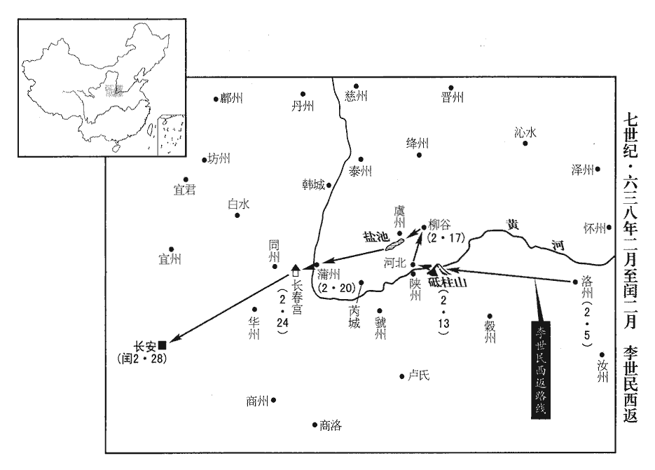
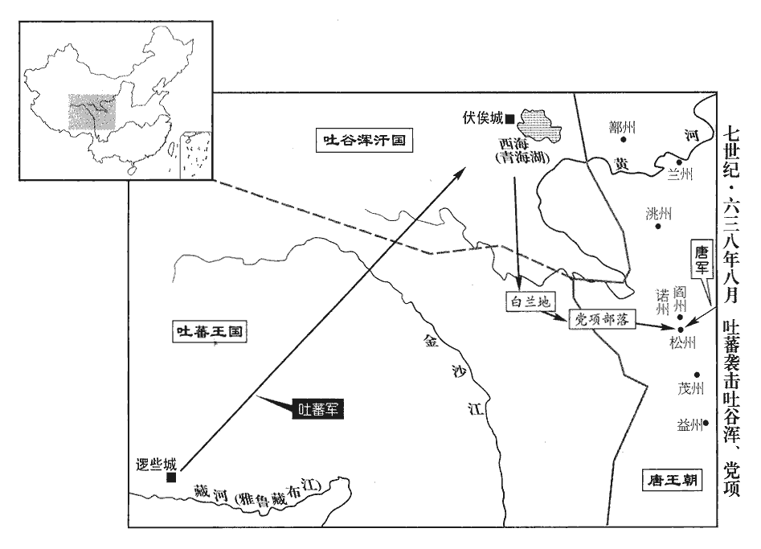
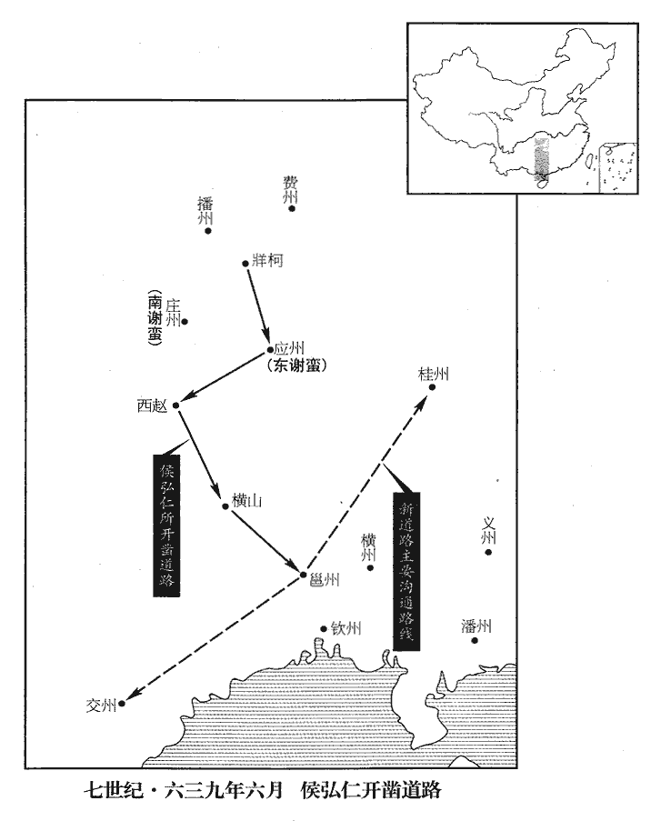
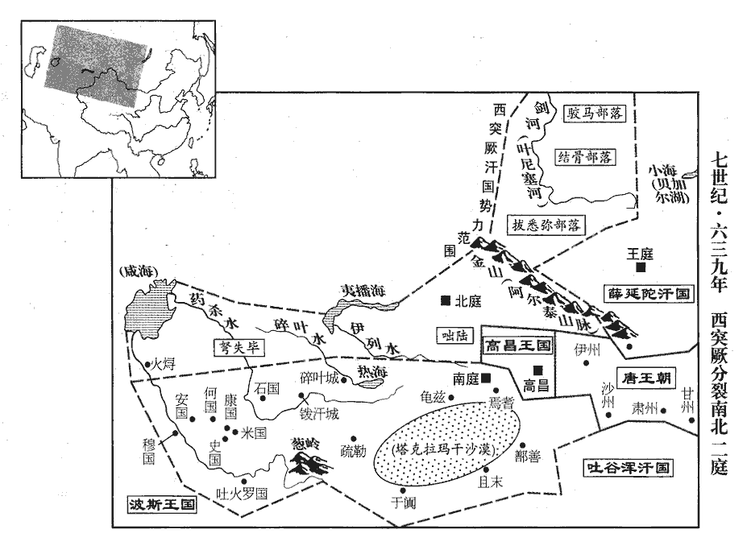
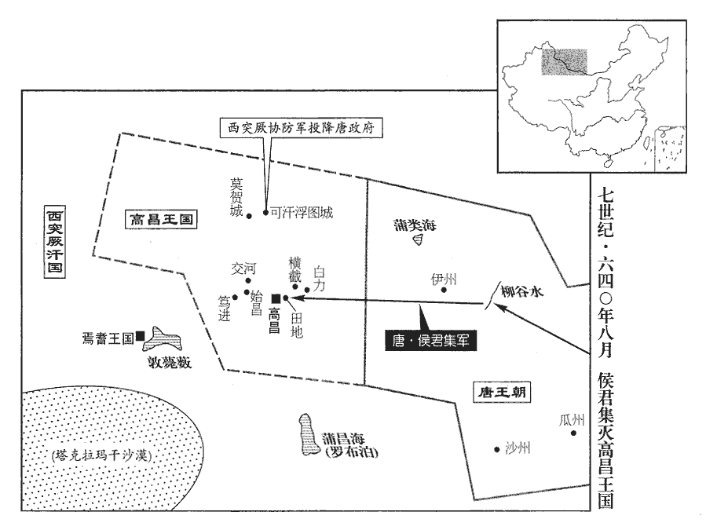
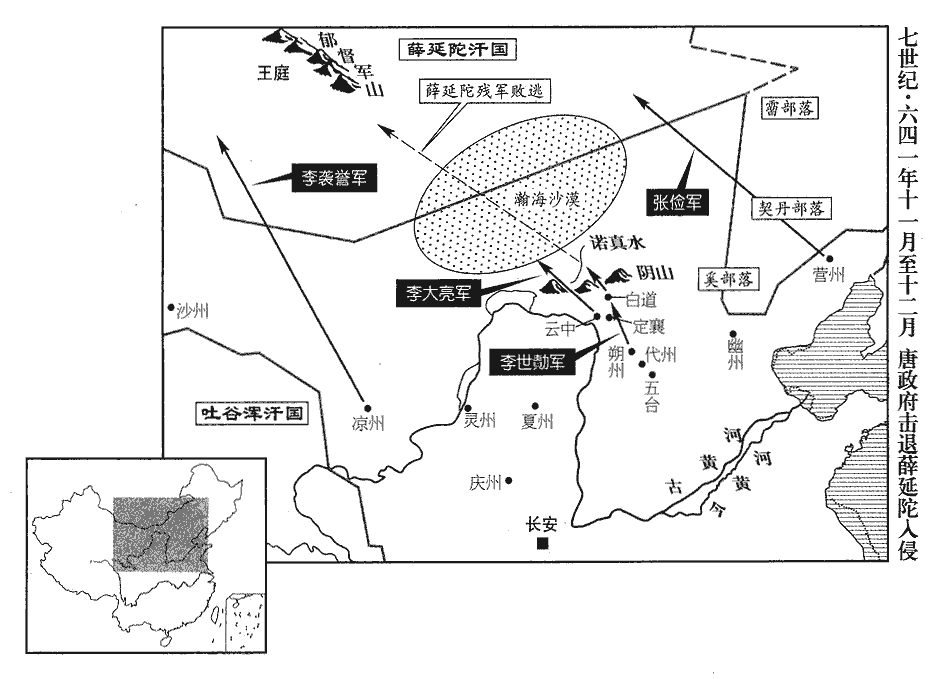

 唐紀十一起強圉作噩（丁酉）五月，盡上章困敦（庚子），凡三年有奇。始丁酉終庚子。

# 太宗文武大聖大廣孝皇帝中之上

## 貞觀十一年（丁酉、六三七）觀，古玩翻。

1五月，壬申，魏徵上疏，以為：「陛下欲善之志不及於昔時，聞過必改少虧於曩日，上，時掌翻。少，詩沼翻。譴罰積多，威怒微厲。乃知貴不期驕，富不期侈，非虛言也。書周官曰：位不期驕，祿不期侈。孔安國註曰：貴不與驕期而驕自至，富不與侈期而侈自至。魏徵引之。且以隋之府庫、倉廩、戶口、甲兵之盛，考之今日，安得擬倫！然隋以富強動之而危，我以寡弱靜之而安；安危之理，皎然在目。昔隋之未亂也，自謂必無亂；其未亡也，自謂必無亡。故賦役無窮，征伐不息，以至禍將及身而尚未之寤也。夫鑒形莫如止水，鑒敗莫如亡國。夫，音扶。伏願取鑒於隋，去奢從約，親忠遠佞，去，羌呂翻。遠，于願翻。以當今之無事，行疇昔之恭儉，則盡善盡美，固無得而稱焉。夫取之實難，守之甚易，陛下能得其所難，豈不能保其所易乎！」去，羌呂翻。遠，于願翻。易，以豉翻。

〖译文〗 [1]五月，壬申（疑误），魏徵上奏疏，认为：“陛下从善如流、闻过必改的精神似乎不如从前，谴责惩罚渐多，逞威发怒比过去严厉了。由此可知富贵时不希望引来骄横奢侈，而骄横奢侈却不期而至，这并非虚妄之言。而且当年隋朝府库仓廪的充实与户口甲兵的强盛，今日如何比得上！然而隋朝自恃富强频繁劳作以至国家危亡，我们自知贫弱与民清静而使天下安定；安定与危亡的道理，昭然若揭。从前隋朝未发生变乱时，自己认为必然不会发生变乱；未灭亡时，自认为必然没有灭亡的危险。故而不停地征派赋税劳役，不停地东征西伐，以致祸乱将及自身时还尚未知觉。所以说照看自己的身形莫如使水静止如镜面，借鉴失败莫如看国家的灭亡。深望陛下能够借鉴隋的覆亡，除掉奢侈立意俭约，亲近忠良远离邪佞，以现在的平静无事，继续施行过去的勤勉节俭，才能达到尽善尽美、无以复加的地步。取得天下诚属困难，而守成则较为容易，陛下能够取得较难的一步，难道不能保全较容易的吗？”

2六月，右僕射虞恭公溫彥博薨‹年六十四岁›。射，寅謝翻。諡法：尊賢敬讓曰恭；執事堅固曰恭；執禮御賓曰恭。彥博久掌機務，知無不為。上謂侍臣曰：「彥博以憂國之故，精神耗竭，我見其不逮，已二年矣，恨不縱其安逸，竟夭天年！」夭，於紹翻。

〖译文〗 [2]六月，尚书右仆射虞恭公温彦博去世。彦博长时间执掌机要，尽职尽责。太宗对身边的大臣们说：“彦博因为忧国忧民的缘故，耗尽心力，朕见其精力与体力不支，已有二年，只是遗憾不能让他安逸清闲一段时间，竟致英年早逝！”

3丁巳‹四›，上幸明德宮‹洛阳市境›。顯慶二年，改明德宮監為東都苑南面監。

〖译文〗 [3]丁巳（初四），太宗巡幸明德宫。

4己未‹六›，詔荊州‹总部设湖北省江陵县›都督荊王元景等二十一王所任刺史，咸令子孫世襲。令，力丁翻。戊辰‹十五›，又以功臣長孫無忌等十四人為刺史，長，知兩翻。亦令世襲；非有大故，無得黜免。

〖译文〗 [4]己未（初六），太宗下诏荆州都督、荆王李元景等二十一位亲王所任的刺史职务，均由其子孙世袭。戊辰（十五日），又封功臣长孙无忌等十四人为刺史，也令其子孙世袭；如没有大的变故，不得黜免。

5己巳‹十六›，徙許王元祥為江王。

〖译文〗 [5]己巳（十六日），改封许王李元祥为江王。

6秋，七月，癸未‹一›，大雨，穀‹涧河›、洛‹洛水›溢入洛陽宮，按唐六典，洛陽都城，隋大業二年詔楊素、宇文愷移故都創造，南直伊闕之口，北倚邙山之塞，東出瀍水之東，西踰澗水之西，洛水貫都，有河漢之象焉。東去故都十八里。都城西連禁苑，穀、洛二水會于禁苑之間。至玄宗開元二十四年，以穀、洛二水或泛溢，疲費人功，遂出內庫和雇，脩三陂以禦之，一曰積翠，二曰月陂，三曰上陽；爾後二水無勞役之患。壞官寺、民居，壞，音怪。溺死者六千餘人。溺，奴狄翻。

〖译文〗 [6]秋季，七月，癸未（初一），天降大雨，谷、洛二河水涨满，溢出流入洛阳宫中，毁坏官家寺庙与百姓住房，溺死六千多人。

7魏徵上疏，以為：「文子曰：『同言而信，信在言前；同令而行，誠在令外。』漢書藝文志曰：文子，老子弟子，與孔子並時。上，時掌翻。自王道休明，十有餘年，然而德化未洽者，由待下之情未盡誠信故也。今立政致治，必委之君子；治，直吏翻。事有得失，或訪之小人。其待君子也敬而疏，遇小人也輕而狎；狎則言無不盡，疏則情不上通。夫中智之人，豈無小慧！夫，音扶。然才非經國，慮不及遠，雖竭力盡誠，猶未免有敗，況內懷姦宄，其禍豈不深乎！宄，音軌。夫雖君子不能無小過，苟不害於正道，斯可略矣。既謂之君子而復疑其不信，復，扶又翻。何異立直木而疑其影之曲乎！陛下誠能慎選君子，以禮信用之，何憂不治！治，直吏翻。不然，危亡之期，未可保也。」上賜手詔褒美曰：「昔晉武帝‹司马炎›平吳之後，志意驕怠，何曾位極台司，不能直諫，乃私語子孫，自矜明智，事見八十七卷晉懷帝永嘉三年。語，牛倨翻。此不忠之大者也。得公之諫，朕知過矣。當置之几案以比弦、韋。」用董安于、西門豹事。

〖译文〗 [7]魏徵上奏疏认为：“《文子》说：‘同样的言语，有时能被信任，可见信任在言语之前；同样的命令，有时被执行，可见真诚待人在命令之外。’自从大唐美善兴旺，已有十多年了，然而德化的成效不尽人意，是因为君王对待臣下未尽诚信的缘故。如今确立政策，达到大治，必然委之于君子；而事有得失，有时要询访小人。对待君子敬而远之，对待小人轻佻而又亲昵，亲昵则言语表达得充分，疏远则下情难以上达。智力中等的人，岂能没有小聪明！然而并没有经国的才略，考虑问题不远，即使竭尽诚意，也难免有败绩，更何况内心怀有奸诈的小人，对国家的祸患能不深吗？虽然君子也不能没有小过失，假如对于正道没有太大的害处，就可以略去不计较。既然称之为君子而又怀疑其不真诚，这与立一根直木而又怀疑其影子歪斜有什么不同？陛下如果真能慎择君子，礼遇信任予以重用，何愁不能达到天下大治呢？否则的话，很难保证危亡不期而至呀。”太宗赐给魏徵手书诏令，夸赞道：“以前晋武帝平定东吴之后，意志骄傲懈怠，何曾身处三公高位，不能犯颜直谏，而是私下里说与子孙们听，自诩为明智，此乃最大的不忠。如今得到你的谏言，朕已知错了。当把你的箴言放在几案上，犹如西门豹、董安于佩戴韦弦以自警。”

8乙未‹十三›，車駕還洛陽，自明德宮還洛陽宮。還，從宣翻，又音如字。詔：「洛陽宮為水所毀者，少加脩繕，纔令可居。少，詩沼翻；下同。令，力丁翻。自外眾材，給城中壞廬舍者。令百官各上封事，極言朕過。」上，時掌翻。壬寅‹二十›，廢明德宮及飛山宮之玄圃院，給遭水者。

〖译文〗 [8]乙未（十三日），太宗的车驾从明德宫回到洛阳宫，下诏说：“洛阳宫被水毁坏的部分，稍加修缮，便可以居住。从外面运来的修缮材料，都供给城中屋舍塌坏的人家。命令文武百官各上书言事，极力指出朕的过失。”壬寅（二十日），废除明德宫以及飞山宫中的玄圃院，将其赐给遭受水灾的百姓。

9八月，甲子‹十二›，上謂侍臣曰：「上封事者皆言朕遊獵太頻。今天下無事，武備不可忘，朕時與左右獵於後苑，無一事煩民，夫亦何傷！」夫，音扶。魏徵曰：「先王惟恐不聞其過。陛下既使之上封事，止得恣其陳述。苟其言可取，固有益於國；若其無取，亦無所損。」上曰：「公言是也。」皆勞而遣之。勞，力到翻。

〖译文〗 [9]八月，甲子（十二日），太宗对身边大臣说：“上书奏事的人都说朕游猎太频繁，如今天下无事，武备的事不能忘，朕时常与身边的人到后苑射猎，没有一件事烦扰了百姓，这有什么害处呢？”魏徵说：“先王惟恐听不到有人谈论其过错。陛下既然让大臣们上书奏事，就应该听任他们无拘束地陈述意见。如果他们的话可取，固然会对国家有利；假如不可取，听听也没有损害。”太宗说：“你说得很对。”均予慰问，并打发他们回去。

10侍御史馬周上疏，上，時掌翻。以為：「三代及漢，歷年多者八百，少者不減四百，良以恩結人心，人不能忘故也。自是以降，多者六十年，少者纔二十餘年，皆無恩於人，本根不固故也。陛下當隆禹‹姒文命›、湯‹子天乙›、文‹姬昌›、武‹姬发›之業，為子孫立萬代之基，豈得但持當年而已！今之戶口不及隋之什一，而給役者兄去弟還，道路相繼。陛下雖加恩詔，使之裁損，然營繕不休，民安得息！故有司徒行文書，曾無事實。昔漢之文‹刘恒›、景‹刘启›，恭儉養民，武帝‹刘彻›承其豐富之資，故能窮奢極欲而不至於亂。曏使高祖‹刘邦›之後即傳武帝，漢室安得久存乎！斯確論也。又，京師及四方所造乘輿器用及諸王、妃、主服飾，議者皆不以為儉。乘，繩證翻。夫昧爽丕顯，後世猶怠，左傳晉叔向引讒鼎之銘以為言。杜預註曰：昧，旦，早起也。丕，大也。言夙興以務大顯，後世猶懈怠。夫，音扶。陛下少居民間，知民疾苦，尚復如此，況皇太子‹李承乾›生長深宮，不更外事，少，詩照翻。復，扶又翻。長，竹兩翻。更，工衡翻。萬歲之後，固聖慮所當憂也。臣觀自古以來，百姓愁怨，聚為盜賊，其國未有不亡者，人主雖欲追改，不能復全。復，扶又翻；下不復同，又音如字。故當脩於可脩之時，不可悔之於已失之後也。蓋幽‹姬宫湦shēng›、厲‹姬胡›嘗笑桀‹姒履癸›、紂‹子受辛›矣，煬帝‹杨广›亦笑周‹北周›、齊‹北齐›矣，不可使後之笑今如今之笑煬帝也！貞觀之初，天下饑歉，觀，古玩翻。歉，苦簟diàn翻。穀梁傳曰：一穀不升曰歉。斗米直匹絹，而百姓不怨者，知陛下憂念不忘故也。今比年豐穰，比，毗至翻。匹絹得粟十餘斛，而百姓怨咨者，知陛下不復念之，多營不急之務故也。復，扶又翻。自古以來，國之興亡，不以畜積多少，在於百姓苦樂。少，詩沼翻。樂，音洛。且以近事驗之，隋貯洛口倉‹河南省巩县境›而李密因之，貯，丁呂翻。東都‹洛阳›積布帛而世充資之，西京‹西安›府庫亦為國家之用，至今未盡。夫畜積固不可無，要當人有餘力，然後收之，不可強斂以資寇敵也。扶，音扶。強，其兩翻。斂，力贍翻。夫儉以息人，陛下已於貞觀之初親所履行，在於今日為之，固不難也。陛下必欲為久長之謀，不必遠求上古，但如貞觀之初，則天下幸甚。觀，古玩翻。陛下寵遇諸王，頗有過厚者，時魏王泰有寵於帝，故周言及之。萬代之後，不可不深思也。且【嚴：「且」改「昔」。】魏武帝‹曹操›愛陳思王‹曹植›，及文帝‹曹丕›即世，囚禁諸王，但無縲léi絏xiè耳。事見漢獻帝紀及魏文帝紀。縲，力追翻。絏，息列翻。朱元晦曰：縲，黑索也。絏，攣也。古者獄以黑索拘攣罪人。然則武帝愛之，適所以苦之也。又，百姓所以治安，治，直吏翻。唯在刺史、縣令，苟選用得人，則陛下可以端拱無為。今朝廷唯重內官而輕州縣之選，刺史多用武人，或京官不稱職始補外任，朝，直遙翻。稱，尺證翻。邊遠之處，用人更輕。所以百姓未安，殆由於此。」疏奏，上稱善久之，謂侍臣曰：「刺史朕當自選；縣令，宜詔京官【章：十二行本「官」下有「五品」二字；乙十一行本同；張校同，云無註本亦無。】已上各舉一人。」

〖译文〗 [10]侍御史马周上奏疏认为：“夏商周三代以及汉代，历经年代多者八百年，少者不少于四百年，这是因为上古帝王以恩惠凝聚人心，人们不能忘怀的缘故。汉代以后历代王朝，多者六十年，少者仅二十多年，均因对百姓不施恩惠，根基不牢固的缘故。陛下正应当发扬禹、汤、文、武的帝业，为子孙确立千秋万代的基业，岂能只维持当年的现状！如今全国户口不及隋朝的十分之一，而服劳役的兄去弟归，道路相断。陛下虽然下了施恩的诏令，减损劳役，然而营缮之事无休无止，老百姓怎么能得到休息呢！所以主管部门徒劳地发放文书，与实际毫不相干。从前汉文帝与汉景帝，谦恭节俭以养护百姓，武帝继承丰富的资产，所以能够穷奢极欲而不至天下大乱。假使汉高祖之后即传位给武帝，汉朝还能那么长久吗？再者，京都长安以及各地所制造的乘舆器物用具和众位亲王、妃嫔、公主的服饰，议论的人都认为这并非节俭。前代君王黎明即起以致力于声名显赫，后人还是有所倦怠，陛下年轻时居于民间，深知百姓的疾苦，尚且如此，何况皇太子生长于深宫高院，不熟悉外部事物，陛下辞世后的事，固然是应当忧虑的。我观察自古以来，百姓愁苦怨恨，便聚合为盗贼，其国家没有不灭亡的，君主虽然想追悔改正，也难以恢复保全。所以修德行应当于可修之时，不可等到失去国家之后再去后悔。当年周幽王、周厉王曾取笑过桀、纣，隋炀帝也曾取笑过周、齐两朝，不可让后代人取笑现在如同现在我们取笑炀帝一样。贞观初年，全国欠收闹饥荒，一斗米值一匹绢，而老百姓毫无怨言，是因为知道陛下忧国忧民的缘故。如今连年丰收，一匹绢可换粟十余斛，然而老百姓怨声不断，是知道陛下不再顾念百姓，多营缮宫殿，不操持国家急务的缘故。自古以来，国家的兴亡，不在于积蓄的多少，而在于百姓的苦乐。就以近代以来的历史加以考察，隋朝广贮洛口仓而李密加以利用，东都积存布帛而王世充得以借力，西京的府库也为我们大唐所用，至今仍未用完。积蓄储备固然不可缺少，也要百姓有余力，然后收税，不可强加聚敛拱手供给敌方。节俭以使百姓休息，陛下已经在贞观初年亲身实践，今日再这么做，固然不是什么难事。陛下如果想要谋划长治久安的政策，不必远求上古时代，只是像贞观初年那样，则是天下的幸事。陛下宠爱厚待诸王，颇有十分过分的，但不能不深思陛下身后的事情。从前魏武帝宠爱陈思王曹植，等到曹丕即位，便囚禁了诸王，只是没有捆上绳索罢了。这样看来魏武帝的过分宠爱，恰使他们倍受其苦。另外，百姓得以安定，惟在于刺史和县令，如果挑选的人得力，则陛下可以清闲自在。如今朝廷只重中央的官吏而轻视州县地方官的选拔，刺史多用武人，或者是朝官不称职时才补选为地方官，边远地区，用人更加轻视。所以说百姓不安定，大概的原因便在于此。”奏疏上奏后，太宗称赞很久，对身边的大臣说：“刺史应当由朕亲自选拔，县令应诏令朝官以上官员每人荐举一人。”

11冬，十月，癸丑‹二›，詔勳戚亡者皆陪葬山陵。唐制：凡功臣密戚請陪陵葬者聽之，以文武分為左右而列。若宮人陪葬，則陵戶為之成墳。唐會要載昭陵陪葬者，宮嬪、公主、主壻、勳貴及祖父陪陵而子孫從葬者，及四夷君長入宿衛而陪葬者，名氏最多，用此詔也。

〖译文〗 [11]冬季，十月，癸丑（初二），诏令勋贵大臣死后均陪葬于皇陵。

12上獵於洛陽苑，唐六典：洛陽苑在都城之西，北距北邙，西至孝水，南帶洛水支渠，穀、洛二水會於其間，東面十七里，南面三十九里，西面五十里，北面二十里，周迴一百二十六里。有群豕突出林中，上引弓四發，殪四豕。有豕突前，及馬鐙；殪yì，壹計翻。鐙，都鄧翻，鞍鐙。民部尚書唐儉投馬搏之，上拔劍斬豕，顧笑曰：「天策長史不見上將擊賊邪，武德中，帝開天策上將府，以唐儉為長史。長，知兩翻。將，即亮翻。邪，音耶。何懼之甚！」對曰：「漢高祖以馬上得之，不以馬上治之；漢陸賈諫高祖之言。治，直之翻。陛下以神武定四方，豈復逞雄心於一獸！」上悅，為之罷獵，復，扶又翻。為，于偽翻。尋加光祿大夫。

〖译文〗 [12]太宗狩猎于洛阳苑，有一群野猪跑出林中，太宗引弓连发四箭，射死四头。有一头野猪奔到马前，将要咬到马蹬；民部尚书唐俭下马近前与猪搏斗，太宗拨出剑砍死野猪，回头对唐俭笑着说：“天策长史没看见朕将要杀掉野兽吗，为什么如此害怕呢？”唐俭答道：“汉高祖从马上得天下，却不以马上治天下；陛下以神威圣武平定四方，怎么能对一头野兽再逞威风呢？”太宗高兴，为此停止捕猎，不久加封唐俭为光禄大夫。

13安州‹总部设湖北省安陆市›都督吳王恪數出畋獵，數，所角翻。頗損居人；侍御史柳範奏彈之。丁丑‹二十六›，恪坐免官，削戶三百。上曰：「長史權萬紀事吾兒，不能匡正，罪當死。」柳範曰：「房玄齡事陛下，猶不能止畋獵，豈得獨罪萬紀！」上大怒，拂衣而入。久之，獨引範謂曰：「何面折我！」折，之舌翻。對曰：「陛下仁明，臣不敢不盡愚直。」古語有之：君仁則臣直。又曰：君明則臣直。故柳範云然。上悅。

〖译文〗 [13]安州都督吴王李恪多次出外游猎，对当地居民造成危害，侍御史柳范上书弹劾他。丁丑（二十六日），李恪因此被免官职，削减食封三百户。太宗说：“长史权万纪事奉我的儿子，不能匡偏正讹，论罪当处死。”柳范说：“房玄龄事奉陛下，还不能阻止陛下狩猎，怎么能只怪罪万纪呢？”太宗勃然大怒，拂袖而去。过了不久，太宗单独召见柳范说：“你为什么当面羞辱朕？”答道：“陛下仁德明察，我不敢不尽愚忠直谏。”太宗高兴了。

14十一月，辛卯‹十一›，上幸懷州‹河南省沁阳县›；丙午‹二十六›，還洛陽宮。

〖译文〗 [14]十一月，辛卯（十一月），太宗巡幸怀州，丙午（二十六日），回到洛阳宫。

15故荊州‹总部设湖北省江陵县›都督武士彠huò女，年十四，上聞其美，召入後宮，為才人。為武氏亂唐張本。彠，一虢翻。考異曰：舊則天本紀，崩時年八十三。唐曆、焦璐唐朝年代記、統紀、馬總唐年小錄、聖運圖、會要皆云八十一。唐錄、政要，貞觀十三年入宮。據武氏入宮年十四。今從吳兢則天實錄為八十二，故置此年。

〖译文〗 [15]已故荆州都督武士的女儿，年方十四岁，太宗听说她貌美，召入后宫，册封为才人。

## 十二年（戊戌、六三八）

1春，正月，乙未‹十五›，禮部尚書王珪奏：「三品已上遇親王於路皆降乘，非禮。」乘，繩證翻。上曰：「卿輩苟自崇貴，輕我諸子。」特進魏徵曰：「諸王位次三公，今三品皆九卿、八座，為王降乘，誠非所宜當。」為，于偽翻。上曰：「人生壽夭難期，萬一太子‹李承乾›不幸，安知諸王他日不為公輩之主！何得輕之！」時太子承乾有足疾，魏王泰有寵；太宗此言，固有以泰代承乾之心矣。夭，於紹翻。對曰：「自周以來，皆子孫相繼，不立兄弟，所以絕庶孼niè之窺窬，塞禍亂之源本，孼，魚列翻。塞，悉則翻。此為國者所深戒也。」上乃從珪奏。

〖译文〗 [1]春季，正月，乙未（十五日），礼部尚书王上奏称：“三品以上官员遇见亲王都要下车舆站立路旁，这不符合礼仪。”太宗说：“你们随便自我尊贵，轻视诸位皇子。”特进魏徵说：“亲王们地位并列于三公，如今三品以上大臣均是九卿、八座，为亲王们下轿行礼，实在是不合适。”太宗说：“人的生命长短难以预料，万一太子遇到不幸早亡，谁能知道哪个王子他日不能做为你们的君主呢？怎么能轻视他们呢？”答道：“自周代以来，都是子孙相承，不立兄弟即位，这是为了杜绝庶子觊觎皇位，堵塞祸乱的根源，此是治国者应当深以为戒的。”太宗于是听从了王的启奏。

2吏部尚書高士廉、黃門侍郎韋挺、禮部侍郎令狐德棻、中書侍郎岑文本撰氏族志成，上之。令，音鈴。棻，符分翻。撰，士免翻。上，時掌翻。先是，山東‹崤山以东›人士崔、盧、李、鄭諸族，好自矜地望，先，悉薦翻。好，呼到翻。雖累葉陵夷，苟他族欲與為昏姻，白虎通曰：昏者，昏時行禮，故曰昏。姻者，婦人因夫，故曰姻。賢曰：妻父曰婚，壻父曰姻。必多責財幣，或捨其鄉里而妄稱名族，或兄弟齊列而更以妻族相陵。上惡之，惡，烏路翻。命士廉等徧責天下譜諜，質諸史籍，考其真偽，辯其昭穆，譜，博古翻。諜，達協翻。昭，時招翻。第其甲乙，褒進忠賢，貶退姦逆，分為九等。士廉等以黃門侍郎崔民幹為第一。上曰：「漢高祖與蕭、曹、樊、灌皆起閭閻布衣，卿輩至今推仰，以為英賢，豈在世祿乎！高氏偏據山東，梁、陳僻在江南，雖有人物，蓋何足言！況其子孫才行衰薄，行，下孟翻；下德行同。官爵陵替，而猶卬然以門地自負，販鬻松檟jiǎ，依託富貴，棄廉忘恥，不知世人何為貴之！今三品以上，或以德行，或以勳勞，或以文學，致位貴顯。行，下孟翻。彼衰世舊門，誠何足慕！而求與為昏，雖多輸金帛，猶為彼所偃蹇，我不知其解何也！解，猶說也。今欲釐正訛謬，捨名取實，而卿曹猶以崔民幹為第一，是輕我官爵而徇流俗之情也。」乃更命刊定，專以今朝品秩為高下，更，工衡翻。朝，直遙翻。於是以皇族為首，外戚次之，降崔民幹為第三。九等之次，皇族為上之上，外戚為上之中，崔民幹為上之下。凡二百九十三姓，千六百五十一家，頒於天下。

〖译文〗 [2]吏部尚书高士廉、黄门侍郎韦挺、礼部侍郎令狐德、中书侍郎岑文本编撰《氏族志》，书成，上奏给太宗。这以前，山东崔、卢、李、郑等世家大族，喜欢自我标榜门第族望，虽然好几代已衰落，但如果非世族人家想与他们通婚，定要多索财物，导致当时的风俗有人丢弃原来的里贯而冒称名门士族，有的兄弟二人族望相等便以妻族背景相互比斗。太宗非常厌恶这些，命高士廉等人普查全国的谱牒，质证于史籍，考辨其真伪，辨别其昭穆伦序，编排行次，褒扬奖进忠贤，贬斥奸逆，分做九等。士廉等人将黄门侍郎崔民列为第一。太宗说：“汉高祖与萧何、曹参、樊哙、灌婴等人均以布衣起兵，你们至今仍然十分推重景仰，认为是一代英豪，难道在乎他们的世卿世禄地位吗？高氏偏守山东，梁、陈二朝僻居江南，虽然也有个别英豪，又何足挂齿！何况他们的子孙才气衰竭，德行浇薄，官爵降低，然而还很骄傲地以门第族望自负，挂羊头卖狗肉，依赖高贵人家，寡廉鲜耻，不知道世上的人为什么要尊贵他们？如今三品以上公卿大臣，有的以仁德行世，有的以功勋称道，有的以文章练达，致身显赫。那些衰微的世族们，不值得羡慕。然而那些希望与世族们通婚的，即使多供给金银财物，还为他们所看不起，朕不知道他们在想什么！如今想要厘正错谬，舍弃虚名追求实际，而你们仍然将崔民列为第一位，这是轻视大唐的官爵而依循流俗的观念。”于是下令重新刊正，专以当朝品秩高下订定标准，于是便以皇族李姓为首位，外戚次之，将崔民降为第三。共定二百九十三姓，一千六百五十一家，颁行全国。

3二月，乙卯‹五›，車駕西還；自洛陽西還長安。還，從宣翻，又音如字。癸亥‹十三›，幸河北‹山西省芮域县›，觀砥柱‹河南省陕县北›。自西還，便道幸河北縣。河北縣，漢、晉屬河東郡，後魏置河北郡，隋廢郡，復為縣，屬蒲州。縣南河中有砥柱山。貞觀元年，以河北縣度屬陜州。括地志曰：陜州河北縣，本漢大陽縣。

〖译文〗 [3]二月，己卯（初五），太宗车驾自洛阳向西行。癸亥（十三日），巡幸河北县，观看砥柱山。

4甲子‹十四›，巫州‹湖南省黔阳县›獠反，貞觀元年，分辰州之龍標縣置巫州。獠，魯皓翻。夔州‹总部设四川省奉节县›都督齊善行敗之，敗，補邁翻。俘男女三千餘口。

〖译文〗 [4]甲子（十四日），巫州獠民造反，州都督齐善行将其打败，俘虏男女三千多人。

5乙丑‹十五›，上祀禹廟；丁卯‹十七›，至柳谷‹山西省夏县南›，觀鹽池‹山西省运城市南›。禹都安邑，後人立廟於其地。安邑有鹽池，則柳谷亦當在安邑。庚午‹二十›，至蒲州‹山西省永济县›，刺史趙元楷課父老服黃紗單衣迎車駕，盛飾廨舍樓觀，廨，古隘翻。觀，古玩翻。又飼羊百餘頭、魚數百頭以饋貴戚。飼，祥吏翻。上數之曰：「朕巡省河、洛，數，所具翻。又所主翻。省，悉景翻。凡有所須，皆資庫物。卿所為乃亡隋之弊俗也。」甲戌‹二十四›，幸長春宮‹陕西省朝邑县境›。

〖译文〗 [5]乙丑（十五日），太宗祭祀禹庙；丁卯（十七日），到达柳谷，观看盐池。庚午（二十日），到达薄州，刺史赵元楷命令百姓们身穿纱单衣迎接车驾，装饰廨舍楼台观宇，又养了一百多头羊、数百条鱼献给贵族外戚。太宗责备他说：“朕巡行到黄河、洛水一带，凡有所须，均从府库中支取。你所做的乃是已灭亡的隋朝的老毛病了。”甲戌（二十四日），巡幸长春宫。

6戊寅‹二十八›，詔曰：「隋故鷹擊郎將堯君素，雖桀犬吠堯，有乖倒戈之志，而疾風勁草，實表歲寒之心；可贈蒲州刺史，仍訪其子孫以聞。」將，即亮翻。堯君素事始一百八十四卷隋恭帝義寧元年，終一百八十六卷高祖武德二年。漢鄒陽曰：桀之犬可使吠堯。武王伐紂，前徒倒戈，攻其後，以北。吠，扶廢翻。

〖译文〗 [6]戊寅（二十八日），太宗下诏说：“隋朝故鹰击郎将尧君素，虽然如同桀犬吠尧，与倒戈的情况相乖违，然而疾风识劲草，实表明其岁寒之心；可追赠为蒲州刺史，另外再寻访他的子孙上奏。”

 

7閏月，庚辰朔‹一›，日有食之。

〖译文〗 [7]闰二月，庚辰朔（初一），出现日食。

8丁未‹二十八›，車駕至京師。

〖译文〗 [8]丁未（二十八日），车驾回到京都长安。

9三月，辛亥‹二›，著作佐郎鄧世隆表請集上文章。上曰：「朕之辭令，有益於民者，史皆書之，足為不朽。若為【章：十二行本「為」作「其」；乙十一行本同；退齋校同。】無益，集之何用！梁武帝‹萧衍›父子、陳後主‹陈叔宝›、隋煬帝‹杨广›皆有文集行於世，何救於亡！為人主患無德政，文章何為！」遂不許。

〖译文〗 [9]三月，辛亥（初二），著作佐郎邓世隆上表请求搜集太宗所写文章。太宗说：“朕的言语命令，凡是有益于百姓的，史官都已记录下来，足可以做为不朽的文字。如果毫无益处，收集它又有什么用呢？梁武帝萧衍父子、陈后主、隋炀帝都有文集传世，哪能挽救他们的灭亡呢？作为君主忧虑的是不施德政，文章有什么用？”于是没有应允。

10丙子‹二十七›，以皇孫生，宴五品以上於東宮。上曰：「貞觀之前，從朕經營天下，玄齡之功也。貞觀以來，繩愆糾繆，魏徵之功也。」觀，古玩翻。皆賜之佩刀。上謂徵曰：「朕政事何如往年？」對曰：「威德所加，比貞觀之初則遠矣；人悅服則不逮也。」上曰：「遠方畏威慕德，故來服；若其不逮，何以致之？」對曰：「陛下往以未治為憂，故德義日新，今以既治為安，故不逮。」治，直吏翻。上曰：「今所為，猶往年也，何以異？」對曰：「陛下貞觀之初，恐人不諫，常導之使言，中間悅而從之。今則不然，雖勉從之，猶有難色。所以異也。」上曰：「其事可聞歟？」對曰：「陛下昔欲殺元律師，孫伏伽以為法不當死，陛下賜以蘭陵公主園，直百萬。或云：『賞太厚，』蘭陵公主，上女也，下嫁竇懷悊zhé，上以其園賞孫伏伽。陛下云：『朕即位以來，未有諫者，故賞之。』此導之使言也。司戶柳雄妄訴隋資，隋資，隋朝所授官資也。陛下欲誅之，納戴冑之諫而止。是悅而從之也。近皇甫德參上書諫修洛陽宮，陛下恚之，雖以臣言而罷，勉從之也。」皇甫德參事見上卷八年。上，時掌翻。恚huì，於避翻。上曰：「非公不能及此。人苦不自知耳！」

〖译文〗 [10]丙子（二十七日），太宗以皇孙降生，在东宫宴请五品以上官员。太宗说：“贞观年以前，跟随朕夺取并治理天下，以房玄龄的功劳最大。贞观年以来，纠正朕的过失，主要是魏徵的功劳。”都赐给他们佩刀。太宗对魏徵说：“朕治理国政与往年相比如何？”魏徵答道：“威德加于四方，则远超过贞观初年；人心悦服则不如从前。”太宗说：“远方民族畏惧皇威羡慕圣德，所以前来归服，如果说不如以前，则何以致此？”答道：“陛下以前以天下未能大治为忧虑，所以注意修德行义，每天都有新的作为，如今既得到治理又较安定，所以说不如以前勤勉了。”太宗说：“如今所做的与往年相同，有什么区别呢？”答道：“陛下在贞观初年惟恐臣下不行谏，常常引导他们进谏，听到进谏便乐而听从。如今却不然，虽然勉强听从，却面有难色。这便是区别。”太宗说：“可以举例说明吗？”答道：“陛下以前曾想杀掉元律师，孙伏伽认为依法不当处死，陛下赐给他兰陵公主的花园，价值一百万。有人说：‘赏赐太厚重了’，陛下说：‘朕即皇位以来，未听到行谏的人，所以要重赏’。这是为了引导众人行谏。司户柳雄假冒隋朝所授官资，陛下想要杀掉他，又采纳戴胄的谏言而作罢。这是乐而听从的例子。贞观八年皇甫德参上书谏阻修缮洛阳宫，陛下内心愤恨，虽然因为我直言相劝而作罢，但只是勉强听从啊。”太宗说：“不是您不能有这样的见解。人苦于不能自知呀！”

11夏，五月，壬申‹二十五›，弘文館學士永興文懿公虞世南卒，唐六典：弘文館學士無員數。後漢有東觀，魏有崇文館，宋元嘉有玄，史兩館，宋泰始至齊永明有總文館，梁有士林館，北齊有文林館，後周有崇文館；或典校理，或司撰著，或兼訓生徒，若今弘文館之任也。武德初，置修文館，武德末，改為弘文館。永興縣屬鄂州。諡法：溫柔賢善曰懿。卒，子恤翻。上哭之慟。世南外和柔而內忠直，上嘗稱世南有五絕：一德行，行，下孟翻。二忠直，三博學，四文辭，五書翰。

〖译文〗 [11]夏季，五月，壬申（二十五日），弘文馆学士、永兴文懿公虞世南去世，太宗恸哭。虞世南外表温和柔顺而内里忠正耿直，太宗曾称赞他有五绝：一道德高尚，二忠正耿直，三知识广博，四写一手好文章，五擅长书法。

12秋，七月，癸酉‹二十七›，以吏部尚書高士廉為右僕射。

〖译文〗 [12]秋季，七月，癸酉（二十七日），任命吏部尚书高士廉为尚书右仆射。

13乙亥‹二十九›，吐蕃‹西藏›寇弘州‹松州，四川省松潘县›。「弘」，恐當作「松」。吐，從暾入聲。

〖译文〗 [13]乙亥（二十九日），吐蕃侵犯弘州。

14八月，霸州‹四川省松潘县南一百三十公里›山獠反。按天寶元年招附生羌置靜戎郡，乾元元年，方置霸州。又松州都督府所管党項羈縻州有霸州，然當以其酋豪為刺史，而此霸州又是儀鳳二年松州加督三十八州之數。獠，魯皓翻。燒殺刺史向邵陵及吏民百餘家。

〖译文〗 [14]八月，霸州山獠族反叛。烧死刺史向邵陵以及官吏百姓一百多家。

15初，上遣使者馮德遐撫慰吐蕃‹西藏›，吐，從暾入聲。吐蕃聞突厥、吐谷渾皆尚公主，厥，九勿翻。谷，音浴。遣使隨德遐入朝，使，疏吏翻。朝，直遙翻。多齎金寶，奉表求婚；上未之許。使者還，言於贊普棄宗弄讚曰：「臣初至唐，唐待我甚厚，許尚公主。會吐谷渾王入朝，相離間，間，古莧翻。唐禮遂衰，亦不許婚。」弄讚遂發兵擊吐谷渾。吐谷渾不能支，遁於青海之北，民畜多為吐蕃所掠。

〖译文〗 [15]起初，太宗派遣使者冯德遐安抚慰问吐蕃，吐蕃听说突厥、吐谷浑都曾娶唐室公主为妻，便派使节随冯德遐到长安，带着大量金银财宝，上表请求通婚；太宗没有答应。使者回到吐蕃，对其首领赞普弃宗弄赞说：“我初次到大唐，大唐待我礼遇甚厚，答应嫁公主。正赶上吐谷浑首领入朝，相与离间，唐朝礼节渐淡，也不答应通婚了。”弃宗弄赞于是发兵攻打吐谷浑，吐谷浑军队抵抗不住，逃到青海北面，百姓的牲畜多被吐蕃掠走。

吐蕃進破党項‹四川省西北部›、白蘭‹青海省西南部›諸羌，帥眾二十餘萬屯松州‹四川省松潘县›西境，党，底朗翻。帥，讀曰率。遣使貢金帛，云來迎公主。尋進攻松州，敗都督韓威；敗，補邁翻；下敗吐同。羌酋閻州‹松潘县北›刺史別叢臥施、諾州‹松潘县北›刺史把利步利並以州叛歸之。貞觀五年，以党項降羌，置羈縻州，有闊州、諾州，皆屬松州都督府，無閻州。酋，慈由翻。連兵不息，其大臣諫不聽而自縊者凡八輩。縊，於計翻，又於賜翻。壬寅‹二十七›，以吏部尚書侯君集為當彌道行軍大總管，甲辰‹二十九›，以右領軍大將軍執失思力為白蘭道、左武衛將軍牛進達為闊水道、左領軍將軍劉簡【嚴：「簡」改「蘭」。】為洮河道行軍總管，督步騎五萬擊之。洮，土刀翻。騎，奇寄翻。

〖译文〗 吐蕃进而攻占党项、白兰等羌族，率兵二十多万驻扎在松州西部边境，派使节进献金银绸缎，声称前来迎接公主。不久进攻松州，打败都督韩威；羌族首领阎州刺史别丛卧施、诺州刺史把利步利一同举州投降吐蕃。吐蕃连年征战不息，大臣劝谏不听而自杀的总共有八个人。壬寅（二十七日），唐朝廷任命吏部尚书侯君集为当弥道行军大总管，甲辰（二十九日），任命右领军大将军执失思力为白兰道、左武卫将军牛进达为阔水道、左领军将军刘简为洮河道行军总管，统率步、骑兵五万人攻打吐蕃。

吐蕃攻城‹四川省松潘县›十餘日，進達為先鋒，九月，辛亥‹六›，掩其不備，敗吐蕃於松州城下，宋白曰：松州之地，漢、魏諸羌居之，及晉內附，以其地屬汶山郡。後魏時，鄧至王像舒據之，遣使朝貢，始置甘松縣，後周置龍涸防，唐置松州；去長安二千二百五十里。斬首千餘級。弄讚懼，引兵退，遣使謝罪，因復請婚。使，疏吏翻。復，扶又翻。上許之。

〖译文〗 吐蕃进攻松州城十多天，牛进达为唐军先锋，九月，辛亥（初六），乘吐蕃军毫无防备，大败吐蕃于松州城下，杀死一千多人。弃宗弄赞害怕，率兵退回本地，派人到长安请罪，借此再次请求通婚。太宗应允。

 

16甲寅‹九›，上問侍臣：「創業與守成孰難？」房玄齡曰：「草昧之初，易曰：天造草昧。王弼註云：造物之始，始於冥昧，故曰草昧也。廣雅：草，造也。董云：草昧，微物。與群雄並起角力而後臣之，創業難矣！」魏徵曰：「自古帝王，莫不得之於艱難，失之於安逸，守成難矣！」上曰：「玄齡與吾共取天下，出百死，得一生，故知創業之難。徵與吾共安天下，常恐驕奢生於富貴，禍亂生於所忽，故知守成之難。然創業之難，既已往矣；守成之難，方當與諸公慎之。」玄齡等拜曰：「陛下及此言，四海之福也。」

〖译文〗 [16]甲寅（初九），太宗问身边大臣：“创业与守成哪个难？”房玄龄：“建国之前，与各路英雄一起角逐争斗而后使他们臣服，还是创业难！”魏徵说：“自古以来的帝王，莫不是从艰难境地取得天下，又于安逸中失去天下，守成更难！”太宗说：“玄龄与我共同打下江山，出生入死，所以更体会到创业的艰难。魏徵与我共同安定天下，常常担心富贵而导致骄奢，忘乎所以而产生祸乱，所以懂得守成更难。然而创业的艰难，已成为过去的往事，守成的艰难，正应当与诸位慎重对待。”玄龄等人行礼道：“陛下说这一番话，是国家百姓的福气呀！”

17初，突厥‹瀚海沙漠群›頡利既亡，北方空虛，厥，九勿翻。頡，奚頡翻。薛延陀真珠可汗帥其部落建庭於都尉犍山‹郁督军山外蒙古杭爱山›北、獨邏水‹外蒙古色楞格河›南，按薛延陀建庭之地在鬱督軍山，東南距京師纔三千里而贏。新書曰：烏德犍山左右，嗢wà昆河、獨邏河皆屈曲東北流，嗢昆在南，獨邏在北，過回紇牙帳東北五百里而合流。可，從刊入聲。汗，音寒。帥，讀曰率。犍，居言翻。邏，郎佐翻。勝兵二十萬，勝，音升。立其二子拔酌、頡利苾主南、北部。苾，毗必翻。上以其強盛，恐後難制，癸亥‹十八›，拜其二子皆為小可汗，各賜鼓纛，纛，徒到翻。外示優崇，實分其勢。

〖译文〗 [17]起初，突厥颉利可汗灭亡以后，北方地域空虚，薛延陀真珠可汗率其部落在都尉犍山北麓、独逻水南岸建牙帐，兵马二十多万，立他的二个儿子拔酌、颉利分别统领南、北部。太宗看到他的强大，担心以后难以制服，癸亥（十八日），封真珠可汗的两个儿子为小可汗，各赐给鼓和大旗，外示尊崇，实际是为了分化其实力。

18冬，十月，乙亥‹一›，巴州‹四川省巴中县›獠反。後漢於宕渠北界置漢昌縣，後魏於縣置大谷郡，又於郡北置巴州，隋改為清化郡，唐復為巴州。獠，魯皓翻；下同。

〖译文〗 [18]冬季，十月，乙亥（初一），巴州獠民反叛。

19己卯‹五›，畋于始平‹陕西省兴平县›；曹魏置始平縣，屬扶風，晉分立始平郡，後魏復為縣，屬扶風，隋屬京兆。九域志，在府西八十里。乙未‹二十一›，還京師。

〖译文〗 [19]己卯（初五），太宗在始平畋猎；乙未（二十一日），回到长安。

20鈞州獠反；遣桂州‹总部设广西桂林市›都督張寶德討平之。

〖译文〗 [20]钧州獠民反叛；唐朝廷派桂州都督张宝德讨伐平定。

21十一月，丁未‹三›，初置左、右屯營飛騎於玄武門，以諸將軍領之。又簡飛騎才力驍健、善騎射者，號百騎，衣五色袍，乘駿馬，以虎皮為韉，騎，奇寄翻。驍，堅堯翻。衣，於既翻。韉jiān，則前翻。凡遊幸則從焉。

〖译文〗 [21]十一月，丁未（初三），开始在玄武门设置左、右屯营飞骑，由各位将军统领。又精选飞骑中身体骁健敏捷、善于骑射的，号称一百名骑手，身披五色袍，乘骏马，用虎皮做马鞍和垫布，凡遇皇帝巡幸则为护卫随从。

22己巳‹二十五›，明州‹贵州省思南县›獠反；吳置越裳縣，屬九德郡，以古越裳之地也；隋屬驩州日南郡。武德五年，以越裳地置明州。遣交州‹总部设越南河内市›都督李道彥討平之。

〖译文〗 [22]己巳（二十五日），明州獠民反叛，唐朝廷派交州都督李道彦讨伐平定。

23十二月，辛巳‹七›，左武候將軍上官懷仁擊反獠於壁州‹四川省通江县›，後漢和帝，分宕渠之東置宣漢縣，梁分宣漢置始寧縣，元魏分始寧縣置諾水縣，武德八年，分巴州之始寧縣置壁州始寧郡。大破之，虜男女萬餘口。

〖译文〗 [23]十二月，辛巳（初七），左武候将军上官怀仁在壁州进攻反叛的獠民，取胜，俘获其男女一万多人。

24是歲，以給事中馬周為中書舍人。周有機辯，中書侍郎岑文本常稱：「馬君論事，援引事類，揚榷古今，毛晃曰：揚榷，大舉，又掎jǐ也，舉而引之也。榷，訖岳翻。舉要删煩，會文切理，一字不可增，亦不可減，聽之靡靡，令人忘倦。」

〖译文〗 [24]这一年，任命给事中马周为中书舍人。马周机敏善辩，中书侍郎岑文本常常称赞他：“马君议论事情，旁征博引纵横古今，提纲挈领删繁就简，用词准确切中事理，一字不可增，也不可减，听者心服，难以忘怀，全无倦意。”

25霍王元軌好讀書，恭謹自守，舉措不妄。為徐州‹江苏省徐州市›刺史，與處士劉玄平為布衣交。好，呼到翻。處，昌呂翻。人問玄平王所長，玄平曰：「無長。」問者怪之。玄平曰：「夫人有所短乃見所長，夫，音扶。至於霍王，無所短，吾何以稱其長哉！」

〖译文〗 [25]霍王李元轨喜欢读书，谦恭谨慎，举止合体。做徐州史，与处士刘玄平为布衣之交。人们询问刘玄平霍王的长处，玄平说：“没什么长处。”问的人觉得很奇怪。玄平说：“人有短处才能见到他的长处，至于说霍王，没有短处，我怎么能说出他的长处呢！”

26初，西突厥‹新疆北部及中亚细亚›咥利失可汗分其國為十部，每部有酋長一人，酋，慈由翻。長，知兩翻。可，從刊入聲。汗，音寒。仍各賜一箭，謂之十箭。又分左、右廂，左廂號五咄陸，置五大啜，居碎葉‹中亚细亚托克马克›以東；右廂號五弩失畢，置五大俟斤，居碎葉以西；通謂之十姓。咄陸五啜號：處木昆律啜，胡祿屋闕啜，攝舍提敦啜，突騎施賀邏施啜，鼠尼施處半啜。弩失畢五俟斤號：阿悉結闕俟斤，哥舒闕俟斤，拔寒幹暾沙鉢俟斤，阿悉結泥孰俟斤，阿舒虛半俟斤。碎葉城，在焉耆碎葉川。出安西西北千里至碎葉。杜佑曰：碎葉川，長千餘里，東頭有熱海，西頭有怛dá邏斯城。咄，當沒翻。啜，陟劣翻。康曰：俟，渠之切。咥利失失眾心，為其臣統吐屯所襲。咥利失兵敗，與其弟步利設走保焉耆‹新疆焉耆县›。新書曰：焉耆國直京師西七千里而贏，橫六百里，縱四百里；其國東高昌，西龜茲，南尉黎，北烏孫，漢舊國也。統吐屯等將立欲谷設為大可汗，會統吐屯為人所殺，欲谷設兵亦敗，咥利失復得故地。復，扶又翻，又音如字。至是，西部竟立欲谷設為乙毗咄陸可汗。乙毗咄陸既立，與咥利失大戰，殺傷甚眾。因中分其地，自伊列水‹伊犁河›以西屬乙咄陸，以東屬咥利失。伊列水亦名伊麗水，註詳見後。

〖译文〗 [26]起初，西突厥利失可汗将其国土分为十部，每部设首领一人，各赐给一支箭，称为十箭。又分左、右厢，左厢号称五咄陆，设置五大啜，居处于碎叶以东地区；右厢号称五弩失毕，设立五大俟斤，居住在碎叶以西；通称为十姓。利失失去民心，被他的臣下统吐屯袭击。利失兵败后，与他的弟弟步利设退守焉耆。统吐屯等人想要拥立欲古设为大可汗，这时统吐屯被人杀死，欲谷设部队也被打败，利失收复旧地。到此时，西部终于拥立欲谷设为乙毗咄陆可汗。乙吡咄陆即可汗位后，与利失发生激战，杀伤甚多。于是便从中间分其领地为二：自伊列水以西属乙毗咄陆，以东属于利失。

27處月‹新疆新源县境›、處密‹新疆塔城市境›與高昌‹新疆吐鲁番市›共攻拔焉耆五城，掠男女一千五百人，焚其廬舍而去。為伐高昌張本。

〖译文〗 [27]处月、处密与高昌一同攻占焉耆五座城池，掠走男女一千五百人，烧毁其房舍后离去。

## 十三年（己亥、六三九）

1春，正月，乙巳‹一›，車駕謁獻陵；唐謁陵之制：設行宮，距陵十里，設坐於齋室，設小次於陵所道西南，大次於寢西南。侍臣次於大次西南，陪位者次又於西南，皆東向。文官於北，武官於南，朝集使又於其南，皆相地之宜。皇帝至行宮，即齋室，陵令以玉冊進署，設御位於陵東南隅，西向；有岡麓之閡，則隨地之宜。又設位於寢宮之殿東陛之東南，西向，尊坫陳於堂戶東南。百官、行從宗室、客使位神道左右。寢宮則分方序立大次前。其日未明五刻，陳黃麾仗於陵寢，三刻，行事官及宗室親五等、諸親三等以上及客使之當陪者就位。皇帝素服、乘馬、華蓋、繖扇，侍臣騎從，詣小次。出次至位，再拜，又再拜，在位者皆再拜，又再拜。少選，太常卿請辭，皇帝再拜，又再拜。奉禮曰：「奉辭。」在位者再拜。皇帝還小次，乘馬詣大次，仗衛列立以俟行，百官、宗室諸親、客使序立次前。皇帝步至寢宮南門，仗衛止，乃入，由東序，進殿陛東南位，再拜，升自東階，北向再拜，又再拜，入省服玩，抆wěn拭帳簀zé，進太牢之饌，加珍羞。皇帝出尊所酌酒，入三奠爵，北向立。太祝二人持玉冊立於戶外，東向跪讀，皇帝再拜，又再拜，乃出戶，當前北向立。太常卿請辭，皇帝再拜，出東門，還大次，宿行宮。丁未‹三›，還宮。

〖译文〗 [1]春季，正月，乙巳（初一），太宗乘车驾谒见高祖献陵。丁未（初三），回到宫中。

2戊午‹十四›，加左僕射房玄齡太子少師。玄齡自以居端揆十五年，左右僕射，尚書省長官，故曰端揆。按武德九年，房玄齡為中書令，貞觀三年，為左僕射，至是財十一年，未及十五年也。少，始照翻。男遺愛尚上女高陽公主，女為韓王妃，韓王元嘉，高祖之子。深畏滿盈，上表請解機務；上，時掌翻。上不許。玄齡固請不已，詔斷表，乃就職。斷，音短，丁管翻。今之讓官者，奉表三讓，不許，敕斷來章，則閤門不復受其表，即唐制之斷表也。太子‹李承乾›欲拜玄齡，設儀衛待之，玄齡不敢謁見而歸，時人美其有讓。玄齡以度支繫天下利害，嘗有闕，求其人未得，乃自領之。唐制：度支郎中，掌天下租賦，物產豐約之宜，水陸道塗之利，歲計所出而支調之，以近及遠，與中書、門下議定乃奏，國之大計所關也。玄齡審官求賢，未得其人，故自領之。唐中世以後，宰相多判度支，蓋昉於此。度，徒洛翻。

〖译文〗 [2]戊午（十四日），加封左仆射房玄龄为太子少师。玄龄自己觉得身居尚书仆射的高位十五年，儿子房遗爱娶太宗女儿高阳公主，女儿为韩王妃，深怕富贵至极反招灾祸，上表请求解除所任机要职务，太宗不应允。玄龄不停地执意请求，太宗下诏断绝上表，玄龄只好就职。太子想向玄龄行弟子礼，设仪卫等待他，玄龄即不敢谒见太子转身回到家中，当时人称赞他有谦让之风。玄龄认为度支郎中一职关系国家利害，曾有空缺，未能访求到合适人选，于是便自己兼领此职。

3禮部尚書永寧懿公王珪薨‹年六十九岁›。永寧縣，屬洛州。珪性寬裕，自奉養甚薄。於令，三品已上皆立家廟，唐制：三品已上得立廟，祭三代。珪通貴已久，獨祭於寢。為法司所劾，劾，戶概翻，又戶得翻。上不問，命有司為之立廟以愧之。司為，于偽翻；下上為同。

〖译文〗 [3]礼部尚书、永宁懿公王去世。王性情宽和大方，自己的奉养却很薄。依照唐代制度，三品以上大臣均可立家庙祭祀三代祖先，王致身显贵已有很长时间，只在内室举行祭祀事。被有关司法官署弹劾，太宗不予过问，只是命令有关官署为之立家庙以羞愧他。

4二月，庚辰‹七›，以光祿大夫尉遲敬德為鄜州‹总部设陕西省富县›都督。尉，紆勿翻。鄜，芳無翻。

〖译文〗 [4]二月，庚辰（初七），任命光禄大夫尉迟敬德为廊州都督。

上嘗謂敬德曰：「人或言卿反，何也？」對曰：「臣反是實！臣從陛下征伐四方，身經百戰，今之存者，皆鋒鏑之餘也。天下已定，乃更疑臣反乎！」因解衣投地，出其瘢痍。瘢，薄官翻。痍，音夷。上為之流涕，曰：「卿復服，朕不疑卿，故語卿，何更恨邪！」邪，音耶。語，牛倨翻。

〖译文〗 太宗曾对尉迟敬德说：“有人说你要谋反，为什么？”尉迟敬德回答说：“我谋反是实！我跟随陛下征伐四方，身经百战，如今身上留下的都是刀锋箭头的痕迹。现在天下已经安定，便开始怀疑我要谋反吗？”因而脱下衣服置之地上，展示身上的疮疤。太宗见此流下眼泪，说：“你尉迟穿上衣服，朕丝毫不怀疑你，所以才跟你这么说，何必这么恼怒呢？”

上又嘗謂敬德曰：「朕欲以女妻卿，何如？」妻，七細翻。敬德叩頭謝曰：「臣妻雖鄙陋，相與共貧賤久矣。臣雖不學，聞古人富不易妻，此非臣所願也。」上乃止。

〖译文〗 太宗又曾对尉迟敬德说：“朕想要将女儿许配给你，怎么样？”尉迟敬德叩头辞谢说：“我的妻子虽然微贱，但与我同甘共苦好多年。我虽然才疏学浅，听说过古人富贵了不换妻子，此并非我的本愿。”太宗只好作罢。

5戊戌‹十五›，尚書奏：「近世掖庭之選，掖，音亦。或微賤之族，禮訓蔑聞；謂由侍兒及歌舞得進者。或刑戮之家，憂怨所積。謂緣坐沒入掖庭者。請自今，後宮及東宮內職有闕，皆選良家有才行者充，行，下孟翻。以禮聘納；其沒官口及素微賤之人，皆不得補用。」上從之。

〖译文〗 [5]戊戌（二十五日），尚书省奏称：“近来掖庭女官的选拔，有的出身微贱，不知道礼仪训教；有的是受刑遭戮之家，因获罪而没入宫中，心中郁积忧怨。请求自今日起，后宫及东官的女宫有空缺，都应选择有才行的良家女子充任，以礼聘纳；那些没入官府以及出身微贱的人，都不能再补充录用。”太宗同意。

6上既詔宗室群臣襲封刺史，左庶子于志寧以為古今事殊，恐非久安之道，上疏爭之。上，時掌翻；下同。侍御史馬周亦上疏，以為：「堯、舜之父，猶有朱、均之子。朱、均，謂丹朱、商均也。儻有孩童嗣職，萬一驕愚，兆庶被其殃而國家受其敗。孩，何開翻。被，皮義翻。正欲絕之也，則子文之治猶在；左傳：楚鬬椒作亂，莊王‹芈侣›滅若敖氏。既而思子文之治楚國也，曰：「子文無後，何以勸善！」使其孫箴尹克黃復其所。治，直吏翻。正欲留之也，而欒黶yǎn之惡已彰。左傳：秦伯問於士鞅曰：「晉大夫其誰先亡？」對曰：「其欒氏乎！欒黶汰虐已甚，猶可以免；其在盈乎！」秦伯曰：「何故？」對曰：「武子之德在民，如周人之思召公焉，愛其甘棠，況其子乎！欒黶死，盈之善未及民，武子所施沒矣，而黶之怨實彰，將於是乎在。」與其毒害於見存之百姓，見，賢遍翻。則寧使割恩於已亡之一臣，明矣。然則向所謂愛之者，乃適所以傷之也。臣謂宜賦以茅土，疇其戶邑，必有材行，隨器授官，行，下孟翻。使其人得奉大恩而子孫終其福祿。」

〖译文〗 [6]太宗已下诏今宗室贵族大臣的子孙袭封刺史，左庶子于志宁认为古今事理不同，恐怕不是长治久安之策，上疏谏诤。侍御史马周也上奏疏认为：“尧、舜这样的父亲，还有丹朱、商均那样的儿子。倘若让未成年的儿子承袭父职，万一骄横愚钝，百姓们遭殃国家也因此受到损失。如果想取消他的袭职，则其先人功劳尚在；如欲保留袭封事，则他的罪恶已昭彰于世。与其毒害芸芸众生，毋宁割舍皇恩于已经死去的一个大臣，这是很明显的道理。这样看来一向称之为爱护他们的作法，其实正是害他们。我认为只应该赐给他们食邑封户，如果真有才能，则量才授予官职，使他们得以尊奉皇恩而子子孙孙享受福禄。”

會司空趙州‹河北省赵县›刺史長孫無忌等皆不願之國，上表固讓，長，知兩翻。稱：「承恩以來，形影相弔，若履春冰；春來冰薄，履之則有陷溺之懼。宗族憂虞，如置湯火。緬惟三代封建，蓋由力不能制，因而利之，禮樂節文，多非己出。兩漢罷侯置守，蠲juān除曩弊，深協事宜。守，式又翻。今因臣等，復有變更，復，扶又翻。更，工衡翻。恐紊聖朝綱紀；紊，音問。朝，直遙翻。且後世愚幼不肖之嗣，或抵冒邦憲，自取誅夷，冒，莫北翻。更因延世之賞，致成勦絕之禍，良可哀愍。勦，子小翻。願停渙汗之旨，賜其性命之恩。」無忌又因子婦長樂公主固請於上，主嫁無忌子沖。樂，音洛。且言「臣披荊棘事陛下，今海內寧一，柰何棄之外州，與遷徙何異！」上曰：「割地以封功臣，古今通義，意欲公之後嗣，輔朕子孫，共傳永久；而公等乃復發言怨望，朕豈強公等以茅土邪！」復，扶又翻。強，其兩翻。邪，音耶。庚子‹二十七›，詔停世封刺史。

〖译文〗 适逢司空赵州刺史长孙无忌等人均不愿意去就外职，上表执意辞让，称：“禀承皇恩以来，形影相吊，如履薄冰；宗族的人忧心忡忡，如同置身汤火之中。追溯夏、商、周三代封邦建土，是由于力量不能制衡诸侯，便施利于他们，礼乐作为节制修饰，多非出自王朝。两汉罢除侯国设置郡守，免除过去的弊病，深合事理。如今因为我们这些人的缘故，又重新变更，恐怕搞乱了王朝纲纪；而且后代愚幼无知的不肖子孙，有人会触犯国家法令，自取灭亡，更因袭封的赏赐，而遭致灭顶之灾，实在是可怜。愿陛下停止赐封世袭刺史旨意，赐我等保全性命为盼。”长孙无忌又让其儿媳长乐公主极力向太宗请求，而且言道：“我披荆斩棘事奉陛下，如今海内升平，为何又要将我弃置外州，与迁徙有什么不同？”太宗说：“割地以分封功勋大臣，是古今的通义，朕的意思是想让你的后代，辅佐朕的子孙，共同传之久远；然而你们却多次上言充满怨言，难道是朕强迫给你们土地吗？”庚子（二十七日），下诏停止世袭刺史。

7高昌‹新疆吐鲁番市›王麴文泰多遏絕西域朝貢，朝，直遙翻；下同。伊吾‹新疆伊吾县›先臣西突厥，既而內屬，事見一百九十三卷四年。厥，九勿翻。文泰與西突厥共擊之。上下書切責，下，遐嫁翻。徵其大臣阿史那矩，欲與議事，文泰不遣，遣其長史麴雍來謝罪。長，知兩翻。頡利之亡也，見一百九十三卷四年。中國人在突厥者或奔高昌，詔文泰歸之，文泰蔽匿不遣。又與西突厥共擊破焉耆‹新疆焉耆县›，焉耆訴之。掠焉耆見上卷六年，又見上年。上遣虞部郎中李道裕往問狀，虞部郎，掌京城街巷種植、山澤苑囿、草木薪炭、供頓田獵之事，屬工部。且謂其使者曰：「高昌數年以來，朝貢脫略，無藩臣禮，所置官號，皆準天朝，築城掘溝，預備攻討。我使者至彼，文泰語之云：『鷹飛于天，雉伏于蒿，貓遊于堂，鼠噍于穴，使，疏吏翻。語，牛倨翻。噍，在笑翻。各得其所，豈不能自生邪！』又遣使謂薛延陀曰：『既為可汗，則與天子匹敵，何為拜其使者！』事人無禮，又間鄰國為惡，使，疏吏翻；下同。間，古莧翻。不誅，善何以勸！明年當發兵擊汝。」三月，薛延陀可汗遣使上言：「奴受恩思報，請發所部為軍導以擊高昌‹新疆吐鲁番市›。」可，從刊入聲。汗，音寒。上，時掌翻。上遣民部尚書唐儉、右領軍大將軍執失思力齎繒帛賜薛延陀，與謀進取。繒，慈陵翻。

〖译文〗 [7]高昌王文泰多次阻止西域诸国向唐帝国进贡，伊吾先臣服西突厥，不久又归附唐朝，文泰联合西突厥一同讨伐伊吾。太宗寄书责备他，又征召其大臣阿史那矩，想与他议事，文泰不让他出来，而派他的长史雍前来谢罪。颉利可汗灭亡后，在突厥的中原人多投奔高昌，太宗诏令文泰放他们回到唐朝，文泰将他们隐匿大放。又与西突厥一同进攻焉耆，焉耆上告唐朝。太宗派虞部郎中李道裕前往询问情状，并且对高昌来使说：“高昌这几年以来，不向我大唐进献贡品，不行藩臣的礼节，所设官职称号，均与我大唐一样，挖城掘沟，预备进攻。我大唐使者到那里，文泰对他说：“鹰飞翔在天空，鸡伏窝于草蒿，猫戏游于厅堂，鼠嚼食于洞穴，各得其所，难道不能让其自我发展吗？’又派使者对薛延陀说：‘你既然身为可汗，就应与大唐天子平起平坐，为什么要拜他的使者呢？’待人无礼，又离间周围邻国作恶，不除掉他，怎么能劝善止恶！将于明年发兵讨伐你们高昌。”三月，薛延陀可汗派使者上言：“我等禀受隆恩想要回报，请求征发我方军队为先导进攻高昌。”太宗派民部尚书唐俭、右领军大将军执失思力携带丝绸送给薛延陀，与他合谋共同出兵。

8夏，四月，戊寅‹五›，上幸九成宮‹陕西省麟游县境›。

〖译文〗 [8]夏季，四月，戊寅（初五），太宗巡幸九成宫。

初，突厥突利可汗之弟結社率從突利入朝，厥，九勿翻。可，從刊入聲。汗，音寒。朝，直遙翻。歷位中郎將。將，即亮翻。居家無賴，怨突利斥之，乃誣告其謀反，上由是薄之，久不進秩。結社率陰結故部落，得四十餘人，謀因晉王治四鼓出宮，開門辟仗，辟，毗亦翻。馳入宮門，直指御帳，可有大功。甲申‹十一›，擁突利之子賀邏鶻夜伏於宮外，邏，郎佐翻。鶻，戶骨翻。會大風，晉王未出，結社率恐曉，遂犯行宮，踰四重幕，弓矢亂發，衛士死者數十人。折衝孫武開等帥眾奮擊，重，直龍翻。折，之舌翻。折衝，折衝都尉也。帥，讀曰率。久之，乃退，馳入御廐，盜馬二十餘匹，北走，渡渭，欲奔其部落，追獲，斬之。原賀邏鶻，投于嶺表‹大庾岭以南›。

〖译文〗 起初，突厥突利可汗的弟弟结社率跟随他入朝，被唐朝任命为中郎将。他居家强横，便埋怨突利对他斥责，于是诬告突利谋反，太宗因此轻视结社率，很久没有晋级。结社率阴谋纠结旧部落，得四十多人，图谋乘晋王李治四更出宫，开宫门出仪仗队的时候，乘马驰奔进宫门，直抵皇帝御帐，可建立夺位大功。甲申（十一日），结社率等簇拥着突利的儿子贺逻鹘夜间潜伏在宫门外，赶上刮大风，晋王没有出宫，结社率担心天近拂晓，遂带兵闯入行宫，穿过四道幕帐，胡乱射箭，宫廷卫士死几十人。折冲都尉孙武开等率众卫士拼死搏斗，较长时间后，结社率终被击退，驰入御厩中，盗走马二十多匹，向北逃走，渡过渭水，想要逃回到本部落，被唐兵追获杀掉。太宗宽恕贺逻鹘将他流放岭南。

9庚寅‹十七›，遣武候將軍上官懷仁擊巴‹四川省巴中县›、壁‹四川省通江县›、洋‹陕西省西乡县›、集‹四川省南江县›四州反獠，平之，洋，音祥。獠，魯皓翻。虜男女六千餘口。

〖译文〗 [9]庚寅（十七日），派遣武候将军上官怀仁进攻巴、壁、洋、集四州谋反的獠民，予以平定，俘虏男女六千多人。

10五月，旱。甲寅‹十二›，詔五品以上上封事。上封，時掌翻；下同。魏徵上疏，以為：「陛下志業，比貞觀之初，漸不克終者凡十條。」觀，古玩翻。其間一條，以為：「頃年以來，輕用民力。乃云：『百姓無事則驕逸，勞役則易使。』易，以豉翻。自古未有因百姓逸而敗、勞而安者也。此恐非興邦之至言。」上深加獎歎，云：「已列諸屏障，朝夕瞻仰，并錄付史官。」仍賜徵黃金十斤，廄馬二匹。

〖译文〗 [10]五月，天下大旱。甲寅（十二日），诏令五品以上官员上书言事。魏徵上疏认为：“陛下的治国大业，与贞观初年相比，不能善始善终的总共有十条。”其中的一条认为：“近年以来，轻易地动用民力。于是认为：‘百姓无事则产生骄逸之心，役使他们劳作则容易听差。’自古以来没有因百姓安逸而致败亡，因劳苦而达到天下安定的。这恐怕不是振兴国家的至理名言。”太宗大加赞扬，感叹道：“已将你的奏疏挂在屏风上，早晚观看，并将你的谏言抄给史官。”仍赐给魏徵黄金十斤，御马二匹。

11六月，渝州‹四川省重庆市›人侯弘仁自牂柯‹贵州省瓮安县›開道，經西趙‹贵州省望漠县›，出邕州‹广西南宁市›，以通交‹越南河内市›、桂‹广西桂林市›，東謝蠻西接牂柯蠻，南接西趙蠻。牂柯之別帥曰羅殿。今廣西買馬路，自桂州至邕州橫山寨二十餘程，自橫山至杞國二十二程，又至羅殿十程，此即侯弘仁所通者也。邕州，漢鬱林郡領方縣地，晉分鬱林，置晉興郡，隋廢晉興為宣化縣，屬鬱林郡，唐武德四年，置南晉州，貞觀六年改邕州朗寧郡。牂柯，音臧哥。蠻、俚降者二萬八千餘戶。俚，音里。降，戶江翻。

〖译文〗 [11]六月，渝州人侯弘仁从柯开道，中经西赵，出邕州，沟通交、桂二州，蛮、俚族二万八千多户妇附。

12丙申‹二十五›，立皇弟元嬰為滕王。

〖译文〗 [12]丙申（二十五日），太宗立皇弟李元婴为滕王。

 

13自結社率之反，言事者多云突厥留河南‹河套以南›不便，河南，謂北河之南，漢衛青擊匈奴所收河南地是也。厥，九勿翻。秋，七月，庚戌‹九›，詔右武候大將軍、化州‹鄂尔多斯沙漠›都督、懷化郡王李思摩為乙彌泥孰俟利苾可汗，賜之鼓纛；俟，渠之翻。苾，毗必翻。纛，徒到翻。突厥及胡在諸州安置者，並令渡河，還其舊部，俾世作藩屏，屏，必郢翻。長保邊塞。突厥咸憚薛延陀，不肯出塞。上遣司農卿郭嗣本賜薛延陀璽書，璽，斯氏翻。言「頡利既敗，頡，奚結翻。其部落咸來歸化，我略其舊過，嘉其後善，待其達官皆如吾百寮、部落皆如吾百姓。中國貴尚禮義，不滅人國，前破突厥，止為頡利一人為百姓害，止為，于偽翻。實不貪其土地，利其人畜，恆欲更立可汗，恆，戶登翻；下同。故置所降部落於河南，任其畜牧。今戶口蕃滋，蕃，扶元翻。吾心甚喜。既許立之，不可失信。秋中將遣突厥渡河，復其故國。爾薛延陀受冊在前，延陀受冊見一百九十三卷二年。突厥受冊在後，後者為小，前者為大。爾在磧北，突厥在磧南，各守土疆，鎮撫部落。其踰分故相抄掠，磧，七迹翻。分，扶問翻。抄，楚交翻。我則發兵，各問其罪。」薛延陀奉詔。於是遣思摩帥所部建牙於河北‹河套之北›，河北，則大磧之南。帥，讀曰率。上御齊政殿餞之，思摩涕泣，奉觴上壽曰：「奴等破亡之餘，分為灰壤，上壽，時掌翻。分，扶問翻。陛下存其骸骨，復立為可汗，復，扶又翻；下復下同。可，從刊入聲。汗，音寒。願萬世子孫恆事陛下。」恆，戶登翻。又遣禮部尚書趙郡王孝恭等齎冊書，就其種落，築壇於河上而立之。種，章勇翻。上謂侍臣曰：「中國，根榦也；四夷，枝葉也；割根榦以奉枝葉，木安得滋榮！朕不用魏徵言，幾致狼狽。」謂結社率之變也。魏徵言見上卷四年。幾，居希翻。又以左屯衛將軍阿史那忠為左賢王，左武衛將軍阿史那泥熟為右賢王。忠，蘇尼失之子也，蘇尼失見一百九十三卷四年。上遇之甚厚，妻以宗女；妻，七細翻。及出塞，懷慕中國，見使者必泣涕請入侍；詔許之。

〖译文〗 [13]自从结社率反叛后，上书言事者多说突厥留在北河之南有很多不便，秋季，七月，庚戌（初九），诏令右武候大将军、化州都督、怀化郡王李思摩为乙弥泥孰俟利可汗，赐给鼓和大旗；突厥以及安置在各州的胡族，均令他们渡过黄河，回到他们的旧部落，使他们世代为唐帝国的屏障，长久地保卫边塞。突厥人都惧怕薛延陀，不肯走出塞南。太宗派司农卿郭嗣本赐给薛延陀玺书，写道：“颉利可汗已然败亡，他们的部落都来归附大唐，朕不计较他们旧的过失，嘉奖后来的善举，待其官员皆如朕手下的百僚，视其部族民众皆如朕之百姓。中原王朝崇尚礼义，不毁灭别人的国家，先前打败突厥，只是因为颉利一人有害于百姓，实在不是贪图其土地，夺其牲畜，总想重立一个可汗，所以将投降的突厥各部落安置在河南一带，听任他们畜牧。如今人丁兴旺，户口滋生，朕内心非常高兴。既然已答应另立一可汗，便不能失信。秋天将要派遣突厥渡黄河，恢复其故国。你们薛延陀受册封在前，突厥受册封在后，后者为小，前者为大。你们在碛北，突厥在碛南，各守疆土，镇抚本族各部落。如有越境劫掠，我大唐就要发兵，各问其罪。”薛延陀接受此诏令。于是让思摩率领所辖部落建牙帐于河北碛南一带，太宗亲临齐政殿为他们饯行，思摩泪流满面，端酒杯祝寿说：“我等败军之旅，本当化为尘壤，幸遇陛下保全我们，又立我为可汗，愿千秋万代永远侍奉陛下。”太宗又派礼部尚书赵郡王李孝恭等人携带册封文书，就其部落聚居地，在黄河边筑立祭坛而册立他。太宗对身边大臣说：“中原王朝是树木的根基，四方民族乃是其枝叶；割断树根以奉养枝叶，树怎么能生长繁茂呢？朕不采用魏徵的谏言，差一点狼狈不堪。”又任命左屯卫将军阿史那忠为左贤王，左武卫将军阿史那泥孰为右贤王。阿史那忠是苏尼失的儿子，太宗待他甚厚，将宗室女许配给他。等到他奉职出塞，仍然怀恋唐朝，见到来使必定流泪请求入朝侍奉太宗，太宗下诏答应其请求。

14八月，辛未朔‹一›，日有食之。

〖译文〗 [14]八月，辛未朔（初一），出现日食。

15詔以「身體髮膚，不敢毀傷。引孝經孔子之言。比來訴訟者或自毀耳目，比，毗至翻。自今有犯，先笞四十，然後依法。」依法處斷其所訴之事也。

〖译文〗 [15]太宗下诏说：“身体毛发皮肤，是父母所给，不敢有丝毫损伤。近来上诉告状的有人自毁耳目，从今往后再有此类事情，先鞭笞四十，然后再依法处置。”

16冬，十月，甲申‹十五›，車駕還京師。自九成宮還也。

〖译文〗 [16]冬季，十月，甲申（十五日），太宗车驾回到长安。

17十一月，辛亥‹十三›，以侍中楊師道為中書令。

〖译文〗 [17]十一月，辛亥（十三日），任命侍中杨师道为中书令。

18戊辰‹三十›，尚書左丞劉洎為黃門侍郎、參知政事。洎，其冀翻。

〖译文〗 [18]戊辰（三十日），任命尚书左丞刘洎为黄门侍郎，参知政事。

19上猶冀高昌‹新疆吐鲁番市›王文泰悔過，復下璽書，示以禍福，徵之入朝；下，遐嫁翻。璽，斯氏翻。朝，直遙翻；下同。文泰竟稱疾不至。十二月，壬申‹四›，遣交河‹总部设交河城新疆吐鲁番市西北›行軍大總管、吏部尚書侯君集，副總管兼左屯衛大將軍薛萬均等將兵擊之。將，即亮翻。

〖译文〗 [19]太宗仍希望高昌王文泰能够悔过，又下玺书，晓示祸福利害，征召他入朝；文泰竟称病不去唐朝。十二月，壬申（初四），派交河行军大总管、吏部尚书侯君集，副总管兼左屯卫大将军薛万均等领兵进攻高昌。

20乙亥‹七›，立皇子福為趙王。

〖译文〗 [20]乙亥（初七），太宗立皇子李福为赵王。

21己丑‹二十一›，吐谷渾‹青海省›王諾曷鉢來朝，以宗女為弘化公主，妻之。妻，七細翻。

〖译文〗 [21]己丑（二十一日），吐谷浑王诺曷钵来到唐朝，太宗册封宗室女为弘化公主，嫁给他。

22壬辰‹二十四›，上畋於咸陽‹陕西省咸阳市›，咸陽，秦都，漢為渭城縣，屬右扶風，晉廢縣，後魏置咸陽郡，隋廢，武德元年，分涇陽、始平置咸陽縣，屬京兆。九域志：在府西四十里。癸巳‹二十五›，還宮。

〖译文〗 [22]壬辰（二十四日），太宗到咸阳狩猎，癸巳（二十五日），回到宫中。

23太子承乾‹本年二十二岁›頗以遊畋廢學，右庶子張玄素諫，不聽。

〖译文〗 [23]太子承乾多次因游猎荒废学业，右庶子张玄素劝谏，不听从。

24是歲，天下州府凡三百五十八，縣一千五百一五十一。

〖译文〗 [24]这一年，全国有三百五十八个州府，一千五百五十一个县。

 

25太史令傅奕精究術數之書，而終不之信，遇病，不呼醫餌藥。有僧自西域來，善呪術，能令人立死，復呪之使蘇。上擇飛騎中壯者試之，皆如其言；呪，職救翻。復，扶又翻。騎，奇寄翻。以告奕，奕曰：「此邪術也。臣聞邪不干正，請使呪臣，必不能行。」上命僧呪奕，奕初無所覺，須臾，僧忽僵仆，若為物所擊，遂不復蘇。僵，居良翻。復，扶又翻。又有婆羅門僧，天竺，漢身毒國也，或曰摩伽佗，曰婆羅門。言得佛齒，所擊前無堅物。長安士女輻湊如市。奕時臥疾，謂其子曰：「吾聞有金剛石，性至堅，物莫能傷，唯羚羊角能破之，杜佑曰：扶南國出金剛石，可以刻玉，狀如紫石英。其所生乃在百丈水底盤石上，始如鍾乳，人取之，竟日乃出，以鐵鎚之而不傷，鐵乃自損，以羚羊角扣之，漼cuī然冰泮。陶弘景曰：羚羊今出建平宜都蠻中及西域，多兩角，一角者為勝；角甚多節，蹙蹙圓繞。陳藏器餘曰：羚羊有神，夜宿，以角掛樹，不著地。羚，音零。汝往試焉。」其子往見佛齒，出角叩之，應手而碎，觀者乃止。奕臨終，戒其子無得學佛書，時年八十五。又集魏、晉以來駁佛教者為高識傳十卷，行於世。駁，北角翻。傳，直戀翻。

〖译文〗 [25]太史令傅奕精心研究术数方面的书籍，最后还是不相信这些，自己有病，不找医生不吃药。有个从西域来的僧人，会念咒语，能让人立刻死去，又念咒使之复活。太宗挑选强壮的飞骑卫士让他试验，均很灵验。太宗将此事告诉傅奕，傅奕说：“这是妖邪之术。我听说邪不压正，请求让他对我念咒语，必然不能灵验。”太宗命和尚对傅奕念咒语，傅奕起初没有感觉，过了一会儿，和尚忽然直挺挺倒下，象是被东西击倒，再也没有醒过来。又有一个印度婆罗门教和尚，自称得到佛的牙齿，用它击打任何东西都无坚不摧。长安城男男女女观看热闹如同赶集一样。傅奕当时正卧床养病，对他儿子说：“我听说有金刚石，非常坚硬，没有什么东西能够损坏它，只有羚羊角能撞破它，你前去试一试。”傅奕儿子去见佛齿，拿出羚羊角叩打，随手而破碎，观看的人这才散去。傅奕临死前，告诫他的儿子不得学佛教书籍，死时年八十五岁。又曾搜集魏晋以来驳斥佛教的言论编为《高识传》十卷，流传于世。

26西突厥咥利失可汗之臣俟利發與乙毗咄陸可汗通謀作亂，咥利失窮蹙，逃奔鏺pō汗‹中亚细亚安集延›而死。新書曰：寧遠者，本拔汗那，或曰鏺汗，元魏所謂破洛那，居西鞬城，在真珠河之北，去京師八千里。厥，九勿翻。咥，徒結翻，又丑栗翻。可，從刊入聲。汗，音寒。俟，渠之翻。咄，當沒翻。鏺，普活翻。弩失畢部落迎其弟子薄布特勒立之，是為乙毗沙鉢羅葉護可汗。沙鉢羅葉護既立，建庭於雖合水‹新疆焉耆县北›北，謂之南庭，自龜茲‹新疆库车县›、鄯善‹新疆鄯善县›、且末‹新疆且末县›、吐火羅‹中亚细亚汗阿巴德›、焉耆‹新疆焉耆县›、石‹中亚细亚塔什干›、史‹中亚细亚沙赫里夏勃兹›、何‹撒马尔罕西›、穆‹撒马尔附近›、康‹非康居。撒马尔罕›等國皆附之。龜茲，一曰丘茲，一曰屈茲，東距京師七千里而贏。自于闐東關東行，入大流沙，行千里，至故折摩馱那，古且末也。又千里至故納縛波，古樓蘭也。吐火羅，或曰吐豁羅，曰覩貨羅，元魏謂之吐呼羅，居葱嶺烏滸河之南，古大夏也。石國，或曰柘zhè支，曰柘折，曰赭時，漢大宛北鄙也，去京師九千里，東北距西突厥，王姓石，治柘折城，故康居小王窳yǔ匿城也。史，或曰佉qū沙，曰羯霜那，居獨莫水南康居小王蘇薤xiè城故地，南四百里，抵吐火羅。何，或曰屈霜彌伽，曰貴霜匿，即康居小王附墨城故地。新書，康，漢康居也，枝庶分王，曰安，曰曹，曰米，曰何，曰火尋，曰戊地，曰史，世謂九姓，意者穆亦康國枝庶歟！龜茲，音丘慈。鄯，時戰翻。且，子余翻。咄陸建牙於鏃曷山西，謂之北庭，舊書：自焉耆西北，七日行至其南庭，又正北，八日行至其北庭。鏃，作木翻。自厥越失、拔悉彌‹科布多盆地乌布沙泊西岸›、駁馬、結骨‹萨彦岭北›、火燖‹中亚细亚纽库斯›、觸水木昆等國皆附之，拔悉彌，蓋即拔悉蜜，在葛邏祿之西。駁馬，或曰弊刺，曰遏羅支，直突厥之北，距京師萬四千里，北極于海，以馬耕田，雖畜馬而不乘，資湩dòng酪以食，馬色皆駁，故以名國。結骨，古堅昆國也，當伊吾西，焉耆北，白山之旁。堅昆，後語訛為結骨，稍號紇骨，亦曰紇扢斯，又曰黠戛斯。火燖，或為貨利習彌，曰過利，居烏滸水之陽，西南與波斯接，西北抵突厥。駁，北角翻。燖，徐鹽翻。以伊列水‹伊犁河›為境。伊列，漢時西域故國，在康居北，陳湯與甘延壽謀郅支曰：「北擊伊列，西取安息，」此其證也。考異曰：沙鉢羅葉護傳云：「東以伊列河為界。」按乙毗咄陸傳云：「自伊列河以西屬咄陸，以東屬咥利失。」沙鉢羅葉護既因咥利失之地，應云西以伊列河為界。今未知二傳孰誤，故但云伊列水為境。

〖译文〗 [26]西突厥利失可汗的大臣俟利发与乙毗咄陆可汗合谋叛乱，利失仓皇出逃投奔汗，后死去。弩失毕部落迎接他的侄子薄布特勒立为可汗，这便是乙毗沙钵罗叶护可汗。沙钵罗叶护即位后，建牙帐于虽合水北岸，称之为南庭，龟兹、鄯善、且末、吐火罗、焉耆、石、史、何、穆、康等小国均归附他。咄建牙帐于镞曷山西麓，称为北庭，厥越失、拔悉弥、驳马、结骨、火、触木昆等国均依附他，以伊列水为边界。

## 十四年（庚子、六四零）

1春，正月，甲寅‹十六›，上幸魏王泰第，赦雍州長安繫囚大辟以下，免延康里今年租賦，賜泰府僚屬及同里老人有差。魏王泰第在長安城中延康里。按雍州二赤縣，長安、萬年皆治長安城中。今止赦長安囚，蓋延康里屬長安縣管。雍，於用翻。辟，毗亦翻。

〖译文〗 [1]夏季，正月，甲寅（十六日），太宗临幸魏王李泰住处，大赦雍州长安城斩刑以下的囚犯，免除延康里一带当年的租赋，赏赐魏王府僚属以及延康里老年人大小不等的物品。

2二月，丁丑‹十›，上幸國子監，觀釋奠，按唐國子監在安上門西。唐制：仲春仲秋釋奠于文宣王，皆以上丁、上戊，以祭酒、司業、博士三獻。命祭酒孔穎達講孝經，賜祭酒以下至諸生高第帛有差。周官有師氏、保氏。漢始置祭酒博士，晉始立國子學。唐國子祭酒，從三品，掌邦國儒學訓導之政令。是時上大徵天下名儒為學官，數幸國子監，使之講論，學生能明一大經已上皆得補官。唐取士，以禮記、春秋左氏傳為大經，詩、儀禮、周禮為中經，易、尚書、春秋公羊傳、穀梁傳為小經。數，所角翻。已上，時掌翻。增築學舍千二百間，增學生滿二千二百六十員，自屯營飛騎，亦給博士，使授以經，有能通經者，聽得貢舉。於是四方學者雲集京師，乃至高麗‹朝鲜半岛平壤›、百濟‹朝鲜半岛扶余›、新羅‹朝鲜半岛庆州›、高昌‹新疆吐鲁番市›、吐蕃‹西藏拉萨›諸酋長亦遣子弟請入國學，升講筵者至八千餘人。騎，奇寄翻。麗，力知翻。酋，慈由翻。長，知兩翻。吐，從暾入聲。考異曰：舊傳云：「八十餘人，」今從新書。上以師說多門，章句繁雜，命孔穎達與諸儒撰定五經疏，謂之正義，令學者習之。五經正義今行於世。撰，士免翻。疏，所去翻。令，力丁翻。

〖译文〗 [2]二月，丁丑（初十），太宗临幸国子监，观看释奠礼，命国子监祭酒孔颖达讲解《孝经》，赏赐祭酒以下直至成绩优异诸生多少不等的绢帛。此时太宗大量征召全国名儒学者为学官，并多次亲临国子监，让他们讲论古代经典，学生中如有能够通晓《礼记》、《春秋左氏传》中的一种或更多的均得补为官员。又扩建学舍一千二百间，增加学生满二千二百六十人，连屯营飞骑，也派去博士，给他们传受经典，有能通晓经义的，便可入贡举。于是全国各地学生云集长安，甚至高句丽、百济、新罗、高昌、吐蕃等首领派他们的子弟请求入国子监学习，一时间就读学生达八千多人。太宗认为古书师出多门，注释也较为繁杂，便命孔颖达与其他学者共同撰定《五经》的注疏，称之为《正义》，令学生们研习。

3壬午‹十五›，上行幸驪山溫湯‹陕西省临潼县境›；驪，力知翻。辛卯‹二十四›，還宮。

〖译文〗 [3]壬午（十五日），太宗巡幸骊山温汤；辛卯（二十五日），回到宫中。

4乙未‹二十八›，詔求近世名儒梁‹南梁›皇甫侃、褚仲都，周‹北周›熊安生、沈重，陳沈文阿、周弘正、張譏，隋何妥、劉炫等子孫以聞當加引擢。妥，吐火翻。炫，熒絹翻。

〖译文〗 [4]乙未（二十八日），太宗下诏访求近代名儒学者梁朝皇甫侃、褚仲都，周朝熊安生、沈重，陈国沈文阿、周弘正、张讥，隋朝何妥、刘炫等人的后代，上报给朝廷，当加以重用。

5三月，竇州道‹广东省信宜县›行軍總管党仁弘擊羅竇‹即罗宾洞·信宜县境›反獠，破之，俘七千餘口。獠，魯皓翻。

〖译文〗 [5]三月，窦州道行军总管党仁弘进攻罗窦反叛的獠民，将其击败，俘虏七千多人。

6辛丑‹四›，流鬼國‹可能在俄乌苏里江及黑龙江口伯力城以北›遣使入貢。去京師萬五千里，濱於北海，南鄰靺鞨‹吉林省›，流鬼國，直黑水靺鞨東北，少海之北，三面阻海，南與莫曳靺鞨鄰，東南航海十五日，行乃至。人依島嶼散居，多沮澤，初附百濟，後附新羅，東夷也。杜佑曰：流鬼國在北海之北。使，疏吏翻。靺，音末。鞨，音曷。未嘗通中國，重三譯而來。重，直龍翻。上以其使者佘志為騎都尉。孫愐曰：佘，視遮翻，姓也。

〖译文〗 [6]辛丑（初四），流鬼国派使节进献贡品。该地距离长安一万五千里，滨临北海，南邻，未曾与中原联系，通过三重的翻译才来到唐朝。太宗任命其使者余志为骑都尉。

7丙辰‹十九›，置寧朔大使以護突厥‹瀚海沙漠群›。厥，九勿翻。

〖译文〗 [7]丙辰（十九日），设置宁朔宁朔大使以护卫突厥。

8夏，五月，壬寅‹六›，徙燕王靈夔為魯王。燕，因肩翻。

〖译文〗 [8]夏季，五月，壬寅（初六），改封燕王李灵夔为鲁王。

9上將幸洛陽，命將作大匠閻立德行清暑之地。行，下孟翻。秋，八月，庚午‹五›，作襄城宮於汝州‹河南省临汝市›西山。秦置將作，掌營繕宮室，歷代不改。漢景帝置將作大匠。唐從三品，掌供邦國脩造、土木工匠之政令。新志：貞觀中，置清暑宮於汝州臨汝縣鳴皋山南。按汝水睨廣成澤。立德，立本之兄也。閻立本，高宗朝為相。

〖译文〗 [9]太宗将要临幸洛阳，命将作大匠阎立德先行在沿途巡视避暑之地。秋季，八月，庚午（初五），在汝州西山建襄城宫。立德是立本的兄长。

10高昌‹新疆吐鲁番市›王文泰聞唐兵起，謂其國人曰：「唐去我七千里，沙磧居其二千里，地無水草，寒風如刀，熱風如燒，安能致大軍乎！往吾入朝，入朝見一百九十三卷四年。磧，七迹翻。朝，直遙翻。見秦、隴之北，城邑蕭條，非復有隋之比。復，扶又翻。今來伐我，發兵多則糧運不給；三萬已下，吾力能制之。當以逸待勞，坐收其弊。若頓兵城下，不過二十日，食盡必走，然後從而虜之。何足憂也！」及聞唐兵臨磧口，憂懼不知所為，發疾卒，卒，子恤翻。子智盛立。

〖译文〗 [10]高昌王文泰听说唐朝已发兵前来讨伐，对其臣僚说：“唐朝距离我们有七千里，其中二千里是沙漠地带，地无水草，寒风刮起来如同刀割一样，热风如同火烧一般，怎么能派大部队呢？以前我去唐朝，看见秦、陇北面一带，城邑萧条，人烟稀少，不能与隋朝时相比。如今唐朝派军队来攻伐，发兵多则粮草供应不上，三万以内的兵力我们足能对付他们。应当以逸待劳，坐等他们疲弊。如果他们陈兵城下，不超过二十天，粮绝必然撤退，而后我们可以俘虏他们。有什么值得忧虑的呢？”但等到听说唐朝军队兵临碛口，他又内心恐惧，不知怎么办才好，最后发病死去。他的儿子智盛即可汗位。

軍至柳谷‹新疆哈密市东›，新志：西州交河縣北行二百一十里至柳谷渡。詗者言文泰刻日將葬，詗，休正翻，又古迥翻。國人咸集於彼，諸將請襲之，將，即亮翻；下同。侯君集曰：「不可，天子以高昌無禮，故使吾討之，今襲人於墟墓之間，非問罪之師也。」於是鼓行而進，至田城‹吐鲁番县东›，考異曰：實錄作「田地城」，今從舊傳。按田城即田地城也。麴嘉之王高昌也，置田地太守，封其二子，一為交河公，一為田地公。新書曰：田地城，即漢戊己校尉所治地。宋白曰：西州高昌縣，本晉田地縣之地。輿地志云：晉咸和二年，置高昌郡，立田地縣，唐改高昌縣。諭之，不下，詰朝攻之，詰，去吉翻。及午而克，虜男女七千餘口。以中郎將辛獠兒為前鋒，夜，趨其都城‹吐鲁番市›，將，即亮翻。獠，魯皓翻。趨，七喻翻。高昌逆戰而敗；大軍繼至，抵其城下。

〖译文〗 唐朝的军队到了柳谷，探马禀报说文泰近日即将安葬，高昌国内人士都聚集在葬地，众位将领请求袭击他们，侯君集说：“不能这么做，大唐天子认为高昌怠慢无礼，所以派我们讨伐他们，如今要是在安葬墓地袭击他们，不是问罪的正义之师。”于是擂鼓进军，到达田城，下书晓谕他，高昌不应，便于清晨发动进攻，到了中午便攻下城池，俘虏男女七千多人。又让中郎将辛獠儿为前锋，当夜，直逼其都城，高昌人迎击后被击败，唐朝大部队赶到，直抵其城下。

智盛致書於君集曰：「得罪於天子者，先王也，天罰所加，身已物故。智盛襲位未幾，惟尚書憐察！」幾，居豈翻。君集報曰：「苟能悔過，當束手軍門。」智盛猶不出。君集命填塹攻之，飛石雨下，城中人皆室處。塹，七豔翻。處，昌呂翻。又為巢車，高十丈，俯瞰城中。左傳：楚子登巢車以望晉軍。釋文云：兵車高如巢，以望敵也。杜預曰：車上施櫓。杜佑說見前。高，居傲翻。瞰，苦濫翻。有行人及飛石所中，皆唱言之。先是，文泰與西突厥可汗相結，中，竹仲翻。先，悉薦翻。厥，九勿翻。可，從刊入聲。汗，音寒。考異曰：舊傳云：「與欲谷設約。」按欲谷設去歲已敗死。今不取。約有急相助；可汗遣其葉護屯可汗浮圖城‹新疆奇台县›，葉護，突厥達官也，為大臣之首。自交河城至浮圖城三百七十里。為文泰聲援。及君集至，可汗懼而西走千餘里，葉護以城降。智盛窮蹙，癸酉‹八›，開門出降。高昌自麴嘉有國，傳九世，一百三十四年而亡。降，戶江翻。君集分兵略地，下其二十二城，戶八千四十六，口一萬七千七百，考異曰：舊傳，「戶八千，口三萬七千七百，」今從實錄。地東西八百里，南北五百里。

〖译文〗 智盛给侯君集写信说：“得罪大唐天子的是我的父亲，由于上天的惩罚，已经死去。智盛刚刚即位不久，请尚书谅宥！”君集回信写道：“如果你真的悔过，应当主动到营门投降。”智盛还是不出来。侯君集命令填土攻城，城上飞石如雨下，城内人均躲在房屋中。唐军又造巢车，高十丈，可以俯瞰城内。城内行人走动以及飞石所中目标，在巢车上的人都大声告知唐军。先前，文泰与西突厥可汗相互勾结，约定一方遇急另一方相救援；西突厥可汗便派他的大臣驻守可汗浮图城，做为文泰的援助力量。等到侯君集兵临城下，西突厥可汗害怕，西逃一千多里，驻守大臣举城投降。智盛处境狼狈，癸酉（初八），开门出城投降。侯君集分兵占据各地，共攻下城池二十二座，获得八千零四十六户，一万七千七百人，占地东西八百里，南北五百里。

 

上欲以高昌為州縣，魏徵諫曰：「陛下初即位，文泰夫婦首來朝，文泰入朝見四年。其後稍驕倨，故王誅加之。罪止文泰可矣，宜撫其百姓，存其社稷，復立其子，則威德被於遐荒，四夷皆悅服矣。復，扶又翻。被，皮義翻。今若利其土地以為州縣，則常須千餘人鎮守，數年一易，往來死者什有三四，供辦衣資，違離親戚，離，力智翻。十年之後，隴右‹甘肃省›虛耗矣。陛下終不得高昌撮粟尺帛以佐中國，所謂散有用以事無用，臣未見其可。」上不從，九月，以其地為西州，以可汗浮圖城‹新疆奇台县›為庭州，西州治高昌縣，漢車師前王庭也。庭州治金滿縣，漢車師後王庭也。宋白曰：二州相去四百五十里。各置屬縣。乙卯‹二十一›，置安西都護府於交河城‹新疆吐鲁番市西北›，留兵鎮之。

〖译文〗 太宗想将高昌改为州县建置，魏徵劝谏道：“陛下刚即位时，文泰夫妇首先来到朝中拜谒，此后逐渐骄傲自大，所以加以诛伐。只问罪文泰一人就可以了，应当安抚高昌百姓，保存其社稷，立他的儿子为可汗，则皇上的威德及于荒远之地，四方民族都会心悦诚服的。如今要是将其地改置州县，那么还要经常有一千多人镇守，几年一换，来来往往死掉十分之三四，置备衣物，远离亲人，十年以后，陇右一带将耗费殆尽。陛下最终还是不能使高昌的粮食布匹供给大唐，正所谓分散有用资财以供奉无用之地，我觉得不可行。”太宗不听从其意见，九月，将高昌所在地改置西州，改可汗浮图城为庭州，并各设所辖县。乙卯（二十一日），在交河城设立安西都护府，留下兵力镇守。

君集虜高昌王智盛及其群臣豪傑而還。還，從宣翻，又如字。於是唐地東極于海，西至焉耆‹新疆焉耆县›，南盡林邑‹越南归仁县›，北抵大漠‹瀚海沙漠群›，皆為州縣，凡東西九千五百一十里，南北一萬九百一十八里。

〖译文〗 侯君集俘虏高昌王智盛及其贵族大臣还朝。于是唐朝地域东到大海，西至焉耆，南达林邑，北抵大沙漠，均设立州县，总共东西九千五百一十里，南北一万九百一十八里。

侯君集之討高昌也，遣使約焉耆與之合勢，使，疏吏翻。焉耆喜，聽命。及高昌破，焉耆王詣軍門謁見君集，且言焉耆三城先為高昌所奪，君集奏并高昌所掠焉耆民悉歸之。高昌掠焉耆見六年。

〖译文〗 侯君集征讨高昌时，曾派人约焉耆与他们合围高昌，焉耆高兴，愿意听命。等到高昌改亡后，焉耆王到唐朝军队营地拜见侯君集，而且说焉耆三座城曾先被高昌夺去，君集禀报朝廷将三座城连同高昌所掠的焉耆百姓如数归还。

11冬，十月，甲戌‹十›，荊王元景等復表請封禪，復，扶又翻。上不許。

〖译文〗 [11]冬季，十月，甲戌（初十），荆王李元景等人又上表请求行封禅礼，太宗不允。

12初，陳倉‹陕西省宝鸡市›折衝都尉魯寧坐事繫獄，自恃高班，慢罵陳倉尉尉氏劉仁軌，陳倉縣，屬岐州。唐制：畿縣尉，正九品下；上縣尉，從九品上；中下縣，從九品下。仁軌杖殺之。州司以聞。上怒，命斬之，猶不解，曰：「何物縣尉，敢殺吾折衝！」命追至長安面詰之。仁軌曰：「魯寧對臣百姓辱臣如此，臣實忿而殺之。」辭色自若。魏徵侍側，曰：「陛下知隋之所以亡乎？」上曰：「何也？」徵曰：「隋末，百姓強而陵官吏，如魯寧之比是也。」魯寧官為折衝，本陳倉百姓。上悅，擢仁軌為櫟陽‹陕西省高陵县东北›丞。漢高皇帝葬太上皇于櫟陽北原，號萬年陵，改櫟陽為萬年縣，至隋猶因之。唐都長安，改隋大興縣曰萬年，而舊萬年縣復曰櫟陽，屬京兆。唐畿縣丞，正八品下。

〖译文〗 [12]起初，陈仓折冲都尉鲁宁获罪被投入狱中，自恃品秩高，谩骂陈仓尉、尉氏人刘仁轨，仁轨命人将其乱杖打死。岐州的州官上报朝廷。太宗大怒，命令将刘仁轨斩首，但还不明白；“县尉算得什么，竟敢杀我的折冲都尉！”又命将刘仁轨押至长安当面质问他。刘仁轨说：“鲁宁当着陈仓百姓却要如此羞辱我，我实在是忿恨之极，而将他杀掉。”神色自若。魏徵正在太宗身旁，说道：“陛下知道隋朝灭亡的原因吗？”太宗问：“什么原因？”魏徵说：“隋朝末年，百姓恃强而侵凌官吏，就如同鲁宁一样。”太宗高兴，提升刘仁轨为栎阳县丞。

上將幸同州‹陕西省大荔县›校獵，仁軌上言：上，時掌翻。「今秋大稔，民收穫者什纔一二，使之供承獵事，治道葺橋，動費一二萬功，實妨農事。願少留鑾輿旬日，俟其畢務，則公私俱濟。」上賜璽書嘉納之，治，直之翻。少，詩沼翻。璽，斯氏翻。尋遷新安‹河南省新安县›令。唐初置新安郡，貞觀元年，廢郡為縣，屬洛州。唐制：畿縣令，正六品下；上縣，從六品上；中縣，正七品上；下縣，從七品下。閏月，乙未‹二›，行幸同州；庚戌‹十七›，還宮。

〖译文〗 太宗将要去同州狩猎，刘仁轨上奏书说：“今年秋季粮食已成熟，百姓刚收割十分之一二，让他们承担狩猎事，筑路修桥，耗费一二万工力，实在是妨碍农事。希望陛下稍微停留十天半个月，等到粮食收割完毕，则对公对私都有好处。”太宗赐给玺书表示嘉奖他的意见，不久提升刘仁轨为新安县令。闰十月，乙未（初二），太宗行幸同州，庚戌（十七日），返回宫中。

13丙辰‹二十三›，吐蕃‹西藏›贊普遣其相祿東贊獻金五千兩及珍玩數百，以請婚。相，息亮翻。上許以文成公主妻之。文成公主，宗女也。妻，七細翻。

〖译文〗 [13]丙辰（二十三日），吐蕃首领赞普派他的丞相禄东赞向唐朝进献五千两黄金以及几百种珍玩器皿，请求通婚。太宗答应将文成公主许配给他。

14十一月，甲子朔‹一›，冬至，上祀南郊。時戊寅曆以癸亥為朔，行戊寅曆見一百八十七卷武德三年。宣義郎李淳風表稱：「古曆分日起於子半，今歲甲子朔旦冬至，而故太史令傅仁均減餘稍多，子初為朔，遂差三刻，用乖天正，請更加考定。」眾議以仁均定朔微差，淳風推校精密，請如淳風議，從之。

〖译文〗 [14]十一月，甲子朔（初一），这一天冬至，太宗祭祀于南郊。当时的《戊寅历》以癸亥为朔日，宣义郎李淳风上表说：“古代历法划分日期确定在子时之半，今年甲子朔日早晨冬至，前太史令傅仁均减除时间稍多，子时初刻即为朔日，所以相差三刻，违背周朝订的天子正朔，请求重新加以考定。”众人议论认为傅仁均定的朔日有微差，李淳风推勘校定较为精密，请求遵照李淳风的意见，太宗同意。

15丁卯‹四›，禮官奏請加高祖父母服齊衰五月，嫡子婦服期，嫂、叔、弟妻、夫兄、舅皆服小功；從之。按新志：「高祖」作「曾祖」，舊服齊衰三月。嫡子婦舊服大功，眾子婦舊服小功，今加眾子婦服大功，而嫂叔、弟妻、夫兄、舅舊服緦者，皆加服小功。齊，音咨。衰，士回翻。

〖译文〗 [15]丁卯（初四），礼官上奏请求将为高祖父母服齐衰的仪制增为五个月，为嫡子媳妇服丧一年，为嫂、叔、弟妻、夫兄、舅服丧五个月；太宗下诏依此办理。

16丙子‹十三›，百官復表請封禪，復，扶又翻。詔許之。更命諸儒詳定儀注；以太常卿韋挺等為封禪使。使，疏吏翻。

〖译文〗 [16]丙子（十三日），文武百官又上表请求行封禅礼，太宗下诏准许。又命众位儒师详定礼仪；命太常寺卿韦挺等人为封禅使。

17司門員外郎韋元方給給使過所稽緩，唐司門郎掌天下諸門、諸關出入往來之籍。凡天下之關二十有六，所以限內外，隔華夷，設險作固，閑邪正禁者也。凡度關者，先經刑部司門請過所。給使，禁中給使令者，宦官也。唐內給使無常員，凡無官品者，號內給使，屬宮闈署令。給使奏之；上怒，出元方為華陰‹陕西省华阴县›令。華陰縣屬華州。華，戶化翻。魏徵諫曰：「帝王震怒，不可妄發。前為給使，遂夜出敕書，為，于偽翻。事如軍機，誰不驚駭！況宦者之徒，古來難養，輕為言語，易生患害，獨行遠使，深非事宜，漸不可長，易，以豉翻。使，疏吏翻。長，知兩翻。所宜深慎。」上納其言。

〖译文〗 [17]司门员外郎韦元方没有及时给外出宦发放过关凭证，宦官上奏给太宗；太宗大怒，将韦元方降为华阴令。魏徵劝谏说：“自古帝王震怒，不可随便发作。前几天为宦官事，连夜发出敕书，事如军机要务，谁能不惊骇！何况宦官之流，自古以来很难侍候，往往说话轻率，容易造成祸患，单独出使又行远路，很不合事宜，此风不可长，应当慎重行事。”太宗听从他的意见。

18尚書左丞韋悰句司農木橦價貴於民間，悰，藏宗翻。句，古侯翻。橦，諸容翻，木一截也。唐式，柴方三尺五寸為一橦。按通典，韋悰句司農木橦七十價，百姓四十價，奏其乾沒。奏其隱沒。上召大理卿孫伏伽書司農罪。伽，求迦翻。伏伽曰：「司農無罪。」上怪，問其故，對曰：「只為官橦貴，所以私橦賤。為，于偽翻。向使官橦賤，私橦無由賤矣。但見司農識大體，不知其過也。」上悟，屢稱其善；顧謂韋悰曰：「卿識用不逮伏伽遠矣。」

〖译文〗 [18]尚书左丞韦核查司农卿卖木头比民间百姓贵，上奏太宗说他有隐瞒吞没事。太宗召见大理寺卿孙伏伽书写司农卿的罪状。孙伏伽说：“司农卿没有罪过。”太宗惊异，问他原因。孙伏伽答道：“只因为官府木材贵，所以私人木材贱。假使官府木材贱，则私人木材无法再贱了。我只看见司农卿识大体，不知道他有什么过错。”太宗醒悟，多次称赞孙伏伽；并对韦说：“你的见识远不如孙伏伽。”

19十二月，丁酉‹五›，侯君集獻俘于觀德殿。觀德殿，射殿也。閤本太極宮圖，射殿在宜春門北。行飲至禮，大酺三日。酺，薄乎翻。尋以智盛為左武衛將軍、金城郡公。上得高昌樂工，以付太常，增九部樂為十部。唐六典曰：凡大宴會，則設十部之伎於庭，以備華、夷。一曰宴樂伎，有景雲樂之舞，慶善樂之舞，破陳樂之舞，承天樂之舞；二曰清樂伎，三曰西涼伎，四曰天竺伎，五曰高麗伎，六曰龜茲伎，七曰安國伎，八曰疏勒伎，九曰高昌伎，十曰康國伎。

〖译文〗 [19]十二月，丁酉（初五），侯君集将高昌俘虏带到观德殿。朝中大摆宴席，三日才散。不久，太宗任命智盛为左武卫将军、金城郡公。太宗得到高昌的乐工，让他们行职于太常寺，并增加九部乐为十部乐。

君集之破高昌也，私取其珍寶；將士知之，將，即亮翻。競為盜竊，君集不能禁，為有司所劾，詔下君集等獄。劾，戶概翻，又戶得翻。下，遐嫁翻。中書侍郎岑文本上疏，上，時掌翻。以為：「高昌昏迷，陛下命君集等討而克之，不踰旬日，並付大理。雖君集等自掛網羅，恐海內之人疑陛下唯錄其過而遺其功也。臣聞命將出師，主於克敵，將，即亮翻。苟能克敵，雖貪可賞；若其敗績，雖廉可誅。是以漢之李廣利、陳湯，晉之王濬，隋之韓擒虎，皆負罪譴，人主以其有功，咸受封賞。李廣利事見二十卷漢武帝太初四年。陳湯事見二十九卷漢元帝竟寧元年。王濬事見八十一卷晉武帝太康元年。韓擒虎事見一百七十七卷隋文帝開皇九年。由是觀之，將帥之臣，廉慎者寡，貪求者眾。帥，所類翻。是以黃石公軍勢曰：『使智，使勇，使貪，使愚，故智者樂立其功，勇者好行其志，貪者急趨其利，愚者不計其死。』伏願錄其微勞，忘其大過，使君集重升朝列，樂，音洛。好，呼到翻。趨，七喻翻。重，直龍翻，朝，直遙翻。復備驅馳，復，扶又翻，又音如字。雖非清貞之臣，猶得貪愚之將，將，即亮翻。斯則陛下雖屈法而德彌顯，君集等雖蒙宥而過更彰矣。」上乃釋之。

〖译文〗 侯君集攻破高昌时，曾私自掠夺大量的珍奇宝物；手下的将士知道，竞相偷盗，侯君集不能禁止，被有关官署弹，太宗下诏将侯君集等人拿入狱中。中书侍郎岑文本上奏疏，认为：“高昌王昏庸腐败，陛下命侯君集等人讨伐并攻克他们，没过十天，又一并宣付大理寺。即使君集等人自投罗网，也恐怕国内人怀疑陛下只知记录其过错而遗忘其功劳。我听说受命出师的将领，主要是为了战胜敌人，如果能战胜敌人，即使贪婪也可赏赐；如果战败，即使清廉也要惩罚。所以汉代的李广利、陈汤，晋代的王浚，隋朝的韩擒虎，均身负罪过，君主以其有功于当朝，都给予封赏。由此看来，将帅等武臣，廉正谨慎的属少数，贪婪不检点的居多。所以黄石公《军势》中说：‘用将士们的智慧，用他们的勇武，用他们的贪婪，用他们的愚钝，故而有智慧的人乐于立功建业，勇武的人喜欢实现自己的志向，贪婪的人急于得到他的利益，愚钝的人不考虑生死。’希望陛下能够记住他微小的功劳，忘记其大的过错，使侯君集能够重新升列朝班，再次供陛下驱使，即使不是清正的大臣，也算得到了贪婪愚钝的将领，这样，陛下虽然有亏于法律却使德政更加显明，君集等人虽然承蒙谅宥而其过失也更加明显了。”太宗于是开释了侯君集等人。

又有告薛萬均私通高昌婦女者，萬均不服，內出高昌婦女付大理，與萬均對辯。魏徵諫曰：「臣聞『君使臣以禮，臣事君以忠。』論語載孔子答魯定公之言。今遣大將軍與亡國婦女對辯帷箔之私，實則所得者輕，虛則所失者重。昔秦穆飲盜馬之士，秦穆公‹嬴任好›亡馬，岐下野人得而共食之者三百人。吏逐得，欲法之。公曰：「君子不以畜害人。吾聞食馬肉不飲酒者，傷人。」乃飲之酒。其後穆公伐晉，三百人者聞穆公為晉所圍，椎鋒爭死，以報食馬之德，於是穆公獲晉侯以歸。飲，於禁翻。楚莊赦絕纓之罪，說苑：楚莊王‹芈侣›賜群臣酒，日暮，酒酣，燭滅，有引美人之衣者，美人援絕其冠纓，告王趣火來上，視絕纓者。王曰：「賜人酒，使醉失禮，柰何欲顯婦人之節而辱士乎！」乃命左右曰：「今日與寡人飲，不絕冠纓者不歡。」群臣皆絕去其纓而上火，盡歡而罷。後晉與楚戰，有一臣常在前，五合五獲首卻敵，卒勝之。莊王怪問，乃夜絕纓者報王也。況陛下道高堯、舜，而曾二君之不逮乎！」上遽釋之。

〖译文〗 又有人上告薛万均私通高昌女人，薛万均不服，太宗下令将高昌女人交付大理寺，与万均当面对质。魏徵劝谏说：“我听说过‘君主对待臣下用礼节，臣下便会以忠诚事奉君主。’如今陛下让大将军与一个亡国的女子当堂对质男女私情，情况属实的话则得到的很轻微，不属实则失去的很严重。从前秦穆公给盗马的野人喝酒，楚庄王赦免因调戏宫姬被扯断帽缨的臣下，最后都得到加倍的回报，难道陛下道高于尧、舜，而却赶不上秦穆公、楚庄王二人吗？”太宗急忙释放了薛万均及高昌女子。

侯君集馬病蚛zhòng顙，行軍總管趙元楷親以指霑其膿而齅xiù之，蚛，直眾翻；蟲食曰蚛。齅，許救翻。御史劾奏其諂，左遷栝guā州‹浙江省丽水县›刺史。永嘉郡，隋開皇九年置處州，十三年改曰栝州。劾，戶概翻，又戶得翻。

〖译文〗 侯君集坐马的前额被虫子咬伤，行军总管赵元楷用手指沾脓，用鼻子闻其臭味，御史上奏弹劾赵元楷谄媚，降职为栝州刺史。

高昌之平也，諸將皆即受賞，行軍總管阿史那社爾以無敕旨，獨不受，及別敕既下，下，遐嫁翻。乃受之，所取唯老弱故弊而已。上嘉其廉慎，以高昌所得寶刀及雜綵千段賜之。

〖译文〗 高昌平定后，众位将领均受到封赏，行军总管阿史那社尔认为没有皇上敕旨，不接受封赏，等到另有敕文下来，才接受，领受的只是一些老弱仆户和残次物品。太宗夸奖他廉正，赐给他从高昌得来的宝刀及各色彩绸一千段。

 

20癸卯‹十一›，上獵於樊川‹陕西省西安市南›；酈道元曰：樊川在漢杜縣，亦曰樊鄉。漢高祖至櫟陽，以樊噲灌廢丘功最，賜食邑於此鄉，因名樊川。程大昌曰：樊川，一名御宿川，在萬年縣南三十五里。乙巳‹十三›，還宮。

〖译文〗 [20]癸卯（十一日），太宗到樊川狩猎；乙巳（十三日），返回宫中。

21魏徵上疏，以為：「在朝群臣，當樞機之寄者，任之雖重，信之未篤，上，時掌翻。朝，直遙翻。是以人或自疑，心懷苟且。陛下寬於大事，急於小罪，臨時責怒，未免愛僧。夫委大臣以大體，責小臣以小事，扶，音扶。為治之道也。今委之以職，則重大臣而輕小臣；至於有事，則信小臣而疑大臣。信其所輕，疑其所重，將求致治，其可得乎！治，直吏翻。若任以大官，求其細過，刀筆之吏，順旨成風，舞文弄法，曲成其罪。自陳也，則以為心不伏辜；不言也，則以為所犯皆實；進退惟谷，莫能自明，詩桑柔曰：進退維谷。註：谷，窮也。則苟求免禍，矯偽成俗矣！」上納之。

〖译文〗 [21]魏徵上奏疏，认为：“在朝的众位大臣中，担当掌管枢密机要的，虽委以重任，但对他们的信任还不够笃诚，所以有的心存猜疑，抱得过且过的应付态度。陛下对大的事情较为宽容，却对小的过失不轻易放过，责怒下来，未免爱憎过于分明。委托大臣操持大事，责成小臣办小事，这是为政之道。如今各委托其职责，则不免重视大臣而轻慢小臣；遇到出了事，则又信任小臣而怀疑大臣。信任所轻慢的，怀疑所重视的，如此怎么能使国家达到大治呢？假如委任做大的官职，却求其小的过失，必然导致那些刀笔吏，顺从旨意诬告成风，舞文弄墨，百般构陷其罪。如果自己陈述呢，则认为内心不服罪；不加说明吧，就会被认为是所犯罪过属实，进退两难，不能辨明，这样就会导致群臣只求免于灾祸，必然矫饰虚伪成为风气。”太宗采纳他的意见

22上謂侍臣曰：「朕雖平定天下，其守之甚難。」魏徵對曰：「臣聞戰勝易，守勝難，易，以豉翻。陛下之及此言，宗廟社稷之福也！」

〖译文〗 [22]太宗对身边大臣说：“朕虽然平定了天下，但守成却很艰难。”魏徵答道：“我听说取得胜利容易，守住胜利果实较难，陛下说这些话，这是宗庙社稷国人的福气呀。”

23上聞右庶子張玄素在東宮數諫爭，數，所角翻。爭，讀曰諍。擢為銀青光祿大夫，行左庶子。太子‹李承乾›嘗於宮中擊鼓，玄素叩閤切諫；太子出其鼓，對玄素毀之。太子久不出見官屬，玄素諫曰：「朝廷選俊賢以輔至德，今動經時月，不見宮臣，將何以裨益萬一！且宮中唯有婦人，不知有能如樊姬者乎。」樊姬，楚莊王‹芈侣›姬也。莊王好田，樊姬為不食禽獸之肉。鄙笑虞丘子，虞丘子愧之，進孫叔敖為相，莊王以霸。太子不聽。

〖译文〗 [23]太宗听说右庶子张玄素在东宫多次行谏，便提升他为银青光禄大夫，行左庶子职。太子曾在宫中击鼓，玄素叩门直言切谏；太子将鼓拿出来，当玄素的面毁掉。太子很久不出宫见属下官吏，玄素劝谏说：“朝廷遴选非常有才能的人来辅佐殿下，如今动辄经过数月，不见宫中臣属，这对将如何使他们对殿下有所裨益呢？而且宫中只有女人，不知是否有象樊姬待楚庄王那样贤惠的呢？”太子不听其谏言。

玄素少為刑部令史，少，詩照翻。上嘗對朝臣問之曰：朝，直遙翻。「卿在隋何官？」對曰：「縣尉。」又問：「未為尉時何官？」對曰：「流外。」按隋之視品，即唐之流外銓也。宋白曰：唐制，吏部郎中一人，掌考天下之文吏班秩階品。一人掌小銓，亦分九品，通謂之行署。以其在九流之外，故謂之流外銓，亦謂之小選。杜佑曰：宋、齊流外，自諸衛錄事及五省令史始。又問：「何曹？」玄素恥之，出閣殆不能步，色如死灰。諫議大夫褚遂良上疏，上，時掌翻。以為：「君能禮其臣，乃能盡其力。玄素雖出寒微，陛下重其才，擢至三品，翼贊皇儲，豈可復對群臣窮其門戶！復，扶又翻。棄宿昔之恩，成一朝之恥，使之鬱結于懷，何以責其伏節死義乎！」上曰：「朕亦悔此問，卿疏深會我心。」遂良，亮之子也。褚亮，始事薛舉，武德中，為文學館學士。孫伏伽與玄素在隋皆為令史，伏伽或於廣坐自陳往事，一無所隱。史言孫伏伽識度過於張玄素。伽，求伽翻。坐，徂臥翻。

〖译文〗 张玄素年轻时为刑部令史，太宗曾当朝中大臣的面问他：“你在隋朝时官居何职？”张玄素答道：“县尉。”又问：“县尉之前做何官？”答道：“九品之外未入流。”又问：“是哪一曹的小吏？”张玄素感到羞耻，走出殿门不能迈步，面如死灰。谏议大夫褚遂良上奏疏说：“君主如果能以礼待臣下，臣下才能尽心竭力。张玄素虽然出身寒微，但陛下重视他的才能，擢升他到三品，辅佐太子，怎么可以当着大臣们穷追他的出身呢？抛开往日的恩宠，造成一朝的羞耻，使他心怀不安忧虑，又怎么能责成人家尽忠效节呢？”太宗说：“朕也深深后悔问这些话，你的奏疏正与我的心思契合。”遂良是褚亮的儿子。孙伏伽与张玄素在隋朝都做令史，孙伏伽有时在大庭广众之下自陈往事，丝毫无所隐讳。

24戴州‹山东省成武县›刺史賈崇以所部有犯十惡者，十惡之條：一曰謀反，二曰謀大逆，三曰謀叛，四曰謀惡逆，五曰不道，六曰大不敬，七曰不孝，八曰不睦，九曰不義，十曰內亂。御史劾之。劾，戶概翻，又戶得翻；下同。上曰：「昔唐、虞大聖，貴為天子，不能化其子；況崇為刺史，獨能使其民比屋為善乎！比，毗必翻，又毗至翻。若坐是貶黜，則州縣互相掩蔽，縱捨罪人。自今諸州有犯十惡者，勿劾刺史，但令明加糾察，如法施罪，庶以肅清姦惡耳。」

〖译文〗 [24]戴州刺史贾崇所辖部下有犯十恶罪的，御史弹劾贾崇。太宗说：“以前唐尧、虞舜圣王，贵为天子，还不能感化他们的儿子；何况贾崇身为刺史，能使其百姓个个行善吗！如果因此事而贬职，就会造成州县间相互掩盖，放纵犯人。从今往后各州有犯十恶罪的，不要弹劾刺史，只是令他们明加纠察，依法治罪，也许这样才可以肃清奸恶的发生。”

25上自臨治兵，治，直之翻。以部陳不整，命大將軍張士貴杖中郎將等；怒其杖輕，下士貴吏。陳，讀曰陣。下，遐嫁翻；下同。郎將，即亮翻。魏徵諫曰：「將軍之職，為國爪牙；使之執杖，已非後法，況以杖輕下吏乎！」上亟釋之。

〖译文〗 [25]太宗亲自整治护卫士兵，见队列不整齐，命大将军张士贵杖打中郎将等人；又恼怒其杖打太轻，命拿下士贵送审。魏徵劝谏道：“将军的职务，是国家的爪牙；让他执杖打人，已经不足为后世效法，何况只因为杖打得轻就将他送审呢？”太宗急忙放了张士贵。

26言事者多請上親覽表奏，以防雍蔽。上以問魏徵，對曰：「斯人不知大體，必使陛下一一親之，豈惟朝堂，朝，直遙翻。州縣之事亦當親之矣。」

〖译文〗 [26]上书言事的人多请求太宗亲自翻阅表章奏折，以防止被蒙蔽。太宗将此事询问魏徵，魏徵答道：“这些人不识大体，如果必定要陛下一一亲自过目，那么岂止朝堂奏章，各州县的事也应当亲自过问了。”

