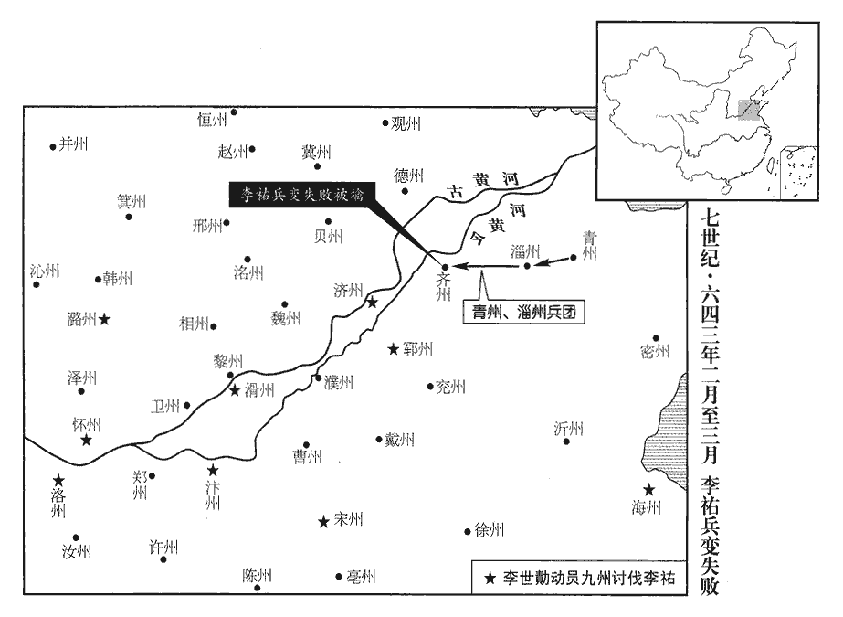

 唐紀十二起重光赤奮若（辛丑），盡昭陽單閼（癸卯）三月，凡二年有奇。

# 太宗文武大聖大廣孝皇帝中之中

## 貞觀十五年（辛丑、六四一）

1春，正月，甲戌‹十二›，以吐蕃祿東贊為右衛大將軍。觀，古玩翻。吐，從暾入聲。上嘉祿東贊善應對，以琅邪公主外孫段氏妻之；妻，七細翻。辭曰：「臣國中自有婦，父母所聘，不可棄也。且贊普未得謁公主，陪臣何敢先娶！」上益賢之，然欲撫以厚恩，竟不從其志。史言夷狄之人猶能以禮自處，而中國乃不能以禮處之。

〖译文〗 [1]春季，正月，甲戌（十二日），唐朝廷任命吐蕃禄东赞为右卫大将军。太宗嘉许禄东赞善于应对，欲将琅邪公主的外孙女段氏嫁给他为妻，禄东赞推辞说：“臣在本国中自有妻子，是父母为我聘娶的，不能够抛弃。而且我们的赞普首领还未曾迎娶公主，陪臣我怎么敢先娶呢？”太宗更加赞赏他，然而想要以厚礼隆恩加以抚慰，他最后还是没有从命。

丁丑‹十五›，命禮部尚書江夏王道宗持節送文成公主于吐蕃‹西藏›。尚，辰羊翻。夏，戶雅翻。吐，從暾入聲。贊普大喜，見道宗，盡子壻禮，慕中國衣服、儀衛之美，為公主別築城郭宮室而處之，自服紈綺以見公主。其國人皆以赭塗面，公主惡之，為，于偽翻。處，昌呂翻。惡，烏路翻。贊普下令禁之；亦漸革其猜暴之性，遣子弟入國學，受詩、書。

〖译文〗 丁丑（十五日），太宗令礼部尚书、江夏王李道宗持旌节护送文成公主到吐蕃。吐蕃赞普非常高兴，见到李道宗，完全按婿礼行事，羡慕唐朝的服装和仪仗之美，将公主安置在特意营筑的城郭宫室之内，自己穿戴着精美的丝绸服装与公主见面。吐蕃人的脸上都涂着红褐色、公主感到厌恶，赞普便下令禁止涂面；并且逐渐改变其猜忌粗暴的本性，派遣本族子弟到长安国子学，学习《诗经》、《尚书》等典籍。

2乙亥‹十三›，突厥‹瀚海沙漠群›侯【張：「侯」作「俟」。】利苾可汗始帥部落濟河，前年受詔，今始濟河。厥，九勿翻。苾，毗必翻。可，從刊入聲。汗，音寒。帥，讀曰率。建牙於故定襄城‹内蒙古呼和浩特市东南›，杜佑曰：故定襄城，在朔州馬邑郡北三百許里。有戶三萬，勝兵四萬，勝，音升。馬九萬匹，仍奏言：「臣非分蒙恩，為部落之長，分，扶問翻。長，知兩翻。願子子孫孫為國家一犬，守吠北門。若薛延陀‹蒙古西南部›侵逼，請從【章：十二行本「從」作「徙」;乙十一行本同。】家屬入長城。」詔許之。

〖译文〗 [2]乙亥（疑误），突厥俟利可汗开始率部落渡过黄河，在旧定襄城建牙帐，共有三万户，军队四万人，九万匹马，于是上奏言道：“我过分地蒙受恩宠，成为本部落的首领只希望子子孙孙为大唐效犬马之劳，守卫北面的大门。假如薛延陀侵犯逼近，请求允许我方家属进入长城以内。”太宗下诏应允。

3上將幸洛陽，命皇太子‹李承乾›監國，監，古銜翻。留右僕射高士廉輔之。射，寅謝翻。辛巳‹十九›，行及溫湯。新豐有驪山溫湯，華州有溫湯府。衛士崔卿、刁文懿憚於行役，冀上驚而止，乃夜射行宮，射，而亦翻。矢及寢庭者五；皆以大逆論。十惡，二曰謀大逆。註云：為謀毀宗廟、山陵及宮闕。刑統議曰：此條之人，干紀犯順，違道悖德，逆莫大焉，故曰大逆。以大逆論者，未是犯大逆正條，以其干紀犯順，以大逆論罪。

〖译文〗 [3]太宗将要巡幸洛阳，命皇太子留守监国，并留下尚书右仆射高士廉辅佐太子。辛巳（十九日），太宗车辇到了温汤。卫士崔卿、刁文懿二人厌倦于行进之苦，希望太宗能因偶受惊吓而停止巡行，于是在夜里向太宗行宫射箭，有五枝箭射入寝宫庭院；事发后，二人均以十恶中的大逆罪被处死。

三月，戊辰‹七›，幸襄城宮‹河南省临汝市境›，地既煩熱，復多毒蛇；復，扶又翻。庚午‹九›，罷襄城宮，分賜百姓，免閻立德官。營襄城宮見上卷上年。

〖译文〗 三月，戊辰（初七），太宗巡幸襄城宫，当地天气燥热，又多毒蛇出没；庚午（初九），废除襄城宫的行宫地位，将它分赐给当地的百姓，并罢免了营建此宫的阎立德的官职。

4夏，四月，辛卯朔‹一›，詔以來年二月有事于泰山。

〖译文〗 [4]夏季，四月，辛卯朔（初一），太宗下诏宣布下一年二月份在泰山行封禅礼。

5上以近世陰陽雜書，訛偽尤多，命太常博士呂才漢叔孫通為博士，屬太常，隋、唐最為清選。太常博士，從七品上，掌五禮之儀式，本先王之法制，適變隨時而損益焉。與諸術士刊定可行者，凡四十七卷。己酉‹十九›，書成，上之；上，時掌翻。才皆為之敘，質以經史。其敘宅經，以為：「近世巫覡覡，刑狄翻。妄分五姓，如張、王為商，武、庾為羽，似取諧韻；至於以柳為宮，以趙為角，又復不類。或同出一姓，分屬宮商；或複姓數字，莫辨徵羽。此則事不稽古，義理乖僻者也。」近世相傳，以字學分五音，只在脣舌齒調之，舌居中者為宮，口開張者為商，舌縮卻者為角，舌拄齒者為徵，脣撮聚者為羽。陰陽家以五姓分屬五音，說正如此。徵，陟里翻。敘祿命，以為：「祿命之書，多言或中，中，竹仲翻。人乃信之。然長平‹山西省高平县›阬卒，未聞共犯三刑；長平之戰，死者四十五萬人。三刑：寅刑巳，巳刑申，申刑寅；丑刑戌，戌刑未，未刑丑；子刑卯，卯刑子。又辰辰、午午、酉酉、亥亥，謂之自刑。南陽‹河南省南阳市›貴士，何必俱當六合！子與丑合，寅與亥合，卯與戌合，辰與酉合，巳與申合，午與未合。漢光武中興，南陽人士多貴。今亦有同年同祿而貴賤懸殊，共命共胎而壽夭更異。夭，於紹翻。按魯莊公‹姬同›法應貧賤，又尫弱短陋，尫，烏黃翻。惟得長壽‹姬同死时仅四十五岁›；秦始皇‹嬴政›法無官爵，縱得祿，少奴婢，為人無始有終；少，詩沼翻。漢武帝‹刘彻›、後魏孝文帝‹元宏›皆法無官爵；宋武帝‹刘骏›祿與命並當空亡，甲己申酉，乙庚午未，丙辛辰巳，丁壬寅卯，戊癸子丑戌亥，謂之截路空亡。甲子旬戌亥，甲戌旬申酉，甲申旬午未，甲午旬辰巳，甲辰旬寅卯，甲寅旬子丑，謂之旬中空亡。唯宜長子，雖有次子，法當早夭；長，知兩翻。千，於紹翻；下壽夭同。此皆祿命不驗之著明者也。」其敘葬，以為：「孝經云：『卜其宅兆而安厝cuò之，』蓋以窀zhūn穸xī既終，杜預曰：窀，厚也。穸，夜也。厚夜，猶言長夜。窀，株倫翻。永安體魄，而朝市遷變，泉石交侵，不可前知，故謀之龜筮。近歲或選年月，或相墓田，朝，直遙翻。相，息亮翻。以為一事失所，禍及死生。按禮：天子、諸侯、大夫葬皆有月數，是古人不擇年月也。古者天子七月而葬，同軌畢至；諸侯五月，同盟至；大夫三月，同位至。春秋：『九月丁巳‹九›，葬定公‹姬宋›，雨，不克葬，戊午‹十›，日下昃，乃克葬，』是不擇日也。鄭葬簡公‹姬嘉›，司墓之室當路，毀之則朝而窆biǎn，窆，必驗翻。不毀則日中而窆，子產不毀，是不擇時也。古之葬者皆於國都之北，兆域有常處，是不擇地也。今葬書以為子孫富貴、貧賤、壽夭，皆因卜葬所致。夫子文為令尹而三已，柳下惠為士師而三黜，計其丘隴，未嘗改移。而野俗無識，妖巫妄言，遂於擗踊之際，擇葬地以希官爵；夫，音扶。妖，於驕翻。擗，頻亦翻。荼毒之秋，選葬時以規財利。或云辰日不可哭泣，遂莞爾而對弔客；或云同屬忌於臨壙，遂吉服不送其親。傷教敗禮，莫斯為甚！」術士皆惡其言，敗，補邁翻。惡，烏路翻。而識者皆以為確論。

〖译文〗 [5]太宗认为近代以来的阴阳杂书讹误很多，命太常博士吕才与众多方术之士刊定其中可以通行的内容，共成四十卷。己酉（十九日），书修成，进呈太宗；吕才每本书都写有序，质证于经史书籍。他为《宅经》作序，认为：“近代以来巫觋阴阳之术，妄自划分姓氏以附会音律，譬如张、王姓为商，武、庚姓为羽，似乎是取其谐韵；至于以柳姓为宫，以赵姓为角，又象是不伦不类。或者同出于一姓，却分属宫商二调；或者属于复姓的几个字，却不能分辨徵羽二调。这些都是不符合古代事例，也深乖义理的。”序《禄命》一篇认为：“福禄性命之书，说的多了总能说中，人们便相信它。然而长平之战，秦国坑杀赵国士兵四十五万人，没有听说他们都犯了三刑；汉光武帝时南阳人士多富贵，又哪里都是遇上六合的吉日。如今也有虽然同年同榜登第，却贵贱相差悬殊，共命运同胞兄弟却寿命长短有异。按命理说鲁庄公本来应该贫贱，又懦弱见识短，惟独得以长寿；秦始皇不应该有官爵，纵使得到食禄，也少有奴婢，为人没有起始而有终极；汉武帝、后魏孝文帝都是本不应有官爵；以宋武帝的禄与命来讲都是截路空亡，只对长子合宜，即使有次子，也应当早早夭折；这些都是福禄性命不征验的明显证明。”吕才为《葬》作序，认为：“《孝经》说：‘卜选阴宅墓地，然后再加以安葬’，这是因为人死后长夜漫漫，体魄永远安息，然而城邑集市不断变化，泉水与石块交互侵蚀，不可以预先知道，所以要谋求于龟筮占卜之类。近几年来丧葬选年月，或相土为墓，认为一件事偶有差失，便会累及死生的大问题。按照《周礼》的说法：天子、诸侯与士大夫的丧葬都有规定的月数，这说明古人不作年月的挑选。《春秋》写道：‘九月丁巳（九日），安葬鲁定公，赶上天下大雨，没有安葬，戊午（十日）太阳西斜，才将定公安葬。’这说明也不选择日期。郑国安葬简公，看墓的房子正好档在安葬的道上，拆毁它则可以早晨落葬，不拆它则要到中午才能落葬，子产决定不拆毁而葬，这是不选择时辰。古人安葬均在京城的北面，墓地有固定的地方，这便是不另外选择墓地。如今丧葬书上说子孙富贵与贫贱、长寿与夭折，都是由于占卜丧葬的缘故。子文三次做令尹而三次被罢免，柳下惠三次做士师也三次被免职。料想他们的丘陇墓地，也没有移动吧。而乡野村俗没有知识，巫术妄说，于是便在捶胸顿足极度悲哀之际，选择葬地希望能得到官爵；痛苦不堪的时节，希望选择安葬时辰来获取财物好处。有人说逢辰日不能哭泣，于是便微笑着面对吊客；有人说家人中有忌去葬地的，于是便身着吉服不去送亲入葬。伤风败俗破坏礼教，没有比这些更为严重的了！”巫术之士都憎恶吕才的这一番言论，有识之士均许为精辟之论。

6丁巳‹二十七›，果毅都尉席君買帥精騎百二十襲擊吐谷渾‹青海省›丞相宣王，破之，斬其兄弟三人。帥，讀曰率。騎，奇寄翻。吐，從暾入聲。谷，音浴。相，息亮翻。考異曰：舊傳云：「鄯州刺史杜鳳舉與威信王合兵擊丞相王，破之，殺其兄弟三人。」今從實錄。初，丞相宣王專國政，陰謀襲弘化公主，帝以宗室女為弘化公主，下嫁吐谷渾。劫其王諾曷鉢奔吐蕃。諾曷鉢聞之，輕騎奔鄯善城‹新疆鄯善县›，隋煬帝破吐谷渾，置四郡。鄯善郡治鄯善城，即古之樓蘭城。騎，奇寄翻。鄯，時戰翻。其臣威信王以兵迎之，故君買為之討誅宣王。為，于偽翻。國人猶驚擾，遣戶部尚書唐儉等慰撫之。尚，辰羊翻。

〖译文〗 [6]丁巳（二十七日），果毅都尉席君买率领精锐骑兵一百二十人袭击吐谷浑丞相宣王，重创敌军，将其兄弟三人斩首。起初，丞相宣王独掌吐谷浑国政，密谋袭击下嫁吐谷浑的弘化公主，劫持吐谷浑国王诺曷钵投奔吐蕃。诺曷钵事先得知消息，率轻骑奔赴鄯善城，他手下的大臣威信王领兵迎接，所以席君买便替诺曷奔讨伐宣王。吐谷浑人大受惊扰，太宗派户部尚书唐俭前往安抚。

7五月，壬申‹十二›，并州‹山西省太原市›父老詣闕請上封泰山畢，還幸晉陽‹山西省太原市›，上許之。并，卑名翻。

〖译文〗 [7]五月，壬申（十二日），并州百姓来到朝中请求太宗在泰山封禅后，回来巡幸晋阳，太宗应允。

8丙子‹十六›，百濟‹朝鲜半岛扶余县›來告其王扶餘璋之喪，遣使冊命其嗣子義慈。使，疏吏翻。嗣，祥吏翻。

〖译文〗 [8]丙子（十六日），百济派人来为他们的国王扶馀璋报丧，太宗派使节册封他的儿子义慈继任。

9己酉‹十九›，有星孛于太微，太史令薛頤上言，未可東封。孛，蒲內翻。上，時掌翻。辛亥‹二十一›，起居郎褚遂良亦言之；丙辰‹二十六›，詔罷封禪。

〖译文〗 [9]己酉（疑误），有异星出现过于太微垣，太史令薛颐上书认为此时不可去泰山封禅；辛亥（二十一日），起居郎褚遂良也言及此事；丙辰（二十六日），太宗下诏停止封禅。

10太子詹事于志寧遭母喪，尋起復就職。按會要，武德年制，文官遭父母喪，聽去職。起復者，起之於苫塊之中而復其官職也，亦謂之奪情。太子治宮室，妨農功；又好鄭、衛之樂；治，直之翻。好，呼到翻。志寧諫，不聽。又寵昵宦官，常在左右，昵，尼質翻。志寧上書，以為：「自易牙以來，宦官覆亡國家者非一。今殿下親寵此屬，使陵易衣冠，不可長也。」上，時掌翻；下同。易，以豉翻。長，竹兩翻。太子役使司馭等，半歲不許分番，太僕寺典廄署，有執馭一百人，舊番上二宮。六典，太子僕寺有廄牧署，有冀馭十五人，駕士三十人。又私引突厥達哥友入宮，新書作「達哥支」。志寧上書切諫，太子大怒，遣刺客張思政、紇干承基殺之。紇，下沒翻。二人入其第，見志寧寢處苫塊，孔穎達曰：寢苫枕塊，謂孝子居於廬中，寢臥於苫，頭枕於塊。處，昌呂翻。竟不忍殺而止。

〖译文〗 [10]太子詹事于志宁母丧丁忧离职，不久服丧中重新复职。当时太子修筑宫室，妨碍农事；又喜爱郑、卫等淫靡之音。于志宁反复劝谏，太子不听。又宠幸亲近宦官，常让他们不离身边左右，志宁给太宗上书，认为：“自从易牙以后，宦官导致国家灭亡的事例很多。如今太子殿下亲近此类人物，并让他们敢于与太子换穿衣服，此风不可长。”太子又私自役使皇厩驾驭手，半年不许他们轮流值班，又私下带引突厥人达哥友进入宫中，志宁上书直言切谏，太子勃然大怒，派刺客张思政、纥干承基二人去杀于志宁。二人进入于志宁的宅第，见志宁躺在苫席上，头枕着土地，终于不忍心杀他而罢休。

11西突厥沙鉢羅葉護可汗數遣使入貢。數，所角翻；下勿數同。使，疏吏翻；下同。秋，七月，甲戌‹十五›，命左領軍將軍張大師持節即其所號立為可汗，賜以鼓纛。纛，徒到翻。上又命使者多齎金帛，歷諸國市良馬，魏徵諫曰：「可汗位未定而先市馬，彼必以為陛下志在市馬，以立可汗為名耳。使可汗得立，荷德必淺；荷，下可翻。若不得立，為怨實深。諸國聞之，亦輕中國。市或不得，得亦非美。苟能使彼安寧，則諸國之馬，不求自至矣。」上欣然止之。

〖译文〗 [11]西突厥沙钵罗叶护可汗多次派使节进献贡品。秋季，七月，甲戌（十五日），太宗命令左领军将军张大师持旌节就其已得名位立沙钵罗叶护为可汗，赐给鼓和大旗。太宗又命令使者多带着金银财物，在沿途经过的各国购买好马，魏徵劝谏说：“可汗的位置还未确定却先去买马，他们必然认为陛下的志趣只在买马，立可汗只是虚名。立了可汗，他们感戴的恩德必然浅薄；如果没有立可汗，他们的怨恨必然深。各国听说这件事，也会轻视我大唐。买马也许买不成，即使买成也并非好事。如果能使西突厥安定，那么各国的好马，不用买自然会送上门来。”太宗信服魏徵的话，停止了买马的事。

乙毗咄陸可汗與沙鉢羅葉護互相攻，乙毗咄陸浸強大，西域諸國多附之。未幾，乙毗咄陸使石國‹中亚细亚塔什干城›吐屯擊沙鉢羅葉護，擒之以歸，殺之。吐屯，突厥官名，使分主諸國。沙鉢羅葉護立見上卷十三年。幾，居豈翻。

〖译文〗 乙毗咄陆可汗与沙钵罗叶护相互征战，乙毗咄陆日渐强大，西域各国多依附于他。不久，乙毗咄陆让掌握石国大权的突厥吐屯袭击沙钵罗叶护，将其擒获并送到乙毗咄陆那里，将他杀死。

12丙子‹十七›，上指殿屋謂侍臣曰：「治天下如建此屋，治，直之翻。營構既成，勿數改移；苟易一榱，榱cuī，所追翻。屋橑liáo，秦名為屋椽，周謂之榱，魯謂之桷jué。正一瓦，踐履動搖，必有所損。若慕奇功，變法度，不恆其德，勞擾實多。」恆，戶登翻。

〖译文〗 [12]丙子（十七日），太宗指着殿宇对身边大臣说：“治理天下如同建造这些房屋，营造建成之后，不要多次改变移动；假如换一根椽，或一片瓦，上房践踏摇动，必然有所损害。如果贪慕新奇，屡变法度，不恒守固有的道德，劳扰百姓之处实在太多。”

13上遣職方郎中陳大德使高麗‹朝鲜半岛平壤›；職方，掌天下地圖及城隍鎮戍烽候之數，辨其邦國之遠近及四夷之歸化，凡五方之區域，都邑之廢置，疆埸之爭訟，舉而正之。使，疏吏翻。麗，力知翻。八月，己亥‹十›，自高麗還。大德初入其境，欲知山川風俗，所至城邑，以綾綺遺其守者，曰：「吾雅好山水，遺，于季翻。好，呼到翻。此有勝處，吾欲觀之。」守者喜，導之遊歷，無所不至，往往見中國人，自云：「家在某郡，隋末從軍，沒於高麗，高麗妻以遊女，妻，七細翻。與高麗錯居，殆將半矣。」因問親戚存沒，大德紿之曰：「皆無恙。」紿，蕩亥翻。恙，余亮翻。咸涕泣相告。數日後，隋人望之而哭者，徧於郊野。大德言於上曰：「其國聞高昌‹新疆吐鲁番市›亡，大懼，館候之勤，加於常數。」上曰：「高麗本四郡地耳，漢武帝置臨屯、真番、樂浪、玄菟四郡，高麗有其地。吾發卒數萬攻遼東‹辽宁省辽阳市›，彼必傾國救之，別遣舟師出東萊‹山东省莱州市›，自海道趨平壤，趨，七喻翻。水陸合勢，取之不難。但山東‹崤山以东›州縣彫瘵zhài未復，吾不欲勞之耳！」觀帝此言，已有取高麗之心。瘵，則界翻。

〖译文〗 [13]太宗派职方郎中陈大德出使高丽国，八月，己亥（初十），从高丽返回长安。陈大德起初进入高丽境内时，很想知道当地山川名胜与风俗，经过某一城镇，将绫罗绸缎送给当地官员，说：“我一向喜爱山水，此地如有名胜，我想去看一看。”当地官员十分高兴，引导他去游历，无处不去，处处见到有中原人，自我介绍说：“家住在某郡，隋末充军东征，留在高丽，娶离家远游的女子为妻，与高丽杂错居处，几乎占当地人的一半。”并向陈大德询问他们中原的亲属的生死状况，大德哄骗他们说：“均完好无恙。”他们听后挥泪互相转告。几天后，隋朝留在高丽的中原人来见大德，都眼含泪水，城郊野外聚集着很多人。大德回到朝中对太宗说：“高丽人听说高昌已经灭亡，大为惊恐，频频去馆舍中问候，超过以往。”太宗说：“高丽本来是汉武帝所设四郡，我大唐如果发动数万兵力攻打辽东，高丽必然要倾国相救，如果另外派水师出东莱，从海道直驱平壤，水陆合围，攻取高丽并不难。只是关东一带州县凋疲，尚未复原，朕不想再疲劳百姓。”

14乙巳‹十六›，上謂侍臣曰：「朕有二喜一懼，比年豐稔，比，毗至翻。長安斗粟直三、四錢，一喜也；北虜久服，邊鄙無虞，二喜也。治安則驕侈易生，治，直吏翻。易，以豉翻。驕侈則危亡立至，此一懼也。」

〖译文〗 [14]乙巳（十六日），太宗对身边大臣说：“朕有二件喜事一件忧事。连年丰收，长安城一斗粟仅值三、四钱，这是一喜；北方部族久已服顺，边境没有祸患，这是二喜。政治安定则容易滋生骄奢淫逸，骄奢淫逸则立刻遭致危亡，此是一件忧虑的事。”

15冬，十月，辛卯‹三›，上校獵伊闕‹洛阳南›；壬辰‹四›，幸嵩陽‹河南省登封县›；伊闕縣，舊曰新城，隋開皇十八年更名；有伊闕。嵩陽縣，舊曰潁陽，隋開皇六年，改曰武林，十八年，改曰輪氏，大業元年，改曰嵩陽；有嵩高山。並屬洛州。辛丑‹十›，還宮。

〖译文〗 [15]冬季，十月，辛卯（初三），太宗到伊阙狩猎；壬辰（初四），巡幸嵩阳县；辛丑（十三日），回到宫中。

16并州‹山西省太原市›大都督長史李世勣在州十六年，令行禁止，民夷懷服。上曰：「隋煬帝勞百姓，築長城以備突厥，卒無所益。卒，子恤翻。朕唯置李世勣於晉陽‹山西省太原市›而邊塵不驚，其為長城，豈不壯哉！」十一月，庚申‹三›，以世勣為兵部尚書。

〖译文〗 [16]并州大都督府长史李世在并州任职十六年，令行禁止，百姓顺服安定。太宗说：“隋炀帝疲劳百姓，修筑长城以防备突厥的进攻，最后毫无用处。朕只是将李世安置在晋阳，而边境安宁，将他比做长城，岂不是更为壮美吗！”十一月，庚申（初三），任命李世为兵部尚书。

17壬申‹十五›，車駕西歸長安‹西安›。

〖译文〗 [17]壬申（十五日），太宗车驾西行回到长安。

18薛延陀‹蒙古西南部›真珠可汗聞上將東封，謂其下曰：「天子封泰山，士馬皆從，從，才用翻。邊境必虛，我以此時取思摩，如拉朽耳。」拉，盧合翻。乃命其子大度設發同羅‹蒙古北部›、僕骨‹蒙古东部›、廻紇‹蒙古库伦西北›、靺鞨‹吉林省›、霫‹辽河北›等兵紇，下沒翻。靺鞨，音末曷。霫，而立翻。合二十萬，度漠南，屯白道川‹内蒙古呼和浩特市北›，據善陽嶺‹山西省朔州市北›以擊突厥。善陽嶺，在朔州善陽縣北。俟利苾可汗不能禦，帥部落入長城，保朔州‹山西省朔州市›，遣使告急。苾，毗必翻。帥，讀曰率，下同。使，疏吏翻，下同。

〖译文〗 [18]薛延陀真珠可汗听说太宗想要东去泰山行封禅礼，对他的下属说：“大唐天子去泰山封禅，护卫都跟随前往，边境地区必然空虚，我乘此时机攻取思摩，势如摧枯拉朽。”于是命令他的儿子大度设征发同罗、仆骨、回纥、、等族兵马，总计二十万人，渡过漠南，屯兵在白道川，据守善阳岭，袭击突厥。俟利可汗抵挡不住，率领本部落进入长城，守住朔州，派使者向唐朝告急。

癸酉‹十六›，上命營州‹总部设辽宁省朝阳市›都督張儉帥所部騎兵及奚‹滦河上游›、霫‹辽河北›、契丹‹辽河上游›壓其東境；以兵部尚書李世勣為朔州道‹山西省朔州市›行軍總管，將兵六萬，騎千二百，屯羽方‹朔州，山西省朔州市›；騎，奇寄翻；下同。「羽方」，新書作「朔州」。右衛大將軍李大亮為靈州道‹宁夏灵武县›行軍總管，將兵四萬，騎五千，屯靈武‹宁夏灵武县›；靈武縣屬靈州靈武郡。將兵，即亮翻。右屯衛大將軍張士貴將兵一萬七千，為慶州道‹甘肃省庆阳县›行軍總管，出雲中‹陕西省横山县›；涼州‹总部设甘肃省武威市›都督李襲譽為涼州道行軍總管，出其西。

〖译文〗 癸酉（十六日），太宗命令营州都督张俭率领本部骑兵以及奚、、契丹族兵马进通薛延陀东部边境；任命兵部尚书李世为朔州道行军总管，领兵六万，包括一千二百名骑兵，驻扎在羽方城；任命右卫大将军李大亮为灵州道行军总管，领兵四万，骑兵五千，驻扎在灵武；任命右屯卫大将军张士贵领兵一万七千人，为庆州道行军总管，出兵云中；任命凉州都督李袭誉为凉州道行军总管，出击薛延陀西部。

諸將辭行，上戒之曰：「薛延陀負其強盛，踰漠而南，行數千里，馬已疲瘦。凡用兵之道，見利速進，不利速退。薛延陀不能掩思摩不備，急擊之，思摩入長城，又不速退；吾已敕思摩燒薙秋草，薙tì，他計翻，耘除也。彼糧糗日盡，野無所獲。頃偵者來，云其馬齧niè林木枝皮略盡。卿等當與思摩共為掎角，糗，去久翻。偵，丑鄭翻。掎，居蟻翻。不須速戰，俟其將退，一時奮擊，破之必矣。」

〖译文〗 众位将领向太宗辞行，太宗告诫他们说：“薛延陀仗着他们强盛，越过沙漠南下，行程几千里，马已疲乏瘦弱。凡是用兵的道理，须是见有利迅速推进，见着不利局面迅速撤退。薛延陀不能乘思摩不防备，急速进攻，思摩进入长城以内，薛延陀兵又不立即后退；朕已敕令思摩烧掉秋草，对方粮草日益吃尽，野地中毫无所获。刚才探马来报，说他们的马啃吃树皮枝叶已经快光了。你们应当与思摩互成犄角之势，不需要速战，等到敌人将要撤退时，一鼓作气，乘胜追击，定会大破敌军。”

19十二月，戊子‹一›，車駕至京師。

〖译文〗 [19]十二月，戊子（初一），太宗车驾回到长安。

20己亥‹十二›，薛延陀遣使入見，請與突厥和親。甲辰‹十七›，李世勣敗薛延陀於諾真水‹内蒙古百灵庙哈尔红河›。出雲中古城，西北行四百許里，至諾真水。見，賢遍翻。敗，補邁翻。初，薛延陀擊西突厥‹新疆北部及中亚细亚›沙鉢羅及阿史那社爾，皆以步戰取勝；及將入寇，乃大教步戰，使五人為伍，一人執馬，四人前戰，戰勝則授以馬追奔。於是大度設將三萬騎逼長城，欲擊突厥，而思摩已走，知不可得，遣人登城罵之。會李世勣引唐兵至，塵埃漲天，大度設懼，將其眾自赤柯濼北走，將，即亮翻。騎，奇寄翻；下同。濼pō，匹各翻。自淮以北，率以積水處為濼。世勣選麾下及突厥精騎六千自直道邀之，踰白道川‹内蒙古呼和浩特市北›，追及於青山‹阴山›。大度設走累日，至諾真水‹内蒙古百灵庙哈尔红河›，勒兵還戰，陳亘十里。陳，讀曰陣。突厥先與之戰，不勝，還走，大度設乘勝追之，遇唐兵，薛延陀萬矢俱發，唐馬多死。世勣命士卒皆下馬，執長矟，直前衝之。矟，色角翻。薛延陀眾潰，副總管薛萬徹以數千騎收其執馬者。薛延陀失馬，不知所為，唐兵縱擊，斬首三千餘級，捕虜五萬餘人。大度設脫身走，萬徹追之不及。其眾至漠北，值大雪，人畜凍死者什八九。

〖译文〗 [20]己亥（十二日），薛延陀派使节入朝见太宗，请求与突厥和亲。甲辰（十七日），李世在诺真水大败薛延陀。起初，薛延陀袭击西突厥沙钵罗以及阿史那社尔，均以步战取胜；等到将要去进攻思摩时，便教习士兵大练步战，让五个人为一队，一人牵马，四人冲前拼战，战胜后则骑上马追击。当时大度设率三万骑兵进逼长城，想要袭击突厥，而思摩已经先行逃走，望尘莫及，只得派人登上城楼谩骂。适逢李世带领唐朝兵马赶到，尘土飞扬，一眼望不到边，大度设十分害怕，率领大部队从赤柯泺向北逃去，李世挑选麾下及突厥精锐骑兵六千人抄近路拦截，跨越白道川，在青山追上敌军。大度设狂奔数日，到了诺真水，勒住兵马准备战斗，战阵横亘十里地。突厥兵先和他们拼战，不能取胜，退兵，大度设乘胜追击，与唐朝的部队遭遇，薛延陀兵万箭齐发，唐军马匹多被射死。李世命令士兵们都下马，手执长槊，往前直冲。薛延陀兵溃散，副总管薛万彻用数千骑兵收捕薛延陀部队中牵马的士兵。薛延陀兵丢失了马匹，张惶失措，唐兵纵马追击，杀死三千多人，俘虏五万多人。大度设脱身逃走，薛万彻追赶不及。薛延陀兵到了漠北，赶上天降大雪，人和马匹冻死十分之八九。

李世勣還軍定襄‹内蒙古呼和浩特市东›，突厥思結部居五臺‹山西省五台县›者叛走，五臺，本漢太原慮虒sī縣，久廢，後魏改曰驢夷，大業初，改曰五臺，有五臺山；屬代州‹山西省代县›。州兵追之，會世勣軍還，夾擊，悉誅之。

〖译文〗 李世回师定襄，突厥思结部居住在五台县的纷纷叛逃，当地州兵追捕他们，正赶上李世的部队路经此地，两军夹击，将他们全部杀掉。

丙子‹十九›，【嚴：「子」改「午」。】薛延陀使者辭還，上謂之曰：「吾約汝與突厥以大漠為界，有相侵者，我則討之。汝自恃其強，踰漠攻突厥。李世勣所將纔數千騎耳，汝已狼狽如此！歸語可汗：將，即亮翻。語，牛倨翻。厥，九勿翻。凡舉措利害，可善擇其宜。」

〖译文〗 丙子（十九日），薛延陀使者向太宗辞行，太宗对他说：“我约定你们与突厥以大沙漠为界，如有侵袭者，我大唐即予以讨伐。你们自恃强大，越过沙漠进入突厥。李世仅仅率领几千骑兵，你们便如此狼狈。你回去告诉你们的可汗：做事须权衡利弊，可要善于选择适宜的事去做。”

21上問魏徵：「比來朝臣何殊不論事？」朝，直遙翻。比，毗至翻。對曰：「陛下虛心采納，必有言者。凡臣徇國者寡，愛身者多，彼畏罪，故不言耳。」上曰：「然。人臣關說忤旨，動及刑誅，與夫蹈湯火冒白刃者亦何異哉！忤，五故翻。冒，莫北翻。是以禹拜昌言，見書三謨。良為此也。」為，于偽翻。

〖译文〗 [21]太宗问魏徵：“近来朝廷大臣们为什么不上书议论朝政？”魏徵答道：“陛下虚心纳谏，就一定会有上书言事者。大臣们愿为国徇身者少，爱惜自身的人较多，他们害怕获罪，所以不上书言事。”太宗说：“是这样。大臣们议论国事而忤怒圣意，动辄处以刑罚，这与上刀山下火海又有什么区别呢？所以大禹给提意见的人行礼，正是为此。”

房玄齡、高士廉遇少府少監竇德素於路，秦置少府，掌山澤之稅，漢掌內府珍貨。梁始為卿，隋改為監；唐從三品，少監從四品，掌供百工伎巧之事，凡天子之服御，百官之儀制，展采備物，皆率其屬以供之。問：「北門近何營繕？」德素奏之。上怒，讓玄齡等曰：「君但知南牙政事，北門小營繕，何預君事！」唐正牙在南，故曰南牙；玄武門在北，曰北門。劉馮事始：兵書曰：牙旗者，將軍之精。凡始建牙，必以制日。制日者，其辰之在五行，以上剋下之日也。又尚書緯曰：門旗二口八幅，色紅，大將牙門之旗，出引將軍前列。又黃帝出軍訣曰：牙旗者，將軍之精；金鼓者，將軍之氣。周禮司常職云：軍旅會同置旌門。夫以旌為門，即旗門也。後世軍中遂置牙門將，又有牙兵；典總此兵，以押衙為名。至於官府，早晚軍吏兩謁，亦名為衙。呼謂既熟，雖天子正殿受朝謁，亦名正衙。玄齡等拜謝。魏徵進曰：「臣不知陛下何以責玄齡等，而玄齡等亦何所謝！玄齡等為陛下股肱耳目，於中外事豈有不應知者！使所營為是，當助陛下成之；為非，當請陛下罷之。問於有司，理則宜然。不知何罪而責，亦何罪而謝也！」上甚愧之。

〖译文〗 房玄龄、高士廉路上遇见少府少监窦德素，问道：“北门近来在营建什么？”窦德素奏与太宗。太宗大怒，责备房玄龄等人说：“你只管执掌南衙朝中政事，北门小小的营缮事，与你有什么相干？”房玄龄等磕头谢罪。魏徵进谏说：“我不知道陛下为什么要责备玄龄等人，玄龄等人又为什么要谢罪？玄龄等人身为陛下的股肱耳目之臣，对宫内宫外事岂有不应知道的道理！如果营造的事是对的，定会帮助陛下促成其事；如果不当营造，就应当请求陛下停止此事。所以他们询问有关部门，也是理所当然的事。不知因何罪而责怪他们，又因为什么罪而谢罪呢？”太宗听后十分差愧。

22上嘗臨朝謂侍臣曰：「朕為人主，常兼將相之事。」給事中張行成退而上書，以為：「禹不矜伐而天下莫與之爭。書：舜謂禹曰：汝惟不矜，天下莫與汝爭能；汝惟不伐，天下莫與汝爭功。朝，直遙翻；下同。將，即亮翻。相，息亮翻。而上，時掌翻。陛下撥亂反正，群臣誠不足望清光；然不必臨朝言之。以萬乘之尊，乃與群臣校功爭能，臣竊為陛下不取。」乘，繩證翻。為，于偽翻。上甚善之。

〖译文〗 [22]太宗曾在上朝时对身边大臣说：“朕为万民之主，经常要兼管武将文相的事。”给事中张行成退朝后又上书给太宗，认为：“大禹本人不自大自夸而天下人都不和他争功争能。陛下拨乱反正，众位大臣实在是不足以眺望到圣明风采；然而陛下却不必在上朝时言及此事。以陛下的天子尊体，却与群臣争功比能，我认为深不足取。”太宗非常赞许张行成。

## 十六年（壬寅、六四二）

1春，正月，乙丑‹九›，魏王泰上括地志。上，時掌翻；下同。泰好學，司馬蘇勗xù說泰，以古之賢王皆招士著書，故泰奏請脩之。時泰奏引蕭德言、顏胤、蔣亞卿、許偃等就府脩撰。好，呼到翻。說，輸芮翻。於是大開館舍，廣延時俊，人物輻湊，門庭如市。泰月給踰於太子‹李承乾›，諫議大夫褚遂良上疏，以為：「聖人制禮，尊嫡卑庶，世子用物不會，與王者共之。周禮：王及世子惟膳不會，其他服物，世子猶皆會。會，古外翻。庶子雖愛，不得踰嫡，所以塞嫌疑之漸，除禍亂之源也。若當親者疏，當尊者卑，則佞巧之姦，乘機而動矣。昔漢竇太后寵梁孝王‹刘武›，卒以憂死；見漢景帝紀。塞，悉則翻。卒，子恤翻。宣帝‹刘病已›寵淮陽憲王‹刘钦›，亦幾至於敗。見宣帝、元帝紀。幾，居希翻；下同。今魏王‹李泰›新出閤，宜示以禮則，訓以謙儉，乃為良器，此所謂『聖人之教不肅而成』者也。」孝經載孔子之言。上從之。

〖译文〗 [1]春季，正月，乙丑（初九），魏王李泰进呈《括地志》一书。李泰勤勉好学，司马苏勖劝说李泰，古代的贤能王子均招徕学者著书立说，故而李泰奏请修撰《括地志》。于是大开馆舍，广泛延请天下俊彦贤才，人才济济，门庭若市。李泰每月的费用超过了太子，谏议大夫褚遂良上奏疏言道：“圣人制定礼仪，是为了尊嫡卑庶，供太子用的物品不作计算，与君王待遇相共。对庶出的儿子虽然喜欢，也不得超过嫡生子，这是为了堵塞嫌疑的发生，除去祸乱的根源。如果应当亲近的人反而疏远，应当尊贵的人反而卑贱，则那些奸佞之人，必然会乘此时机得势。从前西汉窦太后宠幸梁孝王，最后忧虑而死；汉宣帝宠幸淮阳宪王，也几乎导致败亡。如今魏王刚刚作藩王，应该向他显示礼仪制度，用谦虚节俭来训导，如此才能使他成为良才，正所谓‘圣人的教导不待严肃而自然有成。’”太宗听从其意见。

上又令泰徙居武德殿；魏徵上書，以為：「陛下愛魏王，常欲使之安全，宜每抑其驕奢，不處嫌疑之地。處，昌呂翻。今移居此殿，乃在東宮之西，海陵昔嘗居之，元吉追封海陵剌王。時人不以為可；雖時異事異，然亦恐魏王之心不敢安息也。」上曰：「幾致此誤。」遽遣泰歸第。

〖译文〗 太宗又让李泰迁居到武德殿；魏徵上奏疏言道：“陛下喜欢魏王，常常想让他安全，正应当多多抑制他的骄奢习气，不让他处于嫌疑之地。如今移居到武德殿中，位在东宫西面，当年海陵剌王李元吉曾在此居住，时人均认为不可取；虽然时势事情都不同，然而我也担心魏王的心里惊恐不敢安闲。”太宗说：“差一点造成失误。”即刻让李泰回到原宅第。

2辛未‹十五›，徙死罪者實西州‹新疆吐鲁番市›，其犯流徒則充戍，各以罪輕重為年限。

〖译文〗 [2]辛未（十五日），唐朝将死罪犯人改充西州，流放罪的改为充军，并且各以罪行轻重划定年限。

3敕天下括浮遊無籍者，限來年末附畢。附者，附籍也。

〖译文〗 [3]敕令全国检括核查无户籍的游民，限定下一年年未附籍完毕。

4以兼中書侍郎岑文本為中書侍郎，專知機密。中書侍郎二員。時獨用文本，故專典機密。

〖译文〗 [4]太宗任命兼中书侍郎的岑文本为中书侍郎，单独执掌朝廷机密事宜。

5夏，四月，壬子‹二十七›，上謂諫議大夫褚遂良曰：「卿猶知起居注，唐六典曰：漢獻帝及西晉以後，諸帝皆有起居注，皆史官所錄。隋置起居舍人，始為職員，列為侍臣，專掌其事。每季為卷，送付史官。其以他官兼者，則謂之知起居注。所書可得觀乎？」對曰：「史官書人君言動，備記善惡，庶幾人君不敢為非，未聞自取而觀之也！」幾，居希翻。上曰：「朕有不善，卿亦記之邪？」邪，音耶。對曰：「臣職當載筆，記曲禮曰：史載筆。不敢不記。」黃門侍郎劉洎曰：「借使遂良不記，天下亦皆記之。」洎，其冀翻。上曰：「誠然。」

〖译文〗 [5]夏季，四月，壬子（二十七日），太宗对谏议大夫褚遂良说：“你还在兼管起居注的事，朕可以看看都记了些什么吗？”答道：“史官记载君主言行，详细记录善恶诸事，这样君主才不敢胡作非为，我未听说君主可以亲自看记录的。”太宗说：“朕有不妥当的事，你也记下了吗？”答道：“我的职责在于秉笔直书，不敢不记。”黄门侍郎刘洎说：“假使褚遂良不记载下来，全国也都会记下来。”太宗说：“的确是这样。”

6六月，庚寅‹六›，詔息隱王可追復皇太子，海陵剌王元吉追封巢王，息王、海陵王，皆帝踐阼追封。剌，來達翻。諡並依舊。諡，神至翻。

〖译文〗 [6]六月，庚寅（初六），太宗诏令息隐王李建成可以追封恢复皇太子称号，海陵剌王李元吉追封为巢王，谥号一并依旧。

7甲辰‹二十›，詔自今皇太子出用庫物，所司勿為限制。於是太子發取無度，左庶子張玄素上書，以為：「周武帝‹宇文邕›平定山東，隋文帝‹杨坚›混一江南，勤儉愛民，皆為令主；有子不肖，卒亡宗祀。謂天元及煬帝也。卒，子恤翻。聖上以殿下親則父子，事兼家國，所應用物不為節限，恩旨未踰六旬，用物已過七萬，驕奢之極，孰云過此！況宮臣正士，未嘗在側；群邪淫巧，昵近深宮。在外瞻仰，已有此失；居中隱密，寧可勝計！昵，尼質翻。近，其靳翻。勝，音升。苦藥利病，苦言利行，因張良之言而品節之。伏惟居安思危，日慎一日。」太子‹李承乾›惡其書，惡，烏路翻。令戶奴伺玄素早朝，戶奴、官奴，掌守門戶。伺，相吏翻。朝，直遙翻。密以大馬箠擊之，幾斃。箠，止橤翻。幾，居希翻，又音祁。

〖译文〗 [7]甲辰（二十日），太宗诏令从即日起皇太子领出所用库府器物，各有关部门不必加以限制，于是太子挥霍无度。左庶子张玄素上书说：“周武帝平定关东地区，隋文帝统一江南地带，勤俭爱护百姓，均成为一代名主；但他们的儿子不肖，才使社稷灭亡。圣上因与太子殿下乃是父子，行事兼有家、国，所应用器物无所节度限制，圣旨还未过六十天，所用器物已经超过七万，骄奢淫逸之极，没有人能够超过。况且东宫臣属与正直之士，都没有在身旁；各种奇技淫巧，充斥深宫。从外面远看，已经看到了这些失误；内中深宫隐密之事，更是无法计算。良药苦口利于病，苦言辛辣利于行，应当居安思危，一日比一日谨慎行事。”太子讨厌张玄素的上书，让守门的小奴乘张玄素上早朝的机会，暗中用大马棰袭击他，差一点将他打死。

8秋，七月，戊子‹五›，【章：十二行本「子」作「午」；乙十一行本同。】以長孫無忌為司徒，房玄齡為司空。

〖译文〗 [8]秋季，七月，戊午（初五），任命长孙无忌为司徒，房玄龄为司空。

9庚申‹七›，制：「自今有自傷殘者，據法加罪，仍從賦役。」隋末賦役重數，人往往自折支體，謂之「福手」、「福足」；數，所角翻。折，而設翻。至是遺風猶存，故禁之。

〖译文〗 [9]庚申（初七），太宗下制令：“从即日起有自残身体者，依法加重罪行，并且仍要交赋服役。”隋朝末年赋役繁重，人们往往自残身体，称之为“福手”、“福足”；到此时这种风气仍在存留，所以加以禁止。

10特進魏徵有疾，上手詔問之，且言：「不見數日，朕過多矣。今欲自往，恐益為勞。若有聞見，可封狀進來。」徵上言：上，時掌翻；下上表同。「比者弟子陵師，奴婢忽主，下多輕上，皆有為而然，漸不可長。」又言：「陛下臨朝，常以至公為言，退而行之，未免私僻。或畏人知，橫加威怒，比，毗至翻。為，于偽翻。長，知兩翻。朝，直遙翻。橫，戶孟翻。欲蓋彌彰，竟有何益！」徵宅無堂，上命輟小殿之材以構之，程大昌曰：魏徵宅在丹鳳門直出南面永興坊內。五日而成，仍賜以素屏風、素褥、几、杖等以遂其所尚。徵上表謝，上手詔稱：「處卿至此，蓋為黎元與國家，豈為一人，處，昌呂翻。為，于偽翻。何事過謝！」

〖译文〗 [10]特进魏徵患病，太宗手书诏令探问病情，且说：“几天不见，朕的过错又多起来。如今想亲去探望，又恐更添烦扰。你如果听到或看到什么，可以封上状子呈进来。”魏徵上书言道：“近来弟子冒犯老师，奴婢忽视主子，下属多轻视上级，都是有原因的，此风不可长。”又说：“陛下临朝听政，常常将公正挂在嘴边，退朝后所做所为，却未免有所偏私。有时害怕别人知道，横施神威圣怒，这样欲盖弥彰，有什么好处呢？”魏徵的宅院没有厅堂，太宗令将停建小殿的材料拿去建造厅堂，五天即完工，还赐给他质地平常色彩单调屏风和褥子，以及几案、手杖等，以顺应他的俭朴习惯。魏徵上表谢恩，太宗手书诏文称：“朕这样对侍你，都是为了黎民百姓与国家，难道是为朕一人？何必过于客气呢。”

11八月，丁酉‹十四›，上曰：「當今國家何事最急？」諫議大夫褚遂良曰：「今四方無虞，唯太子、諸王宜有定分最急。」分，扶問翻。上曰：「此言是也。」時太子承乾失德，魏王泰有寵，群臣日有疑議，上聞而惡之，惡，烏路翻。謂侍臣曰：「方今群臣，忠直無踰魏徵，我遣傅太子，用絕天下之疑。」九月，丁巳‹四›，以魏徵為太子太師。徵疾少愈，詣朝堂表辭，少，詩沼翻。朝，直遙翻。上手詔諭以：「周幽‹姬宫湦›、晉獻‹姬诡诸›，廢嫡立庶，危國亡家。周幽王廢太子而立褒姒之子，為犬戎所殺，周室遂微。晉獻公廢世子，立驪姬之子，晉國大亂。漢高祖‹刘邦›幾廢太子，賴四皓然後安。見漢高紀及考異。幾，居希翻。我今賴公，即其義也。知公疾病，說文：病，疾加也。可臥護之。」徵乃受詔。

〖译文〗 [11]八月，丁酉（十四日），太宗说：“如今朝廷中什么事情最为急迫？”谏议大夫褚遂良说：“如今四方安定，只有确定太子与诸王的名分最为紧要。”太宗说：“这话说得有道理。”当时太子李承乾德行欠缺，魏王李泰得到宠爱，众位大臣愈益产生疑议，太宗听说后十分厌恶，对身边大臣说：“当朝的臣属们，忠直没人能超过魏徵，我让他做太子的老师，以此杜绝天下人的疑心。”九月，丁巳（初四），任命魏徵为太子太师。魏徵病刚有好转，亲到朝堂上表推辞，太宗手书诏令晓谕他：“周幽王、晋献公，废除嫡子立庶子造成国家危亡。汉高祖差一点儿废掉太子，幸亏商山四位老人才得以保住太子位。朕如今信赖你，就是这个意思。朕知道你有病在身，可以躺在床上铺佐太子。”魏徵于是接受诏令。

12癸亥‹十›，薛延陀真珠可汗遣其叔父沙鉢羅泥熟俟斤來請婚，俟，渠之翻。獻馬三千，貂皮三萬八千，馬腦鏡一。

〖译文〗 [12]癸亥（初十），薛延陀真珠可汗派他的叔父沙钵罗泥熟俟斤前来唐朝请求通婚，并献上三千匹马，三万八千张貂皮，一只玛瑙镜子。

13癸酉‹二十›，以涼州‹总部设甘肃省武威市›都督郭孝恪行安西都護‹总督府设交河城新疆吐鲁番市西北›、西州‹新疆吐鲁番市›刺史。高昌‹新疆吐鲁番市›舊民與鎮兵及謫徙者雜居西州，鎮兵，謂鎮守之兵。謫徙，謂死罪流徒謫徙者。孝恪推誠撫御，咸得其歡心。

〖译文〗 [13]癸酉（二十日），唐朝廷任命凉州都督郭孝恪为安西都护、西州刺史。高昌旧部与镇兵以及迁徙流放的犯人都居住在西州，较为混杂，郭孝恪诚心诚意抚慰治理，非常受当地人的欢迎。

14西突厥乙毗咄陸可汗既殺沙鉢羅葉護，并其眾，又擊吐火羅‹中亚细亚汗阿巴德›，滅之。杜佑曰：吐火羅一名土壑宜，後魏時吐呼羅都葱嶺西五百里，在烏滸河南，即媯guī水也。自恃強大，遂驕倨，拘留唐使者，侵暴西域，遣兵寇伊州‹新疆伊吾县›，郭孝恪將輕騎二千自烏骨邀擊，敗之。將，即亮翻。騎，奇寄翻。敗，補邁翻。乙毗咄陸又遣處月‹新疆新源县境›、處密‹新疆塔城市境›二部圍天山‹新疆托克逊县›，西州西南有南平、安昌兩城，又百二十里至天山軍。孝恪擊走之，乘勝進拔處月俟斤所居城，追奔至遏索山‹天山支脉萨阿明尔山›，降處密之眾而歸。俟，渠之翻。索，昔各翻。降，戶江翻。

〖译文〗 [14]西突厥乙毗咄陆可汗杀死沙钵罗叶护以后，吞并其兵众，又袭击吐火罗，将其灭掉。自恃强大，于是十分骄横，拘留了唐朝的使者，侵扰西域地区，并且派兵进犯伊州，郭孝恪率二千轻骑兵从乌骨拦击，将他们打得大败。乙毗咄陆又派处月、处密二个部族围困天山，孝格将其击退，乘胜追击，拔下处月首领所居住的小城，一直追到遏索山，收降处密兵众而后凯旋。

初，高昌‹新疆吐鲁番市›既平，歲發兵千餘人戍守其地，褚遂良上疏，以為：「聖王為治，先華夏而後夷狄。上，時掌翻。治，直吏翻。先，悉薦翻。夏，戶雅翻。後，戶遘翻。陛下興兵取高昌，數郡蕭然，累年不復；不復，不能復承平之舊也。歲調千餘人屯戍，調，徒弔翻。遠去鄉里，破產辦裝。又謫徙罪人，皆無賴子弟，適足騷擾邊鄙，豈能有益行陳！行，戶剛翻。陳，讀曰陣。所遣多復逃亡，徒煩追捕。復，扶又翻。加以道塗所經，沙磧千里，冬風如割，夏風如焚，行人往來，遇之多死。設使張掖‹甘肃省张掖市›、酒泉‹甘肃省酒泉市›有烽燧之警，磧，七迹翻。掖，音亦。陛下豈得高昌一夫斗粟之用，終當發隴右‹甘肃省东部›諸州兵食以赴之耳。然則河西者，中國之心腹；高昌者，他人之手足；柰何糜弊本根以事無用之土乎！且陛下得突厥‹瀚海沙漠群›、吐谷渾‹青海省›，皆不有其地，為之立君長以撫之，高昌獨不得與為比乎！叛而執之，服而封之，刑莫威焉，德莫厚焉。願更擇高昌子弟可立者，使君其國，子子孫孫，負荷大恩，永為唐室藩輔，內安外寧，不亦善乎！」為，于偽翻。長，知兩翻。荷，下可翻。考異曰：貞觀政要載遂良疏云：「數郡蕭然，五年不復。」下言「十六年，西突厥遣兵，寇西州。」按實錄，此年唯有西突厥寇伊州，不云寇西州，蓋以伊州隸西州屬部，故云爾。自十四年滅高昌，距此適三年耳，何得云五年不復！或者「三」字誤為「五」字耳。舊傳置此疏於十八年，蓋亦因此而誤。十八年無西突厥寇西州事，故附於此。上弗聽。及西突厥入寇‹伊州，新疆哈密市›，上悔之，曰：「魏徵、褚遂良勸我復立高昌，復，扶又翻，又如字。吾不用其言，今方自咎耳。」

〖译文〗 起初，平定高昌以后，每年征发一千多名士卒驻守在当地，褚遂良上奏疏言道：“自古圣王治理天下，都是先华夏而后四方边族。陛下派军队功取了高昌，当地数郡一片萧条，多年恢复不了；又每年征调一千多人驻扎戍边，远离乡土，破产以置备行装。而且又将犯人流放到此地，这些人都是些无赖之徒，正好大肆骚扰边境，岂能有益于排兵布阵。这些人又多次逃亡，徒劳追捕。再加上一路上所经过的地区，千里大沙漠，冬季风吹如刀割，夏季风吹如火烧，行人来来往往，遇见这种情况往往难逃一死。假使张掖、酒泉有烽火报警，陛下难道还指望用高昌的一个兵一斗粮吗，最终还是要征发陇右各州兵马粮草再赴前方。然而河西地带，乃是我大唐的心腹；高昌，不过是他人的手足；为什么要荒废根本来占有无用的土地呢？而且陛下打败突厥、吐谷浑后，都没有占有他们土地，而为他们重立君长加以安抚，惟独高昌不能与他们相比吗？叛离者将其抓获，服顺者封他们官职，刑罚没有比此更威严的，恩德没有比这更高厚的。深望陛下另外选择高昌王子中可以立为可汗的，使其为高昌一国之主，子子孙孙，感荷陛下的大恩德，永远作为大唐帝国的屏障，内部安定外围宁静，这不是很好的事吗？”太宗不听从其意见。等到西突厥进犯，太宗十分后悔，说道：“魏徵、褚遂良都劝朕再立高昌国王，朕不采纳他们的建议，如今正是咎由自取呀！”

乙毗咄陸西擊康居‹撒马尔罕›，道過米國‹阿姆河北朱马巴札尔›，破之。米國，一曰彌末，一曰弭秣賀，治末息德城，北百里距康居國。虜獲甚多，不分與其下，其將泥熟啜輒奪取之，將，即亮翻；下同。啜，陟劣翻；下同。乙毗咄陸怒，斬泥熟啜以徇，眾皆憤怨。泥熟啜部將胡祿屋襲擊之，乙毗咄陸眾散走，保白水胡城‹锡尔河流域契木干›。於是弩失畢諸部及乙毗咄陸所部屋利啜等遣使詣闕，請廢乙毗咄陸，更立可汗。使，疏吏翻；下同。更，工衡翻。上遣使齎璽書，立莫賀咄之子莫賀咄見一百九十三卷之二年。璽，斯氏翻。為乙毗射匱可汗。乙毗射匱既立，悉禮遣乙毗咄陸所留唐使者，帥所部擊乙毗咄陸於白水胡城。帥，讀曰率。乙毗咄陸出兵擊之，乙毗射匱大敗。乙毗咄陸遣使招其故部落，故部落皆曰：「使我千人戰死，一人獨存，亦不汝從！」乙毗咄陸自知不為眾所附，乃西奔吐火羅‹中亚细亚汗阿巴德›。考異曰：舊突厥傳云：「都護郭孝恪敗咄陸。十五年，屋利啜等請立可汗。」按上已云「十五年冊授沙鉢羅葉護可汗」，下不應更云「十五年」，疑「六」字誤為「五」字耳。二十年，實錄敘咄陸兵散，居白水胡城事，亦云「是歲貞觀十五年也」。按十六年實錄，「九月癸酉，以涼州都督郭孝恪為安西都護。」則咄陸寇伊州應在其後，豈得十五年已敗散乎！突厥傳誤，蓋亦由此。今因孝恪為都護，并言之。乙毗咄陸立事見上卷十二年。

〖译文〗 乙毗咄陆向西进攻康居国，途经米国，将其吞灭。俘获较多的米国人，却不分给他的下属，其部将泥熟啜擅自抢夺俘虏，乙毗咄陆大怒，将泥熟啜斩首示众，众人均满腹怨恨。泥熟啜部将胡禄屋袭击咄陆，乙毗咄陆的部下纷纷逃散，退守在白水胡城。于是弩失毕各部以及乙毗咄陆部下屋利啜等人派使节到大唐，请求废掉乙毗咄陆，重新立一个可汗。太宗派使节带着玺书，立莫贺咄的儿子，是为乙毗射匮可汗。乙毗射匮即可汗位后，礼待并放回乙毗咄陆所拘留的唐朝使者，并亲率部队进攻乙毗咄陆于白水胡城。乙毗咄陆出兵迎击，将乙毗射匮打得大败。乙毗咄陆派人招募他的旧部落，他的旧部落都说：“即使我们一千人战死，一人生存，也不会跟从你。”乙毗咄陆自知己不为众人钦服，便向西投奔吐火罗。

15冬，十月，丙申‹十四›，殿中監郢縱公宇文士及卒。賀琛諡法：敗亂百度曰縱；怠德敗禮曰縱。卒，子恤翻。上嘗止樹下，愛之，士及從而譽之不已，譽，音余。上正色曰：「魏徵常勸我遠佞人，遠，于願翻。我不知佞人為誰，意疑是汝，今果不謬！」士及叩頭謝。

〖译文〗 [15]冬季，十月，丙申（十四日），殿中监、郢纵公宇文士及去世。太宗曾经停靠在一棵树下，很喜欢这棵树，宇文士及在身边也称赞不已，太宗正颜厉色道：“魏徵常常劝朕远离谄谀的小人，朕还不知道是指谁，也怀疑是你，今日一见，果然不错。”宇文士及磕头谢罪。

16上謂侍臣曰：「薛延陀‹蒙古西南部›屈強漠北，屈，其勿翻。強，其兩翻。今御之止有二策，苟非發兵殄滅之，則與之婚姻以撫之耳，二者何從？」房玄齡對曰：「中國新定，兵凶戰危，臣以為和親便。」上曰：「然。朕為民父母，苟可利之，何愛一女！」

〖译文〗 [16]太宗对身边大臣说：“薛延陀在漠北称雄，如今制御它有二个办法，如果不发兵将其消灭，就与他们通婚以安抚他们，这二个办法执行哪个？”房玄龄答道：“中国刚刚安定，出兵征战凶多吉少，我认为和亲为上策。”太宗说：“很对。朕既为天下百姓的父母，如果对百姓有利，何必爱惜一个女儿。”

先是左領軍將軍契苾何力母姑臧夫人及弟賀蘭州都督沙門皆在涼州‹甘肃省武威市›，先，悉薦翻。鐵勒諸部初降，以契苾部置榆溪州，後又分置賀蘭州。何力來降，見一百九十四卷六年。契，欺訖翻。苾，毘必翻。上遣何力歸覲，且撫其部落。時薛延陀方強，契苾部落皆欲歸之，何力大驚曰：「主上厚恩如是，柰何遽為叛逆！」其徒曰：「夫人、都督先已詣彼，若之何不往！」何力曰：「沙門孝於親，我忠於君，必不汝從。」其徒執之詣薛延陀，置真珠牙帳前。何力箕倨，拔佩刀東向大呼曰：呼，火故翻。「豈有唐烈士而受屈虜庭，天地日月，願知我心！」因割左耳以誓。真珠欲殺之，其妻諫而止。

〖译文〗 先前，左领军将军契何力母亲姑臧夫人及他的弟弟贺兰州都督沙门都居住在凉州，太宗派契何力回去省亲，并且得便安抚契部落。当时薛延陀势力正强大，契部落都想归附薛延陀，何力十分惊奇地说：“大唐天子待我们如此厚恩，为什么还有叛离呢？”契部落的人说：“老夫人及都督此前都已到了薛延陀那里，你何不前往？”何力说：“沙门孝敬老人家，而我要对皇上忠心，坚决不跟你们去。”契人将其捆梆起来送到薛延陀部，扔在真珠可汗牙帐前。何力伸直双腿，拔出佩刀向东面大声喊道：“岂有大唐忠烈之士受你们的污辱，天日昭昭，望你们知道我的真心。”于是将左耳割掉发誓不从。真珠可汗想杀死他，真珠妻子力劝才作罢。

上聞契苾叛，曰：「必非何力之意。」左右曰：「戎狄氣類相親，何力入薛延陀，如魚趨水耳。」趨，七喻翻。上曰：「不然。何力心如鐵石，必不叛我。」會有使者自薛延陀來，具言其狀，上為之下泣，使，疏吏翻；下同。為，于偽翻。下泣，下淚也。謂左右曰：「何力果如何？」即命兵部侍郎崔敦禮持節諭薛延陀，以新興公主妻之，妻，七細翻。以求何力，新興公主，皇女也。何力由是得還，拜右驍衛大將軍。驍，堅堯翻。

〖译文〗 太宗听说契何力叛逃，说：“肯定不是何力的本意。”身边的人说：“这些戎狄之族臭味相投，何力加盟薛延陀，如鱼得水。”太宗说：“不对。何力心如铁石般坚定，肯定不会背叛我。”恰巧有使者从薛延陀那里回来，详悉讲述了真情，太宗听完后落下泪来，对身边的人说：“何力究竟怎样了？”当即命令兵部侍郎崔敦礼持旌节晓谕薛延陀，将新兴公主嫁给真珠可汗为妻，以换回契何力，何力因此得以回到朝中，官拜右骁卫大将军。

17十一月，丙辰‹四›，上校獵於武功‹陕西省武功县›。

〖译文〗 [17]十一月，丙辰（初四），太宗在武功狩猎。

18丁巳‹五›，營州‹总部设辽宁省朝阳市›都督張儉奏高麗‹朝鲜半岛平壤›東部大人泉蓋蘇文弒其王武。泉，姓也。新書曰：蓋蘇文者，或號蓋金，姓泉氏；自云生水中，以惑眾。麗，力知翻。考異曰：舊傳云「西部大人」。今從實錄。蓋蘇文凶暴多不法，其王及大臣議誅之。蓋蘇文密知之，悉集部兵若校閱者，并盛陳酒饌於城南，饌，雛戀翻，又雛皖翻。召諸大臣共臨視，勒兵盡殺之，死者百餘人。因馳入宮，手弒其王，斷為數段，棄溝中，斷，丁管翻。立王弟子藏為王；自為莫離支，其官如中國吏部兼兵部尚書也。於是號令遠近，專制國事。蓋蘇文狀貌雄偉，意氣豪逸，身佩五刀，左右莫敢仰視。每上下馬，常令貴人、武將伏地而履之。將，即亮翻。出行必整隊伍，前導者長呼，則人皆奔迸，不避阬谷，路絕行者，國人甚苦之。呼，火故翻。迸，比孟翻。為征高麗張本。

〖译文〗 [18]丁巳（初五），营州都督张俭上奏称高丽东部大人姓泉名叫盖苏文的杀死高丽王高武。盖苏文凶残暴虐，多不守法度，高丽王和大臣们商议将其处死。盖苏文暗中得知消息，召集全部兵马装做校阅模样，并且在城南大摆酒宴，召集众位大臣亲往观看，勒令手下士兵将他们全部杀掉，共有一百多人。接着冲进王宫，亲手杀死高丽王，腰斩数段，扔在水沟中，立高丽王的侄子高藏为王；自封为莫离支，其官职便如同我大唐的吏部兼兵部尚书。于是远近都听其号令，独掌高丽国政。盖苏文身材魁伟，气概豪爽，身上佩带五把短刀，身边的人都不敢抬头看他。每次上马下马，常让贵族、武将伏在地下由他踩着。出行定要整齐队伍，前导者拉长声呼喊，路人急忙奔逃，也不避积水浅坑，路上绝少有行人，高丽国百姓叫苦连天。

19壬戌‹十›，上校獵于岐陽‹陕西省岐山县东北›，貞觀七年，分岐州岐山、雍州上宜置岐陽縣，属岐州。因幸慶善宫，召武功故老宴賜，極歡而罷。庚午‹十八›，還京師。

〖译文〗 [19]壬戌（初十），太宗在岐阳打猎，接着临幸庆善宫，召集武功县故老赐予酒宴，尽兴而罢。庚午（十八日），返回长安。

20壬申‹三十›，上曰：「朕為兆民之主，皆欲使之富貴。若教以禮義，使之少敬長、婦敬夫，則皆貴矣。輕傜薄斂，使之各治生業，則皆富矣。若家給人足，朕雖不聽管絃，樂在其中矣。」少，詩照翻。長，知兩翻。治，直之翻。斂，力贍翻。樂，音洛。

〖译文〗 [20]壬申（二十日），太宗说：“朕为万民之主，想让百姓们都富贵。如果教给他们礼义，使他们年少的孝敬年长的，妻子尊敬丈夫，那就都尊贵了。轻徭薄赋，使他们各治产业，那就都富足了。如果家给人足，朕即使不听音乐，也自然乐在其中了。”

21亳州‹安徽省亳州市›刺史裴行莊奏請伐高麗，亳，旁各翻。麗，力知翻。上曰：「高麗王武職貢不絕，為賊臣所弒，朕哀之甚深，固不忘也。但因喪乘亂而取之，雖得之不貴。且山東‹崤山以东›彫弊，吾未忍言用兵也。」

〖译文〗 [21]毫州刺史裴行庄上奏疏请求讨伐高丽，太宗说：“高丽国王高武每年贡赋不断，被贼臣杀死后，朕非常哀痛，一直不能忘怀。但其新丧国王，乘乱而攻取，即使得胜也不足为贵，而且关东地区民生凋敝，朕实在不忍心谈用兵呀。”

22高祖‹李渊›之入關也‹陕西省›，隋武勇郎將馮翊党仁弘將兵二千餘人歸高祖於蒲阪‹山西省永济县›，從平京城‹西安›，此皆隋恭帝義寧元年事。將，即亮翻。党，抵朗翻。尋除陝州‹总部设河南省陕县›總管，大軍東討，仁弘轉餉不絕，謂討王世充時也。陝，失冉翻。歷南寧‹总部设云南省曲靖县›、戎‹总部设四川省南溪县西›、廣州‹总部设广东省广州市›都督。梁以犍為郡，置戎州，隋廢州為郡，唐復改郡為州。仁弘有材略，所至著聲迹，上甚器之。然性貪，罷廣州，為人所訟，贓百餘萬，罪當死。上謂侍臣曰：「吾昨見大理五奏誅仁弘，五年制令，死罪囚，三日五覆奏。哀其白首就戮，方晡食，遂命撤案；然為之求生理，為，于偽翻。終不可得。今欲曲法就公等乞之。」十二月，壬午朔‹一›，上復召五品已上集太極殿前，復，扶又翻。謂曰：「法者，人君所受於天，不可以私而失信。今朕私党仁弘而欲赦之，是亂其法，上負於天。欲席藁於南郊，日一進蔬食，以謝罪於天三日。」房玄齡等皆曰：「生殺之柄，人主所得專也，何至自貶責如此！」上不許，群臣頓首固請於庭，自旦至日昃，上乃降手詔，自稱：「朕有三罪：知人不明，一也；以私亂法，二也；善善未賞，惡惡未誅，三也。惡惡，上烏路翻，下如字。以公等固諫，且依來請。」於是黜仁弘為庶人，徙欽州‹广西钦州市›。

〖译文〗 [22]当年唐高祖李渊进入关东时，隋朝武勇郎将冯人党仁弘率部下二千多人在蒲阪归附高祖皇帝，并且跟随他平定了京城。不久官拜陕州总管，唐朝大军讨王世充时，党仁弘负责转运粮饷，没有断绝，历任南宁州、戎州、广州都督。仁弘有才识韬略，所到之处均留有声誉，太宗十分器重他。然而性情贪婪，被罢免广州都督，被人控告，贪赃一百多万，其罪应当处死刑。太宗对身边大臣说：“朕昨天看见大理寺五次上奏请求处死仁弘，朕可怜他白发苍苍而被处斩，正吃晚饭，便命令把食案撤掉；然而想为他求条生路，最终也难以找到理由。如今只想变通法令请求你们同意免他一死。”十二月，壬午朔（初一），太宗又召见五品以上官员齐集太极殿前，对他们说：“法令，是君王受命于上天所得，不可因私情而失信。如今朕偏袒党仁弘想要宽赦他，这是淆乱法度，有负于上天。朕想要在南郊坐在席子上，每日只进一次素食，用三天时间向上天谢罪。”房玄龄等人都劝道：“生杀的权柄，都掌握在皇上一人手中，何至于如此自我贬损呢？”太宗不答应，众位大臣一再磕头请求，从早晨直到傍晚，太宗才降下诏书说：“朕有三项罪过：识别人而不能明察，是一罪；因私情淆乱法令，是二罪；亲近善人而未予赏赐，讨厌恶人而未予诛罚，是三罪。因为你们执意苦谏，暂且依说情者。”于是将党仁弘废黜为平民，流放到钦州。

23癸卯‹二十二›，上幸驪山溫湯；甲辰‹二十三›，獵于驪山。驪，力知翻。上登山，見圍有斷處，顧謂左右曰：「吾見其不整而不刑，則墮軍法；墮，讀曰隳。刑之，則是吾登高臨下以求人之過也。」乃託以道險，引轡入谷以避之。乙巳‹二十四›，還宮。

〖译文〗 [23]癸卯（二十二日），太宗巡幸骊山温泉；甲辰（二十三日），在骊山打猎。太宗登上骊山，看见围墙有断垣处，回头对身边人说：“我看见没整治的地方不加治理，则是在败坏军纪；如果加以整治呢，又象是我居高临下在寻找别人的过失。”于是推托道路险恶，牵马进入山谷以回避此处。乙巳（二十四日），返回宫中。

24刑部以「反逆緣坐律兄弟沒官為輕，請改從死。」敕八座議之，議者皆以為「秦、漢、魏、晉之法，反者皆夷三族，今宜如刑部請為是。」給事中崔仁師駁曰：「古者父子兄弟罪不相及，柰何以亡秦酷法變隆周中典！周禮秋官：刑平國，用中典。父子兄弟罪不相及，周法也。駁，北角翻。且誅其父子，足累其心，累，力瑞翻。此而不顧，何愛兄弟！」上從之。

〖译文〗 [24]刑部认为：“反叛等大罪依连坐法令，兄弟没官为奴处罚太轻，请求改为一并处死。”太宗敕令尚书省仆射以及六部尚书共同议定，议者都认为：“秦、汉、魏、晋的法律，谋反罪都要夷灭三族，如今应当改用刑部的请求为是。”给事中崔仁师反驳说：“古时候父子兄弟犯罪互不相关，为什么要用亡秦的严刑酷法来改变使周朝兴隆的中典呢？而且诛杀其父子，已经足以累及其心灵，这一点都不顾及，又如何谈到爱惜他们的兄弟呢？”太宗听从他的意见。

25上問侍臣曰：「自古或君亂而臣治，或君治而臣亂，二者孰愈？」魏徵對曰：「君治則善惡賞罰當，治，直吏翻；下同。當，丁浪翻。臣安得而亂之！苟為不治，縱暴愎諫，愎，弼力翻。雖有良臣，將安所施！」上曰：「齊文宣‹高洋›得楊遵彥，非君亂而臣治乎？」對曰：「彼纔能救亡耳，事見一百六十六卷梁敬帝太平元年。烏足為治哉！」

〖译文〗 [25]太宗问身边大臣：“自古以来有时是君主昏愦而臣下清明，有时又是君主清明而臣下昏乱，二者之间哪个更厉害些？”魏徵答道：“君主清明则善恶赏罚得当，臣下如何能够作乱！如果不清明，放纵暴虐刚愎自用，即使有良臣在身旁，又有何作为？”太宗说：“齐文宣帝身边有个杨遵彦，难道不是君主昏愦而臣下清明吗？”答道：“他也只能延缓灭亡而已，如何谈得上治理好朝政呢？”

## 十七年（癸卯、六四三）

1春，正月，丙寅‹十五›，上謂群臣曰：「聞外間士人以太子‹李承乾›有足疾，承乾病足不良行。魏王‹李泰›穎悟，多從遊幸，遽生異議，徼幸之徒徼，堅堯翻。已有附會者。太子雖病足，不廢步履。且禮，嫡子死，立嫡孫。記：公儀仲子之喪，舍其孫而立其子。檀弓曰：「我未之前聞也，」問子服伯子曰：「仲子舍其孫而立其子，何也？」曰：「昔文王舍伯邑考而立武王，微子舍其孫腯tú而立衍也。夫仲子亦猶行古之道也。」子游問諸孔子，曰：「否，立孫。」太子男已五歲，朕終不以櫱代宗，啟窺窬之源也！」櫱niè，魚列翻。櫱，支庶也。宗，嫡子也。

〖译文〗 [1]夏季，正月，丙寅（十五日），太宗对大臣们说：“听说外面士大夫传言承乾太子有脚病行走不便，魏王李泰聪颖悟性高，由于李泰多次跟随朕游幸，便突生疑义，一些别有企图的人，已有附会其法的。太子虽然脚有病，但并不妨碍行走。而且依据《礼记》：嫡长子死，应立嫡长孙。承乾的儿子已有五岁，朕终究不会以庶子取代嫡生子，来开启觊觎皇位的根源。”

2鄭文貞公魏徵寢疾，上遣使者問訊，賜以藥餌，相望於道。又遣中郎將李安儼宿其第，動靜以聞。使，疏吏翻。將，即亮翻。上復與太子同至其第，指衡山公主欲以妻其子叔玉。復，扶又翻。妻，七細翻。戊辰‹十七›，徵薨‹年六十四岁›，命百官九品以上皆赴喪，給羽葆鼓吹，陪葬昭陵‹李世民生时预建的坟墓›。吹，昌瑞翻。其妻裴氏曰：「徵平生儉素，今葬以一品羽儀，非亡者之志。」悉辭不受，以布車載柩而葬。柩，音舊。上登苑西樓，長安禁苑之西樓也。望哭盡哀。上自製碑文，并為書石。為，于偽翻。上思徵不已，謂侍臣曰：「人以銅為鏡，可以正衣冠，以古為鏡，可以見興替，以人為鏡，可以知得失；魏徵沒，朕亡一鏡矣！」

〖译文〗 [2]郑文贞公魏徵卧病不起，太宗派人前去问讯，赐给他药饵，送药的人往来不绝。又派中郎将李安俨在魏徵的宅院里留宿，一有动静便立即报告。太宗又和太子一同到其住处，指着衡山公主，想要将她嫁给魏徵的儿子魏叔玉。戊辰（十七日），魏徵去世，太宗命九品以上文武百官均去奔丧，赐给手持羽葆的仪仗队和吹鼓手，陪葬在昭陵。魏徵的妻子说：“魏徵平时生活检朴，如今用鸟羽装饰旌旗，用一品官的礼仪安葬，这并不是死者的愿望。”全都推辞不受，仅用布罩上车子载着棺材安葬。太宗登上禁苑西楼，望着魏徵灵车痛哭，非常悲哀。太宗亲自撰写碑文，并且书写墓碑。太宗不停地思念魏徵，对身边的大臣说：“人们用铜做成镜子，可以用来整齐衣帽，将历史做为镜子，可以观察到历朝的兴衰隆替，将人比做一面镜子，可以确知自己行为的得失。魏徵死去了，朕失去了一面绝好的镜子。”

3鄠‹陕西省户县›尉游文芝告代州‹总部设山西省代县›都督劉蘭成謀反，鄠，音戶。戊申，蘭成坐腰斬。右武候將軍丘行恭探蘭成心肝食之；上聞而讓之曰：「蘭成謀反，國有常刑，何至如此！若以為忠孝，則太子諸王先食之矣，豈至卿邪！」行恭慚而拜謝。

〖译文〗 [3]雩尉游文芝上告代州都督刘兰成谋反，戊申（疑误），刘兰成被处以腰斩。右武候将军丘行恭取出刘兰成的心、肝吃掉；太宗听说后责备他说：“兰成谋反，国家有规定的刑罚，何至于如此！如果以此来表示忠孝，则应该是太子和诸亲王先吃，岂能轮到你呢？”丘行恭惭愧，磕头谢罪。

4二月，壬午‹二›，上問諫議大夫褚遂良曰：「舜‹姚重华›造漆器，諫者十餘人。說苑：堯釋天下，舜受之，作為飲器，斬木而裁之，猶漆黑之，諸侯侈，國之不服者十有三。此何足諫」對曰：「奢侈者，危亡之本；漆器不已，將以金玉為之。忠臣愛君，必防其漸，若禍亂已成，無所復諫矣。」復，扶又翻。上曰：「然。朕有過，卿亦當諫其漸。朕見前世帝王拒諫者，多云『業已為之』，或云『業已許之』，終不為改。不為，于偽翻。如此，欲無危亡，得乎！」

〖译文〗 [4]二月，壬午（初二），太宗问谏议大夫褚遂良：“舜帝制造漆器，谏阻的有十多个人。这有什么值得进谏的？”答道：“穷奢极欲，是造成危亡的根源；漆器不能满足了，便会进一步用金玉。忠臣敬爱君主，定要防微杜渐，如果祸乱已经形成，就用不着再去行谏了。”太宗说：“是这样。朕一有过失，你也应当谏于初发时。朕观察前代拒谏的帝王，多说‘已经那样做了’，或说‘已经应允的事’，最终不加改悔，这样一来，想要不出现危亡，能做得到吗？”

時皇子為都督、刺史者多幼穉，遂良上疏，以為：「漢宣帝‹刘病已›云：『與我共治天下者，其惟良二千石乎！』見二十四卷漢宣帝地節二年。穉，與稚同，直利翻。上，時掌翻。治，直之翻。今皇子幼穉，未知從政，不若且留京師，教以經術，俟其長而遣之。」長，知兩翻。上以為然。

〖译文〗 当时做都督、刺史的皇子们大多年纪幼小，褚遂良上书道：“汉宣帝曾说：‘与我共同治理天下的，就是那些称职的郡守啊！’如今皇子们年幼，还不知道如何从政，不如暂且将他们留在长安，教他们治国方略，等到长大以后再派到各地。”太宗认为很有道理。

5壬辰‹十二›，以太子詹事張亮為洛州‹总部设洛阳›都督。侯君集自以有功而下吏，見上卷十四年。下，遐嫁翻。怨望有異志。亮出為洛州，君集激之曰：「何人相排？」亮曰：「非公而誰！」君集曰：「我平一國來，逢嗔如屋大，嗔，昌真翻。安能仰排！」因攘袂曰：「鬱鬱殊不聊生！公能反乎？與公反！」亮密以聞。上曰：「卿與君集皆功臣，語時旁無他人，若下吏，君集必不服。如此，事未可知，卿且勿言。」待君集如故。

〖译文〗 [5]壬辰（十二月），任命太子詹事张亮为洛州都督。侯君集自以为有功而被拿到职司衙门，内心怨恨而产生反叛之心。张亮出任洛州，侯君集刺激他说：“什么人排挤你？”张亮说：“不是你又是谁呢？”侯君集说：“我刚刚平定一国归来，即遭圣上嗔怪如铺天盖地一般，怎么还能排挤你呢？”因而挽起袖子说道：“整天郁闷过不下去了，你能造反吗？我与你一同反！”张亮密报给太宗。太宗说：“你与侯君集都是朝廷的功臣，说话时身旁没有别人，如果审讯他，君集必然不服。那样，事情就不一定能弄清楚，你暂且不要说出去。”太宗仍象以前那样待侯君集。

6鄜州‹总部设陕西省富县›都督尉遲敬德表乞骸骨；鄜，音膚。尉，紆勿翻。乙巳‹二十五›，以敬德為開府儀同三司，五日一參。參，猶朝也。

〖译文〗 [6]州都督尉迟敬德上表请求告老还乡；乙巳（二十五日），朝廷任命敬德为开府仪同三司，五天一上朝。

7丁未‹二十七›，上曰：「人主惟有一心，而攻之者甚眾。或以勇力，或以辯口，或以諂諛，或以姦詐，或以嗜欲，輻湊攻之，各求自售，以取寵祿。人主少懈，而受其一，少，詩沼翻。懈，古隘翻。則危亡隨之，此其所以難也。」

〖译文〗 [7]丁未（二十七日），太宗说：“君主只有一颗心，而攻心的却有很多人。有的以勇武力量，有的只凭口才，有的以谄谀逢迎，有的以奸诈邪恶，有的以嗜好欲望，各类人凑在一起，各自兜售自己的一套，以图取得恩宠。君主稍有松懈，而接受其中的一类人，则危亡随之而来，这便是君主行事之难呐！”

8戊申‹二十八›，上命圖畫功臣趙公長孫無忌、趙郡元王孝恭、諡法：茂績丕德曰元；主善行德曰元。萊成公杜如晦、如晦始封蔡國公，既薨，徙封萊國公。鄭文貞公魏徵、梁公房玄齡、申公高士廉、鄂公尉遲敬德、衛公李靖、宋公蕭瑀、褒忠壯公段志玄、夔公劉弘基、蔣忠公屈突通、鄖節公殷開山、諡法：好廉自克曰節。鄖，音云；下同。譙襄公柴紹、柴紹，當作許紹。邳襄公長孫順德、鄖公張亮、陳公侯君集、郯襄公張公謹、盧公程知節、永興文懿公虞世南、渝【嚴：「渝」改「鄃」。】襄公劉政會、莒公唐儉、英公李世勣、胡壯公秦叔寶等於淩煙閣。書爵不書諡者，其人存；書爵書諡者，其人已死。南部新書曰：淩煙閣在西內三清殿側，畫功臣皆北面。閤中有中隔，隔內北面寫功高宰輔，南面寫功高侯王，隔外面次第功臣。程大昌曰：閤中凡設三隔，內一層畫功高宰輔，外一層寫功高侯王，又外一層次第功臣。此三隔者雖分內外，其所畫功臣象貌皆面北，恐是在三清殿側，以北面為恭邪！余謂北面者，臣禮也，非以在三清殿側之故。

〖译文〗 [8]戊申（二十八日），太宗命人在凌烟阁画上朝廷的大功臣。他们是：赵公长孙无忌、赵郡元王李孝恭、莱成公杜如晦、郑文贞公魏徵、梁公房玄龄、申公高士廉、鄂公尉迟敬德、卫公李靖、宋公萧、褒忠壮公段志玄、夔公刘弘基、蒋忠公屈突通、郧节公殷开山、谯襄公柴绍、邳襄公长孙顺德、勋公张亮、陈公侯君集、郯襄公张公谨、卢公程知节、永兴文懿公虞世南、渝襄公刘政会、莒公唐俭、英公李世、胡壮公秦叔宝等二十四人。

9齊州‹总部设山东省济南市›都督齊王祐，性輕躁，其舅尚乘直長陰弘智說之曰：尚乘局，屬殿中監，有奉御，有直長，掌內外閑廄之馬，辨其粗良而率其習馭者也。乘，繩證翻。長，知兩翻。說，輸芮翻。「王兄弟既多，陛下千秋萬歲後，宜得壯士以自衛。」祐以為然。弘智因薦妻兄燕弘信，燕，因肩翻。祐悅之，厚賜金玉，使陰募死士。

〖译文〗 [9]齐州都督齐王李，性情轻狂急躁，他的舅舅、尚乘局直长阴弘智劝他说：“您的兄弟较多，陛下一旦驾崩，您应当召募壮士来自我保护。”李深以为是。弘智进而荐举妻兄燕弘信，李很喜欢他，赏赐很多金玉，让他暗中召募壮士。

上選剛直之士以輔諸王，為長史、司馬，諸王有過以聞。祐昵近群小，好畋獵，昵，尼質翻。近，其靳翻。好，呼到翻。長史權萬紀驟諫，不聽。壯士昝zǎn君謩mó、梁猛彪得幸於祐，萬紀皆劾逐之，昝，子感翻。劾，戶概翻，又戶得翻；下同。祐潛召還，寵之逾厚。上數以書切責祐，萬紀恐并獲罪，謂祐曰：「王審能自新，萬紀請入朝言之。」乃條祐過失，迫令表首，數，所角翻。朝，直遙翻；下同。首，式又翻。祐懼而從之。萬紀至京師，言祐必能悛改。悛，丑緣翻。上甚喜，勉萬紀，而數祐前過，以敕書戒之。數，所具翻。祐聞之，大怒曰：「長史賣我！勸我而自以為功，言萬紀勸祐令自首，而自以為匡輔之功，是為所賣也。必殺之。」上以校尉京兆‹西安›韋文振謹直，用為祐府典軍，唐諸府各有校尉，每一校尉領旅帥二人。王國親事府、帳內府各有典軍二人，正五品上，副典軍二人，從五品上，掌率校尉以下守衛陪從之事。校，戶教翻。文振數諫，祐亦惡之。數，所角翻。惡，烏路翻。

〖译文〗 太宗挑选刚直的人来辅佐众位亲王，做长史和司马，诸亲王如有过失即禀报太宗。李亲近小人，又喜好打猎，长史权万纪直言切谏，不听其言。壮士昝君、梁猛彪得到李的宠幸，权万纪弹劾他们，并将他们赶走，李又暗中将他们召回，更加宠幸。太宗多次寄书责备李，权万纪担心会与李一同获罪，便对李说：“亲王如果确实能悔过自新，我就请求到朝廷为您言明其事。”于是条陈李的过失，逼迫他上表自首，李内心恐惧便应允。权万纪到了长安，对太宗说李肯定能改过自新。太宗大为高兴，嘉勉权万纪，而数落李以前的过失，手书敕文告诫他。李听说此事后，勃然大怒，说：“权长史出卖我！劝我悔改而却自己居功，我一定要杀了他。”太宗认为校尉、京兆人韦文振谨慎正直，任用为齐王府典军，韦文振多次进谏，李也讨厌他。

萬紀性褊，專以刻急拘持祐，城門外不聽出，悉解縱鷹犬，斥君謩、猛彪不得見祐。會萬紀宅中有塊夜落，塊，苦對翻，土塊。萬紀以為君謩、猛彪謀殺己，悉收繫，發驛以聞，并劾與祐同為非者數十人。劾，戶概翻，又戶得翻。上遣刑部尚書劉德威往按之，事頗有驗，詔祐與萬紀俱入朝。祐既積忿，遂與燕弘信兄弘亮等謀殺萬紀。萬紀奉詔先行，祐遣弘亮等二十餘騎追射殺之。騎，奇寄翻。射，而亦翻。祐黨共逼韋文振欲與同謀，文振不從。馳走數里，追及，殺之。寮屬股慄，稽首伏地，莫敢仰視。稽，音啟。祐因私署上柱國、開府等官，開庫物行賞，驅民入城，繕甲兵樓堞，置拓東王、拓西王等官。吏民棄妻子夜縋出亡者相繼，祐不能禁。乘夜縋城而出，恐為逆黨污染也。堞，達協翻。縋，馳偽翻。三月，丙辰‹六›，詔兵部尚書李世勣等發懷‹河南省沁阳县›、洛‹河南省洛阳市›、汴‹河南省开封市›、宋‹河南省商丘市›、潞‹山西省长治市›、滑‹河南省滑县›、濟‹山东省东阿县›、鄆‹山东省东平县›、海‹江苏省东海县›九州兵討之。濟，子禮翻。鄆，音運。上賜祐手敕曰：「吾常戒汝勿近小人，正為此耳。」近，其靳翻。為，于偽翻。

〖译文〗 权万纪性情偏狭，专以刻薄约束李，城门外都不让他出去，将鹰犬等放掉，又斥责昝君、梁猛彪不让他们见李。恰巧权万纪宅院夜里落下土块，权万纪认为君、猛彪二人想谋害自己，便将他们拿入狱中，急发驿传文书上报太宗，并弹劾李一同为非作歹的几十人。太宗派部尚书刘德威前往按察，上告事多有验证，太宗下诏令李与权万纪一同入朝。李对权万纪积怨较深，便和燕弘信的哥哥燕弘亮等密谋杀掉权万纪。权万纪奉诏令先行一步，李派燕弘亮等二十多人乘马追上，将权万纪射死。李同党一起逼迫韦文振让他与他们合谋，韦文振不从命，骑马逃奔几里地，被追上杀死。其他僚属十分害怕，爬在地下磕头，不敢仰视。李进而私自署为上柱国、开府等官职，大开府库物品行赏，又将百姓赶到城内，全副武装、修缮兵器、城楼，并设置拓东王、拓西王等官职。官吏百姓抛弃妻子儿女相继在夜间吊下绳索出城墙外逃，李不能禁止。三月，丙辰（初六），太宗诏令兵部尚书李世等人征发怀、洛、汴、宋、潞、滑、济、郓、海九州兵马讨伐李。太宗赐给李手书敕文说：“我经常告诫你不要亲近小人，正是为此呀！”

 

祐召燕弘亮等五人宿於臥內，餘黨分統士眾，巡城自守。祐每夜與弘亮等對妃宴飲，以為得志；戲笑之際，語及官軍，弘亮等曰：「王不須憂！弘亮等右手持酒巵，左手為王揮刀拂之！」為，于偽翻。祐喜，以為信然。傳檄諸縣，皆莫肯從。時李世勣兵未至，而青‹山东省青州市›、淄‹山东省淄博市›等數州兵已集其境。淄州，淄川郡，武德元年，分齊州之淄川置為郡。齊‹山东省济南市›府兵曹杜行敏等唐六典：王府有兵曹參軍，專掌武官簿書、考課、儀衛、假使等事。陰謀執祐，祐左右及吏民非同謀者無不響應。庚申‹十›，夜，四面鼓躁，聲聞數十里。聞，音問。祐黨有居外者，眾皆攢刃殺之。祐問何聲，攢，徂丸翻。左右紿云：「英公統飛騎已登城矣。」李世勣封英國公。飛騎，北門屯兵也。紿，蕩亥翻。騎，奇寄翻；下同。行敏分兵鑿垣而入，祐與弘亮等被甲執兵入室，閉扉拒戰，垣，于元翻。被，皮義翻。行敏等千餘人圍之，自旦至日中，不克。行敏謂祐曰：「王昔為帝子，今乃國賊，不速降，立為煨燼矣。」煨，烏回翻。因命積薪欲焚之。祐自牖間謂行敏曰：「即啟扉，獨慮燕弘亮兄弟死耳。」行敏曰：「必相全。」祐等乃出。或抉弘亮目，投睛於地，抉，於決翻。睛，音精。餘皆檛zhuā折其股而殺之。執祐出牙前示吏民，還，鎖之於東廂。齊州悉平。乙丑‹十五›，敕李世勣等罷兵。祐至京師，賜死於內侍省，星經有宦者四星，在天市垣帝座之西。周官有巷伯、寺人之職，皆內官也。前漢宮官多用士人，後漢始用宦者為宮官。晉置大長秋卿為後宮官，以宦者為之。隋為內侍省，煬帝改為長秋監，武德初，復為內侍省。同黨誅者四十四人，餘皆不問。

〖译文〗 李召燕弘亮等五人住在卧室内，其他同党分别统领士兵，巡守城墙自我防御。李每天夜晚与燕弘亮等人对着妃子饮酒，得意洋洋；谈笑之际，说到官府军队，弘亮等说：“大王不必忧虑。弘亮等右手端着酒怀，左手为王挥刀击退他们！”李非常高兴，以为确实能这样。又传布檄文到所属各县，但各县都不肯追从造反。当时李世的兵马还未到，而青、淄等几州的兵众已聚集在齐州边境地带。齐王府兵曹杜行敏等人暗中谋划要抓住李，李身边的人及官吏百姓中非其死党者都群起响应。庚申（初十），夜间，四面击鼓呼叫，声闻达数十里。李同伙有居住在外面的，众人挥刀将他们杀死。李问这是什么声音，身边的人欺骗他说：“英公李世统率飞骑兵已经登上城墙了。”杜行敏分兵几路凿开城垣而入城，李与燕弘亮等披甲胄持兵器进入宫室内，关上门户抵抗，杜行敏等一千多人围攻，自早晨到中午，久攻不下。杜行敏对李说：“大王从前为皇帝的儿子，如今乃是国贼，如不立即投降，将要被烧成灰烬了。”于是命令士兵堆积柴草想要焚烧李藏身的房子。李从窗户里对杜行敏说：“我立刻开门，只是担心燕弘亮兄弟必死无疑。”杜行敏说：“一定会保全他们的性命。”李等人听此言便走出来。有人挖下燕弘亮的眼睛，扔在地上，其余的人则打折他的四肢，最后将他杀死。又将李捆绑起来带出衙署前示众，然后送回去，关押在东厢。齐州全部平定。乙丑（十五日），太宗敕令李世等收兵。李被押解到长安，赐死在内侍省，同党被诛的有四十四人，其余的人都不追究。

祐之初反也，齊州‹山东省济南市›人羅石頭面數其罪，援槍前，欲刺之，數，所具翻。援，于元翻。刺，七亦翻。為燕弘亮所殺。祐引騎擊高村‹济南市附近村落›，村人高君狀遙責祐曰：「主上提三尺劍取天下，億兆蒙德，仰之如天。王忽驅城中數百人欲為逆亂以犯君父，無異一手搖泰山，何不自量之甚也！」量，音良。祐縱擊，虜之，慚不能殺。敕贈石頭亳州‹安徽省亳州市›刺史。以君狀為榆社‹山西省榆社县›令，隋義寧元年，分上黨之鄉縣，置榆社縣，屬并州，武德元年，屬韓州，二年置榆州，六年，廢州，以榆社屬遼州。亳，旁各翻。以杜行敏為巴州‹四川省巴中县›刺史，封南陽郡公；其同謀執祐者官賞有差。

〖译文〗 李当初谋反时，齐州人罗石头曾当面数落其罪行，并抢枪在手，上去想要刺杀李，被燕弘亮杀死。李带领几名骑兵袭扰高村，村里人高君状站在远处责备他说：“当今皇上手提三尺剑打下江山，百姓们承蒙恩德，如对上天一般景仰。你忽然驱使城内数百人想要作乱以冒犯你的父王，这与用一只手摇撼泰山有什么不同，你怎么能如此不自量力呢？”李纵马出击，将其擒获，终因惭愧而没有杀他。太宗敕令追赠罗石头为毫州刺史。又任命高君状为榆社县令，杜行敏为巴州刺史，封为南阳郡公；合伙抓住李者都有不同的升官或赏赐。

上檢祐家文疏，得記室郟jiá城‹河南省郏县›孫處約諫書，郟城，即漢潁川郡之郟縣也。後魏置郟城縣及龍山縣，隋開皇初，改龍山曰汝南，十八年，改汝南曰輔城，大業初，改輔城曰郟城，併後魏之郟城地屬焉。師古曰：郟，音夾。處，昌呂翻。嗟賞之，累遷中書舍人。庚午‹二十›，贈權萬紀齊州都督，賜爵武都郡公，諡曰敬；韋文振左武衛將軍，賜爵襄陽縣公。

〖译文〗 太宗检核李家中文章奏疏，得到记室城人孙处约的谏书，颇为赞赏，几次升迁他官至中书舍人。庚午（二十日），追赠权万纪为齐州都督，赐爵位武都郡公，谥号为敬；韦文振为左武卫将军，赐爵襄阳县公。

10初，太子承乾喜聲色及畋獵，喜，許記翻。所為奢靡，畏上知之，對宮臣常論忠孝，或至於涕泣，退歸宮中，則與群小相褻xiè狎。宮臣有欲諫者，太子先揣知其意，褻，息列翻。揣，初委翻。輒迎拜，斂容危坐，引咎自責，言辭辯給，宮臣拜答不暇。宮省祕密，外人莫知，故時論初皆稱賢。

〖译文〗 [10]起初，太子李承乾贪恋声色及打猎，极为奢侈，害怕被太宗皇帝知道，便对东宫臣僚时常谈论忠孝，有时甚至还要流泪，回到东宫，则与一群小人戏耍狎玩。宫中臣僚有人想要劝谏，太子先揣摸出他的意思，然后迎上前去行礼，面色凝重，正襟危坐，引咎自责，言辞颇多狡辩，进谏的臣僚急忙拜答，无暇再行劝。东宫内部的秘密，外面人无法得知，所以当时议论起来颇多称赞之词。

太子作八尺銅鑪，六隔大鼎，募亡奴盜民間馬牛，亡奴，謂官奴之亡命在逃者。親臨烹煮，與所幸廝役共食之。又好效突厥語及其服飾，廝，音斯，今人讀若瑟。好，呼到翻。選左右貌類突厥者五人為一落，辮髮羊裘而牧羊，作五狼頭纛及幡旗，設穹廬，太子自處其中，纛，徒到翻。處，昌呂翻。斂羊而烹之，抽佩刀割肉相啗。啗，徒濫翻，又徒覽翻。又嘗謂左右曰：「我試作可汗死，汝曹效其喪儀。」因僵臥於地，眾悉號哭，僵，居良翻。號，戶高翻。跨馬環走，臨其身，剺lí面。良久，太子欻xū起，環，音宦。剺，里之翻。欻，許勿翻。曰：「一朝有天下，當帥數萬騎獵於金城‹甘肃省兰州市›西，「金城」恐當作「金河」。帥，讀曰率。騎，奇寄翻。然後解髮為突厥，委身思摩，若當一設，不居人後矣。」自謂得為思摩典兵，當一設之任，必當表表自見。史言承乾之狂愚。

〖译文〗 太子制作八尺高的铜炉和六隔大鼎，召募一些逃亡官奴偷盗民间的牛马，亲自烹煮，与宠幸的仆人们一同吃掉。又喜欢学说突厥语和穿戴其服饰，挑选身边容貌像突厥人的分五人为一落，梳上辫子穿上羊皮衣赶着羊，又制作五个狼头旗及长条旗，设立突厥人住的穹庐，太子自己身处其中，逮住羊烹煮，抽出佩刀割羊肉吃。又曾对身边的人说：“我试着假装可汗死了，你们众人模仿他们的丧礼。”于是僵卧在地上，众人都号啕大哭，跨上马环绕着他的身体，又贴近他的身体，用刀划他的脸。过了很久，太子突然坐起，说道：“我一旦拥有天下，当亲率数万骑兵狩猎于金城西面，然后解开头发做突厥人，委身于思摩，如果担当典兵将领，不会甘居人后。”

左庶子于志寧、右庶子孔穎達數諫太子，數，所角翻；下素數、上數同。上嘉之，賜二人金帛以風勵太子，風，音諷，又如字。仍遷志寧為詹事。志寧與左庶子張玄素數上書切諫，太子陰使人殺之，不果。上，時掌翻。

〖译文〗 左庶子于志宁、右庶子孔颖达多次劝谏太子，太宗赞许他们，赐给二人金银财物以讽谕激励太子，并且改任于志宁为太子詹事。于志宁与左庶子张玄素多次上书直谏，太子暗中派人杀他们，没有成功。

漢王元昌所為多不法，元昌，上弟也。上數譴責之，由是怨望。太子與之親善，朝夕同遊戲，分左右為二隊，太子與元昌各統其一，被氊甲，操竹矟，被，皮義翻。操，七高翻。矟，色角翻。布陳大呼交戰，擊刺流血，以為娛樂。陳，讀曰陣。呼，火故翻。樂，音洛；下不樂同。有不用命者，披樹檛之，披其手足，引之就樹而檛之。檛zhuā，陟瓜翻。至有死者。且曰：「使我今日作天子，明日於苑中置萬人營，與漢王分將，將，即亮翻。觀其戰鬬，豈不樂哉！」又曰：「我為天子，極情縱欲，有諫者輒殺之，不過殺數百人，眾自定矣。」

〖译文〗 汉王李元昌常做不法之事，受太宗多次责怪，从此心中怨恨。太子和他关系密切，朝夕相处游玩，分身边的人为二队，太子与李元昌各统领其中一队，身披毛毡甲胄，手拿竹制长矛，摆下战阵大声呼喊着交战，击刺流血，做为娱乐。有不听命令的，吊在树上抽打，甚至有人被打死。太子还说：“假如我今天做大唐天子，明天就在禁苑中设置万人营房，与汉王分别统领，观看他们厮杀，岂不痛快！”又说：“我要是做天子，必然任情纵欲，有劝谏者一律杀掉。也不过杀几百人，众人便会自守安定了。”

魏王泰多藝能，有寵於上，見太子有足疾，潛有奪嫡之志，折節下士以求聲譽。折，而設翻。下，遐嫁翻。上命黃門侍郎韋挺攝泰府事，後命工部尚書杜楚客代之，二人俱為泰要結朝士。為，于偽翻。要，一遙翻。朝，直遙翻；下同。楚客或懷金以賂權貴，因說以魏王聰明，宜為上嗣；文武之臣，各有附託，潛為朋黨。太子畏其逼，遣人詐為泰府典籤上封事，其中皆言泰罪惡，敕捕之，不獲。籤上，時掌翻。

〖译文〗 魏王李泰多才多艺，得到太宗宠爱，他看见太子有脚病，便暗地里产生夺嫡而立的想法，于是折节礼贤下士而捞取名声。太宗让黄门侍郎韦挺管理魏王府中事务，后来又命工部尚书杜楚客取而代之，二人都为李泰联络朝中大臣。杜楚客有时怀揣黄金以贿赂权贵，对他们说魏王如何聪明，应当立为太子；文武大臣，各有所托，暗中结为朋党。太子害怕李泰威胁自己的位置，便派人诈称为魏王府典签上书言事，都拆说李泰的罪过，太宗敕令逮捕这些告状人，查无所获。

太子私幸太常樂童稱心，樂童，童子能執樂，隸籍太常者。稱心，其名也。舊書承乾傳云：有太常樂人，年十餘歲，美姿容，善歌舞，承乾時加寵幸，號曰稱心。與同臥起。道士秦英、韋靈符挾左道，得幸太子。上聞之，大怒，悉收稱心等殺之，連坐死者數人，誚讓太子甚至。誚，才笑翻。太子意泰告之，怨怒愈甚，思念稱心不已，於宮中構室，立其像，朝夕奠祭，徘徊流涕。又於苑中作冢，私贈官樹碑。

〖译文〗 太子私下宠幸太常寺的乐童称心，与他同吃同住。道士秦英、韦灵符以妖法道术，得以亲幸太子。太宗听说后，勃然大怒，将称心等人全抓起来杀掉，连坐被斩首有数人，太宗并对太子大加斥责。太子认为是李泰告发的，怨恨更深，不停地思念称心，在东宫中特筑一小屋，立称心的像，早晚祭奠，徘徊在室内，痛哭流涕。又在宫苑内堆成一个小坟，私下赠予称心官爵树立石碑。

上意浸不懌，太子亦知之，稱疾不朝謁者動涉數月；陰養刺客紇干承基等及壯士百餘人，謀殺魏王泰。紇，下沒翻。

〖译文〗 太宗越来越不喜欢太子，太子也知道，动辄几个月称病不去朝见；暗中豢养刺客纥干承基等人及一百多名壮士，想要杀掉魏王李泰。

吏部尚書侯君集之壻賀蘭楚石為東宮千牛，東宮左、右內率府有千牛十六人，掌執千牛刀，侍奉左右。太子知君集怨望，數令楚石引君集入東宮，問以自安之術，數，所角翻。君集以太子暗劣，欲乘釁圖之，因勸之反，舉手謂太子曰：「此好手，當為殿下用之。」為，于偽翻。又曰：「魏王為上所愛，恐殿下有庶人勇之禍，以隋事動太子。若有敕召，宜密為之備。」太子大然之。太子厚賂君集及左屯衛中郎將頓丘‹河北省清丰县北›李安儼，頓丘縣，漢屬東郡，晉置頓丘郡，後齊省，隋開皇十六年，復置，屬魏州；武德初，屬澶州，貞觀初，廢澶州，以頓丘縣還屬於魏州。將，即亮翻。使詗xiòng上意，動靜相語。安儼先事隱太子‹李建成›，隱太子敗，安儼為之力戰，詗，火迥翻，又休正翻。語，牛倨翻。為，于偽翻。上以為忠，故親任之，使典宿衛。安儼深自託於太子。

〖译文〗 吏部尚书侯君集的女婿贺兰楚石为东宫府千牛，太子知道侯君集一直有积怨，便多次让贺兰楚石带引侯君集到东宫，向他询问自我保全的策略，侯君集认为太子愚昧低能，便想乘机利用他，于是劝太子谋反，他举起手来对太子说：“这一双好手，当为殿下使用。”又说：“魏王受皇上宠爱，我担心殿下会有隋太子杨勇被免为平民的灾祸，如有敕令宣召进宫，应当秘密加以防备。”太子大为赞同这种议论，用重礼贿赂侯君集以及左屯卫中郎将、顿兵人李安俨，让他们刺探太宗的心思，一有动静便告诉他。李安俨先前侍奉隐太子李建成，李建成败亡后，李安俨为李建成拼死搏斗，太宗认为他忠诚，所以特别信任他，让他掌管宿卫。李安俨便将身家性命寄托在太子身上。

漢王元昌亦勸太子反，且曰：「比見上側有美人，比，毗至翻。善彈琵琶，事成，願以垂賜。」太子許之。洋州‹陕西省西乡县›刺史開化公趙節，慈景之子也，趙慈景，高祖使之攻河東，為堯君素所殺。母曰長廣公主，長廣公主，高祖之女。駙馬都尉杜荷，如晦之子也，尚城陽公主，上女也。皆為太子所親暱，暱，尼質翻。預其反謀。凡同謀者皆割臂，以帛拭血，燒灰和酒飲之，誓同生死，潛謀引兵入西宮。西宮謂大內，以在東宮西，故稱之。杜荷謂太子曰：「天文有變，當速發以應之，殿下但稱暴疾危篤，主上必親臨視，因茲可以得志。」太子聞齊王祐反於齊州‹山东省济南市›，謂紇干承基等曰：「我宮西牆，去大內正可二十步耳，與卿為大事，豈比齊王乎！」會治祐反事，連承基，承基坐繫大理獄，當死。為紇干承基告變張本。治，直之翻。

〖译文〗 汉王李元昌也劝说太子谋反，还说道：“近来看见皇上身旁有一个美人，善于弹奏琵琶，事成之后，希望将美人赐给我。”太子应允。洋州刺史、开化公赵节，是赵慈景的儿子，母亲是高祖女儿长广公主；驸马都尉杜荷，是杜如晦的儿子，娶城阳公主为妻，二人均被太子所亲昵，参与了谋反事宜。凡是同谋者都要割开手臂，用帛擦血，烧灰混在酒中喝掉，发誓同生死共患难，暗中谋划率领兵马进入西宫。杜荷对太子说：“天象有变化，应当迅即发兵以应天象，殿下只需称得暴病十分危险，皇上必然会亲自来探视，乘此机会可以得手。”太子听说齐王李在齐州谋反，对纥干承基等人说：“我住的东宫西墙，离皇上住的大内正好二十步左右，与你们谋划大事，岂是齐王所能比的！”正赶上处理李谋反的事，牵连到纥干承基，纥干承基因此被关押在大理寺牢狱中，按其罪行，应当处死。

