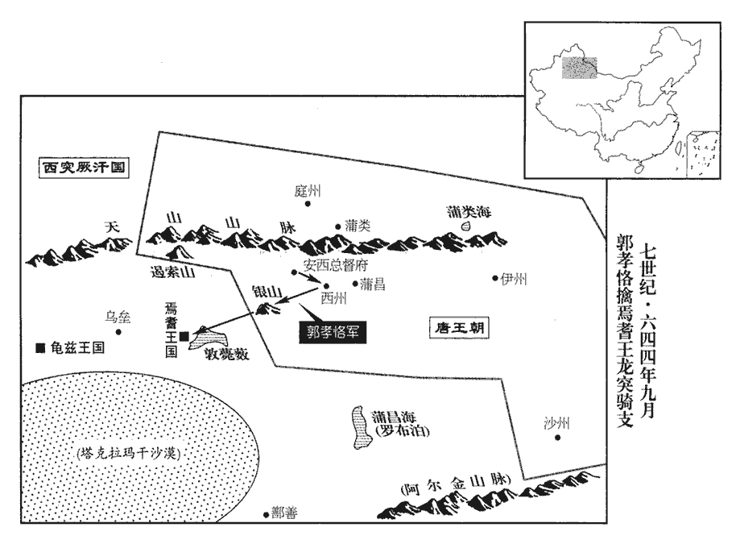
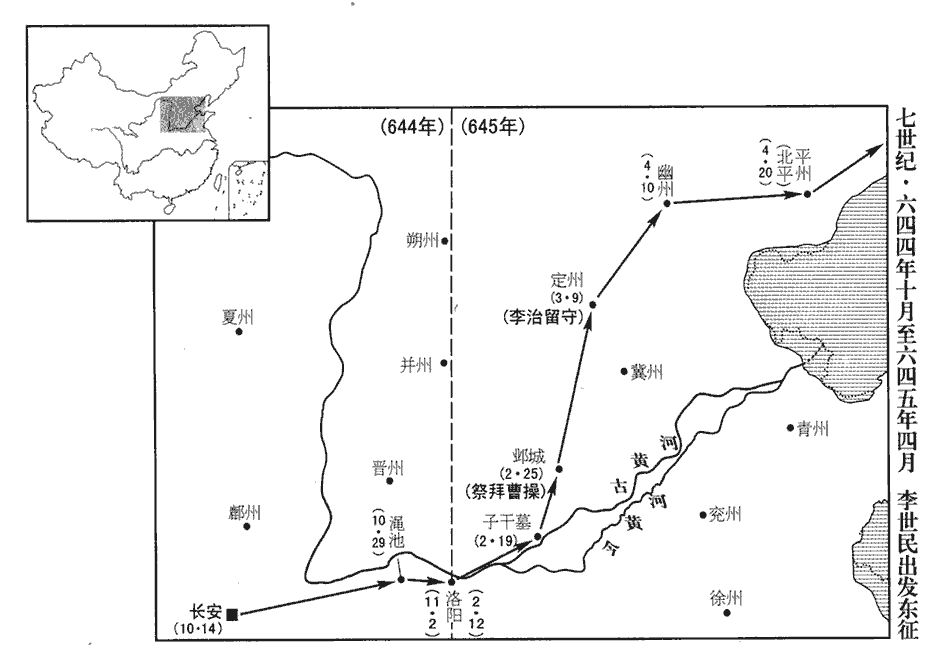
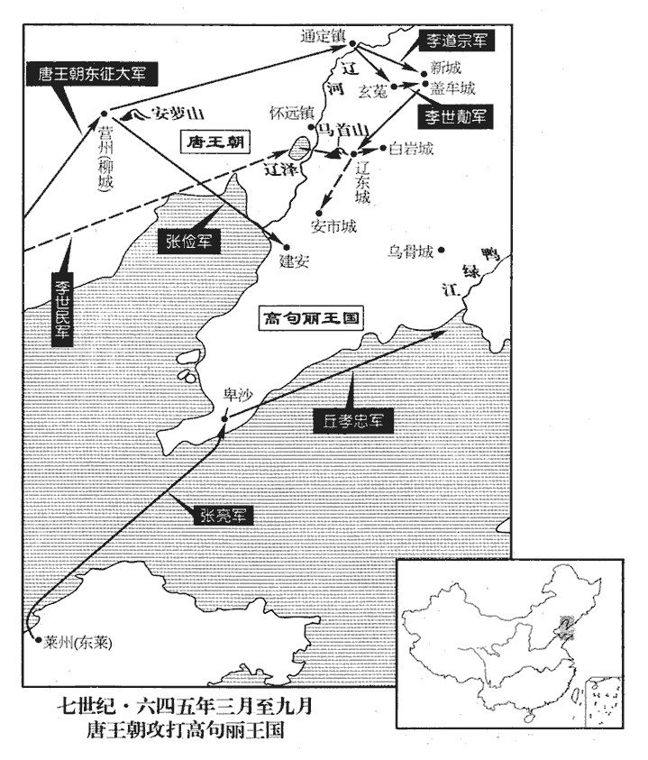

 唐紀十三起昭陽單閼（癸卯）四月，盡旃蒙大荒落（乙巳）五月，凡二年有奇。

# 太宗文武大聖大廣孝皇帝中之下

## 貞觀十七年（癸卯、六四三）

1夏，四月，庚辰朔‹一›，承基上變，告太子‹李承乾›謀反。觀，古玩翻。上，時掌翻。敕長孫無忌、房玄齡、蕭瑀、李世勣與大理、中書、門下參鞫jū之，唐制：凡國之大獄，三司詳決。三司，謂給事中、中書舍人與御史參鞫也。今令三省與大理參鞫，重其事。長，知兩翻。瑀，音禹。反形已具。上謂侍臣：「將何以處承乾？」處，昌呂翻。群臣莫敢對，通事舍人來濟進曰：「陛下不失為慈父，太子得盡天年，則善矣！」上從之。濟，護兒之子也。來護兒，隋將也，死於宇文化及之難。

〖译文〗 [1]夏季，四月，庚辰朔（初一），纥干承基上书告发太子李承乾谋反。太宗敕令长孙无忌、房玄龄、萧、李世与大理寺、中书省、门下省一同参与审问，谋反的情形已经昭彰。太宗对身边的大臣说：“你们看将如何处置承乾？”众位大臣不敢应答，通事舍人来济进言说：“陛下不失为慈父的形象，让太子享尽自然寿数，就不错了。”太宗听从其意见。来济是来护儿的儿子。

乙酉‹六›，詔廢太子承乾為庶人，幽於右領軍府。上欲免漢王元昌死，群臣固爭，乃賜自盡於家，而宥其母、妻、子。元昌母，孫嬪。侯君集、李安儼、趙節、杜荷等皆伏誅。左庶子張玄素、右庶子趙弘智、令狐德棻等以不能諫爭，皆坐免為庶人。令，音零。棻，符分翻。爭，讀曰諍。餘當連坐者，悉赦之。詹事于志寧以數諫，獨蒙勞勉。數，所角翻。勞，力到翻。以紇干承基為祐川府‹甘肃省岷县东南›折衝都尉，爵平棘縣公。唐志：岷州有祐川府。隋志：岷州臨洮縣，後周置祐川郡。唐蓋因周郡名以為府也。

〖译文〗 乙酉（初六），太宗下诏废黜太子李承乾为平民，幽禁在右领军府。太宗想要免除汉王李元昌的死罪，群臣执意争辩，于是便赐他在家中自尽，宽宥他的母亲、妻子儿女。侯君集、李安俨、赵节、杜荷等人皆处斩。左庶子张玄素、右庶子赵弘智、令狐德等人以不能劝谏太子，均获罪免为平民。其余应当连坐的，全部赦免。詹事于志宁因为曾多次劝谏，单独蒙受嘉勉。任命纥干承基为川府折冲都尉，封爵平棘县公。

侯君集被收，被，皮義翻。賀蘭楚石復詣闕告其事，復，扶又翻。上引君集謂曰：「朕不欲令刀筆吏辱公，故自鞫公耳。」君集初不承。引楚石具陳始末，又以所與承乾往來啟示之，君集辭窮，乃服。上謂侍臣曰：「君集有功，欲乞其生，可乎？」乞，如字，匄也。群臣以為不可。上乃謂君集曰：「與公長訣矣！」因泣下。泣，淚也。君集亦自投於地，遂斬之於市。君集臨刑，謂監刑將軍曰：「君集蹉跌至此！監，古銜翻。蹉，七何翻。跌，徒結翻。然事陛下於藩邸，上在藩時，引君集入幕府，數從征伐。擊取二國，謂吐谷渾、高昌也。乞全一子以奉祭祀。」上乃原其妻及子，徙嶺南‹大庾岭之南›。籍沒其家，得二美人，自幼飲人乳而不食。

〖译文〗 侯君集被收入狱中，贺兰楚石又到宫阙前告发他谋反的事，太宗召见侯君集对他说：“朕不想让那些刀笔吏羞辱你，所以便亲自审问你。”君集起初不认罪。太宗便召见贺兰楚石详细陈述始末原委，又拿出与承乾来往的书信启给他看，君集理屈词穷，只得服罪。太宗对身边大臣说：“君集有功于大唐，乞求还他一条生路，可以吗？”众位大臣都认为不可。太宗便对君集说：“与你永别了！”因而流下眼泪。君集也磕头表示服罪，于是将他斩首于集市上。侯君集临刑前，对监刑的将军说：“君集我一时失足走到了这一步！然而当年在秦王府时即侍奉陛下，又有攻取吐谷浑、高昌二国的功绩，请求保全我一个儿子以维持家族的祭祀烟火。”太宗便宽宥了他的妻子和子女，将他们迁徙到岭南。没收了他所有的家产，得到二个美女，从小喝人奶不吃别的食物。

初，上使李靖教君集兵法，君集言於上曰：「李靖將反矣。」上問其故，對曰：「靖獨教臣以其粗而匿其精，粗，讀與麤同，倉乎翻。以是知之。」上以問靖，靖對曰：「此乃君集欲反耳。今諸夏已定，夏，戶雅翻；下同。臣之所教，足以制四夷，而君集固求盡臣之術，非反而何！」江夏王道宗嘗從容言於上曰：從，千容翻。「君集志大而智小，自負微功，恥在房玄齡、李靖之下，雖為吏部尚書，未滿其志。以臣觀之，必將為亂。」上曰：「君集材器，亦何施不可！朕豈惜重位，但次第未至耳，豈可億度，朱子曰：億，未見而意之也。度，徒洛翻。妄生猜貳邪！」及君集反誅，上乃謝道宗曰：「果如卿言。」

〖译文〗 起初，太宗让李靖教授侯君集兵法，侯君集对太宗说：“李靖将要谋反。”太宗问他是什么原因，侯君集答道：“李靖教我兵法时只教给我粗浅的内容，而隐匿精华，因此知道他要谋反。”太宗将这些话问李靖，李靖答道：“此乃是君集想要谋反。如今中原已经平定，我所教的兵法，足以制服四方民族，而君集执意请求倾尽我的谋略，这不是想要谋反又是什么呢？”江夏王李道宗曾经语气和缓地对太宗说：“侯君集志大才疏，自认为有些功劳，对于位居房玄龄、李靖之下感到羞耻，虽然身为吏部尚书，还是不能满足他的愿望。依我观察，他一定会叛乱。”太宗说：“依侯君集的才气，做什么不行呢！朕难道是珍惜高位不封予他？只是因为按顺序还排不到他，怎么可以随意猜忌，乱生疑惑呢？”等到侯君集因谋反伏诛，太宗便当面感谢李道宗说：“果然不出你之所料。”

李安儼父，年九十餘，上愍之，賜奴婢以養之。

〖译文〗 李安俨的父亲，年高九十多岁，太宗怜悯他，赐给奴婢以侍奉他。

太子承乾既獲罪，魏王泰日入侍奉，上面許立為太子，岑文本、劉洎亦勸之；長孫無忌固請立晉王治。請立嫡也。上謂侍臣曰：「昨青雀投我懷云：『臣今日始得為陛下子，乃更生之日也。泰，小字青雀。臣有一子，臣死之日，當為陛下殺之，為，于偽翻。傳位晉王‹李治›。』人誰不愛其子，朕見其如此，甚憐之。」諫議大夫褚遂良曰：「陛下言大失。願審思，勿誤也！安有陛下萬歲後，魏王據天下，肯殺其愛子，傳位晉王者乎！殺子而立弟，非人情也。褚遂良探其心術之微而言之。陛下日者既立承乾為太子，復寵魏王，復，扶又翻；下復何同。禮秩過於承乾，以成今日之禍。前事不遠，足以為鑒。陛下今立魏王，願先措置晉王，始得安全耳。」遂良此語，亦以激帝。上流涕曰：「我不能爾。」因起，入宮。魏王泰恐上立晉王治，謂之曰：「汝與元昌善，元昌今敗，得無憂乎？」治由是憂形於色。上怪，屢問其故，治乃以狀告；上憮然，憮wǔ，文甫翻。始悔立泰之言矣。上面責承乾，承乾曰：「臣為太子，復何所求！但為泰所圖，時與朝臣謀自安之術，朝，直遙翻。不逞之人遂教臣為不軌耳。今若泰為太子，所謂落其度內。」

〖译文〗 太子李承乾已经获罪幽禁，魏王李泰便每天进宫侍奉太宗，太宗当面许诺立他为太子，岑文本、刘洎也劝说太宗立李泰；长孙无忌执意请求立晋王李治。太宗对身边大臣说：“昨天李泰投到我怀里对我说：‘我到今天才得以成为陛下最亲近的儿子，此乃我再生之日。我有一个儿子，我死之日，当为陛下将他杀死，传位给晋王李治。’人谁不爱惜自己的儿子，朕见李泰这么做，内心十分怜悯他。”谏议大夫褚遂良说：“陛下此言大为不妥。希望陛下深思熟虑，千万不要出现失误。陛下百年之后，魏王占有天下，他怎么肯杀自己的爱子，将皇位传给晋王呢？从前陛下既立承乾为太子，又宠爱魏王，对他的礼遇超过承乾，以致造成了今日的灾祸。承乾谋反的事刚刚过去，足可做为今日的借鉴。陛下如今要立魏王为太子，希望先安置好晋王，只有这样政局才得稳定。”太宗流着眼泪说：“朕不能这么做。”说完站起身，回到宫中。魏王李泰惟恐太宗立晋王李治为太子，对李治说：“你与李元昌关系密切，元昌谋反未成已自尽，你能够一点不担心吗？”李治听到这番话满脸忧愁。太宗感到奇怪，多次问他是什么原因，李治便将李泰对他说过的话告诉太宗；太宗很失望，开始后悔说过立李泰的话。太宗曾当面指责李承乾，李承乾说：“我身为太子，还有什么更多的要求！只是因为被李泰图谋，便常与朝廷大臣们谋求自我保存的策略，那些不逞之徒趁机唆我图谋不轨。如今若是立李泰为太子，那就正好落入他的谋划之内。”

承乾既廢，上御兩儀殿，按唐六典，兩儀殿在太極殿之後，蓋古之內朝也，常日視朝而聽事焉。群臣俱出，獨留長孫無忌、房玄齡、李世勣、褚遂良，謂曰：「我三子一弟，所為如是，三子，謂齊王祐、太子承乾、魏王泰；一弟，謂漢王元昌。我心誠無聊賴！」因自投于牀，無忌等爭前扶抱；上又抽佩刀欲自刺，刺，七亦翻。遂良奪刀以授晉王治。無忌等請上所欲，上曰：「我欲立晉王。」無忌曰：「謹奉詔；有異議者，臣請斬之！」上謂治曰：「汝舅許汝矣，宜拜謝。」治因拜之。上謂無忌等曰：「公等已同我意，未知外議何如？」對曰：「晉王仁孝，天下屬心久矣，屬，之欲翻。乞陛下試召問百官，有不同者，臣負陛下萬死。」上乃御太極殿，西內正門曰承天門，正殿曰太極，太極之後曰兩儀殿。六典：朔望御太極殿視朝，蓋古之中朝也。召文武六品以上，謂曰：「承乾悖逆，悖，蒲內翻，又蒲沒翻。泰亦凶險，皆不可立。朕欲選諸子為嗣，誰可者？卿輩明言之。」眾皆讙呼曰：「晉王仁孝，當為嗣。」讙huān，與諠同。上悅。是日，泰從百餘騎至永安門；六典：太極宮城南面三門，中曰承天，東曰長樂，西曰永安。敕門司盡辟其騎，辟，音闢。六典：門下省有城門郎四人，掌京城、皇城宮殿諸門開闔之節；置門僕八百人，分番上下。引泰入肅章門，幽於北苑。程大昌曰：太極宮之北有內苑，以其在宮北，故亦曰北苑。苑之北門曰啟運門，又北即禁苑，禁苑廣矣。

〖译文〗 李承乾被废掉太子后，太宗亲御两仪殿，群臣都退朝，只留下长孙无忌、房玄龄、李世、褚遂良四人，太宗对他们说：“朕的三个儿子、一个弟弟，如此作为，我的心里实在是苦闷、百无聊赖。”于是将身体向床头撞去，长孙无忌等人争抢上前抱住他；太宗又抽出佩刀想要自杀，褚遂良夺下刀交给晋王李治。长孙无忌等请求太宗告知有什么要求，太宗说：“朕想要立晋王为太子。”无忌说：“我等谨奉诏令；如有异议者，我请求将其斩首。”太宗对李治说：“你舅父许诺你为太子，你应当拜谢他。”李治拜谢长孙无忌。太宗对长孙无忌等人说：“你们已经与朕的意见相同，但不知外朝议论如何？”答道：“晋王仁义孝敬，天下百姓属心很久了，望陛下召见文武百官试探问一下，如有不同意的，就是臣等有负陛下罪该万死。”太宗于是亲临太极殿，召见六品以上文武大臣，对他们说：“李承乾大逆不道，李泰也居心险恶，都不能立为太子。朕想要从众位皇子中选一人为继承人，谁可以为太子？你们须当面明讲。”众人都高声说道：“晋王仁义孝敬，应当做太子。”太宗十分高兴。这一天，李泰率领一百多骑兵到永安门；太宗敕令城门官员遣散李泰的护骑，带李泰进入肃章门，将其幽禁在北苑。

丙戌‹七›，詔立晉王治為皇太子，御承天門樓，赦天下，酺三日。治，直吏翻。酺pú，薄乎翻。上謂侍臣曰：「我若立泰；則是太子之位可經營而得。自今太子失道，藩王窺伺者，皆兩棄之，伺，相吏翻。傳諸子孫，永為後法。且泰立，【章：十二行本「立」下有「則」字；乙十一行本同；孔本同；張校同。】承乾與治皆不全；治立，則承乾與泰皆無恙矣。」恙，余亮翻。

〖译文〗 丙戌（初七），太宗下诏立晋王李治为皇太子，太宗亲临承天门楼，大赦天下，饮宴三天。太宗对身边大臣说：“朕如果立李泰为太子，那就表明太子的位置可以苦心经营而得到。自今往后，太子失德背道，而潘王企图谋取的，两人都要弃置不用，这一规定传给子孙后代，永为后代效法。而且李泰为太子，则李承乾和李治均难以保全，李治为太子，则李承乾与李泰均安然无恙。”

臣光曰：唐太宗不以天下大器私其所愛，以杜禍亂之原，可謂能遠謀矣！

〖译文〗 臣司马光曰：唐太宗并不将天下重任私与所偏爱的人，以此来杜绝祸乱的根源，可称得上是深谋远虑呀！

2丁亥‹八›，以中書令楊師道為吏部尚書。尚，辰羊翻。初，長廣公主適趙慈景，生節；慈景死，武德元年，慈景為堯君素所殺。更適師道。更，工衡翻。師道與長孫無忌等共鞫jū承乾獄，陰為趙節道地，由是獲譴。上至公主所，公主以首擊地，泣謝子罪，上亦拜泣曰：「賞不避仇讎，罰不阿親戚，此天下至公之道，不敢違也，以是負姊。」

〖译文〗 [2]丁亥（初八），任命中书令杨师道为吏部尚书。起初，长广公主嫁给赵慈景，生下赵节；赵慈景死后，长广公主改嫁杨师道。杨师道曾与长孙无忌等人一道审讯承乾太子的狱案，暗中为赵节开脱罪责，由此获罪。太宗到公主住所，公主以头触地，哭泣着为儿子的罪过道歉，太宗回拜并流着泪说：“赏赐不回避仇敌，惩罚不袒护亲属，这是天下至公至正的道理，不敢违背，因此有负于姐姐。”

己丑‹十›，詔以長孫無忌為太子太師，房玄齡為太傅，蕭瑀為太保，東宮三師，並從一品。李世勣為詹事，瑀、世勣並同中書門下三品。同中書門下三品自此始。歐陽修曰：謂同侍中、中書令也。又以左衛大將軍李大亮領右衛率，率，所律翻。前詹事于志寧、中書侍郎馬周為左庶子，吏部侍郎蘇勗xù、中書舍人高季輔為右庶子，刑部侍郎張行成為少詹事，少詹事，正四品，為詹事之貳。諫議大夫褚遂良為賓客。太子賓客，正三品。古無此官，唐始置，掌侍從規諫，贊相禮儀。

〖译文〗 己丑（初十），太宗下诏任命长孙无忌为太子太师，房玄龄为太傅，萧为太保，李世为太子詹事，萧、李世同为同中书门下三品。同中书门下三品这一位同宰相的要职从此开始。又任命左卫大将军李大亮领右卫率，前任太子詹事于志宁、中书侍郎马周为左庶子，吏部侍郎苏勖、中书舍人高季辅为右庶子，刑部侍郎张行成为少詹事，谏议大夫褚遂良为太子宾客。

李世勣嘗得暴疾，方云「須灰可療」，上自翦須，為之和藥。為，于偽翻；下同。須，與鬚同。和，戶臥翻。世勣頓首出血泣謝。上曰：「為社稷，非為卿也，何謝之有！」世勣嘗侍宴，上從容謂曰：從，千容翻。「朕求群臣可託幼孤者，無以踰公，公往不負李密，見一百八十六卷武德元年。豈負朕哉！」世勣流涕辭謝，齧指出血，因飲沈醉，上解御服以覆之。齧，魚結翻。沈，持林翻。覆，敷又翻。

〖译文〗 李世曾得暴病，药方说“胡须烧成灰可治疗”，太宗剪下自己的胡须，为他配药。李世连连磕头哭谢，直至头颅出血。太宗说：“这是为了社稷江山，并非为你个人，有什么可谢的？”李世曾侍奉太宗饮宴，太宗和缓地对他说：“朕一心想找到一个可以托孤的大臣，没有人能超过你的，往年你曾经不负于李密，岂能辜负朕！”李世流着泪辞谢，咬破指头沾血为誓，喝得酩酊大醉，太宗解下身上的皇袍给他披上。

癸巳‹十四›，詔解魏王泰雍州牧、相州‹总部设河南省安阳市›都督、左武候大將軍，降爵為東萊郡王。雍，於用翻。相，息亮翻。泰府僚屬為泰所親狎者，皆遷嶺表‹大庾岭之南›；以杜楚客兄如晦有功，免死，廢為庶人。給事中崔仁師嘗密請立魏王泰為太子，左遷鴻臚少卿。臚，陵如翻。

〖译文〗 癸巳（十四日），太宗下诏解除魏王李泰的雍州牧、相州都督、左武候大将军等职务，降爵位为东莱郡王。李泰王府的僚属中凡是李泰的亲信，都迁徙流放到岭南；杜楚客因兄长杜如晦有功，免去死罪，废为平民。给事中崔仁师曾私下请求立魏王李泰为太子，降职为鸿胪寺少卿。

庚子‹二十一›，定太子見三師儀：迎於殿門外，殿門，東宮之殿門也。先拜，三師答拜；每門讓於三師。三師坐，太子乃坐。其與三師書，前後稱名、「惶恐」。

〖译文〗 庚子（二十一日），规定太子见三师的礼仪：在殿门外迎接，太子先拜，三师答拜；每道门都要让三师先行。三师坐下后，太子才能坐下。太子给三师的书启，前后自称名字加“惶恐”二字。

五月，癸酉‹二十五›，太子上表，上，時掌翻。以「承乾、泰衣服不過隨身，飲食不能適口，幽憂可愍，乞敕有司，優加供給；」上從之。

〖译文〗 五月，癸酉（二十五日），太子上表章，言道：“李承乾与李泰只有随身几件衣服，饮食也不能对口味，幽禁忧愁可怜，请求敕令有关官署，优厚供给他们。”太宗应允。

黃門侍郎劉洎上言，以「太子宜勤學問，親師友。今入侍宮闈，動踰旬朔，師保以下，接對甚希，伏願少抑下流之愛，弘遠大之規，則海內幸甚！」少，詩沼翻。上乃命洎與岑文本、褚遂良、馬周更日詣東宮，更，工衡翻。與太子遊處談論。處，昌呂翻。

〖译文〗 黄门侍郎刘洎上书言道：“太子应当勤学好问，亲善师友。如今太子入侍宫闱，动辄超过十天半个月，太师太保以下官员，很少与太子应对答问，希望能稍微抑制一下对子孙的爱心，弘扬传之久远的规制，则是天下百姓的幸事。”于是太宗让刘洎与岑文本、褚遂良、马周几个人轮流到东宫，与太子相处谈论政事。

3六月，己卯朔‹一›，日有食之。

〖译文〗 [3]六月，己卯朔（初一），出现日食。

4丁亥‹九›，太常丞鄧素使高麗‹朝鲜半岛平壤›還，請於懷遠鎮‹辽宁省辽阳市西北›增戍兵以逼高麗，使，疏吏翻。麗，力知翻。上曰：「『遠人不服，則修文德以來之，』論語孔子之言。未聞一二百戍兵能威絕域者也！」

〖译文〗 [4]丁亥（初九），太常寺丞邓素出使高丽回到朝廷，请求太宗在怀远镇增派戍边兵力以威逼高丽，太宗说：“孔子说：‘远方的人不服从，则勤修文德来招抚他们’，未听说靠一二百个士兵就能威镇远方的。”

5丁酉‹十九›，右僕射高士廉遜位，許之，其開府儀同三司、勳封如故，勳，勳級；封，封邑也。仍同門下中書三品，知政事。

〖译文〗 [5]丁酉（十九日），尚书右仆射高士廉请求退职，太宗应允，开府仪同三司的职衔和勋位封邑仍保留，而且仍是同门下中书三品，参知政事。

6閏月，辛亥‹四›，上謂侍臣曰：「朕自立太子，遇物則誨之，見其飯，則曰：『汝知稼穡之艱難，則常有斯飯矣。』書無逸曰：惟不知稼穡之艱難，乃逸。見其乘馬，則曰：『汝知其勞逸，不竭其力，則常得乘之矣。』顏淵曰：昔造父巧於使馬，造父不窮其馬力，是造父無佚馬也。見其乘舟，則曰：『水所以載舟，亦所以覆舟，民猶水也，君猶舟也。』孔子家語之言。見其息於木下，則曰：『木從繩則正，后從諫則聖。』」書說命之言。

〖译文〗 [6]闰六月，辛亥（初四），太宗对身边大臣说：“朕自从立李治为太子，遇见任何事情都亲加教诲，看见他用饭，就说：‘你知道耕稼的艰难就能常吃上这些饭。’看见他骑马，就说：‘你知道马要劳逸结合，不耗尽马的力量，就能经常骑着它。’看见他坐船，则说：‘水能够载船，也能够翻船，百姓便如同这水，君主便如同这船。’见到他在树下休息，则说：‘木头经过墨线处理才能正直，君主能纳谏者才为圣君。’”

7丁巳‹十›，詔太子知左、右屯營兵馬事，其大將軍以下並受處分。左右十二衛，屯營也。處，昌呂翻。分，扶問翻。

〖译文〗 [7]丁巳（初十），太宗下诏让太子掌管左、右屯营兵马事宜，屯营大将军以下的官员都要受其节制。

8薛延陀‹蒙古西南部›真珠可汗，可，從刊入聲。汗，音寒。使其姪突利設來納幣，獻馬五萬匹，牛、橐駝萬頭，羊十萬口。庚申‹十三›，突利設獻饌，饌，皺戀翻，又皺皖翻。上御相思殿，按褚遂良疏云：「御幸北門，受其獻食。」則相思殿蓋在玄武門內。大饗群臣，設十部樂，增樂為十部，見一百九十五卷十四年。突利設再拜上壽，賜賚甚厚。

〖译文〗 [8]薛延陀真珠可汗派他的侄子突利设到唐帝国纳聘礼，拟献马五万匹，牛、骆驼一万头，羊十万只。庚申（十三日），突利设献上食物，太宗亲临相思殿，大宴群臣，设立十部乐曲，突利设再次行礼祝寿，太宗赏赐突利设十分丰厚。

契苾何力上言：「薛延陀不可與婚。」上，時掌翻。契，欺訖翻。苾，毗必翻。上曰：「吾已許之矣，豈可為天子而食言乎！」何力對曰：「臣非欲陛下遽絕之也，願且遷延其事。臣聞古有親迎之禮，若敕夷男使親迎，迎，魚敬翻。雖不至京師‹首都长安›，亦應至靈州‹宁夏灵武县›；彼必不敢來，則絕之有名矣。夷男性剛戾，既不成婚，其下復攜貳，復，扶又翻。不過一二年必病死，二子爭立，則可以坐制之矣！」上從之，乃徵真珠可汗使親迎，仍發詔將幸靈州與之會。真珠大喜，欲詣靈州‹宁夏灵武县›，其臣諫曰：「脫為所留，悔之無及！」真珠曰：「吾聞唐天子有聖德，我得身往見之，死無所恨。且漠北必當有主，我行決矣，勿復多言！」上發使三道，受其所獻雜畜。薛延陀先無庫廄，真珠調斂諸部，復，扶又翻。使，疏吏翻；下三使同。畜，許救翻。調，徒釣翻。斂，力贍翻。往返萬里，道涉沙磧，無水草，磧，七迹翻。耗死將半，失期不至。議者或以為聘財未備而與為婚，將使戎狄輕中國，上乃下詔絕其婚，停幸靈州，追還三使。

〖译文〗 契何力上书言道：“不可与薛延陀通婚。”太宗说：“朕已经答应他们了，怎么可以身为天子而却自食其言呢？”何力答道：“我不是想要陛下立刻回绝他们，只是希望暂且延缓此事。我听说自古有迎亲礼仪，假如陛下敕令夷男让他迎亲，即使不到长安来，也要到灵州；夷男必定不敢前来，则回绝他有理由了。夷男性情刚直暴戾，既然不能与大唐通婚，其部下又怀有二心，不过一二年便会病死，他的二个儿子争夺王位，到那时陛下可以轻易制服他们。”太宗听从其意见，于是征召真珠可汗让他前来迎亲，又发布诏书说将要在灵州与他相见。真珠十分高兴，想要亲到灵州，其大臣劝谏说：“倘若被对方扣留，到那时后悔都来不及！”真珠说：“我听说大唐天子有圣王的德行，我能亲自前去见他一面，至死都无遗憾。而且漠北必然会有人主事，我去的决心已定，不必再多说了。”太宗接连三次派使节，接受薛延它所献的牲畜。薛延陀先前库房没有马厩，真珠可汗便征调各部落马牛羊等，往返一万多里，途经沙漠地带，没有水和草，牲畜消耗损失将近一半，过了迎亲期限没有到。有人议论认为聘礼未准备齐便与之通婚，这会使北方少数族轻视唐朝。太宗于是下诏回绝其婚姻，停止巡幸灵州，并追还三次派出的使节。

褚遂良上疏，以為「薛延陀本一俟斤，良上，時掌翻。俟，渠之翻。陛下盪平沙塞，萬里蕭條，謂平突厥也，塞北皆沙磧，故曰沙塞。餘寇奔波，須有酋長，璽書鼓纛，立為可汗。見一百九十三卷二年。酋，慈由翻。長，知兩翻。璽，斯氏翻。纛，徒到翻。比者復降鴻私，許其姻媾，比，毗至翻。復，扶又翻。見上卷十六年。西告吐蕃‹西藏拉萨›，吐，從暾入聲。北諭思摩‹瀚海沙漠以南›，中國童幼，靡不知之。御幸北門，受其獻食，群臣四夷，宴樂終日。樂，音洛。咸言陛下欲安百姓，不愛一女，凡在含生，孰不懷德。今一朝生進退之意，有改悔之心，臣為國家惜茲聲聽；為，于偽翻。所顧甚少，所失殊多，少，詩沼翻。嫌隙既生，必搆邊患。彼國蓄見欺之怒，此民懷負約之慚，恐非所以服遠人，訓戎士也。陛下君臨天下十有七載，載，子亥翻。以仁恩結庶類，以信義撫戎夷，莫不欣然，負之無力，此二語考之舊書褚遂良傳亦是如此，然其意義難於強解。或曰：「力」，當作「益」；言負延陀之約為無益也。何惜不使有始有卒乎！卒，子恤翻。夫龍沙‹瀚海沙漠群›以北，部落無算，匈奴庭謂之龍城，無常處，故沙幕因謂之龍沙。中國誅之，終不能盡，當懷之以德，使為惡者在夷不在華，失信者在彼不在此，則堯‹伊祁放勋›、舜‹姚重华›、禹‹姒文命›、湯‹子天乙›不及陛下遠矣！」上不聽。

〖译文〗 褚遂良上奏疏认为：“薛延陀可汗本来是突厥的一个首领，陛下当年荡平沙漠，万里萧条少有人烟，殊余势力奔波投靠，须有一个酋长，于是才赐给他鼓和大旗，立为可汗。近来又降下大恩，应允与他们通婚，西面告知吐番，北面通知思摩，连大唐朝中的儿童也都知道此事。陛下又行幸北门，接受他们敬献食物，群臣与边远地区，都整日宴饮庆贺。都说陛下为了安抚天下百姓，不爱惜自己的女儿，芸芸众生，谁不感恩戴德。如今一朝陡生变化，有改悔之意，我深深为朝廷的声誉受损而惋惜；这样一来得到的很少，而失去的却很多，也会产生隔阂，必然会遭致边境不安宁。薛延陀深怀被欺辱的怨恨，百姓也感受到背约的羞愧，恐怕这不是绥服远方、训教边兵的办法。陛下即位治理天下已有十七年了，以仁义恩惠交结百姓，以诚信礼义安抚边远地区，天下百姓没有不佩服的。背约实在是没有道理，为什么就不能善始善终呢？龙沙城以北，薛延陀的部落众多，朝廷想要讨伐他们，终究不能全都消灭干净，应当对他们抚以德义，使正义掌握在朝廷手中而不是在对方手中，失信的在对方而不在我方。做到这些，则是尧、舜、禹、汤等人远不及陛下了。”太宗不听其谏议。

是時，群臣多言：「國家既許其婚，受其聘幣，不可失信戎狄，更生邊患。」上曰：「卿曹皆知古而不知今。昔漢初匈奴強，中國弱，故飾子女，捐金絮以餌之，得事之宜。今中國強，戎狄弱，以我徒兵一千，可擊胡騎數萬，騎，奇寄翻。薛延陀所以匍匐稽顙，惟我所欲，不敢驕慢者，以新為君長，雜姓非其種族，欲假中國之勢以威服之耳。匍，薄乎翻。匐，蒲北翻。稽，音啟。種，章勇翻。彼同羅‹蒙古北部›、僕骨‹蒙古东部›、回紇‹蒙古库伦西北›等十餘部，紇，下沒翻。兵各數萬，并力攻之，立可破滅，所以不敢發者，畏中國所立故也。今以女妻之，彼自恃大國之壻，雜姓誰敢不服！戎狄人面獸心，一旦微不得意，必反噬為害。今吾絕其婚，殺其禮，妻，七細翻；下可妻同。殺，所界翻。雜姓知我棄之，不日將瓜剖之矣，卿曹第志之！」瓜剖，猶瓜分也。志，猶記之。

〖译文〗 当此时，众位大臣大都说道：“朝廷既然答应与他们通婚，又接受了人家的聘礼，就不可失信于薛延陀，以免又生边乱。”太宗说：“你们这些人都是只知古而不知今。从前汉初匈奴强大，中原汉王朝削弱，所以要装扮子女，送金银财物以做为诱饵，在当时是合乎时宜的。如今中原强大，北方少数族削弱，以我大唐的一千步兵，可以击败他们的数万骑兵，所以薛延陀肯卑躬屈膝，满足我们的要求，不敢稍有傲慢，是因为他们刚刚立了可汗，属下杂姓部族不少，想要借着大唐的势力以威慑制服他们。他们中的同罗、仆骨、回纥等十多个部族，各有兵力几万人，如果他们合力攻打薛延陀，可以立即攻破取胜，之所以不敢轻举妄动，是因为畏惧是我大唐所立的可汗。如今将宗室女嫁给他，他们必然自恃是大国的女婿，其他部族谁还敢不服！这些戎狄人面兽心，一旦稍不满意，必会反咬一口，造成祸害。现在我们回绝其婚姻，停止接受他们的聘礼，其他部族得知我们抛弃了他们，很快会将他们瓜分豆剖，你们只须记住朕说过的话。”

臣光曰：孔子稱去食、去兵，不可去信。見論語。去，羌呂翻。唐太宗審知薛延陀不可妻，則初勿許其婚可也；既許之矣，乃復恃強棄信而絕之，復，扶又翻。雖滅薛延陀，猶可羞也。王者發言出令，可不慎哉！

〖译文〗 臣司马光曰：孔子说宁可去掉食物和军队，但是不可以丢弃信用。唐太宗深知不能与薛延陀通婚，则当初不答应与其成亲即可以了，既然答应薛延陀，又依仗强势背信弃义回绝对方，这样即使灭掉了薛延陀也足可羞愧。君王发号施令，能不慎重吗？

9上曰：「蓋蘇文弒其君而專國政，見上卷十六年。誠不可忍，以今日兵力，取之不難，但不欲勞百姓，吾欲且使契丹、靺鞨擾之，何如？」契，欺訖翻，又音喫。靺鞨，音末曷。長孫無忌曰：「蓋蘇文自知罪大，畏大國之討，必嚴設守備，陛下少為之隱忍，為，于偽翻。彼得以自安，必更驕惰，愈肆其惡，然後討之，未晚也。」上曰：「善！」觀此，則知帝之雄心未嘗一日不在高麗也。戊辰‹二十一›，詔以高麗王藏為上柱國、遼東郡王、高麗王，遣使持節冊命。麗，力知翻。使，疏吏翻。

〖译文〗 [9]太宗说：“盖苏文杀死高丽国王而独掌国政，实在是不能忍受，以我方今日的兵力，攻取他们并不难，只是不想劳扰百姓，朕想暂且先让契丹、骚扰他们，怎么样？”长孙无忌说：“盖苏文自己也知道罪行严重，害怕大国的讨伐，必然要严加防备，陛下稍稍容忍一些，他得以自我保全，必然会更加骄横，更加无恶不作，此后再去讨伐，也不算晚啊。”太宗说：“很好！”戊辰（二十一日），太宗颁布诏令封高丽王高藏为上柱国、辽东郡王、高丽王，派使节携带旌节前往册封。

10丙子‹二十九›，徙東萊王泰為順陽王。

〖译文〗 [10]丙子（二十九日），改封东莱王李泰为顺阳王。

11初，太子承乾失德，上密謂中書侍郎兼左庶子杜正倫曰：「吾兒足疾乃可耳，但疏遠賢良，狎昵群小，卿可察之。言承乾之足不良于行，猶云可也；若其遠賢良，近群小，則不可不諫誨之。遠，于願翻。昵，尼質翻。果不可教示，當來告我。」正倫屢諫，不聽，乃以上語告之。太子抗表以聞，上責正倫漏泄，對曰：「臣以此恐之，冀其遷善耳。」上怒，出正倫為穀州‹河南省新安县›刺史。及承乾敗，秋，七月，辛卯‹十四›，復左遷正倫為交州‹总部设越南河内市›都督。復，扶又翻。初，魏徵嘗薦正倫及侯君集有宰相材，請以君集為僕射，且曰：「國家安不忘危，不可無大將，諸衛兵馬宜委君集專知。」上以君集好誇誕，不用。將，即亮翻。好，呼到翻。及正倫以罪黜，君集謀反誅，上始疑徵阿黨。又有言徵自錄前後諫辭以示起居郎褚遂良者，上愈不悅，乃罷叔玉尚主，而踣所撰碑。許婚、撰碑事見上卷本年。踣，蒲北翻，仆也。

〖译文〗 [11]起初，太子李承乾德行丧失，太宗私下对中书侍郎兼左庶子杜正伦说：“我儿承乾如果仅有脚病倒还说得过去，只是他疏远贤良，亲昵小人。你应当加以监察，如果真不可教诲，请你来告诉我。”杜正伦多次劝谏李承乾都不听，杜正伦便将太宗对他讲的话告诉承乾。太子上表章给太宗，太宗责怪杜正伦泄露此事，杜正伦答道：“我想用陛下的话恐吓他，希望他能弃恶从善。”太宗大怒，降杜正伦为谷州刺史。等到李承乾谋反事败露，秋季，七月，辛卯（十四日），又将杜正伦降职为交州都督。起初，魏徵曾经推荐杜正伦与侯君集有宰相之才，请求任命侯君集为仆射，而且说：“朝廷安定不忘危亡，不可以没有大将，各宿卫兵马应该委派君集专管。”太宗认为君集喜欢自我夸耀，没有重用。等到后来杜正伦因泄露罪被贬职，侯君集因参与谋反被处死，太宗开始怀疑魏徵有结党营私之嫌。又有人上书言称魏徵自己抄录前后在朝中的谏言给起居郎褚遂良看，太宗更加不高兴，于是罢除魏徽的儿子魏叔玉娶公主一事，并毁坍所撰碑石。

12初，上謂監脩國史房玄齡曰：歷代史官隸祕書省著作局，皆著作郎掌脩國史。北齊詔魏收撰史，又詔平原王高隆之總監之，書名而已。貞觀三年，始移史館於禁中，在門下省北，宰相監脩國史；自是著作郎始罷史職。監，古銜翻。「前世史官所記，皆不令人主見之，何也？」對曰：「史官不虛美，不隱惡，若人主見之必怒，故不敢獻也。」上曰：「朕之為心，異於前世。帝王欲自觀國史，知前日之惡，為後來之戒，公可撰次以聞。」撰，士免翻。諫議大夫朱子奢上言：上，時掌翻；下上之同。「陛下聖德在躬，舉無過事，史官所述，義歸盡善。陛下獨覽起居，於事無失，若以此法傳示子孫，竊恐曾、玄之後或非上智，飾非護短，史官必不免刑誅。如此，則莫不希風順旨，全身遠害，悠悠千載，何所信乎！所以前代不觀，蓋為此也。」遠，于願翻。載，子亥翻。為，于偽翻。上不從。玄齡乃與給事中許敬宗等刪為高祖、今上實錄；癸巳‹十六›，書成，上之。上見書六月四日事，語多微隱，謂誅建成、元吉事也。謂玄齡曰：「周公‹姬旦›誅管‹管国国君姬鲜›、蔡‹蔡国国君姬度›以安周，季友鴆叔牙以存魯，周公，弟也；管叔，兄也。成王幼，周公攝政，管、蔡流言，挾武庚以叛，周公誅之以安周室。魯公子慶父，叔牙、季友，皆桓公子也。莊公疾，問後於叔牙，牙曰：「慶父才。」問季友，友曰：「臣以死奉般。」遂鴆叔牙而立般。朕之所為，亦類是耳，史官何諱焉！」即命削去浮詞，去，羌呂翻。直書其事。

〖译文〗 [12]起初，太宗曾对以宰相身份监修国史的房玄龄说：“前代史官所记的吏事，都不让君主看见，这是为什么？”答道：“史官不虚饰美化，也不隐匿罪过，如果让皇上看见必然会动怒，所以不敢进呈。”太宗说：“朕的志向不同于前代君主。朕想亲自翻阅当朝国史，知道先前的过失，以做为以后的借鉴，希望你撰写完成后上呈给朕看看。”谏议大夫朱子奢上书言道：“陛下身怀圣德，行动没有过失，史官所记述的，按理都是尽善尽美的事。陛下惟独要翻阅《起居注》，这对史官记事当然无所损失，假如将此规定传示给子孙后代，恐怕到了曾孙，玄孙之后偶有并非最明智的君主，掩饰过错袒护短处，史官必然难以避免身遭刑罚诛戮。如此下去，则史官们都顺从旨意行事，远避危害，那么悠悠千载的历史，有什么可相信的呢？所以说前代君主不观看国史，正是为了这个缘故。”太宗不听其谏言。房玄龄便与给事中许敬宗等删改成《高祖实录》和《今上实录》；癸巳（十六日），书写成，呈上太宗。太宗见书中记载武德九年六月四日玄武门之变，用辞多隐讳曲折，便对房玄龄说：“历史上周公诛灭管叔、蔡叔以定周朝，季友毒死叔牙以保存鲁国，朕当年的所作所为，正与此类似，史官有什么可隐讳的！”立即命令删削浮华之词，秉笔直书杀李建成、李元吉事。

13八月，庚戌‹三›，以洛州‹总部设河南省洛阳市›都督張亮為刑部尚書，參預朝政；朝，直遙翻。以左衛大將軍、太子右衛率李大亮為工部尚書。大亮身居三職，宿衛兩宮，三職，即謂為工部尚書及衛兩宮也。率，所律翻。恭儉忠謹，每宿直，必坐寐達旦。房玄齡甚重之，每稱大亮有王陵、周勃之節，可當大位。

〖译文〗 [13]八月，庚戌（初三），朝廷任命洛州都督张亮为刑部尚书，参预朝政；任命左卫大将军、太子右卫率李大亮为工部尚书。李大亮身居三项要职，宿卫两宫，谦恭忠正谨慎，每次护卫值勤，必定坐着假寐直到天亮。房玄龄非常敬重他，多次称李大亮有王陵、周勃的气节，可以担当大的职位。

初，大亮為龐玉兵曹，為李密所獲，同輩皆死，賊帥張弼見而釋之，遂與定交。帥，所類翻。及大亮貴，求弼，欲報其德，弼時為將作丞，唐監丞，從六品下。自匿不言。大亮遇諸途而識之，持弼而泣，多推家貲以遺弼，推，吐雷翻。遺，于季翻。弼拒不受。大亮言於上，乞悉以其官爵授弼，上為之擢弼為中郎將。上為，于偽翻。將，即亮翻。時人皆賢大亮不負恩，而多弼之不伐也。

〖译文〗 起初，李大亮为庞玉的兵曹，被李密抓获，原来的同伙都被处斩，大将张弼见李大亮而将其释放，二人遂定交情。等到李大亮身居显贵，开始寻找张弼，想报答他的救命之恩，张弼当时官做将作监丞，自己隐匿不说。李大亮在道上遇见张弼而认出他来，扶着张弼掉泪，并将自己的家产送给张弼，张弼拒不接受。李大亮将此事上禀太宗，请求将自己的官职爵位全都授予张弼，太宗为了李大亮的缘故提拔张弼为中郎将。当时人都称赞李大亮不负恩情，也赞扬张弼不自我炫耀。

14九月，庚辰‹四›，新羅‹朝鲜半岛庆州城›遣使言百濟‹朝鲜半岛扶余县›攻取其國四十餘城，復與高麗‹朝鲜半岛平壤›連兵，使，疏吏翻。復，扶又翻。謀絕新羅入朝之路，乞兵救援。朝，直遙翻；下同。上命司農丞相里玄獎齎璽書賜高麗相里，姓；玄獎，名。姓譜：皋陶之後為理氏。商末，理證孫仲師遭難，去「王」姓「里」，至里克為晉所誅，其妻攜少子逃居相城，因為相里氏。曰：「新羅委質國家，朝貢不乏，質，職日翻。爾與百濟各宜戢兵；戢jí，阻立翻。若更攻之，明年發兵擊爾國矣！」

〖译文〗 [14]九月，庚辰（初四），新罗派使节来称百济攻取他国中四十多座城，又与高丽国联合，图谋断绝新罗到唐朝的通道，因而请求派兵救援。太宗命令司农寺丞相里玄奖带皇帝玺书前往高丽，对他们说：“亲罗归顺我大唐，每年不停朝贡，你们与百济都停止兵战，假如再行攻打，明年大唐就要发兵攻伐你们国家。”

15癸未‹七›，徙承乾於黔州‹四川省彭水县›。黔，其今翻。甲午‹十八›，徙順陽王泰於均州‹湖北省丹江口市›。武當縣，漢屬南陽郡，晉屬順陽郡，宋屬始平郡；梁置武當郡及興州，後周改豐州，隋開皇初改均州；大業初，廢為武當縣，屬淅陽郡；義寧二年，分淅陽之武當、均陽置均州。孫愐曰：汮水‹上、中游即今河南省西部的老灌河和淅川，下游即汇合淅川后的丹江›出淅縣北山入沔。「汮」，今作「均」。隋置均州，以水名州也。上曰：「父子之情，出於自然。朕今與泰生離，生離，謂生而離別也。楚辭曰：哀莫哀兮生別離。亦何心自處！然朕為天下主，但使百姓安寧，私情亦可割耳。」又以泰所上表示近臣曰：「泰誠為俊才，朕心念之，卿曹所知；但以社稷之故，不得不斷之以義，處，昌呂翻。上，時掌翻。斷，丁亂翻。使之居外者，亦所以兩全之耳。」

〖译文〗 [15]癸未（初七），将李承乾流放到黔州。甲午（十八日），将顺阳王李泰流放到均州。太宗说：“父子之情，是出自于自然。朕如今与李泰生而离别，还有什么心思自处！然而朕为天下人的君主，只要能使百姓生活安宁，私情也当割舍呀。”又将李泰所上表文拿给身边大臣看，并说：“李泰实在是有才智，朕常常念叨他，你们也都知道，但是为了社稷江山，不得不以道义与他断绝亲情，让他居住在遥远的地方，这也是两全之策呀。”

16先是，諸州長官或上佐歲首親奉貢物入京師，謂之朝集使，朝集使，自隋以來有之。先，悉薦翻。長，知兩翻。朝，直遙翻。使，疏吏翻；下同。亦謂之考使；京師無邸，率僦jiù屋與商賈雜居。上始命有司為之作邸。僦，即就翻。賈，音古。為，于偽翻。

〖译文〗 [16]先前，各州的长官和高级佐僚年初亲自带着贡品进京，称之为朝集使，也称为考使。京城没有官邸，便大都租房子与商人们杂处在一起。此时太宗命令有关部门为他们修建宫邸。

17冬，十一月，己卯‹三›，上祀圜丘。貞觀禮：冬至祀昊天上帝於圜丘。

〖译文〗 [17]冬季，十一月，己卯（初三），太宗到圜丘祭祀。

18初，上與隱太子‹李建成›、巢剌王‹李元吉›有隙，剌，盧達翻。密明公贈司空封德彝陰持兩端。楊文幹之亂，上皇欲廢隱太子而立上，見一百九十一卷武德七年。德彝固諫而止。其事甚秘，上不之知，薨後乃知之。壬辰‹十六›，治書侍御史唐臨始追劾其事，請黜官奪爵。治，直之翻。劾，戶概翻，又戶得翻。上命百官議之，尚書唐儉等議：「德彝罪暴身後，恩結生前，所歷眾官，不可追奪，請降贈改諡。」詔黜其贈官，改諡曰繆，削所食實封。諡法：名與實爽曰繆，蔽仁傷賢曰繆。六典曰：魏氏五等，皆以鄉亭，多假空名，不食本邑。隋氏始立王公侯以下制度，至唐因之，率多虛名，其言食實封者乃得真戶。舊制，戶皆三丁已上，一分入國，開元中，定以三丁為限，租賦全入封家。

〖译文〗 [18]起初，太宗与隐太子李建成、巢刺王李元吉有隔阂，密明公赠司空封德彝暗中骑墙。杨文叛乱后，太上皇李渊想要废掉隐太子李建成而改立太宗，封德彝执意劝谏而停止。此事非常隐秘，太宗并不知道，等德彝死后才知道。壬辰（十六日），治书侍御史唐临开始追究弹劾其事，请求罢黜封氏官职爵位。太宗让文武百官商议此事，尚书唐俭等人议论道：“德彝的罪过暴露在他死后，恩义结于生前，历任各种官职，不宜追究夺回，请求降赠官改封谥号。”太宗下诏罢除所赠官职，改谥号为缪，削掉所得食邑和实封户。

19敕選良家女以實東宮；癸巳‹十七›，太子遣左庶子于志寧辭之。上曰：「吾不欲使子孫生於微賤耳。今既致辭，當從其意。」上疑太子仁弱，密謂長孫無忌曰：「公勸我立雉奴，治，小字雉奴。雉奴懦，懦，奴臥翻，又萬亂翻。恐不能守社稷，柰何！吳王恪英果類我，我欲立之，何如？」無忌固爭，以為不可。上曰：「公以恪非己之甥邪？」無忌曰：「太子仁厚，真守文良主；儲副至重，豈可數易！數，所角翻。願陛下熟思之。」上乃止。十二月，壬子‹六›，上謂吳王恪曰：「父子雖至親，及其有罪，則天下之法不可私也。漢已立昭帝，燕王旦不服，陰圖不軌，霍光折簡誅之。見二十三卷漢昭帝元鳳元年。為人臣子，不可不戒！」為後無忌殺恪張本。

〖译文〗 [19]太宗敕令遴选大族良家女子以充实太子东宫；癸巳（十七日），太子派左庶子于志宁辞谢。太宗说：“我不过是不想让子孙们生于微贱之人。如今既然致书辞退，理当遵从其本意。”太宗怀疑太子过于仁义软弱，私下里对长孙无忌说：“你一再劝我立李治为太子，李治过于懦弱，恐怕他不能守护好社稷江山，怎么办呢？吴王李恪英武果断很象我，我想要立他为太子，怎么样？”长孙无忌执意争辩，以为不能这么做。太宗说：“你因为李恪不是你的外甥吗？”无忌说：“太子仁义厚道，真正是守成的有文才的君主；太子皇储的位置至关重大，怎么可以多次更改呢？望陛下再细细考虑这件事。”太宗于是不再有此种想法。十二月，壬子（初六），太宗对吴王李恪说：“父子之间虽然是至亲，一旦犯罪，则天下的法令不能够偏私。汉朝已立昭帝，燕王刘旦不服，暗中图谋造反，霍光以一封便笺就杀了他。为人臣下，不能不深以为诫！”

20庚申‹十四›，車駕幸驪山温湯‹陕西省临潼县境›。庚午‹二十四›，還宫。驪，力知翻。

〖译文〗 [20]庚申（十四日），太宗车驾巡幸骊山温泉；庚午（二十四日），回到宫中。

## 十八年（甲辰、六四四）

1春，正月，乙未‹二十›，車駕‹李世民，本年四十七岁›幸鍾官城‹陕西省户县北›；漢鍾官在上林苑中，至唐時蓋故城猶存也，其地當在鄠、杜二縣界。庚子‹二十五›，幸鄠縣‹陕西省户县›；鄠，音戶。壬寅‹二十七›，幸驪山溫湯‹陕西省临潼县东南›。

〖译文〗 [1]春季，正月，乙未（二十日），太宗车驾行幸钟官城；庚子（二十五日），临幸县；壬寅（二十七日），游幸骊山温泉。

2相里玄獎至平壤‹朝鲜平壤市›，莫離支已將兵擊新羅‹首都金城韩国庆州市›，破其兩城，將，即亮翻。高麗王使召之，乃還。麗，力知翻。還，從宣翻，又音如字。玄獎諭使勿攻新羅，莫離支曰：「昔隋人入寇，新羅乘釁侵我地五百里，謂隋煬帝伐高麗時。自非歸我侵地，恐兵未能已。」玄獎曰：「既往之事，焉可追論！焉，於虔翻。至於遼東‹辽宁省›諸城，本皆中國郡縣，高麗之地，漢、魏皆為郡縣，晉氏之亂，始與中國絕。中國尚且不言，高麗豈得必求故地。」莫離支竟不從。

〖译文〗 [2]相里玄奖到达平壤，莫离支已经率领部队进攻新罗，攻下两座城，高丽王派人召兵，这才回师。玄奖传谕使他们不要再攻打新罗，莫离支说：“以前隋朝东征高丽，新罗乘机侵蚀高丽土地五百里，如果他们不归还侵占我们的土地，恐怕难以休战。”玄奖说：“既往的事何必再去追究呢？至于说辽东各城，本来都是中原帝国的郡县，中原帝国尚且没有过问，高丽怎么可能一定要回故有的地地呢？”莫离支最后没有听其劝告。

二月，乙巳朔‹一›，玄獎還，具言其狀。上曰：「蓋蘇文弒其君，賊其大臣，殘虐其民，今又違我詔命，侵暴鄰國，不可以不討。」諫議大夫褚遂良曰：「陛下指麾則中原清晏，顧眄則四夷讋zhé服，眄，眠見翻。讋，之涉翻。威望大矣。今乃渡海遠征小夷，若指期克捷，猶可也。萬一蹉跌，蹉，七何翻。跌，徒結翻。傷威損望，更興忿兵，則安危難測矣。」李世勣曰：「間者薛延陀入寇，謂十五年擊突厥思摩也。陛下欲發兵窮討，魏徵諫而止，使至今為患。曏用陛下之策，北鄙安矣。」上曰：「然。此誠徵之失；朕尋悔之而不欲言，恐塞良謀故也。」塞，悉則翻。

〖译文〗 二月，乙巳朔（初一），相里玄奖回到京城，详悉禀报出使高丽的情况。太宗说：“盖苏文杀死其国王，迫害高丽大臣，残酷虐待百姓，如今又违抗我的诏令，侵略邻国，不能不讨伐他。”谏议大夫褚遂良说：“陛下麾旗所指则中原大地平定，眼睛一转则四方民族归服，威望无与伦比。如今却要渡海远征小小的高丽，如果捷报指日可待还可以；万一遭遇挫折，损伤威望，再引起百姓起兵反抗，则朝廷的安危难以预测呀！”李世说：“当年薛延陀进犯，陛下想要发兵讨伐，魏徵谏阻而作罢，使之直到今日仍为祸患。那时如果采用陛下的策略，北方边区可保安宁。”太宗说：“是这样。这一点实在是魏徵的过失；朕不久即后悔而不想说出来，是怕因此而堵塞了进献良策的缘故。”

上欲自征高麗，褚遂良上疏，上，時掌翻。以為：「天下譬猶一身：兩京‹长安及洛阳›，心腹也；州縣，四支也；四夷，身外之物也。高麗罪大，誠當致討，但命二、三猛將將四五萬眾，將，即亮翻；下名將同。仗陛下威靈，取之如反掌耳。今太子新立，年尚幼穉‹本年李治十七岁›，穉，直二翻。自餘藩屏，陛下所知，屏，必郢翻。一旦棄金湯之全，踰遼海之險，以天下之君，輕行遠舉，皆愚臣之所甚憂也。」上不聽。時群臣多諫征高麗者，上曰：「八堯、九舜，不能冬種，野夫、童子，春種而生，得時故也。夫天有其時，人有其功。夫天，音扶。蓋蘇文陵上虐下，民延頸待救，此正高麗可亡之時也，議者紛紜，但不見此耳。」

〖译文〗 太宗想要亲自去征伐高丽，褚遂良上奏疏说：“天下便如同人的整个身体：长安洛阳，如同是心脏；各州县如同四肢；四方少数民族，乃是身外之物。高丽罪恶极大，诚然应当陛下亲去讨伐，然而命令二三个猛将率领四五万士兵，仰仗着陛下的神威，攻取他们易如反掌。如今太子刚刚封立，年龄还很幼小，其他藩王情况，陛下也都清楚，一旦离开固守的安全地域，越辽海的险境，身为一国之主，轻易远行，这些都是我所深觉忧虑的事。”太宗不听他的谏议。当时大臣们多有谏阴太宗征伐高丽的，太宗说：“八个尧帝，九个舜帝，也不能冬季种粮；乡村野夫及儿童少年，春季播种，作物才生长，这是得其时令。天有它的时令，人有他的功效。盖苏文欺凌国王暴虐百姓，老百姓翘首企盼救援，此正是高丽应当灭亡的时令，议论者纷纭不休，只是因为未看到这个道理。”

3己酉‹五›，上幸靈口‹陕西省临潼县东北零口乡›，新書作「零口」。九域志：京兆臨潼縣有零口鎮。臨潼，唐之昭應縣；昭應，唐初之新豐縣。按宋白續通典：京兆新豐縣界有零水。零口蓋零水之口。乙卯‹十一›，還宮。

〖译文〗 [3]己酉（初五），太宗巡幸灵口；乙卯（十一日），回到宫中。

4三月，辛卯‹十七›，以左衛將軍薛萬徹守右衛大將軍。上嘗謂侍臣曰：「於今名將，惟世勣、道宗、萬徹三人而已，世勣、道宗不能大勝，亦不大敗，萬徹非大勝則大敗。」

〖译文〗 [4]三月，辛卯（十七日），任命左卫将军薛万彻暂时代理右卫大将军。太宗曾对身边的大臣说：“当今的著名将领，只有李世、李道宗、薛万彻三人称得上，世、道宗不能取得大胜，但也没有大败，万彻则不是大胜就是大败。”

5夏，四月，上御兩儀殿，皇太子侍。上謂群臣曰：「太子性行，外人亦聞之乎？」行，下孟翻。司徒無忌曰：「太子雖不出宮門，天下無不欽仰聖德。」上曰：「吾如治年時，頗不能循常度。治自幼寬厚，諺曰：『生【章：乙十一行本「生」下有「子如」二字，與「狼」字擠刊。】狼，猶恐如羊，』曹大家女誡曰：生男如狼，猶恐其羊；生女如鼠，猶恐其虎。蓋古語也。冀其稍壯，自不同耳。」無忌對曰：「陛下神武，乃撥亂之才，太子仁恕，實守文之德；趣尚雖異，各當其分，趣，七喻翻。分，扶問翻。此乃皇天所以祚大唐而福蒼生者也。」無忌之保護太子至矣，迨其後也，以元舅之親，為婦人所間，不能保其身，保其家，而唐亦幾於不祀；則太子不可謂之寬厚，謂之闇弱可也。

〖译文〗 [5]夏季，四月，太宗亲临两仪殿，皇太子在旁侍奉。太宗对众大臣说：“太子的性情，外面的人可曾听说过吗？”司徒长孙无忌说：“太子虽然没有出过宫门，天下人无不敬仰其德行。”太宗说：“我像李治这个年龄，不能够循规蹈距，照常规办事。李治自幼就待人宽厚，古谚说：‘生男孩如狼，还担心他象羊一样。’希望他稍大些，自然有所不同呀。”长孙无忌说：“陛下神明英武，乃是拨乱反正的大才；太子仁义宽厚，实是守成修德之才，志趣爱好虽然不同，但也各当其职分，此乃是皇天保护大唐国位而又降福于万民百姓。”

6辛亥‹八›，上幸九成宮‹陕西省麟游县境›。壬子‹九›，至太平宮‹陕西省户县境›，京兆鄠縣東南三十里有隋太平宮。謂侍臣曰：「人臣順旨者多，犯顏則少，少，詩沼翻。今朕欲自聞其失，諸公其直言無隱。」長孫無忌等皆曰：「陛下無失。」劉洎曰：「頃有上書不稱旨者，陛下皆面加窮詰，無不慚懼而退，恐非所以廣言路。」洎，其冀翻。上，時掌翻。稱，尺證翻。詰，去吉翻。馬周曰：「陛下比來賞罰，微以喜怒有所高下，此外不見其失。」上皆納之。

〖译文〗 [6]辛亥（初八），太宗巡幸九成宫。壬子（初九），到了太平宫，对身边的大臣们说：“大臣们顺从旨意的居多数，犯颜强谏者极少，如今朕想要听到关于朕的过失的话，诸位当直说无所隐瞒。”长孙无忌等都说：“陛下没有过失。”刘洎说：“近来有人上书不合陛下圣意的，陛下都当面百般责备，上书者无不惭愧恐惧而退下，恐怕这不是广开言路的办法。”马周说：“陛下近来赏罚，略有因个人喜怒而有所高下的情况，此外没有见到过失。”太宗都予以接受。

上好文學而辯敏，群臣言事者，上引古今以折之，比，毗至翻。好，呼到翻。折，之列翻。多不能對。劉洎上書諫曰：「帝王之與凡庶，聖哲之與庸愚，上下相懸，擬倫斯絕。是知以至愚而對至聖，以極卑而對至尊，徒思自強，不可得也。陛下降恩旨，假慈顏，凝旒以聽其言，虛襟以納其說，猶恐群下未敢對敭；敭yáng，與揚同。況動神機，縱天辯，飾辭以折其理，引古以排其議，欲令凡庶何階應答！且多記則損心，多語則損氣，心氣內損，形神外勞，初雖不覺，後必為累，累，力瑞翻；下之累同。須為社稷自愛，豈為性好自傷乎！為，于偽翻。性好，謂性之所好也。好，呼到翻。至如秦政‹嬴政›強辯，失人心於自矜；魏文‹曹丕›宏才，虧眾望於虛說。此材辯之累，較然可知矣。」上飛白答之飛白書也。曰：「非慮無以臨下，非言無以述慮，比有談論，遂致煩多，比，毗至翻。輕物驕人，恐由茲道，形神心氣，非此為勞。今聞讜言，虛懷以改。」讜，音黨。己未‹十六›，至顯仁宮‹安仁宫，陕西省眉县境›。是時幸九成宮，為避暑也，至八月甲子，始自九成宮還京師。顯仁宮在河南壽安縣，幸東都則為中頓，幸九成宮非其所經之路。岐州郿縣有隋安仁宮。「顯」，恐當作「安」。

〖译文〗 太宗喜欢文学而又思维敏捷善辩论，众位大臣上书言事，太宗引征古今事例以驳难，臣下多答不上来。刘洎上书劝谏道：“帝王与平民，圣哲与庸人愚夫，上下相差悬殊，无与伦比。由此可知以至愚对至圣，以最卑贱的对最尊贵的，白白地想着自强，也不可得到。陛下降下恩旨，和颜悦色，倾听劝谏之言，虚心接纳臣下的意见，还担心臣下们未敢应对；何况陛下又灵动神思，发挥天辩巧慧，修饰辞藻以批驳他们的道理，引征古事以排解众议，这让凡夫百姓如何应答呢？而且博闻多记则损伤心思，多说话则伤气，心气损伤，形神劳顿，起初还没有察觉，以后必然成为牵累，望陛下为社稷江山而自爱身体，岂能为了兴趣爱好而自伤身体呢？至于秦始皇能言善辩，因自我夸耀而失去民心；魏文帝宏才伟略，因虚言妄论而有负众望。这些由于辩才而受害的情形，还历历在目。”太宗书写飞白书答道：“没有思考则无法治理臣下，没有言语则无法表述思虑，近来议论国事，过分烦苛，高傲轻视他人，恐怕即由此产生，至于心神，则不是由此劳顿。如今听到你的直言谠论，当虚心改正。”己未（十六日），车驾到显仁宫。

7上將征高麗，秋，七月，辛卯‹二十›，敕將作大監【章：十二行本「監」作「匠」；乙十一行本同。】閻立德等詣洪‹江西省南昌市›、饒‹江西省波阳县›、江‹江西省九江市›三州，造船四百艘以載軍糧。艘，蘇遭翻。甲午‹二十三›，下詔遣營州‹总部设辽宁省朝阳市›都督張儉等帥幽‹总部设北京市›、營二都督兵及契丹‹辽河上游›、奚‹滦河上游›、靺鞨‹黑龙江下游›先擊遼東‹辽宁省›以觀其勢。帥，讀曰率。契，欺訖翻，又音喫。以太常卿韋挺為饋運使，使，疏吏翻。以民部侍郎崔仁師副之，自河北諸州皆受挺節度，聽以便宜從事。又命太僕少卿蕭銳運河南諸州糧入海。銳，瑀之子也。

〖译文〗 [7]太宗将要征伐高丽，秋季，七月，辛卯（二十日），敕令将作大监阎立德等人到洪、饶、江三州，造船只四百艘用来载运军粮。甲午（二十三日），太宗下诏派营州都督张俭等率领幽州、营州二个都督府的兵马以及契丹、奚、族士兵先行进攻辽东，以观察形势。任命太常寺卿韦挺为馈运使，民部侍郎崔仁师为副使，河北各州都接受韦挺节制统辖，听从他随时调遣。又任命太仆寺少卿萧锐运送河南各州粮草入海。萧锐是萧的儿子。

8八月，壬子‹十一›，上謂司徒無忌等曰：「人苦不自知其過，卿可為朕明言之。」為，于偽翻。對曰：「陛下武功文德，臣等將順之不暇，孝經：君子之事上也，將順其美，匡救其惡。又何過之可言！」上曰：「朕問公以己過，公等乃曲相諛悅，朕欲面舉公等得失以相戒而改之，何如？」皆拜謝。上曰：「長孫無忌善避嫌疑，應物敏速，決斷事理，古人不過；而總兵攻戰，非其所長。斷，丁亂翻。高士廉涉獵古今，心術明達，臨難不改節，當官無朋黨；所乏者骨鯁規諫耳。難，乃旦翻。唐儉言辭辯捷，善和解人；事朕三十年，遂無言及於獻替。帝未起兵時，儉在晉陽，雅與帝游。楊師道性行純和，自無愆違；而情實怯懦，緩急不可得力。岑文本性質敦厚，文章華贍；而持論恆據經遠，自當不負於物。劉洎性最堅貞，有利益；然其意尚然諾，私於朋友。馬周見事敏速，性甚貞正，論量人物，直道而言，朕比任使，多能稱意。行，下孟翻。贍，而豔翻。恆，戶登翻。論，盧昆翻。量，音良。比，毗至翻。稱，尺證翻。褚遂良學問稍長，性亦堅正，每寫忠誠，親附於朕，譬如飛鳥依人，人自憐之。」

〖译文〗 [8]八月，壬子（十一日），太宗对司徒长孙无忌等说：“人们苦于不自知过错，你可以为联言明。”无忌答道：“陛下的文德武功，我们这些人承顺都应接不暇，又有什么过错可言呢？”太宗说：“朕向你们询问我的过失，你们却要曲意逢迎使我高兴，朕想要当面列举出你们的优缺点以互相鉴诫改正，你们看怎么样？”众大臣急忙磕头称谢。太宗说：“长孙无忌善于避开嫌疑，应答敏捷，断事果决超过古人；然而领兵作战，并非他所擅长。高士廉涉猎古今，心术明正通达，面临危难不改气节，做官没有私结朋党；所缺乏的是直言规谏。唐俭言辞敏捷善辩，善解人纠纷；事奉朕三十年，却很少批评朝政得失。杨师道性情温和，自身少有过失；而性格实怯懦，缓急之务不可依托。岑文本性情质朴敦厚，文章做的华美；然而持论常依远大规划，自然不违于事理。刘洎性格最坚贞，讲究利人；然而崇尚然诺信用，对朋友有私情。马周处事敏捷，性情正直，品评人物，直抒胸臆，朕近来委任他做事，多能称心如意。褚遂良学问优于他人，性格也耿直坚贞，每每倾注他的忠诚，亲附于朕，如同飞鸟依人，人见了自然怜悯。”

9甲子‹二十三›，上還京師‹首都长安›。

〖译文〗 [9]甲子（二十三日），太宗回到京城。

10丁卯‹二十六›，以散騎常侍劉洎為侍中，散，悉亶翻。騎，奇寄翻。行中書侍郎岑文本為中書令，太子左庶子中書侍郎馬周守中書令。

〖译文〗 [10]丁卯（二十六日），任命散骑常侍刘洎为侍中，代行中书侍郎职务的岑文本为中书令，太子左庶子中书侍郎马周暂时代理中书令。

文本既拜，還家，有憂色。母問其故，文本曰：「非勳非舊，濫荷寵榮，位高責重，所以憂懼。」親賓有來賀者，文本曰：「今受弔，不受賀也。」

〖译文〗 岑文本官拜中书令后，回到家中，面有忧色。他的母亲问他是什么原因，文本说：“我不是勋臣也不是故旧，枉蒙如此恩宠，官位高责任重，所以忧心忡忡。”亲属宾客中有来称贺的，文本说：“现今只接受问，不接受贺喜。”

文本弟文昭為校書郎，喜賓客，荷，下可翻。唐校書郎，正九品上，掌讎校典籍，屬秘書省。喜，許記翻。上聞之不悅；嘗從容謂文本曰：「卿弟過爾交結，恐為卿累；從，千容翻。累，力瑞翻。朕欲出為外官，何如？」文本泣曰：「臣弟少孤，老母特所鍾愛，未嘗信宿離左右。少，詩照翻。離，力智翻。今若出外，母必愁悴，悴，秦醉翻。儻無此弟，亦無老母矣。」因歔欷嗚咽，歔，音虛。欷，音希，又許既翻。上愍其意而止。惟召文昭嚴戒之，亦卒無過。卒，子恤翻。

〖译文〗 岑文本的弟弟岑文昭官做校书郎，喜欢结交宾客，太宗听说后很不高兴；曾经和缓地对文本说：“你的弟弟过分沉溺于交往，恐怕会牵累到你，朕想让他到外地去做官，你看怎么样？”文本哭泣着说：“我弟弟年少时父亲即去世，我的老母亲特别钟爱他，从未让离开身边超过两天。如今若是外出为官，母亲必然忧愁憔悴，倘如没有这位弟弟在身边，也会没有老母亲了。”因而泣不成声，太宗怜悯他的孝心而打消原来的想法。只是召见岑文昭严厉训斥，文昭也终没有犯错误。

11九月，以諫議大夫褚遂良為黃門侍郎，參預朝政。黃門侍郎，即門下侍郎，正四品上，掌貳侍中之職，凡政之弛張，事之與奪，皆參預焉。朝，直遙翻；下同。

〖译文〗 [11]九月，任命谏议大夫褚遂良为黄门侍郎，参预朝政。

12焉耆‹新疆焉耆县›貳於西突厥‹新疆东北部及中亚东部›，西突厥大臣屈利啜為其弟娶焉耆王女，啜，陟劣翻。為，于偽翻。由是朝貢多闕；安西‹总督府设交河新疆吐鲁番市›都護郭孝恪請討之。按唐六典，永徽中，始置安南、安西大都護。又按舊書郭孝恪傳：貞觀十六年，行安西都護、西州刺史。蓋滅高昌後，便置安西都護，而加「大」字則在永徽中也。安西都護府時治西州，西至焉耆七百一十里。詔以孝恪為西州道行軍總管，帥步騎三千出銀山道‹新疆托克逊县西南›以擊之。帥，讀曰率。騎，奇寄翻。會焉耆王弟頡鼻兄弟三人至西州‹新疆吐鲁番市东›，孝恪以頡鼻弟栗婆準為鄉導。鄉，讀曰嚮。焉耆城四面皆水，恃險而不設備，孝恪倍道兼行，夜，至城下，命將士浮水而渡，將，即亮翻。比曉，登城，執其王突騎支，比，必寐翻。舊唐書作「龍突騎支」。騎，奇寄翻；下同。獲首虜七千級，留栗婆準攝國事而還。還，從宣翻，又如字。孝恪去三日，屈利啜引兵救焉耆，不及，執栗婆準，以勁騎五千，追孝恪至銀山，孝恪還擊，破之，追奔數十里。

〖译文〗 [12]焉耆国同时臣服于西突厥，西突厥大臣屈利啜为自己的弟弟娶焉耆王的女儿为妻，从此焉耆对唐朝的贡赋多有缺漏；安西都护郭孝恪请求派兵讨伐。太宗降诏任命郭孝恪为西州道行军总管，统率三千步骑兵出银山道进攻焉耆。正赶上焉耆王的弟弟颉鼻兄弟三人路经西州，孝恪便让颉鼻的弟弟栗婆准做向导。焉耆城四面环水，仗恃地势险恶而不加防备。郭孝恪部队昼夜兼程急行军，夜晚到了城下，命令将士们囚水渡河，将近拂晓时，登上城楼，抓获焉耆王突骑支，打死打伤七千人，留下栗婆准代理国政，领兵马还师。郭孝恪离开后三天，屈利啜带兵前来救授，已经迟了一步，便抓起栗婆准，令五千轻骑兵追赶到银山，郭孝恪领兵还击，将屈利啜打得大败，又追击了数十里。

辛卯‹二十一›，上謂侍臣曰：「孝恪近奏稱八月十一日往擊焉耆，二十日應至，必以二十二日破之，朕計其道里，使者今日至矣！」使，疏吏翻；下同。言未畢，驛騎至。

〖译文〗 辛卯（二十一日），太宗对身边大臣们说：“郭孝恪近日上奏称八月十一日前去进攻焉耆，二十日应该到达该国，必定会在二十二日攻城取胜，朕计算其来回里程，使者今日也该前来报喜了。”话还没说完，驿站快骑就到了。

西突厥處那啜使其吐屯攝焉耆，遣使入貢。上數之曰：「我發兵擊得焉耆，汝何人而據之！」吐屯懼，返其國。焉耆立栗婆準從父兄薛婆阿那支為王，仍附於處那啜。處那啜蓋亦西突厥之部落酋長。數，所具翻。從，才用翻。

〖译文〗 西突厥处那啜让其手下将领代理焉耆国政，并派使者入朝进贡。太宗责备他们说：“我发兵击败焉耆，你们是何人，敢占据其国土？”那位将领十分害怕，返回突厥。焉耆拥立栗婆准堂兄薛婆阿那支为国王，仍然依附于处那啜。

 

13乙未‹二十五›，鴻臚奏「高麗莫離支貢白金。」臚，陵如翻。褚遂良曰：「莫離支弒其君，九夷所不容，後漢書：東方有九夷，曰：畎quǎn夷、干夷、方夷、黃夷、白夷、赤夷、玄夷、風夷、陽夷。白虎通：夷者，蹲也，言無禮儀。或云：夷者，抵也，言仁而好生，抵地而出，故天性柔順，易以道禦。今將討之而納其金，此郜gào鼎之類也，春秋：桓公‹鲁桓公姬允›取郜‹山东省成武县›大鼎于宋‹河南省商丘县›，納于太廟，非禮也。郜，古到翻。臣謂不可受。」上從之。上謂高麗使者曰：「汝曹皆事高武，有官爵。莫離支弒逆，汝曹不能復讎，今更為之遊說以欺大國，罪孰大焉！」悉以屬大理。為，于偽翻。屬，之欲翻。

〖译文〗 [13]乙未（二十五日），鸿胪寺奏称：“高丽国莫离支进贡白金。”褚遂良说：“莫离支杀死其国王，东方各族不会宽容他，如今将要讨伐他而又要收纳其贡品，这就如同春秋时鲁桓公向宋国取郜鼎一样，我觉得不能接受。”太宗听从他的意见。太宗对高丽国使者说：“你们都事奉前高丽国王高武，并有官爵。莫离支有杀君之罪，你们不能报仇，如今还要为他游说来欺骗我泱泱大国，罪恶极大。”将使者们全部交付大理寺关押。

14冬十月，辛丑朔‹一›，日有食之。

〖译文〗 [14]冬季十月，辛丑朔（初一），出现日食。

15甲寅‹十四›，車駕行幸洛陽，以房玄齡留守京師，守，手又翻。右衛大將軍工部尚書李大亮副之。

〖译文〗 [15]甲寅（十四日），太宗车驾行幸洛阳，命令房玄龄留守京师，右卫大将军、工部尚书李大亮为副留守。

16郭孝恪鎖焉耆王突騎支及其妻子詣行在，敕宥之。丁巳‹十七›，上謂太子‹李治›曰：「焉耆王不求賢輔，不用忠謀，自取滅亡，係頸束手，漂搖萬里；人以此思懼，則懼可知矣。」

〖译文〗 [16]郭孝恪押送焉耆王突骑支及其妻子儿女到了太宗行幸的洛阳，太宗敕令宽宥他们。丁巳（十七日），太宗对太子说：“焉耆王不去访求贤臣辅政，不用忠良谋划国事，自取灭亡，颈手被捆束，漂泊万里。人们因这件事而想到畏惧，也就懂得什么是畏惧了。”

己巳‹二十九›，畋于澠池‹河南省渑池县›之天池‹此天池在熊耳山下，当地人称渑池，渑池县因此得名›；澠池縣，漢、晉屬弘農郡，後魏置澠池郡，後周置河南郡，大象中廢郡，以縣屬洛州，唐屬穀州。酈道元曰：熊耳山際有池，池水東南流，水側有一池，世謂之澠池。澠，彌兗翻。十一月，壬申‹二›，至洛陽。

〖译文〗 己巳（二十九日），太宗在渑池县的天池打猎。十一月，壬申（初二），回到洛阳行宫。

前宜州‹陕西省宜君县›刺史鄭元璹shú，已致仕，上以其嘗從隋煬帝伐高麗，鄭元璹仕隋，為右武候將軍，從伐高麗。璹，殊玉翻。召詣行在；問之，對曰：「遼東‹辽宁省›道遠，糧運艱阻；東夷善守城，攻之不可猝下。」上曰：「今日非隋之比，公但聽之。」帝所謂恃國家之大，甲兵之強，算略之足，以取勝，欲見威於敵者也。

〖译文〗 前宜州刺史郑无已经退休在家，太宗因为他过去曾跟从隋炀帝讨伐高丽，特意将他召到行宫，问他讨伐高丽的计策，郑元答道：“辽东路途遥远，运粮较为艰难。高丽人善于守城，攻城不能很快攻下。”太宗说：“今日已非隋朝时候可比，你只等着听好消息吧。”

張儉等值遼水漲，久不得濟，上以為畏懦，召儉詣洛陽。至，具陳山川險易，水草美惡；懦，乃臥翻，又奴亂翻。易，以豉翻。上悅。

〖译文〗 张俭等率领的部队正赶上辽水发大水，长时间渡不了河，太宗认为他们害怕对方，急召张俭到洛阳。张俭到后，详细陈述山川地势的险恶与平易，水草的丰美与恶劣，太宗听后很高兴。

上聞洺州‹河北省永年县东南旧永年镇›刺史程名振善用兵，召問方略，嘉其才敏，勞勉之，曰：洺，音名。勞，力到翻。「卿有將相之器，將，即亮翻。相，息亮翻。朕方將任使。」名振失不拜謝，上試責怒，以觀其所為，曰：「山東‹崤山以东›鄙夫，得一刺史，以為富貴極邪！敢於天子之側，言語粗疏；又復不拜！」復，扶又翻。名振謝曰：「疏野之臣，未嘗親奉聖問，適方心思所對，故忘拜耳。」舉止自若，應對愈明辯。上乃歎曰：「房玄齡處朕左右二十餘年，每見朕譴責餘人，顏色無主。此玄齡所以為忠謹也。處，昌呂翻。名振平生未嘗見朕，朕一旦責之，曾無震懾，辭理不失，真奇士也！」即日拜右驍衛將軍。懾，之涉翻。驍，堅堯翻。

〖译文〗 太宗听说州刺史程名振善于用兵打仗，便召见他问以方略，赞扬他才思敏捷，慰勉他，说道：“你有将相之才，朕将要对你有所任用。”程名振失礼不拜谢，太宗假装恼怒，以观察他的态度，说道：“关东一个山村野夫，得到一个刺史职位，便认为是富贵之极了！你竟敢在天子身边，言语粗鲁，而且还不拜谢！”程名振谢罪道：“我本是粗疏之臣，未曾亲身恭奉过皇上的垂问，刚才只想着如何对答，所以忘了拜谢了。”举止自如，应答更为清楚。太宗于是感叹道：“房玄龄在朕身边二十多年，每次看见朕斥责别人，脸色惶恐不能自持。程名振平生未曾见过朕一面，朕一时责怪他，竟会毫无惧色，言语没有差错，真是天下的奇人！”当日即拜官为右骁卫将军。

甲午‹二十四›，以刑部尚書張亮為平壤道行軍大總管，帥江、淮、嶺、峽‹三峡地区›兵四萬，硤xiá中諸州，夔、硤、歸是也。帥，讀曰率；下同。長安、洛陽募士三千，戰艦五百艘，自萊州‹山东省莱州市›泛海趨平壤；艦，戶黯翻。艘，蘇遭翻。趨，七諭翻。又以太子詹事、左衛率李世勣為遼東道行軍大總管，帥步騎六萬及蘭‹甘肃省兰州市›、河‹甘肃省临夏市›二州降胡趣遼東‹辽宁省辽阳市›，率，所律翻。騎，奇寄翻。降，戶江翻。趣，與趨同，音七喻翻。兩軍合勢並進。庚子‹三十›，諸軍大集於幽州‹北京市›，遣行軍總管姜行本、少府少監丘行淹先督眾工造梯衝於安蘿山‹辽宁省朝阳市东南›。時遠近勇士應募及獻攻城器械者不可勝數，上皆親加損益，取其便易。勝，音升。易，以豉翻。又手詔諭天下，以「高麗蓋蘇文弒主虐民，情何可忍！今欲巡幸幽、薊，問罪遼、碣，碣jié，其謁翻。所過營頓，無為勞費。」且言：「昔隋煬帝殘暴其下，高麗王仁愛其民，以思亂之軍擊安和之眾，故不能成功。今略言必勝之道有五：一曰以大擊小，二曰以順討逆，三曰以治乘亂，治，直吏翻。四曰以逸待勞，五曰以悅當怨，何憂不克！布告元元，勿為疑懼！」太宗以高麗為必可克而卒不克，所謂常勝之家，難與慮敵也。於是凡頓舍供費之具，減者太半。

〖译文〗 甲午（二十四日），任命刑部尚书张亮为平壤道行军大总管，率领江、淮、岭、峡四州兵马四万人，又在长安、洛阳召募士兵三千人，战舰五百艘，从莱州渡海直逼平壤；又任命太子詹事、左卫率李世为辽东道行军大总管，率领步骑兵六万人以及兰、河二州投降的胡族兵马进逼辽东，两支部队合围并进。庚子（三十日），各路大军会集在幽州，太宗派行军总管姜行本、少府少监丘行淹先行在安罗山监督众工匠制造练习登高冲锋用的云梯。当时远近的勇士纷纷应召当兵以及献出各种攻城器械不计其数，太宗都亲自加以挑选淘汰，取其方便简易的器械。又手书诏令传令天下，说道：“高丽盖苏文杀死君王肆虐百姓，其情形实在是忍无可忍！如今朕要亲自巡幸幽、蓟二州，向辽东、碣石一带兴师问罪，所经过之地的营房，不要过于劳费百姓。”而且说：“从前隋炀帝残暴百姓，高丽王却对百姓仁爱，以人心思乱的军队去进攻求安思和的民众，所以不能取得胜利。现在朕略说必胜之道有五条：一是以强大进攻弱小，二是以顺应时势去讨伐倒行逆施，三是以安定去乘机进攻敌方的内乱，四是以逸待劳，五是以百姓悦服的国家去进攻百姓积怨的国家，何愁不能取胜！以此布告黎民百姓，不要产生疑惧。”于是各种行军征战的物资费用减少了一大半。

17十二月，辛丑‹一›，武陽懿公李大亮卒於長安‹年五十九岁›，卒，子恤翻。遺表請罷高麗之師。家餘米五斛，布三十匹。親戚早孤為大亮所養，喪之如父者十有五人。喪，息郎翻。

〖译文〗 [17]十二月，辛丑（初一），武阳懿公李大亮在长安去世，遗书请求停止进攻高丽。他家中只剩余五斛米，三十匹布。亲属早死成为孤儿，被李大亮收养的十五个人，如同死了自己的父亲一样服丧。

18壬寅‹二›，故太子承乾‹本年二十六岁›卒於黔州‹重庆市彭水县›，上為之廢朝，卒，子恤翻。為，于偽翻。葬以國公禮。

〖译文〗 [18]壬寅（初二），前太子李承乾死于黔州，太宗为此不上早朝，以国公礼安葬。

19甲寅‹十四›，詔諸軍及新羅‹首都金城韩国庆州市›、百濟‹首都泗沘韩国扶馀市›、奚‹滦河上游›、契丹‹辽河上游›分道擊高麗。

〖译文〗 [19]甲寅（十四日），太宗下诏令各路大军以及新罗、百济、奚、契丹分兵几路进攻高丽。

20初，上遣突厥俟利苾可汗北渡河，見上卷十五年。薛延陀‹蒙古西南部›真珠可汗恐其部落翻動，意甚惡之，夷狄畏服大種，其天性也。俟利苾承祖父之餘威，依中國之大援，還主部落。薛延陀雖據漠北，突厥之種類，與鐵勒諸部舊屬突厥，聞俟利苾之來，恐翻而從之，故甚惡焉。惡，烏路翻。豫蓄輕騎於漠北，欲擊之。上遣使戒敕，無得相攻。騎，奇寄翻。使，疏吏翻。真珠可汗對曰：「至尊有命，安敢不從！然突厥翻覆難期，當其未破之時，歲犯中國，殺人以千萬計。臣以為至尊克之，當翦為奴婢，以賜中國之人；乃反養之如子，其恩德至矣，而結社率竟反。見一百九十五卷十三年。此屬獸心，安可以人理待也！臣荷恩深厚，請為至尊誅之。」自是數相攻。荷，下可翻。為，于偽翻。數，所角翻。

〖译文〗 [20]起初，太宗派突厥俟利可汗北渡黄河，薛延陀真珠可汗担心自己部落叛归其原来的主子，内心十分不满，便在漠北埋伏下轻骑兵，想要袭击俟利。太宗派使者传文告诫，不得相互攻伐。真珠可汗答道：“大唐天子有命，怎么敢不遵从呢？然而突厥人反复无常，当年没有灭亡的时候，年年进犯唐朝，杀人成千上万。我认为大唐帝国打败他们，应当将他们全部降为奴隶，赐给唐朝百姓；却反而抚养他们如同自己的儿子一般，对他们的恩德太过分了，最后结社率还是反叛了。这些人都是人面兽心，怎么能用人的道理对待他们呢？我承荷大唐深厚的恩德，请求为大唐天子诛灭他们。”从此多次相互攻伐。

俟利苾之北渡也，有眾十萬，勝兵四萬人，勝，音升。俟利苾不能撫御，眾不愜服。戊午‹十八›，悉棄俟利苾南渡河，請處於勝‹内蒙古托克托县›、夏‹陕西省靖边县北白城子›之間；上許之。群臣皆以為：「陛下方遠征遼左，而置突厥於河南‹黄河河套›，距京師不遠，勝州去京師一千八百三十里，夏州去京師一千一百一十里。處，昌呂翻。夏，戶雅翻。豈得不為後慮！願留鎮洛陽，遣諸將東征。」上曰：「夷狄亦人耳，其情與中夏不殊。將，即亮翻。夏，戶雅翻。人主患德澤不加，不必猜忌異類。蓋德澤洽，則四夷可使如一家；猜忌多，則骨肉不免為讎敵。煬帝無道，失人已久，遼東之役，人皆斷手足以避征役，斷，丁管翻。玄感以運卒反於黎陽‹河南省浚县›，見一百八十二卷隋煬帝大業九年。非戎狄為患也。朕今征高麗，皆取願行者，募十得百，募百得千，其不得從軍者，皆憤歎鬱邑，豈比隋之行怨民哉！「行怨民」語法本之晁錯。突厥貧弱，吾收而養之，計其感恩，入於骨髓，豈肯為患！且彼與薛延陀嗜欲略同，彼不北走薛延陀而南歸我，其情可見矣。」顧謂褚遂良曰：「爾知起居，為我志之，走，音奏。為，于偽翻。自今十五年，保無突厥之患。」俟利苾既失眾，輕騎入朝，騎，奇寄翻。朝，直遙翻。上以為右武衛將軍。

〖译文〗 俟利北渡黄河后，拥有十万民众，士兵四万人，俟利不能安抚统御，众人都不服从命令。戊午（十八日），众人都抛下俟利南渡黄河，请求居住在胜、夏二州之间，太宗答应了他们。众位大臣都认为：“陛下刚刚派兵远征辽东，而又将突厥人安置在河南一带，离京师很近，怎么能不成为后患呢？望陛下留下来镇守洛阳，派遣各位将领东征高丽。”太宗说：“夷狄族也是人呐，其人情与中原人没有什么大的差别。身为君主应该忧虑恩德不施及百姓，而不必对少数族人横加猜忌。勤施恩德，则四方民族可以使他们如同一家；多加猜忌，则亲骨肉也不免成为仇敌。隋炀帝暴虐不道，早已失去了民心，隋朝东征高丽，百姓们都断手足以逃避兵役，杨玄感率领运送粮食的士卒在黎阳造反，并非夷狄等族制造祸患。朕现今征伐高丽，都是征发愿意从军打仗的，召募十人得百人，召募百人得一千人，没有征召从军的，都满腹怨言，岂能与隋朝东征时百姓怨恨相比？突厥本是贫弱的民族，我大唐接收并养护他们，估计他们感恩戴德的想法刻骨铭心、深入骨髓，怎么肯成为祸患呢？而且突厥人与薛延陀欲望爱好大略相同，他们并没有北面投奔薛延陀而却南下归顺我们，可见其真情实意。”回头对褚遂良说：“你掌管起居注，记上我说的话：从今往后十五年，可保没有突厥的祸患。”俟利已经失去部众，便轻骑入京朝见，太宗任命他为右武卫将军。

## 十九年（乙巳、六四五）

1春，正月，韋挺坐不先行視漕渠，運米六百餘艘至盧思臺‹辽宁省朝阳市南›側，據舊書，盧思臺去幽州八百里。此漕渠蓋即曹操伐烏丸所開泉州渠也，上承桑乾河。行，下孟翻。艘，蘇遭翻。淺塞不能進，塞，悉則翻。械送洛陽；丁酉‹二十八›，除名，以將作少監李道裕代之。崔仁師亦坐免官。

〖译文〗 [1]春季，正月，韦挺犯有渎职罪，因事先没有巡视漕渠，运送大米的六百多条船只在卢思台旁边搁浅。他带上刑具被押送到洛阳；丁酉（二十八日），韦挺被除名罪官，由将作少监李道裕代替他的职务。崔仁师也因此免官。

2滄州‹河北省沧州市东南›刺史席辯坐贓污，二月，庚子‹二›，詔朝集使臨觀而戮之。朝，直遙翻。使，疏吏翻。

〖译文〗 [2]沧州刺史席辩犯有贪污受贿罪，二月，庚子（初二），太宗诏令朝集使前往刑场观看，当众斩首。

3庚戌‹十二›，上‹李世民，本年四十八岁›自將諸軍發洛陽，以特進蕭瑀為洛陽宮留守。將，即亮翻。守，手又翻。乙卯‹十七›，詔：「朕發定州‹河北省定州市›後，宜令皇太子監國。」開府儀同三司致仕尉遲敬德上言：「陛下親征遼東，太子在定州，長安、洛陽心腹空虛，恐有玄感之變。且邊隅小夷，不足以勤萬乘，監，工銜翻。尉，紆勿翻。上，時掌翻。乘，繩證翻。願遣偏師征之，指期可殄。」上不從。以敬德為左一馬軍總管，使從行。

〖译文〗 [3]庚戌（十二日），太宗亲自统率各路大军从洛阳出发东征，任命特进萧为洛阳皇宫的留守。乙卯（十七日），太宗下诏：“朕从定州发兵后，便由皇太子监国。”开府仪同三司致仕尉迟敬德上书言道：“陛下亲自征伐辽东，皇太子在定州，长安、洛阳两地内部空虚，恐怕会发生象杨玄感那样的变乱。而且高丽是个地处边陲的小国，不足以由皇上去辛苦操劳，希望陛下派一支部队征伐，指日可灭。”太宗不听从。任命尉迟敬德为左一马军总管，让他随行。

4丁巳‹十九›，詔諡殷太師比干曰忠烈，所司封其墓，春秋祠以少牢，給隨近五户供灑掃。少，詩照翻，灑，所賣翻；掃，素報翻；又並上聲。

〖译文〗 [4]丁巳（十九日），太宗下诏追谥殷商的太师比干为忠烈，有关部门为比干修墓，春秋两季用猪羊祭祀，又命附近五户人家常年扫墓。

上之發京師也，命房玄齡得以便宜從事，不復奏請。復，扶又翻。或詣留臺稱有密，玄齡問密謀所在，對曰：「公則是也。」玄齡驛送行在。上聞留守有表送告密人，上怒，使人持長刀於前而後見之，問告者為誰，曰：「房玄齡。」上曰：「果然。」叱令腰斬。璽書讓玄齡以不能自信，璽，斯氏翻。「更有如是者，可專決之。」

〖译文〗 太宗离开京城时，命令房玄龄相机处理政务，不必再去上奏请示。有人到房玄龄留守处声称有密谋，玄龄问密谋人是谁，答道：“是你本人。”玄龄让驿传送到太宗的行宫。太宗听留守处有上表送来告密人，非常恼怒，让人手持长刀立于帐前，而后见到告密人，问他告谁，答道：“房玄龄。”太宗说：“果然不出所料。”喝令将告密人腰斩。又亲下玺书责备房玄龄不能自信，称：“再有类似的事情，你可以独自处置。”

癸亥‹二十五›，上至鄴‹河北省临漳县西南邺镇›，自為文祭魏太祖‹曹操›，魏太祖葬鄴城西。鄴縣本相州治所，後周大象二年，隋文帝輔政，尉遲迥起兵於鄴，兵敗，鄴城破，文帝令焚鄴城，徙其居人，南遷四十五里，以安陽城為相州治所。煬帝復於鄴故都大慈寺置鄴縣。貞觀八年，始築今治所小城。曰：「臨危制變，料敵設奇，一將之智有餘，萬乘之才不足。」將，即亮翻。乘，繩證翻。

〖译文〗 癸亥（二十五日），太宗到达邺县，亲自撰文祭奠魏太祖，评价道：“临危处理急变，料敌设置奇兵，作为一位将领智慧有余，作为帝王则才智不足。”

是月，李世勣軍至幽州‹北京市›。洛陽至幽州一千六百里。

〖译文〗 本月，李世的部队到达幽州。

三月，丁丑‹九›，車駕至定州。洛陽至定州一千二百里。丁亥‹十九›，上謂侍臣曰：「遼東本中國之地，隋氏四出師而不能得；隋文帝開皇十八年伐高麗，煬帝大業八年、九年、十年，三伐高麗。朕今東征，欲為中國報子弟之讎，言中國之人，其父兄死於高麗，今伐之，是為其子弟報父兄之讎。為，于偽翻。高麗雪君父之恥耳。言蓋蘇文弒其主，而其臣子不能討，恥莫大焉，今討其罪，是為高麗雪恥。且方隅大定，惟此未平，故及朕之未老，用士大夫餘力以取之。朕自發洛陽，唯噉肉飯，噉，徒濫翻，又徒覽翻。雖春蔬亦不之進，懼其煩擾故也。」上見病卒，召至御榻前存慰，付州縣療之，士卒莫不感悅。有不預征名，謂不預東征之名籍者。自願以私裝從軍，動以千計，皆曰：「不求縣官勳賞，惟願效死遼東。」上不許。

〖译文〗 三月，丁丑（初八），太宗车驾到达定州。丁亥（十八日），太宗对身边的大臣说：“辽东本来就属于中原王朝的地域，隋朝四次派兵出征而不能取胜；如今朕亲自东征，是想要为中原人的子弟报其父兄之仇，为高丽百姓雪其国王被杀的耻辱。而且四方都已平定，只有这一块小地方没有平定，所以乘朕还没有衰老，用士大夫们的余力打败他们。朕从洛阳出发以来，只吃肉食，而一点不吃早春蔬菜，是担心因此而烦扰百姓。”太宗看见有病的士兵，便召到御榻前亲予慰问，让州县妥加治疗，士兵们都深受感动。有人没有被登入东征部队的名簿中，自愿以私人装备跟从军队，动辄一千多人，都说：“我们不求得到皇上的封爵赏赐，只愿为陛下效忠，战死在辽东。”太宗不应允。

 

上將發，太子悲泣數日，上曰：「今留汝鎮守，輔以俊賢，欲使天下識汝風采。夫為國之要，在於進賢退不肖，賞善罰惡，至公無私，汝當努力行此，悲泣何為！」命開府儀同三司高士廉攝太子太傅，與劉洎、馬周、少詹事張行成、詹事，秦官，自漢以來，掌東宮內外眾務，員一人；後魏置二人，分左右，尋復置一人。至唐又置少詹事一人，正四品上。洎，其冀翻。右庶子高季輔同掌機務，輔太子。長孫無忌、岑文本與吏部尚書楊師道從行。壬辰‹二十四›，車駕發定州，親佩弓矢，手結雨衣於鞍後。命長孫無忌攝侍中，楊師道攝中書令。

〖译文〗 太宗将要出发，太子一连哭泣几天，太宗说：“如今留下你镇守，加上俊彦贤才辅佐，正是想让天下人认识你的风度才能。治理国家最重要的在于进贤才摒弃小人，赏赐善举惩罚恶行，大公无私，你应当努力做到这些，有什么好悲泣的？”命开府仪同三司高士廉代行太子太傅，与刘洎、马周、少詹事张行成、右庶子高季辅一同执掌机要事务，辅佐太子。长孙无忌、岑文本与吏部尚书杨师道与太宗同行。壬辰（二十四日），车驾从定州出发，太宗亲自装备弓箭在马鞍后带上雨披。命长孙无忌暂行侍中职，杨师道暂代中书令。

李世勣軍發柳城‹营州州政府所在县·辽宁省朝阳市›，柳城縣，營州治所。多張形勢，若出懷遠鎮‹辽宁省辽中县›者，營州有懷遠守捉城。而潛師北趣甬道‹隋军在辽河上搭浮桥，称”甬道”›，出高麗不意。夏，四月，戊戌朔‹一›，世勣自通定‹辽宁省新民市东›濟遼水，通定鎮在遼水西，隋大業八年伐遼所置。甬道，隋起浮橋渡遼水所築。趣，七喻翻。甬，余隴翻。至玄菟‹辽宁省沈阳市›。陳壽曰：漢武帝開玄菟郡，治沃沮，後為夷貊所侵，徙郡句驪縣。西北有遼山，遼水所出。高麗‹首都平壤朝鲜平壤市›大駭，城邑皆閉門自守。壬寅‹五›，遼東道副大總管江夏王道宗將兵數千至新城‹辽宁省抚顺市北›，夏，戶雅翻。將，即亮翻；下同。考異曰：唐曆：「張儉懼敵，不敢深入。江夏王道宗固請將百騎覘賊，帝許之。因問往返幾日，對曰：『往十日，周覽十日，返十日，總經一月，望謁陛下。』遂秣馬束兵，經歷險阻，直登遼東城南，觀其地形險易，安營置陳之所。及還，賊已引兵斷其歸路，道宗擊之盡殪，斬關而出，如期謁見。帝歎曰：『賁、育之勇，何以過此！』賜金五十斤，絹千匹。」今從實錄。折衝都尉曹三良引十餘騎直壓城門，城中驚擾，無敢出者。騎，奇寄翻。營州‹总部设辽宁省朝阳市›都督張儉將胡兵為前鋒，進渡遼水，趨建安城‹辽宁省盖州市›，自遼東城西行三百里至建安城，漢平郭縣地。趨，七喻翻。破高麗兵，斬首數千級。

〖译文〗 李世部队从柳城出发，大张声势，假装要通过怀远镇，而秘密派部队北上直趋甬道，出其不意进攻高丽。夏季，四月，戊戌朔（初一），李世从通定渡过辽水，到达玄菟。高丽人大为惊骇，各城都关闭城门自守。壬寅（初五），辽东道副大总管江夏王李道宗领兵数千人到达新城，折冲都尉曹三良带领十多个骑兵直压近城门，城中人惊恐不安，没有人敢出来应战。营州都督张俭率领胡族士兵做为前锋，渡过辽水，直趋建安城，大败高丽兵，斩首几千人。

 

5太子引高士廉同榻視事，又令更為士廉設案，士廉固辭。

〖译文〗 [5]太子李治让高士廉与自己同坐一榻处理政事，又令人再为士廉设立书案，士廉执意辞退。

6丁未‹十›，車駕發幽州。上悉以軍中資糧、器械、簿書委岑文本，文本夙夜勤力，躬自料配，籌、筆不去手，籌，所以計算；筆，所以書。精神耗竭，言辭舉措，頗異平日。上見而憂之，謂左右曰：「文本與我同行，恐不與我同返。」是日，遇暴疾而薨‹年五十一岁›。其夕，上聞嚴鼓聲，晉灼曰：嚴鼓，疾擊之鼓。司馬法曰：昏鼓四通為大鼜cào。曰：「文本殞沒，所不忍聞，命撤之。」時右庶子許敬宗在定州，與高士廉等同知機要，文本薨，上召敬宗，以本官檢校中書侍郎。

〖译文〗 [6]丁未（初十），太宗车驾从幽州出发。太宗将军中的物资粮草、器械、文书簿录等全都委派给岑文本管理，文本夙兴夜寐，勤勉不怠，亲自料理调配，计算用的筹码、书写用的笔从不离手，心力耗竭，言谈举止颇与往日不同。太宗看见他这样，十分担忧，对身边人说：“文本与我同行，恐怕很难与我一同返回。”当天，岑文本得暴病而死。当日夜晚，太宗听见有急促的鼓声，说道：“文本死去了，我实在不忍心听见鼓声，快命人撤掉。”当时右庶子许敬宗正在定州，与高士廉等共同掌管机要事务，岑文本死后，太宗召来许敬宗，以本官检校中书侍郎。

7壬子‹十五›，李世勣、江夏王道宗攻高麗蓋牟城‹辽宁省抚顺市›。蓋牟城在遼東城東北，唐取之，以其地為蓋州。大元遼陽府路有蓋州、遼海軍節度，領建安、湯地、熊岳、秀岩四縣。丁巳‹二十›，車駕至北平‹即平州·河北省卢龙县›。此古北平也。舊志：平州，隋為北平郡。癸亥‹二十六›，李世勣等拔蓋牟城，獲二萬餘口，糧十餘萬石。

〖译文〗 [7]壬子（十五日），李世、江夏王李道宗一道攻打高丽盖牟城。丁巳（二十日），太宗的车驾到达北平城。癸亥（二十六日），李世等人攻下盖牟城，俘虏二万多人，获得粮食十多万石。

張亮帥舟師自東萊‹即莱州·山东省莱州市›渡海，襲卑沙城‹辽宁省大连市›，帥，讀曰率。其城四面懸絕，惟西門可上。上，時掌翻。程名振引兵夜至，副總管王文度先登，五月，己巳‹二›，拔之，獲男女八千口。分遣總管丘孝忠等曜兵於鴨綠水。杜佑曰：鴨綠水，在平壤城西北四百五十里，源出靺鞨長白山，漢書謂之馬訾zī水，今謂之混同江。李心傳曰：鴨綠水發源契丹東北長白山。鴨綠水之源，蓋古肅慎氏之地，今女真居之。

〖译文〗 张亮率领水师从东莱渡海，袭击卑沙城，该城四面环水悬隔，只有西门可以进入。程名振领兵夜间到达，副总管王文度先行登城，五月，己巳（初二），攻下了该城，俘获男女八千人。太宗分派总管丘孝忠等人在鸭绿江阅兵。

李世勣進至遼東‹辽宁省辽阳市›城下。庚午‹三›，車駕至遼澤‹辽宁省辽阳市西›，泥淖二百餘里，淖，奴教翻。人馬不可通，將作大匠閻立德布土作橋，軍不留行。壬申‹五›，渡澤東。乙亥‹八›，高麗步騎四萬救遼東，江夏王道宗將四千騎逆擊之，騎，奇寄翻；下同。將，即亮翻；下同。軍中皆以為眾寡懸絕，不若深溝高壘以俟車駕之至。道宗曰：「賊恃眾，有輕我心，遠來疲頓，擊之必敗。且吾屬為前軍，當清道以待乘輿，乃更以賊遺君父乎！」「不以賊遺君父」，漢耿弇yǎn之言。乘，繩證翻。遺，于季翻。李世勣以為然。果毅都尉馬文舉曰：「不遇勍敵，何以顯壯士！」策馬趨敵，所向皆靡，勍，渠京翻。趨，七喻翻。眾心稍安。既合戰，行軍總管張君乂退走，唐兵不利，道宗收散卒，登高而望，見高麗陳亂，陳，讀曰陣。與驍騎數十衝之，驍，堅堯翻。左右出入；李世勣引兵助之，高麗大敗，斬首千餘級。丁丑‹十›，車駕渡遼水，撤橋，以堅士卒之心，軍於馬首山‹辽宁省辽阳市西›，勞賜江夏王道宗，超拜馬文舉中郎將，斬張君乂。有功必賞，退懦必誅，則將士知所懲勸矣。勞，力到翻。上自將數百騎至遼東城下，見士卒負土填塹，塹，七豔翻。上分其尤重者，於馬上持之，從官爭負土致城下。從，才用翻。李世勣攻遼東城，晝夜不息，旬有二日，上引精兵會之，圍其城數百重，重，直龍翻。鼓譟聲震天地。甲申‹十七›，南風急，上遣銳卒登衝竿之末，爇ruò其西南樓，爇，如劣翻。火延燒城中，因麾將士登城，高麗力戰不能敵，遂克之，所殺萬餘人，得勝兵萬餘人，男女四萬口，勝，音升。以其城為遼州。今大元遼陽府。

〖译文〗 李世的部队行军到辽东城下。庚午（初三），太宗车驾到了辽泽，这一带是二百多里的沼泽地，人马都不得通行，将作大匠阎立德垫土作桥，军队昼夜兼程。壬申（初五），渡过辽泽东去。乙亥（初八），高丽步骑兵四万多人救援辽东，江夏王李道宗率领四千骑兵迎击，军中士兵都认为众寡悬殊，不如挖深濠沟加高壁垒坚守，等侯与皇帝车驾同行的大部队到来。李道宗道：“敌人仗着人马众多，有轻视我们之心，他们远道赶来十分疲惫，迎击他们必会取胜。而且我们做为前锋，正应当清理道路以等待皇上的车辇到来，怎么能再把敌人留给皇上呢？”李世认为有道理。果毅都尉马文举说：“不遇上强劲的敌手，如何能显示出壮士的威风呢？”于是驱马逼近对方，所向披靡，士兵们才稍稍心安。与高丽兵展开激战后，行军总管张君后退，使唐朝军队不利，李道宗收罗其散兵游勇，登上高处观望，看见高丽军中阵形混乱，便率领几十名骁勇骑兵冲击他们，左进右出，右进左出；李世又领兵助战，高丽兵被打得大败，一千多人被杀。丁丑（初十），太宗车驾渡过辽水，撤毁桥梁，以此来坚定将士们的决心，唐军驻扎在马首山，太宗慰劳赏赐江夏王李道宗，破格提拔马文举为中郎将，处斩后退的张君。太宗亲率数百骑兵到辽东城下，看见士兵们背土填壕沟，太宗分出最重的，在马上拿着，于是随从官员都争先恐后背土到城下。李世部队昼夜不停地攻打辽东城，到了第十二天，太宗又带引精兵合围，将城墙围有数百层，鼓噪声震天动地。甲申（十七日），南风刮得很大，太宗派精锐士兵登上冲竿的顶端，点燃城的西南楼，火势漫延直烧到城内，进而指挥将士们登城，高丽兵竭力奋战，抵抗不住，遂被唐军攻克，杀死一万多人，俘获高丽兵一万多人，百姓男女四万多人，改城名为辽州。

乙未‹二十八›，進軍白巖城‹辽宁省灯塔市西›。丙申‹二十九›，右衛大將軍李思摩中弩矢，上親為之吮血；將士聞之，莫不感動。中，竹仲翻。為，于偽翻。烏骨城‹辽宁省凤城市›遣兵萬餘為白巖聲援，自登州東北海行至烏湖島，又行五百里東傍海壖ruán，過青泥浦、桃花浦、杏人浦、石人汪、橐駝灣，乃至烏骨江。將軍契苾何力以勁騎八百擊之，契，欺訖翻。苾，毗必翻。何力挺身陷陳，槊中其腰，陳，讀曰陣。中，竹仲翻。尚輦奉御薛萬備單騎往救之，拔何力於萬眾之中而還。還，從宣翻，又如字。何力氣益憤，束瘡而戰，從騎奮擊，從，才用翻。遂破高麗兵，追奔數十里，斬首千餘級，會暝而罷。暝，莫定翻。萬備，萬徹之弟也。

〖译文〗 乙未（二十八日），唐军进军白岩城。丙申（二十九日），右卫大将军李思摩身上中箭，太宗亲自为他吮血，将士们听说后，没有不受感动的。乌骨城派一万多士兵增援白岩的高丽兵，将军契何力派八百名精锐骑兵阻击，何力奋力挺身冲锋陷阵，腰上被长矛刺中，尚辇奉御薛万备单枪匹马前去救护，在万人丛中救出何力回到唐军账内。何力情绪更为激愤，包扎上伤口又去拼杀，跟从的骑兵们奋勇出击，于是大败高丽兵，乘胜追击几十里，杀死一千多人，直到天黑才收兵。薛万备是薛万彻的弟弟。

