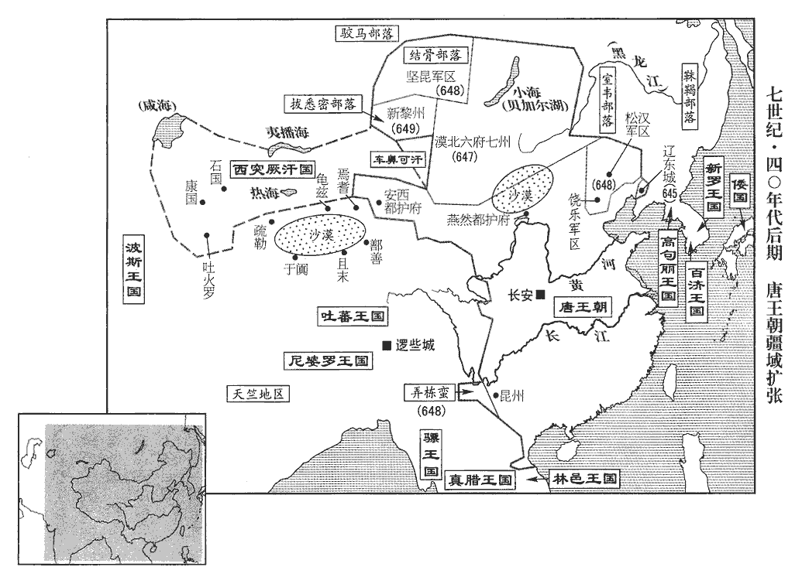
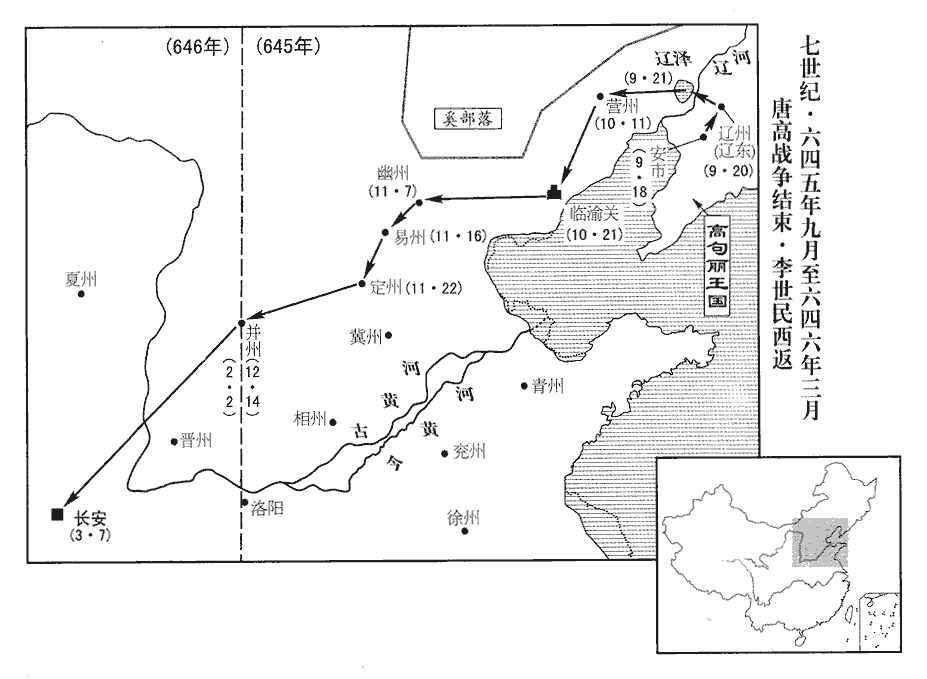
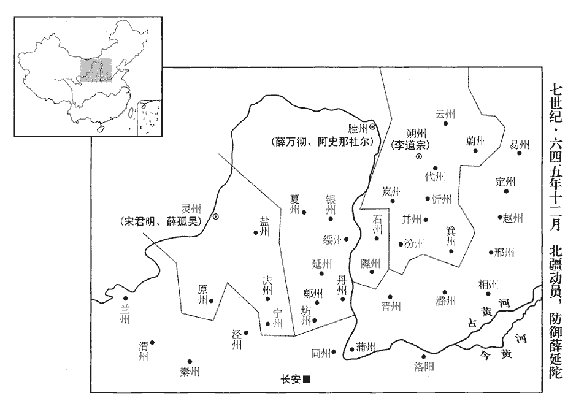
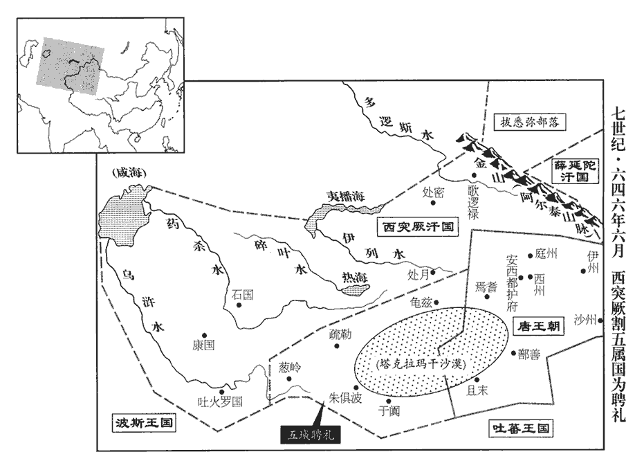
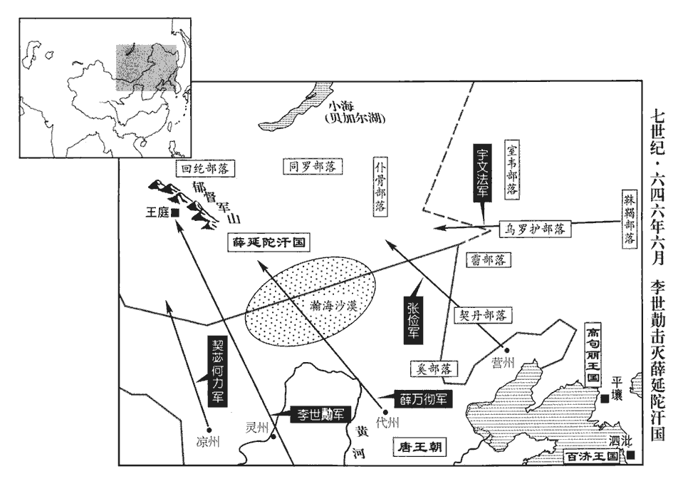
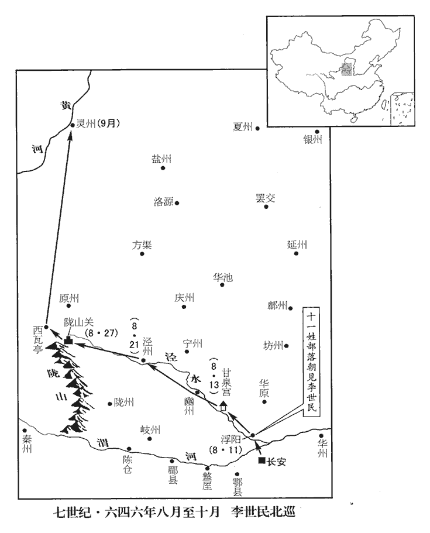
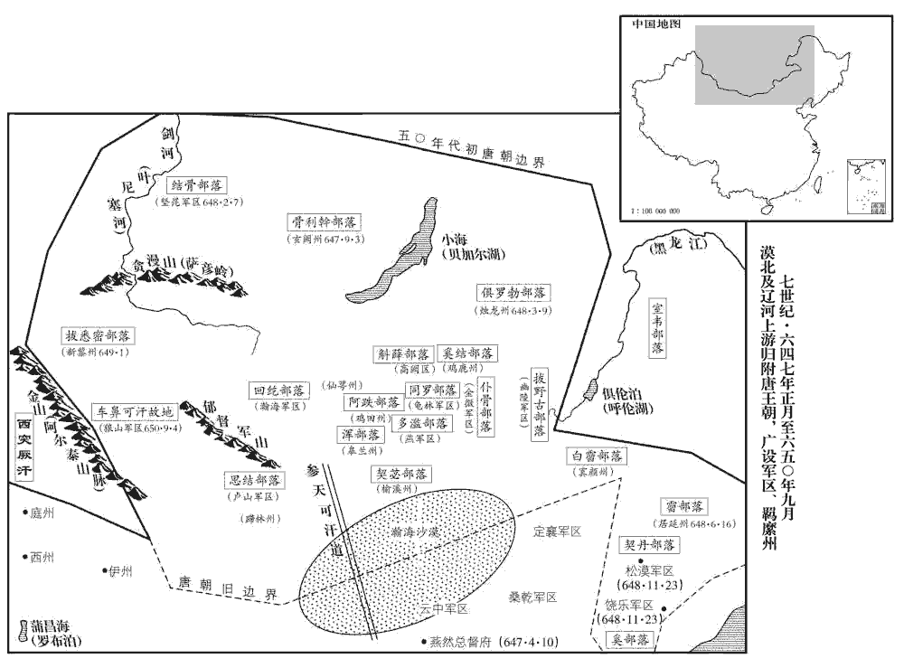
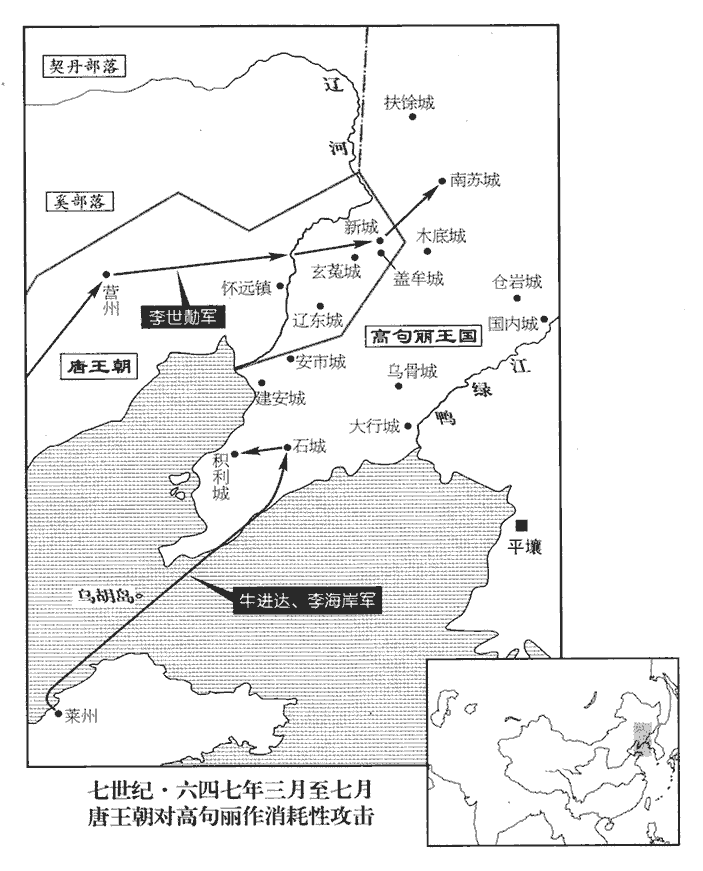
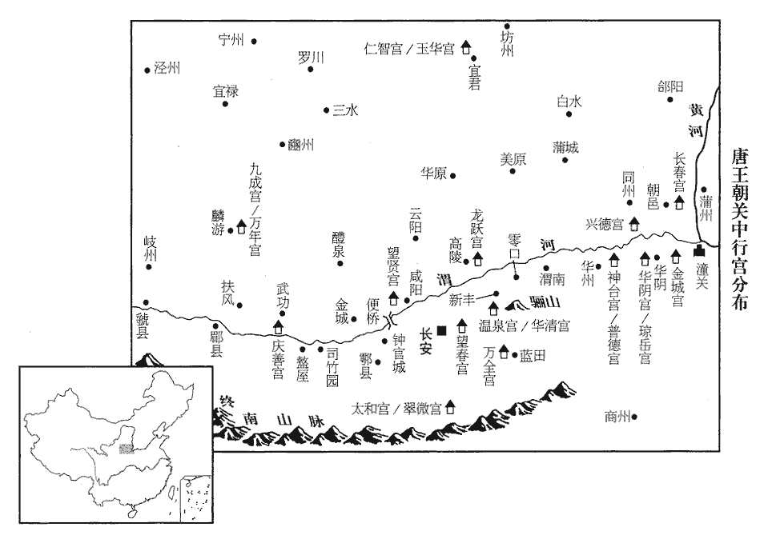

 唐紀十四起旃蒙大荒落（乙巳）六月，盡著雍涒灘（戊申）三月，凡二年有奇。

# 太宗文武大聖大廣孝皇帝下之上

## 貞觀十九年（乙巳、六四五）觀，古玩翻。

1六月，丁酉‹一›，李世勣攻白巖城‹辽宁省灯塔市西›西南，上臨其西北。城主孫代音潛遣腹心請降，降，戶江翻；下同。臨城，投刀鉞為信，且曰：「奴願降，城中有不從者。」上以唐幟與其使，幟，昌志翻。使，疏吏翻。曰：「必降者，宜建之城上。」代音建幟，城中人以為唐兵已登城，皆從之。

〖译文〗 [1]六月，丁酉（初一），李世攻打白岩城西南，太宗亲临城西北。城主孙代音暗中派遣心腹请求投降，约定唐兵临近城池，投刀斧为信号，而且说道：“我本人愿意投降，只怕城中有不投降的。”太宗将唐朝的旗帜交与来使，说道：“如决定投降的话，你可将此旗竖在城墙上。”孙代音如约竖旗，城中人以为唐朝军队已经登上城楼，于是都跟从孙代音投降。

上之克遼東也，白巖城請降，既而中悔。上怒其反覆，令軍中曰：「得城當悉以人物賞戰士。」言以其男女及財物為賞也。李世勣見上將受其降，帥甲士數十人請曰：「士卒所以爭冒矢石，不顧其死者，貪虜獲耳；帥，讀曰率；下同。冒，莫比翻；下同。今城垂拔，柰何更受其降，孤戰士之心！」觀世勣此言，蓋少年為盜之氣習未除耳。上下馬謝曰：「將軍言是也。然縱兵殺人而虜其妻孥，孥，音奴。朕所不忍。將軍麾下有功者，朕以庫物賞之，庶因將軍贖此一城。」世勣乃退。得城中男女萬餘口，上臨水設幄受其降，仍賜之食，八十以上賜帛有差。他城之兵在白巖者悉慰諭，給糧仗，任其所之。

〖译文〗 唐朝军队攻克辽东城后，白岩城守军请求投降，中途又有反悔。太宗恼怒其反复无常，对唐军说：“得到这座城，便将城中男女及财物赏赐给士兵们。”李世见太宗将要接受对方投降，便带领几十名身穿铠甲的士兵请战说：“士兵们之所以不怕飞矢流石的袭击，不顾生死，正是贪图俘获其男女财物；如今城池垂手可得，为什么要接受他们投降，而辜负士兵们的杀敌决心呢？”太宗下马答谢世，说道：“将军所言极是。然而放纵士兵杀人，虏其妻小，朕实在不忍心。将军手下有功的将士，朕会用府库里的资财封赏他们，这样可以从将军手中赎得一座完整的城。”李世于是退下。唐军共得到城中男女一万多人，太宗靠水边设御账接受对方投降，仍然赐给他们食物，八十岁以上的老人赏赐给多少不等的绢帛。其他城堡的士兵驻扎在白岩城的，都予以抚慰，供给粮草，听任他们去留。

先是，遼東城長史為部下所殺，其省事奉妻【章：十二行本「妻」上有「其」字；乙十一行本同；張校同。】子奔白巖。省事，吏職也，自後魏以來有之，賀拔岳之攻尉遲菩薩也，菩薩使省事傳語是也。先，悉薦翻。省，悉景翻。上憐其有義，賜帛五匹；為長史造靈輿，歸之平壤。為，于偽翻；下自為、彼為、汝為、當為同。以白巖城為巖州，以孫代音為刺史。

〖译文〗 先前，辽东城长史被部下杀死，他的手下吏员省事护送长史的妻子儿女们投奔白岩城。太宗怜悯省事有义节，赐给他五匹帛；又为长史造灵车，将棺椁送回平壤。改白岩城为岩州，任命孙代音为刺史。

契苾何力瘡重，契，欺訖翻。苾，毘必翻。上自為傅藥，推求得刺何力者高突勃，付何力使自殺之。何力奏稱：「彼為其主冒白刃刺臣，乃忠勇之士也，刺，七亦翻。與之初不相識，非有怨讎。」遂捨之。怨，於元翻。

〖译文〗 契何力伤口严重，太宗亲自为他敷药，并查出刺伤何力的人叫高突勃，将他交付给何力，让何力亲自杀掉他。何力上奏称：“他为了他的君主冒着生命危险刺中我，此乃忠诚勇猛之人，我与他毫不相识，并没有一丝怨仇。”于是将他放掉。

初，莫離支遣加尸城‹朝鲜平壤市西南›七百人戍蓋牟城‹辽宁省抚顺市›，李世勣盡虜之，其人請從軍自效，上曰：「汝家皆在加尸，汝為我戰，莫離支必殺汝妻子，得一人之力而滅一家，吾不忍也。」戊戌‹二›，皆廩賜遣之。

〖译文〗 起初，莫离支征派加尸城的七百人去戍守盖牟城，李世将他们全部俘获，他们请求跟从唐军效力，太宗说：“你们的家都在加尸城，你们为我征战，莫离支必然要杀掉你们的妻子儿女，得一人的帮助却毁灭他的一家，朕不忍心这样。”戊戌（初二），这七百人都得到赏赐，并被遣放回去。

己亥‹三›，以蓋牟城為蓋州。

〖译文〗 己亥（初三），改盖牟城为盖州。

丁未‹十一›，車駕發遼東，丙辰‹二十›，至安市城‹辽宁省海城市›，安市，漢古縣，屬遼東郡；舊書薛仁貴傳作「安地城」。進兵攻之。丁巳‹二十一›，高麗北部耨nòu薩延壽、惠真帥高麗、靺鞨‹黑龙江下游›兵十五萬救安市。後漢書東夷傳：高句驪有五族：有消奴部、絕奴部、順奴部、灌奴部、桂婁部。賢曰：按今高麗五部：一曰內部，一名黃部，即桂婁部也；二曰北部，一名後部，即絕奴部也；三曰東部，一名左部，即順奴部也；四曰南部，一名前部，即灌奴部也；五曰西部，一名右部，即消奴部也。據北史，高麗五部各有耨薩，蓋其酋長之稱也。耨，奴屋翻。新書：高麗大城置耨薩一，比都督也。麗，力知翻。靺鞨，音末曷。上謂侍臣曰：「今為延壽策有三：引兵直前，連安市城為壘，據高山之險，食城中之粟，縱靺鞨掠吾牛馬，攻之不可猝下，欲歸則泥潦為阻，坐困吾軍，上策也。若高延壽出於上策，不知太宗何以應之！唯有江夏王道宗之計策耳。拔城中之眾，與之宵遁，中策也。不度智能，來與吾戰，下策也。度，徒洛翻。卿曹觀之，必出下策，成擒在吾目中矣！」

〖译文〗 丁未（十一日），太宗车驾从辽东出发，丙辰（二十日），到达安市城下，纵兵攻城。丁巳（二十一日），高丽北部酋长高延寿、高惠真率领高丽、兵十五万人援救安市。太宗对身边大臣说：“如今延寿有三种策略：带引兵马直至前沿，与安市城连为保垒，占据高山的险恶地势，坐吃城内的粮食，让骑兵抢掠我们的牛马，使我们久攻不下，想要退兵又有泥沼阻隔，以此困住我军，这是上策。与城中的军民一道，乘夜全部逃遁，这是中策。不自量力，来与我方交战，这是下策。你们看着，他们必然出此下策，在我们的眼皮底下成为俘虏。”

高麗有對盧，年老習事，東夷傳：高句驪置官，有相加、對盧、沛者。陳壽曰：其置官有對盧則不置沛者，有沛者則不置對盧。薛居正曰：高麗官，其大者號大對盧，比一品，總知國事。對盧以下官，總十一級。列置州縣六十餘，大城置耨薩，比都督；小城置運使，比刺史。謂延壽曰：「秦王內芟群雄，芟，所銜翻。外服戎狄，獨立為帝，此命世之材，今舉海內之眾而來，不可敵也。為吾計者，莫若頓兵不戰，曠日持久，分遣奇兵斷其運道，斷，丁管翻。糧食既盡，求戰不得，欲歸無路，乃可勝也。」此即帝所謂上策也。延壽不從，引軍直進，去安市城四十里。上猶恐其低徊不至，命左衛大將軍阿史那社爾將突厥千騎以誘之，厥，九勿翻。騎，奇寄翻。誘，音酉。兵始交而偽走。高麗相謂曰：「易與耳！」競進乘之，至安市城東南八里，依山而陳。易，以豉翻。陳，讀曰陣；下為陳、陳於、布陳、其陳同。

〖译文〗 高丽有一位官居对卢的人，年老熟悉吏事，对高延寿说：“秦王李世民对内铲平各路豪杰，对外使四方臣服，以己之力，自玄为帝，此乃天降命世之人，如今倾唐朝军队前来攻打我们，万万不可对抗呀。为我们考虑，不如按兵不动，这样旷日持久，分别派遣奇兵断其运粮通道，他们粮食用光，而又求战不成，想要回去又无路可走，这样我们才能取胜。”延寿不听，领兵继续前行，直至离安市城四十里。太宗担心他们俳徊不向前进兵，命左卫大将军阿史那社尔率一千多名突厥骑兵引诱他们，士兵刚一交战即假装败退。高丽士兵相互说道：“打唐朝军队太容易了。”竞相上前出击，到达安市城东南八里的地方，依山布下阵形。

上悉召諸將問計，長孫無忌對曰：「臣聞臨敵將戰，必先觀士卒之情。臣適行經諸營，見士卒聞高麗至，皆拔刀結旆，喜形於色，此必勝之兵也。陛下未冠，冠，古玩翻。身親行陣，行，戶剛翻。凡出奇制勝，皆上稟聖謀，諸將奉成算而已。今日之事，乞陛下指蹤！」以獵為喻，指示獸蹤，則狗得以追殺。上笑曰：「諸公以此見讓，朕當為諸公商度。」度，徒洛翻。乃與無忌等從數百騎乘高望之，觀山川形勢，可以伏兵及出入之所。高麗、靺鞨合兵為陳，長四十里。長，直亮翻。江夏王道宗曰：「高麗傾國以拒王師，平壤之守必弱，願假臣精卒五千，覆其本根，則數十萬之眾可不戰而降。」上不應。為上悔不用道宗策張本。夏，戶雅翻。遣使紿延壽曰：「我以爾國強臣弒其主，故來問罪，至於交戰，非吾本心。入爾境，芻粟不給，故取爾數城，俟爾國脩臣禮，則所失必復矣。」延壽信之，不復設備。使，疏吏翻。紿，蕩亥翻。復，扶又翻。

〖译文〗 太宗召集全体将领询问破敌计谋，长孙无忌答道：“我听说临敌将要战斗时，必要先观察一下士兵的情绪。我刚才经过各处营房，看见士兵们听说高丽兵到了，都拔刀扎旗，喜形于色，此乃必胜的士兵。陛下年轻的时候，亲自指挥战阵，当年大唐凡是出奇制胜打败对方，都是陛下上呈高祖的计谋，众位将领只是按着预定谋略行事。今天这一仗，还望陛下指示。”太宗笑着说：“诸位这样谦让，朕当为你们谋划。”于是和长孙无忌等人带领几百骑兵登高眺望，观察地形，看好可以埋伏兵力以及出入的地点。高丽、合兵为战阵，长四十里。江夏王李道宗说：“高丽倾尽本国的兵力来抗拒我大唐军队，平壤的守军必然虚弱，希望能给我五千精兵，直捣其京城，则几十万的兵马可以不战而降。”太宗没有答允。派使者欺哄高延寿说：“我因为你们国的强臣杀死你们的国王，所以前来兴师问罪；至于两军交战，并非我的本意。但进入你们的境内，粮食供应不上，所以才攻下了几座城，等到你们重修臣国的礼节，就将那几座城归还。”延寿相信了太宗说过的话，不再防备。

上夜召文武計事，命李世勣將步騎萬五千陳於西嶺；長孫無忌將精兵萬一千為奇兵，自山北出於狹谷以衝其後；上自將步騎四千，挾鼓角，偃旗幟，登北山上；敕諸軍聞鼓角齊出奮擊。因命有司張受降幕於朝堂之側。降，戶江翻。朝，直遙翻。行營備宮省之制，故亦有朝堂。戊午‹二十二›，延壽等獨見李世勣布陳，勒兵欲戰。上望見無忌軍塵起，命作鼓角，舉旗幟，諸軍鼓譟並進，延壽等大懼，欲分兵禦之，而其陳已亂。會有雷電，方合戰而雷電皆至。龍門‹山西省河津县›人薛仁貴龍門，漢皮氏縣地；後魏曰龍門縣，并置龍門郡；隋廢郡，以縣屬蒲州。唐武德初，為泰州治所；貞觀十七年州廢，屬絳州。薛仁貴自編戶應募。著奇服，大呼陷陳，著，陟略翻。呼，火故翻。所向無敵；高麗兵披靡，披，普彼翻。大軍乘之，高麗兵大潰，斬首二萬餘級。上望見仁貴，召拜游擊將軍。唐制，武散階，游擊將軍，從五品下。仁貴，安都之六世孫，薛安都為將，以勇聞於宋、魏之間。名禮，以字行。

〖译文〗 太宗当夜召集文武大臣商议战事，命令李世率领一万五千名步骑兵在西岭布阵；长孙无忌率领一万一千名精锐士兵做为奇兵，从山的北面穿越峡谷以冲击高丽军队的后尾；太宗亲自带领四千步骑兵，挟带鼓和号角，放倒旗帜，登上北山；又敕令各路军听见鼓和号角声一齐出兵进击。又命有关部门在朝堂边上大张接受投降的帷幕。戊午（二十二日），延寿等人只见李世在布阵，便勒令士兵欲迎战。太宗望见长孙无忌的部队尘土飞扬，便令擂鼓、吹号角，高举大旗，各路兵马鼓噪呐喊着一同进攻，高延寿等大为惊慌，想要分兵几路击退唐军，然而高丽军的阵形已经乱了。正赶上天降大雨，雷电交加，龙门人薛仁贵身穿奇异服装，大声呼喊着冲锋陷阵，所向无敌。高丽士兵纷纷逃窜，唐朝大军乘胜追击，高丽兵大溃败，二万多人被杀。太宗看见薛仁贵，便召见他并拜为游击将军。仁贵是薛安都的六世孙，名礼，以字称呼。

延壽等將餘眾依山自固，上命諸軍圍之，長孫無忌悉撤橋梁，斷其歸路。斷，丁管翻。己未‹二十三›，延壽、惠真帥其眾三萬六千八百人請降，考異曰：實錄云：「李勣奏曰：『向若陛下不自親行，臣與道宗將數萬人攻安市城未克，延壽等十餘萬抽戈齊至，城內兵士復應開門而出，臣救首救尾，旋踵即敗，必為延壽等縛送向平壤，為莫離支等所笑；今日臣敢謝陛下性命恩澤。』帝素狎勣，笑而頷之。」按勣後獨將兵取高麗，豈必太宗親行邪！此非史官虛美，乃勣諛辭耳。今不取。入軍門，膝行而前，拜伏請命。上語之曰：「東夷少年，跳梁海曲，至於摧堅決勝，故當不及老人，自今復敢與天子戰乎？」語，牛倨翻。少，詩照翻。復，扶又翻；下無復同。皆伏地不能對。上簡耨薩以下酋長三千五百人，授以戎秩，遷之內地，酋，慈由翻。長，知兩翻。餘皆縱之，使還平壤；皆雙舉手以顙頓地，歡呼聞數十里外。聞，音問。收靺鞨三千三百人，悉阬之，以靺鞨犯陣也。獲馬五萬匹，牛五萬頭，鐵甲萬領，他器械稱是。稱，尺證翻。高麗舉國大駭，後黃城、銀城‹二城地望均地在今辽宁省岫岩县北›皆自拔遁去，數百里無復人煙。

〖译文〗 高延寿等人带领残余士兵依山固守，太宗命令各路兵马合围，长孙无忌将所有桥梁撤掉，以断绝其归路。己未（二十三日），延寿、惠真率领高丽士兵三万六千八百人请求投降，走到军门，跪下用膝盖前行，磕头请罪。太宗对他们说：“东夷少年，可以在僻壤海隅横行，至于摧毁坚固堡垒决战取胜，肯定赶不上一位老年人，今后还敢与大唐天子交战吗？”延寿等人都趴在地上不敢答话。太宗挑出耨萨以下酋长三千五百人，给他们军服职位，将他们迁居内地，其余将士都放了，让他们返回平壤；众人都高举双手以头撞地，欢呼声闻几十里外。太宗将被俘的三千三百名士兵全部活埋，总共获得五万匹马，五万头牛，一万领铁甲，各种器械上万。高丽全国震惊，后黄城、银城百姓都空城逃走，几百里内不再有人烟。

上驛書報太子，仍與高士廉等書曰：「朕為將如此，何如？」史言太宗有矜功之心。將，即亮翻。更名所幸山曰駐驆山‹六山·辽宁省辽阳市西›。據舊史，其山本名六山。更，工衡翻。

〖译文〗 太宗传驿书通报给太子，又写信问高士廉等人说：“朕做为带兵的将领怎么样？”将所途经的山改名为驻骅山。

秋，七月，辛未‹五›，上徙營安市城東嶺。己卯‹十三›，詔標識戰死者尸，識，音志。俟軍還與之俱歸。戊子‹二十二›，以高延壽為鴻臚卿，臚，陵如翻。高惠真為司農卿。

〖译文〗 秋季，七月，辛未（初五），太宗将营帐迁到安市城东岭。己卯（十三日），太宗诏令将战死的将士尸首标识姓名，等到回师返朝时一同带回。戊子（二十二日），任命高延寿为鸿胪寺卿，高惠真为司农寺卿。

張亮軍過建安‹辽宁省盖州市›城下，壁壘未固，士卒多出樵牧，高麗兵奄至，軍中駭擾。亮素怯，踞胡床，直視不言，將士見之，更以為勇。總管張金樹等鳴鼓勒兵擊高麗，破之。

〖译文〗 张亮的部队经过建安城下，尚未坚固壁垒，士兵们便大多出外割柴草打野物，高丽兵突然赶到，军中大乱。张亮平时就胆小，蹲坐在胡床上，眼睛直愣愣地看着前方说不出话来，将士们见此情景，反倒认为张亮勇敢。总管张金树等人敲鼓聚集兵马反击高丽兵，将其击退。

八月，甲辰‹八›，候騎獲莫離支諜者高竹離，反接詣軍門，反接兩手縛之也。騎，奇寄翻。諜，達協翻；下同。上召見，解縛問曰：「何瘦之甚？」對曰：「竊道間行，間，古莧翻；下同。不食數日矣。」命賜之食，謂曰：「爾為諜，宜速反命。為我寄語莫離支：語，牛倨翻；下語爾同。欲知軍中消息，可遣人徑詣吾所，何必間行辛苦也！」竹離徒跣，上賜屩juē而遣之。屩，居灼翻，草履也。

〖译文〗 八月，甲辰（初八），巡卫骑兵抓住了莫离支手下的间谍高竹离，将其反绑双手押送到军营，太宗亲自召见他，为他松绑问道：“你怎么这么瘦呢？”答道：“我偷偷地走小道，已经有几天没吃东西了。”太宗命人赐给他食物，对他说：“你身为间谍，应当迅速回去复命。你替我告诉莫离支：想要知道我方军中情形，可以派人直接到我们的营地，何必偷偷摸摸地这么辛苦呢？”高竹离光着脚，太宗赐给他草鞋打发他回去。

丙午‹十›，徙營於安市城南。上在遼外，凡置營，但明斥候，不為塹壘，雖逼其城，高麗終不敢出為寇抄，塹，七豔翻。軍士單行野宿如中國焉。史言帝威懾絕域，所謂善師者不陳。

〖译文〗 丙午（初十），唐朝军队将营帐迁到安市城南。太宗在辽东一带，凡是设置军营，只是在明处设置岗哨，而不设沟堑堡垒，即使逼近高丽城堡，高丽军队也不敢出兵骚扰，唐朝士兵们单人行路野外露宿便如同在中原时一样。

上之【章：十二行本「之」下有「將」字；乙十一行本同；孔本同；張校同。】伐高麗也，薛延陀‹蒙古西南部›遣使入貢，使，疏吏翻。上謂之曰：「語爾可汗：可，從刊入聲。汗，音寒。今我父子東征高麗，汝能為寇，宜亟來！」真珠可汗惶恐，遣使致謝，且請發兵助軍；上不許。及高麗敗於駐驆山，莫離支使靺鞨說真珠，啗以厚利，真珠懾服不敢動。說，輸芮翻。啗，徒覽翻，又徒濫翻。懾，之涉翻。考異曰：實錄：「上謂近臣曰：『以我量之，延陀其死矣。』聞者莫能測。」按太宗雖明，安能料薛延陀之死！今不取。九月，壬申‹七›，真珠卒，卒，子恤翻。上為之發哀。為，于偽翻。

〖译文〗 太宗将要讨伐高丽时，正好薛延陀派使者到朝中进献贡品，太宗对来使说：“告诉你们的可汗，如今我们父子二人要亲自带兵东征高丽，你们想要侵犯，就立刻来！”真珠可汗听此言极为恐惶，忙派使者前来谢罪，并且请求派薛延陀兵前来协助攻打高丽；太宗没有答应，等到高丽军队在驻骅山被打得大败，莫离支便让人劝说真珠可汗，以丰富的利益加以引诱，真珠可汗慑服于唐朝的力量而未敢有所举动。九月，壬申（初七），真珠可汗死去，太宗为他举哀发丧。

初，真珠請以其庶長子曳莽為突利失可汗，居東方，統雜種；長，知兩翻。種，章勇翻。嫡子拔灼為肆葉護可汗，居西方，統薛延陀；詔許之，皆以禮冊命。曳莽性躁擾，躁，則到翻。輕用兵，與拔灼不協。真珠卒，來會喪‹王庭设蒙古哈尔和林市›。既葬，曳莽恐拔灼圖己，先還所部，拔灼追襲殺之，自立為頡利俱利薛沙多彌可汗。為薛延陀亂亡張本。

〖译文〗 起初，真珠可汗请求让他庶出的长子曳莽做突利失可汗，居住在东部，统率各部族；让其嫡生子拔灼为肆叶护可汗，居住在西部，统领薛延陀本部；太宗下诏答应其请求，并都按照礼仪予以册封。曳莽性情暴躁好动，轻易用兵，与拔灼不和。真珠可汗死后，二人齐聚薛延陀牙帐奔丧。安葬真珠可汗之后，曳莽担心拔灼图谋害己，便提前回本部，拔灼派人追上将其杀死，自立为颉利俱利薛沙多弥可汗。

2上之克白巖也，謂李世勣曰：「吾聞安市城險而兵精，其城主材勇，莫離支之亂，城守不服，莫離支擊之不能下，因而與之。建安兵弱而糧少，少，詩沼翻。若出其不意，攻之必克。公可先攻建安，建安下，則安市在吾腹中，此兵法所謂『城有所不攻』者也。」孫子兵法之言。對曰：「建安在南，安市在北，吾軍糧皆在遼東；今踰安市而攻建安，若賊斷吾運道，將若之何？斷，丁管翻。不如先攻安市，安市下，則鼓行而取建安耳。」上曰：「以公為將，將，即亮翻。安得不用公策。勿誤吾事！」世勣遂攻安市‹辽宁省海城市›。

〖译文〗 [2]太宗领兵攻克高丽白岩城后，对李世说：“我听说安市城地势险要、士兵精良，其城主智勇双全，当初莫离支叛乱时，城主不服命，莫离支久攻不能取胜，因而便仍由他管理此城。建安城兵力微弱、粮食稀少，如果出其不意进攻它，必然能够取胜。你可带兵先去攻建安，建安城攻下后，则安市城便如在我胸腹中，这正是孙子兵法所说的‘城有所不攻’的道理。”李世答道：“建安在南面，安市在北面，我方军粮都在辽东城；如今我们越过安市去进攻建安，假如敌人切断我方运粮通道，那将怎么办呢？倒不如先去攻打安市，攻下安市，则可以一鼓作气轻取建安。”太宗说：“你是统军将领，怎么能不用你的策略。但不要延误了我的军机大事。”李世于是领兵进攻安市。

安市人望見上旗蓋，輒乘城鼓譟，上怒，世勣請克城之日，男女皆阬之，安市人聞之，益堅守，攻久不下。高延壽、高惠真請於上曰：「奴既委身大國，不敢不獻其誠，欲天子早成大功，奴得與妻子相見。安市人顧惜其家，人自為戰，未易猝拔。易，以豉翻。今奴以高麗十餘萬眾，望旗沮潰，沮，在呂翻。國人膽破，烏骨城耨薩老耄，不能堅守，移兵臨之，朝至夕克。其餘當道小城，必望風奔潰。然後收其資糧，鼓行而前，平壤必不守矣。」群臣亦言：「張亮兵在沙城，沙城即卑沙城。召之信宿可至，乘高麗兇懼，兇，許拱翻。併力拔烏骨城，渡鴨綠水，直取平壤，在此舉矣。」上將從之，獨長孫無忌以為：「天子親征，異於諸將，不可乘危徼幸。徼，古堯翻。今建安、新城之虜，眾猶十萬，若向烏骨，皆躡吾後，不如先破安市，取建安，然後長驅而進，此萬全之策也。」上乃止。太宗之定天下，多以出奇取勝，獨遼東之役，欲以萬全制敵，所以無功。

〖译文〗 安市人远无望见太宗的旗帜伞盖，总是登上城楼一起敲鼓呐喊，太宗大怒，李世请求攻下城池当天，将城中男女全部活埋，安市人听说后，更是顽强守城，唐军久攻不下。高延寿、高惠真向太宗请求道：“我们既然委身于大唐帝国，便不敢不献上一份忠诚，这样可以让大唐天子早成大功，我们也得与妻儿老小相见。安市人顾惜自己的家庭，人人各自为战，不容易立即攻克。如今我等以高丽兵十多万，望见旌旗即遭溃败，高丽人闻风丧胆，乌骨城首领多老迈无用，很难坚守城池，如果唐军移师临近该城，早晨到晚上即可攻克，其余中途挡道的小城，必定望风溃逃。然后广收他们物资粮草，一鼓作气，平壤必定坚守不住。”众位大臣们也都说：“张亮的部队在沙城，如果征召他们二个晚上即可到达，乘着高丽惊恐的时候，合力拿下乌骨城，渡过鸭绿江，直取平壤，就在于这次行动了。”太宗想要听从这个意见，惟独长孙无忌认为：“天子亲自征战，与一般将领统兵不同，不可以冒着危险侥幸取胜。如今建安、新城的敌兵还有十万人，如果我们移师乌骨城，他们都会追袭我军的后路，倒不如先攻下安市，占取建安，然后再长驱直入，这才是万全之策。”太宗于是停止移师乌骨的计划。

諸軍急攻安市，上聞城中雞彘聲，謂李世勣曰：「圍城積久，城中煙火日微，今雞彘甚喧，此必饗士，欲夜出襲我，宜嚴兵備之。」是夜，高麗數百人縋城而下。縋，馳偽翻。上聞之，自至城下，召兵急擊，斬首數十級，高麗退走。

〖译文〗 各路大军紧急攻打安市城，太宗听见了城中鸡和猪的鸣叫声，对李世说：“围城的时间很长，城中炊烟日见稀少，如今鸡和猪叫得厉害，这一定是在犒劳士兵，想要夜间出来偷袭我们，应当严加防范。”当夜，高丽几百人顺着绳索爬出城外。太宗听说后，亲自到了城下，召集士兵紧急围攻，杀死几十人，其余高丽兵逃回城中。

江夏王道宗督眾築土山於城東南隅，浸逼其城，城中亦增高其城以拒之。士卒分番交戰，日六、七合，衝車礮石，壞其樓堞，礮，與砲同，匹皃翻。壞，音怪。城中隨立木柵以塞其缺。道宗傷足，上親為之針。塞，悉則翻。為，于偽翻。築山晝夜不息，凡六旬，用功五十萬，山頂去城數丈，下臨城中，道宗使果毅傅伏愛將兵屯山頂以備敵。山頹，壓城，城崩；會伏愛私離所部，離，力智翻。高麗數百人從城缺出戰，遂奪據土山，塹而守之。塹，七豔翻。上怒，斬伏愛以徇，命諸將攻之，三日不能克。道宗徒跣詣旗下請罪，上曰：「汝罪當死，但朕以漢武‹刘彻›殺王恢，見十八卷元光二年。不如秦穆‹嬴任好›用孟明，秦穆公使孟明帥師東伐，再為晉師所敗，穆公復用孟明。孟明增脩其政，帥師伐晉，晉人不敢出，遂霸西戎。且有破蓋牟、遼東之功，故特赦汝耳。」

〖译文〗 江夏王李道宗率领部下在城东南角筑土山，渐渐逼近城墙，城里也不断增高城墙与城外对抗。士兵们轮番攻战，每天有六七个回合，唐军用冲车和发射石块，撞开城墙垛，城中随即立木栅栏以堵塞缺口。李道宗脚部受伤，太宗亲自为他针炙。唐军昼夜不停地筑土山，总共用了六十天，用去劳力五十万人次，山顶离城只有几丈，可以向下俯瞰城中，李道宗让果毅都尉傅伏爱领兵驻守在山顶以防备高丽兵。土山坍毁，压向城墙，城墙崩塌；正赶上傅伏爱私自离开营所，高丽几百名士兵从城墙缺口处出来迎战，于是便夺下占据了土山，挖沟堑守护。太宗大怒，将傅伏爱斩首示众，命令众位将领攻城，却三天都未攻下来。李道宗光着脚到太宗的麾旗下请罪，太宗说：“你的罪过该当处死，但是朕想到汉武帝杀死大将王恢，倒不如秦穆公二次重用孟明，又念你攻破盖牟、辽东有功，所以特赦你不死。”

上以遼左‹辽宁省›早寒，草枯水凍，士馬難久留，且糧食將盡，癸未‹十八›，敕班師。先拔遼‹辽东城·辽宁省辽阳市›、蓋‹盖牟城·辽宁省抚顺市›二州戶口渡遼，乃耀兵於安市城下而旋，城中皆屏跡不出。屏，必郢翻。城主‹杨万春›登城拜辭，上嘉其固守，賜縑百匹，縑，并絲繒也。以勵事君。命李世勣、江夏王道宗將步騎四萬為殿。殿，丁練翻。

〖译文〗 太宗认为辽东一带早寒，草木干枯水结冰，士兵马匹都不宜久留，而且粮食快要用光了，癸未（十八日），便敕令班师还朝。先让辽东、盖牟二城的百姓举家渡过辽水，于是在安市城下显耀兵力，而后凯旋，城中高丽人都藏身不出。城主登上城楼答礼为唐军送行，太宗称赞他能够坚守城池，赐给城主绸段一百匹，用来鼓励他事奉高丽国王。命令李世与江夏王李道宗领步骑兵四万人殿后。

乙酉‹二十›，至遼東。丙戌‹二十一›，渡遼水。遼澤泥潦，車馬不通，命長孫無忌將萬人，翦草填道，水深處以車為梁，上自繫薪於馬鞘以助役。將，即亮翻。鞘，所交翻，鞭鞘也。按孔穎達禮記正義曰：弓頭為鞘。此所謂馬鞘，蓋馬鞍頭也。冬，十月，丙申朔‹一›，上至蒲溝駐馬，督填道諸軍渡渤錯水，蒲溝，渤錯水，皆在遼澤中。暴風雪，士卒沾濕多死者，敕然火於道以待之。

〖译文〗 乙酉（二十日），唐军到达辽东城。丙戌（二十一月），渡过辽水。辽泽一带道路泥泞，车马难以通行，太宗命长孙无忌率领一万人割草填道，水深的地方用车做桥梁，太宗亲自将薪木等拴在马鞍后帮助铺路。冬季，十月，丙申朔（初一），太宗到达蒲沟停下，督促填道铺路的各路军渡过渤错水，赶上天降暴风雪，士兵们衣湿多被冻死，太宗敕令在道上点上火堆，以等侯士兵烤火。

凡征高麗，拔玄菟、橫山‹辽宁省辽阳市东南华表山›、蓋牟、磨米、遼東、白巖、卑沙、麥谷、銀山、後黃‹地望在辽宁省岫岩县北›十城，菟，同都翻。磨，莫臥翻。徙遼‹辽东·辽宁省辽阳市›、蓋、巖三州戶口入中國者七萬人。考異曰：實錄上云，「徙三州戶口入內地者，前後七萬人」；下癸丑詔書云，「獲戶十萬，口十有八萬」。蓋并不徙者言之耳。新城、建安、駐驆三大戰，斬首四萬餘級，戰士死者幾二千人，幾，音祁，近也。戰馬死者什七、八。上以不能成功，深悔之，歎曰：「魏徵若在，不使我有是行也！」命馳驛祀徵以少牢，少，詩照翻。復立所製碑，踣碑見上卷十七年。召其妻子詣行在，勞賜之。勞，力到翻。

〖译文〗 此次征伐高丽，总共攻克玄菟、横山、盖牟、磨米、白岩、辽东、卑沙、麦谷、银山、后黄十座城，迁徙辽、盖、岩三州户口加入唐朝户籍共七万人。新城、建安、驻骅三次较大的战役，杀死高丽兵四万多人，唐朝将士死近二千人，战马损失十分七八。太宗认为未能最后取胜，深自懊悔，感叹道：“如果魏徵在的话，不会让我此番出兵的！”命人乘驿马昼夜兼程到京城，用猪和羊祭祀魏徵，重新竖立贞观十七年曾毁坏的石碑，征召他妻子儿女到太宗所在行宫，亲自慰问赏赐。

 

丙午‹十一›，至營州。營州至洛陽二千九百一十里。詔遼東戰亡士卒骸骨並集柳城‹营州州政府所在县›東南，命有司設太牢，上自作文以祭之，臨哭盡哀。其父母聞之，曰：「吾兒死而天子哭之，死何所恨！」上謂薛仁貴曰：「朕諸將皆老，思得新進驍勇者將之，將，即亮翻。驍，堅堯翻。無如卿者，朕不喜得遼東，喜得卿也。」

〖译文〗 丙午（十一日），唐军回到营州。太宗下诏令将在辽东阵亡的士兵的尸骨一并汇集在柳城东南，命令有关部门摆设牛羊猪祭祀，太宗亲自写文祭奠亡灵，并亲临灵堂痛哭，十分悲哀。死者的父母们听说此事后，都说：“我们的儿子死了，皇上亲自为他们哭灵，死还有什么遗憾！”太宗对薛仁贵说：“朕手下的各位将领都已经老了，考虑能得到骁勇善战的后起之秀为统兵将领，没有人能赶得上你了，朕对于得到辽东并不高兴，高兴的是得到了你。”

丙辰‹二十一›，上聞太子奉迎將至，從飛騎三千人馳入臨渝關‹河北省抚宁县东榆关镇›，漢遼西郡有臨渝縣。唐志，營州有渝關守捉城。杜佑曰：臨渝關在平州盧龍縣城東百八十里。騎，奇寄翻。師古曰：渝，音喻。道逢太子。上之發定州也，指所御褐袍謂太子曰：「俟見汝，乃易此袍耳。」在遼左‹辽宁省›，雖盛暑流汗，弗之易。及秋，穿敗，左右請易之，上曰：「軍士衣多弊，吾獨御新衣，可乎？」至是，太子進新衣，乃易之。

〖译文〗 丙辰（二十一日），太宗听说皇太子出迎回朝大军即将赶到，便带领护卫飞骑三千人飞奔进入临渝关，途中与太子相逢。太宗从定州出发时，曾指着身上穿的褐色战袍对太子说：“等再见到你时，我才可以换下此身战袍。”在辽左，即使盛夏酷暑汗流浃背，也不换下这套衣服。到了秋天，穿着露风，身边的人请求太宗换掉衣服，太宗说：“战士们的衣服多是破败的衣服，惟独我穿上新衣服，这样行吗？”至此时，太子递上新衣服，太宗才换下旧衣服。

諸軍所虜高麗民萬四千口，先集幽州，將以賞軍士，上愍其父子夫婦離散，命有司平其直，悉以錢布贖為民，讙呼之聲，三日不息。讙，許爰翻。十一月，辛未‹七›，車駕至幽州，高麗民迎於城東，拜舞呼號，號，戶高翻。宛轉於地，塵埃彌望。

〖译文〗 各路军马所俘虏的高丽百姓有一万四千多人，先是集中在幽州，准备用来赏给将士们做奴隶，太宗怜悯他们父子、夫妻离散，命令有关官署按照他们的价格，全用朝廷府库的钱、布赎为平民，欢呼之声三天不绝。十一月，辛未（初七），太宗车驾到达幽州，高丽老百姓在城东欢迎，手舞足蹈，欢呼拜伏，展转于地，尘埃弥漫。

 

庚辰‹十六›，過易州‹河北省易县›境，司馬陳元璹shú使民於地室蓄火種蔬而進之；上惡其諂，免元璹官。璹，殊玉翻。惡，烏路翻。

〖译文〗 庚辰（十六日），太宗经过易州境内，易州司马陈元让当地百姓在地下用火烧增温来种蔬菜，此时进献给太宗；太宗讨厌他过于谄媚，罢免了陈元的官职。

丙戌‹二十二›，車駕至定州。

〖译文〗 丙戌（二十二日），太宗车驾到达定州。

丁亥‹二十三›，吏部尚書楊師道坐所署用多非其才，左遷工部尚書。

〖译文〗 丁亥（二十三日），吏部尚书杨师道因任用官吏大多不称职而获罪，降职为工部尚书。

壬辰‹二十八›，車駕發定州。十二月，辛丑‹七›，上病癰，御步輦而行。戊申‹十四›，至并州‹山西省太原市›，太子為上吮癰，扶輦步從者數日。為，于偽翻。吮，徐兗翻。從，才用翻。辛亥‹十七›，上疾瘳，百官皆賀。瘳chōu，丑留翻。

〖译文〗 壬辰（二十八日），太宗车驾从定州出发。十二月，辛丑（初七），太宗背上长痈，坐着轿子前行。戊申（十四日），到达并州，太子李治为太宗吸吮痈毒，扶着轿子步行几日。辛亥（十七日），太宗背上毒痈渐好，文武百官齐声恭贺。

 

上之征高麗也，使右領軍大將軍執失思力將突厥屯夏州‹陕西省靖边县北白城子›之北以備薛延陀‹蒙古西南部›。力將，即亮翻；下同。夏，戶雅翻。薛延陀多彌可汗既立，以上出征未還，引兵寇河南‹黄河河套地区›，河南者，北河之南，即朔方、新秦之地。上遣左武候中郎將長安田仁會與思力合兵擊之。思力羸形偽退，誘之深入，及夏州之境，整陳以待之。羸，倫為翻。誘，音酉。陳，讀曰陣。薛延陀大敗，追奔六百餘里，耀威磧北而還。磧，七迹翻。還，從宣翻，又如字。考異曰：高宗實錄云：「會延陀死，耀威漠北而還。」其意指真珠為延陀也。按真珠憚太宗威靈，不敢入寇，又死在九月；而此云冬來寇，必非真珠也。田仁會傳作十八年，亦誤也。多彌復發兵寇夏州；復，扶又翻。己未‹二十五›，敕禮部尚書江夏王道宗，發朔‹山西省朔州市›、并‹山西省太原市›、汾‹山西省汾阳县›、箕jī‹山西省左权县›、嵐‹山西省岚县›、代‹山西省代县›、忻‹山西省忻州市›、蔚‹山西省灵丘县›、雲‹山西省大同市›九州兵鎮朔州；武德三年，分并州之樂平、遼山、平城、石艾置遼州樂平郡；八年，改曰箕州。後周置蔚州於漢代郡之靈丘，隋廢州，以靈丘縣屬肆州；唐武德六年，分肆州之靈丘、易州之飛狐地置蔚州。雲州，雲中郡，貞觀十四年自朔州北定襄城徙治定襄縣，其地實隋馬邑郡之雲內縣恆安鎮，即後魏所都平城也。開元十八年，改定襄縣為雲中縣。蔚，紆勿翻。右衛大將軍代州‹总部设山西省代县›都督薛萬徹，左驍衛大將軍阿史那社爾，發勝‹内蒙古托克托县›、夏‹陕西省靖边县北白城子›、銀‹陕西省榆林市南鱼河堡›、綏‹陕西省绥德县›、丹‹陕西省宜川县›、延‹陕西省延安市›、鄜‹陕西省富县›、坊‹陕西省黄陵县›、石‹山西省离石县›、隰‹山西省隰县›十州兵鎮勝州；勝州，隋之榆林郡。後魏舊有銀州，隋廢為儒林縣，屬綏州；貞觀二年，分綏州之儒林真鄉縣復置銀州銀川郡，漢西河之圁yín陰、圁陽縣地也。圁，音銀。杜佑曰：銀州，春秋白狄地，治儒林縣，漢圁陰縣地。丹州，古孟門河西之地；西魏置汾州義川郡，後改州為丹州。隋廢州及郡，以義川縣屬延州。義寧元年，分延州之義川、咸寧、汾川置丹州咸寧郡。坊州，春秋白狄之地；姚興置中部縣，後魏置中部郡。隋廢郡，以中部縣屬敷州。武德二年分鄜州，置坊州中部郡，以周天和七年，元皇帝放牧鄜州，於此置馬坊也，鄜，音膚。勝州‹总部设内蒙古托克托县›都督宋君明，左武候將軍薛孤吳，發靈‹宁夏灵武市›、原‹宁夏固原县›、寧‹甘肃省宁县›、鹽‹陕西省定边县›、慶‹甘肃省庆阳县›五州兵鎮靈州‹宁夏吴忠市境›；西魏於五原置西安州，後改為鹽州，隋廢州為鹽川郡，貞觀二年復置鹽州。又令執失思力發靈、勝二州突厥兵，與道宗等相應。薛延陀至塞下，知有備，不敢進。

〖译文〗 太宗征伐高丽时，让右领军大将军执失思力统领厥兵驻扎在夏州以北，以防备薛延陀的进攻。薛延陀多弥可汗即位后，乘着太宗出征高丽未归之机，领兵侵犯北河以南一带，太宗派左武侯中郎将长安人田仁会与执失思力合兵进击。思力假装抵御不住后退，诱敌深入，到了夏州境内，严阵以待薛延陀兵。薛延陀被打得大败，唐军乘胜追击六百多里，在沙漠以北耀武扬威之后凯旋。多弥可汗再次发兵进犯夏州，己未（二十五日），太宗敕令礼部尚书、江夏王李道宗，征发朔、并、汾、箕、岚、代、忻、蔚、云九州兵马镇守朔州；右卫大将军、代州都督薛万彻，左骁卫大将军阿史那社尔，征发胜、夏、银、绥、丹、延、、坊、石、隰十州兵马镇守胜州；胜州都督宋君明，左武侯将军薛孤吴，征发灵、原、宁、盐、庆五州兵马镇守灵州；又命令执失思力征发灵、胜二州的突厥兵，与李道宗等人相互呼应。薛延陀兵到了塞下，知悉唐军有所防备，不敢贸然进犯。

3初，上留侍中劉洎輔皇太子於定州，仍兼左庶子、檢校民部尚書，總吏、禮、戶部三尚書事。劉洎既檢校民部尚書，又總吏、禮，是為三尚書事，民部之外，安得復有戶部哉！唐六典：貞觀二十三年，始改民部為戶部。洎，其冀翻。上將行，謂洎曰：「我今遠征，爾輔太子，安危所寄，宜深識我意。」對曰：「願陛下無憂，大臣有罪者，臣謹即行誅。」上以其言妄發，頗怪之，戒曰：「卿性疏而太健，必以此敗，深宜慎之！」及上不豫，洎從內出，色甚悲懼，謂同列曰：「疾勢如此，聖躬可憂！」或譖於上曰：「洎言國家事不足憂，但當輔幼主行伊、霍故事，大臣有異志者誅之，自定矣。」上以為然，因洎於上前先有誅有罪大臣之言，遂信譖者之言為然。庚申‹二十六›，下詔稱：「洎與人竊議，窺窬萬一，謀執朝衡，自處伊、霍，朝，直遙翻。處，昌呂翻。猜忌大臣，皆欲夷戮。宜賜自盡，賜自盡，即賜死也，令自盡其命。考異曰：實錄云：「黃門侍郎褚遂良誣奏之曰：『國家之事不足慮也，正當輔少主行伊、霍，大臣有異志者誅之，自然定矣。』太宗疾愈，詔問其故，洎以實對。遂良執證之不已。洎引中書令馬周以自明，太宗問周，周對與洎所陳不異。帝以詰遂良；又證，周諱之，洎遂及罪。」按此事中人所不為，遂良忠直之臣，且素無怨仇，何至如此！蓋許敬宗惡遂良，故修實錄時以洎死歸咎於遂良耳。今不取。免其妻孥。」孥，音奴。

〖译文〗 [3]起初，太宗留下侍中刘洎在定州辅佐皇太子，仍然兼任左庶子、检校民部尚书，总理吏、礼、户三部尚书事。太宗将要出发前，对刘洎说：“朕如今带兵远征，你辅佐太子，国家的安危都寄托在你身上，望你深深体会朕的心思。”刘洎答道：“望陛下不必忧虑，大臣有罪，我当立即予以诛罚。”太宗认为他出言妄自发论，颇为奇怪，告诫他说：“你的性情疏阔又刚直，必会因此而遭祸，应当慎重行事。”等到太宗有病了，刘洎从内室出来，面容非常悲哀，对同僚说：“病得如此厉害，皇上的身体值得忧虑。”有人对太宗进言道：“刘洎说朝延大事不足忧虑，只是应当依循伊尹、霍光的故事，辅佐年幼的太子，大臣中有二心的杀掉他，自己也就安定了。”太宗也认为是这样，庚申（二十六日），太宗下诏称：“利洎与人私下议论，窥探朕有不幸时，阴谋执掌朝政，自比于伊尹、霍光，无端猜忌大臣，想要将他们全部杀戮。理应赐他自尽，赦免他妻子儿女。”

中書令馬周攝吏部尚書，以四時選為勞，四時選始一百九十二卷元年。選，須絹翻。請復以十一月選，至三月畢；從之。復，扶又翻。

〖译文〗 中书令马周代理吏部尚书，认为四时选官过于劳累，请求恢复十一月选官，到次年三月完毕；太宗依从其意见。

4是歲，右親衛中郎將裴行方六典曰：隋氏左•右親衛、左•右勳衛、左•右翊衛各置開府一人，武德七年改開府，各置中郎將一人，正四品下，掌各領其屬以宿衛，而各總其府事。將，即亮翻。討茂州‹四川省茂县›叛羌黃郎弄，大破之，貞觀八年，改會州汶山郡曰茂州，取界內茂滋山為名。後書：冉駹，其山有六夷、七羌、九氐各部落。窮其餘黨，西至乞習山‹茂县西›，臨弱水‹大渡河上游大金川›而歸。蜀之西山有弱水。

〖译文〗 [4]这一年，右亲卫中郎将裴行方领兵讨伐茂州反叛的羌族人黄郎弄，将其打得大败，追击其残余势力，向西直到乞习山，临近弱水而后还朝。

## 二十年（丙午、六四六）

1春，正月，辛未‹八›，夏州‹总部设陕西省靖边县北白城子›都督喬師望、右領軍大將軍執失思力等擊薛延陀‹蒙古西南部›，大破之，虜獲二千餘人。多彌可汗輕騎遁去，騎，奇寄翻。部內騷然矣。

〖译文〗 [1]春，正月，辛未，（初八），夏州都督乔师望、右领军大将军执失思力等人进攻薛延陀，将其打得大败，俘虏二千多人。多弥可汗乘轻骑逃走，薛延陀内部骚乱。

2丁丑‹十四›，遣大理卿孫伏伽等二十二人以六條巡察四方，用漢六條也。刺史、縣令以下多所貶黜，其人詣闕稱冤者，前後相屬。屬，之欲翻。上‹李世民，本年四十九岁›令褚遂良類狀以聞，上親臨決，以能進擢者二十人，以罪死者七人，流以下除免者數百千人。

〖译文〗 [2]丁丑（十四日），太宗派大理寺卿孙伏伽等二十二人以汉朝考察官员的六条诏书巡察全国各地，刺史、县令以下的官吏多被罢职贬官，这些人到朝中喊冤的前后不断。太宗令褚遂良按类写明情况上呈，太宗亲自裁决，确定其中能够提拔的有二十人，论罪当死的七人，流放以下免除官职的有成百上千人。

3二月，乙未‹二›，上發并州‹山西省太原市›。三月，己巳‹七›，車駕還京師。并州至京師一千三百六十里。上謂李靖曰：「吾以天下之眾困於小夷，何也？」靖曰：「此道宗所解。」解，戶買翻。上顧問江夏王道宗，具陳在駐驆‹六山·辽宁省辽阳市西›時乘虛取平壤之言。上悵然曰：「當時匆匆，吾不憶也。」是役也，不唯不用乘虛取平壤之策，乘勝取烏骨之策亦不用也。

〖译文〗 [3]二月，乙未（初二），太宗从并州出发。三月，己巳（初七），太宗车驾回到了京城长安。太宗对李靖说：“我倾全国兵力却受困于小小的高丽，这是什么缘故？”李靖说：“这一点李道宗能够解释。”太宗又问江夏王李道宗，李道宗详细陈述在驻骅山时曾提出过乘机攻取平壤的话。太宗怅然若失，说道：“当时匆匆忙忙，我已经记不起来了。”

4上疾未全平，欲專保養，庚午‹八›，詔軍國機務並委皇太子處決。於是太子間日聽政於東宮，既罷，則入侍藥膳，不離左右。處，昌呂翻。間，古莧翻。離，力智翻。上命太子暫出遊觀，太子辭不願出；上乃置別院於寢殿側，使太子居之。褚遂良請遣太子旬日一還東宮，與師傅講道義；從之。

〖译文〗 [4]太宗的病并未完全好，想要专心保养一段时间，庚午（初八），诏令朝中军国大事一并委托皇太子李治处理。于是太子每隔一日便在东宫处理政务，事情一毕就进入皇宫侍侯太宗服药用饭，不离身边左右。太宗命令太子暂时出外游玩，太子辞谢不愿出宫；太宗便在寝殿旁设置别院，让太子居住。褚遂良请求太子每十天回东宫一次，与太师太傅们讲论道义，太宗依准。

上嘗幸未央宮，辟仗已過，辟仗者，衛士在駕前攘辟左右，止行人，所謂陳兵清道而後行也。辟，音闢。忽於草中見一人帶橫刀，橫刀者，用皮襻pàn帶之，刀橫掖下。詰之，詰，去吉翻。曰：「聞辟仗至，懼不敢出，辟仗者不見，遂伏不敢動。」上遽引還，顧謂太子：「茲事行之，則數人當死，汝於後速縱遣之。」又嘗乘腰輿，腰輿，令人舉之，其高至腰。有三衛誤拂御衣，親衛、勳衛、翊衛，謂之三衛。其人懼，色變。上曰：「此間無御史，吾不汝罪也。」

〖译文〗 太宗曾游幸未央宫，清道的卫士已经走过去了，忽然在路边草丛里看见一人掖下带刀，便质问此人，答道：“我听见清道的卫士经过，因为害怕，不敢走出来，清道卫士们没有看见我，于是就潜伏着不敢动。”太宗便带着他回到宫中，对太子说：“这件事严格执行起来，则当有几名卫士因失职被处死，你从后面立即将此人放走。”太宗又曾乘坐轿，亲卫、勋卫、翊卫人员中有个人无意间碰着太宗的衣服，那人十分害怕，脸色都变了。太宗说：“这里没有御史，我不怪罪你。”

5陝‹河南省三门峡市›人常德玄告刑部尚書張亮養假子五百人，與術士公孫常語，云「名應圖讖」，陝，失冉翻。讖，楚譖翻。又問術士程公穎曰：「吾臂有龍鱗起，欲舉大事，可乎？」上命馬周等按其事，亮辭不服。上曰：「亮有假子五百人，養此輩何為？正欲反耳！」命百官議其獄，皆言亮反，當誅。獨將作少匠李道裕言：「亮反形未具，將作少匠，從四品下。罪不當死。」上遣長孫無忌、房玄齡就獄與亮訣曰：「法者天下之平，與公共之。公自不謹，與凶人往還，陷入於法，今將柰何！公好去。」好去者，與之決別之辭。己丑‹二十七›，亮與公穎俱斬西市，籍沒其家。

〖译文〗 [5]陕州人常德玄告发刑部尚书张亮豢养义子五百人，曾对方术之士公孙常说：“我的名字正与图应验。”又问方术之士程公颖：“我的手臂上长有龙鳞，想要举事造反，可以吗？”太宗命令马周等人按察其事，张亮坚决不服。太宗说：“张亮养有义子五百人，养这么多人做什么？不正是要谋反吗？”命文武百官议定其罪行，众人都说张亮谋反，应当处死。惟独将作少监李道裕说：“张亮谋反证据不足，不应当判死罪。”太宗派长孙无忌、房玄龄到狱中与张亮诀别说：“法令是天下公平之物，朕与你共同遵守。你自己不谨慎，与恶人往来，深陷于法，如今已毫无办法挽回。你好好地去吧。”己丑（二十七日），张亮与程公颖一同在西市被处斩，家产被抄。

歲餘，刑部侍郎缺，上命執政妙擇其人，擬數人，皆不稱旨，既而曰：「朕得其人矣。往者李道裕議張亮獄云『反形未具』，此言當矣，稱，尺證翻。當，丁浪翻。朕雖不從，至今悔之。」遂以道裕為刑部侍郎。

〖译文〗 一年多后，刑部侍郎空缺，太宗命宰相们遴选人选，拟定了几个人，都不称太宗的心意，过后太宗说道：“朕得到这个人了。前一段李道裕曾议论张亮的狱案说‘谋反证据不足’，这话有道理，朕虽然没有听从，至今仍在后悔。”于是任命李道裕为刑部侍郎。

6閏月，癸巳朔‹一›，日有食之。

〖译文〗 [6]闰三月，癸巳朔（初一），出现日食。

7戊戌‹六›，罷遼州‹总部设辽东城辽宁省朝阳市›都督府及巖州‹白岩城·辽宁省灯塔市西›。伐高麗所得二州。

〖译文〗 [7]戊戌（初六），唐朝罢除辽州都督府及岩州建置。

8夏，四月，甲子‹三›，太子太保蕭瑀解太保，仍同中書門下三品。

〖译文〗 [8]夏季，四月，甲子（初三），解除萧太子太保职务，仍然为同中书门下三品。

9五月，甲寅‹二十三›，高麗王藏及莫離支蓋金遣使謝罪；使，疏吏翻；下同。并獻二美女，上還之。金，即蘇文也。

〖译文〗 [9]五月，甲寅（二十三日），高丽国王高藏以及莫离支盖金派使者前来谢罪；并献两个美女，太宗让其回国。盖金即是盖苏文。

10六月，丁卯‹七›，西突厥乙毗射匱可汗遣使入貢，且請婚；上許之，且使割龜茲‹新疆库车县›、于闐‹新疆和田市›、疏勒‹新疆喀什市›、朱俱波‹新疆叶城县›、葱嶺‹帕米尔高原›五國以為聘禮。于闐時兼有漢戎盧、扜yū彌、渠勒、皮山五國故地。疏勒在葱嶺東北。判汗國，治葱嶺中都城。杜佑曰：朱俱波亦曰朱俱槃，漢子合國也，去疏勒八九百里。

〖译文〗 [10]六月，丁卯（初七），西突厥乙毗射匮可汗派使者到唐朝进献贡品，并且请求通婚；太宗答应其请求，并且让西突厥割让龟兹、于阗、疏勒、朱俱波、葱岭五国做为聘礼。

11薛延陀‹蒙古西南部›多彌可汗，性褊急，猜忌無恩，廢棄父時貴臣，專用己所親昵，昵，尼質翻。國人不附；多彌多所誅殺，人不自安。回紇‹蒙古哈尔和林市西北›酋長吐迷度與僕骨‹蒙古国东部›、同羅‹蒙古国乌兰巴托市北›共擊之，紇，下沒翻。酋，慈由翻。長，知兩翻。多彌大敗。乙亥‹十五›，詔以江夏王道宗、左衛大將軍阿史那社爾為瀚海‹翰海沙漠群›安撫大使；又遣右領衛大將軍執失思力將突厥兵，右驍衛大將軍契苾何力將涼州‹甘肃省武威市›及胡兵，代州‹总部设山西省代县›都督薛萬徹、營州‹总部设辽宁省朝阳市›都督張儉各將所部兵，分道並進，以擊薛延陀。

〖译文〗 [11]薛延陀多弥可汗，性情急躁，对臣下猜忌，少施恩惠，废掉了父亲在位时的贵族大臣，专门重用自己的亲信，国中百姓不顺服；又大肆杀戮，人心不安定。回纥酋长吐迷度与仆骨、同罗联合进攻他，多弥大败。乙亥（十五日），太宗下诏任命江夏王李道宗、左卫大将军阿史那社尔为瀚海安抚大使；又派右领卫大将军执失思力统率突厥兵，右骁卫大将军契何力统领凉州以及胡族兵，代州都督薛万彻、营州都督张俭各统率本部兵马，分兵几路，齐头并进，进攻薛延陀。

 

上遣校尉宇文法詣烏羅護‹内蒙古扎赉特旗›、靺鞨‹黑龙江下游›，烏羅護直京師東北六千里，一曰烏羅渾，即後魏之烏洛侯也。東鄰靺鞨，大抵風俗皆靺鞨也。將，即亮翻。驍，堅堯翻。契，欺訖翻。苾，毗必翻。校，戶教翻。靺鞨，音末曷。遇薛延陀阿波設之兵於東境，法帥靺鞨擊破之。薛延陀國中驚擾，曰：「唐兵至矣！」諸部大亂。多彌引數千騎奔阿史德時健部落，頡利滅，李靖徙突厥羸破數百帳於雲中‹内蒙古和林格尔县›，以阿史德為之長，眾稍盛。回紇攻而殺之，并其宗族殆盡，遂據其地。諸俟斤互相攻擊，爭遣使來歸命。俟，渠之翻。

〖译文〗 太宗派校尉宇文法到乌罗护、，在薛延陀东部边境与薛延陀阿波设的兵马遭遇，宇文法统率兵将其击败。薛延陀国内震动，纷纷言道：“唐朝大兵到了！”各部落大乱。多弥带领几千骑兵投奔阿史德时健部落，回纥进攻该部落，并杀死多弥可汗，他的宗族也几乎被兼并，于是占据该地。敕勒各部首领相互攻击，争着派使者请求归附唐朝。

薛延陀餘眾西走，猶七萬餘口，共立真珠可汗兄子咄摩支為伊特勿失可汗，歸其故地。尋去可汗之號，咄，當沒翻。去，羌呂翻。遣使奉表，請居鬱督軍山‹蒙古国杭爱山›之北；使兵部尚書崔敦禮就安集之。

〖译文〗 薛延陀残余部队向西溃逃，还有七万多人，他们共同拥立真珠可汗的侄子咄摩支为伊特勿失可汗，回到了故地。不久又去掉了可汗称号，派使者上表，请求居住在郁督军山北麓；太宗让兵部尚书崔敦礼去郁督军山将他们就地安置。

敕勒九姓‹蒙古›酋長，以其部落素服薛延陀種，聞咄摩支來，皆恐懼，朝議恐其為磧北之患，乃更遣李世勣與九姓敕勒共圖之。上戒世勣曰：「降則撫之，叛則討之。」種，章勇翻。朝，直遙翻。磧，七迹翻。降，戶江翻；下同。考異曰：舊李勣傳云：「詔勣以二百騎發突厥兵討擊。」今從鐵勒傳。己丑‹二十九›，上手詔，以「薛延陀破滅，其敕勒諸部，或來降附，或未歸服，今不乘機，恐貽yí後悔，朕當自詣靈州‹宁夏吴忠市境›招撫。其去歲征遼東兵，皆不調發。」調，徒釣翻。

〖译文〗 敕勒九个部落首领，由于一直归附薛延陀，听说咄摩支要到郁督军山北面居住，都非常害怕。唐朝大臣议论，担心咄摩支会成为漠北的祸患，于是又派李世与九个敕勒部落共同图谋对付咄摩支。太宗告诫李世说：“咄摩支如降服就安抚他们，反叛就讨伐他们。”己丑（二十九日），太宗手书诏令，认为：“薛延陀被消灭后，其敕勒各部落，有的前来归降，有的并未归顺，如今要是不乘机图谋，恐怕将来会后悔，朕应当亲自去灵州招抚各部落。去年出征辽东的士兵，此次都不做征调。”

時太子當從行，少詹事張行成上疏，以為：「皇太子從幸靈州，不若使之監國，上，時掌翻。監，古銜翻。接對百寮，明習庶政，既為京師重鎮，且示四方盛德。宜割私愛，俯從公道。」上以為忠，進位銀青光禄大夫。

〖译文〗 当时太子理应跟随太宗一同去，少詹事张行成上奏疏称：“皇太子跟陛下巡幸灵州，倒不如留下来监国，接待百官商议朝政，熟习朝廷事务，这样既可安定京师重镇，而且又可向四方显示太子的圣德。望陛下暂时割舍私情，依从朝廷公道。”太宗认为张行成十分忠诚，进官位为银青光禄大夫。

 

12李世勣至鬱督軍山，考異曰：勣傳作「烏德犍山」。唐曆云即「鬱督軍山」；虜語兩音也。鐵勒傳云：「至于天山。」今從唐曆。其酋長梯真達官帥眾來降。帥，讀曰率。薛延陀咄摩支南奔荒谷，世勣遣通事舍人蕭嗣業往招慰，咄摩支詣嗣業降。其部落猶持兩端，世勣縱兵追擊，前後斬五千餘級，虜男女三萬餘人。秋，七月，咄摩支至京師，拜右武衛大將軍。

〖译文〗 [12]李世到了郁督军山，薛延陀部落首领梯真达官率领兵众前来降附。薛延陀咄摩支向南投奔荒谷，李世派通事舍人萧嗣业前去招抚，咄摩支投降嗣业。他的部落仍然犹豫不定，李世带兵追击，共杀死五千多人，俘虏男女三万多人。秋季，七月，咄摩支到达京城。官拜右武卫大将军。

13八月，甲子‹五›，立皇孫忠為陳王。

〖译文〗 [13]八月，甲子（初五），太宗立皇孙李忠为陈王。

14己巳‹十›，上行幸靈州‹宁夏吴忠市境›。

〖译文〗 [14]己巳（初十），太宗行幸灵州。

 

15江夏王道宗兵既渡磧qì，遇薛延陀阿波達官眾數萬拒戰，道宗擊破之，斬首千餘級，追奔二百里。道宗與薛萬徹各遣使招諭敕勒諸部，其酋長皆喜，頓首請入朝。朝，直遙翻。庚午‹十一›，車駕至浮陽‹陕西省泾阳县›。浮陽，舊書作「涇陽」，當從之。涇陽縣，前漢屬安定郡，後漢、晉省，後魏屬隴東郡，隋、唐屬京兆。杜佑曰：京兆涇陽縣，乃秦封涇陽君之地。漢涇陽縣在今平涼郡界涇陽故城是。此時車駕蓋至京兆之涇陽。回紇‹蒙古国西南部·薛延陀汗国故址›、拔野古‹内蒙古呼伦湖西›、同羅、僕骨、多濫葛‹蒙古国乌兰巴托市北›、思結‹仍留在故地蒙古国哈尔和林市东南›部分；移居代州山西省代县部分，已于六四一年逃走途中被李世勣击灭、阿跌‹蒙古国乌兰巴托市西北›、契苾‹六四二年十月，从涼州甘肃省武威市›投奔薛延陀、跌結、渾‹蒙古国乌兰巴托市西›、斛薛‹原在蒙古国肯特山，后移居灵州，参考六三一年二月›等十一姓各遣使入貢，跌，徒結翻。考異曰：舊回紇鐵勒傳作「多覽葛」，今從實錄及本紀、唐曆。又回紇傳、陳彭年唐紀作「斛薩」，鐵勒傳作「解薛」。今從實錄。實錄又有契丹‹辽河上游›、奚‹滦河上游›，云十三姓。按契丹、奚本非薛延陀所統，又內附已久，嘗從征遼，非至此乃降。今從舊本紀。稱：「薛延陀不事大國，暴虐無道，不能與奴等為主，自取敗死，部落鳥散，不知所之。奴等各有分地，分，扶問翻。不從薛延陀去，歸命天子。願賜哀憐，乞置官司，養育奴等。」上大喜。辛未‹十二›，詔回紇等使者宴樂，頒賚拜官，樂，音洛。賜其酋長璽書，璽，斯氏翻。遣右領軍中郎將安永壽報使。使，疏吏翻；下同。

〖译文〗 [15]江夏王李道宗的兵马既已渡过沙漠，遇见薛延陀阿波达官兵众数万人抵抗，李道宗将其击败，杀死一千多人，乘胜追击二百里。李道宗与薛万彻各自派遣使者招抚敕勒各部，他们的首领都十分高兴，磕头拜谢请求入京朝见。庚午（十一日），太宗车驾到浮阳。回纥、拔野古、同罗、仆骨、多滥葛、思结、阿跌、契、跌结、浑、斛薛等十一姓部落各自派使者入朝进贡，纷纷言道：“薛延陀可汗不事奉大国，暴虐无道，不能做为我们的主子，自取灭亡，各部落作鸟兽散，不知何去何从。我们各有自己的分地，不再跟薛延陀去，我们要归顺大唐天子。希望可怜我们这些人，特设一部门，养育我们。”太宗听后大为高兴。辛未（十二日），太宗诏令宴请回纥等族使者，赏赐拜官，赐给他们首领玺书，派右领军中郎将安永寿前往传达旨意。

壬申‹十三›，上幸漢故甘泉宮‹陕西省淳化县西北›，甘泉宮在京兆雲陽縣界磨石嶺，又曰磨盤嶺，又曰車盤嶺。元和志曰：當其登山，必自車箱阪而上，阪在雲陽縣西北三十八里，縈紆曲折，單軌財通，上阪即平原宏敞，樓觀相屬。以其曲折，故名。詔以「戎、狄與天地俱生，上皇並列，流殃構禍，乃自運初。言戎、狄之流殃構禍，乃自唐興運之初也。朕聊命偏師，遂擒頡利；始弘廟略，已滅延陀。鐵勒百餘萬戶，散處北溟，處，昌呂翻。遠遣使人，委身內屬，請同編列，並為州郡；混元以降，太極元氣，函三為一，混沌未分，謂之混元。殊未前聞，宜備禮告廟，仍頒示普天。」

〖译文〗 壬申（十三日），太宗行幸汉朝旧甘泉宫，颁布诏令称：“戎、狄等族与天地一同生存，与上古帝王伏羲并列称雄，他们制造祸端，是从大唐兴国之初才开始的。朕随意任命偏师进击，就生擒颉利；刚刚施展朝迁谋略，就已经灭掉了薛延陀。铁勒族一百多万户，散处在北部，万里迢迢派遣使者，要求委身归附于内地，请求同为编户齐民，一并改为州郡建置；开天辟地以来，前所未闻，应当预备礼仪上告祖庙，并且颁示给普天之下的百姓。”

庚辰‹二十一›，至涇州‹甘肃省泾州县›；丙戌‹二十七›，踰隴山‹甘肃、陕西二省交界›，隴山時屬隴州汧源縣界。至西瓦亭‹宁夏西吉县东南›，觀馬牧。原州平高縣南有瓦亭故關。瓦亭水出隴山，東北斜趣，西南流，經成紀、略陽、顯親界，又東南出新陽峽，入于渭，故有東、西瓦亭之別。九月，上至靈州‹宁夏吴忠市境›，靈州在京師西北千二百五十里。敕勒諸部俟斤遣使相繼詣靈州者數千人，咸云：「願得天至尊為奴等天可汗，子子孫孫常為天至尊奴，死無所恨。」甲辰‹十五›，上為詩序其事曰：「雪恥酬百王，除凶報千古。」公卿請勒石於靈州；從之。

〖译文〗 庚辰（二十一日），太宗车驾到达泾州；丙戌（二十七日），穿越陇山，到达西瓦亭，观看放牧。九月，太宗到达灵州，敕勒各部落首领相继派使者到灵州拜谒太宗，共有几千人，都说：“非常希望大唐至尊天子做我们的天可汗，我们子子孙孙做您的奴隶，至死也不遣憾。”甲辰（十五日），太宗亲自做诗记叙此事说：“雪耻酬百王，除凶报千古。”公卿大臣们请求在灵州刻石碑记事，太宗依从。

16特進同中書門下三品宋公蕭瑀，性狷介，與同寮多不合，狷，吉縣翻。嘗言於上曰：「房玄齡與中書門下眾臣，朋黨不忠，執權膠固，陛下不詳知，但未反耳。」上曰：「卿言得無太甚！人君選賢才以為股肱心膂，當推誠任之。人不可以求備，必捨其所短，取其所長。朕雖不能聰明，何至頓迷臧否，乃至於是！」否，音鄙。瑀內不自得，既數忤旨，數，所角翻。忤，五故翻。上亦銜之，但以其忠直居多，未忍廢也。

〖译文〗 [16]特进同中书门下三品、宋公萧，性情耿介狷狂，与同僚们多不合，曾对太宗言道：“房玄龄与中书、门下省众位大臣，私结朋党对皇上不忠，操持权柄固执己见，陛下并不知道详情，只是尚未谋反罢了。”太宗说：“你讲得过分了！君王选择有才能的做为股肱心腹之人，应当推诚置腹予以重任。人不可以求全责备，应当舍弃其短处，取其所长。朕虽然不能做到耳聪目明，也不至于一下子糊涂到好坏不分这个程度。”萧内心很不自在，既已多次忤犯圣意，太宗也心中很不高兴，只是念其忠直之处居多，不忍心将其废弃。

上嘗謂張亮曰：「卿既事佛，何不出家？」瑀因自請出家。上曰：「亦知公雅好桑門，今不違公意。」好，呼到翻。瑀須臾復進曰：復，扶又翻。「臣適思之，不能出家。」上以瑀對群臣發言反覆，尤不能平；會稱足疾不朝，或至朝堂而不入見。上知瑀意終怏怏，冬，十月，手詔數其罪曰：朝，直遙翻。見，賢遍翻。怏，於兩翻。數，所具翻。「朕於佛教，非意所遵。求其道者未驗福於將來，脩其教者翻受辜於既往。至若梁武‹萧衍›窮心於釋氏，簡文‹萧纲›銳意於法門，傾帑藏以給僧祇，殫人力以供塔廟。帑，他朗翻。藏，徂浪翻。祇，巨支翻。事並見梁紀。及乎三淮沸浪，三淮本之詩，淮有三洲。五嶺騰煙，謂侯景既亂，而蕭勃、元蘭又復亂於嶺南也。假餘息於熊蹯，引殘魂於雀鷇kòu，熊蹯，楚成王事；雀鷇，趙武靈王事；引以喻梁武餓死於臺城。蹯，音煩。鷇，苦候翻。子孫覆亡而不暇，社稷俄頃而為墟，報施之徵，何其謬也！施，式豉翻。瑀踐覆車之餘軌，襲亡國之遺風；棄公就私，未明隱顯之際；身俗口道，莫辨邪正之心。修累葉之殃源，祈一躬之福本，上以違忤君主，下則扇習浮華。自請出家，尋復違異。復，扶又翻。一迴一惑，在乎瞬息之間；自可自否，變於帷扆yǐ之所。帷扆之所，謂天子朝群臣之所。乖棟梁之體，豈具瞻之量乎！朕隱忍至今，瑀全無悛改。悛，丑緣翻。可商州‹陕西省商州市›刺史，商州，漢弘農上洛、商縣地，晉置上洛郡，後魏置洛州，後周改商州。京師至商州二百八十一里。仍除其封。」

〖译文〗 太宗曾对张亮说：“你既然敬事佛祖，为什么不出家呢？”萧于是请求出家做和尚。太宗说：“朕也知道你素来喜好佛门，现在不违背你的意思。”过了一会儿萧又进言说：“我刚刚考虑过了，不能出家。”太宗认为萧当着大臣们讲话反复无常，心中愤愤不平；又赶上萧声称有脚病不上朝，或者到了朝堂而不进去面见太宗，太宗知道他心情不快。冬季，十月，手书诏令数落其罪过说：“朕对佛教，无意遵从。那此求佛的人并未能验证将来福祉，却反而在过去受尽苦罪。至于象梁武帝潜心于佛教，梁简文帝执意于法门，倾尽府库所藏财物供给僧寺，耗费人力修筑塔庙。直至造成三淮五岭，到处发生变乱，最终结局象战国时楚成王和赵武灵王那样悲惨，子孙灭亡而无暇顾及，江山社稷倾刻间化为废墟，佛教报答施恩的征兆，是何等的荒谬！萧重蹈梁朝的覆辙，承袭亡国者的遗风；抛弃公义曲就私情，不懂得扬名隐世的道理；身在俗世口诵佛语，不能分辨邪恶正义。想修去累世孽源，祈求一己的福根，对上违犯君王。对下则煽动浮华风气。自己请求出家，不久又有反复。瞬息之间反复变化无常；自我肯定与否定，都是在天子与群臣议政之处。如此深乖国家栋梁的体面，这难道是宰相之才的度量吗？朕一直隐忍到今天，萧全无悔改之意。将他降为商州刺史，免除他的封爵。”

17上自高麗還，蓋蘇文益驕恣，雖遣使奉表，其言率皆詭誕；又待唐使者倨慢，常窺伺邊隙。屢敕令勿攻新羅‹首都金城韩国庆州市›，而侵陵不止。壬申‹十四›，詔勿受其朝貢，更議討之。使，疏吏翻。伺，相吏翻。朝，直遙翻。

〖译文〗 [17]太宗从高丽班师还朝后，盖苏文更加傲慢胡作非为，虽然也曾派使者上表，但其言语多怪诞诡秘；而且对待唐朝使者十分傲慢，经常窥测等待骚扰边界的时机。太宗从次敕令让他不要进攻新罗，他反而不停地侵扰。壬申（十四日），太宗诏令不接受高丽的朝贡，再次商议讨伐的事。

18丙戌‹二十八›，車駕還京師。

〖译文〗 [18]丙戌（二十八日），太宗车驾回到京城。

冬，十月，己丑‹一›，上以幸靈州往還，冒寒疲頓，欲於歲前專事保攝。十一月，己【張：「己」作「乙」。】丑‹一›，詔祭祀、表疏、胡客、兵馬、宿衛，行魚契給驛、祭祀，謂郊廟社稷明堂也。表疏，在朝群臣及四方所上者。胡客，四夷朝貢之客。兵馬，調遣征伐及番上宿衛者也。符寶郎掌天子八寶及國之符節，辨其所用，有事則請之於內，既事則奉而藏之，藏其左而班其右，以合中外之契。一曰銅魚符，所以起軍旅，易守長。二曰傳符，所以給郵驛，通制命。三曰隨身魚符，所以明貴賤，應徵召。四曰木契，所以重鎮守，慎出納。五曰旌節，所以委良能，假賞罰。魚符之制，王畿之內，左三右一，王畿之外，左五右一；左者在內，右者在外。行用之日，從第一為首，後事須用，以次發之，周而復始。大事兼敕書，小事但降符函封，遣使合而行之。傳符之制，太子監國曰雙龍符，左右各十。京都留守曰麟符。左二十，其右一十有九。東方曰青龍符，西方曰騶虞符，南方曰朱雀符，北方曰玄武符，左四右三，左者進內，右者付外。隨身符之制，左二右一。太子以玉，親王以金，庶官以銅，佩以為飾。刻姓名者，去官而納焉；不刻者，傳而佩之。木契之制，太子監國，則王畿之內，左右各三，王畿之外，左右各五；庶官鎮守，則左右各十。旌節之制，命大將帥及遣使於四方，則請而假之。旌以專賞，節以專殺。授五品以上官及除解決死罪皆以聞，餘並取皇太子處分。處，昌呂翻。分，扶問翻。

〖译文〗 冬季，十月，己丑（疑误），太宗认为行幸灵州一去一还，冒着严寒，旅途疲劳，想要在年前专事保养。十一月，己丑（初一），诏令祭祀郊庙社稷明堂、大臣及四方上表疏、四方朝贡客人、征调与宿卫换防、发放鱼符传符、任命五品以上官员以及拜官解职、处决死罪等，都上奏皇帝知悉，其余事务一并交由皇太子处理。

19十二月，己丑‹一›，群臣累請封禪；從之。詔造羽衛送洛陽宮‹河南省洛阳市›。

〖译文〗 [19]十二月，己丑（疑误），众位大臣多次请求行封禅礼；太宗依从。诏令制作封禅仪仗送到洛宫太子处。

20戊寅‹二十›，回紇俟利發吐迷度、僕骨俟利發歌濫拔延、多濫葛俟斤末、拔野古俟利發屈利失、同羅俟利發時健啜、思結酋長烏碎及渾、斛薛‹宁夏灵武市境›、奚結‹西伯利亚希洛克城南›、阿跌、契苾‹蒙古国西南部›、白霫‹蒙古国东部塔木察格布拉克城›酋長，皆來朝。敕勒（原缺二十二字）庚辰‹二十二›，上賜宴於芳蘭殿，按閣本大明宮圖，玄武門右玄武殿後有紫蘭殿，大樂宴胡客，率引入玄武門。今此芳蘭殿，豈紫蘭殿邪？命有司□□□□【章：十二行本「司」下四空格為「厚加給待」四字；乙十一行本同；孔本同；張校同；退齋校同；熊校同。】每五日一會。

〖译文〗 [20]戊寅（二十日），回纥首领吐迷度、仆骨首领歌滥拔延、多滥葛首领末、拔野古首领屈利失、同罗首领时健啜、思结首领乌碎，以及浑、斛薛、奚结、阿跌、契、白首领，一起来京朝见。庚辰（二十二日），太宗在芳兰殿大摆酒宴，命令有关部门优厚礼遇，每五天一次宴会。

21癸未‹二十五›，上謂長孫無忌等曰：「今日吾生日，世俗皆為樂，樂，音洛；下宴樂同。在朕翻成傷感。今君臨天下，富有四海，而承歡膝下，永不可得，此子路所以有負米之恨也。家語：子路見孔子曰：「昔由事二親之時，常食藜藿之實，為親負米百里之外。親沒之後，南遊於楚，後車百乘，積粟萬鍾，累茵而坐，列鼎而食，願欲食藜藿，為親負米，不可得也。」子曰：「由也事親，可謂生事盡力，死事盡思者也。」詩云：『哀哀父母，生我劬勞。』詩蓼lù莪é之辭。柰何以劬勞之日更為宴樂乎！」因泣數行下，行，戶剛翻。左右皆悲。

〖译文〗 [21]癸未（二十五日），太宗对长孙无忌等人说：“今日是朕的生日，对世俗人们这是个欢宴作乐的日子，在朕这里反成了伤感的事。如今治理天下，四海之内皆为我大唐所有，然而承欢在父母膝下，却永远不可得到了，所以子路有在双亲死后无法再为他们背米的遗憾之情。《诗经》说：‘可怜父母，生我辛劳。’为什么还要在父母辛劳的日子里饮宴作乐呢？”说完泪珠双流，身边的人都很悲哀。

22房玄齡嘗以微譴歸第，褚遂良上疏，以為：「玄齡自義旗之始翼贊聖功，謂謁見於軍門，署為記室時也。上，時掌翻。武德之季冒死決策，謂誅建成、元吉時也。貞觀之初選賢立政，謂遜直於王、魏在朝，文武隨能收敘也。觀，古玩翻。人臣之勤，玄齡為最。自非有罪在不赦，搢紳同尤，不可遐棄。陛下若以其衰老，亦當諷諭使之致仕，退之以禮；不可以淺鮮之過，鮮，少也。鮮，息淺翻。棄數十年之勳舊。」上遽召出之。頃之，玄齡復避位還家。復，扶又翻。久之，上幸芙蓉園，芙蓉園在京城東南隅，秦之隑gāi州、漢之樂遊苑、唐之曲江，同此地也。長安志曰：隋營宮城，宇文愷以其地在京城東南隅，地高不便，故闕此地，不為居人坊巷，而鑿之為池以厭勝之。又會黃渠水自城外南來，入城為芙蓉池，且為芙蓉園也。劉餗小說曰：園本古曲江，文帝惡其名「曲」，改曰芙蓉，為其水盛而芙蓉富也。玄齡敕子弟汛掃門庭，曰：「乘輿且至！」乘，繩證翻。有頃，上果幸其第，因載玄齡還宮。

〖译文〗 [22]房玄龄曾因太宗小有谴责令回家中，褚遂良上奏疏称：“房玄龄从高祖举义旗反隋时就有辅佐之功，武德九年又冒死罪建议陛下在玄武门发动政变，贞观初年选拔贤才、执掌朝政，大臣中以玄龄最为辛劳。如果不是罪不可赦，被士大夫所共同反对，则不应把他远远抛弃而不用。陛下如果认为他老迈无用，也应当劝告他让他退休回家，以礼节辞退；不可以其小小的过失，就抛弃他几十年的旧功绩。”太宗听后急忙召房玄龄回朝。过了不久，房玄龄又离开职位回到家中。过了几天，太宗巡幸芙蓉园，房玄龄让晚辈们立即洒扫门庭，说道：“皇上的乘辇就要到了。”过了一会儿，太宗果然临幸他的宅第，于是用车马载着玄龄一同返回宫中。

## 二十一年（丁未、六四七）

1春，正月，開府儀同三司申文獻公高士廉疾篤；辛卯‹四›，上‹李世民，本年五十岁›幸其第，流涕與訣；壬辰‹五›，薨‹年七十二岁›。上將往哭之，房玄齡以上疾新愈，固諫，上曰：「高公非徒君臣，兼以故舊姻戚，高士廉，長孫后之母舅也。士廉識帝於龍潛，因以甥女妻帝。豈得聞其喪不往哭乎！公勿復言！」復，扶又翻。帥左右自興安門出，按六典，大明宮南面五門，次西曰興安門。但貞觀以前，人主常居太極宮，高宗龍朔之後，方居大明宮。然此時已營永安宮，永安即大明也。或者帝自永安宮而出興安門歟？按舊書高士廉傳：上出興安門，至延喜門，長孫無忌迎諫馬首。延喜門直皇城之東北隅，而興安門直大明宮城之西南隅，由大明之興安門至皇城之延喜門，其路迂且遠，意太極宮中別自有興安門也。帥，讀曰率。長孫無忌在士廉喪所，聞上將至，輟哭，迎諫於馬首曰：「陛下餌金石，於方不得臨喪，柰何不為宗廟蒼生自重！為，于偽翻。且臣舅臨終遺言，深不欲以北首、夷衾，輒屈鑾駕。」死者北首。夷衾，覆尸之衾。鄭氏曰：夷之言尸也，尸之槃曰夷槃，牀曰夷牀，衾曰夷衾，移尸曰夷于堂，皆依尸而為言者也。首，式又翻。上不聽。無忌中道伏臥，流涕固諫，上乃還入東苑，南望而哭，涕下如雨。及柩出橫橋，長安故城橫門外有橋，曰横橋。柩，音舊。橫，音光。上登長安故城西北樓，望之慟哭。

〖译文〗 [1]春季，正月，开府仪同三司、申文献公高士廉病情加重；辛卯（初四），太宗亲临他的家中，流着泪与他告别；壬辰（初五），高士廉去世。太宗想要前往高宅哭灵，房玄龄以太宗的病刚好，执意谏阻，太宗说：“高公与我并非只是君臣关系，还兼有故旧姻亲的亲系，岂有听说他的噩耗而不去哭灵呢？你不必再多说了！”说完带领身边的人从兴安门出宫，长孙无忌正在高士廉住所灵堂，听说太宗将要到来，停止哭泣，出门拦住御马劝谏道：“陛下正在吃长生药，按照方药说法不能哭丧，为什么不为宗庙社稷考虑而自珍自重呢！而且我舅舅临终有遗言，非常不愿意因自己的死，而让陛下屈驾前来。”太宗不听其劝告。长孙无忌横卧在道中间，流着眼泪执意谏阻，太宗这才返回东苑，望着南面痛哭，泪如雨下。等到灵柩走出横桥，太宗登上长安旧城西北楼，遥望灵柩失声恸哭。

2丙申‹九›，詔以回紇部為瀚海府‹蒙古国哈尔和林市›，僕骨為金微府‹蒙古国巴彦乌拉市›，考異曰：舊書作「金徽」。今從實錄、唐曆。多濫葛為燕然府‹蒙古国乌兰巴托市›，拔野古為幽陵府‹蒙古国乔巴山市›，同羅為龜林府‹蒙古国乌兰巴托市北›，思結為盧山府‹蒙古国车车尔勒格市西南›，府者，都督府也。燕，因肩翻。渾為皋蘭州‹蒙古国乌兰巴托市西›，斛薛為高闕州‹蒙古国乌兰巴托市北›，奚結為雞鹿州‹西伯利亚希洛克城南›，阿跌為雞田州‹蒙古国乌兰巴托市西北›，契苾為榆溪州‹蒙古国乌兰巴托市东南›，思結別部為蹛dài林州‹蒙古国哈尔和林市东南›，白霫為寘顏州‹蒙古国东部塔木察格布拉克城›；蹛，音帶。寘，徒年翻。各以其酋長為都督、刺史，各賜金銀繒帛及錦袍。繒，慈陵翻。敕勒大喜，捧戴歡呼拜舞，宛轉塵中。及還，上御天成殿宴，設十部樂而遣之。諸酋長奏稱：「臣等既為唐民，往來天至尊所，如詣父母，請於回紇以南、突厥以北開一道，謂之參天可汗道，置六十八驛，各有馬及酒肉以供過使，使，疏吏翻。歲貢貂皮以充租賦，仍請能屬文人，屬，之欲翻。使為表疏。」疏，所去翻。上皆許之。於是北荒悉平，然回紇吐迷度已私自稱可汗，官號皆如突厥故事。

〖译文〗 [2]丙申（初九），太宗诏令以回纥部为瀚海府，仆骨为金微府，多滥葛为燕然府，拔野古为幽陵府，同罗为龟林府，思结部为卢山府，浑为皋兰州，斛薛为高阙州，奚结为鸡鹿府，阿跌为鸡田州，契为榆溪州，思结别部为林州，白为颜州；各以其本部落首领为都督、刺史，各自赐予金银绢帛以及锦袍若干。敕勒族大为高兴，相互欢呼跳跃，拜谢朝廷，展转尘土之中。等到各部首领要回本部时，太宗亲临天成殿摆下酒宴，设十部乐队招待，而后让他们回本部。各位首领都称：“我等既然做为大唐顺民，往来到京城皇宫，便如同拜望父母一样，请求在回纥南部与突厥以北地区开辟一条通道，起名为参天可汗道，设置六十八驿，各有马匹及酒肉以供过路人享用，我们每年进贡貂皮以充作租赋，仍然延请能做文章的人，让他们写上表奏疏。”太宗一并答应其请求。从此北部边疆全部安定，然而只有纥吐迷度已经私自称可汗，官号皆与过去的突厥相同。

3丁酉‹十›，詔以明年仲春有事泰山，禪社首‹山东省泰安市西南›；應劭曰：社首山在漢泰山郡博縣。晉灼曰：山在鉅平縣南十二里。唐志：兗州博城縣有社首山。餘並依十五年議。

〖译文〗 [3]丁酉（初十），太宗诏令明年仲春将要行幸泰山，封禅社首山；其余事项都按照贞观十五年议定的办理。

4二月，丁丑‹二十›，太子釋奠于國學。

〖译文〗 [4]二月，丁丑（二十日），皇太子李治到国子学行释奠礼。

 

5上將復伐高麗‹首都平壤朝鲜平壤市›，復，扶又翻。朝議以為：「高麗依山為城，攻之不可猝拔。朝，直遙翻。前大駕親征，國人不得耕種，所克之城，悉收其穀，繼以旱災，民太半乏食。今若數遣偏師，更迭擾其疆埸，數，所角翻。更，工衡翻。埸，音亦。使彼疲於奔命，釋耒入堡，耒lěi，盧對翻。數年之間，千里蕭條，則人心自離，鴨綠之北，可不戰而取矣。」上從之。三月，以左武衛大將軍牛進達為青丘道行軍大總管，相如子虛賦曰：「夫齊東陼zhǔ鉅海，觀乎成山，射乎之罘，秋獵乎青丘，彷徨乎海外。」服虔曰：青丘國在海東三百里。晉天文志有青丘七星，在軫東南，蠻夷之國也。右武候將軍李海岸副之，發兵萬餘人，乘樓船自萊州‹山东省莱州市›汎海而入。又以太子詹事李世勣為遼東道行軍大總管，右武衛將軍孫貳朗等副之，將兵三千人，將，即亮翻。因營州‹总部设辽宁省朝阳市›都督府兵自新城道‹辽宁省抚顺市北›入。兩軍皆選習水善戰者配之。

〖译文〗 [5]太宗准备再次讨伐高丽，朝臣们议论认为：“高丽傍山为城堡，很难短时间攻克。上次大驾亲征，国中百姓不能够耕种，所攻克的城，都要全部没收其粮食，再加上遇着早灾，百姓们有一多半缺乏粮食。如今若是再多派偏师深入，轮番骚扰其疆土，使得高丽百姓们疲于奔命，放下农活躲入城中，几年之内，必会造成千里萧条，则人心自然离异，鸭绿江以北地区，可以不战而轻易取得。”太宗听他们建议。三月，任命左武卫大将军牛进达为青丘道行军大总管，右武候将军李海岸为副总管，征发一万多兵力，乘着楼船从莱州渡海进入高丽境内。又任命太子詹事李世为辽东道行军大总管，右武卫将军孙贰朗等为副总管，领兵三千人，与营州都督府兵会合从新城道进入高丽。两支军队都是选配的习水性善于水战的士兵。

6辛卯‹五›，上曰：「朕於戎、狄所以能取古人所不能取，臣古人所不能臣者，皆順眾人之所欲故也。昔禹帥九州之民，鑿山槎chá木，帥，讀曰率。槎，士下翻，逆斫木也。疏百川注之海，其勞甚矣，而民不怨者，因人之心，順地之勢，與民同利故也。」

〖译文〗 [6]辛卯（初五），太宗说：“朕对于北方戎、狄所以能够取得古人所不能取得的胜利，并做到古人难以做到的让他们臣服于大唐，都是因为顺应众人愿望的结果。过去大禹率领九州的百姓，开山砍伐树木，疏导条条河流归入大海，够疲劳的了，然而百姓并无怨言，就是因为顺应民心，利用地势，与民同利的缘故。”

7是月，上得風疾，苦京師盛暑，夏，四月，乙丑‹九›，命脩終南山‹秦岭›太和廢宮為翠微宮。楊大年曰：翠微宮在驪山絕頂。

〖译文〗 [7]这一月，太宗染风寒，苦于京城炎热酷暑，夏季，四月，乙丑（初九），命人修缮终南山废弃的太和宫，改名为翠微宫。

8丙寅‹十›，置燕然都護府‹内蒙古乌拉特中旗›，統瀚海‹蒙古国哈尔和林市›等六都督、皋蘭‹蒙古国乌兰巴托市西›等七州，六都督，七州並見上。新書曰：置燕然都護府於古單于臺。宋白曰：在西受降城東南四十里。以揚州‹总部设江苏省扬州市›都督府司馬李素立為之。素立撫以恩信，夷落懷之，共率馬牛為獻；素立唯受其酒一盃，餘悉還之。

〖译文〗 [8]丙寅（初士），唐政府设置燕然都护府，统辖瀚海等六都督府、皋兰等七个州，任命扬州都督府司马李素立为都护。李素立以恩信安抚当地民众，各族人都归顺他，纷纷进献牛马；素立只接受一杯酒，其余一概退还。

 

9五月，戊子‹三›，上幸翠微宮。冀州‹河北省冀县›進士張昌齡獻翠微宮頌，上愛其文，命於通事舍人裏供奉。資格淺不得除正官，命於通事舍人班裏供奉。

〖译文〗 [9]五月，戊子（初三），太宗临幸翠微宫。冀州进士张昌龄进献《翠微宫颂》，太宗喜欢他的文字，命他供奉在通事舍人班子里。

初，昌齡與進士王公治【嚴：「治」改「瑾」。】皆善屬文，名振京師，考功員外郎王師旦知貢舉，屬，之欲翻。唐初以考功員外郎知貢舉，至開元間，考功員外郎李昂為舉人詆訶；帝以員外郎望輕，遂移貢舉於禮部，以侍郎主之。禮部選士自此始。黜之，舉朝莫曉其故。及奏第，上怪無二人名，詰之。朝，直遙翻。詰，去吉翻。師旦對曰：「二人雖有辭華，然其體輕薄，終不成令器。若置之高第，恐後進效之，傷陛下雅道。」上善其言。

〖译文〗 起初，张昌龄与进士王公治都擅长做文章，在京城有名声，考功员外郎王师旦掌管贡举事，没取中他们，朝内外都不明白是何缘故。等到上奏给太宗进士及第名单，太宗奇怪没有这二人名字，便质问王师旦，师旦答道：“此二人虽然文辞华丽，然而其文体轻薄，终究成不了大器。如果让他们中高第，恐怕后来的人一意效法，有伤陛下的雅正之道。”太宗赞许他的回答。

10壬辰‹七›，詔百司依舊啟事皇太子‹李治›。

〖译文〗 [10]壬辰（初七），太宗诏令文武百官上奏疏仍旧给皇太子。

11庚辰‹二十五›，上御翠微殿，翠微宮之正殿也。問侍臣曰：「自古帝王雖平定中夏，不能服戎、狄。夏，戶雅翻。朕才不逮古人而成功過之，自不諭其故，諸公各率意以實言之。」群臣皆稱：「陛下功德如天地，萬物不得而名言。」上曰：「不然。朕所以能及此者，止由五事耳。自古帝王多疾勝己者，朕見人之善，若己有之。人之行能，不能兼備，行，下孟翻。朕常棄其所短，取其所長。人主往往進賢則欲寘諸懷，退不肖則欲推諸壑，推，吐雷翻。朕見賢者則敬之，不肖者則憐之，賢不肖各得其所。人主多惡正直，惡，烏路翻。陰誅顯戮，無代無之，朕踐阼以來，正直之士，比肩於朝，未嘗黜責一人。朝，直遙翻。自古皆貴中華，賤夷、狄，朕獨愛之如一，故其種落皆依朕如父母。種，章勇翻。此五者，朕所以成今日之功也。」顧謂褚遂良曰：「公嘗為史官，褚遂良嘗知起居注；十八年，拜黃門侍郎，參綜朝政，不復兼史職，故曰嘗。如朕言，得其實乎？」對曰：「陛下盛德不可勝載，勝，音升。獨以此五者自與，蓋謙謙之志耳。」

〖译文〗 [11]庚辰（疑误），太宗亲临翠微殿，问身边大臣：“自古以来帝王虽然能够平定中原，却不能制服北方各部族。朕的才能远不及古代帝王而取得成果却比他们大，我自己不明说其原因，你们各位当直率地如实说说。”众大臣齐声说道：“陛下的功德与天地等量齐观，难以一语言明。”太宗说：“不是这样。朕所以能做到这一点，只是因为五点缘由：自古以来帝王大多嫉妒能力超过自己的，朕看见别人的长处，便如同看见自己的一样；人不可能全知全能，朕对人常常要扬长避短；君王们往往引进有才能的人便想着放置在自己怀抱，摒弃无能之辈则恨不能落井下石，朕看见有才能的人则非常敬重，遇见无能者亦加以怜悯，有才能与无才能的人都能各得其所；君王们大多讨厌正直之人，明诛暗罚，没有一个朝代不存在，朕自即位以来，正直的大臣在朝中比肩接踵，未曾贬黜斥责一人；自古以来帝王都尊贵中原，贱视夷、狄族，惟独朕爱护他们始终如一，所以他们各个部落都象对待父母一样依赖朕。这五点，是朕成就今日功绩的原因。”又对褚遂良等人说：“你曾做过史官，象朕说的这番话，符合历史事实吗？”答道：“陛下的盛德不可胜载，仅仅以这五点定论，表明陛下过于谦虚了。”

12李世勣軍既渡遼，歷南蘇‹辽宁省西丰县南›等數城，前漢書：玄菟郡高句驪縣有南蘇水，西北經塞外。高麗多背城拒戰，背，蒲妹翻。世勣擊破其兵，焚其羅郭而還。還，從宣翻，又如字。

〖译文〗 [12]李世的部队已渡过辽水，途经南苏等几座城，高丽兵多背靠城墙拼战，李世将他们打败，并焚烧其外城后回师。

13六月，癸亥‹八›，以司徒長孫無忌領揚州‹总部设江苏省扬州市›都督，實不之任。

〖译文〗 [13]六月，癸亥（初八），任命司徒长孙无忌兼领扬州都督，实际上并未赴任。

14丁丑‹二十二›，詔以「隋末喪亂，喪，息浪翻。邊民多為戎、狄所掠，今鐵勒歸化，宜遣使詣燕然‹内蒙古乌拉特中旗›等州，使，疏吏翻；下同。燕，因肩翻。與都督相知，訪求沒落之人，贖以貨財，給糧遞還本貫；其室韋‹内蒙古东北部›、烏羅護‹内蒙古扎赉特旗›、靺鞨‹黑龙江下游›三部人為薛延陀所掠者，亦令贖還。」

〖译文〗 [14]丁丑（二十二日），太宗下诏称：“隋朝末年天下动荡不安，边境居民多被北方部族劫掠，如今铁勒归顺我大唐，应当派使者到燕然等州，与都督一道，访求被掠夺的人，用财物赎回，供给粮食让其回到原籍；其中室韦、乌罗护、三部百姓被薛延陀掠去的，也将他们赎回。”

15癸未‹二十八›，以司農卿李緯為戶【嚴：「戶」改「民」。】部尚書。緯，于貴翻。時房玄齡留守京師，守，手又翻。有自京師來者，上問：「玄齡何言？」對曰：「玄齡聞李緯拜尚書，但云李緯美髭鬢。」髭，即移翻。帝遽改除緯洛州‹河南省洛阳市›刺史。考異曰：唐曆云：「居無何，改緯太子詹事。」今從舊傳。

〖译文〗 [15]癸未（二十八日），任命司农寺卿李纬为户部尚书。当时房玄龄留守京城，有人从京城前来太宗处，太宗问道：“房玄龄讲些什么？”答道：“玄龄听说陛下拜李纬为户部尚书，只是说李纬是个美髯公。”太宗即刻改任李纬为洛州刺史。

16秋，七月，牛進達、李海岸入高麗境，凡百餘戰，無不捷，攻石城‹辽宁省庄河市北›，拔之。進至積利城下‹辽宁省瓦房店市›，高麗兵萬餘人出戰，海岸擊破之，斬首二千級。

〖译文〗 [16]秋季，七月，牛进达、李海岸的部队进入高丽境内，大小经历一百多次战斗，战无不胜，又攻克石城。进军到积利城下，高丽兵一万多人出城迎战，李海岸将其击败，杀死二千多人。

 

17上以翠微宮險隘，不能容百官，庚子‹十六›，詔更營玉華宮於宜春‹宜君，陕西省宜君县›【嚴：「春」改「君」。】之鳳皇谷‹宜君县南›。玉華宮在宜春縣西四十里。庚戌‹二十六›，車駕還宮。還，從宣翻，又音如字。

〖译文〗 [17]太宗认为翠微宫地势险要狭窄，容纳不下百官，庚子（十六日），诏令在宜春县的凤凰谷再营造玉华宫。庚戌（二十六日），太宗车驾回到皇宫。

18八月，壬戌‹八›，詔以薛延陀新降，土功屢興，降，戶江翻。屢，力句翻，又音如字。加以河北‹黄河以北›水災，停明年封禪。

〖译文〗 [18]八月，壬戌（初八），诏令因薛延新近投降，屡兴土木工程，加上河北地区遭受水灾，停止明年封禅泰山事。

19辛未‹十七›，骨利幹‹西伯利亚贝加尔湖畔›遣使入貢；丙戌‹三›，以骨利幹為玄闕州，拜其俟斤為刺史。使，疏吏翻。俟，渠之翻。骨利幹於鐵勒諸部為最遠，晝長夜短，日沒後，天色正曛，煮羊脾適熟，日已復出矣。骨利幹居瀚海北，產良馬。其地北距海，至京師最遠。又北渡海，則晝長夜短，蓋近日出處。復，扶又翻。考異曰：實錄、唐曆皆作「羊胛」。僧一行大衍曆義及舊天文志、唐統紀皆作「脾」。新天文志云：「胹ér，羊髀。」按正言羊脾者，取其易熟故也。若煮羊胛及髀，則雖中國，通夕亦未爛矣。今從大衍曆義。

〖译文〗 [19]辛未（十七日），骨利派使者前来进贡；九月，丙戌（初三），唐朝廷将骨利改为玄阙州，其首领官拜刺史。骨利是铁勒各部中地处最为遥远的一个，白天长夜间短，太阳落山后，尚有余晖，煮羊脾刚熟，太阳已经又出地平线了。

20己丑‹六›，齊州‹山东省济南市›人段志沖上封事，上，時掌翻。請上致政於皇太子；太子聞之，憂形於色，發言流涕。長孫無忌等請誅志沖。長，知兩翻。上手詔曰：「五岳陵霄，四海亘地，納汙藏疾，無損高深。左傳云：川澤納汙，山藪藏疾。亘，古鄧翻。志沖欲以匹夫解位天子，言欲使天子解位也。朕若有罪，是其直也；若其無罪，是其狂也。譬如尺霧障天，不虧於大；寸雲點日，何損於明！」

〖译文〗 [20]己丑（初五），齐州人段志冲上书议事，请求太宗将朝政交由皇太子处理；太子听说后，满脸忧容，说着话直流泪水。长孙无忌等请求处死段志冲。太宗手书诏令说：“五岳超越霄汉，四海延亘大地，藏污纳垢，无损于山高水深。志冲想要以一个匹夫身份使朕解除皇位，朕如果真有罪过，则表明他的正直；如果没有罪过，也只说明他的狂妄。这如同一尺长的云雾想遮住天空，无亏于天之广大；一寸云彩玷污太阳，无损于太阳的光明！”

21丁酉‹十四›，立皇子明為曹王。明母楊氏，巢剌王之妃也，有寵於上；剌，盧達翻。文德皇后之崩也，欲立為皇后。魏徵諫曰：「陛下方比德唐、虞，柰何以辰嬴自累！」左傳：晉太子圉為質於秦，秦穆公以女妻之，圉將逃歸，謂之曰：「與子歸乎？」嬴氏不敢從，圉遂逃歸。及晉公子重耳入秦，秦穆公納女五人，懷嬴與焉，謂之辰嬴。賈季曰：「辰嬴嬖於二君」是也。累，力瑞翻。乃止。尋以明繼元吉後。

〖译文〗 [21]丁酉（十四日），立皇子李明为曹王。李明的母亲杨氏，原先是巢剌王李元吉的妃子，受太宗的宠爱；文德皇后死后，太宗想要立她为皇后，魏徽曾劝谏道：“陛下正以德行比之于唐尧、虞舜，为什么反倒效法春秋时的晋文公娶辰嬴以自累呢？”于是太宗停止立后。不久又以李明为李元吉继嗣。

22戊戌‹十五›，敕宋州‹河南省商丘县›刺史王波利等發江南十二州工人造大船數百艘，欲以征高麗。十二州：宣‹安徽省宣州市›、潤‹江苏省镇江市›、常‹江苏省常州市›、蘇‹江苏省苏州市›、湖‹浙江省湖州市›、杭‹浙江省杭州市›、越‹浙江省绍兴市›、台‹浙江省临海市›、婺‹浙江省金华市›、括‹浙江省丽水市›、江‹江西省九江市›、洪‹江西省南昌市›也。艘，蘇遭翻。麗，力知翻。

〖译文〗 [22]戊戌（十五日），太宗敕令宋州刺史王波利等人征发江南十二州的工匠修造大船几百艘，想要用这些船征伐高丽。

23冬，十月，庚辰‹二十七›，奴剌啜匐俟友帥其所部萬餘人內附。奴剌部落居吐谷渾、党項之間，剌，來達翻。啜，陟劣翻。匐，蒲北翻。俟，渠之翻。帥，讀曰率；下同。

〖译文〗 [23]冬季，十月，庚辰（二十七日），奴刺部落的啜匐俟友率领所部一万多人归附朝廷。

24十一月，突厥車鼻可汗遣使入貢。車鼻名斛勃，本突厥同族，世為小可汗。頡利之敗，突厥餘眾欲奉以為大可汗，時薛延陀方強，車鼻不敢當，帥其眾歸之。或說薛延陀：「車鼻貴種，有勇略，說，輸芮翻。種，章勇翻。為眾所附，恐為後患，不如殺之。」車鼻知之，逃去。薛延陀遣數千騎追之，騎，奇寄翻。車鼻勒兵與戰，大破之，乃建牙於金山‹新疆阿尔泰山›之北，其地三垂斗絕，惟一面可容車騎，壤土夷博。自稱乙注車鼻可汗，突厥餘眾稍稍歸之，數年間勝兵三萬人，勝，音升。時出抄掠薛延陀。抄，楚交翻。及薛延陀敗，車鼻勢益張，張：知亮翻。遣其子沙鉢羅特勒入見，見，賢遍翻。又請身自入朝。朝，直遙翻；下同。詔遣將軍郭廣敬徵之。車鼻特為好言，初無來意，竟不至。考異曰：實錄，「詔遣雲麾將軍安調遮、右屯衛郎將韓華迎之。車鼻徒飾其辭，初無來意。韓華將招歌邏祿共劫之，車鼻覺其謀，華與車鼻子陟苾特勒相射而死，調遮亦被殺。」今從舊突厥傳。

〖译文〗 [24]十一月，突厥车鼻可汗派使者进献贡品。车鼻名斛勃，本来与突厥同族，世代为小可汗。颉利可汗败亡后，突厥剩余势力想要奉他做大河汗，当时薛延陀正值强盛时期，车鼻不敢承担可汗大位，率领部众归附薛延陀。有人对薛延陀说：“车鼻是贵族血统，有勇有谋，为众人所依附，恐怕会成为后患，不如杀掉他。”车鼻知道后，急忙逃走。薛延陀派数千骑兵追赶他。车鼻勒兵与之战斗，大败薛延陀兵，在金山北麓建立牙帐，自称为乙注车鼻可汗，突厥剩余力量渐渐归附于他，几年之间拥兵三万人，时常出兵掠夺薛延陀。等到薛延陀败亡，车鼻势力更加强大，派他的儿子沙钵罗特勒入朝面见太宗，又请求允许自己入朝。太宗派将军郭广敬征召他入朝。车鼻不过是说好听的话，实际上并无入朝之意，最后竟没有来。

25癸卯‹二十一›，徙順陽王泰為濮王。濮，博木翻。

〖译文〗 [25]癸卯（二十一日），改封顺阳王李泰为濮王。

26壬子‹三十›，上疾愈，三日一視朝。

〖译文〗 [26]壬子（三十日），太宗病痊愈，三天一上朝。

27十二月，壬申‹二十›，西趙‹贵州省望谟县›酋長趙磨帥萬餘戶內附，以其地為明州。東謝之南有西趙蠻，西抵昆明，南即西洱河，山穴阻深，趙氏世為酋長。酋，慈由翻。長，知兩翻。

〖译文〗 [27]十二月，壬申（二十日），西赵蛮族首领赵磨率领一万多户归附唐朝，唐朝将其所居地改为明州。

28龜茲‹新疆库车县›王伐疊卒，弟訶黎布失畢立，龜茲，音丘慈。訶，虎何翻。浸失臣禮，侵漁鄰國。上怒，戊寅‹二十六›，詔使持節•崑丘道行軍大總管•自古相傳，西域有崑崙山，河源所出。又爾雅曰：三成為崑崙丘，故曰崑丘道。使，疏吏翻。左驍衛大將軍阿史那社爾、副大總管•左驍衛大將軍契苾何力、安西‹总督府设交河新疆吐鲁番市›都護郭孝恪等將兵擊之，仍命鐵勒十三州、突厥‹内蒙古›、吐蕃‹首都逻些城西藏拉萨市›、吐谷渾‹青海省›連兵進討。驍，堅堯翻。契，欺訖翻。苾，毗必翻。將，即亮翻。吐，從暾入聲。谷，音浴。

〖译文〗 [28]龟兹国王伐叠死后，他的弟弟诃黎布失毕即位，逐渐失却臣属国的礼节，侵扰邻近国家。太宗大怒，戊寅（二十六日），诏令使持节、任命昆丘道行军大总管、左骁卫大将军阿史那社尔，副大总管、右骁卫大将军契何力；安西都护郭孝恪等人领兵进攻龟兹，仍然命令铁勒族十三州、突厥、吐藩、吐谷浑联合进军讨伐。

29高麗王使其子莫離支任武入謝罪，上許之。

〖译文〗 [29]高丽王让他的儿子莫离支任武入朝谢罪，太宗依准。

## 二十二年（戊申、六四八）

1春，正月，己丑‹八›，上‹李世民，本年五十一岁›作帝範十二篇以賜太子，曰君體、建親、求賢、審官、納諫、去讒、戒盈、崇儉、賞罰、務農、閱武、崇文；去，羌呂翻。且曰：「脩身治國，備在其中。治，直之翻。一旦不諱，更無所言矣。」又曰：「汝當更求古之哲王以為師，如吾，不足法也。夫取法於上，僅得其中；取法於中，不免為下。吾居位已來，不善多矣，錦繡珠玉不絕於前，宮室臺榭屢有興作，犬馬鷹隼無遠不致，隼，息尹翻。行遊四方，供頓煩勞，此皆吾之深過，勿以為是而法之。顧我弘濟蒼生，其益多；肇造區夏，其功大。益多損少，故人不怨；功大過微，故業不墮；夏，戶雅翻。少，詩沼翻。墮，讀曰隳。然比之盡美盡善，固多愧矣。汝無我之功勤而承我之富貴，竭力為善，則國家僅安；驕惰奢縱，則一身不保。且成遲敗速者，國也；失易得難者，位也；可不惜哉！可不慎哉！」太宗自疏其所行之過差者以戒太子，可謂至矣。然太子病於柔弱好內，乃無一言及此以警策之，人莫知其子之惡，信矣！易，以豉翻。

〖译文〗 [1]春季，正月，己丑（初八），太宗写成《帝范》十二篇赐给太子，各篇名是《君体》、《建亲》、《求贤》、《审官》、《纳谏》、《去谗》、《戒盈》、《崇俭》、《赏罚》、《务农》、《阅武》、《崇文》。太宗说道：“修身治理国家的道理，都在这十二篇之中了。我一旦逝去，就没有别的话可说了。”又说：“你应当以古代的先哲圣王为师，象我，则不足效法。古人说效法上等的，仅得其中，效法中等的，不免得其下。我即位以来，过失之处不少，锦绣珠玉不断于身前，又不停地修筑宫室台榭，犬马鹰鹘无论多远也要罗致来，游幸四方，使各地供给烦劳，这些都是我的大过失，千万不要认为正确而效法。回顾起来我普济苍生效益多，创建大唐基业功劳大。好处多损害少，所以百姓没有怨言；功劳大过失小，所以王业稳固；然而若是要求尽善尽美，实在是多有惭愧。你没有我这些功劳勤苦而承继我的富贵，竭力行善举，则国家仅得安定；如果骄奢懒惰，则自身都难保。而且成功来之不易，败亡却可迅速招致，是指国家而言；失去容易得之较难，是指皇位；能不珍惜吗？能不谨慎吗！”

2中書令兼右庶子馬周病，上親為調藥；為，于偽翻。使太子臨問；庚寅‹九›，薨‹年四十八岁›。

〖译文〗 [2]中书令兼右庶子马周得病，太宗亲自为他调制药物，又让太子前去询问病情。庚寅（初九），马周去世。

3戊戌‹十七›，上幸驪山溫湯‹陕西省临潼县东南›。

〖译文〗 [3]戊戌（十七日），太宗巡幸骊山温泉。

4己亥‹十八›，以中書舍人崔仁師為中書侍郎，參知機務。

〖译文〗 [4]己亥（十八日），任命中书舍人崔仁师为中书侍郎，参知机务。

5新羅‹首都金城韩国庆州市›王金善德‹金德曼›卒，以善德妹真德‹金胜曼›為柱國，封樂浪郡王，遣使冊命。卒，子恤翻。樂浪，音洛琅。使，疏吏翻。

〖译文〗 [5]新罗国王金善德去世，唐朝任命善德的妹妹真德为柱国，封为乐浪郡王，并派使者前去册封。

6丙午‹二十五›，詔以右武衛大將軍薛萬徹為青丘道行軍大總管，右衛將軍裴行方副之，將兵三萬餘人及樓船戰艦，艦，戶黯翻。自萊州‹山东省莱州市›泛海以擊高麗。

〖译文〗 [6]丙午（二十五日），太宗下诏任命右武卫大将军薛万彻为青丘道行军大总管，右卫将军裴行方为副总管，领兵三万多人以及楼船战舰，从莱州渡海进攻高丽。

7長孫無忌檢校中書令、知尚書•門下省事。長孫無忌蓋總三省之事。

〖译文〗 [7]长孙无忌代理中书令，掌管尚书省、门下省事宜。

8戊申‹二十七›，上還宮。

〖译文〗 [8]戊申（二十七日），太宗回到宫中。

9結骨‹西伯利亚萨彦岭北›自古未通中國，杜佑曰：結骨在回紇西北三千里。聞鐵勒諸部皆服，二月，其俟利發失鉢屈阿棧入朝。俟，渠之翻。屈，居勿翻。阿，烏葛翻。棧，士限翻。朝，直遙翻。其國人皆長大，赤髮綠睛，睛，音精。有黑髮者以為不祥。上宴之於天【張：「天」作「大」。】成殿，謂侍臣曰：「昔渭橋斬三突厥首，自謂功多，謂武德九年，頡利犯便橋時也。今斯人在席，更不以為怪邪！」失鉢屈阿棧請除一官，「執笏而歸，誠百世之幸。」戊午‹七›，以結骨為堅昆都督府，以失鉢屈阿棧為右屯衛大將軍、堅昆都督，隸燕然都護‹内蒙古乌拉特中旗›。燕，因肩翻。又以阿史德時健俟斤部落置祁連州‹蒙古国中部›，隸營【章：十二行本「營」作「靈」；乙十一行本同。】州都督‹辽宁省朝阳市›。

〖译文〗 [9]结骨自古以来从未与中原王朝建立过联系，听说铁勒各部都已归服唐朝，二月，其首领失钵屈阿栈到唐朝。结骨国人身材都很高大，红头发绿眼睛，长黑头发便被认为不吉祥。太宗在天成殿宴请结骨首领，对身边大臣说：“当年武德九年时我在渭桥斩杀三名突厥首领，自以为功劳大，如今有这个人在宴席上，更不会认为奇怪了吧！”失钵屈阿栈请求封他一个官职，“手执王笏归国，实在是百代的荣幸。”戊午（初七），以结骨所在地为坚昆都督府，任命失钵屈阿栈为右屯卫大将军、坚昆都督，隶属于燕然都护。又在阿史德时健部落所在地设置祁连州，隶属于营州都督。

是時四夷大小君長爭遣使入獻見，長，知兩翻。使，疏吏翻。見，賢遍翻；下引見同。道路不絕，每元正朝賀，常數百千人。辛酉‹十›，上引見諸胡使者，謂侍臣曰：「漢武帝窮兵三十餘年，疲弊中國，所獲無幾；幾，居豈翻。豈如今日綏之以德，使窮髮之地盡為編戶乎！」陸德明經典釋文曰：司馬云：窮髮，北極之下無毛之地也。崔云：北方無毛地也。按毛，草也。地理書曰：山以草木為髮。

〖译文〗 当时四方大小国的君主首领争先恐后派使者进贡朝见，往来不绝，每年正月初一前来朝贺的人数成百上千。辛酉（初十），太宗召见各国各族使者，对身边的大臣们说：“汉武帝穷兵黩武三十多年，使得中原疲弊，所获却很少；岂能与今日以德服远、使不毛之地都成为大唐编户相比！”

10上營玉華宮‹陕西省宜君县境›，程大昌曰：玉華宮在坊州宜君縣。務令儉約，惟所居殿覆以瓦，覆，敷又翻。餘皆茅茨；然備設太子宮百司苞山絡野，所費已巨億計。乙亥‹二十四›，上行幸玉華宮；己卯‹二十八›，畋于華原‹陕西省耀县›。華原、宜君、銅官，漢雲陽祋duì祤yǔ之地。後魏於華原置北雍州，西魏改為宜州，又置北地郡。隋開皇初，郡廢，大業初，州廢，以縣屬京兆。唐初復置宜州，貞觀十七年，州廢，而以華原復屬於京兆。

〖译文〗 [10]太宗营造玉华宫，命令务必节俭，只将居住的殿宇用瓦覆盖，其余均用茅茨压顶；然而太子宫、百官衙署要设置齐全，满山遍野的建筑，耗费银两巨大，可以亿计。乙亥（二十四日），太宗行幸玉华宫；己卯（二十八日），在华原围猎。

11中書侍郎崔仁師坐有伏閤自訴者，仁師不奏，除名，流連州‹广东省连州市›。連州，漢桂陽、陽山之地，梁置陽山郡，隋置連州，大業初，廢州為熙平郡，唐復為連州。連州在京師南三千六百六十五里。考異曰：舊傳「流龔州」。今從新、舊本紀。

〖译文〗 [11]中书侍郎崔仁师因有人伏在衙署门前上诉，他并未上奏，被除掉名籍，流放到连州。

12三月，己丑‹九›，分瀚海‹总部设蒙古国哈尔和林市›都督俱羅勃部置燭龍州‹西伯利亚赤塔市›。

〖译文〗 [12]三月，己丑（初九），唐政府将瀚海都督俱罗勃部划出，设置烛龙州。

13甲午‹十四›，上謂侍臣曰：「朕少長兵間，頗能料敵；少，詩照翻。長，知兩翻。今崑丘行師，處月‹新疆新源县境›、處密‹新疆塔城市境›二部及龜茲‹新疆库车县›用事者羯獵顛、那利每懷首鼠，必先授首，弩失畢其次也。」「弩失畢」當作「布失畢」，龜茲王也。

〖译文〗 [13]甲午（十四日），太宗对身边的大臣说：“朕年轻时在军中长大，颇能料敌制胜；如今出兵昆丘道，处月、处密二部落以及龟兹执政者羯猎颠、那利每每怀有二心，一定会先被消灭，接着就是布失毕。”

14庚子‹二十›，隋蕭后卒，詔復其位號，諡曰愍；使三品護葬，備鹵簿儀衛，送至江都‹扬州州政府所在县·江苏省扬州市›，與煬帝‹杨广›合葬。

〖译文〗 [14]庚子（二十日），隋朝萧皇后去世，诏令恢复其皇后称号，谥号为愍；让三品以上官员治葬，为其配备仪仗，护送到江都，与隋炀帝合葬一处。

15充容長城‹浙江省长兴县›徐惠唐會要曰：舊制，昭儀、昭容、昭媛、脩儀、脩容、脩媛、充儀、充容、充媛各一人，為九嬪，正二品。晉武帝太康三年，分烏程立長城縣，屬吳興郡，今湖州長興縣是也。惠，徐孝德之女。以上東征高麗，西討龜茲，翠微、玉華，營繕相繼，又服玩頗華靡，上疏諫，其略曰：「以有盡之農功，填無窮之巨浪；圖未獲之他眾，喪已成之我軍。喪，息浪翻；下喪國同。昔秦皇并吞六國，反速危亡之基，晉武‹司马炎›奄有三方，翻成覆敗之業；魏、蜀、呉三方鼎峙，至晉混一。豈非矜功恃大，棄德輕邦，圖利忘危，肆情縱欲之所致乎！是知地廣非常安之術，人勞乃易亂之源也。」又曰：「雖復茅茨示約，易，以豉翻。復，扶又翻。猶興木石之疲，和雇取人，不無煩擾之弊。」又曰：「珍玩伎巧，乃喪國之斧斤；伎，渠綺翻。喪，息浪翻。珠玉錦繡，寔迷心之酖毒。」又曰：「作法於儉，猶恐其奢，作法於奢，何以制後！」上善其言，甚禮重之。

〖译文〗 [15]宫中九嫔之一的充容、长城县人徐惠，认为太宗东征高丽，西讨龟兹，又相继营造翠微、玉华二宫，而且穿用颇为华丽奢靡，便上奏疏劝谏，大略说道：“陛下以有限的农业收成，去填充无穷尽的欲望；图谋那些还未归附的他国部众，却损失已具规模的大唐军队。从前秦始皇吞并六国，反而加速动摇其已危亡的基础，晋武帝统一三国，反而成了覆败的基业；难道不是自夸有功自恃强大，放弃德行轻视国家，贪图小利忘记安危，肆情纵欲所造成的吗？由此可知地域辽阔并非长久安定的谋略，百姓劳苦才是容易动乱的根源。”又说道：“即使将殿宇覆盖上茅草以示俭约，却还是大兴土木；名义是合理雇用，按价取值，实际仍然会有烦扰百姓的弊病。”又说：“各种珍玩、奇技淫巧，乃是丧国殃民的武器，珠宝绸缎，实为迷乱心灵的毒药。”又说：“制定法令节俭，还担心民风奢侈；如果法令本身就主张奢侈，怎么可能做为后人的榜样呢？”太宗非常欣赏她的话，待她十分有礼。

