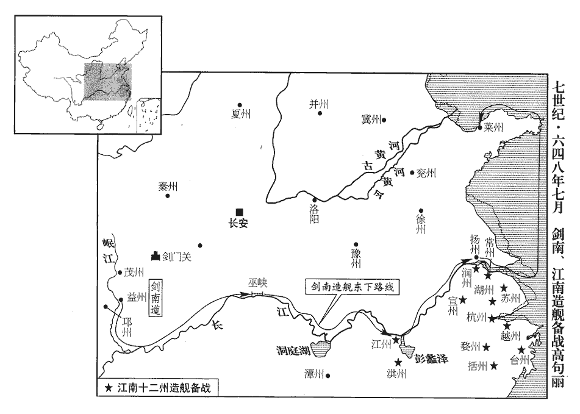
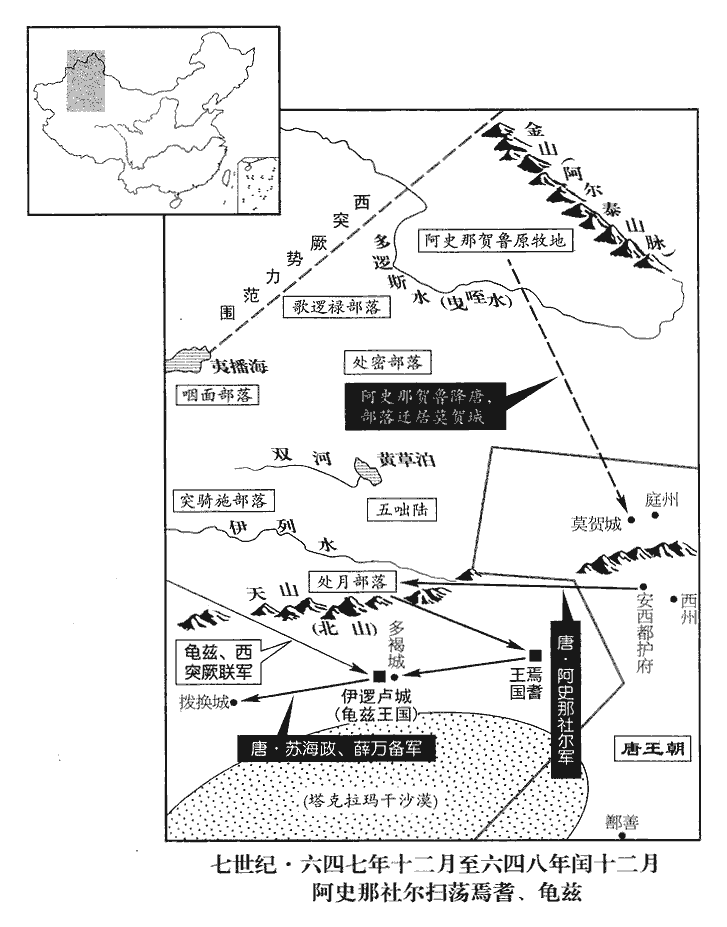
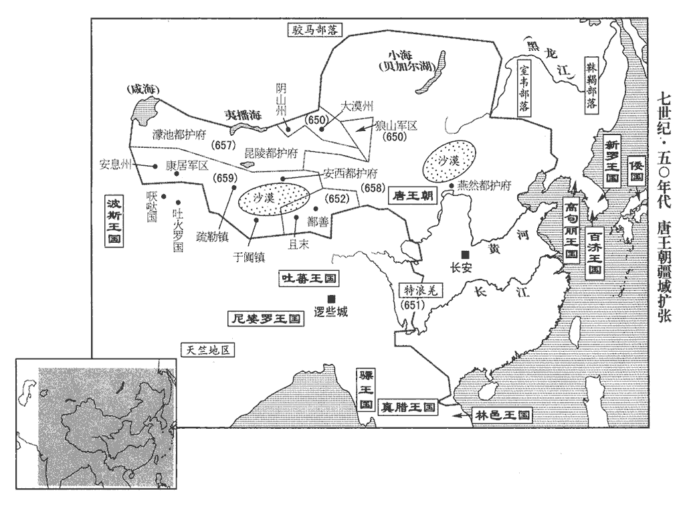
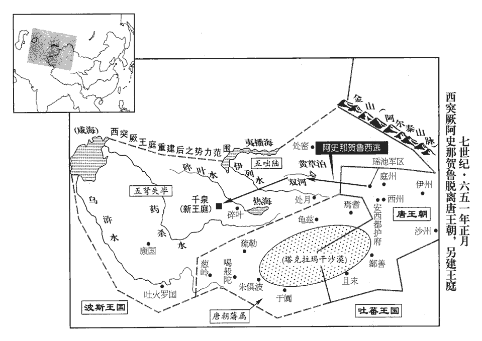
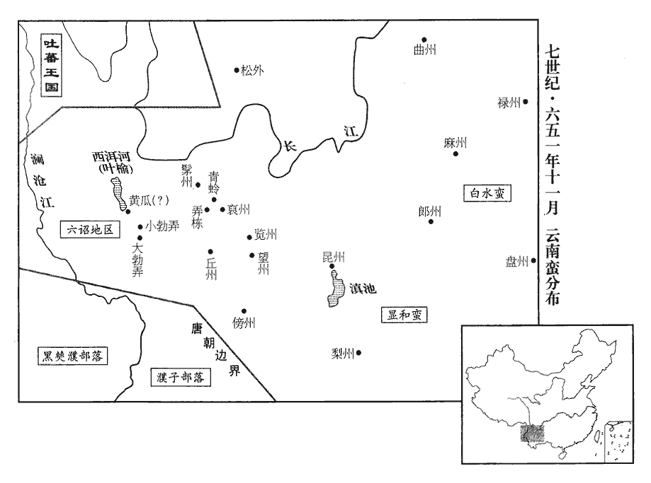
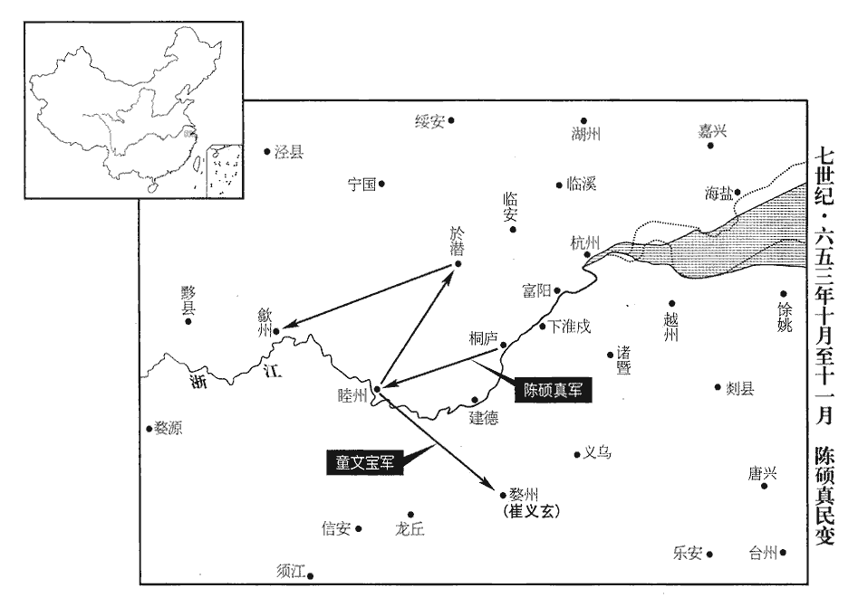
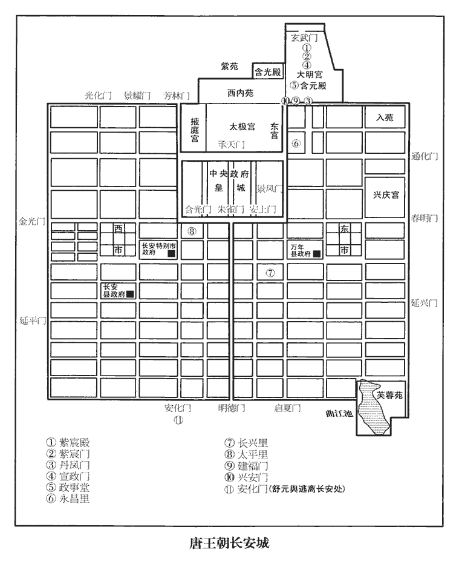
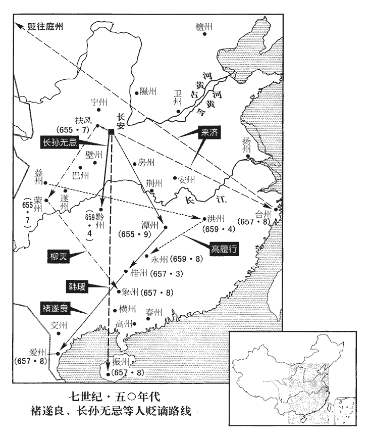

 唐紀十五起著雍涒灘（戊申）四月，盡旃蒙單閼（乙卯）九月，凡七年有奇。

# 太宗文武大聖大廣孝皇帝下之下

## 貞觀二十二年（戊申、六四八）觀，古玩翻。

1夏，四月，丁巳‹七›，右武候將軍梁建方擊松外‹四川省盐边县›蠻，破之。松外諸蠻依阻山谷，亦屬古南中之地，蓋以其在松州之外而得名也。新志：松外蠻在巂州昌明縣徼外。

〖译文〗 [1]夏季，四月，丁巳（初七），右武候将军梁建方击败松外蛮。

初，巂州‹总部设四川省西昌市›都督劉伯英上言：「松外‹四川省盐边县›諸蠻蹔降復叛，請出師討之，以通西洱‹云南省大理市东洱海›、天竺‹印度›之道。」此即漢武帝欲通之道，而為昆明所蔽者也。巂州，漢邛都夷之地，武帝開置越巂郡。後周武帝置嚴州，唐為巂州。巂，音髓。上，時掌翻。蹔，與暫同。降，戶江翻。復，扶又翻。洱，乃吏翻。敕建方發巴蜀十三州兵討之。十三州：益、眉、榮、梓、利、綿、遂、巴、盧、渠、達、集、渝也。蠻酋雙舍帥眾拒戰，酋，慈由翻。帥，讀曰率；下同。建方擊敗之，敗，補邁翻。殺獲千餘人。群蠻震懾，亡竄山谷。建方分遣使者諭以利害。懾，之涉翻。使，疏吏翻。皆來歸附，前後至者七十部，戶十萬九千三百，建方署其酋長蒙和等為縣令，長，知兩翻；下同。各統所部，莫不感悅。因遣使詣西洱河，新書曰：西洱河蠻道，由郎州走三千里。時建方自巂州道千五百里遣奇兵奄至其地。其帥楊盛大駭，具船將遁，使者曉諭以威信，盛遂請降。帥，所類翻。降，戶江翻。其地有楊、李、趙、董等數十姓，各據一州，大者六百，小者二、三百戶，無大君長，不相統壹，語雖小訛，其生業、風俗，大略與中國同，自云本皆華人，其所異者以十二月為歲首。

〖译文〗 起初，州都督刘伯英上书言道：“松外各个蛮族暂时降附如今又叛乱，请求出兵讨伐，以打通朝廷通往西洱、天竺的道路。”太宗敕令梁建方征发巴蜀十三州兵马讨伐他们。松外蛮族首领双舍率众抵抗，建方将其击败，杀死俘获共有一千多人。众蛮族大为震动，纷纷逃窜到山谷之中。建方分派使者说明利害关系，于是他们都来归附，前后有七十个部落，十万九千三百户，建方委任其首领蒙和等人为县令，各自统率本部，众人感激涕零。建方又派使者到西洱河，当地将领杨盛大为恐慌，准备好船只想要逃跑，使者晓以大唐军队的威严与信用，杨盛于是请求投降。该地区有杨、李、赵、董等几十个大姓，各自据守一州，大的六百户，小的有二、三百户，没有大的君王，互不统属，方言土语虽然有小的差异，但其生活状况与风俗习惯等大略与中原相同，自称原本都是汉人，所不同的是以十二月为一年的开始。

2己未‹九›，契丹‹辽河上游›辱紇主曲據帥眾內附，奚，契丹酋領皆稱為辱紇主。契，欺訖翻，又音喫。帥，讀曰率。以其地置玄州‹辽宁省朝阳市东›，以曲據為刺史，隸營州都督府‹总部设辽宁省朝阳市›。

〖译文〗 [2]己未（初九），契丹首领曲据率领兵众归附唐朝，唐朝在其居住地设置玄州，任命曲据为刺史，隶属营州都督府。

3甲子‹十四›，烏胡‹渤海湾隍城岛›鎮將古神感烏胡鎮當置於海中烏胡島。自登州東北海行，過大謝島、龜歆島、淤島而後至烏湖島；又三百里北渡烏湖海。姓譜，周太王去邠bīn適岐，稱古公，因氏焉。將兵浮海擊高麗，遇高麗步騎五千，戰於易山，破之。「易山」，新書作「曷山」。將，即亮翻。麗，力知翻。騎，奇寄翻。其夜，高麗萬餘人襲神感船，神感設伏，又破之而還。還，從宣翻，又如字。

〖译文〗 [3]甲子（十四日），乌胡镇守将领古神感领兵渡海进攻高丽，与高丽五千步骑兵遭遇，在易山激战，将其击败。当天夜里，高丽一万多名士兵袭击古神感的船只，神感设下埋伏，将高丽兵打得大败，然后回师。

4初，西突厥‹新疆东北部及中亚东部›乙毗咄陸可汗厥，九勿翻。咄，當沒翻。可，從刊入聲。汗，音寒。以阿史那賀魯為葉護，居多邏斯水‹额尔齐斯河›，在西州‹新疆吐鲁番市东›北千五百里，邏，郎佐翻。統處月、處密、始蘇、歌邏祿‹中亚额尔齐斯河流域›、失畢五姓之眾。乙毗咄陸奔吐火羅‹阿富汗北部汗阿巴德›，見一百九十六卷十六年。乙毗射匱可汗遣兵迫逐之，部落亡散。乙亥‹二十五›，賀魯帥其餘眾數千帳內屬，詔處之於庭州‹新疆吉木萨尔县›莫賀城‹吉木萨尔县西›，庭州西延城西六十里有沙鉢城守捉，蓋即莫賀城也；以賀魯後立為沙鉢羅葉護可汗，故改城名也。處，昌呂翻。拜左驍衛將軍。驍，堅堯翻。賀魯聞唐兵討龜茲，請為鄉導，龜茲，音丘慈。鄉，讀曰嚮。仍從數十騎入朝。朝，直遙翻。上以為崑丘道行軍總管，厚宴賜而遣之。為賀魯後叛張本。

〖译文〗 [4]起初，西突厥乙毗咄陆可汗任命阿史那贺鲁为叶护，居住在多逻斯河畔，在西州以北一千五百多里的地方，统辖处月、处密、始苏、歌逻禄、失毕五个部落的兵众。乙毗咄投奔吐火罗时，乙毗射匮可汗曾派兵追击，咄部落散亡。乙亥（二十五日），阿史那贺鲁率领其残余力量几千帐归附唐朝，太宗降诏让他们居住在庭州莫贺城，贺鲁官拜左骁卫将军。贺鲁听说唐朝军队讨伐龟兹，便请求做为向导，于是率领几十名骑兵到朝廷。太宗任命他为昆丘道行军总管，盛宴款待，厚加赏赐，让他回到原居地。

5五月，庚子‹二十›，右衛率長史王玄策擊帝那伏帝‹印度国名›王阿羅那順，大破之。東宮十率府，各有長史，正七品上。新書作「那伏帝阿羅那順」，無「王」字。率，所律翻。

〖译文〗 [5]五月，庚子（二十日），右卫率长史王玄策进攻帝那伏帝王阿罗那顺，将其打得大败。

初，中天竺‹印度中部›王尸羅逸多兵最強，四天竺皆臣之，天竺國，漢身毒國也，或曰摩伽陀，或曰婆羅門，去京師九千六百里，居蔥嶺南，幅員三萬里，分東、西、南、北、中五天竺。南天竺瀕海，北天竺距雪山，東天竺際海，與扶南、林邑接，西天竺與罽賓、波斯接，中天竺在四天竺之會。都城曰茶餺bó和羅城。杜佑曰：天竺，塞種也。顏師古曰：塞，釋也。玄策奉使至天竺‹印度›，諸國皆遣使入貢。會尸羅逸多卒，國中大亂，其臣阿羅那順自立，發胡兵攻玄策，玄策帥從者三十人與戰，使，疏吏翻。卒，子恤翻。帥，讀曰率。從，才用翻。力不敵，悉為所擒，阿羅那順盡掠諸國貢物。玄策脫身宵遁，抵吐蕃西境，以書徵鄰國兵，吐蕃遣精銳千二百人，泥婆國‹尼泊尔›遣七千餘騎赴之。泥婆羅國直吐蕃之西樂陵川，臣於吐蕃。吐，從暾入聲。騎，奇寄翻。玄策與其副蔣師仁帥二國之兵進至中天竺所居茶餺和羅城，帥，讀曰率。餺，音博。新書曰：茶餺和羅城濱伽毗黎河。連戰三日，大破之，斬首三千餘級，赴水溺死者且萬人。溺，奴狄翻。阿羅那順棄城走，更收餘眾，還與師仁戰；又破之，擒阿羅那順。餘眾奉其妃及王子，阻乾陀衛江‹可能是印度河›，水經註曰：崑崙山，釋氏曰阿耨nòu達山，河水出其東北陬，屈從其東南流注于蒲昌海，自蒲昌海潛行地下，南出積石而為中國河。其崑崙山西，有大水出焉，曰新頭河，西南流逕烏長國，又東南流逕中天竺國，亦曰恆河，又西逕四大塔北，又西逕陀衛國北。所謂乾陀衛江蓋即此也。師仁進擊之，眾潰，獲其妃及王子，虜男女萬二千人。於是天竺響震，城邑聚落降者五百八十餘所，降，戶江翻。俘阿羅那順以歸。以玄策為朝散大夫。唐制：文散階朝散大夫，從五品下。朝，直遙翻。散，悉亶翻。

〖译文〗 起初，中天竺国王尸罗逸多兵力最强，东、西、南、北四天竺都臣服于他，王玄策奉使节到天竺，各国都派使者进献贡品。恰巧尸罗逸多去世，国内大乱，大臣阿罗那顺自立为王，征发胡族兵进攻玄策，玄策率领随从三十人与他们激战，抵御不住，全都被其擒获，阿罗那顺将各国的贡品掠夺干净。玄策乘夜间只身脱逃，到达吐蕃西部边境，发文书给邻国征调兵马，吐蕃派精兵一千二百人，泥婆国派七千多名骑兵赴战。王玄策与副使蒋师仁率领二国的兵马进逼到中天竺的居住地茶和罗城，激战三天，大败天竺兵，杀死三千多人，水中溺死者将近一万人。阿罗那顺弃城逃走，重新纠集残余力量，掉过头来与蒋师仁战斗；蒋师仁又将其打败，并生擒阿罗那顺。剩余的天竺人拥戴阿罗那顺的妃子及王子，在乾陀卫江阻截唐军，蒋师仁向其发动进攻，天竺兵众溃败，其妃子及王子被擒，其余被俘男女一万二千人。于是天竺国内大受震动，共有五百八十多个城邑和部落先后投降，玄策等人俘虏阿罗那顺，班师回朝。朝廷任命玄策为朝散大夫。

6六月，乙丑‹十六›，以白霫别部為居延州‹在今内蒙古哲里木盟北部›。霫xí，而立翻。

〖译文〗 [6]六月，乙丑（十六日），唐朝以白别部所居地为居延州。

7癸酉‹二十四›，特進宋公蕭瑀卒‹年七十四岁›，太常議諡曰「德」，尚書議諡曰「肅」。周公諡法：剛德克就曰肅。諡，時利翻。上曰：「諡者，行之迹，當得其實，行，下孟翻。可諡曰貞褊biǎn公。」賀琛諡法：直道不橈曰貞；儉嗇無德曰褊；心隘政急曰褊。子銳嗣，尚上女襄城公主。上欲為之營第，為，于偽翻。公主固辭，曰：「婦事舅姑，當朝夕侍側，若居別第，所闕多矣。」上乃命即瑀第而營之。

〖译文〗 [7]癸酉（二十日），特进宋公萧去世，太常寺议定其谥号为德，尚书省议定谥号为隶。太宗说：“谥号本是标明人的行迹的，应当符合实际，可加谥号为贞褊公。”萧的儿子萧锐继承其父的食邑爵位，并娶太宗女儿襄城公主为妻。太宗想要为他营建新的宅第，公主执意辞退，并说：“媳妇侍奉公婆，应当早晚都在身边，假如居住在别处，必然会有较多的缺失。”太宗于是命令就在萧的原住所为他们营建新居。

 

8上以高麗困弊，議以明年發三十萬眾，一舉滅之。或以為大軍東征，須備經歲之糧，非畜乘所能載，宜具舟艦為水運。隋末劍南‹四川省中南部及云南省›獨無寇盜，屬者遼東之役，劍南復不預及，畜，許救翻。乘，繩證翻。艦，戶黯翻。屬，之欲翻。復，扶又翻。其百姓富庶，宜使之造舟艦。上從之。秋，七月，遣右領左右府長史強偉領左右府，亦分為左、右，各有長史，此即左、右千牛府也。強，其兩翻，姓也。於劍南道伐木造舟艦，大者或長百尺，其廣半之。別遣使行水道，長，直亮翻。行，下孟翻。自巫峽‹重庆市巫山县东›抵江‹江西省九江市›、揚‹江苏省扬州市›，趣萊州‹山东省莱州市›。趣，七喻翻。

〖译文〗 [8]太宗认为高丽正值穷困凋弊，议定在明年征发三十万兵力，一举灭掉它。有人认为大军东征，必须储备一年的粮食，而牲畜并不能运载那么多，应当准备舟船用水运。隋朝末年惟独剑南地区没有寇盗与兵乱，近来辽东之战，剑南又一次不受牵累，当地百姓生活富庶，应当让他们修造舟船。太宗依从其建议。秋季，七月，派右领左右府长史强伟在剑南道伐木造舟船，大船有的长一百尺，宽五十尺。造好后另派使者，走水路，从巫峡直抵江州、扬州，再驶往莱州。

9庚寅‹十一›，西突厥相屈利啜請帥所部從討龜茲。相，息亮翻。屈，居勿翻。啜，陟劣翻。帥，讀曰率。

〖译文〗 [9]庚寅（十一日），西突厥丞相屈利啜请求率领本部跟从唐军讨伐龟兹。

10初，左武衛將軍武連縣公武安‹河北省武安市›李君羨直玄武門，武連縣時屬始州，始州後改劍州。武安縣，漢屬魏郡，晉屬廣平郡，後周、隋屬洺州。左、右武衛將軍乃南牙諸衛將軍；直玄武門，則掌北門宿衛。時太白屢晝見，太史占云：「女主昌。」民間又傳祕記云：「唐三世之後，女主武王代有天下。」上惡之。見，賢遍翻。惡，烏路翻；下深惡同。會與諸武臣宴宮中，行酒令，行酒令者，一人為令伯，餘人以次行之。下文使各言小名，即酒令也。使各言小名。君羨自言名五娘，上愕然，因笑曰：「何物女子，乃爾勇健！」又以君羨官稱封邑皆有「武」字，深惡之，後出為華州‹陕西省华县›刺史。華，戶化翻。有布衣員道信，自言能絕粒，曉佛法，君羨深敬信之，數相從，屏人語。員，音運，姓也。數，所角翻。屏，必郢翻。御史奏君羨與妖人交通，謀不軌。妖，於喬翻。壬辰‹十三›，君羨坐誅，籍沒其家。

〖译文〗 [10]起初，左武卫将军、武连县公、武安人李君羡掌管玄武门宿卫，当时金星多次在白天出现，太史占卜说：“女主将兴起。”民间又广传《秘记》中言：“唐朝三代之后，女主武王取代李氏据有天下。”太宗听后非常厌恶。正赶上太宗在宫中与众位武将饮宴，行酒令，让每个人各讲小名。李君羡自称小名五娘，太宗非常惊讶，进而笑着说：“什么女子，竟这么勇健！”又因为君羡官衔封爵籍贯都有一个“武”字，非常厌恶，随后让他出任华州刺史。有个布衣名叫员道信，自称能够不进饮食，通晓佛法，李君羡非常敬慕相信他，多次与他形影相随，窃窃私语。御史上奏称君羡勾通妖人，图谋叛乱。壬辰（十三日），李君羡因此事定罪处斩，全家被抄没。

上密問太史令李淳風：「祕記所云，信有之乎？」對曰：「臣仰稽天象，俯察曆數，其人已在陛下宮中，為親屬，自今不過三十年，當王天下，王，于況翻。殺唐子孫殆盡，其兆既成矣。」上曰：「疑似者盡殺之，何如？」對曰：「天之所命，人不能違也。王者不死，徒多殺無辜。且自今以往三十年，其人已老，庶幾頗有慈心，為禍或淺。幾，居希翻。今借使得而殺之，天或生壯者肆其怨毒，恐陛下子孫，無遺類矣！」上乃止。

〖译文〗 太宗曾秘密地问太史令李淳风：“《秘记》上所说的谣传，真有其事吗？”答道：“我仰观天象，俯察历数，这个人现在已在陛下宫中了，是陛下亲属，从今往后不超过三十年，这个人当做天下的君王，并将大唐皇室子孙杀得不剩几个，其征兆已经形成了。”太宗说：“凡是有怀疑的统统杀掉，怎么样？”李淳风答道：“此乃天命，人们不能够违抗。未来称王的人死不了，反而白白地杀死无辜。而且今后三十年，那个人也已经老了，也许该存有慈善心肠，祸害可能会小些。如今即使找到此人将其杀死，老天或许会降生更加强壮的人大肆发泄怨恨，恐怕陛下的子孙就没有幸免的了。”太宗于是不再过问此事。

11司空梁文昭公房玄齡留守京師，守，手又翻。疾篤，上徵赴玉華宮，肩輿入殿，至御座側乃下，相對流涕，因留宮下，聞其小愈則喜形於色；加劇則憂悴。悴，秦醉翻。玄齡謂諸子曰：「吾受主上厚恩，今天下無事，唯東征未已，群臣莫敢諫，吾知而不言，死有餘責。」乃上表諫，上，時掌翻。以為：「老子曰：『知足不辱，知止不殆。』陛下功名威德亦可足矣，拓地開疆亦可止矣，且陛下每決一重囚，必令三覆五奏，進素膳，止音樂者，見一百九十三卷五年。重人命也。今驅無罪之士卒，委之鋒刃之下，使肝腦塗地，獨不足愍乎！明謹用刑，重人命也。踴躍用兵，則忘人命之為重矣。引彼形此，玄齡之言可謂深切著明。向使高麗違失臣節，誅之可也；侵擾百姓，滅之可也；他日能為中國患，除之可也。今無此三條而坐煩中國，內為前代雪恥，外為新羅報讎，豈非所存者小，所損者大乎！說到此，分明見得高麗不必征。當時在朝之臣諫東征者，未有能及此者也，此是忠誠懇切中流出。為，于偽翻。願陛下許高麗自新，焚陵波之船，罷應募之眾，自然華、夷慶賴，遠肅邇安。臣旦夕入地，儻蒙錄此哀鳴，論語：曾子有疾，孟敬子問之，曾子言曰：「鳥之將死，其鳴也哀；人之將死，其言也善。」死且不朽！」玄齡子遺愛尚上女高陽公主，上謂公主曰：「彼病篤如此，尚能憂我國家。」上自臨視，握手與訣，悲不自勝。勝，音升。癸卯‹二十四›，薨‹年七十岁›。

〖译文〗 [11]司空梁文昭公房玄龄留守在京城，病情加重，太宗征召他到玉华宫，乘坐轿子进入殿内，到太宗御座旁边才下轿，与太宗相对流泪，太宗将房玄龄留在宫中，听说病情好转则喜形于色；病情加重则忧虑憔悴。房玄龄对他的儿子们说：“我蒙受皇上的隆恩，如今天下无事，只有东征高丽一事没有停止，众位大臣都不敢劝谏，我明知其非而不说话，真是死有余辜啊。”于是上表章劝谏，认为：“《老子》说：‘知道满足，不会遭到困辱，知道适可而止，不会遇到危险。’陛下的功名威德也可以知足了，开拓疆土也当适可而止，而且陛下每次叛决一个死刑犯人，一定要三次复议五次上奏，进素食，停止音乐，这正是重视人的性命啊。如今驱使无罪的士卒，让他们往刀口上送，使之肝脑涂地，难道他们单单不足以怜悯吗！假使当初高丽违背臣属的礼节，可以诛罚他们；假若侵扰老百姓，可以灭掉他们。以后会成为中原的祸患，也可以除掉他们。如今没有这三条原因而只是无故烦劳中原百姓，我们对内无非称为前代雪耻，对外不过称为新罗报仇，岂不是所得到的很少，失去的很大吗！希望陛下容许高丽悔过自新，焚毁准备渡海用的船只，停止召募兵众，自然华、夷庆幸有靠，远服近安。我很快要死去的，倘若承蒙陛下采纳将死者的哀鸣，死了也将不朽。”房玄龄的儿子房遗爱娶太宗女儿高阳公主为妻，太宗对公主说：“你的公公病得这么厉害，还能为国家的事忧心忡忡。”太宗亲去探视，握着房玄龄的手与他告别，悲痛得不能自禁。癸卯（二十四日），房玄龄去世。

柳芳‹李隆基时代史学家›曰：玄齡佐太宗定天下，及終相位，凡三十二年，天下號為賢相；相，息亮翻。然無跡可尋，德亦至矣。故太宗定禍亂而房、杜不言功。王‹王珪›、魏‹魏徵›善諫諍而房、杜讓其賢，英‹徐世勣›、衛‹李靖›善將兵而房、杜行其道，新贊作「房、杜濟以文」。將，即亮翻。理致太平，善歸人主。為唐宗臣，宜哉！

〖译文〗 柳芳曰：房玄龄辅佐太宗平定天下，直到死于宰相位上，共三十二年，天下人号称为贤相；然而没有多少事迹可寻，道德也达到至高境界。所以太宗平定祸乱而房、杜二人不居功；王、魏徵善于谏诤而房、杜二人不争其贤名；李世、李靖善于领兵作战而房、杜二人辅行文道，使国家太平，将功劳归诸君主。房玄龄被称为有唐一代的宗臣，是很适宜的。

12八月，己酉朔‹一›，日有食之。

〖译文〗 [12]八月，己酉朔（初一），出现日食。

13丁丑‹二十九›，勑越州‹总部设浙江省绍兴市›都督府及婺‹浙江省金华市›、洪‹江西省南昌市›等州造海船及雙舫千一百艘。東陽郡，隋平陳，置婺州。舫，甫妄翻。艘，蘇遭翻。

〖译文〗 [13]丁丑（二十九日），敕令越州都督府以及婺、洪等州修造海船及双舫船一千一百艘。

14辛未‹二十三›，遣左領軍大將軍執失思力出金山道‹新疆阿尔泰山›擊薛延陀餘寇。

〖译文〗 [14]辛未（二十三日），派遣左领军大将军执失思力从金山道出兵进攻薛延陀残余势力。

15九月，庚辰‹二›，崑丘道行軍大總管阿史那社爾擊處月、處密，破之，餘眾悉降。降，戶江翻。

〖译文〗 [15]九月，庚辰（初二），昆丘道行军大总管阿史那社尔进攻处月、处密，将其击败，余众全部投降。

16癸未‹五›，薛萬徹等伐高麗還。還，從宣翻，又如字。萬徹在軍中，使氣陵物，裴行方奏其怨望，坐除名，流象州‹广西象州县›。裴行方副萬徹東伐，見上卷上年。象州，漢潭中中溜縣之地，隋為始安郡桂林縣，唐武德四年，置象州桂林郡，以象山名州。

〖译文〗 [16]癸未（初五），薛万彻等人征伐高丽返回朝廷。万彻在军中，恃才傲物，盛气凌人，裴行方上奏称其有怨言，因而被罢官除掉名籍，流放到象州。

17己丑‹十一›，新羅‹首都金城韩国庆州市›奏為百濟‹首都泗沘韩国扶馀市›所攻，破其十三城。

〖译文〗 [17]己丑（十一日），新罗向朝廷上奏表称百济进攻其国，攻克十三座城。

18己亥‹二十一›，以黃門侍郎褚遂良為中書令。

〖译文〗 [18]己亥（二十一日），任命黄门侍郎褚遂良为中书令。

19強偉等發民造船，役及山獠，雅‹四川省雅安市›、邛‹四川省邛崃县东北›、眉‹四川省眉山县›三州獠反。強，其兩翻。邛，渠容翻。獠，魯皓翻。壬寅‹二十四›，遣茂州‹总部设四川省茂县›都督張士貴、右衛將軍梁建方發隴右‹甘肃省南部›、峽中‹四川盆地西部›兵二萬餘人以擊之。蜀人苦造船之役，或乞輸直雇潭州‹湖南省长沙市›人造船；上許之。州縣督迫嚴急，民至賣田宅、鬻yù子女不能供，穀價踊貴，劍外‹四川省中南部及云南省›騷然。自劍門關以南謂之劍外，內京師而外諸夏也。上聞之，遣司農少卿長孫知人馳驛往視之。知人奏稱：「蜀人脆弱，不耐勞劇。脆，此芮翻。大船一艘，庸絹二千二百三十六匹。山谷已伐之木，挽曳未畢，復徵船庸，艘，蘇遭翻。復，扶又翻。二事併集，民不能堪，宜加存養。」上乃敕潭州船庸皆從官給。

〖译文〗 [19]强伟等人征发百姓造船，山獠人也去做力役，雅、邛、眉三州獠民造反。壬寅（二十四日），朝廷派茂州都督张士贵、右卫将军梁建方征发陇右、峡中的士兵二万多人进攻獠民。蜀人苦于造船的劳役，有人请求出价钱雇佣潭州人造船，太宗允许。州县官吏督促过急，百姓们甚至卖田地宅院、卖儿卖女都供不上，粮价猛涨，引起剑外一带骚动。太宗听说后，派司农寺少卿长孙知人飞奔前往视察。知人上奏称：“蜀人身体虚弱，不能承受剧烈劳动。大船一艘，雇人要给绢二千二百三十六匹。山谷之中已经砍伐的树木，还没有全部运出来，又要征调船庸，二件事并在一起，百姓们承受不了，应当加以存恤养护。”太宗于是敕令雇潭州人的造船费用由政府支给。

20冬，十月，癸丑‹六›，車駕還京師。

〖译文〗 [20]冬季，十月，癸丑（初六），太宗车驾回到京城。

21回紇‹蒙古国北部›吐迷度兄子烏紇蒸其叔母。紇，下沒翻。烏紇與俱陸莫賀達官俱羅勃，皆突厥車鼻可汗之壻也，相與謀殺吐迷度以歸車鼻。烏紇夜引十餘騎襲吐迷度，殺之。燕然副都護‹都护府设内蒙古乌拉特中旗›元禮臣使人誘烏紇，許奏以為瀚海都督‹总部设蒙古国哈尔和林市›，烏紇輕騎詣禮臣謝，禮臣執而斬之，以聞。燕，因肩翻。誘，音酉。騎，奇寄翻。上恐回紇部落離散，遣兵部尚書崔敦禮往安撫之。久之，俱羅勃入見，上留之不遣。回紇由是又微。見，賢遍翻。

〖译文〗 [21]回纥吐迷度的侄子乌纥娶其婶婶为妻。乌纥与俱陆莫贺侍从官俱罗勃，都是突厥车鼻可汗的女婿，二人互相谋划杀掉吐迷度归附车鼻。乌纥乘夜晚带领十多个骑兵袭击吐迷度，将他杀死。燕然副都护元礼臣派人诱降乌纥，答应他上奏太宗封他为瀚海都督，乌纥骑马到元礼臣处面谢，礼臣将他抓起来杀死，上报朝廷。太宗担心回纥各部落分散，派兵部尚书崔敦礼前往安抚。又过了一些天，俱罗勃到朝中拜见太宗，太宗将他留下，不让他回去。

22阿史那社爾既破處月、處密，引兵自焉耆‹新疆焉耆县›之西趨龜茲北境，趨，七喻翻。分兵為五道，出其不意，焉耆王薛婆阿那支棄城奔龜茲，保其東境。社爾遣兵追擊，擒而斬之，十六年，郭孝恪破焉耆，立栗婆準為王，而阿那支殺之，今也罪人斯得。立其從父弟先那準為焉耆王，新書曰：立突騎支弟婆伽利為王。此從舊書。從，才用翻。使修職貢。龜茲大震，守將多棄城走。社爾進屯磧口，去其都城三百里，「磧口」，新、舊書作「磧石」。龜茲都伊邏盧城‹库车县›，北倚白山，亦曰阿羯jié田山。將，即亮翻。磧qì，七迹翻。遣伊州‹新疆哈密市›刺史韓威帥千餘騎為前鋒，帥，讀曰率；下同。騎，奇寄翻。右驍衛將軍曹繼叔次之。至多褐城‹库车县东›，龜茲王訶利布失畢、其相那利、羯獵顛帥眾五萬拒戰。相，息亮翻。羯，居謁翻。鋒刃甫接，威引兵偽遁，龜茲悉眾追之，行三十里，與繼叔軍合。龜茲懼，將卻，繼叔乘之，龜茲大敗，逐北八十里。

〖译文〗 [22]阿史那社尔打败处月、处密后，领兵从焉耆的西面直抵龟兹北部边境，分兵五路，出其不意，焉耆国王薛婆阿那支弃城投奔龟兹，据守其东部边境。阿史那社尔派兵追击，生擒并杀掉他，立他的堂弟先那准为焉耆国王，让他继续向唐朝进贡。龟兹大为震动，守城将士多弃城逃走。阿史那社尔进驻碛口，离龟兹都城三百里，派伊州刺史韩威率领一千多骑兵为前锋，骁卫将军曹继叔紧随其后。到了多褐城，龟兹国王诃利布失华、丞相那利、羯猎颠率领五万兵众抵抗。短兵相接，韩威引兵假装后退，龟兹兵倾巢出兵追击，跑了有三十里，韩威与曹继叔的军队会合。龟兹兵害怕，想要退却，曹继叔乘机反击，龟兹大败，北逃八十里。

 

23甲戌‹二十七›，以迴紇吐迷度子前左屯衛大將軍翊左郎將婆閏為左驍衛大將軍、大俟利發、瀚海‹总部设蒙古国哈尔和林市›都督。驍，堅堯翻。俟，渠之翻。考異曰：舊回紇傳云：「詔西突厥可汗阿史那賀魯統五啜，五俟斤，二十餘部，居多羅斯水南，去西州馬行十五日程。回紇不肯西屬突厥。」按賀魯時為將軍，自多邏斯水入居庭州，永徽二年乃西遁，自稱可汗，所統咄陸五啜，弩失畢五俟斤，唐未嘗以回紇隸之也。今不取。

〖译文〗 [23]甲戌（二十七日），唐朝任命回纥吐迷度的儿子、翊左郎将婆闰为左骁卫大将军、大俟利发、瀚海都督。

24十一月，庚子‹二十三›，契丹‹辽河上游›帥窟哥、奚‹滦河上游›帥可度者並帥所部內屬。帥，所類翻；下別帥同。並帥，讀曰率。以契丹部為松漠府‹总部设内蒙古巴林右旗›，杜佑曰：松漠之地，在柳城郡之北。以窟哥為都督；又以其別帥達稽等部為峭落等九州，各以其辱紇主為刺史。峭落州、無逢州、羽陵州、白連州、徒何州、萬丹州、疋黎州、赤山州、并松漠府為九州。峭，七笑翻。以奚部為饒樂府‹总部设内蒙古宁城县西南›，以可度者為都督；樂，音洛。又以其別帥阿會等部為弱水等五州，亦各以其辱紇主為刺史。弱水州、祁黎州、洛瓌guī州、太魯州、渴野州。辛丑‹二十四›，置東夷校尉官於營州。校，戶教翻。

〖译文〗 [24]十一月，庚子（二十三日），契丹将领窟哥、奚族将领可度者一同率领本部归附唐朝。朝廷将契丹本部改为松漠府，任命窟哥为都督；又以其将领达稽等部为峭落等九州，各自任命他们的首领为刺史。以奚族本部为铙乐府，任命可度者为都督；又以其将领阿会等部为弱水等五州，也是各任命其部族首领为刺史。辛丑（二十四日），在营州设置东夷校尉官。

25十二月，庚午‹二十四›，太子為文德皇后作大慈恩寺成。《兩京新記》：西京外城，朱雀街東第三橋，皇城之東第一街進業坊，隋無漏寺之故基，太子即其地建寺，為文德皇后祈福，竹木森邃，為京城觀游之最。雍錄曰：慈恩寺在朱雀街東第三街，自北次南第十五坊，名曰進昌坊，寺南臨黃渠，竹木森邃。為，于偽翻。

〖译文〗 [25]十二月，庚午（二十四日），太子李治为文德皇后建造大慈恩寺竣工。

26龜茲王布失畢既敗，走保都城，阿史那社爾進軍逼之，布失畢輕騎西走。社爾拔其城，使安西‹都护府设交河新疆吐鲁番市›都護郭孝恪守之。沙州‹甘肃省敦煌市›刺史蘇海政、尚輦奉御薛萬備帥精騎追布失畢，行六百里，布失畢窘急，保撥換城‹新疆阿克苏市›，自安西府西出柘厥關，渡白馬河四百餘里至撥換城。騎，奇寄翻。帥，讀曰率；下同。社爾進軍攻之四旬，閏月，丁丑‹一›，拔之，擒布失畢及羯獵顛。那利脫身走，潛引西突厥之眾并其國兵萬餘人，襲擊孝恪。孝恪營於城外，龜茲人或告之，孝恪不以為意。那利奄至，孝恪帥所部千餘人將入城，那利之眾已登城矣，城中降胡與之相應，降，戶江翻；下同。共擊孝恪，矢刃如雨，孝恪不能敵，將復出，復，扶又翻；下利復同。死於西門。城中大擾，倉部郎中崔義超倉部郎，掌判天下倉儲，受納租稅，出給祿廩之事，屬戶部。義超以是官從軍。召募得二百人，衛軍資財物，與龜茲戰於城中，曹繼叔、韓威亦營於城外，自城西北隅擊之。那利經宿乃退，斬首三千餘級，城中始定。後旬餘日，那利復引山北龜茲萬餘人趣都城，山北，蓋白山之北也。趣，七喻翻。繼叔逆擊，大破之，斬首八千級。那利單騎走，龜茲人執之，以詣軍門。

〖译文〗 [26]龟兹国王布失毕兵败后，退保都城，阿史那社尔急行军逼近，布失毕率领轻骑出城西逃。社尔攻下其都城，让安西都护郭孝恪守卫此城。沙州刺史苏海政、尚辇奉御薛万备率领精锐骑兵追击布失毕，行军六百里，布失毕慌慌张张，据守拨换城，社尔领兵攻城，用了四十天，闰十二月，丁丑（初一），攻陷城池，生擒布失毕以及羯猎颠。那利只身逃走，暗中勾引西突厥的兵力与本国兵力合在一处共一万多人，袭击郭孝恪。郭孝恪在城外安营扎帐，有的龟兹人告诉他那利即将赶来，孝恪不以为意。那利忽然大兵压境，郭孝恪率领本部一千多人想要进入城里，那利兵众已经登上城墙，城内投降的胡兵与那利里应外合，共同夹击郭孝恪，万箭齐发，刀剑如雨，孝恪抵挡不住，想要再次冲出来，被射死在西门。城中大乱，仓部郎中崔义超召募得二百人，保卫军需财物，与龟兹兵在城中展开激战，曹继叔、韩威也在城外扎营，从城西北角进攻龟兹。经过一夜激战，那利兵撤退，唐军杀死龟兹兵三千多人，城中才安定下来。十多天之后，那利又带引山北龟兹一万多人逼近都城，曹继叔迎击，将其打败，杀死八千人。那利一个人骑马逃走，龟兹人将他抓住，送到军门。

阿史那社爾前後破其大城五，遣左衛郎將權祗甫詣諸城，開示禍福，皆相帥請降，帥，讀曰率。降，戶江翻。凡得七百餘城，虜男女數萬口。社爾乃召其父老，宣國威靈，諭以伐罪之意，立其王之弟葉護為王；龜茲‹新疆库车县›人大喜。西域震駭，西突厥、于闐‹新疆和田市›、安國‹乌兹别克斯坦布哈拉市›爭饋駝馬軍糧，闐，徒賢翻，又徒見翻。社爾勒石紀功而還。還，從宣翻，又如字。

〖译文〗 阿史那社尔前后共攻下大城五座，派左卫郎将权祗甫到各个城中，晓以祸福，各城相继请求投降，共得七百多城，俘虏男女几万人。社尔于是召集城中父老，宣示朝廷的威严神灵，讲明征伐有罪之国的道理，立龟兹国王的弟弟叶护为国王；龟兹人非常高兴。西域地区震骇，西突厥、于阗、安国争着送骆驼马匹和军粮，社尔刻石碑纪功，而后班师回朝。

27戊寅‹二›，以崑丘道行軍總管、左驍衛將軍阿史那賀魯為泥伏沙鉢羅葉護，賜以鼓纛，使招討西突厥之未服者。假賀魯以羽翼，正速其叛耳。驍，堅堯翻。纛，徒到翻。

〖译文〗 [27]戊寅（初二），唐朝任命昆丘道行军总管、左骁卫将军阿史那贺鲁为泥伏沙钵罗叶护，赐给鼓和大旗，让他招抚讨伐未归服的西突厥人。

28癸未‹七›，新羅相金春秋及其子文王入見。相，息亮翻。見，賢遍翻。春秋，真德‹金胜曼›之弟也。上以春秋為特進，文王為左武衛將軍。春秋請改章服從中國，內出冬服賜之。

〖译文〗 [28]癸未（初七），新罗国丞相金春秋与他的儿子金文王来到唐朝拜见太宗。金春秋是金真德的弟弟。太宗封春秋为特进，文王为左武卫将军。春秋请求按照唐朝的式样改革新罗官员的礼服，太宗拿出冬服赐给他。

## 二十三年（己酉、六四九）

1春，正月，辛亥‹六›，龜茲‹新疆库车县›王布失畢及其相那利等至京師，上‹李世民，本年五十二岁›責讓而釋之，以布失畢為左武衛中郎將。龜茲，音丘慈，又音屈佳。將，即亮翻。考異曰：實錄云「左武衛翊yì衛中郎將」，舊傳為「武翊衛中郎將」。按會要，武德五年，改左、右翊衛為左、右衛。然則於時已無翊衛之名，且布失畢必不獨兼兩衛之官。今去「翊衛」字。按唐六典，左、右衛有親、勳、翊三衛中郎將，其餘諸衛府各有翊衛中郎將，「翊衛」二字，恐不可去。

〖译文〗 [1]春季，正月，辛亥（初六），龟兹国王布失毕及其丞相那利等人被押到了京城，太宗予以责备后将他们放了，任命布失毕为左武卫中郎将。

2西南‹云南省西部›徒莫祗等蠻內附，以其地為傍‹云南省双柏县›、望‹云南省禄丰县西›、覽‹云南省牟定县›、丘‹云南省南华县›四州，隸朗州‹郎州，总部设云南省曲靖市›都督府。徒莫祗蠻在爨蠻之西。「朗州」，當作「郎州」。武德元年，開南中，仍舊置南寧州，貞觀八年，改為郎州，以其地本夜郎國也。

〖译文〗 [2]西南地区徒莫祗等蛮族归附唐朝，以其辖地设傍、望、览、丘四州，隶属于朗州都督府。

3上以突厥車鼻可汗不入朝，遣右驍衛郎將高侃發回紇‹蒙古国北部›、僕骨‹蒙古国东部›等兵襲擊之。兵入其境，諸部落相繼來降。拔悉密‹蒙古国科布多盆地北部›吐屯肥羅察降，以其地置新黎州。舊書云：車鼻長子羯漫陀，先統拔悉密部，遣其子菴鑠shuò入朝，帝嘉之，為置新黎州。朝，直遙翻。降，戶江翻。考異曰：高宗實錄云：「初，突厥車鼻可汗遣其子車鉢羅入貢，太宗遣使徵之，不至。太宗大怒，遣右驍衛郎將高侃引回紇、僕骨等兵襲擊之，其下諸部落相次歸降。其子羯漫陀先統拔悉密部，泣諫其父，請歸國；車鼻不聽。羯漫陀遂背父來降，以其地為新黎州。」舊傳云：「二十三年，遣右驍衛郎將高侃潛引回紇、僕骨等兵眾襲擊之，其酋長歌邏祿泥執闕俟利發、乃拔塞匐、處木昆、莫賀咄俟斤等，帥部落，背車鼻，相繼來降。車鼻長子羯漫陀先統拔悉密部，車鼻未敗前，遣其子菴鑠入朝，太宗嘉之，拜左屯衛將軍，更置新黎州以統其眾。」今從太宗實錄。

〖译文〗 [3]太宗因突厥车鼻可汗不来朝见，派右骁卫郎将高侃征发回纥、仆骨等兵马袭击突厥。军队到了突厥境内，各部相继前来投降。拔悉密首领肥罗察投降，唐朝在其原地设置新黎州。

4二月，丙戌‹十一›，置瑤池都督府‹总部设新疆阜康市›，此因穆天子傳西王母觴天子於瑤池之上而命名也。隸安西都護‹都护府设交河城新疆吐鲁番市›；戊子‹十三›，以左衛將軍阿史那賀魯為瑤池都督。

〖译文〗 [4]二月，丙戌（十一月），唐朝设置瑶池都督府，隶属于安西都护；戊子（十三日），任命左卫将军阿史那贺鲁为瑶池都督。

5三月，丙辰‹十二›，置豐州都督府‹总部设内蒙古五原县›，使燕然都護‹都护府设内蒙古乌拉特中旗›李素立兼都督。

〖译文〗 [5]三月，丙辰（十三日），唐朝设置丰州都督府，由燕然都护李素立兼任都督职。

6去冬旱，至是始雨。辛酉‹十七›，上力疾至顯道門外，赦天下。丁卯‹二十三›，敕太子於金液門聽政。按唐六典：城門郎掌京城、皇城、宮殿諸門。明德等門為京城門，朱雀等門為皇城門，承天等門為宮城門，嘉德等門為宮門，太極等門為殿門。通內諸門，並同上閤門，顯道、金液，其亦通內諸門之門歟？圖志不能盡載耳。

〖译文〗 [6]上一年冬季大旱，到此时才下了第一场雨。辛酉（十七日），太宗支撑病体到了显道门外，大赦天下。丁卯（二十三日），太宗敕令太子李治在金液门听政。

7夏，四月，乙亥‹一›，上行幸翠微宮‹陕西省西安市南二十五千米太和谷›。

〖译文〗 [7]夏季，四月，乙亥（初一），太宗行幸翠微宫。

8上謂太子曰：「李世勣才智有餘，然汝與之無恩，恐不能懷服。我今黜之，若其即行，俟我死，汝於後用為僕射，親任之；若徘徊顧望，當殺之耳。」五月，戊午‹十五›，以同中書門下三品李世勣為疊州‹总部设甘肃省迭部县›都督；世勣受詔，不至家而去。史言太宗以機數御李世勣，世勣亦以機心而事君。杜佑曰：疊州去京師千三百四十里。孫愐曰：疊州自秦至魏，諸羌據焉，周武帝逐諸羌，乃置疊州，蓋以山重疊名之。

〖译文〗 [8]太宗对太子说：“李世才智有余，然而你对他没有恩德，恐怕不能够敬服你。我现在将他降职，假如他即刻就走，等我死后，你以后可再重用他为仆射，视为亲信；如果他俳徊观望，应当杀掉他。”五月，戊午（十五日），任命同中书门下三品李世为叠州都督；世接受诏令后，没有回家即去上任。

9辛酉‹十八›，開府儀同三司衛景武公李靖薨‹年七十九岁›。

〖译文〗 [9]辛酉（十八日），开府仪同三司卫景武公李靖去世。

10上苦利增劇，太子晝夜不離側，離，力智翻。或累日不食，髮有變白者。上泣曰：「汝能孝愛如此，吾死何恨！」丁卯‹二十四›，疾篤，召長孫無忌入含風殿。含風殿，在翠微宮。上臥，引手捫無忌頤，無忌哭，悲不自勝；勝，音升。上竟不得有所言，因令無忌出。己巳‹二十六›，復召無忌及褚遂良入臥內，復，扶又翻。謂之曰：「朕今悉以後事付公輩。太子仁孝，公輩所知，善輔導之！」謂太子曰：「無忌、遂良在，汝勿憂天下！」又謂遂良曰：「無忌盡忠於我，我有天下，多其力也，我死，勿令讒人間之。」武、許之間二臣，玉几之命猶在高宗之耳，何遽忘之邪！間，古莧翻。仍令遂良草遺詔。有頃，上崩。年五十有三。

〖译文〗 [10]太宗病情加重，上吐下泄，太子昼夜不离身边，有时一连几日不进食，头发有的已变白。太宗流着泪说：“你这么孝敬疼爱我，我死了还有什么遗憾！”丁卯（二十四日），太宗病情危急，召长孙无忌到含风殿。太宗躺在床上，伸出手摸着长孙无忌的腮，无忌大声痛哭，不能自己；太宗竟说不出话来，于是令无忌出宫。己巳（二十六日），又召长孙无忌与褚遂良进入卧室内，对他们说：“朕如今将后事全都托付给你们。太子仁义孝敬，你们也都知道的，望你们善加辅佐教导！”对太子说：“有无忌、遂良在，你不用为大唐江山担忧！”又对褚遂良说：“无忌对我竭尽忠诚，我能拥有大唐江山，无忌出力较多，我死之后，不要让小人进谗言挑拨离间。”于是令褚遂良草拟遗诏。过了不久，太宗去世。

太子擁無忌頸，號慟將絕，無忌攬涕，請處分眾事以安內外，太子哀號不已，號，戶高翻。處，昌呂翻。分，扶問翻。無忌曰：「主上以宗廟社稷付殿下，豈得效匹夫唯哭泣乎！」乃祕不發喪。庚午‹二十七›，無忌等請太子先還，飛騎、勁兵及舊將皆從。騎，奇寄翻。將，即亮翻。從，才用翻。辛未‹二十八›，太子入京城；大行御馬輿，侍衛如平日，繼太子而至，頓於兩儀殿。以太子左庶子于志寧為侍中，少詹事張行成兼侍中，以檢校刑部尚書、右庶子、兼吏部侍郎高季輔兼中書令。壬申‹二十九›，發喪於太極殿，宣遺詔，太子即位。太極殿，西內正朝，於此發喪，太子於柩前即位。軍國大事，不可停闕；平常細務，委之有司。諸王為都督、刺史者，並聽奔喪，濮王泰不在來限。罷遼東之役及諸土木之功。四夷之人入仕於朝及來朝貢者數百人，聞喪皆慟哭，翦髮、剺lí面、割耳，流血灑地。朝，直遙翻。剺，里之翻。

〖译文〗 太子抱着长孙无忌的脖子，号淘痛哭，悲痛欲绝，长孙无忌抹去眼泪，请求太子处理众事以安朝内外，太子不停地哀嚎，无忌说：“皇上将宗庙社稷交付给殿下，怎么能效法一般人只知道哭泣呢？”于是秘不发丧。庚午（二十七日），长孙无忌等人请求太子先回到皇宫，飞骑、精悍步兵及旧将领纷纷跟随。辛未（二十八日），太子进入京城；辞世的天子所用的马车，侍卫兵如同平时一样，继太子之后到达京城，安顿在两仪殿。任命太子左庶子于志宁为侍中，少詹事张行成兼任侍中，任命检校刑部尚书、右庶子、兼吏部侍郎高季辅兼任中书令。壬申（二十九日），在太极殿发丧，宣示太宗遗诏，太子即皇帝位。军国大事，不可停下不办；平常琐细事务，委托给有关官署。诸王在外任都督、刺史的，都听凭他们前来奔丧，但濮王李泰不在奔丧的范围内。废止辽东的征战及各项土木工程。四方各部族在朝做官及来朝进贡的几百人，听说太宗死了，都失声痛哭，剪头发、用刀划脸、割耳朵等，流血满地。

六月，甲戌朔‹一›，高宗‹李治，本年二十二岁›即位，赦天下。

〖译文〗 六月，甲戌朔（初一），高宗李治即位，大赦天下。

11丁丑‹四›，以疊州都督李勣為特進、檢校洛州‹河南省洛阳市›刺史、洛陽宮留守。李世勣去「世」字，避太宗二名也。守，手又翻。

〖译文〗 [11]丁丑（初四），任命叠州都督李世为特进、检校洛州刺史、洛阳宫留守。

12先是，太宗二名，令天下不連言者勿避；先，悉薦翻。至是，始改官名犯先帝諱者。孔穎達曰：曲禮，卒哭乃諱。註云：敬鬼神之名也。諱，避也。生者不相避名。衛侯名惡，大夫有名惡，君臣同名，春秋不非。按昭七年，衛侯惡卒。穀梁傳云：昭元年有衛齊惡。今衛侯惡何？謂君臣同名也，君子不奪人親所名也。

〖译文〗 [12]先前，太宗“世民”二字，令天下不连在一起写的不用避讳；到了此时，开始更改犯先帝名讳的官名。

13癸未‹十›，以長孫無忌為太尉，兼檢校中書令，知尚書、門下二省事。無忌固辭知尚書省事，帝許之，仍令以太尉同中書門下三品。唐制：三公正一品。無忌既為太尉，而令同中書門下三品，當時朝議之失也。癸巳‹二十›，以李勣為開府儀同三司、同中書門下三品。

〖译文〗 [13]癸未（初十），任命长孙无忌为太尉，兼检校中书令，掌管尚书、门下二省事务。无忌执意辞退掌管尚书省，高宗答允，于是命他为太尉同中书门下三品。癸巳（二十日），任命李世为开府仪同三司、同中书门下三品。

14阿史那社爾之破龜茲‹新疆库车县›也，行軍長史薛萬備請因兵威說于闐‹新疆和田市›王伏闍信入朝，說，輸芮翻。闍shé，視遮翻。朝，直遙翻。社爾從之。秋，七月，己酉‹六›，伏闍信隨萬備入朝，詔入謁梓宮。

〖译文〗 [14]阿史那社尔打败龟兹后，行军长史薛万备请求借着军队威慑劝说于阗国王伏信入京朝见，社尔听从其意见。秋季，七月，己酉（初六），伏信随薛万备入朝，高宗下诏让他谒见太宗灵柩。

15八月，癸酉‹一›，夜，地震，晉州‹山西省临汾市›尤甚，壓殺五千餘人。

〖译文〗 [15]八月，癸酉（初一），夜里，发生地震，晋州震情尤其严重，死五千多人。

16庚寅‹十八›，葬文皇帝‹李世民›于昭陵‹陕西省礼泉县北十五千米九嵕山›，昭陵在京兆醴泉縣西北六十里九嵕山。廟號太宗。自唐太宗後，為臣子者率稱其君之廟號，豈非子孫臣民亦病其諡號太多非實，而古者祖有功宗有德之義微乎！阿史那社爾、契苾何力請殺身殉葬，上遣人諭以先旨不許。蠻夷君長為先帝所擒服者頡利等十四人，皆琢石為其像，刻名列於北司馬門內。

〖译文〗 [16]庚寅（十八日），安葬太宗皇帝于昭陵，庙号太宗。阿史那社尔、契何力请求自杀殉葬，高宗派人告诉他们先帝遗旨不允许。被太宗擒获归服的各部族首领颉利等十四人，都雕刻他们的石人像，并刻上名字排列在北司马门内。

17丁酉‹二十五›，禮部尚書許敬宗奏弘農府君廟應毀，弘農府君，魏弘農太守重耳也，於高宗為七世祖，親盡應毀。請藏主於西夾室，從之。太廟有東西夾室，夾太室兩旁，故謂之夾室。

〖译文〗 [17]丁酉（二十五日），礼部尚书许敬宗奏请应毁掉弘农府君庙，请将供奉的神主藏在太庙的西夹室，高宗依准。

18九月，乙卯‹十三›，以李勣為左僕射。行先帝之治命也。

〖译文〗 [18]九月，乙卯（十三日），任命李世为尚书左仆射。

19冬，十月，以突厥諸部置舍利等五州隸雲中都督府‹总部设内蒙古阴山以北一带›，五州：舍利州、思辟州、阿史那州、綽州、白登州。蘇農等六州隸定襄都督府‹总部设内蒙古锡林郭勒盟北部›。史只載蘇農州、阿德州、執失州、拔延州，‹郁射州、卑失州›餘二州逸。

〖译文〗 [19]冬季，十月，在突厥各部设置舍利等五州隶属于云中都督府，苏农等六州隶属定襄都督府。

20乙亥‹四›，上問大理卿唐臨繫囚之數，對曰：「見囚五十餘人，見，賢遍翻。唯二人應死。」上悅。上嘗錄繫囚，前卿所處者多號呼稱冤，臨所處者獨無言。上怪問其故。囚曰：「唐卿所處，本自無冤。」號，戶高翻。處，昌呂翻。上歎息良久，曰：「治獄者不當如是邪！」治，直之翻。

〖译文〗 [20]乙亥（初四），高宗询问大理寺卿唐临在押的囚犯数目，答道：“现关押五十多人，只有二人应当处死。”高宗听后十分高兴。高宗曾亲自讯问犯人的罪状，前任大理寺卿处置过的犯人多大声喊冤。唐临处置的犯人却不发一言。高宗感到奇怪，问他们是何原因。犯人们说：“唐临判处的，本来就无冤枉。”高宗感叹很久，说道：“治理刑狱的官员不应当如此吗！”

21上以吐蕃‹首都逻些城西藏拉萨市›贊普弄讚為駙馬都尉，漢武帝置三都尉：曰奉車都尉，曰駙馬都尉，曰騎都尉。唐以騎都尉為勳官，駙馬都尉以授尚主者，奉車都尉不復除授。封西海郡王。贊普致書于長孫無忌等云：「天子初即位，臣下有不忠者，當勒兵赴國討除之。」吐蕃以太宗晏駕，固有輕中國之心矣。

〖译文〗 [21]高宗任命吐蕃赞普弃宗弄赞为驸马都尉，封为西海郡王。赞普寄书给长孙无忌等人写道：“大唐天子刚刚即位，大臣有不忠诚的，理当率兵赴国内讨伐除灭。”

22十二月，詔濮王泰開府置僚屬，車服珍膳，特加優異。

〖译文〗 [22]十二月，高宗颁布诏令允许濮王李泰开设府署设置僚属，车马服饰与珍贵膳食等，特加优惠供给。

# 高宗天皇大聖大弘孝皇帝上之上諱治，字為善，小字雉奴，太宗第九子也。文明元年，諡曰天皇大帝，廟號高宗；天寶八載，加尊號高宗天皇大聖皇帝；十三載，加尊號高宗天皇大聖大弘孝皇帝。

## 永徽元年（庚戌、六五零）

1春，正月，辛丑朔‹一›，改元。

〖译文〗 [1]春季，正月，辛丑朔（初一），改年号为永徽。

2丙午‹六›，立妃王氏為皇后。后，思政之孫也。王思政為西魏守潁川，沒於東魏。以后父仁祐為特進、魏國公。

〖译文〗 [2]丙午（初六），高宗立妃子王氏为皇后。皇后乃是王思政的孙女。封皇后的父亲王仁为特进、魏国公。

3己未‹十九›，以張行成為侍中。

〖译文〗 [3]己未（十九日），任命张行成为侍中。

4辛酉‹二十一›，上‹李治，本年二十三岁›召朝集使，朝，直遙翻。使，疏吏翻。謂曰：「朕初即位，事有不便於百姓者悉宜陳，不盡者更封奏。」自是日引刺史十人入閤，問以百姓疾苦，及其政治。治，直吏翻。

〖译文〗 [4]辛酉（二十一日），高宗召见各地的朝集使，对他们说：“朕刚刚即位，有对百姓不便利的事情你们都应奏陈，未说透彻的再次上书启奏。”从此每天带十名刺史进入阁中，询问民间百姓疾苦，及其从政措施。

有洛陽‹河南省洛阳市›人李弘泰誣告長孫無忌謀反，上命立斬之。無忌與褚遂良同心輔政，上亦尊禮二人，恭己以聽之，以帝之尊任二人如此，武后譖而去之，雖隊諸淵不悔也。哲婦之為鴟梟也尚矣。故永徽之政，百姓阜安，有貞觀之遺風。觀，古玩翻。

〖译文〗 有一个洛阳人李弘泰诬告长孙无忌谋反，高宗命令即刻处斩。无忌与褚遂良齐心协力辅佐高宗治理朝政，高宗也尊重礼遇二人，谦恭地听从二人的意见，故而永徽年间的朝政，百姓安康，有贞观朝的遗风。

5太宗‹李世民›女衡山公主應適長孫氏，有司以為服既公除，欲以今秋成婚。于志寧上言：「漢文‹刘恒›立制，本為天下百姓。公主服本斬衰，上，時掌翻。為，于偽翻。衰，倉回翻。縱使服隨例除，豈可情隨例改，請俟三年喪畢成婚。」上從之。

〖译文〗 [5]太宗的女儿衡山公主应当下嫁长孙氏，有关官员认为天子既已因公脱去丧服，想让公主在当年秋季成婚。于志宁上书言道：“汉文帝立下不必穿丧服三年的制度，本来是为了天下的百姓。公主服丧本应穿上粗麻布做的衣服，纵使援照汉代旧例脱去了丧服，哀情怎么可以随着旧例一下子就改变了呢，请待三年服丧期满后再批准成婚。”高宗依准。

6二月，辛卯‹二十二›，立皇子孝為許王，上金為杞王，素節為雍王。帝後宮鄭生孝，楊生上金，蕭淑妃生素節。雍，於用翻。

〖译文〗 [6]二月，辛卯（二十二日），立皇子李孝为许王，李上金为杞王，李素节为雍王。

7夏，五月，壬戌‹二十四›，吐蕃‹首都逻些城西藏拉萨市›贊普弄讚卒‹年九十四岁›，卒，子恤翻。其嫡子早死，立其孫為贊普。贊普幼弱，政事皆決於國相祿東贊。相，息亮翻。祿東贊性明達嚴重，行兵有法，吐蕃所以強大，威服氐、羌，皆其謀也。

〖译文〗 [7]夏季，五月，壬戌（二十四日），吐蕃赞普弃宗弄赞去世，他的嫡长子早已死去，便立他的孙子为赞普。赞普年幼懦弱，政事都由吐蕃的丞相禄东赞裁决。禄东赞性情通达严肃，治军有方，吐蕃之所以强盛壮大，威震摄服氐、羌族，都是由于他的谋略。

8六月，高侃擊突厥，至阿息山。車鼻可汗召諸部兵，皆不赴，與數百騎遁去。侃帥精騎追至金山‹新疆阿尔泰山›，擒之以歸，其眾皆降。騎，奇寄翻。帥，讀曰率。降，戶江翻。

〖译文〗 [8]六月，高侃进攻突厥，到达阿息山。车鼻可汗征召各部兵马都不赴命，无可奈何率领几百名骑兵逃走。高侃率领精锐骑兵追到金山，生擒车鼻可汗后返回，其手下兵众纷纷投奔。

9初，阿史那社爾虜龜茲‹新疆库车县›王布失畢，立其弟為王。事見太宗貞觀二十六年。唐兵既還，其酋長爭立，更相攻擊。酋，茲由翻。長，知兩翻。更，工衡翻。秋，八月，壬午‹十六›，詔復以布失畢為龜茲王，復，扶又翻。遣歸國，撫其眾。

〖译文〗 [9]起初，阿史那社尔俘虏了龟兹国王布失毕，立他的弟弟为国王。唐朝军队返回朝廷后，各部落首领争夺王位，相互攻击。秋季，八月，壬午（十六日），高宗颁布诏令让布失毕重新做龟兹国王，派遣他回到本国，安抚民众。

10九月，庚子‹四›，高侃執車鼻可汗至京師，釋之，拜左武衛將軍，處其餘眾於鬱督軍山‹蒙古国杭爱山›，處，昌呂翻。置狼山都督府‹总部设蒙古国乌列盖城›以統之。以高侃為衛將軍。唐無衛將軍，「衛」字之上須有脫字。於是突厥盡為封內之臣，分置單于‹设内蒙古和林格尔县›、瀚海‹设蒙古国哈尔和林市›二都護府。單于領狼山、雲中‹总部设内蒙古阴山以北一带›、桑乾‹总部设内蒙古浑善达克沙地›三都督，蘇農等一十四州；瀚海領瀚海‹总部设蒙古国哈尔和林市›、金徽‹总部设蒙古国温都尔汗市北›、新黎‹总部设蒙古国乌兰固木城›等七都督，仙萼‹蒙古国额尔登特城›等八州；各以其酋長為刺史、都督。新書作「蘇農二十四州」，舊書作「一十四州」。又考是後調露元年，溫傅、奉職二部反，二十四州皆叛應之，則「二」字為是。然單于都護府所領見於史者，蘇農等四州，舍利等五州及桑乾府所領郁射、藝失、卑失、叱略等四州，呼延府所領賀魯、葛邏、𨁂xié跌等三州，財十九州耳，其五州逸，無所考。又有定襄、呼延二都督而無狼山都督，是其廢置離合，不可詳也。狼山府，顯慶三年廢為州。「金徽」當作「金微」。瀚海都護府領瀚海、金微、新黎、幽陵、龜林、堅昆六都督府，其一逸；仙萼、浚稽、余吾、稽落、居延、窴顏、榆溪、渾河、燭龍凡八州。宋白曰：振武軍舊為單于都護府，即漢定襄郡之盛樂縣也，在陰山之陽，黃河之北，西南至東受降城百二十里。瀚海都護後移於回紇本部。乾，音干。

〖译文〗 [10]九月，庚子（初四），高侃将车鼻可汗押送到京城，释放了他，拜官左武卫将军，将突厥剩余民众安置在郁督军山，并设置狼山都督府以统率他们。任命高侃为卫将军。从此突厥人全部为大唐封土内的臣民，分别设置单于、瀚海二个都护府。单于都护府统领狼山、云中、桑干三个都督府，苏农等十四个州；瀚海都护府管辖瀚海、金徽、新黎等七个都督府，仙萼等八个州；各自任命其部落首领为刺史、都督。

 

11癸亥‹二十七›，上出畋，遇雨，問諫議大夫昌樂‹河南省南乐县›谷那律曰：「油衣若為則不漏？」炙轂子曰：惟絹油之製及帽油，陳始有之。樂，音洛。對曰：「以瓦為之，必不漏。」上悅，為之罷獵。悅為之為，于偽翻。考異曰：舊書那律傳云：嘗從太宗出獵，在塗遇雨，有此語，意欲太宗不為畋獵，太宗悅，賜帛二百段。唐錄、政要高宗出獵有此月日，唐統紀亦在此年，今從之。

〖译文〗 [11]癸亥（二十七日），高宗出城游猎，遇上大雨，便问谏议大夫昌乐人谷那律：“遮雨的油衣怎么样才能不漏水？”答道：“用瓦片做的，肯定不会漏。”高宗听后高兴，为此停止打猎。

12李勣固求解職。冬，十月，戊辰‹三›，解勣左僕射，以開府儀同三司、同中書門下三品。

〖译文〗 [12]李世执意请求辞职；冬季，十月，戊辰（初三），解除李世的尚书左仆射职务，仍任开府仪同三司、同中书门下三品。

13己未‹二十四›，監察御史陽武‹河南省原阳县›韋思謙陽武縣，漢屬河南郡，自晉以來屬滎陽郡。監，工銜翻。劾奏中書令褚遂良抑買中書譯語人地。中書掌受四方朝貢及通表疏，故有譯語人。劾，戶概翻，又戶得翻。大理少卿張叡冊以為准估無罪。思謙奏曰：「估價之設，備國家所須，臣下交易，豈得准估為定！估，音古。叡冊舞文，附下罔上，罪當誅。」是日，左遷遂良為同州‹陕西省大荔县›刺史，叡冊循州‹广东省惠州市›刺史。思謙名仁約，以字行。

〖译文〗 [13]己未（疑误），监察御史、阳武人韦思谦上奏疏弹劾中书令褚遂良压价购买中书省翻译人员的土地。大理寺少卿张睿册认为是依估定价格购买，没有罪。思谦上奏说：“设置估定价格，是预备国家需要时征收用的，臣下之间的交易，怎么能够按照估定的价格呢？睿册利用文书舞弊，附和臣下，欺罔皇上，按其罪行应当处死。”当天，将褚遂良降职为同州刺史，张睿册降为遁州刺史。思谦名仁约，通常以字称呼。

14十二月，庚午‹五›，梓州‹总部设四川省三台县›都督謝萬歲、兗州‹总部设山东省兖州市›都督謝法興、與黔州‹总部设重庆市彭水县›都督李孟嘗討琰yǎn州‹贵州省关岭县›叛獠；「梓州」，當作「牂州」。武德三年，牂柯蠻酋謝龍羽降，以其地置牂州。「兗州」當作「充州」，武德三年，以牂柯蠻別部置。琰州，亦蠻州，貞觀四年置。皆屬黔州都督府。黔，音琴。獠，魯皓翻。萬歲、法興入洞招慰，為獠所殺。

〖译文〗 [14]十二月，庚午（初五），梓州都督谢万岁、兖州都督谢法兴，与黔州都督李孟尝合兵讨伐琰州反叛的獠民；万岁、法兴二人进入獠民居住的山洞里招抚他们，被獠民杀死。

## 二年（辛亥、六五一）

1春，正月，乙巳‹十一›，‹李治，本年二十四岁›以黃門侍郎宇文節、中書侍郎柳奭並同中書門下三品。奭，亨之兄子，柳亨，西魏尚書左僕射慶之孫，竇誕之壻也，亨妻即襄陽公主之女。王皇后之舅也。

〖译文〗 [1]春季，正月，乙巳（十一日），唐朝任命黄门侍郎宇文节、中书侍郎柳二人为同中书门下三品。柳是柳亨的侄子，王皇后的舅舅。

2左驍衛將軍、瑤池‹总部设新疆阜康市›都督阿史那賀魯驍，堅堯翻。招集離散，廬帳漸盛，聞太宗崩，謀襲取西‹新疆吐鲁番市东›、庭‹新疆吉木萨尔县›二州。庭州刺史駱弘義知其謀，表言之，上遣通事舍人橋寶明馳往慰撫。寶明說賀魯，令長子咥dié運入宿衛，授右驍衛中郎將，尋復遣歸。咥運乃說其父擁眾西走，說，輸芮翻。復，扶又翻。擊破乙毗射匱可汗，併其眾，建牙于雙河‹博尔塔拉河›及千泉‹吉尔吉斯斯坦北部吉尔吉斯山北›，自雙河西南抵賀魯牙帳二百里。千泉屬石國界，又在賀魯牙帳西南。新書曰：素葉城西四百里至千泉，地赢二百里，南雪山，三垂平陸，多泉地，因名之。自號沙鉢羅可汗，咄陸五啜，努失畢五俟斤皆歸之，勝兵數十萬，咄，當沒翻。啜，步劣翻。俟，渠之翻。勝，音升。與乙毗咄陸可汗連兵，處月‹新疆新源县境›、處密‹新疆塔城市境›及西域諸國多附之。以咥運為莫賀咄葉護。咥，徒結翻。

〖译文〗 [2]左骁卫将军、瑶池都督阿史那贺鲁招集当地离散的百姓，草庐帐篷渐渐多起来，听说唐太宗驾崩后，便谋划着偷袭攻取西、庭二州。庭州刺史骆弘义得悉他的计谋，上表给朝廷讲明其事，高宗派通事舍人桥宝明飞奔前往安抚。宝明劝说阿史那贺鲁，让他的长子运到朝中当宿卫官，授官为右骁卫中郎将，不久唐朝又遣送运回去。运于是劝说他父亲领兵往西走，打败乙毗射匮可汗，兼并其兵众，在双河及千泉建立牙帐，自称为沙钵罗可汗，咄陆五部和努失毕五部都归顺他，拥有兵力几十万，又与乙毗咄陆可汗的军队联合，处月、处密以及西域各国都依附于他们。封运为莫贺咄叶护。

 

3焉耆‹新疆焉耆县›王婆伽利卒，國人表請復立故王突騎支；卒，子恤翻。復，扶又翻。騎，奇寄翻。夏，四月，詔加突騎支右武衛將軍，遣還國。

〖译文〗 [3]焉耆国王婆伽利去世，本国人上表请求重新拥立老王突骑支；夏季，四月，高宗下诏加封突骑支为右武卫将军，让他回到国中。

4金州‹陕西省安康市›刺史滕王元嬰驕奢縱逸，居亮陰中，畋遊無節，數夜開城門，勞擾百姓，或引彈彈人，或埋人雪中以戲笑。數，所角翻。引彈，徒旦翻。上賜書切讓之，且曰：「取適之方，亦應多緒，晉靈荒君，何足為則！左傳，晉靈公‹姬夷皋›不君，從臺上彈人以觀其避丸。朕以王至親，不能【張：「能」作「忍」。】致王於法，今書王下上考以愧王心。」

〖译文〗 [4]金州刺史、滕王李元婴骄奢淫逸，为太宗守丧期间，无节制地游猎，多次夜间大开城门，惊扰老百姓，有时用弹弓弹人，有时又将人埋在雪里取笑。高宗寄书对他深加责备，且说：“讨乐趣的办法也有多种多样，晋灵公那样的荒唐君主，怎么值得效法呢？朕与你是亲属，不忍心将你绳之于法，如今定你的考课等第为下等之上，以便使你的心里觉得惭愧。”

元嬰與蔣王惲皆好聚斂，惲，於粉翻。好，呼到翻。斂，力贍翻。上嘗賜諸王帛各五百段，獨不及二王，敕曰：「滕叔、蔣兄自能經紀，不須賜物；給麻兩車以為錢貫。」二王大慙。

〖译文〗 李元婴与蒋王李恽都喜好收敛财物，高宗曾经赐给众王每人五百段绢帛，惟独没有滕、蒋二王的，敕令说：“滕王皇叔与蒋王皇兄自己能够经营聚敛，不必赐给财物；只给麻两车串钱用。”二王大为羞愧。

5秋，七月，西突厥沙鉢羅可汗寇庭州‹新疆吉木萨尔县›，攻陷金嶺城‹新疆鄯善县西北›及蒲類縣‹新疆奇台县东南›，西州交河縣北行八十里入谷，又百三十里經柳谷，渡金沙嶺，百六十里至庭州。蒲類縣，屬西州，後屬庭州，又改為後庭縣。殺略數千人。詔左武候【嚴：「候」改「衛」。】大將軍梁建方、右驍衛大將軍契苾何力為弓月道行軍總管，弓月城在庭州西千有餘里。右驍衛將軍高德逸、右武候將軍薛孤吳仁【嚴：「薛」改「薩」。】為副，發秦‹甘肃省天水市›、成‹甘肃省礼县南›、岐‹陕西省凤翔县›、雍‹京畿卫戍区›府兵三萬人成州，漢武都上祿、下辨之地，後魏置仇池郡。漢陽郡南秦州，西魏改曰成州。雍州，京兆郡。雍，於用翻。及回紇五萬騎以討之。紇，下沒翻。

〖译文〗 [5]秋季，七月，西突厥沙钵罗可汗进犯庭州，攻陷金岭城以及蒲类县，杀死抢夺几千人。高宗下诏任命左武候大将军梁建方、右骁卫大将军契何力为弓月道行军总管，右骁卫将军高德逸、右武候将军薛孤吴仁为副总管，征发秦、成、岐、雍府兵力三万人，以及回纥五万骑兵讨伐突厥。

6癸巳‹二›，詔諸禮官學士議明堂制度，以高祖配五天帝。太宗配五人帝，五天帝，註已見七十九卷晉武帝泰始二年。五人帝：東方帝太皞、西方帝少皞、南方帝炎帝、北方帝顓頊、中央帝黃帝。

〖译文〗 [6]癸巳（初二），高宗下诏令各位礼仪官、学士们商议朝廷的明堂制度，将高祖皇帝配享五位天帝，太宗皇帝配享五位人帝。

7八月，己巳‹八›，以于志寧為左僕射，張行成為右僕射，高季輔為侍中；志寧、行成仍同中書門下三品。

〖译文〗 [7]八月，己巳（初八），任命于志宁为尚书左仆射，张行成为右仆射，高季辅为侍中；于志宁、张行成仍为同中书门下三品。

8己卯‹十八›，郎州‹云南省曲靖市›白水‹云南省富源县›蠻反，寇麻州‹云南省宣威市›，白水蠻與青蛉、弄棟接，隸郎州。麻州，貞觀二十二年分郎州置。遣左領軍將軍趙孝祖等發兵討之。

〖译文〗 [8]己卯（十八日），郎州白水蛮族人反叛，进犯麻州，唐朝派左领军将军赵孝祖等人发兵讨伐。

9九月，癸巳‹三›，廢玉華宮‹陕西省宜君县境›為佛寺。戊戌‹八›，更命九成宮‹陕西省麟游县境›為萬年宮。更，工衡翻。

〖译文〗 [9]九月，癸巳（初三），废掉玉华宫，改为佛寺。戊戌（初八），将九成宫改名为万年宫。

10庚戌‹二十›，左武候引駕盧文操踰牆盜左藏物，上以引駕職在糾繩，左、右武候，掌宮中及京城晝夜巡警之法，以執禦非違；有引駕仗三衛六十人，引駕佽cì飛六十六人。左、右藏，晉始有之，唐因而不改，各有令一人。宋白曰：唐制：左、右金吾有引駕仗百四十人，以三衛人數充。左藏掌邦國庫藏，右藏掌國寶貨。藏，徂浪翻。乃自為盜，命誅之。諫議大夫蕭鈞諫曰：「文操情實難原，然法不至死。」上乃免文操死，顧侍臣曰：「此真諫議也！」

〖译文〗 [10]庚戌（二十日），左武候引驾卢文操越过宫墙偷盗国库物资，高宗认为引驾的职责在于昼夜巡视纠查违失，却监守自盗，下令将其处死。谏议大夫萧钧劝谏说：“卢文操犯罪情形实在难以原谅，然而依法不至于判死罪。”高宗于是赦免文操死罪，对身边的侍臣称赞萧钧说：“这才是真正的谏议大夫呀！”

11閏月，長孫無忌等上所刪定律令式；上，時掌翻。甲戌‹十四›，詔頒之四方。

〖译文〗 [11]闰九月，长孙无忌等人进呈所删定的律令式；甲戌（十四日），高宗下诏将其颁行全国。

12上謂宰相曰：「聞所在官司，行事猶互觀顏面，多不盡公。」長孫無忌對曰：「此豈敢言無；然肆情曲法，實亦不敢。至於小小收取人情，恐陛下尚不能免。」無忌以元舅輔政，凡有所言，上無不嘉納。

〖译文〗 [12]高宗对宰相们说：“听说你们所在的官署，官员们还要互相观察脸色行事，大多不能完全公正。”长孙无忌答道：“这些怎么能敢说没有呢？然而徇情枉法，也实在不敢。至于说稍稍地考虑一些人表因素，恐怕陛下也不能避免。”无忌以元舅身份辅佐朝政，凡有所建言，高宗无不赞许采纳。

13冬，十有一月，辛酉‹二›，上祀南郊。

〖译文〗 [13]冬季，十一月，辛酉（初二），高宗到南郊祭祀。

14癸酉‹十四›，詔：「自今京官及外州有獻鷹隼及犬馬者，罪之。」隼，息允翻。

〖译文〗 [14]癸酉（十四日），高宗颁布诏令：“今后朝中官员及外州有进献鹰鹘及狗马者，一律定罪。”

15戊寅‹十九›，特浪羌酋董悉奉求、辟惠羌酋卜檐莫各帥種落萬餘戶詣茂州‹四川省茂县›內附。特浪、辟惠皆生羌也‹分布在四川省汶川县东南山›区。是年，以其地置蓬魯等三十二州，屬茂州都督府。酋，茲由翻。檐，余廉翻。帥，讀曰率。種，章勇翻。

〖译文〗 [15]戊寅（十九日），特浪羌族首领董悉奉求、辟惠羌族首领卜檐莫各自率领本部落一万多户到茂州归附唐朝。

16竇州‹罗窦洞·广东省信宜市南›、義州‹广西岑溪市›蠻酋李寶誠等反，義州，漢猛陵縣地，梁置永業郡，隋改為懷德縣，屬瀧州，唐武德五年，置南義州，貞觀二年，曰義州。桂州‹总部设广西桂林市›都督劉伯英討平之。

〖译文〗 [16]窦州、义州蛮族首领李宝诚等人谋反，桂州都督刘伯英予以讨伐平定。

 

17郎州道‹云南省曲靖市›總管趙孝祖討白水蠻，蠻酋禿磨蒲及儉彌于帥眾據險拒戰，孝祖皆擊斬之。會大雪，蠻飢凍，死亡略盡。孝祖奏言：「貞觀中討昆州‹云南省昆明市›烏蠻，始開青蛉‹云南省大姚县›、弄棟‹云南省姚安县›為州縣。昆州，漢益州郡地，隋置昆州，以亂廢。唐武德初，開南中，復置。柘東兩爨蠻，自曲州、靖州西南昆川、曲軛、晉寧、喻獻、安寧距龍和城，通謂之西爨白蠻。自彌鹿、升麻二川，南至步頭，謂之東爨烏蠻。青蛉，漢武帝開為縣，屬越巂郡。弄棟縣屬益州郡，晉並屬雲南郡，後屬興寧郡，隋亂，與中國絕，唐以青蛉地置髳州，弄棟地置裒póu州。弄棟之西有小勃弄‹云南省弥渡县北›、大勃弄‹云南省弥渡县›二川，勃弄屬漢永昌郡界，唐武德七年，置南雲州，貞觀八年，更名匡州。恆扇誘弄棟，欲使之反。恆，戶登翻。其勃弄‹云南省弥渡县›以西與黃瓜‹可能是云南省大理市南境›、葉榆‹云南省大理市东北›、西洱河‹洱海›相接，葉榆亦漢武帝開為縣，有葉榆澤，屬益州郡，後漢屬永昌郡，晉屬雲南郡，後分屬東河陽郡。人眾殷實，多於蜀川，無大酋長，好結讎怨，好，呼到翻。今因破白水‹云南省富源县›之兵，請隨便西討，撫而安之。」敕許之。

〖译文〗 [17]郎州道总管赵孝祖讨伐白水蛮族人，其首领秃磨蒲及俭弥于率领兵众占据险要抵抗，孝祖将他们全都杀死。正赶上天降大雪，蛮族人饥寒交迫，大多数人死掉。赵孝祖上奏称：“贞观年间讨伐昆州乌蛮人，开始开辟青蛉、弄栋为州县。弄栋西面有小勃弄、大勃弄二川，一直煽动引诱弄栋，想要让弄栋反叛朝廷。勃弄以西与黄瓜、叶榆、西洱河交界，百姓富足，超过蜀川地区，没有大的首领，因而容易结下仇怨，如今正好借着攻破白水的兵力，请求顺便向西讨伐，将它们安抚。”高宗敕令听从其意见。

18十二月，壬子‹二十四›，處月‹新疆新源县境›朱邪孤注殺招慰使單道惠，邪，音耶。單，音善。與突厥賀魯相結。

〖译文〗 [18]十二月，壬子（二十四日），处月部落的朱邪孤注杀死唐朝的招慰使单道惠，与突厥阿史那贺鲁相勾结。

19是歲，百濟‹首都泗沘韩国扶馀市›遣使入貢，上戒之，使「勿與新羅‹首都金城韩国庆州市›、高麗‹首都平壤朝鲜平壤市›相攻，不然，吾將發兵討汝矣。」

〖译文〗 [19]这一年，百济国派使者进献贡品，高宗告诫来使，让百济“不要与新罗、高丽相互攻伐，不然的话，我大唐将要征发大军讨伐你们。”

## 三年（壬子、六五二）

1春，正月，己未朔‹一›，吐谷渾‹青海省›、新羅‹首都金城韩国庆州市›、高麗‹首都平壤朝鲜平壤市›、百濟‹首都泗沘韩国扶馀市›並遣使入貢。

〖译文〗 [1]春季，正月，己未朔（初一），吐谷浑、新罗、高丽、百济纷纷派使者到朝廷进献贡品。

2癸亥‹五›，梁建方、契苾何力等大破處月‹新疆新源县境›朱邪孤注於牢山‹新疆吉木萨尔县北›。新書：牢山亦曰賭蒲，東北距烏德犍山，度馬行十五日。孤注夜遁，建方使副總管高德逸輕騎追之，騎，奇寄翻。行五百餘里，生擒孤注，斬首九千級。軍還，御史劾奏梁建方兵力足以追討，而逗留不進；高德逸敕令市馬，自取駿者。劾，戶概翻，又戶得翻。上‹李治，本年二十五岁›以建方等有功，釋不問。大理卿李道裕奏言：「德逸所取之馬，筋力異常，請實中廄。」中廄，猶言內廄也。上謂侍臣曰：「道裕法官，進馬非其本職，妄希我意；豈朕行事不為臣下所信邪！朕方自咎，故不復黜道裕耳。」復，扶又翻。

〖译文〗 [2]癸亥（初五），梁建方、契何力等人在牢山大败处月朱邪孤注的军队。孤注乘夜间逃跑，梁建方派副总管高德逸率领轻骑追赶，追了五百多里路，生擒孤注，杀死九千人。军队撤回，御史弹劾梁建方，说他的兵力足可以继续追击，却逗留没有行进；高德逸下令买马，却给自己选取好马。高宗认为建方等人杀敌有功，搁置下来不予问罪。大理寺卿李道裕上奏书言道：“高德逸自取的那些马，脚力非常好，请求充实皇厩。”高宗对身边大臣说：“李道裕本是一个执法官，进马一事并非他的职权范围，却妄自迎合朕的意图；难道是朕做事不能为臣下们所信任吗？朕正在自责，所以不再罢黜道裕。”

3己巳‹十一›，以同州‹陕西省大荔县›刺史褚遂良為吏部尚書、同中書門下三品。

〖译文〗 [3]己巳（十一日），任命同州刺史褚遂良为吏部尚书、同中书门下三品。

4丙子‹十八›，上饗太廟；丁亥‹二十九›，饗先農，躬耕藉田。漢儀：天子正月親耕藉田，告祠先農。先農即神農也。祠以太牢，百官皆從。唐制，天子以孟冬吉亥享先農，而遂以耕藉。

〖译文〗 [4]丙子（十八日），高宗祭献太庙；丁亥（二十九日），祭献神农祠，高宗躬行藉田礼。

5二月，甲寅‹二十七›，上御安福門樓，唐六典：長安皇城西面二門，北曰安福，南曰順義；安福西直京城之開遠門。觀百戲。乙卯‹二十八›，上謂侍臣曰：「昨登樓，欲以觀人情及風俗奢儉，非為聲樂。為，于偽翻。朕聞胡人善為擊鞠之戲，鞠以韋為之，實以柔物，今謂之毬子。嘗一觀之。昨初升樓，即有群胡擊鞠，意謂朕篤好之也。好，呼到翻。帝王所為，豈宜容易。易，以豉翻。朕已焚此鞠，冀杜胡人窺望之情，亦因以為誡。」

〖译文〗 [5]二月，甲寅（二十七日），高宗亲临安福门城楼，观看各种杂耍。乙卯（二十八日），高宗对身边大臣说：“昨日登上城楼，想要观察风俗民情的奢侈与节俭，并非为了声乐之娱。朕听说西域人擅长击的游戏，曾想亲自看一看。昨日初次登上城楼，即有众多的西域人击，好像以为朕笃好击。帝王所作所为，岂能那么随意轻率？朕已经将那焚烧，希望以此来杜绝西域人窥探帝王喜好的想法，也是引以为戒。”

6三月，辛巳‹二十四›，以宇文節為侍中，柳奭為中書令，以兵部侍郎三原‹陕西省三原县东北›韓瑗守黃門侍郎、同中書門下三品。瑗，于眷翻。

〖译文〗 [6]三月，辛巳（二十四日），任命宇文节为侍中，柳为中书令，任命兵部侍郎三原人韩瑗代理黄门侍郎、同中书门下三品。

7夏，四月，趙孝祖大破西南蠻，斬小勃弄‹云南省弥渡县北›酋長歿盛，擒大勃弄‹云南省弥渡县›酋長楊承顛。自餘皆屯聚保險，大者有眾數萬，小者數千人，孝祖皆破降之，降，戶江翻。西南蠻遂定。

〖译文〗 [7]夏季，四月，赵孝祖大败西南蛮族人，杀死小勃弄首领殁盛，生俘大勃弄首领杨承颠。其他屯聚兵马自保的蛮族部落，大的有兵数万人，小的几千人，孝祖一一将其击败降伏，西南蛮族于是平定。

8甲午‹七›，澧州‹湖南省澧县›刺史彭思王元則薨。澧，音禮。

〖译文〗 [8]甲午（初七），澧州刺史、彭思王李元则去世。

9六月，戊申‹二十二›，遣兵部尚書崔敦禮等將并‹山西省太原市›、汾‹山西省汾阳县›步騎萬人往茂州‹可能在蒙古国西南部›。茂州，考之新、舊志無之，當置之於薛延陀故地也。將，即亮翻。發薛延陀餘眾渡河，置祁連州‹州政府迁到今山西省大同市北›以處之。

〖译文〗 [9]六月，戊申（二十二日），高宗派兵部尚书崔敦礼等人统率并、汾州步骑兵一万人前往茂州。征调薛延陀剩余民众渡过黄河，设置祁连州安置他们。

10秋，七月，丁巳‹二›，立陳王忠為皇太子，赦天下。王皇后無子，柳奭為后謀，為，于偽翻。以忠母劉氏微賤，勸后立忠為太子，冀其親己；外則諷長孫無忌等使請於上。上從之。乙丑‹十›，以于志寧兼太子少師，張行成兼少傅，高季輔兼少保。

〖译文〗 [10]秋季，七月，丁巳（初二），高宗立陈王李忠为皇太子，大赦天下。王皇后没有子嗣，柳为皇后谋划，因李忠生母刘氏出身微贱，劝说皇后立李忠为太子，希望他能亲近自己；对外面则暗示长孙无忌等人，让他们向高宗请求立李忠，高宗依从。乙丑（初十），任命于志宁兼任太子少师，张行成兼任太子少傅，高季辅兼任太子少保。

11丁丑‹二十二›，上問戶部尚書高履行：「去年進戶多少？」戶部尚書即民部尚書，避太宗諱，改焉。進戶，新增進之戶也。少，詩沼翻。履行奏：「去年進戶總一十五萬。」因問隋代及今日見戶，見，賢遍翻。履行奏：「隋開皇中，戶八百七十萬，即今戶三百八十萬。」即今，猶言當今也，唐人多有此語。履行，士廉之子也。

〖译文〗 [11]丁丑（二十二日），高宗问户部尚书高履行：“去年增加了多少户口？”履行奏称：“去年增加户口总计十五万。”进而询问隋代与今日户口数，履行奏道：“隋朝开皇年间，有八百七十万户，本朝现有三百八十万户。”履行是高士廉的儿子。

12九月，守中書侍郎來濟同中書門下三品。

〖译文〗 [12]九月，任命代理中书侍郎来济为同中书门下三品。

13冬，十一月，庚寅‹七›，弘化長公主自吐谷渾‹青海省›來朝。弘化公主，貞觀十三年降吐谷渾慕容諾曷鉢。長，知兩翻。

〖译文〗 [13]冬季，十一月，庚寅（疑误），弘化长公主从吐谷浑回来朝见。

14癸巳‹十二月十日›，濮【章︰十二行本「濮」下有「恭」字；乙十一行本同；孔本同。】王泰薨‹年三十五岁›於均州‹湖北省丹江口市西北›。濮，博木翻。

〖译文〗 [14]癸巳（疑误），濮王李泰在均州去世。

15散騎常侍房遺愛尚太宗女高陽公主，散，悉亶翻。騎，奇寄翻。公主驕恣甚，房玄齡薨，公主教遺愛與兄遺直異財，既而反譖遺直。遺直自言，太宗‹李世民›深責讓主，由是寵衰；主怏怏不悅。怏，於兩翻。會御史劾盜，得浮屠辯機寶枕，浮屠，正號曰佛陀，與浮屠音聲相近，皆西方言，其來轉為二音，華言譯之則謂之凈覺，言滅穢成明道為聖悟。劾，戶概翻，又戶得翻。云主所賜。主與辯機私通，餉遺億計，餉遺，唯季翻。更以二女子侍遺愛。太宗怒，腰斬辯機，殺奴婢十餘人；主益怨望，太宗崩，無戚容。上即位，主又令遺愛與遺直更相訟，直更，工衡翻。遺愛坐出為房州‹湖北省房县›刺史，房州，古房陵、上庸地，西魏置光遷國，後周改曰遷州，隋改曰房州，尋廢州為房陵郡，唐復曰房州。遺直為隰州‹山西省隰县›刺史。又，浮屠智勗xù等數人私侍主，主使掖庭令陳玄運伺宮省禨祥。掖庭局令，從七品下，宦者為之，屬內侍省，掌宮禁女工之事，凡宮人名籍，司其除附。禨，居希翻，又其既翻。

〖译文〗 [15]散骑常侍房遗爱娶太宗女儿高阳公主为妻，公主十分骄横，房玄龄死后，公主教唆遗爱和他的兄长遗直分财产，过后又反过来诬陷遗直。房遗直自我申辩，太宗对公主大加责备，由此失宠；公主闷闷不乐。恰巧此时御史弹劾盗窃案，搜得僧人辩机的宝枕，辩机称是公主赐给他的。公主与辩机私通，送给他无以数计的财物，改让另两个女人侍候房遗爱。太宗得知此事大怒，下令腰斩辩机，杀死奴婢十多人；公主更有怨言，太宗驾崩时，面无悲戚面容。高宗即位后，公主又让遗爱与遗直相互诉讼分财产，遗爱因此获罪，降职出任房州刺史，遗直为隰州剌史。此外，僧人智勖等几个人私下侍奉公主，公主让掖庭令陈玄运窥探皇宫内祈求鬼神祸福之事。

先是，駙馬都尉薛萬徹高祖‹李渊›女丹陽公主下嫁薛萬徹。先，悉薦翻。坐事除名，徙寧州‹甘肃省宁县›刺史，入朝，與遺愛款昵，朝，直遙翻。昵，尼質翻。對遺愛有怨望語，且曰：「今雖病足，坐置京師，鼠輩猶不敢動。」因與遺愛謀，「若國家有變，當奉司徒荊王元景為主。」元景女適遺愛弟遺則，由是與遺愛往來。元景嘗自言，夢手把日月。駙馬都尉柴令武，紹之子也，柴紹尚高祖女平陽公主。尚巴陵公主，巴陵公主，太宗之女。除衛州‹河南省卫辉市›刺史，託以主疾留京師求醫，因與遺愛謀議相結。高陽公主謀黜遺直，奪其封爵，使人誣告遺直無禮於己。遺直亦言遺愛及主罪，云：「罪盈惡稔rěn，恐累臣私門。」累，力瑞翻。上令長孫無忌鞫jū之，令，力丁翻。長，知兩翻。更獲遺愛及主反狀。

〖译文〗 先前，驸马都尉薛万彻获罪被除去名籍，降职为宁州刺史。到朝廷来，与房遗爱十分亲近，与遗爱讲到对朝廷有怨言的话，而且说：“我如今虽然有脚病，安坐京城，那些人倒还不敢轻举妄动。”进而与遗爱谋划：“假如朝廷有变化，我们应当尊奉司徒荆王李元景为君王。”李元景的女儿嫁给房遗爱的弟弟遗则，因此元景与遗爱二人往来密切。李元景曾自称做梦用手握住太阳月亮。驸马都尉柴令武，是柴绍的儿子，娶太宗女儿巴陵公主，官拜卫州刺史，托辞公主有病留在京城求医，因而与房遗爱相互串通谋划。高阳公主图谋罢免遗直官职，夺掉他的封爵，让人诬告遗直对自己无礼。遗直也上书列举房遗爱与公主的罪状，并说：“他们恶贯满盈，恐怕牵累到臣下的家门。”高宗令长孙无忌审问其事，又得到房遗爱与公主谋反的证状。

司空、安州都督吳王恪母，隋煬帝女也。恪有文武才，太宗常以為類己，欲立為太子，無忌固爭而止，事見一百九十七卷貞觀十七年。由是與無忌相惡。恪名望素高，為物情所向，無忌深忌之，欲因事誅恪以絕眾望。遺愛知之，因言與恪同謀，冀如紇干承基得免死。事見一百九十六卷、一百九十七卷貞觀十七年。

〖译文〗 司空、安州都督、吴王李恪的母亲，是隋炀帝的女儿。李恪文武全才，太宗常常觉得他像自己，想要立他为太子，长孙无忌极力争辩才作罢，由此李恪与长孙无忌关系恶化。李恪平素名望较高，为人心所向，无忌非常忌恨他，想要找借口诛灭李恪以断绝众望。房遗爱得悉实情后，便自称与李恪是同谋，希望像当年纥干承基密告太子谋反那样得免一死。

## 四年（癸丑、六五三）

1春，二月，甲申‹二›，‹李治，本年二十六岁›詔遺愛、萬徹、令武皆斬，元景、恪、高陽、巴陵公主並賜自盡。上泣謂侍臣曰：「荊王‹李元景›，朕之叔父，吳王‹李恪›，朕兄，欲匄其死，可乎？」匄，居大翻。兵部尚書崔敦禮以為不可，乃殺之。萬徹臨刑大言曰：「薛萬徹大健兒，留為國家效死力，豈不佳，尚，辰羊翻。為，于偽翻。乃坐房遺愛殺之乎！」吳王恪且死，罵曰：「長孫無忌竊弄威權，構害良善，宗社有靈，當族滅不久！」

〖译文〗 [1]春季，二月，甲申（初二），高宗诏令将房遗爱、薛万彻、柴令武处斩，李元景、李恪、高阳公主、巴陵公主一并赐其自尽。高宗流着泪对身边的大臣说：“荆王是朕的叔父，吴王是朕的兄长，想求他们不死，可以吗？”兵部尚书崔敦礼认为不可，于是将他们处死。薛万彻临刑前大声言道：“薛万彻也算是个豪杰，留着为国家效力，岂不是更好吗？只因受房遗爱牵连就杀掉他吗！。”吴王李恪临死的时候，大骂道：“长孙无忌擅弄威权，残害忠良，假如宗庙有灵的话，会在不久后灭他一族。”

乙酉‹三›，侍中兼太子詹事宇文節，特進、太常卿江夏王道宗、左驍衛大將軍駙馬都尉執失思力高祖女九江公主下嫁執失思力。夏，戶雅翻。驍，堅堯翻。並坐與房遺愛交通，流嶺表‹南岭以南›。節與遺愛親善，及遺愛下獄，下，遐嫁翻。節頗左右之。左右，讀曰佐佑。江夏王道宗素與長孫無忌、褚遂良不協，故皆得罪。戊子‹六›，廢恪母弟蜀王愔為庶人，置巴州‹四川省巴中市›；愔，於今翻。房遺直貶春州‹广东省阳春市›銅陵‹阳春市北›尉，銅陵縣，漢允吾縣地，屬合浦郡。宋置瀧潭縣，屬新寧郡；隋改為銅陵縣，屬端州；唐初屬春州。萬徹弟萬備流交州‹越南河内市›。罷房玄齡配饗。鄭樵曰：盤庚云：茲予大享于先王，爾祖其從與享之。周制，凡有功者祭于大烝。漢制，祭功臣於庭。生時侍燕於庭，死則降在庭位，謂之配饗。

〖译文〗 乙酉（初三），侍中兼太子詹事宇文节，特进、太常寺卿江夏王李道宗，左骁卫大将军、驸马都尉执失思力，均因与房遗爱交结串通而获罪，流放到岭表。宇文节与房遗爱关系亲密，等到遗爱关在狱中，宇文节颇为他开罪辩护。江夏王李道宗平时即与长孙无忌、褚遂良不和睦，故而都有罪。戊子（初六），将与李恪同母的弟弟蜀王李废为平民，安置在巴州；房遗直贬为春州铜陵尉，薛万彻的弟弟万备流放交州。罢除房玄龄在太宗庙陪祭的殊荣。

2開府儀同三司李勣為司空。

〖译文〗 [2]改任开府仪同三司李世为司空。

3初，林邑‹越南中部›王范頭利卒，卒，子恤翻。子真龍立，大臣伽獨弒之，盡滅范氏。伽獨自立，國人弗從，乃立頭利之壻婆羅門為王。國人咸思范氏，復罷婆羅門，復，扶又翻。立頭利之女為王。女不能治國，治，直之翻。有諸葛地者，頭利之姑子也，父為頭利所殺，南奔真臘‹柬埔寨›，真臘，一名吉蔑，本扶南屬國，去京師二萬七百里，東距車渠，西屬驃，南瀕海，北與道明接，東北抵驩州，貞觀初，并扶南，有其地。大臣可倫翁定遣使迎而立之，使，疏吏翻；下同。妻以女王，妻，七細翻。眾然後定。夏，四月，戊子‹七›，遣使入貢。

〖译文〗 [3]起初，林邑国王范头利死后，他的儿子真龙即位，大臣伽独杀死真龙，将范氏宗族斩尽杀绝。伽独自立为国王，国人都不从命，于是立头利的女婿婆罗门为国王。国内百姓都思念范氏一家，又罢免婆罗门，立头利的女儿为国王。他的女儿不能够治理国政，有个名叫诸葛地的，是头利姑母的儿子，父亲被头利杀死后，向南投奔到真腊。大臣可伦翁定派使者将他迎回来立为国王，让女王嫁给他，由此百姓们才稳定下来。夏季，四月，戊子（初七），林邑派使者入朝进贡。

4秋，九月，壬戌‹十三›，右僕射北平定公張行成薨‹年六十七岁›。諡法：純行不爽曰定。甲戌‹二十五›，以褚遂良為右僕射，同中書門下三品如故，仍知選事。選，須絹翻。

〖译文〗 [4]秋季，九月，壬戌（十三日），尚书左仆射北平定公张行成去世。甲戌（二十五日），任命褚遂良为尚书右仆射，照旧为同中书门下三品，并掌管选举官吏事。

5冬，十月，庚子‹二十二›，上幸驪山溫湯‹陕西省临潼县东南›；乙巳‹二十七›，還宮。

〖译文〗 [5]冬季，十月，庚子（二十二日），高宗巡幸骊山温泉；乙巳（二十七日），回到宫中。

6初，睦州‹浙江省淳安县›女子陳碩真吳孫權分丹楊立新安郡，隋仁壽三年置睦州，大業初，廢州為遂安郡，唐復為睦州。以妖言惑眾，妖，於喬翻；下同。與妹夫章叔胤舉兵反，自稱文佳皇帝，以叔胤為僕射。甲子‹三十›夜，叔胤帥眾攻桐廬‹浙江省桐庐县›，陷之。吳分富春立桐廬縣，屬吳郡，隋、唐屬睦州。九域志：縣在州東一百五里。項安世曰：桐廬縣，魏黃初四年，吳置，以桐溪側有大椅樹，垂條偃蓋，旁蔭數畝，遠望如廬，因謂之桐廬。帥，讀曰率。碩真撞鍾焚香，撞，直江翻。引兵二千攻陷睦州‹浙江省淳安县›及於潛‹浙江省临安市西於潜镇›，於潛縣，漢屬丹楊郡，晉、宋屬吳興郡，梁、陳屬錢唐郡，隋、唐屬杭州。宋白曰：吳越春秋，秦徙大越鳥語之人寘之朁qián。闞駰十三州志：「朁」，讀為「潛」。吳錄、地理志：縣西有朁山。舊「朁」字無「水」，至隋加「水」。於，如字。進攻歙州‹安徽省歙县›，不克。歙，音攝。敕揚州‹江苏省扬州市›刺史房仁裕發兵討之。碩真遣其黨童文寶將四千人寇婺州‹浙江省金华市›，將，即亮翻；下同。刺史崔義玄發兵拒之。民間訛言碩真有神，犯其兵者必滅族，士眾兇懼。兇，許勇翻。司功參軍崔玄籍曰：功、倉、戶、兵、法、士參軍，所謂州判司也。「起兵仗順，猶且無成，況憑妖妄，其能久乎！」義玄以玄籍為前鋒，自將州兵繼之，至下淮戍‹浙江省富阳市西南›，遇賊，與戰。左右以楯蔽義玄，楯，食尹翻。義玄曰：「刺史避箭，人誰致死！」命撤之。於是士卒齊奮，賊眾大潰，斬首數千級。聽其餘眾歸首；歸首，式又翻。進至睦州境，降者萬計。降，戶江翻。十一月，庚戌‹二›，房仁裕軍合，獲碩真、叔胤，斬之，餘黨悉平。義玄以功拜御史大夫。御史大夫，天子耳目官也，非以賞功。厥後崔義玄承中宮旨繩長孫無忌等，豈不忝厥官哉！

〖译文〗 [6]起初，睦州女子陈硕真用妖术筮言蛊惑民众，与妹夫章叔胤举兵反唐，自称文佳皇帝，任命叔胤为仆射。甲子（疑误）夜里，叔胤率领兵众攻打桐庐，最后攻陷此城。陈硕真撞钟烧香，领兵二千人攻陷睦州及於潜县。又进攻歙州，未能攻下。高宗敕令扬州刺史房仁裕征调军队讨伐。陈硕真派其同伙童文宝带领四千人进犯婺州，刺史崔义玄征调兵力抵御。民间百姓盛传陈硕真有神灵，触犯其军队者必遭灭族之灾，士兵们十分恐惧。司功参军崔玄籍说：“起兵依仗正道，尚且不一定能最后成功，何况凭借妖术，岂能长久！”崔义玄任命崔玄籍为前锋，自己率领本州兵马随后，到达下淮戍，遇见陈硕真部众，双方激战。崔义玄身边的卫士用盾牌掩护他，义玄说：“如果刺史躲避刀箭，那么谁还能去拼死作战。”命令撤去盾牌。于是士兵们合力奋战，陈硕真军大败溃逃。几千人被杀。朝廷军队听任硕真的余众归降；行军到睦州境内，投降的人数以万计。十一月，庚戌（初二），房仁裕的军队合围包抄，抓获陈硕真、章叔胤将他们斩首，余党全部平定。崔义玄以此战功官拜御史大夫。

 

7癸丑‹五›，以兵部尚書崔敦禮為侍中。

〖译文〗 [7]癸丑（初五），任命兵部尚书崔敦礼为侍中。

8十二月，庚子‹二十三›，侍中蓨tiáo憲公高季輔薨‹年五十八岁›。諡法：博聞多能曰憲。蓨，音條。

〖译文〗 [8]十二月，庚子（二十三日），侍中宪公高季辅去世。

9是歲，西突厥‹新疆东北部及中亚东部›乙毗咄陸可汗卒，其子頡苾達度設號真珠葉護，始與沙鉢羅可汗有隙，與五弩失畢共擊沙鉢羅，破之，斬首千餘級。

〖译文〗 [9]这一年，西突厥乙毗咄陆可汗死，他的儿子颉达度设自号真珠叶护，开始与沙钵罗可汗有隔阂，与五弩失毕联合进攻沙钵罗，大败沙钵罗，杀死一千多人。

## 五年（甲寅、六五四）

1春，正月，壬戌‹十五›，羌酋凍就內附，以其地置劍州‹四川省阿坝县东南›。凍就，特浪生羌卜樓大首領也。劍州羈縻，屬松州都督府。

〖译文〗 [1]春季，正月，壬戌（十五日），羌族首领冻就归附朝廷，在其所在地设置剑州。

2三月，戊午‹十二›，上‹李治，本年二十七岁›行幸萬年宮‹陕西省麟游县境，原名九成宫、仁寿宫›。考異曰：實錄戊午以下，皆為二月。按長曆，二月丁丑朔，無戊午。戊午，三月十二日也。

〖译文〗 [2]三月，戊午（十二月），高宗行幸万年宫。

3庚申‹十四›，加贈武德功臣屈突通等十三人官。

〖译文〗 [3]庚申（十四日），追赠武德朝功臣屈突通等十三人的官爵。

初，王皇后無子，蕭淑妃有寵，考異曰：新、舊唐書或作「蕭淑妃」，或作「蕭良娣」。實錄皆作「良娣」，廢王后詔亦曰「良娣蕭氏」。按當時後宮位號無良娣名，唯漢世太子宮有良娣。疑高宗在東宮時，蕭為良娣，及即位，拜淑妃也。王后疾之。上之為太子也，入侍太宗，見才人武氏‹武曌›而悅之。才人，晉武帝所制爵，視千石以下；宋、齊之時，以為散職；梁於九嬪之下，置五職、三職，才人位列三職，比駙馬都尉；唐承隋制，才人五人，正五品。太宗崩，武氏隨眾感業寺為尼。長安志曰：貞觀二十三年五月，太宗上仙，其年即以安業坊濟度尼寺為靈寶寺，盡度太宗嬪御為尼以處之。程大昌曰：以通鑑及長安志及呂大防長安圖參定，通鑑言武氏在感業寺，長安志在安業寺，惟此差不同。然志能言寺之位置及始末，則安業者是也。忌日，上詣寺行香，見之，武氏泣，上亦泣。王后聞之，陰令武氏長髮，長，知兩翻。勸上內之後宮，欲以間淑妃之寵。間，古莧翻。武氏巧慧，多權數，初入宮，卑辭屈體以事后；后愛之，數稱其美於上。數，所角翻。未幾大幸，幾，居豈翻。拜為昭儀，后及淑妃寵皆衰，更相與共譖之，上皆不納。昭儀欲追贈其父而無名，故託以褒賞功臣，【章：十二行本「臣」下有「徧贈屈突通等」六字；乙十一行本同；孔本同；退齋校同。】而武士彠預焉。為廢皇后、淑妃張本。彠huò，一虢翻。

〖译文〗 起初，王皇后没有儿子，萧淑妃得高宗宠幸，王皇后十分忌妒。高宗做太子的时候，进寝宫侍奉太宗，看见才人武氏便十分喜欢。太宗驾崩后，武氏随着众位妃嫔到感业寺当尼姑。到了太宗的忌日，高宗到感业寺行香拜佛，见到了她，武氏哭泣，高宗也流泪。王皇后听说后，暗中让武氏留发，劝说高宗纳武氏入后宫，想要以武氏来离间高宗对萧妃的宠爱。武氏机敏聪慧，善施权术，刚进宫时，侍奉皇后十分谦恭有礼；皇后十分喜欢她，多次在高宗面前称赞她。不久大得宠幸，拜为昭仪，皇后与萧妃均失宠，二人又一同诬告武氏，高宗均不予采纳。武昭仪想要追赠他的父亲武士的官爵，而苦于没有什么名义，于是便假托要褒奖赏赐十三位功臣，其中便有武士。

4乙丑‹十九›，上幸鳳泉湯‹陕西省眉县境›；鳳泉湯在岐州郿縣。乙【章：十二行本「乙」作「己」；乙十一行本同；孔本同；張校同。】巳‹二十三›，還萬年宮。

〖译文〗 [4]乙丑（十九日），高宗巡幸凤泉汤；己巳（二十三日），回到万年宫。

5夏，四月，大食‹阿拉伯帝国›發兵擊波斯‹伊朗高原›，波斯國居達遏水之西，距京師萬五千里而赢，東與吐火羅、康接，北鄰突厥可薩部，西南皆瀕海。其先波斯匿王，大月氏別裔，王因以姓，又以為國號。杜佑曰：波斯國即條支之故地，大月氏之別種，其先有波斯匿王，因以為號。大食本波斯地，隋大業中，有波斯國人牧于俱紛摩地，山有獸，言曰：「山西三穴有利兵，黑質而白文，得之者王。」走視，如言。石文言當反，乃詭眾裒póu亡命於恆曷水，劫商旅，保西鄙自王，移黑石寶之，國人往討，皆大敗而還，於是遂強。殺波斯王伊嗣侯，伊嗣侯之子卑路斯奔吐火羅‹首都阿缓城阿富汗北部汗阿巴德城›。大食兵去，吐火羅發兵立卑路斯為波斯王而還。

〖译文〗 [5]夏季，四月，大食国出兵进攻波斯国，杀死波斯国王伊嗣侯，伊嗣侯的儿子卑路斯投奔吐火罗。大食军队退去，吐火罗派兵护送卑路斯回到国中，立为波斯国王。

6閏月，丙子‹二›，以處月部‹新疆新源县›置金滿州。其地近古輪臺，屬北庭都護府。

〖译文〗 [6]闰五月，丙子（初二），唐朝在处月部设置金满州。

7丁丑‹三›，夜，大雨，山水漲溢，衝玄武門；此萬年宮之玄武門也。唐離宮諸門，蓋略倣宮城之制。宿衛士皆散走。右領軍郎將薛仁貴曰：唐制：自左、右衛至左、右金吾衛，其屬各有左、右中郎將府，有中郎將及左郎將、右郎將。將，即亮翻。「安有宿衛之士，天子有急而敢畏死乎！」乃登門桄大呼以警宮內。桄guāng，枯黃翻，門前橫木也。呼，火故翻。上遽出乘高，俄而水入寢殿，水溺衛士及麟遊居人，隋文帝於岐州之北置仁壽宮。大業初，置普潤縣。義寧二年，於宮獲白麟，因分普潤於宮置麟遊縣。仁壽宮，唐改為九成宮，又改曰萬年宮。溺，奴狄翻。死者三千餘人。

〖译文〗 [7]丁丑（初三），夜里，天下大雨，山洪爆发，大水冲击玄武门；宿卫士兵纷纷逃散。右领军郎将薛仁贵说：“怎么能出现天子有急难而宿卫士兵怕死的情况？”于是登门框大声呼喊警告皇宫里的人。高宗急忙走出宫内登上高处，一会儿大水漫入寝殿，溺淹卫士及住在麟游县的人，死三千多人。

8壬辰‹十八›，新羅‹首都金城韩国庆州市›女王金真德‹金胜曼›卒，詔立其弟春秋為新羅王。

〖译文〗 [8]壬辰（十八日），新罗女王金真德去世，高宗下诏立她的弟弟金春秋为新罗国王。

9六月，丙午‹二›，恆州‹河北省正定县›大水，呼沱‹滹沱河›溢，漂溺五千三百家。恆，戶登翻。沱，徒何翻。

〖译文〗 [9]六月，丙午（初二），恒州发大水，呼沱河水涨满，淹没五千三百家。

10中書令柳奭以王皇后寵衰，內不自安，請解政事；癸亥‹十九›，罷為吏部尚書。

〖译文〗 [10]中书令柳因为王皇后失宠，内心很不安稳，请求解除相职；癸亥（十九日），罢黜柳中书令，改任吏部尚书。

11秋，七【章：十二行本「七」作「九」；乙十一行本同；孔本同；退齋校同。】月，丁酉‹二十四›，車駕至京師‹首都长安›。

〖译文〗 [11]秋季，七月，丁酉（二十四日），高宗车驾回到京城。

12戊戌‹二十五›，上謂五品以上曰：「頃在先帝左右，見五品以上論事，或仗下面陳，唐制：常朝諸衛皆立仗，仗下宰執、諫官奏事。或退上封事，終日不絕；上，時掌翻。豈今日獨無事邪，何公等皆不言也？」

〖译文〗 [12]戊戌（二十五日），高宗对五品以上官员说：“以前在先帝身边，看见五品以上官员议论朝政，有的在立仗的诸卫士之前当面陈情，有的退朝后上书奏事，连日不断；难道惟独现在无事可奏吗，你们为什么都不上书言事呢？”

13冬，十月，雇雍州‹京畿›四萬一千人築長安外郭，三旬而畢。雇者，以錢若物酬其功庸，不徒役其力也。雍，於用翻。癸丑‹十一›，雍州參軍薛景宣上封事，言：「漢惠帝‹刘盈›城長安，尋晏駕；事見十二卷漢惠帝三年、五年。上，時掌翻；下同。今復城之，復，扶又翻。必有大咎。」于志寧等以景宣言涉不順，請誅之。上曰：「景宣雖狂妄，若因上封事得罪，恐絕言路。」遂赦之。

〖译文〗 [13]冬季，十月，朝廷雇佣雍州四万一千人修筑长安外城，三十天后竣工。癸丑（十一日），雍州参军薛景宣上书言事，说道：“汉惠帝修筑长安城，不久死去；如今又要修城，一家会有大的不幸。”于志宁等人认为景宣言语涉于妖妄，请求将他处斩。高宗说：“景宣虽然出言狂妄，如果因为上书言事而获罪，恐怕会断绝言路。”于是宽赦了薛景宣。

14高麗‹首都平壤朝鲜平壤市›遣其將安固將高麗、靺鞨‹黑龙江下游›兵擊契丹‹辽河上游›；麗，力知翻。將，即亮翻。靺鞨，音末曷。契，欺訖翻，又音喫。松漠‹总部设内蒙古巴林右旗›都督李窟哥禦之，大敗高麗於新城‹辽宁省抚顺市北›。窟，苦骨翻。敗，補邁翻。

〖译文〗 [14]高丽国派其将领安固统率高丽、军队进攻契丹；松漠都督李窟哥率兵抵抗，在新城大败高丽军队。

15是歲大稔，洛州‹洛阳·河南省洛阳市›粟米斗兩錢半，秔jīng米斗十一錢。秔，音庚，稻之不黏者。

〖译文〗 [15]这一年大丰收，洛州粟米一斗才值两钱半，粳米一斗十一钱。

 

16王皇后、蕭淑妃與武昭儀更相譖訴，更，工衡翻。上不信后、淑妃之語，獨信昭儀。后不能曲事上左右，母魏國夫人柳氏及舅中書令柳奭入見六宮，又不為禮。武昭儀伺后所不敬者，伺，相吏翻。必傾心與相結，所得賞賜分與之。由是后及淑妃動靜，昭儀必知之，皆以聞於上。

〖译文〗 [16]王皇后、萧淑妃与武昭仪之间相互诬告诽谤，高宗不相信王后、萧妃的话，惟独信任武昭仪。王皇后不会曲意事奉高宗身边的人，她的母亲魏国夫人柳氏及舅舅中书令柳进见六宫妃嫔，又不讲礼节。武昭仪观察到皇后讨厌的人，便与之倾心相交，所得到的赏赐也要分给她们。因此王皇后与萧妃的一举一动，武氏都知道，并且都告诉给高宗。

后寵雖衰，然上未有意廢也。會昭儀生女，后憐而弄之，后出，昭儀潛扼殺之，覆之以被。覆，敷又翻。上至，昭儀陽歡笑，發被觀之，女已死矣，即驚啼。問左右，左右皆曰：「皇后適來此。」上大怒曰：「后殺吾女！」昭儀因泣數其罪。數，所具翻。后無以自明，上由是有廢立之志。又畏大臣不從，乃與昭儀幸太尉長孫無忌第，酣飲極驩，席上拜無忌寵姬子三人皆為朝散大夫，朝，直遙翻。散，悉亶翻。仍載金寶繒錦十車以賜無忌。上因從容言皇后無子以諷無忌，從，千容翻。無忌對以他語，竟不順旨，上及昭儀皆不悅而罷。昭儀又令母楊氏詣無忌第，屢有祈請，無忌終不許。禮部尚書許敬宗亦數勸無忌，無忌厲色折之。上於無忌官及庶櫱又有橫賜，意可知矣，無忌欲格其非心，則辭而不受可也。為無忌得罪張本。數，所角翻。折，之舌翻。

〖译文〗 王皇后虽然失宠，但高宗并未有废后的想法。正巧此时武昭仪生下一个女孩，皇后怜爱她并逗弄她玩，皇后走出去后，武氏趁没人将女孩掐死，又盖上被子。正好高宗来到，武氏假装欢笑，打开被子一同看孩子，发现女婴已经死了，武氏大声哭闹。问身边的人是怎么回事，身边的人都说：“皇后刚刚来过这里。”高宗勃然大怒，说道：“皇后杀了我的女儿！”武昭仪借机哭泣着数落其罪过。皇后无法申辩，高宗从此有了废皇后立武昭仪为后的打算。又担心大臣们不服，于是便和武氏一道临幸太尉长孙无忌的宅第，宴饮酣畅欢乐到极点，酒席上将无忌宠姬的三个儿子都拜为朝散大夫，又命人装载金银财宝、锦缎丝绸等共十车赐给无忌。高宗乘机讲到王皇后没有子嗣，以此暗示无忌，无忌顾左右而言他，竟然没有顺从旨意，高宗与武氏二人在不愉快中结束这场酒宴。武昭仪又让自己的母亲杨氏到无忌的宅第，多次请求，无忌最终还是没有答应。礼部尚书许敬宗也曾多次劝说无忌，无忌正言厉色斥责了他。

## 六年（乙卯、六五五）

1春，正月，壬申朔‹一›，上謁昭陵‹陕西省礼泉县北九嵕山›；甲戌‹三›，還宮。

〖译文〗 [1]春季，正月，壬申朔（初一），高宗亲谒昭陵；甲戌（初三），回到宫中。

2己丑‹十八›，巂州道‹四川省西昌市›行軍總管曹繼叔破胡叢、顯養、車魯等蠻於斜山‹四川省会理县西›，拔十餘城。胡叢，劍山招討使所領五部落之一也；顯養、車魯亦各蠻種。「車魯」，新書作「東魯」。巂，音髓。

〖译文〗 [2]己丑（十八日），州道行军总管曹继叔在斜山一带打败胡丛、显养、车鲁等蛮族，攻克十余座城。

3庚寅‹十九›，立皇子弘為代王，賢為潞王。

〖译文〗 [3]庚寅（十九日），立皇子李弘为代王，李贤为潞王。

4高麗‹首都平壤朝鲜平壤市›與百濟‹首都泗沘韩国扶馀市›、靺鞨‹黑龙江下游›連兵，侵新羅‹首都金城韩国庆州市›北境，取三十三城；新羅王春秋遣使求援。使，疏吏翻。二月，乙丑‹二十五›，遣營州‹总部设辽宁省朝阳市›都督程名振、左衛中郎將蘇定方發兵擊高麗。將，即亮翻。

〖译文〗 [4]高丽与百济、合兵一处，侵犯新罗北部边境，攻取三十三座城；新罗国王金春秋派使者到唐朝请求援助。二月，乙丑（二十五日），唐朝派营州都督程名振、左卫中郎将苏定方征发军队进攻高丽。

5夏，五月，壬午‹十三›，名振等渡遼水，高麗見其兵少，開門‹新城·辽宁省抚顺市北›渡貴端水‹抚顺市西北›逆戰，按舊書程名振傳，貴端水當在新城西南。少，詩沼翻。名振等奮擊，大破之，殺獲千餘人，焚其外郭及村落而還。

〖译文〗 [5]夏季，五月，壬午（十三日），程名振等人渡过辽水，高丽看见唐军兵力很少，便大开城门渡过贵端水迎战，名振等人奋勇出击，大败高丽兵，杀死并俘虏一千多人，焚烧其外城及村庄，而后返回。

6癸未‹十四›，以右屯衛大將軍程知節為蔥山道行軍大總管，蔥山即蔥嶺。以討西突厥沙鉢羅可汗。

〖译文〗 [6]癸未（十四月），任命右屯卫大将军程知节为葱山道行军大总管，讨伐西突厥沙钵罗可汗。

7壬辰‹二十三›，以韓瑗為侍中，瑗，于眷翻。來濟為中書令。

〖译文〗 [7]壬辰（二十三日），任命韩瑗为侍中，来济为中书令。

 

8六月，武昭儀誣王后與其母魏國夫人柳氏為厭勝，厭，於葉翻，又一琰翻。考異曰：舊傳云：「后懼不自安，密與母柳氏求巫祝厭勝，事發，故廢。」今從實錄。敕禁后母柳氏不得入宮。秋，七月，戊寅‹十›，貶吏部尚書柳奭為遂州‹四川省遂宁市›刺史。奭行至扶風‹陕西省扶风县›，武德元年，分岐山置湋wéi川縣，取湋水為名；貞觀八年，更名扶風，屬岐州。九域志：縣在州東八十里。岐州‹陕西省凤翔县·扶风县属岐州›長史于承素希旨奏奭漏洩禁中語，復貶榮州‹四川省荣县›刺史。榮州，漢南安江陽之地，隋為大牢縣，屬資州，武德元年，分置榮州。復，扶又翻。

〖译文〗 [8]六月，武昭仪诬陷王皇后和她的母亲魏国夫人柳氏求巫施厌胜术诅咒昭仪，高宗敕令禁止皇后母亲柳氏进入宫内。秋季，七月，戊寅（初十），将吏部尚书柳贬为遂州刺史。柳赴任走到扶风县，岐州长史于承素揣摸圣意上奏称柳泄漏宫禁秘密，又贬为荣州刺史。

唐因隋制，後宮有貴妃、淑妃、德妃、賢妃皆視一品。上欲特置宸妃，以武昭儀為之，韓瑗、來濟諫，以為故事無之，乃止。考異曰：唐曆在此年四月，今據實錄。四月，韓瑗、來濟未為侍中、中書令。唐曆又云：「瑗、濟諫，帝不從。」按立武后詔書，猶云昭儀武氏。然則未嘗為宸妃也。今從會要。

〖译文〗 唐朝因袭隋朝制度，后宫有贵妃、淑妃、德妃、贤妃，都是正一品。高宗想要特别设置一个宸妃，封给武昭仪，韩瑗、来济谏阻，认为无旧例可循，于是作罢。

中書舍人饒陽‹河北省饶阳县›李義府為長孫無忌所惡，惡，烏路翻。左遷壁州‹四川省通江县›司馬。武德八年，析巴州始寧縣地置壁州。敕未至門下，義府密知之，問計於中書舍人幽州‹北京市›王德儉，德儉曰：「上欲立武昭儀為后，猶豫未決者，直恐宰臣異議耳。君能建策立之，則轉禍為福矣。」義府然之，是日，代德儉直宿，叩閤上表，請廢皇后王氏，立武昭儀，以厭兆庶之心。厭，於葉翻。上悅，召見，與語，賜珠一斗，留居舊職。昭儀又密遣使勞勉之，使，疏吏翻。勞，力到翻。尋超拜中書侍郎。考異曰：舊傳云：「高宗將立武后，義府密申叶贊，擢拜中書侍郎、同中書門下三品、監修國史，賜爵廣平縣男。」新書本紀、年表皆云「是歲七月，義府為中書侍郎參知政事。」實錄但云「超拜中書侍郎」。宰輔圖：「十一月，自中書侍郎參知政事。」今從之。於是衛尉卿許敬宗、御史大夫崔義玄、中丞袁公瑜皆潛布腹心於武昭儀矣。

〖译文〗 中书舍人、饶阳人李义府为长孙无忌所厌恶，降职为壁州司马。敕令还未到门下省，李义府已经暗中得知，便向中书舍人、幽州人王德俭问计，德俭说：“高宗想要立武昭仪为皇后，正在犹豫不决，一直担心宰相们会有异议。你如果能提建议立武氏为后，则转祸为福了。”李义府同意他的话，这一天，他代替德俭值宿，叩门向高宗上表章，请求废掉王皇后，立武昭仪为后，以满足黎民百姓的愿望。高宗十分高兴，亲自召见李义府，与他谈话，赐给珍珠一斗，留下他官居原职。武氏又暗中派人慰劳勉励他，不久破格提拔为中书侍郎。在此之后，卫尉卿许敬宗、御史大夫崔义玄、御史中丞袁公瑜都暗中向武氏表达其效忠之心。

9乙酉‹十七›，以侍中崔敦禮為中書令。

〖译文〗 [9]乙酉（二十七日），任命侍中崔敦礼为中书令。

10八月，尚藥奉御蔣孝璋員外特置，仍同正員。尚藥局奉御，員二人，掌合和御藥及診候方脈之事。員外同正自孝璋始。

〖译文〗 [10]八月，尚药局奉御蒋孝璋为定员二人之外的特置人员，品级仍同正员。员外同正的官职从孝璋开始。

11長安令裴行儉聞將立武昭儀為后，以國家之禍必自此始，與長孫無忌、褚遂良私議其事。袁公瑜聞之，以告昭儀母楊氏，行儉坐左遷西州都督府長史。唐制：長安、萬年、河南、洛陽、太原、晉陽六縣，謂之京縣。京縣令，正五品上。西州，中都督府；中都督府長史亦正五品上。但從輦轂下出佐邊州，故為左遷。行儉，仁基之子也。裴仁基，隋將，歸李密，為王世充所殺。

〖译文〗 [11]长安县令裴行俭听说朝廷将要立武昭仪为皇后，认为国家的祸患必定从此开始，便与长孙无忌、褚遂良私下议论此事。袁公瑜听说后，将这一情况告诉武氏母亲杨氏，行俭因此获罪，贬为西州都督府长史。行俭是裴仁基的儿子。

12九月，戊辰‹一›，以許敬宗為禮部尚書。

〖译文〗 [12]九月，戊辰（初一），任命许敬宗为礼部尚书。

上一日退朝，朝，直遙翻。召長孫無忌、李勣、于志寧、褚遂良入內殿。遂良曰：「今日之召，多為中宮，上意既決，逆之必死。太尉元舅，司空功臣，不可使上有殺元舅及功臣之名。遂良起於草茅，無汗馬之勞，致位至此，且受顧託，不以死爭之，何以下見先帝！」勣稱疾不入。無忌等至內殿，上顧謂無忌曰：「皇后無子，武昭儀有子，今欲立昭儀為后，何如？」遂良對曰：「皇后名家，先帝為陛下所娶。為，于偽翻。先帝臨崩，執陛下手謂臣曰：『朕佳兒佳婦，今以付卿。』此陛下所聞，言猶在耳。皇后未聞有過，豈可輕廢！臣不敢曲從陛下，上違先帝之命！」上不悅而罷。明日又言之，遂良曰：「陛下必欲易皇后，伏請妙擇天下令族，何必武氏。武氏經事先帝，眾所具知，天下耳目，安可蔽也。萬代之後，謂陛下為如何！願留三思！臣今忤陛下，罪當死。」忤，五故翻。因置笏於殿階，解巾叩頭流血曰：「還陛下笏，乞放歸田里。」上大怒，命引出。昭儀在簾中大言曰：「何不撲殺此獠！」無忌曰：「遂良受先朝顧命，有罪不可加刑。」撲，弼角翻，又普木翻。獠，魯皓翻。朝，直遙翻。顧，音古。考異曰：唐曆云：「無忌等將入，遂良曰：『今者多為中宮事，遂良欲諫，何如？』無忌曰：『公但極言，無忌接公。』及入，上再三顧無忌曰：『莫大之罪，無過絕嗣。皇后無子，今欲廢之，立武士彠女，何如？』無忌曰：『自貞觀二十三年後，先朝託付遂良，望陛下問其可否？』」按如此則是無忌賣遂良也。今不取。于志寧不敢言。

〖译文〗 有一天高宗退朝后，宣召长孙无忌、李世、于志宁、褚遂良进入内殿。褚遂良说：“今天皇上宣召，多半是为了后宫的事，皇上的主意既已定了，违抗者必是死罪。太尉是元舅，司空是功臣，不可以让皇上承担杀元舅与功臣的不好名声。我褚遂良乃是自平民起家，没有汗马功劳，到了今日这个地位，而且接受先帝托孤，不以死谏诤，无颜去见先帝！”李世称病没去内殿。无忌等人到了内殿，高宗对他们说：“皇后没有子嗣，武昭仪有，如今朕想立武昭仪为皇后，你们看怎么样？”褚遂良答道：“皇后出身名家，是先帝为陛下娶的。先帝临死的时候，拉着陛下的手对我说：‘朕的好儿子好儿媳，如今就交付给你了。’这些话都是陛下亲耳听到的，言犹在耳。未听说皇后有什么过错，怎么能够轻易废掉呢！我不敢曲意顺从陛下，以违背先帝的遗愿！”高宗十分不高兴，只好作罢。第二天又言及此事，褚遂良说：“陛下一定要更换皇后，我请求遴选全国的世家望族，何必非武氏不可。武氏曾经侍奉过先帝，这是众所周知，天下人的耳目，怎么能遮掩呢？千秋万代之后，人们又将怎么评价陛下呢？愿陛下三思而后行！我今日触怒陛下，罪该处死。”说完将朝笏放在殿内台阶上，解下头巾磕头直到血流满面，说道：“还给陛下朝笏，乞求放我回老家去。”高宗勃然大怒，命人将他带出去。武昭仪在隔帘内大声说道：“何不就地杀了这老东西！”长孙无忌说：“褚遂良是先朝顾命大臣，有罪也不可以加刑。”于志宁不敢说话。

韓瑗因間奏事，間，古莧翻。涕泣極諫，上不納。明日又諫，悲不自勝，勝，音升。上命引出。瑗又上疏諫曰：「匹夫匹婦，猶相選擇，況天子乎！皇后母儀萬國，善惡由之，故嫫母輔佐黃帝，漢書古今人表：幠hū母，黃帝妃，生倉林。師古曰：幠，音謨mó；即嫫母也。何承天纂文曰：嫫母，醜人也，黃帝愛幸之。嫫，音謨。妲己傾覆殷王，妲己，有蘇氏之美女，紂愛之，唯妲己之言是從，卒以亡殷。妲，當割翻。詩云：『赫赫宗周，襃姒滅之。』詩小雅正月之辭。韓瑗之意，謂嫫母以醜而佐黃帝有天下，妲己、襃姒以美豔而亡殷、周，女在德不在色也。每覽前古，常興歎息，不謂今日塵黷聖代。作而不法，後嗣何觀！左傳，曹劌guì諫魯莊公之辭。願陛下詳之，無為後人所笑！使臣【張：「臣」下脫「言」字。】有以益國，葅zū醢之戮，臣之分也！分，扶問翻。昔吳王不用子胥之言而麋鹿遊於姑蘇‹江苏省苏州市›。漢伍被曰：昔子胥諫吳王，吳王不用，迺曰，「臣今見麋鹿遊於姑蘇之臺也。」師古曰：姑蘇，因山為臺名，西南去吳國二十五里。范成大吳郡志曰：姑蘇臺在姑蘇山。舊圖經云：在吳縣西三十里。續圖經云：三十五里。史記正義曰：在吳縣西南三十里，橫山西北麓姑蘇山上。臣恐海內失望，棘荊生於闕庭，宗廟不血食，期有日矣！」來濟上表諫曰：「王者立后，上法乾坤，必擇禮教名家，幽閑令淑，副四海之望，稱神祇之意。是故周文造舟以迎太姒，而興關雎之化，百姓蒙祚；太姒，文王之妃也。詩云：文定厥祥，親迎于渭，造舟為梁，不顯其光。太姒佐文王以興王業，故關雎美其德。稱，尺證翻。造，七到翻。孝成‹刘骜›縱欲，以婢‹赵飞燕›為后，使皇統亡絕，社稷傾淪。事見漢成帝紀。有周之隆既如彼，大漢之禍又如此，惟陛下詳察！」上皆不納。褚遂良、韓瑗、來濟言皆痛切。此時去貞觀未遠，士大夫敢言之氣未衰，自三人者得罪，在朝之臣唯承武后風旨，安能言人所難言哉！

〖译文〗 韩瑗找个时机上奏疏，流泪极力劝阻废皇后，高宗不予采纳。他第二天又劝谏，悲伤得不能自已，高宗命人将他带出去。韩瑗又上奏疏劝谏道：“一般的夫妇，还要相互选择后再结合，何况天子呢？皇后乃是天下妇女的仪范，善恶由她而生，所以说嫫母辅佐黄帝；妲己倾覆殷朝，《诗经》说：‘赫赫有名的宗周，就灭在褒姒之手。’每次观览前朝史事，常会发出感慨，没想到今天圣明之世也会受到玷污。作事不依法度，后世将如何看呢！希望陛下再三考虑，不要让后人讥笑。假使臣下我的话有益于国家，即使被剁成肉酱，臣也死得其所！当年吴王不听伍子胥的话，结果吴都姑苏破败，麋鹿出没。臣下我担心陛下令海内之人失望，使宫廷长满荆棘，宗庙不能继续享有祭祀的情况，为期不远了！”来济上表章劝谏说：“君主册立皇后，应该依据天地之理，必须选择名门礼教之家的淑女，幽雅娴静，贤淑美好，才可与人的厚望相副，也能称神灵的意图。所以说周文王造船迎接太姒，这才有《关雎》的教化，百姓承受福祚；汉成帝纵欲成性，以婢女为皇后，使皇统断绝，社稷倾覆。周代的隆盛是那样，汉代的祸患又是这样，希望陛下明察！”高宗对这些谏言都不予采纳。

他日，李勣入見，見，賢遍翻。上問之曰：「朕欲立武昭儀為后，遂良固執以為不可。遂良既顧命大臣，事當且已乎？」對曰：「此陛下家事，何必更問外人！」自李勣有是言，李林甫襲取之以成明皇殺三子之禍。德宗舒王之議亦祖此說，微李泌，東宮殆哉！上意遂決。許敬宗宣言於朝曰：「田舍翁多收十斛麥，尚欲易婦；況天子欲立后，何豫諸人事而妄生異議乎！」以田舍翁況天子，許敬宗之事君，不敬莫大乎是！朝，直遙翻。昭儀令左右以聞。庚午‹三›，貶遂良為潭州‹总部设湖南省长沙市›都督。潭州，在京師南二千四百四十五里。

〖译文〗 又一天，李世进宫见高宗，高宗问他：“朕想要立武昭仪为皇后，褚遂良固执己见认为不可以。褚遂良既是顾命大臣，他反对，那么事情就应该停止吗？”李世答道：“这是陛下的家事，何必又去问外人呢！”高宗废后主意于是定了下来。许敬宗在朝中扬言道：“庄稼汉多收了十斛麦子，还想着要换个老婆呢？何况天子要立皇后，人们又何必管那么多事而妄生异议呢？”武昭仪让身边的人将此话讲给高宗听。庚午（初三），将褚遂良贬为潭州都督。

