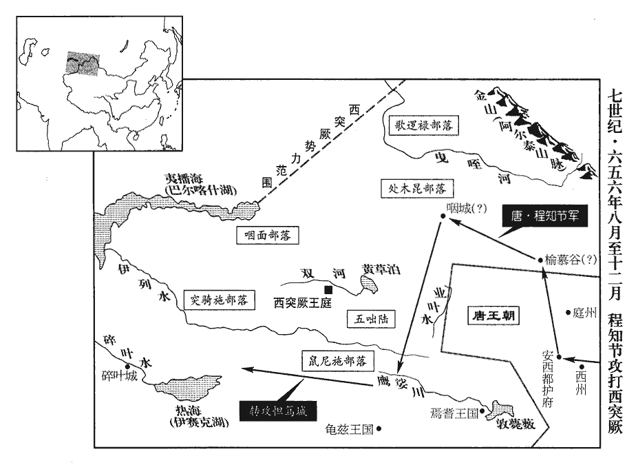
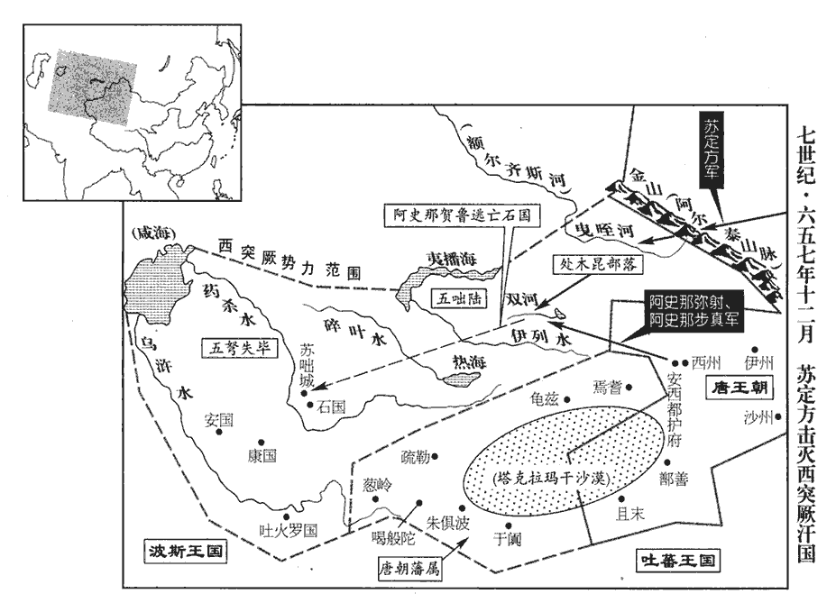
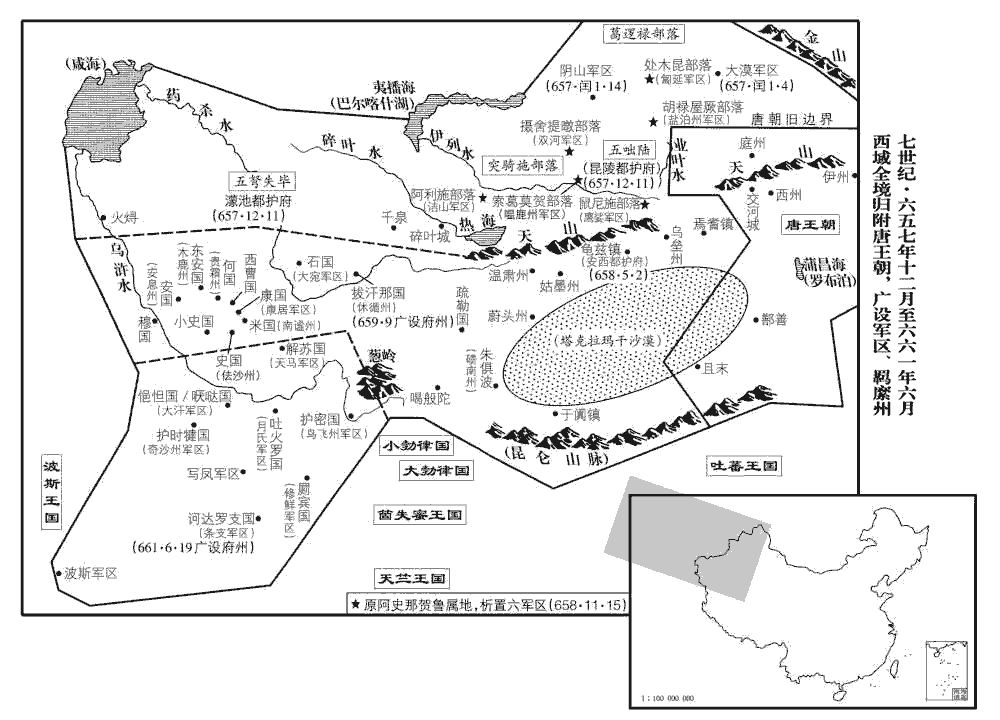
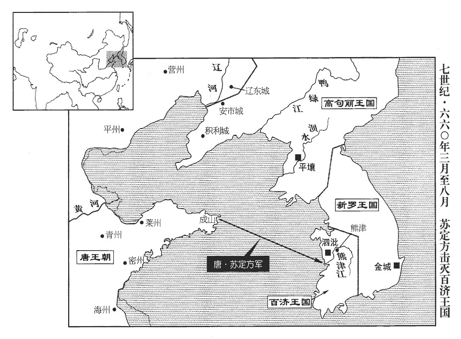
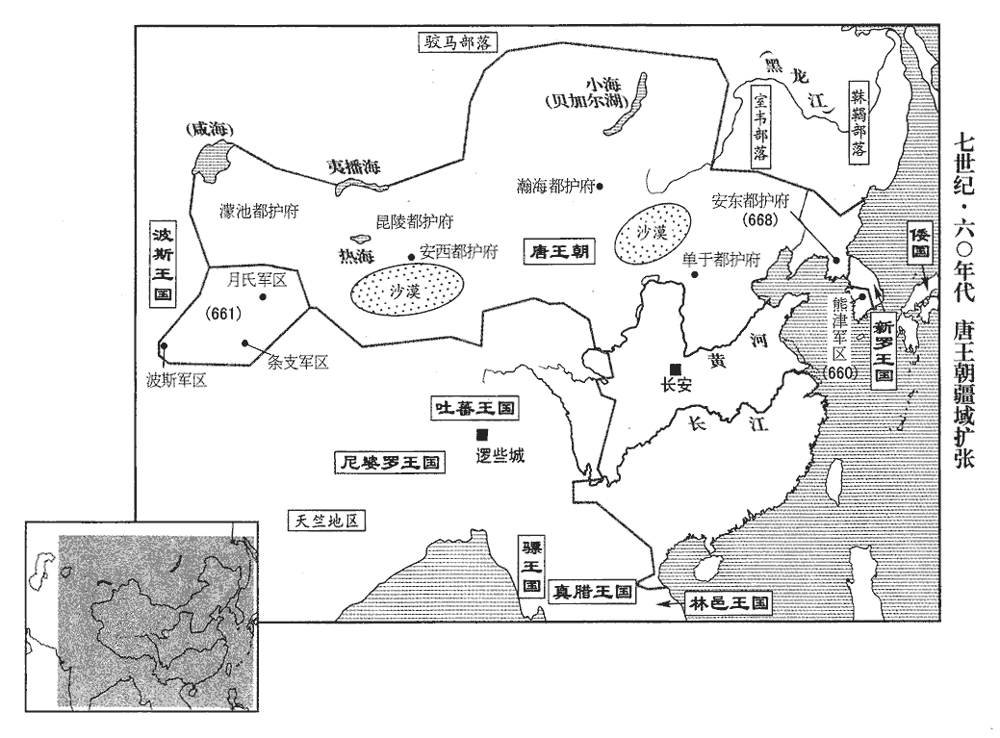
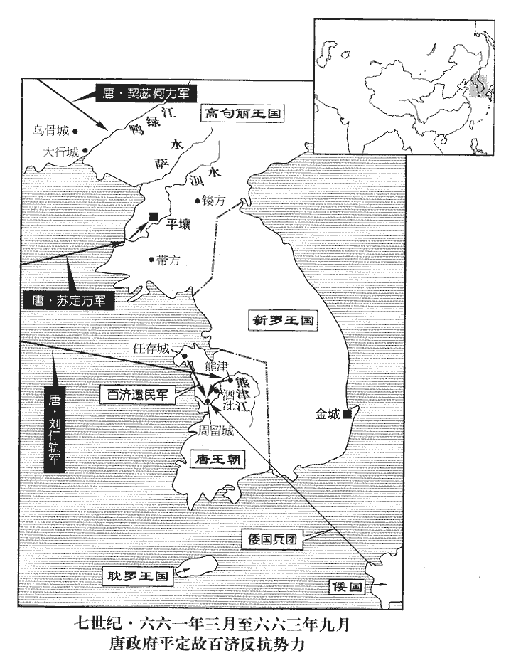
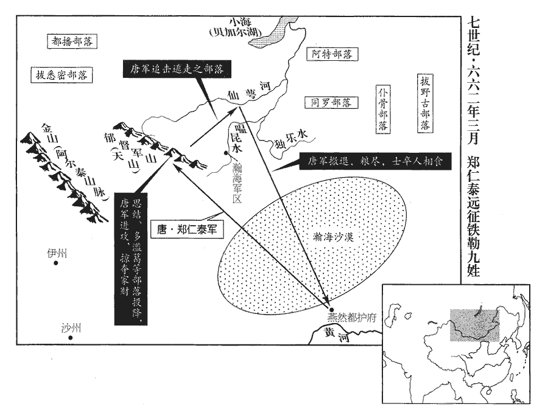

 唐紀十六起旃蒙單閼（乙卯）十月，盡玄黓yì閹茂（壬戌）七月，凡六年有奇。

# 高宗天皇大聖大弘孝皇帝上之下

## 永徽六年（乙卯、六五五）

1冬，十月，己酉‹十三›，下詔稱：「王皇后、蕭淑妃謀行鴆毒，廢為庶人，母及兄弟，並除名，流嶺南‹南岭以南›。」許敬宗奏：「故特進贈司空王仁祐告身尚存，使逆亂餘孽猶得為蔭，唐制：凡受官者皆給以符，謂之告身。司空，正一品。凡三品以上，蔭及曾孫。並請除削。」從之。

〖译文〗 [1]冬季，十月己酉（十三日），高宗下诏说：“王皇后、萧淑妃因阴谋用毒酒杀人，废黜为平民，她们的母亲兄弟一并削除官爵，流放岭南。”许敬宗上奏说：“已故特进赠司空王仁祜授官的凭信还保存着，这将使逆乱的馀孽还得以受荫任官，请一并削除他的官爵。”高宗采纳他的意见。

乙卯‹十九›，百官上表請立中宮，上，時掌翻；下同。乃下詔曰：「武氏門著勳庸，地華纓黻，往以才行選入後庭，行，下孟翻。譽重椒闈，德光蘭掖。朕昔在儲貳，特荷先慈，常得侍從，弗離朝夕，荷，下可翻。從，才用翻。離，力智翻。宮壼之內，恆自飭躬，恆，戶登翻。嬪嬙之間，未嘗迕目，嬙，慈良翻，婦官也。迕，五故翻。逆而視之，謂之迕目。聖情鑒悉，每垂賞歎，遂以武氏賜朕，事同政君，政君，事見二十七卷漢宣帝甘露三年。可立為皇后。」‹本年，李治二十八岁，武曌三十二岁›

〖译文〗 乙卯（十九日），百官上奏表请求立皇后，于是高宗下诏说：“武氏出身于有大功劳的家庭，累世都任官职，以前因才德出众选入后宫，声誉满后宫，品德光照宫闱。朕从前当太子时，她蒙受我已故母亲的特殊恩宠，时常侍从皇帝，日夜不离左右，在后宫中经常检点自己的行为，嫔妃之间未曾闹矛盾，皇帝看得很清楚，时常赞赏，于是将武氏赏赐给朕，就像汉宣帝将宫女王政君赏赐给了皇太子一样。武氏可以立为皇后。”

丁巳‹二十一›，赦天下。是日，皇后上表稱：「陛下前以妾為宸妃，韓瑗、來濟面折庭爭，事見上卷上年。瑗，于眷翻。折，之舌翻。爭，讀曰諍。此既事之極難，豈非深情為國，為，于偽翻。乞加褒賞。」上以表示瑗等，瑗等彌憂懼，屢請去位，上不許。

〖译文〗 丁巳（二十一日）．唐朝大赦天下，皇后上表说：“陛下从前打算封我为宸妃，韩瑗、来济在朝廷当面规劝。这样做是难能可贵的，难道不正说明他们一心一意为国家吗，请表彰赏赐他们。”高宗把她的奏表给韩瑗等阅看，韩瑷等更加害怕,一再请求辞职,高宗不允许。

十一月，丁卯朔‹一›，臨軒命司空李勣齎璽綬冊皇后武氏。璽，斯氏翻。綬，音受。是日，百官朝皇后於肅義門。

〖译文〗 十一月丁卯朔（初一），高宗让司空李世劫携带印玺在殿前册封武则天为皇后。当天．百官朝拜皇后于肃义门。

故后王氏，故淑妃蕭氏，並囚於別院，上嘗念之，間行至其所，間，古莧翻。見其室封閉極密，惟竅壁以通食器，惻然傷之，呼曰：「皇后、淑妃安在？」王氏泣對曰：「妾等得罪為宮婢，何得更有尊稱！」稱，尺證翻。又曰：「至尊若念疇昔，使妾等再見日月，乞名此院為回心院。」上曰：「朕即有處置。」處，昌呂翻。武后聞之，大怒，遣人杖王氏及蕭氏各一百，斷去手足，捉【章：十二行本「捉」作「投」；乙十一行本同；孔本同；張校同。】酒甕中，曰：「令二嫗骨醉！」斷，丁管翻。去，羌呂翻。嫗，威遇翻。數日而死，又斬之。王氏初聞宣敕，再拜曰：「願大家萬歲！昭儀承恩，死自吾分。」淑妃罵曰：「阿武妖猾，乃至於此！願他生我為貓，阿武為鼠，生生扼其喉。」由是宮中不畜貓。分，扶問翻，妖，於喬翻。畜，吁玉翻。尋又改王氏姓為蟒氏，蟒，莫朗翻。蛇最大者曰蟒。蕭氏為梟氏。梟，古堯翻。武后數見王、蕭為祟，被髮瀝血如死時狀。後徙居蓬萊宮，復見之，數，所角翻。祟，雖遂翻。復，扶又翻。大明宮接西內，宮城之東北曰東內，本永安宮，貞觀八年置，九月，更名大明宮，以備太上皇清暑。後高宗以風痹，厭西內湫濕，龍朔三年始大興葺，曰蓬萊宮。故多在洛陽，終身不歸長安。

〖译文〗 原皇后王氏，原淑妃萧氏，一同被囚禁在后宫别院，高宗曾思念她们，私下去囚禁她们的地方，看见囚室封闭得极为严密，只在墙壁上凿开小洞以便送食物的器具能进出，高宗为她们感到悲伤，喊道：“皇后、淑妃在哪里？”王氏哭泣回答说：“我等犯罪已成宫中奴婢，哪里还得再有后、妃等尊贵的称号！”又说：“至尊如果思念从前的情分，让我等再见天日，请命名这个院子为回心院。”高宗说：“朕即有所安排。”武后听说后，大怒，派人将王氏和萧氏各杖打一百下，砍去手足，投入酒瓮中，说：“让这两个女人连骨头都喝醉！”数日后她们死去，又被砍下脑袋。当皇后王氏听到宣布处置她们的命令时，拜了两拜说：“祝愿皇帝万岁！武昭仪承受皇恩，死自然是我的本分。”淑妃萧氏大骂道：“阿武邪恶狡诈，竟然到了这种地步！愿来生我变为猫，她变为鼠，我活生生地扼住她的咽喉。”从此宫中不养猫。不久又改王氏姓蟒氏，萧氏姓枭氏。武后多次看见王氏和萧氏的鬼魂作祟，披散着头发，浑身滴血，如同死时的模样。她后来移居蓬莱宫，还是看见同样情形，所以她多居住在洛阳，终身不回长安。

己巳‹三›，許敬宗奏曰：「永徽爰始，國本未生，權引彗星，越升明兩。易離卦大象曰：明兩作離，大人以繼明照四方。彗，祥歲翻。近者元妃載誕，正胤降神，言代王弘，武后之子，當立。重光日融，爝暉宜息。崔豹古今註曰：漢文帝為太子，樂人歌四章以贊太子之德：一曰日重光，二曰月重輪，三曰星重暉，四曰海重潤。莊子曰：日月出矣而爝火不息，其於光也不亦難乎！重，直龍翻。爝，即略翻。安可反植枝幹，久易位於天庭；倒襲裳衣，使違方於震位！震，長子也，以守社稷宗廟，為祭主也。又，父子之際，人所難言，漢武帝語田千秋之辭。事或犯鱗，必嬰嚴憲，驪龍頷下有逆鱗徑尺，嬰之則死；諭人主之威不可犯也。煎膏染鼎，臣亦甘心。」上召見，問之，對曰：「皇太子，國之本也，本猶未正，萬國無所係心。且在東宮者‹李忠›，所出本微，今知國家已有正嫡，必不自安。竊位而懷自疑，恐非宗廟之福，願陛下熟計之。」上曰：「忠已自讓。」對曰：「能為太伯，願速從之。」

〖译文〗 己巳（初三），许敬宗上奏说：“永徽初年，国本还没有形成，暂时利用彗星，越位升至日月的位置，近来皇后生育了皇子，嫡嗣像神一样的降临了，阳光照耀，小火把应该熄灭。怎么可以违反枝和干的关系，长期在朝廷中变易位置，颠倒穿着上下衣，使他居于嫡长子的地位！还有，父子之间的事情，别人难以说渍楚，这些话或许会触犯皇帝，必将受到严惩，但就是把我煎熬成油膏来涂染鼎器，我也甘心。”高宗召见他，询问他的意见，他回答说：“皇太子，是国家的根本，根本还不正，无法维系天下人心。况且现在的太子，是微贱之人所生，现在知道国家已有真正的嫡长子，心里一定不安。窃居太子的地位而自己心里疑惑，恐怕不是宗庙之福，愿陛下深入考虑。”高宗说：“太子李忠已经自己愿意让位。”许敬宗说：“他能做周代先人自愿让位的太伯，希望赶快答应他。”

2西突厥頡苾達度設數遣使請兵討沙鉢羅可汗。厥，九勿翻。數，所角翻。使，疏吏翻。可，從刊入聲。汗，音寒。甲戌‹八›，遣豐州‹总部设内蒙古五原县›都督元禮臣冊拜頡苾達度設為可汗，禮臣至碎葉城‹吉尔吉斯斯坦托克马克城›，自弓月城過思渾川，渡伊麗河至碎葉界，又西行千里至碎葉城，屬焉耆都督府界。沙鉢羅發兵拒之，不得前。頡苾達度設部落多為沙鉢羅所併，餘眾寡弱，不為諸姓所附，禮臣竟不冊拜而歸。

〖译文〗 [2]西突厥颉菇速度设多次派遣使者请唐朝发兵讨伐沙钵罗可汗。甲戌（初八），唐朝派遣丰州都督元礼臣册立颉菇达度设为可汗。元礼臣到达碎叶城，沙钵罗发兵抗拒，元礼臣不能前进。颉菇达度设部落多数被沙钵罗所兼并，所馀部众既少又弱，西突厥诸姓不归附他，元礼臣终于未能授给他可汗称号而返回。

3中書侍郎李義府參知政事。義府容貌溫恭，與人語，必嬉怡微笑，而狡險忌克，故時人謂義府笑中有刀；又以其柔而害物，謂之李貓。

〖译文〗 [3]唐朝任命中书郎李义府参知政事。李义府外貌温和谦恭，和别人说话，必定显露出愉快的微笑，而内心却狡诈阴险和忌妒，所以当时人说李义府笑里藏刀；又因他阴柔害人，称他为李猫。

## 顯慶元年（丙辰、六五六）

1春，正月，辛未‹六›，‹李治，本年二十九岁›以皇太子忠為梁王、梁州刺史；立皇后子代王弘為皇太子，生四年矣。忠既廢，官屬皆懼罪亡匿，無敢見者；右庶子李安仁獨候忠，泣涕拜辭而去。安仁，綱之孫也。李綱著節於隋、唐之間。

〖译文〗 [1]春季，正月辛未（初六），唐朝封皇太子李忠为梁王、梁州刺史；立皇后的儿子代王李弘为皇太子，当时已经四岁。李忠已被废黜，原来的属官都害怕得罪而逃亡或躲藏，不敢同他见面，只有右庶子李安仁等候他，哭泣着向他跪拜告辞。李安仁是李纲的孙子。

2壬申‹七›，赦天下，改元。

〖译文〗 [2]壬申（初七），唐朝大赦天下罪人，更改年号。

3二月，辛亥‹十七›，贈武士彠司徒，賜爵周國公。彠，一虢翻。

〖译文〗 [3]二月辛亥（十七日），唐朝追赠武士彟为司徒、赐给周国公的爵位。

4三月，以度支侍郎杜正倫為黃門侍郎、同三品。顯慶元年，改戶部為度支。度，徒洛翻。

〖译文〗 [4]三月，唐朝任命度支侍郎杜正伦为黄门侍郎、同三品。

5夏，四月，壬子‹十八›，矩州‹贵州省贵阳市›人謝無靈舉兵反，矩州諸蠻亦東謝蠻之種落。武德四年置矩州。黔州‹总部设重庆市彭水县›都督李子和討平之。黔，音琴。

〖译文〗 [5]夏季，四月壬子（十八日），矩州人谢无灵起兵造反，黔州都督李子和讨伐并平定了他们。

6己未‹二十五›，上謂侍臣曰：「朕思養人之道，未得其要，公等為朕陳之！」為，于偽翻。來濟對曰：「昔齊桓公‹姜小白›出游，見老而飢寒者，命賜之食，老人曰：『願賜一國之飢者。』賜之衣，曰：『願賜一國之寒者。』公曰：『寡人之廩府安足以周一國之飢寒！』老人曰：『君不奪農時，則國人皆有餘食矣！不奪蠶要，則國人皆有餘衣矣！』故人君之養人，在省其征役而已。今山東役丁，歲別數萬，役之則人大勞，取庸則人大費。臣願陛下量公家所須外，餘悉免之。」量，音良。上從之。

〖译文〗 [6]己未（二十五日），唐高宗对身边的大臣们说：“朕思考养育百姓的道理，尚未得到它的要领，诸位为朕陈述！”来济回答说：“从前齐桓公出游，遇见一位受饥寒的老人。齐桓公命令赐给他食物，老人说：‘希望赐给全国受饿的人食物。’赐给他衣服，老人说：‘希望赐给全国受寒的人衣服。’齐桓公说：‘寡人的粮仓和府库怎么能够周济得了全国受饥寒的人？’老人说：‘国君不使种田人错过耕种季节，则全国百姓的粮食都有富馀了；不使养蚕人错过养蚕的季节，则全国百姓的衣服都有富馀了！’所以君主养育百姓的要领，就在于减省他们的赋税徭役而已。现在山东征男丁服役，每年数万人，让百姓服役则太苦，让百姓交纳雇人代役的钱又太重。我希望陛下计算除国家所必需的外，其馀的赋税徭役一律免除。”高宗听从了他的意见。

7六月，辛亥‹十八›，禮官奏停太祖、世祖配祀，高祖受禪，追尊祖虎曰景皇帝，廟號太祖；考昺曰元皇帝，廟號世祖。以高祖‹李渊›配昊天於圜丘，太宗‹李世民›配五帝於明堂；武德初，立圜丘壇於明德門外道東二里，壇制四成，各廣八尺一寸，下成廣二十丈，再成廣十五丈，三成廣十丈，四成廣五丈。每祀，則昊天上帝及配帝設位于平座，藉用藁秸，器用陶匏páo，五方上帝、日月、內官、中官、外官及眾星，並皆從祀。其五方帝及日月七座，在壇之第二等內；五星已下官五十五座，在壇之第三等；二十八宿已下官一百三十五座，在壇之第四等；外官一百二十二座，在壇下外壝wéi之內；眾星三百六十座，在外壝之外。以景帝配圜丘，元帝配明堂。從之。

〖译文〗 [7]六月辛亥（十八日），唐朝掌管礼仪的官员上奏，请停止太祖、世祖配祭，以高祖配祭昊天上帝于圜丘，太宗配祭五帝于明堂。高宗听从了这个意见。

8秋，七月，乙丑‹三›，西洱‹云南省洱海›蠻酋長楊棟附、顯和蠻酋長王郎【章：十二行本「郎」作「羅」；乙十一行本同。】祁、郎‹云南省曲靖市› •昆‹云南省昆明市›•棃lí‹云南省华宁县›•盤‹贵州省兴义市›四州酋長王伽衝等帥眾內附。棃州本西寧州，武德七年，分南寧州二縣置，貞觀八年，更名黎州。其地北接昆州，晉梁水郡地也。盤州本西平州，武德四年置，貞觀八年，更名，晉興古郡地也。洱，乃吏翻。酋，慈由翻。帥，讀曰率。

〖译文〗 [8]秋季，七月乙丑（初三），西洱蛮酋长杨栋附、显和蛮首长王郎祁和郎、昆、黎、盘四州酋长王伽冲等率领部众归附唐朝。

9癸未‹二十一›，以中書令崔敦禮為太子少師、同中書門下三品。

〖译文〗 [9]癸未（二十一日）．唐朝任命中书令崔敦礼为太子少师、同中书门下三品。

八月，丙申‹四›，固安昭公崔敦禮薨‹年六十一岁›。諡法：容儀恭美曰昭；昭德有勞曰昭。

〖译文〗 八月丙申（初四），固安昭公崔敦礼去世。

10辛丑‹九›，蔥山道行軍總管程知節擊西突厥，與歌邏‹中亚额尔齐斯河流域›、【章：十二行本「邏」下有「祿」字；乙十一行本同；孔本同；退齋校同。】處月‹新疆新源县境›二部戰於榆慕谷‹新疆吉木萨尔县北›，處月、處密、姑蘇、歌邏祿、弩失畢五姓之眾，賀魯為葉護時所統也。據新書，歌邏祿即葛邏祿也。「榆慕谷」，舊書本紀作「榆幕谷」。大破之，斬首千餘級，副總管周智度攻突騎施‹伊犁河中下游›、處木昆‹新疆额敏县境›等部於咽城‹额敏县›，拔之，西突厥咄陸五啜，處木昆、突騎施皆一啜也。據新書，咽城即處木昆所居。處，昌呂翻。斬首三萬級。

〖译文〗 [10]辛丑（初九），葱山道行军总管程知节进攻西突厥，与歌逻、处月二部在榆慕谷交战，大败西突厥，斩首千馀级。副总管周智度进攻突骑施、处木昆等部于咽城，攻下该城，斩首三万级。

11乙巳‹十三›，龜茲‹新疆库车县›王布失畢入朝。龜茲，音丘慈。朝，直遙翻。

〖译文〗 [11]乙巳（十三日），龟兹王布失毕入京朝见。

 

12李義府恃寵用事。洛州‹河南省洛阳市›婦人淳于氏，美色，繫大理獄，義府屬大理寺丞畢正義枉法出之，屬，之欲翻。將納為妾，大理卿段寶玄疑而奏之。上命給事中劉仁軌等鞫jū之，義府恐事洩，逼正義自縊於獄中。縊，於計翻。上知之，原義府罪不問。

〖译文〗 [12]李义府依仗皇帝的宠信当权。洛州妇女淳于氏，长得漂亮，囚禁在大理寺监狱，李义府嘱咐大理寺丞毕正义违法将她释放，准备纳她为妾，大理卿段宝玄对释放淳于氏有所怀疑而将情况上奏。唐高宗命令给事中刘仁轨等审问毕正义。李义府害怕事实真相泄露，逼迫毕正义在狱中上吊自杀。高宗知道这些情况，但原谅李义府的罪恶，不予追究。

侍御史漣水‹江苏省涟水县›王義方欲奏彈之，漣水，舊曰襄賁，置東海郡。東魏改曰海安郡。隋開皇初，廢郡，改襄賁曰漣水，屬海州，唐屬泗水。漣，音連。先白其母曰：「義方為御史，視姦臣不糾則不忠，糾之則身危而憂及於親為不孝，二者不能自決，柰何？」母曰：「昔王陵之母，殺身以成子之名。事見九卷漢高帝元年。汝能盡忠以事君，吾死不恨！」義方乃奏：「義府於輦轂之下，擅殺六品寺丞；唐六典：大理寺丞，從六品上。就云正義自殺，亦由畏義府威，殺身以滅口。如此，則生殺之威，不由上出，漸不可長，請更加勘當！」長，知兩翻。當，丁浪翻。於是對仗，叱義府令下；義府顧望不退。義方三叱，上既無言，義府始趨出，義方乃讀彈文。上釋義府不問，而謂義方毀辱大臣，言辭不遜，貶萊州‹山东省莱州市›司戶。

〖译文〗 侍御史涟水人王义方准备上奏检举李义府，事先告诉母亲说：“我任御史，看见奸臣不检举就是不忠，检举则自身危险，而让亲人担忧就是不孝，两者之间自己拿不定主意，怎么办？”母亲说：“从前王陵的母亲，杀身以成全儿子的美名。你能尽忠以侍奉君主，我虽死无怨恨！”王义方于是上奏：“李又府在京城擅自杀害六品官大理寺丞毕正义，即使说毕正义是自杀，也由于畏惧李义府的威势，自杀以灭口。这样，则生杀的威权不是出自皇帝，这种情况不应继续发展，请重新加以审核！”于是为宣读检举的奏章，让仪仗和其他官员退下，并呼喊李义府退下，李义府观望不退。王义方三次呼喊，高宗没有说话，李义府才退出，王义方便宣读检举的奏章。高宗放下李义府的罪恶不予追究，反而说王义方诋毁污辱大臣，言词不谦逊，将他降职为莱州司户。

13九月，【章：十二行本「月」下有「庚辰‹十九›」二字；乙十一行本同。】括州‹浙江省丽水市›暴風，海溢，溺四千餘家。新志：處州本括州永嘉郡，時兼有永嘉之地，上元元年，始析置溫州。

〖译文〗 [13]九月，括州刮起大暴风，海水外溢，淹没四千馀家。

14冬，十一月，丙寅‹六›，生羌酋長浪我利波等帥眾內附，以其地置柘zhè‹四川省黑水县西南›、栱gǒng‹四川省阿坝县东南›二州。柘州，蓬山郡。栱州，以鉢南伏浪恐部置，皆屬松州都督府。宋白曰：柘州以開拓為稱，音達各翻。

〖译文〗 [14]冬季，十一月丙寅（初六），生羌酋长浪我利波等率领部众归附唐朝。唐朝在他们居住的地区设置柘州、拱州。

15十二月，程知節引軍至鷹娑川‹开都河上游，发源于新疆新源县南›，遇西突厥二萬騎，別部鼠尼施‹新疆新源县境›等二萬餘騎繼至，鼠尼施，咄陸五啜之一也，居鷹娑川，後置鷹娑都督府。娑，素何翻。前軍總管蘇定方帥五百騎馳往擊之，西突厥大敗，追奔二十里，殺獲千五百餘人，獲馬及器械，綿亘山野，不可勝計。勝，音升。副大總管王文度害其功，言於知節曰：「今茲雖云破賊，官軍亦有死傷，乘危輕脫，乃成敗之法耳，何急而為此！自今常結方陳，置輜重在內，陳，讀曰陣。重，直用翻。遇賊則戰，此萬全策也。」又矯稱別得旨，以知節恃勇輕敵，委文度為之節制，遂收軍不許深入。士卒終日跨馬，被甲結陳，不勝疲頓，被，皮義翻；下同。陳，讀曰陣。勝，音升。馬多瘦死。定方言於知節曰：「出師欲以討賊，今乃自守，坐自困敝，若遇賊必敗；懦怯如此，何以立功！且主上以公為大將，將，即亮翻。豈可更遣軍副專其號令，事必不然。請囚文度，飛表以聞。」知節不從。

〖译文〗 [15]十二月，程知节率军来到鹰娑川，遇上西突厥两万骑兵，西突厥别部鼠尼施等两万多骑兵也相继到达。唐军前军总管苏定方率领五百骑兵飞速前往攻击，西突厥大败，追赶二十里，杀死和俘获一千五百馀人，缴获的马匹和器械满山遍野，多得数不清。副大总管王文度忌妒苏定方的功劳，对程知节说：“现在虽说打败敌人，但官军也有死伤，处于危险的环境中而不稳重，这是将要造成失败的做法，何必急着做这样的事！从今以后应经常摆成方阵，辎重放在方阵内，遏上敌人即开战，这是万无一失的计策。”他又假称另外得到高宗的命令．说因程知节依仗勇力而轻敌，委派王文度调度约束，于是他收拢军队不许深入敌区。士卒整天骑着马，披着甲，结成方阵，疲劳难忍，马匹多瘦死。苏定方对程知节说：“出兵是为了讨伐敌人，现在是自我防守，坐等自己疲惫，如果遇到敌人一定失败；软弱胆小到如此地步，如何能立功！而且主上既任命您为大将，哪里可能另外又派遣副大总管专掌号令，事情一定不是这样。请将王文度囚禁起来，迅速上奏报告。”程知节没有同意。

至恆篤城，新書作「怛dá篤城」。有群胡歸附，文度曰：「此屬伺我旋師，還復為賊，伺，相吏翻。復，扶又翻。不如盡殺之，取其資財。」定方曰：「如此乃自為賊耳，何名伐叛！」文度竟殺之，分其財，獨定方不受。師旋，文度坐矯詔當死，特除名；知節亦坐逗遛追賊不及，減死免官。

〖译文〗 唐军进至恒笃城，有许多胡人归附，王文度说：“这些人等到我们回师以后，还会再成为贱人，不如全部杀掉，收取他们的物资财富。”苏定方说：“这祥做便是自己作贼人了，还怎么能称为讨伐叛逆！”王文度终于杀摔他们，瓜分了他们的财产，只有苏定方不肯收受。回师后，王文度因假传皇帝命令应当处死，但只处以削除官爵；程知节也因停留不进，没有追上敌人，减死罪为撤职。

16是歲，以太常卿駙馬都尉高履行為益州‹四川省成都市›長史。高履行尚太宗女東陽公主。

〖译文〗 [16]本年，唐朝任命太常卿驸马都尉高履行为益州长史。

17韓瑗上疏，為褚遂良訟冤曰：上，時掌翻。為，于偽翻。「遂良體國忘家，捐身徇物，風霜其操，鐵石其心，社稷之舊臣，陛下之賢佐。無聞罪狀，斥去朝廷，內外甿黎，咸嗟舉措。論語：孔子曰：「舉直錯諸枉則民服，舉枉錯諸直則民不服。」臣聞晉武‹司马炎›弘裕，不貽劉毅之誅；事見八十一卷太康三年。漢祖‹刘邦›深仁，無恚周昌之直。註已見前。恚，於避翻。而遂良被遷，已經寒暑，違忤陛下，其罰塞焉。忤，五故翻。塞，悉則翻。伏願緬鑒無辜，緬，遠也。稍寬非罪，俯矜微款，以順人情。」上謂瑗曰：「遂良之情，朕亦知之。然其悖戾好犯上，悖，蒲內翻，又蒲沒翻。好，呼到翻。故以此責之，卿何言之深也！」對曰：「遂良社稷忠臣，為讒諛所毀。昔微子‹子胥馀›去而殷國以亡，殷紂暴虐日甚，微子抱樂器以奔周。武王乃告諸侯曰：「殷有重罪，不可不伐。」遂伐紂，滅之。張華存而綱紀不亂。事見八十二卷至八十三卷。陛下無故棄逐舊臣，恐非國家之福！」上不納。瑗以言不用，乞歸田里；上不許。

〖译文〗 [17]韩瑗上疏，为褚遂良申诉冤屈说：“褚遂良为国家着想而忘记自己的家庭，生命财产都愿意奉献，品行高洁，意志坚定，是国家的旧臣，是陛下有道德有才能的助手。没有听说他犯罪，就被斥退离开朝廷，朝廷内外和黎民百姓都为这种处置叹息。我听说晋武帝宽宏大量，不判处刘毅死罪；汉高祖仁德深厚，不怨恨周昌的耿直。而褚遂良被降职已经一年，违抗陛下的罪责，对他的处罚已经抵偿。希望陛下顾念他无辜，稍微宽恕无罪，同情他的忠诚，以顺应人心。”高宗对韩瑗说：“褚遂良的情况，朕也知道。但他粗暴犯上，所以用这种办法责备他，你为什么说得那么严重！”回答说：“褚遂良是国家的忠臣，被用恶言伤人以讨好上边的人诽谤。从前微子离去而商朝因而灭亡，张华留任而国家的法度不乱。陛下无故抛弃驱逐旧臣，恐怕不是国家之福。”高宗没有采纳他的意见。韩瑗因自己的话没有被采用，请求辞官回乡，高宗不允许。

18劉洎之子訟其父冤，稱貞觀之末，為褚遂良所譖而死，事見一百九十八卷貞觀十九年。洎，其冀翻。李義府復助之。復，扶又翻。上以問近臣，眾希義府之旨，皆言其枉。給事中長安‹首都长安西半城›樂彥瑋獨曰：「劉洎大臣，人主暫有不豫，豈得遽自比伊、霍！今雪洎之罪，謂先帝用刑不當乎？」當，丁浪翻。上然其言，遂寢其事。

〖译文〗 [18]刘洎的儿子为父亲申诉冤屈，说他父亲在贞观末年被褚遂良诬陷而死，李义府也支持他。高宗询问身边的大臣，大家顺从李义府的意旨，都说刘洎冤枉。只有给事中长安人乐彦玮说：“刘洎作为大臣，当皇帝刚得病时，哪能就急忙自比为伊尹、霍光！现在昭雪刘洎的罪恶，不是说先帝用刑不当吗？”高宗同意他的说法，于是将这件事情搁置不办。

## 二年（丁巳、六五七）

1春，正月，癸巳‹十四›，分哥邏祿部‹中亚额尔齐斯河流域›置陰山‹总部设中亚阿拉湖北›、大漠‹总部设新疆福海县›二都督府。以謀落部置陰山府，以熾侯部置大漠府，俱屬北庭都護府。邏，郎佐翻。

〖译文〗 [1]春季，正月癸巳，唐朝分哥逻禄部，设置阴山、大漠两个都督府。

2閏月，壬寅‹十三›，上‹李治，本年三十岁›行幸洛陽。

〖译文〗 [2]闰正月壬寅（十三日），高宗巡视洛阳。

3庚戌‹二十一›，以左屯衛將軍蘇定方為伊麗道行軍總管，伊麗河，一名帝帝河。帥燕然都護‹都护府设内蒙古乌拉特中旗›渭南‹陕西省渭南市›任雅相、燕然都護府在黃河北，北至陰山七十里，至回紇界七百里，去京師二千七百里；龍朔三年改曰瀚海都督府，總章二年，改為安北大都護府。杜佑曰：後為中受降城，南去朔方千三百餘里。後魏於渭南置渭南郡，隋廢為縣，屬京兆。帥，讀曰率。燕，因肩翻。任，音壬。相，息亮翻。副都護蕭嗣業發回紇‹蒙古国北部›等兵，自北道討西突厥沙鉢羅可汗。嗣業，鉅之子也。蕭鉅見一百八十一卷隋煬帝大業六年。

〖译文〗 [3]庚戌（二十一日），唐朝任命左屯卫将军苏定方为伊丽道行军总管，率领燕然都护渭南人任雅相、副都护萧嗣业，征发回纥等处兵士，从北道讨伐西突厥沙钵罗可汗。萧嗣业，是萧钜的儿子。

初，右衛大將軍阿史那彌射及族兄左屯衛大將軍步真，皆西突厥酋長，酋，慈由翻。長，知兩翻。太宗之世，帥眾來降；彌射，室點密可汗五世孫，世為莫賀咄葉護，貞觀中，遣使立為可汗。族兄步真謀殺彌射而自立，彌射不能國，即入朝，步真遂自立為咄陸葉護，眾不厭，去之，因亦與族人入朝。帥，讀曰率。降，戶江翻。至是，詔以彌射、步真為流沙‹新疆塔克拉玛干沙漠四周›安撫大使，考異曰：舊西突厥咄陸傳：「咄陸可汗泥熟，父莫賀設，貞觀七年，遣鴻臚少卿劉善因冊為吞阿妻狀奚利苾咄陸可汗。明年，泥熟卒，弟同娥設立，為咥利失可汗。」彌射傳云：「彌射者，室點密可汗五代孫也，世統十姓部落，在本蕃為莫賀咄葉護，貞觀六年，詔遣鴻臚少卿劉善因就蕃立為奚利邲咄陸可汗。其族兄步真欲自立，謀殺彌射，彌射既與步真有隙，以貞觀十三年，率所部處月，處密部落入朝。其後步真遂自立為咄陸葉護，部落不服，步真復攜家屬入朝。彌射後從太宗征高麗有功，封平襄縣伯，顯慶二年，轉右武衛大將軍。」新傳略同。今欲以咄陸、彌射為二人，則事多相類；以為一人，則事又相違，疑不能明，故但云西突厥酋長。余按彌射為咄陸可汗，唐所冊也；步真為咄陸葉護，自稱也。咄陸之號雖同，而可汗、葉護，位之尊卑有異，不必泥咄陸之號而傳疑，而彌射、步真實二人也。余前註所引者新傳也，其辭略，考異所引者舊傳也，其辭詳，大略同也。又參考新、舊書，劉善因冊可汗事，與通鑑有六年、七年之差，而新、舊書可汗號有「婁拔」、「妻狀」之差，舊書又多一「奚」字，而貞觀中立彌射為奚利邲咄陸可汗，則新、舊書同。詳而考之，劉善因冊泥孰為奚利邲咄陸可汗，明年而泥孰死，弟同娥設立，為沙鉢羅咥利失可汗，又三年而咥利失不為眾所歸，西部又立欲谷設為乙毗咄陸可汗。二可汗兵爭，咥利失、乙毗相繼走死他國，而射匱實承之。太宗崩，賀魯反，而射匱為賀魯所併。西突厥世次，曉然可考。而新、舊書於彌射傳皆云：貞觀中，遣劉善因立彌射為奚利邲咄陸可汗。以泥孰傳觀之，則善因所立者，泥孰也。以彌射傳觀之，則善因所立者，彌射也。考異所疑，當以此耳。自南道招集舊眾。

〖译文〗 当初，右卫大将军阿史那弥射和族兄左屯卫大将军阿史那步真，都是西突厥酋长，唐太宗在世时，他们率领部众前来投降；到这时候．高宗任命阿史那弥射、阿史那步真为流沙安抚大使，从南道招集他们原来的部众。

4二月，辛酉‹三›，車駕至洛陽宮。

〖译文〗 [4]二月辛酉（初三），高宗的车驾到达洛阳宫。

5庚午‹十二›，立皇子顯為周王。壬申‹十四›，徙雍王素節為郇王。雍，於用翻。郇，音荀。

〖译文〗 [5]庚午（十二日），唐朝封皇子李显为周王。壬申（十四日），改封雍王李素节为郇王。

6三月，甲辰‹十六›，以潭州‹总部设湖南省长沙市›都督褚遂良為桂州‹总部设广西桂林市›都督。桂州至京師，水陸路四千七百六十里。

〖译文〗 [6]三月甲辰（十六日）．唐朝任命潭州都督褚遂良为桂州都督。

7癸丑‹二十五›，以李義府兼中書令。

〖译文〗 [7]癸丑（二十五日），唐朝任命李义府兼中书令。

8夏，五月，丙申‹九›，上幸明德宮避暑。上自即位，每日視事；庚子‹十三›，宰相奏天下無虞，請隔日視事；許之。

〖译文〗 [8]夏季，五月丙申（初九），高宗前往明德宫避暑。高宗自即位以来，每日治理政事；庚子（十三日），宰相上奏说现在天下没有忧患，请他隔日治理政事。高宗同意。

9秋，七月，丁亥朔‹一›，上還洛陽宮。

〖译文〗 [9]秋季，七月丁亥朔（初一），高宗返回洛阳宫。

10王玄策之破天竺‹印度恒河中游›也，見上卷貞觀二十二年。得方士那羅邇娑婆寐以歸，娑，素何翻。自言有長生之術，太宗‹李世民›頗信之，深加禮敬，使合長生藥。太宗令娑婆寐於金飆門合延年藥。合，音閤。發使四方求奇藥異石，又發使詣婆羅門諸國采藥。使，疏吏翻。其言率皆迂誕無實，苟欲以延歲月，藥竟不就，乃放還。上即位，復詣長安，復，扶又翻。又遣歸。玄策時為道王友，道王元慶，高祖之子。唐諸王府置友一人，從五品下，掌陪侍規諷。辛亥‹二十五›，奏言：「此婆羅門實能合長年藥，自詭必成，今遣歸，可惜失之。」玄策退，上謂侍臣曰：「自古安有神仙！秦始皇、漢武帝求之，疲弊生民，卒無所成，卒，子恤翻。果有不死之人，今皆安在！」李勣對曰：「誠如聖言。此婆羅門今茲再來，容髮衰白，已改於前，何能長生！陛下遣之，內外皆喜。」娑婆寐竟死於長安。

〖译文〗 [10]王玄策打败天竺时，俘虏方士那罗迩婆婆寐回来，娑婆寐自称有长生不老的法术，唐太宗很是相信，对他很客气，也很敬重，让他配制长生不老药，派出使者到各处寻求奇药异石，又派出使者到婆罗门等国采药。这个方士的话大都荒诞不符合实际，想姑且拖延时间，长生药最终没有配制成，于是放他返回天竺。高宗即位，他又来到长安，又遣送他回去。王玄策当时任道王李元庆的友官，辛亥（二十五日），上奏说：“这婆罗门确实能配制长生药，他自己表示一定能配成，现在遣送回去，可惜失去了机会。”王玄策退出后，高宗对身边的大臣说：“自古以来哪里有神仙！秦始皇、汉武帝求神仙，使百姓疲惫破败，结果并没有得到。真的有不死的人，现在都在哪里！”李世劫对高宗说：“确实像陛下所说，这婆罗门这次再来，容貌衰老，头发已白，已不同于从前，哪里能长生！陛下遣送他，朝廷内外的人都高兴。”娑婆寐终于死在长安。

11許敬宗、李義府希皇后旨，誣奏侍中韓瑗、中書令來濟與褚遂良潛謀不軌，以桂州‹广西桂林市›用武之地，授遂良桂州都督，欲以為外援。八月，丁卯‹十一›，瑗坐貶振州‹海南省三亚市西崖城镇›刺史，濟貶台州‹浙江省临海市›刺史，終身不聽朝覲。台州，漢回浦縣地，光武改回浦為章安縣。吳孫亮分會稽東部都尉為臨海郡，治章安，江左皆因之。隋平陳，廢為臨海縣，屬永嘉郡。唐武德四年，分置台州。諸州刺史有朝集，故禁絕二人，不得至京師。振州至京師八千六百六里。台州在京師東南四千一百七十七里。朝，直遙翻。又貶褚遂良為愛州‹越南清化市›刺史，榮州‹四川省荣县›刺史柳奭為象州‹广西象州县›刺史。榮州至京師二千九百七十三里。象州至京師四千九百八十九里。考異曰：唐曆：「三月甲辰，貶遂良為桂州都督，奭愛州刺史。」據實錄，「奭坐韓瑗又貶象州。」新舊書、唐曆皆云愛州，誤也。今從實錄。

〖译文〗 [11]许敬宗、李义府迎合皇后的旨意，诬奏侍中韩瑗、中书令来济与褚遂良私下图谋不轨，因桂州是用武的地方，他们授任褚遂良为桂州都督，是想利用他为外援。八月丁卯（十一日），韩瑗因此被降职为振州刺史，来济被降职为台州剌史，终身不许朝见皇帝。又将褚遂良降职为爱州刺史，荣州刺史柳夷降职为象州刺史。

遂良至愛州，上表自陳：上，時掌翻。「往者濮王、承乾交爭之際，臣不顧死亡，歸心陛下。時岑文本、劉洎奏稱『承乾惡狀已彰，身在別所，其於東宮，不可少時虛曠，少，詩沼翻。請且遣濮王往居東宮。』臣又抗言固爭，皆陛下所見。卒與無忌等四人共定大策。事見一百九十七卷貞觀十七年。卒，子恤翻。及先朝大漸，獨臣與無忌同受遺詔。見上卷貞觀二十三年。朝，直遙翻。陛下在草土之辰，不勝哀慟，臣以社稷寬譬，陛下手抱臣頸。臣與無忌區處眾事，咸無廢闕，數日之間，內外寧謐。力小任重，動罹愆過，螻蟻餘齒，乞陛下哀憐。」表奏，不省。勝，音升。處，昌呂翻。省，悉景翻。

〖译文〗 褚遂良来到爱州，上奏自我陈述说：“以前濮王、承乾相互争斗的时候，我不顾死活，诚心归附陛下。当时岑文本、刘洎上奏说‘承乾的罪状已经显露，已被关在别所，东宫不可有哪怕是短时间的空缺，请先派遣濮王去东宫居住。’我又高声坚持抗争，这些都是陛下所看见的。最后我又与长孙无忌等四人共同决定立陛下为皇太子的重大决策。及至太宗病危，只有我与长孙无忌共同接受遗诏。陛下在守丧的时候，经受不住哀痛，我以国家为重宽慰劝解，陛下还用手抱住我的脖子。我与长孙无忌分别处理众多的事情，全都没有荒废缺失，数日之间，内外安宁。我能力小，责任重，常常出现差错，微贱的馀年，乞请陛下哀怜。”奏表上达后，唐高宗没有考虑处理。

12己巳‹十三›，禮官奏：「四郊迎氣，存太微五帝之祀；南郊明堂，廢緯書六天之義。其方丘祭地之外，別有神州，亦請合為一祀。」從之。歐陽修曰：禮曰，以禋yīn祀祀昊天上帝。此天也，鄭玄以為天皇大帝者，北辰耀魄寶也。又曰：兆五帝於四郊，此五行精氣之神也，玄以為青帝靈威仰，赤帝赤熛怒，黃帝含樞紐，白帝白招矩，黑帝叶光紀者，五天也。由是有六天之說。唐初貞觀禮，冬至祀昊天上帝於圜丘，正月辛日，祀感生帝靈威仰於南郊以祈穀，而孟夏雩yú於南郊，季春大享於明堂，皆祀五天帝。至高宗時，禮官以謂太史圜丘圖，昊天上帝在壇上，而耀魄寶在壇第一等，則昊天上帝非耀魄寶可知。許敬宗與禮官議曰：六天出於緯書，而南郊、圜丘一也，玄以為二物。郊及明堂，本以祭天，而玄皆以為祭太微五帝。傳曰：凡祀，啟蟄而郊，郊而後耕。故郊祀后稷以祈農事。而玄謂周祭感帝靈威仰，配以后稷，因而祈穀，皆繆說也。由是盡黜玄說。又武德中，冬至及孟夏雩祭皇地祇於方丘，神州地祇於北郊，今亦合為一祀。

〖译文〗 [12]已巳（十三日），唐朝掌管礼仪的官员上奏说：“四郊迎祭五行之气，保留太微五帝的祭祀；祭南郊、明堂，废除纬书六天的说法。方丘祭皇地祗之外，原来还祭神州地袄于北郊，现请合在一起祭祀。”高宗同意。

13辛未‹十五›，以禮部尚書許敬宗為侍中、兼度支尚書，杜正倫為兼中書令。

〖译文〗 [13]辛未（十五日），唐朝任命礼部尚书许敬宗为侍中，兼度支尚书杜正伦为兼中书令。

14冬，十月，戊戌‹十四›，上行幸許州‹河南省许昌市›。許州，漢潁川郡地，東魏立南鄭州，後周改許州，因古許國以名州也。至京師一千二百里，至東都四百里。乙巳‹二十一›，畋于滍水‹沙河›之南。壬子‹二十八›，至汜水曲‹汜水流经河南省新郑县弯曲处›。滍，直几翻。汜水曲在鄭州新鄭縣界。師古曰：汜，舊音凡，今俗讀為祀。十二月，乙卯朔‹一›，車駕還洛陽宮。

〖译文〗 [14]冬季，十月戊戌，唐高宗巡视许州。乙巳，打猎于泼水之南。壬子，来到汜水曲。十二月乙卯朔（初一），唐高宗返回洛阳宫。

 

15蘇定方擊西突厥沙鉢羅可汗，厥，九勿翻。可，從刊入聲。汗，音寒。至金山‹新疆阿尔泰山›北，先擊處木昆部‹新疆和布克赛尔县›，大破之，其俟斤嬾lǎn獨祿等帥萬餘帳來降，俟，渠之翻。帥，讀曰率；下同。降，戶江翻。定方撫之，發其千騎與俱。

〖译文〗 [15]苏定方进攻西突厥沙钵罗可汗，到达金山以北，先攻击处木昆部，把他们打得大败，他们的俟斤懒独禄等率领万馀帐前来投降。苏定方抚慰他们，征发他们一千名骑兵参加自己的部队。

右領軍郎將薛仁貴上言：「泥孰部素不伏賀魯，泥孰部，弩失畢五俟斤之一也。騎，奇寄翻；下同。將，即亮翻；下同。上，時掌翻。為賀魯所破，虜其妻子。今唐兵有破賀魯諸部得泥孰妻子者，宜歸之，仍加賜賚，使彼明知賀魯為賊而大唐為之父母，則人致其死，不遺力矣。」上從之。泥孰喜，請從軍共擊賀魯。

〖译文〗 右领军郎将薛仁贵上奏说：“泥孰部一贯不服阿史那贺鲁，阿史那贺鲁打败他们，俘虏了他们的妻子儿女。现在唐兵打败阿史那贺鲁各部，得到泥孰部的妻子儿女，应归还泥孰部，仍然给予赏赐，使他们明白阿史那贺鲁是贼人而大唐是他们的父母，这样即使让他们去牺牲，他们也会不遗馀力了。”高宗采纳他的意见。泥孰部很高兴，请求参加唐军共同攻打阿史那贺鲁。

定方至曳咥河‹中亚额尔齐斯河›西，曳咥河在伊麗河東。沙鉢羅帥十姓兵且十萬，來拒戰。咄陸五啜、弩失畢五俟斤，是為西突厥十姓。定方將唐兵及回紇萬餘人擊之。沙鉢羅輕定方兵少，直進圍之。紇，下没翻。少，詩沼翻。定方令步兵據南原，攢矟外向，矟，色角翻。自將騎兵陳於北原。陳，讀曰陣；下布陳同。沙鉢羅先攻步軍，三衝不動，定方引騎兵擊之，沙鉢羅大敗，追奔三十里，斬獲數萬人；明日，勒兵復進。復，扶又翻；下可復同。於是胡祿屋等五弩失畢悉眾來降，沙鉢羅獨與處木昆屈律啜數百騎西走。降，戶江翻。處，昌呂翻。啜，陟劣翻。騎，奇寄翻。時阿史那步真出南道，五咄陸部落聞沙鉢羅敗，皆詣步真降。定方乃命蕭嗣業、回紇婆閏將胡兵趨邪羅斯川，舊書：賀魯居多邏斯川，在西州直北一千五百里。此邪羅斯川當在伊麗水之西。咄，當沒翻。嗣，祥吏翻。紇，下沒翻。趨，讀曰趣，音七喻翻。邪，讀曰耶。追沙鉢羅，定方與任雅相將新附之眾繼之。任，音壬。相，息亮翻。將，即亮翻，又音如字。會大雪，平地二尺，軍中咸請俟晴而行，定方曰：「虜恃雪深，謂我不能進，必休息士馬，亟追之可及，若緩之，彼遁逃浸遠，不可復追，省日兼功，在此時矣！」乃蹋雪晝夜兼行。所過收其部眾，至雙河‹博尔塔拉河›，與彌射、步真合，去沙鉢羅所居二百里，布陳長驅，徑至其牙帳。賀魯牙帳在金牙山，直石國東北。復，扶又翻。陳，讀曰陣。沙鉢羅與其徒將獵，定方掩其不備，縱兵擊之，斬獲數萬人，得其鼓纛，纛，徒到翻，又徒沃翻。沙鉢羅與其子咥運、壻閻啜等脫走，趣石國‹乌兹别克斯坦塔什干市›。咥，徒結翻。啜，陟劣翻。趣，七喻翻。定方於是息兵，諸部各歸所居，通道路，置郵驛，掩骸骨，問疾苦，畫疆埸，復生業，凡為沙鉢羅所掠者，悉括還之，十姓安堵如故。乃命蕭嗣業將兵追沙鉢羅，定方引軍還。埸，音亦。嗣，祥吏翻。還，從宣翻，又音如字。

〖译文〗 苏定方到达曳噬河以西，沙钵罗率领十姓兵将近十万前来抵抗。苏定方率领唐兵及回纥一万馀人攻打他们。沙钵罗轻视苏定方兵少，径直葡进将他包围。苏定方命令步兵占据南边原野，集中长矛向外，自己率领骑兵布阵于北边原野。沙钵罗先进攻步兵，三次冲击都攻不动。苏定方便率领骑兵攻击他们，沙钵罗大败，追击三十里，杀死和俘获数万人；第二天，苏定方领兵继续前进。于是胡禄屋等五弩失毕全部投降唐军。沙钵罗只与处木昆屈律啜数百骑兵向西逃走。当时阿史那步真从南道进发，五咄陆部落听说沙钵罗失败，都向阿史那步真投降。苏定方于是命令萧嗣业、回纥人婆闰率领胡兵向邪罗斯川进发，追击沙钵罗，苏定方与任雅相率领新归附的部众尾随前进。当时正遇上下大雪，平地雪深二尺，军卒都要求等待雪晴后再进军，苏定方说：“敌人依仗地上积雪深，认为我们不能前进，必定让士兵和马匹休息，急速追赶他们可以追上，如果慢了，他们逃跑更远，就不能再追了，省时又可获得成功，就在这时候了！”于是踏雪昼夜不停地前进。唐军所经过的地方．收容他们的部众，来到双河，与阿史那弥射、阿史那步真会合，距离沙钵罗驻地二百里，摆开阵势长驱直入，直至沙钵罗的帐篷前。沙钵罗同他的将士正准备外出打猎，苏定方乘他们不防备，发兵攻击，杀死和俘虏数万人，缴获他们的战鼓和大旗。沙钵罗和他的儿子旺运、女婿阎啜等逃脱，投奔石国。苏定方于是停止前进，让各部落返回各自的住地，修通道路，设置驿站，掩埋尸骨，慰问疾苦，划定疆界，恢复生产，凡被沙钵罗掠夺的人，全部搜寻送回，西突厥十姓安居和从前一样。苏定方于是命令萧嗣业率兵继续追击沙钵罗，自己率军返回。

沙鉢羅至石國西北蘇咄城，咄，當沒翻。人馬飢乏，遣人齎珍寶入城市馬，城主伊沮達官沮，子余翻。詐以酒食出迎，誘之入，誘，音酉。閉門執之，送于石國。蕭嗣業至石國，石國人以沙鉢羅授之。

〖译文〗 沙钵罗到达石国西北的苏咄城，人和马都饥饿疲乏，便派人带着珍宝入城买马，城主伊沮达假装带着酒和食品出城迎接，引诱他们入城，然后关闭城门逮捕他们，送交石国。萧嗣业到达石国，石国人便将沙钵罗交给他。

乙丑‹十一›，分西突厥地置濛池‹咸海及伊塞克湖之间›、崑陵‹驻巴尔喀什湖与伊犁河之间›二都護府，濛池都護府居碎葉川西，崑陵都護府居碎葉川東。考異曰：舊書賀魯傳云：「定方行至曳咥河西，賀魯率胡祿居闕啜等二萬餘騎，列陳而待。定方率任雅相等與之交戰，賊眾大敗，斬大首領都搭達官等二百餘人，賀魯及闕啜輕騎奔竄，渡伊西麗河，兵馬溺死者甚眾。彌射進軍至伊麗水，處月、處密等部各帥眾來降。彌射又進次雙河，賀魯先使步失達官鳩集散卒，據柵拒戰，彌射、步真攻之，大潰，又與蘇定方攻賀魯於碎葉水，大破之。」舊書本紀：「三年二月，定方平賀魯；甲寅，西域平，以其地置濛池、崑陵二都督府。」據實錄，擒賀魯置二都督皆在此月。本紀又非奏到月日。今從實錄。以阿史那彌射為左衛大將軍、崑陵都護、興昔亡可汗，押五咄陸部落；阿史那步真為右衛大將軍、濛池都護、繼往絕可汗，押五弩失畢部落。遣光祿卿盧承慶持節冊命，仍命彌射、步真與承慶據諸姓降者，準其部落大小，位望高下，授刺史以下官。

〖译文〗 乙丑（十一日），唐朝分西突厥地方设置淳池、昆陵两个都护府，任命阿史那弥射为左卫大将军、昆陵都护、兴昔亡可汗，主管五咄陆部落；阿史那步真为右卫大将军、漆池都护、继往绝可汗，主管五弩失毕部落。派遣光禄卿卢承庆带着苻节和授官的命令，还让阿史那弥射、阿史那步真与卢承庆一起，依据投降诸姓的部落大小，地位和威望的高低，授给刺史以下的各级官职。

16丁卯‹十三›，以洛陽宮為東都，唐六典：洛陽宮在東都皇城之北，東西四里一百八十步，南北二里八十五步，周回十三里二百四十一步。洛州官吏員品並如雍州‹京畿›。雍，於用翻。

〖译文〗 [16]丁卯（十三日），唐朝以洛阳宫为东都，洛州官吏的人数和品级都如同雍州。

17是歲，詔：「自今僧尼不得受父母及尊者禮拜，尼，女夷翻。所司明有法制禁斷。」有，當作為。斷，音短。

〖译文〗 [17]本年，唐高宗下诏：“自今以后，和尚、尼姑不得接受父母和尊者的礼拜，有关部门应有法令制度禁止。”

 

18以吏部侍郎劉祥道為黃門侍郎，仍知吏部選事。選，須絹翻；下同。祥道以為：「今選司取士傷濫，每年入流之數，過一千四百，雜色入流，曾不銓簡。雜色補官者，謂之流外官；入流內敘品，謂之入流。即日內外文武官一品至九品，凡萬三千四百六十五員，約準三十年，則萬三千餘人略盡矣。即日者，即今日也。若年別入流者五百人，別，彼列翻。足充所須之數。望有釐革。」既而杜正倫亦言入流人太多。上命正倫與祥道詳議，而大臣憚於改作，事遂寢。祥道，林甫之子也。劉林甫貞觀初為吏部侍郎，請四時聽選。

〖译文〗 [18]唐朝任命吏部侍郎刘祥道为黄门侍郎，仍主持吏部选任职官的事。刘祥道以为：“现在主持选官的部门取士太滥，每年进入九品以内的官员超过一千四百人，不经取士进入九品官的还没有经过铨叙选拔，现在朝廷内外文武官一品至九品，已共有一万三千四百六十五人，大约以三十年为限，这一万三千馀人差不多才能用完。如果每年进入九品以上官员五百人，便足以补充所需要的人数。希望对此有所改正。”其后杜正伦也说进入九品官的人太多。高宗命令杜正伦与刘祥道详细计议，而大臣们害怕改动，事情被搁置不办。刘详道是刘林甫的儿子。

## 三年（戊午、六五八）

1春，正月，戊子‹五›，長孫無忌等上所脩新禮；‹李治，本年三十一岁›詔中外行之。上，時掌翻。先是，議者謂貞觀禮節文未備，先，悉薦翻。故命無忌等脩之。時許敬宗、李義府用事，所損益多希旨，學者非之。太常博士蕭楚材等以為豫備凶事，非臣子所宜言；敬宗、義府深然之，遂焚國恤一篇，由是凶禮遂闕。唐制：太常博士從七品上，掌六禮之儀式，本先王之法制，適變隨時而損益焉。六禮既闕凶禮，遂為五禮焉。

〖译文〗 [1]春季，正月戊子（初五），长孙无忌等上报所修订新的礼节仪式，高宗命令朝廷内外遵行。这以前，议论的人认为贞观年间所定的礼节仪式不完备，所以命令长孙无忌等修订。当时许敬宗、李义府当政，增补或删减多秉承他们的旨意，有学问的人都加以指责。太常博士萧楚材等以为准备丧事，不是臣下所应该说的。许敬宗、李义府很同意，于是焚烧其中《国恤》一篇，因此短缺丧事的礼节仪式。

2初，龜茲‹新疆库车县›王布失畢妻阿史那氏與其相那利私通，布失畢不能禁，布失畢歸國，見上卷永徽元年，龜茲，音丘慈，又音屈佳。由是君臣猜阻，各有黨與，互來告難。難，乃旦翻。上兩召之，既至，囚那利，遣左領軍郎將雷文成送布失畢歸國。十四衛郎將，正五品上。至龜茲東境泥師城‹库车县东›，龜茲大將羯獵顛發眾拒之，仍遣使降於西突厥沙鉢羅可汗。使，疏吏翻。布失畢據城自守，不敢進。詔左屯衛大將軍楊冑發兵討之。會布失畢病卒，冑與羯獵顛戰，大破之，擒羯獵顛及其黨，盡誅之，乃以其地為龜茲都督府。戊申‹二十五›，立布失畢之子素稽為龜茲王兼都督。

〖译文〗 [2]当初，龟兹王布失毕的妻子阿史那氏与他的宰相那利通奸，布失毕不能制止，因此君臣之间互相猜疑，各自拉拢派系，轮番到唐朝控诉责难对方。唐高宗将两人都召来，到达后，囚禁那利，派遣左领军郎将雷文成送布失毕回国。他们到达龟兹东部泥师城，龟兹大将羯猎颠发动部众抗拒，并派使者向西突厥沙钵罗可汗投降。布失毕占据泥师城固守，不敢前进。高宗命令左屯卫大将军杨胄发兵讨伐羯猎颠。这期间布失毕病死，杨胄与羯猎颠交战，把他打得大败，擒得羯猎颠和他的党羽后，全部处死，于是在当地设置龟兹都督府。戊申（二十五日），唐朝封布失毕的儿子素稽为龟兹王兼都督。

3二月，丁巳‹四›，上發東都‹洛阳·河南省洛阳市›；甲戌‹二十一›，至京師‹首都长安›。

〖译文〗 [3]二月丁巳（初四），唐高宗从东都出发。甲戌（二十一日），到达京师。

4夏，五月，癸未‹二›，徙安西都護府‹设交河城新疆吐鲁番市›於龜茲‹新疆库车县›，以舊安西復為西州都督府，鎮高昌故地‹新疆吐鲁番市东›。貞觀十四年平高昌，置安西都護府於交河城，今徙於龜茲。

〖译文〗 [4]夏季，五月癸未（初二），唐朝迂移安西都护府至龟兹，将原安西恢复为西州都督府，镇守高昌故地。

5六月，營州‹总部设辽宁省朝阳市›都督兼東夷都護程名振、右領軍中郎將薛仁貴將兵攻高麗之赤烽鎮‹辽宁省抚顺市东›，拔之，斬首四百餘級，捕虜百餘人。高麗遣其大將豆方婁帥眾三萬拒之，名振以契丹‹辽河上游›逆擊，大破之，斬首二千五百級。考異曰：舊書仁貴傳云：「顯慶二年，副程名振經略遼東，破高麗於貴端城；斬首三千級。今從實錄。

〖译文〗 [5]六月，营州都督兼东夷都护程名振、右领军中郎将薛仁贵领兵进攻高丽的赤烽镇，将该镇攻下，斩首四百馀级，俘虏一百馀人。高丽派遣大将豆方娄率众三万人抵抗，程名振用契丹兵进击，把他们打败，斩首两千五百级。

6秋，八月，甲寅‹四›，播羅哀獠‹广东省信宜市一带›酋長多胡桑等帥眾內附。播羅哀，羅竇生獠部落之名。獠，魯皓翻。酋，慈由翻。長，知兩翻。

〖译文〗 [6]秋季，八月甲寅（初四），播罗哀僚酋长多胡桑等率领部众归附唐朝。

7冬，十月，庚申‹十一›，吐蕃‹首都逻些城西藏拉萨市›贊普來請婚。

〖译文〗 [7]冬季，十月庚申（十一日），吐蕃赞普来唐朝求婚。

8中書令李義府有寵於上，諸子孩抱者並列清貴。而義府貪冒無厭，冒，莫北翻。厭，於鹽翻。母、妻及諸子、女壻、賣官鬻獄，其門如市，多樹朋黨，傾動朝野。朝，直遙翻。中書令杜正倫每以先進自處，處，昌呂翻。義府恃恩，不為之下，由是有隙，與義府訟於上前。上以大臣不和，兩責之。十一月，乙酉‹六›，貶正倫橫州‹广西横县›刺史，義府普州‹四川省安岳县›刺史。正倫尋卒於橫州。橫州，漢廣鬱高梁之地。晉武帝太康七年，置寧浦郡，梁分置簡陽郡。隋置簡州，大業廢為寧浦縣，屬鬱林郡。唐武德初，復置南簡州，貞觀八年，更名橫州。至京師五千五百三十九里，至東都四千七百五里。普州，漢牛鞞bēi、墊江、資中三縣地。後周置安岳縣，并置普州。隋廢州，以縣屬資陽郡。唐武德二年，復置普州。至京師二千三百六十里，至東都三千二百三里。卒，子恤翻。

〖译文〗 [8]中书令李义府受高宗宠信，他还在怀抱中的儿子都列名于清高尊贵的官职。而李义府贪图财利总不满足，母亲、妻子、儿子、女婿都卖官和利用诉讼受贿，门庭若市，树立自己的派系，震动朝廷和民间。中书令杜正伦常以老资格自居，李义府依仗皇帝的恩宠，不愿甘拜下风，因而产生仇怨，相互争论于高宗面前。高宗因大臣不和，两方都加以责备。十一月乙酉（初六）．杜正伦被降职为横州刺史，李义府被降职为普州刺史。杜正伦不久死于横州。

9阿史那賀魯既被擒，謂蕭嗣業曰：「我本亡虜，為先帝所存，事見上卷貞觀二十二年。被，皮義翻。先帝遇我厚而我負之，今日之敗，天所怒也。吾聞中國刑人必於市，願刑我於昭陵‹李世民墓·陕西省礼泉县北十五千米九嵕山›之前以謝先帝。」上聞而憐之。賀魯至京師，甲午‹十五›，獻于昭陵。敕免其死，分其種落為六都督府，以處木昆部為匐延都督府‹新疆和布克赛尔县›，突騎施索葛莫賀部為嗢wà鹿都督府‹新疆伊宁市›，胡祿屋闕部為鹽泊都督府‹新疆克拉玛依市›，攝舍提暾部為雙河都督府‹新疆温泉县›，鼠尼施處半部為鷹娑都督府‹新疆新源县›。突騎施阿利施部為潔山都督府‹中亚阿拉木图市›。種，章勇翻。其所役屬諸國皆置州府，西盡波斯，並隸安西都護府。四鎮都督府，州三十四；西域都督府十六，州七十二。賀魯尋死，葬於頡利墓側。

〖译文〗 [9]阿史那贺鲁被擒以后，对萧嗣业说：“我本是逃亡的罪人，被先帝收留，先帝厚待我而我却违背他，今天的失败，是上天对我的谴责。我听说中国杀人一定在闹市，希望在昭陵前杀我以谢先帝。”高宗听说后怜悯他。阿史那贺鲁被送到京师，甲午（十五日），向昭陵献俘。高宗下令赦免他的死罪，分他的部落为六个都督府，被役使而臣属于他的各国都设置州府，西边一直到波斯，都隶属于安西都护府。阿史那贺鲁不久死去，葬在颉利墓旁边。

10戊戌‹十九›，以許敬宗為中書令，大理卿辛茂將為兼侍中。

〖译文〗 [10]戊戌（十九日），唐朝任命许敬宗为中书令，大理卿辛茂将兼侍中。

11開府儀同三司鄂忠武公尉遲敬德薨。尉，紆勿翻。敬德晚年閒居，學延年術，修飾池臺，奏清商樂以自奉養，不交通賓客，凡十六年，年七十四，以病終，朝廷恩禮甚厚。

〖译文〗 [11]开府仪同三司鄂忠武公尉迟敬德去世。尉迟敬德晚年闲居，学习长寿的方法，修饰池塘楼台，奏着《清商乐》娱乐度日，不接待宾客，这样经历了十六年，享年七十四岁，因病去世，朝廷对他的恩宠礼遇十分隆厚。

12是歲，愛州‹越南清化市›刺史褚遂良卒‹年六十三岁›。

〖译文〗 [12]本年，爱州刺史褚遂良去世。

13雍州‹京畿›司士許禕yī與來濟善，唐雍州士曹，司士參軍事，正七品下，掌津梁舟車舍宅工藝。雍，於用翻。禕，吁韋翻。侍御史張倫與李義府有怨，吏部尚書唐臨奏以禕為江南道‹长江以南›巡察使，倫為劍南道‹四川省中南部及云南省›巡察使。使，疏吏翻。是時義府雖在外，皇后常保護之，以臨為挾私選授。

〖译文〗 [13]雍州刺史许袢与来济要好，侍御史张伦与李义府有仇怨，吏部尚书唐临奏请任命许神为江南道巡察使，张伦为剑南道巡察使。当时李义府虽然被降职在外地，但皇后常常保护他，以为唐临这是怀着私人感情选任官吏。

## 四年（己未、六五九）

1春，二月，乙丑‹十八›，免臨官。

〖译文〗 [1]春季，二月乙丑（十八日），唐朝免除了唐临的职务。

2三月，壬午‹五›，西突厥興昔亡可汗與真珠葉護戰于雙河‹博格塔拉河›，斬真珠葉護。真珠葉護事始上卷永徽四年。

〖译文〗 [2]三月壬午（初五），西突厥兴昔亡可汗与真珠叶护交践于双河，斩杀真珠叶护。

3夏，四月，丙辰‹十›，以于志寧為太子太師、同中書門下三品；乙丑‹十九›，以黃門侍郎許圉yǔ師參知政事。考異曰：舊傳云：「二年，同中書門下三品。」新傳無年。今從實錄。按考異所謂舊傳、新傳，皆許圉師傳也。

〖译文〗 [3]夏季，四月丙辰（初十），唐朝任命于志宁为太子太师、同中书门下三品。乙丑（十九日），任命黄门侍郎许圉师参知政事。

4武后‹武曌›以太尉趙公長孫無忌受重賜而不助己，事見上卷永徽五年。深怨之。及議廢王后，燕公于志寧中立不言，事見上卷永徽六年。燕，因肩翻。武后亦不悅。許敬宗屢以利害說無忌，無忌每面折之，敬宗亦怨。說，輸芮翻。折，之舌翻。武后既立，無忌內不自安，后令敬宗伺其隙而陷之。伺，相吏翻。

〖译文〗 [4]武后因太尉赵公长孙无忌受到优厚的赏赐而不肯帮助自己，十分怨恨．他。在讨论废黜王皇后时，燕公于志宁持中立态度，不肯发言，武后也不高兴。许敬宗一再想用陈述利害的办法说服长孙无忌，长孙无忌经常当面驳斥他，许敬宗因此也怨恨长孙无忌。武则天已立为皇后，长孙无忌内心不安，武后命令许敬宗寻找空子陷害他。

會洛陽‹河南省洛阳市›人李奉節告太子洗馬韋季方、監察御史李巢朋黨事，洗，悉薦翻。監，古銜翻。敕敬宗與辛茂將鞫jū之。敬宗按之急，季方自刺，不死，刺，七亦翻。敬宗因誣奏季方欲與無忌構陷忠臣近戚，使權歸無忌，伺隙謀反，今事覺，故自殺。上‹李治，本年三十二岁›驚曰：「豈有此邪！舅為小人所間，間，古莧翻。小生疑阻則有之，何至於反！」敬宗曰：「臣始末推究，反狀已露，陛下猶以為疑，恐非社稷之福。」考異曰：實錄：「洛陽人李奉節上封事告太子洗馬韋季方、監察御史李巢交通朝貴，有朋黨之事。詔敬宗與侍中辛茂將鞫之，敬宗按之甚急，季方事迫，自刺，不死。又搜奉節，得私書，有題與趙師者，遂奏言：『趙師，即無忌也。陰為隱語，欲陷忠良，伺隙謀反。』上驚曰：『豈當有此，或容惡人間搆，小生疑阻，至於即反，猶恐不然。』敬宗奏曰：『臣始末推勘，自奉節有趙師之言，又得偽書，是季方所作，即疑無忌欲反。使其潛行構間，斥除忠臣近戚，此計若行，自然權歸無忌。蹤跡已露，陛下猶有所疑，恐非社稷之福。』」舊無忌傳云：「敬宗使人上封事，稱監察御史李巢與無忌交通謀反，詔敬宗與茂將鞫之。」唐曆、統紀與實錄略同。按奉節乃告事之人，推鞫者豈得反搜奉節之家。且與趙師者誰之私書，若是季方書，安得在奉節家！若在奉節家，奉節當執以興訟，何待搜而後得！又既云趙師是無忌，乃是實與無忌書，何得謂之偽書！實錄敘此事殊鹵莽，首尾差舛，不可知其詳實，故略取大意而已。舊傳所云，雖為簡徑，然高宗初無疑無忌之心，故李弘泰告無忌反，高宗立斬之，何至奉節而獨令敬宗鞫之也。且實錄在前而詳，列傳在後而略，故亦未可據也。上泣曰：「我家不幸，親戚間屢有異志，往年高陽公主與房遺愛謀反，事見上卷永徽三年。今元舅復然，復，扶又翻。使朕慙見天下之人。茲事若實，如之何？」對曰：「遺愛乳臭兒，與一女子謀反，勢何所成！無忌與先帝謀取天下，天下服其智；為宰相三十年，無忌自貞觀初為相，至是三十餘年。天下畏其威；若一旦竊發，陛下遣誰當之！今賴宗廟之靈，皇天疾惡，因按小事，乃得大姦，實天下之慶也。臣竊恐無忌知季方自刺，窘急發謀，攘袂一呼，呼，火故翻。同惡雲集，必為宗廟之憂。臣昔見宇文化及父述為煬帝所親任，結以婚姻，委以朝政；述卒，化及復典禁兵，卒，子恤翻。復，扶又翻；下宗復同。一夕於江都‹江苏省扬州市›作亂，先殺不附己者，臣家亦豫其禍，於是大臣蘇威、裴矩之徒，皆舞蹈馬首，唯恐不及，黎明遂傾隋室。事見一百八十六卷高祖武德元年。前事不遠，願陛下速決之！」上命敬宗更加審察。明日，敬宗復奏曰：「昨夜季方已承與無忌同反，臣又問季方：『無忌與國至親，累朝寵任，何恨而反？』季方答云：『韓瑗嘗語無忌云：語，牛倨翻。「柳奭、褚遂良勸公立梁王‹李忠›為太子，今梁王既廢，上亦疑公，故出高履行於外。」履行，無忌舅子也，去年出為益州長史。自此無忌憂恐，漸為自安之計。後見長孫祥又出，韓瑗得罪，日夜與季方等謀反。』臣參驗辭狀，咸相符合，請收捕準法。」上又泣曰：「舅若果爾，朕決不忍殺之，【章：十二行本「之」下有「若殺之」三字；乙十一行本同；張校同，云無註本亦無。】天下將謂朕何，後世將謂朕何！」敬宗對曰：「薄昭，漢文帝‹刘恒›之舅也，文帝從代‹首府晋阳山西省太原市›來，昭亦有功，所坐止於殺人，文帝使百官素服哭而殺之，事見漢文帝紀。至今天下以文帝為明主。今無忌忘兩朝之大恩，謀移社稷，其罪與薄昭不可同年而語也。幸而姦狀自發，逆徒引服，陛下何疑，猶不早決！古人有言：『當斷不斷，反受其亂。』道家之言。斷，丁亂翻。安危之機，間不容髮。無忌今之姦雄，王莽、司馬懿之流也；陛下少更遷延，少，詩沼翻。臣恐變生肘腋，悔無及矣！」上以為然，竟不引問無忌。戊辰‹二十二›，下詔削無忌太尉及封邑，以為揚州都督‹总部设江苏省扬州市›，於黔州‹重庆市彭水县›安置，準一品供給。唐六典，膳部郎中：一品食料，每日細白米二升，粳米、粱米各一斗五升，粉一升，油五升，鹽一升半，醋三升，蜜三合，粟一斗，梨七顆，蘇一合，乾棗一升，木橦十根，炭十斤，蔥韭豉蒜薑椒之類各有差。每月給羊二十口，豬肉六十斤，魚三十頭各一尺，酒九斗。黔，音琴。祥，無忌之從父兄子也，從，才用翻。前此自工部尚書出為荊州‹湖北省江陵县›長史，故敬宗以此誣之。

〖译文〗 这时正遇到洛阳人李奉节告发太子洗马韦季方、监察御史李巢纠结宗派的事情，高宗命令许敬宗与辛茂将审讯他们。许敬宗讯问紧迫，韦季方自己刺杀自己，结果没有死，许敬宗因此诬奏韦季方想与长孙无忌诬陷忠臣和皇帝近亲，使权力归于长孙无忌，以便寻找机会谋反，现在事情暴露，所以自杀。高宗吃惊地说：“哪里有这种事呢！舅舅被小人离间，产生小的猜疑隔阂是有的，哪里至于谋反！”许敬宗说：“我从始至终推求研究，谋反的情况已很明显，陛下还以为可疑，这恐怕不是国家之福。”高宗流泪说：“我家不幸，亲戚之间一再出现有叛变意图的人，往年高阳公主与房遗爱谋反，现在大舅又这样，使朕愧见天下人。这事如果属实，怎么办？”许敬宗答道：“房遗爱幼稚小子，与一个女子谋反，能成什么气候！长孙无忌与先帝谋划夺取天下，天下人佩服他的智谋，任宰相三十年，天下人畏惧他的权威，如果有一天暗地发动，陛下派遣谁能抵挡他！现在仰赖宗庙神灵，皇天憎恨邪恶，因审问小事，而获得大恶人，实在是天下之福。我私下担心长孙无忌知道韦季方自己刺杀自己，处境困迫而发动变乱，振臂一呼，同党聚集，必定成为国家的忧患。我以前看见过宇文化及的父亲宇文述为隋炀帝所亲信重用，互通婚姻．将朝政托付给他。字文述死后，宇文化及又主管皇帝的亲兵，一天晚上在江都作乱，先杀死不归附自己的人，我家也受其害，于是大臣苏威、裴矩之流，跪拜着追随他还恐怕来不及，天刚亮就倾覆隋朝。这是不久以前发生的事情，希望陛下赶快拿主意！”高宗命令许敬宗进一步查审这件事。第二天，许敬宗又上奏：“昨晚韦季方已承认与长孙无忌一同谋反，我又问韦季方：‘长孙无忌与皇帝是至亲，历朝受宠信重用，因什么仇恨而要谋反?’韦季方回答说：‘韩瑗曾对长孙无忌说：柳爽、褚遂良劝您立梁王为太子，现在梁王已被废黜，皇帝也怀疑您，所以将您的亲戚高履行调任外地。从此长孙无忌忧虑恐惧，逐渐准备自我保护的计策。后来看到长孙祥又调任外地．韩瑗得罪，便日夜与韦季方等谋反。’我检验供词和事实，都相符合，请依法逮捕他。”高宗又流泪说：“舅父果真如此，朕决不忍杀他，否则天下人将说朕什么，后代将说朕什么！”许敬宗回答说：“薄昭是汉文帝的舅父，迎接汉文帝，从代地回来即帝位，薄昭也有功劳，所犯的罪只限于杀人，汉文帝便让百官穿上丧服哭他使他自杀，到现在天下人将汉文帝视为明主。现在长孙无忌忘掉两朝的隆重恩宠，图谋窃取国家政权，他罪恶之大与薄昭简直不能同年而语。幸而邪恶的情状暴露，叛逆的人认罪，陛下有什么疑虑，还不早作决断！古人说：‘当断不断，反受其乱。’平安和危险的机会相距极有限，中间没有容下一根头发的间隔。长孙无忌是当今富于权诈、才能足以欺世的野心家，属于王莽、司马懿一流人物；陛下稍经拖延，我恐怕事变即发生在身边，后悔都来不及了。”高宗认为他说的是对的，居然没有召见长孙无忌加以审问。戊辰（二十二日），高宗下令削除长孙无忌太尉职务和封地，任命他为扬州都督,在黔州安置,按一品官的标准供应伙食。长孙祥是长孙无忌堂兄的儿子，这以前由工部尚书调出任荆州长史，所以许敬宗用这件事诬陷长孙无忌。

敬宗又奏：「無忌謀逆，由褚遂良、柳奭、韓瑗構扇而成；奭仍潛通宮掖，謀行鴆毒，于志寧亦黨附無忌。」於是詔追削遂良官爵，除奭、瑗名，免志寧官。于志寧欲以緘默免禍而卒不免，不若褚遂良無愧於昭陵也。遣使發道次兵援送無忌詣黔州。使，疏吏翻。無忌子祕書監駙馬都尉沖等皆除名，流嶺表‹南岭以南›。長孫沖尚太宗女長樂公主。遂良子彥甫、彥沖流愛州‹越南清化市›，於道殺之。益州‹总部设四川省成都市›長史高履行累貶洪州‹总部设江西省南昌市›都督。自大都督府長史為遠州都督為貶。益州，在京師西南二千三百七十九里，至東都三千二百一十六里。洪州在京師東南三千九十里，至東都二千二百一十一里。考異曰：舊傳云三年，誤也。今從唐曆。

〖译文〗 许敬宗又上奏：“长孙无忌图谋叛逆，是由褚遂良、柳爽、韩瑗串通煽动而成。柳爽屡次暗通后宫，图谋用毒酒杀人，于志宁也依附长孙无忌。”于是高宗下令削除褚遂良官爵，削除柳爽、韩瑗官爵，免去于志宁官职，派遣使者征发途中驻军帮助抑送长孙无忌到黔州。长孙无忌的儿子秘书监驸马都尉长孙冲等都被削除官爵，流放岭南。褚遂良的儿子褚彦甫、褚彦冲流放爱州，在途中被杀。益州长史高履行因连累降职为洪州都督。

5五月，丙申‹二十›，兵部尚書任雅相、度支尚書盧承慶並參知政事。承慶，思道之孫也。盧思道仕於高齊，以文稱。任，音壬。相，息亮翻。度，徒洛翻。

〖译文〗 [5]五月丙申（二十日），兵部尚书任雅相、度支尚书卢承庆并参知政事。卢承庆是卢思道的孙子。

6涼州‹甘肃省武威市›刺史趙持滿，多力善射，喜任俠，喜，許記翻。其從母為韓瑗妻，從，才用翻；下之從同。其舅駙馬都尉長孫銓，無忌之族弟也，銓坐無忌，流巂州‹四川省西昌市›。巂，音髓。許敬宗恐持滿作難，難，乃旦翻。誣云無忌同反，「誣云」之下，恐脫「與」字。驛召至京師，下獄，訊掠備至，終無異辭，曰：「身可殺也，辭不可更！」下，遐嫁翻。掠，音亮。更，工衡翻。吏無如之何，乃代為獄辭結奏。結奏，結其罪而奏之。戊戌‹二十二›，誅之，尸於城西，親戚莫敢視。友人王方翼歎曰：「欒布哭彭越，義也；事見十二卷漢高帝十一年。文王‹姬昌›葬枯骨，仁也。下不失義，上不失仁，不亦可乎！」乃收而葬之。上聞之，不罪也。方翼，廢后之從祖兄也。長孫銓至流所，縣令希旨杖殺之。

〖译文〗 [6]凉州刺史赵持满力气大，善于射箭，喜欢打抱不平，他的姨母是韩瑗的妻子，他的舅舅驸马都尉长孙铨是长孙无忌同族弟弟，长孙铨因长孙无忌的关系，流放嵩州。许敬宗害怕赵持满起事，便诬陷他与长孙无忌一同谋反，用驿车召回京师，投入监狱，他备受严刑拷打，始终没有承认，说：“身可杀，话不可更改！”监狱的官吏无可奈何，便代替他作供词结案上奏。戊戌（二十二日），他被处死，陈尸城西，亲戚都不敢看。他的朋友王方翼叹息说：“栾布哭彭越，是义；周文王埋葬枯骨，是仁。在下不失义，在上不失仁，难道不可以么！”于是收殓他的尸体加以埋葬。高宗听说后，没有追究王方翼的罪。王方翼是被废黜的王皇后的堂祖哥哥。长孙铨到了流放地，当地县令迎合上面的意旨用杖刑杀死他。

7六月，丁卯‹二十二›，詔改《氏族志》為《姓氏錄》。

〖译文〗 [7]六月丁卯（二十二日），唐高宗下令改《氏族志》为《姓氏录》。

初，太宗‹李世民›命高士廉等脩《氏族志》，事見一百九十五卷貞觀十二年。升降去取，時稱允當。當，丁浪翻。至是，許敬宗等以其書不敘武氏本望，奏請改之，乃命禮部郎中孔志約等比類升降，以后族為第一等，其餘悉以仕唐官品高下為準，凡九等。於是士卒以軍功致位五品，豫士流，時人謂之「勳格」。

〖译文〗 当初,太宗命令高士廉等撰修《氏族志》,姓氏地位的升或降、姓氏的收录或删除，当时称赞他处理得恰当。到这时候,许敬宗等因它不叙述武氏本原和郡望,上奏请求修改。于是朝廷命令礼部郎中孔志约等比照类别定升降，以皇后家族为第一等，其馀全部按照在唐朝当官的官品高低为标准，共分九等。自此士卒因军功提升到五品官位，便进入士人一流，当时人称这为“勋格”。

8許敬宗議封禪儀，己巳‹二十四›，奏：「請以高祖‹李渊›、太宗‹李世民›俱配昊天上帝，太穆‹李渊正妻窦女士›、文德‹李世民正妻长孙女士›二皇后俱配皇地祇。」從之。

〖译文〗 [8]许敬宗提出封禅礼仪，己巳（二十四日）．上奏：“请以高祖、太宗配祭昊天上帝，太穆、文德二皇后配祭皇地祗。”高宗采纳他的意见。

9秋，七月，命御史往高州‹广东省高州市东北›追長孫恩，象州‹广西象州县›追柳奭，振州‹海南省三亚市西崖城镇›追韓瑗，並枷鎖詣京師，仍命州縣簿錄其家。恩，無忌之族弟也。

〖译文〗 [9]秋季，七月，唐朝命令御史往高州追捕长孙恩，往象州追捕柳夷，往振州追捕韩瑗，全都枷锁押送京师，同时命令州县查抄他们的家产。长孙恩是长孙无忌的同族弟弟。

壬寅‹二十七›，命李勣、許敬宗、辛茂將與任雅相、盧承慶更共覆按無忌事。考異曰：唐曆：是日以台州刺史來濟為庭州刺史。按來濟與韓瑗事同一體，瑗方下獄，濟豈得移官。舊書云，五年徙庭州，近是。許敬宗又遣中書舍人袁公瑜等詣黔州，再鞫無忌反狀，黔，音琴。至則逼無忌令自縊。詔柳奭、韓瑗所至斬決。使者殺柳奭于象州。考異曰：舊傳云：「奭累貶愛州刺史，高宗就愛州殺之。」今從實錄。韓瑗已死‹年五十四岁›，發驗而還。發棺而驗其尸。還，從宣翻，又如字。考異曰：舊瑗傳云：「四年卒官，明年，長孫無忌死，遣使殺之，使至，瑗已死。」褚遂良傳：「三年卒官，後二歲追削官爵。」實錄或因無忌徙黔州，終言之。然諸書多在此月，蓋因實錄、年代記云，七月辛未，遣使逼無忌自縊。按長曆，七月丙子朔，無辛未，不可據也。籍沒三家，近親皆流嶺南為奴婢。常州‹江苏省常州市›刺史長孫祥坐與無忌通書，處絞。常州在京師東南二千八百四十三里，至東都一千九百八十三里。處，昌呂翻。長孫恩流檀州‹北京市密云县›。檀州，漢漁陽郡蹏tí奚縣地。後魏置安州，後周改曰玄州。隋開皇十六年改檀州，大業初，廢州為安樂郡，唐復為檀州。在京師東北二千五百六十七里，至東都一千八百四十四里。考異曰：唐統紀、唐曆皆云「長孫恩」，新書云「族弟恩」。統紀、唐曆，長孫銓流巂州，縣令希旨殺之，在此下。實錄，「銓流巂州，許敬宗懼其甥趙持滿作難，遂殺持滿。」是銓流巂州在前，今從之。

〖译文〗 壬寅（二十七日），唐朝命令李世劫、许敬宗、辛茂将与任雅相、卢承庆一起重新审查长孙无忌事件。许敬宗又派遣中书舍人袁公瑜等到黔州，再次审讯长孙无忌谋反罪行，刚到那里即逼迫长孙无忌上吊自杀。高宗命令将柳夹、韩瑗就地斩首。使者杀柳夷于象州。韩瑗已死，使者开棺验尸后返回。查抄这三家的家产，他们的近亲都流放岭南为奴婢。常州刺史长孙祥因与长补无忌通信获罪，被处以绞刑。

10八月，壬子‹八›，以普州‹四川省安岳县›刺史李義府兼吏部尚書、同中書門下三品。義府既貴，自言本出趙郡‹晋朝时赵郡·河北省高邑县›，與諸李敘昭穆；昭，市招翻。無賴之徒藉其權勢，拜伏為兄叔者甚眾。給事中李崇德初與同譜，及義府出為普州，即除之。義府聞而銜之，及復為相，復，扶又翻。使人誣構其罪，下獄，自殺。下，遐稼翻。

〖译文〗 [10]八月壬子（初八），唐朝任命普州刺史李义府兼吏部尚书，同中书门下三品。李义府已显贵，自己声称祖先是赵郡人，与皇族李氏论列家族的辈分；无赖之徒想凭借他的权势，拜伏地下认他为哥哥为叔父的人很多。给事中李崇德当初与他同一个家族谱系，到他调出任普州刺史，即把他从族谱中删除。李义府听说后憎恨他，再次出任宰相后，便指使人诬陷他，将他逮捕入狱，终于被迫自杀。

11乙卯‹十一›，長孫氏、柳氏緣無忌、奭貶降者十三人。高履行貶永州‹湖南省永州市›刺史。永州舊零陵郡，隋平陳，置永州，在京師南三千二百七十四里，至東都三千六百六十五里。于志寧貶榮州‹四川省荣县›刺史，于氏貶者九人。自是政歸中宮矣。

〖译文〗 [11]乙卯（十一日），唐朝姓长孙和姓柳的人，因长孙无忌、柳夷的关系，被降职的十三人。高履行降职为永州刺史。于志宁降职为荣州刺史，姓于的被降职的九人。从此政权归于武后了。

12九月，詔以石‹乌兹别克斯坦塔什干市›、米‹中亚朱马巴札尔城›、史‹乌兹别克斯坦萨赫里萨布兹›、大安‹乌兹别克斯坦布哈拉市›、小安‹东安国·乌兹别克斯坦纳沃伊市›、曹‹西曹国·乌兹别克斯坦伊什特汗城›、拔汗那‹乌兹别克斯坦纳曼干市›、悒怛‹即嚈哒国·阿富汗北部马扎里沙里夫城›、疏勒‹新疆喀什市›、朱駒半‹即朱俱波国·新疆叶城县›等國置州縣府百二十七。‹以上的石国、米国、史国、大安国安国›、曹国，加上康国乌兹别克斯坦撒马尔汗、何国乌兹别克斯坦阿克塔什城、火寻国中亚纽库斯、戊地国穆国·土库曼斯坦查尔朱城，共九国，合称”昭武九姓”米國，或曰彌末，或曰弭秣賀，北百里距康國；其王治鉢息德城。大安，一曰布豁，又曰捕喝，元魏謂忸密者，東北至小安四百里，西瀕烏滸河，治河謐城，即康居小君長罽王故地。小安，一曰東安，曰喝汗，在那密水之陽，東距河二百里許，治喝汗城。曹亦有東、西、中國，東曹居波悉山之陰，漢貳師城地也，北至石，西至康，東北寧遠，皆四百里。西曹者，隋時曹國也，南接史及波覽，治瑟底痕城。中曹治迦底真城。拔汗那，即寧遠，或曰鏺pō汗，元魏所謂破洛那，去京師八千里，居西鞬城，在真珠河之北，後分為二：一治呼悶城，一治遏塞城。悒怛國，漢大月氏之種，大月氏為烏孫所奪，西過大宛，擊大夏臣之，大夏即吐火羅也；嚈yàn噠，王姓也，後世以姓為國，訛為悒怛。杜佑曰：嚈噠，或云高車之別種，或云大月氏之別種；悒怛亦大月氏別種。如佑所云，則嚈噠、悒怛似是兩國。疏勒，一名佉qū沙，距長安九千里而贏。悒，音邑。怛，當割翻。

〖译文〗 [12]九月，唐高宗下令在石、米、史、大安、小安、曹、拔汗那、悒怛、疏勒、朱驹半等国设置州、县、府一百二十七处。

13冬，十月，丙午‹三›，太子‹李弘，本年七岁›加元服，赦天下。太子加元服，其儀備見於新書禮志。

〖译文〗 [13]冬季，十月丙午（初三），唐朝太子加冕，赦天下罪人。

14初，太宗疾山東‹崤山以东›士人自矜門地，婚姻多責資財，命脩《氏族志》例降一等；王妃、主壻皆取勳臣家，不議山東之族。而魏徵、房玄齡、李勣家皆盛與為婚，常左右之，左右，讀曰佐佑。由是舊望不減；或一姓之中，更分某房某眷，高下懸隔。李義府為其子求婚不獲，恨之，為，于偽翻。故以先帝之旨，勸上矯其弊。壬戌‹十九›，詔後魏隴西‹甘肃省陇西县›李寶、太原‹山西省太原市›王瓊、滎陽‹河南省荥阳市›鄭溫、范陽‹河北省涿州市›盧子遷、盧渾、盧輔、清河‹山东省临清市›崔宗伯、崔元孫、前燕博陵‹河北省安平县›崔懿、晉趙郡‹河北省高邑县›李楷等子孫，不得自為婚姻。燕，因肩翻。仍定天下嫁女受財之數，毋得受陪門財。陪門財者，女家門望未高，而議姻之家非耦，令其納財以陪門望。然族望為時所尚，終不能禁，或載女竊送夫家，或女老不嫁，終不與異姓為婚。其衰宗落譜，昭穆所不齒者，往往反自稱禁婚家，益增厚價。厚取陪門之財也。昭，市招翻。

〖译文〗 [14]当初，唐太宗厌恶山东的士大夫自夸门第，婚姻多索取财礼，命令撰修《民族志》时照例降一等；王妃、驸马都选取功臣人家，不选择山东的家族。而魏微、房玄龄、李世劫家都纷纷与他们通婚，常扶助他们，因此他们旧时的声望并不衰减；或者一姓当中，又分某一分支某一眷属，声望高低悬殊。李义府为儿子向他们求婚没有如愿，因而憎恨他们，所以用太宗上述旨意，劝高宗纠正它的弊病。壬戌（十九日），高宗命令后魏陇西人李宝、太原人王琼、荥阳人郑温、范阳人卢子迁、卢浑、卢辅、清河人崔宗伯、崔元孙、前燕博陵人崔懿、晋赵郡人李楷等人的子孙，内部不得通婚。仍然规定天下嫁女接受财礼的数目，不得接受女家因门第不高而付给门第高的男家的“陪门财”。但家族声望为当时所崇尚，始终不能禁止，有人装载着女儿私下送去夫家，有人的女儿到老也不嫁，最终不与外姓通婚。那些衰败并在族谱中失落辈分不能与同姓排列的家族，往往反而自称是被禁止通婚的家族，更加多收“陪门财”。

15閏月，戊寅‹五›，上發京師，令太子監國。太子思慕不已，人少則慕父母。上聞之，遽召赴行在。戊戌‹二十五›，車駕至東都‹洛阳›。監，古銜翻。

〖译文〗 [15]闰十月戊寅（初五），唐商宗离开京师，命令太子监理国家政事。太子不断思念父母，高宗听说后，立即将他召往自己的驻地。戊戌（二十五日），高宗到达东都。

16十一月，丙午‹四›，以許圉師為散騎常侍、檢校侍中。散，悉亶翻。騎，奇寄翻。

〖译文〗 [16]十一月丙午（初四），唐朝任命许圉师为散骑常侍、检校侍中。

17戊午‹十六›，侍中兼左庶子辛茂將薨。

〖译文〗 [17]戊午（十六日），侍中兼左庶子辛茂将去世。

18思結‹蒙古国巴彦洪戈尔市›俟斤都曼帥疏勒、朱俱波‹新疆叶城县›、謁般陀‹新疆塔什库尔干县›三國反，新書作「喝盤陀」，或曰「漢陀」，曰「渴館檀」，亦謂「渴羅陀」；由疏勒西南入劍末谷不忍嶺六百里，則其國也；距瓜州四千五百里，直朱俱波西南，距懸度山。俟，渠之翻。帥，讀曰率。擊破于闐‹新疆和田市›。癸亥‹二十一›，以左驍衛大將軍蘇定方為安撫大使以討之。驍，堅堯翻。使，疏吏翻。

〖译文〗 [18]思结俟斤都曼率领疏勒、朱俱波、谒般陀三国反叛唐朝，攻破于阗。癸亥（二十一日），唐朝任命左骁卫大将军苏定方为安抚大使以讨伐他们。

19以盧承慶同中書門下三品。

〖译文〗 [19]唐朝任卢承庆同中书门下三品。

20右領軍中郎將薛仁貴等與高麗將溫沙門戰於橫山‹辽宁省辽阳市东南华表山›，破之。將，即亮翻。麗，力知翻。

〖译文〗 [20]唐朝右领军中郎将薛仁贵等与高丽将领温沙门交战于横山，将他打败。

21蘇定方軍至業葉水‹流经新疆沙湾县›，自庭州輪臺縣西行三百許里，至業葉河。思結保馬頭川。定方選精兵萬人、騎三千匹馳往襲之，一日一夜行三百里，詰旦，至城下，騎，奇寄翻。詰，去吉翻。都曼大驚。戰於城外，都曼敗，退保其城。及暮，諸軍繼至，遂圍之，都曼懼而出降。降，戶江翻。

〖译文〗 [21]苏定方进军至业叶水，思结俟斤都曼保守马头川，苏定方挑选精兵一万人、坐骑三千匹迅速前往袭击，一日一夜行军三百里，第二天早晨，到达城下，都曼大惊。双方交战于城外，都曼战败，退守城池。到了傍晚,唐军陆续到达,于是将城包围，都曼畏惧，出城投降。

## 五年（庚申、六六零）

1春，正月，定方獻俘於乾陽殿。乾陽殿在洛陽宮。法司請誅都曼。定方請曰：「臣許以不死，故都曼出降，願匄其餘生。」匄，古太翻。上曰：「朕屈法以全卿之信。」乃免之。

〖译文〗 [1]春季，正月，苏定方在乾阳殿献俘虏。主管司法刑狱的部门请求处死都曼。苏定方向高宗请求说：“我答应不处死都曼，所以都曼才出城投降。我愿意为他乞求馀生。”高宗说：“朕委屈法律以成全你的信用。”于是将他赦免。

2甲子‹二十三›，上發東都‹洛阳›；二月，辛巳‹十›，至并州‹山西省太原市›。東都至并州八百八里。三月，丙午‹五›，皇后宴親戚故舊鄰里於朝堂，婦人於內殿，班賜有差。武后，并州文水縣‹山西省文水县›人。天子行幸所至，皆有朝堂。太宗伐高麗，張受降幕於朝堂之側，是也。皇后所居為內殿。朝，直遙翻。詔：「并州婦人年八十以上，皆版授郡君。」郡君有正四品、從四品、正五品之差。

〖译文〗 [2]甲子（十五日），高宗从东都出发。二月辛巳（初十），到达并州。三月丙午（初五），皇后在朝堂宴请亲戚朋友和邻居，妇女则在内殿设宴，分发不同等次的赏赐。高宗下令：“并州妇女凡年龄在八十岁以上的，都授以郡君的封号。”

3百濟‹首都泗沘韩国扶馀市›恃高麗‹首都平壤朝鲜平壤市›之援，數侵新羅‹首都金城韩国庆州市›；數，所角翻。新羅王春秋上表求救。辛亥‹十›，以左武衛大將軍蘇定方為神丘道行軍大總管，新書作「神兵道」。帥左驍衛將軍劉伯英等帥，讀曰率。驍，堅堯翻。水陸十萬以伐百濟。考異曰：舊書定方傳、新羅傳皆云定方為熊津道大總管。實錄定方傳亦同。今從此年實錄、新唐書本紀。又舊本紀、唐曆皆云，「四年十二月癸亥，以定方為神丘道大總管，劉伯英為嵎yú夷道行軍總管。」按定方時討都曼，未為神丘道總管，舊書、唐曆皆誤。今從實錄。以春秋為嵎夷道行軍總管，因堯典「宅嵎夷曰暘yáng谷」而命之。將新羅之眾，與之合勢。將，即亮翻。

〖译文〗 [3]百济依仗高丽的援助，一再侵犯新罗，新罗王金春秋向唐朝上表求救。辛亥（初十）．唐朝任命左武卫大将军苏定方为神丘道行军大总管，率领左骁卫将军刘伯英等水陆军十万人讨伐百济。任命金春秋为喁夷道行军总管，率领新罗兵与苏定方配合作战。

4夏，四月，丙【章：十二行本「丙」作「戊」；乙十一行本同。】寅‹八›，上發并州；癸巳‹二十三›，至東都。五月，作合璧宮‹在洛阳境›。時改八關宮為合璧宮，在東都苑內。壬戌‹二十二›，上幸合璧宮。

〖译文〗 [4]夏季，四月丙寅，唐高宗从并州出发。癸巳（二十三日）．到达东都。五月，唐朝造合璧宫。壬戌（二十二曰）．高宗来到合璧宫。

5戊辰‹二十八›，以定襄‹总部设内蒙古锡林郭勒盟北部›都督阿史德樞賓、左武候將軍延陀梯真、梯真，薛延陀之種，因以為姓。居延州‹总部设内蒙古哲里木盟北部›都督李合珠並為冷岍qiān道行軍總管，岍，與𡶭xíng同，即冷徑山。奚與契丹依阻此山以自固，其地在潢水之南，黃龍之北。各將所部兵以討叛奚‹滦河上游›，仍命尚書右丞崔餘慶充使總護三部兵，奚尋遣使降。將，即亮翻；下同。使，疏吏翻。降，戶江翻。更以樞賓等為沙磚道行軍總管，以討契丹‹辽河上游›，擒契丹松漠‹总部设内蒙古巴林右旗›都督阿卜固送東都。磚，職緣翻。

〖译文〗 [5]戊辰（二十八日）．唐朝任命定襄都督阿史德枢宾、左武侯将军延陀梯真、居延州都督李合珠同任冷岍道行军总管，各率领所掌管的士兵讨伐反叛的奚人，同时命尚书右丞崔馀庆充当使者总领这三支部队，奚人不久派遣使者请求投降。唐朝又任命阿史德枢宾等为沙砖道行军总管，讨伐契丹，擒获契丹松漠都督阿卜固押送东都。

6六月，庚午朔‹一›，日有食之。

〖译文〗 [6]六月庚午朔（初一），出现日食。

7甲午‹二十五›，車駕還洛陽宮。

〖译文〗 [7]甲午（二十五日）．唐高宗返回洛阳宫。

 

8房州‹湖北省房县›刺史梁王忠，年浸長‹本年十八岁›，頗不自安，或私衣婦人服以備刺客；長，知兩翻。衣，於既翻。又數自占吉凶。數，所角翻。或告其事，秋，七月，乙巳‹六›，廢忠為庶人，徙黔州‹重庆市彭水县›，囚於承乾故宅。太宗貞觀十七年，徙太子承乾於黔州。黔，音琴。

〖译文〗 [8]房州刺史梁王李忠，年纪逐渐长大．内心很不安，有时私下穿上妇女的衣服以防备刺客；又多次自己占卜吉凶。有人告发他这些事，秋季，七月乙巳（初六），废黜李忠为平民，迁移黔州，囚禁在废太子李承乾原来的住宅中。

9丁卯‹二十八›，度支尚書、同中書門下三品盧承慶坐科調失所免官。度支尚書，凡傜賦職貢之方，經費賙zhōu給之算，藏貨贏縮之準，悉以咨之。今科調不得其所，為不任其職，故免所居官。調，徒弔翻。

〖译文〗 [9]丁卯（二十八日）．度支尚书、同中书门下三品卢承庆因征调不当，被免职。

10八月，吐蕃‹首都逻些城西藏拉萨市›祿東贊遣其子起政將兵擊吐谷渾‹青海省›，以吐谷渾內附故也。吐，從暾入聲。谷，音浴。

〖译文〗 [10]八月，吐蕃禄东赞派遣他儿子起政领兵攻击吐谷浑，原因是吐谷浑归附唐朝。

 

11蘇定方引兵自成山‹山东省荣成市东北成山角›濟海，百濟據熊津江‹锦江›口以拒之。定方進擊破之，百濟死者數千人，餘皆潰走。定方水陸齊進，直趣其都城‹泗沘韩国扶馀市›。北史：百濟都俱拔城，亦曰固麻城，其外更有五方，中方曰古沙城，東方曰得安城，南方曰久知下城，西方曰刀先城，北方曰熊津城。趣，七喻翻。未至二十餘里，百濟傾國來戰，大破之，殺萬餘人，追奔，入其郭。百濟王義慈及太子隆逃于北境，定方進圍其城；義慈次子泰自立為王，帥眾固守。隆子文思曰：「王與太子皆在，而叔遽擁兵自王，帥，讀曰率；下同。王，于況翻。借使能卻唐兵，我父子必不全矣。」遂帥左右踰城來降，百姓皆從之，泰不能止。定方命軍士登城立幟，泰窘迫，開門請命。於是義慈、隆及諸城主皆降。降，戶江翻。幟，昌志翻。百濟故有五部，分統三十七郡、二百城、七十六萬戶，詔以其地置熊津‹总部设熊津城韩国公州市›等五都督府，熊津、馬韓、東明、金連、德安五都督府。以其酋長為都督、刺史。酋，慈由翻。長，知兩翻。

〖译文〗 [11]苏定方领兵自成山渡海．百济占据熊津江口抵抗。苏定方进攻将他们打败，百济战死的有数千人，其馀都溃散逃走。苏定方水陆并进，直向百济都城进发，距城二十多里，百济全军出战，被打得大败，被杀掉一万多人。唐军追击，进迫都城的外围。百济王扶馀义慈和太子扶馀隆逃向北部边境，苏定方进而包围百济都城。扶馀义慈的次子扶馀泰自立为王，率兵固守。扶馀隆的儿子扶馀文思说：“国王和太子都还在，而叔父竞拥兵自称为王，假使能打退唐兵，我父子必定不能保全性命了。”于是率领亲近的人越城出来投降，百姓都跟随他，扶馀泰不能制止。苏定方命令士兵登城树立旗帜，扶馀泰处境困迫，只好打开城门请求处置。于是国王扶馀义慈、太子扶馀隆和各城城主都投降。百济原有五部，分别统辖三十七郡、二百城、七十六万卢。高宗命令在百济地区设置熊津等五个都督府，任命他们的酋长为都督、刺史。

12壬午‹十四›，左武衛大將軍鄭仁泰將兵討思結‹蒙古国巴彦洪戈尔市›、拔也固‹即拔野古部落·内蒙古呼伦湖西›、僕骨‹即仆固部落·蒙古国东部›、同羅‹蒙古国乌兰巴托市北›四部，拔也固即拔野古。僕骨即僕固。將，即亮翻。三戰皆捷，追奔百餘里，斬其酋長而還。

〖译文〗 [12]壬午（十四日），唐朝左武卫大将军郑仁泰领兵讨伐思结、拔也固、仆骨、同罗四部，三战三捷，追赶一百馀里，斩杀他们的酋长后返回。

13冬，十月，上初苦風眩頭重，目不能視，百司奏事，上或使皇后決之。后性明敏，涉獵文史，處事皆稱旨。由是始委以政事，權與人主侔矣。史言后移唐祚，至是而勢成。處，昌呂翻。稱，尺證翻。

〖译文〗 [13]冬季，十月，高宗开始因风邪两眼昏花头重，眼睛不能看东西，各部门上奏事情，高宗有时让皇后决定。皇后生性聪明机智，广泛阅读文史书籍，处理事情都符合高宗的旨意。从此高宗将国家政事委托她，她的权势与皇帝等同了。

14十一月，戊戌朔‹一›，上御則天門樓，唐六典：東都宮城南面三門，中曰應天，後以武后號則天，遂更曰則天也。受百濟俘，自其王義慈以下皆釋之。蘇定方前後滅三國，皆生擒其主。謂賀魯、都曼、義慈也。赦天下。

〖译文〗 [14]十一月戊戌朔（初一），唐高宗登上则天门楼，接受进献百济俘虏，命令将百济王扶馀义慈以下各人都一律释放。苏定方前后攻灭三国，都俘虏他们的国王。唐朝大赦天下罪人。

15甲寅‹十七›，上幸許州‹河南省许昌市›。十二月，辛未‹五›，畋於長社‹许州州政府所在县›。長社，漢古縣，屬潁川郡，隋改長社曰潁川，唐復舊，帶許州。己卯‹十三›，還東都。

〖译文〗 [15]甲寅（十七日），唐高宗来到许州。十二月辛未（初五），高宗在长社打猎。己卯（十三日），返回东都。

16壬午‹十六›，以左驍衛大將軍契苾何力為浿pèi江道行軍大總管，浿水，在高麗國中。驍，堅堯翻。契，欺訖翻。浿，普蓋翻。左武衛大將軍蘇定方為遼東道行軍大總管，左驍衛將軍劉伯英為平壤道行軍大總管，蒲州‹山西省永济县›刺史程名振為鏤方道總管，將兵分道擊高麗。青州‹山东省青州市›刺史劉仁軌坐督海運，覆船，以白衣從軍自效。考異曰：舊傳云：「監統水軍征遼，以後期坐免官。」按仁軌從軍乃在百濟，非征遼也。今從張鷟zhuó朝野僉qiān載。

〖译文〗 [16]壬午（十六日），唐朝任命左骁卫大将军契菇何力为汲江道行军大总管，左武卫大将军苏定方为辽东道行军大总管，左骁卫将军刘伯英为平壤道行军大总管，蒲州刺史程名振为镂方道总管，领兵分道进攻高丽。青州刺史刘仁轨因监督海上运输翻船，被撤销职务，从军效力。

## 龍朔元年（辛酉、六六一）

1春，正月，乙卯‹十九›，募河南北、淮南六十七州兵，得四萬四千餘人，詣平壤、鏤方行營。戊午‹二十二›，以鴻臚卿蕭嗣業為扶餘道行軍總管，帥回紇等諸部兵詣平壤。臚，陵如翻。帥，讀曰率。紇，下沒翻。

〖译文〗 [1]春季，正月乙卯（十九日），唐朝招募黄河南北、淮河南六十七州兵，共招得四万四千馀人，送往平壤、镂方行营。戊午（二十二日），任命鸿胪卿萧嗣业为扶馀道行军总管，率领回纥等诸部兵开赴平壤。

2二月，乙未晦‹三十›，改元。

〖译文〗 [2]二月乙未晦（三十日），唐朝更改年号。

3三月，丙申朔‹一›，上‹李治，本年三十四岁›與群臣及外夷宴於洛城門，唐六典：洛陽宮城西北出曰洛城西門，其內曰德昌殿，德昌殿南出曰延慶門，又南曰韶暉門，西南曰洛城南門，其內曰洛城殿。觀屯營新教之舞，謂之一戎大定樂。取一戎衣天下大定之義。舞者，百四十人，被五采甲，持槊而舞。劉昫曰：大定樂出自破陳樂，自破陳舞以下，皆雷大鼓，雜以龜茲之樂，聲振百里，動蕩山谷。大定樂加金鉦，象平遼東而邊隅大定也。杜佑曰：大定樂歌云：「八紘同軌樂。」時上欲親征高麗‹首都平壤朝鲜平壤市›，以象用武之勢也。

〖译文〗 [3]三月丙申朔（初一），高宗与群臣和外夷宴饮于洛城门，观看边境屯田兵新教的乐舞，名叫《-戎大定乐》。当时高宗想亲自出征高丽，用这个乐舞是为了象征用兵的形势。

 

4初，蘇定方既平百濟‹首都泗沘韩国扶馀市›，留郎將劉仁願鎮守百濟府城，又以左衛中郎將王文度為熊津都督‹总部设韩国公州市›，撫其餘眾。文度濟海而卒，卒，子恤翻。百濟僧道琛、故將福信聚眾據周留城‹朝鲜半岛韩山城›，將，即亮翻。迎故王子豐於倭國‹日本›而立之，倭，烏禾翻。引兵圍仁願於府城。詔起劉仁軌檢校帶方州‹朝鲜沙里院城›刺史，帶方州置於百濟界，因古地名以名州。考異曰：僉載云：「劉仁願以仁軌檢校帶方州刺史。」今從本傳。將王文度之眾，便道發新羅‹首都金城韩国庆州市›兵以救仁願。將，即亮翻。仁軌喜曰：「天將富貴此翁矣！」於州司請唐曆及廟諱以行，按劉仁軌自青州刺史白衣從軍，此蓋於青州州司請之也。曰：「吾欲掃平東夷，頒大唐正朔於海表！」仁軌御軍嚴整，轉鬬而前，所向皆下。百濟立兩柵於熊津江口‹锦江口›，仁軌與新羅兵合擊，破之，殺溺死者萬餘人。溺，奴狄翻。道琛乃釋府城之圍，退保任存城‹朝鲜半岛大兴城›；任存城在百濟西部任存山。考異曰：實錄或作「任孝城」，未知孰是。今從其多者。新羅糧盡，引還。道琛自稱領軍將軍，福信自稱霜岑將軍，招集徒眾，其勢益張。張：知亮翻。仁軌眾少，與仁願合軍，休息士卒。少，詩沼翻。上詔新羅出兵，新羅王春秋奉詔，遣其將金欽將兵救仁軌等，至古泗‹朝鲜半岛古埠县›，福信邀擊，敗之。將，即亮翻。敗，補邁翻。欽自葛嶺道遁還新羅，不敢復出。復，扶又翻。福信尋殺道琛，專總國兵。

〖译文〗 [4]当初，苏定方已平定百济，留下郎将刘仁愿镇守百济府城，又任命左卫中郎将王文度为熊津都督，安抚百济馀众。王文度渡海时去世，百济和尚道琛和原来的将领福信聚集兵众占据周留城，从倭国迎回原来的王子扶馀丰立为国王，领兵包围刘仁愿于百济府城。高宗命令起用刘仁轨检校蒂方州刺史，带领原来王文度的部队，从近道征发新罗兵以救援刘仁愿。刘仁轨高兴地说：“上天将要使此翁富贵了！”他在州官署中取《唐历》及已故皇帝的名字出发，说：“我要扫平东夷，在海外颁布大唐的历法！”刘仁轨治军严明整肃，边战斗边前进，一路所向无敌。百济人在熊津江口树立两道栅栏，刘仁轨与新罗兵联合进攻，打败他们，他们被杀死和淹死的共一万馀人。和尚道琛于是解除百济府城的包围，退守任存城。新罗兵军粮耗尽，只好退军。和尚道琛自称领军将军，福信自称霜岑将军，招集兵众，声势更加壮大。刘仁轨兵少，与刘仁愿合兵一处，休整士卒。唐高宗命令新罗出兵，新罗王金春秋奉命后，派遣他的将领金钦领兵救援刘仁轨等，进军至古泗，被福信截击，打了败仗。金钦从葛岭道逃回新罗，不敢再出兵。福信不久杀死和尚道琛，掌握了百济的兵权。

5夏，四月，丁卯‹三›，上幸合璧宮。

〖译文〗 [5]夏季，四月丁卯（初三）．唐高宗来到合璧宫。

6庚辰‹十六›，以任雅相為浿江道行軍總管，契苾何力為遼東道行軍總管，蘇定方為平壤道行軍總管，與蕭嗣業及諸胡兵凡三十五軍，水陸分道並進。上欲自將大軍繼之；癸巳‹二十九›，皇后抗表諫親征高麗；麗，力知翻。詔從之。

〖译文〗 [6]庚辰（十六日），唐朝任命任雅相为汲江道行军总管，契瑟何力为辽东道行军总管，苏定方为平壤道行军总管，与萧嗣业及诸胡兵共三十五军，分水陆两路一同前进。高宗想自领大军随后，癸巳（二十九日），皇后上表直言劝止高宗亲征高丽，高宗下诏听从她的意见。

7六月，癸未‹十九›，以吐火羅‹阿富汗北部汗阿巴德›、嚈噠‹阿富汗北部马扎里沙里夫城›、罽賓‹阿富汗喀布尔市›、波斯‹伊朗高原›等十六國罽賓，隋漕國也，居蔥嶺南，距長安萬二千里而贏。四國及訶達羅支國、解蘇國、骨咄施國、帆延國、石汗那國、護時犍國、怛沒國、烏拉喝國、多勒建國、俱蜜國、護蜜多國、久越得犍國，凡十六。嚈，益涉翻。噠，當割翻，又宅軋翻。罽，音計。置都督府八，州七十六，考異曰：唐曆云：「置州二十六」，今從統紀。今按新書地理志，時自于闐以西，波斯以東，凡十六國，各以其王都為都督府。吐火羅國都為月氏都督府，領州二十五。嚈噠國都為大汗都督府，領州十五。訶達羅支國都‹阿富汗加兹尼城›為條支都督府，領州九。解蘇國都‹塔吉克斯坦杜尚别市›為天馬都督府，領州二。骨咄施國都‹塔吉克斯坦杜尚别市南库尔干秋别城›為高附都督府，領州二。罽賓國都為脩鮮都督府，領州十。帆延國都‹阿富汗中部巴米安城›為寫鳳都督府，領州四。石汗那國都‹阿富汗东北部斯科萨城›為悅般州都督府，領州二。護時犍國都‹阿富汗西北部萨尔普勒城›為奇沙州都督府，領州二。怛沒國都‹中亚铁尔梅兹市›為姑墨州都督府，領州一。烏拉喝國都‹乌那曷国·阿富汗西北部安德胡伊城›為旅獒州都督府，多勒建國都‹阿富汗西北部迈马纳城›為崑墟州都督府，俱蜜國都‹塔吉克斯坦杜尚别市东北纳瓦巴德城›為至拔州都督府，護蜜多國都‹塔吉克斯坦喷赤河北岸伊什卡希姆城›為烏飛州都督府，領州一；久越得犍國都‹塔吉克斯坦沙尔图兹›為王庭州都督府，波斯國都為波斯都督府。通鑑言置都督府八者，蓋謂月氏、大汗、條支、天馬、高附、脩鮮、寫鳳、波斯八都督府，餘悅般等八州都督府不預也。新志所載領州七十二，其數亦與通鑑所引統紀不合。縣一百一十，軍府一百二十六，並隸安西都護府‹设新疆库车县›。

〖译文〗 [7]六月癸未（十九日），唐朝在吐火罗、噘哒、厨宾、波斯等十六国设置八个都督府，七十六个州，一百一十个县，一百二十六个军府，都隶属于安西都护府。

8秋，七月，甲戌‹八月十一日›，蘇定方破高麗於浿江，屢戰皆捷，遂圍平壤城。

〖译文〗 [8]秋季，七月甲戊，苏定方在浈江打败高丽兵，其后屡战屡胜，于是包围平壤城。

9九月，癸巳朔‹一›，特進新羅王春秋卒；以其子法敏為樂浪郡王、新羅王。卒，子恤翻。樂浪，音洛琅。

〖译文〗 [9]九月癸巳朔（初一），特进、新罗王金春秋去世；唐朝封他的儿子金法敏为乐浪郡王、新罗王。

10壬子‹二十›，徙潞王賢為沛王。賢聞王勃善屬文，屬，之欲翻。召為修撰。撰，士免翻。勃，通之孫也。王通，隋末大儒，諡文中子。時諸王鬬雞，勃戲為檄周王雞文。考異曰：舊傳云「檄英王雞」，按中宗為英王時，沛王賢已為太子，當云周王。上見之，怒曰：「此乃交構之漸。」斥勃出沛府。

〖译文〗 [10]壬子（二十日），唐朝改封潞王李贤为沛王。李贤听说王勃善于写文章，便召他担任修撰。王勃是王通的孙子。当时各王喜好斗鸡，王勃戏作《檄周王鸡文》。高宗看到后，发怒说：“这是互相陷害的根由。”于是将王勃驱逐出沛王府。

11高麗蓋蘇文遣其子男生以精兵數萬守鴨綠水，諸軍不得渡。契苾何力至，值冰大合，何力引眾乘冰渡水，鼓譟而進，高麗大潰，追奔數十里，斬首三萬級，餘眾悉降，降，戶江翻。男生僅以身免。會有詔班師，乃還。

〖译文〗 [11]高丽泉盖苏文派遣他儿子泉男生率精兵数万人防守鸭绿水，唐兵不能渡过。契瑟何力到达时，正遇江水结冰封冻，契菇何力领兵从冰上渡过鸭绿水，呼喊着前进，高丽兵大溃败，追赶数十里，斩首三万级，其馀的全部投降，泉男生又身逃脱。正好高宗颁诏命令撤军，于是唐军回师。

12冬，十月，丁卯‹五›，上畋于陸渾‹河南省嵩县›；陸渾，古伊川，春秋時，秦、晉遷陸渾戎於此。漢因以名縣，屬弘農郡。後魏置伊川郡，隋廢郡改縣，曰伏流。大業初，復曰陸渾，屬洛州。戊申‹六›，又畋于非山‹河南省伊川县西›；癸酉‹十一›，還宮。

〖译文〗 [12]冬季，十月丁卯（初五），高宗在陆浑打猎。戊申，又在非山打猎。癸酉（十一日），回宫。

13回紇‹蒙古国北部›酋長婆閏卒，姪比粟毒代領其眾，紇，下沒翻。酋，慈由翻。長，知兩翻。卒，子恤翻。考異曰：新書傳云：「婆閏卒，子比粟嗣。」今從舊傳。與同羅‹蒙古国乌兰巴托市北›、僕固‹蒙古国东部›犯邊，詔左武衛大將軍鄭仁泰為鐵勒道行軍大總管，燕然‹都护府设内蒙古乌拉特中旗›都護劉審禮、左武衛將軍薛仁貴為副，燕，因肩翻。鴻臚卿蕭嗣業為仙萼道行軍總管，磧北有仙萼河。右屯衛將軍孫仁師為副，將兵討之。將，即亮翻。審禮，德威之子也。劉德威見一百五十四卷太宗貞觀十一年。

〖译文〗 [13]回纥酋长婆闰去世，侄儿比粟毒替代他率领部众，与同罗、仆固侵犯唐朝边境。唐高宗命令左武卫大将军郑仁泰担任铁勒道行军大总管，燕然都护刘审礼、左武卫将军薛仁贵担任副大总管，鸿胪卿萧嗣业担任仙萼道行军总管，右屯卫将军孙仁师担任副总管，领兵讨伐他们。刘审礼是刘德威的儿子。

## 二年（壬戌、六六二）

1春，正月，辛亥‹二十一›，立波斯‹总部设伊朗东部扎博勒城›都督卑路斯為波斯王。

〖译文〗 [1]春季，正月辛亥（二十一日）．唐朝立波斯都督卑路斯为波斯王。

2二月，甲子‹四›，改百官名：以門下省為東臺，中書省為西臺，尚書省為中臺；侍中為左相，中書令為右相，僕射為匡政，左、右丞為肅機，尚書為太常伯，侍郎為少常伯；其餘二十四司、御史臺、九寺、七監、十六衛，並以義訓更其名，而職任如故。改吏部為司列，司勳、司封如故，考功為司績，戶部為司元，度支為司度，金部為司珍，倉部為司庾，禮部為司禮，祠部為司禋yīn，主客為司蕃，膳部為司膳，兵部為司戎，職方為司城，駕部為司輿，庫部為司庫，刑部為司刑，都官為司僕，比部為司計，司門為司關，工部為司平，屯田為司田，虞部為司虞，水部為司川，凡二十四司；郎中皆改為大夫。改御史臺曰憲臺，大夫曰大司憲，中丞曰司憲大夫。改太常寺曰奉常寺，光祿寺曰司宰寺，衛尉寺曰司衛寺，宗正寺曰司宗寺，太僕寺曰司馭寺，大理寺曰詳刑寺，鴻臚寺曰同文寺，司農寺曰司稼寺，太府寺曰外府寺，凡九寺；卿皆曰正卿，少卿皆曰大夫。改祕書省曰蘭臺監，監曰太史，少監曰侍郎，丞曰大夫。殿中省為中御府監，監曰太監。國子監為司成館，祭酒曰大司成，司業曰少司成。少府監為內府監。將作監為繕工監，大匠曰大監，少匠曰少監。都水監為司津監。凡七監。左、右衛府、驍衛府、武衛府皆省「府」字，左、右威衛曰左、右武威衛，左、右領軍衛曰左、右戎衛，左、右候衛曰左、右金吾衛，左、右監門府曰左、右監門衛，左、右千牛府曰左、右奉宸衛，凡十六衛。

〖译文〗 [2]二月甲子（初四），唐朝改换百官的名称：改门下省为东台，中书省为西台，尚书省为中台；侍中为左相，中书令为右相，仆射为匡政，左、右丞为肃机，尚书为太常伯；侍郎为少常伯；其馀二十四司、御史台、九寺、七监、十六卫，都按照它们的实际含义更改名称，而任务不变。

3甲戌‹十四›，浿江道大總管任雅相薨于軍。雅相為將，浿，普大翻。任，音壬。相，息亮翻。將，即亮翻。未嘗奏親戚故吏從軍，皆移所司補授，謂人曰：「官無大小，皆國家公器，豈可苟便其私！」由是軍中賞罰皆平，人服其公。

〖译文〗 [3]甲戌（十四日），唐朝汲江道大总管任雅相在军中去世。任雅相担任将领，从不上奏请求亲戚和老部下随军任职，都通过传递文书由有关部门委任，对人说：“官不论大小，都是国家的官职，怎么可以用不正当的手段便利私人呢！”从此军中赏罚都公平，人们佩服他无私。

4戊寅‹十八›，左驍衛將軍白州‹广西博白县›刺史沃沮道總管龐孝泰白州，本漢合浦縣地，武德四年置南州，六年，改白州。沮，子余翻。與高麗戰於蛇水‹朝鲜合井江›之上，軍敗，與其子十三人皆戰死。蘇定方圍平壤久不下，會大雪，解圍而還。

〖译文〗 [4]戊寅（十八日），唐朝左骁卫将军、白州刺史、沃沮道总管庞孝泰与高丽交战于蛇水之上，打了败仗，同他的儿子十三人都战死。苏定方包围平壤久攻不下，遇到下大雪，便解围返回。

 

5三月，鄭仁泰等敗鐵勒於天山‹郁督军山·蒙古国杭爱山›。敗，補邁翻；下所敗同。

〖译文〗 [5]三月，郑仁泰等在天山打败铁勒。

鐵勒九姓聞唐兵將至，合眾十餘萬以拒之，選驍健者數十人挑戰，薛仁貴發三矢，殺三人，餘皆下馬請降。仁貴悉阬之，度磧北，擊其餘眾，獲葉護兄弟三人而還。驍，堅堯翻。挑，徒了翻。降，戶江翻。磧，七亦翻。軍中歌之曰：「將軍三箭定天山，壯士長歌入漢關。」

〖译文〗 铁勒九姓听说唐兵将到达，集合部众十馀万人抵抗，挑选数十名勇猛健壮的人挑战，薛仁贵发射三支箭，接连射死三个人，其馀的人都下马投降。薛仁贵将他们全部活埋，并越过漠北，追击铁勒馀众，俘获叶护兄弟三人而回。军中歌颂说：“将军三箭定天幽，壮士长歌入汉关。”

思結‹蒙古国巴彦洪戈尔市›、多濫葛‹蒙古国乌兰巴托市›等部落先保天山，聞仁泰等將至，皆迎降；仁泰等縱兵擊之，掠其家以賞軍。虜相帥遠遁，帥，讀曰率。將軍楊志追之，為虜所敗。候騎告仁泰：「虜輜重在近，往可取也。」騎，奇寄翻；下同。重，直用翻。仁泰將輕騎萬四千，倍道赴之，遂踰大磧，至仙萼河‹蒙古国色愣格河›，新書：回鶻牙北六百里至仙娥河。不見虜，糧盡而還。值大雪，士卒飢凍，棄捐甲兵，殺馬食之，馬盡，人自相食，比入塞，比，必寐翻，及也。餘兵纔八百人。

〖译文〗 思结、多滥葛等部落原先保守天山，听说郑仁泰等将到达，纷纷投降。郑仁泰等发兵攻击，抢掠他们的家产奖赏士兵。他们竞相远逃，将军杨志追赶，被他们打败。侦察的骑兵报告郑仁泰说：“敌人的辎重就在附近，前往可以取得。”郑仁泰率领轻骑兵一万四千人，日夜不停地前进，于是跨越大沙漠，来到仙萼河，没有见到敌人，粮食吃光而回师。遇到下大雪，士卒挨饿受冻，抛弃铠甲武器，杀马充饥，马杀光了，就人吃人，等到进入边塞，剩下的兵士才有八‘百人。

軍還，司憲大夫楊德裔劾奏：「仁泰等漢御史臺有二丞，掌殿內祕書，謂之中丞。漢末改為御史長史，後漢復為中丞。後魏改為中尉正，北齊復曰中丞，後周曰司憲中大夫。隋諱「中」，改為治書御史，唐因之，貞觀末，避高宗名，改為中丞。是年，改為司憲大夫，正五品上，掌貳大司憲，持邦國憲章以肅正朝廷。劾，戶概翻；又戶得翻。誅殺已降，降，戶江翻。使虜逃散，不撫士卒，不計資糧，遂使骸骨蔽野，棄甲資寇。自聖朝開創以來，未有如今日之喪敗者。仁貴於所監臨，貪淫自恣，雖矜所得，不補所喪。並請付法司推科。」喪，息浪翻。監，古銜翻。推科者，推問而科處其罪。‹李治，本年三十五岁›詔以功贖罪，皆釋之。

〖译文〗 部队回来后，司宪大夫杨德裔上奏检举弹劾说：“郑仁秦等杀死已经投降的敌人，使敌人选散，不抚恤士卒，不核算军用物资和粮食，于是造成尸骨遍野，抛弃武器，资助了敌人。自唐朝开创以来，还没有像今天这样惨败过。薛仁贵在他统驭的军队中，贪婪无节制，为所欲为，虽自夸胜利，但得不偿失。请将他们一并交付执法部门判罪。”高宗下令以功赎、罪，都不予追究。

以右驍衛大將軍契苾何力為鐵勒道‹蒙古国›安撫使，左衛將軍姜恪副之，以安輯其餘眾。何力簡精騎五百，馳入九姓中，虜大驚，何力乃謂曰：「國家知汝皆脅從，赦汝之罪，罪在酋長，得之則已。」酋，慈由翻。其部落大喜，共執其葉護及設、特勒等二百餘人以授何力，何力數其罪而斬之，數，所具翻。九姓遂定。

〖译文〗 唐朝任命右骁卫大将军契菇何力为铁勒道安抚使，左卫将军姜恪为副安抚使，以安抚铁勒馀众。契菇何力挑选精锐骑兵五百人，快速进入铁勒九姓中，铁勒九姓人大为恐慌，契菇何力便对他们说：“国家知道你们都是被胁迫造反的，已经赦免了你们的罪责，罪责在于首长，逮捕了他们事情就算完了。”部落群众很高兴，共同抓获叶护及设、特勒等两百馀人交给契瑟何力。契蓥何力列举他们的罪恶而后将他们处死，铁勒九姓于是安定。

6甲午‹五›，車駕發東都‹洛阳›；辛亥‹二十二›，幸蒲州‹山西省永济县›；夏，四月，庚申朔‹一›，至京師‹西安›。

〖译文〗 [6]甲午（初五）．唐高宗从东都出发，辛亥（二十二日），来到蒲州。夏季，四月庚申朔（初一），回到京师。

7辛巳‹二十二›，作蓬萊宮。蓬萊宮即大明宮，亦曰東內。程大昌曰：大明宮地，本太極宮之後苑東北面射殿之地，在龍首山上。太宗初於其地營永安宮，以備太上皇清暑，雖嘗改名大明宮，而太上皇仍居大安宮，不曾徙入。龍朔二年，高宗苦風痹，惡太極宮卑下，故就脩大明宮，改名蓬萊宮，取殿後蓬萊池以為名，作營造也。

〖译文〗 [7]辛巳（二十二日），唐朝营造蓬莱宫。

8五月，丙申‹八›，以許圉師為左相。相，息亮翻。

〖译文〗 [8]五月丙申（初八），唐朝任命许固师为左相。

9六月，乙丑‹七›，初令僧、尼、道士、女官致敬父母。尼，女夷翻。

〖译文〗 [9]六月乙丑（初七），唐朝开始命令和尚、尼姑、道士、女道士向父母表达敬意。

10秋，七月，戊子朔‹一›，赦天下。

〖译文〗 [10]秋季，七月戊子朔（初一），唐朝犬赦天下人。

11丁巳‹三十›，熊津‹总部设韩国公州市›都督劉仁願、帶方州‹朝鲜沙里院城›刺史劉仁軌大破百濟‹临时首都周留城朝鲜半岛韩山城›於熊津之東，拔真峴城。

〖译文〗 [11]丁巳（三十日），熊津都督刘仁愿、带方州刺史刘仁轨在熊津以东打败了百济，攻下真岘城。

初，仁願、仁軌等屯熊津城，考異曰：去歲道琛、福信圍仁願於百濟府城，今云尚在熊津城，或者共是一城。不則圍解之後，徙屯熊津城耳。上與之敕書，以「平壤軍回，一城不可獨固，宜拔就新羅‹首都金城韩国庆州市›。若金法敏藉卿留鎮，宜且停彼；若其不須，即宜泛海還也。」將士咸欲西歸。仁軌曰：「人臣徇公家之利，有死無貳，豈得先念其私！主上欲滅高麗，故先誅百濟，留兵守之，制其心腹；雖餘寇充斥而守備甚嚴，宜礪兵秣馬，擊其不意，理無不克。既捷之後，士卒心安，然後分兵據險，開張形勢，飛表以聞，更求益兵。朝廷知其有成，必命將出師，聲援纔接，凶醜自殲。將，即亮翻。殲，息廉翻。非直不棄成功，實亦永清海表。今平壤之軍既還，熊津又拔，拔，謂拔軍就新羅，或拔軍西還也。則百濟餘燼，不日更興，高麗逋寇，何時可滅！且今以一城之地居敵中央，苟或動足，即為擒虜，縱入新羅，亦為羈客，脫不如意，悔不可追。況福信凶悖殘虐，君臣猜離，行相屠戮；正宜堅守觀變，乘便取之，不可動也。」眾從之。時百濟王豐與福信等以仁願等孤城無援，遣使謂之曰：「大使等何時西還，當遣相送。」使，疏吏翻；下同。仁願、仁軌知其無備，忽出擊之，拔其支羅城及尹城、大山、沙井等柵，殺獲甚眾，分兵守之。福信等以真峴城險要，加兵守之。仁軌伺其稍懈，引新羅兵夜傅城下，攀草而上，比明，入據其城，伺，相吏翻。懈，古隘翻。傅，音附。上，時掌翻。比，必寐翻。遂通新羅運糧之路。仁願乃奏請益兵。詔發淄‹山东省淄博市›、青‹山东省青州市›、萊‹山东省莱州市›、海‹江苏省连云港市›之兵七千人以赴熊津‹韩国公州市›。史言劉仁軌能堅忍伺間，待援兵以盡平百濟。

〖译文〗 当初，刘仁愿、刘仁轨驻军熊津城，高宗给他们书面指示：因“包围平壤的部队已撤回，只有一座城不能固守，应当撤离熊津城，开赴新罗。如果金法敏需要你们留下镇守，可以暂时停留该处。如果他不需要，即应渡海回来。”将士都想回来，刘仁轨说：“臣下为了国家的利益，只有死节而不应有另外打算，哪能先考虑自己！皇上想灭亡高丽，所以先征伐百济，留兵驻守，控制它中心地带；虽然馀下的敌人很多而且守备很严，应当磨治武器，喂养好马匹，出其不意地进行攻击，没有攻不克的道理。取得胜利后，士卒的心情安定下来，然后分兵占据险要，扩展阵势，迅速上表报告，要求增兵。朝廷知道能够取得成功，必定任命将领率军出发，只要声势相衔接，敌人自然可以歼灭。这样非但不放弃已取得的成功，而且还可以永远肃清海外敌人。现在包围平壤的我军已经撤回，如果熊津我军又转移，则百济的残馀势力，不久又会兴起，高丽这个远方的敌人，什么时候才能消灭！况且现在只有这一座城池处于敌人中间，如果有所挪动，就会成为俘虏，纵然能进入新罗，也是寄居的客军，倘若不如意，后悔也来不及了。何况福信凶恶残暴，君臣之间互相猜疑，将出现相互残杀；现在正应当坚守城池，观察变化，乘机夺取百济，不可撤离。”大家听从他的意见。当时百济王扶馀丰与福信等认为刘仁愿等困守孤城，没有外援，便派遣使者对他们说：“大使等什么时候返回西边，一定派人相送。”刘仁愿、刘仁轨知道他们没有防备，便突然出击，攻下支罗城，以及尹城、大山、沙进等栅垒，杀死和俘虏敌人很多，然后分兵驻守已占领的地方。福信等因真岘城险要，增兵防守。刘仁轨探知他们防守稍微松懈的时候，率领新罗兵乘夜扑到城下，攀草登城，天亮时占据真岘城，于是打通从新罗运粮的道路。刘仁愿便上奏请求派兵增援。高宗下令征发淄、青、莱、海四川兵七千人开赴熊津。

福信專權，與百濟王豐浸相猜忌。福信稱疾，臥於窟室，欲俟豐問疾而殺之。豐知之，帥親信襲殺福信；果如劉仁軌所料。帥，讀曰率。遣使詣高麗、倭國乞師以拒唐兵。倭，烏禾翻。

〖译文〗 福信专权，与百济王扶馀丰日益互相猜疑。福信声称生病，躺在地下室中，想等待百济王扶馀丰前来问候病情时杀死他。百济王扶馀丰得知这个情况后，率领亲信出其不意将福信杀死，派遣使者到高丽、倭国求援兵来抵抗唐兵。

