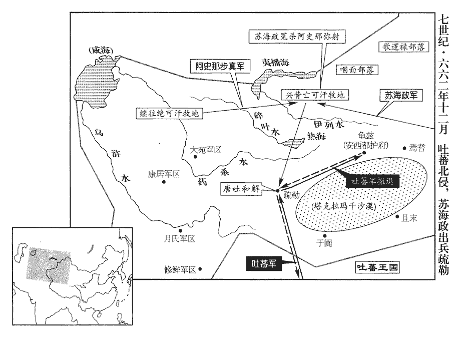
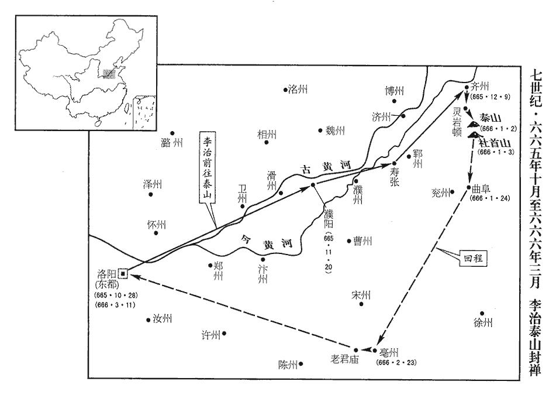
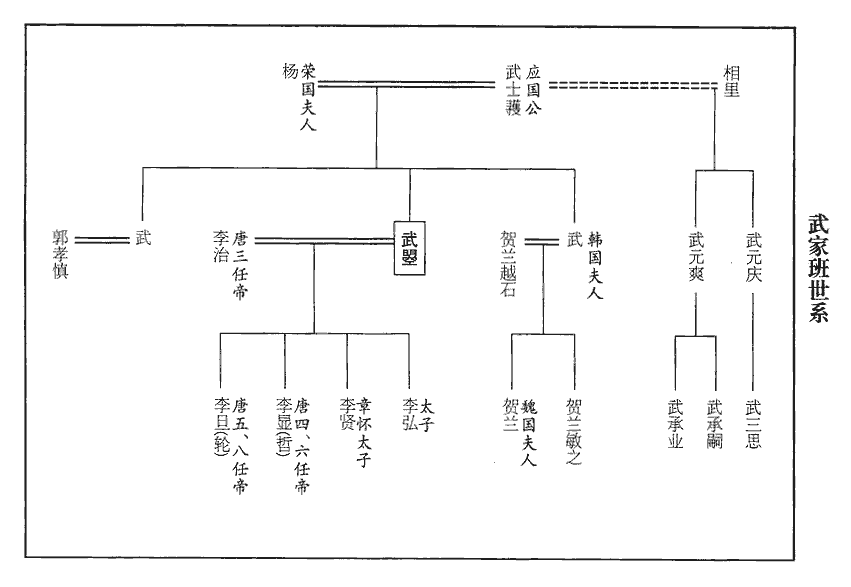
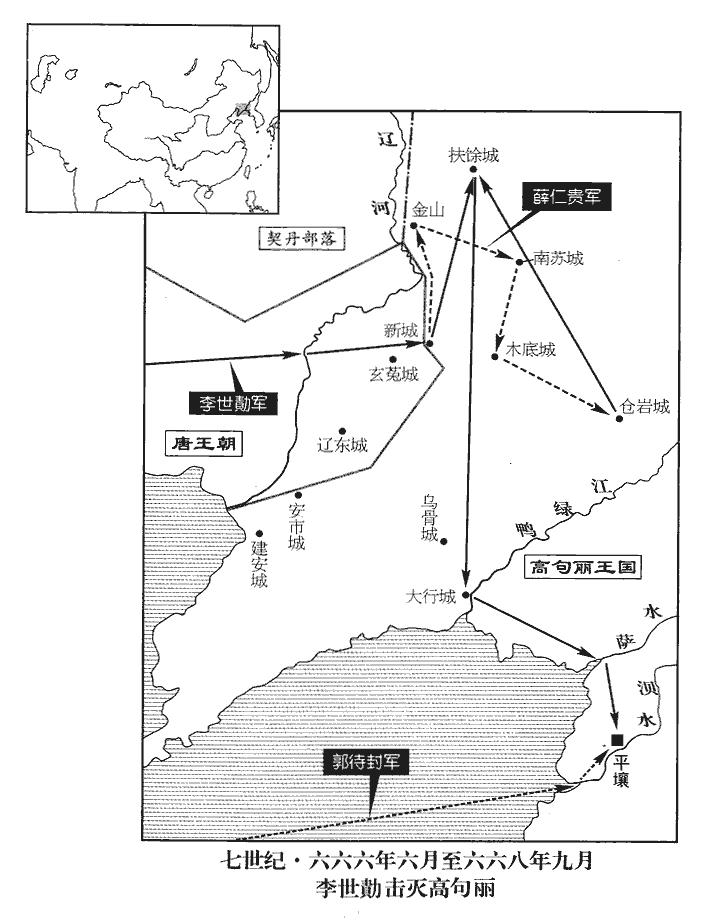
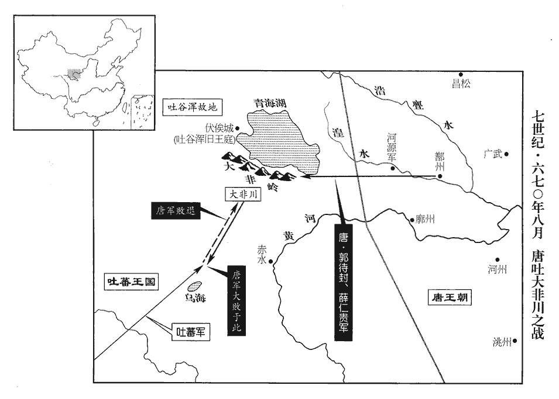

 唐紀十七起玄黓閹茂（壬戌）八月，盡上章敦牂（庚午），凡八年有奇。

# 高宗天皇大聖大弘孝皇帝中之上

## 龍朔二年（壬戌、六六二）

1八月，壬寅‹十六›，以許敬宗為太子少師、同東西臺三品、知西臺事。同中書門下三品、知中書事。

〖译文〗 [1]八月，壬寅（十六日），唐朝任命许敬宗为太子少师、同东西台三品、知西台事。

2九月，戊寅‹二十二›，初令八品、九品衣碧。衣，於既翻。

〖译文〗 [2]九月，戊寅（二十二日），唐朝开始让八品、九品官员穿浅蓝色衣服。

3冬，十月，丁酉‹十一›，上幸驪山溫湯‹陕西省临潼县东南›，太子監國；監，古銜翻。丁未‹二十一›，還宮。

〖译文〗 [3]冬季，十月，丁酉（十一日），唐高宗到骊山温泉，由太子监理国事；丁未（二十一日），回宫。

4庚戌‹二十四›，西臺侍郎陝‹河南省三门峡市›人上官儀同東西臺三品。西臺侍郎，即中書侍郎。陝，失冉翻。

〖译文〗 [4]庚戌（二十四日），西台侍郎陕人上官仪同东西台三品。

5癸丑‹二十七›，詔以四年正月有事於泰山，仍以來年二月幸東都‹洛阳›。

〖译文〗 [5]癸丑（二十七日），唐高宗下诏令：定于龙朔四年正月封泰山，并于明年二月前往东都洛阳。

6左相許圉師之子奉輦直長自然，遊獵犯人田，奉輦直長，即尚輦直長。殿中六局直長，正七品。龍朔改尚輦局為奉輦局。相，息亮翻。長，知兩翻。田主怒，自然以鳴鏑射之。射，而亦翻。圉師杖自然一百而不以聞。田主詣司憲訟之，司憲大夫楊德裔不為治。治，直之翻。西臺舍人袁公瑜遣人易姓名上封事告之，西臺舍人，即中書舍人。為，于偽翻。上，時掌翻。上曰：「圉師為宰相，侵陵百姓，匿而不言，豈非作威作福！」圉師謝曰：「臣備位樞軸，以直道事陛下，不能悉允眾心，故為人所攻訐。訐jié，居謁翻。至於作威福者，或手握強兵，或身居重鎮；臣以文吏，奉事聖明，惟知閉門自守，何敢作威福！」上怒曰：「汝恨無兵邪！」許敬宗曰：「人臣如此，罪不容誅。」遽令引出。詔特免官。考異曰：舊本紀：「十一月辛未，圉師下獄。」新本紀：「十一月辛未，圉師貶虔州刺史。」今據實錄，辛未，免官，久之，貶虔州刺史。舊紀，貶虔州刺史在三年二月。新本紀誤。

〖译文〗 [6]左相许圉师的儿子奉辇直长许自然，游猎时损坏他人田里的作物，田主恼怒，许自然用响箭射田主。许圉师将许自然打了一百棍子，而没有上报。田主到司宪衙门起诉，司宪大夫杨德裔不作处理，西台舍人袁公瑜派人改名换姓给唐高宗上密封奏折告发此事。唐高宗说：“许圉师身为宰相，欺负百姓，隐瞒不报，岂不是滥用权势，横行霸道！”许圉师道歉说：“我位居朝廷机要部门，以正直之道侍奉陛下，不能全合众人心意，所以受到别人的攻击。至于滥用权势，横行霸道，或手握强兵，或身居军事重镇才有可能；我作为一名文官，侍奉圣明君主，只知道闭门自守，哪里敢滥用权势，横行霸道！”唐高宗大怒，说：“你怨恨没有领兵吗？”许敬宗说：“作臣下的竟敢如此，处死也不足以抵罪。”唐高宗命令立即将他领出去，又下诏免去他的官职。

7癸酉‹十一月十八日›，立皇子旭輪為殷王。旭輪後改名旦，是為睿宗。

〖译文〗 [7]癸酉（疑误），唐朝立皇子李旭轮为殷王。

8十二月，戊申‹二十三›，詔以方討高麗、百濟，麗，力知翻。河北之民，勞於征役，其封泰山、幸東都並停。

〖译文〗 [8]十二月，戊申（二十三日），唐高宗下诏说，因正讨伐高丽、百济，河北百姓为征役所劳苦，原定封泰山、去东都洛阳的事都停止进行。

9䫻海道總管蘇海政䫻yù，越筆翻。受詔討龜茲‹新疆库车县›，龜茲，音丘慈。敕興昔亡、繼往絕二可汗發兵與之俱。可，從刊入聲。汗，音寒。至興昔亡之境，繼往絕素與興昔亡有怨，事見上卷顯慶二年註。密謂海政曰：「彌射謀反，請誅之。」阿史那彌射是為興昔亡可汗。時海政兵纔數千，集軍吏謀曰：「彌射若反，我輩無噍類，噍jiào，才笑翻。不如先事誅之。」先，悉薦翻。乃矯稱敕，令大總管齎帛數萬段賜可汗及諸酋長，興昔亡帥其徒受賜，海政悉收斬之。其鼠尼施‹新疆新源县境›、拔塞幹兩部亡走，鼠尼施啜，咄陸五部之一也；拔塞幹俟斤，弩失畢五部之一也。酋，慈由翻。長，知兩翻。帥，讀曰率。尼，女夷翻。海政與繼往絕追討，平之。軍還，至疏勒‹新疆喀什市›南，弓月部復引吐蕃‹首都逻些城西藏拉萨市›之眾來，欲與唐兵戰；海政以師老不敢戰，以軍資賂吐蕃，約和而還。由是諸部落皆以興昔亡為冤，各有離心。繼往絕尋卒，復，扶又翻。卒，子恤翻。十姓無主，有阿史那都支及李遮匐收其餘眾附於吐蕃。為都支、遮匐連兵反張本。

〖译文〗 [9]海道总管苏海政接受诏命讨伐龟兹，唐高宗命令兴昔亡、继往绝二可汗发兵与苏海政一同前去。唐兵前进到兴昔亡境内，继往绝因一贯与兴昔亡有仇怨，于是秘密对苏海政说：“阿史那弥射要谋反，请杀掉他。”当时苏海政只有数千兵士，集合军官商议说：“阿史那弥射如果反叛，我们谁也活不成，不如先把他杀掉。”于是便假称奉皇帝命令，让大总管带帛数万段赏赐给可汗和诸位酋长，兴昔亡率领他的部下前来受赏，苏海政乘机将他们全部抓住并斩首。其中鼠尼施、拔塞干两部逃走，苏海政和继往绝率兵追击将他们讨平。唐军返回途中，到疏勒南，弓月部又引吐蕃兵前来，想与唐兵交战；苏海政因军队已经疲劳，不敢应战，便以军用物资贿赂吐蕃军，讲和后返回。从此，各部落都认为兴昔亡受冤屈，各怀离心。继往绝不久去世，西突厥十姓无首领，由阿史那都支及李遮匐收集西突厥余众附属于吐蕃。

 

10是歲，西突厥寇庭州‹新疆吉木萨尔县›，刺史來濟將兵拒之，厥，九勿翻。將，即亮翻。謂其眾曰：「吾久當死，幸蒙存全以至今日，當以身報國。」遂不釋甲冑，赴敵而死‹年五十三岁›。

〖译文〗 [10]本年，西突厥侵扰唐朝庭州，州刺史来济领兵抵抗，对部下说：“我早就应该死了，幸蒙保全直到今日，应当以身报国。”于是不解下铠甲头盔，奔赴敌阵，结果被打死。

## 三年（癸亥、六六三）

1春，正月，左武衛將軍鄭仁泰討鐵勒‹蒙古›叛者餘種，悉平之。種，章勇翻。

〖译文〗 [1]春季，正月，左武卫大将军郑仁泰全部讨平铁勒反叛者的残余部众。

2乙酉‹十一›，以李義府為右相，右相，中書令也。仍知選事。選，須絹翻。

〖译文〗 [2]乙酋（疑误），唐朝任命李义府为右相，仍然主持选拔官员的事情。

3二月，徙燕然都護府‹设内蒙古乌拉特中旗›於回紇‹王庭蒙古哈尔和林市›，更名瀚海都護；徙故瀚海都護‹设蒙古国哈尔和林市›於雲中古城‹内蒙古和林格尔县›，更名雲中都護。燕然都護置於貞觀二十一年，見一百九十八卷。瀚海都護置於永徽元年，見一百九十九卷。燕，因肩翻。更，工衡翻。以磧為境，磧北州府皆隸瀚海，磧南隸雲中。雲中都護府治金河，即秦、漢雲中舊城，東北至朔州三百七十里，麟德元年，更名單于大都護府。杜佑曰：單于都護府南至榆林郡百二十里，東南到馬邑郡三百五十里。磧，七逆翻。

〖译文〗 [3]二月，唐朝迁移燕然都护府于回纥，改名为瀚海都护府；迁移原瀚海都护府于云中古城，改名为云中都护府，以沙漠为界，沙漠以北州府都隶属瀚海都护府，沙漠以南隶属云中都护府。

4三月，許圉師再貶虔州‹江西省赣州市›刺史，虔州在京師東南四千一十七里，至東都三千四百里。楊德裔以阿黨流庭州，圉師子文思、自然並免官。

〖译文〗 [4]三月，许圉师被贬为虔州刺史，杨德裔因循私屈法被流放庭州，许圉师的儿子许文思、许自然均被撤职。

5右相河間郡公李義府典選，選，須絹翻。恃中宮之勢，專以賣官為事，銓綜無次，怨讟dú盈路，上‹李治，本年三十六岁›頗聞之，從容謂義府曰：「卿子及壻頗不謹，多為非法，我尚為卿掩覆，卿宜戒之！」從，千容翻。為，于偽翻。覆，敷又翻。義府勃然變色，頸、頰俱張，張：知亮翻。曰：「誰告陛下？」上曰：「但我言如是，何必就我索其所從得邪！」索，山客翻。義府殊不引咎，緩步而去。上由是不悅。

〖译文〗 [5]右相、河间郡公李义府主管选拔官吏，依仗皇后武则天的权势，专以卖官为能事，选授没有次第，弄得怨声载道，唐高宗也时有所闻，曾从容不迫地对李义府说：“你的儿子和女婿很不谨慎，做了不少违法的事，我还为你遮掩，你应当警告他们。”李义府脸色骤变，涨红着脸和脖子说：“是谁告诉陛下的？”唐高宗说：“只是我这样说，何必向我追索从哪里得来的呢？”李义府根本不承认自己的过失，缓步离去。唐高宗因此不高兴。

望氣者杜元紀謂義府所居第有獄氣，宜積錢二十萬緡以厭之，厭，於協翻。義府信之，聚斂尤急。斂，力贍翻。義府居母喪，朔望給哭假，假，古訝翻。輒微服與元紀出城東，登古塚，候望氣色，或告義府窺覘災眚，陰有異圖。覘，丑廉翻，又丑豔翻。眚，所景翻。又遣其子右司議郎津召長孫無忌之孫延，受其錢七百緡，除延司津監，唐東宮，司議郎四人，正六品上，掌啟奏記註。龍朔改司議郎為左司議郎，太子舍人為右司議郎。漢官有都水長，屬主爵，掌諸池沼，後改為使者，後漢改為河隄謁者。晉置都水臺，有使者一人，掌舟檝之事；梁改為太舟卿；北齊亦曰都水臺；隋改為都水監，唐因之，貞觀改為使者，從六品；龍朔元年，改為司津監，掌川澤津梁之政令。右金吾倉曹參軍楊行穎告之。夏，四月，乙丑，下義府獄，下，遐嫁翻。遣司刑太常伯劉祥道與御史、詳刑共鞫之，司刑太常伯，即刑部尚書。詳刑，大理也。唐自永徽以後，大獄以尚書刑部、御史臺、大理寺官雜按，謂之三司。仍命司空李勣監焉。監，古銜翻。事皆有實。戊子‹五›，詔義府除名，流巂州‹四川省西昌市›；津除名，流振州‹海南省三亚市西崖城镇›；諸子及壻並除名，流庭州。朝野莫不稱慶。巂，音髓。朝，直遙翻。

〖译文〗 望云气以预言吉凶的人杜元纪说李义府的住宅有冤狱造成的怨气，应当积蓄二十万缗钱抑制它。李义府相信他，于是搜括更加急切。李义府为母亲守丧期间，每月初一、十五朝廷给他哭吊亡母的假期，他总是换上平民服装与杜元纪出城东行，登上古坟墓，观望云气。有人告发李义府窥测灾异，图谋不轨。他又派遣儿子右司议郎李津找长孙无忌的孙子长孙延，收受七百缗钱后，授给长孙延司津监的官职。右金吾仓曹参军杨行颖将此事告发。夏季，四月，乙丑（疑误），朝廷将李义府逮捕入狱，派遣司刑太常伯刘祥道与御史、详刑寺官员共同审讯，还命令司空李世监督此事。他所犯罪行都属实。戊子（初五），唐高宗下诏令，将李义府削除名籍，流放州；将李津削除名籍，流放振州；他另外的几个儿子及女婿，都被削除名籍，流放庭州。朝廷和民间人人互相庆贺。

或作河間道行軍元帥劉祥道破銅山大賊李義府露布，李義府，河間人，故云然。帥，所類翻。牓之通衢。義府多取人奴婢，及敗，各散歸其家，故其露布云：「混奴婢而亂放，各識家而競入。」此姑述時人快義府之得罪而有是，通鑑因采而誌之以為世鑒。學者為文類有所祖，漢高帝為太上皇營新豐，後人誌其事，其辭云：「混雞犬而亂放，各識家而競入。」此語所祖，有自來矣。

〖译文〗 有人戏作河间道行军元帅刘祥道破铜山大贼李义府捷报，张贴在交通要道上。李义府多掠夺别人奴婢，到他垮台后，他们都各自回家，所以捷报中说：“奴和婢混杂着一起乱哄哄放出，各自都认识家而竞相进入。”

6乙未‹十二›，置雞林大都督府於新羅國‹首都金城韩国庆州市›，以金法敏為之。

〖译文〗 [6]乙未（十二日），唐朝设置鸡林大都督府于新罗国，任命金法敏为都督。

7丙午‹二十三›，蓬萊宮含元殿成，上始移仗居之，更命故宮曰西內。故宮，謂太極宮，自武德以來人主居之，自是以後，謂之西內。更，工衡翻。戊申‹二十五›，始御紫宸殿聽政。蓬萊宮正殿曰含元殿，含元之後曰宣政殿，宣政殿北曰紫宸門，內有紫宸殿，即內衙之正殿。

〖译文〗 [7]丙午（二十三日），蓬莱宫含元殿落成，唐高宗开始迁移到那里居住，原居住的宫殿改名西内。戊申（二十五日），开始到紫宸殿处理政事。

8五月，壬午‹三十›，柳州‹广西柳州市›蠻酋吳君解反；柳州，漢潭中縣地，隋置馬平縣，唐武德四年，置南昆州，貞觀八年改曰柳州。遣冀州‹河北省大名县›長史劉伯英、右武衛將軍馮士翽huì發嶺南‹南岭以南›兵討之。翽，呼外翻。

〖译文〗 [8]五月，壬午（三十日），柳州蛮首领吴君解反叛唐朝，唐朝派遣冀州长史刘伯英、右武卫将军冯士征发岭南兵讨伐。

9吐蕃‹首都逻些城西藏拉萨市›與吐谷渾‹青海省›互相攻，各遣使上表論曲直，更來求援；吐，從暾入聲。谷，音浴。使，疏吏翻。上，時掌翻。更，工衡翻，迭也。上皆不許。

〖译文〗 [9]吐蕃与吐谷浑互相进攻，各派遣使者到唐朝上书辩论是非，轮番向唐朝求援；唐高宗都没有同意。

吐谷渾之臣素和貴有罪，逃奔吐蕃，具言吐谷渾虛實。吐蕃發兵擊吐谷渾，大破之，吐谷渾可汗曷鉢與弘化公主帥數千帳棄國走依涼州‹甘肃省武威市›，請徙居內地。舊唐書曰：吐谷渾自永嘉之末，始西度洮水，建國於群羌之故地，龍朔三年，為吐蕃所滅，凡三百五十年。帥，讀曰率；下同。上以涼州都督‹总部设甘肃省武威市›鄭仁泰為青海道行軍大總管，帥右武衛將軍獨孤卿雲、辛文陵等分屯涼、鄯‹青海省乐都县›二州，以備吐蕃。鄯，時戰翻。涼、鄯相去五百八十里。六月，戊申‹二十六›，又以左武衛大將軍蘇定方為安集大使，節度諸軍，為吐谷渾之援。

〖译文〗 吐谷浑大臣素和贵犯了罪，逃奔吐蕃，详尽地报告了吐谷浑的情况。吐蕃于是发兵进攻吐谷浑，吐谷浑被打得大败，可汗曷钵与弘化公主率领数千帐离开国家，投奔唐朝凉州，请求移居唐朝内地。唐高宗任命凉州都督郑仁泰为青海道行军大总管，率领右武卫将军独孤卿云、辛文陵等分别屯兵于凉、鄯二州，以防备吐蕃。六月，戊申（二十六日），又任命左武卫大将军苏定方为安集大使，调度约束诸军，作为吐谷浑的后援。

吐蕃祿東贊屯青海‹青海湖›，遣使者論仲琮入見，吐蕃立國之初，有大論、小論以統國事，後因以為貴姓。見，賢遍翻。表陳吐谷渾之罪，且請和親。上不許。遣左衛郎將劉文祥使于吐蕃，降璽書責讓之。將，即亮翻。璽，斯氏翻。

〖译文〗 吐蕃禄东赞屯兵青海，派遣使者论仲琮到唐朝朝见唐高宗，上表陈述吐谷浑的罪恶，而且请求与唐朝和亲。唐高宗不允许，派遣左卫郎将刘文祥出使吐蕃，颁用皇帝的印章封记的文书责备吐蕃。

10秋，八月，戊申‹二十七›，上以海東累歲用兵，百姓困於征調，調，徒弔翻。士卒戰溺死者甚眾，溺，奴狄翻。詔罷三十六州所造船，遣司元太常伯竇德玄等司元太常伯，即戶部尚書。分詣十道，問人疾苦，黜陟官吏。德玄，毅之曾孫也。竇毅，太穆皇后之父。

〖译文〗 [10]秋季，八月，戊申（二十七日），唐高宗因辽东地区连年用兵，百姓为赋税力役所困扰，士卒战死溺死的很多，下诏令免除三十六州的造船任务，派遣司元太常伯窦德玄等分别到十道，询问百姓疾苦，考核升降地方官吏。窦德玄是窦毅的曾孙。

11九月，戊午‹八›，熊津道行軍總管、右威衛將軍孫仁師等破百濟餘眾及倭‹日本›兵於白江‹锦江›，拔其周留城‹百济临时首都·朝鲜半岛韩山城›。倭，烏禾翻。

〖译文〗 [11]九月，戊午（初八），熊津道行军总管、右威卫将军孙仁师等在白江打败百济残余部队及倭国兵，攻下周留城。

初，劉仁願、劉仁軌既克真峴城，克真峴城，見上卷二年。詔孫仁師將兵，浮海助之。將，即亮翻；下同。百濟王豐南引倭人以拒唐兵，仁師與仁願、仁軌合兵，勢大振。諸將以加林城‹朝鲜半岛林川城›水陸之衝，欲先攻之，仁軌曰：「加林險固，急攻則傷士卒，緩之則曠日持久。周留城，虜之巢穴，群凶所聚，除惡務本，書泰誓之言。宜先攻之，若克周留，諸城自下。」於是仁師、仁願與新羅王法敏將陸軍以進，仁軌與別將杜爽、扶餘隆將水軍及糧船自熊津‹韩国公州市›入白江，以會陸軍，同趣周留城。趣，七喻翻。遇倭兵於白江口，四戰皆捷，焚其舟四百艘，煙炎灼天，艘，蘇遭翻。炎，讀曰燄。海水皆赤。百濟王豐脫身奔高麗，王子忠勝、忠志等帥眾降，帥，讀曰率；下之帥、皆帥同。降，戶江翻；下同。百濟盡平，唯別帥遲受信據任存城‹朝鲜半岛大兴城›，不下。帥，所類翻。尉，紆勿翻。

〖译文〗 当初，刘仁愿、刘仁轨攻克真岘城以后，唐高宗命令孙仁师领兵渡海援助他们。百济王扶余丰从南边招来倭国人以抗拒唐兵。孙仁师与刘仁愿、刘仁轨联合，声势大振。部下诸将因加林城是水陆交通要冲，想先进攻它。刘仁轨说：“加林城险要坚固，急攻会伤亡士卒，慢攻又攻不下，将旷日持久。周留城是敌人的巢穴，群凶聚集之地，除恶务必扫除根本，应该先进攻它，如果攻下周留城，其他各城就会不攻自下。”于是孙仁师、刘仁愿与新罗王金法敏率领陆军前进，刘仁轨与别将杜爽、扶余隆率领水军和粮船从熊津入白江，和陆军会合，一起向周留城推进。唐兵和倭国兵遭遇于白江口，刘仁轨等四次战斗，都接连取得胜利，焚烧敌船四百艘，烟火冲天，连海水都变成红色。百济王扶余丰脱身逃往高丽，王子扶余忠胜、扶余忠志等率领部下投降，百济全部平定，只有别帅迟受信据守任存城，没有被攻下。

初，百濟西部人黑齒常之，長七尺餘，驍勇有謀略，長，直亮翻。驍，堅堯翻。仕百濟為達率兼郡將，猶中國刺史也。新羅官有十六品，左平一品，達率二品。五方各有方領一人，以達率為之；方有十郡，郡有將三人，以德率為之；德率四品。百濟置官，蓋與新羅略同也。率，所類翻。蘇定方克百濟，常之帥所部隨眾降。定方縶其王及太子，縱兵劫掠，壯者多死。常之懼，與左右十餘人遁歸本部，收集亡散，保任存山，結柵以自固，旬月間歸附者三萬餘人。定方遣兵攻之，常之拒戰，唐兵不利；常之復取二百餘城，復，扶又翻。定方不能克而還。還，從宣翻，又如字。常之與別部將沙吒相如沙吒，夷人複姓。吒zhà，陟加翻。各據險以應福信，百濟既敗，皆帥其眾降。劉仁軌使常之、相如自將其眾，取任存城，仍以糧仗助之。孫仁師曰：「此屬獸心，何可信也！」仁軌曰：「吾觀二人皆忠勇有謀，敦信重義；但曏者所託，未得其人，今正是其感激立效之時，不用疑也。」遂給其糧仗，分兵隨之，攻拔任存城，遲受信棄妻子，奔高麗。

〖译文〗 当初，百济西部人黑齿常之，身高七尺多，勇猛有谋略，在百济任达率兼郡将，相当于唐朝刺史的职位。唐将苏定方攻克百济，黑齿常之率领部下随百济人投降唐朝。苏定方囚禁百济王及太子，纵兵劫掠，成年人多被杀死。黑齿常之害怕，与手下十多人逃归本部，收集被打散的士卒，保守任存山，结起栅栏以加强防守，一月之间归附的有三万多人。苏定方派兵进攻，黑齿常之进行抵抗，唐兵失利；黑齿常之又攻取二百多座城池，苏定方无法攻克这些城池，只好撤回。黑齿常之与别部将沙吒相如各据守险要以响应福信，百济失败后，他们率领部众投降刘仁轨。刘仁轨派黑齿常之、沙吒相如率领他们的部众去攻取任存城，还支援他们粮食和武器。孙仁师说：“这类人人面兽心，怎么可以相信！”刘仁轨说：“我看这两人都忠勇有谋略，注重信义；只是前次错投奔了人，现在正是他们感激立功的时候，不必怀疑。”于是发给粮食和武器，分兵跟随他们，攻下了任存城，迟受信抛弃妻子儿女，投奔高丽。

詔劉仁軌將兵鎮百濟‹朝鲜半岛西南部›，召孫仁師、劉仁願還。百濟兵火之餘，比屋彫殘，比，毗必翻，又毗至翻。僵尸滿野，仁軌始命瘞骸骨，籍戶口，理村聚，署官長，通道塗，立橋梁，補隄堰，復陂塘，課耕桑，賑貧乏，養孤老，立唐社稷，頒正朔及廟諱，卒如仁軌之志，所謂有志者事竟成也。僵，居良翻。瘞，於計翻。長，知兩翻。賑，津忍翻。百濟大悅，闔境各安其業。然後脩屯田，儲糗糧，訓士卒，以圖高麗。糗，去九翻。

〖译文〗 唐高宗命令刘仁轨领兵镇守百济，召孙仁师、刘仁愿回朝。百济经兵火之后，家家弊残破，僵尸遍野，刘仁轨命令掩埋骸骨，登记户口，治理村落，任命官长，修通道路，架设桥梁，修补堤堰，恢复陂塘，督促百姓种田养蚕，赈济贫穷的人，赡养孤独无依的老人，建立唐朝的土、谷神坛，颁布唐朝历法和已故皇帝名讳。百济百姓很高兴，全境各安其业。然后又治理屯田，储备粮食，训练士卒，准备进取高丽。

劉仁願至京師，上問之曰：「卿在海東，前後奏事，皆合機宜，復有文理。復，扶又翻。卿本武人，何能如是？」仁願曰：「此皆劉仁軌所為，非臣所及也。」上悅，加仁軌六階，勳有級，官有階。正除帶方州刺史，為築第長安，厚賜其妻子，遣使齎璽書勞勉之。為，于偽翻。使，疏吏翻。勞，力到翻。上官儀曰：「仁軌遭黜削而能盡忠，黜削，謂白衣從軍自效也。仁願秉節制而能推賢，皆可謂君子矣！」

〖译文〗 刘仁愿回到京师长安，唐高宗问他：“你在海东，前后上奏事情，都合时宜，又有文采条理。你本是武人，为什么能够这样？”刘仁愿说：“这都是刘仁轨所做的，不是我所能办到的。”唐高宗听了很高兴，给刘仁轨晋升六级官阶，正式任命为带方州刺史，为他在长安建筑住宅，给他的妻子儿女优厚的赏赐，派使者带着用天子玺印封记的文书前去慰劳勉励他。上官仪说：“刘仁轨被撤职后，能为朝廷尽忠，刘仁愿掌握指挥权而能推重贤人，都可以称得上是君子了！”

12冬，十月，辛巳朔‹一›，詔太子‹李弘本年十三岁›每五日於光順門內視諸司奏事，唐六典：大明宮，紫宸殿內朝正殿也，殿之南面曰紫宸門，左曰崇明門，右曰光順門。其事之小者，皆委太子決之。

〖译文〗 [12]冬季，十月，辛巳朔（初一），唐高宗命令太子每五日一次在光顺门内视察各部门呈奏事情，事情比较小的都授权太子裁决。

13十二月，庚子‹二十一›，詔改來年元。

〖译文〗 [13]十二月，庚子（二十一日），唐高宗下令，明年更改年号。

14壬寅‹二十三›，以安西都護‹都护府设新疆库车县›高賢為行軍總管，將兵擊弓月‹新疆霍城县›以救于闐‹新疆和田市›。

〖译文〗 [14]壬寅（二十三日），唐朝任命安西都护高贤为行军总管，领兵进击弓月以解救于阗。

15是歲，大食‹阿拉伯帝国›擊波斯‹伊朗高原›、拂菻‹东罗马帝国›，破之；拂菻，古大秦國也，居西海上，一曰海西國，去京師四萬里，北直突厥可薩部，西瀕海，東南接波斯。杜佑曰：大秦，前漢犂靬jiān國也。菻，力錦翻，又力鴆翻。類篇曰佛菻。南侵婆羅門‹在印度半岛›，吞滅諸胡，勝兵四十餘萬。勝，音升。

〖译文〗 [15]本年，大食进攻波斯、拂，将他们打败；向南侵扰婆罗门，吞灭诸胡，拥兵四十多万。

## 麟德元年（甲子、六六四）去年絳州麟見，又含元殿前麟趾見，於是改元。

1春，正月，甲子‹十六›，改雲中都護府‹设内蒙古和林格尔县›為單于大都護府，以殷王旭輪‹后改名李旦›為單于大都護。單，音蟬。

〖译文〗 [1]春季，正月，甲子（十六日），唐朝将云中都护府改为单于大都护府，任命殷王李旭轮为单于大都护。

初，李靖破突厥，見一百九十三卷太宗貞觀四年。厥，九勿翻。遷三百帳于雲中城‹内蒙古和林格尔县›，阿史德氏為之長。長，知兩翻。至是，部落漸眾，阿史德氏詣闕，請如胡法立親王為可汗以統之。上‹李治，本年三十七岁›召見，謂曰：「今之可汗，古之單于也。」故更為單于都護府，更，工衡翻，改也。而使殷王遙領之。

〖译文〗 当初，李靖攻破突厥，迁移三百帐到云中城，由阿史德氏担任官长。至此时，部落逐渐扩大，阿史德氏到唐朝朝廷，请求按照自己的法律立亲王为可汗以统率他们。唐高宗召见他，对他说：“现今的可汗，就是古时的单于。”所以改名为单于都护府，由住在长安的殷王李旭轮遥任都护。

2二月，戊子‹十›，上行幸萬年宮‹陕西省麟游县境›。永徽元年，改九成宮為萬年宮。

〖译文〗 [2]二月，戊子（初十），唐高宗到万年宫。

3夏，四月，壬子‹五›，衛州‹河南省卫辉市›刺史道孝王元慶‹李渊之子›薨。

〖译文〗 [3]夏季，四月，壬子（疑误），卫州刺史道孝王李元庆去世。

4丙午‹二十九›，魏州‹河北省冀县›刺史郇公孝協坐贓，賜死。司宗卿隴西王博乂奏孝協父叔良死王事，司宗卿，即宗正卿。叔良，太祖之孫。高祖時，叔良擊突厥，中流矢薨。郇，音荀。孝協無兄弟，恐絕嗣。上曰：「畫一之法，不以親疏異制，漢書云：蕭何為法，講若畫一。註云：畫一，言整齊也。苟害百姓，雖皇太子亦所不赦。孝協有一子，何憂乏祀乎！」孝協竟自盡於第。

〖译文〗 [4]丙午（二十九日），魏州刺史郇公李孝协因犯贪赃罪，赐死。司宗卿陇西王李博义上奏，说李老协的父亲李叔良过去为朝廷牺牲，孝协没有兄弟，恐怕要绝后。唐高宗说：“法律是一样的，不能因亲近疏远而有不同，如果伤害百姓，就是皇太子也不能赦免。李孝协有个儿子，怎么担心没有人祭祀祖先呢！”李孝协终于在住宅中自尽。

5五月，戊申朔‹一›，遂州‹四川省遂宁市›刺史許悼王孝薨。孝，上‹李治›子也，後宮所生。

〖译文〗 [5]五月，戊申朔（初一），遂州刺史许悼王李孝去世。

6乙卯‹八›，於昆明‹云南省昆明市›之弄棟川‹云南省姚安县盆地›置姚州都督府。劉昫曰：漢益州郡之雲南縣，古滇國，後漢屬永昌郡。蜀劉氏分永昌為建寧郡，又分永昌、建寧置雲南郡，而治於弄棟。晉改為晉寧郡，又置寧州。武德四年，安撫大使李英以此州人多姓姚，故置姚州。今陞置都督府，管州三十二。

〖译文〗 [6]乙卯（初八），唐朝在昆明的弄栋川设置姚州都督府。

7秋，七月，丁未朔‹一›，詔以三年正月有事於岱宗。

〖译文〗 [7]秋季，七月，丁未朔（初一），唐高宗下诏，定于麟德三年正月封泰山。

8八月，丙子‹一›，車駕還京師，幸舊宅，舊宅，帝為晉王時所居也。留七日；壬午‹七›，還蓬萊宮。

〖译文〗 [8]八月，丙子（初一），唐高宗回到京师长安，来到他任晋王时的旧宅，居留七日；壬午（初七），返回蓬莱宫。

9丁亥‹十二›，以司列太常伯劉祥道兼右相，司列太常伯，即吏部尚書。大司憲竇德玄為司元太常伯、檢校左相。大司憲，即御史大夫。司元太常伯，即戶部尚書。左相，即侍中。

〖译文〗 [9]丁亥（十二日），唐朝任命司列太常伯刘祥道兼任右相，大司宪窦德玄为司元太常伯、检校左相。

10冬，十月，庚辰‹六›，檢校熊津都督劉仁軌上言：上，時掌翻。「臣伏覩所存戍兵，疲羸者多，勇健者少，羸，倫為翻。少，詩沼翻。衣服貧敝，唯思西歸，無心展効。臣問以『往在海西，見百姓人人應募，爭欲從軍，或請自辦衣糧，謂之「義征」，何為今日士卒如此？』咸言：『今日官府與曩時不同，人心亦殊。曩時東西征役，身沒王事，並蒙敕使弔祭，使，疏吏翻。追贈官爵，或以死者官爵回授子弟，凡渡遼海者，皆賜勳一轉。自顯慶五年以來，征人屢經渡海，官不記錄，其死者亦無人誰何。誰何，問也；問其為誰，緣何而死也。州縣每發百姓為兵，其壯而富者，行錢參逐，皆亡匿得免；謂州縣官發人為兵，其吏卒之參陪隨逐者，富民行錢與之，相為掩蔽，得以亡匿。按元和四年，御史臺奏：比來常參官入光範門及中書省，所將參從人數頗多。參從，猶參逐也。貧者身雖老弱，被發即行。頃者破百濟及平壤苦戰，破百濟見上卷顯慶五年。平壤苦戰見龍朔二年。被，皮義翻。當時將帥號令，許以勳賞，無所不至；及達西岸，惟聞枷鎖推禁，奪賜破勳，州縣追呼，無以自存，公私困弊，不可悉言。以是昨發海西之日已有逃亡自殘者，非獨至海外而然也。又，本因征役，授勳級以為榮寵；而比年出征，皆使勳官挽引，比，毗至翻；挽引，謂挽引舟車。勞苦與白丁無殊，百姓不願從軍，率皆由此。』臣又問：『曩日士卒留鎮五年，尚得支濟，今爾等始經一年，何為如此單露？』咸言：『初發家日，惟令備一年資裝；今已二年，未有還期。』臣檢校軍士所留衣，今冬僅可充事，來秋以往，全無準擬。陛下留兵海外，欲殄滅高麗、百濟，高麗舊相黨援，倭人雖遠，亦共為影響，若無鎮兵，還成一國。今既資戍守，又置屯田，所藉士卒同心同德，而眾有此議，何望成功！自非有所更張，厚加慰勞，董仲舒曰：琴瑟不調，必改而更張之。更，工衡翻。勞，力到翻。明賞重罰以起士心，若止如今日以前處置，恐師眾疲老，立效無日。逆耳之事，或無人為陛下盡言，處，昌呂翻。為，于偽翻。故臣披露肝膽，昧死奏陳。」

〖译文〗 [10]冬季，十月，庚辰（初六），检校熊津都督刘仁轨上奏说：“我观察留在这里戍守的兵卒，疲惫瘦弱的占多数，勇猛健壮的占少数，衣服单薄破旧，一心想返回西边家乡，没有在这里效力的心思。我曾问他们：‘以前在西边家乡时，看见百姓踊跃应募，争着要从军，有人请求自备衣服口粮，称为义征，现在的士卒为何这样？’他们都说：‘现在的官府与从前不同，人心也不一样。以前在东西征战中，为朝廷牺牲，都承蒙皇帝派使者吊唁祭奠，追封官爵，或者把死者的官爵回授给他的子弟，凡渡辽海东征的，都赐勋一级。自显庆五年以来，东征的人屡次渡海，官府没有记录，死了也没有人过问他的姓名和死因。州县官每次征发百姓当兵，强壮而富有的人，花钱买通办事人员，都得以免征，而贫穷的人虽年老体弱，却立即被征发入伍。不久前攻破百济及平壤的苦战，当时将帅发出号令，答应立功的人受奖赏，无所不至；等到返回西海岸，只听说被拘捕，被追究监禁，夺去赏赐，免除勋级，州县官吏上门催迫租赋，简直无法生活下去，公私困乏，一言难尽。因此不久前，从海西出发时就已经有逃亡或使自己残废的人，并不只是到了海外才发生这种情况。还有，本来把因征战获得勋级看成一种荣耀；而近年出征中，都让有勋级的人挽舟拉车，劳苦同民夫没有两样，百姓所以不愿从军，大概都由于这些原因。’我又问：‘以前士卒留在这里镇守五年，尚且能够支持，现在你们才经历一年，为何衣着如此单薄甚至露体？’他们都说：‘当初从家乡出发时，只让准备一年用的物资服装，现在已经二年，还没有回家的日期。’我查核军士所存留的衣服，今冬仅可以应付，明年秋季以后，全无准备。陛下留兵驻在海外，想消灭高丽。百济、高丽从前就相互支援，倭人虽远，也互相呼应，如果没有我们军队镇守在这里，他们还会成为一国。现在既凭借士卒戍守，又设置屯田，所依靠的是士卒同心同德，而他们既然有这种议论，如何能指望获得成功！如不有所更改，给予士卒优厚的慰劳，明确赏赐有功，切实责罚过失，以鼓起士气，而只是像以前那样处置，恐怕士卒疲惫，士气低落，成功不能预期。这些不顺耳的事情，也许没有人向陛下详尽说明，所以我无保留地说出肺腑之言，冒死奏陈。”

上深納其言，遣右威衛將軍劉仁願將兵渡海以代舊鎮之兵，將，即亮翻。仍敕仁軌俱還。仁軌謂仁願曰：「國家懸軍海外，欲以經略高麗，其事非易。易，以豉翻。今收穫未畢，而軍吏與士卒一時代去，軍將又歸。將，即亮翻；下軍將同。夷人新服，眾心未安，必將生變。不如且留舊兵，漸令收穫，辦具資糧，節級遣還；節級，猶今人言節次也。軍將且留鎮撫，未可還也。」仁願曰：「吾前還海西，大遭讒謗，云吾多留兵眾，謀據海東‹朝鲜半岛›，幾不免禍。幾，居希翻。今日唯知准敕，准，與準同。本朝寇準為相，省吏避其名，凡文書準字皆去「十」，後遂因而不改。豈敢擅有所為！」仁軌曰：「人臣苟利於國，知無不為，豈恤其私！」乃上表陳便宜，上，時掌翻。自請留鎮海東，上從之。仍以扶餘隆為熊津都尉，考異曰：實錄作「熊津都督」。按時劉仁軌檢校熊津都督，豈可復以隆為之！明年，實錄稱熊津都尉扶餘隆與金法敏盟。今從之。使招輯其餘眾。

〖译文〗 唐高宗接受他的意见，派遣右威卫将军刘仁愿领兵渡海替换原来留守的士兵，并命令刘仁轨一起返回。刘仁轨对刘仁愿说：“国家派兵远驻海外，想以此治理高丽，这不是容易的事。现在秋收尚未完成，而军吏与士卒一下子全部替换，将领也要回去，夷人不久前才被征服，人心尚未稳定，必将发生变乱。不如暂时将旧兵留下，继续完成秋收，准备好粮食和物资，然后分批遣返。将领也应暂时留下来安定局面，还不能回去。”刘仁愿说：“我前次回到海西，遭到众多诽谤，说我故意多留士卒，图谋割据海东，几乎不能免除杀身之祸。今日只知道按皇帝的命令办事，哪里还敢擅自作主！”刘仁轨道：“作为臣下，只要有利于国家，知道的事就一定要办，怎么能顾惜个人！”于是上书陈述怎么办对国家有利，自己请求留下镇守海东，唐高宗采纳了他的意见。唐朝又任命扶余隆为熊津都尉，让他招抚百济余众。

11初，武后能屈身忍辱，奉順上意，故上排群議而立之；及得志，專作威福，上欲有所為，動為后所制，上不勝其忿。有道士郭行真，出入禁中，嘗為厭勝之術，勝，音升。厭，於協翻，又於琰翻。宦者王伏勝發之。上大怒，密召西臺侍郎、同東西臺三品上官儀議之。儀因言：「皇后專恣，海內所不與，請廢之。」上意亦以為然，即命儀草詔。

〖译文〗 [11]当初，皇后武则天能屈身忍辱，顺从唐高宗的旨意，所以唐高宗排除不同意见，立她为皇后；等到她得志之后，恃势专权，唐高宗想有所作为，常为她所牵制，唐高宗非常愤怒。有道士叫敦行真，出入皇宫，曾施行用诅咒害人的“厌胜”邪术，太监王伏胜揭发了这件事。唐高宗大怒，秘密召来西台侍郎、同东西台三品上官仪商议。上官仪于是进言说：“皇后专权自恣，天下人都不说好话，请废黜她。”唐高宗也认为应当这么办，立即命令上官仪起草诏令。

左右奔告于后，后遽詣上自訴。詔草猶在上所，上羞縮不忍，復待之如初；復，扶又翻。猶恐后怨怒，因紿之曰：「我初無此心，皆上官儀教我。」儀先為陳王諮議，與王伏勝俱事故太子忠，忠自陳王立為皇太子。王府諮議參軍，正五品上，掌訏xū謨左右。后於是使許敬宗誣奏儀、伏勝與忠謀大逆。十二月，丙戌‹十三›，儀下獄，下，遐嫁翻。與其子庭芝、王伏勝皆死，籍沒其家。戊子‹十五›，賜忠死于流所‹黔州·重庆市彭水县›。顯慶五年，忠徙黔州。右相劉祥道坐與儀善，罷政事，為司禮太常伯，司禮太常伯，即禮部尚書。左肅機鄭欽泰等左肅機，即尚書左丞。朝士流貶者甚眾，皆坐與儀交通故也。朝，直遙翻。

〖译文〗 皇帝左右的人跑去告诉武后，武后赶忙来到唐高宗处诉说。当时废黜的诏令草稿还在唐高宗处，他羞惭畏缩，不忍心废黜，又像原来一样对待她；恐怕她怨恨恼怒，还哄骗她说：“我本来没有这个想法，都是上官仪给我出的主意。”上官仪原先任陈王谘议，与王伏胜都曾事奉已被废黜的太子李忠，武后于是便指使许敬宗诬奏上官仪、王伏胜与李忠阴谋背叛朝廷。十二月，丙戌（十三日），上官仪被逮捕入狱，和他儿子上官庭芝以及王伏胜都被处死，家财被查抄没收。戊子（十五日），赐李忠自尽于流放处所。右相刘祥道因与上官仪友善，被免去相位，降职为司礼太常伯，左肃机郑钦泰等朝廷官员被流放贬谪的很多，都因与上官仪有来往的缘故。

自是上每視事，則后垂簾於後，政無大小，皆與聞之。與，讀曰預。天下大權，悉歸中宮，黜陟、殺生，決於其口，天子拱手而已，中外謂之二聖。考異曰：唐曆：「群臣朝謁，萬方表奏，皆呼為二聖。帝坐于東間，后坐于西間。后隨其愛憎，生殺在口。」按武后雖悍戾，豈得高宗尚在，與高宗對坐受群臣朝謁乎！恐不至此。今從實錄。

〖译文〗 此后，唐高宗每逢临朝治事，武后都在后边垂帘听政，政事无论大小，她都要参与。天下大权，全归于武后，官员升降生杀，取决于她一句话，皇帝只是无所事事的清闲人而已，朝廷内外称他们为“二圣”。

12太子右中護•檢校西臺侍郎樂彥瑋、龍朔改左、右庶子為左、右中護。西臺侍郎孫處約並同東西臺三品。

〖译文〗 [12]太子右中护、检校西台侍郎乐彦玮，西台侍郎孙处约同任同东西台三品。

## 二年（乙丑、六六五）

1春，正月，丁卯‹二十四›，吐蕃‹首都逻些城西藏拉萨市›遣使入見，請復與吐谷渾‹青海省›和親，見，賢遍翻。復，扶又翻。仍求赤水地‹黄河流经青海省兴海县一带地区›畜牧，即河源之赤水也，本吐谷渾地。畜，吁玉翻。上‹李治，本年三十八岁›不許。

〖译文〗 [1]春季，正月，丁卯（二十四日），吐蕃派遣使者入朝见唐高宗，请恢复与吐谷浑和好，还要求给他们原吐谷浑的赤水作为放牧地。唐高宗不答应。

2二月，壬午‹十›，車駕發京師；丁酉‹二十五›，至合璧宮‹洛阳境›。

〖译文〗 [2]二月，壬午（初十），唐高宗从京师长安出发；丁酉（二十五日），到达合璧宫。

3上語及隋煬帝，謂侍臣曰：「煬帝拒諫而亡，朕常以為戒，虛心求諫；而竟無諫者，何也？」李勣對曰：「陛下所為盡善，群臣無得而諫。」褚遂良、韓瑗之死，不唯拒諫，且殺諫者矣，群臣誰敢復諫乎！李勣獻諛以苟祿利，而不知凶于其家。

〖译文〗 [3]唐高宗说到隋炀帝时，对身边大臣说：“隋炀帝拒绝规劝而亡国，朕常常引为鉴戒，虚心寻求规劝，而终于没有进谏的人，为什么？”李世回答说：“陛下所作所为尽善尽美，所以群臣没有什么可以进谏的。”

4三月，甲寅‹十二›，以兼司戎太常伯姜恪同東西臺三品。恪，寶誼之子也。司戎太常伯，即兵部尚書。姜寶誼從高祖起兵於太原。

〖译文〗 [4]三月，甲寅（十二日），唐朝任命兼司戎太常伯姜恪为同东西台三品。姜恪是姜宝谊的儿子。

5辛未‹二十九›，東都乾元殿成。乾元殿，洛陽宮正殿也，武后垂拱四年，毀為明堂。閏月，壬申朔‹一›，車駕至東都‹洛阳›。

〖译文〗 [5]辛未（二十九日），东都洛阳乾元殿落成。闰三月，壬申朔（初一），唐高宗来到东都洛阳。

6疏勒‹新疆喀什市›弓月‹新疆霍城县›引吐蕃侵于闐‹新疆和田市›，敕西州‹总部设新疆吐鲁番市东›都督崔知辯、左武衛將軍曹繼叔將兵救之。將，即亮翻。考異曰：實錄作「西川都督」。按於時未有西川之名，必西州也。

〖译文〗 [6]疏勒弓月招引吐蕃侵扰于阗，唐高宗命令西州都督崔知辩、左武卫将军曹继叔领兵援救于阗。

7夏，四月，戊辰‹二十七›，左侍極陸敦信龍朔改左、右散騎常侍為左、右侍極。檢校右相；句斷。西臺侍郎孫處約、太子右中護•檢校西臺侍郎樂彥瑋並罷政事。處，昌呂翻。

〖译文〗 [7]夏季，四月，戊辰（二十七日），左侍极陆敦信任检校右相；西台侍郎孙处约和太子右中护、检校西台侍郎乐彦玮均被免去相职。

8祕閣郎中李淳風龍朔改太史局為祕閤局，令為郎中，丞為郎。以傅仁均《戊寅曆》推步浸疏，乃增損劉焯zhuō《皇極曆》，戊寅曆始行，見一百八十七卷高祖武德二年。隋時，劉焯造甲子元曆，謂之皇極曆，為張賓所擯，不得行。焯，之若翻。更撰《麟德曆》；五月，辛卯‹二十›，行之。更，工衡翻。

〖译文〗 [8]秘阁郎中李淳风认为傅仁均《戊寅历》推算天文疏误越来越大，于是增删刘焯《皇极历》，新写成《麟德历》；五月，辛卯（二十日），新历颁行。

9秋，七月，己丑‹十九›，兗州‹总部设山东省兖州市›都督鄧康王元裕薨。

〖译文〗 [9]秋季，七月，己丑（十九日），兖州都督邓康王李元裕去世。

10上命熊津‹总部设熊津韩国公州市›都尉扶餘隆與新羅‹首都金城韩国庆州市›王法敏釋去舊怨；去，羌呂翻。八月，壬子‹十三›，同盟于熊津城。劉仁軌以新羅、百濟‹首都泗沘韩国扶馀市›、耽羅‹济州岛›、倭國‹日本›使者浮海西還，耽羅國，一曰儋羅，居新羅武州南島上，初附百濟，後附新羅。會祠泰山，高麗‹首都平壤朝鲜平壤市›亦遣太子福男來侍祠。

〖译文〗 [10]唐高宗命令熊津都尉扶馀隆与新罗王金法敏解除旧日的怨恨；八月，壬子（十三日），双方结盟于熊津城。刘仁轨带领新罗、百济、耽罗、倭国使者从海路西归，准备与唐君臣在泰山会合进行祭祀，高丽也派遣太子福男前来陪祭。

 

11冬，十月，癸丑‹十五›，皇后表稱：「封禪舊儀，祭皇地祇，太后昭配，而令公卿行事，禮有未安，至日，妾請帥內外命婦奠獻。」內命婦，自三妃至采女，以備古者三夫人、九嬪、二十七世婦、八十一御妻。又有六尚、二十四司、二十四典、二十四掌。龍朔二年，又置贊德、宣儀、承閨、承旨、衛仙、供奉、侍櫛zhì、侍巾，亦分為九品，皆內官也。外命婦，皇姑封大長公主，皇姊妹封長公主，皇女封公主，皇太子之女封郡主，王之女封縣主。王母妻為妃，一品及國公母妻為國夫人，三品以上母妻為郡夫人，五品、勳官三品封母妻為縣君；散官並同職事；勳宮四品封母妻為鄉君，其母並加太字，各視其夫、子之品。詔：「禪社首以皇后為亞獻，兗州博城縣有社首山。越國太妃燕氏為終獻。」燕氏，越王貞之母，蓋太宗妃嬪此時唯燕氏在也。燕，因肩翻。壬戌‹二十四›，詔：「封禪壇所設上帝、后土位，先用藁秸、陶匏等，秸，吉黠翻。並宜改用茵褥、罍爵，其諸郊祀亦宜準此。」又詔：「自今郊廟享宴，文舞用功成慶善之樂，武舞用神功破陳之樂。」陳，讀曰陣。

〖译文〗 [11]冬季，十月，癸丑（十五日），皇后武则天上表说：“封禅原来的礼仪，祭皇地祗时，太后在左边配享，而令公卿大臣执行祭祀之事，这在礼法上有不妥当的地方，这次祭皇地祗，我请求率领宫廷内外有封号的妇女奠献祭品。”唐高宗下诏：“在社首山祭皇地祗时，皇后第二个进献祭品，越国太妃燕氏最后一个进献祭品。”壬戌（二十四日），唐高宗下诏：“封禅坛上所设的上帝、后土神位，先前使用禾杆、陶匏等，均应改用茵褥、爵，以后郊祭也应照此办理。”又下诏令：“自今以后，郊、庙祭祀宴会，文舞用《功成庆善之乐》，武舞用《神功破阵之乐》。”

丙寅‹二十八›，上發東都，從駕文武儀仗，數百里不絕。從，才用翻。列營置幕，彌亘原野。東自高麗，西至波斯‹伊朗高原›、烏長‹印度半岛西北部›諸國，自吐火羅踰五種，至婆羅覩邏，北踰山，行六百里，得烏萇國。長，讀曰萇。朝會者，各帥其屬扈從，穹廬毳幕，牛羊駝馬，填咽道路。時比歲豐稔，朝，直遙翻。帥，讀曰率。從，才用翻。比，毗至翻。米斗至五錢，麥、豆不列于市。

〖译文〗 丙寅（二十八日），唐高宗从东都洛阳出发，随从的文武官员和仪仗数百里不断。扎的营支的帐逢，连绵于原野。东起高丽，西至波斯、乌长诸国的朝会使节，各率领随从人员扈从车驾，毡做的帐逢，牛羊驼马，堵塞道路。当时连年丰收，一斗米才五个钱，麦子、豆类上市都没有人买。

十一月，戊子‹二十›，上至濮陽‹河南省濮阳市›，濮陽，顓頊之墟。春秋衛成公自楚丘徙此。漢為濮陽縣，帶東郡，晉分為濮陽郡，隋為縣，屬滑州，唐屬濮州。濮，搏木翻。竇德玄騎從。騎，奇寄翻。從，才用翻。上問：「濮陽謂之帝丘，何也？」德玄不能對。許敬宗自後躍馬而前曰：「昔顓頊居此，故謂之帝丘。」上稱善。敬宗退，謂人曰：「大臣不可以無學；吾見德玄不能對，心實羞之。」德玄聞之曰：「人各有能有不能，吾不強對以所不知，此吾所能也。」強，其兩翻。李勣曰：「敬宗多聞，信美矣；德玄之言亦善也。」

〖译文〗 十一月，戊子（二十日），唐高宗来到濮阳，窦德玄骑马随行，唐高宗问他：“濮阳称为帝丘，为什么？”窦德玄不能回答。许敬宗从后边跃马向前说：“从前顼居住在这里，所以称为帝丘。”唐高宗称赞他。许敬宗退下后对人说：“大臣不能没有学问，我见窦德玄回答不上来，心里实在为他感到羞愧。”窦德玄听到后说：“人各有能和不能的方面，我不勉强回答我所不知道的问题，这正是我所能的方面。”李世说：“许敬宗见闻广，诚然很好，窦德玄的话也不错。”

壽張‹山东省梁山县西北寿张集›人張公藝九世同居，壽張縣，前漢曰壽良，屬東郡；光武改壽張，屬東平國；隋屬濟州，唐屬鄆州。齊、隋、唐皆旌表其門。上過壽張，幸其宅，問所以能共居之故，公藝書「忍」字百餘以進。上善之，賜以縑帛。

〖译文〗 寿张人张公艺九代共居，齐、隋、唐各朝都对他家予以表彰。唐高宗经过寿张，来到他的住宅，问他所以能够共居的原因，张公艺书写“忍”字一百多个进献。唐高宗认为这很好，赐给他缣帛。

十二月，丙午‹九›，車駕至齊州‹山东省济南市›，留十日。丙辰‹十九›，發靈巖頓‹山东省长清县东南›，至泰山下，有司於山南為圓壇，山上為登封壇，社首山‹山东省泰安市西南一千米›上為降禪方壇。

〖译文〗 十二月，丙午（初九），唐高宗到齐州，逗留十天。丙辰（十九日），唐高宗从灵岩顿出发，到泰山下，有关部门在山南筑圆坛，在山上筑登封坛，在社首山上筑降禅方坛。

## 乾封元年（丙寅、六六六）

1春，正月，戊辰朔‹一›，上‹李治，本年三十九岁›祀昊天上帝于泰山‹山东省泰安市北›南。己巳‹二›，登泰山，封玉牒，上帝冊藏以玉匱guì，配帝‹李渊›冊藏以金匱，皆纏以金繩，封以金泥，印以玉璽，藏以石䃭gǎn。璽，斯氏翻。䃭，古禫dàn翻。庚午‹三›，降禪于社首‹山东省泰安市西南›，祭皇地祇。上初獻畢，執事者皆趨下。宦者執帷，皇后‹武曌›升壇亞獻，帷帟yì皆以錦繡為之；周禮註，在旁曰帷，在上曰帟。帟，幄中座上承塵也。帟，音亦。酌酒，實俎豆，登歌，皆用宮人。壬申‹五›，上御朝覲壇，受朝賀；朝，直遙翻；下同。赦天下，改元。文武官三品已上賜爵一等，四品已下加一階。先是階無泛加，皆以勞考敘進，至五品三品，仍奏取進止，先，悉薦翻。至是始有泛階；比及末年，服緋者滿朝矣。比，必利翻。

〖译文〗 [1]春季，正月，戊辰朔（初一），唐高宗祭祀昊天上帝于泰山南。己巳（初二），登上泰山，亲自缄封玉册，上帝的玉册放在玉匮里，配帝的玉册放在金匮里，都缠上金绳子，封上金泥，加盖玉玺，藏入封禅专用的石匣中。庚午（初三），在泰山下面的社首山祭祀皇地祗。唐高宗第一个献祭品完了，执事人都退下。太监用手张起帷幔，皇后登坛第二个献祭品，帷幔和帐幕都用锦锈做成；斟酒、往俎豆中放祭品、登坛唱歌都用宫女。壬申（初五），唐高宗登上朝觐坛，接受朝贺；大赦天下罪人，更改年号。文武官员三品以上的赐爵一等，四品以下加一阶。以前没有普遍加封官阶的先例，都是依据劳绩的考核依次进升，到了五品、三品官，还要奏请皇帝决定，到这时才开始有普遍加阶的事；到了高宗末年，穿红色衣服的官员已满朝都是了。

時大赦，惟長流人不聽還，李義府憂憤發病卒。龍朔三年，李義府流巂州‹四川省西昌市›。自義府流竄，朝士日憂其復入，及聞其卒，眾心乃安。復，扶又翻。卒，子恤翻。

〖译文〗 当时的大赦，只有长期流放的罪人不许返回，李义府因此忧愤交加，发病而死。自从李义府流放后，朝庭官员无日不担忧他再回朝廷，直到得知他的死讯，大家才放心。

丙戌‹十九›，車駕發泰山‹山东省泰安市北›；辛卯‹二十四›，至曲阜‹山东省曲阜市›，曲阜，魯侯伯禽所都。應劭云：曲阜在魯城中，委曲長七八里；隋始置曲阜縣，屬兗州。贈孔子太師，以少牢致祭。少，詩照翻。癸未‹二月二十二›，至亳州‹安徽省亳州市›，謁老君廟‹李耳庙·河南省鹿邑县东太清宫镇›，亳州谷陽縣，漢苦縣也，有老子祠，是年，改為真源縣。亳州至東都八百九十八里。上尊號曰太上玄元皇帝。丁丑‹三月十一›，至東都‹洛阳›，留六日；甲申‹十八›，幸合璧宮；夏，四月，甲辰‹八›，至京師‹西安›，東都至京師八百五十里。謁太廟。

〖译文〗 丙戌（十九日），唐高宗从泰山出发；辛卯（二十四日），到达曲阜，赠给孔子太师称号，并用羊猪祭祀。癸未（疑误），到达亳州，拜谒老君庙，给老子上尊号为上玄元皇帝。丁丑（疑误），到达东都洛阳，逗留六天；甲申（疑误），去合璧宫；夏季，四月，甲辰（初八），到京师长安，拜谒太庙。

2庚戌‹十四›，左侍極兼檢校右相陸敦信以老疾辭職，拜大司成，兼左侍極，罷政事。大司成，即國子祭酒。

〖译文〗 [2]庚戌（十四日），唐朝左侍极兼检校右相陆敦信因年老有病请求辞职，任命他为大司成，兼左侍极，免去检校右相职务。

3五月，庚寅‹二十五›，鑄乾封泉寶錢，一當十，俟期年盡廢舊錢。期，讀曰朞。

〖译文〗 [3]五月，庚寅（二十五日），唐朝铸造“乾封泉宝”新钱，以一当十，等一周年后全部废止旧钱。

4高麗泉蓋蘇文卒，長子男生代為莫離支，卒，子恤翻。長，知兩翻。初知國政，出巡諸城，使其弟男建、男產知留後事。或謂二弟曰：「男生惡二弟之逼，惡，烏路翻。意欲除之，不如先為計。」二弟初未之信。又有告男生者曰：「二弟恐兄還奪其權，欲拒兄不納。」男生潛遣所親往平壤伺之，伺，相吏翻。二弟收掩，得之，乃以王命召男生。男生懼，不敢歸；男建自為莫離支，發兵討之。男生走保別城，使其子獻誠詣闕求救。六月，壬寅‹七›，以右驍衛大將軍契苾何力為遼東道‹辽宁省›安撫大使，將兵救之；以獻誠為右武衛將軍，使為鄉導。驍，堅堯翻。契，欺訖翻。苾，毗必翻。大使，疏吏翻。將，即亮翻。鄉，讀曰嚮。又以右金吾衛將軍龐同善、營州‹总部设辽宁省朝阳市›都督高侃為行軍總管，同討高麗。

〖译文〗 [4]高丽泉盖苏文去世，长子泉男生代任莫离支，初治理国家政事，即出巡各城，指派他弟弟泉男建、泉男产留下治理国家政事。有人对他两个弟弟说：“泉男生厌恶两个弟弟的逼迫，有意想除掉你们。不如先准备好对付的计策。”两个弟弟开始不相信这些话。又有人告诉泉男生说：“两个弟弟怕哥哥回去夺他们的权，打算拒绝哥哥回去。”泉男生秘密派亲信去平壤侦察，被两个弟弟捕获，于是他们用王命召泉男生返回。泉男生畏惧，不敢回去；泉男建自任莫离支，发兵讨伐他。泉男生出走，驻守另外的城邑，派遣他儿子泉献诚到唐朝求救。六月，壬寅（初七），唐朝任命右骁卫大将军契何力为辽东道安抚大使，领兵救泉男生；任命泉献诚为右武卫将军，担任向导。又任命右金吾卫将军庞同善、营州都督高侃为行军总管，共同讨伐高丽。

5秋，七月，乙丑朔‹一›，徙殷王旭輪為豫王。

〖译文〗 [5]秋季，七月，乙丑朔（初一），唐朝改封殷王李旭轮为豫王。

以大司憲兼檢校太子左中護劉仁軌為右相。

〖译文〗 朝廷任命大司宪兼检校太子左中护刘仁轨为右相。

初，仁軌為給事中，按畢正義事，事見上卷顯慶元年。李義府怨之，出為青州‹山东省青州市›刺史。會討百濟，仁軌當浮海運糧，時未可行，海行非遇順風不可。義府督之，遭風失船，丁夫溺死甚眾，命監察御史袁異式往鞫之。溺，奴狄翻。監，古銜翻。義府謂異式曰：「君能辦事，不憂無官。」異式至，謂仁軌曰：「君與朝廷何人為讎，宜早自為計。」仁軌曰：「仁軌當官不職，國有常刑，公以法斃之，無所逃命。若使遽自引決以快讎人，竊所未甘！」乃具獄以聞。異式將行，仍自掣其鎖。恐鎖不入簧，行後得私開之也。掣chè，昌列翻。獄上，上，時掌翻。義府言於上曰：「不斬仁軌，無以謝百姓。」舍人源直心曰：「海風暴起，非人力所及。」上乃命除名，以白衣從軍自效。事見上卷顯慶五年。義府又諷劉仁願使害之，仁願不忍殺。及為大司憲，異式懼，不自安，仁軌瀝觴告之曰：「仁軌若念疇昔之事，有如此觴！」仁軌既知政事，異式尋遷詹事丞；詹事丞，正六品上。時論紛然；仁軌聞之，遽薦為司元大夫。司元大夫，即戶部郎中。監察御史杜易簡謂人曰：易，以豉翻。「斯所謂矯枉過正矣！」

〖译文〗 当初，刘仁轨任给事中，因审讯毕正义的事，李义府怨恨他，让他出任青州刺史。遇上讨伐百济，刘仁轨负责从海上运送粮食，当时不是出海的时机，李义府督促他出海，结果遭遇大风，船被刮翻，丁夫被淹死很多，朝廷命令监察御史袁异式前往审讯刘仁轨。李义府对袁异式说：“你能办好这件事，不怕没有官当。”袁异式到达后，对刘仁轨说：“你与朝廷中什么人有仇恨，应当提前为自己打算。”刘仁轨说：“仁轨当官不称职，国家有正常的刑罚，您依法将我处死，我没有什么可逃避的。假使仓猝自作主张让我自尽以使仇人高兴，我当然不甘心！”袁异式于是结案上报，走时还亲自上锁，怕刘仁轨逃脱。案情上报后，李义府对唐高宗说：“不杀刘仁轨，没法向百姓谢罪。”舍人源直心说：“海风骤起，不是人力所能抗拒的。”唐高宗于是命令取消刘仁轨的名藉，让他从平民身份从军效力。李义府又示意刘仁愿将他杀死，刘仁愿不忍心这样做。到了刘仁轨任大司宪，袁异式畏惧，心里很不安。刘仁轨将酒杯里的酒倒光，对他说：“我刘仁轨如果记着旧日的事情，就像这酒杯一样！”刘仁轨主持政事后，袁异式不久即升任詹事丞；当时人议论纷纷。刘仁轨听到后，又立即推荐他担任司元大夫。监察御史杜易简对人说：“这就是所谓矫枉过正了。”

6八月，辛丑‹八›，司元太常伯兼檢校左相竇德玄薨。

〖译文〗 [6]八月，辛丑（初八），司元太常伯兼检校左相窦德玄去世。

7初，武士彠娶相里氏，彠，一虢翻。相，息亮翻。生男元慶、元爽；又娶楊氏，生三女，長適越王府法曹賀蘭越石，長，知兩翻。次皇后，次適郭孝慎。士彠卒，元慶、元爽及士彠兄子惟良、懷運皆不禮於楊氏，楊氏深銜之。越石、孝慎及孝慎妻並早卒，越石妻生敏之及一女而寡。后既立，楊氏號榮國夫人，越石妻號韓國夫人，唐制，國夫人，位一品。惟良自始州‹四川省剑阁县›長史超遷司衛少卿，司衛少卿，即衛尉少卿。懷運自瀛州‹河北省河间市›長史遷淄州‹山东省淄博市›刺史，元慶自右衛郎將為宗正少卿，此時已改宗正為司宗。元爽自安州‹湖北省安陆市›戶曹累遷少府少監。此時已改少府監為內府監。榮國夫人嘗置酒，謂惟良等曰：「頗憶疇昔之事乎？今日之榮貴復何如？」對曰：「惟良等幸以功臣子弟，早登宦籍，揣分量才，不求貴達，豈意以皇后之故，曲荷朝恩，夙夜憂懼，不為榮也。」復，扶又翻。分，扶問翻。荷，下可翻。朝，直遙翻。榮國不悅。皇后乃上疏，請出惟良等為遠州刺史，上，時掌翻。外示謙抑，實惡之也。惡，烏路翻；下后惡同。於是以惟良檢校始州‹四川省剑阁县›刺史，元慶為龍州‹四川省平武县东南›刺史，元爽為濠州‹安徽省凤阳县东北临淮关›刺史。龍州，古江油，秦、漢、曹魏為無人之地。鄧艾伐蜀，由陰平、景谷行無人之地七百里，始至江油。晉置陰平郡，於此置平武縣，至梁有楊、李二姓大豪，分據其地。後魏平蜀，置龍州。濠州，漢鍾離縣地，晉安帝分置鍾離郡，梁置北徐州，後齊曰西楚州，隋開皇二年，改曰豪州，唐曰濠州。始州至京師一千六百六十二里，至東都二千五百六十里。龍州至京師二千六百六十里，東都三千一百一十五里。豪州至京師二千一百五十里，東都一千三百一十三里。元慶至州，以憂卒。卒，子恤翻；下同。元爽坐事流振州‹海南省三亚市西崖城镇›而死。

〖译文〗 [7]当初，武士娶相里氏，生儿子武元庆、武元爽；又娶杨氏，生三个女儿，长女嫁给越王府法曹贺兰越石，二女儿即皇后武则天，三女儿嫁给郭孝慎。武士死后，武元庆、武元爽及武士哥哥的儿子武惟良、武怀运等都不依礼对待杨氏，杨氏对他们怀恨在心。贺兰越石、郭孝慎及他的妻子都早死，贺兰越石妻生儿子贺兰敏之和一个女儿后守寡。武则天立为皇后，杨氏封为荣国夫人，贺兰越石妻封为韩国夫人，武惟良由始州长史越级提升为司卫少卿，武怀运由瀛州长史提升为淄州刺史，武元庆由右卫郎将任宗正少卿，武元爽由安州卢曹连续提升到少府少监。荣国夫人杨氏曾设酒席，对武惟良等说：“还记得从前的事情吗？今日的荣耀贵显又如何？”回答说：“我等因是功臣子弟，有幸很早地进入官吏行列，揣度名分衡量才能，不求富贵显达，没有想到因皇后的关系，得到朝廷的非分恩宠，日夜忧虑畏惧，不觉得荣耀。”荣国夫人听后很不高兴。皇后武则天于是给唐高宗上书，请求让武惟良等出任边远州的刺史，表面上是谦虚抑制自己的亲属，实际上是憎恶他们。结果任命武惟良为检校始州刺史，武元庆为龙州刺史，武元爽为濠州刺史。武元庆到龙州后，因忧虑得病而死。武元爽因事定罪流放振州而死。

 

韓國夫人‹武曌的大姐›及其女以后故出入禁中，皆得幸於上。韓國尋卒，其女賜號魏國夫人。上欲以魏國為內職，心難后未決，后惡之。會惟良、懷運與諸州刺史詣泰山朝覲，從至京師，惟良等獻食。朝，直遙翻。從，才用翻。考異曰：舊傳云：「后諷上幸楊氏宅，惟良等獻食。」今從實錄。后密置毒醢中，使魏國食之，暴卒，因歸罪於惟良、懷運，丁未‹十四›，誅之，改其姓為蝮氏。懷運兄懷亮早卒，其妻善氏尤不禮於榮國，坐惟良等沒入掖庭，榮國令后以他事朿cì棘鞭之，肉盡見骨而死。

〖译文〗 韩国夫人和她的女儿因皇后武则天的关系，出入皇宫中，都得到唐高宗的宠爱。韩国夫人不久去世，她女儿被赐号为魏国夫人。唐高宗想让她担任宫廷女官，心里害怕皇后而没有决定，皇后武则天因此憎恶她。恰好武惟良、武怀运与各州刺史到泰山朝见皇帝，跟随皇帝回到京师长安。武惟良等进献食品，皇后武则天秘密将毒药放入肉酱中，让魏国夫人吃，食后突然死去，于是归罪于武惟良、武怀运，丁未（十四日），将他们处死，改他们的姓为蝮氏。武怀运的哥哥武怀亮早死，他的妻子善氏尤其不以礼对待荣国夫人，善氏因武惟良等犯罪被没入后宫为奴，荣国夫人让皇后武则天找借口用成束带刺的树枝鞭打她，直到肉烂见骨而死。

8九月，龐同善大破高麗兵，泉男生帥眾與同善合。詔以男生為特進、遼東‹总部设辽宁省辽阳市›大都督，兼平壤道‹朝鲜半岛北部›安撫大使，封玄菟郡公。帥，讀曰率。使，疏吏翻；下同。菟，同都翻。

〖译文〗 [8]九月，庞同善大败高丽兵，泉男生率领部众与庞同善会合。唐高宗下诏，任命泉男生为特进、辽东大都督，兼平壤道安抚大使，封玄菟郡公。

9戊子‹二十五›，金紫光祿大夫致仕廣平宣公劉祥道薨‹年七十一岁›，子齊賢嗣。齊賢為人方正，上甚重之，為晉州‹山西省临汾市›司馬。將軍史興宗嘗從上獵苑中，因言晉州產佳鷂，劉齊賢今為司馬，請使捕之。上曰：「劉齊賢豈捕鷂者邪！鷂，弋照翻。卿何以此待之！」

〖译文〗 [9]戊子（二十五日），以金紫光禄大夫退休的广平宣公刘祥道去世，儿子刘齐贤继承爵位。刘齐贤为人正直，唐高宗很器重他，任为晋州司马。将军史兴宗曾随从唐高宗在苑中打猎，于是说到晋州出产好鹞，刘齐贤现任该州司马，请命令他捕鹞。唐高宗说：“刘齐贤难道是捕鹞的人吗？你为何这样看待他！”

10冬，十二月，己酉‹十八›，以李勣為遼東道行軍大總管，【章：十二行本「管」下有「兼安撫大使」五字；乙十一行本同；孔本同；張校同；退齋校同。】以司列少常伯安陸‹湖北省安陆市›郝處俊副之，安陸縣，漢屬江夏郡，宋分屬安陸郡，隋、唐屬安州。處，昌呂翻。以擊高麗。龐同善、契苾何力並為遼東道行軍副大總管兼安撫大使如故；其水陸諸軍總管并運糧使竇義積、獨孤卿雲、郭待封等，並受勣處分。處，昌呂翻。分，扶問翻。河北‹黄河以北›諸州租賦悉詣遼東‹辽东半岛›給軍用。待封，孝恪之子也。郭孝恪事太宗，戰死於龜茲。

〖译文〗 [10]冬季，十二月，己丑（疑误），唐朝任命李世为辽东道行军大总管，司列少常伯安陆人赦处俊为副大总管，以进攻高丽。庞同善、契何力同为辽东道行军逼大总管并仍兼安抚大使；水陆诸军总管和运粮使窦义积、独孤卿云、郭待封等，都受李世指挥。河北各州县租赋全部送辽东供军用。郭待封是郭孝恪的儿子。

勣欲與其壻京兆杜懷恭偕行，以求勳效。懷恭辭以貧，勣贍之；復辭以無奴馬，贍，昌豔翻；下同。復，扶又翻。又贍之。懷恭辭窮，乃亡匿岐陽山中‹陕西省岐山县东北›，謂人曰：「公欲以我立法耳。」勣聞之，流涕曰：「杜郎疏放，今人猶呼壻為郎。此或有之。」乃止。

〖译文〗 李世想让他女婿京兆人杜怀恭同行，以便建立功勋。杜怀恭以家贫为理由推辞，李世答应供给他；又以无奴仆马匹为理由推辞，李世又答应供给他。杜怀恭无话可说，便躲进岐阳山中，对人说：“李公想把我作为施法的靶子。”李世听说后，流泪说：“杜郎散漫不知拘束，这是有可能的。”便没有再要求他同行。

## 二年（丁卯、六六七）

1春，正月，上‹李治，本年四十岁›耕藉田，有司進耒lěi耜sì，加以彫飾。上曰：「耒耜農夫所執，豈宜如此之麗！」命易之。耒，盧對翻。既而耕之，九推乃止。耕藉之制，月令及鄭玄註周禮，皆云天子三推，盧植註禮記曰：天子耕藉，一發九推耒。此用盧說也。推，吐雷翻。

〖译文〗 [1]春季，正月，唐高宗举行亲耕藉田礼，有关部门送来的耒，上面加以雕刻装饰。唐高宗说：“耒是农夫所使用的，哪能这样华丽！”命令更换。不久耕地，推进九个来回便停止。

2自行乾封泉寶錢，穀帛踊貴，商賈不行；賈，音古。癸未‹二十二›，詔罷之。

〖译文〗 [2]唐朝自从发行乾封泉宝钱，谷帛的价格飞涨，商贾无法进行交易；癸未（二十二日），唐高宗下令废止使用。

3二月，丁酉‹六›，涪陵悼王愔薨。愔，上弟也。涪，音浮。愔，於今翻。

〖译文〗 [3]二月，丁酉（初六），涪陵悼王李去世。

4辛丑‹十›，復以萬年宮為九成宮。永徽二年，改九成宮為萬年宮。復，扶又翻，又如字。

〖译文〗 [4]辛丑（初十），唐朝把万年宫改回原名九成宫。

5生羌‹四川省西北部及青海省东南部›十二州為吐蕃‹首都逻些城西藏拉萨市›所破，三月，戊寅‹十八›，悉罷之。

〖译文〗 [5]生羌十二州被吐蕃攻破，三月，戊寅（十八日），唐朝全部取消这些州的建制。

6上屢責侍臣不進賢，眾莫敢對。司列少常伯李安期對曰：「天下未嘗無賢，亦非群臣敢蔽賢也。司列少常伯，即吏部侍郎。少，始照翻。比來公卿有所薦引，為讒者已指為朋黨，滯淹者未獲伸而在位者先獲罪，是以各務杜口耳！陛下果推至誠以待之，其誰不願舉所知！此在陛下，非在群臣也。」上深以為然。安期，百藥之子也。李百藥，德林之子。比，毗至翻。

〖译文〗 [6]唐高宗多次责备身边大臣不推荐德才兼备的人，谁也不敢答话。司列少常伯李安期回答说：“天下不是没有贤人，也不是群臣敢于埋没贤人。近来公卿若有所推荐，好进恶言的人已指责为结党营私，失意的贤者尚未得到进用，在位的人先已获罪，于是各人赶忙闭口。陛下果真能诚心诚意对待臣下，有谁不愿意推举所知道的贤人！这个问题关键在陛下，不在于群臣。”唐高宗很同意他的看法。李安期是李百药的儿子。

7夏，四月，乙卯‹二十五›，西臺侍郎楊弘武、戴至德、正諫大夫兼東臺侍郎李安期、東臺舍人昌樂‹河南省南乐县›張文瓘guàn、司列少常伯兼正諫大夫河北‹山西省平陆县›趙仁本並同東西臺三品。龍朔改給事中為東臺舍人，諫議大夫為正諫大夫。樂，音洛。弘武，素之弟子；楊素仕隋貴顯。至德，冑之兄子也。戴冑相太宗。時造蓬萊、上陽、合璧等宮，上陽宮在洛陽宮城之西南隅，南臨洛水，西距穀水，東即宮城，北連禁苑。宮內正門正殿皆東向，正門曰提象，正殿曰觀風，其內別殿亭觀九所。上陽之西，隔穀水，有西上陽宮，虹梁跨穀，行幸往來。頻征伐四夷，廄馬萬匹，倉庫漸虛，張文瓘諫曰：「隋鑒不遠，願勿使百姓生怨。」上納其言，減廄馬數千匹。

〖译文〗 [7]夏季，四月，乙卯（二十五日），西台侍郎杨弘武和戴至德、正谏大夫兼东台侍郎李安期、东台舍人昌乐人张文、司列少常伯兼正谏大夫河北人赵仁本都任同东西台三品。杨弘武是杨素弟弟的儿子；戴至德是戴胄哥哥的儿子。当时唐朝因营造蓬莱、上阳、合譬等宫，频繁讨伐四夷，厩中养马万匹，仓库逐渐空虚，张文进谏说：“隋朝的鉴戒并不遥远，但愿不要让百姓产生怨恨。”唐高宗接受他的意见，减少厩中马数千匹。

8秋，八月，己丑朔‹一›，日有食之。

〖译文〗 [8]秋季，八月，己丑朔（初一），出现日食。

9辛亥‹二十三›，東臺侍郎同東西臺三品李安期出為荊州‹湖北省江陵县›長史。荊州，京師東南一千七百三十里，至東都一千三百三十五里。宋白曰：荊州，秦南郡地，漢為臨江國，江左置荊州以為重鎮，擬周之分陝；唐為大都督府。

〖译文〗 [9]辛亥（二十三日），东台侍郎、同东西台三品李安期出任荆州长史。

10九月，庚申‹三›，上以久疾，命太子弘監國。監，古銜翻。

〖译文〗 [10]九月，庚申（初三），唐高宗因长期患病，命令太子李弘监理国事。

11辛未‹十四›，李勣拔高麗之新城‹辽宁省抚顺市北›，使契苾何力守之。勣初度遼，謂諸將曰：「新城，高麗西邊要害，不先得之，餘城未易取也。」易，以豉翻。遂攻之，城人師夫仇等縛城主開門降。降，戶江翻。勣引兵進擊，一十六城皆下之。

〖译文〗 [11]辛未（十四日），李世攻下高丽的新城，派契何力驻守。李世初渡辽水时，对手下诸将说：“新城，是高丽西部的要害之地，不先夺取，其余各城便不容易攻取。”于是进攻新城。城里人师夫仇等捆绑守城的首领开门投降。李世领兵进击，有十六座城都被攻下。

龐同善、高侃尚在新城，泉男建遣兵襲其營，左武衛將軍薛仁貴擊破之。侃進至金山‹辽宁省康平县东›，與高麗戰，不利，高麗乘勝逐北，仁貴引兵橫擊，大破之，斬首五萬餘級，新書作斬馘guó五千。拔南蘇‹辽宁省西丰县南›、木底‹辽宁省新宾县西木奇乡›、蒼巖‹辽宁省清原县东›三城，三城後皆置為州。與泉男生軍合。

〖译文〗 庞同善、高侃还留在新城，泉男建派兵袭击他们的兵营，左武卫将军薛仁贵将泉男建打败。高侃进军至金山，与高丽兵交战夫利，高丽兵乘胜追击。薛仁贵领兵从侧面进击高丽兵，高丽兵大败，斩首五万余级，攻下南苏、木底、苍岩三城，与泉男生军会合。

 

郭待封以水軍自別道趣平壤，勣遣別將馮師本載糧仗以資之。趣，七喻翻。將，即亮翻。師本船破，失期，待封軍中飢窘，欲作書與勣，恐為虜所得，知其虛實，乃作離合詩以與勣。離合詩，離析字畫，合之成文，以見其意。勣怒曰：「軍事方急，何以詩為？必斬之！」行軍管記通事舍人元【章：十二行本「元」上有「河南」二字；乙十一行本同；張校同，云無註本亦無。】萬頃為釋其義，管記，掌軍中書檄。為，于偽翻。勣乃更遣糧仗赴之。

〖译文〗 郭待封带领水军从另外一条路向平壤进发，李世派别将冯师本运载粮食武器资助他。冯师本因船坏没有按期到达，郭待封军中缺粮，情况危急，想写信给李世求援，又怕信被敌人截获，泄露缺粮的机密，便写了一首离合诗送给李世。李世见诗大怒，说：“军情紧急，还写诗做什么？一定要处死他！”行军管记通事舍人元万顷为李世解释出离合诗中的含意，李世于是另外运送粮食武器给郭待封。

萬頃作檄高麗文曰：「不知守鴨綠之險。」泉男建報曰：「謹聞命矣！」即移兵據鴨綠津，唐兵不得渡。上聞之，流萬頃於嶺南‹南岭以南›。

〖译文〗 元万顷作《檄高丽文》说：“不知守鸭绿之险。”这反而提醒了泉男建，他回答说：“敬听尊命了！”立即调兵据守鸭绿津，唐兵不能通过。唐高宗得知这情况，流放元万顷到岭南。

郝處俊在高麗城下，未及成列，高麗奄至，軍中大駭，處俊據胡床，方食乾糒，胡床，即今之交床。乾，音干。糒，音備。潛簡精銳，擊敗之，敗，補邁翻。將士服其膽略。

〖译文〗 郝处俊在高丽城下，士卒还来不及列阵，高丽兵突然到来，军中大惊，郝处俊正坐在椅子上吃干粮，暗中挑选精锐部队，把高丽兵打败，将士们都佩服他的胆略。

12冬，十二月，甲午‹八›，詔：「自今祀昊天上帝、五帝、皇地祇、神州地祇，並以高祖‹李渊›、太宗‹李世民›配，仍合祀昊天上帝、五帝於明堂。」此兼用貞觀、顯慶之禮。

〖译文〗 [12]冬季，十二月，甲午（初八），唐高宗下诏令：“从今以后，祭祀昊天上帝、五方帝、皇地祗、神州地祗，并以高祖、太宗配享，仍合祀昊天上帝、五方帝于明堂。

13是歲，海南獠陷瓊州‹海南省定安县›。瓊州本隋朱崖郡之瓊山縣，貞觀五年置瓊州。獠，魯皓翻。

〖译文〗 [13]本年，海南獠人攻陷琼州。

## 總章元年（戊辰、六六八）以將作明堂改元。是年三月方改元。

1春，正月，壬子‹二十七›，以右相劉仁軌為遼東道副大總管。

〖译文〗 [1]春季，正月，壬子（二十七日），唐朝任命右相刘仁轨为辽东道副大总管。

2二月，壬午‹二十八›，李勣等拔高麗扶餘城‹吉林省四平市›。扶餘國之故墟，故城存其名。薛仁貴既破高麗於金山‹辽宁省康平县东›，乘勝將三千人將攻扶餘城，諸將以其兵少，止之。仁貴曰：「兵不在多，顧用之何如耳。」遂為前鋒以進，與高麗戰，大破之，殺獲萬餘人，遂拔扶餘城。扶餘川中四十餘城皆望風請服。

〖译文〗 [2]二月，壬午（二十八日），李世等攻下高丽扶馀城。薛仁贵在金山打败高丽兵后，率领三千人准备乘胜进攻扶馀城，诸将认为他兵少，阻止他。薛仁贵说：“兵不在多，看你如何使用罢了。”于是作为前锋部队前进，与高丽兵交战，获得大胜利，杀死和俘虏万余人，于是攻下扶馀城。扶馀川中的四十余城都望风请求投降。

侍御史洛陽‹河南省洛阳市›賈言忠奉使自遼東‹辽宁省›還，使，疏吏翻。上‹李治，本年四十一岁›問以軍事，言忠對曰：「高麗必平。」上曰：「卿何以知之？」對曰：「隋煬帝東征而不克者，人心離怨故也；事見隋煬帝紀。先帝東征而不克者，高麗未有釁也。事見太宗紀。釁，許覲翻。今高藏微弱，權臣擅命，蓋蘇文死，男建兄弟內相攻奪，男生傾心內附，為我鄉導，鄉，讀曰嚮。彼之情偽，靡不知之。以陛下明聖，國家富強，將士盡力，以乘高麗之亂，其勢必克，不俟再舉矣。且高麗連年饑饉，妖異屢降，妖，於喬翻。人心危駭，其亡可翹足待也。」上又問：「遼東諸將孰賢？」謂征遼東之諸將也。對曰：「薛仁貴勇冠三軍；龐同善雖不善鬬，而持軍嚴整；高侃勤儉自處，忠果有謀；契苾何力沈毅能斷，雖頗忌前，冠，古玩翻。處，昌呂翻。沈，持林翻。斷，丁亂翻。忌前，忌人在己前也。而有統御之才，然夙夜小心，忘身憂國，皆莫及李勣也。」上深然其言。

〖译文〗 侍御史洛阳人贾言忠奉命出使从辽东返回，唐高宗向他询问军事情况，他回答说：“高丽必定能平定。”唐高宗问：“你怎么知道？”他说：“隋炀帝东征而不成功，是因为人心离散怨恨的缘故；先帝东征而不成功，是因为高丽本身未出现破绽。现在高藏微弱，掌握朝政的大臣专权；泉盖苏文死后，泉男建兄弟自相攻击争夺，泉男生倾心归附唐朝，充当我军向导，他们的虚实，我们都知道。依靠陛下的明圣，国家的富强，壮士的尽力，来乘高丽的内乱，必然一举取得胜利，无须等待第二次了。而且高丽连年饥荒，不祥的灾异一再出现，人心危惧，它的灭亡，顷刻间即可到来。”唐高宗又问他：“在辽东的诸位将领谁最称得上德才兼备？”回答说：“薛仁贵勇冠三军；庞同善虽不擅长战斗，但治军严整；高侃以勤俭要求自己，忠诚果断而有谋略；契何力沉着坚毅而能决断，虽很妒忌比自己强的人，但有统率指挥才能；然而日夜小心，忘记个人而忧虑国家，他们谁也比不上李世。”唐高宗很同意他的意见。

泉男建復遣兵五萬人救扶餘城，復，扶又翻。與李勣等遇於薛賀水‹流经辽宁省凤城市境›，新書作「薩賀水」。合戰，大破之，斬獲三萬餘人，進攻大行城‹辽宁省丹东市›，拔之。

〖译文〗 泉男建又派遣五万士兵救援扶馀城，与李世等遭遇于薛贺水。双方交战，唐兵大胜，杀死和俘虏三万余人，又进攻大行城，攻下了它。

3朝廷議明堂制度略定，三月，庚寅‹六›，赦天下，改元。

〖译文〗 [3]朝廷讨论有关明堂的各种制度大体已定。三月，庚寅（初六），大赦天下罪人，更改年号。

4戊寅‹二月六日›，上幸九成宮‹陕西省麟游县境›。

〖译文〗 [4]戊寅（疑误），唐高宗来到九成宫。

5夏，四月，丙辰‹二›，彗星見于五車。五車，五星，五帝車舍也，五帝坐也，主天子五兵；一曰：主五穀豐耗。西北大星曰天庫，主太白，主秦；次東北曰獄，主辰星，主燕、趙；次東星曰天倉，主歲星，主魯、衛；次東南曰司空，主填星，主楚；次西南曰卿星，主熒惑，主魏。五星有變，皆以其所占之。據舊紀，五車在昴mǎo、畢間。見，賢遍翻；下同。彗，祥歲翻。上避正殿，減常膳，撤樂。許敬宗等奏請復常，曰：「彗見東北，高麗將滅之兆也。」上曰：「朕之不德，謫見于天，豈可歸咎小夷！且高麗百姓，亦朕之百姓也。」不許。戊辰‹十四›，彗星滅。

〖译文〗 [5]夏季，四月，丙辰（初二），彗星出现于五车星座。唐高宗回避正殿，减少日常膳食，撤除音乐歌舞。许敬宗等人上奏请求恢复平常的状况，说：“彗星出现大东北，是高丽将灭亡的预兆。”唐高宗说：“这是上天谴责朕不施恩德，怎么可以把过失推给小国！而且高丽的百姓，也是朕的百姓。”他不同意许敬宗等的奏请。戊辰（十四日），彗星消失。

6辛巳‹二十七›，西臺侍郎、同東西臺三品楊弘武薨。

〖译文〗 [6]辛巳（二十七日），西台侍郎、同东西台三品杨弘武去世。

7八月，辛酉‹九›，卑列道行軍總管、右威衛將軍劉仁願坐征高麗逗留，流姚州‹云南省姚安县›。

〖译文〗 [7]八月，辛酉（初九），卑列道行军总管、右威卫将军刘仁愿因征高丽逗留不进而获罪，流放姚州。

8癸酉‹二十一›，車駕還京師。

〖译文〗 [8]癸酉（二十一日），唐高宗回京师长安。

9九月，癸巳‹十二›，李勣拔平壤。勣既克大行城，諸軍出他道者皆與勣會，進至鴨綠柵，高麗發兵拒戰，勣等奮擊，大破之，追奔二百餘里，拔辱夷城‹应在平壤城西北›，諸城遁逃及降者相繼。降，戶江翻，下同。契苾何力先引兵至平壤城下，勣軍繼之，圍平壤月餘，高麗王藏遣泉男產帥首領九十八人，持白幡詣勣降，勣以禮接之。帥，讀曰率。泉男建猶閉門拒守，頻遣兵出戰，皆敗。男建以軍事委僧信誠，信誠密遣人詣勣，請為內應。後五日，信誠開門，勣縱兵登城鼓譟，焚城四月，「月」，當作「角」，否則作「周」。男建自刺，不死，刺，七亦翻。遂擒之。高麗悉平。

〖译文〗 [9]九月，癸巳（十二日），李世攻下平壤。李世攻克大行城后，从不同路线前进的各军都同他会合，推进到鸭绿栅。高丽发兵抵抗，李世等奋力进击，把他们打得大败，追击二百余里，攻下辱夷城，其他各城敌人弃城逃跑和投降的接连不断。契何力先领兵来到平壤城下，李世军接着到达，包围平壤一个多月后，高丽王高藏派遣泉男产率首领九十八人，打着白旗到李世军前投降。李世以礼接待他们。泉男建仍然闭门抵抗，不断派兵出战，但都失败了。泉男建把军事委托给僧人信诚，信诚秘密派人找李世，请求作内应。过了五天，信诚打开城门，李世发兵登城呐喊，焚烧城四角，泉男建自杀没有死，被俘虏。高丽全部平定。

10冬，十月，戊午‹七›，以烏荼國‹印度奥里萨邦北部一带›婆羅門盧迦逸多為懷化大將軍。烏荼國，一曰烏萇，直天竺南，東距勃律六百里，西罽賓四百里。婆羅門，僧也。唐置懷化大將軍，從三品，以授蕃官。逸多自言能合不死藥，合，音閤。上將餌之。東臺侍郎郝處俊諫曰：「脩短有命，非藥可延。貞觀之末，觀，古玩翻。先帝服那羅邇娑婆寐藥，竟無效；大漸之際，名醫不知所為，議者歸罪娑婆寐，將加顯戮，恐取笑戎狄而止。娑婆寐事見上卷顯慶二年。前鑒不遠，願陛下深察。」上乃止。

〖译文〗 [10]冬季，十月，戊午（初七），唐朝任命乌荼国婆罗门卢迦逸多为怀化大将军。卢迦逸多声称能配制长生不老药，唐高宗准备服用。东台侍郎郝处俊进谏说：“人的寿命长短，命中注定，不是药能延长的。贞观末年，先帝服那罗迩娑婆寐配的药，终于没有效果；病危的时候，名医也束手无策，朝中议事的人，把罪责归于那罗迩娑婆寐，准备公开将他处死，因恐怕戎狄取笑而没有这样做。前头的鉴戒不远，希望陛下深入省察。”唐高宗便决定不服这种药。

11李勣將至，上命先以高藏等獻于昭陵‹陕西省礼泉县北九嵕山›，具軍容，奏凱歌，入京師，獻于太廟。十二月，丁巳‹七›，上受俘于含元殿。東內正殿曰含元殿。唐六典曰：含元殿即龍首山之東趾，階上高於平地四十餘尺，南去丹鳳門四百餘步，東西廣五百步，殿前玉階三級，每級引出一螭chī頭，其下為龍尾道，委蛇屈曲，凡七轉。以高藏政非己出，赦以為司平太常伯，員外，同正。司平太常伯，即工部尚書。按舊書，永徽五年，尚藥奉御蔣孝璋員外特置，仍同正員。員外同正，自此始。以泉男產為司宰少卿，司宰少卿，即光祿少卿。僧信誠為銀青光祿大夫，泉男生為右衛大將軍。李勣以下，封賞有差。泉男建流黔中‹湖南省西部及贵州省›，黔，音琴。扶餘豐流嶺南‹南岭以南›。分高麗五部、百七十六城、六十九萬餘戶，為九都督府，四十二州，新城州、遼城州、哥勿州、衛樂州、舍利州、居素州、越喜州、去旦州、建安州，凡有九都督府。四十二州，存於志者，南蘇、蓋牟、代那、倉巖、磨米、積利、黎山、延津、木底、安市、諸北、識利、拂涅、拜漢十四州而已。百縣，置安東都護府於平壤以統之，擢其酋帥有功者為都督、刺史、縣令，與華人參理。酋，慈由翻。帥，所類翻。理，猶治也，時避上名，以「治」為「理」，通鑑因唐史成文。以右威衛大將軍薛仁貴檢校安東都護，總兵二萬人以鎮撫之。

〖译文〗 [11]李世将回到长安，唐高宗命令他先将高藏等献到昭陵，然后整齐军队仪容，奏着凯歌，进入京师长安，到太庙献俘。十二月，丁巳（初七），唐高宗在含元殿接受献俘。因高藏并不掌握国家实权，唐高宗赦免了他的罪行，并任命他为司平太常伯员外同正。任命泉男产为司宰少卿，僧信诚为银青光禄大夫，泉男生为右卫大将军。唐将自李世以下，都各有不同第次的封赏。泉男建流放黔中，扶余丰流放岭南。将高丽五部、一百七十六城、六十九万余户分为九都督府、四十二州、一百县，在平壤设置安东都护府以统辖全境，选拔有功的高丽族首领担任都督、刺史、县令，与华人共同治理。任命右威卫大将军薛仁贵为检校安东都护，领兵二万人镇守安抚安东。

丁卯‹十七›，上祀南郊，告平高麗，以李勣為亞獻。己巳‹十九›，謁太廟。

〖译文〗 丁卯（十七日），唐高宗在南郊祭天，报告已平定高丽，让李世当第二个进献祭品的人；己巳（十九日），拜谒太庙。

12渭南‹陕西省渭南市›尉劉延祐，弱冠登進士第，渭南縣，屬雍州，後魏之渭南郡，後周廢為縣。冠，古玩翻。政事為畿縣最。唐雍州諸縣，萬年、長安為赤縣，餘縣為畿縣。六典曰：城內為京縣，城外為畿縣。李勣謂之曰：「足下春秋甫爾，遽擅大名，宜稍自貶抑，無為獨出人右也。」史言李勣愛人以德。

〖译文〗 [12]渭南尉刘延，年少即成进士，政绩在京师长安近畿各县中最突出。李世对他说：“您才这么年轻，很快就有大名声，应该自己稍加抑制，用不着独出众人之上。”

13時有敕，征遼軍士逃亡，限內不首及首而更逃者，身斬，首，式又翻。妻子籍沒。太子‹李弘›上表，上，時掌翻。以為：「如此之比，其數至多：或遇病不及隊伍，怖懼而逃；怖，普布翻。或因樵採為賊所掠；或渡海漂沒；或深入賊庭，為所傷殺。軍法嚴重，同隊恐并獲罪，即舉以為逃，軍旅之中，不暇勘當，當，丁浪翻。直據隊司通狀關移所屬，妻子沒官，情實可哀。書曰：『與其殺不辜，寧失不經。』書大禹謨之言。註云：經，常也。寧失不常之罪，不枉不辜之善。伏願逃亡之家，免其配沒。」從之。

〖译文〗 [13]当时唐高宗有命令，征辽部队中逃亡的军士，在规定期限内不自首或自首后又逃亡的，本人要处死，妻子儿女要没收入官府为奴婢。太子上表，以为：“这样追查起来，人数太多：有人因生病赶不上队伍，畏惧而逃亡；有人因外出打柴草被敌人俘虏；有人在渡海时落水失踪；有人深入敌方阵地被杀或受伤。因军法严厉，同队的人怕一起获罪，即报告他们逃亡，战争中没有时间去核实，直接根据队长的通报，转告军士所属的地方官府，他们的妻子儿女即被没收入官府，情状实在值得哀怜。《书经》说：‘与其杀无罪的人，宁可对不守正法的人失于治罪。’恳切希望对逃亡之家，免除籍没发配的处罚。”唐高宗听从他的意见。

14甲戌‹二十四›，司戎太常伯姜恪兼檢校左相，司平太常伯閻立本守右相。

〖译文〗 [14]甲戌（二十四日），唐朝任命司戎太常伯姜恪兼检校左相，司平太常伯阎立本守右相。

15是歲，京師及山東‹崤山以东›、江、淮‹华东地区›旱，饑。

〖译文〗 [15]本年，京师长安及崤山以东、江、淮流域发生旱灾，出现饥荒。

## 二年（己巳、六六九）

1春，二月，辛酉‹十二›，以張文瓘為東臺侍郎，以右肅機、檢校太子中護譙人李敬玄為西臺侍郎，譙縣帶亳州。並同東西臺三品。先是同三品不入銜，至是始入銜。先，悉薦翻。考異曰：陳統紀在乾封二年，文瓘始同三品時。今從舊本紀。「陳」字必誤。

〖译文〗 [1]春季，二月，辛酉（十二日），唐朝任命张文为东台侍郎，任命右肃机、检校太子中护谯县人李敬玄为西台侍郎，一并同东西台三品。这以前同三品不列入官吏的正式阶位，从此开始列入正式阶位。

2癸亥‹十四›，以雍州長史盧承慶為司刑太常伯。雍，於用翻。承慶常考內外官，有一官督運，遭風失米，承慶考之曰：「監運損糧，考中下。」監，古銜翻。其人容色自若，無言而退。承慶重其雅量，改註曰：「非力所及，考中中。」既無喜容，亦無愧詞。又改曰：「寵辱不驚，考中上。」

〖译文〗 [2]癸亥（十四日），唐朝任命雍州长史卢承庆为司刑太常伯。卢承庆常考核朝廷内外官员，有一名督运官，因除中遭遇大风而损失了粮食，卢承庆考核他说：“监运损失粮食，成绩中下。”这位官员神色自如，没有说话就退出。卢承庆看重他气度不凡，改评为：“非人力所能及，成绩中中。”这位官员这时既没有高兴的样子，也没有说感到渐愧的话，卢承庆又改为：“荣辱不惊，成绩中上。”

3三月，丙戌‹八›，東臺侍郎郝處俊同東、西臺三品。

〖译文〗 [3]三月，丙戌（初八），东台侍郎郝处俊任同东西台三品。

4丁亥‹九›，詔定明堂制度：其基八觚，觚gū，攻乎翻，方稜也。其宇上圓，覆以清陽玉葉，覆，敷又翻。時按淮南子，清陽為天，故覆明堂以清陽之色。玉葉，非必以玉為之，蓋亦瓦之類。謂之葉者，尚朴之意，猶茨之以茅也；曰玉者，示寶貴之耳。其門牆階級，窗櫺楣柱，枊àng楶jié枅jī栱gǒng，說文曰：在牆曰牖，在屋曰窗。釋名：窗，聰也，於內見外之聰明也。櫺，盧經翻，楯shǔn間于窗隔也。楣，屋梠lǚ。說文曰：楣，屋櫋mián。毛晃曰：棟下橫木曰楣。柱，楹也。枊，魚剛翻。斜桷謂之飛枊。楶，子結翻，梁上欂bó櫨lú。枅，堅奚翻，屋櫨，所以承桁。栱，居竦翻，大杙yì，又栱科。皆法天地陰陽律曆之數。詔下之後，眾議猶未決，又會饑饉，竟不果立。

〖译文〗 [4]丁亥（初九），唐高宗下诏规定明堂制度：基部为八角形，屋顶为圆形，覆盖上与天同色的瓦，门墙台阶、窗棂横梁柱子、柱上的方木、梁柱间的斗拱等的数目，都仿照天地阴阳律历的数目。诏令下达后，朝臣们的议论仍未取得一致，又遇饥荒，最后没有建成明堂。

5夏，四月，己酉朔‹一›，上‹李治，本年四十二岁›幸九成宮‹陕西省麟游县境›。

〖译文〗 [5]夏季，四月，己酉朔（初一），唐高宗来到九成宫。

6高麗‹辽东半岛及朝鲜半岛北部›之民多離叛者，敕徙高麗戶三萬八千二百於江、淮之南，及山南‹秦岭以南›、京西‹长安以西›諸州空曠之地，留其貧弱者，使守安東‹都护府设朝鲜平壤市›。

〖译文〗 [6]高丽百姓不少人反叛唐朝统治，唐高宗下令迁移三万八千二百户高丽居民到江、淮以南，以及山南、京西诸州空旷地区，留下贫弱户守卫安东。

7六月，戊申朔‹一›，日有食之。

〖译文〗 [7]六月，戊申朔（初一），出现日食。

8秋，八月，丁未朔‹一›，詔以十月幸涼州‹甘肃省武威市›。時隴右‹陇山以西›虛耗，議者多以為未宜遊幸。上聞之。辛亥‹五›，御延福殿，九成宮中有延福殿。召五品已上謂曰：「自古帝王，莫不巡守，守，手又翻。故朕欲巡視遠俗。若果為不可，何不面陳，而退有後言，何也？」自宰相以下莫敢對。詳刑大夫來公敏獨進曰：詳刑大夫，即大理少卿。「巡守雖帝王常事，然高麗新平，餘寇尚多，西邊經略，亦未息兵。隴右戶口彫弊，鑾輿所至，供億百端，誠為未易。易，以豉翻。外間實有竊議，但明制已行，故群臣不敢陳論耳。」上善其言，為之罷西巡。為，于偽翻。未幾，擢公敏為黃門侍郎。幾，居豈翻。

〖译文〗 [8]秋季，八月，丁未朔（初一），唐高宗发诏令，定于十月去凉州。当时陇右空虚，朝中议事的人多认为皇帝不宜巡行该地。唐高宗知道后，于辛亥（初五）来到延福殿，召集五品以上官员，对他们说：“自古以来的帝王，没有不巡行境内的，所以朕想巡视边远地区风俗。若真的不可行，为何不当面陈述，而背后有议论，这是为什么？”自宰相以下谁也不敢答话。只有详刑大夫来公敏进言说：“巡行境内虽是帝王常事，但高丽最近才平定，残余敌对分子还不少，西边的治理，军事行动还未停止。陇右户口零，天子所到之处，需供应的东西繁多，实在不易办到。外间确有私议，只因圣明的命令已下达，所以群臣才不敢面陈意见。”唐高宗赞赏他的话，因此西巡的计划作罢。不久，提升来公敏为黄门侍郎。

9甲戌‹二十八›，改瀚海都護府‹设蒙古国哈尔和林市›為安北都護府。瀚海都護府，見上龍朔三年。

〖译文〗 [9]甲戌（二十八日），唐朝改瀚海都护府为安北都护府。

10九月，丁丑朔‹一›，詔徙吐谷渾部落就涼州‹甘肃省武威市›南山‹祁连山›。議者恐吐蕃‹首都逻些城西藏拉萨市›侵暴，使不能自存，欲先發兵擊吐蕃。右相閻立本以為去歲饑歉，未可興師。議久不決，竟不果徙。

〖译文〗 [10]九月，丁丑朔（初一），唐高宗下诏令，迁移吐谷浑部落到凉州南山。议事的人恐怕吐蕃侵犯，使他们不能生存，想先发兵攻打吐蕃。右相阎立本以为去年歉收发生饥荒，不可动兵。议论长时间没有结果，终于没有迁移吐谷浑部落。

11庚寅‹十四›，大風，海溢，漂永嘉‹浙江省温州市›、安固‹浙江省瑞安市›六千餘家。漢順帝永建四年，分章安東甌鄉立永寧縣，江左改曰永豐。隋平陳，改曰永嘉縣。又，孫吳立羅陽縣，孫皓改曰安陽縣。晉平吳，改曰安固縣，並屬永嘉郡。唐初，屬東嘉州，貞觀元年，州廢，二縣屬栝guā州。

〖译文〗 [11]庚寅（十四日），刮大风，海水外溢，永嘉、安固县冲没六千余家。

12冬，十月，丁巳‹十二›，車駕還京師。

〖译文〗 [12]冬季，十月，丁巳（十二日），唐高宗回到京师长安。

13十一月，丁亥‹十二›，徙豫王旭輪‹李治之子›為冀王，更名輪。更，工衡翻。

〖译文〗 [13]十一月，丁亥（十二日），唐朝改封豫王李旭轮为冀王，改名李轮。

14司空、太子太師、英貞武公李勣寢疾，英者，封國名；貞武，其諡也。上悉召其子弟在外者，使歸侍疾。上及太子所賜藥，勣則餌之；子弟為之迎醫，為，于偽翻；下親為、非為、久為同。皆不聽進，曰：「吾本山東田夫，遭值聖明，致位三公，年將八十，考異曰：舊傳云「勣年八十六」，臨終語弟弼云：「年將八十」，新傳改云「年踰八十」。按新舊傳、實錄皆云，「大業末，翟讓聚眾為盜，勣年十七，往從之。」自大業十三年至此五十二年。若據舊傳年八十六，則年十七當在開皇時，不得云大業末也。總章元年，賈言忠對高宗云：「勣年登八十。」去此止一年。若據新傳，勣滅高麗時年已八十五，亦不得云年登八十。今從實錄。豈非命邪！脩短有期，豈能復就醫工求活！」復，扶又翻；下不復同。一旦，忽謂其弟司衛少卿弼曰：「吾今日少愈，可共置酒為樂。」日少，詩沼翻。樂，音洛。於是子孫悉集，酒闌，謂弼曰：「吾自度必不起，度，徒洛翻。故欲與汝曹為別耳。汝曹勿悲泣，聽我約束。我見房、杜平生勤苦，僅能立門戶，遭不肖子蕩覆無餘。謂房遺愛、杜荷也。吾有此子孫，今悉付汝。葬畢，汝即遷入我堂，撫養孤幼，謹察視之。其有志氣不倫，交遊非類者，皆先撾殺，然後以聞。」以勣之智，蓋知敬業必為變也，豈知敬業乃忠於唐室邪！撾zhuā，則瓜翻。自是不復更言。十二月，戊申‹三›，薨‹年七十六岁›。上聞之悲泣，葬日，幸未央宮，登樓望轜ér車慟哭。起冢象陰山、鐵山‹阴山北›、烏德鞬山‹即郁督军山·蒙古国杭爱山›，轜，音而。轜車，喪車也，所以載柩。烏德鞬山在回紇牙帳西南。以旌其破突厥，薛延陀之功。勣破突厥見一百九十三卷貞觀四年。破薛延陀見一百九十八卷二十年。厥，九勿翻。

〖译文〗 [14]司空、太子太师、英贞武公李世病重，唐高宗将他在外地的子弟全部召回京师，让他们服侍他。唐高宗和太子赏赐的药物，李世就服用；他家子弟为他请医生，他都不让看病，说：“我本是崤山以东的种田人，遇到圣明君主，位至三公，年纪将近八十岁，这难道不是命运的安排吗！寿命长短有定期，哪能再向医生求活命！”一日，李世忽然对他弟弟司卫少卿李弼说：“我今天稍好些，可以设酒席共同高兴一番。”于是儿孙全都聚齐。酒席将散时，他对李弼说：“我自己知道病好不了，所以想与你们决别。你们不要悲伤哭泣，听我的安排。我看房玄龄、杜如晦平生勤苦，才能树立门户，但被不肖子孙把家业败尽。我这些子孙现在全都托付给你。我的葬事完毕，你即搬进我家居住，抚养儿孙，仔细监察他们，凡有心志不端，结交行为不正之人的，都先打死，然后报我知道。”此后便不再说别的话了。十二月，戊申（初三日），李世去世。唐高宗得知死讯后，悲痛哭泣，下葬的日子，又到未央宫，登楼目送灵车而痛哭。埋葬后所起的坟头仿象阴山、铁山、乌德山，以表彰李世破突厥、薛延陀的功劳。

勣為將，有謀善斷；將，即亮翻。斷，丁亂翻。與人議事，從善如流。戰勝則歸功於下，所得金帛，悉散之將士，故人思致死，所向克捷。臨事選將，必訾zī相其狀貌豐厚者遣之。訾，即移翻。訾之為言量也。相，息亮翻。或問其故，勣曰：「薄命之人，不足與成功名。」

〖译文〗 李世作为将领，有谋略，善于决断；和人讨论事情，能从善如流。打胜仗，则把功劳归于下属，所获得的金帛等财物，全部分给将士，所以人人愿出死力，战无不胜。临战时选派将领，必选择相貌丰满的人。有人问他这样做的原因，他说：“薄命的人，不值得与他成就功名。”

閨門雍睦而嚴。其姊嘗病，勣已為僕射，親為之煮粥，風回，爇其須鬢。爇ruò，如悅翻。姊曰：「僕妾幸多，何自苦如是！」勣曰：「非為無人使令也，顧姊老，勣亦老，雖欲久為姊煮粥，其可得乎！」

〖译文〗 家内和睦而严肃。他姐姐曾患病，李世虽已任仆射，还亲自为她煮粥，风向逆转，烧焦了头发胡须。他姐姐说：“仆人和婢妾不少，何必这样自己吃苦！”李世说：“不是因为没有人使唤才这样做的，看着姐姐年老，我自己也老了，虽想长久为姐姐煮粥，办得到吗！”

勣常謂人：「我年十二三時為亡賴賊，亡，讀曰無。逢人則殺。十四五為難當賊，有所不愜則殺人。愜，苦叶翻。十七八為佳賊，臨陳乃殺之。陳，讀曰陣。二十為大將，用兵以救人死。」

〖译文〗 李世常对人说：“我十二三岁时是个蛮横的贼，逢人便杀。十四五岁时是个难对付的贼，遇到不愉快即杀人。十七八岁成为好贼，临阵才杀人。二十岁成为大将，用兵使人免于死难。”

勣長子震早卒，長，知兩翻。卒，子恤翻。震子敬業襲爵。考異曰：劉餗小說云：「高宗時群蠻為寇，討之輒不利，乃除徐敬業為刺史。發卒郊迎，敬業盡放令還，單騎至府。賊聞新刺史至，皆繕理以待，敬業一無所問，處置他事已畢，方曰『賊安在？』曰：『在南岸。』乃從二佐吏而往觀之，莫不駭愕。賊初持兵覘望，及見船中無人及兵仗，更閉營藏隱。敬業直入其營內，告云：『國家知汝等為貪吏所害，非有他惡，可悉歸田，後去者為賊。』唯召其帥，責以不早降之意，各杖數十而遣之，境內肅然。其祖英公壯其膽略，曰：『吾不辦此。然破我家必此兒也！』」按敬業，武后時舉兵，旋踵敗亡，若有智勇，何至如此！今不取。

〖译文〗 李世长子李震早逝，李震的儿子李敬业承袭李世的封爵。

15時承平既久，選人益多，選，須絹翻；下同。是歲，司列少常伯裴行儉始與員外郎張仁禕yī唐制：尚書二十四司，各司有郎中二員，從五品上；員外郎二員，從六品上。禕，吁韋翻。設長名姓歷牓，引銓注之法。又定州縣升降、官資高下。其後遂為永制，無能革之者。

〖译文〗 [15]这时，唐朝太平时间已久，参加铨选等候授职的人越来越多。今年，司列少常伯裴行俭与员外郎张仁开始设立开列候选人姓名资历的长榜，规定铨选注授官职的办法。同时还规定州县官升降的等第和官吏资格的高低等次。此后即成为固定制度，无人能改变它。

大略唐之選法，取人以身、言、書、判，唐擇人之法有四：一曰身，取其體貌豐偉；二曰言，取其言辭辯正；三曰書，取其楷法遒qiú美；四曰判，取其文理優長。計資量勞而擬官。始集而試，觀其書、判；已試而銓，察其身、言；已銓而注，詢其便利；已注而唱，集眾告之。然後類以為甲，先簡僕射，乃上門下，給事中讀，侍郎省，侍中審之，不當者駮下。上，時掌翻。省，悉景翻。當，丁浪翻。駮，北角翻。既審，然後上聞，主者受旨奉行，各給以符，謂之告身。兵部武選亦然。武選，兵部主之。課試之法，以騎射及翹關、負米。翹關，長丈七尺，徑二寸半，凡十舉後，手持關距，出處無過一尺。負米者，負米五斛，行二十步，皆為中第。騎，奇寄翻。人有格限未至，而能試文三篇，謂之宏詞，試判三條，謂之拔萃，入等者得不限而授。其黔中‹湖南省西部及贵州省›、嶺南‹广东、广西、海南省及越南北部›、閩中‹福建省›州縣官，不由吏部，委都督選擇土人補授。黔，音琴。閩，眉巾翻。選，如字。凡居官以年為考，六品以下，四考為滿。

〖译文〗 唐朝官员铨选的办法，一般根据身、言、书、判，计算资历、衡量劳绩而后拟定官职。首先集中于吏部进行考试，看书法的好坏，判词文理的优劣；考试后入选的，再察看体貌是否丰满高大，言词是否明白准确。入选的即可拟定官职，但要征询本人意见；官职拟定后，在应选人中公开宣布。公布后本人同意的列为甲类，先报告仆射，再由仆射报门下省，由给事中审读，侍郎察核，侍中审定，对不适当的提出异议。审定后上报皇帝，吏部按皇帝旨意授官，分别发给凭证，称为“告身”。兵部选拔武官也采取同样的办法。考试的内容为骑马射箭、举重、负重行走。因某种规定所限，未能参加上述铨选，能够应三篇文章考试的，称为“宏词”，应三条判文考试的，称为“拔萃”，考中的可以破格授官。黔中、岭南、闽中等地的州县官，不由吏部选授，委托都督选择本地人充任。凡在任官员，每任满一年考核一次，六品以下官员，经四次考核为任职期满。

## 咸亨元年（庚午、六七零）是年三月，始改元。

1春，正月，丁丑‹三›，右相劉仁軌請致仕；許之。

〖译文〗 [1]春季，正月，丁丑（初三），右相刘仁轨请求退休，获得批准。

2三月，甲戌朔‹一›，以旱，赦天下，改元。

〖译文〗 [2]三月，甲戌朔（初一），唐高宗因旱灾，大赦天下罪人，更改年号。

3丁丑‹四›，改蓬萊宮為含元宮。即含元殿，以為宮名。

〖译文〗 [3]丁丑（初四），唐朝改蓬莱宫为含元宫。

4壬辰‹十九›，太子少師許敬宗請致仕；許之。

〖译文〗 [4]壬辰（十九日），太子少师许敬宗请求退休，获得批准。

5敕突厥酋長子弟事東宮。酋，慈由翻。長，知兩翻。西臺舍人徐齊聃上疏，聃，他酣翻。上，時掌翻。以為：「皇太子‹李弘›當引文學端良之士置左右，豈可使戎狄醜類入侍軒闥。」又奏：「齊獻公即陛下外祖，雖子孫有犯，豈應上延祖禰mí！今周忠孝公廟甚修，而齊獻公廟毀廢，齊獻公，文德皇后父長孫晟也。周忠孝公，皇后父武士彠也。禰，乃禮翻。不審陛下何以垂示海內，彰孝理之風！」孝理即孝治，避上名，改「治」為「理」。上‹李治，本年四十三岁›皆從之。齊聃，充容之弟也。齊聃姊入宮為充容，列於九嬪。

〖译文〗 [5]唐高宗命令突厥酋长子弟侍太子，西台舍人徐齐聃上书，以为：“皇太子应当招进博学、端正、贤良之士列于左右，怎么可以让戎狄丑类入侍东宫？”又奏：“齐献公长孙晟即陛下外祖父，虽子孙犯罪，难道应当往上连累祖先！现今周忠孝公武士的庙装饰得很好，而齐献公长孙晟的庙却被毁坏，不知道陛下可以示范海内，发扬以孝治天下的风气！”唐高宗全都采纳他的意见。徐齐聃就是太宗的充容徐惠的弟弟。

6夏，四月，吐蕃‹首都逻些城西藏拉萨市›陷西域十八州，又與于闐‹新疆和田市›襲龜茲‹新疆库车县›撥換城‹新疆阿克苏市›，陷之。罷龜茲‹总部设新疆库车县›、于闐‹总部设新疆和田市›、焉耆‹总部设新疆焉耆县›、疏勒‹总部设新疆喀什市›四鎮。闐，徒賢翻。龜茲，音丘慈。辛亥‹九›，以右衛大將軍薛仁貴為邏娑道行軍大總管，邏娑川，吐蕃贊普牙在焉，有邏些城。左衛員外大將軍阿史那道真、左衛將軍郭待封副之，以討吐蕃，且援送吐谷渾還故地。

〖译文〗 [6]夏季，四月，吐蕃攻陷西域十八州，又联合于阗攻陷龟兹拨换城。唐朝取消龟兹、于阗、焉耆、疏勒四镇。辛亥（初九），任命右威卫大将军薛仁贵为逻娑道行军大总管，任命左卫员外大将军阿史那道真、左卫将军郭待封为他的副手，以讨伐吐蕃，并帮助护送吐谷浑返回原来的居住地区。

7庚午‹二十八›，上幸九成宮‹陕西省麟游县境›。

〖译文〗 [7]庚午（十六日），唐高宗来到九成宫。

8高麗酋長劍牟岑反，立高藏外孫安舜為主。以左監門大將軍高侃為東州道行軍總管，高麗在東，時已列置州府，故曰東州道。監，古銜翻。發兵討之。安舜殺劍牟岑，奔新羅‹首都金城韩国庆州市›。

〖译文〗 [8]高丽酋长剑牟岑反叛唐朝，立高藏的外孙安舜为国王。唐朝任命左监门大将军高侃为东州道行军总管，发兵讨伐。安舜杀死剑牟岑，投奔新罗。

9六月，壬寅朔‹一›，日有食之。

〖译文〗 [9]六月，壬寅朔（初一），出现日食。

10秋，八月，丁巳‹十七›，車駕還京師。

〖译文〗 [10]秋季，八月，丁巳（十七日），唐高宗回到京师长安。

11郭待封先與薛仁貴並列，及征吐蕃，恥居其下，仁貴所言，待封多違之。軍至大非川‹青海湖以南›，自鄯州鄯城縣西行三百餘里，至大非川。將趣烏海‹青海省玛多县东北苦海›，烏海在漢哭山西，隋屬河源郡界。杜佑曰：吐蕃國出鄯城五百里，過烏海，暮春之月，山有積雪，地有冷瘴，令人氣急，不甚為害。趣，七喻翻。仁貴曰：「烏海險遠，軍行甚難，輜重自隨，難以趨利；重，直用翻；下同。趨，七喻翻。宜留二萬人，為兩柵於大非嶺上，輜重悉置柵內，吾屬帥輕銳，倍道兼行，掩其未備，破之必矣。」仁貴帥所部前行，擊吐蕃於河口，大破之，河口，積石河口也。帥，讀曰率。斬獲甚眾，進屯烏海以俟待封。待封不用仁貴策，將輜重徐進。未至烏海，遇吐蕃二十餘萬，待封軍大敗，還走，悉棄輜重。仁貴退屯大非川，吐蕃相論欽陵將兵四十餘萬就擊之，將，即亮翻；下同。杜佑曰：祿東贊、論欽陵本姓薛氏，世為大論，後遂以官為氏。大論，吐蕃統理國事之官也。相，息亮翻。唐兵大敗，死傷略盡。仁貴、待封與阿史那道真並脫身免，與欽陵約和而還。還，音旋，又如字。敕大司憲樂彥瑋即軍按其敗狀，械送京師，三人皆免死除名。

〖译文〗 [11]郭待封原先与薛仁贵官位并列，这次征吐蕃，耻于当他的下属，常常违背薛仁贵的话。进军至大非川，将向乌海进发，薛仁贵说：“乌海险要而且路远，行军很困难，带着辎重，难以取得胜利；应当留下两万人，在大非岭上设两座栅栏，把辎重全部存放在栅栏内，我们率领轻锐部队，一天走两天的路程，乘敌人不防备袭击，一定能打败他们。”薛仁贵率领本部兵马前进，大胜吐蕃于河口，杀死和俘获敌人很多，便进驻乌海等待郭待封。郭待封不用薛仁贵的计策，带着辎重缓慢前进，结果还未到达乌海，便与吐蕃军二十多万遭遇。郭待封军大败，抛弃全部辎重往回跑。薛仁贵只得退屯大非川，受到吐蕃宰相论钦陵率领的四十多万士兵的攻击，唐兵大败，几乎全军覆没。薛仁贵、郭侍封、阿史那道真都逃脱，与吐蕃宰相论钦陵讲和而后返回。唐高宗命令大司宪乐彦玮到军中查核他们失败的情况，将他们带上枷锁送回京师长安。三人都被免去死罪，撤销铭籍。

欽陵，祿東贊之子也，祿東贊事始一百九十五卷太宗貞觀十四年。與弟贊婆、悉多于【張：「于」作「干」。】勃論皆有才略。祿東贊卒，卒，子恤翻；下氏卒同。欽陵代之，【章：十二行本「之」下有「秉政」二字；乙十一行本同；退齋校同；張校同，云無註本亦無。】三弟將兵居外，鄰國畏之。

〖译文〗 论钦陵是吐蕃前宰相禄东赞的儿子，与弟弟赞婆、悉多于勃论都有才能谋略。禄东赞去世后，论钦陵代他为相，三弟领兵驻在都城之外，邻国都畏惧他们。

 

12關中‹陕西省中部›旱，饑。九月，丁丑‹七›，詔以明年正月幸東都‹洛阳›。

〖译文〗 [12]关中地区发生旱灾，出现饥荒，九月，丁丑（初七），唐高宗发诏令，明年正月前往东都洛阳。

13甲申‹十四›，皇后母魯國忠烈夫人楊氏卒，敕文武九品以上及外命婦並詣宅弔哭。

〖译文〗 [13]甲申（十四日），皇后母亲鲁国忠烈夫人杨氏去世，唐高宗命令九品以上文武官员，以及宫外有封号的妇女，都到她的住宅吊唁哭祭。

14閏月，癸卯‹三›，皇后以久旱，請避位，不許。

〖译文〗 [14]闰九月，癸卯（初三），皇后因久旱，请求回避皇后的职位，高宗不许。

15壬子‹十二›，加贈司徒周忠孝公武士彠為太尉、太原王，夫人為王妃。

〖译文〗 [15]壬子（十二日），唐朝追赠司徒周忠孝公武士为太尉、太原王，夫人为王妃。

16甲寅‹十四›，以左相姜恪為涼州道行軍大總管，以禦吐蕃。

〖译文〗 [16]甲寅（十四日），唐朝任命左相姜恪为凉州道行军大总管，以抵御吐蕃。

17冬，十月，乙未‹二十六›，太子右中護、同東西臺三品趙仁本為左肅機，罷政事。龍朔二年，改左、右庶子為左、右中護。

〖译文〗 [17]冬季，十月，乙未（二十六日），太子右中护、同东西台三品赵仁本任左肃机，免去宰相职务。

18庚寅‹二十一›，詔官名皆復舊。改官名見上卷龍朔二年。按新書帝紀係十二月庚寅。

〖译文〗 [18]庚寅（二十一日），唐高宗下诏令，所改官名都恢复旧称。

