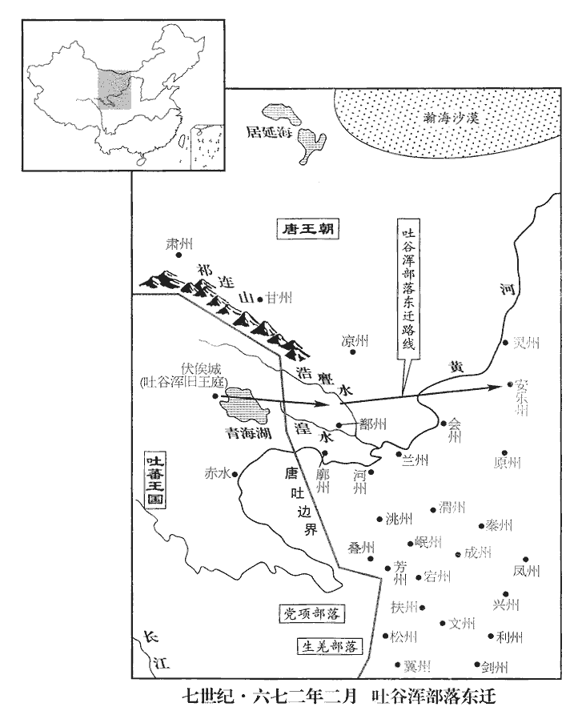
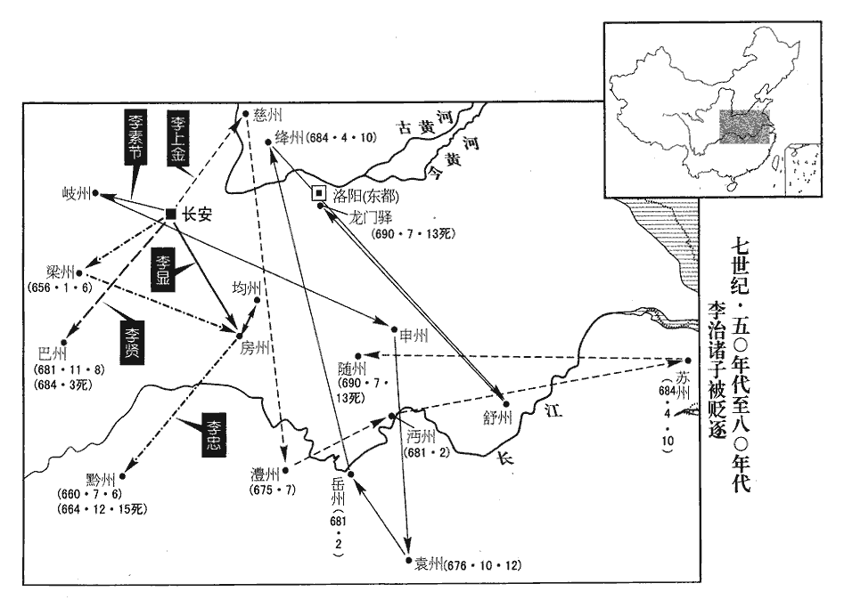
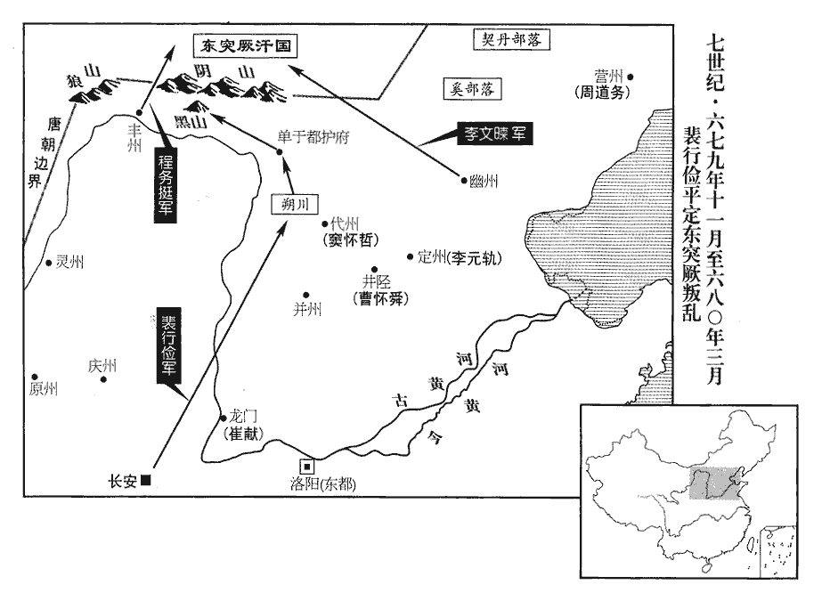
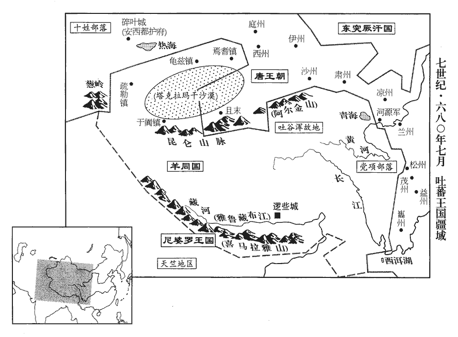
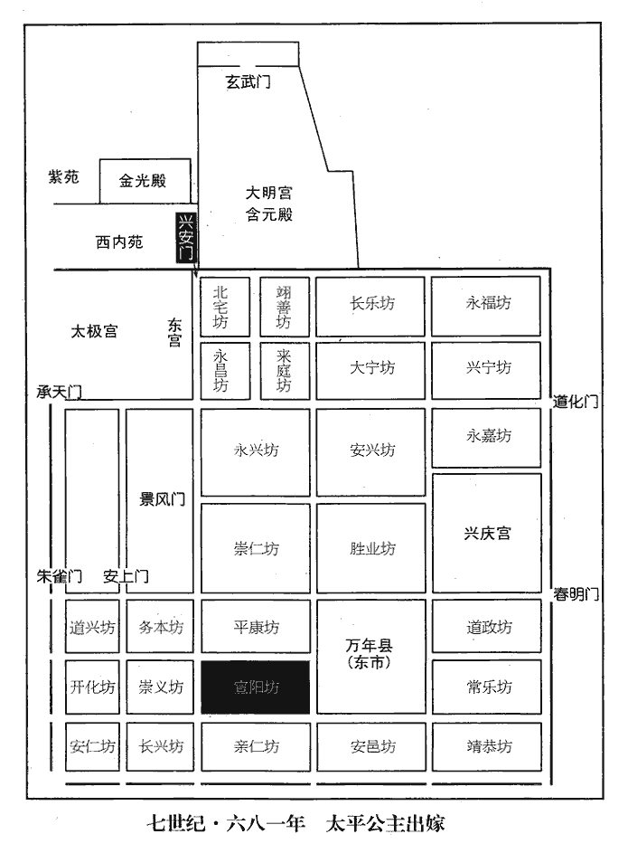

 唐紀十八起重光協洽（辛未），盡重光大荒落（辛巳），凡十一年。

# 高宗天皇大聖大弘孝皇帝中之下

## 咸亨二年（辛未、六七一）

1春，正月，甲子‹二十六›，上‹李治，本年四十四岁›幸東都‹洛阳›。考異曰：舊本紀及太子弘傳，「正月乙巳，幸東都，留太子於京師監國。」明年十月己未，又云「皇太子監國。」新本紀、唐曆、統紀皆連歲言太子監國。按離長安時，已留太子監國，及自東都將還，豈得又令監國！按實錄此月無監國事，唯明年十月有之。今從之。

〖译文〗 [1]春季，正月，甲子（二十六日），唐高宗来到东都洛阳。

2夏，四月，甲申‹十八›，以西突厥阿史那都支為左驍衛大將軍兼匐延都督‹总部设新疆和布克赛尔蒙古自治县›，顯慶二年，平賀魯，以處木昆部為匐延都督府。厥，九勿翻。驍，堅堯翻。匐，蒲北翻。以安集五咄陸之眾。咄，當沒翻。

〖译文〗 [2]夏季，四月，甲申（十八日），唐朝任命西突厥阿史那都支为左骁卫大将军兼匐延都督，以安抚五咄陆的部众。

3初，武元慶等既死，事見上卷乾封元年。皇后奏以其姊子賀蘭敏之為士彠之嗣，彠，一虢翻。襲爵周公，改姓武氏，累遷弘文館學士、左散騎常侍。太宗在藩，於秦府置文學館學士，其後弘文、崇文二館皆有學士。散，悉亶翻。騎，奇寄翻。魏國夫人之死也，亦見乾封元年。上見敏之，悲泣曰：「曏吾出視朝猶無恙，退朝已不救，何蒼猝如此！」朝，直遙翻。敏之號哭不對。后聞之，曰：「此兒疑我。」由是惡之。敏之貌美，蒸於太原王妃；及居妃喪，釋衰絰，奏妓。號，戶高翻。惡，烏路翻。衰，倉回翻。妓，渠綺翻。司衛少卿楊思儉女，有殊色，上及后自選以為太子妃，婚有日矣，敏之逼而淫之。后於是表言敏之前後罪惡，請加竄逐。六月，丙子‹十一›，敕流雷州‹广东省雷州市›，復其本姓。至韶州‹广东省韶关市›，以馬韁絞死。雷州，漢徐聞縣地。梁置南合州，隋曰合州，仍置海康縣，大業廢州。唐武德五年，復置，貞觀八年改曰雷州。韶州，漢南野縣地。吳孫皓甘露元年，分立始興郡。唐武德初，置番州，貞觀元年，改韶州。舊志：雷州至京師六千五百四十七里，至東都五千八百三十六里。韶州至京師四千九百三十二里，至東都四千一百四十二里。韁，居良翻。朝士坐與敏之交遊，流嶺南‹南岭以南›者甚眾。朝，直遙翻。

〖译文〗 [3]当初，皇后武则天的哥哥武元庆等已死，皇后便上奏唐高宗，以她姐姐的儿子贺兰敏之作为她父亲武士的嗣子，承袭周国公爵位，改姓武氏。武敏之连续升官，此时任弘文馆学士、左散骑常侍。魏国夫人被武则天毒死时，唐高宗遇见武敏之，悲痛哭泣，说：“早上我外出临朝听政时，她还安然无恙，退朝时就无法抢救了，为何死得如此匆促？”武敏之只是大哭，并不答话。武则天听到这个情况后，说：“这小子怀疑我。”于是开始憎恨他。武敏之相貌漂亮，与他外祖母太原王妃杨氏淫乱；在为杨氏守丧期间，他又脱去丧服，命歌妓奏乐歌舞。司卫少卿杨思俭的女儿美貌出众，唐高宗和武则天亲自选她为太子妃，婚期已定，武敏之竟强奸了她。武则天于是给唐高宗上书，揭露他前后的罪恶，请求将他放逐到边远地区。六月，丙子（十一日），唐高宗命令把武敏之流放到雷州，恢复他的本姓贺兰。敏之走到韶州，被用马缰绳绞死。朝廷官吏中不少人因曾与他交游，被流放岭南。

4秋，七月，乙未朔‹一›，高侃破高麗餘眾於安市城‹辽宁省海城市›。麗，力知翻。

〖译文〗 [4]秋季，七月，乙未朔（初一），高侃在安市城打败叛唐的高丽残余部队。

5九月，丙申‹二›，潞州‹山西省长治市›刺史徐王元禮薨。

〖译文〗 [5]九月，丙申（初二），潞州刺史徐王李元礼去世。

6冬，十一月，甲午朔‹一›，日有食之。

〖译文〗 [6]冬季，十一月，甲午朔（初一），出现日食。

7車駕自東都幸許‹河南省许昌市›、汝‹河南省汝州市›；十二月，癸酉‹十›，校獵於葉縣‹河南省叶县›；舊志：東都至許州四百里，至汝州百八十里。葉縣舊屬南陽郡，後并省，後齊置襄州，後周廢州，置南襄城郡，隋廢郡為葉縣，屬許州。葉，式涉翻。丙戌‹二十三›，還東都。

〖译文〗 [7]唐高宗由东都洛阳巡游许州、汝州；十二月，癸酉（初十），在叶县进行围猎；丙戌（二十三日），返回东都洛阳。

## 三年（壬申、六七二）

1春，正月，辛丑‹八›，以太子左衛副率梁積壽為姚州道‹云南省姚安县›行軍總管，太子十率府，各有副率，位四品。率，所律翻。將兵討叛蠻。將，即亮翻。

〖译文〗 [1]春季，正月，辛丑（初八），唐朝任命太子左卫副率梁积寿为姚州道行军总管，率领军队讨伐叛蛮。

2庚戌‹十七›，昆明蠻‹云南省东部少数民族›十四姓二萬三千戶內附，置殷‹四川省沐川县›、敦‹云南省盐津县东南›、總‹云南省盐津县›三州。爨蠻西有昆明蠻，一曰昆彌蠻，以西洱河為境，即葉榆河也，去長安九千里。殷州居戎州西北，總州居西南，敦州居南，遠不過五百餘里，近三百里。

〖译文〗 [2]庚戌（十七日），昆明蛮十四姓二万三千户归附唐朝。唐朝在他们的居住地区设置殷州、敦州和总州。

3二月，庚午‹八›，徙吐谷渾於鄯州‹青海省乐都县›浩亹水‹大通河›南。漢書地理志：浩亹水東至允吾入湟。允吾，唐為鄯州龍支縣。水經註：浩亹河出允吾西北塞外，東逕浩亹縣故城南，又東流注于湟水，俗呼為閤門河。吐，從暾入聲。谷，音浴。鄯，時戰翻。浩，音誥。亹，音門。吐谷渾畏吐蕃‹首都逻些城西藏拉萨市›之強，不安其居，又鄯州地狹，尋徙靈州‹宁夏灵武市›，以其部落置安樂州‹宁夏中宁县›，時以靈州鳴沙縣地置安樂州。樂，音洛。以可汗諾曷鉢為刺史。可，從刊入聲。汗，音寒。吐谷渾故地皆入於吐蕃。

〖译文〗 [3]二月，庚午（初八），唐朝将吐谷浑迁移到鄯州浩水以南。吐谷浑因畏惧吐蕃的强大，在鄯州住不踏实，同时也因该地区狭小，不久又迁移到灵州。唐朝在他们的新住地设置安乐州，任命他们的可汗诺曷钵为州刺史。吐谷浑原来的居住地都被吐蕃吞并。

 

4己卯‹十七›，侍中永安郡公姜恪薨。

〖译文〗 [4]己卯（十七日），侍中、永安郡公姜恪去世。

5夏，四月，庚午‹九›，上幸合璧宮‹洛阳境›。

〖译文〗 [5]夏季，四月，庚午（初九）唐高宗巡幸合璧宫。

6吐蕃遣其大臣仲琮入貢，上問以吐蕃風俗，對曰：「吐蕃地薄氣寒，風俗朴魯；然法令嚴整，上下一心，議事常自下而起，因人所利而行之，斯所以能持久也。」上詰以吞滅吐谷渾、見上卷龍朔三年。詰，去吉翻。敗薛仁貴、見上卷咸亨元年。敗，補邁翻。寇逼涼州‹甘肃省武威市›事，吐蕃既滅吐谷渾，又破西域，則寇逼涼州矣。對曰：「臣受命貢獻而已，軍旅之事，非所聞也。」上厚賜而遣之。癸未‹二十二›，遣都水使者黃仁素使于吐蕃。使，疏吏翻。

〖译文〗 [6]吐蕃派遣大臣仲琮入朝进贡，唐高宗向他询问吐蕃地方的风俗，他回答说：“吐蕃土地贫瘠，天气寒冷，民风诚朴迟钝，但法令严肃而完备，上下一心，讨论政事常常自下而上，根据人们的利益所在而实施。这是吐蕃能够长期存在的原因。”唐高宗又责问他有关吐蕃吞灭吐谷浑，打败薛仁贵，以及侵逼凉州等事。他回答说：“我的任务只是前来进贡，至于军事方面的事，则不是我所应当知道的。”唐高宗赏赐他优厚的礼物，打发他返回吐蕃。癸未（二十二日），唐朝派遣都水使者黄仁素出使吐蕃。

7秋，八月，壬午‹二十四›，特進高陽郡公許敬宗卒‹年八十一岁›。卒，子恤翻。太常博士袁思古議：「敬宗棄長子於荒徼，徼，吉弔翻。嫁少女於夷貊。少，詩沼翻。貊，莫白翻。按諡法，『名與實爽曰繆，』請諡為繆。」繆，靡幼翻。敬宗孫太子舍人彥伯訟思古與許氏有怨，請改諡。太常博士王福畤議，畤，音止。以為：【章：十二行本「為」下有「諡者」二字；乙十一行本同；孔本同；張校同。】「得失一朝，榮辱千載。太常博士擬諡，皆跡其功行為之褒貶，大行大名之，小行小名之。載，子亥翻。若嫌隙有實，當據法推繩；如其不然，義不可奪。」戶部尚書戴至德謂福畤曰：「高陽公任遇如是，何以諡之為繆？」對曰：「昔晉司空何曾既忠且孝，徒以日食萬錢，秦秀諡之為『繆』，見八十卷晉武帝咸寧四年。許敬宗忠孝不逮於曾，而飲食男女之累過之，累，力瑞翻。諡之曰『繆』，無負許氏矣。」詔集五品已上更議，禮部尚書陽思敬議：「按諡法，既過能改曰恭，請諡曰恭。」詔從之。敬宗嘗奏流其子昂于嶺南，又以女嫁蠻酋馮盎之子，多納其貨，酋，慈由翻。故思古議及之。福畤，勃之父也。王勃，見二百卷龍朔元年。

〖译文〗 [7]秋季，八月，壬午（二十四日），特进高阳郡公许敬宗去世。讨论为他定谥号时，太常博士袁思古评论说：“许敬宗遗弃大儿子于边远地区，将小女儿嫁给夷貊，按照《谥法》：‘名与实不符称为缪’，请给他以‘缪’的谥号。”许敬宗的孙子太子舍人许彦伯指责袁思古与许家有私怨，请求改定别的谥号。太常博士王福认为：“一时的得失，关系到千载的荣辱。如借机泄私怨是事实，应当依法论罪；否则，袁思古提的谥号按理是不应更改的。”户部尚书戴至德对王福说：“高阳郡公在朝廷中有这样高的职位和待遇，何以给予‘缪’的谥号？”王福回答说：“从前晋朝司空何曾既忠且孝，只因每日饮食耗费万钱，秦秀在他死后就给定谥号为‘缪’。许敬宗忠和孝都不及何曾，而饮食女色的耗费却超过他。给予‘缪’的谥号，已对得起许敬宗了。”唐高宗下诏令召集五品以上官员重新评议。礼部尚书阳思敬评议说：“按照《谥法》，有了过失能改正称为‘恭’，请给他定谥号为‘恭’。”唐高宗下诏接受这个意见。许敬宗曾向皇帝奏请将他儿子许昂流放岭南，又曾将女儿嫁给蛮族首领冯盎的儿子，并多收取他的财物，所以袁思古的评议谈到了此事。王福就是王勃的父亲。

8九月，癸卯‹十五›，徙沛王賢為雍王。雍，於用翻。

〖译文〗 [8]九月，癸卯（十五日），唐朝改封沛王李贤为雍王。

9冬，十月，己未‹二›，詔太子監國。監，古銜翻。

〖译文〗 [9]冬季，十月，己未（初二），唐高宗下诏，令皇太子监理国家政事。

10壬戌‹五›，車駕發東都‹洛阳›。

〖译文〗 [10]壬戌（初五），唐高宗车驾从东都洛阳出发。

11十一月，戊子朔‹一›，日有食之。

〖译文〗 [11]十一月，戊子朔（初一），出现日食。

12甲辰‹十七›，車駕至京師‹西安›。

〖译文〗 [12]甲辰（十七日），唐高宗车驾回到京师长安。

13十二月，高侃與高麗餘眾戰于白水山，破之。新羅‹首都金城韩国庆州市›遣兵救高麗，侃擊破之。

〖译文〗 [13]十二月，唐将高侃与高丽残余部队战于白水山，高侃把他们打败。新罗派兵援救高丽，高侃也把他们打败。

14癸卯，以左庶子劉仁軌同中書門下三品。

〖译文〗 [14]癸卯（疑误），唐朝任命左庶子刘仁轨为同中书门下三品。

15太子‹李弘›罕接宮臣，典膳丞全椒‹安徽省全椒县›邢文偉輒減所供膳，東宮典膳局郎，正六品上；丞，正八品上：掌進膳嘗食。全椒縣時屬滁州。并上書諫太子。太子復書，謝以多疾及入侍少暇，嘉納其意。上，時掌翻。頃之，右史缺，上曰：「邢文偉事吾子，能撤膳進諫，此直士也。」擢為右史。起居舍人，從六品上，屬中書省，掌脩記言之史，錄天子之制誥德音，如記言之制，以紀時政之損益，季終，則授之於國史。龍朔改曰右史。

〖译文〗 [15]太子很少接近东宫的属官，典膳丞全椒人邢文伟便减少他的膳食，并上书规劝太子。太子在给他的复信中承认错误，表示接受他的意见，提出产生这种情况的原因是自己多病，而且需要经常入宫侍候皇帝，空闲时间少。不久，右史职位出现空缺，唐高宗说：“邢文伟侍奉我儿子，能用撤减膳食的方式进行规劝，这是耿直的人”，于是提升他为右史。

太子因宴集，命宮臣擲倒，唐散樂有舞盤伎、舞輪伎、長蹻伎、跳鈴伎、擲倒伎、跳劍伎、吞劍伎，皆梁之遺伎也。次至左奉裕率王及善，隋置太子內率府，擬上臺千牛衛，掌東宮千牛備身侍奉之事，龍朔改為左、右奉裕率。率，所律翻。及善曰：「擲倒自有伶官，伶，盧經翻。臣若奉令，恐非所以羽翼殿下也。」太子謝之。上聞之，賜及善縑百匹，尋遷左千牛衛將軍。千牛刀，即人主防身刀也，取莊子庖丁解數千牛，而芒刃不頓之義。後魏有千牛備身，掌宿衛侍從，隋煬帝置備身府，唐改千牛府。

〖译文〗 太子在一次宴会时，命令东宫的属官表演“掷倒”的杂耍。当依次该左奉裕率王及善表演时，他说：“表演‘掷倒’，本是乐官的事，如果我执行您的命令，恐怕就失去辅佐殿下的身份了。”太子向他承认了错误。唐高宗听说这个情况后，赏赐给王及善缣一百匹，不久又提升他为左千牛卫将军。

## 四年（癸酉、六七三）

1春，正月，丙辰‹二十九›，絳州‹山西省新绛县›刺史鄭惠王元懿‹李治的叔父›薨。

〖译文〗 [1]春季，正月，丙辰（二十九日），唐朝绛州刺史郑惠王李元懿去世。

2三月，丙申‹十›，詔劉仁軌等改脩國史，以許敬宗等所記多不實故也。

〖译文〗 [2]三月，丙申（初十），唐高宗下诏书，命刘仁轨等改修国史，因为原来许敬宗等所记录的国史多不符合事实。

3夏，四月，丙子‹二十一›，車駕‹李治，本年四十六岁›幸九成宮‹陕西省麟游县境›。

〖译文〗 [3]夏季，四月，丙子（疑误），唐高宗车驾到达九成宫。

4閏五月，燕山道總管、右領軍大將軍李謹行大破高麗叛者於瓠蘆河‹应在朝鲜半岛中部›之西，胡嶠曰：黑車子之北，有牛蹄突厥，人身牛足。其地尤寒，水曰瓠𤬛河，夏秋冰厚二尺，秋冬冰徹底，常燒器銷冰，乃得飲。余按唐書劉仁軌傳，此瓠蘆河當在高麗南界，新羅七重城之北。燕，因肩翻；下同。俘獲數千人，餘眾皆奔新羅‹首都金城韩国庆州市›。時謹行妻劉氏留伐奴城‹朝鲜平壤市西北›，高麗引靺鞨‹黑龙江下游›攻之，劉氏擐甲帥眾守城，久之，虜退。靺鞨，音末曷。擐，音宦。帥，讀曰率。上嘉其功，封燕國夫人。謹行，靺鞨人突地稽之子也，突地稽見一百八十九卷高祖武德四年。武力絕人，為眾夷所憚。

〖译文〗 [4]闰五月，燕山道总管、右领军大将军李谨行在瓠芦河以西大败高丽反叛者，俘虏数千人，其余的都投奔新罗。当时李谨行的妻子刘氏居留伐奴城，高丽带领人来攻城，刘氏披甲率众守城，相持一段时间后，敌人终于撤退了。唐高宗嘉奖她的功劳，封她为燕国夫人。李谨行是人突地稽的儿子，勇猛过人，使许多夷人畏惧。

5秋，七月，【章：十二行本「月」下有「辛巳」二字；乙十一行本同；孔本同；退齋校同。】婺州‹浙江省金华市›大水，溺死者五千人。婺，亡遇翻。溺，奴狄翻。

〖译文〗 [5]秋季，七月，婺州发生大水灾，被淹死的有五千人。

6八月，辛丑‹十九›，上以瘧疾，令太子於延福殿受諸司啟事。瘧，迸約翻。

〖译文〗 [6]八月，辛丑（十九日），唐高宗因患疟疾，命令太子在延福殿接受各部门陈述事情。

7冬，十月，壬午‹一›，中書令閻立本薨。

〖译文〗 [7]冬季，十月，壬午（初一），中书令阎立本去世。

8乙巳‹二十四›，車駕還京師。

〖译文〗 [8]乙巳（二十四日），唐高宗车驾返回京师长安。

9十二月，丙午‹二十五›，弓月‹新疆霍城县›、疏勒‹新疆喀什市›二王來降。降，戶江翻；下同。西突厥興昔亡可汗之世，諸部離散，弓月及阿悉吉皆叛。阿悉吉即阿悉結，弩失畢五俟斤之一也。蘇定方之西討也，見二百卷顯慶二年。擒阿悉吉以歸。弓月南結吐蕃，北招咽麵‹巴尔喀什湖东›，咽麵，亦鐵勒種，居得嶷海。咽，於甸翻。麵，眠見翻。共攻疏勒‹新疆喀什市›，降之。上遣鴻臚卿蕭嗣業發兵討之。嗣業兵未至，弓月懼，與疏勒皆入朝；上赦其罪，遣歸國。臚，陵如翻。朝，直遙翻。

〖译文〗 [9]十二月，丙午（二十五日），弓月王和疏勒王来投降唐朝。当初，西突厥兴昔亡可汗统治的时候，属下诸部离散，弓月和阿悉吉都反叛。后来唐将苏定方领兵讨伐西突厥，擒阿悉吉返回唐朝，弓月便向南边勾结吐蕃，向北边招引咽面，共同进攻疏勒，迫使疏勒投降。于是唐高宗派遣鸿胪卿萧嗣业发兵讨伐弓月。萧嗣业率领的兵马尚未到达，弓月畏惧，便与疏勒一起来唐朝投降。唐高宗赦免他的罪过，遣送他回国。

## 上元元年（甲戌、六七四）是年八月方改元。

1春，正月，壬午‹二月二日›，以左庶子、同中書門下三品劉仁軌為雞林道大總管，帝以新羅國為雞林州。衛尉卿李弼、右領軍大將軍李謹行副之，發兵討新羅‹首都金城韩国庆州市›。時新羅王法敏既納高麗叛眾，又據百濟故地‹朝鲜半岛西南部›，使人守之。上大怒，詔削法敏官爵；其弟右驍衛員外大將軍、臨海郡公仁問在京師，驍，堅堯翻。立以為新羅王，使歸國。

〖译文〗 [1]春季，正月，壬午（疑误），唐高宗任命左庶子、同中书门下三品刘仁轨为鸡林道大总管，卫尉卿李弼、右领军大将军李谨行为刘仁轨的副手，领兵讨伐新罗。当时新罗王金法敏既接纳高丽叛兵，又占据百济原有的土地，并派人镇守。唐高宗对此十分愤怒，下令削除新罗王金法敏的官爵；另立他居留在京师长安的弟弟右骁卫大将军、临海郡公金仁问为新罗王，并派他回国。

2三月，辛亥朔‹一›，日有食之。

〖译文〗 [2]三月，辛亥朔（初一），出现日食。

3賀蘭敏之既得罪，皇后奏召武元爽‹武曌的异母哥›之子承嗣於嶺南‹南岭以南›，乾封元年，元爽流振州。襲爵周公，拜尚衣奉御；尚衣奉御，屬殿中省，掌衣服，詳其制度，辯其名數。夏，四月，辛卯‹十二›，遷宗正卿。

〖译文〗 [3]贺兰敏之获罪以后，皇后武则天奏请从岭南召回她哥哥武元爽的儿子武承嗣，承袭周国公的爵位，担任尚衣奉御。夏季，四月，辛卯（十二日），升任宗正卿。

4秋，八月，壬辰‹十五›，追尊宣簡公‹李熙›為宣皇帝，妣張氏為宣莊皇后；懿王‹李天赐›為光皇帝，妣賈氏為光懿皇后；後魏金門鎮將熙，太祖虎之祖也，諡宣簡公；魏幢主天賜，太祖虎之父也，諡懿王。太武皇帝‹李渊›為神堯皇帝，太穆皇后為太穆神皇后；文皇帝‹李世民›為太宗文武聖皇帝，文德皇后為文德聖皇后。皇帝‹李治›稱天皇，皇后‹武曌›稱天后，以避先帝、先后之稱。實欲自尊，而以避先帝、先后之稱為言，武后之意也。之稱，尺證翻。改元，赦天下。

〖译文〗 [4]秋季，八月，壬辰（十五日），唐高宗追尊他的七世祖宣简公李熙为宣皇帝，七世祖母张氏为宣庄皇后；六世祖懿王李天赐为光皇帝，六世祖母贾氏为光懿皇后；祖父太武皇帝李渊为神尧皇帝，祖母太穆皇后为太穆神皇后；父亲文皇帝李世民为太宗文武圣皇帝，母亲文德皇后为文德圣皇后。为了回避已故皇帝、皇后的称号，唐高宗改称天皇，皇后武则天改称天后；改年号为上元，赦免天下罪人。

5戊戌‹二十一›，敕：「文武官三品以上服紫，金玉帶；四品服深緋，金帶；五品服淺緋，金帶；六品服深綠，七品服淺綠，並銀帶；八品服深青，九品服淺青，並鍮tōu石帶；鍮石似金而非金。鍮，託侯翻。庶人服黃，銅鐵帶。自非庶人，不聽服黃。」非庶人，謂工商雜戶。

〖译文〗 [5]戊戌（二十一日），唐高宗诏命：“文武官员三品以上穿紫色衣服，佩金玉带；四品穿深红色衣服，佩金带；五品穿浅红色衣服，佩金带；六品穿深绿色衣服，七品穿浅绿色衣服，都佩银带；八品穿深青色衣服，九品穿浅青色衣服，都佩黄铜带；无官爵的平民百姓穿黄色衣服，佩铜铁带。其余工商杂户，不许穿黄色衣服。”

6九月，癸丑‹七›，詔追復長孫晟、長孫無忌官爵，以無忌曾孫翼襲爵趙公，聽無忌喪歸，陪葬昭陵‹李世民墓·陕西省礼泉县北九嵕山›。無忌削官爵而死，見二百卷顯慶四年。

〖译文〗 [6]九月，癸丑（初七），唐高宗命令恢复长孙晟、长孙无忌官爵，让长孙无忌曾孙长孙翼承袭赵公爵位；准许长孙无忌的遗体从流放地黔州送回长安，陪葬在唐太宗的昭陵。

7甲寅‹八›，上御翔鸞閣，據舊書郝處俊傳，翔鸞閣在含元殿東。唐六典，含元殿翼以二閣，左曰翔鸞，右曰棲鳳，二閣之下，為東西朝堂。觀大酺。酺pú，薄胡翻。分音樂為東西朋，使雍王賢主東朋，周王顯主西朋‹李贤、李显都是武曌生的儿子›，角勝為樂，郝處俊諫曰：「二王春秋尚少，志趣未定，當推梨讓棗，梁元帝遺武陵王書有是言。樂，音洛。少，詩沼翻。推，吐雷翻。相親如一。今分二朋，遞相誇競，俳pái優小人，言辭無度，恐其交爭勝負，譏誚失禮，非所以崇禮義，勸敦睦也。」上瞿然曰：誚，才笑翻。瞿，九遇翻，驚視貌。「卿遠識，非眾人所及也。」遽止之。

〖译文〗 [7]甲寅（初八），唐高宗登翔鸾阁，观看大会饮，分乐队为东西两部分，让雍王李贤主持东半部，周王李显主持西半部，东西两部分相比赛胜负以取乐。郝处俊对唐高宗规劝说：“雍王和周王还属少年，志趣尚未定型，应当‘推梨让枣’，互谅互让，亲密无间。现在分成两部分互相夸耀竞争，歌舞艺人，言语本来就没有节制，为了争胜负，恐怕难免互相讥讽指责而失礼，这不是崇尚礼义，鼓励亲爱和睦的做法。”唐高宗震惊地说：“你的远见卓识，不是大家所能及的。”于是立即下令停止比赛。

是日，衛尉卿李弼暴卒于宴所，為之廢酺一日。為，于偽翻。

〖译文〗 这一天，卫尉卿李弼暴死在宴会上，为悼念他，停止大会饮一天。

8冬，十一月，丙午朔‹一›，車駕發京師；己酉‹四›，校獵華山之曲武原‹陕西省华阴市南›；華山在華州華陰縣南。曲武原在華山下。華，戶化翻。戊辰‹二十三›，至東都‹洛阳›。

〖译文〗 [8]冬季，十一月，丙午朔（初一），唐高宗从京师长安出发；己酉（初四），在华山下的曲武原围猎；戊辰（二十三日），到达东都洛阳。

9箕州‹山西省左权县›錄事參軍張君澈等誣告刺史蔣王惲‹李治之弟›及其子汝南郡王煒謀反，惲，於粉翻。煒wěi，于鬼翻。敕通事舍人薛思貞馳傳往按之。傳，張戀翻。十二月，癸未‹八›，惲惶懼，自縊死，縊，於計翻。上知其非罪，深痛惜之，斬君澈等四人。

〖译文〗 [9]箕州录事参军张君澈等诬告箕州刺史蒋王李恽和他的儿子汝南郡王李炜谋反。唐高宗命令通事舍人薛思贞乘驿站的马车赶去审查此事。十二月，癸未（初八），蒋王李恽畏惧，上吊自杀。唐高宗知道他没有罪，深感痛惜，于是处死张君澈等四人。

10戊子‹十三›，于闐‹新疆和田市›王伏闍雄來朝。闐，徒賢翻。闍，視遮翻。朝，直遙翻；下同。

〖译文〗 [10]戊子（十三日），于阗王尉迟伏雄前来朝见天子。

11辛卯‹十六›，波斯‹伊朗高原›王卑路斯来朝。

〖译文〗 [11]辛卯（十六日），波斯王卑路斯前来朝见天子。

12壬寅‹二十七›，天后上表，以為：「國家聖緒，出自玄元皇帝，老子姓李名耳；唐祖之，乾封元年，尊為玄元皇帝。上，時掌翻；下同。請令王公以下皆習老子，每歲明經，準孝經、論語策試。」又請「自今父在，為母服齊衰三年。古禮，父在，為母服朞。為，于偽翻。齊，音咨。衰，倉回翻。又，京官八品以上，宜量加俸祿。」京官，在京官也。量，音良。及其餘便宜，合十二條。詔書褒美，皆行之。

〖译文〗 [12]壬寅（二十七日），天后武则天上表高宗，认为：“国家圣业的开端，出自玄元皇帝，请皇帝命令王公以下各级官员都学习《老子》，每年明经科加试《老子》，考试方法同《孝经》、《论语》一样。”又请求“从现在起，父亲仍在世，为死去的母亲服丧，着齐衰三年。又，八品以上在京官员，应当酌量增加俸禄”，以及其他应办的事情，共十二条。唐高宗下诏对武则天给予表扬，全部接受并实行她的建议。

13是歲，有劉曉者，上疏論選，選，須絹翻；下同。考異曰：會要作「劉嶢yáo」。今從統紀。以為：「今選曹以檢勘為公道，檢勘者，謂考其功過，察其假名承偽，隱冒升降。書判為得人，殊不知考其德行才能。況書判借人者眾矣。又，禮部取士，專用文章為甲乙，故天下之士，皆捨德行而趨文藝，有朝登甲科而夕陷刑辟者，雖日誦萬言，何關理體！理體，即治道。行，下孟翻。趨，七喻翻；下同。辟，毗亦翻。文成七步，未足化人。況盡心卉木之間，極筆煙霞之際，以斯成俗，豈非大謬！夫人之慕名，如水趨下，上有所好，下必甚焉。陛下若取士以德行為先，文藝為末，則多士雷奔，四方風動矣！」趨，七喻翻。好，呼到翻；下憐好同。

〖译文〗 [13]本年，有个叫刘晓的人，给唐高宗上书论选拔人才。他以为：“现今吏部以考查功过为公平，以书法和判文作为获取人才的手段，而不知道考察人的道德品行和才能。何况假借别人的书法和判文的人多着呢！还有，礼部取士，专以文章定等次，因此天下的士人都舍弃道德品行而追求写作技巧，结果出现了早上考取甲等进士，晚上即因犯法而被治罪的人。这样的人，即使每日能诵读上万言，与治道又有什么关系！能在行走七步的时间内写成文章，不足以教化百姓。况且把心思全贯注在花草树木之间，将笔墨全耗费在云霞之际，这种情况竟成为风气，岂不是太荒谬了！人们羡慕声名的本性，就像水必然向下流一样，在上位的人喜欢什么，在下位的人喜欢的程度就一定会超过他们。陛下如果选拔人才，首先考虑道德品行，写作技巧只放在末位，则众多的士人就会雷厉风行地修养德行，四方就会闻风响应。”

## 二年（乙亥、六七五）

1春，正月，丙寅‹二十一›，以于闐國‹新疆和田市›為毗沙都督府，分其境內為十州，以于闐王尉遲伏闍雄為毗沙都督。闐，徒賢翻，又徒見翻。尉，紆勿翻。闍，視遮翻。

〖译文〗 [1]春季，正月，丙寅（二十一日），唐朝在于阗国设立毗沙都督府，将于阗国分为十州，任命于阗王尉迟伏雄为毗沙都督。

2辛未‹二十六›，吐蕃‹首都逻些城西藏拉萨市›遣其大臣論吐渾彌來請和，且請與吐谷渾‹甘肃省中部›復脩鄰好；吐，從暾入聲；下同。復，扶又翻。谷，音浴。上不許。

〖译文〗 [2]辛未（二十六日），吐蕃派遣大臣论吐浑弥到唐朝求和，而且请求与吐谷浑恢复睦邻关系；唐高宗不允许。

3二月，劉仁軌大破新羅‹首都金城韩国庆州市›之眾於七重城‹朝鲜半岛积城›；重，直龍翻。又使靺鞨‹黑龙江下游›浮海，略新羅之南境，斬獲甚眾。仁軌引兵還。靺，音末。鞨，音曷。還，從宣翻，又音如字。詔以李謹行為安東鎮撫大使，使，疏吏翻；下同。屯新羅之買肖城‹应在朝鲜半岛东南部›以經略之，三戰皆捷，新羅乃遣使入貢，且謝罪，上赦之，復新羅王法敏官爵。金仁問中道而還，使，疏吏翻。還，音旋，又如字。改封臨海郡公。

〖译文〗 [3]二月，刘仁轨在七重城大败新罗的部队；又让从海路夺取新罗南部地区，杀死和俘虏很多人。刘仁轨率兵返回。唐高宗下诏任命李谨行为安东镇抚大使，屯兵新罗的买肖城，以经营该地区，李谨行打了三仗都取得胜利，新罗于是派遣使者到唐朝进贡，并且请罪；唐高宗赦免了他们，并恢复新罗王金法敏的官职和爵位。金法敏的弟弟金仁问中途返回唐朝，改封为临海郡公。

4三月，丁巳‹十三›，天后祀先蠶於邙山‹洛阳城北›之陽；漢儀：三月桑始生，皇后親桑於苑中蠶室，養蠶千薄以上，祠以中牢羊豕。續漢志：三月，皇后帥公卿、諸侯夫人蠶，祠先蠶，禮以少牢。註云：今蠶神曰苑疏窳yǔ婦人，寓氏公主。唐制：皇后歲祀一，季春吉巳，享先蠶，遂以親桑。蜀註曰：通典：先蠶，天駟也。百官及朝集使皆陪位。朝，直遙翻；下同。

〖译文〗 [4]三月，丁巳（十三日），天后武则天在邙山之南祭蚕神，朝廷官员及各州的朝集使，都出席陪祭。

5上苦風眩甚，議使天后攝知國政。中書侍郎同三品郝處俊曰：「天子理外，后理內，天之道也。記昏義曰：天子聽男教，后聽女順；天子理陽道，后治陰德；天子聽外治，后聽內職。教順成俗，外內和順，國家理治，此之謂盛德。昔魏文‹曹丕›著令，雖有幼主，不許皇后臨朝，所以杜禍亂之萌也。事見六十九卷魏文帝黃初三年。陛下柰何以高祖‹李渊›、太宗‹李世民›之天下，不傳之子孫而委之天后乎！」中書侍郎昌樂‹河南省南乐县›李義琰曰：「處俊之言至忠，陛下宜聽之！」樂，音洛。上乃止。

〖译文〗 [5]唐高宗受严重风眩病的困扰，商议由天后武则天代理国家政事，中书侍郎、同三品郝处俊说：“皇帝治理外朝，皇后治理后宫，是天经地义的。从前魏文帝曹丕曾立下法令，虽然皇帝幼小，也不许太后临朝听政，为的是防止祸乱发生。陛下为何不将高祖、太宗的天下传给子孙，而托付给天后呢！”中书侍郎昌乐人李义琰说：“郝处俊的话是最忠诚的，陛下应当听取！”唐高宗于是放弃原来的打算。

6天后多引文學之士著作郎元萬頃、唐著作郎，從五品上，掌脩撰碑誌、祝文、祭文，屬祕書省。左史劉禕yī之等，龍朔改起居郎為左史。使之撰《列女傳》、《臣軌》、《百僚新戒》、《樂書》，凡千餘卷。撰，士免翻。朝廷奏議及百司表疏，時密令參決，以分宰相之權，疏，所去翻。時人謂之北門學士。不經南衙，於北門出入，故云然。禕之，子翼之子也。劉子翼仕隋，以學行著。

〖译文〗 [6]天后武则天广泛招揽文人学士，如著作郎元万顷、左史刘之等，要他们撰写《列女传》、《臣轨》、《百僚新戒》、《乐书》，共一千多卷。朝廷的奏议及各部门的表疏，时常秘密地让他们参与裁决，以此来削减宰相的权力，当时的人称这批人为北门学士。刘之就是刘子翼的儿子。

7夏，四月，庚辰‹六›，以司農少卿韋弘機為司農卿。弘機兼知東都營田，受詔完葺宮苑。有宦者於苑中犯法，弘機杖之，然後奏聞。上以為能，賜絹數十匹，曰：「更有犯者，卿即杖之，不必奏也。」

〖译文〗 [7]夏季，四月，庚辰（初六），唐朝任命司农少卿韦弘机为司农卿。韦弘机兼管东都洛阳屯田事务，奉命维修东都的宫殿园林。有宦官在皇帝园林里犯法，韦弘机先行杖打，然后再向唐高宗报告。唐高宗认为他办事能干，赏赐他数十匹绢，说：“再有类似的犯法者，你就拷打，不必报告。”

8初，左千牛將軍長安‹首都长安西半城›趙瓌guī尚高祖‹李渊›女常樂公主，生女為周王顯妃。公主頗為上所厚，天后惡之。樂，音洛。惡，烏路翻。辛巳‹七›，妃坐廢，幽閉於內侍省，食料給生者，防人候其突煙，已而數日煙不出，開視，死腐矣。瓌自定州‹河北省定州市›刺史貶栝guā州‹浙江省丽水市›刺史，令公主隨之官，仍絕其朝謁。朝，直遙翻。

〖译文〗 [8]当初，左千牛将军长安人赵娶唐高祖的女儿常乐公主，所生女儿即周王李显的妃。常乐公主得到唐高宗的厚待，天后武则天因此憎恨她。辛巳（初七），周王的妃因犯罪被废黜，禁闭在内侍省，送给的食物都是生的，看守观察她的烟囱是否冒烟，后来发现有几天不冒烟，打开门一看，人已死去并腐烂了。赵也由定州刺史贬为栝州刺史，同时命令常乐公主随他赴任，不许他们回京师长安朝见唐高宗。

9太子弘仁孝謙謹，上甚愛之；禮接士大夫，中外屬心。屬，之欲翻。天后方逞其志，太子奏請，數迕旨，迕，逆也。數，所角翻。迕，五故翻。由是失愛於天后。義陽、宣城二公主，蕭淑妃之女也，坐母得罪，幽于掖庭，年踰三十不嫁。太子見之驚惻，遽奏請出降，上許之。天后怒，即日以公主配當上翊衛權毅、王遂古。親、勳、翊三衛皆番上。上，時掌翻。己亥‹二十五›，太子‹李弘，本年二十四岁›薨于合璧宮‹洛阳境›，時人以為天后酖之也。考異曰：新書本紀云：「己亥，天后殺皇太子。」新傳云：「后將逞志，弘奏請數怫旨，從幸合璧宮，遇酖薨。」唐曆云：「弘仁孝英果，深為上所鍾愛。自升為太子，敬禮大臣鴻儒之士，未嘗居有過之地。以請嫁二公主，失愛於天后，不以壽終。」實錄、舊傳皆不言弘遇酖。按李泌對肅宗云：「高宗有八子，睿宗最幼。天后所生四子，自為行第，故睿宗第四。長曰孝敬皇帝，為太子監國，仁明孝悌。天后方圖臨朝，乃酖殺孝敬，立雍王賢為太子。」新書蓋據此及唐曆也。按弘之死，其事難明，今但云時人以為天后鴆之，疑以傳疑。

〖译文〗 [9]太子李弘仁爱孝顺、谦虚谨慎，唐高宗很喜欢他。他对士大夫能以礼相待，得到了朝廷内外的爱戴。天后武则天正要施展个人抱负，太子李弘奏事多次违反她的旨意，因此武则天对他不喜欢。义阳、宣城二位公主，是萧淑妃的女儿，因受母亲牵连而获罪，被囚禁在后宫中，年过三十不能结婚。太子李弘见到这种情况，既吃惊又同情，便立即上奏请求准许她们出嫁，得到唐高宗的批准。武则天很恼火，当天便把她们分别嫁给正在值班的翊卫权毅、王遂古。己亥（二十五日），太子李弘死于合璧宫，当时人以为是被天后武则天用鸩酒毒死的。

壬寅‹二十八›，車駕還洛陽宮。五月，戊申‹五›，下詔：「朕方欲禪位皇太子，而疾遽不起，宜申往命，加以尊名，可諡為孝敬皇帝。」帝子諡皇帝始此。諡，神至翻。

〖译文〗 壬寅（二十八日），唐高宗回到洛阳宫。五月，戊申（初五），唐高宗下诏说：“朕正准备把帝位禅让给太子，而他忽然一病不起。应当重申以前的旨意，给予尊贵的名号，可定谥号为孝敬皇帝。”

六月，戊寅‹五›，立雍王賢為皇太子，赦天下。雍，於用翻。

〖译文〗 六月，戊寅（初五），唐朝立雍王李贤为皇太子，赦免天下罪人。

10天后惡慈州‹山西省吉县›刺史杞王上金，宋白曰：慈州，春秋廧qiáng咎如之國，漢為北屈縣。隋為汾州，唐武德元年，為西汾州，五年，改南汾州；貞觀八年，改南汾州為慈州，以州近慈烏戍，故名。孫愐曰：因慈氏縣名之。上金，帝後宮劉氏所生。惡，烏路翻。有司希旨奏其罪；秋，七月，上金坐解官，澧州‹湖南省澧县›安置。

〖译文〗 [10]天后武则天厌恶慈州刺史杞王李上金，有关部门迎合她的旨意奏报他有罪。秋季，七月，李上金因此被解除职务，在澧州安置。

11八月，庚寅‹十九›，葬孝敬皇帝于恭陵‹河南省偃师县境›。恭陵，在洛州緱氏縣懊來山，改名太平山。

〖译文〗 [11]八月，庚寅（十九日），唐朝葬孝敬皇帝李弘于恭陵。

 

12戊戌‹二十七›，以戴至德為右僕射，庚子‹二十九›，以劉仁軌為左僕射，並同中書門下三品如故。張文瓘guàn為侍中，郝處俊為中書令；李敬玄為吏部尚書兼左庶子，同中書門下三品如故。

〖译文〗 [12]戊戌（二十七日），唐朝任命戴至德为右仆射，庚子（二十九日），任命刘仁轨为左仆射，两人都仍担任同中书门下三品。任命张文为侍中，郝处俊为中书令；李敬玄为吏部尚书兼左庶子，仍然担任同中书门下三品。

劉仁軌、戴至德更日受牒訴，尚，辰羊翻。更，工衡翻。仁軌常以美言許之，至德必據理難詰，難，乃旦翻。詰，去吉翻。未嘗與奪，實有冤結者，密為奏辯。為，于偽翻。由是時譽皆歸仁軌。或問其故，至德曰：「威福者人主之柄，人臣安得盜取之！」上聞，深重之。有老嫗欲詣仁軌陳牒，誤詣至德，至德覽之未終，嫗曰：「本謂是解事僕射，乃不解事僕射邪！嫗，威遇翻。解，戶買翻。歸我牒！」至德笑而授之。時人稱其長者。長，知兩翻。文瓘時兼大理卿，囚聞改官，皆慟哭。文瓘性嚴正，諸司奏議，多所糾駮，上甚委之。駮，北角翻。

〖译文〗 刘仁轨、戴至德按日轮流接受讼辞。刘仁轨常用动听的言词答应递讼辞人的要求，戴至德定要据理责问，未曾轻易答应或否定，确实有冤枉的，才私下上奏皇帝为其申辩。因此，当时美好的声誉都归于刘仁轨。有人问戴至德，这是什么缘故，他说：“刑罚和赏赐都是皇帝的权力，作臣下的怎能盗用呢！”唐高宗听到这话后，很器重他。曾有老妇人要找刘仁轨呈递讼辞，错找了戴至德。戴至德还未完看完讼辞，老妇人发现找错了，说：“原来以为是懂事的仆射，竟是不懂事的仆射！快把讼辞还我！”戴至德笑着把讼辞交还她。当时人称赞他是个恭谨忠厚的人。张文当时兼任大理卿，囚犯们听说他改任侍中，无不痛哭。张文秉性严肃正直，各部门向皇帝陈述问题的上书，他常加以纠正或提出异议，唐高宗很依靠他。

## 儀鳳元年（丙子、六七六）是年十一月，方改元。

1春，正月，壬戌‹二十三›，‹李治，本年四十九岁›徙冀王輪為相王。

〖译文〗 [1]春季，正月，壬戌（二十三日），唐朝改封冀王李轮为相王。

2納州‹四川省叙永县›獠反，唐制，儀鳳二年開山洞置納州，屬瀘州都督府。獠，魯皓翻。敕黔州‹总部设重庆市彭水县›都督發兵討之。黔，音琴。

〖译文〗 [2]纳州獠人反叛唐朝，唐高宗命令黔州都督发兵讨伐。

3二月，甲戌‹六›，徙安東都護府‹朝鲜平壤市›於遼東故城‹辽宁省辽阳市›；考異曰：實錄，咸亨元年，楊昉、高侃討安舜，始拔安東都護府，自平壤城移於遼東州。儀鳳元年二月甲戌，以高麗餘眾反叛，移安東都護府於遼東城。蓋咸亨元年言移府者，終言之也；儀鳳元年言高麗反者，本其所以移也。會要無咸亨元年移府事。此年云移於遼東故城，今從之。先是有華人任【章：十二行本「任」下有「安」字；乙十一行本同；孔本同；張校同。】東官者，悉罷之。先，悉薦翻。徙熊津都督府‹总部设韩国公州市›於建安故城‹辽宁省盖州市›；其百濟戶口先徙於徐‹江苏省徐州市›、兗‹山东省兖州市›等州者，皆置於建安‹辽宁省盖州市›。

〖译文〗 [3]二月，甲戌（初六），唐朝将安东都护府迁至辽东故城；这以前有华人在安东任官的，一律免职。又将熊津都督府迁至建安故城；原先已迁至徐、兖等州居住的百济人，都安置在建安。

4天后勸上封中嶽；癸未‹十五›，詔以今冬有事于嵩山‹河南省登封县北›。中嶽嵩山，在河南陽城縣。

〖译文〗 [4]天后武则天劝唐高宗封中岳嵩山；癸未（十五日），唐高宗下诏说，定于今年冬季封嵩山。

5丁亥‹十九›，上幸汝州‹河南省汝州市›之溫湯。汝州梁縣西南五十里有溫湯，可以熟米。又有黃女湯。帝置溫泉頓。

〖译文〗 [5]丁亥（十九日），唐高宗到达汝州温泉。

6三月，癸卯‹五›，黃門侍郎來恆、中書侍郎薛元超並同中書門下三品。恆，濟之兄；元超，收之子也。來濟盡忠而又死於封疆。薛收事太宗於潛躍。恆，戶登翻。

〖译文〗 [6]三月，癸卯（初五），黄门侍郎来恒、中书侍郎薛元超都任同中书门下三品。来恒是来济的哥哥；薛元超是薛收的儿子。

7甲辰‹六›，上還東都‹洛阳›。還，從宣翻，又音如字。

〖译文〗 [7]甲辰（初六），唐高宗返回东都洛阳。

8閏月，吐蕃‹首都逻些城西藏拉萨市›寇鄯‹青海省乐都县›、廓‹青海省化隆县›、河‹甘肃省临夏市›、芳‹甘肃省迭部县东南›等州，宋白曰：疊州常芬縣，舊為吐谷渾所據，周武成三年，逐諸羌，始有其地，乃於三交築城，置甘松防，又為三川縣，以隸常香郡。建德三年，改三川為常芬縣，仍立芳州，以邑隸焉，取地多芳草以名州。隋廢州，唐復置。吐，從暾入聲。鄯，時戰翻。敕左監門衛中郎將令狐智通發興‹陕西省略阳县›、鳳‹陕西省凤县›等州兵以禦之。興州，漢武都沮縣地。後魏改為略陽縣，江左為武興藩王國。後魏以為武興郡，置興州，改略陽縣為順政縣。鳳州，漢故道、河池縣地。晉為仇池氐所據，後魏置梁泉縣，西魏廢帝置鳳州。鄯，時戰翻。監，古銜翻。將，即亮翻。己卯‹十一›，詔以吐蕃犯塞，停封中嶽。乙酉‹十七›，以洛州牧周王顯為洮州道‹甘肃省临潭县›行軍元帥，將工部尚書劉審禮等十二總管，并州‹总部设山西省太原市›大都督相王輪為涼州道‹甘肃省武威市›行軍元帥，將左衛大將軍契苾何力等，以討吐蕃。洮，土刀翻。帥，所類翻。將，即亮翻。并，卑經翻。契，欺訖翻。苾，毗必翻。二王皆不行。

〖译文〗 [8]闰三月，吐蕃侵扰鄯、廓、河、芳等州，唐高宗命令左监门卫中郎将令狐智通征发兴、凤等州的兵士抵御他们。己卯（十一日），唐高宗下诏说，因吐蕃侵犯边塞，停止封中岳嵩山。乙酉（十七日），唐朝任命洛州牧周王李显为洮州道行军元帅，率领工部尚书刘审礼等十二总管；并州大都督相王李轮为凉州道行军元帅，率领左卫大将军契何力等人，讨伐吐蕃。李显、李轮都没有到任。

9庚寅‹二十二›，車駕西還。

〖译文〗 [9]庚寅（二十二日），唐高宗西返长安。

10甲寅‹十七›，中書侍郎李義琰同中書門下三品。

〖译文〗 [10]甲寅（疑误），中书侍郎李义琰同中书门下三品。

11戊午‹二十一›，車駕至九成宫‹陕西省麟游县境›。

〖译文〗 [11]戊午（疑误），唐高宗到达九成宫。

12六月，癸亥‹二十七›，黃門侍郎晉陵高智周同中書門下三品。

〖译文〗 [12]六月，癸亥（二十七日），黄门侍郎晋陵人高智周同中书门下三品。

13秋，八月，乙未‹七月二十九日›，吐蕃寇疊州‹甘肃省迭部县›。

〖译文〗 [13]秋季，八月乙未（疑误），吐蕃侵扰叠州。

14壬寅‹七›，敕：「桂‹广西桂林市›、廣‹广东省广州市›、交‹越南河内市›、黔‹重庆市彭水县›等都督府，比來注擬土人，簡擇未精，自今每四年遣五品已上清正官充使，仍令御史同往注擬。」時人謂之南選。黔，音琴。比，毗至翻。使，疏吏翻。令，力丁翻。選，須絹翻。

〖译文〗 [14]壬寅（初七），唐高宗命令：“桂、广、交、黔等都督府，近来任命当地人中为官，挑选不当。从现在起，每四年一次，派遣五品以上清正官员充任使者，并令御史一同前往选任官员。”当时人称它为南选。

15九月，壬申‹七›，大理奏左威衛大將軍權善才、左監門中郎將范懷義誤斫昭陵‹李世民墓·陕西省礼泉县北九嵕山›柏，罪當除名；監，古銜翻。將，即亮翻。上特命殺之。大理丞太原‹山西省太原市›狄仁傑奏：「二人罪不當死。」太原，漢晉陽縣，隋改為太原縣，而以後齊所置龍山縣為晉陽縣，並帶并州。上曰：「善才等斫陵柏，我不殺則為不孝。」仁傑固執不已，上作色，令出，仁傑曰：「犯顏直諫，自古以為難。臣以為遇桀、紂則難，遇堯、舜則易。易，以豉翻。今法不至死而陛下特殺之，是法不信於人也，人何所措其手足！且張釋之有言：『設有盜長陵‹刘邦墓›一抔土，陛下何以處之？』釋之言，見十四卷漢文帝三年。抔，薄侯翻。處，昌呂翻。今以一株柏殺二將軍，後代謂陛下為何如矣！臣不敢奉詔者，恐陷陛下於不道，且羞見釋之於地下故也。」上怒稍解，二人除名，流嶺南‹南岭以南›。後數日，擢仁傑為侍御史。

〖译文〗 [15]九月，壬申（初七），大理寺上奏说左威卫大将军权善才、左监门中郎将范怀义误砍昭陵柏树，论罪应当除去官吏名籍；唐高宗特意命令处死他们。大理丞太原人狄仁杰上奏说：“这两人的罪行不够处死。”唐高宗说：“权善才等砍昭陵柏树，我不杀他们就是不孝。”狄仁杰一再坚持自己的意见，唐高宗满脸怒色，命令他出去，狄仁杰说：“冒犯皇帝的威严，直言规劝，自古以来就认为很难作到。我以为遇到桀、纣则困难，遇到尧、舜则容易。现在依照法律不该处死的人，而陛下特意杀他，是法律不能取信于人，人们将何所适从？汉朝张释之对文帝说过：‘假如有人盗取高祖长陵一土，陛下如何处分他？’现在因砍一棵柏树而杀两位将军，后代会认为陛下是怎么样的君主？我之所以不执行处死他们的命令，是恐怕使陛下陷于无道的处境，而且无脸见张释之于九泉之下的缘故。”唐高宗的怒气这才消解，权善才、范怀义被除去名籍，流放岭南。几天以后，朝廷提升狄仁杰为侍御史。

初，仁傑為并州法曹，同僚鄭崇質當使絕域。使，疏吏翻。崇質母老且病，仁傑曰：「彼母如此，豈可使之有萬里之憂！」詣長史藺仁基，請代之行。長，知兩翻。藺，良刃翻。仁基素與司馬李孝廉不叶，因相謂曰：「吾輩豈可不自愧乎！」遂相與輯睦。

〖译文〗 当初，狄仁杰为并州法曹，同事郑崇质应当出使遥远的地区。郑崇质的母亲年老又有病，狄仁杰说：“他母亲的情况如此，怎么可以让她有万里离别的忧愁！”于是找到长史蔺仁基，请求代替郑崇质承担出使的任务。蔺仁基一贯与司马李孝廉不和，这时候两人不禁相对说：“我们难道自己不感到羞愧么？”以后两人和睦相处。

16冬，十月，車駕還京師。還，從宣翻，又音如字。

〖译文〗 [16]冬季，十月，唐高宗返回京师长安。

17丁酉‹三›，祫xiá享太廟，用太學博士史璨議，禘dì後三年而祫，祫後二年而禘。歐陽修曰：禘祫，大祭也。祫以昭穆合食於太祖，而禘以審諦其尊卑，此禘祫之義。而為禮者失之，至於年數不同，祖宗失位，議者莫知所從。禮曰：三年一祫，五年一禘。傳曰：五年再殷祭。高宗上元三年十月當祫，而有司議其年數。史璨等議，以為新君喪畢而祫，明年而禘，自是之後，五年而再祭。蓋後禘去前禘五年，而祫常在禘後三年，禘常在祫後二年。魯宣公八年，禘僖公，蓋三年喪畢而祫，明年而禘，至八年而再禘。昭公二十年禘，至二十五年又禘，此可知也。時以其言有經據，遂從之。唐制：國子博士，正五品上，掌教文武官二品已上、國公子孫二品已上曾孫為生者。太學博士，正六品上，掌教文武官五品已上，郡縣公子孫、從三品曾孫之為生者。祫，胡夾翻。璨，倉按翻。禘，大計翻。

〖译文〗 [17]丁酉（初三），唐朝集合祖先神主于太庙举行祭，采纳太学博士史璨的建议，祭以后三年举行祭，祭以后二年举行祭。

18郇王素節，蕭淑妃之子也，郇，音荀。警敏好學。天后惡之，好，呼到翻。惡，烏路翻。自岐州‹陕西省凤翔县›刺史左遷申州‹河南省信阳市›刺史。申州，漢平氏、鄳縣地，晉分置義陽郡，南齊置司州，後魏改郢州，後周改申州，隋改義州，唐復曰申州。岐州在京師西三百一十五里，至東都一千一百七十里。申州至京師一千七百九十六里，東都九百四十三里。乾封初，敕曰：「素節既有舊疾，不須入朝。」朝，直遙翻。而素節實無疾，自以久不得入覲，乃著忠孝論。王府倉曹參軍張柬之因使潛封其論以進。后見之，誣以贓賄，丙午‹十二›，降封鄱陽王，袁州‹江西省宜春市›安置。柬之封論以進，欲以感動帝心，豈知適所以速素節之罪乎！袁州在京師東南三千五百八十里，至東都二千一百六十一里。

〖译文〗 [18]郇王李素节是萧淑妃的儿子，机敏好学。天后武则天讨厌他，自岐州刺史降职为申州刺史。乾封初年，唐高宗命令说：“李素节既然有病，就不必入宫朝见。”其实李素节并没有病。自己觉得长期不得朝见皇帝，便撰写了《忠孝论》。他的王府仓曹参军张柬之派人悄悄将他的《忠孝论》密封呈送唐高宗。天后武则天见到后，诬告李素节贪赃受贿，丙午（十二日），降封他为鄱阳郡王，在袁州安置。

19十一月，壬申‹八›，改元，赦天下。

〖译文〗 [19]十一月，壬申（初八），唐高宗更改年号为仪凤，赦天下。

20庚寅‹二十六›，以李敬玄為中書令。

〖译文〗 [20]庚寅（二十六日），唐朝任命李敬玄为中书令。

21十二月，戊午‹二十五›，以來恆為河南道‹黄河以南›大使，薛元超為河北道‹黄河以北›大使，尚書左丞鄢陵‹河南省鄢陵县›崔知悌、國子司業鄭祖玄為江南道‹长江以南›大使，隋大業三年，始置國子司業，唐從四品下，所職與祭酒同。使，疏吏翻。鄢，謁晚翻，又於建翻，又音偃。分道巡撫。

〖译文〗 [21]十二月，戊午（二十五日），唐朝任命来恒为河南道大使，薛元超为河北道大使，尚书左丞鄢陵人崔知悌、国子司业郑祖玄为江南道大使，分别前往各道巡视、安抚。

## 二年（丁丑、六七七）

1春，正月，乙亥‹十二›，上‹李治，本年五十岁›耕藉田。

〖译文〗 [1]春季，正月，乙亥（十二日），唐高宗举行耕种藉田典礼。

2初，劉仁軌引兵自熊津‹韩国公州市›還，見上卷麟德二年。扶餘隆畏新羅‹首都金城韩国庆州市›之逼，不敢留，尋亦還朝。朝，直遙翻。二月，丁巳‹二十五›，以工部尚書高藏為遼東州都督‹总部设辽宁省辽阳市›，封朝鮮王，朝，音潮。鮮，音仙。遣歸遼東，安輯高麗餘眾；高麗先在諸州者，皆遣與藏俱歸。又以司農卿扶餘隆為熊津都督，封帶方王，亦遣歸安輯百濟餘眾，仍移安東都護府於新城‹辽宁省抚顺市北›以統之。去年春，移安東都護府於遼東故城，今又移於新城。統，他綜翻。時百濟‹朝鲜半岛西南部›荒殘，命隆寓居高麗之境。藏至遼東，謀叛，潛與靺鞨‹黑龙江下游›通；召還，徙邛州‹四川省邛崃市›而死，麗，力知翻。還，從宣翻，又音如字。靺鞨，音末曷。邛，渠容翻。散徙其人於河南‹黄河以南›、隴右‹陇山以西›諸州，貧者留安東‹安东都护府所在·辽宁省抚顺市北›城傍。高麗舊城‹朝鲜平壤市›沒於新羅，餘眾散入靺鞨及突厥，厥，九勿翻。隆亦竟不敢還故地，高氏、扶餘氏遂亡。

〖译文〗 [2]当初，唐朝将领刘仁轨领兵从熊津返回，扶余隆畏惧新罗逼迫，不敢逗留，不久也返回唐朝。二月，丁巳（二十五日），唐朝任命工部尚书高藏为辽东州都督，封朝鲜王，送回辽东，安抚高丽余众；高丽人先已安置在各州的，都与高藏一起送回辽东。又任命司农卿扶余隆为熊津都督，封带方王，也送他回去安抚百济余众，又迁移安东都护府于新城，以统辖辽东州和熊津。当时百济荒芜残破，命令扶余隆寓居高丽境内。高藏来到辽东，阴谋反叛，暗通；被唐朝召回，迁徙到邛州后死去，他的部下被分散迁徙到河南、陇右各州，贫穷的留在安东城附近。高丽旧城被新罗吞没，余众分散投奔和突厥，扶余隆最终也不敢返回原居留地区，高氏、扶余氏于是灭亡。

3三月，癸亥朔‹一›，以郝處俊、高智周並為左庶子，李義琰yǎn為右庶子。郝，呼各翻。處，昌呂翻。唐制，東宫左、右庶子，各二員。

〖译文〗 [3]三月，癸亥朔（初一），唐朝任命郝处俊、高智周为左庶子，李义琰为右庶子。

夏，四月，左庶子張大安同中書門下三品。大安，公謹之子也。張公謹，太宗朝功臣。

〖译文〗 夏季，四月，左庶子张大安同中书门下三品。张大安是张公瑾的儿子。

4詔以河南、北旱，遣御史中丞崔謐等分道存問賑給。侍御史寧陵‹河南省宁陵县›劉思立上疏：寧陵縣，漢屬陳留郡，曹魏至元魏，屬譙郡，後齊廢，隋開皇六年復置，屬宋州。賑，津忍翻。上，時掌翻。疏，所據翻。以為：「今麥秀蠶老，農事方殷，敕使撫巡，人皆竦抃biàn，忘其家業，冀此天恩，聚集參迎，妨廢不少。使，疏吏翻。少，詩沼翻。既緣賑給，須立簿書，本欲安存，更成煩擾。望且委州縣賑給，待秋務閒，出使褒貶。」疏奏，謐等遂不行。使，疏吏翻。

〖译文〗 [4]唐高宗下诏，因河南、河北发生旱灾，派遣御史中丞崔谧等分别到各道慰问救济，侍御史宁陵人刘思立上书认为：“现在正当麦子抽穗春蚕吐丝的季节，农事正忙，皇帝派遣使者巡视安抚，百姓翘首企待，欢欣鼓舞，忘了生产，期望得到皇帝的恩惠，聚集起来参拜、欢迎使者，对农事妨碍很大。皇帝本意是安抚慰问百姓，结果却造成对他们的困扰。既然是为了救济，官署应建立支付的帐薄，希望先委派各州县救济，等到秋后农闲，再派出使者到各地考核救济工作的好坏。”奏疏上达后，崔谧等便没有出使。

5五月，吐蕃‹首都逻些城西藏拉萨市›寇扶州‹四川省九寨沟县›之臨河鎮‹甘肃省文县境›，擒鎮將杜孝昇，令齎書說松州‹总部设四川省松潘县›都督武居寂使降，孝昇固執不從。吐蕃軍還，捨孝昇而去，孝昇復帥餘眾拒守。吐，從暾入聲。將，即亮翻。說，輸芮翻。降，戶江翻。復，扶又翻。帥，讀曰率。詔以孝昇為游擊將軍。晉官品令，游擊將軍第四品。唐從五品下。

〖译文〗 [5]五月，吐蕃侵扰唐朝扶州的临河镇，擒获镇将杜孝升，命令他送信说服松州都督武居寂投降，杜孝升坚决拒绝。吐蕃撤退时，没有把杜孝升带走，于是他又率领余部防守临河镇。唐高宗下令任命杜孝升为游击将军。

6秋，八月，徙周王顯為英王，更名哲。更，工衡翻。

〖译文〗 [6]秋季，八月，唐朝改封周王李显为英王，改名为李哲。

7命劉仁軌鎮洮河軍‹鄯州城内青海省乐都县›。鄯州城內，有臨洮軍。洮，土刀翻。冬，十二月，乙卯‹二十七›，詔大發兵討吐蕃。

〖译文〗 [7]唐朝命令刘仁轨镇守洮河军。冬季，十二月，乙卯（二十七日），唐高宗下令大规模发兵讨伐吐蕃。

8詔以顯慶新禮，多不師古，顯慶三年行新禮，見二百卷。其五禮並依周禮行事。自是禮官益無憑守，每有大禮，臨時撰定。撰，士免翻。

〖译文〗 [8]唐高宗下令：因显庆年间所推行的新礼，多不效法古礼，其后五礼均依照《周礼》执行。从此礼官更加无所凭据，每次遇到大礼仪时，才临时选定。

## 三年（戊寅、六七八）

1春，正月，辛酉‹四›，百官及蠻夷酋長朝天后于光順門。酋，慈由翻。長，知兩翻。朝，直遙翻。

〖译文〗 [1]春季，正月，辛酉（初四），唐朝百官及蛮夷首领朝见天后武则天于光顺门。

2劉仁軌鎮洮河‹鄯州城内青海省乐都县›，每有奏請，多為李敬玄所抑，由是怨之。仁軌知敬玄非將帥才，欲中傷之，仁軌以私怨奏用敬玄，以至敗國殄民；矯情以容袁異式，挾怨以陷李敬玄，得為賢乎！將，即亮翻。帥，所類翻。中，竹仲翻。奏言：「西邊鎮守，非敬玄不可。」敬玄固辭。上‹李治，本年五十一岁›曰：「仁軌須朕，朕亦自往，卿安得辭！」丙子‹十九›，以敬玄代仁軌為洮河道大總管兼安撫大使，仍檢校鄯州都督‹总部设青海省乐都县›。使，疏吏翻。鄯，時戰翻。考異曰：實錄云：「與仁軌相知鎮守。而敬玄之敗，仁軌不預」；新舊傳皆云「以代仁軌」，今從之。又命益州‹总部设四川省成都市›大都督府長史李孝逸等發劍南‹四川省中南部及云南省›、山南‹湖北省、四川省东北部及陕西省南部›兵以赴之。孝逸，神通之子也。淮安王神通。

〖译文〗 [2]刘仁轨镇守洮河，每次上书向唐高宗提出什么要求，多被李敬玄压制，因此对他怀恨。刘仁轨明知道李敬玄并无将帅的才能，为了陷害他，便上奏说：“西边的镇守任务，非李敬玄不能胜任。”李敬玄对此一再推辞。唐高宗对他说：“刘仁轨如果需要朕，朕也亲自去，你怎么能推辞呢！”丙子（十九日）任命李敬玄接替刘仁轨为洮河道大总管兼安抚大使，并任检校鄯州都督。又命令益州大都督府长史李孝逸等发剑南、山南兵支援他。李孝逸是淮安王李神通的儿子。

癸未‹二十六›，遣金吾將軍曹懐舜等分往河南、北募猛士，不問布衣及仕宦。

〖译文〗 癸未（二十六日），唐朝派遣金吾将军曹怀舜等分别往河南、河北招募勇士，不论平民还是官员都可应募。

3夏，四月，戊申‹二十二›，赦天下，改來年元為通乾。

〖译文〗 [3]夏季，四月，戊申（二十二日），唐朝大赦天下罪人，改明年年号为通乾。

4五月，壬戌‹七›，上幸九成宮‹陕西省麟游县境›。丙寅‹十一›，山中雨，大寒，從兵有凍死者。從，才用翻。

〖译文〗 [4]五月，壬戌（初七），唐高宗到达九成宫。丙寅（十一日），山中下雨，天气寒冷，随从的士兵有人被冻死。

5秋，七月，李敬玄奏破吐蕃於龍支‹青海省乐都县南›。龍支縣，屬鄯州，漢允吾縣地。後漢改為龍耆縣，後魏改為金城縣，又改為龍支。積石山在今縣南。

〖译文〗 [5]秋季，七月，李敬玄上奏唐高宗说，在龙支打败吐蕃。

6上初即位，不忍觀破陳樂，命撤之。辛酉‹七›，太常少卿韋萬石奏：「久寢不作，懼成廢缺。請自今大宴會復奏之。」上從之。陳，讀曰陣。少，詩照翻。復，扶又翻，又如字。

〖译文〗 [6]唐高宗初即位时，没耐心观看歌舞《破阵乐》，下令撤除。辛酉（初七），太常少卿韦万石上奏说：“久不演唱，《破阵乐》恐怕要失传。请求今后遇到大宴会时恢复演唱。”唐高宗听从他的意见。

7九月，辛酉‹七›，車駕還京師。

〖译文〗 [7]九月，辛酉（初七），唐高宗返回京师长安。

8上將發兵討新羅‹首都金城韩国庆州市›，侍中張文瓘臥疾在家，自輿入見，見，賢遍翻。諫曰：「今吐蕃為寇，方發兵西討；新羅雖云不順，未嘗犯邊，若又東征，臣恐公私不勝其弊。」上乃止。勝，音升。癸亥‹九›，文瓘薨‹年七十三岁›。

〖译文〗 [8]唐高宗将要发兵讨伐新罗，侍中张文卧病在家，得知后便自己坐轿入宫晋见唐高宗，规劝说：“现在吐蕃侵扰，正发兵向西讨伐；新罗虽说不驯服，但还未曾侵犯边境，如果又发兵东征，我恐怕官府和百姓都难于承受这种负担。”唐高宗于是停止发兵东征。癸亥（初九日），张文去世。

9丙寅‹十二›，李敬玄將兵十八萬與吐蕃將論欽陵戰於青海‹青海湖›之上，將，即亮翻；下同。兵敗，工部尚書、右衛大將軍彭城僖公劉審禮為吐蕃所虜。諡法：剛克曰僖；又，小心畏忌曰僖；又戴記，有伐有還曰僖。時審禮將前軍深入，頓于濠所，為虜所攻，敬玄懦怯，按兵不救。聞審禮戰沒，狼狽還走，頓于承風嶺‹青海省乐都县西南一百五十千米›，杜佑曰：承風嶺在廓州廣威縣西南，東北去鄯州三百一十三里，故吐谷渾界。阻泥溝以自固，虜屯兵高岡以壓之。左領軍員外將軍黑齒常之，夜帥敢死之士五百人襲擊虜營，虜眾潰亂，其將跋地設引兵遁去，帥，讀曰率。將，即亮翻。敬玄乃收餘眾還鄯州。考異曰：朝野僉qiān載曰：「中書令李敬玄為元帥，吐蕃至樹敦城，聞劉尚書沒蕃，著鞾xuē不得，狼狽而走，遺卻麥飯，首尾千里，地上尺餘。」言之太過，今不取。

〖译文〗 [9]丙寅（十二日），李敬玄率兵十八万与吐蕃将领论钦陵交战于青海之上，打了败仗，工部尚书、右卫大将军彭城僖公刘审礼被吐蕃俘虏。当时刘审礼正率前军深入敌境，驻扎在濠所，被吐蕃攻击，李敬玄畏惧，不敢前去救援。听说刘审礼战败被俘，他又狼狈后撤，驻扎在承风岭，利用泥沟自我防卫，吐蕃屯兵高岗，居高临下向他施加压力。左领军员外将军黑齿常之，夜间率领敢死队五百人袭击吐蕃军营，吐蕃军溃散，他们的将领跋地设领兵逃走，李敬玄于是收集残余士兵返回鄯州。

審禮諸子自縛詣闕，請入吐蕃贖其父，敕聽次子易從詣吐蕃省之。比至，審禮已病卒，易，以豉翻。省，悉景翻。比，必利翻。卒，子恤翻。考異曰：新本紀：「審禮死之。」按舊傳，審禮永隆二年，卒于蕃中，新紀誤也。今終言之。易從晝夜號哭不絕聲；號，戶高翻。吐蕃哀之，還其尸，易從徒跣負之以歸。

〖译文〗 刘审礼的几个儿子自己捆绑着来到皇宫门前，请求赴吐蕃赎回他们的父亲。唐高宗准许他的次子刘易从去吐蕃探望。等到他抵达吐蕃时，刘审礼已病死。刘易从日夜不停地痛哭；吐蕃人同情他，交还他父亲的遗体。刘易从背着父亲遗体，赤足步行而归。

上嘉黑齒常之之功，擢拜左武衛將軍，充河源軍‹青海省西宁市›副使。杜佑曰：河源軍在鄯州西一百二十里。使，疏吏翻；下同。

〖译文〗 唐高宗嘉奖黑齿常之的功劳，提升他为左武卫将军，充任河源军副使。

李敬玄之西征也，監察御史原武‹河南省原阳县西南原武镇›婁師德應猛士詔從軍，時詔募猛士以討吐蕃，師德應募從軍。監，古銜翻。及敗，敕師德收集散亡，軍乃復振。復，扶又翻，又如字。因命使于吐蕃，吐蕃將論贊婆迎之赤嶺‹青海省共和县东›。宋白曰：石堡城西三十里有山，土石皆赤，北接大山，南連小雪山，號曰赤嶺，去長安三千五百里。自鄯州鄯城縣西行二百里，至赤嶺。將，即亮翻。師德宣導上意，諭以禍福，贊婆甚悅，為之數年不犯邊。為，于偽翻。師德遷殿中侍御史，充河源軍司馬，考異曰：御史臺記，「充河源軍使」。今從舊傳。兼知營田事。

〖译文〗 李敬玄西征时，监察御史原武人娄师德在朝廷招募勇士时应募从军。西征失败，唐高宗命令娄师德收集被打散的兵卒，军力又得以恢复，于是又命令他出使吐蕃。吐蕃将领论赞婆在赤岭迎接他。他向论赞婆传达唐高宗的旨意，指明利害关系，论赞婆很高兴，为此好几年没有侵扰唐朝边境。娄师德升任殿中侍御史，充任河源军司马，兼管屯田事宜。

上以吐蕃為憂，悉召侍臣謀之，或欲和親以息民；或欲嚴設守備，俟公私富實而討之；或欲亟發兵擊之。議竟不決，賜食而遣之。

〖译文〗 唐高宗认为与吐蕃的关系是可忧虑的事情，于是召集全部身边的大臣讨论对策，有人想用和亲的办法求取和平，使百姓得到休息；有人想加强守备，待公私都富足时再讨伐；有人想马上发兵讨伐。讨论到最后也没有取得一致意见，只好赐给大家一顿饭吃，然后让他们散去。

太學生宋城‹河南省商丘县›魏元忠上封事，宋城縣帶宋州，舊睢陽縣也，隋開皇十八年更名。上，時掌翻。言禦吐蕃之策，以為：「理國之要，在文與武。今言文者則以辭華為首而不及經綸，言武者則以騎射為先而不及方略，騎，奇寄翻。是皆何益於理亂哉！故陸機著辨亡之論，無救河橋之敗，陸機痛吳之亡，著辨亡論，迹吳之所以興及其所以亡，其論甚悉。河橋之敗，見八十五卷晉惠帝太安二年。養由基射穿七札，不濟鄢陵‹河南省鄢陵县›之師，左傳：晉、楚遇於鄢陵，楚大夫養由基、潘黨蹲甲而射之，徹七札焉。以示楚共王‹芈审›曰：「君有二臣，何憂於戰。」王怒曰：「大辱國！詰朝，爾射，死藝。」及戰，楚師敗。杜預曰：濟，益也。此已然之明效也。古語有之：『人無常俗，政有理亂；兵無強弱，將有巧拙。』故選將當以智略為本，勇力為末。今朝廷用人，類取將門子弟及死事之家，將，即亮翻；下同。彼皆庸人，豈足當閫外之任！李左車、陳湯、呂蒙、孟觀，皆出貧賤而立殊功，李左車見十卷漢高帝三年。陳湯見二十九卷元帝建昭三年。呂蒙見獻帝紀六十五卷至六十八卷。孟觀見八十三卷晉惠帝元康九年。未聞其家代為將也。

〖译文〗 太学生宋城人魏元忠给唐高宗上密封的奏章，献防御吐蕃的计策，认为：“治理国家，关键在文和武两个方面。现今讲文的人只以言词华丽为首要，而不涉及筹划治理国家大事；讲武的人只以骑马射箭为先，而不涉及计谋策略。这对国家的治乱有什么益处呢？所以陆机著《辩亡论》，总结孙吴兴亡的原因，但挽救不了他自己在河桥的败亡；楚国大夫养由基有射穿七层甲片的勇力，也不能避免楚军在鄢陵之战中失败。这已经是人所共知的事实。古语中有这样的说法：‘人没有一成不变的习俗，政事却有治理得好和坏；兵士无所谓强与弱，将领却有聪明和笨拙。’所以选择将领应当以谋赂为根本，勇力为次要。现今朝廷用人，一般都录用将门子弟和为国事而牺牲的人的家属。他们都是平庸的人，怎么能担当军事重任！李左车、陈汤、吕蒙、孟观，都出身贫贱而建立特殊功勋，未曾听说他们家世代都是武将。

夫賞罰者，軍國之切務，苟有功不賞，有罪不誅，雖堯、舜不能以致理。議者皆云：『近日征伐，虛有賞格而無事實。』蓋由小才之吏，不知大體，徒惜勳庸，恐虛倉庫。不知士不用命，所損幾何！黔首雖微，不可欺罔。豈得懸不信之令，設虛賞之科，而望其立功乎！自蘇定方征遼東，見二百卷龍朔元年、二年。李勣破平壤，見上卷總章元年。賞絕不行，勳仍淹滯，不聞斬一臺郎，戮一令史，以謝勳人。尚書諸曹郎，皆謂之臺郎。勳轉淹滯，則司勳之責耳。司勳令史三十三人。大非川‹青海湖以南›之敗，薛仁貴、郭待封等不即重誅，見上卷咸亨元年。即，就也。曏使早誅仁貴等，則自餘諸將豈敢失利於後哉！臣恐吐蕃之平，非旦夕可冀也。

〖译文〗 “赏功罚罪，是军队和国家最迫切的事务，假如有功不奖赏，有罪不处罚，虽尧、舜再生也不能使国家得到治理。人们都议论说：‘近来征伐，颁赏的等级、标准有名无实。’这大概由于才识短小的官吏不识大体，只吝惜授给功勋，恐怕仓库空虚。而不知道将士不舍命效劳损失有多大？百姓地位虽卑微，但也是欺骗不了的。怎么能靠发布没有信用的法令，规定不能兑现的颁赏条例，就指望他们奋勇立功呢！自从苏定方征伐辽东，李世攻破平壤，赏赐就不再实行，有功劳的人得不到提升，没有听说斩一名掌管记功颁赏的台郎、令史，以向有功劳的人表示歉意。大非川的失败，薛仁贵、郭待封等没有处以重刑，假使早处死薛仁贵等，则其余诸将后来怎么还敢失利呢！我恐怕吐蕃的平定，并非短期内能指望实现的。

又，出師之要，全資馬力。臣請開畜馬之禁，使百姓皆得畜馬；畜，吁玉翻。若官軍大舉，委州縣長吏以官錢增價市之，則皆為官有。彼胡虜恃馬力以為強，若聽人間市而畜之，乃是損彼之強為中國之利也。」先是禁百姓畜馬，長，知兩翻。畜，吁玉翻。先，悉薦翻。故元忠言之。上善其言，召見，令直中書省，仗內供奉。仗內供奉，朝會得隨百官入見。

〖译文〗 “还有，出兵时重要的一条，全仰仗马力。我请求废除养马的禁令，使百姓都能够养马；若官军大规模行动，即委托州县长官用官钱加价购买，则马就全都成为国家所有了。胡人本来依赖马力逞强，如果允许民间买马饲养，便是减弱他们的有利条件，进而变为我们的有利条件了。”原来唐朝禁止百姓养马，所以魏元忠上奏时提到它。唐高宗认为他的意见很好，召见了他，并命令他在中书省任事，朝会时得随百官朝见皇帝。

10冬，十月，丙午‹二十三›，徐州‹江苏省徐州市›刺史密貞王元曉‹李治的叔父›薨。

〖译文〗 [10]冬季，十月，丙午（二十三日），徐州刺史密贞王李元晓去世。

11十一月，壬子‹三十›，黃門侍郎、同中書門下三品來恆薨。恆，戶登翻。

〖译文〗 [11]十一月，壬子（疑误），黄门侍郎、同中书门下三品来恒去世。

12十二月，詔停來年通乾之號，以反語不善故也。通乾，反語為天窮。

〖译文〗 [12]十二月，唐高宗诏令停止原定明年改用的通乾年号，原因是它的反语不好。

## 調露元年（己卯、六七九）按會要，是年六月十三日，方改元調露。

1春，正月，己酉‹二十八›，上‹李治，本年五十二岁›幸東都‹洛阳›。

〖译文〗 [1]春季，正月，己酉（二十八日），唐高宗来到东都洛阳。

司農卿韋弘機作宿羽、高山、上陽等宮，按六典，宿羽、高山二宮，皆在東都禁苑中。制度壯麗。上陽宮臨洛水，為長廊亘一里。宮成，上徙御之。侍御史狄仁傑劾奏弘機導上為奢泰，弘機坐免官。劾，戶概翻，又戶得翻。考異曰：舊傳云：「儀鳳中，機坐家人犯盜，為憲司所劾，免官。」狄仁傑傳云：「時司農卿韋機兼領將作少府，造宿羽、高山、上陽等宮，莫不壯麗。仁傑奏其太過，機竟坐免官。」統紀云：「駕幸東都，上遊韋弘機所造宿羽、高山等宮，乘高臨深，有登眺之美，乃敕弘機造高館，及成，臨幸，即上陽宮也。」今據實錄，營宮在前。左司郎中王本立隋煬帝大業三年，尚書都司始置左、右司郎各一人，掌都省之職。唐置左、右司郎中，各掌付十有二司之事，以舉正稽違，省署符目。恃恩用事，朝廷畏之。仁傑奏其姦，請付法司，上特原之，仁傑曰：「國家雖乏英才，豈少本立輩！少，詩沼翻。陛下何惜罪人，以虧王法。必欲曲赦本立，請棄臣於無人之境，為忠貞將來之戒！」本立竟得罪。考異曰：御史臺記曰：「狄仁傑以司農發太原運，句會欠米萬餘斛。高宗怒曰：『仁傑偷我米。』命殺之。吏部侍郎魏玄同曰：『仁傑健而疏，只是句當失所，臣委知不偷，請以官爵保明。』久之，高宗意解，仁傑不坐。」按仁傑傳未嘗為司農，今不取。由是朝廷肅然。

〖译文〗 司农卿韦弘机营建宿羽、高山、上阳等宫，规模壮丽。上阳宫临洛水，建有绵延一里长的长廊。宫殿落成后，唐高宗移居其中。侍御史狄仁杰上奏弹劾韦弘机引导皇帝奢侈无度，韦弘机因此获罪被免官。左司郎中王本立依仗皇帝的恩宠滥用权力，朝廷百官都畏惧他。狄仁杰上奏揭发他的邪恶行径，要求将他交给司法部门查办。唐高宗特意赦免他。狄仁杰说：“国家虽缺乏优秀人才，但并不缺少像王本立这类人！陛下为何爱惜有罪的人，从而损害王法。如果一定要赦免王本立，那就请先将我流放到荒无人烟的地方，作为将来忠贞之臣的鉴戒。”王本立终于被治罪。从此朝廷严肃有法度。

2庚戌‹二十九›，右僕射、太子賓客道恭公戴至德薨。道，古國名，左傳之江、黃、道、柏是也。顯慶元年，始置太子賓客四員，正三品，掌侍從規諫，贊相禮儀。諡法：尊賢讓善曰恭。

〖译文〗 [2]庚戌（二十九日），右仆射、太子宾客道恭公戴至德去世。

3二月，壬戌‹十一›，吐蕃贊普卒，子器弩悉弄立，生八年矣。時器弩悉弄與其舅麴薩若詣羊同‹西藏西北部›發兵，羊同，西戎國名。宋祁載劉元鼎之言曰：黃河上流，由洪濟橋西南行二千里，水益狹，春可涉，秋夏乃勝舟。其南三百里，三山中高而四下，曰紫山，直大羊同國，古所謂崑崙者也，虜曰悶摩黎山，東距長安五千里，河源出其間。唐會要曰：大羊同國，東接吐蕃，西接小羊同，北直于闐，東西千里。薩，桑割翻。有弟生六年，在論欽陵軍中。國人畏欽陵之強，欲立之，欽陵不可，與薩若共立器弩悉弄。

〖译文〗 二月，壬戌（十一日），吐蕃赞普去世，他八岁的儿子器弩悉弄继位。当时器弩悉弄同他舅舅麴萨若去羊同国征兵，他六岁的弟弟正在论钦陵军中。吐蕃人畏惧论钦陵拥有强兵，想让他弟弟继位，论钦陵不同意，与麴萨若共同拥立器弩悉弄。

上聞贊普卒，【章：十二行本「卒」下有「嗣主未定」四字；乙十一行本同；孔本同；張校同。】命裴行儉乘間圖之，卒，子恤翻。間，古莧翻。行儉曰：「欽陵為政，大臣輯睦，未可圖也。」乃止。

〖译文〗 唐高宗得知赞普去世，命令裴行俭乘机进攻吐蕃。裴行俭说：“论钦陵掌权，大臣团结和睦，不能进攻。”于是没有行动。

4夏，四月，辛酉‹十二›，郝處俊為侍中。

〖译文〗 [4]夏季，四月，辛酉（十二日），郝处俊任侍中。

5偃師‹河南省偃师县›人明崇儼，以符呪幻術為上及天后所重，呪，職救翻。幻，戶辦翻。官至正諫大夫。五月，壬午‹三›，崇儼為盜所殺，求賊，竟不得。考異曰：御史臺記：「鄭仁恭，本滎陽人也，自監察累遷刑部郎中。儀鳳中，明崇儼以奇術承恩寵，夜遇刺客，敕三司亟推鞫jū，妄承引，連坐者甚眾。高宗怒，促有司行刑。仁恭奏曰：『此輩必死之囚，願假其數日之命。』高宗曰：『卿以為枉邪？』仁恭曰：『臣識慮淺短，非的以為枉，恐萬一非實，則怨氣生，遂緩之。』旬餘，果獲賊矣。朝廷稱之。」今從實錄。贈崇儼侍中。

〖译文〗 [5]偃师人明崇俨，依仗符咒幻术为唐高宗和天后武则天所器重，官做到正谏大夫。五月，壬午（初三），明崇俨被盗贼杀死，搜捕盗贼，竟没有捕到。唐高宗追赠他为侍中。

6丙戌‹七›，命太子‹李贤›監國。監，古銜翻。太子處事明審，處，昌呂翻。時人稱之。

〖译文〗 [6]丙戌（初七），唐高宗命令太子监理国家政事。太子处理事情明白周密，受到当时人的称赞。

7戊戌‹十九›，作紫桂宮於澠池‹河南省渑池县›之西。紫桂宮在澠池之西五里。澠，彌兗翻。

〖译文〗 [7]戊戌（十九日），唐朝在渑池之西营建紫桂宫。

8六月，辛亥‹三›，赦天下，改元。

〖译文〗 [8]六月，辛亥（初三），唐朝大赦天下罪人，更改年号。

9初，西突厥‹新疆东北部及中亚东部›十姓可汗阿史那都支及其別帥李遮匐與吐蕃連和，侵逼安西‹都护府设碎叶城吉尔吉斯斯坦托克马克城›，帥，所類翻。匐，蒲北翻。朝議欲發兵討之。吏部侍郎裴行儉曰：「吐蕃為寇，審禮覆沒，干戈未息，豈可復出師西方！今波斯‹伊朗高原›王卒，其子泥洹師為質在京師，波斯為大食所滅，其王卑路斯入朝，授武衛將軍而死，其子為質在京師。朝，直遙翻。復，扶又翻。卒，子恤翻。洹，戶官翻。質，音致。考異曰：實錄作「泥浬師師」，舊傳作「泥湟師師」，唐曆作「泥汩師」。今從統紀。宜遣使者送歸國，使，疏吏翻；下同。道過二虜，以便宜取之，可不血刃而擒也。」上從之，命行儉冊立波斯王，過，工禾翻。考異曰：唐紀云，「波斯王卑路斯入朝未還，請遣使送歸。」今從實錄、唐曆、統紀、舊傳。仍為安撫大食‹阿拉伯帝国›使。行儉奏肅州‹甘肃省酒泉市›刺史王方翼以為己副，仍令檢校安西都護。使，疏吏翻。令，力丁翻。

〖译文〗 [9]当初，西突厥十姓可汗阿史那都支同他的别帅李庶匐与吐蕃联合，侵逼安西，朝廷讨论想发兵讨伐西突厥。吏部侍郎裴行俭说：“吐蕃侵扰，刘审礼全军覆没，现在战事还未停息，怎么可以再出兵西方！现今波斯王已死，他儿子泥洹师作为人质还留在京师长安，应该派遣使者送他回国，在途经阿史那都支和李庶匐统治区时，见机行事袭取他们，可以不经激战而将他们擒获。”唐高宗采纳裴行俭的意见，裴行俭上奏要求任命肃州刺史王方翼为自己的副职，并充任检校安西都护。

10秋，七月，己卯朔‹一›，詔以今年冬至有事于嵩山。

〖译文〗 [10]秋季，七月，己卯朔（初一），唐高宗下诏定于今年冬至封嵩山。

11初，裴行儉嘗為西州‹总部设高昌新疆吐鲁番市东›長史，見一百九十九卷永徽五年。長，知兩翻。及奉使過西州，吏人郊迎，行儉悉召其豪傑子弟千餘人自隨，且揚言天時方熱，未可涉遠，須稍涼乃西上。上，時掌翻。阿史那都支覘知之，遂不設備。覘，丑廉翻，又丑豔翻。行儉徐召四鎮諸胡酋長四鎮，龜茲‹新疆库车县›、毗沙‹新疆和田市›、焉耆‹新疆焉耆县›、疏勒‹新疆喀什市›四都督府也。酋，慈由翻。謂曰：「昔在西州，縱獵甚樂，樂，音洛。今欲尋舊賞，誰能從吾獵者？」諸胡子弟爭請從行，近得萬人。行儉陽為畋獵，校勒部伍，校，古効翻。數日，遂倍道西進，去都支部落十餘里，先遣都支所親問其安否，外示閒暇，似非討襲，續使促召相見。都支先與李遮匐約，秋中拒漢使，漢家威加四夷，故夷人率謂中國人為漢人，猶漢時匈奴謂漢人為秦人也。使，疏吏翻；下同。猝聞軍至，計無所出，帥其子弟迎謁，遂擒之。帥，讀曰率。因傳其契箭，悉召諸部酋長，夷狄無符信，以箭為契信。西突厥沙鉢咥利失可汗分其國為十部，部以一人統之，人授一箭，號十設，亦曰十箭，左五咄陸部，置五大啜，居碎葉東，右五弩失畢部，置五大俟斤，居碎葉西。執送碎葉城。簡其精騎，輕齎，晝夜進掩遮匐，途中，獲都支還使與遮匐使者同來；行儉釋遮匐使者，使先往諭遮匐以都支已就擒，遮匐亦降。騎，奇寄翻。齎，則兮翻。匐，蒲北翻。降，戶江翻。於是囚都支、遮匐以歸，遣波斯王自還其國，留王方翼於安西，使築碎葉城。碎葉城，焉耆都督府治所也。方翼築四面十二門，為屈曲隱出伏沒之狀。

〖译文〗 [11]当初，裴行俭曾任西州长史，等到他奉命出使，路过西州，当地的官吏和百姓都到郊外迎接。裴行俭将当地豪杰子弟千余人招来充当自己的随从，而且声称天气正热，不适合远行，等待天气凉爽后再西进。阿史那都支侦察到这一情况，于是不加防备。裴行俭便从容不迫地召集龟兹、毗沙、焉耆、疏勒四镇的胡人酋长，对他们说：“从前我在西州时，打猎很愉快，现在想寻求往日的欢乐，谁愿意同我一起打猎去？”胡人子弟争相要求随行，又召集到将近万人。裴行俭佯装打猎，整编队伍，数日后便兼程迅速西进。到距离阿史那都支部落十多里处，先派遣与他亲近的人去向他问安，表现出安闲无事，并非要讨伐袭击他的样子，接着又派使者急召他前来相见。阿史那都支原先与李庶匐相约，到八月时一起抗拒唐朝的使者，突然听说唐军到达，一时想不出对付的办法，只好率领子弟出来迎接，于是被擒获。接着又用他的令箭召集他属下诸部的酋长，一起押送碎叶城。然后挑选精锐骑兵，轻装前进，日夜兼程突袭李庶匐。进军途中，俘获阿史那都支从李庶匐处返回的使者和与他同行的李庶匐的使者。裴行俭释放李庶匐的使者，让他先去通知李庶匐，说阿史那都支已经就擒，李庶匐便投降了。于是裴行俭拘押阿史那都支和李庶匐回长安，打发波斯王自己返回他的国家，留王方翼于安西，让他修筑碎叶城。

12冬，十月，單于大都護府‹设内蒙古和林格尔县›突厥阿史德溫傅、奉職二部俱反，阿史德，姓也，溫傅其名。奉職，亦一部酋長之名。單，音蟬。厥，九勿翻。立阿史那泥熟匐為可汗，二十四州酋長皆叛應之，眾數十萬，置二十四州，見一百九十九卷永徽元年。遣鴻臚卿單于大都護府長史蕭嗣業、右領軍衛將軍花大智、何承天姓苑有花姓。臚，陵如翻。單，音蟬。長，知兩翻。嗣，祥吏翻。右千牛衛將軍李景嘉等將兵討之。將兵，即亮翻，又音如字。嗣業等先戰屢捷，因不設備，會大雪，突厥夜襲其營，嗣業狼狽拔營走，眾遂大亂，為虜所敗，死者不可勝數。厥，九勿翻。敗，補邁翻。勝，音升。大智、景嘉引步兵且行且戰，得入單于都護府。嗣業減死，流桂州‹广西桂林市›，大智、景嘉並免官。

〖译文〗 [12]冬季，十月，单于大都护府突厥阿史德温傅、奉职两部一起反抗唐朝，拥立阿史那泥熟匐为可汗，二十四州酋长一起反叛，响应他们，拥兵数十万。唐朝派遣鸿胪卿单于大都护府长史萧嗣业、右领军卫将军花大智、右千牛卫将军李景嘉等率兵讨伐他们。萧嗣业等开始时作战接连告捷，因而不注意防备；遇上下大雪，突厥人乘夜偷袭他们的军营，萧嗣业狼狈拔营逃走，部队于是大乱，被突厥兵打败，被打死的士兵很多。花大智、李景嘉率领步兵且战且走，得以退入单于都护府。萧嗣业免除死罪，流放桂州，花大智、李景嘉都被免官。

突厥寇定州‹河北省定州市›，刺史霍王元軌命開門偃旗，虜疑有伏，懼而宵遁。州人李嘉運與虜通謀，事洩，洩，息列翻。上令元軌窮其黨與，元軌曰：「強寇在境，人心不安，若多所逮繫，是驅之使叛也。」乃獨殺嘉運，餘無所問，因自劾違制。上覽表大喜，謂使者曰：「朕亦悔之，向無王，失定州矣。」劾，戶概翻，又戶得翻。使，疏吏翻。自是朝廷有大事，上多密敕問之。朝，直遙翻。

〖译文〗 突厥人侵扰定州，刺史霍王李元轨命令打开城门，放下旗帜。突厥人怀疑有埋伏，畏惧而乘夜间天黑撤走。定州人李嘉运与突厥人暗通，事情败露后，唐高宗命令李元轨彻底追究他的同党。李元轨说：“强敌临境，人心不安，如果过多逮捕人，会逼使他们叛变。”于是只杀李嘉运，其余的都不追究，并上书说自己违反了命令。唐高宗阅读他的奏表后很高兴，对使者说：“朕也后悔了，假使没有霍王，便失去定州了。”从此，朝廷有大事，唐高宗多下密诏征询他的意见。

13壬子‹五›，遣左金吾衛將軍曹懷舜屯井陘‹河北省鹿泉市西›，井陘縣，漢、晉、後魏皆屬常山郡，唐屬恆州。陘，音刑。右武衛將軍崔獻屯龍門‹山西省河津县›，以備突厥。突厥扇誘奚‹滦河上游›、契丹‹辽河上游›侵掠營州‹辽宁省朝阳市›，誘，羊久翻。契，欺訖翻，又音喫。都督周道務遣戶曹始平‹陕西省兴平市›唐休璟將兵擊破之。曹魏置始平縣，晉武帝置始平郡，後魏廢郡，以縣屬扶風，隋、唐屬雍州。

〖译文〗 [13]壬子（初五），唐朝派遗左金吾卫将军曹怀舜屯兵井陉，右武卫将军崔献屯兵龙门，以防备突厥。突厥煽动诱惑奚、契丹侵掠营州，都督周道务派遣户曹始平人唐休领兵将他们打败。

14庚申‹十三›，詔以突厥背誕，罷封嵩山。背，蒲妹翻。

〖译文〗 [14]庚申（十三日），唐高宗下诏，因突厥违抗朝命不受调度约束，停止封嵩山。

15癸亥‹十六›，吐蕃文成公主遣其大臣論塞調傍來告喪，并請和親，上遣郎將宋令文詣吐蕃會贊普之葬。將，即亮翻；下管將同。

〖译文〗 [15]癸亥（十六日），吐蕃文成公主派遣大臣论塞调傍来长安报告赞普的丧事，并请求和亲。唐高宗派遣郎将宋令文去吐蕃参加赞普的葬礼。

16十一月，戊寅朔‹一›，以太子左庶子、同中書門下三品高智周為御史大夫，罷知政事。

〖译文〗 [16]十一月，戊寅朔（初一），唐朝任命太子左庶子、同中书门下三品高智周为御史大夫，罢知政事。

17癸未‹六›，上宴裴行儉，謂之曰：「卿有文武兼資，今授卿二職。」乃除禮部尚書兼檢校右衛大將軍。甲辰‹二十七›，以行儉為定襄道行軍大總管，將兵十八萬，并西軍檢校豐州‹总部设内蒙古五原县›都督程務挺、東軍幽州‹总部设北京市›都督李文暕，暕jiǎn，古限翻。總三十餘萬以討突厥，並受行儉節度。務挺，名振之子也。程名振為將，著功名於貞觀、永徽之間。

〖译文〗 [17]癸未（初六），唐高宗宴请裴行俭，对他说：“你兼有文武才能，现在授予你两个职务。”于是任命他为礼部尚书兼检校右卫大将军。甲辰（二十七日），任命裴行俭为定襄道行军大总管，领兵十八万，会同西军检校丰州都督程务挺、东军幽州都督李文总共三十余万兵以讨伐突厥，他们都受裴行俭调度指挥。程务挺就是程名振的儿子。

## 永隆元年（庚辰、六八零）按會要，是年八月二十三日，改元永隆。

1春，二月，癸丑‹八›，上‹李治，本年五十三岁›幸汝州‹河南省汝州市›之溫湯；戊午‹十三›，幸嵩山‹河南省登封县北›處士三原‹陕西省三原县东北›田遊巖所居；處，昌呂翻。己未‹十四›，幸道士宗城‹河北省威县东›潘師正所居，考異曰：舊傳，「師正，趙州贊皇人。」今從實錄。上及天后、太子皆拜之。史言帝崇信異端。乙丑‹二十›，還東都‹洛阳›。

〖译文〗 [1]春季，二月，癸丑（初八），唐高宗到汝州温泉；戊午（十三日），到嵩山处士三原人田游岩住所；己未（十四日），到道士宗城人潘师正住所，唐高宗、天后武则天、太子都向他行礼。乙丑（二十日），唐高宗等返回东都洛阳。

2三月，裴行儉大破突厥於黑山‹内蒙古包头市西北›，黑山一名殺胡山，在豐州中受降城正北，如東八十里，亦謂之呼延谷。擒其酋長奉職；句絕。可汗泥熟匐為其下所殺，以其首來降。降，戶江翻。

〖译文〗 [2]三月，裴行俭大败突厥兵于黑山，擒获他们的酋长奉职；可汗泥熟匐被部下杀死，他的部下拿着他的脑袋前来投降。

初，行儉行至朔川‹山西省朔州市境›，考異曰：舊傳作「朔州」。今依實錄及統紀。余按唐朔州治善陽縣，漢定襄縣地。單于府治金河縣，漢雲中郡城也。自朔州至單于府三百五十七里。以裴行儉軍行次舍考之，先至朔州而後至單于府北，則舊傳朔州為是。謂其下曰：「用兵之道，撫士貴誠，制敵貴詐。前日蕭嗣業糧運為突厥所掠，士卒凍餒，故敗。今突厥必復為此謀，復，扶又翻；下復為、可復同。宜有以詐之。」乃詐為糧車三百乘，每車伏壯士五人，各持陌刀、勁弩，陌刀，大刀也；一舉刀可殺數人。唐六典曰：陌刀，長刀也，步兵所持，蓋古之斬馬劍。釋名曰：弩，怒也，有怒勢也。其柄曰臂，似人臂也。鉤弦者曰牙，似牙齒也。牙外曰郭，為牙之規郭也。合名之曰機，言如機之巧也；亦言如門戶樞機，開闔有節也。乘，繩證翻。以羸兵數百為之援，羸，倫為翻。且伏精兵於險要以待之。虜果至，羸兵棄車散走。虜驅車就水草，解鞍牧馬，欲取糧，壯士自車中躍出，擊之，虜驚走，復為伏兵所邀，殺獲殆盡，自是糧運行者，虜莫敢近。近，其靳翻。

〖译文〗 当初，裴行俭进军到朔州，曾对他的下属说：“用兵之道，安抚士卒要出于诚心诚意，对付敌人就不惜虚伪欺诈。上次萧嗣业运送的军粮被突厥人掠夺，士卒受冻挨饿，所以失败。现在突厥人必然再用同一策略，应当用计策欺骗他们。”于是伪装运粮车三百辆，每辆车中潜伏壮士五人，各持大刀、强弩，派老弱兵数百人跟车，又埋伏精兵在险要处等待敌人。敌人果然来抢粮车，跟车的老弱残兵弃车逃散。敌人把粮车赶到有水草的地方，解鞍放马，准备取车上的粮食，这时壮士从车中跳出，袭击他们。敌人受惊逃走，又受到伏兵阻击，几乎全被俘虏和杀死。从此，敌人再也不敢靠近唐军的运粮车队。

 

軍至單于府‹设内蒙古和林格尔县›北，抵暮，下營，掘塹已周，掘，其月翻。塹，七豔翻。行儉遽命移就高岡；諸將皆言士卒已安堵，不可復動，行儉不從，趣使移。趣，讀曰促。是夜，風雨暴至，前所營地，水深丈餘，深，式禁翻。諸將驚服，問其故，行儉笑曰：「自今但從我命，不必問其所由知也。」

〖译文〗 裴行俭进军到单于府以北，已近傍晚，宿营后，周围的壕沟已经挖好。裴行俭突然命令全军往高岗上转移；诸将都说士卒已经安顿好，不可以再移动，裴行俭不答应，还催促快转移。当夜，发生暴风雨，原来的营地水深一丈多。诸将既惊异又佩服，问他为何能预先知道这情况，裴行俭笑着说：“今后只管服从我的命令，不必问我怎么知道的。”

奉職既就擒，餘黨走保狼山‹阴山›。狼山，歌邏祿右廂部落所居也。永徽元年，置狼山州，屬雲中都護府。詔戶部尚書崔知悌馳傳詣定襄‹内蒙古和林格尔县›宣慰將士，且區處餘寇，傳，知戀翻。處，昌呂翻。行儉引軍還。

〖译文〗 奉职被擒以后，他的余党退守狼山。唐高宗命令户部尚书崔知悌乘驿站马车，奔赴定襄，传达皇帝慰问将士的旨意，而且负责对付残余敌人，让裴行俭领军返回。

3夏，四月，乙丑‹二十一›，上幸紫桂宮‹河南省渑池县境›。

〖译文〗 [3]夏季，四月，乙丑（二十一日），唐高宗来到紫桂宫。

4戊辰‹二十四›，黃門侍郎聞喜‹山西省闻喜县›裴炎、崔知溫、聞喜縣，漢屬河東郡。隋以漢聞喜縣為絳縣，以漢絳縣為曲沃縣，以桐鄉置聞喜縣，尋改為桐鄉縣；武德元年復曰聞喜，屬絳州。中書侍郎京兆王德真並同中書門下三品。知溫，知悌之弟也。

〖译文〗 [4]戊辰（二十四日），黄门侍郎闻喜人裴炎、崔知温、中书侍郎京兆人王德真都任同中书门下三品。崔知温就是崔知悌的弟弟。

 

5秋，七月，吐蕃‹首都逻些城西藏拉萨市›寇河源‹青海省西宁市›，左武衛將軍黑齒常之擊卻之。考異曰：實錄：「吐蕃大將贊婆及素和貴等帥眾三萬進寇河源，屯兵于良非川。辛巳，河西鎮撫大使、中書令李敬玄統眾與賊戰于湟川，官軍敗績。副使、左武衛將軍黑齒常之帥精騎三千，夜襲賊營，殺獲二千餘級，贊婆等遂退。擢常之為河源軍經略大使，詔敬玄留鎮鄯州以為之援。」按儀鳳三年九月，敬玄已與吐蕃戰敗于青海，常之夜襲賊營，賊乃退，與此事頗相類。舊書敬玄傳，止一敗，無再敗。常之傳：「儀鳳中，從敬玄擊吐蕃，走跋地設，充河源軍副使。時贊婆等屯良非川，常之夜襲賊營，走之，擢為大使。」事似同時。新書敬玄傳，戰青海，又戰湟川，凡再敗。常之傳：儀鳳三年，襲跋地設。調露中，襲贊婆。唐曆、統紀皆無今年敬玄敗事。又實錄，今年八月丁巳，敬玄貶衡州刺史。辛巳至丁巳，纔三十七日。賈耽皇華四達記，自長安至鄯州約一千七百餘里。時高宗又在東都，若敬玄敗後，累表稱疾，得報乃來，至東都，必數日乃貶，非三十七日之內所能容也。今略去敬玄湟川敗事，但云吐蕃寇河源，常之擊卻之而已。今按劉昫唐書地理志，鄯州在京師西一千九百一十三里。擢常之為河源軍經略大使。常之以河源衝要，欲加兵戍之，而轉輸險遠，乃廣置烽戍七十餘所，開屯田五千餘頃，歲收五百餘萬石，由是戰守有備焉。

〖译文〗 [5]秋季，七月，吐蕃侵扰河源，左武卫将军黑齿常之把他们击退。唐朝提升黑齿常之为河源军经略大使。黑齿常之因为河源地处要冲，打算增兵戍守，但运输道路遥远而且艰险，于是增设烽火台戍守点七十余处，开屯田五千余顷，每年收获粮食五百余万石，从此战争和防守都有足够的粮食贮备。

先是，劍南‹四川省中南部及云南省›募兵於茂州‹四川省茂县›，西南築安戎城‹四川省理县西›，以斷吐蕃通蠻之路。宋白曰：茂州本冉駹máng之國，漢開為汶山郡。華陽國志云：宣帝地節三年，武都白馬羌反，使駱武平定之。汶山吏民詣武自訟，一歲再度更賦至重，邊人貧苦，無以供給，求省郡，遂省汶山郡，復置都尉。今州即漢蜀郡汶江縣，梁普通三年，置繩州，取桃關之路以繩作橋以名州。後周為汶州，置汶山縣。唐改茂州，取界內茂滋山而名。吐蕃以生羌為鄉導，先，悉薦翻。斷，丁管翻。鄉，讀曰嚮。攻陷其城，以兵據之，由是西洱‹云南省大理市东洱海›諸蠻皆降於吐蕃。洱，而志翻。降，戶江翻。吐蕃盡據羊同‹西藏西北部›、党項‹四川省西北部›及諸羌之地，東接涼‹甘肃省武成市›、松‹四川省松潘县›、茂‹四川省茂县›、巂‹四川省西昌市›等州，南鄰天竺‹印度›，西陷龜茲‹新疆库车县›、疏勒‹新疆喀什市›等四鎮，党，底朗翻。巂，音髓。龜茲，音丘慈。北抵突厥‹西突厥与吐蕃以天山山脉西段为界›，地方萬餘里，諸胡之盛，莫與為比。

〖译文〗 在这以前，剑南招募士兵，在茂州西南修筑安戎城，用它来阻断吐蕃通蛮的道路。吐蕃用生羌人为向导，攻陷安戎城，并驻兵镇守，从此西洱诸蛮都投降吐蕃。吐蕃全部据有羊同、党项及诸羌住地，东面连接唐朝的凉、松、茂、等州，南面与天竺相邻，西边攻陷龟兹、疏勒等四镇，北边抵达突厥，地方万余里，诸胡中最强盛的也不能与之相比。

6丙申‹二十四›，鄭州‹河南省郑州市›刺史江王元祥‹李治的叔父›薨。鄭州，漢滎陽縣地。漢滎陽屬河南郡，晉分為滎陽郡，後魏屬北豫州，後置鄭州，隋開皇十六年改曰管州，大業初，復曰鄭州。

〖译文〗 [6]丙申（二十四日），郑州刺史江李元祥去世。

7突厥餘眾圍雲州‹山西省大同市›，雲州，漢平城縣地。後魏為代都，北齊及後周為恆安鎮，貞觀七年，置雲州及定襄縣。代州‹总部设山西省代县›都督竇懷悊，悊zhé，與哲同。右領軍中郎將程務挺將兵擊破之。將，即亮翻。

〖译文〗 [7]突厥余众围攻云州，唐朝代州都督窦怀哲、右领军中郎将程务挺领兵将他们打败。

8八月，丁未‹五›，上還東都‹洛阳›。

〖译文〗 [8]八月，丁未（初五），唐高宗返回东都洛阳。

9中書令、檢校鄯州‹总部设青海省乐都县›都督李敬玄，軍既敗，屢稱疾請還；上許之。既至，無疾，詣中書視事；上怒，丁巳‹十五›，貶衡州‹湖南省衡阳市›刺史。衡州，漢酃líng縣、蒸陽、耒陽、茶陵縣地。吳置湘東郡，梁、陳置衡山郡。隋平陳，置衡州。京師東南三千四百三里，至東都二千七百六十里。

〖译文〗 [9]唐朝中书令、检校鄯州都督李敬玄，打了败仗后，一再声称有病请求返回长安；唐高宗批准他的请求。回来后，他根本没有病，还到中书省办公。唐高宗对他很为恼火，丁巳（十五日），贬他为衡州刺史。

10太子賢聞宮中竊議，以賢為天后姊韓國夫人所生，內自疑懼。明崇儼以厭勝之術為天后所信，厭，於葉翻。常密稱「太子‹李贤›不堪承繼，英王‹李哲›貌類太宗‹李世民›」，又言「相王‹李轮›相最貴」。相，悉亮翻。天后嘗命北門學士撰《少陽正範》顏延之曲水詩序曰：正體毓德於少陽。註云：東宮，少陽位也。少，詩照翻。及《孝子傳》以賜太子，傳，直戀翻。又數作書誚讓之，數，所角翻。誚，才笑翻。太子愈不自安。

〖译文〗 [10]太子李贤听到宫中私下议论说，他是天后武则天的姐姐韩国夫人所生，暗自疑惑畏惧。明崇俨凭借用诅咒制胜的迷信法术获得天后武则天的信任，常私下说“太子不能够继承帝位，英王李哲的相貌像唐太宗”，又说“相王李轮相貌最显贵”。天后武则天曾命北门学士撰《少阳正范》及《孝子传》赏赐给太子，又几次写信谴责他，太子心里越来越不安。

及崇儼死，賊不得，天后疑太子所為。太子頗好聲色，與戶奴趙道生等狎昵，好，呼到翻。昵，尼質翻。多賜之金帛，司議郎韋承慶上書諫，不聽。上，時掌翻。天后使人告其事。詔薛元超、裴炎與御史大夫高智周等雜鞫之，於東宮馬坊搜得皂甲數百領，以為反具；道生又款稱太子使道生殺崇儼。上素愛太子，遲回欲宥之，天后曰：「為人子懷逆謀，天地所不容；大義滅親，何可赦也！」甲子‹二十二›，廢太子賢為庶人，遣右監門中郎將令狐智通等送賢詣京師，監，古銜翻。將，即亮翻。幽於別所，黨與皆伏誅，仍焚其甲於天津橋南以示士民。劉昫曰：東都，周之王城，平王東遷所都也。故城在今苑內東北隅。自赧王以後，及東漢、魏文、晉武皆都於今故洛城。隋大業元年，自故洛城西移十八里，置新都，今都城是也。北據邙山，南對伊闕，洛水貫都，有河漢之象、跨洛為橋，曰天津橋。唐世人主，往來東都、西京，而寔都長安，以長安為京師。承慶，思謙之子也。韋思謙見一百九十九卷永徽元年。

〖译文〗 及至明崇俨死去，捕不到杀死他的盗贼，天后武则天便怀疑这事是太子所干。太子颇好音乐、女色，与家奴赵道生等亲近，多赏赐他们金帛，司议郎韦承庆上书规劝，太子不听。天后武则天指使人告发这些事。唐高宗命令薛元超、裴炎与御史大夫高智周等一起审问太子，在东宫马坊搜查出黑甲数百件，作为谋反物证；赵道生又供认太子指使他杀死明崇俨。唐高宗一贯喜爱太子，迟疑不决，想赦免他，天后武则天说：“作为人子而有叛逆之心，天地所不容。应该大义灭亲，怎么可以敕免！”甲子（二十二日），废太子李贤为平民，派遣右监门中郎将令狐智通等送李贤到京师，幽禁于别所，同党都被处死，搜查出的黑甲在洛阳天津桥南焚烧示众。韦承庆就是韦思谦的儿子。

乙丑‹二十三›，立左衛大將軍、雍州牧英王哲為皇太子，雍，於用翻。改元，赦天下。

〖译文〗 乙丑（二十三日），唐朝立左卫大将军、雍州牧英王李哲为太子，更改年号，大赦天下。

太子洗馬劉訥言常撰《俳諧集》以獻賢，賢敗，搜得之，上怒曰：「以《六經》教人，猶恐不化，乃進俳諧鄙說，豈輔導之義邪！」流訥言於振州‹海南省三亚市西崖城镇›。舊志：振州與崖州同在大海洲中，至京師八千六百六里，至東都七千七百九十七里。洗，悉薦翻。撰，士免翻。俳，蒲皆翻。考異曰：新傳云：「除名為民，復坐事流死振州。」今從實錄。

〖译文〗 太子洗马刘讷言曾经撰写《俳谐集》献给李贤；李贤的事情败露，被搜查出来。唐高宗十分恼怒，说：“用《六经》教人，还恐怕不能感化；竟然进献戏谑取笑之类鄙俗杂说，哪里有辅导太子的意思！”于是将刘讷言流放振州。

左衛將軍高真行之子政為太子典膳丞，事與賢連，上以付其父，使自訓責。政入門，真行以佩刀刺其喉，真行兄戶部侍郎審行又刺其腹，真行兄子琁斷其首，棄之道中。刺，七亦翻。琁xuán，從宣翻。斷，丁管翻。上聞之，不悅，貶真行為睦州‹浙江省淳安县›刺史，審行為渝州‹重庆市›刺史。真行，士廉之子也。舊志：睦州，京師東南三千六百五十九里，至東都二千八百二十一里。渝州，漢末之巴東郡，隋置渝州；京師西南二千七百四十八里，至東都三千四百三十里。高士廉，長孫無忌之舅。

〖译文〗 左卫将军高真行的儿子高政任太子典膳丞，与李贤的事有牵连。唐高宗将他交给他父亲，让他父亲自己教训责罚。高政一进门，高真行先用佩刀刺他咽喉，高真行的哥哥户部侍郎高审行又刺他腹部，高真行哥哥的儿子高又砍下他的脑袋，并抛弃在路上。唐高宗听说后，很不高兴，贬高真行为睦州刺史，贬高审行为渝州刺史。高真行是高士廉的儿子。

左庶子、中【章：十二行本「中」上有「同」字；乙十一行本同；孔本同。】書門下三品張大安坐阿附太子，左遷普州‹四川省安岳县›刺史。舊志：普州，至京師二千三百六十里，至東都三千二百三里。其餘宮僚，上皆釋其罪，使復位，左庶子薛元超等皆舞蹈拜恩；右庶子李義琰獨引咎涕泣，時論美之。

〖译文〗 左庶子、同中书门下三品张大安因逢迎依附太子，被降职为普州刺史。其余太子东宫的僚属，唐高宗都赦免了他们的罪，并恢复他们的职位。对此，左庶子薛元超等都手舞足蹈，拜谢皇恩；只有右庶子李义琰承认过失而痛哭流涕，得到舆论的称赞。

11九月，甲申‹十三›，以中書侍郎、同中書門下三品王德真為相王府長史，罷政事。唐制，王府置長史、司馬。長史，從四品上。司馬，從四品下。長史、司馬統領府僚，紀綱職務。相，悉亮翻。

〖译文〗 [11]九月，甲申（初三），唐朝任命中书侍郎、同中书门下三品王德真为相王府长史，罢除相职。

12冬，十月，壬寅‹一›，蘇州‹江苏省苏州市›刺史曹王明，蘇州，古吳國，東漢為吳郡；隋置蘇州，因姑蘇山而名。沂州‹山东省临沂市›刺史嗣蔣王煒，沂州，漢琅邪國，後魏置北徐州；後周改沂州，以沂水名；隋為琅邪郡，唐復以琅邪郡置沂州。煒wěi，于鬼翻。皆坐故太子賢之黨，明降封零陵郡王，黔州‹重庆市彭水县›安置；煒除名，道州‹湖南省道县›安置。道州，漢零陵郡泠道、馮乘之地。隋以零陵郡置永州，武德四年，分置營州，貞觀八年，改曰道州。舊志：黔州，京師南三千一百九十三里，至東都二千二百七十七里。

〖译文〗 [12]冬季，十月，壬寅（初一），苏州刺史曹王李明，沂州刺史嗣蒋王李炜，都因是原太子李贤的同党而获罪，李明降封为零陵郡王，在黔州安置；李炜被撤销官吏名籍，在道州安置。

13丙午‹五›，文成公主薨于吐蕃‹首都逻些城西藏拉萨市›。

〖译文〗 [13]丙午（初五），文成公主在吐蕃去世。

14己酉‹八›，車駕西還。

〖译文〗 [14]己酉（初八），唐高宗西还长安。

15十一月，壬申朔‹一›，日有食之。

〖译文〗 [15]十一月，壬申朔（初一），出现日食。

## 開耀元年（辛巳、六八一）是年十月方改元，新書作九月。

1春，正月，突厥寇原‹宁夏固原县›、慶‹甘肃省庆阳县›等州。乙亥‹五›，遣右衛將軍李知十等屯涇‹甘肃省泾州县›、慶二州以備突厥。

〖译文〗 [1]春季，正月，突厥侵扰唐朝原、庆等州。乙亥（初五），唐朝派遣右卫将军李知十等屯兵泾、庆二州以防备突厥。

2庚辰‹十›，‹李治，本年五十四岁›以初立太子，敕宴百官及命婦於宣政殿，西京東內正殿曰含元，後殿曰宣政。引九部伎及散樂自宣政門入。杜佑曰：散樂，即百戲也。伎，渠綺翻。散，悉亶翻。太常博士袁利貞上疏，以為：「正寢非命婦宴會之地，路門非倡優進御之所，上，時掌翻。倡，音昌。請命婦會於別殿，九部伎自東西門入，其散樂伏望停省。」上乃更命置宴於麟德殿；麟德殿，麟德中所作也。閣本大明宮圖：翰林院密邇麟德殿。韋執誼曰：翰林院在右銀臺門內，麟德殿在西重廊之後。更，工衡翻。宴日，賜利貞帛百段。利貞，昂之曾孫也。

〖译文〗 [2]庚辰（初十），因初立太子，唐高宗命令宴请百官及有封号的妇女于宣政殿，领九部乐队和民间乐舞杂技艺人由宣政门进入宣政殿。太常博士袁利贞上疏认为：“皇帝治事的正殿不是有封号的妇女宴会的地方，正殿的大门也不是歌舞杂技艺人所应该进入的。请让有封号的妇女在偏殿参加宴会，九部乐队由东西侧门进入，民间乐舞杂技则希望予以免除。”唐高宗于是下令改在麟德殿设宴；设宴当天，赏赐袁利贞帛一百段。袁利贞是袁昂的曾孙。

利貞族孫誼為蘇州‹江苏省苏州市›刺史，自以其先自宋太尉淑以來，盡忠帝室，袁淑死於宋元凶之難，袁顗以死奉子勛，袁昂盡節於齊室，袁憲盡忠於陳後主。謂琅邪‹山东省诸城市›王氏雖奕世台鼎，而為歷代佐命，琅邪王氏股肱晉室，而王弘為宋室佐命，王儉為齊室佐命，梁室之興，侯景之篡，王亮、王克為勸進之首。恥與為比，嘗曰：「所貴於名家者，為其世篤忠貞，才行相繼故也。為，于偽翻。行，下孟翻。彼鬻婚姻求祿利者，又烏足貴乎！」時人是其言。因袁利貞併著袁誼之言，以其有益於名教也。

〖译文〗 袁利贞远房侄孙袁谊任苏州刺史，自认为他的先辈自宋太尉袁淑以来为历朝皇帝尽忠；而琅邪王氏虽累世居于三公的高位，但又成为历代篡权者的辅佐之臣。他耻与王氏相比，曾说：“著名家族之所以尊贵，是因为它世代坚守忠贞，有才干和操行的人相继不断。那些靠出卖婚姻以求利禄的人，又有什么值得尊贵的呢！”当时人们赞同他的说法。

3裴行儉軍既還，突厥阿史那伏念復自立為可汗，復，扶又翻。杜佑曰：伏念，頡利從兄之子。與阿史德溫傅連兵為寇。癸巳‹二十三›，以行儉為定襄道大總管，以右武衛將軍曹懷舜、幽州‹总部设北京市›都督李文暕為副，將兵討之。暕，古限翻。將，即亮翻。

〖译文〗 [3]唐将裴行俭的军队返回后，突厥阿史那伏念又自立为可汗，与阿史德温傅联合出兵侵扰唐朝边境。癸巳（二十三日），唐朝任命裴行俭为定襄道大总管，以右武卫将军曹怀舜、幽州都督李文为他的副手，领兵讨伐突厥。

4二月，天后表請赦杞王上金、鄱陽王素節之罪；以上金為沔州‹湖北省武汉市汉水南岸›刺史，沔州，漢安陸之地。晉置沔陽縣，江左為魯山鎮。隋開皇十七年，置漢陽縣，屬復州，復州治沔陽；大業初，改復州曰沔州。唐復以沔州為復州，分漢陽置沔州。素節為岳州‹湖南省岳阳市›刺史，岳州，漢下雋縣地。吳置巴陵縣，晉置建昌郡，梁置巴州。隋改曰岳州，因天岳山以名州。大業初，改羅州，唐復曰岳州。舊志：岳州，京師東南二千二百三十七里，至東都一千八百一十六里。仍不聽朝集。朝，直遙翻。

〖译文〗 [4]二月，天后武则天上表请求赦免杞王李上金、鄱阳王李素节的罪过；任命李上金为沔州刺史，李素节为岳州刺史，仍不许朝见皇帝。

5三月，辛卯‹二十二›，以劉仁軌兼太子少傅，餘如故。仁軌先為尚書左僕射、同中書門下三品。以侍中郝處俊為太子少保，罷政事。

〖译文〗 [5]三月，辛卯（二十二日），唐朝任命刘仁轨兼任太子少傅，原任职务不变；任命侍中郝处俊为太子少保，罢除相职。

少府監裴匪舒，善營利，少，詩照翻。奏賣苑中馬糞，歲得錢二十萬緡。上以問劉仁軌，對曰：「利則厚矣，恐後代稱唐家賣馬糞，非嘉名也。」乃止。匪舒又為上造鏡殿，成，為，于偽翻。上與仁軌觀之，仁軌驚趨下殿。上問其故，對曰：「天無二日，土無二王，孟子載孔子之言。適視四壁有數天子，不祥孰甚焉！」上遽令剔去。去，羌呂翻。

〖译文〗 少府监裴匪舒，善于营利，奏请出卖宫苑中的马粪，每年可收入二十万缗钱。唐高宗为此问刘仁轨，回答说：“利是很厚的，但恐怕后代说唐朝皇家卖马粪，不是好名声。”于是停止出卖马粪。裴匪舒又为唐高宗建造镜殿，落成后，唐高宗与刘仁轨一起参观，刘仁轨受惊急忙下殿。唐高宗问他这是为什么，他回答说：“天上无二日，地上无二主，刚才看见四周墙上有几位天子，还有什么比这更不祥的呢！”唐高宗命令立即将镜剔去。

6曹懷舜與裨將竇義昭將前軍擊突厥。將，即亮翻；下同，又音如字。或告「阿史那伏念與阿史德溫傅在黑沙‹阴山北›，【章：十二行本「沙」下有「北」字；乙十一行本同；孔本同。】黑沙城，後突厥默啜以為南庭。左右纔二十騎以下，可徑往取也。」騎，奇寄翻。懷舜等信之，留老弱於瓠蘆泊‹桑乾河支流壶流河，流经河北省蔚县北›，水白為泊。帥輕銳倍道進，至黑沙，無所見，人馬疲頓，乃引兵還。

〖译文〗 [6]曹怀舜与偏将窦义昭率领前军进击突厥。有人报告“阿史那伏念与阿史德温傅在黑沙，身边只有不到二十名骑兵，可以直接去擒拿。”曹怀舜等相信这情报，于是将老弱留在瓠芦泊，率领轻锐队伍，以加倍的速度前进，到达黑沙时，连人影也没看见，人困马乏，只好领兵返回。

會薛延陀部落‹住祁连州山西省大同市北›欲西詣伏念，遇懷舜軍，因請降。帥，讀曰率。降，戶江翻。懷舜等引兵徐還，至長城北，遇溫傅，小戰，各引去。至橫水‹流经山西省大同市西北›，橫水去金河一百四十許里。遇伏念，懷舜、義昭與李文暕及裨將劉敬同四軍合為方陳，陳，讀曰陣。且戰且行；經一日，伏念乘便風擊之，軍中擾亂，懷舜等棄軍走，軍遂大敗，死者不可勝數。勝，音升。懷舜等收散卒，斂金帛以賂伏念，與之約和，殺牛為盟。伏念北去，懷舜等乃得還。還，從宣翻，又音如字。

〖译文〗 这时候薛延陀部落想往西投奔阿史那伏念，途中与曹怀舜军相遇，投降了曹军。曹怀舜等领兵缓慢地往回走，到长城北边，与阿史德温傅相遇，经过小规模战斗，各自撤退；至横水，与阿史那伏念相遇，曹怀舜、窦义昭与李文及偏将刘敬同四军组合成方阵，且战且行。经过一天后，阿史那伏念趁顺风进击唐军，唐军大乱，曹怀舜等收集被打散的士卒，收聚金帛贿赂阿史那伏念，同他议和，杀牛订盟。阿史那伏念北撤，曹怀舜等才得以返回。

夏，五月，丙戌‹十八›，懷舜免死，流嶺南‹南岭以南›。

〖译文〗 夏季，五月，丙戌（十八日），曹怀舜被免除死罪，流放岭南。

7己丑‹二十一›，河源道經略大使黑齒常之將兵擊吐蕃論贊婆於良非川‹地望应在青海湖以南›，破之，收其糧畜而還。畜，許救翻。常之在軍七年，吐蕃深畏之，不敢犯邊。

〖译文〗 [7]己丑（二十一日），河源道经略大使黑齿常之领兵进击，在良非川打败吐蕃论赞婆，获取他们的粮食牲畜而返回。黑齿常之在军中七年，吐蕃人很害怕他，不敢进犯唐朝边地。

 

8初，太原王妃之薨也，武士彠封太原王，妃從其爵，咸亨元年薨。天后請以太平公主為女官以追福。公主，天后女也。及吐蕃求和親，請尚太平公主，上乃為立太平觀，以公主為觀主以拒之。為，于偽翻。觀，古玩翻。至是，始選光祿卿汾陰‹山西省万荣县西南荣河镇›薛曜之子紹尚焉。紹母，太宗女城陽公主也。據會要，城陽公主先降杜荷，荷誅，降薛瓘。新書亦然。

〖译文〗 [8]当初，太原王王妃逝世，天后武则天请求让自己女儿太平公主为女道士，为死者乞求冥福。后来吐蕃要求和亲，请求娶太平公主，唐高宗便为她建立太平观，任她为观主，以拒绝吐蕃。到这时候，才选择光禄卿汾阴人薛曜的儿子薛绍结婚。薛绍的母亲就是唐太宗的女儿城阳公主。

秋，七月，公主適薛氏，自興安門南至宣陽坊西，燎炬相屬，自興安門而南，歷三坊至宣陽坊，萬年縣治在焉。屬，之欲翻。夾路槐木多死。紹兄顗以公主寵盛，深憂之，顗，魚豈翻。以問族祖戶部郎中克構，唐戶部郎，掌分理戶口、井田之事，凡天下十道，任土所出，為貢賦之差。克構曰：「帝甥尚主，國家故事，苟以恭慎行之，亦何傷！然諺曰：『娶婦得公主，無事取官府。』不得不為之懼也。」

〖译文〗 秋季，七月，太平公主出嫁薛家时，自兴安门南至宣阳坊西，火炬接连不断，路两边的槐树多被烧死。薛绍的哥哥薛因太平公主恩宠太盛，深为忧虑，询问远房叔祖父户部郎中薛克构该怎么办，薛克构说：“皇帝的外甥娶公主，是皇家旧例，如果以恭敬谨慎的态度对待，又有什么关系！但有谚语说：‘娶妻得公主，无事抓进官府’，不能不令人担忧。”

天后以顗妻蕭氏及顗弟緒妻成氏非貴族，欲出之，曰：「我女豈可使與田舍女為妯娌邪！」為，于偽翻。妯，直六翻。娌，兩耳翻。妯娌，娣姒婦也。或曰：「蕭氏，瑀之姪孫，國家舊姻。」蕭瑀子銳尚太宗女襄城公主。乃止。

〖译文〗 天后武则天认为薛的妻子萧氏和他弟弟薛绪的妻子成氏不是贵族，想让薛家遗弃她们，说：“怎么能让我女儿与田舍翁的女儿作妯娌呢！”有人说：“萧氏，是萧的侄孙女，皇家的旧姻亲。”事情才算了结。

9夏州‹陕西省靖边县北白城子›群牧使安元壽奏：「自調露元年九月以來，喪馬一十八萬餘匹，監牧吏卒為虜所殺掠者八百餘人。」夏，戶雅翻。使，疏吏翻。喪，息浪翻。唐諸牧監，掌群牧孳課之事。凡諸群牧，立南、北、東、西四使以分統之，其馬皆印，每歲終，監牧使巡按孳數，以功過相除，為之考課。此止夏州所喪失之數。

〖译文〗 [9]夏州群牧使安元寿上奏说：“自调露元年九月以来，夏州损失马一十八万多匹，监督放牧的吏卒被敌人杀死和掠走的有八百多人。”

10薛延陀‹蒙古国西南部›達渾等五州四萬餘帳來降。達渾都督領姑衍州、步訖若州、嵠彈州、鶻州、低粟州。降，戶江翻。

〖译文〗 [10]薛延陀达浑等五州四万余帐来投降唐朝。

11甲午‹二十七›，左僕射兼太子少傅、同中書門下三品劉仁軌固請解僕射，許之。

〖译文〗 [11]甲午（二十七日），左仆射兼太子少傅、同中书门下三品刘仁轨坚持请求解除自己的仆射职务，获得批准。

12閏七月，丁未‹十一›，裴炎為侍中，崔知溫、薛元超並守中書令。

〖译文〗 [12]闰七月，丁未（十一日），裴炎任侍中，崔知温、薛元超均守中书令。

13上徵田遊巖為太子洗馬，在東宮無所規益。右衛副率蔣儼右衛副率，從四品上。洗，悉薦翻。率，所律翻。以書責之曰：「足下負巢、由之俊節，傲唐、虞之聖主，聲出區宇，名流海內。主上屈萬乘之重，申三顧之榮，三顧，用諸葛亮事。上幸嵩山，嘗至遊巖所居，故云然。乘，繩證翻。遇子以商山之客，漢四皓隱於商山。待子以不臣之禮，將以輔導儲貳，漸染芝蘭耳。漸，子廉翻。皇太子春秋鼎盛‹本年李哲二十六岁›，聖道未周，僕以不才，猶參庭諍，足下受調護之寄，漢高帝謂四皓曰：「煩公卒調護太子。」是可言之秋，唯唯而無一談，悠悠以卒年歲。唯，于癸翻。卒，子恤翻。向使不飡周粟，夷、齊採薇西山，不食周粟。飡cān，千安翻。僕何敢言！祿及親矣，以何酬塞？遊巖有母。塞，悉則翻。想為不達，謹書起予。」孔子謂子夏曰：「起予者商也。」為，于偽翻。遊巖竟不能答。

〖译文〗 [13]唐高宗征召隐士田游岩为太子洗马，在东宫对太子无所规劝教益。右卫副率蒋俨写信责备他说：“您依恃隐士巢父、许由那样高的节操，傲视唐尧、虞舜那样的圣君，声誉远播境外，名望流传海内。皇上委屈万乘之尊，给您三顾茅庐的荣幸，待您像汉高祖对商山四皓那样，对您不以臣下之礼相待，为的是请您辅导太子，使他逐渐养成美德。皇太子年纪正当兴盛时期，圣人的道德尚未完备。本人才智低下，还当众直言规劝，您受教育扶持太子的重托，正是应当进言的时候，却恭敬顺从而无一次进言，悠闲地打发着岁月。如果您像伯夷、叔齐那样不食周粟，我不敢说什么，可是您俸禄已惠及父母，将拿什么来酬答呢？我的想法很浅陋，恭敬地写下来希望得到您的教诲。”田游岩竟无言以对。

14庚申‹二十四›，上以服餌，令太子‹李哲›監國。監，古銜翻。

〖译文〗 [14]庚申（三十日），唐高宗因服食丹药，命令太子监理国事。

15裴行儉軍于代州‹山西省代县›之陘口‹代县西北句注山口›，即鴈門之陘嶺關口。陘，音刑。多縱反間，由是阿史那伏念與阿史德溫傅浸相猜貳。伏念留妻子輜重於金牙山，突厥之初，建牙於金山，其後分為東、西突厥，凡建牙之地，率謂之金牙山。蘇定方直抵金牙山擒賀魯，此西突厥可汗所居之金牙山也。裴行儉遣程務挺等掩金牙山，取伏念妻子，此東突厥可汗所居之金牙山也。可汗所居，謂之金帳，故亦以金牙言之。間，古莧翻；下同。重，直龍翻；下同。以輕騎襲曹懷舜。行儉遣裨將何迦密自通漠道‹山西省大同市南›，程務挺自石地道‹大同市北›掩取之。騎，奇寄翻。將，即亮翻；下同。迦，居牙翻，又居伽翻。伏念與曹懷舜約和而還，比至金牙山，還，從宣翻。比，必利翻。失其妻子輜重，士卒多疾疫，乃引兵北走細沙，行儉又使副總管劉敬同、程務挺等將單于府‹设内蒙古和林格尔县›兵追躡之。伏念請執溫傅以自效，然尚猶豫，又自恃道遠，唐兵必不能至，不復設備。走，音奏。躡，泥輒翻。復，扶又翻。單，音蟬。敬同等軍到，伏念狼狽，不能整其眾，遂執溫傅，從間道詣行儉降。候騎告以塵埃漲天而至，將士皆震恐，行儉曰：「此乃伏念執溫傅來降，非他盜也。然受降如受敵，不可無備。」乃命嚴備，遣單使迎前勞之。少選，間，古莧翻。降，戶江翻；下同。騎，奇寄翻。使，疏吏翻。勞，力到翻。少選，猶言少頃也。伏念果帥酋長縛溫傅詣軍門請罪。帥，讀曰率。酋，慈由翻。長，知兩翻。行儉盡平突厥餘黨，以伏念、溫傅歸京師。厥，九勿翻。

〖译文〗 [15]裴行俭驻军于代州的陉口，多用反间策略，因此阿史那伏念与阿史德温傅日渐互相猜疑。阿史那伏念留妻子儿女和辎重于金牙山，率轻骑兵袭击曹怀舜。裴行俭派遣副将何迦密从通漠道，程务挺从石地道，突然袭取金牙山。阿史那伏念与曹怀舜讲和后返回，到达金牙山，已失去妻子儿女和辎重，士卒又多患传染病，便领兵北走细沙。裴行俭又派副总管刘敬同、程务挺等率领单于府兵追踪他。阿史那伏念请求捉拿阿史德温傅向唐朝报效，但还犹豫不决，又自以为道路遥远，唐兵一定不能赶上，于是不加防备。刘敬同等率军一到，阿史那伏念十分狼狈，不能集合队伍，于是捉拿阿史德温傅，从小路前去裴行俭处投降。侦察骑兵报告说，尘埃冲天而来，将士都震惊，裴行俭说：“这是阿史那伏念捉拿阿史德温傅来投降，不是其他盗贼。但接受投降如同应付敌人，不可以没有防备。”于是命令严加防备，只派遣一名使者到前边迎接慰劳他们。过不多久，阿史那伏念果然率领酋长捆绑着阿史德温傅到军营前请罪。于是裴行俭全部平定突厥余党，把阿史那伏念、阿史德温傅带回京师长安。

16冬，十月，丙寅朔‹一›，日有食之。

〖译文〗 [16]冬季，十月，丙寅朔（初一），出现日食。

17壬戌‹九月二十七日›，裴行儉等獻定襄‹内蒙古和林格尔县›之俘。乙丑‹九月三十日›，改元。改元開耀。丙寅‹十月一日›，斬阿史那伏念、阿史德溫傅等五十四人於都市。既書十月丙寅朔日食，方書壬戌裴行儉獻俘，乙丑改元，又書丙寅斬阿史那伏念等，是十月一月內有二丙寅矣。此舊史之誤，通鑑因之，失於檢點也。新書是年九月乙丑改元，蓋壬戌獻俘，亦九月事，前年命行儉為定襄道行軍大總管以討突厥，故曰獻定襄之俘。

〖译文〗 [17]壬戌（疑误），裴行俭等进献定襄道的俘虏。乙丑（疑误），唐朝更改年号。丙寅（疑误），公开处决阿史那伏念、阿史德温傅等五十四人。

初，行儉許伏念以不死，故降。裴炎疾行儉之功，奏言：「伏念為副將張虔勗xù、程務挺所逼，又回紇‹蒙古国西南部›等自磧北南向逼之，窮窘而降耳。」紇，下沒翻。磧，七迹翻。遂誅之。行儉歎曰：「渾、濬jùn爭功，事見八十一卷晉武帝太康元年。言若爭伏念之死，則是與張虔勗、程務挺爭功。古今所恥。但恐殺降，無復來者。」復，扶又翻。因稱疾不出。

〖译文〗 当初，裴行俭曾许诺不杀阿史那伏念，所以他才投降。后来裴炎妒忌裴行的功劳，便上奏说：“阿史那伏念被副将张虔勖、程务挺逼迫，同时回纥等从漠北向南进逼，走投无路才投降的。”于是将他处决。裴行俭感叹说：“王浑、王浚争功，古人和今人都认为是耻辱的事情。但恐怕杀了投降的人，今后不会再有人投降了。”因此声称有病，不出家门。

18丁亥‹二十二›，新羅‹首都金城韩国庆州市›王法敏卒，卒，子恤翻。遣使立其子政明。

〖译文〗 [18]丁亥（二十二日），新罗王金法敏去世，唐朝派遣使者立他儿子金政明为新罗王。

19十一月，癸卯‹八›，徙故太子賢於巴州‹四川省巴中市›。舊志：巴州至京師二千三百六十里，東都二千五百八十二里。

〖译文〗 [19]十一月，癸卯（初八），将原太子李贤流放到巴州。

