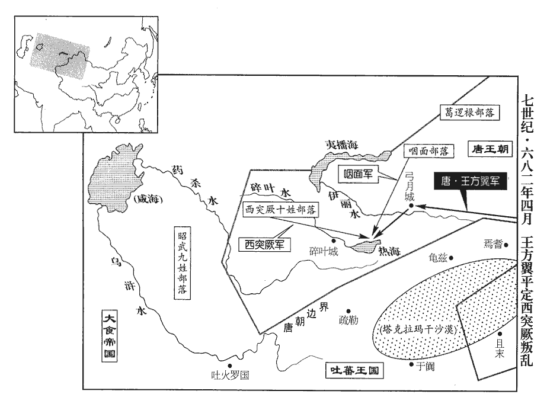
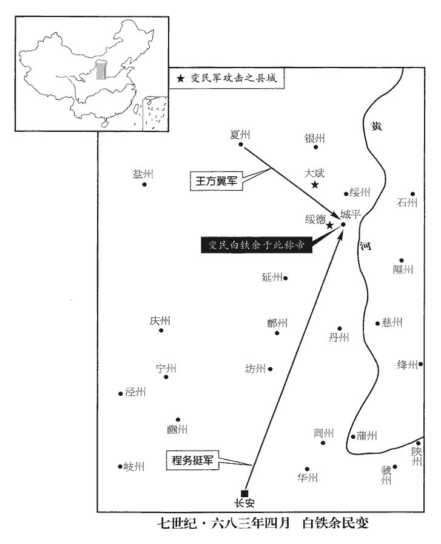
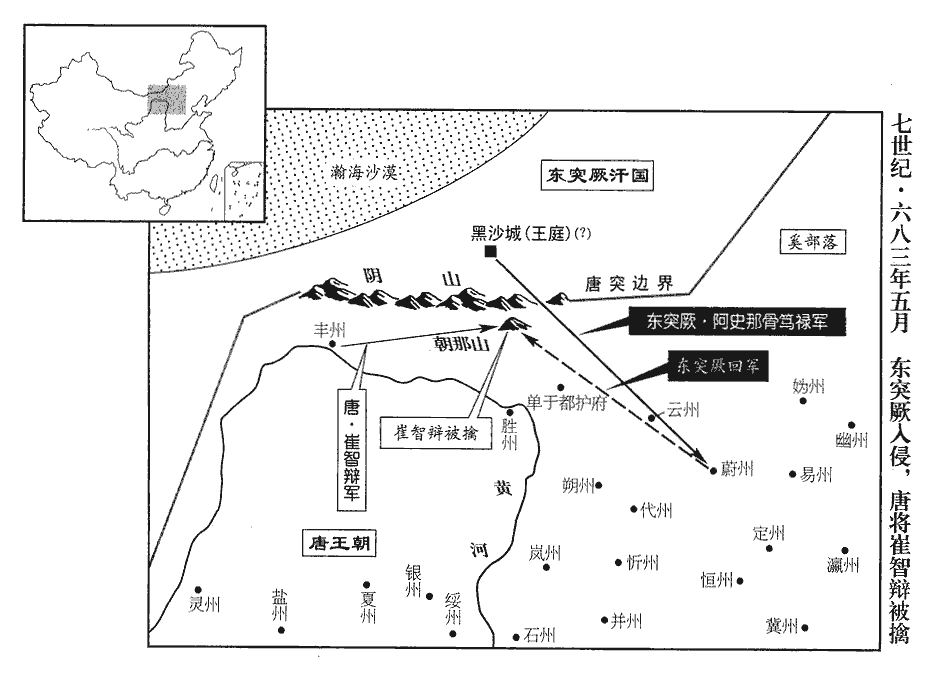
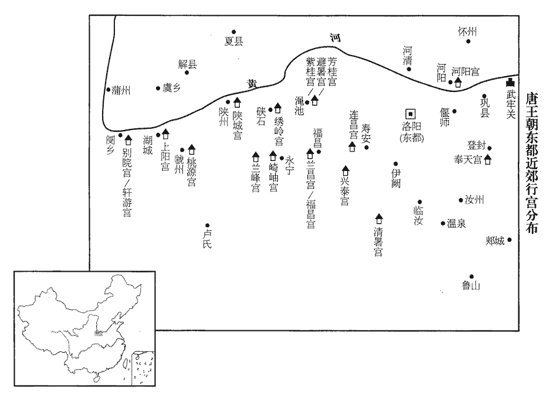
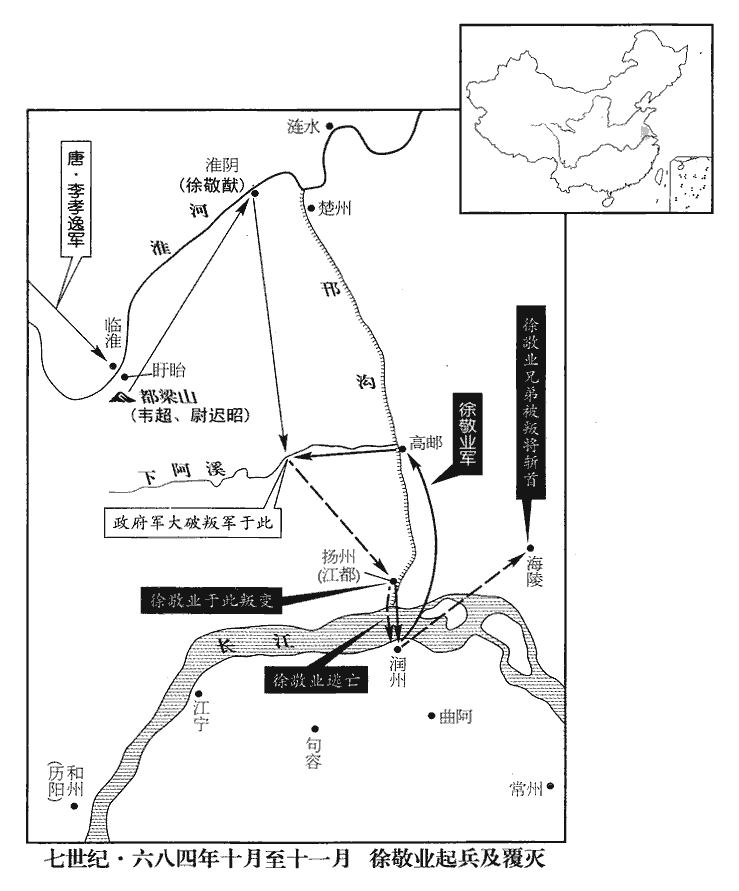

 唐紀十九起玄黓敦牂（壬午），盡柔兆閹茂（丙戌），凡五年。

# 高宗天皇大聖大弘孝皇帝下

## 永淳元年（壬午、六八二）時以皇孫重照生改元。

1春，二月，作萬泉宮於藍田‹陕西省蓝田县›。藍田縣，漢屬京兆，後魏置藍田郡；隋廢郡為縣，復屬京兆。

〖译文〗 [1]春季，二月，唐朝在蓝田营造万泉宫。

2癸未‹十九›，改元，赦天下。

〖译文〗 [2]癸未（十九日），唐朝更改年号，大赦天下。

3戊午‹二十五›，立皇孫重照為皇太孫。上‹李治，本年五十五岁›欲令開府置官屬，問吏部郎中王方慶，吏部掌考天下之文吏之班秩階品。對曰：「晉及齊皆嘗立太孫，晉惠帝立太孫臧，齊武帝立太孫昭業。其太子官屬即為太孫官屬，未聞太子在東宮而更立太孫者也。」上曰：「自我作古，可乎？」對曰：「三王不相襲禮，叔孫通之言。何為不可！」乃奏置師傅等官。既而上疑其非法，竟不補授。方慶，裒之曾孫也。方慶，梁王褒之曾孫，江陵陷，褒徙入關，遂為咸陽人。裒póu，當作褒。名綝，以字行。綝，丑林翻。

〖译文〗 [3]戊午（疑误），唐朝立皇孙李重照为皇太孙。唐高宗打算为他开设府署，设置官属，询问吏部郎中王方庆的意见。王方庆回答说：“晋和齐都曾立皇太孙，太子的官属就是皇太孙的官属，未曾听说太子还在东宫而另外又为皇太孙设置官属的。”唐高宗说：“从我创始，可以吗？”回答说：“三王不互相承袭礼仪，有什么不可以！”于是王方庆奏请为皇太孙设置师傅等官。后来唐高宗疑虑这样做不合古法，始终没有任命。王方庆是王裒的曾孙，名，字方庆，人们习惯称呼他的字。

4西突厥‹新疆东北部及中亚东部›阿史那車薄帥十姓反。厥，九勿翻。帥，讀曰率，下同。

〖译文〗 [4]西突厥阿史那车薄率领西突厥十姓部众反抗唐朝。

5夏，四月，甲子朔‹一›，日有食之。

〖译文〗 [5]夏季，四月，甲子朔（初一），出现日食。

6上以關中‹陕西省中部›饑饉，米斗三百，將幸東都‹洛阳›；丙寅‹三›，發京師，留太子‹李哲›監國，監，古銜翻；下同。使劉仁軌、裴炎、薛元超輔之。時出幸倉猝，扈從之士有餓死於中道者。從，才用翻；下以從同。上慮道路多草竊，命監察御史魏元忠檢校車駕前後。元忠受詔，即閱視赤縣獄，西京以長安萬年為赤縣。得盜一人，神采語言異於眾；命釋桎梏，桎，職日翻。梏，工沃翻。襲冠帶，乘驛以從，從，才用翻。與之共食宿，既與之共食，又與之共宿。託以詰盜，詰，去吉翻。其人笑許諾。比及東都，比，必利翻。士馬萬數，不亡一錢。

〖译文〗 [6]唐高宗因关中地区发生饥荒，米价每斗涨至三百钱，准备前往东都洛阳；丙寅（初三），从京师长安出发，留太子监理国家政事，让刘仁轨、裴炎、薛元超辅佐他。当时因出行匆促，随从人员有在中途饿死的。唐高宗顾虑途中多草野盗贼，命令监察御史魏元忠在皇帝车驾前后检查。魏元忠接受命令后，即察看长安万年县监狱，从中找到一名神采和语言都与众不同的盗贼囚犯，命令解除他的枷锁，让他外面套上官服，骑马相从，和他一起食宿，托付给他整治盗贼的任务。这个囚犯笑着答应了。等到抵达东都洛阳，士卒马匹以万计，但没有遗失一文钱。

7辛未‹八›，以禮部尚書聞喜憲公裴行儉為金牙道行軍大總管，此指西突厥之金牙山也。帥右金吾將軍閻懷旦等三總管分道討西突厥。師未行，行儉薨‹年六十四岁›。

〖译文〗 [7]辛未（初八），唐朝任命礼部尚书闻喜宪公裴行俭为金牙道行军大总管，率领右金吾将军阎怀旦等三总管分道进讨西突厥。军队尚未出发，裴行俭去世。

行儉有知人之鑒，初為吏部侍郎，前進士王勮、勮，其據翻。咸陽‹陕西省咸阳市›尉欒城‹河北省栾城县›蘇味道劉昫曰：欒城，漢開縣；後魏於漢開縣古城置欒城縣，屬趙州。余考漢書地理志，常山郡有關縣；又考宋白續通典，鎮州欒城縣本漢關縣，魏太和十一年，於關縣故城置欒城縣；則劉昫誤作開縣明矣。皆未知名，行儉一見謂之曰：「二君後當相次掌銓衡，僕有弱息，願以為託。」弱息，弱子也。是時勮弟勃與華陰‹陕西省华阴市›楊烱、范陽‹河北省涿州市›盧照鄰、范陽，漢涿縣地，魏文帝改為范陽郡；至隋廢郡，復為涿縣，屬幽州；唐武德七年，改為范陽縣。華，戶化翻。烱，古迥翻。義烏‹浙江省义乌市›駱賓王義烏，漢烏傷縣地。後漢分烏傷，置長山縣；晉以長山為東陽郡治所，烏傷別為縣；武德七年，改烏傷為義烏縣，屬婺州。皆以文章有盛名，司列少常伯李敬玄尤重之，少，詩照翻。以為必顯達。行儉曰：「士之致遠，當先器識而後才藝。勃等雖有文華，而浮躁淺露，豈享爵祿之器邪！楊子稍沈靜，躁，則到翻。沈，持林翻。應至令長；餘得令終幸矣。」既而勃度海墮水‹王勃之父王福畤当交趾越南河内市西北›县长，六七五年，王勃前去省亲，在南海溺死，年仅二十八岁，烱終於盈川‹浙江省衢州市东北›令，黔州彭水縣，漢酉陽縣地；武德二年，分彭水，於巴江西置盈隆縣；先天元年，避太子名，改曰盈川；非此也。衢州龍丘縣，武后如意元年，分置盈川縣。縣西有刑溪，陳時，土人留異惡「刑」字，改曰盈川，因為縣名。長，知兩翻。照鄰惡疾不愈，赴水死‹卢照邻体弱多病，服食法术师玄明的药，病转沉重，本来就生活贫穷，至此更衣食不继，双脚抽筋变形，一只手也残废，后投颍水而死›，賓王反誅，謂同徐敬業反。勮、味道皆典選，如行儉言。選，須絹翻。行儉為將帥，所引偏裨如程務挺、張虔勗、王方翼、劉敬同、李多祚、黑齒常之，後多為名將。將，即亮翻；下同。帥，所類翻。裨，賓彌翻。

〖译文〗 裴行俭有鉴别人才的本领，他初任吏部侍郎时，前进士王、咸阳尉栾城人苏味道都未成名，裴行俭初次见面就对他们说：“二位以后一定先后担任掌管铨选官吏的职务，我有年少的儿子，愿意托付给你们。”当时王的弟弟王勃与华阴人杨炯、范阳人卢照邻、义乌人骆宾王都以文才而享有盛名，司列少常伯李敬玄尤其器重他们，认为将来一定荣显闻达。裴行俭说：“读书人的堪当重任，应当首先在于度量见识而后才是才艺。王勃等虽有文才，而气质浮躁浅露，哪里是享受爵位俸禄的材料！杨炯稍微沉静，应该可以做到县令、县长；其余的人能得善终就算幸运了。”后来王勃渡海时落水被淹死，杨炯死在盈川县令任上，卢照邻因患顽症不能治愈，投水自尽，骆兵王因谋反被处死。王、苏味道都任掌管铨选官吏的职务，正如裴行俭所预言。裴行俭担任将帅，所提拔的将佐如程务挺、张虔勖、王方翼、刘敬同、李多祚、黑齿常之，后来多成为名将。

行儉常命左右取犀角、麝香而失之。又敕賜馬及鞍，令史輒馳驟，馬倒，鞍破。此禮部令史也。二人皆逃去，行儉使人召還，謂曰：「爾曹皆誤耳，何相輕之甚邪！」謂懼罪責而逃，是以常人見待，相輕之甚也。待之如故。破阿史那都支，見上卷調露元年。得馬腦盤，廣二尺餘，馬腦，文石也，琢以為盤。廣，古曠翻。以示將士，軍吏王休烈捧盤升階，跌而碎之，跌，徒結翻。惶恐，叩頭流血。行儉笑曰：「爾非故為，何至於是！」不復有追惜之色。詔賜都支等資產金器三千餘物，雜畜稱是，復，扶又翻。畜，許救翻。稱，尺證翻。並分給親故及偏裨，數日而盡。

〖译文〗 裴行俭曾命令随从取犀角、麝香，结果遗失了；皇帝下令赏赐裴行俭马和鞍，礼部令史在送给他时因马跑得太快，结果马倒鞍破。这两个人都畏罪逃走。裴行俭派人将他们召回，对他们说：“你们都错了，你们为什么这么过分地小看我呢！”仍然和从前一样对待他们。打败阿史那都支时，缴获玛瑙盘一个，宽二尺多，他让将士观赏，军吏王休烈捧着盘子上台阶时，跌了一跤，将盘子摔碎了，王休烈很害怕，叩头流血。裴行俭笑着说：“你不是故意的，哪里至于这样！”不再有惋惜的表情。高宗下诏赐给他缴获的阿史那都支等的资产金器三千多件和三千多头各种牲畜，他都分给亲戚朋友和属下将领，几天内全部分光。

 

8阿史那車薄圍弓月城‹新疆霍城县›，安西都護王方翼引軍救之，破虜眾於伊麗水‹伊犁河›，自弓月城過思渾川、蟄失蜜城，渡伊麗河至碎葉‹吉尔吉斯斯坦托克马克城›界。斬首千餘級。俄而三姓咽麵‹哈萨克斯坦巴尔喀什湖东›與車薄合兵拒方翼，方翼與戰於熱海‹吉尔吉斯斯坦伊塞克湖›，碎葉城東有熱海，地寒不凍。咽，於甸翻。麵，眠見翻。流矢貫方翼臂，方翼以佩刀截之，左右不知。所將胡兵謀執方翼以應車薄，方翼知之，悉召會議，陽出軍資賜之，以次引出斬之，會大風，方翼振金鼓以亂其聲，誅七十餘人，其徒莫之覺。既而分遣裨將襲車薄、咽麵，大破之，擒其酋長三百人，酋，慈由翻。長，知兩翻。西突厥遂平。閻懷旦竟不行。方翼尋遷夏州‹总部设陕西省靖边县北白城子›都督，徵入，議邊事。上見方翼衣有血漬，夏，戶雅翻。漬，疾智翻。問之，方翼具對熱海苦戰之狀，上視瘡歎息；竟以廢后近屬，不得用而歸。廢后，方翼從祖女弟也。歸者，復歸夏州。

〖译文〗 [8]阿史那车薄包围弓月城，安西都护王方翼率军援救，在伊丽水打败敌人，斩首千余级。不久，三姓咽面与车薄合兵抵抗王方翼，双方在热海交战，流箭射穿王方翼的手臂，他用佩刀砍断箭杆，连身边的人都不知道他中箭。他所率领的军队中的胡兵阴谋逮捕他以响应阿史那车薄。王方翼得知这一情况后，全部召集他们来开会，假装拿出军用物资要赏赐他们，实际是依次把他们领出去斩首。当时正刮大风，王方翼让人猛击金鼓以掩盖他们的喊声，杀了七十多人，他们的同伴都没有发觉。接着王方翼又分别派遣副将袭击阿史那车薄、咽面，将他们打得大败，擒获酋长三百人，于是平定西突厥。阎怀旦最后也没有领兵出发。王方翼随后改任夏州都督，被召入京，商议边境的事务。高宗看见他衣服上有血渍，询问他，他才陈述了热海苦战的情况。唐高宗看了他的创伤不禁叹息。但终因他是已废皇后的近支亲属，得不到重用而返回夏州。

9乙酉‹二十二›，車駕至東都。

〖译文〗 [9]乙酉（二十二日），高宗来到东都洛阳。

10丁亥‹二十四›，以黃門侍郎潁川‹河南省许昌市›郭待舉、隋改長社為潁川縣，武德四年復曰長社，屬許州。兵部侍郎岑長倩、祕書員外少監•檢校中書侍郎鼓城‹河北省晋州市›郭正一、吏部侍郎鼓城魏玄同鼓城，漢臨平、下曲陽兩縣之地，屬鉅鹿郡。隋分槀gǎo城，於下曲陽故城東五里置昔陽縣，尋改為鼓城，時屬定州。並與中書門下同承受進止平章事。上欲用待舉等，謂韋【章：十二行本「韋」作「崔」；乙十一行本同；孔本同。】知溫曰：「待舉等資任尚淺，且令預聞政事，未可與卿等同名。」自是外司四品已下知政事者，始以平章事為名。長倩，文本之兄子也。岑文本輔太宗。

〖译文〗 [10]丁亥（二十四日），唐朝任命黄门侍郎颍川人郭待举、兵部侍郎岑长倩、秘书员外少监兼检校中书侍郎鼓城人郭正一、吏部侍郎鼓城人魏玄同一并与中书门下同承受进止平章事。高宗想重用郭待举等，对崔知温说：“郭待举等声望和经历还浅，先让他们参预政事，还不能和你们有同样的官号。”从此，宫外官署四品以下主持政事的人，开始用平章事的名称。岑长倩是岑文本哥哥的儿子。

先是，玄同為吏部侍郎，先，悉薦翻。上言銓選之弊，上，時掌翻。以為：「人君之體，當委任而責成功，所委者當，則所用者自精矣。者當，丁浪翻。故周穆王‹姬满›命伯冏‹姬冏›為太僕正，曰：『慎簡乃僚。』見書冏命。，是使群司各求其小者，而天子命其大者也。乃至漢氏，得人皆自州縣補署，五府辟召，然後升於天朝，見後漢紀。朝，直遙翻。自魏、晉以來，始專委選部。選，須絹翻。夫以天下之大，士人之眾，而委之數人之手，用刀筆以量才，按簿書而察行，量，音良。行，下孟翻。借使平如權衡，明如水鏡，猶力有所極，照有所窮，況所委非人而有愚闇阿私之弊乎！願略依周、漢之規以救魏、晉之失。」疏奏，不納。

〖译文〗 这以前，魏玄同任吏部侍郎，上书指出铨选官吏中的弊病，认为：“君主的根本，应当是委任人而督责他成就事业，所委任的人适当，则被使用的人自然精干。所以周穆王任命伯为太仆正，说‘谨慎选择你的属官’。这是让各部门各自寻找职位低的官员，而天子任命职位高的官员。到了汉代，得到人材都是先由州县授官，由太傅、太尉、司徒、司空、大将军等五府征召任用，然后提升进入朝廷，自魏、晋以来，选官才专门委托吏部。以天下的广大，士人的众多，而交托于几个人之手，用个人写的公文来衡量他的才能，按官府的文书档案去考察他的品行，即使公平如秤，明澈如同水和镜子，还会能力有所极限，照视有所穷尽，何况所委托的人不适当而发生愚昧无知和偏袒的弊病呢！希望大致依照周代、汉代的办法以补救魏、晋以来的失误。”奏疏上达，没有被采纳。

11五月，【章：十二行本「月」下有「丙午‹十四›」二字；乙十一行本同；孔本同；張校同。】東都霖雨。乙卯‹二十三›，洛水‹流经洛阳城›溢，溺民居千餘家。關中先水後旱、蝗，繼以疾疫，米斗四百，兩京間死者相枕於路，枕，之任翻。人相食。

〖译文〗 [11]五月，东都洛阳下连绵大雨，乙卯（二十三日），洛水泛滥，淹没居民房屋一千余家。关中地区先水灾后旱灾、蝗灾，接着又流行瘟疫，一斗米涨价至四百钱，两京之间的路上死尸横七竖八，相互枕藉，甚至发生人吃人的惨状。

12上既封泰山，欲遍封□□‹五岳：中岳嵩山河南省登封县北›、北岳恒山河北省曲阳县北、南岳衡山湖南省衡山县西、西岳华山陕西省华阴市南、东岳泰山山东省泰安市北，【章：十二行本空格作「五嶽」二字；乙十一行本同；孔本同。】秋，七月，作奉天宮於嵩山南。奉天宮，在洛州嵩陽縣。監察御史裏行李善感諫曰：裏行者，資序未至，未正除監察御史，令於監察御史班裏行也。監，古銜翻。「陛下封泰山，告太平，致群瑞，與三皇、五帝比隆矣。數年以來，菽粟不稔，餓殍相望，四夷交侵，兵車歲駕；陛下宜恭默思道以禳災譴，禳，如羊翻。乃更廣營宮室，勞役不休，天下莫不失望。臣忝備國家耳目，竊以此為憂！」上雖不納，亦優容之。自褚遂良、韓瑗之死，見二百卷顯慶三年、四年。瑗，于眷翻。中外以言為諱，無敢逆意直諫，幾二十年；及善感始諫，天下皆喜，謂之「鳳鳴朝陽」。詩卷阿曰：鳳皇鳴矣，于彼高岡；梧桐生矣，于彼朝陽。註云：梧桐，柔木也。山東曰朝陽。梧桐不生山岡，太平而後生朝陽。幾，居依翻。

〖译文〗 [12]唐高宗封泰山后，又想遍封五岳，秋季，七月，营造奉天宫于嵩山南面。监察御史里行李善感进谏说：“陛下封泰山，向上天报告太平，招致众多的吉兆，可与三皇、五帝比兴盛。近几年以来，粮食歉收，饿死的人到处都是，四夷交相侵犯，兵车连年出动。陛下应当恭敬静默地思索治道以消除上天降下的灾害，却又广造宫室，劳役没有休止的时候，天下百姓无不感到失望。我忝列国家的耳目，私下为此而忧虑！”唐高宗虽不采纳他的意见，但也宽容他。自褚遂良、韩瑗死后，朝廷内外官员都以多说话为忌讳，不敢违背皇帝的意思直言规劝几乎有二十年时间；及至李善感开始进谏，天下人都高兴，称之为“凤鸣朝阳”，认为是天下太平的征兆。

13上遣宦者緣江徙異竹，欲植苑中。宦者科舟載竹，所在縱暴；過荊州‹湖北省江陵县›，荊州長史蘇良嗣囚之，上疏切諫，上，時掌翻；下同。以為：「致遠方異物，煩擾道路，恐非聖人愛人之意。又，小人竊弄威福，虧損皇明。」上謂天后曰：「吾約束不嚴，果為良嗣所怪。」手詔慰諭良嗣，令棄竹江中。良嗣，世長之子也。蘇世長見一百八十八卷高祖武德四年。

〖译文〗 [13]高宗派遣宦官沿长江运送奇异的竹子，准备栽种在宫苑中。宦官们征用船只装载竹子，到处恣行暴虐；路过荆州时，荆州长史苏良嗣将他们囚禁起来，上书直言极谏，认为：“为取得远方奇异物品，烦扰沿途百姓，恐怕不是圣人爱护人民的本意。同时，小人擅自耍弄威权，也有损皇帝的圣明。”高宗对天后武则天说：“我约束不严，果然被苏良嗣责怪。”于是亲自写诏书，抚慰和指示苏良嗣，命令他将竹子抛弃江中。苏良嗣是苏世长的儿子。

14黔州‹总部设重庆市彭水县›都督謝祐希天后意，逼零陵王明令自殺，明徙黔州見上卷永隆元年。黔，音琴。上深惜之，黔府官屬皆坐免官。祐後寢於平閣，與婢妾十餘人共處，處，昌呂翻。夜，失其首。垂拱中‹六八九年›，明子零陵王俊、黎國公傑為天后所殺，有司籍其家，得祐首，漆為穢器，題云謝祐，乃知明子使刺客取之也。

〖译文〗 [14]黔州都督谢迎合天后武则天的意旨，逼迫零陵王李明自杀，高宗深为惋惜，黔州都督府官属都因此被免职。后来谢睡在平阁，与婢妾十多人在一起，一天夜里，丢掉了脑袋。后来垂拱年间，李明的儿子零陵王李俊、黎国公李杰被天后武则天杀死，有关部门没收他的家产，得到谢的脑袋，已被涂上漆做成盛尿器皿，题款为“谢”，这才知道是李明的儿子当年派刺客取走了他的脑袋。

15太子留守京師，頗事遊畋，薛元超上疏規諫；上聞之，遣使者慰勞元超，使，疏吏翻。勞，力到翻。仍召赴東都。

〖译文〗 [15]太子留守京师长安，常常游猎，薛元超上书规劝；高宗知道后，派使者慰劳薛元超，同时把太子召到东都洛阳。

16吐蕃‹首都逻些城西藏拉萨市›將論欽陵寇柘zhè‹四川省黑水县南›、松‹四川省松潘县›、翼‹四川省茂县西北›等州。顯慶三年，開置柘州蓬山郡，屬松州都督府。宋白作「拓」，曰「以開拓為稱」。今按新、舊書皆作「柘」。翼州本漢蠶陵縣地，故城在州西，有蠶陵山；隋為翼斜縣，唐武德元年，置翼州。隋縣名，唐州，取州南翼水為名。詔左驍衛郎將李孝逸、右衛郎將衛蒲山發秦‹甘肃省天水市›、渭‹甘肃省陇西县›等州兵分道禦之。驍，堅堯翻。將，即亮翻。

〖译文〗 [16]吐蕃将领论钦陵侵掠唐朝柘、松、翼等州。高宗命令左骁卫郎将李孝逸、右卫郎将卫蒲山征发秦、渭等州兵卒分道抵御。

17冬，十月，丙寅‹七›，黃門侍郎劉景先同中書門下平章事。

〖译文〗 [17]冬季，十月，丙寅（初七），唐朝任命黄门侍郎刘景先为同中书门下平章事。

18是歲，突厥‹瀚海沙漠群›餘黨阿史那骨篤祿、骨篤祿亦曰骨咄祿，頡利族人也，雲中都督舍利元英之部酋，世襲吐屯。阿史德元珍等招集亡散，據黑沙城‹阴山北麓›反，杜佑曰：阿史德元珍，習知中國風俗，邊塞虛實，在單于府檢校降戶部落，坐事為單于長史王本立所拘縶。會骨咄祿入寇，元珍請依舊檢校部落，本立許之，因便投骨咄祿。骨咄祿得之甚喜，以為阿波大達干，令專統兵馬事。入寇并州‹山西省太原市›及單于府‹设内蒙古和林格尔县›之北境，單，音蟬。殺嵐州‹山西省岚县›刺史王德茂。右領軍衛將軍、檢校代州‹总部设山西省代县›都督薛仁貴將兵擊元珍於雲州‹山西省大同市›，虜問唐大將為誰，應之曰：「薛仁貴」。虜曰：「吾聞仁貴流象州‹广西象州县›，仁貴以大非川之敗除名，起為雞林道總管，復坐事貶象州。死久矣，何以紿我！」紿，蕩亥翻。仁貴免冑示之面，虜相顧失色，下馬列拜，稍稍引去。仁貴因奮擊，大破之，斬首萬餘級，捕虜二萬餘人。

〖译文〗 [18]本年，突厥余党阿史那骨笃禄、阿史德元珍等招集流散余众，占据黑沙城反抗唐朝，侵入唐朝并州及单于都护府北部边境，杀死岚州刺史王德茂。右领军卫将军、检校代州都督薛仁贵领兵进击阿史德元珍于云州。突厥人问唐朝大将是谁，回答说：“薛仁贵。”突厥人说：“我们听说薛仁贵流放象州，死去好久了，为什么欺骗我们！”薛仁贵脱去头盔露出脸来，突厥人彼此相看，大惊失色，忙下马列队行礼，并逐渐退却。薛仁贵乘机奋力进击，把他们打败，斩首万余级，俘获二万余人。

19吐蕃入寇河源軍‹青海省西宁市›，軍使婁師德將兵擊之於白水澗‹青海省大通县›，白水澗有白水軍，註見後。使，疏吏翻；下同。將，即亮翻；下同。八戰八捷。上以師德為比部員外郎、左驍衛郎將、河源軍經略副使，曰：「卿有文武材，勿辭也！」比，音毗。驍，堅堯翻。

〖译文〗 [19]吐蕃入侵河源军，军使娄师德领兵在白水涧反击，八战八捷。高宗任命娄师德为比部员外郎、左骁卫郎将、河源军经略副使，说：“你有文武才能，不要推辞！”

## 弘道元年（癸未、六八三）是年十二月改元。

1春，正月，甲午朔‹一›，上‹李治，本年五十六岁›行幸奉天宮‹河南省登封县境›。

〖译文〗 [1]春季，正月，甲午朔（疑误），高宗来到奉天宫。

2二月，庚午‹十二›，突厥‹瀚海沙漠群›寇定州‹河北省定州市›，刺史霍王元軌擊卻之。乙亥‹十七›，復寇媯guī州‹河北省怀来县›。復，扶又翻；下可復同。媯，居為翻。三月，庚寅‹二›，阿史那骨篤祿、阿史德元珍圍單于都護府‹设内蒙古和林格尔县›，執司馬張行師，殺之。遣勝州‹总部设内蒙古托克托县›都督王本立、夏州‹总部设陕西省靖边县北白城子›都督李崇義將兵分道救之。

〖译文〗 [2]二月，庚午（十二日），突厥侵犯定州，刺史霍王李元轨把他们击退。乙亥（十七日），又侵犯妫州。三月，庚寅（初二），阿史那骨笃禄、阿史德元珍包围单于都护府，抓获司马张行师并把他杀死。唐朝派遣胜州都督王本立、夏州都督李崇义领兵分道前去救援。

3太子右庶子、同中書門下三品李義琰改葬父母，使其舅氏遷舊墓；上聞之，怒曰：「義琰倚勢，乃陵其舅家，不可復知政事！」義琰聞之，不自安，以足疾乞骸骨，庚子‹十二›，以義琰為銀青光祿大夫，致仕。

〖译文〗 [3]太子右庶子、同中书门下三品李义琰改葬父母，让他舅舅家迁移旧坟；高宗听说后，大怒说：“李义琰依仗权势，欺负他舅舅家，不可以再掌管政事！”李义琰听到后，内心很不安，以足疾为理由请求退休，庚子（十二日），任命李义琰为银青光禄大夫，准许他退休。

4癸丑‹二十五›，守中書令崔知溫薨‹年五十七岁›。舊制：凡九品已上職事官，皆帶散位，謂之本品。職事則隨才敘用，或去閒入劇，或去高就卑，遷徙出入，參差不定。散位則一切以門蔭結品，然後以勞考進敘。武德令職事解散官，欠一階不至為兼，職事卑者不解散官。貞觀令以職事高者為守，職事卑者為行，仍帶散位，其欠一階仍舊為兼，或帶散官，或為守，參而用之。其兩職事亦為兼，頗相錯亂。咸亨二年，始一切為守。其欠一階之兼，古念翻；其兩職事之兼，古恬翻；字同音異耳。

〖译文〗 [4]癸丑（二十五日），守中书令崔知温去世。

5夏，四月，己未‹二›，車駕還東都‹洛阳›。

〖译文〗 [5]夏季，四月，己未（初二），高宗返回东都洛阳。

6綏州‹陕西省绥德县›步落稽白鐵余，步落稽，稽胡也。埋銅佛於地中，久之，草生其上，紿其鄉人曰：「吾於此數見佛光。」紿，蕩亥翻。數，所角翻。擇日集眾掘地，果得之，因曰：「得見聖佛者，百疾皆愈。」遠近赴之。鐵余以雜色囊盛之數十重，得厚施，乃去一囊。盛，時征翻。重，直龍翻。施，式豉翻。去，羌呂翻。數年間，歸信者眾，遂謀作亂。據城平縣‹陕西省清润县东›，自稱光明聖皇帝，置百官，進攻綏德‹陕西省清涧县东北›、大斌‹陕西省子洲县›二縣，城平及二縣，皆屬綏州，西魏所置也。宋白曰：二縣皆漢膚施縣地，魏神龜元年，置城中縣，隋避諱，改為城平。大斌縣，時理城平縣界魏平故城。綏德縣，亦膚施地，魏大統十二年，分上郡南界丘尼谷置縣。歐陽修曰：大斌者，取稽胡懷化，文武雜半以為名。殺官吏，焚民居。遣右武衛將軍程務挺與夏州‹总部设陕西省靖边县北白城子›都督王方翼討之，甲申‹二十七›，攻拔其城，擒鐵余，餘黨悉平。考異曰：僉載云「延州稽胡」，又云「自號月光王」，又云「儀鳳中務挺斬平之」，蓋誤也。今從實錄。

〖译文〗 [6]绥州步落稽白铁余，埋铜佛在地下，时间长了，上面长了草，他欺骗同乡人说：“我在这里几次看见佛光。”于是拣日子聚集众人挖地，果然得到铜佛，他于是说：“得见圣佛的人，百病都会好。”远近各处的人都闻迅而来。白铁余用几十层不同颜色的口袋将铜佛盛起来，得到优厚的施舍，才去掉一层口袋。数年之间，归附他的信徒很多，于是阴谋作乱。他占据城平县，自称光明圣皇帝，设置各种官职，进攻绥德、大斌二县，杀死官吏，焚烧民房。朝廷派遣右武卫将军程务挺与夏州都督王方翼讨伐他们。甲申（二十七日），攻下他们占领的城邑，擒获白铁余，余党全部平定。

7五月，庚寅‹三›，上幸芳桂宮‹河南省渑池县境›，儀鳳二年，營紫桂宮於澠池縣西五里，調露二年改曰避暑宮，永淳元年又改曰芳桂宮。至合璧宮‹洛阳市境›，遇大雨而還。

〖译文〗 [7]五月，庚寅（初三），高宗前往芳桂宫，走到合璧宫，遇大雨而返回。

 

8乙巳‹十八›，突厥阿史那骨篤祿等寇蔚州‹山西省灵丘县›，殺刺史李思儉，蔚州時為忠順軍節度。豐州‹总部设内蒙古五原县›都督崔智辯將兵邀之於朝那山‹内蒙古固阳县东›北，朝，丁度集韻音與邾同。牛頭朝那山在豐州河北。兵敗，為虜所擒。朝議欲廢豐州，遷其百姓於靈‹宁夏灵武市›、夏‹总部设陕西省靖边县北白城子›。豐州司馬唐休璟都督府司馬也。唐制，下都督府長史、司馬，從五品上。上言，以為：「豐州‹内蒙古五原县›阻河為固，居賊衝要，自秦、漢已來，列為郡縣；土宜耕牧。隋季喪亂，上，時掌翻。喪，息浪翻。遷百姓於寧‹甘肃省宁县›、慶‹甘肃省庆阳县›二州，致胡虜深侵，以靈、夏為邊境；貞觀之末，募人實之，西北始安。今廢之則河濱之地復為賊有，復，扶又翻，又音如字。靈、夏等州人不安業，非國家之利也！」乃止。

〖译文〗 [8]乙巳（十八日），突厥阿史那骨笃禄等侵扰唐朝蔚州，杀死刺史李思俭。丰州都督崔智辩领兵在朝那山北截击而失败，被突厥人俘虏。朝廷商议想废除丰州，将丰州百姓迁移到灵、夏二州。丰州司马唐休进言认为：“丰州依仗黄河为屏障，处于敌人的要害地带，自秦、汉以来，都设置郡县；土地适宜于耕种放牧。隋朝末年祸乱，将当地百姓迁移到宁、庆二州，致使胡寇深入，以灵、夏二州为边境；贞观末年，招募人民充实丰州，西北才获得安宁。现在如果废除它则黄河边上的土地将再次为胡寇所有，灵、夏等州人民不能安居乐业，这对国家不利。”于是废除丰州的事情没有实行。

9六月，突厥別部寇掠嵐州‹山西省岚县›，偏將楊玄基擊走之。厥，九勿翻。將，即亮翻。

〖译文〗 [9]六月，突厥别部侵掠唐朝岚州，偏将杨玄基将他们击退。

10秋，七月，己丑‹四›，立皇孫重福‹太子李哲李显›的儿子為唐昌王。重，直龍翻。

〖译文〗 [10]秋季，七月，己丑（初四），唐朝封皇孙李重福为唐昌王。

 

11庚【嚴：「庚」改「壬」。】辰‹七›，詔以今年十月有事於嵩山；尋以上不豫，改用來年正月。

〖译文〗 [11]庚辰（疑误），高宗下诏，定于今年十月封嵩山；不久因他有病，又改为明年正月。

12甲辰‹十九›，徙相王輪為豫王，更名旦。相，息亮翻。更，工衡翻。

〖译文〗 [12]甲辰（十九日），唐朝改封相王李轮为豫王，改名李旦。

13中書令兼太子左庶子薛元超病瘖，乞骸骨，許之。瘖yīn，於今翻。

〖译文〗 [13]中书令兼太子左庶子薛元超患哑病，请求退休，获得批准。

14八月，己丑‹十›，以將封嵩山，召太子赴東都；留唐昌王重福守京師，以劉仁軌為之副。冬，十月，己卯‹二十六›，太子至東都。

〖译文〗 [14]八月，己丑（疑误），高宗因将封嵩山，召太子赴东都洛阳；留唐昌王李重福守京师，以刘仁轨为他的副手。冬季，十月，己卯（二十六日），太子来到东都洛阳。

15癸亥‹十›，車駕幸奉天宫‹河南省登封县境›。

〖译文〗 [15]癸亥（初十），高宗到奉天宫。

16十一月，丙戌‹三›，詔罷來年封嵩山，上疾甚故也。上苦頭重，不能視，召侍醫秦鳴鶴診之，殿中省尚藥局有侍御醫四人，從六品上。診，止忍翻。鳴鶴請刺頭出血，可愈。刺，七亦翻。天后在簾中，不欲上疾愈，怒曰：「此可斬也，乃欲於天子頭刺血！」鳴鶴叩頭請命。上曰：「但刺之，未必不佳。」乃刺百會、腦戶二穴。鍼灸經：百會，一名三陽五會，在前頂後寸半，頂中央旋毛中，可容豆鍼二分，得氣即瀉。腦戶，一名合顱，在枕骨上強後寸半，禁鍼，鍼令人瘂。舊傳：鳴鶴鍼微出血，頭疼立止。上曰：「吾目似明矣。」后舉手加額曰：「天賜也！」自負綵百匹以賜鳴鶴。

〖译文〗 [16]十一月，丙戌（初三），唐高宗下诏停止明年封嵩山，因为他病重的缘故。高宗苦于头重，不能看东西，召侍医秦鸣鹤诊视。秦鸣鹤请求用针刺头使它出血，可以痊愈。天后武则天在帘中，她不希望唐高宗的病治好，大怒说：“此人可以斩首！竟想在天子头上刺出血。”秦鸣鹤叩头请求保全生命。唐高宗说：“只管刺，不见得一定不好。”于是用针刺百会、脑户两个穴位。高宗说：“我眼睛似乎看得见了。”天后武则天把手举在额上说：“这是上天的赐予！”亲自背负彩缎百匹赐给秦鸣鹤。

17戊戌‹十五›，以右武衛將軍程務挺為單于道‹内蒙古阴山以北›安撫大使，招討阿史那骨篤祿等。

〖译文〗 [17]戊戌（十五日），唐朝任命右武卫将军程务挺为单于道安抚大使，招抚讨伐阿史那骨笃禄等。

18詔太子‹李哲›監國，監，古銜翻。以裴炎、劉景先、郭正一同東宮平章事。

〖译文〗 [18]高宗下诏令太子监理国事，任命裴炎、刘景先、郭正一为同东宫平章事。

19上自奉天宮疾甚，宰相皆不得見。丁未‹二十四›，還東都，百官見於天津橋南。見，賢遍翻。

〖译文〗 [19]高宗自从在奉天宫病重，连宰相都不得进见。丁未（二十四日），回东都洛阳，百官朝见于天津桥南。

20十二月，丁巳‹四›，改元，赦天下。上欲御則天門樓宣赦，氣逆不能乘馬，乃召百姓入殿前宣之。是夜，召裴炎入，受遺詔輔政，上崩於貞觀殿。年五十六。觀，古玩翻。遺詔太子柩前即位，柩，音舊。軍國大事有不決者，兼取天后進止。廢萬泉‹陕西省蓝田县境›、芳桂‹河南省渑池县境›、奉天‹河南省登封县境›等宮。

〖译文〗 [20]十二月，丁巳（初四），唐朝更改年号，大赦天下。高宗想上则天门楼宣布赦令，因气喘不能乘马，便召集百姓到殿前宣布赦令。这天夜里，高宗召裴炎入宫，接受遗诏，辅佐朝政。高宗在贞观殿驾崩。他在遗诏中命令太子在他灵柩前即帝位，军国大事有不能决断的，兼请天后处置。废除万泉、芳桂、奉天等宫。

庚申‹七›，裴炎奏太子未即位，未應宣敕，有要速處分，處，昌呂翻。分，扶問翻。望宣天后令於中書、門下施行。甲子‹十一›，中宗‹李哲，本年二十八岁›即位，尊天后為皇太后，政事咸取決焉。太后以澤州‹山西省晋城市›刺史韓王元嘉‹李哲的叔祖父›等，地尊望重，澤州，漢高都、端氏、泫氏之地。西燕慕容永置建興郡，後魏置建州，隋改澤州；大業廢州為長平郡，唐復曰澤州。宋白曰：取濩澤為名。恐其為變，並加三公等官以慰其心。

〖译文〗 庚申（初七），裴炎上奏说太子尚未即帝位，不宜由他直接发布诏令，有急需处理的重要事情，希望发布天后的命令由中书省、门下省施行。甲子（十一日），唐中宗即皇帝位，尊天后武则天为皇太后，政事全取决于她。太后因泽州刺史韩王李元嘉等地位尊贵，威望很高，恐怕他们发动变乱，便都给他们加三公等官衔以安定他们的情绪。

21甲戌‹二十一›，以劉仁軌為左僕射，裴炎為中書令；戊寅‹二十五›，以劉景先為侍中。

〖译文〗 [21]甲戌（二十一日），唐朝任命刘仁轨为左仆射，裴炎为中书令；戊寅（二十五日），任命刘景先为侍中。

故事，宰相於門下省議事，謂之政事堂，故長孫無忌為司空，房玄齡為僕射，魏徵為太子太師，皆知門下省事。及裴炎遷中書令，始遷政事堂於中書省。

〖译文〗 依旧例，宰相在门下省议事，称为政事堂，所以长孙无忌任司空，房玄龄任仆射，魏徵任太子太师，都主管门下省政务。等到裴炎升任中书令，才开始将政事堂迁到中书省。

 

22壬午‹二十九›，遣左威衛將軍王果、左監門將軍令狐智通、右金吾將軍楊玄儉、右千牛將軍郭齊宗分往并‹总部设山西省太原市›•益‹总部设四川省成都市›•荊‹总部设湖北省江陵县›•揚‹总部设江苏省扬州市›四大都督府，與府司相知鎮守。以國有大故，備不虞也。監，古銜翻。并，卑經翻。

〖译文〗 [22]壬午（二十九日），唐朝派遣左威卫将军王果、左监门将军令狐智通、右金吾将军杨玄俭、右千牛将军郭齐宗分别到并、益、荆、扬四大都督府，与各大都督府负责官员一起主持镇守事务。

23中書侍郎同平章事郭正一為國子祭酒，罷政事。

〖译文〗 [23]中书侍郎、同平章事郭正一任国子祭酒，免去相职。

# 則天順聖皇后上之上后姓武氏，諱曌，并州文水人。后自製「曌」字，讀與照同，音之笑翻。天寶八載，追上尊號曰則天順聖皇后。

## 光宅元年（甲申、六八四）是年九月，方改元光宅。

1春，正月，甲申朔‹一›，改元嗣聖，此太子即位踰年所改之元也。赦天下。

〖译文〗 [1]春季，正月，甲申朔（初一），唐朝改年号为嗣圣，大赦天下罪人。

2‹李哲，本年二十九岁›立太子妃韋氏為皇后；擢后父玄貞自普州‹四川省安岳县›參軍為豫州‹河南省汝南县›刺史。此豫州，本春秋沈、蔡二國之地，漢為汝南郡，宋文帝立司州，治懸瓠城，以為重鎮，魏改豫州，唐因之，後避代宗諱，改為蔡州。

〖译文〗 [2]唐朝立太子妃韦氏为皇后；皇后父亲韦玄贞由普州参军提升为豫州刺史。

3癸巳‹十›，以左散騎常侍杜陵‹陕西省西安市东南›韋弘敏為太府卿、同中書門下三品。自漢宣帝起杜陵邑，至後魏為縣，屬京兆；隋遷京城，始并杜陵入大興縣，唐改大興曰萬年。散，悉亶翻。騎，奇寄翻。

〖译文〗 [3]癸巳，（初十），唐朝任命左散骑常侍杜陵人韦弘敏为太府卿、同中书门下三品。

4中宗‹李哲（李显）›欲以韋玄貞為侍中，又欲授乳母之子五品官；裴炎固爭，中宗怒曰：「我以天下與韋玄貞何不可！而惜侍中邪！」炎懼，白太后，密謀廢立。二月，戊午‹六›，太后集百官於乾元殿，裴炎與中書侍郎劉禕yī之、羽林將軍程務挺、張虔勗漢置南北軍，掌衛京師。南軍若唐諸衛也，北軍若唐羽林軍也。漢武帝名羽林曰建章營騎，屬光祿勳，後更名羽林騎，取六郡良家子及死事之孤為之。後漢置羽林監，南朝因之。後魏、周曰羽林率；隋左、右屯衛所領兵名曰羽林。貞觀中，置北衙七營兵，選才力驍勇者充，龍朔二年曰左、右羽林軍，置大將軍各一員，將軍各二員，品同諸衛，統領北衙禁兵之法令，而督攝左右廂飛騎之儀仗，以統諸曹之職。取府兵、越騎、步射，以為羽林軍士，大朝會，則執仗以衛階陛，行幸則夾馳道為內仗。邪，音耶。禕，吁韋翻。勒兵入宮，宣太后令，廢中宗為廬陵王，扶下殿。下，遐嫁翻。中宗曰：「我何罪？」太后曰：「汝欲以天下與韋玄貞，何得無罪！」乃幽于別所。

〖译文〗 [4]中宗打算任命韦玄贞为侍中，又打算授给乳母的儿子五品官，裴炎坚持不同意见，中宗大怒，说：“我将天下交给韦玄贞有什么不可以！难道还吝惜侍中职位！”裴炎畏惧，报告太后，并密谋废立皇帝的事。二月，戊午（初六），太后召集百官于乾元殿，裴炎与中书侍郎刘之、羽林将军程务挺、张虔勖领兵入宫，宣布太后命令，废中宗为庐陵王，扶他下殿。中宗说：“我犯了什么罪？”太后说：“你想将天下交给韦玄贞，怎么会没有罪！”于是将他幽禁在别的地方。

己未‹七›，立雍州牧豫王旦‹本年二十三岁›為皇帝。雍，於用翻。政事決於太后，居睿宗‹李旦›於別殿，不得有所預。立豫王妃劉氏為皇后。后，德威之孫也。劉德威，審禮之父。

〖译文〗 己未（初七），唐朝立雍州牧豫王李旦为皇帝。政事取决于太后，让皇帝睿宗居于别殿，对政事不得有所干预。立豫王妃刘氏为皇后。皇后就是刘德威的孙女。

有飛騎十餘人飲於坊曲，置飛騎見一百九十五卷貞觀十二年。騎，奇寄翻。一人言：「曏知別無勳賞，不若奉廬陵‹李哲›。」一人起，出詣北門告之。北門，玄武門也。座未散，皆捕得，繫羽林獄。言者斬，餘以知反不告皆絞；告者除五品官。告密之端自此興矣。

〖译文〗 有皇帝侍卫军士飞骑十多人在街巷聚会饮酒，其中一人说：“早知道没有什么功劳赏赐，还不如侍奉庐陵王。”其中另一人离座，到北门告发，饮酒的军士还未散去，全部被捕获，关入羽林军监狱。结果，说话的人被斩首，其余的人因知道谋反而不告发被判处绞刑，告发的人授给五品官。告密之风从此兴起。

5壬子‹七›，以永平郡王成器為皇太子，睿宗‹李旦›之長子也。赦天下，改元文明。改嗣聖為文明。

〖译文〗 [5]壬子（疑误），唐朝以永平郡王李成器为皇太子，他是睿宗的长子。大赦天下，更改年号为文明。

庚申‹八›，廢皇太孫重照為庶人，命劉仁軌專知西京留守事。流韋玄貞於欽州‹广西钦州市›。舊志：欽州至京師五千二百五十一里。

〖译文〗 庚申（初八），废皇太孙李重照为平民；命令刘仁轨专门主管西京留守事务；流放韦玄贞于钦州。

太后與劉仁軌書曰：「昔漢以關中事委蕭何，見漢高帝紀。今託公亦猶是矣。」仁軌上疏，辭以衰老不堪居守，守，式又翻。因陳呂后禍敗事以申規戒。呂氏禍敗事見漢高后紀。太后使祕書監武承嗣‹武曌的侄儿›齎璽書慰諭之曰：「今以皇帝‹李旦›諒闇不言，璽，斯氏翻。闇，音陰。眇身且代親政；遠勞勸戒，復辭衰疾。復，扶又翻。又云『呂氏見嗤於後代，祿、產貽禍於漢朝』，朝，直遙翻；下同。引喻良深，愧慰交集。公忠貞之操，終始不渝，勁直之風，古今罕比。初聞此語，能不罔然；靜而思之，是為龜鏡。況公先朝舊德，遐邇具瞻，願以匡救為懷，無以暮年致請。」

〖译文〗 太后写信给刘仁轨说：“从前汉朝把关中的事情委托给萧何，现在委托你还是那样的用意。”刘仁轨上书，以年老体衰不能胜任留守职务推辞，并陈述汉朝吕后祸败的事实，以申明对太后的劝诫之意。太后派秘书监武承嗣带去用太后的玺印密封的文书抚慰和告诉他说：“现今皇帝因守丧不说话，我暂时代他亲政；有劳你从远方劝诫，又以年老体衰推辞职务。又说‘吕氏为后代所讥笑，吕禄、吕产造成祸害于汉朝’。引用的比喻很深刻，使我惭愧和安慰交集。你忠贞的节操，始终不变，刚直的作风，古今很少有人比得上。开始听到你的话时，不能不感到迷惑不解，但冷静思考，实在可作借鉴。况且你是先朝有德望的老臣，为天下人所瞻仰，希望以匡正补救为怀，不要以年老推托。”

6辛酉‹九›，太后命左金吾將軍丘神勣詣巴州‹四川省巴中市›，檢校故太子賢宅以備外虞，其實風使殺之。風，讀曰諷。神勣，行恭之子也。丘行恭為將，歷事高祖、太宗。

〖译文〗 [6]辛酉（初九），太后命令左金吾将军丘神前往巴州，检查原太子李贤的住宅以防备意外，实际上是暗示丘神杀死他。丘神就是丘行恭的儿子。

7甲子‹十二›，太后御武成殿，唐六典：洛陽宮南三門：中曰應天，左曰興教，右曰光政。光政之內曰廣運，其北曰明福，明福之東曰武成門，其內曰武成殿。皇帝帥王公以下上尊號。帥，讀曰率。上，時掌翻。丁卯‹十五›，太后臨軒，遣禮部尚書武承嗣冊嗣皇帝。自是太后常御紫宸殿，唐六典，洛陽宮不載紫宸殿。以西京大明宮準之，紫宸殿內朝也，其位置當在乾元殿後。施慘紫帳以視朝。紫色之淺者為慘紫。朝，直遙翻。

〖译文〗 [7]甲子（十二日），太后来到武成殿，皇帝率王公以下官员给太后上尊号。丁卯（十五日），太后临殿前平台，派礼部尚书武承嗣在殿前册封新继位的皇帝。从此太后常到紫宸殿，张挂浅紫色的帷帐临朝听政。

8丁丑‹二十五›，以太常卿、檢校豫王府長史王德真為侍中；句斷。中書侍郎、檢校豫王府司馬劉禕yī之同中書門下三品。

〖译文〗 [8]丁丑（二十五日），唐朝任命太常卿、检校豫王府长史王德真为侍中；中书侍郎、检校豫王府司马刘之为同中书门下三品。

9三月，丁亥‹五›，徙杞王上金為畢王，鄱陽王素節為葛王。

〖译文〗 [9]三月，丁亥（初五），唐朝改封杞王李上金为毕王，鄱阳王李素节为葛王。

10丘神勣至巴州，幽故太子賢於別室，逼令自殺。考異曰：則天實錄，賢死在二月丘神勣往巴州下。舊本紀在三月。唐曆，遣神勣、舉哀、追封皆有日。今從之。太后乃歸罪於神勣，戊戌‹十六›，舉哀於顯福門，顯福門，意即明福門，六典避中宗諱，改「顯」為「明」耳。貶神勣為疊州‹甘肃省迭部县›刺史。己亥‹十七›，追封賢為雍王。雍，於用翻。神勣尋復入為左金吾將軍。復，扶又翻。

〖译文〗 [10]丘神到巴州，幽禁唐朝原太子李贤于另外的屋子，逼迫他自杀。李贤死后太后便归罪于丘神，戊戌（十六日），在显福门行哭祭之礼，丘神被贬为叠州刺史。己亥（十七日），追封李贤为雍王。丘神不久又回京任左金吾将军。

11夏，四月，開府儀同三司、梁州都督滕王元嬰薨‹李渊第二十三子›。

〖译文〗 [11]夏季，四月，开府仪同三司、梁州都督滕王李元婴去世。

12辛酉‹十›，徙畢王上金為澤王，拜蘇州‹江苏省苏州市›刺史；葛王素節為許王，拜絳州‹山西省新绛县›刺史。

〖译文〗 [12]辛酉（初十），唐朝改封毕王李上金为泽王，授任苏州刺史；葛王李素节为许王，授任绛州刺史。

13癸酉‹二十二›，遷廬陵王‹李哲›于房州‹湖北省房县›；丁丑‹二十六›，又遷于均州‹湖北省丹江口市西北›故濮王宅。即貞觀末濮王泰遷均州所居故宅。濮，博木翻。

〖译文〗 [13]癸酉（二十二日），唐朝迁移庐陵王到房州；丁丑（二十六日），又迁居均州濮王李秦原来的住宅。

14五月，丙申‹十五›，高宗‹李治›靈駕西還‹长安›。

〖译文〗 [14]五月，丙申（十五日），唐高宗的灵柩西返长安。

15閏月，以禮部尚書武承嗣為太常卿、同中書門下三品。

〖译文〗 [15]闰五月，唐朝任命礼部尚书武承嗣为太常卿、同中书门下三品。

16秋，七月，戊午‹九›，廣州‹总部设广东省广州市›都督路元叡為崑崙所殺。崑崙國在林邑南，去交趾海行三百餘日，習俗文字與婆羅門同。崙，盧昆翻。元叡闇懦，僚屬恣橫。橫，戶孟翻。有商舶至，舶，音白。僚屬侵漁不已，商胡訴於元叡；元叡索枷，欲繫治之。索，山客翻。枷，音加。群胡怒，有崑崙袖劍直登聽事，聽，讀曰廳。殺元叡及左右十餘人而去，無敢近者，近，其靳翻。登舟入海，追之不及。

〖译文〗 [16]秋季，七月，戊午（初九），广州都督路元睿被昆仑人杀死。路元睿昏庸懦弱，僚属恣意横行，有商船到达，僚属侵夺吞没他们的财物不知休止。胡商告到路元睿处，他反要取枷锁，将人家治罪。众胡商愤怒，有昆仑人袖里藏剑直入办公的地方，杀死路元睿及他身边的十余人而后退出，无人敢靠近他。他们登船出海，追捕的人没有能赶上他们。

17溫州‹浙江省温州市›大水，後漢分章安之東甌鄉置永寧縣，屬會稽郡。晉分為永嘉郡，隋廢郡為永嘉縣，屬栝guā州。武德五年，復於永嘉置嘉州；貞觀五年，廢嘉州，以縣屬栝州。上元二年，分置溫州。流四千餘家。

〖译文〗 [17]温州发大水，冲走四千多家。

18突厥阿史那骨篤祿等寇朔州‹山西省朔州市›。

〖译文〗 [18]突厥阿史那骨笃禄等侵扰朔州。

19八月，庚寅‹十一›，葬天皇大帝‹李治›于乾陵‹陕西省乾县西北›，乾陵在奉天縣北五里梁山。廟號高宗。

〖译文〗 [19]八月，庚寅（十一日），葬天皇大帝于乾陵，庙号为高宗。

20初，尚書左丞馮元常為高宗‹李治›所委，高宗晚年多疾，【章：十二行本「疾」下有「百司奏事」四字；乙十一行本同；孔本同；張校同。】每曰：「朕體中不佳，可與元常平章以聞。」元常嘗密言「中宮威權太重，宜稍抑損」。高宗雖不能用，深以其言為然。及太后稱制，四方爭言符瑞；嵩陽‹河南省登封县›令樊文獻瑞石，太后命於朝堂示百官，朝，直遙翻。元常奏：「狀涉諂詐，不可誣罔天下。」太后不悅，出為隴州‹陕西省陇县›刺史。舊志：隴州，京師西四百九十六里，至東都一千一百三十二里。元常，子琮之曾孫也。馮子琮仕於高齊。

〖译文〗 [20]当初，尚书左丞冯元常为高宗所信任，高宗晚年多病，各部门奏事，常说：“朕身体不好，可先与冯元常商量再奏报朕知。”冯元常曾私下对唐高宗说：“皇后威权太重，应该稍加抑制。”唐高宗虽然不能采纳，但认为他说得很对。及至太后行使皇帝权力，各地争相报告吉兆；嵩阳县令樊文进献一块吉祥的石头，太后命在朝堂向百官展示，冯元常上奏说：“这种献石的行为涉及讨好和欺诈，不应当欺骗天下人。”太后因此不高兴，调冯元常出任陇州刺史。冯元常是冯子琮的曾孙。

21丙午‹二十七›，太常卿、同中書門下三品武承嗣罷為禮部尚書。

〖译文〗 [21]丙午（二十七日），太常卿、同中书门下三品武承嗣被免去相职，改任礼部尚书。

22栝州‹浙江省丽水市›大水，流二千餘家。

〖译文〗 [22]栝州发大水，冲走二千余家。

23九月，甲寅‹六›，赦天下，改元。改元光宅。旗幟皆從金色。幟，昌志翻。八品以下，舊服青者更服碧。青色之深者為碧。更，工衡翻。改東都為神都，宮名太初。又改尚書省為文昌臺，左、右僕射為左、右相，六曹為天、地、四時六官；門下省為鸞臺，中書省為鳳閣，侍中為納言，中書令為內史；御史臺為左肅政臺，增置右肅政臺；左臺專知京師百官及監諸軍旅并承詔出使，右臺專知諸州按察。杜佑曰：武后置左、右肅政臺，左以察朝廷，右以澄郡縣。後廢右臺，以其官隸左臺。左臺本御史臺也。右臺地，今太僕寺是也。其餘省、寺、監、率之名，祕書、殿中二省，九卿寺，少府、將作、國子、軍器等監，東宮十率。悉以義類改之。

〖译文〗 [23]九月，甲寅（初六），唐朝大赦天下，更改年号，旗帜都用金色。八品以下官员原穿青色服装的，现改穿深青色。改东都洛阳为神都，改宫名为太初。又改尚书省为文昌台，左、右仆射为左、右相，六部为天、地、春、夏、秋、冬六官；门下省为鸾台，中书省为凤阁，侍中为纳言，中书令为内史；御史台为左肃政台，增设右肃政台；其余省、寺、监、率的名称，全部按意义分类加以更改。

24以左武衛大將軍程務挺為單于道‹内蒙古阴山以北›安撫大使，單，音蟬。使，疏吏翻。以備突厥。

〖译文〗 [24]唐朝任命左武卫大将军程务挺为单于道安抚大使，以防备突厥。

25武承嗣請太后追王其祖，王，于況翻。立武氏七廟，太后從之。裴炎諫曰：「太后母臨天下，當示至公，不可私於所親。獨不見呂氏之敗乎！」太后曰：「呂氏以權委生者，故及於敗。今吾追尊亡者，何傷乎！」對曰：「事當防微杜漸，不可長耳！」長，知兩翻。太后不從。己巳‹二十一›，追尊太后五代祖克己為魯靖公，妣為夫人；高祖居常為太尉、北平恭肅王，曾祖儉為太尉、金城義康王，祖華為太尉、太原安成王，考士彠為太師、魏定王；彠，一虢翻。祖妣皆為妃。裴炎由是得罪。又作五代祠堂於文水‹山西省文水县›。文水縣，舊受陽，隋開皇十一年更名，屬并州。

〖译文〗 [25]武承嗣请太后追封她的先祖为王，建立供奉武氏七代祖先的祖庙，太后同意。裴炎进谏说：“太后是天下人的母亲，应当表明最大的公心，不可偏私于自己的亲属。难道看不见吕氏的失败吗！”太后说：“吕后将权力交给活人，所以失败。现在我追尊死者，有什么损害呢！”回答说：“事情应当防微杜渐，不可让不良现象发展。”太后没有听从他的劝告。己巳（二十一日），追尊太后五世祖父武克己为鲁靖公，五世祖母为夫人；高祖父武居常为太尉、北平恭肃王，曾祖父武俭为太尉、金城义康王，祖父武华为太尉、太原安成王，父亲武士为太师、魏定王；高祖母、曾祖母、祖母、母亲都为王妃。裴炎由此而得罪。又营建上述五代祖先的祠堂于文水县。

時諸武用事，唐宗室人人自危，眾心憤惋。惋，烏貫翻。會眉州‹四川省眉山县›刺史英公李敬業及弟盩厔‹陕西省周至县›令敬猷、漢武帝置盩厔縣，屬扶風；後漢、晉省，後魏復置，後周置周南郡；隋廢郡，以盩厔縣屬京兆；唐置岐州。盩厔，音舟窒。給事中唐之奇、長安‹首都长安西半城›主簿駱賓王、唐赤縣主簿，從八品上。詹事司直杜求仁唐詹事司直，正九品上，掌彈劾宮僚，糾舉職事。皆坐事，敬業貶柳州‹广西柳州市›司馬，敬猷免官，之奇貶栝蒼‹浙江省丽水市›令，漢會稽回浦縣，後漢更名章安；光武分章安縣之南鄉，置松陽縣；隋分松陽之東界，置栝蒼縣，帶栝州，以栝蒼山名縣。賓王貶臨海‹浙江省临海市›丞，吳分章安，置臨海縣，屬臨海郡；隋廢郡，以縣屬栝州；唐分帶台州。求仁貶黟‹安徽省黟县›令。黟縣，漢屬丹楊郡，吳分屬新安郡，隋、唐屬歙州。黟yī，師古音伊，劉昫音䃜。求仁，正倫之姪也。杜正倫事太宗、高宗。盩厔尉魏思溫嘗為御史，復被黜。復，扶又翻。皆會於揚州‹江苏省扬州市›，舊志：揚州，京師東南二千七百五十三里，至東都一千七百四十九里。各自以失職怨望，乃謀作亂，以匡復廬陵王‹李哲›為辭。

〖译文〗 当时武氏亲属掌权，唐皇族人人自危，大家心中悲愤惋惜。正好眉州刺史英公李敬业和他弟弟令李敬猷、给事中唐之奇、长安主薄骆宾王、詹事司直杜求仁都因事获罪，李敬业被降职为柳州司马，李敬猷被免官，唐之奇被降职为栝苍令，骆宾王被降职为临海丞，杜求仁被降职为黟县令。杜求仁就是杜正伦的侄子。尉魏思温曾任御史，再次被罢黜。他们都聚会于扬州，各自因失去官职心怀不满，便阴谋作乱，以挽救恢复庐陵王的帝位为借口。

思溫為之謀主，使其黨監察御史薛仲璋求奉使江都‹扬州州政府所在县·江苏省扬州市›；江都縣帶揚州。監，古銜翻。使，疏吏翻。令雍州人韋超詣仲璋告變，云「揚州長史陳敬之謀反」。仲璋收敬之繫獄。居數日，敬業乘傳而至，雍，於用翻。傳，知戀翻。矯稱揚州司馬來之官，云「奉密旨，以高州‹广东省高州市东北›酋長馮子猷yóu謀反，酋，慈由翻。長，知兩翻。發兵討之。」於是開府庫，令士曹參軍李宗臣就錢坊，驅囚徒、工匠【章：十二行本「匠」下有「數百」二字；乙十一行本同。】授以甲。斬敬之於繫所；考異曰：實錄作「薛璋」。御史臺記云：「薛仲璋矯使揚府，與徐敬業等謀反，夜，與江都令韋知止子茂道計議。倉曹參軍閻識微發之，長史陳敬之不察，抑識微，令遜謝。仲璋佯事竟，還出郭門，群官畢從。其黨韋超遮道告密，復留繫問，遂斬敬之。」今事從實錄，仲璋從臺記。錄事參軍孫處行拒之，亦斬以徇，處，昌呂翻。僚吏無敢動者。遂起一州之兵，復稱嗣聖元年。復，扶又翻，又如字。開三府：一曰匡復府，二曰英公府，三曰揚州大都督府。敬業自稱匡復府上將，領揚州大都督。將，即亮翻。以之奇、求仁為左、右長史，宗臣、仲璋為左、右司馬，思溫為軍師，賓王為記室，旬日間得勝兵十餘萬。勝，音升。

〖译文〗 魏思温充当谋主，指使他的党羽监察御史薛仲璋要求奉命出使江都，然后让雍州人韦超到薛仲璋处报告，说“扬州长史陈敬之阴谋造反”。薛仲璋逮捕陈敬之入狱。数日后，李敬业乘驿车到达，伪称自己是扬州司马前来赴任，说“奉太后密旨，因高州酋长冯子猷谋反，要发兵讨伐。”于是开府库，命扬州士曹参军李宗臣到铸钱工场，驱赶囚徒、工匠发给他们盔甲。将陈敬之在监狱斩首；录事参军孙处行抗拒，也被斩首示众，扬州官吏再没有敢反抗的。于是征发一州的兵马，又使用中宗的年号嗣圣元年。设置三个府署：第一个称为匡复府，第二个叫英公府，第三个叫扬州大都督府。李敬业自称匡复府上将，领扬州大都督。任命唐之奇、杜求仁为左、右长史，李宗臣、薛仲璋为左、右司马，魏思温为军师，骆宾王为记室，十来日便聚集士兵十余万人。

移檄州縣，略曰：「偽臨朝武氏者，朝，直遙翻。人非溫順，地實寒微。昔充太宗下陳，陳，列也。戰國策曰：美人充下陳。嘗以更衣入侍，衛子夫以更衣得幸漢武帝，賓王用此事。更，工衡翻。洎乎晚節，穢亂春宮。東宮，亦謂之春宮，洎，其冀翻。密隱先帝之私，陰圖後庭之嬖bì，踐元后於翬huī翟，翬翟，后服也。翬，音暉。陷吾君於聚麀yōu。」記曰：夫惟禽獸無禮，故父子聚麀。麀，於求翻。又曰：「殺姊屠兄，姊，謂韓國夫人；兄謂元爽、元慶；事見二百一卷高宗乾封元年。弒君鴆母，此以高宗晏駕及太原王妃之死為后罪。人神之所同嫉，天地之所不容。」又曰：「包藏禍心，竊窺神器。君之愛子，幽之於別宮；謂居睿宗於別殿。賊之宗盟，委之以重任。」謂用武承嗣等。又曰：「一抔之土未乾，抔，蒲侯翻。乾，音干。六尺之孤安在！」又曰：「試觀今日之域中，竟是誰家之天下！」太后見檄，問曰：「誰所為？」或對曰：「駱賓王。」太后曰：「宰相之過也。人有如此才，而使之流落不偶乎！」

〖译文〗 李敬业传布檄文到各州县，内容大致说：“僭窃帝位的武氏，本性并不温顺，出身非常贫寒低贱。她从前居于太宗后宫的下列，曾找机会侍奉太宗，得到宠幸，等到太宗晚年，又与太子淫乱。她隐瞒了同先帝的私情，暗地里谋求在后宫的宠幸，终于登上皇后的宝座，使我们的君主陷于形同禽兽的乱伦境地。”又说：“武氏杀害姐姐，屠戮哥哥，杀死皇帝，毒死母亲，为人和神所共同憎恨，为天地所不能容忍。”又说：“包藏着祸心，图谋窃取帝位。君王的爱子，被幽禁于别殿；武氏的宗族亲近，都给予重任。”又说：“先帝坟墓上的黄土还未干燥，成年的孤儿现在哪里！”又说：“试看今日国家之内，究竟是谁家的天下！”太后看到檄文以后问：“这是谁写的？”有人回答说：“骆宾王。”太后说：“这是宰相的过失。此人有这样的才华，却让他飘泊失意，不得重用！”

敬業求得人貌類故太子賢者，紿眾云：「賢不死，亡在此城中，令吾屬舉兵。」紿，蕩亥翻。因奉以號令。

〖译文〗 李敬业找到一个相貌像已故太子李贤的人，欺骗众人说：“李贤没有死，逃亡在这个城中，他命令我们起兵。”于是侍奉他以号令天下。

楚州‹江苏省淮安市›司馬李崇福帥所部三縣應敬業。楚州，本漢射陽、鹽瀆縣地，晉置山陽郡，隋開皇初罷郡，十二年，置楚州，大業初，州廢，唐初復置。帥，讀曰率。所部三縣：山陽、鹽城、安宜也。盱眙‹江苏省盱眙县›人劉行舉獨據縣不從，敬業遣其將尉遲昭攻盱眙。盱眙縣，漢屬臨淮郡，後漢屬下邳國，晉安帝分置盱眙郡，陳置北譙州，隋廢為縣，屬江都郡，唐屬楚州。盱眙，音吁貽。其將，即亮翻。尉，紆勿翻。詔【章：十二行本「詔」上有「行舉拒卻之」五字；乙十一行本同；孔本同；張校同；退齋校同。】以行舉為遊擊將軍，以其弟行實為楚州刺史。

〖译文〗 楚州司马李崇福率领属下三县响应李敬业。只有盱眙人刘行举占据县城，不肯从命，李敬业派他的将领尉迟昭进攻盱眙。太后下诏任命刘行举为游击将军，任命他弟弟刘行实为楚州刺史。

甲申‹六›，以左玉鈐qián衛大將軍李孝逸為揚州道大總管，是年，改左、右領軍衛為左、右玉鈐衛。將兵三十萬，以將軍李知十、馬敬臣為之副，以討李敬業。

〖译文〗 甲申（疑误），唐朝任命左玉钤卫大将军李孝逸为扬州道大总管，领兵三十万，任命将军李知十、马敬臣为他的副职，讨伐李敬业。

26武承嗣與其從父弟右衛將軍三思以韓王元嘉‹李渊第十一子›、魯王靈夔‹李渊第十九子›屬尊位重，從，才用翻。二王皆高祖子。屢勸太后因事誅之。太后謀於執政，劉禕之、韋思謙皆無言；禕yī，吁韋翻。內史裴炎獨固爭，太后愈不悅。三思，元慶之子也。

〖译文〗 [26]武承嗣和他的堂弟右卫将军武三思因韩王李元嘉、鲁王李灵夔在皇族中是长辈，地位高，屡次劝太后借故杀掉他们。太后和执掌朝政的大臣商议，刘之、韦思谦都不说话；内史裴炎一人坚决不同意。太后更加不高兴。武三思就是武元庆的儿子。

及李敬業舉兵，薛仲璋，炎之甥也，炎欲示閒暇，不汲汲議誅討。太后問計於炎，對曰：「皇帝‹李旦›年長，長，知兩翻。不親政事，故豎子得以為辭。若太后返政，則不討自平矣。」監察御史藍田‹陕西省蓝田县›崔詧聞之，上言：監，古銜翻。上，時掌翻。「炎受顧託，大權在己，若無異圖，何故請太后歸政？」太后命左肅政大夫金城‹甘肃省兰州市›騫味道、左肅政大夫，左御史大夫也。蘭州五泉縣，本漢金城縣，隋更名，高宗咸亨二年，復為金城縣。風俗通：騫姓，閔子騫後。侍御史櫟yuè陽‹陕西省临潼县北栎阳镇›魚承曄鞫之，漢高帝改櫟陽縣為萬年縣，後世因之，至隋並屬京兆。唐改隋大興縣曰萬年，以漢萬年縣復曰櫟陽，屬華州。櫟，音藥。收炎下獄。下，遐嫁翻。考異曰：新傳云：「炎謀乘太后出遊龍門，以兵執之，還政天子；會久雨，太后不出而止。」若炎實有此謀，則太后殺之宜矣。且炎為此謀，必有同黨；當炎下獄，崔詧、李景諶chén輩，無事猶欲陷之，況有此迹，其同黨能不首告乎！又朝野僉載：「裴炎為中書令，時徐敬業欲反，令駱賓王畫計取裴炎同起事。賓王足踏壁，靜思食頃，乃為謠曰：『一片火，兩片火，緋衣小兒當殿坐。』教炎莊上小兒誦之，并都下童子皆唱。炎乃訪學者令解之，召賓王，數啖以寶物錦綺，皆不言，又賂以音樂妓女駿馬，亦不語；乃將古忠臣烈士圖共觀之，見司馬宣王，賓王欻xū然起曰：『此英雄丈夫也！』即說自古大臣執政，多移社稷。炎大喜。賓王曰：『但不知謠讖何如耳。』炎告以謠言片火緋衣之事，賓王即下，北面而拜曰：『此真人矣！』遂與敬業等合謀。揚州兵起，炎從內應，書與敬業等合謀，唯有『青鵝』字。人有告者，朝臣莫之能解。則天曰：『此青字者十二月，鵝字者，我自與也。』遂誅炎。」此皆當時構陷炎者所言耳，非其實也。炎被收，辭氣不屈。或勸炎遜辭以免，炎曰：「宰相下獄，安有全理！」下，遐嫁翻；下同。

〖译文〗 等到李敬业起兵，由于薛仲璋是裴炎的外甥，裴炎为显示自己安静无事，不急于讨论讨伐李敬业。太后向他询问对策，他回答说：“皇帝已经年长，不能亲自处理政事，所以小子们找到借口。若太后将政权交还皇帝，则不用讨伐就会自然平定。”监察御史蓝田人崔听到后，进言说：“裴炎受高宗临终托付，大权掌握在自己手里，如果没有不轨的图谋，为什么请太后交还政权？”太后于是命令左肃政大夫金城人骞味道、侍御史栎阳人鱼承晔审问裴炎，并将他逮捕入狱。裴炎被捕后，言词气概，不肯屈服。有人劝他用恭顺的词语以求免罪，裴炎说：“宰相入狱，哪有能保全的道理！”

鳳閣舍人李景諶chén證炎必反。鳳閣舍人，中書舍人也。諶，氏壬翻。劉景先及鳳閣侍郎義陽‹河南省信阳市›胡元範義陽，舊曰平陽，隋開皇初，改曰義陽。劉昫曰：義陽，漢平氏縣之義陽鄉也，魏分南陽置義陽郡，晉自石城徙居仁順，今申州理所是也。皆曰：「炎社稷元臣，有功於國，悉心奉上，天下所知，臣敢明其不反。」太后曰：「炎反有端，顧卿不知耳。」對曰：「若裴炎為反，則臣等亦反也。」太后曰：「朕知裴炎反，知卿等不反。」文武間證炎不反者甚眾，太后皆不聽。俄并景先、元範下獄。丁亥‹九›，以騫味道檢校內史同鳳閣鸞臺三品，李景諶同鳳閣鸞臺平章事。

〖译文〗 凤阁舍人李景谌证明裴炎必定谋反。刘景先和凤阁侍郎义阳人胡元范都说：“裴炎是国家首要大臣，有功于国家，尽心侍奉皇帝，天下的人都知道，我们敢证明他不会谋反。”太后说：“裴炎谋反是有缘由的，只是你们不知道罢了。”回答说：“如果裴炎算是谋反，则我们也谋反了。”太后说：“朕知道裴炎谋反，知道你们不谋反。”文武官员中证明裴炎不会谋反的人很多，太后都不听。没有几天连刘景先、胡元范也被捕入狱。丁亥（疑误），朝廷任命骞味道为检校内史、同凤阁鸾台三品，李景谌为同凤阁鸾台平章事。

27魏思溫說李敬業曰：說，輸芮翻。「明公以匡復為辭，宜帥大眾鼓行而進，直指洛陽，帥，讀曰率。則天下知公志在勤王，四面響應矣。」薛仲璋曰：「金陵‹江苏省南京市›有王氣，且大江天險，足以為固，不如先取常‹江苏省常州市›、潤‹江苏省镇江市›，潤州，江左為京口重鎮，隋為延陵縣，屬江都郡。唐武德三年，置潤州，取潤浦以為州名。為定霸之基，然後北向以圖中原，進無不利，退有所歸，此良策也！」思溫曰：「山東‹崤山以东›豪傑以武氏專制，憤惋不平，惋，烏貫翻。聞公舉事，皆自蒸麥飯為糧，伸鋤為兵，以俟南軍之至。不乘此勢以立大功，乃更蓄縮自謀巢穴，遠近聞之，其誰不解體！」敬業不從，使唐之奇守江都‹扬州州政府所在县·江苏省扬州市›，將兵渡江攻潤州。按舊志，揚州至潤州四十八里。潤州古朱方之地，漢為丹徒縣，吳為京口，置京督以鎮，又為徐陵督。爾雅，絕高曰京。其城因山為壘，緣江為境，因謂之京口。晉為南徐州。隋置潤州，取州東潤浦為名，尋廢州，唐復置。思溫謂杜求仁曰：「兵勢合則強，分則弱，敬業不并力渡淮，收山東之眾以取洛陽，敗在眼中矣！」

〖译文〗 [27]魏思温劝李敬业说：“您以恢复皇帝的权力为口号，应当率领大军大张旗鼓地前进，直向东都洛阳，那么天下人知道您以救援天子为志向，四面八方都会响应。”薛仲璋说：“金陵有帝王气象，又有长江天险，足以固守，不如先夺取常、润二州，作为奠定霸业的基础，然后再向北以图夺取中原，这样进可以取胜，退有归宿，这是最好的策略。”魏思温说：“崤山以东豪杰因武氏专制，愤怒惋惜，心中不平，听说您起事，都自动蒸麦饭为干粮，举起锄头为武器，以等待南军的到来。不乘这种形势建立大功，反而退缩，自求建造巢穴，远近的人听到了，哪有不人心离散的！”李敬业不肯接受他的主张，派唐之奇守江都，自己领兵渡过长江，攻打润州。魏思温对杜求仁说：“兵力合在一起则强大，分散则削弱，李敬业不合力渡过淮河，收集山东的兵众以夺取洛阳，失败就在眼前了！”

壬辰‹十四›，敬業陷潤州‹江苏省镇江市›，執刺史李思文，考異曰：唐紀云：「李思文拒守四十餘日而陷。」按敬業九月丁丑起兵，十一月庚申敗，纔四十四日耳。今不取。以李宗臣代之。思文，敬業之叔父也，知敬業之謀，先遣使間道上變，使，疏吏翻。間，古莧翻。上，時掌翻。為敬業所攻，拒守久之，力屈而陷。思溫請斬以徇，敬業不許，謂思文曰：「叔黨於武氏，宜改姓武。」潤州司馬劉延嗣不降，降，戶江翻。敬業將斬之，思溫救之，得免，與思文皆囚於獄。劉延嗣，審禮從父弟也。劉審禮戰沒於青海。從，才用翻。曲阿‹江苏省丹阳市›令河間‹河北省河间市›尹元貞引兵救潤州，曲阿縣，本雲陽，秦始皇改曰曲阿。前漢屬會稽郡，後漢屬吳郡，晉屬晉陵郡，隋屬江都郡，唐屬潤州。河間，漢州鄉縣地，屬涿郡，隋為河間縣，屬瀛州。戰敗，為敬業所擒，臨以白刃，不屈而死。

〖译文〗 壬辰（疑误），李敬业攻陷润州，抓获刺史李思文，用李宗臣取代他。李思文是李敬业的叔父，知道李敬业的阴谋，事先派遣使者走小道向朝廷报告即将发生的这一叛乱事件，被李敬业进攻后，拒守很长一段时间，力竭而城被攻陷。魏思温请求将他斩首示众，李敬业不同意，对思文说：“叔父阿附于武氏，应改姓武。”润州司马刘延嗣不肯投降，李敬业将要杀死他，魏思温救他，得免于死，和李思文一起被关进狱中。刘延嗣是刘审礼的堂弟。曲阿令河间人尹元贞领兵救润州，打了败仗，被李敬业擒获，李敬业用刀威胁他。不肯屈服而被杀。

28丙申‹十八›，斬裴炎于都亭。洛陽都亭。炎將死，顧兄弟曰：「兄弟官皆自致，炎無分毫之力，今坐炎流竄，不亦悲乎！」籍沒其家，無甔dān石之儲。甔，都濫翻。劉景先貶普州‹四川省安岳县›刺史，【章：十二行本「史」下有「又貶辰州刺史」六字；乙十一行本同；孔本同；張校同；退齋校同。】胡元範流瓊州‹海南省定安县›而死。舊志，瓊州至兩京，與崖州道里相類。裴炎弟子太僕寺丞伷zhòu先，伷，直又翻。年十七，上封事請見言事。太后召見，詰之曰：「汝伯父謀反，尚何言？」伷先曰：「臣為陛下畫計耳，上，時掌翻。見，賢遍翻。詰，去吉翻。為，于偽翻。安敢訴冤！陛下為李氏婦，先帝棄天下，遽攬朝政，朝，直遙翻。變易嗣子，疏斥李氏，封崇諸武。臣伯父忠於社稷，反誣以罪，戮及子孫。陛下所為如是，臣實惜之！陛下早宜復子明辟，高枕深居，則宗族可全；不然，天下一變，不可復救矣！」枕，之任翻。復，扶又翻。太后怒曰：「胡白，胡，何也；白，陳也；言何等陳白也。小子敢發此言！」命引出，伷先反顧曰：「今用臣言，猶未晚。」如是者三。太后命於朝堂杖之一百，長流瀼ráng州‹广西上思县›。貞觀十二年，李弘節遣欽州首領寧師古尋劉方故道，行達交趾，開拓夷、獠，置瀼州，取瀼水以名州也。舊志曰：瀼州無兩京地里，北至容州二百八十二里；容州至京師五千九百一十里，至東都五千四百八十五里。瀼，而章翻。

〖译文〗 [28]丙申（疑误），裴炎被斩首于洛阳都亭。裴炎临死时，看着兄弟说：“兄弟的官职都是自己取得的，我没费丝毫的力气，如今因我犯罪而被流放，岂不令人悲痛！”没收他的家产，竟无一担的积蓄。刘景先被降职为普州刺史，胡元范流放琼州而死。裴炎弟弟的儿子太仆寺丞裴先，当时十七岁，呈上密封的奏章，请求见太后陈述事情。太后召见他，责问说：“你伯父谋反，还有什么可说。”裴先说：“我这是为陛下谋划计策，哪里敢诉冤屈！陛下是李氏的媳妇，先帝逝世后就独揽朝政，变换继位的人，疏远排斥李氏，培植尊崇武氏亲属。我伯父忠于国家，反被横加罪名，杀戮株连子孙。陛下所作所为如此，我实在惋惜！陛下应及早让皇帝复位，自己引退，安居深宫，这样宗族可以保全；否则，天下一变，便不可再挽救了！”太后大怒说：“这是什么陈述，小子竟敢发这样的言论！”命令拉出去，裴先回头说：“现在采用我的意见，还未晚。”连续说了三次。太后命令在朝堂上打他一百棍子，然后长期流放州。

炎之下獄也，郎將姜嗣宗使至長安，劉仁軌問以東都事，嗣宗曰：「嗣宗覺裴炎有異於常久矣。」仁軌曰：「使人覺之邪？」嗣宗曰：「然。」仁軌曰：「仁軌有奏事，願附使人以聞。」下，遐嫁翻。將，即亮翻。使，疏吏翻。邪，音耶。嗣宗曰：「諾。」明日，受仁軌表而還，表言「嗣宗知裴炎反不言」。太后覽之，命拉嗣宗於殿庭，絞於都亭。先拉其幹，而後絞殺之。還，從宣翻，又音如字。拉，盧合翻。

〖译文〗 裴炎入狱后，郎将姜嗣宗自洛阳出使长安，刘仁轨问他东都洛阳的事情，姜嗣宗说：“我发觉裴炎反常的情况很久了。”刘仁轨问：“你自己发觉的？”姜嗣宗说：“是的。”刘仁轨说：“我有事上奏，愿托使者上达。”姜嗣宗说：“可以。”第二天他接受刘仁轨的奏表返回洛阳，奏表中说“姜嗣宗知道裴炎谋反不报告。”太后阅后，命令在殿庭上摧折姜嗣宗的躯体，然后绞死于洛阳都亭。

29丁酉‹十九›，追削李敬業祖考官爵，發冢斲棺，復姓徐氏。

〖译文〗 [29]丁酉（疑误），唐朝追削李敬业祖父和父亲的官职封爵，掘墓砍棺，恢复其本姓徐氏。

30李景諶罷為司賓少卿，是年改鴻臚為司賓。諶chén，氏壬翻。少，始照翻。以右史武康‹浙江省德清县西武康镇›沈君諒、著作郎崔詧為正諫大夫、同平章事。

〖译文〗 [30]唐朝将李景谌罢免为司宾少卿，任命右史武康人沈君谅、著作郎崔为正谏大夫、同平章事。

31徐敬業聞李孝逸將至，自潤州回軍拒之，屯高郵‹江苏省高邮市›之下阿溪‹高邮湖支流白塔河›；高郵縣，漢屬廣陵國，魏省，晉武帝復置；梁置廣業郡，隋廢郡，以高郵縣屬江都郡，唐屬揚州。九域志：在州西北一百里。宋白曰：揚州天長縣，本廣陵縣地，唐開元二十九年於下阿置千秋縣，天寶五年改天長；梁曾於石梁置涇州。以此言之，蓋下阿溪即今石梁河也。使徐敬猷逼淮陰‹江苏省淮阴市›，淮陰縣，漢屬臨淮郡，晉屬廣陵郡，後魏置淮陰郡；隋廢入山陽縣，乾封元年分山陽復置，屬楚州。別將韋超、尉遲昭屯都梁山‹江苏省盱眙县南›。盱眙縣有都梁山。將，即亮翻；下同。尉，紆勿翻。

〖译文〗 [31]徐敬业听说李孝逸将到，从润州回军抵抗，屯兵高邮境内的下阿溪；派徐敬猷进逼淮阴，别将韦超、尉迟昭屯兵都梁山。

李孝逸軍至臨淮‹盱眙县淮河北岸›，臨淮，泗州偏將雷仁智與敬業戰不利，孝逸懼，按兵不進。【章：十二行本「進」下有「監軍」二字；乙十一行本同；孔本同；張校同。】殿中侍御史魏元忠謂孝逸曰：「天下安危，在茲一舉。四方承平日久，忽聞狂狡，注心傾耳以俟其誅。今大軍久留不進，遠近失望，萬一朝廷更命他將以代將軍，將，即亮翻。更，工衡翻。將軍何辭以逃逗撓之罪乎！」逗，音豆。撓，奴教翻。孝逸乃引軍而前。壬寅‹二十四›，馬敬臣擊斬尉遲昭於都梁山。

〖译文〗 李孝逸进军至临淮，偏将雷仁智与徐敬业交战失利，李孝逸因而畏惧，按兵不动。殿中侍御史魏元忠对李孝逸说：“天下安危，在此一举。天下太平的日子已久，一旦听说疯狂凶暴的人，都全神贯注侧着耳朵等待他们的灭亡。现在大军长久停留不进，远处和近处的百姓失望，万一朝廷另外任命其他将领取代您，您有什么理由可以逃避徘徊观望的罪责呢！”李孝逸这才领军前进。壬寅（疑误），马敬臣进击，斩杀尉迟昭于都梁山。

十一月，辛亥‹四›，以左鷹揚大將軍黑齒常之為江南道大總管，討敬業。是年，改左、右武衛為左、右鷹揚衛。

〖译文〗 十一月，辛亥（初四），唐朝任命左鹰扬大将军黑齿常之为江南道大总管，讨伐徐敬业。

韋超擁眾據都梁山，諸將皆曰：「超憑險自固，士無所施其勇，騎無所展其足；且窮寇死戰，攻之多殺士卒，不如分兵守之，大軍直趣江都，覆其巢穴。」支度使薛克楊【章：十二行本「楊」作「構」；乙十一行本同；孔本同；張校同。】曰：唐制，凡天下邊軍有支度使，以計軍資糧仗之用，所費皆申度支會計，以長行旨為準。趣，七喻翻。使，疏吏翻。「超雖據險，其眾非多。今多留兵則前軍勢分，少留兵則終為後患，少，詩沼翻。不如先擊之，其勢必舉，舉都梁，則淮陰、高郵望風瓦解矣！」魏元忠請先擊徐敬猷yóu，諸將曰：「不如先攻敬業，敬業敗，則敬猷不戰自擒矣。若擊敬猷，則敬業引兵救之，是腹背受敵也。」元忠曰：「不然。賊之精兵，盡在下阿，烏合而來，利在一決，萬一失利，大事去矣！敬猷出於博徒，不習軍事，其眾單弱，人情易搖，易，以豉翻。大軍臨之，駐馬可克。敬業雖欲救之，計程必不能及。我克敬猷，乘勝而進，雖有韓、白不能當其鋒矣！今不先取弱者而遽攻其強，非計也。」孝逸從之，引兵擊超，超夜遁，進擊敬猷，敬猷脫身走。

〖译文〗 韦超拥兵占据都梁山，唐军诸将都说：“韦超凭险要自守，我军士卒无法施展勇力，骑兵无法展足奔驰；而且穷寇死战，强攻，自己的士卒伤亡大，不如分兵围困，大军直指江都，颠覆他们的巢穴。”支度使薛克杨说：“韦超虽然据有险要，但兵不多。现在多留兵围困则前军兵力分散，少留兵则终归是后患，不如先进攻他，只要进攻一定能攻下，攻下都梁山，则淮阴、高邮的敌人都会望风瓦解了！”魏元忠请求先进击徐敬猷，诸将说：“不如先进攻徐敬业，徐敬业一失败，则徐敬猷可不战而擒。若进攻徐敬猷，则徐敬业发兵救他，我们将腹背受敌。”魏元忠说：“不对。敌人的精兵集中在下阿，他们仓卒聚集而来，利在一次决战，万一我军失利，大事便无可挽回！徐敬猷出身于赌徒，不熟习军事，兵力又单薄，军心容易动摇，大军进逼，马上可以攻下。徐敬业虽想救他，从距离计算看根本来不及。我军摧毁徐敬猷，乘胜而进，虽有韩信、白起也不能抵挡。如今不先攻取弱者而急着去攻强者，不是上策。”李孝逸听从他的意见，领兵进击韦超，韦超乘黑夜逃走；进攻徐敬猷，徐敬猷只身逃跑。

 

庚申‹十三›，敬業勒兵阻溪拒守，後軍總管蘇孝祥夜將五千人，以小舟渡溪先擊之，兵敗，孝祥死，士卒赴溪溺死者過半。將，即亮翻。溺，奴狄翻。過，古禾翻。左豹韜tāo衛果毅漁陽‹天津市蓟县›成三朗為敬業所擒，是年，改左、右威衛為左、右豹韜衛。唐制，諸府各有果毅都尉：上府，從五品下；中府，正六品上；下府，從六品下。唐之奇紿其眾曰：紿，蕩亥翻。「此李孝逸也！」將斬之，三朗大呼曰：呼，火故翻。「我果毅成三朗，非李將軍也。官軍今大至矣，爾曹破在朝夕。我死，妻子受榮，爾死，妻子籍沒，爾終不及我也！」遂斬之。

〖译文〗 庚申（十三日），徐敬业统兵凭借下阿溪固守。后军总管苏孝祥夜里带领五千人，用小般渡过溪水先发起进攻，结果兵败身死，士卒涉水时淹死过半。左豹韬卫果毅渔阳人成三朗被徐敬业俘虏，唐之奇欺骗他的部众说：“这就是李孝逸！”准备斩首，成三朗大喊：“我是果毅成三郎，不是李将军。官军已大批到达，你们覆亡就在眼前。我死后，妻子儿女蒙受荣耀，你们死后，妻子儿女被籍没为奴婢，你们最终不如我。”他终于被斩首。

孝逸等諸軍繼至，戰數不利。孝逸懼，欲引退，魏元忠與行軍管記劉知柔言於孝逸曰：「風順荻乾，數，所角翻。乾，音干。此火攻之利。」固請決戰。敬業置陳既久，士卒多疲倦顧望，陳不能整；孝逸進擊之，因風縱火，敬業大敗，斬首七千級，溺死者不可勝紀。陳，讀曰陣。勝，音升。敬業等輕騎走入江都，挈qiè妻子奔潤州，將入海奔高麗；麗，力知翻。孝逸進屯江都，分遣諸將追之。乙丑‹十八›，敬業至海陵‹江苏省泰州市›界，阻風，海陵縣，漢屬臨淮，後漢、晉屬廣陵；梁置海陵郡，隋廢郡為縣，屬江都郡，唐屬揚州，今為泰州。九域志：揚州東至海陵界九十八里，又自海陵東至海一百七里。其將王那相斬敬業、敬猷及駱賓王首來降。考異曰：唐紀：「初，官軍逆風不利，俄而風回甚勁，孝逸縱火，賊懼燒而潰。敬業、猷、之奇、求仁、賓王走歸江都，焚簿書，攜妻子潛算山下，手書召宗臣。敬業初與宗臣木契為約，時亡其契，宗臣疑而不赴，或云宗臣已歸順。敬業入海，欲奔東夷，至海陵界，阻風，偽將王那相斬之來降，餘黨赴水死。」今從實錄、唐統紀。餘黨唐之奇、魏思溫皆捕得，傳首神都，揚、潤、楚‹江苏省淮安市›三州平。

〖译文〗 李孝逸等军相继到达，数次交战失利。李孝逸畏惧，准备撤退，魏元忠与行军管记刘知柔对他说：“现在正是顺风，芦荻干燥，是火攻的好机会。”他们坚决请求决战。徐敬业布阵已久，士卒多疲倦观望，战阵不能整肃；李孝逸进击，乘风纵火，徐敬业大败，斩首七千级，淹死的不计其数。徐敬业等轻装骑马逃入江都，带着妻子儿女投奔润州，准备从海路逃往高丽；李孝逸进兵屯驻江都，分别派遣各将领追击徐敬业。乙丑（十八日），徐敬业到达海陵地界，被大风所阻止，他的部将王那相砍下徐敬业、徐敬猷和骆宾王的脑袋向官军投降。余常唐之奇、魏思温都被捕获。斩首后，他们的脑袋被送往神都。扬、润、楚三州平定。

陳嶽論曰：敬業苟能用魏思溫之策，直指河、洛，專以匡復為事，縱軍敗身戮，亦忠義在焉。而妄希金陵王氣，是真為叛逆，不敗何待！

〖译文〗 陈岳论曰：如果徐敬业能用魏思温的策略，直指河、洛，专门以恢复皇帝的权力为目的，即使军败身死，还有忠义的精神长存。然而他荒诞地希求金陵的帝王气象，是真正的叛逆，怎么能不失败！

敬業之起也，使敬猷將兵五千，循江西上，將，即亮翻。上，時掌翻。略地和州‹安徽省和县›。前弘文館學士歷陽‹和州州政府所在县›高子貢帥鄉里數百人拒之，敬猷不能西。以功拜朝散大夫、成均助教。歷陽縣，漢屬九江郡，晉置歷陽郡。暨至北齊與梁通和，置和州，隋、唐因之。后改國子監為成均監。按唐六典：弘文館，以五品以上為學士。國子助教則從六品上耳，掌佐博士分經以教授。朝散大夫，從五品下。帥，讀曰率。朝，直遙翻。散，悉亶翻。

〖译文〗 徐敬业起兵时，派徐敬猷领兵五千，沿江西上，夺取和州土地。前弘文馆学士历阳人高子贡率领家乡数百人抵抗，徐敬猷不能再向西推进。高子贡因此立功，被朝廷授以朝散大夫、成均助教。

32丁卯‹二十›，郭待舉罷為左庶子；以鸞臺侍郎韋方質為鳳閣侍郎、同平章事。方質、雲起之孫也。韋雲起仕隋、唐之間。

〖译文〗 [32]丁卯（二十日），郭待举被罢免为左庶子；朝廷任命鸾台侍郎韦方质为凤阁侍郎、同平章事。韦方质是韦云起的孙子。

33十二月，劉景先又貶吉州‹江西省吉安市›員外長史，郭待舉貶岳州‹湖南省岳阳市›刺史。岳州，京師東南二千二百三十七里，至東都一千八百一十六里。

〖译文〗 [33]十二月，刘景先又降职为吉州员外长史，郭待举降职为岳州刺史。

初，裴炎下獄，單于道‹内蒙古阴山以北›安撫大使、左武衛大將軍程務挺密表申理，由是忤旨。下，遐嫁翻。單，音蟬。使，疏吏翻。忤，五故翻。務挺素與唐之奇、杜求仁善，或譖之曰：「務挺與裴炎、徐敬業通謀。」癸卯‹二十六›，遣左鷹揚將軍裴紹業即軍中斬之，考異曰：唐統紀曰：「既而太后震怒，召群臣謂曰：『朕於天下無負，群臣皆知之乎？』群臣曰：『唯。』太后曰：『朕事先帝二十餘年，憂天下至矣！公卿富貴，皆朕與之；天下安樂，朕長養之。及先帝棄群臣，以天下託顧於朕，不愛身而愛百姓。今為戎首，皆出於將相群臣，何負朕之深也！且卿輩有受遺老臣，倔強難制過裴炎者乎？有將門貴種，能糾合亡命過徐敬業者乎？有握兵宿將，攻戰必勝過程務挺者乎？此三人者，人望也，不利於朕，朕能戮之。卿等有能過此三者，當即為之；不然，須革心事朕，無為天下笑。』群臣頓首，不敢仰視，曰：『唯太后所使。』恐武后亦不至輕淺如此。」今不取。籍沒其家。突厥聞務挺死，所在宴飲相慶；又為務挺立祠，為，于偽翻。每出師，必禱之。

〖译文〗 当初，裴炎入狱，单于道安抚大使、左武卫大将军程务挺秘密上表为他申明冤屈，因此违反了太后旨意。程务挺一贯与唐之奇、杜求仁相友善，有人诬告说：“程务挺与裴炎、徐敬业串通谋反。”癸卯（二十六日），朝廷派遣左鹰扬将军裴绍业在军中将他斩首，没收家产。突厥人听说程务挺死去，到处设宴互相庆贺；又为程务挺建立祠堂，每次出兵前都祭告祈求保。

太后以夏州‹总部设陕西省靖边县北白城子›都督王方翼與務挺連職，素相親善，且廢后近屬，徵下獄，夏，戶雅翻。下，遐嫁翻。流崖州‹海南省琼山市›而死。舊志：崖州至京師七千四百六十里，至東都六千三百里。

〖译文〗 太后因夏州都督王方翼与程务挺共事，一贯互相友善，又是已废黜皇后的近亲，因此召还投入监狱，后来流放崖州而死。

## 垂拱元年（乙酉、六八五）

1春，正月，丁未朔‹一›，赦天下，改元。

〖译文〗 [1]春季，正月，丁未朔（初一），唐朝大赦天下，更改年号。

2太后以徐思文為忠，特免緣坐，拜司僕少卿。緣坐者，緣親黨而坐罪也。光宅改太僕為司僕。謂曰：「敬業改卿姓武，朕今不復奪也。」復，扶又翻。考異曰：實錄云：「思文表請改姓武，許之。」蓋太后有此言，思文因請之也。今從唐紀。

〖译文〗 [2]太后认为徐思文对朝廷忠诚，特免予因受徐敬业的牵连而治罪，授任司仆少卿，对他说：“徐敬业改你的姓为武氏，现在朕不再取消它。”

3庚戌‹四›，以騫味道守內史。內史，中書令。

〖译文〗 [3]庚戌（初四），唐朝任命骞味道守内史。

4戊辰‹二十二›，文昌左相、同鳳閣鸞臺三品樂城文獻公劉仁軌薨‹年八十四岁›。文昌左相，即尚書左僕射。

〖译文〗 [4]戊辰（二十二日），文昌左相、同凤阁鸾台三品乐城文献公刘仁轨去世。

5二月，癸未‹七›，制：「朝堂所置登聞鼓及肺石，登聞鼓在西朝堂，肺石在東朝堂。朝，直遙翻。不須防守，有撾鼓立石者，令御史受狀以聞。」撾zhuā，則瓜翻。

〖译文〗 [5]二月，癸未（初七），太后命令：“朝堂设置的登闻鼓和肺石，不必派人防守，有人击鼓或站在石上，就让御史接受诉状而后上报。”

6乙巳‹二十九›，以春官尚書武承嗣、秋官尚書裴居道、光宅以禮部為春官，刑部為秋官。尚，辰羊翻。嗣，祥吏翻。右肅政大夫韋思謙右肅政大夫，右御史大夫。並同鳳閣鸞臺三品。

〖译文〗 [6]乙巳（二十九日），春官尚书武承嗣、秋官尚书裴居道、右肃政大夫韦思谦都任同凤阁鸾台三品。

7突厥阿史那骨篤祿等數寇邊，以左玉鈐衛中郎將淳于處平為陽曲道行軍總管，擊之。厥，九勿翻。數，所角翻。鈐，其廉翻。將，即亮翻。處，昌呂翻。陽曲縣自漢以來屬太原郡，隋惡其名，改曰陽直。武德三年，分置汾陽縣，七年，省陽直縣，改汾陽為陽曲縣，仍移治陽直。

〖译文〗 [7]突厥阿史那骨笃禄等多次侵扰边地，唐朝任命左玉钤卫中郎将淳于处平为阳曲道行军总管，给予还击。

8正諫大夫、同平章事沈君諒罷。

〖译文〗 [8]正谏大夫、同平章事沈君谅罢职。

9三月，正諫大夫、同平章事崔詧罷。

〖译文〗 [9]三月，正谏大夫、同平章事崔罢职。

10丙辰‹十一›，遷廬陵王‹李哲›于房州‹湖北省房县›。舊志：房州，京師南一千一百九十五里，至東都一千一百八十五里。杜佑曰：房州，古麋、庸二國之地，春秋楚子敗麋師於房渚，即此。曹魏為新城郡竹山縣。則古庸國，秦、漢之上庸縣也。

〖译文〗 [10]丙辰（十一日），唐朝迁移庐陵王到房州。

11辛酉‹十六›，武承嗣罷。

〖译文〗 [11]辛酉（十六日），武承嗣罢职。

12辛未‹二十六›，颁垂拱格。

〖译文〗 [12]辛未（二十六日），唐朝颂布《垂拱格》。

13朝士有左遷詣宰相自訴者，內史騫味道曰：「此太后處分。」朝，直遙翻。處，昌呂翻。分，扶問翻。同中書門下三品劉禕yī之曰：「緣坐改官，由臣下奏請。」太后聞之，夏，四月，丙子‹一›，貶味道為青州‹山东省青州市›刺史，加禕之太中大夫。太中大夫，從四品上。劉禕之本職豫王府司馬。王府司馬，從四品下。謂侍臣曰：「君臣同體，豈得歸惡於君，引善自取乎！」

〖译文〗 [13]朝廷官员有被降职找宰相申诉的，内史骞味道对他们说：“这是太后决定的。”同中书门下三品刘之说：“因牵连处罚改任官职，由臣下奏请。”太后听说后，夏季，四月，丙子（初一），骞味道降职为青州刺史，给刘之加官太中大夫，对身边大臣说：“君臣同为一体，哪能把不好的事情归于君主，好的事情归于自己。”

14癸未‹八›，突厥寇代州‹山西省代县›；淳于處平引兵救之；至忻州‹山西省忻州市›，為突厥所敗，敗，補邁翻。死者五千餘人。

〖译文〗 [14]癸未（初八），突厥侵扰代州，淳于处平领兵援救；进军至忻州，被突厥打败，死五千多人。

15丙【章：十二行本「丙」上有「五月」二字；乙十一行本同；孔本同；張校同。】午‹一›，以裴居道為內史。納言王德真流象州‹广西象州县›。象州至京師四千九百八十九里。

〖译文〗 [15]丙午（疑误），唐朝任命裴居道为内史。纳言王德真被流放象州。

16己酉‹四›，以冬官尚書蘇良嗣為納言。光宅改工部為冬官。

〖译文〗 [16]己酉（疑误），唐朝任命冬官尚书苏良嗣为纳言。

17壬戌‹十七›，制内外九品以上及百姓咸令自舉。令有才者咸得自言以求進用。令，力丁翻。

〖译文〗 [17]壬戌（疑误），太后命令：内外九品以上官员和百姓，都可以向朝廷自我推荐以求被任用。

18壬申‹二十七›，韋方質同鳳閣鸞臺三品。

〖译文〗 [18]壬申（疑误），唐朝任命韦方质为同凤阁鸾台三品。

19六月，天官尚書韋待價同鳳閣鸞臺三品。光宅改吏部為天官。待價，萬石之兄也。

〖译文〗 [19]六月，唐朝任命天官尚书韦待价为同凤阁鸾台三品。韦待价是韦万石的哥哥。

20同羅‹原住蒙古国乌兰巴托市北›、僕固‹原住蒙古国东部›等諸部叛，遣左豹韜衛將軍劉敬同發河西‹甘肃省中部西部›騎士出居延海‹内蒙古额济纳旗嘎顺诺尔海›以討之，甘州刪丹縣北渡張掖河，西北行，出合黎山峽口，傍河東壖ruán，屈曲東北行千里，有寧寇軍，軍東北有居延海。騎，奇寄翻。同羅、僕固等皆敗散。敕僑置安北都護府於同城‹额济纳旗›以納降者。同城，即刪丹之同城守捉，天寶二載改為寧寇軍。降，戶江翻。

〖译文〗 [20]同罗、仆固等部落反叛，唐朝派遣左豹韬卫将军刘敬同征发河西骑兵出居延海讨伐他们，同罗、仆固等都失败逃散。太后命令侨置安北都护府于同城，以便招纳他们中投降的人。

21秋，七月，己酉‹五›，以文昌左丞魏玄同為鸞臺侍郎、同鳳閣鸞臺三品。文昌左丞，即尚書左丞。

〖译文〗 [21]秋季，七月，己酉（初五），唐朝任命文昌左丞魏玄同为鸾台侍郎、同凤阁鸾台三品。

22詔自今祀天地，高祖‹李渊›、太宗‹李世民›、高宗‹李治›皆配坐；坐，徂臥翻。用鳳閣舍人元萬頃等之議也。

〖译文〗 [22]太后下诏：从现在起，祭祀天地时唐高祖、唐太宗、唐高宗都陪从受祭。这是采纳凤阁舍人元万顷等的建议。

23九月，丁卯‹二十四›，廣州‹总部设广东省广州市›都督王果討反獠，平之。獠，魯皓翻。

〖译文〗 [23]九月，丁卯（二十五日），广州都督王果讨伐并平定了叛唐的獠人。

24冬，十一月，癸卯‹一›，命天官尚書韋待價為燕然道行軍大總管以討吐蕃‹首都逻些城西藏拉萨市›。【嚴：「吐蕃」改「突厥」】燕，因肩翻。吐，從暾入聲。初，西突厥興昔亡、繼往絕可汗既死，十姓無主，部落多散亡，太后乃擢興昔亡之子左豹韜衛翊府中郎將元慶唐諸衛皆有翊府中郎將、郎將。將，即亮翻。為左玉鈐衛將軍，兼崑陵都護‹都护府设中亚巴尔喀什湖东南›，襲興昔亡可汗押五咄陸部落。鈐，其廉翻。可，從刊入聲。汗，音寒。咄，當沒翻。

〖译文〗 [24]冬季，十一月，癸卯（初一），唐朝任命天官尚书韦待价为燕然道行军大总管以讨伐吐蕃。当初，西突厥兴昔亡、继往绝可汗死后，十姓失去首领，部落多离散逃亡，太后便提升兴昔亡的儿子左豹韬卫府中郎将元庆为左玉钤卫将军，兼陵都护，承继兴昔亡可汗主管五咄陆部落。

25麟臺正字射洪‹四川省射洪县›陳子昂光宅改祕書省為麟臺。正字，正九品下，掌刊正文字。射洪縣，屬梓州，漢郪qī縣地；後魏分置射江縣，以婁縷灘東六里有射江；西魏訛為射洪。上疏，以為：「朝廷遣使巡察四方，不可任非其人，上，時掌翻。使，疏吏翻；下同。及刺史、縣令，不可不擇。比年百姓疲於軍旅，不可不安。」比，毗至翻。其略曰：「夫使不擇人，則黜陟不明，刑罰不中，夫，音扶。中，竹仲翻。朋黨者進，貞直者退；徒使百姓脩飾道路，送往迎來，無所益也。諺曰：『欲知其人，觀其所使。』不可不慎也。」又曰：「宰相，陛下之腹心；刺史、縣令，陛下之手足；未有無腹心手足而能獨理者也！」又曰：「天下有危機，禍福因之而生，機靜則有福，機動則有禍，百姓是也。百姓安則樂其生，樂，音洛。不安則輕其死，輕其死則無所不至，祅yāo逆乘釁，天下亂矣！」祅，於喬翻。又曰：「隋煬帝不知天下有危機，而信貪佞之臣，冀收夷狄之利，卒以滅亡，卒，子恤翻。其為殷鑒，豈不大哉！」

〖译文〗 [25]麟台正字射洪人陈子昂上疏，认为：“朝廷派遣使者巡察四方，不可任用不称职的人，以及刺史、县令不可不严加选择；近年来百姓疲于征战，不可不予以安抚。”大致内容是说：“巡察的使者不选择人，则官员的升降就不英明，刑罚就不适当，相互勾结的人得进用，忠贞正直的人被斥退；白白地让百姓修整道路，送往迎来，毫无益处。谚语说：‘想了解某一个人，只须看他所使用的人。’不可不慎重选择。”又说：“宰相，是陛下的腹心；刺史、县令，是陛下的手足；从未有过无腹心手足的君主能够独自治理国家的！”又说：“天下有危机，祸福便因此而产生，‘机’静则有福，‘机’动则有祸，这‘机’就是百姓。百姓安定就对活着感到愉快，不安定就对死看得很轻，对死看得很轻就什么事都做得出来，邪恶叛逆之徒乘机而起，天下也就乱了！”又说：“隋炀帝不知道天下有危机，而信任贪婪谄谀的大臣，希望从夷狄那里得到利益，终于灭亡，这难道不是很大的教训！”

26太后修故白馬寺，以僧懷義為寺主。姚思廉曰：漢明帝時，西域以白馬負佛經送洛，因立白馬寺。魏收曰：漢立白馬寺於洛城雍關西。按此故洛城也；唐之洛城，乃隋所遷。懷義，鄠‹陕西省户县›人，鄠hù，音戶。本姓馮，名小寶，賣藥洛陽市，因千金公主以進，千金公主，高祖女。得幸於太后；太后欲令出入禁中，乃度為僧，名懷義。又以其家寒微，令與駙馬都尉薛紹合族，命紹以季父事之。薛紹尚后女太平公主。出入乘御馬，宦者十餘人侍從；從，才用翻。士民遇之者皆奔避，有近之者，近，其靳翻。輒撾其首流血，撾，其瓜翻。委之而去，任其生死。見道士則極意毆之，仍髡kūn其髮而去。朝貴皆匍匐禮謁，毆，烏口翻。朝，直遙翻。匍，蒲乎翻。匐，蒲北翻。武承嗣、武三思皆執僮僕之禮以事之，為之執轡，為，于偽翻。懷義視之若無人。多聚無賴少年，度為僧，縱橫犯法，少，詩照翻。橫，下孟翻。人莫敢言。右臺御史馮思勗xù屢以法繩之，右臺，右肅政臺也。懷義遇思勗於途，令從者毆之，幾死。幾，居依翻。

〖译文〗 [26]太后重修原来的白马寺，任用和尚怀义为该寺的主持人。怀义是县人，原本姓冯，名叫小宝，卖药于洛阳街市，因千金公主的关系而进宫，得到太后的宠幸；太后想让小宝出入宫禁，便命他剃度为和尚，取名怀义。又因他出身寒微，便让他与驸马都尉薛绍互认为同族，命令薛绍以叔父事奉他。他出入乘皇帝用的马，太监十多人侍从；官民遇上他都得赶快躲避，有走近他的，就被打得头破血流，扔下而去，不管死活。他见到道士则尽情殴打，还要剃光他们的头发才离去。朝廷亲贵都伏地行礼拜谒，武承嗣、武三思都行奴仆之礼以事奉他，出行时为他牵马，怀义都不把他们放在眼里。他还聚集不少无赖少年，剃度为和尚，恣意犯法，人们敢怒不敢言。右台御史冯思勖多次依法处治他们，后来怀义和他在途中相遇，便指使随从殴打他，几乎把他打死。

## 二年（丙戌、六八六）

1春，正月，太后下詔復政於皇帝。睿宗‹李旦，本年二十五岁›知太后非誠心，奉表固讓；太后復臨朝稱制。復，扶又翻。朝，直遙翻。辛酉‹二十›，赦天下。

〖译文〗 [1]春季，正月，太后下诏将朝政交还给皇帝。睿宗知道太后并非诚心，上表坚决辞让；太后又临朝行使皇帝的权力。辛酉（二十日），大赦天下。

2二月，辛未朔‹一›，日有食之。

〖译文〗 [2]二月，辛未朔（初一），出现日食。

3右衛大將軍李孝逸既克徐敬業，聲望甚重；武承嗣等惡之，數譖於太后，左遷施州‹湖北省恩施市›刺史。惡，烏路翻。數，所角翻。施州，漢巫縣地；吳分巫，立沙渠縣；後周於縣置施州，隋廢州為清江郡，唐復置施州。在京師南二千七百九里，至東都二千八百一十里。

〖译文〗 [3]右卫大将军李孝逸平定徐敬业后，声望很高；武承嗣等讨厌他，多次在太后面前诬陷他，结果降职为施州刺史。

4三月，戊申‹八›，太后命鑄銅為匭guǐ：【章：十二行本「匭」下有「置之朝堂以受天下表疏銘」十一字；乙十一行本同；孔本同；張校同；退齋校同。】匭，居洧翻。其東曰「延恩」‹绿色›，獻賦頌、求仕進者投之；南曰「招諫」‹红色›，言朝政得失者投之；西曰「伸冤」‹白色›，有冤抑者投之；北曰「通玄」‹黑色›，言天象災變及軍機祕計者投之。四匭，各依其方色。命正諫、補闕、拾遺一人掌之，正諫，即諫議大夫也。垂拱元年，置左、右補闕各一人，從七品上；左、右拾遺各二人，從八品上；掌供奉諷諫，行立次左、右史之下；左屬門下省，右屬中書省。先責識官，識官，猶今之保識。乃聽投表疏。疏，所去翻。

〖译文〗 [4]三月，戊申（初八），太后命令铸造铜匦：东边的名叫“延恩”，进献赋颂文字和要求做官的人可将奏表投入；南边的名叫“招谏”，谈论朝政得失的人可将奏表投入；西边的名叫“伸冤”，有冤屈的人可将奏表投入；北边的名叫“通玄”，讲天象灾异和军机秘计的人可将奏表投入。命令正谏、补缺、拾遗各一人掌管，要先找到认识自己的官员作保，然后才允许将表疏投入。

徐敬業之反也，侍御史魚承曄之子保家教敬業作刀車及弩，敬業敗，僅得免。太后欲周知人間事，保家上書，請鑄銅為匭以受天下密奏。上，時掌翻。其器共為一室，中有四隔，上各有竅，以受表疏，可入不可出。太后善之。考異曰：統紀、唐曆皆云八月作銅匭。今從實錄、舊本紀。又朝野僉載作「魚思咺」，云「上欲作匭，召工匠，無人作得者。思咺應制為之，甚合規矩，遂用之。」今從御史臺記。未幾，其怨家投匭怨，於元翻。幾，居豈翻。告保家為敬業作兵器，殺傷官軍甚眾，遂伏誅。為，于偽翻。

〖译文〗 徐敬业造反时，侍御史鱼承晔的儿子鱼保家教徐敬业制造刀、车和弩，徐敬业败亡，他仅得以免死。太后想遍知人间的事情，鱼保家便上书，请求铸铜匦以接受天下人的秘密上奏。这个铜匦合为一室，中间隔成四小间，每间上面各有孔，以便将表疏投入，只能入不能出。太后认为很好。不久，与鱼保家有仇怨的人投表疏，告发他曾为徐敬业制造兵器，杀伤很多官军，于是他被处死。

太后自徐敬業之反，疑天下人多圖己，又自以久專國事，且內行不正，行，下孟翻。知宗室大臣怨望，心不服，欲大誅殺以威之。乃盛開告密之門，有告密者，臣下不得問，皆給驛馬，唐制：乘傳日四驛，乘驛日六驛。凡給馬者，一品八匹，二品六匹，三品五匹，四品、五品四匹，六品三匹，七品以下二匹。給傳乘者，一品十馬，二品九馬，三品八馬，四品、五品四馬，六品、七品二馬，八品、九品一馬。三品已上敕召者，給四馬，五品三馬，六品已下有差。一驛，三十里。供五品食，唐六典：四品、五品，常食料七盤，每日細米二升，麵二升三合，酒一升半，羊肉三分，瓜兩顆，鹽、豉、蔥、薑、葵、韭之屬各有差。新唐志：五品食料，雜用錢月六百。使詣行在。雖農夫樵人，皆得召見，廩於客館，客館，屬鴻臚寺典客令。廩者，廩給之。見，賢遍翻。所言或稱旨，則不次除官，稱，尺證翻。無實者不問。於是四方告密者蜂起，人皆重足屏息。重，直龍翻。屏，必郢翻。

〖译文〗 太后从徐敬业造反后，怀疑天下人多想算计自己，又因自己长期专擅国家事务，而且操行不正，知道皇族大臣心怀不满，心中不服，就想大加诛杀以威慑他们。于是大开告密的渠道，有告密的人，臣下不得过问，都提供驿站的马匹，供应五品官标准的伙食，送往太后的住地。虽是农夫或打柴人，都被召见，由客馆供给食宿，所说的事如符合旨意，就破格授官，与事实不符，也不问罪。于是四方告密的人蜂踊而起，人们都吓得不敢迈步，不敢出声。

有胡人索元禮，索，蘇各翻。知太后意，因告密召見，擢為游擊將軍，令案制獄。見，賢遍翻。令，力丁翻。元禮性殘忍，推一人必令引數十百人，太后數召見賞賜以張其權。數，所角翻。張，知亮翻。於是尚書都事長安‹首都长安西半城›周興、唐尚書都省有都事，管諸司主事、令史。尚，辰羊翻。萬年‹首都长安东半城›人來俊臣之徒效之，紛紛繼起。興累遷至秋官侍郎，俊臣累遷至御史中丞，相與私畜無賴數百人，畜，吁玉翻。專以告密為事；欲陷一人，輒令數處俱告，事狀如一。俊臣與司刑評事洛陽萬國俊光宅改大理為司刑評事，從八品，掌出使推劾。共撰羅織經數千言，教其徒網羅無辜，織成反狀，構造布置，皆有支節。太后得告密者，輒令元禮等推之，競為訊囚酷法，【章：十二行本「法」下有「作大枷」三字；乙十一行本同；孔本同；張校同。】有「定百脈」、「突地吼」、「死豬愁」、「求破家」、「反是實」等名號。或以椽關手足而轉之，謂之「鳳皇曬翅」；或以物絆其腰，引枷向前，謂之「驢駒拔撅」；椽，重緣翻。曬，所賣翻。絆，博慢翻。撅，其月翻。或使跪捧枷，累甓pì其上，謂之「仙人獻果」；或使立高木，【章：十二行本「木」下有「之上」二字；乙十一行本同；孔本同。】引枷尾向後，謂之「玉女登梯」；或倒懸石縋其首，或以醋灌鼻，或以鐵圈轂其首而加楔，枷，音加。甓，扶歷翻。縋，馳偽翻。圈，丘員翻。轂，呼角翻，急束也。楔，先結翻。至有腦裂髓出者。每得囚，輒先陳其械具以示之，皆戰栗流汗，望風自誣。每有赦令，俊臣輒令獄卒先殺重囚，然後宣示。太后以為忠，益寵任之。中外畏此數人，甚於虎狼。

〖译文〗 有个胡人名叫索元礼，了解太后的用意，因告密被召见，提拔为游击将军，太后命令他查办奉诏令特设的监狱里的囚犯。索元礼性情残忍，审讯一个人必让他牵连数十或上百人。太后多次召见赏赐他以扩大他的威权。于是尚书都事长安人周兴、万年人来俊臣之流争相仿效，纷纷而起。周兴连续升官至秋官侍郎，来俊臣连续升官至御史中丞。他们一起私下豢养无赖数百人，专门从事告密活动；想诬陷一个人，便让他们几处同时告发，所告的内容都一样。来俊臣与司刑评事洛阳人万国俊共同撰写《罗织经》数千言，教他们的门徒如何搜罗无罪人的言行，编成谋反罪状，捏造安排得都像真有其事。太后得到告密的人，即命令索元礼等审讯被告，他们争相制定审讯囚徒的残酷办法，制作多种大枷，有“定百脉”、“突地吼”、“死猪愁”、“求破家”、“反是实”等名号。或用椽子串连人的手脚而旋转，叫做“凤凰晒翅”；或用东西牵制住人的腰部，将颈上的枷向前拉，叫做“驴驹拔撅”；或让人跪着捧枷，在枷上垒砖，叫做“仙人献果”；或让人站立在高木桩上，将颈上的枷向后拉，叫作“玉女登梯”；或将人倒吊，在脑袋上挂石头；或用醋灌鼻孔；或用铁圈罩脑袋，在脑袋与铁圈之间加楔子，以至于有脑袋裂开，脑浆外流的。每次抓来囚犯，即先陈列刑具让他们观看，他们无不颤抖流汗，看到一点动静便无罪而自认有罪。每当有赦免令，来俊臣总是命令狱卒先杀死重罪犯，然后宣布赦令。太后认为他们忠诚，更加宠爱信任。朝廷内处畏惧这几个人，超过畏惧虎狼。

麟臺正字陳子昂上疏：上，時掌翻。疏，所據翻。以為：「執事者疾徐敬業首亂唱禍，將息姦源，窮其黨與，遂使陛下大開詔獄，重設嚴刑，有迹涉嫌疑，辭相逮引，莫不窮捕考按。至有姦人熒惑，乘險相誣，糾告疑似，冀圖爵賞，恐非伐罪弔人之意也。臣竊觀當今天下，百姓思安久矣，故揚州構逆，殆有五旬，而海內晏然，纖塵不動。陛下不務玄默以救疲人，而反任威刑以失其望，臣愚暗昧，竊有大惑。伏見諸方告密，囚累百千輩，及其窮竟，百無一實。陛下仁恕，又屈法容之，遂使姦惡之黨快意相讎，睚眦之嫌即稱有密，一人被訟，被，皮義翻。百人滿獄，使者推捕，冠蓋如市。或謂陛下愛一人而害百人，天下喁喁，喁yóng，魚容翻。莫知寧所。臣聞隋之末代，天下猶平，楊玄感作亂，不踰月而敗。天下之弊，未至土崩，蒸人之心，猶望樂業。蒸人，猶蒸民也，避太宗諱，改「民」為「人」。樂，音洛。煬帝不悟，遂使兵部尚書樊子蓋專行屠戮，大窮黨與，海內豪士，無不罹殃；遂至殺人如麻，流血成澤，事見一百八十二卷大業九年。天下靡然，始思為亂，於是雄傑並起而隋族亡矣。夫大獄一起，不能無濫，冤人吁嗟，感傷和氣，群生癘疫，水旱隨之，人既失業，則禍亂之心怵然而生矣。古者明王重慎刑法，蓋懼此也。昔漢武帝‹刘彻›時巫蠱獄起，使太子‹刘据›奔走，兵交宮闕，無辜被害者以千萬數，宗廟幾覆；賴武帝得壺關‹山西省壶关县›三老書，廓然感悟，夷江充三族，事見二十二卷漢武帝征和二年、三年。幾，居依翻。餘獄不論，天下以安爾。古人云：『前事之不忘，後事之師。』史記太史公之言。伏願陛下念之！」太后不聽。

〖译文〗 麟台正字陈子昂上疏认为：“有关部门的管事人憎恨徐敬业带头造反，想排除邪恶的根源，挖尽徐敬业的党羽，于是促使陛下大设特种监狱，重设严酷刑罚，有形迹略有嫌疑，口供相牵连，无不尽量追捕审讯，以至有奸人迷惑人，乘危险之时进行诬陷，举报似是而非的事情，希图获得官职和赏赐，这恐怕不是惩罚罪人、慰问百姓的本意了。我私下观察现在的天下，百姓盼望时局安定已经很久了。所以扬州叛乱将近五十天，而海内安然，丝毫不出现动乱。陛下不追求清静无为以挽救疲惫的百姓，反而施用威刑使他们失望，我很愚昧，心中大惑不解。看见各方面告密，囚禁千百人，穷追到底的结果，一百人之中没有一个是确有其事的。陛下仁爱宽恕，又枉法宽容诬告的人，于是使奸恶之徒尽情报复他们的仇人，有极小的怨恨便声称需要密告，一个被诉讼，百人进监狱，使者外出抓人，车马多得像闹市一般。有人说陛下爱一人而害百人，天下人焦虑盼望，不知何处是安宁之地。我听说隋朝后期，天下还算太平，杨玄感作乱，不出一个月就失败。天下的弊病，还未到达土崩瓦解的程度，百姓的心里还期望安居乐业。隋炀帝不明白这一点，于是指使兵部尚书樊子盖专行屠戮，尽情追究杨玄感党羽，海内侠义之士无不遭殃；以至杀人如麻，血流成泽，天下破败，人们开始想到作乱，于是豪杰并起而隋朝便灭亡了。大狱一起来，不能保证没有滥判的，受冤屈的人忧愁叹息，感触和伤害了阴阳调和之气，于是瘟疫流行，水旱灾害随着发生，导致百姓失业，则祸乱之心便令人恐惧地产生了。古代贤明的帝王慎重刑罚，原因就是畏惧这样的结果。从前汉武帝时发生以巫术害人的案件，使太子逃走，武装冲突发生在宫阙之内，无罪被害的人以千万计，国家几乎颠覆；幸亏汉武帝得到壶关三老的上书，豁然醒悟，诛灭祸首江充三族，其余受这案件牵连的人不再论罪，天下才得以安宁。古人说：‘前事不忘，后事之师。’诚恳希望陛下考虑！”太后不听从他的意见。

5夏，四月，太后鑄大儀，置北闕。北闕蓋在玄武門外。

〖译文〗 [5]夏季，四月，太后用金属铸成国家大法，安置在皇宫北门外阙楼上。

6以岑長倩為內史。六月，辛未‹三›，以蘇良嗣為左相，同鳳閣鸞臺三品韋待價為右相。己卯‹十一›，以韋思謙為納言。

〖译文〗 [6]唐朝任命岑长倩为内史；六月，辛未（初三）任命苏良嗣为左相，同凤阁鸾台三品韦待价为右相。己卯（十一日），任命韦思谦为纳言。

蘇良嗣遇僧懷義於朝堂，懷義偃蹇不為禮；良嗣大怒，命左右捽zuó曳，批其頰數十。捽，昨沒翻。批，蒲列翻，擊也，又匹迷翻。懷義訴於太后，太后曰：「阿師當於北門出入，阿，烏葛翻。南牙宰相所往來，勿犯也。」

〖译文〗 苏良嗣与和尚怀义在朝堂相遇，怀义傲慢不行礼；苏良嗣大怒，命令随从拽住他，打耳光数十下。怀义告诉太后，太后说：“阿师应当从北门出入，南牙是宰相往来之地，不要去触犯。”

太后託言懷義有巧思，思，相吏翻。故使入禁中營造。補闕長社‹河南省许昌市›王求禮上表，長社，漢縣，隋改曰潁川，武德四年復舊，帶許州。上，時掌翻。以為：「太宗‹李世民›時，有羅黑黑善彈琵琶，太宗閹為給使，使教宮人。陛下若以懷義有巧性，欲宮中驅使者，臣請閹之，庶不亂宮闈。」表寢不出。

〖译文〗 太后借口怀义有巧妙的设计，所以让他入宫中搞建筑。补阙长社人王求礼上表认为：“太宗时，有个叫罗黑黑的人善于弹琵琶，太宗将他阉割后充当内侍，让他教宫女弹琵琶。陛下若认为怀义心性灵巧，想在宫中使用，请阉割他，以免扰乱后宫。”奏表被搁置起来，没有答复。

7秋，九月，丁未‹十›，以西突厥‹新疆东北部及中亚东部›繼往絕可汗之子斛瑟羅為右玉鈐衛將軍，襲繼往絕可汗押五弩失畢部落。

〖译文〗 [7]秋季，九月，丁未（初十日），唐朝任命西突厥继往绝可汗的儿子斛瑟罗为右玉钤卫将军，承袭继往绝可汗主管五个弩失毕部落。

8己巳‹十月二日›，雍州言新豐縣‹陕西省临潼县东北新丰镇›東南有山踊出，雍，於用翻。考異曰：統紀在十二月，今從實錄。程大昌曰：武后改新豐為慶山縣，其說曰：時因雷雨踊出一山，故取以為名。而其何以輒踊也，不言其以也，此即在位小人共加傅會也。至兩京道里志則言其詳矣，曰：慶山踊出，初時六、七尺，漸高至三百尺，則非一旦驟為三百尺也。自六、七尺，日日纍增至三百尺，是積力為之，非一夜雷雨頓能突兀如許也。此為人力所成，大不難見。改新豐為慶山縣。新豐自漢以來屬京兆。四方畢賀。江陵‹湖北省江陵县›人俞文俊上書：江陵縣帶荊州。「天氣不和而寒暑併，人氣不和而疣贅生，地氣不和而塠duī阜出。疣，音尤。贅，之芮翻。塠，都回翻。今陛下以女主處陽位，反易剛柔，故地氣塞隔，塞，悉則翻。處，昌呂翻。而山變為災。陛下謂之『慶山』，臣以為非慶也。臣愚以為宜側身脩德以答天譴；不然，殃禍至矣！」太后怒，流於嶺外‹南岭以南›，後為六道使所殺。六道使見後二百五卷長壽二年。使，疏吏翻。

〖译文〗 [8]己巳（疑误），雍州报告说新丰县东南有座山从地下踊出，于是改新丰县为庆山县，四面八方都祝贺。江陵人俞文俊上书说：“天气不和寒和暑就会并行，人气不和肉瘤就会滋生，地气不和小土山就会出现。今陛下以太后处于帝位，变换刚和柔的位置，所以地气受到阻塞而山发生变化成为灾害。陛下称它为‘庆山’，我以为并不是喜庆。我认为应该谨慎修德以答复上天的谴责；不然，灾祸将要降临了！”太后大怒，将他流放岭南，后被六道使诛杀。

9突厥‹瀚海沙漠群›入寇，左鷹揚衛大將軍黑齒常之拒之；至兩井‹阴山以东›，遇突厥三千餘人，見唐兵，皆下馬擐甲，常之以二百餘騎衝之，擐，音宦。騎，奇寄翻。皆棄甲走。日暮，突厥大至，常之令營中然火，東南又有火起，虜疑有兵相應，遂夜遁。

〖译文〗 [9]突厥侵扰唐境，左鹰扬卫大将军黑齿常之抵抗；进军到两井，遇上突厥三千多人，他们看见唐兵，都下马穿甲。黑齿常之派二百多名骑兵冲击，他们都弃甲逃走。傍晚，突厥兵大批到达，黑齿常之命令营中点火，东南方又有火燃起，突厥怀疑有别的部队接应，于是乘黑夜逃遁。

10狄仁傑為寧州‹甘肃省宁县›刺史。右臺監察御史晉陵‹江苏省常州市›郭翰巡察隴右‹陇山以西›，所至多所按劾。監，古銜翻。劾，戶概翻，又戶得翻。入寧州境，耆老歌刺史德美者盈路；翰薦之於朝，朝，直遙翻。徵為冬官侍郎。

〖译文〗 [10]狄仁杰担任宁州刺史。右台监察御史晋陵人郭翰巡察陇右地区，所到之地多有所揭发弹劾。进入宁州境内，父老歌颂刺史美德的满路都是；郭翰向朝廷推荐，狄仁杰被召回任冬官侍郎。

