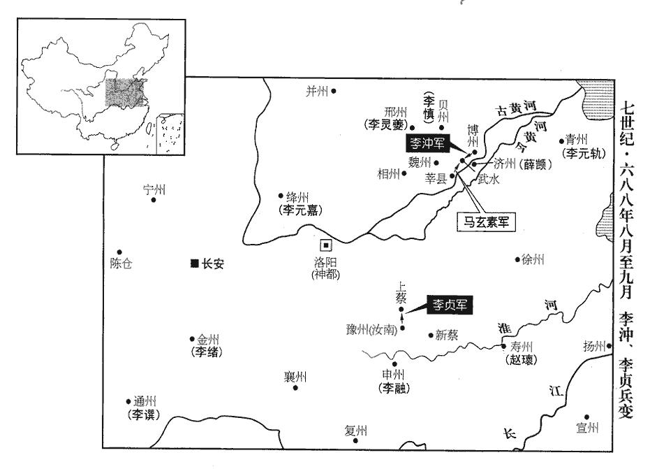
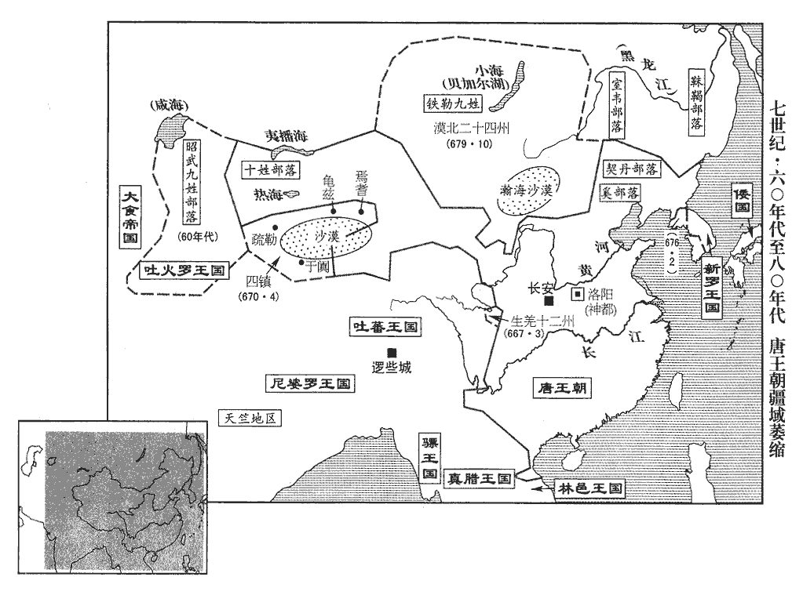
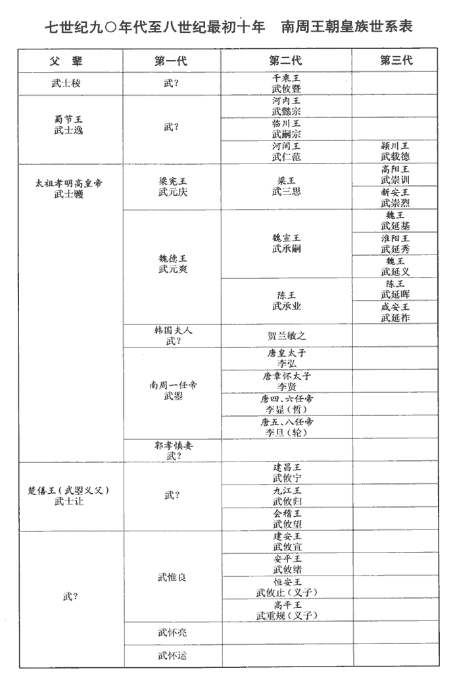

 唐紀二十起強圉大淵獻（丁亥），盡重光單閼（辛卯），凡五年。

# 則天順聖皇后上之下

## 垂拱三年（丁亥、六八七）

1春，閏正月，丁卯‹二›，‹李旦，本年二十六岁›封皇子成美為恆王，睿宗時為帝，故成美等皆為皇子。恆，戶登翻。考異曰：唐曆、舊本紀、新傳皆作「成義」。今從實錄。隆基為楚王，隆範為衛王，隆業為趙王。

〖译文〗 [1]春季，闰正月，丁卯（初二），唐朝封皇子李成美为恒王，李隆基为楚王，李隆范为卫王，李隆业为赵王。

2二月，丙辰‹二十二›，突厥‹瀚海沙漠群›骨篤祿等寇昌平‹北京市昌平县›，昌平，後漢縣，屬廣陽國，隋屬涿郡，唐屬幽州。命左鷹揚大將軍黑齒常之帥諸軍討之。帥，讀曰率。

〖译文〗 [2]二月，丙辰（二十二日），突厥阿史那骨笃禄等侵扰昌平，唐朝命令左鹰扬大将军黑齿常之率领诸军讨伐他们。

3三月，乙丑‹一›，納言韋思謙以太中大夫致仕。

〖译文〗 [3]三月，乙丑（初一），纳言韦思谦以太中大夫退休。

4夏，四月，命蘇良嗣留守西京。守，式又翻。考異曰：實錄、新舊本紀、統紀，皆無良嗣出守西京年月。今據唐曆。時尚方監裴匪躬檢校京苑，光宅改少府監為尚方監。京苑，西京之苑。將鬻苑中蔬果以收其利。良嗣曰：「昔公儀休相魯，猶能拔葵、去織婦，董仲舒曰：公儀休相魯，之其家，見織帛，怒而出。其妻食於舍而茹葵，慍而拔其葵。曰：「吾已食祿，又奪園夫紅女利乎！」相，息亮翻。去，羌呂翻。未聞萬乘之主鬻蔬果也。」乘，繩證翻。乃止。

〖译文〗 [4]夏季，四月，唐朝命令苏良嗣留守西京。当时尚方监裴匪躬查核西京禁苑，准备出卖苑中蔬菜水果以取利。苏良嗣说：“从前公仪休任鲁国宰相，还能拔掉园中的葵菜，离开家中织帛的妇人，不许家人与百姓争利，未曾听说大国的君主出卖蔬菜水果的。”于是取消出卖的打算。

5壬戌‹二十九›，裴居道為納言。五月，丙寅‹三›，夏官侍郎京兆張光輔為鳳閣侍郎、同平章事。《考異》曰：《舊本紀》在四月，《傳》在平越王貞後，今從《實錄》。

〖译文〗 [5]壬戌（二十九日），裴居道任纳言。五月，丙寅（初三），夏官侍郎京兆人张光辅任凤阁侍郎、同平章事。

6鳳閣侍郎、同鳳閣鸞臺三品劉禕yī之竊謂鳳閣舍人永年‹河北省永年县东南旧永年镇›賈大隱曰：永年，本漢曲梁縣。魏為廣平郡治所，隋廢郡為廣平縣，後改為雞澤；仁壽元年改曰永元年，避太子廣諱也；唐帶洺州。「太后既廢昏立明，安用臨朝稱制！朝，直遙翻。不如返正【章：十二行本「正」作「政」；乙十一行本同；退齋校同。】以安天下之心。」大隱密奏之，太后不悅，謂左右曰：「禕之我所引，劉禕之自北門學士至為相，故云然。乃復叛我！」或誣禕之受歸誠州‹总部应在辽河上游契丹部落所在地›都督孫萬榮金，貞觀二十二年，以契丹別部置歸誠州，屬松漠都督府。復，扶又翻。又與許敬宗妾有私，太后命肅州‹甘肃省酒泉市›刺史王本立推之。本立宣敕示之，禕之曰：「不經鳳閣鸞臺，何名為敕！」太后大怒，以為拒捍制使；使，疏吏翻。庚午‹七›，賜死于家‹年五十七岁›。

〖译文〗 [6]凤阁侍郎、同凤阁鸾台三品刘之私下对凤阁舍人永年人贾大隐说：“太后既然废昏庸立贤明，哪里用得着临朝行使皇帝权力！不如归政于皇帝，以安定天下人心。”贾大隐向太后密奏这件事，太后不高兴，对身边的人说：“刘之是我一手提拔的，竟然又背叛我！”有人诬告刘之接受归诚州都督孙万荣的黄金，又与许敬宗妾私通，太后命令肃州刺史王本立审讯他。王本立向他宣布并出示太后的敕令，刘之说：“不经过凤阁鸾台，怎么能称为敕令！”太后大怒，认为这是抵制君主的使者；庚午（初七），命令他在家里自尽。

禕之初下獄，睿宗‹李旦›為之上疏申理，下，遐嫁翻。為，于偽翻。上，時掌翻。親友皆賀之，禕之曰：「此乃所以速吾死也。」臨刑，沐浴，神色自若，自草謝表，立成數紙。麟臺郎郭翰、光宅改秘書郎為麟臺郎。太子文學周思鈞太子宮司經局有太子文學一人，正六品，掌侍奉文章。稱歎其文。太后聞之，左遷翰巫州‹湖南省洪江市西北黔城镇›司法，思鈞播州‹贵州省遵义市›司倉。貞觀八年，以辰州龍標縣置巫州；九年，以隋牂柯郡牂柯縣置播州。舊志：巫州，京師南四千一百九十七里，東都三千九百里。播州，京師南四千四百五十里，東都四千九百六十里。

〖译文〗 刘之初入狱时，睿宗曾为他上疏申辩，亲友都向他祝贺。刘之却说：“这是加速我的死期。”临刑前，他先沐浴，神色安然自若，自己起草给太后的谢恩表，很快就写出几张纸。麟台郎郭翰、太子文学周思钧称赞叹赏他的文章。太后知道后，将郭翰降职为巫州司法，周思钧降职为播州司仓。

7秋，七月，壬辰‹八月一日›，魏玄同檢校納言。

〖译文〗 [7]秋季，七月，壬辰（三十日），魏玄同任检校纳言。

8嶺南‹南岭以南›俚戶舊輸半課，交趾都護‹总督府设越南河内市›劉延祐使之全輸，俚戶不從，延祐誅其魁首。其黨李思慎等作亂，攻破安南府城‹河内市›，高宗調露元年，改交州都督府為安南都護府。俚，音里。殺延祐。桂州‹广西桂林市›司馬曹玄靜將兵討思慎等，斬之。將，即亮翻。考異曰：舊書馮元常傳云：「元常自眉州刺史轉廣州都督。屬安南首領李嗣仙殺都督劉延祐，剽陷州縣，敕元常誅之，帥士卒濟南海，先馳檄示以威恩，喻以禍福，嗣仙徒黨多相帥歸降，因縱兵誅其魁首，安慰居人而旋。」今從實錄。

〖译文〗 [8]岭南俚户过去只交纳一半赋税，交趾都护刘延要他们全额交纳，俚户不服从，刘延处死他们的首领。他的同党李思慎等暴动，攻破安南府城，杀死刘延。桂州司马曹玄静领兵讨伐李思慎等，将他们斩首。

9突厥骨篤祿、元珍寇朔州‹山西省朔州市›，遣燕然道大總管黑齒常之擊之，燕，因肩翻。以左鷹揚大將軍李多祚為之副，大破突厥於黃花堆‹山西省山阴县东北›，意即黃瓜堆。按朔州有黃花堆，在神武川。追奔四十餘里，突厥皆散走磧北。走，音奏。磧，七迹翻。多祚世為靺鞨‹黑龙江下游›酋長，靺鞨，音末曷。酋，慈由翻。長，知兩翻。以軍功得入宿衛。黑齒常之每得賞賜，皆分將士；有善馬為軍士所損，官屬請笞之，常之曰：「柰何以私馬笞官兵乎！」卒不問。卒，子恤翻。

〖译文〗 [9]突厥阿史那骨笃禄、阿史德元珍侵扰朔州。唐朝派遣燕然道大总管黑齿常之反击，以左鹰扬大将军李多祚为他的副手，大败突厥人于黄花堆，追逐四十余里，突厥人都逃往沙漠以北。李多祚世代任酋长，因军功得以入宫担任警卫。黑齿常之每次得到赏赐，都分给将士；有好马被军士损伤，属官请鞭打他，黑齿常之说：“怎么能因私人的马而鞭打官府的兵呢！”始终没有追究。

10九月，己卯‹十八›，虢州‹河南省灵宝市›人楊初成詐稱郎將，將，即亮翻；下同。矯制於都市募人迎廬陵王‹李显›於房州‹湖北省房县›；事覺，伏誅。

〖译文〗 [10]九月，己卯（十八日），虢州人杨初成伪称郎将，假传太后命令在都邑招募人去房州迎接庐陵王；事情败露后，被处死。

11冬，十月，庚子‹九›，右監門衛中郎將爨寶璧與突厥骨篤祿、元珍戰，全軍皆沒，寶璧輕騎遁歸。監，古銜翻。騎，奇寄翻。

〖译文〗 [11]冬季，十月，庚子（初九），右监门卫中郎将爨宝璧与突厥阿史那骨笃禄、阿史德元珍交战，全军覆没，爨宝璧轻装乘马逃回。

寶璧見黑齒常之有功，表請窮追餘寇。詔與常之計議，遙為聲援。寶璧欲專其功，不待常之，引精卒萬三千人先行，出塞二千餘里，掩擊其部落；既至，又先遣人告之，使得嚴備，與戰，遂敗。太后誅寶璧；改骨篤祿曰不卒祿。卒，子恤翻。

〖译文〗 爨宝璧见黑齿常之有军功，上表请求穷追残余敌人。太后命令他与黑齿常之商议，遥相声援。爨宝璧想独占功劳，不等待黑齿常之便率领精兵一万三千人率先出发，跨出边塞二千余里，想出其不意袭击突厥部落；到达以后，又先派人告诉人家，使得人家能够严密防备，于是战败。太后处死爨宝璧；改阿史那骨笃禄的名字为不卒禄。

12命魏玄同留守西京。守，手又翻。

〖译文〗 [12]唐朝命令魏玄同留守西京。

13武承嗣又使人誣李孝逸自云「名中有兔，兔，月中物，當有天分。」謂有分為天子。分，扶問翻。太后以孝逸有功，十一月，戊寅‹十八›，減死除名，流儋dān州‹海南省儋州市›而卒。儋州，舊儋耳縣，武德五年置儋州。舊志：儋州至京師七千四百四十二里。儋，徒甘翻。卒，子恤翻。考異曰：新紀：「天授元年五月己亥，殺梁郡公李孝逸。孝逸初封梁郡公，以平徐敬業功，改封吳國公；垂拱三年，減死除名，配流儋州，當削爵矣。」新傳云：「流儋州薨。」紀、傳自相違。唐曆云：「四月十一日誅益州長史李孝逸。」亦舊任也。統紀，「誅李孝逸并其黨崔元昉、裴安期。」唐曆，「并其黨崔知賢、董元昉、裴安期等。」今從實錄及舊傳。

〖译文〗 [13]武承嗣又指使人诬告李孝逸自己说”名字中有兔，兔是月亮中的东西，当会有作天子的名分”。太后因李孝逸有功劳，十一月，戊寅（十八日），减免他的死罪，削除名籍，流放儋州而死。

14太后欲遣韋待價將兵擊吐蕃‹首都逻些城西藏拉萨市›，考異曰：實錄，「十二月壬辰，命待價為安息道大總管，督三十六總管以討吐蕃。」不言師出勝敗如何。至永昌元年五月，又云「命待價擊吐蕃，七月敗於寅識迦河。」按本傳不云兩曾將兵，今刪此事。鳳閣侍郎韋方質奏，請如舊制遣御史監軍，監，古銜翻。太后曰：「古者明君遣將，閫外之事悉以委之。比聞御史監軍，比，毗至翻。軍中事無大小皆須承稟。以下制上，非令典也；且何以責其有功！」遂罷之。

〖译文〗 [14]太后准备派遣韦待价领兵进击吐蕃，凤阁侍郎韦方质上奏，请求按照以前的制度派遣御史监军，太后说：“古时贤明的君主派遣将领，城门以外的事情全都委托给他，近来听说御史监军，军中大小事情都要禀报他，以下控制上，不是国家的制度，况且这如何能要求将领取得成功！”于是作罢。

15是嵗，天下大饑，山東‹崤山以東›、關內‹陝西省中部›尤甚。

〖译文〗 [15]本年，天下大饥荒，山东、关内尤为严重。

## 四年（戊子、六八八）

1春，正月，甲子‹五›，於神都‹洛阳›立高祖‹李渊›、太宗‹李世民›、高宗‹李治›三廟，四時享祀如西廟之儀。西廟，西京宗廟也。又立崇先廟以享武氏祖考。太后命有司議崇先廟室數，司禮博士周悰請為七室，光宅改太常曰司禮。史言周悰之請，希旨迎合。又減唐太廟為五室。春官侍郎賈大隱奏：「禮，天子七廟，諸侯五廟，百王不易之義。今周悰別引浮議，廣述異聞，直崇臨朝權儀，朝，直遙翻。不依國家常度。皇太后親承顧託，光顯大猷，其崇先廟室應如諸侯之數，國家宗廟不應輒有變移。」太后乃止。

〖译文〗 [1]春季，正月，甲子（初五），唐朝在神都建立唐高祖、唐太宗、唐高宗三座庙，春夏秋冬祭祀的礼仪和西京的太庙一样。又立崇先庙以祭祀武氏祖先。太后命令有关部门讨论崇先庙的室数，司礼博士周请设七室，并将李唐太庙减为五室。春官侍郎贾大隐奏：“按照礼制，天子七庙，诸侯五庙，这是百代不能更改的道理。如今周引用没有根据的议论，广泛陈述异闻，只是尊崇太后临朝代理国事的威仪，不依从国家的常法。皇太后亲自承受先帝临终的托付，显扬帝王的大道，崇先庙的室数应当如同诸侯的数目，国家宗庙不应随意变更。”太后于是没有为崇先庙设立七室。

2太宗、高宗之世，屢欲立明堂，諸儒議其制度，不決而止。及太后稱制，獨與北門學士議其制，不問諸儒。諸儒以為明堂當在國陽丙巳之地，三里之外，七里之內。太后以為去宮太遠。二月，庚午‹正月十一›，毀乾元殿，於其地作明堂，以僧懷義為之使，使，疏吏翻。凡役數萬人。

〖译文〗 [2]太宗、高宗在位的时候，多次准备建立明堂，因儒家学者们讨论它的制度没有结果而停止。到太后临朝行使皇帝权力，独自与北门学士讨论它的制度，不征求学者们的意见。学者们认为明堂应当在都城南郊居中之地，三里之外，七里之内。太后认为离皇宫太远。二月，庚午（疑误），拆毁乾元殿，在原地基建明堂，任命和尚怀义为监造明堂使者，共役使数万人。

3夏，四月，戊戌‹十一›，殺太子通事舍人郝象賢。唐制，太子通事舍人正七品下，掌導引宮臣辭見及勞問之事。象賢，處俊之孫也。

〖译文〗 [3]夏季，四月，戊戌（十一日），唐朝处死太子通事舍人郝象贤。郝象贤是郝处俊的孙子。

初，太后有憾於處俊，謂上元二年諫高宗也。會奴誣告象賢反，太后命周興鞫之，致象賢族罪。象賢家人詣朝堂，訟冤於監察御史樂安‹山东省惠民县›任玄殖。樂安郡，棣州。朝，直遙翻。監，古銜翻。玄殖奏象賢無反狀，玄殖坐免官。象賢臨刑，極口罵太后，發揚宮中隱慝，奪市人柴以擊刑者；金吾兵共格殺之。太后命支解其尸，發其父祖墳，毀棺焚尸。自是終太后之世，法官每刑人，先以木丸塞其口。塞，悉則翻。

〖译文〗 当初，太后对郝处俊不满意，正好有奴仆诬告郝象贤谋反，太后命令周兴审讯，判郝象贤灭族罪。郝象贤家里的人前往朝堂，向监察御史乐安人任玄殖诉冤。任玄殖上奏说郝象贤没有谋反的事实，因此获罪被免官。郝象贤临刑前，破口大骂太后，揭发宫中隐秘的的丑事，夺取市上人的木柴打行刑人；金吾卫士兵共同把他打死。太后命令支解他的尸体，挖他父亲、祖父的坟墓，毁棺材焚尸休。从此直到太后在位终了，法官每次执行死刑，都先用木丸塞住犯人的嘴。

4武承嗣使鑿白石為文曰：「聖母臨人，永昌帝業。」末紫石雜藥物填之。庚午‹五月三日›，使雍州人唐同泰奉表獻之，隋京兆郡，武德元年改曰雍州。雍，於用翻。稱獲之於洛水。太后喜，命其石曰「寶圖」。擢同泰為遊擊將軍。五月，戊辰‹十一›，詔當親拜洛，受「寶圖」；有事南郊，告謝昊天；禮畢，御明堂，朝群臣。朝，直遙翻。命諸州都督、刺史及宗室、外戚以拜洛前十日集神都‹洛阳›。乙亥‹十八›，太后加尊號為聖母神皇。

〖译文〗 [4]武承嗣指使人在白石上凿上文字：“圣母临人，永昌帝业。”然后把紫石捣成粉末掺上药物将字填平。庚午（疑误），指使雍州人唐同泰上表献石，声称这石头是从洛水中获得的。太后高兴，将这石头命名为“宝图”，提拔唐同泰为游击将军。五月，戊辰（十一日），太后下诏，将亲自祭拜洛水，接受“宝图”；祭祀于南郊，告谢昊天上帝；祭典结束，驾临明堂，接受群臣朝见，命令各州都督、刺史以及皇族、外戚在祭拜洛水前十天在神都洛阳会集。乙亥（十八日），太后加尊号为圣母神皇。

5六月，丁亥朔‹一›，日有食之。

〖译文〗 [5]六月，丁亥朔（初一），出现日食。

6壬寅‹十六›，作神皇三璽。璽，斯氏翻。

〖译文〗 [6]壬寅（十六日），唐朝制作神皇的三个玺印。

7東陽大長公主削封邑，并二子徙巫州‹湖南省洪江市西北黔城镇›。公主，太宗之女。長，知兩翻。公主適高履行，太后以高氏長孫無忌之舅族，故惡之。惡，烏路翻。

〖译文〗 [7]东阳大长公主被削除封邑，和两个儿子一起迁移到巫州。东阳大长公主嫁给高履行，太后因高氏是长孙无忌的舅舅的家族里的人，所以憎恶她。

8江南道‹长江以南›巡撫大使、冬官侍郎狄仁傑以吳、楚多淫祠，奏焚其一千七百餘所，獨留夏禹、吳太伯、季札、伍員四祠。員，音云。

〖译文〗 [8]江南道巡抚大使、冬官侍郎狄仁杰因吴、楚多滥设祠庙，奏请焚烧其中的一千七百余所，只留下夏禹、吴太伯、季札、伍员四座祠庙。

9秋，七月，丁巳‹一›，赦天下。更命「寶圖」為「天授聖圖」；洛水為永昌洛水，更，工衡翻。封其神為顯聖侯；加特進，禁漁釣，祭祀比四瀆。唐制，嶽瀆為中祀。名圖所出曰「聖圖泉」，泉側置永昌縣‹洛阳城西南›。又改嵩山‹河南省登封县北›為神嶽，封其神為天中王，拜太師、使持節、神嶽大都督，禁芻牧。使，疏吏翻。又以先於汜水‹河南省荥阳市汜水镇西›得瑞石，改汜水為廣武。汜水，漢之成皋縣，屬河南郡；後魏為成皋郡，置東中府；隋開皇十八年改成皋為汜水，屬鄭州。縣界有廣武，楚、漢對壘處。后改縣名以協其姓。汜，音祀。

〖译文〗 [9]秋季，七月，丁巳（初一），唐朝大赦天下。“宝图”改名为“天授圣图”；洛水改名为永昌洛水，封洛水神为显圣侯，加特进，禁止在洛水上打鱼垂钓，祭洛水的礼仪如同四渎一样。将天授圣图出现的地点命名为圣图泉，泉的旁边设置永昌县。又改称嵩山为神岳，封嵩山神为天中王，授给太师、使持节、神岳大都督的官衔，禁止在山上打柴放牧。又由于这以前在汜水县得到瑞石，因此汜水县为广武县。

太后潛謀革命，稍除宗室。絳州‹山西省新绛县›刺史韓王元嘉、青州‹山东省青州市›刺史霍王元軌、邢州‹河北省邢台市›刺史魯王靈夔‹以上三亲王都是李渊的儿子›、豫州‹河南省汝南县›刺史越王貞‹李世民的儿子›豫州，漢汝南郡地，後魏置豫州，唐因之；然唐之豫州非能盡得漢汝南郡之地。及元嘉子通州‹四川省达川市›刺史黃公譔、譔zhuàn，士免翻，又音銓。元軌子金州‹陕西省安康市›刺史江都王緒、虢王鳳‹李渊的儿子›子申州‹河南省信阳市›刺史東莞公融、靈夔子范陽王藹、貞子博州‹山东省聊城市›刺史琅邪王沖，在宗室中皆以才行有美名，行，下孟翻。太后尤忌之。元嘉等內不自安，密有匡復之志。考異曰：舊傳，「垂拱三年七月」，誤也。今從實錄。

〖译文〗 太后私下图谋取代唐朝，逐渐清除皇族。绛州刺史韩王李元嘉、青州刺史霍王李元轨、邢州刺史鲁王李灵夔、豫州刺史越王李贞及李元嘉的儿子通州刺史黄公李、李元轨的儿子金州刺史江都王李绪、虢王李凤的儿子申州刺史东莞公李融、李灵夔的儿子范阳王李蔼、李贞的儿子博州刺史琅邪王李冲，在皇族中都凭才能和操行享有美名，太后尤其忌恨他们。李元嘉等内心不安，暗中有挽救恢复皇帝权力的志向。

譔謬為書與貞云：「內人病浸重，當速療之，若至今冬，恐成痼疾。」及太后召宗室朝明堂，朝，直遙翻。諸王因遞相驚曰：「神皇‹武曌›欲於大饗之際，使人告密，盡收宗室，誅之無遺。」譔詐為皇帝璽書與沖云：「朕遭幽縶，諸王宜各發兵救我。」沖又詐為皇帝璽書云：「神皇欲移李氏社稷以授武氏。」璽，斯氏翻。八月，壬寅‹十七›，沖召長史蕭德琮等令募兵，考異曰：實錄作丙午，蓋據奏到之日也。舊傳、本紀作壬寅。按沖以戊申死，而實錄又云「沖起兵七日而敗」，然則壬寅是也，今從之。分告韓‹韩王李元嘉›、霍‹霍王李元轨›、魯‹鲁王李灵夔›、越‹越王李贞›及貝州‹河北省清河县›刺史紀王慎‹李世民的儿子›，令各起兵共趣神都‹洛阳›。趣，七喻翻。太后聞之，以左金吾將軍丘神勣為清平道行軍大總管以討之。博州有清平縣，漢貝丘縣也，隋更名。

〖译文〗 李写信给李贞假称：“妻子的病越来越重，应当赶紧治疗，如果拖延到今年冬天，恐怕要成为顽症。”等到太后召集宗室到明堂朝见，诸王于是轮番相互警戒说：“神皇准备在接受朝见大摆宴席的时候，指使人告密，尽数逮捕皇族，全部杀光。”李假造皇帝用玺印密封的书信给李冲说：“朕被幽禁，诸王应该各自发兵救我。”李冲又伪造皇帝用玺印密封的书信说：“神皇打算将李氏的国家交给武氏。”八月，壬寅（十七日），李冲召集长史萧德琮等，命令他们招募兵卒，同时分别告知韩、霍、鲁、越各王，以及贝州刺史纪王李慎，让他们各自起兵，共同向神都进发。太后得知后，任命左金吾将军丘神为清平道行军大总管讨伐他们。

 

沖募兵得五千餘人，欲渡河取濟州‹山东省茌平县西南›；先擊武水‹山东省聊城市西南›，武水，漢東郡陽平縣地；隋改為清邑，又分清邑置武水縣，唐屬博州。濟，子禮翻。武水令郭務悌詣魏州‹河北省大名县›求救。莘‹山东省莘县›令馬玄素莘，亦漢陽平縣地。後齊改曰樂平，隋開皇六年復曰陽平，八年改曰清邑，十六年置莘州；大業初，州廢為莘縣，唐屬魏州。將兵千七百人中道邀沖，恐力不敵，入武水，閉門拒守。沖推草車塞其南門，推，吐雷翻。塞，悉則翻。因風縱火焚之，欲乘火突入；火作而風回，沖軍不得進，由是氣沮。堂邑‹山东省聊城市西堂邑镇›董玄寂堂邑，漢縣，後魏廢，隋分清陽縣復置，屬博州。為沖將兵擊武水，為，于偽翻。謂人曰：「琅邪王與國家交戰，此乃反也。」沖聞之，斬玄寂以徇，眾懼而散入草澤，不可禁止，惟家僮左右數十人在。沖還走博州‹山东省聊城市›，走，音奏。戊申‹二十三›，至城門，為守門者所殺，考異曰：丘神勣傳云：「為勳官吳希智、白丁孟青棒所殺。」今從實錄及沖傳。凡起兵七日而敗。丘神勣至博州，官吏素服出迎，神勣盡【章：十二行本「盡」上有「揮刃」二字；乙十一行本同；孔本同，張校同，云「盡」下脫「揮刀」二字。按十二行本「刀」作「刃」，二字在「盡」上，兩校微異。】殺之，凡破千餘家。

〖译文〗 李冲募兵得到五千余人，想横渡黄河，夺取济州；先进攻武水，武水县令郭务悌前往魏州求救。莘县县令马玄素领兵一千七百人在中途截击李冲，因怕兵力不足以抗敌，便进入武水县城，闭门防守。李冲推草车堵塞该城南门，趁风纵火焚烧城门，想乘火势冲入城中；不料火起后风向逆转，李冲的军队不能前进，因此士气低落。堂邑人董玄寂为李冲领兵进攻武水，对人说：“琅邪王与国家交战，这是造反。”李冲听说后，斩董玄寂示众，部下畏惧四散逃入荒野，李冲禁止不住，只剩下自家的僮仆和左右共数十人在身边。李冲往回逃奔博州，戊申（二十三日），至博州城门，被守门的人杀死，起兵前后共七日就失败。丘神到达博州，官吏身穿民服出来迎接，丘神将他们全部杀死，共使一千余家家破人亡。

越王貞聞沖起，亦舉兵於豫州‹河南省汝南县›，遣兵陷上蔡‹河南省上蔡县›。上蔡縣，漢屬汝南郡。後魏曰臨汝，隋開皇初改曰武津，大業初曰上蔡，唐屬豫州。九域志，在州北五十五里。九月，丙辰‹一›，命左豹韜大將軍麴崇裕為中軍大總管，岑長倩為後軍大總管，將兵十萬以討之，將，即亮翻；下同。又命張光輔為諸軍節度。削【章：十二行本「削」下有「貞」字；乙十一行本同；張校同，云無註本亦無。】沖屬籍，更姓虺huǐ氏。更，工衡翻；下更其同。貞聞沖敗，欲自鎖詣闕謝罪，會所署新蔡令傅延慶新蔡縣，自漢以來屬汝南郡，唐屬豫州。九域志，在州東一百六十里。募得勇士二千餘人，貞乃宣言於眾曰：「琅邪已破魏‹河北省大名县›、相‹河南省安阳市›數州，相，息亮翻。有兵二十萬，朝夕至矣。」發屬縣兵共得五千，分為五營，使汝南‹应是汝阳，豫州州政府所在县·河南省汝南县›縣丞裴守德等將之，汝南縣，舊曰上蔡，隋大業初改曰汝陽，帶豫州。署九品以上官五百餘人。所署官皆受迫脅，莫有鬬志，惟守德與之同謀，貞以其女妻之，妻，七細翻。署大將軍，委以腹心。貞使道士及僧誦經以求事成，左右及戰士皆帶辟兵符。麴崇裕等軍至豫州城東四十里，貞遣少子規及裴守德拒戰，兵潰而歸。少，詩照翻。貞大懼，閉閤自守。崇裕等至城下，左右謂貞曰：「王豈可坐待戮辱！」貞、規、守德及其妻皆自殺。考異曰：實錄，「庚戌，貞舉兵，九月，丙寅，豫州平。」又云，「舉兵二十日而敗。」庚戌至丙寅纔十七日，蓋皆據奏到之日耳。與沖皆梟首東都闕下。梟，堅堯翻。

〖译文〗 越王李贞听说李冲起兵，也在豫州起兵，派兵攻陷上蔡。九月，丙辰（初一），朝廷任命左豹韬大将军麴崇裕为中军大总管，岑长倩为后军大总管，领兵十万人讨伐他，又命张光辅为诸军节度。朝廷削除李贞、李冲在皇族名册中的名字，改姓虺氏。李贞听说李冲失败，本想捆绑自己到皇宫前请罪，正遇上他所任命的新蔡县令傅延庆招募到勇士二千余人，李贞便向大家宣告说：“琅邪王已攻破魏、相等数州，有兵二十万，很快就要到达这里了。”又征发豫州属下各县兵共五千人，分为五营，指派汝南县丞裴守德等率领，任命九品以上官员五百余人。所任命的官吏都是受胁迫的，没有斗志，只有裴守德与他同谋，李贞将女儿嫁给他，任命他为大将军，结为亲信。李贞让道士、和尚诵经以祈求事情成功，身边的人及战士都佩带避免兵器伤害的神符。麴崇裕等军到达豫州城东四十里，李贞派遣小儿子李规及裴守德迎战，结果溃败而回。李贞大惊，闭门自守。麴崇裕等到达城下，身边的人对李贞说：“您难道可以坐着等待被杀被污辱！”于是李贞、李规、裴守德及他们的妻子都自杀。他们与李冲都在东都皇宫门前阙楼下被悬首示众。

初，范陽王藹遣使語貞及沖曰：使，疏吏翻。語，牛倨翻；下我語同。「若四方諸王一時並起，事無不濟。」諸王往來相約結，未定而沖先發，惟貞狼狽應之，諸王皆不敢發，故敗。

〖译文〗 当初，范阳王李蔼派使者对李贞和李冲说：“如果四方诸王同时起事，一定能成功。”于是诸王往来协商约定时间，还没有最后约定，李冲就首先发难，只有李贞匆忙响应，其他诸王都不敢起事，所以失败。

貞之將起兵也，遣使告壽州‹安徽省寿县›刺史趙瓌guī，瓌妻常樂長公主常樂公主，高祖女。使，疏吏翻；下同。樂，音洛。長，知兩翻。謂使者曰：「為我語越王：為，于偽翻；下似為同。語，牛倨翻。昔隋文帝將篡周室，尉遲迥，周之甥也，猶能舉兵匡救社稷，事見一百七十四卷陳宣帝太建十四年。尉，紆勿翻。功雖不成，威震海內，足為忠烈。況汝諸王，先帝之子，豈得不以社稷為心！今李氏危若朝露，汝諸王不捨生取義，尚猶豫不發，欲何須邪！須，待也。禍且至矣，大丈夫當為忠義鬼，無為徒死也。」

〖译文〗 李贞将起兵时，派使者告诉寿州刺史赵，赵的妻子常乐长公主对使者说：“替我转告越王：从前隋文帝将要篡夺北周帝位，尉迟迥是北周皇帝的外甥，还能起兵匡救国家，虽然没有成功，但威震海内，足可称为忠诚壮烈之士。何况你们诸王还是先帝的儿子，难道还能不把国家放在心上！现今李氏王朝的危险就像早晨的露水一样，你们诸王不舍生取义，还犹豫不发兵，想等什么呢！大祸就要临头了，大丈夫应当做忠义之鬼，不应当白白等死。”

及貞敗，太后欲悉誅韓、魯等諸王，命監察御史藍田‹陕西省蓝田县›蘇珦按其密狀。珦訊問，皆無明驗，或告珦與韓、魯通謀，太后召珦詰之，珦抗論不回。監，古銜翻；下同。珦，式亮翻。詰，去吉翻。太后曰：「卿大雅之士，朕當別有任使，此獄不必卿也。」乃命珦於河西‹甘肃省中部西部›監軍，更使周興等按之，更，工衡翻；下同。於是收韓王元嘉、魯王靈夔、黃公譔zhuàn、常樂公主於東都，迫脅皆自殺，考異曰：舊傳：「靈夔流振州，自縊死。」今從實錄。更其姓曰「虺」，親黨皆誅。

〖译文〗 到李贞失败，太后打算全部处死韩、鲁等诸王，命令监察御史蓝田人苏清查他们密谋的情况。苏经过审讯，都没有得到明确的罪证，有人密告苏与韩、鲁等诸王串通，太后召苏责问，苏直言争论，不改变自己的看法。太后说：“你是才德高雅的读书人，朕将另有任用，这个案子不用你办理了。”便命令苏到河西监军，改由周兴等审理，于是收捕韩王李元嘉、鲁王李灵夔、黄公李、常乐公主等到东都洛阳，全迫胁他们自杀，改他们姓“虺”，他们的亲属党羽都被处死。

以文昌左丞狄仁傑為豫州刺史。光宅改尚書左丞為文昌左丞。時治越王貞黨與，治，直之翻。當坐者六七百家，籍沒者五千口，司刑趣使行刑。司刑寺即大理寺。趣，讀曰促。仁傑密奏：「彼皆詿誤，詿guà，戶卦翻。臣欲顯奏，似為逆人申理；知而不言，恐乖陛下仁恤之旨。」太后特原之，皆流豐州‹内蒙古五原县›。道過寧州‹甘肃省宁县›，寧州父老迎勞之曰：「我狄使君活汝邪？」勞，力到翻。仁傑刺寧州，見上卷垂拱二年。相攜哭於德政碑下，設齋三日而後行。

〖译文〗 朝廷任命文昌左丞狄仁杰为豫州刺史。当时正惩治越王李贞的党羽，要判罪的有六七百家，籍没官府充当奴婢的有五千人，司刑寺催促豫州执行判决。狄仁杰给太后上密奏说：“他们都是受连累的，我想明白上奏，似乎是在为叛逆的人申辩；知而不言，又恐怕有背于陛下仁爱怜悯的本意。”太后因此特意原谅他们，都流放丰州。当他们路过宁州时，宁州父老迎接慰劳说：“是我们的狄使君救活你们的吧？”互相搀扶着在宁州百姓当年为狄仁杰立的功德碑下痛哭，斋戒三天后才继续往前走。

時張光輔尚在豫州，將士恃功，多所求取，仁傑不之應。光輔怒曰：「州將輕元帥邪？」將，即亮翻。帥，所類翻。仁傑曰：「亂河南‹汝南，豫州·河南省汝南县›者一越王貞耳，河南，當作汝南。今一貞死，萬貞生！」光輔詰其語，仁傑曰：「明公總兵三十萬，所誅者止於越王貞。城中聞官軍至，踰城出降者四面成蹊，降，戶江翻。明公縱將士暴掠，殺已降以為功，流血丹野，非萬貞而何！恨不得尚方斬馬劍，加於明公之頸，雖死如歸耳！」光輔不能詰，歸，奏仁傑不遜，左遷復州‹湖北省仙桃市›刺史。自緊州左遷上州，且自近州遷遠州也。舊志：豫州，去京師一千五百四十里，至東都六百七十里；復州，京師東南一千八百里，至東都一千五百一十八里。

〖译文〗 当时张光辅还在豫州，将士依仗有功，肆意勒索，狄仁杰不予理采。张光辅大怒说：“州将敢轻视全军主将！”狄仁杰说：“河南作乱的只有一个越王李贞，现在一个李贞死了，出现了一万个李贞！”张光辅责问这话是什么意思，狄仁杰说：“您统兵三十万，所要杀的只限于越王李贞。城中人听说官军到来，越城出来投降的人很多，四面都踩踏成道路了，您放纵军士凶暴地抢掠，杀已投降的人用以报功，流血染红郊野，这不是一万个李贞又是什么！我恨不能得到天子的尚方斩马剑加在您的脖子上，我虽死也视作回家一般！”张光辅无法反驳，回来后，上奏说狄仁杰不恭顺。狄仁杰被降职为复州刺史。

10丁卯‹十二›，左肅政大夫騫味道、夏官侍郎王本立並同平章事。

〖译文〗 [10]丁卯（十二日），左肃政大夫骞味道、夏官侍郎王本立都任同平章事。

11太后之召宗室朝明堂也，東莞公融密遣使問成均助教高子貢，朝，直遙翻。莞，音官。使，疏吏翻；下同。子貢曰：「來必死。」融乃稱疾不赴。越王貞起兵，遣使約融，融蒼猝不能應，為官屬所逼，執使者以聞，擢拜右贊善大夫。唐東宮左、右贊善大夫，正五品上，掌傳令、諷過失、贊禮儀、以經教授諸郡王。未幾，為支黨所引，幾，居豈翻。冬，十月，己亥，戮於市，籍沒其家。高子貢亦坐誅。

〖译文〗 [11]太后召皇族到明堂朝见，东莞公李融暗中派使者问成均助教高子贡，高子贡回答说：“来，必定死。”李融便声称有病不来。越王李贞发难，派使者约他一同起兵，他匆促间不能响应，在属官逼迫下逮捕李贞的使者上报，因此升任左赞善大夫。不久，为亲属所牵连，冬季，十月，己亥（十四日），被处死于街市，查抄家产，高子贡也因此被处死。

濟州‹山东省茌平县西南›刺史薛顗、顗弟緒、緒弟駙馬都尉紹，皆與琅邪王沖通謀。濟，子禮翻。顗yǐ，魚豈翻。顗聞沖起兵，作兵器，募人；沖敗，殺錄事參軍高纂以滅口。唐武德初改州主簿為錄事參軍，掌正違失，涖符印。十一月，辛酉‹六›，顗、緒伏誅，紹以太平公主故，杖一百，餓死於獄。紹以主壻免殊死。

〖译文〗 济州刺史薛、薛的弟弟薛绪、薛绪的弟弟附马都尉薛绍，都同琅邪王李冲通谋。薛听说李冲起兵，即制造武器，招募人员；李冲失败后，他们杀录事参军高纂以灭口。十一月，辛酉（初六），薛、薛绪被处死，薛绍因娶太平公主的缘故，被打一百棍子后，饿死于监狱中。

十二月，乙酉‹一›，司徒、青州‹山东省青州市›刺史霍王元軌坐與越王連謀，廢徙黔州‹重庆市彭水县›，舊志：黔州，京師南三千一百九十三里，至東都三千二百七十七里。黔，音琴。載以檻車，行至陳倉‹陕西省宝鸡市东陈仓镇›而死。江都王緒、殿中監郕公裴承先皆戮於市。承先，寂之孫也。裴寂，武德開國功臣。

〖译文〗 十二月，乙酉（初一），司徒、青州刺史霍王李元轨因犯与越王李贞通谋罪，被废黜并流放到黔州，用囚车运送，行至陈仓死去。江都王李绪、殿中监公裴承先都被处死于街市。裴承先是裴寂的孙子。

12命裴居道留守西京。守，式又翻。

〖译文〗 [12]唐朝命令裴居道留守西京。

13左肅政大夫、同平章事騫味道素不禮於殿中侍御史周矩，屢言其不能了事。會有羅告味道者，敕矩按之。矩謂味道曰：「公常責矩不了事，今日為公了之。」為，于偽翻。乙亥‹十五›，味道及其子辭玉皆伏誅。考異曰：御史臺記：「味道陷周興獄。」今從矩傳。

〖译文〗 [13]左肃政大夫、同平章事骞味道一贯不尊重殿中侍御史周矩，多次说他不会解决问题。正好有人罗织罪名告发骞味道，太后命令周矩审讯。周矩对骞味道说：“你常责备我不会解决问题，今天我就为你解决问题。”己亥（疑误），骞味道和他的儿子骞辞玉都被处死。

14己酉‹二十五›，太后拜洛受圖，受唐同泰所獻偽石也。皇帝‹李旦，本年二十七岁›、皇太子‹李成器›皆從，從，才用翻。內外文武百官、蠻夷【章：十二行本「夷」下有「酋長」二字；乙十一行本同；張校同，云無註本亦無。】各依方敘立，珍禽、奇獸、雜寶列於壇前，文物鹵簿之盛，唐興以來未之有也。

〖译文〗 [14]己酉（二十五日），太后祭拜洛水，接受“天授圣图”，皇帝、皇太子都随从，内外文武百官、蛮夷首领各按方位排列站立。珍禽、奇兽、各种珍宝陈列于坛前，礼乐仪仗的盛大，是唐朝开国以来所未有过的。

15辛亥‹二十七›，明堂成，高二百九十四尺，方三百尺。凡三層：下層法四時，各隨方色。中層法十二辰；上為圓蓋，九龍捧之。上【章：十二行本「上」上有「上層法二十四氣，亦為圓蓋」十一字；乙十一行本同；孔本同；退齋校同。】施鐵鳳，高一丈，高，居傲翻。飾以黃金；中有巨木十圍，上下通貫，栭ér櫨lú橕chēng㮰pí藉以為本；栭，音而，梁上柱，說文曰：屋枅jī上標。櫨，音盧，柱上柎fū曰欂bó櫨，廣韻，枅也，又曰柱也。橕，抽庚翻，斜柱也。㮰，婢脂翻，屋梠lǚ也。下施鐵渠，為辟雍之象。以鐵為渠以通水。號曰萬象神宮。宴賜群臣，赦天下，縱民入觀。改河南為合宮縣。又於明堂北起天堂五級以貯大像；懷義所作夾紵zhù大像也。貯，丁呂翻。至三級，則俯視明堂矣。考異曰：舊薛懷義傳云：「明堂大屋凡三層，計高三百尺；又於明堂北起天堂，廣袤亞明堂。」今從小說及通典。僧懷義以功拜左威衛大將軍、梁國公。考異曰：實錄云：「懷義監造明堂，以功擢授左武衛大將軍，固辭不拜。時有右玉鈐衛將軍王慈徵、長上果毅元肅然，請與懷義為兒，既而陰有異圖，欲奉之為主，懷義密奏其狀；由是慈徵等坐斬，進拜懷義輔國大將軍，封盧國公，賜物三千段；又表辭不受。」今從舊傳。

〖译文〗 [15]辛亥（二十七日），明堂落成，高二百九十四尺，三百尺见方。共三层：下层按照四季划分，四方各用本方的颜色；中层按十二时辰划分；上为圆顶，由九条龙捧起，顶上安置铁凤，高一丈，用黄金装饰。中间有十围粗的大木，上下贯通，斗斜柱屋檐都依仗它作基础。下面安置铁制水渠，像太学中辟雍的样子，号称万象神宫。太后设宴赏赐群臣，大赦天下罪人，准许百姓入内参观。改河南县为合宫县。又在明堂北面造五层天堂以贮藏大佛像；登上第三层就可以俯视明堂了。和尚怀义因主持修造明堂和天堂有功授左威卫大将军、梁国公。

侍御史王求禮上書曰：「古之明堂，茅茨不翦，采椽不斲。今者飾以殊玉，塗以丹青，鐵鷟zhuó入雲，上，時掌翻。鷟，士角翻。鸑yuè鷟者，鳳也。金龍隱霧，昔殷辛瓊臺，夏癸瑤室，無以加也。」殷辛，紂也；夏癸，桀也。太后不報。

〖译文〗 侍御史王求礼上书说：“古代明堂，用茅草为顶不加修剪，以柞木作椽不加砍削。现在用珠宝玉石装饰，涂上各种颜色，铁凤高入云端，金龙藏进云雾，从前殷纣王的琼台、夏桀的瑶室，都无法超过它。”太后不予理睬。

16太后欲發梁‹陕西省汉中市›、鳳‹陕西省凤县›、巴‹四川省巴中市›蜑，蜑dàn，徒旱翻。自雅州‹四川省雅安市›開山通道，出擊生羌，因襲吐蕃‹首都逻些城西藏拉萨市›。貞觀五年，太宗置西雅州以處生羌；八年，去「西」字。吐，從暾入聲。正字陳子昂上書，上，時掌翻。以為：「雅州邊羌，自國初以來未嘗為盜。今一旦無罪戮之，其怨必甚；且懼誅滅，必蜂起為盜。西山‹指四川盆地西部›盜起，西山在成都西。松、茂二州都督府所統諸州，皆西山羌也。則蜀之邊邑不得不連兵備守，兵久不解，臣愚以為西蜀‹四川盆地西部›之禍，自此結矣。臣聞吐蕃愛蜀富饒，欲盜之久矣，徒以山川阻絕，障隘不通，勢不能動。今國家乃亂邊羌，開隘道，使其收奔亡之種，為鄉導以攻邊，是借寇兵為賊除道，舉全蜀以遺之也。種，章勇翻。鄉，讀曰嚮。為賊，于偽翻。遺，于季翻。蜀者國家之寶庫，可以兼濟中國。今執事者乃圖僥幸之利以事西羌，僥，工堯翻。得其地不足以稼穡，財不足以富國，徒為糜費，無益聖德，況其成敗未可知哉！夫蜀之所恃者險也，夫，音扶。人之所以安者無役也；今國家乃開其險，役其人，險開則便寇，人役則傷財，臣恐未見羌戎，已有姦盜在其中矣。且蜀人尫劣，尫，烏黃翻，弱也。不習兵戰，山川阻曠，去中夏遠，夏，戶雅翻。今無故生西羌、吐蕃之患，臣見其不及百年，蜀為戎矣。國家近廢安北‹设内蒙古额济纳旗›，拔單于‹设内蒙古和林格尔县›，棄龜茲‹新疆库车县›，放疏勒‹新疆喀什市›，廢安北，拔單于，以突厥畔援也；棄龜茲，放疏勒，以吐蕃侵逼也。單，音蟬。龜茲，音丘慈，又音屈佳。天下翕然謂之盛德者，蓋以陛下務在養人，不在廣地也。今山東‹崤山以东›饑，關‹陕西省中部›、隴‹陇山以西›弊，而徇貪夫之議，謀動甲兵，興大役，自古國亡家敗，未嘗不由黷兵，願陛下熟計之。」既而役不果興。

〖译文〗 [16]太后准备征发梁、凤、巴等地百姓，从雅州凿山开通道路，出击生羌，从而袭击吐蕃。正字陈子昂上书认为：“雅州边地的羌人，从唐朝开国以来未曾作过盗贼，现在一旦无罪而杀戮他们，他们的怨恨一定很深；而且害怕被消灭，必蜂起作盗贼。西山羌族盗贼兴起，则蜀地边城不得不接连派兵防守。兵士长期集结不散，我以为西蜀的灾祸，从此就结下了。我听说吐蕃贪图蜀地富饶，想窃取它已经很久了，只是因山川隔绝，道路阻塞不通，形势使他们无法行动。现在国家却扰乱边地羌人，开通险要通道，使他们得以收集逃亡种族，作为向导以进攻边地，这是借给敌人兵马，为敌人清除道路，把全部蜀地送给他们。蜀地是国家的宝库，可以多方面接济中原地区。现在的一些当政者贪图侥幸的利益而进取西羌，得到他们的土地不能够种庄稼，得到他们的财富不足以使国家富裕，只是浪费财力人力，无益于陛下圣德，更何况成败还不一定呢！蜀地所依赖的是地势险要，百姓所赖以安定的是没有徭役；现在国家却打通它的险要，役使它的人民，险要打通则便于敌寇，人民被役使则伤财，我恐怕还没有见到羌人，已有奸盗出现在蜀中了。况且蜀人弱小，不熟悉军事，山川阻隔，距离中原遥远，如今无敌造成西羌、吐蕃的祸患，我觉得不用再过一百年，蜀地将变为戎人的地方了。国家近年废除安北、单于都护府，放弃龟兹、疏勒二镇，天下所以一致称之为盛德，大概是因为陛下致力于安养人民，而不在于扩大土地。现在崤山以东饥荒，关、陇地区残破，却顺从贪心人的议论，谋划动用军队，兴起大规模的徭役，自古以来国亡家败，未尝不由于滥用武力，愿陛下仔细考虑。”其后这件事情没有能进行。

 

## 永昌元年（己丑、六八九）

1春，正月，乙卯朔‹一›，大饗萬象神宮，太后服袞冕，搢大圭，執鎮圭為初獻，周禮註：大圭長三尺，杼zhù上，終葵首，天子服之。鎮圭尺有二寸，天子守之。鎮圭飾四鎮山，象其高；圭中約以組，防其墜。齊人謂槌為終葵。圭首六寸為槌，以下殺之。皇帝‹李旦，本年二十八岁›為亞獻，太子為終獻。先詣昊天上帝座，次高祖、太宗、高宗，次魏國先王，魏國先王，武士彠也。次五方帝座。太后御則天門，赦天下，改元。丁巳‹三›，太后御明堂，受朝賀。朝，直遙翻。戊午‹四›，布政于明堂，頒九條以訓百官。己未‹五›，御明堂，饗群臣。

〖译文〗 [1]春季，正月，乙卯朔（初一），唐朝合祭于万象神宫，太后穿戴帝王的礼服礼帽，腰带上插着大圭，手拿着镇圭第一个献祭品，皇帝第二个献，太子最后一个献。先至昊天上帝座前，其次至唐高祖、唐太宗、唐高宗座前，其次至魏国先王座前，其次至五方帝座前。太后亲临则天门，大赦天下，更改年号。丁巳（初三），太后驾临明堂，接受朝贺；戊午（初四），在明堂施行政教，颁布教诲百官的九条政令；己未（初五），太后来到明堂，宴赏群臣。

2二月，丁酉‹十四›，尊魏忠孝王曰周忠孝太皇，妣曰忠孝太后，文水‹山西省文水县›陵曰章德陵，咸陽‹陕西省咸阳市›陵曰明義陵。武氏之先葬文水，士彠及其妻葬咸陽。置崇先府官。戊戌‹十五›，尊魯公曰太原靖王，北平王曰趙肅恭王，金城王曰魏義康王，太原王曰周安成王。

〖译文〗 [2]二月，丁酉（十四日），太后追尊父亲魏忠孝王为周忠孝太皇，母亲为周忠孝太后，称武氏在文水的陵墓为章德陵，在咸阳的陵墓为明义陵，设置崇先府官员。戊戌（十五日），太后追尊其祖先鲁公为太原靖王，北平王为赵肃恭王，金城王为魏义康王，太原王为周安成王。

3三月，甲子‹十一›，張光輔守納言。

〖译文〗 [3]三月，甲子（十一日），张光辅守纳言。

4壬申‹十九›，太后問正字陳子昂，當今為政之要。子昂退，上疏，上，時掌翻。以為「宜緩刑崇德，息兵革，省賦役，撫慰宗室，各使自安。」辭婉意切，其論甚美，凡三千言。

〖译文〗 [4]壬申（十九日），太后问正字陈子昂，什么是当前要抓的重要政事。陈子昂退朝后，上疏认为：“应当宽缓刑罚，崇尚德政，停止军事行动，减省赋税徭役，抚恤慰问皇族，使他们各自安心。”词语委婉，意思深切，议论很好，共三千字。

5癸酉‹二十›，以天官尚書武承嗣為納言，張光輔守內史。

〖译文〗 [5]癸酉（二十日），唐朝任命天官尚书武承嗣为纳言，张光辅守内史。

6夏，四月，甲辰‹二十二›，殺辰州‹湖南省沅陵县›別駕汝南王煒wěi、連州‹（广东省连州市›別駕鄱陽公諲等宗室十二人，徙其家於巂州‹四川省西昌市›。煒，惲之子；諲，元慶之子也。蔣王惲，太宗子；道王元慶，高祖子也。煒，于鬼翻。諲yīn，音因。惲，於粉翻。

〖译文〗 [6]夏季，四月，甲辰（二十二日），唐朝处死辰州别驾汝南王李炜、连州别驾鄱阳公李等皇族十二人，迁移他们的家属去州。李炜是蒋王李恽的儿子；李是道王李元庆的儿子。

己酉‹二十七›，殺天官侍郎藍田‹陕西省蓝田县›鄧玄挺。玄挺女為諲妻，又與煒善。諲謀迎中宗‹李哲›於廬陵‹应是房陵湖北省房县›，以問玄挺；煒又嘗謂玄挺曰：「欲為急計，何如？」玄挺皆不應。故坐知反不告，同誅。

〖译文〗 己酉（二十七日），唐朝处死天官侍郎蓝田人邓玄挺。邓玄挺的女儿是李的妻子，邓玄挺又与李炜很要好。李图谋从庐陵接回唐中宗，曾询问过邓玄挺；李炜又曾对邓玄挺说：“准备制定紧急计划，如何？”邓玄挺都没有回答。所以他以犯知道谋反而不报告的罪，被一同处死。

7五月，丙辰‹五›，命文昌右相韋待價為安息道行軍大總管，擊吐蕃‹首都逻些城西藏拉萨市›。

〖译文〗 [7]五月，丙辰（初五），唐朝任命文昌右相韦待价为安息道行军大总管，以进攻吐蕃。

8浪穹州‹云南省洱源县›蠻酋傍時昔等二十五部，先附吐蕃，至是來降；酋，慈由翻。降，戶江翻。以傍時昔為浪穹州刺史，令統其眾。南詔六部號為六詔，浪穹詔其一也。

〖译文〗 [8]浪穹州蛮族酋长傍时昔等二十五部，原先依附吐蕃，这时候投降唐朝；唐朝任命傍时昔为浪穹州刺史，统率他的部众。

9己巳‹十八›，以僧懷義為新平軍大總管，考異曰：舊傳：「為清平道大總管。」今從實錄。余按：新平，豳州。軍出豳州而北伐也。北討突厥。行至紫河‹黄河支流浑河，流经内蒙古清水河县›，隋志，定襄郡大利縣有陰山，有紫河，即太宗遣思摩建牙之地。杜佑曰：勝州榆林縣有金河、紫河，自馬邑郡善陽縣界流入。不見虜，於單于臺‹内蒙古呼和浩特市北›刻石紀功而還。還，從宣翻，又如字。

〖译文〗 [9]己巳（十八日），唐朝任命和尚怀义为新平军大总管，北伐突厥。进军到紫河，没有遇见突厥人，在单于台刻石纪功而回。

10諸王之起兵也，貝州‹河北省清河县›刺史紀王慎獨不預謀，亦坐繫獄；秋七月，丁巳‹七›，檻車徙巴州‹四川省巴中市›，更姓虺氏，行及蒲州‹山西省永济市›而卒。紀王慎徙巴州，蓋令取道相、衛，自河北路西上，不得至東都，歷絳至蒲而卒。更，工衡翻。卒，子恤翻。八男徐州‹江苏省徐州市›刺史東平王續等，相繼被誅，被，皮義翻。考異曰：舊傳云：「慎長子和州刺史東平王續，最知名，早卒。」今從實錄。家徙嶺南‹南岭以南›。

〖译文〗 [10]唐朝诸王起兵时，只有贝州刺史纪王李慎没有参与谋划，但也被牵连入狱；秋季，七月，丁巳（初七），被用囚车移送巴州，改姓虺氏，走到蒲州而死。他的八个儿子，如徐州刺史东平王李续等，相继被处死，家属被迁移岭南。

女東光縣主楚媛，幼以孝謹稱，適司議郎裴仲將，相敬如賓；姑有疾，親嘗藥膳；接遇娣姒，皆得歡心。杜預曰：兄弟之妻相謂曰姒。蓋妯娌相呼，以身年長少為名，年長為姒，少為娣，不以夫之長幼也。俗以兄之妻為姒，弟為娣，非也。爾雅曰：長婦謂稚婦為娣婦，娣婦謂長婦為姒婦。媛，于眷翻。時宗室諸女皆以驕奢相尚，誚楚媛獨儉素，曰：「所貴於富貴者，得適志也；今獨守勤苦，將以何求？」楚媛曰：「幼而好禮，今而行之，非適志歟！觀自古女子，皆以恭儉為美，縱侈為惡。辱親是懼，何所求乎；富貴儻來之物，何足驕人！」眾皆慙服。及慎凶問至，楚媛號慟，嘔血數升；好，呼到翻。號，戶高翻。免喪，不御膏沐者垂二十年。

〖译文〗 李慎的女儿东光县主李楚媛，年幼时就以孝顺恭谨著名，嫁司议郎裴仲将，夫妻相敬如宾；婆婆有病，所用药物食品她都亲口先尝；接待妯娌，都得到她们的欢心。当时皇族女子都以骄横奢侈相互争胜为时尚，他们讥笑只有李楚媛节俭朴素，说：“人所以看重富贵，是因为能满足欲望；现在你一人独自保持勤劳艰苦，追求的是什么呢？”李楚媛说：“小时候喜欢礼，现在付诸行动，不是满足欲望吗！综观自古以来的女子，都以恭顺节俭为美德，以放纵奢侈为丑恶。使父母感到耻辱是我所畏惧的，别的还有什么追求啊；富贵是无意得来的东西，有什么值得向别人炫耀的！”大家听后既惭愧又佩服。等到李慎的死讯传来，李楚媛哀号悲痛，呕血数升，守丧期满后，不用润发的油脂近二十年。

11韋待價軍至寅識迦河‹流经新疆霍城县境›，據舊書待價傳，寅識迦河當在弓月西南。與吐蕃戰，大敗。【章：十二行本「敗」下有「會大雪，糧運不繼」七字；乙十一行本同；孔本同；退齋校同。】待價既無將領之才，將，即亮翻。狼狽失據，士卒凍餒，死亡甚眾，乃引軍還。太后大怒，丙子‹二十六›，待價除名，流繡州‹广西桂平市›，繡州，漢阿林縣地，至隋猶屬鬱林郡；唐武德四年分置林州，六年改曰繡州；去長安六千九十里，至東都五千五百里。斬副大總管安西大都護‹都护府设中亚托克马克城›閻溫古。安西副都護唐休璟收其餘眾，撫安西土，璟，俱永翻。太后以休璟為西州都督‹总部设新疆吐鲁番市东›。

〖译文〗 [11]韦待价进军至寅识迦河，与吐蕃交战，打了大败仗。韦待价既无将领的才能，窘迫中失去凭依，士卒挨冻受饿，死亡很多，于是领军返回。太后大怒，丙子（二十六日），韦待价被撤销名籍，流放绣州，处死副大总管安西大都护阎温古。安西副都护唐休收集残余部队，抚慰安定西部边地，太后任命唐休为西州都督。

12戊寅‹二十八›，以王本立同鳳閣鸞臺三品。

〖译文〗 [12]戊寅（二十八日），唐朝任命王本立为同凤阁鸾台三品。

13徐敬業之敗也，事見上卷光宅元年。弟敬真流繡州‹广西桂平市›，逃歸，將奔突厥。過洛陽，厥，九勿翻。洛州司馬弓嗣業、孫愐曰：弓，姓也。洛陽令張嗣明資遣之；至定州‹河北省定州市›，為吏所獲，嗣業縊死。縊，於計翻。嗣明、敬真多引海內知識，云有異圖，冀以免死；於是朝野之士為所連引坐死者甚眾。朝，直遙翻。嗣明誣內史張光輔，云「征豫州‹河南省汝南县›日，私論圖讖、天文，陰懷兩端。」謂征越王貞時。八月，甲申‹四›，光輔與敬真、嗣明等同誅，籍沒其家。

〖译文〗 [13]徐敬业失败后，他的弟弟徐敬真流放绣州，以后逃回，准备投奔突厥。他路过洛阳时，洛州司马弓嗣业、洛阳令张嗣明供给财物送他离开；到达定州，被官吏捕获，弓嗣业上吊身亡。张嗣明、徐敬真多诬告牵连海内相互认识了解的人，说他们图谋不轨，期望这样能免除死罪。于是朝野人士被牵连判死罪的人很多。张嗣明诬告内史张光辅，说“征讨豫州时，他私下议论王者受命的征验、天象变化，在朝廷和叛逆者间脚踩两只船。”八月，甲申（初四），张光辅和徐敬真、张嗣明等一起被处死，并被查抄家产。

乙未‹十五›，秋官尚書太原‹山西省太原市›張楚金、陝州‹河南省三门峡市›刺史郭正一、鳳閣侍郎元萬頃、洛陽令魏元忠，並免死流嶺南。陝，失冉翻。楚金等皆為敬真所引，云與敬業通謀。臨刑，太后使鳳閣舍人王隱客馳騎傳聲赦之。聲達於市，當刑者皆喜躍讙呼，騎，奇寄翻。讙huān，讀如諠xuān。宛轉不已；元忠獨安坐自如，或使之起，元忠曰：「虛實未知。」隱客至，又使起，元忠曰：「俟宣敕已。」既宣敕，乃徐起，舞蹈再拜，竟無憂喜之色。是日，陰雲四塞，既釋楚金等，天氣晴霽。塞，悉則翻。考異曰：唐曆：「七月二十四日，張楚金絞死；八月二十一日，郭正一絞死。」年代紀，「七月甲戌，楚金絞死；八月辛亥，郭正一絞死。」新書紀：「八月辛丑，殺郭正一。」今據實錄，楚金等皆流配未死。舊書楚金、正一、萬頃傳，皆云流嶺南。御史臺記云：「元忠將刑，至于市，神色自若。則天以揚楚功免死流放，復敘授御史中丞。復陷來俊臣獄，復至市，將刑，神色如初；其傍諸王子戮者三十餘尸，重疊委積，元忠顧視曰：『大丈夫少選居此積矣。』曾不介懷。會鳳閣舍人王隱客馳騎傳呼，敕罷刑，復放嶺南。」又云「前後坐棄市、流放者四」。舊傳云「前後三被流」。今從舊傳。

〖译文〗 乙未（十五日），秋官尚书太原人张楚金、陕州刺史郭正一、凤阁侍郎元万顷、洛阳令魏元忠，都赦免死罪，流放岭南。张楚金等都被徐敬真所诬告，说他们与徐敬业串通谋反。将执行死刑时，太后派凤阁舍人王隐客骑快马传话赦免他们。赦免的喊声传到刑场，将受刑的人都高兴得跳跃欢呼，展转不停；只有魏元忠安坐自如，不动声色，有人让他起来，他说：“真假还不知道。”王隐客来到，又让他起来，他说：“等宣布太后的敕令后再起来。”宣布敕令后，他才慢慢起来，以跪拜之礼拜了两拜，脸上始终没有忧愁和喜悦的表情。当天，阴云密布，释免张楚金等人之后，天气转晴，阴云散尽。

14九月，壬子‹三›，以僧懷義為新平道行軍大總管，將兵二十萬討突厥骨篤祿。將，即亮翻。

〖译文〗 [14]九月，壬子（初三），唐朝任命和尚怀义为新平道行军大总管，领兵二十万讨伐突厥阿史那骨笃禄。

15初，高宗‹李治›之世，周興以河陽‹河南省孟州市›令召見，河陽縣，自漢以來屬河內郡，唐屬懷州，又屬孟州。見，賢遍翻。上欲加擢用，或奏以為非清流，罷之。周興發身於尚書都事，流外官也。興不知，數於朝堂俟命。數，所角翻。朝，直遙翻。諸相皆無言，相，息亮翻。地官尚書、檢校納言魏玄同，時同平章事，光宅改戶部為地官。謂之曰：「周明府可去矣。」唐人呼縣令為明府。興以為玄同沮己，銜之。玄同素與裴炎善，時人以其終始不渝，謂之耐久朋。周興奏誣玄同言：「太后老矣‹武曌本年六十六岁›，不若奉嗣君‹李旦›為耐久。」為，于偽翻；下為長同。太后怒，閏月，甲午‹十五›，賜死于家。監刑御史房濟謂玄同曰：「丈人何不告密，冀得召見，可以自直！」見，賢遍翻。玄同歎曰：「人殺鬼殺，亦復何殊，復，扶又翻。豈能作告密人邪！」乃就死‹年七十三岁›。又殺夏官侍郎崔詧於隱處。光宅改兵部為夏官。自餘內外大臣坐死及流貶者甚眾。

〖译文〗 [15]当初，高宗在位时，周兴任河阳县令被召见，准备加以提升，有人上奏说他不属清流官，这才作罢。周兴不知道，还多次在朝堂等候任命。诸位宰相都不告诉他，地官尚书、检校纳言魏玄同当时任同平章事，对他说：“周县令可以回去了。”周兴以为魏玄同阻止自己提升，因此怀恨他。魏玄同一贯与裴炎很要好，当时人因为他们的友情始终不变，称赞为“耐久的朋友”，周兴因此上奏诬陷玄同，说他曾说过：“太后老了，不如事奉皇帝耐久。”太后大怒，闰九月甲午（十五日），赐他在家里自尽。死前监刑御史房济对魏玄同说：“您老为何不告密，以求得到太后召见，可以为自己申诉。”魏玄同感叹说：“被人杀死和被鬼杀死，又有什么不同，怎么能当告密人呢！”于是自尽。又在隐蔽的地方杀死夏官侍郎崔，其余朝廷内外大臣因此被处死和流放的很多。

彭州‹四川省彭州市›長史劉易從彭州，漢繁縣之地，宋置晉壽郡，故城在州北三里；梁置東益州，後魏置天水郡，仍改繁縣為九隴縣，仍置濛州；隋省，唐武德初復置，尋省併益州，垂拱二年復分置彭州。易，以豉翻。亦為徐敬眞所引；戊申‹二十九›，就州誅之。易從為人，仁孝忠謹，將刑於市，吏民憐其無辜，遠近奔赴，競解衣投地曰：「為長史求冥福。」為，于偽翻。有司平準，直十餘萬。

〖译文〗 彭州长史刘易从也被徐敬真诬告；戊申（二十九日），在彭州被处死。刘易从为人仁爱孝顺，忠诚谨慎，将在街市行刑时，官吏和百姓怜惜他无罪，从远近各处奔赴刑场，争先脱衣扔在地上，说：“为刘长史求冥福”。有关部门估价，这些衣服值十多万。

周興等誣右武衛大將軍燕公黑齒常之謀反，徵下獄。燕，因肩翻。下，遐嫁翻。冬，十月，戊午‹九›，常之縊死。縊，於計翻。

〖译文〗 周兴等诬告右武卫大将军燕公黑齿常之谋反，常之被召回送进监狱。冬季，十月，戊午（初九），黑齿常之上吊身亡。

己未‹十›，殺宗室鄂州‹湖北省武汉市›刺史嗣鄭王璥等六人。鄂州，春秋夏汭ruì之地。江夏記云：一名夏口，一名魯口。吳始築郡城，晉末始立郢州；隋平陳，改為鄂州，因鄂渚為名。璥，居影翻。璥，鄭王元懿之子。考異曰：唐曆云「撫州別駕」，舊傳「璥」作「敬」。今從新本紀。庚申‹十一›，嗣滕王脩琦等六人免死，流嶺南。考異曰：統紀云：「元嬰男脩瑤等五人免死配流。」今從舊傳。

〖译文〗 己未（初十），武后处死皇族鄂州刺史嗣郑王李等六人。庚申（十一日），嗣滕王李琦等六人免去死罪，流放岭南。

16丁卯‹十八›，春官尚書范履冰、鳳閣侍郎邢文偉並同平章事。

〖译文〗 [16]丁卯（十八日），春官尚书范履冰、凤阁侍郎邢文伟都任同平章事。

17己卯‹三十›，詔太穆神皇后、文德聖皇后宜配皇地祇，忠孝太后從配。太后尊其母為忠孝太后。從，才用翻。

〖译文〗 [17]己卯（三十日），太后下令，祭皇地祗时以太穆神皇后、文德圣皇后配享，周忠孝太后随从配享。

18右衛冑曹參軍陳子昂唐諸衛府皆有冑曹參軍，掌戎仗、器械及公廨興造、決罰之事。上疏，以為：「周頌成‹姬诵›、康‹姬钊›，漢稱文‹刘恒›、景‹刘启›，皆以能措刑故也。上，時掌翻。今陛下之政，雖盡善矣，然太平之朝，上下樂化，不宜有亂臣賊子，日犯天誅。比者大獄增多，逆徒滋廣，朝，直遙翻。樂，音洛。比，毗至翻。愚臣頑昧，初謂皆實，乃去月十五日，陛下特察繫囚李珍等無罪，百僚慶悅，皆賀聖明，臣乃知亦有無罪之人挂於疏網者。陛下務在寬典，獄官務在急刑，以傷陛下之仁，以誣太平之政，臣竊恨之。又，九月二十一日敕免楚金等死，初有風雨，變為景雲。臣聞陰慘者刑也，陽舒者德也；聖人法天，天亦助聖，天意如此，陛下豈可不承順之哉！今又陰雨，臣恐過在獄官。凡繫獄之囚，多在極法，道路之議，或是或非，陛下何不悉召見之，自詰其罪！詰，去吉翻。罪有實者顯示明刑，濫者嚴懲獄吏，使天下咸服，人知政刑，豈非至德克明哉！」

〖译文〗 [18]右卫胄曹参军陈子昂上疏认为：“周朝歌颂成王、康王，汉朝称赞文帝、景帝，都因为他们能弃刑罚而不用的缘故。现在陛下的政治，虽然尽善了，但太平的朝代，上下都乐于教化，不应当有乱臣贼子，天天触犯帝王的刑律被处死。近来大案增多，叛逆的人日益增加，我本愚昧，原以为他们都有确凿的罪证，而上月十五日，陛下特意查明囚犯李珍等无罪，百官欢悦，都庆贺陛下圣明，我于是知道也有无罪的人落入宽大的法网。陛下致力于宽刑，狱官却在追求苛刻的刑罚，以损害陛下的仁德，以诬蔑太平的政治，我心里憎恨这些人。还有，九月二十一日下令赦免张楚金等人的死罪，天气由有风雨为出现五色云彩。我听说天阴暗惨淡表示刑罚过公，晴朗表示德政；圣人效法上天，上天也帮助圣人，天意既然如此，陛下怎么能不承顺天意呢！现在又阴雨，我恐怕过错在执掌刑狱的官吏。凡是入狱的犯人，多处以最重的刑罚，道途的议论，或肯定或否定，陛下何不全部召见罪犯，亲自责问他们的罪过！确实有罪的公开给予应得的刑罚，滥施刑罚的则严厉惩办主管刑狱的官吏，使天下人都心服，人们都知道政事和刑罚，那不是最高尚的道德就能够发扬光大吗！”

## 天授元年（庚寅、六九零）是年九月方改元天授。

1十一月，庚辰朔‹一›，日南至‹冬至›。太后享萬象神宮，赦天下。始用周正，改永昌元年十一月為載初元年正月，以十二月為臘月，夏正月為一月。以周、漢之後為二王後，舜、禹、成湯之後為三恪，古者建國，有賓有恪，二王之後，賓也，待以客禮。師古曰：恪，敬也，待之加敬，亦如賓也。鄭玄以二王、三恪通為五代，後人多祖其說。唐本以後周及隋後為二王後，今改之。周、隋之嗣同列國。此周謂後周。

〖译文〗 [1]十一月，庚辰朔（初一），冬至，太后祭万象神宫，大赦天下。开始用周历，改永昌元年十一月为载初元年正月，以十二月为腊月，夏历正月为一月。封周朝、汉朝王室的后代为“二王后”，舜、禹、成汤的后代为“三恪”，北周、隋朝皇帝的后代享受封国的待遇。

2鳳閣侍郎河東‹山西省永济市›宗秦客，河東，蒲州。改造「天」「地」等十二字以獻，十二字：「照」為「曌」，「天」為「𠀑」，「地」為「埊」，「日」為「𡆠」，「月」為「囝」，「星」為「〇」，「君」為「𠁈」，「臣」為「𢘑」，「人」為「𤯔」，「載」為「𠁘」，「年」為「𠦚」，「正」為「𠙺」。又有「證」為「𨭻」，「聖」為「𨲉」二字。丁亥‹八›，行之。太后自名「曌」，改詔曰制。避后名也。秦客，太后從父姊之子也。從，才用翻。

〖译文〗 [2]凤阁侍郎河东人宗秦客，改造“天”“地”等十二个字进献，丁亥（初八），朝廷下令推行。太后自己命名为“”，改称“诏”为“制”。宗秦客是太后堂姊的儿子。

3乙未‹十六›，司刑少卿周興奏除唐亲属籍。

〖译文〗 [3]乙未（十六日），司刑少卿周兴奏请废除唐朝帝室亲属的家族名册。

4臘月，辛未‹二十三›，以僧懷義為右衛大將軍，賜爵鄂國公。

〖译文〗 [4]腊月，辛未（二十三日），唐朝任命和尚怀义为右卫大将军，赐给鄂国公爵位。

5春，一月，戊子‹十›，武承嗣遷文昌左相，岑長倩遷文昌右相、同鳳閣鸞臺三品，鳳閣侍郎武攸寧為納言，邢文偉守內史，左肅政大夫、同鳳閣鸞臺三品王本立罷為地官尚書。攸寧，士彠之兄孫也。彠，一虢翻。

〖译文〗 [5]春季，一月，戊子（初十），武承嗣升任文昌左相，岑长倩升任文昌右相、同凤阁鸾台三品，凤阁侍郎武攸宁为纳言，邢文伟守内史，左肃政大夫、同凤阁鸾台三品王本立罢除相职，改任地官尚书。武攸宁是武士哥哥的孙子。

時武承嗣、三思用事，宰相皆下之。下，遐嫁翻。地官尚書、同鳳閣鸞臺三品韋方質有疾，承嗣、三思往問之，方質據牀不為禮。或諫之，方質曰：「死生有命，大丈夫安能曲事近戚以求苟免乎！」尋為周興等所搆，甲午‹十六›，流儋dān州‹海南省儋州市›，籍沒其家。儋，都甘翻。

〖译文〗 当时武承嗣、武三思当权，宰相都对他们很谦让。地官尚书、同凤阁鸾台三品韦方质有病在家，武承嗣、武三思前往问候，韦方质靠着床不行礼。有人规劝他不要这样，他说：“生死有命运安排，大丈夫怎能屈身事奉太后的近亲以求幸免呢！”不久他便被周兴等人陷害，甲午（十六日），流放儋州，查抄家产。

6二月，辛酉‹十四›，太后策貢士於洛城殿。六典，洛城南門之西有麗景夾城，自此潛通上陽宮；洛城南門之內有洛城殿。貢士殿試自此始。

〖译文〗 [6]二月，辛酉（十四日），太后亲自在洛城殿考各地入京应举的人。入京应举的人参加殿试是从这时候开始的。

7丁卯‹二十›，地官尚書王本立薨。考異曰：新紀：「丁卯，殺王本立。」御史臺記：「本立為周興所誅。」今從實錄。

〖译文〗 [7]丁卯（二十日），地官尚书王本立去世。

8三月，丁亥‹十›，特進、同鳳閣鸞臺三品蘇良嗣薨‹年八十五岁›。

〖译文〗 [8]三月，丁亥（初十），特进、同凤阁鸾台三品苏良嗣去世。

9夏，四月，丁巳‹十一›，春官尚書、同平章事范履冰坐嘗舉犯逆者下獄死。考異曰：新紀「五月，戊子，殺范履冰。」今從實錄、唐曆。

〖译文〗 [9]夏季，四月，丁巳（十一日），春官尚书、同平章事范履冰因曾荐举犯叛逆罪的人，被关进监狱后死去。

10醴泉‹陕西省礼泉县›人侯思止，醴泉，漢池陽、谷口之地。後魏置寧夷縣，隋開皇十八年改曰醴泉，屬雍州。始以賣餅為業，後事游擊將軍高元禮為僕，素詭譎無賴。恆州‹河北省正定县›刺史裴貞杖一判司，唐謂州曹諸司參軍為判司，韓愈詩所謂「判司卑官不堪說，未免箠楚塵埃間」是也。恆，戶登翻。判司使思止告貞與舒王元名謀反，秋，七月，辛巳‹七›，元名坐廢，徙和州‹安徽省和县›，舊志：和州，京師東南二千六百八十三里，至東都一千八百一十一里。壬午‹八›，殺其子豫章王亶dǎn；貞亦族滅。擢思止為游擊將軍。時，告密者往往得五品，思止求為御史，太后曰：「卿不識字，豈堪御史！」對曰：「獬豸zhì何嘗識字，但能觸邪耳。」異物志：東北荒中有獸名獬豸，一角，性忠直，見人鬬，則觸不直者，聞人論，則咋zé不直者。獬，胡買翻。豸，宅買翻。太后悅，即以為朝散大夫、侍御史。朝，直遙翻。散，悉亶翻。他日，太后以先所籍沒宅賜之，思止不受，曰：「臣惡反逆之人，惡，烏路翻。不願居其宅。」太后益賞之。

〖译文〗 [10]醴泉人侯思止，起初靠卖饼谋生，后来给游击将军高元礼当仆人，一贯诡诈无赖。恒州刺史裴贞杖责一名判司，判司指使侯思止诬告裴贞与舒王李元名谋反，秋季，七月，辛巳（初七），李元名因此被废黜，迁移到和州，壬午（初八），处死他的儿子豫章王李；裴贞也被灭族。朝廷提拔侯思止为游击将军。当时，告密的人往往能当五品官，侯思止要求担任御史，太后说：“你不识字，怎么能担任御史！”回答说：“獬豸哪里识字，只能用角触邪恶的人。”太后高兴，即任命他为朝散大夫、侍御史。过些天，太后将早先没收的住宅赐给他，侯思止不肯接受，说：“我憎恶叛逆的人，不愿意居住他们的住宅。”太后更加赞赏他。

衡水‹河北省衡水市›人王弘義，素無行，行，下孟翻。嘗從鄰舍乞瓜，不與，乃告縣官，瓜田中有白兔；縣官使人搜捕，蹂踐瓜田立盡。蹂，人九翻。踐，息淺翻。又遊趙‹河北省赵县›、貝‹河北省清河县›，見閭里耆老作邑齋，遂告以謀反，殺二百餘人。擢授游擊將軍，俄遷殿中侍御史。或告勝州‹总部设内蒙古托克托县›都督王安仁謀反，敕弘義按之。安仁不服，弘義即於枷上刎其首；又捕其子，適至，亦刎其首，函之以歸。道過汾州‹山西省汾阳县›，司馬毛公與之對食，須臾，叱毛公下階，下，遐嫁翻。斬之，槍揭其首入洛，見者無不震栗。揭，其謁翻。

〖译文〗 衡水人王弘义，一贯品行不好，曾向邻居讨瓜吃，邻居不给，便向县官报告说，瓜田中有白兔；县官派人搜捕，结果瓜田都被踩坏了。他又游历赵州、贝州，见乡间父老作佛事活动，便诬告他们谋反，结果杀死二百余人。王弘义被提拔为游击将军，很快又升任殿中侍御史。有人密告胜州都督王安仁谋反，太后命令王弘义审讯他，王安仁不服，王弘义就在他戴着枷锁的时候砍下他的脑袋；又搜捕他的儿子，他的儿子恰好来到，他便也砍下他的脑袋，用盒子盛着带回。路过汾州，汾州司马毛公和他一起进餐，突然间，他怒喝毛公下台阶，砍下脑袋，用枪挑着进入洛阳，看见的人无不恐惧颤抖。

時置制獄於麗景門內，唐六典曰：洛城南門之西有麗景夾城，自此潛通於上陽宮。又曰：洛陽皇城西面二門，南曰麗景，北曰宣耀。入是獄者，非死不出，弘義戲呼曰「例竟門」。竟，盡也，言入此門者，例盡其命也。劉昫曰：言入此門者，例皆竟也。朝士人人自危，相見莫敢交言，道路以目。或因入朝密遭掩捕，每朝，輒與家人訣曰：「未知復相見否？」朝，直遙翻。復，扶又翻。

〖译文〗 当时太后的特别监狱设在丽景门内，被关入这个监狱的，不死不能出狱，所以王弘义戏称丽景门为“例竟门”。朝廷官员人人自危，相见时不敢交谈，在路上相遇只能用眼睛示意。有的入朝时突然被秘密逮捕，因此每次入朝前，总与家人诀别说：“不知道是否还能再相见？”

時法官競為深酷，唯司刑丞徐有功、杜景儉司刑丞，即大理丞。考異曰：實錄及新紀、表、傳，皆作「景佺」，蓋實錄以草書致誤，新書因承之耳。今從舊紀傳。獨存平恕，被告者皆曰：「遇來、侯必死，遇徐、杜必生。」

〖译文〗 当时执法的官吏竞相施行严刑峻法，只有司刑丞徐有功、杜景俭保持公平宽恕，被告发的人都说：“遇到来俊臣、侯思止一定死，遇到徐有功、杜景俭一定生还。”

有功，文遠之孫也，徐文遠見一百八十五卷高祖武德元年。名弘敏，以字行。初為蒲州‹山西省永济市›司法，唐制：法曹司法參軍，掌鞫獄、麗法、督盜賊、知贓賄沒入。以寬為治，治，直吏翻。不施敲朴。吏相約有犯徐司法杖者，眾共斥之。迨官滿，不杖一人，職事亦脩。累遷司刑丞，酷吏所誣構者，有功皆為直之，為，于偽翻；下右為同。前後所活數十百家。嘗廷爭獄事，太后厲色詰之，詰，去吉翻。左右為戰栗，有功神色不撓，撓，奴教翻。爭之彌切。太后雖好殺，好，呼到翻。知有功正直，甚敬憚之。景儉，武邑‹河北省武邑县›人也。武邑，漢縣，屬信都郡、後漢、晉屬安平郡，後魏屬武邑郡，隋、唐屬冀州。

〖译文〗 徐有功是徐文远的孙子，名叫弘敏字有功，人们习惯称呼他的字。他初任蒲州司法参军，以宽大为治狱原则，不动用刑杖。属吏互相约定，有犯法使徐有功动用刑杖的，大家一致叱责他。直到他职任期满，也没有杖责过一名犯人，任内的事务也得到治理。他连续升官至司刑丞。对被酷吏诬陷的人，徐有功都为他们平反，前后救活数十上百家。徐有功曾在朝廷争辩有关刑狱的事，太后严厉责问他，左右都替他胆颤心惊，而他神色不变，争辩更加坚决。太后虽然好杀人，但知道他为人正直，对他很恭敬也很畏惧。杜景俭是武邑人。

司刑丞滎陽‹河南省荥阳市›李日知亦尚平恕。少卿胡元禮欲殺一囚，日知以為不可，往復數四，元禮怒曰：「元禮不離刑曹，此囚終無生理！」日知曰：「日知不離刑曹，此囚終無死法！」竟以兩狀列上，離，力智翻。上，時掌翻；下同。日知果直。

〖译文〗 司刑丞荥阳人李日知也崇尚公平宽恕。司刑少卿胡元礼想杀一名囚犯，李日知以为不可以，多次反复争论，胡元礼发怒说：“我只要不离开司刑寺，这个囚犯最终没有生还的道理！”李日知也说：“我只要不离开司刑寺，这个囚犯最终没有死的道理！”最后将两人的不同意见上报，李日知的意见果然有理。

11東魏國寺僧法明等撰大雲經四卷，表上之，撰，士免翻。言太后乃彌勒佛下生，當代唐為閻浮提主，釋氏以人世為閻浮提。制頒於天下。

〖译文〗 [11]东魏国寺和尚法明等撰写《大云经》四卷，上奏表将书进献，书中说太后是弥勒佛降生，当取代唐朝作为人间的主宰。太后下令将它颁布于天下。

12武承嗣使周興羅告隋州‹（随州·湖北省随州市›刺史澤王上金‹李治的儿子›、隋州，春秋隨子之國，漢為隨縣，屬南陽郡，後魏置隨州。舊志：隋州，京師東南一千三百八十八里，至東都一千八里。舒州‹安徽省潜山县›刺史許王素節謀反，徵詣行在。舊志：舒州，京師東南二千六百二十六里，至東都一千八百九十三里。素節發舒州，聞遭喪哭者，歎曰：「病死何可得，乃更哭邪！」丁亥‹十三›，至龍門‹洛阳城南›，龍門山，在洛州河南縣界。縊殺之。縊，於計翻。上金自殺。悉誅其諸子及支黨。

〖译文〗 [12]武承嗣指使周兴罗织罪名告发隋州刺史泽王李上金、舒州刺史许王李素节谋反，他们被征召到太后所在地。李素节从舒州出发时，听见有人因遇丧事而痛哭，便感叹说：“病死哪里可以得到，还哭什么呢！”丁亥（十三日），走到龙门，被吊死。李上金自杀。朝廷全部处死他们的儿子和亲属。

13太后欲以太平公主妻其伯父士讓之孫攸暨，垂拱四年誅薛紹，太平公主寡居。妻，七細翻；下而妻同。攸暨時為右衛中郎將，將，即亮翻。太后潛使人殺其妻而妻之。公主方額廣頤，多權略，太后以為類己，寵愛特厚，常與密議天下事。舊制，食邑，諸王不過千戶，公主不過三百五十戶；太平食邑獨累加至三千戶。此食實戶也。若唐制以品為差，則異於是。劉昫曰：唐制，公主食封三百戶，長公主加五百戶，有至六百戶。高宗以太平公主武后所生，逾於舊制，垂拱中，太平公主至一千二百戶，聖曆初至三千戶，景雲初增至五千戶。

〖译文〗 [13]太后想将她女儿太平公主嫁给她伯父武士让的孙子武攸暨。武攸暨当时任右卫中郎将，太后秘密指使人杀死他的妻子而后将女儿嫁给他。太平公主方额大腮，多权变谋略，太后以为同自己相像，因此特别宠爱她，常同她秘密议论天下大事。按旧制规定，朝廷赐给封户，诸王不能超过一千户，公主不能超过三百五十户；唯独太平公主却连续追加至三千户。

14八月，甲寅‹十一›，殺太子少保、納言裴居道；癸亥‹二十›，殺尚書左丞張行廉。辛未‹二十八›，殺南安王潁等宗室十二人，又鞭殺故太子賢二子，唐之宗室於是殆盡矣，其幼弱存者亦流嶺南，又誅其親黨數百家。考異曰：實錄作數千家。今從舊本紀。惟千金長公主‹李渊的女儿›以巧媚得全，自請為太后女‹事实上武曌应称她”姑妈”›，仍改姓武氏；太后愛之，更號延安大長公主。長，知兩翻；下同。更，工衡翻。

〖译文〗 [14]八月，甲寅（十一日），朝廷杀太子少保、纳言裴居道；癸亥（二十日），杀尚书左丞张行廉；辛未（二十八日），杀南安王李颖等皇族十二人，又用鞭子打死故太子李贤的两个儿子，唐朝皇族于是差不多被清除净尽了，年幼还活着的也都流放岭南，又处死他们的亲党数百家。只有千金长公主靠善于献媚得以保全性命，她自己请求做太后的女儿，并改姓武氏；太后喜欢她，改封号为延安大长公主。

15九月，丙子‹三›，侍御史汲‹河南省卫辉市›人傅遊藝汲縣，漢屬河內郡，晉以來帶汲郡，東魏置義州，隋廢為汲縣，貞觀初，移衛州治焉。帥關中百姓九百餘人詣闕上表，帥，讀曰率。上，時掌翻；下同。請改國號曰周，賜皇帝姓武氏。太后不許；擢遊藝為給事中。於是百官及帝室宗戚、遠近百姓、四夷酋長、沙門、道士合六萬餘人，酋，慈由翻。俱上表如遊藝所請，皇帝亦上表自請賜姓武氏。戊寅‹五›，群臣上言：有鳳皇自明堂飛入上陽宮，還集左臺梧桐之上，左臺，左肅政臺也。久之，飛東南去；及赤雀數萬集朝堂。朝，直遙翻。

〖译文〗 [15]九月，丙子（初三），侍御史汲县人傅游艺率领关中百姓九百余人到皇宫前上奏表，请求改国号为周，赐皇帝姓武氏。太后没有允许；但提升傅游艺任给事中。于是百官以及帝室的同宗亲属、远近百姓、四夷的酋长、和尚、道士共六万余人，都上表提出同傅游艺一样的请求，皇帝也上表自己请求赐姓武氏。戊寅（初五），群臣进言：有凤凰从明堂飞入上阳宫，又飞回停在左台的梧桐树上，过了很久，才向东南飞去；还有赤雀数万只飞集朝堂。

庚辰‹七›，太后可皇帝及群臣之請。壬午‹九›，御則天樓，則天門樓也。赦天下，以唐為周，改元。改元天授。乙酉‹十二›，上尊號曰聖神皇帝，以皇帝為皇嗣，賜姓武氏；以皇太子為皇孫‹武曌本年六十七岁›。

〖译文〗 庚辰（初七），太后同意皇帝及群臣的请求。壬午（初九），太后上则天门城楼，宣布大赦天下，改唐为周，更改年号。乙酉（十二日），上尊号称圣神皇帝，以皇帝为皇位继承人，赐姓武氏；以皇太子为皇孙。

丙戌‹十三›，立武氏七廟于神都‹洛阳›，追尊周文王‹姬昌›曰始祖文皇帝，妣姒氏曰文定皇后；姒，太姒也，姓譜：姒受姓自鯀。平王‹姬宜臼›少子武‹姬武›曰睿祖康皇帝，妣姜氏曰康睿【章：十二行本「睿」作「惠」；乙十一行本同。】皇后；后遠祖姬周，誣神甚矣，文王其肯饗非鬼之祭乎！太原靖王‹武克己›曰嚴祖成皇帝，妣曰成莊皇后；趙肅恭王‹武居常›曰肅祖章敬皇帝，魏義康王‹武俭›曰烈祖昭安皇帝，周安成王‹武华›曰顯祖文穆皇帝，忠孝太皇‹武士彟›曰太祖孝明高皇帝，妣皆如考諡，稱皇后。立武承嗣為魏王，三思為梁王，攸寧為建昌王，士彠兄孫攸歸、重規、載德、攸暨、懿宗、嗣宗、攸宜、攸望、攸緒、攸止皆為郡王，諸姑姊皆為長公主。彠，一虢翻。長，知兩翻。

〖译文〗 丙戌（十三日），太后在神都洛阳立武氏七庙，追尊周文王为始祖文皇帝，先妣姒氏为文定皇后；周平王小儿子姬武为睿祖康皇帝，先妣姜氏为康惠皇后；太原靖王为严祖成皇帝，先妣为成庄皇后；赵肃恭王为肃祖章敬皇帝，魏义康王为烈祖昭安皇帝，周安成王为显祖文穆皇帝，忠孝太皇为太祖孝明高皇帝，先妣的谥号都同于先考，称皇后。封武承嗣为魏王，武三思为梁王，武攸宁为建昌王，武士哥哥的孙子武攸归、武重规、武载德、武攸暨、武懿宗、武嗣宗、武攸宜、武攸望、武攸绪、武攸止都封为郡王，诸姑姊都封为长公主。

 

又以司賓卿溧陽‹江苏省溧阳市›史務滋為納言，光宅改鴻臚為司賓。溧陽縣，漢屬丹楊郡，江左因之，隋平陳，廢丹楊郡，以溧陽縣屬宣州。溧，音栗。鳳閣侍郎宗秦客檢校內史，給事中傅遊藝為鸞臺侍郎、平章事。遊藝與岑長倩、右玉鈐衛大將軍張虔勗、左金吾大將軍丘神勣、侍御史來子珣等並賜姓武。秦客潛勸太后革命，故首為內史。遊藝朞年之中歷衣青、綠、朱、紫，一年之間，自九品歷至三品。衣，於既翻。時人謂之四時仕宦。

〖译文〗 又任命司宾卿溧阳人史务滋为纳言，凤阁侍郎宗秦客为检校内史，给事中傅游艺为鸾台侍郎、平章事。傅游艺与岑长倩、右玉钤卫大将军张虔勖、左金吾大将军丘神、侍御史来子等都赐姓武氏。宗秦客私下劝太后改换朝代，所以首先任内史。傅游艺一年之间穿遍了青、绿、朱、紫四种颜色的官服，即由九品官做到三品官，当时人称之为四季作官。

敕改州為郡；或謂太后曰：「陛下始革命而廢州，不祥。」以州、周同音也。太后遽追止之。

〖译文〗 太后下令改州为郡；有人对太后说：“陛下刚改换朝代而废除州，不吉利。”太后立即追回成命。

命史務滋等十人巡【章：十二行本「巡」作「存」；乙十一行本同。】撫諸道。【章：十二行本「道」下有「癸卯」二字；乙十一行本同；孔本同；張校同；退齋校同。】太后立兄孫延基等六人為郡王。

〖译文〗 命令史务滋等十人巡视安抚各道。太后又封她哥哥的孙子武延基等六人为郡王。

16冬，十月，甲子‹二十一›，檢校內史宗秦客坐贓貶遵化‹广西灵山县西南›尉，遵化縣屬欽州，隋開皇二十年置。弟楚客亦【章：十二行本「亦」上有「晉卿」二字；乙十一行本同。】以姦贓流嶺外。

〖译文〗 [16]冬季，十月，甲子（二十一日），检校内史宗秦客因贪赃获罪，降职为遵化县尉，他弟弟宗楚客也因非法获取财物被流放岭外。

17丁卯‹二十四›，殺流人韋方質。考異曰：舊傳云：「配流儋州，尋卒。」今從統紀、新本紀。

〖译文〗 [17]丁卯（二十四日），朝廷杀死被流放人员韦方质。

18辛未‹二十八›，內史邢文偉坐附會宗秦客貶珍州‹贵州省正安县›刺史。珍州，漢夜郎郡地。貞觀十六年開山洞，以舊播州城置珍州及夜郎縣，以縣界有隆珍山，因名。舊志：珍州至京師四千一百里，東都三千七百里。頃之，有制使至州，以奉制出使，故謂之制使，猶言詔使也。使，疏吏翻。文偉以為誅己，遽自縊死。縊，於計翻。

〖译文〗 [18]辛未（二十八日）内史邢文伟因依附宗秦客而获罪，降职为珍州刺史。不久，有太后派的使者到珍州，邢文伟以为要杀他，便连忙自缢而死。

19壬申‹二十九›，敕兩京諸州各置大雲寺一區，藏大雲經，使僧升高座講解，其撰疏僧雲宣等九人皆賜爵縣公，撰，士免翻。疏，所去翻。仍賜紫袈裟、銀龜袋。西域胡僧衣毛衣，謂之袈裟；流入中國，以繒帛為之。常僧皆衣緇，惟賜紫者乃得衣紫。袈，音加；裟，音沙。唐制，給品官以隨身魚符，以明貴賤，應徵召。高宗給五品以上以隨身銀魚袋，以防召命之詐，出內必合之；三品以上金飾袋。垂拱中，都督、刺史始賜魚。天授二年，改佩魚皆佩龜。其後三品已上，龜袋飾以金，四品以銀，五品以銅。中宗初罷龜袋，復給以魚。

〖译文〗 [19]壬申（二十九日），太后命令两京和各州分别修建大云寺一座，收藏《大云经》，让和尚升座讲解，为《大云经》撰写注疏的和尚云宣等九人都赐爵县公，还赐给他们紫袈裟、银龟袋。

20制天下武氏咸蠲juān課役。

〖译文〗 [20]太后下令，天下姓武氏的人都蠲免赋税徭役。

21西突厥‹新疆东北部及中亚东部›十姓，自垂拱以來為東突厥所侵掠，東突厥，謂骨篤祿等。散亡略盡。濛池‹都护府设咸海及伊塞克湖之间›都護繼往絕可汗斛瑟羅收其餘眾六七萬人入居內地，拜右衛大將軍，改號竭忠事主可汗。可，從刊入聲。汗，音寒。

〖译文〗 [21]西突厥十姓，自垂拱年间以来被东突厥侵扰掠夺，几乎逃散净尽。池都护继往绝可汗斛瑟罗收集西突厥余众六七万人入居内地，唐朝任命他为右卫大将军，改称号为竭忠事主可汗。

22道州‹湖南省道县›刺史李行褒兄弟為酷吏所陷，當族，秋官郎中徐有功固爭不能得。秋官侍郎周興奏有功出【章：十二行本「出」上有「故」字；乙十一行本同；孔本同；張校同。】反囚，當斬，考異曰：新、舊傳，有功爭行褒，皆在爭裴行本下。按行本得罪在長壽元年一月，時周興已貶死矣。行褒坐謀復李氏，必在革命後。今置此年之末。太后雖不許，亦免有功官；然太后雅重有功，久之，復起為侍御史。復，扶又翻；下摩復同。有功伏地流涕固辭曰：「臣聞鹿走山林而命懸庖廚，勢使之然也。陛下以臣為法官，臣不敢枉陛下法，必死是官矣。」太后固授之，遠近聞者相賀。

〖译文〗 [22]道州刺史李行褒兄弟被酷吏诬陷，罪当灭族，秋官郎中徐有功坚持争辩也不能平反。秋官侍郎周兴控告徐有功故意为谋反囚犯开脱，应当斩首，太后虽然没有批准，但也免去他的官职；但太后很器重徐有功，以后又起用他为侍御史。徐有功跪伏在地上流着泪坚决推辞说：“我听说鹿奔跑在山林中而命掌握在厨师手里，这是地位造成的。陛下任用我为执法的官员，我不敢歪曲陛下的法律，必定死在这法官任上了。”太后坚持要他任侍御史，远近听到这个消息的人都相互庆贺。

23是歲，以右衛大將軍泉獻誠為左衛大將軍。太后出金寶，命選南北牙善射者五人賭之，獻誠第一，以讓右玉鈐衛大將軍薛咄摩，咄摩復讓獻誠。咄，當沒翻。獻誠乃奏言：「陛下令選善射者，今多非漢官，竊恐四夷輕漢，泉獻誠，高麗泉男生之子。薛咄摩，薛延陀之種，故云然。請停此射。」太后善而從之。

〖译文〗 [23]本年，太后任命右卫大将军泉献诚为左卫大将军。太后拿出金银财宝，命令选拔南北衙禁卫军优秀射手五人比赛射箭，泉献诚获得第一，他让给右玉钤卫大将军薛咄摩。薛咄摩又让给泉献诚。泉献诚便上奏说：“陛下命令选拔优秀射手，现在选出的多不是汉族官员，我恐怕四夷轻视汉人，请求停止这次比赛。”太后赞赏并采纳他的意见。

## 二年（辛卯、六九一）

1正月，癸酉朔‹一›，太后‹武曌，本年六十八岁›始受尊號於萬象神宮，漢哀帝自稱陳聖劉太平皇帝，尊號蓋昉於此。太后以女主而受尊號，尤為非古。是後玄宗自先天三年至天寶十三載，五十年間，六受徽號，人主遂視為故常矣。旗幟尚赤。幟，昌志翻。甲戌‹二›，改置社稷於神都。辛巳‹九›，納武氏神主于太廟；唐太廟之在長安者，更命曰享德廟。更，工衡翻。考異曰：按實錄，此年三月己卯改唐太廟為享德廟。據此已祔武氏七廟主，不當至三月方改唐廟。新本紀，「元年十月辛未，改唐太廟為享德廟，以武氏七廟為太廟。」今從唐統紀。四時唯享高祖已下，餘【章：十二行本「餘」上有「三廟」二字；乙十一行本同；孔本作「四廟」；張校云，「餘」上脫「四廟」二字。】四室皆閉不享。四室：宣帝、元帝、光帝、景帝也。又改長安崇先廟為崇尊廟。垂拱四年，立崇先廟。乙酉‹十三›，日南至，大享明堂，祀昊天上帝，百神從祀，從，才用翻。武氏祖宗配饗，唐三帝亦同配。

〖译文〗 [1]正月，癸酉朔（初一），太后首次在万象神宫接受尊号，旗帜崇尚赤色。甲戌（初二），改为在神都洛阳设立社稷坛。辛巳（初九），安置武氏神主于太庙；唐在长安的太庙改名为享德庙。四季只祭祀高祖以下三庙，其余宣帝、元帝、光帝、景帝四室都关闭不复祭祀。又改长安崇先庙为崇尊庙。乙酉（十三日），冬至，太后合祭于明堂，祭昊天上帝，百神陪从受祭，武氏祖宗配享，唐朝三位已故皇帝也一同配享。

2御史中丞知大夫事李嗣真以酷吏縱橫，橫，戶孟翻。上疏，以為：「今告事紛紜，虛多實少，上，時掌翻。少，詩沼翻。恐有凶慝陰謀離間陛下君臣。間，古莧翻。古者獄成，公卿參聽，王必三宥，然後行刑。記王制：成獄辭，史以獄成告于正，正聽之；正以獄成告于大司寇，大司寇聽之于棘木之下；大司寇以獄之成告于王，王命三公參聽之；三公以獄之成告于王，王三宥，然後制刑。比日獄官單車奉使，推鞫既定，法家依斷，不令重推；比，毗至翻。斷，丁亂翻。重，直龍翻。或臨時專決，不復聞奏。如此，則權由臣下，非審慎之法，儻有冤濫，何由可知！況以九品之官專命推覆，操殺生之柄，竊人主之威，按覆既不在秋官，省審復不由門下，復，扶又翻。操，七刀翻。省，悉景翻。國之利器，輕以假人，恐為社稷之禍。」太后不聽。

〖译文〗 [2]御史中丞知大夫事李嗣真因酷吏横行，上疏认为：“现在告发的事情很多，其中虚妄的多，确实的少，恐有邪恶之徒阴谋离间陛下君臣关系。古时候判决犯人，公卿参加旁听，国王必定经过三次饶恕然后执行刑罚。近日管理刑狱的官员，单独一人外出执行使命，审讯既定，执法者即依据它执行，不再重审；有的临时擅自作出判决，不再上奏。这样，则权力归于臣下，不是周密慎重的办法，倘若有冤屈和滥有刑罚的，怎么能知道！况且靠九品小官不待请命而审讯定案，掌握生杀大权，窃取君主权威，审讯定案既不在刑部，检查审定又不经过门下省，刑罚这种国家的利器，轻易地就给予别人，恐怕是国家的祸害。”太后没有听取。

3饒陽‹河北省饶阳县›尉姚貞亮等數百人表請上尊號曰上聖大神皇帝，不許。

〖译文〗 [3]饶阳县尉姚贞亮等数百人上表，请求为太后上尊号为上圣大神皇帝。太后没有允许。

4侍御史來子珣誣尚衣奉御劉行感兄弟謀反，皆坐誅。

〖译文〗 [4]侍御史来子诬告尚衣奉御刘行感兄弟谋反，兄弟二人都因此被处死。

5春，一月，地官尚書武思文及朝集使二千八百人，表請封中嶽。中嶽，嵩山。朝，直遙翻。

〖译文〗 [5]春季，一月，地官尚书武思文和朝集使二千八百人，上表请求封中岳嵩山。

6己亥‹二十七›，廢唐興寧‹李渊之父李昞墓›、永康‹李渊祖父李虎墓›、隱陵‹李旦登基时预定墓›署官，元帝陵曰興寧，景帝陵曰永康。興寧陵在咸陽，永康陵在三原北十八里。唐諸陵有署令一人，從五品上；府二人，史四人，主衣四人，主輦四人，主藥四人，典事三人，掌固二人。又有陵令一人，掌山陵，率陵戶守衛之；丞為之貳。唯量置守戶。量，音良。

〖译文〗 [6]己亥（二十七日），废除唐朝兴宁陵、永康陵、隐陵的官署和官员，只酌量设置守陵户。

7左金吾大將軍丘神勣以罪誅。

〖译文〗 [7]左金吾大将军丘神因罪被处死。

8納言史務滋與來俊臣同鞫劉行感獄，俊臣奏務滋與行感親密，意欲寢其反狀。太后命俊臣并推之。【章：十二行本「之」下有「庚子」二字；乙十一行本同；張校同，云無註本亦無。】務滋恐懼自殺。

〖译文〗 [8]纳言史务滋与来俊臣一同审讯刘行感案件。来俊臣上奏说史务滋与刘行感关系亲密，有意掩盖他的谋反罪状。太后命令来俊臣同时审查史务滋。史务滋因此畏惧而自杀。

9或告文昌右丞周興與丘神勣通謀，太后命來俊臣鞫之，俊臣與興方推事對食，謂興曰：「囚多不承，當為何法？」興曰：「此甚易耳！易，以豉翻。取大甕，以炭四周炙之，令囚入中，何事不承！」俊臣乃索大甕，火圍如興法，索，山客翻。因起謂興曰：「有內狀推兄，請兄入此甕！」興惶恐叩頭伏罪。法當死，太后原之，二月，流興嶺南，在道，為仇家所殺。

〖译文〗 [9]有人告发文昌右丞周兴与丘神串通谋反，太后命令来俊臣审讯他。来俊臣与周兴正讨论事情一起进餐，来俊臣对周兴说：“囚犯多不认罪，应当采用什么办法？”周兴说：“这很容易，取一个大瓮，用炭火在四周烤它，让囚犯进入瓮中，还有什么事情不承认？”来俊臣便找来大瓮一个，按周兴说的办法四周用火烤，然后站起来对周兴说：“有宫内的文书要审问老兄，请老兄进这大瓮！”周兴惶恐叩头认罪。依法应判周兴死刑，太后原谅他，二月，流放岭南，途中被仇人杀死。

興與索元禮、來俊臣競為暴刻，索，昔各翻。興、元禮所殺各數千人，俊臣所破千餘家。元禮殘酷尤甚，太后亦殺之以慰人望。

〖译文〗 周兴与索元礼、来俊臣竞相施行暴虐，周兴、索元礼各杀数千人，来俊臣毁灭一千多家。索元礼尤其残酷，太后也杀他以图抚慰人们的怨恨情绪。

10徙左衛大將軍千乘王武攸暨為定王。乘，繩證翻。

〖译文〗 [10]朝廷改封左卫大将军千乘王武攸暨为定王。

11立故太子賢之子光順為義豐王。考異曰：舊傳為安樂王。今從唐曆、統紀。

〖译文〗 [11]朝廷立原太子李贤的儿子李光顺为义丰王。

12甲子‹二十二›，太后命始祖墓曰德陵，睿祖墓曰喬陵，嚴祖墓曰節陵，肅祖墓曰簡陵，烈祖墓曰靖陵，顯祖墓曰永陵，改章德陵‹山西省文水县武家祖坟›為昊陵，顯義陵‹武士彟墓›為順陵。

〖译文〗 [12]甲子（二十二日），太后下令称始祖墓为德陵，睿祖墓为乔陵，严祖墓为节陵，肃祖墓为简陵，烈祖墓为靖陵，显祖墓为永陵，改章德陵为昊陵，显义陵为顺陵。

13追復李君羨官爵。君羨誅見一百九十九卷太宗貞觀二十二年。

〖译文〗 [13]朝廷追复李君羡的官职爵位。

14夏，四月，壬寅朔‹一›，日有食之。

〖译文〗 [14]夏季，四月，壬寅朔（初一），出现日食。

15癸卯‹二›，制以釋教開革命之階，謂大雲經也。升於道教之上。

〖译文〗 [15]癸卯（初二），太后下令，因佛教为朝代的改换开辟阶梯，把它的地位提高到道教之上。

16命建安王攸宜留守長安。守，手又翻。

〖译文〗 [16]朝廷命令建安王武攸宜留守长安。

17丙辰‹十五›，鑄大鐘，置北闕。

〖译文〗 [17]丙辰（十五日），朝廷铸大钟，放置在宫殿北门外的阙楼上。

18五月，以岑長倩為武威道行軍大總管，擊吐蕃‹首都逻些城西藏拉萨市›，中道召還，軍竟不出。

〖译文〗 [18]五月，朝廷任命岑长倩为武威道行军大总管，进击吐蕃，中途又将他召还，军队最终没有出征。

19六月，以左肅政大夫格輔元為地官尚書，姓譜：格姓，允格之後；東觀漢記有侍御史東平相格班。與鸞臺侍郎樂思晦、鳳閣侍郎任知古並同平章事。思晦，彥暐之子也。樂彥暐見二百卷高宗顯慶元年。

〖译文〗 [19]六月，朝廷任命左肃政大夫格辅元为地官尚书，与鸾台侍郎乐思晦、凤阁侍郎任知古一并任同平章事。乐思晦是乐彦的儿子。

20秋，七月，徙關內‹陕西省中部›戶數十萬以實洛陽。

〖译文〗 [20]秋季，七月，朝廷迁移关中地区数十万户充实洛阳。

21八月，戊申‹十›，納言武攸寧罷為左羽林大將軍；夏官尚書歐陽通為司禮卿光宅改太常為司禮。兼判納言事。

〖译文〗 [21]八月，戊申（初十），纳言武攸宁被罢免为左羽林大将军；夏官尚书欧阳通任司礼卿兼判纳言事务。

22庚申‹二十二›，殺玉鈐衛大將軍張虔勗。來俊臣鞫虔勗獄，虔勗自訟於徐有功；俊臣怒，命衛士以刀亂斫殺之，梟首于市。鈐，其廉翻。梟，堅堯翻。

〖译文〗 [22]庚申（二十二日），朝廷杀玉钤卫大将军张虔勖。来俊臣审讯张虔勖案件，张虔勖自己向徐有功申诉；来俊臣大怒，命令卫士乱刀砍死他，悬挂脑袋在闹市示众。

23義豐王光順、嗣雍王守禮、永安王守義、長信縣主等‹以上是故太子李贤的儿女›皆賜姓武氏，唐制：嗣王、郡王從一品。光順兄弟皆章懷太子賢之子。嗣，祥吏翻。雍，於用翻。與睿宗諸子皆幽閉宮中，不出門庭者十餘年。守禮、守義，光順之弟也。

〖译文〗 [23]义丰王李光顺、嗣雍王李守礼、永安王李守义、长信县主等都赐姓武氏，与睿宗诸子都幽禁在宫中，十几年不出宫门。李守礼、李守义是李光顺的弟弟。

24或告地官尚書武思文初與徐敬業通謀；甲子‹二十六›，流思文於嶺南，復姓徐氏。思文改姓見上卷光宅元年。

〖译文〗 [24]有人告发地官尚书武思文当初与他侄儿徐敬业串通谋反；甲子（二十六日），流放武思文于岭南，恢复本姓徐氏。

25九月，乙亥‹八›，殺岐州‹陕西省凤翔县›刺史雲弘嗣。來俊臣鞫之，不問一款，獄辭之出於囚口者為款。款，誠也，言所吐者皆誠實也。先斷其首，乃偽立案奏之，斷，都管翻。案，考也，據也。獄辭之成者曰案，言可考據也。凡官文書可考據者皆曰案。其殺張虔勗亦然。敕旨皆依，海內鉗口。鉗，其廉翻。

〖译文〗 [25]九月，乙亥（初八），朝廷杀岐州刺史云弘嗣。来俊臣审讯他，不问一句口供，先砍下他脑袋，然后伪造案情上奏，杀张虔勖时也采取这种办法。太后的谕旨都照准，天下人都闭口不敢说话。

26鸞臺侍郎、同平章事傅遊藝夢登湛露殿，以語所親，語，牛倨翻。所親告之；壬辰‹二十五›，下獄，自殺。下，遐嫁翻。

〖译文〗 [26]鸾台侍郎、同平章事傅游艺做梦登上湛露殿，事后告诉了亲近的人，亲近的人告发他；壬辰（二十五日），他被捕入狱，自杀身亡。

27癸巳‹二十六›，以左羽林衛大將軍建昌王武攸寧為納言，洛州司馬狄仁傑為地官侍郎，與冬官侍郎裴行本並同平章事。太后謂仁傑曰：「卿在汝南‹豫州·河南省汝南县›，甚有善政，謂垂拱四年刺豫州時也。卿欲知譖卿者名乎？」仁傑謝曰：「陛下以臣為過，臣請改之；知臣無過，臣之幸也，不願知譖者名。」太后深歎美之。

〖译文〗 [27]癸巳（二十六日），朝廷任命左羽林卫大将军建昌王武攸宁为纳言，洛州司马狄仁杰为地官侍郎，与冬官侍郎裴行本一并任同平章事。太后对狄仁杰说：“你在汝南时，很有善政，你想知道诬陷你的人的姓名吗？”狄仁杰感谢说：“陛下认为我有过失，请准许我改过；知道我没有过失，是我的幸运，不愿意知道谁诬陷我。”太后深为感叹并赞美他。

28先是，鳳閣舍人脩武‹河南省修武县›張嘉福先，悉薦翻。脩武，漢山陽縣地。脩武，古地名也，魏、隋以名縣，唐屬懷州。杜佑曰：懷州脩武縣，本殷寧邑。韓詩外傳曰：武王伐紂，勒兵於寧，故曰脩武。漢山陽縣故城在縣西北。使洛陽人王慶之等數百人上表，上，時掌翻。考異曰：御史臺記作千餘人。今從舊傳。請立武承嗣為皇太子。文昌右相、同鳳閣鸞臺三品岑長倩以皇嗣在東宮，不宜有此議，嗣，祥吏翻。相，息亮翻。奏請切責上書者，告示令散。太后又問地官尚書、同平章事格輔元，輔元固稱不可。由是大忤諸武意，令，力丁翻。忤，五故翻。故斥長倩令西征吐蕃，未至，徵還，下制獄。下，遐嫁翻。承嗣又譖輔元。來俊臣又脅長倩子靈原，令引司禮卿兼判納言事歐陽通等數十人，皆云同反。通為俊臣所訊，五毒備至，終無異詞，俊臣乃詐為通款。冬，十月，己酉‹十二›，長倩、輔元、通等皆坐誅。

〖译文〗 [28]在这以前，凤阁舍人修武人张嘉福指使洛阳人王庆之等数百人上奏表，请求立武承嗣为皇太子。文昌右相、同凤阁鸾台三品岑长倩认为皇嗣在东宫，不应该有这样的建议，因此上奏请求严词谴责上书的人，通知他们散去。太后又询问地官尚书、同平章事格辅元的意见，他也坚持说不可以。因此大大违反了诸位武氏掌权者的意愿，于是他们排斥岑长倩，命令他西征吐蕃，未到达前线，又征召他回来，关入太后的特别监狱。武承嗣又诬陷格辅元。来俊臣又胁迫岑长倩的儿子岑灵原，让他牵连司礼卿兼判纳言事欧阳通等数十人，都说他们一同谋反。欧阳通被来俊臣审讯，毒刑用遍，始终不承认，来俊臣便假造他服罪的口供。冬季，十月，己酉（十二日），岑长倩、格辅元、欧阳通等都被处死。

王慶之見太后，見，賢遍翻；下同。太后曰：「皇嗣‹李旦›我子，柰何廢之？」慶之對曰：「『神不歆xīn非類，民不祀非族。』左傳晉大夫狐突之言。今誰有天下，而以李氏為嗣乎！」太后諭遣之。慶之伏地，以死泣請，不去，太后乃以印紙遺之曰：遺，唯季翻。「欲見我，以此示門者。」自是慶之屢求見，見，賢遍翻。太后頗怒之，命鳳閣侍郎李昭德賜慶之杖。昭德引出光政門外，洛陽宮城南面三門，中曰應天，左曰興教，右曰光政。以示朝士曰：「此賊欲廢我皇嗣，立武承嗣，」命撲之，朝，直遙翻。撲，弼角翻。耳目皆血出，然後杖殺之，考異曰：舊傳云：「延載初，鳳閣舍人張嘉福令洛陽人王慶之率輕薄惡少數百人詣闕，上表請立武承嗣為皇太子，則天不許。」唐曆，昭德，永昌元年自御史中丞貶振州淩水尉。實錄，長壽元年始為相。舊傳，杖殺慶之在為相後。按御史臺記，昭德自中丞轉鳳閣侍郎。蓋暫貶淩水，尋召還為鳳閣侍郎也。杖殺慶之，據御史臺記，乃是為鳳閣侍郎時，非為相後也。舊傳或誤以載初為延載。慶之上表或在載初年。實錄因岑長倩、格輔元之死說及耳。今參取實錄、御史臺記及舊傳之語。其黨乃散。

〖译文〗 王庆之朝见太后，太后说：“皇嗣是我的儿子，为何要废黜他？”王庆之回答说：“‘神灵不享受别族人的祭品，百姓不祭祀别族的鬼神。’现在是谁拥有天下，却要以李氏为继承人吗？”太后指示将他遣送出去。王庆之趴在地上，以死哭请，不愿离去，太后便送给他盖有印章的一纸凭证说：“以后想见我，拿它让守门人看。”从此，王庆之屡次求见，太后很不高兴，命令凤阁侍郎李昭德赐王庆之杖刑。李昭德将他领出光政门外，指着他对官员们说：“这个坏蛋想废黜我朝皇嗣，立武承嗣为太子”，命令将他摔倒，摔得他耳朵眼睛都流血，然后用刑杖打死，他的党羽才散去。

昭德因言於太后曰：「天皇，陛下之夫；皇嗣，陛下之子。陛下身有天下，當傳之子孫為萬代業，豈得以姪為嗣乎！自古未聞姪為天子而為姑立廟者也！而為，于偽翻。且陛下受天皇顧託，若以天下與承嗣，則天皇不血食矣。」太后亦以為然。昭德，乾祐之子也。李乾祐，即貞觀初救裴仁軌者也。

〖译文〗 李昭德于是向太后进言说：“天皇，是陛下的丈夫；皇嗣，是陛下的儿子。陛下自己拥有天下，应当传给子孙作为万代家业，怎么能用侄子为继承人呢！自古以来没有听说侄子作天子而为姑母立庙的！况且陛下受天皇临终托付，如果将天下交给武承嗣，则天皇就无人祭祀了。”太后也同意这看法。李昭德是李乾的儿子。

29壬辰‹二十五›，殺鸞臺侍郎•同平章事樂思晦、右衛將軍李安靜。安靜，綱之孫也。李綱以剛直著節隋、唐之間；安靜可謂無忝厥祖矣。太后將革命，王公百官皆上表勸進，安靜獨正色拒之。及下制獄，來俊臣詰其反狀，上，時掌翻。下，遐嫁翻。詰，去吉翻。安靜曰：「以我唐家老臣，須殺即殺！若問謀反，實無可對。」俊臣竟殺之。

〖译文〗 [29]壬辰（疑误），朝廷杀鸾台侍郎、同平章事乐思晦和右卫将军李安静。李安静是李纲的孙子。太后准备称帝，王公、百官都上表劝进，只有李安静严正地拒绝。及至他被关入太后的特别监狱，来俊臣责问他谋反的情况，李安静说：“因我是唐家老臣，要杀就杀！若问谋反，实在无可奉告。”来俊臣终于将他处死。

30太學生王循之上表，乞假還鄉；假，古訝翻，休假也。唐國子學生三百人，太學生五百人。太后許之。狄仁傑曰：「臣聞君人者唯殺生之柄不假人，自餘皆歸之有司。故左、右丞，徒以下不句；句，音鉤。左、右相，流以上乃判，為其漸貴故也。相，息亮翻。為，于偽翻；下為之、普為同。彼學生求假，丞、簿事耳，唐國子監丞，從六品下，掌判監事；主簿從七品下。若天子為之發敕，則天下之事幾敕可盡乎！必欲不違其願，請普為立制而已。」太后善之。

〖译文〗 [30]太学生王循之上表，请假回家；太后批准了他。狄仁杰说：“我听说作君主的只有生杀的大权不交给别人，其余的权力都归有关部门。所以左、右丞不办理徒刑以下的刑罚；左、右相只裁决流放以上的刑罚，因为地位逐渐尊贵的缘故。学生请假，是国子监丞、主薄管的事，如果天子为这种事发布敕令，则天下的事要发布多少敕令才能处理完！一定要不违反人们的意愿，请全面为他们建立制度就可以了。”太后认为这个意见好。

