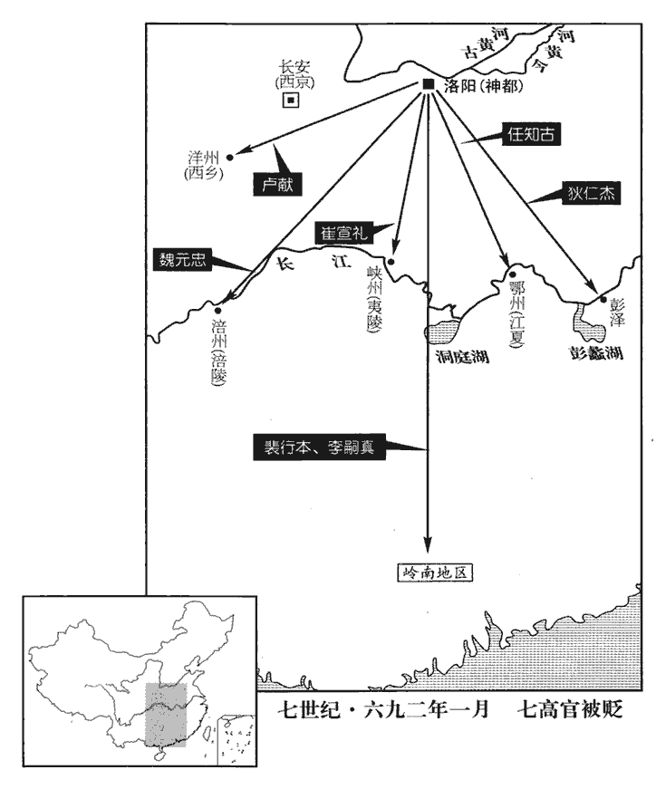
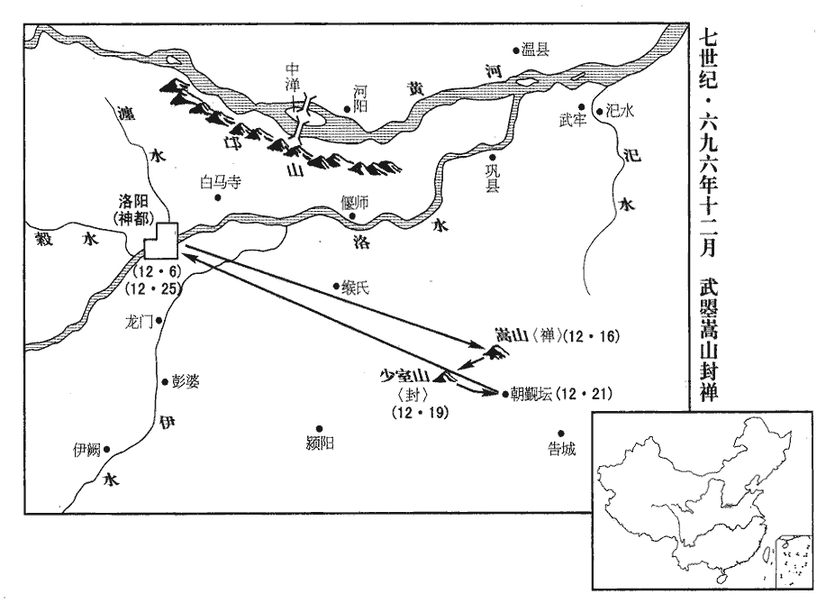
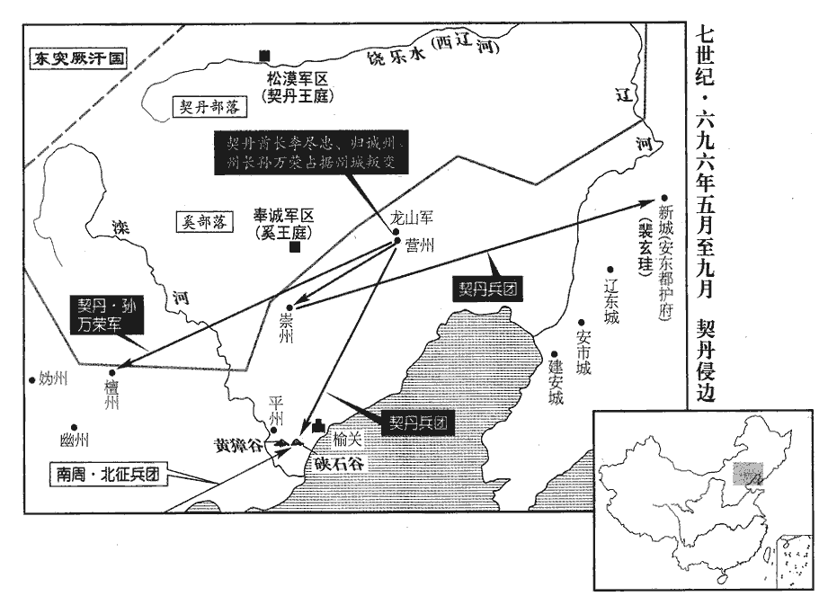

 唐紀二十一起玄黓執徐（壬辰），盡柔兆涒灘（丙申），凡五年。

# 則天順聖皇后中之上

## 長壽元年（壬辰、六九二）是年四月，改元如意；九月，改元長壽。自四月以前猶是天授三年。

1正月，戊辰朔‹一›，太后享萬象神宮。

〖译文〗 [1]正月，戊辰朔（初一），太后在万象神宫祭祀。

2臘月，立故于闐王尉遲伏闍雄之子瑕為于闐王。闐，徒賢翻。尉，紆勿翻。闍shé，視遮翻。

〖译文〗 [2]腊月，朝廷封原于阗王尉迟伏雄的儿子尉迟瑕为于阗王。

3春，一月，丁卯‹一›，太后引見存撫使所舉人，遣存撫使見上卷天授元年。見，賢遍翻。使，疏吏翻。無問賢愚，悉加擢用，高者試鳳閣舍人、給事中，次試員外郎、侍御史、補闕、拾遺、校書郎。唐校書郎，正九品上。考異曰：統紀：「天授二年二月，十道舉人石艾縣令王山齡等六十人，擢為拾遺、補闕，懷州錄事參軍霍獻可等二十四人為御史，并州錄事參軍徐昕等二十四人為著作佐郎及評事，內黃尉崔宣道等二十二人為衛佐。」疑與此只是一事。試官自此始、時人為之語曰：「補闕連車載，拾遺平斗量；容齋隨筆以為此語出於張鷟。zhuó欋qú推侍御史，欋，其俱翻。爾雅釋名曰：齊、魯謂四齒杷為欋。推，吐雷翻。盌脫校書郎。」盌，烏管翻。坡詩：「但信櫝藏終自售，豈知盌脫本無模。」有舉人沈全交續之曰：「𪍒心存撫使，眯目聖神皇。」𪍒，戶吳翻，麫粘也。眯，莫禮翻，物入目中也；老子曰：播糠眯目。為御史紀先知所擒，劾其誹謗朝政，請杖之朝堂，然後付法，劾，戶概翻，又戶得翻。誹，敷尾翻。朝，直遙翻。太后笑曰：「但使卿輩不濫，何恤人言！直釋其罪。」先知大慚。太后雖濫以祿位收天下人心，然不稱職者，尋亦黜之，或加刑誅。挾刑賞之柄以駕御天下，政由己出，明察善斷，故當時英賢亦競為之用。稱，尺證翻。斷，丁亂翻。

〖译文〗 [3]春季，一月，丁卯（初一），太后接见存抚使所荐举的人员，无论有才能与否，都加以任用，才高的试任凤阁舍人、给事中，其次的试任员外郎、侍御史、补阙、拾遗、校书郎。试任制度从此开始。当时人编顺口溜说：“补阙接连用车载，拾遗平平常常用斗量；用耙子才能推拢的侍御史，一个模子脱出的校书郎。”有个被荐举的人沈全交补充说：“面浆糊心的存抚使，眯了眼睛的圣神皇。”御史纪先知将他擒获，弹劾他诽谤朝政，请求在朝堂上对他施杖刑，然后依法治罪。太后笑着说：“只要使你们自己称职，何必怕人家说话！应该宽免他的罪。”纪先知大为惭愧。太后虽然滥用禄位以笼络天下人心，但对不称职的人，也随即撤职，或加以判刑或处死。她掌握着刑罚和赏赐的权柄以驾御天下人，政令由自己作出，明察事理，善于决断，所以当时的杰出人材也竞相为她所用。

4寧陵‹河南省宁陵县›丞廬江‹安徽省庐江县›郭霸以諂諛干太后，寧陵縣，屬宋州，本戰國時魏之寧城，漢高祖改為寧陵縣。廬江，漢龍舒縣地，屬廬江郡，梁置湖州，隋廢州為廬江縣，屬廬州。考異曰：新傳，名弘霸。舊傳，御史臺記皆單名霸，唯統紀延載元年云弘霸。僉載云應革命舉，蓋正謂此時也。今從臺記。拜監察御史。監，古銜翻。中丞魏元忠病，霸往問之，因嘗其糞，喜曰：「大夫糞甘則可憂；中丞而呼為大夫，過呼之也。今苦，無傷也。」元忠大惡之，惡，烏路翻。遇人輒告之。

〖译文〗 [4]宁陵县丞庐江人郭霸靠对太后阿谀奉承以求取禄位，当上了监察御史。御史中丞魏元忠患病，郭霸去探视，亲口尝他的粪便，高兴地说：“大夫的粪便如果味甘便可忧了；现在是苦的，没有事。”魏元忠因此极厌恶他，逢人就揭露这件事。

5戊辰‹二›，以夏官尚書楊執柔同平章事。執柔，恭仁弟之孫也，太后以外族用之。太后母楊氏。尚，辰羊翻。

〖译文〗 [5]戊辰（初二），朝廷任命夏官尚书杨执柔为同平章事。杨执柔是杨恭仁弟弟的孙子，太后因他是她母亲家族里的人而加以任用。

6初，隋煬帝作東都，見一百八十卷大業元年。煬，羊亮翻。無外城，僅有短垣而已，至是，鳳閣侍郎李昭德始築之。

〖译文〗 [6]当初，隋炀帝营造东都洛阳，没有外城，只有低矮的围墙而已。这时候，凤阁侍郎李昭德才开始营建东都外城。

7左臺中丞來俊臣羅告同平章事任知古、狄仁傑、裴行本、司禮【章：十二行本「禮」作「農」；乙十一行本同；孔本同；退齋校同。】卿崔【章：十二行本「崔」作「裴」；乙十一行本同；下同。】宣禮、前文昌左丞盧獻、御史中丞魏元忠、潞州‹山西省长治市›刺史李嗣真謀反。任，音壬。嗣，祥吏翻。考異曰：舊來俊臣傳云：「地官尚書狄仁傑、益州長史任令暉、冬官尚書李遊道、秋官尚書袁智弘、司賓卿崔基、文昌左丞盧獻等六人，並為羅告。」李嶠傳云：「太后使給事中李嶠與大理少卿張德裕、侍御史劉憲覆其獄，德裕等雖知其枉，懼罪，並從俊臣所奏。嶠曰：『豈有知其枉濫而不為申明哉！孔子曰：「見義不為，無勇也。」』乃與德裕等列其枉狀，由是忤旨，出為潤州司馬。」按嶠平生行事，恐不能如此，今不取。先是，來俊臣奏請降敕，一問即承反者得減死。先，悉薦翻。及知古等下獄，下，遐嫁翻。俊臣以此誘之；誘，音酉。仁傑對曰：「大周革命，萬物惟新，唐室舊臣，甘從誅戮。反是實！」俊臣乃少寬之。少，詩沼翻；下同。判官王德壽謂仁傑曰：判官，俊臣之屬官也。「尚書定減死矣。德壽業受驅策，欲求少階級，煩尚書引楊執柔，可乎？」仁傑曰：「皇天后土遣狄仁傑為如此事！」以頭觸柱，血流被面；德壽懼而謝之。被，皮義翻。

〖译文〗 [7]左台中丞来俊臣罗织罪名告发同平章事任知古、狄仁杰、裴行本、司礼卿崔宣礼、前文昌左丞卢献、御史中丞魏元忠、潞州刺史李嗣真谋反。这以前，来俊臣曾奏请太后下命令：一经审问即承认谋反的人可以减免死罪。等到任知古等入狱，来俊臣便用这道命令引诱他们认罪。狄仁杰回答说：“大周改朝换代，万物更新，唐朝旧臣，甘愿听任诛戮。谋反是事实！”来俊臣便对他稍加宽容。来俊臣的属官王德寿对狄仁杰说：“您一定能减免死罪了。我已受人指使，想略找一个升迁阶梯，烦您牵连杨执柔，可以吗？”狄仁杰说：“天神地神在上，竟要狄仁杰干这种事！”说完一头撞在柱子上，血流满面；王德寿害怕因而向他道歉。

侯思止鞫魏元忠，元忠辭氣不屈；思止怒，命倒曳之。元忠曰：「我薄命，譬如墜驢，足絓於鐙，為所曳耳。」絓，戶掛翻。鐙，都鄧翻。思止愈怒，更曳之，元忠曰：「侯思止，汝若須魏元忠頭則截取，何必使承反也！」

〖译文〗 侯思止审讯魏元忠，魏元忠义正词严不屈服；侯思止大怒，命令在地上倒着拖他。魏元忠说：“我命运不好，譬如从驴背上掉下来，脚挂在足镫上，被驴拉着走。”侯思止愈加发怒，命令接着拖他。魏元忠说：“侯思止，你如果需要我魏元忠的脑袋就砍下，何必让我承认谋反呢！”

狄仁傑既承反，有司待報行刑，不復嚴備。仁傑裂衾帛書冤狀，置綿衣中，謂王德壽曰：「天時方熱，請授家人去其綿。」德壽許之。仁傑子光遠得書，持之告變，得召見。復，扶又翻。去，羌呂翻。見，賢遍翻。則天覽之，以問俊臣，對曰：「仁傑等下獄，臣未嘗褫其巾帶，褫，池爾翻。寢處甚安，處，昌呂翻。苟無事實，安肯承反！」太后使通事舍人周綝往視之，俊臣暫假仁傑等巾帶，羅立於西，使綝視之；綝不敢視，惟東顧唯諾而已。綝，丑林翻。唯，于癸翻。俊臣又詐為仁傑等謝死表，使綝奏之。

〖译文〗 狄仁杰已承认谋反，有关部门只等待判罪执行刑罚，不再严加防备。狄仁杰便从被子上撕下一块帛，书写冤屈情况，塞在绵衣里面，对王德寿说：“天气热了，请将绵衣交给我家里人撤去丝绵。”王德寿同意。狄仁杰的儿子狄光远得到帛书，拿着去说有紧急情况要报告，得到太后召见。武则天看了帛书，质问来俊臣，他回答说：“狄仁杰等入狱后，我未曾剥夺他们的头巾和腰带，生活很安适，假如没有事实，怎么肯承认谋反！”太后派通事舍人周前往查看，来俊臣临时发给狄仁杰等头巾腰带，让他们排列站立在西边让周验看；周不敢向西看，只是面向东边唯唯诺诺而已。来俊臣又伪造狄仁杰等的谢死罪表，让周上奏太后。

樂思晦男未十歲，沒入司農，思晦死見上卷上年。上變，得召見，上，時掌翻。見賢遍翻。太后問狀，對曰：「臣父已死，臣家已破，但惜陛下法為俊臣等所弄，陛下不信臣言，乞擇朝臣之忠清、陛下素所信任者，朝，直遙翻。為反狀以付俊臣，無不承反矣。」太后意稍寤，召見仁傑等，問曰：「卿承反何也？」對曰：「不承，則已死於拷掠矣。」陸德明經典釋文：掠，音亮。太后曰：「何為作謝死表？」對曰：「無之。」出表示之，乃知其詐，於是出此七族。庚午‹四›，貶知古江夏‹鄂州州政府所在县·湖北省武汉市›令，仁傑彭澤‹江西省彭泽县›令，宣禮夷陵‹峡州州政府所在县·湖北省宜昌市›令，元忠涪陵‹涪州州政府所在县·重庆市涪陵区›令，獻西鄉‹洋州州政府所在县·陕西省西乡县›令；江夏，本漢沙羨縣地，屬江夏郡，晉改沙羨為沙陽。江、漢二水會于縣西，春秋謂之夏汭ruì，晉宋謂之夏口，宋置江夏郡，治于此；隋因郡名置江夏縣；唐屬鄂州。彭澤，漢縣，屬豫章，隋更名龍城，唐復曰彭澤，屬江州。涪陵縣，漢屬巴郡，劉蜀置涪陵郡；隋涪陵縣，屬渝州；唐武德元年分置涪州為州治所。西鄉即漢成固縣地，蜀置西鄉縣，後魏為洋州治所。夏，戶雅翻。涪，音浮。流行本、嗣真于嶺南‹南岭以南›。

〖译文〗 乐思晦的儿子未满十岁，被籍没入司农寺为奴，要求上告特别情况，获得太后召见。太后问他有什么情况，他回答说：“我父亲已死，家已破，只可惜陛下的刑法为来俊臣等所玩弄，陛下如果不相信我说的话，请选择朝臣中忠诚清廉、陛下一贯信任的人，提出他们谋反的罪状交给来俊臣，他们没有不承认谋反的。”太后听后稍有醒悟，召见狄仁杰等，问道：“你承认谋反，为什么？”回答说：“不承认，便已经死于严刑拷打了。”太后说：“为何作谢死罪表？”回答说：“没有。”太后出示所上的奏表，才知道是伪造的，于是释免这七个家族。庚午（初四），任知古降职为江夏县令、狄仁杰降职为彭泽县令、崔宣礼降职为夷陵县令、魏元忠降职为涪陵县令、卢献降职为西乡县令；流放裴行本、李嗣真于岭南。

 

俊臣與武承嗣等固請誅之，太后不許。俊臣乃獨稱行本罪尤重，請誅之；秋官郎中徐有功駮之，駮，北角翻。以為「明主有更生之恩，更，工衡翻。俊臣不能將順，虧損恩信。」

〖译文〗 来俊臣与武承嗣等仍坚持请求处死他们七个人，太后不答应。来俊臣便又特别提出裴行本罪恶尤其严重，请处死他；秋官郎中徐有功予以反驳，以为“英明君主有使臣下再生的恩惠，来俊臣不能顺势促成，有损君主恩信。”

殿中侍御史貴鄉‹河北省大名县›霍獻可，後魏分館陶西界，置貴鄉縣於趙城，周建德七年自趙城東南移三十里，以孔思集寺為縣治所；大象二年於縣置魏州。宣禮之甥也，言於太后曰：「陛下不殺崔宣禮，臣請隕命於前。」以頭觸殿階，血流霑地，以示為人臣者不私其親。太后皆不聽。獻可常以綠帛裹其傷，微露之於幞fú頭下，續事始曰：三代黔首以皁絹裹髮，周武帝裁為四腳，名以幞頭，馬周請重繫前腳。冀太后見之以為忠。

〖译文〗 殿中侍御史贵乡人霍献可是崔宣礼的外甥，对太后说：“陛下不杀崔宣礼，我请求死在陛下眼前。”他一头撞在宫殿台阶上，流血浸湿地面，用以表示作臣下的不袒护自己的亲戚。太后都不听从。霍献可时常用绿帛包扎伤口，略为显露于帽子下面，希望太后看见认为他忠诚。

8甲戌‹八›，補闕薛謙光上疏，上，時掌翻。以為：「選舉之法，宜得實才，取捨之間，風化所繫。今之選人，咸稱覓舉，奔競相尚，諠訴無慚。選，宣戀翻。至於才應經邦，惟令試策；武能制敵，止驗彎弧。昔漢武帝‹刘彻›見司馬相如賦，恨不同時，及置之朝廷，終文園令，漢司馬相如為子虛賦，武帝讀而善之，曰：「朕獨不得與此人同時！」楊得意曰：「臣邑人司馬相如自言為此賦。」上召以為郎，後為孝文園令，病免而卒。知其不堪公卿之任故也。吳起將戰，左右進劍，起曰：『將者提鼓揮桴，臨敵決疑，一劍之任，非將事也。』將者、非將，即亮翻。桴，方無翻。然則虛文豈足以佐時，善射豈足以克敵！要在文吏察其行能，武吏觀其勇略，考居官之臧否，行，下孟翻。否，音鄙。行舉者賞罰而已。」

〖译文〗 [8]甲戌（初八），补阙薛谦光上疏认为：“选拔人才的办法，应该使朝廷能得到有真才实学的人，录取和舍弃什么样的人，关系到国家的教化。现今选拔人，都赞许自求举荐，于是奔走门路，相互争胜，自己大吹大擂而无愧色。至于人才是应该能治理国家的，却只让试策文；武官必须能克敌制胜，却只考弯弓射箭。从前汉武帝读了司马相如所作的《子虚赋》，恨不能与他同时，等到得知他是当代人，安置他在朝廷，最终只让他担任汉文帝的陵园令，这是知道他不能胜任公卿职务的缘故。吴起将出战，身边的人递给他剑，吴起说：‘为将的任务是提战鼓挥动鼓槌，临阵解决疑难问题，使用一把剑的任务，不是为将的事情。’如此说来，徒有文才如何足以辅佐时政，善于射箭如何足以克敌制胜！关键在于对文官要考察他的品行和能力，对武官要看他的勇气和谋略，考核当官时政绩的好坏，对举荐人施行赏罚而已。”

9來俊臣求金於左衛大將軍泉獻誠，不得，誣以謀反，下獄，乙亥‹九›，縊殺之。下，遐嫁翻。縊，於計翻。

〖译文〗 [9]来俊臣向左卫大将军泉献诚索取钱财，没有达到目的，便诬陷他谋反，逮捕入狱，乙亥（初九），他被吊死。

10庚辰‹十四›，司刑卿、檢校陝州‹河南省三门峡市›刺史李游道為冬官尚書、同平章事。陝，失冉翻。

〖译文〗 [10]庚辰（十四日），司刑卿、检校陕州刺史李游道任冬官尚书、同平章事。

11二月，己亥‹三›，吐蕃党項部落‹四川省西北部›萬餘人內附，吐，從暾入聲。党，底朗翻。分置十州。

〖译文〗 [11]二月，己亥（初三），吐蕃党项部落一万余人归附唐朝，被分别安置在十个州。

12戊午‹二十二›，以秋官尚書袁智弘同平章事。秋官，刑部。

〖译文〗 [12]戊午（二十二日），朝廷任命秋官尚书袁智弘为同平章事。

13夏，四月，丙申‹一›，赦天下，改元如意。如意元年起此。

〖译文〗 [13]夏季，四月，丙申（初一），朝廷大赦天下罪人，更改年号为如意。

14五月，丙寅‹一›，禁天下屠殺及捕魚蝦。江淮旱，饑，民不得采魚蝦，餓死者甚眾。后禁屠捕而殺人如刈草菅，可以人而不如物乎！蝦，戶加翻。

〖译文〗 [14]五月，丙寅（初一），朝廷禁止天下屠杀牲畜及捕捞鱼虾。江、淮间旱灾，发生饥荒，百姓不得捕鱼虾，饿死的人很多。

右拾遺張德，生男三日，私殺羊會同僚，補闕杜肅懷一餤，餤dàn，徒濫翻，又弋廉翻，徒甘翻，上表告之。上，時掌翻。明日，太后對仗，謂德曰：「聞卿生男，甚喜。」德拜謝。太后曰：「何從得肉？」德叩頭服罪。太后曰：「朕禁屠宰，吉凶不預。然卿自今召客，亦須擇人。」出肅表示之。肅大慚，舉朝欲唾其面。朝，直遙翻。唾，吐臥翻。

〖译文〗 右拾遗张德，生儿子三天，私自杀羊宴请同事，补阙杜肃怀揣宴席上的一些食物，上表告发。第二天，太后临朝听政，对张德说：“听说你生儿子，很高兴。”张德拜谢。太后说：“从哪里弄来的肉？”张德叩头认罪。太后说：“朕禁止屠宰牲畜，有吉凶事不干涉。但你今后请客，也需要选择人。”说完拿出杜肃的奏表给他看。杜肃十分惭愧，举朝文武官员都想啐他的脸。

15吐蕃酋長曷蘇帥部落請內附，以右玉鈐衛將軍張玄遇為安撫使，將精卒二萬迎之。六月，軍至大渡水‹峡江支流大渡河›西，曷蘇事洩，為國人所擒。別部酋長昝zǎn捶帥羌蠻八千餘人內附，玄遇以其部落置萊川州‹四川省石棉县西›而還。酋，慈由翻。長，知兩翻。帥讀曰率。鈐，其廉翻。使，疏吏翻。將，即亮翻，又音如字。昝，子感翻。捶，止橤翻，新書作「插」。黎州都督府所管羈縻州有米川州，新書作「葉州」。還，從宣翻，又音如字。考異曰：唐紀作「沓搖」。今從實錄。

〖译文〗 [15]吐蕃酋长曷苏率领部落请求归附唐朝，朝廷任命右玉钤卫将军张玄遇为安抚使，领精卒二万迎接他。六月，唐军到大渡水西边，曷苏归附唐朝的事情泄露，被本国人擒拿。别部酋长昝捶率领羌蛮八千余人归附唐朝，张玄遇将他的部落安置在莱川州后，便撤军了。

16辛亥，萬年‹长安陕西省西安市›东半城主簿徐堅上疏，以為：「書有五聽之道，上，時掌翻，疏，所據翻。周禮小司寇；以五聽聽獄訟，求民情：一曰辭聽，觀其所出言，不直則煩；二曰色聽，觀其顏色，不直則赧然；三曰氣聽，不直則喘；四曰耳聽，觀其聽聆，不直則惑；五曰目聽，觀其眸子，不直則眊mào然。令著三覆之奏。見一百九十三卷太宗貞觀五年。竊見比有敕推按反者，比，毗至翻。令使者得實，即行斬決。令，力丁翻。使，疏吏翻。人命至重，死不再生，萬一懷枉，吞聲赤族，豈不痛哉！此不足肅姦逆而明典型，適所以長威福而生疑懼。臣望絕此處分，長，知兩翻。處，昌呂翻；下處事同。分，扶問翻。依法覆奏。又，法官之任，宜加簡擇，有用法寬平，為百姓所稱者，願親而任之；有處事深酷，不允人望者，願疏而退之。」堅，齊聃之子也。處，昌呂翻。徐齊聃見二百一卷高宗咸亨元年。聃，它甘翻。

〖译文〗 [16]辛亥（疑误），万年县主簿徐坚上疏认为：“古书记载审案实行听词、听色、听气、听耳、听目等‘五听’，贞观年间有死罪经三次复奏才行刑的命令。我看见近来有命令审讯谋反者，让使者审得事实，立即判决处死。人命至关重要，死后不能复生，万一含冤，被灭族而怀怨不敢出声，岂不令人痛心！这样做不足以肃清恶人和叛逆，彰明常刑，恰好助长一些人擅权枉法，使人们产生疑惧。我希望杜绝这种处理办法，依法复奏再行刑。还有，任用法官，应当加以选择，有执法宽大公平，为百姓所称赞的，希望亲近而任用他；有处理事情峻刻严酷，不孚众望的，请疏远而斥退他。”徐坚是徐齐聃的儿子。

17夏官侍郎李昭德密言於太后曰：「魏王承嗣權太重。」夏官，兵部。嗣，祥吏翻。太后曰：「吾姪也，故委以腹心。」昭德曰：「姪之於姑，其親何如子之於父？子猶有篡弒其父者，況姪乎！今承嗣既陛下之姪，為親王，又為宰相，相，息亮翻。權侔人主，臣恐陛下不得久安天位也！」太后矍然曰：「朕未之思。」矍，九縛翻。秋，七月，戊寅‹十五›，以文昌左相、同鳳閣鸞臺三品武承嗣為特進，納言武攸寧為冬官尚書，嗣，祥吏翻。冬官，工部。尚，辰羊翻。夏官尚書、同平章事楊執柔為地官尚書，並罷政事；以秋官侍郎新鄭‹河南省新郑县›崔元綜為鸞臺侍郎，秋官，刑部。新鄭，春秋鄭國都。鄭武公隨周平王東遷，邑於虢、鄶kuài之間，莊公所謂「吾先君新邑于此」，是也。漢為新鄭縣，屬河南郡，魏、晉省，隋開皇十六年復置，屬鄭州。夏官侍郎李昭德為鳳閣侍郎，檢校天官侍郎姚璹shú為文昌左丞，夏官，兵部。鳳閣，中書。天官，吏部。改尚書為文昌。璹，殊玉翻。檢校地官侍郎李元素為文昌右丞，與司賓卿崔神基地官，戶部。司賓卿，即鴻臚卿。並同平章事。考異曰：舊昭德傳：「舉明經，累遷至鳳閣侍郎。長壽二年增置夏官侍郎，以昭德為之；是歲，遷鳳閣鸞臺平章事。」新紀、表、傳皆云，「昭德自夏官侍郎遷鳳閣侍郎同平章事。」蓋昭德自鳳閣為夏官，自夏官復為鳳閣也。婁師德傳：「長壽元年增置夏官侍郎。」今從之。「崔神基」，實錄作「崔基」。今從新紀、表。璹，思廉之孫；姚思廉事隋及唐。元素，敬玄之弟也。李敬玄相高宗。辛巳‹十九›，以營繕大匠王璿xuán為夏官尚書、同平章事。光宅改將作監為營繕監。璿，似宣翻。承嗣亦毀昭德於太后，太后曰：「吾任昭德，始得安眠，此代吾勞，汝勿言也。」

〖译文〗 [17]夏官侍郎李昭德私下对太后说：“魏王武承嗣权太重。”太后说：“他是我的侄儿，所以任为亲信。”李昭德说：“侄儿对于姑姑，怎么能比得上儿子对于父亲亲近？儿子还有杀死父亲的，何况侄儿呢！现在武承嗣既是陛下的侄儿，是亲王，又任宰相，权势与君主等同，我恐怕陛下不能久安于天子之位！”太后震惊地说：“朕没有想到这点。”秋季，八月，戊寅（十六日），朝廷任命文昌左相、同凤阁鸾台三品武承嗣为特进，纳言武攸宁为冬官尚书，夏官尚书、同平章事杨执柔为地官尚书，一并罢去相职；任命秋官侍郎新郑人崔元综为鸾台侍郎，夏官侍郎李昭德为凤阁侍郎，检校天官侍郎姚为文昌左丞，检校地官侍郎李元素为文昌右丞，与司宾卿崔神基并任同平章事。姚是姚思廉的孙子；李元素是李敬玄的弟弟。辛巳（十九日），朝廷任命营缮大匠王为夏官尚书、同平章事。武承嗣也向太后诋毁李昭德，太后说：“我任用李昭德，才睡得安稳，他可以为我代劳，你不要说了。”

是時，酷吏恣橫，橫，下孟翻。百官畏之側足，昭德獨廷奏其姦。太后好祥瑞，好，呼到翻。有獻白石赤文者，執政詰其異，詰，去吉翻。對曰：「以其赤心。」昭德怒曰：「此石赤心，他石盡反邪？」邪，音耶。左右皆笑。襄州‹湖北省襄樊市›人胡慶以丹漆書龜腹曰：「天子萬萬年。」詣闕獻之。昭德以刀刮盡，奏請付法。太后曰：「此心亦無惡。」命釋之。

〖译文〗 当时，酷吏恣意横行，百官畏惧他们，不敢正面站立，只有李昭德敢于在朝廷揭露他们的邪恶。太后迷信祥瑞，有人进献有赤色花纹的白石，主管官员责问他这石头有什么特别之处，回答说：“因为它的心忠诚。”李昭德大怒说：“这块石头的心忠诚，其他石头全都造反吗？”身边的人都发笑。襄州人胡庆用红漆在龟的腹部书写“天子万万年”几个字，到皇宫门口进献。李昭德用刀把字刮除净尽，奏请将进献者法办。太后说：“这个人用心并不坏。”命令释放他。

太后習貓，使與鸚鵡共處。處，昌呂翻。出示百官，傳觀未遍，貓飢，搏鸚鵡食之，太后甚慚。

〖译文〗 太后训练猫，让它和鹦鹉在一起。有一次拿出向百官展示，传看还未完毕，猫饿了，捕捉鹦鹉而食，太后为此很羞愧。

太后自垂拱以來，任用酷吏，先誅唐宗室貴戚數百人，次及大臣數百家，其刺史、郎將以下，不可勝數。將，即亮翻。勝，音升。每除一官，戶婢竊相謂曰：戶婢，官婢之直宮中門戶者。「鬼朴又來矣。」不旬月，輒遭掩捕、族誅。監察御史朝邑‹陕西省大荔县东朝邑镇›嚴善思，後魏分馮翊置澄城郡，仍置南五泉縣，西魏改為朝邑縣，隋、唐屬司州。監，古銜翻。朝，直遙翻。公直敢言。時告密者不可勝數，勝，音升。太后亦厭其煩，命善思按問，引虛伏罪者八百五十餘人。羅織之黨為之不振，為，不偽翻。乃相與搆陷善思，坐流驩州‹越南荣市›。舊志：驩州至京師陸路一萬二千四百五十二里，水路一萬七千里，至東都一萬一千五百九十五里，水路一萬六千二百二十里。宋白曰：驩州，日南郡，堯放驩兜于崇山，即此。太后知其枉，尋復召為渾儀監丞。后改司天監為渾儀監。丞，從七品下。復，扶又翻。渾，戶本翻。善思名譔zhuàn，以字行。譔，士免翻。

〖译文〗 太后自垂拱年间以来，任用酷吏，首先处死唐朝皇族和贵戚数百人，然后杀大臣数百家，杀刺史、郎将以下官吏更数不清。每任命一名官吏，宫中守门的官婢便私下互相说道：“作鬼的材料又来了。”不满一个月，这些官吏即遭突然逮捕，举族被杀。监察御史朝邑人严善思公正耿直敢说话。当时告密的人多到数不清，太后也厌烦，命令严善思查问，结果承认诬告服罪而死的有八百五十余人。罗织罪名害人的集团为之丧气，他们便共同诬陷严善思，结果他被流放州。太后知道他冤枉，不久又召他回来担任浑仪监丞。严善思名叫，字善思，人们习惯称呼他的字。

右補闕新鄭朱敬則以太后本任威刑以禁異議，今既革命，眾心已定，宜省刑尚寬，乃上疏，以為：「李斯相秦，用刻薄變詐以屠諸侯，不知易之以寬和，卒至土崩，此不知變之禍也。事見秦紀。上，時掌翻。相，息亮翻。卒，子恤翻。漢高祖‹刘邦›定天下，陸賈、叔孫通說之以禮義，傳世十二，此知變之善也。說，輸芮翻。事見漢紀。自文明草昧，天地屯蒙，草，造也；昧，蒙也。造物之始，始於冥昧，言后稱制之初，改元文明，造始之時也。屯者物之始，蒙者物之穉，言后稱制之初，猶天地生物之始。屯，涉倫翻。三叔流言，四凶構難，三叔，指韓、霍諸王；四凶，指徐敬業等。難，乃旦翻。不設鉤距，無以應天順人，不切刑名，不可摧姦息暴。故置神器，開告端，謂鑄匭以開告密之門也。曲直之影必呈，包藏之心盡露，神道助直，無罪不除，蒼生晏然，紫宸易主。然而急趨無善迹，以步趨為諭也。促柱少和聲，以琴瑟為諭也。少，詩沼翻。向時之妙策，乃當今之芻狗也。芻狗，祭祀所用，既祭則棄之矣。伏願覽秦、漢之得失，考時事之合宜，審糟粕之可遺，以酒為諭，泲jǐ取其醇汁而去其糟粕。覺蘧qú廬之須毀，莊子曰：蘧廬可以一宿而不可以久處。郭象註云：蘧廬，傳舍也。去萋菲之牙角，詩云：萋兮菲兮、成是貝錦。彼譖人者，亦已太甚！去，羌呂翻。頓姦險之鋒芒，窒羅織之源，掃朋黨之迹，使天下蒼生坦然大悅，豈不樂哉！」樂，音洛。太后善之，賜帛三百段。

〖译文〗 右补阙新郑人朱敬则认为太后的本意是用刑罚来禁止不同意见，现在既已登上帝位，人心也已安定，就应减省刑罚，崇尚宽大，于是上疏认为：“李斯辅助秦国，用刻薄欺诈手段屠杀诸侯，不知道及时改变为宽大温和，终于土崩瓦解，这是不知道变化的祸害。汉高祖平定天下，陆贾、叔孙通说服他施行礼义，结果皇位传了十二代，这是知道变化的好处。自文明年间帝业初创，一切刚刚开始，韩王、霍王等三位皇叔散布流言，徐敬业等四个元凶制造祸乱，这时候不用手段套出实情，不能应天命顺人心，不亲近法家的刑名之学，不能摧毁邪恶止息暴乱。所以设铜匦，开告密之门，使或曲或直的形影必然显现出来，包藏着的阴谋全部暴露，结果神明帮助正直之人，罪恶尽除，百姓安定，帝位转移。但快走不会有完整的脚印，短的琴柱奏不出和声，过去的妙策，成了当今的无用之物。恳切希望看看秦、汉的得和失，考察当前的事怎样办才合适，哪些属于糟粕可以遗弃，发现那些一时有用过后即需破除的东西，去掉诬陷者的牙和角，挫去邪恶阴险者的锋芒，堵塞罗织罪状的源头，扫除结党营私的痕迹，使天下百姓无忧无虑，岂不快乐！”太后赞许他的话，赏赐他帛三百段。

侍御史周矩上疏曰：「推劾之吏皆相矜以虐，泥耳籠頭，枷研楔𩌊xuè，枷研，以重枷研其頸；楔𩌊，以鐵圈𩌊其首而加楔。楔，先結翻。𩌊，呼角翻。摺zhé膺籤qiān爪，摺，與拉同，力答翻，摧也，折也。膺，胸也。籤爪，以竹籤其爪甲，今鞫獄者十指下籤，即其遺虐。懸髮薰耳，號曰『獄持』。或累日節食，連宵緩問，晝夜搖撼，使不得眠，號曰『宿囚』。此等既非木石，且救目前，苟求賒死。賒，遠也，言伏法而死，較死於獄中為稍賒也。臣竊聽輿議，皆稱天下太平，何苦須反！豈被告者盡是英雄，欲求帝王邪？但不勝楚毒自誣耳。被，皮義翻。勝，音升。願陛下察之。今滿朝側息不安，朝，直遙翻。皆以為陛下朝與之密，夕與之讎，不可保也。周用仁而昌，秦用刑而亡。願陛下緩刑用仁，天下幸甚！」太后頗采其言，制獄稍衰。考異曰：御史臺記云：「書奏，遂授洛州司功。」舊薛懷義傳云：「矩劾奏懷義，遷矩天官員外郎，竟為懷義所搆，下獄免官。」御史臺記又云：「時天官選曹無緒，敕矩監之。侍郎李景謀為矩所制，乃引為員外，不閑於吏道，自此左出矣。」據舊傳：矩劾奏薛懷義在後。若此年出為洛州司功，則不當復劾懷義。但舊傳矩疏在載初元年二月。是時制獄未息，今因朱敬則疏終言之。

〖译文〗 侍御史周矩上疏说：“审问犯人的官吏都以残暴相夸耀，泥塞耳朵，笼罩脑袋，用重枷磨脖颈，在头上加箍再打进楔子，打折胸骨，手指钉竹签，吊头发，薰耳朵，号称为‘狱持’。或者多日减少供应食物，通宵审问，昼夜摇撼，不让睡觉，号称为‘宿囚’。犯人既不是木石，为避免眼前的痛苦，便姑且认罪谋求晚一点死去。我私下听到的舆论，都说天下太平，有什么必要造反？难道被告发的人全是英雄，想谋取帝王的地位吗？只是受不住酷刑，被迫认罪罢了。希望陛下考察。如今满朝百官坐卧不安，都以为陛下早上同他们亲近，晚上即与他们成为仇敌，难以保全性命。周朝行仁义而昌盛，秦朝用刑罚而灭亡。愿陛下减缓刑罚，施行仁义，则天下百姓就很幸运了！”太后颇采纳他的意见，特种监狱的囚犯逐渐衰减。

18太后春秋雖高‹本年六十九岁›，善自塗澤，雖左右不覺其衰。丙戌‹二十四›，敕以齒落更生，九月，庚子‹九›，御則天門，赦天下，改元。至是方改元長壽，自此以後方是長壽元年。更以九月為社。更，工衡翻。

〖译文〗 [18]太后年岁虽大，但善于自己修饰容貌，即使她左右的人也感觉不出她衰老。丙戌（二十四日），下诏说因自己牙齿脱落后又长出新牙，九月，庚子（初九），到则天门宣布赦免天下罪人，更改年号；又改于九月祭土神。

19制於并州‹山西省大原市›置北都。

〖译文〗 [19]太后下令在并州设置北都。

20癸丑‹二十二›，同平章事李遊道、王璿xuán、袁智弘、崔神基、李元素、春官侍郎孔思元、益州‹四川省成都市›長史任令輝，皆為王弘義所陷，流嶺南。璿，似宣翻。長，知兩翻。任，音壬。

〖译文〗 [20]癸丑（二十二日），同平章事李游道、王、袁智弘、崔神基、李元素、春官侍郎孔思元、益州长史任令辉，都因被王弘义诬陷，流放岭南。

21左羽林中郎將來子珣坐事流愛州‹越南清化市›，尋卒。愛州至京師八千八百里，東都八千一百里。將，即亮翻。卒，子恤翻。

〖译文〗 [21]左羽林中郎将来子因事获罪流放爱州，不久去世。

22初，新豐‹陕西省临潼县东北新丰镇›王孝傑從劉審禮擊吐蕃為副總管，與審禮皆沒於吐蕃。新豐縣屬雍州，後改昭應縣。劉審禮沒，見二百二卷高宗儀鳳三年。吐，從暾入聲。贊普見孝傑泣曰：「貌類吾父。」厚禮之，後竟得歸，累遷右鷹揚衛將軍。光宅改左、右武衛為左、右鷹揚衛。孝傑久在吐蕃，知其虛實。會西州‹总部设新疆吐鲁番市东›都督唐休璟請復取龜茲‹总部设新疆库车县›、于闐‹即毗沙军区·总部设新疆和田市›、疏勒‹总部设新疆喀什市›、碎葉‹总部设吉尔吉斯斯坦托克马克城›四鎮，復，扶又翻，又音如字。龜茲，音丘慈，又音屈佳。闐，徒賢翻，又徒見翻。棄四鎮見二百一卷高宗咸亨元年。敕以孝傑為武威軍總管，與武衛大將軍阿史那忠節將兵擊吐蕃。此時既改武衛為鷹揚衛，不應復以舊官名命忠節。豈史家仍襲舊官名而書之邪？將，又音如字。冬，十月，丙戌‹二十五›，大破吐蕃，復取四鎮。置安西都護府於龜茲‹新疆库车县›，發兵戍之。

〖译文〗 [22]当初，新丰人王孝杰跟从刘审礼进攻吐蕃任副总管，与刘审礼一起沦落于吐蕃。吐蕃赞普见到王孝杰，哭泣说：“相貌像我父亲。”因此给予他优厚的待遇，后来终于得以返回，连续升官至右鹰扬卫将军。王孝杰长期在吐蕃，知道他们的情况。正好西州都督唐休请求再收复龟兹、于阗、疏勒、碎叶四镇，太后便下诏任命王孝杰为武威军总管，与武卫大将军阿史那忠节领兵进攻吐蕃。冬季，十月，丙戌（二十五日），唐军大败吐蕃，又攻下四镇。朝廷设置安西都护府于龟兹，派兵戍守。

## 二年（癸巳、六九三）

1正月，壬辰朔‹一›，太后‹武曌，本年七十岁›享萬象神宮，以魏王承嗣為亞獻，梁王三思為終獻。太后自制神宮樂，用舞者九百人。

〖译文〗 [1]正月（前一年十一月），壬辰朔（初一），太后在万象神宫祭祀，让魏王武承嗣第二个献祭品，梁王武三思最后一个献祭品。太后自编神宫乐，是乐舞人员九百人。

2戶婢團兒為太后所寵信，有憾於皇嗣‹李旦›，乃譖皇嗣妃劉氏、德妃竇氏為厭呪。厭，於協翻。又，於琰翻。癸巳‹二›，妃與德妃朝太后於嘉豫殿，朝，直遙翻。既退，同時殺之‹德妃窦氏，李隆基之母›，考異曰：新本紀：「臘月癸亥，殺皇嗣妃劉氏、德妃竇氏。」舊傳云「正月二日」，今從之。今按德妃竇氏即玄宗母也。瘞於宮中，莫知所在。瘞，於計翻。德妃，抗之曾孫也。竇抗，太穆皇后之從兄。皇嗣畏忤旨，不敢言，忤，五故翻。居太后前，容止自如。團兒復欲害皇嗣，有言其情於太后者，太后乃殺團兒。復，扶又翻。考異曰：劉子玄太上皇實錄云：「韋團兒諂佞多端，天后尤所信任。欲私於上而拒焉，怨望，遂作桐人潛埋於二妃院內，譖殺之，又矯制按問上。」今從則天實錄。

〖译文〗 [2]宫中守门的官婢团儿受太后宠信，对皇嗣不满，于是诬陷皇嗣妃刘氏、德妃窦氏，说她们用邪术诅咒太后。癸巳（初二），皇嗣妃与德妃朝见太后于嘉豫殿，退出后同时被杀，掩埋在宫中，人们不知道掩埋的处所。德妃是窦抗的曾孙女。皇嗣畏惧违犯太后的旨意，对这件事不敢说话，在太后面前，表情和举动都保持和平常一样。团儿又想陷害皇嗣，有人将她的情况告诉太后，太后才杀死团儿。

是時，告密者皆誘人奴婢告其主，以求功賞。德妃父孝諶chén為潤州‹江苏省镇江市›刺史，有奴妄為妖異以恐德妃母龐氏，誘，音酉。諶，氏壬翻。妖，於喬翻。龐，皮江翻。龐氏懼，奴請夜祠禱解，因發其事。下監察御史龍門‹山西省河津县›薛季昶按之，監，古銜翻。下，遐嫁翻。季昶誣奏，以為與德妃同祝詛，先涕泣不自勝，祝，職救翻。勝，音升。乃言曰：「龐氏所為，臣子所不忍道。」太后擢季昶為給事中。龐氏當斬，其子希瑊瑊jiān，古咸翻。詣侍御史徐有功訟冤，有功牒所司停刑，上奏論之，以為無罪；季昶奏有功阿黨惡逆，請付法，法司處有功罪當絞。令史以白有功，侍御史之屬，有令史十七人。上，時掌翻。處，昌呂翻。有功嘆曰：「豈我獨死，諸人永不死邪！」既食，掩扇而寢。人以為有功苟自強，必內憂懼，密伺之，方熟寢。伺，相吏翻。太后召有功，迎謂曰：「卿比按獄，失出何多？」對曰：「失出，人臣之小過；好生，聖人之大德。」誤出人罪，謂之失出。比，毗至翻。好，呼到翻。太后默然。由是龐氏得減死，與其三子皆流嶺南‹南岭以南›，孝諶貶羅州‹广东省廉江市›司馬，有功亦除名。考異曰：舊有功傳：「有功為御史，坐龐氏除名，尋起為左司郎中。」竇孝諶傳：「長壽二年，龐氏為酷吏所陷。」御史臺記：「有功自秋官員外郎，坐龐氏除名為流人，月餘，授御史。」按實錄，有功，「天授初，累補司刑丞、秋官員外郎，稍遷郎中，後以公事免，萬歲通天元年，擢拜殿中侍御史。」今從之。

〖译文〗 当时，告密的人都引诱别人的奴婢告发他们的主人，以谋取功劳赏赐。德妃的父亲窦孝谌任润州刺史，有家奴妄作妖异以恐吓德妃的母亲庞氏。庞氏害怕，家奴便请她夜间向神祈祷以消除妖异。家奴又告发这件事，庞氏因此被送到监察御史龙门人薛季昶处查问。薛季昶诬奏庞氏与德妃共同求神降祸于太后，他先痛哭流涕好像经受不住的样子，然后说：“庞氏的行为，我不忍说出口。”太后便提升薛季昶为给事中。庞氏应当斩首，她的儿子窦希找侍御史徐有功诉冤，徐有功通知有关部门停止执行死刑，然后上奏辩论，认为她没有罪。薛季昶上奏说徐有功循私偏袒恶逆罪犯，请求法办，执法部门判徐有功的罪应当处以绞刑。徐有功的属官把情况告诉他，徐有功叹息说：“难道只有我一个人死，其他人永远不死吗？”他进餐后，便用扇子掩面睡觉。人们以为徐有功只是暂时强作镇静，必定内心忧惧，但偷看他，他却正在熟睡。太后召见徐有功，责问他：“你近来办案，重罪不办或轻办的失误怎么那样多？”回答说：“重罪不办或轻办，是作臣下的小过失；喜欢让人活着，是圣人的大德。”太后沉默不语。因此庞氏得减免死罪，同三个儿子一起流放岭南，窦孝谌降职为罗州司马，徐有功也被削除名籍。

3戊申‹十八›，姚璹shú奏請令宰相撰時政記，會要：璹以為帝王謨訓，不可闕於紀述，史官疏遠，無因得書，請自今以後，所論軍國政要，宰臣一人撰錄，號為時政記。月送史館。從之。時政記自此始。

〖译文〗 [3]戊申（十七日），姚上奏请求命令宰相撰写《时政记》，每月送交史馆。这个意见被采纳。《时政记》的撰写从这时候开始。

4臘月，丁卯‹十二›，降皇孫成器為壽春王，恆王成義為衡陽王，恆，戶登翻。楚王隆基為臨淄王，衛王隆範為巴陵王，趙王隆業為彭城王，皆睿宗‹李旦›之子也。

〖译文〗 [4]腊月，丁卯（初七），皇孙李成器被降为寿春郡王，恒王李成义为衡阳郡王，楚王李隆基为临淄郡王，卫王李隆范为巴陵郡王，赵王李隆业为彭城郡王，他们都是睿宗李旦的儿子。

5春，一月，庚子‹十›，以夏官侍郎婁師德同平章事。師德寬厚清慎，犯而不校。與李昭德俱入朝，朝，直遙翻。師德體肥行緩，昭德屢待之不至，怒罵曰：「田舍夫！」師德徐笑曰：「師德不為田舍夫，誰當為之！」其弟除代州‹山西省代县›刺史，將行，師德謂曰：「吾備位宰相，汝復為州牧，復，扶又翻。榮寵過盛，人所疾也，將何以自免？」弟長跪曰：「自今雖有人唾某面，某拭之而已，庶不為兄憂。」師德愀然曰：愀，七小翻。「此所以為吾憂也！人唾汝面，怒汝也；汝拭之，乃逆其意，所以重其怒。夫唾，不拭自乾，乾，音干。當笑而受之。」

〖译文〗 [5]春季，一月，庚子（初十），太后任命夏官侍郎娄师德为同平章事。娄师德为人宽厚，清廉谨慎，冒犯他也不计较。他与李昭德一同入朝，娄师德身体肥胖行动缓慢，李昭德老等他不来，便怒骂他：“乡下佬！”娄师德笑着说：“我不作乡下佬，谁应当作乡下佬！”他的弟弟授任代州刺史，将要赴任时，娄师德对他说：“我任宰相，你又为州刺史，得到的恩庞太盛，是别人所妒忌的，将如何自己避祸？”他弟弟直身而跪说：“今后就是有人唾我脸上，我只擦拭而已，希望不致使哥哥担忧。”娄师德神色忧虑地说：“这正是使我担忧的！人家唾你脸，是因为恨你，你擦拭，便违反人家的意愿，正好加重人家的怒气。唾液，不擦拭它会自己干，应当笑而承受。”

6甲寅‹二十四›，前尚方監裴匪躬、內常侍范雲仙坐私謁皇嗣‹李旦›，腰斬於市。光宅改少府監為尚方監。內侍省有內常侍六人，正五品下，漢中常侍之職也。考異曰：舊來俊臣傳云：「按張虔勗、范雲仙於洛陽牧院，虔勗等不堪其苦，自訟於徐有功，俊臣命衛士以亂刀斫殺之。雲仙亦言，歷事先朝，稱所司冤苦，俊臣命截去其舌。士庶膽破，無敢言者。」按張虔勗天授二年被殺，雲仙此年坐謁皇嗣斬。今從實錄。自是公卿以下皆不得見。又有告皇嗣潛有異謀者，太后命來俊臣鞫其左右，左右不勝楚毒，皆欲自誣。勝，音升。太常工人京兆安金藏時公卿不得見皇嗣，唯金藏等工人得在左右。大呼謂俊臣曰：「公既不信金藏之言，請剖心以明皇嗣不反。」即引佩刀自剖其胸，五藏皆出，流血被地。太后聞之，令轝yú入宮中，呼，火故翻。藏，徂浪翻。被，皮義翻。轝，羊茹翻。使醫內五藏，以桑皮線縫之，傅以藥，經宿始蘇。太后親臨視之，歎曰：「吾有子不能自明，使汝至此。」即命俊臣停推。停其獄，不復推鞫也。睿宗由是得免。

〖译文〗 [6]甲寅（二十四日），前尚方监裴匪躬、内常侍范云仙因私自拜见皇嗣获罪，腰斩于街市。从此公卿以下官员都不得晋见皇嗣。又有人告发皇嗣有秘密异谋，太后命令来俊臣审讯他身边人员，他们受不住酷刑，都想违心认罪。太常寺工人京兆人安金藏大声对来俊臣说：“您既然不相信我的话，我请求剖出心肝以表明皇嗣不谋反。”他立即抽出佩刀自己剖胸，五脏都流出，血流满地。太后听说，命令将他抬入宫中，让医生将五脏纳入体内，用桑皮线缝合，敷上药，经过一个晚上才苏醒。太后亲自去看望他，叹息说：“我有儿子不能自己看清楚，结果使得你这样。”立即命令来俊臣停止审讯，皇嗣因此得免于难。

7罷舉人習老子，更習太后所造臣軌。更，工衡翻。習老子見二百二卷高宗上元元年。

〖译文〗 [7]朝廷停止应举的人学习《老子》，改为学习太后所编的《臣轨》。

8二月，丙子‹十六›，新羅‹首都金城韩国庆州市›王政明卒，遣使立其子理洪為王。卒，子恤翻。使，疏吏翻。

〖译文〗 [8]二月，丙子（十六日），新罗王金政明去世，朝廷派遣使者封他的儿子金理洪为王。

9乙亥‹十五›，禁人間錦。侍御史侯思止私畜錦，李昭德按之，杖殺於朝堂。朝，直遙翻。

〖译文〗 [9]乙亥（十五日），朝廷禁止民间拥有彩色有花纹的丝织品。侍御史侯思止私自贮存这种丝织品，李昭德查办他，用杖刑将他杀死于朝堂。

10或告嶺南流人謀反，太后遣司刑評事萬國俊攝監察御史就按之。監，古銜翻。國俊至廣州‹广东省广州市›，悉召流人，矯制賜自盡。流人號呼不服，號，戶高翻。國俊驅就水曲，盡斬之，一朝殺三百餘人。然後詐為反狀，還奏，因言諸道流人，亦必有怨望謀反者，不可不早誅。太后喜，擢國俊為朝散大夫、行侍御史。朝，直遙翻。散，悉亶翻。更遣右翊衛兵曹參軍劉光業、按武德四年已改左、右翊衛為左、右衛，疑「翊」字衍。兵曹參軍掌五府武官宿衛番第，受其名數，而大將軍配焉。司刑評事王德壽、苑南面監丞鮑思恭、唐京都苑各有四面監，監各一人，從六品下；副監一人，從七品下；丞一人，正八品下。各掌所管面苑內宮館園池與其種植修葺之事；丞則掌判監事。尚輦直長王大貞、長，知兩翻。右武威衛兵曹參軍屈貞筠皆攝監察御史，詣諸道按流人。光業等以國俊多殺蒙賞，爭效之，光業殺七百人，德壽殺五百人，自餘少者不減百人，其遠年雜犯流人亦與之俱斃。太后頗知其濫，制：「六道流人未死者并家屬皆聽還鄕里。」國俊等亦相繼死，或得罪流竄。考異曰：實錄曰，光業等亦受鸞臺侍郎傅遊藝之旨。按天授二年，遊藝已死。舊遊藝傳曰遊藝請則天發六道使。雖身死之後，竟從其謀，武后本遣萬國俊一使。國俊還言諸道流人亦反，故更遣五使耳，遊藝豈豫知遣六道使！此所謂天下之惡皆歸焉者也。潘遠紀聞曰：「補闕李秦授寓直中書，進封事曰：『陛下自登極，誅斥李氏及諸大臣，其家人親族流放在外，以臣所料，且數萬人，如一旦同心，招集為逆，出陛下不意，臣恐社稷必危。讖曰：「代武者劉」夫劉者流也，陛下不殺此輩，臣恐為禍深焉。』天后納之，夜中召入，謂曰：『卿名秦授，天以卿授朕也，何啟予心！』即拜考功員外郎，仍知制誥，賜朱紱，女妓十人，金帛稱是，與謀發敕使十人於十道，安慰流者，其實賜墨敕與牧守，有流放者殺之。天后度流人已死，又使使者安撫流人曰：『吾前發十道使，安慰流人，何使者不曉吾意，擅加殺害，深為酷暴！其輒殺流人使並所在鎖項，將至害流人處斬之，以快亡魂。諸流人未死或他事繫者，兼家口放還。』」按當時止誅嶺南一道，因萬國俊言，更發五道使，非併發十道使也，十道在近地者，何嘗有流人也！國俊既以多殺受賞，餘使或病死，或自以他罪流竄，必無并斬之理。今並從實錄及舊傳。

〖译文〗 [10]有人告发岭南流放人员谋反，太后派遣司刑评事万国俊代理监察御史前往查问。万国俊到达广州后，召集全部流放人员，假传太后命令让他们自尽。流放人员呼喊着不服罪，万国俊将他们驱赶到河边，全部斩首，一个早上就杀死三百多人。然后伪造他们谋反的罪状，回来上报，同时还对太后说其他各道的流放者，也一定有怀恨而谋反的，不能不及早清除掉。太后高兴，提升万国俊为朝散大夫、行侍御史。太后又派遣右翊卫兵曹参军刘光业、司刑评事王德寿、苑南面监丞鲍思恭、尚辇直长王大贞、右武威卫兵曹参军屈贞筠都任代理监察御史，到各道审查流放人员。刘光业等因万国俊多杀人受到奖赏，争相仿效他。刘光业杀死七百人，王德寿杀死五百人，其余少的也不少于一百人，早年的各种罪犯、流放人员也一同被杀。太后也颇知滥杀的情况，因此下令“六道流放人员未死的连同他们的家属，都准许返回家乡。”万国俊等也相继死去，或获罪流放。

11來俊臣誣冬官尚書蘇幹，云在魏州‹河北省大名县›與琅邪王沖通謀，沖舉兵，見上卷垂拱四年。夏，四月，乙未‹五月七日›，殺之。

〖译文〗 [11]来俊臣诬告冬官尚书苏，说他在魏州时与琅邪王李冲串通谋反。夏季，四月，乙未（疑误），他被处死。

12五月，癸丑‹二十五›，棣州‹山东省惠民县›河溢。【章：十二行本「溢」下有「流二千餘家」五字；乙十一行本同；孔本同；張校同；退齋校同。】棣州，後漢樂安郡，中廢；唐武德四年，分滄州之厭次、陽信、滴河、樂陵置棣州。

〖译文〗 [12]五月，癸丑（二十五日），棣州河水泛滥。

13秋，九月，丁亥朔‹一›，日有食之。

〖译文〗 [13]秋季，九月，丁亥朔（初一），出现日食。

14魏王承嗣等五千人表請加尊號曰金輪聖神皇帝。乙未‹九›，太后御萬象神宮，受尊號，赦天下。作金輪等七寶，七寶，曰金輪寶，曰白象寶，曰女寶，曰馬寶，曰珠寶，曰主兵臣寶，曰主藏臣寶。每朝會，陳之殿庭。朝，直遙翻。

〖译文〗 [14]魏王武承嗣等五千人上表请求太后加尊号为金轮圣神皇帝。乙未（初九），太后到万象神宫，接受尊号，赦免天下罪人。朝廷制作金轮等七宝，每次朝会，都陈列在殿庭。

庚子‹十四›，追尊昭安皇帝‹武俭，武曌的曾祖父›曰渾元昭安皇帝，渾，戶本翻。文穆皇帝‹武华，武曌的祖父›曰立極文穆皇帝，孝明高皇帝‹武士彟，武曌之父›曰無上孝明高皇帝；皇后從帝號。后又追尊其三世。

〖译文〗 庚子（十四日），朝廷追尊昭安皇帝为浑元昭安皇帝，文穆皇帝为立极文穆皇帝，孝明高皇帝为无上孝明高皇帝；皇后的尊号与帝号相同。

15辛丑‹十五›，以文昌左丞、同平章事姚璹為司賓卿，罷政事；以司賓卿萬年‹长安陕西省西安市›东半城豆盧欽望為內史，新書宰相世系表：豆盧氏本姓慕容氏，北地王精降後魏，北人謂歸義為「豆盧」，因以為氏。文昌左丞韋巨源同平章事，秋官侍郎吳‹江苏省苏州市›人陸元方為鸞臺侍郎、同平章事。巨源，孝寬之玄孫也。韋孝寬事宇文氏為名將。

〖译文〗 [15]辛丑（十五日），朝廷任命文昌左丞、同平章事姚为司宾卿，罢除相职；任命司宾卿万年人豆卢钦望为内史，文昌左丞韦巨源为同平章事，秋官侍郎吴人陆无方为鸾台侍郎、同平章事。韦巨源是韦孝宽的玄孙。

## 延載元年（甲午、六九四）是年五月改元。

1正月，丙戌‹二›，太后‹武曌，本年七十一岁›享萬象神宮。

〖译文〗 [1]正月，丙戌（初一），太后在万象神宫祭祀。

2突厥‹瀚海沙漠群›可汗骨篤祿卒，其子幼，弟默啜自立為可汗。臘月，甲戌‹二十五›，默啜寇靈州‹宁夏灵武市›。

〖译文〗 [2]突厥可汗阿史那骨笃禄去世，他的儿子年幼，他的弟弟阿史那默啜自立为可汗。腊月，甲戌（十九日），阿史那默啜侵扰灵州。

3室韋‹内蒙古东北部›反，北史曰：室韋蓋契丹之類，其南者為契丹，在北者為室韋。新書：室韋，契丹別種，東胡之北邊，蓋丁零苗裔也。地據黃龍，北傍峱náo越河，直京師東北七千里，東黑水靺鞨，西突厥，南契丹，北瀕海。其國無君長，惟大酋皆號莫賀咄，管攝其部而附于突厥。遣右鷹揚衛大將軍李多祚擊破之。

〖译文〗 [3]室韦反叛，唐朝派遣右鹰扬卫大将军李多祚击败他们。

4春，一月，以婁師德為河源‹青海省西宁市›等軍檢校營田大使。使，疏吏翻；下同。

〖译文〗 [4]春季，一月，朝廷任命娄师德为河源等军检校营田大使。

5二月，武威道總管王孝傑破吐蕃‹首都逻些城西藏拉萨市›㪍bó論贊刃、【嚴：「刃」改「與」。】突厥可汗俀tuǐ子等於冷泉及大嶺，俀子，西突厥部所立也。俀，吐猥翻，弱也。大嶺，谷名。各三萬餘人，碎葉‹吉尔吉斯斯坦托克马克城›鎮守使韓思忠破泥熟俟斤等萬餘人。俟，渠之翻。考異曰：此事諸書皆無，唯統紀有之。統紀又云：「又破吐蕃萬泥勳沒馱城。」此語不可曉，今刪去。

〖译文〗 [5]二月，武威道总管王孝杰在冷泉及大岭打败吐蕃论赞刃、突厥可汗子等各三万多人。碎叶镇守使韩思忠打败泥熟俟斤等一万余人。

6庚午‹十六›，以僧懷義‹冯小宝›為代北道行軍大總管，考異曰：實錄、新紀皆云「伐逆道」。今從舊懷義傳。以討默啜。

〖译文〗 [6]庚午（十六日），朝廷任命和尚怀义为代北道行军大总管，以讨伐阿史那默啜。

7三月，甲申‹一›，以鳳閣舍人蘇味道為鳳閣侍郎、同平章事，李昭德檢校內史。更以僧懷義為朔方道行軍大總管，以李昭德為長史，蘇味道為司馬，帥契苾明、曹仁師、沙吒忠義等十八將軍以討默啜，帥，讀曰率；下同。契，欺訖翻。苾，毗必翻。吒，陟加翻。未行，虜退而止。昭德嘗與懷義議事，失其旨，懷義撻之，昭德惶懼請罪。

〖译文〗 [7]三月，甲申（初一），朝廷任命凤阁舍人苏味道为凤阁侍郎、同平章事，李昭德为检校内史；又任命和尚怀义为朔方道行军大总管，以李昭德为长史，苏味道为司马，率领契明、曹仁师、沙吒忠义等十八将军以讨伐阿史那默啜，还没有出发，因敌人退走而停止出兵。李昭德曾与和尚怀义商议事情，不符合他的心意，被怀义鞭打，李昭德恐惧请罪。

8夏，四月，壬戌‹九›，以夏官尚書、武威道大總管王孝傑同鳳閣鸞臺三品。

〖译文〗 [8]夏季，四月，壬戌（初九），朝廷任命夏官尚书、武威道大总管王孝杰为同凤阁鸾台三品。

9五月，魏王承嗣等二萬六千餘人上尊號曰越古金輪聖神皇帝。上，時掌翻。甲午‹十一›，御則天門樓受尊號，赦天下，改元。

〖译文〗 [9]五月，魏王武承嗣等二万六千余人给太后上尊号为越古金轮圣神皇帝。甲午（十一日），太后驾临则天门城楼接受尊号，大赦天下罪人，更改年号。

10天授中‹六九一年›，遣監察御史壽春‹安徽省寿县›裴懷古安集西南蠻。六月，癸丑‹一›，永昌‹云南省保山市›蠻酋薰期帥部落二十餘萬戶內附。姚州境有永昌蠻，居永昌郡地。「薰期」新書作「董期」。監，古銜翻。酋，慈由翻。

〖译文〗 [10]天授年间，朝廷派遣监察御史寿春人裴怀古招抚西南蛮族。六月，癸丑（初一），永昌蛮首领薰期率领部落二十余万户归附唐朝。

11河內‹河南省沁阳市›有老尼居神都‹洛阳›麟趾寺，與嵩山‹中岳·河南省登封县北›人韋什方等以妖妄惑眾。尼，女夷翻。妖，於喬翻。尼自號淨光如來，云能知未然；什方自云吳赤烏年【章：十二行本「年」上有「元」字；乙十一行本同；孔本同；張校同。】生。又有老胡亦自言五百歲，云見薛師已二百年矣，僧懷義本馮小寶也，太后使與薛紹通昭穆，故老胡謂之薛師。容貌愈少。少，詩照翻。太后甚信重之，賜什方姓武氏。秋，七月，癸未‹一›，以什方為正諫大夫、同平章事，制云：「邁軒代之廣成，莊子曰：廣成子居崆峒之上，黃帝立於下風而問道。廣成子曰：「吾修身千二百歲矣，吾形未嘗衰。」黃帝名軒轅，因曰軒代。逾漢朝之河上。」葛洪曰：河上公者，莫知其姓名也，漢文帝時，結草為庵于河之濱，文帝從之問老子，河上公曰：「余註是經以來千七百餘年。」朝，直遙翻。八月，什方乞還山，制罷遣之。

〖译文〗 [11]河内地方有老尼姑，居住在神都麟趾寺，与嵩山人韦什方等以邪说迷惑群众。老尼姑自号净光如来，说能预知未来；韦什方自称是三国时孙吴赤乌年间出生的人。又有一个老胡人也自称五百岁，说他看见和尚怀义已二百年了，怀义的面貌越来越年轻。太后很信任器重他们，赐韦什方姓武氏。秋季，七月，癸未（初一），朝廷任命韦什方为正谏大夫、同平章事，命令中说：“他胜过轩辕时代的广成子，超越汉朝的河上公。”八月，韦什方要求返回嵩山，太后命令免去职务，遣送他返山。

12戊辰‹十七›，以王孝傑為瀚海道行軍總管，仍受朔方道行軍大總管薛懷義節度。

〖译文〗 [12]戊辰（十七日），朝廷任命王孝杰为瀚海道行军总管，并受朔方道行军大总管和尚怀义的指挥。

13己巳‹十八›，以司賓少卿姚璹shú為納言；左肅政中丞原武‹河南省原阳县西南原武镇›楊再思為鸞臺侍郎，洛州司馬杜景儉為鳳閣侍郎，並同平章事。

〖译文〗 [13]己巳（十八日），朝廷任命司宾少卿姚为纳言；左肃政中丞原武人杨再思为鸾台侍郎，洛州司马杜景俭为凤阁侍郎，一并任同平章事。

豆盧欽望請京官九品已上輸兩月俸以贍軍，唐制：一品月俸八千，食料一千八百，雜用一千二百；二品月俸六千五百，食料一千五百，雜用一千；三品月俸五千一百，食料一千一百，雜用九百；四品月俸三千五百，食料七百，雜用七百；五品月俸三千，食料雜用六百；六品月俸二千，食料、雜用四百；七品月俸一千七百五十，食料雜用三百五十；八品月俸一千三百，食料三百，雜用二百五十；九品月俸一千五十，食料二百五十，雜用二百；行署月俸一百四十，食料三十。俸，扶用翻。贍，昌豔翻。轉帖百官，令拜表。轉帖者，止書一帖，使吏以轉示百官。百官但赴拜，不知何事。拾遺王求禮謂欽望曰：「明公祿厚，輸之無傷；卑官貧迫，奈何不使其知而欺奪之乎？」欽望正色拒之。既上表，上，時掌翻。求禮進言曰：「陛下富有四海，軍國有儲，何藉貧官九品之俸而欺奪之！」姚璹曰：「求禮不識大體。」求禮曰：「如姚璹，為識大體者邪！」事遂寢。

〖译文〗 豆卢钦望请九品以上的京官每人交两个月的薪俸以补助军用，写了一份通知让百官传阅，让他们一起上奏表。百官只是聚到一起，不知是什么事情。拾遗王求礼对豆卢钦望说：“您俸禄丰厚，交纳没有什么关系；低级官吏贫困，为什么不让他们知道而加以欺骗夺取呢？”豆卢钦望严正拒绝他。上表后，王求礼进言说：“陛下富有天下，军用和国用都有储备，如何用得着贫官九品的俸禄而加以欺骗夺取！”姚说：“王求礼不识大体！”王求礼说：“像姚这样，是识大体的人吗！”事情终于没有实施。

14戊寅‹二十七›，鸞臺侍郎、同平章事崔元綜坐事流振州‹海南省三亚市西崖城镇›。

〖译文〗 [14]戊寅（二十七日），鸾台侍郎、同平章事崔元综因事获罪流放振州。

15武三思帥四夷酋長請鑄銅鐵為天樞，立於端門之外，端門，洛陽皇城正南門。銘紀功德，黜唐頌周；以姚璹為督作使。使，疏吏翻。諸胡聚錢百萬億，買銅鐵不能足，賦民間農器以足之。

〖译文〗 [15]武三思等率领四夷首领请用铜铁铸造大‘天枢’柱，树立在端门外，柱上有记述功德的铭文，贬黜唐朝，称颂武周；任命姚为督作使。诸胡聚集钱百万亿，买铜铁尚不够用，又征收民间的农具加以补充。

16九月，壬午朔‹一›，日有食之。

〖译文〗 [16]九月，壬午朔（初一），出现日食。

17殿中丞來俊臣坐贓貶同州‹陕西省大荔县›參軍。王弘義流瓊州‹海南省定安县›，曹魏初置殿中監，隋煬帝置少監及丞。舊志：瓊州至兩京與崖州道里相類。考異曰：統紀云：「萬歲通天元年五月，監察御史紀履忠劾奏御史中丞來俊臣犯狀有五，請下獄理罪。」御史臺記：「履忠與來俊臣不協，具衣冠而彈之，不果，黜授顏城尉。俊臣誅，授右領軍衛胄曹。」新傳云：「俊臣納賈人金，為御史紀履忠所劾，下獄當死，后忠其上變，得不誅，免為民。」按舊傳云：「俊臣為履忠所告，下獄；長壽二年除殿中丞，又坐贓，出為同州參軍；萬歲通天元年召為合宮尉。」統紀云萬歲通天元年紀履忠劾奏，誤也。王弘義傳云：「延載元年，俊臣貶，弘義亦流瓊州。」是俊臣長壽二年已前坐贓下獄，此年又坐贓貶。今從舊傳。詐稱敕追還，至漢‹汉水›北，侍御史胡元禮遇之，按驗，得其姦狀，杖殺之。

〖译文〗 [17]殿中丞来俊臣犯贪赃罪，降职为同州参军。王弘义流放琼州，伪称太后有令追他回京，到了汉水以北，侍御史胡元礼遇见他，经过查验，弄清他作假的事实，于是用杖刑处死。

內史李昭德恃太后委遇，頗專權使氣，人多疾之，前魯王府功曹參軍丘愔上疏攻之唐諸王府功曹參軍事，正七品上，掌文官簿書、考課陳設。愔，於今翻。上，時掌翻；下長上同。疏，所據翻。其略曰「陛下天授以前，萬機獨斷。斷，丁亂翻。自長壽以來，委任昭德，參奉機密，獻可替否；事有便利，不預諮謀，要待畫日將行，凡制敕皆進，畫日而後行。方乃別生駁異。駁，北角翻。揚露專擅，顯示於人，歸美引愆，義不如此。」善則稱君，過則稱己，人臣之義也。又曰：「臣觀其膽，乃大於身，鼻息所衝，上拂雲漢。」又曰：「蟻穴壞隄，針芒寫氣，權重一去，收之極難。」長上果毅鄧注，唐六典：長上折衝、果毅，應宿衛者，並一日上，兩日下。又著石論數千言，述昭德專權之狀。鳳閣舍人逄弘敏取奏之，逄páng，皮江翻。太后由是惡昭德。壬寅‹二十一›，貶昭德為南賓‹广西灵山县›尉，惡，烏路翻。南賓縣屬欽州，本漢合浦縣地，隋開皇十八年置南賓縣。尋又免死流竄。

〖译文〗 内史李昭德依仗太后的信任，独揽大权，意气用事，人们多憎恨他。前鲁王府功曹参军丘上疏抨击他，内容大致说：“陛下在天授年间以前，政事由自己决断，自长寿年间以来，委任李昭德，让他参与机密，提出可行的事，否决不可行的事；一些对国家便利的事，他事先不参与商议，待到已批示将要推行时，才另提出不同意见，显露出独断独行，好表现自己。善事归于君主，过失自己承担，他并不遵循这种君臣关系的常理。”又说：“我看他的胆子，比身体还大，鼻孔出的气，上冲霄汉。”又说：“蚂蚁的洞穴可以毁掉大堤，针尖大的小孔足以泄气，权力一旦失去，要收回就极难。”长上果毅邓注，又著《石论》数千言，叙述李昭德专权的事实。凤阁舍人逄弘敏将它上奏，太后因此而憎恶李昭德，壬寅（二十一日），将他降职为南宾县尉，不久又减免死罪，将他流放。

18太后出黎花一枝以示宰相，宰相皆以為瑞。杜景儉獨曰：「今草木黃落，而此更發榮，陰陽不時，咎在臣等。」因拜謝。太后曰：「卿真宰相也！」相，悉亮翻。

〖译文〗 [18]太后拿出一枝梨花给宰相们看，宰相们都以为是吉兆。只有杜景俭说：“现在草木枯黄凋落，而梨树却开花，这是阴阳错乱，过失在我们这些人。”他因此跪下谢罪。太后说：“你是真正的宰相。”

19冬，十月，壬申‹二十二›，以文昌右丞李元素為鳳閣侍郎，左肅政中丞周允元檢校鳳閣侍郎，並同平章事。校，古効翻。允元，豫州‹河南省汝南县›人也。

〖译文〗 [19]冬季，十月，壬申（二十二日），朝廷任命文昌左丞李元素为凤阁侍郎，左肃政中丞周允元为检校凤阁侍郎，一并任同平章事。周允元是豫州人。

20嶺南‹南岭以南›獠反，以容州‹总部设广西北流市›都督張玄遇為桂‹广西桂林市›、永‹湖南省永州市›等州經略大使以討之。容州，漢合浦縣地，隋為合浦郡之北流縣，唐武德四年，分置銅州；貞觀元年改容州，因容山為名。獠，魯皓翻。使，疏吏翻。

〖译文〗 [20]岭南獠人反叛，朝廷任命容州都督张玄遇为桂、永等州经略大使以讨伐他们。

## 天冊萬歲元年（乙未、六九五）是年九月改元天冊萬歲。

1正月，辛巳朔‹一›，太后‹武曌，本年七十二岁›加號慈氏越古金輪聖神皇帝，赦天下，改元證聖。

〖译文〗 [1]正月，辛巳朔（初一），太后加尊号为慈氏越古金轮圣神皇帝，大赦天下，更改年号为证圣。

2周允元與司刑少卿皇甫文備奏內史豆盧欽望、同平章事韋巨源、杜景儉、蘇味道、陸元方附會李昭德，不能匡正，欽望貶趙州‹河北省赵县›，舊志：趙州至京師東北一千八百四十二里，東都一千三十三里。巨源貶麟州‹四川省九寨沟县西›，考異曰：舊紀、傳，新紀、表、傳，皆作「鄜fū州」，統紀作「瀛州」。實錄、唐曆作「麟州」，今從之。景儉貶溱州‹重庆市綦江县东南›，貞觀五年置麟州以處生羌，屬松州都督府；十六年開山洞置溱州，屬黔州都督府。舊志：溱州至京師三千四百八十里，東都四千二百里。溱，側詵翻。味道貶集州‹四川省南江县›，元方貶綏州‹陕西省绥德县›刺史。舊志：集州，京師西南一千四百二十五里，至東都二千六百里。綏州，京師東北一千里，至東都一千八百一十九里。

〖译文〗 [2]周允元与司刑少卿皇甫文备上奏说内史豆卢钦望、同平章事韦巨源、杜景俭、苏味道、陆元方依附李昭德，不能纠正政事的过失。豆卢钦望被降职为赵州刺史，韦巨源被降职为麟州刺史，杜景俭被降职为溱州刺史，苏味道被降职为集州刺史，陆元方被降职为绥州刺史。

3初，明堂既成，太后命僧懷義作夾紵大像，紵zhù，直呂翻，檾qǐng屬，今人謂之紵麻。夾紵者，以紵布夾縫為大像，後所謂麻主是也。其小指中猶容數十人，於明堂北構天堂以貯之。貯，丁呂翻。堂始構，為風所摧，更構之，日役萬人，采木江嶺，數年之間，所費以萬億計，府藏為之耗竭。藏，徂浪翻。為，于偽翻。懷義用財如糞土，太后一聽之，無所問。每作無遮會，用錢萬緡；士女雲集，又散錢十車，使之爭拾，相蹈踐有死者。踐，息淺翻。所在公私田宅，多為僧有。懷義頗厭入宮，多居白馬寺‹洛阳城东›，所度力士為僧者满千人。侍御史周矩疑有姦謀，固請按之。太后曰：「卿姑退，朕即令往。」矩至臺，懷義亦至，乘馬就階而下，坦腹於牀。矩召吏將按之，遽躍馬而去。矩具奏其狀，太后曰：「此道人病風，不足詰，所度僧，惟卿所處。」詰，去吉翻。處，昌呂翻。悉流遠州。遷矩天官員外郎。

〖译文〗 [3]当初，明堂已落成，太后命令和尚怀义用麻布夹缝制作大佛像，佛像的小指中就能容得下数十人，在明堂北面构筑天堂用来贮存。天堂初造时被风吹倒，又重新再造，每天役使一万人，采集木料于江河山岭，数年之中，花费以万亿计算，国库因此耗尽。和尚怀义花钱像粪土一样，太后全都听任他，不加过问。每次举行无遮法会，用钱万缗；等四方男女汇集，又散钱十车，让他们争相拣拾，有人因争抢被踩死。各地的公私田宅，多数为和尚所有。和尚怀义不喜欢入宫，多数时间居住在白马寺，他剃度千名身强力壮的人为僧。侍御史周矩怀疑他有奸谋，一再请求审查他。太后说：“你且回去，朕即命令他去你处。”周矩回到御史官署，和尚怀义也到，他就着台阶下马，露腹坐在椅子上。周矩召集手下吏卒将要审问他，他立即跃上马飞驰而去。周矩上报他的行为，太后说：“这个道人患疯病，不值得追问，他所剃度的僧人，任由你处理。”周矩将他们全部流放到边远州县。升任周矩为天官员外郎。

乙未‹十六›，作無遮會於明【章：十二行本「明」作「朝」；乙十一行本同。】堂，鑿地為阬，深五丈，深，式浸翻。結綵為宮殿，佛像皆於阬中引出之，云自地涌出。又殺牛取血，畫大像首，高二百尺，云懷義刺膝血為之。高，居傲翻。刺，七亦翻。丙申‹十七›，張像於天津橋南，設齋。時御醫沈南璆qiú唐六典：尚藥局屬殿中省，有侍御醫四人，從六品上。璆，音求。亦得幸於太后，懷義心慍，慍yùn，於問翻。是夕，密燒天堂，延及明堂，火照城中如晝，比明皆盡，比，必利翻。暴風裂血像為數百段。太后恥而諱之，但云內作工徒誤燒麻主，遂涉明堂。時方酺宴，左拾遺劉承慶請輟朝停酺以答天譴，酺，音蒲。朝，直遙翻。太后將從之。姚璹曰：「昔成周宣榭，卜代愈隆；漢武建章，盛德彌永。左傳：宣十五年夏，成周宣榭火。班書曰：榭，所以藏樂器；宣，其名也。漢武時，柏梁臺災，乃大營建章。姚璹引二事，傅以己說，以逢君之惡。今明堂布政之所，非宗廟也，不應自貶損。」太后乃御端門，觀酺如平日。命更造明堂、天堂，仍以懷義充使。使，疏吏翻。又鑄銅為九州鼎神都鼎曰豫州，高一丈八尺，受千八百石。冀州鼎曰武興，雍州鼎曰長安，兗州鼎曰日觀，青州鼎曰少陽，徐州鼎曰車源，揚州鼎曰江都，荊州鼎曰江陵，梁州鼎曰咸都；八州鼎高一丈四尺，各受千二百石。考異曰：舊傳云：「懷義帥人作號頭安置之。」按天冊萬歲元年二月，懷義死，神功元年九鼎始成，舊傳誤也，或懷義死時方鑄耳。及十二神，十二神：子屬鼠，丑屬牛，寅屬虎，卯屬兔，辰屬龍，巳屬蛇，午屬馬，未屬羊，申屬猴，酉屬雞，戌屬狗，亥屬豬。皆高一丈，高，古犒翻。各置其方。

〖译文〗 乙未（疑误），太后作无遮法会于明堂，挖地为坑，深五丈，结札彩绸作宫殿，佛像都从深坑中拉出，说是从地下涌出。又杀牛取血，用来画大佛像，佛像的头高二百尺，说是和尚怀义刺膝取血画的。丙申（初八），在天津桥南边张挂大佛像，摆上供神佛用的食品。当时御医沈南也得到太后宠幸，和尚怀义对此心里不高兴，当晚秘密焚烧天堂，延烧到明堂，火光照得洛阳城中如同白昼，到天亮时天堂明堂全部烧光，狂风刮坏牛血画的佛像断成数百段。太后羞愧而不敢说明真象，只说是在天堂里干活的工徒疏忽烧着麻布佛像，而延烧明堂。当时全城臣民正在聚饮，左拾遗刘承庆请求停止朝会和聚饮，以回答上天的谴责，太后准备接受。姚说：“从前周代成周城宣榭失火，占卜的结果是朝代更加兴盛；汉武帝时柏梁台失火后再造建章宫，盛德更加久远。现在明堂只是发布政令的场所，并不是宗庙，不应自我贬抑。”太后于是登上端门，像平时一样观看臣民会饮。她命令重新建造明堂、天堂，仍然任命和尚怀义为主持建造的使者；又为九州各铸一座铜鼎及十二属相神，都高一丈，安置在各自的方位。

先是，河內‹河南省沁阳市›老尼晝食一麻一米，夜則烹宰宴樂，畜弟子百餘人，淫穢靡所不為。武什方自言能合長年藥，先，悉薦翻。樂，音洛。畜，吁玉翻。合，音閤。太后遣乘驛於嶺南采藥。及明堂火，尼入唁太后，唁，魚變翻。太后怒叱之，曰：「汝常言能前知，何以不言明堂火？」因斥還河內，弟子及老胡等皆逃散。又有發其姦者，太后乃復召尼還麟趾寺，弟子畢集，敕給使掩捕，盡獲之，復，扶又翻。唐六典：北齊內職有散給使五十人，唐因之置內給使，無常員，屬宮闈局。凡宦人無官品者稱內給使。又有小給使學生五十人。皆沒為官婢。什方還，至偃師‹河南省偃师县›，偃師縣屬河南府，在洛城東六十里。聞事露，自絞死。

〖译文〗 在这以前，河内老尼姑白天只食一点麻籽和一点米，晚上则屠宰烹调宴饮作乐，收养弟子一百多人，淫乱无所不为。武什方自称能配制长生不老药，太后派遣他乘驿车赴岭南采药。等到明堂火灾，老尼姑入宫慰问太后，太后怒斥她，说：“你经常说能预知未来，何以不预言明堂火灾？”因此驱逐她回河内，他的弟子及老胡人都逃散了。又有人告发她们的罪恶，太后便又召老尼姑返回麟趾寺，她的弟子们也闻讯全都回来，于是命令宦官出其不意逮捕她们，全部捕获，都没入官府为官婢。武什方从岭南返回，至偃师时，听说事情败露，自己上吊而死。

庚子‹二十一›，以明堂火告廟，下制求直言。劉承慶上疏，以為：「火發既從麻主，後及總章，所營佛舍，恐勞無益，請罷之。又，明堂所以統和天人，統，他綜翻。一旦焚毀，臣下何心猶為酺宴！憂喜相爭，傷於情性。又，陛下垂制博訪，許陳至理，而左史張鼎以為今既火流王屋，彌顯大周之祥，武王伐紂，既渡河，有火至于王屋，流為烏。馬融曰：王屋，王所居屋。通事舍人逄敏奏稱，彌勒成道時有天魔燒宮，七寶臺須臾散壞，魔，莫婆翻。考異曰：僉載以七寶臺散壞為姚璹之語。今從實錄。斯實諂妄之邪言，非君臣之正論。伏願陛下乾乾翼翼，易曰：君子終日乾乾，夕惕若。詩曰：小心翼翼。無戾天人之心而興不急之役，則兆人蒙賴，福祿無窮。」

〖译文〗 庚子（疑误），太后将明堂失火的事禀告太庙，并下令征求直言。刘承庆上疏认为：“火既然从麻布佛像烧起，后延及明堂总章三室，可见所营建的佛舍恐徒劳无益，请停止营造。还有，明堂的作用是调和天与人的关系，一旦焚毁，大臣们还有什么心思参加聚饮，忧愁和喜悦两种心情相互争斗，有伤于人的性情。还有，陛下下令广泛访求，允许臣下陈述最根本的道理，而左史张鼎认为现在既然有火烧到帝王居住的地方，更显出大周朝的祥瑞，通事舍人逄敏奏称，弥勒佛成道时有天魔烧宫，七宝台顷刻散坏，这些实在是谄媚荒诞之言，不是君臣间正常的言论。恳请陛下自强不息，小心翼翼，不违反天理人心而兴办非急切的工程，则亿万百姓有所依靠，福禄无穷。”

獲嘉‹河南省获嘉县›主簿彭城‹江苏省徐州市›劉知幾獲嘉縣，本汲縣之新中鄉，漢武帝南幸過此，聞獲呂嘉，因置獲嘉縣，屬河內郡。後周置脩武郡，隋置殷州，尋廢州為獲嘉縣，唐屬懷州。彭城縣帶徐州。幾，居希翻。表陳四事：其一，以為：「皇業權輿，爾雅：權輿、始也。天地開闢，嗣君即位，黎元更始，更，工衡翻。時則藉非常之慶以申再造之恩。今六合清晏而赦令不息，近則一年再降，遠則每歲無遺，至於違法悖禮之徒，悖，蒲內翻；下同。無賴不仁之輩，編戶則寇攘為業，當官則贓賄是求。而元日之朝，指期天澤，重陽之節，佇降皇恩，重，直龍翻。如其忖度，咸果釋免。或有名垂結正，罪將斷決，度，徒洛翻。斷，丁亂翻。竊行貨賄，方便規求，故致稽延，畢霑寬宥。用使俗多頑悖，時罕廉隅，為善者不預恩光，作惡者獨承徼幸。徼，古堯翻。古語曰：『小人之幸，君子之不幸。』太宗亦嘗引是言。斯之謂也。望陛下而今而後，頗節於赦，使黎氓知禁，姦宄肅清。」其二，以為：「海內具僚九品以上，每歲逢赦，必賜階勳，唐制，文散階二十九，武散階亦二十九，勳級十有二轉。至於朝野宴集，公私聚會，緋服眾於青衣，上元敕：四品服深緋，五品服淺緋，九品服深青。朝，直遙翻；下同。象板多於木笏；唐制，五品已上笏用象，九品以上用木。皆榮非德舉，位罕才升，不知何者為妍蚩，何者為美惡。臣望自今以後，稍息私恩，使有善者逾效忠勤，無才者咸知勉勵。」其三，以為：「陛下臨朝踐極，取士太廣，六品以下職事清官，遂乃方之土芥，比之沙礫，礫，音曆。若遂不加沙汰，臣恐有穢皇風。」其四，以為：「今之牧伯遷代太速，倏來忽往，蓬轉萍流，既懷苟且之謀，何暇循良之政！望自今刺史非三歲以上不可遷官，仍明察功過，尤甄賞罰。」疏奏，太后頗嘉之。甄，稽延翻，別也。疏，所去翻。是時官爵易得而法網嚴峻，易，以豉翻。故人競為趨進而多陷刑戮，知幾乃著思慎賦以刺時見志焉。

〖译文〗 获嘉县主簿彭城人刘知几上表陈述四件事：其一，以为：“皇业起始，天地开辟，嗣君即位，百姓重新开始，当时则凭借非常的喜庆以显示使人重新获得生命的恩惠，现在天下清静安宁而赦令不断发布，近来则一年中不止一次，前些时则每年都有。至于违法背礼的人，刁猾凶残之徒，当百姓则以偷盗为业，当官则以贪赃索贿为目标。而元旦的朝会，期望皇帝的恩泽，重阳的节日，久立等待降皇恩，结果正如他们所揣测，全都获得赦免。有人接近结案判定，刑罚将要执行，而私下贿赂，官吏乘机索取，以致判决拖延，终于获宽容饶恕。这就使得社会上出现众多顽劣逆乱之徒，而缺少行为、品性端正严肃的人，行善的人得不到皇恩，作恶的人却独自获得意外的利益。古语说：‘小人的幸运，便是君子的不幸。’就是这个意思。希望陛下从今以后，适当节制赦令，使百姓知道禁令，为非作歹的人被肃清。”其二，以为：“海内任官九品以上的人，每年遇到发布赦令，必赐官阶勋级，以至朝野宴会、公私聚会时，穿红色衣服的官员多于穿青色衣服的官员，持象牙笏的多于执木笏的；他们的荣显并非因品德高尚而获得，他的官阶很少是因为才能出众而提升的，分不清什么是美与丑，什么是善与恶。我希望从今以后稍微停止以私意赏赐官阶和勋级，使有才德的人更加忠诚勤奋，无才能的人都知道努力上进。”其三，以为：“陛下临朝即帝位以来，取士太多，六品以下有具体职务、政事清闲的官吏，就像泥土草芥一样微不足道，像沙砾一样数不清，如果不加以淘汰，恐怕要玷污君主的教化。”其四，以为：“现在州郡官吏更换调动太快，忽来忽往，像蓬草和浮萍一样流转不定，他们既怀着得过且过的打算，哪里还有心思搞奉公守法的政事。希望今后刺史在任不到三年以上不能调动，同时认真考察他们的功过，尤其要严明赏罚。”奏疏上达后，太后很赞赏。当时官爵容易得到而法网严峻，所以人们争着求取官爵而多陷身刑罚甚至被杀，刘知几便著《思慎赋》以讽刺时俗，表明自己的志趣。

4丙午‹二十七›，以王孝傑為朔方道行軍總管，擊突厥。

〖译文〗 [4]丙午（二十六日），朝廷任命王孝杰为朔方道行军总管，进攻突厥。

5春，二月，己酉朔‹一›，日有食之。

〖译文〗 [5]春季，二月，己酉朔（初一），出现日食。

6僧懷義‹冯小宝›益驕恣，太后惡之。惡，烏路翻。既焚明堂，心不自安，言多不順；太后密選宮人有力者百餘人以防之。壬子‹四›，執之於瑤光殿前樹下，使建昌王武攸寧帥壯士毆殺之，帥，讀曰率。毆，烏口翻。考異曰：舊傳云：「人言發其陰謀者，太平公主乳母張夫人，令壯士縛而縊殺之，送尸白馬寺；其侍者僧徒皆流竄遠惡處。」李商隱宜都內人傳云：「武后篡既久，頗放縱，耽內習，不敬宗廟，四方日有叛逆，防豫不暇。時宜都內人以唾壺進，思有以諫者。后坐帷下，倚檀几與語，問四方事，宜都內人曰：『大家知古女卑於男邪？』后曰：『知。』內人曰：『古有女媧，亦不正是天子，佐伏羲，理九州耳。後世孃姥有越出房閤斷天下事者，皆不得其正，多是輔昏主，不然抱小兒。獨大家革夫姓，改去釵釧，襲服冠冕，符瑞日至，大臣不敢動，真天子也。然今內之弄臣狎人朝夕進御者，久未屏去，妾疑此未當天意。』后曰：『何？』內人曰：『女，陰也；男，陽也。陽尊而陰卑，雖大家以陰事主天，然宜體取剛亢明烈以銷群陽，陽銷然後陰得志也。今狎弄日至，處大家夫宮尊位，其勢陰求陽也，陽勝而陰亦微，不可久也。大家始今日能屏去男妾，獨立天下，則陽之剛亢明烈可有矣。如是過萬萬世，男子益削，女子益專，妾之願在此。』后雖不能盡用，然即日下令，誅作明堂者。」此蓋文士寓言。今從實錄。送尸白馬寺，焚之以造塔。

〖译文〗 [6]和尚怀义日益骄傲放纵，太后因此憎恨他。他焚烧明堂后，内心不安，言语多不恭顺；太后秘密挑选一百多名身强力壮的宫女以防备他。壬子（初四），在瑶光殿前树下将他逮捕，让建昌王武攸宁率领壮士将他打死，把尸体送往白马寺，焚尸造塔。

7甲子‹十六›，太后去「慈氏越古」之號。去，羌呂翻。

〖译文〗 [7]甲子（十六日），太后除去“慈氏越古”的称号。

8三月，丙辰‹九›，鳳閣侍郎、同平章事周允元薨。

〖译文〗 [8]三月，丙辰（初九），凤阁侍郎、同平章事周允元去世。

9夏，四月，天樞成，天樞，其制若柱。高一百五尺，高，古犒翻。徑十二尺，八面，各徑五尺。下為鐵山，周百七十尺，以銅為蟠龍麒麟縈繞之；上為騰雲承露盤，徑三丈，四龍人立捧火珠，高一丈。工人毛婆羅造模，武三思為文，刻百官及四夷酋長名，高，古犒翻。酋，慈由翻。長，知兩翻。太后自書其榜曰「大周萬國頌德天樞」。

〖译文〗 [9]夏季，四月，朝廷铸造天枢柱完成，高一百零五尺，直径十二尺，柱身八面，每面宽五尺。大柱下面是一座铁山，周边长一百七十尺，环绕铁山的是铜做的蟠龙和麒麟；柱顶上铸一个腾云形的承露盘，直径三丈，四个龙人站在盘上捧火珠，火珠高一丈。工人毛婆罗造模型，武三思撰文，天枢上刻百官和四夷首领的姓名，太后亲自书写匾额为：“大周万国颂德天枢。”

10秋，七月，辛酉‹十五›，吐蕃‹首都逻些城西藏拉萨市›寇臨洮，臨洮，洮州。洮，土刀翻。以王孝傑為肅邊道行軍大總管以討之。

〖译文〗 [10]秋季，七月，辛酉（十五日），吐蕃侵扰临洮，朝廷任命王孝杰为萧边道行军大总管以讨伐他们。

11九月，甲寅‹九›，太后合祭天地於南郊，加號天冊金輪大聖皇帝，赦天下，改元。改元天冊萬歲。

〖译文〗 [11]九月，甲寅（初九），太后合祭天地于南郊，加尊号为天册金轮大圣皇帝，大赦天下，更改年号。

12冬，十月，突厥默啜遣使請降，使，疏吏翻。降，戶江翻。太后喜，冊授左衛大將軍、歸國公。

〖译文〗 [12]冬季，十月，突厥阿史那默啜派遣使者向唐朝请降，太后高兴，封他为左卫大将军、归国公。

## 萬歲通天元年（丙申、六九六）是年三月始改元。

1臘月，甲戌‹六›，太后‹武曌，本年七十三岁›發神都‹洛阳›；甲申‹十六›，封神嶽‹中岳嵩山·河南省登封县北›；后以嵩山為神嶽。考異曰：統紀作壬午，實錄作甲申。按去歲下制云：「臘月十六日有事于神嶽。」長曆：是月甲戌朔，壬午九日，甲申十一日，皆非十六日。今從實錄。赦天下，改元萬歲登封，天下百姓無出今年租稅；大酺九日。酺，音蒲。丁亥‹十九›，禪于少室‹河南省登封县西北›；戴延之曰：嵩山三十六峰，東曰太室，西曰少室，相去十七里，嵩其總名也。謂之室，以其下各有石室焉。少室高八百六十丈，方十里，與太室相埒liè，但小耳。己丑‹二十一›，御朝覲壇受賀；朝，直遙翻。癸巳‹二十五›，還宮；甲午‹二十六›，謁太廟。

〖译文〗 [1]腊月，甲戌（初一），太后从神都出发；甲申（十一日），祭天于神岳嵩山，大赦天下，更改年号为万岁登封，让天下百姓免交今年租税；全国会饮九天。丁亥（十四日），祭地于嵩山少室峰；己丑（十六日），登上朝觐坛接受朝贺；癸巳（二十日），回宫；甲午（二十一日），禀告太庙。

2右千牛衛將軍安平王武攸緒，少有志行，恬澹寡欲，扈從封中嶽還，少，詩照翻。行，下孟翻。從，才用翻。即求棄官，隱於嵩山之陽。太后疑其詐，許之，以觀其所為。攸緒遂優游巖壑，冬居茅椒，茅椒編之為室，性暖，可以禦寒。夏居石室，一如山林之士。太后所賜及王公所遺野服器玩，遺，士季翻。攸緒一皆置之不用，塵埃凝積。買田使奴耕種，與民無異。考異曰：舊傳云：「聖曆中，棄官隱嵩山。」今從實錄。

〖译文〗 [2]右千牛卫将军安平王武攸绪，少年时就有志向品行，淡泊不贪图名利，随从太后封中岳回来后，即要求抛弃官爵，隐居于嵩山南麓。太后怀疑他有诈，同意他的请求，以观察他的行动。武攸绪于是悠然自得于山水之间，冬天居住在茅椒作墙的屋子里，夏天居住于石室，和山林隐士一样。太后的赏赐，王公赠给的衣服玩物，武攸绪一概闲置不用，上面积满灰尘尘。他买田让家奴耕种，和普通百姓没有区别。

 

3春，一月，甲寅‹十一›，以婁師德為肅邊道行軍副總管，擊吐蕃‹首都逻些城西藏拉萨市›。己巳‹二十六›，以師德為左肅政大夫知政事如故。考異曰：實錄云：「己巳，秋官尚書婁師德為肅政御史大夫，知政事如故。」舊傳云：「萬歲登封元年轉左肅政御史大夫，仍依舊知政事。證聖元年吐蕃寇洮州，令師德與夏官尚書王孝傑討之。」按證聖年號在登封前，此傳尤為謬誤。新傳云：「師德為河源、積石、懷遠軍及河、蘭、鄯、廓州檢校營田大使，入遷秋官尚書，改左肅政御史大夫並知政事，證聖中與王孝傑拒吐蕃於洮州。」今據實錄，延載元年一月，自宰相出為營田大使。新書宰相表，「長壽二年師德平章事，延載元年出為營田大使，萬歲通天元年一月甲寅，師德為左肅政御史大夫、肅邊道行軍總管。」統紀云：「秋官尚書、知政事婁師德充副總管，討吐蕃。」蓋師德之出為營田大使，不解宰相之職也。今從實錄、新本紀。

〖译文〗 [3]春季，一月，甲寅（十一日），朝廷任命娄师德为肃边道行军副总管，进攻吐蕃。己巳（二十六日），任命娄师德为左肃政大夫，仍旧主持政事。

4改長安‹西安›崇尊廟為太廟。崇尊廟見上卷天授元年。

〖译文〗 [4]朝廷改长安崇尊庙为太庙。

5二月，辛巳‹九›，尊神嶽天中王為神嶽天中黃帝，靈妃為天中黃后；啟為齊聖皇帝；封啟母神為玉京太后。夏后啟母石在嵩山。

〖译文〗 [5]二月，辛巳（初九），朝廷尊神岳天中王为神岳天中黄帝，灵妃为天中黄后；夏启为齐圣皇帝；封启母神为玉京太后。

6三月，壬寅‹一›，王孝傑、婁師德與吐蕃將論欽陵贊婆戰於素羅汗山‹甘肃省临潭县境›，據婁師德傳，素羅汗山在洮州界。將，即亮翻。唐兵大敗；孝傑坐免為庶人，師德貶原州‹宁夏固原县›員外司馬。考異曰：新紀，四月庚子貶師德，而無免孝傑日；新表，「三月壬寅孝傑免。」按實錄「三月壬寅撫州火」下言孝傑等敗，蓋皆據奏到之日耳。二人同罪，貶必同時，不容隔月，不知果在何日。今但依實錄，因其軍敗，終言貶官之事而已。師德因署移牒，驚曰：「官爵盡無邪！」既而曰：「亦善，亦善。」不復介意。復，扶又翻。

〖译文〗 [6]三月，壬寅（初一），王孝杰、娄师德与吐蕃论钦陵赞婆交战于素罗汗山，唐军大败；王孝杰因此被免官为平民，娄师德被降职为原州员外司马。一次，娄师德在签署官府文书时，吃惊地说：“官爵全都没有了！”接着又说：“也好，也好。”不再把这事情放在心上。

7丁巳‹十六›，新明堂成，高二百九十四尺，方三百尺，規模率小於舊。上施金塗鐵鳳，高二丈，高，古犒翻。後為大風所損；更為銅火珠，群龍捧之，更，工衡翻。號曰通天宮。赦天下，改元萬歲通天。

〖译文〗 [7]丁巳（十六日），新明堂落成，高二百九十四尺，纵横三百尺，规模大致小于被焚烧的明堂。上面放置涂金铁凤，高二丈，后来被大风损坏；另造铜火珠，由群龙捧着，定名为通天宫。朝廷大赦天下罪人，改年号为万岁通天。

8大食‹白衣大食·阿拉伯半岛麦加›請獻師子。姚璹shú上疏，以為：「師子專食肉，遠道傳致，傳，知戀翻。肉既難得，極為勞費。陛下鷹犬不蓄，漁獵悉停，豈容菲薄於身而厚給於獸！」乃卻之。

〖译文〗 [8]大食国请求给朝廷进献狮子，姚上疏认为：“狮子专门吃肉，远道运来，肉既难得，极费人力财力。陛下鹰犬都不畜养，渔猎全部停止，哪能容许对自己菲薄而对野兽优厚！”于是拒绝接受。

9以檢校夏官侍郎孫元亨同平章事。

〖译文〗 [9]朝廷任命检校夏官侍郎孙元亨为同平章事。

10夏，五月，壬子‹十二›，營州‹辽宁省朝阳市›契丹松漠‹总部设内蒙古巴林右旗›都督李盡忠、歸誠州‹内蒙古巴林左旗西四十千米›刺史孫萬榮舉兵反，攻陷營州，開元十道志曰：舜築柳城，即虞舜已前已有柳城之地，因有營州之稱。郡國志云：當營室分，故曰營州。後漢末，遼西烏丸蹋頓所居。後魏於平州界置遼西郡，周平齊，猶為高寶寧所據，隋討平寶寧，始置營州。松漠都督府及歸誠州，太宗以內屬契丹部落置。殺都督趙文翽huì。契，欺訖翻，又音喫。翽，呼會翻。盡忠，萬榮之妹夫也，皆居於營州城側。文翽剛愎，契丹饑，不加賑給，視酋長如奴僕，故二人怨而反。愎，弼力翻。賑，津忍翻。酋，慈由翻。長，知兩翻。乙丑‹二十五›，遣左鷹揚衛將軍曹仁師、右金吾衛大將軍張玄遇、左威衛大將軍李多祚、司農少卿麻仁節等二十八將討之。八將，即亮翻。秋，七月，辛亥‹十一›，以春官尚書梁王武三思為榆關道‹河北省抚宁县东榆关镇›安撫大使，榆關在勝州界，與突厥接，非所以備契丹也。營州城西四百八十里，有榆關守捉城，所謂「臨渝之險」也。「榆」當作「渝」，史於此以後多以「渝」作「榆」，讀者宜詳考。使，疏吏翻。姚璹副之，以備契丹。改李盡忠為李盡滅，孫萬榮為孫萬斬。武后改突厥骨咄祿為不卒祿，又改李盡忠為李盡滅，孫萬榮為孫萬斬。此事何異王莽所為，顧有成敗之異耳。

〖译文〗 [10]夏季，五月，壬子（十二日），营州契丹松漠都督李尽忠、归诚州刺史孙万荣起兵反唐，攻陷营州，杀都督赵文。李尽忠是孙万荣的妹夫，都居住在营州城边。赵文傲慢而固执，契丹发生饥荒，他不赈济，看待他们的首领如同奴仆，所以他们二人怨恨而造反。乙丑（二十五日），唐朝派遣左鹰扬卫将军曹仁师、右金吾卫大将军张玄遇、左威卫大将军李多祚、司农少卿麻仁节等二十八将讨伐他们。秋季，七月，辛亥（十一日），朝廷任命春官尚书梁王武三思为榆关道安抚大使，姚作他的副职，以防备契丹；改李尽忠为李尽灭，孙万荣为孙万斩。

盡忠尋自稱無上可汗，據營州，可，從刊入聲。汗，音寒。以萬榮為前鋒，略地，所向皆下，旬日，兵至數萬，進圍檀州‹北京市密云县›，檀州本漢漁陽郡傂tí奚縣地，舊置安州，後周改為玄州，隋開皇十六年置檀州。清邊前軍副總管張九節擊卻之。

〖译文〗 李尽忠不久自称无上可汗，占据营州，以孙万荣为前锋，夺取地盘，所向无敌，十日间拥兵至数万，进兵包围檀州，被清边前军副总管张九节击退。八月，丁酉，曹仁师、张玄遇、麻仁节与契丹战于硖石谷，唐兵大败。先是，契丹破营州，获唐俘数百，囚之地牢，闻唐兵将至，使守牢绐之曰：“吾辈家属，饥寒不能自存，唯俟官军至即降耳。”既而契丹引出其俘，饲以糠粥，慰劳之曰：“吾养汝则无食，杀汝又不忍，今纵汝去。”遂释之。俘至幽州，具言其状，诸军闻之，争欲先入。至黄獐谷，虏又遣老弱迎降，故遗老牛瘦马于道侧。仁师等三军弃步卒，将骑兵先进。契丹设伏横击之，飞索以玄遇、仁节，生获之，将卒死者填山谷，鲜有脱者。契丹得军印，诈为牒，令玄遇等署之，牒总管燕匪石、宗怀昌等云：“官军已破贼，若至营州，军将皆斩，兵不叙勋。”匪石等得牒，昼夜兼行，不遑寝食以赴之，士马疲弊；契丹伏兵于中道邀之，全军皆没。

八月，丁酉‹二十八›，曹仁師、張玄遇、麻仁節與契丹戰于硤石谷‹河北省昌黎县北›，平州有西硤石、東硤石二戍。唐兵大敗。先是，契丹破營州，先，悉應翻。獲唐俘數百，囚之地牢，聞唐兵將至，使守牢霫xí‹辽河以北›紿之曰：使霫守唐俘於地牢，故曰守牢霫。霫，而立翻。紿，蕩亥翻。「吾輩家屬，飢寒不能自存，唯俟官軍至即降耳。」降，戶江翻；下同。既而契丹引出其俘，飼以糠粥，慰勞之曰：飼，祥吏翻。勞，力到翻。「吾養汝則無食，殺汝又不忍，今縱汝去。」遂釋之。俘至幽州‹北京市›，具言其狀，諸軍聞之，爭欲先入。至黃麞谷‹河北省昌黎县西北›，據舊書，黃麞谷在西硤石。虜又遣老弱迎降，故遺老牛瘦馬於道側。仁師等三軍棄步卒，將騎兵先進。契丹設伏橫擊之，飛索以䌈tà玄遇、仁節，生獲之，將，即亮翻。騎，奇寄翻。索，昔各翻。字書無「䌈」字，今讀與搨同，德盍翻，或曰吐合翻。將卒死者填山谷，鮮有脫者。鮮，息淺翻。契丹得軍印，詐為牒，令玄遇等署之，牒總管燕匪石、宗懷昌等云：「官軍已破賊，若至營州，軍將皆斬，兵不敘勳。」燕，因肩翻。將，即亮翻。匪石等得牒，晝夜兼行，不遑寢食以赴之，士馬疲弊；契丹伏兵於中道邀之，全軍皆沒。

〖译文〗 宗怀昌等说：“官军已破贼，如果你们不到达营州，军官都斩首，兵卒不给勋级。”燕匪石等得到通知，便昼夜兼程，连吃饭睡觉都顾不上，一直往前赶，士卒马匹都疲劳得很；结果被契丹人在中途埋伏截击，全军覆没。

 

九月，制：「天下繫囚及庶士家奴驍勇者，官償其直，發以擊契丹。」驍，堅堯翻初令山東‹崤山以东›近邊諸州置武騎團兵，以同州‹陕西省大荔县›刺史建安王武攸宜為右武威衛大將軍，充清邊道行軍大總管，以討契丹。

〖译文〗 九月，太后下令：“天下囚犯及官民家奴有勇力的，官府给钱赎出，发往前线进攻契丹。”朝廷开始命令崤山以东靠近边地各州设置武骑团兵，任命同州刺史建安王武攸宜为右武威卫大将军，充任清边道行军大总管，以讨伐契丹。

右拾遺陳子昂為攸宜府參謀，以本官參謀軍事，不列為品秩。上疏曰：「恩制免天下罪人及募諸色奴充兵討擊契丹，此乃捷急之計，非天子之兵。且比來刑獄久清，罪人全少，比，毗至翻。少，詩沼翻。奴多怯弱，不慣征行，慣，古患翻。縱其募集，未足可用。況今天下忠臣義士，萬分未用其一，契丹小孽，孽，魚列翻。假命待誅，何勞免罪贖奴，損國大體！臣恐此策不可威示天下。」

〖译文〗 右拾遗陈子昂任武攸宜军府参谋，上疏说：“太后下令赦免天下罪人及招募官民家奴当兵讨伐契丹，这只是应急的办法，不是天子的兵员。况且近来刑狱早已公平，罪人减少，家奴多数懦弱，不习惯行军打仗，纵使能募集到，也不见得可用。何况当今天下的忠臣义士，还没有用上万分之一，契丹小小的祸乱，发个命令就将诛灭，用不着赦免罪犯和赎出家奴，有损国家的体面！我恐怕这种政策不足以向天下显示国家威力。”

11丁巳‹十八›，突厥‹瀚海沙漠群›寇涼州‹甘肃省武威市›，執都督許欽明。考異曰：實錄云：「吐蕃寇涼州，都督許欽明為賊所殺。」按明年正月默啜寇靈州，以欽明自隨；又默啜將襲孫萬榮，殺欽明以祭天。實錄云吐蕃，誤也。欽明，紹之曾孫也；許紹預凌煙閣二十四功臣之列。時出按部，突厥數萬奄至城下，欽明拒戰，為所虜。

〖译文〗 [11]丁巳（十八日），突厥侵扰凉州，虏走州都督许钦明。许钦明是许绍的曾孙；当时他正外出巡查所辖地区，突厥兵数万人突然进攻到城下，许钦明抵抗，被俘虏。

欽明兄欽寂，時為龍山軍‹辽宁省朝阳市北›討擊副使，與契丹‹辽河上游›戰於崇州‹辽宁省朝阳市西›，龍山，即慕容氏和龍之山也。崇州，奚州也，武德五年，分饒樂都督府之可汗部置，貞觀三年，徙治營州之廢陽師鎮。軍敗，被擒。虜將圍安東‹安东都护府所在新城辽宁省抚顺市北›，令欽寂說其屬城未下者。說，輸芮翻。安東都護裴玄珪在城中，高宗總章元年置安東都護府於平壤城，上元元年，徙遼東郡故城，儀鳳二年又徙新城，開元二年徙平州，天寶二年徙遼西故郡城，疑此時已徙平州。宋白曰：營州東南二百七十里有保定軍，舊安東都護府。欽寂謂曰：「狂賊天殃滅在朝夕，公但勵兵謹守以全忠節。」虜殺之。

〖译文〗 许钦明的哥哥许钦寂，当时任龙山军讨击副使，与契丹在崇州交战，兵败被擒。契丹人将包围安东，命令许钦寂劝说其属下未被攻下的城邑投降。安东都护裴玄正在城中，许钦寂对他说：“狂贼为天所罚，灭亡就在朝夕之间，您只管勉励士兵严密防守以保全忠诚和气节。”契丹人因此把他杀了。

12吐蕃復遣使請和親，復，扶又翻。太后遣右武衛冑曹參軍貴鄉‹河北省大名县›郭元振往察其宜。冑曹參軍掌兵械、公廨興善、罰讁，大朝會行從，則受黃質甲鎧弓矢於衛尉。吐蕃將論欽陵請罷安西四鎮戍兵，并求分十姓突厥之地。長壽元年置四鎮戍兵。十姓突厥，五咄陸、五弩失畢也。元振曰：「四鎮、十姓與吐蕃種類本殊，種，章勇翻。今請罷唐兵，豈非有兼并之志乎？」欽陵曰：「吐蕃苟貪土地，欲為邊患，則東侵甘‹甘肃省张掖市›、涼，豈肯規利於萬里之外邪！」乃遣使者隨元振入請之。

〖译文〗 [12]吐蕃又派遣使者请求与唐和好，太后派遣右武卫胄曹参军贵乡人郭元振前去观察情况。吐蕃将领论钦陵请求唐朝撤去安西四镇的守军，并请求分给他们十姓突厥的土地。郭元振说：“四镇、十姓突厥与吐蕃本是不同民族，现在请撤唐朝守军，难道不是有兼并的打算吗？”论钦陵说：“吐蕃假如贪求土地，想成为唐朝边地的祸患，则东侵甘州、凉州，哪里肯谋利于万里之外呢！”于是派遣使者随郭元振入唐朝提出上述请求。

朝廷疑未決，元振上疏，使，疏吏翻。朝，直遙翻。上，時掌翻。以為：「欽陵求罷兵割地，此乃利害之機，誠不可輕舉措也。今若直拒其善意，則為邊患必深。四鎮之利遠，甘、涼之害近，不可不深圖也。宜以計緩之，使其和望未絕則善矣。彼四鎮、十姓，吐蕃之所甚欲也，而青海、吐谷渾‹青海省›，亦國家之要地也，吐，從暾入聲。谷，音浴。今報之宜曰：『四鎮、十姓之地，本無用於中國，所以遣兵戍之，欲以鎮撫西域，分吐蕃之勢，使不得併力東侵也。今若果無東侵之志，當歸我吐谷渾諸部及青海故地，吐谷渾地沒吐蕃，見二百二卷高宗咸亨三年，薛仁貴敗於大非川，青海亦沒。則五俟斤部亦當以歸吐蕃。』西突厥五弩失畢部，各有酋長，曰五俟斤。俟，渠之翻。如此則足以塞欽陵之口，塞，悉則翻。而亦未與之絕也。若欽陵小有乖違，則曲在彼矣。且四鎮、十姓款附日久，今未察其情之向背，事之利害，背，蒲妹翻。遙割而棄之，恐傷諸國之心，非所以御四夷也。」太后從之。考異曰：御史臺記：「論欽陵必欲得四鎮及益州通市乃和親，朝廷不許。制書至河源，納言婁師德患之，曰：『制書到，彼必入寇，奈何！』監察御史南陽張彥先時按河源、積石諸軍，謂師德曰：『但稽制書，虜必狐疑，吾乃先為之備，虜至必不捷矣。』師德從之。欽陵入寇，果無功，由是得罪於其國。」按師德延載元年一月日同平章事，充河源、積石、懷遠等軍營田大使，萬歲通天元年一月為肅邊道行軍總管，與王孝傑同擊吐蕃，敗於素羅汗山，尋貶原州司馬。是歲吐蕃復求和，欽陵請割四鎮之地。神功元年正月，師德復同平章事，九月乃守納言。御史臺記誤也。

〖译文〗 是否答应他的要求，朝廷拿不定主意，郭元振上疏认为：“论钦陵要求罢兵割地，这是利害的关键，确实不应轻易作出决定。现在如果直截了当地拒绝他的善意，结果将招致很深的边患。四镇的利益远，甘州、凉州的受害近，不可不深入考虑。应当用计策拖延时间，使他和好的希望未断绝就好了。那四镇、十姓，吐蕃是很想得到的，而青海、吐谷浑，也是我们的要地。现在回答他应该说：‘四镇、十姓之地，本来对唐朝没有什么用处，所以派兵戍守，是想安定抚慰西域，分散吐蕃的军力，使吐蕃不能全力东侵。现在如果吐蕃无东侵的打算，就应当归还我吐谷浑各部及青海故地，而西突厥五俟斤部也应当归还吐蕃’。这样便足以堵住论钦陵的嘴，而且也未与他断绝关系。如果论钦陵略有违背，则是他没有道理。而且四镇、十姓诚恳归附已久，现在还未发现他们有反叛的情况，做有害于我们的事情，因为遥远而抛弃他们，恐怕要使各国伤心，不是控制四夷的良策。”太后听从他的意见。

元振又上言：「吐蕃百姓疲於傜戍，早願和親；欽陵利於統兵專制，獨不欲歸款。若國家歲發和親使，上，時掌翻。使，疏吏翻。而欽陵常不從命，則彼國之人怨欽陵日深，望國恩日甚，設欲大舉其徒，固亦難矣。斯亦離間之漸，間，古莧翻。可使其上下猜阻，禍亂內興矣。」太后深然之。元振名震，以字行。

〖译文〗 郭元振又向太后进言：“吐蕃百姓为徭役和兵役所苦，早就愿意与我们和好；只有论钦陵图统兵专制的私利，不想归附。如果我们每年都派去表示和好的使者，而论钦陵常不从命，则吐蕃百姓对论钦陵的怨恨就会日益加深，盼望得到国家的恩惠就会日甚一日，他要想大规模发动他的百姓，肯定就困难了。这也是逐渐离间的办法，可以使他们上下猜疑，祸乱从内部产生。”太后深表赞同。郭元振名震，元振是他的字，人们习惯称呼他的字。

13庚申‹二十一›，以并州‹山西省太原市›長史王方慶為鸞臺侍郎，與殿中監萬年‹长安东半城›李道廣並同平章事。

〖译文〗 [13]庚申（二十一日），朝廷任命并州长史王方庆为鸾台侍郎，与殿中监万年人李道广一并任同平章事。

14突厥默啜請為太后子，并為其女求昏，悉歸河西‹指黄河河套›降戶，帥其部眾為國討契丹‹辽河上游›。并為，眾為，並于偽翻。帥，讀曰率。太后遣豹韜衛大將軍閻知微、龍朔改左右屯衛為左右武威衛，光宅又改為左右豹韜衛。左衛郎將攝司賓卿田歸道冊授默啜左衛大將軍、遷善可汗。知微，立德之孫；歸道，仁會之子也。閻立德以巧思稱。田仁會，良吏也。

〖译文〗 [14]突厥阿史那默啜请求作太后的儿子，并为他女儿向唐朝求婚，全部归还河西降户，率领他的部众为唐朝讨伐契丹。太后派遣豹韬卫大将军阎知微、左卫郎将代理司宾卿田归道带着册书任命阿史那默啜为左卫大将军、迁善可汗。阎知微是阎立德的孙子；田归道是田仁会的儿子。

冬，十月，辛卯‹二十二›，契丹李盡忠卒，孫萬榮代領其眾。突厥默啜乘間襲松漠‹内蒙古巴林右旗›，虜盡忠、萬榮妻子而去。卒，子恤翻。間，古莧翻。太后進拜默啜為頡跌利施大單于、立功報國可汗。頡，戶結翻。跌，徒結翻。單，音蟬。

〖译文〗 冬季，十月，辛卯（二十二日），契丹李尽忠去世，孙万荣替代他率领部众。突厥阿史那默啜乘机袭击松漠，俘虏李尽忠、孙万荣的妻子儿女后退走。太后晋升阿史那默嗓为颉跌利施大单于、立功报国可汗。

孫萬榮收合餘眾，軍勢復振，復，扶又翻。遣別帥駱務整、何阿小為前鋒，帥，所類翻。阿，烏葛翻。攻陷冀州‹河北省冀州市›，殺刺史陸寶積，屠吏民數千人；又攻瀛州‹河北省河间市›，河北‹黄河以北›震動。制起彭澤‹江西省彭泽县›令狄仁傑長壽元年，仁傑貶。為魏州‹河北省大名县›刺史。前刺史獨孤思莊畏契丹猝至，悉驅百姓入城，繕脩守備。仁傑至，悉遣還農，曰：「賊猶在遠，何煩如是！萬一賊來，吾自當之。」百姓大悅。

〖译文〗 孙万荣收集余众，军势再次兴盛，派遣别帅骆务整、何阿小为前锋，攻陷冀州，杀州刺史陆宝积，屠杀官吏和百姓数千人；又进攻瀛州，黄河以北地区震动。太后命令起用彭泽令狄仁杰为魏州刺史。前任刺史独孤思庄畏惧契丹突然到来，将百姓全部驱赶入城，修筑工事，加强守备。狄仁杰到任后，将百姓全部遣返务农，说：“敌人距离还远，用不着这样！万一敌人来，我自己抵挡他们。”百姓很高兴。

時契丹入寇，軍書填委，夏官郎中硤石‹河南省三门峡市东硖石镇›姚元崇剖析如流，皆有條理，後魏太和十一年於崤陵置崤縣，屬恆農郡；隋并入熊耳縣，屬河南郡；唐武德元年復置，貞觀十四年移治硤石塢，因更名硤石。太后奇之，擢為夏官侍郎。

〖译文〗 当时契丹侵扰，军事文书堆集，夏官郎中硖石人姚元崇剖析决断，如水分流，都有条理，太后认为他不寻常，提升他为夏官侍郎。

15太后思徐有功用法平，長壽二年，有功除名。擢拜左臺殿中侍御史，聞【章：十二行本「聞」上有「遠近」二字；乙十一行本同；孔本同；張校同。】者無不相賀。鹿城‹河北省辛集市›主簿宗城‹河北省威县东›潘好禮鹿城，漢安定侯國，時縣西七里故城是也。周、齊為安定縣，隋改為鹿城縣，唐屬冀州。唐制，上縣主簿正九品下，中下縣從九品上，好，呼到翻。著論，稱有功蹈道依仁，固守誠節，不以貴賤死生易其操履。設客問曰：「徐公於今誰與為比？」主人曰：「四海至廣，人物至多，或匿迹韜光，僕不敢誣，若所聞見，則一人而已，當於古人中求之。」客曰：「何如張釋之？」主人曰：「釋之所行者甚易，徐公所行者甚難，難易之間，優劣見矣。易，以豉翻；下不易同。見，賢遍翻。張公逢漢文‹刘恒›之時，天下無事，至如盜高廟玉環及渭橋驚馬，守法而已，事見十四卷漢文帝三年。豈不易哉！徐公逢革命之秋，屬惟新之運，屬，之欲翻。唐朝遺老，或包藏禍心，使人主有疑。朝，直遙翻。如周興、來俊臣，乃堯年之四凶也，崇飾惡言以誣盛德；而徐公守死善道，深相明白，幾陷囹圄，數挂綱維，【章：十二行本「綱維」作「網羅」；乙十一行本同，孔本同；熊校同。】幾，居希翻。囹，盧丁翻。圄，魚巨翻。數，所角翻。此吾子所聞，豈不難哉！」考異曰：朝野僉qiān載云：「時來俊臣羅織人罪，皆先進狀，敕依，即奏籍沒。徐有功出死囚，亦先進狀，某人罪合免，敕好，然後斷雪。有功好出罪，皆先奉進止，非是自專。」此蓋時人見俊臣所誅，有功所雪，往往得其所欲，疑以為先進狀耳。若有功一一先奉進止，何至三陷死刑乎！今不取。客曰：「使為司刑卿，乃得展其才矣。」主人曰：「吾子徒見徐公用法平允，謂可置司刑；僕覩其人，方寸之地，何所不容，若其用之，何事不可，豈直司刑而已哉！」

〖译文〗 [15]太后思念徐有功执法公平，重新提拔他为左台殿中侍御史，知道的人无不互相庆贺。鹿城主簿宗城人潘好礼撰写文章，称赞徐有功遵循正道、依从仁义，坚守真诚的气节，不因贵贱死生改变自己的操行。文章中假设客人提问：“当今谁可以和徐公相比？”主人说：“四海极广，人物极多，有的隐匿行迹，藏匿光采，我不敢乱下结论，但就我所闻所见，就他一人而已，能与他相比的只有从古人中寻求。”客人说：“比张释之如何？”主人说：“张释之所做的事情很容易，徐有功所做的事情很困难，难易之间优劣就可以显示出来了。张释之遇上汉文帝的时候，天下太平无事，至于像盗窃汉高祖庙中的玉环和汉文帝在渭桥的惊马事件，只不过按法律办理而已，难道不是很容易吗！徐有功遇上朝代变换的年代，适值万象更新的世道，唐朝的遗老，或包藏祸心，使君主有疑虑。如周兴、来俊臣，便是帝尧年代的四凶，大肆粉饰恶言以诬陷有德之人；而徐有功死守正道，深入审视清楚，几乎身陷监狱，多次触犯法度，这些都是您所听说过的，难道不是很难吗！”客人说：“假使任命他为司刑卿，就得以施展他的才能了。”主人说：“您只看到徐公用法平允，以为可任司刑卿；我观察他这个人，心里什么都有，如果得以发挥，什么事情都能胜任，何止司刑卿而已！”

