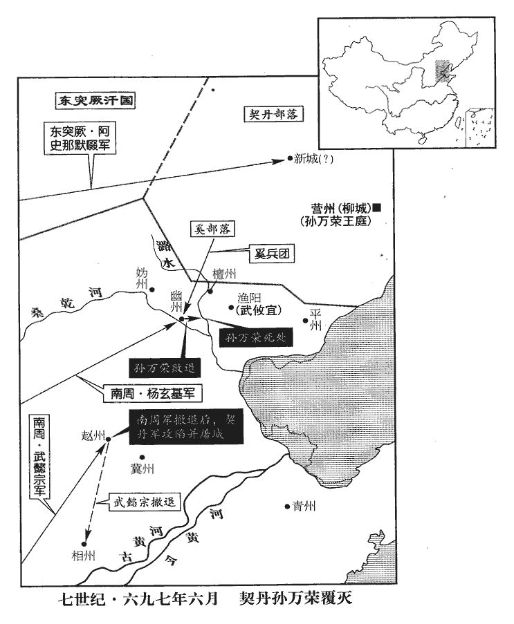
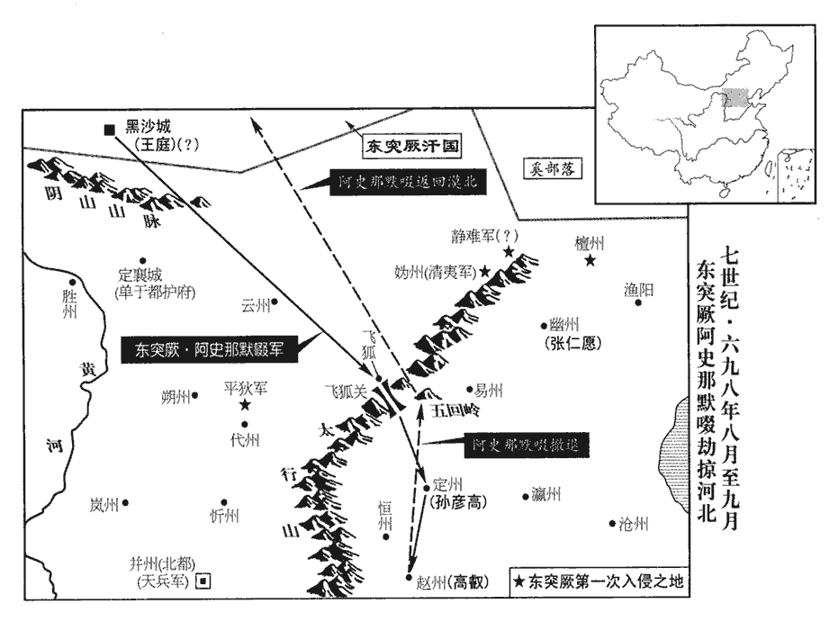
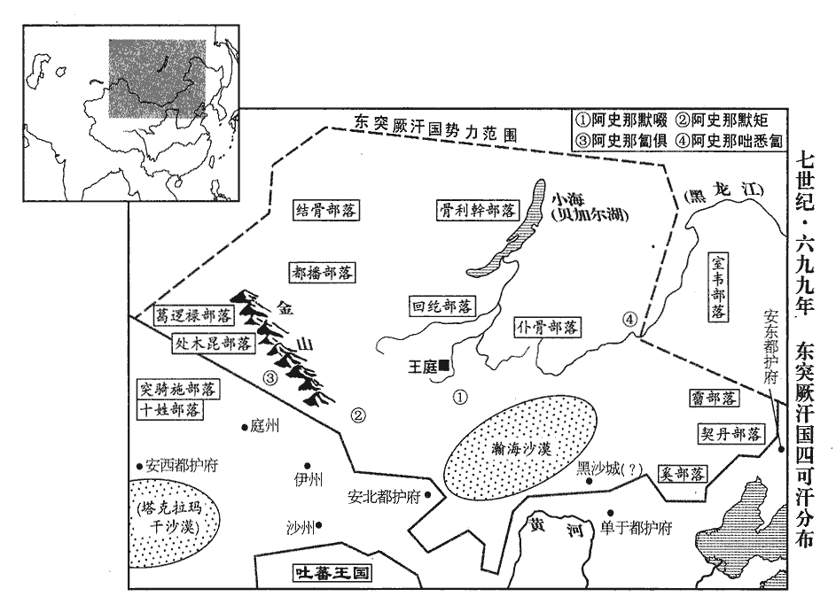

 唐紀二十二起強圉作噩（丁酉），盡上章困敦（庚子）六月，凡三年有奇。

# 則天順聖皇后中之下

## 神功元年（丁酉、六九七）時以契丹破滅，九鼎就成，以九月大享，改元為神功。

1正月，己亥朔‹一›，太后‹武曌，本年七十四岁›享通天宮。

〖译文〗 [1]正月，己亥朔（初一），太后在通天宫祭祀。

2突厥默啜寇靈州‹宁夏灵武市›，以許欽明自隨。欽明為默啜所禽，見上卷上年。厥，九勿翻。欽明至城下大呼，求美醬、粱米及墨，氾勝之曰：粱是秫粟。陶弘景曰：凡曰粱米皆是粟類，惟其牙頭色異為分別耳。有青、黃、白三種，青粱味短色惡，不如黃、白粱。呼，火故翻。意欲城中選良將引精兵、夜襲虜營，將，即亮翻。而城中無諭其意者。

〖译文〗 [2]突厥阿史那默啜侵扰灵州，带着俘获的唐将许钦明。许钦明到州城下大喊，要求给好酱、梁米和墨，意思是让城中选良将、领精兵，夜袭敌人营垒，而城中竟没有人能领会他喊话所隐含的意思。

3箕州‹山西省左权县›刺史劉思禮學相人於術士張憬藏，憬藏謂思禮當歷箕州，位至太師。思禮念太師人臣極貴，非佐命無以致之，乃與洛州錄事參軍綦qí連耀謀反，相，悉亮翻；下相術同。憬，居永翻。唐京都錄事參軍，正七品。綦連，虜姓也。魏收官氏志，西方諸姓有綦連氏。陰結朝士，朝，直遙翻。託相術，許人富貴，俟其意悅，因說以「綦連耀有天命，說，輸芮翻。公必因之以得富貴。」鳳閣舍人王勮兼天官侍郎事，勮，其據翻。用思禮為箕州刺史。

〖译文〗 [3]箕州刺史刘思礼向术士张憬藏学相面，张憬藏说刘思礼将经历箕州刺史，做到太师的职位。刘思礼心想太师在大臣中非常显贵，不是君主的辅佐大臣不能担任，便与洛州录事参军綦连耀图谋造反，秘密勾结朝廷官员，利用相面的办法，为别人预言富贵，等把人说得高兴的时候，然后便说：“綦连耀将授命于天，您一定要依靠他才能获得富贵。”凤阁舍人王兼管天官侍郎事，便任用刘思礼为箕州刺史。

明堂‹长安永乐坊›尉吉【章：十二行本「吉」上有「河南」二字；乙十一行本同；孔本同；張校同】頊聞其謀，以告合宮‹首都洛阳所在县›尉來俊臣，高宗總章元年，分西京萬年縣為明堂縣；永昌元年，改東都河南縣為合宮縣。宋白曰：明堂縣理京兆城中永樂坊。使上變告之。上，時掌翻；下同。太后使河內王武懿宗推之。懿宗令思禮廣引朝士，許免其死，凡小忤意皆引之。忤，五故翻。於是思禮引鳳閣侍郎同平章事李元素、夏官侍郎同平章事孫元亨、知天官侍郎事石抱忠、劉奇、給事中周譒bò譒，補過翻。及王勮兄涇州‹甘肃省泾川县›刺史勔、弟監察御史助等，勔，彌兗翻。監，古銜翻。凡三十六家，皆海內名士，窮楚毒以成其獄，壬戌‹二十五›，皆族誅之，親黨連坐流竄者千餘人。

〖译文〗 明堂县尉吉顼知道刘思礼的阴谋，报告了合宫县尉来俊臣，让来俊臣向朝廷密告他谋反。太后派河内王武懿宗审问他，武懿宗命令刘思礼广泛牵连朝廷官员，答应可以赦免他的死罪，凡对武懿宗稍不顺从的人都牵连上。于是刘思礼牵连凤阁侍郎同平章事李元素、夏官侍郎同平章事孙元亨、执掌天官侍郎事务的石抱忠、刘奇、给事中周及王的哥哥泾州刺史王、弟弟监察御史王助等，共三十六家，都是海内知名人士。严刑拷打逼供定案后，壬戌（二十四日），他们全都被灭族。他们的亲戚因株连而被流放的有一千多人。

初，懿宗寬思禮於外，使誣引諸人。諸人既誅，然後收思禮，思禮悔之。懿宗自天授以來，太后數使之鞫獄，喜誣陷人，數，所角翻。喜，許記翻。時人以為周、來之亞。

〖译文〗 当初，武懿宗表面向刘思礼表示宽大，以便让他诬告牵连别人。等到被牵连的人处死后，他便逮捕刘思礼，刘思礼后悔了。武懿宗自天授年间以来，太后多次派他审讯囚犯，他喜欢诬陷人，当时人认为他是周兴、来俊臣第二。

來俊臣欲擅其功，復羅告吉頊；復，扶又翻；下是復、宗復同。頊上變，得召見，僅免。見，賢遍翻。俊臣由是復用，而頊亦以此得進。

〖译文〗 来俊臣想独得这次事件的告发之功，又罗织罪名密告吉顼；吉顼因密告别的谋反事件获得太后召见，才得以幸免。来俊臣因此又得到重用，而吉顼也借此得以升官。

俊臣黨人羅告司刑府史樊惎jì謀反，誅之。唐制，大理寺有府二十八人，史五十六人。惎，渠記翻。惎子訟冤於朝堂，朝，直遙翻。無敢理者，乃援刀自刳kū其腹。援，于元翻。秋官侍郎上邽‹甘肃省天水市›劉如璿xuán見之，上邽縣，漢屬隴西郡，古邽戎邑也，後漢屬漢陽郡。後魏諱珪，改名上封，屬天水郡；隋復舊，唐屬秦州。璿，似宣翻。竊嘆而泣。俊臣奏如璿黨惡逆，下獄，處以絞刑；下，遐嫁翻。處，昌呂翻。制流瀼ráng州‹广西上思县›。

〖译文〗 来俊臣的党徒罗织罪名告发司刑府史樊谋反，樊被处死。他的儿子诉冤于朝堂，无人敢受理，便抽刀自己剖腹。秋官侍郎上人刘如看见了，偷偷叹息流泪。来俊臣便上奏说刘如偏袒恶逆罪犯，他于是被逮捕入狱，判处绞刑；太后下令改判他流放州。

4尚乘奉御張易之，行成之族孫也，張行成事太宗。年少，美姿容，善音律。少，詩照翻。太平公主‹武曌的女儿›薦易之弟昌宗入侍禁中，昌宗復薦易之，兄弟皆得幸於太后，常傅朱粉，衣錦繡。昌宗累遷散騎常侍，散，悉亶翻。騎，奇寄翻。易之為司衛少卿；龍朔改衛尉為司衛，光宅因之。拜其母臧氏、韋氏為太夫人，賞賜不可勝紀，勝，音升。仍敕鳳閣侍郎李迥秀為臧氏私夫。迥秀，大亮之族孫也。李大亮歷事高祖、太宗。武承嗣、三思、懿宗、宗楚客、晉卿皆候易之門庭，爭執鞭轡，謂易之為五郎，昌宗為六郎。

〖译文〗 [4]尚乘奉御张易之，是张行成的同族侄孙，年轻、貌美，精通音律。太平公主推荐张易之的弟弟张昌宗入侍宫中，张昌宗又推荐张易之，兄弟二人都得到太后的宠幸，常涂脂抹粉，穿华丽的衣服。张昌宗连续升官后任散骑常侍，张易之任司卫少卿；授给他们的母亲臧氏、韦氏太夫人的封号，赏赐多得数不清，又命令凤阁侍郎李迥秀为臧氏的姘夫。李迥秀，是李大亮的同族侄孙。武承嗣、武三思、武懿宗、宗楚客、宗晋卿等人，时常等候在张易之家门口，争着为他执马鞭牵马，称张易之为五郎，张昌宗为六郎。

5癸亥‹二十六›，突厥默啜寇勝州‹内蒙古托克托县›，平狄軍‹山西省代县北›副使安道買擊破之。代州北有大武軍，調露元年改曰神武軍，天授二年改曰平狄軍。使，疏吏翻。

〖译文〗 [5]癸亥（二十五日），突厥阿史那默啜侵扰胜州，唐朝平狄军副使安道买将他们打败。

6甲子‹二十七›，以原州‹宁夏固原县›司馬婁師德守鳳閣侍郎、同平章事。

〖译文〗 [6]甲子（二十六日），朝廷任命原州司马娄师德守凤阁侍郎、同平章事。

7春，三月，戊申‹十二›，清邊道總管王孝傑、蘇宏暉等將兵十七萬與孫萬榮戰于東硤石谷‹河北省昌黎县北›，唐兵大敗，孝傑死之。將，即亮翻。

〖译文〗 [7]春季，三月，戊申（十二日），清边道总管王孝杰、苏宏晖等领兵十七万与契丹孙万荣战于东硖石谷，唐兵大败，王孝杰战死。

孝傑遇契丹‹辽河上游›，帥精兵為前鋒，帥，讀曰率。力戰。契丹引退，契，欺訖翻，又音喫。孝傑追之，行背懸崖；背，蒲妹翻。契丹回兵薄之，薄，伯各翻。宏暉先遁，孝傑墜崖死，將士死亡殆盡。考異曰：朝野僉載云：「孝傑將四十萬眾，被賊誘退，逼就懸崖，漸漸挨排，一一落間，坑深萬丈，尸與崖平，匹馬無歸，單兵莫返。」張鷟語事多過其實，今不盡取。管記洛陽張說馳奏其事。太后贈孝傑官爵，遣使斬宏暉以徇；使者未至，宏暉以立功得免。說，讀曰悅。使，疏吏翻；下同。

〖译文〗 王孝杰和契丹人遭遇，率领精兵为前锋，奋力作战。契丹人后退，王孝杰追击，行进到背靠悬崖的地方，契丹回兵逼近他，苏宏晖首先逃跑，王孝杰坠崖身死，战士几乎全部战死。管记洛阳人张说迅速奏明上述情况。太后追赠给王孝杰官爵，派遣使者前去将苏宏晖斩首示众；使者还未到达，苏宏晖因立功得以免死。

武攸宜軍漁陽‹天津市蓟县›，漁陽，秦右北平郡所治也。隋為漁陽縣，屬幽州，在幽州東二百一十里。聞孝傑等敗沒，軍中震恐，不敢進。契丹乘勝寇幽州‹北京市›，攻陷城邑，剽掠吏民，攸宜遣將擊之，不克。剽，匹妙翻。將，即亮翻。

〖译文〗 武攸宜进军至渔阳，听说王孝杰等全军覆没，军中震惊，不敢前进。契丹人乘胜侵扰幽州，攻陷城池，劫掠官吏和百姓，武攸宜派部将攻击他们，不能取胜。

8閻知微、田歸道同使突厥，冊默啜為可汗。可，從刊入聲。汗，音寒。知微中道遇突厥使者，輒與之緋袍、銀帶，且上言：「虜使至都，宜大為供張。」上，時掌翻，下同。供，他用翻。張，知亮翻。歸道上言：「突厥背誕積年，方今悔過，宜待聖恩寬宥。今知微擅與之袍帶，使朝廷無以復加；背，蒲妹翻。朝，直遙翻；下同。復，扶又翻。宜令反初服以俟朝恩。令，力丁翻。初服，突厥遣來所被之服。又，小虜使臣，不足大為供張。」太后然之。知微見默啜，舞蹈，吮其靴鼻；吮，如兗翻。歸道長揖不拜。默啜囚歸道，將殺之，歸道辭色不撓，責其無厭，撓，奴教翻。厭，於鹽翻。為陳禍福。為，于偽翻。阿波達干元珍曰：突厥官二十八等，自設至達干，皆世其官。此即阿史德元珍。「大國使者，不可殺也。」默啜怒稍解，但拘留不遣。

〖译文〗 [8]阎知微、田归道一同出使突厥，封阿史那默嗓为可汗。阎知微中途遇到突厥使者，即送给他红袍、银带，并且上奏说：“突厥使者到达都城，应当大设帷帐迎接。”田归道上奏说：“突厥违反朝命不受节制多年，现在才悔过，应等待陛下的圣恩宽恕，现在阎知微却擅自给突厥使者红袍、银带，使得朝廷不能再恩赐他；应该让他仍穿原来的服装，以等待朝廷的恩赐。还有，小国的使臣，不值得大设帷帐迎接。”太后同意田归道的意见。阎知微见到阿史那默啜，行跪拜礼，吻他的靴尖；田归道只深深作揖而不跪拜。阿史那默啜因此囚禁田归道，还准备杀死他。田归道言词神态都坚强不屈，指责阿史那默啜不知满足，并为他陈述祸福利害。阿波达干元珍说：“大国的使者，不可以杀死。”阿史那默啜的怒气才稍微消减，但将他拘留，不放他回国。

初，咸亨中，突厥有降者，皆處之豐‹内蒙古五原县›、勝、靈、夏‹陕西省靖边县北白城子›、朔‹山西省朔州市›、代‹山西省代县›六州，至是，默啜求六州降戶及單于都護府‹设内蒙古和林格尔县›之地‹自瀚海沙漠以南至阴山山脉以北›，并穀種、繒帛、農器、鐵，降，戶江翻。處，昌呂翻。夏，戶雅翻。單，音蟬。種，章勇翻。繒，慈陵翻。太后不許。默啜怒，言辭悖慢。悖，蒲內翻，又蒲沒翻。姚璹shú、楊再思以契丹未平，請依默啜所求給之。麟臺少監、知鳳閣侍郎贊皇‹河北省赞皇县›李嶠曰：麟臺少監即祕書少監。贊皇縣，隋置，屬趙州，取贊皇山以為名。少，詩照翻。「戎狄貪而無信，此所謂『借寇兵資盜糧』也，秦李斯之言。不如治兵以備之。」治，直之翻。璹、再思固請與之，乃悉驅六州降戶數千帳以與默啜，并給穀種四萬斛，雜綵五萬段，農器三千事，鐵四萬斤，并許其昏。默啜由是益強。

〖译文〗 当初，咸亨年间，突厥人有投降的，唐朝都安置他们在丰、胜、灵、夏、朔、代六州，这时候阿史那默啜便要求这六州的降户和单于都护府所辖的地方，以及谷种、丝帛、农具、铁，太后不答应。阿史那默啜大怒，言词违逆傲慢。姚、杨再思因契丹尚未平定，请求满足他的各项要求。麟台少监、知凤阁侍郎赞皇人李峤说：“戎狄贪婪而不讲信用，答应他的要求就是所谓‘借给敌寇兵员、资助盗贼粮食’，不如加强军备以防备他。”姚、杨再思坚持请求满足他，于是全部送还六州降户数千帐，并给谷种四万斛，各种丝织品五万段，农具三千件，铁四万斤，答应他女儿的求婚。阿史那默啜从此日益强大。

田歸道始得還，與閻知微爭論於太后前。歸道以為默啜必負約，不可恃和親，宜為之備。知微以為和親必可保。考異曰：舊歸道傳云：「聖曆初，默啜請和，遣閻知微冊為立功報國可汗。知微擅與使者緋袍，歸道上言不可。及默啜將至單于都護府，乃令歸道攝司賓卿迎勞之。默啜請六胡州，不許，遂拘縶歸道。」突厥傳云：「李盡忠、孫萬榮陷營府，默啜請為國討契丹，許之。默啜部眾漸盛，則天遣使冊為立功報國可汗。」朝野僉載云：「歸道為知微副，見默啜，不拜，默啜倒懸，將殺之；元珍諫，乃放之。」按神功元年八月，姚璹左遷益州長史。則與之穀帛，必在此前，非聖曆初也。實錄：「萬歲通天元年，九月，丁卯，以默啜不同契丹之逆，遣閻知微冊為遷善可汗。」則於時未為立功報國可汗也。冊拜此號，實錄無之，不知的在何時。今因契丹未平，姚璹未出，附見於此。歸道在朝為左衛郎將，何得預論默啜！蓋在道見知微所為而上言耳。其事則兼采諸書可信者存之。

〖译文〗 田归道这才得以回国，他与阎知微在太后面前展开争论。田归道认为阿史那默啜一定会背约，不可依仗和亲，应当做好防备工作。阎知微认为和亲一定可以依靠。

9夏，四月，鑄九鼎成，徙置通天宮。豫州鼎高丈八尺，受千八百石；餘州高丈四尺，受千二百石；豫州鼎獨高大，神都畿也。高，古犒翻。各圖山川物產於其上，共用銅五十六萬七百餘斤。太后欲以黃金千兩塗之，姚璹曰：「九鼎神器，貴於天質自然。且臣觀其五采煥炳相雜，不待金色以為炫燿。」炫，熒絹翻。太后從之。自玄武門曳入，令宰相、諸王帥南北牙宿衛兵十餘萬人并仗內大牛、白象共曳之帥，讀曰率。

〖译文〗 [9]夏季，四月，朝廷铸成九鼎，移置于通天宫。豫州鼎高一丈八尺，能容纳一千八百石；其余各州鼎各高一丈四尺，能容纳一千二百石；分别在鼎上铸山川物产的图象，共用铜五十六万零七百余斤。太后想用一千两黄涂鼎，姚说：“九鼎是神器，可贵的是天质自然。而且我看它五色光芒相互辉映，不须靠金色才放光采。”太后听从他的意见。九鼎自玄武门拽入，命令宰相、诸王率领南北衙禁卫军十余万人及仪仗队中的大牛、白象一同牵拽。

10前益州‹四川省成都市›長史王及善已致仕，會契丹作亂，山東‹崤山以东›不安，起為滑州‹河南省滑县›刺史。太后召見，見，賢遍翻。問以朝廷得失，及善陳治亂之要十餘條。治，直吏翻。太后曰：「外州末事，此為根本，卿不可出。」癸酉‹八›，留為內史。

〖译文〗 [10]前益州长史王及善已退休，遇契丹作乱，崤山以东不安定，又被起用为滑州刺史。太后召见他，询问朝廷得失，王及善陈述治乱要务十多条。太后说：“外州的任务是次要的，朝廷为根本，你不可以出任刺史。”癸酉（初八），他被留下任内史。

11癸未‹十八›，以右金吾衛大將軍武懿宗為神兵道行軍大總管，與右豹韜衛將軍何迦密將兵擊契丹。迦，古牙翻，又居伽翻。將，即亮翻。五月，癸卯‹八›，又以婁師德為清邊道副大總管，右武威衛將軍沙吒忠義為前軍總管，沙吒，虜姓。吒，初加翻。將兵二十萬擊契丹。

〖译文〗 [11]癸未（十八日），朝廷任命右金吾卫大将军武懿宗为神兵道行军大总管，与右豹韬卫将军何迦密领兵进攻契丹。五月，癸卯（初八），又任命娄师德为清边道副大总管，右武威卫将军沙吒忠义为前军总管，领兵二十万进攻契丹。

先是，有朱前疑者先，悉薦翻。上書云：「臣夢陛下壽滿八百。」即拜拾遺。又自言「夢陛下髮白再玄，齒落更生」。遷駕部郎中。唐駕部郎掌邦國輿輦車乘、傳驛、廄牧，官司馬牛雜畜薄籍，辯其出入，司其名數。上，時掌翻；下同。出使還，上書曰：「聞嵩山呼萬歲。」賜以緋算袋，唐初職事官三品以上賜金裝刀、礪石，一品以下則有手巾、算袋。開元以後，百官朔望朝參，外官衙日，則佩算袋，各隨其所服之色，餘日則否。使，疏吏翻。時未五品，於綠衫上佩之。會發兵討契丹，敕京官出馬一匹供軍，酬以五品。前疑買馬輸之，屢抗表求進階；太后惡其貪鄙，惡，烏路翻。六月，乙丑‹一›，敕還其馬，斥歸田里。

〖译文〗 这以前，有个叫朱前疑的人上书说：“我梦见陛下寿满八百岁。”太后当即授给他拾遗职务；又自称“梦见陛下头发白了又变黑，牙齿脱落又再生”，又升任驾部郎中。他出使回来，上书说：“听到嵩山呼万岁。”又赐给他红算袋，当时他还不是五品官，只能在绿色衣服上佩带。遇上发兵讨伐契丹，朝廷命令京官献马一匹供军用，赐给五品官，朱前疑买马进献后，一再上表要求提升官阶；太后讨厌他贪鄙，六月，乙丑（初一），命令发还他的马，将他逐回农村。

12右司郎中馮翊‹陕西省大荔县›喬知之有美妾曰碧玉，知之為之不昏。為，于偽翻。武承嗣借以教諸姬，遂留不還。知之作綠珠怨以寄之，晉石崇有愛妾曰綠珠，事見八十三卷晉惠帝永康三年。碧玉赴井死。承嗣得詩於裙帶，大怒，諷酷吏羅告，族之。考異曰：唐曆：「天授元年二月十日，誅喬知之。」新本紀：「八月，壬戌，殺右司郎中喬知之。」盧藏用陳氏別傳、趙儋dān陳子昂旌德碑皆云：「契丹以營州叛，建安郡王武攸宜親總戎律，特詔左補闕喬知之及公參謀幃幕。及軍罷，以父年老，表乞歸侍。」攸宜討契丹在萬歲通天元年，明年平契丹。子昂集有西還至散關答喬補闕詩云：「昔君事胡馬，余得奉戎旃，攜手同沙塞，關河緬幽、燕。歎此南歸日，猶聞北戍邊。」疑知之之死在神功年後。但唐曆、統紀、新紀殺知之皆在天授元年，今據子昂詩必無誤者，然云「猶聞北戍邊」，則軍未罷也。又武后云，來俊臣死後，不聞有反者。故置於此。據朝野僉載，知之以婢碧玉事為武承嗣諷人羅告之，斬於市南，破家籍沒。此時知之在邊，蓋承嗣先銜之，至此乃殺之耳。

〖译文〗 [12]右司郎中冯翊人乔知之有美妾名叫碧玉，乔知之因为有了她而不结婚。武承嗣借她来教诸姬妾，便留下她不让回去。乔知之写作《绿珠怨》送给她，她于是投井自杀。武承嗣从她裙带中搜得《绿珠怨》，大怒，示意酷吏罗织罪名上告，将乔知之灭族。

13司僕少卿來俊臣光宅改太僕為司僕。倚勢貪淫，士民妻妾有美者，百方取之；或使人羅告其罪，矯稱敕以取其妻，前後羅織誅人，不可勝計。勝，音升。自宰相以下，籍其姓名而取之。考異曰：朝野僉載云：「俊臣嘗以三月三日萃其黨於龍門，豎石題朝士姓名以卜之，令投石遙擊，倒者則先令告。至暮，投李昭德不中。」今不取。自言才比石勒。監察御史李昭德素惡俊臣，惡，烏路翻。又嘗庭辱秋官侍郎皇甫丈【章：十二行本「丈」作「文」；乙十一行本同；孔本同；退齋校同。】備，二人共誣昭德謀反，下獄。下，遐嫁翻；下不下、乃下同。

〖译文〗 [13]司仆少卿来俊臣仗势贪求女色，官民妻妾有漂亮的，千方百计夺取；有时指使人罗织罪名告发某人，然后假传太后命令夺取他的妻妾，前后罗织罪名杀人无法计算。自宰相以下，他登记姓名按顺序夺取他们的妻妾。他自称才能可比石勒。监察御史李昭德一贯憎恶来俊臣，又曾经在朝廷侮辱秋官侍郎皇甫文备。这二人便共同诬告李昭德谋反，将他逮捕入狱。

俊臣欲羅告武氏諸王及太平公主，又欲誣皇嗣‹李旦›及廬陵王‹李显›與南北牙‹南牙·政府所在地。北牙·皇帝居住›同反，冀因此盜國權，河東‹山西省永济市›人衛遂忠告之。諸武及太平公主恐懼，共發其罪，繫獄，有司處以極刑。處，昌呂翻。太后欲赦之，奏上三日，不出。上，時掌翻。王及善曰：「俊臣凶狡貪暴，國之元惡，不去之，必動搖朝廷。」去，羌呂翻。朝，直遙翻。太后遊苑中，吉頊執轡，太后問以外事，對曰：「外人唯怪來俊臣奏不下。」太后曰：「俊臣有功於國，朕方思之。」頊曰：「于安遠告虺貞反，既而果反，貞事見上卷垂拱四年。今止為成州‹甘肃省礼县南›司馬。俊臣聚結不逞，誣構良善，贓賄如山，冤魂塞路，塞，悉則翻。國之賊也，何足惜哉！」太后乃下其奏。

〖译文〗 来俊臣想罗织罪名诬告武氏诸王及太平公主，又想诬告皇嗣及庐陵王与南北衙禁卫军一同谋反，希望借此窃取国家权力，河东人卫遂忠告发他。武氏诸王及太平公主恐惧，共同揭发他的罪恶，将他关进监狱，有关部门判处他死刑。太后想赦免他，处死的奏章送上已经三天，仍不批下。王及善说：“来俊臣凶残狡猾，贪婪暴虐，是国家的大恶人，不除掉他，必然动摇朝廷。”太后游览宫廷园林时，吉顼牵马，太后向他询问宫外的事情，他回答说：“外边的人只奇怪处死来俊臣的奏章没有批下来。”太后说：“来俊臣有功于国家，我正在考虑这件事。”吉顼说：“于安远告虺贞谋反，后来真的反了，于安远现在只任成州司马。来俊臣聚集为非作歹的人，诬陷好人，贪赃受贿的财物堆积如山，被他冤屈而死的鬼魂满路，是危害国家的坏人，有什么可怜惜的！”太后于是批准处死他。

丁卯‹三›，昭德、俊臣同棄市‹来俊臣本年四十七岁›，時人無不痛昭德而快俊臣。仇家爭噉俊臣之肉，斯須而盡，抉眼剝面，披腹出心，騰蹋成泥。噉，徒濫翻，又徒覽翻。抉jué，於決翻。太后知天下惡之，乃下制數其罪惡，惡，烏路翻。數，所具翻。且曰：「宜加赤族之誅，以雪蒼生之憤，可準法籍沒其家。」士民皆相賀於路曰：「自今眠者背始帖席矣。」

〖译文〗 丁卯（初三日），李昭德、来俊臣一同在闹市被处死并暴尸，当时人无不痛惜李昭德，而为处死来俊臣拍手称快。仇家争相吃来俊臣的肉，片该之间便吃光，挖眼睛，剥面皮，剖腹取心，展转践踏成泥。太后知道天下人憎恨他，才下诏指责他的罪恶，而且说：“应该诛灭他全家族，以伸雪百姓的愤恨，可依法查抄他的家产。”官吏和百姓在路上相见时都互相庆贺说：“今后睡觉的人背部才可以贴着席子了。”

俊臣以告綦連耀功，賞奴婢十人。俊臣閱司農婢，無可者，唐六典，司農丞掌凡官戶奴婢，男女成人，先以本色嫓偶；若給賜，許其妻子相隨；若犯籍沒，以其所能各配諸司，婦人巧者入掖庭。以西突厥可汗斛瑟羅家有細婢，善歌舞，欲得以為賞口，乃使人誣告斛瑟羅反。諸酋長詣闕割耳剺面訟冤者數千人。酋，慈由翻。長，知兩翻。剺lí，里之翻。會俊臣誅，乃得免。

〖译文〗 来俊臣因告发綦连耀有功，太后赏给他奴婢十人。来俊臣查看司农寺管辖的官奴婢，没有合意的，因西突厥可汗斛瑟罗家有小婢，善于歌舞，来俊臣想获得她充作赏赐的奴婢，便指使人诬告斛瑟罗谋反。各酋长到宫门前阙楼下割耳划脸为他诉冤的有数十人。遇到来俊臣被处死，斛瑟罗才幸免于难。

俊臣方用事，選司受其屬請不次除官者，每銓數百人。俊臣敗，侍郎皆自首。選，須絹翻。屬，之欲翻。首，式又翻。太后責之，對曰：「臣負陛下，死罪！臣亂國家法，罪止一身；違俊臣語，立見滅族。」太后乃赦之。

〖译文〗 来俊臣还掌权的时候，每次铨选，吏部受他嘱托越级授官的有数百人。来俊臣垮台后，侍郎都向朝廷自首。太后责备他们，他们说：“我们辜负陛下，该当死罪！但我们扰乱国家法度，只加罪于自身；我们如果违抗来俊臣的意旨，立即灭族。”太后于是赦免他们。

上林令侯敏唐司農之屬有上林署令，從七品下，掌苑囿縣地之事，凡植果樹蔬以供朝會祭祀，及季冬藏冰皆主之。素諂事俊臣，其妻董氏諫之曰：「俊臣國賊，指日將敗，君宜遠之。」遠，于願翻。敏從之。俊臣怒，出為武龍‹广西田阳县›令。武龍縣屬田州，開蠻洞置。舊書作「武籠」，云失廢置年月。又涪州有武龍縣，武德二年分涪陵置。敏欲不往，妻曰：「速去勿留！」俊臣敗，其黨皆流嶺南‹南岭以南›，敏獨得免。

〖译文〗 上林令侯敏一贯巴结奉承来俊臣，他妻子董氏规劝他说：“来俊臣是危害国家的坏人，不久将失败，你应当离他远些。”侯敏听从她的意见。来俊臣因此大怒，调他出任武龙县令，他不想去。他妻子说：“快去，不要逗留！”来俊臣失败后，他的党羽都流放岭南，只有侯敏幸免。

太后徵于安遠為尚食奉御，擢吉頊為右肅政中丞。

〖译文〗 太后征召于安远为尚食奉御，提升吉顼为右肃政中丞。

14以检校夏官侍郎宗楚客同平章事。

〖译文〗 [14]朝廷任命检校夏官侍郎宗楚客为同平章事。

15武懿宗軍至趙州‹河北省赵县›，聞契丹將駱務整數千騎將至冀州‹河北省冀州市›，丹將，即亮翻；下同。騎，奇寄翻；下同。懿宗懼，欲南遁。或曰：「虜無輜重，重，直用翻。以抄掠為資，抄，楚交翻。若按兵拒守，勢必離散，從而擊之，可有大功。」懿宗不從，退據相州‹河南省安阳市›，相，悉亮翻。委棄軍資器仗甚眾。契丹遂屠趙州。

〖译文〗 [15]武懿宗领军至赵州，听说契丹将领骆务整的数千骑兵将到冀州，武懿宗畏惧，想向南逃跑。有人说：“敌人没有辎重，靠抢掠作给养，我们若屯兵拒守，他们势必瓦解，然后乘机进击，可获得大的成功。”武懿宗不同意，退守相州，丢弃军用物资和武器很多。契丹于是在赵州城进行大屠杀。

 

甲午‹三十›，【嚴：「午」改「申」。】孫萬榮為奴所殺。

〖译文〗 甲午（三十日），契丹孙万荣被家奴杀死。

萬榮之破王孝傑也，於柳城‹营州州政府所在县·辽宁省朝阳市›西北四百里依險築城，留其老弱婦女，所獲器仗資財，使妹夫乙冤羽守之，引精兵寇幽州。恐突厥默啜襲其後，遣五人至黑沙‹阴山北麓›，語默啜曰：黑沙，突厥庭。語，牛倨翻。「我已破王孝傑百萬之眾，唐人破膽，請與可汗乘勝共取幽州。」三人先至，默啜喜，賜以緋袍。二人後至，默啜怒其稽緩，將殺之，二人曰：「請一言而死。」默啜問其故，二人以契丹之情告。默啜乃殺前三人而賜二人緋，使為鄉導，鄉，讀曰嚮。發兵取契丹新城，殺所獲涼州都督許欽明以祭天；圍新城三日，克之，新城，即前契丹所築，在柳城西北者。盡俘以歸。使乙冤羽馳報萬榮。

〖译文〗 孙万荣打败王孝杰后，在柳城西北四百里处凭借险要地势筑城，留下老弱、妇女和所缴获的武器资财，派他的妹夫乙冤羽留守，自己领精兵侵扰幽州。他恐怕突厥阿史那默啜袭击他的背后，便派五个人到黑沙，对阿史那默啜说：“我已打败王孝杰的百万大军，唐朝人已被吓破了胆，请与您乘胜共同攻取幽州。”其中三人先到，阿史那默嗓高兴，赐给他们红袍。二人后到，阿史那默啜因他们迟缓拖延而发怒，要杀死他们。这二人说：“请进一言而后再死。”阿史那默啜问为什么，二人报告了契丹的真实用意。阿史那默啜于是杀死先到的三个人，赐给后到的二人红袍，让他们充当向导，发兵进取契丹所筑新城，杀死被他们俘虏的原唐朝凉州都督许钦明祭天；突厥包围新城，三天后攻陷，全部俘虏该城的契丹人，让乙冤羽迅速报告孙万荣新城失守的消息。

時萬榮方與唐兵相持，軍中聞之，忷懼。忷，許勇翻。奚‹滦河上游›人叛萬榮，神兵道總管楊玄基擊其前，奚兵擊其後，獲其將何阿小。萬榮軍大潰，阿，烏葛翻。考異曰：朝野僉載：「突厥破萬榮新城，群賊聞之失色，眾皆潰散。」不云為玄基等所破。實錄但云為玄基及奚所破，不云突厥取新城。要之，契丹聞新城破，眾心已離，唐與奚人擊之遂潰耳。今兩取之。帥輕騎數千東走。帥，讀曰率。前軍總管張九節遣兵邀之於道，萬榮窮蹙，與其奴逃至潞水‹潮白河›東，鮑丘水從塞外來，南過幽州潞縣，謂之潞水。息於林下，嘆曰：「今欲歸唐，罪已大。歸突厥亦死，歸新羅‹首都金城韩国庆州市›亦死。將安之乎！」奴斬其首以降，降，戶江翻；下同。梟之四方館門。漢有藁街蠻夷邸。後魏置諸國使邸，其後又作四館以處四方來降者，事見一百四十九卷梁武帝普通元年。至隋煬帝置四方館於建國門外，以待四方使客，各掌其方國及互市事，屬鴻臚寺。唐以四方館隸中書省，通事舍人主之。梟，堅堯翻。其餘眾及奚、霫‹辽河以北›皆降於突厥。霫，而立翻。

〖译文〗 当时孙万荣正与唐兵对峙，军中听到新城失守的消息，震惊不安，奚人背叛孙万荣，神兵道总管杨玄基攻击他前面，奚人攻击他后面，俘获他的将领何阿小。孙万荣军溃散，孙万荣率轻骑数千向东逃走。唐前军总管张九节派兵在中途截击，孙万荣走投无路，与家奴逃至潞水东边，在树林下休息，叹息说：“现在想归降唐朝，罪恶已大。归降突厥是死，归降新罗也是死。将向何处去呢！”家奴砍下他的脑袋向唐朝投降，他的脑袋被挂在四方馆门前示众。他的余众及奚人、人都向突厥投降。

16戊子‹二十四›，特進武承嗣、春官尚書武三思並同鳳閣鸞臺三品。

〖译文〗 [16]戊子（二十四日），特进武承嗣、春官尚书武三思并任同凤阁鸾台三品。

17辛卯‹二十七›，制以契丹初平，命河內王武懿宗、婁師德及魏州‹河北省大名县›刺史狄仁傑分道安撫河北‹黄河以北›。懿宗所至殘酷，民有為契丹所脅從復來歸者，復，扶又翻。懿宗皆以為反，生刳取其膽。先是，何阿小嗜殺人，先，悉薦翻。河北人為之語曰：「唯此兩何，殺人最多。」武懿宗封河內王，與何阿小為「兩何」。

〖译文〗 [17]辛卯（二十七日），太后下令，因契丹刚平定，命河内王武懿宗、娄师德及魏州刺史狄仁杰分路到黄河以北各地安顿抚恤百姓。河内王武懿宗所到之处使用刑法非常残酷，百姓有被迫跟从契丹而后又回来的，武懿宗都认为是反叛，将他们活活剖腹取胆。这以前，契丹何阿小好杀人，这时候黄河以北的人就说：“唯此两何，杀人最多。”

18秋，七月，丁酉‹三›，昆明內附，置竇州‹《新唐书·地理志》作寶州，今贵州省大方县›。

〖译文〗 [18]秋季，七月，丁酉（初三），昆明归附唐朝，唐朝在该地设置窦州。

19武承嗣、武三思並罷政事。

〖译文〗 [19]武承嗣、武三思一起罢除相职。

20庚午，武攸宜自幽州凱旋。武懿宗奏河北百姓從賊者請盡族之，左拾遺王求禮庭折之曰：折，之舌翻。「此屬素無武備，力不勝賊，苟從之以求生，豈有叛國之心！懿宗擁強兵數十萬，望風退走，賊徒滋蔓，又欲委罪於草野詿guà誤之人，蔓，音萬。詿，戶卦翻。為臣不忠，請先斬懿宗以謝河北！」懿宗不能對。司刑卿杜景儉亦奏：「此皆脅從之人，請悉原之。」太后從之。

〖译文〗 [20]庚午（二十四日），武攸宜从幽州凯旋。武懿宗奏请将黄河以北跟从契丹的百姓全部灭族，左拾遗王求礼在朝廷驳斥他说：“这些百姓从来没有武装，没有力量打败敌人，一时顺从敌人以求生存，哪里有叛国的用心！武懿宗拥有强兵数十万，看到敌人的气势就退走，结果使敌人的势力蔓延，他又想把罪过推卸给民间受连累的人，这是作臣下的不忠，请先斩武懿宗以向黄河以北的百姓致歉！”武懿宗哑口无言。司刑卿杜景俭也上奏说：“这些百姓都是被迫跟从契丹的，请全部原谅他们。”太后听从他的意见。

21八月，丙戌‹二十三›，納言姚璹坐事左遷益州長史，以太子宮尹豆盧欽望為文昌右相、鳳閣鸞臺三品。天授中改太子詹事為太子宮尹。「鳳閣」之上當有「同」字。考異曰：新表，「庚子，狄仁傑兼納言，武三思檢校內史，欽望為文昌右相、同三品。」舊紀傳及新紀皆無之。此月無庚子。仁傑、三思除命在明年。新表誤重複。

〖译文〗 [21]八月，丙戌（二十三日），纳言姚因事获罪降职为益州长史。朝廷任命太子宫尹豆卢钦望为文昌右相、凤阁鸾台三品。

22九月，壬辰‹九›，大享通天宮，大赦，【章：十二行本無「大」字，「赦」下有「天下」二字；乙十一行本同。】改元。改元神功。

〖译文〗 [22]九月，壬辰（疑误），太后合祭于通天宫，大赦天下罪人，更改年号。

23庚戌‹十七›，婁師德守納言。

〖译文〗 [23]庚戌（十七日），娄师德代理纳言。

24甲寅‹二十一›，太后謂侍臣曰：「頃者周興、來俊臣按獄，多連引朝臣，朝，直遙翻。云其謀反；國有常法，朕安敢違；中間疑其不實，使近臣就獄引問，得其手狀，皆自承服，朕不以為疑。自興、俊臣死，不復聞有反者，復，扶又翻；下無復、后復同。然則前死者不有冤邪？」夏官侍郎姚元崇對曰：「自垂拱以來坐謀反死者，率皆興等羅織，自以為功。陛下使近臣問之，近臣亦不自保，何敢動搖！所問者若有翻覆，懼遭慘毒，不若速死。賴天啟聖心，興等伏誅，臣以百口為陛下保，自今內外之臣無復反者；為，于偽翻；下多為同。若微有實狀，臣請受知而不告之罪。」太后悅曰：「曏時宰相皆順成其事，陷朕為淫刑之主；聞卿所言，深合朕心。」賜元崇錢千緡。

〖译文〗 [24]甲寅（二十一日），太后对身边的大臣说：“近期以来周兴、来俊臣审理案件，多牵连朝廷大臣，说他们谋反；国家有固定的法律，朕怎么敢违反！有时怀疑它不真实，指派亲信大臣到监狱提问，得到犯人的自供状，都是自己承认的，朕便不加怀疑。自从周兴、来俊臣死后，不再听说有谋反的人，这样看来，以前被处死的人不是有冤枉吗？”夏官侍郎姚元崇回答说：”自垂拱年间以来因谋反罪被处死的人，大概都是由于周兴等罗织罪名，以便自己求取功劳造成的。陛下派亲近大臣去查问，这些亲近大臣也不能保全自己，哪里还敢动摇他们的结论！被问的人如果翻供，又惧怕惨遭毒刑，与其那样不如早死。仰赖上天启迪圣心，周兴等被诛灭，我以一家百口人的生命向陛下担保，今后朝廷内外大臣不会再有谋反的人；若稍有谋反的事实，我愿承受知而不告的罪过。”太后高兴地说：“以前的宰相都顺着周兴他们，使他们得逞，贻误朕成为滥用刑罚的君主；听到你说的话，很合朕心意。”于是赏赐姚元崇钱一千缗。

時人多為魏元忠訟冤者，太后復召為肅政中丞。元忠前後坐棄市流竄者四。考異曰：舊傳云三被流，今從御史臺記。按新書：元忠為洛陽令，陷周興獄當死，以平揚、楚功，得流。歲餘，為來俊臣所構，將就刑，太后使王隱客宣詔赦之，此為二事。通鑑書王隱客宣赦事於永昌元年，至長壽元年又下獄貶，此為三事。及後長安三年又貶高要尉，此為四事。未知御史臺記所書如何也。嘗侍宴，太后問曰：「卿往者數負謗，何也？」數，所角翻。對曰：「臣猶鹿耳，羅織之徒欲得臣肉為羹，臣安所避之！」

〖译文〗 当时有很多人为魏元忠诉冤，太后又召回他担任肃政中丞。魏元忠前后被判处死刑和流放共有四次。有一次曾陪从太后宴饮，太后问他：“你从前多次蒙受诽谤，为什么？”回答说：“我好比鹿，罗织罪名的人想得到我的肉作羹，我如何能躲过他们！”

25冬，閏十月，甲寅‹二十一›，以幽州都督狄仁傑為鸞臺侍郎，司刑卿杜景儉為鳳閣侍郎，並同平章事。

〖译文〗 [25]冬季，闰十月，甲寅（二十一日），朝廷任命幽州都督狄仁杰为鸾台侍郎，司刑卿杜景俭为凤阁侍郎，一并任同平章事。

仁傑上疏上，時掌翻。以為：「天生四夷，皆在先王封略之外，故東拒滄海，西阻流沙，北横大漠，南阻五嶺‹南岭›，此天所以限夷狄而隔中外也。自典籍所紀，聲教所及，三代不能至者，國家盡兼之矣。詩人矜薄伐於太原‹当时太原指甘肃省泾河上游›，美化行於江、漢，詩六月，宣王北伐也。其詩云：「薄伐玁xiǎn狁yǔn，至于太原。」又漢廣之詩，美文王之道被于南國，美化行乎江、漢之域。則三代之遠裔，皆國家之域中也。若乃用武方外，邀功絕域，竭府庫之實以爭不毛之地，得其人不足增賦，獲其土不可耕織，苟求冠帶遠夷之稱，冠，古玩翻。稱，尺證翻。不務固本安人之術，此秦皇、漢武‹刘彻›之所行，非五帝、三王之事業也。始皇窮兵極武，務求廣地，死者如麻，致天下潰叛。事見秦紀。漢武征伐四夷，百姓困窮，盗賊蜂起；末年悔悟，息兵罷役，故能為天所祐。事見漢武帝紀。近者國家頻歲出師，所費滋廣，西戍四鎮‹四镇：龟兹新疆库车县›、疏勒新疆喀什市、于阗新疆和田市、碎叶吉尔吉斯斯坦托克马克城，東戍安東‹安东都护府设新城辽宁省抚顺市北›，調發日加，調，徒釣翻。百姓虛弊。今關東‹潼关以东›饑饉，蜀、漢‹四川省及陕西省南部›逃亡，江、淮已南，徵求不息，人不復業，相率為盜，本根一搖，憂患不淺。其所以然者，皆以爭蠻貊不毛之地，乖子養蒼生之道也。貊，莫百翻。昔漢元‹刘奭›納賈捐之之謀而罷朱崖郡‹海南省琼山市›，事見二十八卷初元二年。宣帝‹刘病已›用魏相之策而棄車師‹新疆吐鲁番市交河城›之田，事見二十五卷元康二年。豈不欲慕尚虛名，蓋憚勞人力也。近貞觀中克平九姓，立李思摩為可汗，使統諸部者，見一百九十卷貞觀十三年。蓋以夷狄叛則伐之，降則撫之，得推亡固存之義，書仲虺之誥曰：推亡固存，邦乃其昌。推，吐雷翻。無遠戍勞人之役，此近日之令典，經邊之故事也。竊謂宜立阿史那斛瑟羅為可汗，委之四鎮，繼高氏絕國，謂高麗也。使守安東‹设新城辽宁省抚顺市北›。省軍費於遠方，并甲兵於塞上，使夷狄無侵侮之患則可矣，何必窮其窟穴，與螻蟻校長短哉！但當敕邊兵，謹守備，遠斥候，聚資糧，待其自致，然後擊之。以逸待勞則戰士力倍，以主禦客則我得其便，堅壁清野則寇無所得；自然二賊深入則有顛躓之慮，淺入必無寇獲之益。如此數年，可使二虜不擊而服矣。」二賊、二虜，皆謂突厥、吐蕃。事雖不行，識者是之。

〖译文〗 狄仁杰上疏认为：“天生四夷，都在先王疆界之外，所以东边抵达沧海，西边阻隔流沙，北边横着大沙漠，南边阻隔着五岭，这是上天用以限制夷狄而隔开中原和外夷的险阻。从典籍记载看，声威教化所至，三代不能到的地方，国家都已经全部兼并了。诗人夸耀周宣王北伐到达太原、周文王美好的教化推行于江、汉流域，可见三代边远的地方，现在都成为国家的内地了。若还用武于境外之地，求取功利于极远的地方，耗尽府库的积蓄去争夺贫脊不毛之地，得到那里的人民不能增加赋税收入，得到那里的土地不可以耕种纺织，姑且追求使远夷成为文明之邦的名声，而不致力于巩固根本、安定百姓的办法，这是秦始皇、汉武帝所推行的方针，不是五帝、三王的事业。秦始皇不断滥用武力，追求扩大疆土，死人极多，以致天下崩溃，人民造反。汉武帝征伐四夷，使得百姓穷困，盗贼蜂拥而起；晚年悔悟，停止军事行动，罢除徭役，所以能得到上天保。近来国家每年频繁出兵，耗费日益增大，西边戍守四镇，东边戍守安东，征兵日益增加。百姓空虚疲乏。现在潼关以东地区饥荒，蜀、汉地区百姓逃亡，江、淮以南，征税不停，百姓不能从事生产，便会相随作强盗，根本一发生动摇，忧患不浅。所以形成这种状况，都因为争夺蛮貊的贫脊之地，背离了爱抚养育百姓的道理。从前汉元帝采纳贾捐之的计谋而取消朱崖郡，汉宣帝用魏相的策略而放弃车师的田地，他不是不想崇尚虚名，而是恐怕耗费人力的缘故。近世贞观中期，平定突厥九姓，立李思摩为可汗，让他统辖各部族的原因，就是当夷狄反叛则应讨伐他们，降伏则应安抚他们，这符合应当灭亡的就推倒它、应当存在的就巩固它的道理，可使国家没有因戍守边远地区而劳民的征役。这就是近期国家的规章，经略边疆的先例。我以为应该立阿史那斛瑟罗为可汗，委托给他四镇，恢复已灭亡的高丽国，让它的国王高氏镇守安东。我们可以节省戍守远方的军费，集中兵力于边塞上，让夷狄没有越境侵侮的祸患就可以了，何必穷追他们藏身的巢穴，与蝼蚁之辈较量长短呢！只应当命令边境士兵谨慎设防，向远处派遣侦察人员，积聚物资粮食，等到敌人来进攻，然后才给以还击。以逸待劳则战士的战斗力就会倍增，以主人防御客人则我方就能获得便利，坚壁清野则敌人便得不到什么；结果突厥和吐蕃人深入我方领土则有颠覆的忧虑，浅入必然得不到什么好处。这样坚持数年，便可以使突厥和吐蕃人不战而自服了。”这事虽然没有实行，但有识之士都认为他的意见正确。

26鳳閣舍人李嶠知天官選事，選，須絹翻。始置員外官數千人。

〖译文〗 [26]凤阁舍人李峤主持天官铨选职官之事，开始设置员外官数千人。

27先是曆官以是月為正月，以臘月為閏。先，悉薦翻。太后欲正月甲子朔冬至，乃下制以為「去晦仍見月，有爽天經。去晦，謂前月晦也。可以今月為閏月，來月為正月。」

〖译文〗 [27]这以前，朝廷历官以本月为正月，以腊月为闰月。太后想以正月甲子朔为冬至，便下诏以为“上月晦日仍然看见月亮，偏离天道常规。可以本月为闰月，下月为正月。”

## 聖曆元年（戊戌、六九八）

1正月，甲子朔‹一›，冬至，太后‹武曌，本年七十五岁›享通天宮；考異曰：實錄云：「正月，壬戌，享通天宮。」按長曆，此年一月壬戌朔。實錄誤也。今從唐曆、統紀、新本紀。赦天下，改元。

〖译文〗 [1]正月，甲子朔（疑误），冬至，太后在通天宫祭祀；大赦天下，更改年号。

2夏官侍郎宗楚客罷政事。

〖译文〗 [2]夏官侍郎宗楚客罢免相职。

3春，二月，乙未‹四›，文昌右相、同鳳閣鸞臺三品豆盧欽望罷為太子賓客。

〖译文〗 [3]春季，二月，乙未（初四），文昌右相、同凤阁鸾台三品豆卢钦望被罢免为太子宾客。

4武承嗣‹武曌次兄武元爽子›、三思‹武曌长兄武元庆子›營求為太子，數使人說太后曰：「自古天子未有以異姓為嗣者。」太后意未決。狄仁傑每從容言於太后曰：「文皇帝‹李世民›櫛風沐雨，親冒鋒𨮹，以定天下，傳之子孫。數，所角翻。說，輸芮翻。從，千容翻。太宗謚文皇帝。大帝‹李治›以二子託陛下。高宗諡天皇大帝。二子，謂廬陵王及皇嗣也。陛下今乃欲移之他族，無乃非天意乎！且姑姪之與母子孰親？太后之於承嗣、三思，姑姪也。於廬陵王、皇嗣，母子也。陛下立子，則千秋萬歲後，配食太廟，承繼無窮；立姪，則未聞姪為天子而祔姑於廟者也。」太后曰：「此朕家事，卿勿預知。」仁傑曰：「王者以四海為家，四海之內，孰非臣妾，何者不為陛下家事！君為元首，臣為股肱，義同一體，況臣備位宰相，豈得不預知乎！」又勸太后召還廬陵王。廬陵王，光宅元年遷均州，垂拱元年遷房州‹湖北省房县›。王方慶、王及善亦勸之。太后意稍寤。他日，又謂仁傑曰：「朕夢大鸚鵡兩翼皆折，何也。」折，而設翻。對曰：「武者，陛下之姓，兩翼，二子也。陛下起二子，則兩翼振矣。」太后由是無立承嗣、三思之意。

〖译文〗 [4]武承嗣、武三思谋求充当太子，多次指使人劝太后说：“自古以来的天子没有以外姓人为继承人的。”太后还拿不定主意，狄仁杰常从容不迫地对太后说：“太宗文皇帝不避风雨，亲自冒着刀枪箭镞，平定天下，传给子孙。高宗大帝将两个儿子托付陛下。陛下现在却想将国家移交给外姓，这不是不符合上天的意思吗？而且姑侄与母子相比谁更亲？陛下立儿子为太子，则千秋万岁之后，配祭太庙，代代相承，没有穷尽；立侄儿为太子，则未听说过侄儿当了天子而合祭姑姑于太庙的。”太后说：“这是朕家里的事，你不要参与。”狄仁杰说：“君王以四海为家，四海之内，谁不是臣妾，什么事不是陛下家里的事！君主是元首，臣下为四肢，意思是一个整体，何况我凑数任宰相，哪能不参与呢！”他又劝太后召回庐陵王。王方庆、王及善也劝说太后。太后心里稍微醒悟。有一天，太后又对狄仁杰说：“我梦见大鹦鹉两翼都折断，这是什么意思？”回答说：“武是陛下的姓，两翼是两个儿子。陛下起用两个儿子，则两翼便振作起来了。”太后因此便打消了立武承嗣、武三思为太子的意思。

孫萬榮之圍幽州‹北京市›也，移檄朝廷曰：「何不歸我廬陵王‹李哲›？」吉頊與張易之、昌宗皆為控鶴監供奉，是年置控鶴監以處近倖。易之兄弟親狎之。頊從容說二人曰：「公兄弟貴寵如此，非以德業取之也，天下側目切齒多矣。不有大功於天下，何以自全？竊為公憂之！」為，于偽翻；下屢為、復為同。二人懼，流涕問計。頊曰：「天下士庶未忘唐德，咸復思廬陵王。復，扶又翻。主上春秋高，大業須有所付；武氏諸王非所屬意。屬，之欲翻。公何不從容勸上立廬陵王以繫蒼生之望！如此，非徒免禍，亦可以長保富貴矣。」二人以為然，承間屢為太后言之。間，古莧翻。太后知謀出於頊，乃召問之，頊復為太后具陳利害，太后意乃定。考異曰：世有狄梁公傳，云李邕撰，其辭鄙誕，殆非邕所為。其言曰：「后納諸武之議，將移宗社，擬立武三思為儲副，遷廬陵王於房陵。諸武陰計，日夜獻謀曰：『陛下姓武，合立武氏，未有天子而取別姓將為後者也。』天后既已許，禮問群臣曰：『朕年齒將衰，國無儲主，今欲擇善，誰可當之？朕雖得人，終在群議。』諸宰臣多聞計定，言皆希旨；仁傑獨退立，寂無一言。天后問曰：『卿獨無言，當有異見。』公曰：『有之。臣上觀乾象，無易主之文；中察人心，實未厭唐德。』天后曰：『卿何以知之？』公曰：『頃者匈奴犯邊，陛下使梁王三思於都市召募，一月之外，不滿千人。後廬陵王踵之，未經二旬，數盈五萬。以此觀之，人心未去。陛下將欲繼統，非廬陵王，餘實非臣所知。』天后震怒，命左右扶而去之。」按廬陵王為河北元帥，在立為太子後，且當是時睿宗為皇嗣，若仁傑請以廬陵王繼統，則是勸太后廢立也。此固未可信。或者仁傑以廬陵母子至親而幽囚房陵，勸召還左右，則有之矣。談賓錄曰：「聖曆二年，臘月，張易之兄弟貴寵逾分，懼不全，請計於天官侍郎吉頊。頊曰：『公兄弟承恩深矣，非有大功於天下，自古罕有全者。唯有一策，苟能行之，豈止全家，亦當享茅土之封耳；除此之外，非頊所謀。』易之兄弟泣請之。頊曰：『天下思唐德久矣，主上春秋高，武氏諸王殊非所屬意。公何不從容請立廬陵，以繫生人之望？』易之乃承間屢言之，則天意乃易；既知頊首謀，乃召問頊。頊曰：『廬陵、相王皆陛下之子，高宗切託於陛下，唯陛下裁之。』則天意乃定。」御史臺記曰：「則天置控鶴府，頊與易之、昌宗同於府供奉，與昌宗親狎。昌宗自以貴寵踰分，懼不全，請計於頊，」云云，如談賓錄。蓋太后寵信諸武，誅鉏chú李氏，雖己子廬陵亦廢徙房陵，故仁傑勸召還左右，以強李氏，抑諸武耳。張、吉非能為唐社稷謀也，欲求己利耳。若仍立皇嗣，則己有何功！故勸太后立廬陵為太子，而太后從之。然則欲召還廬陵者，仁傑之志也；立為太子者，張、吉之謀也。談賓言聖曆二年及以頊為天官侍郎，臺記謂睿宗為相王，則皆誤也。新狄仁傑傳云：「張易之嘗從容問自安計。仁傑曰：『唯勸迎廬陵王可以免禍。』計仁傑亦安肯與易之深言此事！狄梁公傳又云：「後經旬，召公入，曰：『朕昨夜夢與人雙陸，頻不見勝，何也？』對曰：『雙陸不勝，蓋為宮中無子。此是上天之意，假此以示陛下，安可久虛儲位哉？』天后曰：『是朕家事，斷在胸中，卿豈合預焉！』仁傑對曰：『臣聞王者以天下為家，四海之內，悉為臣妾，何者不為陛下家事！君為元首，臣為股肱，臣安得不預焉！』又命扶出，竟不納。」按於時皇嗣在宮中，不得言無子及久虛儲位也。朝野僉載云：「則天曾夢一鸚鵡，羽毛甚偉，兩翅俱折。以問宰臣，群公默然。內史狄仁傑曰：『鵡者，陛下姓也。兩翅折者，陛下二子廬陵、相王也。陛下起此二子，兩翅全也。』魏王承嗣、武三思連項皆赤。後契丹反，圍幽州，檄朝廷曰：『還我廬陵、相王來！』則天乃憶狄公之言，謂之曰：『卿曾為我占夢，今乃應矣。朕欲立太子，何者為得？』仁傑曰：『陛下內有賢子，外有賢姪，取捨詳擇，斷在宸衷。』則天曰：『我自有聖子，承嗣、三思是何疥癬！』承嗣等懼，掩耳而走。即降敕追廬陵。河內王等奏，不許入城，龍門安置。賊徒轉盛，陷沒冀州。則天急，乃立廬陵王為太子，充元帥。初，募兵無有應者，聞太子行，北邙山頭兵滿，無容人處；賊自退散。」按是時睿宗未為相王。又仁傑若言內有賢子，外有賢姪，乃是懷兩端也。今採眾說之可信者存之。

〖译文〗 孙万荣包围幽州，传送檄文给朝廷说：“为何不送回我们的庐陵王？”吉顼与张易之、张昌宗都任控鹤监供奉，张易之兄弟与吉顼亲近。吉顼不慌不忙地劝他二人说：“您们兄弟如此贵显得宠，但并不是靠品德功业取得的，天下对你们怒目而视、咬牙切齿的人很多。没有大功劳于天下，用什么保全自己？我为你们担忧！”二人畏惧，流着泪询问计策。吉顼说：“天下官民还未忘记唐朝的恩德，都还思念着庐陵王。皇上年事已高，皇帝的大业需有所付托；武氏诸王不是她注意的对象，您何不从容地劝皇上立庐陵王以维系百姓的期望！这样，不但可以免祸，也可以长期保持富贵了。”二人认为对，趁机一再劝说太后。太后知道这个主意出自吉顼，就召他询问，吉顼又为太后备陈利害，太后的主意才最后定下来。

三月，己巳‹九›，託言廬陵王‹李哲›有疾，遣職方員外郎瑕丘‹山东省兖州市›徐彥伯瑕丘，故春秋魯之瑕邑，晉、宋置兗州於此，隋開皇十三年，置瑕丘縣，帶兗州。召廬陵王及其妃、諸子詣行在療疾。戊子‹二十八›，廬陵王至神都‹洛阳›。考異曰：統紀云：「癸丑，遣職方員外郎徐彥伯往房州，召廬陵王男女入都醫療。」狄梁公傳曰：「後潛發內人十人至房州，宣敕云：『我兒在此，令內人就看。州縣長吏，仰數出數入無令混雜。』陰令內人一人以代廬陵王；令廬陵王衣內人衣服，以舊數還，州縣不悟。數日達京，朝廷百僚，一無知者。」舊傳曰：「廬陵王自房陵還宮，太后匿之帳中，又召狄仁傑，以廬陵為言。仁傑慷慨敷奏，言發涕流。遽出廬陵，謂仁傑曰：『還卿儲君。』仁傑降階泣賀。既已，奏曰：『太子還宮，人無知者，物議安審是非！』則天以為然，乃復置中宗於龍門，具禮迎歸，人情感悅。」狄梁公傳曰：『天后御一小殿，垂簾於後，左右隱蔽，外不能知。乃命公坐於階下，曰：『前者所議，事實非小，寤寐反覆，思卿所言，彌覺理非甚乖。朕意忠臣事主，豈在多違！今日之間，須易前見。以天下之位在卿一言，可朕意即兩全，逆朕心即俱斃！』公從容言曰：『陛下所言，天子之位，可得專之。以臣所知，是太宗文武皇帝之位，陛下豈得而自有也！太宗身陷鋒鏑，經綸四海，所以不告勞者，蓋為子孫，豈為武三思邪！陛下身是大帝皇后，大帝寢疾，權使陛下監國；大帝崩後，合歸冢嫡。陛下遂奄有神器，十有餘年。今議纘承，豈可更異！且姑與母孰親？子與姪孰近？』云云。天后於是歔欷流涕，命左右褰qiān簾，手撫公背，大叫曰：『卿非朕之臣，是唐社稷之臣！』回謂廬陵王曰：『拜國老！今日國老與爾天子！』公免冠頓首，涕血灑地，左右扶策，久不能起。天后曰：『即具所言，宣付中外，擇日禮冊。』公揮涕而言曰：『自古以來，豈有偷人作天子！廬陵王留在房州，天下所悉知，今日在內，臣亦不知。臣欲奉詔，若同衛太子之變，陛下何以明臣？』天后曰：『安可卻向房陵！只於石像驛安置，具法駕，陳百僚，就迎之。』於是大呼萬歲，儲位乃定。」按武后若密召廬陵王，宮人十人既知其謀，洛陽至房陵，往來道路甚遠，豈得外人都不知乎！又，實錄豈能搆虛立徐彥伯往迎之事，及有廬陵王至自房州之日！又，於時若儲位已定，豈可自三月來九月始立為太子！蓋廬陵既至，太后以長幼之次欲立之，皇嗣亦以此遜位，故遷延半載。今皆取實錄為正。

〖译文〗 三月，己巳（初九），朝廷假托庐陵王有病，派遣职方员外郎瑕丘人徐彦伯召庐陵王和他的妃、儿子们到太后驻地治病。戊子（二十八日），庐陵王到达神都洛阳。

5夏，四月，庚寅朔‹一›，太后祀太廟。

〖译文〗 [5]夏季，四月，庚寅朔（初一），太后祭祀太庙。

6辛丑‹十二›，以婁師德充隴右‹陇山以西›諸軍大使，仍檢校營田事。使，疏吏翻。

〖译文〗 [6]辛丑（十二日），朝廷派娄师德充任陇右诸军大使，并检校屯田事。

7六月，甲午‹六›，命淮陽王武延秀入突厥‹瀚海沙漠群›，納默啜女為妃；豹韜衛大將軍閻知微攝春官尚書，右武衛郎將楊齊莊攝司賓卿，考異曰：實錄作「楊鸞莊」。今從僉載、舊傳。齎金帛巨億以送之。延秀，承嗣之子也。

〖译文〗 [7]六月，甲午（初六），太后命令淮阳王武延秀前往突厥，娶阿史那默啜的女儿为王妃；命豹韬卫大将军阎知微代理春官尚书，右武卫郎将杨齐庄代理司宾卿，携带大量的金帛送给突厥。武延秀就是武承嗣的儿子。

鳳閣舍人襄陽‹湖北省襄樊市›張柬之諫曰：「自古未有中國親王娶夷狄女者。」由是忤旨，忤，五故翻。出為合州‹重庆合川市›刺史。襄陽縣，漢屬南郡，獻帝建安十三年置襄陽郡；晉為荊州治所，宋、齊、梁為雍州，西魏為襄州。合州，漢墊江縣地；南齊置東宕渠郡，西魏改墊江郡，置石鏡縣，尋置合州，隋改涪州，唐復為合州。舊志，合州，京師南二千四百五十里，至東都三千三百里。

〖译文〗 凤阁舍人襄阳人张柬之进谏说：“自古以来从未有过中国亲王娶夷狄女人为妻的。”因此违反太后的旨意，被外放为合州刺史。

8秋，七月，鳳閣侍郎、同平章事杜景儉罷為秋官尚書。

〖译文〗 [8]秋季，七月，凤阁侍郎、同平章事杜景俭罢相职，改任秋官尚书。

9八月，戊子‹一›，武延秀至黑沙‹内蒙古阴山山脉北›南庭。突厥默啜謂閻知微等曰：「我欲以女嫁李氏，安用武氏兒邪！此豈天子之子乎！我突厥世受李氏恩，聞李氏盡滅，唯兩兒在，我今將兵輔立之。」將，即亮翻。乃拘延秀於別所，以知微為南面可汗，言欲使之主唐民也。遂發兵襲靜難‹地望在北京市延庆县›、平狄‹山西省代县北›、清夷‹河北省怀来县›等軍，垂拱中置清夷軍於媯州界。杜佑曰：「在城內，南去范陽二百十里。難，乃旦翻。靜難軍使慕容玄崱zè以兵五千降之。使，疏吏翻。崱，士力翻。降，戶江翻。虜勢大振，進寇媯‹河北省怀来县›、檀‹北京市密云县›等州。媯guī，居為翻。前從閻知微入突厥者，默啜皆賜之五品、三品之服，太后悉奪之。

〖译文〗 [9]八月，戊子（初一），武延秀到达黑沙南庭。突厥阿史那默啜对阎知微等说：“我想把女儿嫁给李氏，哪里要武氏的儿子呢！这难道是天子的儿子吗！我们突厥累世受李氏的恩典，听说李氏全被消灭，只有两个儿子还在，我现在要带兵去辅助他登上帝位。”于是他拘禁武延秀于另外的地方，任命阎知微为南面可汗，说准备让他掌管唐朝百姓，发兵袭击唐朝静难、平狄、清夷等军，唐朝静难军使慕容玄率兵五千投降。突厥兵势大为振作，进而侵扰妫、檀等州。这以前随阎知微入突厥的人，阿史那默啜都赐给他们五品、三品的官服，太后全都予以没收。

默啜移書數朝廷曰：數，所具翻。「與我蒸穀種，種之不生，一也。金銀器皆行濫，非真物，二也。穀種，章勇翻。行，戶剛翻。市列為行，市列造金銀器販賣，率殽他物以求贏，俗謂之行作。濫，惡也。開元八年，頒租庸調法於天下，好不過精，惡不過濫。濫者，惡之極者也。我與使者緋紫皆奪之，三也。繒帛皆疏惡，四也。我可汗女當嫁天子兒，武氏小姓，門戶不敵，罔冒為昏，五也。我為此起兵，欲取河北‹黄河以北›耳。」為，于偽翻。

〖译文〗 阿史那默啜发文书指责唐朝廷说：“给我蒸过的谷种，播种后不生长，这是一。送来的金银器皿都质地极差，不是真货，这是二。我赐给使者红、紫色官服都被没收，这是三。送来的缯帛都稀疏粗劣，这是四。我可汗的女儿应当嫁天子的儿子，武氏是小姓，门户不相当，却来假冒骗婚，这是五。我为此而起兵，想取得黄河以北的土地。”

監察御史裴懷古從閻知微入突厥，默啜欲官之，不受。囚，將殺之，逃歸；抵晉陽‹北都·山西省太原市›，形容羸悴。監，古銜翻。羸，倫為翻。悴，秦醉翻。突騎譟聚，以為間諜，欲取其首以求功。有果毅嘗為人所枉，懷古按直之，大呼曰：「裴御史也。」救之，得全。至都，引見，遷祠部員外郎。間，古莧翻。諜，達協翻。呼，火故翻。見，賢遍翻。唐祠部郎掌祠祀、享祭、天文、漏刻、國忌、廟諱、卜筮、醫藥、僧尼之事，屬禮部。

〖译文〗 监察御史裴怀古随从阎知微入突厥，阿史那默啜想让他当官，他不接受。他被囚禁，将被处死，逃跑归来；中途到达晋阳，容貌瘦弱憔悴，唐军的精锐骑兵鼓噪聚集，以为他是间谍，打算砍下他的脑袋以求取功劳。有一名果毅曾经被别人诬陷，裴怀古为他查清平反，这时大喊说：“这是裴御史！”援救他，使他得以保全。他回到都城，太后接见，升任祠部员外郎。

 

時諸州聞突厥入寇，方秋，爭發民脩城。衛州‹河南省卫辉市›刺史太平‹山西省襄汾县西南汾城镇›敬暉後魏分漢臨汾縣地，置太平縣，隋、唐屬絳州。謂僚屬曰：「吾聞金湯非粟不守，柰何捨收穫而事城郭乎？」悉罷之，使歸田，百姓大悅。

〖译文〗 当时，各州听说突厥入侵，正当秋收，争相征调农民修缮城池。卫州刺史太平人敬晖对僚属说：“我听说极坚固的城池，如果没有粮食也守不住，怎么能放弃收割而专门修缮城郭呢？”下令全部停工，放农民回田间生产，百姓很高兴。

10甲午‹七›，鸞臺侍郎、同平章事王方慶罷為麟臺監。

〖译文〗 [10]甲午（初七），鸾台侍郎、同平章事王方庆被罢免为麟台监。

11太子太保魏宣王武承嗣，恨不得為太子，意怏怏，戊戌‹十一›，病薨。怏，於兩翻。

〖译文〗 [11]太子太保魏宣王武承嗣，怨恨自己不能当太子，心里不高兴，戊戌（十一日），病死。

12庚子‹十三›，以春官尚書武三思檢校內史，狄仁傑兼納言。

〖译文〗 [12]庚子（十三日），朝廷任命春官尚书武三思为检校内史，狄仁杰兼纳言。

太后命宰相各舉尚書郎一人，仁傑舉其子司府丞光嗣，光宅改太府曰司府。拜地官員外郎，已而稱職。太后喜曰：「卿足繼祁奚矣。」左傳：晉中軍尉祁奚請老，晉侯‹姬周›問嗣焉。稱解狐，其讎也，將立之，而卒。又問之。曰：「午也可。」於是以祁午為中軍尉。君子謂祁奚能舉其善矣，稱其讎不為諂，立其子不為比。稱，尺證翻。

〖译文〗 太后命令宰相各荐举尚书郎一人。狄仁杰荐举自己的儿子司府丞狄光嗣，被任命为地官员外郎，后来他很胜任这个职务，太后高兴地说：“你可以继承古代荐举自己儿子的祁奚了。”

通事舍人河南‹首都洛阳所在县›元行沖，唐六典曰：通事舍人，即秦之謁者，晉武帝省謁者僕射，置舍人、通事各一人，隸中書。東晉令舍人通事兼謁者之任，通事舍人之名始此也。唐通事舍人十六人，掌朝見引納及辭謝者於殿庭通奏；凡近臣文武就列，則引以進退而告其拜起出入之節；凡四方通表，華、夷納貢，皆受而進之。博學多通，仁傑重之。行沖數規諫仁傑，且曰：「凡為家者必有儲蓄脯、醢以適口，參、朮zhú‹白术›以攻疾。數，所角翻。參，所今翻，人參也。僕竊計明公之門，珍味多矣，行沖請備藥物之末。」仁傑笑曰：「吾藥籠中物，何可一日無也！」籠，力董翻。行沖名澹，以字行。

〖译文〗 通事舍人河南人元行冲，学识渊溥，通晓的事情多，狄仁杰器重他。元行冲多次规劝狄仁杰，并且说：“凡居家的人必定储备干肉、肉酱以适应口味，储存人参、白术等药材以治病。我私下估计您家里山珍海味很多，我只请求列居药物的末位。”狄仁杰笑着说：“你是我药笼里的东西，怎么可以一天没有呢！”元行冲，名叫澹，字行冲，人们习惯称呼他的字。

13以司屬卿武重規‹武曌堂侄›為天兵中道大總管，光宅改宗正為司屬。緣此，後置天兵軍於并州城中。右武衛將軍沙吒忠義為天兵西道總管，吒zhà，初加翻。幽州‹总部设北京市›都督下邽‹陕西省渭南市北下吉镇›張仁愿為天兵東道總管，秦武公伐邽戎，置下邽縣。隴西有上邽，故此加下字。漢屬京兆，晉屬馮翊，後魏置延壽郡，隋廢郡，以下邽屬同州，垂拱元年，屬華州。將兵三十萬以討突厥默啜；將，即亮翻。又以左羽林衛大將軍閻敬容為天兵西道後軍總管，將兵十五萬為後援。

〖译文〗 [13]朝廷任命司属卿武重规为天兵中道大总管，右武卫将军沙吒忠义为天兵西道总管，幽州都督下人张仁愿为天兵东道总管，领兵三十万以讨伐突厥阿史那默啜；又任命左羽林卫大将军阎敬容为天兵西道后军总管，领兵十五万为后援部队。

癸丑‹二十六›，默啜寇飛狐‹河北省涞源县›，漢代郡廣昌縣有飛狐口，隋改廣昌為飛狐縣，屬易州，唐屬蔚州。乙卯‹二十八›，陷定州‹河北省定州市›，殺刺史孫彥高及吏民數千人。考異曰：朝野僉載曰：「文昌左丞孫彥高，無他識用，性惟頑愚，出為定州刺史。歲餘，默啜賊至，圍其郛fú郭，彥高卻鎖宅門，不敢詣聽事，文案須徴發者，於小牕內接入通判。仍簡郭下精健，自援其家。賊既乘城，四面並入，彥高乃謂奴曰：『牢關門戶，莫與鑰匙。』其愚怯也皆此類。俄而陷沒，刺史之宅先殲焉。」又曰：「彥高被突厥圍城數重，彥高乃入匱中藏，令奴曰：『牢掌鑰匙，賊來索，慎勿與。』」恐不至此，今不取。

〖译文〗 癸丑（二十六日），阿史那默啜侵扰飞狐县，乙卯（二十八日），攻陷定州，杀州刺史孙彦高及官民数千人。

14九月，甲子‹七›，以夏官尚書武攸寧同鳳閣鸞臺三品。

〖译文〗 [14]九月，甲子（初七），朝廷任命复官尚书武攸宁为同凤阁鸾台三品。

15改默【章：十二行本「默」上有「突厥」二字；乙十一行本同；孔本同；張校同；退齋校同。】啜為斬啜。

〖译文〗 [15]朝廷改称阿史那默啜为斩啜。

默啜使閻知微招諭趙州，知微與虜連手蹋【張：「蹋」下脫「歌」字。】萬歲樂於城下。將軍陳令英在城上謂曰：「尚書位任非輕，乃為虜蹋歌，獨無慙乎！」為，于偽翻。蹋歌者，連手而歌，蹋地以為節。萬歲樂，歌曲之名。樂，音洛。知微微吟曰：「不得已，萬歲樂。」

〖译文〗 阿史那默啜指派阎知微招抚晓示赵州官民，阎知微与突厥人在赵州城下手拉手、脚踏地唱《万岁乐》曲。将军陈令英在城上说道：“尚书职位不轻，却为敌人踏地歌唱，难道不感到惭愧吗！”阎知微低声吟唱道：“不得已，《万岁乐》。”

戊辰‹十一›，默啜圍趙州，長史唐般若翻城應之。長，知兩翻。般，北末翻。若，人者翻。刺史高叡與妻秦氏仰藥詐死，虜輿之詣默啜，默啜以金獅子帶、紫袍示之曰：「降則拜官，不降則死！」降，戶江翻。叡顧其妻，妻曰：「酬報國恩，正在今日！」遂俱閉目不言。經再宿，虜知不可屈，乃殺之。虜退，唐般若族誅；贈叡冬官尚書，諡曰節。叡，熲之孫也。冬官，工部。尚，辰羊翻。諡，神至翻。高熲，隋初佐命。

〖译文〗 戊辰（十一日），阿史那默啜围攻赵州。长史唐般若出城接应敌人。刺史高睿和妻子秦氏服药装死，敌人把他们抬到阿史那默啜面前，阿史那默啜向他们出示金狮子带、紫袍，说：“投降则授官，不投降则处死！”高睿看着他妻子，他妻子说：“报答国家的恩典，正在今天！”于是两人都闭上眼睛不再说话。到了第二天晚上，敌人知道不能使他们屈服，便杀死他们。敌人退走后，唐般若被灭族；朝廷追赠高睿为冬官尚书，定谥号为“节”。高睿是高的孙子。

16皇嗣‹李旦›固請遜位於廬陵王‹李哲›，太后許之。壬申‹十五›，立廬陵王哲為皇太子，復名顯。嗣，祥吏翻。復，扶又翻，又音如字。赦天下。

〖译文〗 [16]皇嗣坚持请求让位于庐陵王，太后同意。壬申（十五日），立庐陵王李哲为皇太子，恢复原来的名字李显，大赦天下。

甲戌‹十七›，命太子‹李显›為河北道元帥以討突厥。行軍元帥起於周、隋，至唐唯親王及太子為元帥。帥，所類翻。考異曰：實錄云丙子，據唐曆，「甲戌，皇太子顯充河北道行軍大元帥」。狄梁公傳亦云：「皇太子為元帥，以公為副」。是先立為太子，後為元帥也。今從新本紀。先是，募人月餘不滿千人，先，悉薦翻。及聞太子為元帥，應募者雲集，未幾，數盈五萬。幾，居豈翻。

〖译文〗 甲戌（十七日），朝廷任命太子为河北道元帅以讨伐突厥。这以前，朝廷招募人，经过一个多月还招不满一千人，等到听说太子任元帅，应募的人非常多，不久便招满五万人。

戊寅‹二十一›，以狄仁傑為河北道行軍副元帥，右丞宋元爽為長史，右臺中丞崔獻為司馬，左臺中丞吉頊為監軍使。后分御史臺為左、右肅政臺，各置中丞、侍御史等官。頊xū，吁玉翻。監，古銜翻。使，疏吏翻。時太子不行，命仁傑知元帥事，太后親送之。

〖译文〗 戊寅（二十一日），朝廷任命狄仁杰为河北道行军副元帅，右丞宋元爽为长史，右台中丞崔献为司马，左台中丞吉顼为监军使。当时太子没有出征，朝廷命令狄仁杰主持元帅的事务，太后亲自为他送行。

藍田‹陕西省蓝田县›令薛訥，仁貴之子也，藍田，畿縣，屬雍州。薛仁貴，健將也，事太宗、高宗。太后擢為左威衛將軍、安東道經略。將行，言於太后曰：「太子雖立，外議猶疑未定；苟此命不易，醜虜不足平也。」太后深然之。王及善請太子赴外朝以慰人心，從之。朝，直遙翻。考異曰：實錄，「辛巳，皇太子朝見。」或作「廟見」。蓋睿宗為皇嗣時，止於宮中朝謁，不出外朝；今及善始請太子與群臣俱於外庭朝謁耳。

〖译文〗 蓝田县令薛讷，是薛仁贵的儿子，太后提升他为左威卫将军、安东道经略。将出行，他对太后进言说：“虽然已经立太子，但外面的议论，还疑虑不定；如果立太子的命令不改变，突厥完全可以平定。”太后很赞同。王及善请求让太子和群臣一起在外庭朝见太后，以安定人心，获得同意。

17以天官侍郎蘇味道為鳳閣侍郎、同平章事。味道前後在相位數歲，依阿取容，嘗謂人曰：「處事不宜明白，但摸稜持兩端可矣。」時人謂之「蘇摸稜」。天官，吏部。相，悉亮翻。處，昌呂翻。摸，音莫。

〖译文〗 [17]朝廷任命天官侍郎苏味道为凤阁侍郎、同平章事。苏味道在宰相任上前后数年，曲意奉迎，取悦于人，曾对人说：“处理事情不应当明白，只要模棱两可就可以了。”因此当时人称他为“苏模棱”。

18癸未‹二十六›，突厥默啜盡殺所掠趙、定等州男女萬餘人，自五回道‹河北省易县西›去，厥，九勿翻。啜，叱列翻。水經註：代郡廣昌縣東南有大嶺，世謂之廣昌嶺。嶺高四十餘里，二十里中委折五回，方得達其上嶺，故嶺有五回之名。時屬易州易縣界，至開元二十三年，分易縣置五回縣於五回山下。所過，殺掠不可勝紀。沙吒忠義等但引兵躡之，不敢逼。勝，音升。吒，初加翻。躡，泥輒翻。考異曰：舊突厥傳云：「默啜盡寇掠趙、定等州男女八九萬人。」統紀云：「河北積年豐熟，人畜被野，斬啜虜趙、定、恆、易等州財帛億萬，子女羊馬而去。河朔諸州怖其兵威，不敢追躡。」今從實錄。狄仁傑將兵十萬追之，無所及。將，即亮翻，又音如字。默啜還漠北，擁兵四十萬，據地萬里，西北諸夷皆附之，甚有輕中國之心。

〖译文〗 [18]癸未（二十六日），突厥阿史那默啜全部杀死在赵、定等州抢掠的一万余人，从五回道退走，所经过的地方，杀的人和抢掠的东西无法计算。沙吒忠义等只领兵跟随，不敢迫近。狄仁杰领兵十万追击，没有追上。阿史那默啜返回漠北，拥兵四十万，占据土地一万里，西北各族都归附他，很有轻视中国的想法。

19冬，十月，制：都下屯兵，命河內王武懿宗、九江王武攸歸領之。

〖译文〗 [19]冬季，十月，太后命令：都城的驻军，由河内王武懿宗、九江王武攸归率领。

20癸卯‹十七›，以狄仁傑為河北道安撫大使。時北【章：十二行本「北」上有「河」字；乙十一行本同；孔本同；張校同。】人為突厥所驅逼者，虜退，懼誅，往往亡匿。仁傑上疏，以為：「朝廷議者皆罪契丹、突厥所脅從之人，言其迹雖不同，心則無別。使，疏吏翻。上，時掌翻。別，彼列翻。誠以山東‹崤山以东›近緣軍機調發傷重，調，徒弔翻。家道悉破，或至逃亡。重以官典侵漁，重以，直用翻。因事而起，枷杖之下，痛切肌膚，事迫情危，不循禮義。愁苦之地，不樂其生，有利則歸，且圖賒死，此乃君子之愧辱，小人之常行也。樂，音洛。行，下孟翻。又，諸城入偽，入偽，謂降賊者。或待天兵，將士求功，皆云攻得，臣憂濫賞，亦恐非辜。以攻取之賞賞將士，則為濫賞。以從虜之罪罪士民，則為非辜。以經與賊同，是為惡地，至於污辱妻子，污，烏故翻。劫掠貨財，兵士信知不仁，簪笏未能以免，簪笏，謂士大夫，當官而行者也。乃是賊平之後，為惡更深。且賊務招攜，秋毫不犯，言除賊務在招撫攜貳，秋毫無所侵犯也。今之歸正，即是平人，翻被破傷，豈不悲痛！被，皮義翻。夫人猶水也，壅之則為泉，疏之則為川，通塞隨流，塞，悉則翻。豈有常性！今負罪之伍，必不在家，露宿草行，潛竄山澤，赦之則出，不赦則狂，山東群盜，縁茲聚結。臣以邊塵蹔起，不足為憂，蹔，與暫同。中土不安，此為大事。罪之則眾情恐懼，恕之則反側自安，伏願曲赦河北諸州，一無所問。」制從之。仁傑於是撫慰百姓，得突厥所驅掠者，悉遞還本貫。散糧運以賑貧乏，修郵驛以濟旋師。恐諸將及使者妄求供頓，乃自食疏糲，郵，音尤。將，即亮翻。使，疏吏翻。疏，粗也。糲，脫粟也。一斛粟得六斗米為糲。糲，郎葛翻。禁其下無得侵擾百姓，犯者必斬。河北遂安。

〖译文〗 [20]癸卯（十七日），朝廷任命狄仁杰为河北道安抚大使。当时河北道百姓被突厥所驱赶逼迫的，突厥撤退后，害怕被杀，往往逃跑躲藏。狄仁杰上疏认为：“朝廷议政的人都主张惩罚被契丹、突厥胁迫而服从的人，说他们行动虽然不同，但投敌的思想没有区别。的确，崤山之东近来由于军中机要之事而调取征发失之过重，百姓家业破败，甚至逃亡。再加上地方官吏利用朝廷法令侵夺吞没，借着军事而发生，官吏对百姓囚禁、拷打，痛切皮肉，事情紧迫情况危急，便不再遵循礼义。处在愁苦的环境中，生活无乐趣可言，哪里有利便归向那里，暂且求得生存，这是君子认为惭愧耻辱的，却是小人的经常行为。还有，各城投降敌人，也许是为了等待官军，官军将士为了求取功劳，都说城邑是他们自己攻克的。我忧虑奖励攻城官兵是无功滥赏，也恐怕惩罚降敌诸城的官民是无辜被罚。因为各城曾经沦入敌手，便认为是坏地方，以至于污辱他们的妻子儿女，劫掠物资钱财，兵士诚然知道这是暴行，但当官的也未能加以禁止，这就是敌人退走之后，该地受摧残更加厉害。况且对敌人为了招抚分化，还秋毫无犯，现在已经改正，即是普通百姓，反而被破坏伤害，岂不让人悲痛！人就如同水，堵塞它就成为泉，疏导它就成为河流，或通或塞都随宜而流，哪里有固定的形态！现在带罪的人们，一定不在家中，而露宿野外，涉足草野，潜藏山泽之间，赦免他们的罪便出来，不赦他们的罪即放肆妄为，崤山以东的群盗，就是因此而集结的。我以为边地的战事暂时发生，不值得忧虑，内地不安定，这才是大事。惩罚他们则群众情绪恐惧，宽恕他们则反复无常的人也会感到心安，诚恳希望特别赦免黄河以北各州百姓，一律不予追究。”太后命令照此办理。狄仁杰于是安抚慰问百姓，找到被突厥驱赶掠夺的人，全都送回原籍；散发粮食救济贫困的人，修驿馆以利于官军撤回。恐怕军官和使者乱索取供应，他便自己吃很粗糙的饭菜，禁止部下侵扰百姓，违犯的必定斩首。黄河以北于是安定下来。

21以夏官侍郎姚元崇、祕書少監李嶠並同平章事。

〖译文〗 [21]朝廷任命夏官侍郎姚元崇、秘书少监李李峤同为同平章事。

22突厥默啜離趙州，離，力智翻。乃縱閻知微使還。太后命磔zhé於天津橋‹洛阳城南洛水桥›南，磔，陟格翻，張也，開也。使百官共射之，既乃冎guǎ其肉，射，而亦翻；下既射同。冎，古瓦翻，剔人肉至骨也。剉其骨，夷其三族，疏親有先未相識而同死者。考異曰：朝野僉載云：「則天磔知微於西市，命百官射之。河內王懿宗去七步射，一發皆不中，怯懦如此。知微身上箭如蝟毛。剉其骨肉，夷其九族。小兒年七八歲，驅抱向西市。百姓哀之，擲餅果與者，仍相爭奪以為戲笑。監刑御史不忍害，奏捨之。」今從實錄。

〖译文〗 [22]突厥阿史那默啜撤离赵州，便释放阎知微，让他返回洛阳。太后命令分裂他的肢体于洛阳天津桥南，让百官一起向他射箭，然后再剔光他的肉，挫断他的骨头，灭他的三族，远房亲戚有的人事先与他并未相识，而却与他同被处死。

褒公段瓚，志玄之子也，段志玄從起晉陽，征伐有功。瓚，藏旱翻。先沒於突厥。突厥在趙州，瓚邀楊齊莊與之俱逃，齊莊畏懦，不敢發。懦，乃臥翻，又奴亂翻。瓚先歸，太后賞之。齊莊尋至，敕河內王武懿宗鞫之，懿宗以為齊莊意懷猶豫，遂與閻知微同誅。既射之如蝟，氣殜dié殜未死，殜，余懾翻。乃決其腹，割心，投於地，猶趌jié趌然躍不止。趌，起逸翻。

〖译文〗 褒公段瓒是段志玄的儿子，原先已被突厥俘虏。突厥占领赵州，段瓒约杨齐庄一起逃跑，杨齐庄胆怯懦弱，不敢逃跑。段瓒先回来，太后赏赐他。杨齐庄不久也回来，太后命令河内王武懿宗审讯他；武懿宗认为杨齐庄心怀犹豫，于是与阎知微一同被处死。他身上中的箭就像刺猬一样，但气息奄奄未死；行刑人又打开他腹部，割下心脏扔在地上，心还跳跃不停。

擢田歸道為夏官侍郎，甚見親委。

〖译文〗 田归道被提升为夏官侍郎，很受亲近信任。

23蜀州‹四川省崇州市›每歲遣兵五百人戍姚州‹云南省姚安县›，蜀州，漢江源、武陽之地，李雄置江源郡，晉為晉原縣，隋廢郡，以縣屬益州，垂拱二年，分置蜀州。路險遠，死亡者多。蜀州刺史張柬之上言，以為：「姚州本哀牢之國，哀牢夷見四十五卷漢明帝永平十二年。荒外絕域，山高水深。國家開以為州，武德四年，以漢益州郡之雲南縣地置姚州，以其地人多姓姚故也。舊志，至京師四千九百里。麟德元年，移治弄棟川。未嘗得其鹽布之稅，甲兵之用，而空竭府庫，驅率平人，受役蠻夷，肝腦塗地，臣竊為國家惜之。竊為，于偽翻。請廢姚州以隸巂州‹四川省西昌市›，歲時朝覲，同之蕃國。巂，音髓。朝，直遙翻。瀘‹金沙江›南諸鎮亦皆廢省，於瀘北置關，瀘，音盧。百姓非奉使，無得交通往來。」使，疏吏翻。疏奏，不納。

〖译文〗 [23]蜀州每年派遣五百名士兵戍守姚州，路途艰险遥远，死亡的人很多。蜀州刺史张柬之进言认为：“姚州本是哀牢夷的土地，是极为荒远的地区，山高水深。国家在这里设置州，未曾得到当地盐和布的税收，也没有征用过那里的士兵，而只是耗尽府库的钱财，驱使一般百姓，在蛮、夷族地区受役使，惨遭死难，我私下为国家感到痛惜。请废除姚州，将它的地方隶属于州，每年朝见君主，如同藩属地区一样对待。泸水以南各镇也都废除，在泸水以北设置关卡，百姓不是奉命出使，不得与泸南地区的人相互往来。”奏疏上达后，没有被采纳。

## 二年（己亥、六九九）

1正月，丁卯朔‹一›，‹武曌，本年七十六岁›告朔於通天宮。告，古沃翻，又如字。

〖译文〗 [1]正月，丁卯朔（疑误），太后在通天宫行“告朔”之礼。

2壬戌‹六›，以皇嗣‹李旦›為相王，領太子右衛率。相，息亮翻。率，所律翻。

〖译文〗 [2]壬戌（初六），朝廷封皇嗣为相王，领太子右卫率。

3甲子‹八›，置控鶴監丞、主簿等官，先已置控鶴監，今方備官。率皆嬖寵之人，嬖，卑義翻，又博計翻。頗用才能文學之士以參之。以司衛卿張易之為控鶴監，銀青光祿大夫張昌宗、左臺中丞吉頊、殿中監田歸道、夏官侍郎李迥秀、鳳閣舍人薛稷、正諫大夫臨汾‹山西省临汾市›員半千臨汾縣帶晉州，本平陽縣，隋更名。半千本彭城劉氏，十世祖凝之事宋，及齊受禪奔魏，以忠烈自比伍員，因自姓員。員，音云。皆為控鶴監內供奉。稷，元超之從子也。薛元超事高宗。從，才用翻。半千以古無此官，且所聚多輕薄之士，上疏請罷之；由是忤旨，上，時掌翻。忤，五故翻。左遷水部郎中。

〖译文〗 [3]甲子（初八），朝廷设置控鹤监丞、主簿等官，他们大多是受太后宠爱的人，同时也用一些有才能的人和文学之士以相配合。任用司卫卿张易之为控鹤监，银青光禄大夫张昌宗、左台中丞吉顼、殿中监田归道、夏官侍郎李迥秀、凤阁舍人薛稷、正谏大夫临汾人员半千都任控鹤监内供奉。薛稷是薛元超的侄子。员半千认为古代没有这样的官职，而且现在所聚集的又多是一些轻浮放荡的人士，因此上疏请求废除，于是冒犯太后旨意，被降职为水部郎中。

4臘月，戊子‹二›，以左臺中丞吉頊為天官侍郎，右臺中丞魏元忠為鳳閣侍郎，並同平章事。

〖译文〗 [4]腊月，戊子（初二），朝廷任命左台中丞吉顼为天官侍郎，右台中丞魏元忠为凤阁侍郎，一并任同平章事。

5文昌左丞宗楚客與弟司農卿晉卿，坐贓賄滿萬餘緡及第舍過度，楚客貶播州‹贵州省遵义市›司馬，晉卿流峰州‹越南永安县›。峰州，漢交趾麊mí冷縣地。吳置新興郡，晉改新昌郡，齊置興州，隋初改華州，十八年改峰州。大業廢州，併入交趾為嘉寧縣，唐武德四年復置峰州。舊志，播州去京師四千五百三十里，東都四千九百六十里。峰州至京師七千七百一十里。太平公主觀其第，歎曰：「見其居處，處，昌呂翻。吾輩乃虛生耳。」

〖译文〗 [5]文昌左丞宗楚客与弟弟司农卿宗晋卿，因贪赃受贿达万余缗钱和住宅过度豪华，宗楚客被降职为播州司马，宗晋卿被流放峰州。太平公主观看他们的住宅后，感叹说：“看到他们的住所，我们都白活了。”

6辛亥‹二十五›，賜太子‹李显›姓武氏；赦天下。

〖译文〗 [6]辛亥（二十五日），太后赐太子姓武氏；大赦天下。

7太后生重眉，成八字，重，直龍翻。百官皆賀。

〖译文〗 [7]太后长出重叠的眉毛，呈八字形，百官都祝贺。

8河‹黄河›南、北置武騎團以備突厥‹瀚海沙漠群›。騎，奇寄翻。

〖译文〗 [8]唐朝在黄河南北设置武骑团，以防备突厥。

9春，一月，庚申‹四›，夏官尚書、同鳳閣鸞臺三品武攸寧罷為冬官尚書。

〖译文〗 [9]春季，一月，庚申（初四），夏官尚书、同凤阁鸾台三品武攸宁被罢免为冬官尚书。

10二月，己丑‹四›，太后幸嵩山‹中岳·河南省登封县北›，過緱gōu氏‹河南省偃师县南緱氏镇›，謁升仙太子廟。緱氏縣屬洛州。升仙太子，周王子晉也。世傳晉升仙後，桓良遇之於嵩山，曰：「七月七日，待我於緱氏山頭。」果乘白鶴駐山頂，舉手謝時人而去。後人因為立祠，后加號升仙太子。杜佑曰：緱氏縣，古滑國。緱，工侯翻。壬辰‹七›，太后不豫，遣給事中欒城‹河北省栾城县›閻朝隱禱少室山‹河南省登封县西北›。朝隱自為犧牲，朝，直遙翻。沐浴伏俎上，請代太后命。太后疾小愈，厚賞之。丁酉‹十二›，自緱氏還。

〖译文〗 [10]二月，己丑（初四），太后前往嵩山，途经缑氏县时，参拜升仙太子庙。壬辰（初七），太后得病，派遣给事中栾城人阎朝隐向少室山神求福。阎朝隐自己作祭品，沐浴后伏在盛祭品的礼器上，请求代替太后承担病痛。太后病稍好，便给他丰厚的赏赐。丁酉（十二日），太后从缑氏返回。

11初，吐蕃‹首都逻些城西藏拉萨市›贊普器弩悉弄尚幼‹八岁›，論欽陵兄弟用事，皆有勇略，諸胡畏之。欽陵居中秉政，諸弟握兵分據方面，贊婆常居東邊，為中國患者三十餘年。器弩悉弄浸長‹本年二十八岁›，長，知兩翻。陰與大臣論巖謀誅之。會欽陵出外，贊普詐云出畋，集兵執欽陵親黨二千餘人，殺之，遣使召欽陵兄弟，欽陵等舉兵不受命。贊普將兵討之，欽陵兵潰，自殺。夏四月，贊婆帥所部千餘人來降，使，疏吏翻。將，即亮翻。帥，讀曰率。降，戶江翻。考異曰：實錄：「贊婆及其兄弟莽布支等來降，以莽布支為左羽林衛員外大將軍，封安國公。」按贊婆弟名悉多于敷論。明年，吐蕃將麴莽布支寇涼州，與唐休璟戰。未詳實錄所云。今删去。太后命左武衛鎧曹參軍郭元振與河源軍大使夫蒙令卿將騎迎之，夫蒙，姓也。姓譜，夫蒙，羌複姓，後秦有建威將軍夫蒙大羌。以贊婆為特進、歸德王。欽陵子弓仁，以所統吐谷渾七千帳來降，拜左玉鈐qián衛將軍、酒泉郡公。

〖译文〗 [11]当初，吐蕃赞普器弩悉弄还年幼，论钦陵兄弟掌权，他们都有勇力谋略，各部胡人都畏惧他们。论钦陵在朝中执政，几位弟弟领兵在外镇守各地，其中论赞婆常驻守东边，构成对唐朝的祸患三十多年。器弩悉弄逐渐成长，秘密与大臣论岩谋划处死他们。遇上论钦陵外出，赞普便假称出去打猎，召集士兵逮捕并杀死论钦陵的亲属、党羽二千余人，派遣使者召论钦陵兄弟回来，论钦陵等起兵，不接受命令。赞普领兵讨伐他们，论钦陵兵败后自杀。夏季，四月，论赞婆率领部下一千余人前来投降，太后命令左武卫铠曹参军郭元振与河源军大使夫蒙令卿领骑兵迎接他，任命赞婆为特进、归德王。论钦陵的儿子弓仁，带领他统辖的吐谷浑七千帐投降唐朝，被任命为左玉钤卫将军、酒泉郡公。

12壬辰‹八›，以魏元忠檢校幷州‹山西省太原市›長史，充天兵軍‹山西省太原市›大總管，以備突厥。

〖译文〗 [12]壬辰（初八），朝廷任命魏元忠为检校并州长史，充任天兵军大总管，以防备突厥。

婁師德爲天兵軍副大總管，仍充隴右‹隴山以西›諸軍大使，專掌懷撫吐蕃降者。

〖译文〗 娄师德任天兵军副大总管，仍充任陇右诸军大使，专门掌管安抚投降的吐蕃人。

13太后春秋高，慮身後太子‹李显›與諸武不相容。壬寅‹十二›，命太子、相王、太平公主與武攸暨等為誓文，告天地於明堂，銘之鐵券，藏于史館。

〖译文〗 [13]太后年纪大了，恐怕自己死后太子与武氏诸王等不能相容。壬寅（十八日），命令太子、相王、太平公主和武攸暨等拟定互不伤害的誓词，在明堂向天地立誓，并将誓词铭刻在铁契上，收藏于史馆中。

14秋，七月，命建安王武攸宜留守西京，代會稽王武攸望。守，式又翻。會，工外翻。

〖译文〗 [14]秋季，七月，朝廷命令建安王武攸宜留守西京，接替会稽王武攸望。

15丙辰‹四›，吐谷渾部落‹青海省›一千四百帳內附。吐，從暾入聲。谷，音浴。

〖译文〗 [15]丙辰（初四），吐谷浑部落一千四百帐归附唐朝。

16八月，癸巳‹十二›，突騎施‹伊犁河流域›烏質勒遣其子遮弩入見。西突厥既敗，突騎施始盛。突騎施烏質勒者，西突厥之別種也，初隸斛瑟羅下，號莫賀達干。後斛瑟羅入朝，其地為烏質勒所併。騎，奇寄翻。見，賢遍翻。遣侍御史元城‹河北省大名县›解琬安撫烏質勒及十姓部落。解，戶買翻。

〖译文〗 [16]八月，癸巳（十二日），突骑施乌质勒派遣他儿子遮弩前来朝见，朝廷派遣侍御史元城人解琬安抚乌质勒及十姓部落。

17制：「州縣長吏，非奉有敕旨，毋得擅立碑。」長，知兩翻。

〖译文〗 [17]太后命令：“州县长官，没有奉君主的命令，不得擅自立碑。”

18內史王及善雖無學術，然清正難奪，有大臣之節。張易之兄弟每侍內宴，無復人臣禮；復，扶又翻。及善屢奏以為不可。太后不悅，謂及善曰：「卿既年高，不宜更侍遊宴，但檢校閤中可也。」閤，謂省閤也。及善因稱病，謁假月餘；假，古訝翻。太后不問。及善歎曰：「豈有中書令而天子可一日不見乎！事可知矣！」乃上疏乞骸骨，上，時掌翻。疏，所去翻。太后不許。庚子‹十九›，以及善為文昌左相，太子宮尹豆盧欽望為文昌右相，仍並同鳳閣鸞臺三品。相，悉亮翻；下同。考異曰：新紀表：及善同平章事。今從實錄。朝野僉載曰：「王及善才行庸猥，風神鈍濁，為內史時，人號為『鳩集鳳池』。俄遷文昌右相，無他政，但不許令史奴驢入臺，終日迫逐，無時蹔捨，時人號『驅驢宰相』」。此蓋張文成惡及善，毀之耳。今從舊傳。鸞臺侍郎、同平章事楊再思罷為左臺大夫。即左御史大夫。丁未‹二十六›，相王兼檢校安北大都護‹都护府设内蒙古额济纳旗›。以天官侍郎陸元方為鸞臺侍郎、同平章事。

〖译文〗 [18]内史王及善虽然没有学问，但清廉正直坚定，有大臣的气节。张易之兄弟每次陪侍太后在宫内宴钦，无视作为臣下应遵循的礼仪，王及善一再上奉认为不能这样。太后不高兴，对王及善说：“你年事已高，不宜于再陪侍游乐宴钦，只要检查所掌管的官署就可以了。”王及善因此声称有病，请假一个多月，太后也不过问。王及善感叹说：“哪有天子一日可以不见中书令的呢！其他的事情就可想而知了！”于是上疏请求退休，太后没有批准。庚子（十九日），朝廷任命王及善为文昌左相，太子宫尹豆卢钦望为文昌右相，仍一并任同凤阁鸾台三品。鸾台侍郎、同平章事杨再思被罢免为左台大夫。丁未（二十六日），相王兼检校安北大都护。朝廷任命天官侍郎陆元方为鸾台侍郎、同平章事。

19納言、隴右諸軍大使婁師德薨‹年七十岁›。使，疏吏翻。

〖译文〗 [19]纳言、陇右诸军大使娄师德去世。

師德在河隴‹甘肃省及青海省东部›，前後四十餘年，恭勤不怠，民夷安之。性沈厚寬恕，狄仁傑之入相也，師德實薦之；而仁傑不知，意頗輕師德，數擠之於外。沈，持林翻。數，所角翻。擠，子西翻，又子細翻。太后覺之，嘗問仁傑曰：「師德賢乎？」對曰：「為將能謹守邊陲，將，即亮翻；下同。賢則臣不知。」又曰：「師德知人乎？」對曰：「臣嘗同僚，未聞其知人也。」太后曰：「朕之知卿，乃師德所薦也，亦可謂知人矣。」仁傑既出，歎曰：「婁公盛德，我為其所包容久矣，吾不得窺其際也。」是時羅織紛紜，師德久為將相，獨能以功名終，人以是重之。

〖译文〗 娄师德在河陇，前后四十多年，谦恭勤奋，毫不懈怠，百姓和夷族都安定。他秉性朴实稳重，宽洪大量，狄仁杰入朝任宰相，实际上是他推荐的；而狄仁杰不知道，心里很轻视娄师德，一再排挤他到外地。太后发觉后，曾问狄仁杰：“娄师德有道德才能吗？”回答说：“作为将领能谨慎守卫边疆，是否有道德才能我不知道。”太后又说：“娄师德善于识别人才吗？”回答说：“我曾经与他同事，没有听说他善于识别人才。”太后说：“朕所以知道你，便是由于娄师德的推荐，他也可以称得上是善于识别人才了。”狄仁杰退出后，感叹说：“娄公有盛德，我受到他的包涵宽容已经很久了，我看不到他盛德的边际。”当时罗织罪名的风气很盛，娄师德长期担任将领和宰相，却能以功成名就告终，人们因此敬重他。

20戊申‹二十七›，以武三思為內史。

〖译文〗 [20]戊申（二十七日），朝廷任命武三思为内史。

21九月，乙亥‹二十四›，太后幸福昌‹河南省宜阳县西福昌镇›；福昌縣屬東都，本宜陽縣，武德二年更名，因隋福昌宮以名縣也。戊寅‹二十七›，還神都‹洛阳›。

〖译文〗 [21]九月，乙亥（二十四日），太后到福昌县；戊寅（二十七日），回到神都。

22庚子‹二十九›，邢貞公王及善薨‹年八十二岁›。

〖译文〗 [22]庚子（疑误），邢贞公王及善去世。

23河溢，漂濟源‹河南省济源市›百姓廬舍千餘家。濟源本春秋時原邑，漢屬河東垣縣界，隋開皇十六年置濟源縣，屬懷州。濟，子禮翻。

〖译文〗 [23]黄河水泛滥，冲走济源百姓房屋千余家。

24冬，十月，丁亥‹六›，論贊婆至都，太后寵待賞賜甚厚，以為右衛大將軍，使將其眾守洪源谷‹甘肃省永登县西北›。洪源谷在涼州昌松縣界。使將，即亮翻。

〖译文〗 [24]冬季，十月，丁亥（初六），吐蕃论赞婆来到神都，太后给予的荣宠礼遇和赏赐都很优厚，任命他为右卫大将军，派他率领他的部众驻守洪源谷。

25太子、相王諸子復出閤。相王諸子幽宮中，見二百四卷天授二年。復，扶又翻；下不復同。

〖译文〗 [25]太子、相王的几个儿子结束幽禁出宫为王。

26太后自稱制以來，多以武氏諸王及駙馬都尉為成均祭酒，博士、助教亦多非儒士。又因郊丘，明堂，拜洛，封嵩，郊丘，祭圜丘於南郊也。享萬象神宮及享通天宮，皆明堂也。垂拱四年拜洛，萬歲通天元年封嵩山。取弘文國子生為齋郎，齋郎者，執豆籩、奉樽彝罍洗以供祭祀之事。因得選補。由是學生不復習業，二十年間，學校殆廢。而曏時酷吏所誣陷者，其親友流離，未獲原宥。鳳閣舍人韋嗣立上疏，上，時掌翻。疏，所去翻。以為：「時俗浸輕儒學，先王之道，弛廢不講。宜令王公以下子弟，皆入國學，不聽以他岐仕進。又，自揚‹江苏省扬州市›、豫‹河南省汝南县›以來，謂徐敬業起兵於揚州，越王貞起兵於豫州也。制獄漸繁，酷吏乘間，專欲殺人以求進。間，古莧翻。賴陛下聖明，周、丘、王、來相繼誅殛，天授二年，周興流死，丘神勣誅。延載元年王弘義誅，神功元年來俊臣誅。朝野慶泰，若再覩陽和。朝，直遙翻。至如仁傑、元忠，往遭按鞫，亦皆自誣，非陛下明察，則以為葅醢矣；今陛下升而用之，皆為良輔。何乃前非而後是哉？誠由枉陷與甄明耳。甄，稽延翻。臣恐曏之負冤得罪者甚眾，亦皆如是。伏望陛下弘天地之仁，廣雷雨之施，施，式志翻。自垂拱以來，罪無輕重，一皆昭洗，死者追復官爵，生者聽還鄉里。如此，則天下知昔之枉濫，非陛下之意，皆獄吏之辜，幽明歡欣，感通和氣。」太后不能從。

〖译文〗 [26]太后自称帝以来，多用武氏诸王及驸马都尉为成均祭酒，博士、助教，也多不是通儒学的人。又因为在南郊圜丘祭天，在明堂祭祀，拜洛河神，封嵩山，都用弘文馆和国子学学生作斋郎，他们因此得以选任为官员。由此学生不再研习学业，二十年间，学校几乎荒废。而不久前被酷吏所诬陷的人，他们的亲友离散，还未获得宽赦。凤阁舍人韦嗣立上疏认为：“现在社会风气日益轻视儒学，古代帝王的圣道都废弃不复讲求。应当命令王公以下的子弟都入国学，不让他们通过其他途径获取官职。还有，自从徐敬业起兵扬州、越王李贞起兵豫州以来，奉诏令特设的监狱中的案件日渐繁多，酷吏钻空子，专想以杀人谋求升官。幸亏陛下圣明，周兴、丘神、王弘义、来俊臣相继被处死，朝廷和民间都庆祝平安，好比再次看到春天的阳光。至于像狄仁杰、魏元忠，以往遭到审讯，也都无罪而自认有罪，如果不是陛下看得清楚，则早已经成为肉酱了；现在陛下提升任用他们，都成为很好的助手。为什么以前非难贬斥他们而后来却褒扬他们呢？确实是由于从前被冤枉诬陷而现在则甄别清楚罢了。我恐怕从前蒙冤获罪的人很多，情况也都和他们二人一样。诚恳希望陛下弘扬天地间的仁义，广施恩泽，自垂拱年间以来，获罪的人不管轻重，一律昭雪，死了的追认恢复原来的官爵，还活着的听任他们返回家乡。这样，则天下人知道过去的滥杀无辜，不是陛下的本意，都是监狱官吏的罪恶，人鬼都高兴，就会与阴阳谐和之气感应。”太后不能接受他的意见。

 

嗣立，承慶之異母弟也。母王氏，遇承慶甚酷，每杖承慶，嗣立必解衣請代；母不許輒私自杖，母乃為之漸寬。為，于偽翻。承慶為鳳閤舍人，以疾去職。嗣立時為萊蕪‹山东省莱芜市›令，萊蕪縣，漢屬泰山郡，晉廢，後魏於古城置嬴縣，唐貞觀初廢入博城縣，后復於廢嬴縣置萊蕪縣，屬兗州。太后召謂曰：「卿父嘗言，『臣有兩兒，堪事陛下。』卿兄弟在官，誠如父言。朕今以卿代兄，更不用他人。」即日拜鳳閤舍人。

〖译文〗 韦嗣立是韦承庆的同父异母弟弟。他母亲王氏，对待韦承庆很苛刻，每次杖责韦承庆，韦嗣立必定解开衣服请求代替韦承庆受杖责；母亲不允许，他即私下自己杖责自己，母亲因此而逐渐宽容。韦承庆任凤阁舍人，因病离职。韦嗣立当时任莱芜县令，太后将他召回，说：“你父亲曾经说，‘我有两个儿子，可以事奉陛下。’你们兄弟在任上，确实像你们父亲所说的那样称职。朕现在用你接替你哥哥的职务，再不用别人。”当天即任韦嗣立为凤阁舍人。

27是歲，突厥默啜立其弟咄悉匐為左廂察，咄，嘗沒翻。匐，蒲北翻；下同。骨篤祿子默矩為右廂察，各主兵二萬餘人；其子匐俱為小可汗，位在兩察上，主處木昆‹新疆和布克赛尔县›等十姓，兵四萬餘人，又號為拓西可汗。處木昆十姓，西突厥所部也，故號拓西。

〖译文〗 [27]本年，突厥阿史那默啜立他的弟弟阿史那咄悉匐为左厢察，阿史那骨笃禄的儿子阿史那默矩为右厢察，各领兵二万余人；他的儿子阿史那匐俱为小可汗，地位在左、右厢察之上，主管处木昆等十姓，兵四万余人，又号称拓西可汗。

## 久視元年（庚子、七零零）是年五月始改元。

1正月，戊寅‹二十八›，內史武三思罷為特進、太子少保。考異曰：新紀、表皆云，「戊午貶吉頊為琰川尉，壬申，三思罷」，中間未嘗復入相。明年十一月壬申，又云三思罷。日及官皆同，蓋誤重複耳。今從實錄。天官侍郎、同平章事吉頊貶安固‹浙江省瑞安市›尉。考異曰：實錄但云坐事貶流。僉載、新書皆云貶琰川尉。今從御史臺記。

〖译文〗 [1]正月，戊寅（二十八日），内史武三思被罢免为特进、太子少保。天官侍郎、同平章事吉顼降职为安固县尉。

太后‹武曌，本年七十七岁›以頊有幹略，故委以腹心。頊與武懿宗爭趙州‹河北省赵县›之功於太后前。頊魁岸辯口，懿宗短小傴yǔ僂lǚ，傴，於庚翻。僂，力主翻。頊視懿宗，聲氣陵厲。太后由是不悅，曰：「頊在朕前，猶卑我諸武，況異時詎jù可倚邪！」他日，頊奏事，方援古引今，太后怒曰：「卿所言，朕飫聞之，飫yù，於據翻。無多言！太宗‹李世民›有馬名師子驄，肥逸無能調馭者。朕為宮女侍側，言於太宗曰：『妾能制之，然須三物，一鐵鞭，二鐵檛zhuā，三匕首。鐵鞭擊之不服，則以檛檛其首，又不服，則以匕首斷其喉。』太宗壯朕之志。今日卿豈足污朕匕首邪！」檛，側瓜翻。斷，音短。污，烏故翻。頊惶懼流汗，拜伏求生，乃止。諸武怨其附太子‹李显›，共發其弟冒官事，由是坐貶。

〖译文〗 太后因吉顼有才干谋略，所以以他为亲信。吉顼与武懿宗在太后面前争在赵州和突厥作战的功劳。吉顼体格魁梧能言善辩，武懿宗矮小驼背，吉顼怒视武懿宗，声色俱厉。太后因此不高兴，说：“吉顼在朕面前，还敢轻视我们姓武的，以后难道还可以依靠吗？”后来，吉顼面奏事情，正引证古今，太后发怒说：“你所说的，朕听够了，不要多说了！太宗有马名叫师子骢，肥壮任性，没有人能驯服它。朕当时作为宫女在太宗身边侍奉，对太宗说：‘我能制服它，但需要有三件东西：一是铁鞭，二是铁棍，三是匕首。用铁鞭抽打它，不服，则用铁棍敲击它的脑袋，又不服，则用匕首割断它的喉管。’太宗夸奖朕的志气。今天你难道值得玷污朕的匕首吗！”吉顼害怕得浑身流汗，跪伏地上请求免死，太后这才没有杀他。姓武的亲贵们怨恨他依附太子，共同揭发他弟弟假冒官吏的事，因此被降职。

辭日，得召見，見，賢遍翻；下再見同。涕泣言曰：「臣今遠離闕庭，離，力智翻。永無再見之期，願陳一言。」太后命之坐，問之，頊曰：「合水土為泥，有爭乎？」合，音閤。太后曰：「無之。」又曰：「分半為佛，半為天尊，有爭乎？」曰：「有爭矣。」頊頓首曰：「宗室、外戚各當其分，則天下安。分，扶問翻。今太子已立而外戚猶為王，此陛下驅之使他日必爭，兩不得安也。」太后曰：「朕亦知之。然業已如是，不可何如。」觀太后使二子與諸武立誓，則誠知勢有所必至而出此下策耳。

〖译文〗 辞行的那天，他获得太后召见，流着泪对太后说：“我现在远离朝廷，永远没有再见到陛下的机会，请准许进一言。”太后让他坐下，问他想说什么，他说：“水和土合成泥，有争斗吗？”太后说：“没有。”又说：“分一半给佛家，一半给道教，有争斗吗？”太后说：“这就有争斗了”。吉顼叩头说：“皇族、外戚各守本分，则天下安定。现在已经立太子而外戚还当王，这是陛下驱使他们以后必然相互争斗，双方都不得安生。”太后说：“朕也知道，但事情已经这样，无可奈何。

2臘月，辛巳‹一›，立故太孫重潤為邵王，其弟重茂為北海王‹二人皆武显李显›之子。

〖译文〗 [2]腊月，辛巳（初一），朝廷立原皇太孙李重润为邵王，立他弟弟李重茂为北海王。

3太后問鸞臺侍郎，【章：十二行本「郎」下有「同平章事」四字；乙十一行本同；孔本同；張校同。】陸元方以外事，對曰：「臣備位宰相，有大事不敢以不聞；人間細事，不足煩聖聽。」由是忤旨。忤，五故翻。庚寅‹十›，罷為司禮卿。光宅改太常卿為司禮卿。

〖译文〗 [3]太后向鸾台侍郎、周平章事陆元方询问朝廷外面的事，回答说：“我凑数充任宰相，有大事不敢不向陛下报告；民间细小的事情，不值得扰乱陛下的听闻。”因此违背太后旨意。庚寅（初十），陆元方被罢免为司礼卿。

元方為人清謹，再為宰相，太后每有遷除，多訪之，元方密封以進，未嘗漏露。臨終，悉取奏藁焚之，曰：「吾於人多陰德，子孫其未衰乎！」

〖译文〗 陆元方为人清廉谨慎，两次任宰相，太后每逢提升或任命官员，多征求他的意见，他将自己的意见密封后进呈，从未向别人透露。临终前，将原来进呈奏疏的底稿全部烧掉，说：“我对别人多有阴德，恐怕子孙还不会衰败吧！”

4以西突厥竭忠事主可汗斛瑟羅為平西軍大總管，鎮碎葉‹吉尔吉斯斯坦托克马克城›。

〖译文〗 [4]朝廷任命西突厥竭忠事主可汗斛瑟罗为平西军大总管，镇守碎叶。

5丁酉‹十七›，以狄仁傑為內史。

〖译文〗 [5]丁酉（十七日），朝廷任命狄仁杰为内史。

6庚子‹二十›，以文昌左丞韋巨源為納言。考異曰：新紀、表：「庚子，文昌左相韋巨源為納言；十月，丁巳，罷。」先時不言巨源為左相，舊紀、傳皆無之，蓋左丞誤為左相耳。

〖译文〗 [6]庚子（二十日），朝廷任命文昌左丞韦巨源为纳言。

乙巳‹二十五›，太后幸嵩山‹中岳·河南省登封县北›；春，一月，丁卯‹十七›，幸汝州‹河南省汝州市›之溫湯；戊寅‹二十八›，還神都。作三陽宮於告成‹河南省登封县东南告城镇›之石淙cóng‹告城东›。三陽宮去洛城一百六十里，萬歲登封元年，改東都陽城縣曰告成，以祀神嶽告成也。淙，藏宗翻，又士江翻。

〖译文〗 乙巳（二十五日），太后来到嵩山；春季，一月，丁卯（十七日），来到汝州温泉；戊寅（二十八日），返回神都。朝廷在告成县石淙营造三阳宫。

7二月，乙未‹十五›，同鳳閣鸞臺三品豆盧欽望罷為太子賓客。

〖译文〗 [7]二月，乙未（十五日），同凤阁鸾台三品豆卢钦望被罢免为太子宾客。

8三月，以吐谷渾青海王宣超為烏地也拔勤忠可汗。宣超，諾曷鉢之孫也。

〖译文〗 [8]三月，朝廷任命吐谷浑青海王宣超为乌地也拔勤忠可汗。

9夏，四月，戊申‹二十九›，太后幸三陽宮避暑，有胡僧邀車駕觀葬舍利，太后許之。狄仁傑跪於馬前曰：「佛者夷狄之神，不足以屈天下之主。彼胡僧詭譎，直欲邀致萬乘以惑遠近之人耳。山路險狹，不容侍衛，非萬乘所宜臨也。」譎，古穴翻。乘，繩證翻。太后中道而還曰：「以成吾直臣之氣。」

〖译文〗 [9]夏季，四月，戊申（二十九日），太后前往三阳宫避暑，有胡僧邀请太后参观埋葬佛舍利，太后答应。出发时狄仁杰跪在太后的马前说：“佛是夷狄的神，不值得让天下的君主屈尊驾临。那胡僧诡计多端，是想邀请到万乘之尊借以迷惑远近百姓。同时沿途山路艰险狭窄，容纳不下侍卫的人，也不是万乘之尊所应当驾临的地方。”太后中途返回，说：“这是为了成全我们的正直之臣的正气。”

10五月，己酉朔‹一›，日有食之。

〖译文〗 [10]五月，己酉朔（初一），出现日食。

11太后使洪州‹江西省南昌市›僧胡超合長生藥，合，音閤。三年而成，所費巨萬。太后服之，疾小瘳。瘳chōu，丑留翻。癸丑‹五›，赦天下，改元久視；去天冊金輪大聖之號。去，羌呂翻。

〖译文〗 [11]太后指派洪州和尚胡超配制长生不老药，三年而成，耗费资财数以亿计。太后服用后，病稍好转。癸丑（初五），太后大赦天下，更改年号为久视；取消天册金轮大圣的称号。

12六月，改控鶴為奉宸府，以張易之為奉宸令。太后每內殿曲宴，輒引諸武、易之及弟祕書監昌宗飲博嘲謔。嘲，陟交翻。謔xuè，迄卻翻。太后欲掩其迹，乃命易之、昌宗與文學之士李嶠等修三教珠英於內殿。三教，儒、釋、道。武三思奏昌宗乃王子晉後身。太后命昌宗衣羽衣，吹笙，乘木鶴於庭中；文士皆賦詩以美之。宗衣，於既翻。

〖译文〗 [12]六月，朝廷改控鹤监为奉宸府，任命张易之为奉宸令。太后每次在内宫私宴，即召来武姓亲贵、张易之和他弟弟秘书监张昌宗一起钦酒、赌博、调笑。太后为了掩盖这种劣迹，便命令张易之、张昌宗和文学侍从李峤在内宫编撰《三教珠英》。武三思上奏说张昌宗是古代周灵王太子晋转世。太后便命令张昌宗穿羽毛做的衣服，吹笙，在内宫庭院乘坐木鹤。文学侍从们都作诗赞美他。

太后又多選美少年為奉宸內供奉，少，詩照翻。右補闕朱敬則諫曰：「陛下內寵有易之、昌宗，足矣。近聞右監門衛長史侯祥等，唐諸衛府各有長史，從六品上，各掌判其府諸曹之事。監，古銜翻。明自媒衒，衒，熒絹翻。醜慢不恥，求為奉宸內供奉，無禮無儀，溢于朝聽。臣職在諫諍，不敢不奏。」太后勞之曰：勞，力到翻。「非卿直言，朕不知此。」賜綵百段。

〖译文〗 太后又挑选许多美貌少年充任奉宸内供奉，右补阙朱敬则进谏说：“陛下的内宫宠臣有张易之、张昌宗，已足够了。近来听说右监门卫长史侯祥等人，公开自我介绍与炫耀，丑恶放肆而无耻，谋求充当奉宸内供奉，无视礼仪法度，满朝百官都知道。我担任谏官，不敢不上奏。”太后勉励他说：“不是你直言相告，朕不知道这件事。”赏赐他彩绸一百段。

易之、昌宗競以豪侈相勝。弟昌儀為洛陽令，請屬無不從。屬，之欲翻。嘗早朝，朝，直遙翻；下同。有選人姓薛，以金五十兩并狀邀其馬而賂之。選，須絹翻。昌儀受金，至朝堂，以狀授天官侍郎張錫。數日，錫失其狀，以問昌儀，昌儀罵曰：「不了事人！我亦不記，但姓薛者即與之。」錫懼，退，索在銓姓薛者六十餘人，悉留注官。索，山客翻。錫，文瓘之兄子也。張文瓘guàn見二百一卷高宗乾封二年。

〖译文〗 张易之、张昌宗以豪华奢侈相攀比。他们的弟弟张昌仪任洛阳县令，私下送贿赂求他办事没有不答应的。一次早上入宫朝见太后时，有一名姓薛的候选官员，拿着五十两金子和要求任职的文书拦住他的坐骑贿赂他。张昌仪收下金子，到朝廷后把文书交给天官侍郎张锡。几天后，张锡把文书遗失，便问张昌仪，张昌仪骂他，说：“糊涂人！我也记不得了，只要是姓薛的即授官。”张锡畏惧他，退朝后，找出姓薛的候选官员六十多人全部留下注授官职。张锡是张文哥哥儿子。

13初，契丹‹辽河上游›將李楷固，善用䌈索及騎射、舞槊，每陷陳，如鶻入烏群，所向披靡。將，即亮翻。騎，奇寄翻。槊，色角翻。陳，讀曰陣，披，普彼翻。黃麞之戰，張玄遇、麻仁節皆為所䌈。事見上卷萬歲通天元年。又有駱務整者，亦為契丹將，屢敗唐兵。敗，補邁翻。及孫萬榮死，二人皆來降。降，戶江翻。有司責其後至，奏請族之。狄仁傑曰：「楷固等並驍勇絕倫，驍，堅堯翻。能盡力於所事，必能盡力於我，若撫之以德，皆為我用矣。」奏請赦之。所親皆止之，仁傑曰：「苟利於國，豈為身謀！」太后用其言，赦之。又請與之官，太后以楷固為左玉鈐衛將軍，務整為右武威衛將軍，使將兵擊契丹餘黨，悉平之。

〖译文〗 [13]当初，契丹的将领李楷固，善于使用套绳和骑射、舞槊，每次进入战阵，就好像鸷鸟进入乌鸦群中，所向无敌。黄獐谷之战，唐将张玄遇、麻仁节都被他用套绳套住。又有个叫骆务整的，也是契丹将领，多次打败唐兵。孙万荣死后，这两个都投降唐朝。有关部门指责他们没有及早投降，上奏请求将他们灭族。狄仁杰说：“李楷固等都勇猛无比，即然能为他的主上尽力，也一定能为我们尽力，如果用恩德安抚他们，就都能为我所用。”于是上奏请求赦免他们。他的亲属友好都劝他不要这样做。狄仁杰说：“如果有利于国家，难道还要为自己打算！”太后采纳他的意见，赦免了他们。他又请求授给他们官职，太后任命李楷固为左玉钤卫将军，骆务整为右武威卫将军，派他们领兵进击契丹余党，结果将契丹全部平定。

