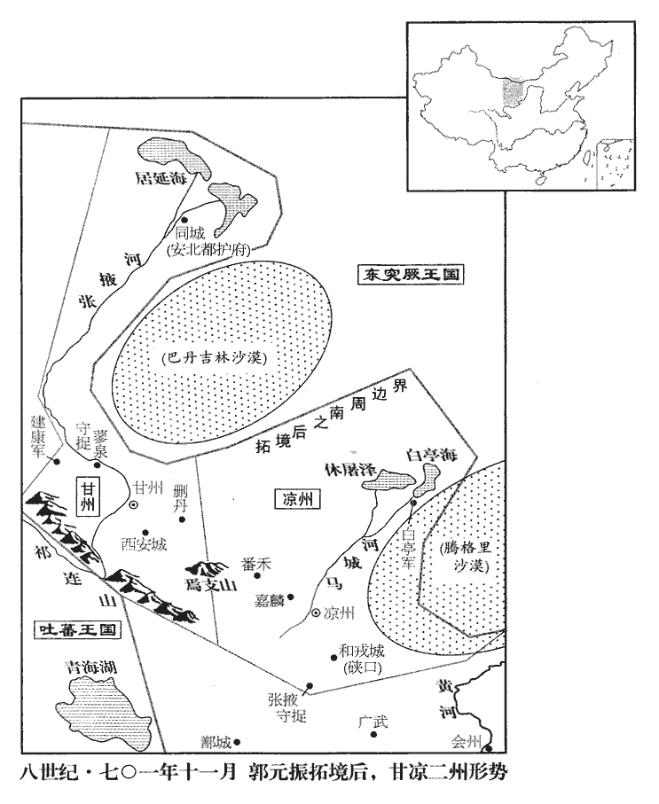
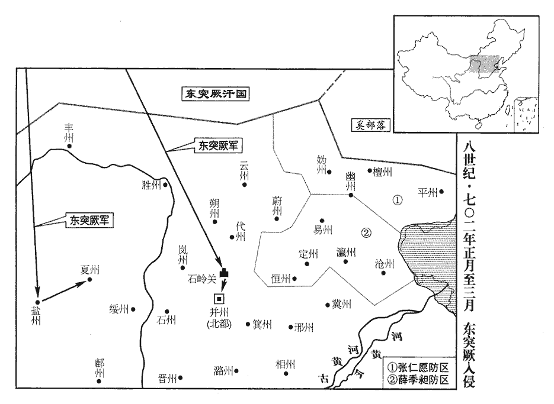
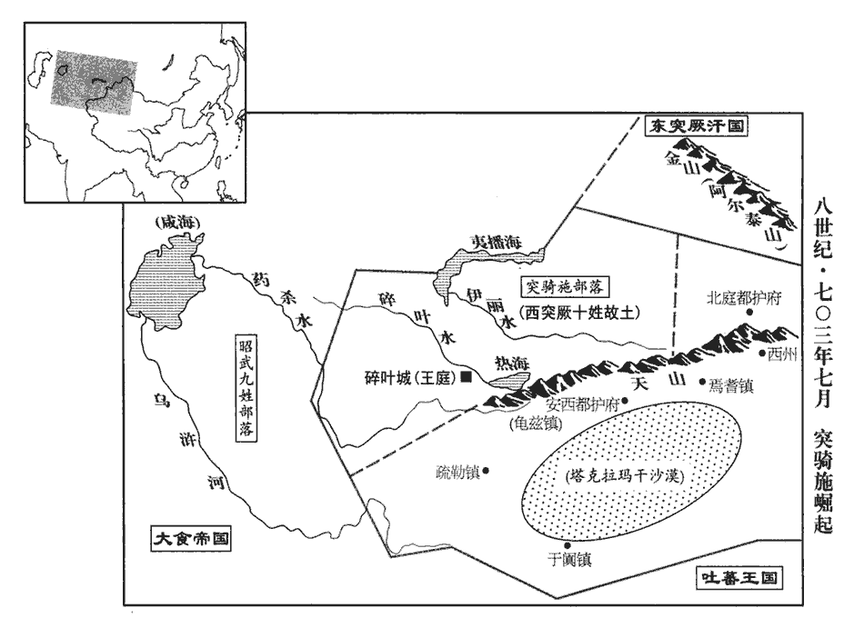

 唐紀二十三起上章困敦（庚子）七月，盡旃蒙大荒落（乙巳）正月，凡四年有奇。

# 則天順聖皇后下

## 久視元年（庚子、七零零）

1秋，七月，獻俘於含樞殿。李楷固獻契丹之俘也。含樞殿蓋在三陽宮‹河南省登封县东南›。太后以楷固為左玉鈐衛大將軍、燕國公，鈐，其廉翻。燕，因肩翻。賜姓武氏。召公卿合宴，召公卿，謂將帥合宴也。舉觴屬仁傑曰：屬，之欲翻。「公之功也。」將賞之，對曰：「此乃陛下威靈，將帥盡力，將帥，上即亮翻，下所類翻。臣何功之有！」固辭不受。

〖译文〗 [1]秋季，七月，李楷固献契丹俘虏于含枢殿。武则天任命李楷固为左玉钤卫大将军，封燕国公，赐姓武氏。武则天设宴款待诸位公卿，席间举杯对狄仁杰说：“这是您的功劳啊！”准备赏赐他，狄仁杰回答说：“此次平定契丹余党乃是由于陛下的声威以及将帅竭忠尽力所致，我又有什么功劳呢？”坚决推辞，不接受赏赐。

2閏月，戊寅‹二›，車駕還宮。自三陽宮還洛陽宮。

〖译文〗 [2]闰月，戊寅（初二），武则天自三阳宫回到洛阳宫。

3己丑‹十三›，以天官侍郎張錫為鳳閣侍郎、同平章事。鸞臺侍郎、同平章事李嶠罷為成均祭酒。錫，嶠之舅也，故罷嶠政事。

〖译文〗 [3]己丑（十三日），武则天任命天宫侍郎张锡为凤阁侍郎、同平章事；鸾台侍郎、同平章事李峤被罢免为成均祭酒。因为张锡是李峤的舅父，所以免去李峤的宰相职务。

4丁酉‹二十一›，吐蕃‹首都逻些城西藏拉萨市›將麴莽布支寇涼州‹甘肃省武威市›，圍昌松‹甘肃省古浪县西北›，吐，從暾入聲。將，即亮翻。昌松縣即漢武威郡蒼松縣，呂光改為昌松。隴右‹陇山以西›諸軍大使唐休璟與戰於港【章：十二行本「港」作「洪」：乙十一行本同；孔本同。】源谷‹甘肃省永登县西北›。使，疏吏翻。璟，居永翻。麴莽布支兵甲鮮華，休璟謂諸將曰：「諸論既死，諸論死見上卷聖曆二年。麴莽布支新為將，不習軍事，【章：十二行本「事」下有「諸貴臣子弟皆從之」八字；乙十一行本同；孔本同；張校同；退齋校同。】望之雖如精銳，實易與耳，請為諸君破之。」乃被甲先陷陳，易，以豉翻。為，于偽翻。被，皮義翻。陳，讀曰陣。六戰皆捷，吐蕃大奔，斬首二千五百級，獲二裨將而還。還，音旋，又如字。

〖译文〗 [4]丁酉（二十一日），吐蕃将领莽布支进犯凉州，包围了昌松。唐陇右诸军大使唐休与莽布支在洪源谷交战。莽布支的军队兵器盔甲明亮，唐休对他手下的部将们说：“吐蕃掌权的论钦陵兄弟都已经被杀，莽布支初次领兵打仗，还不熟悉军事。所以虽然吐蕃军队看起来好像是精锐之师，但实际上却容易对付，让我先击破他们。”于是披挂上阵，率先攻破莽布支军队的防线，并连续六战皆捷，吐蕃兵溃不成军。唐休共斩敌人首级二千五百个，俘获吐蕃两员裨将，然后收兵。

5司府少卿楊元亨，光宅元年，改太府寺為司府寺。尚食奉御楊元禧，皆弘武之子也。楊弘武見二百一卷高宗乾封二年。元禧嘗忤張易之，忤，五故翻。易之言於太后：「元禧，楊素之族：素父子，隋之逆臣，子孫不應供奉。」太后從之，壬寅‹二十六›，制：「楊素及其兄弟子孫皆不得任京官。」左遷元亨睦州‹浙江省建德市›刺史，元禧貝【嚴：「貝」改「資」。】州‹河北省清河县›刺史。馬何羅為逆於漢武之時，而馬援貴顯於東都再造之日。沈充失身於王敦，而沈勁盡節於司馬。惡惡止其身，追罪異代之臣而併棄其子孫，此蓋出於一時之愛憎，姑以是說而藉口耳。睦州，京師東南三千六百五十九里，至東都二千八百二十一里。貝州，京師東北一千七百八十二里，至東都九百九十三里。

〖译文〗 [5]司府少卿杨元亨和尚食奉御杨元禧，都是杨弘武的儿子。杨元禧曾经触犯过张易之。张易之因此对武则天说：“杨元禧是杨素的族人，而杨素父子又是隋朝的逆臣，他们的子孙不应该在皇帝身边供职。”武则天采纳了张易之的建议，于壬寅（二十六日）颁下制书：“杨素及其兄弟的子孙都不许担任京官。”并将杨元亨降职为睦州刺史，将杨元禧降职为贝州刺史。

6庚戌‹五›，以魏元忠為隴右‹陇山以西›諸軍大使，擊吐蕃。

〖译文〗 [6]庚戌（疑误），武则天任命魏元忠为陇右诸军大使，进攻吐蕃。

7庚申‹十五›，太后欲造大像，使天下僧尼日出一錢以助其功。尼，女夷翻。狄仁傑上疏諫，其略曰：「今之伽藍，上，時掌翻。疏，所去翻。伽藍，佛寺也，梵語云僧伽藍摩。僧伽藍摩，猶中華言眾園也。伽，求加翻。制過宮闕。功不使鬼，止在役人，物不天來，終須地出，不損百姓，將何以求！」又曰：「游僧皆託佛法，詿誤生人；詿guà，戶卦翻。里陌動有經坊，闤闠亦立精舍。崔豹古今註；闤，市垣；闠，市門。闤huán，戶關翻。闠huì，戶對翻。化誘所急，切於官徵；誘，昔酉。法事所須，嚴於制敕。」又曰：「梁武‹萧衍›、簡文‹萧纲›捨施無限，施，式豉翻。及三淮‹江淮地区›沸浪，五嶺‹南岭›騰煙，用太宗詔中語。列剎盈衢，無救危亡之禍，剎，初鎋翻。緇衣蔽路，豈有勤王之師！」又曰：「雖斂僧錢，百未支一。尊容既廣，不可露居，覆以百層，覆，敷又翻。尚憂未遍，自餘廊宇，不得全無。如來設教，以慈悲為主，釋氏謂佛為如來。豈欲勞人，以存虛飾！」又曰：「比來水旱不節，比，毗至翻。當今邊境未寧，若費官財，又盡人力，一隅有難，將何以救之！」難，乃旦翻。太后曰：「公教朕為善，何得相違！」遂罷其役。

〖译文〗 [7]庚申（疑误），武则天要建造一尊大佛像，让全国的和尚尼姑每人每天捐出一文钱来，以促成其事。狄仁杰上疏谏阻，奏疏的大意是：“当今的佛教寺院，在建筑规模上已经超过皇帝的宫殿。营建这些寺院无法借助鬼神之助，只能依靠百姓出力。物资不会从天而降，终究来自地里，不靠损害百姓，那么又怎能得到这些东西呢？”他又说：“游方和尚都依托佛法，贻误百姓，他们动不动就在里巷修建经坊，连市场里也盖起佛寺。佛教教化诱导众生所急需之物，被看成比官府征收赋税还急迫，僧尼作法事所需物品，也被看成比皇帝的敕令还紧急。”他还说：“梁武帝、简文帝父子对佛寺的施舍无限，等到三淮、五岭叛乱迭起的时候，大街上鳞次栉比的寺院佛塔，无法挽救身危国亡之祸；到处都是和尚尼姑，又哪里有勤王救主之师！”他又说：“陛下即使收齐了僧侣所捐助的资金，但这笔钱还不够建造佛像所需费用的百分之一。再说佛像庞大，不能露居旷野，即使修建一座百层高的殿堂，还担心不能将它完全遮盖，况且其他堂前廊屋，也不能一点都不建啊！如来佛创立佛教，以大慈大悲为宗旨，哪里要劳民伤财，以设置浮华无实用的装饰！”又说：“近年来水旱灾害时有发生，边境又不安宁，如果为修建大佛像而耗费国库资财，又用尽民力，那么万一哪一个角落有灾难，陛下将用什么去救援呢？”武则天说：“您劝导我行善，我又怎么能违背您的意愿呢？”于是停止了修建大佛像的工程。

8阿悉吉薄露叛，阿悉吉，即西突厥弩失畢五俟斤之阿悉結也；薄露，其名遣左金吾將軍田揚名、殿中侍御史封思業討之。軍至碎葉，薄露夜於城傍剽掠而去，思業將騎追之，反為所敗。剽，匹妙翻。將，即亮翻。騎，奇寄翻。敗；補邁翻。揚名引西突厥斛瑟羅之眾攻其城，旬餘，不克。九月，薄露詐降，思業誘而斬之，降，戶江翻。誘，音酉。遂俘其眾。

〖译文〗 [8]西突厥的阿悉吉薄露发动叛乱，武则天派左金吾将军田扬名和殿中侍御史封思业前往征讨。等到唐军来到碎叶城时，阿悉吉薄露已趁夜在城边大肆劫掠之后逃离。封思业率骑兵追击，反而被薄露所击败。田扬名率西突厥斛瑟罗部落的军队攻打薄露所占据的城池，历时十余日未能攻克。九月，薄露假意投降，封思业将计就计，趁机将其斩首，因而俘获了他的全部人马。

9太后信重內史梁文惠公狄仁傑，群臣莫及，常謂之國老而不名。仁傑好面引廷爭，好，呼到翻。爭，讀曰諍。太后每屈意從之。嘗從太后遊幸，遇風吹仁傑巾墜，而馬驚不能止，太后命太子‹李显›追執其鞚而繫之。鞚，苦貢翻。仁傑屢以老疾乞骸骨，太后不許。入見，常止其拜，見，賢遍翻。曰：「每見公拜，朕亦身痛。」仍免其宿直，戒其同僚曰：「自非軍國大事，勿以煩公。」辛丑‹二十六›，薨‹狄仁杰享年七十一岁›，太后泣曰：「朝堂空矣！」自是朝廷有大事，眾或不能決，太后輒歎曰：「天奪吾國老何太早邪！」

〖译文〗 [9]武则天十分信任和推重内史梁文惠公狄仁杰，没有哪一个大臣能比得上。她常常称狄仁杰为国老，而不是直呼其名。狄仁杰习惯于在朝堂上当面直言规谏，武则天则常常采纳他的建议，即使这样做违背了自己的本意时也是如此。有一次狄仁杰陪同武则天巡游，途中遇到大风，狄仁杰的头巾被风吹落在地，他的坐骑也因受惊而无法驾驭，武则天让太子李显追上惊马，抓住它的笼头并将它拴好。狄仁杰曾屡次因年老多病的缘故而提出退休的请求，武则天都没有答应。武则天在狄仁杰入朝参见的时候，还常常阻止他行跪拜礼，说：“每当看到您行跪拜礼的时候，朕的身体都会感到痛楚。”武则天还免除了狄仁杰晚上在宫中轮流值班的义务，并告诫他的同僚们说：“如果没有十分重要的军国大事，都不要去打扰狄老先生。”辛丑（疑误），狄仁杰去世，武则天流着眼泪说：“朝堂上再也没有可以依靠的师长了！”此后朝廷一有大事，如果群臣无法决断，武则天就会叹息道：“老天为什么这么早就把我的国老夺走呢！”

太后嘗問仁傑：「朕欲得一佳士用之，誰可者？」仁傑曰：「未審陛下欲何所用之？」太后曰：「欲用為將相。」將，即亮翻。相，悉亮翻。仁傑對曰：「文學縕藉，縕，於問翻。藉，慈夜翻。則蘇味道、李嶠固其選矣。必欲取卓犖奇才，犖luò，呂角翻。則有荊州‹湖北省江陵县›長史張柬之，其人雖老‹本年七十六岁›，宰相才也。」太后擢柬之為洛州司馬。自大州長史進神州司馬，故曰擢。數日，又問仁傑，對曰：「前薦柬之，尚未用也。」太后曰：「已遷矣。」對曰：「臣所薦者可為宰相，非司馬也。」乃遷秋官侍郎；久之，卒用為相。卒，子恤翻。仁傑又嘗薦夏官侍郎姚元崇、監察御史曲阿‹江苏省丹阳市›桓彥範、太州‹陕西省华县›刺史敬暉等數十人，監，古衘翻。武德三年，以并州之太谷、祈祁縣置太州，六年，州廢；當是此時復置也。考異曰：梁公傳云：「張柬之、桓彥範、敬暉、崔玄暐、袁恕己皆公所薦。公嘗退食之後，謂五公曰：『所恨衰老，身先朝露，不得見五公盛事，冀各保愛，願盡本心。』五公心知目擊，懸悟公意。公寢疾，五公候問，偶對終日，竟無一言。少頃，流涕及枕，但相視而已。五公退出，遞不測其由。袁恕己曰：『豈不氣力轉羸，須問家事乎？』張柬之曰：『未聞大賢廢國謀家者也』斯須，命張柬之、袁恕己、桓彥範三公入，餘二公立於門外，曰：『向者無言，蓋以二公之故。此二公能斷而不能密，若先與議之，事必外泄，一泄之後，則國異而家亡也。至其時或不與共之，事亦不就。梁王三思掌權，可先收而後行也。不然，則必反生大禍。』狄公沒後，經歲餘，五公潛會於幽閒之處，敘公當時之言，重結盟約，徹饌之後，相顧欲言，未至其時，恐負前諾，欲言又止，前後數四。桓彥範乃敘其言。言猶未畢，聞戶牖之外，聲若雷霆，須臾風雨，咫尺莫辨，所坐牀褥悉擲於階下。五公戰懼，不知所據，乃相謂曰：『此是狄公忠烈之至，假此靈變以驚眾心，不欲吾輩先論此事，未至其時，不可復言也。』斯須，天清日明，不異於初。易之等既誅，袁謂張公曰：『昔有遺言，使先收三思，豈可捨諸？』張公曰：『但大事畢功，此是机上之物，豈有逃乎！』後梁王交通於內，五公果為所譖，俱遭流竄，所期興廢年月，遺約軌模少無異也。」按柬之等五人偶同時在位，協力立功，仁傑豈能預知其事，舉此五人，專欲使之輔立太子邪！且易之等若有可誅之便，太子有可立之勢，仁傑身為宰相，豈待五年之後，須柬之等然後發邪！此蓋作傳者因五人建興復之功，附會其事，云皆仁傑所舉，受教於仁傑耳。其言譎怪無稽，今所不取。舊傳惟著舉柬之、彥範、暉三人姓名，今從之。率為名臣。或謂仁傑曰：「天下桃李，悉在公門矣。」程大昌演繁露：趙簡子謂陽虎曰：「惟賢者為能報恩，不肖者不能矣。夫植桃李者，夏得休息，秋得其食；植蒺蔾者，夏不得休息，秋得其刺焉。今子之所得者，蒺藜也。」今世通以所薦士為桃李者，說皆本此。仁傑曰：「薦賢為國，非為私也。」為，于偽翻；下為之同。

〖译文〗 武则天曾经问狄仁杰：“朕希望能找到一位杰出的人才委以重任，您看谁合适呢？”狄仁杰问道：“不知道陛下想让他担任什么职务？”武则天说：“我想让他担任将相。”狄仁杰回答道：“如果您所要的是文采风流的人才，那么苏味道、李峤本来就是合适的人选。如果您一定要找出类拔萃的奇才，那就只有荆州长史张柬之了，他的年纪虽然老了一些，但却实实在在地是一位宰相之才。”武则天于是提拔张柬之作了洛州司马。过了几天之后，武则天又要求狄仁杰举荐人才，狄仁杰回答说：“我前几天推荐的张柬之，您还没有任用呢。”武则天说：“我已经给他升了官了。”狄仁杰回答说：“我所推荐的张柬之是可以作宰相的人才，不是用来作一个司马的。”武则天于是任命张柬之为秋官侍郎。过了很长时间，终于任命他为宰相。狄仁杰还先后向武则天推荐了夏官侍郎姚元崇、监察御史曲阿人桓彦范、太州刺史敬晖等数十人，后来这些人都成为唐代名臣。有人对狄仁杰说：“治理天下的贤能之臣，都出自您门下。”狄仁杰回答说：“举荐贤才是为国家着想，并不是为我个人打算。”

初，仁傑為魏州‹河北省大名县›刺史，見二百五卷萬歲通天元年。有惠政，百姓為之立生祠。後其子景暉為魏州司功參軍，貪暴為人患，人遂毀其像焉。史言狄仁傑盡忠，所以勸天下之為人臣；言其以景暉貪暴而毀祠，所以戒天下之為人子。

〖译文〗 起初，狄仁杰担任魏州刺史，因为他施政仁爱宽厚，所以魏州百姓为他建造了生祠。后来他的儿子狄景晖担任魏州司功参军，贪婪残暴，成了百姓的祸害，于是老百姓又捣毁了狄仁杰的塑像。

10冬，十月，辛亥‹七›，以魏元忠為蕭關道‹宁夏同心县东南›大總管，以備突厥‹瀚海沙漠群›。蕭關在原州平高縣界，貞觀六年，以突厥降戶置緣州，治平高之他樓城。高宗置他樓縣，神龍元年省，更置蕭關縣。厥，九勿翻。

〖译文〗 [10]冬季，十月，辛亥（初七），武则天任命魏元忠为萧关道大总管，目的是为了防备突厥的侵扰。

11甲寅‹十›，制復以正月為十一月，一月為正月。以十一月為正月，事見二百四卷天授元年。以一月為正月，用夏正建寅也。復，扶又翻。赦天下。

〖译文〗 [11]甲寅（初十），武则天颁下制书，又重新以正月为十一月，以一月为正月，并大赦天下。

12丁巳‹十三›，納言韋巨源罷，以文昌右丞韋安石為鸞臺侍郎、同平章事。納言，侍中。文昌右丞，尚書右丞。鸞臺，門下。安石，津之孫也。韋津死隋，事見一百八十五卷高祖武德元年。

〖译文〗 [12]丁巳（十三日），武则天免去纳言韦巨源的职务，任命文昌右丞韦安石为鸾台侍郎、同平章事。韦安石是韦津的孙子。

時武三思、張易之兄弟用事，安石數面折之。數，所角翻。折，之舌翻。嘗侍宴禁中，易之引蜀‹四川省›商宋霸子等數人在座同博。安石跪奏曰：「商賈賤類，不應得預此會。」顧左右逐出之，座中皆失色；太后以其言直，勞勉之，賈，音古。勞力到翻。同列皆歎服。考異曰：舊傳曰：「時鳳閣侍郎陸元方在座，退而告人曰：『此乃真宰相，非吾屬所及也。』」按新紀，元方已罷相。今不取。

〖译文〗 这时正值武三思和张易之兄弟执掌朝政，韦安石屡次当面驳斥他们。有一次韦安石在宫中陪武则天用膳，见张易之带进蜀地富商宋霸子等几个人在一起赌博，便向武则天跪拜奏道：“商贾之徒，名列贱籍，没有资格参加这样的宴会。”说完就让侍臣们将这几个人赶出去，在座的臣僚们都吓得变了脸色。由于韦安石敢于直言规谏，武则天特意对他慰劳嘉勉，他的同僚也因此而对他十分钦佩。

13丁卯‹二十三›，太后幸新安‹河南省新安县›；壬申‹二十八›，還宮。還，從宣翻，又音如字。

〖译文〗 [13]丁卯（二十三日），武则天巡幸新安；壬申（二十八日），又回到宫中。

14十二月，甲寅‹十›，突厥掠隴右‹陇山以西›諸監馬萬餘匹而去。厥，九勿翻。

〖译文〗 [14]十二月，甲寅（初十），突厥兵掠走陇右诸牧监畜养的军马一万多匹后撤离。

15時屠禁尚未解，禁屠見二百五卷長壽元年。鳳閣舍人全節‹山东省济南市东北›崔融上言，鳳閣，中書。全節縣，屬齊州，漢、晉之東平陵縣地；後魏曰平陵，屬濟南郡。貞觀十七年，齊王祐反，平陵人不從，更名全節。上，時掌翻。以為「割烹犧牲，弋獵禽獸，聖人著之典禮，不可廢闕。又，江南食魚，河西‹应是河北黄河以北›食肉，一日不可無；富者未革，貧者難堪。況貧賤之人，仰屠為生，日戮一人，終不能絕，但資恐喝，喝，呼葛翻。徒長姦欺。長，知兩翻。為政者苟順月令，合禮經，自然物遂其生，人得其性矣。」戊午‹十四›，復開屠禁，復，扶又翻，又音如字。祠祭用牲牢如故。

〖译文〗 [15]这时，有关杀猪宰羊以及捕鱼捞虾的禁令还没有解除，担任凤阁舍人职务的全节县人崔融进言，认为：“宰割烹调牲畜和猎杀飞禽走兽，已被圣人写入礼制典章，不可废弃和缺少。况且鱼和肉分别是江南人和河西人必备的食品，一天也不能没有它们；富人的生活习惯无法改变，穷人也无法忍受终日不见鱼肉的生活；再说贫穷卑贱的屠户，一直都是把屠宰当作衣食之源的。所以即使陛下每天都要处死一个敢于违反禁令的人，终究不可能真正有效地实施禁止屠宰捕鱼的法令，只不过助长要挟恐赫和奸诈行为而已。治理国家的人行事如果真正能够顺应自然气候的变化，合乎礼经的规定，自然会使万物的生长符合其本身的规律，百姓也能够各按他们的本性生活。”戊午（十四日），武则天下诏废除有关屠宰捕鱼的禁令，祭祀时仍然像往常那样用牛羊猪等牺牲作祭品。

## 長安元年（辛丑、七零一）是年十月始改元長安。

1春，正月，丁丑‹三›，以成州‹甘肃省礼县南›言佛迹見，見，賢遍翻。改元大足。自此以後，是大足元年。考異曰：朝野僉載云：「司刑寺囚三百餘人，秋分後無計可作，乃於圓獄外羅牆角邊作聖人迹五尺，至夜半，三百人一時大叫。內使推問，云『昨夜有一聖人見，身長三丈，面作金色，云：「汝等並冤枉，不須怕懼，天子萬年，即有恩赦放汝」』把火照之，見有偽跡，即大赦天下，改為大足元年。識者相謂曰：『武家理，天下足也。』」按改元在春，不在秋；又無赦。今不取。

〖译文〗 [1]春季，正月，丁丑（初三），由于成州说发现了佛的足迹的缘故，武则天改年号为大足。

2二月，己酉‹六›，以鸞臺侍郎柏人‹河北省隆尧县西尧山镇›李懷遠同平章事。鸞臺，門下。柏人縣，自漢以來屬鉅鹿郡；鉅鹿，唐邢州，天寶改曰堯山縣。

〖译文〗 [2]二月，己酉（初六），武则天任命鸾台侍郎柏人县人李怀远为同平章事。

3三月，鳳閣侍郎、同平章事張錫坐知選漏泄禁中語，贓滿數萬，當斬，臨刑釋之，流循州‹广东省惠州市›。舊志：循州至東都四千八百里。選，須絹翻。時蘇味道亦坐事與錫俱下司刑獄，下，遐稼翻。錫乘馬，意氣自若，舍于三品院，先是，制獄既繁，司刑寺別置三品院以處三品以上官之下獄者。帷屏食飲，無異平居。味道步至繫所，席地而臥，蔬食而已。太后聞之，赦味道，復其位。

〖译文〗 [3]三月，凤阁侍郎、同平章事张锡因主持铨选时泄漏宫中语以及非法获取财物达数万之多而获罪，应当斩首，等到即将行刑之际又被免除死罪，流放循州。当时苏味道也因事犯罪与张锡一起入司刑寺监狱。在去监狱的路上，张锡骑在马上，神态自若，直接住进专门为犯罪的三品以上官员准备的三品院中，帷帐的张设和饮食的排场，与平时完全相同。苏味道则是徒步走到羁押场所，夜晚睡在冰凉的地板上，每顿只吃蔬菜。武则天听说了这件事之后，下令赦免苏味道的罪，并恢复了他的原任职务。

4是月，‹洛阳›大雪，蘇味道以為瑞，帥百官入賀。帥，讀曰率。殿中侍御史王求禮止之曰：「三月雪為瑞雪，臘月雷為瑞雷乎？」味道不從。既入，求禮獨不賀，進言曰：「今陽和布氣，草木發榮，而寒雪為災，豈得誣以為瑞！賀者皆諂諛之士也。」太后為之罷朝。為，于偽翻；下同。考異曰：統紀在延載元年，僉載在久視二年。統紀云「左拾遺」，僉載云「侍御史」。御史臺記云「殿中侍御史」。統紀云「味道無以對」。舊傳云「求禮止之，味道不從」。今年從僉載，官從臺記，事則參取諸書。

〖译文〗 [4]就在这个月，突然降下大雪，苏味道认为这是吉兆，便带领文武百官入朝祝贺。殿中侍御史王求礼上前制止，他说：“如果说阳春三月下的雪是瑞雪，那么寒冬腊月打雷就应该是瑞雷啦！”苏味道不听劝阻。入朝之后，惟独王求礼不但不称贺，反而向武则天进言道：“现在正是春天温暖的气息散发、草木生长开花的季节，而突然降下大雪会成为灾害，怎么能歪曲说这场大雪象征着吉兆呢？称贺的人都是阿谀奉承之辈。”武则天因此而罢朝。

時又有獻三足牛者，宰相復賀。復，扶又翻。求禮颺言曰：孔安國曰：大言而疾曰颺。颺，余章翻。「凡物反常皆為妖。妖，於喬翻。此鼎足非其人，三公鼎足承君。政教不行之象也。」太后為之愀然。愀qiǎo，七小翻。

〖译文〗 这时又有人来献一头三条腿的牛，宰相们又一次入朝称贺。王求礼大声疾呼：“反常的东西都算妖，出现三足牛的现象，是三公没有合适的人选以及国家的刑赏教化没有得到实行的象征。”武则天听完之后愁容满面。

5夏，五月，乙亥‹三›，太后‹武曌，本年七十八岁›幸三陽宮‹河南省登封县东南›。

〖译文〗 [5]夏季，五月，乙亥（初三），武则天住进了三阳宫。

6以魏元忠為靈武道行軍大總管，以備突厥。

〖译文〗 [6]武则天任命魏元忠为灵武道行军大总管，目的是为了防备突厥的侵扰。

7天官侍郎鹽官‹浙江省海宁市西南盐官镇›顧琮同平章事。鹽官縣，漢屬吳郡，吳屬嘉興，置海昌都尉；梁、陳屬錢塘郡，隋屬餘杭郡，唐屬杭州。

〖译文〗 [7]天官侍郎盐官县人顾琮任同平章事。

8六月，庚申‹十九›，以夏官尚書李迥秀同平章事。

〖译文〗 [8]六月，庚申（十九日），武则天任命夏官尚书李迥秀为同平章事。

迥秀性至孝，其母本微賤，妻崔氏常叱媵婢，母聞之不悅，迥秀即時出之。迥，戶頃翻。媵，以證翻。或曰：「賢室雖不避嫌疑，然過非七出，律，妻犯七出者棄之：一無子，二淫佚，三不事舅姑，四口舌，五竊盜，六妬忌，七惡疾。何遽如是？」迥秀曰：「娶妻本以養親；今乃違忤顏色，養，余亮翻。忤，五故翻。安敢留也！」竟出之。

〖译文〗 李迥秀生性极为孝顺，他的母亲原来出身卑微低贱，李迥秀的妻子崔氏经常大声呵斥陪嫁使女，他母亲听到后感到不快，迥秀便立即将崔氏休弃。有人对他说：“您的妻子虽然不善避开嫌疑，但她的过失不属于休妻七条，为什么您匆忙把她休弃了呢？”李迥秀回答说：“娶妻的目的本来就是为了侍养双亲，现在她却惹得母亲不高兴，我哪里还敢把她留在家中呢！”终于还是将崔氏休弃了。

9秋，七月，甲戌‹三›，太后還宮。

〖译文〗 [9]秋季，七月，甲戌（初三），武则天回到宫中。

10甲申‹十三›，李懷遠罷為秋官尚書。

〖译文〗 [10]甲申（十三日），李怀远被罢免为秋官尚书。

11八月，突厥默啜寇邊，命安北大都護‹都护府侨设内蒙古和林格尔县›相王‹李旦›為天兵道‹山西省太原市›元帥，相，悉亮翻。帥，所類翻。統諸軍擊之，未行而虜退。

〖译文〗 [11]八月，突厥阿史那默啜进犯边境，武则天派安北大都护相王李旦任天兵道元帅，统率众路大军迎击，还没有等到发兵，突厥即已退军。

12丙寅‹二十六›，武邑‹河北省武邑县›人蘇安恆上疏曰：「陛下欽先聖‹李治›之顧託，受嗣子‹李旦›之推讓，先聖，謂大帝。嗣子，謂皇嗣相王。恆，戶登翻。上，時掌翻。疏，所去翻；下同。推，吐雷翻。敬天順人，二十年矣。豈不聞帝舜‹姚重华›褰裳，周公‹姬旦›復辟！舜之於禹‹姒文命›，事祗族親；旦與成王‹姬诵›，不離叔父。史記，舜，黃帝之八代孫，禹，黃帝之玄孫，故云族親。周公，武王之弟，成王之叔父；旦，其名也。離，力智翻。族親何如子之愛，叔父何如母之恩？今太子‹李显›孝敬是崇，春秋既壯‹本年四十六岁›，若使統臨宸極，何異陛下之身！陛下年德既尊，寶位將倦，機務煩重，浩蕩心神，何不禪位東宮，自怡聖體！自昔理天下者，不見二姓而俱王也。當今梁、定、河內、建昌諸王，武三思封梁王，攸暨封定王，懿宗封河內王，攸寧封建昌王。承陛下之蔭覆，覆，敷又翻。並得封王；臣謂千秋萬歲之後，於事非便，臣請黜為公侯，任以閒簡。臣又聞陛下有二十餘孫，今無尺寸之封，此非長久之計也；臣請分土而王之，擇立師傅，教其孝敬之道，以夾輔周室，屏藩皇家，斯為美矣。」屏，卑郢翻。疏奏，太后召見，見，賢遍翻。賜食，慰諭而遣之。

〖译文〗 [12]丙寅（初六），武邑人苏安恒上疏道：“陛下钦仰先帝的临终嘱托，接受太子的辞让，上敬天意，下顺民心，至今已有二十年了。难道陛下没有听说过帝舜撩起衣裳、离开帝位，和周公归政于成王的事情吗！帝舜和大禹之间，仅仅是同族亲属的关系；周公旦与周成王之间，也不过是叔侄关系。同族亲属之间的感情哪里能与亲生儿子对母亲的敬爱相比，叔父对于侄子又哪里能够比得上母亲对儿子的情分？现在太子尊崇孝亲敬上之道，又已到壮年，如果让他即皇帝位，治理国家，与陛下自居帝位又能有什么区别！陛下的年纪与德望都很高了，身居帝位将感到疲倦，需要处理的事务十分烦重，会使您心神耗竭，无从思虑，陛下为什么不将帝位禅让给太子，以追求御体的安康愉悦呢！自古以来治理天下，不曾见过两个不同姓氏的家族成员同时被封为王的，而现在梁王武三思、定王武攸暨、河内王武懿宗、建昌王武攸宁等，承蒙陛下的荫庇，都被封为王。臣以为这件事在陛下百年之后，将会非常不利，因此我请求陛下将他们降为公侯，并任命他们担任清闲的职务。此外，我还听说陛下有二十多个孙子，至今仍然没有得到任何封号，这也同样不是长久之计，所以臣请求陛下把他们分封为王，为他们选择师傅，以教导他们孝亲敬上之道，使他们能辅佐大周皇室，成为国家的屏障，这就完美无缺了。”奏疏进呈后，武则天召见了他，并赐给酒饭，用好话慰解之后送他出宫。

13太后春秋高‹本年七十八岁›，政事多委張易之兄弟；邵王重潤與其妹永泰郡主‹李仙蕙›、主壻魏王武延基竊議其事。重，直龍翻。易之訴於太后，九月，壬申‹三›，太后皆逼令自殺。考異曰：重潤傳云：「重潤為人所構，與其妹永泰郡主壻魏王武延基等竊議張易之兄弟何得恣入宮中；則天令杖殺。」今從實錄。延基，承嗣之子也。承嗣，太后之姪。

〖译文〗 [13]武则天年事已高，朝廷政事多让张易之兄弟去处理；邵王李重润和他的妹妹永泰郡主及永泰郡主的丈夫魏王武延基在私下议论此事。张易之把这件事告诉了武则天。九月，壬申（初三），武则天副迫邵王李重润、永泰郡主及魏王武延基自杀。武延基，是武则天的侄子武承嗣之子。

14丙申‹二十七›，以相王‹李旦›知左、右羽林衛大將軍事。

〖译文〗 [14]丙申（二十七日），武则天任命相王李旦主持左、右羽林卫大将军的事务。

15冬，十月，壬寅‹三›，太后西入關‹陕西省潼关县›，辛酉‹二十二›，至京師‹西安›；赦天下，改元。改元長安。

〖译文〗 [15]冬季，十月，壬寅（初三），武则天西行入潼关，辛酉（二十二日），到达京城长安；下诏赦免天下罪犯，改年号为长安。

16十一月，戊寅‹十›，改含元宮為大明宮。長安東內本曰大明宮，高宗龍朔三年曰蓬萊宮，咸亨元年曰含元宮，今復舊名。

〖译文〗 [16]十一月，戊寅（初十），武则天把含元宫改名为大明宫。

17天官侍郎安平‹河北省安平县›崔玄暐，安平縣，漢屬涿郡，後漢屬安平國，後魏屬博陵郡，唐屬定州。性介直，未嘗請謁。執政惡之，惡，烏路翻。改文昌左丞。月餘，太后謂玄暐曰：「自卿改官以來，聞令史設齋自慶。唐吏部四司令史八十人。此欲盛為姦貪耳；今還卿舊任。」乃復拜天官侍郎，復，扶又翻，又如字。仍賜綵七十段。唐制，凡賜十段，其率絹三匹，布三端，綿四屯；若雜綵十段，則絲布二匹，紬chóu二匹，綾二匹，縵四匹。

〖译文〗 [17]天官侍郎安平县人崔玄，性情耿直，从来不向权贵请托求见。这些人讨厌他，于是让他改任文昌左丞。一个多月之后，武则天对崔玄说：“我听说自从你改任文昌左丞之后，你原来属下的令史等官吏纷纷准备斋食施给僧尼以示庆贺，看起来他们是想大干贪赃枉法的事呀！所以现在我让你官复原职。”于是重新任命崔玄为天官侍郎，还赏赐他彩色丝织物七十段。

18以主客郎中郭元振為涼州‹总部设甘肃省武威市›都督、隴右‹陇山以西›諸軍大使。唐主客郎掌二王後及諸蕃朝聘之事，屬禮部。使，疏吏翻。

〖译文〗 [18]武则天任命主客郎中郭元振为凉州都督、陇右诸军大使。

 

先是，涼州‹甘肃省武威市›南北境不過四百餘里，先，悉薦翻。突厥、吐蕃頻歲奄至城下，百姓苦之。元振始於南境硤口置和戎城‹甘肃省古浪县›，北境磧中置白亭軍‹甘肃省民勤县东北白亭海南岸›，杜佑曰：白亭守捉在涼州城西北五百里。磧，七跡翻。控其衝要，拓州境千五百里，自是寇不復至城下。復，扶又翻。元振又令甘州‹甘肃省张掖市›刺史李漢通開置屯田，盡水陸之利。舊涼州粟麥斛至數千，及漢通收率之後，收率者，收民而率其耕。一縑jiān糴數十斛，積軍糧支數十年。元振善於撫御，在涼州五年，夷、夏畏慕，令行禁止，牛羊被野，夏，戶雅翻。被，皮義翻。路不拾遺。

〖译文〗 在此之前，凉州全境南北不过四百多里，突厥和吐蕃的兵马连年都经常突然出现在州城下，老百姓为此而受苦。郭元振开始在凉州南部边境的硖口修筑和戎城，在北部边境的沙漠中设置白亭军，控制了凉州的交通要道，将凉州边境拓展了一千五百里，从此突厥、吐蕃的兵马无法再前来州城侵扰。郭元振又让甘州刺史李汉通实行屯田政策，充分利用当地的河流土地从事农业生产。以往凉州地区的谷子和小麦每斛值数千钱，到了李汉通募民垦种土地之后，一匹细绢就可以换到数十斛粮，积存在军粮可供数十年之用。郭元振擅长安抚统治百姓，在凉州任职的五年中，深受当地各族百姓敬畏，真正做到了令行禁止，所畜养的牛羊漫山遍野，境内路不拾遗。

## 二年（壬寅、七零二）

1春，正月，乙酉‹十七›，初設武舉。武舉之制，有長垛、馬射、步射、平射、筒射、馬槍、翹關、負重、身材之選。唐六典曰：武舉以七等閱其人：一曰射長垛，試射長垛三十發不出第三院為第，入中院為上，入次院為次上，入外院為次。二曰騎射，發而並中為上，或中或不中為次上，總不中為次。三曰馬槍，三板四板為上，二板為次上，一板及不中為次。四曰步射，射草人中者為次上，雖中而不法，雖法而不中者為次。五曰材貌，以身長六尺已上者為次上，已下為次。六曰言語，有神采堪統領者為次上，無者為次。七曰舉重，謂翹關，率以五次上為第。皆試其高第以名聞。

〖译文〗 [1]春季，正月，乙酉（十七日），武则天第一次在科举考试中增设武举。

2突厥‹瀚海沙漠群›寇鹽‹陕西省定边县›、夏‹陕西省靖边县北白城子›二州。三月，庚寅‹二十三›，突厥破石嶺‹山西省忻州市南›，忻州定襄縣有石嶺關。杜佑曰；定襄縣本漢陽曲縣，有石嶺關甚險固。漢定襄郡在今馬邑郡地。寇并州‹北都·山西省太原市›。以雍州長史薛季昶攝右臺大夫，充山東‹崤山以东›防禦軍大使，滄‹河北省沧州市东南›，瀛‹河北省河间市›、幽‹北京市›、易‹河北省易县›，恆‹河北省正定县›、定‹河北省定州市›等州諸軍皆受季昶節度。使，疏吏翻。恆，戶登翻。夏，四月，以幽州刺史張仁愿專知幽、平‹河北省卢龙县›、媯‹河北省怀来县›、檀‹北京市密云县›防禦，媯，居為翻。仍與季昶相知，以拒突厥。

〖译文〗 [2]突厥兵进犯盐州和夏州。三月，庚寅（二十三日），突厥兵攻破石岭关，进犯并州。武则天任命雍州长史薛季昶为代理右台大夫，充任山东防御军大使，沧州、瀛州、幽州、易州、恒州、定州等处兵马都归他指挥调度。夏季，四月，武则天又指派幽州刺史张仁愿专门主持幽州、平州、妫州、檀州的军事防御工作，并且让他与薛季昶互相配合，以抵御突厥军队的进犯。

 

3五月，壬申‹六›，蘇安恆復上疏曰；復，扶又翻。「臣聞天下者，神堯‹李渊›、文武‹李世民›之天下也，高祖，神堯皇帝；太宗，文武皇帝。陛下雖居正統，實因唐氏舊基。當今太子‹李显›追迴，謂召廬陵王自房陵回，復為太子。年德俱盛，陛下貪其寶位而忘母子深恩，將何聖顏以見唐家宗廟，將何誥命以謁大帝‹李治›墳陵？高宗稱天皇大帝。陛下何故日夜積憂不知鍾鳴漏盡！魏田豫告老曰：譬猶鍾鳴漏盡而夜行不休，此罪人也。臣愚以為天意人事，還歸李家。陛下雖安天位，殊不知物極則反，器滿則傾。臣何惜一朝之命而不安萬乘之國哉！」言不顧其死而上疏，欲以安國也。乘，繩證翻。太后‹武曌，本年七十九岁›亦不之罪。

〖译文〗 [3]五月，壬申（初六），苏安恒再次上疏说：“臣听说这天下是高祖神尧皇帝和太宗文武皇帝的天下，陛下虽居皇帝之位，但实际所依靠的毕竟是大唐旧有的基业。现在太子重新得立，正当壮年，品德高尚，陛下因贪恋皇位而忘却母子之间的深厚恩情，将以什么脸面去见供奉在宗庙之中的大唐列祖列宗，又将以何种身份去谒见大唐高宗皇帝的陵寝？陛下为什么还要日夜忧虑国事，而不明白自己已到了晨钟已响、夜漏将尽的暮年！臣愚昧，以为天意人心，都希望将皇位归还李家。陛下只安于皇位，很不明白物极必反、器满则倾的道理！臣为了使社稷长治久安，又怎么能顾惜个人的短暂生命呢！”武则天也没有加罪于他。

4乙未‹二十九›，以相王‹李旦›為并州‹山西省大原市›牧，充安北道行軍元帥，帥，所類翻。以魏元忠為之副。

〖译文〗 [4]乙未（二十九日），武则天任命相王李旦为并州牧，充任安北道行军元帅，任命魏元忠作他的副职。

5六月，壬戌‹二十六›，召神都‹洛阳›留守韋巨源詣京師‹西安›，以副留守李嶠代之。守，手又翻。

〖译文〗 [5]六月，壬戌（二十六日），武则天将神都留守韦巨源召到京师长安，指派神都副留守李峤代行他的职务。

6秋，七月，甲午‹二十九›，突厥寇代州‹山西省代县›。

〖译文〗 [6]秋季，七月，甲午（二十九日），突厥兵进犯代州。

7司僕卿張昌宗光宅元年，改太僕寺為司僕寺。兄弟貴盛，勢傾朝野。朝，直遙翻。八月，戊午‹二十三›，太子、相王、太平公主上表請封昌宗為王，制不許；壬戌‹二十七›，又請，乃賜爵鄴國公。

〖译文〗 [7]司仆卿张昌宗兄弟贵显已极，权倾朝野。八月，戊午（二十三日），太子李显、相王李旦、太平公主上表，请求封张昌宗为王，武则天拒绝了这一建议；壬戌（二十七），这些人又请求封张昌宗为王，武则天才答应赐张昌宗为邺国公。

8敕：「自今有告言揚州及豫、博餘黨，揚州事見二百三卷光宅元年。豫、博事見二百四卷垂拱四年。一無所問，內外官司無得為理。」為，于偽翻。

〖译文〗 [8]武则天颁下敕书：“从现在起如果再有揭发光宅元年扬州徐敬业谋反案以及垂拱四年豫州李贞、博州李冲父子谋反案余党的，都不必过问，朝廷内外各衙门一律不得受理。”

9九月，乙丑朔‹一›，日有食之，不盡如鉤，神都見其既。

〖译文〗 [9]九月，乙丑朔（初一），出现日食，没有全食，还看到像镰刀一样的形状，在神都能见到日全食。

10壬申‹八›，突厥寇忻州‹山西省忻州市›。

〖译文〗 [10]壬申（初八），突厥兵进犯忻州。

11己卯‹十五›，吐蕃‹首都逻些城西藏拉萨市›遣其臣論彌薩來求和。薩，桑葛翻。

〖译文〗 [11]己卯（十五日），吐蕃派大臣论弥萨前来求和。

12庚辰‹十六›，以太子賓客武三思為大谷道大總管，洛州長史敬暉為副；辛巳‹十七›，又以相王旦為并州道元帥，三思與武攸宜、魏元忠為之副；姚元崇為長史，司禮少卿鄭杲為司馬；欲以擊突厥，然竟不行。

〖译文〗 [12]庚辰（十六日），武则天任命太子宾客武三思为大谷道大总管，任命洛州长史敬晖为武三思的副职；辛巳（十七日），武则天又任命相王李旦为并州道元帅，任命武三思与武攸宜、魏元忠三人为李旦的副职；任命姚元崇为长史，司礼少卿郑杲为司马，但是却没有赴任。

13癸未‹十九›，宴論彌薩於麟德殿。麟德殿在大明宮右銀臺門內；殿西重廊之後，即翰林院。是殿有三面，亦曰三殿。時涼州‹总部设甘肃省武威市›都督唐休璟入朝，亦預宴。璟，居永翻。朝，直遙翻。彌薩屢窺之。太后問其故，對曰：「洪源之戰，此將軍猛厲無敵，故欲識之。」太后擢休璟為右武威、金吾二衛大將軍。龍朔改左、右威衛曰左、右武威衛。休璟練習邊事，自碣石‹河北省昌黎县北›以西踰四鎮‹龟兹新疆库车县›、焉耆新疆焉耆县、于阗新疆和田市、疏勒新疆喀什市，緜亘萬里，山川要害，皆能記之。碣石在遼西，四鎮在西域。此言唐之西、北二邊，其山川要害，休璟皆能記之也。碣，其謁翻。亘，古鄧翻。

〖译文〗 [13]癸未（十九日），武则天在麟德殿宴请吐蕃大臣论弥萨。这时凉州都督唐休正好入朝，也参加了这次宴会。论弥萨屡次偷看唐休。武则天询问论弥萨这样做的原因，论弥萨回答说：“在洪源战役中，这位将军勇猛无敌，所以我想要认识他。”武则天提拔唐休为右武威、金吾二卫大将军。唐休极为熟悉边境地区的军政事务，自辽东碣石以西直至安西四镇以外绵延万里的山川险要之处，他都能记住。

14冬，十月，甲辰‹十›，天官侍郎、同平章事顧琮薨。

〖译文〗 [14]冬季，十月，甲辰（初十），天官侍郎、同平章事顾琮去世。

15戊申‹十四›，吐蕃贊普將萬餘人寇茂州‹四川省茂县›，將，即亮翻。都督陳大慈與之四戰，皆破之，斬首千餘級。

〖译文〗 [15]戊申（十四日），吐蕃赞普率领一万多人马进犯茂州，都督陈大慈与吐蕃军队四次交战，每次都打败了他们，共斩敌首一千余级。

16十一月，辛未‹八›，監察御史魏靖上疏，以為：「陛下既知來俊臣之姦，處以極法，監，古銜翻。上，時掌翻。疏，所去翻。處，昌呂翻。乞詳覆俊臣等所推大獄，伸其枉濫。」太后乃命監察御史蘇頲tǐng按覆俊臣等舊獄，由是雪免者甚眾。考異曰：松窗雜錄：「中宗嘗召宰相蘇瓌guī、李嶠子進見，二丞相子皆童年，迎撫於赭袍前，賜與甚厚。因語二兒曰：『爾宜意所通書，可為奏吾者言之。』頲應曰：『木從繩則正，后從諫則聖。』嶠子亡其名，亦進曰：『斮zhuó朝涉之脛，剖賢人之心。』上曰：『蘇瓌有子，李嶠無兒。』」按頲此年已為御史，瓌為相時頲為中書舍人，父子同掌樞密，非童年也。今不取。頲，夔之曾孫也。頲，他鼎翻。蘇夔，威之子，隋開皇初議樂。

〖译文〗 [16]十一月，辛未（初八），监察御史魏靖上疏认为：“陛下已了解来俊臣的奸邪，并将他处死。臣请求详细复核来俊臣等人当时所主持办理的重大案件，为那些受冤枉的人平反昭雪。”武则天于是指派监察御史苏复核来俊臣等人所处理的案件，很多人因此而得以免罪昭雪。苏，是苏夔的曾孙。

17戊子‹二十五›，太后祀南郊，赦天下。

〖译文〗 [17]戊子（二十五日），武则天到南郊祭祀，大赦天下罪人。

18十二月，甲午‹二›，以魏元忠為安東道‹新城·辽宁省抚顺市北›安撫大使，使，疏吏翻；下同。羽林衛大將軍李多祚檢校幽州‹总部设北京市›都督，右羽林衛將軍薛訥、左武衛將軍駱務整為之副。

〖译文〗 [18]十二月，甲午（初二），武则天任命魏元忠为安东道安抚大使，羽林卫大将军李多祚为检校幽州都督，右羽林卫将军薛讷、左武卫将军骆务整作他的副职。

19戊申‹十六›，置北庭都護府於庭州‹新疆吉木萨尔县›。太宗平高昌，於西州之北置庭州，即漢車師後王之地。

〖译文〗 [19]戊申（十六日），朝廷在西域的庭州设置北庭都护府。

20侍御史張循憲為河東‹山西省›采訪使，有疑事不能決，病之，問侍吏曰：「此有佳客，可與議事者乎？」吏言前平鄉‹河北省平乡县›尉猗氏‹山西省临猗县›張嘉貞有異才，魏收志：廣平郡任縣有平鄉城。隋置平鄉縣，治古鉅鹿城，屬邢州。猗氏縣，古郇國，自漢以來屬河東郡。循憲召見，詢以事；嘉貞為條析理分，隨條而析之，隨理而分之。為，于偽翻。莫不洗然；洗，與洒同，蘇蟹翻。洗然，悚然也。循憲因請為奏，皆意所未及。循憲還，見太后，見，賢遍翻。太后善其奏，循憲具言嘉貞所為，且請以己之官授之。太后曰：「朕寧無一官自進賢邪！」因召嘉貞，入見內殿，見，賢遍翻。與語，大悅，即拜監察御史；擢循憲司勳郎中，唐司勳郎掌邦國官人之勳級，屬吏部。監，古銜翻。賞其得人也。

〖译文〗 [20]侍御史张循宪任河东采访使，有疑难事无法决断，很是忧虑，于是问侍奉他的官吏道：“这个地方有没有可以商议事情的杰出人才呀？”官吏告诉他，曾任平乡尉的猗氏县人张嘉贞有奇才。张循宪召见张嘉贞，向他请教这件疑难问题的处理方法。张嘉贞于是对这个问题的各个方面和其中的道理进行了分析，没有一点不清晰之处。张循宪于是请他代写奏疏，所谈的都是自己没有考虑到的。张循宪回到朝中，见到武则天，武则天称赞他的奏疏写得很好，张循宪于是把疏文为张嘉贞所拟的事全部禀告了武则天，并请求武则天允许将他自己所担任的侍御史职务授给张嘉贞。武则天说：“朕难道没有一个官位来荐引提拔贤能之士吗！”于是在内殿召见张嘉贞，与他进行了谈话，感到非常满意，当即任命他为监察御史；为了奖赏张循宪发现人才的功劳，武则天还提升他作了司勋郎中。

## 三年（癸卯、七零三）

1春，三月，壬戌朔‹一›，日有食之。

〖译文〗 [1]春季，三月，壬戌朔（初一），出现日食。

2夏，四月，吐蕃‹首都逻些城西藏拉萨市›遣使獻馬千匹、金二千兩以求婚。使，疏吏翻；下同。

〖译文〗 [2]夏季，四月，吐蕃派遣使者前来进献马一千匹、黄金二千两，目的是为了向大唐求婚。

3閏月，丁丑‹十七›，‹武曌，本年八十岁›命韋安石留守神都‹洛阳›。

〖译文〗 [3]闰月，丁丑（十七日），武则天命令韦安石留守神都。

4己卯‹十九›，改文昌臺為中臺。光宅元年，改尚書省為文昌臺。以中臺左丞李嶠知納言事。

〖译文〗 [4]己卯（十九日），武则天将文昌台改名为中台，任命中台左丞李峤掌管纳言事务。

5新羅‹首都金城韩国庆州市›王金理洪卒，卒，子恤翻。遣使立其弟崇基為王。

〖译文〗 [5]新罗王金理洪去世，武则天派遣使者前去立他的弟弟金崇基为王。

6六月，辛酉‹一›，突厥‹瀚海沙漠群›默啜遣其臣莫賀干來，請以女妻皇太子‹李显›之子。妻，七細翻。

〖译文〗 [6]六月，辛酉（初一），突厥阿史那默啜派大臣莫贺干前来，请求把他的女儿嫁给皇太子的儿子。

7寧州‹甘肃省宁县›大水，溺殺二千餘人。溺，奴狄翻。

〖译文〗 [7]宁州发大水，淹死二千多人。

8秋，七月，癸卯‹十四›，以正諫大夫朱敬則同平章事。考異曰：新紀云「壬寅」；唐曆云「十四日癸卯」，今從之。

〖译文〗 [8]秋季，七月，癸卯（十四日），武则天任命正谏大夫朱敬则为同平章事。

9戊申‹十九›，以相【章：十二行本「相」上有「并州牧」三字；乙十一行本同；孔本同。】王旦為雍州牧。相，悉亮翻。雍，於用翻。考異曰：唐曆「十八日丁未」，今從實錄。

〖译文〗 [9]戊申（十九日），武则天任命相王李旦为雍州牧。

10庚戌‹二十一›，以夏官尚書、檢校涼州‹总部设甘肃省武威市›都督唐休璟同鳳閣鸞臺三品。時突騎施‹伊犁河流域›酋長烏質勒與西突厥諸部相攻，騎，奇寄翻。酋，慈由翻。長，知兩翻。考異曰：武平一景龍文館記作「烏折勒」，今從新、舊書。安西道‹设龟兹新疆库车县›絕。太后命休璟與諸宰相議其事，頃之，奏上，上，時掌翻。太后即依其議施行。後十餘日，安西諸州請兵應接，程期一如休璟所畫，太后謂休璟曰：「恨用卿晚。」謂諸宰相曰：「休璟練習邊事，卿曹十不當一。」

〖译文〗 [10]庚戌（二十一日），武则天任命夏官尚书、检校凉州都督唐休为同凤阁鸾台三品。当时由于突骑施酋长乌质勒与西突厥各部落互相攻伐，通安西的道路断绝。武则天命令唐休与各位宰相商议解决办法。不一会儿，商议好的办法就呈报了上来，武则天就依照他们的意见施行。十几天后，安西都护府所辖各州请求派兵接应，具体的时间与唐休所预想的完全相符。武则天对唐休说：“朕实在遗憾用你用得太晚了。”并且对各位宰相说：“唐休极为熟悉边境事务，你们十个人也抵不上他一个人。”

時西突厥可汗斛瑟羅用刑殘酷，諸部不服。烏質勒本隸斛瑟羅，號莫賀達干，能撫其眾，諸部歸之，斛瑟羅不能制。烏質勒置都督二十員，各將兵七千人，屯碎葉‹吉尔吉斯斯坦托克马克城›西北；將，即亮翻。後攻陷碎葉，徙其牙帳居之。斛瑟羅部眾離散，因入朝，不敢復還，天授元年書斛瑟羅入居內地，神功元年書來俊臣誣陷斛瑟羅，則其入朝必不在是年，此因書烏質勒事敘其得國之由，遂及斛瑟羅失國事耳。朝，直遙翻。烏質勒悉併其地。

〖译文〗 起初西突厥可汗斛瑟罗所实行的刑罚十分残酷，他统辖的各个部落都不服从他。乌质勒本来是斛瑟罗的下属，号莫贺达干，因为他善于安抚部下，各个部落便纷纷归附他，斛瑟罗无力制止。乌质勒共任命了二十名都督，让他们每个人统率七千人，驻扎在碎叶城的西北，后来攻陷碎叶城，将自己的衙帐迁到那里。斛瑟罗手下的人马都已四分五裂，于是入朝，不敢再回到西北边境去。乌质勒于是全部吞并了斛瑟罗原有的领地。

 

11九月，庚寅朔‹二›，日有食之，既。

〖译文〗 [11]九月，庚寅朔（疑误），出现日食，是日全食。

12初左臺大夫、同鳳閣鸞臺三品魏元忠為洛州長史，洛陽令張昌儀恃諸兄之勢，每牙，直上長史聽事；凡牙參者，立于庭下。上，時掌翻。聽，讀曰廳。元忠到官，叱下之。下，遐稼翻。張易之奴暴亂都市，元忠杖殺之。及為相，太后召易之弟岐州‹陕西省凤翔县›刺史昌期，欲以為雍州長史，對仗，問宰相曰：「誰堪雍州者？」元忠對曰：「今之朝臣無以易薛季昶。」雍，於用翻。朝，直遙翻。太后曰：「季昶久任京府，朕欲別除一官；昌期何如？」諸相皆曰：「陛下得人矣。」元忠獨曰：「昌期不堪！」太后問其故，元忠曰：「昌期少年，不閑吏事，少，詩照翻。曏在岐州，戶口逃亡且盡。雍州帝京，事任繁劇，不若季昶強幹習事。」太后默然而止。元忠又嘗面奏：「臣自先帝以來，蒙被恩渥，今承乏宰相，元忠自言朝廷乏人，己得承之備位宰相。被，皮義翻。不能盡忠死節，使小人在側，臣之罪也！」小人在側，斥張易之兄弟。太后不悅。由是諸張深怨之。

〖译文〗 [12]当初，左台大夫、同凤阁鸾台三品魏元忠曾担任洛州长史职务。在魏元忠到任以前，洛阳令张昌仪倚仗几个兄长的权势，每次到洛州长史衙门参拜，都不按规定在庭下站立，而径直走上长史办公的大厅；魏元忠到任后，叱令他下去。张易之的家奴在神都的街市上横行不法，魏元忠下令将其用杖刑处死。在魏元忠入朝作宰相以后，武则天征召张易之的弟弟岐州刺史张昌期入朝，想要任命他为雍州长史。百官上朝奏事时，武则天向诸位宰相问道：“谁可以胜任雍州长史的职务？”魏元忠说：“现在众多的朝臣之中，没有哪一位比薛季昶更合适的了。”武则天说：“薛季昶长期以来一直在京府任职，朕打算另外任命他一个职务。你们认为张昌期这个人怎么样？”宰相们纷纷回答说：“陛下可算是真正找到了合适的人选了。”唯独魏元忠提出反对意见：“张昌期无法胜任这一职务！”武则天询问原因，魏元忠回答说：“张昌期还很年轻，不熟悉治理之道。以前他在岐州任官时，岐州户口逃亡严重，所剩无几。雍州地处京城，事情多、担子重，张昌期自然不如薛季昶精明强干、熟悉事务。”武则天没有再说什么。魏元忠还曾当面向武则天进言道：“从先帝在位直到现在，臣蒙受朝廷大恩，如今臣得忝列宰相之位，不能为国家竭忠效死，致使小人得以在陛下左右掌权，这是臣的罪过呀！”武则天听后很不高兴。张易之兄弟也因此而十分痛恨魏元忠。

司禮丞高戩jiǎn，太平公主之所愛也。司禮丞，即太常丞。戩，即淺翻。會太后不豫，張昌宗恐太后一日晏駕，為元忠所誅，乃譖元忠與戩私議云：「太后老矣，不若挾太子‹李显›為久長。」言為久長之計。太后怒，下元忠、戩獄，下，遐稼翻。將使與昌宗廷辨之。昌宗密引鳳閣舍人張說，賂以美官，使證元忠；說許之。說，讀曰悅。明日，太后召太子、相王‹李旦›及諸宰相，使元忠與昌宗參對，往復不決。昌宗曰；「張說聞元忠言，請召問之。」

〖译文〗 司礼丞高戬，是太平公主所宠爱的人。恰好武则天生病，张昌宗害怕一旦武则天去世，自己会被魏元忠杀掉，于是诬陷魏元忠曾和高戬私下商议说：“太后年岁太大了，我们不如倚仗太子，这样才是长久之计。”武则天十分生气，下令将魏元忠和高戬逮捕入狱，并准备让他们两人与张昌宗在朝廷上当场对质。张昌宗暗地里找来凤阁舍人张说，用高官厚禄收买他，要他出面证明魏元忠确实说过上面的话，张说答应为他作这样的证明。第二天，武则天召来太子李显、相王李旦以及诸位宰相，让魏元忠与张昌宗当着大家的面互相对质，双方各不相让，因而无法作出决断。张昌宗说：“张说听到魏元忠说的话，请陛下召见张说询问。”

太后召說。說將入，鳳閣舍人南和‹河北省南和县›宋璟南和縣，漢屬廣平國。宋白曰：水經云，北有和成縣，故此縣云南。後周置南和郡，隋廢郡為縣，唐屬邢州。璟，居永翻。謂說曰：「名義至重，鬼神難欺，不可黨邪陷正以求苟免！若獲罪流竄，其榮多矣。若事有不測，璟當叩閤力爭，言叩閤門而力爭也。程大昌曰：凡內殿、便殿皆可謂之閤。與子同死。努力為之，萬代瞻仰，在此舉也！」殿中侍御史濟源‹河南省济源市›張廷珪曰：「朝聞道，夕死可矣！」論語載孔子之言。濟，子禮翻。左史劉知幾曰：「無汙青史，為子孫累！」幾，居希翻。汙，烏故翻。累，力瑞翻。

〖译文〗 武则天召见张说。在张说即将进入朝堂的时候，凤阁舍人南和县人宋对他说：“名誉和道义对一个人来说最为重要，任何人都难以欺骗鬼神，切不可偏袒邪恶之徒陷害忠良方正之士，用不正当的手段求免于难！如果因此获罪遭受流放，那么值得荣耀的地方就太多了。倘若有意外的灾祸，我将上殿力争，与您一同为忠义而死。努力去做吧，能否万古流芳，就在此一举了。”殿中侍御史济源人张廷对他说：“孔子说过：‘早上得知真理，要我当晚死去都行。’”左史刘知几也对他说：“不要使您自己的行为玷污了青史，成为子孙后代的耻辱！”

及入，太后問之，說未對。元忠懼，謂說曰：「張說欲與昌宗共羅織魏元忠邪！」說叱之曰：「元忠為宰相，何乃效委巷小人之言！」昌宗從旁迫趣說，使速言。趣，讀曰促。說曰：「陛下視之，在陛下前，猶逼臣如是，況在外乎！臣今對廣朝，不敢不以實對。朝，直遙翻。臣實不聞元忠有是言，但昌宗逼臣使誣證之耳！」易之、昌宗遽呼曰：呼，火故翻。「張說與魏元忠同反！」太后問其狀。對曰：「說嘗謂元忠為伊、周；伊尹放太甲，周公攝王位，非欲反而何？」說曰：「易之兄弟小人，徒聞伊、周之語，安知伊、周之道！日者元忠初衣紫，衣，於既翻。太宗貞觀四年，詔三品以上服紫。臣以郎官往賀，元忠語客曰：『無功受寵，不勝慙懼。』語，牛倨翻。勝，音升。臣實言曰：『明公居伊、周之任，何愧三品！』彼伊尹、周公皆為臣至忠，古今慕仰。陛下用宰相，不使學伊、周，當使學誰邪？且臣豈不知今日附昌宗立取台衡，三台為泰階，北斗杓biāo三星為玉衡。宰輔得人，則玉衡正而泰階平，故謂宰輔為台衡。附元忠立致族滅！但臣畏元忠冤魂，不敢誣之耳。」太后曰：「張說反覆小人，宜并繫治之。」治，直之翻。他日，更引問，說對如前。太后怒，命宰相與河內王武懿宗共鞫之，說所執如初。

〖译文〗 张说进入朝堂，武则天问他，他没有马上回答。魏元忠害怕了，对张说说：“你也要与张昌宗一起罗织罪名陷害我魏元忠吗！”张说大声呵斥他说：“你魏元忠身为宰相，为什么竟说出了这种陋巷小人的语言呢！”张昌宗在一旁急忙催促张说，让他赶快作证。张说说：“陛下都看到了，张昌宗在陛下眼前，尚且这样威逼臣，何况在朝外呢！臣现在当着诸位朝臣的面，不敢不把真实情况告诉陛下。臣实在是没有听到过魏元忠说这样的话，只是张昌宗威逼我，让我为他作虚假的证词罢了！”张易之和张昌宗急忙大声说：“张说与魏元忠是共同谋反！”武则天追问详情，张易之和张昌宗回答说：“张说曾经说魏元忠是当今的伊尹和周公。伊尹流放了太甲，周公作了周朝的摄政王，这不是想谋反又是什么？”张说说：“张易之兄弟是孤陋寡闻的小人，只是听说过有关伊尹、周公的只言片语，又哪里懂得伊尹、周公的德行！那时魏元忠刚刚穿上紫色朝服，作了宰相，我以郎官的身份前往祝贺，元忠对前去祝贺的客人说：‘无功受宠，不胜惭愧，不胜惶恐。’我确实是对他说过：‘您承担伊尹、周公的职责，拿三品的俸禄，有什么可惭愧的呢！’那伊尹和周公都是作臣子的人中最为忠诚的，从古到今一直受到人们的仰慕。陛下任用宰相，不让他们效法伊尹和周公，那要让他们效法谁呢？况且今天我又哪能不明白依附张昌宗就能立刻获取宰相高位、靠近魏元忠就会马上被满门抄斩的道理呢？只是我害怕日后魏元忠的冤魂向我索命，因而不敢诬陷他罢了。”武则天说：“张说是个反覆无常的小人，应当与魏元忠一同下狱治罪。”后来，武则天又一次召见张说追问这事，张说的回答仍然与上一次一样。武则天大怒，指派宰相与河内王武懿宗一同审讯他，张说的说法仍然与最初一样。

朱敬則抗疏理之曰：「元忠素稱忠正，張說所坐無名，若令抵罪，失天下望。」蘇安恆亦上疏，恆，戶登翻。上，時掌翻。疏，所去翻。以為：「陛下革命之初，人以為納諫之主；暮年以來，人以為受佞之主。自元忠下獄，里巷恟恟。下，遐稼翻。恟，許勇翻。皆以為陛下委信姦宄，斥逐賢良，忠臣烈士，皆撫髀bì於私室而箝口於公朝，畏迕易之等意，箝，其廉翻。朝，直遙翻。迕，五故翻。徒取死而無益。方今賦役煩重，百姓凋弊，重以讒慝專恣，刑賞失中，重以，直用翻。竊恐人心不安，別生他變，爭鋒於朱雀門內，問鼎於大明殿前，朱雀門，謂宮城南門。大明殿，即含元殿。陛下將何以謝之，何以禦之？」易之等見其疏，大怒，欲殺之，賴朱敬則及鳳閣舍人桓彥範、著作郎陸澤‹河北省深州市›魏知古保救得免。先天元年，方復置深州，又分饒陽、鹿城於古郻qiāo城置陸澤縣。史因魏知古貴顯於開元之時，遂以後來土斷書之。郻，苦么翻。考異曰：舊傳云：「易之欲遣刺客殺之。」若遣刺客，必不遣人知，敬則等安能保護！蓋欲白太后殺之耳

〖译文〗 朱敬则上疏直言申辩说：“魏元忠一向以忠诚正直著称于世，张说入狱又没有任何正当理由，如果将他们治罪，会失掉天下民心。”苏安恒也为此上疏，认为：“陛下登基之初，臣民们都认为您是善于纳谏的皇帝，年纪大了以后，都认为您是喜欢阿谀奉承的皇帝。自从魏元忠下狱，大街小巷纷扰不安，士民们都认为陛下信用为非作歹之徒，贬逐贤良方正之士。那些忠臣志士，都在自己家中拍着大腿唉声叹气，而在朝堂之上却缄口不言，害怕万一违犯了张易之等人的意图，会白白送死而毫无益处。现在朝廷征发的赋税劳役都很烦重，百姓生计日益残破，再加上邪恶之徒专擅放纵，刑罚与赏赐失当，我真担心民心不稳，引发其他的变故，以敌朱雀门内动起刀兵，有人前来大明殿夺取帝位，陛下将用什么来解释，又将靠什么来抵御他们？”张易之等人见到他的奏疏之后，勃然大怒，想要杀死他，幸亏有朱敬则和凤阁舍人桓彦范、著作郎陆泽县人魏知古的多方保护才得以幸免。

丁酉‹九›，貶魏元忠為高要‹端州州政府所在县·广东省肇庆市›尉；高要縣，漢屬蒼梧郡，宋、齊屬南海郡，陳置高要郡，隋帶端州。戩、說皆流嶺表‹南岭以南›。元忠辭日，言於太后曰：「臣老矣，今向嶺南，十死一生。陛下他日必有思臣之時。」太后問其故，時易之、昌宗皆侍側，元忠指之曰：「此二小兒，終為亂階。」易之等下殿，叩膺自擲稱冤。太后曰：「元忠去矣！」

〖译文〗 丁酉（初九），武则天将魏元忠贬职为高要县尉，将高戬和张说二人流放到岭南。魏元忠辞行的时候，对武则天说：“臣年纪大了，这次前去岭南，多半会死在那里，日后陛下一定会有想起我的时候。”武则天询问他这样讲的原因，当时张易之、张昌宗都在武则天身旁侍奉，魏元忠用手指着他俩回答说：“这两个小儿，最终将成为祸乱的根由。”张易之等人赶忙走下殿堂，呼天抢地、捶胸顿足地声称魏元忠冤枉了他们。武则天叹道：“魏元忠去吧！”

殿中侍御史景城‹河北省沧州市西›王晙jùn景城縣，漢屬勃海郡，後魏并入城平縣，隋開皇十八年改曰景城，屬滄州。晙，私潤翻，又音俊。復奏申理元忠，復，扶又翻；下子復同。宋璟謂之曰：「魏公幸已得全，今子復冒威怒，得無狼狽乎！」晙曰：「魏公以忠獲罪，晙為義所激，顛沛無恨。」璟歎曰：「璟不能申魏公之枉，深負朝廷矣。」

〖译文〗 殿中侍御史景城县人王又上奏为魏元忠申辩，宋对他说：“魏公已侥幸免死，现在您又来惹天子发怒，能不倒霉吗！”王说：“魏公忠正无二却受到处罚，我激于正义才这样做，即使因此而颠沛流离，也不感到遗憾。”宋慨叹道：“宋不能辨明魏公所受的冤屈，深深辜负朝廷重托。”

太子僕崔貞慎等八人餞元忠於郊外，唐制，太子僕從四品下，掌太子車輿、乘騎、儀仗之政令。易之詐為告密人柴明狀，稱貞慎等與元忠謀反。太后使監察御史丹徒‹江苏省镇江市›馬懷素鞫之，丹徒，春秋時吳之朱方也，漢為丹徒縣，屬會稽郡；吳為京口戍，晉以下為南徐州；隋為延陵縣，屬江都郡；唐為丹徒縣，帶潤州。監，古銜翻。謂懷素曰：「茲事皆實，略問，速以聞。」頃之，中使督趣者數四，使，疏吏翻。趣，讀曰促。曰：「反狀昭然，何稽留如此？」懷素請柴明對質，太后曰：「我自不知柴明處，但據狀鞫之，安用告者？」懷素據實以聞，太后怒曰：「卿欲縱反者邪？」對曰：「臣不敢縱反者！元忠以宰相謫官，貞慎等以親故追送，若誣以為反，臣實不敢。昔欒布奏事彭越頭下，漢祖不以為罪，欒布事見十二卷漢高帝十一年。況元忠之刑未如彭越，而陛下欲誅其送者乎！且陛下操生殺之柄，操，千高翻。欲加之罪，取決聖衷可矣；若命臣推鞫，臣不敢不以實聞。」太后曰：「汝欲全不罪邪？」對曰：「臣智識愚淺，實不見其罪。」太后意解。貞慎等由是獲免。

〖译文〗 太子仆崔贞慎等八人在郊外为魏元忠饯行，张易之冒充告密人柴明呈上一份状纸，告崔贞慎等人与魏元忠一起谋反。武则天派监察御史丹徒县人马怀素负责审理这个案子，并对他说：“状子上指控的事全都是属实的，你大略地审问一下，就赶紧把处理意见报上来。”时间不长，奉命前来催办此案的宦官就有好几批，并且对他说：“魏元忠与崔贞慎等人谋反的情节非常清楚，你为什么还要这样拖延不决？”马怀素请求让柴明与崔贞慎等人当面对质，武则天说：“我也不知道柴明在哪里，你只须按照状子上告发的事实审问，还要找那个告状的人干什么？”马怀素根据实际情况上报，武则天勃然大怒地问他：“你想放纵谋反的人吗？”马怀素回答说：“臣不敢放纵谋反的罪犯！但魏元忠以宰相的身分遭贬，崔贞慎等人因亲朋故旧的关系为他饯行，如果诬陷他们在共同谋反，臣实在不敢。从前梁王彭越谋反，头被砍下示众，梁大夫栾布出使回来，对着他的头奏事，汉高祖也没有认为栾布有罪，何况今天魏元忠所受的处罚远远不及彭越，难道陛下反而杀掉为他饯行的人吗！再说陛下掌握着生杀大权，如果要加罪于这些人，您自己决断也就行了。既然陛下派臣负责审理此案，我就不敢不根据实情上报了。”武则天问：“这么说对这些人你是打算一个也不治罪了？”马怀素回答说：“臣才智低下，见识浅陋，实在没发现他们有什么罪过。”武则天这才打消了原来的想法。崔贞慎等人也因此而得以幸免。

太后嘗命朝貴宴集，朝，直遙翻。易之兄弟皆位在宋璟上。易之素憚璟，欲悅其意，虛位揖之曰：「公方今第一人，何乃下坐？」璟曰：「才劣位卑，張卿以為第一，何也？」天官侍郎鄭杲謂璟曰：「中丞奈何卿五郎？」考異曰：新舊傳皆作「鄭善果」。按善果乃是高祖時人，新、舊傳皆誤，當從御史臺記。璟曰：「以官言之，正當為卿。足下非張卿家奴，何郎之有？」門生、家奴呼其主為郎，今俗猶謂之郎主。舉坐悚惕。坐，徂臥翻。時自武三思以下，皆謹事易之兄弟，璟獨不為之禮。諸張積怒，常欲中傷之；中，竹仲翻。太后知之，故得免。

〖译文〗 武则天曾宴请朝中权贵。张易之兄弟的官职都在宋之上，但张易之素来惧怕宋，为了取悦宋，于是空出上位来请宋坐，说道：“您是当今第一人，为什么在下位落坐呀？”宋说：“本人才智低劣，职务卑微，张卿反说我是当今第一人，这是什么道理？”天官侍郎郑杲对宋说：“中丞为什么称五郎为张卿呢？”宋说：“根据他的官职，称他为张卿最为合适。您本人并不是张卿的家奴，为什么要称他为郎呢？”所有在座的人听到这话都为他提心吊胆。当时朝中大臣自武三思以下，都谨慎地奉承张易之兄弟，惟独宋对他们不给予礼遇。张易之兄弟怀恨已久，常常想恶意诬陷宋。武则天清楚这一点，宋才因此而得以幸免。

13丁未‹十九›，以左武衛大將軍武攸宜充西京‹西安›留守。守，式又翻。

〖译文〗 [13]丁未（十九日），武则天派左武卫大将军武攸宜充任西京留守。

14冬，十月，丙寅‹八›，車駕發西京；乙酉‹二十七›，至神都。

〖译文〗 [14]冬季，十月，丙寅（初八），武则天从西京出发；乙酉（二十七日），抵达神都。

15十一月，【章：十二行本「月」下有「己丑‹二›」二字；乙十一行本同；孔本同；張校同；退齋校同。】突厥遣使謝許婚。使，疏吏翻。丙寅‹九›，【章：十二行本「寅」作「申」；乙十一行本同；孔本同；張校同。】宴於宿羽臺，宿羽臺在東都宿羽宫中，高宗調露元年所起。太子‹李显›預焉。宮尹崔神慶上疏；上，時掌翻。疏，所去翻。以為：「今五品以上所以佩龜者，為別敕徵召，恐有詐妄，內出龜合，然後應命。況太子國本，古來徵召皆用玉契。唐制，百官有隨身魚符，以明貴賤，應召命，左二，右一；左者進內，右者隨身。皇太子以玉契召，勘合乃赴；親王以金，庶官以銅，皆題某位姓名，盛以魚袋。天授二年改佩魚為龜。張鷟zhuó朝野僉載曰：唐以鯉魚為符，遂為魚符。至偽周，武姓也，玄武，龜也，因改魚符為龜符。為，于偽翻。此誠重慎之極也。昨緣突厥使見，太子應預朝參，使，疏吏翻。見，賢遍翻。朝，直遙翻；下同。直有文符下宮，曾不降敕處分，下，遐稼翻。處，昌呂翻。分，扶問翻。臣愚謂太子非朔望朝參、應別召者，望降墨敕及玉契。」太后甚然之。

〖译文〗 [15]十一月，突厥阿史那默啜派遣使者前来感谢朝廷充许通婚。丙寅（疑误），武则天在宿羽台设宴款待突厥使者，太子李显也参加了宴会。宫尹崔神庆上疏认为：“当今五品以上官员之所以随身佩戴龟符，是因为天子如有特别命令征召入宫，担心有人欺诈，冒充被召之人，所以必须宫中拿出的龟符与官员随身佩戴的龟符两相吻合，然后被召之人才可以应命入宫。何况太子是立国的根本，自古以来征召太子入宫都用玉契，这实在是达到郑重谨慎的极点了。昨天由于突厥使者前来朝见，太子应该一同入朝参见陛下，当时只有文书下达宫中，而没有另外由陛下降敕征召。依臣愚见，太子如不是在初一、十五入朝参见，而是接受特别征召前来，那么就希望陛下向太子颁发玉契以及由陛下亲自书写墨敕。”武则天认为他的建议十分正确。

16始安‹桂州州政府所在县·广西桂林市›獠歐陽倩始安郡，桂州。范成大桂海虞衡志曰：獠依山林而居，無酋長版籍，蠻之荒忽無常者也。以射生食動為活，蟲豸能蠕動者皆取食。獠，魯皓翻。擁眾數萬，攻陷州縣，朝廷思得良吏以鎮之。朱敬則稱司封郎中裴懷古有文武才，唐司封郎掌國之封爵，屬吏部。制以懷古為桂州‹总部设广西桂林市›都督，仍充招慰討擊使。使，疏吏翻。懷古纔及嶺上，飛書示以禍福，倩等迎降，降，戶江翻。且言「為吏所侵逼，故舉兵自救耳。」懷古輕騎赴之。騎，奇寄翻。左右曰：「夷獠無信，不可忽也。」懷古曰：「吾仗忠信，可通神明，而況人乎！」遂詣其營，賊眾大喜，悉歸所掠貨財；諸洞酋長素持兩端者，皆來款附，酋，慈由翻。長，知兩翻。嶺外悉定。

〖译文〗 [16]居住在桂州始安郡的仡佬族人欧阳倩，拥有数万人马，攻陷了当地的州县，朝廷希望能选派一位精明强干的官员前往镇守弹压。朱敬则认为司封郎中裴怀古具备文武全才，武则天于是任命裴怀古为桂州都督兼招慰讨击使。裴怀古才到五岭，就立即飞递书信给欧阳倩晓以利害祸福，欧阳倩等派人迎降，并且说：“由于受官吏欺凌威逼，我们才兴兵自救。”裴怀古想自己轻装骑马前往抚慰，身边的下属对他说：“夷獠之徒不讲信用，您不能麻痹大意。”裴怀古回答说：“我所依赖的是忠信二字，仅凭这一点即可与神明相通，何况欧阳倩这些人呢！”于是到达了欧阳倩的营地。这些仡佬人十分高兴，便全部归还了他们抢劫的财物；平时一向对朝廷首鼠两端的各洞酋长，也纷纷前来诚心归附。岭外之地于是全部平定。

17是歲，分命使者以六條察州縣。使，疏吏翻。

〖译文〗 [17]在这一年，武则天分别命令使者根据六条标准到各地考察州县官吏的政绩。

18吐蕃‹首都逻些城西藏拉萨市›南境諸部皆叛，贊普器弩悉弄自將擊之，卒於軍中‹年三十二岁›。將，即亮翻。卒，子恤翻。諸子爭立，久之，國人立其子棄隸蹜sù贊為贊普，生七年矣。史言諸論既死，吐蕃國勢稍衰。

〖译文〗 [18]吐蕃南部边境各部落都发生了叛乱，赞普器弩悉弄亲自率军前往平叛，死于军中，他的儿子们争着要继位，过了很久之后，国人才立他年仅七岁的儿子弃隶赞为赞普。

## 四年（甲辰、七零四）

1春，正月，丙申‹十›，‹武曌，本年八十一岁›冊拜右武衛將軍阿史那懷道為西突厥十姓可汗。懷道，斛瑟羅之子也。厥，九勿翻。可，從刊入聲。汗，音寒。

〖译文〗 [1]春季，正月，丙申（初十），武则天下诏册拜右武卫将军阿史那怀道为西突厥十姓可汗。阿史那怀道是斛瑟罗的儿子。

2丁未‹二十一›，毀三陽宮‹河南省登封县东南›，以其材作興泰宮於萬安山‹河南省宜阳县南›。萬安山在洛州壽安縣西南四十里。二宮皆武三思‹武曌侄›建議為之，請太后每歲臨幸，功費甚廣，百姓苦之。左拾遺盧藏用上疏，以為：「左右近臣多以順意為忠，朝廷具僚皆以犯忤為戒，上，時掌翻。疏，所去翻。朝，直遙翻。忤，五故翻。致陛下不知百姓失業，傷陛下之仁。陛下誠能以勞人為辭，發制罷之，則天下皆知陛下苦己而愛人也。」不從。藏用，承慶之弟孫也。盧承慶見二百卷顯慶二年。

〖译文〗 [2]丁未（二十一日），武则天下令拆毁三阳宫，用拆下来的木石材料在万安山修建兴泰宫。三阳宫和兴泰宫都是在武三思的建议下修建的，武三思请武则天每年驾临其地，工程耗费极大，老百姓因此而受苦。左拾遗卢藏用上疏认为：“陛下左右的近臣大多把顺从您的心意当作忠诚，朝廷臣僚又都把违逆触犯您的旨意奉为戒条，致使陛下不了解百姓已经因此而失去了谋生的常业，从而有损于陛下的仁德。假如陛下真能以劳累百姓为理由，颁发制书下令停止这项工程，那么天下百姓就会都知道陛下爱护百姓甘愿自己吃苦的美德了。”武则天不听。卢藏用是卢承庆之弟的孙子。

3壬子‹二十六›，以天官侍郎韋嗣立為鳳閣侍郎、同平章事。天官，吏部。嗣，祥吏翻。

〖译文〗 [3]壬子（二十六日），武则天任命天官侍郎韦嗣立为凤阁侍郎、同平章事。

4夏官侍郎、同鳳閣鸞臺三品李迥秀頗受賄賂，監察御史馬懷素劾奏之。夏官，兵部。鳳閣、鸞臺，中書、門下。迥，戶頃翻。監，古銜翻。劾，戶概翻，又戶得翻。二月，癸亥‹八›，迥秀貶廬州‹安徽省合肥市›刺史。隋改梁、周之合州為廬州。唐因之。舊志：廬州，京師東南二千三百八十七里，至東都一千五百六十九里。

〖译文〗 [4]夏官侍郎、同凤阁鸾台三品李迥秀广收贿赂，监察御史马怀素上奏章弹劾他。二月，癸亥（初八），武则天将李迥秀贬为庐州刺史。

5壬申‹十七›，正諫大夫，同平章事朱敬則以老疾致仕。敬則為相，相，悉亮翻。以用人為先，自餘細務不之視。

〖译文〗 [5]壬申（十七日），正谏大夫、同平章事朱敬则因年老多病而退休。朱敬则作宰相，把任用人才放在首位，除此之外的琐碎事务则不过问。

6太后嘗與宰相議及刺史、縣令。三月，己丑‹四›，李嶠、唐休璟等奏：「竊見朝廷物議，遠近人情，莫不重內官，輕外職，每除授牧伯，皆再三披訴。比來所遣外任，多是貶累之人；比，毗至翻。累，力瑞翻，罪累也。風俗不澄，寔由於此。望於臺、閣、寺、監妙簡賢良，分典大州，共康庶績。臣等請輟近侍，率先具僚。」太后命書名探之，探，吐南翻。得韋嗣立及御史大夫楊再思等二十人。癸巳‹八›，制各以本官檢校刺史。嗣立為汴州‹河南省开封市›刺史。舊志：汴州，京師東一千三百五十里，至東都四百一里。其後政績可稱者，唯常州‹江苏省常州市›刺史薛謙光、徐州‹江苏省徐州市›刺史司馬鍠而已。鍠huáng，戶萌翻，又音皇。常州，京師東南二千八百四十三里，至東都一千九百八十三里。徐州，京師東二千六百四里，東都東一千二百五十七里。

〖译文〗 [6]武则天曾经与宰相们讨论到刺史、县令等地方官吏的选用问题。三月，己丑（初四），李峤、唐休就这一问题上奏武则天说：“我们私下发现朝廷中人们的议论，远近的世俗人情，没有不是看重朝内官而轻视地方官的，每当任命州县官时，被任命的人都要再三表白、申诉。近来陛下所任命的地方官，大多是受到降职处分的人；人们看重朝内官、轻视地方官的坏风气无法改变，实际上就是由于这个原因。希望今后陛下能够从台、阁、寺、监的官员中选择贤良方正之士，分派他们主管各大州的政务，共同成就各种功业。臣等请求陛下停止我们的近侍职务，在朝廷臣僚中首先任命我们为地方官。”武则天命令分别在纸条上书写所有上疏人的姓名，然后抽签，得到了韦嗣立及御史大夫杨再思等二十人。癸巳（初八），武则天颁下制书，命令他们各带现任官职出为检校刺史。韦嗣立被任命为检校汴州刺史。后来这些人在各州为官的政绩值得称许的，只有常州刺史薛谦光和徐州刺史司马而已。

7丁丑‹二›，徙平恩王重福為譙王。重，直龍翻。

〖译文〗 [7]丁丑（疑误），改封平恩王李重福为谯王。

8以夏官侍郎宗楚客同平章事。

〖译文〗 [8]武则天任命夏官侍郎宗楚客为同平章事。

9鳳閣侍郎、同鳳閣鸞臺三品蘇味道謁歸葬其父，制州縣供葬事。味道，趙州欒城縣‹河北省栾城县›人。味道因之侵毀鄉人墓田，役使過度，監察御史蕭至忠劾奏之，左遷坊州‹陕西省黄陵县›刺史。唐之先元皇帝，周天和中為敷州刺史，於中部縣置馬坊。高祖武德二年，因分鄜州之中部鄜城置坊州。至忠，引之玄孫也。蕭引見一百七十卷陳宣帝太建二年。監，古銜翻。劾，戶概翻，又戶得翻。

〖译文〗 [9]凤阁侍郎、同凤阁鸾台三品苏味道请求回乡安葬他死去的父亲，武则天颁下制书，要求当地州县负责供给安葬所需的物品、人力。苏味道趁机侵占毁坏同乡百姓的坟墓田地，并且役使当地百姓超过了限度，监察御史萧至忠上奏弹劾他，武则天于是将他降职为坊州刺史。萧至忠是萧引之的玄孙。

10夏，四月，壬戌‹七›，同鳳閣鸞臺三品韋安石知納言，李嶠知內史事。

〖译文〗 [10]夏季，四月，壬戌（初七），武则天指派同凤阁鸾台三品韦安石掌管纳言事务，李峤掌管内史事务。

11太后幸興泰宮。

〖译文〗 [11]武则天到兴泰宫。

12太后復稅天下僧尼，作大像於白司馬阪‹洛阳城东北›，復，扶又翻。洛城北邙山有白司馬阪。令春官尚書武攸寧檢校，糜費巨億。李嶠上疏，以為：「天下編戶，貧弱者眾。造像錢見有一十七萬餘緡，若將散施，見，賢遍翻；下見在同。散，如字。施，式豉翻。人與一千，濟得一十七萬餘戶，拯飢寒之弊，省勞役之勤，順諸佛慈悲之心，霑聖君亭育之意，人神胥悅，功德無窮。方作過後因緣，豈如見在果報！」監察御史張廷珪上疏諫曰：「臣以時政論之，則宜先邊境，蓄府庫，養人力；以釋教論之，則宜救苦厄，滅諸相，先，悉薦翻。相，息亮翻。崇無為。伏願陛下察臣之愚，行佛之意，務以理為上，不以人廢言。」太后為之罷役，為，于偽翻。仍召見廷珪，見，賢遍翻。深賞慰之。

〖译文〗 [12]武则天再一次向全国的和尚、尼姑征税，在洛城以北的白司马阪建造大佛像，命令春官尚书武攸宁主持这一工程，耗费的资财人力十分巨大。李峤上疏认为：“全国编入户籍的平民百姓，贫困潦倒无以为生的很多。现已筹集到的用于建造大佛像的钱有十七万余缗，如果用来分散施舍穷苦百姓，每人给钱一千的话，也可救济十七万多户。拯救百姓饥寒之苦，减少臣民劳役之勤，既顺乎佛祖慈悲为怀的本心，又可使人们蒙受圣明天子抚养培育的恩惠，这将使人神皆大欢喜，功德无穷。陛下修造佛像以成就来世的因缘，哪里比得上赈济百姓以求得现世的效应呢？”监察御史张廷也上疏谏阻道：“臣从当前治理国家的需要来说，则应首先考虑边境地区的防务，增加国库储备，使百姓得以休养生息；从佛教教义方面来看，则应当拯救众生的苦难，消除各种追求形象的做法，崇尚清静无为。恳切地希望陛下能够体察臣的愚见，执行佛祖的旨意，一定要把是否有理放在首位，而不是因人废言。”武则天因此而停止了修建大佛像的工程，并且召见张廷，表达对他的赞赏与抚慰之情。

13鳳閣侍郎、同鳳閣鸞臺三品姚元崇以母老固請歸侍，六月，辛酉‹七›，以元崇行相王‹李旦›府長史，秩位並同三品。

〖译文〗 [13]凤阁侍郎、同凤阁鸾台三品姚元崇因母亲年事已高，坚决请求武则天允许他辞去官职，回家侍奉母亲。六月，辛酉（初七），武则天命姚元崇行相王府长史，俸禄、地位都与三品官相同。

14乙丑‹十一›，以天官侍郎崔玄暐同平章事。

〖译文〗 [14]乙丑（十一日），武则天任命天官侍郎崔玄为同平章事。

15召鳯閣侍郎、同平章事、檢校汴州刺史韋嗣立赴興泰宫。

〖译文〗 [15]武则天征召凤阁侍郎、同平章事、检校汴州刺史韦嗣立前往兴泰宫。

16丁丑‹二十三›，以李嶠同鳯閣鸞臺三品。嶠自請解内史。

〖译文〗 [16]丁丑（二十三日），武则天任命李峤为同凤阁鸾台三品。李峤自己请求解除他的内史职务。

17壬午‹二十八›，以相王府長史姚元崇兼知夏官尚書、同鳯閣鸞臺三品。

〖译文〗 [17]壬午（二十八日），武则天任命相王府长史姚元崇兼任夏官尚书、同凤阁鸾台三品。

18秋，七月，丙戌‹三›，以神都‹洛阳›副留守楊再思為內史。守，手又翻。

〖译文〗 [18]秋季，七月，丙戌（初三），武则天任命神都副留守杨再思为内史。

再思為相，專以諂媚取容。司禮少卿張同休，易之之兄也，嘗召公卿宴集，酒酣，戲再思曰：「楊內史面似高麗。」再思欣然，即翦紙帖巾，反披紫袍，為高麗舞，唐十部樂有高麗伎，舞者四人；楊再思蓋倣之為此舞。舉坐大笑。坐，徂臥翻。時人或譽張昌宗之美譽，音余。曰：「六郎面似蓮花。」再思獨曰：「不然。」昌宗問其故，再思曰：「乃蓮花似六郎耳。」

〖译文〗 杨再思作宰相，专门靠阿谀奉承来取悦于人。司礼少卿张同休是张易之的哥哥，有一次他宴请朝中公卿大臣。在酒喝到最畅快的时候，张同休拿杨再思开玩笑说：“杨内史脸长得象高丽人。”杨再思听了反倒很高兴，当即剪纸贴在帽子上，反披着紫色朝服，表演起高丽舞来，满座的人都大笑。当时还有人称颂张昌宗长得漂亮，说：“六郎的脸长得像莲花一样。”唯独杨再思道：“不是这样的。”张昌宗问他否定别人说法的原因，他回答说：“应当说莲花长得像六郎才对。”

19甲午‹十一›，太后還宮。

〖译文〗 [19]甲午（十一日），武则天回到宫中。

20乙未‹十二›，司禮少卿張同休，汴州刺史張昌期、尚方少監張昌儀皆坐贓下獄，下，遐稼翻。命左右臺共鞫之；丙申‹十三›，敕，張易之，張昌宗作威作福，亦命同鞫。辛丑‹十八›，司刑正賈敬言奏：「張昌宗強市人田，光宅改大理正為司刑正，從五品，掌參議刑辟、詳正科條之事。應徵銅二十斤。」制「可」。乙巳‹二十二›，御史大夫李承嘉、中丞桓彥範奏：「張同休兄弟贓共四千餘緡，張昌宗法應免官。」昌宗奏：「臣有功於國，所犯不至免官。」太后問諸宰相：「昌宗有功乎？」楊再思曰：「昌宗合神丹，合音閤。聖躬服之有驗，此莫大之功。」太后悅，赦昌宗罪，復其官。左補闕戴令言作兩腳狐賦以譏再思，言再思妖媚如狐，特兩腳耳。再思出令言為長社‹许州州政府所在县·河南省许昌市›令。

〖译文〗 [20]乙未（十二日），司礼少卿张同休、汴州刺史张昌期、尚方少监张昌仪都因犯有贪赃罪而被捕下狱。武则天命令左右台共同审理此案；丙申（十三日），武则天颁下敕书，认为张易之、张昌宗专行赏罚，独揽威权，应当与张同休等人并案审理。辛丑（十八日），司刑正贾敬言上奏说：“张昌宗强行收买民田，应当向他征收黄铜二十斤。”武则天颁下制书说：“可以。”乙巳（二十二日），御史大夫李承嘉、御史中丞桓彦范上奏道：“张同休兄弟共贪赃钱四千余缗，依法应判处张昌宗免官。”张昌宗上奏申辩说：“臣为国家立过功，现在所犯的罪过还不至于达到必须被免官的程度。”武则天向各位宰相发问：“张昌宗有没有立过功？”杨再思回答说：“张昌宗调制了神丹，陛下服下后确有效验，没有比这更大的功劳了。”武则天听后很高兴，于是下令赦免张昌宗的罪，并恢复他的原任官职。左补阙戴令言写了一篇《两脚狐赋》讥讽杨再思，杨再思将戴令言外放为长社县令。

21丙午‹二十三›，夏官侍郎、同平章事宗楚客有罪，左遷原州‹总部设宁夏固原县›都督，充靈武道行軍大總管。

〖译文〗 [21]丙午（二十三日），夏官侍郎、同平章事宗楚客因有罪而被降职为原州都督，充任灵武道行军大总管。

22癸丑‹三十›，張同休貶岐山‹陕西省岐山县›丞，後魏分扶風雍縣置平秦郡，西魏改為岐山郡，隋廢郡為縣，屬岐州。張昌儀貶博望丞。

〖译文〗 [22]癸丑（三十日），武则天将张同休贬为岐山丞，将张昌仪贬为博望丞。

鸞臺侍郎、知納言事、同鳳閣鸞臺三品韋安石舉奏張易之等罪，敕付安石及右庶子、同鳳閣鸞臺三品唐休璟鞫之，未竟而事變。八月，甲寅‹一›，以安石兼檢校揚州‹江苏省扬州市›刺【章：十二行本「刺」作「長」；乙十一行本同；張校同，云無註本作「刺」。】史，考異曰：唐曆云「五日戊午」。今從實錄。庚申‹七›，以休璟兼幽營‹总部设北京市›都督、安東都護‹都护府设新城辽宁省抚顺市北›。休璟將行，密言於太子‹李显›曰：「二張恃寵不臣，必將為亂。殿下宜備之。」

〖译文〗 鸾台侍郎、知纳言事、同凤阁鸾台三品韦安石上奏检举张易之等人所犯罪行，武则天下令将张易之等人交付韦安石及右庶子、同凤阁鸾台三品唐休审讯，但还没等此案审理完毕，事情就已经发生了变化。八月甲寅（初一），武则天任命韦安石兼任检校扬州长史，庚申（初七），又任命唐休兼任幽州、营州都督、安东都护。唐休赴任之前，秘密地对太子说：“现在张易之和张昌宗凭借天子的恩宠而不履行臣子的本分，日后必将作乱。殿下应当对此加以防备。”

23相王府長史兼知夏官尚書事、同鳳閣鸞臺三品姚元崇上言：「臣事相王，不宜典兵馬。夏官即兵部也，故云然。相，息亮翻。臣不敢愛死，恐不益於王。」辛酉‹八›，改春官尚書，餘如故。元崇字元之，時突厥叱列元崇反，太后命元崇以字行。

〖译文〗 [23]相王府长史兼知夏官尚书事、同凤阁鸾台三品姚元崇对武则天说：“臣事奉相王，就不应当再担任夏官尚书这一掌管兵马的官，这并不是因为我怕死，而是由于我担心这样做会不利于相王。”辛酉（初八），改任姚元崇为春官尚书，其余职务不变。姚元崇字元之，当时由于突厥叱列元崇谋反的缘故，武则天特命姚元崇以字代名，称姚元之。

24突厥‹瀚海沙漠群›默啜既和親，戊寅‹十五›，始遣淮陽王武延秀還。武延秀被拘，見上卷聖曆元年。

〖译文〗 [24]突厥阿史那默啜已经与大唐宗室结亲，戊寅（二十五日），突厥遣返淮阳王武延秀。

25九月，壬子‹二十九›，以姚元之充靈武道行軍大總管；辛酉‹十月九日›，以元之為靈武道安撫大使。使，疏吏翻。

〖译文〗 [25]九月，壬子（二十九日），武则天派姚元之充任灵武道行军大总管；辛酉（疑误），又任命姚元之为灵武道安抚大使。

元之將行，太后令舉外司堪為宰相者。外司，謂外朝諸司官。對曰：「張柬之沈厚有謀，能斷大事，沈，持林翻。斷，丁亂翻。且其人已老，惟陛下急用之。」冬，十月，甲戌‹二十二›，以秋官侍郎張柬之同平章事，時年且八十矣。

〖译文〗 姚元之即将赴任时，武则天让他推荐外朝官中才德可以胜任宰相职务的人。姚元之回答说：“张柬之朴实稳重，富于智谋，对于国家大事能够当机立断，况且他已很老了，请陛下赶紧重用他。”冬季，十月，甲戌（二十二日），武则天任命秋官侍郎张柬之为同平章事，这时张柬之已经年近八十了。

26乙亥‹二十三›，以韋嗣立檢校魏州‹河北省大名县›刺史，餘如故。

〖译文〗 [26]乙亥（二十三日），武则天任命韦嗣立为检校魏州刺史，其他职务不变。

27壬午‹三十›，以懷州‹河南省沁阳市›長史河南‹首都洛阳所在县›房融同平章事。

〖译文〗 [27]壬午（三十日），武则天任命怀州长史河南人房融为同平章事。

28太后命宰相各舉堪為員外郎者，韋嗣立薦廣武‹河南省荥阳市汜水镇西›公【章：十二行本「公」作「令」；乙十一行本同；孔本同；熊校同。】岑羲曰：「但恨其伯父長倩為累。」長倩死見二百四卷天授二年。累，力瑞翻；下同。太后曰：「苟或有才，此何所累！」遂拜天官員外郎。唐六典曰：周官太宰之屬官有上士，蓋今員外郎之任也。宋百官階次有員外郎，美遷為尚書郎。隋文帝開皇六年，尚書二十四曹，各置員外郎一人，品從第六，謂曹郎本員之外復置郎也。煬帝大業三年，又廢二十四司員外郎，每司減一員，置承務郎一人，同開皇員外郎之職，曰選部承務郎。唐尚書諸曹各置員外郎，吏部置二人。天官，即吏部也。由是諸緣坐者始得進用。

〖译文〗 [28]武则天命令宰相们各自举荐能够胜任员外郎职务的人，韦嗣立推荐了广武令岑羲，并说：“只可惜他受到了他伯父岑长倩的连累。”武则天说：“只要有才干，这点事情又有什么可连累的！”于是任命岑羲为天官员外郎。从此那些因为亲属犯罪而受到牵连的人才开始能得到提拔任用。

29十一月，丁亥‹五›，以天官侍郎韋承慶為鳳閣侍郎、同平章事。

〖译文〗 [29]十一月，丁亥（初五），武则天任命天官侍郎韦承庆为凤阁侍郎、同平章事。

30癸卯‹二十一›，成均祭酒、同鳳閣鸞臺三品李嶠罷為地官尚書。

〖译文〗 [30]癸卯（二十一日），武则天免去成均祭酒、同凤阁鸾台三品李峤的职务，另外任命他为地官尚书。

31十二月，甲寅‹三›，敕大足已來新置官並停。

〖译文〗 [31]十二月，甲寅（初三），武则天颁下敕书，决定停设所有大足元年以来新设置的官职。

32丙辰‹五›，鳳閣侍郎、同平章事韋嗣立罷為成均祭酒，檢校魏州刺史如故；以兄承慶入相故也。相，息亮翻。

〖译文〗 [32]丙辰（初五），凤阁侍郎、同平章事韦嗣立被免去取务，改任成均祭酒，原任的检校魏州刺史职务仍保留；这是因为他的哥哥韦承庆已被任命为宰相的缘故。

太后寢疾，居長生院，長生院，即長生殿；明年五王誅二張，進至太后所寢長生殿，同此處也。蓋唐寢殿皆謂之長生殿。此武后寢疾之長生殿，洛陽宮寢殿也。肅宗大漸，越王係授甲長生殿，長安大明宮之寢殿也。白居易長恨歌所謂「七月七日長生殿，夜半無人私語時」，華清宮‹陕西省临潼县西›之長生殿也。宰相不得見者累月，惟張易之、昌宗侍側。疾少閒，閒，如字。崔玄暐奏言：「皇太子‹李显›、相王‹李旦›，仁明孝友，足侍湯藥。相，息亮翻。宮禁事重，伏願不令異姓出入。」太后曰：「德卿厚意。」易之、昌宗見太后疾篤，恐禍及己，引用黨援，陰為之備。屢有人為飛書及牓其書於通衢，云「易之兄弟謀反」，太后皆不問。

〖译文〗 [33]武则天一病不起，一直住在长生院，只有张易之和张昌宗二人在身旁侍奉，宰相们无法与她相见已经几个月。当武则天的病情稍有好转的时候，崔玄上奏说：“皇太子和相王，仁德彰明，孝顺母亲，友爱兄弟，完全可以在您身旁侍奉汤药。皇宫是重地，事关重大，希望陛下不要让异姓人随意出入。”武则天说：“我十分感激您的厚意。”张易之、张昌宗见武则天病情十分严重，担心她死后自己大祸临头，便拉同伙援助自己，暗地里作准备。不断有人写匿名信和将匿名信张贴于通衢闹市，说“张易之兄弟阴谋反叛”，武则天对这些消息一概不闻不问。

辛未‹二十›，許州‹河南省许昌市›人楊元嗣，告「昌宗嘗召術士李弘泰占相，弘泰言昌宗有天子相，相，悉亮翻。勸於定州‹河北省定州市›造佛寺，則天下歸心。」考異曰：實錄云：「長安四年秋，元嗣告之，太后令鳳閣侍郎韋承慶推鞫。」按十一月丁亥，承慶始為鳳閣侍郎。今從唐曆。太后命韋承慶及司刑卿崔神慶、御史中丞宋璟鞫之。神慶，神基之弟也。承慶、神慶奏言：「昌宗款稱『弘泰之語，尋已奏聞』，準法首原；法，自首者原其罪。承慶、神慶欲準此條以脫昌宗之罪。首，式又翻。弘泰妖言，請收行法。」妖，於喬翻；下同。璟與大理丞封全禎奏：「昌宗寵榮如是，復召術士占相，復，扶又翻。志欲何求！弘泰稱筮得純乾，天子之卦。昌宗儻以弘泰為妖妄，何不執送有司！雖云奏聞，終是包藏禍心，法當處斬破家。處，昌呂翻。請收付獄，窮理其罪！」太后久之不應，璟又曰：「儻不即收繫，恐其搖動眾心。」太后曰：「卿且停推，停其事，且莫推究。俟更檢詳文狀。」璟退，左拾遺江都‹江苏省扬州市›李邕進曰：江都縣帶揚州。「向觀宋璟所奏，志安社稷，非為身謀，願陛下可其奏！」太后不聽。尋敕璟揚州推按，又敕璟按幽州‹北京市›都督屈突仲翔贓汚，屈，九勿翻。又敕璟副李嶠安撫隴、蜀‹甘肃省南部及四川省›；璟皆不肯行，奏曰：「故事，州縣官有罪，品高則侍御史、卑則監察御史按之，中丞非軍國大事，不當出使。監，古銜翻。使，疏吏翻。今隴、蜀無變，不識陛下遣臣出外何也？臣皆不敢奉制。」考異曰：御史臺記云：「易之、昌宗冀璟使後，當列狀誅璟。」按易之等若果可以列狀誅璟，則何必待其出使然後為之！此蓋璟方奏請收禁昌宗，故太后欲遣璟出以散其事耳。璟必欲收禁，故辭不肯行；太后自省理屈，故不迫遣耳。不然，璟若無事不行，太后豈不能以拒違制命罪之邪！又云：「時璟家禮會，易之等伺其夕以刺之。有密告璟者，乘庫車于他所而免。」按若實有其迹，璟安得不自陳於太后！若無其迹，則人妄言耳。今不取。

〖译文〗 辛未（二十日），许州人杨元嗣指控“张昌宗曾召见过一个名叫李弘泰的江湖术士给他看相占卦，李弘泰说张昌宗有天子之相，劝他在定州修建佛寺，并说这样做的话就会使天下百姓对他倾心归附。”武则天指派凤阁侍郎、同平章事韦承庆及司刑卿崔神庆和御史中丞宋共同审理此案。崔神庆是崔神基的弟弟。韦承庆和崔神庆上奏道：“张昌宗招供说‘李弘泰说过的话，我很快就向天子奏明了’，根据法律的规定，张昌宗主动自首应当免予处罚；李弘泰妖言惑众，应当逮捕治罪。”宋与大理丞封全祯上奏道：“张昌宗受到陛下如此恩宠，还要召见术士看相占卦，他到底还希望得到什么！李弘泰说他为张昌宗占得纯《乾》卦，这是天子之卦。如果张昌宗认为李弘泰的所作所为是妖言妄行，那么他为什么不将李弘泰捆起来送到有关部门治罪！虽然他说已经将此事上奏天子，终究还是包藏祸心，依法应对他处以斩刑，并没收他的家产。请逮捕张昌宗下狱，彻底处治他的罪！”过了好大一会儿，武则天还是不作声。宋又说：“如果不将他立即拘禁，恐怕会造成人心不稳的后果。”武则天说：“你们先暂且停止审理这个案子，等我仔细看一看有关的文书诉状再说。”宋退出长生殿，左拾遗江都县人李邕上前进言道：“刚才听了宋的话，我认为他是一心为安定国家着想，并没有考虑自身的安危得失，希望陛下能同意按照他的意见办理此案。”武则天不同意这样做。一会儿就敕令宋到扬州审理案件，又敕命宋去审理幽州都督屈突仲翔的贪污案，接着又敕命宋作李峤的副职安抚陇、蜀之民。宋对这些新的任命都没有接受，他不肯外出，并上奏道：“依照惯例：州、县官吏犯罪，官品高的由侍御史审理，官品低的由监察御史审理，如果没有事关军国大事的重大案件发生，御史中丞都不应出使地方。现在陇、蜀二地并没有任何重大事变发生，我不清楚陛下一定要派我外出的原因是什么，因此我都不敢接受您的任命。”

司刑少卿桓彥範上疏，以為：「昌宗無功荷寵，荷，下可翻。而包藏禍心，自招其咎，此乃皇天降怒；陛下不忍加誅，則違天不祥。且昌宗既云奏訖，則不當更與弘泰往還，使之求福禳災，是則初無悔心；所以奏者，擬事發則云先已奏陳，不發則俟時為逆。此乃奸臣詭計，若云可捨，誰為可刑！況事已再發，陛下皆釋不問，使昌宗益自負得計，天下亦以為天命不死，此乃陛下養成其亂也。苟逆臣不誅，社稷亡矣。請付鸞臺鳳閣三司，考竟其罪！」三司，謂尚書刑部、大理寺、御史臺也。唐制，大獄則召大三司考竟，又詔中書、門下同鞫之。疏奏，不報。

〖译文〗 司刑少卿桓彦范上疏认为：“张昌宗没有任何功劳而受到陛下如此宠爱，却包藏祸心，这是他自作自受，也是上天动怒要惩罚他；陛下不忍心诛杀张昌宗，是违背天意的不祥行为。况且张昌宗既然说他已经把李弘泰的反逆言论上奏陛下，便不应当再与他交往，让他用法术为自己求福消灾，这只能说明他根本没有悔改的意思。张昌宗之所以把这件事上奏给您，是打算万一事情败露了就说事先已经告诉过您，如果没有人发觉便等待时机作乱。这是奸臣的诡计，如果说他还可以饶恕的话，那么什么样的人才够得上受处罚呢？！再说这样的事情已是第二次发生，陛下都不加追究，使张昌宗更加自以为得计，天下臣民也会因此而错误地认为是上天不让他死，这是陛下姑息养奸而导致他作乱哪。倘若对谋逆之臣也不加诛戮，这江山社稷就会覆亡。请陛下允许将张昌宗交付鸾台凤阁及中台秋官和司刑寺、御史台三司处理，以便彻底查清他的罪行！”这篇奏疏呈上去以后，没有得到任何答复。

崔玄暐亦屢以為言，太后令法司議其罪。玄暐弟司刑少卿昪biàn，處以大辟。昪，皮變翻。處，昌呂翻。辟，毗亦翻。宋璟復奏收昌宗下獄。復，扶又翻。下，遐嫁翻。太后曰：「昌宗已自奏聞。」對曰：「昌宗為飛書所逼，窮而自陳，勢非得已。且謀反大逆，無容首免。首，式又翻。若昌宗不伏大刑，安用國法！」太后溫言解之。璟聲色逾厲曰：「昌宗分外承恩，分扶問翻。臣知言出禍從，然義激於心，雖死不恨！」【章：十二行本「恨」下有「太后不悅」四字；乙十一行本同；孔本同；張校同。】楊再思恐其忤旨，遽宣敕令出，忤，五故翻。璟曰：「聖主在此，不煩宰相擅宣敕命！」太后乃可其奏，遣昌宗詣臺。璟庭立而按之；事未畢，太后遣中使召昌宗特敕赦之。使，疏吏翻。璟嘆曰：「不先擊小子腦裂，負此恨矣。」太后乃使昌宗詣璟謝，璟拒不見。考異曰：御史臺記、唐曆、舊傳並云「收按易之等」。按璟止鞫昌宗占相事耳，無緣及易之。今所不取。舊張易之傳云：「宋璟請按易之，則天陽許，尋敕宋璟使幽州按都督屈突仲翔；令司禮卿崔神慶希旨，雪昌宗兄弟。」唐曆云，「桓彥範上疏不報，璟登時出使。」按璟傳云：「特敕原易之，仍令詣璟謝。」則是昌宗敕免時，璟在都，不出使也。實錄云「令韋承慶、崔神慶與璟推鞫」，當是璟執正其罪而神慶寬之耳，非璟出使後，神慶始鞫之也。舊宋璟、易之傳自相違。今從御史臺記。

〖译文〗 崔玄也屡次向武则天提起这件事，武则天于是下令司法部门议定张宗昌的罪。崔玄的弟弟司刑少卿崔认为应当将张昌宗处以死刑。宋又奏请逮捕张昌宗入狱。武则天说：“张昌宗自己已经把那件事情告诉了我。”宋回答说：“张昌宗是因为被匿名信逼得走投无路才自己说出来的，实际上根本不是出因自他的本意。况且他所犯下的是谋反大逆之罪，不允许因自首而免刑。如果张昌宗可以不被处死，那还要国法干什么！”武则天语气温和地为张昌宗辨解开脱。宋越来越激动，声色俱厉地说：“张昌宗承受着他不应该享受的恩泽，臣深知此言一出就会大祸临头，但正义驱使着我说出这样的话，即使是因此而死也没有什么可遗憾的！”杨再思担心宋忤犯天子旨意，急忙宣敕让他退出，宋大声说道：“圣明天子就在眼前，用不着麻烦你这个作宰相的擅自宣布敕命！”武则天最终同意了他的意见，让张昌宗前往御史台接受审讯。宋立即在庭院对他进行审讯，但还没等他审讯完毕，武则天就从宫中派宦官召回张昌宗并且颁下敕书赦免了他。宋叹息道：“没有先把这小子的脑袋打碎，真是终生遗憾。”武则天于是让张昌宗到宋那里道歉，宋拒而不见。

左臺中丞桓彥範、右臺中丞東光‹河北省东光县›袁恕己共薦詹事司直陽嶠為御史。光宅分御史左、右臺，各置大夫、中丞、侍御史。東光縣，漢屬勃海郡，唐屬滄州。詹事司直正九品上，掌彈劾宮僚，糾舉職事。楊再思曰：「嶠不樂搏擊之任如何？」彥範曰：「為官擇人，豈必待其所欲！所不欲者，尤須與之，所以長難進之風，抑躁求之路。」樂，音洛。為，于偽翻。長，知兩翻。躁，則到翻。乃擢為右臺侍御史。嶠，休之之玄孫也。陽休之仕高齊貴顯。

〖译文〗 左台中丞桓彦范、右台中丞东光县人袁恕己共同举荐太子詹事司直阳峤为御史。杨再思问道：“阳峤不愿意担任这种搏击、弹劾他人的职务怎么办？”桓彦范说：“为某一职务选择合适的人才，哪里一定要等待自己愿意就任的人呢！越是不愿干的，越要让他去干，只有这样才能助长视进取为难事的风气，抑制热衷于功名、急于求进取的道路。”于是提拔阳峤担任右台侍御史的职务。阳峤是北齐阳休之的玄孙。

先是李嶠、崔玄暐奏：「往屬革命之時，人多逆節，遂致刻薄之吏，恣行酷法，其周興等所劾破家者，並請雪免。」司刑少卿桓彥範又奏陳之，表疏前後十上。先，悉薦翻。屬，之欲翻。劾，戶概翻，又戶得翻。上，時掌翻。太后乃從之。

〖译文〗 在此之前，李峤、崔玄曾上奏道：“以前陛下刚刚登基时，很多臣民不遵守臣节，从而导致苛酷的官吏，肆无忌惮地施行严酷的刑罚，恳请陛下为所有被周兴等人治罪而家破人亡的人昭雪，赦免他们的罪。”司刑少卿桓彦范也上奏陈述此意，前后共上奏疏达十次之多，武则天才最终采纳了他的建议。

# 中宗大和大聖大昭孝皇帝上諱顯，高宗第七子也。中更名哲，已而復舊名。景雲元年，諡孝和皇帝，廟號中宗，天寶八年，追尊大和大聖皇帝，十三載，追尊大和大聖大昭孝皇帝。

## 神龍元年（乙巳、七零五）

1春，正月，壬午朔‹一›，赦天下，改元。考異曰：新紀：「長安五年，正月，壬午，大赦；甲子，太子監國，改元。」按則天實錄：「神龍元年，正月，壬午朔，大赦，改元。」舊紀、唐曆、統紀、會要皆同。紀年通譜亦以神龍為武后年號，中宗因之。新紀誤也。自文明以來，得罪者非揚‹江苏省扬州市›、豫‹河南省汝南县›、博‹山东省聊城市›三州及諸反逆魁首，咸赦除之。

〖译文〗 [2]武则天病得非常严重，麟台监张易之和春官侍郎张昌宗居宫中执政，张柬之、崔玄与中台右丞敬晖、司刑少卿桓彦范以及相王府司马袁恕己谋划杀掉张易之和张昌宗。张柬之问右羽林卫大将军李多祚说：“将军今日的荣华富贵，是谁给的？”李多祚流着眼泪回答说：“是高宗大帝给的。”张柬之说：：“现在大帝的儿子受到张易之和张昌宗这两个小子的威胁，难道将军不想报答大帝的恩德吗！”李多祚回答说：“只要对国家有利，我一切都听相公安排，不敢顾及自身以及妻儿的安危。”于是自己指天发誓，并且与张柬之、崔玄等人一同定下了铲除张易之和张昌宗的计谋。

2太后‹武曌，本年八十二岁›疾甚，麟臺監張易之、春官侍郎張昌宗居中用事，張柬之、崔玄暐與中臺右丞敬暉、光宅元年，改尚書左、右丞為文昌左、右丞，長安三年，又改為中臺左、右丞。司刑少卿桓彥範、相王府司馬袁恕己謀誅之。柬之謂右羽林衛大將軍李多祚曰：「將軍今日富貴，誰所致也？」多祚泣曰：「大帝‹李治›也。」柬之曰：「今大帝之子為二豎所危，將軍不思報大帝之德乎！」多祚曰：「苟利國家，惟相公處分，處，昌呂翻。分，扶問翻。不敢顧身及妻子。」因指天地以自誓。遂與定謀。

〖译文〗 当初，张柬之接替荆州都督府长史乡人杨元琰的职务，二人一同泛舟于长江之中，当小船漂到江心时，谈到了武则天以周代唐的事，杨元琰慷慨激昂，有救助大唐的志向。张柬之入朝作了宰相后，便推荐杨元琰担任右羽林将军，并且提醒他说：“您大概还记得我们当初在江心泛舟时所说的话吧？今天这项任命可不是随便给您的呀。”张柬之还任用了桓彦范、敬晖以及右散骑侍郎李湛，都让他们担任左、右羽林将军，把禁军交给他们指挥。这件事引起了张易之等人的怀疑和忧虑，张柬之于是又任用他的党羽武攸宜为右羽林大将军，张易之等人才放了心。

初，柬之與荊府長史闅wén鄉‹河南省灵宝市›楊元琰相代，荊州‹湖北省江陵县›都督府長史，故曰荊府。闅鄉在漢弘農湖縣界，隋分置縣，屬洛州，唐屬虢州。二人相代，當在久視元年。闅，音旻。同泛江，至中流，語及太后革命事，元琰慨然有匡復之志。及柬之為相，引元琰為右羽林將軍，謂曰：「君頗記江中之言乎？今日非輕授也。」柬之又用彥範、暉及右散騎侍郎李湛魏、晉置散騎常侍、侍郎，與侍中，黃門共平尚書奏事。其後用人或雜，江左不重此官，或省或置。隋初省侍郎，置常侍，從三品，掌陪從朝直，煬帝又省之。武德初，以為加官。貞觀初，置常侍二人，屬門下省，為職事官。顯慶二年，又置二員，屬中書省，始有左、右之號，並金蟬、珥貂，左常侍與侍中左貂，右常侍與中書令右貂，謂之八貂。唐未嘗置散騎侍郎也，據舊書，湛時為右散騎常侍，當從之。散，悉亶翻。騎，奇寄翻。皆為左、右羽林將軍，委以禁兵。易之等疑懼，乃更以其黨武攸宜為右羽林大將軍，易之等乃安。

〖译文〗 不久，姚元之从灵武回朝，张柬之和桓彦范交谈说：“大事就要成功了！”于是把商量好的计谋告诉姚元之。桓彦范将这事禀告了他的母亲，母亲勉励他说：“忠孝不能两全，应当先为国家大事着想，然后再考虑自家的小事。”当时太子李显都从北门入宫向天子问安，桓彦范和敬晖前往拜见，秘密地把他们的计策告诉太子，太子允许他们这样去做。

俄而姚元之自靈武‹灵州·宁夏灵武市›至，柬之、彥範相謂曰：「事濟矣！」遂以其謀告之。彥範以事白其母，母曰：「忠孝不兩全，先國後家可也。」先，悉薦翻。後，戶遘翻。時太子‹李显›於北門起居，洛陽宮北門，亦曰玄武門。不從端門入而從北門入問起居，取便近也。彥範、暉謁見，見，賢遍翻。密陳其策，太子許之。

〖译文〗 癸卯（二十二日），张柬之、崔玄、桓彦范与左威卫将军薛思行等人率领左右羽林兵五百余人来到玄武门，派李多祚、李湛及内直郎、驸马都尉安阳人王同皎到东宫去迎接太子李显。太子有所怀疑，没有出来，王同皎说：“先帝把皇位传给殿下，殿下无故遭到幽禁废黜，皇天后土、士民百姓无不义愤填膺，已经有二十三年了。现在上天诱导人心。北门的羽林诸将与南牙朝臣得以同心协力，立志诛灭凶恶的小人，恢复李氏的江山社稷，希望殿下暂时到玄武门去以满足大家的期望。”太子回答说：“凶恶的小人的确应该翦除，但是天子圣体欠安，你们这样做能不使天子受惊吗！请诸位日后再图此事。”李谌说：“诸位将帅宰相为了国家不顾身家性命，殿下为什么非要让他们面临鼎镬的酷刑呢！请殿下亲自去制止他们好了。”太子这才出来。

癸卯‹二十二›，柬之、玄暐、彥範與左威衛將軍薛思行等帥左右羽林兵五百餘人至玄武門，帥，讀曰率。遣多祚、湛及內直郎、駙馬都尉安陽‹河南省安阳市›王同皎唐東宮內直局有內直郎二人，從六品下，掌符璽、扇繖、几案、衣服之事。安陽，漢侯國，屬魏郡，其故城在湯陰。曹魏時廢安陽，併入鄴；後周移鄴，置縣於安陽故城，仍為鄴縣；隋又改為安陽縣，為魏州治所。漢、魏郡城在縣西北七里。詣東宮迎太子。太子疑不出，同皎曰：「先帝‹李治›以神器付殿下，横遭幽廢，橫，戶孟翻。人神同憤，二十三年矣。按光宅元年廢太子為廬陵王，至是二十二年。今天誘其衷，誘，音酉。北門、南牙，同心協力，以【章：十二行本「以」下有「今日」二字；乙十一行本同；孔本同；張校同】誅凶豎，復李氏社稷，南牙謂宰相，北門謂羽林諸將。願殿下蹔至玄武門以副眾望。」蹔與暫同。太子曰：「凶豎誠當夷滅，然上體不安，得無驚怛！怛dá，當割翻。諸公更為後圖。」李湛曰：「諸將相不顧家族以徇社稷，殿下柰何欲納之鼎鑊乎！請殿下自出止之。考異曰：舊李湛傳曰：「湛與右羽林大將軍李多祚等詣東宮迎皇太子，拒而不時出。湛進啟曰：『逆豎反道亂常，將圖不軌，宗社危敗，實在須臾。湛等諸將與南衙執事克期誅翦，伏願殿下暫至玄武門以副眾望。』太子曰：『凶豎悖亂，誠合誅夷，然聖躬不豫，慮有驚動，公等且止，以俟後圖』。湛曰：『諸將棄家族，共宰相同心匡輔社稷，殿下柰何欲陷之鼎鑊！殿下速出自止遏。』太子乃上馬就路。」按劉子玄中宗實錄、唐曆、統紀皆以此為王同皎之言，而舊傳以為李湛進說。今從實錄、唐曆等，參取舊傳。太子乃出。

〖译文〗 王同皎将太子抱到马上，并陪同太子来到玄武门，斩断门栓进入宫中。此时武则天在迎仙宫，张柬之等人在迎仙宫的走廊里将张易之和张昌宗斩首，然后进至武则天居住的长生殿，在她周围环绕侍卫。武则天吃惊地坐起来，问道：“是谁作乱？”张柬之回答说：“张易之、张昌宗阴谋造反，臣等已奉太子的命令将他们杀掉了，因为担心可能会走漏消息，所以没有向您禀告。在皇宫禁地举兵诛杀逆贼，惊动天子，臣等罪该万死！”武则天看见太子李显也在人群之中，便对他说：“这件事是你让干的吗？这两个小子已经被诛杀了，你可以回到东宫里去了。”桓彦范上前说：“太子哪能还回到东宫里去呢？当初天皇把心爱的太子托付给陛下，现在他年纪已大，却一直在东宫当太子，天意民心，早已思念李家。群臣不敢忘怀太宗、天皇的恩德，所以尊奉太子诛灭犯上作乱的逆臣。希望陛下将帝位传给太子，以顺从上天与下民的心愿！”李湛是李义府的儿子，武则天发现了他，对他说：“你也是杀死张易之的将军吗？我平时对你们父子不薄，想不到竟然有今天的变故！”李湛满面羞惭，无法回答。武则天又对崔玄说：“别的人都是经他人推荐之后提拔的，只有你是朕亲手提拔的，你怎么也在这里呢？”崔玄说：“我这样做正是为了报答陛下对我的大恩大德。”

同皎扶抱太子上馬，從至玄武門，斬關而入。上，時掌翻。從，才用翻。太后在迎仙宮，柬之等斬易之、昌宗於廡下，廡，音武。進至太后所寢長生殿，環繞侍衛。環，音宦。太后驚起，問曰：「亂者誰邪？」對曰：「張易之，昌宗謀反，臣等奉太子令誅之，恐有漏洩，故不敢以聞。稱兵宮禁，罪當萬死！」太后見太子曰：「乃汝邪？小子既誅，可還東宮。」彥範進曰：「太子安得更歸！昔天皇以愛子託陛下，今年齒已長，長，知兩翻。久居東宮，天意人心，久思李氏。群臣不忘太宗、天皇之德，故奉太子誅賊臣。願陛下傳位太子，以順天人之望！」李湛，義府之子也。李義府朋附武后，惑高宗以取相位。太后見之，謂曰：「汝亦為誅易之將軍邪？我於汝父子不薄，乃有今日！」湛慙不能對。又謂崔玄暐曰：「他人皆因人以進，惟卿朕所自擢，亦在此邪？」對曰：「此乃所以報陛下之大德。」

〖译文〗 接下来逮捕了张昌期、张同休、张昌仪等人，将他们全部处斩，并在神都天津桥的南边将上述人犯与张易之、张昌宗二人一道枭首示众。在这一天里，为防范突然事变的发生，袁恕己随从相王李旦统率南牙兵马，他们将韦承庆、房融及司礼卿崔神庆等逮捕下狱，这些人都是张易之的同党。先前，张昌仪新建起一幢非常豪华的宅第，规模比诸王及诸位公主的宅第还要宏大，有人晚上在他的门上写道：“一日的丝能织几日的薄纱？”张昌仪让人把字迹除掉，结果又被人写上，这种情况总共出现了六七次。张昌仪用笔在门上写道：“即使是只织一天，我也感到满足。”此后便没有再出现这种情况。

於是收張昌期、同休、昌儀，皆斬之，與易之、昌宗，梟首天津‹洛阳城南洛水桥›南。梟，堅堯翻。是日，袁恕己從相王統南牙兵以備非常，相，息亮翻。收韋承慶，房融及司禮卿崔神慶繫獄，皆易之之黨也。初，昌儀新作第，甚美，逾於王主，王主，謂諸王及諸公主也。或夜書其門曰：「一日絲能作幾日絡？」言其且誅滅，能作樂得幾日也。滅去，復書之，去，羌呂翻。復，扶又翻。如是六七，昌儀取筆註其下曰：「一日亦足。」乃止。

〖译文〗 甲辰（二十三日），武则天颁下制书，决定由太子李显代行处理国政，大赦天下。任命袁恕己为凤阁侍郎、同平章事，派遣十位使者分别携带天子的玺书前往各州进行安抚工作。乙巳（二十四日），武则天将帝位传给太子李显。

甲辰‹二十三›，制太子‹李显›監國，監，古銜翻。赦天下。以袁恕己為鳳閣侍郎、同平章事，分遣十使齎璽書宣慰諸州。十道各遣一使。使，疏吏翻。璽，斯氏翻。乙巳‹二十四›，太后傳位於太子。

〖译文〗 丙午（二十五日），唐中宗李显即皇帝位。中宗下诏大赦天下，只有张易之的党羽们不在赦免之列；那些被周兴等人冤枉的人，都让进行清理和昭雪，他们的子女中如有被发配流放或者被没入官府作奴婢的，都予以赦免。唐中宗还加相王李旦封号为安国相王，并任命他为太尉、同凤阁鸾台三品；加太平公主封号为镇国太平公主。此外，皇族先前被发配或没入官府为奴的，他们的子孙都恢复皇族身分，并且根据具体情况封授官爵。

丙午‹二十五›，中宗‹李显本年五十岁›即位，赦天下，惟張易之黨不原；其為周興等所枉者，咸令清雪，子女配沒者皆免之。相王加號安國相王，拜太尉、同鳳閣鸞臺三品，太平公主加號鎮國太平公主。皇族先配沒者，子孫皆復屬籍，仍量敘官爵。量，音良。

〖译文〗 丁未（二十六日），武则天搬到上阳宫居住，李湛留下负责警卫。戊申（二十七日），唐中宗带领文武百官来到上阳宫，上武则天尊号为则天大圣皇帝。

丁未‹二十六›，太后徙居上陽宮，李湛留宿衛。戊申‹二十七›，帝帥百官詣上陽宮，上太后尊號曰則天大聖皇帝。帥，讀曰率。上，時掌翻。

〖译文〗 言；并赐爵郡公。李多祚赐爵辽阳郡王，王同皎为右千牛将军、琅邪郡公，李湛为右羽林大将军、赵国公；自余官赏有差。

庚戌‹二十九›，以張柬之為夏官尚書、同鳳閣鸞臺三品，崔玄暐為內史，袁恕己同鳳閣鸞臺三品，敬暉、桓彥範皆為納言；並賜爵郡公。李多祚賜爵遼陽郡王，王同皎為右千牛將軍、琅邪郡公，李湛為右羽林大將軍、趙國公；自餘官賞有差。考異曰：中宗實錄：「初，冬官侍郎朱敬則以張易之等權寵日盛，恐有異圖。時敬暉為左羽林將軍，敬則謂之曰：『公若假皇太子之令，舉北軍誅易之兄弟，兩飛騎之力耳。』暉等竟用其策。及易之、昌宗伏誅，暉遂矜功自恃，故賞不及於敬則，俄出為鄭州刺史。」按敬則長安四年以老罷知政事，累轉冬官侍郎，而則天實錄誅易之時有庫部員外郎朱敬則，恐誤。

〖译文〗 崔玄为内史，袁恕己同凤阁鸾台三品，敬晖和桓彦范都被任命为纳言；上述有功之臣都赐爵为郡公。李多祚赐爵为辽东郡王；任命王同皎为右千牛将军，并赐爵为琅邪郡公；任命李湛为右羽林大将军，进爵赵国公。其他有功人员也给予不同的官爵和赏赐。

張柬之等之討張易之也，殿中監田歸道將千騎宿玄武門，貞觀初，太宗選善射者百人，為二番於北門長上，曰百騎，武后改曰千騎。將，即亮翻。騎，奇寄翻。敬暉遣使就索千騎，使，疏吏翻。索，山客翻。歸道先不預謀，拒而不與。事寧，暉欲誅之，歸道以理自陳，乃免歸私第；帝嘉其忠壯，召拜太僕少卿。

〖译文〗 张柬之等人讨伐张易之的时候，殿中监田归道正好统领千骑兵守卫玄武门，敬晖派人去征调他手下的千骑兵，由于田归道事先并不知道有诛杀张易之等人的计划，所以拒绝将手下人马交给敬晖调遣。等到事情结束之后，敬晖想杀掉田归道，田归道据理力争，于是唐中宗只是免去他的殿中监职务，让他回到家中。唐中宗认为田归道忠勇可嘉，又将他召回，任命他为太仆少卿。

