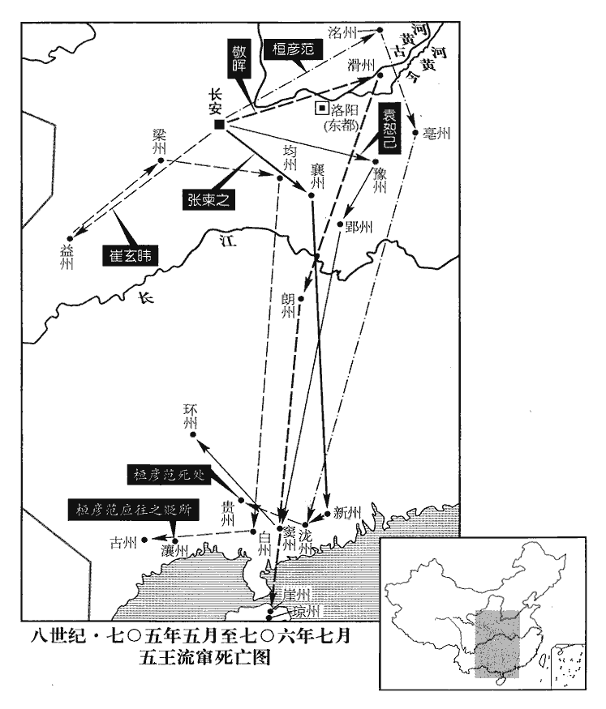

 唐紀二十四起旃蒙大荒落（乙巳）二月，盡強圉協洽（丁未），凡二年有奇

# 中宗大和大聖大昭孝皇帝中

## 神龍元年（乙巳、七零五）

1二月，辛亥‹一›，帝帥百官詣上陽宮問太后起居；帥，讀曰率。考異曰：實錄、唐曆皆云「乙亥」，誤也；當是辛亥。自是每十日一往。

〖译文〗 [1]二月，辛亥（初一），唐中宗带领文武百官到上阳宫向武则天请安，问候她的日常生活状况；从此唐中宗每十天前来问候一次。

2甲寅‹四›，復國號曰唐。天授元年，武后更國號曰周，今復舊。郊廟、社稷、陵寢、百官、旗幟、服色、文字皆如永淳以前故事。幟，昌志翻。復以神都‹洛阳›為東都，光宅元年，改東都曰神都。復，扶又翻，又如字。北都‹山西省太原市›為并州，天授元年以并州為北都。并，卑經翻。老君為玄元皇帝高宗乾封元年上老子尊號曰玄元皇帝；武后革命，改曰老君。

〖译文〗 [2]甲寅（初四），唐中宗下诏恢复大唐国号，并规定郊庙、社稷、陵寝、百官、旗帜、服色、文字等都恢复唐高宗永淳年间以前的旧制，神都又恢复东都旧名，北都恢复并州旧名，老君仍称为玄元皇帝。

3乙卯‹五›，鳳閣侍郎、同平章事韋承慶貶高要‹端州州政府所在县·广东省肇庆市›尉；高要縣帶端州，至京師五千七百五十里，東都五千一百五十里。正諫大夫、同平章事房融除名，流高州‹广东省高州市东北›；舊志，高州，京師南六千二百六十二里，至東都五千五百二十里。司禮卿崔神慶流欽州‹广西钦州市›。舊志，欽州至京師五千二百五十一里。楊再思為戶部尚書、同中書門下三品、西京‹西安›留守。尚，辰羊翻。守，手又翻。

〖译文〗 [3]乙卯（初五），唐中宗将凤阁侍郎、同平章事韦承庆贬为高要尉；将正谏大夫、同平章事房融除名并流放到高州；将司礼卿崔神庆流放到钦州。唐中宗又任命杨再思为户部尚书、同中书门下三品、西京留守。

太后之遷上陽宮也，見上卷是年正月。太僕卿、同中書門下三品姚元之獨嗚咽流涕。桓彥範、張柬之謂曰：「今日豈公涕泣時邪！恐公禍由此始。」元之曰：「元之事則天皇帝久，乍此辭違，悲不能忍。且元之前日從公誅姦逆，人臣之義也；今日別舊君，亦人臣之義也，雖獲罪，實所甘心。」是日，出為亳州‹安徽省亳州市›刺史。此姚元之所以為多智也。舊志，亳州至京師一千七百里，至東都八百九十八里。

〖译文〗 在武则天被迁到上阳宫时，只有太仆卿、同中书门下三品姚元之一人痛哭流涕。桓彦范、张柬之对他说：“今天哪里是您悲哀哭泣的日子！恐怕从今以后您就要大祸临头了。”姚元之回答说：“元之侍奉则天皇帝的时间很长，现在突然要分手了，感到悲痛难忍。况且元之前几天追随诸公诛灭恶逆之徒，是尽作臣子的本分；今天辞别旧主，也同样是在尽作臣子的本分。即使因此而受到惩罚，我也心甘情愿。”在这一天，姚元之被任命为毫州刺史。

4甲子‹十四›，立妃韋氏為皇后，赦天下。追贈后父玄貞為上洛王、母崔氏為妃。

〖译文〗 [4]甲子（十四日），唐中宗将他的妃子韦氏立为皇后，大赦天下；又追赠韦后之父韦玄贞为上洛王，追赠韦后之母崔氏为上洛王妃。

左拾遺賈虛己上疏，以為「異姓不王，古今通制。上，時掌翻。疏，所去翻。今中興之始，萬姓喁喁喁yóng，魚容翻。以觀陛下之政；而先王后族，王，于況翻。非所以廣德美於天下也。且先朝‹李治›贈后父太原王，高宗贈武后父士彠太原郡王。朝，直遙翻。殷鑒不遠，須防其漸。若以恩制已行，宜令皇后固讓，則益增謙沖之德矣。」不聽。

〖译文〗 左拾遗贾虚己上疏认为：“异姓之人不得封为王，是从古至今的定制。现在中兴刚刚开始，黎民百姓无不钦慕向往，观看陛下如何治理这个国家。而陛下却首先追赠皇后的父亲为王，这不是用来在全国扩大陛下贤德的办法。况且高宗时期追赠皇后的父亲武士为太原王，这个教训离现在并不遥远，陛下必须从一点一滴进行预防。如果认为命令已经发布无法收回，陛下应该让皇后坚决推辞，这样更能增加皇后谦虚守礼的美德。”唐中宗没有采纳他的建议。

初，韋后生邵王重潤、長寧•安樂二公主，重，直龍翻。樂音洛。上之遷房陵‹房州州政府所在县·湖北省房县›也，遷房陵見二百三卷光宅元年、垂拱元年。安樂公主‹李裹儿›生於道中，上特愛之。上在房陵與后同幽閉，備嘗艱危，情愛甚篤。上每聞敕使至，輒惶恐欲自殺。使，疏吏翻。后止之曰：「禍福無常，寧失一死，何遽如是！」上嘗與后私誓曰：「異時幸復見天日，復，扶又翻，又如字。當惟卿所欲，不相禁制。」及再為皇后，遂干預朝政，如武后在高宗之世。桓彥範上表，以為：「易稱『無攸遂，在中饋，貞吉』，易家人卦六二爻辭，王弼註曰：六二居內處中，履得其位，以陰應陽，盡婦人之正義，無所必遂，職乎中饋，巽順而已，是以貞吉也。朝，直遙翻。上，時掌翻。書稱『牝雞之辰，惟家之索』。書牧誓之辭；「辰」作「晨」。孔安國曰：索，盡也。喻婦人知外事，雌代雄鳴則家盡，婦奪夫政則國亡。索，西各翻。伏見陛下每臨朝，朝，直遙翻。皇后必施帷幔坐殿上，幔，莫半翻。預聞政事。臣竊觀自古帝王，未有與婦人共政而不破國亡身者也。且以陰乘陽，違天也；以婦陵夫，違人也。伏願陛下覽古今之戒，以社稷蒼生為念，令皇后專居中宮，治陰教，記曰：天子聽男教，后聽女順；天子理陽道，后治陰德；天子聽外治，后聽內職。教順成俗，外內和順，國家理治，此之謂盛德。治，直之翻。勿出外朝干國政。」朝，直遙翻。

〖译文〗 先前，韦后共生育了邵王李重润以及长宁和安乐两公主，在唐中宗被放逐到房陵去的时候，安乐公主在路上出生，所以唐中宗特别喜欢她。中宗与韦后在房陵被幽禁期间，共同经历了各种艰难困苦的生活，因而两个人的感情十分深厚。中宗每当听到武则天派使者前来的消息，就惊惶失措地想要自杀，韦后制止他说：“祸福并非一成不变，最多不过一死，您何必这么着急呢！”中宗曾经私下对韦后发誓：“如果日后我能重见天日，一定会让你随心所欲，不加任何限制。”所以在韦氏重新成为皇后以后，便像武则天在高宗朝那样干预起朝政来了。桓彦范上表，认为：“《周易》说：‘妇女没有什么错失，在家中主持家务，就是吉利。’，《尚书》说：‘如果母鸡司晨打鸣，这个家庭就要败落了’。我发现陛下每次临朝，皇后总是坐在帷帐后面参预对军国大事的处理。臣观察历朝帝王，没有哪一个与妇人共同执政而不导致国破身亡的。再说阴凌驾于阳之上，是违背自然法则的；妇人欺凌丈夫，是违背人伦之道的。希望陛下观察古今治乱兴衰的经验教训，时刻想着社稷与百姓，敦促皇后严守皇后的本分，一心一意地致力于女子的教化，不要到外朝来干预国家政事。”

先是，胡僧慧範以妖妄遊權貴之門，與張易之兄弟善，韋后亦重之。及易之誅，復稱慧範預其謀，以功加銀青光祿大夫，賜爵上庸縣公，出入宮掖，上數微行幸其舍。彥範復表言慧範執左道以亂政，請誅之。先，悉薦翻。復，扶又翻。數，所角翻；下又數同。記王制：執左道以亂政者殺。上皆不聽。

〖译文〗 在此之前，胡僧慧范凭借虚妄的邪说结交权贵，与张易之、张昌宗兄弟等人相处得很好，韦后也很看重他。等到张易之被诛灭以后，韦后又称慧范也参预了诛杀张易之等人的谋划，于是慧范因功被授为银青光禄大夫，并赐爵为上庸县公，使他得以出入皇宫，唐中宗也多次穿便衣到他所居住的地方。桓彦范又上表指控慧范用邪门歪道紊乱朝政，请求将他处死。唐中宗对这些建议都没有采纳。

5初，武后誅唐宗室，有才德者先死，惟吳王恪之子鬱林侯千里，褊躁無才，躁，則到翻。又數獻符瑞，故獨得免。上即位，立為成王，拜左金吾大將軍。武后所誅唐諸王、妃、主、駙馬等皆無人葬埋，子孫或流竄嶺表，或拘囚歷年，或逃匿民間，為人傭保。至是，制州縣求訪其柩，以禮改葬，柩，音舊。追復官爵，召其子孫，使之承襲，無子孫者為擇後置之。既而宗室子孫相繼而至，皆召見，為，于偽翻。見，賢遍翻。涕泣舞蹈，各以親疏襲爵拜官有差。

〖译文〗 [5]武则天在铲除李唐宗室的时候，最先杀掉的是那些有道德才能的人，只有吴王李恪的儿子郁林侯李千里，心地狭窄性情浮躁，没有才能，再加上一次又一次地向武则天进献祥瑞，因而得以幸免。唐中宗即位之后，封李千里为成王，任命他为左金吾大将军。武则天所诛杀的李唐诸王、王妃、公主、驸马等都无人加以埋葬，这些人的子孙有的被流放到岭南地区，有的已经在监狱中拘禁了数年之久，有的躲藏在民间成为富人的雇工。到这时候，唐中宗颁下制书，命令各州县寻访这些死去的宗室贵族的灵柩，根据死者的身份依礼改葬；并且给这些死者恢复原任官爵；召回他们的子孙，让他们承袭父辈的爵位；对那些没有子孙的人，则替他们选择后嗣以续其香火。不久，散落各地的宗室子孙相继来到东都，唐中宗全都召见了他们。大家流着泪向中宗行了舞拜礼。中宗各根据血缘关系的亲疏远近赐给了他们大小不等的官职、爵位。

6二張之誅也，洛州長史薛季昶謂張柬之、敬暉曰：「二凶雖除，產、祿猶在，產、祿，謂武三思等。去草不去根，終當復生。」去，羌呂翻。復，扶又翻；下可復同。二人曰：「大事已定，彼猶机上肉耳，夫何能為！所誅已多，不可復益也。」季昶歎曰：「吾不知死所矣。」朝邑‹陕西省大荔县东朝邑镇›尉武強‹河北省武强县›劉幽求武強縣，漢河間之武隧也，晉更名，屬武邑郡，唐屬冀州。朝，直遙翻。亦謂桓彥範、敬暉曰：「武三思尚存，公輩終無葬地；若不早圖，噬臍無及。」不從。左傳，鄧三甥勸鄧侯殺楚子，曰：「若不早圖，後君噬臍。」考異曰：御史臺記曰：「張柬之勒兵於景運門，將收諸武誅之。彥範以事既竟，不欲廣誅，遽解其兵。柬之固爭不果。」狄梁公傳曰：「袁謂張公曰：『昔有遺言，使先收梁王武三思，豈可捨諸？』張公曰：『但大事畢功，此皆机上之物，豈有逃乎！』」按舊唐書薛季昶傳、敬暉傳、唐統紀、唐曆、狄梁公傳皆云「張柬之、敬暉不欲誅武三思」唯御史臺記以為「柬之固爭，而彥範不從。」新唐書彥範傳亦云，「薛季昶勸誅三思，會日暮事遽，彥範不欲廣殺，因曰：『三思机上肉耳，留為天子藉手。』季昶歎曰：『吾無死所矣。』」按柬之時為宰相，首建此謀，當是與桓、敬等皆不可，不應獨由彥範也。

〖译文〗 [6]张易之、张昌宗被诛灭后，洛州长史薛季昶对张柬之和敬晖说：“张易之、张昌宗这两个元凶虽然已被铲除，但吕产、吕禄这样人还在朝中任职，锄草时不铲掉草根，终究还会长出草来。”张柬之、敬晖回答说：“现在大局已定，你说的那些人不过是案板上的肉罢了，还能有什么作为！现在杀的人已经够多的了，不能再多杀了。”薛季昶叹口气说：“我不知道将死在哪里了。”朝邑尉武强人刘幽求也对桓彦范和敬晖说：“武三思还没有受到惩处，你们这些人终究会死无葬身之地；如果现在不及早作准备，等到大祸临头再后悔就来不及了。”桓彦范和敬晖也没有采纳他的建议。

上女安樂公主‹李裹儿›適三思子崇訓。上官婉兒，儀之女孫也，儀死，上官儀死見二百一卷高宗麟德元年。沒入掖庭，辯慧善屬文，屬，之欲翻。明習吏事。則天愛之，自聖曆以後，百司表奏多令參決；及上即位，又使專掌制命，益委任之，拜為婕妤，婕妤，音接予。用事於中。三思通焉，故黨於武氏，又薦三思於韋后，引入禁中，上遂與三思圖議政事，張柬之等皆受制於三思矣。考異曰：舊傳云：「誅易之明日，三思因韋后之助，潛入宮中，內行相事，反易國政。居數日，五王皆失柄，受制於三思矣。」事似傷速。今微加刪改。上使韋后與三思雙陸，雙陸者，投瓊以行十二棋，各行六棋，故謂之雙陸。而自居旁為之點籌；三思遂與后通，由是武氏之勢復振。

〖译文〗 唐中宗的女儿安乐公主嫁给了武三思的儿子武崇训。上官婉儿是上官仪的孙女，上官仪被杀后，她被没入后宫。上官婉儿聪明伶俐，能言善辩，写得一手好文章，又熟悉官府事务。武则天十分喜欢她，自圣历年间以后，经常让她参予对各衙门所上表章奏疏的处理；唐中宗即位后，更加信任她，又让她专门负责草拟皇帝的命令，封她为婕妤，让她执掌宫中事务。上官婉儿与武三思私通，所以偏袒武氏，她又向韦后推荐武三思，将武三思领进宫中，唐中宗于是开始与武三思商议政事，张柬之等人从此都受到了武三思的遏制。唐中宗让韦后与武三思一起玩一种叫作双陆的游戏，自己则坐在一旁为他们数筹码；武三思于是又开始与韦后私通，武氏的势力因此又强大起来。

張柬之等數勸上誅諸武，上不聽。為，于偽翻。復，扶又翻，又如字。數，所角翻；下上數同。柬之等曰：「革命之際，宗室諸李，誅夷略盡；今賴天地之靈，陛下返正，而武氏濫官僭爵，按堵如故，豈遠近所望邪！願頗抑損其祿位以慰天下！」又不聽。柬之等或撫牀歎憤，或彈指出血，曰：「主上昔為英王，時稱勇烈，吾所以不誅諸武者，欲使上自誅之以張天子之威耳。張：知亮翻。今反如此，事勢已去，知復柰何！」復，扶又翻。

〖译文〗 张柬之等人屡次劝告唐中宗诛灭武氏集团，唐中宗都不听。张柬之等人说：“武则天改唐为周的时候，李唐宗室被诛杀殆尽；现在多亏天地神灵的庇佑，陛下又重登帝位，但武氏却像以往一样安稳地把持着他们所窃取的官爵职位，这种情形难道是朝野之士所希望看到的吗？希望陛下减少他们的俸禄，削夺他们的官爵，以告慰天下之人！”唐中宗仍然没有采纳他们的建议。张柬之等人有的拍着几案叹息，有的弹击手指以致出血，纷纷说：“皇上过去作英王时，在人们眼里是一个勇武刚烈的人，我们之所以没有诛灭武氏集团，是为了让皇上能亲自诛杀他们以扩大天子的声威。现在皇上却反过头来重用武氏集团成员，大势已去，谁知以后又会怎么样呢！”

上數微服幸武三思第，監察御史清河‹河北省清河县›崔皎密疏諫曰：清河，漢縣，後漢和帝改曰甘陵，晉復舊名，唐帶貝州。「國命初復，則天皇帝在西宮，上陽宮在洛陽宮城之西，故曰西宮。人心猶有附會；周之舊臣，列居朝廷，陛下柰何輕有外遊，不察豫且之禍！」白龍魚服，見困豫且。且，子余翻。上洩之，三思之黨切齒。

〖译文〗 唐中宗屡次身着便服到武三思的家里去，监察御史清河人崔皎秘密上疏说：“陛下的权力刚刚恢复，则天皇帝还住在西边的上阳宫里，还有人想依附她；武周时期的旧臣，仍然在朝廷供职，陛下怎么能轻易地外出游幸，没看到白龙身着鱼服而被打鱼的豫且射中的灾祸吗！”唐中宗把密疏的内容泄露了出去，武三思和他的党羽们对崔皎恨之入骨。

丙寅‹十六›，以太子賓客武三思為司空、同中書門下三品。

〖译文〗 丙寅（十六日），唐中宗任命太子宾客武三思为司空、同中书门下三品。

7左散騎常侍譙王重福，上之庶子也；散，悉亶翻。騎，奇寄翻。重，直龍翻；下同。其妃，張易之之甥。韋后惡之，惡，烏路翻。譖於上曰：「重潤之死，重福為之也。」重潤死見上卷長安元年。由是貶濮州‹山东省鄄城县›員外刺史，又改均州‹湖北省丹江口市西北›刺史，舊志，濮州，京師東北一千五百七十里，至東都七百二十五里。均州，京師東南九百三十里，至東都九百一十七里。常令州司防守之。

〖译文〗 [7]左散骑常侍谯王李重福，是唐中宗的庶子；他的妃子，是张易之的外甥女。韦后讨厌李重福，便在中宗面前诬陷他说：“李重润被迫自杀，是李重福在武则天面前诬陷所致。”唐中宗因此将李重福贬为濮州员外刺史，不久又改任他为均州刺史，并且常常命令州官对他严加防范。

8丁卯‹十七›，以右散騎常侍安定王武攸暨為司徒、定王。

〖译文〗 [8]丁卯（十七日），唐中宗任命右散骑常侍、安定王武攸暨为司徒、定王。

9辛未‹二十一›，相王‹李旦›固讓太尉及知政事，許之；又立為皇太弟，相王固辭而止。相，息亮翻。

〖译文〗 [9]辛未（二十一日），相王李旦坚决要求辞去太尉及宰相职务，唐中宗同意了他的辞职请求；唐中宗又想立相王李旦为皇太弟，因相王坚决推辞而作罢。

10甲戌‹二十四›，以國子祭酒始平‹陕西省兴平市›祝欽明同中書門下三品，黃門侍郎、知侍中事韋安石為刑部尚書，罷知政事。

〖译文〗 [10]甲戌（二十四日），唐中宗任命国子祭酒始平人祝钦明为同中书门下三品；任命黄门侍郎、知侍中事韦安石为刑部尚书，同时免去他的宰相职务。

11丁丑‹二十七›，武三思、武攸暨固辭新官爵及政事，許之，並加開府儀同三司。

〖译文〗 [11]丁丑（二十七日），武三思和武攸暨坚决推辞刚被任命的新职务和爵位，唐中宗同意了他们的请求，并且加封他们为开府仪同三司。

12立皇子義興王重俊為衛王，北海王重茂為溫王；仍以重俊為洛州‹洛阳›牧。重，直龍翻。

〖译文〗 [12]唐中宗立皇子义兴王李重俊为卫王，北海王李重茂为温王；仍然让李重俊担任洛州牧。

13三月，甲申‹五›，制：「文明已來破家子孫皆復舊資廕，唯徐敬業、裴炎不在免限。」韋、武之意也。

〖译文〗 [13]三月，甲申（初五），唐中宗颁下制书：“文明年间以来因获罪而破败了的家族的子孙都可以恢复原来的地位与荫庇，只有徐敬业、裴炎不在赦免之列。”

14丁亥‹八›，制：「酷吏周興、來俊臣等，已死者追奪官爵，存者皆流嶺南惡地。」按舊書，此時酷吏之存者，唐奉一、李秦授、曹仁哲。

〖译文〗 [14]丁亥（初八），唐中宗颁下制书：“酷吏周兴、来俊臣等人，已经死去的要追夺官爵，现在还活着的都要流放到岭南的偏僻之地。”

15己丑‹十›，以袁恕己為中書令。

〖译文〗 [15]己丑（初十），唐中宗任命袁恕己为中书令。

16以安車徵安平王武攸緒於嵩山‹中岳·河南省登封县北›，武攸緒隱嵩山，見二百五卷萬歲通天元年。既至，除太子賓客；固請還山，許之。

〖译文〗 [16]唐中宗下令用可以坐乘的安车到嵩山征召安平王武攸绪，武攸绪一来到京师，就被任命为太子宾客；他坚决要求再回到嵩山，唐中宗答应了他。

17制：「梟氏、蟒氏皆復舊姓。」梟、蟒氏見二百卷高宗永徽六年。梟，工堯翻。

〖译文〗 [17]唐中宗颁下制书：“枭氏、蟒氏都恢复为原来的萧氏、王氏。”

18術士鄭普思、尚衣奉御葉靜能葉，舊音攝，後音木葉之葉。吳志孫皓傳有都尉葉雄。皆以妖妄為上所信重，妖，於喬翻。夏，四月，墨敕以普思為祕書監，靜能為國子祭酒。墨敕出於禁中，不由中書門下。桓彥範、崔玄暐固執不可，上曰：「已用之，無容遽改。」彥範曰：「陛下初即位，下制云：『政令皆依貞觀故事。』貞觀中，魏徵、虞世南、顏師古為祕書監，孔穎達為國子祭酒，豈普思、靜能之比乎！」庚戌‹一›，左拾遺李邕上疏，以為「詩三百，一言以蔽之，曰『思無邪』。引論語孔子之言。上，時掌翻。疏，所去翻。若有神仙能令人不死，則秦始皇、漢武帝‹刘彻›得之矣；佛能為人福利，則梁武帝‹萧衍›得之矣。堯‹伊祁放勋›、舜‹姚重华›所以為帝王首者，亦脩人事而已。尊寵此屬，何補於國！」上皆不聽。

〖译文〗 [18]江湖术士郑普思和尚衣奉御叶静能都凭借虚妄的邪说得到唐中宗的信任和重用，夏季，四月，唐中宗没有通过外廷，亲笔书写敕书任命郑普思为秘书监，叶静能为国子祭酒。桓彦范和崔玄坚持认为不能这样做，唐中宗道：“我已经任命了他们，不能这样快就改变任命。”桓彦范说：“陛下在刚刚即位时，曾颁下制书说：‘国家的各项行政措施与法令都将完全依照贞观时期的定制’。贞观时期，担任秘书监职务的是魏徵、虞世南和颜师古，担任国子祭酒职务的是孔颖达，这些人的道德才能是现在的郑普思和叶静能所能比拟的吗？”庚戌（初一），左拾遗李邕上疏认为：“《诗经》三百篇，用一句话来概括，叫做‘思想纯正。’如果真有能让人长生不老的神仙，那么秦始皇和汉武帝早就找到了；如果佛祖真能为人谋利造福，那么梁武帝也早就如愿以偿了。唐尧、虞舜之所以能够成为历代帝王的典范，也不过是由于他们努力修治世上各种的事情罢了。陛下对郑普思和叶静能这样的人尊宠有加，对于治理国家有什么用处！”唐中宗对上述建议都没有接受。

19上即位之日，驛召魏元忠於高要；魏元忠貶，見上卷長安三年。丁卯‹十八›，至都，拜衛尉卿、同平章事。

〖译文〗 [19]唐中宗即位那一天，用驿车从高要县召回魏元忠；丁卯（十八日），魏元忠抵达东都，唐中宗任命他为卫尉卿、同平章事。

20甲戌‹二十五›，以魏元忠為兵部尚書，韋安石為吏部尚書，李懷遠為右散騎常侍，唐休璟為輔國大將軍，璟，俱永翻。崔玄暐檢校益府‹总部设四川省成都市›長史，楊再思檢校楊府‹总部设江苏省扬州市›長史，祝欽明為刑部尚書，並同中書門下三品。元忠等皆以東宮舊僚褒之也。史言中宗命相，非以德授。

〖译文〗 [20]甲戌（二十五日），唐中宗任命魏元忠为兵部尚书，韦安石为吏部尚书，李怀远为右散骑常侍，唐休为辅国大将军，崔玄为检校益府长史，杨再思为检校杨府长史，祝钦明为刑部尚书，上述人等都同时兼任同中书门下三品。魏元忠等人都是由于曾在中宗作太子时作过东宫僚属的缘故，而得到这样的褒奖。

21乙亥‹二十六›，以張柬之為中書令。

〖译文〗 [21]乙亥（二十六日），唐中宗任命张柬之为中书令。

22戊寅‹二十九›，追贈故邵王重潤為懿德太子。

〖译文〗 [22]戊寅（二十九日），唐中宗下诏追赠已经死去的邵王李重润为懿德太子。

23五月，壬午‹四›，遷周廟七主於西京崇尊廟。周立七廟，見二百四卷武后天授元年；崇尊廟見天授二年。制：「武氏三代諱，奏事者皆不得犯。」

〖译文〗 [23]五月，壬午（初四），唐中宗将武周七庙的神主迁到西京崇尊庙，并颁下制书：“对于武太后及其父、祖的名讳，上奏言事的臣民都不得触犯。”

24乙酉‹七›，立太廟、社稷於東都‹洛阳›。

〖译文〗 [24]乙酉（初七），唐中宗在东都设立太庙及社稷。

25以張柬之等及武攸暨、武三思、鄭普思等十六人皆為立功之人，賜以鐵券，自非反逆，各恕十死。

〖译文〗 [25]唐中宗把张柬之等人以及武攸暨、武三思、郑普思等十六人都当作为国家立下功劳的人，赐给他们铁券，并规定如果这些人所犯的不是谋反叛逆之罪，每个人都可以宽恕十次死罪。

26癸巳‹十五›，敬暉等帥百官上表，以為：「五運迭興，五運謂五德之運。帥，讀曰率。事不兩大。天授革命之際，宗室誅竄殆盡，豈得與諸武並封！今天命惟新，而諸武封建如舊，並居京師，開闢以來未有斯理。願陛下為社稷計，順遐邇心，降其王爵以安內外。」上不許。

〖译文〗 [26]癸巳（十五日），敬晖等人率领文武百官上表唐中宗，认为：“五德之运轮流兴起，没有两德同时盛大的事情。天授年间改朝换代之际，李唐宗室被诛杀流徙殆尽，哪里有与武氏同殿受封的权利！现在上天又重新眷顾李姓，但武氏仍然像以往那样受封为王，与李姓宗室一起居住在京师，开天辟地以来从未有过这样的道理。希望陛下为大唐江山着想，顺从朝野士民的心愿，削夺他们的王爵以安定人心。”唐中宗没有同意他们的建议。

敬暉等畏武三思之讒，以考功員外郎崔湜shí為耳目，伺其動靜。湜，常職翻。伺，相吏翻。湜見上親三思而忌暉等，乃悉以暉等謀告三思，反為三思用；三思引為中書舍人。湜，仁師之孫也。崔仁師見一百九十二卷太宗貞觀元年。

〖译文〗 敬晖等人害怕武三思的谗言陷害，便把考功员外郎崔当作自己的耳目，以便随时刺探武三思的消息。崔见中宗亲近武三思而猜忌敬晖等人，便把敬晖等人的全部打算告诉了武三思，反而成了为武三思效劳的人。武三思推荐崔作了中书舍人。崔是崔仁师的孙子。

先是，殿中侍御史南皮‹河北省南皮县›鄭愔諂事二張，南皮縣，漢屬勃海郡，唐武德初屬景州，貞觀初屬滄州。先，悉薦翻。愔，於今翻。二張敗，貶宣州‹安徽省宣州市›司士參軍，坐贓，亡入東都，舊志，宣州至東都二千五百一十里。私謁武三思。初見三思，哭甚哀，既而大笑。三思素貴重，甚怪之，愔曰：「始見大王而哭，哀大王將戮死而滅族也。後乃大笑，喜大王之得愔也。大王雖得天子之意，彼五人皆據將相之權，五人謂張柬之、敬暉、桓彥範、崔玄暐、袁恕己也。膽略過人，廢太后如反掌。大王自視勢位與太后孰重？彼五人日夜切齒欲噬大王之肉，非盡大王之族不足以快其志。大王不去此五人，危如朝露，去，羌呂翻。朝露易晞。而晏然尚自以為泰山之安，此愔所以為大王寒心也。」為，于偽翻；下因為同。三思大悅，與之登樓，問自安之策，引為中書舍人，與崔湜皆為三思謀主。

〖译文〗 在这以前，殿中侍御史南皮县人郑巴结张易之和张昌宗，二张败死之后，被贬为宣州司士参军，又因犯贪赃罪的缘故，逃到东都，私下拜见武三思。郑刚见到武三思时，哭得很悲哀，一会儿又放声大笑。武三思向来位尊任重，对郑的悲喜无常感到非常奇怪。郑解释道：“我在刚刚见到大王时之所以痛哭失声，是在为大王将被戮尸灭族而感到悲哀。悲哀之后又放声大笑，是在为大王能得到郑的帮助从而得以免祸而感到高兴。大王您虽然深得天子的欢心，但张柬之、敬晖、桓彦范、崔玄和袁恕己五人手中都掌握着将相大权，并且个个胆略过人，以至于废掉太后的帝位都易如反掌。大王您自己考虑您与太后相比哪一个权势地位更重一些？那五个人对您恨之入骨，日夜都想吃下您的肉，如果不能把大王灭族，他们是不会称心如意的。大王您如果不尽快除掉这五个人，您的生命安全就会像早晨的露水一样没有保障，可是您却还是怡然自乐，自以为像泰山一样安然无羔，这就是我郑为大王您感到痛心的原因。”武三思十分高兴，与郑一起上楼，向他请教使自己平安无祸的办法，并荐举他作了中书舍人，与崔一道成为自己的谋主。

三思與韋后日夜譖暉等，云「恃功專權，將不利於社稷。」上信之。三思等因為上畫策，「不若封暉等為王，罷其政事，外不失尊寵功臣，內實奪之權。」上以為然，甲午‹十六›，以侍中齊公敬暉為平陽王，桓【章：十二行本「桓」上有「譙公」二字；乙十一行本同；孔本同；張校同。】彥範為扶陽王，中書令漢陽公張柬之為漢陽王，南陽公袁恕己為南陽王，特進、同中書門下三品博陵公崔玄暐為博陵王，考異曰：統紀曰：「太后善自粉飾，雖子孫在側，不覺其衰老。及在上陽宮，不復櫛頮huì，形容羸悴。上入見，大驚。太后泣曰：『我自房陵迎汝來，固以天下授汝矣，而五賊貪功，驚我至此。』上悲泣不自勝，伏地拜謝死罪。由是三思等得入其謀。」按中宗頑鄙不仁，太后雖毀容涕泣，未必能感動移其意。其所以疏忌五王，自用韋后、三思之言耳。今不取。五王尊卑，先後不定。實錄，誅張易之時以張柬之為首，賜鐵券以崔玄暐為首，封王及謫為司馬、長流皆以敬暉為首，舊傳及開元復官詔並以桓彥範為首。按長安四年，六月，玄暐為鸞臺侍郎、平章事。十月，張柬之自秋官侍郎同平章事，十一月，守鳳閣侍郎。誅易之時，唯此二人為相。神龍元年，正月，袁恕己自司刑少卿為鳳閣侍郎、同平章事；庚戌，張柬之為夏官尚書，玄暐守內史，敬暉、桓彥範並為納言；三月，恕己守中書令；四月，柬之為中書令，敬暉為侍中。五王遷轉先後如此。疑實錄但以誅易之時柬之首謀，故以柬之為首。暉與彥範同為侍中，疑侍中在中書令上，故削諸武表及罷政事皆以暉為首。賜鐵券時，玄暐已加特進，暉等罷政方加特進，而玄暐如舊，疑特進雖散階而品秩最高，故以玄暐為首。彥範與暉同為侍中，而彥範被禍最酷，疑開元詔及史官特以為首，未必以當時位次也。天后、中宗時，侍中疑在中書令上。罷知政事，賜金帛鞍馬，令朝朔望；朝，直遙翻。仍賜彥範姓韋氏，與皇后同籍。尋又以玄暐檢校益州‹总部设四川省成都市›長史、知都督事，又改梁州‹陕西省汉中市›刺史。益州，京師西南二千三百七十九里，至東都三千二百一十六里。梁州至京師一千二百二十三里，東都二千七十八里。三思令百官復脩則天之政，復，扶又翻，下溫復同。不附武氏者斥之，為五王所逐者復之，大權盡歸三思矣。

〖译文〗 武三思与韦后天天在唐中宗面前诬陷敬晖等人，说他们“倚仗功劳专擅朝政，将对大唐的江山社稷不利。”中宗相信了他们两人的谗言。武三思等人趁机为中宗出谋划策，“不如封敬晖等人为王，同时罢免他们所担任的职务，这样的话，表面不失为尊宠功臣，而实际上又能剥夺他们的权力。”唐中宗认为这样做很好。甲午（十六日），唐中宗封侍中、齐公敬晖为平阳王，谯公桓彦范为扶阳王，中书令、汉阳公张柬之为汉阳王，南阳公袁恕己为南阳王，特进、同中书门下三品、博陵公崔玄为博陵王，同时免去他们的宰相职务，赏赐上述五人金帛鞍马，只要求他们于每月初一、十五朝见天子；又赐桓彦范姓韦氏，让他与韦后同族。不久唐中宗又任命崔玄为检校益州长史、知都督事，后来又改任他为梁州刺史。随后武三思便下令文武百官重新恢复执行武则天时期的政策，凡是拒不趋附武氏集团的人都被排斥去位，那些被张柬之、桓彦范等人贬逐的人又重新得到起用，朝政大权全部落入武三思之手。

五王之請削武氏諸王也，求人為表，眾莫肯為。中書舍人岑羲為之，語甚激切；中書舍人偃師‹河南省偃师县›畢構次當讀表，辭色明厲。三思既得志，羲改祕書少監，出構為潤州‹江苏省镇江市›刺史。潤州，京師東南二千八百二十一里，至東都一千七百九十七里。

〖译文〗 张柬之等五王请求中宗削去武氏集团成员的王爵时，曾找人为他们拟表，众位朝臣中没有人敢于出头。中书舍人岑羲代他们草拟了表章，遣辞用语十分激切；中书舍人偃师人毕构正轮到负责宣读这一表章，言语和神态显得非常严厉。武三思得志以后，便改任岑羲为秘书少监，外放毕构为润州刺史。

易州‹河北省易县›刺史趙履溫，桓彥範之妻兄也。彥範之誅二張，稱履溫預其謀，召為司農少卿，履溫以二婢遺彥範；遺，于季翻。及彥範罷政事，履溫復奪其婢。

〖译文〗 易州刺史赵履温，是桓彦范的妻兄。桓彦范诛杀张易之、张昌宗等人之后，声称赵履温也参预了诛除逆党的策划，唐中宗召他入京任司农少卿，赵履温把两个婢女送给了桓彦范；等到桓彦范被免去宰相职务以后，赵履温又夺回了两个婢女。

上嘉宋璟忠直，屢遷黃門侍郎。武三思嘗以事屬璟，屬，之欲翻。璟正色拒之曰：「今太后既復子明辟，王當以侯就第，何得尚干朝政！朝，直遙翻。獨不見產、祿之事乎！」

〖译文〗 唐中宗赞赏宋忠诚正直，连续把他提拔到黄门侍郎的高位。武三思曾嘱托宋替他办一件事，宋义正辞严地拒绝他说：“现在太后都已经将帝位传给了太子，大王你就应当以侯爵的身份回到自己家里去，怎么还可以干预朝政呢！你难道不知道吕产、吕禄两人的结局吗！”

27以韋安石兼檢校中書令，魏元忠兼檢校侍中，又以李湛為右散騎常侍，趙承恩為光祿卿，楊元琰為衛尉卿。

〖译文〗 [27]唐中宗任命韦安石兼任检校中书令，魏元忠兼任检校侍中，又任命李湛为右散骑常侍，赵承恩为光禄卿，杨元琰为卫尉卿。

先是，元琰知三思浸用事，請棄官為僧，上不許。敬暉聞之，笑曰：「使我早知，勸上許之，髡去胡頭，豈不妙哉！」先，悉薦翻。去羌呂翻。元琰多鬚類胡，故暉戲之。元琰曰：「功成名遂，不退將危。此乃由衷之請，衷，誠也；由衷，言出於誠心。非徒然也。」暉知其意，瞿然不悅。瞿，九遇翻。瞿然，驚視貌。及暉等得罪，元琰獨免。

〖译文〗 在此之前，杨元琰知武三思日益专擅朝政，便向唐中宗请求允许他辞去官位，削发为僧。唐中宗没有同意。敬晖听说这件事后，对杨元琰打趣说：“要是我早一点得知此事，我就去劝陛下同意你的要求，剃光你这胡人的脑袋，岂不是太妙了！”杨元琰长了一脸的络腮胡子，看上去像胡人，所以敬晖拿他开这样的玩笑。杨元琰回答说：“人在功成名就以后，如果不激流勇退，就会遇到危险。我的确是从心眼里想辞官出家当和尚的，不仅仅是作个样子。”敬晖知道他的真实想法之后非常吃惊，感到很不高兴。在敬晖等人因武三思的诬陷而被杀后，只有杨元琰一人得以幸免。

28上官婕妤勸韋后襲則天故事，上表請天下士庶為出母服喪三年，上，時掌翻。為，于偽翻。所以感動帝心，令其念武后也。又請百姓年二十三為丁，五十九免役，唐制，二十一為丁，六十為老。改易制度以收時望。制皆許之。

〖译文〗 [28]上官婕妤劝韦后承袭武则天时期的旧制，向中宗上表请求规定全国士民百姓一律为被父亲休弃的母亲服丧三年。又请求规定天下百姓二十三岁时才算成丁，到五十九年就免除劳役，她要求作这一改变的目的是收买人心。唐中宗对她的所有建议都同意。

29癸卯‹二十五›，制，降諸武，梁王三思為德靜王，定王攸暨為樂壽王，皆降封縣王也。德靜縣屬夏州；樂壽縣屬深州。河內王懿宗等十二人皆降為公，以厭人心。樂，音洛。厭，於協翻。

〖译文〗 [29]癸卯（二十五日），唐中宗颁下制书，下令降低武氏集团成员的爵位，将梁王武三思降为德静县王，将定王武攸暨降为乐寿县王，将河内王武懿宗等十二人降封为公爵，以此满足天下臣民的心愿。

30甲辰‹二十六›，以唐休璟為左僕射，同中書門下三品如故；璟，俱永翻。豆盧欽望為右僕射。

〖译文〗 [30]甲辰（二十六日），唐中宗任命唐休为尚书左仆射，依旧任同中书门下三品；又任命豆卢钦望为尚书右仆射。

31六月，壬子‹四›，以左驍衛大將軍裴思說充靈武軍大總管，以備突厥‹瀚海沙漠群›。驍，堅堯翻。說，讀曰悅。厥，九勿翻。

〖译文〗 [31]六月，壬子（初四），唐中宗任命左骁卫大将军裴思说为灵武军大总管，目的是为了防备突厥兵的侵扰。

32癸亥‹十五›，命右僕射豆盧欽望，有軍國重事，中書門下可共平章。

〖译文〗 [32]癸亥（十五日），唐中宗命令尚书右仆射豆卢钦望遇有军政大事时，可到宰相议事的地方，与宰相们共同商议处理意见。

先是，僕射為正宰相，先，悉薦翻。其後多兼中書門下之職，午前決朝政，朝，直遙翻。午後決省事。省事，尚書省事也。至是，欽望專為僕射，不敢預政事，故有是命。是後專拜僕射者，不復為宰相矣。復，扶又翻。

〖译文〗 在此之前，仆射就是正宰相，后来仆射大多兼任中书门下之职，每次上朝都是在上午商议处理朝廷大事，下午处理尚书省的事务。到这时，豆卢钦望专任右仆射一职，不敢参预宰相们对于军政大事的讨论，所以唐中宗下达了这样的命令。此后专任尚书仆射的人，便不再是宰相了。

又以韋安石為中書令，魏元忠為侍中，楊再思為檢校中書令。

〖译文〗 唐中宗又任命韦安石为中书令，魏元忠为侍中，杨再思为检校中书令。

33丁卯‹十九›，祔孝敬皇帝於太廟，號義宗。故太子弘諡孝敬皇帝，帝兄也。

〖译文〗 [33]丁卯（十九日），唐中宗将其兄孝敬皇帝李弘的神主迁入太庙，庙号为义宗。

34戊辰‹二十›，洛水溢，流二千馀家。

〖译文〗 [34]戊辰（二十日），洛水泛滥，冲走二千多户人家。

35秋，七月，辛巳‹四›，以太子賓客韋巨源同中書門下三品，西京留守如故。守，式又翻。

〖译文〗 [35]秋季，七月，辛巳（初四），唐中宗任命太子宾客韦巨源为同中书门下三品，仍保留他原任的西京留守职务。

36特進漢陽王張柬之‹本年八十一岁›表請歸襄州‹湖北省襄樊市›養疾；乙未‹十八›，以柬之為襄州刺史，不知州事，給全俸。唐制，特進正二品，郡王從一品；從品高給一品，月俸八千，食料一千八百，雜用一千二百。上州刺史從三品，月俸五千一百，雜用九百。

〖译文〗 [36]特进、汉阳王张柬之上表请求回到襄州养病；乙未（十八日），唐中宗任命张柬之为襄州刺史，但不主管该州事务而领取全额俸禄。

37河‹黄河›南、北十七州大水。八月，戊申‹一›，以水災求直言。右衛騎曹參軍西河‹山西省汾阳县›宋務光上疏，唐諸衛府有倉、兵、騎、冑四曹參軍，騎曹參軍掌外內雜畜簿帳牧養，凡府馬承直，以遠近分七番，月一易之，以敕出宮城者給馬。西河縣屬汾州。騎，奇寄翻。上，時掌翻。疏，所去翻。以為：「水陰類，臣妾之象，恐後庭有干外朝之政者，朝，直遙翻。宜杜絕其萌。今霖雨不止，乃閉坊門以禳之，至使里巷謂坊門為宰相，言朝廷使之燮理陰陽也。宋白曰：唐制，久雨則閉坊市北門以祈晴。又，太子國本，宜早擇賢能而立之。又，外戚太盛，如武三思等，宜解其機要，厚以祿賜。又，鄭普思、葉靜能以小技竊大位，亦朝政之蠹也。」疏奏，不省。技，渠綺翻。朝，直遙翻。省，悉景翻。

〖译文〗 [37]黄河南北十七个州发大水。八月，戊申（初一），唐中宗因发生水灾的缘故而下诏要求臣下直言规谏自己的过失。右卫骑曹参军西河县人宋务光上疏认为：“水属阴类，是臣下、女人之象，恐怕是后宫有干预外朝政事的，陛下应当设法防患于未然；现在连日大雨不止，朝廷于是关闭坊市北门来祈求晴天，以至于使民间称坊门为宰相，说是朝廷让它来调解阴阳的。再者，太子乃是立国的根本，应当及早选择贤良而有才能的王子，将他立为太子；此外，外戚势力太大，像武三思等人，应当解除他们所担任的重要职务，再多给他们一些俸禄；最后一点，郑普思、叶静能仅凭一些雕虫小技就窃据高位，他们也是败坏朝政的蛀虫。”这篇奏疏呈上来之后，唐中宗根本不审阅。

38壬戌‹十五›，追立妃趙氏為恭皇后，趙妃死見二百二卷高宗上元二年。考異曰：舊本紀云「甲子」，今從實錄。孝敬皇帝‹李弘›妃裴氏為哀皇后。

〖译文〗 [38]壬戌（十五日），唐中宗将妃子赵氏追立为恭皇后，将孝敬皇帝李弘的妃子裴氏追立为哀皇后。

39九月，壬午‹五›，上祀昊天上帝、皇地祇于明堂，以高宗‹李治›配。

〖译文〗 [39]九月，壬午（初五），唐中宗在明堂祭祀昊天上帝、皇地，以唐高宗李治配享。

40初，上在房陵，州司制約甚急；刺史河東‹山西省永济市›張知謇jiǎn、靈昌‹河南省延津县东北›崔敬嗣河東，舊蒲阪也，帶河東郡；隋廢郡，改蒲阪為河東縣；唐因之，帶蒲州。隋分酸棗縣，置靈昌縣，因河津以為名；唐屬滑州。謇，九輦翻。獨待遇以禮，供給豐贍。贍，而豔翻。上德之，擢知謇自貝州‹河北省清河县›刺史為左衛將軍，賜爵范陽公。敬嗣已卒，求得其子汪，嗜酒，不堪釐職，除五品散官。唐六典，隋煬帝置朝請大夫為正五品散官。隋文帝置朝散大夫為正四品散官，煬帝改從五品下。

〖译文〗 [40]当初，唐中宗被贬到房陵时，地方官府对他的限制约束十分严格，只有刺史河东县人张知謇和灵昌县人崔敬嗣两人对他以礼相待，供给的物品十分丰富。唐中宗很感激他们两人，于是将张知謇由贝州刺史提拔为左卫将军，并赐爵为范阳公。崔敬嗣已经去世，唐中宗找到他的儿子崔汪。但由于崔汪嗜酒如命，实在不能胜任任何实际职务，只好让他当五品散官。

41改葬上洛王韋玄貞，其儀皆如太原王故事。武士彠封太原王。

〖译文〗 [41]唐中宗为韦后的父亲上洛王韦玄贞改葬，其礼仪都依照武则天之父太原王的先例。

42癸巳‹十六›，太子賓客、同中書門下三品韋巨源罷為禮部尚書，以其從父安石為中書令故也。從，才用翻。

〖译文〗 [42]癸巳（十六日），太子宾客、同中书门下三品韦巨源被免去相职，改任礼部尚书，这是因为他的叔父韦安石被任命为中书令的缘故。

43以左衛將軍上邽‹甘肃省天水市›紀處訥兼檢校太府卿，處訥娶武三思之妻姊故也。處，昌呂翻。

〖译文〗 [43]唐中宗任命左卫将军上人纪处讷兼任检校太府卿，这是由于纪处讷娶了武三思之妻的姐姐的缘故。

44冬，十月，命唐休璟留守京師‹洛阳›。守，式又翻。

〖译文〗 [44]冬季，十月，唐中宗命令唐休留守京师。

45癸亥‹十七›，上幸龍門‹洛阳城南›；乙丑‹十九›，獵於新安‹河南省新安县›而還。還，從宣翻，又如字。

〖译文〗 [45]癸亥（十七日），唐中宗巡幸龙门；乙丑（十九日），唐中宗在新安狩猎之后又返回东都。

46辛未‹二十五›，以魏元忠為中書令，楊再思為侍中。

〖译文〗 [46]辛未（二十五日），唐中宗任命魏元忠为中书令，杨再思为侍中。

47十一月，戊寅‹二›，群臣上皇帝尊號曰應天皇帝，皇后曰順天皇后。上，時掌翻。壬午‹六›，上與后謁謝太廟，赦天下；相王、太平公主加實封，皆滿萬戶。相，息亮翻。

〖译文〗 [47]十一月，戊寅（初二），群臣给唐中宗上尊号为应天皇帝，为韦后上尊号为顺天皇后。壬午（初六），中宗与韦后一同到太庙拜谢列祖列宗，并下诏赦免天下罪囚；同时下诏将相王李旦和太平公主的实封户都加至一万户。

48己丑‹十三›，上御洛城南樓，洛陽皇城之西南曰洛城門，門內即洛城殿。觀潑寒胡戲。潑寒胡戲即乞寒胡戲，本出於胡中西域康國，十一月鼓舞乞寒，以水交潑為樂，武后末年始以季冬為之。清源‹山西省清徐县›尉呂元泰上疏，以為「謀時寒若，清源縣屬并州，隋於古梗陽城置，以水為名。書洪範曰：謀時寒若。註云：君能謀則時寒順之。若，順也。上，時掌翻。疏，所去翻。何必裸身揮水，鼓舞衢路以索之！」裸，郎果翻。索，山客翻。疏奏，不納。

〖译文〗 [48]己丑（十三日），唐中宗登上洛城门南楼观看泼寒胡戏。清源尉吕元泰上疏认为：“君主善于谋划，则四时寒暑自然顺畅，何必赤身裸体，泼水为乐，在大街上击鼓起舞以乞求寒冬的到来呢？！”奏疏呈上以后，中宗没有采纳他的建议。

49壬寅‹二十六›，則天崩於上陽宮，年八十二。遺制：「去帝號，去，羌呂翻。稱則天大聖皇后。王、蕭二族及褚遂良、韓瑗、柳奭親屬皆赦之。」武后之立也，王皇后、蕭淑妃幽廢，不得良死，褚遂良、韓瑗以諫死，柳奭以王后親屬死，其親屬皆流竄。

〖译文〗 [49]壬寅（二十六日），武则天在上阳宫驾崩，终年八十二岁。临死时武则天留下遗命：“去掉皇帝称号，以后称为则天大圣皇后。高宗的后妃王氏和萧氏二族以及褚遂良、韩瑗、柳三人的亲属都全部赦免。”

上居諒陰，以魏元忠攝冢宰三日。元忠素負忠直之望，中外賴之；武三思憚之，矯太后遺制，慰諭元忠，賜實封百戶。元忠捧制感咽涕泗，見者曰：「事去矣！」知其不敢復論武氏事也。

〖译文〗 唐中宗在为武则天居丧守制期间，派魏元忠代理三天冢宰职务。魏元忠向来就有忠诚正直的声望，因而深得朝野倚重。武三思对此很是担忧，于是伪造武则天的遗命，对魏元忠好言劝慰，并赐给魏元忠封户一百。魏元忠手捧“太后遗制”涕泪纵横，看见这一情景的人说：“魏元忠再也不会有所作为了！”

十二月，丁卯‹二十一›，上始御同明殿見群臣。見，賢遍翻。六典：東都皇宮南面三門，中曰應天，左曰興教，右曰光政。光政之北曰明福，明福之西曰崇賢門，其內曰集賢殿，集賢之東曰億歲殿，又東曰同明殿。

〖译文〗 十二月，丁卯（二十一日），唐中宗才亲临同明殿接见群臣。

50太后將合葬乾陵‹陕西省乾县西北›，給事中嚴善思上疏，以為：「乾陵玄宮以石為門，鐵錮其縫，縫，扶用翻。今啟其門，必須鐫鑿。神明之道，體尚幽玄，動眾加功，恐多驚黷。況合葬非古，漢時諸陵，皇后多不合葬，魏、晉已降，始有合者。望於乾陵之傍更擇吉地為陵，若神道有知，幽塗自當通會；若其無知，合之何益！」不從。

〖译文〗 [50]武则天的灵柩将要与唐高宗李治合葬于乾陵，给事中严善思上疏认为：“乾陵墓穴的门是用石头做成的，石门的门缝又用熔化的铁水密封，如果想打开石门，就必须使用钻凿一类的工具。供奉神之道，重在保持幽静玄远的气氛，倘若兴师动众地打开石门，恐怕对神多有惊动亵。况且夫妻合葬并非古制，汉代皇帝的陵墓，大多数都没有皇后合葬，从魏晋以来，才有合葬的。希望陛下能在乾陵旁边另外选择风水好的地方修建陵墓，假如帝后神灵有知，两人在阴间自然会相聚；如果无知，合葬又有什么用处呢！”唐中宗没有听从他的劝告。

51是嵗，戸部奏天下戸六百一十五萬，口三千七百一十四萬有畸。

〖译文〗 [51]这一年，户部上报唐中宗说，全国共有六百一十五万户，总计三千七百一十四万多人。

## 二年（丙午、七零六）

1春，正月，戊戌‹二十三›，以吏部尚書李嶠同中書門下三品，中書侍郎于惟謙同平章事。

〖译文〗 [1]春季，正月，戊戌（二十三日），唐中宗任命吏部尚书李峤为同中书门下三品，任命中书侍郎于惟谦为同平章事。

2閏月，丙午‹一›，‹李显，本年五十一岁›制：「太平‹李显的妹妹›、長寧、安樂、宜城、新都、定安‹以上是李显的女儿›、金城公主‹李显的侄孙女›並開府，置官屬。」自長寧以下皆皇女也。樂，音洛。

〖译文〗 [2]闰月，丙午（初一），唐中宗颁下制书：“太平公主、长宁公主、安乐公主、宜城公主、新都公主、定安公主和金城公主都可以开建官署，设置僚属。”

3武三思以敬暉、桓彥範、袁恕己尚在京師，忌之，乙卯‹十›，出為滑‹河南省滑县›、洺‹河北省永年县东南旧永年镇›、豫‹河南省汝南县›三州刺史。舊志，滑州去京師一千四百四十里，東都五百三十里。洺州，京師東北一千五百八十五里，至東都八百五十七里。豫州，去京師一千五百四十里，至東都六百七十里。考異曰：實錄、新紀、新舊列傳皆不見崔玄暐及暉等出為刺史年月，惟舊紀及統紀、唐曆有此三人。蓋玄暐先已出矣，但不知何時。然暉等貶為司馬時，乃刺朗、亳、郢、均四州，蓋於後又經遷徙矣。唐曆、統紀以為在王同皎誅後，今從之。

〖译文〗 [3]因为敬晖、桓彦范和袁恕己三人仍在京师，武三思忌恨他们，乙卯（初十），武三思将三人分别外放为滑州、州和豫州刺史。

4賜闅wén鄉‹河南省灵宝市西›僧萬回號法雲公。萬回姓張氏。初，母祈於觀音像而妊回，回生而愚，八九歲乃能語，雖父母亦以豚犬畜之。其兄戍役於安西‹当时安西都护府设碎叶城›，音問隔絕，父母遣其問訊，一日，朝齎所備而往，夕返其家，父母異之。弘農去安西萬里，以其萬里而回，因號萬回。武后賜之錦袍金帶。

〖译文〗 [4]唐中宗赐予乡和尚万回法云公的称号。

5甲戌‹二十九›，以突騎施‹伊犁河中下游›酋長烏質勒為懷德郡王。騎，奇寄翻。酋長，上慈由翻，下知兩翻。

〖译文〗 [5]甲戌（二十九日），唐中宗封突骑施酋长乌质勒为怀德郡王。

6二月，乙未‹二十一›，以刑部尚書韋巨源同中書門下三品，仍與皇后敘宗族。

〖译文〗 [6]二月，乙未（二十一日），唐中宗任命刑部尚书韦巨源为同中书门下三品，还让他列入韦皇后的宗族之中。

7丙申‹二十二›，僧慧範等九人並加五品階，賜爵郡、縣公；道士史崇恩等加【章：十一行本「加」上有「三人」二字；乙十一行本同。】五品階，除國子祭酒，同正；唐會要曰：永徽五年，蔣孝璋除尚藥奉御，員外特置，仍同正員。員外官自此始也。葉靜能加金紫光祿大夫。

〖译文〗 [7]丙申（二十二日），唐中宗将胡僧慧范等九人各加授五品官阶，并且分别赐予郡公或县公的爵位；将道士史崇恩等人各加授五品官阶，并且任命他们为国子祭酒员外置同正员；给叶静能加金紫光禄大夫衔。

8選左、右臺及內外五品以上官二十人為十道巡察使，使，疏吏翻。委之察吏撫人，薦賢直獄，二年一代，考其功罪而進退之。易州‹河北省易县›刺史魏‹河北省大名县西南›人姜師度、禮部員外郎馬懷素、殿中侍御史臨漳‹河北省临漳县南›源乾曜、監察御史靈昌‹河南省延津县东北›盧懷慎、衛尉少卿滏陽‹河北省磁县›李傑皆預焉。魏縣，漢屬魏郡，時屬魏州，晉愍帝諱鄴，改鄴為臨漳，時鄴城已淪覆矣。後趙復為鄴縣。東魏分鄴、內黃、斥丘、肥鄉，置臨漳縣，屬魏郡，周、隋、唐屬相州。滏陽，漢武安縣地，後周置滏陽縣，屬相州。滏fǔ，音釜。

〖译文〗 [8]唐中宗下诏选拔左、右台及朝廷内外五品以上官员共二十人任十道巡察使，让他们负责考察官吏政绩、安抚黎民百姓、举荐贤才和复核平反冤狱。巡察使每两年轮换一次，根据他们的功绩与过失来决定其官职的升降。易州刺史魏县人姜师度、礼部员外郎马怀素、殿中侍御史临漳县人源乾曜、监察御史灵昌县人卢怀慎和卫尉少卿滏阳县人李杰都被选中。

9三月，甲辰‹一›，中書令韋安石罷為戶部尚書；戶部尚書蘇瓌guī為侍中、西京留守。守，手又翻。瓌，頲之父也。頲，他鼎翻。唐休璟致仕。

〖译文〗 [9]三月，甲辰（初一），中书令韦安石被免去相职，改任户部尚书；户部尚书苏担任侍中、西京留守。苏是苏的父亲。唐休因年老退休。

10初，少府監丞弘農‹河南省灵宝市›宋之問及弟兗州‹山东省兖州市›司倉之遜弘農縣帶虢州，治弘農川。唐制，倉曹司倉參軍事掌租調、公廨、庖廚、倉庫、市肆。皆坐附會張易之貶嶺南，逃歸東都‹洛阳›，匿於友人光祿卿、駙馬都尉王同皎家。同皎疾武三思及韋后所為，每與所親言之，輒切齒。之遜於簾下聞之，密遣其子曇tán及甥校書郎李悛quān告三思，欲以自贖。三思使曇、悛及撫州‹江西省临川市›司倉冉祖雍撫州，漢南昌南城縣地，吳孫亮分置臨川郡，隋平陳，置撫州。曇，徒含翻。悛，丑緣翻。上書告同皎與洛陽人張仲之、祖延慶、武當‹均州州政府所在县·湖北省丹江口市西北›丞壽春‹安徽省寿县›周憬等壽春縣，漢屬淮南郡，晉避鄭太后諱，改曰壽陽，隋復曰壽春縣，帶壽州。憬，俱永翻。潛結壯士，謀殺三思，因勒兵詣闕，廢皇后。上命御史大夫李承嘉、監察御史姚紹之按其事，又命楊再思、李嶠、韋巨源參驗。仲之言三思罪狀，事連宮壼。壼，苦本翻。再思、巨源陽寐不聽；嶠與紹之命反接送獄。仲之還顧，言不已，紹之命檛之，折其臂。仲之大呼曰：檛，則瓜翻。折，而設翻。呼，火故翻。「吾已負汝，死當訟汝於天！」庚戌‹七›，同皎等皆坐斬，考異曰：御史臺記曰：「同皎與張仲之等謀誅三思，為宋曇所發。御史大夫李承嘉、御史姚紹之按問，事連椒宮，內敕宰相問對。諸宰佯假寐無所聞，獨嶠與承嘉竊議，同皎、仲之等遇族。」又曰：「張仲之等謀誅武三思，宋之遜子曇知其謀，將發之，未果。會冉祖雍、李恮quán於路白之，雍、恮以聞。」又曰：「張仲之、宋之遜、祖延慶謀於衣袖中發銅弩射三思，伺其便未果。之遜子曇密發之，敕李承嘉與紹之按於新開門內。初，紹之將直其事，未定，敕宰相對問。諸相畏三思，但僶mǐn俛佯不聞仲之、延慶言。諸相中有附會三思者，屢與承嘉耳言，復說誘紹之，事乃變，遂密置人力十餘，命引仲之對問，至則塞口反接，送繫所。紹之還謂仲之曰：『張三，事不諧矣！』仲之固言三思反狀，紹之命檛之而臂折，仲之大呼天者六七，謂『紹之反賊！我臂且折矣，已輸你，當訴爾於天曹！』乃自誣反而遇族。」朝野僉載曰：「初，之遜諂附張易之兄弟，出為兗州司倉，遂亡歸，王同皎匿之於小房。皎，慷慨之士也，忿逆韋與武三思亂國，與一二所親論之，每至切齒。之遜於簾下竊聽之，遣姪曇上書告之，以希逆韋之旨。武三思等果大怒，奏誅同皎之黨。」實錄：「同皎與周憬等潛謀誅三思，乃招集將士，期以則天靈駕發引因劫殺三思。李悛等知而告三思，三思因言同皎等謀反，竟坐斬。」唐曆、統紀亦與實錄略同，而云「仲之誤泄於友人宋之問，之問偽應之，祖雍、之遜亦預其謀，既而背之。李悛，之問甥也，命以告三思，因言同皎謀反。」舊傳云：「之問左遷瀧州參軍，未幾逃還，匿於張仲之家。仲之與同皎等謀殺武三思，之問令兄子發其事以自贖。及同皎等獲罪，起之問為鴻臚主簿。」按三思等幸於中宗、韋后，權傾天下，同皎等若擅殺之，豈得晏然無事！苟無脅君之志，豈得輕為此謀！又云「袖中發銅弩」，此則殆同兒戲。蓋忿疾三思，或與仲之、憬等有欲殺之言，而之遜等以告三思，三思因教曇等誣告同皎，云謀於靈駕發引日劫殺三思，因廢皇后謀反耳。今從僉載。籍沒其家。周憬亡入比干廟中，大言曰：「比干古之忠臣，知吾此心。三思與皇后淫亂，傾危國家，行當梟首都市，恨不及見耳！」遂自剄。梟，堅堯翻。剄，古頂翻。之問、之遜、曇、悛、祖雍並除京官，京官，謂在京職官也，亦謂之京司官。加朝散大夫。朝，直遙翻。散，悉亶翻。

〖译文〗 [10]先前，少府监丞弘农县人宋之问和他的弟弟兖州司仓宋之逊都因依附张易之而获罪被贬往岭南。两人逃回东都后，藏在友人光禄卿、驸马都尉王同皎家中。王同皎痛恨武三思和韦后的所作所为，每当他同亲近的人谈起他们做的事时，都对武三思和韦后恨之入骨。宋之逊在门帘外听到了王同皎所说的话，便秘密地派他的儿子宋昙和他的外甥校书郎李悛告诉了武三思，希望通过这样做来将功赎罪。武三思让宋昙、李悛及抚州司仓冉祖雍上书，控告王同皎伙同洛阳人张仲之、祖延庆、武当丞寿春县人周憬等秘密勾结壮士，计划杀掉武三思，并趁机带兵闯入皇宫，废掉韦皇后。中宗指派御史大夫李承嘉和监察御史姚绍之审理这件案子，又让杨再思、李峤和韦巨源参与此案的审理。张仲之历数武三思的罪状，涉及武三思与韦后的私情，杨再思和韦巨源假装睡觉，根本不予理睬。李峤和姚绍之命令手下人将张仲之反绑双手，送到监狱中关押。张仲之挣扎着回过头来，嘴里还在不停地诉说武三思的罪状，姚绍之下令用棍子揍他，打断了他的手臂。张仲之大声呼喊着说：“现在我输给了你，我死了一定要到上天那里去告你！”庚戌（初七），王同皎等人都被判处斩刑，家产也都被官府没收。周憬逃到比干庙中，对着比干的灵位高声说道：“您比干是上古有名的忠臣，一定能知道我对大唐朝廷的忠心。武三思与韦皇后淫乱，企图颠覆大唐的江山，迟早会在闹市上被枭首示众，只可惜我见不到这一天了！”说完之后即自杀而死。宋之问、宋之逊、宋昙、李悛、冉祖雍等人都被任命为京官，加封为朝散大夫。

11武三思與韋后日夜譖敬暉等不已，復左遷暉為朗州‹湖南省常德市›刺史，崔玄暐為均州‹湖北省丹江口市西北›刺史，桓彥範為亳州‹安徽省亳州市›刺史，袁恕己為郢州‹湖北省京山县›刺史；郢州，漢竟陵縣地，江左置竟陵郡，西魏置溫州，後周置郢州。復，扶又翻。與暉等同立功者皆【章：十二行本「皆」上有「薛思行等」四字；乙十一行本同；孔本同；張校同；退齋校同。】以為黨與坐貶。

〖译文〗 [11]武三思和韦后日夜不停地诬陷敬晖等人，于是唐中宗又将敬晖降职为郎州刺史，将崔玄降职为均州刺史，将桓彦范降职为毫州刺史，将袁恕己降职为郢州刺史；当时与敬晖等一起诛灭张易之、张昌宗而立下功勋的人都被当作敬晖等人的同党而受到贬职处分。

12大置員外官，自京司及諸州凡二千餘人，宦官超遷七品以上員外官者又將千人。

〖译文〗 [12]唐中宗大量增置员外官，从在京各部门直到地方各州总共增置员外官二千余人，此外，还破格提升近千名宦官为七品以上员外官。

魏元忠自端州‹广东省肇庆市›還，為相，魏元忠先貶高要尉。高要縣帶端州。相，息亮翻。不復強諫，復，扶又翻。惟與時俯仰；中外失望。酸棗‹河南省延津县›尉袁楚客酸棗縣，漢、晉屬陳留郡，後齊廢，隋開皇六年復置，屬鄭州，唐屬滑州。致書元忠，以為：「主上新服厥命，惟新厥德，引書咸有一德之文。當進君子，退小人，以興大化，豈可安其榮寵，循默而已！今不早建太子，擇師傅而輔之，一失也。公主開府置僚屬，二失也。崇長緇衣，使遊走權門，借勢納賂，三失也。俳優小人，盜竊品秩，四失也。有司選進賢才，皆以貨取勢求，五失也。寵進宦者，殆滿千人，為長亂之階，六失也。長，知兩翻。王公貴戚，賞賜無度，競為侈靡，七失也。廣置員外官，傷財害民，八失也。先朝‹李治›宮女，得自便居外，出入無禁，交通請謁，九失也。九失，指言上官婕妤、賀婁尚宮之類。朝，直遙翻。左道之人，熒惑主聽，盜竊祿位，十失也。十失指言葉靜能、鄭普思之類。凡此十失，君侯不正，誰與正之哉！」元忠得書，愧謝而已。

〖译文〗 魏元忠从端州回京并被任命为宰相后，就不再犯颜直谏了，遇事只是随波逐流；朝野人士对他十分失望。酸枣县尉袁楚客写信给魏元忠说：“现在皇帝刚刚即位，只应使德政日新，您应当引荐君子，斥退小人，以振兴深远的教化，怎么能安于恩宠，对一切都缄默无言呢？现在还不早定太子之位，并选择师傅对他加以辅导教诲，是第一个过失。允许公主开建官署设置僚属，是第二个过失。尊崇僧人，使得他们奔走游说于权贵之家，借助权势广收钱物，是第三个过失。表演乐舞杂戏的卑贱小人窃取朝廷的官位俸禄，是第四个过失。每当有关部门选拔贤才的时候，应选的人都要靠行贿或者依附于权贵之门才能受到任用，是第五个过失。皇帝宠爱提拔宦官近千人之多，从而埋下变乱的祸根，是第六个过失。对王公贵戚的赏赐毫无节制，以至使这些人奢侈成风，互相攀比，是第七个过失。大量增置正员以外的员外官，耗费钱财坑害百姓，是第八个过失。先朝的宫女可以在宫外居住，并且不受限制地出入宫门，与外人交往勾结，大行请托之风，是第九个过夫。旁门左道之徒蛊惑皇帝的视听，从而得以窃取俸禄职位，是第十个过失。当今朝政有这十大过失，您不去尽力匡正，谁还能匡正它呢？”魏元忠读罢来信，只是羞惭地致歉而已。

13夏，四月，改贈后父韋玄貞為酆王，后四弟皆贈郡王。四弟，洵、浩、洞、泚cǐ也。

〖译文〗 [13]夏季，四月，唐中宗改赠韦后之父上洛王韦玄贞为酆王，韦后的四个弟弟韦洵、韦浩、韦洞、韦都被追赠为郡王。

14己丑‹十六›，左散騎常侍、同中書門下三品李懷遠致仕。

〖译文〗 [14]己丑（十六日），左散骑常侍、同中书门下三品李怀远退休。

15處士韋【章：十二行本「韋」上有「京兆」二字；乙十一行本同；孔本同。】月將上書告武三思潛通宮掖，必為逆亂；處，昌呂翻。上大怒，命斬之。黃門侍郎宋璟奏請推按，璟，俱永翻。上益怒，不及整巾，屣履出側門，側門，非正出之門。程大昌曰：唐大明宮朝堂外左、右金吾仗之側，有曰側門者，以其在端門旁側也。以長安大明宮之側門推之，則洛陽宮之側門從可知也。屣，所徙翻。履，不躡跟也。謂璟曰：「朕謂已斬，乃猶未邪！」命趨斬之。趨，與趣同，尺玉翻。璟曰：「人言中宮私於三思，陛下不問而誅之，臣恐天下必有竊議。」固請按之，上不許，璟曰：「必欲斬月將，請先斬臣！不然，臣終不敢奉詔。」上怒少解。少，詩沼翻。左御史大夫蘇珦、珦，式亮翻。給事中徐堅、大理卿長安尹思貞皆以為方夏行戮，有違時令。上乃命與杖，流嶺南。過秋分一日，平曉，廣州‹总部设广东省广州市›都督周仁軌斬之。考異曰：朝野僉載曰：「周仁軌過秋分一日平曉斬之，有敕捨之而不及。」統紀，月將死附於此年末，唐紀在二月，舊傳、唐曆皆在五王死後。按此年七月殺敬暉等，若在後，徐堅表不得云「朱夏在辰」，思貞不得云「發生之月也」。今約其事附於此月。

〖译文〗 [15]处士韦月将上书控告武三思暗地里与韦皇后通奸，日后必将谋乱叛逆；唐中宗勃然不怒，下令将韦月将斩首。黄门侍郎宋上奏请求依法推究审问，中宗越发愤怒，顾不上穿戴整齐，拖着便鞋走出洛阳宫的侧门对宋说：“朕还以为早就把韦月将斩首了呢，难道到现在还没有执行吗？”接着下令赶紧将韦月将处斩。宋说：“有人上书揭发皇后与武三思有私情，陛下不问，就要杀掉上书的人，我担心天下臣民一定会对此事窃窃私议。”仍然坚决地请求先进行审问，唐中宗坚决不答应，宋于是对中宗说：“如果陛下一定要将韦月将斩首，那就先将我斩首好了！否则我终不敢按照您的指令行事。”唐中宗的怒气这才渐渐地平息了一些。左御史大夫苏、给事中徐坚和大理卿长安人尹思贞都认为刚入夏季便杀戮罪人，与按季节制定的政令相违背。唐中宗于是下令将韦月将处以杖刑，并把他流放到岭南。在这一年秋分的第二天天刚破晓，广州都督周仁轨将韦月将斩首。

16御史大夫李承嘉附武三思，詆尹思貞於朝，朝，直遙翻。思貞曰：「公附會姦臣，將圖不軌，先除忠臣邪！」承嘉怒，劾奏思貞，出為青州‹山东省青州市›刺史。舊志，青州，京師東北二千五百二十里，至東都一千五百七里。或謂思貞曰：「公平日訥於言，及廷折承嘉，何其敏邪？」折，之舌翻。思貞曰：「物不能鳴者，激之則鳴。承嘉恃威權相陵，僕義不受屈，亦不知言之從何而至也。」

〖译文〗 [16]御史大夫李承嘉依附武三思，在朝廷上诋毁尹思贞，尹思贞说：“您依附奸臣，将图谋不轨，竟然要首先铲除忠臣吗！”李承嘉十分生气，便上奏中宗弹劾尹思贞，将他外放为青州刺史。有人问尹思贞：“您平日不善言辞，但在当廷驳斥李承嘉时，为什么思路如此敏捷？”尹思贞回答说：“大凡不能发出声响的东西，刺激它就会发出声响。李承嘉仗势欺压我，我只是激于义愤不屈服，也不清楚那些话是从哪里想出来的。”

17武三思惡宋璟，惡，烏路翻。出之檢校貝州‹河北省清河县›刺史。舊志：貝州，京師東北一千七百八十二里，至東都九百九十三里。

〖译文〗 [17]武三思憎恶宋，将他外放为检校贝州刺史。

18五月，庚申‹十八›，葬則天大聖皇后於乾陵‹李治墓·陕西省乾县西北›。

〖译文〗 [18]五月，庚申（十八日），唐中宗将则天大圣皇后安葬于唐高宗乾陵。

19武三思使鄭愔告朗州刺史敬暉、亳州刺史韋彥範、桓彥範時賜姓韋，因而稱之。愔，於今翻。亳，旁各翻。襄州‹湖北省襄樊市›刺史張柬之、郢州刺史袁恕己、均州刺史崔玄暐與王同皎通謀，六月，戊寅‹六›，貶暉崖州‹海南省琼山市›司馬，彥範瀧州‹广东省罗定市南›司馬，柬之新州‹广东省新兴县›司馬，恕己竇州‹广东省信宜市南›司馬，玄暐白州‹广西博白县›司馬，瀧，所江翻。白州，漢合浦縣地，武德初置南州，仍分合浦置博白縣，六年改曰白州。考異曰：唐曆、統紀，皆於王同皎誅後即云「三思令宣州司功鄭愔誣柬之等與王同皎謀反，又貶玄暐等四人為僻遠州刺史。」按愔若於時已告云謀反，則豈應猶得刺史？又云告柬之等，而柬之豈得獨不貶！今從實錄。並員外置，仍長任，削其勳封；復彥範姓桓氏。

〖译文〗 [19]武三思指使郑控告郎州刺史敬晖、毫州刺史韦彦范、襄州刺史张柬之、郢州刺史袁恕己和均州刺史崔玄与王同皎合谋废掉韦后。六月，戊寅（初六），唐中宗将敬晖贬为崖州司马，将韦彦范贬为泷州司马，将张柬之贬为新州司马，将袁恕己贬为窦州司马，将崔玄贬为白州司马，一律为员外官，并长期留任，又削夺他们的封爵；此外，还将韦彦范的赐姓夺回，恢复他原来的桓姓。

20初，韋玄貞流欽州‹广西钦州市›而卒，流欽州見二百三卷武后光宅元年。卒，子恤翻。蠻酋寧承基兄弟逼取其女‹韦皇后的妹妹韦七娘›，酋，慈由翻。妻崔氏不與，承基等殺之，及其四男洵、浩、洞、泚，洵，音荀。泚，且禮翻。上命廣州‹总部设广东省广州市›都督周仁軌使將兵二萬討之。將，即亮翻。承基等亡入海，仁軌追斬之，以其首祭崔氏墓，殺掠其部眾殆盡。上喜，加仁軌鎮國大將軍，唐武散官無鎮國大將軍，蓋中宗創置以寵仁軌也。充五府大使，五府：廣、桂‹广西桂林市›、邕‹广西南宁市›、容‹广西北流市›、瓊‹海南省定安县›五都督府也。使，疏吏翻。賜爵汝南郡公。韋后隔簾拜仁軌，以父事之。及韋后敗，仁軌以黨與誅。考異曰：朝野僉載曰：「韋氏遭則天廢廬陵之後，后父韋玄貞與妻女等並流嶺南，被首領寧氏大族逼奪其女，不伏，遂殺貞夫妻，七娘等並奪去。及孝和即位，皇后當途，廣州都督周仁軌將兵誅寧氏，走入南海，軌追之，殺掠並盡。韋后隔簾拜，以父事之，用為并州長史。後阿韋作逆，軌以黨與誅。」今從實錄，參取諸書。

〖译文〗 [20]先前，韦玄贞被流放到钦州后去世，蛮人部落酋长宁承基兄弟前来相逼，要娶韦玄贞的女儿，他的妻子崔氏不同意把女儿嫁给宁承基，宁承基兄弟便杀了她，韦玄贞的四个儿子韦洵、韦浩、韦洞和韦也同时被杀。现在唐中宗命令广州都督周仁轨率领两万人马去征讨宁承基兄弟，宁承基等人逃到海上，周仁轨率军追击，将他们斩首，并用砍下来的头颅祭奠崔氏的坟墓，还几乎将宁承基兄弟的部落杀戮抢掠一空。唐中宗对此十分满意，加封周仁轨为镇国大将军，并派他充任广、桂、邕、容、琼五府大使，还赐予他汝南郡公的爵位。周仁轨入朝参见皇帝时，韦后隔着帘子对他行礼，像对待父亲那样对待他。等到后来韦后谋逆败亡，周仁轨作为韦后的同党而被杀。

21秋，七月，戊申‹七›，立衛王重俊為太子。重，直龍翻。太子性明果，而官屬率貴遊子弟，所為多不法；左庶子姚珽屢諫，不聽，為太子不終張本，珽，待鼎翻。珽，璹shú之弟也。姚璹相武后。璹，殊玉翻。

〖译文〗 [21]秋季，七月，戊申（初七），唐中宗立卫王李重俊为太子。太子生性聪明果决，但太子的官属都是王公贵族子弟，这些人平常所做的大多是违法的事情。左庶子姚屡次进谏，太子都不听从他的劝告。姚，是姚的弟弟。

22丙寅‹二十五›，以李嶠為中書令。

〖译文〗 [22]丙寅（二十五日），唐中宗任命李峤为中书令。

23上將還西京，辛未‹三十›，左散騎常侍李懷遠同中書門下三品，充東都留守。散，悉亶翻。騎，奇寄翻。守，式又翻。

〖译文〗 [23]唐中宗即将回到西京长安，便于辛未（三十日）任命左散骑常侍李怀远为同中书门下三品，充任东都留守。

24武三思陰令人疏皇后穢行，牓於天津橋‹洛阳城南洛水桥›，行，下孟翻。請加廢黜。上大怒，命御史大夫李承嘉窮覈hé其事。承嘉奏言：「敬暉、桓彥範、張柬之、袁恕己、崔玄暐使人為之，雖云廢后，實謀大逆，請族誅之。」三思又使安樂公主譖之於內，安樂公主下嫁三思子崇訓，故得使之譖五王。樂音洛。侍御史鄭愔言之於外，上命法司結竟。結竟者，結其罪、竟其獄也。或曰：竟，盡也，盡其命也。愔，於今翻。大理丞三原‹陕西省三原县东北›李朝隱奏稱：「暉等未經推鞫，不可遽就誅夷。」朝，直遙翻。大理丞裴談奏稱：「暉等宜據制書處斬籍沒，不應更加推鞫。」處，昌呂翻。上以暉等嘗賜鐵券，許以不死，乃長流暉於瓊州‹海南省定安县›，考異曰：實錄初云「嘉州」，後云「崔州」；新本紀作「嘉州」；舊傳作「崔州」。今從統紀、新傳。彥範於瀼ráng州‹广西上思县›，柬之於瀧州，武德四年，平蕭銑，分隋永熙郡之瀧水縣置瀧州。瀧，所江翻。瀼州，隋將劉方始開此路。貞觀十二年，尋劉方故道，行達交趾，開拓夷獠，置瀼州。州在鬱林西南交趾之東，北有瀼水，以為州名。恕己於環州‹广西环江县›，貞觀十二年，李弘節開拓生蠻，置環州，取環王國為名，屬嶺南道。玄暐於古州‹越南谅山市›，古州，亦李弘節開夷獠置。子弟年十六以上，皆流嶺外。擢承嘉為金紫光祿大夫，進爵襄武郡公，談為刑部尚書；出李朝隱為聞喜‹山西省闻喜县›令。

〖译文〗 [24]武三思暗地里派人分条列出韦后的肮赃行为，将这些文字张贴在东都洛阳的天津桥上，文中还请求中宗下诏废黜韦后。唐中宗勃然大怒，下令御史大夫李承嘉彻底追查此事。李承嘉上奏说：“这些文字是敬晖、桓彦范、张柬之、袁恕己和崔玄派人书写和张贴的，虽然上面所写的只是请求废黜皇后，但他们实际上是图谋叛逆，请陛下允许将这五个人灭族。”武三思又指使安乐公主在宫中对五人横加诬陷，还指使侍御史郑在外朝对五人大加弹劾，唐中宗于是下令司法部门将他们结案判刑。大理丞三原人李朝隐上奏说：“敬晖等人还没有经过详细审讯，不能急于将他们处死。”大理丞裴谈上奏说：“对敬晖等人应当按照皇帝的制命处以斩刑，没收财产，不需要再经过审讯了。”唐中宗考虑到曾赐给敬晖等人铁券，许诺过不对他们处以死刑，便下令对他们处以长期流刑，将敬晖流放到琼州，将桓彦范流放到州，将张柬之流放到泷州，将袁恕己流放到环州，将崔玄流放到古州，五人的子弟中凡十六岁以上的都流放到岭外。中宗提升李承嘉为金紫光禄大夫，将其爵位晋升为襄武郡公，大理丞裴谈也被提拔为刑部尚书，又将李朝隐外放为闻喜令。

 

三思又諷太子‹李重俊›上表，請夷暉等三族；上不許。

〖译文〗 武三思又暗示太子李重俊上表，请求将敬晖等人夷三族，唐中宗没有同意。

中書舍人崔湜shí說三思曰：「暉等異日北歸，終為後患，不如遣使矯制殺之。」三思問誰可使者，湜薦大理正周利用。【嚴：「用」改「貞」；下同。】利用先為五王所惡，貶嘉州‹四川省乐山市›司馬，乃以利用攝右臺侍御史，奉使嶺外。比至，柬之‹年八十二岁›、玄暐‹年六十九岁›已死，遇彥範於貴州‹广西贵港市›，說，輸芮翻。使，疏吏翻。惡，烏路翻。比，毗至翻。貴州，漢廣鬱縣地，古西甌駱越所居，後漢谷永為鬱林太守，降烏滸人十餘萬，開置七縣，即此處也。地在廣州西南、安南府之北，邕管所管郡縣是也。隋分鬱林置鬱平縣，屬南定州，武德曰南尹州，貞觀八年曰貴州。令左右縛之，曳於竹槎之上，槎chá，鉏加翻。肉盡至骨，然後杖殺‹年五十四岁›。得暉，冎guǎ而殺之。恕己素服黃金，利用逼之使飲野葛汁，本草：鉤吻，一名野葛。陶弘景曰：言其入口鉤人喉吻。覈事而言，乃是兩物，未詳云何。嶺表錄異曰：野葛，毒草也，俗呼為胡蔓草，誤食之則用羊血解之。陳藏器曰：人食其葉，飲冷水即死，冷水發其毒也。彼人以野葛飼人，勿與冷水，至肥大，以冷水飲之，至死。懸尸於樹，汁滴地生菌子，收之，名菌藥，烈於野葛。盡數升不死，不勝毒憤，掊地，勝，音升。掊，薄侯翻。爪甲殆盡，仍捶殺之。捶，止橤翻。利用還，擢拜御史中丞。薛季昶累貶儋州‹海南省儋州市›司馬，飲藥死。儋，都甘翻。

〖译文〗 中书舍人崔对武三思说：“日后如果敬晖等人又回到朝中，最终还是要成为祸患，您不如派使者诈称皇帝的命令把他们杀掉。”武三思问他谁可以作使者去完成这一使命，崔向他推荐了大理正周利用。在这以前周利用因受到敬晖等人的憎厌，被贬为嘉州司马。武三思于是让周利用代理右台侍御史职务，奉命出使岭外，等到周利用到达岭外时，张柬之和崔玄已经去世，周利用在贵州遇到桓彦范，便命令手下人将桓彦范捆绑起来，放倒在竹筏子上拖着走，直到身上的肉被磨掉露出骨头时，才将他用杖打死；在抓住敬晖后，便将他剐死；袁恕己平素服食丹药，周利用硬逼着他喝有毒的野葛汁，袁恕己喝下好几升之后还没有被毒死，但毒性发作难以忍受，疼得他用手扒土，几乎把手上的指甲都磨掉，然后周利用才用棍棒将他活活打死。周利用回朝后，唐中宗将他提升为御史中丞。薛季昶多次被贬，一直到被贬为儋州司马时服毒自杀。

三思既殺五王，權傾人主，常言：「我不知代間何者謂之善人，何者謂之惡人；但於我善者則為善人，於我惡者則為惡人耳。」

〖译文〗 武三思杀死张柬之、敬晖、桓彦范等五人之后，权势已经超过唐中宗，他常常说：“我不知道世上什么样的人是善人，什么样的人是恶人；我只知道只要是对我好的人就是善人，对我不好的人就是恶人罢了。”

時兵部尚書宗楚客、將作大匠宗晉卿、太府卿紀處訥、鴻臚卿甘元柬皆為三思羽翼。臚，陵如翻。御史中丞周利用、侍御史冉祖雍、太僕丞李俊、光祿丞宋之遜、監察御史姚紹之皆為三思耳目，時人謂之五狗。

〖译文〗 当时，兵部尚书宗楚客、将作大匠宗晋卿、太府卿纪处讷和鸿胪卿甘元柬都是武三思的党羽。御史中丞周利用、侍御史冉祖雍、太仆丞李俊、光禄丞宋之逊、监察御史姚绍之五人都是武三思的耳目，当时人们称这五人为五狗。

25九月，戊午‹十七›，左散騎常侍、同中書門下三品李懷遠薨。

〖译文〗 [25]九月，戊午（十七日），左散骑常侍、同中书门下三品李怀远去世。

26初，李嶠為吏部侍郎，欲樹私恩，再求入相，奏大置員外官，廣引貴勢親識。既而為相，銓衡失序，府庫減耗，相，息亮翻。乃更表言濫官之弊，且請遜位；上慰諭不許。

〖译文〗 [26]起初，李峤任吏部侍郎，想要树立自己私人的恩惠以求再次出任宰相，于是奏请大量增置员外官，广泛举荐高官显贵的亲属、相识充任员外官。不久后他又作了宰相，由于吏部选授官吏制度混乱以及官员数量大量增加国库资财减少的缘故，他于是又上表指出任官太滥的弊端，并且请求辞去宰相的职位。唐中宗对他好言相劝，没有答应他辞去相位的请求。

冬，十月，己卯‹九›，車駕發東都，以前檢校并州‹山西省太原市›長史張仁愿檢校左屯衛大將軍兼洛州長史。戊戌‹二十八›，車駕至西京。十一月，乙巳‹五›，赦天下。

〖译文〗 冬季，十月，己卯（初九），唐中宗从东都出发，又任命前任检校并州长史张仁愿为检校左屯卫大将军兼洛州长史。戊戌（二十八日），唐中宗抵达西京长安。十一月，乙巳（初五），唐中宗下诏赦免全国罪犯。

27丙辰‹十六›，以蒲州‹山西省永济市›刺史竇從一為雍州‹京畿›刺史。雍，於用翻。從一，德玄之子也，竇德玄見二百一卷高宗麟德元年。初名懷貞，避皇后父諱，更名從一，更，工衡翻。多諂附權貴。太平公主與僧寺爭碾磑wèi，碾，魚蹇翻。磑，五對翻。激水為之，不勞人功而自運。雍州司戶李元紘hóng判歸僧寺。唐制：戶曹司戶參軍事掌戶籍計帳、道路過所、蠲juān符、雜傜、逋負、良賤芻藁、逆旅、婚姻、田訟、旌別孝悌。從一大懼，亟命元紘改判。元紘大署判後曰：「南山‹秦岭›可移，此判無動！」從一不能奪。元紘，道廣之子也。李道廣見二百五卷武后萬歲通天元年。

〖译文〗 [27]丙辰（十六日），唐中宗任命蒲州刺史窦从一为雍州刺史。窦从一是窦德玄的儿子，原名窦怀贞，为避韦皇后之父韦玄贞的名讳，才改名为窦从一。他为人一向阿谀依附权贵。太平公主与佛寺为争夺一座利用水力加工米面的碾而打官司，雍州司户李元判决佛寺胜诉。窦从一非常害怕，急忙下令李元改判太平公主胜诉。李元在判决书最后用大字写道：“南山可以移动，这个判决不能更改！”窦从一无法使他改变决定。李元，是李道广的儿子。

28初，祕書監鄭普思納其女於後宮，監察御史靈昌‹河南省延津县东北›崔日用劾奏之，上不聽。監，古銜翻。劾，戶概翻，又戶得翻。普思聚黨於雍‹京畿›、岐‹陕西省凤翔县›二州，謀作亂。事覺，西京留守蘇瓌guī收繫，窮治之。普思妻第五氏以鬼道得幸於皇后，上敕瓌勿治。及車駕還西京，瓌廷爭之，守，式又翻。瓌，古回翻。治，直之翻。爭，讀曰諍。上抑瓌而佑普思；侍御史范獻忠進曰：「請斬蘇瓌！」上曰：「何故？」對曰：「瓌為留守大臣，不能先斬普思，然後奏聞，使之熒惑聖聽，其罪大矣。且普思反狀明白，而陛下曲為申理。臣聞王者不死，殆謂是乎！臣願先賜死，不能北面事普思。」魏元忠曰：「蘇瓌長者，用刑不枉。普思法當死。」上不得已，戊午‹十八›，流普思於儋州，儋，都甘翻。餘黨皆伏誅。

〖译文〗 [28]先前，秘书监郑普思把他自己的女儿送入后宫，监察御史灵昌县人崔日用曾上奏弹劾他，中宗没有听从崔日用的意见。后来郑普思在雍州和歧州两地聚集党羽阴谋作乱。事发后西京留守苏逮捕了郑普思，穷究其罪。郑普思的妻子第五氏凭借鬼神邪说得到韦后的宠爱，唐中宗因此而敕令苏不要对郑普思治罪。等到唐中宗从东都回到西京长安之后，苏在朝廷之上争辩此事，唐中宗压制苏而庇护郑普思；侍御史范献忠对中宗说：“请陛下下令将苏斩首！”中宗问道：“为什么？”范献忠回答说：“苏身为留守大臣，却不能先将郑普思处斩，然后再报告陛下，以致于让他眩惑陛下，苏所犯的罪过可大啦。况且郑普思谋反的情节清楚明白，但陛下却偏袒他，为他辨解。我听说将称王于天下的人不会死，大概就是说的这种情况吧！臣希望陛下先将臣赐死，臣不能面朝北向郑普思称臣。”魏元忠说：“苏是一个严谨忠厚的人，他并没有枉法用刑。郑普思谋反属实，依法应处死刑。”唐中宗无奈，戊午（十八日），下令将郑普思流放到儋州，他的手下党羽都被判处死刑。

29十二月，己卯‹九›，突厥‹瀚海沙漠群›默啜寇鳴沙‹宁夏中宁县东北四十千米›，靈州有鳴沙府。武德二年，以鳴沙縣置會州，貞觀六年，州廢，更置環州，以大河環曲為名。九年州廢，以縣還屬靈州，是年為默啜所寇，移治故豐安城。宋白曰：鳴沙本漢富平縣地，後周於此置會州，尋立鳴沙鎮，隋立環州，以大山環曲為名。此地人馬行沙有聲，異於餘沙，故曰鳴沙。靈武軍‹宁夏灵武市›大總管沙吒忠義與戰，軍敗，死者六千餘人。吒，初加翻。丁【嚴：「丁」改「辛」。】巳‹十一›，突厥進寇原‹宁夏固原县›、會‹甘肃省靖远县›等州，武德二年以平涼郡會寧鎮置西會州，貞觀八年更名會州。掠隴右‹陇山以西›牧馬萬餘匹而去。免忠義官。

〖译文〗 [29]十二月，己卯（初八），突厥阿史那默啜进犯鸣沙，唐灵武军大总管沙吒忠义与突厥兵交战，唐军战败，阵亡六千余人。丁巳（初十），突厥兵进犯原州和会州等地，抢掠了陇右的军马一万多匹之后撤走。唐中宗免去了沙吒忠义的职务。

30安西大都護‹驻龟兹新疆库车县›郭元振詣突騎施烏質勒牙帳‹设碎叶城›議軍事，騎，奇寄翻。天大風雪，元振立於帳前，與烏質勒語。久之，雪深，元振不移足；烏質勒老，不勝寒，勝，音升。會罷而卒。卒，子恤翻。其子娑葛勒兵將攻元振，娑，素何翻。副使御史中丞解琬知之，使，疏吏翻。解，戶買翻，姓也。勸元振夜逃去，元振曰：「吾以誠心待人，何所疑懼！且深在寇庭，逃將安適！」安臥不動。明旦，入哭，甚哀，娑葛感其義，待元振如初。戊戌‹二十八›，以娑葛襲嗢wà鹿州‹总部设新疆伊宁市›都督、懷德王。高宗顯慶元年以突騎施索葛莫賀部置嗢鹿州都督府。嗢，烏沒翻。

〖译文〗 [30]安西大都护郭元振到突骑施乌质勒的牙帐中商议军事时，正赶上天降大雪，风也很大，郭元振在牙帐前与乌质勒对面站着谈了很长时间，地上的雪积了很深。郭元振连脚都没移动，但乌质勒年高体弱，耐不住严寒，在这次会面之后就死去了。乌质勒的儿子娑葛聚集军队，打算进攻郭元振，副使、御名中丞解琬得知这一消息后，劝郭元振趁着黑夜逃离此地，郭元振说：“我以诚心对待他们，又有什么可以怀疑和害怕的呢！再说我们这些人都在他们的势力范围之内，就算是想逃走，又能逃到哪里去呢？”于是十分镇静地躺在床上。第二天早上，郭元振来到乌质勒的牙帐吊唁，放声痛哭，非常悲伤，乌质勒的儿子娑葛被郭无振的义气所感动，便又像以前那样善待他。戊戌（疑误），唐中宗册命娑葛承袭鹿州都督、怀德王。

31安樂公主‹李裹儿›恃寵驕恣，賣官鬻獄，勢傾朝野。朝，直遙翻。或自為制敕，掩其文，令上署之；上笑而從之，竟不視也。自請為皇太女，上雖不從，亦不譴責。考異曰：統紀云：「安樂公主私請廢皇太子而立己為皇太女，帝以問魏元忠，元忠曰：『皇太子國之儲君，生人之本，今既無罪，豈得輒有動搖，欲以公主為皇太女！駙馬復若為名號，天下必甚怪愕，恐非公主自安之道。』公主知之，乃奏曰：『元忠，山東木強田舍漢，豈足與論國家權宜盛事、儀注好惡！阿母子尚自為天子，況兒是公主，作皇太女，有何不可！』」按中宗雖愚，豈不知立皇太女為不可，何必待元忠之言！今從舊傳。

〖译文〗 [31]安乐公主倚仗着中宗的宠爱骄横放纵，卖官鬻爵，贪赃枉法，权势压过朝廷内外的人，甚至自己起草制书敕令，将内容覆盖后让唐中宗在下面签名。唐中宗笑着为她签字画押，竟连敕文的内容都不看。安乐公主自己请求唐中宗将她立为皇太女，中宗虽然没有照她说的去做，却也没有责怪她。

## 景龍元年（丁未、七零七）是年九月方改元。

1春，正月，庚戌‹十一›，‹李显，本年五十二岁›制以突厥默啜寇邊，命內外官各進平突厥之策。右補闕盧俌上疏，俌fǔ，方矩翻。以為：「郤xì縠hú悅禮樂，敦詩書，為晉元帥；左傳：晉文公‹姬重耳›蒐sōu于被廬，作三軍，謀元帥。趙衰曰：「郤縠可。臣亟聞其言矣，說禮樂而敦詩書。詩書，義之府也；禮樂，德之則也；德義，利之本也。君其試之。」乃使郤縠將中軍。帥，所類翻。杜預射不穿札，建平吳之勳。見八十一卷晉武帝太康元年。是知中權制謀，不取一夫之勇。左傳曰：中權後勁。註曰：中軍制謀。如沙吒忠義，驍將之材，本不足以當大任。又，鳴沙‹宁夏中宁县东北›之役，主將先逃，鳴沙之敗，亦指言沙吒忠義。驍，堅堯翻。將，即亮翻。宜正邦憲；賞罰既明，敵無不服。又，邊州刺史，宜精擇其人，使之蒐卒乘，積資糧，乘，繩證翻。來則禦之，去則備之。去歲四方旱災，未易興師。易，以豉翻。當理內以及外，綏近以來遠，俟倉廩實，士卒練，然後大舉以討之。」上善之。

〖译文〗 [1]春季，正月，庚戌（十一日），由于突厥阿史那默啜侵扰边境的缘故，唐中宗颁下制书，命令朝廷内外官员进献平定突厥的计策。右补厥卢上疏认为：“晋大夫喜欢礼乐，笃好《诗经》、《尚书》，后来被任命为中军元帅；西晋大臣杜预连铠甲都射不穿，却立下了平定东吴的功勋。由此可知主将必须制定谋略，不选择只有匹夫之勇的人担任。像沙吒忠义只是一员勇将，本来就不足以担当大任。再说，鸣沙一仗，沙吒忠义作为主将却率先脱逃，陛下应按国家法律将其治罪，朝廷赏罚严明，就没有不可征服的敌人。另外，边疆各州的刺史，应当精选合适的人担任，让他们检阅兵马，积存粮草，敌人来则抵御，去则作预防。上一年各地发生旱灾，不便计伐突厥，应当治理国内而后推及国外，安定近处以使远方诸国前来朝贡。等到国家府库充实、兵士训练好的时候，再大举发兵讨伐突厥。”唐中宗认为他的建议很好。

2二月，丙戌‹十七›，上遣武攸暨、武三思詣乾陵‹李治及正妻武曌合葬墓›祈雨。既而雨降，上喜，制復武氏崇恩廟及昊陵‹山西省文水县武家祖坟›、順陵‹武曌之父武士彟墓›，帝既復辟，改武氏崇尊廟為崇恩廟；太后崩，廢崇恩廟。昊陵、順陵，見二百四卷天授二年。考異曰：舊本紀，「正月己巳，遣武攸暨、武三思往乾陵祈雨於則天皇后。」新本紀，「甲午，褒德榮先陵置令丞。」按長曆，正月庚子朔，無己巳；二月庚午朔，無甲午。今從實錄。因名酆王廟曰褒德，陵曰榮先；去年追封后父韋玄貞為酆王。又詔崇恩廟齋郎取五品子充。太常博士楊孚曰：「太廟皆取七品已下子為齋郎，今崇恩廟取五品子，未知太廟當如何？」上命太廟亦準崇恩廟。孚曰：「以臣準君，猶為僭逆，況以君準臣乎！」上乃止。

〖译文〗 [2]二月，丙戌（十七日），唐中宗派遣武攸暨、武三思到乾陵求雨。时间不长就下起了雨，唐中宗十分高兴，便发布制命恢复武氏的崇恩庙和昊陵、顺陵，同时将韦后之父酆王韦玄贞的酆王庙改称为褒德庙，并将他的陵墓改称为荣先陵，比外唐中宗还下诏规定崇恩庙的斋郎一律由五品官的儿子充任。太常博士杨孚说：“太庙的斋郎都是由七品以下官员的儿子充任的，现在崇恩庙取五品官的儿子作斋郎，不知太庙应该取几品官的儿子担任斋郎？”唐中宗下令太庙也依照崇恩庙的标准。杨孚又说：“臣子仿照君主的标准，就已经是逾越本分大逆不道了，何况要君主仿照臣子的标准呢！”唐中宗这才取消了这项命令。

3庚寅‹二十一›，敕改諸州中興寺、觀為龍興，唐會要，神龍元年，敕天下諸州各置大唐中興寺、觀。觀，古玩翻。自今奏事不得言中興。示襲武氏後，不改其政也。右補闕權若訥上疏，以為「天、地、日、月等字改制字見二百四卷武后天授元年。皆則天能事，賊臣敬暉等輕紊前規；今削之無益於淳化，存之有光於孝理。又，神龍元年制書，一事以上，並依貞觀故事，豈可近捨母儀，遠尊祖德！」疏奏，手制褒美。史言中宗無是非之心。

〖译文〗 [3]庚寅（二十一日），唐中宗发布敕命，将各州的中兴寺和中兴观一律改名为龙兴寺和龙兴观，并且规定从今以后臣民上奏言事不得再提到中兴二字。右补阙权若讷上疏认为：“改造天、地、日、月等字，是则天皇后特别擅长的事，贼臣敬晖等人随心所欲地紊乱前朝规矩；现在废除这些字无助于淳厚的教化，保存这些字却有助于使孝顺母亲的美德发扬光大。再者，陛下在神龙元年的制书中说，处理任何事情都要遵循贞观时期的制度，陛下怎么可以近舍母亲的仪范而远尊祖的功德呢！”这篇奏疏呈上之后，唐中宗亲笔书写诏令予以褒奖赞美。

4三月，庚子‹二›，吐蕃‹首都逻些城西藏拉萨市›遣其大臣悉薰熱入貢。吐，從暾入聲。

〖译文〗 [4]三月，庚子（初二），吐蕃派遣大臣悉薰热入朝进贡品。

5夏，四月，辛巳‹十四›，以上所養雍王守禮‹章怀太子李贤的儿子›女金城公主妻吐蕃贊普‹弃隶缩赞本年十一岁›。雍，於用翻。妻，七細翻。

〖译文〗 [5]夏季，四月，辛巳（十四日），唐中宗把自己收养的雍王李守礼的女儿金城公主嫁给吐蕃赞普作妻子。

6五月，戊戌‹一›，以左屯衛大將軍張仁愿為朔方道大總管，以備突厥。

〖译文〗 [6]五月，戊戌（初一），唐中宗任命左屯卫大将军张仁愿为朔方道大总管，目的是为了防备突厥兵的侵扰。

7上以歲旱穀貴，召太府卿紀處訥謀之。明日，武三思使知太史事迦葉志忠奏：「是夜，攝提入太微宮，姓譜：迦葉，天竺姓。迦，居伽翻。晉天文志，攝提六星直斗杓biāo之南，主建時節，伺禨祥。三思特使志忠傅會以獻諛耳。至帝座，太微宮中有太帝之座。主大臣宴見納忠於天子。」上以為然。史言帝愚暗，為下所罔。見，賢遍翻。敕稱處訥忠誠，徹於玄象，賜衣一襲，帛六十段。

〖译文〗 [7]由于今年大旱，粮食价钱很贵，唐中宗召见太府卿纪处讷商议缓解这一状况的办法。第二天，武三思让知太史事迦叶志忠上奏说：“昨天晚上，摄提星进入太微宫，一直到达太帝星座，所主之事是大臣在皇帝闲宴召见时向天子进献忠言。”唐中宗认为他说得对，于是降下敕命，称赞纪处讷忠诚，通于天象，并赏赐他一套衣服和六十段帛。

8六月，丁卯朔‹一›，日有食之。

〖译文〗 [8]六月，丁卯朔（初一），出现日食。

9姚巂道討擊使、監察御史晉昌‹甘肃省安西县›唐九徵擊姚州‹云南省姚安县›叛蠻，破之，晉昌，漢敦煌郡冥安縣地，河西張氏置晉昌郡，隋置瓜州，改冥安為常樂縣，武德四年復改常樂為晉昌縣。巂，音髓。使，疏吏翻。監，古衡翻。斬獲三千餘人。

〖译文〗 [9]姚道讨击使、监察御史晋昌县人唐九徵攻打背叛朝廷的姚州蛮族部落，打败了他们，共斩杀和俘获敌人三千多人。

10皇后以太子重俊非其所生，惡之；重俊，後宮所生，史失其姓氏。惡，烏路翻。特進德靜王武三思尤忌太子。上官婕妤‹上官婉儿›以三思故，每下制敕，推尊武氏。安樂公主‹李裹儿›與駙馬左衛將軍武崇訓常陵侮太子，或呼為奴。婕妤，音接予。樂，音洛。崇訓又教公主‹李裹儿›言於上，請廢太子，立己為皇太女。太子積不能平。

〖译文〗 [10]韦后认为太子李重俊不是她自己亲生的，所以很讨厌他；特进、德静王武三思尤其忌恨太子李重俊。上官婕妤因为与武三思私通的缘故，在她所拟定的制书敕令中，常常推崇武氏集团。安乐公主与驸马、左卫将军武崇训经常欺凌侮辱太子，甚至有时称太子为奴才。武崇训还唆使安乐公主向唐中宗建议废掉太子，立她自己为皇太女。太子心中积愤已久，无法平静。

秋，七月，辛丑‹六›，太子與左羽林大將軍李多祚、將軍李思沖、李承況、獨孤禕yī、【章：十二行本「禕」下有「之」字；乙十一行本同；孔本同。】沙吒忠義等，禕，吁韋翻。吒，初加翻。矯制發羽林千騎兵三百餘人，騎，奇寄翻。殺三思、崇訓于其第，并親黨十餘人。又使左金吾大將軍成王千里及其子天水王禧分兵守宮城諸門，太子與多祚引兵自肅章門斬關而入，叩閤索上官婕妤。索，山客翻；下同。考異曰：「舊紀作「庚子」，今從實錄。實錄云：「斬關而入，索韋氏所在。」舊重俊傳亦云：「求韋庶人及安樂公主所在。」今從舊后妃傳。婕妤大言曰：「觀其意欲先索婉兒，婉兒，上官婕妤名也。次索皇后，次及大家。」上乃與韋后、安樂公主‹李裹儿›、上官婕妤登玄武門樓以避兵鋒，使右羽林大將軍劉景仁帥飛騎百餘人屯於樓下以自衛。楊再思、蘇瓌、李嶠與兵部尚書宗楚客、左衛將軍紀處訥擁兵二千餘人屯太極殿前，閉門自守。多祚先至玄武樓下，欲升樓，宿衛拒之。多祚與太子狐疑，按兵不戰，冀上問之。宮闈令石城‹广东省廉江市›楊思勗xù在上側，唐制：宮闈局令從七品下，屬內侍省，掌侍奉宮闈，出入管籥。石城縣屬羅州，漢合浦縣地。劉昫曰：宋將檀道濟於綾羅江口築石城，後因置羅州，唐置石城縣。歐陽修曰：以石城水為名。請擊之。多祚壻羽林中郎將野呼利為前鋒總管，將，即亮翻；下同。思勗挺刃斬之，挺，拔也。多祚軍奪氣。上據檻俯謂多祚所將千騎曰：「汝輩皆朕宿衛之士，何為從多祚反！苟能斬反者，勿患不富貴。」於是千騎斬多祚、承況、禕之、忠義，餘眾皆潰。成王千里、天水王禧攻右延明門，閣本太極宮圖，太極殿之左曰左延明門，右曰右延明門。將殺宗楚客、紀處訥，不克而死。太子以百騎走終南山‹秦岭›、至鄠hù‹陕西省户县›西，能屬者纔數人，走，音奏。鄠，音戶。屬，之欲翻。憩於林下，為左右所殺。上以其首獻太廟及祭三思、崇訓之柩，然後梟之朝堂。柩，音舊。梟，堅堯翻。朝，直遙翻。更成王千里姓曰蝮氏，同黨皆伏誅。更，工衡翻。蝮，芳福翻。

〖译文〗 秋季，七月，辛丑（初六），太子李重俊会同左羽林大将军李多祚、将军李思冲、李承况、独狐、沙吒忠义等人，假传皇帝的命令调集羽林千骑兵三百余人，将武三思、武崇训父子及其亲属十余人杀死在武三思家中；又让左金吾大将军成王李千里和他的儿子天水王李禧分头带兵把守宫城各门，太子和李多祚带领兵马从肃章门砍断门栓冲入宫中，四处登门搜寻上官婕妤。上官婕妤大声喊道：“看起来他们是想先抓住我上官婉儿，其次抓住皇后，最后是要抓住皇帝。”唐中宗便与韦后、安乐公主、上官婕妤一起爬上玄武门门楼躲避，同时派右羽林大将军刘景仁率领羽林飞骑一百多人聚集在门楼之下以保护自己。杨再思、苏、李峤与兵部尚书宗楚客、左卫将军纪处讷拥兵二千余人聚集在太极殿前闭门坚守。李多祚率先来到玄武楼下，想要上楼，但受到警卫士兵的拦阻。李多祚和太子都有些犹豫不决，勒住兵马，没有立即攻打玄武楼，而是希望唐中宗能出来询问他们起兵的原因。宫闱令石城县人杨思勖站在唐中宗身旁，请求皇帝允许他带兵出击。李多祚的女婿羽林中郎将野呼利当时担任前锋总管，杨思勖拔剑将他斩首，李多祚手下军士当时就丧失了胆气。唐中宗手扶玄武楼上的栏杆，俯身对楼下李多祚所带领的千骑兵们说：“你们这些人都是朕的卫士，为什么要跟着李多祚谋反呢！如果你们能杀掉谋反的人，不必担心没有荣华富贵。”于是千骑兵们将李多祚、李承况、独狐之、沙吒忠义斩首，其他的人都四散溃逃。成王李千里、天水王李禧父子攻打太极宫右延明门，打算杀死宗楚客和纪处讷，但未能攻下反而战死。太子李重俊带着一百多骑兵逃往终南山，到达西时，能够跟得上的只有几个人了，当他在树林里歇息时，被手下人杀死。唐中宗将太子李重俊的首级献到太庙，然后又用它祭奠武三思和武崇训的灵柩，最后在朝堂悬首示众。此外，中宗又将成王李千里的姓改为蝮氏，太子的同党都被处以死刑。

東宮僚屬無敢近太子尸者，近，其靳翻。唯永和‹山西省永和县›縣丞寧嘉勗解衣裹太子首號哭，貶興平‹平兴，今广东省高明市西南›丞。永和，漢狐讘niè縣地，後周置臨河縣及臨河郡，隋廢郡，改縣曰永和，唐屬隰xí州。讘，之涉翻。「興平」，新書作「平興」。平興，漢高要縣地，宋置平興縣，帶宋熙郡，隋廢郡，以平興縣屬端州。岐州有興平，畿內也；永和，外縣。嘉勗若自外縣丞得畿縣丞，則非貶矣；此必貶嶺外之平興也。當從新書。號，戶高翻。

〖译文〗 东宫的僚属中没有人敢于靠近太子的尸体。只有永和县丞宁嘉勖脱下衣服裹住太子的头颅放声痛哭，他因此而被贬为兴平丞。

太子兵所經諸門守者皆坐流；韋氏之黨奏請悉誅之，上更命法司推斷。大理卿宋城‹河南省商丘县›鄭惟忠曰：「大獄始決，人心未安，若復有改推，則反仄者眾矣。」上乃止。守，手又翻。更，工衡翻。斷，丁亂翻。復，扶又翻。

〖译文〗 太子起兵时所通过的各个宫门的守卫者都被判处流刑。韦后集团的成员奏请将这些人全部处死，唐中宗下令司法部门重新审理推问此案。大理卿宋城县人郑惟忠说：“现在这件大案刚刚判决，人心尚未安定下来，如果再重新改判的话，那么因此而辗转不安的人就太多了。”唐中宗这才放弃了这个想法。

以楊思勗為銀青光祿大夫，行內常侍。唐內常侍，正五品下，漢世之中常侍也。六典：內侍省內侍四人，內常侍六人。內侍之職，掌在內侍奉，出入宮掖，宣傳詔令，總掖庭宮闈奚官、內僕、內府、五局之官屬；內常侍為之貳。癸卯‹八›，赦天下。

〖译文〗 唐中宗任命杨思勖为银青光禄大夫，行内常侍。癸卯（初八），唐中宗下诏大赦天下。

贈武三思太尉、梁宣王，武崇訓開府儀同三司、魯忠王。安樂公主‹李裹儿›請用永泰公主‹李仙蕙›故事，以崇訓墓為陵，給事中盧粲駮之，以為「永泰事出特恩，永泰主死見上卷元年。帝復辟，以主禮改葬，特恩號墓為陵，亦非禮也。駮，北角翻。今魯王主壻，不可為比。」上手敕曰：「安樂與永泰無異，同穴之義，今古不殊。」粲又奏：「陛下以膝下之愛施及其夫，施，以豉翻。豈可使上下無辨，君臣一貫哉！」上乃從之。公主怒，出粲為陳州‹河南省淮阳县›刺史。舊志，陳州，京師一千五百二十里，東都七百一十七里。

〖译文〗 唐中宗追赠武三思为太尉、梁宣王，追赠武崇训为开府仪同三司、鲁忠王。安乐公主请求依永泰公主的先例称武崇训的坟墓为陵，给事中卢粲反驳她说：“永泰公主的事情属于特意降恩。现在鲁王武崇训只是皇帝的女婿，不能与永泰公主相提并论。”唐中宗给他亲手写下的敕令说：“安乐公主与永泰公主没有不同，合葬的道理，古今没有区别。”卢粲又上奏道：“陛下将自己对女儿的慈爱推及女婿，怎么可以使得君臣上下没有尊卑贵贱之分呢！”唐中宗这才听从了他的意见。安乐公主十分生气，将卢粲外放为陈州刺史。

襄邑‹河南省睢县›尉襄陽‹湖北省襄樊市›席豫襄邑縣，漢、晉屬陳留郡，後魏屬陽夏郡，後齊廢，隋開皇十六年復置，屬宋州。襄陽縣帶襄州。聞安樂公主求為太女，歎曰：「梅福譏切王氏，梅福事見三十一卷漢成帝永始三年。獨何人哉！」乃上書請立太子，言甚深切。太平公主欲表為諫官，豫恥之，逃去。

〖译文〗 襄邑县尉襄阳人席豫听说安乐公主请求中宗立她为皇太女，慨叹道：“汉代梅福指斥汉成帝冤杀王章，这是一个多么无畏的人哪！”便上书请求唐中宗及早选立太子，话十分深切诚恳。太平公主打算上表请求任命席豫作朝廷谏官，席豫以此为耻，便逃离了。

11八月，戊寅‹十三›，皇后及王公已下表上尊號曰應天神龍皇帝，改玄武門為神武門，樓為制勝樓。宗楚客又帥百官表請加皇后尊號曰順天翊聖皇后。帥，讀曰率。上並許之。

〖译文〗 [11]八月，戊寅（十三日），韦皇后及王公们已经下表，向唐中宗进上应天神龙皇帝的尊号，请求将玄武门改名为神武门，将玄武楼改名为制胜楼。宗楚客又率领文武百官上表请求加封韦皇后的尊号为顺天翊圣皇后。唐中宗全部同意。

12初，右臺大夫蘇珦治太子重俊之黨，囚有引相王‹李旦›者，珦密為之申理，珦，許亮翻。治，直之翻。重，直龍翻。相，息亮翻。為，于偽翻。上乃不問。自是安樂公主及兵部尚書宗楚客日夜謀譖相王，樂，音洛。尚，辰羊翻。使侍御史冉祖雍誣奏相王及太平公主，云「與重俊通謀，請收付制獄。」上召吏部侍郎兼御史中丞蕭至忠，使鞫之，至忠泣曰：「陛下富有四海，不能容一弟一妹，而使人羅織害之乎！相王昔為皇嗣，固請於則天，以天下讓陛下，事見二百六卷武后聖曆元年。嗣，祥吏翻。累日不食，此海內所知。柰何以祖雍一言而疑之！」上素友愛，遂寢其事。

〖译文〗 [12]当初，右台大夫苏负责审问太子李重俊的党羽，罪犯中有人牵扯上相王李旦，苏秘密地为相王申辩，唐中宗才不再追究此事。从此安乐公主和兵部尚书宗楚客就日夜策划诬陷相王李旦，他们指使侍御史冉祖雍上奏诬陷相王李旦及太平公主，说他们两人“与李重俊合谋造反，请将他们逮捕审讯。”唐中宗于是派吏部侍郎兼御史中丞萧至忠负责审理此案，萧至忠流着眼泪说：“陛下富贵已极，拥有整个天下，却不能容纳一弟一妹，难道还要让人罗织罪名，把他们陷害至死吗？相王当初做皇太子时，曾坚决地请求则天皇后允许他把天下让给陛下，为此多日吃不下饭，这是海内外臣民人所共知的事情。陛下现在为什么仅凭冉祖雍的一句话就怀疑相王呢？”唐中宗对相王李旦及太平公主一向友爱，听了这番话以后也就把这件事放下不问了。

右補闕浚儀‹河南省开封市›吳兢聞祖雍之謀，浚儀，古大梁也，自漢以來，屬陳留郡。竹書紀年：梁惠王為大溝，以行圃田之水，縣北有浚水，像而儀之，故曰浚儀。上疏，以為：「自文明以來，國之祚胤，不絕如綫，上，時掌翻。疏，所去翻。綫，私箭翻。陛下龍興，恩及九族，求之瘴海，升之闕庭。事見上神龍元年。況相王同氣至親，六合無貳，而賊臣日夜連謀，乃欲陷之極法；禍亂之根，將由此始。夫任以權則雖疏必重，奪其勢則雖親必輕。夫，音扶。自古委信異姓，猜忌骨肉，以覆國亡家者，幾何人矣。況國家枝葉無幾，陛下登極未久，而一子以弄兵受誅，一子以愆違遠竄，受誅，謂重俊；遠竄，謂重福。惟餘一弟朝夕左右，尺布斗粟之譏，不可不慎，尺布、斗粟，見十四卷漢文帝七年。青蠅之詩，良可畏也。」青蠅之詩，周人刺幽王信讒也。考異曰：實錄載此事於今年八月，而兢疏云：「陛下登極，于今四稔。」則是明年所上也。蓋至忠所對在今年，而實錄因載兢疏耳。

〖译文〗 右补阙浚仪人吴兢听到了冉祖雍的打算以后，上疏认为：“自从文明年间以来，大唐朝的后嗣，几乎断绝，陛下重登帝位之后，恩泽遍及皇室九族，访求流散于烟瘴之地的皇族子孙，让他们重回朝庭。况且相王与陛下乃手足至亲，普天之下再也没有第二个这样的人，但乱臣贼子日夜策划，竟想置之于死地；国家日后发生祸乱的根子，将会从这里铸成。一般说来，如果交给权力，那么即使是非亲非故的人也必然会举足轻重，若是夺走权力，即使是骨肉至亲也一定会无关紧要。自古以来，君主因信任异姓之人和猜忌骨肉至亲而亡国破家的，已经多得数不清了。况且现在大唐宗室子弟所剩无几，陛下重登帝位时间也还不长，但竟然已有一个儿子因兴兵起事而被杀，另一个儿子因违背父命而流落远方，只剩下相王这么一个弟弟可以朝夕相处，讥刺汉文帝容不下淮南王的民谣，陛下不能不慎重考虑，《青蝇》诗中所阐发的道理，实在是值得陛下多加注意呀！”

相王‹李旦›寬厚恭謹，安恬好讓，故經武、韋之世，竟免於難。好，呼到翻。難，乃旦翻。

〖译文〗 相王李旦为人宽和仁厚，谦恭谨慎，而且淡于名利，从不作非分之争，因而度过武则天、韦后专权的时代，竟能幸免于难。

13初，右僕射、中書令魏元忠以武三思擅權，意常憤鬱。及太子重俊起兵，遇元忠子太僕少卿升於永安門，唐六典：太極宮城南面三門，中曰承天，東曰長樂，西曰永安。脅以自隨；太子死，并【章：十二行本「并」作「升」；乙十一行本同；孔本同；退齋校同；熊校同。】為亂兵所殺。元忠揚言曰：「元惡已死，雖鼎鑊何傷！但惜太子隕沒耳。」上以其有功，且為高宗、武后所重，故釋不問。兵部尚書宗楚客、太府卿紀處訥等共證元忠，云「與太子通謀，請夷其三族。」制不許。元忠懼，表請解官爵，以散秩還第。散，悉亶翻。丙戌‹二十一›，上手敕聽解僕射，以特進、齊公致仕，考異曰：實錄，元忠致仕在九月。今從舊本紀。仍朝朔望。朝，直遙翻。

〖译文〗 [13]起初，由于武三思专擅朝廷大权，右仆射、中书令魏元忠心中常常愤懑忧郁。太子李重俊兴兵诛杀武三思的时候，正好在永安门与魏元忠的儿子太仆少卿魏升相遇，顺便裹胁他一起入宫；太子一死，魏升也被乱兵所杀。事后魏元忠扬言说：“最大的恶人武三思已经被杀，即使我的儿子被处以鼎镬的酷刑，又有什么关系！只可惜太子因此而死罢了。”唐中宗因为魏元忠立有大功，并且被高宗和武后所看重，所以没有追究他这件事。但兵部尚书宗楚客、太府卿纪处讷等人一起向唐中宗证明他说过上面的话，并且声称他“与太子合谋造反，请诛灭魏元忠三族。”唐中宗没有同意。魏元忠非常恐惧，上表请求解除自己的官职和爵位，让他回家当一个没有具体职守的闲散官员。丙戌（二十一日），唐中宗亲笔书写敕命，同意魏元忠辞去仆射之职，以特进、齐公的身份退休，每月在初一、十五两个日子入朝参见。

14九月，丁卯‹二›，以吏部侍郎蕭至忠為黃門侍郎，兵部尚書宗楚客為左衛將軍，兼太府卿紀處訥為太府卿，並同中書門下三品；中書侍郎、同中書門下三品于惟謙罷為國子祭酒。

〖译文〗 [14]九月，丁卯（疑误），唐中宗任命吏部侍郎萧至忠为黄门侍郎，兵部尚书宗楚客为左卫将军，兼太府卿纪处讷为太府卿，三人都任同中书门下三品；中书侍郎、同中书门下三品于惟谦被免去相职，改国子祭酒。

15庚子‹五›，赦天下，改元。改元景龍。

〖译文〗 [15]庚子（初五），唐中宗下诏大赦天下，改年号为景龙。

16宗楚客等引右衛郎將姚廷筠為御史中丞，使劾奏魏元忠，劾，戶概翻，又戶得翻。以為：「侯君集社稷元勳，及其謀反，太宗就群臣乞其命而不得，竟流涕斬之。見一百九十七卷太宗貞觀十七年。其後房遺愛、薛萬徹、齊王祐等為逆，雖復懿親，皆從國法。齊王祐見一百九十六卷貞觀十七年。房、薛見一百九十九卷高宗永徽四年。復，扶又翻；下一復同。元忠功不逮君集，身又非國戚，與李多祚等謀反，男入逆徒，是宜赤族污宮。但有朋黨飾辭營救，以惑聖聽，陛下仁恩，欲掩其過。臣所以犯龍鱗，忤聖意者，忤，五故翻。正以事關宗社耳！」上頗然之。元忠坐繫大理，貶渠州‹四川省渠县›司馬。渠州，漢宕渠縣地，後魏置流江縣及流江郡，梁置渠州，後周又為北宕渠郡，隋復置渠州。舊志：渠州，京師西南二千二百七十里，至東都三千一百九十里。

〖译文〗 [16]宗楚客等人举荐右卫郎将姚廷筠为御史中丞，指使他上奏疏弹劾魏元忠说：“侯君集是开国元勋，在他因谋反而即将被处死之际，太宗皇帝请求诸位大臣宽宥他的死罪，大臣们没有同意，终于挥泪将其斩首。此后的房遗爱、薛万彻、齐王李犯上作乱，虽然都是皇亲国戚，但最终也被依法处死。魏元忠功劳比不上侯君集，又不是皇亲国戚，他与李多祚等人阴谋造反，他的儿子魏升又亲身参加叛乱，这就应当被抄家灭门。但有同党营救，为他百般粉饰辩解，迷惑陛下，陛下仁爱，也想掩盖他的罪行。现在臣之所以不惜冒触犯圣上旨意的危险请求陛下依法严惩魏元忠，是因为这件事关系到大唐的宗庙社稷呀。”唐中宗认为他讲得很正确。于是魏元忠被关进大理寺监狱，并被贬为渠州司马。

宗楚客令給事中冉祖雍奏言：「元忠既犯大逆，不應出佐渠州。」楊再思、李嶠亦贊之。上謂再思等曰：「元忠驅使日久，朕特矜容，制命已行，豈容數改！數，所角翻。輕重之權，應自朕出。卿等頻奏，殊非朕意！」再思等惶懼拜謝。

〖译文〗 宗楚客让给事中冉祖雍上奏说：“魏元忠既然已经犯有大逆之罪，就不应该到渠州担任州佐。”杨再思、李峤也跟着随声附和。唐中宗对杨再思等人道：“魏元忠为朝廷效力多年，朕因而对他特意从轻发落，现在制命已经颁行，哪里能够屡次更改！再说对魏元忠的处理是轻还是重，应当由朕自己来决定，你们屡次上奏请求严加惩处，严重违背了朕的旨意！”杨再思等听罢惶恐害怕，连忙向中宗跪拜谢罪。

監察御史袁守一復表彈元忠曰：「重俊乃陛下之子，猶加昭憲；元忠非勳非戚，焉得獨漏嚴刑！」甲辰‹九›，又貶元忠務川‹思州州政府所在县·贵州省沿河土家族自治县›尉。務川，漢西陽縣地。隋開皇末，招慰蟄獠，置務川縣，屬巴東郡；唐置思州。監，古銜翻；下同。彈，徒丹翻。重，直龍翻。焉，於虔翻。

〖译文〗 监察御史袁守一又上表弹劾魏元忠说：“李重俊是陛下的儿子，陛下仍将他明正典刑；魏元忠既无大功勋又非皇亲国戚，为什么唯独他可以逍遥法外！”甲辰（初九），唐中宗又将魏元忠贬为务川尉。

頃之，楚客又令袁守一奏言：令，力丁翻。「則天昔在三陽宮不豫，狄仁傑奏請陛下監國，元忠密奏以為不可，此則元忠懷逆日久，請加嚴誅！」上謂楊再思等曰：「以朕思之，人臣事主，必在一心，豈有主上小疾，遽請太子知事！此乃仁傑欲樹私恩，未見元忠有失。守一欲借前事以陷元忠，其可乎！」楚客乃止。

〖译文〗 过了不久，宗楚客又让袁守一上奏说：“当时则天太后在三阳宫患病，狄仁杰上奏请求让陛下以太子身份总揽朝政，魏元忠却秘密上奏认为不合适。这说明他很久以来一直对陛下怀有二心，请陛下对他处以严刑！”唐中宗对杨再思等人说：“朕自己觉得，作臣子的侍奉君主，必须一心一意，哪有君主刚刚有一点小病，就马上把太子请出来主持政务的呢！这一定是狄仁杰想树立他自己的私恩，魏元忠阻止其事，没有什么过失。袁守一想借助以前的事情来陷害魏元忠，这怎么可以呢！”宗楚客这才停止了陷害魏元忠的行动。

元忠行至涪陵‹涪州州政府所在县·重庆市涪陵区›而卒‹年七十余岁›。涪，音浮。卒，子恤翻。

〖译文〗 魏元忠在被贬职后赴任的路上，死在涪陵。

17銀青光祿大夫、上庸公、聖善•中天•西明三寺主慧範於東都‹洛阳›作聖善寺，聖善寺蓋為武后資福，取「母氏聖善」之義。唐會要：聖善寺在長安城中章善坊，神龍二年，中宗為武后追福。西明寺在延康坊，本隋越國公楊素宅，貞觀初賜濮長王泰，泰死，乃立為寺。長樂坡‹西安城东›作大像，長樂坡在長安城東，亦謂之滻chǎn坡。樂，音洛。府庫為之虛耗。為，于偽翻。上及韋后皆重之，勢傾內外，無敢指目者。戊申‹十三›，侍御史魏傳弓發其姦贓四十餘萬，請寘極法。上欲宥之，傳弓曰：「刑賞國之大事，陛下賞已妄加，豈宜刑所不及！」上乃削黜慧範，放于家。

〖译文〗 [17]银青光禄大夫、上庸公和圣善、中天、西明三寺住持慧范在东都修建圣善寺，又在长乐坡建造大佛像，官府储备由于这两项工程耗资巨大而空虚。唐中宗和韦皇后都很器重慧范，因而他的权势极大，以至于朝廷内外大小官吏中没有人敢对他有丝毫非议。戊申（十三日），侍御史魏传弓揭发出慧范贪赃四十余万，请求将他处以极刑。唐中宗打算宽宥慧范，魏传弓说：“刑罚与赏赐是国家的大事，陛下对慧范的赏赐已经属于妄给了，又怎么可以对他的罪行不施加任何惩罚呢！”唐中宗只好免去他的职务，削夺他的爵位，将他放逐回家。

宦官左監門大將軍薛思簡等有寵於安樂公主‹李裹儿›，監，古銜翻。樂，音洛。縱暴不法，傳弓奏請誅之，御史大夫竇從一懼，固止之。時宦官用事，從一為雍州‹京畿›刺史及御史大夫，雍，於用翻。誤見訟者無須，必曲加承接。意以為宦官而然。須，與鬚同。

〖译文〗 宦官左监门大将军薛思简等人倚仗自己深得安乐公主的宠爱而暴虐放纵，不守法纪，魏传弓上奏请求将他们依法处死，御史大夫窦从一十分害怕，坚决制止魏传弓这样做。当时宦官掌权，窦从一担任雍州刺史及御史大夫期间，每当发现诉讼人没有胡须常误以为是宦官，都要曲意逢迎。

18以楊再思為中書令，韋巨源、紀處訥並為侍中。考異曰：新表，「九月辛亥，蘇瓌罷為行吏部尚書。」按二年瓌請察正員官殿負者，擇員外官代之；三年面折祝欽明請皇后亞獻，於時更為侍中。表云今年罷，誤也。

〖译文〗 [18]唐中宗任命杨再思为中书令，任命韦巨源、纪处讷两人为侍中。

19壬戌‹二十七›，改左、右羽林千騎為萬騎。騎，奇寄翻。

〖译文〗 [19]壬戌（二十七日），唐中宗下令将左、右羽林千骑兵改名为万骑兵。

20冬，十月，丁丑‹十三›，命左屯衛將軍張仁愿充朔方道大總管，以擊突厥；「左屯衛」之下逸「大」字。比至，虜已退，比，必利翻。追擊，大破之。

〖译文〗 [20]冬季，十月，丁丑（十三日），唐中宗任命左屯卫将军张仁愿为朔方道大总管，以进攻突厥；等张仁愿率部赶到时，突厥已经退走，张仁愿率军追击，将敌人打得大败。

21習藝館內教蘇安恆，習藝館，本名內文學館，選官人有文學者一人為學士，教習宮人。武后改為習藝館，又改為翰林內教坊，以地在禁中故也。新書曰：掌教習宮人書算眾藝。恆，戶登翻。矜高好奇，好，呼到翻。太子重俊之誅武三思也，安恆自言「此我之謀」。太子敗，或告之；戊寅‹十四›，伏誅。

〖译文〗 [21]习艺馆内教苏安恒，常自我夸耀，又好发奇言。太子李重俊诛杀武三思之后，苏安恒自己说：“这是我出的主意。”太子失败后，有人告发了苏安恒；戊寅（十四日），苏安恒被杀。

22十二月，乙丑朔‹一›，日有食之。

〖译文〗 [22]十二月，乙丑朔（初一），出现日食。

23是歲，上遣使者分道詣江、淮贖生。帝以江、淮之人採捕魚鼈為傷生，分道遣使以錢物贖之。使，疏吏翻。中書舍人房子‹河北省临城县›李乂房子縣，漢屬常山郡，晉、後魏屬趙郡，隋、唐屬趙州。上疏諫曰：「江南鄉人鄉人，猶言鄉民，避太宗諱，改「民」曰「人」。上，時掌翻。疏，所去翻。采捕為業，魚鼈之利，黎元所資。雖雲雨之私有霑於末利；【章：十二行本「利」作「類」；乙十一行本同；孔本同。】而生成之惠未洽於平人。何則？江湖之饒，生育無限；府庫之用，支供易殫。易，以豉翻。費之若少，則所濟何成！少，詩沼翻。用之儻多，則常支有闕。在其拯物，豈若憂人！且鬻生之徒，惟利是視，錢刀日至，古有金刀錢布，故曰錢刀。網罟gǔ年滋，施之一朝，營之百倍。施，式豉翻。未若迴救贖之錢物，減貧無之傜賦，活國愛人，其福勝彼。」

〖译文〗 [23]这一年，唐中宗派遣使者分道到江、淮流域用钱物赎买鱼鳖用来放生。中书舍人房子县人李上疏进谏道：“江南各州的百姓，一向以捕涝鱼鳖为业，而由此所得之利，也正是黎民百姓的生活来源。虽然天子的私恩使不从事农的百姓受惠，但天子抚育人民的恩惠却不能遍及平民百姓。为什么这样说呢？江湖之多，生养的鱼鳖无限；而国家府库里的财物，支用易尽。假如官府用来赎买鱼鳖的钱物不多，那又能办得成什么事！若用的钱物多，则国家的日常支出就会发生困难。与其拯救鱼鳖，不如照顾百姓的生活！况且那些出卖鱼鳖的人所关心的只是利，只要钱天天到手，捕鱼的网就会一年比一年增多。陛下一时赎买鱼鳖放生，他们就会百倍地努力捕捞鱼鳖。陛下不如抽回那些用于放生的钱物，以此减轻贫苦百姓的赋税、徭役负担，这样做既能救助国家，又是真正爱护百姓，所得的福佑当超过赎买鱼鳖放生。”

