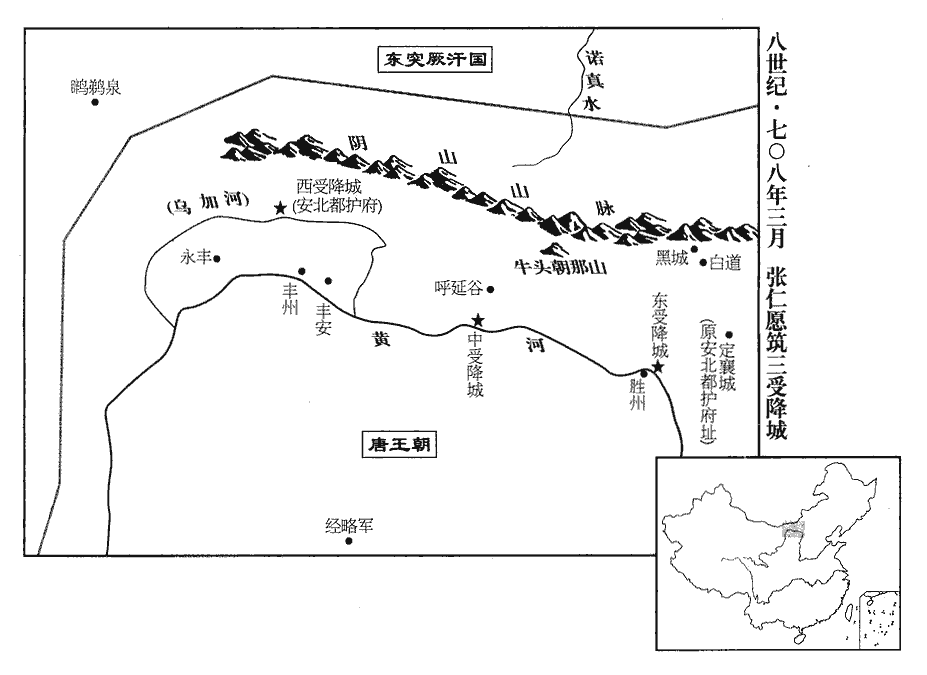
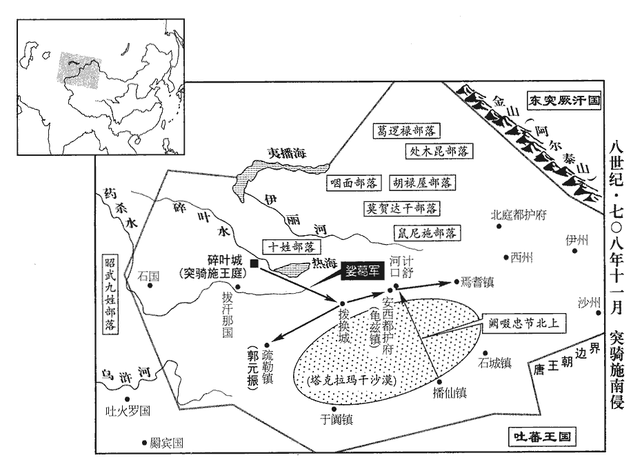
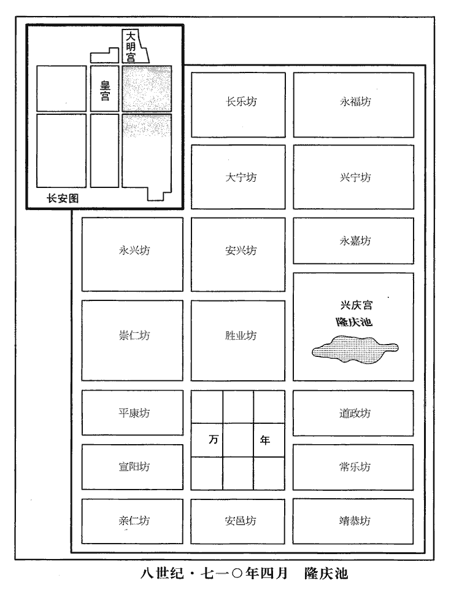

 唐紀二十五起著雍涒灘（戊申），盡上章閹茂（庚戌）七月，凡二年有奇。

# 中宗大和大聖大昭孝皇帝下

## 景龍二年（戊申、七零八）

1春，二月，庚寅‹二十七›，【嚴：「寅」改「辰」。】宮中言皇后衣笥裙上有五色雲起，上‹李显，本年五十三岁›令圖以示百官。韋巨源請布之天下，從之，仍赦天下。

〖译文〗 [1]春季，二月，庚寅（二十七日），宫中的人说韦皇后藏衣服的竹箱上有五色祥云升起，唐中宗便派人画下来给文武百官看。韦巨源请求将这件事向全国公布，唐中宗表示同意，并且下诏赦免全国囚徒。

2迦葉志忠奏：「昔神堯皇帝‹李渊›未受命，天下歌桃李子；桃李子見一百八十卷隋煬帝大業十三年。迦，居伽翻。文武皇帝‹李世民›未受命，天下歌秦王破陣樂；破陣樂見一百九十二卷太宗貞觀元年。天皇大帝‹李治›未受命，天下歌堂堂；調露初，京城民謠有「側堂堂，撓堂堂」之言，太常丞李嗣真曰：「側者不正，撓者不安。自隋以來，樂府有堂堂曲，再言堂者，唐再受命之象。」鄭樵曰：堂堂，陳後主‹陈叔宝›所作，唐高宗常歌之。則天皇后‹武曌›未受命，天下歌娬媚娘；永徽後，民歌娬媚娘曲，蓋隋時已有此曲矣。娬，音武。應天皇帝‹李显›未受命，天下歌英王石州；其歌不見於史志。忠以上初封英王，遂傅會以為受命之符。順天皇后‹韦皇后›未受命，天下歌桑條韋，永徽末，里歌有桑條韋也、女時韋也。樂志：忠遂傅會以為后妃之德，專蠶桑，供宗廟事，上桑韋歌十二篇。蓋天意以為順天皇后宜為國母，主蠶桑之事，謹上桑韋歌十二篇，上，時掌翻；下同。請編之樂府，皇后祀先蠶則奏之。」太常卿鄭愔又引而申之。愔，於今翻。上悅，皆受厚賞。

〖译文〗 [2]迦叶志忠上奏道：“想当初我大唐高祖神尧皇帝尚未受命于天时，天下流行的歌谣是《桃李子》；在太宗文武皇帝尚未即位之时，天下流行的乐曲是《秦王破阵乐》；在高宗天皇大帝继位之前，天下流行传唱的歌谣是《堂堂》；在则天大圣皇后登基以前，天下所流行的乐曲是《媚娘》；在应天皇帝陛下您继位以前，天下流行传唱的歌曲是《英王石州》；在顺天皇后受命于天以前的永徽末年，就已有人传唱《桑条韦》之歌，大概上天的旨意就是认为顺天皇后应当当国母，主持蚕桑之事。因此臣谨献上《桑韦歌》共十二篇，恳请陛下允许将这首歌编入乐府诗歌，让皇后在祭祀先蚕神时演奏。”接下来太常卿郑又顺着这个话题继续加以引申说明。唐中宗听罢十分高兴，迦叶志忠和郑都得到优厚的赏赐。

3右補闕趙延禧上言：「周、唐一統，符命同歸，故高宗‹李治›封陛下為周王；顯慶二年，帝封周王，儀鳳二年，徙封英王。則天時，唐同泰獻洛水圖。見二百四卷武后垂拱三年。孔子曰：『其或繼周者，雖百代可知也。』陛下繼則天，子孫當百代王天下。」王，于況翻。上悅，擢延禧為諫議大夫。

〖译文〗 [3]右补阙赵延禧进言道：“周、唐二代一脉相承，受命的征兆归于一致，所以高宗皇帝将陛下封为周王；则天太后当朝时，唐同泰进献了《洛水图》。孔子说过：‘如有继承周朝制度的，就是传一百代，也是可以预先知道的。’陛下继承则天太后的周朝而君临天下，子孙必将百代保有天下。”唐中宗听过之后十分高兴，将赵延禧提升为谏议大夫。

4丁亥‹二十四›，蕭至忠上疏，以為：「恩倖者止可富之金帛，食以粱肉，上，時掌翻。疏，所去翻。食，讀曰飤，祥吏翻。不可以公器為私用。今列位已廣，宂員倍之，干求未厭，日月增數，陛下降不貲之澤，近戚有無涯之請，賣官利己，鬻法徇私。臺寺之內，朱紫盈滿，忽事則不存職務，恃勢則公違憲章，徒忝官曹，無益時政。」上雖嘉其意，竟不能用。

〖译文〗 [4]丁亥（二十四日），黄门侍郎萧至忠上疏认为：“陛下对于那些受到您宠幸的近臣，最多也只能让他们多得些良田美宅，过锦衣玉食的生活，而不能允许他们将朝廷的官爵当作私有之物。现在国家官吏的定员已很多，无专职的官吏又是其数量的一倍，但求官的人仍未满足，官吏的数量不断增加。陛下赐给近臣无法计算的钱财，近臣贵戚却有永无止境的贪欲，他们公然卖官鬻爵贪赃枉法，以谋求私利，结果造成了各中央官署之内挤满了身着朱衣紫服的高级官吏，这些人玩忽职守，不办公务，倚仗权势，公然违抗法令，徒然置身官署，而对于时政，没有任何裨益。”唐中宗虽然对他所讲的道理十分赞赏，但最终却还是没有采纳他的建议。

5三月，丙辰‹二十三›，朔方道大總管張仁愿築三受降城‹中受降城在内蒙古包头市，东受降城在内蒙古托克托县南，西受降城在内蒙古五原县西北›於河上。中受降城在黃河北岸，南去朔方千三百餘里，安北都護府治焉。東受降城在勝州東北二百里，西南去朔方千六百餘里。西受降城在豐州北黃河外八十里，東南去朔方千餘里。宋祁曰：中城南直朔方，西城南直靈武，東城南直榆關。宋白曰：東受降城東北至單于都護府百二十里，東南至朔州四百里，西南渡河至勝州八里，西至中受降城三百里，本漢雲中郡地。中受降城西北至天德軍二百里，南至麟州四百里，北至磧口五百里，本秦九原郡地，在榆林，漢更名五原，開元十年於此置安北大都護府。西受降城東南渡河至豐州八十里，西南至定遠城七百里，東北至磧口三百里。降，戶江翻。

〖译文〗 [5]三月，丙辰（二十三日），朔方道大总管张仁愿在黄河边上修筑了中、东、西三个受降城。

 

初，朔方軍與突厥‹瀚海沙漠群›以河為境，河北有拂雲祠‹内蒙古包头市›，祠在拂雲堆，因以為名。厥，九勿翻。突厥將入寇，必先詣祠祈禱，牧馬料兵而後渡河。時默啜悉眾西擊突騎施‹伊犁河中下游›，騎，奇寄翻。仁愿請乘虛奪取漠南地，於河北築三受降城，首尾相應，以絕其南寇之路。太子少師唐休璟以為「兩漢以來皆北阻大河，今築城寇境，恐勞人費功，終為虜有。」璟，俱永翻。仁愿固請不已，上‹李显›竟從之。

〖译文〗 当初，唐朔方军与突厥隔黄河为界，在黄河以北有一座拂云祠，突厥在即将进犯朔方军时，每次都要先到拂云祠中祈祷，在作好各方面准备以后才发兵渡黄河南下。当时突厥阿史那默啜调集了全部人马进攻西部的突骑施，于是张仁愿请求率所部乘默啜后方空虚之机夺取沙漠以南的大片土地，并在黄河北岸修筑中、东、西三座首尾呼应的受降城，以便断绝突厥默啜南下进犯的通道。太子少师唐休认为：“自两汉以来，历代都以黄河天险作为北方的边界，如今在突厥境内修筑城池，我担心劳民费力，终究会被突厥所占有。”张仁愿仍然不停地坚持请求筑城，唐中宗终于同意。

仁愿表留歲滿鎮兵以助其功，戍邊歲滿當歸者，留以助城築之功。咸陽‹陕西省咸阳市›兵二百餘人逃歸，仁愿悉擒之，斬於城下，軍中股慄，六旬而成。以拂雲祠為中城，距東西兩城各四百餘里，皆據津要，宋白曰：東受降城本漢雲中郡地，中受降城本秦九原郡地，西受降城蓋漢臨河縣舊理處。拓地三百餘里。於牛頭朝那山‹内蒙古固阳县东›北，朝那山，註見二百三卷高宗弘道元年。置烽候千八百所，以左玉鈐衛將軍論弓仁為朔方軍前鋒遊弈使，戍諾真水‹内蒙古达尔罕茂明安联合旗艾不盖河›為邏衛。遊弈使，領遊兵以巡弈者也。中受降城西二百里至大同川，北行二百四十餘里至步越多山，又東北三百餘里至帝割達城，又東北至諾真水。杜佑曰：遊弈，於軍中選驍勇諳山川、泉井者充，日夕邏候於亭障之外，捉生問事；其副使、子將，並久軍行人，取善騎射人。使，疏吏翻。自是突厥不敢渡山‹阴山›畋牧，朔方無復寇掠，復，扶又翻。減鎮兵數萬人。

〖译文〗 张仁愿上表请求将戍边期满的镇兵留下帮助完成这一工程，但咸阳籍的镇兵二百余人逃回家乡。张仁愿将这些人全部抓回，并在即将筑起的城下将这些人斩首，致使全军将士心惊胆战，六十天过后，终于将三座受降城修筑完毕。以拂云祠为中城，距离东、西两座受降城各四百余里，而且三城都是建在地理位置险要的地方，拓展边境达三百多里。此外，又在位于牛头的朝那山以北修筑了一千八百多个烽火台，并任命左玉钤卫将军论弓仁为朔方军前锋游弈使，驻扎在诺真水巡逻戍卫。从这以后突厥人再也不敢越过朝那山到南边来打猎放牧，朔方军也再没有受到过突厥兵的侵犯和虏掠，因此而减少在这一带戍边的兵士达数万人之多。

仁愿建三城，不置壅門及備守之具。壅門，即古之懸門也。或曰：門外築垣以遮壅城門，今之甕城是也。壅城之外，又有八卦牆、萬人敵，皆以遮壅城門。范祖禹曰：張仁愿築三受降城，不置甕門、曲敵、戰格。或問之，仁愿曰：「兵貴進取，不利退守。寇至，當併力出戰，回首望城者，猶應斬之，安用守備，生其退恧nǜ之心也！」恧，女六翻。其後常元楷為朔方軍總管，始築壅門。人是以重仁愿而輕元楷。

〖译文〗 张仁愿在修筑这三座受降城时，并没有设计出悬门，也没有装备守城的器械。有人问他为什么这样做，张仁愿回答说：“用兵之道，贵在奋勇向前，撤退和防守是不利的。在敌军来临时，全体将士应当齐心协力地出城应战，甚至连那些回过头来向城池方向张望的士兵，都应当被就地处斩，修筑城池时，又哪里用得着准备防守器械来助长部下畏敌退却之心呢！”后来常元楷担任朔方军总管职务，才开始修筑三城悬门。人们因此轻视常元楷而推重张仁愿。

6夏，四月，癸未‹二十一›，置修文館大學士四員，直學士八員，學士十二員，選公卿以下善為文者李嶠等為之。武德四年，置修文館于門下省，九年，改曰弘文館。五品已上曰學士，六品已上曰直學士，又有文學直館，皆他官領之。武后垂拱後，以宰相兼領館事，號曰館主。神龍元年，避孝敬皇帝諱，改曰昭文館，二年改曰修文館。上官昭容勸帝置大學士四人以象四時，直學士八人以象八節，學士十二人以象十二時。每遊幸禁苑，或宗戚宴集，學士無不畢從，賦詩屬和，從，才用翻。屬，之欲翻。和，戸卧翻。使上官昭容第其甲乙，北齊河清新令有昭容，八十一御女之一也。唐昭容位亞昭儀，於九品之次第二。是年冬，方以上官婕妤為昭容。優者賜金帛；同預宴者，惟中書、門下及長參王公、親貴數人而已，至大宴，方召八座、九列、諸司五品以上預焉。於是天下靡然爭以文華相尚，儒學忠讜之士莫得進矣。讜，音黨。

〖译文〗 [6]夏季，四月，癸未（二十一日），唐中宗下令设置修文馆大学士四员，直学士八员，学士十二员，选拔李峤等公卿以下善于写文章的人士担任这些职务。每当唐中宗到皇家园林游玩的时候，或者是皇亲国戚宴饮聚会的时候，这些大学士、直学士和学士们无不跟随，在一旁侍候着赋诗应和。唐中宗又让上官昭容负责评判他们所作诗文的优劣高下，优胜者可以得到金银绢帛的奖赏。一般情况下，只有中书、门下二省高官以及长参王公大臣和受到皇帝宠幸的贵族数人有资格参加这类宴会，只有在大规模宴饮时，唐中宗才召集被称为八座的尚书左右仆射和六部尚书、九卿和各司五品以上官员参加。于是天下闻风披靡，争相崇尚文辞华丽，而忠诚正直的人与儒学之士则无人得到提拔重用。

7秋，七月，癸巳‹三›，以左屯衛大將軍、朔方道大總管張仁愿同中書門下三品。

〖译文〗 [7]秋季，七月，癸巳（初三），唐中宗任命左屯卫大将军、朔方道大总管张仁愿为同中书门下三品。

8甲午‹四›，清源‹山西省清徐县›尉呂元泰上疏，上，時掌翻。疏，所去翻；下同。以為：「邊境未寧，鎮戍不息，士卒困苦，轉輸疲弊，而營建佛寺，日廣月滋，勞人費財，無有窮極。昔黃帝‹姬轩辕›、堯‹伊祁放勋›、舜‹姚重华›、禹‹姒文命›、湯‹子天乙›、文‹姬昌›、武‹姬发›惟以儉約仁義立德垂名，晉、宋以降，塔廟競起，而喪亂相繼，由其好尚失所，奢靡相高，人不堪命故也。伏願回營造之資，充疆埸之費，使烽燧永息，群生富庶，則如來慈悲之施，喪，息浪翻。好，呼到翻。施，式豉翻。平等之心，孰過於此！」疏奏，不省。省，悉景翻。

〖译文〗 [8]甲午（初四），清源尉吕元泰上疏认为：“现在边境地区远未安宁，对这些地区的戍守没有停止，士卒为此而常年鞍马劳顿，粮草辎重的转运也导致国穷民乏，而陛下却日益广建佛寺，更使得对国家人力财力的耗费永无休止。上古圣君如黄帝、唐尧、虞舜、大禹、商汤、周文王和周武王等人，都是凭着他们的勤俭节约和道德仁义来创建功德垂名后世的，两晋和刘宋以来，各朝竞相建造佛家寺塔，而各朝的死丧祸乱也接连不断。这是由于各朝君臣喜好失当，竞相崇尚奢侈豪华从而使百姓痛苦不堪所造成的。希望陛下能抽回用于营建佛寺的资财，把它用于边境地区的军事防务，从而使战火永息，百姓富足，那么如来佛祖的慈悲施予、视一切众生平等无别的心肠，又怎能超过这一功德呢！”这篇奏疏呈上以后，唐中宗根本没有审阅。

9安樂‹李裹儿›、長寧公主‹李裹儿同母的姐姐，韦皇后所生›及皇后妹郕國夫人、上官婕妤‹上官婉儿›、婕妤母沛國夫人鄭氏、尚宮柴氏、賀婁氏，唐宮官有六尚，職掌如六尚書。尚宮二人，正五品，掌導引中宮，總司記、司言、司薄、司闈四司之官。賀婁氏後為臨淄王所誅。樂，音洛。婕妤，音接予。女巫第五英兒、隴西夫人趙氏，皆依勢用事，請謁受賕，雖屠沽臧獲，臧獲，奴婢也。方言曰：陑ér、岱之間，罵奴曰臧，罵婢曰獲；燕之北郊，民而壻婢謂之臧，女而婦奴謂之獲。用錢三十萬，則別降墨敕除官，斜封付中書，時人謂之「斜封官」；錢三萬則度為僧尼。其員外、同正、試、攝、檢校、判、知官凡數千人。時有員外置之官，有員外同正之官，有試官，有攝官，有檢校官。判，謂判某官事；知，謂知某官事也。西京‹西安›、東都‹洛阳›各置兩吏部侍郎，為四銓，選者歲數萬人。選，須絹翻。

〖译文〗 [9]安乐公主、长宁公主及韦皇后的妹妹国夫人、上官婕妤、上官婕妤的母亲沛国夫人郑氏、尚宫柴氏、贺娄氏，女巫第五英儿、陇西夫人赵氏等人，全都仗势专擅朝政，大肆收受贿赂，为行贿者请托授官。不管是屠夫酒肆之徒，还是为他人当奴婢的人，只要向这些人行贿三十万钱，就能够直接得到由皇帝的亲笔敕书任命的官位，由于这种敕书是斜封着交付中书省的，因而这类官员被当时的人称为“斜封官”；如果行贿三万钱，就可以被剃度为僧尼。她们受贿之后所任命的员外官、员外同正官、试官、摄官、检校官、判某官事、知某官事共计数千人之多。在西京和东都两地分别设置两员吏部侍郎，每年四次选授官职，选任官员达数万人。

上官婕妤及後宮多立外第，出入無節，朝士往往從之遊處，以求進達。安樂公主‹李裹儿›尤驕橫，朝，直遙翻。處，昌呂翻。橫，下孟翻。宰相以下多出其門。與長寧公主競起第舍，長寧公主，上女也，下嫁楊慎交。以侈麗相高，擬於宮掖，而精巧過之。安樂公主請昆明池，上以百姓蒲魚所資，不許。公主不悅，乃更奪民田作定昆池，延袤數里，新書曰：定，言可抗訂之也。朝野僉載：定昆池方四十九里，直抵南山‹秦岭›。考異曰：新傳云，四十九里，直抵南山，蓋併主田言之。今從舊傳。累石象華山，華，戶化翻。引水象天津，天津，謂天河也。河圖括地象曰：河精上為天漢。鄭玄曰：天河，水氣也，精光運轉於天。楊泉物理論曰：星者，元氣之英也；漢，水之精也。氣發而著，精華浮上，宛轉隨流，名曰天河，一曰雲漢。欲以勝昆明，故名定昆。安樂有織成裙，直錢一億，花卉鳥獸，皆如粟粒，正視旁視，日中影中，各為一色。

〖译文〗 上官婕妤及宫中的妃嫔姬妾们大多在宫外修建了私宅，这些人随意出入宫禁，在朝为官的人常常与她们交往以求飞黄腾达。在这些人中间，安乐公主尤为骄傲专横，自宰相以下为官的人，大多数是由于走了她的门路才得以上任。安乐公主还与中宗的另一个女儿长宁公主竞相大兴土木，广建宅第，并在建筑的奢侈豪华方面互相攀比，不仅建筑规模模仿皇宫，甚至精巧的程度超过皇宫。安乐公主请求将昆明池赏赐给她，唐中宗以昆明池是百姓用来养殖蒲鱼的地方为由而拒绝。安乐公主很不高兴，便抢夺百姓田宅修建定昆池，南北绵延数里，仿照华山的样子堆石建造假山，又按照天河的样子引水入池。由于安乐公主想要使此湖胜过昆明池，所以将它命名为定昆池。安乐公主还有编织成的价值一亿钱的裙子，上面有谷粒大小的花卉和鸟兽的图案，从正面看或者从侧面看，在日光中看或者在阴影中看，图案的色彩都有不同。

上好擊毬，好，呼到翻。由是風俗相尚，駙馬武崇訓、楊慎交灑油以築毬場。慎交、恭仁曾孫也。恭仁，楊師道之兄也。

〖译文〗 唐中宗喜欢玩用杖击的游戏，于是朝野上下竞相击为乐，驸马武崇训、杨慎交洒油修建场。杨慎交是杨恭仁的曾孙。

上及皇后、公主多營佛寺。左拾遺京兆辛替否上疏諫，略曰：「臣聞古之建官，員不必備，士有完行，行，下孟翻。家有廉節，朝廷有餘俸，百姓有餘食。伏惟陛下百倍行賞，十倍增官，金銀不供其印，束帛不充於錫，錫，賜也，予也。遂使富商豪賈，盡居纓冕之流；鬻伎行巫，或涉膏腴之地。」賈，音古。伎，渠綺翻。又曰：「公主，陛下之愛女，然而用不合於古義，行不根於人心，將恐變愛成憎，翻福為禍。何者？竭人之力，費人之財，奪人之家；愛數子而取三怨，使邊疆之士不盡力，朝廷之士不盡忠，人之散矣，獨持所愛，何所恃乎！君以人為本，本固則邦寧，書五子之歌曰：民惟邦本，本固邦寧。邦寧則陛下之夫婦母子長相保也。」又曰：「若以造寺必為理體，理體，猶言治體也，避高宗諱，以「治」為「理」。養人不足經邦，則殷、周已往皆暗亂，漢、魏已降皆聖明，殷、周已往為不長，漢、魏已降為不短矣。陛下緩其所急，急其所緩，親未來而疏見在，見，賢遍翻。失真實而冀虛無，重俗人之為，輕天子之業，雖以陰陽為炭，萬物為銅，役不食之人，使不衣之士，猶尚不給，用漢劉陶語意。況資於天生地養，風動雨潤，而後得之乎！一旦風塵再擾，霜雹荐臻，沙彌不可操干戈，寺塔不足攘饑饉，臣竊惜之。」疏奏，不省。操，千高翻。省，悉景翻。

〖译文〗 唐中宗和韦皇后以及各位公主多营建佛寺。左拾遗京兆人辛替否上疏谏阻，疏文大意是：“臣听说上古帝王设置官署，员额不一定要求齐备，但要求士人一定要具备完美的操行，居家有清廉的节操，朝廷薪俸有节余，百姓生计无虞。可是现在陛下颁发给臣下的赏赐相当于先代百倍，增设的官吏员额相当于先代十倍，以至于国家的金银不足以满足铸造官印的需求，府库中的绢帛等财物的储备赶不上陛下赏赐臣下的支出，从而使得富商大贾可以通过出钱买官而居于高贵的职位，也使得有些依靠装神弄鬼代人祈祷或者以卖艺为生的人可以占有肥沃的良田。”他又说：“公主，是陛下心爱的女儿，但是她的日常用度不符合古已有之的规矩，她的所作所为不注意立足于民心，臣担心长此以往会使喜爱变成憎恶，将福泽变为祸患。为什么呢？因为这样做耗尽民力，浪费百姓钱财，强取百姓家资。陛下为怜爱几个子女而招致三种怨恨，将会使得戍守边疆的将士们不愿为朝廷尽力，在朝为官的人不愿意为陛下尽忠，人心既已涣散，只剩下几个自己所宠爱的人，陛下还能依靠什么来治理国家呢！君主是以百姓的拥戴支持为基础的，基础牢固则国家就安宁，国家安宁则陛下夫妇母子也就得以长久保全。”他还说：“如果认为只有营建佛寺是治理国家的根本，休养士民不足以治理好国家，那么殷、周以前就都是昏暗混乱的时代，而汉、魏以后则全是圣明之世了，殷、周以前的朝代是历时不长，而汉、魏以后的朝代则是历时不短了。陛下把治理国家的当务之急当作可以从缓的事，又把只能缓办的事当作治理国家的当务之急，应亲近的人尚未前来而应疏远的人已居于朝中，不做实实在在的事而寄希望于虚无飘渺之事，重视俗人的作为而轻视天子应当成就的事业，即使陛下能够以阴阳二气为炭，像工匠在火炉中冶铜那样创造出万物，役使那些不用吃饭穿衣的人，恐怕也无法供给奢侈靡费所需的支出，更何况陛下所依靠的只能是那些天生地养、经过风雨吹打滋润之后才能生成的自然之物呢！一旦战乱再起，或者是霜雹成灾，出家的和尚不能拿起刀枪来勤王救主，林立的寺塔更无法缓解饥荒，臣对陛下这种广建佛寺的行为感到十分痛惜。”这篇奏疏呈上之后，唐中宗根本不审阅。

時斜封官皆不由兩省而授，兩省莫敢執奏，即宣示所司，吏部員外郎李朝隱前後執破一千四百餘人，怨謗紛然，朝隱一無所顧。朝，直遙翻。

〖译文〗 当时的斜封官都是不通过中书门下两省而由皇帝直接降下墨敕任命的，两省长官都不敢就其中的问题上奏，只是将任命传达给有关部门。但是吏部员外郎李朝隐却前后阻止了一千四百余名斜封官的任命，从而招来许多怨恨和诽谤，然而李朝隐对此全然不顾。

10冬，十月，己酉‹二十一›，修文館直學士、起居舍人武平一上表請抑損外戚權寵；不敢斥言韋氏，但請抑損己家。上優制不許。平一名甄，以字行；載德之子也。武氏之盛，載德封潁川郡王。

〖译文〗 [10]冬季，十月，己酉（二十一日），修文馆直学士、起居舍人武平一上表请求削夺外戚的权势，减少对外戚的宠爱；由于武平一不敢直接指斥韦后家族，所以只能请求对自己的家族加以抑制贬损。唐中宗没有同意他的请求。武平一名甄，人们通常称呼他的字，是武载德的儿子。

11十一月，庚申‹二›，突騎施‹伊犁河中下游›酋長娑葛自立為可汗，殺唐使者御史中丞馮嘉賓，遣其弟遮努等帥眾犯塞。騎，奇寄翻。酋，慈由翻。長，知兩翻。娑，素何翻。可，從刊入聲。汗，音寒。使，疏吏翻。帥，讀曰率。

〖译文〗 [11]十一月，庚申（初二），突骑施酋长娑葛自立为可汗，杀死了唐朝的使者、御史中丞冯嘉宾，又派他的弟弟遮奴等人率领人马进犯唐朝边塞。

初，娑葛既代烏質勒統眾，見上卷神龍二年。父時故將闕啜忠節不服，將，即亮翻。啜，陟劣翻。考異曰：郭元振傳作「阿史那闕啜忠節」，突厥傳止謂之「闕啜忠節」，文館記謂之「阿史那忠節」。元振疏皆云「忠節」，乃其名也。突厥有五啜，其一曰胡祿居闕啜。或者忠節官為闕啜歟？今從突厥傳。今按西突厥亦姓阿史那氏；闕，部落之名；啜，官名也；忠節，人名也。諸家有書阿史那闕啜忠節者，詳書之也；或書官以綴其名，或書姓以綴其名者，約文也。數相攻擊。忠節眾弱不能支，金山道行軍總管郭元振奏追忠節入朝宿衛。

〖译文〗 当初，娑葛已经取代了他的父亲乌质勒统领各部人马，但他父亲的旧将阙啜忠节不服，多次兴兵与娑葛交战。阙啜忠节的部众力弱，顶不住娑葛的打击，唐金山道行军总管郭元振于是奏请唐中宗征召阙啜忠节入朝充任宿卫。

忠節行至播仙城‹新疆且末县›，經略使、右威衛將軍周以悌說之曰：唐置四鎮經略使於安西府。數，所角翻。朝，直遙翻；下同。使，疏吏翻；下間使同。說，輸芮翻。「國家不愛高官顯爵以待君者，以君有部落之眾故也。今脫身入朝，一老胡耳，豈惟不保寵祿，死生亦制於人手。方今宰相宗楚客、紀處訥用事，不若厚賂二公，請留不行，發安西‹驻龟兹新疆库车县›兵及引吐蕃以擊娑葛，相，息亮翻。處，昌呂翻。訥，內骨翻。吐，從暾入聲。求阿史那獻為可汗以招十姓，獻，阿史那彌射之孫，元慶之子。使郭虔瓘guàn發拔汗那‹中亚费尔干纳盆地›兵以自助；杜環經行記：拔汗那國在怛邏斯南千里，東隔山，去疏勒二千餘里，西去石國千餘里。既不失部落，又得報仇，比於入朝，豈可同日語哉！」郭虔瓘者，歷城‹山东省济南市›人，歷城縣，漢、晉屬濟南郡，後魏以來帶齊州。時為西邊將。忠節然其言，遣間使賂楚客、處訥，請如以悌之策。將，即亮翻。間，古莧翻。

〖译文〗 当阙啜忠节走到播仙城时，经略使、右威卫将军周以悌劝他说：“朝廷之所以不惜用高官显爵来优待您，是因为您掌握着自己部落的全部人马。现在如果您离开您的部落只身入朝，那只不过是一个老迈的胡人罢了，不但无法保住皇帝对您的恩宠和自己的官爵俸禄，恐怕就连生死也操之于他人之手了。现今宰相宗楚客、纪处讷执掌朝政，您不如多用些钱财贿赂这两个人，请他们让皇帝同意您留在西域，同时调集安西都护府所辖军队以及引入吐蕃兵以攻打娑葛，再请求册封阿史那献为可汗以招抚十姓人马，另外派郭虔调集拔汗那兵相助。这样做既不会失去对各部落的控制，又可以报娑葛相欺之仇，比起您单身入朝受制于人来，岂可同日而语！”郭虔是历城县人，当时在西部边境为将。阙啜忠节认为周以悌的话很对，便暗地里派使者向宗楚客、纪处讷二人行贿，请他俩同意自己按照周以悌的计策行事。

元振聞其謀，上疏，以為：「往歲吐蕃所以犯邊，正為求十姓‹中亚伊赛克湖畔›、四鎮之地不獲故耳。求十姓、四鎮事，始二百五卷武后萬歲通天元年。為，于偽翻；下能為同。比者息兵請和，謂入貢而金城公主下嫁也。比，毗至翻。非能慕悅中國之禮義也，直以國多內難，謂贊普南征而死，國中大亂，嫡庶競立，將相爭權，自相屠滅。難，乃旦翻。人畜疫癘，恐中國乘其弊，故且屈志求自昵。昵，尼質翻。使其國小安，豈能忘取十姓、四鎮之地哉！今忠節不論國家大計，直欲為吐蕃鄉導，畜，許救翻。鄉，讀曰嚮。恐四鎮危機，將從此始。頃緣默啜憑陵，所應者多，兼四鎮兵疲弊，勢未能為忠節經略，非憐突騎施也。忠節不體國家中外之意而更求吐蕃；吐蕃得志，則忠節在其掌握，豈得復事唐也！復，扶又翻。往年吐蕃無恩於中國，猶欲求十姓、四鎮之地；即謂萬歲通天元年事。今若破娑葛有功，請分于闐‹新疆和田市›、疏勒‹新疆喀什市›，不知以何理抑之！又，其所部諸蠻及婆羅門‹在印度半岛›等方不服，若借唐兵助討之，亦不知以何詞拒之！是以古之智者皆不願受夷狄之惠，蓋豫憂其求請無厭，厭，於鹽翻。終為後患故也。又，彼請阿史那獻者，豈非以獻為可汗子孫，欲依之以招懷十姓乎！按獻父元慶，叔父僕羅，兄俀tuǐ子及斛瑟羅、懷道等，皆可汗子孫也。往者唐及吐蕃徧曾立之以為可汗，欲以招撫十姓，武后垂拱元年冊元慶為可汗，見二百三卷。冊斛瑟羅，按舊書亦在是卷二年。俀子見二百五卷延載元年。長安四年冊懷道為可汗，見二百七卷。僕羅、俀子，蓋皆吐蕃所立。俀，吐猥翻。皆不能致，尋自破滅。何則？此屬非有過人之才，恩威不足以動眾，雖復可汗舊種，復，扶又翻。種，章勇翻。眾心終不親附，況獻又疏遠於其父兄乎？若使忠節兵力自能誘脅十姓，誘，音酉。則不必求立可汗子孫也。又，欲令郭虔瓘入拔汗那，發其兵。虔瓘前此已嘗與忠節擅入拔汗那發兵，不能得其片甲匹馬，而拔汗那不勝侵擾，勝，音升。南引吐蕃，奉俀子，還侵四鎮。時拔汗那四旁無強寇為援，虔瓘等恣為侵掠，如獨行無人之境，猶引俀子為患。今北有娑葛，急則與之并力，內則諸胡堅壁拒守，外則突厥伺隙邀遮。伺，相吏翻。臣料虔瓘等此行，必不能如往年之得志；內外受敵，自陷危亡，徒與虜結隙，令四鎮不安。以臣愚揣之，實為非計。」揣，初委翻。

〖译文〗 郭元振在得知阙啜忠节的计谋之后上疏认为：“往年吐蕃之所以兴兵入侵，不过是由于他们要求得到突厥十姓和安西四镇之地而没有得到罢了。最近几年息兵停战，请求和亲，并非因为吐蕃真心向往中国的礼义教化，只不过是由于吐蕃自己国内多难，人口与牲畜染上了瘟疫，担心中国乘其国弊民贫之机大举进攻而已，所以他们暂且委屈求全，自求亲近大唐，以便使其国内稍稍安定一些，他们怎么会忘记要夺取突厥十姓和安西四镇之地呢！现在阙啜忠节不为国家大计着想，只想作吐蕃军队的向导，恐怕安西四镇的危机将会从这时开始出现。近来由于突厥默啜的侵凌进逼，所要应付的事很多，再加上安西四镇的兵马疲弊，形势使唐军难以替阙啜忠节经营筹划，并不是怜惜突骑施而不愿出兵。现在阙啜忠节不去设身处地地为朝廷经营中外的大业着想，却反而向吐蕃求助；一旦吐蕃在西域得志，就必然会控制阙啜忠节，阙啜忠节又哪里能够再事奉唐朝呢！以前吐蕃在无恩于大唐时，尚且想索取突厥十姓和安西四镇之地；如果现在帮助大唐攻破娑葛有功，吐蕃就会请求朝廷将于阗、疏勒二镇割让给它，到那时不知朝廷能以什么理由抑制这一要求！此外，吐蕃统治下的各个蛮族部落以及婆罗门正不服从赞普的号令，如果吐蕃请求借用唐兵前往征讨，也不知道朝廷又能以哪种借口拒绝它的要求！所以自古以来聪明的中国帝王都不愿意接受夷狄的恩惠，这大概是由于担心他们日后会提出永无休止的要求，最终会铸成大患的缘故。再说，阙啜忠节请出阿史那献来，还不就是因为阿史那献是可汗的子孙，想靠他来招抚十姓吗！不过阿史那献的父亲阿史那元庆、叔父阿史那仆罗、哥哥阿史那子及阿史那斛瑟罗、阿史那怀道等人也全都是可汗的子孙。过去大唐朝廷以及吐蕃赞普曾将他们一个个地册封为可汗，都想用他们来招抚十姓，但均未能达到目的，这些人在位不久便纷纷破族灭家。为什么呢？因为这些人都不具备超出常人的才能，恩德与威名也不足以影响部众，所以虽然他们都是可汗的嫡系子孙，各个部落还是不肯亲近依附他们，何况阿史那献与可汗的血缘关系比他的父兄还要疏远一些呢？倘若阙啜忠节自己的兵力就足以使西突厥十姓部落归附的话，那么他就没有必要请求可汗的子孙阿史那献出来作可汗了。还有，阙啜忠节想让郭虔前往征调拔汗那的兵马，但郭虔在此之前就曾经与阙啜忠节一道擅自进入拔汗那征调兵马，但却未能得到它的一兵一卒，反而使拔汗那因不胜侵扰而从南方引来吐蕃军队，并拥戴吐蕃所册立的可汗阿史那子，回军进犯安西四镇。当时拔汗那周围并无强大的部落可以援助它，郭虔等人肆意侵扰抢掠，如入无人之境，尚且招来阿史那子为患。现在拔汗那北部有娑葛部落，一旦走投无路就会与娑葛会合。在这种内有诸胡坚壁固守，外有突厥伺机阻截的不利形势下，臣料定郭虔等此次前往拔汗那调兵，必然无法像上一次那样志得意满，只能是内外受敌，自陷危亡，白白地与各部落结仇，从而使安西四镇永无宁日。所以依臣愚见，这实在不是一条好计。”

 

楚客等不從，建議「遣馮嘉賓持節安撫忠節，侍御史呂守素處置四鎮，處，昌呂翻。以將軍牛師獎為安西‹驻龟兹新疆库车县›副都護，發甘‹甘肃省张掖市›、涼‹甘肃省武威市›以西兵，兼徵吐蕃，以討娑葛。」娑葛遣使娑臘獻馬在京師，聞其謀，馳還報娑葛。於是娑葛發五千騎出安西‹新疆库车县›，五千騎出撥換‹新疆阿克苏市›，五千騎出焉耆‹新疆焉耆县›，五千騎出疏勒，入寇。騎，奇寄翻。元振在疏勒，柵於河口‹赤河口›，不敢出。忠節逆嘉賓於計舒河口‹库车县北›，娑葛遣兵襲之，生擒忠節，殺嘉賓，擒呂守素於僻城‹库车县东北›，縛於驛柱，冎而殺之。冎guǎ，古瓦翻。考異曰：御史臺記云：「嘉賓為中丞，神龍中，起復，持節甘、涼。時郭元振都督涼州，奏中書令宗楚客受娑葛金兩石，請紹封為可汗。楚客憾之，既用事，時議云委嘉賓與侍御史呂守素按元振。元振竊知之，乃諷番落害嘉賓于驛中，獲函中敕，云『元振父亡，匿不發喪，至是為發之，仍按其不臣之狀，便誅之。』元振以為偽敕，具以聞。」今從舊傳。

〖译文〗 宗楚客等人不同意郭元振的意见，建议“派遣御史中丞冯嘉宾带着符节前往安抚阙啜忠节，派侍御史吕守素去处理安西四镇的军政事务，任命将军牛师奖担任安西都护府副都护，调集甘、凉二州以西各处兵马，同时征调吐蕃军队，共同讨伐娑葛。”当时娑葛派来向朝廷贡献马匹的使者娑腊还在京师，听到这个消息后立即马不停蹄地回来报知娑葛。娑葛于是派遣五千骑兵出安西，五千骑兵出拨换，五千骑兵出焉耆，五千骑兵出疏勒，分路入侵。当时郭元振正好在疏勒镇，在河口扎下栅垒，不敢出营抗击娑葛。阙啜忠节到计舒河河口迎接冯嘉宾，娑葛派兵袭击了他们，生擒阙啜忠节，杀死了冯嘉宾，又在僻城捉住了吕守素，并把他绑在驿站的廊柱上一刀一刀地剐死。

12上以安樂公主‹李裹儿›將適左衛中郎將武延秀，遣使召太子賓客武攸緒於嵩山‹中岳·河南省登封县北›。郎將，即亮翻。使，疏吏翻。攸緒將至，上敕禮官於兩儀殿設別位，欲行問道之禮，聽以山服葛巾入見，不名不拜‹武攸绪是李显的表哥›。見，賢遍翻；下辭見同。仗入，自太極殿前喚仗從東、西上閤門入，立於兩儀殿前。通事舍人引攸緒就位；引就問道之位。攸緒趨立辭見班中，再拜如常儀。凡百官自中朝出為外官赴朝辭，自外官入朝覲者引入見，其辭見者不與百官序班，自為班立，謂之辭見班。杜佑曰：唐制：供奉官（左右散騎常侍，門下、中書侍郎，諫議大夫，給事中，中書舍人，左，右遺補，通事舍人在橫班），辭見者，各從兼官，班在正官之次。品式令，前官被召見，及赴朝參致仕者在本品見任上，以理解官者在同品下。上愕然，竟不成所擬之禮。上屢延之內殿，頻煩寵錫，皆謝不受；親貴謁候，寒溫之外，不交一言。

〖译文〗 [12]唐中宗准备将安乐公主改嫁给左卫中郎将武延秀，派人到嵩山征召隐居在那里的太子宾客武攸绪。在武攸绪快到的时候，唐中宗颁布敕命，让礼官在两仪殿另外设一个座位，想依照帝王问道的礼节，让武攸绪穿着隐居时的服装入朝参见，既不用自己称呼自己的名字，也不需要行跪拜之礼。仪仗抵达两仪殿后，通事舍人带领武攸绪到另设的座位就坐。武攸绪却恭恭敬敬地小步快走到辞见班的行列中站立，按照通常的礼仪行一拜二拜之礼。唐中宗对此感到惊讶，终于没能按事先拟定的帝王问道之礼接待武攸绪。唐中宗一次又一次地请武攸绪进入内殿，又屡次对他恩宠有加，赏赐大量财物，武攸绪都一一推辞没有接受；宗室、贵官前来拜谒问候时，武攸绪也只是与他们寒暄冷暖，此外不发一言。

初，武崇訓之尚公主‹李裹儿›也，帝蓋自房陵‹湖北省房县›還，始以公主適崇訓。延秀數得侍宴。數，所角翻。延秀美姿儀，善歌舞，公主悅之。及崇訓死，見上卷元年。遂以延秀尚焉。‹武崇训是武三思的儿子，武延秀是武承嗣的儿子；武三思跟武承嗣同一个祖父武士彟›

〖译文〗 起初，武崇训娶了安乐公主，武延秀曾多次陪同参加宴会。武延秀长得英俊潇洒，又能歌善舞，安乐公主很喜欢他。等到武崇训被太子李重俊杀死后，唐中宗便把安乐公主嫁给了武延秀。

己卯‹二十一›，成禮，假皇后仗，唐六典，宮官六尚，尚服局有司仗、典仗、掌仗之官，掌羽儀仗衛之事。又按唐制，皇后乘重翟dí、厭翟、翟車、安車、四望車、金根車，而公主乘厭翟車，則下皇后一等。此時蓋以重翟及皇后儀衛假之也。分禁兵以盛其儀衛，命安國相王‹李旦›障車。相，息亮翻。庚辰‹二十二›，赦天下。考異曰：實錄、新舊紀皆云「己卯大赦」。今從景龍文館記，成禮之明日。以延秀為太常卿，兼右衛將軍。辛巳‹二十三›，宴群臣于兩儀殿，命公主‹李裹儿›出拜公卿，公卿皆伏地稽首。稽，音啟。

〖译文〗 己卯（二十一日），安乐公主与武延秀举行成婚典礼，安乐公主所使用的是只有皇后才能使用的仪仗，唐中宗又派禁兵参加典礼以壮大仪仗和卫士队伍的声势，还指派安国相王李旦迎候公主的车马。庚辰（二十二日），唐中宗下诏赦免天下罪囚，并任命武延秀为太常卿兼右卫将军。辛巳（二十三日），唐中宗在两仪殿设宴招待群臣，并让安乐公主出来拜见公卿大臣，群臣一个个都趴在地上叩头还礼。

13癸未‹二十五›，牛師獎與突騎施娑葛戰于火燒城‹库车县北›，師獎兵敗沒。娑葛遂陷安西，安西都護府，時在龜茲。斷四鎮路，斷，音短。遣使上表，求宗楚客頭。使，疏吏翻。上，時掌翻。楚客又奏以周以悌代郭元振統眾，徵元振入朝；朝，直遙翻。以阿史那獻為十姓可汗，置軍焉耆以討娑葛。

〖译文〗 [13]癸未（二十五日），牛师奖与突骑施娑葛在火烧城交战，牛师奖全军覆没。娑葛乘胜攻陷安西都护府所在地龟兹，切断了四镇之间的联系，并派遣使者入朝上表，向唐中宗索要宗楚客的头颅。宗楚客又奏请任命周以悌取代郭元振统领安西各路兵马，征召郭元振入朝；同时册立阿史那献为十姓可汗，在焉耆布署军队以讨伐娑葛。

娑葛遺元振書，遺，于季翻。稱：「我與唐初無惡，但讎闕啜。宗尚書受闕啜金，欲枉破奴部落，馮中丞、牛都護相繼而來，宗尚書謂楚客，馮中丞謂嘉賓，牛都護謂師獎，各稱其官也。奴豈得坐而待死！又聞史獻欲來，史獻即阿史那獻，約言之。徒擾軍州，恐未有寧日。乞大使商量處置。」元振奏娑葛書。楚客怒，奏言元振有異圖，召，將罪之。元振使其子鴻間道具奏其狀，乞留定西土，不敢歸。周以悌竟坐流白州‹广西博白县›，復以元振代以悌，處，昌呂翻。間，古莧翻。復，扶又翻。考異曰：元載玄宗實錄、舊傳皆云「復以元振代以悌，元振奏稱西土未寧，逗留不敢歸京師。」按既代以悌，則復留居西邊矣，何所逗留！今從新傳。赦娑葛罪，冊為十四姓可汗。西突厥先有十姓，今併咽麫‹中亚巴尔喀什湖东›、葛邏祿‹中亚额尔齐斯河流域›、莫賀達干、都摩支為十四姓。

〖译文〗 娑葛写信给郭元振，在信中声称：“本来我与大唐朝廷之间没有任何矛盾，我的仇敌只有阙啜忠节一个人。但兵部尚书宗楚客接受了阙啜忠节的重金贿赂，就毫无道理地想发兵攻破我的部落，并且御史中丞冯嘉宾和安西都护府副都护牛师奖将军相继领命而来，我又岂能坐以待毙！另外我又听说阿史那献也将来到此地，他的到来只会使安西四镇冲突增多，恐怕今后难以有安宁的日子好过。请大使商量解决吧。”郭元振将娑葛的信上奏给了唐中宗。宗楚客大怒，奏称郭元振有不臣之心，征召他入朝，准备治罪。郭元振派他的儿子郭鸿走小路将实际情况向唐中宗一一奏明，请求留在西域稳定局势，不敢回到朝中。周以悌最后因获罪被流放到白州，唐中宗又任命郭元振代替他的职务，下诏赦免娑葛的罪行，并将娑葛册立为十四姓可汗。

14以婕妤上官氏‹上官婉儿›為昭容。

〖译文〗 [14]唐中宗封婕妤上官氏为昭容。

15十二月，御史中丞姚廷筠奏稱：「比見諸司不遵律令格式，事無大小皆悉聞奏。臣聞為君者任臣，為臣者奉法。萬機叢委，不可徧覽，豈有脩一水竇，伐一枯木，皆取斷宸衷！比，毗至翻。斷，丁亂翻。自今若軍國大事及條式無文者，聽奏取進止，自餘各準法處分。處，昌呂翻。分，扶問翻。其有故生疑滯，致有稽失，望令御史糾彈。」從之。

〖译文〗 [15]十二月，御史中丞姚廷筠上奏道：“近来各有关部门不是依据律令格式所规定的权限办理自己的公务，而是不论大事小事都一概奏请皇帝裁决。臣听说过君主任用臣下，臣下则应依法履行公务。陛下日理万机，纷繁的政务堆积如山，不可能遍览奏书，臣下怎么能把诸如是否挖一个水孔、伐一株枯树这样的小事都呈奏上来由皇帝决断呢！陛下应当明确规定从今以后，只有遇到军国大事或者是那些条令格式上没有明确规定的事，有关部门才可以上奏皇帝决断，其余的一律依照法令的规定处理；若再有故意迟疑拖延从而导致稽留失时的现象出现，希望让御史纠举弹劾有关责任人员。”唐中宗采纳了他的建议。

16丁巳晦‹二十九›，敕中書、門下與學士、諸王、駙馬入閤守歲，設庭燎，置酒，奏樂。閤，內殿也。守歲之宴，古無之。梁庾yǔ肩吾除夕詩：「聊傾柏葉酒，試奠五辛盤。」蓋江左已有此矣，然未至君臣相與酣適也。隋煬帝淫侈，每除夜，殿前諸院設火山數十，盡沈香木根，每一山皆焚沈香數車，火光暗則以甲煎沃之，焰起數丈，香聞數十里，一夜之間，用沈香二百餘乘，甲煎過二百餘石。歐陽修詩：「隋宮守夜沈香火」，謂此也。帝之為此，亡隋之續耳。酒酣，上謂御史大夫竇從一曰：「聞卿久無伉儷，酣，戶甘翻。伉，苦浪翻。儷，力計翻。朕甚憂之。今夕歲除，為卿成禮。」從一但唯唯拜謝。為，于偽翻。唯，于癸翻。俄而內侍引燭籠、步障、金縷羅扇自西廊而上，內侍之官，唐從四品上，掌在內侍奉、出入宮掖宣傳之事。後魏曰長秋卿，北齊曰中侍中，後周曰司內上士，隋曰內侍，唐因之；中官之貴，極于此矣。若有殊勳懋績，則有拜大將軍者，仍兼內侍之官。上，時掌翻。扇後有人衣禮衣，花釵，唐制：命婦之服有翟衣，內命婦受冊、從蠶、朝會、外命婦嫁及受冊、從蠶、大朝會之服也，青質，繡翟，編次於衣及裳，重為九等。一品翟九等，花釵九樹；二品翟八等，花釵八樹；三品至五品皆降殺以一。禮衣者，內命婦常參、外命婦朝參、辭見禮會之服也，制同翟衣，加雙佩、小綬，去舄xì加履。人衣，於既翻。令與從一對坐。上命從一誦卻扇詩數首。唐人成婚之夕，有催妝詩，卻扇詩。李商隱代董秀才卻扇詩云：「莫將畫扇出帷來，遮掩春山滯上才。若道團圓是明月，此中須放桂花開。」扇卻，去花易服而出，去，羌呂翻。徐視之，乃皇后老乳母王氏，本蠻婢也。上與侍臣大笑。詔封莒國夫人，嫁為從一妻。俗謂乳母之壻曰「阿㸙」，從一每謁見及進表狀，自稱「翊聖皇后阿㸙」，時人謂之「國㸙」，阿，烏葛翻。㸙zhē，正奢翻。見，賢遍翻。從一欣然有自負之色。

〖译文〗 [16]丁巳晦（二十九日），唐中宗下敕召中书、门下长官与学士、诸王、驸马入内殿守岁，在宫中摆好了用于照明的火炬，布置了酒宴，还安排乐队奏乐助兴。在酒兴正浓时，唐中宗对御史大夫窦从一说：“听说你已经打了很长时间的光棍，朕很是忧虑。今天晚上是除夕之夜，朕想为你完婚。”窦从一只是恭敬而顺从地连连答应行礼称谢。不一会儿功夫，内侍领着手持灯笼、步障和金缕罗扇的人从西廊上殿，罗扇后面有一位身着礼服、头戴花钗的妇人。唐中宗让这位妇人与窦从一对面而坐，然后让窦从一吟诵了几首《却扇诗》。罗扇被拿走之后，这位妇人摘下花钗，换去礼服又出来，众人慢慢端详，才发现她原来是韦皇后的老乳母王氏，她本是一个蛮族的婢女。唐中宗与侍臣们哄堂大笑，并下诏册封王氏为莒国夫人，嫁给窦从一为妻。当时民间俗称乳母的丈夫为“阿”窦从一每次谒见中宗或者呈进表状时，都自称为“翊圣皇后阿”，因而人们也就称窦从一为“国”，窦从一反倒欣欣然，有自以为了不起的神色。

## 三年（己酉、七零九）

1春，正月，丁卯‹九›，制廣東都‹洛阳›聖善寺，按西京已有聖善寺，東都亦有聖善寺，皆帝所建，為武后追福。居民失業者數十家。

〖译文〗 [1]春季，正月，丁卯（初九），唐中宗颁下制书，下令扩建东都圣善寺，当地百姓因这一工程而失去生计的有数十家。

2長寧、安樂‹李裹儿›諸公主多縱僮奴掠百姓子女為奴婢，侍御史袁從之收繫獄，治之。樂，音洛。治，直之翻。公主訴於上‹李显，本年五十四岁›，上手制釋之。從之奏稱：「陛下縱奴掠良人，何以理天下！」上竟釋之。

〖译文〗 [2]长宁、安乐等公主多次放纵奴仆劫掠百姓子女为奴婢，侍御史袁从之将这些恶奴逮捕入狱治罪。公主们把这件事告诉了唐中宗，中宗便亲笔书写制书将恶奴们释放出狱。袁从之为此向唐中宗上奏道：“陛下放纵恶奴劫掠良家子女为奴婢，又怎么能依法治理天下呢！”但唐中宗还是将他们释放了。

3二月，己丑‹二›，上幸玄武門，與近臣觀宮女拔河。以麻絚巨竹分朋而挽水，謂之拔河，以定勝負。考異曰：唐紀云：「觀宮女大酺pú。」今從實錄。又命宮女為市肆，公卿為商旅，與之交易，因為忿爭，言辭褻慢，上與后臨觀為樂。褻xiè，息列翻。樂，音洛。

〖译文〗 [3]二月，己丑（初二），唐中宗来到玄武门，与亲近的臣子们一同观看宫女们拔河。中宗又让宫女们扮作市场里的商店伙计，让公卿大臣们扮作行商旅客，与她们作买卖，又假装愤怒争执，彼此言辞不堪入耳。唐中宗和韦皇后则在一旁观看，以此为乐。

4丙申‹九›，監察御史崔琬對仗彈宗楚客、紀處訥潛通戎狄，受其貨賂，致生邊患。謂受闕啜忠節賂，以致娑葛畔換也。考異曰：景龍文館記曰：「監察御史崔琬具衣冠，對仗彈大學士、兵部尚書郢國公宗楚客及侍中紀處訥。時楚客在列，奏言：『臣以庸妄，叨居樞密，中外朋結謀臣，臣先奏聞，計垂天鑒。』上頜之，謂琬曰：『楚客事朕知，且去，待仗下來。』至仗下後，琬方續奏；敕令於西省對問。中書門下奏無狀；有進止即令復位。初，娑葛父子與阿史那忠節代為仇讎，娑葛頻乞國家為除忠節，安西都護郭元振表請如其奏。宗楚客固執，言『忠節竭誠於國，作扞玉關，若許娑葛除之，恐非威強拯弱之義。』上由是不許。無何，娑葛擅殺御史中丞馮嘉賓、殿中侍御史呂守素，破滅忠節，侵擾四鎮。時碎葉鎮守使中郎周以悌率鎮兵數百人大破之，奪其所侵忠節及于闐部眾數萬口。奏到，上大悅，拜以悌左屯衛將軍，仍以元振四鎮經略使授之；敕書簿責元振。宗議發勁卒，令以悌及郭虔瓘北討，仍邀吐蕃及西域諸部計會同擊娑葛；右臺御史大夫解琬議稱不可。後竟與之和。娑葛聞前議，大怨，乃付元振狀，稱宗先取忠節金。上以問之，宗具以前事奏。時太平、安樂二公主以親貴權寵，各立黨與，陰相傾奪，爰自要官宰臣皆分為兩。時太平尤與宗不善，故諷琬以彈之；外傳取娑葛金，非也。」今從實錄、記。故事，大臣被彈，被，皮義翻。俯僂趨出，俛首為俯；傴yǔ背為僂。僂lǚ，力主翻。立於朝堂待罪。朝，直遙翻。至是，楚客更憤怒作色，自陳忠鯁，為琬所誣。上竟不窮問，命琬與楚客結為兄弟以和解之，時人謂之「和事天子」。

〖译文〗 [4]丙申（初九），监察御史崔琬对着皇帝的仪仗上奏，弹劾宗楚客、纪处讷二人暗地里勾结戎狄，接受对方的贿赂，导致边疆地区发生叛乱。依照惯例，大臣受到弹劾时，应当弯腰低头快步走出，站在朝堂上听候治罪。这次宗楚客受到弹劾后，反而勃然大怒，变了脸色，向中宗自述自己的忠诚鲠直，声称受到了崔琬的诬陷。唐中宗对此居然没有严加追究，只是让崔琬与宗楚客结为兄弟，以此来使两人和解，当时的人都称中宗为“和事天子”。

5壬寅‹十五›，以韋巨源為左僕射，楊再思為右僕射，並同中書門下三品。

〖译文〗 [5]壬寅（十五日），唐中宗任命韦巨源为尚书左仆射，杨再思为尚书右仆射，一并任同中书门下三品。

6上數與近臣學士宴集，令各效伎藝以為樂。數，所角翻。伎，渠綺翻。樂，音洛。工部尚書張錫舞談容娘，將作大匠宗晉卿舞渾脫，長孫無忌以烏羊毛為渾脫氈帽，人多效之，謂之趙公渾脫，因演以為舞。左衛將軍張洽舞黃麞，如意初，里歌曰：「黃麞黃麞草裏藏，彎弓射爾傷。」亦演以為舞。左金吾將軍杜元談誦婆羅門呪，今所謂天竺神呪也。中書舍人盧藏用效道士上章。國子司業河東‹山西省永济市›郭山惲獨曰：「臣無所解，上，時掌翻。惲，於粉翻。解，戶買翻，曉也。請歌古詩。」上許之。山惲乃歌鹿鳴、蟋蟀。鹿鳴，宴群臣、嘉賓；蟋蟀，取好樂無荒之意。然山惲欲以所業自見，以附於儒學而已，非能納君於善。明日，上賜山惲敕，嘉美其意，賜時服一襲。

〖译文〗 [6]唐中宗屡次与近臣学士宴饮聚会，让每个人都出节目助兴。工部尚书张锡跳《谈容娘》舞，将作大匠宗晋卿跳《浑脱》舞，左卫将军张洽跳《黄》舞，左金吾将军杜元谈念诵《婆罗门咒》，中书舍人卢藏用则模仿道士替人给天神上表祈求消灾除难。唯独国子司业河东人郭山恽说道：“臣没有什么特长可以为陛下助兴，请允许我唱两首古诗吧。”中宗表示同意。郭山恽于是唱了《鹿鸣》和《蟋蟀》两首。第二天，唐中宗赐予郭山恽敕书一封以嘉奖他的好意，并赏赐了他一套时兴的衣服。

上又嘗宴侍臣，使各為迴波辭，時內宴酒酣，侍臣率起為迴波舞，故使為迴波辭。眾皆為諂語，或自求榮祿，諫議大夫李景伯曰：「迴波爾時酒巵。微臣職在箴規。侍宴既過三爵，左傳曰：臣侍君，宴不過三爵；過三爵，非禮也。諠譁竊恐非儀！」上不悅。蕭至忠曰：「此真諫官也。」

〖译文〗 唐中宗还曾经在宴请侍臣时，让大家各自创作《加波辞》，大家所写的都是阿谀奉承之言；有的人还向皇帝索要官职和俸禄，谏议大夫李景伯对中宗说：“大家在这时设宴饮酒，唱《回波辞》，跳《回波舞》，而微臣的职责在于规谏君主的过失。现在臣下为陛下侍宴已超过了三爵酒，恐怕再喧哗下去与礼仪不符！”唐中宗不高兴。萧至忠称赞他说：“这才是一个真正谏官呢。”

7三月，戊午‹一›，以宗楚客為中書令，蕭至忠為侍中，太府卿韋嗣立為中書侍郎、同中書門下三品。考異曰：新表云：「嗣立守兵部尚書」。今從實錄。中書侍郎崔湜shí、趙彥昭並同平章事。崔湜通於上官昭容，故昭容引以為相。湜，常職翻。相，息亮翻。彥昭，張掖‹甘肃省张掖市›人也。張掖，故匈奴渾邪王地，漢武帝開置張掖郡及觻lù得縣‹甘肃省张掖市西北›。應劭曰：張國臂掖，故曰張掖。觻得，郡所治，匈奴王號也。晉改觻得為永平。後魏置張掖軍。隋開皇十七年，改永平為酒泉，大業初改為張掖縣。其地自西魏以來，為甘州治所，取州甘峻山為名。觻，音祿。

〖译文〗 [7]三月，戊午（初一），唐中宗任命宗楚客为中书令，萧至忠为侍中，太府卿韦嗣立为中书侍郎、同中书门下三品。中书侍郎崔和赵彦昭也被任命为同平章事。崔与上官昭容私通，所以上官昭容荐举他作了宰相。赵彦昭是张掖人。

時政出多門，濫官充溢，人以為三無坐處，謂宰相、御史及員外官也。韋嗣立上疏，以為：「比者造寺極多，比，毗至翻。務取崇麗，大則用錢百數十萬，小則三五萬，無慮所費千萬以上，人力勞弊，怨嗟盈路。佛之為教，要在降伏身心，降，戶江翻。豈彫畫土木，相誇壯麗！萬一水旱為災，戎狄構患，雖龍象如雲，將何救哉！又，食封之家，其數甚眾，昨問戶部，云用六十餘萬丁；一丁絹兩匹，凡百二十餘萬匹。唐初之制，一丁歲輸絹二匹。臣頃在太府，每歲庸絹，多不過百萬，少則六七十萬匹，少，詩沼翻；下同。比之封家，所入殊少。夫有佐命之勳，始可分茅胙土。國初，功臣食封者不過三二十家，今以恩澤食封者乃踰百數；國家租賦，太半私門，私門有餘，徒益奢侈，公家不足，坐致憂危，制國之方，豈謂為得！封戶之物，諸家自徵，僮僕依勢，陵轢州縣，多索裹頭，轢lì，郎狄翻。裹頭，謂之行橐tuó齎jí裹以自資者，今謂答頭。裹，古臥翻。轉行貿易，煩擾驅迫，不勝其苦。不若悉計丁輸之太府，使封家於左藏受之，勝，音升。藏，徂浪翻。於事為愈。謂猶勝於封家自徵也。又，員外置官，數倍正闕，曹署典吏，困於祗承，府庫倉儲，竭於資奉。又，刺史、縣令，近年以來，不存簡擇，京官有犯及聲望下者方遣刺州，吏部選人，衰耄無手筆者方補縣令，選，須絹翻；下選法同。以此理人，何望率化！望自今應除三省、兩臺及五品以上清望官，兩臺，謂左、右御史臺。皆先於刺史、縣令中選用，則天下理矣。」上弗聽。

〖译文〗 当时朝政出自多门，朝廷没有节制地选任官员，以至于宰相、御史和员外官总数大增，官厅也无处可坐，被当时人称为“三无坐处”。收嗣立上疏认为：“近年来修建的寺院太多了，而且刻意追求高大华丽，大的工程要耗资一千万钱以上，这使得百姓疲困，怨声载道。佛祖设教，关键在于降伏人们的身心，哪里是致力于在兴土木、雕梁画柱，以寺庙建筑的壮观华丽相夸耀呢！万一日后出现水旱灾害，或者境外的夷狄部落挑起战争，即使高僧如云，对于赈灾救难又能有什么帮助呢！其次，有封户的王公贵族数量太多，臣昨天问户部，说是已有六十多万成丁向这些贵族交纳租赋，每个成丁一年纳绢两匹，共有绢一百二十多万匹。不久前臣在太府寺任职，每年入库的庸绢，多的时候不超过一百万匹，少的时候则只有六七十万匹，与有封户的贵族相比收入实在太少了。一般说来，只有为朝廷立下佐命之功的元勋，才有资格得到封户。大唐开国初期，有封户的人不超过一百家；国家的租赋，大部分落入私家，这些人财货有余，只会更加骄奢淫佚，而官府储备不足，就会立即带来忧患危险。陛下用这样的方法治理国家，怎么能说不是失策呢！封户应当交纳的租赋，是由各家贵族自己派人征收的，被派去征收租赋的奴仆，倚仗主人的权势，凌辱欺压州县官吏，额外勒索百姓财物，转而把收取的物品拿去作买卖，到处烦扰驱迫百姓，其中的痛苦，使他们无法承受。臣认为陛下不如规定租赋由官府统一征收，再让有封户的王公到左藏去领取，这样反比由他们自行征收租赋要好些。第三，陛下任命员外官的数目是正员空缺数目的好几倍，使得官署中的属吏，为敬奉长官所困扰，官府仓库中蓄积的资财也被越来越宠大的官俸开支耗尽。最后，近几年来朝廷任命州县刺史、县令时，未能慎重选择，往往是把犯有过失或者声望不高的京官派到各州去作刺史，吏部在选任地方官时，也大多是将老朽昏聩笔头不行的补授为县令。陛下任用这样的人去治理百姓，天下遵循教化还有什么指望呢！希望今后朝廷在任用三省、两台以及五品以上侍从天子的官员时，都要先从各州县的刺史、县令中选拔，这样的话，国家就会趋于大治。”唐中宗没有采纳他的建议。

8戊寅‹二十一›，以禮部尚書韋溫為太子少保、同中書門下三品，太常卿鄭愔為吏部尚書、同平章事。按下書「吏部侍郎同平章事鄭愔」。又考新書本紀，是年是月是日書「太常少卿鄭愔守吏部侍郎同中書門下平章事」。則知傳寫通鑑者誤以侍郎為尚書也。溫，皇后‹韦皇后›之兄也。

〖译文〗 [8]戊寅（二十一日），唐中宗任命礼部尚书韦温为太子少保、同中书门下三品，任命太常卿郑为吏部尚书、同平章事。韦温是韦皇后的哥哥。

9太常博士唐紹以武氏昊陵‹武士彟墓·山西省文水县›、順陵‹武曌母亲杨女士墓·陕西省咸阳市东北十八千米陈家村南›置守戶五百，與昭陵‹李世民墓·陕西省礼泉县北九嵕山›數同，梁宣王、魯忠王墓守戶多於親王五倍，梁宣王，武三思；魯忠王，武崇訓。韋氏褒德廟‹韦皇后的父亲韦玄贞祭庙›衛兵多於太廟，立褒德廟見上卷元年。上疏請量裁減，不聽。量，音良。紹，臨之孫也。唐臨歷事高祖、太宗、高宗。

〖译文〗 [9]太常博士唐绍认为武氏的昊陵、顺陵设置五百户守陵的人家，与太宗皇帝昭陵守户的数目相同，梁宣王武三思和鲁忠王武崇训坟墓的守户也比亲王墓的守户多出五倍，而皇后韦氏褒德庙的卫兵竟然比太庙的卫兵还要多，所以他向唐中宗上疏，请求酌情裁减，唐中宗没有同意。唐绍是唐临的孙子。

10中書侍郎兼知吏部侍郎、同平章事崔湜、吏部侍郎同平章事鄭愔俱掌銓衡，傾附勢要，贓賄狼籍，數外留人，授擬不足，逆用三年闕，選法之壞，至於我宋極矣。吏部注擬，率一官而三人共之，居之者一人，未至者一人，伺之者又一人；稍有美闕，伺之者又不特一人也，豈止逆用三年闕哉！選法大壞。湜父挹為司業，受選人錢，湜不之知，長名放之。高宗總章二年，裴行儉始設長名牓，凡選人之集于吏部者，得者留，不得者放。宋白曰：長名牓定留放，留者入選，放者不得入選。其人訴曰：「公所親受某賂，柰何不與官？」湜怒曰：「所親為誰，當擒取杖殺之！」其人曰：「公勿杖殺，將使公遭憂。」湜大慚。侍御史靳jìn恆與監察御史李尚隱對仗彈之，靳，居焮翻。恆，戶登翻。監，古銜翻。彈，徒丹翻。上下湜等獄，命監察御史裴漼按之。漼，七罪翻。安樂公主諷漼寬其獄，漼復對仗彈之。夏，五月，丙寅‹十一›，愔免死，流吉州‹江西省吉安市›，湜貶江州‹江西省九江市›司馬。舊志：江州，京師東南二千九百四十八里，至東都二千一百九十七里。上官昭容密與安樂公主、武延秀曲為申理，復，扶又翻。為，于偽翻。明日，以湜為襄州‹湖北省襄樊市›刺史。舊志：襄州，京師東南一千一百八十三里，至東都八百五十三里。愔為江州司馬。

〖译文〗 [10]中书侍郎兼知吏部侍郎、同平章事崔与吏部侍郎、同平章事郑一同执掌选任官吏的大权，他们偏袒和依附有权势的达官显宦，肆无忌惮地贪赃受贿，在名额以外授官，授官的名额不够，便预先占用以后三年的阙额，朝廷选任官吏之法受到很大破坏。崔的父亲崔挹任司业，接受了候选官员的贿赂，但崔不知道这件事，因而把这个人的名字也写上了落选的长名。这个人向崔问道：“您的亲属已收下了我的钱，您为什么不给我官作呢？”崔勃然大怒道：“这是我的哪一个亲属干的，我要把他抓起来用杖活活打死！”这个人回答他说：“您可不能把他用杖打死，那样会使您遭到丁忧的。”崔听了十分羞愧。侍御史靳恒与监察御史李尚隐在朝廷上弹劾了崔，唐中宗于是将崔等人逮捕下狱，并且派监察御史裴审理这件案子。安乐公主暗示裴对崔等人从宽治罪，裴又向唐中宗弹劾了他们。夏季，五月，丙寅（十一日），唐中宗将郑免去死刑，流放到吉州，将崔贬为江州司马。上官昭容暗地里与安乐公主、武延秀一起曲意为他们申辩说情，第二天，唐中宗又改任崔为襄州刺史，任命郑为江州司马。

11六月，右僕射、同中書門下三品楊再思薨。

〖译文〗 [11]六月，右仆射、同中书门下三品杨再思去世。

12秋，七月，突騎施‹伊犁河中下游›娑葛遣使請降；騎，奇寄翻。娑，素何翻。使，疏吏翻。降，戶江翻。庚辰‹二十六›，拜欽化【嚴：「欽化」改「歸化」。】可汗，賜名守忠。

〖译文〗 [12]秋季，七月，突骑施娑葛派使者前来请求归降；庚辰（二十六日），唐中宗册立突骑施娑葛为钦化可汗，赐名守忠。

13八月，己【嚴：「己」改「乙」。】酉‹一›，以李嶠同中書門下三品，韋安石為侍中，蕭至忠為中書令。

〖译文〗 [13]八月，己酉（二十五日），唐中宗任命李峤为同中书门下三品，韦安石为侍中，萧至忠为中书令。

至忠女適皇后舅子崔無詖，詖bì，彼義翻。成昏日，上主蕭氏，后主崔氏，時人謂之「天子嫁女，皇后娶婦」。

〖译文〗 萧至忠的女儿嫁给了韦皇后舅舅的儿子崔无，结婚的那一天，唐中宗作萧氏的主婚人，韦皇后作崔氏的主婚人，当时的人都说这是“天子嫁闺女，皇后娶媳妇。”

14上將祀南郊，丁酉‹十三›，國子祭酒祝欽明、國子司業郭山惲建言：「古者大祭祀，后祼guàn獻以瑤爵。皇后當助祭天地。」太常博士唐紹、蔣欽緒駮之，以為：「鄭玄註周禮內司服，惟有助祭先王先公，無助祭天地之文。皇后不當助祭南郊。」周禮內宰：大祭祀，后祼獻則贊，瑤爵亦如之。註云：謂祭宗廟，王既祼而出迎牲，后乃從後祼也。獻，謂薦腥薦熟，后亦從後獻也。瑤爵，謂尸卒食，王既酳yìn尸，后亞獻之，其爵以瑤為飾。又內司服：掌王后之六服：褘huī衣、揄yú狄、闕狄、鞠衣、展衣、褖tuàn衣素沙。註云：褘衣、揄狄、闕狄，三者皆祭服，從王祭先王則服褘衣，祭先公則服揄狄，祭群小祀則服闕狄。今世有圭衣者，蓋三狄之遺俗。據周禮，則內宰所謂大祭祀，指言祭宗廟也。祝欽明等因唐制以天地、宗廟並為大祀，遂以周禮大祭祀傅會其說以諂韋后。而周禮鄭義所謂祼guàn也、獻也、瑤爵也，乃祭時行禮之三節；今欽明言后祼獻以瑤爵，亦背鄭義，自為之說也。祼guàn，古玩翻。駮，北角翻。國子司業鹽官‹浙江省海宁市西南盐官镇›褚無量議，鹽官，漢海鹽地，舊有鹽官，吳因立為縣名，唐屬杭州。以為：「祭天惟以始祖為主，不配以祖妣，故皇后不應預祭。」韋巨源定儀注，請依欽明議。上從之，以皇后為亞獻，仍以宰相女為齋娘，助執豆籩biān。欽明又欲以安樂公主‹李裹儿›為終獻，紹、欽緒固爭，乃止；以巨源攝太尉為終獻。欽緒，膠水‹山东省平度市›人也。膠水，漢膠東國地，晉武帝置長廣郡，後魏為光州治所，隋仁壽元年，改長廣為膠水縣，屬萊州。

〖译文〗 [14]唐中宗将要到南郊祭天，丁酉（十三日），国子祭酒祝钦明、国子司业郭山恽向唐中宗建议道：“古时帝王举行大祭祀时，王后应当用瑶爵盛酒进献。皇后应当辅助陛下祭祀天地。”太常博士唐绍、蒋钦绪对此加以反驳，认为：“郑玄在注释《周礼·内司服》时，只提到王后辅助帝王祭祀先王先公，而没有说王后应当辅助帝王祭祀天地。所以皇后不应当到南郊辅助陛下祭天。”国子司业盐官县人褚无量的议论认为：“祭天时只用始祖陪从受祭，并未以始祖母配享，因此皇后不应参与祭天。”韦巨源负责制定祭天的礼仪，他请求中宗按照祝钦明的建议去办。唐中宗听从了他的意见，决定祭天时由韦皇后第二个献盛了酒的爵，并用宰相的女儿作斋娘，帮助端盛放酒和食品的豆和笾。祝钦明还想让安乐公主第三个献爵，由于唐绍和蒋钦绪的坚决反对才作罢；最后唐中宗决定韦巨源代理太尉职务，由他第三个献爵。蒋钦绪是胶水县人。

15己【張：「己」作「乙」。】巳‹二十一›，上幸定昆池，命從官賦詩。黃門侍郎李日知詩曰：「所願蹔思居者逸，勿使時稱作者勞。」從，才用翻。蹔，與暫同。及睿宗‹李旦›即位，謂日知曰：「當是時，朕亦不敢言之。」睿宗之言，蓋謂當時畏安樂公主之勢也。

〖译文〗 [15]己巳（疑误），唐中宗来到定昆池游玩，让随从的官员作诗助兴。黄门侍郎李日知所作的诗中有这样的句子：“希望暂且考虑居民的安逸，不要让人们常说劳作者的辛苦。”后来唐睿宗即位后对他说：“在那个时候，就连朕也不敢说这些话。”

16九月，戊辰‹十五›，以蘇瓌guī為右僕射、同中書門下三品。瓌，古回翻。

〖译文〗 [16]九月，戊辰（十五日），唐中宗任命苏为尚书右仆射、同中书门下三品。

17太平‹李显妹›、安樂公主‹李显女，李裹儿›各樹朋黨，更相譖毀，更，工衡翻。上患之。冬，十一月，癸亥‹十一›，上謂修文館直學士武平一曰：「比聞內外親貴多不輯睦，以何法和之？」平一以為：「此由讒諂之人陰為離間，比，毗至翻。間，古莧翻。宜深加誨諭，斥逐姦險。若猶未已，伏願捨近圖遠，抑慈存嚴，示以知禁，無令積惡。」上賜平一帛而不能用其言。

〖译文〗 [17]太平公主和安乐公主各自拉帮结党，彼此之间互相诽谤诬陷，唐中宗对此十分忧虑。冬季，十一月，癸亥（十一日），唐中宗向修文馆直学士武平一问道：“近来听说朝廷内外的很多皇亲国戚彼此之间很不和睦，用什么办法能使他们彼此和解呢？”武平一认为：“这是由于有专门讲别人坏话的人和阿谀奉承之徒暗中挑拨离间的缘故，陛下应该严加训诫，并驱逐那些奸邪阴险的小人。如果这样还不能使他们和解的话，臣希望陛下舍弃亲近的人，寻求疏远的人，遏制慈爱宽仁之心，保存严格要求之意，让他们懂得应当遵守的规矩，不要使他们彼此之间的仇恨越积越多。”唐中宗赏赐了武平一一些绢帛，却没有采纳他的建议。

18上召前修文館學士崔湜、鄭愔入陪大禮。乙丑‹十三›，上祀南郊，赦天下，并十惡咸赦除之；十惡恩赦之所不原。流人並放還；齋娘有壻者，皆改官。

〖译文〗 [18]唐中宗征召前修文馆学士崔、郑入京陪同参加祭天大礼。乙丑（十三日），唐中宗到南郊祭祀天，下诏赦免天下囚徒，连犯有十恶重罪的囚犯也一律赦免；被处以流刑的人全部放回；已经成亲的斋娘，丈夫都改新的官职。

19甲戌‹二十二›，開府儀同三司、平章軍國重事豆盧欽望薨‹年八十岁›。平章軍國重事，蓋自豆盧欽望始。

〖译文〗 [19]甲戌（二十二日），开府仪同三司、平章军国重事豆卢钦望去世。

20乙亥‹二十三›，吐蕃‹首都逻些城西藏拉萨市›贊普‹弃隶缩赞，本年十四岁›遣其大臣尚贊咄等千餘人逆金城公主。咄，當沒翻。考異曰：實錄：「乙亥，吐蕃大臣尚贊吐等來逆女。」文館記云：「吐蕃使其大首領瑟瑟告身贊咄、金告身尚欽藏以下來迎金城公主。」譯者云：「贊咄，猶此左僕射；欽藏，猶此侍中。」蓋贊咄即贊吐也。今從文館記。

〖译文〗 [20]乙亥（二十三日），吐蕃赞普派遣他的大臣尚赞咄等一千余人前来迎娶金城公主。

21河南道‹黄河以南›巡察使、監察御史宋務光，使，疏吏翻；下同。以「於時食實封者凡一百四十餘家，唐制：食實封者，得真戶，戶皆三丁以上，一分入國。開元定制，以三丁為限，租賦全入封家。應出封戶者凡五十四州，皆割上腴之田，或一封分食數州；而太平、安樂公主又取高貲多丁者，刻剝過苦，應充封戶者甚於征役；滑州‹河南省滑县›地出綾縑，唐六典，滑州貢方紋綾。人多趨射，趨，七喻翻。射，而亦翻。尤受其弊，人多流亡；請稍分封戶散配餘州。又，徵封使者煩擾公私，請附租庸，每年送納。」上弗聽。

〖译文〗 [21]河南道巡察使、监察御史宋务光认为：“现在有封户的王公贵族一共有一百四十余家，应当为这些贵族出封户的州共有五十四个，而且都割出土地最为肥沃的地区出封户，有的一个贵族分别在好几个州内拥有封户；尤其是太平公主和安乐公主所占有的往往是家境富裕、人丁众多的封户，盘剥得又过于苛刻，以至于应当作封户的人家比起为朝廷纳税服役的人家负担还要沉重；由于滑州地区盛产绫缣，人们便纷纷来到这里要封户，因而受害尤为严重，以至于百姓大量逃亡；希望陛下将贵族所占有的封户逐渐分散到其余的州里去。另外，由于拥有封户的贵族派下去征收租税的人骚扰侵害地方州县政府和黎民百姓，希望陛下规定将应当归贵族收取的租税并入租庸之中，由官府统一征收然后再发放给他们。”唐中宗没有采纳他的建议。

22時流人皆放還，均州‹湖北省丹江口市西北›刺史譙王重福‹李显的儿子›獨不得歸，重福徙均州，見上卷神龍元年。重，直龍翻。乃上表自陳曰：「陛下焚柴展禮，郊祀上玄，蒼生並得赦除，赤子偏加擯棄，赤子，重福自謂也。皇天平分之道，固若此乎！天下之人聞者為臣流涕。為，于偽翻。況陛下慈念，豈不愍臣栖遑！」栖遑者，離索憂迫之意。表奏，不報。

〖译文〗 [22]这时被流放在外的人都已因大赦而放回，惟独均州刺史谯王李重福没有获准回到京城，于是他向唐中宗上表自述道：“陛下展示礼仪焚烧木柴，在南郊祭告上天，天下苍生都因此而得以赦罪免刑，唯独臣作为陛下的亲生儿子却无缘仰沐皇恩，上天对下民一视同仁的恩德，本来就是这样的吗！知道此事的朝野士庶，无不为臣流泪。况且陛下慈悲为怀，难道不能怜悯一下您这个走投无路的儿子吗！”李重福的这份奏表呈上以后，并没有听到回音。

23前右僕射致仕唐休璟，年八十餘，進取彌銳，娶賀婁尚宮養女為其子婦。十二月，壬辰‹十›，以休璟為太子少師、同中書門下三品。璟，俱永翻。考異曰：舊紀誤作「壬戌」，今從實錄。

〖译文〗 [23]已退休的前任尚书右仆射唐休，年纪已经八十多岁了，进取心却越来越强烈，为他的儿子娶了驾娄尚宫的养女作妻子。十二月，壬辰（初十），唐中宗又任命唐休为太子少师、同中书门下三品。

24甲午‹十二›，上幸驪山溫湯‹陕西省临潼县东南›；庚子‹十八›，幸韋嗣立莊舍。別業為莊。以嗣立與周高士韋敻xiòng同族，賜爵逍遙公。韋敻事見一百六十七卷陳高祖永定三年。敻，休正翻。嗣立，皇后之疏屬也。由是顧賞尤重。乙巳‹二十三›，還宮。

〖译文〗 [24]甲午（十二日），唐中宗到骊山温泉。庚子（十八日），中宗驾临韦嗣立的庄园。由于韦嗣立与被赐号为逍遥公的北周名士韦同族，中宗便将他也赐爵为逍遥公。韦嗣立是韦皇后的远亲，因此格外地受到中宗的关心和赏识。乙巳（二十三日），中宗回到宫中。

25是歲，關中‹陕西省中部›饑，米斗百錢。運山東‹崤山以东›、江、淮穀輸京師，牛死什八九。群臣多請車駕復幸東都‹洛阳›，韋后家本杜陵‹陕西省长安县东南杜曲镇›，不樂東遷，乃使巫覡彭君卿等說上云：「今歲不利東行。」後復有言者，復，扶又翻。樂，音洛。覡，刑狄翻。說，輸芮翻。上怒曰：「豈有逐糧天子邪！」乃止。

〖译文〗 [25]在这一年中，关中地区出现饥荒，每斗米价值一百钱。朝廷从山东、江、淮等地区调运谷物供应京师，运粮的牛有十分之八、九死于途中。群臣纷纷请求唐中宗再到东都洛阳居住以减少转运粮食的费用，韦后因家在杜陵的缘故，不愿意迁到东都去，便指使彭君卿等男巫女巫劝唐中宗说：“今年不利于东行。”此后还有一些大臣劝唐中宗到东都去，唐中宗大怒道：“哪有到处找粮吃的天子！”于是再也没人敢劝说中宗东行了。

# 睿宗玄真大聖大興孝皇帝上諱旦，髙宗第八子也。初名旭輪，後去旭名輪，後改名旦，初諡大聖真皇帝，廟號睿宗；天寳八載，追尊玄真大聖皇帝；十三載，加尊玄真大聖大興孝皇帝。

## 景雲元年（庚戌、七一零）是年六月改元唐隆，七月始改元景雲。

1春，正月，丙寅‹十四›夜，中宗‹李显，本年五十五岁›與韋后微行觀燈於市里，又縱宮女數千人出遊，多不歸者。

〖译文〗 [1]春季，正月，丙寅（十四日）夜晚，唐中宗与韦后身着便装到街市里观赏花灯，还放数千名宫女出宫游玩，其中有很多人没有回宫。

2上命紀處訥送金城公主適吐蕃‹首都逻些城西藏拉萨市›，處訥辭，又命趙彥昭，彥昭亦辭。丁丑‹二十五›，命左驍衛大將軍楊矩送之。驍，堅堯翻。己卯‹二十七›，上自送公主至始平‹陕西省兴平市›；二月，癸未‹二›，還宮。公主至吐蕃，贊普為之別築城以居之。

〖译文〗 [2]唐中宗指派纪处讷送金城公主到吐蕃去与赞普成婚，纪处讷推辞不去；中宗又改派赵彦昭担负这一使命，赵彦昭也推辞不去。丁丑（二十五日），唐中宗派左骁卫大将军杨矩送金城公主到吐蕃去。己卯（二十七日），唐中宗亲自将金城公主送到始平；二月，癸未（初二），中宗回到宫中。金城公主抵达吐蕃后，赞普另外修筑了一座城让她居住。

3庚戌‹二十九›，上御棃園毬場，程大昌曰：棃園在光化門北。光化門者，禁苑南面西頭第一門，在芳林、景曜門之西也。中宗令學士自芳林門入，集於棃園，分朋拔河；則棃園在太極宮西，禁苑之內矣。開元二年，玄宗置教坊於蓬萊宮，上自教法曲，謂之棃園弟子。至天寶中，即東宮置宜春北苑，命宮女數百人為棃園弟子即是。棃園者按樂之地，而預教者名為弟子耳。凡蓬萊宮、宜春院，皆不在棃園之內也。命文武三品以上拋毬及分朋拔河，韋巨源、唐休璟衰老，隨絚踣地，絚，古登翻。踣，蒲北翻。久之不能興；上及皇后、妃、主臨觀，大笑。

〖译文〗 [3]庚戌（二十九日），唐中宗来到梨园场，让三品以上文武官员抛以及分队拔河，韦巨源和唐休年事已高，随着拔河用的粗绳子摔倒在地，很长时间爬不起来；中宗和韦后及妃子、公主在一旁观看，一个个笑得非常开心。

4夏，四月，丙戌‹五›，上遊芳林園，按唐禁苑廣矣，漢長安都城，盡入唐苑之內，而漕渠首受豐水，北流矩折入于禁苑而東流，又矩折北流而入于渭。苑地自漕渠之東，大安宮垣之西，南出與宮城齊，南列三門，中曰芳林。自芳林門而入禁苑，其地以芳林園為稱。命公卿馬上摘櫻桃。櫻桃，按爾雅名楔xiē荊桃。樹多陰，先百果熟，大如拇指，圓而色朱，味甜。每一朵率一二十顆，核如豆大。以鶯所含，亦名含桃。

〖译文〗 [4]夏季，四月，丙戌（初五），唐中宗到芳林园游玩，命随从的公卿大臣们骑在马上摘樱桃为乐。

5初，則天之世，長安城東隅民王純家井溢，浸成大池數十頃，號隆慶池。池在隆慶坊南。程大昌曰：帝王之興，若符瑞，理固有之，然而傅會者多。六典所記，隆慶坊有井，忽湧為小池，周袤十數丈，常有雲氣，或黃龍出其中。至景雲間，潛復出水，其沼浸廣，里人悉移居，遂澒hòng洞tóng為龍池。然予詳而考之，長安志曰：龍池在躍龍門南，本是平地，自垂拱初載後，因雨水流潦為小流；後又引龍首渠水分溉之，日以滋廣。至景龍中，彌亘數頃，深至數丈，常有雲龍之謂，後因謂之龍池。志又曰：隋城外東南角有龍首堰，自此堰分滻chǎn水北流至長樂坡，分為二渠，其西渠自永嘉坊西南流經興慶宮。則是興慶之能變平地為龍池者，實引滻之力也。至六典所紀，則全沒導滻之實，乃言初時井溢，已乃泉生，合二水以成此池，專以歸諸變化也。相王子五王列第於其北，壽春王成器，臨淄王隆基，衡陽王成義，巴陵王隆範，彭城王隆業。五王皆相王子。望氣者言，「常鬱鬱有帝王氣，比日尤盛。」比，毗至翻。乙未‹十四›，上幸隆慶池，考異曰：景龍文館記以為其月十二日。按長曆是月壬午朔。今從實錄、本紀。結綵為樓，宴侍臣，泛舟戲象以厭之。厭，於葉翻。時人以為玄宗受命之祥。

〖译文〗 [5]先前还是在武则天时期，长安城东边的居民王纯家的水井中往外溢水，溢出的水逐渐形成一个占地数十顷的大池塘，这个池塘被称为隆庆池。相王李旦的五个被封为王的儿子都把宅第并排建在隆庆池以北，善于望气的人说：“这里常常有盛大的帝王之气，近来这种帝王之气尤为强劲。”乙未（十四日），唐中宗来到隆庆池，在这里结成楼，大宴群臣，并在池中泛舟戏象，以此来抑制这里的帝王之气。

6定州‹河北省定州市›人郎岌上言，「韋后、宗楚客將為逆亂，」岌jí，魚及翻。上，時掌翻。韋后白上杖殺之。

〖译文〗 [6]定州人郎岌上书说：“韦后、宗楚客将要谋逆作乱。”韦后告诉中宗之后让人用杖将郎岌打死。

五月，丁卯‹十七›，許州‹河南省许昌市›司兵參軍偃師‹河南省偃师县›燕欽融復上言，「皇后淫亂，干預國政，唐諸州兵曹司兵參軍事掌武官選、兵甲、器仗，門禁管籥，軍防烽候，傳驛、畋獵。燕，因肩翻。復，扶又翻。上，時掌翻。宗族強盛；安樂公主‹李裹儿›、武延秀‹李裹儿夫›、宗楚客圖危宗社。」上召欽融面詰之。欽融頓首抗言，神色不橈；上默然。宗楚客矯制令飛騎撲殺之，詰，去吉翻。橈，奴教翻。騎，奇寄翻。撲，弼角翻。投於殿庭石上，折頸而死，楚客大呼稱快。折，而設翻。呼，火故翻。上雖不窮問，意頗怏怏不悅；怏，於兩翻。由是韋后及其黨始憂懼。為韋后弒逆張本。

〖译文〗 五月，丁卯（十七日），许州司兵参军偃师人燕钦融又进言道：“皇后淫乱，干预朝廷政事，并且其宗族势力强盛；安乐公主、武延秀、宗楚客阴谋危害大唐的宗庙社稷。”唐中宗召见燕钦融当面追问他。燕钦融以头叩地高声而言，神色毫不屈服，唐中宗默然不语。宗楚客伪造中宗制命，派侍卫天子的飞骑扑杀燕钦融。将燕钦融摔在宫殿堂前石上，燕钦融折断了脖子死去，宗楚客见状大声叫好。唐中宗虽然对于此事没有深究，但心里却也是怏怏不乐；从此以后韦后和她的党羽们开始有些担忧害怕。

 

7己卯‹二十九›，上宴近臣，國子祭酒祝欽明自請作八風舞，搖頭轉目，備諸醜態；祝欽明所謂八風舞，非春秋魯大夫眾仲所謂舞者所以節八音行八風者也，借八風之名而備諸淫醜之態耳。今人謂淫放不返為風，此則欽明所謂八風也。上笑。欽明素以儒學著名，吏部侍郎盧藏用私謂諸學士曰：「祝公五經掃地盡矣！」諸學士者，修文館學士及直學士也。

〖译文〗 [7]己卯（二十九日），唐中宗宴请近臣，国子祭酒祝钦明自告奋勇地请求表演《八风舞》，他摇头晃脑，眼珠乱转，丑态百出，唐中宗看得直发笑。祝钦明向来是以精研儒学著称于世的，吏部侍郎卢藏用私下里对修文馆各位学士说：“祝公所擅长的《五经》都扔得干干净净了！”

8散騎常侍馬秦客以醫術，光祿少卿楊均以善烹調，皆出入宮掖，得幸於韋后，恐事泄被誅；散，悉亶翻。騎，奇寄翻。被，皮義翻。安樂公主欲韋后臨朝，自為皇太女；乃相與合謀，於餅餤dàn中進毒，六月，壬午‹二›，中宗崩於神龍殿。年五十五，神龍殿，以年號名；自兩儀殿東入神龍門至神龍殿。六典，兩儀殿之北曰甘露門，其內甘露殿；左曰神龍門，其內則神龍殿。樂，音洛。朝，直遙翻。餤，弋廉翻，又徒甘翻。

〖译文〗 [8]散骑常侍马秦客靠精于医术，光禄少卿杨均靠善于烹调，都得以随意出入后宫，并与韦后勾搭成奸，他们担心此事泄露出去会被处死；安乐公主希望韦后能临朝主持政事，自己好当皇太女；于是这些人共同策划杀掉唐中宗，他们在进给中宗吃的糕饼里投放了毒药，六月，壬午（初二），唐中宗在神龙殿驾崩。

韋后祕不發喪，自總庶政。癸未‹三›，召諸宰相入禁中，徵諸府兵五萬人屯京城，使駙馬都尉韋捷、韋灌、韋捷尚中宗女成安公主；韋灌尚定安公主。衛尉卿韋璿xuán、左千牛中郎將韋錡qí、長安令韋播、郎將高嵩分領之。璿，似宣翻。將，即亮翻。考異曰：景龍文館記：「徵諸兵士二千人，屯皇城左右衛，令韋捷、韋濯押當；又令韋錡押羽林軍，韋播、高嵩分押左右營萬騎，韋元巡六街。」實錄，「兵五萬人」，「韋濯」作「韋灌」，今從之。璿，溫之族弟，播，從子；嵩，其甥也。從，才用翻；下同。中書舍人韋元徼巡六街。長安城中左、右六街，金吾街使主之；左、右金吾將軍，掌晝夜巡警之法，以執禦非違。徼，吉弔翻。又命左監門大將軍兼內侍薛思簡等將兵五百人馳驛戍均州‹湖北省丹江口市西北›，以備譙王重福。等將，即亮翻。重，直龍翻；下同。以刑部尚書裴談、工部尚書張錫並同中書門下三品，仍充東都‹洛阳›留守。守，式又翻。吏部尚書張嘉福、中書侍郎岑羲、吏部侍郎崔湜並同平章事。羲，長倩之從子也。

〖译文〗 韦后不公布中宗驾崩的消息，自己总揽了朝廷的大小事务。癸未（初三），韦后将诸位宰相召进宫中，又调集各府兵共五万人驻扎在长安城中，指派驸马都尉韦捷、韦灌、卫尉卿韦、左千牛中郎将韦、长安令韦播、郎将高嵩分头统领这些兵马。韦是韦温的族弟；韦播是韦温的侄子；高嵩是韦温的外甥。韦后又命令中书舍人韦元负责巡察城中六街，还命令左监门大将军兼内侍薛思简等人带领五百名士兵迅速前往均州戍守，以防范均州刺史谯王李重福。韦后任命刑部尚书裴谈、工部尚书张锡为同中书门下三品，让他们仍然担任东都留守。韦后又任命吏部尚书张嘉福、中书侍郎岑羲、吏部侍郎崔为同平章事。岑羲是岑长倩的侄子。

太平公主與上官昭容謀草遺制，立溫王重茂為皇太子，皇后知政事，相王旦參謀政事。宗楚客密謂韋溫曰：「相王輔政，於理非宜，且於皇后，嫂叔不通問，引記曲禮之言。相，息亮翻。聽朝之際，何以為禮！」遂帥諸宰相表請皇后臨朝，罷相王政事。朝，直遙翻。帥，讀曰率。蘇瓌guī曰：「遺詔豈可改邪！」溫、楚客怒，瓌懼而從之，乃以相王為太子太師。

〖译文〗 太平公主与上官昭容商议起草唐中宗遗诏，立温王李重茂为太子，由韦皇后主持政事，相王李旦参谋政事。宗楚客私下对韦温说：“由相王辅政在道理上有些讲不通，再说相王与韦后乃是叔嫂关系，不应互相问候，两人在一起处理朝廷政务的时候，又如何执行礼的规定呢！”于是宗楚客率领宰相们一同上表，请求韦皇后临朝主持政事，免去相王李旦参谋政事的职务。苏质问道：“先帝的遗诏怎么可以随意更改呢！”韦温和宗楚客大怒，苏非常害怕，便顺从了他们，于是任命相王李旦为太子太师。

甲申‹四›，梓宮遷御太極殿，西內正殿曰太極殿。集百官發喪，皇后臨朝攝政，赦天下，改元唐隆。進相王旦太尉，雍王守禮為豳王，雍，於用翻。壽春王成器為宋王，以從人望。命韋溫總知內外守捉兵馬事。

〖译文〗 甲申（初四），韦后将唐中宗的灵柩迁到太极殿，召集文武百官公布中宗驾崩的消息，并宣布由她自己临朝摄政，大赦天下囚徒，改年号为唐隆。韦后还将相王李旦提升为太尉，改封雍王李守礼为豳王，改封寿春王李成器为宋王，以便顺从人们的愿望。此外，韦后又任命韦温总管朝廷内外守捉兵马事务。

丁亥‹七›，殤帝‹李重茂›即位，時年十六。尊皇后為皇太后；立妃陸氏為皇后。

〖译文〗 丁亥（初七），年仅十六岁的殇帝即位。殇帝将韦皇后尊为皇太后，将妃子陆氏立为皇后。

壬辰‹十二›，命紀處訥持節巡撫關內道‹陕西省中部北部›，岑羲河南道‹黄河以南›，張嘉福河北道‹黄河以北›。

〖译文〗 壬辰（十二日），朝廷命令纪处讷携带符节巡视安抚关内道，岑羲巡视安抚河南道，张嘉福巡视安抚河北道。

宗楚客與太常卿武延秀、司農卿趙履溫、國子祭酒葉靜能及諸韋共勸韋后遵武后故事，欲遵武后易姓事也。南北衛軍、南軍，十六衛軍；北軍，羽林及萬騎也。臺閣要司臺閣，尚書諸司也。皆以韋氏子弟領之，廣聚黨眾，中外連結。楚客又密上書稱引圖讖，謂韋氏宜革唐命。讖，楚譖翻。考異曰：舊傳：「安樂府倉曹苻鳳說武延秀曰：『天下之心，未忘武氏。讖云：「黑衣神孫披天裳。」公，神皇‹武士彟›之孫也。大周之業，可以再興。』勸延秀常衣皁袍以應之。」中宗實錄云：「宗楚客與弟將作大匠晉卿、太常少卿李𢘽yì、將作少監李守貞日夜潛圖令延秀速起事。」太上皇實錄云：「楚客，神龍初為太僕卿，與武三思潛謀篡逆，累遷同三品。及三思誅，附安樂，而韋氏尤信任之。楚客嘗謂所親曰：『始吾在卑位，尤愛宰相；及居之，又思太極，南面一日足矣。』雖附韋氏，志窺宸極。」此所謂天下之惡皆歸焉者也，今所不取。謀害殤帝，深忌相王及太平公主，密與韋溫、安樂公主謀去之。去，羌呂翻。

〖译文〗 宗楚客伙同太常卿武延秀、司农卿赵履温、国子祭酒叶静能以及韦家诸人一同劝说皇太后韦氏沿用武则天的惯例登基称帝，当时守卫宫城的南北禁卫军以及地位重要的尚书省诸司，都已经被韦氏子弟所控制，他们大量网罗党羽，在朝廷内外互相勾结。宗楚客又秘密地上书皇太后韦氏，引用图谶来说明韦氏理当取代大唐朝而君临天下。宗楚客还打算害死殇帝，只是十分担心相王李旦与太平公主会从中作梗，于是与韦温和安乐公主密谋除掉他们。

相王子臨淄王隆基，先罷潞州‹山西省长治市›別駕，唐制：上州別駕從四品下，中州正五品下，下州從五品上。在京師，陰聚才勇之士，謀匡復社稷。初，太宗‹李世民›選官戶及蕃口驍勇者，著虎文衣，跨豹文韉jiān，驍，堅堯翻。著，則略翻。韉，則前翻，馬被具也。從遊獵，於馬前射禽獸，謂之百騎；射，而亦翻。騎，奇寄翻；下同。則天時稍增為千騎，隸左右羽林；中宗‹李显›謂之萬騎，置使以領之。使，疏吏翻。隆基皆厚結其豪傑。

〖译文〗 相王李旦的儿子临淄王李隆基，在此之前已被免去潞州别驾的职务，他在京师私下招集智勇双全之士，谋划匡复大唐社稷。当初唐太宗选拔官户和蕃口中骁勇善战的人员，让他们身穿绘有虎皮花纹的衣服，使用绘有豹皮花纹的马鞍，在太宗巡游狩猎时，就让他们随侍在鞍前马后一同射杀飞禽走兽，这些人被称为百骑；武则天时期逐渐增为千骑，隶属于左右羽林军；唐中宗把这支部队称为万骑，并设置官员统领。李隆基对万骑兵中的豪杰之士都深相结纳。

兵部侍郎崔日用素附韋、武，與宗楚客善，知楚客謀，恐禍及己，遣寶昌寺僧普潤密詣隆基告之，勸其速發。隆基乃與太平公主及公主子衛尉卿薛崇暕jiǎn，【嚴：「暕」改「簡」；下同。】暕，古限翻。苑總監贛‹江西省赣州市›人鍾紹京，鍾紹京，西京苑總監也。唐京都苑各有總監一人，從五品下，掌宮苑內館、園池之事，凡禽魚果木皆總而司之。贛縣，漢屬豫章郡，吳、晉屬廬陵郡，宋以下為南康郡治所，唐帶虔州。贛，師古古暗翻，劉昫古濫翻。尚衣奉御王崇曄、前朝邑‹陕西省大荔县东朝邑镇›尉劉幽求、朝，直遙翻。利仁府折衝麻嗣宗唐雍州有府百三十一，其逸者百二十；利仁府必屬雍州。謀先事誅之。韋播、高嵩數榜捶萬騎，欲以立威，先，悉薦翻。數，所角翻。榜，音彭。捶，止橤翻。萬騎皆怨。果毅葛福順、陳玄禮見隆基訴之，隆基諷以誅諸韋，皆踴躍請以死自效。萬騎果毅李仙鳧亦預其謀。或謂隆基當啟相王‹李旦›，隆基曰：「我曹為此以徇社稷，事成福歸於王，不成以身死之，不以累王也。累，力瑞翻。今啟而見從，則王預危事；不從，將敗大計。」遂不啟。史言隆基有大略，所以能平內難。敗，補邁翻。

〖译文〗 兵部侍郎崔日用平素一向依附韦后及武氏集团，与宗楚客交情也很好，他得知宗楚客的阴谋以后，担心自己会因此遇祸，便派宝昌寺僧人普润秘密地去向李隆基报告，并劝李隆基尽快发难。李隆基于是与太平公主及其子卫尉卿薛崇、西京苑总监赣县人钟绍京、尚衣奉御王崇晔、前任朝邑尉刘幽求、利仁府折冲麻嗣宗等人策划先行举兵发难，铲除韦氏集团。韦播、高嵩二人为了树立自己的威严，多次鞭打万骑兵，从而引起万骑兵对他们的普遍怨恨。果毅葛福顺和陈玄礼向李隆基诉说此事，李隆基暗示他们应当诛除韦后集团，两人听后都精神振奋地表示愿效死力。万骑果毅李仙凫也参与了具体谋划。有人建议李隆基应当把这件事告诉他的父亲相王李旦，李隆基回答说：“我们这些人是为了大唐的江山社稷才干这种事的，事成之后福分归于相王，万一事情失败了我们为宗庙牺牲也就是了，不必因此而连累相王。如果告诉了他，他同意这样做，就等于让他也参预这种极为危险的事；若是他不同意这样做，那就只会坏了大事。”于是李隆基没有把这件事告诉其父相王李旦。

庚子‹二十›，晡bū時，隆基微服與幽求等入苑中，唐禁苑在皇城之北，苑城東西二十七里，南北三十里，東抵霸水，西連故長安城，南連京城，北枕渭水。苑內離宮亭觀二十四所，漢長安故城東西十三里，皆隸入苑中。會鍾紹京廨舍；廨，古隘翻。紹京悔，欲拒之，其妻許氏曰：「忘身徇國，神必助之。且同謀素定，今雖不行，庸得免乎！」紹京乃趨出拜謁，隆基執其手與坐。紹京趨出拜謁者，示尊奉隆基也；隆基執手與坐，示不敢當，且以結其心也。時羽林將士皆屯玄武門，逮夜，葛福順、李仙鳧皆至隆基所，請號而行。凡用兵下營及攻襲，就主帥取號以備緩急，相照應。向二鼓，天星散落如雪，劉幽求曰：「天意如此，時不可失！」福順拔劍直入羽林營，斬韋璿xuán、韋播、高嵩以徇，曰：「韋后酖殺先帝，謀危社稷，今夕當共誅諸韋，馬鞭以上皆斬之；言諸韋男女長及馬鞭以上者皆斬。立相王以安天下。敢有懷兩端助逆黨者，罪及三族。」羽林之士皆欣然聽命。乃送璿等首於隆基，隆基取火視之，遂與幽求等出苑南門，禁苑南門，直宮城之玄武門。紹京帥丁匠二百餘人，執斧鋸以從，帥，讀曰率；下同。從，才用翻。使福順將左萬騎攻玄德門，仙鳧將右萬騎攻白獸門，白獸門即白獸闥tà，即杜甫北征詩所謂「寂寞白獸闥」者是也，與玄德門皆通內諸門之數。將，即亮翻；下同。約會於凌煙閣前，即大譟，譟，蘇到翻。福順等共殺守門將，斬關而入。隆基勒兵玄武門外，三鼓，聞譟聲，帥總監及羽林兵而入，諸衛兵在太極殿宿衛梓宮者，此南牙諸衛兵也。聞譟聲，皆被甲應之。被，皮義翻。韋后惶惑走入飛騎營，有飛騎斬其首獻於隆基。安樂公主‹李裹儿›方照鏡畫眉，軍士斬之。斬武延秀於肅章門外，斬內將軍賀婁氏於太極殿西。時韋氏以婦人為內將軍，蓋即賀婁尚宮為之也。

〖译文〗 庚子（二十日），申时，李隆基身穿便服与刘幽求等人进入禁苑之中，到钟绍京的住所集合。此时钟绍京已有后悔之意，便想将李隆基拒之门外，他的妻子许氏对他说：“为了国家大事而不计个人安危的人必得神助，再说你平常就一直与他们共同谋划这件事，现在即使你不去亲自参加，又哪里能够脱得了干系呢！钟绍京听完后赶忙开门出来拜见李隆基，李隆基拉着他的手与他一起坐下。这时左右羽林军将士都驻扎在玄武门，等到夜色降临之际，葛福顺和李仙凫都来到李隆基处，求问起事的信号以便行事。将近二更时，夜空的流星散落如雪，刘幽求说道：“天意如此，机不可失！”葛福顺拔剑直闯羽林营，将韦、韦播、高嵩三人斩首示众，高声喝道：“韦后毒死先帝，谋危社稷，今晚大家要齐心协力，铲除韦家人及其死党，凡是长得高过马鞭的人一律斩杀；拥立相王为帝以安定天下。倘若有人胆敢首鼠两端帮助逆党，判的罪要连及三族。”羽林军将士全都欣我从命。于是葛福顺将韦等人的首级送给李隆基，李隆基在灯下看过之后，便与刘幽求等人一同走出禁苑南门，钟绍京率领着工匠二百余人，手持斧子锯子跟在后面。李隆基派葛福顺率领左万骑攻打玄德门，派李仙凫率领右万骑攻打白兽门，双方约定在凌烟阁前会师后，即大声鼓噪。葛福顺等人分别杀掉守门的兵将，攻入宫中。李隆基率兵守在玄武门外，三更时分，听到宫中鼓噪声之后，即率领总监及羽林兵进入宫中，在太极殿负责守卫中宗灵柩的南牙卫兵们听到鼓噪之后，全都披挂整齐响应李隆基等人。韦后惶惑中逃入飞骑营，有一个飞骑兵将韦后斩首，并把首级献给李隆基。安乐公主正对着镜子画眉，被士兵斩杀。此外还将武延秀斩首于肃章门外，将内将军贺娄氏斩首于太极殿西。

初，上官昭容‹上官婉儿›引其從母之子王昱yù為左拾遺，母之姊妹謂之從母。從，才用翻。昱說昭容母鄭氏曰：說，輸芮翻。「武氏，天之所廢，不可興也。今婕妤附於三思，此滅族之道也，願姨思之！」鄭氏以戒昭容，昭容弗聽。及太子重俊起兵討三思，索昭容，事見上卷景龍元年。索，山客翻；下同。昭容始懼，思昱言；自是心附帝室，與安樂公主‹李裹儿›各樹朋黨。及中宗‹李显›崩，昭容草遺制立溫王，以相王輔政；宗、韋改之。及隆基入宮，昭容執燭帥宮人迎之，以制草示劉幽求。幽求為之言，為，于偽翻。隆基不許，斬於旗下。

〖译文〗 当初，上官昭容举荐她的姨母之子王昱为左拾遗，王昱劝上官昭容的母亲郑氏说：“武氏已被上天废弃，是不可能再次复兴的，现在婕妤依附武三思，是自取灭族，希望姨母仔细考虑一下！”郑氏于是用这些道理来告诫上官昭容，但上官昭容根本不听劝告。太子李重俊起兵讨伐武三思的时候，曾四处搜捕上官昭容，上官昭容这才感到恐惧，想起了王昱曾经说过的话。此后上官昭容才倾心依附唐中宗，与安乐公主各自结成帮派。中宗驾崩后，上官昭容起草遗诏，将温王李重茂立为太子，由相王李旦辅政；宗楚客、韦后将这个内容改掉了。在李隆基率军进入宫中时，上官昭容手执灯笼率领宫人迎接，并把她起草的中宗遗诏的底稿拿给刘幽求看。刘幽求为她向李隆基求情，李隆基没有答应，下令将上官昭容在旗下斩首。

時少帝‹李重茂›在太極殿，少，詩照翻。劉幽求曰：「眾約今夕共立相王，何不早定！」隆基遽止之，捕索諸韋在宮中及守諸門，并素為韋后所親信者皆斬之。比曉，內外皆定。辛巳‹二十一›，隆基出見相王‹李旦›，比，必利翻。見，賢遍翻。叩頭謝不先啟之罪。相王抱之泣曰：「社稷宗廟不墜於地，汝之力也。」遂迎相王入輔少帝。

〖译文〗 这时少帝住在太极殿，刘幽求对众人说道：“大家约好了今晚上拥立相王为帝，现在为什么不早一点儿定下来呢！”李隆基急忙制止了他，下令将士们捕捉宫中和把守宫中各门的韦氏族人，平常得到韦后信任重用的人也一起斩首。天将破晓，宫内外均已平定。辛巳（二十一日），李隆基出宫拜见其父相王李旦，为自己起事之前未能告诉相王而叩头谢罪。相王李旦流着眼泪抱住李隆基说：“大唐宗庙社稷得以保全，全是你的功劳！”李隆基于是率军迎接相王李旦入宫辅佐少帝。

閉宮門及京城門，分遣萬騎收捕諸韋親黨。斬太子少保、同中書門下三品韋溫於東市之北。中書令宗楚客衣斬衰、乘青驢逃出，至通化門，衣，於既翻。衰，倉回翻。通化門，京城東面北來第一門。門者曰：「公，宗尚書也。」去布帽，執而斬之，并斬其弟晉卿。考異曰：太上皇實錄云：「斬楚客于春明門外。」今從僉載。太上錄，「殺晉卿于定陵」。按定陵，中宗陵也，於時未有；今不取。去，羌呂翻。相王奉少帝御安福門，慰諭百姓。唐六典曰：皇城西面二門，北曰安福，南曰順義。安福門西直開遠門。初，趙履溫傾國資以奉安樂公主，為之起第舍，築臺穿池無休已，擫yè紫衫，以項挽公主犢車。為，于偽翻。擫，益涉翻。公主死，履溫馳詣安福樓下舞蹈稱萬歲；聲未絕，相王令萬騎斬之。百姓怨其勞役，爭割其肉立盡。祕書監汴王邕娶韋后妹崇國夫人，崇，古國名。與御史大夫竇從一各手斬其妻首以獻。邕，鳳之孫也。鳳，高祖‹李渊›之子。左僕射、同中書門下三品韋巨源聞亂，家人勸之逃匿，巨源曰：「吾位大臣，豈可聞難不赴！」射，寅謝翻。難，乃旦翻。出至都街，為亂兵所殺，時年八十。於是梟馬秦客、楊均、葉靜能等首，尸韋后於市。崔日用將兵誅諸韋於杜曲‹陕西省长安县东南杜曲镇›，唐京城南，韋、杜二族居之，謂之韋曲、杜曲。語云：「城南韋、杜，去天尺五。」時諸韋門宗強盛，侵杜曲而居之。梟，堅堯翻。將，知亮翻。又音如字。襁褓兒無免者，襁，居兩翻。褓，音保。諸杜濫死非一。

〖译文〗 李隆基下令将京城各门及所有宫门关闭，然后又派遣万骑兵分头搜捕韦家的亲属徒党。将太子少保、同中书门下三品韦温斩首于东市之北。中书令宗楚客身穿丧服，骑着一头黑驴外逃，在他到通化门时被守门的兵士认出。兵士对他说：“您就是宗尚书吧！”说完摘下他的孝帽并将他斩首，同他一起被杀的还有他的弟弟宗晋卿。相王李旦侍奉少帝来到安福门安抚百姓。起初，赵履温不惜耗尽国家资财以讨安乐公主的欢心，没完没了地为安乐公主起宅第、修园林，甚至于用手按住自己的紫色官服，用脖子驾着公主坐的牛车。安乐公主被杀后，赵履温赶忙跑到安福楼下手舞足蹈地山呼万岁；声音未落，相王李旦便下令万骑兵将其斩首。老百姓早已因赵履温屡次增派劳役而对他恨之入骨，此时见他被杀，便争相割下他尸体上的肉，转眼就只剩下一副骷髅。秘书监汴王李邕的妻子是韦后的妹妹崇国夫人，他与御史大夫窦从一分别砍下各自妻子的首级进献给相王李旦。李邕是李凤的孙子。左仆射、同中书门下三品韦巨源听到李隆基起事的消息后，家人劝他外逃躲避，他回答说：“我身为朝廷大臣，怎么能有难不赴！”说完便走出家门，来到大街上，被乱兵所杀，时年八十岁。此时李隆基已派人将马秦客、杨均、叶静能枭首示众，并将韦后暴尸街头。崔日用带兵到京城南边的杜曲诛杀韦氏家族的其他成员，连尚在襁褓中的婴儿也不放过，居住在杜曲的杜氏家族也有很多人被冤杀。

是日，赦天下，云：「逆賊魁首已誅，自餘支黨一無所問。」以臨淄王隆基為平王，兼知內外閑廏，平王固以平州為國名，實以平內難，褒以此名。六典：尚乘奉御，掌內外閑廏之馬，一曰左、右飛黃閑，二曰左、右吉良閑，三曰左、右龍媒閑，四曰左、右騊táo駼tú閑，五曰左、右駃jué騠tí閑，六曰左、右天苑閑。開元時，仗內六閑曰飛龍、翔麟、鳳苑、鵷yuān鸞、吉良、六群等六廏，奔星、內駒等兩閑；仗外有左飛、右飛、左萬、右萬等四閑，東南內、西南内等兩廏。押左右廂萬騎。左右廂，即前所謂左萬騎、右萬騎也。薛崇暕賜爵立節王。以鍾紹京守中書侍郎，劉幽求守中書舍人，並參知機務。麻嗣宗行右金吾衛中郎將。武氏宗屬，誅死流竄殆盡。武氏宗屬至是時誅竄宜盡矣，而史曰殆盡者，攸緒、平一能避權遠勢，而武惠妃者猶足以成殺三子之禍也。侍中紀處訥行至華州‹陕西省华县›，吏部尚書同平章事張嘉福行至懷州‹河南省沁阳市›，皆收斬之。舊志，華州，京師東百八十里。懷州，京師東九百六十九里。華，戶化翻。

〖译文〗 在这一天，少帝下诏赦免全国罪囚，诏书上说：“图谋叛逆的罪魁祸首均已伏诛，其余徒党概不追究。”改封临淄王李隆基为平王，并且让他主持内外闲厩事务和掌管左右厢万骑兵。将薛崇赐爵为立节王。任命钟绍京守中书侍郎，刘幽求守中书舍人，均参知机务。又任命麻嗣宗行右金吾卫中郎将。至此时，武氏家族成员，几乎全被诛杀或者流放了。侍中纪处讷走到华州，吏部尚书、同平章事张嘉福走到怀州，都被捕获斩首。

壬寅‹二十二›，劉幽求在太極殿，有宮人與宦官令幽求作制書立太后，幽求曰：「國有大難，難，乃旦翻。人情不安，山陵未畢，遽立太后，不可！」平王隆基曰：「此勿輕言。」

〖译文〗 壬寅（二十二日），刘幽求在太极殿，有些宫女和宦官让他起草册立皇太后的制书，他回答说：“国有大难，民心不稳，先帝灵柩还没有安葬，不能急急忙忙地册立太后！“平王李隆基说：“不要轻易谈论这件事。”

遣十道使齎璽書宣撫，及詣均州宣慰譙王重福。使，疏吏翻。璽，斯氏翻。重，直龍翻。貶竇從一為濠州‹安徽省凤阳县东北临淮关›司馬。舊志，濠州，京師東南二千一百五十里。罷諸公主府官。中宗時，太平、安樂等七公主皆開府置官屬。

〖译文〗 少帝派遣使者携带皇帝的诏书分赴十道安抚百姓，又派人到均州去安抚谯王李重福。将窦从一贬为濠州司马。同时下诏废除公主府的官属。

癸卯‹二十三›，太平公主傳少帝命，請讓位於相王‹李旦›，相王固辭。以平王隆基為殿中監、同中書門下三品，以宋王成器為左衛大將軍，衡陽王成義為右衛大將軍，巴陵王隆範為左羽林大將軍，彭城王隆業為右羽林大將軍，光祿少卿嗣道王微檢校右金吾衛大將軍。微，元慶之孫也。道王元慶，高祖‹李渊›之子。以黃門侍郎李日知、中書侍郎鍾紹京並同中書門下三品。太平公主之子薛崇訓為右千牛衛將軍。隆基有二奴，王毛仲、李守德，皆趫qiáo勇善騎射，趫，巨嬌翻，善走也。常侍衛左右。隆基之入苑中也，毛仲避匿不從，從，才用翻。事定數日方歸，隆基不之責，仍超拜將軍。毛仲，本高麗‹朝鲜半岛›也。為王毛仲貴寵致禍張本。麗，力知翻。汴王邕貶沁州‹山西省沁源县›刺史，舊志：沁州，京師東北一千二十五里。沁，七鴆翻。左散騎常侍、駙馬都尉楊慎交貶巴州‹四川省巴中市›刺史，中書令蕭至忠貶許州刺史，舊志，許州，京師東一千二百里。兵部尚書、同中書門下三品韋嗣立貶宋州‹河南省商丘县›刺史，中書侍郎、同平章事趙彥昭貶絳州‹山西省新绛县›刺史，吏部侍郎、同平章事崔湜貶華州刺史。

〖译文〗 癸卯（二十三日），太平公主传达了少帝的旨意，要求将皇位让给相王李旦，相王坚决推辞不受。少帝任命平王李隆基为殿中监、同中书门下三品，任命宋王李成器为左卫大将军，衡阳王李成义为右卫大将军，巴陵王李隆范为左羽林大将军，彭城王李隆业为右羽林大将军，光禄少卿嗣道王李微为检校右金吾卫大将军。李微是李元庆的孙子。任命黄门侍郎李日知、中书侍郎钟绍京二人为同中书门下三品。任命太平公主之子薛崇训为右千牛将军。李隆基有两个武艺高强骁勇善战的奴仆，名叫王毛仲和李守德，平常都是这两人作他的随身侍卫。李隆基举事进入禁苑之际，王毛仲躲起来没有露面，在大局已定之后好几天才又回到李隆基身边，李隆基并没有现罚他，还是将他破格提拔为将军。王毛仲原本是高丽人。少帝又将汴王李邕贬为沁州刺史，左散骑常侍、驸马都尉杨慎交贬为巴州刺史，中书令萧至忠贬为许州刺史，兵部尚书、同中书门下三品韦嗣立贬为宋州刺史，中书侍郎、同平章事赵彦昭贬为绛州刺史，吏部侍郎、同平章事崔贬为华州刺史。

劉幽求言於宋王成器、平王隆基曰：「相王疇昔已居宸極，群望所屬。嗣聖元年，則天廢中宗而立相王，及革命，以王為皇嗣。屬，之欲翻。今人心未安，家國事重，相王豈得尚守小節，不早即位以鎮天下乎！」隆基曰：「王性恬淡，不以代事嬰懷。代事即世事，避太宗諱云爾。雖有天下，猶讓於人，謂既讓武后，又讓中宗也。況親兄之子，安肯代之乎！」幽求曰：「眾心不可違，王雖欲高居獨善，其如社稷何！」成器、隆基入見相王，見，賢遍翻。極言其事，相王乃許之。甲辰‹二十四›，少帝‹李重茂，本年十六岁›在太極殿東隅西向，相王立於梓宮旁，太平公主曰：「皇帝欲以此位讓叔父，可乎？」幽求跪曰：「國家多難，皇帝仁孝，追蹤堯、舜，誠合至公；相王代之任重，慈愛尤厚矣。」難，乃旦翻。任，音壬。乃以少帝制傳位相王。時少帝猶在御座，太平公主進曰：「天下之心已歸相王，此非兒座！」遂提下之。下，遐嫁翻。睿宗‹李旦，本年四十九岁›即位，御承天門，赦天下。京城西內正門曰承天門。復以少帝為溫王。

〖译文〗 刘幽求对宋王李成器、平王李隆基说：“相王在以前就曾当过皇帝，是万民所向往的。现在民心尚未安定，皇室国家之事至为重要，相王怎能还拘于小节，不早日登基称帝以安定天下呢！”李隆基回答说：“相王生性淡泊，从来不把世事放在心上，即使他已经群临天下，还要把帝位让给别人，何况当今天子乃相王亲哥哥的儿子，他又怎么肯取而代之呢！”刘幽求说：“民心不可违背，相王虽想高居世外独善其身，但大唐的宗庙社稷又怎么办呢！”李成器和李隆基入内拜见相王李旦，尽力劝说，相王才答应重登帝位。甲辰（二十四日），少帝在太极殿内东边面向西坐着，相王李旦站在唐中宗的灵柩旁边，太平公主说道：“皇帝想把帝位让给他的叔父，可以吗？”齐幽求跪在地上回答说：“在这国家多灾多难之际，皇帝仁爱孝顺，效法尧舜禅位贤人的传统，实在是出于至公无私之心；相王代替皇帝挑起治理天下的重担，乃是叔父对侄儿慈爱备至的表现。”于是便根据少帝制书的旨意将帝位传给相王李旦。这时少帝还坐在皇帝的宝座上，太平公主上前对他说道：“天下臣民之心已归附相王，这个宝座已经不再属于你这小子了！”说完便将他从宝座上拉了下来。唐睿宗即皇帝位，并亲临承天门，下诏赦免天下罪囚，同时又恢复了少帝李重茂的温王爵位。

以鍾紹京為中書令。鍾紹京少為司農錄事，唐九寺皆有錄事，官九品，蓋流外也。少，詩照翻。既典朝政，朝，直遙翻；下同。縱情賞罰，眾皆惡之。惡，烏路翻。太常少卿薛稷勸其上表禮讓，上，時掌翻。紹京從之。稷入言於上曰：「紹京雖有勳勞，素無才德，出自胥徒，一旦超居元宰，恐失聖朝具瞻之美。」詩云：赫赫師尹，民具爾瞻。上以為然。丙午‹二十六›，改除戶部尚書，尋出為蜀州‹四川省崇州市›刺史。舊志，蜀州去京師三千三百三十二里。

〖译文〗 唐睿宗任命钟绍京为中书令。钟绍京年轻时曾担任过品级很低的司农录事一职，执掌朝政后，任意行赏施罚，使得大臣们都很厌恶他。太常寺少卿薛稷劝他上表依礼辞位，钟绍京听从了他的意见。薛稷于是入朝对睿宗说：“钟绍京虽然为国立下了大功，但他毕竟是小吏出身，又素无才德，现在一下子就被提拔到宰相的高位上，恐怕对万民景仰的圣朝美德有所妨碍。”唐睿宗认为他说的很有道理。丙午（二十六日），唐睿宗将钟绍京改任为户部尚书，不久又将他外放为蜀州刺史。

9上‹李旦›將立太子，以宋王成器嫡長，而平王隆基有大功，疑不能決。成器辭曰：「國家安則先嫡長，國家危則先有功；苟違其宜，長，知兩翻。先，悉薦翻。四海失望。臣死不敢居平王之上。」涕泣固請者累日。大臣亦多言平王功大宜立。劉幽求曰：「臣聞除天下之禍者，當享天下之福。平王拯社稷之危，救君親之難，難，乃旦翻。論功莫大，語德最賢，無可疑者。」上從之。丁未‹二十七›，立平王隆基為太子。考異曰：劉子玄先撰太上皇實錄，盡傳位；後又撰睿宗實錄，終橋陵；文字頗不同。睿宗錄及舊紀皆云「丙午，立太子」。今從太上皇錄。隆基復表讓成器，不許。復，扶又翻。

〖译文〗 [9]唐睿宗想要立太子，但由于宋王李成器是嫡长子，而平王李隆基有大功，所以在太子的人选上犹豫不决。李成器推辞道：“国泰民安则应当先立嫡长子，国家多难则应当首先将有功的人立为太子；如果在这个问题上违反时宜，就会让普天之下的人大失所望。臣宁可去死也不敢位居于平王之上。”为此他接连几天一直流着眼泪向睿宗坚决请求将太子之位让给平王李隆基。大臣们也大多认为平王李隆基有大功于社稷，应当被立为太子。刘幽求说：“臣听说铲除天下祸患的人应当享有天下的福分。平王使大唐社稷免遭倾覆，拯救君亲于危难之中，讲功劳没有谁比他更大的，论德行又最为贤良，立他为太子是没有什么可怀疑的。”唐睿宗听从了他的建议。丁未（二十七日），唐睿宗将平王李隆基立为太子。李隆基又上表请求将太子之位让给李成器，唐睿宗没有同意。

10則天大聖皇后復舊號為天后。追諡雍王賢曰章懷太子。賢廢見二百二卷高宗永隆元年。雍，於用翻；下同。

〖译文〗 [10]唐睿宗下诏恢复则天大圣皇后的旧号为天后，追谥雍王李贤为章怀太子。

11戊申‹二十八›，以宋王成器為雍州牧、揚州‹总部设江苏省扬州市›大都督、太子太師。

〖译文〗 [11]戊申（二十八日），唐睿宗任命宋王李成器为雍州牧、扬州大都督、太子太师。

12置溫王重茂於內宅。恐群不逞挾之以為變也。

〖译文〗 [12]唐睿宗将温王李重茂安置在内宅。

13以太常少卿薛稷為黃門侍郎，參知機務。稷以工書，事上於藩邸，其子伯陽尚仙源公主‹李华庄›，仙源公主，帝‹李旦›女也，後封荊山公主。故為相。

〖译文〗 [13]唐睿宗任命太常少卿薛稷为黄门侍郎、参知机务。薛稷因擅长书法，在相王府侍奉过睿宗，他的儿子薛伯阳又娶了睿宗的女儿仙源公主为妻，所以被任用为宰相。

14追削武三思、武崇訓爵諡，斲棺暴屍，平其墳墓。

〖译文〗 [14]唐睿宗下令削夺已经死去的武三思、武崇训父子的爵位和谥号，砍开他们的棺材，暴露他们的尸体，并铲平他们的坟墓。

15以許州刺史姚元之為兵部尚書、同中書門下三品，宋州刺史韋嗣立、許州刺史蕭至忠為中書令，絳州刺史趙彥昭為中書侍郎，華州刺史崔湜為吏部侍郎，並同平章事。

〖译文〗 [15]唐睿宗任命许州刺史姚元之为兵部尚书、同中书门下三品，任命宋州刺史韦嗣立和许州刺史萧至忠为中书令；任命绛州刺史赵彦昭为中书侍郎，华州刺史崔为吏部侍郎，二人均任同平章事。

16越州‹浙江省绍兴市›長史宋之問，饒州‹江西省波阳县›刺史冉祖雍，坐諂附韋、武，皆流嶺表‹南岭以南›。

〖译文〗 [16]越州长史宋之问和饶州刺史冉祖雍因趋附韦、武集团获罪，被流放到岭南地区。

17己酉‹二十九›，立衡陽王成義為申王，巴陵王隆範為岐王，彭城王隆業為薛王；加太平公主實封滿萬戶。

〖译文〗 [17]己酉（二十九日），唐睿宗将衡阳王李成义立为申王，将巴陵王李隆范立为岐王，将彭城王李隆业立为薛王；还将太平公主的封户增加到一万户。

太平公主‹武曌独生女儿›沈敏多權略，沈，持林翻。武后以為類己，故於諸子中獨愛幸，頗得預密謀，然尚畏武后之嚴，未敢招權勢；及誅張易之，公主有力焉。誅張易之見二百七卷中宗神龍元年。中宗之世，韋后、安樂公主‹李裹儿›皆畏之，又與太子共誅韋氏。既屢立大功，益尊重，上常與之圖議大政，每入奏事，坐語移時，或時不朝謁，朝，直遙翻。則宰相就第咨之。每宰相奏事，上輒問：「嘗與太平議否？」又問：「與三郎議否？」然後可之。三郎‹李隆基›，謂太子也。公主所欲，上無不聽，自宰相以下，進退繫其一言，其餘薦士驟歷清顯者不可勝數，權傾人主，趨附其門者如市。勝，音升。趨，七喻翻。子薛崇行、崇敏、崇簡皆封王，田園遍於近甸，收市營造諸器玩，遠至嶺、蜀，輸送者相屬於路，屬，之欲翻。居處奉養，擬於宮掖。處，昌呂翻。

〖译文〗 太平公主遇事沉着机敏，富有权变的谋略，武则天认为她很像自己，因而在众多的子女中对她格外偏爱，经常让她参预军国机密要事的谋画，但她还是惧怕武则天的威严，没有敢招势揽权。张柬之等人诛杀张易之、张昌宗兄弟时，太平公主有功劳。唐中宗时期，韦后和安乐公主都惧怕她，后来她又和太子李隆基一起铲除了韦氏集团。太平公主屡立大功后，权势地位更加显赫重要，唐睿宗经常同她商量朝廷的大政方针，每次她入朝奏事，都要和睿宗坐在一起谈上一段时间；有时她没去上朝谒见，睿宗会派宰相到她的家中征求她对某些问题的处理意见。每当宰相们奏事的时候，睿宗就要询问：“这件事曾经与太平公主商量过吗？”接下来还要问道：“与三郎商量过吗？”在得到宰相们肯定的答复之后，睿宗才会对宰相们的意见表示同意。三郎指的是皇太子李隆基。凡是太平公主想干的事，睿宗没有不同意的，朝中文武百官自宰相以下，或升迁或降免，全在她的一句话，其余经过她的举荐而平步青云担任要职的士人更是不可胜数。由于太平公主的权势甚至超过了睿宗皇帝，所以对她趋炎附势的人数不胜数。太平公主的儿子薛崇行、薛崇敏、薛崇简三人都受封为王。太平公主的田产园林遍布于长安城郊外各地，她家在收买或制造各种珍宝器物时，足迹远至岭表及巴蜀地区，为她运送这类物品的人不绝于路。太平公主在日常衣食住行的各个方面，也处处模仿宫廷的排场。

18追贈郎岌、燕欽融諫議大夫。

〖译文〗 [18]唐睿宗将郎岌和燕钦融追赠为谏议大夫。

19秋，七月，庚戌朔‹一›，贈韋月將宣州‹安徽省宣州市›刺史。韋月將死見上卷中宗神龍二年。

〖译文〗 [19]秋季，七月，庚戌朔（初一），唐睿宗追赠处士韦月将为宣州刺史。

20癸丑‹四›，以兵部侍郎崔日用為黃門侍郎，參知機務。

〖译文〗 [20]癸丑（初四），唐睿宗任命兵部侍郎崔日用为黄门侍郎、参知机务。

21追復故太子重俊位號；太子重俊死見上卷中宗景龍元年。雪敬暉、桓彥範、崔玄暐、張柬之、袁恕己、成王千里、李多祚等罪，復其官爵。五王事見上卷神龍二年。千里、多祚與重俊同死，見景龍元年。

〖译文〗 [21]唐睿宗追复已故太子李重俊的爵位和名号；为敬恽、桓彦范、崔玄、张柬之、袁恕己、成王李千里及左羽林大将军李多祚等人平反昭雪，并且恢复他们生前各自担任的职务和爵位。

22丁巳‹八›，以洛州‹洛阳›長史宋璟檢校吏部尚書、同中書門下三品；岑羲罷為右散騎常侍，兼刑部尚書。璟與姚元之協心革中宗弊政，進忠良，退不肖，賞罰盡公，請託不行，綱紀脩舉，當時翕然以為復有貞觀、永徽之風。復，扶又翻，又如字。

〖译文〗 [22]丁巳（初八），唐睿宗任命洛州长史宋为检校吏部尚书、同中书门下三品；岑羲被罢免为右散骑常侍兼刑部尚书。宋和姚元之齐心协力地革除唐中宗时期的各种弊端，提拔任用忠正贤良之士，贬黜斥退奸邪不肖之徒，行赏施罚完全依据公理，行贿说情的不良风气没有了市场，各项法度重新得到整饬，当时朝野上下一致认为国家又恢复了贞观、永徽时期的良好风尚。

23壬戌‹十三›，崔湜罷為尚書左丞，張錫為絳州刺史，蕭至忠為晉州‹山西省临汾市›刺史，舊志：晉州，京師東北七百二十五里。韋嗣立為許州刺史，趙彥昭為宋州刺史。丙寅‹十七›，姚元之兼中書令，兵部尚書、同中書門下三品李嶠貶懷州刺史。

〖译文〗 [23]壬戌（十三日），崔被降为尚书左丞；张锡被贬为绛州刺史，萧至忠被贬为晋州刺史，韦嗣立被贬为许州刺史，赵彦昭被贬为宋州刺史。丙寅（十七日），姚元之兼任中书令，兵部尚书、同中书门下三品李峤被贬为怀州刺史。

丁卯‹十八›，太子少師、同中書門下三品唐休璟致仕，右武衛大將軍、同中書門下三品張仁愿罷為左衛大將軍。

〖译文〗 丁卯（十八日），太子少师、同中书门下三品唐休退休，右武卫大将军、同中书门下三品张仁愿被降为左卫大将军。

24黃門侍郎、參知機務崔日用與中書侍郎、參知機務薛稷爭於上前，稷曰：「日用傾側，曏附武三思，非忠臣；賣友邀功，非義士。」日用曰：「臣往雖有過，今立大功。立大功，謂誅韋氏之謀，日用發之。稷外託國姻，謂稷子伯陽尚主‹李华庄›。内附張易之、宗楚客，非傾側而何！」上由是兩罷之，戊辰‹十九›，以日用為雍州長史，稷為左散騎常侍。

〖译文〗 [24]黄门侍郎、参知机务崔日用与中书侍郎、参知机务薛稷当着唐睿宗的面发生争执。薛稷说：“崔日用为人不正，过去他依附武三思等人，说明他并非忠臣；这次又为了邀功请赏而出卖了朋友宗楚客，表明他不是一位义士。”崔日用反驳道：“臣虽然以往确有过错，但此次为朝廷立下了大功。薛稷外表以陛下的亲家为依托，暗地里却依附张易之、宗楚客，这不是为人不正又是什么！”唐睿宗因此罢免了他们两人的相职，戊辰（十九日），任命崔日用为雍州长史，任命薛稷为左散骑常侍。

25己巳‹二十›，赦天下，改元；改元景雲。凡韋氏餘黨未施行者，咸赦之。

〖译文〗 [25]己巳（二十日），唐睿宗赦免天下罪囚，改年号为景云；凡未被处罚的韦氏余党，都被赦免。

26乙亥‹二十六›，廢武氏崇恩廟‹武曌祖先祭庙›及昊陵‹武曌祖坟，在山西省文水县›、順陵‹武士彟墓，在长安城西›，中宗景龍元年復武氏陵廟。追廢韋后為庶人，安樂公主‹李裹儿›為悖逆庶人。悖，蒲內翻。又蒲沒翻。

〖译文〗 [26]乙亥（二十六日），唐睿宗废掉武氏的崇恩庙及昊陵、顺陵，又将已故的中宗皇后韦氏追废为庶人，将被杀的安乐公主追废为悖逆庶人。

27韋后之臨朝也，吏部侍郎鄭愔貶江州‹江西省九江市›司馬，朝，直遙翻。愔，於今翻。潛過均州，與刺史譙王重福及洛陽人張靈均謀舉兵誅韋氏，未發而韋氏敗。重福遷集州‹四川省南江县›刺史，未行，靈均說重福曰：「大王地居嫡長，當為天子。長，知兩翻。相王雖有功，不當繼統。東都士庶，皆願王來。若潛入洛陽，發左右屯營兵，東都置左、右屯營兵以衛宮城。襲殺留守，據東都，如從天而下也。然後西取陝州‹河南省三门峡市›，東取河南北，天下指麾可定。」守，式又翻。，陝，式冉翻。重福從之。

〖译文〗 [27]韦后临朝的时候，吏部侍郎郑被贬为江州司马。郑曾秘密地经过均州，与均州刺史谯王李重福及洛阳人张灵均密谋起兵诛除韦氏集团，只是未等他们发难，韦后集团就已被李隆基翦除。随后李重福改任集州刺史。在他上任之前，张灵均向他游说道：“大王您是先帝的嫡长子，理应继承皇位。相王虽然有功，但不应当继承大统。东都的士民，都希望您能到洛阳来。如果您潜入洛阳城，调集左、右屯营兵，出其不意地杀掉东都留守，进而占据东都洛阳，无异于神兵从天而降。然后再向西攻取陕州，向东攻取黄河南北两岸地区，则天下就可传檄而定。”李重福采纳了他的建议。

靈均乃密與愔結謀，聚徒數十人。時愔自祕書少監左遷沅州‹湖南省洪江市西北玲城镇›刺史，武后天授二年，改巫州為沅州。舊志：沅州，京師南四千一百九十七里，至東都三千九百里。遲留洛陽以俟重福，【章：十二行本「福」下有「為重福」三字；乙十一行本同；孔本同；張校同】草制，立重福為帝，改元為中元克復。考異曰：太上皇實錄云：「改元為中宗克復元年。」今從新書。尊上‹李旦›為皇季叔，以溫王‹李重茂›為皇太弟，愔為左丞相知內外文事，靈均為右丞相、天柱大將軍知武事，右散騎常侍嚴善思為禮部尚書知吏部事。重福與靈均詐乘驛詣東都，愔先供張駙馬都尉裴巽‹裴巽娶李显的女儿宜城公主›第以待重福。供，居用翻。張，知亮翻。洛陽縣官微聞其謀。

〖译文〗 于是张灵均秘密地与郑结谋，聚集了徒众数十人。这时郑已由秘书少监任上被降职为沅州刺史，他逗留在洛阳，等待李重福的到来，他还草拟了制书，立李重福为帝，改年号为中元克复，将唐睿宗尊为皇季叔，封温王李重茂为皇太弟，他自己担任左丞相，主持朝廷内外文官事务；任命张灵均为右丞相、天柱大将军，主持武官事务；任命右散骑常侍严善思为礼部尚书，主持吏部事务。李重福与张灵均假装乘驿车到东都去，郑则事先安排布置驸马都尉裴巽的宅第以接待李重福。洛阳县吏对他们的阴谋略有察觉。

