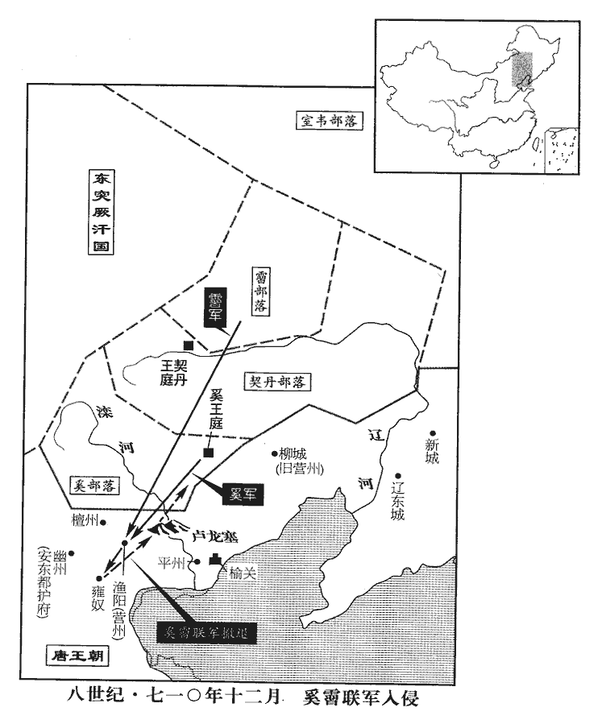
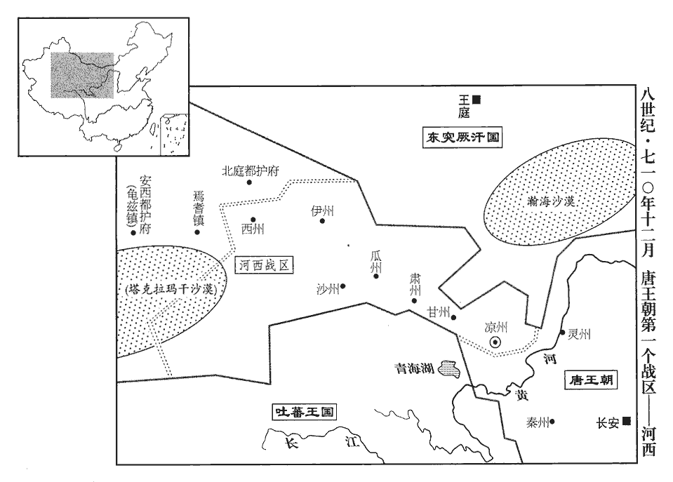
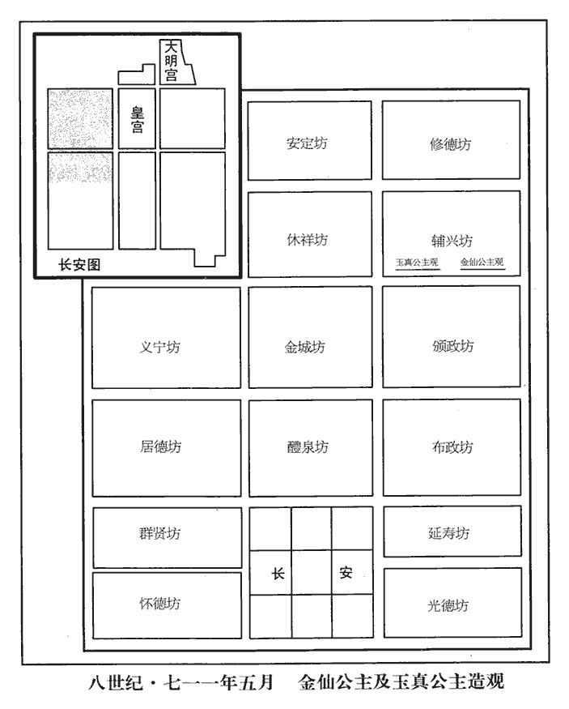
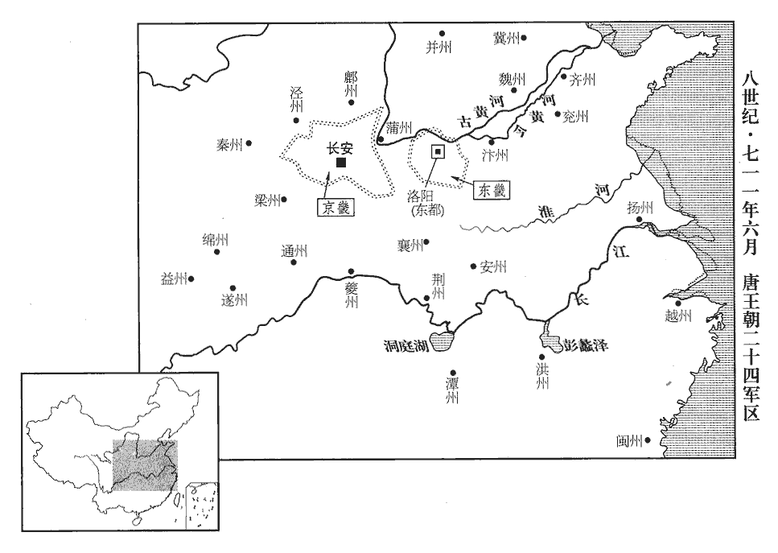
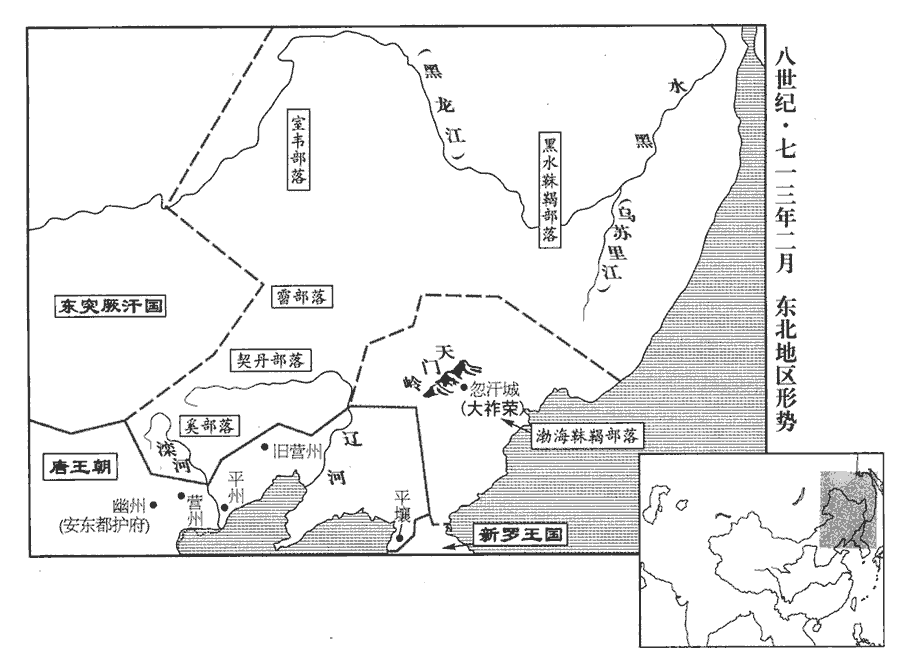

 唐紀二十六起上章閹茂（庚戌）八月，盡昭陽赤奮若（癸丑）凡三年有奇。

# 睿宗玄真大聖大興孝皇帝下

## 景雲元年（庚戌、七一零）

1八月，庚寅‹十二›，往巽第按問。此承上卷洛陽縣官微聞其謀。重福奄至，縣官馳出，白留守；群官皆逃匿，洛州長史崔日知獨帥眾討之。重，直龍翻。守，式又翻。長，知兩翻。帥，讀曰率。

〖译文〗 [1]八月庚寅（十二月），洛阳县吏前往裴巽家中检查讯问，李重福等人突然来到。县吏急忙跑出裴宅，将其所见全部告诉了东都留守。东都大小衙门官员在听到这一消息后全都逃走或者躲藏起来，只有洛州长史崔日知率领部下讨伐李重福。

留臺侍御史李邕遇重福於天津橋‹洛阳城南洛水桥›，從者已數百人；馳至屯營，從，才用翻。即洛城左、右屯營也。告之曰：「譙王得罪先帝，言重福得罪中宗，居之均州。今無故入都，此必為亂；君等宜立功取富貴。」又告皇城東都皇城也。使閉諸門。重福先趣左、右屯營，營中射之，趣，七喻翻。射，而亦翻。矢如雨下。乃還趣左掖門，還，從宣翻。掖，音亦。欲取留守兵，見門閉，大怒，命焚之。火未及然，左屯營兵出逼之，重福窘迫，策馬出上東，然，與燃同。窘，渠隕翻。上東，洛城上東門也，東面北來第一門。逃匿山谷。明日，留守大出兵搜捕，重福赴漕渠溺死‹年三十一岁›。考異曰：睿宗實錄、舊本紀皆云「癸巳重福反。」今從太上皇實錄。日知，日用之從父兄也。從，才用翻。以功拜東都‹洛阳›留守。

〖译文〗 留台侍御史李邕与李重福在天津桥相遇，发现李重福手下已经有了数百名追随者，便快马加鞭地赶到东都左、右屯营的驻地，告诉他们说：“谯王李重福获罪于先帝，现在突然无故进入东都，这一定是准备作乱，你们应当趁此机会为朝廷立功以博取荣华富贵。”说完又跑去告诉守卫皇城的将官，让他们将所有城门全部关闭。李重福先赶赴左、右屯营，但营中将士向他放箭，箭如雨下。李重福回身走到左掖门，想征调东都留守的部队，却又见城门紧闭，便气急败坏地命令手下人放火焚烧城门，但还没等火点燃，左屯营的士兵已经冲出营地向他逼过来。李重福走投无路，只好打马跑出洛阳上东门，逃进山谷中藏匿起来。第二天，东都留守派出大批军队进山搜捕，李重福投漕渠自杀。崔日知是崔日用的堂兄，他因此次平定李重福叛乱之功而被任命为东都留守。

鄭愔貌醜多須，既敗，梳髻，著婦人服，匿車中；愔，於今翻。著，陟略翻。擒獲，被鞫，股慄不能對。被，皮義翻。張靈均神氣自若，顧愔曰：「吾與此人舉事，宜其敗也！」與愔皆斬於東都市。初，愔附來俊臣得進；俊臣誅，附張易之；易之誅，附韋氏；韋氏敗，又附譙王重福，竟坐族誅。史言張靈均雖幸禍好亂之人，猶能臨死不變。鄭愔者，反覆於群憸xiān之間，冒利不顧，而畏死乃爾，烏足以權大事乎！嚴善思免死，流靜州‹四川省黑水县南›。嶺南之靜州，貞觀中已改為富州。此靜州屬劍南，儀鳳元年，以悉州之悉唐縣置南和州，武后天授二年，更名靜州。嚴善思免死而流此，夙依嬖倖，今從亂又得以偷生。

〖译文〗 郑相貌丑陋，又长满了络腮胡子，起事失败后，他梳起了发髻，穿上妇女穿的衣服，藏在车中。被抓获受审时恐惧得两腿发抖，不能回答问题。张灵均则始终神态自若，他回头看着郑说：“我和你这样的胆小鬼一同举事，落得失败的结局是很正常的！”张灵均和郑一起在东都洛阳闹市被处以斩刑。当初，郑靠依附来俊臣而得以升迁；来俊臣被杀后，又依附张易之；张易之伏诛后，又依附韦后；韦后被杀后，又转而依附谯王李重福，最终还是因李重福起事失败而被灭族。严善思被免于死刑，流放到静州。

2萬騎恃討諸韋之功，多暴橫，騎，奇寄翻。橫，戶孟翻。長安中苦之；詔並除外官。又停以戶奴為萬騎；戶奴為萬騎，蓋必起於永昌之後。更置飛騎，隸左、右羽林。更，工衡翻。

〖译文〗 [2]万骑兵倚仗着讨平韦氏集团的功劳，大多横行不法，从而成为长安百姓的一大祸害。唐睿宗下诏将万骑兵全部放到京外去作官，同时下令停止从官户奴隶中选拔万骑兵，并另外设置隶属于左、右羽林卫的飞骑军。

3姚元之、宋璟及御史大夫畢構上言：「先朝斜封官悉宜停廢。」璟，居影翻。上，時掌翻。朝，直遙翻。上從之。癸巳‹十五›，罷斜封官凡數千人。斜封官見上卷中宗景龍三年。

〖译文〗 [3]姚元之、宋及御史大夫毕构向唐睿宗提出建议：“先朝所任命的斜封官应当全部予以废黜。”唐睿宗表示同意。癸巳（十五日），唐睿宗免去了数千名斜封官的职务。

4刑部尚書、同中書門下三品裴談貶蒲州‹山西省永济市›刺史。舊志：蒲州，京師東北三百二十四里。尚，辰羊翻。

〖译文〗 [4]刑部尚书、同中书门下三品裴谈被贬为蒲州刺史。

5贈蘇安恆諫議大夫。蘇安恆死見二百八卷中宗景龍元年。恆，戶登翻。

〖译文〗 [5]唐睿宗追赠苏安恒为谏议大夫。

6九月，辛未‹二十三›，以太子少師致仕唐休璟為朔方道大總管。少，始照翻。

〖译文〗 [6]九月辛未（二十三日），唐睿宗任命已经退休的太子少师唐休为朔方道大总管。

7冬，十月，甲申‹七›，禮儀使姚元之、宋璟奏：唐世凡有國恤，皆以宰相為禮儀使，掌山陵、祔廟等事。使，疏吏翻。「大行皇帝‹李显›神主，應祔太廟，請遷義宗神主於東都，別立廟。」從之。義宗祔廟見二百八卷中宗神龍元年。

〖译文〗 [7]冬季，十月，甲申（初七），礼仪使姚元之、宋上奏道：“已故未葬的中宗皇帝的神主应当迁入太庙受祭，请陛下下诏将义宗皇帝的神主迁到东都另外立庙祭祀。”唐睿宗采纳了他们的建议。

8乙未‹十八›，追復天后‹武曌›尊號為大聖天后。

〖译文〗 [8]乙未（十八日），唐睿宗下诏恢复天后武则天大圣天后的尊号。

9丁酉‹二十›，以幽州‹北京市›鎮守經略節度大使薛訥為左武衛大將軍兼幽州都督。節度使之名自訥始。使，疏吏翻。考異曰：統紀：「景雲二年，四月，以賀拔延秀為河西節度使，節度之名自此始。」會要云：「景雲二年，賀拔延嗣為涼州都督，充河西節度，始有節度之號。」又云：「范陽節度自先天二年始除甄道一。」新表：「景雲元年置河西諸軍州節度、支度、營田大使。」按訥先已為節度大使，則節度之名不始於延嗣也。今從太上皇實錄。是後天寶緣邊御戎之地，置八節度使，其任愈重。受命之日，賜雙旌、雙節，得以專制軍事。行則建節，樹六纛，入境，州縣築節樓，迎以鼓角，衙仗居前，旌幢居中，大將鳴珂，金鉦、鼓角居後，州縣齎印迎于道左。又唐之制，有節度大使、副大使、節度使；其親王領節度大使而不出閤，則在鎮知節度者為副大使；其異姓為節度使者有節度副使。至後唐開成二年七月敕：「頃因本朝親王遙領方鎮，其在鎮者，遂云副大使知節度事，但年代已深，相沿未改。今天下侯伯並正節旄，其未落副大使者，祇言節度使。」

〖译文〗 [9]丁酉（二十日），唐睿宗任命幽州镇守经略节度大使薛讷为左武卫大将军兼幽州都督。节度使之名即从薛讷开始。

10太平公主以太子年少‹李隆基本年二十六岁›，意頗易之；既而憚其英武，欲更擇闇弱者立之以久其權，數為流言，云「太子非長，不當立。」少，詩照翻。易，以豉翻。數，所角翻。己亥‹二十二›，‹李旦›制戒諭中外，以息浮議。公主每覘伺太子所為，纖介必聞於上，覘，丑廉翻，又丑豔翻。伺，相吏翻。太子左右，亦往往為公主耳目，太子深不自安。為誅太平公主及其支黨張本。

〖译文〗 [10]太平公主认为太子李隆基还很年轻，因而起初并未把太子放在心上；不久之后又因惧怕太子的英明威武，转而想要改立一位昏庸懦弱的人作太子，以便使她自己能长期保住现有的权势地位。太平公主屡次散布流言，声称“太子并非皇帝的嫡长子，因此不应当被立为太子。”己亥（二十二日），唐睿宗颁下制书晓谕警告天下臣民，以平息各种流言蜚语。太平公主还常常派人监视太子李隆基的所作所为，即使一些细微之事也要报知唐睿宗，此外，太平公主还在太子身边安插了很多耳目，太子心里感到十分不安。

11諡故太子重俊曰節愍。太府少卿萬年‹首都长安东半城›韋湊上書，以為：「賞罰所不加者，則考行立諡以褒貶之。上，時掌翻。行，下孟翻。故太子重俊，與李多祚等稱兵入宮，中宗‹李显›登玄武門以避之，太子‹李重俊›據鞍督兵自若；及其徒倒戈，多祚等死，太子方逃竄。曏使宿衛不守，其為禍也胡可忍言！明日，中宗雨泣，雨泣者，淚下如雨也。謂供奉官曰：中書、門下兩省官謂之供奉官。『幾不與卿等相見。』其危如此。幾，居希翻。今聖朝禮葬，諡為節愍，臣竊惑之。夫臣子之禮，過廟必下，下，遐嫁翻。過位必趨。漢成帝‹刘骜›之為太子，不敢絕馳道。漢成帝為太子，初居桂宮。元帝‹刘奭›嘗急召之，太子出龍樓門，不敢絕馳道，西至直城門，得絕乃度，還入作室門。上遲之，問其故，以狀對；乃著令太子得絕馳道。而重俊稱兵宮內，跨馬御前，無禮甚矣。若以其誅武三思父子而嘉之，則興兵以誅姦臣而尊君父可也；今欲自取之，是與三思競為逆也，又足嘉乎！若以其欲廢韋氏而嘉之，則韋氏於時逆狀未彰，大義未絕，苟無中宗之命而廢之，是脅父廢母也，庸可乎！漢戾太子‹刘据›困於江充之讒，發忿殺充，雖興兵交戰，非圍逼君父也；兵敗而死，事見二十二卷武帝征和二年。及其孫‹刘病已›為天子，始得改葬，猶諡曰戾。見二十四卷宣帝本始元年。況重俊可諡之曰節愍乎！臣恐後之亂臣賊子，得引以為比，開悖逆之原，非所以彰善癉dàn惡也，彰，明也；癉，病也。明其為善，病其為惡者也。癉，丁但翻。請改其諡。多祚等從重俊興兵，不為無罪。陛下今宥之可也，名之為雪，亦所未安。」上甚然其言，而執政以為制命已行，不為追改，為，于偽翻。但停多祚等贈官而已。

〖译文〗 [11]唐睿宗颁下制书，将已故太子李重俊谥为节愍。太府少卿万年人韦凑上书认为：“对于那些没有受到赏赐或者处罚的人，应根据其生前的所作所为赠予谥号，以示对他们一生功过的褒贬。原太子李重俊与李多诈等人举兵闯入宫中，致使中宗不得不登上玄武门以躲避他们，太子却还能够神态自若地骑在马上督率士兵；只是到了他的徒众临阵倒戈李多祚等人已经被杀之后，太子才不得不落荒而逃。假如当时把守玄武门的侍卫抵挡不住的话，那么李重俊所造成的祸害将不堪设想！第二天，中宗皇帝泪如雨下地对中书、门下两省的官员们说：‘朕差一点就见不到诸位了。’当时的情形竟然危急到这种地步。现在朝廷对李重俊以礼安葬，还要将他谥为节愍，臣内心深处的确感到迷惑不解。依据臣子侍奉君主的礼节，大臣经过太庙必须下马，经过君主的宝座必须恭恭敬敬地小步快走。汉成帝作太子时，虽然是受到了汉元帝的紧急召见，尚且不敢横穿驰道，而太子李重俊居然敢于在皇宫之内兴兵造反，在中宗皇帝的面前横刀立马，这实在是太无礼了。嘉奖他起兵诛杀武三思父子是可以，但只有在他起兵铲除奸臣是为了尊崇皇帝的时候才可以这样做。现在他是为了自己当皇帝，那就只能说明他与武三思一样，都是图谋不轨的乱臣贼子，对这样的人还值得立谥嘉奖吗！如果因为他起兵是为了废掉韦后而嘉奖他，则当时韦后谋反的表现还不太明显，与太子之间母子君臣的大义尚未断绝，如果没有中宗的命令就擅自起兵废掉她，这就是胁迫父亲废弃母亲，又怎么可以呢！汉武帝时期戾太子因受江充的诬陷而发泄愤懑，起兵杀死江充，虽然也动用了兵马，但戾太子并没有围困逼迫他的父亲汉武帝。戾太子兵败自杀后，一直等到他的孙子汉宣帝即位时才得以改葬，但还是将他谥为戾。何况李重俊行为如此，陛下怎么能将他谥为节愍呢！臣担心后世的乱臣贼子会援引李重俊这一先例，为违乱忤逆行为大开方便之门，这恐怕不是用来彰善惩恶的有效方法。请陛下给李重俊改赐一个别的谥号。李多祚等人追随李重俊起兵，也不能说没有罪过，陛下现在可以宽宥他们所犯的罪行，但口口声声地说为他们平反昭雪，恐怕还不太合适。”唐睿宗非常赞同他的意见，但具体主管的官员认为皇帝的制命已经颁行，因而不愿再改变谥号，只是取消给李多祚等人的赠官而已。

12十一月，戊申朔‹一›，以姚元之為中書令。

〖译文〗 [12]十一月，戊申朔（初一），唐睿宗任命姚元之为中书令。

13己酉‹二›，葬孝和皇帝‹李显›于定陵‹陕西省富平县西北七千米龙泉山›，定陵在雍州富平城西北十五里。廟號中宗。朝議以韋后有罪，不應祔葬。追諡故英王妃趙氏曰和思順聖皇后，求其瘞yì，莫有知者，妃死見二百二卷高宗上元二年。乃以褘衣招魂，唐制：皇后之服三：褘衣、鞠衣、襢tǎn衣。褘huī衣者，受冊、助祭、朝會大事之服也。深青織成為之，畫翬huī，赤質，五色，十二等，素紗中單，黼領，朱羅縠hú褾biǎo襈zhuàn，蔽膝隨裳色，以緅zōu領為緣，用翟dí為章，三等，青衣革帶，大帶隨衣色，裨pí約紐佩綬如天子，青韈，舄xì加金舄。覆以夷衾，覆，敷又翻。祔葬定陵。

〖译文〗 [13]己酉（初二），唐睿宗将孝和皇帝葬于定陵，庙号中宗。朝廷中议论认为韦皇后犯有大罪，不应当将她的灵柩与唐中宗合葬。唐睿宗将已故英王王妃赵氏追谥为和思顺圣皇后，派人四处寻找她埋葬的地方，但没有人知道她葬在哪里，最后只得用皇后的衣来为她招魂，然后在衣上盖上覆盖尸体的被子夷衾，合葬于定陵。

14壬子‹五›，侍中韋安石罷為太子少保，左僕射、同中書門下三品蘇瓌guī罷為少傅。

〖译文〗 [14]壬子（初五），侍中韦安石被罢免为太子少保；左仆射、同中书门下三品苏被罢免为太子少傅。

15甲寅‹七›，追復裴炎官爵。

〖译文〗 [15]甲寅（初七），唐睿宗下诏追复裴炎的官职爵位。

初，裴伷zhòu先自嶺南逃歸，復杖一百，徙北庭‹新疆吉木萨尔县›。伷，讀曰胄。復，扶又翻。至徙所，殖貨任俠，常遣客詗xiòng都下事。武后之誅流人也，裴炎死，伷先流嶺南，見二百三卷武后光宅元年。誅流人見二百五卷長壽二年。詗，休正翻。伷先先知之，逃奔胡中；北庭都護‹设新疆吉木萨尔县›追獲，囚之以聞。使者至，流人盡死，伷先以待報未殺。既而武后下制安撫流人，有未死者悉放還，伷先由是得歸。至是求炎後，獨伷先在，拜詹事丞。詹事丞，正六品上，掌判詹事府事。

〖译文〗 当初，裴先从岭南逃回，又被杖打一百，流放到北庭。裴先在流放地北庭经商，又干一些打抱不平的侠义之事，他还常常派人到长安打听各种消息。他事先得知武则天即将派遣使者出京诛杀被处以流刑的罪犯，便在使者到来之前逃到胡人的地盘躲避，后被北庭都护派兵捉回，关进监狱并上报武则天。使者来到北庭后，流刑犯全部被杀，只有裴先因等待武则天的批示而没有立即被杀。过了一段时间武则天又下诏安抚流刑犯人，规定未被处死的全部放还原籍，裴先因此得以回到长安。到这时候，唐睿宗下食寻找裴炎的后人，只有裴先一人在世，于是将他任命为詹事丞。

16壬戌‹十五›，追復王同皎官爵。王同皎死見二百八卷中宗神龍二年。

〖译文〗 [16]壬戌（十五日），唐睿宗下令追复王同皎的官爵。

17庚午‹二十三›，許文貞公蘇瓌guī薨‹年七十二岁›。制起復其子頲為工部侍郎，頲固辭。頲，他鼎翻。上使李日知諭旨，日知終坐不言而還，坐，徂臥翻。奏曰：「臣見其哀毀，不忍發言，恐其隕絕。」上乃聽其終制。

〖译文〗 [17]庚午（二十三日），许文贞公苏去世。唐睿宗颁发制命，任命正在为父服丧的苏之子苏为工部侍郎，苏坚决推辞不受。唐睿宗派李日知前去传达自己的旨意，李日知在苏家坐了半晌，却只字未提自己的来意便回朝复命，他对唐睿宗回奏道：“臣见到苏悲痛欲绝的样子，实在不忍心把要说的话讲出来，担心他会发生意外。”于是唐睿宗便允许苏为其父服满三年丧期。

18十二月，癸未‹七›，上以二女西城、隆昌公主‹李持盈›為女官‹女道士›，以資天皇太后‹武曌›之福，仍欲於城西造觀。觀，古玩翻。道士所居曰觀。諫議大夫寧原悌上言：以為「先朝悖逆庶人‹李裹儿›以愛女驕盈而及禍，新城、宜都以庶孽抑損而獲全。新城公主下嫁武延暉，宜城公主下嫁裴巽，皆中宗女。又釋、道二家皆以清淨為本，不當廣營寺觀，勞人費財。梁武帝‹萧衍›致敗於前，先帝‹李显›取災於後，殷鑒不遠。今二公主入道，將為之置觀，觀，古玩翻。為，于偽翻。不宜過為崇麗，取謗四方。又，先朝所親狎諸僧，尚在左右，宜加屏斥。」朝，直遙翻。屏，卑郢翻。上覽而善之。

〖译文〗 [18]十二月，癸未（初七），为助天皇太后武则天的冥福，唐睿宗让他的两个女儿西城公主和隆昌公主作女道士，并准备在长安城西建造道观。谏议大夫宁原悌向唐睿宗进言认为：“先朝悖逆庶人作为中宗和韦后的爱女而骄傲自满，终于难逃杀身之祸；新城公主和宜都公主作为中宗的庶出之女而谦卑自制，终于得以保全。再说佛教和道教均以清净为本，不应耗费大量的人力物力广造佛寺道观。南朝梁武帝佞佛招致祸败于前，中宗广营佛寺道观致使国家多难于后，这样的历史教训距今不远。现在西城公主和隆昌公主作了女道士，陛下将为他们营建道观，营建时不应当过分豪华壮观，以免招来朝野士民的非议。此外，先朝中宗皇帝所宠幸的僧人们仍在陛下身边，应当一律斥退。”唐睿宗看了他的奏章之后，认为他说的很对。

19宦者閭興貴以事屬長安‹首都长安西半城›令李朝隱，屬，之欲翻。朝，直遙翻；下同。朝隱繫於獄。上聞之，召見朝隱，勞之曰：「卿為赤縣令，能如此，朕復何憂！」勞，力到翻。復，扶又翻；下無復同。因御承天門，集百官及諸州朝集使，宣示以朝隱所為。且下制稱「宦官遇寬柔之代，必弄威權。朕覽前載，每所歎息。能副朕意，實在斯人，可加一階為太中大夫，賜中上考及絹百匹。」

〖译文〗 [19]宦官闾兴贵托长安令李朝隐为他办事，李朝隐将他逮捕入狱。唐睿宗听说这件事之后，特意召见了李朝隐，慰问他说：“您作为京师万年县的县令，能够做到这样，朕还有什么可忧虑的呢！”唐睿宗还在承天门召集文武百官和来自各州的朝集使，向他们公布李朝隐的所作所为，并且颁下制书表彰他说：“自古以来宦官每遇宽容柔弱的君主，必定会玩弄权势，擅作威福。朕每次读前代历史时，都对此颇多感慨。真正能够符合朕的心意的，是像李朝隐这样的人，所以应为他进一阶，为太中大夫，将他的考核成绩定为中上，并且赐给绢一百匹。”

20壬辰‹十六›，奚‹滦河上游›、霫‹辽河以北›犯塞，掠漁陽‹天津市蓟县›、雍奴‹天津市武清县›，出盧龍塞‹河北省迁安县西北›而去。漁陽縣本屬幽州，中宗神龍元年分屬營州。雍奴縣，漢以來屬漁陽郡，隋屬涿郡，唐屬幽州。盧龍，漢肥如縣也，屬遼西郡，隋開皇十八年，更名盧龍，屬北平郡，唐帶平州。霫，而立翻。幽州都督‹总部设北京市›薛訥追擊之，弗克。

〖译文〗 [20]壬辰（十六日），奚人和人进犯边塞，在渔阳、雍奴二县大肆掳掠之后，出卢龙塞而去。唐幽州都督薛讷派兵追击，未能取胜。

21舊制，三品以上官冊授，五品以上制授，六品以下敕授，唐王言之制有七：一曰冊書，二曰制書，三曰慰勞制書，四曰發敕，五曰敕旨，六曰論事敕書，七曰敕牒。皆委尚書省奏擬，文屬吏部，武屬兵部，尚書曰中銓，侍郎曰東西銓。所謂三銓也。中宗之末，嬖倖用事，選舉混淆，無復綱紀。至是，以宋璟為吏部尚書，李乂、盧從愿為侍郎，皆不畏強禦，請謁路絕。集者萬餘人，留者三銓不過二千，人服其公。以姚元之為兵部尚書，陸象先、盧懷慎為侍郎，武選亦治。選，須絹翻。治，直吏翻。從愿，承慶之族子；盧承慶，見二百卷高宗顯慶四年。象先，元方之子也。陸元方，見二百五卷天后證聖元年。

〖译文〗 [21]唐朝旧制规定，三品以上官员，由皇帝当面用册书任命，称为册授；四品以下、五品以上官员由皇帝颁布制书任命，称为制授；六品以下官员由皇帝颁布敕书任命，称为敕授。官员的任命都委托尚书省拟定，而后上奏，文官由吏部拟定，武官由兵部拟定，两部的尚书称为中铨，侍郎二人称为东西铨。唐中宗末期，得到皇帝宠幸的奸佞小人执掌朝廷大权，所选任的官吏好坏混杂，不再有法度可言。此时，唐睿宗任命宋为吏部尚书，李、卢从愿为吏部侍郎，三人都不畏强暴，请托告求之路从此堵塞。在一万多名候选官员中，经过三铨之后入选的不超过两千人，人们都对他们的公正无私深为叹服。唐睿宗又任命姚元之为兵部尚书，陆象先、卢怀慎为兵部侍郎，对武官的选拔任用也走上了正轨。卢从愿是卢承庆的同族兄弟之子；陆象先是陆元方的儿子。

22侍御史藁城‹河北省藁城市›倪若水，藁城縣，前漢屬真定國，後漢以來屬鉅鹿郡，唐屬恆州。奏彈國子祭酒祝欽明、司業郭山惲亂常改作，希旨病君；謂郊祀請以韋后亞獻也。於是左授欽明饒州刺史，山惲括州長史。舊志：饒州，京師東南三千二百六十三里。括州後為處州，京師東南四千二百七十八里。

〖译文〗 [22]侍御史藁城人倪若水，上奏弹劾国子祭酒祝钦明、国子司业郭山恽扰乱赏规、变更旧制，为迎合中宗韦后的旨意而使得中宗圣德有亏。唐睿宗因此将祝钦明降职为饶州刺史，将郭山恽降职为括州长史。

 

23侍御史楊孚，彈糾不避權貴，權貴毀之，上曰：「鷹搏狡兔，須急救之，不爾必反為所噬。御史繩姦慝亦然。苟非人主保衛之，則亦為姦慝所噬矣。」孚，隋文帝‹杨坚›之姪孫也。

〖译文〗 [23]侍御史杨孚在奏劾纠察法之事时不畏权贵，因而受到权贵们的诋毁，唐睿宗说：“在老鹰搏击狡免时，必须赶紧帮助它，否则它反会被狡免咬伤。御史纠举弹劾奸诈邪恶之徒也是这样。如果没有君主对他多方保护，他也会被奸诈邪恶之徒咬伤的。”杨孚是隋文帝杨坚的侄孙。

24置河西節度、支度、營田等使，領涼‹甘肃省武威市›、甘‹甘肃省张掖市›、肅‹甘肃省酒泉市›、伊‹新疆哈密市›、瓜‹甘肃省安西县›、沙‹甘肃省敦煌市›、西‹新疆吐鲁番市东›七州，治涼州。唐制，凡天下邊軍，皆有支度使，以計軍資糧仗之用。節度不兼支度者，支度自為一司；其兼支度者，則節度使自支度。凡邊防鎮守轉運不給，則開置屯田以益軍儲，於是有營田使。使，疏吏翻。度，徒洛翻。

〖译文〗 [24]唐睿宗设置河西节度、支度、营田等使，统辖凉、甘、肃、伊、瓜、沙、西等七州，治所在凉州。

25姚州‹云南省姚安县›群蠻，先附吐蕃‹首都逻些城西藏拉萨市›，攝監察御史李知古請發兵擊之；既降，降，戶江翻。又請築城，列置州縣，重稅之。黃門侍郎徐堅以為不可；句斷。不從。知古發劍南‹四川省中南部及云南省›兵築城，因欲誅其豪傑，掠子女為奴婢。群蠻怨怒，蠻酋傍名引吐蕃攻知古，殺之，以其尸祭天，由是姚、巂‹四川省西昌市›路絕，連年不通。酋，慈由翻。巂，音髓。

〖译文〗 [25]姚州各蛮族部落起初依附吐蕃，代理监察御史李知古请求调集军队前往讨伐；各蛮族部落归降唐朝之后，李知古又请求在姚州修筑城郭，设置州县官署，对他们征收重税。黄门侍郎徐坚认为不能这样做，但他的建议没有得到采纳。李知古调集剑南道兵马修筑城池，又想趁机铲除蛮族各部落的豪杰，将他们的子女掠为奴婢。蛮族各部落极为愤恨，部落酋长傍名召引吐蕃军队进攻李知古并将他杀死，然后用他的尸体祭祀上天，从此姚、州一带通往内地的道路断绝，连续多年未能打通。

 

安西都護‹驻龟兹新疆库车县›張玄表侵掠吐蕃北境，吐蕃雖怨而未絕和親，乃賂鄯州‹总部设青海省乐都县›都督楊矩，請河西九曲之地‹青海省黄河弯曲地带›以為公主湯沐邑；矩奏與之。九曲者，去積石軍三百里，水甘草良，宜畜牧，蓋即漢大、小榆谷之地，吐蕃置洪濟、大漠門等城以守之。史為楊矩後悔懼自殺張本。鄯，時戰翻，又音善。

〖译文〗 唐安西都护张玄表侵扰掠夺吐蕃北部边境地区，吐蕃虽然对此极为不满，但却没有中断与唐和亲，于是他们贿赂唐鄯州都督杨矩，请求唐睿宗将河西九曲之地送给吐蕃作为金城公主的汤沐邑。杨矩上奏唐睿宗，劝他将河西九曲之地送给吐蕃。

## 二年（辛亥、七一一）

1春，正月，癸丑‹七›，突厥‹瀚海沙漠群›可汗默啜遣使請和；許之。厥，九勿翻。可，從刊入聲。汗，音寒。使，疏吏翻。

〖译文〗 [1]春季，正月，癸丑（初七），突厥可汗默啜派遣使者前来求和，唐睿宗答应了他们的请求。

2己未‹十三›，以太僕卿郭元振、中書侍郎張說並同平章事。說，讀曰悅。

〖译文〗 [2]己未（十三日），唐睿宗任命太仆卿郭元振、中书侍郎张说二人为同平章事。

3以溫王重茂為襄王，充集州‹四川省南江县›刺史，遣中郎將將兵五百就防之。舊志：集州，京師西南一千四百二十五里。將，即亮翻。

〖译文〗 [3]唐睿宗改封温王李重茂为襄王，让他充任集州刺史，并且派遣中郎将率领五百人马驻扎在集州对他加以防范。

4乙丑‹十九›，追立妃劉氏曰肅明皇后，陵曰惠陵；德妃竇氏曰昭成皇后，陵曰靖陵。皆招魂葬於東都‹洛阳›城南，二妃死見二百五卷武后長壽二年。立廟京師，號儀坤廟。會要，儀坤廟在親仁里。竇氏，太子‹李隆基›之母也。

〖译文〗 [4]乙丑（十九日），唐睿宗下诏将妃子刘氏追立为肃明皇后，称她的坟墓为惠陵；将德妃窦氏追立为昭成皇后，称她的坟墓为靖陵。唐睿宗在为这两位妃子招魂之后，将她们安葬在东都洛阳城南，并在京师为她们立庙，称为仪坤庙。窦氏是太子李隆基的生母。

5太平公主‹武曌独生女儿›與益州‹四川省成都市›長史竇懷貞等結為朋黨，欲以危太子‹李隆基›，使其壻唐晙邀韋安石至其第，晙，子峻翻。安石固辭不往。上‹李旦，本年五十岁›嘗密召安石，謂曰：「聞朝廷皆傾心東宮，卿宜察之。」對曰：「陛下安得亡國之言！此必太平之謀耳。太子有功於社稷，仁明孝友，天下所知，願陛下無惑讒言。」上瞿然曰：瞿，俱遇翻。瞿然，驚視之貌。「朕知之矣，卿勿言。」時公主在簾下竊聽之，以飛語陷安石，欲收按之，賴郭元振救之，得免。

〖译文〗 [5]太平公主同益州长史窦怀贞等结成朋党，想加害于太子李隆基，便指使她的女婿唐邀请韦安石到自己的家中来，韦安石坚决推辞，没有前往。唐睿宗曾经秘密地召见韦安石，对他说：“听说朝廷文武百官全都倾心归附太子，您应当对此多加留意。”韦安石回答说：“陛下从哪里听到这种亡国之言呢！这一定是太平公主的主意。太子为宗庙社稷立下了大功，而且一向仁慈明智，孝顺父母，友爱兄弟，这是天下人都知道的事实，希望陛下不要被谗言所迷惑。”唐睿宗听过这话之后十分惊异地说：“朕明白了，您不要再提这件事了。”当时太平公主正在帘子后面偷听他们君臣之间的谈话，事后便散布各种流言蜚语对韦安石横加陷害，想把他逮捕下狱严加审讯，多亏了郭元振的救助才得以幸免。

公主又嘗乘輦邀宰相於光範門內，唐六典曰：宣政殿前西廊曰月華門，門西中書省，省西南北街，南直昭慶門，出光範門。韓愈伏光範門下上宰相書即此。諷以易置東宮，眾皆失色，宋璟抗言曰：「東宮有大功於天下，真宗廟社稷之主，公主柰何忽有此議！」

〖译文〗 太平公主还曾乘辇车在光范门内拦住宰相，暗示他们应当改立皇太子，在场的宰相们全都大惊失色。宋大声质问道：“太子为大唐社稷立下了莫大的功劳，是宗庙社稷的主人，公主为什么突然提出这样的建议呢！”

璟與姚元之密言於上曰：「宋王‹李成器›，陛下之元子，豳王‹李守礼›，高宗‹李治›之長孫，豳王守禮，章懷太子賢之子。長，知兩翻。太平公主交構其間，將使東宮不安。請出宋王及豳王皆為刺史，罷岐‹李隆范›、薛‹李隆业›二王左、右羽林，使為左、右率以事太子。韋氏初平，二王領羽林。東宮五率，分為左、右十率。此指左、右衛率。太平公主請與武攸暨皆於東都安置。」上曰：「朕更無兄弟，惟太平一妹，豈可遠置東都！諸王惟卿所處。」處，昌呂翻。乃先下制云：「諸王、駙馬自今毋得典禁兵，見任者皆改他官。」見，賢遍翻。

〖译文〗 宋与姚元之秘密地向唐睿宗进言道：“宋王李成器是陛下的嫡长子，豳王李守礼是高宗皇帝的长孙，太平公主在他俩与太子之间互相构陷，制造事端，将会使得东宫地位不稳。请陛下将宋王和豳王两人外放为刺史；免去岐王李隆范和薛王李隆业所担任的左、右羽林大将军职务，任命他们为太子左、右卫率以事奉太子；将太平公主与武攸暨安置到东都洛阳。”唐睿宗说：“朕现在已没有兄弟了，只有太平公主这一个妹妹，怎么可以将她远远地安置到东都去呢！至于诸王则任凭你们安排。”于是先颁下制命说：“今后诸王、驸马一律不得统率禁军，现在任职的都必须改任其他官职。”

頃之，上謂侍臣曰：「術者言五日中當有急兵入宮，卿等為朕備之。」為，于季翻；下為陛同。張說曰：「此必讒人欲離間東宮。間，古莧翻。願陛下使太子監國，監，古銜翻。則流言自息矣。」姚元之曰：「張說所言，社稷之至計也。」上說。說，與悅同。

〖译文〗 过了不久，唐睿宗对身边的侍臣说：“占卜的人说五天之内将会有起事发难的军队闯入宫中，你们要为朕严加防范。”张说紧接着说道：“这一定又是奸邪小人用谗言离间陛下与太子的关系。希望陛下让太子代行处理政务，那么种种流言蜚语就会自然而然地消声匿迹。”姚元之说：“张说所提出的办法，是使社稷宗庙长治久安的上上之策。”唐睿宗听完之后十分高兴。

二月，丙子朔‹一›，以宋王成器為同州‹陕西省大荔县›刺史，豳王守禮為豳州‹陕西省彬县›刺史，舊志：同州，京師東北二百五十五里；豳州，京師西北四百九十三里。左羽林大將軍岐王隆範為左衛率，右羽林大將軍薛王隆業為右衛率；太平公主蒲州‹山西省永济市›安置。

〖译文〗 二月，丙子朔（初一），唐睿宗任命宋王李成器为同州刺史，豳王李守礼为豳州刺史，任命左羽林大将军岐王李隆范为左卫率，右羽林大将军薛王李隆业为右卫率；又将太平公主安置在蒲州。

丁丑‹二›，命太子監國，六品以下除官及徒罪以下，並取太子處分。處，昌呂翻。分，扶問翻。

〖译文〗 丁丑（初二），唐睿宗下诏让太子李隆基代行处理政务，规定凡是六品以下官员的任命以及对犯徒刑罪以下罪犯的审核等事，均由太子全权处理。

6殿中侍御史崔蒞、太子中允薛昭素言於上曰：「斜封官皆先帝‹李显›所除，恩命已布，斜封官，見上卷中宗景龍二年。姚元之等建議，一朝盡奪之，彰先帝之過，為陛下招怨。為，于偽翻。今眾口沸騰，徧於海內，恐生非常之變。」太平公主亦言之，上以為然。戊寅‹三›，制：「諸緣斜封別敕授官，先停任者，並量材敘用。」量，音良。考異曰：朝野僉載云：「宋璟、畢構出後，見鬼人彭君卿受斜封人賄奏云：『孝和怒曰：「我與人官，何因奪卻！」』於是斜封皆復舊職。」今不取。

〖译文〗 [6]殿中侍御史崔、太子中允薛昭素对唐睿宗说：“斜封官都是先帝任命的，制命早已颁布施行，现在却由于姚元之等人的建议而一下子全部削夺，这就彰明了先帝的过错，并且给陛下召来了很多怨言。眼下全国各地怨声载道，恐怕会引发非同寻常的变故。”太平公主也这样劝说唐睿宗，唐睿宗认为他们所说的都有道理。戊寅（初三），唐睿宗颁布制命：“凡由于斜封别敕任命之故而被停任的官员，一律可以量材叙用。”

7太平公主聞姚元之、宋璟之謀，大怒，以讓太子‹李隆基›。太子懼，奏元之、璟離間姑、兄，姑，謂太平公主；兄，謂宋王、豳王。間，古莧翻。請從極法。甲申‹九›，貶元之為申州‹河南省信阳市›刺史，璟為楚州‹江苏省淮安市›刺史。舊志：申州至京師一千七百九十六里；楚州，京師東南二千五百一里。丙戌‹十一›，宋王、豳王亦寢刺史之命。

〖译文〗 [7]太平公主得知姚元之与宋的计谋之后勃然大怒，并以此责备太子李隆基。太子感到害怕，便向唐睿宗奏称姚元之和宋挑拨自己与姑母太平公主和兄长宋王李成器、豳王李守礼之间的关系，并请求对他们两人严加惩处。甲申（初九），唐睿宗将姚元之贬为申州刺史，将宋贬为楚州刺史。丙戌（十一日），宋王李成器和豳王李守礼被任命为刺史的事也停止执行。

8中書舍人、參知機務劉幽求罷為戶部尚書；以太子少保韋安石為侍中。安石與李日知代姚、宋為政，自是綱紀紊亂，復如景龍之世矣。紊，音問。復，扶又翻，又如字。前右率府鎧曹參軍柳澤上疏，以為：「斜封官皆因僕妾汲引，豈出孝和之意！中宗諡孝和皇帝。率，所律翻。上，時掌翻。疏，所去翻。陛下一切黜之，天下莫不稱明。一旦忽盡收敘，善惡不定，反覆相攻，何陛下政令之不一也！議者咸稱太平公主令胡僧慧範曲引此曹，誑誤陛下。誑，居況翻。臣恐積小成大，為禍不細。」上弗聽。澤，亨之孫也。柳亨事隋為王屋長，歸高祖，以女孫竇氏妻之，歷事太宗，位至檢校岐州刺史。

〖译文〗 [8]唐睿宗将中书舍人、参知机务刘幽求罢免为户部尚书；又任命太子少保韦安石为侍中。韦安石与李日知取代了姚元之、宋二人，开始主持朝廷政务，从此朝廷纲纪紊乱，又恢复到唐中宗景龙年间的老样子。前任右卫率府铠曹参军柳泽上疏认为：“斜封官都是通过中宗皇帝身边那些小人的引进而得到任用的，哪里是出自中宗孝和皇帝的本意呢！陛下将他们全部废黜，天下人都认为明智，现在却又反过来将他们全部收录叙用，善恶不定，朝令夕改，陛下的政令为什么如此前后不一呢！街谈巷议都说太平公主让胡僧慧范多方拉拢这些人，诳骗惑乱陛下。臣担心这样下去会积小恶而成大祸。”唐睿宗没有采纳他的建议。柳泽是柳亨的孙子。

9左、右萬騎與左、右羽林為北門四軍，使葛福順等將之。騎，奇寄翻。將，即亮翻，又音如字。

〖译文〗 [9]以左、右万骑军和左、右羽林军为北门四军，唐睿宗派葛福顺等人统率这些禁卫军。

10三月，以宋王成器‹李旦的儿子›女為金山公主，許嫁突厥默啜。厥，九勿翻。啜，叱劣翻。

〖译文〗 [10]三月，唐睿宗封宋王李成器之女为金山公主，将她许配给突厥可汗默啜。

11夏，四月，甲申‹九›，宋王成器讓司徒；許之，以為太子賓客。以韋安石為中書令。

〖译文〗 [11]夏季，四月，甲申（初九），宋王李成器请求辞去司徒一职，唐睿宗答应了他的要求，任命他为太子宾客。任命韦安石为中书令。

12上召群臣三品以上，謂曰：「朕素懷澹泊，不以萬乘為貴，澹，徒覽翻。乘，繩證翻。曩為皇嗣，又為皇太弟，皆辭不處。為皇嗣見二百四卷天授元年；辭太弟見二百八卷神龍元年。嗣，祥吏翻。處，昌呂翻。今欲傳位太子，何如？」群臣莫對。太子使右庶子李景伯固辭，不許。殿中侍御史和逢堯附太平公主，言於上曰：「陛下春秋未高‹李旦本年五十岁›，方為四海所依仰，豈得遽爾！」上乃止。

〖译文〗 [12]唐睿宗召见三品以上官员，对他们说：“朕一向恬淡寡欲，并不以天子的尊位为贵，当初任皇嗣以及中宗时作皇太弟，都坚决地推辞掉了。现在朕打算把皇位传给皇太子，你们认为怎么样！”在场的大臣们都没有回答。太子李隆基让右庶子李景伯出面坚决推辞，唐睿宗没有同意。殿中侍御史和逢尧向来依附太平公主，便对唐睿宗说道：“陛下年纪还不很老，正是被天下人依靠景仰的时候，怎么能急急忙忙地禅位于皇太子呢！”唐睿宗这才打消了这个念头。

戊子‹十三›，制：「凡政事皆取太子處分。處，昌呂翻。分，扶問翻。其軍旅死刑及五品已上除授，皆先與太子議之，然後以聞。」

〖译文〗 戊子（十三日），唐睿宗发布制命：“所有朝廷政务，一律由皇太子负责处理。涉及军旅重事、死刑的审核以及对五品以上官员的任命，都要先与皇太子商议，然后再上奏。”

13辛卯‹十六›，以李日知守侍中。

〖译文〗 [13]辛卯（十六日），唐睿宗任命李日知守侍中。

14壬寅‹二十七›，赦天下。

〖译文〗 [14]壬寅（二十七日），唐睿宗下诏大赦天下。

15五月，太子請讓位於宋王成器；不許。請召太平公主還京師；許之。

〖译文〗 [15]五月，太子李隆基请求将太子之位让给宋王李成器，唐睿宗没有同意。太子又请求将太平公主召回京师。唐睿宗表示回意。

16庚戌‹六›，制：「則天皇后‹武曌›父母墳仍舊為昊陵‹武曌祖坟›、順陵‹武士彟坟›，量置官屬。」廢武氏二陵見上卷元年。量，音良。太平公主為武攸暨請之也。為，于偽翻；下各為同。

〖译文〗 [16]庚戌（初六），唐睿宗颁下制命：“将则天皇后父母的坟墓恢复为昊陵、顺陵，并且酌情设置官署掌管陵园事务。”这是由于太平公主为武攸暨向唐睿宗作了请求的缘故。

 

17辛酉‹十七›，更以西城為金仙公主，隆昌為玉真公主，各為之造觀，金仙、玉真二觀皆造於京城內輔興坊；玉真觀，本竇誕舊宅，與金仙觀相對。更，工衡翻。逼奪民居甚多，用功數百萬。右散騎常侍魏知古、黃門侍郎李乂諫，不聽。散，悉亶翻。騎，奇寄翻。

〖译文〗 [17]辛酉（十七日），唐睿宗将西城公主改封为金仙公主，将隆昌公主改封为玉真公主，并且为她们分别建造了金仙观和玉真观，强占了很多居民的住宅，工程耗费达数百万钱之多。右散骑常侍魏知古和黄门侍郎李进谏阻止，但唐睿宗没有采纳。

18壬戌‹十八›，殿中監竇懷貞為御史大夫、同平章事。

〖译文〗 [18]壬戌（十八日），唐睿宗任命殿中监窦怀贞为御史大夫、同平章事。

19僧慧範恃太平公主勢，逼奪民產，御史大夫薛謙光與殿中侍御史慕容珣奏彈之。公主訴於上，出謙光為岐州‹陕西省凤翔县›刺史。考異曰：統紀曰：「監察御史慕容珣奏彈西明寺僧慧範，以其通宮人張氏，張即太平公主乳母也，侵奪百姓。上以為御史當不避豪貴；見公主出居蒲州，乃敢彈射，在日不言，狀涉離間骨肉，遂貶為密州‹山东省诸城市›員外司馬。」今從舊傳。

〖译文〗 [19]胡僧慧范倚仗着太平公主的权势，巧取豪夺平民百姓的财产，御史大夫薛谦光和殿中侍御史慕容上奏弹劾他。太平公主向唐睿宗诉说了自己对他们的不满，唐睿宗便将薛谦光外放为岐州刺史。

20時遣使按察十道，太宗貞觀十八年，遣十七道巡察；武后垂拱初，亦嘗遣九道巡察，天授二年又遣十道存撫使。至是分為十道按察使，以廉按州郡，二周年一替。使，疏吏翻。議者以山南‹秦岭以南湖北省、陕西省南部及四川省东北部›所部闊遠，乃分為東‹湖北省›、西道‹陕西省南部及四川省东北部›；又分隴右‹甘肃、青海东部及新疆›為河西道‹甘肃及新疆›。六月，壬午‹八›，又分天下置汴‹总部设河南省开封市›、齊‹山东省济南市›、兗‹山东省兖州市›、魏‹河北省大名县›、冀‹河北省冀州市›、并‹山西省太原市›、蒲‹山西省永济市›、鄜‹陕西省富县›、涇‹甘肃省泾川县›、秦‹甘肃省天水市›、益‹四川省成都市›、緜‹四川省绵阳市›、遂‹四川省遂宁市›、荊‹湖北省江陵县›、岐‹岐州靠近京畿，不应设置军区。《唐会要·都督府》说是夔州军区重庆市奉节县›、通‹四川省达川市›、梁‹陕西省汉中市›、襄‹湖北省襄樊市›、揚‹江苏省扬州市›、安‹湖北省安陆市›、閩‹福建省福州市›、越‹浙江省绍兴市›、洪‹江西省南昌市›、潭‹湖南省长沙市›二十四都督，武德元年，改蜀郡為益州。緜州，漢涪縣地，江左置巴西郡，西魏曰潼州，隋開皇改緜州，大業初廢州為金山郡，唐武德初復曰緜州。又武德二年置閩州於閩縣，開元十三年更閩州為福州。鄜，音膚。各糾察所部刺史以下善惡，惟洛及近畿州不隸都督府。雍‹京畿›、華‹陕西省华县›、同、商‹陕西省商州市›、岐‹陕西省凤翔县›、豳為京畿；洛、汝‹河南省汝州市›為都畿。太子右庶子李景伯、舍人盧俌fǔ等上言：俌，音甫。「都督專殺生之柄，權任太重，或用非其人，為害不細。今御史秩卑望重，以時巡察，姦宄自禁。」宄，音軌。其後竟罷都督，但置十道按察使而已。

〖译文〗 [20]这时唐睿宗分遣使者赴全国十道巡视考察，有人认为山南道所辖区域太广，于是将山南道分为东西两道；又从陇右道中分出河西道。六月，壬午（初八），唐睿宗又下诏在全国分置汴、齐、兖、魏、冀、并、蒲、、泾、秦、益、绵、遂、荆、岐、通、梁、襄、扬、安、闽、越、洪、潭二十四都督，负责纠举检察所辖区域内州县官吏的善恶得失，只有洛州以及京畿各州不隶属于都督府。太子右庶子李景伯、太子舍人卢等人进言说：“都督独掌生杀大权，权势太重，如果任用了不称职的人，那么所造成的危害就太严重了。现在御史的品位俸禄都很卑微，但是声望都很高，陛下派他们按时巡察地方，为非作歹之徒自然不敢横行。”后来终于罢去所有新置的都督，只是设置了十道按察使而已。

 

21秋，七月，癸巳‹二十›，追復上官昭容‹上官婉儿›諡曰惠文。追復其昭容之職而加之以諡。

〖译文〗 [21]秋季，七月，癸巳（二十日），唐睿宗下诏追复上官昭容的职位，赠谥号为惠文。

22乙卯‹八月十三日›，以高祖故宅枯柿復生，赦天下。時詔以興聖寺是高祖‹李渊›舊宅，有柿樹，天授中枯死，至是重生，大赦天下。復，扶又翻，又如字。

〖译文〗 [22]乙卯（疑误），由于唐高祖李渊旧宅中早已枯死的柿子树又重新发芽的缘故，唐睿宗下诏大赦天下。

23己巳‹二十七›，以右御史大夫解琬為朔方大總管。琬考按三城戍兵，三城，三受降城也。解，戶買翻。奏減十萬人。

〖译文〗 [23]己巳（疑误），唐睿宗任命右台御史大夫解琬为朔方道大总管。解琬在对三受降城的防务作了具体考察之后，上奏唐睿宗，请求将该地的戍卒减少十万人。

24庚午‹二十八›，以中書令韋安石為左僕射兼太子賓客、同中書門下三品。太平公主以安石不附己，故崇以虛名，實去其權也。去，羌呂翻。

〖译文〗 [24]庚午（疑误），唐睿宗任命中书令韦安石为左仆射兼太子宾客、同中书门下三品。由于太平公主认为韦安石拒绝趋附自己，所以用一些虚衔来表示对他的尊崇，实际上是借此削夺他的实权。

25九月，庚辰‹八›，以竇懷貞為侍中。懷貞每退朝，必詣太平公主第。朝，直遙翻。時脩金仙、玉真二觀，群臣多諫，懷貞獨勸成之，身自督役。時人謂懷貞前為皇后阿㸙，事見上卷中宗景龍二年。㸙zhē，正奢翻。今為公主邑司。唐公主有邑司令、丞，掌其主家財貨出入、田園徵封之事。考異曰：睿宗實錄云：「乙卯，御史大夫竇懷貞為侍中。」太上皇實錄云：「庚辰，御史大夫、同中書門下三品竇懷貞為侍中，知金仙、玉真公主邑司事。」舊紀，「己卯，懷貞為侍中。」新紀、新表，「乙亥，懷貞守侍中。」按是月癸酉朔，無乙卯，又懷貞以自督脩二觀之故，時人語曰：「竇僕射前為皇后國㸙，今為公主邑丞。」非真知邑司也。今從舊紀。

〖译文〗 [25]九月，庚辰（初八），唐睿宗任命窦怀贞为侍中。窦怀贞每次退朝后，都要到太平公主家里去。当时正在修建金仙、玉真二观，群臣纷纷谏阻，只有窦怀贞一个人对这项工程表示坚决支持，并且亲自监督服劳役的民夫。所以当时的人们都说窦怀贞先是作韦皇后的阿，现在又作了公主的邑司。

26冬，十月，甲辰‹三›，上御承天門，引韋安石、郭元振、竇懷貞、李日知、張說宣制，責以「政教多闕，水旱為災，府庫益竭，僚吏日滋；雖朕之薄德，亦輔佐非才。安石可左僕射、東都留守，守，手又翻。元振可吏部尚書，懷貞可左御史大夫，日知可戶尚書，說可左丞，並罷政事。」以吏部尚書劉幽求為侍中，右散騎常侍魏知古為左散騎常侍，太子詹事崔湜為中書侍郎，並同中書門下三品；中書侍郎陸象先同平章事。皆太平公主之志也。

〖译文〗 [26]冬季，十月，甲辰（初三），唐睿宗驾临承天门，对应召而来的韦安石、郭元振、窦怀贞、李日知、张说等大臣宣布制命，责备他们说：“当今朝廷的刑赏与教化存在着很多的缺陷，各地水旱成灾，国库储备日趋枯竭，官吏日益增多，这些现象固然是朕德行浅薄所致，但也与诸位辅佐大臣不称职有关。从现在起韦安石担任尚书左仆射、东都留守，郭元振担任吏部尚书，窦怀贞担任左台御史大夫，李日知担任户部尚书，张说担任尚书左丞，一律免去宰相职务。”任命吏部尚书刘幽求为侍中；任命右散骑常侍魏知古为左散骑常侍，太子詹事崔为中书侍郎，二人同时都任同中书门下三品；此外，任命中书侍郎陆象先为同平章事。对上述官员的任免都是根据太平公主的意志而作出的。

象先清淨寡欲，言論高遠，為時人所重。湜私侍太平公主，公主欲引以為相，相，息亮翻。湜請與象先同升，公主不可，湜曰：「然則湜亦不敢當。」公主乃為之并言於上，為，于偽翻。上不欲用湜，公主涕泣以請，乃從之。考異曰：朝野僉載云：「湜妻美，并二女皆得幸於太子。時人牓之曰：『託庸才於主第，進豔婦於春宮。』」今不取。

〖译文〗 陆象先一向清心寡欲，言辞议论高妙玄远，受到当时人的推崇。崔私下里服侍太平公主，公主打算将他提拔为宰相，崔请求与陆象先一起提拔，太平公主不同意，崔说：“如果陆象先不能作宰相的话，那么我崔也不敢作这个宰相。”太平公主只得请求唐睿宗将两人一同任命为宰相。唐睿宗不想用崔为相，太平公主流着眼泪请求，唐睿宗才同意。

27右補闕辛替否上疏，以為：「自古失道破國亡家者，口說不如身逢，耳聞不如目覩；臣請以陛下所目覩者言之。太宗皇帝‹李世民›，陛下之祖也，撥亂返正，用太史公撥亂世返之正語意。開基立極；官不虛授，財無枉費；不多造寺觀而有福，不多度僧尼而無災，觀，古玩翻；下同。尼，女夷翻。天地垂祐，風雨時若，若，順也。粟帛充溢，蠻夷率服，享國久長，名高萬古。陛下何不取而法之！中宗皇帝‹李显›，陛下之兄，棄祖宗之業，徇女子之意；無能而祿者數千人，無功而封者百餘家；造寺不止，費財貨者數百億，度人無窮，免租庸者數十萬，所出日滋，所入日寡；奪百姓口中之食以養貪殘，剝萬人體上之衣以塗土木，於是人怨神怒，眾叛親離，水旱並臻，公私俱罄，享國不永，禍及其身。陛下何不懲而改之！自頃以來，水旱相繼，兼以霜蝗，人無所食，未聞賑恤，賑，津忍翻。而為二女造觀，用錢百餘萬緡。指言金仙、玉真二觀。為，于偽翻。陛下豈可不計當今府庫之蓄積有幾，中外之經費有幾，而輕用百餘萬緡，以供無用之役乎！陛下族韋氏之家而不去韋氏之惡，去，羌呂翻。忍棄太宗之法，不忍棄中宗之政乎！且陛下與太子當韋氏用事之時，日夕憂危，切齒於群兇；群兇，謂韋溫、宗楚客等。今幸而除之，乃不改其所為，臣恐復有切齒於陛下者也。然則陛下又何惡於群凶而誅之！復，扶又翻。惡，烏路翻。昔先帝‹李显›之憐悖逆‹李裹儿›也，帝追廢安樂公主為悖逆庶人，故稱之。悖，蒲內翻，又蒲沒翻。宗晉卿為之造第，趙履溫為之葺qì園，為，于偽翻。殫國財，竭人力，第成不暇居，園成不暇遊，而身為戮沒。今之造觀崇侈者，必非陛下、公主之本意，殆有宗、趙之徒從而勸之，不可不察也。陛下不停斯役，臣恐人之愁怨，不減前朝之時。人人知其禍敗而口不敢言，言則刑戮隨之矣。韋月將、燕欽融之徒，先朝誅之，陛下賞之，豈非陛下知直言之有益於國乎！臣今所言，亦先朝之直也，朝，直遥翻；下同。惟陛下察之。」上雖不能從，而嘉其切直。

〖译文〗 [27]右补阙辛替否上疏认为：“自古以来，因为君主无道而导致国破家亡的教训，实在是耳闻不如目睹，口说不如亲身经历。请允许臣根据陛下亲眼目睹的事实来阐明道理。太宗皇帝是陛下的祖父，他使乱世纳入正轨，开创了大唐的基业，树立了中正的准则；他既不白白地把官爵俸禄赠送给任何人，也从不浪费国家的资财；他并不广建寺观，却有福分，他也没有更多地剃度僧尼，却没有灾祸，得到皇天后土的保佑，风调雨顺，五谷丰登；周边各蛮夷部落纷纷入朝进贡，在位的时间也很长久，受到千秋万代的景仰。陛下为什么不效法太宗皇帝呢？中宗皇帝是陛下的兄长，不以祖宗基业为重，一味顺从妇道人家的无理要求；没有才能却食取俸禄者达数千人，没有功劳而赐给封户的有一百余家；没有止境地营建寺庙，耗费钱财达数百亿之巨，剃度僧尼无数，不交纳租庸的人达数十万之多，府库支出日益增加，财政收入却一天天地减少；为供养贪得无厌的邪恶之徒不惜夺走百姓口中之食，为大兴土木雕梁画柱之用不惜剥掉黎民身上之衣，从而造成神人共怨，众叛亲离的严重后果，水旱天灾纷至沓来，公私财用同时告罄，不但自己在位时间无法长久，甚至还遭遇被弑身死的惨痛结局。陛下为什么不能以此为戒，立即改正错误呢！自从陛下即位之后，近期内水旱灾害接连不断，再加上霜冻蝗虫的危害，百姓口中无食，却不曾听说陛下开仓赈济灾民，但陛下为两个女儿营建道观，却不惜耗资一百多万缗。陛下怎么可以不考虑当今国库中的资财到底有多少，朝廷外所需经费又是多少，就轻易地拿出一百多万缗，来供给于国计民生没有任何用处的工程支出呢！陛下诛灭了韦氏的家族，但没有除去韦氏的恶行，难道忍心抛弃太宗的法度，却不忍心抛弃中宗的弊政吗？再说陛下与太子在韦氏集团专擅朝政之际，没日没夜地为大唐宗庙社稷和自己的身家性命担忧，对奸臣切齿痛恨，现在幸亏铲除了奸党，却不能改变他们当初的所作所为，臣担心会重新出现对陛下切齿痛恨的人。如果这样的话，陛下当初又为什么要痛恨群凶并将他们诛杀殆尽呢！当初中宗皇帝喜爱悖逆庶人，宗晋卿便为她建造私宅，赵履温便为她整治园林。在耗尽了国家资财，用尽了民力之后，新建的私宅还没有来得及居住，修好的园林也没来得及游玩，悖逆庶人就被杀死。现在营建道观，如此追求奢侈豪华，一定不会是陛下和金仙、玉真二位公主的本意，大概是因为有像宗晋卿和赵履温这样的奸臣从中推波助澜，陛下对此不可不多加留意。如果陛下不能中止这项工程的营建，臣担心百姓的怨恨之心，不会比中宗时期减少。现在每个人都明白必将造成巨大的祸患，却没有一个人敢于直言规谏，是因为担心一旦说出来就会受到严厉的惩罚。像韦月将、燕钦融这样的忠臣义士，被先朝诛杀，陛下给予他们很高的奖赏，难道不是因为陛下深知直言进谏有利于国家吗！臣今天所说的，也像先朝的直言一样，希望陛下能够体察到这一点。”唐睿宗虽然未能采纳他的建议，却也对他的恳切直率大加赞赏。

28御史中丞和逢堯攝鴻臚卿，使于突厥，臚，陵如翻。使，疏吏翻。說默啜曰：「處密‹新疆塔城市境›、堅昆‹西伯利亚萨彦岭北›聞可汗結婚於唐，皆當歸附。可汗何不襲唐冠帶，使諸胡知之，豈不美哉！」默啜許諾，明日，襆fú頭、衣紫衫，南向再拜，稱臣，襆頭、紫衫，唐三品已上之服也。襆頭起於後周，便武事者也。太宗時，馬周上議，以禮無服衫之文，請加襴lán袖褾biǎo襈zhuàn。說，輸芮翻。襆，防玉翻。衣，於既翻。遣其子楊我支及國相隨逢堯入朝，十一月，戊寅‹八›，至京師。逢堯以奉使功，遷戶部侍郎。

〖译文〗 [28]御史中丞和逢尧代理鸿胪卿职务，出使突厥，劝说默啜道：“处密、坚昆等部落听说可汗与大唐公主结婚的消息后，都会率众归附的。可汗为什么不穿戴大唐的服饰，让各部落的人都知道这件事，这样不是很好吗！”默啜表示同意这样做。第二天，默啜头戴头，身穿紫色朝服，面向南方拜了两拜，向大唐皇帝称臣，并派遣他的儿子杨我支及国相跟着和逢尧一道入朝，十一月，戊寅（初八），一行人抵达京师。和逢尧因奉命出使有功，被唐睿宗任命为户部侍郎。

29壬辰‹二十二›，令天下百姓二十五入軍，五十五免。

〖译文〗 [29]壬辰（二十二日），唐睿宗下令天下百姓自二十五岁起须服兵役，五十五岁以上者免除兵役。

30十二月，癸卯‹三›，以興昔亡可汗阿史那獻為招慰十姓使。

〖译文〗 [30]十二月，癸卯（初三），唐睿宗任命兴昔亡可汗阿史那献为招慰十姓使。

31上召天台山‹浙江省天台县北›道士司馬承禎，臨海記：天台山超然秀出，山有八重，視之如一，高一萬八千丈，周回八百里。又有飛泉，垂流千仞。時屬台州唐興縣界。我朝太祖建隆元年，始改唐興縣為天台縣。其山在今縣西二十餘里。問以陰陽數術，對曰：「道者，損之又損，以至於無為，安肯勞心以學術數乎！」上曰：「理身無為則高矣，如理國何？」對曰：「國猶身也，順物自然而心無所私，則天下理矣。」上歎曰：「廣成之言，無以過也。」廣成子居崆峒之上，黃帝立下風而問道。承禎固請還山，上許之。

〖译文〗 [31]唐睿宗召见天台山道士司马承祯，向他请教关于阴阳术数的学问，司马承祯回答说：“所谓‘道’，应当是损之又损，以至于达到无为的境界，我怎么肯耗费心力去研究阴阳术数的学问呢！”唐睿宗又问道：“对于修身养性来说，无为是最高的境界，那么治理国家的最高境界又是什么呢？”司马承祯回答说：“治理国家与修身养性道理一样，只要能够做到顺乎世间万物发展的自然之理，内心之中没有任何私心杂念，那么国家就可以趋于大治。”唐睿宗感慨地说：“广成子所说的话，没有人可以超过。”司马承祯坚决请求返回天台山，唐睿宗同意了他的要求。

尚書左丞盧藏用指終南山‹秦岭›程大昌曰：終南山橫亘關中，南面西起秦、隴，東徹藍田，凡雍、岐、郿、鄠、長安、萬年相去且八百里，而連綿峙據其南者，皆此一山也。毛公曰：終南，周之名山中南也，中南即終南也。關中記曰：言居天之中、都之南也。謂承禎曰：「此中大有佳處，何必天台！」承禎曰：「以愚觀之，此乃仕宦之捷徑耳！」藏用嘗隱終南，則天時徵為左拾遺，故承禎言之。

〖译文〗 尚书左丞卢藏用用手指着终南山对司马承祯说道：“这里面就有很多出家隐居的好地方，您何必一定要回到天台山呢！”司马承祯回答说：“在我看来，这终南山不过是入世作官的捷径罢了！”由于卢藏用曾在终南山隐居，武则天时期被征辟为左拾遗，所以司马承祯这样回答他。

# 玄宗至道大聖大明孝皇帝上之上諱隆基，睿宗第三子也。此諡，廣德元年所定。

## 先天元年（壬子、七一二）是年八月方改元先天。

1春，正月，考異曰：新紀、表：「壬辰，以陸象先同中書門下三品。」太上皇、睿宗實錄、舊紀皆無之。不知新書何出，今不取。辛巳‹十一›，睿宗‹李旦，本年五十一岁›祀南郊，初因【章：十二行本「因」作「用」；乙十一行本同；孔本同。】諫議大夫賈曾議合祭天地。歐陽修曰：古者祭天於圜丘，在國之南，祭地於澤中之方丘，在國之北。所以順陰陽，因高下，以事天地，以其類也。而後世有合祭之文。則天天冊萬歲元年，親享南郊，始合祭天地。至是曾議曰：有虞氏禘黃帝而郊嚳，夏后氏禘黃帝而郊鯀，郊之與廟，皆有禘也。禘於廟則祖宗合食於太祖，禘於郊則地祇群望皆合食於圜丘，以始祖配享；蓋有事之大祭，非常祭也。三輔故事：祭於圜丘，上帝、后土，位皆南面。則漢嘗合祭也。時皆以曾言為然。曾，言忠之子也。言忠見二百一卷高宗總章元年。

〖译文〗 [1]春季，正月，辛巳（十一日），唐睿宗到南郊合祭天地，这是首次采用谏议大夫贾曾提出的建议。贾曾是贾言忠的儿子。

2戊子‹十八›，幸滻‹浐水发源陕西省蓝田县，注入灞河›東，水經註：霸水北歷藍田川，又左合滻水。滻水逕長樂坡西，是後韋堅引為廣運潭，在京師苑城之東；此地又在滻水之東。耕藉田。藉，在亦翻。

〖译文〗 [2]戊子（十八日），唐睿宗到水东面，亲耕藉田。

3己丑‹十九›，赦天下；改元太極。

〖译文〗 [3]己丑（十九日），唐睿宗下诏大赦天下，并改年号为太极。

4乙未‹二十五›，上御安福門，宴突厥楊我支，以金山公主示之；既而會上傳位，婚竟不成。

〖译文〗 [4]乙未（二十五日），唐睿宗在安福门设宴款待突厥可汗默啜之子杨我支，把金山公主叫出来让他看了看；不久就赶上唐睿宗将帝位传给太子李隆基，因而这桩婚姻终于没有结成。

5以左御史大夫竇懷貞、戶部尚書岑羲並同中書門下三品。

〖译文〗 [5]唐睿宗任命左台御史大夫窦怀贞、户部尚书岑羲为同中书门下三品。

6二月，考異曰：太上皇實錄云：「命皇太子送金山公主往并州，令幽州都督裴懷古節度內發三萬兵赴黑山道，并州長史薛訥節度內發四萬兵於汾州迎皇太子，右御史大夫朔方大總管解琬節度內發二萬兵赴單于道。太子既親征，諸軍一事以上並取處分，按以軍法從事。」他書皆無此事。按太子送公主與突厥和親，安用九萬兵！又豈得謂之親征！今不取。辛酉‹二十二›，廢右御史臺。武后光宅元年，改御史臺為肅政臺，分左、右。神龍元年，為左、右御史臺。

〖译文〗 [6]二月，辛酉（二十二日），唐睿宗下诏撤消右御史台。

7蒲州‹山西省永济市›刺史蕭至忠自託於太平公主，公主引為刑部尚書。考異曰：舊傳及劉餗小說，皆云「自晉州刺史入為尚書。」今從太上皇、睿宗錄。華州‹陕西省华县›刺史蔣欽緒，其妹夫也，謂之曰：「如子之才，何憂不達！勿為非分妄求。」分，扶問翻。至忠不應。欽緒退，歎曰：「九代卿族，一舉滅之，可哀也哉！」引左傳衛太叔儀之言。至忠，蕭德言之曾孫，故云然。至忠素有雅望，嘗自公主第門出，遇宋璟，璟曰：「非所望於蕭君也。」至忠笑曰：「善乎宋生之言！」遽策馬而去。

〖译文〗 [7]蒲州刺史萧至忠主动投靠太平公主，太平公主举荐他当刑部尚书。萧至忠的妹夫华州刺史蒋钦绪对他说：“凭您的才学，何必担心日后不能飞黄腾达！最好不要作非分之想，钻营求官。”萧至忠听过之后没有作声。蒋钦绪回去之后感叹道：“萧至忠九代望门，至此一朝族灭，实在是可悲呀！”萧至忠一向具有美好的声望，他曾经有一次在从太平公主家里出来时与宋相遇，宋说：“这不是我对您所期望的。”萧至忠讪笑道：“宋生说得很对！”说完就急急忙忙地催马离去。

8幽州‹总部设北京市›大都督薛訥鎮幽州‹北京市›二十餘年，按武后聖曆元年，薛訥方自藍田令擢為安東道經略。吏民安之，未嘗舉兵出塞，虜亦不敢犯。與燕州‹羁縻州·侨设北京市›刺史李璡有隙，武德六年，自營州遷燕州於幽州城中。燕，因肩翻。璡，將鄰翻，又即刃翻。璡毀之於劉幽求，幽求薦左羽林將軍孫佺代之。佺，此緣翻。三月，丁丑‹八›，以佺為幽州大都督，徙訥為并州‹山西省太原市›長史。

〖译文〗 [8]幽州大都督薛讷镇守幽州二十余年，当地吏民安居乐业，薛讷从未发兵出塞寻衅，胡虏也不敢入关进犯。由于薛讷与燕州刺史李之间有矛盾，所以李向刘幽求诋毁薛讷，刘幽求便推荐左羽林将军孙取代了薛讷的职务。三月，丁丑（初八），唐睿宗任命孙为幽州大都督，改任薛讷为并州长史。

9夏，五月，益州‹四川省成都市›獠反。獠，魯皓翻。

〖译文〗 [9]夏季，五月，益州獠族部落反叛。

10戊寅‹十›，上祭北郊。

〖译文〗 [10]戊寅（初十），唐睿宗到北郊祭祀。

11辛巳‹十三›，赦天下，改元延和。

〖译文〗 [11]辛巳（十三日），唐睿宗下诏大赦天下，改年号为延和。

12六月，丁未‹九›，右散騎常侍武攸暨卒，卒，子恤翻。追封定王。

〖译文〗 [12]六月，丁未（初九），右散骑常侍武攸暨去世，被追封为定王。

13上以節愍太子‹李重俊›之亂，岑羲有保護之功，節愍之難，冉祖雍誣帝及太平與太子連謀，賴羲與蕭至忠保護得免。癸丑‹十五›，以羲為侍中。

〖译文〗 [13]由于岑羲在节愍太子李重俊的事变中，保护唐睿宗有功，唐睿宗于癸丑（十五日）任命他为侍中。

14庚申‹二十二›，幽州大都督孫佺與奚‹滦河上游›酋李大酺戰于冷陘，貞觀中，奚酋可度者內附，賜姓李，後遂以李為姓。酋，慈由翻。酺，音蒲。陘，音刑。考異曰：上皇錄云「甲子」，今從睿宗錄。全軍覆沒。

〖译文〗 [14]庚申（二十二日），幽州大都督孙在冷陉与奚族酋长李大交战，全军覆没。

是時，佺帥左驍衛將軍李楷洛，左威衛將軍周以悌發兵二萬、騎八千，分為三軍，以襲奚、契丹‹辽河上游›。帥讀曰率。驍，堅堯翻。騎，奇寄翻。契，欺訖翻，又音喫。將軍烏可利諫曰：「道險而天熱，懸軍遠襲，往必敗。」佺曰：「薛訥在邊積年，竟不能為國家復營州‹辽宁省朝阳市›。營州陷見二百五卷武后萬歲通天元年。為，于偽翻。今乘其無備，往必有功。」使楷洛將騎四千前驅，遇奚騎八千，楷洛戰不利。佺怯懦，不敢救，將，即亮翻。懦，奴臥翻，又奴亂翻。引兵欲還，虜乘之，唐兵大敗。佺阻山為方陳以自固，陳，讀曰陣。大酺使謂佺曰：「朝廷既與我和親，今大軍何為而來？」佺曰：「吾奉敕來招慰耳。楷洛不稟節度，輒與汝戰，請斬以謝。」大酺曰：「若然，國信安在？」佺悉斂軍中帛，得萬餘段，并紫袍、金帶、魚袋以贈之。高宗永徽二年，在京文武職事官五品已上，並給随身魚袋。天后垂拱二年，諸州都督並準京官帶魚。唐六典曰：隨身魚符，所以明貴賤、應徵召，其制左二右一，太子以玉，親王以金，庶官以銅，皆題云某位姓名，並以袋盛。其袋三品已上飾以金，五品已上飾以銀。大酺曰：「請將軍南還，勿相驚擾。」將士懼，無復部伍，復，扶又翻，又如字。虜追擊之，士卒皆潰。佺、以悌為虜所擒，獻於突厥，默啜皆殺之；楷洛、可利脫歸。

〖译文〗 当时，孙统帅左骁卫将军李楷洛和左威卫将军周以悌，调集步卒二万、骑兵八千，分为三军，袭击奚和契丹。将军乌可利劝阻他说：“道路险阻，天气炎热，孤军深入敌境，进行长途奔袭，一定要打败仗的。”孙说：“薛讷任边镇守将达二十余年之久，竟然不能为国家收复营州。现在我们乘其不备率兵前往，一定能获得成功。”孙派李楷洛率领四千骑兵为前锋，李楷洛与奚族的八千骑兵相遇并交战，唐军失利。孙畏敌如虎，竟不敢发兵相救，反而想率部回撤，奚军乘胜追击，唐军惨败，孙依山布成方阵力求自保。李大派遣使者前来向孙质问道：“朝廷既然与我们和亲，您为什么还要率领大军到这里来呢？”孙回答说：“我只不过是奉敕前来招抚慰问罢了。李楷洛不服从我的调遣，与你们交战，请允许我将他斩首，向你们谢罪。”李大又问：“如果是这样的话，大唐国的符信在哪里？”孙把军中携带的所有绢帛搜集到一起，共计一万余段，连同大小将官的紫袍、金带、鱼带，统统交给了李大。李大说：“请将军回到南边去，不要再到这里来骚扰了。”唐军将士十分惊惧，南撤的军队再也没有任何队形，奚军又乘机相攻，因而溃不成军。孙和周以悌被奚人俘获，奚人又将他们献给突厥，突厥可汗默啜将两人杀死。李楷洛和乌可利逃回唐朝境内。

15秋，七月，彗星出西方，經軒轅入太微，至于大角。

〖译文〗 [15]秋季，七月，彗星出现在西方，经过轩辕星进入太微垣，到达大角星。

16有相者謂同中書門下三品竇懷貞曰：「公有刑厄。」相，息亮翻。懷貞懼，請解官為安國寺奴；雍錄曰：安國寺在朱雀街東第四街之長樂坊。唐會要：景雲元年，敕捨潛龍舊宅為寺，便以本封安國為名。敕聽解官。乙亥‹八›，復以懷貞為左僕射兼御史大夫、平章軍國重事。復，扶又翻。

〖译文〗 [16]有个看相的人对同中书门下三品窦怀贞说：“您将有刑狱之灾。”窦怀贞非常害怕，上表请求解除官职，去作安国寺的寺奴。唐睿宗降敕照准。乙亥（初八），唐睿宗又任命窦怀贞为尚书左仆射兼御史大夫、平章军国重事。

17太平公主使術者言於上‹李旦›曰：「彗所以除舊布新，又帝座及心前星皆有變，帝座在中宮華蓋之下。心三星，中星為明堂，天子位，前星為太子。彗，祥歲翻，又音歲，又音遂。皇太子當為天子。」上曰：「傳德避災，吾志決矣。」太平公主及其黨皆力諫，以為不可，上曰：「中宗‹李显›之時，群姦用事，天變屢臻。朕時請中宗擇賢子立之以應災異，中宗不悅，朕憂恐數日不食。豈可在彼則能勸之，在己則不能邪！」太子‹李隆基›聞之，馳入見，見，賢遍翻。自投於地，叩頭請曰：「臣以微功，不次為嗣，懼不克堪，未審陛下遽以大位傳之，何也？」上曰：「社稷所以再安，吾之所以得天下，皆汝力也。今帝座有災，故以授汝，轉禍為福，汝何疑邪！」太子固辭。上曰：「汝為孝子，何必待柩前然後即位邪！」柩，音舊。太子流涕而出。

〖译文〗 [17]太平公主指使一个懂天文历法的人向唐睿宗进言说：“彗星的出现标志着将要除旧布新，再说位于天市垣内的帝座以及心前星均有变化，所主之事乃是皇太子应当登基即位。”唐睿宗说：“将帝位传给有德之人，以避免灾祸，我的决心已定。”太平公主和她的同伙们都极力谏阻，认为这样做不行，唐睿宗说：“中宗皇帝在位时，一群奸佞小人专擅朝政，上天屡次用灾异来表示警告。朕当时请求中宗选择贤明的儿子立为皇帝以避免灾祸，但中宗很不高兴，朕也因此而担忧恐惧以至于几天吃不下饭。朕怎么能够对中宗可以劝他禅位，对自己却不能做到这一点呢！”太子李隆基知道这个消息后，赶忙入宫朝见，跪在地上边叩头边说：“臣因尺寸之功，就被破格立为皇嗣，即使是做太子还担心无法胜任，陛下又突然要将帝位传给臣，不清楚这究竟是为了什么！”唐睿宗对太子说：“大唐的宗庙社稷之所以再次安然无恙，我之所以能够君临天下，都是由于你立下大功。现在帝座星有灾异出现，所以我将帝位禅让给你，以便能转祸为福，你还有什么可疑惑的呢！”太子李隆基还是坚决推辞不受。唐睿宗说：“你是一个孝子，为什么非要等到站在我的灵柩前才能即皇帝之位呢！”太子只好流着眼泪走了出来。

壬辰‹二十五›，制傳位於太子，太子上表固辭。上，時掌翻。太平公主勸上雖傳位，猶宜自總大政。上乃謂太子曰：「汝以天下事重，欲朕兼理之邪？昔舜‹姚重华›禪禹‹姒文命›，猶親巡狩，舜既禪禹，南巡狩而崩於蒼梧‹湖南省宁远县›；引此為據也。朕雖傳位，豈忘家國！其軍國大事，當兼省之。」省，悉景翻。考異曰：「太上皇錄全以為上皇之意。睿宗錄云：「太子既為太平公主所構，或唯遣皇帝知三品以下除授及徒罪，其軍國大務并重刑獄，上仍兼省之，五日一受朝于太極殿。」今兩取之。

〖译文〗 壬辰（二十五日），唐睿宗颁发制命，决定将帝位传给太子李隆基，太子上表坚决推辞。太平公主劝说唐睿宗，最好在禅让之后，还要亲自执掌朝政大事。于是唐睿宗对太子说：“你是不是觉得国家事务十分繁重，要让朕帮你处理一些事务呢？想当初唐尧将帝位禅让给虞舜后，还要亲自到各地去巡视，现在朕虽然将帝位传给了你，哪里就能对家国之事漠不关心呢！此后凡有军国大事，朕还是会参予处理的。”

八月，庚子‹三›，玄宗‹李隆基，本年二十八岁›即位，尊睿宗‹李旦›為太上皇。上皇自稱曰朕，命曰誥，五日一受朝於太極殿。皇帝自稱曰予，命曰制、敕，日受朝於武德殿。朝，直遙翻。三品以上除授及大刑政決於上皇，餘皆決於皇帝。

〖译文〗 八月，庚子（初三），唐玄宗即皇帝位，将唐睿宗尊奉为太上皇。太上皇自称为“朕”，所发布的命令称为“诰”，每五天一次在太极殿接受群臣朝见。皇帝自称为“予”，所发布的命令称为“制”、“敕”，每天都在武德殿接受群臣朝见。凡涉及到三品以上官员的任命以及重大的刑狱政务由太上皇决定，其余政务均由皇帝决断。

18壬寅‹五›，上大聖天后‹武曌›尊號曰聖帝天后。

〖译文〗 [18]壬寅（初五），朝廷为大圣天后武则天上尊号为圣帝天后。

19甲辰‹七›，赦天下，改元。

〖译文〗 [19]甲辰（初七），唐玄宗大赦天下，改年号为先天。

20乙巳‹八›，於鄚mào州‹河北省任丘市北鄚州镇›北置渤海軍‹河北省任丘市北›，莫縣，自漢以來屬涿郡，唐屬瀛州。景雲二年分置鄚州，開元十三年復單用莫字。恆‹河北省正定县›、定州‹河北省定州市›境置恆陽軍‹河北省正定县›，杜佑曰：恆陽軍在恆州城東。恆，戶登翻。媯‹河北省怀来县›、蔚州‹山西省灵丘县›境置懷柔軍‹河北省怀来县北›，屯兵五萬。媯guī，居為翻。蔚，紆勿翻。

〖译文〗 [20]乙巳（初八），唐玄宗决定在州以北设置渤海军，在恒州、定州一带设置恒阳军，在妫州、蔚州境内设置怀柔军，驻扎五万军队。

21丙午‹九›，立妃王氏為皇后；以后父仁皎為太僕卿。仁皎，下邽‹陕西省渭南市北下吉镇›人也。戊申‹十一›，立皇子許昌王嗣直為郯tán王，真定王嗣謙為郢王。

〖译文〗 [21]丙午（初九），唐玄宗下诏将妃子王氏立为皇后；将皇后王氏之父王仁皎任命为太仆卿，五仁皎是下人。戊申（十一日），唐玄宗又下诏将皇子许昌王李嗣直封为郯王，将真定王李嗣谦封为郢王。

22以劉幽求為右僕射、同中書門下三品，魏知古為侍中，崔湜shí為檢校中書令。

〖译文〗 [22]朝廷任命刘幽求为尚书右仆射、同中书门下三品，魏知古为侍中，崔为检校中书令。

23初，河內‹河南省沁阳市›人王琚預於王同皎之謀，謂中宗神龍元年王同皎謀殺武三思也。亡命，傭書於江都‹江苏省扬州市›。上‹李隆基›之為太子也，琚還長安，選補諸暨‹浙江省诸暨市›主簿，諸暨，越王允常故都也，自漢以下為縣，屬會稽。過謝太子。琚至廷中，故徐行高視，宦者曰：「殿下在簾內。」琚曰：「何謂殿下？當今獨有太平公主耳！」用范睢故智，為此言以激發太子。太子遽召見，與語，琚曰：「韋庶人弒逆，人心不服，誅之易耳。易，以豉翻。太平公主，武后之子，凶猾無比，大臣多為之用，琚竊憂之。」太子引與同榻坐，泣曰：「主上同氣，唯有太平，言之恐傷主上之意，不言為患日深，為之柰何？」琚曰：「天子之孝，異於匹夫，當以安宗廟社稷為事。蓋主‹刘彻的女儿鄂邑公主，嫁给盖侯王充›，漢昭帝‹刘弗陵›之姊，自幼供養，有罪猶誅之。事見漢紀。蓋，古盍翻。供，居用翻。養，羊尚翻。為天下者，豈顧小節！」太子悅曰：「君有何藝，可以與寡人遊？」琚曰：「能飛煉、詼嘲。」飛煉，謂飛丹砂以鍊丹也。舊書載琚之言曰：「飛丹煉砂，詼諧嘲詠，可與優人比肩。」太子乃奏為詹事府司直，唐六典：詹事府司直掌彈劾官寮，糾舉職事。日與遊處，處，昌呂翻。累遷太子中舍人；唐六典曰：太子中舍人，本漢、魏太子舍人也。晉惠帝在儲宮，以舍人四人有文學才美者，與中庶子共理文書。至咸寧三年，齊王攸為太傅，遂加名為中舍人，與中庶子共掌禁令，糾正違闕，侍從左右，儐相威儀，盡規獻納。及即位，以為中書侍郎。考異曰：鄭綮開天傳信記云：「上於藩邸時，每戲遊城南韋、杜之間，因逐狡兔，意樂忘返，與其徒十數人，倦甚，休息於封部大樹下。適有書生延上過其家，甚貧，止於村妻、一驢而已。上坐未久，書生殺驢拔蒜備饌，酒肉霶霈。上顧而奇之。及與語，磊落不凡，問其姓名，乃王琚也。自是上每遊韋、杜間，必過琚家，琚所諮議合上意，上益親善焉。及韋氏專制，上憂甚，獨密言於琚。琚曰：『亂則殺之，又何疑也！』上遂納琚之謀，戡定禍難，累拜為中書侍郎，實預配享焉。」今從舊傳。

〖译文〗 [23]当初河内人王琚参预了王同皎等人谋杀武三思的谋画，事发后亡命出逃，在江都以代他人抄书为生。唐玄宗被立为太子以后，王琚回到了长安，被选拔任命为诸暨县主簿，上东宫去拜谢李隆基。王琚走上殿廷之后，故意走得很慢，视线也放得很高，宦官说：“殿下在帘子内。”王琚说：“什么殿下不殿下的？当今只有一个太平公主！”太子听后马上召见他，并与他谈话，王琚说：“先前韦庶人弑帝为逆，人心不服，杀掉她是件容易事。太平公主是武后的女儿，再加上她无比的凶狠狡猾，大臣们大多秉承她的旨意办事，我对此十分担忧。”太子拉他与自己同坐在一张榻上，流着眼泪对他说：“现在父皇的兄弟姊妹中，就只有一位太平公主了，如果把这些事禀告父皇的话，恐怕会让他老人家伤心，可如果不去禀告，又担心她所造成的危害会越来越严重，这可怎么办呢？”王琚回答说：“天子所讲究的孝道，与平民百姓不同，应当考虑的是宗庙社稷的安危。盖主是汉昭帝的姐姐，将昭帝从小养大，有了罪也还是要杀掉。治理天下的人，怎么能顾及小节呢！”太子很高兴地问他：“您有什么本事可以和寡人在一起呢？”王琚回答说：“我既擅长炼丹，又能诙谐嘲谑。”于是太子奏请唐睿宗将王琚任命为詹事府司直，每天与他交往相处，并逐渐将他提拔为太子中舍人；等到太子即位之后，又任命他为中书侍郎。

是時，宰相多太平公主之黨，劉幽求與右羽林將軍張暐謀以羽林兵誅之，使暐密言於上曰：「竇懷貞、崔湜、岑羲皆因公主得進，日夜為謀不輕。若不早圖，一旦事起，太上皇何以得安！請速誅之。考異曰：舊傳云，「幽求自謂功在朝臣之右，志求左僕射兼領中書令。俄而竇懷貞為左僕射，崔湜為中書令，幽求心甚不平，形於言色，乃與張暐請誅之。」按幽求素盡心於玄宗；湜等附太平，非幽求因私忿而害之也，今不取。臣已與幽求定計，惟俟陛下之命。」上深以為然。暐洩其謀於侍御史鄧光賓，上大懼，遽列上其狀。丙辰‹十九›，幽求下獄。有司奏：「幽求等離間骨肉，罪當死。」上‹李隆基›為言幽求有大功，不可殺。列上，時掌翻。下，遐嫁翻。間，古莧翻。為，于偽翻。癸亥‹二十六›，流幽求于封州‹广东省封开县›，封州，漢廣信封陽縣地，梁置成州，隋改封州，唐屬廣州都督府。舊志：封州去京師水陸四千五百一十里。張暐于峰州‹越南永安县›，光賓于繡州‹广西桂平市南›。舊志：峰州，隋交趾郡之嘉寧縣，武德四年置。峰州去京師七千七百一十里；繡州去京師六千九十里。

〖译文〗 这时，宰相大多数是太平公主的党羽，刘幽求与右羽林将军张谋划调集羽林兵将他们一网打尽，并让张秘密地对唐玄宗说：“窦怀贞、崔、岑羲等人都是依仗太平公主才爬上宰相职位的，他们时时刻刻都在策划如何作乱。如果陛下不早点除掉他们，一旦事变突然发生，太上皇怎么能平安呢！请快些诛杀他们。臣已经与刘幽求定好了计策，就只等陛下下命令了。”唐玄宗认为他说得很对。但事后张将这一计谋泄露给了侍御史邓光宾，唐玄宗知道以后十分害怕，急忙将刘幽求等人的罪状开列出来上奏了太上皇。丙辰（十九日），刘幽求被逮捕下狱。负责审理此案的官员上奏道：“刘幽求挑拨离间陛下骨肉，应当判处死刑。”唐玄宗又为刘幽求等人向太上皇求情，说刘幽求为大唐朝廷立过大功，不能判处死刑。癸亥（二十六日），唐睿宗将刘幽求流放到封州，将张流放到峰州，将邓光宾流放到州。

初，崔湜為襄州‹湖北省襄樊市›刺史，密與譙王重福通書，重福遺之金帶。遺，于季翻。重福敗，湜當死，張說、劉幽求營護得免。既而湜附太平公主，與公主謀罷說政事，以左丞分司東都。及幽求流封州‹广东省封开县›，湜諷廣州‹总部设广东省广州市›都督周利貞，使殺之。封州，屬廣州都督。桂州‹总部设广西桂林市›都督王【章：十二行本「王」上有「景城」二字；乙十一行本同；孔本同；張校同。】晙知其謀，留幽求不遣。晙，子峻翻。利貞屢移牒索之，索，山客翻。晙不應，利貞以聞。湜屢逼晙，使遣幽求，幽求謂晙曰：「公拒執政而保流人，勢不能全，徒仰累耳。」累，力瑞翻。固請詣廣州，晙曰：「公所坐非可絕於朋友者也。晙因公獲罪，無所恨。」竟逗遛不遣。幽求由是得免。

〖译文〗 起初，崔在作襄州刺史时，曾给谯王李重福秘密写信，李重福也曾将金带送给他。李重福起兵失败后，崔是应该被判处死刑，由于张说和刘幽求的多方保护才得以免死。不久以后崔便投靠了太平公主，与太平公主谋划罢免了张说的宰相职务，将他降为尚书左丞并派往设在东都洛阳的中央官署任职。等刘幽求被流放到封州以后，崔暗示广州都督周利贞杀掉刘幽求。桂州都督王得知这一阴谋以后，便将刘幽求扣留在自己手里，不往广州发送。周利贞屡次发出索要刘幽求的公文，王都不予理睬，周利贞便将此事上奏给了朝廷。崔屡次催逼王，让他遣送刘幽求。刘幽求对王说：“您违抗当权宰相的命令而保护一个被流放的人，势必无法保全，只不过是让您受牵连罢了。”于是坚决地请求王放他到广州去，王向他解释说：“您所犯的罪过还不至于让朋友与你绝交。我王为国家的事而获罪，也没有什么可遗憾的。”最终还是一直将刘幽求留在桂州，没有遣送到广州。刘幽求因此而得以幸免。

24九月，丁卯朔‹一›，日有食之。

〖译文〗 [24]九月，丁卯朔（初一），出现日食。

25辛卯‹二十五›，立皇子嗣昇為陝王。陝，失冉翻。考異曰：睿宗實錄作「甲申」，太上皇錄作「甲午」。今從玄宗實錄。嗣昇母楊氏，士達之曾孫也。楊士達仕隋，官至納言。王后無子，母養之。

〖译文〗 [25]辛亥（二十五日），唐玄宗将皇子李嗣升立为陕王。李嗣升的母亲杨氏，是隋朝纳言杨士达的曾孙女。由于王皇后没有亲生儿子，所以像母亲一样地抚养他。

26冬，十月，庚子‹四›，上謁太廟，赦天下。

〖译文〗 [26]冬季，十月，庚子（初四），唐玄宗到太庙谒见列祖列宗，颁敕大赦天下。

27癸卯‹七›，上幸新豐‹陕西省临潼县东北新丰镇›，獵於驪山‹临潼县东南›之下。驪，力知翻。

〖译文〗 [27]癸卯（初七），唐玄宗到新丰，在骊山脚下狩猎。

28辛酉‹二十五›，沙陀‹新疆西北部›金山遣使入貢。沙陀者，處月‹新疆新源县›之別種也，姓朱邪氏。使，疏吏翻。種，章勇翻。邪，音耶。處月居金娑山之陽、蒲類之東，有大磧，名沙陀，故號沙陀。考異曰：薛居正五代史後唐太祖紀曰：「太祖姓朱邪氏，始祖拔野古，貞觀中為墨離軍使。太宗平薛延陀，分同羅‹蒙古国乌兰巴托市北›、僕骨‹蒙古国东部›之人，置沙陀都督府，蓋北庭有磧曰沙陀，因以名焉。永徽中，以拔野古‹内蒙古呼伦湖西›為都督。其後子孫五世相承，曾祖盡忠，貞元中繼為沙陀府都督。」歐陽修五代史記曰：「李氏之先，蓋出於西突厥，本號朱邪，至其後世，別自號曰沙陀，而以朱邪為姓，拔野古為始祖。其自序云『沙陀者，北庭之磧也。當唐太宗時，破西突厥諸部，分同羅、僕骨之人於此磧，置沙陀府，而以其始祖拔野古為都督，且傳子孫數世，皆為沙陀都督，故其後世因自號沙陀。』然予考于傳記，其說皆非也。夷狄無姓氏，朱邪，部族之號耳。拔野古與朱邪同時人，非其始祖而唐太宗時未嘗有沙陀府也。唐太宗破西突厥，分其諸部置十三州，以同羅為龜林都督府，僕骨為金微都督府，拔野古為幽陵都督府，未嘗有沙陀府也。當是時，西突厥有鐵勒‹西伯利亚贝加尔湖一带›、薛延陀‹蒙古国西南部›、阿史那‹皇族›之類為最大，其別部有同羅、僕骨、拔野古等以十數，蓋其小者也。又有處月‹新疆新源县›、處宻‹新疆塔城市›諸部，又其小者也。朱邪者，處月别部之號耳。太宗二十二年已降拔野古，其明年，阿史那賀魯叛，至髙宗永徽二年，處月朱邪孤注從賀魯戰于牢山，為契苾何力所敗，遂沒不見。後百五六十年，當憲宗時，有朱邪盡忠及子執宜見于中國，而自號沙陀，以朱邪為姓矣。蓋沙陀者大磧也，在金莎山之陽，蒲類海之東，自處月以來居此磧，號沙陀突厥。而夷狄無文字傳記，朱邪又微不足錄，故其後世自失其傳，至盡忠孫始賜姓李氏。李氏後大，而夷狄之人遂以沙陀為貴種云。」今從之。

〖译文〗 [28]辛酉（二十五日），西域沙陀金山派遣使者入朝进献贡品。沙陀是处月族的一个别支，姓朱邪氏。

29十一月，乙酉‹二十›，奚、契丹二萬騎寇漁陽‹天津市蓟县›，幽州都督宋璟閉城不出，虜大掠而去。

〖译文〗 [29]十一月，乙酉（二十日），奚与契丹合兵二万人进犯渔阳，幽州都督宋关闭城门，没有出城迎战，奚与契丹大肆掳掠之后撤军。

30上皇‹李旦›誥gào遣皇帝‹李隆基›巡邊，西自河、隴‹甘肃省及青海省东北部›，東及燕、薊‹河北省北部›，選將練卒。燕，因肩翻。薊，音計。將，即亮翻。甲午‹二十九›，以幽州都督宋璟為左軍大總管，并州長史薛訥為中軍大總管，朔方大總管、兵部尚書郭元振為右軍大總管。

〖译文〗 [30]太上皇唐睿宗发布诰命，派唐玄宗出巡边境，巡视的地区西自河、陇，东到燕、蓟，巡行中将选择将帅、训练士卒。甲午（二十九日），唐玄宗任命幽州都督宋为左军大总管，并州长史薛讷为中军大总管，朔方大总管、兵部尚书郭元振为右军大总管。

31十二月，刑部尚書李日知請致仕。

〖译文〗 [31]十二月，刑部尚书李日知请求退休。

日知在官，不行捶撻而事集。捶，止橤翻；下同。刑部有令史，受敕三日，忘不行。忘，巫放翻。日知怒，索杖，集群吏欲捶之，索，山客翻。既而謂曰：「我欲捶汝，天下人必謂汝能撩李日知嗔，撩，落蕭翻，取動也。嗔，昌真翻。受李日知杖，不得比於人，妻子亦將棄汝矣。」遂釋之。吏皆感悅，無敢犯者，脫有稽失，眾共謫之。

〖译文〗 李日知在担任刑部尚书职务时，从来不用刑杖责打误事的官吏，但刑部的各项任务也都能够圆满地完成。曾经有一位令史在接到皇帝敕令三天后，竟然忘记去贯彻执行。李日知十分生气，派人找出刑杖，然后集合所有的官吏，准备责打他，过了一会却又说道：“我如果下令责打你，天下人一定要说你能够惹我李日知生气，再说因延误公务而受到我李日知的杖责，与受到别人的责罚不同，恐怕连你的老婆孩子也要抛弃你了。”于是便放过了他这一次。所有的官吏都非常感动，从此再也没有人敢于违犯规章，一旦有谁出现稽误失职行为，所有的人都会一起谴责他。

## 開元元年（癸丑、七一三）是年十二月方改元。

1春，正月，乙亥‹十一›，‹李旦，本年五十二岁›誥：「衛士自今二十五入軍，五十免；羽林飛騎並以衛士簡補。」騎，奇寄翻。

〖译文〗 [1]春季，正月，乙亥（十一日），太上皇唐睿宗颁布诰命：“从现在起卫士自二十五岁起服役，五十岁免于服役；羽林军飞骑都从卫士中选拔补充。”

2以吏部尚書蕭至忠為中書令。

〖译文〗 [2]朝廷任命吏部尚书萧至忠为中书令。

3皇帝‹李隆基，本年二十九岁›巡邊改期，所募兵各散遣，約八月復集，復，扶又翻。竟不成行。

〖译文〗 [3]玄宗皇帝巡视边地的行期有所变动，各地所召募的士卒都各自遣返，约定好到八月份再集结，但玄宗皇帝最终未能成行。

4二月，庚子‹七›夜，開門然燈，按舊書嚴挺之傳：先天二年正月望，胡僧婆陀請夜開門燃千百燈。又追作去年大酺，元年，受內禪，不及賜天下酺，乃追為之。酺pú，音蒲。大合伎樂。上皇與上御門樓臨觀，或以夜繼晝，凡月餘。帝之侈心蓋已發露於此矣。伎，其綺翻。左拾遺華陰‹陕西省华阴市›嚴挺之上疏諫，以為：「酺者因人所利，合醵為歡。醵jù，其虐翻，合錢飲酒也。今乃損萬人之力，營百戲之資，非所以光聖德美風化也。」乃止。

〖译文〗 [4]二月，庚子（初七）夜间，长安城大开门户，点燃花灯，又补办去年玄宗登基时未曾举办的臣民大聚饮活动，并且安排了场面宏大的歌舞杂技来助兴。太上皇与玄宗皇帝来到城门楼上观赏，有时甚至不分白天黑夜地寻欢作乐，一共持续了一个多月。左拾遗华阴人严挺之上疏谏阻，认为：“聚饮是按照百姓认为便利的，大家出钱共饮，以寻求欢乐。现在陛下却耗费万民的资财来供给歌舞杂技的支出，这不是用来光大圣德和美化风俗的方法。”唐玄宗于是停止了这一活动。

5初，高麗既亡，高麗亡見二百一卷高宗總章元年。其別種大祚榮徙居營州‹辽宁省朝阳市›。及李盡忠反，李盡忠反見二百五卷武后萬歲通天元年。風俗通：大姓，大庭氏之後；大款為顓zhuān帝師。按禮記曰：大連善居喪，東夷之子也。蓋東夷之有大姓尚矣。種，章勇翻。祚榮與靺鞨‹黑龙江下游›乞四北羽聚眾東走，阻險自固，靺鞨，音末曷。盡忠死，武后使將軍李楷固討其餘黨。楷固擊乞四北羽，斬之，引兵踰天門嶺‹吉林省敦化市西北威虎岭›，逼祚榮。新書：天門嶺在土護真河北三百里。祚榮逆戰，楷固大敗，僅以身免。祚榮遂帥其眾東據東牟山‹敦化市北›，築城居之。東牟山在挹婁國界，地直營州東二千里，南北（與？）新羅以泥河為境，東窮海，西契丹。帥，讀曰率。祚榮驍勇善戰，驍，堅堯翻；下同。高麗、靺鞨之人稍稍歸之，地方二千里，戶十餘萬，勝兵數萬人，勝，音升。自稱振國王，附于突厥‹瀚海沙漠群›。時奚‹滦河上游›、契丹‹辽河上游›皆叛，道路阻絕，武后不能討。中宗即位，遣侍御史張行岌招慰之，岌jí，魚及翻。祚榮遣子入侍。至是，以祚榮為左驍衛大將軍、勃海郡王；以其所部為忽汗州‹吉林省敦化市›，令祚榮兼都督。靺鞨自此盛矣；始去靺鞨，專號勃海。

〖译文〗 [5]当初，高丽灭亡以后，它的一个分支部落酋长大祚荣率领部众迁徙到营州。及至李尽忠反叛朝廷，大祚荣便与酋长乞四北羽一起聚众东逃，凭借险要的地势谋求自保，李尽忠死后，武则天派将军李楷固讨伐李尽忠的余党。李楷固先是进攻乞四北羽并将他斩首，然后带兵越过天门岭进逼大祚荣。大祚荣率领部众迎击，李楷固大败，只身逃脱。大祚荣于是率领部众东行，占据东牟山，筑城居守。由于大祚荣本人骁勇善战，因而高丽人和人也逐渐地依附于他，他的势力渐渐扩展到方圆二千里的区域，辖区之内共有十多万户，拥兵达数万人。大祚荣自称为振国王，依附于突厥。当时奚、契丹都背叛了唐朝，使得唐朝与这一区域的交通断绝，武则天也没有能力讨平他们。唐中宗即位后，派遣侍御史张行岌前来招抚，大祚荣于是派他的儿子入朝侍奉。现在，唐玄宗任命大祚荣为左骁卫大将军、勃海郡王，并在他的辖区内设置忽汗州，任命他兼任忽汗州都督。

 

6庚申‹二十七›，敕以嚴挺之忠直宣示百官，厚賞之。

〖译文〗 [6]庚申（二十七日），唐玄宗颁布敕令，将左拾遗严挺之敢于进谏的忠良正直行为宣示百官，并重重地赏赐了他。

7三月，辛巳‹十八›，皇后親蠶。舊制：有皇后祀先蠶親桑之禮。後周制，皇后衣十二等，採桑服鴇衣。唐制，皇后親蠶服鞠衣，黃羅為之。考異曰：玄宗實錄脫此年二月、三月事。祀先蠶詔，乃三月丁卯也，而唐曆承其誤，云「正月辛巳，皇后祀先蠶。」太上皇錄云：「三月辛巳，皇后親蠶，自嗣聖、光宅以來，廢闕此禮，至是重行。」太上皇、睿宗實錄、舊本紀皆云「辛卯」。按制書云：「以今月十八日祀先蠶。」是月甲子朔。今從玄宗實錄。

〖译文〗 [7]三月，辛巳（初六），王皇后亲自采桑养蚕。

8晉陵‹常州州政府所在县·江苏省常州市›尉楊相如上疏言時政，其略曰：「煬帝‹杨广›自恃其強，不憂時政，雖制敕交行，而聲實舛謬，言同堯、舜，迹如桀、紂，舉天下之大，一擲而棄之。」又曰：「隋氏縱欲而亡，太宗‹李世民›抑欲而昌，願陛下詳擇之！」又曰：「人主莫不好忠正而惡佞邪，好，呼到翻。惡，烏路翻；下同。然忠正者常疏，佞邪者常親，以至於覆國危身而不寤者，何哉？誠由忠正者多忤意，佞邪者多順指，積忤生憎，積順生愛，此親疏之所以分也。明主則不然。愛其忤以收忠賢，惡其順以去佞邪，忤，五故翻。去，羌呂翻；下除去同。則太宗太平之業，將何遠哉！」又曰：「夫法貴簡而能禁，罰貴輕而必行；陛下方興崇至德，大布新政，請一切除去碎密，不察小過。小過不察則無煩苛，大罪不漏則止姦慝，使簡而難犯，寬而能制，則善矣。」上覽而善之。

〖译文〗 [8]晋陵尉杨相如上疏议论时政，疏文的大意是：“隋炀帝自恃国家强大，不肯为时政而操心，虽然他颁发的制敕数不胜数，但言行之间却相差甚远，口说尧、舜之言，身行桀、纣之事，最后终于丢掉了整个天下。”他还说：“隋朝皇帝放纵自己的欲望以至于亡国灭家，本朝太宗皇帝抑制自己的欲望以至于国家繁荣昌盛，希望陛下能够从中慎重选择自己应走的道路。”他还说：“历朝帝王没有哪一个不是喜欢忠诚正直之士，憎恶奸佞邪恶之徒的，但是事实上却是忠诚正直之士常常被疏远，奸佞邪恶之徒常常被宠幸，以至于到了国亡身危的地步还不知原因所在，这是为什么呢？真正的原因在于忠诚正直之士大多不惜触犯帝王的旨意，而奸佞邪恶之徒却大多顺从帝王的邪念，长期触犯帝王旨意就会使帝王产生憎恶之心，长期顺从帝王邪念也会使帝王产生爱怜之意，这就是亲疏所以产生的缘故。圣明的帝王与此相反，他们喜爱敢于触犯自己旨意的臣子，为的是得到忠正贤良之士；憎恶一味顺从自己的人，为的是除去身边的奸佞邪恶之徒，如果能够这样做，那么距离太宗皇帝的太平功业，也就不远了。”他又说：“法律条文贵在简明扼要而能禁止奸邪，刑罚贵在轻缓而能坚决执行。目前陛下正彰明德教、除旧布新，希望能将所有细文苛法尽行革除，不要在臣下的细小过失上斤斤计较。对臣下的细小过失不去计较就能屏除烦琐苛刻的法律，对重大的罪行不使漏网就能制止邪恶，陛下如果能够使法律简明而难以违反，刑罚宽缓而能够制止犯罪，那么就可以称得上是善政了。”唐玄宗读完他的奏疏之后，认为他所提出的建议很好。

9先是，脩大明宮未畢，先，悉薦翻。夏，五月，庚寅‹二十八›，敕以農務方勤，罷之以待閒月。閒月，謂農功畢入之後。

〖译文〗 [9]在这以前，修缮大明宫尚未竣工，夏季，五月，庚寅（二十八日），唐玄宗以正值农忙时节的缘故，下令暂且停工，等到农闲时分再继续修建。

10六月，丙辰‹二十四›，以兵部尚書郭元振同中書門下三品。考異曰：六月，辛丑，郭元振同三品。下註曰：舊紀在丙辰，今從睿宗實錄。據考異，則通鑑正文當改「丙辰」為「辛丑」。

〖译文〗 [10]六月，丙辰（二十四日），朝廷任命兵部尚书郭元振为同中书门下三品。

11太平公主依上皇之勢，擅權用事，與上有隙，宰相七人，五出其門。考異曰：唐曆曰：「宰相有七，四出其門；天子孤立而無援。」新、舊傳皆云：「宰相七人，五出主門下。」按是時竇懷貞、蕭至忠、岑羲、崔湜、與主連謀，其不附主者，郭元振、魏知古、陸象先三人也。薛稷太子少保，不為宰相，或者新、舊傳并象先數之，唐曆不數象先耳。文武之臣，太半附之，與竇懷貞、岑羲、蕭至忠、崔湜及太子少保薛稷、雍州長史新興王晉、雍，於用翻。左羽林大將軍常元楷、知右羽林將軍事李慈、左金吾將軍李欽、中書舍人李猷yóu、右散騎常侍賈膺福、鴻臚卿唐晙、及僧慧範等謀廢立，晙，子峻翻。又與宮人元氏謀於赤箭粉中置毒進於上。陶弘景曰：赤箭，亦是芝類，莖赤如箭簳，葉生其端，根如人足，又如芋魁，有十二子為衛。其苗為粉，久服益氣力，長陰肥健，輕身增年。沈括曰：赤箭，天麻苗也。根則抽苗徑直而上，苗則結子成熟而落，返從簳中而下，至土而生。赤箭則言苗，用之有自表入裡之功。天麻則言根，用之有自內達外之理。本草圖經曰：赤箭，莖中空，依半而上，貼莖微有尖葉，梢頭生成穗，開花結子如豆粒大，其子至夏不落，卻透虛入莖中潛生土內。晉，德良之孫也。德良，長平王叔良之弟，武德初封新興王。元楷、慈數往來主第，相與結謀。數，所角翻。

〖译文〗 [11]太平公主倚仗太上皇唐睿宗的势力专擅朝政，与唐玄宗发生尖锐的冲突，朝中七位宰相之中，有五位是出自她的门下，文臣武将之中也有一半以上的人依附她。太平公主与窦怀贞、岑羲、萧至忠、崔以及太子少保薛稷、雍州长史新兴王李晋、左羽林大将军常元楷、知右羽林将军事李慈、左金吾将军李钦、中书舍人李猷、右散骑常侍贾膺福、鸿胪寺卿唐和胡僧慧范等一起图谋废掉唐玄宗，此外，太平公主又与宫女元氏合谋，准备在进献给玄宗皇帝服用的天麻粉中投毒。李晋是李德良的孙子。常元楷和李慈多次前往太平公主的私宅与她订下作乱的计谋。

王琚言於上曰：「事迫矣，不可不速發。」左丞張說自東都‹洛阳›遣人遺上佩刀，意欲上斷割。遺，于季翻。君臣之禮，當言獻佩刀。此因舊史成文，失於改定耳。斷，丁亂翻。荊州‹湖北省江陵县›長史崔日用入奏事，言於上曰：「太平謀逆有日，陛下往在東宮，猶為臣子，若欲討之，須用謀力。今既光臨大寶，但下一制書，誰敢不從？萬一姦宄得志，悔之何及！」上曰：「誠如卿言；直恐驚動上皇‹李旦›。」日用曰：「天子之孝在於安四海。若姦人得志，則社稷為墟，安在其為孝乎！請先定北軍，北軍，謂左右羽林、左右萬騎也。後收逆黨，則不驚動上皇矣。」上以為然，以日用為吏部侍郎。

〖译文〗 王琚对唐玄宗进言道：“形势已十分紧迫，陛下不可不迅速行动了。”尚书左丞张说从东都洛阳派人给唐玄宗送来了一把佩刀，意思是请玄宗及早决断，铲除太平公主的势力。荆州长史崔日用入朝奏事，对唐玄宗说：“太平公主图谋叛逆，是由来已久的事情。当初，陛下在东宫作太子时，在名分上还是臣子，如果那时想铲除太平公主，需要施用计谋。现在陛下已为全国之主，只需颁下一道制书，有哪一个敢于抗命不从？如果犹豫不决，万一奸邪之徒的阴谋得逞，那时候再后悔可就来不及了！”唐玄宗说：“你说得非常正确，只是朕担心会惊动太上皇。”崔日用又说道：“天子的大孝在于使四海安宁。倘若奸党得志，则社稷宗庙将化为废墟，陛下的孝行又怎么体现出来呢！请陛下首先控制住左右羽林军和左右万骑军，然后再将太平公主及其党羽一网打尽，这样就不会惊动太上皇了。”唐玄宗认为他说得很对，便任命他为吏部侍郎。

秋，七月，魏知古告公主欲以是月四日作亂，考異曰：上皇錄云：「公主謀不利於上，與今上更立皇子，獨專權，期以是月七日作亂。今上密知其事，勒左右禁兵誅之。」按是月壬戌朔，玄宗以三日甲子誅之。今從玄宗錄。令元楷、慈以羽林兵突入武德殿，時上於武德殿受群臣朝，故欲突入為變。懷貞、至忠、羲等於南牙舉兵應之。西內以太極殿為正牙，自北門言之曰南牙。上乃與岐王範、薛王業、郭元振及龍武將軍王毛仲、景雲初，以左、右萬騎與左、右羽林為北門四軍，置左、右龍武將軍，以領萬騎，位從三品。殿中少監姜皎、太僕少卿李令問、尚乘奉御王守一、內給事高力士、乘，繩證翻。內給事屬內侍省，從五品下，掌判省事；元正、冬至，群臣朝賀中宮，則出入宣傳；凡宮人衣服費用，則具其品秩，計其多少，春秋二時，宣送中書。果毅李守德等定計誅之。皎，謩mó之曾孫；姜謩見一百八十四卷隋恭帝義寧元年。令問，靖弟客師之孫；李客師亦有戰功。守一，仁皎之子；力士，潘州‹广东省高州市›人也。潘州，古西甌、駱越地，漢屬合浦郡界。江左置定州郡，隋廢郡為縣，唐武德四年置南宕州；貞觀八年改潘州，以潘水為名。

〖译文〗 秋季，七月，魏知古告发太平公主计划在本月四日发动叛乱，指使常元楷、李慈率领羽林军突入武德殿，另派窦怀贞、萧至忠、岑羲等人在南牙举兵响应。唐玄宗于是与岐王李范、薛王李业、郭元振以及龙武将军王毛仲、殿中少监姜皎、太仆少卿李令问、尚乘奉御王守一、内给事高力士、果毅李守德等人定计率先下手诛除太平公主集团。姜皎是姜的曾孙；李令问是李靖之弟李客师的孙子；王守一是王仁皎的儿子；高力士是潘州人。

甲子‹三›，上因王毛仲取閑廏馬及兵三百餘人，自【章：十二行本「自」上有「與同謀十餘人。」六字；乙十一行本同；孔本同；退齋校同；張校同，云無註本亦無。】武德殿入虔化門，西內太極殿北曰朱明門，左曰虔化門，右曰肅章門；虔化之東曰武德西門，門內則武德殿。召元楷、慈，先斬之，擒膺福、猷於內客省以出，四方館隸中書省，故內客省在焉。中書省在太極門之右。膺福、猷皆中書省官也。執至忠、羲於朝堂，東西朝堂在承天門內，分左右。朝，直遙翻。皆斬之。考異曰：玄宗實錄作「乙丑」。按僉載，「七月三日誅常元楷」。今從睿宗、上皇實錄。唐曆、新、舊本紀、舊王琚傳，「琚與岐王範、薛王業、姜皎、王毛仲等並預誅逆，以鐵騎至承天門。時睿宗聞鼓譟聲，召郭元振升承天樓，宣詔下關，令侍御史任知古召募數百人於朝堂，不得入。頃間，琚等從玄宗至樓上。」太上皇實錄：「公主期以是月七日令常元楷以羽林兵自北門入，竇懷貞等於南衙舉兵應之。今上密知其事，登時勒左右禁兵出北門，召常元楷、李慈，即斬於闕下。還至承天門，執岑羲、蕭至忠，斬於朝堂。」舊蕭至忠傳曰：「至忠遽遁入山寺，數日，捕而伏誅。」蓋誤以太平公主事為至忠事。今從玄宗實錄。朝野僉載曰：「羽林將軍常元楷三代告密得官，至先天二年七月三日，楷以反逆誅，家口配沒。」玄宗實錄云：「上誅凶逆，睿宗恐宮中有變，御承天門，號令南衙兵士以備非常。郭元振帥兵侍衛，登樓奏曰：『皇帝前奉誥誅竇懷貞等，惟陛下勿憂。』睿宗大喜。」今擇其可信者取之。懷貞逃入溝中，自縊死，戮其尸，改姓曰毒。縊，於計翻。上皇聞變，登承天門樓。郭元振奏，皇帝前奉誥誅竇懷貞等，無他也。上尋至樓上，上皇乃下誥罪狀懷貞等，因赦天下，惟逆人親黨不赦。薛稷賜死於萬年‹首都长安东半城›獄。

〖译文〗 甲子（初三），唐玄宗通过王毛仲调用闲厩中的马匹以及禁兵三百余人，从武德殿进入虔化门，召见常元楷和李慈二人先将他们斩首，在内客省逮捕了贾膺福和李猷并将他们带出，又在朝堂上逮捕了萧至忠和岑羲，下令将上述四人一起斩首。窦怀贞逃入城壕之中自缢而死，唐玄宗下令斩戮他的尸休，并将他的姓改为毒氏。太上皇唐睿宗听到事变发生的消息后，登上了承天门的门楼。郭元振上奏唐睿宗道：“皇帝只是奉太上皇诰命诛杀窦怀贞等奸臣逆党，并没有发生什么其他的事。”玄宗皇帝也随后来到门楼之上，唐睿宗于是颁发诰命列举窦怀贞等人的罪状，并大赦天下，只是逆臣的亲属党羽不在赦免之列。薛稷被赐死在万年县狱中。

乙丑‹四›，上皇誥：「自今軍國政刑，一皆取皇帝處分。處，昌吕翻。分，扶問翻。考異曰：舊本紀云：「七月三日，誅懷貞等。睿宗明日下詔，軍國政刑，並取皇帝處分。」新本紀云：「乙丑，始聽政。」唐曆亦無乙丑下誥；唯玄宗實錄云丙寅。今從諸書。朕方無為養志，以遂素心。」是日，徙居百福殿。唐六典曰：兩儀殿之右曰宜秋門，宜秋之右曰百福門，其內百福殿。

〖译文〗 乙丑（初四），太上皇唐睿宗发布诰命：“从现在起，所有军国政务与刑赏教化，均由皇帝处理。朕正好清静无为，修心养性，以遂平生夙愿。”在这一天，太上皇移居到百福殿居住。

太平公主逃入山寺，三日乃出，賜死于家，考異曰：新傳云，「三日乃出」。太上皇實錄曰：「公主聞難作，遁入山寺，數日方出，禁錮終身，諸子皆伏誅。」今從新、舊傳，睿宗實錄。公主諸子及黨與死者數十人。薛崇簡以數諫其母被撻，特免死，數，所角翻。賜姓李，官爵如故。崇簡，即崇暕。籍公主家，財貨山積，珍物侔於御府，廏牧羊馬、田園息錢，收之數年不盡。慧範家亦數十萬緡。改新興王晉之姓曰厲。姓譜本自有厲姓，漢有魏郡太守義陽侯厲溫。

〖译文〗 太平公主逃入山寺，直到事发三天以后才出来，被唐玄宗下诏赐死在她自己的家中，她的儿子以及党羽被处死的达数十人。薛崇简因为平日屡次谏阻其母太平公主而受到责打，所以例外地被免于死刑，唐玄守将他赐姓为李氏，并准许他留任原职。唐玄宗还下令将太平公主的所有财产没收充分，在抄家时发现公主家中的财物堆积如山，珍宝器玩可以与皇家府库媲美，厩中牧养的羊马、拥有的田地园林和放债应得的利息，几年也没收不完。胡僧慧范也拥有家产达数十万缗。唐玄宗又下令将新兴王李晋的姓氏改为厉。

初，上謀誅竇懷貞等，召崔湜，將託以心腹，湜弟滌謂湜曰：「主上有問，勿有所隱。」湜不從。懷貞等既誅，湜與右丞盧藏用俱坐私侍太平公主，湜流竇州‹广东省信宜市南›，舊志：竇州至京師水陸六千一百二里。藏用流瀧州‹广东省罗定市南›。瀧，閭江翻。新興王晉臨刑歎曰：「本為此謀者崔湜，今吾死湜生，不亦冤乎！」會有司鞫宮人元氏，元氏引湜同謀進毒，乃追賜死於荊州‹湖北省江陵县›。舊志：荊州，京師東南一千七百三十里。薛稷之子伯陽以尚主免死，流嶺南，於道自殺。

〖译文〗 当初，唐玄宗在筹画诛杀窦怀贞等人时，曾召见崔，想将他当作心腹。崔的弟弟崔涤对他说：“无论皇帝问到你什么，你都不能有所隐瞒。”崔没有采纳。窦怀贞等人被杀后，崔与尚书右丞卢藏用两人都因私侍太平公主获罪，崔被流放到窦州，卢藏用被流放到泷州。新兴王李晋临刑之际叹道：“本来提出这个主意的人是崔，现在我被处死，崔反而能够保住性命，这不是天大的冤枉吗！”适逢有关部门审讯宫女元氏，元氏供出崔与她同谋投毒谋害玄宗，唐玄宗于是重新下诏将崔赐死在他流放途中经过的荆州。薛稷的儿子薛伯阳由于娶公主为妻的缘故而被免于处死，流放岭南，他在流放途中自杀身死。

初，太平公主與其黨謀廢立，竇懷貞、蕭至忠、岑羲、崔湜皆以為然，陸象先獨以為不可。公主曰：「廢長立少，宋王成器長也。長，知兩翻。少，詩照翻。已為不順；且又失德，若之何不去！」去，羌呂翻。象先曰：「既以功立，當以罪廢。言上平內難有大功，於天下國家無罪，不可廢。今實無罪，象先終不敢從。」公主怒而去。上既誅懷貞等，召象先謂曰：「歲寒知松柏，信哉！」論語孔子曰：「歲寒然後知松柏之後凋也。」時窮治公主枝黨，當坐者眾，象先密為申理，所全甚多；治，直之翻。為，于偽翻。然未嘗自言，當時無知者。百官素為公主所善及惡之者，惡，烏路翻。或黜或陟，終歲不盡。

〖译文〗 当初在太平公主与其党羽谋划废掉玄宗皇帝之时，窦怀贞、萧至忠、岑羲、崔等人都赞成此举，只有陆象先认为这样做不行。太平公主说：“太上皇废长立少，已经不合道理，再加上皇帝失德，为什么不能将他废掉呢！”陆象先说：“既然皇帝当初是以立有大功而被立为太子的，那么就只能以获罪为由将其废黜。现在皇帝实际上没有罪，我终究不敢苟同。”太平公主十分生气地离去。唐玄宗诛杀窦怀贞等人以后，召见陆象先说：“岁寒然后知松柏之后凋。这句话真是至理名言！”当时正值严厉惩处太平公主党羽的时候，应当入狱受罚的人非常之多，陆象先悄悄地为这些人申明冤屈，很多人因而得以保全性命，但他从未自己说起过这些事，当时也没有人知道此事内情。朝廷百官中平素受到太平公主的善待或者憎恶的人，此时有的被降职贬黜，有的受到提拔重用，这项工作总共持续了一年之久，仍未全部做完。

丁卯‹六›，上御承天門樓，赦天下。

〖译文〗 丁卯（初六），唐玄宗亲自来到承天门楼，发布诏命，大赦天下。

己巳‹八›，賞功臣郭元振等官爵、第舍、金帛有差。以高力士為右監門將軍，知內侍省事。監，古銜翻。

〖译文〗 己巳（初八），唐玄宗赏赐有功之臣郭元振等人大小不等的官职爵位以及数量不同的田宅钱物，还任命高力士为右监门将军，让他主持内侍省事务。

初，太宗定制，內侍省不置三品官，內侍省，內侍四人，以久次一人知省事，從四品上。黃衣廩食，守門傳命而已。天后雖女主，宦官亦不用事。中宗時，嬖倖猥多，宦官七品以上至千餘人，然衣緋者尚寡。嬖，卑義翻，又博計翻。衣，於既翻；下同。上在蕃邸，力士傾心奉之，力士，馮盎曾孫也。聖曆初，嶺南討擊使李千里上二閹兒，曰金剛，曰力士，中人高延福養為子，故冒高姓。既壯，為宮闈丞。帝在藩，力士傾心附結。及為太子，奏為內給事，至是以誅蕭、岑功賞之。是後宦官稍增至三千餘人，除三品將軍者浸多，衣緋、紫至千餘人，宦官之盛自此始。衣，去聲。

〖译文〗 当初唐太宗曾定下制度，内侍省不设置三品官，内侍们无非是身着黄色朝服，领取皇家发放的禄米，做一些把守宫门、传达诏命之类的事情。武则天虽是女皇帝，宦官也不执掌朝政。唐中宗时期，受到他亲信宠爱的近臣很多，以至于级别在七品以上的宦官达一千余人，但是身着绯色朝服的宦官尚不多见。唐玄宗任亲王的时候，高力士就对他倾心事奉，玄宗被立为太子之后，便奏请唐睿宗任命高力士为内给事，此次因诛除萧至忠、岑羲等人有功，唐玄宗又赐给他高官。从此以后宦官逐渐增加到三千多人，被任命为三品将军的人也越来越多，穿红、紫朝服的达到一千余人，宦官势力从此膨胀起来。

12壬申‹十一›，遣益州‹四川省成都市›長史畢構等六人宣撫十道。

〖译文〗 [12]壬申（十一日），唐玄宗派遣益州长史毕构等六人安抚全国十道。

13乙亥‹十四›，以左丞張說為中書令。

〖译文〗 [13]乙亥（十四日），唐玄宗任命尚书左丞张说为中书令。

14庚辰‹十九›，中書侍郎、同平章事陸象先罷為益州長史、劍南‹四川省中南部及云南省›按察使。使，疏吏翻。八月，癸巳‹二›，以封州‹广东省封开县›流人劉幽求為左僕射、平章軍國大事。

〖译文〗 [14]庚辰（十九日），中书侍郎、同平章事陆象先被贬为益州长史、剑南按察使。八月癸巳（初二），唐玄宗任命被流放到封州去的刘幽求为尚书左仆射、平章军国大事。

15丙辰‹二十五›，突厥可汗默啜遣其子楊我支來求婚；丁巳‹二十六›，許以蜀王女南和縣主妻之。妻，七細翻。

〖译文〗 [15]丙辰（二十五日），突厥可汗默啜派遣他的儿子杨我支前来求婚；丁巳（二十六日），唐玄宗答应将蜀王之女南和县主嫁给默啜。

16中宗之崩也，同中書門下三品李嶠密表韋后，請出相王諸子於外。相，息亮翻。上即位，於禁中得其表，以示侍臣。嶠時以特進致仕，或請誅之，張說曰：「嶠雖不識逆順，然為當時之謀則忠矣。」上然之。九月，壬戌‹二›，以嶠子率更令暢為虔州‹江西省赣州市›刺史，唐六典曰：漢率更令、丞主庶子、舍人更直，職似光祿勳；晉率更令掌宮殿門戶之禁、郎將屯衛之士；北齊率更令掌周衛禁防、漏刻鍾鼓。更，工衡翻。令嶠隨暢之官。

〖译文〗 [16]唐中宗驾崩之后，同中书门下三品李峤秘密地向韦皇后上表，请求将相王李旦的儿子们外放出京。唐玄宗即位之后，在宫中发现了李峤的奏表，并将它拿给侍臣们传看。李峤当时已经以特进的资格退休，有人建议将李峤处死，张说说：“李峤虽然没能分清善恶忠奸，但是他为当时的执政者出谋献策却也可以称得上是竭忠尽智了。”唐玄宗认为他说的对。九月壬戌（初二），唐玄宗任命李峤之子率更令李畅为虔州刺史，并下令李峤随同其子赴任。

17庚午‹十›，以劉幽求同中書門下三品。

〖译文〗 [17]庚午（初十），唐玄宗任命刘幽求为同中书门下三品。

18丙戌‹二十六›，復置右御史臺，督察諸州；去年春廢右御史臺。復，扶又翻。罷諸道按察使。使，疏吏翻。

〖译文〗 [18]丙戌（二十六日），唐玄宗下诏恢复右御史台，负责对各州的督察，同时废除诸道按察使。

19冬，十月，辛卯‹一›，引見京畿縣令，唐京城兩赤縣為京縣，畿內諸縣為畿縣。京縣令正五品上，畿縣令正六品下。見，賢遍翻。戒以歲饑惠養黎元之意。

〖译文〗 [19]冬季，十月，辛卯（初一），唐玄宗召见京县及畿县县令，告诫他们在饥荒之年应当关怀扶助黎民百姓。

20己亥‹九›，上幸新豐‹陕西省临潼县东北新丰镇›；癸卯‹十三›，講武於驪山‹临潼县东南›之下，徵兵二十萬，旌旗連亘五十餘里。亘，古鄧翻。以軍容不整，坐兵部尚書郭元振於纛下，將斬之。劉幽求、張說跪於馬前諫曰：「元振有大功於社稷，不可殺。」乃流新州‹广东省新兴县›。舊志：新州去京師五千五十二里。斬給事中、知禮儀事唐紹，以其制軍禮不肅故也。上始欲立威，亦無殺紹之意，金吾衛將軍李邈遽宣敕斬之。上尋罷邈官，廢棄終身。時二大臣得罪，諸軍多震懾失次。懾，之涉翻。惟左軍節度薛訥、時講武分左右軍，以訥為左軍節度。朔方道大總管解琬二軍不動，上遣輕騎召之，皆不得入其陳。解，戶買翻。騎，奇寄翻。陳，讀曰陣。上深歎美，慰勉之。

〖译文〗 [20]己亥（初九），唐玄宗来到新丰。癸卯（十三日），唐玄宗与文武官员在骊山脚下讲习武事，共调集了兵士二十多万，旌旗连绵达五十余里。由于军容不整的缘故，唐玄宗让兵部尚书郭元振跪在军中的大旗之下，准备将其斩首。刘幽求、张说跪在玄宗的马前进谏说：“郭元振曾为大唐的江山社稷立下大功，不能杀。”唐玄宗于是将郭元振流放到新州。唐玄宗还下令将给事中、知礼仪事唐绍斩首，原因是他所制定的军礼不够整肃。其实唐玄宗原本只是打算借此树立自己的声威，并没有杀死唐绍的意思，只是由于金吾卫将军李邈急忙宣布了将其斩首的敕命，所以才弄假成真。事后不久唐玄宗便罢免了李邈的职务，将他废弃终身。当时由于郭元振、唐绍这两位大臣都受惩处，各路军马大多震惊失措，队形凌乱，只有左军节度薛讷和朔方道大总管解琬二人所领军兵岿然不动，唐玄宗派遣轻装的骑兵宣召他们前来，但这些使者都无法进入他们的阵营。唐玄宗对他们二人十分赞赏，慰问勉励了他们一番。

甲辰‹十四›，獵于渭川‹陕西省临潼县境内的渭河›。此即新豐界之渭川。上欲以同州‹陕西省大荔县›刺史姚元之為相，張說疾之，使御史大夫趙彥昭彈之，彈，徒丹翻。上不納。又使殿中監姜皎言於上曰：「陛下常欲擇河東總管而難其人，臣今得之矣。」上問為誰，皎曰：「姚元之文武全才，真其人也。」上曰：「此張說之意也，汝何得面欺，罪當死！」皎叩頭首服，首，式又翻。上即遣中使召元之詣行在。使，疏吏翻。既至，上方獵，引見，見，賢遍翻。即拜兵部尚書、同中書門下三品。考異曰：世傳升平源，以為吳兢所撰，云：「姚元崇初拒太平得罪，上頗德之。既誅太平，方任元崇以相，進拜同州刺史。張說素不叶，命趙彥昭驟彈之；不許。居無何，上將獵於渭濱，密召元崇會於行所。初，元崇聞上講武於驪山，謂所親曰：『準式，車駕行幸，三百里內刺史合朝覲。元崇必為權臣所擠，若何？』參軍李景初進曰：『某有兒母者，其父即教坊長入內，相公儻致厚賂，使其冒法進狀可達。』公然之，輒效。燕公說使姜皎入曰：『陛下久卜河東總管，重難其人，臣有所得，何以見賞？』上曰：『誰邪？如愜，有萬金之賜。』乃曰：『馮翊太守姚崇，文武全材，即其人也。』上曰：『此張說意也。卿罔上，當誅。』皎首服萬死。即詔中官追赴行在。上方獵于渭濱，公至，拜馬首。上曰：『卿頗知獵乎？』元崇曰：『臣少孤，居廣成澤，目不知書，唯以射獵為事。四十年方遇張憬藏，謂臣當以文學備位將相，無為自棄，爾來折節讀書。今雖官位過忝，至於馳射，老而猶能。』於是呼鷹放犬，遲速稱旨；上大悅。上曰：『朕久不見卿，思有顧問，卿可於宰相行中行。』公行猶後，上縱轡久之，顧曰：『卿行何後？』公曰：『臣官疏賤，不合參宰相行。』上曰：『可兵部尚書、同平章事。』公不謝。上顧訝焉。至頓，上命宰臣坐，公跪奏：『臣適奉作弼之詔而不謝者，欲以十事上獻；有不可行，臣不敢奉詔。』上曰：『悉數之，朕當量力而行，然定可否。』公曰：『自垂拱已來，朝廷以刑法理天下；臣請聖政先仁義，可乎？』上曰：『朕深心有望於公也。』又曰：『聖朝自喪師青海，未有牽復之悔；臣請三數十年不求邊功，可乎？』上曰：『可。』又曰：『自太后臨朝以來，喉舌之任，或出於閹人之口；臣請中官不預公事，可乎？』上曰：『懷之久矣。』又曰：『自武氏諸親猥侵清切權要之地，繼以韋庶人、安樂、太平用事，班序荒雜；臣請國親不任臺省官，凡有斜封、待闕、員外等官，悉請停罷，可乎？』上曰：『朕素志也。』又曰：『比來近密佞幸之徒，冒犯憲網者，皆以寵免；臣請行法，可乎？』上曰：『朕切齒久矣。』又曰：『比因豪家戚里，貢獻求媚，延及公卿、方鎮亦為之；臣請除租、庸、賦稅之外，悉杜塞之，可乎？』上曰：『願行之。』又曰：『太后造福先寺，中宗造聖善寺，上皇造金仙、玉真觀，皆費鉅百萬，耗蠹生靈；凡寺觀宮殿，臣請止絕建造，可乎？』上曰：『朕毎覩之，心即不安，而况敢為者哉！』又曰：『先朝褻狎大臣，或虧君臣之敬；臣請陛下接之以禮，可乎？』上曰：『事誠當然，有何不可！』又曰：『自燕欽融、韋月將獻直得罪，由是諫臣沮色；臣請凡在臣子，皆得觸龍鱗，犯忌諱，可乎？』上曰：『朕非唯能容之，亦能行之。』又曰：『呂氏產、祿幾危西京，馬、竇、閻、梁亦亂東漢，萬古寒心，國朝為甚；臣請陛下書之于史冊，永為殷鑒，作萬代法，可乎？』上乃潸然良久曰：『此事真可為刻肌刻骨者也。』公再拜曰：『此誠陛下致仁政之初，是臣千載一遇之日，臣敢當弼諧之地，天下幸甚！天下幸甚！』又再拜蹈舞稱萬歲者三。從官千萬皆出涕。上曰：『坐。』公坐於燕公之下。燕公讓不敢坐。上問，對曰：『元崇是先朝舊臣，合首坐。』公曰：『張說是紫微宫使，今臣是客宰相，不合首坐。』上曰：『可紫微宮使居首座。』」果如所言，則元崇進不以正。又，當時天下之事，止此十條，須因事啟沃，豈一旦可邀！似好事者為之，依託兢名，難以盡信，今不取。

〖译文〗 甲辰，（十四日），唐玄宗在渭川狩猎。唐玄宗想任用同州刺史姚元之为宰相，张说一向忌恨姚元之，便指使御史大夫赵彦昭弹劾他，但唐玄宗不理睬。张说又指使殿中监姜皎向唐玄宗进言道：“陛下早就想任命一位河东总管，却苦于找不到合适的人选，臣现在发现了这样一位称职的人。”唐玄宗问他这个人是谁，姜皎回答说：“姚元之文武全才，是担任河东总管的合适人选。”唐玄宗说：“这是张说的主意，你竟敢当面欺骗朕，应当处以死刑！”姜皎赶忙叩头自首谢罪，唐玄宗当即派遣宦者将姚元之征召到渭川来。姚元之抵达后，唐玄宗正在狩猎，马上召见了他，并任命他为兵部尚书、同中书门下三品。

元之吏事明敏，三為宰相，皆兼兵部尚書，姚崇始相武后，後相睿宗，今復為相。緣邊屯戍斥候，士馬儲械，無不默記。上初即位，勵精為治，治，直之翻。每事訪於元之，元之應答如響，同僚唯諾而已，唯，于癸翻。故上專委任之。元之請抑權倖，愛爵賞，納諫諍，卻貢獻，不與群臣褻狎；上皆納之。此即前所獻十事之二三也。

〖译文〗 姚元之处理政务精明干练，曾三次担任宰相，每次都兼任兵部尚书，他对于边境地区的戍兵驻屯营地和侦察了望哨所，以及士卒马匹仓储器械的数量，无不默默地记在心里。唐玄宗刚刚即位，励精图治，遇事都要先听听姚元之的意见，元之也是每次都能对答如流，他的同僚则只能唯唯诺诺而已，所以玄宗也就一心信任他。姚元之请求唐玄宗削夺受宠的权贵之家的权势，珍惜手中的爵禄赏赐，采纳敢于犯颜直谏的臣子的建议，不按受臣下进献的贡品，不与群臣开一些轻慢无礼的玩笑。唐玄宗对他的上述建议都一一采纳。

乙巳‹十五›，車駕還京師。

〖译文〗 乙巳（十五日），唐玄宗返回京城。

21姚元之嘗奏請序進郎吏，考異曰：此出李德裕次柳氏舊聞，不知郎吏為何官。若郎中、員外郎則是清要官，不得云秩卑；恐是郎將，又不敢必，故仍用舊文。上仰視殿屋，元之再三言之，終不應；元之懼，趨出。罷朝，高力士諫曰：「陛下新總萬機，宰臣奏事，當面加可否，柰何一不省察！」朝，直遙翻。省，悉景翻。上曰：「朕任元之以庶政，大事當奏聞共議之；郎吏卑秩，乃一一以煩朕邪！」會力士宣事至省中，唐世，凡機事皆使內臣宣旨於宰相。為元之道上語，為，于偽翻。元之乃喜。聞者皆服上識君人之體。

〖译文〗 [21]姚元之曾经奏请依照顺序提拔任用郎吏，玄宗却只是盯着宫殿的屋顶不作声，姚元之几次重复，玄宗始终一言不发。姚元之感到十分恐惧，便急忙退出。当日罢朝以后，高力士向玄宗进谏道：“陛下刚刚总理天下大事，宰臣上奏言事，就应当面表明您自己的态度，为什么您对姚元之的建议不闻不问、一言不发呢！”唐玄宗回答说：“朕让姚元之总理朝廷庶政，遇有军政大事可以当面奏闻共同的商议；郎吏是小官，这样的事也要一一打扰朕吗！”适逢高力士奉旨到省中宣谕诏命，将玄宗的话转达给了姚元之，姚元之这才转忧为喜。知道这件事的人无不叹服玄宗深明为君之道。

左拾遺曲江‹广东省韶关市›張九齡，曲江縣，漢屬桂陽郡，江左置始興郡，唐武德四年置番州，尋改東衡州，貞觀元年改韶州。以元之有重望，為上所信任，奏記勸其遠諂躁，進純厚，遠，于願翻。躁，則到翻。其略曰：「任人當才，為政大體，與之共理，無出此途。而曏之用才，非無知人之鑒，其所以失溺，在緣情之舉。」溺，奴狄翻。又曰：「自君侯職相國之重，持用人之權，而淺中弱植之徒，已延頸企踵而至，諂親戚以求譽，媚賓客以取容，其間豈不有才，所失在於無恥。」元之嘉納其言。

〖译文〗 左拾遗曲江县人张九龄，鉴于姚元之声望极高，又受到唐玄宗的信任和重用，所以写给了他一封信，劝他疏远阿谀奉承急于进取之徒，提拔任用纯正忠厚之士，这封信的大意是：“任用的人必须有才能，是治理国家的基本原则，与有才能的人共同处理政事，治理国家不能超越这一途径。以往在任用贤才的时候，掌权者并非不具备识别人才的本领，之所以存在很多弊端，是由于考虑私情的缘故。”信中还说：“自从您担任宰相职务，执掌用人的大权以来，那些浅薄鄙陋、软弱无能的人，已经伸长了脖子，踮起了脚跟，向您围拢过来，他们或者谄媚您的亲戚以求得他们的赞誉，或者讨好您的宾客以取悦他们。我相信他们中间也许会有有才能的人，但认为他们实在是太无耻了。”姚元之十分赞赏他的建议，并予以采纳。

新興王晉之誅也，僚吏皆奔散，惟司功李撝huī步從，從，才用翻。唐制，諸州功曹司功參軍事掌考課、假使、祭祀、禮樂、學校、表疏、書啟、祿食、祥異、醫藥、卜筮、陳設、喪葬。不失在官之禮，仍哭其尸。姚元之聞之，曰：「欒布之儔也。」欒布哭彭越。及為相，擢為尚書郎。

〖译文〗 在新兴王李晋被处斩的时候，他原来的部属纷纷逃散，只有司功李一人徒步跟随在他身边，没有改变当属官时的礼节，并在行刑后对故主的尸体放声痛哭。姚元之听说这件事后赞道：“这才是像栾布那样的忠义之士啊！”现在姚元之又担任了宰相职务，便将李提升为尚书郎。

22己酉‹十九›，以刑部尚書趙彥昭為朔方道大總管。

〖译文〗 [22]己酉（十九日），唐玄宗任命刑部尚书赵彦昭为朔方道大总管。

23十一月，乙丑‹五›，劉幽求兼侍中。

〖译文〗 [23]十一月，乙丑（初五），刘幽求兼任侍中。

24辛巳‹二十一›，群臣上表請加尊號為開元神武皇帝；從之。戊子‹二十八›，受冊。上，時掌翻。

〖译文〗 [24]辛巳（二十一日），群臣上表请求为皇帝加上开元神武皇帝的尊号，唐玄宗同意。戊子（二十八日），唐玄宗接受群臣进上尊号的册书。

25中書侍郎王琚為上所親厚，群臣莫及。每進見，侍笑語，逮夜方出；或時休沐，往往遣中使召之。或言於上曰：「王琚權譎縱橫之才，見，賢遍翻。使，疏吏翻。譎，古穴翻。縱，子容翻。可與之定禍亂，難與之守承平。」上由是浸疏之。是月，命琚兼御史大夫，按行北邊諸軍。行，下孟翻。考異曰：朝野僉載曰：「琚以諂諛自進，未周年為中書侍郎。其母氏聞之，自洛赴京戒之曰：『汝徒以諂媚險詖bì取容，色交自達，朝廷側目，海內切齒，吾嘗恐汝家墳隴無人守之。』琚慚懼，表請侍母。上初大怒，後許之。」按舊傳，琚未嘗去官侍母。今不取。舊傳又云：「使琚按行天兵以北諸軍。」按五年始置天兵軍於并州。蓋琚傳追言之耳。

〖译文〗 [25]中书侍郎王琚受到唐玄宗的亲近和厚爱，没有哪一个大臣能够与他相比。每次进见皇帝时，王琚都要陪玄宗谈笑，直到晚上才退出；有时休假时，也往往要派宦官宣召他入宫相会。有人对唐玄宗进言道：“王琚精通权略，是一位机巧诡诈的纵横之士，陛下可以与他一起平定祸乱，却难以与他共同治理承平之世。”唐玄宗因此开始逐渐疏远王琚。在这个月里，玄宗任命他兼任御史大夫，派他到北部边境地区巡察各部队。

26十二月，庚寅‹一›，赦天下，改元。改元開元。尚書左、右僕射為左、右丞相；中書省為紫微省；門下省為黃門省，侍中為監；雍州為京兆府，洛州為河南府，長史為尹，司馬為少尹。隋以京守為牧。武德初，因隋置牧，以親王為之，或不出閤，以長史知府事。至是改為府，升長史為尹，從三品，專總府事。魏、晉以下，州府皆有治中，隋文帝改為司馬，煬帝改為贊理，又為丞，武德改為治中，永徽避高宗名，改為司馬，至是改為少尹，從四品下。雍，於用翻。

〖译文〗 [26]十二月，庚寅（初一），唐玄宗下诏大赦天下，改年号为开元。同时下诏改尚书左、右仆射为左、右丞相；改中书省为紫微省；改门下省为黄门省，门下侍中为黄门监；改雍州为京兆府，洛州为河南府，州的长史改称为尹，州的司马改称为少尹。

27甲午‹五›，吐蕃‹首都逻些城西藏拉萨市›遣其大臣来求和。

〖译文〗 [27]甲午（初五），吐蕃派遣大臣前来求和。

28壬寅‹十三›，以姚元之兼紫微令。元之避開元尊號，復名崇。姚元之本名元崇，武后長安四年命以字行；今復舊名，而省元字。復，扶又翻。

〖译文〗 [28]壬寅（十三日），唐玄宗任命姚元之兼任紫微令。姚元之为避开元神武皇帝尊号，便恢复其原名为姚崇。

29敕：「都督、刺史、都護將之官，皆引面辭畢，側門取進止。」東內有左右側門，左右側門之外，即金吾左右仗。

〖译文〗 [29]唐玄宗发布敕命：“都督、刺史、都护准备赴任时，都要在引见当面辞别天子后，在左右侧门听候皇帝的旨意。”

30姚崇既為相，紫微令張說懼，乃潛詣岐王‹李隆范›申款。款，誠也。他日，崇對於便殿，行微蹇。上問：「有足疾乎？」對曰：「臣有腹心之疾，非足疾也。」上問其故。對曰：「岐王，陛下愛弟，張說為輔臣，而密乘車入王家，恐為所誤，故憂之。」癸丑‹二十四›，說左遷相州‹河南省安阳市›刺史。考異曰：松窗雜錄：「姚崇為相，忽一日對於便殿，舉右足不甚輕利。上曰：『卿有足疾邪？』崇奏曰：『臣有腹心之疾，非足疾也。』因前奏張說罪狀數百言。上怒曰：『卿歸中書，宜宣與御史中丞共按其事。』而說未之知。會朱衣吏報午後三刻，說乘馬先歸，崇急呼御史中丞李林甫以前詔付之。林甫語崇曰：『說多智謀，是必困之，宜以劇地。』崇曰：『丞相得罪，未宜太逼。』林甫又曰：『公必不忍，即說當無害。』林甫止將詔付於小御史，中路以馬墜告。說未遭崇奏前旬月，家有教授書生，通於說侍兒最寵者，會擒得姦状，以聞於說。說怒甚，将窮獄于京兆尹。書生厲聲言曰：『覩色不能禁，人之常情也。公貴為宰相，豈無緩急用人，胡靳靳於一婢女邪？』說奇其言而釋之，兼以侍兒與歸。書生跳跡去，旬餘無所聞知。忽一日直訪於說，憂色滿面而言曰：『某感公之恩，當有謝者久矣。今聞公為姚相所構，外獄將具，公不之知，危將至矣。某願得公平生所寶者，用計於九公主，必能立釋之。』說因自歷指狀所寶者，書生皆曰：『未足解公之難。』又凝思久之，忽曰：『近有以雞林郡夜明簾為寄信者。』書生曰：『吾事濟矣。』因請說手筆數行，懇以情言，遂急趨出。逮夜，始及九公主邸第，書生具以說言之，兼用夜明簾為贄，且謂主曰：『上獨不念在東宮時思必始終恩加於張丞相乎？而今反用快不利張丞相者之心邪！』明早，公主上謁，具為奏之。上感動，因急命高力士就御史臺宣前所按獄事，並宜罷之。書生迄亦不再見於張丞相也。」此說亦似出於好事者。又元崇開元四年罷相，林甫十四年始為御史中丞。今從新傳。右僕射、同中書門下三品劉幽求亦罷為太子少保。甲寅‹二十五›，以黃門侍郎盧懷慎同紫微黃門平章事。

〖译文〗 [30]姚崇担任宰相职务以后，紫微令张说感到担忧恐惧，便私下到岐王那里表明自己倾心依附的诚意。后来有一天，姚崇在便殿回答唐玄宗的问话时，脚略微有点瘸，唐玄宗问他：“您的脚是不是有毛病？”姚崇回答道：“臣有心病，没有脚病。”玄宗问他到底是怎么回事。姚崇答道：“岐王是陛下心爱的弟弟，张说是宰相，却秘密地乘车到岐王的家里去，臣担心岐王会被张说所误，所以心中很是担忧。”癸丑（二十四日），唐玄宗将张说贬为相州刺史，右仆射、同中书门下三品刘幽求也被免去宰相职务，降职为太子少保。甲寅（二十五日），唐玄宗任命黄门侍郎卢怀慎为同紫微黄门平章事。

