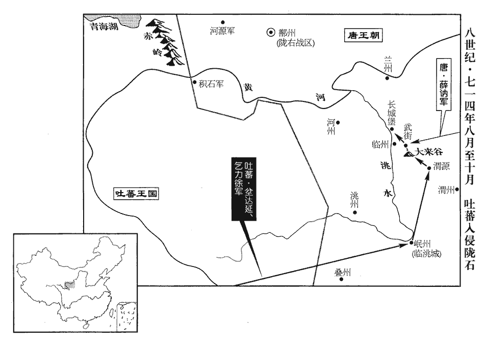
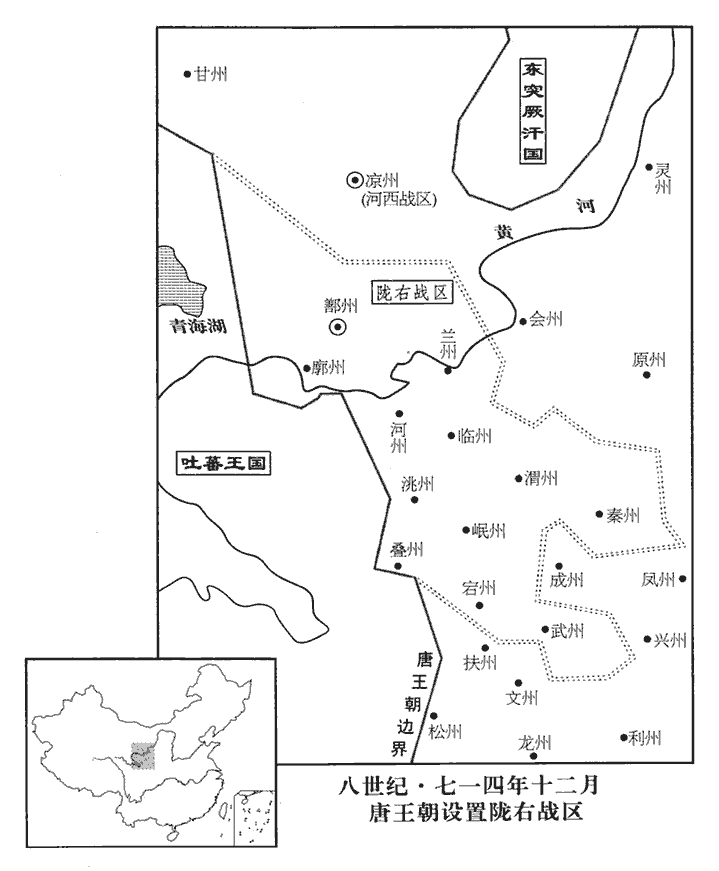
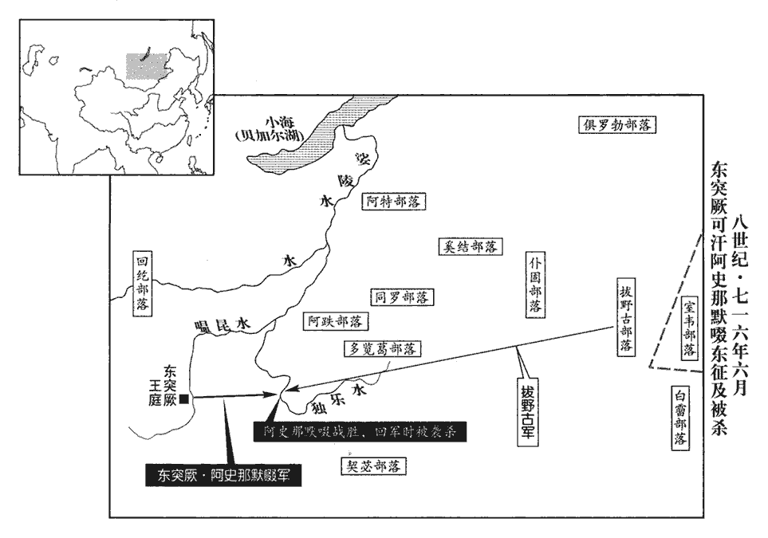

 唐紀二十七起閼逢攝提格（甲寅），盡強圉大荒落（丁巳），凡四年。

# 玄宗至道大聖大明孝皇帝上之中

## 開元二年（甲寅、七一四）

1春，正月，壬申‹十三›，制：「選京官有才識者除都督、刺史，都督、刺史有政迹者除京官，京官即在朝官也。使出入常均，永為恒式。」恒，户登翻。

〖译文〗 [1]春季，正月壬申（十三日），唐玄宗颁布制命：“要选拔那些有才能见识的京官担任都督、刺史，选择政绩显著的都督、刺史担任京官，使官员的外放和入朝任职保持均衡，并永远以此为常规。”

2己卯‹二十›，以盧懷慎檢校黃門監。去年改門下省為黃門，侍中為監。檢校黃門監，檢校侍中也。

〖译文〗 [2]己卯（二十日），唐玄宗任命卢怀慎为检校黄门监。

3舊制，雅俗之樂，皆隸太常。上‹李隆基，本年三十岁›精曉音律，以太常禮樂之司，不應典倡優雜伎；倡，音昌。伎，渠綺翻；下同。乃更置左右教坊以教俗樂，命右驍衛將軍范及為之使。更，工衡翻。使，疏吏翻。又選樂工數百人，自教法曲於梨園，謂之「皇帝梨園弟子」。梨園在禁苑中，註已見前。又教宫中使習之。又選伎女，置宜春院，宜春院當在西內宜春門內，近射殿。給賜其家。禮部侍郎張廷珪、酸棗‹河南省延津县›尉袁楚客皆上疏，以為「上春秋鼎盛，宜崇經術，邇端士，尚樸素；深以悅鄭聲、好遊獵為戒。」上，時掌翻。疏，所去翻。好，呼到翻。上雖不能用，咸【章：十二行本「咸上有「欲開言路」四字；乙十行本同；孔本同；退齋校同。】嘉賞之。

〖译文〗 [3]依旧制规定，凡属音乐，不论雅俗，统归太常寺管辖。唐玄宗精晓音律，他认为太常寺是朝廷掌管礼乐的部门，不应当兼管歌舞杂技艺人和各种游戏杂耍；于是他下诏另设左右教坊来专门教授俗乐，并任命右骁卫将军范及为主管官。此外，唐玄宗还挑选了数百名乐工，亲自在梨园教他们演奏法曲，这些人在当时被称为“皇帝梨园弟子”。唐玄宗还教宫中的人学习法曲。唐玄宗又挑选了一些歌伎和舞女，安置在宜春院，由官府各赐给她们家中财物。礼部侍郎张廷、酸枣尉袁楚客二人都为此而上疏，认为：“陛下年纪轻轻，应当尊崇经学儒术，亲近方正之士，崇尚朴素。臣以为陛下应当以喜欢靡靡之音、好巡游狩猎为戒。”唐玄宗虽然未能采纳他们的建议，但都对他们表示赞赏。

4中宗‹李显›以來，貴戚爭營佛寺，奏度人為僧，兼以偽妄；富戶強丁多削髮以避傜役，所在充滿。姚崇上言：「佛圖澄不能存趙，石虎敬重佛圖澄，澄死而趙亡。鳩摩羅什不能存秦，姚興師鳩摩羅什，興死而秦亡。齊襄‹高澄›、梁武‹萧衍›，未免禍殃。但使蒼生安樂，即是福身；何用妄度姦人，使壞正法！」樂，音洛。壞，音怪。上從之。丙寅‹七›，命有司沙汰天下僧尼，尼，女夷翻。以偽妄還俗者萬二千餘人。

〖译文〗 [4]自唐中宗即位以来，皇亲国戚竞相营建佛寺，奏请度人出家为和尚，其中有不少弄虚作假的；富裕人家的子弟以及身强力壮的男子纷纷削发为僧以逃避徭役，这种人简直到处都是。姚崇向唐玄宗建议道：“佛图澄未能使后赵国运长久，鸠摩罗什也无法使后秦免于覆亡，齐襄帝、梁武帝同样未能免于国破家亡。只要陛下能够使百姓安居乐业，就是有福之身，哪里用得着剃度奸诈之徒为僧，让他们败坏佛法呢！”唐玄宗采纳了他的建议。丙寅（疑误），唐玄宗命令有关部门筛选淘汰全国的和尚尼姑，因弄虚作假被勒令还俗的僧尼共计一万二千余人。

5初，營州都督治柳城‹辽宁省朝阳市›以鎮撫奚‹滦河上游›、契丹‹辽河上游›，則天之世，都督趙文翽huì失政，奚、契丹攻陷之，見二百五卷武后萬歲通天元年。契，欺訖翻，又音喫。翽，呼會翻。是後寄治幽州‹北京市›東漁陽城‹天津市蓟县›。據舊書，漁陽城在幽州東二百里。或言：「靺鞨‹黑龙江下游›、奚、霫‹辽河以北›大欲降唐，正以唐不建營州‹辽宁省朝阳市›，無所依投，為默啜所侵擾，故且附之；靺鞨，音末曷。霫，而立翻。降，戶江翻。啜，陟劣翻。若唐復建營州，則相帥歸化矣。」復，扶又翻。帥，讀曰率。并州‹山西省太原市›長史、和戎•大武‹山西省代县北›等軍州節度大使薛訥信之，大武軍在代州北，後改曰大同軍。使，疏吏翻。奏請擊契丹，復置營州；上亦以冷陘之役，欲討契丹。冷陘敗見上卷先天元年。群臣姚崇等多諫。甲申‹二十五›，以訥同紫微黃門三品，將兵擊契丹，將，即亮翻。群臣乃不敢言。

〖译文〗 [5]当初营州都督治所设在柳城，以镇抚奚和契丹，武则天时期，营州都督赵文执行政策失当，柳城被奚、契丹攻陷，此后营州治所就寄居在幽州东部的渔阳城。当地有人传说：“、奚、等部落很想归降大唐，只是由于大唐不在柳城设立营州，所以无所依附投靠，再加上被突厥可汗默啜侵扰，故而暂时依附突厥；假如大唐又在柳城设立营州，那么这些部落就会一个接一个地前来归附。”并州长史兼和戎、大武等军州节度大使薛讷听信了这种传闻，上奏请求进攻契丹，重建营州；唐玄宗也因唐军在冷泾一役中大败的缘故而一直想出兵讨伐契丹。姚崇等大臣们纷纷谏阻。甲申（二十五日），唐玄宗任命薛讷为同紫微黄门三品，率兵攻讨契丹，群臣于是不敢再向玄宗谏阻这件事。

6薛王業‹李隆业，李隆基的弟弟›之舅王仙童，侵暴百姓，御史彈奏；業為之請，彈，徒丹翻。為，于偽翻。敕紫微、黃門覆按。姚崇、盧懷慎等奏：「仙童罪狀明白，御史所言無所枉，不可縱捨。」上從之。由是貴戚束手。

〖译文〗 [6]薛王李业的舅父王仙童侵夺欺凌百姓，被御史上奏弹劾；李业为他求情，唐玄宗于是让紫微、黄门复审此案。姚崇、卢怀慎等人奏称道：“王仙童的罪状清楚明白，御史对他的弹劾也并无冤枉之处，不能对他放纵宽宥。”唐玄宗同意了他们的意见。从此皇亲国戚们收敛了一些。

7二月，庚寅朔‹二›，太史奏太陽應虧不虧。姚崇表賀，請書之史冊；從之。

〖译文〗 [7]二月，庚寅朔（疑误），太史上奏说是太阳应当亏食却没有亏食。姚崇向玄宗上表致贺，并请求将这件事载入史册，玄宗对此表示同意。

8乙未‹七›，突厥‹瀚海沙漠群›可汗默啜遣其子同俄特勒及妹夫火拔頡利發、厥，九勿翻。可，從刊入聲。汗，音寒。頡，戶結翻。考異曰：舊郭虔瓘傳云「默啜壻」，今從舊突厥傳及唐曆。舊虔瓘傳作「移江可汗」，突厥傳作「移涅可汗」，今從唐紀。石阿失畢將兵圍北庭都護府‹新疆吉木萨尔县›，都護郭虔瓘擊破之。阿，烏葛翻。將，即亮翻。敗，補邁翻。同俄單騎逼城下，虔瓘伏壯士於道側，突起斬之。騎，奇寄翻。突厥請悉軍中資糧以贖同俄，聞其已死，慟哭而去。

〖译文〗 [8]乙未（初七），突厥可汗默啜派他的儿子同俄特勒、妹夫火拔颉利发、石阿失毕率兵围攻北庭都护府，都护郭虔将突厥兵击败。同俄特勒单枪匹马逼近城下，被郭虔事先埋伏在路旁的勇士跃起斩首。突厥人请求用军中的所有物资换回同俄特勒，后得知他已被杀死，恸哭而去。

9丁未‹十九›，敕：「自今所在毋得創建佛寺；舊寺頹壞應葺者，詣有司陳牒檢視，然後聽之。」

〖译文〗 [9]丁未（十九日），唐玄宗发布敕命：“从今以后各地均不得新建佛寺；原有的佛寺已毁坏应修缮的，一律到有关部门申报，经检查属实，才允许动工修缮。”

10閏月，以鴻臚少卿、朔方軍副大總管王晙兼安北大都護‹驻西受降城内蒙古五原县西北›、朔方道行軍大總管，令豐安‹内蒙古安北县›、定遠‹宁夏平罗县›、三受降城‹东受降城，内蒙古托克托县南；中受降城，内蒙古包头市；西受降城，内蒙古五原县西北›及旁側諸軍皆受晙節度。靈州界有豐安、定遠等軍，在黃河外。武德四年，分豐州迴樂縣置豐安縣，貞觀十三年，省入迴樂。杜佑曰：豐安軍在靈武西黃河外百八十餘里；定遠軍在靈武東北二百里黃河外。臚，陵如翻。晙，子峻翻。降，戶江翻。徙大都護府於中受降城，杜佑曰：安北府東至榆林三百五十里，南至朔方八百里，西至九原三百五十里，北至回紇界七百里。置兵屯田。

〖译文〗 [10]闰二月，唐玄宗任命鸿胪寺少卿、朔方军副大总管王兼任安北大都护、朔方道行军大总管，命令丰安、定远、三受降城以及周围各军统归王指挥调度，并且将安北大都护府迁到中受降城，在那里驻扎军队，实行屯田。

11丁卯‹九›，復置十道按察使，罷十道按察使，見上卷上年。復，扶又翻。使，疏吏翻。以益州‹四川省成都市›長史陸象先等為之。長，知兩翻。

〖译文〗 [11]丁卯（初九），唐玄宗下诏恢复十道按察使的建置，派益州长史陆象先等人充任按察使。

12上思徐有功用法平直，乙亥‹十七›，以其子大理司直惀為恭陵‹李弘墓·河南省偃师县南›令。惀lǔn，力迍zhūn翻，又力尹翻。恭陵，孝敬皇帝陵。竇孝諶chén之子光祿卿豳公希瑊jiān等請以己官爵讓惀以報其德，竇孝諶事見二百五卷武后長壽二年。諶，氏壬翻。瑊，古咸翻。由是惀累遷申王府司馬。唐制：大理司直從六品上，親王府司馬從四品下。

〖译文〗 [12]唐玄宗考虑到徐有功执法公平正直，便于乙亥日（十七日）任命他的儿子、大理司直徐为恭陵令。窦孝谌之子、光禄卿、豳公窦希等人请求将自己的官爵让给徐以报答徐有功的恩德，所以徐得以从大理司直连续升迁为申王府司马。

13丙子‹十八›，申王成義‹李成义，李隆基的哥哥›請以其府錄事閻楚珪為其府參軍，唐親王府錄事從九品上，流外官也；參軍，正七品上。上許之。姚崇、盧懷慎上言，「先嘗得旨云王公、駙馬有所奏請，非墨敕皆勿行。引近旨以寢格其請。臣竊以量材授官，當歸有司；量，音良。若緣親故之恩，得以官爵為惠，踵習近事，近事，謂中宗朝濫官之弊。實紊紀網。」紊，音問。事遂寢。由是請謁不行。

〖译文〗 [13]丙子（十八日），申王李成义请求唐玄宗同意将自己的王府录事闫楚任命为王府参军，唐玄宗表示同意。姚崇和卢怀慎向玄宗进谏道：“臣等在此之前曾得到陛下的旨意，说凡王公、驸马有所奏请，如果没有陛下亲笔书写的墨敕，均不能生效。臣认为根据才能授予官职，是有关部门的职权；倘若由于有亲朋故旧的恩情，就可以以朝廷的官爵相赠，那就是继承中宗皇帝的弊政，这样做实际会紊乱朝廷的法度。”于是这件事便搁置下来。从此请托之风不再流行。

14突厥石阿失畢既失同俄，不敢歸；癸未‹二十五›，與其妻來奔，以為右衛大將軍，封燕北郡王。燕，因肩翻。命其妻曰金山公主。

〖译文〗 [14]突厥石阿失毕因损折了可汗之子同俄特勒，不敢回到突厥；癸未（二十五日），石阿失毕携其妻子投奔唐朝，被唐玄宗任命为右卫大将军，封燕北郡王，其妻被册封为金山公主。

15或告太子少保劉幽求、太子詹事鍾紹京有怨望語，下紫微省按問，幽求等不服。姚崇、盧懷慎、薛訥言於上曰：「幽求等皆功臣，乍就閒職，微有沮喪，下，遐嫁翻。沮，在呂翻。喪，息浪翻。人情或然。功業既大，榮寵亦深，一朝下獄，恐驚遠聽。」戊子‹三月一日›，貶幽求為睦州‹浙江省建德市›刺史，紹京為果州‹四川省南充市›刺史。果州，漢安漢縣地。宋於安漢故城置南宕渠郡，隋廢郡，改安漢縣曰南充縣，屬隆州；武德四年，置果州。舊志：睦州，京師東南三千六百五十九里，果州至京師二千五百五十八里。考異曰：幽求傳曰：「姚崇素嫉忌之，乃奏言幽求鬱怏於散職，兼有怨言，貶授睦州刺史。」紹京傳曰：「姚崇素惡紹京之為人，因奏紹京發言怨望，左遷綿州刺史。」今從實錄。紫微侍郎王琚行邊軍未還，去年遣王琚按行北邊諸軍。行，下孟翻。還，從宣翻，又如字。亦坐幽求黨貶澤州‹山西省晋城市›刺史。澤州，京師東北一千三十里。

〖译文〗 [15]有人告发太子少保刘幽求、太子詹事钟绍京有不满言论，玄宗下令将此二人交由紫微省审讯，刘幽求等人表示不服。姚崇、卢怀慎、薛讷对玄宗进谏道：“刘幽求等人都是功臣，现在突然担任没有实权的闲职，心中稍微有点沮丧，这也是人之常情。他们立下的功勋既大，获得的恩宠也深，一旦因一点小事就被逮捕下狱，恐怕会使天下人感到震惊。”戊子（疑误），唐玄宗将刘幽求贬为睦州刺史，将钟绍京贬为果州刺史。奉旨巡视边防部队尚未回朝的紫微侍郎王琚，也因是刘幽求的同党而获罪，被贬为泽州刺史。

16敕：「涪州‹重庆市涪陵区›刺史周利貞等十三人，皆天后時酷吏，周利貞、裴談、張栖正、張思敬、王承本、劉暉、楊允、康暐、封珣行、張知默、衛遂忠、公孫琰、鍾思廉等凡十三人。涪，音浮。比周興等情狀差輕，宜放歸草澤，終身勿齒。」

〖译文〗 [16]唐玄宗颁下敕命：“涪州刺史周利贞等十三人，都是则天大圣皇后时期的酷吏，只不过是比起周兴等人罪状稍微轻一些，应当削夺这些人的官爵，将他们放归民间，终身不予录用。”

17西突厥十姓‹吉尔吉斯斯坦伊塞克湖畔›酋長都擔叛。三月，己亥‹十二›，磧西節度使阿史那獻克碎葉‹吉尔吉斯斯坦托克马克城›等鎮，擒斬都擔，降其部落二萬餘帳。厥，九勿翻。酋，慈由翻。長，知兩翻。擔，都甘翻。磧，七迹翻。降，戶江翻。考異曰：實錄此月云，「獻擒賊帥都擔，六月，梟都擔首。」蓋此月奏擒之，六月傳首方至耳。實錄此月又云，「以西域二萬餘帳內附」，六月云「擒其部落五萬餘帳」，新傳云「三萬帳」。蓋兵家好虛聲，今從其少者。

〖译文〗 [17]西突厥十姓酋长都担反叛朝廷。三月，己亥（十二日），碛西节度使阿史那献攻克碎叶等镇，活捉都担并将其斩首，招降了他的部落共二万余帐。

18御史中丞姜晦以宗楚客等改中宗遺詔，事見二百九卷睿宗景雲元年。青州‹山东省青州市›刺史韋安石、太子賓客韋嗣立、刑部尚書趙彥昭、特進致仕李嶠，於時同為宰相，不能匡正，令監察御史郭震彈之；監，古銜翻。彈，徒丹翻。且言彥昭拜巫趙氏為姑，蒙婦人服，與妻乘車詣其家。甲辰‹十七›，貶安石為沔州‹湖北省武汉市汉水南岸›別駕，嗣立為岳州‹湖南省岳阳市›別駕，彥昭為袁州‹江西省宜春市›別駕，舊志：岳州，京師東南二千二百二十七里；袁州，京師東南三千五百八十里。沔，彌兗翻。考異曰：彥昭傳曰：「姚崇素惡彥昭之為人。」今從實錄。嶠為滁州‹安徽省滁州市›別駕。滁州，漢全椒縣地，江左為南、北二譙州及新昌郡，隋改南譙州曰滁州。舊志：滁州，京師東南二千五百六十四里。滁，音除。安石至沔州，晦又奏安石嘗檢校定陵‹李显墓·陕西省富平县西北龙泉山›，定陵，中宗陵。盜隱官物，下州徵贓。下，遐嫁翻。安石歎曰：「此祇應須我死耳。」憤恚而卒‹年六十四岁›。恚，於避翻。卒，子恤翻。晦，皎之弟也。

〖译文〗 [18]御史中丞姜晦认为宗楚客等人篡改中宗皇帝的遗诏时，现任的青州刺史韦安石、太子宾客韦嗣立、刑部尚书赵彦昭、以特进资格退休的李峤四人都在朝为相，却不能对这种行为加以匡正，便指使监察御史郭震上疏弹劾他们；并且还提到了赵彦昭拜女巫赵氏为姑，身披妇人衣装，和自己的妻子一起乘车到赵氏家中去等事。甲辰（十七日），唐玄宗将韦安石贬为沔州别驾，将韦嗣立贬为岳州别驾，将赵彦昭贬为袁州别驾，将李峤贬为滁州别驾。韦安石抵达沔州后，姜晦又向玄宗上奏说韦安石曾在督察中宗定陵的建造时盗窃隐藏官府财物，并且发文书到沔州向韦安石要赃物。韦安石感叹道：“这只不过是想要我死罢了。”终于愤愤而死。姜晦是姜皎的弟弟。

19毀天樞，造天樞見二百五卷武后延載元年。發匠鎔其鐵錢，【章：十二行本作「銅鐵」；乙十一行本同；孔本同；張校同。】歷月不盡。先是，韋后亦於天街作石臺，高數丈，以頌功德，天街即京城朱雀街。先，悉薦翻。高，古號翻。至是并毀之。

〖译文〗 [19]唐玄宗下令捣毁天枢，并调工匠熔化天枢上的铜铁，历时一月之久仍未熔完。此前韦后为歌颂自己的功德也在西京长安朱雀街上建造了一个高达数丈的石台，这次也被唐玄宗下令一起捣毁。

20夏，四月，辛巳‹二十五›，突厥可汗默啜復遣使求婚，復，扶又翻。使，疏吏翻。自稱「乾和永清太駙馬、天上得果報天男、突厥聖天骨咄祿可汗。」天男，猶云天子也。咄，當沒翻。

〖译文〗 [20]夏季，四月，辛巳（二十五日），突厥可汗默啜又派遣使者入朝求婚，他自称为“乾和永清太驸马、天上得果报天男、突厥圣天骨咄禄可汗”。

21五月，己丑‹三›，以歲饑，悉罷員外、試、檢校官，員外官，一也；試官，二也；檢校官，三也。罷之，以其冗濫，且糜俸廩也。自今非有戰功及別敕，毋得注擬。此三項官，今後非有戰功及別敕特行錄用，吏、兵部毋得注擬。

〖译文〗 [21]五月，己丑（初三），由于粮食歉收的缘故，唐玄宗下诏罢除所有员外官、试官、检校官，并且规定以后这三种官，除非是立有战功或者是由皇帝降下别敕特行录用，吏部和兵部一律不得注拟。

22己酉‹二十三›，吐蕃‹首都逻些城西藏拉萨市›相坌bèn達延吐，從暾入聲。相，息亮翻。坌，蒲頓翻。遺宰相書，遺，于季翻。請先遣解琬至河源‹河源军·青海省西宁市›正二國封疆，然後結盟。琬嘗為朔方大總管，故吐蕃請之。前此琬以金紫光祿大夫致仕，復召拜左散騎常侍而遣之。復，扶又翻，又如字。又命宰相復坌達延書，招懷之，琬上言，吐蕃必陰懷叛計，請預屯兵十萬於秦‹甘肃省天水市›、渭‹甘肃省陇西县›等州以備之。史言解琬所言，其識遠過崔漢衡。上，時掌翻。

〖译文〗 [22]己酉（二十三日），吐蕃宰相坌达延写给唐朝宰相一封信，信中要求朝廷先派解琬到河源划定两国的边界，然后两国再订立盟约。解琬曾经担任朔方大总管，所以吐蕃特意要求朝廷派他前往。由于在这之前解琬已经以金紫光禄大夫之职退休，所以唐玄宗又将他召入朝中，任命他为左散骑常侍并派他前往河源。此外玄宗还让宰相给坌达延回信以便对他进行招抚怀柔。解琬对唐玄宗进言，认为吐蕃一定心怀鬼胎，准备反叛，请玄宗预先在秦、渭等州屯兵十万以防意外事变的发生。

23黃門監魏知古，本起小吏，因姚崇引薦，以至同為相。崇意輕之，請知古攝吏部尚書、知東都‹洛阳›選事，遣吏部尚書宋璟於門下過官；唐制：凡文武職事官六品以下，吏、兵部進擬必過門下省，量其階資；校其才用，以審定之；若擬職不當，隨其優屈退而量焉，謂之過官。選，須絹翻。知古銜之。

〖译文〗 [23]黄门监魏知古本是小吏出身，凭借着姚崇的引荐，才与姚崇同朝为相。姚崇内心里有些轻视他，所以让他代理吏部尚书职务，负责主持东都洛阳的官吏铨选之事，另派吏部尚书宋在门下省负责审定吏部、兵部注拟的六品以下职事官。魏知古因此对姚崇十分不满。

崇二子分司東都，恃其父有德於知古，頗招權請託；知古歸，悉以聞。他日，上從容問崇：從，千容翻。「卿子才性何如？今何官也？」崇揣知上意，揣，初委翻。對曰：「臣有三子，兩在東都，為人多欲而不謹；是必以事干魏知古，臣未及問之耳。」上始以崇必為其子隱，為，于偽翻。及聞崇奏，喜問：「卿安從知之？」對曰：「知古微時，臣卵而翼之。左傳：楚子西謂白公勝曰：「勝如卵，余翼而長之。」臣子愚，以為知古必德臣，容其為非，故敢干之耳。」上於是以崇為無私，而薄知古負崇，欲斥之。崇固請曰：「臣子無狀，撓陛下法，撓，奴巧翻，又奴教翻。陛下赦其罪，已幸矣；苟因臣逐知古，天下必以陛下為私於臣，累聖政矣。」累，力瑞翻。上久乃許之。辛亥‹二十五›，知古罷為工部尚書。考異曰：舊知古傳：「二年還京，上屢有顧問，恩意甚厚，尋改紫微令。姚崇深忌憚之，陰加讒毀，乃除工部尚書，罷知政事。」新傳亦云「由黃門監改紫微令」。今據實錄，知古自黃門監罷政事；其所以罷，從柳氏舊聞。

〖译文〗 姚崇的两个儿子在分设于东都洛阳的中央官署任职，倚仗其父对魏知古有恩，大肆揽权，为他人私下向魏知古求官；魏知古回到长安后，把这些事全都告诉了玄宗皇帝。过了几天，玄宗漫不经心地向姚崇问道：“您的儿子才干品性怎么样？现在担任什么官职啊？”姚崇揣摸到了玄宗的心思，便回答说：“臣有三个儿子，其中有两个在东都任职，他们为人欲望很大，行为也很不检点；现在他们一定是有事私下嘱托魏知古，只不过是臣没有来得及去讯问他们而已。”唐玄宗原先以为姚崇一定会为他的儿子隐瞒，在听了他的这番回答之后，高兴地问道：“您怎么知道这件事的呢？”姚崇回答说：“在魏知古地位卑微之时，臣曾经多方关照他。臣的儿子非常愚鲁，认为魏知古一定会因此而感激臣，从而会容忍他们为非作歹，所以才敢于向他干求请托。”唐玄宗因此而认为姚崇忠正无私，而看不起魏知古的忘恩负义，想要罢黜他的职务。姚崇坚决地请求玄宗不要这样做，他说：“此事乃是臣的两个儿子有罪，破坏了陛下的法度，陛下赦免了他们的罪过，臣已经是感到万幸了；如果由于臣的缘故而斥逐魏知古，天下的人们一定会认为陛下是在偏袒臣，这样会累及圣朝的声誉。”唐玄宗沉吟了很久才答应了他的请求。辛亥（二十五日），魏知古被免去相职，改任工部尚书。

24宋王成器，申王成義，於上兄也；岐王範，薛王業，上之弟也；豳王守禮，上之從兄也。從，才用翻。上素友愛，近世帝王莫能及；初即位，為長枕大被，與兄弟同寢。諸王每旦朝於側門，朝，直遙翻；下同。退則相從宴飲，鬬雞，擊毬，或獵於近郊，遊賞別墅，中使存問相望於道。墅，承與翻。使，疏吏翻；下同。上聽朝罷，多從諸王遊，在禁中，拜跪如家人禮，飲食起居，相與同之。於殿中設五幄，與諸王更處其中。【章：十二行本「中」下有「謂之五王帳」五字；乙十一行本同；孔本同。】更，工衡翻；下更奏同。處，昌呂翻。或講論賦詩，間以飲酒、博弈、遊獵，間，古莧翻；下讒間同。或自執絲竹；成器善笛，範善琵琶，與上更奏之。諸王或有疾，上為之終日不食，終夜不寢。業嘗疾，上方臨朝，須臾之間，使者十返。上親為業煮藥，為，于偽翻。回飆biāo吹火，誤爇ruò上須，左右驚救之。上曰：「但使王飲此藥而愈，須何足惜？」爇，如悅翻。須，與鬚同。成器尤恭慎，未嘗議及時政，與人交結；上愈信重之，故䜛間之言無自而入。然專以【章：十二行本「以」下有「衣食」二字；乙十一行本同。】聲色畜養娛樂之，畜，吁玉翻。樂，音洛。不任以職事。群臣以成器等地逼，請循故事出刺外州。六月，丁巳‹二›，以宋王成器兼岐州‹陕西省凤翔县›刺史，舊志，岐州，京師西三百一十五里。申王成義兼豳州‹陕西省彬县›刺史，考異曰：實錄、舊傳作「幽州」，今從唐曆、舊紀。豳王守禮兼虢州‹河南省灵宝市›刺史，虢州西至京師四百三十里。令到官但領大綱，自餘州務，皆委上佐主之。上佐，長史、司馬也。是後諸王為都護、都督、刺史者並準此。

〖译文〗 [24]宋王李成器和申王李成义是玄宗的兄长；岐王李范和薛王李业是玄宗的弟弟；豳王李守礼是玄宗的堂兄。唐玄宗一向对兄弟十分友爱，这一点是近世帝王比不上的；玄宗刚刚即皇帝位时，特意让人做了一套长长的枕头和一床特别宽大的被子，以便他能够与兄弟们同床共寝。诸王每天早上在侧门朝见天子，退下后便聚在一起进膳饮酒、斗鸡、击；或者是到京城近郊去狩猎，或者是到别墅里观赏游玩，奉命前去问候的宦官络绎不绝。唐玄宗在每天临朝听政之后，经常与诸王在一起游乐，兄弟们在宫中相处时，彼此跪拜都依照家人的礼节，饮食起居也无分别。玄宗还下令在宫中设置五座帐幕，自己与诸王轮流在里面住宿。他们有时在一起谈论、一起赋诗，有时饮酒，有时玩博戏下围棋，有时策马纵犬外出打猎，有时手持丝竹乐器吹拉弹唱；李成器擅长吹奏笛子，李范擅长弹奏琵琶，他们都曾和玄宗在一起轮流演奏。诸王中倘若有哪一位生了病，玄宗甚至急得终日吃不下饭、终夜睡不着觉。有一次薛王李业生了病，当时玄宗正在临朝听政，一会儿功夫就十次派使者前往问候。唐玄宗还亲手为李业熬制汤药，旋风吹来，燃着玄宗的胡须，左右侍从赶忙上前帮他扑火。唐玄宗说道：“只要薛王服下这碗药以后病能痊愈，朕的胡须有什么值得可惜呢？”宋王李成器平日尤其恭敬谨慎，从不谈起有关朝政的事，也从不与他人结交；玄宗也因此而越发信任他，所以破坏和离间兄弟感情的话也无从进入。即使如此，玄宗也只是一味用声色犬马、衣食器玩等来尽量使他们得到快乐，而从不任命他们什么具体的职务。群臣认为宋王李成器等人地位逼近皇帝，便请玄宗按照历朝的惯例放他们到地方任刺史。六月，丁巳（初二），唐玄宗任命宋王李成器兼任岐州刺史，申王李成义兼任豳州刺史，豳王李守礼兼任虢州刺史，要他们到任之后只管重要事条，其他的行政事务都委托长史、司马负责处理。从此以后诸王任都护、都督、刺史的也都照此办理。

25丙寅‹十一›，吐蕃使其宰相尚欽藏來獻盟書。尚，吐蕃之貴姓也。

〖译文〗 [25]丙寅（十一日），吐蕃赞普派遣宰相尚钦藏入朝进献两国的盟书。

26上以風俗奢靡，秋七月，乙未‹十›，制：「乘輿服御、金銀器玩，宜令有司銷毀，以供軍國之用；其珠玉、錦繡，焚於殿前；乘，繩證翻。后妃以下，皆毋得服珠玉錦繡。」戊戌‹十三›，敕：「百官所服帶及酒器、馬銜、鐙，鐙，都鄧翻，鞍鐙也。三品以上，聽飾以玉，四品以金，五品以銀，自餘皆禁之；婦人服飾從其夫、子。夫、子者，夫若子也。其舊成錦繡，聽染為皂。自今天下更毋得采珠玉，織錦繡等物，違者杖一百，工人減一等。」唐法：杖一百，決臀杖二十；減一等則杖八十。罷兩京織錦坊。

〖译文〗 [26]唐玄宗认为社会风俗日益趋于奢侈腐化。秋季，七月，乙未（初十），玄宗颁布制命：“天子使用的金银器物，都应由有关部门负责销熔，以供军国财政支出的需要；凡属珠宝玉器、锦绣织物，均在殿前焚毁；宫中自后妃以下，一律不得使用以珠玉锦绣制成的物品。”戊戌（十三日），唐玄宗又发布敕命：“文武百官所使用的腰带、酒器、马嚼子、马蹬，三品以上的，可以用玉来装饰；四品官，可以用金来装饰；五品官，可以用银来装饰；其余官员一律禁止使用任何饰物；妇女使用的饰物随从其丈夫或儿子。至于过去织成的锦绣，可以染成黑色使用。从今以后全国各地均不得采集珠玉，纺织锦绣织物，违犯这项禁令的处以杖刑一百，工匠违反禁令的减一等治罪。”玄宗还下令撤消了设于东西两京的织锦坊。

臣光曰：明皇‹李隆基›之始欲為治，治，直吏翻。能自刻厲節儉如此，晚節猶以奢敗；甚哉奢靡之易以溺人也！詩云：「靡不有初，鮮克有終。」詩蕩之辭。易，以豉翻。鮮，息淺翻。可不慎哉！

〖译文〗 臣司马光曰：“唐明皇即位之初，励精图治，能这样严格要求自己、这样节俭，可到晚年仍然由于奢侈导致国家败落；奢靡之风对于人的腐蚀实在是太厉害了！《诗经》上说：“靡不有初，鲜克有终。”对此怎么可以不慎之又慎呢！

27薛訥與左監門衛將軍杜賓客、定州‹河北省定州市›刺史崔宣道等將兵六萬監，古銜翻。將，即亮翻。考異曰：舊傳云「兵二萬」，僉載云「八萬人皆沒」。今從唐紀。出檀州‹北京市密云县›擊契丹。賓客以為「士卒盛夏負戈甲，齎資糧，深入寇境，難以成功。」訥曰：「盛夏草肥，羔犢孳息，小羊曰羔，小牛曰犢。孳zī，津之翻，生也。因糧於敵，正得天時，一舉滅虜，不可失也。」行至灤水‹滦河›山峽中，薊州雄武軍東北行百二十里至鹽城守捉，又東北渡灤河。灤，落官翻。契丹伏兵遮其前後，從山上擊之，唐兵大敗，死者什八九。訥與數十騎突圍，得免，虜中嗤之，謂之「薛婆」。俗謂婦人之老曰婆。言薛訥老怯如老婦人也。薛【章：十二行本「薛」作「崔」；乙十一行本同；張校同。】宣道將後軍，聞訥敗，亦走。訥歸罪於宣道及胡將李思敬等八人，將，即亮翻。制悉斬之於幽州。庚子‹十五›，敕免訥死，削除其官爵；獨赦杜賓客之罪。

〖译文〗 [27]薛讷与左监门卫将军杜宾客、定州刺史崔宣道等人率领六万人马自檀州出击契丹。杜宾客认为：“在此盛夏时节，兵士身穿铠甲手执兵器，还要携带军需粮草，孤军深入敌境，恐怕难以取胜。”薛讷道：“盛夏时节草木茂盛，牛羊大量生长繁殖，我们可以就敌取粮，正得天时，这是一举消灭敌人的时机，不可失去呀。”当大军走到滦河流经的峡谷时，遭到了契丹伏兵的前后堵截，契丹兵又从山上发动进攻，唐军因此而一败涂地，阵亡的将士达到全军总数的十分之八、九。薛讷仅带着几十名骑兵突出重围，幸免于难，契丹兵嘲笑他，称他为“薛婆”。崔宣道负责指挥后续部队，听说薛讷已经战败，便也掉头逃走。薛讷将此次失败的责任全部推到崔宣道和胡将李思敬等八人的身上，唐玄宗下令将这八个人全部斩首于幽州。庚子（十五日），唐玄宗发布敕命，免去薛讷的死罪，削除他的官爵，只有杜宾客一人得到赦免。

28壬寅‹十七›，以北庭都護‹驻新疆吉木萨尔县›郭虔瓘為涼州‹甘肃省武威市›刺史、河西諸軍州節度使。使，疏吏翻。

〖译文〗 [28]壬寅（十七日），唐玄宗任命北庭都护郭虔为凉州刺史、河西诸军州节度使。

29果州‹四川省南充市›刺史鍾紹京心怨望，數上疏妄陳休咎；數，所角翻。乙巳‹二十›，貶溱州‹重庆市綦江县东南›刺史。溱，側詵翻。

〖译文〗 [29]果州刺史钟绍京对朝廷心怀不满，屡次上疏玄宗妄谈吉凶；乙巳（二十日），唐玄宗将钟绍京贬为溱州刺史。

30丁未‹二十二›，房州‹湖北省房县›刺史襄王重茂薨‹年二十岁›，輟朝三日，追諡曰殤皇帝。以韋氏所立，故仍諡曰皇帝。重，直龍翻。朝，直遙翻。

〖译文〗 [30]丁未（二十二日），房州刺史襄王李重茂去世，唐玄宗为此而停止朝会三天，并将他追谥为殇皇帝。

31戊申‹二十三›，禁百官家毋得與僧、尼、道士往還。壬子‹二十七›，禁人間鑄佛、寫經。

〖译文〗 [31]戊申（二十三日），玄宗下令禁止文武百官及其家属与和尚、尼姑、道士互相往来。壬子（二十七日），玄宗又下令禁止民间铸造佛象和抄写佛经。

32宋王成器等請獻興慶坊宅為離宮；甲寅‹二十九›，制許之，始作興慶宮，興慶宮，後謂之南內，在皇城東南，距京城之東，直東內之南。自東內達南內，有夾城複道，經通化門達南內，人主往來兩宮，外人莫知之。仍各賜成器等宅，環於宮側。寧王、岐王宅在安興坊，薛王宅在勝業坊，二坊相連，皆在興慶宮西。寧王即宋王也。環，音宦。又於宮西南置樓，題其西曰「花萼è相輝之樓」，南曰「勤政務本之樓」。上或登樓，聞王奏樂，則召升樓同宴，或幸其所居盡歡，賞賚優渥。

〖译文〗 [32]宋王李成器等人请求将兴庆坊的宅第贡献出来作为供皇帝用的离宫；甲寅（二十九日），唐玄宗发布制命，接受了他们的请求，同时开始了兴庆宫的修建工程，并将环绕兴庆宫的宅第分别赐予李成器等人。唐玄宗又下令在兴庆宫的西南边建造两座楼，西边的楼题名为“花萼相辉之楼”，南边的楼题名为“勤政务本之楼”。有时玄宗在楼上听到诸王在自己的宅第里奏乐的声音，便将他们全都召到楼上与自己一起吃饭，有时玄宗则亲临诸王家中与大家同乐，对诸王的赏赐也十分优厚。

33乙卯‹三十›，以岐王範兼絳州‹山西省新绛县›刺史，薛王業兼同州‹陕西省大荔县›刺史。考異曰：實錄云「八月，乙卯」。據長曆，八月丙辰朔。實錄自此以下脫少；今取唐曆、舊本紀補之。仍敕宋王以下每季二人入朝，朝，直遙翻。周而復始。

〖译文〗 [33]乙卯（三十日），唐玄宗任命岐王李范兼任绛州刺史，薛王李业兼任同州刺史，并规定自宋王李成器以下各王，每季度有两人入朝，周而复始。

34民間訛言，上采擇女子以充掖庭，掖，音亦。上聞之。八月，乙丑‹十›，令有司具車牛於崇明門，唐六典：大明宮紫宸殿，內朝正殿也。殿之南面紫宸門，紫宸門之左曰崇明門，右曰光順門。自選後宮無用者載還其家；敕曰：「燕寢之內，尚令罷遣；閭閻之間，足可知悉。」

〖译文〗 [34]民间纷纷谣传唐玄宗将挑选美女以充实后宫，玄宗听到了这种传闻后，八月，乙丑（初十），下令有关部门在崇明门准备好车辆和牛马，然后亲自从后宫中选出多余的宫女，让他们坐车回家，并且发布敕命说：“朕对于后宫中的宫女，尚且要遣返回家，对于民间女子会怎么样，应当是可想而知的事情。”

35乙亥‹二十›，吐蕃將坌達延、乞力徐帥眾十萬寇臨洮‹临洮军基地·青海省乐都县›、軍蘭州‹甘肃省兰州市›，至于渭源‹甘肃省渭源县›，果如解琬之言。岷州溢樂縣，古臨洮縣，義寧二年更名渭源，漢隴西之首陽縣也。後魏分隴西置渭源郡，又改首陽為渭源縣。唐以縣屬渭州。將，即亮翻。坌bèn，蒲頓翻。帥，讀曰率；下同。洮，土刀翻。掠取牧馬；命薛訥白衣攝左羽林將軍，為隴右防禦使，薛訥以灤河之敗削除官爵，故命以白衣攝官出隴右。使，疏吏翻；下同。以右驍衛將軍常樂‹甘肃省安西县瓜州城西›郭知運為副使，常樂，漢廣至縣地，曹魏分廣至置宜禾縣，李暠於此置涼興郡，隋置常樂鎮，武德五年改鎮為縣，屬瓜州。驍，堅堯翻。樂，音洛。與太僕少卿王晙帥兵擊之。辛巳‹二十六›，大募勇士，詣河、隴就訥教習。

〖译文〗 [35]乙亥（二十日），吐蕃将领坌达延、乞力徐率领十万人马进犯临洮，敌军大队人马驻扎在兰州，还派兵进入渭源地区掠取牧马；唐玄宗命令薛讷以布衣之身代理左羽林将军职务，出任陇右防御使，任命右骁卫将军、常乐县人郭知运为陇右防御副使，与太仆寺少卿王一起率军迎击吐蕃军队。辛巳（二十六日），唐玄宗下令大量招募勇士，并派他们前往河、陇地区接受薛讷的训练。

 

初，鄯州‹总部设青海省乐都县›都督楊矩以九曲之地‹青海省贵德县为中心，黄河到此左右弯曲，称”九曲”›與吐蕃，事見上卷睿宗景雲元年。鄯，時戰翻，又音善。其地肥饒，吐蕃就之畜牧，畜，吁玉翻。因以入寇。矩悔懼自殺。

〖译文〗 起初，唐鄯州都督杨矩，怂勇唐睿宗同意将河西九曲之地送给吐蕃作金城公主的汤沐邑。这里土地肥沃，牧草鲜美，吐蕃在这里大量放养牛马，并且以它为依托进犯大唐。杨矩对自己当初的行为追悔莫及，再加上担心朝廷降罪，自杀身死。

36乙酉，太子賓客薛謙光獻武后所製豫州鼎銘，武后鑄九州鼎，自製銘。其末云：「上玄降鑒，方建隆基。」通典載豫州鼎銘曰：「犧、農首出，軒、昊應期，唐、虞繼踵，湯、武乘時。天下光宅，域內雍熙。上玄降鑒，方建隆基。」以為上受命之符。姚崇表賀，且請宣示史官，頒告中外。

〖译文〗 [36]乙酉（疑误），太子宾客薛谦光向玄宗进献了武则天所制的《豫州鼎铭》，铭文的最后有这样的话：“上玄降鉴，方建隆基。”薛谦光认为这就是玄宗受命于天的符瑞。姚崇为此上表唐玄宗表示祝贺，请求玄宗下诏将这段铭文向史官宣示，并颁告朝廷内外。

臣光曰：日食不驗，太史之過也；而君臣相賀，是誣天也。采偶然之文以為符命，小臣之諂也；而宰相因而實之，是侮其君也。上誣於天，下侮其君，以明皇之明，姚崇之賢，猶不免於是，豈不惜哉！

〖译文〗 臣司马光曰：日食应该出现却没有出现，是太史工作的失误；而君臣为此而相互称贺，则是诬蔑上天。搜求偶然出现的文辞作为帝王受命于天的符瑞，是小臣对君主的阿谀奉承；而宰相接着将它坐实，则是亵渎了他的君主。以唐明皇的英明，姚崇的德才兼备，仍然不能免于出现这种诬蔑上天、亵渎君王的行为，岂不令人感到可惜！

37九月，戊申‹二十四›，上幸驪山溫湯‹陕西省临潼县境›。

〖译文〗 [37]九月，戊申（二十四日），唐玄宗来到骊山温泉。

38敕以歲稔傷農，令諸州脩常平倉法；太宗時置義倉及常平倉，以備凶荒。高宗以後，稍假以給他費，至神龍中略盡，至是復置之。江、嶺、淮、浙、劍南地下濕，不堪貯積，不在此例。貯，丁呂翻。

〖译文〗 [38]鉴于这一年粮食丰收，为防止谷贱伤农，唐玄宗发布敕命，让地方各州重立常平仓法；惟独江、岭、淮、浙、剑南等地因地势低洼潮湿，不利于粮食的储藏，不在此例。

39突厥可汗默啜衰老，昏虐愈甚；壬子‹二十八›，葛邏祿‹中亚额尔齐斯河流域›等部落詣涼州降。邏，郎佐翻。降，戶江翻

〖译文〗 [39]突厥可汗默啜衰老，更加昏聩残暴。壬子（二十八日），葛逻禄等部落到凉州投降大唐。

40冬，十月，吐蕃復寇渭源。復，扶又翻丙辰‹二›，上下詔欲親征，發兵十餘萬人，馬四萬匹。

〖译文〗 [40]冬季，十月，吐蕃军队再次进犯渭源。丙辰（初二），唐玄宗下诏表示要亲自率兵前去征讨，并调集军士十余万人，战马四万匹。

41戊午‹四›，上還宮。

〖译文〗 [41]戊午（初四），唐玄宗回到宫中。

42甲子‹十›，薛訥與吐蕃戰於武街‹甘肃省临洮县东›，水經註：武街城在漢狄道縣東白石山西北。唐為武街驛，與大來谷皆屬臨洮渭源縣界。劉昫曰：武街驛在渭州西界大破之。時太僕少卿隴右群牧使王晙帥所部二千人與訥會擊吐蕃。坌達延將吐蕃兵十萬屯大來谷‹甘肃省临洮县东南›，晙選勇士七百，衣胡服，夜襲之，晙，子峻翻。帥，讀曰率。坌，蒲頓翻。將，即亮翻。衣，於既翻。多置鼓角於其後五里，前軍遇敵大呼，後人鳴鼓角以應之。虜以為大軍至，驚懼，自相殺傷，死者萬計。訥時在武街，去大來谷二十里，虜軍塞其中間；呼，火故翻。塞，悉則翻。晙復夜出襲之，虜大潰，始得與訥軍合。追奔至洮水‹黄河支流›，復戰於長城堡‹甘肃省临洮县北›，秦築長城，起臨洮，因以名堡。復，扶又翻。又敗之，敗，補邁翻。前後殺獲數萬人。豐安‹宁夏中卫县›軍使王海賓戰死。【章：十二行本「死」下有「乙丑‹十一›，敕罷親征」六字；乙十一行本同；孔本同；張校同；退齋校同。】使，疏吏翻。

〖译文〗 [42]甲子（初十），薛讷与吐蕃军队在武街作战，取得了巨大的胜利。当时太仆少卿、陇右群牧使王率领属下二千人马与薛讷合击吐蕃军队。坌达延率十万吐蕃兵驻扎在大来谷。王选拔了七百名勇士，身着胡人的服装，夜间袭击吐蕃军队，又在这七百人后面五里远的地方安排了很多战鼓和号角。先锋部队与敌军相遇后即大声呼喊，后面的人击鼓吹角与之呼应，吐蕃兵误以为唐军大部队袭来，惊慌失措，以至于自相残杀，死的人以万计算。薛讷的部队这时还驻扎在距大谷二十里的武街，在这两地之间挤满了溃败的吐蕃兵。王又一次率军乘夜出击，吐蕃兵一败涂地，王这才得以与薛讷的部队会师。唐军乘胜追击溃败的吐蕃兵，一直追到洮水，两军又在长城堡展开激战，吐蕃军队再次大败，先后被杀被俘的达数万人之多。在这次战役中，丰安军使王海宾阵亡。

戊辰‹十四›，姚崇、盧懷慎等奏：「頃者吐蕃以河‹指青海省黄河›為境，神龍中尚公主，遂踰河築城，置獨山、九曲兩軍‹应在青海省贵德县境›，即楊矩所與九曲之地也。去積石‹青海省兴海县›三百里，又於河上造橋。今吐蕃既叛，宜毀橋拔城。」從之。

〖译文〗 戊辰（十四日），姚崇、卢怀慎等上奏道：“以往吐蕃与我大唐一向以黄河为界，中宗神龙年间娶了大唐公主，于是越过黄河到大唐境内修筑城池，设置了独山、九曲两军，两军距离积石军三百里，又在黄河之上架起了桥梁。现在吐蕃既已背叛了朝廷，我们就应该拆毁他们的桥梁拔掉他们的城池。”唐玄宗对此表示同意。

以王海賓之子忠嗣為朝散大夫、尚輦奉御，朝，直遙翻。散，悉亶翻。養之宮中。

〖译文〗 唐玄宗任命王海宾之子王忠嗣为朝散大夫、尚辇奉御，并且下令将他接到宫中抚养。

43己巳‹十五›，突厥可汗默啜又遣使求婚，上許以來嵗迎公主。

〖译文〗 [43]己巳（十五日），突厥可汗默啜又派遣使者入朝，请求与大唐通婚，唐玄宗答应他明年来迎娶公主。

44突厥十姓胡祿屋等諸部詣北庭請降，此西突厥也。降，戶江翻；下同。命都護郭虔瓘撫存之。

〖译文〗 [44]突厥十姓胡禄屋等部落来到北庭都护府请求归降，玄宗命令北庭都护府都护郭虔抚恤慰问他们。

45乙酉，命左驍衛郎將尉遲瓌guī使于吐蕃，宣慰金城公主。吐蕃遣其大臣宗俄因矛【嚴：「矛」改「子」。】至洮水請和，用敵國禮；驍，堅堯翻。將，即亮翻。尉，紆勿翻。使，疏吏翻。洮，土刀翻。上不許。自是連歲犯邊。考異曰：唐曆：「四年七月丁丑，吐蕃以去年之敗，遣其大臣宋俄因矛款塞請和，自恃兵強，求敵國之禮；天子忿之。」按自此至四年，非去年也。既云以敗請和，又何得云自恃兵強；既云天子忿之，又當年八月已許其和！今從舊傳。

〖译文〗 [45]乙酉（疑误），唐玄宗派遣左骁卫郎将尉迟出使吐蕃，慰问金城公主。吐蕃派遣大臣宗俄因矛到洮水请求和解，并且要求两国用对等的礼节，唐玄宗不同意。从此吐蕃连年侵犯边境。

 

46十一月，辛卯‹七›，葬殤皇帝‹李重茂›。

〖译文〗 [46]十一月，辛卯（初七），安葬殇皇帝李重茂。

47丙申‹十二›，遣左散騎常侍解琬詣北庭宣慰突厥降者，隨便宜區處。處，昌呂翻。

〖译文〗 [47]丙申（十二日），唐玄宗派左散骑常侍解琬前往北庭都护府安抚归降的突厥胡禄屋等部落，允许他遇事因利乘便，自行决断处置。

48十二月，壬戌‹九›，沙陀‹新疆西北部›金山入朝。

〖译文〗 [48]十二月，壬戌（初九），沙陀金山入朝谒见玄宗。

49甲子‹十一›，置隴右節度大使，須嗣鄯‹青海省乐都县›、奉、河‹甘肃省临夏市›、渭、蘭、臨‹甘肃省临洮县›、武‹甘肃省武都县›、洮‹甘肃省临潭县›、岷‹甘肃省岷县›、郭‹廓，青海省化隆县›、疊‹甘肃省迭部县›、宕‹甘肃省舟曲县›十二州，「須」當作「領」。「嗣」字衍。「奉」當作「秦」，「郭」當作「廓」。臨州本漢隴西之狄道地，晉置武始郡，隋廢郡復為狄道縣，屬蘭州，天寶三載始分置臨州，新、舊志皆云然。據此，則已置臨州久矣。武州，古白馬之地，漢武帝開置武都郡，西魏改曰石門縣，置武州。宕州，後魏宕昌羌之地，後周置宕昌郡，天和元年置宕州。鄯，時戰翻，又音善。宕，徒浪翻。以隴右防禦副使郭知運為之。

〖译文〗 [49]甲子（十一日），唐玄宗下令设置陇右节度大使，管辖鄯、秦、河、渭、兰、临、武、洮、岷、廓、叠、宕十二州，任命陇右防御副使郭知运为陇右节度大使。

50乙丑‹十二›，立皇子嗣真為鄫zēng王，考異曰：實錄於此作「鄫王」，於後作「郯tán王」。今從舊傳。余詳考新、舊二史，嗣真是年與嗣初、嗣玄同封，然嗣真實帝之第四子，非長子也。長子乃嗣直也，次子則嗣謙也。先天元年，封嗣直郯王，嗣謙郢王。嗣初為鄂王，嗣主為鄄juàn王。「嗣主」當作「嗣玄」。【章：乙十一行本正作「嗣玄」。】辛巳‹二十八›，立郢王嗣謙為皇太子。嗣真，上之長子，母曰劉華妃。劉華妃，郯王嗣直之母。若鄫王嗣真之母則錢妃也。亦誤。嗣謙，次子也，母曰趙麗妃；帝置惠妃、麗妃、華妃，以代三夫人。麗妃以倡進，有寵於上，故立之。以母寵而立其子，母寵衰則子愛弛矣。為後廢太子張本。倡，音昌。

〖译文〗 [50]乙丑（十二日），唐玄宗封皇子李嗣真为王，李嗣初为鄂王，李嗣主为鄄王。辛巳（二十八日），唐玄宗将郢王李嗣谦立为皇太子。李嗣真是玄宗的长子，他的母亲是刘华妃。李嗣谦是玄宗的次子，他的母亲是赵丽妃；赵丽妃本是歌舞妓出身，受到唐玄宗的宠爱，所以她的儿子李嗣谦被立为皇太子。

51是歲，置幽州節度、經略、鎮守大使，領幽、易‹河北省易县›、平‹河北省卢龙县›、檀、媯‹河北省怀来县›、燕‹羁縻州·侨设北京市›六州。媯guī，居為翻。燕，因肩翻。

〖译文〗 [51]唐玄宗在这一年设置了幽州节度、经略镇守大使，管辖幽、易、平、檀、妫、燕六州。

52突騎施‹伊犁河中下游›可汗守忠之弟遮弩恨所分部落少於其兄，遂叛入突厥，請為鄉導，以伐守忠。騎，奇寄翻。少，詩沼翻。鄉，讀曰嚮。默啜遣兵二萬擊守忠，虜之而還。還，從宣翻，又如字。考異曰：舊傳以為景龍三年事。按實錄，娑葛既為十四姓可汗，自後無娑葛名，但屢云突騎施守忠入朝，或者守忠即娑葛賜名邪？景雲以後，守忠猶在。又，開元二年六月，阿史那獻奏有龍見于北庭，為鎮將妻馮言之，曰突騎施娑葛三年後破散，默啜八年後自滅。然則娑葛於時尚在也；竟不知死於何年，故附此。謂遮弩曰：「汝叛其兄，何有於我！」遂并殺之。書此，以戒兄弟日尋干戈而假手於他人以逞其志者。

〖译文〗 [52]突骑施可汗守忠的弟弟遮弩对于自己所分得的部落少于其兄极为不满，于是背叛守忠，逃入突厥，并请求作突厥兵的响导，以讨伐守忠。突厥可汗默啜派二万人马进攻守忠，将他俘获之后带到突厥。默啜对遮弩说：“你背叛了你的兄长，对我还有什么用处呢！”于是将这兄弟二人一起杀死。

## 三年（乙卯、七一五）

1春，正月，癸卯‹二十›，以盧懷慎檢校吏部尚書兼黃門監。懷慎清謹儉素，不營資產，雖貴為卿相，所得俸賜，隨散親舊，俸，芳用翻。妻子不免飢寒，所居不蔽風雨。

〖译文〗 [1]春季，正月，癸卯（二十日），唐玄宗任命卢怀慎为检校吏部尚书兼黄门监。卢怀慎为官清廉谨慎，生活节俭朴素，从不谋求资财产业。虽然作了卿相的高官，但常将得到的俸禄和赏赐随手周济亲朋故旧，因而他自己的妻子儿女的生活不能免于饥寒，他所住的房子也因长期失修而难以遮风挡雨。

姚崇嘗有子喪，喪，息浪翻。謁告十餘日，政事委積，懷慎不能決，惶恐，入謝於上。上‹李隆基，本年三十一岁›曰：「朕以天下事委姚崇，以卿坐鎮雅俗耳。」崇既出，須臾，裁決俱盡，頗有得色，顧謂紫微舍人齊澣huàn曰：「余為相，可比何人？」澣未對。崇曰：「何如管‹管仲›、晏‹晏婴›？」澣曰：「管、晏之法雖不能施於後，猶能沒身。公所為法，隨復更之，似不及也。」復，扶又翻。更，工衡翻。觀姚崇之所以問，齊澣之所以對，皆揣己以方人，欲不失其實。今之好議論者，當大臣得權之時，則譽之為伊、傅、周、召；為大臣者安受之而不愧。失權之後，則詆之為王莽、董卓、李林甫、楊國忠，為大臣者亦受之而不得以自明。則今日之諂我者，乃他日之毀我者也。崇曰：「然則竟如何？」澣曰：「公可謂救時之相耳。」崇喜，投筆曰：「救時之相，豈易得乎！」

〖译文〗 姚崇曾有一次为儿子办丧事请了十几天的假，从而使得应当处理的政务堆积成山，卢怀慎无法决断，感到十分惶恐，入朝向玄宗谢罪。唐玄宗对他说：“朕把天下之事委托给姚崇，只是想让您安坐而对雅士俗人起镇抚作用罢了。”姚崇假满复出之后，只用了一会儿功夫便将未决之事处理完毕，不禁面有得意之色，回头对紫微舍人齐浣道：“我作宰相，可以与历史上那些宰相相比？”齐浣没有回答。姚崇继续问道：“我与管仲、晏婴相比，谁更好些？”齐浣回答说：“管仲、晏婴所奉行的法度虽然未能传之后世，起码也做到终身实施。您所制定的法度则随时更改，似乎比不上他们。”姚崇又问道：“那么到底我是什么样的宰相呢？”齐浣回答说：“您可以说是一位救时之相。”姚崇听后十分高兴，将手中的笔扔在桌案上说：“一位救时宰相，也是不容易找到的呀！”

懷慎與崇同為相，自以才不及崇，每事推之，易，以豉翻。推，吐雷翻，又如字。時人謂之「伴食宰相」。

〖译文〗 卢怀慎与姚崇同时担任宰相，自认为才能不及姚崇，所以每遇到一件事，都要请姚崇处理，当时的人将他称为“伴食宰相”。

臣光曰：昔鮑叔之於管仲，子皮之於子產，皆位居其上，能知其賢而下之，授以國政；孔子美之。管仲請囚於魯，鮑叔受之以歸，言於桓公曰：「管夷吾治於高傒，使相可也。」桓公用之，遂霸諸侯。鄭子皮當國，授子產政，子產辭。子皮曰：「虎帥以聽，孰敢不聽！」遂授以政，鄭國大治。下，遐稼翻。曹參自謂不及蕭何，一遵其法，無所變更；漢業以成。事見十二卷漢惠帝二年。更，工衡翻。夫不肖用事，為其僚者，愛身保祿而從之，不顧國家之安危，是誠罪人也。賢智用事，為其僚者，愚惑以亂其治，專固以分其權，媢mào嫉以毀其功，愎戾以竊其名，是亦罪人也。治，直吏翻。媢，音冒。愎，弼力翻。崇，唐之賢相，懷慎與之同心戮力，以濟明皇太平之政，夫何罪哉！秦誓曰：「如有一介臣，斷斷猗，無他技；斷，丁亂翻。猗，於綺翻，又於宜翻。技，渠綺翻；下同。其心休休焉，其如有容；人之有技，若己有之，人之彥聖，其心好之，好，呼到翻。不啻如自其口出，是能容之，以保我子孫黎民，亦職有利哉。」懷慎之謂矣。

〖译文〗 臣司马光曰：春秋时期齐国的鲍叔牙对于管仲，郑国的子皮对于子产，都是前者职位在后者之上，因为了解后者的贤能而甘居其下，将治理国家的大权交给他们，这种做法受到了孔子的赞赏。汉朝丞相曹参自认为才能不及萧何，因而完全奉行萧何制定的法度，不加任何修改，汉家的功业即因此而得以成就。如果不贤的人当权，作为他的僚属，为了苟全性命保有禄位，无原则地秉承上司的旨意行事，不顾国家的安危得失，这种人真是国家的罪人。如果贤良明智的人当权，作为他的僚属，用欺诈蛊惑来扰乱他的布署，用独断固执来削弱他的权力，用百般嫉妒来诋毁他的功绩，用执拗乖僻来窃取他的名望，这种人也是国家的罪人。姚崇是唐朝的贤相，卢怀慎与他齐心协力，以成就唐明皇太平盛世的基业，对他有什么可以责备的呢！《尚书·秦誓》上说：“如果有一位臣子，一心守善而没有什么其他的本领，他的心地宽广休美，能够容人容物。别人有了本事，就好像是他自己的本事一样；别人才能出众，他能做到不仅口中常常加以称道，而且真正能从内心里喜欢上这个人。这是能容人的人，用他安定我的子孙臣民，则我的子孙臣民是能得到好处的啊。”这段话所说的就是象卢怀慎这样的人。

2御史大夫宋璟坐監朝堂杖人杖輕，貶睦州‹浙江省建德市›刺史。監，古銜翻。朝，直遙翻。

〖译文〗 [2]御史大夫宋因在朝堂上监督杖刑时处刑轻于罪人应得之刑，被唐玄宗贬为睦州刺史。

3突厥十姓‹吉尔吉斯斯坦伊塞克湖畔›降者前後萬餘帳。高麗莫離支文簡，十姓之壻也，二月，與𨁂xié跌‹总部设内蒙古呼和浩特市北›都督思泰等亦自突厥‹瀚海沙漠群›帥眾來降；麗，力知翻。𨁂，奚結翻。跌，徒結翻。帥，讀曰率。考異曰：實錄，二年九月壬子，「葛邏祿、車鼻施失鉢羅俟斤等十二人詣涼州內屬。」乙卯，「胡祿屋闕及首領等一千三百十一人來降。」十月庚辰，「胡祿屋二萬帳詣北庭內屬。」明年正月，「突厥葛邏祿下首領裴羅達干來降。」二月，「突厥十姓部落左廂五咄陸啜、右廂五弩失畢俟斤等相繼內屬，前後二千餘帳。」三月，「突厥支副忌等來朝，詔曰『胡祿屋大首領之匐忌』」。四月，「三姓葛邏祿率眾歸國」。五月「詔葛邏祿、胡屋、鼠尼施等」。又云：「宜令北庭都護湯嘉惠與葛邏祿、胡屋等相應。安西都護呂休璟與鼠尼施相應。」又云：「及新來十姓大首領計會掎jǐ角。」唐曆，九月云「胡祿屋闕啜」，十月云「胡祿屋二萬帳」。新傳前云「胡祿屋」，後云「胡屋」。按十姓有胡祿屋闕啜、鼠尼施處半啜。諸書名號雖各參差，要之葛邏、胡祿屋、鼠尼施為三姓必矣。然胡祿屋以二萬帳，而云十姓內屬前後二千餘帳，參差難據，今從舊傳。余考新、舊史，時默啜既破突騎施，不能撫安，西突厥十姓故來降，而高文簡則默啜之子壻也。制皆以河南地‹黄河河套以南›處之。處，昌呂翻。

〖译文〗 [3]突厥十姓中先后归降大唐的达一万余帐。高丽族的莫离支文简是突厥十姓的女婿，二月，也与跌都督思泰等人率众从突厥前来归降。唐玄宗下令用黄河以南的区域来安置所有前来归降的突厥部众。

4三月，胡祿屋‹新疆克拉玛依市›酋長支匐忌等入朝。上以十姓降者浸多，夏，四月，庚申‹九›，以右羽林大將軍薛訥為涼州鎮軍大總管，赤水‹甘肃省武威市南›等軍並受節度，居涼州‹甘肃省武威市›；涼州有赤水軍，本赤烏鎮，有赤青泉，因名之；幅員五千一百八十里，軍之最大者也。左衛大將軍郭虔瓘為朔州鎮軍‹山西省朔州市›大總管，和戎等軍並受節度，居并州‹山西省太原市›，「朔州」，蜀本作「朔川」；新紀亦然。【章：十二行本正作「川」；乙十一行本同。】勒兵以備默啜。

〖译文〗 [4]三月，突厥十姓中的胡禄屋酋长支匐忌等入朝谒见唐玄宗。夏季，四月，庚申（初九），由于突厥十姓归降朝廷的越来越多，唐玄宗任命右羽林大将军薛讷为凉州镇大总管，驻凉州，赤水等军都受他指挥调度；又任命左卫大将军郭虔为朔州镇大总管，驻并州，和戎等军都受他调度指挥，负责领兵防备突厥可汗默啜的进犯。

默啜發兵擊葛邏祿‹中亚额尔齐斯河流域›、胡祿屋‹新疆克拉玛依市›、鼠尼施‹新疆新源县›等，屢破之；葛邏祿本突厥諸族，在北庭西北金山之西，有三族，一謀落，二熾俟，三踏實力；當東西突厥間，後稍南徙，自號三姓葉護。邏，郎佐翻。尼，女夷翻。敕北庭都護‹驻新疆吉木萨尔县›湯嘉惠、左散騎常侍解琬等發兵救之。五月，壬辰‹十二›，敕嘉惠等與葛邏祿、胡祿屋、鼠尼施及定邊道大總管阿史那獻互相應援。

〖译文〗 突厥可汗默啜发兵征讨葛逻禄、胡禄屋、鼠尼施等部落，连战皆捷。唐玄宗命令北庭都护汤嘉惠、左散骑常侍解琬等人出兵相救。五月，壬辰（十二日），唐玄宗又命令汤嘉惠等人与葛逻禄、胡禄屋、鼠尼施以及定边道大总管阿史那献的军兵互相策应。

5山東‹崤山以东·东中国›大蝗，民或於田旁焚香膜拜設祭而不敢殺，姚崇奏遣御史督州縣捕而瘞yì之。膜，莫胡翻。膜拜，胡禮拜也。瘞，於計翻。考異曰：舊傳：「開元四年，山東蝗大起，崇奏請捕瘞。」按本紀：「三年六月，山東諸州大蝗，姚崇奏差御史下諸道促官吏遣人驅撲焚瘞；從之。是歲，田收有獲，人不甚飢。」四年又云，「是夏，山東、河南、河北蝗蟲大起，遣使分捕而瘞之。」又實錄，今年十一月，「制以間者河南、河北災蝗水潦。」明年正月辛未，「以右丞倪若水為汴州刺史。」五月敕曰：「今年蝗暴，乃是孳生，所由官司不早除遏，信蟲成長，看食田苗，不恤人災，自為身計。向若信其拘忌，不有指麾，則山東之苗，掃地俱盡。」然則三年有蝗，崇令討捕不能盡，明年又有蝗也。今從本紀。議者以為蝗眾多，除不可盡；上亦疑之。崇曰：「今蝗滿山東，河南、北之人，流亡殆盡，豈可坐視食苗，曾不救乎！借使除之不盡，猶勝養以成災。」上乃從之、盧懷慎以為殺蝗太多，恐傷和氣。崇曰：「昔楚莊‹芈旅›吞蛭而愈疾，賈誼書曰：楚王食寒葅zū而得蛭，因遂吞之，腹有疾而不能食。令尹入問疾。曰：「吾食葅而得蛭，不行其罪，是法廢而威不立也；譴而誅之，恐監食者皆死，遂吞之。」令尹曰：「天道無親，唯德是輔。王有仁德，疾不為傷。」王疾果愈。蛭，之日翻。孫叔殺蛇而致福；說苑：孫叔敖為兒時，出遊見兩頭蛇，殺而埋之，還家而哭。母問其故，曰：「見兩頭蛇，恐死。」母曰：「蛇安在？」曰：「聞見兩頭蛇者死，恐人復見，已殺而埋之矣。」母曰：「毋憂，汝不死矣，吾聞有陰德者天必報以福。」柰何不忍於蝗而忍人之飢死乎！若使殺蝗有禍，崇請當之。」

〖译文〗 [5]山东出现特大蝗虫灾害，有些灾民在受灾田地的旁边焚香膜拜设祭祈福，却不敢下手捕杀蝗虫。姚崇奏请派遣御史督促各州县捕杀埋葬蝗虫。有些人认为蝗虫数量太多，无法尽行除灭，玄宗也对此举能否奏效感到疑惑。姚崇说；“现在山东蝗虫漫山遍野，黄河南北两岸百姓逃亡略尽，岂可坐视蝗虫吞噬禾苗，却不动手灭蝗救灾呢！即使这样做没能将蝗虫全部杀死，也要比养蝗虫造成灾害强。”唐玄宗于是同意按他的意见去办。卢怀慎认为如果杀灭的蝗虫太多，恐怕会对天地阴阳之气的调和造成妨害。姚崇道：“当年楚庄王吞吃了水蛭，他的病就痊愈了；孙叔敖杀死了两头蛇，上天降福给他。为什么不忍心看到蝗虫被杀死却忍心看着百姓被饿死呢！倘若杀死蝗虫会招来灾祸，那么我姚崇请求一人承当责任！”

6秋，七月，庚辰朔‹一›，日有食之。

〖译文〗 [6]秋季，七月，庚辰朔（初一），出现日食。

7上謂宰相曰：「朕每讀書有所疑滯，無從質問；可選儒學之士，日使入內侍讀。」盧懷慎薦太常卿馬懷素，九月，戊寅‹十月三十日›，以懷素為左散騎常侍，使與右散騎常侍褚無量更日侍讀。更，工衡翻。每至閤門，令乘肩輿以進；或在別館道遠，聽於宮中乘馬。親送迎之，待以師傅之禮。以無量羸老，特為之造腰輿，羸，倫為翻。腰輿，令人舉之，適與腰平。為，于偽翻。在內殿令內侍舁yú之。舁，羊茹翻。

〖译文〗 [7]唐玄宗对宰相们说：“每当朕读书遇到疑难问题的时候，都找不到一个可以请教的人；你们可以挑选儒学之士，每天入宫侍读。”卢怀慎推荐了太常寺卿马怀素。九月戊寅（疑误），玄宗任命马怀素为左散骑常侍，让他与右散骑常侍褚无量每人一天地轮流入宫侍读。每次他们到宫门，玄宗都让人用肩舆将他们抬进宫内；有时因为在别馆道远，就允许他们在宫中骑马。玄宗还亲自迎送，用对待师傅的礼节侍奉他们。由于褚无量年老体衰，玄宗特意让人为他做了一顶腰舆，褚无量在内殿时，玄宗就让内侍们用腰舆抬着他走。

8九姓思結‹总部设蒙古国巴彦洪戈尔市›都督磨散等來降；己未‹十月十一日›，悉除官遣還。

〖译文〗 [8]九姓思结都督磨散等人前来归降，己未（疑误），唐玄宗全部委以官职，将他们遣还。

9西南蠻寇邊，遣右驍衛將軍李玄道發戎‹四川省宜宾市›、瀘‹四川省泸州市›、夔‹重庆市奉节县›、巴‹四川省巴中市›、梁‹陕西省汉中市›、鳳‹陕西省凤县›等州兵三萬人戎州本犍為郡，梁置戎州。瀘，音盧。并舊屯兵討之。

〖译文〗 [9]西南诸蛮进犯边界，唐玄宗派右骁卫将军李玄道调集戎、泸、夔、巴、梁、凤等州兵马三万人，会同边地原有驻屯兵马前往征讨。

10壬戌‹十四›，以涼州大總管薛訥為朔方道行軍大總管，太僕卿呂延祚、靈州‹宁夏灵武市›刺史杜賓客副之，以討突厥。

〖译文〗 [10]壬戌（疑误），唐玄宗任命凉州大总管薛讷为朔方道行军大总管，任命太仆寺卿吕延祚和灵州刺史杜宾客为朔方道行军副总管，率兵征讨突厥。

11甲子‹十六›，上幸鳳泉湯‹陕西省眉县境›；唐六典：岐州郿縣有鳳凰湯。十一月，乙卯‹一›，還京師‹西安›。

〖译文〗 [11]甲子（疑误），唐玄宗来到岐州县境内的凤泉汤；十一月乙卯（疑误），玄宗回到京师。

12劉幽求自杭州‹浙江省杭州市›刺史徙郴州‹湖南省郴州市›刺史，郴州，漢郴縣地，為桂陽郡治所，隋平陳，置郴州。郴，丑林翻。憤恚，恚，於避翻。甲申‹六›，卒于道‹年六十一岁›。卒，子恤翻。

〖译文〗 [12]刘幽求自杭州刺史改任彬州刺史，心中愤愤不平。甲申（初六），刘幽求在赴任的路上去世。

13丁酉‹十九›，以左羽林大將軍郭虔瓘兼安西‹驻新疆库车县›大都護、四鎮‹焉耆新疆焉耆县›、龟兹新疆库车县、疏勒新疆喀什市、于阗新疆和田市經略大使。虔瓘請自募關中‹陕西省中部›兵萬人詣安西‹龟兹新疆库车县›討擊，皆給遞馱及熟食；遞馱者，沿路遞發馬、牛、驢馱運兵器什物也。唐六典曰：驢載曰馱，每馱一百斤，其腳直一百里一百文，山阪處一百二十文，驢少處不得過一百五十文，平易處不得下八十文；其有人負處，兩人分一馱。又給熟食，欲其速達安西。馱，徒何翻。敕許之。將作大匠韋湊上疏，以為：「今西域服從，雖或時有小盜竊，舊鎮兵足以制之。關中常宜充實，以強幹弱枝。自頃西北二虜寇邊，凡在丁壯，征行略盡，豈宜更募驍勇，遠資荒服！驍，堅堯翻。又一萬征人行六千餘里，咸給遞馱熟食，道次州縣，將何以供！秦‹甘肃省天水市›、隴‹陕西省陇县›之西、戶口漸少，涼州已往，沙磧悠然，少，詩沼翻；下同。磧，七迹翻；下同。遣彼居人，如何取濟？縱令必克，其獲幾何？儻稽天誅，無乃甚損！請計所用、所得，校其多少，則知利害。昔唐堯之代，兼愛夷、夏，中外乂安；漢武‹刘彻›窮兵遠征，雖多克獲，而中國疲耗。唐堯協和萬邦。韋湊所謂兼愛夷、夏也。漢武事見漢紀。夏，戶雅翻。今論帝王之盛德者，皆歸唐堯，不歸漢武，況邀功不成者，復何足比議乎！」時姚崇亦以虔瓘之策為不然。既而虔瓘卒無功。復，扶又翻。卒，子恤翻。

〖译文〗 [13]丁酉（十九日），唐玄宗任命左羽林大将军郭虔兼任安西大都护、安西四镇经略大使。郭虔请求自行招募关中士卒一万人到安西讨击胡人，并且要求由官府负责向这些人提供运输工具和做好的干粮。唐玄宗批准了他的请求。将作大匠韦凑上疏认为：“现在西域各族均已臣服朝廷，虽然有时也常出现一些轻微的盗窃现象，但当地原有的官军就完全能够控制局势。相反，为了做到强干弱枝，关中地区的军事防务倒是应该大大加强。自近年西北两大敌人侵犯边境以来，关中各地壮丁，几乎被征发殆尽，怎么能够再次招募骁勇之士派遣到那么边远的地方去呢！再说，一万名丁壮长途跋涉六千余里，还要全部由官府提供运输工具和熟食，沿途经过的州县又怎么支付得了这样庞大的开支！秦、陇以西，户口逐渐减少，过了凉州以后，到处都是戈壁沙漠，把这么多人派到那样的地方去驻守，又从哪里去筹措军需呢！纵然此次发兵有十足的取胜把握，能得到的东西又有多少呢？倘若征伐计划受到延误，岂不是所失更大！陛下只要认真计算一下此行的所用与所得，两相比较，就可以知道其中的利害与得失。上古唐尧之时，仁爱兼及华夏、夷狄，中外太平无事；汉武帝穷兵黩武，远征异域，虽然多次取胜，但中国却因此而民穷财尽。现今论及有德之主，都向往唐尧，不向往汉武帝；何况那些邀功不成的，就更不能相提并论了。”当时姚崇也对郭虔的计划不以为然。后来郭虔终于无功而返。

14初，監察御史張孝嵩奉使廓州‹青海省化隆县›監，古銜翻。使，疏吏翻；下同。還，陳磧西利害，請往察其形勢；上許之，聽以便宜從事。

〖译文〗 [14]当初，监察御史张孝嵩奉命出使廓州，回朝之后力陈大漠以西地区的利害，请求再次前往该地考察军事情势；唐玄宗同意了他的请求，并允许他相机行事，不必等待上奏。

拔汗那‹中亚纳曼干市›者，古烏孫也，內附歲久。吐蕃‹首都逻些城西藏拉萨市›與大食‹阿拉伯帝国›共立阿了達為王，發兵攻之，拔汗那王兵敗，奔安西求救。孝嵩謂都護呂休璟曰：「不救則無以號令西域。」遂帥旁側戎落兵萬餘人，出龜茲西數千里，下數百城，璟，俱永翻。帥，讀曰率。龜茲，音丘慈。下，遐嫁翻。長驅而進。是月，攻阿了達于連城‹中亚纳曼干市›。孝嵩自擐甲督士卒急攻，自巳至酉，屠其三城，俘斬千餘級，阿了達與數騎逃入山谷。擐，音宦。騎，奇寄翻。孝嵩傳檄諸國，威振西域，大食、康居‹康国·乌兹别克斯坦撒马尔罕›、大宛‹石国·乌兹别克斯坦塔什干市›、罽賓‹阿富汗喀布尔市›等八國皆遣使請降。【章：十二行本「降」下有「勒石紀功而還」六字；乙十一行本同；孔本同；張校同；退齋校同。】罽，音計。會有言其贓污者，坐繫涼州獄，貶靈州兵曹參軍。兵曹參軍，即司兵參軍。是後復用孝嵩為都護，著名西域。

〖译文〗 拔汗那国是古代乌孙国的后裔，归附大唐朝廷的岁月很久了。吐蕃与大食共立阿了达为拔汗那王，调集军队进攻拔汗那，原来的拔汗那王兵败之后，奔往唐安西都护府求救。张孝嵩对都护吕休说：“如果不发兵相救，今后我们就没有资格向西域诸国发号施令了。”于是率领附近各戎族部落兵马一万余人，出龟兹镇向西挺进数千里，攻占了数百座城池，长驱直入敌境。在这个月，张孝嵩率部在连城进攻阿了达。张孝嵩亲自披甲上阵，督率士卒快速攻城，从巳时开始直至酉时，连屠了阿了达三座城堡，俘获、斩首共计一千余人，阿了达只带了几名骑兵逃入山谷之中。张孝嵩传檄诸国，唐军声威震动西域，大食、唐居、大宛、宾等八国全都派遣使者请求归降。这时恰好有人控告张孝嵩贪污，张孝嵩因此被关进凉州的监狱，后来，又被贬为灵州兵曹参军。

15京兆尹崔日知貪暴不法，御史大夫李傑將糾之，日知反構傑罪。十二月，侍御史楊瑒廷奏曰：「若糾彈之司，使姦人得而恐愒，瑒，雉杏翻，又音暢。愒，呼葛翻。則御史臺可廢矣。」上遽命傑視事如故，貶日知為歙縣‹歙州州政府所在县·安徽省歙县›丞。歙縣，漢屬丹陽郡，縣南有歙浦，因以為名；唐帶歙州。歙，書涉翻。

〖译文〗 [15]京兆尹崔日知贪婪残暴，不守法度，御史大夫李杰准备检举他的恶行，崔日知却反诬李杰有罪。十二月，侍御史杨在朝廷上上奏玄宗说：“假如负责检举弹劾的部门，可以让奸邪之徒随意恐吓威胁，那么御史台也就应该撤销了”。唐玄宗马上下令李杰照常处理政务，并且将崔日知贬为歙县县丞。

16或上言：「按察使徒煩擾公私，考異曰：開元宰臣奏云李伯等，不知伯何人也，今去其名。請精簡刺史、縣令，停按察使。」上命召尚書省官議之。姚崇以為：「今止擇十使，猶患未盡得人，況天下三百餘州，縣多數倍，安得刺史縣令皆稱其職乎！」稱，尺證翻；下不稱同。乃止。

〖译文〗 [16]有人进言说：“各道按察使只会给官府和百姓添麻烦，请陛下精简各地的刺史、县令，停止向各道派遣按察使。”唐玄宗下令召集尚书省官员讨论这件事。姚崇认为：“现在只不过是选派了十道按察使，尚且担心未必都找到合适的人选，何况全国共有三百多个州，至于县的数量则又超过好几倍，每一位刺史县令怎么能都称职呢！”玄宗于是没有停派按察使。

17尚書左丞韋玢玢bīn，方貧翻。奏：「郎官多不舉職，請沙汰，改授他官。」玢尋出為刺史，宰相奏擬冀州‹河北省冀州市›，敕改小州。姚崇奏言：「臺郎寬怠及不稱職，玢請沙汰，乃是奉公。臺郎甫爾改官，玢即貶黜於外，議者皆謂郎官謗傷；臣恐後來左右丞指以為戒，則省事何從而舉矣！省事，謂尚書省之事也。伏望聖慈詳察，使當官者無所疑懼。」乃除冀州刺史。

〖译文〗 [17]尚书左丞韦玢上奏道：“各部郎官大多无事可做，请陛下裁汰郎官，改授他职。”不久韦玢就被外放为州刺史，宰相打算任命他为冀州刺史，玄宗下令改派他到一个小州去作刺史。姚崇上奏道：“各部郎官松散懈怠，还有不称职的，韦玢请求裁汰郎官，正是奉公的表现。现在郎官刚刚被改任他职，韦玢就被贬黜外放，街谈苍议都说这是受到郎官的诽谤所致；臣担心今后尚书左右丞以韦玢为戒，那么尚书省的日常事务又怎么能够办好呢！臣希望陛下对此事全面考察，以便使为官者无所疑惧。”唐玄宗于是将韦玢任命为冀州刺史。

18突騎施‹伊犁河中下游›守忠既死，默啜兵還，守忠部將蘇祿鳩集餘眾，為之酋長騎，奇寄翻。將，即亮翻。酋，慈由翻。長，知兩翻。蘇祿頗善綏撫，十姓部落稍稍歸之，有眾二十萬，遂據有西方，尋遣使入見。使，疏吏翻；下同。見，賢遍翻。是歲，以蘇祿為左羽林大將軍、金方道經略大使。西方屬金，故曰金方道。

〖译文〗 [18]突骑施酋长守忠被杀以后，突厥可汗默啜的兵马撤走，守忠的部将苏禄聚集余众，自己作了酋长。苏禄很善于安抚部下，十姓部落便逐渐归附到他的麾下，使他的部众达到了二十万，并占据了西方的大片土地。不久，苏禄便派遣使者入朝谒见玄宗。在这一年，玄宗任命苏禄为左羽林大将军、金方道经略大使。

19皇后妹夫尚衣奉御長孫昕以細故與御史大夫李傑不協。殿中省有尚食、尚藥、尚衣、尚舍、尚乘、尚輦六局，各有奉御二人。尚衣奉御掌供天子衣服，詳其制度，辯其名數，而供其進御。

〖译文〗 [19]王皇后的妹夫、尚衣奉御长孙昕因一些小事与御史大夫李杰关系不睦。

## 四年（丙辰、七一六）

1春，正月，昕與其妹夫楊仙玉於里巷伺傑而毆之。伺，相吏翻。毆，烏口翻。傑上表自訴曰：「髮膚見毀，雖則痛身，冠冕被陵，誠為辱國。」上‹李隆基，本年三十二岁›大怒，命於朝堂杖殺，以謝百僚。上，時掌翻。被，皮義翻。朝，直遙翻。仍以敕書慰傑曰：「昕等朕之密戚，不能訓導，使陵犯衣冠，雖寘以極刑，未足謝罪。卿宜以剛腸疾惡，勿以凶人介意。」

〖译文〗 [1]春季，正月，长孙昕和他的妹夫杨仙玉在小巷里等候李杰将他痛打了一顿。李杰上表自诉道：“臣的头发皮肤被毁伤，只不过是受了皮肉之苦，臣的朝服衣冠受侵凌，则使国家的尊严受到了侮辱。”唐玄宗听了勃然大怒，下令在朝堂将长孙昕和杨仙玉用刑杖活活打死，以向文武臣僚谢罪。玄宗还专门降敕安慰李杰道：“长孙昕等人是朕的近亲，朕平日训导不力，致使他们敢侵犯朝廷大臣。现在虽已将他们处以极刑，恐怕仍不足以谢罪。还望您仍以刚正之心，憎恨坏人坏事，千万不要把这样的恶人放在心上。”

2丁亥‹十›，宋王成器更名憲，申王成義更名撝。二王以成字犯昭成皇后諡號更名。更，工衡翻。

〖译文〗 [2]丁亥（初十），宋玉李成器改名为李宪，申王李成义改名为李。

3乙酉‹八›，隴右‹总部设鄯州青海省乐都县›節度使郭虔瓘奏，奴石良才等八人皆有戰功，請除游擊將軍。唐制：游擊將軍從五品下。敕下，下，遐嫁翻。盧懷慎等奏曰：「郭虔瓘恃其微效，輒侮彝章，為奴請五品，為，于偽翻。實亂綱紀，不可許。」上從之。

〖译文〗 [3]乙酉（初八），陇右节度使郭虔上奏，以石良才等八个奴仆均立有战功为由，请玄宗任命他们为游击将军。任命这些人为官的敕令下达后，卢怀慎等人奏道：“郭虔依仗自己的尺寸之功，动辄亵渎常法，居然要为奴仆请授五品之职，这实际上是拢乱朝廷纲纪。陛下不应答应这种要求。”唐玄宗采纳了卢怀慎等人的建议。

4丙午‹二十九›，以鄫王嗣真為安北大都護‹驻内蒙古包头市›、安撫河東‹山西省›•關內‹陕西省中部北部›•隴右‹甘肃省及青海省东北部›諸蕃大使，據新、舊書，此亦郯王嗣直，以為鄫王嗣真，誤也。而新、舊書以安北為安西，亦誤。使，疏吏翻；下同。以安北大都護張知運為之副。陝王嗣昇為安西大都護‹驻新疆库车县›、安撫河西‹甘肃省中部西部›四鎮‹新疆塔里木盆地›諸蕃大使，以安西都護郭虔瓘為之副。陝，失冉翻。二王皆不出閤。諸王遥領節度自此始。

〖译文〗 [4]丙午（二十九日），唐玄宗任命王李嗣真为安北大都护和安抚河东、关内、陇右诸蕃大使，任命安北大都护张知运作他的副职。又任命陕王李嗣为安西大都护、安抚河西四镇诸蕃大使，任命安西都护郭虔作他的副职。王和陕王均不出朝赴任。诸王遥领节度之制即从这时开始。

5二月，丙辰‹九›，上幸驪山溫湯‹陕西省临潼县境›。

〖译文〗 [5]二月，丙辰（初九），唐玄宗来到骊山温泉。

6吐蕃‹首都逻些城西藏拉萨市›圍松州‹四川省松潘县›。

〖译文〗 [6]吐蕃军队包围了松州。

7丁卯‹二十›，上還宮。

〖译文〗 [7]丁卯（二十日），唐玄宗回到宫中。

8辛未‹二十四›，以尚書右丞倪若水為汴州‹河南省开封市›刺史兼河南‹黄河以南›采訪使。唐會要：開元二十二年二月十九日，初置十道採訪處置使。據此，則先置采訪使，二十二年始置採訪處置使也。舊志：汴州，京師東一千三百五十里。

〖译文〗 [8]辛未（二十四日），唐玄宗任命尚书右丞倪若水为汴州刺史兼河南采访使。

上雖欲重都督、刺史，選京官才望者為之，然當時士大夫猶輕外任。揚州‹江苏省扬州市›采訪使班景倩入為大理少卿，過大梁‹汴州州政府所在城·河南省开封市›，唐汴州治浚儀縣，古之大梁也。若水餞之行，立望其行塵，久之乃返，謂官屬曰：「班生此行，何異登仙！」

〖译文〗 唐玄宗虽想重视都督、刺史，选拔有才能名望的京官担任这些职务，但当时的士大夫却还是轻视地方官。扬州采访使班景倩入朝任大理寺少卿，途中经过大梁，倪若水为他饯行，分手后站在原地遥望他的车马所扬起的尘土，许久之后才返回衙门，并对他属下的官员们说：“班生此次入朝为官，真是无异于登仙哪！”

9癸酉‹二十六›，松州‹总部设四川省松潘县›都督孫仁獻襲擊吐蕃於城下，大破之。

〖译文〗 [9]癸酉（二十六日），松州都督孙仁献向包围该城的吐蕃军队发动了一次出其不意的进攻，取得了重大的胜利。

10上嘗遣宦官詣江南取鵁jiāo鶄jīng、鸂xī䳵chì等，鵁，居肴翻。鶄，咨盈翻。鵁鶄似鳧而大腳、高毛冠，水鳥也。爾雅曰：鳽jiān，鵁鶄。陸佃新義曰：鵁鶄鬬視不流，其睛交據，汧qiān出不流，所謂鵁鶄旋目者也。爾雅翼：鳽似鳧而脛高，有毛冠，江東人養之以厭火災，又謂之交精。精，目精也；其目精交也。陸龜蒙曰：鵁鶄，黑襟，青脛，丹爪噣zhòu，色幾及項。鸂，苦奚翻。䳵，恥力翻。鸂䳵，亦水鳥也，毛有五色。陸佃埤pí雅曰：鸂䳵五色，尾有毛如船柂duò，小於鴨，性食短狐，在山澤中，無復毒氣。故淮賦云：「鸂䳵尋邪而逐害。」此鳥蓋溪中之敕邪逐害者，故以名云。陳昭裕建州圖經曰：鸂䳵於水中宿，先少若有敕令也。亦以浮游，雄者左，雌者右，群伍皆有式度。欲置苑中，使者所至煩擾。道過汴州，倪若水上言：「今農桑方急，而羅捕禽鳥以供園池之翫，遠自江、嶺，水陸傳送，食以粱肉。傳，張戀翻。食，祥吏翻。道路觀者，豈不以陛下賤人而貴鳥乎！陛下方當以鳳凰為凡鳥，麒麟為凡獸，況鵁鶄、鸂䳵，曷足貴也！」上手敕謝若水，賜帛四十段，縱散其鳥。

〖译文〗 [10]唐玄宗曾派遣宦官到江南捕捉、等水鸟，准备在禁苑中放养。使者所到之处，地方鸡犬不宁。在他们路过汴州时，倪若水进言道：“眼下正是农忙时节，陛下为满足园林赏玩的需要，不惜派人到处网罗捕捉飞禽。远自长江、五岭捉来，再由水陆两路传送到京，路上还要用最好的食物饲养它们。道路上的人们看到，岂不认为陛下把人看得轻贱把鸟看到贵重吗！陛下应当把凤凰当作普通的飞禽，把麒麟当作普通的走兽，何况是、这样的水鸟，又有什么可珍贵的呢！”唐玄宗亲手书写敕书向倪若水致谢，赏赐了他绢帛四十段，并下令将捉来的鸟全部放掉。

11山東‹崤山以东›蝗復大起，復，扶又翻。姚崇又命捕之。倪若水謂：「蝗乃天災，非人力所及，宜脩德以禳之。禳，如羊翻。劉聰時，常捕埋之，為害益甚。」拒御史，不從其命。崇牒若水曰：「劉聰偽主，德不勝妖；今日聖朝，妖不勝德。妖，於喬翻。朝，直遙翻。古之良守，守，手又翻。蝗不入境。若其脩德可免，彼豈無德致然！」若水乃不敢違。夏，五月，甲辰‹二十九›，敕委使者詳察州縣捕蝗勤惰者，各以名聞。由是連歲蝗災，不至大饑。

〖译文〗 [11]山东的蝗灾又起，姚崇又下令各州组织人力捕杀蝗虫。倪若水说：“蝗虫是上天降下的灾祸，并非人力可以扭转的，朝廷应当通过修德行善来消除蝗灾。十六国时期前赵的刘聪就常捕杀埋掉蝗虫，但蝗虫所造成的灾害却反而更为严重。”于是抵制前去督促捕蝗的御史，不服从他的命令。姚崇写信给他说：“刘聪乃僭越称帝，因此德不胜邪；当今乃圣朝明君，所以邪不胜德。自古郡守贤良，蝗虫不入其境。倘若修德可以免除蝗灾，岂不等于说蝗灾是因为无德而招致的吗！”倪若水这才不敢坚持违抗捕杀蝗虫的命令。夏季，五月，甲辰（二十九日），唐玄宗颁布敕命，委派使者分赴山东受灾各州仔细考察地方官捕杀蝗虫的情况，并将勤勉者和懒惰者的姓名记录下来回奏。也正是因为这样，连年发生的蝗灾才没有引起严重的饥荒。

12或言於上曰：「今歲選敘大濫，選，須絹翻；下典選同。縣令非才。」及入謝，上悉召縣令於宣政殿庭，大明宮正殿曰含元殿，其北曰宣政殿。試以理人策。惟鄄城‹濮州州政府所在县·山东省鄄城县›令韋濟詞理第一，鄄城古縣，漢屬濟陰郡，後漢為兗州治所，晉屬濮陽郡，唐帶濮州。鄄，吉掾翻。擢為醴泉‹陕西省礼泉县›令。自緊縣擢為次赤縣也。餘二百餘人不入第，且令之官；「百」當作「十」。四十五人放歸學問。吏部侍郎盧從愿左遷豫州‹河南省汝南县›刺史，李朝隱左遷滑州‹河南省滑县›刺史。舊志：滑州去京師一千四百四十里。朝，直遙翻。考異曰：韋濟傳云「問安人策一道」。今從唐曆。盧從愿傳曰：「上盡召新授縣令，一時於殿庭策試，考入下第者，一切放歸學問。」唐曆試在四月，從愿、朝隱貶在五月。朝隱傳云：「四年春，以授縣令非其人，貶。」今從唐曆。又韋濟傳曰：「時有人密奏上曰：『今歲吏部選敘大濫，縣令非才，全不簡擇。』及縣令謝官日，引入殿庭問安人策，試者二百餘人，獨濟策第一，或有不書紙者。擢濟為醴泉令，二十餘人還舊官，四十五人放歸習讀。」今亦從唐曆。從愿典選六年，與朝隱皆名稱職。史以從愿、朝隱為稱職，則或言為非矣。稱，尺證翻。初，高宗之世，馬載、裴行儉在吏部最有名，時人稱吏部前有馬、裴，後有盧、李。濟，嗣立之子也。韋嗣立，思謙之子，長安中為相。

〖译文〗 [12]有人对唐玄宗说：“今年选官太滥，所任命的县令大多数不称职。”所以等到新任命的官员入朝拜谢的时候，玄宗便召集所有的县令到宣政殿殿庭上，以如何治民为题命他们各作策文一篇。其中只有鄄城县令韦济词理最佳，玄宗特意将他提升为醴泉县令。其余有二百多人没有达到要求，暂且让他们上任；又有四五十个人被放回家中继续学习。吏部侍郎卢从愿被降职为豫州刺史，李朝隐被降职为滑州刺史。卢从愿共主持选官事务达六年之久，与李朝隐都是公认的称职官员。当初在高宗朝，马载和裴行俭二人在吏部最有名，人们都说吏部前有马、裴，后有卢、李。韦济是韦嗣立的儿子。

13有胡人上言海南‹中南半岛›多珠翠奇寶，海南謂林邑、扶南、真臘諸國也。上，時掌翻。可往營致，因言市舶之利；舶，音白。又欲往師子國‹斯里兰卡›師子國，天竺旁國也，居西南海中，舊無人民，止有鬼神及龍居之。諸國商賈來共市易，鬼神不見其形，但出珍寶，顯其所堪價，商賈依價取之。其地和適，無冬夏之異。諸國人聞其土樂，因此競至，或有停住者，遂成大國；能馴養師子，因以名國。求靈藥及善醫之嫗，寘之宮掖。嫗，威遇翻。掖，音亦。上命監察御史楊範臣與胡人偕往求之，範臣從容奏曰：「陛下前年焚珠玉、錦繡，示不復用。今所求者何以異於所焚者乎！彼市舶與商賈爭利，殆非王者之體。從，千容翻。復，扶又翻。賈，音古。胡藥之性，中國多不能知；況於胡嫗，豈宜寘之宮掖！夫御史，天子耳目之官，必有軍國大事，臣雖觸冒炎瘴，死不敢辭。此特胡人眩惑求媚，無益聖德，竊恐非陛下之意，願熟思之。」上遽自引咎，慰諭而罷之。

〖译文〗 [13]有个胡人进言，说海南盛产珠翠奇宝，可以派人前去采购，并且趁机大讲对外贸易的利益；还建议去师子国寻访灵丹妙药和精于医术的女子带回宫中。唐玄宗命令监察御史杨范臣跟着这位胡人一起前去访求。杨范臣不慌不忙地向玄宗奏道：“陛下前年焚毁了珠宝玉器和锦绣织物，表示再也不用这些东西。现在陛下想要的东西与前年焚毁的东西有什么区别呢！那海上贸易与商贾之人争利，恐怕与帝王的规矩不符。再说胡药的药性，我们中国人多无法了解；况且胡人的女子，哪里适合安排在皇宫之内呢！作为监察御史，乃是天子的耳目，如果真是军国大事所需，即使是赴汤蹈火，臣万死不辞。但这只是胡人扰乱视听的阿谀奉承之言，对陛下的圣德没有丝毫益处，臣担心这并非出自陛下的本意，还望陛下仔细斟酌。”唐玄宗急忙承认了自己的错误，对杨范臣好言慰问，并取消了这一命令。

14六月，癸亥‹十九›，上皇‹李旦›崩于百福殿。年五十五。考異曰：睿宗、玄宗實錄皆曰甲子。按下云，「己巳，睿宗一七齋，度萬安公主為女道士。」今從舊本紀、唐曆。己巳‹二十五›，以上女萬安公主為女官‹女道士›，欲以追福。

〖译文〗 [14]六月，癸亥（十九日），太上皇唐睿宗在百福殿驾崩。己巳（二十五日），唐玄宗将自己的女儿万安公主度为女道士，以便为太上皇祈求冥福。

15癸酉‹二十九›，拔曳固‹内蒙古呼伦湖西›斬突厥‹瀚海沙漠群›可汗默啜首來獻。時默啜北擊拔曳固，大破之於獨樂水‹蒙古土拉河›，樂，音洛。恃勝輕歸，不復設備，遇拔曳固迸卒頡質略，自柳林突出，斬之。兵敗潰散，士卒迸走，故曰迸卒。復，扶又翻。迸，北孟翻。時大武軍‹山西省代县北›子將郝靈荃奉使在突厥，子將，小將也。唐令，制每軍大將一人，別奏八人，傔qiàn十六人。副二人，分掌軍務，奏、傔減大將半，判官二人，典四人。總管四人，二主左、右虞候，二主左、右押衙，傔各五人。子將八人，資其分行陣，辯金鼓及部署，傔各二人。頡質略以其首歸之，考異曰：唐曆作「勃曳固」，今從實錄。唐曆又云「靈荃引特勒回紇部落斬默啜于毒樂河」，今從舊傳。舊傳云「入蕃使郝靈儉」，今從唐曆。又新舊紀皆云六月癸酉斬默啜，唐曆亦在六月。玄宗實錄，七月戊寅詔書與降附突厥云：「乘其衰弱，早就翦除，其能捉獲默啜者，已立賞格。」蓋未奏到耳。與偕詣闕，懸其首於廣街。拔曳固‹内蒙古呼伦湖西›、回紇‹蒙古国乌兰巴托市西南›、同羅‹蒙古国乌兰巴托市北›、霫‹辽河以北›、僕固‹蒙古国东部›五部皆來降，置於大武軍北。

〖译文〗 [15]癸酉（二十九日），拔曳固部落将突厥可汗默啜斩首，并入朝来献默啜的首级。当时默啜率兵攻打北部的拔曳固部落，在独乐水将拔曳固的部众击溃，恃胜撤军，途中未加防范，在柳林遇到突然出现的拔曳固溃兵颉质略，被颉质略斩首。这时大武军小将郝灵荃正好奉命出使突厥，颉质略便将默啜的首级交给他，两人一起到朝中，朝廷将默啜的首级悬挂在大街上示众。拔曳固、回纥、同罗、、仆固五个部族都归降唐朝，玄宗将他们统统安置在大武军以北地区。

默啜之子小可汗立，骨咄祿之子闕特勒擊殺之，骨咄祿即骨篤祿，默啜之兄也，永淳二年反，天授二年死，默啜代立。及默啜諸子、親信略盡；立其兄左賢王默棘連，是為毗伽可汗，國人謂之「小殺」。毗伽以國固讓闕特勒，闕特勒不受；乃以為左賢王，專典兵馬。

〖译文〗 默啜的儿子小可汗继立，默啜之兄骨咄禄的儿子阙特勒将其击杀，默啜的其他儿子和亲信也被诛戮殆尽。阙特勒将其兄左贤王默棘连立为可汗，这就是毗伽可汗，国人都称他为“小杀”，毗伽坚决要把可汗的位置让给阙特勒，阙特勒没有接受，毗伽可汗便任命阙特勒为左贤王，专门统领突厥的军队。

 

16秋，七月，壬辰‹十八›，太常博士陳貞節、蘇獻以太廟七室已滿，請遷中宗‹李显›神主於別廟，奉睿宗‹李旦›神主祔太廟；從之。又奏遷昭成皇后‹李隆基的母亲›祔睿宗室，肅明皇后‹李隆基的嫡母›留祀於儀坤廟。肅明皇后，睿宗之元妃也。昭成后，次妃也，以生帝升祔睿宗，而肅明后祀於別廟，非禮也。儀坤廟，見上卷景雲二年。八月，乙巳‹二›，立中宗廟‹李显›於太廟之西。

〖译文〗 [16]秋季，七月，壬辰（十八日），太常博士陈贞节、苏献认为太庙里的七座殿都有了神主，请求将唐中宗的神主迁到另外的庙里去，奉睿宗皇帝的神主进入太庙，唐玄宗表示同意。陈贞节和苏献又上奏请求将玄宗生母昭成皇后的神主迁入太庙中睿宗的殿里受祭，而将睿宗的嫡妻肃明皇后的神主仍然留在仪坤庙受祀。八月，乙巳（初二），在太庙西面设立了中宗庙。

17辛未‹二十八›，契丹‹辽河上游›李失活、奚‹滦河上游›李大酺帥所部來降。武后萬歲通天時，奚、契丹叛。帝即位之後，孫佺、薛訥相繼喪師，兩蕃不敢乘勝憑陵中國，乃相帥來降，中國之勢安強，有以服其心故也。酺，音蒲。帥，讀曰率。降，戶江翻；下同。制以失活為松漠‹总部设内蒙古巴林右旗›郡王、行左金吾大將軍兼松漠都督，因其八部落酋長，拜為刺史；貞觀末，以契丹達稽部為峭落州，紇便部為彈汗州，獨活部為無逢州，芬問部為羽陵州，突便部為日連州，芮奚部為徒河州，墜斤部為萬丹州，伏部為匹黎、赤山二州，并松漠府凡六部十州；今復以其酋長各為刺史。又以將軍薛泰督軍鎮撫之。大酺為饒樂‹总部设内蒙古宁城县西南›郡王、行右金吾大將軍兼饒樂都督。失活，盡忠之從父弟也。李盡忠即萬歲通天叛者。樂，音洛。從，才用翻。

〖译文〗 [17]辛未（二十八日），契丹族首领李失活和奚族首领李大各率部下归顺唐朝。唐玄宗颁布制命，封李失活为松漠郡王、行左金吾大将军兼松漠都督，任命他手下的八个部落酋长为刺史，又派将军薛泰督率军队安抚这一地区。李大同时受封为饶乐郡王、行右金吾大将军兼饶乐都督。李失活是李尽忠的堂弟。

18吐蕃復請和；復，扶又翻；下祿復、多復、必復、無復同。上許之。

〖译文〗 [18]吐蕃请求两国和解，唐玄宗表示同意。

19突厥默啜既死，奚、契丹、拔曳固等諸部皆內附，突騎施‹伊犁河中下游›蘇祿復自立為可汗。突厥部落多離散，毗伽可汗患之，乃召默啜時牙官暾欲谷，以為謀主。暾欲谷年七十餘，暾，乃昆翻。多智略，國人信服之。突厥降戶處河曲‹黄河河套›者，北河之曲。處，昌呂翻。聞毗伽立，多復叛歸之。

〖译文〗 [19]突厥可汗默啜被杀之后，奚、契丹、拔曳固等部落纷纷归附唐朝，突骑施酋长苏禄又自立为可汗。由于突厥各部落已四分五裂，毗伽可汗很是忧虑，便找来默啜可汗在位时的牙官暾欲谷，用为谋主。暾欲谷已年逾七旬，足智多谋，为突厥人所信服。被安置在河曲之地的突厥降户，听说毗伽可汗自立以后，大多又背叛朝廷，归附毗伽可汗。

并州‹山西省太原市›長史王晙上言：「此屬徒以其國喪亂，喪，息浪翻。故相帥來降；若彼安寧，必復叛去。今置之河曲，此屬桀黠，實難制御，往往不受軍州約束，興兵剽掠；黠，戶八翻。剽，匹妙翻。聞其逃者已多與虜聲問往來，通傳委曲。乃是畜養此屬使為間諜，畜，吁玉翻。間，工莧翻。日月滋久，姦詐逾深，窺伺邊隙，將成大患。虜騎南牧，必為內應，伺，相吏翻。騎，奇寄翻。來逼軍州，表裏受敵，雖有韓、彭，不能取勝矣。願以秋、冬之交，大集兵眾，諭以利害，給其資糧，徙之內地。二十年外，漸變舊俗，皆成勁兵；雖一時暫勞，然永久安靖。比者守邊將吏及出境使人，多為諛辭，皆非事實，比，毗至翻。將，即亮翻。或云北虜破滅，或云降戶妥帖，皆欲自衒其功，非能盡忠徇國。願察斯利口，孔子曰：「惡利口之覆邦家者。」勿忘遠慮。議者必曰：『國家曏時已嘗寘降戶於河曲，皆獲安寧，謂貞觀時也。今何所疑！』此則事同時異，不可不察。曏者，頡利既亡，降者無復異心，故得久安無變。今北虜尚存‹突厥›王庭设今蒙古国哈尔和林市，謂默啜雖死，毗伽又立也。此屬或畏其威，或懷其惠，或其親屬，豈樂南來！較之彼時，固不侔矣。彼時，謂貞觀之時。樂，音洛。以臣愚慮，徙之內地，上也；多屯士馬，大為之備，華、夷相參，人勞費廣，次也；正如今日，下也。願審茲三策，擇利而行，縱使因徙逃亡，得者皆為唐有；若留至河冰，恐必有變。」

〖译文〗 并州长史王进言道：“这些胡人只不过是由于他们的国家丧乱才一个接一个地归降朝廷，一旦他们国内趋于安定，必将再次叛离。由于这些人凶暴狡诈，所以如果将他们安置在河曲一带，必然难以控制，他们往往不服从当地军、州等地方官府的约束，动辄举兵杀掠百姓。现在听说很多逃走的胡人与敌人频繁往来，通风报信。这等于是畜养这些胡人让他们充当间谍，时间越久，奸邪狡诈的行为会越多，万一他们窥探到边疆防务的疏漏而有所图谋，必然会带来极大的祸患。等到突厥军队南犯之时，这些人必定会成为内应，前来逼迫军州，使之内外受敌，那时就算有韩信、彭越这样的名将，也万难取胜。希望陛下能在秋冬之交，大规模集结军队，向这些人晓以利害，供给他们一些钱财和口粮，将他们迁往内地。这样的话，经过二十年以后，他们旧有的习俗风尚就会逐渐改变，并且可以变成战斗力很强的军队；虽然需要暂时付出一些辛劳，却可以换来长期的安宁。近来一些戍边将吏以及奉命出使的官员所说的大多是阿谀奉承之辞，并不符合事实，他们有的说北部胡人部落破灭殆尽，有的声称归降的人户稳定、守法，都不过是想要吹嘘自己的功劳，并非出于尽忠为国。希望陛下明察这些花言巧语，不要忘记长远的考虑。或许有些人一定会说：‘朝廷在贞观年间就曾经将归降的胡人安置在河曲之地，并且都相安无事，现在对这种作法又有什么可怀疑的呢！’事情虽然与贞观时期相同，但具体的形势却早已发生了变化，陛下对此不可不多加考虑。贞观时期颉利可汗灭亡之后，归降的胡人便不再有异心，因而局势得以长期稳定，没有非常之变发生。现在北方毗伽可汗尚存，在这些归降的胡人中间，有人害怕他的威势，有人不忘他的恩惠，有人是他的亲属，他们怎么会心甘情愿地归降朝廷呢！所以现在的形势与太宗贞观时期根本不一样。依臣愚见，将他们迁徙到内地去，乃是上策；在河曲多驻军队，严密监视防备他们，使汉人和胡人彼此安居，虽然百姓疲弊、耗资巨大，却也仍不失为中策；像现在这样将他们安置在河曲之地，乃是下策。希望陛下仔细研究这上中下三策，选择最为有利的计策去实施，纵使这些人中有人因不愿迁徙而逃亡，但服从迁徙命令的人都可以成为我大唐的子民；倘若迁延不决，拖到黄河结冰的季节，臣担心会发生非常之变。”

疏奏，未報；降戶𨁂xié跌思泰、阿悉爛等果叛。冬，十月，甲辰‹二›，命朔方大總管薛訥發兵追討之。王晙引并州兵西濟河，晝夜兼行，追擊叛者，破之，斬獲三千級。

〖译文〗 这篇奏疏呈上之后，玄宗未作答复；归降的胡人跌思泰、阿悉烂等人果然发动了叛乱。冬季，十月，甲辰（初二），唐玄宗命令朔方道大总管薛讷调集军队追击叛逃的胡人。王也率领并州的官军西渡黄河，昼夜兼程，追击叛逃的胡人并打败了他们，共斩敌首三千级。

先是，單于副都護‹驻内蒙古和林格尔县›張知運悉收降戶兵仗，先，悉薦翻。令渡河而南，降戶怨怒。御史中丞姜晦為巡邊使，使，疏吏翻。降戶訴無弓矢，不得射獵，晦悉還之；降戶得之，遂叛。張知運不設備，與之戰於青剛嶺‹甘肃省环县西北五十千米›，青剛嶺在慶州方渠縣北，靈州之南。為虜所擒，欲送突厥‹设蒙古国哈尔和林市›；至綏州‹陕西省绥德县›境，將軍郭知運以朔方兵邀擊之，大破其眾於黑山呼延谷‹内蒙古包头市北十千米›，虜釋張知運而去。上以張知運喪師，斬之以徇。

〖译文〗 在此之前，单于副都护张知运收缴了归降胡人的所有兵器，命令他们南渡黄河，胡人对此非常不满。御史中丞姜晦正好担任巡边使的职务，胡人便向他诉说因没有弓箭而无法狞猎，姜晦便下令将收缴的武器尽数归还他们。胡人得到了武器之后便发动了叛乱。张知运事先没有防备，与叛军在青刚岭仓猝交战，兵败被俘，叛军打算将他交给突厥。胡人行至绥州境内时，将军郭知运率领朔方军截击胡人，在黑山呼延谷大破胡人，胡人丢下张知运，仓皇而逃。唐玄宗认为张知运损兵折将，便下令将他斩首示众。

毗伽可汗既得思泰等，欲南入為寇。暾欲谷曰：「唐主英武，民和年豐，未有間隙，不可動也。喪，息浪翻。間，古莧翻。我眾新集，力尚疲羸，且當息養數年，始可觀變而舉。」毗伽又欲築城，并立寺觀，羸，倫為翻。寺觀，古玩翻。暾欲谷曰：「不可。突厥人徒稀少，少，詩沼翻。不及唐家百分之一，所以能與為敵者，正以逐水草，居處無常，處，昌呂翻。射獵為業，人皆習武，強則進兵抄掠，弱則竄伏山林，唐兵雖多，無所施用。若築城而居，變更舊俗，更，工衡翻。一朝失利，必為所滅。釋、老之法，教人仁弱，非用武爭勝之術，不可崇也。」毗伽乃止。

〖译文〗 突厥毗伽可汗收编了跌思泰等人之后，便打算南侵唐朝。暾欲谷谏阻道：“当今唐朝皇帝英明勇武，百姓和睦，粮食收成也很好，尚未出现任何破绽，我们不能轻举妄动。再说我们的部众刚刚聚集到一起，国力还很衰弱，暂且需要用几年的时间休养生息，方可观察唐朝的变化，伺机举兵南进。”毗伽可汗又想修筑城池，并且还要建造佛寺道观，暾欲谷又谏阻道：“不可如此行事。突厥人口稀少，比不上唐朝的百分之一，我们之所以能够与他们抗衡，正是由于我们长年逐水草而居，没有固定的住处，部众均以射猎为职业，人人都谙习武艺，势力强了就发兵南下抢掠财物，势力弱了就逃窜到山林之中，所以唐兵虽多，却无用武之地。倘若我们变更固有的习俗，筑城而居，那么万一作战失利，整个国家就会被唐朝灭亡。况且佛道教义，都教人们仁慈柔弱，而非要人们以武力争夺胜利，因此不能尊崇它们。”毗伽于是打消了这些念头。

20庚午‹二十八›，葬大聖皇帝‹李旦›于橋陵‹陕西省蒲城县西›，橋陵在同州蒲城縣三十里。是歲改蒲城縣為奉先縣，屬京兆尹。廟號睿宗。御史大夫李傑護橋陵作，判官王旭犯贓，傑按之，反為所構，左遷衢州‹浙江省衢州市›刺史。衢州，漢新安、太末之地，晉改新安為信安，改太末為龍丘，屬東陽郡，唐武德四年分置衢州。衢州，京師東南四千七百十二里。

〖译文〗 [20]庚午（二十八日），将大圣皇帝安葬在桥陵，庙号为睿宗。御史大夫李杰总领桥陵的修建工程，判官王旭贪污工程费用，李杰审查他，反为王旭所诬陷，被玄宗降职为衢州刺史。

21十一月，己卯‹七›，黃門監盧懷慎疾亟，上表薦宋璟、李傑、李朝隱、盧從愿並明時重器，所坐者小，所棄者大，望垂矜錄；上深納之。乙未‹二十三›，薨。考異曰：鄭處誨明皇雜錄云：「懷慎為黃門監、吏部尚書，臥病既久，宋璟、盧從愿相與訪焉。懷慎常器重二人，持二人手謂曰：『公出入為藩輔，主上求治甚切，然享國歲久，近者稍倦于勤，必有人乘此而進矣，君其志之。』按懷慎初為吏部時，璟貶睦州；及卒，璟猶未歸。從愿未嘗入相。又四年未為享國歲久。今不取。家無餘蓄，惟一老蒼頭，請自鬻以辦喪事。史言盧懷慎之奴異乎人奴。

〖译文〗 [21]十一月，己卯（初七），黄门监卢怀慎病情危急，向玄宗上表推荐宋、李杰、李朝隐、卢从愿四人，称赞他们都是太平盛世不可多得的杰出人才，认为他们所犯的过错小，贬黜他们，使朝廷受到的损失大，恳求玄宗对他们给予爱惜和重用。唐玄宗很同意这一建议并予以采纳。乙未（二十三日），卢怀慎去世，家中没有任何余财，只有一位老仆人，请求将自己卖掉换钱为他办丧事。

22丙申‹二十四›，以尚書左丞源乾曜為黃門侍郎、同平章事。

〖译文〗 [22]丙申（二十四日），唐玄宗任命尚书左丞源乾曜为黄门侍郎、同平章事。

姚崇無居第，寓居罔極寺‹首都长安城内万年县大宁坊›，以病痁shān謁告，唐會要，神龍元年，太平公主為天后立罔極寺於大寧坊，開元二十年改為興唐寺。痁，失廉翻，瘧疾也。上遣使問飲食起居狀，日數十輩。使，疏吏翻。源乾曜奏事或稱旨，上輒曰：「此必姚崇之謀也。」或不稱旨，輒曰：「何不與姚崇議之！」稱，尺證翻。乾曜常謝實然。每有大事，上常令乾曜就寺問崇。癸卯‹十二月一日›，乾曜請遷崇於四方館，四方館屬中書省。仍聽家人入侍疾；上許之。崇以四方館有簿書，非病者所宜處，固辭。上曰：「設四方館，為官吏也；使卿居之，為社稷也。處，昌呂翻。為，于偽翻。恨不可使卿居禁中耳，此何足辭！」

〖译文〗 姚崇自己没有住宅，寓居在罔极寺中，因身患疟疾向玄宗请假，玄宗屡次派使者询问他的日常饮食起居状况，每日竟达数十次之多。源乾曜上奏言事时，每当他的回答符合玄宗的旨意，玄宗总是说：“这一定是姚崇的主意。”如果有时的回答不符合玄宗的旨意，玄宗就说：“你为什么不事先与姚崇商量一下呢！”源乾曜也常常向玄宗道歉，承认确实是如此。朝中一有大事，玄宗就要让源乾曜到罔极寺询问姚崇的意见。癸卯（疑误），源乾曜请求将姚崇从罔极寺搬到四方馆居住，并准许他的家属入馆照料他的病，玄宗答应了这个要求。姚崇认为四方馆内存有官署的文书，不是病人应当居住的地方，因此坚决推辞。唐玄宗对他说：“设置四方馆本来就是为官员服务的；朕安排您住进来，是为国家考虑。朕恨不得让您住到宫里，您还有什么可推辞的呢！”

崇子光祿少卿彝、宗正少卿异，廣通賓客，頗受饋遺，為時所譏。遺，于季翻。主書趙誨為崇所親信，唐中書省有主書四人，從七品上。受胡人賂，事覺，上親鞫問，下獄當死，崇復營救，下，遐稼翻。復，扶又翻。上由是不悅。會曲赦京城，敕特標誨名，杖之一百，流嶺南。考異曰：朝野僉載：「紫微舍人倪若水贓至八百貫，因諸王內宴，姚元崇諷之曰：『倪舍人正直，百司嫉之，欲成事，何不為上言之！』諸王入，眾共救之，遂釋，一無所問。主書趙誨受蕃餉一刀子，或直六七百錢；元崇宣敕處死。後有降，崇乃𠢒曰：『別敕處死者，決一百配流。』大理決趙誨一百不死，夜，遣給使縊殺之。」「𠢒」蓋「批」字也。今從舊傳。崇由是憂懼，數請避相位，數，所角翻。薦廣州‹总部设广东省广州市›都督宋璟自代。

〖译文〗 姚崇的两个儿子光禄少卿姚彝和宗正少卿姚异，平日广交宾客，收受了许多礼物，受到当时人们的非议。主书赵诲受到姚崇的亲近信任，他接受胡人的贿赂被发觉，玄宗亲自审讯，罪当处以死刑，姚崇出面营救，唐玄宗因此不高兴。恰巧赶上因特殊情况赦免京城的在押罪犯，唐玄宗在赦免敕书中专门标出赵诲的名字，另处以杖刑一百，并流放岭南。姚崇因此而感到担心和恐惧，便屡次请求辞去宰相职务，推荐广州都督宋代替自己为相。

十二月，上將幸東都‹洛阳›，以璟為刑部尚書、西京留守，璟，俱永翻。守，式又翻。令馳驛詣闕，遣內侍、將軍楊思勗xù迎之。按舊書楊思勗傳，時為內常侍、右監門衛將軍。內侍，內侍省官之長，內常侍則為之貳者也。內侍，從四品下；內常侍，正五品上。璟風度凝遠，人莫測其際，在塗竟不與思勗交言。思勗素貴幸，歸，訴於上，上嗟歎良久，益重璟。

〖译文〗 十二月，唐玄宗将要到东都洛阳，任命宋为刑部尚书、西京留守，他日夜兼程赶赴京城，并派内侍、将军杨思勖前去迎接。宋风度凝重深沉，令人难测，在赴京途中居然没有与杨思勖交谈。杨思勖一向深得玄宗宠幸，回京后便向玄宗诉说，唐玄宗慨叹了好长时间，越发敬重宋。

23丙辰‹十四›，上幸驪山溫湯；乙丑‹二十三›，還宮。

〖译文〗 [23]丙辰（十四日），唐玄宗来到骊山温泉；乙丑（二十三日），唐玄宗回到宫中。

24閏月，己亥‹二十七›，姚崇罷為開府儀同三司，源乾曜罷為京兆尹、西京留守，守，手又翻。以刑部尚書宋璟守吏部尚書兼黃門監，紫微侍郎蘇頲同平章事。頲，他鼎翻。

〖译文〗 [24]闰十二月，己亥（二十八日），姚崇被罢免为开府仪同三司；源乾曜被罢免为京兆尹、西京留守。唐玄宗任命刑部尚书宋守吏部尚书兼黄门监，还任命紫微侍郎苏为同平章事。

璟為相，務在擇人，隨材授任，使百官各稱其職；稱，尺證翻。刑賞無私，敢犯顏直諫。上甚敬憚之，雖不合意，亦曲從之。

〖译文〗 宋作宰相，致力于选拔人才，根据才能的不同授予相应的官职，使文武百官人人称职；宋行赏施罚不徇私情，对皇帝也敢于犯颜直谏。玄宗对他也十分敬畏，有时他奏对不合己意，玄宗也往往曲意听从。

突厥默啜自則天世為中國患，朝廷旰gàn食，朝，直遙翻。旰，古按翻。傾天下之力不能克；郝靈荃得其首，自謂不世之功。璟以天子好武功，恐好事者競生心徼倖，好，呼到翻。徼，工堯翻。痛抑其賞，逾年始授郎將；靈荃慟哭而死。郝靈荃因人以為功，授以郎將，非抑之也。將，即亮翻。

〖译文〗 突厥可汗默啜自武则天时期开始，就对唐朝构成极大威胁，朝廷为此废寝忘食，用尽了全国的人力物力，却始终不能制服他；所以大武军小将郝灵荃得到了默啜的首级，便自认为立下了盖世奇功。宋认为天子好武功，担心好事之徒存侥幸之心刻意邀功，便极力阻抑对郝灵荃的封赏，事过一年才给了他一个郎将的官，郝灵荃极度伤心，痛哭而死。

璟與蘇頲相得甚厚，頲遇事多讓於璟，璟每論事則頲為之助，璟嘗謂人曰：「吾與蘇氏父子皆同居相府，僕射寬厚，誠為國器，僕射，謂蘇瓌guī也。然獻可替否，吏事精敏，則黃門過其父矣。」按舊書蘇頲傳，頲以紫微侍郎同紫微黃門平章事。

〖译文〗 宋与苏相处得很好，苏遇事多谦让宋，宋每提出什么意见，苏也尽力襄助。宋曾对人说：“我与苏父子都一起担任过宰相，苏仆射为人宽厚，实在是国家不可多得的人才，但在对朝政提出建议以及处理政务的精敏程度方面，苏则超过他的父亲。”

姚、宋相繼為相，崇善應變成務，璟善守法持正；二人志操不同，然協心輔佐，使賦役寬平，刑罰清省，百姓富庶。唐世賢相，前稱房、杜，後稱姚、宋，他人莫得比焉。二人每進見，上輒為之起，去則臨軒送之。見，賢遍翻。輒為，于偽翻。及李林甫為相，雖寵任過於姚、宋，然禮遇殊卑薄矣。史終言之。紫微舍人高仲舒博通典籍，齊澣huàn練習時務，姚、宋每坐二人以質所疑；既而歎曰：「欲知古，問高君，欲知今，問齊君，可以無闕政矣。」

〖译文〗 姚崇和宋相继为相，姚崇擅长随机应变以圆满地完成任务，宋则擅长遵守成法坚持正道；两个人的志向操守不同，却能同心协力辅佐玄宗，使得这个时期赋役宽平，刑罚清省，百姓富庶。在唐一代的贤相中，前有贞观朝的房玄龄和杜如晦，后有开元朝的姚崇和宋，其他的人，则无法与此四人相提并论。姚崇与宋进见时，唐玄宗常常要站起来迎接，他们离开时，唐玄宗便要在殿前相送。等到李林甫作宰相时，虽然受到的宠信超过了姚崇和宋，但得到的礼遇就太微薄了。这一时期的紫微舍人高仲舒博通典籍，齐浣则通达时务，姚崇和宋每有疑难问题，都要向高仲舒和齐浣征求意见，得到满意的答复之后感叹道：“想了解往古之制，可以向高君请教，想知道当今之事，可以向齐君请教，这样，处理政事就不会出现差错了！”

25辛丑‹二十九›，罷十道按察使。開元二年復置按察使。

〖译文〗 [25]辛丑（三十日），唐玄宗下诏废除十道按察使。

26舊制，六品以下官皆委尚書省奏擬，是歲，始制員外郎、御史、起居、遺、補不擬。員外郎、御史、起居、遺、補，皆臺省要官，由人主親除，不由尚書奏擬。按唐制，員外郎從六品，侍御史、起居郎亦從六品，補闕七品，拾遺及監察御史則八品耳。

〖译文〗 [26]朝廷旧制规定：六品以下职事官的任命，均由尚书省拟出具体意见上奏皇帝，从这一年开始，玄宗下令将六品以下职事官中的员外郎、御史、起居郎、拾遗、补阙的任命改由皇帝亲自负责，不再由尚书省奏拟。

## 五年（丁巳，七一七）

1春，正月，癸卯‹二›，太廟四室壞，上‹李隆基，本年三十三岁›素服避正殿。時上將幸東都‹洛阳›，舊志：東都至西京八百五十里。以問宋璟、蘇頲，對曰：「陛下三年之制未終，去年六月睿宗‹李旦›崩，故云然。遽爾行幸，恐未契天心，災異為戒；願且停車駕。」又問姚崇，對曰：「太廟屋材，皆苻堅時物，歲久朽腐而壞，適與行期相會，何足異也！言不足以為災異。且王者以四海為家，陛下以關中不稔幸東都，百司供擬已備，不可失信；但應遷神主於太極殿，更脩太廟，更，工衡翻。如期自行耳。」上大喜，從之。賜崇絹二百匹。己酉‹八›，上行享禮於太極殿，命姚崇五日一朝，仍入閤供奉，入閤供奉者，應內殿朝參立於供奉班中。姚崇舊相也，蓋立於供奉班首。朝，直遙翻。恩禮更厚，有大政輒訪焉。右散騎常侍褚無量上言：「隋文帝‹杨坚›富有天下，遷都之日，豈取苻氏‹苻坚›舊材以立太廟乎！此特諛臣之言耳。願陛下克謹天戒，納忠諫，遠諂諛。」褚無量之言，讜言也。上，時掌翻。遠，于願翻。上弗聽。

〖译文〗 [1]春季，正月，癸卯（初二），太庙中有四室倒塌，唐玄宗为此身着丧服，离开正殿，到别的殿堂办公。当时玄宗正准备到东都洛阳去，便向宋和苏征求意见，两人回答说：“陛下的三年之丧尚未守完，就急忙前往东都，恐怕与天意不符，因此上天才用灾异来示戒；希望陛下取消巡幸东都的计划。”玄宗听后又去征求姚崇的意见，姚崇回答道：“太庙的木料，还都是三百多年以前前秦皇帝苻坚时候的旧物，只不过是因年代久远而腐朽倒塌，碰巧与陛下的行期偶合罢了，这有什么值得奇怪的呢！再说王者以四海为家，陛下因关中粮食歉收而要到东都去，有关部门已经作好了一切准备，陛下不能失信；不过倒是应当将祖宗神主迁到太极殿中，并且重修太庙，车驾还是要如期东行。”玄宗听了十分高兴，便采纳了姚崇的意见，并赏赐了他绢帛二百匹。己酉（初八），唐玄宗在太极殿行祭祀大礼，并命令姚崇五日朝见一次，仍然像以往一样入内殿供奉，对姚崇的礼遇也更加隆重，朝廷每有重大政事便专门向他征询意见。右散骑常侍褚无量进言道：“隋文帝富有天下，迁都时难道要用几百年前苻坚时的旧木料修建太庙吗！这种说法不过是阿谀奉承之臣的托词罢了。希望陛下能够谨慎对待上天的训诫，采纳忠臣的谏言，疏远谄谀之臣。”玄宗没有理会他的意见。

辛亥‹十›，行幸東都。過崤谷‹河南省渑池县西南崤山山谷›，道隘不治；崤谷在陝州硤石縣。上欲免河南尹及知頓使官，車駕行幸有知頓使。使，疏吏翻。宋璟諫曰：「陛下方事巡幸，今以此罪二臣，臣恐將來民受其弊。」上遽命釋之。璟曰：「陛下罪之，以臣言而免之，是臣代陛下受德也；請令待罪朝堂而後赦之。」朝，直遙翻。上從之。考異曰：實錄：「此年五月乙巳，以李朝隱為河南尹。」宋璟傳云：「上次永寧之崤谷，馳道隘狹，車騎停擁，河南尹李朝隱、知頓使王怡失於部伍，上令黜其官爵。」二傳相違。蓋當時河南尹不知何人，非朝隱耳。又明皇雜錄曰：「上幸東都，至繡嶺宮，當時炎酷，上以行宮狹隘，謂左右曰：『此有佛寺乎？吾將避暑於廣厦。』或云：『六軍填委於其中，不可速行。』上謂高力士曰：『姚崇多計，第往覘之。』力士回奏云：『姚崇方紾zhěn絺chī綌xì乘小駟按轡於木陰下。』上悅曰：『吾得之矣。』遽命小駟，而頓消暑溽rù，乃歎曰：『小事尚如此，觸類而長之，天下固受其惠矣。』」按正月東幸，二月至東都，未炎暑也。今不取。

〖译文〗 辛亥（初十），玄宗启程前往东都，东驾经过崤谷时，发现那里道路狭窄没有得到很好的维护，玄宗便要撤销河南尹和知顿使的职务。宋谏道：“陛下正在巡行境内，如果只凭道路没修好就罢免这两位官员，臣担心将来百姓会深受其害。”玄宗听了马上下令免去他们的罪。宋又说道：陛下怪罪他们，又因臣一句话而免除了对他们的处罚，这是让臣代替陛下领受他的感激之情；臣希望陛下让他们在朝堂听候治罪，然后再行赦免。”玄宗对此表示同意。

二月，甲戌‹三›，至東都，赦天下。

〖译文〗 二月，甲戌（初三），玄宗抵达东都，下诏大赦天下。

2奚‹滦河上游›、契丹‹辽河上游›既內附，貝州‹河北省清河县›刺史宋慶禮建議，請復營州。三月，庚戌‹十›，制復置營州都督於柳城‹辽宁省朝阳市›，制復，扶又翻，又如字。兼平盧軍使，管內州、縣、鎮、戍皆如其舊；武后萬歲通天元年營州陷，至是乃復。以太子詹事姜師度為營田、支度使，與慶禮等築之，三旬而畢。慶禮清勤嚴肅，開屯田八十餘所，招安流散，數年之間，倉廩充實，市里浸繁。

〖译文〗 [2]奚、契丹二族归附朝廷之后，贝州刺史宋庆礼建议玄宗重设营州。三月，庚戌（初十），唐玄宗颁布制命，重新在柳城设置营州都督，兼平卢军使，境内所辖州县戍所均与过去相同；又指派太子詹事姜师度为营田、支度使，与宋庆礼等共同负责修筑营州城，经三旬峻工。宋庆礼为官严肃，清正勤勉，共开屯田八十余处，招抚安置境内流民，仅几年时间，就使府库充实，市镇里巷逐渐繁荣。

3夏，四月，甲戌‹五›，賜奚王李大酺妃辛氏號固安公主。酺pú，音蒲。

〖译文〗 [3]夏季，四月，甲戌（初五），唐玄宗将奚王李大之妃辛氏赐号为固安公主。

4己丑‹二十›，皇子嗣一卒，追立為夏王，諡曰悼。夏，戶雅翻。嗣一母武惠妃，攸止之女也。武攸止，武后從子也。

〖译文〗 [4]己丑（二十日），玄宗之子李嗣一去世，玄宗下诏追立他为夏王，赠谥号为悼。李嗣一之母武惠妃是武攸止的女儿。

5突騎施‹伊犁河中下游›酋長左羽林大將軍蘇祿部眾浸強，雖職貢不乏，陰有窺邊之志。五月，十姓可汗阿史那獻欲發葛邏祿‹中亚额尔齐斯河流域›兵擊之，上不許。

〖译文〗 [5]突骑施酋长左羽林大将军苏禄的部众日益强大，虽然仍按时纳贡，并无怠慢之处，但内心里已经萌发了入侵大唐边地的志向。五月，十姓可汗阿史那献请求调集葛逻禄部落的军队进攻苏禄，唐玄宗没有允许。

6初，上微時，與太常卿姜皎親善，及誅竇懷貞等，誅懷貞等，見上卷元年。皎預有功，由是寵遇群臣莫及，常出入臥內，與后妃連榻宴飲，賞賜不可勝紀。勝，音升。弟晦，亦以皎故累遷吏部侍郎。宋璟言皎兄弟權寵太盛，非所以安之，上亦以為然。秋，七月，庚子‹三›，以晦為宗正卿，因下制曰：「西漢諸將，以權貴不全；謂漢高帝時也。將，即亮翻。南陽故人，以優閒自保。謂漢光武時也。皎宜放歸田園，散官、勳、封皆如故。」散，悉亶翻。

〖译文〗 [6]当初，唐玄宗地位尚低，就与太常卿姜皎过从甚密，等到诛杀窦怀贞等人时，姜皎也参与谋划立有功勋，因此所受到的恩宠礼遇超过群臣，他可以常常出入玄宗的卧室，与后妃也可以同席饮酒，所受到的赏赐数不胜数。姜皎的弟弟姜晦，也因姜皎的缘故而得以连续升迁为吏部侍郎。守认为姜皎兄弟的权势太大，长此以往难以自全，玄宗也认为这种说法很有道理。秋季，七月，庚子（初三），唐玄宗任命姜晦为宗正卿，并颁布制命说：“西汉高祖时的开国将领，皆因权力太重而无法保全身家性命；东汉光武帝时的南阳故友，则因优闲无事而长保福禄。姜皎应放弃职务，回到自家的田园中去，他原有的散官、勋官和封爵均保持不变。”

7壬寅‹五›，隴右‹总部设鄯州青海省乐都县›節度使郭知運大破吐蕃于九曲‹青海省贵德县境›。

〖译文〗 [7]壬寅（初五），唐陇右节度使郭知运在九曲之地大败吐蕃军队。

8安西副大都護‹驻龟兹新疆库车县›湯嘉惠奏突騎施‹伊犁河中下游›引大食‹阿拉伯帝国›、吐蕃‹首都逻些城西藏拉萨市›，謀取四鎮，圍鉢換‹新疆阿克苏市›及大石城‹新疆乌什县›，鉢換即撥換城。大石城蓋石國城也。已發三姓葛邏祿兵與阿史那獻擊之。

〖译文〗 [8]唐安西都护府副大都护汤嘉惠上奏玄宋，说突骑施勾结大食、吐蕃，策划袭取安西四镇，并包围了钵换和大石城，现已调集三姓葛逻禄的军队与十姓可汗阿史那献一同抗击来犯之敌。

9并州‹山西省太原市›長史張嘉貞上言：「突厥九姓新降者，散居太原以北，請宿重兵以鎮之。」辛酉‹二十四›，置天兵軍於并州，集兵八萬；以嘉貞為天兵軍大使。天兵軍在并州城中。

〖译文〗 [9]并州长史张嘉贞进言道：“新近归降的突厥九姓部众，均散居在太原以北地区，请朝廷在这一带驻扎重兵以便震慑他们。”辛酉（二十四日），玄宗下令在并州设置天兵军，共集结了八万人马；任命张嘉贞为天兵军大使。

10太常少卿王仁惠奏則天立明堂不合古制；又，明堂尚質，而窮極奢侈，密邇宮掖，人神雜擾。甲子‹二十七›，制復以明堂為乾元殿，毀乾元殿見二百四卷武后垂拱四年。復，扶又翻，又如字。冬至、元日受朝賀，朝，直遙翻。季秋大享，復就圜丘。

〖译文〗 [10]太常寺少卿王仁惠奏称武则天所立明堂不符合古制，还说明堂所崇尚的是古朴典雅，现在却穷奢极侈，而且靠近宫殿，神明与俗人互相混杂干扰。甲子（二十七日），玄宗颁布制命，又将明堂改为乾元殿，皇帝每年冬至和正月初一在此接受群臣朝贺，每年农历九月的祭祀大典又到圜丘举行。

11九月，中書、門下省及侍中皆復舊名。改中書、門下省及省官名，見上卷元年。

〖译文〗 [11]九月，玄宗决定恢复中书省、门下省及侍中等官的旧称。

12貞觀之制，中書、門下及三品官入奏事，必使諫官、史官隨之，有失則匡正，美惡必記之；諸司皆於正牙奏事，御史彈百官，服豸zhì冠，對仗讀彈文；獬豸冠，法冠也，一曰柱後惠文，高五寸，以纚為展筩，鐵柱卷，執法者服之，觀王義方彈李義府事可見。彈，徒丹翻；下同。故大臣不得專君而小臣不得為讒慝。慝，吐得翻。及許敬宗、李義府用事，政多私僻，奏事官多俟仗下，於御坐前屏左右密奏，坐，徂臥翻。屏，必郢翻。監奏御史監奏御史，意即殿中侍御史也。監，古銜翻；下同。及待制官永徽中，命弘文館學士一人日待制于武德殿西門。文明元年，詔京官五品已上清官日一人待制于章善明福門；先天末，又命朝集使六品已上二人隨仗待制。遠立以俟其退；諫官、御史【章：十二行本作「史官」；乙十一行本同；孔本同。】皆隨仗出，仗下後事，不復預聞。復，扶又翻。武后以法制群下，諫官、御史得以風聞言事，自御史大夫至監察得互相彈奏，率以險詖bì相傾覆。詖，彼義翻。及宋璟為相，欲復貞觀之政，戊申‹十二›，制：「自今事非的須秘密者，皆令對仗奏聞，史官自依故事。」唐制：天子御正殿，則左右皆俯陛而聽，有命則退而書之；若仗在紫宸內閤，則夾香案分立殿下。自永徽之後，唯得對仗承旨，仗下之後，謀議皆不得預聞。

〖译文〗 [12]贞观时期曾规定：中书省、门下省以及三品官入朝奏事，须有谏官、史官随同，如有过失则及时匡正，无论善恶均记录在册；诸司奏事均在正衙，御史弹劾百官时，必须头戴獬豸冠，对着皇帝的仪仗朗读弹劾的奏表；所以大臣无法独自控制和蒙蔽君主，小臣也无从进谗行恶。到了许敬宗、李义府执政时期，朝政多隐秘策划、邪僻不正，官员奏事大多是等仪仗撤下后，屏退左右，在皇帝御坐之前秘密进行的，监察御史和待制官只是远远侍立以等候奏事的大臣退下；谏官和史官也是随皇帝仪仗一同退出的，至于仪仗撤下以后发生的事，则无从得知。武则天以刑法控制臣下，谏官和御史可以仅凭传闻奏事，自御史大夫至监察御史可以互相弹奏，致使臣下大多以邪谄不正的手段相互陷害。宋作宰相以后，想恢复贞观时期的制度。戊申（十二日），唐玄宗发布制命：“从今以后，凡事如果不是必须保密的，一律对仗奏闻，史官也要按贞观时的旧例加以记录。”

13冬，十月，癸酉‹七›，伊闕‹河南省伊川县›人孫平子上言：「春秋譏魯躋僖公‹姬申›；春秋文二年：大事于太廟，躋僖公。傳曰：逆祀也，君子以為失禮。禮無不順；祀，國之大事也，而逆之，可謂禮乎！子雖齊聖，不先父食久矣。故禹不先鯀，湯不先契，文、武不先不窋。宋祖帝乙，鄭祖厲王，猶上祖也。上，時掌翻。今遷中宗‹李显›於別廟而祀睿宗‹李旦›，正與魯同。兄臣於弟，猶不可躋，謂魯僖公嘗臣於閔公‹姬启›也。況弟臣於兄，謂睿宗之於中宗也。可躋之於兄上乎！若以兄弟同昭，昭，讀曰佋。則不應出兄置於別廟。願下群臣博議，遷中宗入廟。」事下禮官，下，遐嫁翻。太常博士陳貞節、馮宗、蘇獻議，以為：「七代之廟，不數兄弟。殷代或兄弟四人相繼為君，殷時陽甲、盤庚、小辛、小乙兄弟四人相繼為君。若數以為代，則無祖禰之祭矣。禰，乃禮翻。今睿宗之室當亞高宗‹李治›，故為中宗特立別廟。中宗既升新廟，睿宗乃祔高宗，何嘗躋居中宗之上？而平子引躋僖公為證，誣罔聖朝，漸不可長。」時論多是平子，上亦以為然，故議久不決。蘇獻，頲之從祖兄也，長，知兩翻。從，才用翻。考異曰：唐曆曰：獻，頲之再從叔。今從舊志、新表。故頲右之。左傳：天子之所右者，寡君右之。右，音又。卒從禮官議。卒，子恤翻。平子論之不已，謫為康州‹广东省德庆县›都城‹广东省郁南县›尉。都城，漢端溪縣地，晉立都城縣，屬晉康郡，隋省併入端溪，屬信安郡，唐分端溪置康州，都城屬焉。

〖译文〗 [13]冬季，十月，癸酉（初七），伊阙人孙平子进言道：“《春秋》曾讽刺鲁文公将其父鲁僖公之位升到闵公之上为非礼；现在陛下为了在太庙中供奉睿宗而将中宗的神主迁到别的庙里，实际上与鲁国的情形完全相同。哥哥鲁僖公作过弟弟鲁闵公的臣子，尚且不应把地位升到闵公之上，何况弟弟睿宗曾作过哥哥中宗的臣子，又怎么可以位居中宗之上呢？如果说这是因为中宗、睿宗兄弟二人均属昭位的缘故，那么也不应将兄长的神位迁到别的庙里供奉。希望陛下能够将这个问题交给群臣广泛讨论，将中宗的神主迁回太庙。”玄宗将这个议题交给执掌礼仪的官员详议，太常博士陈贞节、冯宗、苏献的议论认为：“在共有七代祖先神位的太庙中，是数不上兄弟的。商朝有时兄弟四人相继为君，如果每个人算作一代，也就不能在太庙里祭祀祖先了。现在睿宗的神位应当比高宗之位低一代，所以为中宗另外立庙供奉。睿宗神位是在中宗神位升入新庙之后才迁入太庙的，哪里曾升居于中宗之上呢？而孙平子却引春秋时鲁僖公之位升居于闵公之上的事例为证，以不实之辞欺骗圣朝，此风不可不刹。”当时人们的意见大多倾向于孙平子，玄宗也是这样看的，所以争论迁延不决。苏献是苏同曾祖的哥哥，所以苏帮助苏献。最终玄宗还是采纳了苏献等礼官的意见。孙平子老是提出这个问题，终于被贬为康州都城尉。

14新廟成。更作太廟成也。戊寅‹十二›，神主祔廟。

〖译文〗 [14]新的太庙落成。戊寅（十二日），将祖先的神位迁入太庙。

15上命宋璟、蘇頲為諸皇子制名及國邑之號，為，于偽翻。又令別制一佳名及佳號進之。璟等上言：「七子均養，著於國風。詩曹國風曰：鳲shī鳩在桑，其子七兮。淑人君子，其儀一兮。註云：鳲鳩之養其子，朝從上下，暮從下上，平均如一。上，時掌翻。今臣等所制名號各三十餘，輒混同以進，以彰陛下覆燾無偏之德。」覆，敷又翻。上甚善之。

〖译文〗 [15]唐玄宗让宋和苏为各位皇子及其所受封的国邑拟定名号，又让他们二人另外再拟定一个佳名和佳邑号进献。宋等人说：“对所生七子平等供养，是见于《国风》的善行。现在臣等所拟定的名号各有三十余个，一概混同进献，以彰明陛下对诸子不偏不倚，一视同仁的美德。”玄宗认为这样做很好。

16十一月，丙申‹十月三十日›，契丹‹辽河上游›王李失活入朝。朝，直遙翻。考異曰：長曆，十一月丁酉朔，丙申，十月晦也，與實錄差一日。舊紀、唐曆皆云「十一月己亥，契丹李失活來朝。」今從實錄。十二月，壬午‹十七›，以東平王外孫楊氏為永樂公主，妻之。東平王續，紀王慎之子也。慎，太宗‹李世民›子。樂，音洛。妻，子細翻。

〖译文〗 [16]十一月，丙申（疑误），契丹王李失活入朝谒见玄宗。十二月，壬午（十七日），玄宗封东平王李续的外孙女杨氏为永乐公主，将她许配给李失活为妻。

17秘書監馬懷素奏：「省中書散亂訛缺，請選學術之士二十人整比校補。」從之。比，毗至翻。於是搜訪逸書，選吏繕寫，命國子博士尹知章、桑泉‹山西省临猗县西临晋镇›尉韋述等二十人同刊正，桑泉縣，隋開皇十六年分猗氏縣置，屬蒲州。考異曰：舊傳為櫟陽尉，今從韋述集賢註記。以左散騎常侍褚無量為之使，使，疏吏翻。於乾元殿前編校群書。

〖译文〗 [17]秘书监马怀素向玄宗上奏道：“秘书省所藏文献典籍散乱缺误的现象十分严重，希望陛下挑选二十位精于学术的士人加以整理、排比、校正、补遗。”玄宗表示同意。于是下令搜求寻访散佚的文献典籍，并挑选书吏一一缮写，命国子博士尹知章、桑泉尉韦述等二十人共同校正错误，并任命了左散骑常侍褚无量主持此事，在乾元殿殿前进行这项大规模编校群书的工作。

